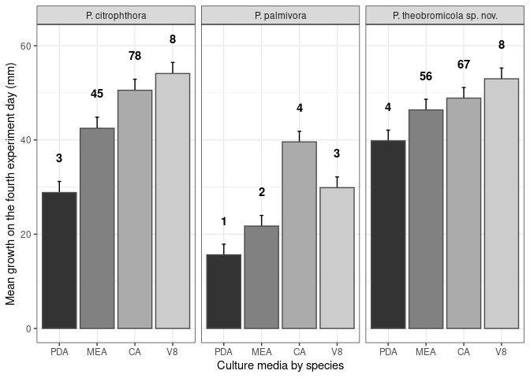

# Exploratory data analysis

## Get raw data


## Plot data profile

<!-- -->

## Plot observed data as a scatterplot


<!-- -->


# Comprobatory data analysis

## Test if essay have some effect on essay


```
## Linear mixed model fit by REML. t-tests use Satterthwaite's method ['lmerModLmerTest']
## Formula: average ~ day:strain:cultureMedia + (1 | essay)
##    Data: dataset
## 
## REML criterion at convergence: 9743.6
## 
## Scaled residuals: 
##     Min      1Q  Median      3Q     Max 
## -3.9421 -0.6048 -0.0574  0.6008  3.2000 
## 
## Random effects:
##  Groups   Name        Variance Std.Dev.
##  essay    (Intercept)  0.5411  0.7356  
##  Residual             13.0373  3.6107  
## Number of obs: 1792, groups:  essay, 2
## 
## Fixed effects:
##                                      Estimate Std. Error        df t value Pr(>|t|)    
## (Intercept)                            4.5496     0.5541    1.2141    8.21   0.0519 .  
## day:strainCCUB 1091:cultureMediaCA    11.2629     0.1145 1754.0391   98.40   <2e-16 ***
## day:strainCCUB 1102:cultureMediaCA     9.0777     0.1145 1754.0391   79.31   <2e-16 ***
## day:strainCCUB 1151:cultureMediaCA    11.3170     0.1145 1754.0391   98.88   <2e-16 ***
## day:strainCCUB 1158:cultureMediaCA     9.1482     0.1145 1754.0391   79.93   <2e-16 ***
## day:strainCCUB 1205:cultureMediaCA    11.0773     0.1145 1754.0391   96.78   <2e-16 ***
## day:strainCCUB 1285:cultureMediaCA    10.7706     0.1145 1754.0391   94.10   <2e-16 ***
## day:strainCCUB 906:cultureMediaCA      8.4300     0.1145 1754.0391   73.65   <2e-16 ***
## day:strainCCUB 920:cultureMediaCA      8.4833     0.1145 1754.0391   74.12   <2e-16 ***
## day:strainP0479:cultureMediaCA        11.5230     0.1145 1754.0391  100.67   <2e-16 ***
## day:strainCCUB 1091:cultureMediaMEA    9.6029     0.1145 1754.0391   83.90   <2e-16 ***
## day:strainCCUB 1102:cultureMediaMEA    4.5380     0.1145 1754.0391   39.65   <2e-16 ***
## day:strainCCUB 1151:cultureMediaMEA   10.5851     0.1145 1754.0391   92.48   <2e-16 ***
## day:strainCCUB 1158:cultureMediaMEA    4.9851     0.1145 1754.0391   43.55   <2e-16 ***
## day:strainCCUB 1205:cultureMediaMEA   10.9018     0.1145 1754.0391   95.25   <2e-16 ***
## day:strainCCUB 1285:cultureMediaMEA   10.8378     0.1145 1754.0391   94.69   <2e-16 ***
## day:strainCCUB 906:cultureMediaMEA     4.5892     0.1145 1754.0391   40.09   <2e-16 ***
## day:strainCCUB 920:cultureMediaMEA     3.1605     0.1145 1754.0391   27.61   <2e-16 ***
## day:strainP0479:cultureMediaMEA        9.5068     0.1145 1754.0391   83.06   <2e-16 ***
## day:strainCCUB 1091:cultureMediaPDA    8.4836     0.1145 1754.0391   74.12   <2e-16 ***
## day:strainCCUB 1102:cultureMediaPDA    2.4886     0.1145 1754.0391   21.74   <2e-16 ***
## day:strainCCUB 1151:cultureMediaPDA    9.2394     0.1145 1754.0391   80.72   <2e-16 ***
## day:strainCCUB 1158:cultureMediaPDA    2.7799     0.1145 1754.0391   24.29   <2e-16 ***
## day:strainCCUB 1205:cultureMediaPDA    8.5950     0.1145 1754.0391   75.09   <2e-16 ***
## day:strainCCUB 1285:cultureMediaPDA    9.0532     0.1145 1754.0391   79.10   <2e-16 ***
## day:strainCCUB 906:cultureMediaPDA     3.5689     0.1145 1754.0391   31.18   <2e-16 ***
## day:strainCCUB 920:cultureMediaPDA     2.3338     0.1145 1754.0391   20.39   <2e-16 ***
## day:strainP0479:cultureMediaPDA        6.0964     0.1145 1754.0391   53.26   <2e-16 ***
## day:strainCCUB 1091:cultureMediaV8    12.0198     0.1580 1754.7580   76.05   <2e-16 ***
## day:strainCCUB 1102:cultureMediaV8     6.2209     0.1580 1754.7580   39.36   <2e-16 ***
## day:strainCCUB 1151:cultureMediaV8    12.1680     0.1580 1754.7580   76.99   <2e-16 ***
## day:strainCCUB 1158:cultureMediaV8     7.4583     0.1580 1754.7580   47.19   <2e-16 ***
## day:strainCCUB 1205:cultureMediaV8    12.3726     0.1580 1754.7580   78.29   <2e-16 ***
## day:strainCCUB 1285:cultureMediaV8    12.3756     0.1580 1754.7580   78.31   <2e-16 ***
## day:strainCCUB 906:cultureMediaV8      6.1953     0.1580 1754.7580   39.20   <2e-16 ***
## day:strainCCUB 920:cultureMediaV8      5.9546     0.1580 1754.7580   37.68   <2e-16 ***
## day:strainP0479:cultureMediaV8        12.4107     0.1145 1754.0391  108.43   <2e-16 ***
## ---
## Signif. codes:  0 '***' 0.001 '**' 0.01 '*' 0.05 '.' 0.1 ' ' 1
```

### How much the essay is important to explain about the total variance?


```
## [1] "Variance: 3.9850104069 %"
```

## Test if replicate have some effect on essay


```
## Linear mixed model fit by REML. t-tests use Satterthwaite's method ['lmerModLmerTest']
## Formula: average ~ day:strain:cultureMedia + (1 | replicate)
##    Data: dataset
## 
## REML criterion at convergence: 9773.1
## 
## Scaled residuals: 
##     Min      1Q  Median      3Q     Max 
## -4.0458 -0.6285 -0.0677  0.6707  3.1090 
## 
## Random effects:
##  Groups    Name        Variance  Std.Dev. 
##  replicate (Intercept) 6.598e-17 8.123e-09
##  Residual              1.329e+01 3.645e+00
## Number of obs: 1792, groups:  replicate, 4
## 
## Fixed effects:
##                                      Estimate Std. Error        df t value Pr(>|t|)    
## (Intercept)                            4.4855     0.1925 1755.0000   23.30   <2e-16 ***
## day:strainCCUB 1091:cultureMediaCA    11.2757     0.1155 1755.0000   97.61   <2e-16 ***
## day:strainCCUB 1102:cultureMediaCA     9.0906     0.1155 1755.0000   78.69   <2e-16 ***
## day:strainCCUB 1151:cultureMediaCA    11.3298     0.1155 1755.0000   98.08   <2e-16 ***
## day:strainCCUB 1158:cultureMediaCA     9.1610     0.1155 1755.0000   79.30   <2e-16 ***
## day:strainCCUB 1205:cultureMediaCA    11.0902     0.1155 1755.0000   96.00   <2e-16 ***
## day:strainCCUB 1285:cultureMediaCA    10.7834     0.1155 1755.0000   93.35   <2e-16 ***
## day:strainCCUB 906:cultureMediaCA      8.4428     0.1155 1755.0000   73.09   <2e-16 ***
## day:strainCCUB 920:cultureMediaCA      8.4962     0.1155 1755.0000   73.55   <2e-16 ***
## day:strainP0479:cultureMediaCA        11.5358     0.1155 1755.0000   99.86   <2e-16 ***
## day:strainCCUB 1091:cultureMediaMEA    9.6157     0.1155 1755.0000   83.24   <2e-16 ***
## day:strainCCUB 1102:cultureMediaMEA    4.5508     0.1155 1755.0000   39.40   <2e-16 ***
## day:strainCCUB 1151:cultureMediaMEA   10.5979     0.1155 1755.0000   91.74   <2e-16 ***
## day:strainCCUB 1158:cultureMediaMEA    4.9979     0.1155 1755.0000   43.27   <2e-16 ***
## day:strainCCUB 1205:cultureMediaMEA   10.9146     0.1155 1755.0000   94.48   <2e-16 ***
## day:strainCCUB 1285:cultureMediaMEA   10.8506     0.1155 1755.0000   93.93   <2e-16 ***
## day:strainCCUB 906:cultureMediaMEA     4.6020     0.1155 1755.0000   39.84   <2e-16 ***
## day:strainCCUB 920:cultureMediaMEA     3.1733     0.1155 1755.0000   27.47   <2e-16 ***
## day:strainP0479:cultureMediaMEA        9.5196     0.1155 1755.0000   82.41   <2e-16 ***
## day:strainCCUB 1091:cultureMediaPDA    8.4964     0.1155 1755.0000   73.55   <2e-16 ***
## day:strainCCUB 1102:cultureMediaPDA    2.5014     0.1155 1755.0000   21.65   <2e-16 ***
## day:strainCCUB 1151:cultureMediaPDA    9.2523     0.1155 1755.0000   80.09   <2e-16 ***
## day:strainCCUB 1158:cultureMediaPDA    2.7928     0.1155 1755.0000   24.18   <2e-16 ***
## day:strainCCUB 1205:cultureMediaPDA    8.6078     0.1155 1755.0000   74.52   <2e-16 ***
## day:strainCCUB 1285:cultureMediaPDA    9.0660     0.1155 1755.0000   78.48   <2e-16 ***
## day:strainCCUB 906:cultureMediaPDA     3.5817     0.1155 1755.0000   31.00   <2e-16 ***
## day:strainCCUB 920:cultureMediaPDA     2.3466     0.1155 1755.0000   20.31   <2e-16 ***
## day:strainP0479:cultureMediaPDA        6.1092     0.1155 1755.0000   52.89   <2e-16 ***
## day:strainCCUB 1091:cultureMediaV8    11.9301     0.1588 1755.0000   75.14   <2e-16 ***
## day:strainCCUB 1102:cultureMediaV8     6.1312     0.1588 1755.0000   38.62   <2e-16 ***
## day:strainCCUB 1151:cultureMediaV8    12.0783     0.1588 1755.0000   76.08   <2e-16 ***
## day:strainCCUB 1158:cultureMediaV8     7.3686     0.1588 1755.0000   46.41   <2e-16 ***
## day:strainCCUB 1205:cultureMediaV8    12.2829     0.1588 1755.0000   77.37   <2e-16 ***
## day:strainCCUB 1285:cultureMediaV8    12.2859     0.1588 1755.0000   77.39   <2e-16 ***
## day:strainCCUB 906:cultureMediaV8      6.1056     0.1588 1755.0000   38.46   <2e-16 ***
## day:strainCCUB 920:cultureMediaV8      5.8649     0.1588 1755.0000   36.94   <2e-16 ***
## day:strainP0479:cultureMediaV8        12.4235     0.1155 1755.0000  107.55   <2e-16 ***
## ---
## Signif. codes:  0 '***' 0.001 '**' 0.01 '*' 0.05 '.' 0.1 ' ' 1
## convergence code: 0
## boundary (singular) fit: see ?isSingular
```

### How much the replicate is important to explain about the total variance?


```
## [1] "Variance: 0 %"
```

## Generate model with strain as predictor


```
## Linear mixed model fit by maximum likelihood . t-tests use Satterthwaite's method ['lmerModLmerTest']
## Formula: average ~ day:code:cultureMedia + (1 | day/strain/cultureMedia)
##    Data: dataset
## 
##      AIC      BIC   logLik deviance df.resid 
##   9339.4   9564.5  -4628.7   9257.4     1751 
## 
## Scaled residuals: 
##     Min      1Q  Median      3Q     Max 
## -4.9707 -0.6296 -0.0444  0.6666  3.3786 
## 
## Random effects:
##  Groups                    Name        Variance Std.Dev.
##  cultureMedia:(strain:day) (Intercept) 2.4503   1.5653  
##  strain:day                (Intercept) 0.3891   0.6238  
##  day                       (Intercept) 2.1151   1.4543  
##  Residual                              8.5968   2.9320  
## Number of obs: 1792, groups:  cultureMedia:(strain:day), 252; strain:day, 63; day, 7
## 
## Fixed effects:
##                                                               Estimate Std. Error      df t value Pr(>|t|)    
## (Intercept)                                                     4.3192     1.2710  6.9982   3.398   0.0115 *  
## day:codeP. citrophthora | P0479:cultureMediaCA                 11.5690     0.3282 12.3649  35.255 8.78e-14 ***
## day:codeP. palmivora | CCUB 1102:cultureMediaCA                 9.1238     0.3282 12.3649  27.804 1.60e-12 ***
## day:codeP. palmivora | CCUB 1158:cultureMediaCA                 9.1943     0.3282 12.3649  28.019 1.46e-12 ***
## day:codeP. palmivora | CCUB 906:cultureMediaCA                  8.4761     0.3282 12.3649  25.830 3.92e-12 ***
## day:codeP. palmivora | CCUB 920:cultureMediaCA                  8.5294     0.3282 12.3649  25.992 3.63e-12 ***
## day:codeP. theobromicola sp. nov. | CCUB 1091:cultureMediaCA   11.3090     0.3282 12.3649  34.463 1.16e-13 ***
## day:codeP. theobromicola sp. nov. | CCUB 1151:cultureMediaCA   11.3631     0.3282 12.3649  34.628 1.09e-13 ***
## day:codeP. theobromicola sp. nov. | CCUB 1205:cultureMediaCA   11.1234     0.3282 12.3649  33.897 1.42e-13 ***
## day:codeP. theobromicola sp. nov. | CCUB 1285:cultureMediaCA   10.8166     0.3282 12.3649  32.962 2.00e-13 ***
## day:codeP. citrophthora | P0479:cultureMediaMEA                 9.5529     0.3282 12.3649  29.111 9.13e-13 ***
## day:codeP. palmivora | CCUB 1102:cultureMediaMEA                4.5841     0.3282 12.3649  13.969 6.11e-09 ***
## day:codeP. palmivora | CCUB 1158:cultureMediaMEA                5.0312     0.3282 12.3649  15.332 2.05e-09 ***
## day:codeP. palmivora | CCUB 906:cultureMediaMEA                 4.6352     0.3282 12.3649  14.125 5.37e-09 ***
## day:codeP. palmivora | CCUB 920:cultureMediaMEA                 3.2066     0.3282 12.3649   9.772 3.58e-07 ***
## day:codeP. theobromicola sp. nov. | CCUB 1091:cultureMediaMEA   9.6490     0.3282 12.3649  29.404 8.08e-13 ***
## day:codeP. theobromicola sp. nov. | CCUB 1151:cultureMediaMEA  10.6312     0.3282 12.3649  32.397 2.47e-13 ***
## day:codeP. theobromicola sp. nov. | CCUB 1205:cultureMediaMEA  10.9478     0.3282 12.3649  33.362 1.73e-13 ***
## day:codeP. theobromicola sp. nov. | CCUB 1285:cultureMediaMEA  10.8839     0.3282 12.3649  33.167 1.85e-13 ***
## day:codeP. citrophthora | P0479:cultureMediaPDA                 6.1425     0.3282 12.3649  18.719 1.91e-10 ***
## day:codeP. palmivora | CCUB 1102:cultureMediaPDA                2.5347     0.3282 12.3649   7.724 4.47e-06 ***
## day:codeP. palmivora | CCUB 1158:cultureMediaPDA                2.8260     0.3282 12.3649   8.612 1.42e-06 ***
## day:codeP. palmivora | CCUB 906:cultureMediaPDA                 3.6150     0.3282 12.3649  11.016 9.38e-08 ***
## day:codeP. palmivora | CCUB 920:cultureMediaPDA                 2.3799     0.3282 12.3649   7.252 8.55e-06 ***
## day:codeP. theobromicola sp. nov. | CCUB 1091:cultureMediaPDA   8.5297     0.3282 12.3649  25.993 3.63e-12 ***
## day:codeP. theobromicola sp. nov. | CCUB 1151:cultureMediaPDA   9.2855     0.3282 12.3649  28.297 1.29e-12 ***
## day:codeP. theobromicola sp. nov. | CCUB 1205:cultureMediaPDA   8.6411     0.3282 12.3649  26.333 3.10e-12 ***
## day:codeP. theobromicola sp. nov. | CCUB 1285:cultureMediaPDA   9.0992     0.3282 12.3649  27.729 1.65e-12 ***
## day:codeP. citrophthora | P0479:cultureMediaV8                 12.4568     0.3282 12.3649  37.961 3.55e-14 ***
## day:codeP. palmivora | CCUB 1102:cultureMediaV8                 6.1645     0.3396 14.1919  18.150 3.20e-11 ***
## day:codeP. palmivora | CCUB 1158:cultureMediaV8                 7.4019     0.3396 14.1919  21.793 2.60e-12 ***
## day:codeP. palmivora | CCUB 906:cultureMediaV8                  6.1388     0.3396 14.1919  18.074 3.39e-11 ***
## day:codeP. palmivora | CCUB 920:cultureMediaV8                  5.8982     0.3396 14.1919  17.366 5.84e-11 ***
## day:codeP. theobromicola sp. nov. | CCUB 1091:cultureMediaV8   11.9633     0.3396 14.1919  35.223 3.22e-15 ***
## day:codeP. theobromicola sp. nov. | CCUB 1151:cultureMediaV8   12.1116     0.3396 14.1919  35.660 2.71e-15 ***
## day:codeP. theobromicola sp. nov. | CCUB 1205:cultureMediaV8   12.3162     0.3396 14.1919  36.262 2.14e-15 ***
## day:codeP. theobromicola sp. nov. | CCUB 1285:cultureMediaV8   12.3192     0.3396 14.1919  36.271 2.13e-15 ***
## ---
## Signif. codes:  0 '***' 0.001 '**' 0.01 '*' 0.05 '.' 0.1 ' ' 1
```

```
## 
## Correlation matrix not shown by default, as p = 37 > 12.
## Use print(x, correlation=TRUE)  or
##     vcov(x)        if you need it
```

### How much the target effects are important to explain about the total variance?


```
## [1] "Variance cultureMedia:(strain:day): 22.1802613261 %"
```

```
## [1] "Variance strain:day: 4.3303761993 %"
```

```
## [1] "Variance day: 19.7453283585 %"
```

### Plot final model adjust

<!-- --><!-- -->

### Test significance of fixed effects

<div data-pagedtable="false">
  <script data-pagedtable-source type="application/json">
{"columns":[{"label":[""],"name":["_rn_"],"type":[""],"align":["left"]},{"label":["Sum Sq"],"name":[1],"type":["dbl"],"align":["right"]},{"label":["Mean Sq"],"name":[2],"type":["dbl"],"align":["right"]},{"label":["NumDF"],"name":[3],"type":["int"],"align":["right"]},{"label":["DenDF"],"name":[4],"type":["dbl"],"align":["right"]},{"label":["F value"],"name":[5],"type":["dbl"],"align":["right"]},{"label":["Pr(>F)"],"name":[6],"type":["dbl"],"align":["right"]}],"data":[{"1":"100506.5","2":"2791.848","3":"36","4":"79.14637","5":"324.7539","6":"1.159181e-72","_rn_":"day:code:cultureMedia"}],"options":{"columns":{"min":{},"max":[10]},"rows":{"min":[10],"max":[10]},"pages":{}}}
  </script>
</div>

### Test significance of random effects

<div data-pagedtable="false">
  <script data-pagedtable-source type="application/json">
{"columns":[{"label":[""],"name":["_rn_"],"type":[""],"align":["left"]},{"label":["npar"],"name":[1],"type":["int"],"align":["right"]},{"label":["logLik"],"name":[2],"type":["dbl"],"align":["right"]},{"label":["AIC"],"name":[3],"type":["dbl"],"align":["right"]},{"label":["LRT"],"name":[4],"type":["dbl"],"align":["right"]},{"label":["Df"],"name":[5],"type":["dbl"],"align":["right"]},{"label":["Pr(>Chisq)"],"name":[6],"type":["dbl"],"align":["right"]}],"data":[{"1":"41","2":"-4628.695","3":"9339.391","4":"NA","5":"NA","6":"NA","_rn_":"<none>"},{"1":"40","2":"-4681.542","3":"9443.083","4":"105.692246","5":"1","6":"8.612373e-25","_rn_":"(1 | cultureMedia:(strain:day))"},{"1":"40","2":"-4630.117","3":"9340.235","4":"2.843736","5":"1","6":"9.173073e-02","_rn_":"(1 | strain:day)"},{"1":"40","2":"-4649.211","3":"9378.421","4":"41.030411","5":"1","6":"1.498788e-10","_rn_":"(1 | day)"}],"options":{"columns":{"min":{},"max":[10]},"rows":{"min":[10],"max":[10]},"pages":{}}}
  </script>
</div>

### Plot a residual histogram

<!-- -->

### Get general adjust of final model

<!-- -->

### Plot a scatter for observed vs predicted values

<!-- -->

### Generate pairwise comparisons

<div data-pagedtable="false">
  <script data-pagedtable-source type="application/json">
{"columns":[{"label":[""],"name":["_rn_"],"type":[""],"align":["left"]},{"label":["contrast"],"name":[1],"type":["fctr"],"align":["left"]},{"label":["estimate"],"name":[2],"type":["dbl"],"align":["right"]},{"label":["SE"],"name":[3],"type":["dbl"],"align":["right"]},{"label":["df"],"name":[4],"type":["dbl"],"align":["right"]},{"label":["t.ratio"],"name":[5],"type":["dbl"],"align":["right"]},{"label":["p.value"],"name":[6],"type":["dbl"],"align":["right"]}],"data":[{"1":"P. citrophthora | P0479 CA 4 - P. palmivora | CCUB 1102 CA 4","2":"9.78082143","3":"1.0359129","4":"265.5601","5":"9.441741e+00","6":"5.513368e-13","_rn_":"1"},{"1":"P. citrophthora | P0479 CA 4 - P. palmivora | CCUB 1158 CA 4","2":"9.49891071","3":"1.0359129","4":"265.5601","5":"9.169604e+00","6":"5.470069e-13","_rn_":"2"},{"1":"P. citrophthora | P0479 CA 4 - P. palmivora | CCUB 906 CA 4","2":"12.37178571","3":"1.0359129","4":"265.5601","5":"1.194288e+01","6":"2.270406e-13","_rn_":"3"},{"1":"P. citrophthora | P0479 CA 4 - P. palmivora | CCUB 920 CA 4","2":"12.15844643","3":"1.0359129","4":"265.5601","5":"1.173694e+01","6":"2.474687e-13","_rn_":"4"},{"1":"P. citrophthora | P0479 CA 4 - P. theobromicola sp. nov. | CCUB 1091 CA 4","2":"1.04010714","3":"1.0359129","4":"265.5601","5":"1.004049e+00","6":"1.000000e+00","_rn_":"5"},{"1":"P. citrophthora | P0479 CA 4 - P. theobromicola sp. nov. | CCUB 1151 CA 4","2":"0.82389286","3":"1.0359129","4":"265.5601","5":"7.953303e-01","6":"1.000000e+00","_rn_":"6"},{"1":"P. citrophthora | P0479 CA 4 - P. theobromicola sp. nov. | CCUB 1205 CA 4","2":"1.78246429","3":"1.0359129","4":"265.5601","5":"1.720670e+00","6":"9.992789e-01","_rn_":"7"},{"1":"P. citrophthora | P0479 CA 4 - P. theobromicola sp. nov. | CCUB 1285 CA 4","2":"3.00957143","3":"1.0359129","4":"265.5601","5":"2.905236e+00","6":"5.504602e-01","_rn_":"8"},{"1":"P. citrophthora | P0479 CA 4 - P. citrophthora | P0479 MEA 4","2":"8.06450000","3":"0.9852545","4":"215.3264","5":"8.185195e+00","6":"1.528455e-11","_rn_":"9"},{"1":"P. citrophthora | P0479 CA 4 - P. palmivora | CCUB 1102 MEA 4","2":"27.93975000","3":"1.0359129","4":"265.5601","5":"2.697114e+01","6":"2.083889e-13","_rn_":"10"},{"1":"P. citrophthora | P0479 CA 4 - P. palmivora | CCUB 1158 MEA 4","2":"26.15139286","3":"1.0359129","4":"265.5601","5":"2.524478e+01","6":"2.083889e-13","_rn_":"11"},{"1":"P. citrophthora | P0479 CA 4 - P. palmivora | CCUB 906 MEA 4","2":"27.73519643","3":"1.0359129","4":"265.5601","5":"2.677368e+01","6":"2.083889e-13","_rn_":"12"},{"1":"P. citrophthora | P0479 CA 4 - P. palmivora | CCUB 920 MEA 4","2":"33.44992857","3":"1.0359129","4":"265.5601","5":"3.229029e+01","6":"2.083889e-13","_rn_":"13"},{"1":"P. citrophthora | P0479 CA 4 - P. theobromicola sp. nov. | CCUB 1091 MEA 4","2":"7.68032143","3":"1.0359129","4":"265.5601","5":"7.414061e+00","6":"1.033689e-09","_rn_":"14"},{"1":"P. citrophthora | P0479 CA 4 - P. theobromicola sp. nov. | CCUB 1151 MEA 4","2":"3.75148214","3":"1.0359129","4":"265.5601","5":"3.621426e+00","6":"1.120270e-01","_rn_":"15"},{"1":"P. citrophthora | P0479 CA 4 - P. theobromicola sp. nov. | CCUB 1205 MEA 4","2":"2.48478571","3":"1.0359129","4":"265.5601","5":"2.398644e+00","6":"8.987645e-01","_rn_":"16"},{"1":"P. citrophthora | P0479 CA 4 - P. theobromicola sp. nov. | CCUB 1285 MEA 4","2":"2.74053571","3":"1.0359129","4":"265.5601","5":"2.645527e+00","6":"7.550692e-01","_rn_":"17"},{"1":"P. citrophthora | P0479 CA 4 - P. citrophthora | P0479 PDA 4","2":"21.70612500","3":"0.9852545","4":"215.3264","5":"2.203098e+01","6":"2.786660e-14","_rn_":"18"},{"1":"P. citrophthora | P0479 CA 4 - P. palmivora | CCUB 1102 PDA 4","2":"36.13737500","3":"1.0359129","4":"265.5601","5":"3.488457e+01","6":"2.083889e-13","_rn_":"19"},{"1":"P. citrophthora | P0479 CA 4 - P. palmivora | CCUB 1158 PDA 4","2":"34.97205357","3":"1.0359129","4":"265.5601","5":"3.375965e+01","6":"2.083889e-13","_rn_":"20"},{"1":"P. citrophthora | P0479 CA 4 - P. palmivora | CCUB 906 PDA 4","2":"31.81632143","3":"1.0359129","4":"265.5601","5":"3.071332e+01","6":"2.083889e-13","_rn_":"21"},{"1":"P. citrophthora | P0479 CA 4 - P. palmivora | CCUB 920 PDA 4","2":"36.75671429","3":"1.0359129","4":"265.5601","5":"3.548244e+01","6":"2.083889e-13","_rn_":"22"},{"1":"P. citrophthora | P0479 CA 4 - P. theobromicola sp. nov. | CCUB 1091 PDA 4","2":"12.15744643","3":"1.0359129","4":"265.5601","5":"1.173597e+01","6":"2.476908e-13","_rn_":"23"},{"1":"P. citrophthora | P0479 CA 4 - P. theobromicola sp. nov. | CCUB 1151 PDA 4","2":"9.13401786","3":"1.0359129","4":"265.5601","5":"8.817361e+00","6":"6.449286e-13","_rn_":"24"},{"1":"P. citrophthora | P0479 CA 4 - P. theobromicola sp. nov. | CCUB 1205 PDA 4","2":"11.71167857","3":"1.0359129","4":"265.5601","5":"1.130566e+01","6":"3.318457e-13","_rn_":"25"},{"1":"P. citrophthora | P0479 CA 4 - P. theobromicola sp. nov. | CCUB 1285 PDA 4","2":"9.87917857","3":"1.0359129","4":"265.5601","5":"9.536689e+00","6":"5.613288e-13","_rn_":"26"},{"1":"P. citrophthora | P0479 CA 4 - P. citrophthora | P0479 V8 4","2":"-3.55100000","3":"0.9852545","4":"215.3264","5":"-3.604145e+00","6":"1.201926e-01","_rn_":"27"},{"1":"P. citrophthora | P0479 CA 4 - P. palmivora | CCUB 1102 V8 4","2":"21.61828571","3":"1.0934117","4":"319.0620","5":"1.977141e+01","6":"9.697798e-13","_rn_":"28"},{"1":"P. citrophthora | P0479 CA 4 - P. palmivora | CCUB 1158 V8 4","2":"16.66871429","3":"1.0934117","4":"319.0620","5":"1.524468e+01","6":"9.697798e-13","_rn_":"29"},{"1":"P. citrophthora | P0479 CA 4 - P. palmivora | CCUB 906 V8 4","2":"21.72078571","3":"1.0934117","4":"319.0620","5":"1.986515e+01","6":"9.697798e-13","_rn_":"30"},{"1":"P. citrophthora | P0479 CA 4 - P. palmivora | CCUB 920 V8 4","2":"22.68353571","3":"1.0934117","4":"319.0620","5":"2.074565e+01","6":"9.697798e-13","_rn_":"31"},{"1":"P. citrophthora | P0479 CA 4 - P. theobromicola sp. nov. | CCUB 1091 V8 4","2":"-1.57717857","3":"1.0934117","4":"319.0620","5":"-1.442438e+00","6":"9.999839e-01","_rn_":"32"},{"1":"P. citrophthora | P0479 CA 4 - P. theobromicola sp. nov. | CCUB 1151 V8 4","2":"-2.17017857","3":"1.0934117","4":"319.0620","5":"-1.984777e+00","6":"9.915907e-01","_rn_":"33"},{"1":"P. citrophthora | P0479 CA 4 - P. theobromicola sp. nov. | CCUB 1205 V8 4","2":"-2.98871429","3":"1.0934117","4":"319.0620","5":"-2.733384e+00","6":"6.898754e-01","_rn_":"34"},{"1":"P. citrophthora | P0479 CA 4 - P. theobromicola sp. nov. | CCUB 1285 V8 4","2":"-3.00064286","3":"1.0934117","4":"319.0620","5":"-2.744294e+00","6":"6.813249e-01","_rn_":"35"},{"1":"P. palmivora | CCUB 1102 CA 4 - P. palmivora | CCUB 1158 CA 4","2":"-0.28191071","3":"1.0359129","4":"265.6038","5":"-2.721375e-01","6":"1.000000e+00","_rn_":"36"},{"1":"P. palmivora | CCUB 1102 CA 4 - P. palmivora | CCUB 906 CA 4","2":"2.59096429","3":"1.0359129","4":"265.6038","5":"2.501141e+00","6":"8.475365e-01","_rn_":"37"},{"1":"P. palmivora | CCUB 1102 CA 4 - P. palmivora | CCUB 920 CA 4","2":"2.37762500","3":"1.0359129","4":"265.6038","5":"2.295198e+00","6":"9.376046e-01","_rn_":"38"},{"1":"P. palmivora | CCUB 1102 CA 4 - P. theobromicola sp. nov. | CCUB 1091 CA 4","2":"-8.74071429","3":"1.0359129","4":"265.6038","5":"-8.437693e+00","6":"1.972200e-12","_rn_":"39"},{"1":"P. palmivora | CCUB 1102 CA 4 - P. theobromicola sp. nov. | CCUB 1151 CA 4","2":"-8.95692857","3":"1.0359129","4":"265.6038","5":"-8.646411e+00","6":"9.594547e-13","_rn_":"40"},{"1":"P. palmivora | CCUB 1102 CA 4 - P. theobromicola sp. nov. | CCUB 1205 CA 4","2":"-7.99835714","3":"1.0359129","4":"265.6038","5":"-7.721071e+00","6":"1.487146e-10","_rn_":"41"},{"1":"P. palmivora | CCUB 1102 CA 4 - P. theobromicola sp. nov. | CCUB 1285 CA 4","2":"-6.77125000","3":"1.0359129","4":"265.6038","5":"-6.536505e+00","6":"1.994763e-07","_rn_":"42"},{"1":"P. palmivora | CCUB 1102 CA 4 - P. citrophthora | P0479 MEA 4","2":"-1.71632143","3":"1.0359129","4":"265.5601","5":"-1.656820e+00","6":"9.996566e-01","_rn_":"43"},{"1":"P. palmivora | CCUB 1102 CA 4 - P. palmivora | CCUB 1102 MEA 4","2":"18.15892857","3":"0.9852545","4":"215.3264","5":"1.843070e+01","6":"2.786660e-14","_rn_":"44"},{"1":"P. palmivora | CCUB 1102 CA 4 - P. palmivora | CCUB 1158 MEA 4","2":"16.37057143","3":"1.0359129","4":"265.6038","5":"1.580304e+01","6":"2.816636e-13","_rn_":"45"},{"1":"P. palmivora | CCUB 1102 CA 4 - P. palmivora | CCUB 906 MEA 4","2":"17.95437500","3":"1.0359129","4":"265.6038","5":"1.733194e+01","6":"2.816636e-13","_rn_":"46"},{"1":"P. palmivora | CCUB 1102 CA 4 - P. palmivora | CCUB 920 MEA 4","2":"23.66910714","3":"1.0359129","4":"265.6038","5":"2.284855e+01","6":"2.816636e-13","_rn_":"47"},{"1":"P. palmivora | CCUB 1102 CA 4 - P. theobromicola sp. nov. | CCUB 1091 MEA 4","2":"-2.10050000","3":"1.0359129","4":"265.6038","5":"-2.027680e+00","6":"9.880009e-01","_rn_":"48"},{"1":"P. palmivora | CCUB 1102 CA 4 - P. theobromicola sp. nov. | CCUB 1151 MEA 4","2":"-6.02933929","3":"1.0359129","4":"265.6038","5":"-5.820315e+00","6":"1.024450e-05","_rn_":"49"},{"1":"P. palmivora | CCUB 1102 CA 4 - P. theobromicola sp. nov. | CCUB 1205 MEA 4","2":"-7.29603571","3":"1.0359129","4":"265.6038","5":"-7.043098e+00","6":"1.008964e-08","_rn_":"50"},{"1":"P. palmivora | CCUB 1102 CA 4 - P. theobromicola sp. nov. | CCUB 1285 MEA 4","2":"-7.04028571","3":"1.0359129","4":"265.6038","5":"-6.796214e+00","6":"4.403638e-08","_rn_":"51"},{"1":"P. palmivora | CCUB 1102 CA 4 - P. citrophthora | P0479 PDA 4","2":"11.92530357","3":"1.0359129","4":"265.5601","5":"1.151188e+01","6":"2.852163e-13","_rn_":"52"},{"1":"P. palmivora | CCUB 1102 CA 4 - P. palmivora | CCUB 1102 PDA 4","2":"26.35655357","3":"0.9852545","4":"215.3264","5":"2.675101e+01","6":"2.786660e-14","_rn_":"53"},{"1":"P. palmivora | CCUB 1102 CA 4 - P. palmivora | CCUB 1158 PDA 4","2":"25.19123214","3":"1.0359129","4":"265.6038","5":"2.431791e+01","6":"2.816636e-13","_rn_":"54"},{"1":"P. palmivora | CCUB 1102 CA 4 - P. palmivora | CCUB 906 PDA 4","2":"22.03550000","3":"1.0359129","4":"265.6038","5":"2.127158e+01","6":"2.816636e-13","_rn_":"55"},{"1":"P. palmivora | CCUB 1102 CA 4 - P. palmivora | CCUB 920 PDA 4","2":"26.97589286","3":"1.0359129","4":"265.6038","5":"2.604070e+01","6":"2.816636e-13","_rn_":"56"},{"1":"P. palmivora | CCUB 1102 CA 4 - P. theobromicola sp. nov. | CCUB 1091 PDA 4","2":"2.37662500","3":"1.0359129","4":"265.6038","5":"2.294233e+00","6":"9.379083e-01","_rn_":"57"},{"1":"P. palmivora | CCUB 1102 CA 4 - P. theobromicola sp. nov. | CCUB 1151 PDA 4","2":"-0.64680357","3":"1.0359129","4":"265.6038","5":"-6.243803e-01","6":"1.000000e+00","_rn_":"58"},{"1":"P. palmivora | CCUB 1102 CA 4 - P. theobromicola sp. nov. | CCUB 1205 PDA 4","2":"1.93085714","3":"1.0359129","4":"265.6038","5":"1.863918e+00","6":"9.969095e-01","_rn_":"59"},{"1":"P. palmivora | CCUB 1102 CA 4 - P. theobromicola sp. nov. | CCUB 1285 PDA 4","2":"0.09835714","3":"1.0359129","4":"265.6038","5":"9.494731e-02","6":"1.000000e+00","_rn_":"60"},{"1":"P. palmivora | CCUB 1102 CA 4 - P. citrophthora | P0479 V8 4","2":"-13.33182143","3":"1.0359129","4":"265.5601","5":"-1.286964e+01","6":"2.086109e-13","_rn_":"61"},{"1":"P. palmivora | CCUB 1102 CA 4 - P. palmivora | CCUB 1102 V8 4","2":"11.83746429","3":"1.0455430","4":"262.4641","5":"1.132183e+01","6":"2.969847e-13","_rn_":"62"},{"1":"P. palmivora | CCUB 1102 CA 4 - P. palmivora | CCUB 1158 V8 4","2":"6.88789286","3":"1.0934117","4":"319.1220","5":"6.299451e+00","6":"6.139383e-07","_rn_":"63"},{"1":"P. palmivora | CCUB 1102 CA 4 - P. palmivora | CCUB 906 V8 4","2":"11.93996429","3":"1.0934117","4":"319.1220","5":"1.091992e+01","6":"1.203704e-12","_rn_":"64"},{"1":"P. palmivora | CCUB 1102 CA 4 - P. palmivora | CCUB 920 V8 4","2":"12.90271429","3":"1.0934117","4":"319.1220","5":"1.180042e+01","6":"1.005862e-12","_rn_":"65"},{"1":"P. palmivora | CCUB 1102 CA 4 - P. theobromicola sp. nov. | CCUB 1091 V8 4","2":"-11.35800000","3":"1.0934117","4":"319.1220","5":"-1.038767e+01","6":"1.303180e-12","_rn_":"66"},{"1":"P. palmivora | CCUB 1102 CA 4 - P. theobromicola sp. nov. | CCUB 1151 V8 4","2":"-11.95100000","3":"1.0934117","4":"319.1220","5":"-1.093001e+01","6":"1.204370e-12","_rn_":"67"},{"1":"P. palmivora | CCUB 1102 CA 4 - P. theobromicola sp. nov. | CCUB 1205 V8 4","2":"-12.76953571","3":"1.0934117","4":"319.1220","5":"-1.167862e+01","6":"1.015410e-12","_rn_":"68"},{"1":"P. palmivora | CCUB 1102 CA 4 - P. theobromicola sp. nov. | CCUB 1285 V8 4","2":"-12.78146429","3":"1.0934117","4":"319.1220","5":"-1.168953e+01","6":"1.013634e-12","_rn_":"69"},{"1":"P. palmivora | CCUB 1158 CA 4 - P. palmivora | CCUB 906 CA 4","2":"2.87287500","3":"1.0359129","4":"265.6038","5":"2.773279e+00","6":"6.580776e-01","_rn_":"70"},{"1":"P. palmivora | CCUB 1158 CA 4 - P. palmivora | CCUB 920 CA 4","2":"2.65953571","3":"1.0359129","4":"265.6038","5":"2.567335e+00","6":"8.078715e-01","_rn_":"71"},{"1":"P. palmivora | CCUB 1158 CA 4 - P. theobromicola sp. nov. | CCUB 1091 CA 4","2":"-8.45880357","3":"1.0359129","4":"265.6038","5":"-8.165555e+00","6":"8.838819e-12","_rn_":"72"},{"1":"P. palmivora | CCUB 1158 CA 4 - P. theobromicola sp. nov. | CCUB 1151 CA 4","2":"-8.67501786","3":"1.0359129","4":"265.6038","5":"-8.374274e+00","6":"2.675193e-12","_rn_":"73"},{"1":"P. palmivora | CCUB 1158 CA 4 - P. theobromicola sp. nov. | CCUB 1205 CA 4","2":"-7.71644643","3":"1.0359129","4":"265.6038","5":"-7.448934e+00","6":"8.309706e-10","_rn_":"74"},{"1":"P. palmivora | CCUB 1158 CA 4 - P. theobromicola sp. nov. | CCUB 1285 CA 4","2":"-6.48933929","3":"1.0359129","4":"265.6038","5":"-6.264368e+00","6":"9.280500e-07","_rn_":"75"},{"1":"P. palmivora | CCUB 1158 CA 4 - P. citrophthora | P0479 MEA 4","2":"-1.43441071","3":"1.0359129","4":"265.5601","5":"-1.384683e+00","6":"9.999934e-01","_rn_":"76"},{"1":"P. palmivora | CCUB 1158 CA 4 - P. palmivora | CCUB 1102 MEA 4","2":"18.44083929","3":"1.0359129","4":"265.6038","5":"1.780154e+01","6":"2.816636e-13","_rn_":"77"},{"1":"P. palmivora | CCUB 1158 CA 4 - P. palmivora | CCUB 1158 MEA 4","2":"16.65248214","3":"0.9852545","4":"215.3264","5":"1.690171e+01","6":"2.786660e-14","_rn_":"78"},{"1":"P. palmivora | CCUB 1158 CA 4 - P. palmivora | CCUB 906 MEA 4","2":"18.23628571","3":"1.0359129","4":"265.6038","5":"1.760407e+01","6":"2.816636e-13","_rn_":"79"},{"1":"P. palmivora | CCUB 1158 CA 4 - P. palmivora | CCUB 920 MEA 4","2":"23.95101786","3":"1.0359129","4":"265.6038","5":"2.312069e+01","6":"2.816636e-13","_rn_":"80"},{"1":"P. palmivora | CCUB 1158 CA 4 - P. theobromicola sp. nov. | CCUB 1091 MEA 4","2":"-1.81858929","3":"1.0359129","4":"265.6038","5":"-1.755543e+00","6":"9.989457e-01","_rn_":"81"},{"1":"P. palmivora | CCUB 1158 CA 4 - P. theobromicola sp. nov. | CCUB 1151 MEA 4","2":"-5.74742857","3":"1.0359129","4":"265.6038","5":"-5.548178e+00","6":"4.158300e-05","_rn_":"82"},{"1":"P. palmivora | CCUB 1158 CA 4 - P. theobromicola sp. nov. | CCUB 1205 MEA 4","2":"-7.01412500","3":"1.0359129","4":"265.6038","5":"-6.770960e+00","6":"5.109650e-08","_rn_":"83"},{"1":"P. palmivora | CCUB 1158 CA 4 - P. theobromicola sp. nov. | CCUB 1285 MEA 4","2":"-6.75837500","3":"1.0359129","4":"265.6038","5":"-6.524077e+00","6":"2.142072e-07","_rn_":"84"},{"1":"P. palmivora | CCUB 1158 CA 4 - P. citrophthora | P0479 PDA 4","2":"12.20721429","3":"1.0359129","4":"265.5601","5":"1.178402e+01","6":"2.459144e-13","_rn_":"85"},{"1":"P. palmivora | CCUB 1158 CA 4 - P. palmivora | CCUB 1102 PDA 4","2":"26.63846429","3":"1.0359129","4":"265.6038","5":"2.571497e+01","6":"2.816636e-13","_rn_":"86"},{"1":"P. palmivora | CCUB 1158 CA 4 - P. palmivora | CCUB 1158 PDA 4","2":"25.47314286","3":"0.9852545","4":"215.3264","5":"2.585438e+01","6":"2.786660e-14","_rn_":"87"},{"1":"P. palmivora | CCUB 1158 CA 4 - P. palmivora | CCUB 906 PDA 4","2":"22.31741071","3":"1.0359129","4":"265.6038","5":"2.154371e+01","6":"2.816636e-13","_rn_":"88"},{"1":"P. palmivora | CCUB 1158 CA 4 - P. palmivora | CCUB 920 PDA 4","2":"27.25780357","3":"1.0359129","4":"265.6038","5":"2.631283e+01","6":"2.816636e-13","_rn_":"89"},{"1":"P. palmivora | CCUB 1158 CA 4 - P. theobromicola sp. nov. | CCUB 1091 PDA 4","2":"2.65853571","3":"1.0359129","4":"265.6038","5":"2.566370e+00","6":"8.084848e-01","_rn_":"90"},{"1":"P. palmivora | CCUB 1158 CA 4 - P. theobromicola sp. nov. | CCUB 1151 PDA 4","2":"-0.36489286","3":"1.0359129","4":"265.6038","5":"-3.522428e-01","6":"1.000000e+00","_rn_":"91"},{"1":"P. palmivora | CCUB 1158 CA 4 - P. theobromicola sp. nov. | CCUB 1205 PDA 4","2":"2.21276786","3":"1.0359129","4":"265.6038","5":"2.136056e+00","6":"9.747474e-01","_rn_":"92"},{"1":"P. palmivora | CCUB 1158 CA 4 - P. theobromicola sp. nov. | CCUB 1285 PDA 4","2":"0.38026786","3":"1.0359129","4":"265.6038","5":"3.670848e-01","6":"1.000000e+00","_rn_":"93"},{"1":"P. palmivora | CCUB 1158 CA 4 - P. citrophthora | P0479 V8 4","2":"-13.04991071","3":"1.0359129","4":"265.5601","5":"-1.259750e+01","6":"2.094991e-13","_rn_":"94"},{"1":"P. palmivora | CCUB 1158 CA 4 - P. palmivora | CCUB 1102 V8 4","2":"12.11937500","3":"1.0934117","4":"319.1220","5":"1.108400e+01","6":"1.162181e-12","_rn_":"95"},{"1":"P. palmivora | CCUB 1158 CA 4 - P. palmivora | CCUB 1158 V8 4","2":"7.16980357","3":"1.0455430","4":"262.4641","5":"6.857493e+00","6":"3.129234e-08","_rn_":"96"},{"1":"P. palmivora | CCUB 1158 CA 4 - P. palmivora | CCUB 906 V8 4","2":"12.22187500","3":"1.0934117","4":"319.1220","5":"1.117774e+01","6":"1.131317e-12","_rn_":"97"},{"1":"P. palmivora | CCUB 1158 CA 4 - P. palmivora | CCUB 920 V8 4","2":"13.18462500","3":"1.0934117","4":"319.1220","5":"1.205824e+01","6":"9.876544e-13","_rn_":"98"},{"1":"P. palmivora | CCUB 1158 CA 4 - P. theobromicola sp. nov. | CCUB 1091 V8 4","2":"-11.07608929","3":"1.0934117","4":"319.1220","5":"-1.012984e+01","6":"1.318057e-12","_rn_":"99"},{"1":"P. palmivora | CCUB 1158 CA 4 - P. theobromicola sp. nov. | CCUB 1151 V8 4","2":"-11.66908929","3":"1.0934117","4":"319.1220","5":"-1.067218e+01","6":"1.256995e-12","_rn_":"100"},{"1":"P. palmivora | CCUB 1158 CA 4 - P. theobromicola sp. nov. | CCUB 1205 V8 4","2":"-12.48762500","3":"1.0934117","4":"319.1220","5":"-1.142079e+01","6":"1.064704e-12","_rn_":"101"},{"1":"P. palmivora | CCUB 1158 CA 4 - P. theobromicola sp. nov. | CCUB 1285 V8 4","2":"-12.49955357","3":"1.0934117","4":"319.1220","5":"-1.143170e+01","6":"1.064038e-12","_rn_":"102"},{"1":"P. palmivora | CCUB 906 CA 4 - P. palmivora | CCUB 920 CA 4","2":"-0.21333929","3":"1.0359129","4":"265.6038","5":"-2.059433e-01","6":"1.000000e+00","_rn_":"103"},{"1":"P. palmivora | CCUB 906 CA 4 - P. theobromicola sp. nov. | CCUB 1091 CA 4","2":"-11.33167857","3":"1.0359129","4":"265.6038","5":"-1.093883e+01","6":"4.968248e-13","_rn_":"104"},{"1":"P. palmivora | CCUB 906 CA 4 - P. theobromicola sp. nov. | CCUB 1151 CA 4","2":"-11.54789286","3":"1.0359129","4":"265.6038","5":"-1.114755e+01","6":"4.437561e-13","_rn_":"105"},{"1":"P. palmivora | CCUB 906 CA 4 - P. theobromicola sp. nov. | CCUB 1205 CA 4","2":"-10.58932143","3":"1.0359129","4":"265.6038","5":"-1.022221e+01","6":"6.232792e-13","_rn_":"106"},{"1":"P. palmivora | CCUB 906 CA 4 - P. theobromicola sp. nov. | CCUB 1285 CA 4","2":"-9.36221429","3":"1.0359129","4":"265.6038","5":"-9.037646e+00","6":"6.374901e-13","_rn_":"107"},{"1":"P. palmivora | CCUB 906 CA 4 - P. citrophthora | P0479 MEA 4","2":"-4.30728571","3":"1.0359129","4":"265.5601","5":"-4.157961e+00","6":"1.913511e-02","_rn_":"108"},{"1":"P. palmivora | CCUB 906 CA 4 - P. palmivora | CCUB 1102 MEA 4","2":"15.56796429","3":"1.0359129","4":"265.6038","5":"1.502826e+01","6":"2.816636e-13","_rn_":"109"},{"1":"P. palmivora | CCUB 906 CA 4 - P. palmivora | CCUB 1158 MEA 4","2":"13.77960714","3":"1.0359129","4":"265.6038","5":"1.330190e+01","6":"2.816636e-13","_rn_":"110"},{"1":"P. palmivora | CCUB 906 CA 4 - P. palmivora | CCUB 906 MEA 4","2":"15.36341071","3":"0.9852545","4":"215.3264","5":"1.559334e+01","6":"2.786660e-14","_rn_":"111"},{"1":"P. palmivora | CCUB 906 CA 4 - P. palmivora | CCUB 920 MEA 4","2":"21.07814286","3":"1.0359129","4":"265.6038","5":"2.034741e+01","6":"2.816636e-13","_rn_":"112"},{"1":"P. palmivora | CCUB 906 CA 4 - P. theobromicola sp. nov. | CCUB 1091 MEA 4","2":"-4.69146429","3":"1.0359129","4":"265.6038","5":"-4.528821e+00","6":"4.519312e-03","_rn_":"113"},{"1":"P. palmivora | CCUB 906 CA 4 - P. theobromicola sp. nov. | CCUB 1151 MEA 4","2":"-8.62030357","3":"1.0359129","4":"265.6038","5":"-8.321456e+00","6":"3.546052e-12","_rn_":"114"},{"1":"P. palmivora | CCUB 906 CA 4 - P. theobromicola sp. nov. | CCUB 1205 MEA 4","2":"-9.88700000","3":"1.0359129","4":"265.6038","5":"-9.544239e+00","6":"6.319389e-13","_rn_":"115"},{"1":"P. palmivora | CCUB 906 CA 4 - P. theobromicola sp. nov. | CCUB 1285 MEA 4","2":"-9.63125000","3":"1.0359129","4":"265.6038","5":"-9.297355e+00","6":"6.203926e-13","_rn_":"116"},{"1":"P. palmivora | CCUB 906 CA 4 - P. citrophthora | P0479 PDA 4","2":"9.33433929","3":"1.0359129","4":"265.5601","5":"9.010738e+00","6":"5.667689e-13","_rn_":"117"},{"1":"P. palmivora | CCUB 906 CA 4 - P. palmivora | CCUB 1102 PDA 4","2":"23.76558929","3":"1.0359129","4":"265.6038","5":"2.294169e+01","6":"2.816636e-13","_rn_":"118"},{"1":"P. palmivora | CCUB 906 CA 4 - P. palmivora | CCUB 1158 PDA 4","2":"22.60026786","3":"1.0359129","4":"265.6038","5":"2.181677e+01","6":"2.816636e-13","_rn_":"119"},{"1":"P. palmivora | CCUB 906 CA 4 - P. palmivora | CCUB 906 PDA 4","2":"19.44453571","3":"0.9852545","4":"215.3264","5":"1.973555e+01","6":"2.786660e-14","_rn_":"120"},{"1":"P. palmivora | CCUB 906 CA 4 - P. palmivora | CCUB 920 PDA 4","2":"24.38492857","3":"1.0359129","4":"265.6038","5":"2.353956e+01","6":"2.816636e-13","_rn_":"121"},{"1":"P. palmivora | CCUB 906 CA 4 - P. theobromicola sp. nov. | CCUB 1091 PDA 4","2":"-0.21433929","3":"1.0359129","4":"265.6038","5":"-2.069086e-01","6":"1.000000e+00","_rn_":"122"},{"1":"P. palmivora | CCUB 906 CA 4 - P. theobromicola sp. nov. | CCUB 1151 PDA 4","2":"-3.23776786","3":"1.0359129","4":"265.6038","5":"-3.125521e+00","6":"3.759730e-01","_rn_":"123"},{"1":"P. palmivora | CCUB 906 CA 4 - P. theobromicola sp. nov. | CCUB 1205 PDA 4","2":"-0.66010714","3":"1.0359129","4":"265.6038","5":"-6.372226e-01","6":"1.000000e+00","_rn_":"124"},{"1":"P. palmivora | CCUB 906 CA 4 - P. theobromicola sp. nov. | CCUB 1285 PDA 4","2":"-2.49260714","3":"1.0359129","4":"265.6038","5":"-2.406194e+00","6":"8.954278e-01","_rn_":"125"},{"1":"P. palmivora | CCUB 906 CA 4 - P. citrophthora | P0479 V8 4","2":"-15.92278571","3":"1.0359129","4":"265.5601","5":"-1.537078e+01","6":"2.083889e-13","_rn_":"126"},{"1":"P. palmivora | CCUB 906 CA 4 - P. palmivora | CCUB 1102 V8 4","2":"9.24650000","3":"1.0934117","4":"319.1220","5":"8.456559e+00","6":"1.966760e-12","_rn_":"127"},{"1":"P. palmivora | CCUB 906 CA 4 - P. palmivora | CCUB 1158 V8 4","2":"4.29692857","3":"1.0934117","4":"319.1220","5":"3.929836e+00","6":"4.153911e-02","_rn_":"128"},{"1":"P. palmivora | CCUB 906 CA 4 - P. palmivora | CCUB 906 V8 4","2":"9.34900000","3":"1.0455430","4":"262.4641","5":"8.941766e+00","6":"5.614398e-13","_rn_":"129"},{"1":"P. palmivora | CCUB 906 CA 4 - P. palmivora | CCUB 920 V8 4","2":"10.31175000","3":"1.0934117","4":"319.1220","5":"9.430803e+00","6":"1.324829e-12","_rn_":"130"},{"1":"P. palmivora | CCUB 906 CA 4 - P. theobromicola sp. nov. | CCUB 1091 V8 4","2":"-13.94896429","3":"1.0934117","4":"319.1220","5":"-1.275728e+01","6":"9.778844e-13","_rn_":"131"},{"1":"P. palmivora | CCUB 906 CA 4 - P. theobromicola sp. nov. | CCUB 1151 V8 4","2":"-14.54196429","3":"1.0934117","4":"319.1220","5":"-1.329962e+01","6":"9.776624e-13","_rn_":"132"},{"1":"P. palmivora | CCUB 906 CA 4 - P. theobromicola sp. nov. | CCUB 1205 V8 4","2":"-15.36050000","3":"1.0934117","4":"319.1220","5":"-1.404823e+01","6":"9.776624e-13","_rn_":"133"},{"1":"P. palmivora | CCUB 906 CA 4 - P. theobromicola sp. nov. | CCUB 1285 V8 4","2":"-15.37242857","3":"1.0934117","4":"319.1220","5":"-1.405914e+01","6":"9.776624e-13","_rn_":"134"},{"1":"P. palmivora | CCUB 920 CA 4 - P. theobromicola sp. nov. | CCUB 1091 CA 4","2":"-11.11833929","3":"1.0359129","4":"265.6038","5":"-1.073289e+01","6":"5.376810e-13","_rn_":"135"},{"1":"P. palmivora | CCUB 920 CA 4 - P. theobromicola sp. nov. | CCUB 1151 CA 4","2":"-11.33455357","3":"1.0359129","4":"265.6038","5":"-1.094161e+01","6":"4.967138e-13","_rn_":"136"},{"1":"P. palmivora | CCUB 920 CA 4 - P. theobromicola sp. nov. | CCUB 1205 CA 4","2":"-10.37598214","3":"1.0359129","4":"265.6038","5":"-1.001627e+01","6":"6.272760e-13","_rn_":"137"},{"1":"P. palmivora | CCUB 920 CA 4 - P. theobromicola sp. nov. | CCUB 1285 CA 4","2":"-9.14887500","3":"1.0359129","4":"265.6038","5":"-8.831703e+00","6":"7.074341e-13","_rn_":"138"},{"1":"P. palmivora | CCUB 920 CA 4 - P. citrophthora | P0479 MEA 4","2":"-4.09394643","3":"1.0359129","4":"265.5601","5":"-3.952018e+00","6":"3.959711e-02","_rn_":"139"},{"1":"P. palmivora | CCUB 920 CA 4 - P. palmivora | CCUB 1102 MEA 4","2":"15.78130357","3":"1.0359129","4":"265.6038","5":"1.523420e+01","6":"2.816636e-13","_rn_":"140"},{"1":"P. palmivora | CCUB 920 CA 4 - P. palmivora | CCUB 1158 MEA 4","2":"13.99294643","3":"1.0359129","4":"265.6038","5":"1.350784e+01","6":"2.816636e-13","_rn_":"141"},{"1":"P. palmivora | CCUB 920 CA 4 - P. palmivora | CCUB 906 MEA 4","2":"15.57675000","3":"1.0359129","4":"265.6038","5":"1.503674e+01","6":"2.816636e-13","_rn_":"142"},{"1":"P. palmivora | CCUB 920 CA 4 - P. palmivora | CCUB 920 MEA 4","2":"21.29148214","3":"0.9852545","4":"215.3264","5":"2.161013e+01","6":"2.786660e-14","_rn_":"143"},{"1":"P. palmivora | CCUB 920 CA 4 - P. theobromicola sp. nov. | CCUB 1091 MEA 4","2":"-4.47812500","3":"1.0359129","4":"265.6038","5":"-4.322878e+00","6":"1.027603e-02","_rn_":"144"},{"1":"P. palmivora | CCUB 920 CA 4 - P. theobromicola sp. nov. | CCUB 1151 MEA 4","2":"-8.40696429","3":"1.0359129","4":"265.6038","5":"-8.115513e+00","6":"1.205869e-11","_rn_":"145"},{"1":"P. palmivora | CCUB 920 CA 4 - P. theobromicola sp. nov. | CCUB 1205 MEA 4","2":"-9.67366071","3":"1.0359129","4":"265.6038","5":"-9.338296e+00","6":"6.354917e-13","_rn_":"146"},{"1":"P. palmivora | CCUB 920 CA 4 - P. theobromicola sp. nov. | CCUB 1285 MEA 4","2":"-9.41791071","3":"1.0359129","4":"265.6038","5":"-9.091412e+00","6":"6.332712e-13","_rn_":"147"},{"1":"P. palmivora | CCUB 920 CA 4 - P. citrophthora | P0479 PDA 4","2":"9.54767857","3":"1.0359129","4":"265.5601","5":"9.216681e+00","6":"5.572209e-13","_rn_":"148"},{"1":"P. palmivora | CCUB 920 CA 4 - P. palmivora | CCUB 1102 PDA 4","2":"23.97892857","3":"1.0359129","4":"265.6038","5":"2.314763e+01","6":"2.816636e-13","_rn_":"149"},{"1":"P. palmivora | CCUB 920 CA 4 - P. palmivora | CCUB 1158 PDA 4","2":"22.81360714","3":"1.0359129","4":"265.6038","5":"2.202271e+01","6":"2.816636e-13","_rn_":"150"},{"1":"P. palmivora | CCUB 920 CA 4 - P. palmivora | CCUB 906 PDA 4","2":"19.65787500","3":"1.0359129","4":"265.6038","5":"1.897638e+01","6":"2.816636e-13","_rn_":"151"},{"1":"P. palmivora | CCUB 920 CA 4 - P. palmivora | CCUB 920 PDA 4","2":"24.59826786","3":"0.9852545","4":"215.3264","5":"2.496641e+01","6":"2.786660e-14","_rn_":"152"},{"1":"P. palmivora | CCUB 920 CA 4 - P. theobromicola sp. nov. | CCUB 1091 PDA 4","2":"-0.00100000","3":"1.0359129","4":"265.6038","5":"-9.653322e-04","6":"1.000000e+00","_rn_":"153"},{"1":"P. palmivora | CCUB 920 CA 4 - P. theobromicola sp. nov. | CCUB 1151 PDA 4","2":"-3.02442857","3":"1.0359129","4":"265.6038","5":"-2.919578e+00","6":"5.386593e-01","_rn_":"154"},{"1":"P. palmivora | CCUB 920 CA 4 - P. theobromicola sp. nov. | CCUB 1205 PDA 4","2":"-0.44676786","3":"1.0359129","4":"265.6038","5":"-4.312794e-01","6":"1.000000e+00","_rn_":"155"},{"1":"P. palmivora | CCUB 920 CA 4 - P. theobromicola sp. nov. | CCUB 1285 PDA 4","2":"-2.27926786","3":"1.0359129","4":"265.6038","5":"-2.200251e+00","6":"9.627003e-01","_rn_":"156"},{"1":"P. palmivora | CCUB 920 CA 4 - P. citrophthora | P0479 V8 4","2":"-15.70944643","3":"1.0359129","4":"265.5601","5":"-1.516483e+01","6":"2.083889e-13","_rn_":"157"},{"1":"P. palmivora | CCUB 920 CA 4 - P. palmivora | CCUB 1102 V8 4","2":"9.45983929","3":"1.0934117","4":"319.1220","5":"8.651672e+00","6":"1.486367e-12","_rn_":"158"},{"1":"P. palmivora | CCUB 920 CA 4 - P. palmivora | CCUB 1158 V8 4","2":"4.51026786","3":"1.0934117","4":"319.1220","5":"4.124949e+00","6":"2.082973e-02","_rn_":"159"},{"1":"P. palmivora | CCUB 920 CA 4 - P. palmivora | CCUB 906 V8 4","2":"9.56233929","3":"1.0934117","4":"319.1220","5":"8.745415e+00","6":"1.385891e-12","_rn_":"160"},{"1":"P. palmivora | CCUB 920 CA 4 - P. palmivora | CCUB 920 V8 4","2":"10.52508929","3":"1.0455430","4":"262.4641","5":"1.006663e+01","6":"5.184742e-13","_rn_":"161"},{"1":"P. palmivora | CCUB 920 CA 4 - P. theobromicola sp. nov. | CCUB 1091 V8 4","2":"-13.73562500","3":"1.0934117","4":"319.1220","5":"-1.256217e+01","6":"9.781065e-13","_rn_":"162"},{"1":"P. palmivora | CCUB 920 CA 4 - P. theobromicola sp. nov. | CCUB 1151 V8 4","2":"-14.32862500","3":"1.0934117","4":"319.1220","5":"-1.310451e+01","6":"9.776624e-13","_rn_":"163"},{"1":"P. palmivora | CCUB 920 CA 4 - P. theobromicola sp. nov. | CCUB 1205 V8 4","2":"-15.14716071","3":"1.0934117","4":"319.1220","5":"-1.385312e+01","6":"9.776624e-13","_rn_":"164"},{"1":"P. palmivora | CCUB 920 CA 4 - P. theobromicola sp. nov. | CCUB 1285 V8 4","2":"-15.15908929","3":"1.0934117","4":"319.1220","5":"-1.386403e+01","6":"9.776624e-13","_rn_":"165"},{"1":"P. theobromicola sp. nov. | CCUB 1091 CA 4 - P. theobromicola sp. nov. | CCUB 1151 CA 4","2":"-0.21621429","3":"1.0359129","4":"265.6038","5":"-2.087186e-01","6":"1.000000e+00","_rn_":"166"},{"1":"P. theobromicola sp. nov. | CCUB 1091 CA 4 - P. theobromicola sp. nov. | CCUB 1205 CA 4","2":"0.74235714","3":"1.0359129","4":"265.6038","5":"7.166212e-01","6":"1.000000e+00","_rn_":"167"},{"1":"P. theobromicola sp. nov. | CCUB 1091 CA 4 - P. theobromicola sp. nov. | CCUB 1285 CA 4","2":"1.96946429","3":"1.0359129","4":"265.6038","5":"1.901187e+00","6":"9.956773e-01","_rn_":"168"},{"1":"P. theobromicola sp. nov. | CCUB 1091 CA 4 - P. citrophthora | P0479 MEA 4","2":"7.02439286","3":"1.0359129","4":"265.5601","5":"6.780872e+00","6":"4.821506e-08","_rn_":"169"},{"1":"P. theobromicola sp. nov. | CCUB 1091 CA 4 - P. palmivora | CCUB 1102 MEA 4","2":"26.89964286","3":"1.0359129","4":"265.6038","5":"2.596709e+01","6":"2.816636e-13","_rn_":"170"},{"1":"P. theobromicola sp. nov. | CCUB 1091 CA 4 - P. palmivora | CCUB 1158 MEA 4","2":"25.11128571","3":"1.0359129","4":"265.6038","5":"2.424073e+01","6":"2.816636e-13","_rn_":"171"},{"1":"P. theobromicola sp. nov. | CCUB 1091 CA 4 - P. palmivora | CCUB 906 MEA 4","2":"26.69508929","3":"1.0359129","4":"265.6038","5":"2.576963e+01","6":"2.816636e-13","_rn_":"172"},{"1":"P. theobromicola sp. nov. | CCUB 1091 CA 4 - P. palmivora | CCUB 920 MEA 4","2":"32.40982143","3":"1.0359129","4":"265.6038","5":"3.128624e+01","6":"2.816636e-13","_rn_":"173"},{"1":"P. theobromicola sp. nov. | CCUB 1091 CA 4 - P. theobromicola sp. nov. | CCUB 1091 MEA 4","2":"6.64021429","3":"0.9852545","4":"215.3264","5":"6.739593e+00","6":"8.917154e-08","_rn_":"174"},{"1":"P. theobromicola sp. nov. | CCUB 1091 CA 4 - P. theobromicola sp. nov. | CCUB 1151 MEA 4","2":"2.71137500","3":"1.0359129","4":"265.6038","5":"2.617377e+00","6":"7.747603e-01","_rn_":"175"},{"1":"P. theobromicola sp. nov. | CCUB 1091 CA 4 - P. theobromicola sp. nov. | CCUB 1205 MEA 4","2":"1.44467857","3":"1.0359129","4":"265.6038","5":"1.394595e+00","6":"9.999921e-01","_rn_":"176"},{"1":"P. theobromicola sp. nov. | CCUB 1091 CA 4 - P. theobromicola sp. nov. | CCUB 1285 MEA 4","2":"1.70042857","3":"1.0359129","4":"265.6038","5":"1.641478e+00","6":"9.997153e-01","_rn_":"177"},{"1":"P. theobromicola sp. nov. | CCUB 1091 CA 4 - P. citrophthora | P0479 PDA 4","2":"20.66601786","3":"1.0359129","4":"265.5601","5":"1.994957e+01","6":"2.083889e-13","_rn_":"178"},{"1":"P. theobromicola sp. nov. | CCUB 1091 CA 4 - P. palmivora | CCUB 1102 PDA 4","2":"35.09726786","3":"1.0359129","4":"265.6038","5":"3.388052e+01","6":"2.816636e-13","_rn_":"179"},{"1":"P. theobromicola sp. nov. | CCUB 1091 CA 4 - P. palmivora | CCUB 1158 PDA 4","2":"33.93194643","3":"1.0359129","4":"265.6038","5":"3.275560e+01","6":"2.816636e-13","_rn_":"180"},{"1":"P. theobromicola sp. nov. | CCUB 1091 CA 4 - P. palmivora | CCUB 906 PDA 4","2":"30.77621429","3":"1.0359129","4":"265.6038","5":"2.970927e+01","6":"2.816636e-13","_rn_":"181"},{"1":"P. theobromicola sp. nov. | CCUB 1091 CA 4 - P. palmivora | CCUB 920 PDA 4","2":"35.71660714","3":"1.0359129","4":"265.6038","5":"3.447839e+01","6":"2.816636e-13","_rn_":"182"},{"1":"P. theobromicola sp. nov. | CCUB 1091 CA 4 - P. theobromicola sp. nov. | CCUB 1091 PDA 4","2":"11.11733929","3":"0.9852545","4":"215.3264","5":"1.128372e+01","6":"1.615375e-13","_rn_":"183"},{"1":"P. theobromicola sp. nov. | CCUB 1091 CA 4 - P. theobromicola sp. nov. | CCUB 1151 PDA 4","2":"8.09391071","3":"1.0359129","4":"265.6038","5":"7.813312e+00","6":"8.247214e-11","_rn_":"184"},{"1":"P. theobromicola sp. nov. | CCUB 1091 CA 4 - P. theobromicola sp. nov. | CCUB 1205 PDA 4","2":"10.67157143","3":"1.0359129","4":"265.6038","5":"1.030161e+01","6":"6.039613e-13","_rn_":"185"},{"1":"P. theobromicola sp. nov. | CCUB 1091 CA 4 - P. theobromicola sp. nov. | CCUB 1285 PDA 4","2":"8.83907143","3":"1.0359129","4":"265.6038","5":"8.532640e+00","6":"1.333378e-12","_rn_":"186"},{"1":"P. theobromicola sp. nov. | CCUB 1091 CA 4 - P. citrophthora | P0479 V8 4","2":"-4.59110714","3":"1.0359129","4":"265.5601","5":"-4.431943e+00","6":"6.691494e-03","_rn_":"187"},{"1":"P. theobromicola sp. nov. | CCUB 1091 CA 4 - P. palmivora | CCUB 1102 V8 4","2":"20.57817857","3":"1.0934117","4":"319.1220","5":"1.882016e+01","6":"9.776624e-13","_rn_":"188"},{"1":"P. theobromicola sp. nov. | CCUB 1091 CA 4 - P. palmivora | CCUB 1158 V8 4","2":"15.62860714","3":"1.0934117","4":"319.1220","5":"1.429343e+01","6":"9.776624e-13","_rn_":"189"},{"1":"P. theobromicola sp. nov. | CCUB 1091 CA 4 - P. palmivora | CCUB 906 V8 4","2":"20.68067857","3":"1.0934117","4":"319.1220","5":"1.891390e+01","6":"9.776624e-13","_rn_":"190"},{"1":"P. theobromicola sp. nov. | CCUB 1091 CA 4 - P. palmivora | CCUB 920 V8 4","2":"21.64342857","3":"1.0934117","4":"319.1220","5":"1.979440e+01","6":"9.776624e-13","_rn_":"191"},{"1":"P. theobromicola sp. nov. | CCUB 1091 CA 4 - P. theobromicola sp. nov. | CCUB 1091 V8 4","2":"-2.61728571","3":"1.0455430","4":"262.4641","5":"-2.503279e+00","6":"8.462665e-01","_rn_":"192"},{"1":"P. theobromicola sp. nov. | CCUB 1091 CA 4 - P. theobromicola sp. nov. | CCUB 1151 V8 4","2":"-3.21028571","3":"1.0934117","4":"319.1220","5":"-2.936027e+00","6":"5.245934e-01","_rn_":"193"},{"1":"P. theobromicola sp. nov. | CCUB 1091 CA 4 - P. theobromicola sp. nov. | CCUB 1205 V8 4","2":"-4.02882143","3":"1.0934117","4":"319.1220","5":"-3.684634e+00","6":"9.138916e-02","_rn_":"194"},{"1":"P. theobromicola sp. nov. | CCUB 1091 CA 4 - P. theobromicola sp. nov. | CCUB 1285 V8 4","2":"-4.04075000","3":"1.0934117","4":"319.1220","5":"-3.695543e+00","6":"8.841547e-02","_rn_":"195"},{"1":"P. theobromicola sp. nov. | CCUB 1151 CA 4 - P. theobromicola sp. nov. | CCUB 1205 CA 4","2":"0.95857143","3":"1.0359129","4":"265.6038","5":"9.253398e-01","6":"1.000000e+00","_rn_":"196"},{"1":"P. theobromicola sp. nov. | CCUB 1151 CA 4 - P. theobromicola sp. nov. | CCUB 1285 CA 4","2":"2.18567857","3":"1.0359129","4":"265.6038","5":"2.109906e+00","6":"9.786817e-01","_rn_":"197"},{"1":"P. theobromicola sp. nov. | CCUB 1151 CA 4 - P. citrophthora | P0479 MEA 4","2":"7.24060714","3":"1.0359129","4":"265.5601","5":"6.989591e+00","6":"1.393172e-08","_rn_":"198"},{"1":"P. theobromicola sp. nov. | CCUB 1151 CA 4 - P. palmivora | CCUB 1102 MEA 4","2":"27.11585714","3":"1.0359129","4":"265.6038","5":"2.617581e+01","6":"2.816636e-13","_rn_":"199"},{"1":"P. theobromicola sp. nov. | CCUB 1151 CA 4 - P. palmivora | CCUB 1158 MEA 4","2":"25.32750000","3":"1.0359129","4":"265.6038","5":"2.444945e+01","6":"2.816636e-13","_rn_":"200"},{"1":"P. theobromicola sp. nov. | CCUB 1151 CA 4 - P. palmivora | CCUB 906 MEA 4","2":"26.91130357","3":"1.0359129","4":"265.6038","5":"2.597835e+01","6":"2.816636e-13","_rn_":"201"},{"1":"P. theobromicola sp. nov. | CCUB 1151 CA 4 - P. palmivora | CCUB 920 MEA 4","2":"32.62603571","3":"1.0359129","4":"265.6038","5":"3.149496e+01","6":"2.816636e-13","_rn_":"202"},{"1":"P. theobromicola sp. nov. | CCUB 1151 CA 4 - P. theobromicola sp. nov. | CCUB 1091 MEA 4","2":"6.85642857","3":"1.0359129","4":"265.6038","5":"6.618731e+00","6":"1.241999e-07","_rn_":"203"},{"1":"P. theobromicola sp. nov. | CCUB 1151 CA 4 - P. theobromicola sp. nov. | CCUB 1151 MEA 4","2":"2.92758929","3":"0.9852545","4":"215.3264","5":"2.971404e+00","6":"4.972463e-01","_rn_":"204"},{"1":"P. theobromicola sp. nov. | CCUB 1151 CA 4 - P. theobromicola sp. nov. | CCUB 1205 MEA 4","2":"1.66089286","3":"1.0359129","4":"265.6038","5":"1.603313e+00","6":"9.998244e-01","_rn_":"205"},{"1":"P. theobromicola sp. nov. | CCUB 1151 CA 4 - P. theobromicola sp. nov. | CCUB 1285 MEA 4","2":"1.91664286","3":"1.0359129","4":"265.6038","5":"1.850197e+00","6":"9.972802e-01","_rn_":"206"},{"1":"P. theobromicola sp. nov. | CCUB 1151 CA 4 - P. citrophthora | P0479 PDA 4","2":"20.88223214","3":"1.0359129","4":"265.5601","5":"2.015829e+01","6":"2.083889e-13","_rn_":"207"},{"1":"P. theobromicola sp. nov. | CCUB 1151 CA 4 - P. palmivora | CCUB 1102 PDA 4","2":"35.31348214","3":"1.0359129","4":"265.6038","5":"3.408924e+01","6":"2.816636e-13","_rn_":"208"},{"1":"P. theobromicola sp. nov. | CCUB 1151 CA 4 - P. palmivora | CCUB 1158 PDA 4","2":"34.14816071","3":"1.0359129","4":"265.6038","5":"3.296432e+01","6":"2.816636e-13","_rn_":"209"},{"1":"P. theobromicola sp. nov. | CCUB 1151 CA 4 - P. palmivora | CCUB 906 PDA 4","2":"30.99242857","3":"1.0359129","4":"265.6038","5":"2.991799e+01","6":"2.816636e-13","_rn_":"210"},{"1":"P. theobromicola sp. nov. | CCUB 1151 CA 4 - P. palmivora | CCUB 920 PDA 4","2":"35.93282143","3":"1.0359129","4":"265.6038","5":"3.468711e+01","6":"2.816636e-13","_rn_":"211"},{"1":"P. theobromicola sp. nov. | CCUB 1151 CA 4 - P. theobromicola sp. nov. | CCUB 1091 PDA 4","2":"11.33355357","3":"1.0359129","4":"265.6038","5":"1.094064e+01","6":"4.957146e-13","_rn_":"212"},{"1":"P. theobromicola sp. nov. | CCUB 1151 CA 4 - P. theobromicola sp. nov. | CCUB 1151 PDA 4","2":"8.31012500","3":"0.9852545","4":"215.3264","5":"8.434496e+00","6":"3.427925e-12","_rn_":"213"},{"1":"P. theobromicola sp. nov. | CCUB 1151 CA 4 - P. theobromicola sp. nov. | CCUB 1205 PDA 4","2":"10.88778571","3":"1.0359129","4":"265.6038","5":"1.051033e+01","6":"5.877521e-13","_rn_":"214"},{"1":"P. theobromicola sp. nov. | CCUB 1151 CA 4 - P. theobromicola sp. nov. | CCUB 1285 PDA 4","2":"9.05528571","3":"1.0359129","4":"265.6038","5":"8.741358e+00","6":"7.818191e-13","_rn_":"215"},{"1":"P. theobromicola sp. nov. | CCUB 1151 CA 4 - P. citrophthora | P0479 V8 4","2":"-4.37489286","3":"1.0359129","4":"265.5601","5":"-4.223225e+00","6":"1.502208e-02","_rn_":"216"},{"1":"P. theobromicola sp. nov. | CCUB 1151 CA 4 - P. palmivora | CCUB 1102 V8 4","2":"20.79439286","3":"1.0934117","4":"319.1220","5":"1.901790e+01","6":"9.776624e-13","_rn_":"217"},{"1":"P. theobromicola sp. nov. | CCUB 1151 CA 4 - P. palmivora | CCUB 1158 V8 4","2":"15.84482143","3":"1.0934117","4":"319.1220","5":"1.449118e+01","6":"9.776624e-13","_rn_":"218"},{"1":"P. theobromicola sp. nov. | CCUB 1151 CA 4 - P. palmivora | CCUB 906 V8 4","2":"20.89689286","3":"1.0934117","4":"319.1220","5":"1.911164e+01","6":"9.776624e-13","_rn_":"219"},{"1":"P. theobromicola sp. nov. | CCUB 1151 CA 4 - P. palmivora | CCUB 920 V8 4","2":"21.85964286","3":"1.0934117","4":"319.1220","5":"1.999214e+01","6":"9.776624e-13","_rn_":"220"},{"1":"P. theobromicola sp. nov. | CCUB 1151 CA 4 - P. theobromicola sp. nov. | CCUB 1091 V8 4","2":"-2.40107143","3":"1.0934117","4":"319.1220","5":"-2.195945e+00","6":"9.642528e-01","_rn_":"221"},{"1":"P. theobromicola sp. nov. | CCUB 1151 CA 4 - P. theobromicola sp. nov. | CCUB 1151 V8 4","2":"-2.99407143","3":"1.0455430","4":"262.4641","5":"-2.863652e+00","6":"5.847020e-01","_rn_":"222"},{"1":"P. theobromicola sp. nov. | CCUB 1151 CA 4 - P. theobromicola sp. nov. | CCUB 1205 V8 4","2":"-3.81260714","3":"1.0934117","4":"319.1220","5":"-3.486891e+00","6":"1.607719e-01","_rn_":"223"},{"1":"P. theobromicola sp. nov. | CCUB 1151 CA 4 - P. theobromicola sp. nov. | CCUB 1285 V8 4","2":"-3.82453571","3":"1.0934117","4":"319.1220","5":"-3.497800e+00","6":"1.561155e-01","_rn_":"224"},{"1":"P. theobromicola sp. nov. | CCUB 1205 CA 4 - P. theobromicola sp. nov. | CCUB 1285 CA 4","2":"1.22710714","3":"1.0359129","4":"265.6038","5":"1.184566e+00","6":"9.999999e-01","_rn_":"225"},{"1":"P. theobromicola sp. nov. | CCUB 1205 CA 4 - P. citrophthora | P0479 MEA 4","2":"6.28203571","3":"1.0359129","4":"265.5601","5":"6.064251e+00","6":"2.786401e-06","_rn_":"226"},{"1":"P. theobromicola sp. nov. | CCUB 1205 CA 4 - P. palmivora | CCUB 1102 MEA 4","2":"26.15728571","3":"1.0359129","4":"265.6038","5":"2.525047e+01","6":"2.816636e-13","_rn_":"227"},{"1":"P. theobromicola sp. nov. | CCUB 1205 CA 4 - P. palmivora | CCUB 1158 MEA 4","2":"24.36892857","3":"1.0359129","4":"265.6038","5":"2.352411e+01","6":"2.816636e-13","_rn_":"228"},{"1":"P. theobromicola sp. nov. | CCUB 1205 CA 4 - P. palmivora | CCUB 906 MEA 4","2":"25.95273214","3":"1.0359129","4":"265.6038","5":"2.505301e+01","6":"2.816636e-13","_rn_":"229"},{"1":"P. theobromicola sp. nov. | CCUB 1205 CA 4 - P. palmivora | CCUB 920 MEA 4","2":"31.66746429","3":"1.0359129","4":"265.6038","5":"3.056962e+01","6":"2.816636e-13","_rn_":"230"},{"1":"P. theobromicola sp. nov. | CCUB 1205 CA 4 - P. theobromicola sp. nov. | CCUB 1091 MEA 4","2":"5.89785714","3":"1.0359129","4":"265.6038","5":"5.693391e+00","6":"1.982887e-05","_rn_":"231"},{"1":"P. theobromicola sp. nov. | CCUB 1205 CA 4 - P. theobromicola sp. nov. | CCUB 1151 MEA 4","2":"1.96901786","3":"1.0359129","4":"265.6038","5":"1.900756e+00","6":"9.956937e-01","_rn_":"232"},{"1":"P. theobromicola sp. nov. | CCUB 1205 CA 4 - P. theobromicola sp. nov. | CCUB 1205 MEA 4","2":"0.70232143","3":"0.9852545","4":"215.3264","5":"7.128325e-01","6":"1.000000e+00","_rn_":"233"},{"1":"P. theobromicola sp. nov. | CCUB 1205 CA 4 - P. theobromicola sp. nov. | CCUB 1285 MEA 4","2":"0.95807143","3":"1.0359129","4":"265.6038","5":"9.248572e-01","6":"1.000000e+00","_rn_":"234"},{"1":"P. theobromicola sp. nov. | CCUB 1205 CA 4 - P. citrophthora | P0479 PDA 4","2":"19.92366071","3":"1.0359129","4":"265.5601","5":"1.923295e+01","6":"2.083889e-13","_rn_":"235"},{"1":"P. theobromicola sp. nov. | CCUB 1205 CA 4 - P. palmivora | CCUB 1102 PDA 4","2":"34.35491071","3":"1.0359129","4":"265.6038","5":"3.316390e+01","6":"2.816636e-13","_rn_":"236"},{"1":"P. theobromicola sp. nov. | CCUB 1205 CA 4 - P. palmivora | CCUB 1158 PDA 4","2":"33.18958929","3":"1.0359129","4":"265.6038","5":"3.203898e+01","6":"2.816636e-13","_rn_":"237"},{"1":"P. theobromicola sp. nov. | CCUB 1205 CA 4 - P. palmivora | CCUB 906 PDA 4","2":"30.03385714","3":"1.0359129","4":"265.6038","5":"2.899265e+01","6":"2.816636e-13","_rn_":"238"},{"1":"P. theobromicola sp. nov. | CCUB 1205 CA 4 - P. palmivora | CCUB 920 PDA 4","2":"34.97425000","3":"1.0359129","4":"265.6038","5":"3.376177e+01","6":"2.816636e-13","_rn_":"239"},{"1":"P. theobromicola sp. nov. | CCUB 1205 CA 4 - P. theobromicola sp. nov. | CCUB 1091 PDA 4","2":"10.37498214","3":"1.0359129","4":"265.6038","5":"1.001530e+01","6":"6.289413e-13","_rn_":"240"},{"1":"P. theobromicola sp. nov. | CCUB 1205 CA 4 - P. theobromicola sp. nov. | CCUB 1151 PDA 4","2":"7.35155357","3":"1.0359129","4":"265.6038","5":"7.096691e+00","6":"7.293595e-09","_rn_":"241"},{"1":"P. theobromicola sp. nov. | CCUB 1205 CA 4 - P. theobromicola sp. nov. | CCUB 1205 PDA 4","2":"9.92921429","3":"0.9852545","4":"215.3264","5":"1.007782e+01","6":"3.547163e-13","_rn_":"242"},{"1":"P. theobromicola sp. nov. | CCUB 1205 CA 4 - P. theobromicola sp. nov. | CCUB 1285 PDA 4","2":"8.09671429","3":"1.0359129","4":"265.6038","5":"7.816019e+00","6":"8.105561e-11","_rn_":"243"},{"1":"P. theobromicola sp. nov. | CCUB 1205 CA 4 - P. citrophthora | P0479 V8 4","2":"-5.33346429","3":"1.0359129","4":"265.5601","5":"-5.148565e+00","6":"2.923553e-04","_rn_":"244"},{"1":"P. theobromicola sp. nov. | CCUB 1205 CA 4 - P. palmivora | CCUB 1102 V8 4","2":"19.83582143","3":"1.0934117","4":"319.1220","5":"1.814122e+01","6":"9.776624e-13","_rn_":"245"},{"1":"P. theobromicola sp. nov. | CCUB 1205 CA 4 - P. palmivora | CCUB 1158 V8 4","2":"14.88625000","3":"1.0934117","4":"319.1220","5":"1.361450e+01","6":"9.776624e-13","_rn_":"246"},{"1":"P. theobromicola sp. nov. | CCUB 1205 CA 4 - P. palmivora | CCUB 906 V8 4","2":"19.93832143","3":"1.0934117","4":"319.1220","5":"1.823496e+01","6":"9.776624e-13","_rn_":"247"},{"1":"P. theobromicola sp. nov. | CCUB 1205 CA 4 - P. palmivora | CCUB 920 V8 4","2":"20.90107143","3":"1.0934117","4":"319.1220","5":"1.911546e+01","6":"9.776624e-13","_rn_":"248"},{"1":"P. theobromicola sp. nov. | CCUB 1205 CA 4 - P. theobromicola sp. nov. | CCUB 1091 V8 4","2":"-3.35964286","3":"1.0934117","4":"319.1220","5":"-3.072624e+00","6":"4.147041e-01","_rn_":"249"},{"1":"P. theobromicola sp. nov. | CCUB 1205 CA 4 - P. theobromicola sp. nov. | CCUB 1151 V8 4","2":"-3.95264286","3":"1.0934117","4":"319.1220","5":"-3.614963e+00","6":"1.123653e-01","_rn_":"250"},{"1":"P. theobromicola sp. nov. | CCUB 1205 CA 4 - P. theobromicola sp. nov. | CCUB 1205 V8 4","2":"-4.77117857","3":"1.0455430","4":"262.4641","5":"-4.563350e+00","6":"3.935876e-03","_rn_":"251"},{"1":"P. theobromicola sp. nov. | CCUB 1205 CA 4 - P. theobromicola sp. nov. | CCUB 1285 V8 4","2":"-4.78310714","3":"1.0934117","4":"319.1220","5":"-4.374480e+00","6":"8.009180e-03","_rn_":"252"},{"1":"P. theobromicola sp. nov. | CCUB 1285 CA 4 - P. citrophthora | P0479 MEA 4","2":"5.05492857","3":"1.0359129","4":"265.5601","5":"4.879685e+00","6":"1.004055e-03","_rn_":"253"},{"1":"P. theobromicola sp. nov. | CCUB 1285 CA 4 - P. palmivora | CCUB 1102 MEA 4","2":"24.93017857","3":"1.0359129","4":"265.6038","5":"2.406590e+01","6":"2.816636e-13","_rn_":"254"},{"1":"P. theobromicola sp. nov. | CCUB 1285 CA 4 - P. palmivora | CCUB 1158 MEA 4","2":"23.14182143","3":"1.0359129","4":"265.6038","5":"2.233954e+01","6":"2.816636e-13","_rn_":"255"},{"1":"P. theobromicola sp. nov. | CCUB 1285 CA 4 - P. palmivora | CCUB 906 MEA 4","2":"24.72562500","3":"1.0359129","4":"265.6038","5":"2.386844e+01","6":"2.816636e-13","_rn_":"256"},{"1":"P. theobromicola sp. nov. | CCUB 1285 CA 4 - P. palmivora | CCUB 920 MEA 4","2":"30.44035714","3":"1.0359129","4":"265.6038","5":"2.938506e+01","6":"2.816636e-13","_rn_":"257"},{"1":"P. theobromicola sp. nov. | CCUB 1285 CA 4 - P. theobromicola sp. nov. | CCUB 1091 MEA 4","2":"4.67075000","3":"1.0359129","4":"265.6038","5":"4.508825e+00","6":"4.904786e-03","_rn_":"258"},{"1":"P. theobromicola sp. nov. | CCUB 1285 CA 4 - P. theobromicola sp. nov. | CCUB 1151 MEA 4","2":"0.74191071","3":"1.0359129","4":"265.6038","5":"7.161903e-01","6":"1.000000e+00","_rn_":"259"},{"1":"P. theobromicola sp. nov. | CCUB 1285 CA 4 - P. theobromicola sp. nov. | CCUB 1205 MEA 4","2":"-0.52478571","3":"1.0359129","4":"265.6038","5":"-5.065925e-01","6":"1.000000e+00","_rn_":"260"},{"1":"P. theobromicola sp. nov. | CCUB 1285 CA 4 - P. theobromicola sp. nov. | CCUB 1285 MEA 4","2":"-0.26903571","3":"0.9852545","4":"215.3264","5":"-2.730622e-01","6":"1.000000e+00","_rn_":"261"},{"1":"P. theobromicola sp. nov. | CCUB 1285 CA 4 - P. citrophthora | P0479 PDA 4","2":"18.69655357","3":"1.0359129","4":"265.5601","5":"1.804838e+01","6":"2.083889e-13","_rn_":"262"},{"1":"P. theobromicola sp. nov. | CCUB 1285 CA 4 - P. palmivora | CCUB 1102 PDA 4","2":"33.12780357","3":"1.0359129","4":"265.6038","5":"3.197933e+01","6":"2.816636e-13","_rn_":"263"},{"1":"P. theobromicola sp. nov. | CCUB 1285 CA 4 - P. palmivora | CCUB 1158 PDA 4","2":"31.96248214","3":"1.0359129","4":"265.6038","5":"3.085441e+01","6":"2.816636e-13","_rn_":"264"},{"1":"P. theobromicola sp. nov. | CCUB 1285 CA 4 - P. palmivora | CCUB 906 PDA 4","2":"28.80675000","3":"1.0359129","4":"265.6038","5":"2.780808e+01","6":"2.816636e-13","_rn_":"265"},{"1":"P. theobromicola sp. nov. | CCUB 1285 CA 4 - P. palmivora | CCUB 920 PDA 4","2":"33.74714286","3":"1.0359129","4":"265.6038","5":"3.257720e+01","6":"2.816636e-13","_rn_":"266"},{"1":"P. theobromicola sp. nov. | CCUB 1285 CA 4 - P. theobromicola sp. nov. | CCUB 1091 PDA 4","2":"9.14787500","3":"1.0359129","4":"265.6038","5":"8.830738e+00","6":"7.078782e-13","_rn_":"267"},{"1":"P. theobromicola sp. nov. | CCUB 1285 CA 4 - P. theobromicola sp. nov. | CCUB 1151 PDA 4","2":"6.12444643","3":"1.0359129","4":"265.6038","5":"5.912125e+00","6":"6.306890e-06","_rn_":"268"},{"1":"P. theobromicola sp. nov. | CCUB 1285 CA 4 - P. theobromicola sp. nov. | CCUB 1205 PDA 4","2":"8.70210714","3":"1.0359129","4":"265.6038","5":"8.400424e+00","6":"2.341016e-12","_rn_":"269"},{"1":"P. theobromicola sp. nov. | CCUB 1285 CA 4 - P. theobromicola sp. nov. | CCUB 1285 PDA 4","2":"6.86960714","3":"0.9852545","4":"215.3264","5":"6.972419e+00","6":"2.350395e-08","_rn_":"270"},{"1":"P. theobromicola sp. nov. | CCUB 1285 CA 4 - P. citrophthora | P0479 V8 4","2":"-6.56057143","3":"1.0359129","4":"265.5601","5":"-6.333131e+00","6":"6.323106e-07","_rn_":"271"},{"1":"P. theobromicola sp. nov. | CCUB 1285 CA 4 - P. palmivora | CCUB 1102 V8 4","2":"18.60871429","3":"1.0934117","4":"319.1220","5":"1.701895e+01","6":"9.776624e-13","_rn_":"272"},{"1":"P. theobromicola sp. nov. | CCUB 1285 CA 4 - P. palmivora | CCUB 1158 V8 4","2":"13.65914286","3":"1.0934117","4":"319.1220","5":"1.249222e+01","6":"9.783285e-13","_rn_":"273"},{"1":"P. theobromicola sp. nov. | CCUB 1285 CA 4 - P. palmivora | CCUB 906 V8 4","2":"18.71121429","3":"1.0934117","4":"319.1220","5":"1.711269e+01","6":"9.776624e-13","_rn_":"274"},{"1":"P. theobromicola sp. nov. | CCUB 1285 CA 4 - P. palmivora | CCUB 920 V8 4","2":"19.67396429","3":"1.0934117","4":"319.1220","5":"1.799319e+01","6":"9.776624e-13","_rn_":"275"},{"1":"P. theobromicola sp. nov. | CCUB 1285 CA 4 - P. theobromicola sp. nov. | CCUB 1091 V8 4","2":"-4.58675000","3":"1.0934117","4":"319.1220","5":"-4.194898e+00","6":"1.606116e-02","_rn_":"276"},{"1":"P. theobromicola sp. nov. | CCUB 1285 CA 4 - P. theobromicola sp. nov. | CCUB 1151 V8 4","2":"-5.17975000","3":"1.0934117","4":"319.1220","5":"-4.737237e+00","6":"1.751155e-03","_rn_":"277"},{"1":"P. theobromicola sp. nov. | CCUB 1285 CA 4 - P. theobromicola sp. nov. | CCUB 1205 V8 4","2":"-5.99828571","3":"1.0934117","4":"319.1220","5":"-5.485844e+00","6":"5.000112e-05","_rn_":"278"},{"1":"P. theobromicola sp. nov. | CCUB 1285 CA 4 - P. theobromicola sp. nov. | CCUB 1285 V8 4","2":"-6.01021429","3":"1.0455430","4":"262.4641","5":"-5.748414e+00","6":"1.507689e-05","_rn_":"279"},{"1":"P. citrophthora | P0479 MEA 4 - P. palmivora | CCUB 1102 MEA 4","2":"19.87525000","3":"1.0359129","4":"265.5601","5":"1.918622e+01","6":"2.083889e-13","_rn_":"280"},{"1":"P. citrophthora | P0479 MEA 4 - P. palmivora | CCUB 1158 MEA 4","2":"18.08689286","3":"1.0359129","4":"265.5601","5":"1.745986e+01","6":"2.083889e-13","_rn_":"281"},{"1":"P. citrophthora | P0479 MEA 4 - P. palmivora | CCUB 906 MEA 4","2":"19.67069643","3":"1.0359129","4":"265.5601","5":"1.898876e+01","6":"2.083889e-13","_rn_":"282"},{"1":"P. citrophthora | P0479 MEA 4 - P. palmivora | CCUB 920 MEA 4","2":"25.38542857","3":"1.0359129","4":"265.5601","5":"2.450537e+01","6":"2.083889e-13","_rn_":"283"},{"1":"P. citrophthora | P0479 MEA 4 - P. theobromicola sp. nov. | CCUB 1091 MEA 4","2":"-0.38417857","3":"1.0359129","4":"265.5601","5":"-3.708599e-01","6":"1.000000e+00","_rn_":"284"},{"1":"P. citrophthora | P0479 MEA 4 - P. theobromicola sp. nov. | CCUB 1151 MEA 4","2":"-4.31301786","3":"1.0359129","4":"265.5601","5":"-4.163495e+00","6":"1.875040e-02","_rn_":"285"},{"1":"P. citrophthora | P0479 MEA 4 - P. theobromicola sp. nov. | CCUB 1205 MEA 4","2":"-5.57971429","3":"1.0359129","4":"265.5601","5":"-5.386278e+00","6":"9.311681e-05","_rn_":"286"},{"1":"P. citrophthora | P0479 MEA 4 - P. theobromicola sp. nov. | CCUB 1285 MEA 4","2":"-5.32396429","3":"1.0359129","4":"265.5601","5":"-5.139394e+00","6":"3.052505e-04","_rn_":"287"},{"1":"P. citrophthora | P0479 MEA 4 - P. citrophthora | P0479 PDA 4","2":"13.64162500","3":"0.9852545","4":"215.3264","5":"1.384579e+01","6":"2.808864e-14","_rn_":"288"},{"1":"P. citrophthora | P0479 MEA 4 - P. palmivora | CCUB 1102 PDA 4","2":"28.07287500","3":"1.0359129","4":"265.5601","5":"2.709965e+01","6":"2.083889e-13","_rn_":"289"},{"1":"P. citrophthora | P0479 MEA 4 - P. palmivora | CCUB 1158 PDA 4","2":"26.90755357","3":"1.0359129","4":"265.5601","5":"2.597473e+01","6":"2.083889e-13","_rn_":"290"},{"1":"P. citrophthora | P0479 MEA 4 - P. palmivora | CCUB 906 PDA 4","2":"23.75182143","3":"1.0359129","4":"265.5601","5":"2.292840e+01","6":"2.083889e-13","_rn_":"291"},{"1":"P. citrophthora | P0479 MEA 4 - P. palmivora | CCUB 920 PDA 4","2":"28.69221429","3":"1.0359129","4":"265.5601","5":"2.769752e+01","6":"2.083889e-13","_rn_":"292"},{"1":"P. citrophthora | P0479 MEA 4 - P. theobromicola sp. nov. | CCUB 1091 PDA 4","2":"4.09294643","3":"1.0359129","4":"265.5601","5":"3.951053e+00","6":"3.972692e-02","_rn_":"293"},{"1":"P. citrophthora | P0479 MEA 4 - P. theobromicola sp. nov. | CCUB 1151 PDA 4","2":"1.06951786","3":"1.0359129","4":"265.5601","5":"1.032440e+00","6":"1.000000e+00","_rn_":"294"},{"1":"P. citrophthora | P0479 MEA 4 - P. theobromicola sp. nov. | CCUB 1205 PDA 4","2":"3.64717857","3":"1.0359129","4":"265.5601","5":"3.520739e+00","6":"1.485414e-01","_rn_":"295"},{"1":"P. citrophthora | P0479 MEA 4 - P. theobromicola sp. nov. | CCUB 1285 PDA 4","2":"1.81467857","3":"1.0359129","4":"265.5601","5":"1.751768e+00","6":"9.989873e-01","_rn_":"296"},{"1":"P. citrophthora | P0479 MEA 4 - P. citrophthora | P0479 V8 4","2":"-11.61550000","3":"0.9852545","4":"215.3264","5":"-1.178934e+01","6":"7.360779e-14","_rn_":"297"},{"1":"P. citrophthora | P0479 MEA 4 - P. palmivora | CCUB 1102 V8 4","2":"13.55378571","3":"1.0934117","4":"319.0620","5":"1.239587e+01","6":"9.717782e-13","_rn_":"298"},{"1":"P. citrophthora | P0479 MEA 4 - P. palmivora | CCUB 1158 V8 4","2":"8.60421429","3":"1.0934117","4":"319.0620","5":"7.869144e+00","6":"3.655187e-11","_rn_":"299"},{"1":"P. citrophthora | P0479 MEA 4 - P. palmivora | CCUB 906 V8 4","2":"13.65628571","3":"1.0934117","4":"319.0620","5":"1.248961e+01","6":"9.713341e-13","_rn_":"300"},{"1":"P. citrophthora | P0479 MEA 4 - P. palmivora | CCUB 920 V8 4","2":"14.61903571","3":"1.0934117","4":"319.0620","5":"1.337011e+01","6":"9.697798e-13","_rn_":"301"},{"1":"P. citrophthora | P0479 MEA 4 - P. theobromicola sp. nov. | CCUB 1091 V8 4","2":"-9.64167857","3":"1.0934117","4":"319.0620","5":"-8.817977e+00","6":"1.353917e-12","_rn_":"302"},{"1":"P. citrophthora | P0479 MEA 4 - P. theobromicola sp. nov. | CCUB 1151 V8 4","2":"-10.23467857","3":"1.0934117","4":"319.0620","5":"-9.360316e+00","6":"1.314615e-12","_rn_":"303"},{"1":"P. citrophthora | P0479 MEA 4 - P. theobromicola sp. nov. | CCUB 1205 V8 4","2":"-11.05321429","3":"1.0934117","4":"319.0620","5":"-1.010892e+01","6":"1.320166e-12","_rn_":"304"},{"1":"P. citrophthora | P0479 MEA 4 - P. theobromicola sp. nov. | CCUB 1285 V8 4","2":"-11.06514286","3":"1.0934117","4":"319.0620","5":"-1.011983e+01","6":"1.316613e-12","_rn_":"305"},{"1":"P. palmivora | CCUB 1102 MEA 4 - P. palmivora | CCUB 1158 MEA 4","2":"-1.78835714","3":"1.0359129","4":"265.6038","5":"-1.726359e+00","6":"9.992319e-01","_rn_":"306"},{"1":"P. palmivora | CCUB 1102 MEA 4 - P. palmivora | CCUB 906 MEA 4","2":"-0.20455357","3":"1.0359129","4":"265.6038","5":"-1.974621e-01","6":"1.000000e+00","_rn_":"307"},{"1":"P. palmivora | CCUB 1102 MEA 4 - P. palmivora | CCUB 920 MEA 4","2":"5.51017857","3":"1.0359129","4":"265.6038","5":"5.319153e+00","6":"1.292393e-04","_rn_":"308"},{"1":"P. palmivora | CCUB 1102 MEA 4 - P. theobromicola sp. nov. | CCUB 1091 MEA 4","2":"-20.25942857","3":"1.0359129","4":"265.6038","5":"-1.955708e+01","6":"2.816636e-13","_rn_":"309"},{"1":"P. palmivora | CCUB 1102 MEA 4 - P. theobromicola sp. nov. | CCUB 1151 MEA 4","2":"-24.18826786","3":"1.0359129","4":"265.6038","5":"-2.334971e+01","6":"2.816636e-13","_rn_":"310"},{"1":"P. palmivora | CCUB 1102 MEA 4 - P. theobromicola sp. nov. | CCUB 1205 MEA 4","2":"-25.45496429","3":"1.0359129","4":"265.6038","5":"-2.457250e+01","6":"2.816636e-13","_rn_":"311"},{"1":"P. palmivora | CCUB 1102 MEA 4 - P. theobromicola sp. nov. | CCUB 1285 MEA 4","2":"-25.19921429","3":"1.0359129","4":"265.6038","5":"-2.432561e+01","6":"2.816636e-13","_rn_":"312"},{"1":"P. palmivora | CCUB 1102 MEA 4 - P. citrophthora | P0479 PDA 4","2":"-6.23362500","3":"1.0359129","4":"265.5601","5":"-6.017519e+00","6":"3.587601e-06","_rn_":"313"},{"1":"P. palmivora | CCUB 1102 MEA 4 - P. palmivora | CCUB 1102 PDA 4","2":"8.19762500","3":"0.9852545","4":"215.3264","5":"8.320312e+00","6":"6.698087e-12","_rn_":"314"},{"1":"P. palmivora | CCUB 1102 MEA 4 - P. palmivora | CCUB 1158 PDA 4","2":"7.03230357","3":"1.0359129","4":"265.6038","5":"6.788509e+00","6":"4.608225e-08","_rn_":"315"},{"1":"P. palmivora | CCUB 1102 MEA 4 - P. palmivora | CCUB 906 PDA 4","2":"3.87657143","3":"1.0359129","4":"265.6038","5":"3.742179e+00","6":"7.812543e-02","_rn_":"316"},{"1":"P. palmivora | CCUB 1102 MEA 4 - P. palmivora | CCUB 920 PDA 4","2":"8.81696429","3":"1.0359129","4":"265.6038","5":"8.511299e+00","6":"1.446843e-12","_rn_":"317"},{"1":"P. palmivora | CCUB 1102 MEA 4 - P. theobromicola sp. nov. | CCUB 1091 PDA 4","2":"-15.78230357","3":"1.0359129","4":"265.6038","5":"-1.523517e+01","6":"2.816636e-13","_rn_":"318"},{"1":"P. palmivora | CCUB 1102 MEA 4 - P. theobromicola sp. nov. | CCUB 1151 PDA 4","2":"-18.80573214","3":"1.0359129","4":"265.6038","5":"-1.815378e+01","6":"2.816636e-13","_rn_":"319"},{"1":"P. palmivora | CCUB 1102 MEA 4 - P. theobromicola sp. nov. | CCUB 1205 PDA 4","2":"-16.22807143","3":"1.0359129","4":"265.6038","5":"-1.566548e+01","6":"2.816636e-13","_rn_":"320"},{"1":"P. palmivora | CCUB 1102 MEA 4 - P. theobromicola sp. nov. | CCUB 1285 PDA 4","2":"-18.06057143","3":"1.0359129","4":"265.6038","5":"-1.743445e+01","6":"2.816636e-13","_rn_":"321"},{"1":"P. palmivora | CCUB 1102 MEA 4 - P. citrophthora | P0479 V8 4","2":"-31.49075000","3":"1.0359129","4":"265.5601","5":"-3.039903e+01","6":"2.083889e-13","_rn_":"322"},{"1":"P. palmivora | CCUB 1102 MEA 4 - P. palmivora | CCUB 1102 V8 4","2":"-6.32146429","3":"1.0455430","4":"262.4641","5":"-6.046107e+00","6":"3.114279e-06","_rn_":"323"},{"1":"P. palmivora | CCUB 1102 MEA 4 - P. palmivora | CCUB 1158 V8 4","2":"-11.27103571","3":"1.0934117","4":"319.1220","5":"-1.030814e+01","6":"1.299627e-12","_rn_":"324"},{"1":"P. palmivora | CCUB 1102 MEA 4 - P. palmivora | CCUB 906 V8 4","2":"-6.21896429","3":"1.0934117","4":"319.1220","5":"-5.687670e+00","6":"1.761303e-05","_rn_":"325"},{"1":"P. palmivora | CCUB 1102 MEA 4 - P. palmivora | CCUB 920 V8 4","2":"-5.25621429","3":"1.0934117","4":"319.1220","5":"-4.807169e+00","6":"1.285109e-03","_rn_":"326"},{"1":"P. palmivora | CCUB 1102 MEA 4 - P. theobromicola sp. nov. | CCUB 1091 V8 4","2":"-29.51692857","3":"1.0934117","4":"319.1220","5":"-2.699526e+01","6":"9.776624e-13","_rn_":"327"},{"1":"P. palmivora | CCUB 1102 MEA 4 - P. theobromicola sp. nov. | CCUB 1151 V8 4","2":"-30.10992857","3":"1.0934117","4":"319.1220","5":"-2.753760e+01","6":"9.776624e-13","_rn_":"328"},{"1":"P. palmivora | CCUB 1102 MEA 4 - P. theobromicola sp. nov. | CCUB 1205 V8 4","2":"-30.92846429","3":"1.0934117","4":"319.1220","5":"-2.828620e+01","6":"9.776624e-13","_rn_":"329"},{"1":"P. palmivora | CCUB 1102 MEA 4 - P. theobromicola sp. nov. | CCUB 1285 V8 4","2":"-30.94039286","3":"1.0934117","4":"319.1220","5":"-2.829711e+01","6":"9.776624e-13","_rn_":"330"},{"1":"P. palmivora | CCUB 1158 MEA 4 - P. palmivora | CCUB 906 MEA 4","2":"1.58380357","3":"1.0359129","4":"265.6038","5":"1.528897e+00","6":"9.999362e-01","_rn_":"331"},{"1":"P. palmivora | CCUB 1158 MEA 4 - P. palmivora | CCUB 920 MEA 4","2":"7.29853571","3":"1.0359129","4":"265.6038","5":"7.045511e+00","6":"9.943618e-09","_rn_":"332"},{"1":"P. palmivora | CCUB 1158 MEA 4 - P. theobromicola sp. nov. | CCUB 1091 MEA 4","2":"-18.47107143","3":"1.0359129","4":"265.6038","5":"-1.783072e+01","6":"2.816636e-13","_rn_":"333"},{"1":"P. palmivora | CCUB 1158 MEA 4 - P. theobromicola sp. nov. | CCUB 1151 MEA 4","2":"-22.39991071","3":"1.0359129","4":"265.6038","5":"-2.162335e+01","6":"2.816636e-13","_rn_":"334"},{"1":"P. palmivora | CCUB 1158 MEA 4 - P. theobromicola sp. nov. | CCUB 1205 MEA 4","2":"-23.66660714","3":"1.0359129","4":"265.6038","5":"-2.284614e+01","6":"2.816636e-13","_rn_":"335"},{"1":"P. palmivora | CCUB 1158 MEA 4 - P. theobromicola sp. nov. | CCUB 1285 MEA 4","2":"-23.41085714","3":"1.0359129","4":"265.6038","5":"-2.259925e+01","6":"2.816636e-13","_rn_":"336"},{"1":"P. palmivora | CCUB 1158 MEA 4 - P. citrophthora | P0479 PDA 4","2":"-4.44526786","3":"1.0359129","4":"265.5601","5":"-4.291160e+00","6":"1.161157e-02","_rn_":"337"},{"1":"P. palmivora | CCUB 1158 MEA 4 - P. palmivora | CCUB 1102 PDA 4","2":"9.98598214","3":"1.0359129","4":"265.6038","5":"9.639790e+00","6":"6.277201e-13","_rn_":"338"},{"1":"P. palmivora | CCUB 1158 MEA 4 - P. palmivora | CCUB 1158 PDA 4","2":"8.82066071","3":"0.9852545","4":"215.3264","5":"8.952672e+00","6":"4.689582e-13","_rn_":"339"},{"1":"P. palmivora | CCUB 1158 MEA 4 - P. palmivora | CCUB 906 PDA 4","2":"5.66492857","3":"1.0359129","4":"265.6038","5":"5.468538e+00","6":"6.198094e-05","_rn_":"340"},{"1":"P. palmivora | CCUB 1158 MEA 4 - P. palmivora | CCUB 920 PDA 4","2":"10.60532143","3":"1.0359129","4":"265.6038","5":"1.023766e+01","6":"6.115108e-13","_rn_":"341"},{"1":"P. palmivora | CCUB 1158 MEA 4 - P. theobromicola sp. nov. | CCUB 1091 PDA 4","2":"-13.99394643","3":"1.0359129","4":"265.6038","5":"-1.350881e+01","6":"2.816636e-13","_rn_":"342"},{"1":"P. palmivora | CCUB 1158 MEA 4 - P. theobromicola sp. nov. | CCUB 1151 PDA 4","2":"-17.01737500","3":"1.0359129","4":"265.6038","5":"-1.642742e+01","6":"2.816636e-13","_rn_":"343"},{"1":"P. palmivora | CCUB 1158 MEA 4 - P. theobromicola sp. nov. | CCUB 1205 PDA 4","2":"-14.43971429","3":"1.0359129","4":"265.6038","5":"-1.393912e+01","6":"2.816636e-13","_rn_":"344"},{"1":"P. palmivora | CCUB 1158 MEA 4 - P. theobromicola sp. nov. | CCUB 1285 PDA 4","2":"-16.27221429","3":"1.0359129","4":"265.6038","5":"-1.570809e+01","6":"2.816636e-13","_rn_":"345"},{"1":"P. palmivora | CCUB 1158 MEA 4 - P. citrophthora | P0479 V8 4","2":"-29.70239286","3":"1.0359129","4":"265.5601","5":"-2.867267e+01","6":"2.083889e-13","_rn_":"346"},{"1":"P. palmivora | CCUB 1158 MEA 4 - P. palmivora | CCUB 1102 V8 4","2":"-4.53310714","3":"1.0934117","4":"319.1220","5":"-4.145837e+00","6":"1.928671e-02","_rn_":"347"},{"1":"P. palmivora | CCUB 1158 MEA 4 - P. palmivora | CCUB 1158 V8 4","2":"-9.48267857","3":"1.0455430","4":"262.4641","5":"-9.069621e+00","6":"5.303535e-13","_rn_":"348"},{"1":"P. palmivora | CCUB 1158 MEA 4 - P. palmivora | CCUB 906 V8 4","2":"-4.43060714","3":"1.0934117","4":"319.1220","5":"-4.052094e+00","6":"2.711987e-02","_rn_":"349"},{"1":"P. palmivora | CCUB 1158 MEA 4 - P. palmivora | CCUB 920 V8 4","2":"-3.46785714","3":"1.0934117","4":"319.1220","5":"-3.171593e+00","6":"3.411868e-01","_rn_":"350"},{"1":"P. palmivora | CCUB 1158 MEA 4 - P. theobromicola sp. nov. | CCUB 1091 V8 4","2":"-27.72857143","3":"1.0934117","4":"319.1220","5":"-2.535968e+01","6":"9.776624e-13","_rn_":"351"},{"1":"P. palmivora | CCUB 1158 MEA 4 - P. theobromicola sp. nov. | CCUB 1151 V8 4","2":"-28.32157143","3":"1.0934117","4":"319.1220","5":"-2.590202e+01","6":"9.776624e-13","_rn_":"352"},{"1":"P. palmivora | CCUB 1158 MEA 4 - P. theobromicola sp. nov. | CCUB 1205 V8 4","2":"-29.14010714","3":"1.0934117","4":"319.1220","5":"-2.665063e+01","6":"9.776624e-13","_rn_":"353"},{"1":"P. palmivora | CCUB 1158 MEA 4 - P. theobromicola sp. nov. | CCUB 1285 V8 4","2":"-29.15203571","3":"1.0934117","4":"319.1220","5":"-2.666154e+01","6":"9.776624e-13","_rn_":"354"},{"1":"P. palmivora | CCUB 906 MEA 4 - P. palmivora | CCUB 920 MEA 4","2":"5.71473214","3":"1.0359129","4":"265.6038","5":"5.516615e+00","6":"4.873902e-05","_rn_":"355"},{"1":"P. palmivora | CCUB 906 MEA 4 - P. theobromicola sp. nov. | CCUB 1091 MEA 4","2":"-20.05487500","3":"1.0359129","4":"265.6038","5":"-1.935962e+01","6":"2.816636e-13","_rn_":"356"},{"1":"P. palmivora | CCUB 906 MEA 4 - P. theobromicola sp. nov. | CCUB 1151 MEA 4","2":"-23.98371429","3":"1.0359129","4":"265.6038","5":"-2.315225e+01","6":"2.816636e-13","_rn_":"357"},{"1":"P. palmivora | CCUB 906 MEA 4 - P. theobromicola sp. nov. | CCUB 1205 MEA 4","2":"-25.25041071","3":"1.0359129","4":"265.6038","5":"-2.437503e+01","6":"2.816636e-13","_rn_":"358"},{"1":"P. palmivora | CCUB 906 MEA 4 - P. theobromicola sp. nov. | CCUB 1285 MEA 4","2":"-24.99466071","3":"1.0359129","4":"265.6038","5":"-2.412815e+01","6":"2.816636e-13","_rn_":"359"},{"1":"P. palmivora | CCUB 906 MEA 4 - P. citrophthora | P0479 PDA 4","2":"-6.02907143","3":"1.0359129","4":"265.5601","5":"-5.820056e+00","6":"1.026002e-05","_rn_":"360"},{"1":"P. palmivora | CCUB 906 MEA 4 - P. palmivora | CCUB 1102 PDA 4","2":"8.40217857","3":"1.0359129","4":"265.6038","5":"8.110893e+00","6":"1.241007e-11","_rn_":"361"},{"1":"P. palmivora | CCUB 906 MEA 4 - P. palmivora | CCUB 1158 PDA 4","2":"7.23685714","3":"1.0359129","4":"265.6038","5":"6.985971e+00","6":"1.423377e-08","_rn_":"362"},{"1":"P. palmivora | CCUB 906 MEA 4 - P. palmivora | CCUB 906 PDA 4","2":"4.08112500","3":"0.9852545","4":"215.3264","5":"4.142204e+00","6":"2.129292e-02","_rn_":"363"},{"1":"P. palmivora | CCUB 906 MEA 4 - P. palmivora | CCUB 920 PDA 4","2":"9.02151786","3":"1.0359129","4":"265.6038","5":"8.708761e+00","6":"8.311130e-13","_rn_":"364"},{"1":"P. palmivora | CCUB 906 MEA 4 - P. theobromicola sp. nov. | CCUB 1091 PDA 4","2":"-15.57775000","3":"1.0359129","4":"265.6038","5":"-1.503770e+01","6":"2.816636e-13","_rn_":"365"},{"1":"P. palmivora | CCUB 906 MEA 4 - P. theobromicola sp. nov. | CCUB 1151 PDA 4","2":"-18.60117857","3":"1.0359129","4":"265.6038","5":"-1.795632e+01","6":"2.816636e-13","_rn_":"366"},{"1":"P. palmivora | CCUB 906 MEA 4 - P. theobromicola sp. nov. | CCUB 1205 PDA 4","2":"-16.02351786","3":"1.0359129","4":"265.6038","5":"-1.546802e+01","6":"2.816636e-13","_rn_":"367"},{"1":"P. palmivora | CCUB 906 MEA 4 - P. theobromicola sp. nov. | CCUB 1285 PDA 4","2":"-17.85601786","3":"1.0359129","4":"265.6038","5":"-1.723699e+01","6":"2.816636e-13","_rn_":"368"},{"1":"P. palmivora | CCUB 906 MEA 4 - P. citrophthora | P0479 V8 4","2":"-31.28619643","3":"1.0359129","4":"265.5601","5":"-3.020157e+01","6":"2.083889e-13","_rn_":"369"},{"1":"P. palmivora | CCUB 906 MEA 4 - P. palmivora | CCUB 1102 V8 4","2":"-6.11691071","3":"1.0934117","4":"319.1220","5":"-5.594335e+00","6":"2.865457e-05","_rn_":"370"},{"1":"P. palmivora | CCUB 906 MEA 4 - P. palmivora | CCUB 1158 V8 4","2":"-11.06648214","3":"1.0934117","4":"319.1220","5":"-1.012106e+01","6":"1.322942e-12","_rn_":"371"},{"1":"P. palmivora | CCUB 906 MEA 4 - P. palmivora | CCUB 906 V8 4","2":"-6.01441071","3":"1.0455430","4":"262.4641","5":"-5.752428e+00","6":"1.476600e-05","_rn_":"372"},{"1":"P. palmivora | CCUB 906 MEA 4 - P. palmivora | CCUB 920 V8 4","2":"-5.05166071","3":"1.0934117","4":"319.1220","5":"-4.620090e+00","6":"2.907015e-03","_rn_":"373"},{"1":"P. palmivora | CCUB 906 MEA 4 - P. theobromicola sp. nov. | CCUB 1091 V8 4","2":"-29.31237500","3":"1.0934117","4":"319.1220","5":"-2.680818e+01","6":"9.776624e-13","_rn_":"374"},{"1":"P. palmivora | CCUB 906 MEA 4 - P. theobromicola sp. nov. | CCUB 1151 V8 4","2":"-29.90537500","3":"1.0934117","4":"319.1220","5":"-2.735052e+01","6":"9.776624e-13","_rn_":"375"},{"1":"P. palmivora | CCUB 906 MEA 4 - P. theobromicola sp. nov. | CCUB 1205 V8 4","2":"-30.72391071","3":"1.0934117","4":"319.1220","5":"-2.809912e+01","6":"9.776624e-13","_rn_":"376"},{"1":"P. palmivora | CCUB 906 MEA 4 - P. theobromicola sp. nov. | CCUB 1285 V8 4","2":"-30.73583929","3":"1.0934117","4":"319.1220","5":"-2.811003e+01","6":"9.776624e-13","_rn_":"377"},{"1":"P. palmivora | CCUB 920 MEA 4 - P. theobromicola sp. nov. | CCUB 1091 MEA 4","2":"-25.76960714","3":"1.0359129","4":"265.6038","5":"-2.487623e+01","6":"2.816636e-13","_rn_":"378"},{"1":"P. palmivora | CCUB 920 MEA 4 - P. theobromicola sp. nov. | CCUB 1151 MEA 4","2":"-29.69844643","3":"1.0359129","4":"265.6038","5":"-2.866887e+01","6":"2.816636e-13","_rn_":"379"},{"1":"P. palmivora | CCUB 920 MEA 4 - P. theobromicola sp. nov. | CCUB 1205 MEA 4","2":"-30.96514286","3":"1.0359129","4":"265.6038","5":"-2.989165e+01","6":"2.816636e-13","_rn_":"380"},{"1":"P. palmivora | CCUB 920 MEA 4 - P. theobromicola sp. nov. | CCUB 1285 MEA 4","2":"-30.70939286","3":"1.0359129","4":"265.6038","5":"-2.964476e+01","6":"2.816636e-13","_rn_":"381"},{"1":"P. palmivora | CCUB 920 MEA 4 - P. citrophthora | P0479 PDA 4","2":"-11.74380357","3":"1.0359129","4":"265.5601","5":"-1.133667e+01","6":"3.249623e-13","_rn_":"382"},{"1":"P. palmivora | CCUB 920 MEA 4 - P. palmivora | CCUB 1102 PDA 4","2":"2.68744643","3":"1.0359129","4":"265.6038","5":"2.594278e+00","6":"7.903584e-01","_rn_":"383"},{"1":"P. palmivora | CCUB 920 MEA 4 - P. palmivora | CCUB 1158 PDA 4","2":"1.52212500","3":"1.0359129","4":"265.6038","5":"1.469356e+00","6":"9.999736e-01","_rn_":"384"},{"1":"P. palmivora | CCUB 920 MEA 4 - P. palmivora | CCUB 906 PDA 4","2":"-1.63360714","3":"1.0359129","4":"265.6038","5":"-1.576973e+00","6":"9.998760e-01","_rn_":"385"},{"1":"P. palmivora | CCUB 920 MEA 4 - P. palmivora | CCUB 920 PDA 4","2":"3.30678571","3":"0.9852545","4":"215.3264","5":"3.356276e+00","6":"2.292382e-01","_rn_":"386"},{"1":"P. palmivora | CCUB 920 MEA 4 - P. theobromicola sp. nov. | CCUB 1091 PDA 4","2":"-21.29248214","3":"1.0359129","4":"265.6038","5":"-2.055432e+01","6":"2.816636e-13","_rn_":"387"},{"1":"P. palmivora | CCUB 920 MEA 4 - P. theobromicola sp. nov. | CCUB 1151 PDA 4","2":"-24.31591071","3":"1.0359129","4":"265.6038","5":"-2.347293e+01","6":"2.816636e-13","_rn_":"388"},{"1":"P. palmivora | CCUB 920 MEA 4 - P. theobromicola sp. nov. | CCUB 1205 PDA 4","2":"-21.73825000","3":"1.0359129","4":"265.6038","5":"-2.098463e+01","6":"2.816636e-13","_rn_":"389"},{"1":"P. palmivora | CCUB 920 MEA 4 - P. theobromicola sp. nov. | CCUB 1285 PDA 4","2":"-23.57075000","3":"1.0359129","4":"265.6038","5":"-2.275360e+01","6":"2.816636e-13","_rn_":"390"},{"1":"P. palmivora | CCUB 920 MEA 4 - P. citrophthora | P0479 V8 4","2":"-37.00092857","3":"1.0359129","4":"265.5601","5":"-3.571819e+01","6":"2.083889e-13","_rn_":"391"},{"1":"P. palmivora | CCUB 920 MEA 4 - P. palmivora | CCUB 1102 V8 4","2":"-11.83164286","3":"1.0934117","4":"319.1220","5":"-1.082085e+01","6":"1.235900e-12","_rn_":"392"},{"1":"P. palmivora | CCUB 920 MEA 4 - P. palmivora | CCUB 1158 V8 4","2":"-16.78121429","3":"1.0934117","4":"319.1220","5":"-1.534757e+01","6":"9.776624e-13","_rn_":"393"},{"1":"P. palmivora | CCUB 920 MEA 4 - P. palmivora | CCUB 906 V8 4","2":"-11.72914286","3":"1.0934117","4":"319.1220","5":"-1.072711e+01","6":"1.242006e-12","_rn_":"394"},{"1":"P. palmivora | CCUB 920 MEA 4 - P. palmivora | CCUB 920 V8 4","2":"-10.76639286","3":"1.0455430","4":"262.4641","5":"-1.029742e+01","6":"5.072609e-13","_rn_":"395"},{"1":"P. palmivora | CCUB 920 MEA 4 - P. theobromicola sp. nov. | CCUB 1091 V8 4","2":"-35.02710714","3":"1.0934117","4":"319.1220","5":"-3.203469e+01","6":"9.776624e-13","_rn_":"396"},{"1":"P. palmivora | CCUB 920 MEA 4 - P. theobromicola sp. nov. | CCUB 1151 V8 4","2":"-35.62010714","3":"1.0934117","4":"319.1220","5":"-3.257703e+01","6":"9.776624e-13","_rn_":"397"},{"1":"P. palmivora | CCUB 920 MEA 4 - P. theobromicola sp. nov. | CCUB 1205 V8 4","2":"-36.43864286","3":"1.0934117","4":"319.1220","5":"-3.332564e+01","6":"9.776624e-13","_rn_":"398"},{"1":"P. palmivora | CCUB 920 MEA 4 - P. theobromicola sp. nov. | CCUB 1285 V8 4","2":"-36.45057143","3":"1.0934117","4":"319.1220","5":"-3.333655e+01","6":"9.776624e-13","_rn_":"399"},{"1":"P. theobromicola sp. nov. | CCUB 1091 MEA 4 - P. theobromicola sp. nov. | CCUB 1151 MEA 4","2":"-3.92883929","3":"1.0359129","4":"265.6038","5":"-3.792635e+00","6":"6.674708e-02","_rn_":"400"},{"1":"P. theobromicola sp. nov. | CCUB 1091 MEA 4 - P. theobromicola sp. nov. | CCUB 1205 MEA 4","2":"-5.19553571","3":"1.0359129","4":"265.6038","5":"-5.015418e+00","6":"5.430358e-04","_rn_":"401"},{"1":"P. theobromicola sp. nov. | CCUB 1091 MEA 4 - P. theobromicola sp. nov. | CCUB 1285 MEA 4","2":"-4.93978571","3":"1.0359129","4":"265.6038","5":"-4.768534e+00","6":"1.638973e-03","_rn_":"402"},{"1":"P. theobromicola sp. nov. | CCUB 1091 MEA 4 - P. citrophthora | P0479 PDA 4","2":"14.02580357","3":"1.0359129","4":"265.5601","5":"1.353956e+01","6":"2.083889e-13","_rn_":"403"},{"1":"P. theobromicola sp. nov. | CCUB 1091 MEA 4 - P. palmivora | CCUB 1102 PDA 4","2":"28.45705357","3":"1.0359129","4":"265.6038","5":"2.747051e+01","6":"2.816636e-13","_rn_":"404"},{"1":"P. theobromicola sp. nov. | CCUB 1091 MEA 4 - P. palmivora | CCUB 1158 PDA 4","2":"27.29173214","3":"1.0359129","4":"265.6038","5":"2.634559e+01","6":"2.816636e-13","_rn_":"405"},{"1":"P. theobromicola sp. nov. | CCUB 1091 MEA 4 - P. palmivora | CCUB 906 PDA 4","2":"24.13600000","3":"1.0359129","4":"265.6038","5":"2.329926e+01","6":"2.816636e-13","_rn_":"406"},{"1":"P. theobromicola sp. nov. | CCUB 1091 MEA 4 - P. palmivora | CCUB 920 PDA 4","2":"29.07639286","3":"1.0359129","4":"265.6038","5":"2.806838e+01","6":"2.816636e-13","_rn_":"407"},{"1":"P. theobromicola sp. nov. | CCUB 1091 MEA 4 - P. theobromicola sp. nov. | CCUB 1091 PDA 4","2":"4.47712500","3":"0.9852545","4":"215.3264","5":"4.544130e+00","6":"4.588202e-03","_rn_":"408"},{"1":"P. theobromicola sp. nov. | CCUB 1091 MEA 4 - P. theobromicola sp. nov. | CCUB 1151 PDA 4","2":"1.45369643","3":"1.0359129","4":"265.6038","5":"1.403300e+00","6":"9.999909e-01","_rn_":"409"},{"1":"P. theobromicola sp. nov. | CCUB 1091 MEA 4 - P. theobromicola sp. nov. | CCUB 1205 PDA 4","2":"4.03135714","3":"1.0359129","4":"265.6038","5":"3.891599e+00","6":"4.847426e-02","_rn_":"410"},{"1":"P. theobromicola sp. nov. | CCUB 1091 MEA 4 - P. theobromicola sp. nov. | CCUB 1285 PDA 4","2":"2.19885714","3":"1.0359129","4":"265.6038","5":"2.122627e+00","6":"9.768328e-01","_rn_":"411"},{"1":"P. theobromicola sp. nov. | CCUB 1091 MEA 4 - P. citrophthora | P0479 V8 4","2":"-11.23132143","3":"1.0359129","4":"265.5601","5":"-1.084196e+01","6":"4.579670e-13","_rn_":"412"},{"1":"P. theobromicola sp. nov. | CCUB 1091 MEA 4 - P. palmivora | CCUB 1102 V8 4","2":"13.93796429","3":"1.0934117","4":"319.1220","5":"1.274722e+01","6":"9.778844e-13","_rn_":"413"},{"1":"P. theobromicola sp. nov. | CCUB 1091 MEA 4 - P. palmivora | CCUB 1158 V8 4","2":"8.98839286","3":"1.0934117","4":"319.1220","5":"8.220502e+00","6":"4.587664e-12","_rn_":"414"},{"1":"P. theobromicola sp. nov. | CCUB 1091 MEA 4 - P. palmivora | CCUB 906 V8 4","2":"14.04046429","3":"1.0934117","4":"319.1220","5":"1.284097e+01","6":"9.778844e-13","_rn_":"415"},{"1":"P. theobromicola sp. nov. | CCUB 1091 MEA 4 - P. palmivora | CCUB 920 V8 4","2":"15.00321429","3":"1.0934117","4":"319.1220","5":"1.372147e+01","6":"9.776624e-13","_rn_":"416"},{"1":"P. theobromicola sp. nov. | CCUB 1091 MEA 4 - P. theobromicola sp. nov. | CCUB 1091 V8 4","2":"-9.25750000","3":"1.0455430","4":"262.4641","5":"-8.854251e+00","6":"5.898615e-13","_rn_":"417"},{"1":"P. theobromicola sp. nov. | CCUB 1091 MEA 4 - P. theobromicola sp. nov. | CCUB 1151 V8 4","2":"-9.85050000","3":"1.0934117","4":"319.1220","5":"-9.008958e+00","6":"1.321832e-12","_rn_":"418"},{"1":"P. theobromicola sp. nov. | CCUB 1091 MEA 4 - P. theobromicola sp. nov. | CCUB 1205 V8 4","2":"-10.66903571","3":"1.0934117","4":"319.1220","5":"-9.757565e+00","6":"1.332490e-12","_rn_":"419"},{"1":"P. theobromicola sp. nov. | CCUB 1091 MEA 4 - P. theobromicola sp. nov. | CCUB 1285 V8 4","2":"-10.68096429","3":"1.0934117","4":"319.1220","5":"-9.768475e+00","6":"1.329825e-12","_rn_":"420"},{"1":"P. theobromicola sp. nov. | CCUB 1151 MEA 4 - P. theobromicola sp. nov. | CCUB 1205 MEA 4","2":"-1.26669643","3":"1.0359129","4":"265.6038","5":"-1.222783e+00","6":"9.999997e-01","_rn_":"421"},{"1":"P. theobromicola sp. nov. | CCUB 1151 MEA 4 - P. theobromicola sp. nov. | CCUB 1285 MEA 4","2":"-1.01094643","3":"1.0359129","4":"265.6038","5":"-9.758991e-01","6":"1.000000e+00","_rn_":"422"},{"1":"P. theobromicola sp. nov. | CCUB 1151 MEA 4 - P. citrophthora | P0479 PDA 4","2":"17.95464286","3":"1.0359129","4":"265.5601","5":"1.733219e+01","6":"2.083889e-13","_rn_":"423"},{"1":"P. theobromicola sp. nov. | CCUB 1151 MEA 4 - P. palmivora | CCUB 1102 PDA 4","2":"32.38589286","3":"1.0359129","4":"265.6038","5":"3.126314e+01","6":"2.816636e-13","_rn_":"424"},{"1":"P. theobromicola sp. nov. | CCUB 1151 MEA 4 - P. palmivora | CCUB 1158 PDA 4","2":"31.22057143","3":"1.0359129","4":"265.6038","5":"3.013822e+01","6":"2.816636e-13","_rn_":"425"},{"1":"P. theobromicola sp. nov. | CCUB 1151 MEA 4 - P. palmivora | CCUB 906 PDA 4","2":"28.06483929","3":"1.0359129","4":"265.6038","5":"2.709189e+01","6":"2.816636e-13","_rn_":"426"},{"1":"P. theobromicola sp. nov. | CCUB 1151 MEA 4 - P. palmivora | CCUB 920 PDA 4","2":"33.00523214","3":"1.0359129","4":"265.6038","5":"3.186101e+01","6":"2.816636e-13","_rn_":"427"},{"1":"P. theobromicola sp. nov. | CCUB 1151 MEA 4 - P. theobromicola sp. nov. | CCUB 1091 PDA 4","2":"8.40596429","3":"1.0359129","4":"265.6038","5":"8.114548e+00","6":"1.213096e-11","_rn_":"428"},{"1":"P. theobromicola sp. nov. | CCUB 1151 MEA 4 - P. theobromicola sp. nov. | CCUB 1151 PDA 4","2":"5.38253571","3":"0.9852545","4":"215.3264","5":"5.463092e+00","6":"7.553706e-05","_rn_":"429"},{"1":"P. theobromicola sp. nov. | CCUB 1151 MEA 4 - P. theobromicola sp. nov. | CCUB 1205 PDA 4","2":"7.96019643","3":"1.0359129","4":"265.6038","5":"7.684234e+00","6":"1.880371e-10","_rn_":"430"},{"1":"P. theobromicola sp. nov. | CCUB 1151 MEA 4 - P. theobromicola sp. nov. | CCUB 1285 PDA 4","2":"6.12769643","3":"1.0359129","4":"265.6038","5":"5.915262e+00","6":"6.202535e-06","_rn_":"431"},{"1":"P. theobromicola sp. nov. | CCUB 1151 MEA 4 - P. citrophthora | P0479 V8 4","2":"-7.30248214","3":"1.0359129","4":"265.5601","5":"-7.049321e+00","6":"9.720332e-09","_rn_":"432"},{"1":"P. theobromicola sp. nov. | CCUB 1151 MEA 4 - P. palmivora | CCUB 1102 V8 4","2":"17.86680357","3":"1.0934117","4":"319.1220","5":"1.634042e+01","6":"9.776624e-13","_rn_":"433"},{"1":"P. theobromicola sp. nov. | CCUB 1151 MEA 4 - P. palmivora | CCUB 1158 V8 4","2":"12.91723214","3":"1.0934117","4":"319.1220","5":"1.181370e+01","6":"1.004530e-12","_rn_":"434"},{"1":"P. theobromicola sp. nov. | CCUB 1151 MEA 4 - P. palmivora | CCUB 906 V8 4","2":"17.96930357","3":"1.0934117","4":"319.1220","5":"1.643416e+01","6":"9.776624e-13","_rn_":"435"},{"1":"P. theobromicola sp. nov. | CCUB 1151 MEA 4 - P. palmivora | CCUB 920 V8 4","2":"18.93205357","3":"1.0934117","4":"319.1220","5":"1.731466e+01","6":"9.776624e-13","_rn_":"436"},{"1":"P. theobromicola sp. nov. | CCUB 1151 MEA 4 - P. theobromicola sp. nov. | CCUB 1091 V8 4","2":"-5.32866071","3":"1.0934117","4":"319.1220","5":"-4.873426e+00","6":"9.541552e-04","_rn_":"437"},{"1":"P. theobromicola sp. nov. | CCUB 1151 MEA 4 - P. theobromicola sp. nov. | CCUB 1151 V8 4","2":"-5.92166071","3":"1.0455430","4":"262.4641","5":"-5.663718e+00","6":"2.333651e-05","_rn_":"438"},{"1":"P. theobromicola sp. nov. | CCUB 1151 MEA 4 - P. theobromicola sp. nov. | CCUB 1205 V8 4","2":"-6.74019643","3":"1.0934117","4":"319.1220","5":"-6.164372e+00","6":"1.319343e-06","_rn_":"439"},{"1":"P. theobromicola sp. nov. | CCUB 1151 MEA 4 - P. theobromicola sp. nov. | CCUB 1285 V8 4","2":"-6.75212500","3":"1.0934117","4":"319.1220","5":"-6.175282e+00","6":"1.240900e-06","_rn_":"440"},{"1":"P. theobromicola sp. nov. | CCUB 1205 MEA 4 - P. theobromicola sp. nov. | CCUB 1285 MEA 4","2":"0.25575000","3":"1.0359129","4":"265.6038","5":"2.468837e-01","6":"1.000000e+00","_rn_":"441"},{"1":"P. theobromicola sp. nov. | CCUB 1205 MEA 4 - P. citrophthora | P0479 PDA 4","2":"19.22133929","3":"1.0359129","4":"265.5601","5":"1.855498e+01","6":"2.083889e-13","_rn_":"442"},{"1":"P. theobromicola sp. nov. | CCUB 1205 MEA 4 - P. palmivora | CCUB 1102 PDA 4","2":"33.65258929","3":"1.0359129","4":"265.6038","5":"3.248593e+01","6":"2.816636e-13","_rn_":"443"},{"1":"P. theobromicola sp. nov. | CCUB 1205 MEA 4 - P. palmivora | CCUB 1158 PDA 4","2":"32.48726786","3":"1.0359129","4":"265.6038","5":"3.136100e+01","6":"2.816636e-13","_rn_":"444"},{"1":"P. theobromicola sp. nov. | CCUB 1205 MEA 4 - P. palmivora | CCUB 906 PDA 4","2":"29.33153571","3":"1.0359129","4":"265.6038","5":"2.831467e+01","6":"2.816636e-13","_rn_":"445"},{"1":"P. theobromicola sp. nov. | CCUB 1205 MEA 4 - P. palmivora | CCUB 920 PDA 4","2":"34.27192857","3":"1.0359129","4":"265.6038","5":"3.308379e+01","6":"2.816636e-13","_rn_":"446"},{"1":"P. theobromicola sp. nov. | CCUB 1205 MEA 4 - P. theobromicola sp. nov. | CCUB 1091 PDA 4","2":"9.67266071","3":"1.0359129","4":"265.6038","5":"9.337330e+00","6":"6.354917e-13","_rn_":"447"},{"1":"P. theobromicola sp. nov. | CCUB 1205 MEA 4 - P. theobromicola sp. nov. | CCUB 1151 PDA 4","2":"6.64923214","3":"1.0359129","4":"265.6038","5":"6.418718e+00","6":"3.903277e-07","_rn_":"448"},{"1":"P. theobromicola sp. nov. | CCUB 1205 MEA 4 - P. theobromicola sp. nov. | CCUB 1205 PDA 4","2":"9.22689286","3":"0.9852545","4":"215.3264","5":"9.364984e+00","6":"3.742562e-13","_rn_":"449"},{"1":"P. theobromicola sp. nov. | CCUB 1205 MEA 4 - P. theobromicola sp. nov. | CCUB 1285 PDA 4","2":"7.39439286","3":"1.0359129","4":"265.6038","5":"7.138045e+00","6":"5.671685e-09","_rn_":"450"},{"1":"P. theobromicola sp. nov. | CCUB 1205 MEA 4 - P. citrophthora | P0479 V8 4","2":"-6.03578571","3":"1.0359129","4":"265.5601","5":"-5.826538e+00","6":"9.916618e-06","_rn_":"451"},{"1":"P. theobromicola sp. nov. | CCUB 1205 MEA 4 - P. palmivora | CCUB 1102 V8 4","2":"19.13350000","3":"1.0934117","4":"319.1220","5":"1.749890e+01","6":"9.776624e-13","_rn_":"452"},{"1":"P. theobromicola sp. nov. | CCUB 1205 MEA 4 - P. palmivora | CCUB 1158 V8 4","2":"14.18392857","3":"1.0934117","4":"319.1220","5":"1.297218e+01","6":"9.776624e-13","_rn_":"453"},{"1":"P. theobromicola sp. nov. | CCUB 1205 MEA 4 - P. palmivora | CCUB 906 V8 4","2":"19.23600000","3":"1.0934117","4":"319.1220","5":"1.759264e+01","6":"9.776624e-13","_rn_":"454"},{"1":"P. theobromicola sp. nov. | CCUB 1205 MEA 4 - P. palmivora | CCUB 920 V8 4","2":"20.19875000","3":"1.0934117","4":"319.1220","5":"1.847314e+01","6":"9.776624e-13","_rn_":"455"},{"1":"P. theobromicola sp. nov. | CCUB 1205 MEA 4 - P. theobromicola sp. nov. | CCUB 1091 V8 4","2":"-4.06196429","3":"1.0934117","4":"319.1220","5":"-3.714945e+00","6":"8.332423e-02","_rn_":"456"},{"1":"P. theobromicola sp. nov. | CCUB 1205 MEA 4 - P. theobromicola sp. nov. | CCUB 1151 V8 4","2":"-4.65496429","3":"1.0934117","4":"319.1220","5":"-4.257284e+00","6":"1.266977e-02","_rn_":"457"},{"1":"P. theobromicola sp. nov. | CCUB 1205 MEA 4 - P. theobromicola sp. nov. | CCUB 1205 V8 4","2":"-5.47350000","3":"1.0455430","4":"262.4641","5":"-5.235079e+00","6":"1.953026e-04","_rn_":"458"},{"1":"P. theobromicola sp. nov. | CCUB 1205 MEA 4 - P. theobromicola sp. nov. | CCUB 1285 V8 4","2":"-5.48542857","3":"1.0934117","4":"319.1220","5":"-5.016801e+00","6":"4.935395e-04","_rn_":"459"},{"1":"P. theobromicola sp. nov. | CCUB 1285 MEA 4 - P. citrophthora | P0479 PDA 4","2":"18.96558929","3":"1.0359129","4":"265.5601","5":"1.830809e+01","6":"2.083889e-13","_rn_":"460"},{"1":"P. theobromicola sp. nov. | CCUB 1285 MEA 4 - P. palmivora | CCUB 1102 PDA 4","2":"33.39683929","3":"1.0359129","4":"265.6038","5":"3.223904e+01","6":"2.816636e-13","_rn_":"461"},{"1":"P. theobromicola sp. nov. | CCUB 1285 MEA 4 - P. palmivora | CCUB 1158 PDA 4","2":"32.23151786","3":"1.0359129","4":"265.6038","5":"3.111412e+01","6":"2.816636e-13","_rn_":"462"},{"1":"P. theobromicola sp. nov. | CCUB 1285 MEA 4 - P. palmivora | CCUB 906 PDA 4","2":"29.07578571","3":"1.0359129","4":"265.6038","5":"2.806779e+01","6":"2.816636e-13","_rn_":"463"},{"1":"P. theobromicola sp. nov. | CCUB 1285 MEA 4 - P. palmivora | CCUB 920 PDA 4","2":"34.01617857","3":"1.0359129","4":"265.6038","5":"3.283691e+01","6":"2.816636e-13","_rn_":"464"},{"1":"P. theobromicola sp. nov. | CCUB 1285 MEA 4 - P. theobromicola sp. nov. | CCUB 1091 PDA 4","2":"9.41691071","3":"1.0359129","4":"265.6038","5":"9.090447e+00","6":"6.337153e-13","_rn_":"465"},{"1":"P. theobromicola sp. nov. | CCUB 1285 MEA 4 - P. theobromicola sp. nov. | CCUB 1151 PDA 4","2":"6.39348214","3":"1.0359129","4":"265.6038","5":"6.171834e+00","6":"1.548054e-06","_rn_":"466"},{"1":"P. theobromicola sp. nov. | CCUB 1285 MEA 4 - P. theobromicola sp. nov. | CCUB 1205 PDA 4","2":"8.97114286","3":"1.0359129","4":"265.6038","5":"8.660133e+00","6":"9.268142e-13","_rn_":"467"},{"1":"P. theobromicola sp. nov. | CCUB 1285 MEA 4 - P. theobromicola sp. nov. | CCUB 1285 PDA 4","2":"7.13864286","3":"0.9852545","4":"215.3264","5":"7.245481e+00","6":"4.749777e-09","_rn_":"468"},{"1":"P. theobromicola sp. nov. | CCUB 1285 MEA 4 - P. citrophthora | P0479 V8 4","2":"-6.29153571","3":"1.0359129","4":"265.5601","5":"-6.073422e+00","6":"2.651105e-06","_rn_":"469"},{"1":"P. theobromicola sp. nov. | CCUB 1285 MEA 4 - P. palmivora | CCUB 1102 V8 4","2":"18.87775000","3":"1.0934117","4":"319.1220","5":"1.726500e+01","6":"9.776624e-13","_rn_":"470"},{"1":"P. theobromicola sp. nov. | CCUB 1285 MEA 4 - P. palmivora | CCUB 1158 V8 4","2":"13.92817857","3":"1.0934117","4":"319.1220","5":"1.273827e+01","6":"9.778844e-13","_rn_":"471"},{"1":"P. theobromicola sp. nov. | CCUB 1285 MEA 4 - P. palmivora | CCUB 906 V8 4","2":"18.98025000","3":"1.0934117","4":"319.1220","5":"1.735874e+01","6":"9.776624e-13","_rn_":"472"},{"1":"P. theobromicola sp. nov. | CCUB 1285 MEA 4 - P. palmivora | CCUB 920 V8 4","2":"19.94300000","3":"1.0934117","4":"319.1220","5":"1.823924e+01","6":"9.776624e-13","_rn_":"473"},{"1":"P. theobromicola sp. nov. | CCUB 1285 MEA 4 - P. theobromicola sp. nov. | CCUB 1091 V8 4","2":"-4.31771429","3":"1.0934117","4":"319.1220","5":"-3.948846e+00","6":"3.892865e-02","_rn_":"474"},{"1":"P. theobromicola sp. nov. | CCUB 1285 MEA 4 - P. theobromicola sp. nov. | CCUB 1151 V8 4","2":"-4.91071429","3":"1.0934117","4":"319.1220","5":"-4.491185e+00","6":"4.990768e-03","_rn_":"475"},{"1":"P. theobromicola sp. nov. | CCUB 1285 MEA 4 - P. theobromicola sp. nov. | CCUB 1205 V8 4","2":"-5.72925000","3":"1.0934117","4":"319.1220","5":"-5.239792e+00","6":"1.703112e-04","_rn_":"476"},{"1":"P. theobromicola sp. nov. | CCUB 1285 MEA 4 - P. theobromicola sp. nov. | CCUB 1285 V8 4","2":"-5.74117857","3":"1.0455430","4":"262.4641","5":"-5.491098e+00","6":"5.588787e-05","_rn_":"477"},{"1":"P. citrophthora | P0479 PDA 4 - P. palmivora | CCUB 1102 PDA 4","2":"14.43125000","3":"1.0359129","4":"265.5601","5":"1.393095e+01","6":"2.083889e-13","_rn_":"478"},{"1":"P. citrophthora | P0479 PDA 4 - P. palmivora | CCUB 1158 PDA 4","2":"13.26592857","3":"1.0359129","4":"265.5601","5":"1.280603e+01","6":"2.088330e-13","_rn_":"479"},{"1":"P. citrophthora | P0479 PDA 4 - P. palmivora | CCUB 906 PDA 4","2":"10.11019643","3":"1.0359129","4":"265.5601","5":"9.759698e+00","6":"5.598855e-13","_rn_":"480"},{"1":"P. citrophthora | P0479 PDA 4 - P. palmivora | CCUB 920 PDA 4","2":"15.05058929","3":"1.0359129","4":"265.5601","5":"1.452882e+01","6":"2.083889e-13","_rn_":"481"},{"1":"P. citrophthora | P0479 PDA 4 - P. theobromicola sp. nov. | CCUB 1091 PDA 4","2":"-9.54867857","3":"1.0359129","4":"265.5601","5":"-9.217646e+00","6":"5.554446e-13","_rn_":"482"},{"1":"P. citrophthora | P0479 PDA 4 - P. theobromicola sp. nov. | CCUB 1151 PDA 4","2":"-12.57210714","3":"1.0359129","4":"265.5601","5":"-1.213626e+01","6":"2.199352e-13","_rn_":"483"},{"1":"P. citrophthora | P0479 PDA 4 - P. theobromicola sp. nov. | CCUB 1205 PDA 4","2":"-9.99444643","3":"1.0359129","4":"265.5601","5":"-9.647960e+00","6":"5.505596e-13","_rn_":"484"},{"1":"P. citrophthora | P0479 PDA 4 - P. theobromicola sp. nov. | CCUB 1285 PDA 4","2":"-11.82694643","3":"1.0359129","4":"265.5601","5":"-1.141693e+01","6":"3.034240e-13","_rn_":"485"},{"1":"P. citrophthora | P0479 PDA 4 - P. citrophthora | P0479 V8 4","2":"-25.25712500","3":"0.9852545","4":"215.3264","5":"-2.563513e+01","6":"2.786660e-14","_rn_":"486"},{"1":"P. citrophthora | P0479 PDA 4 - P. palmivora | CCUB 1102 V8 4","2":"-0.08783929","3":"1.0934117","4":"319.0620","5":"-8.033505e-02","6":"1.000000e+00","_rn_":"487"},{"1":"P. citrophthora | P0479 PDA 4 - P. palmivora | CCUB 1158 V8 4","2":"-5.03741071","3":"1.0934117","4":"319.0620","5":"-4.607058e+00","6":"3.073022e-03","_rn_":"488"},{"1":"P. citrophthora | P0479 PDA 4 - P. palmivora | CCUB 906 V8 4","2":"0.01466071","3":"1.0934117","4":"319.0620","5":"1.340823e-02","6":"1.000000e+00","_rn_":"489"},{"1":"P. citrophthora | P0479 PDA 4 - P. palmivora | CCUB 920 V8 4","2":"0.97741071","3":"1.0934117","4":"319.0620","5":"8.939092e-01","6":"1.000000e+00","_rn_":"490"},{"1":"P. citrophthora | P0479 PDA 4 - P. theobromicola sp. nov. | CCUB 1091 V8 4","2":"-23.28330357","3":"1.0934117","4":"319.0620","5":"-2.129418e+01","6":"9.697798e-13","_rn_":"491"},{"1":"P. citrophthora | P0479 PDA 4 - P. theobromicola sp. nov. | CCUB 1151 V8 4","2":"-23.87630357","3":"1.0934117","4":"319.0620","5":"-2.183652e+01","6":"9.697798e-13","_rn_":"492"},{"1":"P. citrophthora | P0479 PDA 4 - P. theobromicola sp. nov. | CCUB 1205 V8 4","2":"-24.69483929","3":"1.0934117","4":"319.0620","5":"-2.258512e+01","6":"9.697798e-13","_rn_":"493"},{"1":"P. citrophthora | P0479 PDA 4 - P. theobromicola sp. nov. | CCUB 1285 V8 4","2":"-24.70676786","3":"1.0934117","4":"319.0620","5":"-2.259603e+01","6":"9.697798e-13","_rn_":"494"},{"1":"P. palmivora | CCUB 1102 PDA 4 - P. palmivora | CCUB 1158 PDA 4","2":"-1.16532143","3":"1.0359129","4":"265.6038","5":"-1.124922e+00","6":"1.000000e+00","_rn_":"495"},{"1":"P. palmivora | CCUB 1102 PDA 4 - P. palmivora | CCUB 906 PDA 4","2":"-4.32105357","3":"1.0359129","4":"265.6038","5":"-4.171252e+00","6":"1.822221e-02","_rn_":"496"},{"1":"P. palmivora | CCUB 1102 PDA 4 - P. palmivora | CCUB 920 PDA 4","2":"0.61933929","3":"1.0359129","4":"265.6038","5":"5.978681e-01","6":"1.000000e+00","_rn_":"497"},{"1":"P. palmivora | CCUB 1102 PDA 4 - P. theobromicola sp. nov. | CCUB 1091 PDA 4","2":"-23.97992857","3":"1.0359129","4":"265.6038","5":"-2.314860e+01","6":"2.816636e-13","_rn_":"498"},{"1":"P. palmivora | CCUB 1102 PDA 4 - P. theobromicola sp. nov. | CCUB 1151 PDA 4","2":"-27.00335714","3":"1.0359129","4":"265.6038","5":"-2.606721e+01","6":"2.816636e-13","_rn_":"499"},{"1":"P. palmivora | CCUB 1102 PDA 4 - P. theobromicola sp. nov. | CCUB 1205 PDA 4","2":"-24.42569643","3":"1.0359129","4":"265.6038","5":"-2.357891e+01","6":"2.816636e-13","_rn_":"500"},{"1":"P. palmivora | CCUB 1102 PDA 4 - P. theobromicola sp. nov. | CCUB 1285 PDA 4","2":"-26.25819643","3":"1.0359129","4":"265.6038","5":"-2.534788e+01","6":"2.816636e-13","_rn_":"501"},{"1":"P. palmivora | CCUB 1102 PDA 4 - P. citrophthora | P0479 V8 4","2":"-39.68837500","3":"1.0359129","4":"265.5601","5":"-3.831246e+01","6":"2.083889e-13","_rn_":"502"},{"1":"P. palmivora | CCUB 1102 PDA 4 - P. palmivora | CCUB 1102 V8 4","2":"-14.51908929","3":"1.0455430","4":"262.4641","5":"-1.388665e+01","6":"1.808553e-13","_rn_":"503"},{"1":"P. palmivora | CCUB 1102 PDA 4 - P. palmivora | CCUB 1158 V8 4","2":"-19.46866071","3":"1.0934117","4":"319.1220","5":"-1.780543e+01","6":"9.776624e-13","_rn_":"504"},{"1":"P. palmivora | CCUB 1102 PDA 4 - P. palmivora | CCUB 906 V8 4","2":"-14.41658929","3":"1.0934117","4":"319.1220","5":"-1.318496e+01","6":"9.776624e-13","_rn_":"505"},{"1":"P. palmivora | CCUB 1102 PDA 4 - P. palmivora | CCUB 920 V8 4","2":"-13.45383929","3":"1.0934117","4":"319.1220","5":"-1.230446e+01","6":"9.803269e-13","_rn_":"506"},{"1":"P. palmivora | CCUB 1102 PDA 4 - P. theobromicola sp. nov. | CCUB 1091 V8 4","2":"-37.71455357","3":"1.0934117","4":"319.1220","5":"-3.449255e+01","6":"9.776624e-13","_rn_":"507"},{"1":"P. palmivora | CCUB 1102 PDA 4 - P. theobromicola sp. nov. | CCUB 1151 V8 4","2":"-38.30755357","3":"1.0934117","4":"319.1220","5":"-3.503489e+01","6":"9.776624e-13","_rn_":"508"},{"1":"P. palmivora | CCUB 1102 PDA 4 - P. theobromicola sp. nov. | CCUB 1205 V8 4","2":"-39.12608929","3":"1.0934117","4":"319.1220","5":"-3.578349e+01","6":"9.776624e-13","_rn_":"509"},{"1":"P. palmivora | CCUB 1102 PDA 4 - P. theobromicola sp. nov. | CCUB 1285 V8 4","2":"-39.13801786","3":"1.0934117","4":"319.1220","5":"-3.579440e+01","6":"9.776624e-13","_rn_":"510"},{"1":"P. palmivora | CCUB 1158 PDA 4 - P. palmivora | CCUB 906 PDA 4","2":"-3.15573214","3":"1.0359129","4":"265.6038","5":"-3.046330e+00","6":"4.363278e-01","_rn_":"511"},{"1":"P. palmivora | CCUB 1158 PDA 4 - P. palmivora | CCUB 920 PDA 4","2":"1.78466071","3":"1.0359129","4":"265.6038","5":"1.722790e+00","6":"9.992617e-01","_rn_":"512"},{"1":"P. palmivora | CCUB 1158 PDA 4 - P. theobromicola sp. nov. | CCUB 1091 PDA 4","2":"-22.81460714","3":"1.0359129","4":"265.6038","5":"-2.202367e+01","6":"2.816636e-13","_rn_":"513"},{"1":"P. palmivora | CCUB 1158 PDA 4 - P. theobromicola sp. nov. | CCUB 1151 PDA 4","2":"-25.83803571","3":"1.0359129","4":"265.6038","5":"-2.494229e+01","6":"2.816636e-13","_rn_":"514"},{"1":"P. palmivora | CCUB 1158 PDA 4 - P. theobromicola sp. nov. | CCUB 1205 PDA 4","2":"-23.26037500","3":"1.0359129","4":"265.6038","5":"-2.245399e+01","6":"2.816636e-13","_rn_":"515"},{"1":"P. palmivora | CCUB 1158 PDA 4 - P. theobromicola sp. nov. | CCUB 1285 PDA 4","2":"-25.09287500","3":"1.0359129","4":"265.6038","5":"-2.422296e+01","6":"2.816636e-13","_rn_":"516"},{"1":"P. palmivora | CCUB 1158 PDA 4 - P. citrophthora | P0479 V8 4","2":"-38.52305357","3":"1.0359129","4":"265.5601","5":"-3.718754e+01","6":"2.083889e-13","_rn_":"517"},{"1":"P. palmivora | CCUB 1158 PDA 4 - P. palmivora | CCUB 1102 V8 4","2":"-13.35376786","3":"1.0934117","4":"319.1220","5":"-1.221294e+01","6":"9.812151e-13","_rn_":"518"},{"1":"P. palmivora | CCUB 1158 PDA 4 - P. palmivora | CCUB 1158 V8 4","2":"-18.30333929","3":"1.0455430","4":"262.4641","5":"-1.750606e+01","6":"1.808553e-13","_rn_":"519"},{"1":"P. palmivora | CCUB 1158 PDA 4 - P. palmivora | CCUB 906 V8 4","2":"-13.25126786","3":"1.0934117","4":"319.1220","5":"-1.211919e+01","6":"9.858780e-13","_rn_":"520"},{"1":"P. palmivora | CCUB 1158 PDA 4 - P. palmivora | CCUB 920 V8 4","2":"-12.28851786","3":"1.0934117","4":"319.1220","5":"-1.123869e+01","6":"1.113332e-12","_rn_":"521"},{"1":"P. palmivora | CCUB 1158 PDA 4 - P. theobromicola sp. nov. | CCUB 1091 V8 4","2":"-36.54923214","3":"1.0934117","4":"319.1220","5":"-3.342678e+01","6":"9.776624e-13","_rn_":"522"},{"1":"P. palmivora | CCUB 1158 PDA 4 - P. theobromicola sp. nov. | CCUB 1151 V8 4","2":"-37.14223214","3":"1.0934117","4":"319.1220","5":"-3.396912e+01","6":"9.776624e-13","_rn_":"523"},{"1":"P. palmivora | CCUB 1158 PDA 4 - P. theobromicola sp. nov. | CCUB 1205 V8 4","2":"-37.96076786","3":"1.0934117","4":"319.1220","5":"-3.471773e+01","6":"9.776624e-13","_rn_":"524"},{"1":"P. palmivora | CCUB 1158 PDA 4 - P. theobromicola sp. nov. | CCUB 1285 V8 4","2":"-37.97269643","3":"1.0934117","4":"319.1220","5":"-3.472864e+01","6":"9.776624e-13","_rn_":"525"},{"1":"P. palmivora | CCUB 906 PDA 4 - P. palmivora | CCUB 920 PDA 4","2":"4.94039286","3":"1.0359129","4":"265.6038","5":"4.769120e+00","6":"1.634795e-03","_rn_":"526"},{"1":"P. palmivora | CCUB 906 PDA 4 - P. theobromicola sp. nov. | CCUB 1091 PDA 4","2":"-19.65887500","3":"1.0359129","4":"265.6038","5":"-1.897734e+01","6":"2.816636e-13","_rn_":"527"},{"1":"P. palmivora | CCUB 906 PDA 4 - P. theobromicola sp. nov. | CCUB 1151 PDA 4","2":"-22.68230357","3":"1.0359129","4":"265.6038","5":"-2.189596e+01","6":"2.816636e-13","_rn_":"528"},{"1":"P. palmivora | CCUB 906 PDA 4 - P. theobromicola sp. nov. | CCUB 1205 PDA 4","2":"-20.10464286","3":"1.0359129","4":"265.6038","5":"-1.940766e+01","6":"2.816636e-13","_rn_":"529"},{"1":"P. palmivora | CCUB 906 PDA 4 - P. theobromicola sp. nov. | CCUB 1285 PDA 4","2":"-21.93714286","3":"1.0359129","4":"265.6038","5":"-2.117663e+01","6":"2.816636e-13","_rn_":"530"},{"1":"P. palmivora | CCUB 906 PDA 4 - P. citrophthora | P0479 V8 4","2":"-35.36732143","3":"1.0359129","4":"265.5601","5":"-3.414121e+01","6":"2.083889e-13","_rn_":"531"},{"1":"P. palmivora | CCUB 906 PDA 4 - P. palmivora | CCUB 1102 V8 4","2":"-10.19803571","3":"1.0934117","4":"319.1220","5":"-9.326803e+00","6":"1.302958e-12","_rn_":"532"},{"1":"P. palmivora | CCUB 906 PDA 4 - P. palmivora | CCUB 1158 V8 4","2":"-15.14760714","3":"1.0934117","4":"319.1220","5":"-1.385353e+01","6":"9.776624e-13","_rn_":"533"},{"1":"P. palmivora | CCUB 906 PDA 4 - P. palmivora | CCUB 906 V8 4","2":"-10.09553571","3":"1.0455430","4":"262.4641","5":"-9.655783e+00","6":"5.191403e-13","_rn_":"534"},{"1":"P. palmivora | CCUB 906 PDA 4 - P. palmivora | CCUB 920 V8 4","2":"-9.13278571","3":"1.0934117","4":"319.1220","5":"-8.352559e+00","6":"2.648881e-12","_rn_":"535"},{"1":"P. palmivora | CCUB 906 PDA 4 - P. theobromicola sp. nov. | CCUB 1091 V8 4","2":"-33.39350000","3":"1.0934117","4":"319.1220","5":"-3.054065e+01","6":"9.776624e-13","_rn_":"536"},{"1":"P. palmivora | CCUB 906 PDA 4 - P. theobromicola sp. nov. | CCUB 1151 V8 4","2":"-33.98650000","3":"1.0934117","4":"319.1220","5":"-3.108299e+01","6":"9.776624e-13","_rn_":"537"},{"1":"P. palmivora | CCUB 906 PDA 4 - P. theobromicola sp. nov. | CCUB 1205 V8 4","2":"-34.80503571","3":"1.0934117","4":"319.1220","5":"-3.183159e+01","6":"9.776624e-13","_rn_":"538"},{"1":"P. palmivora | CCUB 906 PDA 4 - P. theobromicola sp. nov. | CCUB 1285 V8 4","2":"-34.81696429","3":"1.0934117","4":"319.1220","5":"-3.184250e+01","6":"9.776624e-13","_rn_":"539"},{"1":"P. palmivora | CCUB 920 PDA 4 - P. theobromicola sp. nov. | CCUB 1091 PDA 4","2":"-24.59926786","3":"1.0359129","4":"265.6038","5":"-2.374646e+01","6":"2.816636e-13","_rn_":"540"},{"1":"P. palmivora | CCUB 920 PDA 4 - P. theobromicola sp. nov. | CCUB 1151 PDA 4","2":"-27.62269643","3":"1.0359129","4":"265.6038","5":"-2.666508e+01","6":"2.816636e-13","_rn_":"541"},{"1":"P. palmivora | CCUB 920 PDA 4 - P. theobromicola sp. nov. | CCUB 1205 PDA 4","2":"-25.04503571","3":"1.0359129","4":"265.6038","5":"-2.417678e+01","6":"2.816636e-13","_rn_":"542"},{"1":"P. palmivora | CCUB 920 PDA 4 - P. theobromicola sp. nov. | CCUB 1285 PDA 4","2":"-26.87753571","3":"1.0359129","4":"265.6038","5":"-2.594575e+01","6":"2.816636e-13","_rn_":"543"},{"1":"P. palmivora | CCUB 920 PDA 4 - P. citrophthora | P0479 V8 4","2":"-40.30771429","3":"1.0359129","4":"265.5601","5":"-3.891033e+01","6":"2.083889e-13","_rn_":"544"},{"1":"P. palmivora | CCUB 920 PDA 4 - P. palmivora | CCUB 1102 V8 4","2":"-15.13842857","3":"1.0934117","4":"319.1220","5":"-1.384513e+01","6":"9.776624e-13","_rn_":"545"},{"1":"P. palmivora | CCUB 920 PDA 4 - P. palmivora | CCUB 1158 V8 4","2":"-20.08800000","3":"1.0934117","4":"319.1220","5":"-1.837185e+01","6":"9.776624e-13","_rn_":"546"},{"1":"P. palmivora | CCUB 920 PDA 4 - P. palmivora | CCUB 906 V8 4","2":"-15.03592857","3":"1.0934117","4":"319.1220","5":"-1.375139e+01","6":"9.776624e-13","_rn_":"547"},{"1":"P. palmivora | CCUB 920 PDA 4 - P. palmivora | CCUB 920 V8 4","2":"-14.07317857","3":"1.0455430","4":"262.4641","5":"-1.346016e+01","6":"1.808553e-13","_rn_":"548"},{"1":"P. palmivora | CCUB 920 PDA 4 - P. theobromicola sp. nov. | CCUB 1091 V8 4","2":"-38.33389286","3":"1.0934117","4":"319.1220","5":"-3.505898e+01","6":"9.776624e-13","_rn_":"549"},{"1":"P. palmivora | CCUB 920 PDA 4 - P. theobromicola sp. nov. | CCUB 1151 V8 4","2":"-38.92689286","3":"1.0934117","4":"319.1220","5":"-3.560131e+01","6":"9.776624e-13","_rn_":"550"},{"1":"P. palmivora | CCUB 920 PDA 4 - P. theobromicola sp. nov. | CCUB 1205 V8 4","2":"-39.74542857","3":"1.0934117","4":"319.1220","5":"-3.634992e+01","6":"9.776624e-13","_rn_":"551"},{"1":"P. palmivora | CCUB 920 PDA 4 - P. theobromicola sp. nov. | CCUB 1285 V8 4","2":"-39.75735714","3":"1.0934117","4":"319.1220","5":"-3.636083e+01","6":"9.776624e-13","_rn_":"552"},{"1":"P. theobromicola sp. nov. | CCUB 1091 PDA 4 - P. theobromicola sp. nov. | CCUB 1151 PDA 4","2":"-3.02342857","3":"1.0359129","4":"265.6038","5":"-2.918613e+00","6":"5.394531e-01","_rn_":"553"},{"1":"P. theobromicola sp. nov. | CCUB 1091 PDA 4 - P. theobromicola sp. nov. | CCUB 1205 PDA 4","2":"-0.44576786","3":"1.0359129","4":"265.6038","5":"-4.303140e-01","6":"1.000000e+00","_rn_":"554"},{"1":"P. theobromicola sp. nov. | CCUB 1091 PDA 4 - P. theobromicola sp. nov. | CCUB 1285 PDA 4","2":"-2.27826786","3":"1.0359129","4":"265.6038","5":"-2.199285e+00","6":"9.629088e-01","_rn_":"555"},{"1":"P. theobromicola sp. nov. | CCUB 1091 PDA 4 - P. citrophthora | P0479 V8 4","2":"-15.70844643","3":"1.0359129","4":"265.5601","5":"-1.516387e+01","6":"2.083889e-13","_rn_":"556"},{"1":"P. theobromicola sp. nov. | CCUB 1091 PDA 4 - P. palmivora | CCUB 1102 V8 4","2":"9.46083929","3":"1.0934117","4":"319.1220","5":"8.652587e+00","6":"1.485922e-12","_rn_":"557"},{"1":"P. theobromicola sp. nov. | CCUB 1091 PDA 4 - P. palmivora | CCUB 1158 V8 4","2":"4.51126786","3":"1.0934117","4":"319.1220","5":"4.125864e+00","6":"2.075990e-02","_rn_":"558"},{"1":"P. theobromicola sp. nov. | CCUB 1091 PDA 4 - P. palmivora | CCUB 906 V8 4","2":"9.56333929","3":"1.0934117","4":"319.1220","5":"8.746330e+00","6":"1.385114e-12","_rn_":"559"},{"1":"P. theobromicola sp. nov. | CCUB 1091 PDA 4 - P. palmivora | CCUB 920 V8 4","2":"10.52608929","3":"1.0934117","4":"319.1220","5":"9.626831e+00","6":"1.323386e-12","_rn_":"560"},{"1":"P. theobromicola sp. nov. | CCUB 1091 PDA 4 - P. theobromicola sp. nov. | CCUB 1091 V8 4","2":"-13.73462500","3":"1.0455430","4":"262.4641","5":"-1.313636e+01","6":"1.808553e-13","_rn_":"561"},{"1":"P. theobromicola sp. nov. | CCUB 1091 PDA 4 - P. theobromicola sp. nov. | CCUB 1151 V8 4","2":"-14.32762500","3":"1.0934117","4":"319.1220","5":"-1.310360e+01","6":"9.776624e-13","_rn_":"562"},{"1":"P. theobromicola sp. nov. | CCUB 1091 PDA 4 - P. theobromicola sp. nov. | CCUB 1205 V8 4","2":"-15.14616071","3":"1.0934117","4":"319.1220","5":"-1.385220e+01","6":"9.776624e-13","_rn_":"563"},{"1":"P. theobromicola sp. nov. | CCUB 1091 PDA 4 - P. theobromicola sp. nov. | CCUB 1285 V8 4","2":"-15.15808929","3":"1.0934117","4":"319.1220","5":"-1.386311e+01","6":"9.776624e-13","_rn_":"564"},{"1":"P. theobromicola sp. nov. | CCUB 1151 PDA 4 - P. theobromicola sp. nov. | CCUB 1205 PDA 4","2":"2.57766071","3":"1.0359129","4":"265.6038","5":"2.488299e+00","6":"8.546488e-01","_rn_":"565"},{"1":"P. theobromicola sp. nov. | CCUB 1151 PDA 4 - P. theobromicola sp. nov. | CCUB 1285 PDA 4","2":"0.74516071","3":"1.0359129","4":"265.6038","5":"7.193276e-01","6":"1.000000e+00","_rn_":"566"},{"1":"P. theobromicola sp. nov. | CCUB 1151 PDA 4 - P. citrophthora | P0479 V8 4","2":"-12.68501786","3":"1.0359129","4":"265.5601","5":"-1.224526e+01","6":"2.139400e-13","_rn_":"567"},{"1":"P. theobromicola sp. nov. | CCUB 1151 PDA 4 - P. palmivora | CCUB 1102 V8 4","2":"12.48426786","3":"1.0934117","4":"319.1220","5":"1.141772e+01","6":"1.065814e-12","_rn_":"568"},{"1":"P. theobromicola sp. nov. | CCUB 1151 PDA 4 - P. palmivora | CCUB 1158 V8 4","2":"7.53469643","3":"1.0934117","4":"319.1220","5":"6.890997e+00","6":"1.857308e-08","_rn_":"569"},{"1":"P. theobromicola sp. nov. | CCUB 1151 PDA 4 - P. palmivora | CCUB 906 V8 4","2":"12.58676786","3":"1.0934117","4":"319.1220","5":"1.151146e+01","6":"1.046718e-12","_rn_":"570"},{"1":"P. theobromicola sp. nov. | CCUB 1151 PDA 4 - P. palmivora | CCUB 920 V8 4","2":"13.54951786","3":"1.0934117","4":"319.1220","5":"1.239196e+01","6":"9.796608e-13","_rn_":"571"},{"1":"P. theobromicola sp. nov. | CCUB 1151 PDA 4 - P. theobromicola sp. nov. | CCUB 1091 V8 4","2":"-10.71119643","3":"1.0934117","4":"319.1220","5":"-9.796124e+00","6":"1.319167e-12","_rn_":"572"},{"1":"P. theobromicola sp. nov. | CCUB 1151 PDA 4 - P. theobromicola sp. nov. | CCUB 1151 V8 4","2":"-11.30419643","3":"1.0455430","4":"262.4641","5":"-1.081180e+01","6":"4.384271e-13","_rn_":"573"},{"1":"P. theobromicola sp. nov. | CCUB 1151 PDA 4 - P. theobromicola sp. nov. | CCUB 1205 V8 4","2":"-12.12273214","3":"1.0934117","4":"319.1220","5":"-1.108707e+01","6":"1.159739e-12","_rn_":"574"},{"1":"P. theobromicola sp. nov. | CCUB 1151 PDA 4 - P. theobromicola sp. nov. | CCUB 1285 V8 4","2":"-12.13466071","3":"1.0934117","4":"319.1220","5":"-1.109798e+01","6":"1.153078e-12","_rn_":"575"},{"1":"P. theobromicola sp. nov. | CCUB 1205 PDA 4 - P. theobromicola sp. nov. | CCUB 1285 PDA 4","2":"-1.83250000","3":"1.0359129","4":"265.6038","5":"-1.768971e+00","6":"9.987851e-01","_rn_":"576"},{"1":"P. theobromicola sp. nov. | CCUB 1205 PDA 4 - P. citrophthora | P0479 V8 4","2":"-15.26267857","3":"1.0359129","4":"265.5601","5":"-1.473355e+01","6":"2.083889e-13","_rn_":"577"},{"1":"P. theobromicola sp. nov. | CCUB 1205 PDA 4 - P. palmivora | CCUB 1102 V8 4","2":"9.90660714","3":"1.0934117","4":"319.1220","5":"9.060272e+00","6":"1.320943e-12","_rn_":"578"},{"1":"P. theobromicola sp. nov. | CCUB 1205 PDA 4 - P. palmivora | CCUB 1158 V8 4","2":"4.95703571","3":"1.0934117","4":"319.1220","5":"4.533549e+00","6":"4.187124e-03","_rn_":"579"},{"1":"P. theobromicola sp. nov. | CCUB 1205 PDA 4 - P. palmivora | CCUB 906 V8 4","2":"10.00910714","3":"1.0934117","4":"319.1220","5":"9.154015e+00","6":"1.316502e-12","_rn_":"580"},{"1":"P. theobromicola sp. nov. | CCUB 1205 PDA 4 - P. palmivora | CCUB 920 V8 4","2":"10.97185714","3":"1.0934117","4":"319.1220","5":"1.003452e+01","6":"1.325162e-12","_rn_":"581"},{"1":"P. theobromicola sp. nov. | CCUB 1205 PDA 4 - P. theobromicola sp. nov. | CCUB 1091 V8 4","2":"-13.28885714","3":"1.0934117","4":"319.1220","5":"-1.215357e+01","6":"9.847678e-13","_rn_":"582"},{"1":"P. theobromicola sp. nov. | CCUB 1205 PDA 4 - P. theobromicola sp. nov. | CCUB 1151 V8 4","2":"-13.88185714","3":"1.0934117","4":"319.1220","5":"-1.269591e+01","6":"9.778844e-13","_rn_":"583"},{"1":"P. theobromicola sp. nov. | CCUB 1205 PDA 4 - P. theobromicola sp. nov. | CCUB 1205 V8 4","2":"-14.70039286","3":"1.0455430","4":"262.4641","5":"-1.406006e+01","6":"1.808553e-13","_rn_":"584"},{"1":"P. theobromicola sp. nov. | CCUB 1205 PDA 4 - P. theobromicola sp. nov. | CCUB 1285 V8 4","2":"-14.71232143","3":"1.0934117","4":"319.1220","5":"-1.345543e+01","6":"9.776624e-13","_rn_":"585"},{"1":"P. theobromicola sp. nov. | CCUB 1285 PDA 4 - P. citrophthora | P0479 V8 4","2":"-13.43017857","3":"1.0359129","4":"265.5601","5":"-1.296458e+01","6":"2.083889e-13","_rn_":"586"},{"1":"P. theobromicola sp. nov. | CCUB 1285 PDA 4 - P. palmivora | CCUB 1102 V8 4","2":"11.73910714","3":"1.0934117","4":"319.1220","5":"1.073622e+01","6":"1.241229e-12","_rn_":"587"},{"1":"P. theobromicola sp. nov. | CCUB 1285 PDA 4 - P. palmivora | CCUB 1158 V8 4","2":"6.78953571","3":"1.0934117","4":"319.1220","5":"6.209496e+00","6":"1.023304e-06","_rn_":"588"},{"1":"P. theobromicola sp. nov. | CCUB 1285 PDA 4 - P. palmivora | CCUB 906 V8 4","2":"11.84160714","3":"1.0934117","4":"319.1220","5":"1.082996e+01","6":"1.231237e-12","_rn_":"589"},{"1":"P. theobromicola sp. nov. | CCUB 1285 PDA 4 - P. palmivora | CCUB 920 V8 4","2":"12.80435714","3":"1.0934117","4":"319.1220","5":"1.171046e+01","6":"1.013190e-12","_rn_":"590"},{"1":"P. theobromicola sp. nov. | CCUB 1285 PDA 4 - P. theobromicola sp. nov. | CCUB 1091 V8 4","2":"-11.45635714","3":"1.0934117","4":"319.1220","5":"-1.047762e+01","6":"1.293410e-12","_rn_":"591"},{"1":"P. theobromicola sp. nov. | CCUB 1285 PDA 4 - P. theobromicola sp. nov. | CCUB 1151 V8 4","2":"-12.04935714","3":"1.0934117","4":"319.1220","5":"-1.101996e+01","6":"1.175504e-12","_rn_":"592"},{"1":"P. theobromicola sp. nov. | CCUB 1285 PDA 4 - P. theobromicola sp. nov. | CCUB 1205 V8 4","2":"-12.86789286","3":"1.0934117","4":"319.1220","5":"-1.176857e+01","6":"1.008527e-12","_rn_":"593"},{"1":"P. theobromicola sp. nov. | CCUB 1285 PDA 4 - P. theobromicola sp. nov. | CCUB 1285 V8 4","2":"-12.87982143","3":"1.0455430","4":"262.4641","5":"-1.231879e+01","6":"1.855183e-13","_rn_":"594"},{"1":"P. citrophthora | P0479 V8 4 - P. palmivora | CCUB 1102 V8 4","2":"25.16928571","3":"1.0934117","4":"319.0620","5":"2.301904e+01","6":"9.697798e-13","_rn_":"595"},{"1":"P. citrophthora | P0479 V8 4 - P. palmivora | CCUB 1158 V8 4","2":"20.21971429","3":"1.0934117","4":"319.0620","5":"1.849232e+01","6":"9.697798e-13","_rn_":"596"},{"1":"P. citrophthora | P0479 V8 4 - P. palmivora | CCUB 906 V8 4","2":"25.27178571","3":"1.0934117","4":"319.0620","5":"2.311278e+01","6":"9.697798e-13","_rn_":"597"},{"1":"P. citrophthora | P0479 V8 4 - P. palmivora | CCUB 920 V8 4","2":"26.23453571","3":"1.0934117","4":"319.0620","5":"2.399328e+01","6":"9.697798e-13","_rn_":"598"},{"1":"P. citrophthora | P0479 V8 4 - P. theobromicola sp. nov. | CCUB 1091 V8 4","2":"1.97382143","3":"1.0934117","4":"319.0620","5":"1.805195e+00","6":"9.983110e-01","_rn_":"599"},{"1":"P. citrophthora | P0479 V8 4 - P. theobromicola sp. nov. | CCUB 1151 V8 4","2":"1.38082143","3":"1.0934117","4":"319.0620","5":"1.262856e+00","6":"9.999994e-01","_rn_":"600"},{"1":"P. citrophthora | P0479 V8 4 - P. theobromicola sp. nov. | CCUB 1205 V8 4","2":"0.56228571","3":"1.0934117","4":"319.0620","5":"5.142489e-01","6":"1.000000e+00","_rn_":"601"},{"1":"P. citrophthora | P0479 V8 4 - P. theobromicola sp. nov. | CCUB 1285 V8 4","2":"0.55035714","3":"1.0934117","4":"319.0620","5":"5.033394e-01","6":"1.000000e+00","_rn_":"602"},{"1":"P. palmivora | CCUB 1102 V8 4 - P. palmivora | CCUB 1158 V8 4","2":"-4.94957143","3":"1.1480343","4":"372.3117","5":"-4.311345e+00","6":"9.949602e-03","_rn_":"603"},{"1":"P. palmivora | CCUB 1102 V8 4 - P. palmivora | CCUB 906 V8 4","2":"0.10250000","3":"1.1480343","4":"372.3117","5":"8.928305e-02","6":"1.000000e+00","_rn_":"604"},{"1":"P. palmivora | CCUB 1102 V8 4 - P. palmivora | CCUB 920 V8 4","2":"1.06525000","3":"1.1480343","4":"372.3117","5":"9.278904e-01","6":"1.000000e+00","_rn_":"605"},{"1":"P. palmivora | CCUB 1102 V8 4 - P. theobromicola sp. nov. | CCUB 1091 V8 4","2":"-23.19546429","3":"1.1480343","4":"372.3117","5":"-2.020450e+01","6":"0.000000e+00","_rn_":"606"},{"1":"P. palmivora | CCUB 1102 V8 4 - P. theobromicola sp. nov. | CCUB 1151 V8 4","2":"-23.78846429","3":"1.1480343","4":"372.3117","5":"-2.072104e+01","6":"0.000000e+00","_rn_":"607"},{"1":"P. palmivora | CCUB 1102 V8 4 - P. theobromicola sp. nov. | CCUB 1205 V8 4","2":"-24.60700000","3":"1.1480343","4":"372.3117","5":"-2.143403e+01","6":"0.000000e+00","_rn_":"608"},{"1":"P. palmivora | CCUB 1102 V8 4 - P. theobromicola sp. nov. | CCUB 1285 V8 4","2":"-24.61892857","3":"1.1480343","4":"372.3117","5":"-2.144442e+01","6":"0.000000e+00","_rn_":"609"},{"1":"P. palmivora | CCUB 1158 V8 4 - P. palmivora | CCUB 906 V8 4","2":"5.05207143","3":"1.1480343","4":"372.3117","5":"4.400628e+00","6":"6.961130e-03","_rn_":"610"},{"1":"P. palmivora | CCUB 1158 V8 4 - P. palmivora | CCUB 920 V8 4","2":"6.01482143","3":"1.1480343","4":"372.3117","5":"5.239235e+00","6":"1.580648e-04","_rn_":"611"},{"1":"P. palmivora | CCUB 1158 V8 4 - P. theobromicola sp. nov. | CCUB 1091 V8 4","2":"-18.24589286","3":"1.1480343","4":"372.3117","5":"-1.589316e+01","6":"0.000000e+00","_rn_":"612"},{"1":"P. palmivora | CCUB 1158 V8 4 - P. theobromicola sp. nov. | CCUB 1151 V8 4","2":"-18.83889286","3":"1.1480343","4":"372.3117","5":"-1.640970e+01","6":"0.000000e+00","_rn_":"613"},{"1":"P. palmivora | CCUB 1158 V8 4 - P. theobromicola sp. nov. | CCUB 1205 V8 4","2":"-19.65742857","3":"1.1480343","4":"372.3117","5":"-1.712268e+01","6":"0.000000e+00","_rn_":"614"},{"1":"P. palmivora | CCUB 1158 V8 4 - P. theobromicola sp. nov. | CCUB 1285 V8 4","2":"-19.66935714","3":"1.1480343","4":"372.3117","5":"-1.713307e+01","6":"0.000000e+00","_rn_":"615"},{"1":"P. palmivora | CCUB 906 V8 4 - P. palmivora | CCUB 920 V8 4","2":"0.96275000","3":"1.1480343","4":"372.3117","5":"8.386074e-01","6":"1.000000e+00","_rn_":"616"},{"1":"P. palmivora | CCUB 906 V8 4 - P. theobromicola sp. nov. | CCUB 1091 V8 4","2":"-23.29796429","3":"1.1480343","4":"372.3117","5":"-2.029379e+01","6":"0.000000e+00","_rn_":"617"},{"1":"P. palmivora | CCUB 906 V8 4 - P. theobromicola sp. nov. | CCUB 1151 V8 4","2":"-23.89096429","3":"1.1480343","4":"372.3117","5":"-2.081032e+01","6":"0.000000e+00","_rn_":"618"},{"1":"P. palmivora | CCUB 906 V8 4 - P. theobromicola sp. nov. | CCUB 1205 V8 4","2":"-24.70950000","3":"1.1480343","4":"372.3117","5":"-2.152331e+01","6":"0.000000e+00","_rn_":"619"},{"1":"P. palmivora | CCUB 906 V8 4 - P. theobromicola sp. nov. | CCUB 1285 V8 4","2":"-24.72142857","3":"1.1480343","4":"372.3117","5":"-2.153370e+01","6":"0.000000e+00","_rn_":"620"},{"1":"P. palmivora | CCUB 920 V8 4 - P. theobromicola sp. nov. | CCUB 1091 V8 4","2":"-24.26071429","3":"1.1480343","4":"372.3117","5":"-2.113240e+01","6":"0.000000e+00","_rn_":"621"},{"1":"P. palmivora | CCUB 920 V8 4 - P. theobromicola sp. nov. | CCUB 1151 V8 4","2":"-24.85371429","3":"1.1480343","4":"372.3117","5":"-2.164893e+01","6":"0.000000e+00","_rn_":"622"},{"1":"P. palmivora | CCUB 920 V8 4 - P. theobromicola sp. nov. | CCUB 1205 V8 4","2":"-25.67225000","3":"1.1480343","4":"372.3117","5":"-2.236192e+01","6":"0.000000e+00","_rn_":"623"},{"1":"P. palmivora | CCUB 920 V8 4 - P. theobromicola sp. nov. | CCUB 1285 V8 4","2":"-25.68417857","3":"1.1480343","4":"372.3117","5":"-2.237231e+01","6":"0.000000e+00","_rn_":"624"},{"1":"P. theobromicola sp. nov. | CCUB 1091 V8 4 - P. theobromicola sp. nov. | CCUB 1151 V8 4","2":"-0.59300000","3":"1.1480343","4":"372.3117","5":"-5.165351e-01","6":"1.000000e+00","_rn_":"625"},{"1":"P. theobromicola sp. nov. | CCUB 1091 V8 4 - P. theobromicola sp. nov. | CCUB 1205 V8 4","2":"-1.41153571","3":"1.1480343","4":"372.3117","5":"-1.229524e+00","6":"9.999997e-01","_rn_":"626"},{"1":"P. theobromicola sp. nov. | CCUB 1091 V8 4 - P. theobromicola sp. nov. | CCUB 1285 V8 4","2":"-1.42346429","3":"1.1480343","4":"372.3117","5":"-1.239914e+00","6":"9.999996e-01","_rn_":"627"},{"1":"P. theobromicola sp. nov. | CCUB 1151 V8 4 - P. theobromicola sp. nov. | CCUB 1205 V8 4","2":"-0.81853571","3":"1.1480343","4":"372.3117","5":"-7.129889e-01","6":"1.000000e+00","_rn_":"628"},{"1":"P. theobromicola sp. nov. | CCUB 1151 V8 4 - P. theobromicola sp. nov. | CCUB 1285 V8 4","2":"-0.83046429","3":"1.1480343","4":"372.3117","5":"-7.233793e-01","6":"1.000000e+00","_rn_":"629"},{"1":"P. theobromicola sp. nov. | CCUB 1205 V8 4 - P. theobromicola sp. nov. | CCUB 1285 V8 4","2":"-0.01192857","3":"1.1480343","4":"372.3117","5":"-1.039043e-02","6":"1.000000e+00","_rn_":"630"}],"options":{"columns":{"min":{},"max":[10]},"rows":{"min":[25],"max":[25]},"pages":{}}}
  </script>
</div>

### Include alpha-numeric indicators of comparisons significance


```
##  code                                  cultureMedia day lsmean    SE   df lower.CL upper.CL .group           
##  P. palmivora | CCUB 920               PDA            4   13.8 0.988 51.6     11.9     15.8  1               
##  P. palmivora | CCUB 1102              PDA            4   14.5 0.988 51.6     12.5     16.4  1               
##  P. palmivora | CCUB 1158              PDA            4   15.6 0.988 51.6     13.6     17.6  12              
##  P. palmivora | CCUB 920               MEA            4   17.1 0.988 51.6     15.2     19.1  12              
##  P. palmivora | CCUB 906               PDA            4   18.8 0.988 51.6     16.8     20.8   23             
##  P. palmivora | CCUB 1102              MEA            4   22.7 0.988 51.6     20.7     24.6    34            
##  P. palmivora | CCUB 906               MEA            4   22.9 0.988 51.6     20.9     24.8     4            
##  P. palmivora | CCUB 1158              MEA            4   24.4 0.988 51.6     22.5     26.4     45           
##  P. palmivora | CCUB 920               V8             4   27.9 1.048 68.7     25.8     30.0      56          
##  P. palmivora | CCUB 906               V8             4   28.9 1.048 68.7     26.8     31.0       6          
##  P. citrophthora | P0479               PDA            4   28.9 0.988 51.6     26.9     30.9       6          
##  P. palmivora | CCUB 1102              V8             4   29.0 1.048 68.7     26.9     31.1       6          
##  P. palmivora | CCUB 1158              V8             4   33.9 1.048 68.7     31.8     36.0        7         
##  P. palmivora | CCUB 906               CA             4   38.2 0.988 51.6     36.2     40.2         8        
##  P. palmivora | CCUB 920               CA             4   38.4 0.988 51.6     36.5     40.4         8        
##  P. theobromicola sp. nov. | CCUB 1091 PDA            4   38.4 0.988 51.6     36.5     40.4         8        
##  P. theobromicola sp. nov. | CCUB 1205 PDA            4   38.9 0.988 51.6     36.9     40.9         89       
##  P. theobromicola sp. nov. | CCUB 1285 PDA            4   40.7 0.988 51.6     38.7     42.7         890      
##  P. palmivora | CCUB 1102              CA             4   40.8 0.988 51.6     38.8     42.8         890      
##  P. palmivora | CCUB 1158              CA             4   41.1 0.988 51.6     39.1     43.1         890      
##  P. theobromicola sp. nov. | CCUB 1151 PDA            4   41.5 0.988 51.6     39.5     43.4         890      
##  P. citrophthora | P0479               MEA            4   42.5 0.988 51.6     40.5     44.5          90      
##  P. theobromicola sp. nov. | CCUB 1091 MEA            4   42.9 0.988 51.6     40.9     44.9           0A     
##  P. theobromicola sp. nov. | CCUB 1151 MEA            4   46.8 0.988 51.6     44.9     48.8            AB    
##  P. theobromicola sp. nov. | CCUB 1285 CA             4   47.6 0.988 51.6     45.6     49.6             B    
##  P. theobromicola sp. nov. | CCUB 1285 MEA            4   47.9 0.988 51.6     45.9     49.8             B    
##  P. theobromicola sp. nov. | CCUB 1205 MEA            4   48.1 0.988 51.6     46.1     50.1             BC   
##  P. theobromicola sp. nov. | CCUB 1205 CA             4   48.8 0.988 51.6     46.8     50.8             BCD  
##  P. theobromicola sp. nov. | CCUB 1091 CA             4   49.6 0.988 51.6     47.6     51.5             BCDE 
##  P. theobromicola sp. nov. | CCUB 1151 CA             4   49.8 0.988 51.6     47.8     51.8             BCDE 
##  P. citrophthora | P0479               CA             4   50.6 0.988 51.6     48.6     52.6             BCDEF
##  P. theobromicola sp. nov. | CCUB 1091 V8             4   52.2 1.048 68.7     50.1     54.3              CDEF
##  P. theobromicola sp. nov. | CCUB 1151 V8             4   52.8 1.048 68.7     50.7     54.9               DEF
##  P. theobromicola sp. nov. | CCUB 1205 V8             4   53.6 1.048 68.7     51.5     55.7                EF
##  P. theobromicola sp. nov. | CCUB 1285 V8             4   53.6 1.048 68.7     51.5     55.7                EF
##  P. citrophthora | P0479               V8             4   54.1 0.988 51.6     52.2     56.1                 F
## 
## Degrees-of-freedom method: kenward-roger 
## Confidence level used: 0.95 
## P value adjustment: tukey method for comparing a family of 36 estimates 
## significance level used: alpha = 0.05
```

### Plot multiplicity comparisons

<!-- -->

## Generate model with species as predictor


```
## Linear mixed model fit by maximum likelihood . t-tests use Satterthwaite's method ['lmerModLmerTest']
## Formula: average ~ day:species:cultureMedia + (1 | day/species/cultureMedia)
##    Data: dataset
## 
##      AIC      BIC   logLik deviance df.resid 
##   9711.3   9804.7  -4838.7   9677.3     1775 
## 
## Scaled residuals: 
##     Min      1Q  Median      3Q     Max 
## -4.8488 -0.6327 -0.0676  0.6351  3.6960 
## 
## Random effects:
##  Groups                     Name        Variance Std.Dev.
##  cultureMedia:(species:day) (Intercept)  4.0509  2.0127  
##  species:day                (Intercept)  0.5023  0.7087  
##  day                        (Intercept)  2.6148  1.6170  
##  Residual                               11.6782  3.4173  
## Number of obs: 1792, groups:  cultureMedia:(species:day), 84; species:day, 21; day, 7
## 
## Fixed effects:
##                                                      Estimate Std. Error      df t value Pr(>|t|)    
## (Intercept)                                            4.0703     1.5078  6.9938   2.700   0.0307 *  
## day:speciesP. citrophthora:cultureMediaCA             11.6188     0.3906 12.4364  29.746 6.22e-13 ***
## day:speciesP. palmivora:cultureMediaCA                 8.8807     0.3805 11.1936  23.342 7.56e-11 ***
## day:speciesP. theobromicola sp. nov.:cultureMediaCA   11.2028     0.3805 11.1936  29.446 5.84e-12 ***
## day:speciesP. citrophthora:cultureMediaMEA             9.6027     0.3906 12.4364  24.585 6.41e-12 ***
## day:speciesP. palmivora:cultureMediaMEA                4.4140     0.3805 11.1936  11.602 1.39e-07 ***
## day:speciesP. theobromicola sp. nov.:cultureMediaMEA  10.5777     0.3805 11.1936  27.803 1.10e-11 ***
## day:speciesP. citrophthora:cultureMediaPDA             6.1923     0.3906 12.4364  15.853 1.28e-09 ***
## day:speciesP. palmivora:cultureMediaPDA                2.8887     0.3805 11.1936   7.593 9.66e-06 ***
## day:speciesP. theobromicola sp. nov.:cultureMediaPDA   8.9387     0.3805 11.1936  23.495 7.04e-11 ***
## day:speciesP. citrophthora:cultureMediaV8             12.5066     0.3906 12.4364  32.019 2.52e-13 ***
## day:speciesP. palmivora:cultureMediaV8                 6.4506     0.3839 11.6006  16.804 1.68e-09 ***
## day:speciesP. theobromicola sp. nov.:cultureMediaV8   12.2274     0.3839 11.6006  31.853 1.18e-12 ***
## ---
## Signif. codes:  0 '***' 0.001 '**' 0.01 '*' 0.05 '.' 0.1 ' ' 1
```

```
## 
## Correlation matrix not shown by default, as p = 13 > 12.
## Use print(x, correlation=TRUE)  or
##     vcov(x)        if you need it
```

### How much the target effects are important to explain about the total variance?


```
## [1] "Variance cultureMedia:(species:day): 25.7539401291 %"
```

```
## [1] "Variance species:day: 4.1235528555 %"
```

```
## [1] "Variance day: 18.2944916605 %"
```

### Plot final model adjust

<!-- --><!-- -->

### Test significance of fixed effects

<div data-pagedtable="false">
  <script data-pagedtable-source type="application/json">
{"columns":[{"label":[""],"name":["_rn_"],"type":[""],"align":["left"]},{"label":["Sum Sq"],"name":[1],"type":["dbl"],"align":["right"]},{"label":["Mean Sq"],"name":[2],"type":["dbl"],"align":["right"]},{"label":["NumDF"],"name":[3],"type":["int"],"align":["right"]},{"label":["DenDF"],"name":[4],"type":["dbl"],"align":["right"]},{"label":["F value"],"name":[5],"type":["dbl"],"align":["right"]},{"label":["Pr(>F)"],"name":[6],"type":["dbl"],"align":["right"]}],"data":[{"1":"39179.12","2":"3264.927","3":"12","4":"25.86979","5":"279.5738","6":"3.430713e-24","_rn_":"day:species:cultureMedia"}],"options":{"columns":{"min":{},"max":[10]},"rows":{"min":[10],"max":[10]},"pages":{}}}
  </script>
</div>

### Test significance of random effects

<div data-pagedtable="false">
  <script data-pagedtable-source type="application/json">
{"columns":[{"label":[""],"name":["_rn_"],"type":[""],"align":["left"]},{"label":["npar"],"name":[1],"type":["int"],"align":["right"]},{"label":["logLik"],"name":[2],"type":["dbl"],"align":["right"]},{"label":["AIC"],"name":[3],"type":["dbl"],"align":["right"]},{"label":["LRT"],"name":[4],"type":["dbl"],"align":["right"]},{"label":["Df"],"name":[5],"type":["dbl"],"align":["right"]},{"label":["Pr(>Chisq)"],"name":[6],"type":["dbl"],"align":["right"]}],"data":[{"1":"17","2":"-4838.675","3":"9711.350","4":"NA","5":"NA","6":"NA","_rn_":"<none>"},{"1":"16","2":"-4919.893","3":"9871.785","4":"162.4356547","5":"1","6":"3.322855e-37","_rn_":"(1 | cultureMedia:(species:day))"},{"1":"16","2":"-4839.056","3":"9710.112","4":"0.7620774","5":"1","6":"3.826792e-01","_rn_":"(1 | species:day)"},{"1":"16","2":"-4842.548","3":"9717.096","4":"7.7462088","5":"1","6":"5.382542e-03","_rn_":"(1 | day)"}],"options":{"columns":{"min":{},"max":[10]},"rows":{"min":[10],"max":[10]},"pages":{}}}
  </script>
</div>

### Plot a residual histogram

<!-- -->

### Get general adjust of final model

<!-- -->

### Plot a scatter for observed vs predicted values

<!-- -->

### Generate pairwise comparisons

<div data-pagedtable="false">
  <script data-pagedtable-source type="application/json">
{"columns":[{"label":[""],"name":["_rn_"],"type":[""],"align":["left"]},{"label":["contrast"],"name":[1],"type":["fctr"],"align":["left"]},{"label":["estimate"],"name":[2],"type":["dbl"],"align":["right"]},{"label":["SE"],"name":[3],"type":["dbl"],"align":["right"]},{"label":["df"],"name":[4],"type":["dbl"],"align":["right"]},{"label":["t.ratio"],"name":[5],"type":["dbl"],"align":["right"]},{"label":["p.value"],"name":[6],"type":["dbl"],"align":["right"]}],"data":[{"1":"P. citrophthora CA 4 - P. palmivora CA 4","2":"10.9524911","3":"1.212887","4":"85.29016","5":"9.0301024","6":"2.262263e-10","_rn_":"1"},{"1":"P. citrophthora CA 4 - P. theobromicola sp. nov. CA 4","2":"1.6640089","3":"1.212887","4":"85.29016","5":"1.3719409","6":"9.657757e-01","_rn_":"2"},{"1":"P. citrophthora CA 4 - P. citrophthora MEA 4","2":"8.0645000","3":"1.210852","4":"93.00174","5":"6.6601876","6":"1.235225e-07","_rn_":"3"},{"1":"P. citrophthora CA 4 - P. palmivora MEA 4","2":"28.8190670","3":"1.212887","4":"85.29016","5":"23.7607246","6":"2.231083e-10","_rn_":"4"},{"1":"P. citrophthora CA 4 - P. theobromicola sp. nov. MEA 4","2":"4.1642813","3":"1.212887","4":"85.29016","5":"3.4333638","6":"4.075367e-02","_rn_":"5"},{"1":"P. citrophthora CA 4 - P. citrophthora PDA 4","2":"21.7061250","3":"1.210852","4":"93.00174","5":"17.9263269","6":"4.894298e-10","_rn_":"6"},{"1":"P. citrophthora CA 4 - P. palmivora PDA 4","2":"34.9206161","3":"1.212887","4":"85.29016","5":"28.7913257","6":"2.231083e-10","_rn_":"7"},{"1":"P. citrophthora CA 4 - P. theobromicola sp. nov. PDA 4","2":"10.7205804","3":"1.212887","4":"85.29016","5":"8.8388968","6":"2.305608e-10","_rn_":"8"},{"1":"P. citrophthora CA 4 - P. citrophthora V8 4","2":"-3.5510000","3":"1.210852","4":"93.00174","5":"-2.9326463","6":"1.467893e-01","_rn_":"9"},{"1":"P. citrophthora CA 4 - P. palmivora V8 4","2":"20.6728304","3":"1.229948","4":"89.19024","5":"16.8078845","6":"4.063512e-10","_rn_":"10"},{"1":"P. citrophthora CA 4 - P. theobromicola sp. nov. V8 4","2":"-2.4341786","3":"1.229948","4":"89.19024","5":"-1.9790900","6":"7.059118e-01","_rn_":"11"},{"1":"P. palmivora CA 4 - P. theobromicola sp. nov. CA 4","2":"-9.2884821","3":"1.160197","4":"73.22832","5":"-8.0059512","6":"7.871366e-10","_rn_":"12"},{"1":"P. palmivora CA 4 - P. citrophthora MEA 4","2":"-2.8879911","3":"1.212887","4":"85.29016","5":"-2.3810889","6":"4.299550e-01","_rn_":"13"},{"1":"P. palmivora CA 4 - P. palmivora MEA 4","2":"17.8665759","3":"1.102764","4":"68.57923","5":"16.2016291","6":"0.000000e+00","_rn_":"14"},{"1":"P. palmivora CA 4 - P. theobromicola sp. nov. MEA 4","2":"-6.7882098","3":"1.160197","4":"73.22832","5":"-5.8509104","6":"8.042438e-06","_rn_":"15"},{"1":"P. palmivora CA 4 - P. citrophthora PDA 4","2":"10.7536339","3":"1.212887","4":"85.29016","5":"8.8661488","6":"2.296875e-10","_rn_":"16"},{"1":"P. palmivora CA 4 - P. palmivora PDA 4","2":"23.9681250","3":"1.102764","4":"68.57923","5":"21.7345883","6":"0.000000e+00","_rn_":"17"},{"1":"P. palmivora CA 4 - P. theobromicola sp. nov. PDA 4","2":"-0.2319107","3":"1.160197","4":"73.22832","5":"-0.1998890","6":"1.000000e+00","_rn_":"18"},{"1":"P. palmivora CA 4 - P. citrophthora V8 4","2":"-14.5034911","3":"1.212887","4":"85.29016","5":"-11.9578284","6":"2.231283e-10","_rn_":"19"},{"1":"P. palmivora CA 4 - P. palmivora V8 4","2":"9.7203393","3":"1.121502","4":"72.42150","5":"8.6672478","6":"0.000000e+00","_rn_":"20"},{"1":"P. palmivora CA 4 - P. theobromicola sp. nov. V8 4","2":"-13.3866696","3":"1.178022","4":"77.06408","5":"-11.3636816","6":"0.000000e+00","_rn_":"21"},{"1":"P. theobromicola sp. nov. CA 4 - P. citrophthora MEA 4","2":"6.4004911","3":"1.212887","4":"85.29016","5":"5.2770725","6":"6.079276e-05","_rn_":"22"},{"1":"P. theobromicola sp. nov. CA 4 - P. palmivora MEA 4","2":"27.1550580","3":"1.160197","4":"73.22832","5":"23.4055540","6":"0.000000e+00","_rn_":"23"},{"1":"P. theobromicola sp. nov. CA 4 - P. theobromicola sp. nov. MEA 4","2":"2.5002723","3":"1.102764","4":"68.57923","5":"2.2672775","6":"5.089237e-01","_rn_":"24"},{"1":"P. theobromicola sp. nov. CA 4 - P. citrophthora PDA 4","2":"20.0421161","3":"1.212887","4":"85.29016","5":"16.5243102","6":"2.231083e-10","_rn_":"25"},{"1":"P. theobromicola sp. nov. CA 4 - P. palmivora PDA 4","2":"33.2566071","3":"1.160197","4":"73.22832","5":"28.6646161","6":"0.000000e+00","_rn_":"26"},{"1":"P. theobromicola sp. nov. CA 4 - P. theobromicola sp. nov. PDA 4","2":"9.0565714","3":"1.102764","4":"68.57923","5":"8.2126095","6":"5.146583e-10","_rn_":"27"},{"1":"P. theobromicola sp. nov. CA 4 - P. citrophthora V8 4","2":"-5.2150089","3":"1.212887","4":"85.29016","5":"-4.2996670","6":"2.519157e-03","_rn_":"28"},{"1":"P. theobromicola sp. nov. CA 4 - P. palmivora V8 4","2":"19.0088214","3":"1.178022","4":"77.06408","5":"16.1362161","6":"0.000000e+00","_rn_":"29"},{"1":"P. theobromicola sp. nov. CA 4 - P. theobromicola sp. nov. V8 4","2":"-4.0981875","3":"1.121502","4":"72.42150","5":"-3.6541941","6":"2.272832e-02","_rn_":"30"},{"1":"P. citrophthora MEA 4 - P. palmivora MEA 4","2":"20.7545670","3":"1.212887","4":"85.29016","5":"17.1117112","6":"2.231083e-10","_rn_":"31"},{"1":"P. citrophthora MEA 4 - P. theobromicola sp. nov. MEA 4","2":"-3.9002187","3":"1.212887","4":"85.29016","5":"-3.2156497","6":"7.390467e-02","_rn_":"32"},{"1":"P. citrophthora MEA 4 - P. citrophthora PDA 4","2":"13.6416250","3":"1.210852","4":"93.00174","5":"11.2661394","6":"4.894786e-10","_rn_":"33"},{"1":"P. citrophthora MEA 4 - P. palmivora PDA 4","2":"26.8561161","3":"1.212887","4":"85.29016","5":"22.1423122","6":"2.231083e-10","_rn_":"34"},{"1":"P. citrophthora MEA 4 - P. theobromicola sp. nov. PDA 4","2":"2.6560804","3":"1.212887","4":"85.29016","5":"2.1898833","6":"5.613640e-01","_rn_":"35"},{"1":"P. citrophthora MEA 4 - P. citrophthora V8 4","2":"-11.6155000","3":"1.210852","4":"93.00174","5":"-9.5928339","6":"4.896359e-10","_rn_":"36"},{"1":"P. citrophthora MEA 4 - P. palmivora V8 4","2":"12.6083304","3":"1.229948","4":"89.19024","5":"10.2511053","6":"4.064560e-10","_rn_":"37"},{"1":"P. citrophthora MEA 4 - P. theobromicola sp. nov. V8 4","2":"-10.4986786","3":"1.229948","4":"89.19024","5":"-8.5358692","6":"4.286778e-10","_rn_":"38"},{"1":"P. palmivora MEA 4 - P. theobromicola sp. nov. MEA 4","2":"-24.6547857","3":"1.160197","4":"73.22832","5":"-21.2505132","6":"0.000000e+00","_rn_":"39"},{"1":"P. palmivora MEA 4 - P. citrophthora PDA 4","2":"-7.1129420","3":"1.212887","4":"85.29016","5":"-5.8644735","6":"5.290324e-06","_rn_":"40"},{"1":"P. palmivora MEA 4 - P. palmivora PDA 4","2":"6.1015491","3":"1.102764","4":"68.57923","5":"5.5329592","6":"3.305878e-05","_rn_":"41"},{"1":"P. palmivora MEA 4 - P. theobromicola sp. nov. PDA 4","2":"-18.0984866","3":"1.160197","4":"73.22832","5":"-15.5994918","6":"0.000000e+00","_rn_":"42"},{"1":"P. palmivora MEA 4 - P. citrophthora V8 4","2":"-32.3700670","3":"1.212887","4":"85.29016","5":"-26.6884507","6":"2.231083e-10","_rn_":"43"},{"1":"P. palmivora MEA 4 - P. palmivora V8 4","2":"-8.1462366","3":"1.121502","4":"72.42150","5":"-7.2636817","6":"2.265715e-08","_rn_":"44"},{"1":"P. palmivora MEA 4 - P. theobromicola sp. nov. V8 4","2":"-31.2532455","3":"1.178022","4":"77.06408","5":"-26.5302678","6":"0.000000e+00","_rn_":"45"},{"1":"P. theobromicola sp. nov. MEA 4 - P. citrophthora PDA 4","2":"17.5418437","3":"1.212887","4":"85.29016","5":"14.4628873","6":"2.231084e-10","_rn_":"46"},{"1":"P. theobromicola sp. nov. MEA 4 - P. palmivora PDA 4","2":"30.7563348","3":"1.160197","4":"73.22832","5":"26.5095753","6":"0.000000e+00","_rn_":"47"},{"1":"P. theobromicola sp. nov. MEA 4 - P. theobromicola sp. nov. PDA 4","2":"6.5562991","3":"1.102764","4":"68.57923","5":"5.9453321","6":"6.514891e-06","_rn_":"48"},{"1":"P. theobromicola sp. nov. MEA 4 - P. citrophthora V8 4","2":"-7.7152813","3":"1.212887","4":"85.29016","5":"-6.3610898","6":"6.168806e-07","_rn_":"49"},{"1":"P. theobromicola sp. nov. MEA 4 - P. palmivora V8 4","2":"16.5085491","3":"1.178022","4":"77.06408","5":"14.0137839","6":"0.000000e+00","_rn_":"50"},{"1":"P. theobromicola sp. nov. MEA 4 - P. theobromicola sp. nov. V8 4","2":"-6.5984598","3":"1.121502","4":"72.42150","5":"-5.8835895","6":"7.242835e-06","_rn_":"51"},{"1":"P. citrophthora PDA 4 - P. palmivora PDA 4","2":"13.2144911","3":"1.212887","4":"85.29016","5":"10.8950746","6":"2.231804e-10","_rn_":"52"},{"1":"P. citrophthora PDA 4 - P. theobromicola sp. nov. PDA 4","2":"-10.9855446","3":"1.212887","4":"85.29016","5":"-9.0573543","6":"2.258642e-10","_rn_":"53"},{"1":"P. citrophthora PDA 4 - P. citrophthora V8 4","2":"-25.2571250","3":"1.210852","4":"93.00174","5":"-20.8589732","6":"4.894298e-10","_rn_":"54"},{"1":"P. citrophthora PDA 4 - P. palmivora V8 4","2":"-1.0332946","3":"1.229948","4":"89.19024","5":"-0.8401122","6":"9.994590e-01","_rn_":"55"},{"1":"P. citrophthora PDA 4 - P. theobromicola sp. nov. V8 4","2":"-24.1403036","3":"1.229948","4":"89.19024","5":"-19.6270867","6":"4.063512e-10","_rn_":"56"},{"1":"P. palmivora PDA 4 - P. theobromicola sp. nov. PDA 4","2":"-24.2000357","3":"1.160197","4":"73.22832","5":"-20.8585539","6":"0.000000e+00","_rn_":"57"},{"1":"P. palmivora PDA 4 - P. citrophthora V8 4","2":"-38.4716161","3":"1.212887","4":"85.29016","5":"-31.7190517","6":"2.231083e-10","_rn_":"58"},{"1":"P. palmivora PDA 4 - P. palmivora V8 4","2":"-14.2477857","3":"1.121502","4":"72.42150","5":"-12.7041953","6":"0.000000e+00","_rn_":"59"},{"1":"P. palmivora PDA 4 - P. theobromicola sp. nov. V8 4","2":"-37.3547946","3":"1.178022","4":"77.06408","5":"-31.7097533","6":"0.000000e+00","_rn_":"60"},{"1":"P. theobromicola sp. nov. PDA 4 - P. citrophthora V8 4","2":"-14.2715804","3":"1.212887","4":"85.29016","5":"-11.7666228","6":"2.231365e-10","_rn_":"61"},{"1":"P. theobromicola sp. nov. PDA 4 - P. palmivora V8 4","2":"9.9522500","3":"1.178022","4":"77.06408","5":"8.4482700","6":"1.176315e-11","_rn_":"62"},{"1":"P. theobromicola sp. nov. PDA 4 - P. theobromicola sp. nov. V8 4","2":"-13.1547589","3":"1.121502","4":"72.42150","5":"-11.7295859","6":"0.000000e+00","_rn_":"63"},{"1":"P. citrophthora V8 4 - P. palmivora V8 4","2":"24.2238304","3":"1.229948","4":"89.19024","5":"19.6949975","6":"4.063512e-10","_rn_":"64"},{"1":"P. citrophthora V8 4 - P. theobromicola sp. nov. V8 4","2":"1.1168214","3":"1.229948","4":"89.19024","5":"0.9080230","6":"9.988858e-01","_rn_":"65"},{"1":"P. palmivora V8 4 - P. theobromicola sp. nov. V8 4","2":"-23.1070089","3":"1.195582","4":"80.91409","5":"-19.3270034","6":"2.174372e-11","_rn_":"66"}],"options":{"columns":{"min":{},"max":[10]},"rows":{"min":[25],"max":[25]},"pages":{}}}
  </script>
</div>

### Include alpha-numeric indicators of comparisons significance


```
##  species                   cultureMedia day lsmean   SE   df lower.CL upper.CL .group   
##  P. palmivora              PDA            4   15.6 1.11 38.3     13.4     17.9  1       
##  P. palmivora              MEA            4   21.7 1.11 38.3     19.5     24.0   2      
##  P. citrophthora           PDA            4   28.8 1.17 47.6     26.5     31.2    3     
##  P. palmivora              V8             4   29.9 1.13 41.3     27.6     32.2    3     
##  P. palmivora              CA             4   39.6 1.11 38.3     37.3     41.8     4    
##  P. theobromicola sp. nov. PDA            4   39.8 1.11 38.3     37.6     42.1     4    
##  P. citrophthora           MEA            4   42.5 1.17 47.6     40.1     44.8     45   
##  P. theobromicola sp. nov. MEA            4   46.4 1.11 38.3     44.1     48.6      56  
##  P. theobromicola sp. nov. CA             4   48.9 1.11 38.3     46.6     51.1       67 
##  P. citrophthora           CA             4   50.5 1.17 47.6     48.2     52.9        78
##  P. theobromicola sp. nov. V8             4   53.0 1.13 41.3     50.7     55.3         8
##  P. citrophthora           V8             4   54.1 1.17 47.6     51.7     56.4         8
## 
## Degrees-of-freedom method: kenward-roger 
## Confidence level used: 0.95 
## P value adjustment: tukey method for comparing a family of 12 estimates 
## significance level used: alpha = 0.05
```

### Plot multiplicity comparisons

<!-- -->


<!-- -->

