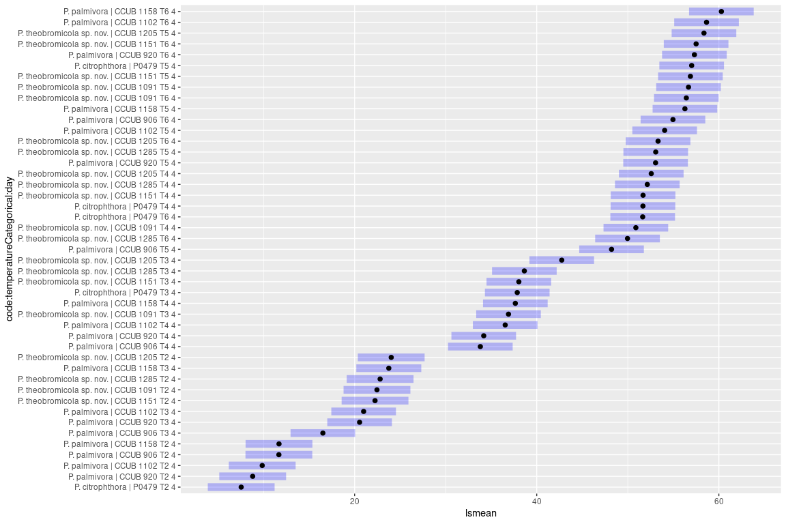
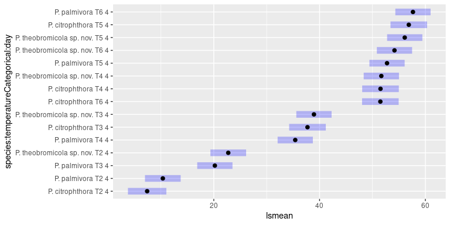

# Exploratory data analysis

## Get raw data

<div data-pagedtable="false">
  <script data-pagedtable-source type="application/json">
{"columns":[{"label":["id"],"name":[1],"type":["dbl"],"align":["right"]},{"label":["temperatureCategorical"],"name":[2],"type":["chr"],"align":["left"]},{"label":["temperatureCD"],"name":[3],"type":["dbl"],"align":["right"]},{"label":["strain"],"name":[4],"type":["chr"],"align":["left"]},{"label":["replicate"],"name":[5],"type":["chr"],"align":["left"]},{"label":["day"],"name":[6],"type":["dbl"],"align":["right"]},{"label":["length"],"name":[7],"type":["dbl"],"align":["right"]},{"label":["width"],"name":[8],"type":["dbl"],"align":["right"]},{"label":["average"],"name":[9],"type":["dbl"],"align":["right"]},{"label":["observation"],"name":[10],"type":["chr"],"align":["left"]},{"label":["essay"],"name":[11],"type":["chr"],"align":["left"]},{"label":["species"],"name":[12],"type":["chr"],"align":["left"]},{"label":["code"],"name":[13],"type":["chr"],"align":["left"]}],"data":[{"1":"1","2":"T1","3":"5","4":"CCUB 1151","5":"R1","6":"1","7":"6.00","8":"6.00","9":"6.000","10":"NA","11":"Jennifer","12":"P. theobromicola sp. nov.","13":"P. theobromicola sp. nov. | CCUB 1151"},{"1":"2","2":"T1","3":"5","4":"CCUB 1151","5":"R2","6":"1","7":"6.00","8":"6.00","9":"6.000","10":"NA","11":"Jennifer","12":"P. theobromicola sp. nov.","13":"P. theobromicola sp. nov. | CCUB 1151"},{"1":"3","2":"T1","3":"5","4":"CCUB 1151","5":"R3","6":"1","7":"6.00","8":"6.00","9":"6.000","10":"NA","11":"Jennifer","12":"P. theobromicola sp. nov.","13":"P. theobromicola sp. nov. | CCUB 1151"},{"1":"4","2":"T1","3":"5","4":"CCUB 1151","5":"R4","6":"1","7":"6.00","8":"6.00","9":"6.000","10":"NA","11":"Jennifer","12":"P. theobromicola sp. nov.","13":"P. theobromicola sp. nov. | CCUB 1151"},{"1":"5","2":"T1","3":"5","4":"CCUB 1285","5":"R1","6":"1","7":"6.00","8":"6.00","9":"6.000","10":"NA","11":"Jennifer","12":"P. theobromicola sp. nov.","13":"P. theobromicola sp. nov. | CCUB 1285"},{"1":"6","2":"T1","3":"5","4":"CCUB 1285","5":"R2","6":"1","7":"6.00","8":"6.00","9":"6.000","10":"NA","11":"Jennifer","12":"P. theobromicola sp. nov.","13":"P. theobromicola sp. nov. | CCUB 1285"},{"1":"7","2":"T1","3":"5","4":"CCUB 1285","5":"R3","6":"1","7":"6.00","8":"6.00","9":"6.000","10":"NA","11":"Jennifer","12":"P. theobromicola sp. nov.","13":"P. theobromicola sp. nov. | CCUB 1285"},{"1":"8","2":"T1","3":"5","4":"CCUB 1285","5":"R4","6":"1","7":"6.00","8":"6.00","9":"6.000","10":"NA","11":"Jennifer","12":"P. theobromicola sp. nov.","13":"P. theobromicola sp. nov. | CCUB 1285"},{"1":"9","2":"T1","3":"5","4":"CCUB 1158","5":"R1","6":"1","7":"6.00","8":"6.00","9":"6.000","10":"NA","11":"Jennifer","12":"P. palmivora","13":"P. palmivora | CCUB 1158"},{"1":"10","2":"T1","3":"5","4":"CCUB 1158","5":"R2","6":"1","7":"6.00","8":"6.00","9":"6.000","10":"NA","11":"Jennifer","12":"P. palmivora","13":"P. palmivora | CCUB 1158"},{"1":"11","2":"T1","3":"5","4":"CCUB 1158","5":"R3","6":"1","7":"6.00","8":"6.00","9":"6.000","10":"NA","11":"Jennifer","12":"P. palmivora","13":"P. palmivora | CCUB 1158"},{"1":"12","2":"T1","3":"5","4":"CCUB 1158","5":"R4","6":"1","7":"6.00","8":"6.00","9":"6.000","10":"NA","11":"Jennifer","12":"P. palmivora","13":"P. palmivora | CCUB 1158"},{"1":"13","2":"T1","3":"5","4":"CCUB 1091","5":"R1","6":"1","7":"6.00","8":"6.00","9":"6.000","10":"NA","11":"Jennifer","12":"P. theobromicola sp. nov.","13":"P. theobromicola sp. nov. | CCUB 1091"},{"1":"14","2":"T1","3":"5","4":"CCUB 1091","5":"R2","6":"1","7":"6.00","8":"6.00","9":"6.000","10":"NA","11":"Jennifer","12":"P. theobromicola sp. nov.","13":"P. theobromicola sp. nov. | CCUB 1091"},{"1":"15","2":"T1","3":"5","4":"CCUB 1091","5":"R3","6":"1","7":"6.00","8":"6.00","9":"6.000","10":"NA","11":"Jennifer","12":"P. theobromicola sp. nov.","13":"P. theobromicola sp. nov. | CCUB 1091"},{"1":"16","2":"T1","3":"5","4":"CCUB 1091","5":"R4","6":"1","7":"6.00","8":"6.00","9":"6.000","10":"NA","11":"Jennifer","12":"P. theobromicola sp. nov.","13":"P. theobromicola sp. nov. | CCUB 1091"},{"1":"17","2":"T1","3":"5","4":"CCUB 920","5":"R1","6":"1","7":"6.00","8":"6.00","9":"6.000","10":"NA","11":"Jennifer","12":"P. palmivora","13":"P. palmivora | CCUB 920"},{"1":"18","2":"T1","3":"5","4":"CCUB 920","5":"R2","6":"1","7":"6.00","8":"6.00","9":"6.000","10":"NA","11":"Jennifer","12":"P. palmivora","13":"P. palmivora | CCUB 920"},{"1":"19","2":"T1","3":"5","4":"CCUB 920","5":"R3","6":"1","7":"6.00","8":"6.00","9":"6.000","10":"NA","11":"Jennifer","12":"P. palmivora","13":"P. palmivora | CCUB 920"},{"1":"20","2":"T1","3":"5","4":"CCUB 920","5":"R4","6":"1","7":"6.00","8":"6.00","9":"6.000","10":"NA","11":"Jennifer","12":"P. palmivora","13":"P. palmivora | CCUB 920"},{"1":"21","2":"T1","3":"5","4":"CCUB 1102","5":"R1","6":"1","7":"6.00","8":"6.00","9":"6.000","10":"NA","11":"Jennifer","12":"P. palmivora","13":"P. palmivora | CCUB 1102"},{"1":"22","2":"T1","3":"5","4":"CCUB 1102","5":"R2","6":"1","7":"6.00","8":"6.00","9":"6.000","10":"NA","11":"Jennifer","12":"P. palmivora","13":"P. palmivora | CCUB 1102"},{"1":"23","2":"T1","3":"5","4":"CCUB 1102","5":"R3","6":"1","7":"6.00","8":"6.00","9":"6.000","10":"NA","11":"Jennifer","12":"P. palmivora","13":"P. palmivora | CCUB 1102"},{"1":"24","2":"T1","3":"5","4":"CCUB 1102","5":"R4","6":"1","7":"6.00","8":"6.00","9":"6.000","10":"NA","11":"Jennifer","12":"P. palmivora","13":"P. palmivora | CCUB 1102"},{"1":"25","2":"T1","3":"5","4":"CCUB 1205","5":"R1","6":"1","7":"6.00","8":"6.00","9":"6.000","10":"NA","11":"Jennifer","12":"P. theobromicola sp. nov.","13":"P. theobromicola sp. nov. | CCUB 1205"},{"1":"26","2":"T1","3":"5","4":"CCUB 1205","5":"R2","6":"1","7":"6.00","8":"6.00","9":"6.000","10":"NA","11":"Jennifer","12":"P. theobromicola sp. nov.","13":"P. theobromicola sp. nov. | CCUB 1205"},{"1":"27","2":"T1","3":"5","4":"CCUB 1205","5":"R3","6":"1","7":"6.00","8":"6.00","9":"6.000","10":"NA","11":"Jennifer","12":"P. theobromicola sp. nov.","13":"P. theobromicola sp. nov. | CCUB 1205"},{"1":"28","2":"T1","3":"5","4":"CCUB 1205","5":"R4","6":"1","7":"6.00","8":"6.00","9":"6.000","10":"NA","11":"Jennifer","12":"P. theobromicola sp. nov.","13":"P. theobromicola sp. nov. | CCUB 1205"},{"1":"29","2":"T1","3":"5","4":"CCUB 906","5":"R1","6":"1","7":"6.00","8":"6.00","9":"6.000","10":"NA","11":"Jennifer","12":"P. palmivora","13":"P. palmivora | CCUB 906"},{"1":"30","2":"T1","3":"5","4":"CCUB 906","5":"R2","6":"1","7":"6.00","8":"6.00","9":"6.000","10":"NA","11":"Jennifer","12":"P. palmivora","13":"P. palmivora | CCUB 906"},{"1":"31","2":"T1","3":"5","4":"CCUB 906","5":"R3","6":"1","7":"6.00","8":"6.00","9":"6.000","10":"NA","11":"Jennifer","12":"P. palmivora","13":"P. palmivora | CCUB 906"},{"1":"32","2":"T1","3":"5","4":"CCUB 906","5":"R4","6":"1","7":"6.00","8":"6.00","9":"6.000","10":"NA","11":"Jennifer","12":"P. palmivora","13":"P. palmivora | CCUB 906"},{"1":"33","2":"T1","3":"5","4":"P0479","5":"R1","6":"1","7":"6.00","8":"6.00","9":"6.000","10":"NA","11":"Jennifer","12":"P. citrophthora","13":"P. citrophthora | P0479"},{"1":"34","2":"T1","3":"5","4":"P0479","5":"R2","6":"1","7":"6.00","8":"6.00","9":"6.000","10":"NA","11":"Jennifer","12":"P. citrophthora","13":"P. citrophthora | P0479"},{"1":"35","2":"T1","3":"5","4":"P0479","5":"R3","6":"1","7":"6.00","8":"6.00","9":"6.000","10":"NA","11":"Jennifer","12":"P. citrophthora","13":"P. citrophthora | P0479"},{"1":"36","2":"T1","3":"5","4":"P0479","5":"R4","6":"1","7":"6.00","8":"6.00","9":"6.000","10":"NA","11":"Jennifer","12":"P. citrophthora","13":"P. citrophthora | P0479"},{"1":"37","2":"T2","3":"10","4":"CCUB 1151","5":"R1","6":"1","7":"8.45","8":"7.92","9":"8.185","10":"NA","11":"Jennifer","12":"P. theobromicola sp. nov.","13":"P. theobromicola sp. nov. | CCUB 1151"},{"1":"38","2":"T2","3":"10","4":"CCUB 1151","5":"R2","6":"1","7":"9.19","8":"7.56","9":"8.375","10":"NA","11":"Jennifer","12":"P. theobromicola sp. nov.","13":"P. theobromicola sp. nov. | CCUB 1151"},{"1":"39","2":"T2","3":"10","4":"CCUB 1151","5":"R3","6":"1","7":"8.66","8":"8.30","9":"8.480","10":"NA","11":"Jennifer","12":"P. theobromicola sp. nov.","13":"P. theobromicola sp. nov. | CCUB 1151"},{"1":"40","2":"T2","3":"10","4":"CCUB 1151","5":"R4","6":"1","7":"8.81","8":"8.81","9":"8.810","10":"NA","11":"Jennifer","12":"P. theobromicola sp. nov.","13":"P. theobromicola sp. nov. | CCUB 1151"},{"1":"41","2":"T2","3":"10","4":"CCUB 1285","5":"R1","6":"1","7":"7.37","8":"7.37","9":"7.370","10":"NA","11":"Jennifer","12":"P. theobromicola sp. nov.","13":"P. theobromicola sp. nov. | CCUB 1285"},{"1":"42","2":"T2","3":"10","4":"CCUB 1285","5":"R2","6":"1","7":"6.00","8":"6.00","9":"6.000","10":"NA","11":"Jennifer","12":"P. theobromicola sp. nov.","13":"P. theobromicola sp. nov. | CCUB 1285"},{"1":"43","2":"T2","3":"10","4":"CCUB 1285","5":"R3","6":"1","7":"7.11","8":"6.00","9":"6.555","10":"NA","11":"Jennifer","12":"P. theobromicola sp. nov.","13":"P. theobromicola sp. nov. | CCUB 1285"},{"1":"44","2":"T2","3":"10","4":"CCUB 1285","5":"R4","6":"1","7":"6.00","8":"7.26","9":"6.630","10":"NA","11":"Jennifer","12":"P. theobromicola sp. nov.","13":"P. theobromicola sp. nov. | CCUB 1285"},{"1":"45","2":"T2","3":"10","4":"CCUB 1158","5":"R1","6":"1","7":"8.08","8":"7.49","9":"7.785","10":"NA","11":"Jennifer","12":"P. palmivora","13":"P. palmivora | CCUB 1158"},{"1":"46","2":"T2","3":"10","4":"CCUB 1158","5":"R2","6":"1","7":"8.30","8":"8.00","9":"8.150","10":"NA","11":"Jennifer","12":"P. palmivora","13":"P. palmivora | CCUB 1158"},{"1":"47","2":"T2","3":"10","4":"CCUB 1158","5":"R3","6":"1","7":"7.29","8":"7.30","9":"7.295","10":"NA","11":"Jennifer","12":"P. palmivora","13":"P. palmivora | CCUB 1158"},{"1":"48","2":"T2","3":"10","4":"CCUB 1158","5":"R4","6":"1","7":"9.15","8":"8.26","9":"8.705","10":"NA","11":"Jennifer","12":"P. palmivora","13":"P. palmivora | CCUB 1158"},{"1":"49","2":"T2","3":"10","4":"CCUB 1091","5":"R1","6":"1","7":"8.96","8":"8.79","9":"8.875","10":"NA","11":"Jennifer","12":"P. theobromicola sp. nov.","13":"P. theobromicola sp. nov. | CCUB 1091"},{"1":"50","2":"T2","3":"10","4":"CCUB 1091","5":"R2","6":"1","7":"10.09","8":"9.42","9":"9.755","10":"NA","11":"Jennifer","12":"P. theobromicola sp. nov.","13":"P. theobromicola sp. nov. | CCUB 1091"},{"1":"51","2":"T2","3":"10","4":"CCUB 1091","5":"R3","6":"1","7":"8.50","8":"8.95","9":"8.725","10":"NA","11":"Jennifer","12":"P. theobromicola sp. nov.","13":"P. theobromicola sp. nov. | CCUB 1091"},{"1":"52","2":"T2","3":"10","4":"CCUB 1091","5":"R4","6":"1","7":"8.38","8":"9.51","9":"8.945","10":"NA","11":"Jennifer","12":"P. theobromicola sp. nov.","13":"P. theobromicola sp. nov. | CCUB 1091"},{"1":"53","2":"T2","3":"10","4":"CCUB 920","5":"R1","6":"1","7":"6.00","8":"6.00","9":"6.000","10":"NA","11":"Jennifer","12":"P. palmivora","13":"P. palmivora | CCUB 920"},{"1":"54","2":"T2","3":"10","4":"CCUB 920","5":"R2","6":"1","7":"8.37","8":"6.00","9":"7.185","10":"NA","11":"Jennifer","12":"P. palmivora","13":"P. palmivora | CCUB 920"},{"1":"55","2":"T2","3":"10","4":"CCUB 920","5":"R3","6":"1","7":"6.00","8":"6.00","9":"6.000","10":"NA","11":"Jennifer","12":"P. palmivora","13":"P. palmivora | CCUB 920"},{"1":"56","2":"T2","3":"10","4":"CCUB 920","5":"R4","6":"1","7":"6.00","8":"6.00","9":"6.000","10":"NA","11":"Jennifer","12":"P. palmivora","13":"P. palmivora | CCUB 920"},{"1":"57","2":"T2","3":"10","4":"CCUB 1102","5":"R1","6":"1","7":"8.37","8":"7.76","9":"8.065","10":"NA","11":"Jennifer","12":"P. palmivora","13":"P. palmivora | CCUB 1102"},{"1":"58","2":"T2","3":"10","4":"CCUB 1102","5":"R2","6":"1","7":"9.40","8":"7.51","9":"8.455","10":"NA","11":"Jennifer","12":"P. palmivora","13":"P. palmivora | CCUB 1102"},{"1":"59","2":"T2","3":"10","4":"CCUB 1102","5":"R3","6":"1","7":"8.47","8":"7.84","9":"8.155","10":"NA","11":"Jennifer","12":"P. palmivora","13":"P. palmivora | CCUB 1102"},{"1":"60","2":"T2","3":"10","4":"CCUB 1102","5":"R4","6":"1","7":"6.00","8":"6.00","9":"6.000","10":"NA","11":"Jennifer","12":"P. palmivora","13":"P. palmivora | CCUB 1102"},{"1":"61","2":"T2","3":"10","4":"CCUB 1205","5":"R1","6":"1","7":"10.30","8":"11.50","9":"10.900","10":"NA","11":"Jennifer","12":"P. theobromicola sp. nov.","13":"P. theobromicola sp. nov. | CCUB 1205"},{"1":"62","2":"T2","3":"10","4":"CCUB 1205","5":"R2","6":"1","7":"12.31","8":"10.73","9":"11.520","10":"NA","11":"Jennifer","12":"P. theobromicola sp. nov.","13":"P. theobromicola sp. nov. | CCUB 1205"},{"1":"63","2":"T2","3":"10","4":"CCUB 1205","5":"R3","6":"1","7":"11.37","8":"10.97","9":"11.170","10":"NA","11":"Jennifer","12":"P. theobromicola sp. nov.","13":"P. theobromicola sp. nov. | CCUB 1205"},{"1":"64","2":"T2","3":"10","4":"CCUB 1205","5":"R4","6":"1","7":"11.19","8":"8.82","9":"10.005","10":"NA","11":"Jennifer","12":"P. theobromicola sp. nov.","13":"P. theobromicola sp. nov. | CCUB 1205"},{"1":"65","2":"T2","3":"10","4":"CCUB 906","5":"R1","6":"1","7":"9.10","8":"8.89","9":"8.995","10":"NA","11":"Jennifer","12":"P. palmivora","13":"P. palmivora | CCUB 906"},{"1":"66","2":"T2","3":"10","4":"CCUB 906","5":"R2","6":"1","7":"10.15","8":"10.12","9":"10.135","10":"NA","11":"Jennifer","12":"P. palmivora","13":"P. palmivora | CCUB 906"},{"1":"67","2":"T2","3":"10","4":"CCUB 906","5":"R3","6":"1","7":"8.22","8":"8.03","9":"8.125","10":"NA","11":"Jennifer","12":"P. palmivora","13":"P. palmivora | CCUB 906"},{"1":"68","2":"T2","3":"10","4":"CCUB 906","5":"R4","6":"1","7":"8.56","8":"8.23","9":"8.395","10":"NA","11":"Jennifer","12":"P. palmivora","13":"P. palmivora | CCUB 906"},{"1":"69","2":"T2","3":"10","4":"P0479","5":"R1","6":"1","7":"6.00","8":"6.00","9":"6.000","10":"NA","11":"Jennifer","12":"P. citrophthora","13":"P. citrophthora | P0479"},{"1":"70","2":"T2","3":"10","4":"P0479","5":"R2","6":"1","7":"6.00","8":"6.00","9":"6.000","10":"NA","11":"Jennifer","12":"P. citrophthora","13":"P. citrophthora | P0479"},{"1":"71","2":"T2","3":"10","4":"P0479","5":"R3","6":"1","7":"6.00","8":"6.00","9":"6.000","10":"NA","11":"Jennifer","12":"P. citrophthora","13":"P. citrophthora | P0479"},{"1":"72","2":"T2","3":"10","4":"P0479","5":"R4","6":"1","7":"6.00","8":"6.00","9":"6.000","10":"NA","11":"Jennifer","12":"P. citrophthora","13":"P. citrophthora | P0479"},{"1":"73","2":"T3","3":"15","4":"CCUB 1151","5":"R1","6":"1","7":"13.89","8":"13.83","9":"13.860","10":"NA","11":"Jennifer","12":"P. theobromicola sp. nov.","13":"P. theobromicola sp. nov. | CCUB 1151"},{"1":"74","2":"T3","3":"15","4":"CCUB 1151","5":"R2","6":"1","7":"12.75","8":"12.37","9":"12.560","10":"NA","11":"Jennifer","12":"P. theobromicola sp. nov.","13":"P. theobromicola sp. nov. | CCUB 1151"},{"1":"75","2":"T3","3":"15","4":"CCUB 1151","5":"R3","6":"1","7":"12.19","8":"12.18","9":"12.185","10":"NA","11":"Jennifer","12":"P. theobromicola sp. nov.","13":"P. theobromicola sp. nov. | CCUB 1151"},{"1":"76","2":"T3","3":"15","4":"CCUB 1151","5":"R4","6":"1","7":"13.22","8":"13.22","9":"13.220","10":"NA","11":"Jennifer","12":"P. theobromicola sp. nov.","13":"P. theobromicola sp. nov. | CCUB 1151"},{"1":"77","2":"T3","3":"15","4":"CCUB 1285","5":"R1","6":"1","7":"11.65","8":"10.79","9":"11.220","10":"NA","11":"Jennifer","12":"P. theobromicola sp. nov.","13":"P. theobromicola sp. nov. | CCUB 1285"},{"1":"78","2":"T3","3":"15","4":"CCUB 1285","5":"R2","6":"1","7":"12.95","8":"12.78","9":"12.865","10":"NA","11":"Jennifer","12":"P. theobromicola sp. nov.","13":"P. theobromicola sp. nov. | CCUB 1285"},{"1":"79","2":"T3","3":"15","4":"CCUB 1285","5":"R3","6":"1","7":"12.12","8":"11.79","9":"11.955","10":"NA","11":"Jennifer","12":"P. theobromicola sp. nov.","13":"P. theobromicola sp. nov. | CCUB 1285"},{"1":"80","2":"T3","3":"15","4":"CCUB 1285","5":"R4","6":"1","7":"13.08","8":"12.37","9":"12.725","10":"NA","11":"Jennifer","12":"P. theobromicola sp. nov.","13":"P. theobromicola sp. nov. | CCUB 1285"},{"1":"81","2":"T3","3":"15","4":"CCUB 1158","5":"R1","6":"1","7":"10.78","8":"11.49","9":"11.135","10":"NA","11":"Jennifer","12":"P. palmivora","13":"P. palmivora | CCUB 1158"},{"1":"82","2":"T3","3":"15","4":"CCUB 1158","5":"R2","6":"1","7":"NA","8":"NA","9":"NA","10":"Red filled","11":"Jennifer","12":"P. palmivora","13":"P. palmivora | CCUB 1158"},{"1":"83","2":"T3","3":"15","4":"CCUB 1158","5":"R3","6":"1","7":"12.41","8":"12.85","9":"12.630","10":"NA","11":"Jennifer","12":"P. palmivora","13":"P. palmivora | CCUB 1158"},{"1":"84","2":"T3","3":"15","4":"CCUB 1158","5":"R4","6":"1","7":"12.03","8":"10.89","9":"11.460","10":"NA","11":"Jennifer","12":"P. palmivora","13":"P. palmivora | CCUB 1158"},{"1":"85","2":"T3","3":"15","4":"CCUB 1091","5":"R1","6":"1","7":"13.56","8":"13.07","9":"13.315","10":"NA","11":"Jennifer","12":"P. theobromicola sp. nov.","13":"P. theobromicola sp. nov. | CCUB 1091"},{"1":"86","2":"T3","3":"15","4":"CCUB 1091","5":"R2","6":"1","7":"11.69","8":"12.80","9":"12.245","10":"NA","11":"Jennifer","12":"P. theobromicola sp. nov.","13":"P. theobromicola sp. nov. | CCUB 1091"},{"1":"87","2":"T3","3":"15","4":"CCUB 1091","5":"R3","6":"1","7":"12.53","8":"12.98","9":"12.755","10":"NA","11":"Jennifer","12":"P. theobromicola sp. nov.","13":"P. theobromicola sp. nov. | CCUB 1091"},{"1":"88","2":"T3","3":"15","4":"CCUB 1091","5":"R4","6":"1","7":"12.38","8":"12.03","9":"12.205","10":"NA","11":"Jennifer","12":"P. theobromicola sp. nov.","13":"P. theobromicola sp. nov. | CCUB 1091"},{"1":"89","2":"T3","3":"15","4":"CCUB 920","5":"R1","6":"1","7":"9.67","8":"8.72","9":"9.195","10":"NA","11":"Jennifer","12":"P. palmivora","13":"P. palmivora | CCUB 920"},{"1":"90","2":"T3","3":"15","4":"CCUB 920","5":"R2","6":"1","7":"8.59","8":"9.15","9":"8.870","10":"NA","11":"Jennifer","12":"P. palmivora","13":"P. palmivora | CCUB 920"},{"1":"91","2":"T3","3":"15","4":"CCUB 920","5":"R3","6":"1","7":"8.99","8":"9.19","9":"9.090","10":"NA","11":"Jennifer","12":"P. palmivora","13":"P. palmivora | CCUB 920"},{"1":"92","2":"T3","3":"15","4":"CCUB 920","5":"R4","6":"1","7":"9.54","8":"9.98","9":"9.760","10":"NA","11":"Jennifer","12":"P. palmivora","13":"P. palmivora | CCUB 920"},{"1":"93","2":"T3","3":"15","4":"CCUB 1102","5":"R1","6":"1","7":"11.21","8":"9.53","9":"10.370","10":"NA","11":"Jennifer","12":"P. palmivora","13":"P. palmivora | CCUB 1102"},{"1":"94","2":"T3","3":"15","4":"CCUB 1102","5":"R2","6":"1","7":"10.05","8":"11.38","9":"10.715","10":"NA","11":"Jennifer","12":"P. palmivora","13":"P. palmivora | CCUB 1102"},{"1":"95","2":"T3","3":"15","4":"CCUB 1102","5":"R3","6":"1","7":"10.13","8":"9.49","9":"9.810","10":"NA","11":"Jennifer","12":"P. palmivora","13":"P. palmivora | CCUB 1102"},{"1":"96","2":"T3","3":"15","4":"CCUB 1102","5":"R4","6":"1","7":"9.18","8":"8.81","9":"8.995","10":"NA","11":"Jennifer","12":"P. palmivora","13":"P. palmivora | CCUB 1102"},{"1":"97","2":"T3","3":"15","4":"CCUB 1205","5":"R1","6":"1","7":"13.57","8":"14.28","9":"13.925","10":"NA","11":"Jennifer","12":"P. theobromicola sp. nov.","13":"P. theobromicola sp. nov. | CCUB 1205"},{"1":"98","2":"T3","3":"15","4":"CCUB 1205","5":"R2","6":"1","7":"15.45","8":"14.62","9":"15.035","10":"NA","11":"Jennifer","12":"P. theobromicola sp. nov.","13":"P. theobromicola sp. nov. | CCUB 1205"},{"1":"99","2":"T3","3":"15","4":"CCUB 1205","5":"R3","6":"1","7":"14.08","8":"14.55","9":"14.315","10":"NA","11":"Jennifer","12":"P. theobromicola sp. nov.","13":"P. theobromicola sp. nov. | CCUB 1205"},{"1":"100","2":"T3","3":"15","4":"CCUB 1205","5":"R4","6":"1","7":"13.91","8":"14.22","9":"14.065","10":"NA","11":"Jennifer","12":"P. theobromicola sp. nov.","13":"P. theobromicola sp. nov. | CCUB 1205"},{"1":"101","2":"T3","3":"15","4":"CCUB 906","5":"R1","6":"1","7":"12.28","8":"11.81","9":"12.045","10":"NA","11":"Jennifer","12":"P. palmivora","13":"P. palmivora | CCUB 906"},{"1":"102","2":"T3","3":"15","4":"CCUB 906","5":"R2","6":"1","7":"11.22","8":"11.02","9":"11.120","10":"NA","11":"Jennifer","12":"P. palmivora","13":"P. palmivora | CCUB 906"},{"1":"103","2":"T3","3":"15","4":"CCUB 906","5":"R3","6":"1","7":"11.36","8":"10.88","9":"11.120","10":"NA","11":"Jennifer","12":"P. palmivora","13":"P. palmivora | CCUB 906"},{"1":"104","2":"T3","3":"15","4":"CCUB 906","5":"R4","6":"1","7":"10.47","8":"10.65","9":"10.560","10":"NA","11":"Jennifer","12":"P. palmivora","13":"P. palmivora | CCUB 906"},{"1":"105","2":"T3","3":"15","4":"P0479","5":"R1","6":"1","7":"10.23","8":"10.02","9":"10.125","10":"NA","11":"Jennifer","12":"P. citrophthora","13":"P. citrophthora | P0479"},{"1":"106","2":"T3","3":"15","4":"P0479","5":"R2","6":"1","7":"10.34","8":"9.05","9":"9.695","10":"NA","11":"Jennifer","12":"P. citrophthora","13":"P. citrophthora | P0479"},{"1":"107","2":"T3","3":"15","4":"P0479","5":"R3","6":"1","7":"9.80","8":"11.15","9":"10.475","10":"NA","11":"Jennifer","12":"P. citrophthora","13":"P. citrophthora | P0479"},{"1":"108","2":"T3","3":"15","4":"P0479","5":"R4","6":"1","7":"9.59","8":"10.16","9":"9.875","10":"NA","11":"Jennifer","12":"P. citrophthora","13":"P. citrophthora | P0479"},{"1":"109","2":"T4","3":"20","4":"CCUB 1151","5":"R1","6":"1","7":"16.01","8":"16.61","9":"16.310","10":"NA","11":"Jennifer","12":"P. theobromicola sp. nov.","13":"P. theobromicola sp. nov. | CCUB 1151"},{"1":"110","2":"T4","3":"20","4":"CCUB 1151","5":"R2","6":"1","7":"16.18","8":"14.91","9":"15.545","10":"NA","11":"Jennifer","12":"P. theobromicola sp. nov.","13":"P. theobromicola sp. nov. | CCUB 1151"},{"1":"111","2":"T4","3":"20","4":"CCUB 1151","5":"R3","6":"1","7":"15.60","8":"14.81","9":"15.205","10":"NA","11":"Jennifer","12":"P. theobromicola sp. nov.","13":"P. theobromicola sp. nov. | CCUB 1151"},{"1":"112","2":"T4","3":"20","4":"CCUB 1151","5":"R4","6":"1","7":"17.11","8":"16.42","9":"16.765","10":"NA","11":"Jennifer","12":"P. theobromicola sp. nov.","13":"P. theobromicola sp. nov. | CCUB 1151"},{"1":"113","2":"T4","3":"20","4":"CCUB 1285","5":"R1","6":"1","7":"18.44","8":"16.59","9":"17.515","10":"NA","11":"Jennifer","12":"P. theobromicola sp. nov.","13":"P. theobromicola sp. nov. | CCUB 1285"},{"1":"114","2":"T4","3":"20","4":"CCUB 1285","5":"R2","6":"1","7":"16.53","8":"18.14","9":"17.335","10":"NA","11":"Jennifer","12":"P. theobromicola sp. nov.","13":"P. theobromicola sp. nov. | CCUB 1285"},{"1":"115","2":"T4","3":"20","4":"CCUB 1285","5":"R3","6":"1","7":"16.96","8":"17.13","9":"17.045","10":"NA","11":"Jennifer","12":"P. theobromicola sp. nov.","13":"P. theobromicola sp. nov. | CCUB 1285"},{"1":"116","2":"T4","3":"20","4":"CCUB 1285","5":"R4","6":"1","7":"17.49","8":"18.18","9":"17.835","10":"NA","11":"Jennifer","12":"P. theobromicola sp. nov.","13":"P. theobromicola sp. nov. | CCUB 1285"},{"1":"117","2":"T4","3":"20","4":"CCUB 1158","5":"R1","6":"1","7":"15.06","8":"14.64","9":"14.850","10":"NA","11":"Jennifer","12":"P. palmivora","13":"P. palmivora | CCUB 1158"},{"1":"118","2":"T4","3":"20","4":"CCUB 1158","5":"R2","6":"1","7":"15.51","8":"16.42","9":"15.965","10":"NA","11":"Jennifer","12":"P. palmivora","13":"P. palmivora | CCUB 1158"},{"1":"119","2":"T4","3":"20","4":"CCUB 1158","5":"R3","6":"1","7":"14.79","8":"13.72","9":"14.255","10":"NA","11":"Jennifer","12":"P. palmivora","13":"P. palmivora | CCUB 1158"},{"1":"120","2":"T4","3":"20","4":"CCUB 1158","5":"R4","6":"1","7":"14.45","8":"13.64","9":"14.045","10":"NA","11":"Jennifer","12":"P. palmivora","13":"P. palmivora | CCUB 1158"},{"1":"121","2":"T4","3":"20","4":"CCUB 1091","5":"R1","6":"1","7":"17.06","8":"17.74","9":"17.400","10":"NA","11":"Jennifer","12":"P. theobromicola sp. nov.","13":"P. theobromicola sp. nov. | CCUB 1091"},{"1":"122","2":"T4","3":"20","4":"CCUB 1091","5":"R2","6":"1","7":"15.71","8":"16.45","9":"16.080","10":"NA","11":"Jennifer","12":"P. theobromicola sp. nov.","13":"P. theobromicola sp. nov. | CCUB 1091"},{"1":"123","2":"T4","3":"20","4":"CCUB 1091","5":"R3","6":"1","7":"16.84","8":"17.37","9":"17.105","10":"NA","11":"Jennifer","12":"P. theobromicola sp. nov.","13":"P. theobromicola sp. nov. | CCUB 1091"},{"1":"124","2":"T4","3":"20","4":"CCUB 1091","5":"R4","6":"1","7":"16.70","8":"17.50","9":"17.100","10":"NA","11":"Jennifer","12":"P. theobromicola sp. nov.","13":"P. theobromicola sp. nov. | CCUB 1091"},{"1":"125","2":"T4","3":"20","4":"CCUB 920","5":"R1","6":"1","7":"13.08","8":"12.48","9":"12.780","10":"NA","11":"Jennifer","12":"P. palmivora","13":"P. palmivora | CCUB 920"},{"1":"126","2":"T4","3":"20","4":"CCUB 920","5":"R2","6":"1","7":"12.65","8":"12.82","9":"12.735","10":"NA","11":"Jennifer","12":"P. palmivora","13":"P. palmivora | CCUB 920"},{"1":"127","2":"T4","3":"20","4":"CCUB 920","5":"R3","6":"1","7":"11.74","8":"11.92","9":"11.830","10":"NA","11":"Jennifer","12":"P. palmivora","13":"P. palmivora | CCUB 920"},{"1":"128","2":"T4","3":"20","4":"CCUB 920","5":"R4","6":"1","7":"11.91","8":"12.17","9":"12.040","10":"NA","11":"Jennifer","12":"P. palmivora","13":"P. palmivora | CCUB 920"},{"1":"129","2":"T4","3":"20","4":"CCUB 1102","5":"R1","6":"1","7":"12.83","8":"12.84","9":"12.835","10":"NA","11":"Jennifer","12":"P. palmivora","13":"P. palmivora | CCUB 1102"},{"1":"130","2":"T4","3":"20","4":"CCUB 1102","5":"R2","6":"1","7":"16.11","8":"14.06","9":"15.085","10":"NA","11":"Jennifer","12":"P. palmivora","13":"P. palmivora | CCUB 1102"},{"1":"131","2":"T4","3":"20","4":"CCUB 1102","5":"R3","6":"1","7":"15.69","8":"15.70","9":"15.695","10":"NA","11":"Jennifer","12":"P. palmivora","13":"P. palmivora | CCUB 1102"},{"1":"132","2":"T4","3":"20","4":"CCUB 1102","5":"R4","6":"1","7":"14.76","8":"14.84","9":"14.800","10":"NA","11":"Jennifer","12":"P. palmivora","13":"P. palmivora | CCUB 1102"},{"1":"133","2":"T4","3":"20","4":"CCUB 1205","5":"R1","6":"1","7":"19.27","8":"19.25","9":"19.260","10":"NA","11":"Jennifer","12":"P. theobromicola sp. nov.","13":"P. theobromicola sp. nov. | CCUB 1205"},{"1":"134","2":"T4","3":"20","4":"CCUB 1205","5":"R2","6":"1","7":"17.78","8":"18.96","9":"18.370","10":"NA","11":"Jennifer","12":"P. theobromicola sp. nov.","13":"P. theobromicola sp. nov. | CCUB 1205"},{"1":"135","2":"T4","3":"20","4":"CCUB 1205","5":"R3","6":"1","7":"20.23","8":"19.44","9":"19.835","10":"NA","11":"Jennifer","12":"P. theobromicola sp. nov.","13":"P. theobromicola sp. nov. | CCUB 1205"},{"1":"136","2":"T4","3":"20","4":"CCUB 1205","5":"R4","6":"1","7":"18.22","8":"19.30","9":"18.760","10":"NA","11":"Jennifer","12":"P. theobromicola sp. nov.","13":"P. theobromicola sp. nov. | CCUB 1205"},{"1":"137","2":"T4","3":"20","4":"CCUB 906","5":"R1","6":"1","7":"13.31","8":"14.61","9":"13.960","10":"NA","11":"Jennifer","12":"P. palmivora","13":"P. palmivora | CCUB 906"},{"1":"138","2":"T4","3":"20","4":"CCUB 906","5":"R2","6":"1","7":"14.01","8":"13.94","9":"13.975","10":"NA","11":"Jennifer","12":"P. palmivora","13":"P. palmivora | CCUB 906"},{"1":"139","2":"T4","3":"20","4":"CCUB 906","5":"R3","6":"1","7":"14.75","8":"15.91","9":"15.330","10":"NA","11":"Jennifer","12":"P. palmivora","13":"P. palmivora | CCUB 906"},{"1":"140","2":"T4","3":"20","4":"CCUB 906","5":"R4","6":"1","7":"14.45","8":"14.31","9":"14.380","10":"NA","11":"Jennifer","12":"P. palmivora","13":"P. palmivora | CCUB 906"},{"1":"141","2":"T4","3":"20","4":"P0479","5":"R1","6":"1","7":"12.96","8":"13.34","9":"13.150","10":"NA","11":"Jennifer","12":"P. citrophthora","13":"P. citrophthora | P0479"},{"1":"142","2":"T4","3":"20","4":"P0479","5":"R2","6":"1","7":"12.81","8":"12.78","9":"12.795","10":"NA","11":"Jennifer","12":"P. citrophthora","13":"P. citrophthora | P0479"},{"1":"143","2":"T4","3":"20","4":"P0479","5":"R3","6":"1","7":"11.85","8":"11.43","9":"11.640","10":"NA","11":"Jennifer","12":"P. citrophthora","13":"P. citrophthora | P0479"},{"1":"144","2":"T4","3":"20","4":"P0479","5":"R4","6":"1","7":"12.32","8":"12.05","9":"12.185","10":"NA","11":"Jennifer","12":"P. citrophthora","13":"P. citrophthora | P0479"},{"1":"145","2":"T5","3":"25","4":"CCUB 1151","5":"R1","6":"1","7":"22.51","8":"21.70","9":"22.105","10":"NA","11":"Jennifer","12":"P. theobromicola sp. nov.","13":"P. theobromicola sp. nov. | CCUB 1151"},{"1":"146","2":"T5","3":"25","4":"CCUB 1151","5":"R2","6":"1","7":"22.30","8":"21.61","9":"21.955","10":"NA","11":"Jennifer","12":"P. theobromicola sp. nov.","13":"P. theobromicola sp. nov. | CCUB 1151"},{"1":"147","2":"T5","3":"25","4":"CCUB 1151","5":"R3","6":"1","7":"22.64","8":"21.55","9":"22.095","10":"NA","11":"Jennifer","12":"P. theobromicola sp. nov.","13":"P. theobromicola sp. nov. | CCUB 1151"},{"1":"148","2":"T5","3":"25","4":"CCUB 1151","5":"R4","6":"1","7":"22.56","8":"21.73","9":"22.145","10":"NA","11":"Jennifer","12":"P. theobromicola sp. nov.","13":"P. theobromicola sp. nov. | CCUB 1151"},{"1":"149","2":"T5","3":"25","4":"CCUB 1285","5":"R1","6":"1","7":"25.99","8":"22.03","9":"24.010","10":"NA","11":"Jennifer","12":"P. theobromicola sp. nov.","13":"P. theobromicola sp. nov. | CCUB 1285"},{"1":"150","2":"T5","3":"25","4":"CCUB 1285","5":"R2","6":"1","7":"20.46","8":"23.00","9":"21.730","10":"NA","11":"Jennifer","12":"P. theobromicola sp. nov.","13":"P. theobromicola sp. nov. | CCUB 1285"},{"1":"151","2":"T5","3":"25","4":"CCUB 1285","5":"R3","6":"1","7":"24.18","8":"23.00","9":"23.590","10":"NA","11":"Jennifer","12":"P. theobromicola sp. nov.","13":"P. theobromicola sp. nov. | CCUB 1285"},{"1":"152","2":"T5","3":"25","4":"CCUB 1285","5":"R4","6":"1","7":"21.99","8":"23.44","9":"22.715","10":"NA","11":"Jennifer","12":"P. theobromicola sp. nov.","13":"P. theobromicola sp. nov. | CCUB 1285"},{"1":"153","2":"T5","3":"25","4":"CCUB 1158","5":"R1","6":"1","7":"22.48","8":"20.57","9":"21.525","10":"NA","11":"Jennifer","12":"P. palmivora","13":"P. palmivora | CCUB 1158"},{"1":"154","2":"T5","3":"25","4":"CCUB 1158","5":"R2","6":"1","7":"20.80","8":"10.52","9":"15.660","10":"NA","11":"Jennifer","12":"P. palmivora","13":"P. palmivora | CCUB 1158"},{"1":"155","2":"T5","3":"25","4":"CCUB 1158","5":"R3","6":"1","7":"22.15","8":"20.35","9":"21.250","10":"NA","11":"Jennifer","12":"P. palmivora","13":"P. palmivora | CCUB 1158"},{"1":"156","2":"T5","3":"25","4":"CCUB 1158","5":"R4","6":"1","7":"19.13","8":"21.59","9":"20.360","10":"NA","11":"Jennifer","12":"P. palmivora","13":"P. palmivora | CCUB 1158"},{"1":"157","2":"T5","3":"25","4":"CCUB 1091","5":"R1","6":"1","7":"23.23","8":"22.88","9":"23.055","10":"NA","11":"Jennifer","12":"P. theobromicola sp. nov.","13":"P. theobromicola sp. nov. | CCUB 1091"},{"1":"158","2":"T5","3":"25","4":"CCUB 1091","5":"R2","6":"1","7":"24.65","8":"24.13","9":"24.390","10":"NA","11":"Jennifer","12":"P. theobromicola sp. nov.","13":"P. theobromicola sp. nov. | CCUB 1091"},{"1":"159","2":"T5","3":"25","4":"CCUB 1091","5":"R3","6":"1","7":"23.36","8":"22.91","9":"23.135","10":"NA","11":"Jennifer","12":"P. theobromicola sp. nov.","13":"P. theobromicola sp. nov. | CCUB 1091"},{"1":"160","2":"T5","3":"25","4":"CCUB 1091","5":"R4","6":"1","7":"21.71","8":"24.17","9":"22.940","10":"NA","11":"Jennifer","12":"P. theobromicola sp. nov.","13":"P. theobromicola sp. nov. | CCUB 1091"},{"1":"161","2":"T5","3":"25","4":"CCUB 920","5":"R1","6":"1","7":"21.18","8":"20.60","9":"20.890","10":"NA","11":"Jennifer","12":"P. palmivora","13":"P. palmivora | CCUB 920"},{"1":"162","2":"T5","3":"25","4":"CCUB 920","5":"R2","6":"1","7":"20.59","8":"20.61","9":"20.600","10":"NA","11":"Jennifer","12":"P. palmivora","13":"P. palmivora | CCUB 920"},{"1":"163","2":"T5","3":"25","4":"CCUB 920","5":"R3","6":"1","7":"20.75","8":"19.83","9":"20.290","10":"NA","11":"Jennifer","12":"P. palmivora","13":"P. palmivora | CCUB 920"},{"1":"164","2":"T5","3":"25","4":"CCUB 920","5":"R4","6":"1","7":"20.43","8":"19.67","9":"20.050","10":"NA","11":"Jennifer","12":"P. palmivora","13":"P. palmivora | CCUB 920"},{"1":"165","2":"T5","3":"25","4":"CCUB 1102","5":"R1","6":"1","7":"21.66","8":"21.03","9":"21.345","10":"NA","11":"Jennifer","12":"P. palmivora","13":"P. palmivora | CCUB 1102"},{"1":"166","2":"T5","3":"25","4":"CCUB 1102","5":"R2","6":"1","7":"21.47","8":"21.30","9":"21.385","10":"NA","11":"Jennifer","12":"P. palmivora","13":"P. palmivora | CCUB 1102"},{"1":"167","2":"T5","3":"25","4":"CCUB 1102","5":"R3","6":"1","7":"22.78","8":"22.10","9":"22.440","10":"NA","11":"Jennifer","12":"P. palmivora","13":"P. palmivora | CCUB 1102"},{"1":"168","2":"T5","3":"25","4":"CCUB 1102","5":"R4","6":"1","7":"20.91","8":"21.68","9":"21.295","10":"NA","11":"Jennifer","12":"P. palmivora","13":"P. palmivora | CCUB 1102"},{"1":"169","2":"T5","3":"25","4":"CCUB 1205","5":"R1","6":"1","7":"24.79","8":"25.12","9":"24.955","10":"NA","11":"Jennifer","12":"P. theobromicola sp. nov.","13":"P. theobromicola sp. nov. | CCUB 1205"},{"1":"170","2":"T5","3":"25","4":"CCUB 1205","5":"R2","6":"1","7":"25.73","8":"24.83","9":"25.280","10":"NA","11":"Jennifer","12":"P. theobromicola sp. nov.","13":"P. theobromicola sp. nov. | CCUB 1205"},{"1":"171","2":"T5","3":"25","4":"CCUB 1205","5":"R3","6":"1","7":"23.30","8":"23.61","9":"23.455","10":"NA","11":"Jennifer","12":"P. theobromicola sp. nov.","13":"P. theobromicola sp. nov. | CCUB 1205"},{"1":"172","2":"T5","3":"25","4":"CCUB 1205","5":"R4","6":"1","7":"23.37","8":"23.75","9":"23.560","10":"NA","11":"Jennifer","12":"P. theobromicola sp. nov.","13":"P. theobromicola sp. nov. | CCUB 1205"},{"1":"173","2":"T5","3":"25","4":"CCUB 906","5":"R1","6":"1","7":"18.98","8":"20.67","9":"19.825","10":"NA","11":"Jennifer","12":"P. palmivora","13":"P. palmivora | CCUB 906"},{"1":"174","2":"T5","3":"25","4":"CCUB 906","5":"R2","6":"1","7":"20.01","8":"20.83","9":"20.420","10":"NA","11":"Jennifer","12":"P. palmivora","13":"P. palmivora | CCUB 906"},{"1":"175","2":"T5","3":"25","4":"CCUB 906","5":"R3","6":"1","7":"16.01","8":"18.48","9":"17.245","10":"NA","11":"Jennifer","12":"P. palmivora","13":"P. palmivora | CCUB 906"},{"1":"176","2":"T5","3":"25","4":"CCUB 906","5":"R4","6":"1","7":"21.15","8":"21.15","9":"21.150","10":"NA","11":"Jennifer","12":"P. palmivora","13":"P. palmivora | CCUB 906"},{"1":"177","2":"T5","3":"25","4":"P0479","5":"R1","6":"1","7":"14.76","8":"15.19","9":"14.975","10":"NA","11":"Jennifer","12":"P. citrophthora","13":"P. citrophthora | P0479"},{"1":"178","2":"T5","3":"25","4":"P0479","5":"R2","6":"1","7":"15.24","8":"15.08","9":"15.160","10":"NA","11":"Jennifer","12":"P. citrophthora","13":"P. citrophthora | P0479"},{"1":"179","2":"T5","3":"25","4":"P0479","5":"R3","6":"1","7":"16.34","8":"15.32","9":"15.830","10":"NA","11":"Jennifer","12":"P. citrophthora","13":"P. citrophthora | P0479"},{"1":"180","2":"T5","3":"25","4":"P0479","5":"R4","6":"1","7":"16.46","8":"14.77","9":"15.615","10":"NA","11":"Jennifer","12":"P. citrophthora","13":"P. citrophthora | P0479"},{"1":"181","2":"T6","3":"30","4":"CCUB 1151","5":"R1","6":"1","7":"21.79","8":"21.03","9":"21.410","10":"NA","11":"Jennifer","12":"P. theobromicola sp. nov.","13":"P. theobromicola sp. nov. | CCUB 1151"},{"1":"182","2":"T6","3":"30","4":"CCUB 1151","5":"R2","6":"1","7":"21.13","8":"19.97","9":"20.550","10":"NA","11":"Jennifer","12":"P. theobromicola sp. nov.","13":"P. theobromicola sp. nov. | CCUB 1151"},{"1":"183","2":"T6","3":"30","4":"CCUB 1151","5":"R3","6":"1","7":"21.03","8":"20.90","9":"20.965","10":"NA","11":"Jennifer","12":"P. theobromicola sp. nov.","13":"P. theobromicola sp. nov. | CCUB 1151"},{"1":"184","2":"T6","3":"30","4":"CCUB 1151","5":"R4","6":"1","7":"21.06","8":"20.34","9":"20.700","10":"NA","11":"Jennifer","12":"P. theobromicola sp. nov.","13":"P. theobromicola sp. nov. | CCUB 1151"},{"1":"185","2":"T6","3":"30","4":"CCUB 1285","5":"R1","6":"1","7":"20.34","8":"19.14","9":"19.740","10":"NA","11":"Jennifer","12":"P. theobromicola sp. nov.","13":"P. theobromicola sp. nov. | CCUB 1285"},{"1":"186","2":"T6","3":"30","4":"CCUB 1285","5":"R2","6":"1","7":"20.54","8":"20.84","9":"20.690","10":"NA","11":"Jennifer","12":"P. theobromicola sp. nov.","13":"P. theobromicola sp. nov. | CCUB 1285"},{"1":"187","2":"T6","3":"30","4":"CCUB 1285","5":"R3","6":"1","7":"21.95","8":"20.82","9":"21.385","10":"NA","11":"Jennifer","12":"P. theobromicola sp. nov.","13":"P. theobromicola sp. nov. | CCUB 1285"},{"1":"188","2":"T6","3":"30","4":"CCUB 1285","5":"R4","6":"1","7":"19.99","8":"19.30","9":"19.645","10":"NA","11":"Jennifer","12":"P. theobromicola sp. nov.","13":"P. theobromicola sp. nov. | CCUB 1285"},{"1":"189","2":"T6","3":"30","4":"CCUB 1158","5":"R1","6":"1","7":"24.12","8":"23.87","9":"23.995","10":"NA","11":"Jennifer","12":"P. palmivora","13":"P. palmivora | CCUB 1158"},{"1":"190","2":"T6","3":"30","4":"CCUB 1158","5":"R2","6":"1","7":"24.42","8":"24.06","9":"24.240","10":"NA","11":"Jennifer","12":"P. palmivora","13":"P. palmivora | CCUB 1158"},{"1":"191","2":"T6","3":"30","4":"CCUB 1158","5":"R3","6":"1","7":"24.08","8":"23.90","9":"23.990","10":"NA","11":"Jennifer","12":"P. palmivora","13":"P. palmivora | CCUB 1158"},{"1":"192","2":"T6","3":"30","4":"CCUB 1158","5":"R4","6":"1","7":"23.57","8":"23.04","9":"23.305","10":"NA","11":"Jennifer","12":"P. palmivora","13":"P. palmivora | CCUB 1158"},{"1":"193","2":"T6","3":"30","4":"CCUB 1091","5":"R1","6":"1","7":"21.52","8":"20.58","9":"21.050","10":"NA","11":"Jennifer","12":"P. theobromicola sp. nov.","13":"P. theobromicola sp. nov. | CCUB 1091"},{"1":"194","2":"T6","3":"30","4":"CCUB 1091","5":"R2","6":"1","7":"21.07","8":"20.77","9":"20.920","10":"NA","11":"Jennifer","12":"P. theobromicola sp. nov.","13":"P. theobromicola sp. nov. | CCUB 1091"},{"1":"195","2":"T6","3":"30","4":"CCUB 1091","5":"R3","6":"1","7":"21.13","8":"20.04","9":"20.585","10":"NA","11":"Jennifer","12":"P. theobromicola sp. nov.","13":"P. theobromicola sp. nov. | CCUB 1091"},{"1":"196","2":"T6","3":"30","4":"CCUB 1091","5":"R4","6":"1","7":"20.84","8":"19.39","9":"20.115","10":"NA","11":"Jennifer","12":"P. theobromicola sp. nov.","13":"P. theobromicola sp. nov. | CCUB 1091"},{"1":"197","2":"T6","3":"30","4":"CCUB 920","5":"R1","6":"1","7":"22.01","8":"21.07","9":"21.540","10":"NA","11":"Jennifer","12":"P. palmivora","13":"P. palmivora | CCUB 920"},{"1":"198","2":"T6","3":"30","4":"CCUB 920","5":"R2","6":"1","7":"19.08","8":"21.91","9":"20.495","10":"NA","11":"Jennifer","12":"P. palmivora","13":"P. palmivora | CCUB 920"},{"1":"199","2":"T6","3":"30","4":"CCUB 920","5":"R3","6":"1","7":"22.98","8":"22.21","9":"22.595","10":"NA","11":"Jennifer","12":"P. palmivora","13":"P. palmivora | CCUB 920"},{"1":"200","2":"T6","3":"30","4":"CCUB 920","5":"R4","6":"1","7":"21.06","8":"22.44","9":"21.750","10":"NA","11":"Jennifer","12":"P. palmivora","13":"P. palmivora | CCUB 920"},{"1":"201","2":"T6","3":"30","4":"CCUB 1102","5":"R1","6":"1","7":"22.50","8":"23.58","9":"23.040","10":"NA","11":"Jennifer","12":"P. palmivora","13":"P. palmivora | CCUB 1102"},{"1":"202","2":"T6","3":"30","4":"CCUB 1102","5":"R2","6":"1","7":"21.88","8":"21.41","9":"21.645","10":"NA","11":"Jennifer","12":"P. palmivora","13":"P. palmivora | CCUB 1102"},{"1":"203","2":"T6","3":"30","4":"CCUB 1102","5":"R3","6":"1","7":"23.16","8":"23.51","9":"23.335","10":"NA","11":"Jennifer","12":"P. palmivora","13":"P. palmivora | CCUB 1102"},{"1":"204","2":"T6","3":"30","4":"CCUB 1102","5":"R4","6":"1","7":"23.71","8":"23.03","9":"23.370","10":"NA","11":"Jennifer","12":"P. palmivora","13":"P. palmivora | CCUB 1102"},{"1":"205","2":"T6","3":"30","4":"CCUB 1205","5":"R1","6":"1","7":"25.40","8":"24.12","9":"24.760","10":"NA","11":"Jennifer","12":"P. theobromicola sp. nov.","13":"P. theobromicola sp. nov. | CCUB 1205"},{"1":"206","2":"T6","3":"30","4":"CCUB 1205","5":"R2","6":"1","7":"25.08","8":"22.97","9":"24.025","10":"NA","11":"Jennifer","12":"P. theobromicola sp. nov.","13":"P. theobromicola sp. nov. | CCUB 1205"},{"1":"207","2":"T6","3":"30","4":"CCUB 1205","5":"R3","6":"1","7":"22.75","8":"22.75","9":"22.750","10":"NA","11":"Jennifer","12":"P. theobromicola sp. nov.","13":"P. theobromicola sp. nov. | CCUB 1205"},{"1":"208","2":"T6","3":"30","4":"CCUB 1205","5":"R4","6":"1","7":"22.28","8":"21.76","9":"22.020","10":"NA","11":"Jennifer","12":"P. theobromicola sp. nov.","13":"P. theobromicola sp. nov. | CCUB 1205"},{"1":"209","2":"T6","3":"30","4":"CCUB 906","5":"R1","6":"1","7":"23.56","8":"22.95","9":"23.255","10":"NA","11":"Jennifer","12":"P. palmivora","13":"P. palmivora | CCUB 906"},{"1":"210","2":"T6","3":"30","4":"CCUB 906","5":"R2","6":"1","7":"23.11","8":"21.73","9":"22.420","10":"NA","11":"Jennifer","12":"P. palmivora","13":"P. palmivora | CCUB 906"},{"1":"211","2":"T6","3":"30","4":"CCUB 906","5":"R3","6":"1","7":"22.53","8":"21.55","9":"22.040","10":"NA","11":"Jennifer","12":"P. palmivora","13":"P. palmivora | CCUB 906"},{"1":"212","2":"T6","3":"30","4":"CCUB 906","5":"R4","6":"1","7":"24.20","8":"22.59","9":"23.395","10":"NA","11":"Jennifer","12":"P. palmivora","13":"P. palmivora | CCUB 906"},{"1":"213","2":"T6","3":"30","4":"P0479","5":"R1","6":"1","7":"15.94","8":"15.32","9":"15.630","10":"NA","11":"Jennifer","12":"P. citrophthora","13":"P. citrophthora | P0479"},{"1":"214","2":"T6","3":"30","4":"P0479","5":"R2","6":"1","7":"14.61","8":"15.88","9":"15.245","10":"NA","11":"Jennifer","12":"P. citrophthora","13":"P. citrophthora | P0479"},{"1":"215","2":"T6","3":"30","4":"P0479","5":"R3","6":"1","7":"15.81","8":"16.30","9":"16.055","10":"NA","11":"Jennifer","12":"P. citrophthora","13":"P. citrophthora | P0479"},{"1":"216","2":"T6","3":"30","4":"P0479","5":"R4","6":"1","7":"16.48","8":"14.41","9":"15.445","10":"NA","11":"Jennifer","12":"P. citrophthora","13":"P. citrophthora | P0479"},{"1":"217","2":"T7","3":"35","4":"CCUB 1151","5":"R1","6":"1","7":"6.00","8":"6.00","9":"6.000","10":"NA","11":"Jennifer","12":"P. theobromicola sp. nov.","13":"P. theobromicola sp. nov. | CCUB 1151"},{"1":"218","2":"T7","3":"35","4":"CCUB 1151","5":"R2","6":"1","7":"6.00","8":"6.00","9":"6.000","10":"NA","11":"Jennifer","12":"P. theobromicola sp. nov.","13":"P. theobromicola sp. nov. | CCUB 1151"},{"1":"219","2":"T7","3":"35","4":"CCUB 1151","5":"R3","6":"1","7":"6.00","8":"6.00","9":"6.000","10":"NA","11":"Jennifer","12":"P. theobromicola sp. nov.","13":"P. theobromicola sp. nov. | CCUB 1151"},{"1":"220","2":"T7","3":"35","4":"CCUB 1151","5":"R4","6":"1","7":"6.00","8":"6.00","9":"6.000","10":"NA","11":"Jennifer","12":"P. theobromicola sp. nov.","13":"P. theobromicola sp. nov. | CCUB 1151"},{"1":"221","2":"T7","3":"35","4":"CCUB 1285","5":"R1","6":"1","7":"6.00","8":"6.00","9":"6.000","10":"NA","11":"Jennifer","12":"P. theobromicola sp. nov.","13":"P. theobromicola sp. nov. | CCUB 1285"},{"1":"222","2":"T7","3":"35","4":"CCUB 1285","5":"R2","6":"1","7":"6.00","8":"6.00","9":"6.000","10":"NA","11":"Jennifer","12":"P. theobromicola sp. nov.","13":"P. theobromicola sp. nov. | CCUB 1285"},{"1":"223","2":"T7","3":"35","4":"CCUB 1285","5":"R3","6":"1","7":"6.00","8":"6.00","9":"6.000","10":"NA","11":"Jennifer","12":"P. theobromicola sp. nov.","13":"P. theobromicola sp. nov. | CCUB 1285"},{"1":"224","2":"T7","3":"35","4":"CCUB 1285","5":"R4","6":"1","7":"6.00","8":"6.00","9":"6.000","10":"NA","11":"Jennifer","12":"P. theobromicola sp. nov.","13":"P. theobromicola sp. nov. | CCUB 1285"},{"1":"225","2":"T7","3":"35","4":"CCUB 1158","5":"R1","6":"1","7":"6.00","8":"6.00","9":"6.000","10":"NA","11":"Jennifer","12":"P. palmivora","13":"P. palmivora | CCUB 1158"},{"1":"226","2":"T7","3":"35","4":"CCUB 1158","5":"R2","6":"1","7":"6.00","8":"6.00","9":"6.000","10":"NA","11":"Jennifer","12":"P. palmivora","13":"P. palmivora | CCUB 1158"},{"1":"227","2":"T7","3":"35","4":"CCUB 1158","5":"R3","6":"1","7":"6.00","8":"6.00","9":"6.000","10":"NA","11":"Jennifer","12":"P. palmivora","13":"P. palmivora | CCUB 1158"},{"1":"228","2":"T7","3":"35","4":"CCUB 1158","5":"R4","6":"1","7":"6.00","8":"6.00","9":"6.000","10":"NA","11":"Jennifer","12":"P. palmivora","13":"P. palmivora | CCUB 1158"},{"1":"229","2":"T7","3":"35","4":"CCUB 1091","5":"R1","6":"1","7":"6.00","8":"6.00","9":"6.000","10":"NA","11":"Jennifer","12":"P. theobromicola sp. nov.","13":"P. theobromicola sp. nov. | CCUB 1091"},{"1":"230","2":"T7","3":"35","4":"CCUB 1091","5":"R2","6":"1","7":"6.00","8":"6.00","9":"6.000","10":"NA","11":"Jennifer","12":"P. theobromicola sp. nov.","13":"P. theobromicola sp. nov. | CCUB 1091"},{"1":"231","2":"T7","3":"35","4":"CCUB 1091","5":"R3","6":"1","7":"6.00","8":"6.00","9":"6.000","10":"NA","11":"Jennifer","12":"P. theobromicola sp. nov.","13":"P. theobromicola sp. nov. | CCUB 1091"},{"1":"232","2":"T7","3":"35","4":"CCUB 1091","5":"R4","6":"1","7":"6.00","8":"6.00","9":"6.000","10":"NA","11":"Jennifer","12":"P. theobromicola sp. nov.","13":"P. theobromicola sp. nov. | CCUB 1091"},{"1":"233","2":"T7","3":"35","4":"CCUB 920","5":"R1","6":"1","7":"6.00","8":"6.00","9":"6.000","10":"NA","11":"Jennifer","12":"P. palmivora","13":"P. palmivora | CCUB 920"},{"1":"234","2":"T7","3":"35","4":"CCUB 920","5":"R2","6":"1","7":"6.00","8":"6.00","9":"6.000","10":"NA","11":"Jennifer","12":"P. palmivora","13":"P. palmivora | CCUB 920"},{"1":"235","2":"T7","3":"35","4":"CCUB 920","5":"R3","6":"1","7":"6.00","8":"6.00","9":"6.000","10":"NA","11":"Jennifer","12":"P. palmivora","13":"P. palmivora | CCUB 920"},{"1":"236","2":"T7","3":"35","4":"CCUB 920","5":"R4","6":"1","7":"6.00","8":"6.00","9":"6.000","10":"NA","11":"Jennifer","12":"P. palmivora","13":"P. palmivora | CCUB 920"},{"1":"237","2":"T7","3":"35","4":"CCUB 1102","5":"R1","6":"1","7":"6.00","8":"6.00","9":"6.000","10":"NA","11":"Jennifer","12":"P. palmivora","13":"P. palmivora | CCUB 1102"},{"1":"238","2":"T7","3":"35","4":"CCUB 1102","5":"R2","6":"1","7":"6.00","8":"6.00","9":"6.000","10":"NA","11":"Jennifer","12":"P. palmivora","13":"P. palmivora | CCUB 1102"},{"1":"239","2":"T7","3":"35","4":"CCUB 1102","5":"R3","6":"1","7":"6.00","8":"6.00","9":"6.000","10":"NA","11":"Jennifer","12":"P. palmivora","13":"P. palmivora | CCUB 1102"},{"1":"240","2":"T7","3":"35","4":"CCUB 1102","5":"R4","6":"1","7":"6.00","8":"6.00","9":"6.000","10":"NA","11":"Jennifer","12":"P. palmivora","13":"P. palmivora | CCUB 1102"},{"1":"241","2":"T7","3":"35","4":"CCUB 1205","5":"R1","6":"1","7":"6.00","8":"6.00","9":"6.000","10":"NA","11":"Jennifer","12":"P. theobromicola sp. nov.","13":"P. theobromicola sp. nov. | CCUB 1205"},{"1":"242","2":"T7","3":"35","4":"CCUB 1205","5":"R2","6":"1","7":"6.00","8":"6.00","9":"6.000","10":"NA","11":"Jennifer","12":"P. theobromicola sp. nov.","13":"P. theobromicola sp. nov. | CCUB 1205"},{"1":"243","2":"T7","3":"35","4":"CCUB 1205","5":"R3","6":"1","7":"6.00","8":"6.00","9":"6.000","10":"NA","11":"Jennifer","12":"P. theobromicola sp. nov.","13":"P. theobromicola sp. nov. | CCUB 1205"},{"1":"244","2":"T7","3":"35","4":"CCUB 1205","5":"R4","6":"1","7":"6.00","8":"6.00","9":"6.000","10":"NA","11":"Jennifer","12":"P. theobromicola sp. nov.","13":"P. theobromicola sp. nov. | CCUB 1205"},{"1":"245","2":"T7","3":"35","4":"CCUB 906","5":"R1","6":"1","7":"6.00","8":"6.00","9":"6.000","10":"NA","11":"Jennifer","12":"P. palmivora","13":"P. palmivora | CCUB 906"},{"1":"246","2":"T7","3":"35","4":"CCUB 906","5":"R2","6":"1","7":"6.00","8":"6.00","9":"6.000","10":"NA","11":"Jennifer","12":"P. palmivora","13":"P. palmivora | CCUB 906"},{"1":"247","2":"T7","3":"35","4":"CCUB 906","5":"R3","6":"1","7":"6.00","8":"6.00","9":"6.000","10":"NA","11":"Jennifer","12":"P. palmivora","13":"P. palmivora | CCUB 906"},{"1":"248","2":"T7","3":"35","4":"CCUB 906","5":"R4","6":"1","7":"6.00","8":"6.00","9":"6.000","10":"NA","11":"Jennifer","12":"P. palmivora","13":"P. palmivora | CCUB 906"},{"1":"249","2":"T7","3":"35","4":"P0479","5":"R1","6":"1","7":"6.00","8":"6.00","9":"6.000","10":"NA","11":"Jennifer","12":"P. citrophthora","13":"P. citrophthora | P0479"},{"1":"250","2":"T7","3":"35","4":"P0479","5":"R2","6":"1","7":"6.00","8":"6.00","9":"6.000","10":"NA","11":"Jennifer","12":"P. citrophthora","13":"P. citrophthora | P0479"},{"1":"251","2":"T7","3":"35","4":"P0479","5":"R3","6":"1","7":"6.00","8":"6.00","9":"6.000","10":"NA","11":"Jennifer","12":"P. citrophthora","13":"P. citrophthora | P0479"},{"1":"252","2":"T7","3":"35","4":"P0479","5":"R4","6":"1","7":"6.00","8":"6.00","9":"6.000","10":"NA","11":"Jennifer","12":"P. citrophthora","13":"P. citrophthora | P0479"},{"1":"253","2":"T8","3":"40","4":"CCUB 1151","5":"R1","6":"1","7":"6.00","8":"6.00","9":"6.000","10":"NA","11":"Jennifer","12":"P. theobromicola sp. nov.","13":"P. theobromicola sp. nov. | CCUB 1151"},{"1":"254","2":"T8","3":"40","4":"CCUB 1151","5":"R2","6":"1","7":"6.00","8":"6.00","9":"6.000","10":"NA","11":"Jennifer","12":"P. theobromicola sp. nov.","13":"P. theobromicola sp. nov. | CCUB 1151"},{"1":"255","2":"T8","3":"40","4":"CCUB 1151","5":"R3","6":"1","7":"6.00","8":"6.00","9":"6.000","10":"NA","11":"Jennifer","12":"P. theobromicola sp. nov.","13":"P. theobromicola sp. nov. | CCUB 1151"},{"1":"256","2":"T8","3":"40","4":"CCUB 1151","5":"R4","6":"1","7":"6.00","8":"6.00","9":"6.000","10":"NA","11":"Jennifer","12":"P. theobromicola sp. nov.","13":"P. theobromicola sp. nov. | CCUB 1151"},{"1":"257","2":"T8","3":"40","4":"CCUB 1285","5":"R1","6":"1","7":"6.00","8":"6.00","9":"6.000","10":"NA","11":"Jennifer","12":"P. theobromicola sp. nov.","13":"P. theobromicola sp. nov. | CCUB 1285"},{"1":"258","2":"T8","3":"40","4":"CCUB 1285","5":"R2","6":"1","7":"6.00","8":"6.00","9":"6.000","10":"NA","11":"Jennifer","12":"P. theobromicola sp. nov.","13":"P. theobromicola sp. nov. | CCUB 1285"},{"1":"259","2":"T8","3":"40","4":"CCUB 1285","5":"R3","6":"1","7":"6.00","8":"6.00","9":"6.000","10":"NA","11":"Jennifer","12":"P. theobromicola sp. nov.","13":"P. theobromicola sp. nov. | CCUB 1285"},{"1":"260","2":"T8","3":"40","4":"CCUB 1285","5":"R4","6":"1","7":"6.00","8":"6.00","9":"6.000","10":"NA","11":"Jennifer","12":"P. theobromicola sp. nov.","13":"P. theobromicola sp. nov. | CCUB 1285"},{"1":"261","2":"T8","3":"40","4":"CCUB 1158","5":"R1","6":"1","7":"6.00","8":"6.00","9":"6.000","10":"NA","11":"Jennifer","12":"P. palmivora","13":"P. palmivora | CCUB 1158"},{"1":"262","2":"T8","3":"40","4":"CCUB 1158","5":"R2","6":"1","7":"6.00","8":"6.00","9":"6.000","10":"NA","11":"Jennifer","12":"P. palmivora","13":"P. palmivora | CCUB 1158"},{"1":"263","2":"T8","3":"40","4":"CCUB 1158","5":"R3","6":"1","7":"6.00","8":"6.00","9":"6.000","10":"NA","11":"Jennifer","12":"P. palmivora","13":"P. palmivora | CCUB 1158"},{"1":"264","2":"T8","3":"40","4":"CCUB 1158","5":"R4","6":"1","7":"6.00","8":"6.00","9":"6.000","10":"NA","11":"Jennifer","12":"P. palmivora","13":"P. palmivora | CCUB 1158"},{"1":"265","2":"T8","3":"40","4":"CCUB 1091","5":"R1","6":"1","7":"6.00","8":"6.00","9":"6.000","10":"NA","11":"Jennifer","12":"P. theobromicola sp. nov.","13":"P. theobromicola sp. nov. | CCUB 1091"},{"1":"266","2":"T8","3":"40","4":"CCUB 1091","5":"R2","6":"1","7":"6.00","8":"6.00","9":"6.000","10":"NA","11":"Jennifer","12":"P. theobromicola sp. nov.","13":"P. theobromicola sp. nov. | CCUB 1091"},{"1":"267","2":"T8","3":"40","4":"CCUB 1091","5":"R3","6":"1","7":"6.00","8":"6.00","9":"6.000","10":"NA","11":"Jennifer","12":"P. theobromicola sp. nov.","13":"P. theobromicola sp. nov. | CCUB 1091"},{"1":"268","2":"T8","3":"40","4":"CCUB 1091","5":"R4","6":"1","7":"6.00","8":"6.00","9":"6.000","10":"NA","11":"Jennifer","12":"P. theobromicola sp. nov.","13":"P. theobromicola sp. nov. | CCUB 1091"},{"1":"269","2":"T8","3":"40","4":"CCUB 920","5":"R1","6":"1","7":"6.00","8":"6.00","9":"6.000","10":"NA","11":"Jennifer","12":"P. palmivora","13":"P. palmivora | CCUB 920"},{"1":"270","2":"T8","3":"40","4":"CCUB 920","5":"R2","6":"1","7":"6.00","8":"6.00","9":"6.000","10":"NA","11":"Jennifer","12":"P. palmivora","13":"P. palmivora | CCUB 920"},{"1":"271","2":"T8","3":"40","4":"CCUB 920","5":"R3","6":"1","7":"6.00","8":"6.00","9":"6.000","10":"NA","11":"Jennifer","12":"P. palmivora","13":"P. palmivora | CCUB 920"},{"1":"272","2":"T8","3":"40","4":"CCUB 920","5":"R4","6":"1","7":"6.00","8":"6.00","9":"6.000","10":"NA","11":"Jennifer","12":"P. palmivora","13":"P. palmivora | CCUB 920"},{"1":"273","2":"T8","3":"40","4":"CCUB 1102","5":"R1","6":"1","7":"6.00","8":"6.00","9":"6.000","10":"NA","11":"Jennifer","12":"P. palmivora","13":"P. palmivora | CCUB 1102"},{"1":"274","2":"T8","3":"40","4":"CCUB 1102","5":"R2","6":"1","7":"6.00","8":"6.00","9":"6.000","10":"NA","11":"Jennifer","12":"P. palmivora","13":"P. palmivora | CCUB 1102"},{"1":"275","2":"T8","3":"40","4":"CCUB 1102","5":"R3","6":"1","7":"6.00","8":"6.00","9":"6.000","10":"NA","11":"Jennifer","12":"P. palmivora","13":"P. palmivora | CCUB 1102"},{"1":"276","2":"T8","3":"40","4":"CCUB 1102","5":"R4","6":"1","7":"6.00","8":"6.00","9":"6.000","10":"NA","11":"Jennifer","12":"P. palmivora","13":"P. palmivora | CCUB 1102"},{"1":"277","2":"T8","3":"40","4":"CCUB 1205","5":"R1","6":"1","7":"6.00","8":"6.00","9":"6.000","10":"NA","11":"Jennifer","12":"P. theobromicola sp. nov.","13":"P. theobromicola sp. nov. | CCUB 1205"},{"1":"278","2":"T8","3":"40","4":"CCUB 1205","5":"R2","6":"1","7":"6.00","8":"6.00","9":"6.000","10":"NA","11":"Jennifer","12":"P. theobromicola sp. nov.","13":"P. theobromicola sp. nov. | CCUB 1205"},{"1":"279","2":"T8","3":"40","4":"CCUB 1205","5":"R3","6":"1","7":"6.00","8":"6.00","9":"6.000","10":"NA","11":"Jennifer","12":"P. theobromicola sp. nov.","13":"P. theobromicola sp. nov. | CCUB 1205"},{"1":"280","2":"T8","3":"40","4":"CCUB 1205","5":"R4","6":"1","7":"6.00","8":"6.00","9":"6.000","10":"NA","11":"Jennifer","12":"P. theobromicola sp. nov.","13":"P. theobromicola sp. nov. | CCUB 1205"},{"1":"281","2":"T8","3":"40","4":"CCUB 906","5":"R1","6":"1","7":"6.00","8":"6.00","9":"6.000","10":"NA","11":"Jennifer","12":"P. palmivora","13":"P. palmivora | CCUB 906"},{"1":"282","2":"T8","3":"40","4":"CCUB 906","5":"R2","6":"1","7":"6.00","8":"6.00","9":"6.000","10":"NA","11":"Jennifer","12":"P. palmivora","13":"P. palmivora | CCUB 906"},{"1":"283","2":"T8","3":"40","4":"CCUB 906","5":"R3","6":"1","7":"6.00","8":"6.00","9":"6.000","10":"NA","11":"Jennifer","12":"P. palmivora","13":"P. palmivora | CCUB 906"},{"1":"284","2":"T8","3":"40","4":"CCUB 906","5":"R4","6":"1","7":"6.00","8":"6.00","9":"6.000","10":"NA","11":"Jennifer","12":"P. palmivora","13":"P. palmivora | CCUB 906"},{"1":"285","2":"T8","3":"40","4":"P0479","5":"R1","6":"1","7":"6.00","8":"6.00","9":"6.000","10":"NA","11":"Jennifer","12":"P. citrophthora","13":"P. citrophthora | P0479"},{"1":"286","2":"T8","3":"40","4":"P0479","5":"R2","6":"1","7":"6.00","8":"6.00","9":"6.000","10":"NA","11":"Jennifer","12":"P. citrophthora","13":"P. citrophthora | P0479"},{"1":"287","2":"T8","3":"40","4":"P0479","5":"R3","6":"1","7":"6.00","8":"6.00","9":"6.000","10":"NA","11":"Jennifer","12":"P. citrophthora","13":"P. citrophthora | P0479"},{"1":"288","2":"T8","3":"40","4":"P0479","5":"R4","6":"1","7":"6.00","8":"6.00","9":"6.000","10":"NA","11":"Jennifer","12":"P. citrophthora","13":"P. citrophthora | P0479"},{"1":"289","2":"T1","3":"5","4":"CCUB 1151","5":"R1","6":"2","7":"6.00","8":"6.00","9":"6.000","10":"NA","11":"Jennifer","12":"P. theobromicola sp. nov.","13":"P. theobromicola sp. nov. | CCUB 1151"},{"1":"290","2":"T1","3":"5","4":"CCUB 1151","5":"R2","6":"2","7":"6.00","8":"6.00","9":"6.000","10":"NA","11":"Jennifer","12":"P. theobromicola sp. nov.","13":"P. theobromicola sp. nov. | CCUB 1151"},{"1":"291","2":"T1","3":"5","4":"CCUB 1151","5":"R3","6":"2","7":"6.00","8":"6.00","9":"6.000","10":"NA","11":"Jennifer","12":"P. theobromicola sp. nov.","13":"P. theobromicola sp. nov. | CCUB 1151"},{"1":"292","2":"T1","3":"5","4":"CCUB 1151","5":"R4","6":"2","7":"6.00","8":"6.00","9":"6.000","10":"NA","11":"Jennifer","12":"P. theobromicola sp. nov.","13":"P. theobromicola sp. nov. | CCUB 1151"},{"1":"293","2":"T1","3":"5","4":"CCUB 1285","5":"R1","6":"2","7":"6.00","8":"6.00","9":"6.000","10":"NA","11":"Jennifer","12":"P. theobromicola sp. nov.","13":"P. theobromicola sp. nov. | CCUB 1285"},{"1":"294","2":"T1","3":"5","4":"CCUB 1285","5":"R2","6":"2","7":"6.00","8":"6.00","9":"6.000","10":"NA","11":"Jennifer","12":"P. theobromicola sp. nov.","13":"P. theobromicola sp. nov. | CCUB 1285"},{"1":"295","2":"T1","3":"5","4":"CCUB 1285","5":"R3","6":"2","7":"6.00","8":"6.00","9":"6.000","10":"NA","11":"Jennifer","12":"P. theobromicola sp. nov.","13":"P. theobromicola sp. nov. | CCUB 1285"},{"1":"296","2":"T1","3":"5","4":"CCUB 1285","5":"R4","6":"2","7":"6.00","8":"6.00","9":"6.000","10":"NA","11":"Jennifer","12":"P. theobromicola sp. nov.","13":"P. theobromicola sp. nov. | CCUB 1285"},{"1":"297","2":"T1","3":"5","4":"CCUB 1158","5":"R1","6":"2","7":"6.00","8":"6.00","9":"6.000","10":"NA","11":"Jennifer","12":"P. palmivora","13":"P. palmivora | CCUB 1158"},{"1":"298","2":"T1","3":"5","4":"CCUB 1158","5":"R2","6":"2","7":"6.00","8":"6.00","9":"6.000","10":"NA","11":"Jennifer","12":"P. palmivora","13":"P. palmivora | CCUB 1158"},{"1":"299","2":"T1","3":"5","4":"CCUB 1158","5":"R3","6":"2","7":"6.00","8":"6.00","9":"6.000","10":"NA","11":"Jennifer","12":"P. palmivora","13":"P. palmivora | CCUB 1158"},{"1":"300","2":"T1","3":"5","4":"CCUB 1158","5":"R4","6":"2","7":"6.00","8":"6.00","9":"6.000","10":"NA","11":"Jennifer","12":"P. palmivora","13":"P. palmivora | CCUB 1158"},{"1":"301","2":"T1","3":"5","4":"CCUB 1091","5":"R1","6":"2","7":"6.00","8":"6.00","9":"6.000","10":"NA","11":"Jennifer","12":"P. theobromicola sp. nov.","13":"P. theobromicola sp. nov. | CCUB 1091"},{"1":"302","2":"T1","3":"5","4":"CCUB 1091","5":"R2","6":"2","7":"6.00","8":"6.00","9":"6.000","10":"NA","11":"Jennifer","12":"P. theobromicola sp. nov.","13":"P. theobromicola sp. nov. | CCUB 1091"},{"1":"303","2":"T1","3":"5","4":"CCUB 1091","5":"R3","6":"2","7":"6.00","8":"6.00","9":"6.000","10":"NA","11":"Jennifer","12":"P. theobromicola sp. nov.","13":"P. theobromicola sp. nov. | CCUB 1091"},{"1":"304","2":"T1","3":"5","4":"CCUB 1091","5":"R4","6":"2","7":"6.00","8":"6.00","9":"6.000","10":"NA","11":"Jennifer","12":"P. theobromicola sp. nov.","13":"P. theobromicola sp. nov. | CCUB 1091"},{"1":"305","2":"T1","3":"5","4":"CCUB 920","5":"R1","6":"2","7":"6.00","8":"6.00","9":"6.000","10":"NA","11":"Jennifer","12":"P. palmivora","13":"P. palmivora | CCUB 920"},{"1":"306","2":"T1","3":"5","4":"CCUB 920","5":"R2","6":"2","7":"6.00","8":"6.00","9":"6.000","10":"NA","11":"Jennifer","12":"P. palmivora","13":"P. palmivora | CCUB 920"},{"1":"307","2":"T1","3":"5","4":"CCUB 920","5":"R3","6":"2","7":"6.00","8":"6.00","9":"6.000","10":"NA","11":"Jennifer","12":"P. palmivora","13":"P. palmivora | CCUB 920"},{"1":"308","2":"T1","3":"5","4":"CCUB 920","5":"R4","6":"2","7":"6.00","8":"6.00","9":"6.000","10":"NA","11":"Jennifer","12":"P. palmivora","13":"P. palmivora | CCUB 920"},{"1":"309","2":"T1","3":"5","4":"CCUB 1102","5":"R1","6":"2","7":"6.00","8":"6.00","9":"6.000","10":"NA","11":"Jennifer","12":"P. palmivora","13":"P. palmivora | CCUB 1102"},{"1":"310","2":"T1","3":"5","4":"CCUB 1102","5":"R2","6":"2","7":"6.00","8":"6.00","9":"6.000","10":"NA","11":"Jennifer","12":"P. palmivora","13":"P. palmivora | CCUB 1102"},{"1":"311","2":"T1","3":"5","4":"CCUB 1102","5":"R3","6":"2","7":"6.00","8":"6.00","9":"6.000","10":"NA","11":"Jennifer","12":"P. palmivora","13":"P. palmivora | CCUB 1102"},{"1":"312","2":"T1","3":"5","4":"CCUB 1102","5":"R4","6":"2","7":"6.00","8":"6.00","9":"6.000","10":"NA","11":"Jennifer","12":"P. palmivora","13":"P. palmivora | CCUB 1102"},{"1":"313","2":"T1","3":"5","4":"CCUB 1205","5":"R1","6":"2","7":"6.00","8":"6.00","9":"6.000","10":"NA","11":"Jennifer","12":"P. theobromicola sp. nov.","13":"P. theobromicola sp. nov. | CCUB 1205"},{"1":"314","2":"T1","3":"5","4":"CCUB 1205","5":"R2","6":"2","7":"6.00","8":"6.00","9":"6.000","10":"NA","11":"Jennifer","12":"P. theobromicola sp. nov.","13":"P. theobromicola sp. nov. | CCUB 1205"},{"1":"315","2":"T1","3":"5","4":"CCUB 1205","5":"R3","6":"2","7":"6.00","8":"6.00","9":"6.000","10":"NA","11":"Jennifer","12":"P. theobromicola sp. nov.","13":"P. theobromicola sp. nov. | CCUB 1205"},{"1":"316","2":"T1","3":"5","4":"CCUB 1205","5":"R4","6":"2","7":"6.00","8":"6.00","9":"6.000","10":"NA","11":"Jennifer","12":"P. theobromicola sp. nov.","13":"P. theobromicola sp. nov. | CCUB 1205"},{"1":"317","2":"T1","3":"5","4":"CCUB 906","5":"R1","6":"2","7":"6.00","8":"6.00","9":"6.000","10":"NA","11":"Jennifer","12":"P. palmivora","13":"P. palmivora | CCUB 906"},{"1":"318","2":"T1","3":"5","4":"CCUB 906","5":"R2","6":"2","7":"6.00","8":"6.00","9":"6.000","10":"NA","11":"Jennifer","12":"P. palmivora","13":"P. palmivora | CCUB 906"},{"1":"319","2":"T1","3":"5","4":"CCUB 906","5":"R3","6":"2","7":"6.00","8":"6.00","9":"6.000","10":"NA","11":"Jennifer","12":"P. palmivora","13":"P. palmivora | CCUB 906"},{"1":"320","2":"T1","3":"5","4":"CCUB 906","5":"R4","6":"2","7":"6.00","8":"6.00","9":"6.000","10":"NA","11":"Jennifer","12":"P. palmivora","13":"P. palmivora | CCUB 906"},{"1":"321","2":"T1","3":"5","4":"P0479","5":"R1","6":"2","7":"6.00","8":"6.00","9":"6.000","10":"NA","11":"Jennifer","12":"P. citrophthora","13":"P. citrophthora | P0479"},{"1":"322","2":"T1","3":"5","4":"P0479","5":"R2","6":"2","7":"6.00","8":"6.00","9":"6.000","10":"NA","11":"Jennifer","12":"P. citrophthora","13":"P. citrophthora | P0479"},{"1":"323","2":"T1","3":"5","4":"P0479","5":"R3","6":"2","7":"6.00","8":"6.00","9":"6.000","10":"NA","11":"Jennifer","12":"P. citrophthora","13":"P. citrophthora | P0479"},{"1":"324","2":"T1","3":"5","4":"P0479","5":"R4","6":"2","7":"6.00","8":"6.00","9":"6.000","10":"NA","11":"Jennifer","12":"P. citrophthora","13":"P. citrophthora | P0479"},{"1":"325","2":"T2","3":"10","4":"CCUB 1151","5":"R1","6":"2","7":"12.27","8":"11.99","9":"12.130","10":"NA","11":"Jennifer","12":"P. theobromicola sp. nov.","13":"P. theobromicola sp. nov. | CCUB 1151"},{"1":"326","2":"T2","3":"10","4":"CCUB 1151","5":"R2","6":"2","7":"10.91","8":"12.32","9":"11.615","10":"NA","11":"Jennifer","12":"P. theobromicola sp. nov.","13":"P. theobromicola sp. nov. | CCUB 1151"},{"1":"327","2":"T2","3":"10","4":"CCUB 1151","5":"R3","6":"2","7":"11.80","8":"11.25","9":"11.525","10":"NA","11":"Jennifer","12":"P. theobromicola sp. nov.","13":"P. theobromicola sp. nov. | CCUB 1151"},{"1":"328","2":"T2","3":"10","4":"CCUB 1151","5":"R4","6":"2","7":"11.47","8":"11.39","9":"11.430","10":"NA","11":"Jennifer","12":"P. theobromicola sp. nov.","13":"P. theobromicola sp. nov. | CCUB 1151"},{"1":"329","2":"T2","3":"10","4":"CCUB 1285","5":"R1","6":"2","7":"12.15","8":"12.32","9":"12.235","10":"NA","11":"Jennifer","12":"P. theobromicola sp. nov.","13":"P. theobromicola sp. nov. | CCUB 1285"},{"1":"330","2":"T2","3":"10","4":"CCUB 1285","5":"R2","6":"2","7":"12.14","8":"11.48","9":"11.810","10":"NA","11":"Jennifer","12":"P. theobromicola sp. nov.","13":"P. theobromicola sp. nov. | CCUB 1285"},{"1":"331","2":"T2","3":"10","4":"CCUB 1285","5":"R3","6":"2","7":"11.85","8":"10.87","9":"11.360","10":"NA","11":"Jennifer","12":"P. theobromicola sp. nov.","13":"P. theobromicola sp. nov. | CCUB 1285"},{"1":"332","2":"T2","3":"10","4":"CCUB 1285","5":"R4","6":"2","7":"9.81","8":"9.77","9":"9.790","10":"NA","11":"Jennifer","12":"P. theobromicola sp. nov.","13":"P. theobromicola sp. nov. | CCUB 1285"},{"1":"333","2":"T2","3":"10","4":"CCUB 1158","5":"R1","6":"2","7":"9.01","8":"8.85","9":"8.930","10":"NA","11":"Jennifer","12":"P. palmivora","13":"P. palmivora | CCUB 1158"},{"1":"334","2":"T2","3":"10","4":"CCUB 1158","5":"R2","6":"2","7":"9.08","8":"9.89","9":"9.485","10":"NA","11":"Jennifer","12":"P. palmivora","13":"P. palmivora | CCUB 1158"},{"1":"335","2":"T2","3":"10","4":"CCUB 1158","5":"R3","6":"2","7":"9.14","8":"8.98","9":"9.060","10":"NA","11":"Jennifer","12":"P. palmivora","13":"P. palmivora | CCUB 1158"},{"1":"336","2":"T2","3":"10","4":"CCUB 1158","5":"R4","6":"2","7":"9.73","8":"9.61","9":"9.670","10":"NA","11":"Jennifer","12":"P. palmivora","13":"P. palmivora | CCUB 1158"},{"1":"337","2":"T2","3":"10","4":"CCUB 1091","5":"R1","6":"2","7":"13.32","8":"13.63","9":"13.475","10":"NA","11":"Jennifer","12":"P. theobromicola sp. nov.","13":"P. theobromicola sp. nov. | CCUB 1091"},{"1":"338","2":"T2","3":"10","4":"CCUB 1091","5":"R2","6":"2","7":"12.68","8":"13.56","9":"13.120","10":"NA","11":"Jennifer","12":"P. theobromicola sp. nov.","13":"P. theobromicola sp. nov. | CCUB 1091"},{"1":"339","2":"T2","3":"10","4":"CCUB 1091","5":"R3","6":"2","7":"11.61","8":"12.58","9":"12.095","10":"NA","11":"Jennifer","12":"P. theobromicola sp. nov.","13":"P. theobromicola sp. nov. | CCUB 1091"},{"1":"340","2":"T2","3":"10","4":"CCUB 1091","5":"R4","6":"2","7":"13.00","8":"11.34","9":"12.170","10":"NA","11":"Jennifer","12":"P. theobromicola sp. nov.","13":"P. theobromicola sp. nov. | CCUB 1091"},{"1":"341","2":"T2","3":"10","4":"CCUB 920","5":"R1","6":"2","7":"6.00","8":"6.00","9":"6.000","10":"NA","11":"Jennifer","12":"P. palmivora","13":"P. palmivora | CCUB 920"},{"1":"342","2":"T2","3":"10","4":"CCUB 920","5":"R2","6":"2","7":"7.29","8":"8.45","9":"7.870","10":"NA","11":"Jennifer","12":"P. palmivora","13":"P. palmivora | CCUB 920"},{"1":"343","2":"T2","3":"10","4":"CCUB 920","5":"R3","6":"2","7":"6.00","8":"6.00","9":"6.000","10":"NA","11":"Jennifer","12":"P. palmivora","13":"P. palmivora | CCUB 920"},{"1":"344","2":"T2","3":"10","4":"CCUB 920","5":"R4","6":"2","7":"7.70","8":"8.06","9":"7.880","10":"NA","11":"Jennifer","12":"P. palmivora","13":"P. palmivora | CCUB 920"},{"1":"345","2":"T2","3":"10","4":"CCUB 1102","5":"R1","6":"2","7":"9.30","8":"8.03","9":"8.665","10":"NA","11":"Jennifer","12":"P. palmivora","13":"P. palmivora | CCUB 1102"},{"1":"346","2":"T2","3":"10","4":"CCUB 1102","5":"R2","6":"2","7":"7.50","8":"9.66","9":"8.580","10":"NA","11":"Jennifer","12":"P. palmivora","13":"P. palmivora | CCUB 1102"},{"1":"347","2":"T2","3":"10","4":"CCUB 1102","5":"R3","6":"2","7":"8.97","8":"8.26","9":"8.615","10":"NA","11":"Jennifer","12":"P. palmivora","13":"P. palmivora | CCUB 1102"},{"1":"348","2":"T2","3":"10","4":"CCUB 1102","5":"R4","6":"2","7":"6.00","8":"6.00","9":"6.000","10":"NA","11":"Jennifer","12":"P. palmivora","13":"P. palmivora | CCUB 1102"},{"1":"349","2":"T2","3":"10","4":"CCUB 1205","5":"R1","6":"2","7":"15.23","8":"14.68","9":"14.955","10":"NA","11":"Jennifer","12":"P. theobromicola sp. nov.","13":"P. theobromicola sp. nov. | CCUB 1205"},{"1":"350","2":"T2","3":"10","4":"CCUB 1205","5":"R2","6":"2","7":"14.80","8":"15.89","9":"15.345","10":"NA","11":"Jennifer","12":"P. theobromicola sp. nov.","13":"P. theobromicola sp. nov. | CCUB 1205"},{"1":"351","2":"T2","3":"10","4":"CCUB 1205","5":"R3","6":"2","7":"16.04","8":"14.95","9":"15.495","10":"NA","11":"Jennifer","12":"P. theobromicola sp. nov.","13":"P. theobromicola sp. nov. | CCUB 1205"},{"1":"352","2":"T2","3":"10","4":"CCUB 1205","5":"R4","6":"2","7":"13.38","8":"14.14","9":"13.760","10":"NA","11":"Jennifer","12":"P. theobromicola sp. nov.","13":"P. theobromicola sp. nov. | CCUB 1205"},{"1":"353","2":"T2","3":"10","4":"CCUB 906","5":"R1","6":"2","7":"10.12","8":"9.48","9":"9.800","10":"NA","11":"Jennifer","12":"P. palmivora","13":"P. palmivora | CCUB 906"},{"1":"354","2":"T2","3":"10","4":"CCUB 906","5":"R2","6":"2","7":"11.24","8":"10.24","9":"10.740","10":"NA","11":"Jennifer","12":"P. palmivora","13":"P. palmivora | CCUB 906"},{"1":"355","2":"T2","3":"10","4":"CCUB 906","5":"R3","6":"2","7":"9.63","8":"9.42","9":"9.525","10":"NA","11":"Jennifer","12":"P. palmivora","13":"P. palmivora | CCUB 906"},{"1":"356","2":"T2","3":"10","4":"CCUB 906","5":"R4","6":"2","7":"9.53","8":"9.77","9":"9.650","10":"NA","11":"Jennifer","12":"P. palmivora","13":"P. palmivora | CCUB 906"},{"1":"357","2":"T2","3":"10","4":"P0479","5":"R1","6":"2","7":"6.00","8":"6.00","9":"6.000","10":"NA","11":"Jennifer","12":"P. citrophthora","13":"P. citrophthora | P0479"},{"1":"358","2":"T2","3":"10","4":"P0479","5":"R2","6":"2","7":"6.00","8":"6.00","9":"6.000","10":"NA","11":"Jennifer","12":"P. citrophthora","13":"P. citrophthora | P0479"},{"1":"359","2":"T2","3":"10","4":"P0479","5":"R3","6":"2","7":"6.00","8":"6.00","9":"6.000","10":"NA","11":"Jennifer","12":"P. citrophthora","13":"P. citrophthora | P0479"},{"1":"360","2":"T2","3":"10","4":"P0479","5":"R4","6":"2","7":"6.00","8":"6.00","9":"6.000","10":"NA","11":"Jennifer","12":"P. citrophthora","13":"P. citrophthora | P0479"},{"1":"361","2":"T3","3":"15","4":"CCUB 1151","5":"R1","6":"2","7":"21.88","8":"22.46","9":"22.170","10":"NA","11":"Jennifer","12":"P. theobromicola sp. nov.","13":"P. theobromicola sp. nov. | CCUB 1151"},{"1":"362","2":"T3","3":"15","4":"CCUB 1151","5":"R2","6":"2","7":"21.96","8":"22.14","9":"22.050","10":"NA","11":"Jennifer","12":"P. theobromicola sp. nov.","13":"P. theobromicola sp. nov. | CCUB 1151"},{"1":"363","2":"T3","3":"15","4":"CCUB 1151","5":"R3","6":"2","7":"21.65","8":"21.93","9":"21.790","10":"NA","11":"Jennifer","12":"P. theobromicola sp. nov.","13":"P. theobromicola sp. nov. | CCUB 1151"},{"1":"364","2":"T3","3":"15","4":"CCUB 1151","5":"R4","6":"2","7":"22.75","8":"22.79","9":"22.770","10":"NA","11":"Jennifer","12":"P. theobromicola sp. nov.","13":"P. theobromicola sp. nov. | CCUB 1151"},{"1":"365","2":"T3","3":"15","4":"CCUB 1285","5":"R1","6":"2","7":"20.97","8":"21.10","9":"21.035","10":"NA","11":"Jennifer","12":"P. theobromicola sp. nov.","13":"P. theobromicola sp. nov. | CCUB 1285"},{"1":"366","2":"T3","3":"15","4":"CCUB 1285","5":"R2","6":"2","7":"21.48","8":"21.80","9":"21.640","10":"NA","11":"Jennifer","12":"P. theobromicola sp. nov.","13":"P. theobromicola sp. nov. | CCUB 1285"},{"1":"367","2":"T3","3":"15","4":"CCUB 1285","5":"R3","6":"2","7":"21.77","8":"21.90","9":"21.835","10":"NA","11":"Jennifer","12":"P. theobromicola sp. nov.","13":"P. theobromicola sp. nov. | CCUB 1285"},{"1":"368","2":"T3","3":"15","4":"CCUB 1285","5":"R4","6":"2","7":"21.35","8":"20.96","9":"21.155","10":"NA","11":"Jennifer","12":"P. theobromicola sp. nov.","13":"P. theobromicola sp. nov. | CCUB 1285"},{"1":"369","2":"T3","3":"15","4":"CCUB 1158","5":"R1","6":"2","7":"15.23","8":"15.73","9":"15.480","10":"NA","11":"Jennifer","12":"P. palmivora","13":"P. palmivora | CCUB 1158"},{"1":"370","2":"T3","3":"15","4":"CCUB 1158","5":"R2","6":"2","7":"NA","8":"NA","9":"NA","10":"Red filled","11":"Jennifer","12":"P. palmivora","13":"P. palmivora | CCUB 1158"},{"1":"371","2":"T3","3":"15","4":"CCUB 1158","5":"R3","6":"2","7":"16.13","8":"17.10","9":"16.615","10":"NA","11":"Jennifer","12":"P. palmivora","13":"P. palmivora | CCUB 1158"},{"1":"372","2":"T3","3":"15","4":"CCUB 1158","5":"R4","6":"2","7":"14.82","8":"15.54","9":"15.180","10":"NA","11":"Jennifer","12":"P. palmivora","13":"P. palmivora | CCUB 1158"},{"1":"373","2":"T3","3":"15","4":"CCUB 1091","5":"R1","6":"2","7":"21.74","8":"22.65","9":"22.195","10":"NA","11":"Jennifer","12":"P. theobromicola sp. nov.","13":"P. theobromicola sp. nov. | CCUB 1091"},{"1":"374","2":"T3","3":"15","4":"CCUB 1091","5":"R2","6":"2","7":"20.54","8":"20.39","9":"20.465","10":"NA","11":"Jennifer","12":"P. theobromicola sp. nov.","13":"P. theobromicola sp. nov. | CCUB 1091"},{"1":"375","2":"T3","3":"15","4":"CCUB 1091","5":"R3","6":"2","7":"22.32","8":"21.92","9":"22.120","10":"NA","11":"Jennifer","12":"P. theobromicola sp. nov.","13":"P. theobromicola sp. nov. | CCUB 1091"},{"1":"376","2":"T3","3":"15","4":"CCUB 1091","5":"R4","6":"2","7":"20.94","8":"20.29","9":"20.615","10":"NA","11":"Jennifer","12":"P. theobromicola sp. nov.","13":"P. theobromicola sp. nov. | CCUB 1091"},{"1":"377","2":"T3","3":"15","4":"CCUB 920","5":"R1","6":"2","7":"13.02","8":"13.11","9":"13.065","10":"NA","11":"Jennifer","12":"P. palmivora","13":"P. palmivora | CCUB 920"},{"1":"378","2":"T3","3":"15","4":"CCUB 920","5":"R2","6":"2","7":"12.28","8":"12.45","9":"12.365","10":"NA","11":"Jennifer","12":"P. palmivora","13":"P. palmivora | CCUB 920"},{"1":"379","2":"T3","3":"15","4":"CCUB 920","5":"R3","6":"2","7":"12.29","8":"13.61","9":"12.950","10":"NA","11":"Jennifer","12":"P. palmivora","13":"P. palmivora | CCUB 920"},{"1":"380","2":"T3","3":"15","4":"CCUB 920","5":"R4","6":"2","7":"13.15","8":"14.76","9":"13.955","10":"NA","11":"Jennifer","12":"P. palmivora","13":"P. palmivora | CCUB 920"},{"1":"381","2":"T3","3":"15","4":"CCUB 1102","5":"R1","6":"2","7":"14.93","8":"13.42","9":"14.175","10":"NA","11":"Jennifer","12":"P. palmivora","13":"P. palmivora | CCUB 1102"},{"1":"382","2":"T3","3":"15","4":"CCUB 1102","5":"R2","6":"2","7":"14.75","8":"14.03","9":"14.390","10":"NA","11":"Jennifer","12":"P. palmivora","13":"P. palmivora | CCUB 1102"},{"1":"383","2":"T3","3":"15","4":"CCUB 1102","5":"R3","6":"2","7":"14.14","8":"13.86","9":"14.000","10":"NA","11":"Jennifer","12":"P. palmivora","13":"P. palmivora | CCUB 1102"},{"1":"384","2":"T3","3":"15","4":"CCUB 1102","5":"R4","6":"2","7":"13.26","8":"12.86","9":"13.060","10":"NA","11":"Jennifer","12":"P. palmivora","13":"P. palmivora | CCUB 1102"},{"1":"385","2":"T3","3":"15","4":"CCUB 1205","5":"R1","6":"2","7":"24.83","8":"23.24","9":"24.035","10":"NA","11":"Jennifer","12":"P. theobromicola sp. nov.","13":"P. theobromicola sp. nov. | CCUB 1205"},{"1":"386","2":"T3","3":"15","4":"CCUB 1205","5":"R2","6":"2","7":"24.23","8":"25.26","9":"24.745","10":"NA","11":"Jennifer","12":"P. theobromicola sp. nov.","13":"P. theobromicola sp. nov. | CCUB 1205"},{"1":"387","2":"T3","3":"15","4":"CCUB 1205","5":"R3","6":"2","7":"23.68","8":"24.12","9":"23.900","10":"NA","11":"Jennifer","12":"P. theobromicola sp. nov.","13":"P. theobromicola sp. nov. | CCUB 1205"},{"1":"388","2":"T3","3":"15","4":"CCUB 1205","5":"R4","6":"2","7":"24.64","8":"24.48","9":"24.560","10":"NA","11":"Jennifer","12":"P. theobromicola sp. nov.","13":"P. theobromicola sp. nov. | CCUB 1205"},{"1":"389","2":"T3","3":"15","4":"CCUB 906","5":"R1","6":"2","7":"15.58","8":"14.37","9":"14.975","10":"NA","11":"Jennifer","12":"P. palmivora","13":"P. palmivora | CCUB 906"},{"1":"390","2":"T3","3":"15","4":"CCUB 906","5":"R2","6":"2","7":"14.35","8":"14.35","9":"14.350","10":"NA","11":"Jennifer","12":"P. palmivora","13":"P. palmivora | CCUB 906"},{"1":"391","2":"T3","3":"15","4":"CCUB 906","5":"R3","6":"2","7":"14.48","8":"13.89","9":"14.185","10":"NA","11":"Jennifer","12":"P. palmivora","13":"P. palmivora | CCUB 906"},{"1":"392","2":"T3","3":"15","4":"CCUB 906","5":"R4","6":"2","7":"13.99","8":"14.16","9":"14.075","10":"NA","11":"Jennifer","12":"P. palmivora","13":"P. palmivora | CCUB 906"},{"1":"393","2":"T3","3":"15","4":"P0479","5":"R1","6":"2","7":"19.96","8":"19.06","9":"19.510","10":"NA","11":"Jennifer","12":"P. citrophthora","13":"P. citrophthora | P0479"},{"1":"394","2":"T3","3":"15","4":"P0479","5":"R2","6":"2","7":"19.20","8":"17.67","9":"18.435","10":"NA","11":"Jennifer","12":"P. citrophthora","13":"P. citrophthora | P0479"},{"1":"395","2":"T3","3":"15","4":"P0479","5":"R3","6":"2","7":"17.96","8":"20.30","9":"19.130","10":"NA","11":"Jennifer","12":"P. citrophthora","13":"P. citrophthora | P0479"},{"1":"396","2":"T3","3":"15","4":"P0479","5":"R4","6":"2","7":"19.41","8":"18.79","9":"19.100","10":"NA","11":"Jennifer","12":"P. citrophthora","13":"P. citrophthora | P0479"},{"1":"397","2":"T4","3":"20","4":"CCUB 1151","5":"R1","6":"2","7":"28.70","8":"29.52","9":"29.110","10":"NA","11":"Jennifer","12":"P. theobromicola sp. nov.","13":"P. theobromicola sp. nov. | CCUB 1151"},{"1":"398","2":"T4","3":"20","4":"CCUB 1151","5":"R2","6":"2","7":"27.85","8":"27.45","9":"27.650","10":"NA","11":"Jennifer","12":"P. theobromicola sp. nov.","13":"P. theobromicola sp. nov. | CCUB 1151"},{"1":"399","2":"T4","3":"20","4":"CCUB 1151","5":"R3","6":"2","7":"27.49","8":"27.49","9":"27.490","10":"NA","11":"Jennifer","12":"P. theobromicola sp. nov.","13":"P. theobromicola sp. nov. | CCUB 1151"},{"1":"400","2":"T4","3":"20","4":"CCUB 1151","5":"R4","6":"2","7":"29.20","8":"29.73","9":"29.465","10":"NA","11":"Jennifer","12":"P. theobromicola sp. nov.","13":"P. theobromicola sp. nov. | CCUB 1151"},{"1":"401","2":"T4","3":"20","4":"CCUB 1285","5":"R1","6":"2","7":"30.11","8":"31.81","9":"30.960","10":"NA","11":"Jennifer","12":"P. theobromicola sp. nov.","13":"P. theobromicola sp. nov. | CCUB 1285"},{"1":"402","2":"T4","3":"20","4":"CCUB 1285","5":"R2","6":"2","7":"32.33","8":"31.94","9":"32.135","10":"NA","11":"Jennifer","12":"P. theobromicola sp. nov.","13":"P. theobromicola sp. nov. | CCUB 1285"},{"1":"403","2":"T4","3":"20","4":"CCUB 1285","5":"R3","6":"2","7":"31.42","8":"31.29","9":"31.355","10":"NA","11":"Jennifer","12":"P. theobromicola sp. nov.","13":"P. theobromicola sp. nov. | CCUB 1285"},{"1":"404","2":"T4","3":"20","4":"CCUB 1285","5":"R4","6":"2","7":"31.80","8":"31.13","9":"31.465","10":"NA","11":"Jennifer","12":"P. theobromicola sp. nov.","13":"P. theobromicola sp. nov. | CCUB 1285"},{"1":"405","2":"T4","3":"20","4":"CCUB 1158","5":"R1","6":"2","7":"22.46","8":"21.30","9":"21.880","10":"NA","11":"Jennifer","12":"P. palmivora","13":"P. palmivora | CCUB 1158"},{"1":"406","2":"T4","3":"20","4":"CCUB 1158","5":"R2","6":"2","7":"23.37","8":"21.67","9":"22.520","10":"NA","11":"Jennifer","12":"P. palmivora","13":"P. palmivora | CCUB 1158"},{"1":"407","2":"T4","3":"20","4":"CCUB 1158","5":"R3","6":"2","7":"21.49","8":"21.29","9":"21.390","10":"NA","11":"Jennifer","12":"P. palmivora","13":"P. palmivora | CCUB 1158"},{"1":"408","2":"T4","3":"20","4":"CCUB 1158","5":"R4","6":"2","7":"21.15","8":"20.65","9":"20.900","10":"NA","11":"Jennifer","12":"P. palmivora","13":"P. palmivora | CCUB 1158"},{"1":"409","2":"T4","3":"20","4":"CCUB 1091","5":"R1","6":"2","7":"29.35","8":"29.25","9":"29.300","10":"NA","11":"Jennifer","12":"P. theobromicola sp. nov.","13":"P. theobromicola sp. nov. | CCUB 1091"},{"1":"410","2":"T4","3":"20","4":"CCUB 1091","5":"R2","6":"2","7":"28.38","8":"27.53","9":"27.955","10":"NA","11":"Jennifer","12":"P. theobromicola sp. nov.","13":"P. theobromicola sp. nov. | CCUB 1091"},{"1":"411","2":"T4","3":"20","4":"CCUB 1091","5":"R3","6":"2","7":"30.15","8":"29.72","9":"29.935","10":"NA","11":"Jennifer","12":"P. theobromicola sp. nov.","13":"P. theobromicola sp. nov. | CCUB 1091"},{"1":"412","2":"T4","3":"20","4":"CCUB 1091","5":"R4","6":"2","7":"29.15","8":"29.32","9":"29.235","10":"NA","11":"Jennifer","12":"P. theobromicola sp. nov.","13":"P. theobromicola sp. nov. | CCUB 1091"},{"1":"413","2":"T4","3":"20","4":"CCUB 920","5":"R1","6":"2","7":"18.27","8":"18.97","9":"18.620","10":"NA","11":"Jennifer","12":"P. palmivora","13":"P. palmivora | CCUB 920"},{"1":"414","2":"T4","3":"20","4":"CCUB 920","5":"R2","6":"2","7":"20.21","8":"17.92","9":"19.065","10":"NA","11":"Jennifer","12":"P. palmivora","13":"P. palmivora | CCUB 920"},{"1":"415","2":"T4","3":"20","4":"CCUB 920","5":"R3","6":"2","7":"18.66","8":"19.56","9":"19.110","10":"NA","11":"Jennifer","12":"P. palmivora","13":"P. palmivora | CCUB 920"},{"1":"416","2":"T4","3":"20","4":"CCUB 920","5":"R4","6":"2","7":"19.27","8":"19.24","9":"19.255","10":"NA","11":"Jennifer","12":"P. palmivora","13":"P. palmivora | CCUB 920"},{"1":"417","2":"T4","3":"20","4":"CCUB 1102","5":"R1","6":"2","7":"18.75","8":"18.89","9":"18.820","10":"NA","11":"Jennifer","12":"P. palmivora","13":"P. palmivora | CCUB 1102"},{"1":"418","2":"T4","3":"20","4":"CCUB 1102","5":"R2","6":"2","7":"19.63","8":"21.12","9":"20.375","10":"NA","11":"Jennifer","12":"P. palmivora","13":"P. palmivora | CCUB 1102"},{"1":"419","2":"T4","3":"20","4":"CCUB 1102","5":"R3","6":"2","7":"22.27","8":"21.66","9":"21.965","10":"NA","11":"Jennifer","12":"P. palmivora","13":"P. palmivora | CCUB 1102"},{"1":"420","2":"T4","3":"20","4":"CCUB 1102","5":"R4","6":"2","7":"21.29","8":"22.77","9":"22.030","10":"NA","11":"Jennifer","12":"P. palmivora","13":"P. palmivora | CCUB 1102"},{"1":"421","2":"T4","3":"20","4":"CCUB 1205","5":"R1","6":"2","7":"33.57","8":"33.93","9":"33.750","10":"NA","11":"Jennifer","12":"P. theobromicola sp. nov.","13":"P. theobromicola sp. nov. | CCUB 1205"},{"1":"422","2":"T4","3":"20","4":"CCUB 1205","5":"R2","6":"2","7":"32.67","8":"32.31","9":"32.490","10":"NA","11":"Jennifer","12":"P. theobromicola sp. nov.","13":"P. theobromicola sp. nov. | CCUB 1205"},{"1":"423","2":"T4","3":"20","4":"CCUB 1205","5":"R3","6":"2","7":"34.70","8":"33.47","9":"34.085","10":"NA","11":"Jennifer","12":"P. theobromicola sp. nov.","13":"P. theobromicola sp. nov. | CCUB 1205"},{"1":"424","2":"T4","3":"20","4":"CCUB 1205","5":"R4","6":"2","7":"33.89","8":"32.17","9":"33.030","10":"NA","11":"Jennifer","12":"P. theobromicola sp. nov.","13":"P. theobromicola sp. nov. | CCUB 1205"},{"1":"425","2":"T4","3":"20","4":"CCUB 906","5":"R1","6":"2","7":"18.37","8":"19.67","9":"19.020","10":"NA","11":"Jennifer","12":"P. palmivora","13":"P. palmivora | CCUB 906"},{"1":"426","2":"T4","3":"20","4":"CCUB 906","5":"R2","6":"2","7":"18.63","8":"20.01","9":"19.320","10":"NA","11":"Jennifer","12":"P. palmivora","13":"P. palmivora | CCUB 906"},{"1":"427","2":"T4","3":"20","4":"CCUB 906","5":"R3","6":"2","7":"20.39","8":"20.12","9":"20.255","10":"NA","11":"Jennifer","12":"P. palmivora","13":"P. palmivora | CCUB 906"},{"1":"428","2":"T4","3":"20","4":"CCUB 906","5":"R4","6":"2","7":"20.29","8":"20.21","9":"20.250","10":"NA","11":"Jennifer","12":"P. palmivora","13":"P. palmivora | CCUB 906"},{"1":"429","2":"T4","3":"20","4":"P0479","5":"R1","6":"2","7":"25.14","8":"25.12","9":"25.130","10":"NA","11":"Jennifer","12":"P. citrophthora","13":"P. citrophthora | P0479"},{"1":"430","2":"T4","3":"20","4":"P0479","5":"R2","6":"2","7":"24.08","8":"24.11","9":"24.095","10":"NA","11":"Jennifer","12":"P. citrophthora","13":"P. citrophthora | P0479"},{"1":"431","2":"T4","3":"20","4":"P0479","5":"R3","6":"2","7":"23.67","8":"23.38","9":"23.525","10":"NA","11":"Jennifer","12":"P. citrophthora","13":"P. citrophthora | P0479"},{"1":"432","2":"T4","3":"20","4":"P0479","5":"R4","6":"2","7":"23.49","8":"24.20","9":"23.845","10":"NA","11":"Jennifer","12":"P. citrophthora","13":"P. citrophthora | P0479"},{"1":"433","2":"T5","3":"25","4":"CCUB 1151","5":"R1","6":"2","7":"37.11","8":"36.36","9":"36.735","10":"NA","11":"Jennifer","12":"P. theobromicola sp. nov.","13":"P. theobromicola sp. nov. | CCUB 1151"},{"1":"434","2":"T5","3":"25","4":"CCUB 1151","5":"R2","6":"2","7":"36.53","8":"37.25","9":"36.890","10":"NA","11":"Jennifer","12":"P. theobromicola sp. nov.","13":"P. theobromicola sp. nov. | CCUB 1151"},{"1":"435","2":"T5","3":"25","4":"CCUB 1151","5":"R3","6":"2","7":"36.79","8":"36.65","9":"36.720","10":"NA","11":"Jennifer","12":"P. theobromicola sp. nov.","13":"P. theobromicola sp. nov. | CCUB 1151"},{"1":"436","2":"T5","3":"25","4":"CCUB 1151","5":"R4","6":"2","7":"37.72","8":"36.07","9":"36.895","10":"NA","11":"Jennifer","12":"P. theobromicola sp. nov.","13":"P. theobromicola sp. nov. | CCUB 1151"},{"1":"437","2":"T5","3":"25","4":"CCUB 1285","5":"R1","6":"2","7":"39.22","8":"37.57","9":"38.395","10":"NA","11":"Jennifer","12":"P. theobromicola sp. nov.","13":"P. theobromicola sp. nov. | CCUB 1285"},{"1":"438","2":"T5","3":"25","4":"CCUB 1285","5":"R2","6":"2","7":"34.30","8":"37.25","9":"35.775","10":"NA","11":"Jennifer","12":"P. theobromicola sp. nov.","13":"P. theobromicola sp. nov. | CCUB 1285"},{"1":"439","2":"T5","3":"25","4":"CCUB 1285","5":"R3","6":"2","7":"38.38","8":"37.99","9":"38.185","10":"NA","11":"Jennifer","12":"P. theobromicola sp. nov.","13":"P. theobromicola sp. nov. | CCUB 1285"},{"1":"440","2":"T5","3":"25","4":"CCUB 1285","5":"R4","6":"2","7":"37.11","8":"37.08","9":"37.095","10":"NA","11":"Jennifer","12":"P. theobromicola sp. nov.","13":"P. theobromicola sp. nov. | CCUB 1285"},{"1":"441","2":"T5","3":"25","4":"CCUB 1158","5":"R1","6":"2","7":"32.45","8":"31.87","9":"32.160","10":"NA","11":"Jennifer","12":"P. palmivora","13":"P. palmivora | CCUB 1158"},{"1":"442","2":"T5","3":"25","4":"CCUB 1158","5":"R2","6":"2","7":"29.73","8":"32.24","9":"30.985","10":"NA","11":"Jennifer","12":"P. palmivora","13":"P. palmivora | CCUB 1158"},{"1":"443","2":"T5","3":"25","4":"CCUB 1158","5":"R3","6":"2","7":"32.41","8":"31.19","9":"31.800","10":"NA","11":"Jennifer","12":"P. palmivora","13":"P. palmivora | CCUB 1158"},{"1":"444","2":"T5","3":"25","4":"CCUB 1158","5":"R4","6":"2","7":"31.05","8":"33.09","9":"32.070","10":"NA","11":"Jennifer","12":"P. palmivora","13":"P. palmivora | CCUB 1158"},{"1":"445","2":"T5","3":"25","4":"CCUB 1091","5":"R1","6":"2","7":"39.28","8":"38.08","9":"38.680","10":"NA","11":"Jennifer","12":"P. theobromicola sp. nov.","13":"P. theobromicola sp. nov. | CCUB 1091"},{"1":"446","2":"T5","3":"25","4":"CCUB 1091","5":"R2","6":"2","7":"39.38","8":"38.00","9":"38.690","10":"NA","11":"Jennifer","12":"P. theobromicola sp. nov.","13":"P. theobromicola sp. nov. | CCUB 1091"},{"1":"447","2":"T5","3":"25","4":"CCUB 1091","5":"R3","6":"2","7":"38.48","8":"36.20","9":"37.340","10":"NA","11":"Jennifer","12":"P. theobromicola sp. nov.","13":"P. theobromicola sp. nov. | CCUB 1091"},{"1":"448","2":"T5","3":"25","4":"CCUB 1091","5":"R4","6":"2","7":"37.85","8":"35.19","9":"36.520","10":"NA","11":"Jennifer","12":"P. theobromicola sp. nov.","13":"P. theobromicola sp. nov. | CCUB 1091"},{"1":"449","2":"T5","3":"25","4":"CCUB 920","5":"R1","6":"2","7":"31.11","8":"31.85","9":"31.480","10":"NA","11":"Jennifer","12":"P. palmivora","13":"P. palmivora | CCUB 920"},{"1":"450","2":"T5","3":"25","4":"CCUB 920","5":"R2","6":"2","7":"31.60","8":"30.68","9":"31.140","10":"NA","11":"Jennifer","12":"P. palmivora","13":"P. palmivora | CCUB 920"},{"1":"451","2":"T5","3":"25","4":"CCUB 920","5":"R3","6":"2","7":"29.60","8":"30.31","9":"29.955","10":"NA","11":"Jennifer","12":"P. palmivora","13":"P. palmivora | CCUB 920"},{"1":"452","2":"T5","3":"25","4":"CCUB 920","5":"R4","6":"2","7":"29.09","8":"29.16","9":"29.125","10":"NA","11":"Jennifer","12":"P. palmivora","13":"P. palmivora | CCUB 920"},{"1":"453","2":"T5","3":"25","4":"CCUB 1102","5":"R1","6":"2","7":"29.66","8":"29.68","9":"29.670","10":"NA","11":"Jennifer","12":"P. palmivora","13":"P. palmivora | CCUB 1102"},{"1":"454","2":"T5","3":"25","4":"CCUB 1102","5":"R2","6":"2","7":"31.71","8":"30.53","9":"31.120","10":"NA","11":"Jennifer","12":"P. palmivora","13":"P. palmivora | CCUB 1102"},{"1":"455","2":"T5","3":"25","4":"CCUB 1102","5":"R3","6":"2","7":"31.80","8":"33.00","9":"32.400","10":"NA","11":"Jennifer","12":"P. palmivora","13":"P. palmivora | CCUB 1102"},{"1":"456","2":"T5","3":"25","4":"CCUB 1102","5":"R4","6":"2","7":"30.17","8":"32.27","9":"31.220","10":"NA","11":"Jennifer","12":"P. palmivora","13":"P. palmivora | CCUB 1102"},{"1":"457","2":"T5","3":"25","4":"CCUB 1205","5":"R1","6":"2","7":"41.95","8":"41.91","9":"41.930","10":"NA","11":"Jennifer","12":"P. theobromicola sp. nov.","13":"P. theobromicola sp. nov. | CCUB 1205"},{"1":"458","2":"T5","3":"25","4":"CCUB 1205","5":"R2","6":"2","7":"40.22","8":"41.72","9":"40.970","10":"NA","11":"Jennifer","12":"P. theobromicola sp. nov.","13":"P. theobromicola sp. nov. | CCUB 1205"},{"1":"459","2":"T5","3":"25","4":"CCUB 1205","5":"R3","6":"2","7":"40.34","8":"40.02","9":"40.180","10":"NA","11":"Jennifer","12":"P. theobromicola sp. nov.","13":"P. theobromicola sp. nov. | CCUB 1205"},{"1":"460","2":"T5","3":"25","4":"CCUB 1205","5":"R4","6":"2","7":"40.06","8":"38.95","9":"39.505","10":"NA","11":"Jennifer","12":"P. theobromicola sp. nov.","13":"P. theobromicola sp. nov. | CCUB 1205"},{"1":"461","2":"T5","3":"25","4":"CCUB 906","5":"R1","6":"2","7":"29.12","8":"32.27","9":"30.695","10":"NA","11":"Jennifer","12":"P. palmivora","13":"P. palmivora | CCUB 906"},{"1":"462","2":"T5","3":"25","4":"CCUB 906","5":"R2","6":"2","7":"31.82","8":"29.51","9":"30.665","10":"NA","11":"Jennifer","12":"P. palmivora","13":"P. palmivora | CCUB 906"},{"1":"463","2":"T5","3":"25","4":"CCUB 906","5":"R3","6":"2","7":"24.25","8":"27.47","9":"25.860","10":"NA","11":"Jennifer","12":"P. palmivora","13":"P. palmivora | CCUB 906"},{"1":"464","2":"T5","3":"25","4":"CCUB 906","5":"R4","6":"2","7":"32.12","8":"31.92","9":"32.020","10":"NA","11":"Jennifer","12":"P. palmivora","13":"P. palmivora | CCUB 906"},{"1":"465","2":"T5","3":"25","4":"P0479","5":"R1","6":"2","7":"31.93","8":"31.63","9":"31.780","10":"NA","11":"Jennifer","12":"P. citrophthora","13":"P. citrophthora | P0479"},{"1":"466","2":"T5","3":"25","4":"P0479","5":"R2","6":"2","7":"31.56","8":"31.45","9":"31.505","10":"NA","11":"Jennifer","12":"P. citrophthora","13":"P. citrophthora | P0479"},{"1":"467","2":"T5","3":"25","4":"P0479","5":"R3","6":"2","7":"32.33","8":"32.23","9":"32.280","10":"NA","11":"Jennifer","12":"P. citrophthora","13":"P. citrophthora | P0479"},{"1":"468","2":"T5","3":"25","4":"P0479","5":"R4","6":"2","7":"32.37","8":"32.20","9":"32.285","10":"NA","11":"Jennifer","12":"P. citrophthora","13":"P. citrophthora | P0479"},{"1":"469","2":"T6","3":"30","4":"CCUB 1151","5":"R1","6":"2","7":"36.65","8":"37.66","9":"37.155","10":"NA","11":"Jennifer","12":"P. theobromicola sp. nov.","13":"P. theobromicola sp. nov. | CCUB 1151"},{"1":"470","2":"T6","3":"30","4":"CCUB 1151","5":"R2","6":"2","7":"35.56","8":"35.40","9":"35.480","10":"NA","11":"Jennifer","12":"P. theobromicola sp. nov.","13":"P. theobromicola sp. nov. | CCUB 1151"},{"1":"471","2":"T6","3":"30","4":"CCUB 1151","5":"R3","6":"2","7":"37.40","8":"36.56","9":"36.980","10":"NA","11":"Jennifer","12":"P. theobromicola sp. nov.","13":"P. theobromicola sp. nov. | CCUB 1151"},{"1":"472","2":"T6","3":"30","4":"CCUB 1151","5":"R4","6":"2","7":"35.06","8":"36.08","9":"35.570","10":"NA","11":"Jennifer","12":"P. theobromicola sp. nov.","13":"P. theobromicola sp. nov. | CCUB 1151"},{"1":"473","2":"T6","3":"30","4":"CCUB 1285","5":"R1","6":"2","7":"34.04","8":"34.09","9":"34.065","10":"NA","11":"Jennifer","12":"P. theobromicola sp. nov.","13":"P. theobromicola sp. nov. | CCUB 1285"},{"1":"474","2":"T6","3":"30","4":"CCUB 1285","5":"R2","6":"2","7":"35.16","8":"35.17","9":"35.165","10":"NA","11":"Jennifer","12":"P. theobromicola sp. nov.","13":"P. theobromicola sp. nov. | CCUB 1285"},{"1":"475","2":"T6","3":"30","4":"CCUB 1285","5":"R3","6":"2","7":"35.86","8":"35.55","9":"35.705","10":"NA","11":"Jennifer","12":"P. theobromicola sp. nov.","13":"P. theobromicola sp. nov. | CCUB 1285"},{"1":"476","2":"T6","3":"30","4":"CCUB 1285","5":"R4","6":"2","7":"34.47","8":"34.63","9":"34.550","10":"NA","11":"Jennifer","12":"P. theobromicola sp. nov.","13":"P. theobromicola sp. nov. | CCUB 1285"},{"1":"477","2":"T6","3":"30","4":"CCUB 1158","5":"R1","6":"2","7":"38.83","8":"39.55","9":"39.190","10":"NA","11":"Jennifer","12":"P. palmivora","13":"P. palmivora | CCUB 1158"},{"1":"478","2":"T6","3":"30","4":"CCUB 1158","5":"R2","6":"2","7":"39.34","8":"38.43","9":"38.885","10":"NA","11":"Jennifer","12":"P. palmivora","13":"P. palmivora | CCUB 1158"},{"1":"479","2":"T6","3":"30","4":"CCUB 1158","5":"R3","6":"2","7":"39.15","8":"38.93","9":"39.040","10":"NA","11":"Jennifer","12":"P. palmivora","13":"P. palmivora | CCUB 1158"},{"1":"480","2":"T6","3":"30","4":"CCUB 1158","5":"R4","6":"2","7":"38.96","8":"39.10","9":"39.030","10":"NA","11":"Jennifer","12":"P. palmivora","13":"P. palmivora | CCUB 1158"},{"1":"481","2":"T6","3":"30","4":"CCUB 1091","5":"R1","6":"2","7":"34.08","8":"34.37","9":"34.225","10":"NA","11":"Jennifer","12":"P. theobromicola sp. nov.","13":"P. theobromicola sp. nov. | CCUB 1091"},{"1":"482","2":"T6","3":"30","4":"CCUB 1091","5":"R2","6":"2","7":"35.27","8":"34.71","9":"34.990","10":"NA","11":"Jennifer","12":"P. theobromicola sp. nov.","13":"P. theobromicola sp. nov. | CCUB 1091"},{"1":"483","2":"T6","3":"30","4":"CCUB 1091","5":"R3","6":"2","7":"34.61","8":"34.75","9":"34.680","10":"NA","11":"Jennifer","12":"P. theobromicola sp. nov.","13":"P. theobromicola sp. nov. | CCUB 1091"},{"1":"484","2":"T6","3":"30","4":"CCUB 1091","5":"R4","6":"2","7":"33.94","8":"34.36","9":"34.150","10":"NA","11":"Jennifer","12":"P. theobromicola sp. nov.","13":"P. theobromicola sp. nov. | CCUB 1091"},{"1":"485","2":"T6","3":"30","4":"CCUB 920","5":"R1","6":"2","7":"32.83","8":"35.06","9":"33.945","10":"NA","11":"Jennifer","12":"P. palmivora","13":"P. palmivora | CCUB 920"},{"1":"486","2":"T6","3":"30","4":"CCUB 920","5":"R2","6":"2","7":"30.76","8":"33.29","9":"32.025","10":"NA","11":"Jennifer","12":"P. palmivora","13":"P. palmivora | CCUB 920"},{"1":"487","2":"T6","3":"30","4":"CCUB 920","5":"R3","6":"2","7":"35.37","8":"34.90","9":"35.135","10":"NA","11":"Jennifer","12":"P. palmivora","13":"P. palmivora | CCUB 920"},{"1":"488","2":"T6","3":"30","4":"CCUB 920","5":"R4","6":"2","7":"35.12","8":"33.79","9":"34.455","10":"NA","11":"Jennifer","12":"P. palmivora","13":"P. palmivora | CCUB 920"},{"1":"489","2":"T6","3":"30","4":"CCUB 1102","5":"R1","6":"2","7":"34.38","8":"35.33","9":"34.855","10":"NA","11":"Jennifer","12":"P. palmivora","13":"P. palmivora | CCUB 1102"},{"1":"490","2":"T6","3":"30","4":"CCUB 1102","5":"R2","6":"2","7":"31.95","8":"31.81","9":"31.880","10":"NA","11":"Jennifer","12":"P. palmivora","13":"P. palmivora | CCUB 1102"},{"1":"491","2":"T6","3":"30","4":"CCUB 1102","5":"R3","6":"2","7":"35.35","8":"36.35","9":"35.850","10":"NA","11":"Jennifer","12":"P. palmivora","13":"P. palmivora | CCUB 1102"},{"1":"492","2":"T6","3":"30","4":"CCUB 1102","5":"R4","6":"2","7":"36.09","8":"35.84","9":"35.965","10":"NA","11":"Jennifer","12":"P. palmivora","13":"P. palmivora | CCUB 1102"},{"1":"493","2":"T6","3":"30","4":"CCUB 1205","5":"R1","6":"2","7":"40.06","8":"40.85","9":"40.455","10":"NA","11":"Jennifer","12":"P. theobromicola sp. nov.","13":"P. theobromicola sp. nov. | CCUB 1205"},{"1":"494","2":"T6","3":"30","4":"CCUB 1205","5":"R2","6":"2","7":"40.78","8":"39.79","9":"40.285","10":"NA","11":"Jennifer","12":"P. theobromicola sp. nov.","13":"P. theobromicola sp. nov. | CCUB 1205"},{"1":"495","2":"T6","3":"30","4":"CCUB 1205","5":"R3","6":"2","7":"37.73","8":"39.19","9":"38.460","10":"NA","11":"Jennifer","12":"P. theobromicola sp. nov.","13":"P. theobromicola sp. nov. | CCUB 1205"},{"1":"496","2":"T6","3":"30","4":"CCUB 1205","5":"R4","6":"2","7":"38.74","8":"38.42","9":"38.580","10":"NA","11":"Jennifer","12":"P. theobromicola sp. nov.","13":"P. theobromicola sp. nov. | CCUB 1205"},{"1":"497","2":"T6","3":"30","4":"CCUB 906","5":"R1","6":"2","7":"33.90","8":"34.37","9":"34.135","10":"NA","11":"Jennifer","12":"P. palmivora","13":"P. palmivora | CCUB 906"},{"1":"498","2":"T6","3":"30","4":"CCUB 906","5":"R2","6":"2","7":"35.14","8":"36.20","9":"35.670","10":"NA","11":"Jennifer","12":"P. palmivora","13":"P. palmivora | CCUB 906"},{"1":"499","2":"T6","3":"30","4":"CCUB 906","5":"R3","6":"2","7":"34.32","8":"34.65","9":"34.485","10":"NA","11":"Jennifer","12":"P. palmivora","13":"P. palmivora | CCUB 906"},{"1":"500","2":"T6","3":"30","4":"CCUB 906","5":"R4","6":"2","7":"34.55","8":"35.05","9":"34.800","10":"NA","11":"Jennifer","12":"P. palmivora","13":"P. palmivora | CCUB 906"},{"1":"501","2":"T6","3":"30","4":"P0479","5":"R1","6":"2","7":"29.18","8":"28.15","9":"28.665","10":"NA","11":"Jennifer","12":"P. citrophthora","13":"P. citrophthora | P0479"},{"1":"502","2":"T6","3":"30","4":"P0479","5":"R2","6":"2","7":"26.80","8":"28.00","9":"27.400","10":"NA","11":"Jennifer","12":"P. citrophthora","13":"P. citrophthora | P0479"},{"1":"503","2":"T6","3":"30","4":"P0479","5":"R3","6":"2","7":"28.76","8":"29.18","9":"28.970","10":"NA","11":"Jennifer","12":"P. citrophthora","13":"P. citrophthora | P0479"},{"1":"504","2":"T6","3":"30","4":"P0479","5":"R4","6":"2","7":"28.84","8":"28.24","9":"28.540","10":"NA","11":"Jennifer","12":"P. citrophthora","13":"P. citrophthora | P0479"},{"1":"505","2":"T7","3":"35","4":"CCUB 1151","5":"R1","6":"2","7":"6.00","8":"6.00","9":"6.000","10":"NA","11":"Jennifer","12":"P. theobromicola sp. nov.","13":"P. theobromicola sp. nov. | CCUB 1151"},{"1":"506","2":"T7","3":"35","4":"CCUB 1151","5":"R2","6":"2","7":"6.00","8":"6.00","9":"6.000","10":"NA","11":"Jennifer","12":"P. theobromicola sp. nov.","13":"P. theobromicola sp. nov. | CCUB 1151"},{"1":"507","2":"T7","3":"35","4":"CCUB 1151","5":"R3","6":"2","7":"6.00","8":"6.00","9":"6.000","10":"NA","11":"Jennifer","12":"P. theobromicola sp. nov.","13":"P. theobromicola sp. nov. | CCUB 1151"},{"1":"508","2":"T7","3":"35","4":"CCUB 1151","5":"R4","6":"2","7":"6.00","8":"6.00","9":"6.000","10":"NA","11":"Jennifer","12":"P. theobromicola sp. nov.","13":"P. theobromicola sp. nov. | CCUB 1151"},{"1":"509","2":"T7","3":"35","4":"CCUB 1285","5":"R1","6":"2","7":"6.00","8":"6.00","9":"6.000","10":"NA","11":"Jennifer","12":"P. theobromicola sp. nov.","13":"P. theobromicola sp. nov. | CCUB 1285"},{"1":"510","2":"T7","3":"35","4":"CCUB 1285","5":"R2","6":"2","7":"6.00","8":"6.00","9":"6.000","10":"NA","11":"Jennifer","12":"P. theobromicola sp. nov.","13":"P. theobromicola sp. nov. | CCUB 1285"},{"1":"511","2":"T7","3":"35","4":"CCUB 1285","5":"R3","6":"2","7":"6.00","8":"6.00","9":"6.000","10":"NA","11":"Jennifer","12":"P. theobromicola sp. nov.","13":"P. theobromicola sp. nov. | CCUB 1285"},{"1":"512","2":"T7","3":"35","4":"CCUB 1285","5":"R4","6":"2","7":"6.00","8":"6.00","9":"6.000","10":"NA","11":"Jennifer","12":"P. theobromicola sp. nov.","13":"P. theobromicola sp. nov. | CCUB 1285"},{"1":"513","2":"T7","3":"35","4":"CCUB 1158","5":"R1","6":"2","7":"6.00","8":"6.00","9":"6.000","10":"NA","11":"Jennifer","12":"P. palmivora","13":"P. palmivora | CCUB 1158"},{"1":"514","2":"T7","3":"35","4":"CCUB 1158","5":"R2","6":"2","7":"6.00","8":"6.00","9":"6.000","10":"NA","11":"Jennifer","12":"P. palmivora","13":"P. palmivora | CCUB 1158"},{"1":"515","2":"T7","3":"35","4":"CCUB 1158","5":"R3","6":"2","7":"6.00","8":"6.00","9":"6.000","10":"NA","11":"Jennifer","12":"P. palmivora","13":"P. palmivora | CCUB 1158"},{"1":"516","2":"T7","3":"35","4":"CCUB 1158","5":"R4","6":"2","7":"6.00","8":"6.00","9":"6.000","10":"NA","11":"Jennifer","12":"P. palmivora","13":"P. palmivora | CCUB 1158"},{"1":"517","2":"T7","3":"35","4":"CCUB 1091","5":"R1","6":"2","7":"6.00","8":"6.00","9":"6.000","10":"NA","11":"Jennifer","12":"P. theobromicola sp. nov.","13":"P. theobromicola sp. nov. | CCUB 1091"},{"1":"518","2":"T7","3":"35","4":"CCUB 1091","5":"R2","6":"2","7":"6.00","8":"6.00","9":"6.000","10":"NA","11":"Jennifer","12":"P. theobromicola sp. nov.","13":"P. theobromicola sp. nov. | CCUB 1091"},{"1":"519","2":"T7","3":"35","4":"CCUB 1091","5":"R3","6":"2","7":"6.00","8":"6.00","9":"6.000","10":"NA","11":"Jennifer","12":"P. theobromicola sp. nov.","13":"P. theobromicola sp. nov. | CCUB 1091"},{"1":"520","2":"T7","3":"35","4":"CCUB 1091","5":"R4","6":"2","7":"6.00","8":"6.00","9":"6.000","10":"NA","11":"Jennifer","12":"P. theobromicola sp. nov.","13":"P. theobromicola sp. nov. | CCUB 1091"},{"1":"521","2":"T7","3":"35","4":"CCUB 920","5":"R1","6":"2","7":"6.00","8":"6.00","9":"6.000","10":"NA","11":"Jennifer","12":"P. palmivora","13":"P. palmivora | CCUB 920"},{"1":"522","2":"T7","3":"35","4":"CCUB 920","5":"R2","6":"2","7":"6.00","8":"6.00","9":"6.000","10":"NA","11":"Jennifer","12":"P. palmivora","13":"P. palmivora | CCUB 920"},{"1":"523","2":"T7","3":"35","4":"CCUB 920","5":"R3","6":"2","7":"6.00","8":"6.00","9":"6.000","10":"NA","11":"Jennifer","12":"P. palmivora","13":"P. palmivora | CCUB 920"},{"1":"524","2":"T7","3":"35","4":"CCUB 920","5":"R4","6":"2","7":"6.00","8":"6.00","9":"6.000","10":"NA","11":"Jennifer","12":"P. palmivora","13":"P. palmivora | CCUB 920"},{"1":"525","2":"T7","3":"35","4":"CCUB 1102","5":"R1","6":"2","7":"6.00","8":"6.00","9":"6.000","10":"NA","11":"Jennifer","12":"P. palmivora","13":"P. palmivora | CCUB 1102"},{"1":"526","2":"T7","3":"35","4":"CCUB 1102","5":"R2","6":"2","7":"6.00","8":"6.00","9":"6.000","10":"NA","11":"Jennifer","12":"P. palmivora","13":"P. palmivora | CCUB 1102"},{"1":"527","2":"T7","3":"35","4":"CCUB 1102","5":"R3","6":"2","7":"6.00","8":"6.00","9":"6.000","10":"NA","11":"Jennifer","12":"P. palmivora","13":"P. palmivora | CCUB 1102"},{"1":"528","2":"T7","3":"35","4":"CCUB 1102","5":"R4","6":"2","7":"6.00","8":"6.00","9":"6.000","10":"NA","11":"Jennifer","12":"P. palmivora","13":"P. palmivora | CCUB 1102"},{"1":"529","2":"T7","3":"35","4":"CCUB 1205","5":"R1","6":"2","7":"6.00","8":"6.00","9":"6.000","10":"NA","11":"Jennifer","12":"P. theobromicola sp. nov.","13":"P. theobromicola sp. nov. | CCUB 1205"},{"1":"530","2":"T7","3":"35","4":"CCUB 1205","5":"R2","6":"2","7":"6.00","8":"6.00","9":"6.000","10":"NA","11":"Jennifer","12":"P. theobromicola sp. nov.","13":"P. theobromicola sp. nov. | CCUB 1205"},{"1":"531","2":"T7","3":"35","4":"CCUB 1205","5":"R3","6":"2","7":"6.00","8":"6.00","9":"6.000","10":"NA","11":"Jennifer","12":"P. theobromicola sp. nov.","13":"P. theobromicola sp. nov. | CCUB 1205"},{"1":"532","2":"T7","3":"35","4":"CCUB 1205","5":"R4","6":"2","7":"6.00","8":"6.00","9":"6.000","10":"NA","11":"Jennifer","12":"P. theobromicola sp. nov.","13":"P. theobromicola sp. nov. | CCUB 1205"},{"1":"533","2":"T7","3":"35","4":"CCUB 906","5":"R1","6":"2","7":"6.00","8":"6.00","9":"6.000","10":"NA","11":"Jennifer","12":"P. palmivora","13":"P. palmivora | CCUB 906"},{"1":"534","2":"T7","3":"35","4":"CCUB 906","5":"R2","6":"2","7":"6.00","8":"6.00","9":"6.000","10":"NA","11":"Jennifer","12":"P. palmivora","13":"P. palmivora | CCUB 906"},{"1":"535","2":"T7","3":"35","4":"CCUB 906","5":"R3","6":"2","7":"6.00","8":"6.00","9":"6.000","10":"NA","11":"Jennifer","12":"P. palmivora","13":"P. palmivora | CCUB 906"},{"1":"536","2":"T7","3":"35","4":"CCUB 906","5":"R4","6":"2","7":"6.00","8":"6.00","9":"6.000","10":"NA","11":"Jennifer","12":"P. palmivora","13":"P. palmivora | CCUB 906"},{"1":"537","2":"T7","3":"35","4":"P0479","5":"R1","6":"2","7":"6.00","8":"6.00","9":"6.000","10":"NA","11":"Jennifer","12":"P. citrophthora","13":"P. citrophthora | P0479"},{"1":"538","2":"T7","3":"35","4":"P0479","5":"R2","6":"2","7":"6.00","8":"6.00","9":"6.000","10":"NA","11":"Jennifer","12":"P. citrophthora","13":"P. citrophthora | P0479"},{"1":"539","2":"T7","3":"35","4":"P0479","5":"R3","6":"2","7":"6.00","8":"6.00","9":"6.000","10":"NA","11":"Jennifer","12":"P. citrophthora","13":"P. citrophthora | P0479"},{"1":"540","2":"T7","3":"35","4":"P0479","5":"R4","6":"2","7":"6.00","8":"6.00","9":"6.000","10":"NA","11":"Jennifer","12":"P. citrophthora","13":"P. citrophthora | P0479"},{"1":"541","2":"T8","3":"40","4":"CCUB 1151","5":"R1","6":"2","7":"6.00","8":"6.00","9":"6.000","10":"NA","11":"Jennifer","12":"P. theobromicola sp. nov.","13":"P. theobromicola sp. nov. | CCUB 1151"},{"1":"542","2":"T8","3":"40","4":"CCUB 1151","5":"R2","6":"2","7":"6.00","8":"6.00","9":"6.000","10":"NA","11":"Jennifer","12":"P. theobromicola sp. nov.","13":"P. theobromicola sp. nov. | CCUB 1151"},{"1":"543","2":"T8","3":"40","4":"CCUB 1151","5":"R3","6":"2","7":"6.00","8":"6.00","9":"6.000","10":"NA","11":"Jennifer","12":"P. theobromicola sp. nov.","13":"P. theobromicola sp. nov. | CCUB 1151"},{"1":"544","2":"T8","3":"40","4":"CCUB 1151","5":"R4","6":"2","7":"6.00","8":"6.00","9":"6.000","10":"NA","11":"Jennifer","12":"P. theobromicola sp. nov.","13":"P. theobromicola sp. nov. | CCUB 1151"},{"1":"545","2":"T8","3":"40","4":"CCUB 1285","5":"R1","6":"2","7":"6.00","8":"6.00","9":"6.000","10":"NA","11":"Jennifer","12":"P. theobromicola sp. nov.","13":"P. theobromicola sp. nov. | CCUB 1285"},{"1":"546","2":"T8","3":"40","4":"CCUB 1285","5":"R2","6":"2","7":"6.00","8":"6.00","9":"6.000","10":"NA","11":"Jennifer","12":"P. theobromicola sp. nov.","13":"P. theobromicola sp. nov. | CCUB 1285"},{"1":"547","2":"T8","3":"40","4":"CCUB 1285","5":"R3","6":"2","7":"6.00","8":"6.00","9":"6.000","10":"NA","11":"Jennifer","12":"P. theobromicola sp. nov.","13":"P. theobromicola sp. nov. | CCUB 1285"},{"1":"548","2":"T8","3":"40","4":"CCUB 1285","5":"R4","6":"2","7":"6.00","8":"6.00","9":"6.000","10":"NA","11":"Jennifer","12":"P. theobromicola sp. nov.","13":"P. theobromicola sp. nov. | CCUB 1285"},{"1":"549","2":"T8","3":"40","4":"CCUB 1158","5":"R1","6":"2","7":"6.00","8":"6.00","9":"6.000","10":"NA","11":"Jennifer","12":"P. palmivora","13":"P. palmivora | CCUB 1158"},{"1":"550","2":"T8","3":"40","4":"CCUB 1158","5":"R2","6":"2","7":"6.00","8":"6.00","9":"6.000","10":"NA","11":"Jennifer","12":"P. palmivora","13":"P. palmivora | CCUB 1158"},{"1":"551","2":"T8","3":"40","4":"CCUB 1158","5":"R3","6":"2","7":"6.00","8":"6.00","9":"6.000","10":"NA","11":"Jennifer","12":"P. palmivora","13":"P. palmivora | CCUB 1158"},{"1":"552","2":"T8","3":"40","4":"CCUB 1158","5":"R4","6":"2","7":"6.00","8":"6.00","9":"6.000","10":"NA","11":"Jennifer","12":"P. palmivora","13":"P. palmivora | CCUB 1158"},{"1":"553","2":"T8","3":"40","4":"CCUB 1091","5":"R1","6":"2","7":"6.00","8":"6.00","9":"6.000","10":"NA","11":"Jennifer","12":"P. theobromicola sp. nov.","13":"P. theobromicola sp. nov. | CCUB 1091"},{"1":"554","2":"T8","3":"40","4":"CCUB 1091","5":"R2","6":"2","7":"6.00","8":"6.00","9":"6.000","10":"NA","11":"Jennifer","12":"P. theobromicola sp. nov.","13":"P. theobromicola sp. nov. | CCUB 1091"},{"1":"555","2":"T8","3":"40","4":"CCUB 1091","5":"R3","6":"2","7":"6.00","8":"6.00","9":"6.000","10":"NA","11":"Jennifer","12":"P. theobromicola sp. nov.","13":"P. theobromicola sp. nov. | CCUB 1091"},{"1":"556","2":"T8","3":"40","4":"CCUB 1091","5":"R4","6":"2","7":"6.00","8":"6.00","9":"6.000","10":"NA","11":"Jennifer","12":"P. theobromicola sp. nov.","13":"P. theobromicola sp. nov. | CCUB 1091"},{"1":"557","2":"T8","3":"40","4":"CCUB 920","5":"R1","6":"2","7":"6.00","8":"6.00","9":"6.000","10":"NA","11":"Jennifer","12":"P. palmivora","13":"P. palmivora | CCUB 920"},{"1":"558","2":"T8","3":"40","4":"CCUB 920","5":"R2","6":"2","7":"6.00","8":"6.00","9":"6.000","10":"NA","11":"Jennifer","12":"P. palmivora","13":"P. palmivora | CCUB 920"},{"1":"559","2":"T8","3":"40","4":"CCUB 920","5":"R3","6":"2","7":"6.00","8":"6.00","9":"6.000","10":"NA","11":"Jennifer","12":"P. palmivora","13":"P. palmivora | CCUB 920"},{"1":"560","2":"T8","3":"40","4":"CCUB 920","5":"R4","6":"2","7":"6.00","8":"6.00","9":"6.000","10":"NA","11":"Jennifer","12":"P. palmivora","13":"P. palmivora | CCUB 920"},{"1":"561","2":"T8","3":"40","4":"CCUB 1102","5":"R1","6":"2","7":"6.00","8":"6.00","9":"6.000","10":"NA","11":"Jennifer","12":"P. palmivora","13":"P. palmivora | CCUB 1102"},{"1":"562","2":"T8","3":"40","4":"CCUB 1102","5":"R2","6":"2","7":"6.00","8":"6.00","9":"6.000","10":"NA","11":"Jennifer","12":"P. palmivora","13":"P. palmivora | CCUB 1102"},{"1":"563","2":"T8","3":"40","4":"CCUB 1102","5":"R3","6":"2","7":"6.00","8":"6.00","9":"6.000","10":"NA","11":"Jennifer","12":"P. palmivora","13":"P. palmivora | CCUB 1102"},{"1":"564","2":"T8","3":"40","4":"CCUB 1102","5":"R4","6":"2","7":"6.00","8":"6.00","9":"6.000","10":"NA","11":"Jennifer","12":"P. palmivora","13":"P. palmivora | CCUB 1102"},{"1":"565","2":"T8","3":"40","4":"CCUB 1205","5":"R1","6":"2","7":"6.00","8":"6.00","9":"6.000","10":"NA","11":"Jennifer","12":"P. theobromicola sp. nov.","13":"P. theobromicola sp. nov. | CCUB 1205"},{"1":"566","2":"T8","3":"40","4":"CCUB 1205","5":"R2","6":"2","7":"6.00","8":"6.00","9":"6.000","10":"NA","11":"Jennifer","12":"P. theobromicola sp. nov.","13":"P. theobromicola sp. nov. | CCUB 1205"},{"1":"567","2":"T8","3":"40","4":"CCUB 1205","5":"R3","6":"2","7":"6.00","8":"6.00","9":"6.000","10":"NA","11":"Jennifer","12":"P. theobromicola sp. nov.","13":"P. theobromicola sp. nov. | CCUB 1205"},{"1":"568","2":"T8","3":"40","4":"CCUB 1205","5":"R4","6":"2","7":"6.00","8":"6.00","9":"6.000","10":"NA","11":"Jennifer","12":"P. theobromicola sp. nov.","13":"P. theobromicola sp. nov. | CCUB 1205"},{"1":"569","2":"T8","3":"40","4":"CCUB 906","5":"R1","6":"2","7":"6.00","8":"6.00","9":"6.000","10":"NA","11":"Jennifer","12":"P. palmivora","13":"P. palmivora | CCUB 906"},{"1":"570","2":"T8","3":"40","4":"CCUB 906","5":"R2","6":"2","7":"6.00","8":"6.00","9":"6.000","10":"NA","11":"Jennifer","12":"P. palmivora","13":"P. palmivora | CCUB 906"},{"1":"571","2":"T8","3":"40","4":"CCUB 906","5":"R3","6":"2","7":"6.00","8":"6.00","9":"6.000","10":"NA","11":"Jennifer","12":"P. palmivora","13":"P. palmivora | CCUB 906"},{"1":"572","2":"T8","3":"40","4":"CCUB 906","5":"R4","6":"2","7":"6.00","8":"6.00","9":"6.000","10":"NA","11":"Jennifer","12":"P. palmivora","13":"P. palmivora | CCUB 906"},{"1":"573","2":"T8","3":"40","4":"P0479","5":"R1","6":"2","7":"6.00","8":"6.00","9":"6.000","10":"NA","11":"Jennifer","12":"P. citrophthora","13":"P. citrophthora | P0479"},{"1":"574","2":"T8","3":"40","4":"P0479","5":"R2","6":"2","7":"6.00","8":"6.00","9":"6.000","10":"NA","11":"Jennifer","12":"P. citrophthora","13":"P. citrophthora | P0479"},{"1":"575","2":"T8","3":"40","4":"P0479","5":"R3","6":"2","7":"6.00","8":"6.00","9":"6.000","10":"NA","11":"Jennifer","12":"P. citrophthora","13":"P. citrophthora | P0479"},{"1":"576","2":"T8","3":"40","4":"P0479","5":"R4","6":"2","7":"6.00","8":"6.00","9":"6.000","10":"NA","11":"Jennifer","12":"P. citrophthora","13":"P. citrophthora | P0479"},{"1":"577","2":"T1","3":"5","4":"CCUB 1151","5":"R1","6":"3","7":"6.00","8":"6.00","9":"6.000","10":"NA","11":"Jennifer","12":"P. theobromicola sp. nov.","13":"P. theobromicola sp. nov. | CCUB 1151"},{"1":"578","2":"T1","3":"5","4":"CCUB 1151","5":"R2","6":"3","7":"6.00","8":"6.00","9":"6.000","10":"NA","11":"Jennifer","12":"P. theobromicola sp. nov.","13":"P. theobromicola sp. nov. | CCUB 1151"},{"1":"579","2":"T1","3":"5","4":"CCUB 1151","5":"R3","6":"3","7":"6.00","8":"6.00","9":"6.000","10":"NA","11":"Jennifer","12":"P. theobromicola sp. nov.","13":"P. theobromicola sp. nov. | CCUB 1151"},{"1":"580","2":"T1","3":"5","4":"CCUB 1151","5":"R4","6":"3","7":"6.00","8":"6.00","9":"6.000","10":"NA","11":"Jennifer","12":"P. theobromicola sp. nov.","13":"P. theobromicola sp. nov. | CCUB 1151"},{"1":"581","2":"T1","3":"5","4":"CCUB 1285","5":"R1","6":"3","7":"6.00","8":"6.00","9":"6.000","10":"NA","11":"Jennifer","12":"P. theobromicola sp. nov.","13":"P. theobromicola sp. nov. | CCUB 1285"},{"1":"582","2":"T1","3":"5","4":"CCUB 1285","5":"R2","6":"3","7":"6.00","8":"6.00","9":"6.000","10":"NA","11":"Jennifer","12":"P. theobromicola sp. nov.","13":"P. theobromicola sp. nov. | CCUB 1285"},{"1":"583","2":"T1","3":"5","4":"CCUB 1285","5":"R3","6":"3","7":"6.00","8":"6.00","9":"6.000","10":"NA","11":"Jennifer","12":"P. theobromicola sp. nov.","13":"P. theobromicola sp. nov. | CCUB 1285"},{"1":"584","2":"T1","3":"5","4":"CCUB 1285","5":"R4","6":"3","7":"6.00","8":"6.00","9":"6.000","10":"NA","11":"Jennifer","12":"P. theobromicola sp. nov.","13":"P. theobromicola sp. nov. | CCUB 1285"},{"1":"585","2":"T1","3":"5","4":"CCUB 1158","5":"R1","6":"3","7":"6.00","8":"6.00","9":"6.000","10":"NA","11":"Jennifer","12":"P. palmivora","13":"P. palmivora | CCUB 1158"},{"1":"586","2":"T1","3":"5","4":"CCUB 1158","5":"R2","6":"3","7":"6.00","8":"6.00","9":"6.000","10":"NA","11":"Jennifer","12":"P. palmivora","13":"P. palmivora | CCUB 1158"},{"1":"587","2":"T1","3":"5","4":"CCUB 1158","5":"R3","6":"3","7":"6.00","8":"6.00","9":"6.000","10":"NA","11":"Jennifer","12":"P. palmivora","13":"P. palmivora | CCUB 1158"},{"1":"588","2":"T1","3":"5","4":"CCUB 1158","5":"R4","6":"3","7":"6.00","8":"6.00","9":"6.000","10":"NA","11":"Jennifer","12":"P. palmivora","13":"P. palmivora | CCUB 1158"},{"1":"589","2":"T1","3":"5","4":"CCUB 1091","5":"R1","6":"3","7":"6.00","8":"6.00","9":"6.000","10":"NA","11":"Jennifer","12":"P. theobromicola sp. nov.","13":"P. theobromicola sp. nov. | CCUB 1091"},{"1":"590","2":"T1","3":"5","4":"CCUB 1091","5":"R2","6":"3","7":"6.00","8":"6.00","9":"6.000","10":"NA","11":"Jennifer","12":"P. theobromicola sp. nov.","13":"P. theobromicola sp. nov. | CCUB 1091"},{"1":"591","2":"T1","3":"5","4":"CCUB 1091","5":"R3","6":"3","7":"6.00","8":"6.00","9":"6.000","10":"NA","11":"Jennifer","12":"P. theobromicola sp. nov.","13":"P. theobromicola sp. nov. | CCUB 1091"},{"1":"592","2":"T1","3":"5","4":"CCUB 1091","5":"R4","6":"3","7":"6.00","8":"6.00","9":"6.000","10":"NA","11":"Jennifer","12":"P. theobromicola sp. nov.","13":"P. theobromicola sp. nov. | CCUB 1091"},{"1":"593","2":"T1","3":"5","4":"CCUB 920","5":"R1","6":"3","7":"6.00","8":"6.00","9":"6.000","10":"NA","11":"Jennifer","12":"P. palmivora","13":"P. palmivora | CCUB 920"},{"1":"594","2":"T1","3":"5","4":"CCUB 920","5":"R2","6":"3","7":"6.00","8":"6.00","9":"6.000","10":"NA","11":"Jennifer","12":"P. palmivora","13":"P. palmivora | CCUB 920"},{"1":"595","2":"T1","3":"5","4":"CCUB 920","5":"R3","6":"3","7":"6.00","8":"6.00","9":"6.000","10":"NA","11":"Jennifer","12":"P. palmivora","13":"P. palmivora | CCUB 920"},{"1":"596","2":"T1","3":"5","4":"CCUB 920","5":"R4","6":"3","7":"6.00","8":"6.00","9":"6.000","10":"NA","11":"Jennifer","12":"P. palmivora","13":"P. palmivora | CCUB 920"},{"1":"597","2":"T1","3":"5","4":"CCUB 1102","5":"R1","6":"3","7":"6.00","8":"6.00","9":"6.000","10":"NA","11":"Jennifer","12":"P. palmivora","13":"P. palmivora | CCUB 1102"},{"1":"598","2":"T1","3":"5","4":"CCUB 1102","5":"R2","6":"3","7":"6.00","8":"6.00","9":"6.000","10":"NA","11":"Jennifer","12":"P. palmivora","13":"P. palmivora | CCUB 1102"},{"1":"599","2":"T1","3":"5","4":"CCUB 1102","5":"R3","6":"3","7":"6.00","8":"6.00","9":"6.000","10":"NA","11":"Jennifer","12":"P. palmivora","13":"P. palmivora | CCUB 1102"},{"1":"600","2":"T1","3":"5","4":"CCUB 1102","5":"R4","6":"3","7":"6.00","8":"6.00","9":"6.000","10":"NA","11":"Jennifer","12":"P. palmivora","13":"P. palmivora | CCUB 1102"},{"1":"601","2":"T1","3":"5","4":"CCUB 1205","5":"R1","6":"3","7":"6.00","8":"6.00","9":"6.000","10":"NA","11":"Jennifer","12":"P. theobromicola sp. nov.","13":"P. theobromicola sp. nov. | CCUB 1205"},{"1":"602","2":"T1","3":"5","4":"CCUB 1205","5":"R2","6":"3","7":"6.00","8":"6.00","9":"6.000","10":"NA","11":"Jennifer","12":"P. theobromicola sp. nov.","13":"P. theobromicola sp. nov. | CCUB 1205"},{"1":"603","2":"T1","3":"5","4":"CCUB 1205","5":"R3","6":"3","7":"6.00","8":"6.00","9":"6.000","10":"NA","11":"Jennifer","12":"P. theobromicola sp. nov.","13":"P. theobromicola sp. nov. | CCUB 1205"},{"1":"604","2":"T1","3":"5","4":"CCUB 1205","5":"R4","6":"3","7":"6.00","8":"6.00","9":"6.000","10":"NA","11":"Jennifer","12":"P. theobromicola sp. nov.","13":"P. theobromicola sp. nov. | CCUB 1205"},{"1":"605","2":"T1","3":"5","4":"CCUB 906","5":"R1","6":"3","7":"6.00","8":"6.00","9":"6.000","10":"NA","11":"Jennifer","12":"P. palmivora","13":"P. palmivora | CCUB 906"},{"1":"606","2":"T1","3":"5","4":"CCUB 906","5":"R2","6":"3","7":"6.00","8":"6.00","9":"6.000","10":"NA","11":"Jennifer","12":"P. palmivora","13":"P. palmivora | CCUB 906"},{"1":"607","2":"T1","3":"5","4":"CCUB 906","5":"R3","6":"3","7":"6.00","8":"6.00","9":"6.000","10":"NA","11":"Jennifer","12":"P. palmivora","13":"P. palmivora | CCUB 906"},{"1":"608","2":"T1","3":"5","4":"CCUB 906","5":"R4","6":"3","7":"6.00","8":"6.00","9":"6.000","10":"NA","11":"Jennifer","12":"P. palmivora","13":"P. palmivora | CCUB 906"},{"1":"609","2":"T1","3":"5","4":"P0479","5":"R1","6":"3","7":"6.00","8":"6.00","9":"6.000","10":"NA","11":"Jennifer","12":"P. citrophthora","13":"P. citrophthora | P0479"},{"1":"610","2":"T1","3":"5","4":"P0479","5":"R2","6":"3","7":"6.00","8":"6.00","9":"6.000","10":"NA","11":"Jennifer","12":"P. citrophthora","13":"P. citrophthora | P0479"},{"1":"611","2":"T1","3":"5","4":"P0479","5":"R3","6":"3","7":"6.00","8":"6.00","9":"6.000","10":"NA","11":"Jennifer","12":"P. citrophthora","13":"P. citrophthora | P0479"},{"1":"612","2":"T1","3":"5","4":"P0479","5":"R4","6":"3","7":"6.00","8":"6.00","9":"6.000","10":"NA","11":"Jennifer","12":"P. citrophthora","13":"P. citrophthora | P0479"},{"1":"613","2":"T2","3":"10","4":"CCUB 1151","5":"R1","6":"3","7":"17.17","8":"17.01","9":"17.090","10":"NA","11":"Jennifer","12":"P. theobromicola sp. nov.","13":"P. theobromicola sp. nov. | CCUB 1151"},{"1":"614","2":"T2","3":"10","4":"CCUB 1151","5":"R2","6":"3","7":"16.29","8":"16.43","9":"16.360","10":"NA","11":"Jennifer","12":"P. theobromicola sp. nov.","13":"P. theobromicola sp. nov. | CCUB 1151"},{"1":"615","2":"T2","3":"10","4":"CCUB 1151","5":"R3","6":"3","7":"15.99","8":"14.92","9":"15.455","10":"NA","11":"Jennifer","12":"P. theobromicola sp. nov.","13":"P. theobromicola sp. nov. | CCUB 1151"},{"1":"616","2":"T2","3":"10","4":"CCUB 1151","5":"R4","6":"3","7":"16.25","8":"16.37","9":"16.310","10":"NA","11":"Jennifer","12":"P. theobromicola sp. nov.","13":"P. theobromicola sp. nov. | CCUB 1151"},{"1":"617","2":"T2","3":"10","4":"CCUB 1285","5":"R1","6":"3","7":"16.40","8":"16.28","9":"16.340","10":"NA","11":"Jennifer","12":"P. theobromicola sp. nov.","13":"P. theobromicola sp. nov. | CCUB 1285"},{"1":"618","2":"T2","3":"10","4":"CCUB 1285","5":"R2","6":"3","7":"16.85","8":"16.17","9":"16.510","10":"NA","11":"Jennifer","12":"P. theobromicola sp. nov.","13":"P. theobromicola sp. nov. | CCUB 1285"},{"1":"619","2":"T2","3":"10","4":"CCUB 1285","5":"R3","6":"3","7":"16.55","8":"16.76","9":"16.655","10":"NA","11":"Jennifer","12":"P. theobromicola sp. nov.","13":"P. theobromicola sp. nov. | CCUB 1285"},{"1":"620","2":"T2","3":"10","4":"CCUB 1285","5":"R4","6":"3","7":"14.06","8":"16.13","9":"15.095","10":"NA","11":"Jennifer","12":"P. theobromicola sp. nov.","13":"P. theobromicola sp. nov. | CCUB 1285"},{"1":"621","2":"T2","3":"10","4":"CCUB 1158","5":"R1","6":"3","7":"9.97","8":"10.58","9":"10.275","10":"NA","11":"Jennifer","12":"P. palmivora","13":"P. palmivora | CCUB 1158"},{"1":"622","2":"T2","3":"10","4":"CCUB 1158","5":"R2","6":"3","7":"10.43","8":"11.29","9":"10.860","10":"NA","11":"Jennifer","12":"P. palmivora","13":"P. palmivora | CCUB 1158"},{"1":"623","2":"T2","3":"10","4":"CCUB 1158","5":"R3","6":"3","7":"10.74","8":"10.92","9":"10.830","10":"NA","11":"Jennifer","12":"P. palmivora","13":"P. palmivora | CCUB 1158"},{"1":"624","2":"T2","3":"10","4":"CCUB 1158","5":"R4","6":"3","7":"11.34","8":"10.56","9":"10.950","10":"NA","11":"Jennifer","12":"P. palmivora","13":"P. palmivora | CCUB 1158"},{"1":"625","2":"T2","3":"10","4":"CCUB 1091","5":"R1","6":"3","7":"17.34","8":"17.79","9":"17.565","10":"NA","11":"Jennifer","12":"P. theobromicola sp. nov.","13":"P. theobromicola sp. nov. | CCUB 1091"},{"1":"626","2":"T2","3":"10","4":"CCUB 1091","5":"R2","6":"3","7":"17.47","8":"17.27","9":"17.370","10":"NA","11":"Jennifer","12":"P. theobromicola sp. nov.","13":"P. theobromicola sp. nov. | CCUB 1091"},{"1":"627","2":"T2","3":"10","4":"CCUB 1091","5":"R3","6":"3","7":"16.50","8":"15.64","9":"16.070","10":"NA","11":"Jennifer","12":"P. theobromicola sp. nov.","13":"P. theobromicola sp. nov. | CCUB 1091"},{"1":"628","2":"T2","3":"10","4":"CCUB 1091","5":"R4","6":"3","7":"15.32","8":"17.18","9":"16.250","10":"NA","11":"Jennifer","12":"P. theobromicola sp. nov.","13":"P. theobromicola sp. nov. | CCUB 1091"},{"1":"629","2":"T2","3":"10","4":"CCUB 920","5":"R1","6":"3","7":"6.00","8":"6.00","9":"6.000","10":"NA","11":"Jennifer","12":"P. palmivora","13":"P. palmivora | CCUB 920"},{"1":"630","2":"T2","3":"10","4":"CCUB 920","5":"R2","6":"3","7":"7.87","8":"8.64","9":"8.255","10":"NA","11":"Jennifer","12":"P. palmivora","13":"P. palmivora | CCUB 920"},{"1":"631","2":"T2","3":"10","4":"CCUB 920","5":"R3","6":"3","7":"6.00","8":"6.00","9":"6.000","10":"NA","11":"Jennifer","12":"P. palmivora","13":"P. palmivora | CCUB 920"},{"1":"632","2":"T2","3":"10","4":"CCUB 920","5":"R4","6":"3","7":"8.16","8":"8.01","9":"8.085","10":"NA","11":"Jennifer","12":"P. palmivora","13":"P. palmivora | CCUB 920"},{"1":"633","2":"T2","3":"10","4":"CCUB 1102","5":"R1","6":"3","7":"9.56","8":"9.31","9":"9.435","10":"NA","11":"Jennifer","12":"P. palmivora","13":"P. palmivora | CCUB 1102"},{"1":"634","2":"T2","3":"10","4":"CCUB 1102","5":"R2","6":"3","7":"9.81","8":"7.58","9":"8.695","10":"NA","11":"Jennifer","12":"P. palmivora","13":"P. palmivora | CCUB 1102"},{"1":"635","2":"T2","3":"10","4":"CCUB 1102","5":"R3","6":"3","7":"9.49","8":"8.53","9":"9.010","10":"NA","11":"Jennifer","12":"P. palmivora","13":"P. palmivora | CCUB 1102"},{"1":"636","2":"T2","3":"10","4":"CCUB 1102","5":"R4","6":"3","7":"6.00","8":"6.00","9":"6.000","10":"NA","11":"Jennifer","12":"P. palmivora","13":"P. palmivora | CCUB 1102"},{"1":"637","2":"T2","3":"10","4":"CCUB 1205","5":"R1","6":"3","7":"19.25","8":"19.05","9":"19.150","10":"NA","11":"Jennifer","12":"P. theobromicola sp. nov.","13":"P. theobromicola sp. nov. | CCUB 1205"},{"1":"638","2":"T2","3":"10","4":"CCUB 1205","5":"R2","6":"3","7":"20.14","8":"19.90","9":"20.020","10":"NA","11":"Jennifer","12":"P. theobromicola sp. nov.","13":"P. theobromicola sp. nov. | CCUB 1205"},{"1":"639","2":"T2","3":"10","4":"CCUB 1205","5":"R3","6":"3","7":"19.70","8":"20.55","9":"20.125","10":"NA","11":"Jennifer","12":"P. theobromicola sp. nov.","13":"P. theobromicola sp. nov. | CCUB 1205"},{"1":"640","2":"T2","3":"10","4":"CCUB 1205","5":"R4","6":"3","7":"18.20","8":"18.28","9":"18.240","10":"NA","11":"Jennifer","12":"P. theobromicola sp. nov.","13":"P. theobromicola sp. nov. | CCUB 1205"},{"1":"641","2":"T2","3":"10","4":"CCUB 906","5":"R1","6":"3","7":"11.78","8":"10.84","9":"11.310","10":"NA","11":"Jennifer","12":"P. palmivora","13":"P. palmivora | CCUB 906"},{"1":"642","2":"T2","3":"10","4":"CCUB 906","5":"R2","6":"3","7":"10.86","8":"10.69","9":"10.775","10":"NA","11":"Jennifer","12":"P. palmivora","13":"P. palmivora | CCUB 906"},{"1":"643","2":"T2","3":"10","4":"CCUB 906","5":"R3","6":"3","7":"9.75","8":"11.43","9":"10.590","10":"NA","11":"Jennifer","12":"P. palmivora","13":"P. palmivora | CCUB 906"},{"1":"644","2":"T2","3":"10","4":"CCUB 906","5":"R4","6":"3","7":"10.39","8":"10.73","9":"10.560","10":"NA","11":"Jennifer","12":"P. palmivora","13":"P. palmivora | CCUB 906"},{"1":"645","2":"T2","3":"10","4":"P0479","5":"R1","6":"3","7":"6.00","8":"6.00","9":"6.000","10":"NA","11":"Jennifer","12":"P. citrophthora","13":"P. citrophthora | P0479"},{"1":"646","2":"T2","3":"10","4":"P0479","5":"R2","6":"3","7":"6.00","8":"6.00","9":"6.000","10":"NA","11":"Jennifer","12":"P. citrophthora","13":"P. citrophthora | P0479"},{"1":"647","2":"T2","3":"10","4":"P0479","5":"R3","6":"3","7":"6.00","8":"6.00","9":"6.000","10":"NA","11":"Jennifer","12":"P. citrophthora","13":"P. citrophthora | P0479"},{"1":"648","2":"T2","3":"10","4":"P0479","5":"R4","6":"3","7":"6.00","8":"6.00","9":"6.000","10":"NA","11":"Jennifer","12":"P. citrophthora","13":"P. citrophthora | P0479"},{"1":"649","2":"T3","3":"15","4":"CCUB 1151","5":"R1","6":"3","7":"31.22","8":"31.78","9":"31.500","10":"NA","11":"Jennifer","12":"P. theobromicola sp. nov.","13":"P. theobromicola sp. nov. | CCUB 1151"},{"1":"650","2":"T3","3":"15","4":"CCUB 1151","5":"R2","6":"3","7":"30.32","8":"30.81","9":"30.565","10":"NA","11":"Jennifer","12":"P. theobromicola sp. nov.","13":"P. theobromicola sp. nov. | CCUB 1151"},{"1":"651","2":"T3","3":"15","4":"CCUB 1151","5":"R3","6":"3","7":"30.61","8":"30.44","9":"30.525","10":"NA","11":"Jennifer","12":"P. theobromicola sp. nov.","13":"P. theobromicola sp. nov. | CCUB 1151"},{"1":"652","2":"T3","3":"15","4":"CCUB 1151","5":"R4","6":"3","7":"31.79","8":"32.04","9":"31.915","10":"NA","11":"Jennifer","12":"P. theobromicola sp. nov.","13":"P. theobromicola sp. nov. | CCUB 1151"},{"1":"653","2":"T3","3":"15","4":"CCUB 1285","5":"R1","6":"3","7":"31.42","8":"32.05","9":"31.735","10":"NA","11":"Jennifer","12":"P. theobromicola sp. nov.","13":"P. theobromicola sp. nov. | CCUB 1285"},{"1":"654","2":"T3","3":"15","4":"CCUB 1285","5":"R2","6":"3","7":"31.64","8":"32.01","9":"31.825","10":"NA","11":"Jennifer","12":"P. theobromicola sp. nov.","13":"P. theobromicola sp. nov. | CCUB 1285"},{"1":"655","2":"T3","3":"15","4":"CCUB 1285","5":"R3","6":"3","7":"32.72","8":"31.58","9":"32.150","10":"NA","11":"Jennifer","12":"P. theobromicola sp. nov.","13":"P. theobromicola sp. nov. | CCUB 1285"},{"1":"656","2":"T3","3":"15","4":"CCUB 1285","5":"R4","6":"3","7":"31.65","8":"30.80","9":"31.225","10":"NA","11":"Jennifer","12":"P. theobromicola sp. nov.","13":"P. theobromicola sp. nov. | CCUB 1285"},{"1":"657","2":"T3","3":"15","4":"CCUB 1158","5":"R1","6":"3","7":"17.66","8":"17.95","9":"17.805","10":"NA","11":"Jennifer","12":"P. palmivora","13":"P. palmivora | CCUB 1158"},{"1":"658","2":"T3","3":"15","4":"CCUB 1158","5":"R2","6":"3","7":"NA","8":"NA","9":"NA","10":"Red filled","11":"Jennifer","12":"P. palmivora","13":"P. palmivora | CCUB 1158"},{"1":"659","2":"T3","3":"15","4":"CCUB 1158","5":"R3","6":"3","7":"19.81","8":"19.13","9":"19.470","10":"NA","11":"Jennifer","12":"P. palmivora","13":"P. palmivora | CCUB 1158"},{"1":"660","2":"T3","3":"15","4":"CCUB 1158","5":"R4","6":"3","7":"18.42","8":"18.01","9":"18.215","10":"NA","11":"Jennifer","12":"P. palmivora","13":"P. palmivora | CCUB 1158"},{"1":"661","2":"T3","3":"15","4":"CCUB 1091","5":"R1","6":"3","7":"31.11","8":"31.37","9":"31.240","10":"NA","11":"Jennifer","12":"P. theobromicola sp. nov.","13":"P. theobromicola sp. nov. | CCUB 1091"},{"1":"662","2":"T3","3":"15","4":"CCUB 1091","5":"R2","6":"3","7":"30.12","8":"31.56","9":"30.840","10":"NA","11":"Jennifer","12":"P. theobromicola sp. nov.","13":"P. theobromicola sp. nov. | CCUB 1091"},{"1":"663","2":"T3","3":"15","4":"CCUB 1091","5":"R3","6":"3","7":"32.51","8":"32.12","9":"32.315","10":"NA","11":"Jennifer","12":"P. theobromicola sp. nov.","13":"P. theobromicola sp. nov. | CCUB 1091"},{"1":"664","2":"T3","3":"15","4":"CCUB 1091","5":"R4","6":"3","7":"30.55","8":"31.27","9":"30.910","10":"NA","11":"Jennifer","12":"P. theobromicola sp. nov.","13":"P. theobromicola sp. nov. | CCUB 1091"},{"1":"665","2":"T3","3":"15","4":"CCUB 920","5":"R1","6":"3","7":"16.02","8":"15.94","9":"15.980","10":"NA","11":"Jennifer","12":"P. palmivora","13":"P. palmivora | CCUB 920"},{"1":"666","2":"T3","3":"15","4":"CCUB 920","5":"R2","6":"3","7":"15.45","8":"16.17","9":"15.810","10":"NA","11":"Jennifer","12":"P. palmivora","13":"P. palmivora | CCUB 920"},{"1":"667","2":"T3","3":"15","4":"CCUB 920","5":"R3","6":"3","7":"14.50","8":"15.39","9":"14.945","10":"NA","11":"Jennifer","12":"P. palmivora","13":"P. palmivora | CCUB 920"},{"1":"668","2":"T3","3":"15","4":"CCUB 920","5":"R4","6":"3","7":"17.32","8":"15.99","9":"16.655","10":"NA","11":"Jennifer","12":"P. palmivora","13":"P. palmivora | CCUB 920"},{"1":"669","2":"T3","3":"15","4":"CCUB 1102","5":"R1","6":"3","7":"16.14","8":"17.86","9":"17.000","10":"NA","11":"Jennifer","12":"P. palmivora","13":"P. palmivora | CCUB 1102"},{"1":"670","2":"T3","3":"15","4":"CCUB 1102","5":"R2","6":"3","7":"16.38","8":"16.95","9":"16.665","10":"NA","11":"Jennifer","12":"P. palmivora","13":"P. palmivora | CCUB 1102"},{"1":"671","2":"T3","3":"15","4":"CCUB 1102","5":"R3","6":"3","7":"17.33","8":"16.32","9":"16.825","10":"NA","11":"Jennifer","12":"P. palmivora","13":"P. palmivora | CCUB 1102"},{"1":"672","2":"T3","3":"15","4":"CCUB 1102","5":"R4","6":"3","7":"15.49","8":"16.16","9":"15.825","10":"NA","11":"Jennifer","12":"P. palmivora","13":"P. palmivora | CCUB 1102"},{"1":"673","2":"T3","3":"15","4":"CCUB 1205","5":"R1","6":"3","7":"36.34","8":"35.17","9":"35.755","10":"NA","11":"Jennifer","12":"P. theobromicola sp. nov.","13":"P. theobromicola sp. nov. | CCUB 1205"},{"1":"674","2":"T3","3":"15","4":"CCUB 1205","5":"R2","6":"3","7":"35.54","8":"35.42","9":"35.480","10":"NA","11":"Jennifer","12":"P. theobromicola sp. nov.","13":"P. theobromicola sp. nov. | CCUB 1205"},{"1":"675","2":"T3","3":"15","4":"CCUB 1205","5":"R3","6":"3","7":"34.91","8":"34.97","9":"34.940","10":"NA","11":"Jennifer","12":"P. theobromicola sp. nov.","13":"P. theobromicola sp. nov. | CCUB 1205"},{"1":"676","2":"T3","3":"15","4":"CCUB 1205","5":"R4","6":"3","7":"34.88","8":"34.07","9":"34.475","10":"NA","11":"Jennifer","12":"P. theobromicola sp. nov.","13":"P. theobromicola sp. nov. | CCUB 1205"},{"1":"677","2":"T3","3":"15","4":"CCUB 906","5":"R1","6":"3","7":"16.90","8":"17.70","9":"17.300","10":"NA","11":"Jennifer","12":"P. palmivora","13":"P. palmivora | CCUB 906"},{"1":"678","2":"T3","3":"15","4":"CCUB 906","5":"R2","6":"3","7":"16.63","8":"16.93","9":"16.780","10":"NA","11":"Jennifer","12":"P. palmivora","13":"P. palmivora | CCUB 906"},{"1":"679","2":"T3","3":"15","4":"CCUB 906","5":"R3","6":"3","7":"17.65","8":"17.39","9":"17.520","10":"NA","11":"Jennifer","12":"P. palmivora","13":"P. palmivora | CCUB 906"},{"1":"680","2":"T3","3":"15","4":"CCUB 906","5":"R4","6":"3","7":"16.81","8":"16.17","9":"16.490","10":"NA","11":"Jennifer","12":"P. palmivora","13":"P. palmivora | CCUB 906"},{"1":"681","2":"T3","3":"15","4":"P0479","5":"R1","6":"3","7":"29.65","8":"28.46","9":"29.055","10":"NA","11":"Jennifer","12":"P. citrophthora","13":"P. citrophthora | P0479"},{"1":"682","2":"T3","3":"15","4":"P0479","5":"R2","6":"3","7":"28.36","8":"27.70","9":"28.030","10":"NA","11":"Jennifer","12":"P. citrophthora","13":"P. citrophthora | P0479"},{"1":"683","2":"T3","3":"15","4":"P0479","5":"R3","6":"3","7":"27.25","8":"29.56","9":"28.405","10":"NA","11":"Jennifer","12":"P. citrophthora","13":"P. citrophthora | P0479"},{"1":"684","2":"T3","3":"15","4":"P0479","5":"R4","6":"3","7":"28.08","8":"28.72","9":"28.400","10":"NA","11":"Jennifer","12":"P. citrophthora","13":"P. citrophthora | P0479"},{"1":"685","2":"T4","3":"20","4":"CCUB 1151","5":"R1","6":"3","7":"41.73","8":"41.33","9":"41.530","10":"NA","11":"Jennifer","12":"P. theobromicola sp. nov.","13":"P. theobromicola sp. nov. | CCUB 1151"},{"1":"686","2":"T4","3":"20","4":"CCUB 1151","5":"R2","6":"3","7":"39.58","8":"39.15","9":"39.365","10":"NA","11":"Jennifer","12":"P. theobromicola sp. nov.","13":"P. theobromicola sp. nov. | CCUB 1151"},{"1":"687","2":"T4","3":"20","4":"CCUB 1151","5":"R3","6":"3","7":"39.60","8":"39.73","9":"39.665","10":"NA","11":"Jennifer","12":"P. theobromicola sp. nov.","13":"P. theobromicola sp. nov. | CCUB 1151"},{"1":"688","2":"T4","3":"20","4":"CCUB 1151","5":"R4","6":"3","7":"40.84","8":"41.16","9":"41.000","10":"NA","11":"Jennifer","12":"P. theobromicola sp. nov.","13":"P. theobromicola sp. nov. | CCUB 1151"},{"1":"689","2":"T4","3":"20","4":"CCUB 1285","5":"R1","6":"3","7":"43.98","8":"41.62","9":"42.800","10":"NA","11":"Jennifer","12":"P. theobromicola sp. nov.","13":"P. theobromicola sp. nov. | CCUB 1285"},{"1":"690","2":"T4","3":"20","4":"CCUB 1285","5":"R2","6":"3","7":"44.38","8":"45.20","9":"44.790","10":"NA","11":"Jennifer","12":"P. theobromicola sp. nov.","13":"P. theobromicola sp. nov. | CCUB 1285"},{"1":"691","2":"T4","3":"20","4":"CCUB 1285","5":"R3","6":"3","7":"44.72","8":"45.13","9":"44.925","10":"NA","11":"Jennifer","12":"P. theobromicola sp. nov.","13":"P. theobromicola sp. nov. | CCUB 1285"},{"1":"692","2":"T4","3":"20","4":"CCUB 1285","5":"R4","6":"3","7":"44.79","8":"44.71","9":"44.750","10":"NA","11":"Jennifer","12":"P. theobromicola sp. nov.","13":"P. theobromicola sp. nov. | CCUB 1285"},{"1":"693","2":"T4","3":"20","4":"CCUB 1158","5":"R1","6":"3","7":"26.94","8":"27.90","9":"27.420","10":"NA","11":"Jennifer","12":"P. palmivora","13":"P. palmivora | CCUB 1158"},{"1":"694","2":"T4","3":"20","4":"CCUB 1158","5":"R2","6":"3","7":"27.32","8":"28.16","9":"27.740","10":"NA","11":"Jennifer","12":"P. palmivora","13":"P. palmivora | CCUB 1158"},{"1":"695","2":"T4","3":"20","4":"CCUB 1158","5":"R3","6":"3","7":"28.46","8":"27.30","9":"27.880","10":"NA","11":"Jennifer","12":"P. palmivora","13":"P. palmivora | CCUB 1158"},{"1":"696","2":"T4","3":"20","4":"CCUB 1158","5":"R4","6":"3","7":"27.46","8":"26.57","9":"27.015","10":"NA","11":"Jennifer","12":"P. palmivora","13":"P. palmivora | CCUB 1158"},{"1":"697","2":"T4","3":"20","4":"CCUB 1091","5":"R1","6":"3","7":"40.73","8":"40.85","9":"40.790","10":"NA","11":"Jennifer","12":"P. theobromicola sp. nov.","13":"P. theobromicola sp. nov. | CCUB 1091"},{"1":"698","2":"T4","3":"20","4":"CCUB 1091","5":"R2","6":"3","7":"38.90","8":"41.23","9":"40.065","10":"NA","11":"Jennifer","12":"P. theobromicola sp. nov.","13":"P. theobromicola sp. nov. | CCUB 1091"},{"1":"699","2":"T4","3":"20","4":"CCUB 1091","5":"R3","6":"3","7":"40.85","8":"41.88","9":"41.365","10":"NA","11":"Jennifer","12":"P. theobromicola sp. nov.","13":"P. theobromicola sp. nov. | CCUB 1091"},{"1":"700","2":"T4","3":"20","4":"CCUB 1091","5":"R4","6":"3","7":"41.30","8":"42.19","9":"41.745","10":"NA","11":"Jennifer","12":"P. theobromicola sp. nov.","13":"P. theobromicola sp. nov. | CCUB 1091"},{"1":"701","2":"T4","3":"20","4":"CCUB 920","5":"R1","6":"3","7":"24.51","8":"23.13","9":"23.820","10":"NA","11":"Jennifer","12":"P. palmivora","13":"P. palmivora | CCUB 920"},{"1":"702","2":"T4","3":"20","4":"CCUB 920","5":"R2","6":"3","7":"25.28","8":"22.62","9":"23.950","10":"NA","11":"Jennifer","12":"P. palmivora","13":"P. palmivora | CCUB 920"},{"1":"703","2":"T4","3":"20","4":"CCUB 920","5":"R3","6":"3","7":"23.48","8":"23.75","9":"23.615","10":"NA","11":"Jennifer","12":"P. palmivora","13":"P. palmivora | CCUB 920"},{"1":"704","2":"T4","3":"20","4":"CCUB 920","5":"R4","6":"3","7":"24.23","8":"24.38","9":"24.305","10":"NA","11":"Jennifer","12":"P. palmivora","13":"P. palmivora | CCUB 920"},{"1":"705","2":"T4","3":"20","4":"CCUB 1102","5":"R1","6":"3","7":"23.31","8":"23.18","9":"23.245","10":"NA","11":"Jennifer","12":"P. palmivora","13":"P. palmivora | CCUB 1102"},{"1":"706","2":"T4","3":"20","4":"CCUB 1102","5":"R2","6":"3","7":"23.66","8":"25.28","9":"24.470","10":"NA","11":"Jennifer","12":"P. palmivora","13":"P. palmivora | CCUB 1102"},{"1":"707","2":"T4","3":"20","4":"CCUB 1102","5":"R3","6":"3","7":"26.65","8":"26.61","9":"26.630","10":"NA","11":"Jennifer","12":"P. palmivora","13":"P. palmivora | CCUB 1102"},{"1":"708","2":"T4","3":"20","4":"CCUB 1102","5":"R4","6":"3","7":"25.39","8":"26.87","9":"26.130","10":"NA","11":"Jennifer","12":"P. palmivora","13":"P. palmivora | CCUB 1102"},{"1":"709","2":"T4","3":"20","4":"CCUB 1205","5":"R1","6":"3","7":"45.95","8":"46.72","9":"46.335","10":"NA","11":"Jennifer","12":"P. theobromicola sp. nov.","13":"P. theobromicola sp. nov. | CCUB 1205"},{"1":"710","2":"T4","3":"20","4":"CCUB 1205","5":"R2","6":"3","7":"46.38","8":"45.44","9":"45.910","10":"NA","11":"Jennifer","12":"P. theobromicola sp. nov.","13":"P. theobromicola sp. nov. | CCUB 1205"},{"1":"711","2":"T4","3":"20","4":"CCUB 1205","5":"R3","6":"3","7":"46.87","8":"46.36","9":"46.615","10":"NA","11":"Jennifer","12":"P. theobromicola sp. nov.","13":"P. theobromicola sp. nov. | CCUB 1205"},{"1":"712","2":"T4","3":"20","4":"CCUB 1205","5":"R4","6":"3","7":"46.07","8":"46.52","9":"46.295","10":"NA","11":"Jennifer","12":"P. theobromicola sp. nov.","13":"P. theobromicola sp. nov. | CCUB 1205"},{"1":"713","2":"T4","3":"20","4":"CCUB 906","5":"R1","6":"3","7":"25.49","8":"24.80","9":"25.145","10":"NA","11":"Jennifer","12":"P. palmivora","13":"P. palmivora | CCUB 906"},{"1":"714","2":"T4","3":"20","4":"CCUB 906","5":"R2","6":"3","7":"24.63","8":"25.61","9":"25.120","10":"NA","11":"Jennifer","12":"P. palmivora","13":"P. palmivora | CCUB 906"},{"1":"715","2":"T4","3":"20","4":"CCUB 906","5":"R3","6":"3","7":"25.82","8":"24.77","9":"25.295","10":"NA","11":"Jennifer","12":"P. palmivora","13":"P. palmivora | CCUB 906"},{"1":"716","2":"T4","3":"20","4":"CCUB 906","5":"R4","6":"3","7":"25.89","8":"26.11","9":"26.000","10":"NA","11":"Jennifer","12":"P. palmivora","13":"P. palmivora | CCUB 906"},{"1":"717","2":"T4","3":"20","4":"P0479","5":"R1","6":"3","7":"39.75","8":"39.31","9":"39.530","10":"NA","11":"Jennifer","12":"P. citrophthora","13":"P. citrophthora | P0479"},{"1":"718","2":"T4","3":"20","4":"P0479","5":"R2","6":"3","7":"38.46","8":"37.99","9":"38.225","10":"NA","11":"Jennifer","12":"P. citrophthora","13":"P. citrophthora | P0479"},{"1":"719","2":"T4","3":"20","4":"P0479","5":"R3","6":"3","7":"37.36","8":"37.08","9":"37.220","10":"NA","11":"Jennifer","12":"P. citrophthora","13":"P. citrophthora | P0479"},{"1":"720","2":"T4","3":"20","4":"P0479","5":"R4","6":"3","7":"37.13","8":"36.70","9":"36.915","10":"NA","11":"Jennifer","12":"P. citrophthora","13":"P. citrophthora | P0479"},{"1":"721","2":"T5","3":"25","4":"CCUB 1151","5":"R1","6":"3","7":"50.57","8":"50.89","9":"50.730","10":"NA","11":"Jennifer","12":"P. theobromicola sp. nov.","13":"P. theobromicola sp. nov. | CCUB 1151"},{"1":"722","2":"T5","3":"25","4":"CCUB 1151","5":"R2","6":"3","7":"50.46","8":"52.07","9":"51.265","10":"NA","11":"Jennifer","12":"P. theobromicola sp. nov.","13":"P. theobromicola sp. nov. | CCUB 1151"},{"1":"723","2":"T5","3":"25","4":"CCUB 1151","5":"R3","6":"3","7":"48.48","8":"49.93","9":"49.205","10":"NA","11":"Jennifer","12":"P. theobromicola sp. nov.","13":"P. theobromicola sp. nov. | CCUB 1151"},{"1":"724","2":"T5","3":"25","4":"CCUB 1151","5":"R4","6":"3","7":"52.92","8":"50.63","9":"51.775","10":"NA","11":"Jennifer","12":"P. theobromicola sp. nov.","13":"P. theobromicola sp. nov. | CCUB 1151"},{"1":"725","2":"T5","3":"25","4":"CCUB 1285","5":"R1","6":"3","7":"50.07","8":"51.11","9":"50.590","10":"NA","11":"Jennifer","12":"P. theobromicola sp. nov.","13":"P. theobromicola sp. nov. | CCUB 1285"},{"1":"726","2":"T5","3":"25","4":"CCUB 1285","5":"R2","6":"3","7":"49.36","8":"45.90","9":"47.630","10":"NA","11":"Jennifer","12":"P. theobromicola sp. nov.","13":"P. theobromicola sp. nov. | CCUB 1285"},{"1":"727","2":"T5","3":"25","4":"CCUB 1285","5":"R3","6":"3","7":"49.43","8":"50.15","9":"49.790","10":"NA","11":"Jennifer","12":"P. theobromicola sp. nov.","13":"P. theobromicola sp. nov. | CCUB 1285"},{"1":"728","2":"T5","3":"25","4":"CCUB 1285","5":"R4","6":"3","7":"50.39","8":"50.47","9":"50.430","10":"NA","11":"Jennifer","12":"P. theobromicola sp. nov.","13":"P. theobromicola sp. nov. | CCUB 1285"},{"1":"729","2":"T5","3":"25","4":"CCUB 1158","5":"R1","6":"3","7":"43.20","8":"44.36","9":"43.780","10":"NA","11":"Jennifer","12":"P. palmivora","13":"P. palmivora | CCUB 1158"},{"1":"730","2":"T5","3":"25","4":"CCUB 1158","5":"R2","6":"3","7":"41.02","8":"42.87","9":"41.945","10":"NA","11":"Jennifer","12":"P. palmivora","13":"P. palmivora | CCUB 1158"},{"1":"731","2":"T5","3":"25","4":"CCUB 1158","5":"R3","6":"3","7":"45.46","8":"43.41","9":"44.435","10":"NA","11":"Jennifer","12":"P. palmivora","13":"P. palmivora | CCUB 1158"},{"1":"732","2":"T5","3":"25","4":"CCUB 1158","5":"R4","6":"3","7":"43.95","8":"41.73","9":"42.840","10":"NA","11":"Jennifer","12":"P. palmivora","13":"P. palmivora | CCUB 1158"},{"1":"733","2":"T5","3":"25","4":"CCUB 1091","5":"R1","6":"3","7":"52.35","8":"49.99","9":"51.170","10":"NA","11":"Jennifer","12":"P. theobromicola sp. nov.","13":"P. theobromicola sp. nov. | CCUB 1091"},{"1":"734","2":"T5","3":"25","4":"CCUB 1091","5":"R2","6":"3","7":"50.63","8":"52.34","9":"51.485","10":"NA","11":"Jennifer","12":"P. theobromicola sp. nov.","13":"P. theobromicola sp. nov. | CCUB 1091"},{"1":"735","2":"T5","3":"25","4":"CCUB 1091","5":"R3","6":"3","7":"48.69","8":"50.96","9":"49.825","10":"NA","11":"Jennifer","12":"P. theobromicola sp. nov.","13":"P. theobromicola sp. nov. | CCUB 1091"},{"1":"736","2":"T5","3":"25","4":"CCUB 1091","5":"R4","6":"3","7":"47.30","8":"49.93","9":"48.615","10":"NA","11":"Jennifer","12":"P. theobromicola sp. nov.","13":"P. theobromicola sp. nov. | CCUB 1091"},{"1":"737","2":"T5","3":"25","4":"CCUB 920","5":"R1","6":"3","7":"40.11","8":"40.13","9":"40.120","10":"NA","11":"Jennifer","12":"P. palmivora","13":"P. palmivora | CCUB 920"},{"1":"738","2":"T5","3":"25","4":"CCUB 920","5":"R2","6":"3","7":"40.47","8":"40.34","9":"40.405","10":"NA","11":"Jennifer","12":"P. palmivora","13":"P. palmivora | CCUB 920"},{"1":"739","2":"T5","3":"25","4":"CCUB 920","5":"R3","6":"3","7":"39.89","8":"39.91","9":"39.900","10":"NA","11":"Jennifer","12":"P. palmivora","13":"P. palmivora | CCUB 920"},{"1":"740","2":"T5","3":"25","4":"CCUB 920","5":"R4","6":"3","7":"38.82","8":"40.18","9":"39.500","10":"NA","11":"Jennifer","12":"P. palmivora","13":"P. palmivora | CCUB 920"},{"1":"741","2":"T5","3":"25","4":"CCUB 1102","5":"R1","6":"3","7":"38.09","8":"38.43","9":"38.260","10":"NA","11":"Jennifer","12":"P. palmivora","13":"P. palmivora | CCUB 1102"},{"1":"742","2":"T5","3":"25","4":"CCUB 1102","5":"R2","6":"3","7":"40.77","8":"40.98","9":"40.875","10":"NA","11":"Jennifer","12":"P. palmivora","13":"P. palmivora | CCUB 1102"},{"1":"743","2":"T5","3":"25","4":"CCUB 1102","5":"R3","6":"3","7":"40.68","8":"40.80","9":"40.740","10":"NA","11":"Jennifer","12":"P. palmivora","13":"P. palmivora | CCUB 1102"},{"1":"744","2":"T5","3":"25","4":"CCUB 1102","5":"R4","6":"3","7":"39.52","8":"40.05","9":"39.785","10":"NA","11":"Jennifer","12":"P. palmivora","13":"P. palmivora | CCUB 1102"},{"1":"745","2":"T5","3":"25","4":"CCUB 1205","5":"R1","6":"3","7":"56.17","8":"56.55","9":"56.360","10":"NA","11":"Jennifer","12":"P. theobromicola sp. nov.","13":"P. theobromicola sp. nov. | CCUB 1205"},{"1":"746","2":"T5","3":"25","4":"CCUB 1205","5":"R2","6":"3","7":"56.36","8":"53.92","9":"55.140","10":"NA","11":"Jennifer","12":"P. theobromicola sp. nov.","13":"P. theobromicola sp. nov. | CCUB 1205"},{"1":"747","2":"T5","3":"25","4":"CCUB 1205","5":"R3","6":"3","7":"55.14","8":"55.25","9":"55.195","10":"NA","11":"Jennifer","12":"P. theobromicola sp. nov.","13":"P. theobromicola sp. nov. | CCUB 1205"},{"1":"748","2":"T5","3":"25","4":"CCUB 1205","5":"R4","6":"3","7":"54.79","8":"54.20","9":"54.495","10":"NA","11":"Jennifer","12":"P. theobromicola sp. nov.","13":"P. theobromicola sp. nov. | CCUB 1205"},{"1":"749","2":"T5","3":"25","4":"CCUB 906","5":"R1","6":"3","7":"39.57","8":"41.90","9":"40.735","10":"NA","11":"Jennifer","12":"P. palmivora","13":"P. palmivora | CCUB 906"},{"1":"750","2":"T5","3":"25","4":"CCUB 906","5":"R2","6":"3","7":"40.91","8":"40.73","9":"40.820","10":"NA","11":"Jennifer","12":"P. palmivora","13":"P. palmivora | CCUB 906"},{"1":"751","2":"T5","3":"25","4":"CCUB 906","5":"R3","6":"3","7":"31.90","8":"34.15","9":"33.025","10":"NA","11":"Jennifer","12":"P. palmivora","13":"P. palmivora | CCUB 906"},{"1":"752","2":"T5","3":"25","4":"CCUB 906","5":"R4","6":"3","7":"41.53","8":"41.78","9":"41.655","10":"NA","11":"Jennifer","12":"P. palmivora","13":"P. palmivora | CCUB 906"},{"1":"753","2":"T5","3":"25","4":"P0479","5":"R1","6":"3","7":"49.09","8":"48.47","9":"48.780","10":"NA","11":"Jennifer","12":"P. citrophthora","13":"P. citrophthora | P0479"},{"1":"754","2":"T5","3":"25","4":"P0479","5":"R2","6":"3","7":"46.97","8":"47.95","9":"47.460","10":"NA","11":"Jennifer","12":"P. citrophthora","13":"P. citrophthora | P0479"},{"1":"755","2":"T5","3":"25","4":"P0479","5":"R3","6":"3","7":"50.50","8":"47.83","9":"49.165","10":"NA","11":"Jennifer","12":"P. citrophthora","13":"P. citrophthora | P0479"},{"1":"756","2":"T5","3":"25","4":"P0479","5":"R4","6":"3","7":"49.89","8":"49.40","9":"49.645","10":"NA","11":"Jennifer","12":"P. citrophthora","13":"P. citrophthora | P0479"},{"1":"757","2":"T6","3":"30","4":"CCUB 1151","5":"R1","6":"3","7":"52.23","8":"52.50","9":"52.365","10":"NA","11":"Jennifer","12":"P. theobromicola sp. nov.","13":"P. theobromicola sp. nov. | CCUB 1151"},{"1":"758","2":"T6","3":"30","4":"CCUB 1151","5":"R2","6":"3","7":"50.17","8":"52.03","9":"51.100","10":"NA","11":"Jennifer","12":"P. theobromicola sp. nov.","13":"P. theobromicola sp. nov. | CCUB 1151"},{"1":"759","2":"T6","3":"30","4":"CCUB 1151","5":"R3","6":"3","7":"52.75","8":"53.75","9":"53.250","10":"NA","11":"Jennifer","12":"P. theobromicola sp. nov.","13":"P. theobromicola sp. nov. | CCUB 1151"},{"1":"760","2":"T6","3":"30","4":"CCUB 1151","5":"R4","6":"3","7":"51.51","8":"51.34","9":"51.425","10":"NA","11":"Jennifer","12":"P. theobromicola sp. nov.","13":"P. theobromicola sp. nov. | CCUB 1151"},{"1":"761","2":"T6","3":"30","4":"CCUB 1285","5":"R1","6":"3","7":"47.67","8":"47.97","9":"47.820","10":"NA","11":"Jennifer","12":"P. theobromicola sp. nov.","13":"P. theobromicola sp. nov. | CCUB 1285"},{"1":"762","2":"T6","3":"30","4":"CCUB 1285","5":"R2","6":"3","7":"49.14","8":"48.85","9":"48.995","10":"NA","11":"Jennifer","12":"P. theobromicola sp. nov.","13":"P. theobromicola sp. nov. | CCUB 1285"},{"1":"763","2":"T6","3":"30","4":"CCUB 1285","5":"R3","6":"3","7":"49.33","8":"49.52","9":"49.425","10":"NA","11":"Jennifer","12":"P. theobromicola sp. nov.","13":"P. theobromicola sp. nov. | CCUB 1285"},{"1":"764","2":"T6","3":"30","4":"CCUB 1285","5":"R4","6":"3","7":"47.91","8":"48.03","9":"47.970","10":"NA","11":"Jennifer","12":"P. theobromicola sp. nov.","13":"P. theobromicola sp. nov. | CCUB 1285"},{"1":"765","2":"T6","3":"30","4":"CCUB 1158","5":"R1","6":"3","7":"55.86","8":"55.38","9":"55.620","10":"NA","11":"Jennifer","12":"P. palmivora","13":"P. palmivora | CCUB 1158"},{"1":"766","2":"T6","3":"30","4":"CCUB 1158","5":"R2","6":"3","7":"54.98","8":"55.00","9":"54.990","10":"NA","11":"Jennifer","12":"P. palmivora","13":"P. palmivora | CCUB 1158"},{"1":"767","2":"T6","3":"30","4":"CCUB 1158","5":"R3","6":"3","7":"55.21","8":"55.42","9":"55.315","10":"NA","11":"Jennifer","12":"P. palmivora","13":"P. palmivora | CCUB 1158"},{"1":"768","2":"T6","3":"30","4":"CCUB 1158","5":"R4","6":"3","7":"55.27","8":"55.46","9":"55.365","10":"NA","11":"Jennifer","12":"P. palmivora","13":"P. palmivora | CCUB 1158"},{"1":"769","2":"T6","3":"30","4":"CCUB 1091","5":"R1","6":"3","7":"48.44","8":"46.87","9":"47.655","10":"NA","11":"Jennifer","12":"P. theobromicola sp. nov.","13":"P. theobromicola sp. nov. | CCUB 1091"},{"1":"770","2":"T6","3":"30","4":"CCUB 1091","5":"R2","6":"3","7":"48.62","8":"48.11","9":"48.365","10":"NA","11":"Jennifer","12":"P. theobromicola sp. nov.","13":"P. theobromicola sp. nov. | CCUB 1091"},{"1":"771","2":"T6","3":"30","4":"CCUB 1091","5":"R3","6":"3","7":"48.98","8":"49.53","9":"49.255","10":"NA","11":"Jennifer","12":"P. theobromicola sp. nov.","13":"P. theobromicola sp. nov. | CCUB 1091"},{"1":"772","2":"T6","3":"30","4":"CCUB 1091","5":"R4","6":"3","7":"47.58","8":"47.86","9":"47.720","10":"NA","11":"Jennifer","12":"P. theobromicola sp. nov.","13":"P. theobromicola sp. nov. | CCUB 1091"},{"1":"773","2":"T6","3":"30","4":"CCUB 920","5":"R1","6":"3","7":"47.70","8":"47.20","9":"47.450","10":"NA","11":"Jennifer","12":"P. palmivora","13":"P. palmivora | CCUB 920"},{"1":"774","2":"T6","3":"30","4":"CCUB 920","5":"R2","6":"3","7":"44.37","8":"45.70","9":"45.035","10":"NA","11":"Jennifer","12":"P. palmivora","13":"P. palmivora | CCUB 920"},{"1":"775","2":"T6","3":"30","4":"CCUB 920","5":"R3","6":"3","7":"47.50","8":"47.78","9":"47.640","10":"NA","11":"Jennifer","12":"P. palmivora","13":"P. palmivora | CCUB 920"},{"1":"776","2":"T6","3":"30","4":"CCUB 920","5":"R4","6":"3","7":"48.11","8":"47.15","9":"47.630","10":"NA","11":"Jennifer","12":"P. palmivora","13":"P. palmivora | CCUB 920"},{"1":"777","2":"T6","3":"30","4":"CCUB 1102","5":"R1","6":"3","7":"48.27","8":"48.83","9":"48.550","10":"NA","11":"Jennifer","12":"P. palmivora","13":"P. palmivora | CCUB 1102"},{"1":"778","2":"T6","3":"30","4":"CCUB 1102","5":"R2","6":"3","7":"42.58","8":"42.52","9":"42.550","10":"NA","11":"Jennifer","12":"P. palmivora","13":"P. palmivora | CCUB 1102"},{"1":"779","2":"T6","3":"30","4":"CCUB 1102","5":"R3","6":"3","7":"48.90","8":"49.37","9":"49.135","10":"NA","11":"Jennifer","12":"P. palmivora","13":"P. palmivora | CCUB 1102"},{"1":"780","2":"T6","3":"30","4":"CCUB 1102","5":"R4","6":"3","7":"49.23","8":"50.26","9":"49.745","10":"NA","11":"Jennifer","12":"P. palmivora","13":"P. palmivora | CCUB 1102"},{"1":"781","2":"T6","3":"30","4":"CCUB 1205","5":"R1","6":"3","7":"57.43","8":"57.12","9":"57.275","10":"NA","11":"Jennifer","12":"P. theobromicola sp. nov.","13":"P. theobromicola sp. nov. | CCUB 1205"},{"1":"782","2":"T6","3":"30","4":"CCUB 1205","5":"R2","6":"3","7":"56.24","8":"57.14","9":"56.690","10":"NA","11":"Jennifer","12":"P. theobromicola sp. nov.","13":"P. theobromicola sp. nov. | CCUB 1205"},{"1":"783","2":"T6","3":"30","4":"CCUB 1205","5":"R3","6":"3","7":"56.34","8":"53.94","9":"55.140","10":"NA","11":"Jennifer","12":"P. theobromicola sp. nov.","13":"P. theobromicola sp. nov. | CCUB 1205"},{"1":"784","2":"T6","3":"30","4":"CCUB 1205","5":"R4","6":"3","7":"54.79","8":"54.96","9":"54.875","10":"NA","11":"Jennifer","12":"P. theobromicola sp. nov.","13":"P. theobromicola sp. nov. | CCUB 1205"},{"1":"785","2":"T6","3":"30","4":"CCUB 906","5":"R1","6":"3","7":"45.58","8":"46.08","9":"45.830","10":"NA","11":"Jennifer","12":"P. palmivora","13":"P. palmivora | CCUB 906"},{"1":"786","2":"T6","3":"30","4":"CCUB 906","5":"R2","6":"3","7":"48.63","8":"47.44","9":"48.035","10":"NA","11":"Jennifer","12":"P. palmivora","13":"P. palmivora | CCUB 906"},{"1":"787","2":"T6","3":"30","4":"CCUB 906","5":"R3","6":"3","7":"45.60","8":"46.04","9":"45.820","10":"NA","11":"Jennifer","12":"P. palmivora","13":"P. palmivora | CCUB 906"},{"1":"788","2":"T6","3":"30","4":"CCUB 906","5":"R4","6":"3","7":"47.14","8":"46.33","9":"46.735","10":"NA","11":"Jennifer","12":"P. palmivora","13":"P. palmivora | CCUB 906"},{"1":"789","2":"T6","3":"30","4":"P0479","5":"R1","6":"3","7":"44.38","8":"42.46","9":"43.420","10":"NA","11":"Jennifer","12":"P. citrophthora","13":"P. citrophthora | P0479"},{"1":"790","2":"T6","3":"30","4":"P0479","5":"R2","6":"3","7":"41.94","8":"41.40","9":"41.670","10":"NA","11":"Jennifer","12":"P. citrophthora","13":"P. citrophthora | P0479"},{"1":"791","2":"T6","3":"30","4":"P0479","5":"R3","6":"3","7":"43.78","8":"44.05","9":"43.915","10":"NA","11":"Jennifer","12":"P. citrophthora","13":"P. citrophthora | P0479"},{"1":"792","2":"T6","3":"30","4":"P0479","5":"R4","6":"3","7":"43.78","8":"43.71","9":"43.745","10":"NA","11":"Jennifer","12":"P. citrophthora","13":"P. citrophthora | P0479"},{"1":"793","2":"T7","3":"35","4":"CCUB 1151","5":"R1","6":"3","7":"6.00","8":"6.00","9":"6.000","10":"NA","11":"Jennifer","12":"P. theobromicola sp. nov.","13":"P. theobromicola sp. nov. | CCUB 1151"},{"1":"794","2":"T7","3":"35","4":"CCUB 1151","5":"R2","6":"3","7":"6.00","8":"6.00","9":"6.000","10":"NA","11":"Jennifer","12":"P. theobromicola sp. nov.","13":"P. theobromicola sp. nov. | CCUB 1151"},{"1":"795","2":"T7","3":"35","4":"CCUB 1151","5":"R3","6":"3","7":"6.00","8":"6.00","9":"6.000","10":"NA","11":"Jennifer","12":"P. theobromicola sp. nov.","13":"P. theobromicola sp. nov. | CCUB 1151"},{"1":"796","2":"T7","3":"35","4":"CCUB 1151","5":"R4","6":"3","7":"6.00","8":"6.00","9":"6.000","10":"NA","11":"Jennifer","12":"P. theobromicola sp. nov.","13":"P. theobromicola sp. nov. | CCUB 1151"},{"1":"797","2":"T7","3":"35","4":"CCUB 1285","5":"R1","6":"3","7":"6.00","8":"6.00","9":"6.000","10":"NA","11":"Jennifer","12":"P. theobromicola sp. nov.","13":"P. theobromicola sp. nov. | CCUB 1285"},{"1":"798","2":"T7","3":"35","4":"CCUB 1285","5":"R2","6":"3","7":"6.00","8":"6.00","9":"6.000","10":"NA","11":"Jennifer","12":"P. theobromicola sp. nov.","13":"P. theobromicola sp. nov. | CCUB 1285"},{"1":"799","2":"T7","3":"35","4":"CCUB 1285","5":"R3","6":"3","7":"6.00","8":"6.00","9":"6.000","10":"NA","11":"Jennifer","12":"P. theobromicola sp. nov.","13":"P. theobromicola sp. nov. | CCUB 1285"},{"1":"800","2":"T7","3":"35","4":"CCUB 1285","5":"R4","6":"3","7":"6.00","8":"6.00","9":"6.000","10":"NA","11":"Jennifer","12":"P. theobromicola sp. nov.","13":"P. theobromicola sp. nov. | CCUB 1285"},{"1":"801","2":"T7","3":"35","4":"CCUB 1158","5":"R1","6":"3","7":"6.00","8":"6.00","9":"6.000","10":"NA","11":"Jennifer","12":"P. palmivora","13":"P. palmivora | CCUB 1158"},{"1":"802","2":"T7","3":"35","4":"CCUB 1158","5":"R2","6":"3","7":"6.00","8":"6.00","9":"6.000","10":"NA","11":"Jennifer","12":"P. palmivora","13":"P. palmivora | CCUB 1158"},{"1":"803","2":"T7","3":"35","4":"CCUB 1158","5":"R3","6":"3","7":"6.00","8":"6.00","9":"6.000","10":"NA","11":"Jennifer","12":"P. palmivora","13":"P. palmivora | CCUB 1158"},{"1":"804","2":"T7","3":"35","4":"CCUB 1158","5":"R4","6":"3","7":"6.00","8":"6.00","9":"6.000","10":"NA","11":"Jennifer","12":"P. palmivora","13":"P. palmivora | CCUB 1158"},{"1":"805","2":"T7","3":"35","4":"CCUB 1091","5":"R1","6":"3","7":"6.00","8":"6.00","9":"6.000","10":"NA","11":"Jennifer","12":"P. theobromicola sp. nov.","13":"P. theobromicola sp. nov. | CCUB 1091"},{"1":"806","2":"T7","3":"35","4":"CCUB 1091","5":"R2","6":"3","7":"6.00","8":"6.00","9":"6.000","10":"NA","11":"Jennifer","12":"P. theobromicola sp. nov.","13":"P. theobromicola sp. nov. | CCUB 1091"},{"1":"807","2":"T7","3":"35","4":"CCUB 1091","5":"R3","6":"3","7":"6.00","8":"6.00","9":"6.000","10":"NA","11":"Jennifer","12":"P. theobromicola sp. nov.","13":"P. theobromicola sp. nov. | CCUB 1091"},{"1":"808","2":"T7","3":"35","4":"CCUB 1091","5":"R4","6":"3","7":"6.00","8":"6.00","9":"6.000","10":"NA","11":"Jennifer","12":"P. theobromicola sp. nov.","13":"P. theobromicola sp. nov. | CCUB 1091"},{"1":"809","2":"T7","3":"35","4":"CCUB 920","5":"R1","6":"3","7":"6.00","8":"6.00","9":"6.000","10":"NA","11":"Jennifer","12":"P. palmivora","13":"P. palmivora | CCUB 920"},{"1":"810","2":"T7","3":"35","4":"CCUB 920","5":"R2","6":"3","7":"6.00","8":"6.00","9":"6.000","10":"NA","11":"Jennifer","12":"P. palmivora","13":"P. palmivora | CCUB 920"},{"1":"811","2":"T7","3":"35","4":"CCUB 920","5":"R3","6":"3","7":"6.00","8":"6.00","9":"6.000","10":"NA","11":"Jennifer","12":"P. palmivora","13":"P. palmivora | CCUB 920"},{"1":"812","2":"T7","3":"35","4":"CCUB 920","5":"R4","6":"3","7":"6.00","8":"6.00","9":"6.000","10":"NA","11":"Jennifer","12":"P. palmivora","13":"P. palmivora | CCUB 920"},{"1":"813","2":"T7","3":"35","4":"CCUB 1102","5":"R1","6":"3","7":"6.00","8":"6.00","9":"6.000","10":"NA","11":"Jennifer","12":"P. palmivora","13":"P. palmivora | CCUB 1102"},{"1":"814","2":"T7","3":"35","4":"CCUB 1102","5":"R2","6":"3","7":"6.00","8":"6.00","9":"6.000","10":"NA","11":"Jennifer","12":"P. palmivora","13":"P. palmivora | CCUB 1102"},{"1":"815","2":"T7","3":"35","4":"CCUB 1102","5":"R3","6":"3","7":"6.00","8":"6.00","9":"6.000","10":"NA","11":"Jennifer","12":"P. palmivora","13":"P. palmivora | CCUB 1102"},{"1":"816","2":"T7","3":"35","4":"CCUB 1102","5":"R4","6":"3","7":"6.00","8":"6.00","9":"6.000","10":"NA","11":"Jennifer","12":"P. palmivora","13":"P. palmivora | CCUB 1102"},{"1":"817","2":"T7","3":"35","4":"CCUB 1205","5":"R1","6":"3","7":"6.00","8":"6.00","9":"6.000","10":"NA","11":"Jennifer","12":"P. theobromicola sp. nov.","13":"P. theobromicola sp. nov. | CCUB 1205"},{"1":"818","2":"T7","3":"35","4":"CCUB 1205","5":"R2","6":"3","7":"6.00","8":"6.00","9":"6.000","10":"NA","11":"Jennifer","12":"P. theobromicola sp. nov.","13":"P. theobromicola sp. nov. | CCUB 1205"},{"1":"819","2":"T7","3":"35","4":"CCUB 1205","5":"R3","6":"3","7":"6.00","8":"6.00","9":"6.000","10":"NA","11":"Jennifer","12":"P. theobromicola sp. nov.","13":"P. theobromicola sp. nov. | CCUB 1205"},{"1":"820","2":"T7","3":"35","4":"CCUB 1205","5":"R4","6":"3","7":"6.00","8":"6.00","9":"6.000","10":"NA","11":"Jennifer","12":"P. theobromicola sp. nov.","13":"P. theobromicola sp. nov. | CCUB 1205"},{"1":"821","2":"T7","3":"35","4":"CCUB 906","5":"R1","6":"3","7":"6.00","8":"6.00","9":"6.000","10":"NA","11":"Jennifer","12":"P. palmivora","13":"P. palmivora | CCUB 906"},{"1":"822","2":"T7","3":"35","4":"CCUB 906","5":"R2","6":"3","7":"6.00","8":"6.00","9":"6.000","10":"NA","11":"Jennifer","12":"P. palmivora","13":"P. palmivora | CCUB 906"},{"1":"823","2":"T7","3":"35","4":"CCUB 906","5":"R3","6":"3","7":"6.00","8":"6.00","9":"6.000","10":"NA","11":"Jennifer","12":"P. palmivora","13":"P. palmivora | CCUB 906"},{"1":"824","2":"T7","3":"35","4":"CCUB 906","5":"R4","6":"3","7":"6.00","8":"6.00","9":"6.000","10":"NA","11":"Jennifer","12":"P. palmivora","13":"P. palmivora | CCUB 906"},{"1":"825","2":"T7","3":"35","4":"P0479","5":"R1","6":"3","7":"6.00","8":"6.00","9":"6.000","10":"NA","11":"Jennifer","12":"P. citrophthora","13":"P. citrophthora | P0479"},{"1":"826","2":"T7","3":"35","4":"P0479","5":"R2","6":"3","7":"6.00","8":"6.00","9":"6.000","10":"NA","11":"Jennifer","12":"P. citrophthora","13":"P. citrophthora | P0479"},{"1":"827","2":"T7","3":"35","4":"P0479","5":"R3","6":"3","7":"6.00","8":"6.00","9":"6.000","10":"NA","11":"Jennifer","12":"P. citrophthora","13":"P. citrophthora | P0479"},{"1":"828","2":"T7","3":"35","4":"P0479","5":"R4","6":"3","7":"6.00","8":"6.00","9":"6.000","10":"NA","11":"Jennifer","12":"P. citrophthora","13":"P. citrophthora | P0479"},{"1":"829","2":"T8","3":"40","4":"CCUB 1151","5":"R1","6":"3","7":"6.00","8":"6.00","9":"6.000","10":"NA","11":"Jennifer","12":"P. theobromicola sp. nov.","13":"P. theobromicola sp. nov. | CCUB 1151"},{"1":"830","2":"T8","3":"40","4":"CCUB 1151","5":"R2","6":"3","7":"6.00","8":"6.00","9":"6.000","10":"NA","11":"Jennifer","12":"P. theobromicola sp. nov.","13":"P. theobromicola sp. nov. | CCUB 1151"},{"1":"831","2":"T8","3":"40","4":"CCUB 1151","5":"R3","6":"3","7":"6.00","8":"6.00","9":"6.000","10":"NA","11":"Jennifer","12":"P. theobromicola sp. nov.","13":"P. theobromicola sp. nov. | CCUB 1151"},{"1":"832","2":"T8","3":"40","4":"CCUB 1151","5":"R4","6":"3","7":"6.00","8":"6.00","9":"6.000","10":"NA","11":"Jennifer","12":"P. theobromicola sp. nov.","13":"P. theobromicola sp. nov. | CCUB 1151"},{"1":"833","2":"T8","3":"40","4":"CCUB 1285","5":"R1","6":"3","7":"6.00","8":"6.00","9":"6.000","10":"NA","11":"Jennifer","12":"P. theobromicola sp. nov.","13":"P. theobromicola sp. nov. | CCUB 1285"},{"1":"834","2":"T8","3":"40","4":"CCUB 1285","5":"R2","6":"3","7":"6.00","8":"6.00","9":"6.000","10":"NA","11":"Jennifer","12":"P. theobromicola sp. nov.","13":"P. theobromicola sp. nov. | CCUB 1285"},{"1":"835","2":"T8","3":"40","4":"CCUB 1285","5":"R3","6":"3","7":"6.00","8":"6.00","9":"6.000","10":"NA","11":"Jennifer","12":"P. theobromicola sp. nov.","13":"P. theobromicola sp. nov. | CCUB 1285"},{"1":"836","2":"T8","3":"40","4":"CCUB 1285","5":"R4","6":"3","7":"6.00","8":"6.00","9":"6.000","10":"NA","11":"Jennifer","12":"P. theobromicola sp. nov.","13":"P. theobromicola sp. nov. | CCUB 1285"},{"1":"837","2":"T8","3":"40","4":"CCUB 1158","5":"R1","6":"3","7":"6.00","8":"6.00","9":"6.000","10":"NA","11":"Jennifer","12":"P. palmivora","13":"P. palmivora | CCUB 1158"},{"1":"838","2":"T8","3":"40","4":"CCUB 1158","5":"R2","6":"3","7":"6.00","8":"6.00","9":"6.000","10":"NA","11":"Jennifer","12":"P. palmivora","13":"P. palmivora | CCUB 1158"},{"1":"839","2":"T8","3":"40","4":"CCUB 1158","5":"R3","6":"3","7":"6.00","8":"6.00","9":"6.000","10":"NA","11":"Jennifer","12":"P. palmivora","13":"P. palmivora | CCUB 1158"},{"1":"840","2":"T8","3":"40","4":"CCUB 1158","5":"R4","6":"3","7":"6.00","8":"6.00","9":"6.000","10":"NA","11":"Jennifer","12":"P. palmivora","13":"P. palmivora | CCUB 1158"},{"1":"841","2":"T8","3":"40","4":"CCUB 1091","5":"R1","6":"3","7":"6.00","8":"6.00","9":"6.000","10":"NA","11":"Jennifer","12":"P. theobromicola sp. nov.","13":"P. theobromicola sp. nov. | CCUB 1091"},{"1":"842","2":"T8","3":"40","4":"CCUB 1091","5":"R2","6":"3","7":"6.00","8":"6.00","9":"6.000","10":"NA","11":"Jennifer","12":"P. theobromicola sp. nov.","13":"P. theobromicola sp. nov. | CCUB 1091"},{"1":"843","2":"T8","3":"40","4":"CCUB 1091","5":"R3","6":"3","7":"6.00","8":"6.00","9":"6.000","10":"NA","11":"Jennifer","12":"P. theobromicola sp. nov.","13":"P. theobromicola sp. nov. | CCUB 1091"},{"1":"844","2":"T8","3":"40","4":"CCUB 1091","5":"R4","6":"3","7":"6.00","8":"6.00","9":"6.000","10":"NA","11":"Jennifer","12":"P. theobromicola sp. nov.","13":"P. theobromicola sp. nov. | CCUB 1091"},{"1":"845","2":"T8","3":"40","4":"CCUB 920","5":"R1","6":"3","7":"6.00","8":"6.00","9":"6.000","10":"NA","11":"Jennifer","12":"P. palmivora","13":"P. palmivora | CCUB 920"},{"1":"846","2":"T8","3":"40","4":"CCUB 920","5":"R2","6":"3","7":"6.00","8":"6.00","9":"6.000","10":"NA","11":"Jennifer","12":"P. palmivora","13":"P. palmivora | CCUB 920"},{"1":"847","2":"T8","3":"40","4":"CCUB 920","5":"R3","6":"3","7":"6.00","8":"6.00","9":"6.000","10":"NA","11":"Jennifer","12":"P. palmivora","13":"P. palmivora | CCUB 920"},{"1":"848","2":"T8","3":"40","4":"CCUB 920","5":"R4","6":"3","7":"6.00","8":"6.00","9":"6.000","10":"NA","11":"Jennifer","12":"P. palmivora","13":"P. palmivora | CCUB 920"},{"1":"849","2":"T8","3":"40","4":"CCUB 1102","5":"R1","6":"3","7":"6.00","8":"6.00","9":"6.000","10":"NA","11":"Jennifer","12":"P. palmivora","13":"P. palmivora | CCUB 1102"},{"1":"850","2":"T8","3":"40","4":"CCUB 1102","5":"R2","6":"3","7":"6.00","8":"6.00","9":"6.000","10":"NA","11":"Jennifer","12":"P. palmivora","13":"P. palmivora | CCUB 1102"},{"1":"851","2":"T8","3":"40","4":"CCUB 1102","5":"R3","6":"3","7":"6.00","8":"6.00","9":"6.000","10":"NA","11":"Jennifer","12":"P. palmivora","13":"P. palmivora | CCUB 1102"},{"1":"852","2":"T8","3":"40","4":"CCUB 1102","5":"R4","6":"3","7":"6.00","8":"6.00","9":"6.000","10":"NA","11":"Jennifer","12":"P. palmivora","13":"P. palmivora | CCUB 1102"},{"1":"853","2":"T8","3":"40","4":"CCUB 1205","5":"R1","6":"3","7":"6.00","8":"6.00","9":"6.000","10":"NA","11":"Jennifer","12":"P. theobromicola sp. nov.","13":"P. theobromicola sp. nov. | CCUB 1205"},{"1":"854","2":"T8","3":"40","4":"CCUB 1205","5":"R2","6":"3","7":"6.00","8":"6.00","9":"6.000","10":"NA","11":"Jennifer","12":"P. theobromicola sp. nov.","13":"P. theobromicola sp. nov. | CCUB 1205"},{"1":"855","2":"T8","3":"40","4":"CCUB 1205","5":"R3","6":"3","7":"6.00","8":"6.00","9":"6.000","10":"NA","11":"Jennifer","12":"P. theobromicola sp. nov.","13":"P. theobromicola sp. nov. | CCUB 1205"},{"1":"856","2":"T8","3":"40","4":"CCUB 1205","5":"R4","6":"3","7":"6.00","8":"6.00","9":"6.000","10":"NA","11":"Jennifer","12":"P. theobromicola sp. nov.","13":"P. theobromicola sp. nov. | CCUB 1205"},{"1":"857","2":"T8","3":"40","4":"CCUB 906","5":"R1","6":"3","7":"6.00","8":"6.00","9":"6.000","10":"NA","11":"Jennifer","12":"P. palmivora","13":"P. palmivora | CCUB 906"},{"1":"858","2":"T8","3":"40","4":"CCUB 906","5":"R2","6":"3","7":"6.00","8":"6.00","9":"6.000","10":"NA","11":"Jennifer","12":"P. palmivora","13":"P. palmivora | CCUB 906"},{"1":"859","2":"T8","3":"40","4":"CCUB 906","5":"R3","6":"3","7":"6.00","8":"6.00","9":"6.000","10":"NA","11":"Jennifer","12":"P. palmivora","13":"P. palmivora | CCUB 906"},{"1":"860","2":"T8","3":"40","4":"CCUB 906","5":"R4","6":"3","7":"6.00","8":"6.00","9":"6.000","10":"NA","11":"Jennifer","12":"P. palmivora","13":"P. palmivora | CCUB 906"},{"1":"861","2":"T8","3":"40","4":"P0479","5":"R1","6":"3","7":"6.00","8":"6.00","9":"6.000","10":"NA","11":"Jennifer","12":"P. citrophthora","13":"P. citrophthora | P0479"},{"1":"862","2":"T8","3":"40","4":"P0479","5":"R2","6":"3","7":"6.00","8":"6.00","9":"6.000","10":"NA","11":"Jennifer","12":"P. citrophthora","13":"P. citrophthora | P0479"},{"1":"863","2":"T8","3":"40","4":"P0479","5":"R3","6":"3","7":"6.00","8":"6.00","9":"6.000","10":"NA","11":"Jennifer","12":"P. citrophthora","13":"P. citrophthora | P0479"},{"1":"864","2":"T8","3":"40","4":"P0479","5":"R4","6":"3","7":"6.00","8":"6.00","9":"6.000","10":"NA","11":"Jennifer","12":"P. citrophthora","13":"P. citrophthora | P0479"},{"1":"865","2":"T1","3":"5","4":"CCUB 1151","5":"R1","6":"4","7":"6.00","8":"6.00","9":"6.000","10":"NA","11":"Jennifer","12":"P. theobromicola sp. nov.","13":"P. theobromicola sp. nov. | CCUB 1151"},{"1":"866","2":"T1","3":"5","4":"CCUB 1151","5":"R2","6":"4","7":"6.00","8":"6.00","9":"6.000","10":"NA","11":"Jennifer","12":"P. theobromicola sp. nov.","13":"P. theobromicola sp. nov. | CCUB 1151"},{"1":"867","2":"T1","3":"5","4":"CCUB 1151","5":"R3","6":"4","7":"6.00","8":"6.00","9":"6.000","10":"NA","11":"Jennifer","12":"P. theobromicola sp. nov.","13":"P. theobromicola sp. nov. | CCUB 1151"},{"1":"868","2":"T1","3":"5","4":"CCUB 1151","5":"R4","6":"4","7":"6.00","8":"6.00","9":"6.000","10":"NA","11":"Jennifer","12":"P. theobromicola sp. nov.","13":"P. theobromicola sp. nov. | CCUB 1151"},{"1":"869","2":"T1","3":"5","4":"CCUB 1285","5":"R1","6":"4","7":"6.00","8":"6.00","9":"6.000","10":"NA","11":"Jennifer","12":"P. theobromicola sp. nov.","13":"P. theobromicola sp. nov. | CCUB 1285"},{"1":"870","2":"T1","3":"5","4":"CCUB 1285","5":"R2","6":"4","7":"6.00","8":"6.00","9":"6.000","10":"NA","11":"Jennifer","12":"P. theobromicola sp. nov.","13":"P. theobromicola sp. nov. | CCUB 1285"},{"1":"871","2":"T1","3":"5","4":"CCUB 1285","5":"R3","6":"4","7":"6.00","8":"6.00","9":"6.000","10":"NA","11":"Jennifer","12":"P. theobromicola sp. nov.","13":"P. theobromicola sp. nov. | CCUB 1285"},{"1":"872","2":"T1","3":"5","4":"CCUB 1285","5":"R4","6":"4","7":"6.00","8":"6.00","9":"6.000","10":"NA","11":"Jennifer","12":"P. theobromicola sp. nov.","13":"P. theobromicola sp. nov. | CCUB 1285"},{"1":"873","2":"T1","3":"5","4":"CCUB 1158","5":"R1","6":"4","7":"6.00","8":"6.00","9":"6.000","10":"NA","11":"Jennifer","12":"P. palmivora","13":"P. palmivora | CCUB 1158"},{"1":"874","2":"T1","3":"5","4":"CCUB 1158","5":"R2","6":"4","7":"6.00","8":"6.00","9":"6.000","10":"NA","11":"Jennifer","12":"P. palmivora","13":"P. palmivora | CCUB 1158"},{"1":"875","2":"T1","3":"5","4":"CCUB 1158","5":"R3","6":"4","7":"6.00","8":"6.00","9":"6.000","10":"NA","11":"Jennifer","12":"P. palmivora","13":"P. palmivora | CCUB 1158"},{"1":"876","2":"T1","3":"5","4":"CCUB 1158","5":"R4","6":"4","7":"6.00","8":"6.00","9":"6.000","10":"NA","11":"Jennifer","12":"P. palmivora","13":"P. palmivora | CCUB 1158"},{"1":"877","2":"T1","3":"5","4":"CCUB 1091","5":"R1","6":"4","7":"6.00","8":"6.00","9":"6.000","10":"NA","11":"Jennifer","12":"P. theobromicola sp. nov.","13":"P. theobromicola sp. nov. | CCUB 1091"},{"1":"878","2":"T1","3":"5","4":"CCUB 1091","5":"R2","6":"4","7":"6.00","8":"6.00","9":"6.000","10":"NA","11":"Jennifer","12":"P. theobromicola sp. nov.","13":"P. theobromicola sp. nov. | CCUB 1091"},{"1":"879","2":"T1","3":"5","4":"CCUB 1091","5":"R3","6":"4","7":"6.00","8":"6.00","9":"6.000","10":"NA","11":"Jennifer","12":"P. theobromicola sp. nov.","13":"P. theobromicola sp. nov. | CCUB 1091"},{"1":"880","2":"T1","3":"5","4":"CCUB 1091","5":"R4","6":"4","7":"6.00","8":"6.00","9":"6.000","10":"NA","11":"Jennifer","12":"P. theobromicola sp. nov.","13":"P. theobromicola sp. nov. | CCUB 1091"},{"1":"881","2":"T1","3":"5","4":"CCUB 920","5":"R1","6":"4","7":"6.00","8":"6.00","9":"6.000","10":"NA","11":"Jennifer","12":"P. palmivora","13":"P. palmivora | CCUB 920"},{"1":"882","2":"T1","3":"5","4":"CCUB 920","5":"R2","6":"4","7":"6.00","8":"6.00","9":"6.000","10":"NA","11":"Jennifer","12":"P. palmivora","13":"P. palmivora | CCUB 920"},{"1":"883","2":"T1","3":"5","4":"CCUB 920","5":"R3","6":"4","7":"6.00","8":"6.00","9":"6.000","10":"NA","11":"Jennifer","12":"P. palmivora","13":"P. palmivora | CCUB 920"},{"1":"884","2":"T1","3":"5","4":"CCUB 920","5":"R4","6":"4","7":"6.00","8":"6.00","9":"6.000","10":"NA","11":"Jennifer","12":"P. palmivora","13":"P. palmivora | CCUB 920"},{"1":"885","2":"T1","3":"5","4":"CCUB 1102","5":"R1","6":"4","7":"6.00","8":"6.00","9":"6.000","10":"NA","11":"Jennifer","12":"P. palmivora","13":"P. palmivora | CCUB 1102"},{"1":"886","2":"T1","3":"5","4":"CCUB 1102","5":"R2","6":"4","7":"6.00","8":"6.00","9":"6.000","10":"NA","11":"Jennifer","12":"P. palmivora","13":"P. palmivora | CCUB 1102"},{"1":"887","2":"T1","3":"5","4":"CCUB 1102","5":"R3","6":"4","7":"6.00","8":"6.00","9":"6.000","10":"NA","11":"Jennifer","12":"P. palmivora","13":"P. palmivora | CCUB 1102"},{"1":"888","2":"T1","3":"5","4":"CCUB 1102","5":"R4","6":"4","7":"6.00","8":"6.00","9":"6.000","10":"NA","11":"Jennifer","12":"P. palmivora","13":"P. palmivora | CCUB 1102"},{"1":"889","2":"T1","3":"5","4":"CCUB 1205","5":"R1","6":"4","7":"6.00","8":"6.00","9":"6.000","10":"NA","11":"Jennifer","12":"P. theobromicola sp. nov.","13":"P. theobromicola sp. nov. | CCUB 1205"},{"1":"890","2":"T1","3":"5","4":"CCUB 1205","5":"R2","6":"4","7":"6.00","8":"6.00","9":"6.000","10":"NA","11":"Jennifer","12":"P. theobromicola sp. nov.","13":"P. theobromicola sp. nov. | CCUB 1205"},{"1":"891","2":"T1","3":"5","4":"CCUB 1205","5":"R3","6":"4","7":"6.00","8":"6.00","9":"6.000","10":"NA","11":"Jennifer","12":"P. theobromicola sp. nov.","13":"P. theobromicola sp. nov. | CCUB 1205"},{"1":"892","2":"T1","3":"5","4":"CCUB 1205","5":"R4","6":"4","7":"6.00","8":"6.00","9":"6.000","10":"NA","11":"Jennifer","12":"P. theobromicola sp. nov.","13":"P. theobromicola sp. nov. | CCUB 1205"},{"1":"893","2":"T1","3":"5","4":"CCUB 906","5":"R1","6":"4","7":"6.00","8":"6.00","9":"6.000","10":"NA","11":"Jennifer","12":"P. palmivora","13":"P. palmivora | CCUB 906"},{"1":"894","2":"T1","3":"5","4":"CCUB 906","5":"R2","6":"4","7":"6.00","8":"6.00","9":"6.000","10":"NA","11":"Jennifer","12":"P. palmivora","13":"P. palmivora | CCUB 906"},{"1":"895","2":"T1","3":"5","4":"CCUB 906","5":"R3","6":"4","7":"6.00","8":"6.00","9":"6.000","10":"NA","11":"Jennifer","12":"P. palmivora","13":"P. palmivora | CCUB 906"},{"1":"896","2":"T1","3":"5","4":"CCUB 906","5":"R4","6":"4","7":"6.00","8":"6.00","9":"6.000","10":"NA","11":"Jennifer","12":"P. palmivora","13":"P. palmivora | CCUB 906"},{"1":"897","2":"T1","3":"5","4":"P0479","5":"R1","6":"4","7":"6.00","8":"6.00","9":"6.000","10":"NA","11":"Jennifer","12":"P. citrophthora","13":"P. citrophthora | P0479"},{"1":"898","2":"T1","3":"5","4":"P0479","5":"R2","6":"4","7":"6.00","8":"6.00","9":"6.000","10":"NA","11":"Jennifer","12":"P. citrophthora","13":"P. citrophthora | P0479"},{"1":"899","2":"T1","3":"5","4":"P0479","5":"R3","6":"4","7":"6.00","8":"6.00","9":"6.000","10":"NA","11":"Jennifer","12":"P. citrophthora","13":"P. citrophthora | P0479"},{"1":"900","2":"T1","3":"5","4":"P0479","5":"R4","6":"4","7":"6.00","8":"6.00","9":"6.000","10":"NA","11":"Jennifer","12":"P. citrophthora","13":"P. citrophthora | P0479"},{"1":"901","2":"T2","3":"10","4":"CCUB 1151","5":"R1","6":"4","7":"21.22","8":"21.09","9":"21.155","10":"NA","11":"Jennifer","12":"P. theobromicola sp. nov.","13":"P. theobromicola sp. nov. | CCUB 1151"},{"1":"902","2":"T2","3":"10","4":"CCUB 1151","5":"R2","6":"4","7":"20.75","8":"22.21","9":"21.480","10":"NA","11":"Jennifer","12":"P. theobromicola sp. nov.","13":"P. theobromicola sp. nov. | CCUB 1151"},{"1":"903","2":"T2","3":"10","4":"CCUB 1151","5":"R3","6":"4","7":"21.67","8":"20.80","9":"21.235","10":"NA","11":"Jennifer","12":"P. theobromicola sp. nov.","13":"P. theobromicola sp. nov. | CCUB 1151"},{"1":"904","2":"T2","3":"10","4":"CCUB 1151","5":"R4","6":"4","7":"20.84","8":"20.60","9":"20.720","10":"NA","11":"Jennifer","12":"P. theobromicola sp. nov.","13":"P. theobromicola sp. nov. | CCUB 1151"},{"1":"905","2":"T2","3":"10","4":"CCUB 1285","5":"R1","6":"4","7":"21.66","8":"22.85","9":"22.255","10":"NA","11":"Jennifer","12":"P. theobromicola sp. nov.","13":"P. theobromicola sp. nov. | CCUB 1285"},{"1":"906","2":"T2","3":"10","4":"CCUB 1285","5":"R2","6":"4","7":"22.42","8":"21.43","9":"21.925","10":"NA","11":"Jennifer","12":"P. theobromicola sp. nov.","13":"P. theobromicola sp. nov. | CCUB 1285"},{"1":"907","2":"T2","3":"10","4":"CCUB 1285","5":"R3","6":"4","7":"21.19","8":"20.92","9":"21.055","10":"NA","11":"Jennifer","12":"P. theobromicola sp. nov.","13":"P. theobromicola sp. nov. | CCUB 1285"},{"1":"908","2":"T2","3":"10","4":"CCUB 1285","5":"R4","6":"4","7":"20.03","8":"20.30","9":"20.165","10":"NA","11":"Jennifer","12":"P. theobromicola sp. nov.","13":"P. theobromicola sp. nov. | CCUB 1285"},{"1":"909","2":"T2","3":"10","4":"CCUB 1158","5":"R1","6":"4","7":"11.11","8":"10.99","9":"11.050","10":"NA","11":"Jennifer","12":"P. palmivora","13":"P. palmivora | CCUB 1158"},{"1":"910","2":"T2","3":"10","4":"CCUB 1158","5":"R2","6":"4","7":"11.51","8":"11.97","9":"11.740","10":"NA","11":"Jennifer","12":"P. palmivora","13":"P. palmivora | CCUB 1158"},{"1":"911","2":"T2","3":"10","4":"CCUB 1158","5":"R3","6":"4","7":"10.91","8":"11.75","9":"11.330","10":"NA","11":"Jennifer","12":"P. palmivora","13":"P. palmivora | CCUB 1158"},{"1":"912","2":"T2","3":"10","4":"CCUB 1158","5":"R4","6":"4","7":"12.45","8":"11.64","9":"12.045","10":"NA","11":"Jennifer","12":"P. palmivora","13":"P. palmivora | CCUB 1158"},{"1":"913","2":"T2","3":"10","4":"CCUB 1091","5":"R1","6":"4","7":"21.92","8":"22.79","9":"22.355","10":"NA","11":"Jennifer","12":"P. theobromicola sp. nov.","13":"P. theobromicola sp. nov. | CCUB 1091"},{"1":"914","2":"T2","3":"10","4":"CCUB 1091","5":"R2","6":"4","7":"21.96","8":"21.69","9":"21.825","10":"NA","11":"Jennifer","12":"P. theobromicola sp. nov.","13":"P. theobromicola sp. nov. | CCUB 1091"},{"1":"915","2":"T2","3":"10","4":"CCUB 1091","5":"R3","6":"4","7":"21.33","8":"19.79","9":"20.560","10":"NA","11":"Jennifer","12":"P. theobromicola sp. nov.","13":"P. theobromicola sp. nov. | CCUB 1091"},{"1":"916","2":"T2","3":"10","4":"CCUB 1091","5":"R4","6":"4","7":"20.38","8":"20.41","9":"20.395","10":"NA","11":"Jennifer","12":"P. theobromicola sp. nov.","13":"P. theobromicola sp. nov. | CCUB 1091"},{"1":"917","2":"T2","3":"10","4":"CCUB 920","5":"R1","6":"4","7":"8.33","8":"8.27","9":"8.300","10":"NA","11":"Jennifer","12":"P. palmivora","13":"P. palmivora | CCUB 920"},{"1":"918","2":"T2","3":"10","4":"CCUB 920","5":"R2","6":"4","7":"9.00","8":"9.30","9":"9.150","10":"NA","11":"Jennifer","12":"P. palmivora","13":"P. palmivora | CCUB 920"},{"1":"919","2":"T2","3":"10","4":"CCUB 920","5":"R3","6":"4","7":"6.00","8":"6.00","9":"6.000","10":"NA","11":"Jennifer","12":"P. palmivora","13":"P. palmivora | CCUB 920"},{"1":"920","2":"T2","3":"10","4":"CCUB 920","5":"R4","6":"4","7":"8.37","8":"9.59","9":"8.980","10":"NA","11":"Jennifer","12":"P. palmivora","13":"P. palmivora | CCUB 920"},{"1":"921","2":"T2","3":"10","4":"CCUB 1102","5":"R1","6":"4","7":"10.65","8":"10.02","9":"10.335","10":"NA","11":"Jennifer","12":"P. palmivora","13":"P. palmivora | CCUB 1102"},{"1":"922","2":"T2","3":"10","4":"CCUB 1102","5":"R2","6":"4","7":"8.87","8":"10.81","9":"9.840","10":"NA","11":"Jennifer","12":"P. palmivora","13":"P. palmivora | CCUB 1102"},{"1":"923","2":"T2","3":"10","4":"CCUB 1102","5":"R3","6":"4","7":"9.50","8":"10.12","9":"9.810","10":"NA","11":"Jennifer","12":"P. palmivora","13":"P. palmivora | CCUB 1102"},{"1":"924","2":"T2","3":"10","4":"CCUB 1102","5":"R4","6":"4","7":"7.32","8":"7.20","9":"7.260","10":"NA","11":"Jennifer","12":"P. palmivora","13":"P. palmivora | CCUB 1102"},{"1":"925","2":"T2","3":"10","4":"CCUB 1205","5":"R1","6":"4","7":"23.12","8":"23.10","9":"23.110","10":"NA","11":"Jennifer","12":"P. theobromicola sp. nov.","13":"P. theobromicola sp. nov. | CCUB 1205"},{"1":"926","2":"T2","3":"10","4":"CCUB 1205","5":"R2","6":"4","7":"24.45","8":"24.15","9":"24.300","10":"NA","11":"Jennifer","12":"P. theobromicola sp. nov.","13":"P. theobromicola sp. nov. | CCUB 1205"},{"1":"927","2":"T2","3":"10","4":"CCUB 1205","5":"R3","6":"4","7":"24.77","8":"25.35","9":"25.060","10":"NA","11":"Jennifer","12":"P. theobromicola sp. nov.","13":"P. theobromicola sp. nov. | CCUB 1205"},{"1":"928","2":"T2","3":"10","4":"CCUB 1205","5":"R4","6":"4","7":"23.31","8":"22.83","9":"23.070","10":"NA","11":"Jennifer","12":"P. theobromicola sp. nov.","13":"P. theobromicola sp. nov. | CCUB 1205"},{"1":"929","2":"T2","3":"10","4":"CCUB 906","5":"R1","6":"4","7":"11.99","8":"11.79","9":"11.890","10":"NA","11":"Jennifer","12":"P. palmivora","13":"P. palmivora | CCUB 906"},{"1":"930","2":"T2","3":"10","4":"CCUB 906","5":"R2","6":"4","7":"11.89","8":"11.35","9":"11.620","10":"NA","11":"Jennifer","12":"P. palmivora","13":"P. palmivora | CCUB 906"},{"1":"931","2":"T2","3":"10","4":"CCUB 906","5":"R3","6":"4","7":"10.71","8":"11.87","9":"11.290","10":"NA","11":"Jennifer","12":"P. palmivora","13":"P. palmivora | CCUB 906"},{"1":"932","2":"T2","3":"10","4":"CCUB 906","5":"R4","6":"4","7":"12.35","8":"11.55","9":"11.950","10":"NA","11":"Jennifer","12":"P. palmivora","13":"P. palmivora | CCUB 906"},{"1":"933","2":"T2","3":"10","4":"P0479","5":"R1","6":"4","7":"7.11","8":"6.87","9":"6.990","10":"NA","11":"Jennifer","12":"P. citrophthora","13":"P. citrophthora | P0479"},{"1":"934","2":"T2","3":"10","4":"P0479","5":"R2","6":"4","7":"7.12","8":"6.29","9":"6.705","10":"NA","11":"Jennifer","12":"P. citrophthora","13":"P. citrophthora | P0479"},{"1":"935","2":"T2","3":"10","4":"P0479","5":"R3","6":"4","7":"7.06","8":"7.16","9":"7.110","10":"NA","11":"Jennifer","12":"P. citrophthora","13":"P. citrophthora | P0479"},{"1":"936","2":"T2","3":"10","4":"P0479","5":"R4","6":"4","7":"5.82","8":"7.03","9":"6.425","10":"NA","11":"Jennifer","12":"P. citrophthora","13":"P. citrophthora | P0479"},{"1":"937","2":"T3","3":"15","4":"CCUB 1151","5":"R1","6":"4","7":"38.71","8":"39.72","9":"39.215","10":"NA","11":"Jennifer","12":"P. theobromicola sp. nov.","13":"P. theobromicola sp. nov. | CCUB 1151"},{"1":"938","2":"T3","3":"15","4":"CCUB 1151","5":"R2","6":"4","7":"39.00","8":"37.70","9":"38.350","10":"NA","11":"Jennifer","12":"P. theobromicola sp. nov.","13":"P. theobromicola sp. nov. | CCUB 1151"},{"1":"939","2":"T3","3":"15","4":"CCUB 1151","5":"R3","6":"4","7":"39.10","8":"38.81","9":"38.955","10":"NA","11":"Jennifer","12":"P. theobromicola sp. nov.","13":"P. theobromicola sp. nov. | CCUB 1151"},{"1":"940","2":"T3","3":"15","4":"CCUB 1151","5":"R4","6":"4","7":"41.23","8":"40.15","9":"40.690","10":"NA","11":"Jennifer","12":"P. theobromicola sp. nov.","13":"P. theobromicola sp. nov. | CCUB 1151"},{"1":"941","2":"T3","3":"15","4":"CCUB 1285","5":"R1","6":"4","7":"40.18","8":"41.25","9":"40.715","10":"NA","11":"Jennifer","12":"P. theobromicola sp. nov.","13":"P. theobromicola sp. nov. | CCUB 1285"},{"1":"942","2":"T3","3":"15","4":"CCUB 1285","5":"R2","6":"4","7":"42.10","8":"42.03","9":"42.065","10":"NA","11":"Jennifer","12":"P. theobromicola sp. nov.","13":"P. theobromicola sp. nov. | CCUB 1285"},{"1":"943","2":"T3","3":"15","4":"CCUB 1285","5":"R3","6":"4","7":"41.56","8":"41.72","9":"41.640","10":"NA","11":"Jennifer","12":"P. theobromicola sp. nov.","13":"P. theobromicola sp. nov. | CCUB 1285"},{"1":"944","2":"T3","3":"15","4":"CCUB 1285","5":"R4","6":"4","7":"41.05","8":"39.83","9":"40.440","10":"NA","11":"Jennifer","12":"P. theobromicola sp. nov.","13":"P. theobromicola sp. nov. | CCUB 1285"},{"1":"945","2":"T3","3":"15","4":"CCUB 1158","5":"R1","6":"4","7":"20.92","8":"19.75","9":"20.335","10":"NA","11":"Jennifer","12":"P. palmivora","13":"P. palmivora | CCUB 1158"},{"1":"946","2":"T3","3":"15","4":"CCUB 1158","5":"R2","6":"4","7":"NA","8":"NA","9":"NA","10":"Red filled","11":"Jennifer","12":"P. palmivora","13":"P. palmivora | CCUB 1158"},{"1":"947","2":"T3","3":"15","4":"CCUB 1158","5":"R3","6":"4","7":"22.42","8":"22.12","9":"22.270","10":"NA","11":"Jennifer","12":"P. palmivora","13":"P. palmivora | CCUB 1158"},{"1":"948","2":"T3","3":"15","4":"CCUB 1158","5":"R4","6":"4","7":"21.19","8":"21.85","9":"21.520","10":"NA","11":"Jennifer","12":"P. palmivora","13":"P. palmivora | CCUB 1158"},{"1":"949","2":"T3","3":"15","4":"CCUB 1091","5":"R1","6":"4","7":"40.01","8":"39.83","9":"39.920","10":"NA","11":"Jennifer","12":"P. theobromicola sp. nov.","13":"P. theobromicola sp. nov. | CCUB 1091"},{"1":"950","2":"T3","3":"15","4":"CCUB 1091","5":"R2","6":"4","7":"39.64","8":"38.10","9":"38.870","10":"NA","11":"Jennifer","12":"P. theobromicola sp. nov.","13":"P. theobromicola sp. nov. | CCUB 1091"},{"1":"951","2":"T3","3":"15","4":"CCUB 1091","5":"R3","6":"4","7":"41.71","8":"42.00","9":"41.855","10":"NA","11":"Jennifer","12":"P. theobromicola sp. nov.","13":"P. theobromicola sp. nov. | CCUB 1091"},{"1":"952","2":"T3","3":"15","4":"CCUB 1091","5":"R4","6":"4","7":"38.08","8":"38.78","9":"38.430","10":"NA","11":"Jennifer","12":"P. theobromicola sp. nov.","13":"P. theobromicola sp. nov. | CCUB 1091"},{"1":"953","2":"T3","3":"15","4":"CCUB 920","5":"R1","6":"4","7":"17.78","8":"17.43","9":"17.605","10":"NA","11":"Jennifer","12":"P. palmivora","13":"P. palmivora | CCUB 920"},{"1":"954","2":"T3","3":"15","4":"CCUB 920","5":"R2","6":"4","7":"17.66","8":"17.11","9":"17.385","10":"NA","11":"Jennifer","12":"P. palmivora","13":"P. palmivora | CCUB 920"},{"1":"955","2":"T3","3":"15","4":"CCUB 920","5":"R3","6":"4","7":"17.77","8":"16.95","9":"17.360","10":"NA","11":"Jennifer","12":"P. palmivora","13":"P. palmivora | CCUB 920"},{"1":"956","2":"T3","3":"15","4":"CCUB 920","5":"R4","6":"4","7":"18.43","8":"19.13","9":"18.780","10":"NA","11":"Jennifer","12":"P. palmivora","13":"P. palmivora | CCUB 920"},{"1":"957","2":"T3","3":"15","4":"CCUB 1102","5":"R1","6":"4","7":"19.54","8":"18.15","9":"18.845","10":"NA","11":"Jennifer","12":"P. palmivora","13":"P. palmivora | CCUB 1102"},{"1":"958","2":"T3","3":"15","4":"CCUB 1102","5":"R2","6":"4","7":"19.31","8":"18.63","9":"18.970","10":"NA","11":"Jennifer","12":"P. palmivora","13":"P. palmivora | CCUB 1102"},{"1":"959","2":"T3","3":"15","4":"CCUB 1102","5":"R3","6":"4","7":"19.87","8":"18.89","9":"19.380","10":"NA","11":"Jennifer","12":"P. palmivora","13":"P. palmivora | CCUB 1102"},{"1":"960","2":"T3","3":"15","4":"CCUB 1102","5":"R4","6":"4","7":"17.19","8":"18.24","9":"17.715","10":"NA","11":"Jennifer","12":"P. palmivora","13":"P. palmivora | CCUB 1102"},{"1":"961","2":"T3","3":"15","4":"CCUB 1205","5":"R1","6":"4","7":"44.44","8":"44.02","9":"44.230","10":"NA","11":"Jennifer","12":"P. theobromicola sp. nov.","13":"P. theobromicola sp. nov. | CCUB 1205"},{"1":"962","2":"T3","3":"15","4":"CCUB 1205","5":"R2","6":"4","7":"44.38","8":"42.96","9":"43.670","10":"NA","11":"Jennifer","12":"P. theobromicola sp. nov.","13":"P. theobromicola sp. nov. | CCUB 1205"},{"1":"963","2":"T3","3":"15","4":"CCUB 1205","5":"R3","6":"4","7":"43.29","8":"43.58","9":"43.435","10":"NA","11":"Jennifer","12":"P. theobromicola sp. nov.","13":"P. theobromicola sp. nov. | CCUB 1205"},{"1":"964","2":"T3","3":"15","4":"CCUB 1205","5":"R4","6":"4","7":"43.90","8":"43.48","9":"43.690","10":"NA","11":"Jennifer","12":"P. theobromicola sp. nov.","13":"P. theobromicola sp. nov. | CCUB 1205"},{"1":"965","2":"T3","3":"15","4":"CCUB 906","5":"R1","6":"4","7":"19.54","8":"19.36","9":"19.450","10":"NA","11":"Jennifer","12":"P. palmivora","13":"P. palmivora | CCUB 906"},{"1":"966","2":"T3","3":"15","4":"CCUB 906","5":"R2","6":"4","7":"19.56","8":"18.69","9":"19.125","10":"NA","11":"Jennifer","12":"P. palmivora","13":"P. palmivora | CCUB 906"},{"1":"967","2":"T3","3":"15","4":"CCUB 906","5":"R3","6":"4","7":"19.37","8":"19.94","9":"19.655","10":"NA","11":"Jennifer","12":"P. palmivora","13":"P. palmivora | CCUB 906"},{"1":"968","2":"T3","3":"15","4":"CCUB 906","5":"R4","6":"4","7":"18.91","8":"18.19","9":"18.550","10":"NA","11":"Jennifer","12":"P. palmivora","13":"P. palmivora | CCUB 906"},{"1":"969","2":"T3","3":"15","4":"P0479","5":"R1","6":"4","7":"38.41","8":"37.30","9":"37.855","10":"NA","11":"Jennifer","12":"P. citrophthora","13":"P. citrophthora | P0479"},{"1":"970","2":"T3","3":"15","4":"P0479","5":"R2","6":"4","7":"38.17","8":"36.21","9":"37.190","10":"NA","11":"Jennifer","12":"P. citrophthora","13":"P. citrophthora | P0479"},{"1":"971","2":"T3","3":"15","4":"P0479","5":"R3","6":"4","7":"35.89","8":"37.57","9":"36.730","10":"NA","11":"Jennifer","12":"P. citrophthora","13":"P. citrophthora | P0479"},{"1":"972","2":"T3","3":"15","4":"P0479","5":"R4","6":"4","7":"36.17","8":"36.79","9":"36.480","10":"NA","11":"Jennifer","12":"P. citrophthora","13":"P. citrophthora | P0479"},{"1":"973","2":"T4","3":"20","4":"CCUB 1151","5":"R1","6":"4","7":"52.09","8":"52.14","9":"52.115","10":"NA","11":"Jennifer","12":"P. theobromicola sp. nov.","13":"P. theobromicola sp. nov. | CCUB 1151"},{"1":"974","2":"T4","3":"20","4":"CCUB 1151","5":"R2","6":"4","7":"50.10","8":"50.25","9":"50.175","10":"NA","11":"Jennifer","12":"P. theobromicola sp. nov.","13":"P. theobromicola sp. nov. | CCUB 1151"},{"1":"975","2":"T4","3":"20","4":"CCUB 1151","5":"R3","6":"4","7":"51.03","8":"50.79","9":"50.910","10":"NA","11":"Jennifer","12":"P. theobromicola sp. nov.","13":"P. theobromicola sp. nov. | CCUB 1151"},{"1":"976","2":"T4","3":"20","4":"CCUB 1151","5":"R4","6":"4","7":"52.22","8":"52.55","9":"52.385","10":"NA","11":"Jennifer","12":"P. theobromicola sp. nov.","13":"P. theobromicola sp. nov. | CCUB 1151"},{"1":"977","2":"T4","3":"20","4":"CCUB 1285","5":"R1","6":"4","7":"51.35","8":"52.60","9":"51.975","10":"NA","11":"Jennifer","12":"P. theobromicola sp. nov.","13":"P. theobromicola sp. nov. | CCUB 1285"},{"1":"978","2":"T4","3":"20","4":"CCUB 1285","5":"R2","6":"4","7":"56.93","8":"55.80","9":"56.365","10":"NA","11":"Jennifer","12":"P. theobromicola sp. nov.","13":"P. theobromicola sp. nov. | CCUB 1285"},{"1":"979","2":"T4","3":"20","4":"CCUB 1285","5":"R3","6":"4","7":"55.61","8":"55.89","9":"55.750","10":"NA","11":"Jennifer","12":"P. theobromicola sp. nov.","13":"P. theobromicola sp. nov. | CCUB 1285"},{"1":"980","2":"T4","3":"20","4":"CCUB 1285","5":"R4","6":"4","7":"55.61","8":"54.74","9":"55.175","10":"NA","11":"Jennifer","12":"P. theobromicola sp. nov.","13":"P. theobromicola sp. nov. | CCUB 1285"},{"1":"981","2":"T4","3":"20","4":"CCUB 1158","5":"R1","6":"4","7":"34.59","8":"35.22","9":"34.905","10":"NA","11":"Jennifer","12":"P. palmivora","13":"P. palmivora | CCUB 1158"},{"1":"982","2":"T4","3":"20","4":"CCUB 1158","5":"R2","6":"4","7":"34.95","8":"33.99","9":"34.470","10":"NA","11":"Jennifer","12":"P. palmivora","13":"P. palmivora | CCUB 1158"},{"1":"983","2":"T4","3":"20","4":"CCUB 1158","5":"R3","6":"4","7":"33.14","8":"34.87","9":"34.005","10":"NA","11":"Jennifer","12":"P. palmivora","13":"P. palmivora | CCUB 1158"},{"1":"984","2":"T4","3":"20","4":"CCUB 1158","5":"R4","6":"4","7":"34.18","8":"33.97","9":"34.075","10":"NA","11":"Jennifer","12":"P. palmivora","13":"P. palmivora | CCUB 1158"},{"1":"985","2":"T4","3":"20","4":"CCUB 1091","5":"R1","6":"4","7":"51.18","8":"50.55","9":"50.865","10":"NA","11":"Jennifer","12":"P. theobromicola sp. nov.","13":"P. theobromicola sp. nov. | CCUB 1091"},{"1":"986","2":"T4","3":"20","4":"CCUB 1091","5":"R2","6":"4","7":"50.87","8":"48.88","9":"49.875","10":"NA","11":"Jennifer","12":"P. theobromicola sp. nov.","13":"P. theobromicola sp. nov. | CCUB 1091"},{"1":"987","2":"T4","3":"20","4":"CCUB 1091","5":"R3","6":"4","7":"51.30","8":"50.18","9":"50.740","10":"NA","11":"Jennifer","12":"P. theobromicola sp. nov.","13":"P. theobromicola sp. nov. | CCUB 1091"},{"1":"988","2":"T4","3":"20","4":"CCUB 1091","5":"R4","6":"4","7":"52.73","8":"52.39","9":"52.560","10":"NA","11":"Jennifer","12":"P. theobromicola sp. nov.","13":"P. theobromicola sp. nov. | CCUB 1091"},{"1":"989","2":"T4","3":"20","4":"CCUB 920","5":"R1","6":"4","7":"28.39","8":"28.87","9":"28.630","10":"NA","11":"Jennifer","12":"P. palmivora","13":"P. palmivora | CCUB 920"},{"1":"990","2":"T4","3":"20","4":"CCUB 920","5":"R2","6":"4","7":"30.41","8":"29.74","9":"30.075","10":"NA","11":"Jennifer","12":"P. palmivora","13":"P. palmivora | CCUB 920"},{"1":"991","2":"T4","3":"20","4":"CCUB 920","5":"R3","6":"4","7":"28.78","8":"28.80","9":"28.790","10":"NA","11":"Jennifer","12":"P. palmivora","13":"P. palmivora | CCUB 920"},{"1":"992","2":"T4","3":"20","4":"CCUB 920","5":"R4","6":"4","7":"29.48","8":"30.70","9":"30.090","10":"NA","11":"Jennifer","12":"P. palmivora","13":"P. palmivora | CCUB 920"},{"1":"993","2":"T4","3":"20","4":"CCUB 1102","5":"R1","6":"4","7":"26.99","8":"28.32","9":"27.655","10":"NA","11":"Jennifer","12":"P. palmivora","13":"P. palmivora | CCUB 1102"},{"1":"994","2":"T4","3":"20","4":"CCUB 1102","5":"R2","6":"4","7":"31.05","8":"28.98","9":"30.015","10":"NA","11":"Jennifer","12":"P. palmivora","13":"P. palmivora | CCUB 1102"},{"1":"995","2":"T4","3":"20","4":"CCUB 1102","5":"R3","6":"4","7":"31.55","8":"32.48","9":"32.015","10":"NA","11":"Jennifer","12":"P. palmivora","13":"P. palmivora | CCUB 1102"},{"1":"996","2":"T4","3":"20","4":"CCUB 1102","5":"R4","6":"4","7":"31.55","8":"30.64","9":"31.095","10":"NA","11":"Jennifer","12":"P. palmivora","13":"P. palmivora | CCUB 1102"},{"1":"997","2":"T4","3":"20","4":"CCUB 1205","5":"R1","6":"4","7":"57.21","8":"56.85","9":"57.030","10":"NA","11":"Jennifer","12":"P. theobromicola sp. nov.","13":"P. theobromicola sp. nov. | CCUB 1205"},{"1":"998","2":"T4","3":"20","4":"CCUB 1205","5":"R2","6":"4","7":"56.37","8":"56.67","9":"56.520","10":"NA","11":"Jennifer","12":"P. theobromicola sp. nov.","13":"P. theobromicola sp. nov. | CCUB 1205"},{"1":"999","2":"T4","3":"20","4":"CCUB 1205","5":"R3","6":"4","7":"56.86","8":"57.93","9":"57.395","10":"NA","11":"Jennifer","12":"P. theobromicola sp. nov.","13":"P. theobromicola sp. nov. | CCUB 1205"},{"1":"1000","2":"T4","3":"20","4":"CCUB 1205","5":"R4","6":"4","7":"56.99","8":"56.06","9":"56.525","10":"NA","11":"Jennifer","12":"P. theobromicola sp. nov.","13":"P. theobromicola sp. nov. | CCUB 1205"},{"1":"1001","2":"T4","3":"20","4":"CCUB 906","5":"R1","6":"4","7":"32.07","8":"32.28","9":"32.175","10":"NA","11":"Jennifer","12":"P. palmivora","13":"P. palmivora | CCUB 906"},{"1":"1002","2":"T4","3":"20","4":"CCUB 906","5":"R2","6":"4","7":"30.84","8":"32.44","9":"31.640","10":"NA","11":"Jennifer","12":"P. palmivora","13":"P. palmivora | CCUB 906"},{"1":"1003","2":"T4","3":"20","4":"CCUB 906","5":"R3","6":"4","7":"32.40","8":"31.14","9":"31.770","10":"NA","11":"Jennifer","12":"P. palmivora","13":"P. palmivora | CCUB 906"},{"1":"1004","2":"T4","3":"20","4":"CCUB 906","5":"R4","6":"4","7":"32.90","8":"33.94","9":"33.420","10":"NA","11":"Jennifer","12":"P. palmivora","13":"P. palmivora | CCUB 906"},{"1":"1005","2":"T4","3":"20","4":"P0479","5":"R1","6":"4","7":"53.31","8":"53.16","9":"53.235","10":"NA","11":"Jennifer","12":"P. citrophthora","13":"P. citrophthora | P0479"},{"1":"1006","2":"T4","3":"20","4":"P0479","5":"R2","6":"4","7":"50.11","8":"50.30","9":"50.205","10":"NA","11":"Jennifer","12":"P. citrophthora","13":"P. citrophthora | P0479"},{"1":"1007","2":"T4","3":"20","4":"P0479","5":"R3","6":"4","7":"51.37","8":"51.35","9":"51.360","10":"NA","11":"Jennifer","12":"P. citrophthora","13":"P. citrophthora | P0479"},{"1":"1008","2":"T4","3":"20","4":"P0479","5":"R4","6":"4","7":"52.06","8":"51.76","9":"51.910","10":"NA","11":"Jennifer","12":"P. citrophthora","13":"P. citrophthora | P0479"},{"1":"1009","2":"T5","3":"25","4":"CCUB 1151","5":"R1","6":"4","7":"63.93","8":"63.65","9":"63.790","10":"NA","11":"Jennifer","12":"P. theobromicola sp. nov.","13":"P. theobromicola sp. nov. | CCUB 1151"},{"1":"1010","2":"T5","3":"25","4":"CCUB 1151","5":"R2","6":"4","7":"64.03","8":"64.30","9":"64.165","10":"NA","11":"Jennifer","12":"P. theobromicola sp. nov.","13":"P. theobromicola sp. nov. | CCUB 1151"},{"1":"1011","2":"T5","3":"25","4":"CCUB 1151","5":"R3","6":"4","7":"65.39","8":"63.34","9":"64.365","10":"NA","11":"Jennifer","12":"P. theobromicola sp. nov.","13":"P. theobromicola sp. nov. | CCUB 1151"},{"1":"1012","2":"T5","3":"25","4":"CCUB 1151","5":"R4","6":"4","7":"66.52","8":"64.85","9":"65.685","10":"NA","11":"Jennifer","12":"P. theobromicola sp. nov.","13":"P. theobromicola sp. nov. | CCUB 1151"},{"1":"1013","2":"T5","3":"25","4":"CCUB 1285","5":"R1","6":"4","7":"65.69","8":"61.95","9":"63.820","10":"NA","11":"Jennifer","12":"P. theobromicola sp. nov.","13":"P. theobromicola sp. nov. | CCUB 1285"},{"1":"1014","2":"T5","3":"25","4":"CCUB 1285","5":"R2","6":"4","7":"60.33","8":"61.46","9":"60.895","10":"NA","11":"Jennifer","12":"P. theobromicola sp. nov.","13":"P. theobromicola sp. nov. | CCUB 1285"},{"1":"1015","2":"T5","3":"25","4":"CCUB 1285","5":"R3","6":"4","7":"62.78","8":"61.65","9":"62.215","10":"NA","11":"Jennifer","12":"P. theobromicola sp. nov.","13":"P. theobromicola sp. nov. | CCUB 1285"},{"1":"1016","2":"T5","3":"25","4":"CCUB 1285","5":"R4","6":"4","7":"62.80","8":"62.85","9":"62.825","10":"NA","11":"Jennifer","12":"P. theobromicola sp. nov.","13":"P. theobromicola sp. nov. | CCUB 1285"},{"1":"1017","2":"T5","3":"25","4":"CCUB 1158","5":"R1","6":"4","7":"54.59","8":"56.64","9":"55.615","10":"NA","11":"Jennifer","12":"P. palmivora","13":"P. palmivora | CCUB 1158"},{"1":"1018","2":"T5","3":"25","4":"CCUB 1158","5":"R2","6":"4","7":"52.76","8":"56.51","9":"54.635","10":"NA","11":"Jennifer","12":"P. palmivora","13":"P. palmivora | CCUB 1158"},{"1":"1019","2":"T5","3":"25","4":"CCUB 1158","5":"R3","6":"4","7":"57.06","8":"57.90","9":"57.480","10":"NA","11":"Jennifer","12":"P. palmivora","13":"P. palmivora | CCUB 1158"},{"1":"1020","2":"T5","3":"25","4":"CCUB 1158","5":"R4","6":"4","7":"54.79","8":"55.71","9":"55.250","10":"NA","11":"Jennifer","12":"P. palmivora","13":"P. palmivora | CCUB 1158"},{"1":"1021","2":"T5","3":"25","4":"CCUB 1091","5":"R1","6":"4","7":"66.27","8":"62.33","9":"64.300","10":"NA","11":"Jennifer","12":"P. theobromicola sp. nov.","13":"P. theobromicola sp. nov. | CCUB 1091"},{"1":"1022","2":"T5","3":"25","4":"CCUB 1091","5":"R2","6":"4","7":"63.37","8":"64.80","9":"64.085","10":"NA","11":"Jennifer","12":"P. theobromicola sp. nov.","13":"P. theobromicola sp. nov. | CCUB 1091"},{"1":"1023","2":"T5","3":"25","4":"CCUB 1091","5":"R3","6":"4","7":"59.85","8":"61.49","9":"60.670","10":"NA","11":"Jennifer","12":"P. theobromicola sp. nov.","13":"P. theobromicola sp. nov. | CCUB 1091"},{"1":"1024","2":"T5","3":"25","4":"CCUB 1091","5":"R4","6":"4","7":"58.44","8":"61.50","9":"59.970","10":"NA","11":"Jennifer","12":"P. theobromicola sp. nov.","13":"P. theobromicola sp. nov. | CCUB 1091"},{"1":"1025","2":"T5","3":"25","4":"CCUB 920","5":"R1","6":"4","7":"52.08","8":"50.90","9":"51.490","10":"NA","11":"Jennifer","12":"P. palmivora","13":"P. palmivora | CCUB 920"},{"1":"1026","2":"T5","3":"25","4":"CCUB 920","5":"R2","6":"4","7":"51.44","8":"50.18","9":"50.810","10":"NA","11":"Jennifer","12":"P. palmivora","13":"P. palmivora | CCUB 920"},{"1":"1027","2":"T5","3":"25","4":"CCUB 920","5":"R3","6":"4","7":"50.66","8":"49.99","9":"50.325","10":"NA","11":"Jennifer","12":"P. palmivora","13":"P. palmivora | CCUB 920"},{"1":"1028","2":"T5","3":"25","4":"CCUB 920","5":"R4","6":"4","7":"49.67","8":"51.65","9":"50.660","10":"NA","11":"Jennifer","12":"P. palmivora","13":"P. palmivora | CCUB 920"},{"1":"1029","2":"T5","3":"25","4":"CCUB 1102","5":"R1","6":"4","7":"48.36","8":"48.23","9":"48.295","10":"NA","11":"Jennifer","12":"P. palmivora","13":"P. palmivora | CCUB 1102"},{"1":"1030","2":"T5","3":"25","4":"CCUB 1102","5":"R2","6":"4","7":"50.27","8":"49.43","9":"49.850","10":"NA","11":"Jennifer","12":"P. palmivora","13":"P. palmivora | CCUB 1102"},{"1":"1031","2":"T5","3":"25","4":"CCUB 1102","5":"R3","6":"4","7":"51.10","8":"50.93","9":"51.015","10":"NA","11":"Jennifer","12":"P. palmivora","13":"P. palmivora | CCUB 1102"},{"1":"1032","2":"T5","3":"25","4":"CCUB 1102","5":"R4","6":"4","7":"52.28","8":"50.63","9":"51.455","10":"NA","11":"Jennifer","12":"P. palmivora","13":"P. palmivora | CCUB 1102"},{"1":"1033","2":"T5","3":"25","4":"CCUB 1205","5":"R1","6":"4","7":"70.46","8":"71.61","9":"71.035","10":"NA","11":"Jennifer","12":"P. theobromicola sp. nov.","13":"P. theobromicola sp. nov. | CCUB 1205"},{"1":"1034","2":"T5","3":"25","4":"CCUB 1205","5":"R2","6":"4","7":"68.41","8":"69.95","9":"69.180","10":"NA","11":"Jennifer","12":"P. theobromicola sp. nov.","13":"P. theobromicola sp. nov. | CCUB 1205"},{"1":"1035","2":"T5","3":"25","4":"CCUB 1205","5":"R3","6":"4","7":"68.68","8":"69.29","9":"68.985","10":"NA","11":"Jennifer","12":"P. theobromicola sp. nov.","13":"P. theobromicola sp. nov. | CCUB 1205"},{"1":"1036","2":"T5","3":"25","4":"CCUB 1205","5":"R4","6":"4","7":"68.27","8":"68.55","9":"68.410","10":"NA","11":"Jennifer","12":"P. theobromicola sp. nov.","13":"P. theobromicola sp. nov. | CCUB 1205"},{"1":"1037","2":"T5","3":"25","4":"CCUB 906","5":"R1","6":"4","7":"51.75","8":"51.50","9":"51.625","10":"NA","11":"Jennifer","12":"P. palmivora","13":"P. palmivora | CCUB 906"},{"1":"1038","2":"T5","3":"25","4":"CCUB 906","5":"R2","6":"4","7":"52.10","8":"52.75","9":"52.425","10":"NA","11":"Jennifer","12":"P. palmivora","13":"P. palmivora | CCUB 906"},{"1":"1039","2":"T5","3":"25","4":"CCUB 906","5":"R3","6":"4","7":"41.39","8":"43.05","9":"42.220","10":"NA","11":"Jennifer","12":"P. palmivora","13":"P. palmivora | CCUB 906"},{"1":"1040","2":"T5","3":"25","4":"CCUB 906","5":"R4","6":"4","7":"50.85","8":"51.35","9":"51.100","10":"NA","11":"Jennifer","12":"P. palmivora","13":"P. palmivora | CCUB 906"},{"1":"1041","2":"T5","3":"25","4":"P0479","5":"R1","6":"4","7":"66.29","8":"63.90","9":"65.095","10":"NA","11":"Jennifer","12":"P. citrophthora","13":"P. citrophthora | P0479"},{"1":"1042","2":"T5","3":"25","4":"P0479","5":"R2","6":"4","7":"61.73","8":"61.45","9":"61.590","10":"NA","11":"Jennifer","12":"P. citrophthora","13":"P. citrophthora | P0479"},{"1":"1043","2":"T5","3":"25","4":"P0479","5":"R3","6":"4","7":"65.73","8":"64.91","9":"65.320","10":"NA","11":"Jennifer","12":"P. citrophthora","13":"P. citrophthora | P0479"},{"1":"1044","2":"T5","3":"25","4":"P0479","5":"R4","6":"4","7":"64.70","8":"63.73","9":"64.215","10":"NA","11":"Jennifer","12":"P. citrophthora","13":"P. citrophthora | P0479"},{"1":"1045","2":"T6","3":"30","4":"CCUB 1151","5":"R1","6":"4","7":"67.32","8":"67.67","9":"67.495","10":"NA","11":"Jennifer","12":"P. theobromicola sp. nov.","13":"P. theobromicola sp. nov. | CCUB 1151"},{"1":"1046","2":"T6","3":"30","4":"CCUB 1151","5":"R2","6":"4","7":"67.10","8":"66.21","9":"66.655","10":"NA","11":"Jennifer","12":"P. theobromicola sp. nov.","13":"P. theobromicola sp. nov. | CCUB 1151"},{"1":"1047","2":"T6","3":"30","4":"CCUB 1151","5":"R3","6":"4","7":"68.68","8":"69.14","9":"68.910","10":"NA","11":"Jennifer","12":"P. theobromicola sp. nov.","13":"P. theobromicola sp. nov. | CCUB 1151"},{"1":"1048","2":"T6","3":"30","4":"CCUB 1151","5":"R4","6":"4","7":"65.41","8":"65.64","9":"65.525","10":"NA","11":"Jennifer","12":"P. theobromicola sp. nov.","13":"P. theobromicola sp. nov. | CCUB 1151"},{"1":"1049","2":"T6","3":"30","4":"CCUB 1285","5":"R1","6":"4","7":"63.45","8":"63.04","9":"63.245","10":"NA","11":"Jennifer","12":"P. theobromicola sp. nov.","13":"P. theobromicola sp. nov. | CCUB 1285"},{"1":"1050","2":"T6","3":"30","4":"CCUB 1285","5":"R2","6":"4","7":"63.59","8":"63.04","9":"63.315","10":"NA","11":"Jennifer","12":"P. theobromicola sp. nov.","13":"P. theobromicola sp. nov. | CCUB 1285"},{"1":"1051","2":"T6","3":"30","4":"CCUB 1285","5":"R3","6":"4","7":"63.76","8":"64.38","9":"64.070","10":"NA","11":"Jennifer","12":"P. theobromicola sp. nov.","13":"P. theobromicola sp. nov. | CCUB 1285"},{"1":"1052","2":"T6","3":"30","4":"CCUB 1285","5":"R4","6":"4","7":"61.98","8":"62.53","9":"62.255","10":"NA","11":"Jennifer","12":"P. theobromicola sp. nov.","13":"P. theobromicola sp. nov. | CCUB 1285"},{"1":"1053","2":"T6","3":"30","4":"CCUB 1158","5":"R1","6":"4","7":"70.45","8":"72.12","9":"71.285","10":"NA","11":"Jennifer","12":"P. palmivora","13":"P. palmivora | CCUB 1158"},{"1":"1054","2":"T6","3":"30","4":"CCUB 1158","5":"R2","6":"4","7":"71.91","8":"72.88","9":"72.395","10":"NA","11":"Jennifer","12":"P. palmivora","13":"P. palmivora | CCUB 1158"},{"1":"1055","2":"T6","3":"30","4":"CCUB 1158","5":"R3","6":"4","7":"71.66","8":"72.14","9":"71.900","10":"NA","11":"Jennifer","12":"P. palmivora","13":"P. palmivora | CCUB 1158"},{"1":"1056","2":"T6","3":"30","4":"CCUB 1158","5":"R4","6":"4","7":"72.46","8":"71.10","9":"71.780","10":"NA","11":"Jennifer","12":"P. palmivora","13":"P. palmivora | CCUB 1158"},{"1":"1057","2":"T6","3":"30","4":"CCUB 1091","5":"R1","6":"4","7":"58.70","8":"60.57","9":"59.635","10":"NA","11":"Jennifer","12":"P. theobromicola sp. nov.","13":"P. theobromicola sp. nov. | CCUB 1091"},{"1":"1058","2":"T6","3":"30","4":"CCUB 1091","5":"R2","6":"4","7":"62.79","8":"60.95","9":"61.870","10":"NA","11":"Jennifer","12":"P. theobromicola sp. nov.","13":"P. theobromicola sp. nov. | CCUB 1091"},{"1":"1059","2":"T6","3":"30","4":"CCUB 1091","5":"R3","6":"4","7":"62.22","8":"62.44","9":"62.330","10":"NA","11":"Jennifer","12":"P. theobromicola sp. nov.","13":"P. theobromicola sp. nov. | CCUB 1091"},{"1":"1060","2":"T6","3":"30","4":"CCUB 1091","5":"R4","6":"4","7":"61.90","8":"61.41","9":"61.655","10":"NA","11":"Jennifer","12":"P. theobromicola sp. nov.","13":"P. theobromicola sp. nov. | CCUB 1091"},{"1":"1061","2":"T6","3":"30","4":"CCUB 920","5":"R1","6":"4","7":"60.33","8":"61.66","9":"60.995","10":"NA","11":"Jennifer","12":"P. palmivora","13":"P. palmivora | CCUB 920"},{"1":"1062","2":"T6","3":"30","4":"CCUB 920","5":"R2","6":"4","7":"60.75","8":"59.04","9":"59.895","10":"NA","11":"Jennifer","12":"P. palmivora","13":"P. palmivora | CCUB 920"},{"1":"1063","2":"T6","3":"30","4":"CCUB 920","5":"R3","6":"4","7":"61.97","8":"62.09","9":"62.030","10":"NA","11":"Jennifer","12":"P. palmivora","13":"P. palmivora | CCUB 920"},{"1":"1064","2":"T6","3":"30","4":"CCUB 920","5":"R4","6":"4","7":"62.23","8":"61.14","9":"61.685","10":"NA","11":"Jennifer","12":"P. palmivora","13":"P. palmivora | CCUB 920"},{"1":"1065","2":"T6","3":"30","4":"CCUB 1102","5":"R1","6":"4","7":"63.27","8":"62.63","9":"62.950","10":"NA","11":"Jennifer","12":"P. palmivora","13":"P. palmivora | CCUB 1102"},{"1":"1066","2":"T6","3":"30","4":"CCUB 1102","5":"R2","6":"4","7":"53.20","8":"52.94","9":"53.070","10":"NA","11":"Jennifer","12":"P. palmivora","13":"P. palmivora | CCUB 1102"},{"1":"1067","2":"T6","3":"30","4":"CCUB 1102","5":"R3","6":"4","7":"61.81","8":"64.04","9":"62.925","10":"NA","11":"Jennifer","12":"P. palmivora","13":"P. palmivora | CCUB 1102"},{"1":"1068","2":"T6","3":"30","4":"CCUB 1102","5":"R4","6":"4","7":"63.71","8":"61.45","9":"62.580","10":"NA","11":"Jennifer","12":"P. palmivora","13":"P. palmivora | CCUB 1102"},{"1":"1069","2":"T6","3":"30","4":"CCUB 1205","5":"R1","6":"4","7":"73.97","8":"74.13","9":"74.050","10":"NA","11":"Jennifer","12":"P. theobromicola sp. nov.","13":"P. theobromicola sp. nov. | CCUB 1205"},{"1":"1070","2":"T6","3":"30","4":"CCUB 1205","5":"R2","6":"4","7":"73.85","8":"74.28","9":"74.065","10":"NA","11":"Jennifer","12":"P. theobromicola sp. nov.","13":"P. theobromicola sp. nov. | CCUB 1205"},{"1":"1071","2":"T6","3":"30","4":"CCUB 1205","5":"R3","6":"4","7":"70.76","8":"73.54","9":"72.150","10":"NA","11":"Jennifer","12":"P. theobromicola sp. nov.","13":"P. theobromicola sp. nov. | CCUB 1205"},{"1":"1072","2":"T6","3":"30","4":"CCUB 1205","5":"R4","6":"4","7":"71.60","8":"71.88","9":"71.740","10":"NA","11":"Jennifer","12":"P. theobromicola sp. nov.","13":"P. theobromicola sp. nov. | CCUB 1205"},{"1":"1073","2":"T6","3":"30","4":"CCUB 906","5":"R1","6":"4","7":"60.13","8":"58.84","9":"59.485","10":"NA","11":"Jennifer","12":"P. palmivora","13":"P. palmivora | CCUB 906"},{"1":"1074","2":"T6","3":"30","4":"CCUB 906","5":"R2","6":"4","7":"61.59","8":"61.99","9":"61.790","10":"NA","11":"Jennifer","12":"P. palmivora","13":"P. palmivora | CCUB 906"},{"1":"1075","2":"T6","3":"30","4":"CCUB 906","5":"R3","6":"4","7":"59.25","8":"59.27","9":"59.260","10":"NA","11":"Jennifer","12":"P. palmivora","13":"P. palmivora | CCUB 906"},{"1":"1076","2":"T6","3":"30","4":"CCUB 906","5":"R4","6":"4","7":"59.95","8":"60.65","9":"60.300","10":"NA","11":"Jennifer","12":"P. palmivora","13":"P. palmivora | CCUB 906"},{"1":"1077","2":"T6","3":"30","4":"P0479","5":"R1","6":"4","7":"58.48","8":"56.52","9":"57.500","10":"NA","11":"Jennifer","12":"P. citrophthora","13":"P. citrophthora | P0479"},{"1":"1078","2":"T6","3":"30","4":"P0479","5":"R2","6":"4","7":"54.42","8":"53.87","9":"54.145","10":"NA","11":"Jennifer","12":"P. citrophthora","13":"P. citrophthora | P0479"},{"1":"1079","2":"T6","3":"30","4":"P0479","5":"R3","6":"4","7":"56.51","8":"57.10","9":"56.805","10":"NA","11":"Jennifer","12":"P. citrophthora","13":"P. citrophthora | P0479"},{"1":"1080","2":"T6","3":"30","4":"P0479","5":"R4","6":"4","7":"56.93","8":"57.79","9":"57.360","10":"NA","11":"Jennifer","12":"P. citrophthora","13":"P. citrophthora | P0479"},{"1":"1081","2":"T7","3":"35","4":"CCUB 1151","5":"R1","6":"4","7":"6.00","8":"6.00","9":"6.000","10":"NA","11":"Jennifer","12":"P. theobromicola sp. nov.","13":"P. theobromicola sp. nov. | CCUB 1151"},{"1":"1082","2":"T7","3":"35","4":"CCUB 1151","5":"R2","6":"4","7":"6.00","8":"6.00","9":"6.000","10":"NA","11":"Jennifer","12":"P. theobromicola sp. nov.","13":"P. theobromicola sp. nov. | CCUB 1151"},{"1":"1083","2":"T7","3":"35","4":"CCUB 1151","5":"R3","6":"4","7":"6.00","8":"6.00","9":"6.000","10":"NA","11":"Jennifer","12":"P. theobromicola sp. nov.","13":"P. theobromicola sp. nov. | CCUB 1151"},{"1":"1084","2":"T7","3":"35","4":"CCUB 1151","5":"R4","6":"4","7":"6.00","8":"6.00","9":"6.000","10":"NA","11":"Jennifer","12":"P. theobromicola sp. nov.","13":"P. theobromicola sp. nov. | CCUB 1151"},{"1":"1085","2":"T7","3":"35","4":"CCUB 1285","5":"R1","6":"4","7":"6.00","8":"6.00","9":"6.000","10":"NA","11":"Jennifer","12":"P. theobromicola sp. nov.","13":"P. theobromicola sp. nov. | CCUB 1285"},{"1":"1086","2":"T7","3":"35","4":"CCUB 1285","5":"R2","6":"4","7":"6.00","8":"6.00","9":"6.000","10":"NA","11":"Jennifer","12":"P. theobromicola sp. nov.","13":"P. theobromicola sp. nov. | CCUB 1285"},{"1":"1087","2":"T7","3":"35","4":"CCUB 1285","5":"R3","6":"4","7":"6.00","8":"6.00","9":"6.000","10":"NA","11":"Jennifer","12":"P. theobromicola sp. nov.","13":"P. theobromicola sp. nov. | CCUB 1285"},{"1":"1088","2":"T7","3":"35","4":"CCUB 1285","5":"R4","6":"4","7":"6.00","8":"6.00","9":"6.000","10":"NA","11":"Jennifer","12":"P. theobromicola sp. nov.","13":"P. theobromicola sp. nov. | CCUB 1285"},{"1":"1089","2":"T7","3":"35","4":"CCUB 1158","5":"R1","6":"4","7":"6.00","8":"6.00","9":"6.000","10":"NA","11":"Jennifer","12":"P. palmivora","13":"P. palmivora | CCUB 1158"},{"1":"1090","2":"T7","3":"35","4":"CCUB 1158","5":"R2","6":"4","7":"6.00","8":"6.00","9":"6.000","10":"NA","11":"Jennifer","12":"P. palmivora","13":"P. palmivora | CCUB 1158"},{"1":"1091","2":"T7","3":"35","4":"CCUB 1158","5":"R3","6":"4","7":"6.00","8":"6.00","9":"6.000","10":"NA","11":"Jennifer","12":"P. palmivora","13":"P. palmivora | CCUB 1158"},{"1":"1092","2":"T7","3":"35","4":"CCUB 1158","5":"R4","6":"4","7":"6.00","8":"6.00","9":"6.000","10":"NA","11":"Jennifer","12":"P. palmivora","13":"P. palmivora | CCUB 1158"},{"1":"1093","2":"T7","3":"35","4":"CCUB 1091","5":"R1","6":"4","7":"6.00","8":"6.00","9":"6.000","10":"NA","11":"Jennifer","12":"P. theobromicola sp. nov.","13":"P. theobromicola sp. nov. | CCUB 1091"},{"1":"1094","2":"T7","3":"35","4":"CCUB 1091","5":"R2","6":"4","7":"6.00","8":"6.00","9":"6.000","10":"NA","11":"Jennifer","12":"P. theobromicola sp. nov.","13":"P. theobromicola sp. nov. | CCUB 1091"},{"1":"1095","2":"T7","3":"35","4":"CCUB 1091","5":"R3","6":"4","7":"6.00","8":"6.00","9":"6.000","10":"NA","11":"Jennifer","12":"P. theobromicola sp. nov.","13":"P. theobromicola sp. nov. | CCUB 1091"},{"1":"1096","2":"T7","3":"35","4":"CCUB 1091","5":"R4","6":"4","7":"6.00","8":"6.00","9":"6.000","10":"NA","11":"Jennifer","12":"P. theobromicola sp. nov.","13":"P. theobromicola sp. nov. | CCUB 1091"},{"1":"1097","2":"T7","3":"35","4":"CCUB 920","5":"R1","6":"4","7":"6.00","8":"6.00","9":"6.000","10":"NA","11":"Jennifer","12":"P. palmivora","13":"P. palmivora | CCUB 920"},{"1":"1098","2":"T7","3":"35","4":"CCUB 920","5":"R2","6":"4","7":"6.00","8":"6.00","9":"6.000","10":"NA","11":"Jennifer","12":"P. palmivora","13":"P. palmivora | CCUB 920"},{"1":"1099","2":"T7","3":"35","4":"CCUB 920","5":"R3","6":"4","7":"6.00","8":"6.00","9":"6.000","10":"NA","11":"Jennifer","12":"P. palmivora","13":"P. palmivora | CCUB 920"},{"1":"1100","2":"T7","3":"35","4":"CCUB 920","5":"R4","6":"4","7":"6.00","8":"6.00","9":"6.000","10":"NA","11":"Jennifer","12":"P. palmivora","13":"P. palmivora | CCUB 920"},{"1":"1101","2":"T7","3":"35","4":"CCUB 1102","5":"R1","6":"4","7":"6.00","8":"6.00","9":"6.000","10":"NA","11":"Jennifer","12":"P. palmivora","13":"P. palmivora | CCUB 1102"},{"1":"1102","2":"T7","3":"35","4":"CCUB 1102","5":"R2","6":"4","7":"6.00","8":"6.00","9":"6.000","10":"NA","11":"Jennifer","12":"P. palmivora","13":"P. palmivora | CCUB 1102"},{"1":"1103","2":"T7","3":"35","4":"CCUB 1102","5":"R3","6":"4","7":"6.00","8":"6.00","9":"6.000","10":"NA","11":"Jennifer","12":"P. palmivora","13":"P. palmivora | CCUB 1102"},{"1":"1104","2":"T7","3":"35","4":"CCUB 1102","5":"R4","6":"4","7":"6.00","8":"6.00","9":"6.000","10":"NA","11":"Jennifer","12":"P. palmivora","13":"P. palmivora | CCUB 1102"},{"1":"1105","2":"T7","3":"35","4":"CCUB 1205","5":"R1","6":"4","7":"6.00","8":"6.00","9":"6.000","10":"NA","11":"Jennifer","12":"P. theobromicola sp. nov.","13":"P. theobromicola sp. nov. | CCUB 1205"},{"1":"1106","2":"T7","3":"35","4":"CCUB 1205","5":"R2","6":"4","7":"6.00","8":"6.00","9":"6.000","10":"NA","11":"Jennifer","12":"P. theobromicola sp. nov.","13":"P. theobromicola sp. nov. | CCUB 1205"},{"1":"1107","2":"T7","3":"35","4":"CCUB 1205","5":"R3","6":"4","7":"6.00","8":"6.00","9":"6.000","10":"NA","11":"Jennifer","12":"P. theobromicola sp. nov.","13":"P. theobromicola sp. nov. | CCUB 1205"},{"1":"1108","2":"T7","3":"35","4":"CCUB 1205","5":"R4","6":"4","7":"6.00","8":"6.00","9":"6.000","10":"NA","11":"Jennifer","12":"P. theobromicola sp. nov.","13":"P. theobromicola sp. nov. | CCUB 1205"},{"1":"1109","2":"T7","3":"35","4":"CCUB 906","5":"R1","6":"4","7":"6.00","8":"6.00","9":"6.000","10":"NA","11":"Jennifer","12":"P. palmivora","13":"P. palmivora | CCUB 906"},{"1":"1110","2":"T7","3":"35","4":"CCUB 906","5":"R2","6":"4","7":"6.00","8":"6.00","9":"6.000","10":"NA","11":"Jennifer","12":"P. palmivora","13":"P. palmivora | CCUB 906"},{"1":"1111","2":"T7","3":"35","4":"CCUB 906","5":"R3","6":"4","7":"6.00","8":"6.00","9":"6.000","10":"NA","11":"Jennifer","12":"P. palmivora","13":"P. palmivora | CCUB 906"},{"1":"1112","2":"T7","3":"35","4":"CCUB 906","5":"R4","6":"4","7":"6.00","8":"6.00","9":"6.000","10":"NA","11":"Jennifer","12":"P. palmivora","13":"P. palmivora | CCUB 906"},{"1":"1113","2":"T7","3":"35","4":"P0479","5":"R1","6":"4","7":"6.00","8":"6.00","9":"6.000","10":"NA","11":"Jennifer","12":"P. citrophthora","13":"P. citrophthora | P0479"},{"1":"1114","2":"T7","3":"35","4":"P0479","5":"R2","6":"4","7":"6.00","8":"6.00","9":"6.000","10":"NA","11":"Jennifer","12":"P. citrophthora","13":"P. citrophthora | P0479"},{"1":"1115","2":"T7","3":"35","4":"P0479","5":"R3","6":"4","7":"6.00","8":"6.00","9":"6.000","10":"NA","11":"Jennifer","12":"P. citrophthora","13":"P. citrophthora | P0479"},{"1":"1116","2":"T7","3":"35","4":"P0479","5":"R4","6":"4","7":"6.00","8":"6.00","9":"6.000","10":"NA","11":"Jennifer","12":"P. citrophthora","13":"P. citrophthora | P0479"},{"1":"1117","2":"T8","3":"40","4":"CCUB 1151","5":"R1","6":"4","7":"6.00","8":"6.00","9":"6.000","10":"NA","11":"Jennifer","12":"P. theobromicola sp. nov.","13":"P. theobromicola sp. nov. | CCUB 1151"},{"1":"1118","2":"T8","3":"40","4":"CCUB 1151","5":"R2","6":"4","7":"6.00","8":"6.00","9":"6.000","10":"NA","11":"Jennifer","12":"P. theobromicola sp. nov.","13":"P. theobromicola sp. nov. | CCUB 1151"},{"1":"1119","2":"T8","3":"40","4":"CCUB 1151","5":"R3","6":"4","7":"6.00","8":"6.00","9":"6.000","10":"NA","11":"Jennifer","12":"P. theobromicola sp. nov.","13":"P. theobromicola sp. nov. | CCUB 1151"},{"1":"1120","2":"T8","3":"40","4":"CCUB 1151","5":"R4","6":"4","7":"6.00","8":"6.00","9":"6.000","10":"NA","11":"Jennifer","12":"P. theobromicola sp. nov.","13":"P. theobromicola sp. nov. | CCUB 1151"},{"1":"1121","2":"T8","3":"40","4":"CCUB 1285","5":"R1","6":"4","7":"6.00","8":"6.00","9":"6.000","10":"NA","11":"Jennifer","12":"P. theobromicola sp. nov.","13":"P. theobromicola sp. nov. | CCUB 1285"},{"1":"1122","2":"T8","3":"40","4":"CCUB 1285","5":"R2","6":"4","7":"6.00","8":"6.00","9":"6.000","10":"NA","11":"Jennifer","12":"P. theobromicola sp. nov.","13":"P. theobromicola sp. nov. | CCUB 1285"},{"1":"1123","2":"T8","3":"40","4":"CCUB 1285","5":"R3","6":"4","7":"6.00","8":"6.00","9":"6.000","10":"NA","11":"Jennifer","12":"P. theobromicola sp. nov.","13":"P. theobromicola sp. nov. | CCUB 1285"},{"1":"1124","2":"T8","3":"40","4":"CCUB 1285","5":"R4","6":"4","7":"6.00","8":"6.00","9":"6.000","10":"NA","11":"Jennifer","12":"P. theobromicola sp. nov.","13":"P. theobromicola sp. nov. | CCUB 1285"},{"1":"1125","2":"T8","3":"40","4":"CCUB 1158","5":"R1","6":"4","7":"6.00","8":"6.00","9":"6.000","10":"NA","11":"Jennifer","12":"P. palmivora","13":"P. palmivora | CCUB 1158"},{"1":"1126","2":"T8","3":"40","4":"CCUB 1158","5":"R2","6":"4","7":"6.00","8":"6.00","9":"6.000","10":"NA","11":"Jennifer","12":"P. palmivora","13":"P. palmivora | CCUB 1158"},{"1":"1127","2":"T8","3":"40","4":"CCUB 1158","5":"R3","6":"4","7":"6.00","8":"6.00","9":"6.000","10":"NA","11":"Jennifer","12":"P. palmivora","13":"P. palmivora | CCUB 1158"},{"1":"1128","2":"T8","3":"40","4":"CCUB 1158","5":"R4","6":"4","7":"6.00","8":"6.00","9":"6.000","10":"NA","11":"Jennifer","12":"P. palmivora","13":"P. palmivora | CCUB 1158"},{"1":"1129","2":"T8","3":"40","4":"CCUB 1091","5":"R1","6":"4","7":"6.00","8":"6.00","9":"6.000","10":"NA","11":"Jennifer","12":"P. theobromicola sp. nov.","13":"P. theobromicola sp. nov. | CCUB 1091"},{"1":"1130","2":"T8","3":"40","4":"CCUB 1091","5":"R2","6":"4","7":"6.00","8":"6.00","9":"6.000","10":"NA","11":"Jennifer","12":"P. theobromicola sp. nov.","13":"P. theobromicola sp. nov. | CCUB 1091"},{"1":"1131","2":"T8","3":"40","4":"CCUB 1091","5":"R3","6":"4","7":"6.00","8":"6.00","9":"6.000","10":"NA","11":"Jennifer","12":"P. theobromicola sp. nov.","13":"P. theobromicola sp. nov. | CCUB 1091"},{"1":"1132","2":"T8","3":"40","4":"CCUB 1091","5":"R4","6":"4","7":"6.00","8":"6.00","9":"6.000","10":"NA","11":"Jennifer","12":"P. theobromicola sp. nov.","13":"P. theobromicola sp. nov. | CCUB 1091"},{"1":"1133","2":"T8","3":"40","4":"CCUB 920","5":"R1","6":"4","7":"6.00","8":"6.00","9":"6.000","10":"NA","11":"Jennifer","12":"P. palmivora","13":"P. palmivora | CCUB 920"},{"1":"1134","2":"T8","3":"40","4":"CCUB 920","5":"R2","6":"4","7":"6.00","8":"6.00","9":"6.000","10":"NA","11":"Jennifer","12":"P. palmivora","13":"P. palmivora | CCUB 920"},{"1":"1135","2":"T8","3":"40","4":"CCUB 920","5":"R3","6":"4","7":"6.00","8":"6.00","9":"6.000","10":"NA","11":"Jennifer","12":"P. palmivora","13":"P. palmivora | CCUB 920"},{"1":"1136","2":"T8","3":"40","4":"CCUB 920","5":"R4","6":"4","7":"6.00","8":"6.00","9":"6.000","10":"NA","11":"Jennifer","12":"P. palmivora","13":"P. palmivora | CCUB 920"},{"1":"1137","2":"T8","3":"40","4":"CCUB 1102","5":"R1","6":"4","7":"6.00","8":"6.00","9":"6.000","10":"NA","11":"Jennifer","12":"P. palmivora","13":"P. palmivora | CCUB 1102"},{"1":"1138","2":"T8","3":"40","4":"CCUB 1102","5":"R2","6":"4","7":"6.00","8":"6.00","9":"6.000","10":"NA","11":"Jennifer","12":"P. palmivora","13":"P. palmivora | CCUB 1102"},{"1":"1139","2":"T8","3":"40","4":"CCUB 1102","5":"R3","6":"4","7":"6.00","8":"6.00","9":"6.000","10":"NA","11":"Jennifer","12":"P. palmivora","13":"P. palmivora | CCUB 1102"},{"1":"1140","2":"T8","3":"40","4":"CCUB 1102","5":"R4","6":"4","7":"6.00","8":"6.00","9":"6.000","10":"NA","11":"Jennifer","12":"P. palmivora","13":"P. palmivora | CCUB 1102"},{"1":"1141","2":"T8","3":"40","4":"CCUB 1205","5":"R1","6":"4","7":"6.00","8":"6.00","9":"6.000","10":"NA","11":"Jennifer","12":"P. theobromicola sp. nov.","13":"P. theobromicola sp. nov. | CCUB 1205"},{"1":"1142","2":"T8","3":"40","4":"CCUB 1205","5":"R2","6":"4","7":"6.00","8":"6.00","9":"6.000","10":"NA","11":"Jennifer","12":"P. theobromicola sp. nov.","13":"P. theobromicola sp. nov. | CCUB 1205"},{"1":"1143","2":"T8","3":"40","4":"CCUB 1205","5":"R3","6":"4","7":"6.00","8":"6.00","9":"6.000","10":"NA","11":"Jennifer","12":"P. theobromicola sp. nov.","13":"P. theobromicola sp. nov. | CCUB 1205"},{"1":"1144","2":"T8","3":"40","4":"CCUB 1205","5":"R4","6":"4","7":"6.00","8":"6.00","9":"6.000","10":"NA","11":"Jennifer","12":"P. theobromicola sp. nov.","13":"P. theobromicola sp. nov. | CCUB 1205"},{"1":"1145","2":"T8","3":"40","4":"CCUB 906","5":"R1","6":"4","7":"6.00","8":"6.00","9":"6.000","10":"NA","11":"Jennifer","12":"P. palmivora","13":"P. palmivora | CCUB 906"},{"1":"1146","2":"T8","3":"40","4":"CCUB 906","5":"R2","6":"4","7":"6.00","8":"6.00","9":"6.000","10":"NA","11":"Jennifer","12":"P. palmivora","13":"P. palmivora | CCUB 906"},{"1":"1147","2":"T8","3":"40","4":"CCUB 906","5":"R3","6":"4","7":"6.00","8":"6.00","9":"6.000","10":"NA","11":"Jennifer","12":"P. palmivora","13":"P. palmivora | CCUB 906"},{"1":"1148","2":"T8","3":"40","4":"CCUB 906","5":"R4","6":"4","7":"6.00","8":"6.00","9":"6.000","10":"NA","11":"Jennifer","12":"P. palmivora","13":"P. palmivora | CCUB 906"},{"1":"1149","2":"T8","3":"40","4":"P0479","5":"R1","6":"4","7":"6.00","8":"6.00","9":"6.000","10":"NA","11":"Jennifer","12":"P. citrophthora","13":"P. citrophthora | P0479"},{"1":"1150","2":"T8","3":"40","4":"P0479","5":"R2","6":"4","7":"6.00","8":"6.00","9":"6.000","10":"NA","11":"Jennifer","12":"P. citrophthora","13":"P. citrophthora | P0479"},{"1":"1151","2":"T8","3":"40","4":"P0479","5":"R3","6":"4","7":"6.00","8":"6.00","9":"6.000","10":"NA","11":"Jennifer","12":"P. citrophthora","13":"P. citrophthora | P0479"},{"1":"1152","2":"T8","3":"40","4":"P0479","5":"R4","6":"4","7":"6.00","8":"6.00","9":"6.000","10":"NA","11":"Jennifer","12":"P. citrophthora","13":"P. citrophthora | P0479"},{"1":"1153","2":"T1","3":"5","4":"CCUB 1151","5":"R1","6":"5","7":"6.00","8":"6.00","9":"6.000","10":"NA","11":"Jennifer","12":"P. theobromicola sp. nov.","13":"P. theobromicola sp. nov. | CCUB 1151"},{"1":"1154","2":"T1","3":"5","4":"CCUB 1151","5":"R2","6":"5","7":"6.00","8":"6.00","9":"6.000","10":"NA","11":"Jennifer","12":"P. theobromicola sp. nov.","13":"P. theobromicola sp. nov. | CCUB 1151"},{"1":"1155","2":"T1","3":"5","4":"CCUB 1151","5":"R3","6":"5","7":"6.00","8":"6.00","9":"6.000","10":"NA","11":"Jennifer","12":"P. theobromicola sp. nov.","13":"P. theobromicola sp. nov. | CCUB 1151"},{"1":"1156","2":"T1","3":"5","4":"CCUB 1151","5":"R4","6":"5","7":"6.00","8":"6.00","9":"6.000","10":"NA","11":"Jennifer","12":"P. theobromicola sp. nov.","13":"P. theobromicola sp. nov. | CCUB 1151"},{"1":"1157","2":"T1","3":"5","4":"CCUB 1285","5":"R1","6":"5","7":"6.00","8":"6.00","9":"6.000","10":"NA","11":"Jennifer","12":"P. theobromicola sp. nov.","13":"P. theobromicola sp. nov. | CCUB 1285"},{"1":"1158","2":"T1","3":"5","4":"CCUB 1285","5":"R2","6":"5","7":"6.00","8":"6.00","9":"6.000","10":"NA","11":"Jennifer","12":"P. theobromicola sp. nov.","13":"P. theobromicola sp. nov. | CCUB 1285"},{"1":"1159","2":"T1","3":"5","4":"CCUB 1285","5":"R3","6":"5","7":"6.00","8":"6.00","9":"6.000","10":"NA","11":"Jennifer","12":"P. theobromicola sp. nov.","13":"P. theobromicola sp. nov. | CCUB 1285"},{"1":"1160","2":"T1","3":"5","4":"CCUB 1285","5":"R4","6":"5","7":"6.00","8":"6.00","9":"6.000","10":"NA","11":"Jennifer","12":"P. theobromicola sp. nov.","13":"P. theobromicola sp. nov. | CCUB 1285"},{"1":"1161","2":"T1","3":"5","4":"CCUB 1158","5":"R1","6":"5","7":"6.00","8":"6.00","9":"6.000","10":"NA","11":"Jennifer","12":"P. palmivora","13":"P. palmivora | CCUB 1158"},{"1":"1162","2":"T1","3":"5","4":"CCUB 1158","5":"R2","6":"5","7":"6.00","8":"6.00","9":"6.000","10":"NA","11":"Jennifer","12":"P. palmivora","13":"P. palmivora | CCUB 1158"},{"1":"1163","2":"T1","3":"5","4":"CCUB 1158","5":"R3","6":"5","7":"6.00","8":"6.00","9":"6.000","10":"NA","11":"Jennifer","12":"P. palmivora","13":"P. palmivora | CCUB 1158"},{"1":"1164","2":"T1","3":"5","4":"CCUB 1158","5":"R4","6":"5","7":"6.00","8":"6.00","9":"6.000","10":"NA","11":"Jennifer","12":"P. palmivora","13":"P. palmivora | CCUB 1158"},{"1":"1165","2":"T1","3":"5","4":"CCUB 1091","5":"R1","6":"5","7":"6.00","8":"6.00","9":"6.000","10":"NA","11":"Jennifer","12":"P. theobromicola sp. nov.","13":"P. theobromicola sp. nov. | CCUB 1091"},{"1":"1166","2":"T1","3":"5","4":"CCUB 1091","5":"R2","6":"5","7":"6.00","8":"6.00","9":"6.000","10":"NA","11":"Jennifer","12":"P. theobromicola sp. nov.","13":"P. theobromicola sp. nov. | CCUB 1091"},{"1":"1167","2":"T1","3":"5","4":"CCUB 1091","5":"R3","6":"5","7":"6.00","8":"6.00","9":"6.000","10":"NA","11":"Jennifer","12":"P. theobromicola sp. nov.","13":"P. theobromicola sp. nov. | CCUB 1091"},{"1":"1168","2":"T1","3":"5","4":"CCUB 1091","5":"R4","6":"5","7":"6.00","8":"6.00","9":"6.000","10":"NA","11":"Jennifer","12":"P. theobromicola sp. nov.","13":"P. theobromicola sp. nov. | CCUB 1091"},{"1":"1169","2":"T1","3":"5","4":"CCUB 920","5":"R1","6":"5","7":"6.00","8":"6.00","9":"6.000","10":"NA","11":"Jennifer","12":"P. palmivora","13":"P. palmivora | CCUB 920"},{"1":"1170","2":"T1","3":"5","4":"CCUB 920","5":"R2","6":"5","7":"6.00","8":"6.00","9":"6.000","10":"NA","11":"Jennifer","12":"P. palmivora","13":"P. palmivora | CCUB 920"},{"1":"1171","2":"T1","3":"5","4":"CCUB 920","5":"R3","6":"5","7":"6.00","8":"6.00","9":"6.000","10":"NA","11":"Jennifer","12":"P. palmivora","13":"P. palmivora | CCUB 920"},{"1":"1172","2":"T1","3":"5","4":"CCUB 920","5":"R4","6":"5","7":"6.00","8":"6.00","9":"6.000","10":"NA","11":"Jennifer","12":"P. palmivora","13":"P. palmivora | CCUB 920"},{"1":"1173","2":"T1","3":"5","4":"CCUB 1102","5":"R1","6":"5","7":"6.00","8":"6.00","9":"6.000","10":"NA","11":"Jennifer","12":"P. palmivora","13":"P. palmivora | CCUB 1102"},{"1":"1174","2":"T1","3":"5","4":"CCUB 1102","5":"R2","6":"5","7":"6.00","8":"6.00","9":"6.000","10":"NA","11":"Jennifer","12":"P. palmivora","13":"P. palmivora | CCUB 1102"},{"1":"1175","2":"T1","3":"5","4":"CCUB 1102","5":"R3","6":"5","7":"6.00","8":"6.00","9":"6.000","10":"NA","11":"Jennifer","12":"P. palmivora","13":"P. palmivora | CCUB 1102"},{"1":"1176","2":"T1","3":"5","4":"CCUB 1102","5":"R4","6":"5","7":"6.00","8":"6.00","9":"6.000","10":"NA","11":"Jennifer","12":"P. palmivora","13":"P. palmivora | CCUB 1102"},{"1":"1177","2":"T1","3":"5","4":"CCUB 1205","5":"R1","6":"5","7":"6.00","8":"6.00","9":"6.000","10":"NA","11":"Jennifer","12":"P. theobromicola sp. nov.","13":"P. theobromicola sp. nov. | CCUB 1205"},{"1":"1178","2":"T1","3":"5","4":"CCUB 1205","5":"R2","6":"5","7":"6.00","8":"6.00","9":"6.000","10":"NA","11":"Jennifer","12":"P. theobromicola sp. nov.","13":"P. theobromicola sp. nov. | CCUB 1205"},{"1":"1179","2":"T1","3":"5","4":"CCUB 1205","5":"R3","6":"5","7":"6.00","8":"6.00","9":"6.000","10":"NA","11":"Jennifer","12":"P. theobromicola sp. nov.","13":"P. theobromicola sp. nov. | CCUB 1205"},{"1":"1180","2":"T1","3":"5","4":"CCUB 1205","5":"R4","6":"5","7":"6.00","8":"6.00","9":"6.000","10":"NA","11":"Jennifer","12":"P. theobromicola sp. nov.","13":"P. theobromicola sp. nov. | CCUB 1205"},{"1":"1181","2":"T1","3":"5","4":"CCUB 906","5":"R1","6":"5","7":"6.00","8":"6.00","9":"6.000","10":"NA","11":"Jennifer","12":"P. palmivora","13":"P. palmivora | CCUB 906"},{"1":"1182","2":"T1","3":"5","4":"CCUB 906","5":"R2","6":"5","7":"6.00","8":"6.00","9":"6.000","10":"NA","11":"Jennifer","12":"P. palmivora","13":"P. palmivora | CCUB 906"},{"1":"1183","2":"T1","3":"5","4":"CCUB 906","5":"R3","6":"5","7":"6.00","8":"6.00","9":"6.000","10":"NA","11":"Jennifer","12":"P. palmivora","13":"P. palmivora | CCUB 906"},{"1":"1184","2":"T1","3":"5","4":"CCUB 906","5":"R4","6":"5","7":"6.00","8":"6.00","9":"6.000","10":"NA","11":"Jennifer","12":"P. palmivora","13":"P. palmivora | CCUB 906"},{"1":"1185","2":"T1","3":"5","4":"P0479","5":"R1","6":"5","7":"6.00","8":"6.00","9":"6.000","10":"NA","11":"Jennifer","12":"P. citrophthora","13":"P. citrophthora | P0479"},{"1":"1186","2":"T1","3":"5","4":"P0479","5":"R2","6":"5","7":"6.00","8":"6.00","9":"6.000","10":"NA","11":"Jennifer","12":"P. citrophthora","13":"P. citrophthora | P0479"},{"1":"1187","2":"T1","3":"5","4":"P0479","5":"R3","6":"5","7":"6.00","8":"6.00","9":"6.000","10":"NA","11":"Jennifer","12":"P. citrophthora","13":"P. citrophthora | P0479"},{"1":"1188","2":"T1","3":"5","4":"P0479","5":"R4","6":"5","7":"6.00","8":"6.00","9":"6.000","10":"NA","11":"Jennifer","12":"P. citrophthora","13":"P. citrophthora | P0479"},{"1":"1189","2":"T2","3":"10","4":"CCUB 1151","5":"R1","6":"5","7":"25.74","8":"26.17","9":"25.955","10":"NA","11":"Jennifer","12":"P. theobromicola sp. nov.","13":"P. theobromicola sp. nov. | CCUB 1151"},{"1":"1190","2":"T2","3":"10","4":"CCUB 1151","5":"R2","6":"5","7":"26.41","8":"26.72","9":"26.565","10":"NA","11":"Jennifer","12":"P. theobromicola sp. nov.","13":"P. theobromicola sp. nov. | CCUB 1151"},{"1":"1191","2":"T2","3":"10","4":"CCUB 1151","5":"R3","6":"5","7":"25.95","8":"26.59","9":"26.270","10":"NA","11":"Jennifer","12":"P. theobromicola sp. nov.","13":"P. theobromicola sp. nov. | CCUB 1151"},{"1":"1192","2":"T2","3":"10","4":"CCUB 1151","5":"R4","6":"5","7":"26.44","8":"26.12","9":"26.280","10":"NA","11":"Jennifer","12":"P. theobromicola sp. nov.","13":"P. theobromicola sp. nov. | CCUB 1151"},{"1":"1193","2":"T2","3":"10","4":"CCUB 1285","5":"R1","6":"5","7":"27.95","8":"28.08","9":"28.015","10":"NA","11":"Jennifer","12":"P. theobromicola sp. nov.","13":"P. theobromicola sp. nov. | CCUB 1285"},{"1":"1194","2":"T2","3":"10","4":"CCUB 1285","5":"R2","6":"5","7":"28.41","8":"27.38","9":"27.895","10":"NA","11":"Jennifer","12":"P. theobromicola sp. nov.","13":"P. theobromicola sp. nov. | CCUB 1285"},{"1":"1195","2":"T2","3":"10","4":"CCUB 1285","5":"R3","6":"5","7":"26.92","8":"27.02","9":"26.970","10":"NA","11":"Jennifer","12":"P. theobromicola sp. nov.","13":"P. theobromicola sp. nov. | CCUB 1285"},{"1":"1196","2":"T2","3":"10","4":"CCUB 1285","5":"R4","6":"5","7":"25.73","8":"25.03","9":"25.380","10":"NA","11":"Jennifer","12":"P. theobromicola sp. nov.","13":"P. theobromicola sp. nov. | CCUB 1285"},{"1":"1197","2":"T2","3":"10","4":"CCUB 1158","5":"R1","6":"5","7":"12.17","8":"12.34","9":"12.255","10":"NA","11":"Jennifer","12":"P. palmivora","13":"P. palmivora | CCUB 1158"},{"1":"1198","2":"T2","3":"10","4":"CCUB 1158","5":"R2","6":"5","7":"12.55","8":"12.85","9":"12.700","10":"NA","11":"Jennifer","12":"P. palmivora","13":"P. palmivora | CCUB 1158"},{"1":"1199","2":"T2","3":"10","4":"CCUB 1158","5":"R3","6":"5","7":"11.87","8":"13.02","9":"12.445","10":"NA","11":"Jennifer","12":"P. palmivora","13":"P. palmivora | CCUB 1158"},{"1":"1200","2":"T2","3":"10","4":"CCUB 1158","5":"R4","6":"5","7":"12.67","8":"13.75","9":"13.210","10":"NA","11":"Jennifer","12":"P. palmivora","13":"P. palmivora | CCUB 1158"},{"1":"1201","2":"T2","3":"10","4":"CCUB 1091","5":"R1","6":"5","7":"27.64","8":"27.85","9":"27.745","10":"NA","11":"Jennifer","12":"P. theobromicola sp. nov.","13":"P. theobromicola sp. nov. | CCUB 1091"},{"1":"1202","2":"T2","3":"10","4":"CCUB 1091","5":"R2","6":"5","7":"26.23","8":"27.15","9":"26.690","10":"NA","11":"Jennifer","12":"P. theobromicola sp. nov.","13":"P. theobromicola sp. nov. | CCUB 1091"},{"1":"1203","2":"T2","3":"10","4":"CCUB 1091","5":"R3","6":"5","7":"25.09","8":"26.90","9":"25.995","10":"NA","11":"Jennifer","12":"P. theobromicola sp. nov.","13":"P. theobromicola sp. nov. | CCUB 1091"},{"1":"1204","2":"T2","3":"10","4":"CCUB 1091","5":"R4","6":"5","7":"26.22","8":"25.10","9":"25.660","10":"NA","11":"Jennifer","12":"P. theobromicola sp. nov.","13":"P. theobromicola sp. nov. | CCUB 1091"},{"1":"1205","2":"T2","3":"10","4":"CCUB 920","5":"R1","6":"5","7":"10.09","8":"8.75","9":"9.420","10":"NA","11":"Jennifer","12":"P. palmivora","13":"P. palmivora | CCUB 920"},{"1":"1206","2":"T2","3":"10","4":"CCUB 920","5":"R2","6":"5","7":"9.74","8":"10.19","9":"9.965","10":"NA","11":"Jennifer","12":"P. palmivora","13":"P. palmivora | CCUB 920"},{"1":"1207","2":"T2","3":"10","4":"CCUB 920","5":"R3","6":"5","7":"8.50","8":"8.80","9":"8.650","10":"NA","11":"Jennifer","12":"P. palmivora","13":"P. palmivora | CCUB 920"},{"1":"1208","2":"T2","3":"10","4":"CCUB 920","5":"R4","6":"5","7":"9.14","8":"10.37","9":"9.755","10":"NA","11":"Jennifer","12":"P. palmivora","13":"P. palmivora | CCUB 920"},{"1":"1209","2":"T2","3":"10","4":"CCUB 1102","5":"R1","6":"5","7":"11.60","8":"10.96","9":"11.280","10":"NA","11":"Jennifer","12":"P. palmivora","13":"P. palmivora | CCUB 1102"},{"1":"1210","2":"T2","3":"10","4":"CCUB 1102","5":"R2","6":"5","7":"10.24","8":"11.65","9":"10.945","10":"NA","11":"Jennifer","12":"P. palmivora","13":"P. palmivora | CCUB 1102"},{"1":"1211","2":"T2","3":"10","4":"CCUB 1102","5":"R3","6":"5","7":"10.55","8":"10.99","9":"10.770","10":"NA","11":"Jennifer","12":"P. palmivora","13":"P. palmivora | CCUB 1102"},{"1":"1212","2":"T2","3":"10","4":"CCUB 1102","5":"R4","6":"5","7":"7.68","8":"7.55","9":"7.615","10":"NA","11":"Jennifer","12":"P. palmivora","13":"P. palmivora | CCUB 1102"},{"1":"1213","2":"T2","3":"10","4":"CCUB 1205","5":"R1","6":"5","7":"28.09","8":"28.05","9":"28.070","10":"NA","11":"Jennifer","12":"P. theobromicola sp. nov.","13":"P. theobromicola sp. nov. | CCUB 1205"},{"1":"1214","2":"T2","3":"10","4":"CCUB 1205","5":"R2","6":"5","7":"29.11","8":"29.19","9":"29.150","10":"NA","11":"Jennifer","12":"P. theobromicola sp. nov.","13":"P. theobromicola sp. nov. | CCUB 1205"},{"1":"1215","2":"T2","3":"10","4":"CCUB 1205","5":"R3","6":"5","7":"29.28","8":"29.25","9":"29.265","10":"NA","11":"Jennifer","12":"P. theobromicola sp. nov.","13":"P. theobromicola sp. nov. | CCUB 1205"},{"1":"1216","2":"T2","3":"10","4":"CCUB 1205","5":"R4","6":"5","7":"27.13","8":"27.23","9":"27.180","10":"NA","11":"Jennifer","12":"P. theobromicola sp. nov.","13":"P. theobromicola sp. nov. | CCUB 1205"},{"1":"1217","2":"T2","3":"10","4":"CCUB 906","5":"R1","6":"5","7":"12.32","8":"12.80","9":"12.560","10":"NA","11":"Jennifer","12":"P. palmivora","13":"P. palmivora | CCUB 906"},{"1":"1218","2":"T2","3":"10","4":"CCUB 906","5":"R2","6":"5","7":"12.15","8":"12.63","9":"12.390","10":"NA","11":"Jennifer","12":"P. palmivora","13":"P. palmivora | CCUB 906"},{"1":"1219","2":"T2","3":"10","4":"CCUB 906","5":"R3","6":"5","7":"11.37","8":"12.98","9":"12.175","10":"NA","11":"Jennifer","12":"P. palmivora","13":"P. palmivora | CCUB 906"},{"1":"1220","2":"T2","3":"10","4":"CCUB 906","5":"R4","6":"5","7":"11.88","8":"12.74","9":"12.310","10":"NA","11":"Jennifer","12":"P. palmivora","13":"P. palmivora | CCUB 906"},{"1":"1221","2":"T2","3":"10","4":"P0479","5":"R1","6":"5","7":"7.93","8":"7.28","9":"7.605","10":"NA","11":"Jennifer","12":"P. citrophthora","13":"P. citrophthora | P0479"},{"1":"1222","2":"T2","3":"10","4":"P0479","5":"R2","6":"5","7":"8.18","8":"7.34","9":"7.760","10":"NA","11":"Jennifer","12":"P. citrophthora","13":"P. citrophthora | P0479"},{"1":"1223","2":"T2","3":"10","4":"P0479","5":"R3","6":"5","7":"7.64","8":"7.77","9":"7.705","10":"NA","11":"Jennifer","12":"P. citrophthora","13":"P. citrophthora | P0479"},{"1":"1224","2":"T2","3":"10","4":"P0479","5":"R4","6":"5","7":"7.13","8":"7.42","9":"7.275","10":"NA","11":"Jennifer","12":"P. citrophthora","13":"P. citrophthora | P0479"},{"1":"1225","2":"T3","3":"15","4":"CCUB 1151","5":"R1","6":"5","7":"48.76","8":"49.14","9":"48.950","10":"NA","11":"Jennifer","12":"P. theobromicola sp. nov.","13":"P. theobromicola sp. nov. | CCUB 1151"},{"1":"1226","2":"T3","3":"15","4":"CCUB 1151","5":"R2","6":"5","7":"47.69","8":"48.67","9":"48.180","10":"NA","11":"Jennifer","12":"P. theobromicola sp. nov.","13":"P. theobromicola sp. nov. | CCUB 1151"},{"1":"1227","2":"T3","3":"15","4":"CCUB 1151","5":"R3","6":"5","7":"50.48","8":"48.81","9":"49.645","10":"NA","11":"Jennifer","12":"P. theobromicola sp. nov.","13":"P. theobromicola sp. nov. | CCUB 1151"},{"1":"1228","2":"T3","3":"15","4":"CCUB 1151","5":"R4","6":"5","7":"50.29","8":"50.98","9":"50.635","10":"NA","11":"Jennifer","12":"P. theobromicola sp. nov.","13":"P. theobromicola sp. nov. | CCUB 1151"},{"1":"1229","2":"T3","3":"15","4":"CCUB 1285","5":"R1","6":"5","7":"49.53","8":"51.31","9":"50.420","10":"NA","11":"Jennifer","12":"P. theobromicola sp. nov.","13":"P. theobromicola sp. nov. | CCUB 1285"},{"1":"1230","2":"T3","3":"15","4":"CCUB 1285","5":"R2","6":"5","7":"51.82","8":"50.72","9":"51.270","10":"NA","11":"Jennifer","12":"P. theobromicola sp. nov.","13":"P. theobromicola sp. nov. | CCUB 1285"},{"1":"1231","2":"T3","3":"15","4":"CCUB 1285","5":"R3","6":"5","7":"50.43","8":"50.60","9":"50.515","10":"NA","11":"Jennifer","12":"P. theobromicola sp. nov.","13":"P. theobromicola sp. nov. | CCUB 1285"},{"1":"1232","2":"T3","3":"15","4":"CCUB 1285","5":"R4","6":"5","7":"50.61","8":"49.36","9":"49.985","10":"NA","11":"Jennifer","12":"P. theobromicola sp. nov.","13":"P. theobromicola sp. nov. | CCUB 1285"},{"1":"1233","2":"T3","3":"15","4":"CCUB 1158","5":"R1","6":"5","7":"23.43","8":"25.12","9":"24.275","10":"NA","11":"Jennifer","12":"P. palmivora","13":"P. palmivora | CCUB 1158"},{"1":"1234","2":"T3","3":"15","4":"CCUB 1158","5":"R2","6":"5","7":"NA","8":"NA","9":"NA","10":"Red filled","11":"Jennifer","12":"P. palmivora","13":"P. palmivora | CCUB 1158"},{"1":"1235","2":"T3","3":"15","4":"CCUB 1158","5":"R3","6":"5","7":"25.77","8":"26.52","9":"26.145","10":"NA","11":"Jennifer","12":"P. palmivora","13":"P. palmivora | CCUB 1158"},{"1":"1236","2":"T3","3":"15","4":"CCUB 1158","5":"R4","6":"5","7":"25.21","8":"25.38","9":"25.295","10":"NA","11":"Jennifer","12":"P. palmivora","13":"P. palmivora | CCUB 1158"},{"1":"1237","2":"T3","3":"15","4":"CCUB 1091","5":"R1","6":"5","7":"50.06","8":"48.34","9":"49.200","10":"NA","11":"Jennifer","12":"P. theobromicola sp. nov.","13":"P. theobromicola sp. nov. | CCUB 1091"},{"1":"1238","2":"T3","3":"15","4":"CCUB 1091","5":"R2","6":"5","7":"47.47","8":"48.37","9":"47.920","10":"NA","11":"Jennifer","12":"P. theobromicola sp. nov.","13":"P. theobromicola sp. nov. | CCUB 1091"},{"1":"1239","2":"T3","3":"15","4":"CCUB 1091","5":"R3","6":"5","7":"50.67","8":"50.88","9":"50.775","10":"NA","11":"Jennifer","12":"P. theobromicola sp. nov.","13":"P. theobromicola sp. nov. | CCUB 1091"},{"1":"1240","2":"T3","3":"15","4":"CCUB 1091","5":"R4","6":"5","7":"46.67","8":"47.42","9":"47.045","10":"NA","11":"Jennifer","12":"P. theobromicola sp. nov.","13":"P. theobromicola sp. nov. | CCUB 1091"},{"1":"1241","2":"T3","3":"15","4":"CCUB 920","5":"R1","6":"5","7":"19.34","8":"19.85","9":"19.595","10":"NA","11":"Jennifer","12":"P. palmivora","13":"P. palmivora | CCUB 920"},{"1":"1242","2":"T3","3":"15","4":"CCUB 920","5":"R2","6":"5","7":"20.50","8":"19.11","9":"19.805","10":"NA","11":"Jennifer","12":"P. palmivora","13":"P. palmivora | CCUB 920"},{"1":"1243","2":"T3","3":"15","4":"CCUB 920","5":"R3","6":"5","7":"19.05","8":"19.98","9":"19.515","10":"NA","11":"Jennifer","12":"P. palmivora","13":"P. palmivora | CCUB 920"},{"1":"1244","2":"T3","3":"15","4":"CCUB 920","5":"R4","6":"5","7":"21.68","8":"21.18","9":"21.430","10":"NA","11":"Jennifer","12":"P. palmivora","13":"P. palmivora | CCUB 920"},{"1":"1245","2":"T3","3":"15","4":"CCUB 1102","5":"R1","6":"5","7":"19.99","8":"21.98","9":"20.985","10":"NA","11":"Jennifer","12":"P. palmivora","13":"P. palmivora | CCUB 1102"},{"1":"1246","2":"T3","3":"15","4":"CCUB 1102","5":"R2","6":"5","7":"21.61","8":"22.27","9":"21.940","10":"NA","11":"Jennifer","12":"P. palmivora","13":"P. palmivora | CCUB 1102"},{"1":"1247","2":"T3","3":"15","4":"CCUB 1102","5":"R3","6":"5","7":"21.50","8":"21.82","9":"21.660","10":"NA","11":"Jennifer","12":"P. palmivora","13":"P. palmivora | CCUB 1102"},{"1":"1248","2":"T3","3":"15","4":"CCUB 1102","5":"R4","6":"5","7":"20.68","8":"21.18","9":"20.930","10":"NA","11":"Jennifer","12":"P. palmivora","13":"P. palmivora | CCUB 1102"},{"1":"1249","2":"T3","3":"15","4":"CCUB 1205","5":"R1","6":"5","7":"54.53","8":"52.67","9":"53.600","10":"NA","11":"Jennifer","12":"P. theobromicola sp. nov.","13":"P. theobromicola sp. nov. | CCUB 1205"},{"1":"1250","2":"T3","3":"15","4":"CCUB 1205","5":"R2","6":"5","7":"53.11","8":"53.59","9":"53.350","10":"NA","11":"Jennifer","12":"P. theobromicola sp. nov.","13":"P. theobromicola sp. nov. | CCUB 1205"},{"1":"1251","2":"T3","3":"15","4":"CCUB 1205","5":"R3","6":"5","7":"52.59","8":"51.96","9":"52.275","10":"NA","11":"Jennifer","12":"P. theobromicola sp. nov.","13":"P. theobromicola sp. nov. | CCUB 1205"},{"1":"1252","2":"T3","3":"15","4":"CCUB 1205","5":"R4","6":"5","7":"52.70","8":"52.32","9":"52.510","10":"NA","11":"Jennifer","12":"P. theobromicola sp. nov.","13":"P. theobromicola sp. nov. | CCUB 1205"},{"1":"1253","2":"T3","3":"15","4":"CCUB 906","5":"R1","6":"5","7":"23.54","8":"22.22","9":"22.880","10":"NA","11":"Jennifer","12":"P. palmivora","13":"P. palmivora | CCUB 906"},{"1":"1254","2":"T3","3":"15","4":"CCUB 906","5":"R2","6":"5","7":"21.51","8":"21.95","9":"21.730","10":"NA","11":"Jennifer","12":"P. palmivora","13":"P. palmivora | CCUB 906"},{"1":"1255","2":"T3","3":"15","4":"CCUB 906","5":"R3","6":"5","7":"22.91","8":"22.74","9":"22.825","10":"NA","11":"Jennifer","12":"P. palmivora","13":"P. palmivora | CCUB 906"},{"1":"1256","2":"T3","3":"15","4":"CCUB 906","5":"R4","6":"5","7":"21.21","8":"22.27","9":"21.740","10":"NA","11":"Jennifer","12":"P. palmivora","13":"P. palmivora | CCUB 906"},{"1":"1257","2":"T3","3":"15","4":"P0479","5":"R1","6":"5","7":"47.45","8":"46.33","9":"46.890","10":"NA","11":"Jennifer","12":"P. citrophthora","13":"P. citrophthora | P0479"},{"1":"1258","2":"T3","3":"15","4":"P0479","5":"R2","6":"5","7":"46.09","8":"44.57","9":"45.330","10":"NA","11":"Jennifer","12":"P. citrophthora","13":"P. citrophthora | P0479"},{"1":"1259","2":"T3","3":"15","4":"P0479","5":"R3","6":"5","7":"44.22","8":"47.43","9":"45.825","10":"NA","11":"Jennifer","12":"P. citrophthora","13":"P. citrophthora | P0479"},{"1":"1260","2":"T3","3":"15","4":"P0479","5":"R4","6":"5","7":"44.82","8":"44.48","9":"44.650","10":"NA","11":"Jennifer","12":"P. citrophthora","13":"P. citrophthora | P0479"},{"1":"1261","2":"T4","3":"20","4":"CCUB 1151","5":"R1","6":"5","7":"62.93","8":"63.77","9":"63.350","10":"NA","11":"Jennifer","12":"P. theobromicola sp. nov.","13":"P. theobromicola sp. nov. | CCUB 1151"},{"1":"1262","2":"T4","3":"20","4":"CCUB 1151","5":"R2","6":"5","7":"64.30","8":"64.16","9":"64.230","10":"NA","11":"Jennifer","12":"P. theobromicola sp. nov.","13":"P. theobromicola sp. nov. | CCUB 1151"},{"1":"1263","2":"T4","3":"20","4":"CCUB 1151","5":"R3","6":"5","7":"61.82","8":"63.05","9":"62.435","10":"NA","11":"Jennifer","12":"P. theobromicola sp. nov.","13":"P. theobromicola sp. nov. | CCUB 1151"},{"1":"1264","2":"T4","3":"20","4":"CCUB 1151","5":"R4","6":"5","7":"64.75","8":"65.57","9":"65.160","10":"NA","11":"Jennifer","12":"P. theobromicola sp. nov.","13":"P. theobromicola sp. nov. | CCUB 1151"},{"1":"1265","2":"T4","3":"20","4":"CCUB 1285","5":"R1","6":"5","7":"62.38","8":"65.02","9":"63.700","10":"NA","11":"Jennifer","12":"P. theobromicola sp. nov.","13":"P. theobromicola sp. nov. | CCUB 1285"},{"1":"1266","2":"T4","3":"20","4":"CCUB 1285","5":"R2","6":"5","7":"67.30","8":"65.55","9":"66.425","10":"NA","11":"Jennifer","12":"P. theobromicola sp. nov.","13":"P. theobromicola sp. nov. | CCUB 1285"},{"1":"1267","2":"T4","3":"20","4":"CCUB 1285","5":"R3","6":"5","7":"65.72","8":"66.76","9":"66.240","10":"NA","11":"Jennifer","12":"P. theobromicola sp. nov.","13":"P. theobromicola sp. nov. | CCUB 1285"},{"1":"1268","2":"T4","3":"20","4":"CCUB 1285","5":"R4","6":"5","7":"66.83","8":"69.20","9":"68.015","10":"NA","11":"Jennifer","12":"P. theobromicola sp. nov.","13":"P. theobromicola sp. nov. | CCUB 1285"},{"1":"1269","2":"T4","3":"20","4":"CCUB 1158","5":"R1","6":"5","7":"42.47","8":"42.58","9":"42.525","10":"NA","11":"Jennifer","12":"P. palmivora","13":"P. palmivora | CCUB 1158"},{"1":"1270","2":"T4","3":"20","4":"CCUB 1158","5":"R2","6":"5","7":"42.94","8":"43.10","9":"43.020","10":"NA","11":"Jennifer","12":"P. palmivora","13":"P. palmivora | CCUB 1158"},{"1":"1271","2":"T4","3":"20","4":"CCUB 1158","5":"R3","6":"5","7":"42.00","8":"43.85","9":"42.925","10":"NA","11":"Jennifer","12":"P. palmivora","13":"P. palmivora | CCUB 1158"},{"1":"1272","2":"T4","3":"20","4":"CCUB 1158","5":"R4","6":"5","7":"42.35","8":"42.00","9":"42.175","10":"NA","11":"Jennifer","12":"P. palmivora","13":"P. palmivora | CCUB 1158"},{"1":"1273","2":"T4","3":"20","4":"CCUB 1091","5":"R1","6":"5","7":"61.03","8":"60.65","9":"60.840","10":"NA","11":"Jennifer","12":"P. theobromicola sp. nov.","13":"P. theobromicola sp. nov. | CCUB 1091"},{"1":"1274","2":"T4","3":"20","4":"CCUB 1091","5":"R2","6":"5","7":"60.60","8":"60.82","9":"60.710","10":"NA","11":"Jennifer","12":"P. theobromicola sp. nov.","13":"P. theobromicola sp. nov. | CCUB 1091"},{"1":"1275","2":"T4","3":"20","4":"CCUB 1091","5":"R3","6":"5","7":"61.95","8":"62.17","9":"62.060","10":"NA","11":"Jennifer","12":"P. theobromicola sp. nov.","13":"P. theobromicola sp. nov. | CCUB 1091"},{"1":"1276","2":"T4","3":"20","4":"CCUB 1091","5":"R4","6":"5","7":"62.43","8":"63.10","9":"62.765","10":"NA","11":"Jennifer","12":"P. theobromicola sp. nov.","13":"P. theobromicola sp. nov. | CCUB 1091"},{"1":"1277","2":"T4","3":"20","4":"CCUB 920","5":"R1","6":"5","7":"35.27","8":"35.16","9":"35.215","10":"NA","11":"Jennifer","12":"P. palmivora","13":"P. palmivora | CCUB 920"},{"1":"1278","2":"T4","3":"20","4":"CCUB 920","5":"R2","6":"5","7":"38.22","8":"37.40","9":"37.810","10":"NA","11":"Jennifer","12":"P. palmivora","13":"P. palmivora | CCUB 920"},{"1":"1279","2":"T4","3":"20","4":"CCUB 920","5":"R3","6":"5","7":"37.94","8":"35.80","9":"36.870","10":"NA","11":"Jennifer","12":"P. palmivora","13":"P. palmivora | CCUB 920"},{"1":"1280","2":"T4","3":"20","4":"CCUB 920","5":"R4","6":"5","7":"35.37","8":"35.67","9":"35.520","10":"NA","11":"Jennifer","12":"P. palmivora","13":"P. palmivora | CCUB 920"},{"1":"1281","2":"T4","3":"20","4":"CCUB 1102","5":"R1","6":"5","7":"34.43","8":"34.36","9":"34.395","10":"NA","11":"Jennifer","12":"P. palmivora","13":"P. palmivora | CCUB 1102"},{"1":"1282","2":"T4","3":"20","4":"CCUB 1102","5":"R2","6":"5","7":"34.79","8":"36.12","9":"35.455","10":"NA","11":"Jennifer","12":"P. palmivora","13":"P. palmivora | CCUB 1102"},{"1":"1283","2":"T4","3":"20","4":"CCUB 1102","5":"R3","6":"5","7":"36.85","8":"39.18","9":"38.015","10":"NA","11":"Jennifer","12":"P. palmivora","13":"P. palmivora | CCUB 1102"},{"1":"1284","2":"T4","3":"20","4":"CCUB 1102","5":"R4","6":"5","7":"38.07","8":"38.13","9":"38.100","10":"NA","11":"Jennifer","12":"P. palmivora","13":"P. palmivora | CCUB 1102"},{"1":"1285","2":"T4","3":"20","4":"CCUB 1205","5":"R1","6":"5","7":"70.69","8":"67.47","9":"69.080","10":"NA","11":"Jennifer","12":"P. theobromicola sp. nov.","13":"P. theobromicola sp. nov. | CCUB 1205"},{"1":"1286","2":"T4","3":"20","4":"CCUB 1205","5":"R2","6":"5","7":"67.25","8":"69.07","9":"68.160","10":"NA","11":"Jennifer","12":"P. theobromicola sp. nov.","13":"P. theobromicola sp. nov. | CCUB 1205"},{"1":"1287","2":"T4","3":"20","4":"CCUB 1205","5":"R3","6":"5","7":"69.26","8":"69.50","9":"69.380","10":"NA","11":"Jennifer","12":"P. theobromicola sp. nov.","13":"P. theobromicola sp. nov. | CCUB 1205"},{"1":"1288","2":"T4","3":"20","4":"CCUB 1205","5":"R4","6":"5","7":"69.04","8":"69.25","9":"69.145","10":"NA","11":"Jennifer","12":"P. theobromicola sp. nov.","13":"P. theobromicola sp. nov. | CCUB 1205"},{"1":"1289","2":"T4","3":"20","4":"CCUB 906","5":"R1","6":"5","7":"38.91","8":"40.81","9":"39.860","10":"NA","11":"Jennifer","12":"P. palmivora","13":"P. palmivora | CCUB 906"},{"1":"1290","2":"T4","3":"20","4":"CCUB 906","5":"R2","6":"5","7":"39.85","8":"38.72","9":"39.285","10":"NA","11":"Jennifer","12":"P. palmivora","13":"P. palmivora | CCUB 906"},{"1":"1291","2":"T4","3":"20","4":"CCUB 906","5":"R3","6":"5","7":"40.86","8":"40.69","9":"40.775","10":"NA","11":"Jennifer","12":"P. palmivora","13":"P. palmivora | CCUB 906"},{"1":"1292","2":"T4","3":"20","4":"CCUB 906","5":"R4","6":"5","7":"41.16","8":"40.86","9":"41.010","10":"NA","11":"Jennifer","12":"P. palmivora","13":"P. palmivora | CCUB 906"},{"1":"1293","2":"T4","3":"20","4":"P0479","5":"R1","6":"5","7":"65.86","8":"65.74","9":"65.800","10":"NA","11":"Jennifer","12":"P. citrophthora","13":"P. citrophthora | P0479"},{"1":"1294","2":"T4","3":"20","4":"P0479","5":"R2","6":"5","7":"63.12","8":"62.64","9":"62.880","10":"NA","11":"Jennifer","12":"P. citrophthora","13":"P. citrophthora | P0479"},{"1":"1295","2":"T4","3":"20","4":"P0479","5":"R3","6":"5","7":"63.70","8":"64.00","9":"63.850","10":"NA","11":"Jennifer","12":"P. citrophthora","13":"P. citrophthora | P0479"},{"1":"1296","2":"T4","3":"20","4":"P0479","5":"R4","6":"5","7":"64.68","8":"65.52","9":"65.100","10":"NA","11":"Jennifer","12":"P. citrophthora","13":"P. citrophthora | P0479"},{"1":"1297","2":"T5","3":"25","4":"CCUB 1151","5":"R1","6":"5","7":"77.91","8":"75.95","9":"76.930","10":"NA","11":"Jennifer","12":"P. theobromicola sp. nov.","13":"P. theobromicola sp. nov. | CCUB 1151"},{"1":"1298","2":"T5","3":"25","4":"CCUB 1151","5":"R2","6":"5","7":"79.50","8":"78.96","9":"79.230","10":"NA","11":"Jennifer","12":"P. theobromicola sp. nov.","13":"P. theobromicola sp. nov. | CCUB 1151"},{"1":"1299","2":"T5","3":"25","4":"CCUB 1151","5":"R3","6":"5","7":"77.70","8":"81.75","9":"79.725","10":"NA","11":"Jennifer","12":"P. theobromicola sp. nov.","13":"P. theobromicola sp. nov. | CCUB 1151"},{"1":"1300","2":"T5","3":"25","4":"CCUB 1151","5":"R4","6":"5","7":"82.00","8":"82.00","9":"82.000","10":"NA","11":"Jennifer","12":"P. theobromicola sp. nov.","13":"P. theobromicola sp. nov. | CCUB 1151"},{"1":"1301","2":"T5","3":"25","4":"CCUB 1285","5":"R1","6":"5","7":"74.98","8":"75.55","9":"75.265","10":"NA","11":"Jennifer","12":"P. theobromicola sp. nov.","13":"P. theobromicola sp. nov. | CCUB 1285"},{"1":"1302","2":"T5","3":"25","4":"CCUB 1285","5":"R2","6":"5","7":"75.82","8":"72.63","9":"74.225","10":"NA","11":"Jennifer","12":"P. theobromicola sp. nov.","13":"P. theobromicola sp. nov. | CCUB 1285"},{"1":"1303","2":"T5","3":"25","4":"CCUB 1285","5":"R3","6":"5","7":"74.40","8":"76.93","9":"75.665","10":"NA","11":"Jennifer","12":"P. theobromicola sp. nov.","13":"P. theobromicola sp. nov. | CCUB 1285"},{"1":"1304","2":"T5","3":"25","4":"CCUB 1285","5":"R4","6":"5","7":"77.17","8":"76.98","9":"77.075","10":"NA","11":"Jennifer","12":"P. theobromicola sp. nov.","13":"P. theobromicola sp. nov. | CCUB 1285"},{"1":"1305","2":"T5","3":"25","4":"CCUB 1158","5":"R1","6":"5","7":"68.82","8":"69.96","9":"69.390","10":"NA","11":"Jennifer","12":"P. palmivora","13":"P. palmivora | CCUB 1158"},{"1":"1306","2":"T5","3":"25","4":"CCUB 1158","5":"R2","6":"5","7":"70.38","8":"65.46","9":"67.920","10":"NA","11":"Jennifer","12":"P. palmivora","13":"P. palmivora | CCUB 1158"},{"1":"1307","2":"T5","3":"25","4":"CCUB 1158","5":"R3","6":"5","7":"69.81","8":"71.77","9":"70.790","10":"NA","11":"Jennifer","12":"P. palmivora","13":"P. palmivora | CCUB 1158"},{"1":"1308","2":"T5","3":"25","4":"CCUB 1158","5":"R4","6":"5","7":"69.27","8":"67.44","9":"68.355","10":"NA","11":"Jennifer","12":"P. palmivora","13":"P. palmivora | CCUB 1158"},{"1":"1309","2":"T5","3":"25","4":"CCUB 1091","5":"R1","6":"5","7":"76.33","8":"80.19","9":"78.260","10":"NA","11":"Jennifer","12":"P. theobromicola sp. nov.","13":"P. theobromicola sp. nov. | CCUB 1091"},{"1":"1310","2":"T5","3":"25","4":"CCUB 1091","5":"R2","6":"5","7":"82.04","8":"77.86","9":"79.950","10":"NA","11":"Jennifer","12":"P. theobromicola sp. nov.","13":"P. theobromicola sp. nov. | CCUB 1091"},{"1":"1311","2":"T5","3":"25","4":"CCUB 1091","5":"R3","6":"5","7":"72.76","8":"74.00","9":"73.380","10":"NA","11":"Jennifer","12":"P. theobromicola sp. nov.","13":"P. theobromicola sp. nov. | CCUB 1091"},{"1":"1312","2":"T5","3":"25","4":"CCUB 1091","5":"R4","6":"5","7":"71.33","8":"72.45","9":"71.890","10":"NA","11":"Jennifer","12":"P. theobromicola sp. nov.","13":"P. theobromicola sp. nov. | CCUB 1091"},{"1":"1313","2":"T5","3":"25","4":"CCUB 920","5":"R1","6":"5","7":"64.11","8":"64.79","9":"64.450","10":"NA","11":"Jennifer","12":"P. palmivora","13":"P. palmivora | CCUB 920"},{"1":"1314","2":"T5","3":"25","4":"CCUB 920","5":"R2","6":"5","7":"62.56","8":"63.15","9":"62.855","10":"NA","11":"Jennifer","12":"P. palmivora","13":"P. palmivora | CCUB 920"},{"1":"1315","2":"T5","3":"25","4":"CCUB 920","5":"R3","6":"5","7":"63.51","8":"62.73","9":"63.120","10":"NA","11":"Jennifer","12":"P. palmivora","13":"P. palmivora | CCUB 920"},{"1":"1316","2":"T5","3":"25","4":"CCUB 920","5":"R4","6":"5","7":"61.90","8":"64.04","9":"62.970","10":"NA","11":"Jennifer","12":"P. palmivora","13":"P. palmivora | CCUB 920"},{"1":"1317","2":"T5","3":"25","4":"CCUB 1102","5":"R1","6":"5","7":"59.78","8":"59.98","9":"59.880","10":"NA","11":"Jennifer","12":"P. palmivora","13":"P. palmivora | CCUB 1102"},{"1":"1318","2":"T5","3":"25","4":"CCUB 1102","5":"R2","6":"5","7":"60.48","8":"61.12","9":"60.800","10":"NA","11":"Jennifer","12":"P. palmivora","13":"P. palmivora | CCUB 1102"},{"1":"1319","2":"T5","3":"25","4":"CCUB 1102","5":"R3","6":"5","7":"59.71","8":"60.19","9":"59.950","10":"NA","11":"Jennifer","12":"P. palmivora","13":"P. palmivora | CCUB 1102"},{"1":"1320","2":"T5","3":"25","4":"CCUB 1102","5":"R4","6":"5","7":"59.78","8":"62.04","9":"60.910","10":"NA","11":"Jennifer","12":"P. palmivora","13":"P. palmivora | CCUB 1102"},{"1":"1321","2":"T5","3":"25","4":"CCUB 1205","5":"R1","6":"5","7":"82.00","8":"82.00","9":"82.000","10":"NA","11":"Jennifer","12":"P. theobromicola sp. nov.","13":"P. theobromicola sp. nov. | CCUB 1205"},{"1":"1322","2":"T5","3":"25","4":"CCUB 1205","5":"R2","6":"5","7":"82.00","8":"78.85","9":"80.425","10":"NA","11":"Jennifer","12":"P. theobromicola sp. nov.","13":"P. theobromicola sp. nov. | CCUB 1205"},{"1":"1323","2":"T5","3":"25","4":"CCUB 1205","5":"R3","6":"5","7":"82.00","8":"82.00","9":"82.000","10":"NA","11":"Jennifer","12":"P. theobromicola sp. nov.","13":"P. theobromicola sp. nov. | CCUB 1205"},{"1":"1324","2":"T5","3":"25","4":"CCUB 1205","5":"R4","6":"5","7":"82.00","8":"82.00","9":"82.000","10":"NA","11":"Jennifer","12":"P. theobromicola sp. nov.","13":"P. theobromicola sp. nov. | CCUB 1205"},{"1":"1325","2":"T5","3":"25","4":"CCUB 906","5":"R1","6":"5","7":"66.83","8":"62.39","9":"64.610","10":"NA","11":"Jennifer","12":"P. palmivora","13":"P. palmivora | CCUB 906"},{"1":"1326","2":"T5","3":"25","4":"CCUB 906","5":"R2","6":"5","7":"63.72","8":"64.72","9":"64.220","10":"NA","11":"Jennifer","12":"P. palmivora","13":"P. palmivora | CCUB 906"},{"1":"1327","2":"T5","3":"25","4":"CCUB 906","5":"R3","6":"5","7":"54.53","8":"53.45","9":"53.990","10":"NA","11":"Jennifer","12":"P. palmivora","13":"P. palmivora | CCUB 906"},{"1":"1328","2":"T5","3":"25","4":"CCUB 906","5":"R4","6":"5","7":"63.60","8":"64.36","9":"63.980","10":"NA","11":"Jennifer","12":"P. palmivora","13":"P. palmivora | CCUB 906"},{"1":"1329","2":"T5","3":"25","4":"P0479","5":"R1","6":"5","7":"82.00","8":"82.00","9":"82.000","10":"NA","11":"Jennifer","12":"P. citrophthora","13":"P. citrophthora | P0479"},{"1":"1330","2":"T5","3":"25","4":"P0479","5":"R2","6":"5","7":"76.31","8":"76.92","9":"76.615","10":"NA","11":"Jennifer","12":"P. citrophthora","13":"P. citrophthora | P0479"},{"1":"1331","2":"T5","3":"25","4":"P0479","5":"R3","6":"5","7":"82.00","8":"82.00","9":"82.000","10":"NA","11":"Jennifer","12":"P. citrophthora","13":"P. citrophthora | P0479"},{"1":"1332","2":"T5","3":"25","4":"P0479","5":"R4","6":"5","7":"82.00","8":"82.00","9":"82.000","10":"NA","11":"Jennifer","12":"P. citrophthora","13":"P. citrophthora | P0479"},{"1":"1333","2":"T6","3":"30","4":"CCUB 1151","5":"R1","6":"5","7":"82.00","8":"82.00","9":"82.000","10":"NA","11":"Jennifer","12":"P. theobromicola sp. nov.","13":"P. theobromicola sp. nov. | CCUB 1151"},{"1":"1334","2":"T6","3":"30","4":"CCUB 1151","5":"R2","6":"5","7":"82.00","8":"82.00","9":"82.000","10":"NA","11":"Jennifer","12":"P. theobromicola sp. nov.","13":"P. theobromicola sp. nov. | CCUB 1151"},{"1":"1335","2":"T6","3":"30","4":"CCUB 1151","5":"R3","6":"5","7":"82.00","8":"82.00","9":"82.000","10":"NA","11":"Jennifer","12":"P. theobromicola sp. nov.","13":"P. theobromicola sp. nov. | CCUB 1151"},{"1":"1336","2":"T6","3":"30","4":"CCUB 1151","5":"R4","6":"5","7":"82.00","8":"82.00","9":"82.000","10":"NA","11":"Jennifer","12":"P. theobromicola sp. nov.","13":"P. theobromicola sp. nov. | CCUB 1151"},{"1":"1337","2":"T6","3":"30","4":"CCUB 1285","5":"R1","6":"5","7":"76.83","8":"75.80","9":"76.315","10":"NA","11":"Jennifer","12":"P. theobromicola sp. nov.","13":"P. theobromicola sp. nov. | CCUB 1285"},{"1":"1338","2":"T6","3":"30","4":"CCUB 1285","5":"R2","6":"5","7":"80.05","8":"82.00","9":"81.025","10":"NA","11":"Jennifer","12":"P. theobromicola sp. nov.","13":"P. theobromicola sp. nov. | CCUB 1285"},{"1":"1339","2":"T6","3":"30","4":"CCUB 1285","5":"R3","6":"5","7":"82.00","8":"82.00","9":"82.000","10":"NA","11":"Jennifer","12":"P. theobromicola sp. nov.","13":"P. theobromicola sp. nov. | CCUB 1285"},{"1":"1340","2":"T6","3":"30","4":"CCUB 1285","5":"R4","6":"5","7":"75.22","8":"77.44","9":"76.330","10":"NA","11":"Jennifer","12":"P. theobromicola sp. nov.","13":"P. theobromicola sp. nov. | CCUB 1285"},{"1":"1341","2":"T6","3":"30","4":"CCUB 1158","5":"R1","6":"5","7":"82.00","8":"82.00","9":"82.000","10":"NA","11":"Jennifer","12":"P. palmivora","13":"P. palmivora | CCUB 1158"},{"1":"1342","2":"T6","3":"30","4":"CCUB 1158","5":"R2","6":"5","7":"82.00","8":"82.00","9":"82.000","10":"NA","11":"Jennifer","12":"P. palmivora","13":"P. palmivora | CCUB 1158"},{"1":"1343","2":"T6","3":"30","4":"CCUB 1158","5":"R3","6":"5","7":"82.00","8":"82.00","9":"82.000","10":"NA","11":"Jennifer","12":"P. palmivora","13":"P. palmivora | CCUB 1158"},{"1":"1344","2":"T6","3":"30","4":"CCUB 1158","5":"R4","6":"5","7":"82.00","8":"82.00","9":"82.000","10":"NA","11":"Jennifer","12":"P. palmivora","13":"P. palmivora | CCUB 1158"},{"1":"1345","2":"T6","3":"30","4":"CCUB 1091","5":"R1","6":"5","7":"75.34","8":"73.47","9":"74.405","10":"NA","11":"Jennifer","12":"P. theobromicola sp. nov.","13":"P. theobromicola sp. nov. | CCUB 1091"},{"1":"1346","2":"T6","3":"30","4":"CCUB 1091","5":"R2","6":"5","7":"78.01","8":"75.23","9":"76.620","10":"NA","11":"Jennifer","12":"P. theobromicola sp. nov.","13":"P. theobromicola sp. nov. | CCUB 1091"},{"1":"1347","2":"T6","3":"30","4":"CCUB 1091","5":"R3","6":"5","7":"78.32","8":"82.00","9":"80.160","10":"NA","11":"Jennifer","12":"P. theobromicola sp. nov.","13":"P. theobromicola sp. nov. | CCUB 1091"},{"1":"1348","2":"T6","3":"30","4":"CCUB 1091","5":"R4","6":"5","7":"78.20","8":"77.05","9":"77.625","10":"NA","11":"Jennifer","12":"P. theobromicola sp. nov.","13":"P. theobromicola sp. nov. | CCUB 1091"},{"1":"1349","2":"T6","3":"30","4":"CCUB 920","5":"R1","6":"5","7":"77.20","8":"78.20","9":"77.700","10":"NA","11":"Jennifer","12":"P. palmivora","13":"P. palmivora | CCUB 920"},{"1":"1350","2":"T6","3":"30","4":"CCUB 920","5":"R2","6":"5","7":"74.10","8":"78.45","9":"76.275","10":"NA","11":"Jennifer","12":"P. palmivora","13":"P. palmivora | CCUB 920"},{"1":"1351","2":"T6","3":"30","4":"CCUB 920","5":"R3","6":"5","7":"77.97","8":"78.89","9":"78.430","10":"NA","11":"Jennifer","12":"P. palmivora","13":"P. palmivora | CCUB 920"},{"1":"1352","2":"T6","3":"30","4":"CCUB 920","5":"R4","6":"5","7":"77.49","8":"77.72","9":"77.605","10":"NA","11":"Jennifer","12":"P. palmivora","13":"P. palmivora | CCUB 920"},{"1":"1353","2":"T6","3":"30","4":"CCUB 1102","5":"R1","6":"5","7":"79.80","8":"77.44","9":"78.620","10":"NA","11":"Jennifer","12":"P. palmivora","13":"P. palmivora | CCUB 1102"},{"1":"1354","2":"T6","3":"30","4":"CCUB 1102","5":"R2","6":"5","7":"65.18","8":"65.78","9":"65.480","10":"NA","11":"Jennifer","12":"P. palmivora","13":"P. palmivora | CCUB 1102"},{"1":"1355","2":"T6","3":"30","4":"CCUB 1102","5":"R3","6":"5","7":"79.32","8":"80.77","9":"80.045","10":"NA","11":"Jennifer","12":"P. palmivora","13":"P. palmivora | CCUB 1102"},{"1":"1356","2":"T6","3":"30","4":"CCUB 1102","5":"R4","6":"5","7":"78.44","8":"78.85","9":"78.645","10":"NA","11":"Jennifer","12":"P. palmivora","13":"P. palmivora | CCUB 1102"},{"1":"1357","2":"T6","3":"30","4":"CCUB 1205","5":"R1","6":"5","7":"82.00","8":"82.00","9":"82.000","10":"NA","11":"Jennifer","12":"P. theobromicola sp. nov.","13":"P. theobromicola sp. nov. | CCUB 1205"},{"1":"1358","2":"T6","3":"30","4":"CCUB 1205","5":"R2","6":"5","7":"82.00","8":"82.00","9":"82.000","10":"NA","11":"Jennifer","12":"P. theobromicola sp. nov.","13":"P. theobromicola sp. nov. | CCUB 1205"},{"1":"1359","2":"T6","3":"30","4":"CCUB 1205","5":"R3","6":"5","7":"82.00","8":"82.00","9":"82.000","10":"NA","11":"Jennifer","12":"P. theobromicola sp. nov.","13":"P. theobromicola sp. nov. | CCUB 1205"},{"1":"1360","2":"T6","3":"30","4":"CCUB 1205","5":"R4","6":"5","7":"82.00","8":"82.00","9":"82.000","10":"NA","11":"Jennifer","12":"P. theobromicola sp. nov.","13":"P. theobromicola sp. nov. | CCUB 1205"},{"1":"1361","2":"T6","3":"30","4":"CCUB 906","5":"R1","6":"5","7":"76.08","8":"76.56","9":"76.320","10":"NA","11":"Jennifer","12":"P. palmivora","13":"P. palmivora | CCUB 906"},{"1":"1362","2":"T6","3":"30","4":"CCUB 906","5":"R2","6":"5","7":"79.01","8":"78.73","9":"78.870","10":"NA","11":"Jennifer","12":"P. palmivora","13":"P. palmivora | CCUB 906"},{"1":"1363","2":"T6","3":"30","4":"CCUB 906","5":"R3","6":"5","7":"76.61","8":"74.81","9":"75.710","10":"NA","11":"Jennifer","12":"P. palmivora","13":"P. palmivora | CCUB 906"},{"1":"1364","2":"T6","3":"30","4":"CCUB 906","5":"R4","6":"5","7":"76.18","8":"76.84","9":"76.510","10":"NA","11":"Jennifer","12":"P. palmivora","13":"P. palmivora | CCUB 906"},{"1":"1365","2":"T6","3":"30","4":"P0479","5":"R1","6":"5","7":"72.53","8":"70.43","9":"71.480","10":"NA","11":"Jennifer","12":"P. citrophthora","13":"P. citrophthora | P0479"},{"1":"1366","2":"T6","3":"30","4":"P0479","5":"R2","6":"5","7":"67.91","8":"68.21","9":"68.060","10":"NA","11":"Jennifer","12":"P. citrophthora","13":"P. citrophthora | P0479"},{"1":"1367","2":"T6","3":"30","4":"P0479","5":"R3","6":"5","7":"71.00","8":"71.08","9":"71.040","10":"NA","11":"Jennifer","12":"P. citrophthora","13":"P. citrophthora | P0479"},{"1":"1368","2":"T6","3":"30","4":"P0479","5":"R4","6":"5","7":"70.79","8":"71.35","9":"71.070","10":"NA","11":"Jennifer","12":"P. citrophthora","13":"P. citrophthora | P0479"},{"1":"1369","2":"T7","3":"35","4":"CCUB 1151","5":"R1","6":"5","7":"6.00","8":"6.00","9":"6.000","10":"NA","11":"Jennifer","12":"P. theobromicola sp. nov.","13":"P. theobromicola sp. nov. | CCUB 1151"},{"1":"1370","2":"T7","3":"35","4":"CCUB 1151","5":"R2","6":"5","7":"6.00","8":"6.00","9":"6.000","10":"NA","11":"Jennifer","12":"P. theobromicola sp. nov.","13":"P. theobromicola sp. nov. | CCUB 1151"},{"1":"1371","2":"T7","3":"35","4":"CCUB 1151","5":"R3","6":"5","7":"6.00","8":"6.00","9":"6.000","10":"NA","11":"Jennifer","12":"P. theobromicola sp. nov.","13":"P. theobromicola sp. nov. | CCUB 1151"},{"1":"1372","2":"T7","3":"35","4":"CCUB 1151","5":"R4","6":"5","7":"6.00","8":"6.00","9":"6.000","10":"NA","11":"Jennifer","12":"P. theobromicola sp. nov.","13":"P. theobromicola sp. nov. | CCUB 1151"},{"1":"1373","2":"T7","3":"35","4":"CCUB 1285","5":"R1","6":"5","7":"6.00","8":"6.00","9":"6.000","10":"NA","11":"Jennifer","12":"P. theobromicola sp. nov.","13":"P. theobromicola sp. nov. | CCUB 1285"},{"1":"1374","2":"T7","3":"35","4":"CCUB 1285","5":"R2","6":"5","7":"6.00","8":"6.00","9":"6.000","10":"NA","11":"Jennifer","12":"P. theobromicola sp. nov.","13":"P. theobromicola sp. nov. | CCUB 1285"},{"1":"1375","2":"T7","3":"35","4":"CCUB 1285","5":"R3","6":"5","7":"6.00","8":"6.00","9":"6.000","10":"NA","11":"Jennifer","12":"P. theobromicola sp. nov.","13":"P. theobromicola sp. nov. | CCUB 1285"},{"1":"1376","2":"T7","3":"35","4":"CCUB 1285","5":"R4","6":"5","7":"6.00","8":"6.00","9":"6.000","10":"NA","11":"Jennifer","12":"P. theobromicola sp. nov.","13":"P. theobromicola sp. nov. | CCUB 1285"},{"1":"1377","2":"T7","3":"35","4":"CCUB 1158","5":"R1","6":"5","7":"6.00","8":"6.00","9":"6.000","10":"NA","11":"Jennifer","12":"P. palmivora","13":"P. palmivora | CCUB 1158"},{"1":"1378","2":"T7","3":"35","4":"CCUB 1158","5":"R2","6":"5","7":"6.00","8":"6.00","9":"6.000","10":"NA","11":"Jennifer","12":"P. palmivora","13":"P. palmivora | CCUB 1158"},{"1":"1379","2":"T7","3":"35","4":"CCUB 1158","5":"R3","6":"5","7":"6.00","8":"6.00","9":"6.000","10":"NA","11":"Jennifer","12":"P. palmivora","13":"P. palmivora | CCUB 1158"},{"1":"1380","2":"T7","3":"35","4":"CCUB 1158","5":"R4","6":"5","7":"6.00","8":"6.00","9":"6.000","10":"NA","11":"Jennifer","12":"P. palmivora","13":"P. palmivora | CCUB 1158"},{"1":"1381","2":"T7","3":"35","4":"CCUB 1091","5":"R1","6":"5","7":"6.00","8":"6.00","9":"6.000","10":"NA","11":"Jennifer","12":"P. theobromicola sp. nov.","13":"P. theobromicola sp. nov. | CCUB 1091"},{"1":"1382","2":"T7","3":"35","4":"CCUB 1091","5":"R2","6":"5","7":"6.00","8":"6.00","9":"6.000","10":"NA","11":"Jennifer","12":"P. theobromicola sp. nov.","13":"P. theobromicola sp. nov. | CCUB 1091"},{"1":"1383","2":"T7","3":"35","4":"CCUB 1091","5":"R3","6":"5","7":"6.00","8":"6.00","9":"6.000","10":"NA","11":"Jennifer","12":"P. theobromicola sp. nov.","13":"P. theobromicola sp. nov. | CCUB 1091"},{"1":"1384","2":"T7","3":"35","4":"CCUB 1091","5":"R4","6":"5","7":"6.00","8":"6.00","9":"6.000","10":"NA","11":"Jennifer","12":"P. theobromicola sp. nov.","13":"P. theobromicola sp. nov. | CCUB 1091"},{"1":"1385","2":"T7","3":"35","4":"CCUB 920","5":"R1","6":"5","7":"6.00","8":"6.00","9":"6.000","10":"NA","11":"Jennifer","12":"P. palmivora","13":"P. palmivora | CCUB 920"},{"1":"1386","2":"T7","3":"35","4":"CCUB 920","5":"R2","6":"5","7":"6.00","8":"6.00","9":"6.000","10":"NA","11":"Jennifer","12":"P. palmivora","13":"P. palmivora | CCUB 920"},{"1":"1387","2":"T7","3":"35","4":"CCUB 920","5":"R3","6":"5","7":"6.00","8":"6.00","9":"6.000","10":"NA","11":"Jennifer","12":"P. palmivora","13":"P. palmivora | CCUB 920"},{"1":"1388","2":"T7","3":"35","4":"CCUB 920","5":"R4","6":"5","7":"6.00","8":"6.00","9":"6.000","10":"NA","11":"Jennifer","12":"P. palmivora","13":"P. palmivora | CCUB 920"},{"1":"1389","2":"T7","3":"35","4":"CCUB 1102","5":"R1","6":"5","7":"6.00","8":"6.00","9":"6.000","10":"NA","11":"Jennifer","12":"P. palmivora","13":"P. palmivora | CCUB 1102"},{"1":"1390","2":"T7","3":"35","4":"CCUB 1102","5":"R2","6":"5","7":"6.00","8":"6.00","9":"6.000","10":"NA","11":"Jennifer","12":"P. palmivora","13":"P. palmivora | CCUB 1102"},{"1":"1391","2":"T7","3":"35","4":"CCUB 1102","5":"R3","6":"5","7":"6.00","8":"6.00","9":"6.000","10":"NA","11":"Jennifer","12":"P. palmivora","13":"P. palmivora | CCUB 1102"},{"1":"1392","2":"T7","3":"35","4":"CCUB 1102","5":"R4","6":"5","7":"6.00","8":"6.00","9":"6.000","10":"NA","11":"Jennifer","12":"P. palmivora","13":"P. palmivora | CCUB 1102"},{"1":"1393","2":"T7","3":"35","4":"CCUB 1205","5":"R1","6":"5","7":"6.00","8":"6.00","9":"6.000","10":"NA","11":"Jennifer","12":"P. theobromicola sp. nov.","13":"P. theobromicola sp. nov. | CCUB 1205"},{"1":"1394","2":"T7","3":"35","4":"CCUB 1205","5":"R2","6":"5","7":"6.00","8":"6.00","9":"6.000","10":"NA","11":"Jennifer","12":"P. theobromicola sp. nov.","13":"P. theobromicola sp. nov. | CCUB 1205"},{"1":"1395","2":"T7","3":"35","4":"CCUB 1205","5":"R3","6":"5","7":"6.00","8":"6.00","9":"6.000","10":"NA","11":"Jennifer","12":"P. theobromicola sp. nov.","13":"P. theobromicola sp. nov. | CCUB 1205"},{"1":"1396","2":"T7","3":"35","4":"CCUB 1205","5":"R4","6":"5","7":"6.00","8":"6.00","9":"6.000","10":"NA","11":"Jennifer","12":"P. theobromicola sp. nov.","13":"P. theobromicola sp. nov. | CCUB 1205"},{"1":"1397","2":"T7","3":"35","4":"CCUB 906","5":"R1","6":"5","7":"6.00","8":"6.00","9":"6.000","10":"NA","11":"Jennifer","12":"P. palmivora","13":"P. palmivora | CCUB 906"},{"1":"1398","2":"T7","3":"35","4":"CCUB 906","5":"R2","6":"5","7":"6.00","8":"6.00","9":"6.000","10":"NA","11":"Jennifer","12":"P. palmivora","13":"P. palmivora | CCUB 906"},{"1":"1399","2":"T7","3":"35","4":"CCUB 906","5":"R3","6":"5","7":"6.00","8":"6.00","9":"6.000","10":"NA","11":"Jennifer","12":"P. palmivora","13":"P. palmivora | CCUB 906"},{"1":"1400","2":"T7","3":"35","4":"CCUB 906","5":"R4","6":"5","7":"6.00","8":"6.00","9":"6.000","10":"NA","11":"Jennifer","12":"P. palmivora","13":"P. palmivora | CCUB 906"},{"1":"1401","2":"T7","3":"35","4":"P0479","5":"R1","6":"5","7":"6.00","8":"6.00","9":"6.000","10":"NA","11":"Jennifer","12":"P. citrophthora","13":"P. citrophthora | P0479"},{"1":"1402","2":"T7","3":"35","4":"P0479","5":"R2","6":"5","7":"6.00","8":"6.00","9":"6.000","10":"NA","11":"Jennifer","12":"P. citrophthora","13":"P. citrophthora | P0479"},{"1":"1403","2":"T7","3":"35","4":"P0479","5":"R3","6":"5","7":"6.00","8":"6.00","9":"6.000","10":"NA","11":"Jennifer","12":"P. citrophthora","13":"P. citrophthora | P0479"},{"1":"1404","2":"T7","3":"35","4":"P0479","5":"R4","6":"5","7":"6.00","8":"6.00","9":"6.000","10":"NA","11":"Jennifer","12":"P. citrophthora","13":"P. citrophthora | P0479"},{"1":"1405","2":"T8","3":"40","4":"CCUB 1151","5":"R1","6":"5","7":"6.00","8":"6.00","9":"6.000","10":"NA","11":"Jennifer","12":"P. theobromicola sp. nov.","13":"P. theobromicola sp. nov. | CCUB 1151"},{"1":"1406","2":"T8","3":"40","4":"CCUB 1151","5":"R2","6":"5","7":"6.00","8":"6.00","9":"6.000","10":"NA","11":"Jennifer","12":"P. theobromicola sp. nov.","13":"P. theobromicola sp. nov. | CCUB 1151"},{"1":"1407","2":"T8","3":"40","4":"CCUB 1151","5":"R3","6":"5","7":"6.00","8":"6.00","9":"6.000","10":"NA","11":"Jennifer","12":"P. theobromicola sp. nov.","13":"P. theobromicola sp. nov. | CCUB 1151"},{"1":"1408","2":"T8","3":"40","4":"CCUB 1151","5":"R4","6":"5","7":"6.00","8":"6.00","9":"6.000","10":"NA","11":"Jennifer","12":"P. theobromicola sp. nov.","13":"P. theobromicola sp. nov. | CCUB 1151"},{"1":"1409","2":"T8","3":"40","4":"CCUB 1285","5":"R1","6":"5","7":"6.00","8":"6.00","9":"6.000","10":"NA","11":"Jennifer","12":"P. theobromicola sp. nov.","13":"P. theobromicola sp. nov. | CCUB 1285"},{"1":"1410","2":"T8","3":"40","4":"CCUB 1285","5":"R2","6":"5","7":"6.00","8":"6.00","9":"6.000","10":"NA","11":"Jennifer","12":"P. theobromicola sp. nov.","13":"P. theobromicola sp. nov. | CCUB 1285"},{"1":"1411","2":"T8","3":"40","4":"CCUB 1285","5":"R3","6":"5","7":"6.00","8":"6.00","9":"6.000","10":"NA","11":"Jennifer","12":"P. theobromicola sp. nov.","13":"P. theobromicola sp. nov. | CCUB 1285"},{"1":"1412","2":"T8","3":"40","4":"CCUB 1285","5":"R4","6":"5","7":"6.00","8":"6.00","9":"6.000","10":"NA","11":"Jennifer","12":"P. theobromicola sp. nov.","13":"P. theobromicola sp. nov. | CCUB 1285"},{"1":"1413","2":"T8","3":"40","4":"CCUB 1158","5":"R1","6":"5","7":"6.00","8":"6.00","9":"6.000","10":"NA","11":"Jennifer","12":"P. palmivora","13":"P. palmivora | CCUB 1158"},{"1":"1414","2":"T8","3":"40","4":"CCUB 1158","5":"R2","6":"5","7":"6.00","8":"6.00","9":"6.000","10":"NA","11":"Jennifer","12":"P. palmivora","13":"P. palmivora | CCUB 1158"},{"1":"1415","2":"T8","3":"40","4":"CCUB 1158","5":"R3","6":"5","7":"6.00","8":"6.00","9":"6.000","10":"NA","11":"Jennifer","12":"P. palmivora","13":"P. palmivora | CCUB 1158"},{"1":"1416","2":"T8","3":"40","4":"CCUB 1158","5":"R4","6":"5","7":"6.00","8":"6.00","9":"6.000","10":"NA","11":"Jennifer","12":"P. palmivora","13":"P. palmivora | CCUB 1158"},{"1":"1417","2":"T8","3":"40","4":"CCUB 1091","5":"R1","6":"5","7":"6.00","8":"6.00","9":"6.000","10":"NA","11":"Jennifer","12":"P. theobromicola sp. nov.","13":"P. theobromicola sp. nov. | CCUB 1091"},{"1":"1418","2":"T8","3":"40","4":"CCUB 1091","5":"R2","6":"5","7":"6.00","8":"6.00","9":"6.000","10":"NA","11":"Jennifer","12":"P. theobromicola sp. nov.","13":"P. theobromicola sp. nov. | CCUB 1091"},{"1":"1419","2":"T8","3":"40","4":"CCUB 1091","5":"R3","6":"5","7":"6.00","8":"6.00","9":"6.000","10":"NA","11":"Jennifer","12":"P. theobromicola sp. nov.","13":"P. theobromicola sp. nov. | CCUB 1091"},{"1":"1420","2":"T8","3":"40","4":"CCUB 1091","5":"R4","6":"5","7":"6.00","8":"6.00","9":"6.000","10":"NA","11":"Jennifer","12":"P. theobromicola sp. nov.","13":"P. theobromicola sp. nov. | CCUB 1091"},{"1":"1421","2":"T8","3":"40","4":"CCUB 920","5":"R1","6":"5","7":"6.00","8":"6.00","9":"6.000","10":"NA","11":"Jennifer","12":"P. palmivora","13":"P. palmivora | CCUB 920"},{"1":"1422","2":"T8","3":"40","4":"CCUB 920","5":"R2","6":"5","7":"6.00","8":"6.00","9":"6.000","10":"NA","11":"Jennifer","12":"P. palmivora","13":"P. palmivora | CCUB 920"},{"1":"1423","2":"T8","3":"40","4":"CCUB 920","5":"R3","6":"5","7":"6.00","8":"6.00","9":"6.000","10":"NA","11":"Jennifer","12":"P. palmivora","13":"P. palmivora | CCUB 920"},{"1":"1424","2":"T8","3":"40","4":"CCUB 920","5":"R4","6":"5","7":"6.00","8":"6.00","9":"6.000","10":"NA","11":"Jennifer","12":"P. palmivora","13":"P. palmivora | CCUB 920"},{"1":"1425","2":"T8","3":"40","4":"CCUB 1102","5":"R1","6":"5","7":"6.00","8":"6.00","9":"6.000","10":"NA","11":"Jennifer","12":"P. palmivora","13":"P. palmivora | CCUB 1102"},{"1":"1426","2":"T8","3":"40","4":"CCUB 1102","5":"R2","6":"5","7":"6.00","8":"6.00","9":"6.000","10":"NA","11":"Jennifer","12":"P. palmivora","13":"P. palmivora | CCUB 1102"},{"1":"1427","2":"T8","3":"40","4":"CCUB 1102","5":"R3","6":"5","7":"6.00","8":"6.00","9":"6.000","10":"NA","11":"Jennifer","12":"P. palmivora","13":"P. palmivora | CCUB 1102"},{"1":"1428","2":"T8","3":"40","4":"CCUB 1102","5":"R4","6":"5","7":"6.00","8":"6.00","9":"6.000","10":"NA","11":"Jennifer","12":"P. palmivora","13":"P. palmivora | CCUB 1102"},{"1":"1429","2":"T8","3":"40","4":"CCUB 1205","5":"R1","6":"5","7":"6.00","8":"6.00","9":"6.000","10":"NA","11":"Jennifer","12":"P. theobromicola sp. nov.","13":"P. theobromicola sp. nov. | CCUB 1205"},{"1":"1430","2":"T8","3":"40","4":"CCUB 1205","5":"R2","6":"5","7":"6.00","8":"6.00","9":"6.000","10":"NA","11":"Jennifer","12":"P. theobromicola sp. nov.","13":"P. theobromicola sp. nov. | CCUB 1205"},{"1":"1431","2":"T8","3":"40","4":"CCUB 1205","5":"R3","6":"5","7":"6.00","8":"6.00","9":"6.000","10":"NA","11":"Jennifer","12":"P. theobromicola sp. nov.","13":"P. theobromicola sp. nov. | CCUB 1205"},{"1":"1432","2":"T8","3":"40","4":"CCUB 1205","5":"R4","6":"5","7":"6.00","8":"6.00","9":"6.000","10":"NA","11":"Jennifer","12":"P. theobromicola sp. nov.","13":"P. theobromicola sp. nov. | CCUB 1205"},{"1":"1433","2":"T8","3":"40","4":"CCUB 906","5":"R1","6":"5","7":"6.00","8":"6.00","9":"6.000","10":"NA","11":"Jennifer","12":"P. palmivora","13":"P. palmivora | CCUB 906"},{"1":"1434","2":"T8","3":"40","4":"CCUB 906","5":"R2","6":"5","7":"6.00","8":"6.00","9":"6.000","10":"NA","11":"Jennifer","12":"P. palmivora","13":"P. palmivora | CCUB 906"},{"1":"1435","2":"T8","3":"40","4":"CCUB 906","5":"R3","6":"5","7":"6.00","8":"6.00","9":"6.000","10":"NA","11":"Jennifer","12":"P. palmivora","13":"P. palmivora | CCUB 906"},{"1":"1436","2":"T8","3":"40","4":"CCUB 906","5":"R4","6":"5","7":"6.00","8":"6.00","9":"6.000","10":"NA","11":"Jennifer","12":"P. palmivora","13":"P. palmivora | CCUB 906"},{"1":"1437","2":"T8","3":"40","4":"P0479","5":"R1","6":"5","7":"6.00","8":"6.00","9":"6.000","10":"NA","11":"Jennifer","12":"P. citrophthora","13":"P. citrophthora | P0479"},{"1":"1438","2":"T8","3":"40","4":"P0479","5":"R2","6":"5","7":"6.00","8":"6.00","9":"6.000","10":"NA","11":"Jennifer","12":"P. citrophthora","13":"P. citrophthora | P0479"},{"1":"1439","2":"T8","3":"40","4":"P0479","5":"R3","6":"5","7":"6.00","8":"6.00","9":"6.000","10":"NA","11":"Jennifer","12":"P. citrophthora","13":"P. citrophthora | P0479"},{"1":"1440","2":"T8","3":"40","4":"P0479","5":"R4","6":"5","7":"6.00","8":"6.00","9":"6.000","10":"NA","11":"Jennifer","12":"P. citrophthora","13":"P. citrophthora | P0479"},{"1":"1441","2":"T1","3":"5","4":"CCUB 1151","5":"R1","6":"6","7":"6.00","8":"NA","9":"6.000","10":"NA","11":"Jennifer","12":"P. theobromicola sp. nov.","13":"P. theobromicola sp. nov. | CCUB 1151"},{"1":"1442","2":"T1","3":"5","4":"CCUB 1151","5":"R2","6":"6","7":"6.00","8":"NA","9":"6.000","10":"NA","11":"Jennifer","12":"P. theobromicola sp. nov.","13":"P. theobromicola sp. nov. | CCUB 1151"},{"1":"1443","2":"T1","3":"5","4":"CCUB 1151","5":"R3","6":"6","7":"6.00","8":"NA","9":"6.000","10":"NA","11":"Jennifer","12":"P. theobromicola sp. nov.","13":"P. theobromicola sp. nov. | CCUB 1151"},{"1":"1444","2":"T1","3":"5","4":"CCUB 1151","5":"R4","6":"6","7":"6.00","8":"NA","9":"6.000","10":"NA","11":"Jennifer","12":"P. theobromicola sp. nov.","13":"P. theobromicola sp. nov. | CCUB 1151"},{"1":"1445","2":"T1","3":"5","4":"CCUB 1285","5":"R1","6":"6","7":"6.00","8":"NA","9":"6.000","10":"NA","11":"Jennifer","12":"P. theobromicola sp. nov.","13":"P. theobromicola sp. nov. | CCUB 1285"},{"1":"1446","2":"T1","3":"5","4":"CCUB 1285","5":"R2","6":"6","7":"6.00","8":"NA","9":"6.000","10":"NA","11":"Jennifer","12":"P. theobromicola sp. nov.","13":"P. theobromicola sp. nov. | CCUB 1285"},{"1":"1447","2":"T1","3":"5","4":"CCUB 1285","5":"R3","6":"6","7":"6.00","8":"NA","9":"6.000","10":"NA","11":"Jennifer","12":"P. theobromicola sp. nov.","13":"P. theobromicola sp. nov. | CCUB 1285"},{"1":"1448","2":"T1","3":"5","4":"CCUB 1285","5":"R4","6":"6","7":"6.00","8":"NA","9":"6.000","10":"NA","11":"Jennifer","12":"P. theobromicola sp. nov.","13":"P. theobromicola sp. nov. | CCUB 1285"},{"1":"1449","2":"T1","3":"5","4":"CCUB 1158","5":"R1","6":"6","7":"6.00","8":"NA","9":"6.000","10":"NA","11":"Jennifer","12":"P. palmivora","13":"P. palmivora | CCUB 1158"},{"1":"1450","2":"T1","3":"5","4":"CCUB 1158","5":"R2","6":"6","7":"6.00","8":"NA","9":"6.000","10":"NA","11":"Jennifer","12":"P. palmivora","13":"P. palmivora | CCUB 1158"},{"1":"1451","2":"T1","3":"5","4":"CCUB 1158","5":"R3","6":"6","7":"6.00","8":"NA","9":"6.000","10":"NA","11":"Jennifer","12":"P. palmivora","13":"P. palmivora | CCUB 1158"},{"1":"1452","2":"T1","3":"5","4":"CCUB 1158","5":"R4","6":"6","7":"6.00","8":"NA","9":"6.000","10":"NA","11":"Jennifer","12":"P. palmivora","13":"P. palmivora | CCUB 1158"},{"1":"1453","2":"T1","3":"5","4":"CCUB 1091","5":"R1","6":"6","7":"6.00","8":"NA","9":"6.000","10":"NA","11":"Jennifer","12":"P. theobromicola sp. nov.","13":"P. theobromicola sp. nov. | CCUB 1091"},{"1":"1454","2":"T1","3":"5","4":"CCUB 1091","5":"R2","6":"6","7":"6.00","8":"NA","9":"6.000","10":"NA","11":"Jennifer","12":"P. theobromicola sp. nov.","13":"P. theobromicola sp. nov. | CCUB 1091"},{"1":"1455","2":"T1","3":"5","4":"CCUB 1091","5":"R3","6":"6","7":"6.00","8":"NA","9":"6.000","10":"NA","11":"Jennifer","12":"P. theobromicola sp. nov.","13":"P. theobromicola sp. nov. | CCUB 1091"},{"1":"1456","2":"T1","3":"5","4":"CCUB 1091","5":"R4","6":"6","7":"6.00","8":"NA","9":"6.000","10":"NA","11":"Jennifer","12":"P. theobromicola sp. nov.","13":"P. theobromicola sp. nov. | CCUB 1091"},{"1":"1457","2":"T1","3":"5","4":"CCUB 920","5":"R1","6":"6","7":"6.00","8":"NA","9":"6.000","10":"NA","11":"Jennifer","12":"P. palmivora","13":"P. palmivora | CCUB 920"},{"1":"1458","2":"T1","3":"5","4":"CCUB 920","5":"R2","6":"6","7":"6.00","8":"NA","9":"6.000","10":"NA","11":"Jennifer","12":"P. palmivora","13":"P. palmivora | CCUB 920"},{"1":"1459","2":"T1","3":"5","4":"CCUB 920","5":"R3","6":"6","7":"6.00","8":"NA","9":"6.000","10":"NA","11":"Jennifer","12":"P. palmivora","13":"P. palmivora | CCUB 920"},{"1":"1460","2":"T1","3":"5","4":"CCUB 920","5":"R4","6":"6","7":"6.00","8":"NA","9":"6.000","10":"NA","11":"Jennifer","12":"P. palmivora","13":"P. palmivora | CCUB 920"},{"1":"1461","2":"T1","3":"5","4":"CCUB 1102","5":"R1","6":"6","7":"6.00","8":"NA","9":"6.000","10":"NA","11":"Jennifer","12":"P. palmivora","13":"P. palmivora | CCUB 1102"},{"1":"1462","2":"T1","3":"5","4":"CCUB 1102","5":"R2","6":"6","7":"6.00","8":"NA","9":"6.000","10":"NA","11":"Jennifer","12":"P. palmivora","13":"P. palmivora | CCUB 1102"},{"1":"1463","2":"T1","3":"5","4":"CCUB 1102","5":"R3","6":"6","7":"6.00","8":"NA","9":"6.000","10":"NA","11":"Jennifer","12":"P. palmivora","13":"P. palmivora | CCUB 1102"},{"1":"1464","2":"T1","3":"5","4":"CCUB 1102","5":"R4","6":"6","7":"6.00","8":"NA","9":"6.000","10":"NA","11":"Jennifer","12":"P. palmivora","13":"P. palmivora | CCUB 1102"},{"1":"1465","2":"T1","3":"5","4":"CCUB 1205","5":"R1","6":"6","7":"6.00","8":"NA","9":"6.000","10":"NA","11":"Jennifer","12":"P. theobromicola sp. nov.","13":"P. theobromicola sp. nov. | CCUB 1205"},{"1":"1466","2":"T1","3":"5","4":"CCUB 1205","5":"R2","6":"6","7":"6.00","8":"NA","9":"6.000","10":"NA","11":"Jennifer","12":"P. theobromicola sp. nov.","13":"P. theobromicola sp. nov. | CCUB 1205"},{"1":"1467","2":"T1","3":"5","4":"CCUB 1205","5":"R3","6":"6","7":"6.00","8":"NA","9":"6.000","10":"NA","11":"Jennifer","12":"P. theobromicola sp. nov.","13":"P. theobromicola sp. nov. | CCUB 1205"},{"1":"1468","2":"T1","3":"5","4":"CCUB 1205","5":"R4","6":"6","7":"6.00","8":"NA","9":"6.000","10":"NA","11":"Jennifer","12":"P. theobromicola sp. nov.","13":"P. theobromicola sp. nov. | CCUB 1205"},{"1":"1469","2":"T1","3":"5","4":"CCUB 906","5":"R1","6":"6","7":"6.00","8":"NA","9":"6.000","10":"NA","11":"Jennifer","12":"P. palmivora","13":"P. palmivora | CCUB 906"},{"1":"1470","2":"T1","3":"5","4":"CCUB 906","5":"R2","6":"6","7":"6.00","8":"NA","9":"6.000","10":"NA","11":"Jennifer","12":"P. palmivora","13":"P. palmivora | CCUB 906"},{"1":"1471","2":"T1","3":"5","4":"CCUB 906","5":"R3","6":"6","7":"6.00","8":"NA","9":"6.000","10":"NA","11":"Jennifer","12":"P. palmivora","13":"P. palmivora | CCUB 906"},{"1":"1472","2":"T1","3":"5","4":"CCUB 906","5":"R4","6":"6","7":"6.00","8":"NA","9":"6.000","10":"NA","11":"Jennifer","12":"P. palmivora","13":"P. palmivora | CCUB 906"},{"1":"1473","2":"T1","3":"5","4":"P0479","5":"R1","6":"6","7":"6.00","8":"NA","9":"6.000","10":"NA","11":"Jennifer","12":"P. citrophthora","13":"P. citrophthora | P0479"},{"1":"1474","2":"T1","3":"5","4":"P0479","5":"R2","6":"6","7":"6.00","8":"NA","9":"6.000","10":"NA","11":"Jennifer","12":"P. citrophthora","13":"P. citrophthora | P0479"},{"1":"1475","2":"T1","3":"5","4":"P0479","5":"R3","6":"6","7":"6.00","8":"NA","9":"6.000","10":"NA","11":"Jennifer","12":"P. citrophthora","13":"P. citrophthora | P0479"},{"1":"1476","2":"T1","3":"5","4":"P0479","5":"R4","6":"6","7":"6.00","8":"NA","9":"6.000","10":"NA","11":"Jennifer","12":"P. citrophthora","13":"P. citrophthora | P0479"},{"1":"1477","2":"T2","3":"10","4":"CCUB 1151","5":"R1","6":"6","7":"29.81","8":"30.13","9":"29.970","10":"NA","11":"Jennifer","12":"P. theobromicola sp. nov.","13":"P. theobromicola sp. nov. | CCUB 1151"},{"1":"1478","2":"T2","3":"10","4":"CCUB 1151","5":"R2","6":"6","7":"30.33","8":"31.33","9":"30.830","10":"NA","11":"Jennifer","12":"P. theobromicola sp. nov.","13":"P. theobromicola sp. nov. | CCUB 1151"},{"1":"1479","2":"T2","3":"10","4":"CCUB 1151","5":"R3","6":"6","7":"30.27","8":"30.76","9":"30.515","10":"NA","11":"Jennifer","12":"P. theobromicola sp. nov.","13":"P. theobromicola sp. nov. | CCUB 1151"},{"1":"1480","2":"T2","3":"10","4":"CCUB 1151","5":"R4","6":"6","7":"29.60","8":"29.83","9":"29.715","10":"NA","11":"Jennifer","12":"P. theobromicola sp. nov.","13":"P. theobromicola sp. nov. | CCUB 1151"},{"1":"1481","2":"T2","3":"10","4":"CCUB 1285","5":"R1","6":"6","7":"32.23","8":"32.42","9":"32.325","10":"NA","11":"Jennifer","12":"P. theobromicola sp. nov.","13":"P. theobromicola sp. nov. | CCUB 1285"},{"1":"1482","2":"T2","3":"10","4":"CCUB 1285","5":"R2","6":"6","7":"32.27","8":"32.35","9":"32.310","10":"NA","11":"Jennifer","12":"P. theobromicola sp. nov.","13":"P. theobromicola sp. nov. | CCUB 1285"},{"1":"1483","2":"T2","3":"10","4":"CCUB 1285","5":"R3","6":"6","7":"31.42","8":"30.23","9":"30.825","10":"NA","11":"Jennifer","12":"P. theobromicola sp. nov.","13":"P. theobromicola sp. nov. | CCUB 1285"},{"1":"1484","2":"T2","3":"10","4":"CCUB 1285","5":"R4","6":"6","7":"28.66","8":"30.47","9":"29.565","10":"NA","11":"Jennifer","12":"P. theobromicola sp. nov.","13":"P. theobromicola sp. nov. | CCUB 1285"},{"1":"1485","2":"T2","3":"10","4":"CCUB 1158","5":"R1","6":"6","7":"12.98","8":"12.17","9":"12.575","10":"NA","11":"Jennifer","12":"P. palmivora","13":"P. palmivora | CCUB 1158"},{"1":"1486","2":"T2","3":"10","4":"CCUB 1158","5":"R2","6":"6","7":"14.04","8":"12.58","9":"13.310","10":"NA","11":"Jennifer","12":"P. palmivora","13":"P. palmivora | CCUB 1158"},{"1":"1487","2":"T2","3":"10","4":"CCUB 1158","5":"R3","6":"6","7":"13.73","8":"12.86","9":"13.295","10":"NA","11":"Jennifer","12":"P. palmivora","13":"P. palmivora | CCUB 1158"},{"1":"1488","2":"T2","3":"10","4":"CCUB 1158","5":"R4","6":"6","7":"14.41","8":"13.35","9":"13.880","10":"NA","11":"Jennifer","12":"P. palmivora","13":"P. palmivora | CCUB 1158"},{"1":"1489","2":"T2","3":"10","4":"CCUB 1091","5":"R1","6":"6","7":"31.34","8":"30.79","9":"31.065","10":"NA","11":"Jennifer","12":"P. theobromicola sp. nov.","13":"P. theobromicola sp. nov. | CCUB 1091"},{"1":"1490","2":"T2","3":"10","4":"CCUB 1091","5":"R2","6":"6","7":"30.59","8":"30.42","9":"30.505","10":"NA","11":"Jennifer","12":"P. theobromicola sp. nov.","13":"P. theobromicola sp. nov. | CCUB 1091"},{"1":"1491","2":"T2","3":"10","4":"CCUB 1091","5":"R3","6":"6","7":"30.16","8":"29.88","9":"30.020","10":"NA","11":"Jennifer","12":"P. theobromicola sp. nov.","13":"P. theobromicola sp. nov. | CCUB 1091"},{"1":"1492","2":"T2","3":"10","4":"CCUB 1091","5":"R4","6":"6","7":"28.13","8":"30.11","9":"29.120","10":"NA","11":"Jennifer","12":"P. theobromicola sp. nov.","13":"P. theobromicola sp. nov. | CCUB 1091"},{"1":"1493","2":"T2","3":"10","4":"CCUB 920","5":"R1","6":"6","7":"10.09","8":"8.75","9":"9.420","10":"NA","11":"Jennifer","12":"P. palmivora","13":"P. palmivora | CCUB 920"},{"1":"1494","2":"T2","3":"10","4":"CCUB 920","5":"R2","6":"6","7":"10.73","8":"10.19","9":"10.460","10":"NA","11":"Jennifer","12":"P. palmivora","13":"P. palmivora | CCUB 920"},{"1":"1495","2":"T2","3":"10","4":"CCUB 920","5":"R3","6":"6","7":"8.50","8":"8.80","9":"8.650","10":"NA","11":"Jennifer","12":"P. palmivora","13":"P. palmivora | CCUB 920"},{"1":"1496","2":"T2","3":"10","4":"CCUB 920","5":"R4","6":"6","7":"9.45","8":"10.41","9":"9.930","10":"NA","11":"Jennifer","12":"P. palmivora","13":"P. palmivora | CCUB 920"},{"1":"1497","2":"T2","3":"10","4":"CCUB 1102","5":"R1","6":"6","7":"12.61","8":"11.70","9":"12.155","10":"NA","11":"Jennifer","12":"P. palmivora","13":"P. palmivora | CCUB 1102"},{"1":"1498","2":"T2","3":"10","4":"CCUB 1102","5":"R2","6":"6","7":"10.46","8":"13.43","9":"11.945","10":"NA","11":"Jennifer","12":"P. palmivora","13":"P. palmivora | CCUB 1102"},{"1":"1499","2":"T2","3":"10","4":"CCUB 1102","5":"R3","6":"6","7":"11.33","8":"12.72","9":"12.025","10":"NA","11":"Jennifer","12":"P. palmivora","13":"P. palmivora | CCUB 1102"},{"1":"1500","2":"T2","3":"10","4":"CCUB 1102","5":"R4","6":"6","7":"7.98","8":"7.64","9":"7.810","10":"NA","11":"Jennifer","12":"P. palmivora","13":"P. palmivora | CCUB 1102"},{"1":"1501","2":"T2","3":"10","4":"CCUB 1205","5":"R1","6":"6","7":"31.71","8":"30.71","9":"31.210","10":"NA","11":"Jennifer","12":"P. theobromicola sp. nov.","13":"P. theobromicola sp. nov. | CCUB 1205"},{"1":"1502","2":"T2","3":"10","4":"CCUB 1205","5":"R2","6":"6","7":"31.92","8":"33.74","9":"32.830","10":"NA","11":"Jennifer","12":"P. theobromicola sp. nov.","13":"P. theobromicola sp. nov. | CCUB 1205"},{"1":"1503","2":"T2","3":"10","4":"CCUB 1205","5":"R3","6":"6","7":"33.27","8":"33.67","9":"33.470","10":"NA","11":"Jennifer","12":"P. theobromicola sp. nov.","13":"P. theobromicola sp. nov. | CCUB 1205"},{"1":"1504","2":"T2","3":"10","4":"CCUB 1205","5":"R4","6":"6","7":"30.02","8":"31.84","9":"30.930","10":"NA","11":"Jennifer","12":"P. theobromicola sp. nov.","13":"P. theobromicola sp. nov. | CCUB 1205"},{"1":"1505","2":"T2","3":"10","4":"CCUB 906","5":"R1","6":"6","7":"13.09","8":"13.13","9":"13.110","10":"NA","11":"Jennifer","12":"P. palmivora","13":"P. palmivora | CCUB 906"},{"1":"1506","2":"T2","3":"10","4":"CCUB 906","5":"R2","6":"6","7":"14.06","8":"13.65","9":"13.855","10":"NA","11":"Jennifer","12":"P. palmivora","13":"P. palmivora | CCUB 906"},{"1":"1507","2":"T2","3":"10","4":"CCUB 906","5":"R3","6":"6","7":"13.32","8":"12.67","9":"12.995","10":"NA","11":"Jennifer","12":"P. palmivora","13":"P. palmivora | CCUB 906"},{"1":"1508","2":"T2","3":"10","4":"CCUB 906","5":"R4","6":"6","7":"13.22","8":"13.02","9":"13.120","10":"NA","11":"Jennifer","12":"P. palmivora","13":"P. palmivora | CCUB 906"},{"1":"1509","2":"T2","3":"10","4":"P0479","5":"R1","6":"6","7":"7.93","8":"7.28","9":"7.605","10":"NA","11":"Jennifer","12":"P. citrophthora","13":"P. citrophthora | P0479"},{"1":"1510","2":"T2","3":"10","4":"P0479","5":"R2","6":"6","7":"8.18","8":"7.34","9":"7.760","10":"NA","11":"Jennifer","12":"P. citrophthora","13":"P. citrophthora | P0479"},{"1":"1511","2":"T2","3":"10","4":"P0479","5":"R3","6":"6","7":"7.64","8":"7.77","9":"7.705","10":"NA","11":"Jennifer","12":"P. citrophthora","13":"P. citrophthora | P0479"},{"1":"1512","2":"T2","3":"10","4":"P0479","5":"R4","6":"6","7":"7.13","8":"7.42","9":"7.275","10":"NA","11":"Jennifer","12":"P. citrophthora","13":"P. citrophthora | P0479"},{"1":"1513","2":"T3","3":"15","4":"CCUB 1151","5":"R1","6":"6","7":"57.44","8":"56.71","9":"57.075","10":"NA","11":"Jennifer","12":"P. theobromicola sp. nov.","13":"P. theobromicola sp. nov. | CCUB 1151"},{"1":"1514","2":"T3","3":"15","4":"CCUB 1151","5":"R2","6":"6","7":"55.51","8":"55.50","9":"55.505","10":"NA","11":"Jennifer","12":"P. theobromicola sp. nov.","13":"P. theobromicola sp. nov. | CCUB 1151"},{"1":"1515","2":"T3","3":"15","4":"CCUB 1151","5":"R3","6":"6","7":"56.29","8":"56.57","9":"56.430","10":"NA","11":"Jennifer","12":"P. theobromicola sp. nov.","13":"P. theobromicola sp. nov. | CCUB 1151"},{"1":"1516","2":"T3","3":"15","4":"CCUB 1151","5":"R4","6":"6","7":"57.94","8":"59.83","9":"58.885","10":"NA","11":"Jennifer","12":"P. theobromicola sp. nov.","13":"P. theobromicola sp. nov. | CCUB 1151"},{"1":"1517","2":"T3","3":"15","4":"CCUB 1285","5":"R1","6":"6","7":"61.67","8":"57.36","9":"59.515","10":"NA","11":"Jennifer","12":"P. theobromicola sp. nov.","13":"P. theobromicola sp. nov. | CCUB 1285"},{"1":"1518","2":"T3","3":"15","4":"CCUB 1285","5":"R2","6":"6","7":"58.32","8":"59.52","9":"58.920","10":"NA","11":"Jennifer","12":"P. theobromicola sp. nov.","13":"P. theobromicola sp. nov. | CCUB 1285"},{"1":"1519","2":"T3","3":"15","4":"CCUB 1285","5":"R3","6":"6","7":"59.63","8":"58.62","9":"59.125","10":"NA","11":"Jennifer","12":"P. theobromicola sp. nov.","13":"P. theobromicola sp. nov. | CCUB 1285"},{"1":"1520","2":"T3","3":"15","4":"CCUB 1285","5":"R4","6":"6","7":"57.73","8":"56.87","9":"57.300","10":"NA","11":"Jennifer","12":"P. theobromicola sp. nov.","13":"P. theobromicola sp. nov. | CCUB 1285"},{"1":"1521","2":"T3","3":"15","4":"CCUB 1158","5":"R1","6":"6","7":"28.11","8":"28.76","9":"28.435","10":"NA","11":"Jennifer","12":"P. palmivora","13":"P. palmivora | CCUB 1158"},{"1":"1522","2":"T3","3":"15","4":"CCUB 1158","5":"R2","6":"6","7":"NA","8":"NA","9":"NA","10":"Red filled","11":"Jennifer","12":"P. palmivora","13":"P. palmivora | CCUB 1158"},{"1":"1523","2":"T3","3":"15","4":"CCUB 1158","5":"R3","6":"6","7":"29.62","8":"29.99","9":"29.805","10":"NA","11":"Jennifer","12":"P. palmivora","13":"P. palmivora | CCUB 1158"},{"1":"1524","2":"T3","3":"15","4":"CCUB 1158","5":"R4","6":"6","7":"29.59","8":"28.68","9":"29.135","10":"NA","11":"Jennifer","12":"P. palmivora","13":"P. palmivora | CCUB 1158"},{"1":"1525","2":"T3","3":"15","4":"CCUB 1091","5":"R1","6":"6","7":"59.31","8":"55.67","9":"57.490","10":"NA","11":"Jennifer","12":"P. theobromicola sp. nov.","13":"P. theobromicola sp. nov. | CCUB 1091"},{"1":"1526","2":"T3","3":"15","4":"CCUB 1091","5":"R2","6":"6","7":"56.37","8":"55.86","9":"56.115","10":"NA","11":"Jennifer","12":"P. theobromicola sp. nov.","13":"P. theobromicola sp. nov. | CCUB 1091"},{"1":"1527","2":"T3","3":"15","4":"CCUB 1091","5":"R3","6":"6","7":"57.76","8":"58.82","9":"58.290","10":"NA","11":"Jennifer","12":"P. theobromicola sp. nov.","13":"P. theobromicola sp. nov. | CCUB 1091"},{"1":"1528","2":"T3","3":"15","4":"CCUB 1091","5":"R4","6":"6","7":"53.49","8":"56.28","9":"54.885","10":"NA","11":"Jennifer","12":"P. theobromicola sp. nov.","13":"P. theobromicola sp. nov. | CCUB 1091"},{"1":"1529","2":"T3","3":"15","4":"CCUB 920","5":"R1","6":"6","7":"21.36","8":"22.17","9":"21.765","10":"NA","11":"Jennifer","12":"P. palmivora","13":"P. palmivora | CCUB 920"},{"1":"1530","2":"T3","3":"15","4":"CCUB 920","5":"R2","6":"6","7":"20.98","8":"22.02","9":"21.500","10":"NA","11":"Jennifer","12":"P. palmivora","13":"P. palmivora | CCUB 920"},{"1":"1531","2":"T3","3":"15","4":"CCUB 920","5":"R3","6":"6","7":"21.43","8":"22.70","9":"22.065","10":"NA","11":"Jennifer","12":"P. palmivora","13":"P. palmivora | CCUB 920"},{"1":"1532","2":"T3","3":"15","4":"CCUB 920","5":"R4","6":"6","7":"24.96","8":"23.43","9":"24.195","10":"NA","11":"Jennifer","12":"P. palmivora","13":"P. palmivora | CCUB 920"},{"1":"1533","2":"T3","3":"15","4":"CCUB 1102","5":"R1","6":"6","7":"23.25","8":"24.21","9":"23.730","10":"NA","11":"Jennifer","12":"P. palmivora","13":"P. palmivora | CCUB 1102"},{"1":"1534","2":"T3","3":"15","4":"CCUB 1102","5":"R2","6":"6","7":"24.79","8":"24.87","9":"24.830","10":"NA","11":"Jennifer","12":"P. palmivora","13":"P. palmivora | CCUB 1102"},{"1":"1535","2":"T3","3":"15","4":"CCUB 1102","5":"R3","6":"6","7":"23.89","8":"23.59","9":"23.740","10":"NA","11":"Jennifer","12":"P. palmivora","13":"P. palmivora | CCUB 1102"},{"1":"1536","2":"T3","3":"15","4":"CCUB 1102","5":"R4","6":"6","7":"23.35","8":"24.09","9":"23.720","10":"NA","11":"Jennifer","12":"P. palmivora","13":"P. palmivora | CCUB 1102"},{"1":"1537","2":"T3","3":"15","4":"CCUB 1205","5":"R1","6":"6","7":"60.48","8":"62.68","9":"61.580","10":"NA","11":"Jennifer","12":"P. theobromicola sp. nov.","13":"P. theobromicola sp. nov. | CCUB 1205"},{"1":"1538","2":"T3","3":"15","4":"CCUB 1205","5":"R2","6":"6","7":"61.22","8":"61.21","9":"61.215","10":"NA","11":"Jennifer","12":"P. theobromicola sp. nov.","13":"P. theobromicola sp. nov. | CCUB 1205"},{"1":"1539","2":"T3","3":"15","4":"CCUB 1205","5":"R3","6":"6","7":"61.34","8":"60.67","9":"61.005","10":"NA","11":"Jennifer","12":"P. theobromicola sp. nov.","13":"P. theobromicola sp. nov. | CCUB 1205"},{"1":"1540","2":"T3","3":"15","4":"CCUB 1205","5":"R4","6":"6","7":"59.79","8":"61.25","9":"60.520","10":"NA","11":"Jennifer","12":"P. theobromicola sp. nov.","13":"P. theobromicola sp. nov. | CCUB 1205"},{"1":"1541","2":"T3","3":"15","4":"CCUB 906","5":"R1","6":"6","7":"23.98","8":"25.69","9":"24.835","10":"NA","11":"Jennifer","12":"P. palmivora","13":"P. palmivora | CCUB 906"},{"1":"1542","2":"T3","3":"15","4":"CCUB 906","5":"R2","6":"6","7":"24.61","8":"25.08","9":"24.845","10":"NA","11":"Jennifer","12":"P. palmivora","13":"P. palmivora | CCUB 906"},{"1":"1543","2":"T3","3":"15","4":"CCUB 906","5":"R3","6":"6","7":"24.61","8":"25.70","9":"25.155","10":"NA","11":"Jennifer","12":"P. palmivora","13":"P. palmivora | CCUB 906"},{"1":"1544","2":"T3","3":"15","4":"CCUB 906","5":"R4","6":"6","7":"24.77","8":"25.02","9":"24.895","10":"NA","11":"Jennifer","12":"P. palmivora","13":"P. palmivora | CCUB 906"},{"1":"1545","2":"T3","3":"15","4":"P0479","5":"R1","6":"6","7":"55.68","8":"53.91","9":"54.795","10":"NA","11":"Jennifer","12":"P. citrophthora","13":"P. citrophthora | P0479"},{"1":"1546","2":"T3","3":"15","4":"P0479","5":"R2","6":"6","7":"54.43","8":"52.74","9":"53.585","10":"NA","11":"Jennifer","12":"P. citrophthora","13":"P. citrophthora | P0479"},{"1":"1547","2":"T3","3":"15","4":"P0479","5":"R3","6":"6","7":"52.65","8":"54.71","9":"53.680","10":"NA","11":"Jennifer","12":"P. citrophthora","13":"P. citrophthora | P0479"},{"1":"1548","2":"T3","3":"15","4":"P0479","5":"R4","6":"6","7":"52.24","8":"52.07","9":"52.155","10":"NA","11":"Jennifer","12":"P. citrophthora","13":"P. citrophthora | P0479"},{"1":"1549","2":"T4","3":"20","4":"CCUB 1151","5":"R1","6":"6","7":"73.64","8":"73.67","9":"73.655","10":"NA","11":"Jennifer","12":"P. theobromicola sp. nov.","13":"P. theobromicola sp. nov. | CCUB 1151"},{"1":"1550","2":"T4","3":"20","4":"CCUB 1151","5":"R2","6":"6","7":"73.65","8":"71.99","9":"72.820","10":"NA","11":"Jennifer","12":"P. theobromicola sp. nov.","13":"P. theobromicola sp. nov. | CCUB 1151"},{"1":"1551","2":"T4","3":"20","4":"CCUB 1151","5":"R3","6":"6","7":"72.17","8":"73.71","9":"72.940","10":"NA","11":"Jennifer","12":"P. theobromicola sp. nov.","13":"P. theobromicola sp. nov. | CCUB 1151"},{"1":"1552","2":"T4","3":"20","4":"CCUB 1151","5":"R4","6":"6","7":"76.60","8":"74.02","9":"75.310","10":"NA","11":"Jennifer","12":"P. theobromicola sp. nov.","13":"P. theobromicola sp. nov. | CCUB 1151"},{"1":"1553","2":"T4","3":"20","4":"CCUB 1285","5":"R1","6":"6","7":"70.80","8":"75.19","9":"72.995","10":"NA","11":"Jennifer","12":"P. theobromicola sp. nov.","13":"P. theobromicola sp. nov. | CCUB 1285"},{"1":"1554","2":"T4","3":"20","4":"CCUB 1285","5":"R2","6":"6","7":"73.34","8":"75.35","9":"74.345","10":"NA","11":"Jennifer","12":"P. theobromicola sp. nov.","13":"P. theobromicola sp. nov. | CCUB 1285"},{"1":"1555","2":"T4","3":"20","4":"CCUB 1285","5":"R3","6":"6","7":"74.51","8":"76.15","9":"75.330","10":"NA","11":"Jennifer","12":"P. theobromicola sp. nov.","13":"P. theobromicola sp. nov. | CCUB 1285"},{"1":"1556","2":"T4","3":"20","4":"CCUB 1285","5":"R4","6":"6","7":"80.65","8":"79.85","9":"80.250","10":"NA","11":"Jennifer","12":"P. theobromicola sp. nov.","13":"P. theobromicola sp. nov. | CCUB 1285"},{"1":"1557","2":"T4","3":"20","4":"CCUB 1158","5":"R1","6":"6","7":"49.26","8":"50.50","9":"49.880","10":"NA","11":"Jennifer","12":"P. palmivora","13":"P. palmivora | CCUB 1158"},{"1":"1558","2":"T4","3":"20","4":"CCUB 1158","5":"R2","6":"6","7":"49.85","8":"48.88","9":"49.365","10":"NA","11":"Jennifer","12":"P. palmivora","13":"P. palmivora | CCUB 1158"},{"1":"1559","2":"T4","3":"20","4":"CCUB 1158","5":"R3","6":"6","7":"48.51","8":"50.10","9":"49.305","10":"NA","11":"Jennifer","12":"P. palmivora","13":"P. palmivora | CCUB 1158"},{"1":"1560","2":"T4","3":"20","4":"CCUB 1158","5":"R4","6":"6","7":"48.55","8":"49.15","9":"48.850","10":"NA","11":"Jennifer","12":"P. palmivora","13":"P. palmivora | CCUB 1158"},{"1":"1561","2":"T4","3":"20","4":"CCUB 1091","5":"R1","6":"6","7":"69.72","8":"70.27","9":"69.995","10":"NA","11":"Jennifer","12":"P. theobromicola sp. nov.","13":"P. theobromicola sp. nov. | CCUB 1091"},{"1":"1562","2":"T4","3":"20","4":"CCUB 1091","5":"R2","6":"6","7":"72.88","8":"67.77","9":"70.325","10":"NA","11":"Jennifer","12":"P. theobromicola sp. nov.","13":"P. theobromicola sp. nov. | CCUB 1091"},{"1":"1563","2":"T4","3":"20","4":"CCUB 1091","5":"R3","6":"6","7":"71.66","8":"69.04","9":"70.350","10":"NA","11":"Jennifer","12":"P. theobromicola sp. nov.","13":"P. theobromicola sp. nov. | CCUB 1091"},{"1":"1564","2":"T4","3":"20","4":"CCUB 1091","5":"R4","6":"6","7":"70.08","8":"71.55","9":"70.815","10":"NA","11":"Jennifer","12":"P. theobromicola sp. nov.","13":"P. theobromicola sp. nov. | CCUB 1091"},{"1":"1565","2":"T4","3":"20","4":"CCUB 920","5":"R1","6":"6","7":"43.43","8":"42.61","9":"43.020","10":"NA","11":"Jennifer","12":"P. palmivora","13":"P. palmivora | CCUB 920"},{"1":"1566","2":"T4","3":"20","4":"CCUB 920","5":"R2","6":"6","7":"45.09","8":"44.29","9":"44.690","10":"NA","11":"Jennifer","12":"P. palmivora","13":"P. palmivora | CCUB 920"},{"1":"1567","2":"T4","3":"20","4":"CCUB 920","5":"R3","6":"6","7":"42.83","8":"43.16","9":"42.995","10":"NA","11":"Jennifer","12":"P. palmivora","13":"P. palmivora | CCUB 920"},{"1":"1568","2":"T4","3":"20","4":"CCUB 920","5":"R4","6":"6","7":"40.51","8":"40.99","9":"40.750","10":"NA","11":"Jennifer","12":"P. palmivora","13":"P. palmivora | CCUB 920"},{"1":"1569","2":"T4","3":"20","4":"CCUB 1102","5":"R1","6":"6","7":"41.50","8":"41.01","9":"41.255","10":"NA","11":"Jennifer","12":"P. palmivora","13":"P. palmivora | CCUB 1102"},{"1":"1570","2":"T4","3":"20","4":"CCUB 1102","5":"R2","6":"6","7":"40.01","8":"41.47","9":"40.740","10":"NA","11":"Jennifer","12":"P. palmivora","13":"P. palmivora | CCUB 1102"},{"1":"1571","2":"T4","3":"20","4":"CCUB 1102","5":"R3","6":"6","7":"44.67","8":"43.23","9":"43.950","10":"NA","11":"Jennifer","12":"P. palmivora","13":"P. palmivora | CCUB 1102"},{"1":"1572","2":"T4","3":"20","4":"CCUB 1102","5":"R4","6":"6","7":"43.81","8":"43.42","9":"43.615","10":"NA","11":"Jennifer","12":"P. palmivora","13":"P. palmivora | CCUB 1102"},{"1":"1573","2":"T4","3":"20","4":"CCUB 1205","5":"R1","6":"6","7":"79.21","8":"80.47","9":"79.840","10":"NA","11":"Jennifer","12":"P. theobromicola sp. nov.","13":"P. theobromicola sp. nov. | CCUB 1205"},{"1":"1574","2":"T4","3":"20","4":"CCUB 1205","5":"R2","6":"6","7":"76.51","8":"77.02","9":"76.765","10":"NA","11":"Jennifer","12":"P. theobromicola sp. nov.","13":"P. theobromicola sp. nov. | CCUB 1205"},{"1":"1575","2":"T4","3":"20","4":"CCUB 1205","5":"R3","6":"6","7":"78.36","8":"82.00","9":"80.180","10":"NA","11":"Jennifer","12":"P. theobromicola sp. nov.","13":"P. theobromicola sp. nov. | CCUB 1205"},{"1":"1576","2":"T4","3":"20","4":"CCUB 1205","5":"R4","6":"6","7":"78.76","8":"76.69","9":"77.725","10":"NA","11":"Jennifer","12":"P. theobromicola sp. nov.","13":"P. theobromicola sp. nov. | CCUB 1205"},{"1":"1577","2":"T4","3":"20","4":"CCUB 906","5":"R1","6":"6","7":"45.77","8":"45.81","9":"45.790","10":"NA","11":"Jennifer","12":"P. palmivora","13":"P. palmivora | CCUB 906"},{"1":"1578","2":"T4","3":"20","4":"CCUB 906","5":"R2","6":"6","7":"44.84","8":"46.00","9":"45.420","10":"NA","11":"Jennifer","12":"P. palmivora","13":"P. palmivora | CCUB 906"},{"1":"1579","2":"T4","3":"20","4":"CCUB 906","5":"R3","6":"6","7":"46.40","8":"45.72","9":"46.060","10":"NA","11":"Jennifer","12":"P. palmivora","13":"P. palmivora | CCUB 906"},{"1":"1580","2":"T4","3":"20","4":"CCUB 906","5":"R4","6":"6","7":"47.81","8":"47.36","9":"47.585","10":"NA","11":"Jennifer","12":"P. palmivora","13":"P. palmivora | CCUB 906"},{"1":"1581","2":"T4","3":"20","4":"P0479","5":"R1","6":"6","7":"79.16","8":"79.35","9":"79.255","10":"NA","11":"Jennifer","12":"P. citrophthora","13":"P. citrophthora | P0479"},{"1":"1582","2":"T4","3":"20","4":"P0479","5":"R2","6":"6","7":"75.84","8":"76.16","9":"76.000","10":"NA","11":"Jennifer","12":"P. citrophthora","13":"P. citrophthora | P0479"},{"1":"1583","2":"T4","3":"20","4":"P0479","5":"R3","6":"6","7":"76.93","8":"77.49","9":"77.210","10":"NA","11":"Jennifer","12":"P. citrophthora","13":"P. citrophthora | P0479"},{"1":"1584","2":"T4","3":"20","4":"P0479","5":"R4","6":"6","7":"82.00","8":"82.00","9":"82.000","10":"NA","11":"Jennifer","12":"P. citrophthora","13":"P. citrophthora | P0479"},{"1":"1585","2":"T5","3":"25","4":"CCUB 1151","5":"R1","6":"6","7":"82.00","8":"82.00","9":"82.000","10":"NA","11":"Jennifer","12":"P. theobromicola sp. nov.","13":"P. theobromicola sp. nov. | CCUB 1151"},{"1":"1586","2":"T5","3":"25","4":"CCUB 1151","5":"R2","6":"6","7":"82.00","8":"82.00","9":"82.000","10":"NA","11":"Jennifer","12":"P. theobromicola sp. nov.","13":"P. theobromicola sp. nov. | CCUB 1151"},{"1":"1587","2":"T5","3":"25","4":"CCUB 1151","5":"R3","6":"6","7":"82.00","8":"82.00","9":"82.000","10":"NA","11":"Jennifer","12":"P. theobromicola sp. nov.","13":"P. theobromicola sp. nov. | CCUB 1151"},{"1":"1588","2":"T5","3":"25","4":"CCUB 1151","5":"R4","6":"6","7":"82.00","8":"82.00","9":"82.000","10":"NA","11":"Jennifer","12":"P. theobromicola sp. nov.","13":"P. theobromicola sp. nov. | CCUB 1151"},{"1":"1589","2":"T5","3":"25","4":"CCUB 1285","5":"R1","6":"6","7":"82.00","8":"82.00","9":"82.000","10":"NA","11":"Jennifer","12":"P. theobromicola sp. nov.","13":"P. theobromicola sp. nov. | CCUB 1285"},{"1":"1590","2":"T5","3":"25","4":"CCUB 1285","5":"R2","6":"6","7":"82.00","8":"82.00","9":"82.000","10":"NA","11":"Jennifer","12":"P. theobromicola sp. nov.","13":"P. theobromicola sp. nov. | CCUB 1285"},{"1":"1591","2":"T5","3":"25","4":"CCUB 1285","5":"R3","6":"6","7":"82.00","8":"82.00","9":"82.000","10":"NA","11":"Jennifer","12":"P. theobromicola sp. nov.","13":"P. theobromicola sp. nov. | CCUB 1285"},{"1":"1592","2":"T5","3":"25","4":"CCUB 1285","5":"R4","6":"6","7":"82.00","8":"82.00","9":"82.000","10":"NA","11":"Jennifer","12":"P. theobromicola sp. nov.","13":"P. theobromicola sp. nov. | CCUB 1285"},{"1":"1593","2":"T5","3":"25","4":"CCUB 1158","5":"R1","6":"6","7":"82.00","8":"82.00","9":"82.000","10":"NA","11":"Jennifer","12":"P. palmivora","13":"P. palmivora | CCUB 1158"},{"1":"1594","2":"T5","3":"25","4":"CCUB 1158","5":"R2","6":"6","7":"82.00","8":"82.00","9":"82.000","10":"NA","11":"Jennifer","12":"P. palmivora","13":"P. palmivora | CCUB 1158"},{"1":"1595","2":"T5","3":"25","4":"CCUB 1158","5":"R3","6":"6","7":"82.00","8":"82.00","9":"82.000","10":"NA","11":"Jennifer","12":"P. palmivora","13":"P. palmivora | CCUB 1158"},{"1":"1596","2":"T5","3":"25","4":"CCUB 1158","5":"R4","6":"6","7":"79.67","8":"78.30","9":"78.985","10":"NA","11":"Jennifer","12":"P. palmivora","13":"P. palmivora | CCUB 1158"},{"1":"1597","2":"T5","3":"25","4":"CCUB 1091","5":"R1","6":"6","7":"82.00","8":"82.00","9":"82.000","10":"NA","11":"Jennifer","12":"P. theobromicola sp. nov.","13":"P. theobromicola sp. nov. | CCUB 1091"},{"1":"1598","2":"T5","3":"25","4":"CCUB 1091","5":"R2","6":"6","7":"82.00","8":"82.00","9":"82.000","10":"NA","11":"Jennifer","12":"P. theobromicola sp. nov.","13":"P. theobromicola sp. nov. | CCUB 1091"},{"1":"1599","2":"T5","3":"25","4":"CCUB 1091","5":"R3","6":"6","7":"82.00","8":"82.00","9":"82.000","10":"NA","11":"Jennifer","12":"P. theobromicola sp. nov.","13":"P. theobromicola sp. nov. | CCUB 1091"},{"1":"1600","2":"T5","3":"25","4":"CCUB 1091","5":"R4","6":"6","7":"82.00","8":"82.00","9":"82.000","10":"NA","11":"Jennifer","12":"P. theobromicola sp. nov.","13":"P. theobromicola sp. nov. | CCUB 1091"},{"1":"1601","2":"T5","3":"25","4":"CCUB 920","5":"R1","6":"6","7":"76.80","8":"75.91","9":"76.355","10":"NA","11":"Jennifer","12":"P. palmivora","13":"P. palmivora | CCUB 920"},{"1":"1602","2":"T5","3":"25","4":"CCUB 920","5":"R2","6":"6","7":"74.36","8":"75.48","9":"74.920","10":"NA","11":"Jennifer","12":"P. palmivora","13":"P. palmivora | CCUB 920"},{"1":"1603","2":"T5","3":"25","4":"CCUB 920","5":"R3","6":"6","7":"75.38","8":"74.02","9":"74.700","10":"NA","11":"Jennifer","12":"P. palmivora","13":"P. palmivora | CCUB 920"},{"1":"1604","2":"T5","3":"25","4":"CCUB 920","5":"R4","6":"6","7":"76.63","8":"75.85","9":"76.240","10":"NA","11":"Jennifer","12":"P. palmivora","13":"P. palmivora | CCUB 920"},{"1":"1605","2":"T5","3":"25","4":"CCUB 1102","5":"R1","6":"6","7":"70.27","8":"68.34","9":"69.305","10":"NA","11":"Jennifer","12":"P. palmivora","13":"P. palmivora | CCUB 1102"},{"1":"1606","2":"T5","3":"25","4":"CCUB 1102","5":"R2","6":"6","7":"70.42","8":"70.58","9":"70.500","10":"NA","11":"Jennifer","12":"P. palmivora","13":"P. palmivora | CCUB 1102"},{"1":"1607","2":"T5","3":"25","4":"CCUB 1102","5":"R3","6":"6","7":"70.96","8":"70.24","9":"70.600","10":"NA","11":"Jennifer","12":"P. palmivora","13":"P. palmivora | CCUB 1102"},{"1":"1608","2":"T5","3":"25","4":"CCUB 1102","5":"R4","6":"6","7":"70.59","8":"70.73","9":"70.660","10":"NA","11":"Jennifer","12":"P. palmivora","13":"P. palmivora | CCUB 1102"},{"1":"1609","2":"T5","3":"25","4":"CCUB 1205","5":"R1","6":"6","7":"82.00","8":"82.00","9":"82.000","10":"NA","11":"Jennifer","12":"P. theobromicola sp. nov.","13":"P. theobromicola sp. nov. | CCUB 1205"},{"1":"1610","2":"T5","3":"25","4":"CCUB 1205","5":"R2","6":"6","7":"82.00","8":"82.00","9":"82.000","10":"NA","11":"Jennifer","12":"P. theobromicola sp. nov.","13":"P. theobromicola sp. nov. | CCUB 1205"},{"1":"1611","2":"T5","3":"25","4":"CCUB 1205","5":"R3","6":"6","7":"82.00","8":"82.00","9":"82.000","10":"NA","11":"Jennifer","12":"P. theobromicola sp. nov.","13":"P. theobromicola sp. nov. | CCUB 1205"},{"1":"1612","2":"T5","3":"25","4":"CCUB 1205","5":"R4","6":"6","7":"82.00","8":"82.00","9":"82.000","10":"NA","11":"Jennifer","12":"P. theobromicola sp. nov.","13":"P. theobromicola sp. nov. | CCUB 1205"},{"1":"1613","2":"T5","3":"25","4":"CCUB 906","5":"R1","6":"6","7":"76.00","8":"75.88","9":"75.940","10":"NA","11":"Jennifer","12":"P. palmivora","13":"P. palmivora | CCUB 906"},{"1":"1614","2":"T5","3":"25","4":"CCUB 906","5":"R2","6":"6","7":"75.98","8":"75.39","9":"75.685","10":"NA","11":"Jennifer","12":"P. palmivora","13":"P. palmivora | CCUB 906"},{"1":"1615","2":"T5","3":"25","4":"CCUB 906","5":"R3","6":"6","7":"64.13","8":"63.71","9":"63.920","10":"NA","11":"Jennifer","12":"P. palmivora","13":"P. palmivora | CCUB 906"},{"1":"1616","2":"T5","3":"25","4":"CCUB 906","5":"R4","6":"6","7":"73.24","8":"76.01","9":"74.625","10":"NA","11":"Jennifer","12":"P. palmivora","13":"P. palmivora | CCUB 906"},{"1":"1617","2":"T5","3":"25","4":"P0479","5":"R1","6":"6","7":"82.00","8":"82.00","9":"82.000","10":"NA","11":"Jennifer","12":"P. citrophthora","13":"P. citrophthora | P0479"},{"1":"1618","2":"T5","3":"25","4":"P0479","5":"R2","6":"6","7":"82.00","8":"82.00","9":"82.000","10":"NA","11":"Jennifer","12":"P. citrophthora","13":"P. citrophthora | P0479"},{"1":"1619","2":"T5","3":"25","4":"P0479","5":"R3","6":"6","7":"82.00","8":"82.00","9":"82.000","10":"NA","11":"Jennifer","12":"P. citrophthora","13":"P. citrophthora | P0479"},{"1":"1620","2":"T5","3":"25","4":"P0479","5":"R4","6":"6","7":"82.00","8":"82.00","9":"82.000","10":"NA","11":"Jennifer","12":"P. citrophthora","13":"P. citrophthora | P0479"},{"1":"1621","2":"T6","3":"30","4":"CCUB 1151","5":"R1","6":"6","7":"82.00","8":"82.00","9":"82.000","10":"NA","11":"Jennifer","12":"P. theobromicola sp. nov.","13":"P. theobromicola sp. nov. | CCUB 1151"},{"1":"1622","2":"T6","3":"30","4":"CCUB 1151","5":"R2","6":"6","7":"82.00","8":"82.00","9":"82.000","10":"NA","11":"Jennifer","12":"P. theobromicola sp. nov.","13":"P. theobromicola sp. nov. | CCUB 1151"},{"1":"1623","2":"T6","3":"30","4":"CCUB 1151","5":"R3","6":"6","7":"82.00","8":"82.00","9":"82.000","10":"NA","11":"Jennifer","12":"P. theobromicola sp. nov.","13":"P. theobromicola sp. nov. | CCUB 1151"},{"1":"1624","2":"T6","3":"30","4":"CCUB 1151","5":"R4","6":"6","7":"82.00","8":"82.00","9":"82.000","10":"NA","11":"Jennifer","12":"P. theobromicola sp. nov.","13":"P. theobromicola sp. nov. | CCUB 1151"},{"1":"1625","2":"T6","3":"30","4":"CCUB 1285","5":"R1","6":"6","7":"82.00","8":"82.00","9":"82.000","10":"NA","11":"Jennifer","12":"P. theobromicola sp. nov.","13":"P. theobromicola sp. nov. | CCUB 1285"},{"1":"1626","2":"T6","3":"30","4":"CCUB 1285","5":"R2","6":"6","7":"82.00","8":"82.00","9":"82.000","10":"NA","11":"Jennifer","12":"P. theobromicola sp. nov.","13":"P. theobromicola sp. nov. | CCUB 1285"},{"1":"1627","2":"T6","3":"30","4":"CCUB 1285","5":"R3","6":"6","7":"82.00","8":"82.00","9":"82.000","10":"NA","11":"Jennifer","12":"P. theobromicola sp. nov.","13":"P. theobromicola sp. nov. | CCUB 1285"},{"1":"1628","2":"T6","3":"30","4":"CCUB 1285","5":"R4","6":"6","7":"82.00","8":"82.00","9":"82.000","10":"NA","11":"Jennifer","12":"P. theobromicola sp. nov.","13":"P. theobromicola sp. nov. | CCUB 1285"},{"1":"1629","2":"T6","3":"30","4":"CCUB 1158","5":"R1","6":"6","7":"82.00","8":"82.00","9":"82.000","10":"NA","11":"Jennifer","12":"P. palmivora","13":"P. palmivora | CCUB 1158"},{"1":"1630","2":"T6","3":"30","4":"CCUB 1158","5":"R2","6":"6","7":"82.00","8":"82.00","9":"82.000","10":"NA","11":"Jennifer","12":"P. palmivora","13":"P. palmivora | CCUB 1158"},{"1":"1631","2":"T6","3":"30","4":"CCUB 1158","5":"R3","6":"6","7":"82.00","8":"82.00","9":"82.000","10":"NA","11":"Jennifer","12":"P. palmivora","13":"P. palmivora | CCUB 1158"},{"1":"1632","2":"T6","3":"30","4":"CCUB 1158","5":"R4","6":"6","7":"82.00","8":"82.00","9":"82.000","10":"NA","11":"Jennifer","12":"P. palmivora","13":"P. palmivora | CCUB 1158"},{"1":"1633","2":"T6","3":"30","4":"CCUB 1091","5":"R1","6":"6","7":"82.00","8":"82.00","9":"82.000","10":"NA","11":"Jennifer","12":"P. theobromicola sp. nov.","13":"P. theobromicola sp. nov. | CCUB 1091"},{"1":"1634","2":"T6","3":"30","4":"CCUB 1091","5":"R2","6":"6","7":"82.00","8":"82.00","9":"82.000","10":"NA","11":"Jennifer","12":"P. theobromicola sp. nov.","13":"P. theobromicola sp. nov. | CCUB 1091"},{"1":"1635","2":"T6","3":"30","4":"CCUB 1091","5":"R3","6":"6","7":"82.00","8":"82.00","9":"82.000","10":"NA","11":"Jennifer","12":"P. theobromicola sp. nov.","13":"P. theobromicola sp. nov. | CCUB 1091"},{"1":"1636","2":"T6","3":"30","4":"CCUB 1091","5":"R4","6":"6","7":"82.00","8":"82.00","9":"82.000","10":"NA","11":"Jennifer","12":"P. theobromicola sp. nov.","13":"P. theobromicola sp. nov. | CCUB 1091"},{"1":"1637","2":"T6","3":"30","4":"CCUB 920","5":"R1","6":"6","7":"82.00","8":"82.00","9":"82.000","10":"NA","11":"Jennifer","12":"P. palmivora","13":"P. palmivora | CCUB 920"},{"1":"1638","2":"T6","3":"30","4":"CCUB 920","5":"R2","6":"6","7":"82.00","8":"82.00","9":"82.000","10":"NA","11":"Jennifer","12":"P. palmivora","13":"P. palmivora | CCUB 920"},{"1":"1639","2":"T6","3":"30","4":"CCUB 920","5":"R3","6":"6","7":"82.00","8":"82.00","9":"82.000","10":"NA","11":"Jennifer","12":"P. palmivora","13":"P. palmivora | CCUB 920"},{"1":"1640","2":"T6","3":"30","4":"CCUB 920","5":"R4","6":"6","7":"82.00","8":"82.00","9":"82.000","10":"NA","11":"Jennifer","12":"P. palmivora","13":"P. palmivora | CCUB 920"},{"1":"1641","2":"T6","3":"30","4":"CCUB 1102","5":"R1","6":"6","7":"82.00","8":"82.00","9":"82.000","10":"NA","11":"Jennifer","12":"P. palmivora","13":"P. palmivora | CCUB 1102"},{"1":"1642","2":"T6","3":"30","4":"CCUB 1102","5":"R2","6":"6","7":"78.51","8":"78.48","9":"78.495","10":"NA","11":"Jennifer","12":"P. palmivora","13":"P. palmivora | CCUB 1102"},{"1":"1643","2":"T6","3":"30","4":"CCUB 1102","5":"R3","6":"6","7":"82.00","8":"82.00","9":"82.000","10":"NA","11":"Jennifer","12":"P. palmivora","13":"P. palmivora | CCUB 1102"},{"1":"1644","2":"T6","3":"30","4":"CCUB 1102","5":"R4","6":"6","7":"82.00","8":"82.00","9":"82.000","10":"NA","11":"Jennifer","12":"P. palmivora","13":"P. palmivora | CCUB 1102"},{"1":"1645","2":"T6","3":"30","4":"CCUB 1205","5":"R1","6":"6","7":"82.00","8":"82.00","9":"82.000","10":"NA","11":"Jennifer","12":"P. theobromicola sp. nov.","13":"P. theobromicola sp. nov. | CCUB 1205"},{"1":"1646","2":"T6","3":"30","4":"CCUB 1205","5":"R2","6":"6","7":"82.00","8":"82.00","9":"82.000","10":"NA","11":"Jennifer","12":"P. theobromicola sp. nov.","13":"P. theobromicola sp. nov. | CCUB 1205"},{"1":"1647","2":"T6","3":"30","4":"CCUB 1205","5":"R3","6":"6","7":"82.00","8":"82.00","9":"82.000","10":"NA","11":"Jennifer","12":"P. theobromicola sp. nov.","13":"P. theobromicola sp. nov. | CCUB 1205"},{"1":"1648","2":"T6","3":"30","4":"CCUB 1205","5":"R4","6":"6","7":"82.00","8":"82.00","9":"82.000","10":"NA","11":"Jennifer","12":"P. theobromicola sp. nov.","13":"P. theobromicola sp. nov. | CCUB 1205"},{"1":"1649","2":"T6","3":"30","4":"CCUB 906","5":"R1","6":"6","7":"82.00","8":"82.00","9":"82.000","10":"NA","11":"Jennifer","12":"P. palmivora","13":"P. palmivora | CCUB 906"},{"1":"1650","2":"T6","3":"30","4":"CCUB 906","5":"R2","6":"6","7":"82.00","8":"82.00","9":"82.000","10":"NA","11":"Jennifer","12":"P. palmivora","13":"P. palmivora | CCUB 906"},{"1":"1651","2":"T6","3":"30","4":"CCUB 906","5":"R3","6":"6","7":"82.00","8":"82.00","9":"82.000","10":"NA","11":"Jennifer","12":"P. palmivora","13":"P. palmivora | CCUB 906"},{"1":"1652","2":"T6","3":"30","4":"CCUB 906","5":"R4","6":"6","7":"82.00","8":"82.00","9":"82.000","10":"NA","11":"Jennifer","12":"P. palmivora","13":"P. palmivora | CCUB 906"},{"1":"1653","2":"T6","3":"30","4":"P0479","5":"R1","6":"6","7":"82.00","8":"82.00","9":"82.000","10":"NA","11":"Jennifer","12":"P. citrophthora","13":"P. citrophthora | P0479"},{"1":"1654","2":"T6","3":"30","4":"P0479","5":"R2","6":"6","7":"82.00","8":"82.00","9":"82.000","10":"NA","11":"Jennifer","12":"P. citrophthora","13":"P. citrophthora | P0479"},{"1":"1655","2":"T6","3":"30","4":"P0479","5":"R3","6":"6","7":"82.00","8":"82.00","9":"82.000","10":"NA","11":"Jennifer","12":"P. citrophthora","13":"P. citrophthora | P0479"},{"1":"1656","2":"T6","3":"30","4":"P0479","5":"R4","6":"6","7":"82.00","8":"82.00","9":"82.000","10":"NA","11":"Jennifer","12":"P. citrophthora","13":"P. citrophthora | P0479"},{"1":"1657","2":"T7","3":"35","4":"CCUB 1151","5":"R1","6":"6","7":"6.00","8":"6.00","9":"6.000","10":"NA","11":"Jennifer","12":"P. theobromicola sp. nov.","13":"P. theobromicola sp. nov. | CCUB 1151"},{"1":"1658","2":"T7","3":"35","4":"CCUB 1151","5":"R2","6":"6","7":"6.00","8":"6.00","9":"6.000","10":"NA","11":"Jennifer","12":"P. theobromicola sp. nov.","13":"P. theobromicola sp. nov. | CCUB 1151"},{"1":"1659","2":"T7","3":"35","4":"CCUB 1151","5":"R3","6":"6","7":"6.00","8":"6.00","9":"6.000","10":"NA","11":"Jennifer","12":"P. theobromicola sp. nov.","13":"P. theobromicola sp. nov. | CCUB 1151"},{"1":"1660","2":"T7","3":"35","4":"CCUB 1151","5":"R4","6":"6","7":"6.00","8":"6.00","9":"6.000","10":"NA","11":"Jennifer","12":"P. theobromicola sp. nov.","13":"P. theobromicola sp. nov. | CCUB 1151"},{"1":"1661","2":"T7","3":"35","4":"CCUB 1285","5":"R1","6":"6","7":"6.00","8":"6.00","9":"6.000","10":"NA","11":"Jennifer","12":"P. theobromicola sp. nov.","13":"P. theobromicola sp. nov. | CCUB 1285"},{"1":"1662","2":"T7","3":"35","4":"CCUB 1285","5":"R2","6":"6","7":"6.00","8":"6.00","9":"6.000","10":"NA","11":"Jennifer","12":"P. theobromicola sp. nov.","13":"P. theobromicola sp. nov. | CCUB 1285"},{"1":"1663","2":"T7","3":"35","4":"CCUB 1285","5":"R3","6":"6","7":"6.00","8":"6.00","9":"6.000","10":"NA","11":"Jennifer","12":"P. theobromicola sp. nov.","13":"P. theobromicola sp. nov. | CCUB 1285"},{"1":"1664","2":"T7","3":"35","4":"CCUB 1285","5":"R4","6":"6","7":"6.00","8":"6.00","9":"6.000","10":"NA","11":"Jennifer","12":"P. theobromicola sp. nov.","13":"P. theobromicola sp. nov. | CCUB 1285"},{"1":"1665","2":"T7","3":"35","4":"CCUB 1158","5":"R1","6":"6","7":"6.00","8":"6.00","9":"6.000","10":"NA","11":"Jennifer","12":"P. palmivora","13":"P. palmivora | CCUB 1158"},{"1":"1666","2":"T7","3":"35","4":"CCUB 1158","5":"R2","6":"6","7":"6.00","8":"6.00","9":"6.000","10":"NA","11":"Jennifer","12":"P. palmivora","13":"P. palmivora | CCUB 1158"},{"1":"1667","2":"T7","3":"35","4":"CCUB 1158","5":"R3","6":"6","7":"6.00","8":"6.00","9":"6.000","10":"NA","11":"Jennifer","12":"P. palmivora","13":"P. palmivora | CCUB 1158"},{"1":"1668","2":"T7","3":"35","4":"CCUB 1158","5":"R4","6":"6","7":"6.00","8":"6.00","9":"6.000","10":"NA","11":"Jennifer","12":"P. palmivora","13":"P. palmivora | CCUB 1158"},{"1":"1669","2":"T7","3":"35","4":"CCUB 1091","5":"R1","6":"6","7":"6.00","8":"6.00","9":"6.000","10":"NA","11":"Jennifer","12":"P. theobromicola sp. nov.","13":"P. theobromicola sp. nov. | CCUB 1091"},{"1":"1670","2":"T7","3":"35","4":"CCUB 1091","5":"R2","6":"6","7":"6.00","8":"6.00","9":"6.000","10":"NA","11":"Jennifer","12":"P. theobromicola sp. nov.","13":"P. theobromicola sp. nov. | CCUB 1091"},{"1":"1671","2":"T7","3":"35","4":"CCUB 1091","5":"R3","6":"6","7":"6.00","8":"6.00","9":"6.000","10":"NA","11":"Jennifer","12":"P. theobromicola sp. nov.","13":"P. theobromicola sp. nov. | CCUB 1091"},{"1":"1672","2":"T7","3":"35","4":"CCUB 1091","5":"R4","6":"6","7":"6.00","8":"6.00","9":"6.000","10":"NA","11":"Jennifer","12":"P. theobromicola sp. nov.","13":"P. theobromicola sp. nov. | CCUB 1091"},{"1":"1673","2":"T7","3":"35","4":"CCUB 920","5":"R1","6":"6","7":"6.00","8":"6.00","9":"6.000","10":"NA","11":"Jennifer","12":"P. palmivora","13":"P. palmivora | CCUB 920"},{"1":"1674","2":"T7","3":"35","4":"CCUB 920","5":"R2","6":"6","7":"6.00","8":"6.00","9":"6.000","10":"NA","11":"Jennifer","12":"P. palmivora","13":"P. palmivora | CCUB 920"},{"1":"1675","2":"T7","3":"35","4":"CCUB 920","5":"R3","6":"6","7":"6.00","8":"6.00","9":"6.000","10":"NA","11":"Jennifer","12":"P. palmivora","13":"P. palmivora | CCUB 920"},{"1":"1676","2":"T7","3":"35","4":"CCUB 920","5":"R4","6":"6","7":"6.00","8":"6.00","9":"6.000","10":"NA","11":"Jennifer","12":"P. palmivora","13":"P. palmivora | CCUB 920"},{"1":"1677","2":"T7","3":"35","4":"CCUB 1102","5":"R1","6":"6","7":"6.00","8":"6.00","9":"6.000","10":"NA","11":"Jennifer","12":"P. palmivora","13":"P. palmivora | CCUB 1102"},{"1":"1678","2":"T7","3":"35","4":"CCUB 1102","5":"R2","6":"6","7":"6.00","8":"6.00","9":"6.000","10":"NA","11":"Jennifer","12":"P. palmivora","13":"P. palmivora | CCUB 1102"},{"1":"1679","2":"T7","3":"35","4":"CCUB 1102","5":"R3","6":"6","7":"6.00","8":"6.00","9":"6.000","10":"NA","11":"Jennifer","12":"P. palmivora","13":"P. palmivora | CCUB 1102"},{"1":"1680","2":"T7","3":"35","4":"CCUB 1102","5":"R4","6":"6","7":"6.00","8":"6.00","9":"6.000","10":"NA","11":"Jennifer","12":"P. palmivora","13":"P. palmivora | CCUB 1102"},{"1":"1681","2":"T7","3":"35","4":"CCUB 1205","5":"R1","6":"6","7":"6.00","8":"6.00","9":"6.000","10":"NA","11":"Jennifer","12":"P. theobromicola sp. nov.","13":"P. theobromicola sp. nov. | CCUB 1205"},{"1":"1682","2":"T7","3":"35","4":"CCUB 1205","5":"R2","6":"6","7":"6.00","8":"6.00","9":"6.000","10":"NA","11":"Jennifer","12":"P. theobromicola sp. nov.","13":"P. theobromicola sp. nov. | CCUB 1205"},{"1":"1683","2":"T7","3":"35","4":"CCUB 1205","5":"R3","6":"6","7":"6.00","8":"6.00","9":"6.000","10":"NA","11":"Jennifer","12":"P. theobromicola sp. nov.","13":"P. theobromicola sp. nov. | CCUB 1205"},{"1":"1684","2":"T7","3":"35","4":"CCUB 1205","5":"R4","6":"6","7":"6.00","8":"6.00","9":"6.000","10":"NA","11":"Jennifer","12":"P. theobromicola sp. nov.","13":"P. theobromicola sp. nov. | CCUB 1205"},{"1":"1685","2":"T7","3":"35","4":"CCUB 906","5":"R1","6":"6","7":"6.00","8":"6.00","9":"6.000","10":"NA","11":"Jennifer","12":"P. palmivora","13":"P. palmivora | CCUB 906"},{"1":"1686","2":"T7","3":"35","4":"CCUB 906","5":"R2","6":"6","7":"6.00","8":"6.00","9":"6.000","10":"NA","11":"Jennifer","12":"P. palmivora","13":"P. palmivora | CCUB 906"},{"1":"1687","2":"T7","3":"35","4":"CCUB 906","5":"R3","6":"6","7":"6.00","8":"6.00","9":"6.000","10":"NA","11":"Jennifer","12":"P. palmivora","13":"P. palmivora | CCUB 906"},{"1":"1688","2":"T7","3":"35","4":"CCUB 906","5":"R4","6":"6","7":"6.00","8":"6.00","9":"6.000","10":"NA","11":"Jennifer","12":"P. palmivora","13":"P. palmivora | CCUB 906"},{"1":"1689","2":"T7","3":"35","4":"P0479","5":"R1","6":"6","7":"6.00","8":"6.00","9":"6.000","10":"NA","11":"Jennifer","12":"P. citrophthora","13":"P. citrophthora | P0479"},{"1":"1690","2":"T7","3":"35","4":"P0479","5":"R2","6":"6","7":"6.00","8":"6.00","9":"6.000","10":"NA","11":"Jennifer","12":"P. citrophthora","13":"P. citrophthora | P0479"},{"1":"1691","2":"T7","3":"35","4":"P0479","5":"R3","6":"6","7":"6.00","8":"6.00","9":"6.000","10":"NA","11":"Jennifer","12":"P. citrophthora","13":"P. citrophthora | P0479"},{"1":"1692","2":"T7","3":"35","4":"P0479","5":"R4","6":"6","7":"6.00","8":"6.00","9":"6.000","10":"NA","11":"Jennifer","12":"P. citrophthora","13":"P. citrophthora | P0479"},{"1":"1693","2":"T8","3":"40","4":"CCUB 1151","5":"R1","6":"6","7":"6.00","8":"6.00","9":"6.000","10":"NA","11":"Jennifer","12":"P. theobromicola sp. nov.","13":"P. theobromicola sp. nov. | CCUB 1151"},{"1":"1694","2":"T8","3":"40","4":"CCUB 1151","5":"R2","6":"6","7":"6.00","8":"6.00","9":"6.000","10":"NA","11":"Jennifer","12":"P. theobromicola sp. nov.","13":"P. theobromicola sp. nov. | CCUB 1151"},{"1":"1695","2":"T8","3":"40","4":"CCUB 1151","5":"R3","6":"6","7":"6.00","8":"6.00","9":"6.000","10":"NA","11":"Jennifer","12":"P. theobromicola sp. nov.","13":"P. theobromicola sp. nov. | CCUB 1151"},{"1":"1696","2":"T8","3":"40","4":"CCUB 1151","5":"R4","6":"6","7":"6.00","8":"6.00","9":"6.000","10":"NA","11":"Jennifer","12":"P. theobromicola sp. nov.","13":"P. theobromicola sp. nov. | CCUB 1151"},{"1":"1697","2":"T8","3":"40","4":"CCUB 1285","5":"R1","6":"6","7":"6.00","8":"6.00","9":"6.000","10":"NA","11":"Jennifer","12":"P. theobromicola sp. nov.","13":"P. theobromicola sp. nov. | CCUB 1285"},{"1":"1698","2":"T8","3":"40","4":"CCUB 1285","5":"R2","6":"6","7":"6.00","8":"6.00","9":"6.000","10":"NA","11":"Jennifer","12":"P. theobromicola sp. nov.","13":"P. theobromicola sp. nov. | CCUB 1285"},{"1":"1699","2":"T8","3":"40","4":"CCUB 1285","5":"R3","6":"6","7":"6.00","8":"6.00","9":"6.000","10":"NA","11":"Jennifer","12":"P. theobromicola sp. nov.","13":"P. theobromicola sp. nov. | CCUB 1285"},{"1":"1700","2":"T8","3":"40","4":"CCUB 1285","5":"R4","6":"6","7":"6.00","8":"6.00","9":"6.000","10":"NA","11":"Jennifer","12":"P. theobromicola sp. nov.","13":"P. theobromicola sp. nov. | CCUB 1285"},{"1":"1701","2":"T8","3":"40","4":"CCUB 1158","5":"R1","6":"6","7":"6.00","8":"6.00","9":"6.000","10":"NA","11":"Jennifer","12":"P. palmivora","13":"P. palmivora | CCUB 1158"},{"1":"1702","2":"T8","3":"40","4":"CCUB 1158","5":"R2","6":"6","7":"6.00","8":"6.00","9":"6.000","10":"NA","11":"Jennifer","12":"P. palmivora","13":"P. palmivora | CCUB 1158"},{"1":"1703","2":"T8","3":"40","4":"CCUB 1158","5":"R3","6":"6","7":"6.00","8":"6.00","9":"6.000","10":"NA","11":"Jennifer","12":"P. palmivora","13":"P. palmivora | CCUB 1158"},{"1":"1704","2":"T8","3":"40","4":"CCUB 1158","5":"R4","6":"6","7":"6.00","8":"6.00","9":"6.000","10":"NA","11":"Jennifer","12":"P. palmivora","13":"P. palmivora | CCUB 1158"},{"1":"1705","2":"T8","3":"40","4":"CCUB 1091","5":"R1","6":"6","7":"6.00","8":"6.00","9":"6.000","10":"NA","11":"Jennifer","12":"P. theobromicola sp. nov.","13":"P. theobromicola sp. nov. | CCUB 1091"},{"1":"1706","2":"T8","3":"40","4":"CCUB 1091","5":"R2","6":"6","7":"6.00","8":"6.00","9":"6.000","10":"NA","11":"Jennifer","12":"P. theobromicola sp. nov.","13":"P. theobromicola sp. nov. | CCUB 1091"},{"1":"1707","2":"T8","3":"40","4":"CCUB 1091","5":"R3","6":"6","7":"6.00","8":"6.00","9":"6.000","10":"NA","11":"Jennifer","12":"P. theobromicola sp. nov.","13":"P. theobromicola sp. nov. | CCUB 1091"},{"1":"1708","2":"T8","3":"40","4":"CCUB 1091","5":"R4","6":"6","7":"6.00","8":"6.00","9":"6.000","10":"NA","11":"Jennifer","12":"P. theobromicola sp. nov.","13":"P. theobromicola sp. nov. | CCUB 1091"},{"1":"1709","2":"T8","3":"40","4":"CCUB 920","5":"R1","6":"6","7":"6.00","8":"6.00","9":"6.000","10":"NA","11":"Jennifer","12":"P. palmivora","13":"P. palmivora | CCUB 920"},{"1":"1710","2":"T8","3":"40","4":"CCUB 920","5":"R2","6":"6","7":"6.00","8":"6.00","9":"6.000","10":"NA","11":"Jennifer","12":"P. palmivora","13":"P. palmivora | CCUB 920"},{"1":"1711","2":"T8","3":"40","4":"CCUB 920","5":"R3","6":"6","7":"6.00","8":"6.00","9":"6.000","10":"NA","11":"Jennifer","12":"P. palmivora","13":"P. palmivora | CCUB 920"},{"1":"1712","2":"T8","3":"40","4":"CCUB 920","5":"R4","6":"6","7":"6.00","8":"6.00","9":"6.000","10":"NA","11":"Jennifer","12":"P. palmivora","13":"P. palmivora | CCUB 920"},{"1":"1713","2":"T8","3":"40","4":"CCUB 1102","5":"R1","6":"6","7":"6.00","8":"6.00","9":"6.000","10":"NA","11":"Jennifer","12":"P. palmivora","13":"P. palmivora | CCUB 1102"},{"1":"1714","2":"T8","3":"40","4":"CCUB 1102","5":"R2","6":"6","7":"6.00","8":"6.00","9":"6.000","10":"NA","11":"Jennifer","12":"P. palmivora","13":"P. palmivora | CCUB 1102"},{"1":"1715","2":"T8","3":"40","4":"CCUB 1102","5":"R3","6":"6","7":"6.00","8":"6.00","9":"6.000","10":"NA","11":"Jennifer","12":"P. palmivora","13":"P. palmivora | CCUB 1102"},{"1":"1716","2":"T8","3":"40","4":"CCUB 1102","5":"R4","6":"6","7":"6.00","8":"6.00","9":"6.000","10":"NA","11":"Jennifer","12":"P. palmivora","13":"P. palmivora | CCUB 1102"},{"1":"1717","2":"T8","3":"40","4":"CCUB 1205","5":"R1","6":"6","7":"6.00","8":"6.00","9":"6.000","10":"NA","11":"Jennifer","12":"P. theobromicola sp. nov.","13":"P. theobromicola sp. nov. | CCUB 1205"},{"1":"1718","2":"T8","3":"40","4":"CCUB 1205","5":"R2","6":"6","7":"6.00","8":"6.00","9":"6.000","10":"NA","11":"Jennifer","12":"P. theobromicola sp. nov.","13":"P. theobromicola sp. nov. | CCUB 1205"},{"1":"1719","2":"T8","3":"40","4":"CCUB 1205","5":"R3","6":"6","7":"6.00","8":"6.00","9":"6.000","10":"NA","11":"Jennifer","12":"P. theobromicola sp. nov.","13":"P. theobromicola sp. nov. | CCUB 1205"},{"1":"1720","2":"T8","3":"40","4":"CCUB 1205","5":"R4","6":"6","7":"6.00","8":"6.00","9":"6.000","10":"NA","11":"Jennifer","12":"P. theobromicola sp. nov.","13":"P. theobromicola sp. nov. | CCUB 1205"},{"1":"1721","2":"T8","3":"40","4":"CCUB 906","5":"R1","6":"6","7":"6.00","8":"6.00","9":"6.000","10":"NA","11":"Jennifer","12":"P. palmivora","13":"P. palmivora | CCUB 906"},{"1":"1722","2":"T8","3":"40","4":"CCUB 906","5":"R2","6":"6","7":"6.00","8":"6.00","9":"6.000","10":"NA","11":"Jennifer","12":"P. palmivora","13":"P. palmivora | CCUB 906"},{"1":"1723","2":"T8","3":"40","4":"CCUB 906","5":"R3","6":"6","7":"6.00","8":"6.00","9":"6.000","10":"NA","11":"Jennifer","12":"P. palmivora","13":"P. palmivora | CCUB 906"},{"1":"1724","2":"T8","3":"40","4":"CCUB 906","5":"R4","6":"6","7":"6.00","8":"6.00","9":"6.000","10":"NA","11":"Jennifer","12":"P. palmivora","13":"P. palmivora | CCUB 906"},{"1":"1725","2":"T8","3":"40","4":"P0479","5":"R1","6":"6","7":"6.00","8":"6.00","9":"6.000","10":"NA","11":"Jennifer","12":"P. citrophthora","13":"P. citrophthora | P0479"},{"1":"1726","2":"T8","3":"40","4":"P0479","5":"R2","6":"6","7":"6.00","8":"6.00","9":"6.000","10":"NA","11":"Jennifer","12":"P. citrophthora","13":"P. citrophthora | P0479"},{"1":"1727","2":"T8","3":"40","4":"P0479","5":"R3","6":"6","7":"6.00","8":"6.00","9":"6.000","10":"NA","11":"Jennifer","12":"P. citrophthora","13":"P. citrophthora | P0479"},{"1":"1728","2":"T8","3":"40","4":"P0479","5":"R4","6":"6","7":"6.00","8":"6.00","9":"6.000","10":"NA","11":"Jennifer","12":"P. citrophthora","13":"P. citrophthora | P0479"},{"1":"1729","2":"T1","3":"5","4":"CCUB 1151","5":"R1","6":"7","7":"6.00","8":"6.00","9":"6.000","10":"NA","11":"Jennifer","12":"P. theobromicola sp. nov.","13":"P. theobromicola sp. nov. | CCUB 1151"},{"1":"1730","2":"T1","3":"5","4":"CCUB 1151","5":"R2","6":"7","7":"6.00","8":"6.00","9":"6.000","10":"NA","11":"Jennifer","12":"P. theobromicola sp. nov.","13":"P. theobromicola sp. nov. | CCUB 1151"},{"1":"1731","2":"T1","3":"5","4":"CCUB 1151","5":"R3","6":"7","7":"6.00","8":"6.00","9":"6.000","10":"NA","11":"Jennifer","12":"P. theobromicola sp. nov.","13":"P. theobromicola sp. nov. | CCUB 1151"},{"1":"1732","2":"T1","3":"5","4":"CCUB 1151","5":"R4","6":"7","7":"6.00","8":"6.00","9":"6.000","10":"NA","11":"Jennifer","12":"P. theobromicola sp. nov.","13":"P. theobromicola sp. nov. | CCUB 1151"},{"1":"1733","2":"T1","3":"5","4":"CCUB 1285","5":"R1","6":"7","7":"6.00","8":"6.00","9":"6.000","10":"NA","11":"Jennifer","12":"P. theobromicola sp. nov.","13":"P. theobromicola sp. nov. | CCUB 1285"},{"1":"1734","2":"T1","3":"5","4":"CCUB 1285","5":"R2","6":"7","7":"6.00","8":"6.00","9":"6.000","10":"NA","11":"Jennifer","12":"P. theobromicola sp. nov.","13":"P. theobromicola sp. nov. | CCUB 1285"},{"1":"1735","2":"T1","3":"5","4":"CCUB 1285","5":"R3","6":"7","7":"6.00","8":"6.00","9":"6.000","10":"NA","11":"Jennifer","12":"P. theobromicola sp. nov.","13":"P. theobromicola sp. nov. | CCUB 1285"},{"1":"1736","2":"T1","3":"5","4":"CCUB 1285","5":"R4","6":"7","7":"6.00","8":"6.00","9":"6.000","10":"NA","11":"Jennifer","12":"P. theobromicola sp. nov.","13":"P. theobromicola sp. nov. | CCUB 1285"},{"1":"1737","2":"T1","3":"5","4":"CCUB 1158","5":"R1","6":"7","7":"6.00","8":"6.00","9":"6.000","10":"NA","11":"Jennifer","12":"P. palmivora","13":"P. palmivora | CCUB 1158"},{"1":"1738","2":"T1","3":"5","4":"CCUB 1158","5":"R2","6":"7","7":"6.00","8":"6.00","9":"6.000","10":"NA","11":"Jennifer","12":"P. palmivora","13":"P. palmivora | CCUB 1158"},{"1":"1739","2":"T1","3":"5","4":"CCUB 1158","5":"R3","6":"7","7":"6.00","8":"6.00","9":"6.000","10":"NA","11":"Jennifer","12":"P. palmivora","13":"P. palmivora | CCUB 1158"},{"1":"1740","2":"T1","3":"5","4":"CCUB 1158","5":"R4","6":"7","7":"6.00","8":"6.00","9":"6.000","10":"NA","11":"Jennifer","12":"P. palmivora","13":"P. palmivora | CCUB 1158"},{"1":"1741","2":"T1","3":"5","4":"CCUB 1091","5":"R1","6":"7","7":"6.00","8":"6.00","9":"6.000","10":"NA","11":"Jennifer","12":"P. theobromicola sp. nov.","13":"P. theobromicola sp. nov. | CCUB 1091"},{"1":"1742","2":"T1","3":"5","4":"CCUB 1091","5":"R2","6":"7","7":"6.00","8":"6.00","9":"6.000","10":"NA","11":"Jennifer","12":"P. theobromicola sp. nov.","13":"P. theobromicola sp. nov. | CCUB 1091"},{"1":"1743","2":"T1","3":"5","4":"CCUB 1091","5":"R3","6":"7","7":"6.00","8":"6.00","9":"6.000","10":"NA","11":"Jennifer","12":"P. theobromicola sp. nov.","13":"P. theobromicola sp. nov. | CCUB 1091"},{"1":"1744","2":"T1","3":"5","4":"CCUB 1091","5":"R4","6":"7","7":"6.00","8":"6.00","9":"6.000","10":"NA","11":"Jennifer","12":"P. theobromicola sp. nov.","13":"P. theobromicola sp. nov. | CCUB 1091"},{"1":"1745","2":"T1","3":"5","4":"CCUB 920","5":"R1","6":"7","7":"6.00","8":"6.00","9":"6.000","10":"NA","11":"Jennifer","12":"P. palmivora","13":"P. palmivora | CCUB 920"},{"1":"1746","2":"T1","3":"5","4":"CCUB 920","5":"R2","6":"7","7":"6.00","8":"6.00","9":"6.000","10":"NA","11":"Jennifer","12":"P. palmivora","13":"P. palmivora | CCUB 920"},{"1":"1747","2":"T1","3":"5","4":"CCUB 920","5":"R3","6":"7","7":"6.00","8":"6.00","9":"6.000","10":"NA","11":"Jennifer","12":"P. palmivora","13":"P. palmivora | CCUB 920"},{"1":"1748","2":"T1","3":"5","4":"CCUB 920","5":"R4","6":"7","7":"6.00","8":"6.00","9":"6.000","10":"NA","11":"Jennifer","12":"P. palmivora","13":"P. palmivora | CCUB 920"},{"1":"1749","2":"T1","3":"5","4":"CCUB 1102","5":"R1","6":"7","7":"6.00","8":"6.00","9":"6.000","10":"NA","11":"Jennifer","12":"P. palmivora","13":"P. palmivora | CCUB 1102"},{"1":"1750","2":"T1","3":"5","4":"CCUB 1102","5":"R2","6":"7","7":"6.00","8":"6.00","9":"6.000","10":"NA","11":"Jennifer","12":"P. palmivora","13":"P. palmivora | CCUB 1102"},{"1":"1751","2":"T1","3":"5","4":"CCUB 1102","5":"R3","6":"7","7":"6.00","8":"6.00","9":"6.000","10":"NA","11":"Jennifer","12":"P. palmivora","13":"P. palmivora | CCUB 1102"},{"1":"1752","2":"T1","3":"5","4":"CCUB 1102","5":"R4","6":"7","7":"6.00","8":"6.00","9":"6.000","10":"NA","11":"Jennifer","12":"P. palmivora","13":"P. palmivora | CCUB 1102"},{"1":"1753","2":"T1","3":"5","4":"CCUB 1205","5":"R1","6":"7","7":"6.00","8":"6.00","9":"6.000","10":"NA","11":"Jennifer","12":"P. theobromicola sp. nov.","13":"P. theobromicola sp. nov. | CCUB 1205"},{"1":"1754","2":"T1","3":"5","4":"CCUB 1205","5":"R2","6":"7","7":"6.00","8":"6.00","9":"6.000","10":"NA","11":"Jennifer","12":"P. theobromicola sp. nov.","13":"P. theobromicola sp. nov. | CCUB 1205"},{"1":"1755","2":"T1","3":"5","4":"CCUB 1205","5":"R3","6":"7","7":"6.00","8":"6.00","9":"6.000","10":"NA","11":"Jennifer","12":"P. theobromicola sp. nov.","13":"P. theobromicola sp. nov. | CCUB 1205"},{"1":"1756","2":"T1","3":"5","4":"CCUB 1205","5":"R4","6":"7","7":"6.00","8":"6.00","9":"6.000","10":"NA","11":"Jennifer","12":"P. theobromicola sp. nov.","13":"P. theobromicola sp. nov. | CCUB 1205"},{"1":"1757","2":"T1","3":"5","4":"CCUB 906","5":"R1","6":"7","7":"6.00","8":"6.00","9":"6.000","10":"NA","11":"Jennifer","12":"P. palmivora","13":"P. palmivora | CCUB 906"},{"1":"1758","2":"T1","3":"5","4":"CCUB 906","5":"R2","6":"7","7":"6.00","8":"6.00","9":"6.000","10":"NA","11":"Jennifer","12":"P. palmivora","13":"P. palmivora | CCUB 906"},{"1":"1759","2":"T1","3":"5","4":"CCUB 906","5":"R3","6":"7","7":"6.00","8":"6.00","9":"6.000","10":"NA","11":"Jennifer","12":"P. palmivora","13":"P. palmivora | CCUB 906"},{"1":"1760","2":"T1","3":"5","4":"CCUB 906","5":"R4","6":"7","7":"6.00","8":"6.00","9":"6.000","10":"NA","11":"Jennifer","12":"P. palmivora","13":"P. palmivora | CCUB 906"},{"1":"1761","2":"T1","3":"5","4":"P0479","5":"R1","6":"7","7":"7.23","8":"7.56","9":"7.395","10":"NA","11":"Jennifer","12":"P. citrophthora","13":"P. citrophthora | P0479"},{"1":"1762","2":"T1","3":"5","4":"P0479","5":"R2","6":"7","7":"7.04","8":"7.30","9":"7.170","10":"NA","11":"Jennifer","12":"P. citrophthora","13":"P. citrophthora | P0479"},{"1":"1763","2":"T1","3":"5","4":"P0479","5":"R3","6":"7","7":"7.93","8":"7.48","9":"7.705","10":"NA","11":"Jennifer","12":"P. citrophthora","13":"P. citrophthora | P0479"},{"1":"1764","2":"T1","3":"5","4":"P0479","5":"R4","6":"7","7":"7.63","8":"7.01","9":"7.320","10":"NA","11":"Jennifer","12":"P. citrophthora","13":"P. citrophthora | P0479"},{"1":"1765","2":"T2","3":"10","4":"CCUB 1151","5":"R1","6":"7","7":"33.73","8":"34.54","9":"34.135","10":"NA","11":"Jennifer","12":"P. theobromicola sp. nov.","13":"P. theobromicola sp. nov. | CCUB 1151"},{"1":"1766","2":"T2","3":"10","4":"CCUB 1151","5":"R2","6":"7","7":"35.37","8":"34.85","9":"35.110","10":"NA","11":"Jennifer","12":"P. theobromicola sp. nov.","13":"P. theobromicola sp. nov. | CCUB 1151"},{"1":"1767","2":"T2","3":"10","4":"CCUB 1151","5":"R3","6":"7","7":"34.11","8":"35.10","9":"34.605","10":"NA","11":"Jennifer","12":"P. theobromicola sp. nov.","13":"P. theobromicola sp. nov. | CCUB 1151"},{"1":"1768","2":"T2","3":"10","4":"CCUB 1151","5":"R4","6":"7","7":"33.54","8":"34.38","9":"33.960","10":"NA","11":"Jennifer","12":"P. theobromicola sp. nov.","13":"P. theobromicola sp. nov. | CCUB 1151"},{"1":"1769","2":"T2","3":"10","4":"CCUB 1285","5":"R1","6":"7","7":"37.45","8":"37.00","9":"37.225","10":"NA","11":"Jennifer","12":"P. theobromicola sp. nov.","13":"P. theobromicola sp. nov. | CCUB 1285"},{"1":"1770","2":"T2","3":"10","4":"CCUB 1285","5":"R2","6":"7","7":"38.12","8":"36.89","9":"37.505","10":"NA","11":"Jennifer","12":"P. theobromicola sp. nov.","13":"P. theobromicola sp. nov. | CCUB 1285"},{"1":"1771","2":"T2","3":"10","4":"CCUB 1285","5":"R3","6":"7","7":"35.72","8":"35.90","9":"35.810","10":"NA","11":"Jennifer","12":"P. theobromicola sp. nov.","13":"P. theobromicola sp. nov. | CCUB 1285"},{"1":"1772","2":"T2","3":"10","4":"CCUB 1285","5":"R4","6":"7","7":"34.04","8":"33.99","9":"34.015","10":"NA","11":"Jennifer","12":"P. theobromicola sp. nov.","13":"P. theobromicola sp. nov. | CCUB 1285"},{"1":"1773","2":"T2","3":"10","4":"CCUB 1158","5":"R1","6":"7","7":"14.23","8":"14.12","9":"14.175","10":"NA","11":"Jennifer","12":"P. palmivora","13":"P. palmivora | CCUB 1158"},{"1":"1774","2":"T2","3":"10","4":"CCUB 1158","5":"R2","6":"7","7":"15.07","8":"14.07","9":"14.570","10":"NA","11":"Jennifer","12":"P. palmivora","13":"P. palmivora | CCUB 1158"},{"1":"1775","2":"T2","3":"10","4":"CCUB 1158","5":"R3","6":"7","7":"15.02","8":"14.92","9":"14.970","10":"NA","11":"Jennifer","12":"P. palmivora","13":"P. palmivora | CCUB 1158"},{"1":"1776","2":"T2","3":"10","4":"CCUB 1158","5":"R4","6":"7","7":"14.39","8":"15.30","9":"14.845","10":"NA","11":"Jennifer","12":"P. palmivora","13":"P. palmivora | CCUB 1158"},{"1":"1777","2":"T2","3":"10","4":"CCUB 1091","5":"R1","6":"7","7":"35.41","8":"35.94","9":"35.675","10":"NA","11":"Jennifer","12":"P. theobromicola sp. nov.","13":"P. theobromicola sp. nov. | CCUB 1091"},{"1":"1778","2":"T2","3":"10","4":"CCUB 1091","5":"R2","6":"7","7":"35.58","8":"34.60","9":"35.090","10":"NA","11":"Jennifer","12":"P. theobromicola sp. nov.","13":"P. theobromicola sp. nov. | CCUB 1091"},{"1":"1779","2":"T2","3":"10","4":"CCUB 1091","5":"R3","6":"7","7":"33.81","8":"35.02","9":"34.415","10":"NA","11":"Jennifer","12":"P. theobromicola sp. nov.","13":"P. theobromicola sp. nov. | CCUB 1091"},{"1":"1780","2":"T2","3":"10","4":"CCUB 1091","5":"R4","6":"7","7":"33.76","8":"33.65","9":"33.705","10":"NA","11":"Jennifer","12":"P. theobromicola sp. nov.","13":"P. theobromicola sp. nov. | CCUB 1091"},{"1":"1781","2":"T2","3":"10","4":"CCUB 920","5":"R1","6":"7","7":"10.29","8":"9.18","9":"9.735","10":"NA","11":"Jennifer","12":"P. palmivora","13":"P. palmivora | CCUB 920"},{"1":"1782","2":"T2","3":"10","4":"CCUB 920","5":"R2","6":"7","7":"11.26","8":"11.02","9":"11.140","10":"NA","11":"Jennifer","12":"P. palmivora","13":"P. palmivora | CCUB 920"},{"1":"1783","2":"T2","3":"10","4":"CCUB 920","5":"R3","6":"7","7":"8.70","8":"9.18","9":"8.940","10":"NA","11":"Jennifer","12":"P. palmivora","13":"P. palmivora | CCUB 920"},{"1":"1784","2":"T2","3":"10","4":"CCUB 920","5":"R4","6":"7","7":"9.83","8":"10.87","9":"10.350","10":"NA","11":"Jennifer","12":"P. palmivora","13":"P. palmivora | CCUB 920"},{"1":"1785","2":"T2","3":"10","4":"CCUB 1102","5":"R1","6":"7","7":"14.04","8":"11.91","9":"12.975","10":"NA","11":"Jennifer","12":"P. palmivora","13":"P. palmivora | CCUB 1102"},{"1":"1786","2":"T2","3":"10","4":"CCUB 1102","5":"R2","6":"7","7":"10.88","8":"13.55","9":"12.215","10":"NA","11":"Jennifer","12":"P. palmivora","13":"P. palmivora | CCUB 1102"},{"1":"1787","2":"T2","3":"10","4":"CCUB 1102","5":"R3","6":"7","7":"12.66","8":"14.35","9":"13.505","10":"NA","11":"Jennifer","12":"P. palmivora","13":"P. palmivora | CCUB 1102"},{"1":"1788","2":"T2","3":"10","4":"CCUB 1102","5":"R4","6":"7","7":"8.97","8":"8.93","9":"8.950","10":"NA","11":"Jennifer","12":"P. palmivora","13":"P. palmivora | CCUB 1102"},{"1":"1789","2":"T2","3":"10","4":"CCUB 1205","5":"R1","6":"7","7":"35.42","8":"35.81","9":"35.615","10":"NA","11":"Jennifer","12":"P. theobromicola sp. nov.","13":"P. theobromicola sp. nov. | CCUB 1205"},{"1":"1790","2":"T2","3":"10","4":"CCUB 1205","5":"R2","6":"7","7":"36.73","8":"36.86","9":"36.795","10":"NA","11":"Jennifer","12":"P. theobromicola sp. nov.","13":"P. theobromicola sp. nov. | CCUB 1205"},{"1":"1791","2":"T2","3":"10","4":"CCUB 1205","5":"R3","6":"7","7":"37.66","8":"37.26","9":"37.460","10":"NA","11":"Jennifer","12":"P. theobromicola sp. nov.","13":"P. theobromicola sp. nov. | CCUB 1205"},{"1":"1792","2":"T2","3":"10","4":"CCUB 1205","5":"R4","6":"7","7":"33.58","8":"35.18","9":"34.380","10":"NA","11":"Jennifer","12":"P. theobromicola sp. nov.","13":"P. theobromicola sp. nov. | CCUB 1205"},{"1":"1793","2":"T2","3":"10","4":"CCUB 906","5":"R1","6":"7","7":"13.96","8":"14.55","9":"14.255","10":"NA","11":"Jennifer","12":"P. palmivora","13":"P. palmivora | CCUB 906"},{"1":"1794","2":"T2","3":"10","4":"CCUB 906","5":"R2","6":"7","7":"14.48","8":"14.24","9":"14.360","10":"NA","11":"Jennifer","12":"P. palmivora","13":"P. palmivora | CCUB 906"},{"1":"1795","2":"T2","3":"10","4":"CCUB 906","5":"R3","6":"7","7":"15.11","8":"14.24","9":"14.675","10":"NA","11":"Jennifer","12":"P. palmivora","13":"P. palmivora | CCUB 906"},{"1":"1796","2":"T2","3":"10","4":"CCUB 906","5":"R4","6":"7","7":"14.18","8":"13.99","9":"14.085","10":"NA","11":"Jennifer","12":"P. palmivora","13":"P. palmivora | CCUB 906"},{"1":"1797","2":"T2","3":"10","4":"P0479","5":"R1","6":"7","7":"7.90","8":"7.69","9":"7.795","10":"NA","11":"Jennifer","12":"P. citrophthora","13":"P. citrophthora | P0479"},{"1":"1798","2":"T2","3":"10","4":"P0479","5":"R2","6":"7","7":"8.81","8":"9.12","9":"8.965","10":"NA","11":"Jennifer","12":"P. citrophthora","13":"P. citrophthora | P0479"},{"1":"1799","2":"T2","3":"10","4":"P0479","5":"R3","6":"7","7":"8.66","8":"7.59","9":"8.125","10":"NA","11":"Jennifer","12":"P. citrophthora","13":"P. citrophthora | P0479"},{"1":"1800","2":"T2","3":"10","4":"P0479","5":"R4","6":"7","7":"8.56","8":"8.24","9":"8.400","10":"NA","11":"Jennifer","12":"P. citrophthora","13":"P. citrophthora | P0479"},{"1":"1801","2":"T3","3":"15","4":"CCUB 1151","5":"R1","6":"7","7":"63.78","8":"64.75","9":"64.265","10":"NA","11":"Jennifer","12":"P. theobromicola sp. nov.","13":"P. theobromicola sp. nov. | CCUB 1151"},{"1":"1802","2":"T3","3":"15","4":"CCUB 1151","5":"R2","6":"7","7":"61.01","8":"62.95","9":"61.980","10":"NA","11":"Jennifer","12":"P. theobromicola sp. nov.","13":"P. theobromicola sp. nov. | CCUB 1151"},{"1":"1803","2":"T3","3":"15","4":"CCUB 1151","5":"R3","6":"7","7":"64.53","8":"64.30","9":"64.415","10":"NA","11":"Jennifer","12":"P. theobromicola sp. nov.","13":"P. theobromicola sp. nov. | CCUB 1151"},{"1":"1804","2":"T3","3":"15","4":"CCUB 1151","5":"R4","6":"7","7":"66.55","8":"65.57","9":"66.060","10":"NA","11":"Jennifer","12":"P. theobromicola sp. nov.","13":"P. theobromicola sp. nov. | CCUB 1151"},{"1":"1805","2":"T3","3":"15","4":"CCUB 1285","5":"R1","6":"7","7":"64.64","8":"66.81","9":"65.725","10":"NA","11":"Jennifer","12":"P. theobromicola sp. nov.","13":"P. theobromicola sp. nov. | CCUB 1285"},{"1":"1806","2":"T3","3":"15","4":"CCUB 1285","5":"R2","6":"7","7":"66.45","8":"67.13","9":"66.790","10":"NA","11":"Jennifer","12":"P. theobromicola sp. nov.","13":"P. theobromicola sp. nov. | CCUB 1285"},{"1":"1807","2":"T3","3":"15","4":"CCUB 1285","5":"R3","6":"7","7":"66.24","8":"66.77","9":"66.505","10":"NA","11":"Jennifer","12":"P. theobromicola sp. nov.","13":"P. theobromicola sp. nov. | CCUB 1285"},{"1":"1808","2":"T3","3":"15","4":"CCUB 1285","5":"R4","6":"7","7":"66.92","8":"63.82","9":"65.370","10":"NA","11":"Jennifer","12":"P. theobromicola sp. nov.","13":"P. theobromicola sp. nov. | CCUB 1285"},{"1":"1809","2":"T3","3":"15","4":"CCUB 1158","5":"R1","6":"7","7":"31.45","8":"30.18","9":"30.815","10":"NA","11":"Jennifer","12":"P. palmivora","13":"P. palmivora | CCUB 1158"},{"1":"1810","2":"T3","3":"15","4":"CCUB 1158","5":"R2","6":"7","7":"NA","8":"NA","9":"NA","10":"Red filled","11":"Jennifer","12":"P. palmivora","13":"P. palmivora | CCUB 1158"},{"1":"1811","2":"T3","3":"15","4":"CCUB 1158","5":"R3","6":"7","7":"32.11","8":"33.13","9":"32.620","10":"NA","11":"Jennifer","12":"P. palmivora","13":"P. palmivora | CCUB 1158"},{"1":"1812","2":"T3","3":"15","4":"CCUB 1158","5":"R4","6":"7","7":"33.18","8":"31.30","9":"32.240","10":"NA","11":"Jennifer","12":"P. palmivora","13":"P. palmivora | CCUB 1158"},{"1":"1813","2":"T3","3":"15","4":"CCUB 1091","5":"R1","6":"7","7":"35.72","8":"62.77","9":"49.245","10":"NA","11":"Jennifer","12":"P. theobromicola sp. nov.","13":"P. theobromicola sp. nov. | CCUB 1091"},{"1":"1814","2":"T3","3":"15","4":"CCUB 1091","5":"R2","6":"7","7":"61.84","8":"61.12","9":"61.480","10":"NA","11":"Jennifer","12":"P. theobromicola sp. nov.","13":"P. theobromicola sp. nov. | CCUB 1091"},{"1":"1815","2":"T3","3":"15","4":"CCUB 1091","5":"R3","6":"7","7":"63.62","8":"64.22","9":"63.920","10":"NA","11":"Jennifer","12":"P. theobromicola sp. nov.","13":"P. theobromicola sp. nov. | CCUB 1091"},{"1":"1816","2":"T3","3":"15","4":"CCUB 1091","5":"R4","6":"7","7":"58.68","8":"62.45","9":"60.565","10":"NA","11":"Jennifer","12":"P. theobromicola sp. nov.","13":"P. theobromicola sp. nov. | CCUB 1091"},{"1":"1817","2":"T3","3":"15","4":"CCUB 920","5":"R1","6":"7","7":"22.30","8":"23.92","9":"23.110","10":"NA","11":"Jennifer","12":"P. palmivora","13":"P. palmivora | CCUB 920"},{"1":"1818","2":"T3","3":"15","4":"CCUB 920","5":"R2","6":"7","7":"22.21","8":"22.61","9":"22.410","10":"NA","11":"Jennifer","12":"P. palmivora","13":"P. palmivora | CCUB 920"},{"1":"1819","2":"T3","3":"15","4":"CCUB 920","5":"R3","6":"7","7":"23.43","8":"24.65","9":"24.040","10":"NA","11":"Jennifer","12":"P. palmivora","13":"P. palmivora | CCUB 920"},{"1":"1820","2":"T3","3":"15","4":"CCUB 920","5":"R4","6":"7","7":"26.72","8":"27.28","9":"27.000","10":"NA","11":"Jennifer","12":"P. palmivora","13":"P. palmivora | CCUB 920"},{"1":"1821","2":"T3","3":"15","4":"CCUB 1102","5":"R1","6":"7","7":"24.92","8":"26.58","9":"25.750","10":"NA","11":"Jennifer","12":"P. palmivora","13":"P. palmivora | CCUB 1102"},{"1":"1822","2":"T3","3":"15","4":"CCUB 1102","5":"R2","6":"7","7":"26.60","8":"26.99","9":"26.795","10":"NA","11":"Jennifer","12":"P. palmivora","13":"P. palmivora | CCUB 1102"},{"1":"1823","2":"T3","3":"15","4":"CCUB 1102","5":"R3","6":"7","7":"25.40","8":"25.75","9":"25.575","10":"NA","11":"Jennifer","12":"P. palmivora","13":"P. palmivora | CCUB 1102"},{"1":"1824","2":"T3","3":"15","4":"CCUB 1102","5":"R4","6":"7","7":"25.36","8":"26.09","9":"25.725","10":"NA","11":"Jennifer","12":"P. palmivora","13":"P. palmivora | CCUB 1102"},{"1":"1825","2":"T3","3":"15","4":"CCUB 1205","5":"R1","6":"7","7":"65.94","8":"69.04","9":"67.490","10":"NA","11":"Jennifer","12":"P. theobromicola sp. nov.","13":"P. theobromicola sp. nov. | CCUB 1205"},{"1":"1826","2":"T3","3":"15","4":"CCUB 1205","5":"R2","6":"7","7":"66.05","8":"66.98","9":"66.515","10":"NA","11":"Jennifer","12":"P. theobromicola sp. nov.","13":"P. theobromicola sp. nov. | CCUB 1205"},{"1":"1827","2":"T3","3":"15","4":"CCUB 1205","5":"R3","6":"7","7":"69.59","8":"65.55","9":"67.570","10":"NA","11":"Jennifer","12":"P. theobromicola sp. nov.","13":"P. theobromicola sp. nov. | CCUB 1205"},{"1":"1828","2":"T3","3":"15","4":"CCUB 1205","5":"R4","6":"7","7":"64.67","8":"67.71","9":"66.190","10":"NA","11":"Jennifer","12":"P. theobromicola sp. nov.","13":"P. theobromicola sp. nov. | CCUB 1205"},{"1":"1829","2":"T3","3":"15","4":"CCUB 906","5":"R1","6":"7","7":"27.98","8":"28.06","9":"28.020","10":"NA","11":"Jennifer","12":"P. palmivora","13":"P. palmivora | CCUB 906"},{"1":"1830","2":"T3","3":"15","4":"CCUB 906","5":"R2","6":"7","7":"25.67","8":"26.82","9":"26.245","10":"NA","11":"Jennifer","12":"P. palmivora","13":"P. palmivora | CCUB 906"},{"1":"1831","2":"T3","3":"15","4":"CCUB 906","5":"R3","6":"7","7":"27.88","8":"26.47","9":"27.175","10":"NA","11":"Jennifer","12":"P. palmivora","13":"P. palmivora | CCUB 906"},{"1":"1832","2":"T3","3":"15","4":"CCUB 906","5":"R4","6":"7","7":"26.04","8":"25.48","9":"25.760","10":"NA","11":"Jennifer","12":"P. palmivora","13":"P. palmivora | CCUB 906"},{"1":"1833","2":"T3","3":"15","4":"P0479","5":"R1","6":"7","7":"63.38","8":"61.43","9":"62.405","10":"NA","11":"Jennifer","12":"P. citrophthora","13":"P. citrophthora | P0479"},{"1":"1834","2":"T3","3":"15","4":"P0479","5":"R2","6":"7","7":"62.33","8":"61.01","9":"61.670","10":"NA","11":"Jennifer","12":"P. citrophthora","13":"P. citrophthora | P0479"},{"1":"1835","2":"T3","3":"15","4":"P0479","5":"R3","6":"7","7":"60.16","8":"62.61","9":"61.385","10":"NA","11":"Jennifer","12":"P. citrophthora","13":"P. citrophthora | P0479"},{"1":"1836","2":"T3","3":"15","4":"P0479","5":"R4","6":"7","7":"59.32","8":"61.01","9":"60.165","10":"NA","11":"Jennifer","12":"P. citrophthora","13":"P. citrophthora | P0479"},{"1":"1837","2":"T4","3":"20","4":"CCUB 1151","5":"R1","6":"7","7":"82.00","8":"82.00","9":"82.000","10":"NA","11":"Jennifer","12":"P. theobromicola sp. nov.","13":"P. theobromicola sp. nov. | CCUB 1151"},{"1":"1838","2":"T4","3":"20","4":"CCUB 1151","5":"R2","6":"7","7":"82.00","8":"82.00","9":"82.000","10":"NA","11":"Jennifer","12":"P. theobromicola sp. nov.","13":"P. theobromicola sp. nov. | CCUB 1151"},{"1":"1839","2":"T4","3":"20","4":"CCUB 1151","5":"R3","6":"7","7":"78.48","8":"82.00","9":"80.240","10":"NA","11":"Jennifer","12":"P. theobromicola sp. nov.","13":"P. theobromicola sp. nov. | CCUB 1151"},{"1":"1840","2":"T4","3":"20","4":"CCUB 1151","5":"R4","6":"7","7":"82.00","8":"82.00","9":"82.000","10":"NA","11":"Jennifer","12":"P. theobromicola sp. nov.","13":"P. theobromicola sp. nov. | CCUB 1151"},{"1":"1841","2":"T4","3":"20","4":"CCUB 1285","5":"R1","6":"7","7":"81.87","8":"79.69","9":"80.780","10":"NA","11":"Jennifer","12":"P. theobromicola sp. nov.","13":"P. theobromicola sp. nov. | CCUB 1285"},{"1":"1842","2":"T4","3":"20","4":"CCUB 1285","5":"R2","6":"7","7":"82.00","8":"77.53","9":"79.765","10":"NA","11":"Jennifer","12":"P. theobromicola sp. nov.","13":"P. theobromicola sp. nov. | CCUB 1285"},{"1":"1843","2":"T4","3":"20","4":"CCUB 1285","5":"R3","6":"7","7":"82.00","8":"78.95","9":"80.475","10":"NA","11":"Jennifer","12":"P. theobromicola sp. nov.","13":"P. theobromicola sp. nov. | CCUB 1285"},{"1":"1844","2":"T4","3":"20","4":"CCUB 1285","5":"R4","6":"7","7":"82.00","8":"82.00","9":"82.000","10":"NA","11":"Jennifer","12":"P. theobromicola sp. nov.","13":"P. theobromicola sp. nov. | CCUB 1285"},{"1":"1845","2":"T4","3":"20","4":"CCUB 1158","5":"R1","6":"7","7":"55.80","8":"57.27","9":"56.535","10":"NA","11":"Jennifer","12":"P. palmivora","13":"P. palmivora | CCUB 1158"},{"1":"1846","2":"T4","3":"20","4":"CCUB 1158","5":"R2","6":"7","7":"56.76","8":"55.56","9":"56.160","10":"NA","11":"Jennifer","12":"P. palmivora","13":"P. palmivora | CCUB 1158"},{"1":"1847","2":"T4","3":"20","4":"CCUB 1158","5":"R3","6":"7","7":"55.32","8":"57.27","9":"56.295","10":"NA","11":"Jennifer","12":"P. palmivora","13":"P. palmivora | CCUB 1158"},{"1":"1848","2":"T4","3":"20","4":"CCUB 1158","5":"R4","6":"7","7":"54.96","8":"55.74","9":"55.350","10":"NA","11":"Jennifer","12":"P. palmivora","13":"P. palmivora | CCUB 1158"},{"1":"1849","2":"T4","3":"20","4":"CCUB 1091","5":"R1","6":"7","7":"76.17","8":"78.22","9":"77.195","10":"NA","11":"Jennifer","12":"P. theobromicola sp. nov.","13":"P. theobromicola sp. nov. | CCUB 1091"},{"1":"1850","2":"T4","3":"20","4":"CCUB 1091","5":"R2","6":"7","7":"80.33","8":"76.44","9":"78.385","10":"NA","11":"Jennifer","12":"P. theobromicola sp. nov.","13":"P. theobromicola sp. nov. | CCUB 1091"},{"1":"1851","2":"T4","3":"20","4":"CCUB 1091","5":"R3","6":"7","7":"80.98","8":"80.35","9":"80.665","10":"NA","11":"Jennifer","12":"P. theobromicola sp. nov.","13":"P. theobromicola sp. nov. | CCUB 1091"},{"1":"1852","2":"T4","3":"20","4":"CCUB 1091","5":"R4","6":"7","7":"79.78","8":"79.53","9":"79.655","10":"NA","11":"Jennifer","12":"P. theobromicola sp. nov.","13":"P. theobromicola sp. nov. | CCUB 1091"},{"1":"1853","2":"T4","3":"20","4":"CCUB 920","5":"R1","6":"7","7":"48.45","8":"48.30","9":"48.375","10":"NA","11":"Jennifer","12":"P. palmivora","13":"P. palmivora | CCUB 920"},{"1":"1854","2":"T4","3":"20","4":"CCUB 920","5":"R2","6":"7","7":"51.02","8":"50.45","9":"50.735","10":"NA","11":"Jennifer","12":"P. palmivora","13":"P. palmivora | CCUB 920"},{"1":"1855","2":"T4","3":"20","4":"CCUB 920","5":"R3","6":"7","7":"48.57","8":"48.43","9":"48.500","10":"NA","11":"Jennifer","12":"P. palmivora","13":"P. palmivora | CCUB 920"},{"1":"1856","2":"T4","3":"20","4":"CCUB 920","5":"R4","6":"7","7":"46.26","8":"45.77","9":"46.015","10":"NA","11":"Jennifer","12":"P. palmivora","13":"P. palmivora | CCUB 920"},{"1":"1857","2":"T4","3":"20","4":"CCUB 1102","5":"R1","6":"7","7":"47.16","8":"45.47","9":"46.315","10":"NA","11":"Jennifer","12":"P. palmivora","13":"P. palmivora | CCUB 1102"},{"1":"1858","2":"T4","3":"20","4":"CCUB 1102","5":"R2","6":"7","7":"45.57","8":"47.77","9":"46.670","10":"NA","11":"Jennifer","12":"P. palmivora","13":"P. palmivora | CCUB 1102"},{"1":"1859","2":"T4","3":"20","4":"CCUB 1102","5":"R3","6":"7","7":"49.54","8":"48.71","9":"49.125","10":"NA","11":"Jennifer","12":"P. palmivora","13":"P. palmivora | CCUB 1102"},{"1":"1860","2":"T4","3":"20","4":"CCUB 1102","5":"R4","6":"7","7":"48.35","8":"50.73","9":"49.540","10":"NA","11":"Jennifer","12":"P. palmivora","13":"P. palmivora | CCUB 1102"},{"1":"1861","2":"T4","3":"20","4":"CCUB 1205","5":"R1","6":"7","7":"82.00","8":"82.00","9":"82.000","10":"NA","11":"Jennifer","12":"P. theobromicola sp. nov.","13":"P. theobromicola sp. nov. | CCUB 1205"},{"1":"1862","2":"T4","3":"20","4":"CCUB 1205","5":"R2","6":"7","7":"82.00","8":"82.00","9":"82.000","10":"NA","11":"Jennifer","12":"P. theobromicola sp. nov.","13":"P. theobromicola sp. nov. | CCUB 1205"},{"1":"1863","2":"T4","3":"20","4":"CCUB 1205","5":"R3","6":"7","7":"82.00","8":"82.00","9":"82.000","10":"NA","11":"Jennifer","12":"P. theobromicola sp. nov.","13":"P. theobromicola sp. nov. | CCUB 1205"},{"1":"1864","2":"T4","3":"20","4":"CCUB 1205","5":"R4","6":"7","7":"82.00","8":"82.00","9":"82.000","10":"NA","11":"Jennifer","12":"P. theobromicola sp. nov.","13":"P. theobromicola sp. nov. | CCUB 1205"},{"1":"1865","2":"T4","3":"20","4":"CCUB 906","5":"R1","6":"7","7":"51.10","8":"54.00","9":"52.550","10":"NA","11":"Jennifer","12":"P. palmivora","13":"P. palmivora | CCUB 906"},{"1":"1866","2":"T4","3":"20","4":"CCUB 906","5":"R2","6":"7","7":"50.94","8":"52.85","9":"51.895","10":"NA","11":"Jennifer","12":"P. palmivora","13":"P. palmivora | CCUB 906"},{"1":"1867","2":"T4","3":"20","4":"CCUB 906","5":"R3","6":"7","7":"54.60","8":"54.00","9":"54.300","10":"NA","11":"Jennifer","12":"P. palmivora","13":"P. palmivora | CCUB 906"},{"1":"1868","2":"T4","3":"20","4":"CCUB 906","5":"R4","6":"7","7":"53.75","8":"54.33","9":"54.040","10":"NA","11":"Jennifer","12":"P. palmivora","13":"P. palmivora | CCUB 906"},{"1":"1869","2":"T4","3":"20","4":"P0479","5":"R1","6":"7","7":"82.00","8":"82.00","9":"82.000","10":"NA","11":"Jennifer","12":"P. citrophthora","13":"P. citrophthora | P0479"},{"1":"1870","2":"T4","3":"20","4":"P0479","5":"R2","6":"7","7":"82.00","8":"82.00","9":"82.000","10":"NA","11":"Jennifer","12":"P. citrophthora","13":"P. citrophthora | P0479"},{"1":"1871","2":"T4","3":"20","4":"P0479","5":"R3","6":"7","7":"82.00","8":"82.00","9":"82.000","10":"NA","11":"Jennifer","12":"P. citrophthora","13":"P. citrophthora | P0479"},{"1":"1872","2":"T4","3":"20","4":"P0479","5":"R4","6":"7","7":"82.00","8":"82.00","9":"82.000","10":"NA","11":"Jennifer","12":"P. citrophthora","13":"P. citrophthora | P0479"},{"1":"1873","2":"T5","3":"25","4":"CCUB 1151","5":"R1","6":"7","7":"82.00","8":"82.00","9":"82.000","10":"NA","11":"Jennifer","12":"P. theobromicola sp. nov.","13":"P. theobromicola sp. nov. | CCUB 1151"},{"1":"1874","2":"T5","3":"25","4":"CCUB 1151","5":"R2","6":"7","7":"82.00","8":"82.00","9":"82.000","10":"NA","11":"Jennifer","12":"P. theobromicola sp. nov.","13":"P. theobromicola sp. nov. | CCUB 1151"},{"1":"1875","2":"T5","3":"25","4":"CCUB 1151","5":"R3","6":"7","7":"82.00","8":"82.00","9":"82.000","10":"NA","11":"Jennifer","12":"P. theobromicola sp. nov.","13":"P. theobromicola sp. nov. | CCUB 1151"},{"1":"1876","2":"T5","3":"25","4":"CCUB 1151","5":"R4","6":"7","7":"82.00","8":"82.00","9":"82.000","10":"NA","11":"Jennifer","12":"P. theobromicola sp. nov.","13":"P. theobromicola sp. nov. | CCUB 1151"},{"1":"1877","2":"T5","3":"25","4":"CCUB 1285","5":"R1","6":"7","7":"82.00","8":"82.00","9":"82.000","10":"NA","11":"Jennifer","12":"P. theobromicola sp. nov.","13":"P. theobromicola sp. nov. | CCUB 1285"},{"1":"1878","2":"T5","3":"25","4":"CCUB 1285","5":"R2","6":"7","7":"82.00","8":"82.00","9":"82.000","10":"NA","11":"Jennifer","12":"P. theobromicola sp. nov.","13":"P. theobromicola sp. nov. | CCUB 1285"},{"1":"1879","2":"T5","3":"25","4":"CCUB 1285","5":"R3","6":"7","7":"82.00","8":"82.00","9":"82.000","10":"NA","11":"Jennifer","12":"P. theobromicola sp. nov.","13":"P. theobromicola sp. nov. | CCUB 1285"},{"1":"1880","2":"T5","3":"25","4":"CCUB 1285","5":"R4","6":"7","7":"82.00","8":"82.00","9":"82.000","10":"NA","11":"Jennifer","12":"P. theobromicola sp. nov.","13":"P. theobromicola sp. nov. | CCUB 1285"},{"1":"1881","2":"T5","3":"25","4":"CCUB 1158","5":"R1","6":"7","7":"82.00","8":"82.00","9":"82.000","10":"NA","11":"Jennifer","12":"P. palmivora","13":"P. palmivora | CCUB 1158"},{"1":"1882","2":"T5","3":"25","4":"CCUB 1158","5":"R2","6":"7","7":"82.00","8":"82.00","9":"82.000","10":"NA","11":"Jennifer","12":"P. palmivora","13":"P. palmivora | CCUB 1158"},{"1":"1883","2":"T5","3":"25","4":"CCUB 1158","5":"R3","6":"7","7":"82.00","8":"82.00","9":"82.000","10":"NA","11":"Jennifer","12":"P. palmivora","13":"P. palmivora | CCUB 1158"},{"1":"1884","2":"T5","3":"25","4":"CCUB 1158","5":"R4","6":"7","7":"82.00","8":"82.00","9":"82.000","10":"NA","11":"Jennifer","12":"P. palmivora","13":"P. palmivora | CCUB 1158"},{"1":"1885","2":"T5","3":"25","4":"CCUB 1091","5":"R1","6":"7","7":"82.00","8":"82.00","9":"82.000","10":"NA","11":"Jennifer","12":"P. theobromicola sp. nov.","13":"P. theobromicola sp. nov. | CCUB 1091"},{"1":"1886","2":"T5","3":"25","4":"CCUB 1091","5":"R2","6":"7","7":"82.00","8":"82.00","9":"82.000","10":"NA","11":"Jennifer","12":"P. theobromicola sp. nov.","13":"P. theobromicola sp. nov. | CCUB 1091"},{"1":"1887","2":"T5","3":"25","4":"CCUB 1091","5":"R3","6":"7","7":"82.00","8":"82.00","9":"82.000","10":"NA","11":"Jennifer","12":"P. theobromicola sp. nov.","13":"P. theobromicola sp. nov. | CCUB 1091"},{"1":"1888","2":"T5","3":"25","4":"CCUB 1091","5":"R4","6":"7","7":"82.00","8":"82.00","9":"82.000","10":"NA","11":"Jennifer","12":"P. theobromicola sp. nov.","13":"P. theobromicola sp. nov. | CCUB 1091"},{"1":"1889","2":"T5","3":"25","4":"CCUB 920","5":"R1","6":"7","7":"82.00","8":"82.00","9":"82.000","10":"NA","11":"Jennifer","12":"P. palmivora","13":"P. palmivora | CCUB 920"},{"1":"1890","2":"T5","3":"25","4":"CCUB 920","5":"R2","6":"7","7":"82.00","8":"82.00","9":"82.000","10":"NA","11":"Jennifer","12":"P. palmivora","13":"P. palmivora | CCUB 920"},{"1":"1891","2":"T5","3":"25","4":"CCUB 920","5":"R3","6":"7","7":"78.89","8":"82.00","9":"80.445","10":"NA","11":"Jennifer","12":"P. palmivora","13":"P. palmivora | CCUB 920"},{"1":"1892","2":"T5","3":"25","4":"CCUB 920","5":"R4","6":"7","7":"82.00","8":"82.00","9":"82.000","10":"NA","11":"Jennifer","12":"P. palmivora","13":"P. palmivora | CCUB 920"},{"1":"1893","2":"T5","3":"25","4":"CCUB 1102","5":"R1","6":"7","7":"78.82","8":"77.99","9":"78.405","10":"NA","11":"Jennifer","12":"P. palmivora","13":"P. palmivora | CCUB 1102"},{"1":"1894","2":"T5","3":"25","4":"CCUB 1102","5":"R2","6":"7","7":"78.52","8":"82.00","9":"80.260","10":"NA","11":"Jennifer","12":"P. palmivora","13":"P. palmivora | CCUB 1102"},{"1":"1895","2":"T5","3":"25","4":"CCUB 1102","5":"R3","6":"7","7":"80.23","8":"79.27","9":"79.750","10":"NA","11":"Jennifer","12":"P. palmivora","13":"P. palmivora | CCUB 1102"},{"1":"1896","2":"T5","3":"25","4":"CCUB 1102","5":"R4","6":"7","7":"79.13","8":"79.77","9":"79.450","10":"NA","11":"Jennifer","12":"P. palmivora","13":"P. palmivora | CCUB 1102"},{"1":"1897","2":"T5","3":"25","4":"CCUB 1205","5":"R1","6":"7","7":"82.00","8":"82.00","9":"82.000","10":"NA","11":"Jennifer","12":"P. theobromicola sp. nov.","13":"P. theobromicola sp. nov. | CCUB 1205"},{"1":"1898","2":"T5","3":"25","4":"CCUB 1205","5":"R2","6":"7","7":"82.00","8":"82.00","9":"82.000","10":"NA","11":"Jennifer","12":"P. theobromicola sp. nov.","13":"P. theobromicola sp. nov. | CCUB 1205"},{"1":"1899","2":"T5","3":"25","4":"CCUB 1205","5":"R3","6":"7","7":"82.00","8":"82.00","9":"82.000","10":"NA","11":"Jennifer","12":"P. theobromicola sp. nov.","13":"P. theobromicola sp. nov. | CCUB 1205"},{"1":"1900","2":"T5","3":"25","4":"CCUB 1205","5":"R4","6":"7","7":"82.00","8":"82.00","9":"82.000","10":"NA","11":"Jennifer","12":"P. theobromicola sp. nov.","13":"P. theobromicola sp. nov. | CCUB 1205"},{"1":"1901","2":"T5","3":"25","4":"CCUB 906","5":"R1","6":"7","7":"82.00","8":"82.00","9":"82.000","10":"NA","11":"Jennifer","12":"P. palmivora","13":"P. palmivora | CCUB 906"},{"1":"1902","2":"T5","3":"25","4":"CCUB 906","5":"R2","6":"7","7":"82.00","8":"82.00","9":"82.000","10":"NA","11":"Jennifer","12":"P. palmivora","13":"P. palmivora | CCUB 906"},{"1":"1903","2":"T5","3":"25","4":"CCUB 906","5":"R3","6":"7","7":"75.79","8":"74.07","9":"74.930","10":"NA","11":"Jennifer","12":"P. palmivora","13":"P. palmivora | CCUB 906"},{"1":"1904","2":"T5","3":"25","4":"CCUB 906","5":"R4","6":"7","7":"82.00","8":"82.00","9":"82.000","10":"NA","11":"Jennifer","12":"P. palmivora","13":"P. palmivora | CCUB 906"},{"1":"1905","2":"T5","3":"25","4":"P0479","5":"R1","6":"7","7":"82.00","8":"82.00","9":"82.000","10":"NA","11":"Jennifer","12":"P. citrophthora","13":"P. citrophthora | P0479"},{"1":"1906","2":"T5","3":"25","4":"P0479","5":"R2","6":"7","7":"82.00","8":"82.00","9":"82.000","10":"NA","11":"Jennifer","12":"P. citrophthora","13":"P. citrophthora | P0479"},{"1":"1907","2":"T5","3":"25","4":"P0479","5":"R3","6":"7","7":"82.00","8":"82.00","9":"82.000","10":"NA","11":"Jennifer","12":"P. citrophthora","13":"P. citrophthora | P0479"},{"1":"1908","2":"T5","3":"25","4":"P0479","5":"R4","6":"7","7":"82.00","8":"82.00","9":"82.000","10":"NA","11":"Jennifer","12":"P. citrophthora","13":"P. citrophthora | P0479"},{"1":"1909","2":"T6","3":"30","4":"CCUB 1151","5":"R1","6":"7","7":"82.00","8":"82.00","9":"82.000","10":"NA","11":"Jennifer","12":"P. theobromicola sp. nov.","13":"P. theobromicola sp. nov. | CCUB 1151"},{"1":"1910","2":"T6","3":"30","4":"CCUB 1151","5":"R2","6":"7","7":"82.00","8":"82.00","9":"82.000","10":"NA","11":"Jennifer","12":"P. theobromicola sp. nov.","13":"P. theobromicola sp. nov. | CCUB 1151"},{"1":"1911","2":"T6","3":"30","4":"CCUB 1151","5":"R3","6":"7","7":"82.00","8":"82.00","9":"82.000","10":"NA","11":"Jennifer","12":"P. theobromicola sp. nov.","13":"P. theobromicola sp. nov. | CCUB 1151"},{"1":"1912","2":"T6","3":"30","4":"CCUB 1151","5":"R4","6":"7","7":"82.00","8":"82.00","9":"82.000","10":"NA","11":"Jennifer","12":"P. theobromicola sp. nov.","13":"P. theobromicola sp. nov. | CCUB 1151"},{"1":"1913","2":"T6","3":"30","4":"CCUB 1285","5":"R1","6":"7","7":"82.00","8":"82.00","9":"82.000","10":"NA","11":"Jennifer","12":"P. theobromicola sp. nov.","13":"P. theobromicola sp. nov. | CCUB 1285"},{"1":"1914","2":"T6","3":"30","4":"CCUB 1285","5":"R2","6":"7","7":"82.00","8":"82.00","9":"82.000","10":"NA","11":"Jennifer","12":"P. theobromicola sp. nov.","13":"P. theobromicola sp. nov. | CCUB 1285"},{"1":"1915","2":"T6","3":"30","4":"CCUB 1285","5":"R3","6":"7","7":"82.00","8":"82.00","9":"82.000","10":"NA","11":"Jennifer","12":"P. theobromicola sp. nov.","13":"P. theobromicola sp. nov. | CCUB 1285"},{"1":"1916","2":"T6","3":"30","4":"CCUB 1285","5":"R4","6":"7","7":"82.00","8":"82.00","9":"82.000","10":"NA","11":"Jennifer","12":"P. theobromicola sp. nov.","13":"P. theobromicola sp. nov. | CCUB 1285"},{"1":"1917","2":"T6","3":"30","4":"CCUB 1158","5":"R1","6":"7","7":"82.00","8":"82.00","9":"82.000","10":"NA","11":"Jennifer","12":"P. palmivora","13":"P. palmivora | CCUB 1158"},{"1":"1918","2":"T6","3":"30","4":"CCUB 1158","5":"R2","6":"7","7":"82.00","8":"82.00","9":"82.000","10":"NA","11":"Jennifer","12":"P. palmivora","13":"P. palmivora | CCUB 1158"},{"1":"1919","2":"T6","3":"30","4":"CCUB 1158","5":"R3","6":"7","7":"82.00","8":"82.00","9":"82.000","10":"NA","11":"Jennifer","12":"P. palmivora","13":"P. palmivora | CCUB 1158"},{"1":"1920","2":"T6","3":"30","4":"CCUB 1158","5":"R4","6":"7","7":"82.00","8":"82.00","9":"82.000","10":"NA","11":"Jennifer","12":"P. palmivora","13":"P. palmivora | CCUB 1158"},{"1":"1921","2":"T6","3":"30","4":"CCUB 1091","5":"R1","6":"7","7":"82.00","8":"82.00","9":"82.000","10":"NA","11":"Jennifer","12":"P. theobromicola sp. nov.","13":"P. theobromicola sp. nov. | CCUB 1091"},{"1":"1922","2":"T6","3":"30","4":"CCUB 1091","5":"R2","6":"7","7":"82.00","8":"82.00","9":"82.000","10":"NA","11":"Jennifer","12":"P. theobromicola sp. nov.","13":"P. theobromicola sp. nov. | CCUB 1091"},{"1":"1923","2":"T6","3":"30","4":"CCUB 1091","5":"R3","6":"7","7":"82.00","8":"82.00","9":"82.000","10":"NA","11":"Jennifer","12":"P. theobromicola sp. nov.","13":"P. theobromicola sp. nov. | CCUB 1091"},{"1":"1924","2":"T6","3":"30","4":"CCUB 1091","5":"R4","6":"7","7":"82.00","8":"82.00","9":"82.000","10":"NA","11":"Jennifer","12":"P. theobromicola sp. nov.","13":"P. theobromicola sp. nov. | CCUB 1091"},{"1":"1925","2":"T6","3":"30","4":"CCUB 920","5":"R1","6":"7","7":"82.00","8":"82.00","9":"82.000","10":"NA","11":"Jennifer","12":"P. palmivora","13":"P. palmivora | CCUB 920"},{"1":"1926","2":"T6","3":"30","4":"CCUB 920","5":"R2","6":"7","7":"82.00","8":"82.00","9":"82.000","10":"NA","11":"Jennifer","12":"P. palmivora","13":"P. palmivora | CCUB 920"},{"1":"1927","2":"T6","3":"30","4":"CCUB 920","5":"R3","6":"7","7":"82.00","8":"82.00","9":"82.000","10":"NA","11":"Jennifer","12":"P. palmivora","13":"P. palmivora | CCUB 920"},{"1":"1928","2":"T6","3":"30","4":"CCUB 920","5":"R4","6":"7","7":"82.00","8":"82.00","9":"82.000","10":"NA","11":"Jennifer","12":"P. palmivora","13":"P. palmivora | CCUB 920"},{"1":"1929","2":"T6","3":"30","4":"CCUB 1102","5":"R1","6":"7","7":"82.00","8":"82.00","9":"82.000","10":"NA","11":"Jennifer","12":"P. palmivora","13":"P. palmivora | CCUB 1102"},{"1":"1930","2":"T6","3":"30","4":"CCUB 1102","5":"R2","6":"7","7":"80.19","8":"82.00","9":"81.095","10":"NA","11":"Jennifer","12":"P. palmivora","13":"P. palmivora | CCUB 1102"},{"1":"1931","2":"T6","3":"30","4":"CCUB 1102","5":"R3","6":"7","7":"82.00","8":"82.00","9":"82.000","10":"NA","11":"Jennifer","12":"P. palmivora","13":"P. palmivora | CCUB 1102"},{"1":"1932","2":"T6","3":"30","4":"CCUB 1102","5":"R4","6":"7","7":"82.00","8":"82.00","9":"82.000","10":"NA","11":"Jennifer","12":"P. palmivora","13":"P. palmivora | CCUB 1102"},{"1":"1933","2":"T6","3":"30","4":"CCUB 1205","5":"R1","6":"7","7":"82.00","8":"82.00","9":"82.000","10":"NA","11":"Jennifer","12":"P. theobromicola sp. nov.","13":"P. theobromicola sp. nov. | CCUB 1205"},{"1":"1934","2":"T6","3":"30","4":"CCUB 1205","5":"R2","6":"7","7":"82.00","8":"82.00","9":"82.000","10":"NA","11":"Jennifer","12":"P. theobromicola sp. nov.","13":"P. theobromicola sp. nov. | CCUB 1205"},{"1":"1935","2":"T6","3":"30","4":"CCUB 1205","5":"R3","6":"7","7":"82.00","8":"82.00","9":"82.000","10":"NA","11":"Jennifer","12":"P. theobromicola sp. nov.","13":"P. theobromicola sp. nov. | CCUB 1205"},{"1":"1936","2":"T6","3":"30","4":"CCUB 1205","5":"R4","6":"7","7":"82.00","8":"82.00","9":"82.000","10":"NA","11":"Jennifer","12":"P. theobromicola sp. nov.","13":"P. theobromicola sp. nov. | CCUB 1205"},{"1":"1937","2":"T6","3":"30","4":"CCUB 906","5":"R1","6":"7","7":"82.00","8":"82.00","9":"82.000","10":"NA","11":"Jennifer","12":"P. palmivora","13":"P. palmivora | CCUB 906"},{"1":"1938","2":"T6","3":"30","4":"CCUB 906","5":"R2","6":"7","7":"82.00","8":"82.00","9":"82.000","10":"NA","11":"Jennifer","12":"P. palmivora","13":"P. palmivora | CCUB 906"},{"1":"1939","2":"T6","3":"30","4":"CCUB 906","5":"R3","6":"7","7":"82.00","8":"82.00","9":"82.000","10":"NA","11":"Jennifer","12":"P. palmivora","13":"P. palmivora | CCUB 906"},{"1":"1940","2":"T6","3":"30","4":"CCUB 906","5":"R4","6":"7","7":"82.00","8":"82.00","9":"82.000","10":"NA","11":"Jennifer","12":"P. palmivora","13":"P. palmivora | CCUB 906"},{"1":"1941","2":"T6","3":"30","4":"P0479","5":"R1","6":"7","7":"82.00","8":"82.00","9":"82.000","10":"NA","11":"Jennifer","12":"P. citrophthora","13":"P. citrophthora | P0479"},{"1":"1942","2":"T6","3":"30","4":"P0479","5":"R2","6":"7","7":"82.00","8":"82.00","9":"82.000","10":"NA","11":"Jennifer","12":"P. citrophthora","13":"P. citrophthora | P0479"},{"1":"1943","2":"T6","3":"30","4":"P0479","5":"R3","6":"7","7":"82.00","8":"82.00","9":"82.000","10":"NA","11":"Jennifer","12":"P. citrophthora","13":"P. citrophthora | P0479"},{"1":"1944","2":"T6","3":"30","4":"P0479","5":"R4","6":"7","7":"82.00","8":"82.00","9":"82.000","10":"NA","11":"Jennifer","12":"P. citrophthora","13":"P. citrophthora | P0479"},{"1":"1945","2":"T7","3":"35","4":"CCUB 1151","5":"R1","6":"7","7":"6.00","8":"6.00","9":"6.000","10":"NA","11":"Jennifer","12":"P. theobromicola sp. nov.","13":"P. theobromicola sp. nov. | CCUB 1151"},{"1":"1946","2":"T7","3":"35","4":"CCUB 1151","5":"R2","6":"7","7":"6.00","8":"6.00","9":"6.000","10":"NA","11":"Jennifer","12":"P. theobromicola sp. nov.","13":"P. theobromicola sp. nov. | CCUB 1151"},{"1":"1947","2":"T7","3":"35","4":"CCUB 1151","5":"R3","6":"7","7":"6.00","8":"6.00","9":"6.000","10":"NA","11":"Jennifer","12":"P. theobromicola sp. nov.","13":"P. theobromicola sp. nov. | CCUB 1151"},{"1":"1948","2":"T7","3":"35","4":"CCUB 1151","5":"R4","6":"7","7":"6.00","8":"6.00","9":"6.000","10":"NA","11":"Jennifer","12":"P. theobromicola sp. nov.","13":"P. theobromicola sp. nov. | CCUB 1151"},{"1":"1949","2":"T7","3":"35","4":"CCUB 1285","5":"R1","6":"7","7":"6.00","8":"6.00","9":"6.000","10":"NA","11":"Jennifer","12":"P. theobromicola sp. nov.","13":"P. theobromicola sp. nov. | CCUB 1285"},{"1":"1950","2":"T7","3":"35","4":"CCUB 1285","5":"R2","6":"7","7":"6.00","8":"6.00","9":"6.000","10":"NA","11":"Jennifer","12":"P. theobromicola sp. nov.","13":"P. theobromicola sp. nov. | CCUB 1285"},{"1":"1951","2":"T7","3":"35","4":"CCUB 1285","5":"R3","6":"7","7":"6.00","8":"6.00","9":"6.000","10":"NA","11":"Jennifer","12":"P. theobromicola sp. nov.","13":"P. theobromicola sp. nov. | CCUB 1285"},{"1":"1952","2":"T7","3":"35","4":"CCUB 1285","5":"R4","6":"7","7":"6.00","8":"6.00","9":"6.000","10":"NA","11":"Jennifer","12":"P. theobromicola sp. nov.","13":"P. theobromicola sp. nov. | CCUB 1285"},{"1":"1953","2":"T7","3":"35","4":"CCUB 1158","5":"R1","6":"7","7":"6.00","8":"6.00","9":"6.000","10":"NA","11":"Jennifer","12":"P. palmivora","13":"P. palmivora | CCUB 1158"},{"1":"1954","2":"T7","3":"35","4":"CCUB 1158","5":"R2","6":"7","7":"6.00","8":"6.00","9":"6.000","10":"NA","11":"Jennifer","12":"P. palmivora","13":"P. palmivora | CCUB 1158"},{"1":"1955","2":"T7","3":"35","4":"CCUB 1158","5":"R3","6":"7","7":"6.00","8":"6.00","9":"6.000","10":"NA","11":"Jennifer","12":"P. palmivora","13":"P. palmivora | CCUB 1158"},{"1":"1956","2":"T7","3":"35","4":"CCUB 1158","5":"R4","6":"7","7":"6.00","8":"6.00","9":"6.000","10":"NA","11":"Jennifer","12":"P. palmivora","13":"P. palmivora | CCUB 1158"},{"1":"1957","2":"T7","3":"35","4":"CCUB 1091","5":"R1","6":"7","7":"6.00","8":"6.00","9":"6.000","10":"NA","11":"Jennifer","12":"P. theobromicola sp. nov.","13":"P. theobromicola sp. nov. | CCUB 1091"},{"1":"1958","2":"T7","3":"35","4":"CCUB 1091","5":"R2","6":"7","7":"6.00","8":"6.00","9":"6.000","10":"NA","11":"Jennifer","12":"P. theobromicola sp. nov.","13":"P. theobromicola sp. nov. | CCUB 1091"},{"1":"1959","2":"T7","3":"35","4":"CCUB 1091","5":"R3","6":"7","7":"6.00","8":"6.00","9":"6.000","10":"NA","11":"Jennifer","12":"P. theobromicola sp. nov.","13":"P. theobromicola sp. nov. | CCUB 1091"},{"1":"1960","2":"T7","3":"35","4":"CCUB 1091","5":"R4","6":"7","7":"6.00","8":"6.00","9":"6.000","10":"NA","11":"Jennifer","12":"P. theobromicola sp. nov.","13":"P. theobromicola sp. nov. | CCUB 1091"},{"1":"1961","2":"T7","3":"35","4":"CCUB 920","5":"R1","6":"7","7":"6.00","8":"6.00","9":"6.000","10":"NA","11":"Jennifer","12":"P. palmivora","13":"P. palmivora | CCUB 920"},{"1":"1962","2":"T7","3":"35","4":"CCUB 920","5":"R2","6":"7","7":"6.00","8":"6.00","9":"6.000","10":"NA","11":"Jennifer","12":"P. palmivora","13":"P. palmivora | CCUB 920"},{"1":"1963","2":"T7","3":"35","4":"CCUB 920","5":"R3","6":"7","7":"6.00","8":"6.00","9":"6.000","10":"NA","11":"Jennifer","12":"P. palmivora","13":"P. palmivora | CCUB 920"},{"1":"1964","2":"T7","3":"35","4":"CCUB 920","5":"R4","6":"7","7":"6.00","8":"6.00","9":"6.000","10":"NA","11":"Jennifer","12":"P. palmivora","13":"P. palmivora | CCUB 920"},{"1":"1965","2":"T7","3":"35","4":"CCUB 1102","5":"R1","6":"7","7":"6.00","8":"6.00","9":"6.000","10":"NA","11":"Jennifer","12":"P. palmivora","13":"P. palmivora | CCUB 1102"},{"1":"1966","2":"T7","3":"35","4":"CCUB 1102","5":"R2","6":"7","7":"6.00","8":"6.00","9":"6.000","10":"NA","11":"Jennifer","12":"P. palmivora","13":"P. palmivora | CCUB 1102"},{"1":"1967","2":"T7","3":"35","4":"CCUB 1102","5":"R3","6":"7","7":"6.00","8":"6.00","9":"6.000","10":"NA","11":"Jennifer","12":"P. palmivora","13":"P. palmivora | CCUB 1102"},{"1":"1968","2":"T7","3":"35","4":"CCUB 1102","5":"R4","6":"7","7":"6.00","8":"6.00","9":"6.000","10":"NA","11":"Jennifer","12":"P. palmivora","13":"P. palmivora | CCUB 1102"},{"1":"1969","2":"T7","3":"35","4":"CCUB 1205","5":"R1","6":"7","7":"6.00","8":"6.00","9":"6.000","10":"NA","11":"Jennifer","12":"P. theobromicola sp. nov.","13":"P. theobromicola sp. nov. | CCUB 1205"},{"1":"1970","2":"T7","3":"35","4":"CCUB 1205","5":"R2","6":"7","7":"6.00","8":"6.00","9":"6.000","10":"NA","11":"Jennifer","12":"P. theobromicola sp. nov.","13":"P. theobromicola sp. nov. | CCUB 1205"},{"1":"1971","2":"T7","3":"35","4":"CCUB 1205","5":"R3","6":"7","7":"6.00","8":"6.00","9":"6.000","10":"NA","11":"Jennifer","12":"P. theobromicola sp. nov.","13":"P. theobromicola sp. nov. | CCUB 1205"},{"1":"1972","2":"T7","3":"35","4":"CCUB 1205","5":"R4","6":"7","7":"6.00","8":"6.00","9":"6.000","10":"NA","11":"Jennifer","12":"P. theobromicola sp. nov.","13":"P. theobromicola sp. nov. | CCUB 1205"},{"1":"1973","2":"T7","3":"35","4":"CCUB 906","5":"R1","6":"7","7":"6.00","8":"6.00","9":"6.000","10":"NA","11":"Jennifer","12":"P. palmivora","13":"P. palmivora | CCUB 906"},{"1":"1974","2":"T7","3":"35","4":"CCUB 906","5":"R2","6":"7","7":"6.00","8":"6.00","9":"6.000","10":"NA","11":"Jennifer","12":"P. palmivora","13":"P. palmivora | CCUB 906"},{"1":"1975","2":"T7","3":"35","4":"CCUB 906","5":"R3","6":"7","7":"6.00","8":"6.00","9":"6.000","10":"NA","11":"Jennifer","12":"P. palmivora","13":"P. palmivora | CCUB 906"},{"1":"1976","2":"T7","3":"35","4":"CCUB 906","5":"R4","6":"7","7":"6.00","8":"6.00","9":"6.000","10":"NA","11":"Jennifer","12":"P. palmivora","13":"P. palmivora | CCUB 906"},{"1":"1977","2":"T7","3":"35","4":"P0479","5":"R1","6":"7","7":"6.00","8":"6.00","9":"6.000","10":"NA","11":"Jennifer","12":"P. citrophthora","13":"P. citrophthora | P0479"},{"1":"1978","2":"T7","3":"35","4":"P0479","5":"R2","6":"7","7":"6.00","8":"6.00","9":"6.000","10":"NA","11":"Jennifer","12":"P. citrophthora","13":"P. citrophthora | P0479"},{"1":"1979","2":"T7","3":"35","4":"P0479","5":"R3","6":"7","7":"6.00","8":"6.00","9":"6.000","10":"NA","11":"Jennifer","12":"P. citrophthora","13":"P. citrophthora | P0479"},{"1":"1980","2":"T7","3":"35","4":"P0479","5":"R4","6":"7","7":"6.00","8":"6.00","9":"6.000","10":"NA","11":"Jennifer","12":"P. citrophthora","13":"P. citrophthora | P0479"},{"1":"1981","2":"T8","3":"40","4":"CCUB 1151","5":"R1","6":"7","7":"6.00","8":"6.00","9":"6.000","10":"NA","11":"Jennifer","12":"P. theobromicola sp. nov.","13":"P. theobromicola sp. nov. | CCUB 1151"},{"1":"1982","2":"T8","3":"40","4":"CCUB 1151","5":"R2","6":"7","7":"6.00","8":"6.00","9":"6.000","10":"NA","11":"Jennifer","12":"P. theobromicola sp. nov.","13":"P. theobromicola sp. nov. | CCUB 1151"},{"1":"1983","2":"T8","3":"40","4":"CCUB 1151","5":"R3","6":"7","7":"6.00","8":"6.00","9":"6.000","10":"NA","11":"Jennifer","12":"P. theobromicola sp. nov.","13":"P. theobromicola sp. nov. | CCUB 1151"},{"1":"1984","2":"T8","3":"40","4":"CCUB 1151","5":"R4","6":"7","7":"6.00","8":"6.00","9":"6.000","10":"NA","11":"Jennifer","12":"P. theobromicola sp. nov.","13":"P. theobromicola sp. nov. | CCUB 1151"},{"1":"1985","2":"T8","3":"40","4":"CCUB 1285","5":"R1","6":"7","7":"6.00","8":"6.00","9":"6.000","10":"NA","11":"Jennifer","12":"P. theobromicola sp. nov.","13":"P. theobromicola sp. nov. | CCUB 1285"},{"1":"1986","2":"T8","3":"40","4":"CCUB 1285","5":"R2","6":"7","7":"6.00","8":"6.00","9":"6.000","10":"NA","11":"Jennifer","12":"P. theobromicola sp. nov.","13":"P. theobromicola sp. nov. | CCUB 1285"},{"1":"1987","2":"T8","3":"40","4":"CCUB 1285","5":"R3","6":"7","7":"6.00","8":"6.00","9":"6.000","10":"NA","11":"Jennifer","12":"P. theobromicola sp. nov.","13":"P. theobromicola sp. nov. | CCUB 1285"},{"1":"1988","2":"T8","3":"40","4":"CCUB 1285","5":"R4","6":"7","7":"6.00","8":"6.00","9":"6.000","10":"NA","11":"Jennifer","12":"P. theobromicola sp. nov.","13":"P. theobromicola sp. nov. | CCUB 1285"},{"1":"1989","2":"T8","3":"40","4":"CCUB 1158","5":"R1","6":"7","7":"6.00","8":"6.00","9":"6.000","10":"NA","11":"Jennifer","12":"P. palmivora","13":"P. palmivora | CCUB 1158"},{"1":"1990","2":"T8","3":"40","4":"CCUB 1158","5":"R2","6":"7","7":"6.00","8":"6.00","9":"6.000","10":"NA","11":"Jennifer","12":"P. palmivora","13":"P. palmivora | CCUB 1158"},{"1":"1991","2":"T8","3":"40","4":"CCUB 1158","5":"R3","6":"7","7":"6.00","8":"6.00","9":"6.000","10":"NA","11":"Jennifer","12":"P. palmivora","13":"P. palmivora | CCUB 1158"},{"1":"1992","2":"T8","3":"40","4":"CCUB 1158","5":"R4","6":"7","7":"6.00","8":"6.00","9":"6.000","10":"NA","11":"Jennifer","12":"P. palmivora","13":"P. palmivora | CCUB 1158"},{"1":"1993","2":"T8","3":"40","4":"CCUB 1091","5":"R1","6":"7","7":"6.00","8":"6.00","9":"6.000","10":"NA","11":"Jennifer","12":"P. theobromicola sp. nov.","13":"P. theobromicola sp. nov. | CCUB 1091"},{"1":"1994","2":"T8","3":"40","4":"CCUB 1091","5":"R2","6":"7","7":"6.00","8":"6.00","9":"6.000","10":"NA","11":"Jennifer","12":"P. theobromicola sp. nov.","13":"P. theobromicola sp. nov. | CCUB 1091"},{"1":"1995","2":"T8","3":"40","4":"CCUB 1091","5":"R3","6":"7","7":"6.00","8":"6.00","9":"6.000","10":"NA","11":"Jennifer","12":"P. theobromicola sp. nov.","13":"P. theobromicola sp. nov. | CCUB 1091"},{"1":"1996","2":"T8","3":"40","4":"CCUB 1091","5":"R4","6":"7","7":"6.00","8":"6.00","9":"6.000","10":"NA","11":"Jennifer","12":"P. theobromicola sp. nov.","13":"P. theobromicola sp. nov. | CCUB 1091"},{"1":"1997","2":"T8","3":"40","4":"CCUB 920","5":"R1","6":"7","7":"6.00","8":"6.00","9":"6.000","10":"NA","11":"Jennifer","12":"P. palmivora","13":"P. palmivora | CCUB 920"},{"1":"1998","2":"T8","3":"40","4":"CCUB 920","5":"R2","6":"7","7":"6.00","8":"6.00","9":"6.000","10":"NA","11":"Jennifer","12":"P. palmivora","13":"P. palmivora | CCUB 920"},{"1":"1999","2":"T8","3":"40","4":"CCUB 920","5":"R3","6":"7","7":"6.00","8":"6.00","9":"6.000","10":"NA","11":"Jennifer","12":"P. palmivora","13":"P. palmivora | CCUB 920"},{"1":"2000","2":"T8","3":"40","4":"CCUB 920","5":"R4","6":"7","7":"6.00","8":"6.00","9":"6.000","10":"NA","11":"Jennifer","12":"P. palmivora","13":"P. palmivora | CCUB 920"},{"1":"2001","2":"T8","3":"40","4":"CCUB 1102","5":"R1","6":"7","7":"6.00","8":"6.00","9":"6.000","10":"NA","11":"Jennifer","12":"P. palmivora","13":"P. palmivora | CCUB 1102"},{"1":"2002","2":"T8","3":"40","4":"CCUB 1102","5":"R2","6":"7","7":"6.00","8":"6.00","9":"6.000","10":"NA","11":"Jennifer","12":"P. palmivora","13":"P. palmivora | CCUB 1102"},{"1":"2003","2":"T8","3":"40","4":"CCUB 1102","5":"R3","6":"7","7":"6.00","8":"6.00","9":"6.000","10":"NA","11":"Jennifer","12":"P. palmivora","13":"P. palmivora | CCUB 1102"},{"1":"2004","2":"T8","3":"40","4":"CCUB 1102","5":"R4","6":"7","7":"6.00","8":"6.00","9":"6.000","10":"NA","11":"Jennifer","12":"P. palmivora","13":"P. palmivora | CCUB 1102"},{"1":"2005","2":"T8","3":"40","4":"CCUB 1205","5":"R1","6":"7","7":"6.00","8":"6.00","9":"6.000","10":"NA","11":"Jennifer","12":"P. theobromicola sp. nov.","13":"P. theobromicola sp. nov. | CCUB 1205"},{"1":"2006","2":"T8","3":"40","4":"CCUB 1205","5":"R2","6":"7","7":"6.00","8":"6.00","9":"6.000","10":"NA","11":"Jennifer","12":"P. theobromicola sp. nov.","13":"P. theobromicola sp. nov. | CCUB 1205"},{"1":"2007","2":"T8","3":"40","4":"CCUB 1205","5":"R3","6":"7","7":"6.00","8":"6.00","9":"6.000","10":"NA","11":"Jennifer","12":"P. theobromicola sp. nov.","13":"P. theobromicola sp. nov. | CCUB 1205"},{"1":"2008","2":"T8","3":"40","4":"CCUB 1205","5":"R4","6":"7","7":"6.00","8":"6.00","9":"6.000","10":"NA","11":"Jennifer","12":"P. theobromicola sp. nov.","13":"P. theobromicola sp. nov. | CCUB 1205"},{"1":"2009","2":"T8","3":"40","4":"CCUB 906","5":"R1","6":"7","7":"6.00","8":"6.00","9":"6.000","10":"NA","11":"Jennifer","12":"P. palmivora","13":"P. palmivora | CCUB 906"},{"1":"2010","2":"T8","3":"40","4":"CCUB 906","5":"R2","6":"7","7":"6.00","8":"6.00","9":"6.000","10":"NA","11":"Jennifer","12":"P. palmivora","13":"P. palmivora | CCUB 906"},{"1":"2011","2":"T8","3":"40","4":"CCUB 906","5":"R3","6":"7","7":"6.00","8":"6.00","9":"6.000","10":"NA","11":"Jennifer","12":"P. palmivora","13":"P. palmivora | CCUB 906"},{"1":"2012","2":"T8","3":"40","4":"CCUB 906","5":"R4","6":"7","7":"6.00","8":"6.00","9":"6.000","10":"NA","11":"Jennifer","12":"P. palmivora","13":"P. palmivora | CCUB 906"},{"1":"2013","2":"T8","3":"40","4":"P0479","5":"R1","6":"7","7":"6.00","8":"6.00","9":"6.000","10":"NA","11":"Jennifer","12":"P. citrophthora","13":"P. citrophthora | P0479"},{"1":"2014","2":"T8","3":"40","4":"P0479","5":"R2","6":"7","7":"6.00","8":"6.00","9":"6.000","10":"NA","11":"Jennifer","12":"P. citrophthora","13":"P. citrophthora | P0479"},{"1":"2015","2":"T8","3":"40","4":"P0479","5":"R3","6":"7","7":"6.00","8":"6.00","9":"6.000","10":"NA","11":"Jennifer","12":"P. citrophthora","13":"P. citrophthora | P0479"},{"1":"2016","2":"T8","3":"40","4":"P0479","5":"R4","6":"7","7":"6.00","8":"6.00","9":"6.000","10":"NA","11":"Jennifer","12":"P. citrophthora","13":"P. citrophthora | P0479"},{"1":"2017","2":"T1","3":"5","4":"CCUB 1151","5":"R1","6":"1","7":"5.00","8":"5.00","9":"5.000","10":"NA","11":"Danilo","12":"P. theobromicola sp. nov.","13":"P. theobromicola sp. nov. | CCUB 1151"},{"1":"2018","2":"T1","3":"5","4":"CCUB 1151","5":"R2","6":"1","7":"5.00","8":"5.00","9":"5.000","10":"NA","11":"Danilo","12":"P. theobromicola sp. nov.","13":"P. theobromicola sp. nov. | CCUB 1151"},{"1":"2019","2":"T1","3":"5","4":"CCUB 1151","5":"R3","6":"1","7":"5.00","8":"5.00","9":"5.000","10":"NA","11":"Danilo","12":"P. theobromicola sp. nov.","13":"P. theobromicola sp. nov. | CCUB 1151"},{"1":"2020","2":"T1","3":"5","4":"CCUB 1151","5":"R4","6":"1","7":"5.00","8":"5.00","9":"5.000","10":"NA","11":"Danilo","12":"P. theobromicola sp. nov.","13":"P. theobromicola sp. nov. | CCUB 1151"},{"1":"2021","2":"T1","3":"5","4":"CCUB 1285","5":"R1","6":"1","7":"5.00","8":"5.00","9":"5.000","10":"NA","11":"Danilo","12":"P. theobromicola sp. nov.","13":"P. theobromicola sp. nov. | CCUB 1285"},{"1":"2022","2":"T1","3":"5","4":"CCUB 1285","5":"R2","6":"1","7":"5.00","8":"5.00","9":"5.000","10":"NA","11":"Danilo","12":"P. theobromicola sp. nov.","13":"P. theobromicola sp. nov. | CCUB 1285"},{"1":"2023","2":"T1","3":"5","4":"CCUB 1285","5":"R3","6":"1","7":"5.00","8":"5.00","9":"5.000","10":"NA","11":"Danilo","12":"P. theobromicola sp. nov.","13":"P. theobromicola sp. nov. | CCUB 1285"},{"1":"2024","2":"T1","3":"5","4":"CCUB 1285","5":"R4","6":"1","7":"5.00","8":"5.00","9":"5.000","10":"NA","11":"Danilo","12":"P. theobromicola sp. nov.","13":"P. theobromicola sp. nov. | CCUB 1285"},{"1":"2025","2":"T1","3":"5","4":"CCUB 1158","5":"R1","6":"1","7":"5.00","8":"5.00","9":"5.000","10":"NA","11":"Danilo","12":"P. palmivora","13":"P. palmivora | CCUB 1158"},{"1":"2026","2":"T1","3":"5","4":"CCUB 1158","5":"R2","6":"1","7":"5.00","8":"5.00","9":"5.000","10":"NA","11":"Danilo","12":"P. palmivora","13":"P. palmivora | CCUB 1158"},{"1":"2027","2":"T1","3":"5","4":"CCUB 1158","5":"R3","6":"1","7":"5.00","8":"5.00","9":"5.000","10":"NA","11":"Danilo","12":"P. palmivora","13":"P. palmivora | CCUB 1158"},{"1":"2028","2":"T1","3":"5","4":"CCUB 1158","5":"R4","6":"1","7":"5.00","8":"5.00","9":"5.000","10":"NA","11":"Danilo","12":"P. palmivora","13":"P. palmivora | CCUB 1158"},{"1":"2029","2":"T1","3":"5","4":"CCUB 1091","5":"R1","6":"1","7":"5.00","8":"5.00","9":"5.000","10":"NA","11":"Danilo","12":"P. theobromicola sp. nov.","13":"P. theobromicola sp. nov. | CCUB 1091"},{"1":"2030","2":"T1","3":"5","4":"CCUB 1091","5":"R2","6":"1","7":"5.00","8":"5.00","9":"5.000","10":"NA","11":"Danilo","12":"P. theobromicola sp. nov.","13":"P. theobromicola sp. nov. | CCUB 1091"},{"1":"2031","2":"T1","3":"5","4":"CCUB 1091","5":"R3","6":"1","7":"5.00","8":"5.00","9":"5.000","10":"NA","11":"Danilo","12":"P. theobromicola sp. nov.","13":"P. theobromicola sp. nov. | CCUB 1091"},{"1":"2032","2":"T1","3":"5","4":"CCUB 1091","5":"R4","6":"1","7":"5.00","8":"5.00","9":"5.000","10":"NA","11":"Danilo","12":"P. theobromicola sp. nov.","13":"P. theobromicola sp. nov. | CCUB 1091"},{"1":"2033","2":"T1","3":"5","4":"CCUB 920","5":"R1","6":"1","7":"5.00","8":"5.00","9":"5.000","10":"NA","11":"Danilo","12":"P. palmivora","13":"P. palmivora | CCUB 920"},{"1":"2034","2":"T1","3":"5","4":"CCUB 920","5":"R2","6":"1","7":"5.00","8":"5.00","9":"5.000","10":"NA","11":"Danilo","12":"P. palmivora","13":"P. palmivora | CCUB 920"},{"1":"2035","2":"T1","3":"5","4":"CCUB 920","5":"R3","6":"1","7":"5.00","8":"5.00","9":"5.000","10":"NA","11":"Danilo","12":"P. palmivora","13":"P. palmivora | CCUB 920"},{"1":"2036","2":"T1","3":"5","4":"CCUB 920","5":"R4","6":"1","7":"5.00","8":"5.00","9":"5.000","10":"NA","11":"Danilo","12":"P. palmivora","13":"P. palmivora | CCUB 920"},{"1":"2037","2":"T1","3":"5","4":"CCUB 1102","5":"R1","6":"1","7":"5.00","8":"5.00","9":"5.000","10":"NA","11":"Danilo","12":"P. palmivora","13":"P. palmivora | CCUB 1102"},{"1":"2038","2":"T1","3":"5","4":"CCUB 1102","5":"R2","6":"1","7":"5.00","8":"5.00","9":"5.000","10":"NA","11":"Danilo","12":"P. palmivora","13":"P. palmivora | CCUB 1102"},{"1":"2039","2":"T1","3":"5","4":"CCUB 1102","5":"R3","6":"1","7":"5.00","8":"5.00","9":"5.000","10":"NA","11":"Danilo","12":"P. palmivora","13":"P. palmivora | CCUB 1102"},{"1":"2040","2":"T1","3":"5","4":"CCUB 1102","5":"R4","6":"1","7":"5.00","8":"5.00","9":"5.000","10":"NA","11":"Danilo","12":"P. palmivora","13":"P. palmivora | CCUB 1102"},{"1":"2041","2":"T1","3":"5","4":"CCUB 1205","5":"R1","6":"1","7":"5.00","8":"5.00","9":"5.000","10":"NA","11":"Danilo","12":"P. theobromicola sp. nov.","13":"P. theobromicola sp. nov. | CCUB 1205"},{"1":"2042","2":"T1","3":"5","4":"CCUB 1205","5":"R2","6":"1","7":"5.00","8":"5.00","9":"5.000","10":"NA","11":"Danilo","12":"P. theobromicola sp. nov.","13":"P. theobromicola sp. nov. | CCUB 1205"},{"1":"2043","2":"T1","3":"5","4":"CCUB 1205","5":"R3","6":"1","7":"5.00","8":"5.00","9":"5.000","10":"NA","11":"Danilo","12":"P. theobromicola sp. nov.","13":"P. theobromicola sp. nov. | CCUB 1205"},{"1":"2044","2":"T1","3":"5","4":"CCUB 1205","5":"R4","6":"1","7":"5.00","8":"5.00","9":"5.000","10":"NA","11":"Danilo","12":"P. theobromicola sp. nov.","13":"P. theobromicola sp. nov. | CCUB 1205"},{"1":"2045","2":"T1","3":"5","4":"CCUB 906","5":"R1","6":"1","7":"5.00","8":"5.00","9":"5.000","10":"NA","11":"Danilo","12":"P. palmivora","13":"P. palmivora | CCUB 906"},{"1":"2046","2":"T1","3":"5","4":"CCUB 906","5":"R2","6":"1","7":"5.00","8":"5.00","9":"5.000","10":"NA","11":"Danilo","12":"P. palmivora","13":"P. palmivora | CCUB 906"},{"1":"2047","2":"T1","3":"5","4":"CCUB 906","5":"R3","6":"1","7":"5.00","8":"5.00","9":"5.000","10":"NA","11":"Danilo","12":"P. palmivora","13":"P. palmivora | CCUB 906"},{"1":"2048","2":"T1","3":"5","4":"CCUB 906","5":"R4","6":"1","7":"5.00","8":"5.00","9":"5.000","10":"NA","11":"Danilo","12":"P. palmivora","13":"P. palmivora | CCUB 906"},{"1":"2049","2":"T1","3":"5","4":"P0479","5":"R1","6":"1","7":"5.00","8":"5.00","9":"5.000","10":"NA","11":"Danilo","12":"P. citrophthora","13":"P. citrophthora | P0479"},{"1":"2050","2":"T1","3":"5","4":"P0479","5":"R2","6":"1","7":"5.00","8":"5.00","9":"5.000","10":"NA","11":"Danilo","12":"P. citrophthora","13":"P. citrophthora | P0479"},{"1":"2051","2":"T1","3":"5","4":"P0479","5":"R3","6":"1","7":"5.00","8":"5.00","9":"5.000","10":"NA","11":"Danilo","12":"P. citrophthora","13":"P. citrophthora | P0479"},{"1":"2052","2":"T1","3":"5","4":"P0479","5":"R4","6":"1","7":"5.00","8":"5.00","9":"5.000","10":"NA","11":"Danilo","12":"P. citrophthora","13":"P. citrophthora | P0479"},{"1":"2053","2":"T2","3":"10","4":"CCUB 1151","5":"R1","6":"1","7":"5.00","8":"5.00","9":"5.000","10":"NA","11":"Danilo","12":"P. theobromicola sp. nov.","13":"P. theobromicola sp. nov. | CCUB 1151"},{"1":"2054","2":"T2","3":"10","4":"CCUB 1151","5":"R2","6":"1","7":"5.00","8":"5.00","9":"5.000","10":"NA","11":"Danilo","12":"P. theobromicola sp. nov.","13":"P. theobromicola sp. nov. | CCUB 1151"},{"1":"2055","2":"T2","3":"10","4":"CCUB 1151","5":"R3","6":"1","7":"5.00","8":"5.00","9":"5.000","10":"NA","11":"Danilo","12":"P. theobromicola sp. nov.","13":"P. theobromicola sp. nov. | CCUB 1151"},{"1":"2056","2":"T2","3":"10","4":"CCUB 1151","5":"R4","6":"1","7":"5.00","8":"5.00","9":"5.000","10":"NA","11":"Danilo","12":"P. theobromicola sp. nov.","13":"P. theobromicola sp. nov. | CCUB 1151"},{"1":"2057","2":"T2","3":"10","4":"CCUB 1285","5":"R1","6":"1","7":"5.00","8":"5.00","9":"5.000","10":"NA","11":"Danilo","12":"P. theobromicola sp. nov.","13":"P. theobromicola sp. nov. | CCUB 1285"},{"1":"2058","2":"T2","3":"10","4":"CCUB 1285","5":"R2","6":"1","7":"5.00","8":"5.00","9":"5.000","10":"NA","11":"Danilo","12":"P. theobromicola sp. nov.","13":"P. theobromicola sp. nov. | CCUB 1285"},{"1":"2059","2":"T2","3":"10","4":"CCUB 1285","5":"R3","6":"1","7":"5.00","8":"5.00","9":"5.000","10":"NA","11":"Danilo","12":"P. theobromicola sp. nov.","13":"P. theobromicola sp. nov. | CCUB 1285"},{"1":"2060","2":"T2","3":"10","4":"CCUB 1285","5":"R4","6":"1","7":"5.00","8":"5.00","9":"5.000","10":"NA","11":"Danilo","12":"P. theobromicola sp. nov.","13":"P. theobromicola sp. nov. | CCUB 1285"},{"1":"2061","2":"T2","3":"10","4":"CCUB 1158","5":"R1","6":"1","7":"5.00","8":"5.00","9":"5.000","10":"NA","11":"Danilo","12":"P. palmivora","13":"P. palmivora | CCUB 1158"},{"1":"2062","2":"T2","3":"10","4":"CCUB 1158","5":"R2","6":"1","7":"5.00","8":"5.00","9":"5.000","10":"NA","11":"Danilo","12":"P. palmivora","13":"P. palmivora | CCUB 1158"},{"1":"2063","2":"T2","3":"10","4":"CCUB 1158","5":"R3","6":"1","7":"5.00","8":"5.00","9":"5.000","10":"NA","11":"Danilo","12":"P. palmivora","13":"P. palmivora | CCUB 1158"},{"1":"2064","2":"T2","3":"10","4":"CCUB 1158","5":"R4","6":"1","7":"5.00","8":"5.00","9":"5.000","10":"NA","11":"Danilo","12":"P. palmivora","13":"P. palmivora | CCUB 1158"},{"1":"2065","2":"T2","3":"10","4":"CCUB 1091","5":"R1","6":"1","7":"5.00","8":"5.00","9":"5.000","10":"NA","11":"Danilo","12":"P. theobromicola sp. nov.","13":"P. theobromicola sp. nov. | CCUB 1091"},{"1":"2066","2":"T2","3":"10","4":"CCUB 1091","5":"R2","6":"1","7":"5.00","8":"5.00","9":"5.000","10":"NA","11":"Danilo","12":"P. theobromicola sp. nov.","13":"P. theobromicola sp. nov. | CCUB 1091"},{"1":"2067","2":"T2","3":"10","4":"CCUB 1091","5":"R3","6":"1","7":"5.00","8":"5.00","9":"5.000","10":"NA","11":"Danilo","12":"P. theobromicola sp. nov.","13":"P. theobromicola sp. nov. | CCUB 1091"},{"1":"2068","2":"T2","3":"10","4":"CCUB 1091","5":"R4","6":"1","7":"5.00","8":"5.00","9":"5.000","10":"NA","11":"Danilo","12":"P. theobromicola sp. nov.","13":"P. theobromicola sp. nov. | CCUB 1091"},{"1":"2069","2":"T2","3":"10","4":"CCUB 920","5":"R1","6":"1","7":"5.00","8":"5.00","9":"5.000","10":"NA","11":"Danilo","12":"P. palmivora","13":"P. palmivora | CCUB 920"},{"1":"2070","2":"T2","3":"10","4":"CCUB 920","5":"R2","6":"1","7":"5.00","8":"5.00","9":"5.000","10":"NA","11":"Danilo","12":"P. palmivora","13":"P. palmivora | CCUB 920"},{"1":"2071","2":"T2","3":"10","4":"CCUB 920","5":"R3","6":"1","7":"5.00","8":"5.00","9":"5.000","10":"NA","11":"Danilo","12":"P. palmivora","13":"P. palmivora | CCUB 920"},{"1":"2072","2":"T2","3":"10","4":"CCUB 920","5":"R4","6":"1","7":"5.00","8":"5.00","9":"5.000","10":"NA","11":"Danilo","12":"P. palmivora","13":"P. palmivora | CCUB 920"},{"1":"2073","2":"T2","3":"10","4":"CCUB 1102","5":"R1","6":"1","7":"5.00","8":"5.00","9":"5.000","10":"NA","11":"Danilo","12":"P. palmivora","13":"P. palmivora | CCUB 1102"},{"1":"2074","2":"T2","3":"10","4":"CCUB 1102","5":"R2","6":"1","7":"5.00","8":"5.00","9":"5.000","10":"NA","11":"Danilo","12":"P. palmivora","13":"P. palmivora | CCUB 1102"},{"1":"2075","2":"T2","3":"10","4":"CCUB 1102","5":"R3","6":"1","7":"5.00","8":"5.00","9":"5.000","10":"NA","11":"Danilo","12":"P. palmivora","13":"P. palmivora | CCUB 1102"},{"1":"2076","2":"T2","3":"10","4":"CCUB 1102","5":"R4","6":"1","7":"5.00","8":"5.00","9":"5.000","10":"NA","11":"Danilo","12":"P. palmivora","13":"P. palmivora | CCUB 1102"},{"1":"2077","2":"T2","3":"10","4":"CCUB 1205","5":"R1","6":"1","7":"5.00","8":"5.00","9":"5.000","10":"NA","11":"Danilo","12":"P. theobromicola sp. nov.","13":"P. theobromicola sp. nov. | CCUB 1205"},{"1":"2078","2":"T2","3":"10","4":"CCUB 1205","5":"R2","6":"1","7":"5.00","8":"5.00","9":"5.000","10":"NA","11":"Danilo","12":"P. theobromicola sp. nov.","13":"P. theobromicola sp. nov. | CCUB 1205"},{"1":"2079","2":"T2","3":"10","4":"CCUB 1205","5":"R3","6":"1","7":"5.00","8":"5.00","9":"5.000","10":"NA","11":"Danilo","12":"P. theobromicola sp. nov.","13":"P. theobromicola sp. nov. | CCUB 1205"},{"1":"2080","2":"T2","3":"10","4":"CCUB 1205","5":"R4","6":"1","7":"5.00","8":"5.00","9":"5.000","10":"NA","11":"Danilo","12":"P. theobromicola sp. nov.","13":"P. theobromicola sp. nov. | CCUB 1205"},{"1":"2081","2":"T2","3":"10","4":"CCUB 906","5":"R1","6":"1","7":"5.00","8":"5.00","9":"5.000","10":"NA","11":"Danilo","12":"P. palmivora","13":"P. palmivora | CCUB 906"},{"1":"2082","2":"T2","3":"10","4":"CCUB 906","5":"R2","6":"1","7":"5.00","8":"5.00","9":"5.000","10":"NA","11":"Danilo","12":"P. palmivora","13":"P. palmivora | CCUB 906"},{"1":"2083","2":"T2","3":"10","4":"CCUB 906","5":"R3","6":"1","7":"5.00","8":"5.00","9":"5.000","10":"NA","11":"Danilo","12":"P. palmivora","13":"P. palmivora | CCUB 906"},{"1":"2084","2":"T2","3":"10","4":"CCUB 906","5":"R4","6":"1","7":"5.00","8":"5.00","9":"5.000","10":"NA","11":"Danilo","12":"P. palmivora","13":"P. palmivora | CCUB 906"},{"1":"2085","2":"T2","3":"10","4":"P0479","5":"R1","6":"1","7":"5.00","8":"5.00","9":"5.000","10":"NA","11":"Danilo","12":"P. citrophthora","13":"P. citrophthora | P0479"},{"1":"2086","2":"T2","3":"10","4":"P0479","5":"R2","6":"1","7":"5.00","8":"5.00","9":"5.000","10":"NA","11":"Danilo","12":"P. citrophthora","13":"P. citrophthora | P0479"},{"1":"2087","2":"T2","3":"10","4":"P0479","5":"R3","6":"1","7":"5.00","8":"5.00","9":"5.000","10":"NA","11":"Danilo","12":"P. citrophthora","13":"P. citrophthora | P0479"},{"1":"2088","2":"T2","3":"10","4":"P0479","5":"R4","6":"1","7":"5.00","8":"5.00","9":"5.000","10":"NA","11":"Danilo","12":"P. citrophthora","13":"P. citrophthora | P0479"},{"1":"2089","2":"T3","3":"15","4":"CCUB 1151","5":"R1","6":"1","7":"9.40","8":"9.74","9":"9.570","10":"NA","11":"Danilo","12":"P. theobromicola sp. nov.","13":"P. theobromicola sp. nov. | CCUB 1151"},{"1":"2090","2":"T3","3":"15","4":"CCUB 1151","5":"R2","6":"1","7":"10.07","8":"8.93","9":"9.500","10":"NA","11":"Danilo","12":"P. theobromicola sp. nov.","13":"P. theobromicola sp. nov. | CCUB 1151"},{"1":"2091","2":"T3","3":"15","4":"CCUB 1151","5":"R3","6":"1","7":"10.08","8":"9.65","9":"9.865","10":"NA","11":"Danilo","12":"P. theobromicola sp. nov.","13":"P. theobromicola sp. nov. | CCUB 1151"},{"1":"2092","2":"T3","3":"15","4":"CCUB 1151","5":"R4","6":"1","7":"9.59","8":"9.78","9":"9.685","10":"NA","11":"Danilo","12":"P. theobromicola sp. nov.","13":"P. theobromicola sp. nov. | CCUB 1151"},{"1":"2093","2":"T3","3":"15","4":"CCUB 1285","5":"R1","6":"1","7":"9.28","8":"9.07","9":"9.175","10":"NA","11":"Danilo","12":"P. theobromicola sp. nov.","13":"P. theobromicola sp. nov. | CCUB 1285"},{"1":"2094","2":"T3","3":"15","4":"CCUB 1285","5":"R2","6":"1","7":"9.57","8":"9.27","9":"9.420","10":"NA","11":"Danilo","12":"P. theobromicola sp. nov.","13":"P. theobromicola sp. nov. | CCUB 1285"},{"1":"2095","2":"T3","3":"15","4":"CCUB 1285","5":"R3","6":"1","7":"9.78","8":"9.37","9":"9.575","10":"NA","11":"Danilo","12":"P. theobromicola sp. nov.","13":"P. theobromicola sp. nov. | CCUB 1285"},{"1":"2096","2":"T3","3":"15","4":"CCUB 1285","5":"R4","6":"1","7":"9.29","8":"9.57","9":"9.430","10":"NA","11":"Danilo","12":"P. theobromicola sp. nov.","13":"P. theobromicola sp. nov. | CCUB 1285"},{"1":"2097","2":"T3","3":"15","4":"CCUB 1158","5":"R1","6":"1","7":"7.59","8":"7.66","9":"7.625","10":"NA","11":"Danilo","12":"P. palmivora","13":"P. palmivora | CCUB 1158"},{"1":"2098","2":"T3","3":"15","4":"CCUB 1158","5":"R2","6":"1","7":"7.27","8":"6.57","9":"6.920","10":"NA","11":"Danilo","12":"P. palmivora","13":"P. palmivora | CCUB 1158"},{"1":"2099","2":"T3","3":"15","4":"CCUB 1158","5":"R3","6":"1","7":"6.25","8":"6.67","9":"6.460","10":"NA","11":"Danilo","12":"P. palmivora","13":"P. palmivora | CCUB 1158"},{"1":"2100","2":"T3","3":"15","4":"CCUB 1158","5":"R4","6":"1","7":"6.61","8":"6.78","9":"6.695","10":"NA","11":"Danilo","12":"P. palmivora","13":"P. palmivora | CCUB 1158"},{"1":"2101","2":"T3","3":"15","4":"CCUB 1091","5":"R1","6":"1","7":"9.77","8":"9.04","9":"9.405","10":"NA","11":"Danilo","12":"P. theobromicola sp. nov.","13":"P. theobromicola sp. nov. | CCUB 1091"},{"1":"2102","2":"T3","3":"15","4":"CCUB 1091","5":"R2","6":"1","7":"9.74","8":"8.66","9":"9.200","10":"NA","11":"Danilo","12":"P. theobromicola sp. nov.","13":"P. theobromicola sp. nov. | CCUB 1091"},{"1":"2103","2":"T3","3":"15","4":"CCUB 1091","5":"R3","6":"1","7":"10.23","8":"9.44","9":"9.835","10":"NA","11":"Danilo","12":"P. theobromicola sp. nov.","13":"P. theobromicola sp. nov. | CCUB 1091"},{"1":"2104","2":"T3","3":"15","4":"CCUB 1091","5":"R4","6":"1","7":"9.53","8":"9.31","9":"9.420","10":"NA","11":"Danilo","12":"P. theobromicola sp. nov.","13":"P. theobromicola sp. nov. | CCUB 1091"},{"1":"2105","2":"T3","3":"15","4":"CCUB 920","5":"R1","6":"1","7":"5.00","8":"5.00","9":"5.000","10":"NA","11":"Danilo","12":"P. palmivora","13":"P. palmivora | CCUB 920"},{"1":"2106","2":"T3","3":"15","4":"CCUB 920","5":"R2","6":"1","7":"5.00","8":"5.00","9":"5.000","10":"NA","11":"Danilo","12":"P. palmivora","13":"P. palmivora | CCUB 920"},{"1":"2107","2":"T3","3":"15","4":"CCUB 920","5":"R3","6":"1","7":"5.00","8":"5.00","9":"5.000","10":"NA","11":"Danilo","12":"P. palmivora","13":"P. palmivora | CCUB 920"},{"1":"2108","2":"T3","3":"15","4":"CCUB 920","5":"R4","6":"1","7":"5.00","8":"5.00","9":"5.000","10":"NA","11":"Danilo","12":"P. palmivora","13":"P. palmivora | CCUB 920"},{"1":"2109","2":"T3","3":"15","4":"CCUB 1102","5":"R1","6":"1","7":"7.25","8":"7.35","9":"7.300","10":"NA","11":"Danilo","12":"P. palmivora","13":"P. palmivora | CCUB 1102"},{"1":"2110","2":"T3","3":"15","4":"CCUB 1102","5":"R2","6":"1","7":"6.54","8":"7.50","9":"7.020","10":"NA","11":"Danilo","12":"P. palmivora","13":"P. palmivora | CCUB 1102"},{"1":"2111","2":"T3","3":"15","4":"CCUB 1102","5":"R3","6":"1","7":"7.89","8":"7.77","9":"7.830","10":"NA","11":"Danilo","12":"P. palmivora","13":"P. palmivora | CCUB 1102"},{"1":"2112","2":"T3","3":"15","4":"CCUB 1102","5":"R4","6":"1","7":"7.81","8":"8.38","9":"8.095","10":"NA","11":"Danilo","12":"P. palmivora","13":"P. palmivora | CCUB 1102"},{"1":"2113","2":"T3","3":"15","4":"CCUB 1205","5":"R1","6":"1","7":"9.29","8":"8.99","9":"9.140","10":"NA","11":"Danilo","12":"P. theobromicola sp. nov.","13":"P. theobromicola sp. nov. | CCUB 1205"},{"1":"2114","2":"T3","3":"15","4":"CCUB 1205","5":"R2","6":"1","7":"9.28","8":"9.44","9":"9.360","10":"NA","11":"Danilo","12":"P. theobromicola sp. nov.","13":"P. theobromicola sp. nov. | CCUB 1205"},{"1":"2115","2":"T3","3":"15","4":"CCUB 1205","5":"R3","6":"1","7":"9.43","8":"10.43","9":"9.930","10":"NA","11":"Danilo","12":"P. theobromicola sp. nov.","13":"P. theobromicola sp. nov. | CCUB 1205"},{"1":"2116","2":"T3","3":"15","4":"CCUB 1205","5":"R4","6":"1","7":"9.24","8":"9.42","9":"9.330","10":"NA","11":"Danilo","12":"P. theobromicola sp. nov.","13":"P. theobromicola sp. nov. | CCUB 1205"},{"1":"2117","2":"T3","3":"15","4":"CCUB 906","5":"R1","6":"1","7":"5.00","8":"5.00","9":"5.000","10":"NA","11":"Danilo","12":"P. palmivora","13":"P. palmivora | CCUB 906"},{"1":"2118","2":"T3","3":"15","4":"CCUB 906","5":"R2","6":"1","7":"5.00","8":"5.00","9":"5.000","10":"NA","11":"Danilo","12":"P. palmivora","13":"P. palmivora | CCUB 906"},{"1":"2119","2":"T3","3":"15","4":"CCUB 906","5":"R3","6":"1","7":"5.00","8":"5.00","9":"5.000","10":"NA","11":"Danilo","12":"P. palmivora","13":"P. palmivora | CCUB 906"},{"1":"2120","2":"T3","3":"15","4":"CCUB 906","5":"R4","6":"1","7":"5.00","8":"5.00","9":"5.000","10":"NA","11":"Danilo","12":"P. palmivora","13":"P. palmivora | CCUB 906"},{"1":"2121","2":"T3","3":"15","4":"P0479","5":"R1","6":"1","7":"9.30","8":"10.10","9":"9.700","10":"NA","11":"Danilo","12":"P. citrophthora","13":"P. citrophthora | P0479"},{"1":"2122","2":"T3","3":"15","4":"P0479","5":"R2","6":"1","7":"9.34","8":"9.99","9":"9.665","10":"NA","11":"Danilo","12":"P. citrophthora","13":"P. citrophthora | P0479"},{"1":"2123","2":"T3","3":"15","4":"P0479","5":"R3","6":"1","7":"10.55","8":"9.72","9":"10.135","10":"NA","11":"Danilo","12":"P. citrophthora","13":"P. citrophthora | P0479"},{"1":"2124","2":"T3","3":"15","4":"P0479","5":"R4","6":"1","7":"10.20","8":"10.59","9":"10.395","10":"NA","11":"Danilo","12":"P. citrophthora","13":"P. citrophthora | P0479"},{"1":"2125","2":"T4","3":"20","4":"CCUB 1151","5":"R1","6":"1","7":"11.63","8":"10.64","9":"11.135","10":"NA","11":"Danilo","12":"P. theobromicola sp. nov.","13":"P. theobromicola sp. nov. | CCUB 1151"},{"1":"2126","2":"T4","3":"20","4":"CCUB 1151","5":"R2","6":"1","7":"12.25","8":"11.94","9":"12.095","10":"NA","11":"Danilo","12":"P. theobromicola sp. nov.","13":"P. theobromicola sp. nov. | CCUB 1151"},{"1":"2127","2":"T4","3":"20","4":"CCUB 1151","5":"R3","6":"1","7":"12.10","8":"11.87","9":"11.985","10":"NA","11":"Danilo","12":"P. theobromicola sp. nov.","13":"P. theobromicola sp. nov. | CCUB 1151"},{"1":"2128","2":"T4","3":"20","4":"CCUB 1151","5":"R4","6":"1","7":"11.26","8":"11.48","9":"11.370","10":"NA","11":"Danilo","12":"P. theobromicola sp. nov.","13":"P. theobromicola sp. nov. | CCUB 1151"},{"1":"2129","2":"T4","3":"20","4":"CCUB 1285","5":"R1","6":"1","7":"11.25","8":"11.66","9":"11.455","10":"NA","11":"Danilo","12":"P. theobromicola sp. nov.","13":"P. theobromicola sp. nov. | CCUB 1285"},{"1":"2130","2":"T4","3":"20","4":"CCUB 1285","5":"R2","6":"1","7":"10.41","8":"11.61","9":"11.010","10":"NA","11":"Danilo","12":"P. theobromicola sp. nov.","13":"P. theobromicola sp. nov. | CCUB 1285"},{"1":"2131","2":"T4","3":"20","4":"CCUB 1285","5":"R3","6":"1","7":"11.22","8":"12.20","9":"11.710","10":"NA","11":"Danilo","12":"P. theobromicola sp. nov.","13":"P. theobromicola sp. nov. | CCUB 1285"},{"1":"2132","2":"T4","3":"20","4":"CCUB 1285","5":"R4","6":"1","7":"11.85","8":"11.07","9":"11.460","10":"NA","11":"Danilo","12":"P. theobromicola sp. nov.","13":"P. theobromicola sp. nov. | CCUB 1285"},{"1":"2133","2":"T4","3":"20","4":"CCUB 1158","5":"R1","6":"1","7":"6.23","8":"6.42","9":"6.325","10":"NA","11":"Danilo","12":"P. palmivora","13":"P. palmivora | CCUB 1158"},{"1":"2134","2":"T4","3":"20","4":"CCUB 1158","5":"R2","6":"1","7":"7.12","8":"7.13","9":"7.125","10":"NA","11":"Danilo","12":"P. palmivora","13":"P. palmivora | CCUB 1158"},{"1":"2135","2":"T4","3":"20","4":"CCUB 1158","5":"R3","6":"1","7":"6.65","8":"6.42","9":"6.535","10":"NA","11":"Danilo","12":"P. palmivora","13":"P. palmivora | CCUB 1158"},{"1":"2136","2":"T4","3":"20","4":"CCUB 1158","5":"R4","6":"1","7":"7.64","8":"7.97","9":"7.805","10":"NA","11":"Danilo","12":"P. palmivora","13":"P. palmivora | CCUB 1158"},{"1":"2137","2":"T4","3":"20","4":"CCUB 1091","5":"R1","6":"1","7":"10.81","8":"11.15","9":"10.980","10":"NA","11":"Danilo","12":"P. theobromicola sp. nov.","13":"P. theobromicola sp. nov. | CCUB 1091"},{"1":"2138","2":"T4","3":"20","4":"CCUB 1091","5":"R2","6":"1","7":"10.91","8":"11.16","9":"11.035","10":"NA","11":"Danilo","12":"P. theobromicola sp. nov.","13":"P. theobromicola sp. nov. | CCUB 1091"},{"1":"2139","2":"T4","3":"20","4":"CCUB 1091","5":"R3","6":"1","7":"10.69","8":"10.81","9":"10.750","10":"NA","11":"Danilo","12":"P. theobromicola sp. nov.","13":"P. theobromicola sp. nov. | CCUB 1091"},{"1":"2140","2":"T4","3":"20","4":"CCUB 1091","5":"R4","6":"1","7":"10.87","8":"11.02","9":"10.945","10":"NA","11":"Danilo","12":"P. theobromicola sp. nov.","13":"P. theobromicola sp. nov. | CCUB 1091"},{"1":"2141","2":"T4","3":"20","4":"CCUB 920","5":"R1","6":"1","7":"9.34","8":"9.20","9":"9.270","10":"NA","11":"Danilo","12":"P. palmivora","13":"P. palmivora | CCUB 920"},{"1":"2142","2":"T4","3":"20","4":"CCUB 920","5":"R2","6":"1","7":"8.96","8":"8.13","9":"8.545","10":"NA","11":"Danilo","12":"P. palmivora","13":"P. palmivora | CCUB 920"},{"1":"2143","2":"T4","3":"20","4":"CCUB 920","5":"R3","6":"1","7":"7.94","8":"7.65","9":"7.795","10":"NA","11":"Danilo","12":"P. palmivora","13":"P. palmivora | CCUB 920"},{"1":"2144","2":"T4","3":"20","4":"CCUB 920","5":"R4","6":"1","7":"7.92","8":"7.90","9":"7.910","10":"NA","11":"Danilo","12":"P. palmivora","13":"P. palmivora | CCUB 920"},{"1":"2145","2":"T4","3":"20","4":"CCUB 1102","5":"R1","6":"1","7":"8.97","8":"9.08","9":"9.025","10":"NA","11":"Danilo","12":"P. palmivora","13":"P. palmivora | CCUB 1102"},{"1":"2146","2":"T4","3":"20","4":"CCUB 1102","5":"R2","6":"1","7":"8.90","8":"9.05","9":"8.975","10":"NA","11":"Danilo","12":"P. palmivora","13":"P. palmivora | CCUB 1102"},{"1":"2147","2":"T4","3":"20","4":"CCUB 1102","5":"R3","6":"1","7":"9.40","8":"8.77","9":"9.085","10":"NA","11":"Danilo","12":"P. palmivora","13":"P. palmivora | CCUB 1102"},{"1":"2148","2":"T4","3":"20","4":"CCUB 1102","5":"R4","6":"1","7":"9.59","8":"9.13","9":"9.360","10":"NA","11":"Danilo","12":"P. palmivora","13":"P. palmivora | CCUB 1102"},{"1":"2149","2":"T4","3":"20","4":"CCUB 1205","5":"R1","6":"1","7":"10.98","8":"10.85","9":"10.915","10":"NA","11":"Danilo","12":"P. theobromicola sp. nov.","13":"P. theobromicola sp. nov. | CCUB 1205"},{"1":"2150","2":"T4","3":"20","4":"CCUB 1205","5":"R2","6":"1","7":"10.65","8":"11.19","9":"10.920","10":"NA","11":"Danilo","12":"P. theobromicola sp. nov.","13":"P. theobromicola sp. nov. | CCUB 1205"},{"1":"2151","2":"T4","3":"20","4":"CCUB 1205","5":"R3","6":"1","7":"11.14","8":"10.90","9":"11.020","10":"NA","11":"Danilo","12":"P. theobromicola sp. nov.","13":"P. theobromicola sp. nov. | CCUB 1205"},{"1":"2152","2":"T4","3":"20","4":"CCUB 1205","5":"R4","6":"1","7":"10.48","8":"10.09","9":"10.285","10":"NA","11":"Danilo","12":"P. theobromicola sp. nov.","13":"P. theobromicola sp. nov. | CCUB 1205"},{"1":"2153","2":"T4","3":"20","4":"CCUB 906","5":"R1","6":"1","7":"9.61","8":"8.74","9":"9.175","10":"NA","11":"Danilo","12":"P. palmivora","13":"P. palmivora | CCUB 906"},{"1":"2154","2":"T4","3":"20","4":"CCUB 906","5":"R2","6":"1","7":"8.95","8":"9.20","9":"9.075","10":"NA","11":"Danilo","12":"P. palmivora","13":"P. palmivora | CCUB 906"},{"1":"2155","2":"T4","3":"20","4":"CCUB 906","5":"R3","6":"1","7":"8.90","8":"8.87","9":"8.885","10":"NA","11":"Danilo","12":"P. palmivora","13":"P. palmivora | CCUB 906"},{"1":"2156","2":"T4","3":"20","4":"CCUB 906","5":"R4","6":"1","7":"9.84","8":"9.61","9":"9.725","10":"NA","11":"Danilo","12":"P. palmivora","13":"P. palmivora | CCUB 906"},{"1":"2157","2":"T4","3":"20","4":"P0479","5":"R1","6":"1","7":"13.11","8":"13.59","9":"13.350","10":"NA","11":"Danilo","12":"P. citrophthora","13":"P. citrophthora | P0479"},{"1":"2158","2":"T4","3":"20","4":"P0479","5":"R2","6":"1","7":"12.47","8":"12.52","9":"12.495","10":"NA","11":"Danilo","12":"P. citrophthora","13":"P. citrophthora | P0479"},{"1":"2159","2":"T4","3":"20","4":"P0479","5":"R3","6":"1","7":"11.77","8":"12.11","9":"11.940","10":"NA","11":"Danilo","12":"P. citrophthora","13":"P. citrophthora | P0479"},{"1":"2160","2":"T4","3":"20","4":"P0479","5":"R4","6":"1","7":"12.14","8":"12.37","9":"12.255","10":"NA","11":"Danilo","12":"P. citrophthora","13":"P. citrophthora | P0479"},{"1":"2161","2":"T5","3":"25","4":"CCUB 1151","5":"R1","6":"1","7":"15.13","8":"15.26","9":"15.195","10":"NA","11":"Danilo","12":"P. theobromicola sp. nov.","13":"P. theobromicola sp. nov. | CCUB 1151"},{"1":"2162","2":"T5","3":"25","4":"CCUB 1151","5":"R2","6":"1","7":"15.62","8":"16.15","9":"15.885","10":"NA","11":"Danilo","12":"P. theobromicola sp. nov.","13":"P. theobromicola sp. nov. | CCUB 1151"},{"1":"2163","2":"T5","3":"25","4":"CCUB 1151","5":"R3","6":"1","7":"15.97","8":"15.42","9":"15.695","10":"NA","11":"Danilo","12":"P. theobromicola sp. nov.","13":"P. theobromicola sp. nov. | CCUB 1151"},{"1":"2164","2":"T5","3":"25","4":"CCUB 1151","5":"R4","6":"1","7":"15.45","8":"15.63","9":"15.540","10":"NA","11":"Danilo","12":"P. theobromicola sp. nov.","13":"P. theobromicola sp. nov. | CCUB 1151"},{"1":"2165","2":"T5","3":"25","4":"CCUB 1285","5":"R1","6":"1","7":"15.03","8":"13.88","9":"14.455","10":"NA","11":"Danilo","12":"P. theobromicola sp. nov.","13":"P. theobromicola sp. nov. | CCUB 1285"},{"1":"2166","2":"T5","3":"25","4":"CCUB 1285","5":"R2","6":"1","7":"15.02","8":"15.35","9":"15.185","10":"NA","11":"Danilo","12":"P. theobromicola sp. nov.","13":"P. theobromicola sp. nov. | CCUB 1285"},{"1":"2167","2":"T5","3":"25","4":"CCUB 1285","5":"R3","6":"1","7":"15.46","8":"15.42","9":"15.440","10":"NA","11":"Danilo","12":"P. theobromicola sp. nov.","13":"P. theobromicola sp. nov. | CCUB 1285"},{"1":"2168","2":"T5","3":"25","4":"CCUB 1285","5":"R4","6":"1","7":"14.74","8":"14.99","9":"14.865","10":"NA","11":"Danilo","12":"P. theobromicola sp. nov.","13":"P. theobromicola sp. nov. | CCUB 1285"},{"1":"2169","2":"T5","3":"25","4":"CCUB 1158","5":"R1","6":"1","7":"17.74","8":"17.21","9":"17.475","10":"NA","11":"Danilo","12":"P. palmivora","13":"P. palmivora | CCUB 1158"},{"1":"2170","2":"T5","3":"25","4":"CCUB 1158","5":"R2","6":"1","7":"17.64","8":"18.21","9":"17.925","10":"NA","11":"Danilo","12":"P. palmivora","13":"P. palmivora | CCUB 1158"},{"1":"2171","2":"T5","3":"25","4":"CCUB 1158","5":"R3","6":"1","7":"17.83","8":"18.53","9":"18.180","10":"NA","11":"Danilo","12":"P. palmivora","13":"P. palmivora | CCUB 1158"},{"1":"2172","2":"T5","3":"25","4":"CCUB 1158","5":"R4","6":"1","7":"17.73","8":"18.02","9":"17.875","10":"NA","11":"Danilo","12":"P. palmivora","13":"P. palmivora | CCUB 1158"},{"1":"2173","2":"T5","3":"25","4":"CCUB 1091","5":"R1","6":"1","7":"14.71","8":"15.12","9":"14.915","10":"NA","11":"Danilo","12":"P. theobromicola sp. nov.","13":"P. theobromicola sp. nov. | CCUB 1091"},{"1":"2174","2":"T5","3":"25","4":"CCUB 1091","5":"R2","6":"1","7":"15.05","8":"15.21","9":"15.130","10":"NA","11":"Danilo","12":"P. theobromicola sp. nov.","13":"P. theobromicola sp. nov. | CCUB 1091"},{"1":"2175","2":"T5","3":"25","4":"CCUB 1091","5":"R3","6":"1","7":"15.59","8":"15.05","9":"15.320","10":"NA","11":"Danilo","12":"P. theobromicola sp. nov.","13":"P. theobromicola sp. nov. | CCUB 1091"},{"1":"2176","2":"T5","3":"25","4":"CCUB 1091","5":"R4","6":"1","7":"15.34","8":"15.01","9":"15.175","10":"NA","11":"Danilo","12":"P. theobromicola sp. nov.","13":"P. theobromicola sp. nov. | CCUB 1091"},{"1":"2177","2":"T5","3":"25","4":"CCUB 920","5":"R1","6":"1","7":"14.64","8":"15.44","9":"15.040","10":"NA","11":"Danilo","12":"P. palmivora","13":"P. palmivora | CCUB 920"},{"1":"2178","2":"T5","3":"25","4":"CCUB 920","5":"R2","6":"1","7":"13.95","8":"13.64","9":"13.795","10":"NA","11":"Danilo","12":"P. palmivora","13":"P. palmivora | CCUB 920"},{"1":"2179","2":"T5","3":"25","4":"CCUB 920","5":"R3","6":"1","7":"13.98","8":"14.10","9":"14.040","10":"NA","11":"Danilo","12":"P. palmivora","13":"P. palmivora | CCUB 920"},{"1":"2180","2":"T5","3":"25","4":"CCUB 920","5":"R4","6":"1","7":"15.22","8":"15.49","9":"15.355","10":"NA","11":"Danilo","12":"P. palmivora","13":"P. palmivora | CCUB 920"},{"1":"2181","2":"T5","3":"25","4":"CCUB 1102","5":"R1","6":"1","7":"16.06","8":"16.73","9":"16.395","10":"NA","11":"Danilo","12":"P. palmivora","13":"P. palmivora | CCUB 1102"},{"1":"2182","2":"T5","3":"25","4":"CCUB 1102","5":"R2","6":"1","7":"17.09","8":"17.17","9":"17.130","10":"NA","11":"Danilo","12":"P. palmivora","13":"P. palmivora | CCUB 1102"},{"1":"2183","2":"T5","3":"25","4":"CCUB 1102","5":"R3","6":"1","7":"16.41","8":"17.06","9":"16.735","10":"NA","11":"Danilo","12":"P. palmivora","13":"P. palmivora | CCUB 1102"},{"1":"2184","2":"T5","3":"25","4":"CCUB 1102","5":"R4","6":"1","7":"17.29","8":"16.67","9":"16.980","10":"NA","11":"Danilo","12":"P. palmivora","13":"P. palmivora | CCUB 1102"},{"1":"2185","2":"T5","3":"25","4":"CCUB 1205","5":"R1","6":"1","7":"15.67","8":"15.33","9":"15.500","10":"NA","11":"Danilo","12":"P. theobromicola sp. nov.","13":"P. theobromicola sp. nov. | CCUB 1205"},{"1":"2186","2":"T5","3":"25","4":"CCUB 1205","5":"R2","6":"1","7":"15.23","8":"16.06","9":"15.645","10":"NA","11":"Danilo","12":"P. theobromicola sp. nov.","13":"P. theobromicola sp. nov. | CCUB 1205"},{"1":"2187","2":"T5","3":"25","4":"CCUB 1205","5":"R3","6":"1","7":"15.29","8":"15.71","9":"15.500","10":"NA","11":"Danilo","12":"P. theobromicola sp. nov.","13":"P. theobromicola sp. nov. | CCUB 1205"},{"1":"2188","2":"T5","3":"25","4":"CCUB 1205","5":"R4","6":"1","7":"15.82","8":"16.13","9":"15.975","10":"NA","11":"Danilo","12":"P. theobromicola sp. nov.","13":"P. theobromicola sp. nov. | CCUB 1205"},{"1":"2189","2":"T5","3":"25","4":"CCUB 906","5":"R1","6":"1","7":"11.20","8":"10.77","9":"10.985","10":"NA","11":"Danilo","12":"P. palmivora","13":"P. palmivora | CCUB 906"},{"1":"2190","2":"T5","3":"25","4":"CCUB 906","5":"R2","6":"1","7":"12.93","8":"12.81","9":"12.870","10":"NA","11":"Danilo","12":"P. palmivora","13":"P. palmivora | CCUB 906"},{"1":"2191","2":"T5","3":"25","4":"CCUB 906","5":"R3","6":"1","7":"11.28","8":"13.53","9":"12.405","10":"NA","11":"Danilo","12":"P. palmivora","13":"P. palmivora | CCUB 906"},{"1":"2192","2":"T5","3":"25","4":"CCUB 906","5":"R4","6":"1","7":"12.11","8":"13.99","9":"13.050","10":"NA","11":"Danilo","12":"P. palmivora","13":"P. palmivora | CCUB 906"},{"1":"2193","2":"T5","3":"25","4":"P0479","5":"R1","6":"1","7":"15.12","8":"15.74","9":"15.430","10":"NA","11":"Danilo","12":"P. citrophthora","13":"P. citrophthora | P0479"},{"1":"2194","2":"T5","3":"25","4":"P0479","5":"R2","6":"1","7":"15.38","8":"16.07","9":"15.725","10":"NA","11":"Danilo","12":"P. citrophthora","13":"P. citrophthora | P0479"},{"1":"2195","2":"T5","3":"25","4":"P0479","5":"R3","6":"1","7":"14.93","8":"15.24","9":"15.085","10":"NA","11":"Danilo","12":"P. citrophthora","13":"P. citrophthora | P0479"},{"1":"2196","2":"T5","3":"25","4":"P0479","5":"R4","6":"1","7":"15.43","8":"15.29","9":"15.360","10":"NA","11":"Danilo","12":"P. citrophthora","13":"P. citrophthora | P0479"},{"1":"2197","2":"T6","3":"30","4":"CCUB 1151","5":"R1","6":"1","7":"18.38","8":"17.38","9":"17.880","10":"NA","11":"Danilo","12":"P. theobromicola sp. nov.","13":"P. theobromicola sp. nov. | CCUB 1151"},{"1":"2198","2":"T6","3":"30","4":"CCUB 1151","5":"R2","6":"1","7":"15.85","8":"16.46","9":"16.155","10":"NA","11":"Danilo","12":"P. theobromicola sp. nov.","13":"P. theobromicola sp. nov. | CCUB 1151"},{"1":"2199","2":"T6","3":"30","4":"CCUB 1151","5":"R3","6":"1","7":"17.31","8":"17.61","9":"17.460","10":"NA","11":"Danilo","12":"P. theobromicola sp. nov.","13":"P. theobromicola sp. nov. | CCUB 1151"},{"1":"2200","2":"T6","3":"30","4":"CCUB 1151","5":"R4","6":"1","7":"16.45","8":"17.40","9":"16.925","10":"NA","11":"Danilo","12":"P. theobromicola sp. nov.","13":"P. theobromicola sp. nov. | CCUB 1151"},{"1":"2201","2":"T6","3":"30","4":"CCUB 1285","5":"R1","6":"1","7":"16.83","8":"16.49","9":"16.660","10":"NA","11":"Danilo","12":"P. theobromicola sp. nov.","13":"P. theobromicola sp. nov. | CCUB 1285"},{"1":"2202","2":"T6","3":"30","4":"CCUB 1285","5":"R2","6":"1","7":"16.30","8":"16.43","9":"16.365","10":"NA","11":"Danilo","12":"P. theobromicola sp. nov.","13":"P. theobromicola sp. nov. | CCUB 1285"},{"1":"2203","2":"T6","3":"30","4":"CCUB 1285","5":"R3","6":"1","7":"16.94","8":"17.02","9":"16.980","10":"NA","11":"Danilo","12":"P. theobromicola sp. nov.","13":"P. theobromicola sp. nov. | CCUB 1285"},{"1":"2204","2":"T6","3":"30","4":"CCUB 1285","5":"R4","6":"1","7":"16.54","8":"15.85","9":"16.195","10":"NA","11":"Danilo","12":"P. theobromicola sp. nov.","13":"P. theobromicola sp. nov. | CCUB 1285"},{"1":"2205","2":"T6","3":"30","4":"CCUB 1158","5":"R1","6":"1","7":"21.35","8":"21.87","9":"21.610","10":"NA","11":"Danilo","12":"P. palmivora","13":"P. palmivora | CCUB 1158"},{"1":"2206","2":"T6","3":"30","4":"CCUB 1158","5":"R2","6":"1","7":"21.57","8":"22.97","9":"22.270","10":"NA","11":"Danilo","12":"P. palmivora","13":"P. palmivora | CCUB 1158"},{"1":"2207","2":"T6","3":"30","4":"CCUB 1158","5":"R3","6":"1","7":"22.27","8":"22.05","9":"22.160","10":"NA","11":"Danilo","12":"P. palmivora","13":"P. palmivora | CCUB 1158"},{"1":"2208","2":"T6","3":"30","4":"CCUB 1158","5":"R4","6":"1","7":"22.70","8":"21.46","9":"22.080","10":"NA","11":"Danilo","12":"P. palmivora","13":"P. palmivora | CCUB 1158"},{"1":"2209","2":"T6","3":"30","4":"CCUB 1091","5":"R1","6":"1","7":"15.82","8":"15.73","9":"15.775","10":"NA","11":"Danilo","12":"P. theobromicola sp. nov.","13":"P. theobromicola sp. nov. | CCUB 1091"},{"1":"2210","2":"T6","3":"30","4":"CCUB 1091","5":"R2","6":"1","7":"15.89","8":"15.76","9":"15.825","10":"NA","11":"Danilo","12":"P. theobromicola sp. nov.","13":"P. theobromicola sp. nov. | CCUB 1091"},{"1":"2211","2":"T6","3":"30","4":"CCUB 1091","5":"R3","6":"1","7":"16.19","8":"16.50","9":"16.345","10":"NA","11":"Danilo","12":"P. theobromicola sp. nov.","13":"P. theobromicola sp. nov. | CCUB 1091"},{"1":"2212","2":"T6","3":"30","4":"CCUB 1091","5":"R4","6":"1","7":"16.35","8":"16.85","9":"16.600","10":"NA","11":"Danilo","12":"P. theobromicola sp. nov.","13":"P. theobromicola sp. nov. | CCUB 1091"},{"1":"2213","2":"T6","3":"30","4":"CCUB 920","5":"R1","6":"1","7":"18.09","8":"18.47","9":"18.280","10":"NA","11":"Danilo","12":"P. palmivora","13":"P. palmivora | CCUB 920"},{"1":"2214","2":"T6","3":"30","4":"CCUB 920","5":"R2","6":"1","7":"18.69","8":"18.12","9":"18.405","10":"NA","11":"Danilo","12":"P. palmivora","13":"P. palmivora | CCUB 920"},{"1":"2215","2":"T6","3":"30","4":"CCUB 920","5":"R3","6":"1","7":"19.65","8":"18.88","9":"19.265","10":"NA","11":"Danilo","12":"P. palmivora","13":"P. palmivora | CCUB 920"},{"1":"2216","2":"T6","3":"30","4":"CCUB 920","5":"R4","6":"1","7":"19.17","8":"19.52","9":"19.345","10":"NA","11":"Danilo","12":"P. palmivora","13":"P. palmivora | CCUB 920"},{"1":"2217","2":"T6","3":"30","4":"CCUB 1102","5":"R1","6":"1","7":"20.83","8":"19.88","9":"20.355","10":"NA","11":"Danilo","12":"P. palmivora","13":"P. palmivora | CCUB 1102"},{"1":"2218","2":"T6","3":"30","4":"CCUB 1102","5":"R2","6":"1","7":"21.22","8":"21.06","9":"21.140","10":"NA","11":"Danilo","12":"P. palmivora","13":"P. palmivora | CCUB 1102"},{"1":"2219","2":"T6","3":"30","4":"CCUB 1102","5":"R3","6":"1","7":"21.45","8":"21.82","9":"21.635","10":"NA","11":"Danilo","12":"P. palmivora","13":"P. palmivora | CCUB 1102"},{"1":"2220","2":"T6","3":"30","4":"CCUB 1102","5":"R4","6":"1","7":"21.17","8":"20.69","9":"20.930","10":"NA","11":"Danilo","12":"P. palmivora","13":"P. palmivora | CCUB 1102"},{"1":"2221","2":"T6","3":"30","4":"CCUB 1205","5":"R1","6":"1","7":"17.78","8":"18.67","9":"18.225","10":"NA","11":"Danilo","12":"P. theobromicola sp. nov.","13":"P. theobromicola sp. nov. | CCUB 1205"},{"1":"2222","2":"T6","3":"30","4":"CCUB 1205","5":"R2","6":"1","7":"19.34","8":"17.57","9":"18.455","10":"NA","11":"Danilo","12":"P. theobromicola sp. nov.","13":"P. theobromicola sp. nov. | CCUB 1205"},{"1":"2223","2":"T6","3":"30","4":"CCUB 1205","5":"R3","6":"1","7":"18.08","8":"16.89","9":"17.485","10":"NA","11":"Danilo","12":"P. theobromicola sp. nov.","13":"P. theobromicola sp. nov. | CCUB 1205"},{"1":"2224","2":"T6","3":"30","4":"CCUB 1205","5":"R4","6":"1","7":"18.88","8":"18.14","9":"18.510","10":"NA","11":"Danilo","12":"P. theobromicola sp. nov.","13":"P. theobromicola sp. nov. | CCUB 1205"},{"1":"2225","2":"T6","3":"30","4":"CCUB 906","5":"R1","6":"1","7":"15.51","8":"15.76","9":"15.635","10":"NA","11":"Danilo","12":"P. palmivora","13":"P. palmivora | CCUB 906"},{"1":"2226","2":"T6","3":"30","4":"CCUB 906","5":"R2","6":"1","7":"16.39","8":"15.98","9":"16.185","10":"NA","11":"Danilo","12":"P. palmivora","13":"P. palmivora | CCUB 906"},{"1":"2227","2":"T6","3":"30","4":"CCUB 906","5":"R3","6":"1","7":"16.17","8":"16.24","9":"16.205","10":"NA","11":"Danilo","12":"P. palmivora","13":"P. palmivora | CCUB 906"},{"1":"2228","2":"T6","3":"30","4":"CCUB 906","5":"R4","6":"1","7":"15.34","8":"13.83","9":"14.585","10":"NA","11":"Danilo","12":"P. palmivora","13":"P. palmivora | CCUB 906"},{"1":"2229","2":"T6","3":"30","4":"P0479","5":"R1","6":"1","7":"17.40","8":"16.93","9":"17.165","10":"NA","11":"Danilo","12":"P. citrophthora","13":"P. citrophthora | P0479"},{"1":"2230","2":"T6","3":"30","4":"P0479","5":"R2","6":"1","7":"17.77","8":"16.17","9":"16.970","10":"NA","11":"Danilo","12":"P. citrophthora","13":"P. citrophthora | P0479"},{"1":"2231","2":"T6","3":"30","4":"P0479","5":"R3","6":"1","7":"15.17","8":"15.99","9":"15.580","10":"NA","11":"Danilo","12":"P. citrophthora","13":"P. citrophthora | P0479"},{"1":"2232","2":"T6","3":"30","4":"P0479","5":"R4","6":"1","7":"17.02","8":"17.21","9":"17.115","10":"NA","11":"Danilo","12":"P. citrophthora","13":"P. citrophthora | P0479"},{"1":"2233","2":"T7","3":"35","4":"CCUB 1151","5":"R1","6":"1","7":"5.00","8":"5.00","9":"5.000","10":"NA","11":"Danilo","12":"P. theobromicola sp. nov.","13":"P. theobromicola sp. nov. | CCUB 1151"},{"1":"2234","2":"T7","3":"35","4":"CCUB 1151","5":"R2","6":"1","7":"5.00","8":"5.00","9":"5.000","10":"NA","11":"Danilo","12":"P. theobromicola sp. nov.","13":"P. theobromicola sp. nov. | CCUB 1151"},{"1":"2235","2":"T7","3":"35","4":"CCUB 1151","5":"R3","6":"1","7":"5.00","8":"5.00","9":"5.000","10":"NA","11":"Danilo","12":"P. theobromicola sp. nov.","13":"P. theobromicola sp. nov. | CCUB 1151"},{"1":"2236","2":"T7","3":"35","4":"CCUB 1151","5":"R4","6":"1","7":"5.00","8":"5.00","9":"5.000","10":"NA","11":"Danilo","12":"P. theobromicola sp. nov.","13":"P. theobromicola sp. nov. | CCUB 1151"},{"1":"2237","2":"T7","3":"35","4":"CCUB 1285","5":"R1","6":"1","7":"5.00","8":"5.00","9":"5.000","10":"NA","11":"Danilo","12":"P. theobromicola sp. nov.","13":"P. theobromicola sp. nov. | CCUB 1285"},{"1":"2238","2":"T7","3":"35","4":"CCUB 1285","5":"R2","6":"1","7":"5.00","8":"5.00","9":"5.000","10":"NA","11":"Danilo","12":"P. theobromicola sp. nov.","13":"P. theobromicola sp. nov. | CCUB 1285"},{"1":"2239","2":"T7","3":"35","4":"CCUB 1285","5":"R3","6":"1","7":"5.00","8":"5.00","9":"5.000","10":"NA","11":"Danilo","12":"P. theobromicola sp. nov.","13":"P. theobromicola sp. nov. | CCUB 1285"},{"1":"2240","2":"T7","3":"35","4":"CCUB 1285","5":"R4","6":"1","7":"5.00","8":"5.00","9":"5.000","10":"NA","11":"Danilo","12":"P. theobromicola sp. nov.","13":"P. theobromicola sp. nov. | CCUB 1285"},{"1":"2241","2":"T7","3":"35","4":"CCUB 1158","5":"R1","6":"1","7":"5.00","8":"5.00","9":"5.000","10":"NA","11":"Danilo","12":"P. palmivora","13":"P. palmivora | CCUB 1158"},{"1":"2242","2":"T7","3":"35","4":"CCUB 1158","5":"R2","6":"1","7":"5.00","8":"5.00","9":"5.000","10":"NA","11":"Danilo","12":"P. palmivora","13":"P. palmivora | CCUB 1158"},{"1":"2243","2":"T7","3":"35","4":"CCUB 1158","5":"R3","6":"1","7":"5.00","8":"5.00","9":"5.000","10":"NA","11":"Danilo","12":"P. palmivora","13":"P. palmivora | CCUB 1158"},{"1":"2244","2":"T7","3":"35","4":"CCUB 1158","5":"R4","6":"1","7":"5.00","8":"5.00","9":"5.000","10":"NA","11":"Danilo","12":"P. palmivora","13":"P. palmivora | CCUB 1158"},{"1":"2245","2":"T7","3":"35","4":"CCUB 1091","5":"R1","6":"1","7":"5.00","8":"5.00","9":"5.000","10":"NA","11":"Danilo","12":"P. theobromicola sp. nov.","13":"P. theobromicola sp. nov. | CCUB 1091"},{"1":"2246","2":"T7","3":"35","4":"CCUB 1091","5":"R2","6":"1","7":"5.00","8":"5.00","9":"5.000","10":"NA","11":"Danilo","12":"P. theobromicola sp. nov.","13":"P. theobromicola sp. nov. | CCUB 1091"},{"1":"2247","2":"T7","3":"35","4":"CCUB 1091","5":"R3","6":"1","7":"5.00","8":"5.00","9":"5.000","10":"NA","11":"Danilo","12":"P. theobromicola sp. nov.","13":"P. theobromicola sp. nov. | CCUB 1091"},{"1":"2248","2":"T7","3":"35","4":"CCUB 1091","5":"R4","6":"1","7":"5.00","8":"5.00","9":"5.000","10":"NA","11":"Danilo","12":"P. theobromicola sp. nov.","13":"P. theobromicola sp. nov. | CCUB 1091"},{"1":"2249","2":"T7","3":"35","4":"CCUB 920","5":"R1","6":"1","7":"5.00","8":"5.00","9":"5.000","10":"NA","11":"Danilo","12":"P. palmivora","13":"P. palmivora | CCUB 920"},{"1":"2250","2":"T7","3":"35","4":"CCUB 920","5":"R2","6":"1","7":"5.00","8":"5.00","9":"5.000","10":"NA","11":"Danilo","12":"P. palmivora","13":"P. palmivora | CCUB 920"},{"1":"2251","2":"T7","3":"35","4":"CCUB 920","5":"R3","6":"1","7":"5.00","8":"5.00","9":"5.000","10":"NA","11":"Danilo","12":"P. palmivora","13":"P. palmivora | CCUB 920"},{"1":"2252","2":"T7","3":"35","4":"CCUB 920","5":"R4","6":"1","7":"5.00","8":"5.00","9":"5.000","10":"NA","11":"Danilo","12":"P. palmivora","13":"P. palmivora | CCUB 920"},{"1":"2253","2":"T7","3":"35","4":"CCUB 1102","5":"R1","6":"1","7":"5.00","8":"5.00","9":"5.000","10":"NA","11":"Danilo","12":"P. palmivora","13":"P. palmivora | CCUB 1102"},{"1":"2254","2":"T7","3":"35","4":"CCUB 1102","5":"R2","6":"1","7":"5.00","8":"5.00","9":"5.000","10":"NA","11":"Danilo","12":"P. palmivora","13":"P. palmivora | CCUB 1102"},{"1":"2255","2":"T7","3":"35","4":"CCUB 1102","5":"R3","6":"1","7":"5.00","8":"5.00","9":"5.000","10":"NA","11":"Danilo","12":"P. palmivora","13":"P. palmivora | CCUB 1102"},{"1":"2256","2":"T7","3":"35","4":"CCUB 1102","5":"R4","6":"1","7":"5.00","8":"5.00","9":"5.000","10":"NA","11":"Danilo","12":"P. palmivora","13":"P. palmivora | CCUB 1102"},{"1":"2257","2":"T7","3":"35","4":"CCUB 1205","5":"R1","6":"1","7":"5.00","8":"5.00","9":"5.000","10":"NA","11":"Danilo","12":"P. theobromicola sp. nov.","13":"P. theobromicola sp. nov. | CCUB 1205"},{"1":"2258","2":"T7","3":"35","4":"CCUB 1205","5":"R2","6":"1","7":"5.00","8":"5.00","9":"5.000","10":"NA","11":"Danilo","12":"P. theobromicola sp. nov.","13":"P. theobromicola sp. nov. | CCUB 1205"},{"1":"2259","2":"T7","3":"35","4":"CCUB 1205","5":"R3","6":"1","7":"5.00","8":"5.00","9":"5.000","10":"NA","11":"Danilo","12":"P. theobromicola sp. nov.","13":"P. theobromicola sp. nov. | CCUB 1205"},{"1":"2260","2":"T7","3":"35","4":"CCUB 1205","5":"R4","6":"1","7":"5.00","8":"5.00","9":"5.000","10":"NA","11":"Danilo","12":"P. theobromicola sp. nov.","13":"P. theobromicola sp. nov. | CCUB 1205"},{"1":"2261","2":"T7","3":"35","4":"CCUB 906","5":"R1","6":"1","7":"5.00","8":"5.00","9":"5.000","10":"NA","11":"Danilo","12":"P. palmivora","13":"P. palmivora | CCUB 906"},{"1":"2262","2":"T7","3":"35","4":"CCUB 906","5":"R2","6":"1","7":"5.00","8":"5.00","9":"5.000","10":"NA","11":"Danilo","12":"P. palmivora","13":"P. palmivora | CCUB 906"},{"1":"2263","2":"T7","3":"35","4":"CCUB 906","5":"R3","6":"1","7":"5.00","8":"5.00","9":"5.000","10":"NA","11":"Danilo","12":"P. palmivora","13":"P. palmivora | CCUB 906"},{"1":"2264","2":"T7","3":"35","4":"CCUB 906","5":"R4","6":"1","7":"5.00","8":"5.00","9":"5.000","10":"NA","11":"Danilo","12":"P. palmivora","13":"P. palmivora | CCUB 906"},{"1":"2265","2":"T7","3":"35","4":"P0479","5":"R1","6":"1","7":"5.00","8":"5.00","9":"5.000","10":"NA","11":"Danilo","12":"P. citrophthora","13":"P. citrophthora | P0479"},{"1":"2266","2":"T7","3":"35","4":"P0479","5":"R2","6":"1","7":"5.00","8":"5.00","9":"5.000","10":"NA","11":"Danilo","12":"P. citrophthora","13":"P. citrophthora | P0479"},{"1":"2267","2":"T7","3":"35","4":"P0479","5":"R3","6":"1","7":"5.00","8":"5.00","9":"5.000","10":"NA","11":"Danilo","12":"P. citrophthora","13":"P. citrophthora | P0479"},{"1":"2268","2":"T7","3":"35","4":"P0479","5":"R4","6":"1","7":"5.00","8":"5.00","9":"5.000","10":"NA","11":"Danilo","12":"P. citrophthora","13":"P. citrophthora | P0479"},{"1":"2269","2":"T8","3":"40","4":"CCUB 1151","5":"R1","6":"1","7":"5.00","8":"5.00","9":"5.000","10":"NA","11":"Danilo","12":"P. theobromicola sp. nov.","13":"P. theobromicola sp. nov. | CCUB 1151"},{"1":"2270","2":"T8","3":"40","4":"CCUB 1151","5":"R2","6":"1","7":"5.00","8":"5.00","9":"5.000","10":"NA","11":"Danilo","12":"P. theobromicola sp. nov.","13":"P. theobromicola sp. nov. | CCUB 1151"},{"1":"2271","2":"T8","3":"40","4":"CCUB 1151","5":"R3","6":"1","7":"5.00","8":"5.00","9":"5.000","10":"NA","11":"Danilo","12":"P. theobromicola sp. nov.","13":"P. theobromicola sp. nov. | CCUB 1151"},{"1":"2272","2":"T8","3":"40","4":"CCUB 1151","5":"R4","6":"1","7":"5.00","8":"5.00","9":"5.000","10":"NA","11":"Danilo","12":"P. theobromicola sp. nov.","13":"P. theobromicola sp. nov. | CCUB 1151"},{"1":"2273","2":"T8","3":"40","4":"CCUB 1285","5":"R1","6":"1","7":"5.00","8":"5.00","9":"5.000","10":"NA","11":"Danilo","12":"P. theobromicola sp. nov.","13":"P. theobromicola sp. nov. | CCUB 1285"},{"1":"2274","2":"T8","3":"40","4":"CCUB 1285","5":"R2","6":"1","7":"5.00","8":"5.00","9":"5.000","10":"NA","11":"Danilo","12":"P. theobromicola sp. nov.","13":"P. theobromicola sp. nov. | CCUB 1285"},{"1":"2275","2":"T8","3":"40","4":"CCUB 1285","5":"R3","6":"1","7":"5.00","8":"5.00","9":"5.000","10":"NA","11":"Danilo","12":"P. theobromicola sp. nov.","13":"P. theobromicola sp. nov. | CCUB 1285"},{"1":"2276","2":"T8","3":"40","4":"CCUB 1285","5":"R4","6":"1","7":"5.00","8":"5.00","9":"5.000","10":"NA","11":"Danilo","12":"P. theobromicola sp. nov.","13":"P. theobromicola sp. nov. | CCUB 1285"},{"1":"2277","2":"T8","3":"40","4":"CCUB 1158","5":"R1","6":"1","7":"5.00","8":"5.00","9":"5.000","10":"NA","11":"Danilo","12":"P. palmivora","13":"P. palmivora | CCUB 1158"},{"1":"2278","2":"T8","3":"40","4":"CCUB 1158","5":"R2","6":"1","7":"5.00","8":"5.00","9":"5.000","10":"NA","11":"Danilo","12":"P. palmivora","13":"P. palmivora | CCUB 1158"},{"1":"2279","2":"T8","3":"40","4":"CCUB 1158","5":"R3","6":"1","7":"5.00","8":"5.00","9":"5.000","10":"NA","11":"Danilo","12":"P. palmivora","13":"P. palmivora | CCUB 1158"},{"1":"2280","2":"T8","3":"40","4":"CCUB 1158","5":"R4","6":"1","7":"5.00","8":"5.00","9":"5.000","10":"NA","11":"Danilo","12":"P. palmivora","13":"P. palmivora | CCUB 1158"},{"1":"2281","2":"T8","3":"40","4":"CCUB 1091","5":"R1","6":"1","7":"5.00","8":"5.00","9":"5.000","10":"NA","11":"Danilo","12":"P. theobromicola sp. nov.","13":"P. theobromicola sp. nov. | CCUB 1091"},{"1":"2282","2":"T8","3":"40","4":"CCUB 1091","5":"R2","6":"1","7":"5.00","8":"5.00","9":"5.000","10":"NA","11":"Danilo","12":"P. theobromicola sp. nov.","13":"P. theobromicola sp. nov. | CCUB 1091"},{"1":"2283","2":"T8","3":"40","4":"CCUB 1091","5":"R3","6":"1","7":"5.00","8":"5.00","9":"5.000","10":"NA","11":"Danilo","12":"P. theobromicola sp. nov.","13":"P. theobromicola sp. nov. | CCUB 1091"},{"1":"2284","2":"T8","3":"40","4":"CCUB 1091","5":"R4","6":"1","7":"5.00","8":"5.00","9":"5.000","10":"NA","11":"Danilo","12":"P. theobromicola sp. nov.","13":"P. theobromicola sp. nov. | CCUB 1091"},{"1":"2285","2":"T8","3":"40","4":"CCUB 920","5":"R1","6":"1","7":"5.00","8":"5.00","9":"5.000","10":"NA","11":"Danilo","12":"P. palmivora","13":"P. palmivora | CCUB 920"},{"1":"2286","2":"T8","3":"40","4":"CCUB 920","5":"R2","6":"1","7":"5.00","8":"5.00","9":"5.000","10":"NA","11":"Danilo","12":"P. palmivora","13":"P. palmivora | CCUB 920"},{"1":"2287","2":"T8","3":"40","4":"CCUB 920","5":"R3","6":"1","7":"5.00","8":"5.00","9":"5.000","10":"NA","11":"Danilo","12":"P. palmivora","13":"P. palmivora | CCUB 920"},{"1":"2288","2":"T8","3":"40","4":"CCUB 920","5":"R4","6":"1","7":"5.00","8":"5.00","9":"5.000","10":"NA","11":"Danilo","12":"P. palmivora","13":"P. palmivora | CCUB 920"},{"1":"2289","2":"T8","3":"40","4":"CCUB 1102","5":"R1","6":"1","7":"5.00","8":"5.00","9":"5.000","10":"NA","11":"Danilo","12":"P. palmivora","13":"P. palmivora | CCUB 1102"},{"1":"2290","2":"T8","3":"40","4":"CCUB 1102","5":"R2","6":"1","7":"5.00","8":"5.00","9":"5.000","10":"NA","11":"Danilo","12":"P. palmivora","13":"P. palmivora | CCUB 1102"},{"1":"2291","2":"T8","3":"40","4":"CCUB 1102","5":"R3","6":"1","7":"5.00","8":"5.00","9":"5.000","10":"NA","11":"Danilo","12":"P. palmivora","13":"P. palmivora | CCUB 1102"},{"1":"2292","2":"T8","3":"40","4":"CCUB 1102","5":"R4","6":"1","7":"5.00","8":"5.00","9":"5.000","10":"NA","11":"Danilo","12":"P. palmivora","13":"P. palmivora | CCUB 1102"},{"1":"2293","2":"T8","3":"40","4":"CCUB 1205","5":"R1","6":"1","7":"5.00","8":"5.00","9":"5.000","10":"NA","11":"Danilo","12":"P. theobromicola sp. nov.","13":"P. theobromicola sp. nov. | CCUB 1205"},{"1":"2294","2":"T8","3":"40","4":"CCUB 1205","5":"R2","6":"1","7":"5.00","8":"5.00","9":"5.000","10":"NA","11":"Danilo","12":"P. theobromicola sp. nov.","13":"P. theobromicola sp. nov. | CCUB 1205"},{"1":"2295","2":"T8","3":"40","4":"CCUB 1205","5":"R3","6":"1","7":"5.00","8":"5.00","9":"5.000","10":"NA","11":"Danilo","12":"P. theobromicola sp. nov.","13":"P. theobromicola sp. nov. | CCUB 1205"},{"1":"2296","2":"T8","3":"40","4":"CCUB 1205","5":"R4","6":"1","7":"5.00","8":"5.00","9":"5.000","10":"NA","11":"Danilo","12":"P. theobromicola sp. nov.","13":"P. theobromicola sp. nov. | CCUB 1205"},{"1":"2297","2":"T8","3":"40","4":"CCUB 906","5":"R1","6":"1","7":"5.00","8":"5.00","9":"5.000","10":"NA","11":"Danilo","12":"P. palmivora","13":"P. palmivora | CCUB 906"},{"1":"2298","2":"T8","3":"40","4":"CCUB 906","5":"R2","6":"1","7":"5.00","8":"5.00","9":"5.000","10":"NA","11":"Danilo","12":"P. palmivora","13":"P. palmivora | CCUB 906"},{"1":"2299","2":"T8","3":"40","4":"CCUB 906","5":"R3","6":"1","7":"5.00","8":"5.00","9":"5.000","10":"NA","11":"Danilo","12":"P. palmivora","13":"P. palmivora | CCUB 906"},{"1":"2300","2":"T8","3":"40","4":"CCUB 906","5":"R4","6":"1","7":"5.00","8":"5.00","9":"5.000","10":"NA","11":"Danilo","12":"P. palmivora","13":"P. palmivora | CCUB 906"},{"1":"2301","2":"T8","3":"40","4":"P0479","5":"R1","6":"1","7":"5.00","8":"5.00","9":"5.000","10":"NA","11":"Danilo","12":"P. citrophthora","13":"P. citrophthora | P0479"},{"1":"2302","2":"T8","3":"40","4":"P0479","5":"R2","6":"1","7":"5.00","8":"5.00","9":"5.000","10":"NA","11":"Danilo","12":"P. citrophthora","13":"P. citrophthora | P0479"},{"1":"2303","2":"T8","3":"40","4":"P0479","5":"R3","6":"1","7":"5.00","8":"5.00","9":"5.000","10":"NA","11":"Danilo","12":"P. citrophthora","13":"P. citrophthora | P0479"},{"1":"2304","2":"T8","3":"40","4":"P0479","5":"R4","6":"1","7":"5.00","8":"5.00","9":"5.000","10":"NA","11":"Danilo","12":"P. citrophthora","13":"P. citrophthora | P0479"},{"1":"2305","2":"T1","3":"5","4":"CCUB 1151","5":"R1","6":"2","7":"5.00","8":"5.00","9":"5.000","10":"NA","11":"Danilo","12":"P. theobromicola sp. nov.","13":"P. theobromicola sp. nov. | CCUB 1151"},{"1":"2306","2":"T1","3":"5","4":"CCUB 1151","5":"R2","6":"2","7":"5.00","8":"5.00","9":"5.000","10":"NA","11":"Danilo","12":"P. theobromicola sp. nov.","13":"P. theobromicola sp. nov. | CCUB 1151"},{"1":"2307","2":"T1","3":"5","4":"CCUB 1151","5":"R3","6":"2","7":"5.00","8":"5.00","9":"5.000","10":"NA","11":"Danilo","12":"P. theobromicola sp. nov.","13":"P. theobromicola sp. nov. | CCUB 1151"},{"1":"2308","2":"T1","3":"5","4":"CCUB 1151","5":"R4","6":"2","7":"5.00","8":"5.00","9":"5.000","10":"NA","11":"Danilo","12":"P. theobromicola sp. nov.","13":"P. theobromicola sp. nov. | CCUB 1151"},{"1":"2309","2":"T1","3":"5","4":"CCUB 1285","5":"R1","6":"2","7":"5.00","8":"5.00","9":"5.000","10":"NA","11":"Danilo","12":"P. theobromicola sp. nov.","13":"P. theobromicola sp. nov. | CCUB 1285"},{"1":"2310","2":"T1","3":"5","4":"CCUB 1285","5":"R2","6":"2","7":"5.00","8":"5.00","9":"5.000","10":"NA","11":"Danilo","12":"P. theobromicola sp. nov.","13":"P. theobromicola sp. nov. | CCUB 1285"},{"1":"2311","2":"T1","3":"5","4":"CCUB 1285","5":"R3","6":"2","7":"5.00","8":"5.00","9":"5.000","10":"NA","11":"Danilo","12":"P. theobromicola sp. nov.","13":"P. theobromicola sp. nov. | CCUB 1285"},{"1":"2312","2":"T1","3":"5","4":"CCUB 1285","5":"R4","6":"2","7":"5.00","8":"5.00","9":"5.000","10":"NA","11":"Danilo","12":"P. theobromicola sp. nov.","13":"P. theobromicola sp. nov. | CCUB 1285"},{"1":"2313","2":"T1","3":"5","4":"CCUB 1158","5":"R1","6":"2","7":"5.00","8":"5.00","9":"5.000","10":"NA","11":"Danilo","12":"P. palmivora","13":"P. palmivora | CCUB 1158"},{"1":"2314","2":"T1","3":"5","4":"CCUB 1158","5":"R2","6":"2","7":"5.00","8":"5.00","9":"5.000","10":"NA","11":"Danilo","12":"P. palmivora","13":"P. palmivora | CCUB 1158"},{"1":"2315","2":"T1","3":"5","4":"CCUB 1158","5":"R3","6":"2","7":"5.00","8":"5.00","9":"5.000","10":"NA","11":"Danilo","12":"P. palmivora","13":"P. palmivora | CCUB 1158"},{"1":"2316","2":"T1","3":"5","4":"CCUB 1158","5":"R4","6":"2","7":"5.00","8":"5.00","9":"5.000","10":"NA","11":"Danilo","12":"P. palmivora","13":"P. palmivora | CCUB 1158"},{"1":"2317","2":"T1","3":"5","4":"CCUB 1091","5":"R1","6":"2","7":"5.00","8":"5.00","9":"5.000","10":"NA","11":"Danilo","12":"P. theobromicola sp. nov.","13":"P. theobromicola sp. nov. | CCUB 1091"},{"1":"2318","2":"T1","3":"5","4":"CCUB 1091","5":"R2","6":"2","7":"5.00","8":"5.00","9":"5.000","10":"NA","11":"Danilo","12":"P. theobromicola sp. nov.","13":"P. theobromicola sp. nov. | CCUB 1091"},{"1":"2319","2":"T1","3":"5","4":"CCUB 1091","5":"R3","6":"2","7":"5.00","8":"5.00","9":"5.000","10":"NA","11":"Danilo","12":"P. theobromicola sp. nov.","13":"P. theobromicola sp. nov. | CCUB 1091"},{"1":"2320","2":"T1","3":"5","4":"CCUB 1091","5":"R4","6":"2","7":"5.00","8":"5.00","9":"5.000","10":"NA","11":"Danilo","12":"P. theobromicola sp. nov.","13":"P. theobromicola sp. nov. | CCUB 1091"},{"1":"2321","2":"T1","3":"5","4":"CCUB 920","5":"R1","6":"2","7":"5.00","8":"5.00","9":"5.000","10":"NA","11":"Danilo","12":"P. palmivora","13":"P. palmivora | CCUB 920"},{"1":"2322","2":"T1","3":"5","4":"CCUB 920","5":"R2","6":"2","7":"5.00","8":"5.00","9":"5.000","10":"NA","11":"Danilo","12":"P. palmivora","13":"P. palmivora | CCUB 920"},{"1":"2323","2":"T1","3":"5","4":"CCUB 920","5":"R3","6":"2","7":"5.00","8":"5.00","9":"5.000","10":"NA","11":"Danilo","12":"P. palmivora","13":"P. palmivora | CCUB 920"},{"1":"2324","2":"T1","3":"5","4":"CCUB 920","5":"R4","6":"2","7":"5.00","8":"5.00","9":"5.000","10":"NA","11":"Danilo","12":"P. palmivora","13":"P. palmivora | CCUB 920"},{"1":"2325","2":"T1","3":"5","4":"CCUB 1102","5":"R1","6":"2","7":"5.00","8":"5.00","9":"5.000","10":"NA","11":"Danilo","12":"P. palmivora","13":"P. palmivora | CCUB 1102"},{"1":"2326","2":"T1","3":"5","4":"CCUB 1102","5":"R2","6":"2","7":"5.00","8":"5.00","9":"5.000","10":"NA","11":"Danilo","12":"P. palmivora","13":"P. palmivora | CCUB 1102"},{"1":"2327","2":"T1","3":"5","4":"CCUB 1102","5":"R3","6":"2","7":"5.00","8":"5.00","9":"5.000","10":"NA","11":"Danilo","12":"P. palmivora","13":"P. palmivora | CCUB 1102"},{"1":"2328","2":"T1","3":"5","4":"CCUB 1102","5":"R4","6":"2","7":"5.00","8":"5.00","9":"5.000","10":"NA","11":"Danilo","12":"P. palmivora","13":"P. palmivora | CCUB 1102"},{"1":"2329","2":"T1","3":"5","4":"CCUB 1205","5":"R1","6":"2","7":"5.00","8":"5.00","9":"5.000","10":"NA","11":"Danilo","12":"P. theobromicola sp. nov.","13":"P. theobromicola sp. nov. | CCUB 1205"},{"1":"2330","2":"T1","3":"5","4":"CCUB 1205","5":"R2","6":"2","7":"5.00","8":"5.00","9":"5.000","10":"NA","11":"Danilo","12":"P. theobromicola sp. nov.","13":"P. theobromicola sp. nov. | CCUB 1205"},{"1":"2331","2":"T1","3":"5","4":"CCUB 1205","5":"R3","6":"2","7":"5.00","8":"5.00","9":"5.000","10":"NA","11":"Danilo","12":"P. theobromicola sp. nov.","13":"P. theobromicola sp. nov. | CCUB 1205"},{"1":"2332","2":"T1","3":"5","4":"CCUB 1205","5":"R4","6":"2","7":"5.00","8":"5.00","9":"5.000","10":"NA","11":"Danilo","12":"P. theobromicola sp. nov.","13":"P. theobromicola sp. nov. | CCUB 1205"},{"1":"2333","2":"T1","3":"5","4":"CCUB 906","5":"R1","6":"2","7":"5.00","8":"5.00","9":"5.000","10":"NA","11":"Danilo","12":"P. palmivora","13":"P. palmivora | CCUB 906"},{"1":"2334","2":"T1","3":"5","4":"CCUB 906","5":"R2","6":"2","7":"5.00","8":"5.00","9":"5.000","10":"NA","11":"Danilo","12":"P. palmivora","13":"P. palmivora | CCUB 906"},{"1":"2335","2":"T1","3":"5","4":"CCUB 906","5":"R3","6":"2","7":"5.00","8":"5.00","9":"5.000","10":"NA","11":"Danilo","12":"P. palmivora","13":"P. palmivora | CCUB 906"},{"1":"2336","2":"T1","3":"5","4":"CCUB 906","5":"R4","6":"2","7":"5.00","8":"5.00","9":"5.000","10":"NA","11":"Danilo","12":"P. palmivora","13":"P. palmivora | CCUB 906"},{"1":"2337","2":"T1","3":"5","4":"P0479","5":"R1","6":"2","7":"5.00","8":"5.00","9":"5.000","10":"NA","11":"Danilo","12":"P. citrophthora","13":"P. citrophthora | P0479"},{"1":"2338","2":"T1","3":"5","4":"P0479","5":"R2","6":"2","7":"5.00","8":"5.00","9":"5.000","10":"NA","11":"Danilo","12":"P. citrophthora","13":"P. citrophthora | P0479"},{"1":"2339","2":"T1","3":"5","4":"P0479","5":"R3","6":"2","7":"5.00","8":"5.00","9":"5.000","10":"NA","11":"Danilo","12":"P. citrophthora","13":"P. citrophthora | P0479"},{"1":"2340","2":"T1","3":"5","4":"P0479","5":"R4","6":"2","7":"5.00","8":"5.00","9":"5.000","10":"NA","11":"Danilo","12":"P. citrophthora","13":"P. citrophthora | P0479"},{"1":"2341","2":"T2","3":"10","4":"CCUB 1151","5":"R1","6":"2","7":"5.00","8":"5.00","9":"5.000","10":"NA","11":"Danilo","12":"P. theobromicola sp. nov.","13":"P. theobromicola sp. nov. | CCUB 1151"},{"1":"2342","2":"T2","3":"10","4":"CCUB 1151","5":"R2","6":"2","7":"5.00","8":"5.00","9":"5.000","10":"NA","11":"Danilo","12":"P. theobromicola sp. nov.","13":"P. theobromicola sp. nov. | CCUB 1151"},{"1":"2343","2":"T2","3":"10","4":"CCUB 1151","5":"R3","6":"2","7":"5.00","8":"5.00","9":"5.000","10":"NA","11":"Danilo","12":"P. theobromicola sp. nov.","13":"P. theobromicola sp. nov. | CCUB 1151"},{"1":"2344","2":"T2","3":"10","4":"CCUB 1151","5":"R4","6":"2","7":"5.00","8":"5.00","9":"5.000","10":"NA","11":"Danilo","12":"P. theobromicola sp. nov.","13":"P. theobromicola sp. nov. | CCUB 1151"},{"1":"2345","2":"T2","3":"10","4":"CCUB 1285","5":"R1","6":"2","7":"5.00","8":"5.00","9":"5.000","10":"NA","11":"Danilo","12":"P. theobromicola sp. nov.","13":"P. theobromicola sp. nov. | CCUB 1285"},{"1":"2346","2":"T2","3":"10","4":"CCUB 1285","5":"R2","6":"2","7":"5.00","8":"5.00","9":"5.000","10":"NA","11":"Danilo","12":"P. theobromicola sp. nov.","13":"P. theobromicola sp. nov. | CCUB 1285"},{"1":"2347","2":"T2","3":"10","4":"CCUB 1285","5":"R3","6":"2","7":"5.00","8":"5.00","9":"5.000","10":"NA","11":"Danilo","12":"P. theobromicola sp. nov.","13":"P. theobromicola sp. nov. | CCUB 1285"},{"1":"2348","2":"T2","3":"10","4":"CCUB 1285","5":"R4","6":"2","7":"5.00","8":"5.00","9":"5.000","10":"NA","11":"Danilo","12":"P. theobromicola sp. nov.","13":"P. theobromicola sp. nov. | CCUB 1285"},{"1":"2349","2":"T2","3":"10","4":"CCUB 1158","5":"R1","6":"2","7":"5.00","8":"5.00","9":"5.000","10":"NA","11":"Danilo","12":"P. palmivora","13":"P. palmivora | CCUB 1158"},{"1":"2350","2":"T2","3":"10","4":"CCUB 1158","5":"R2","6":"2","7":"5.00","8":"5.00","9":"5.000","10":"NA","11":"Danilo","12":"P. palmivora","13":"P. palmivora | CCUB 1158"},{"1":"2351","2":"T2","3":"10","4":"CCUB 1158","5":"R3","6":"2","7":"5.00","8":"5.00","9":"5.000","10":"NA","11":"Danilo","12":"P. palmivora","13":"P. palmivora | CCUB 1158"},{"1":"2352","2":"T2","3":"10","4":"CCUB 1158","5":"R4","6":"2","7":"5.00","8":"5.00","9":"5.000","10":"NA","11":"Danilo","12":"P. palmivora","13":"P. palmivora | CCUB 1158"},{"1":"2353","2":"T2","3":"10","4":"CCUB 1091","5":"R1","6":"2","7":"5.00","8":"5.00","9":"5.000","10":"NA","11":"Danilo","12":"P. theobromicola sp. nov.","13":"P. theobromicola sp. nov. | CCUB 1091"},{"1":"2354","2":"T2","3":"10","4":"CCUB 1091","5":"R2","6":"2","7":"5.00","8":"5.00","9":"5.000","10":"NA","11":"Danilo","12":"P. theobromicola sp. nov.","13":"P. theobromicola sp. nov. | CCUB 1091"},{"1":"2355","2":"T2","3":"10","4":"CCUB 1091","5":"R3","6":"2","7":"5.00","8":"5.00","9":"5.000","10":"NA","11":"Danilo","12":"P. theobromicola sp. nov.","13":"P. theobromicola sp. nov. | CCUB 1091"},{"1":"2356","2":"T2","3":"10","4":"CCUB 1091","5":"R4","6":"2","7":"5.00","8":"5.00","9":"5.000","10":"NA","11":"Danilo","12":"P. theobromicola sp. nov.","13":"P. theobromicola sp. nov. | CCUB 1091"},{"1":"2357","2":"T2","3":"10","4":"CCUB 920","5":"R1","6":"2","7":"5.00","8":"5.00","9":"5.000","10":"NA","11":"Danilo","12":"P. palmivora","13":"P. palmivora | CCUB 920"},{"1":"2358","2":"T2","3":"10","4":"CCUB 920","5":"R2","6":"2","7":"5.00","8":"5.00","9":"5.000","10":"NA","11":"Danilo","12":"P. palmivora","13":"P. palmivora | CCUB 920"},{"1":"2359","2":"T2","3":"10","4":"CCUB 920","5":"R3","6":"2","7":"5.00","8":"5.00","9":"5.000","10":"NA","11":"Danilo","12":"P. palmivora","13":"P. palmivora | CCUB 920"},{"1":"2360","2":"T2","3":"10","4":"CCUB 920","5":"R4","6":"2","7":"5.00","8":"5.00","9":"5.000","10":"NA","11":"Danilo","12":"P. palmivora","13":"P. palmivora | CCUB 920"},{"1":"2361","2":"T2","3":"10","4":"CCUB 1102","5":"R1","6":"2","7":"5.00","8":"5.00","9":"5.000","10":"NA","11":"Danilo","12":"P. palmivora","13":"P. palmivora | CCUB 1102"},{"1":"2362","2":"T2","3":"10","4":"CCUB 1102","5":"R2","6":"2","7":"5.00","8":"5.00","9":"5.000","10":"NA","11":"Danilo","12":"P. palmivora","13":"P. palmivora | CCUB 1102"},{"1":"2363","2":"T2","3":"10","4":"CCUB 1102","5":"R3","6":"2","7":"5.00","8":"5.00","9":"5.000","10":"NA","11":"Danilo","12":"P. palmivora","13":"P. palmivora | CCUB 1102"},{"1":"2364","2":"T2","3":"10","4":"CCUB 1102","5":"R4","6":"2","7":"5.00","8":"5.00","9":"5.000","10":"NA","11":"Danilo","12":"P. palmivora","13":"P. palmivora | CCUB 1102"},{"1":"2365","2":"T2","3":"10","4":"CCUB 1205","5":"R1","6":"2","7":"5.00","8":"5.00","9":"5.000","10":"NA","11":"Danilo","12":"P. theobromicola sp. nov.","13":"P. theobromicola sp. nov. | CCUB 1205"},{"1":"2366","2":"T2","3":"10","4":"CCUB 1205","5":"R2","6":"2","7":"5.00","8":"5.00","9":"5.000","10":"NA","11":"Danilo","12":"P. theobromicola sp. nov.","13":"P. theobromicola sp. nov. | CCUB 1205"},{"1":"2367","2":"T2","3":"10","4":"CCUB 1205","5":"R3","6":"2","7":"5.00","8":"5.00","9":"5.000","10":"NA","11":"Danilo","12":"P. theobromicola sp. nov.","13":"P. theobromicola sp. nov. | CCUB 1205"},{"1":"2368","2":"T2","3":"10","4":"CCUB 1205","5":"R4","6":"2","7":"5.00","8":"5.00","9":"5.000","10":"NA","11":"Danilo","12":"P. theobromicola sp. nov.","13":"P. theobromicola sp. nov. | CCUB 1205"},{"1":"2369","2":"T2","3":"10","4":"CCUB 906","5":"R1","6":"2","7":"5.00","8":"5.00","9":"5.000","10":"NA","11":"Danilo","12":"P. palmivora","13":"P. palmivora | CCUB 906"},{"1":"2370","2":"T2","3":"10","4":"CCUB 906","5":"R2","6":"2","7":"5.00","8":"5.00","9":"5.000","10":"NA","11":"Danilo","12":"P. palmivora","13":"P. palmivora | CCUB 906"},{"1":"2371","2":"T2","3":"10","4":"CCUB 906","5":"R3","6":"2","7":"5.00","8":"5.00","9":"5.000","10":"NA","11":"Danilo","12":"P. palmivora","13":"P. palmivora | CCUB 906"},{"1":"2372","2":"T2","3":"10","4":"CCUB 906","5":"R4","6":"2","7":"5.00","8":"5.00","9":"5.000","10":"NA","11":"Danilo","12":"P. palmivora","13":"P. palmivora | CCUB 906"},{"1":"2373","2":"T2","3":"10","4":"P0479","5":"R1","6":"2","7":"5.00","8":"5.00","9":"5.000","10":"NA","11":"Danilo","12":"P. citrophthora","13":"P. citrophthora | P0479"},{"1":"2374","2":"T2","3":"10","4":"P0479","5":"R2","6":"2","7":"5.00","8":"5.00","9":"5.000","10":"NA","11":"Danilo","12":"P. citrophthora","13":"P. citrophthora | P0479"},{"1":"2375","2":"T2","3":"10","4":"P0479","5":"R3","6":"2","7":"5.00","8":"5.00","9":"5.000","10":"NA","11":"Danilo","12":"P. citrophthora","13":"P. citrophthora | P0479"},{"1":"2376","2":"T2","3":"10","4":"P0479","5":"R4","6":"2","7":"5.00","8":"5.00","9":"5.000","10":"NA","11":"Danilo","12":"P. citrophthora","13":"P. citrophthora | P0479"},{"1":"2377","2":"T3","3":"15","4":"CCUB 1151","5":"R1","6":"2","7":"18.72","8":"18.64","9":"18.680","10":"NA","11":"Danilo","12":"P. theobromicola sp. nov.","13":"P. theobromicola sp. nov. | CCUB 1151"},{"1":"2378","2":"T3","3":"15","4":"CCUB 1151","5":"R2","6":"2","7":"17.98","8":"16.86","9":"17.420","10":"NA","11":"Danilo","12":"P. theobromicola sp. nov.","13":"P. theobromicola sp. nov. | CCUB 1151"},{"1":"2379","2":"T3","3":"15","4":"CCUB 1151","5":"R3","6":"2","7":"18.64","8":"18.20","9":"18.420","10":"NA","11":"Danilo","12":"P. theobromicola sp. nov.","13":"P. theobromicola sp. nov. | CCUB 1151"},{"1":"2380","2":"T3","3":"15","4":"CCUB 1151","5":"R4","6":"2","7":"17.72","8":"17.94","9":"17.830","10":"NA","11":"Danilo","12":"P. theobromicola sp. nov.","13":"P. theobromicola sp. nov. | CCUB 1151"},{"1":"2381","2":"T3","3":"15","4":"CCUB 1285","5":"R1","6":"2","7":"18.07","8":"18.22","9":"18.145","10":"NA","11":"Danilo","12":"P. theobromicola sp. nov.","13":"P. theobromicola sp. nov. | CCUB 1285"},{"1":"2382","2":"T3","3":"15","4":"CCUB 1285","5":"R2","6":"2","7":"17.24","8":"17.34","9":"17.290","10":"NA","11":"Danilo","12":"P. theobromicola sp. nov.","13":"P. theobromicola sp. nov. | CCUB 1285"},{"1":"2383","2":"T3","3":"15","4":"CCUB 1285","5":"R3","6":"2","7":"17.27","8":"17.44","9":"17.355","10":"NA","11":"Danilo","12":"P. theobromicola sp. nov.","13":"P. theobromicola sp. nov. | CCUB 1285"},{"1":"2384","2":"T3","3":"15","4":"CCUB 1285","5":"R4","6":"2","7":"17.13","8":"18.16","9":"17.645","10":"NA","11":"Danilo","12":"P. theobromicola sp. nov.","13":"P. theobromicola sp. nov. | CCUB 1285"},{"1":"2385","2":"T3","3":"15","4":"CCUB 1158","5":"R1","6":"2","7":"14.29","8":"14.32","9":"14.305","10":"NA","11":"Danilo","12":"P. palmivora","13":"P. palmivora | CCUB 1158"},{"1":"2386","2":"T3","3":"15","4":"CCUB 1158","5":"R2","6":"2","7":"13.69","8":"13.33","9":"13.510","10":"NA","11":"Danilo","12":"P. palmivora","13":"P. palmivora | CCUB 1158"},{"1":"2387","2":"T3","3":"15","4":"CCUB 1158","5":"R3","6":"2","7":"13.58","8":"13.68","9":"13.630","10":"NA","11":"Danilo","12":"P. palmivora","13":"P. palmivora | CCUB 1158"},{"1":"2388","2":"T3","3":"15","4":"CCUB 1158","5":"R4","6":"2","7":"13.96","8":"13.54","9":"13.750","10":"NA","11":"Danilo","12":"P. palmivora","13":"P. palmivora | CCUB 1158"},{"1":"2389","2":"T3","3":"15","4":"CCUB 1091","5":"R1","6":"2","7":"18.60","8":"16.98","9":"17.790","10":"NA","11":"Danilo","12":"P. theobromicola sp. nov.","13":"P. theobromicola sp. nov. | CCUB 1091"},{"1":"2390","2":"T3","3":"15","4":"CCUB 1091","5":"R2","6":"2","7":"18.10","8":"16.63","9":"17.365","10":"NA","11":"Danilo","12":"P. theobromicola sp. nov.","13":"P. theobromicola sp. nov. | CCUB 1091"},{"1":"2391","2":"T3","3":"15","4":"CCUB 1091","5":"R3","6":"2","7":"18.03","8":"17.08","9":"17.555","10":"NA","11":"Danilo","12":"P. theobromicola sp. nov.","13":"P. theobromicola sp. nov. | CCUB 1091"},{"1":"2392","2":"T3","3":"15","4":"CCUB 1091","5":"R4","6":"2","7":"17.20","8":"16.97","9":"17.085","10":"NA","11":"Danilo","12":"P. theobromicola sp. nov.","13":"P. theobromicola sp. nov. | CCUB 1091"},{"1":"2393","2":"T3","3":"15","4":"CCUB 920","5":"R1","6":"2","7":"14.25","8":"14.59","9":"14.420","10":"NA","11":"Danilo","12":"P. palmivora","13":"P. palmivora | CCUB 920"},{"1":"2394","2":"T3","3":"15","4":"CCUB 920","5":"R2","6":"2","7":"13.72","8":"12.39","9":"13.055","10":"NA","11":"Danilo","12":"P. palmivora","13":"P. palmivora | CCUB 920"},{"1":"2395","2":"T3","3":"15","4":"CCUB 920","5":"R3","6":"2","7":"13.00","8":"12.67","9":"12.835","10":"NA","11":"Danilo","12":"P. palmivora","13":"P. palmivora | CCUB 920"},{"1":"2396","2":"T3","3":"15","4":"CCUB 920","5":"R4","6":"2","7":"12.81","8":"13.56","9":"13.185","10":"NA","11":"Danilo","12":"P. palmivora","13":"P. palmivora | CCUB 920"},{"1":"2397","2":"T3","3":"15","4":"CCUB 1102","5":"R1","6":"2","7":"12.60","8":"12.23","9":"12.415","10":"NA","11":"Danilo","12":"P. palmivora","13":"P. palmivora | CCUB 1102"},{"1":"2398","2":"T3","3":"15","4":"CCUB 1102","5":"R2","6":"2","7":"13.90","8":"13.46","9":"13.680","10":"NA","11":"Danilo","12":"P. palmivora","13":"P. palmivora | CCUB 1102"},{"1":"2399","2":"T3","3":"15","4":"CCUB 1102","5":"R3","6":"2","7":"14.89","8":"14.56","9":"14.725","10":"NA","11":"Danilo","12":"P. palmivora","13":"P. palmivora | CCUB 1102"},{"1":"2400","2":"T3","3":"15","4":"CCUB 1102","5":"R4","6":"2","7":"14.06","8":"14.59","9":"14.325","10":"NA","11":"Danilo","12":"P. palmivora","13":"P. palmivora | CCUB 1102"},{"1":"2401","2":"T3","3":"15","4":"CCUB 1205","5":"R1","6":"2","7":"18.66","8":"18.71","9":"18.685","10":"NA","11":"Danilo","12":"P. theobromicola sp. nov.","13":"P. theobromicola sp. nov. | CCUB 1205"},{"1":"2402","2":"T3","3":"15","4":"CCUB 1205","5":"R2","6":"2","7":"18.29","8":"18.68","9":"18.485","10":"NA","11":"Danilo","12":"P. theobromicola sp. nov.","13":"P. theobromicola sp. nov. | CCUB 1205"},{"1":"2403","2":"T3","3":"15","4":"CCUB 1205","5":"R3","6":"2","7":"18.91","8":"19.79","9":"19.350","10":"NA","11":"Danilo","12":"P. theobromicola sp. nov.","13":"P. theobromicola sp. nov. | CCUB 1205"},{"1":"2404","2":"T3","3":"15","4":"CCUB 1205","5":"R4","6":"2","7":"18.56","8":"18.70","9":"18.630","10":"NA","11":"Danilo","12":"P. theobromicola sp. nov.","13":"P. theobromicola sp. nov. | CCUB 1205"},{"1":"2405","2":"T3","3":"15","4":"CCUB 906","5":"R1","6":"2","7":"9.07","8":"9.44","9":"9.255","10":"NA","11":"Danilo","12":"P. palmivora","13":"P. palmivora | CCUB 906"},{"1":"2406","2":"T3","3":"15","4":"CCUB 906","5":"R2","6":"2","7":"9.17","8":"8.92","9":"9.045","10":"NA","11":"Danilo","12":"P. palmivora","13":"P. palmivora | CCUB 906"},{"1":"2407","2":"T3","3":"15","4":"CCUB 906","5":"R3","6":"2","7":"6.55","8":"6.28","9":"6.415","10":"NA","11":"Danilo","12":"P. palmivora","13":"P. palmivora | CCUB 906"},{"1":"2408","2":"T3","3":"15","4":"CCUB 906","5":"R4","6":"2","7":"7.32","8":"6.63","9":"6.975","10":"NA","11":"Danilo","12":"P. palmivora","13":"P. palmivora | CCUB 906"},{"1":"2409","2":"T3","3":"15","4":"P0479","5":"R1","6":"2","7":"17.77","8":"16.90","9":"17.335","10":"NA","11":"Danilo","12":"P. citrophthora","13":"P. citrophthora | P0479"},{"1":"2410","2":"T3","3":"15","4":"P0479","5":"R2","6":"2","7":"16.29","8":"17.96","9":"17.125","10":"NA","11":"Danilo","12":"P. citrophthora","13":"P. citrophthora | P0479"},{"1":"2411","2":"T3","3":"15","4":"P0479","5":"R3","6":"2","7":"18.39","8":"18.46","9":"18.425","10":"NA","11":"Danilo","12":"P. citrophthora","13":"P. citrophthora | P0479"},{"1":"2412","2":"T3","3":"15","4":"P0479","5":"R4","6":"2","7":"18.53","8":"19.05","9":"18.790","10":"NA","11":"Danilo","12":"P. citrophthora","13":"P. citrophthora | P0479"},{"1":"2413","2":"T4","3":"20","4":"CCUB 1151","5":"R1","6":"2","7":"24.64","8":"24.37","9":"24.505","10":"NA","11":"Danilo","12":"P. theobromicola sp. nov.","13":"P. theobromicola sp. nov. | CCUB 1151"},{"1":"2414","2":"T4","3":"20","4":"CCUB 1151","5":"R2","6":"2","7":"24.44","8":"24.72","9":"24.580","10":"NA","11":"Danilo","12":"P. theobromicola sp. nov.","13":"P. theobromicola sp. nov. | CCUB 1151"},{"1":"2415","2":"T4","3":"20","4":"CCUB 1151","5":"R3","6":"2","7":"23.89","8":"24.84","9":"24.365","10":"NA","11":"Danilo","12":"P. theobromicola sp. nov.","13":"P. theobromicola sp. nov. | CCUB 1151"},{"1":"2416","2":"T4","3":"20","4":"CCUB 1151","5":"R4","6":"2","7":"24.57","8":"24.24","9":"24.405","10":"NA","11":"Danilo","12":"P. theobromicola sp. nov.","13":"P. theobromicola sp. nov. | CCUB 1151"},{"1":"2417","2":"T4","3":"20","4":"CCUB 1285","5":"R1","6":"2","7":"23.94","8":"25.11","9":"24.525","10":"NA","11":"Danilo","12":"P. theobromicola sp. nov.","13":"P. theobromicola sp. nov. | CCUB 1285"},{"1":"2418","2":"T4","3":"20","4":"CCUB 1285","5":"R2","6":"2","7":"22.70","8":"24.13","9":"23.415","10":"NA","11":"Danilo","12":"P. theobromicola sp. nov.","13":"P. theobromicola sp. nov. | CCUB 1285"},{"1":"2419","2":"T4","3":"20","4":"CCUB 1285","5":"R3","6":"2","7":"23.75","8":"25.04","9":"24.395","10":"NA","11":"Danilo","12":"P. theobromicola sp. nov.","13":"P. theobromicola sp. nov. | CCUB 1285"},{"1":"2420","2":"T4","3":"20","4":"CCUB 1285","5":"R4","6":"2","7":"25.58","8":"23.66","9":"24.620","10":"NA","11":"Danilo","12":"P. theobromicola sp. nov.","13":"P. theobromicola sp. nov. | CCUB 1285"},{"1":"2421","2":"T4","3":"20","4":"CCUB 1158","5":"R1","6":"2","7":"20.08","8":"18.02","9":"19.050","10":"NA","11":"Danilo","12":"P. palmivora","13":"P. palmivora | CCUB 1158"},{"1":"2422","2":"T4","3":"20","4":"CCUB 1158","5":"R2","6":"2","7":"18.79","8":"18.61","9":"18.700","10":"NA","11":"Danilo","12":"P. palmivora","13":"P. palmivora | CCUB 1158"},{"1":"2423","2":"T4","3":"20","4":"CCUB 1158","5":"R3","6":"2","7":"18.04","8":"18.35","9":"18.195","10":"NA","11":"Danilo","12":"P. palmivora","13":"P. palmivora | CCUB 1158"},{"1":"2424","2":"T4","3":"20","4":"CCUB 1158","5":"R4","6":"2","7":"20.02","8":"19.65","9":"19.835","10":"NA","11":"Danilo","12":"P. palmivora","13":"P. palmivora | CCUB 1158"},{"1":"2425","2":"T4","3":"20","4":"CCUB 1091","5":"R1","6":"2","7":"23.56","8":"24.22","9":"23.890","10":"NA","11":"Danilo","12":"P. theobromicola sp. nov.","13":"P. theobromicola sp. nov. | CCUB 1091"},{"1":"2426","2":"T4","3":"20","4":"CCUB 1091","5":"R2","6":"2","7":"23.26","8":"24.00","9":"23.630","10":"NA","11":"Danilo","12":"P. theobromicola sp. nov.","13":"P. theobromicola sp. nov. | CCUB 1091"},{"1":"2427","2":"T4","3":"20","4":"CCUB 1091","5":"R3","6":"2","7":"25.93","8":"23.29","9":"24.610","10":"NA","11":"Danilo","12":"P. theobromicola sp. nov.","13":"P. theobromicola sp. nov. | CCUB 1091"},{"1":"2428","2":"T4","3":"20","4":"CCUB 1091","5":"R4","6":"2","7":"24.08","8":"23.38","9":"23.730","10":"NA","11":"Danilo","12":"P. theobromicola sp. nov.","13":"P. theobromicola sp. nov. | CCUB 1091"},{"1":"2429","2":"T4","3":"20","4":"CCUB 920","5":"R1","6":"2","7":"18.24","8":"18.49","9":"18.365","10":"NA","11":"Danilo","12":"P. palmivora","13":"P. palmivora | CCUB 920"},{"1":"2430","2":"T4","3":"20","4":"CCUB 920","5":"R2","6":"2","7":"18.65","8":"18.32","9":"18.485","10":"NA","11":"Danilo","12":"P. palmivora","13":"P. palmivora | CCUB 920"},{"1":"2431","2":"T4","3":"20","4":"CCUB 920","5":"R3","6":"2","7":"17.20","8":"17.07","9":"17.135","10":"NA","11":"Danilo","12":"P. palmivora","13":"P. palmivora | CCUB 920"},{"1":"2432","2":"T4","3":"20","4":"CCUB 920","5":"R4","6":"2","7":"18.23","8":"17.54","9":"17.885","10":"NA","11":"Danilo","12":"P. palmivora","13":"P. palmivora | CCUB 920"},{"1":"2433","2":"T4","3":"20","4":"CCUB 1102","5":"R1","6":"2","7":"20.20","8":"18.06","9":"19.130","10":"NA","11":"Danilo","12":"P. palmivora","13":"P. palmivora | CCUB 1102"},{"1":"2434","2":"T4","3":"20","4":"CCUB 1102","5":"R2","6":"2","7":"20.38","8":"19.70","9":"20.040","10":"NA","11":"Danilo","12":"P. palmivora","13":"P. palmivora | CCUB 1102"},{"1":"2435","2":"T4","3":"20","4":"CCUB 1102","5":"R3","6":"2","7":"19.80","8":"20.50","9":"20.150","10":"NA","11":"Danilo","12":"P. palmivora","13":"P. palmivora | CCUB 1102"},{"1":"2436","2":"T4","3":"20","4":"CCUB 1102","5":"R4","6":"2","7":"18.77","8":"19.78","9":"19.275","10":"NA","11":"Danilo","12":"P. palmivora","13":"P. palmivora | CCUB 1102"},{"1":"2437","2":"T4","3":"20","4":"CCUB 1205","5":"R1","6":"2","7":"24.45","8":"24.12","9":"24.285","10":"NA","11":"Danilo","12":"P. theobromicola sp. nov.","13":"P. theobromicola sp. nov. | CCUB 1205"},{"1":"2438","2":"T4","3":"20","4":"CCUB 1205","5":"R2","6":"2","7":"24.67","8":"24.70","9":"24.685","10":"NA","11":"Danilo","12":"P. theobromicola sp. nov.","13":"P. theobromicola sp. nov. | CCUB 1205"},{"1":"2439","2":"T4","3":"20","4":"CCUB 1205","5":"R3","6":"2","7":"25.33","8":"24.13","9":"24.730","10":"NA","11":"Danilo","12":"P. theobromicola sp. nov.","13":"P. theobromicola sp. nov. | CCUB 1205"},{"1":"2440","2":"T4","3":"20","4":"CCUB 1205","5":"R4","6":"2","7":"23.86","8":"23.85","9":"23.855","10":"NA","11":"Danilo","12":"P. theobromicola sp. nov.","13":"P. theobromicola sp. nov. | CCUB 1205"},{"1":"2441","2":"T4","3":"20","4":"CCUB 906","5":"R1","6":"2","7":"17.35","8":"17.01","9":"17.180","10":"NA","11":"Danilo","12":"P. palmivora","13":"P. palmivora | CCUB 906"},{"1":"2442","2":"T4","3":"20","4":"CCUB 906","5":"R2","6":"2","7":"18.17","8":"17.87","9":"18.020","10":"NA","11":"Danilo","12":"P. palmivora","13":"P. palmivora | CCUB 906"},{"1":"2443","2":"T4","3":"20","4":"CCUB 906","5":"R3","6":"2","7":"18.13","8":"17.64","9":"17.885","10":"NA","11":"Danilo","12":"P. palmivora","13":"P. palmivora | CCUB 906"},{"1":"2444","2":"T4","3":"20","4":"CCUB 906","5":"R4","6":"2","7":"19.08","8":"18.48","9":"18.780","10":"NA","11":"Danilo","12":"P. palmivora","13":"P. palmivora | CCUB 906"},{"1":"2445","2":"T4","3":"20","4":"P0479","5":"R1","6":"2","7":"24.83","8":"24.96","9":"24.895","10":"NA","11":"Danilo","12":"P. citrophthora","13":"P. citrophthora | P0479"},{"1":"2446","2":"T4","3":"20","4":"P0479","5":"R2","6":"2","7":"24.57","8":"24.39","9":"24.480","10":"NA","11":"Danilo","12":"P. citrophthora","13":"P. citrophthora | P0479"},{"1":"2447","2":"T4","3":"20","4":"P0479","5":"R3","6":"2","7":"23.68","8":"24.30","9":"23.990","10":"NA","11":"Danilo","12":"P. citrophthora","13":"P. citrophthora | P0479"},{"1":"2448","2":"T4","3":"20","4":"P0479","5":"R4","6":"2","7":"24.13","8":"24.78","9":"24.455","10":"NA","11":"Danilo","12":"P. citrophthora","13":"P. citrophthora | P0479"},{"1":"2449","2":"T5","3":"25","4":"CCUB 1151","5":"R1","6":"2","7":"30.39","8":"30.17","9":"30.280","10":"NA","11":"Danilo","12":"P. theobromicola sp. nov.","13":"P. theobromicola sp. nov. | CCUB 1151"},{"1":"2450","2":"T5","3":"25","4":"CCUB 1151","5":"R2","6":"2","7":"30.94","8":"32.11","9":"31.525","10":"NA","11":"Danilo","12":"P. theobromicola sp. nov.","13":"P. theobromicola sp. nov. | CCUB 1151"},{"1":"2451","2":"T5","3":"25","4":"CCUB 1151","5":"R3","6":"2","7":"32.21","8":"31.41","9":"31.810","10":"NA","11":"Danilo","12":"P. theobromicola sp. nov.","13":"P. theobromicola sp. nov. | CCUB 1151"},{"1":"2452","2":"T5","3":"25","4":"CCUB 1151","5":"R4","6":"2","7":"30.88","8":"30.91","9":"30.895","10":"NA","11":"Danilo","12":"P. theobromicola sp. nov.","13":"P. theobromicola sp. nov. | CCUB 1151"},{"1":"2453","2":"T5","3":"25","4":"CCUB 1285","5":"R1","6":"2","7":"29.79","8":"28.81","9":"29.300","10":"NA","11":"Danilo","12":"P. theobromicola sp. nov.","13":"P. theobromicola sp. nov. | CCUB 1285"},{"1":"2454","2":"T5","3":"25","4":"CCUB 1285","5":"R2","6":"2","7":"29.13","8":"30.44","9":"29.785","10":"NA","11":"Danilo","12":"P. theobromicola sp. nov.","13":"P. theobromicola sp. nov. | CCUB 1285"},{"1":"2455","2":"T5","3":"25","4":"CCUB 1285","5":"R3","6":"2","7":"29.24","8":"29.64","9":"29.440","10":"NA","11":"Danilo","12":"P. theobromicola sp. nov.","13":"P. theobromicola sp. nov. | CCUB 1285"},{"1":"2456","2":"T5","3":"25","4":"CCUB 1285","5":"R4","6":"2","7":"29.81","8":"29.70","9":"29.755","10":"NA","11":"Danilo","12":"P. theobromicola sp. nov.","13":"P. theobromicola sp. nov. | CCUB 1285"},{"1":"2457","2":"T5","3":"25","4":"CCUB 1158","5":"R1","6":"2","7":"37.76","8":"37.76","9":"37.760","10":"NA","11":"Danilo","12":"P. palmivora","13":"P. palmivora | CCUB 1158"},{"1":"2458","2":"T5","3":"25","4":"CCUB 1158","5":"R2","6":"2","7":"37.05","8":"37.85","9":"37.450","10":"NA","11":"Danilo","12":"P. palmivora","13":"P. palmivora | CCUB 1158"},{"1":"2459","2":"T5","3":"25","4":"CCUB 1158","5":"R3","6":"2","7":"37.54","8":"37.93","9":"37.735","10":"NA","11":"Danilo","12":"P. palmivora","13":"P. palmivora | CCUB 1158"},{"1":"2460","2":"T5","3":"25","4":"CCUB 1158","5":"R4","6":"2","7":"37.10","8":"38.31","9":"37.705","10":"NA","11":"Danilo","12":"P. palmivora","13":"P. palmivora | CCUB 1158"},{"1":"2461","2":"T5","3":"25","4":"CCUB 1091","5":"R1","6":"2","7":"30.92","8":"30.80","9":"30.860","10":"NA","11":"Danilo","12":"P. theobromicola sp. nov.","13":"P. theobromicola sp. nov. | CCUB 1091"},{"1":"2462","2":"T5","3":"25","4":"CCUB 1091","5":"R2","6":"2","7":"31.64","8":"30.90","9":"31.270","10":"NA","11":"Danilo","12":"P. theobromicola sp. nov.","13":"P. theobromicola sp. nov. | CCUB 1091"},{"1":"2463","2":"T5","3":"25","4":"CCUB 1091","5":"R3","6":"2","7":"31.55","8":"30.46","9":"31.005","10":"NA","11":"Danilo","12":"P. theobromicola sp. nov.","13":"P. theobromicola sp. nov. | CCUB 1091"},{"1":"2464","2":"T5","3":"25","4":"CCUB 1091","5":"R4","6":"2","7":"31.44","8":"31.01","9":"31.225","10":"NA","11":"Danilo","12":"P. theobromicola sp. nov.","13":"P. theobromicola sp. nov. | CCUB 1091"},{"1":"2465","2":"T5","3":"25","4":"CCUB 920","5":"R1","6":"2","7":"27.43","8":"28.85","9":"28.140","10":"NA","11":"Danilo","12":"P. palmivora","13":"P. palmivora | CCUB 920"},{"1":"2466","2":"T5","3":"25","4":"CCUB 920","5":"R2","6":"2","7":"28.23","8":"28.35","9":"28.290","10":"NA","11":"Danilo","12":"P. palmivora","13":"P. palmivora | CCUB 920"},{"1":"2467","2":"T5","3":"25","4":"CCUB 920","5":"R3","6":"2","7":"29.26","8":"29.95","9":"29.605","10":"NA","11":"Danilo","12":"P. palmivora","13":"P. palmivora | CCUB 920"},{"1":"2468","2":"T5","3":"25","4":"CCUB 920","5":"R4","6":"2","7":"30.98","8":"30.77","9":"30.875","10":"NA","11":"Danilo","12":"P. palmivora","13":"P. palmivora | CCUB 920"},{"1":"2469","2":"T5","3":"25","4":"CCUB 1102","5":"R1","6":"2","7":"35.35","8":"35.16","9":"35.255","10":"NA","11":"Danilo","12":"P. palmivora","13":"P. palmivora | CCUB 1102"},{"1":"2470","2":"T5","3":"25","4":"CCUB 1102","5":"R2","6":"2","7":"35.38","8":"35.15","9":"35.265","10":"NA","11":"Danilo","12":"P. palmivora","13":"P. palmivora | CCUB 1102"},{"1":"2471","2":"T5","3":"25","4":"CCUB 1102","5":"R3","6":"2","7":"36.58","8":"36.71","9":"36.645","10":"NA","11":"Danilo","12":"P. palmivora","13":"P. palmivora | CCUB 1102"},{"1":"2472","2":"T5","3":"25","4":"CCUB 1102","5":"R4","6":"2","7":"37.02","8":"37.31","9":"37.165","10":"NA","11":"Danilo","12":"P. palmivora","13":"P. palmivora | CCUB 1102"},{"1":"2473","2":"T5","3":"25","4":"CCUB 1205","5":"R1","6":"2","7":"34.20","8":"36.60","9":"35.400","10":"NA","11":"Danilo","12":"P. theobromicola sp. nov.","13":"P. theobromicola sp. nov. | CCUB 1205"},{"1":"2474","2":"T5","3":"25","4":"CCUB 1205","5":"R2","6":"2","7":"33.51","8":"34.68","9":"34.095","10":"NA","11":"Danilo","12":"P. theobromicola sp. nov.","13":"P. theobromicola sp. nov. | CCUB 1205"},{"1":"2475","2":"T5","3":"25","4":"CCUB 1205","5":"R3","6":"2","7":"34.29","8":"34.20","9":"34.245","10":"NA","11":"Danilo","12":"P. theobromicola sp. nov.","13":"P. theobromicola sp. nov. | CCUB 1205"},{"1":"2476","2":"T5","3":"25","4":"CCUB 1205","5":"R4","6":"2","7":"34.39","8":"33.93","9":"34.160","10":"NA","11":"Danilo","12":"P. theobromicola sp. nov.","13":"P. theobromicola sp. nov. | CCUB 1205"},{"1":"2477","2":"T5","3":"25","4":"CCUB 906","5":"R1","6":"2","7":"18.74","8":"21.94","9":"20.340","10":"NA","11":"Danilo","12":"P. palmivora","13":"P. palmivora | CCUB 906"},{"1":"2478","2":"T5","3":"25","4":"CCUB 906","5":"R2","6":"2","7":"22.35","8":"22.51","9":"22.430","10":"NA","11":"Danilo","12":"P. palmivora","13":"P. palmivora | CCUB 906"},{"1":"2479","2":"T5","3":"25","4":"CCUB 906","5":"R3","6":"2","7":"22.61","8":"23.88","9":"23.245","10":"NA","11":"Danilo","12":"P. palmivora","13":"P. palmivora | CCUB 906"},{"1":"2480","2":"T5","3":"25","4":"CCUB 906","5":"R4","6":"2","7":"23.64","8":"24.15","9":"23.895","10":"NA","11":"Danilo","12":"P. palmivora","13":"P. palmivora | CCUB 906"},{"1":"2481","2":"T5","3":"25","4":"P0479","5":"R1","6":"2","7":"31.10","8":"32.52","9":"31.810","10":"NA","11":"Danilo","12":"P. citrophthora","13":"P. citrophthora | P0479"},{"1":"2482","2":"T5","3":"25","4":"P0479","5":"R2","6":"2","7":"31.77","8":"32.02","9":"31.895","10":"NA","11":"Danilo","12":"P. citrophthora","13":"P. citrophthora | P0479"},{"1":"2483","2":"T5","3":"25","4":"P0479","5":"R3","6":"2","7":"31.32","8":"31.72","9":"31.520","10":"NA","11":"Danilo","12":"P. citrophthora","13":"P. citrophthora | P0479"},{"1":"2484","2":"T5","3":"25","4":"P0479","5":"R4","6":"2","7":"32.30","8":"32.14","9":"32.220","10":"NA","11":"Danilo","12":"P. citrophthora","13":"P. citrophthora | P0479"},{"1":"2485","2":"T6","3":"30","4":"CCUB 1151","5":"R1","6":"2","7":"33.33","8":"32.59","9":"32.960","10":"NA","11":"Danilo","12":"P. theobromicola sp. nov.","13":"P. theobromicola sp. nov. | CCUB 1151"},{"1":"2486","2":"T6","3":"30","4":"CCUB 1151","5":"R2","6":"2","7":"30.96","8":"31.43","9":"31.195","10":"NA","11":"Danilo","12":"P. theobromicola sp. nov.","13":"P. theobromicola sp. nov. | CCUB 1151"},{"1":"2487","2":"T6","3":"30","4":"CCUB 1151","5":"R3","6":"2","7":"33.13","8":"32.81","9":"32.970","10":"NA","11":"Danilo","12":"P. theobromicola sp. nov.","13":"P. theobromicola sp. nov. | CCUB 1151"},{"1":"2488","2":"T6","3":"30","4":"CCUB 1151","5":"R4","6":"2","7":"31.36","8":"32.59","9":"31.975","10":"NA","11":"Danilo","12":"P. theobromicola sp. nov.","13":"P. theobromicola sp. nov. | CCUB 1151"},{"1":"2489","2":"T6","3":"30","4":"CCUB 1285","5":"R1","6":"2","7":"31.25","8":"31.86","9":"31.555","10":"NA","11":"Danilo","12":"P. theobromicola sp. nov.","13":"P. theobromicola sp. nov. | CCUB 1285"},{"1":"2490","2":"T6","3":"30","4":"CCUB 1285","5":"R2","6":"2","7":"30.78","8":"31.14","9":"30.960","10":"NA","11":"Danilo","12":"P. theobromicola sp. nov.","13":"P. theobromicola sp. nov. | CCUB 1285"},{"1":"2491","2":"T6","3":"30","4":"CCUB 1285","5":"R3","6":"2","7":"31.61","8":"31.55","9":"31.580","10":"NA","11":"Danilo","12":"P. theobromicola sp. nov.","13":"P. theobromicola sp. nov. | CCUB 1285"},{"1":"2492","2":"T6","3":"30","4":"CCUB 1285","5":"R4","6":"2","7":"31.05","8":"30.53","9":"30.790","10":"NA","11":"Danilo","12":"P. theobromicola sp. nov.","13":"P. theobromicola sp. nov. | CCUB 1285"},{"1":"2493","2":"T6","3":"30","4":"CCUB 1158","5":"R1","6":"2","7":"45.46","8":"45.68","9":"45.570","10":"NA","11":"Danilo","12":"P. palmivora","13":"P. palmivora | CCUB 1158"},{"1":"2494","2":"T6","3":"30","4":"CCUB 1158","5":"R2","6":"2","7":"43.10","8":"44.00","9":"43.550","10":"NA","11":"Danilo","12":"P. palmivora","13":"P. palmivora | CCUB 1158"},{"1":"2495","2":"T6","3":"30","4":"CCUB 1158","5":"R3","6":"2","7":"45.84","8":"44.33","9":"45.085","10":"NA","11":"Danilo","12":"P. palmivora","13":"P. palmivora | CCUB 1158"},{"1":"2496","2":"T6","3":"30","4":"CCUB 1158","5":"R4","6":"2","7":"46.24","8":"45.49","9":"45.865","10":"NA","11":"Danilo","12":"P. palmivora","13":"P. palmivora | CCUB 1158"},{"1":"2497","2":"T6","3":"30","4":"CCUB 1091","5":"R1","6":"2","7":"32.20","8":"32.04","9":"32.120","10":"NA","11":"Danilo","12":"P. theobromicola sp. nov.","13":"P. theobromicola sp. nov. | CCUB 1091"},{"1":"2498","2":"T6","3":"30","4":"CCUB 1091","5":"R2","6":"2","7":"32.32","8":"31.40","9":"31.860","10":"NA","11":"Danilo","12":"P. theobromicola sp. nov.","13":"P. theobromicola sp. nov. | CCUB 1091"},{"1":"2499","2":"T6","3":"30","4":"CCUB 1091","5":"R3","6":"2","7":"30.87","8":"31.97","9":"31.420","10":"NA","11":"Danilo","12":"P. theobromicola sp. nov.","13":"P. theobromicola sp. nov. | CCUB 1091"},{"1":"2500","2":"T6","3":"30","4":"CCUB 1091","5":"R4","6":"2","7":"31.28","8":"31.07","9":"31.175","10":"NA","11":"Danilo","12":"P. theobromicola sp. nov.","13":"P. theobromicola sp. nov. | CCUB 1091"},{"1":"2501","2":"T6","3":"30","4":"CCUB 920","5":"R1","6":"2","7":"35.01","8":"35.19","9":"35.100","10":"NA","11":"Danilo","12":"P. palmivora","13":"P. palmivora | CCUB 920"},{"1":"2502","2":"T6","3":"30","4":"CCUB 920","5":"R2","6":"2","7":"33.94","8":"34.37","9":"34.155","10":"NA","11":"Danilo","12":"P. palmivora","13":"P. palmivora | CCUB 920"},{"1":"2503","2":"T6","3":"30","4":"CCUB 920","5":"R3","6":"2","7":"35.69","8":"34.87","9":"35.280","10":"NA","11":"Danilo","12":"P. palmivora","13":"P. palmivora | CCUB 920"},{"1":"2504","2":"T6","3":"30","4":"CCUB 920","5":"R4","6":"2","7":"35.87","8":"36.14","9":"36.005","10":"NA","11":"Danilo","12":"P. palmivora","13":"P. palmivora | CCUB 920"},{"1":"2505","2":"T6","3":"30","4":"CCUB 1102","5":"R1","6":"2","7":"42.30","8":"43.17","9":"42.735","10":"NA","11":"Danilo","12":"P. palmivora","13":"P. palmivora | CCUB 1102"},{"1":"2506","2":"T6","3":"30","4":"CCUB 1102","5":"R2","6":"2","7":"44.54","8":"45.22","9":"44.880","10":"NA","11":"Danilo","12":"P. palmivora","13":"P. palmivora | CCUB 1102"},{"1":"2507","2":"T6","3":"30","4":"CCUB 1102","5":"R3","6":"2","7":"46.01","8":"46.15","9":"46.080","10":"NA","11":"Danilo","12":"P. palmivora","13":"P. palmivora | CCUB 1102"},{"1":"2508","2":"T6","3":"30","4":"CCUB 1102","5":"R4","6":"2","7":"46.31","8":"44.39","9":"45.350","10":"NA","11":"Danilo","12":"P. palmivora","13":"P. palmivora | CCUB 1102"},{"1":"2509","2":"T6","3":"30","4":"CCUB 1205","5":"R1","6":"2","7":"35.49","8":"36.73","9":"36.110","10":"NA","11":"Danilo","12":"P. theobromicola sp. nov.","13":"P. theobromicola sp. nov. | CCUB 1205"},{"1":"2510","2":"T6","3":"30","4":"CCUB 1205","5":"R2","6":"2","7":"36.53","8":"35.96","9":"36.245","10":"NA","11":"Danilo","12":"P. theobromicola sp. nov.","13":"P. theobromicola sp. nov. | CCUB 1205"},{"1":"2511","2":"T6","3":"30","4":"CCUB 1205","5":"R3","6":"2","7":"36.19","8":"35.18","9":"35.685","10":"NA","11":"Danilo","12":"P. theobromicola sp. nov.","13":"P. theobromicola sp. nov. | CCUB 1205"},{"1":"2512","2":"T6","3":"30","4":"CCUB 1205","5":"R4","6":"2","7":"36.49","8":"35.92","9":"36.205","10":"NA","11":"Danilo","12":"P. theobromicola sp. nov.","13":"P. theobromicola sp. nov. | CCUB 1205"},{"1":"2513","2":"T6","3":"30","4":"CCUB 906","5":"R1","6":"2","7":"27.73","8":"26.30","9":"27.015","10":"NA","11":"Danilo","12":"P. palmivora","13":"P. palmivora | CCUB 906"},{"1":"2514","2":"T6","3":"30","4":"CCUB 906","5":"R2","6":"2","7":"29.21","8":"29.15","9":"29.180","10":"NA","11":"Danilo","12":"P. palmivora","13":"P. palmivora | CCUB 906"},{"1":"2515","2":"T6","3":"30","4":"CCUB 906","5":"R3","6":"2","7":"30.82","8":"29.23","9":"30.025","10":"NA","11":"Danilo","12":"P. palmivora","13":"P. palmivora | CCUB 906"},{"1":"2516","2":"T6","3":"30","4":"CCUB 906","5":"R4","6":"2","7":"28.58","8":"28.68","9":"28.630","10":"NA","11":"Danilo","12":"P. palmivora","13":"P. palmivora | CCUB 906"},{"1":"2517","2":"T6","3":"30","4":"P0479","5":"R1","6":"2","7":"28.80","8":"27.87","9":"28.335","10":"NA","11":"Danilo","12":"P. citrophthora","13":"P. citrophthora | P0479"},{"1":"2518","2":"T6","3":"30","4":"P0479","5":"R2","6":"2","7":"29.23","8":"28.27","9":"28.750","10":"NA","11":"Danilo","12":"P. citrophthora","13":"P. citrophthora | P0479"},{"1":"2519","2":"T6","3":"30","4":"P0479","5":"R3","6":"2","7":"27.45","8":"28.67","9":"28.060","10":"NA","11":"Danilo","12":"P. citrophthora","13":"P. citrophthora | P0479"},{"1":"2520","2":"T6","3":"30","4":"P0479","5":"R4","6":"2","7":"27.92","8":"26.93","9":"27.425","10":"NA","11":"Danilo","12":"P. citrophthora","13":"P. citrophthora | P0479"},{"1":"2521","2":"T7","3":"35","4":"CCUB 1151","5":"R1","6":"2","7":"5.00","8":"5.00","9":"5.000","10":"NA","11":"Danilo","12":"P. theobromicola sp. nov.","13":"P. theobromicola sp. nov. | CCUB 1151"},{"1":"2522","2":"T7","3":"35","4":"CCUB 1151","5":"R2","6":"2","7":"5.00","8":"5.00","9":"5.000","10":"NA","11":"Danilo","12":"P. theobromicola sp. nov.","13":"P. theobromicola sp. nov. | CCUB 1151"},{"1":"2523","2":"T7","3":"35","4":"CCUB 1151","5":"R3","6":"2","7":"5.00","8":"5.00","9":"5.000","10":"NA","11":"Danilo","12":"P. theobromicola sp. nov.","13":"P. theobromicola sp. nov. | CCUB 1151"},{"1":"2524","2":"T7","3":"35","4":"CCUB 1151","5":"R4","6":"2","7":"5.00","8":"5.00","9":"5.000","10":"NA","11":"Danilo","12":"P. theobromicola sp. nov.","13":"P. theobromicola sp. nov. | CCUB 1151"},{"1":"2525","2":"T7","3":"35","4":"CCUB 1285","5":"R1","6":"2","7":"5.00","8":"5.00","9":"5.000","10":"NA","11":"Danilo","12":"P. theobromicola sp. nov.","13":"P. theobromicola sp. nov. | CCUB 1285"},{"1":"2526","2":"T7","3":"35","4":"CCUB 1285","5":"R2","6":"2","7":"5.00","8":"5.00","9":"5.000","10":"NA","11":"Danilo","12":"P. theobromicola sp. nov.","13":"P. theobromicola sp. nov. | CCUB 1285"},{"1":"2527","2":"T7","3":"35","4":"CCUB 1285","5":"R3","6":"2","7":"5.00","8":"5.00","9":"5.000","10":"NA","11":"Danilo","12":"P. theobromicola sp. nov.","13":"P. theobromicola sp. nov. | CCUB 1285"},{"1":"2528","2":"T7","3":"35","4":"CCUB 1285","5":"R4","6":"2","7":"5.00","8":"5.00","9":"5.000","10":"NA","11":"Danilo","12":"P. theobromicola sp. nov.","13":"P. theobromicola sp. nov. | CCUB 1285"},{"1":"2529","2":"T7","3":"35","4":"CCUB 1158","5":"R1","6":"2","7":"5.00","8":"5.00","9":"5.000","10":"NA","11":"Danilo","12":"P. palmivora","13":"P. palmivora | CCUB 1158"},{"1":"2530","2":"T7","3":"35","4":"CCUB 1158","5":"R2","6":"2","7":"5.00","8":"5.00","9":"5.000","10":"NA","11":"Danilo","12":"P. palmivora","13":"P. palmivora | CCUB 1158"},{"1":"2531","2":"T7","3":"35","4":"CCUB 1158","5":"R3","6":"2","7":"5.00","8":"5.00","9":"5.000","10":"NA","11":"Danilo","12":"P. palmivora","13":"P. palmivora | CCUB 1158"},{"1":"2532","2":"T7","3":"35","4":"CCUB 1158","5":"R4","6":"2","7":"5.00","8":"5.00","9":"5.000","10":"NA","11":"Danilo","12":"P. palmivora","13":"P. palmivora | CCUB 1158"},{"1":"2533","2":"T7","3":"35","4":"CCUB 1091","5":"R1","6":"2","7":"5.00","8":"5.00","9":"5.000","10":"NA","11":"Danilo","12":"P. theobromicola sp. nov.","13":"P. theobromicola sp. nov. | CCUB 1091"},{"1":"2534","2":"T7","3":"35","4":"CCUB 1091","5":"R2","6":"2","7":"5.00","8":"5.00","9":"5.000","10":"NA","11":"Danilo","12":"P. theobromicola sp. nov.","13":"P. theobromicola sp. nov. | CCUB 1091"},{"1":"2535","2":"T7","3":"35","4":"CCUB 1091","5":"R3","6":"2","7":"5.00","8":"5.00","9":"5.000","10":"NA","11":"Danilo","12":"P. theobromicola sp. nov.","13":"P. theobromicola sp. nov. | CCUB 1091"},{"1":"2536","2":"T7","3":"35","4":"CCUB 1091","5":"R4","6":"2","7":"5.00","8":"5.00","9":"5.000","10":"NA","11":"Danilo","12":"P. theobromicola sp. nov.","13":"P. theobromicola sp. nov. | CCUB 1091"},{"1":"2537","2":"T7","3":"35","4":"CCUB 920","5":"R1","6":"2","7":"5.00","8":"5.00","9":"5.000","10":"NA","11":"Danilo","12":"P. palmivora","13":"P. palmivora | CCUB 920"},{"1":"2538","2":"T7","3":"35","4":"CCUB 920","5":"R2","6":"2","7":"5.00","8":"5.00","9":"5.000","10":"NA","11":"Danilo","12":"P. palmivora","13":"P. palmivora | CCUB 920"},{"1":"2539","2":"T7","3":"35","4":"CCUB 920","5":"R3","6":"2","7":"5.00","8":"5.00","9":"5.000","10":"NA","11":"Danilo","12":"P. palmivora","13":"P. palmivora | CCUB 920"},{"1":"2540","2":"T7","3":"35","4":"CCUB 920","5":"R4","6":"2","7":"5.00","8":"5.00","9":"5.000","10":"NA","11":"Danilo","12":"P. palmivora","13":"P. palmivora | CCUB 920"},{"1":"2541","2":"T7","3":"35","4":"CCUB 1102","5":"R1","6":"2","7":"5.00","8":"5.00","9":"5.000","10":"NA","11":"Danilo","12":"P. palmivora","13":"P. palmivora | CCUB 1102"},{"1":"2542","2":"T7","3":"35","4":"CCUB 1102","5":"R2","6":"2","7":"5.00","8":"5.00","9":"5.000","10":"NA","11":"Danilo","12":"P. palmivora","13":"P. palmivora | CCUB 1102"},{"1":"2543","2":"T7","3":"35","4":"CCUB 1102","5":"R3","6":"2","7":"5.00","8":"5.00","9":"5.000","10":"NA","11":"Danilo","12":"P. palmivora","13":"P. palmivora | CCUB 1102"},{"1":"2544","2":"T7","3":"35","4":"CCUB 1102","5":"R4","6":"2","7":"5.00","8":"5.00","9":"5.000","10":"NA","11":"Danilo","12":"P. palmivora","13":"P. palmivora | CCUB 1102"},{"1":"2545","2":"T7","3":"35","4":"CCUB 1205","5":"R1","6":"2","7":"5.00","8":"5.00","9":"5.000","10":"NA","11":"Danilo","12":"P. theobromicola sp. nov.","13":"P. theobromicola sp. nov. | CCUB 1205"},{"1":"2546","2":"T7","3":"35","4":"CCUB 1205","5":"R2","6":"2","7":"5.00","8":"5.00","9":"5.000","10":"NA","11":"Danilo","12":"P. theobromicola sp. nov.","13":"P. theobromicola sp. nov. | CCUB 1205"},{"1":"2547","2":"T7","3":"35","4":"CCUB 1205","5":"R3","6":"2","7":"5.00","8":"5.00","9":"5.000","10":"NA","11":"Danilo","12":"P. theobromicola sp. nov.","13":"P. theobromicola sp. nov. | CCUB 1205"},{"1":"2548","2":"T7","3":"35","4":"CCUB 1205","5":"R4","6":"2","7":"5.00","8":"5.00","9":"5.000","10":"NA","11":"Danilo","12":"P. theobromicola sp. nov.","13":"P. theobromicola sp. nov. | CCUB 1205"},{"1":"2549","2":"T7","3":"35","4":"CCUB 906","5":"R1","6":"2","7":"5.00","8":"5.00","9":"5.000","10":"NA","11":"Danilo","12":"P. palmivora","13":"P. palmivora | CCUB 906"},{"1":"2550","2":"T7","3":"35","4":"CCUB 906","5":"R2","6":"2","7":"5.00","8":"5.00","9":"5.000","10":"NA","11":"Danilo","12":"P. palmivora","13":"P. palmivora | CCUB 906"},{"1":"2551","2":"T7","3":"35","4":"CCUB 906","5":"R3","6":"2","7":"5.00","8":"5.00","9":"5.000","10":"NA","11":"Danilo","12":"P. palmivora","13":"P. palmivora | CCUB 906"},{"1":"2552","2":"T7","3":"35","4":"CCUB 906","5":"R4","6":"2","7":"5.00","8":"5.00","9":"5.000","10":"NA","11":"Danilo","12":"P. palmivora","13":"P. palmivora | CCUB 906"},{"1":"2553","2":"T7","3":"35","4":"P0479","5":"R1","6":"2","7":"5.00","8":"5.00","9":"5.000","10":"NA","11":"Danilo","12":"P. citrophthora","13":"P. citrophthora | P0479"},{"1":"2554","2":"T7","3":"35","4":"P0479","5":"R2","6":"2","7":"5.00","8":"5.00","9":"5.000","10":"NA","11":"Danilo","12":"P. citrophthora","13":"P. citrophthora | P0479"},{"1":"2555","2":"T7","3":"35","4":"P0479","5":"R3","6":"2","7":"5.00","8":"5.00","9":"5.000","10":"NA","11":"Danilo","12":"P. citrophthora","13":"P. citrophthora | P0479"},{"1":"2556","2":"T7","3":"35","4":"P0479","5":"R4","6":"2","7":"5.00","8":"5.00","9":"5.000","10":"NA","11":"Danilo","12":"P. citrophthora","13":"P. citrophthora | P0479"},{"1":"2557","2":"T8","3":"40","4":"CCUB 1151","5":"R1","6":"2","7":"5.00","8":"5.00","9":"5.000","10":"NA","11":"Danilo","12":"P. theobromicola sp. nov.","13":"P. theobromicola sp. nov. | CCUB 1151"},{"1":"2558","2":"T8","3":"40","4":"CCUB 1151","5":"R2","6":"2","7":"5.00","8":"5.00","9":"5.000","10":"NA","11":"Danilo","12":"P. theobromicola sp. nov.","13":"P. theobromicola sp. nov. | CCUB 1151"},{"1":"2559","2":"T8","3":"40","4":"CCUB 1151","5":"R3","6":"2","7":"5.00","8":"5.00","9":"5.000","10":"NA","11":"Danilo","12":"P. theobromicola sp. nov.","13":"P. theobromicola sp. nov. | CCUB 1151"},{"1":"2560","2":"T8","3":"40","4":"CCUB 1151","5":"R4","6":"2","7":"5.00","8":"5.00","9":"5.000","10":"NA","11":"Danilo","12":"P. theobromicola sp. nov.","13":"P. theobromicola sp. nov. | CCUB 1151"},{"1":"2561","2":"T8","3":"40","4":"CCUB 1285","5":"R1","6":"2","7":"5.00","8":"5.00","9":"5.000","10":"NA","11":"Danilo","12":"P. theobromicola sp. nov.","13":"P. theobromicola sp. nov. | CCUB 1285"},{"1":"2562","2":"T8","3":"40","4":"CCUB 1285","5":"R2","6":"2","7":"5.00","8":"5.00","9":"5.000","10":"NA","11":"Danilo","12":"P. theobromicola sp. nov.","13":"P. theobromicola sp. nov. | CCUB 1285"},{"1":"2563","2":"T8","3":"40","4":"CCUB 1285","5":"R3","6":"2","7":"5.00","8":"5.00","9":"5.000","10":"NA","11":"Danilo","12":"P. theobromicola sp. nov.","13":"P. theobromicola sp. nov. | CCUB 1285"},{"1":"2564","2":"T8","3":"40","4":"CCUB 1285","5":"R4","6":"2","7":"5.00","8":"5.00","9":"5.000","10":"NA","11":"Danilo","12":"P. theobromicola sp. nov.","13":"P. theobromicola sp. nov. | CCUB 1285"},{"1":"2565","2":"T8","3":"40","4":"CCUB 1158","5":"R1","6":"2","7":"5.00","8":"5.00","9":"5.000","10":"NA","11":"Danilo","12":"P. palmivora","13":"P. palmivora | CCUB 1158"},{"1":"2566","2":"T8","3":"40","4":"CCUB 1158","5":"R2","6":"2","7":"5.00","8":"5.00","9":"5.000","10":"NA","11":"Danilo","12":"P. palmivora","13":"P. palmivora | CCUB 1158"},{"1":"2567","2":"T8","3":"40","4":"CCUB 1158","5":"R3","6":"2","7":"5.00","8":"5.00","9":"5.000","10":"NA","11":"Danilo","12":"P. palmivora","13":"P. palmivora | CCUB 1158"},{"1":"2568","2":"T8","3":"40","4":"CCUB 1158","5":"R4","6":"2","7":"5.00","8":"5.00","9":"5.000","10":"NA","11":"Danilo","12":"P. palmivora","13":"P. palmivora | CCUB 1158"},{"1":"2569","2":"T8","3":"40","4":"CCUB 1091","5":"R1","6":"2","7":"5.00","8":"5.00","9":"5.000","10":"NA","11":"Danilo","12":"P. theobromicola sp. nov.","13":"P. theobromicola sp. nov. | CCUB 1091"},{"1":"2570","2":"T8","3":"40","4":"CCUB 1091","5":"R2","6":"2","7":"5.00","8":"5.00","9":"5.000","10":"NA","11":"Danilo","12":"P. theobromicola sp. nov.","13":"P. theobromicola sp. nov. | CCUB 1091"},{"1":"2571","2":"T8","3":"40","4":"CCUB 1091","5":"R3","6":"2","7":"5.00","8":"5.00","9":"5.000","10":"NA","11":"Danilo","12":"P. theobromicola sp. nov.","13":"P. theobromicola sp. nov. | CCUB 1091"},{"1":"2572","2":"T8","3":"40","4":"CCUB 1091","5":"R4","6":"2","7":"5.00","8":"5.00","9":"5.000","10":"NA","11":"Danilo","12":"P. theobromicola sp. nov.","13":"P. theobromicola sp. nov. | CCUB 1091"},{"1":"2573","2":"T8","3":"40","4":"CCUB 920","5":"R1","6":"2","7":"5.00","8":"5.00","9":"5.000","10":"NA","11":"Danilo","12":"P. palmivora","13":"P. palmivora | CCUB 920"},{"1":"2574","2":"T8","3":"40","4":"CCUB 920","5":"R2","6":"2","7":"5.00","8":"5.00","9":"5.000","10":"NA","11":"Danilo","12":"P. palmivora","13":"P. palmivora | CCUB 920"},{"1":"2575","2":"T8","3":"40","4":"CCUB 920","5":"R3","6":"2","7":"5.00","8":"5.00","9":"5.000","10":"NA","11":"Danilo","12":"P. palmivora","13":"P. palmivora | CCUB 920"},{"1":"2576","2":"T8","3":"40","4":"CCUB 920","5":"R4","6":"2","7":"5.00","8":"5.00","9":"5.000","10":"NA","11":"Danilo","12":"P. palmivora","13":"P. palmivora | CCUB 920"},{"1":"2577","2":"T8","3":"40","4":"CCUB 1102","5":"R1","6":"2","7":"5.00","8":"5.00","9":"5.000","10":"NA","11":"Danilo","12":"P. palmivora","13":"P. palmivora | CCUB 1102"},{"1":"2578","2":"T8","3":"40","4":"CCUB 1102","5":"R2","6":"2","7":"5.00","8":"5.00","9":"5.000","10":"NA","11":"Danilo","12":"P. palmivora","13":"P. palmivora | CCUB 1102"},{"1":"2579","2":"T8","3":"40","4":"CCUB 1102","5":"R3","6":"2","7":"5.00","8":"5.00","9":"5.000","10":"NA","11":"Danilo","12":"P. palmivora","13":"P. palmivora | CCUB 1102"},{"1":"2580","2":"T8","3":"40","4":"CCUB 1102","5":"R4","6":"2","7":"5.00","8":"5.00","9":"5.000","10":"NA","11":"Danilo","12":"P. palmivora","13":"P. palmivora | CCUB 1102"},{"1":"2581","2":"T8","3":"40","4":"CCUB 1205","5":"R1","6":"2","7":"5.00","8":"5.00","9":"5.000","10":"NA","11":"Danilo","12":"P. theobromicola sp. nov.","13":"P. theobromicola sp. nov. | CCUB 1205"},{"1":"2582","2":"T8","3":"40","4":"CCUB 1205","5":"R2","6":"2","7":"5.00","8":"5.00","9":"5.000","10":"NA","11":"Danilo","12":"P. theobromicola sp. nov.","13":"P. theobromicola sp. nov. | CCUB 1205"},{"1":"2583","2":"T8","3":"40","4":"CCUB 1205","5":"R3","6":"2","7":"5.00","8":"5.00","9":"5.000","10":"NA","11":"Danilo","12":"P. theobromicola sp. nov.","13":"P. theobromicola sp. nov. | CCUB 1205"},{"1":"2584","2":"T8","3":"40","4":"CCUB 1205","5":"R4","6":"2","7":"5.00","8":"5.00","9":"5.000","10":"NA","11":"Danilo","12":"P. theobromicola sp. nov.","13":"P. theobromicola sp. nov. | CCUB 1205"},{"1":"2585","2":"T8","3":"40","4":"CCUB 906","5":"R1","6":"2","7":"5.00","8":"5.00","9":"5.000","10":"NA","11":"Danilo","12":"P. palmivora","13":"P. palmivora | CCUB 906"},{"1":"2586","2":"T8","3":"40","4":"CCUB 906","5":"R2","6":"2","7":"5.00","8":"5.00","9":"5.000","10":"NA","11":"Danilo","12":"P. palmivora","13":"P. palmivora | CCUB 906"},{"1":"2587","2":"T8","3":"40","4":"CCUB 906","5":"R3","6":"2","7":"5.00","8":"5.00","9":"5.000","10":"NA","11":"Danilo","12":"P. palmivora","13":"P. palmivora | CCUB 906"},{"1":"2588","2":"T8","3":"40","4":"CCUB 906","5":"R4","6":"2","7":"5.00","8":"5.00","9":"5.000","10":"NA","11":"Danilo","12":"P. palmivora","13":"P. palmivora | CCUB 906"},{"1":"2589","2":"T8","3":"40","4":"P0479","5":"R1","6":"2","7":"5.00","8":"5.00","9":"5.000","10":"NA","11":"Danilo","12":"P. citrophthora","13":"P. citrophthora | P0479"},{"1":"2590","2":"T8","3":"40","4":"P0479","5":"R2","6":"2","7":"5.00","8":"5.00","9":"5.000","10":"NA","11":"Danilo","12":"P. citrophthora","13":"P. citrophthora | P0479"},{"1":"2591","2":"T8","3":"40","4":"P0479","5":"R3","6":"2","7":"5.00","8":"5.00","9":"5.000","10":"NA","11":"Danilo","12":"P. citrophthora","13":"P. citrophthora | P0479"},{"1":"2592","2":"T8","3":"40","4":"P0479","5":"R4","6":"2","7":"5.00","8":"5.00","9":"5.000","10":"NA","11":"Danilo","12":"P. citrophthora","13":"P. citrophthora | P0479"},{"1":"2593","2":"T1","3":"5","4":"CCUB 1151","5":"R1","6":"3","7":"5.00","8":"5.00","9":"5.000","10":"NA","11":"Danilo","12":"P. theobromicola sp. nov.","13":"P. theobromicola sp. nov. | CCUB 1151"},{"1":"2594","2":"T1","3":"5","4":"CCUB 1151","5":"R2","6":"3","7":"5.00","8":"5.00","9":"5.000","10":"NA","11":"Danilo","12":"P. theobromicola sp. nov.","13":"P. theobromicola sp. nov. | CCUB 1151"},{"1":"2595","2":"T1","3":"5","4":"CCUB 1151","5":"R3","6":"3","7":"5.00","8":"5.00","9":"5.000","10":"NA","11":"Danilo","12":"P. theobromicola sp. nov.","13":"P. theobromicola sp. nov. | CCUB 1151"},{"1":"2596","2":"T1","3":"5","4":"CCUB 1151","5":"R4","6":"3","7":"5.00","8":"5.00","9":"5.000","10":"NA","11":"Danilo","12":"P. theobromicola sp. nov.","13":"P. theobromicola sp. nov. | CCUB 1151"},{"1":"2597","2":"T1","3":"5","4":"CCUB 1285","5":"R1","6":"3","7":"5.00","8":"5.00","9":"5.000","10":"NA","11":"Danilo","12":"P. theobromicola sp. nov.","13":"P. theobromicola sp. nov. | CCUB 1285"},{"1":"2598","2":"T1","3":"5","4":"CCUB 1285","5":"R2","6":"3","7":"5.00","8":"5.00","9":"5.000","10":"NA","11":"Danilo","12":"P. theobromicola sp. nov.","13":"P. theobromicola sp. nov. | CCUB 1285"},{"1":"2599","2":"T1","3":"5","4":"CCUB 1285","5":"R3","6":"3","7":"5.00","8":"5.00","9":"5.000","10":"NA","11":"Danilo","12":"P. theobromicola sp. nov.","13":"P. theobromicola sp. nov. | CCUB 1285"},{"1":"2600","2":"T1","3":"5","4":"CCUB 1285","5":"R4","6":"3","7":"5.00","8":"5.00","9":"5.000","10":"NA","11":"Danilo","12":"P. theobromicola sp. nov.","13":"P. theobromicola sp. nov. | CCUB 1285"},{"1":"2601","2":"T1","3":"5","4":"CCUB 1158","5":"R1","6":"3","7":"5.00","8":"5.00","9":"5.000","10":"NA","11":"Danilo","12":"P. palmivora","13":"P. palmivora | CCUB 1158"},{"1":"2602","2":"T1","3":"5","4":"CCUB 1158","5":"R2","6":"3","7":"5.00","8":"5.00","9":"5.000","10":"NA","11":"Danilo","12":"P. palmivora","13":"P. palmivora | CCUB 1158"},{"1":"2603","2":"T1","3":"5","4":"CCUB 1158","5":"R3","6":"3","7":"5.00","8":"5.00","9":"5.000","10":"NA","11":"Danilo","12":"P. palmivora","13":"P. palmivora | CCUB 1158"},{"1":"2604","2":"T1","3":"5","4":"CCUB 1158","5":"R4","6":"3","7":"5.00","8":"5.00","9":"5.000","10":"NA","11":"Danilo","12":"P. palmivora","13":"P. palmivora | CCUB 1158"},{"1":"2605","2":"T1","3":"5","4":"CCUB 1091","5":"R1","6":"3","7":"5.00","8":"5.00","9":"5.000","10":"NA","11":"Danilo","12":"P. theobromicola sp. nov.","13":"P. theobromicola sp. nov. | CCUB 1091"},{"1":"2606","2":"T1","3":"5","4":"CCUB 1091","5":"R2","6":"3","7":"5.00","8":"5.00","9":"5.000","10":"NA","11":"Danilo","12":"P. theobromicola sp. nov.","13":"P. theobromicola sp. nov. | CCUB 1091"},{"1":"2607","2":"T1","3":"5","4":"CCUB 1091","5":"R3","6":"3","7":"5.00","8":"5.00","9":"5.000","10":"NA","11":"Danilo","12":"P. theobromicola sp. nov.","13":"P. theobromicola sp. nov. | CCUB 1091"},{"1":"2608","2":"T1","3":"5","4":"CCUB 1091","5":"R4","6":"3","7":"5.00","8":"5.00","9":"5.000","10":"NA","11":"Danilo","12":"P. theobromicola sp. nov.","13":"P. theobromicola sp. nov. | CCUB 1091"},{"1":"2609","2":"T1","3":"5","4":"CCUB 920","5":"R1","6":"3","7":"5.00","8":"5.00","9":"5.000","10":"NA","11":"Danilo","12":"P. palmivora","13":"P. palmivora | CCUB 920"},{"1":"2610","2":"T1","3":"5","4":"CCUB 920","5":"R2","6":"3","7":"5.00","8":"5.00","9":"5.000","10":"NA","11":"Danilo","12":"P. palmivora","13":"P. palmivora | CCUB 920"},{"1":"2611","2":"T1","3":"5","4":"CCUB 920","5":"R3","6":"3","7":"5.00","8":"5.00","9":"5.000","10":"NA","11":"Danilo","12":"P. palmivora","13":"P. palmivora | CCUB 920"},{"1":"2612","2":"T1","3":"5","4":"CCUB 920","5":"R4","6":"3","7":"5.00","8":"5.00","9":"5.000","10":"NA","11":"Danilo","12":"P. palmivora","13":"P. palmivora | CCUB 920"},{"1":"2613","2":"T1","3":"5","4":"CCUB 1102","5":"R1","6":"3","7":"5.00","8":"5.00","9":"5.000","10":"NA","11":"Danilo","12":"P. palmivora","13":"P. palmivora | CCUB 1102"},{"1":"2614","2":"T1","3":"5","4":"CCUB 1102","5":"R2","6":"3","7":"5.00","8":"5.00","9":"5.000","10":"NA","11":"Danilo","12":"P. palmivora","13":"P. palmivora | CCUB 1102"},{"1":"2615","2":"T1","3":"5","4":"CCUB 1102","5":"R3","6":"3","7":"5.00","8":"5.00","9":"5.000","10":"NA","11":"Danilo","12":"P. palmivora","13":"P. palmivora | CCUB 1102"},{"1":"2616","2":"T1","3":"5","4":"CCUB 1102","5":"R4","6":"3","7":"5.00","8":"5.00","9":"5.000","10":"NA","11":"Danilo","12":"P. palmivora","13":"P. palmivora | CCUB 1102"},{"1":"2617","2":"T1","3":"5","4":"CCUB 1205","5":"R1","6":"3","7":"5.00","8":"5.00","9":"5.000","10":"NA","11":"Danilo","12":"P. theobromicola sp. nov.","13":"P. theobromicola sp. nov. | CCUB 1205"},{"1":"2618","2":"T1","3":"5","4":"CCUB 1205","5":"R2","6":"3","7":"5.00","8":"5.00","9":"5.000","10":"NA","11":"Danilo","12":"P. theobromicola sp. nov.","13":"P. theobromicola sp. nov. | CCUB 1205"},{"1":"2619","2":"T1","3":"5","4":"CCUB 1205","5":"R3","6":"3","7":"5.00","8":"5.00","9":"5.000","10":"NA","11":"Danilo","12":"P. theobromicola sp. nov.","13":"P. theobromicola sp. nov. | CCUB 1205"},{"1":"2620","2":"T1","3":"5","4":"CCUB 1205","5":"R4","6":"3","7":"5.00","8":"5.00","9":"5.000","10":"NA","11":"Danilo","12":"P. theobromicola sp. nov.","13":"P. theobromicola sp. nov. | CCUB 1205"},{"1":"2621","2":"T1","3":"5","4":"CCUB 906","5":"R1","6":"3","7":"5.00","8":"5.00","9":"5.000","10":"NA","11":"Danilo","12":"P. palmivora","13":"P. palmivora | CCUB 906"},{"1":"2622","2":"T1","3":"5","4":"CCUB 906","5":"R2","6":"3","7":"5.00","8":"5.00","9":"5.000","10":"NA","11":"Danilo","12":"P. palmivora","13":"P. palmivora | CCUB 906"},{"1":"2623","2":"T1","3":"5","4":"CCUB 906","5":"R3","6":"3","7":"5.00","8":"5.00","9":"5.000","10":"NA","11":"Danilo","12":"P. palmivora","13":"P. palmivora | CCUB 906"},{"1":"2624","2":"T1","3":"5","4":"CCUB 906","5":"R4","6":"3","7":"5.00","8":"5.00","9":"5.000","10":"NA","11":"Danilo","12":"P. palmivora","13":"P. palmivora | CCUB 906"},{"1":"2625","2":"T1","3":"5","4":"P0479","5":"R1","6":"3","7":"5.00","8":"5.00","9":"5.000","10":"NA","11":"Danilo","12":"P. citrophthora","13":"P. citrophthora | P0479"},{"1":"2626","2":"T1","3":"5","4":"P0479","5":"R2","6":"3","7":"5.00","8":"5.00","9":"5.000","10":"NA","11":"Danilo","12":"P. citrophthora","13":"P. citrophthora | P0479"},{"1":"2627","2":"T1","3":"5","4":"P0479","5":"R3","6":"3","7":"5.00","8":"5.00","9":"5.000","10":"NA","11":"Danilo","12":"P. citrophthora","13":"P. citrophthora | P0479"},{"1":"2628","2":"T1","3":"5","4":"P0479","5":"R4","6":"3","7":"5.00","8":"5.00","9":"5.000","10":"NA","11":"Danilo","12":"P. citrophthora","13":"P. citrophthora | P0479"},{"1":"2629","2":"T2","3":"10","4":"CCUB 1151","5":"R1","6":"3","7":"5.00","8":"5.00","9":"5.000","10":"NA","11":"Danilo","12":"P. theobromicola sp. nov.","13":"P. theobromicola sp. nov. | CCUB 1151"},{"1":"2630","2":"T2","3":"10","4":"CCUB 1151","5":"R2","6":"3","7":"5.00","8":"5.00","9":"5.000","10":"NA","11":"Danilo","12":"P. theobromicola sp. nov.","13":"P. theobromicola sp. nov. | CCUB 1151"},{"1":"2631","2":"T2","3":"10","4":"CCUB 1151","5":"R3","6":"3","7":"5.00","8":"5.00","9":"5.000","10":"NA","11":"Danilo","12":"P. theobromicola sp. nov.","13":"P. theobromicola sp. nov. | CCUB 1151"},{"1":"2632","2":"T2","3":"10","4":"CCUB 1151","5":"R4","6":"3","7":"5.00","8":"5.00","9":"5.000","10":"NA","11":"Danilo","12":"P. theobromicola sp. nov.","13":"P. theobromicola sp. nov. | CCUB 1151"},{"1":"2633","2":"T2","3":"10","4":"CCUB 1285","5":"R1","6":"3","7":"5.00","8":"5.00","9":"5.000","10":"NA","11":"Danilo","12":"P. theobromicola sp. nov.","13":"P. theobromicola sp. nov. | CCUB 1285"},{"1":"2634","2":"T2","3":"10","4":"CCUB 1285","5":"R2","6":"3","7":"5.00","8":"5.00","9":"5.000","10":"NA","11":"Danilo","12":"P. theobromicola sp. nov.","13":"P. theobromicola sp. nov. | CCUB 1285"},{"1":"2635","2":"T2","3":"10","4":"CCUB 1285","5":"R3","6":"3","7":"5.00","8":"5.00","9":"5.000","10":"NA","11":"Danilo","12":"P. theobromicola sp. nov.","13":"P. theobromicola sp. nov. | CCUB 1285"},{"1":"2636","2":"T2","3":"10","4":"CCUB 1285","5":"R4","6":"3","7":"5.00","8":"5.00","9":"5.000","10":"NA","11":"Danilo","12":"P. theobromicola sp. nov.","13":"P. theobromicola sp. nov. | CCUB 1285"},{"1":"2637","2":"T2","3":"10","4":"CCUB 1158","5":"R1","6":"3","7":"5.00","8":"5.00","9":"5.000","10":"NA","11":"Danilo","12":"P. palmivora","13":"P. palmivora | CCUB 1158"},{"1":"2638","2":"T2","3":"10","4":"CCUB 1158","5":"R2","6":"3","7":"5.00","8":"5.00","9":"5.000","10":"NA","11":"Danilo","12":"P. palmivora","13":"P. palmivora | CCUB 1158"},{"1":"2639","2":"T2","3":"10","4":"CCUB 1158","5":"R3","6":"3","7":"5.00","8":"5.00","9":"5.000","10":"NA","11":"Danilo","12":"P. palmivora","13":"P. palmivora | CCUB 1158"},{"1":"2640","2":"T2","3":"10","4":"CCUB 1158","5":"R4","6":"3","7":"5.00","8":"5.00","9":"5.000","10":"NA","11":"Danilo","12":"P. palmivora","13":"P. palmivora | CCUB 1158"},{"1":"2641","2":"T2","3":"10","4":"CCUB 1091","5":"R1","6":"3","7":"5.00","8":"5.00","9":"5.000","10":"NA","11":"Danilo","12":"P. theobromicola sp. nov.","13":"P. theobromicola sp. nov. | CCUB 1091"},{"1":"2642","2":"T2","3":"10","4":"CCUB 1091","5":"R2","6":"3","7":"5.00","8":"5.00","9":"5.000","10":"NA","11":"Danilo","12":"P. theobromicola sp. nov.","13":"P. theobromicola sp. nov. | CCUB 1091"},{"1":"2643","2":"T2","3":"10","4":"CCUB 1091","5":"R3","6":"3","7":"5.00","8":"5.00","9":"5.000","10":"NA","11":"Danilo","12":"P. theobromicola sp. nov.","13":"P. theobromicola sp. nov. | CCUB 1091"},{"1":"2644","2":"T2","3":"10","4":"CCUB 1091","5":"R4","6":"3","7":"5.00","8":"5.00","9":"5.000","10":"NA","11":"Danilo","12":"P. theobromicola sp. nov.","13":"P. theobromicola sp. nov. | CCUB 1091"},{"1":"2645","2":"T2","3":"10","4":"CCUB 920","5":"R1","6":"3","7":"5.00","8":"5.00","9":"5.000","10":"NA","11":"Danilo","12":"P. palmivora","13":"P. palmivora | CCUB 920"},{"1":"2646","2":"T2","3":"10","4":"CCUB 920","5":"R2","6":"3","7":"5.00","8":"5.00","9":"5.000","10":"NA","11":"Danilo","12":"P. palmivora","13":"P. palmivora | CCUB 920"},{"1":"2647","2":"T2","3":"10","4":"CCUB 920","5":"R3","6":"3","7":"5.00","8":"5.00","9":"5.000","10":"NA","11":"Danilo","12":"P. palmivora","13":"P. palmivora | CCUB 920"},{"1":"2648","2":"T2","3":"10","4":"CCUB 920","5":"R4","6":"3","7":"5.00","8":"5.00","9":"5.000","10":"NA","11":"Danilo","12":"P. palmivora","13":"P. palmivora | CCUB 920"},{"1":"2649","2":"T2","3":"10","4":"CCUB 1102","5":"R1","6":"3","7":"5.00","8":"5.00","9":"5.000","10":"NA","11":"Danilo","12":"P. palmivora","13":"P. palmivora | CCUB 1102"},{"1":"2650","2":"T2","3":"10","4":"CCUB 1102","5":"R2","6":"3","7":"5.00","8":"5.00","9":"5.000","10":"NA","11":"Danilo","12":"P. palmivora","13":"P. palmivora | CCUB 1102"},{"1":"2651","2":"T2","3":"10","4":"CCUB 1102","5":"R3","6":"3","7":"5.00","8":"5.00","9":"5.000","10":"NA","11":"Danilo","12":"P. palmivora","13":"P. palmivora | CCUB 1102"},{"1":"2652","2":"T2","3":"10","4":"CCUB 1102","5":"R4","6":"3","7":"5.00","8":"5.00","9":"5.000","10":"NA","11":"Danilo","12":"P. palmivora","13":"P. palmivora | CCUB 1102"},{"1":"2653","2":"T2","3":"10","4":"CCUB 1205","5":"R1","6":"3","7":"5.00","8":"5.00","9":"5.000","10":"NA","11":"Danilo","12":"P. theobromicola sp. nov.","13":"P. theobromicola sp. nov. | CCUB 1205"},{"1":"2654","2":"T2","3":"10","4":"CCUB 1205","5":"R2","6":"3","7":"5.00","8":"5.00","9":"5.000","10":"NA","11":"Danilo","12":"P. theobromicola sp. nov.","13":"P. theobromicola sp. nov. | CCUB 1205"},{"1":"2655","2":"T2","3":"10","4":"CCUB 1205","5":"R3","6":"3","7":"5.00","8":"5.00","9":"5.000","10":"NA","11":"Danilo","12":"P. theobromicola sp. nov.","13":"P. theobromicola sp. nov. | CCUB 1205"},{"1":"2656","2":"T2","3":"10","4":"CCUB 1205","5":"R4","6":"3","7":"5.00","8":"5.00","9":"5.000","10":"NA","11":"Danilo","12":"P. theobromicola sp. nov.","13":"P. theobromicola sp. nov. | CCUB 1205"},{"1":"2657","2":"T2","3":"10","4":"CCUB 906","5":"R1","6":"3","7":"5.00","8":"5.00","9":"5.000","10":"NA","11":"Danilo","12":"P. palmivora","13":"P. palmivora | CCUB 906"},{"1":"2658","2":"T2","3":"10","4":"CCUB 906","5":"R2","6":"3","7":"5.00","8":"5.00","9":"5.000","10":"NA","11":"Danilo","12":"P. palmivora","13":"P. palmivora | CCUB 906"},{"1":"2659","2":"T2","3":"10","4":"CCUB 906","5":"R3","6":"3","7":"5.00","8":"5.00","9":"5.000","10":"NA","11":"Danilo","12":"P. palmivora","13":"P. palmivora | CCUB 906"},{"1":"2660","2":"T2","3":"10","4":"CCUB 906","5":"R4","6":"3","7":"5.00","8":"5.00","9":"5.000","10":"NA","11":"Danilo","12":"P. palmivora","13":"P. palmivora | CCUB 906"},{"1":"2661","2":"T2","3":"10","4":"P0479","5":"R1","6":"3","7":"5.00","8":"5.00","9":"5.000","10":"NA","11":"Danilo","12":"P. citrophthora","13":"P. citrophthora | P0479"},{"1":"2662","2":"T2","3":"10","4":"P0479","5":"R2","6":"3","7":"5.00","8":"5.00","9":"5.000","10":"NA","11":"Danilo","12":"P. citrophthora","13":"P. citrophthora | P0479"},{"1":"2663","2":"T2","3":"10","4":"P0479","5":"R3","6":"3","7":"5.00","8":"5.00","9":"5.000","10":"NA","11":"Danilo","12":"P. citrophthora","13":"P. citrophthora | P0479"},{"1":"2664","2":"T2","3":"10","4":"P0479","5":"R4","6":"3","7":"5.00","8":"5.00","9":"5.000","10":"NA","11":"Danilo","12":"P. citrophthora","13":"P. citrophthora | P0479"},{"1":"2665","2":"T3","3":"15","4":"CCUB 1151","5":"R1","6":"3","7":"27.70","8":"27.63","9":"27.665","10":"NA","11":"Danilo","12":"P. theobromicola sp. nov.","13":"P. theobromicola sp. nov. | CCUB 1151"},{"1":"2666","2":"T3","3":"15","4":"CCUB 1151","5":"R2","6":"3","7":"25.84","8":"25.04","9":"25.440","10":"NA","11":"Danilo","12":"P. theobromicola sp. nov.","13":"P. theobromicola sp. nov. | CCUB 1151"},{"1":"2667","2":"T3","3":"15","4":"CCUB 1151","5":"R3","6":"3","7":"25.84","8":"25.48","9":"25.660","10":"NA","11":"Danilo","12":"P. theobromicola sp. nov.","13":"P. theobromicola sp. nov. | CCUB 1151"},{"1":"2668","2":"T3","3":"15","4":"CCUB 1151","5":"R4","6":"3","7":"25.10","8":"25.21","9":"25.155","10":"NA","11":"Danilo","12":"P. theobromicola sp. nov.","13":"P. theobromicola sp. nov. | CCUB 1151"},{"1":"2669","2":"T3","3":"15","4":"CCUB 1285","5":"R1","6":"3","7":"26.63","8":"26.12","9":"26.375","10":"NA","11":"Danilo","12":"P. theobromicola sp. nov.","13":"P. theobromicola sp. nov. | CCUB 1285"},{"1":"2670","2":"T3","3":"15","4":"CCUB 1285","5":"R2","6":"3","7":"24.98","8":"24.60","9":"24.790","10":"NA","11":"Danilo","12":"P. theobromicola sp. nov.","13":"P. theobromicola sp. nov. | CCUB 1285"},{"1":"2671","2":"T3","3":"15","4":"CCUB 1285","5":"R3","6":"3","7":"25.43","8":"25.19","9":"25.310","10":"NA","11":"Danilo","12":"P. theobromicola sp. nov.","13":"P. theobromicola sp. nov. | CCUB 1285"},{"1":"2672","2":"T3","3":"15","4":"CCUB 1285","5":"R4","6":"3","7":"26.26","8":"26.80","9":"26.530","10":"NA","11":"Danilo","12":"P. theobromicola sp. nov.","13":"P. theobromicola sp. nov. | CCUB 1285"},{"1":"2673","2":"T3","3":"15","4":"CCUB 1158","5":"R1","6":"3","7":"19.42","8":"20.17","9":"19.795","10":"NA","11":"Danilo","12":"P. palmivora","13":"P. palmivora | CCUB 1158"},{"1":"2674","2":"T3","3":"15","4":"CCUB 1158","5":"R2","6":"3","7":"17.94","8":"18.75","9":"18.345","10":"NA","11":"Danilo","12":"P. palmivora","13":"P. palmivora | CCUB 1158"},{"1":"2675","2":"T3","3":"15","4":"CCUB 1158","5":"R3","6":"3","7":"19.90","8":"20.56","9":"20.230","10":"NA","11":"Danilo","12":"P. palmivora","13":"P. palmivora | CCUB 1158"},{"1":"2676","2":"T3","3":"15","4":"CCUB 1158","5":"R4","6":"3","7":"21.08","8":"20.69","9":"20.885","10":"NA","11":"Danilo","12":"P. palmivora","13":"P. palmivora | CCUB 1158"},{"1":"2677","2":"T3","3":"15","4":"CCUB 1091","5":"R1","6":"3","7":"25.68","8":"25.34","9":"25.510","10":"NA","11":"Danilo","12":"P. theobromicola sp. nov.","13":"P. theobromicola sp. nov. | CCUB 1091"},{"1":"2678","2":"T3","3":"15","4":"CCUB 1091","5":"R2","6":"3","7":"26.68","8":"25.31","9":"25.995","10":"NA","11":"Danilo","12":"P. theobromicola sp. nov.","13":"P. theobromicola sp. nov. | CCUB 1091"},{"1":"2679","2":"T3","3":"15","4":"CCUB 1091","5":"R3","6":"3","7":"26.30","8":"25.48","9":"25.890","10":"NA","11":"Danilo","12":"P. theobromicola sp. nov.","13":"P. theobromicola sp. nov. | CCUB 1091"},{"1":"2680","2":"T3","3":"15","4":"CCUB 1091","5":"R4","6":"3","7":"24.79","8":"24.96","9":"24.875","10":"NA","11":"Danilo","12":"P. theobromicola sp. nov.","13":"P. theobromicola sp. nov. | CCUB 1091"},{"1":"2681","2":"T3","3":"15","4":"CCUB 920","5":"R1","6":"3","7":"19.75","8":"20.76","9":"20.255","10":"NA","11":"Danilo","12":"P. palmivora","13":"P. palmivora | CCUB 920"},{"1":"2682","2":"T3","3":"15","4":"CCUB 920","5":"R2","6":"3","7":"18.23","8":"15.87","9":"17.050","10":"NA","11":"Danilo","12":"P. palmivora","13":"P. palmivora | CCUB 920"},{"1":"2683","2":"T3","3":"15","4":"CCUB 920","5":"R3","6":"3","7":"17.23","8":"17.95","9":"17.590","10":"NA","11":"Danilo","12":"P. palmivora","13":"P. palmivora | CCUB 920"},{"1":"2684","2":"T3","3":"15","4":"CCUB 920","5":"R4","6":"3","7":"17.04","8":"19.47","9":"18.255","10":"NA","11":"Danilo","12":"P. palmivora","13":"P. palmivora | CCUB 920"},{"1":"2685","2":"T3","3":"15","4":"CCUB 1102","5":"R1","6":"3","7":"17.85","8":"18.01","9":"17.930","10":"NA","11":"Danilo","12":"P. palmivora","13":"P. palmivora | CCUB 1102"},{"1":"2686","2":"T3","3":"15","4":"CCUB 1102","5":"R2","6":"3","7":"19.07","8":"18.71","9":"18.890","10":"NA","11":"Danilo","12":"P. palmivora","13":"P. palmivora | CCUB 1102"},{"1":"2687","2":"T3","3":"15","4":"CCUB 1102","5":"R3","6":"3","7":"20.30","8":"20.24","9":"20.270","10":"NA","11":"Danilo","12":"P. palmivora","13":"P. palmivora | CCUB 1102"},{"1":"2688","2":"T3","3":"15","4":"CCUB 1102","5":"R4","6":"3","7":"19.63","8":"20.84","9":"20.235","10":"NA","11":"Danilo","12":"P. palmivora","13":"P. palmivora | CCUB 1102"},{"1":"2689","2":"T3","3":"15","4":"CCUB 1205","5":"R1","6":"3","7":"29.36","8":"29.66","9":"29.510","10":"NA","11":"Danilo","12":"P. theobromicola sp. nov.","13":"P. theobromicola sp. nov. | CCUB 1205"},{"1":"2690","2":"T3","3":"15","4":"CCUB 1205","5":"R2","6":"3","7":"29.51","8":"29.01","9":"29.260","10":"NA","11":"Danilo","12":"P. theobromicola sp. nov.","13":"P. theobromicola sp. nov. | CCUB 1205"},{"1":"2691","2":"T3","3":"15","4":"CCUB 1205","5":"R3","6":"3","7":"29.53","8":"30.47","9":"30.000","10":"NA","11":"Danilo","12":"P. theobromicola sp. nov.","13":"P. theobromicola sp. nov. | CCUB 1205"},{"1":"2692","2":"T3","3":"15","4":"CCUB 1205","5":"R4","6":"3","7":"29.35","8":"29.04","9":"29.195","10":"NA","11":"Danilo","12":"P. theobromicola sp. nov.","13":"P. theobromicola sp. nov. | CCUB 1205"},{"1":"2693","2":"T3","3":"15","4":"CCUB 906","5":"R1","6":"3","7":"12.94","8":"14.08","9":"13.510","10":"NA","11":"Danilo","12":"P. palmivora","13":"P. palmivora | CCUB 906"},{"1":"2694","2":"T3","3":"15","4":"CCUB 906","5":"R2","6":"3","7":"12.04","8":"13.19","9":"12.615","10":"NA","11":"Danilo","12":"P. palmivora","13":"P. palmivora | CCUB 906"},{"1":"2695","2":"T3","3":"15","4":"CCUB 906","5":"R3","6":"3","7":"9.60","8":"9.70","9":"9.650","10":"NA","11":"Danilo","12":"P. palmivora","13":"P. palmivora | CCUB 906"},{"1":"2696","2":"T3","3":"15","4":"CCUB 906","5":"R4","6":"3","7":"10.15","8":"9.56","9":"9.855","10":"NA","11":"Danilo","12":"P. palmivora","13":"P. palmivora | CCUB 906"},{"1":"2697","2":"T3","3":"15","4":"P0479","5":"R1","6":"3","7":"25.06","8":"25.34","9":"25.200","10":"NA","11":"Danilo","12":"P. citrophthora","13":"P. citrophthora | P0479"},{"1":"2698","2":"T3","3":"15","4":"P0479","5":"R2","6":"3","7":"24.88","8":"26.10","9":"25.490","10":"NA","11":"Danilo","12":"P. citrophthora","13":"P. citrophthora | P0479"},{"1":"2699","2":"T3","3":"15","4":"P0479","5":"R3","6":"3","7":"27.21","8":"27.16","9":"27.185","10":"NA","11":"Danilo","12":"P. citrophthora","13":"P. citrophthora | P0479"},{"1":"2700","2":"T3","3":"15","4":"P0479","5":"R4","6":"3","7":"27.25","8":"27.67","9":"27.460","10":"NA","11":"Danilo","12":"P. citrophthora","13":"P. citrophthora | P0479"},{"1":"2701","2":"T4","3":"20","4":"CCUB 1151","5":"R1","6":"3","7":"39.97","8":"39.15","9":"39.560","10":"NA","11":"Danilo","12":"P. theobromicola sp. nov.","13":"P. theobromicola sp. nov. | CCUB 1151"},{"1":"2702","2":"T4","3":"20","4":"CCUB 1151","5":"R2","6":"3","7":"39.10","8":"40.03","9":"39.565","10":"NA","11":"Danilo","12":"P. theobromicola sp. nov.","13":"P. theobromicola sp. nov. | CCUB 1151"},{"1":"2703","2":"T4","3":"20","4":"CCUB 1151","5":"R3","6":"3","7":"38.92","8":"40.46","9":"39.690","10":"NA","11":"Danilo","12":"P. theobromicola sp. nov.","13":"P. theobromicola sp. nov. | CCUB 1151"},{"1":"2704","2":"T4","3":"20","4":"CCUB 1151","5":"R4","6":"3","7":"39.67","8":"39.25","9":"39.460","10":"NA","11":"Danilo","12":"P. theobromicola sp. nov.","13":"P. theobromicola sp. nov. | CCUB 1151"},{"1":"2705","2":"T4","3":"20","4":"CCUB 1285","5":"R1","6":"3","7":"39.45","8":"39.68","9":"39.565","10":"NA","11":"Danilo","12":"P. theobromicola sp. nov.","13":"P. theobromicola sp. nov. | CCUB 1285"},{"1":"2706","2":"T4","3":"20","4":"CCUB 1285","5":"R2","6":"3","7":"38.72","8":"39.10","9":"38.910","10":"NA","11":"Danilo","12":"P. theobromicola sp. nov.","13":"P. theobromicola sp. nov. | CCUB 1285"},{"1":"2707","2":"T4","3":"20","4":"CCUB 1285","5":"R3","6":"3","7":"38.84","8":"41.45","9":"40.145","10":"NA","11":"Danilo","12":"P. theobromicola sp. nov.","13":"P. theobromicola sp. nov. | CCUB 1285"},{"1":"2708","2":"T4","3":"20","4":"CCUB 1285","5":"R4","6":"3","7":"40.46","8":"39.25","9":"39.855","10":"NA","11":"Danilo","12":"P. theobromicola sp. nov.","13":"P. theobromicola sp. nov. | CCUB 1285"},{"1":"2709","2":"T4","3":"20","4":"CCUB 1158","5":"R1","6":"3","7":"34.06","8":"27.86","9":"30.960","10":"NA","11":"Danilo","12":"P. palmivora","13":"P. palmivora | CCUB 1158"},{"1":"2710","2":"T4","3":"20","4":"CCUB 1158","5":"R2","6":"3","7":"29.33","8":"29.07","9":"29.200","10":"NA","11":"Danilo","12":"P. palmivora","13":"P. palmivora | CCUB 1158"},{"1":"2711","2":"T4","3":"20","4":"CCUB 1158","5":"R3","6":"3","7":"29.17","8":"29.15","9":"29.160","10":"NA","11":"Danilo","12":"P. palmivora","13":"P. palmivora | CCUB 1158"},{"1":"2712","2":"T4","3":"20","4":"CCUB 1158","5":"R4","6":"3","7":"28.53","8":"29.80","9":"29.165","10":"NA","11":"Danilo","12":"P. palmivora","13":"P. palmivora | CCUB 1158"},{"1":"2713","2":"T4","3":"20","4":"CCUB 1091","5":"R1","6":"3","7":"38.40","8":"39.41","9":"38.905","10":"NA","11":"Danilo","12":"P. theobromicola sp. nov.","13":"P. theobromicola sp. nov. | CCUB 1091"},{"1":"2714","2":"T4","3":"20","4":"CCUB 1091","5":"R2","6":"3","7":"38.18","8":"39.09","9":"38.635","10":"NA","11":"Danilo","12":"P. theobromicola sp. nov.","13":"P. theobromicola sp. nov. | CCUB 1091"},{"1":"2715","2":"T4","3":"20","4":"CCUB 1091","5":"R3","6":"3","7":"40.71","8":"39.24","9":"39.975","10":"NA","11":"Danilo","12":"P. theobromicola sp. nov.","13":"P. theobromicola sp. nov. | CCUB 1091"},{"1":"2716","2":"T4","3":"20","4":"CCUB 1091","5":"R4","6":"3","7":"39.40","8":"37.98","9":"38.690","10":"NA","11":"Danilo","12":"P. theobromicola sp. nov.","13":"P. theobromicola sp. nov. | CCUB 1091"},{"1":"2717","2":"T4","3":"20","4":"CCUB 920","5":"R1","6":"3","7":"27.24","8":"30.11","9":"28.675","10":"NA","11":"Danilo","12":"P. palmivora","13":"P. palmivora | CCUB 920"},{"1":"2718","2":"T4","3":"20","4":"CCUB 920","5":"R2","6":"3","7":"26.56","8":"26.83","9":"26.695","10":"NA","11":"Danilo","12":"P. palmivora","13":"P. palmivora | CCUB 920"},{"1":"2719","2":"T4","3":"20","4":"CCUB 920","5":"R3","6":"3","7":"28.40","8":"27.53","9":"27.965","10":"NA","11":"Danilo","12":"P. palmivora","13":"P. palmivora | CCUB 920"},{"1":"2720","2":"T4","3":"20","4":"CCUB 920","5":"R4","6":"3","7":"28.04","8":"28.36","9":"28.200","10":"NA","11":"Danilo","12":"P. palmivora","13":"P. palmivora | CCUB 920"},{"1":"2721","2":"T4","3":"20","4":"CCUB 1102","5":"R1","6":"3","7":"32.29","8":"31.08","9":"31.685","10":"NA","11":"Danilo","12":"P. palmivora","13":"P. palmivora | CCUB 1102"},{"1":"2722","2":"T4","3":"20","4":"CCUB 1102","5":"R2","6":"3","7":"32.00","8":"30.15","9":"31.075","10":"NA","11":"Danilo","12":"P. palmivora","13":"P. palmivora | CCUB 1102"},{"1":"2723","2":"T4","3":"20","4":"CCUB 1102","5":"R3","6":"3","7":"32.91","8":"32.68","9":"32.795","10":"NA","11":"Danilo","12":"P. palmivora","13":"P. palmivora | CCUB 1102"},{"1":"2724","2":"T4","3":"20","4":"CCUB 1102","5":"R4","6":"3","7":"31.26","8":"31.94","9":"31.600","10":"NA","11":"Danilo","12":"P. palmivora","13":"P. palmivora | CCUB 1102"},{"1":"2725","2":"T4","3":"20","4":"CCUB 1205","5":"R1","6":"3","7":"39.19","8":"38.95","9":"39.070","10":"NA","11":"Danilo","12":"P. theobromicola sp. nov.","13":"P. theobromicola sp. nov. | CCUB 1205"},{"1":"2726","2":"T4","3":"20","4":"CCUB 1205","5":"R2","6":"3","7":"39.91","8":"40.72","9":"40.315","10":"NA","11":"Danilo","12":"P. theobromicola sp. nov.","13":"P. theobromicola sp. nov. | CCUB 1205"},{"1":"2727","2":"T4","3":"20","4":"CCUB 1205","5":"R3","6":"3","7":"41.08","8":"40.80","9":"40.940","10":"NA","11":"Danilo","12":"P. theobromicola sp. nov.","13":"P. theobromicola sp. nov. | CCUB 1205"},{"1":"2728","2":"T4","3":"20","4":"CCUB 1205","5":"R4","6":"3","7":"39.98","8":"39.94","9":"39.960","10":"NA","11":"Danilo","12":"P. theobromicola sp. nov.","13":"P. theobromicola sp. nov. | CCUB 1205"},{"1":"2729","2":"T4","3":"20","4":"CCUB 906","5":"R1","6":"3","7":"24.64","8":"24.24","9":"24.440","10":"NA","11":"Danilo","12":"P. palmivora","13":"P. palmivora | CCUB 906"},{"1":"2730","2":"T4","3":"20","4":"CCUB 906","5":"R2","6":"3","7":"26.85","8":"26.55","9":"26.700","10":"NA","11":"Danilo","12":"P. palmivora","13":"P. palmivora | CCUB 906"},{"1":"2731","2":"T4","3":"20","4":"CCUB 906","5":"R3","6":"3","7":"26.55","8":"26.91","9":"26.730","10":"NA","11":"Danilo","12":"P. palmivora","13":"P. palmivora | CCUB 906"},{"1":"2732","2":"T4","3":"20","4":"CCUB 906","5":"R4","6":"3","7":"27.21","8":"25.54","9":"26.375","10":"NA","11":"Danilo","12":"P. palmivora","13":"P. palmivora | CCUB 906"},{"1":"2733","2":"T4","3":"20","4":"P0479","5":"R1","6":"3","7":"38.97","8":"39.28","9":"39.125","10":"NA","11":"Danilo","12":"P. citrophthora","13":"P. citrophthora | P0479"},{"1":"2734","2":"T4","3":"20","4":"P0479","5":"R2","6":"3","7":"38.08","8":"38.78","9":"38.430","10":"NA","11":"Danilo","12":"P. citrophthora","13":"P. citrophthora | P0479"},{"1":"2735","2":"T4","3":"20","4":"P0479","5":"R3","6":"3","7":"37.83","8":"38.89","9":"38.360","10":"NA","11":"Danilo","12":"P. citrophthora","13":"P. citrophthora | P0479"},{"1":"2736","2":"T4","3":"20","4":"P0479","5":"R4","6":"3","7":"38.54","8":"38.23","9":"38.385","10":"NA","11":"Danilo","12":"P. citrophthora","13":"P. citrophthora | P0479"},{"1":"2737","2":"T5","3":"25","4":"CCUB 1151","5":"R1","6":"3","7":"44.50","8":"44.61","9":"44.555","10":"NA","11":"Danilo","12":"P. theobromicola sp. nov.","13":"P. theobromicola sp. nov. | CCUB 1151"},{"1":"2738","2":"T5","3":"25","4":"CCUB 1151","5":"R2","6":"3","7":"47.06","8":"48.45","9":"47.755","10":"NA","11":"Danilo","12":"P. theobromicola sp. nov.","13":"P. theobromicola sp. nov. | CCUB 1151"},{"1":"2739","2":"T5","3":"25","4":"CCUB 1151","5":"R3","6":"3","7":"47.97","8":"47.80","9":"47.885","10":"NA","11":"Danilo","12":"P. theobromicola sp. nov.","13":"P. theobromicola sp. nov. | CCUB 1151"},{"1":"2740","2":"T5","3":"25","4":"CCUB 1151","5":"R4","6":"3","7":"45.54","8":"45.53","9":"45.535","10":"NA","11":"Danilo","12":"P. theobromicola sp. nov.","13":"P. theobromicola sp. nov. | CCUB 1151"},{"1":"2741","2":"T5","3":"25","4":"CCUB 1285","5":"R1","6":"3","7":"44.39","8":"43.47","9":"43.930","10":"NA","11":"Danilo","12":"P. theobromicola sp. nov.","13":"P. theobromicola sp. nov. | CCUB 1285"},{"1":"2742","2":"T5","3":"25","4":"CCUB 1285","5":"R2","6":"3","7":"44.11","8":"44.96","9":"44.535","10":"NA","11":"Danilo","12":"P. theobromicola sp. nov.","13":"P. theobromicola sp. nov. | CCUB 1285"},{"1":"2743","2":"T5","3":"25","4":"CCUB 1285","5":"R3","6":"3","7":"43.88","8":"44.41","9":"44.145","10":"NA","11":"Danilo","12":"P. theobromicola sp. nov.","13":"P. theobromicola sp. nov. | CCUB 1285"},{"1":"2744","2":"T5","3":"25","4":"CCUB 1285","5":"R4","6":"3","7":"44.23","8":"44.34","9":"44.285","10":"NA","11":"Danilo","12":"P. theobromicola sp. nov.","13":"P. theobromicola sp. nov. | CCUB 1285"},{"1":"2745","2":"T5","3":"25","4":"CCUB 1158","5":"R1","6":"3","7":"54.45","8":"52.63","9":"53.540","10":"NA","11":"Danilo","12":"P. palmivora","13":"P. palmivora | CCUB 1158"},{"1":"2746","2":"T5","3":"25","4":"CCUB 1158","5":"R2","6":"3","7":"54.22","8":"54.70","9":"54.460","10":"NA","11":"Danilo","12":"P. palmivora","13":"P. palmivora | CCUB 1158"},{"1":"2747","2":"T5","3":"25","4":"CCUB 1158","5":"R3","6":"3","7":"54.28","8":"54.37","9":"54.325","10":"NA","11":"Danilo","12":"P. palmivora","13":"P. palmivora | CCUB 1158"},{"1":"2748","2":"T5","3":"25","4":"CCUB 1158","5":"R4","6":"3","7":"55.18","8":"55.52","9":"55.350","10":"NA","11":"Danilo","12":"P. palmivora","13":"P. palmivora | CCUB 1158"},{"1":"2749","2":"T5","3":"25","4":"CCUB 1091","5":"R1","6":"3","7":"47.16","8":"47.09","9":"47.125","10":"NA","11":"Danilo","12":"P. theobromicola sp. nov.","13":"P. theobromicola sp. nov. | CCUB 1091"},{"1":"2750","2":"T5","3":"25","4":"CCUB 1091","5":"R2","6":"3","7":"47.25","8":"46.74","9":"46.995","10":"NA","11":"Danilo","12":"P. theobromicola sp. nov.","13":"P. theobromicola sp. nov. | CCUB 1091"},{"1":"2751","2":"T5","3":"25","4":"CCUB 1091","5":"R3","6":"3","7":"47.08","8":"46.75","9":"46.915","10":"NA","11":"Danilo","12":"P. theobromicola sp. nov.","13":"P. theobromicola sp. nov. | CCUB 1091"},{"1":"2752","2":"T5","3":"25","4":"CCUB 1091","5":"R4","6":"3","7":"47.03","8":"47.06","9":"47.045","10":"NA","11":"Danilo","12":"P. theobromicola sp. nov.","13":"P. theobromicola sp. nov. | CCUB 1091"},{"1":"2753","2":"T5","3":"25","4":"CCUB 920","5":"R1","6":"3","7":"42.12","8":"41.71","9":"41.915","10":"NA","11":"Danilo","12":"P. palmivora","13":"P. palmivora | CCUB 920"},{"1":"2754","2":"T5","3":"25","4":"CCUB 920","5":"R2","6":"3","7":"43.04","8":"43.15","9":"43.095","10":"NA","11":"Danilo","12":"P. palmivora","13":"P. palmivora | CCUB 920"},{"1":"2755","2":"T5","3":"25","4":"CCUB 920","5":"R3","6":"3","7":"44.97","8":"43.83","9":"44.400","10":"NA","11":"Danilo","12":"P. palmivora","13":"P. palmivora | CCUB 920"},{"1":"2756","2":"T5","3":"25","4":"CCUB 920","5":"R4","6":"3","7":"46.61","8":"46.77","9":"46.690","10":"NA","11":"Danilo","12":"P. palmivora","13":"P. palmivora | CCUB 920"},{"1":"2757","2":"T5","3":"25","4":"CCUB 1102","5":"R1","6":"3","7":"54.67","8":"53.68","9":"54.175","10":"NA","11":"Danilo","12":"P. palmivora","13":"P. palmivora | CCUB 1102"},{"1":"2758","2":"T5","3":"25","4":"CCUB 1102","5":"R2","6":"3","7":"53.53","8":"53.26","9":"53.395","10":"NA","11":"Danilo","12":"P. palmivora","13":"P. palmivora | CCUB 1102"},{"1":"2759","2":"T5","3":"25","4":"CCUB 1102","5":"R3","6":"3","7":"54.62","8":"54.21","9":"54.415","10":"NA","11":"Danilo","12":"P. palmivora","13":"P. palmivora | CCUB 1102"},{"1":"2760","2":"T5","3":"25","4":"CCUB 1102","5":"R4","6":"3","7":"56.42","8":"55.90","9":"56.160","10":"NA","11":"Danilo","12":"P. palmivora","13":"P. palmivora | CCUB 1102"},{"1":"2761","2":"T5","3":"25","4":"CCUB 1205","5":"R1","6":"3","7":"54.21","8":"53.10","9":"53.655","10":"NA","11":"Danilo","12":"P. theobromicola sp. nov.","13":"P. theobromicola sp. nov. | CCUB 1205"},{"1":"2762","2":"T5","3":"25","4":"CCUB 1205","5":"R2","6":"3","7":"52.54","8":"54.40","9":"53.470","10":"NA","11":"Danilo","12":"P. theobromicola sp. nov.","13":"P. theobromicola sp. nov. | CCUB 1205"},{"1":"2763","2":"T5","3":"25","4":"CCUB 1205","5":"R3","6":"3","7":"53.96","8":"53.44","9":"53.700","10":"NA","11":"Danilo","12":"P. theobromicola sp. nov.","13":"P. theobromicola sp. nov. | CCUB 1205"},{"1":"2764","2":"T5","3":"25","4":"CCUB 1205","5":"R4","6":"3","7":"53.31","8":"53.64","9":"53.475","10":"NA","11":"Danilo","12":"P. theobromicola sp. nov.","13":"P. theobromicola sp. nov. | CCUB 1205"},{"1":"2765","2":"T5","3":"25","4":"CCUB 906","5":"R1","6":"3","7":"32.53","8":"33.22","9":"32.875","10":"NA","11":"Danilo","12":"P. palmivora","13":"P. palmivora | CCUB 906"},{"1":"2766","2":"T5","3":"25","4":"CCUB 906","5":"R2","6":"3","7":"31.11","8":"30.72","9":"30.915","10":"NA","11":"Danilo","12":"P. palmivora","13":"P. palmivora | CCUB 906"},{"1":"2767","2":"T5","3":"25","4":"CCUB 906","5":"R3","6":"3","7":"33.37","8":"34.59","9":"33.980","10":"NA","11":"Danilo","12":"P. palmivora","13":"P. palmivora | CCUB 906"},{"1":"2768","2":"T5","3":"25","4":"CCUB 906","5":"R4","6":"3","7":"34.45","8":"34.83","9":"34.640","10":"NA","11":"Danilo","12":"P. palmivora","13":"P. palmivora | CCUB 906"},{"1":"2769","2":"T5","3":"25","4":"P0479","5":"R1","6":"3","7":"48.92","8":"49.62","9":"49.270","10":"NA","11":"Danilo","12":"P. citrophthora","13":"P. citrophthora | P0479"},{"1":"2770","2":"T5","3":"25","4":"P0479","5":"R2","6":"3","7":"47.20","8":"48.43","9":"47.815","10":"NA","11":"Danilo","12":"P. citrophthora","13":"P. citrophthora | P0479"},{"1":"2771","2":"T5","3":"25","4":"P0479","5":"R3","6":"3","7":"48.14","8":"44.39","9":"46.265","10":"NA","11":"Danilo","12":"P. citrophthora","13":"P. citrophthora | P0479"},{"1":"2772","2":"T5","3":"25","4":"P0479","5":"R4","6":"3","7":"48.89","8":"49.91","9":"49.400","10":"NA","11":"Danilo","12":"P. citrophthora","13":"P. citrophthora | P0479"},{"1":"2773","2":"T6","3":"30","4":"CCUB 1151","5":"R1","6":"3","7":"48.91","8":"48.53","9":"48.720","10":"NA","11":"Danilo","12":"P. theobromicola sp. nov.","13":"P. theobromicola sp. nov. | CCUB 1151"},{"1":"2774","2":"T6","3":"30","4":"CCUB 1151","5":"R2","6":"3","7":"46.83","8":"48.07","9":"47.450","10":"NA","11":"Danilo","12":"P. theobromicola sp. nov.","13":"P. theobromicola sp. nov. | CCUB 1151"},{"1":"2775","2":"T6","3":"30","4":"CCUB 1151","5":"R3","6":"3","7":"48.53","8":"48.36","9":"48.445","10":"NA","11":"Danilo","12":"P. theobromicola sp. nov.","13":"P. theobromicola sp. nov. | CCUB 1151"},{"1":"2776","2":"T6","3":"30","4":"CCUB 1151","5":"R4","6":"3","7":"47.64","8":"48.69","9":"48.165","10":"NA","11":"Danilo","12":"P. theobromicola sp. nov.","13":"P. theobromicola sp. nov. | CCUB 1151"},{"1":"2777","2":"T6","3":"30","4":"CCUB 1285","5":"R1","6":"3","7":"41.23","8":"41.68","9":"41.455","10":"NA","11":"Danilo","12":"P. theobromicola sp. nov.","13":"P. theobromicola sp. nov. | CCUB 1285"},{"1":"2778","2":"T6","3":"30","4":"CCUB 1285","5":"R2","6":"3","7":"43.36","8":"44.32","9":"43.840","10":"NA","11":"Danilo","12":"P. theobromicola sp. nov.","13":"P. theobromicola sp. nov. | CCUB 1285"},{"1":"2779","2":"T6","3":"30","4":"CCUB 1285","5":"R3","6":"3","7":"42.21","8":"42.64","9":"42.425","10":"NA","11":"Danilo","12":"P. theobromicola sp. nov.","13":"P. theobromicola sp. nov. | CCUB 1285"},{"1":"2780","2":"T6","3":"30","4":"CCUB 1285","5":"R4","6":"3","7":"43.38","8":"42.56","9":"42.970","10":"NA","11":"Danilo","12":"P. theobromicola sp. nov.","13":"P. theobromicola sp. nov. | CCUB 1285"},{"1":"2781","2":"T6","3":"30","4":"CCUB 1158","5":"R1","6":"3","7":"67.50","8":"67.20","9":"67.350","10":"NA","11":"Danilo","12":"P. palmivora","13":"P. palmivora | CCUB 1158"},{"1":"2782","2":"T6","3":"30","4":"CCUB 1158","5":"R2","6":"3","7":"64.43","8":"64.40","9":"64.415","10":"NA","11":"Danilo","12":"P. palmivora","13":"P. palmivora | CCUB 1158"},{"1":"2783","2":"T6","3":"30","4":"CCUB 1158","5":"R3","6":"3","7":"65.78","8":"64.85","9":"65.315","10":"NA","11":"Danilo","12":"P. palmivora","13":"P. palmivora | CCUB 1158"},{"1":"2784","2":"T6","3":"30","4":"CCUB 1158","5":"R4","6":"3","7":"66.77","8":"66.92","9":"66.845","10":"NA","11":"Danilo","12":"P. palmivora","13":"P. palmivora | CCUB 1158"},{"1":"2785","2":"T6","3":"30","4":"CCUB 1091","5":"R1","6":"3","7":"48.81","8":"48.67","9":"48.740","10":"NA","11":"Danilo","12":"P. theobromicola sp. nov.","13":"P. theobromicola sp. nov. | CCUB 1091"},{"1":"2786","2":"T6","3":"30","4":"CCUB 1091","5":"R2","6":"3","7":"49.10","8":"48.23","9":"48.665","10":"NA","11":"Danilo","12":"P. theobromicola sp. nov.","13":"P. theobromicola sp. nov. | CCUB 1091"},{"1":"2787","2":"T6","3":"30","4":"CCUB 1091","5":"R3","6":"3","7":"45.61","8":"45.22","9":"45.415","10":"NA","11":"Danilo","12":"P. theobromicola sp. nov.","13":"P. theobromicola sp. nov. | CCUB 1091"},{"1":"2788","2":"T6","3":"30","4":"CCUB 1091","5":"R4","6":"3","7":"45.78","8":"46.08","9":"45.930","10":"NA","11":"Danilo","12":"P. theobromicola sp. nov.","13":"P. theobromicola sp. nov. | CCUB 1091"},{"1":"2789","2":"T6","3":"30","4":"CCUB 920","5":"R1","6":"3","7":"52.90","8":"54.38","9":"53.640","10":"NA","11":"Danilo","12":"P. palmivora","13":"P. palmivora | CCUB 920"},{"1":"2790","2":"T6","3":"30","4":"CCUB 920","5":"R2","6":"3","7":"49.85","8":"51.17","9":"50.510","10":"NA","11":"Danilo","12":"P. palmivora","13":"P. palmivora | CCUB 920"},{"1":"2791","2":"T6","3":"30","4":"CCUB 920","5":"R3","6":"3","7":"52.06","8":"50.71","9":"51.385","10":"NA","11":"Danilo","12":"P. palmivora","13":"P. palmivora | CCUB 920"},{"1":"2792","2":"T6","3":"30","4":"CCUB 920","5":"R4","6":"3","7":"52.28","8":"54.68","9":"53.480","10":"NA","11":"Danilo","12":"P. palmivora","13":"P. palmivora | CCUB 920"},{"1":"2793","2":"T6","3":"30","4":"CCUB 1102","5":"R1","6":"3","7":"62.17","8":"63.62","9":"62.895","10":"NA","11":"Danilo","12":"P. palmivora","13":"P. palmivora | CCUB 1102"},{"1":"2794","2":"T6","3":"30","4":"CCUB 1102","5":"R2","6":"3","7":"69.31","8":"71.18","9":"70.245","10":"NA","11":"Danilo","12":"P. palmivora","13":"P. palmivora | CCUB 1102"},{"1":"2795","2":"T6","3":"30","4":"CCUB 1102","5":"R3","6":"3","7":"70.52","8":"70.14","9":"70.330","10":"NA","11":"Danilo","12":"P. palmivora","13":"P. palmivora | CCUB 1102"},{"1":"2796","2":"T6","3":"30","4":"CCUB 1102","5":"R4","6":"3","7":"66.66","8":"67.07","9":"66.865","10":"NA","11":"Danilo","12":"P. palmivora","13":"P. palmivora | CCUB 1102"},{"1":"2797","2":"T6","3":"30","4":"CCUB 1205","5":"R1","6":"3","7":"50.48","8":"51.08","9":"50.780","10":"NA","11":"Danilo","12":"P. theobromicola sp. nov.","13":"P. theobromicola sp. nov. | CCUB 1205"},{"1":"2798","2":"T6","3":"30","4":"CCUB 1205","5":"R2","6":"3","7":"50.84","8":"49.61","9":"50.225","10":"NA","11":"Danilo","12":"P. theobromicola sp. nov.","13":"P. theobromicola sp. nov. | CCUB 1205"},{"1":"2799","2":"T6","3":"30","4":"CCUB 1205","5":"R3","6":"3","7":"49.90","8":"50.49","9":"50.195","10":"NA","11":"Danilo","12":"P. theobromicola sp. nov.","13":"P. theobromicola sp. nov. | CCUB 1205"},{"1":"2800","2":"T6","3":"30","4":"CCUB 1205","5":"R4","6":"3","7":"42.73","8":"41.34","9":"42.035","10":"NA","11":"Danilo","12":"P. theobromicola sp. nov.","13":"P. theobromicola sp. nov. | CCUB 1205"},{"1":"2801","2":"T6","3":"30","4":"CCUB 906","5":"R1","6":"3","7":"43.28","8":"40.06","9":"41.670","10":"NA","11":"Danilo","12":"P. palmivora","13":"P. palmivora | CCUB 906"},{"1":"2802","2":"T6","3":"30","4":"CCUB 906","5":"R2","6":"3","7":"42.87","8":"43.04","9":"42.955","10":"NA","11":"Danilo","12":"P. palmivora","13":"P. palmivora | CCUB 906"},{"1":"2803","2":"T6","3":"30","4":"CCUB 906","5":"R3","6":"3","7":"42.23","8":"40.67","9":"41.450","10":"NA","11":"Danilo","12":"P. palmivora","13":"P. palmivora | CCUB 906"},{"1":"2804","2":"T6","3":"30","4":"CCUB 906","5":"R4","6":"3","7":"37.71","8":"38.46","9":"38.085","10":"NA","11":"Danilo","12":"P. palmivora","13":"P. palmivora | CCUB 906"},{"1":"2805","2":"T6","3":"30","4":"P0479","5":"R1","6":"3","7":"39.42","8":"39.29","9":"39.355","10":"NA","11":"Danilo","12":"P. citrophthora","13":"P. citrophthora | P0479"},{"1":"2806","2":"T6","3":"30","4":"P0479","5":"R2","6":"3","7":"40.70","8":"39.20","9":"39.950","10":"NA","11":"Danilo","12":"P. citrophthora","13":"P. citrophthora | P0479"},{"1":"2807","2":"T6","3":"30","4":"P0479","5":"R3","6":"3","7":"41.01","8":"41.67","9":"41.340","10":"NA","11":"Danilo","12":"P. citrophthora","13":"P. citrophthora | P0479"},{"1":"2808","2":"T6","3":"30","4":"P0479","5":"R4","6":"3","7":"39.23","8":"38.01","9":"38.620","10":"NA","11":"Danilo","12":"P. citrophthora","13":"P. citrophthora | P0479"},{"1":"2809","2":"T7","3":"35","4":"CCUB 1151","5":"R1","6":"3","7":"5.00","8":"5.00","9":"5.000","10":"NA","11":"Danilo","12":"P. theobromicola sp. nov.","13":"P. theobromicola sp. nov. | CCUB 1151"},{"1":"2810","2":"T7","3":"35","4":"CCUB 1151","5":"R2","6":"3","7":"5.00","8":"5.00","9":"5.000","10":"NA","11":"Danilo","12":"P. theobromicola sp. nov.","13":"P. theobromicola sp. nov. | CCUB 1151"},{"1":"2811","2":"T7","3":"35","4":"CCUB 1151","5":"R3","6":"3","7":"5.00","8":"5.00","9":"5.000","10":"NA","11":"Danilo","12":"P. theobromicola sp. nov.","13":"P. theobromicola sp. nov. | CCUB 1151"},{"1":"2812","2":"T7","3":"35","4":"CCUB 1151","5":"R4","6":"3","7":"5.00","8":"5.00","9":"5.000","10":"NA","11":"Danilo","12":"P. theobromicola sp. nov.","13":"P. theobromicola sp. nov. | CCUB 1151"},{"1":"2813","2":"T7","3":"35","4":"CCUB 1285","5":"R1","6":"3","7":"5.00","8":"5.00","9":"5.000","10":"NA","11":"Danilo","12":"P. theobromicola sp. nov.","13":"P. theobromicola sp. nov. | CCUB 1285"},{"1":"2814","2":"T7","3":"35","4":"CCUB 1285","5":"R2","6":"3","7":"5.00","8":"5.00","9":"5.000","10":"NA","11":"Danilo","12":"P. theobromicola sp. nov.","13":"P. theobromicola sp. nov. | CCUB 1285"},{"1":"2815","2":"T7","3":"35","4":"CCUB 1285","5":"R3","6":"3","7":"5.00","8":"5.00","9":"5.000","10":"NA","11":"Danilo","12":"P. theobromicola sp. nov.","13":"P. theobromicola sp. nov. | CCUB 1285"},{"1":"2816","2":"T7","3":"35","4":"CCUB 1285","5":"R4","6":"3","7":"5.00","8":"5.00","9":"5.000","10":"NA","11":"Danilo","12":"P. theobromicola sp. nov.","13":"P. theobromicola sp. nov. | CCUB 1285"},{"1":"2817","2":"T7","3":"35","4":"CCUB 1158","5":"R1","6":"3","7":"5.00","8":"5.00","9":"5.000","10":"NA","11":"Danilo","12":"P. palmivora","13":"P. palmivora | CCUB 1158"},{"1":"2818","2":"T7","3":"35","4":"CCUB 1158","5":"R2","6":"3","7":"5.00","8":"5.00","9":"5.000","10":"NA","11":"Danilo","12":"P. palmivora","13":"P. palmivora | CCUB 1158"},{"1":"2819","2":"T7","3":"35","4":"CCUB 1158","5":"R3","6":"3","7":"5.00","8":"5.00","9":"5.000","10":"NA","11":"Danilo","12":"P. palmivora","13":"P. palmivora | CCUB 1158"},{"1":"2820","2":"T7","3":"35","4":"CCUB 1158","5":"R4","6":"3","7":"5.00","8":"5.00","9":"5.000","10":"NA","11":"Danilo","12":"P. palmivora","13":"P. palmivora | CCUB 1158"},{"1":"2821","2":"T7","3":"35","4":"CCUB 1091","5":"R1","6":"3","7":"5.00","8":"5.00","9":"5.000","10":"NA","11":"Danilo","12":"P. theobromicola sp. nov.","13":"P. theobromicola sp. nov. | CCUB 1091"},{"1":"2822","2":"T7","3":"35","4":"CCUB 1091","5":"R2","6":"3","7":"5.00","8":"5.00","9":"5.000","10":"NA","11":"Danilo","12":"P. theobromicola sp. nov.","13":"P. theobromicola sp. nov. | CCUB 1091"},{"1":"2823","2":"T7","3":"35","4":"CCUB 1091","5":"R3","6":"3","7":"5.00","8":"5.00","9":"5.000","10":"NA","11":"Danilo","12":"P. theobromicola sp. nov.","13":"P. theobromicola sp. nov. | CCUB 1091"},{"1":"2824","2":"T7","3":"35","4":"CCUB 1091","5":"R4","6":"3","7":"5.00","8":"5.00","9":"5.000","10":"NA","11":"Danilo","12":"P. theobromicola sp. nov.","13":"P. theobromicola sp. nov. | CCUB 1091"},{"1":"2825","2":"T7","3":"35","4":"CCUB 920","5":"R1","6":"3","7":"5.00","8":"5.00","9":"5.000","10":"NA","11":"Danilo","12":"P. palmivora","13":"P. palmivora | CCUB 920"},{"1":"2826","2":"T7","3":"35","4":"CCUB 920","5":"R2","6":"3","7":"5.00","8":"5.00","9":"5.000","10":"NA","11":"Danilo","12":"P. palmivora","13":"P. palmivora | CCUB 920"},{"1":"2827","2":"T7","3":"35","4":"CCUB 920","5":"R3","6":"3","7":"5.00","8":"5.00","9":"5.000","10":"NA","11":"Danilo","12":"P. palmivora","13":"P. palmivora | CCUB 920"},{"1":"2828","2":"T7","3":"35","4":"CCUB 920","5":"R4","6":"3","7":"5.00","8":"5.00","9":"5.000","10":"NA","11":"Danilo","12":"P. palmivora","13":"P. palmivora | CCUB 920"},{"1":"2829","2":"T7","3":"35","4":"CCUB 1102","5":"R1","6":"3","7":"5.00","8":"5.00","9":"5.000","10":"NA","11":"Danilo","12":"P. palmivora","13":"P. palmivora | CCUB 1102"},{"1":"2830","2":"T7","3":"35","4":"CCUB 1102","5":"R2","6":"3","7":"5.00","8":"5.00","9":"5.000","10":"NA","11":"Danilo","12":"P. palmivora","13":"P. palmivora | CCUB 1102"},{"1":"2831","2":"T7","3":"35","4":"CCUB 1102","5":"R3","6":"3","7":"5.00","8":"5.00","9":"5.000","10":"NA","11":"Danilo","12":"P. palmivora","13":"P. palmivora | CCUB 1102"},{"1":"2832","2":"T7","3":"35","4":"CCUB 1102","5":"R4","6":"3","7":"5.00","8":"5.00","9":"5.000","10":"NA","11":"Danilo","12":"P. palmivora","13":"P. palmivora | CCUB 1102"},{"1":"2833","2":"T7","3":"35","4":"CCUB 1205","5":"R1","6":"3","7":"5.00","8":"5.00","9":"5.000","10":"NA","11":"Danilo","12":"P. theobromicola sp. nov.","13":"P. theobromicola sp. nov. | CCUB 1205"},{"1":"2834","2":"T7","3":"35","4":"CCUB 1205","5":"R2","6":"3","7":"5.00","8":"5.00","9":"5.000","10":"NA","11":"Danilo","12":"P. theobromicola sp. nov.","13":"P. theobromicola sp. nov. | CCUB 1205"},{"1":"2835","2":"T7","3":"35","4":"CCUB 1205","5":"R3","6":"3","7":"5.00","8":"5.00","9":"5.000","10":"NA","11":"Danilo","12":"P. theobromicola sp. nov.","13":"P. theobromicola sp. nov. | CCUB 1205"},{"1":"2836","2":"T7","3":"35","4":"CCUB 1205","5":"R4","6":"3","7":"5.00","8":"5.00","9":"5.000","10":"NA","11":"Danilo","12":"P. theobromicola sp. nov.","13":"P. theobromicola sp. nov. | CCUB 1205"},{"1":"2837","2":"T7","3":"35","4":"CCUB 906","5":"R1","6":"3","7":"5.00","8":"5.00","9":"5.000","10":"NA","11":"Danilo","12":"P. palmivora","13":"P. palmivora | CCUB 906"},{"1":"2838","2":"T7","3":"35","4":"CCUB 906","5":"R2","6":"3","7":"5.00","8":"5.00","9":"5.000","10":"NA","11":"Danilo","12":"P. palmivora","13":"P. palmivora | CCUB 906"},{"1":"2839","2":"T7","3":"35","4":"CCUB 906","5":"R3","6":"3","7":"5.00","8":"5.00","9":"5.000","10":"NA","11":"Danilo","12":"P. palmivora","13":"P. palmivora | CCUB 906"},{"1":"2840","2":"T7","3":"35","4":"CCUB 906","5":"R4","6":"3","7":"5.00","8":"5.00","9":"5.000","10":"NA","11":"Danilo","12":"P. palmivora","13":"P. palmivora | CCUB 906"},{"1":"2841","2":"T7","3":"35","4":"P0479","5":"R1","6":"3","7":"5.00","8":"5.00","9":"5.000","10":"NA","11":"Danilo","12":"P. citrophthora","13":"P. citrophthora | P0479"},{"1":"2842","2":"T7","3":"35","4":"P0479","5":"R2","6":"3","7":"5.00","8":"5.00","9":"5.000","10":"NA","11":"Danilo","12":"P. citrophthora","13":"P. citrophthora | P0479"},{"1":"2843","2":"T7","3":"35","4":"P0479","5":"R3","6":"3","7":"5.00","8":"5.00","9":"5.000","10":"NA","11":"Danilo","12":"P. citrophthora","13":"P. citrophthora | P0479"},{"1":"2844","2":"T7","3":"35","4":"P0479","5":"R4","6":"3","7":"5.00","8":"5.00","9":"5.000","10":"NA","11":"Danilo","12":"P. citrophthora","13":"P. citrophthora | P0479"},{"1":"2845","2":"T8","3":"40","4":"CCUB 1151","5":"R1","6":"3","7":"5.00","8":"5.00","9":"5.000","10":"NA","11":"Danilo","12":"P. theobromicola sp. nov.","13":"P. theobromicola sp. nov. | CCUB 1151"},{"1":"2846","2":"T8","3":"40","4":"CCUB 1151","5":"R2","6":"3","7":"5.00","8":"5.00","9":"5.000","10":"NA","11":"Danilo","12":"P. theobromicola sp. nov.","13":"P. theobromicola sp. nov. | CCUB 1151"},{"1":"2847","2":"T8","3":"40","4":"CCUB 1151","5":"R3","6":"3","7":"5.00","8":"5.00","9":"5.000","10":"NA","11":"Danilo","12":"P. theobromicola sp. nov.","13":"P. theobromicola sp. nov. | CCUB 1151"},{"1":"2848","2":"T8","3":"40","4":"CCUB 1151","5":"R4","6":"3","7":"5.00","8":"5.00","9":"5.000","10":"NA","11":"Danilo","12":"P. theobromicola sp. nov.","13":"P. theobromicola sp. nov. | CCUB 1151"},{"1":"2849","2":"T8","3":"40","4":"CCUB 1285","5":"R1","6":"3","7":"5.00","8":"5.00","9":"5.000","10":"NA","11":"Danilo","12":"P. theobromicola sp. nov.","13":"P. theobromicola sp. nov. | CCUB 1285"},{"1":"2850","2":"T8","3":"40","4":"CCUB 1285","5":"R2","6":"3","7":"5.00","8":"5.00","9":"5.000","10":"NA","11":"Danilo","12":"P. theobromicola sp. nov.","13":"P. theobromicola sp. nov. | CCUB 1285"},{"1":"2851","2":"T8","3":"40","4":"CCUB 1285","5":"R3","6":"3","7":"5.00","8":"5.00","9":"5.000","10":"NA","11":"Danilo","12":"P. theobromicola sp. nov.","13":"P. theobromicola sp. nov. | CCUB 1285"},{"1":"2852","2":"T8","3":"40","4":"CCUB 1285","5":"R4","6":"3","7":"5.00","8":"5.00","9":"5.000","10":"NA","11":"Danilo","12":"P. theobromicola sp. nov.","13":"P. theobromicola sp. nov. | CCUB 1285"},{"1":"2853","2":"T8","3":"40","4":"CCUB 1158","5":"R1","6":"3","7":"5.00","8":"5.00","9":"5.000","10":"NA","11":"Danilo","12":"P. palmivora","13":"P. palmivora | CCUB 1158"},{"1":"2854","2":"T8","3":"40","4":"CCUB 1158","5":"R2","6":"3","7":"5.00","8":"5.00","9":"5.000","10":"NA","11":"Danilo","12":"P. palmivora","13":"P. palmivora | CCUB 1158"},{"1":"2855","2":"T8","3":"40","4":"CCUB 1158","5":"R3","6":"3","7":"5.00","8":"5.00","9":"5.000","10":"NA","11":"Danilo","12":"P. palmivora","13":"P. palmivora | CCUB 1158"},{"1":"2856","2":"T8","3":"40","4":"CCUB 1158","5":"R4","6":"3","7":"5.00","8":"5.00","9":"5.000","10":"NA","11":"Danilo","12":"P. palmivora","13":"P. palmivora | CCUB 1158"},{"1":"2857","2":"T8","3":"40","4":"CCUB 1091","5":"R1","6":"3","7":"5.00","8":"5.00","9":"5.000","10":"NA","11":"Danilo","12":"P. theobromicola sp. nov.","13":"P. theobromicola sp. nov. | CCUB 1091"},{"1":"2858","2":"T8","3":"40","4":"CCUB 1091","5":"R2","6":"3","7":"5.00","8":"5.00","9":"5.000","10":"NA","11":"Danilo","12":"P. theobromicola sp. nov.","13":"P. theobromicola sp. nov. | CCUB 1091"},{"1":"2859","2":"T8","3":"40","4":"CCUB 1091","5":"R3","6":"3","7":"5.00","8":"5.00","9":"5.000","10":"NA","11":"Danilo","12":"P. theobromicola sp. nov.","13":"P. theobromicola sp. nov. | CCUB 1091"},{"1":"2860","2":"T8","3":"40","4":"CCUB 1091","5":"R4","6":"3","7":"5.00","8":"5.00","9":"5.000","10":"NA","11":"Danilo","12":"P. theobromicola sp. nov.","13":"P. theobromicola sp. nov. | CCUB 1091"},{"1":"2861","2":"T8","3":"40","4":"CCUB 920","5":"R1","6":"3","7":"5.00","8":"5.00","9":"5.000","10":"NA","11":"Danilo","12":"P. palmivora","13":"P. palmivora | CCUB 920"},{"1":"2862","2":"T8","3":"40","4":"CCUB 920","5":"R2","6":"3","7":"5.00","8":"5.00","9":"5.000","10":"NA","11":"Danilo","12":"P. palmivora","13":"P. palmivora | CCUB 920"},{"1":"2863","2":"T8","3":"40","4":"CCUB 920","5":"R3","6":"3","7":"5.00","8":"5.00","9":"5.000","10":"NA","11":"Danilo","12":"P. palmivora","13":"P. palmivora | CCUB 920"},{"1":"2864","2":"T8","3":"40","4":"CCUB 920","5":"R4","6":"3","7":"5.00","8":"5.00","9":"5.000","10":"NA","11":"Danilo","12":"P. palmivora","13":"P. palmivora | CCUB 920"},{"1":"2865","2":"T8","3":"40","4":"CCUB 1102","5":"R1","6":"3","7":"5.00","8":"5.00","9":"5.000","10":"NA","11":"Danilo","12":"P. palmivora","13":"P. palmivora | CCUB 1102"},{"1":"2866","2":"T8","3":"40","4":"CCUB 1102","5":"R2","6":"3","7":"5.00","8":"5.00","9":"5.000","10":"NA","11":"Danilo","12":"P. palmivora","13":"P. palmivora | CCUB 1102"},{"1":"2867","2":"T8","3":"40","4":"CCUB 1102","5":"R3","6":"3","7":"5.00","8":"5.00","9":"5.000","10":"NA","11":"Danilo","12":"P. palmivora","13":"P. palmivora | CCUB 1102"},{"1":"2868","2":"T8","3":"40","4":"CCUB 1102","5":"R4","6":"3","7":"5.00","8":"5.00","9":"5.000","10":"NA","11":"Danilo","12":"P. palmivora","13":"P. palmivora | CCUB 1102"},{"1":"2869","2":"T8","3":"40","4":"CCUB 1205","5":"R1","6":"3","7":"5.00","8":"5.00","9":"5.000","10":"NA","11":"Danilo","12":"P. theobromicola sp. nov.","13":"P. theobromicola sp. nov. | CCUB 1205"},{"1":"2870","2":"T8","3":"40","4":"CCUB 1205","5":"R2","6":"3","7":"5.00","8":"5.00","9":"5.000","10":"NA","11":"Danilo","12":"P. theobromicola sp. nov.","13":"P. theobromicola sp. nov. | CCUB 1205"},{"1":"2871","2":"T8","3":"40","4":"CCUB 1205","5":"R3","6":"3","7":"5.00","8":"5.00","9":"5.000","10":"NA","11":"Danilo","12":"P. theobromicola sp. nov.","13":"P. theobromicola sp. nov. | CCUB 1205"},{"1":"2872","2":"T8","3":"40","4":"CCUB 1205","5":"R4","6":"3","7":"5.00","8":"5.00","9":"5.000","10":"NA","11":"Danilo","12":"P. theobromicola sp. nov.","13":"P. theobromicola sp. nov. | CCUB 1205"},{"1":"2873","2":"T8","3":"40","4":"CCUB 906","5":"R1","6":"3","7":"5.00","8":"5.00","9":"5.000","10":"NA","11":"Danilo","12":"P. palmivora","13":"P. palmivora | CCUB 906"},{"1":"2874","2":"T8","3":"40","4":"CCUB 906","5":"R2","6":"3","7":"5.00","8":"5.00","9":"5.000","10":"NA","11":"Danilo","12":"P. palmivora","13":"P. palmivora | CCUB 906"},{"1":"2875","2":"T8","3":"40","4":"CCUB 906","5":"R3","6":"3","7":"5.00","8":"5.00","9":"5.000","10":"NA","11":"Danilo","12":"P. palmivora","13":"P. palmivora | CCUB 906"},{"1":"2876","2":"T8","3":"40","4":"CCUB 906","5":"R4","6":"3","7":"5.00","8":"5.00","9":"5.000","10":"NA","11":"Danilo","12":"P. palmivora","13":"P. palmivora | CCUB 906"},{"1":"2877","2":"T8","3":"40","4":"P0479","5":"R1","6":"3","7":"5.00","8":"5.00","9":"5.000","10":"NA","11":"Danilo","12":"P. citrophthora","13":"P. citrophthora | P0479"},{"1":"2878","2":"T8","3":"40","4":"P0479","5":"R2","6":"3","7":"5.00","8":"5.00","9":"5.000","10":"NA","11":"Danilo","12":"P. citrophthora","13":"P. citrophthora | P0479"},{"1":"2879","2":"T8","3":"40","4":"P0479","5":"R3","6":"3","7":"5.00","8":"5.00","9":"5.000","10":"NA","11":"Danilo","12":"P. citrophthora","13":"P. citrophthora | P0479"},{"1":"2880","2":"T8","3":"40","4":"P0479","5":"R4","6":"3","7":"5.00","8":"5.00","9":"5.000","10":"NA","11":"Danilo","12":"P. citrophthora","13":"P. citrophthora | P0479"},{"1":"2881","2":"T1","3":"5","4":"CCUB 1151","5":"R1","6":"4","7":"5.00","8":"5.00","9":"5.000","10":"NA","11":"Danilo","12":"P. theobromicola sp. nov.","13":"P. theobromicola sp. nov. | CCUB 1151"},{"1":"2882","2":"T1","3":"5","4":"CCUB 1151","5":"R2","6":"4","7":"5.00","8":"5.00","9":"5.000","10":"NA","11":"Danilo","12":"P. theobromicola sp. nov.","13":"P. theobromicola sp. nov. | CCUB 1151"},{"1":"2883","2":"T1","3":"5","4":"CCUB 1151","5":"R3","6":"4","7":"5.00","8":"5.00","9":"5.000","10":"NA","11":"Danilo","12":"P. theobromicola sp. nov.","13":"P. theobromicola sp. nov. | CCUB 1151"},{"1":"2884","2":"T1","3":"5","4":"CCUB 1151","5":"R4","6":"4","7":"5.00","8":"5.00","9":"5.000","10":"NA","11":"Danilo","12":"P. theobromicola sp. nov.","13":"P. theobromicola sp. nov. | CCUB 1151"},{"1":"2885","2":"T1","3":"5","4":"CCUB 1285","5":"R1","6":"4","7":"5.00","8":"5.00","9":"5.000","10":"NA","11":"Danilo","12":"P. theobromicola sp. nov.","13":"P. theobromicola sp. nov. | CCUB 1285"},{"1":"2886","2":"T1","3":"5","4":"CCUB 1285","5":"R2","6":"4","7":"5.00","8":"5.00","9":"5.000","10":"NA","11":"Danilo","12":"P. theobromicola sp. nov.","13":"P. theobromicola sp. nov. | CCUB 1285"},{"1":"2887","2":"T1","3":"5","4":"CCUB 1285","5":"R3","6":"4","7":"5.00","8":"5.00","9":"5.000","10":"NA","11":"Danilo","12":"P. theobromicola sp. nov.","13":"P. theobromicola sp. nov. | CCUB 1285"},{"1":"2888","2":"T1","3":"5","4":"CCUB 1285","5":"R4","6":"4","7":"5.00","8":"5.00","9":"5.000","10":"NA","11":"Danilo","12":"P. theobromicola sp. nov.","13":"P. theobromicola sp. nov. | CCUB 1285"},{"1":"2889","2":"T1","3":"5","4":"CCUB 1158","5":"R1","6":"4","7":"5.00","8":"5.00","9":"5.000","10":"NA","11":"Danilo","12":"P. palmivora","13":"P. palmivora | CCUB 1158"},{"1":"2890","2":"T1","3":"5","4":"CCUB 1158","5":"R2","6":"4","7":"5.00","8":"5.00","9":"5.000","10":"NA","11":"Danilo","12":"P. palmivora","13":"P. palmivora | CCUB 1158"},{"1":"2891","2":"T1","3":"5","4":"CCUB 1158","5":"R3","6":"4","7":"5.00","8":"5.00","9":"5.000","10":"NA","11":"Danilo","12":"P. palmivora","13":"P. palmivora | CCUB 1158"},{"1":"2892","2":"T1","3":"5","4":"CCUB 1158","5":"R4","6":"4","7":"5.00","8":"5.00","9":"5.000","10":"NA","11":"Danilo","12":"P. palmivora","13":"P. palmivora | CCUB 1158"},{"1":"2893","2":"T1","3":"5","4":"CCUB 1091","5":"R1","6":"4","7":"5.00","8":"5.00","9":"5.000","10":"NA","11":"Danilo","12":"P. theobromicola sp. nov.","13":"P. theobromicola sp. nov. | CCUB 1091"},{"1":"2894","2":"T1","3":"5","4":"CCUB 1091","5":"R2","6":"4","7":"5.00","8":"5.00","9":"5.000","10":"NA","11":"Danilo","12":"P. theobromicola sp. nov.","13":"P. theobromicola sp. nov. | CCUB 1091"},{"1":"2895","2":"T1","3":"5","4":"CCUB 1091","5":"R3","6":"4","7":"5.00","8":"5.00","9":"5.000","10":"NA","11":"Danilo","12":"P. theobromicola sp. nov.","13":"P. theobromicola sp. nov. | CCUB 1091"},{"1":"2896","2":"T1","3":"5","4":"CCUB 1091","5":"R4","6":"4","7":"5.00","8":"5.00","9":"5.000","10":"NA","11":"Danilo","12":"P. theobromicola sp. nov.","13":"P. theobromicola sp. nov. | CCUB 1091"},{"1":"2897","2":"T1","3":"5","4":"CCUB 920","5":"R1","6":"4","7":"5.00","8":"5.00","9":"5.000","10":"NA","11":"Danilo","12":"P. palmivora","13":"P. palmivora | CCUB 920"},{"1":"2898","2":"T1","3":"5","4":"CCUB 920","5":"R2","6":"4","7":"5.00","8":"5.00","9":"5.000","10":"NA","11":"Danilo","12":"P. palmivora","13":"P. palmivora | CCUB 920"},{"1":"2899","2":"T1","3":"5","4":"CCUB 920","5":"R3","6":"4","7":"5.00","8":"5.00","9":"5.000","10":"NA","11":"Danilo","12":"P. palmivora","13":"P. palmivora | CCUB 920"},{"1":"2900","2":"T1","3":"5","4":"CCUB 920","5":"R4","6":"4","7":"5.00","8":"5.00","9":"5.000","10":"NA","11":"Danilo","12":"P. palmivora","13":"P. palmivora | CCUB 920"},{"1":"2901","2":"T1","3":"5","4":"CCUB 1102","5":"R1","6":"4","7":"5.00","8":"5.00","9":"5.000","10":"NA","11":"Danilo","12":"P. palmivora","13":"P. palmivora | CCUB 1102"},{"1":"2902","2":"T1","3":"5","4":"CCUB 1102","5":"R2","6":"4","7":"5.00","8":"5.00","9":"5.000","10":"NA","11":"Danilo","12":"P. palmivora","13":"P. palmivora | CCUB 1102"},{"1":"2903","2":"T1","3":"5","4":"CCUB 1102","5":"R3","6":"4","7":"5.00","8":"5.00","9":"5.000","10":"NA","11":"Danilo","12":"P. palmivora","13":"P. palmivora | CCUB 1102"},{"1":"2904","2":"T1","3":"5","4":"CCUB 1102","5":"R4","6":"4","7":"5.00","8":"5.00","9":"5.000","10":"NA","11":"Danilo","12":"P. palmivora","13":"P. palmivora | CCUB 1102"},{"1":"2905","2":"T1","3":"5","4":"CCUB 1205","5":"R1","6":"4","7":"5.00","8":"5.00","9":"5.000","10":"NA","11":"Danilo","12":"P. theobromicola sp. nov.","13":"P. theobromicola sp. nov. | CCUB 1205"},{"1":"2906","2":"T1","3":"5","4":"CCUB 1205","5":"R2","6":"4","7":"5.00","8":"5.00","9":"5.000","10":"NA","11":"Danilo","12":"P. theobromicola sp. nov.","13":"P. theobromicola sp. nov. | CCUB 1205"},{"1":"2907","2":"T1","3":"5","4":"CCUB 1205","5":"R3","6":"4","7":"5.00","8":"5.00","9":"5.000","10":"NA","11":"Danilo","12":"P. theobromicola sp. nov.","13":"P. theobromicola sp. nov. | CCUB 1205"},{"1":"2908","2":"T1","3":"5","4":"CCUB 1205","5":"R4","6":"4","7":"5.00","8":"5.00","9":"5.000","10":"NA","11":"Danilo","12":"P. theobromicola sp. nov.","13":"P. theobromicola sp. nov. | CCUB 1205"},{"1":"2909","2":"T1","3":"5","4":"CCUB 906","5":"R1","6":"4","7":"5.00","8":"5.00","9":"5.000","10":"NA","11":"Danilo","12":"P. palmivora","13":"P. palmivora | CCUB 906"},{"1":"2910","2":"T1","3":"5","4":"CCUB 906","5":"R2","6":"4","7":"5.00","8":"5.00","9":"5.000","10":"NA","11":"Danilo","12":"P. palmivora","13":"P. palmivora | CCUB 906"},{"1":"2911","2":"T1","3":"5","4":"CCUB 906","5":"R3","6":"4","7":"5.00","8":"5.00","9":"5.000","10":"NA","11":"Danilo","12":"P. palmivora","13":"P. palmivora | CCUB 906"},{"1":"2912","2":"T1","3":"5","4":"CCUB 906","5":"R4","6":"4","7":"5.00","8":"5.00","9":"5.000","10":"NA","11":"Danilo","12":"P. palmivora","13":"P. palmivora | CCUB 906"},{"1":"2913","2":"T1","3":"5","4":"P0479","5":"R1","6":"4","7":"5.00","8":"5.00","9":"5.000","10":"NA","11":"Danilo","12":"P. citrophthora","13":"P. citrophthora | P0479"},{"1":"2914","2":"T1","3":"5","4":"P0479","5":"R2","6":"4","7":"5.00","8":"5.00","9":"5.000","10":"NA","11":"Danilo","12":"P. citrophthora","13":"P. citrophthora | P0479"},{"1":"2915","2":"T1","3":"5","4":"P0479","5":"R3","6":"4","7":"5.00","8":"5.00","9":"5.000","10":"NA","11":"Danilo","12":"P. citrophthora","13":"P. citrophthora | P0479"},{"1":"2916","2":"T1","3":"5","4":"P0479","5":"R4","6":"4","7":"5.00","8":"5.00","9":"5.000","10":"NA","11":"Danilo","12":"P. citrophthora","13":"P. citrophthora | P0479"},{"1":"2917","2":"T2","3":"10","4":"CCUB 1151","5":"R1","6":"4","7":"5.00","8":"5.00","9":"5.000","10":"NA","11":"Danilo","12":"P. theobromicola sp. nov.","13":"P. theobromicola sp. nov. | CCUB 1151"},{"1":"2918","2":"T2","3":"10","4":"CCUB 1151","5":"R2","6":"4","7":"5.00","8":"5.00","9":"5.000","10":"NA","11":"Danilo","12":"P. theobromicola sp. nov.","13":"P. theobromicola sp. nov. | CCUB 1151"},{"1":"2919","2":"T2","3":"10","4":"CCUB 1151","5":"R3","6":"4","7":"5.00","8":"5.00","9":"5.000","10":"NA","11":"Danilo","12":"P. theobromicola sp. nov.","13":"P. theobromicola sp. nov. | CCUB 1151"},{"1":"2920","2":"T2","3":"10","4":"CCUB 1151","5":"R4","6":"4","7":"5.00","8":"5.00","9":"5.000","10":"NA","11":"Danilo","12":"P. theobromicola sp. nov.","13":"P. theobromicola sp. nov. | CCUB 1151"},{"1":"2921","2":"T2","3":"10","4":"CCUB 1285","5":"R1","6":"4","7":"5.00","8":"5.00","9":"5.000","10":"NA","11":"Danilo","12":"P. theobromicola sp. nov.","13":"P. theobromicola sp. nov. | CCUB 1285"},{"1":"2922","2":"T2","3":"10","4":"CCUB 1285","5":"R2","6":"4","7":"5.00","8":"5.00","9":"5.000","10":"NA","11":"Danilo","12":"P. theobromicola sp. nov.","13":"P. theobromicola sp. nov. | CCUB 1285"},{"1":"2923","2":"T2","3":"10","4":"CCUB 1285","5":"R3","6":"4","7":"5.00","8":"5.00","9":"5.000","10":"NA","11":"Danilo","12":"P. theobromicola sp. nov.","13":"P. theobromicola sp. nov. | CCUB 1285"},{"1":"2924","2":"T2","3":"10","4":"CCUB 1285","5":"R4","6":"4","7":"5.00","8":"5.00","9":"5.000","10":"NA","11":"Danilo","12":"P. theobromicola sp. nov.","13":"P. theobromicola sp. nov. | CCUB 1285"},{"1":"2925","2":"T2","3":"10","4":"CCUB 1158","5":"R1","6":"4","7":"5.00","8":"5.00","9":"5.000","10":"NA","11":"Danilo","12":"P. palmivora","13":"P. palmivora | CCUB 1158"},{"1":"2926","2":"T2","3":"10","4":"CCUB 1158","5":"R2","6":"4","7":"5.00","8":"5.00","9":"5.000","10":"NA","11":"Danilo","12":"P. palmivora","13":"P. palmivora | CCUB 1158"},{"1":"2927","2":"T2","3":"10","4":"CCUB 1158","5":"R3","6":"4","7":"5.00","8":"5.00","9":"5.000","10":"NA","11":"Danilo","12":"P. palmivora","13":"P. palmivora | CCUB 1158"},{"1":"2928","2":"T2","3":"10","4":"CCUB 1158","5":"R4","6":"4","7":"5.00","8":"5.00","9":"5.000","10":"NA","11":"Danilo","12":"P. palmivora","13":"P. palmivora | CCUB 1158"},{"1":"2929","2":"T2","3":"10","4":"CCUB 1091","5":"R1","6":"4","7":"5.00","8":"5.00","9":"5.000","10":"NA","11":"Danilo","12":"P. theobromicola sp. nov.","13":"P. theobromicola sp. nov. | CCUB 1091"},{"1":"2930","2":"T2","3":"10","4":"CCUB 1091","5":"R2","6":"4","7":"5.00","8":"5.00","9":"5.000","10":"NA","11":"Danilo","12":"P. theobromicola sp. nov.","13":"P. theobromicola sp. nov. | CCUB 1091"},{"1":"2931","2":"T2","3":"10","4":"CCUB 1091","5":"R3","6":"4","7":"5.00","8":"5.00","9":"5.000","10":"NA","11":"Danilo","12":"P. theobromicola sp. nov.","13":"P. theobromicola sp. nov. | CCUB 1091"},{"1":"2932","2":"T2","3":"10","4":"CCUB 1091","5":"R4","6":"4","7":"5.00","8":"5.00","9":"5.000","10":"NA","11":"Danilo","12":"P. theobromicola sp. nov.","13":"P. theobromicola sp. nov. | CCUB 1091"},{"1":"2933","2":"T2","3":"10","4":"CCUB 920","5":"R1","6":"4","7":"5.00","8":"5.00","9":"5.000","10":"NA","11":"Danilo","12":"P. palmivora","13":"P. palmivora | CCUB 920"},{"1":"2934","2":"T2","3":"10","4":"CCUB 920","5":"R2","6":"4","7":"5.00","8":"5.00","9":"5.000","10":"NA","11":"Danilo","12":"P. palmivora","13":"P. palmivora | CCUB 920"},{"1":"2935","2":"T2","3":"10","4":"CCUB 920","5":"R3","6":"4","7":"5.00","8":"5.00","9":"5.000","10":"NA","11":"Danilo","12":"P. palmivora","13":"P. palmivora | CCUB 920"},{"1":"2936","2":"T2","3":"10","4":"CCUB 920","5":"R4","6":"4","7":"5.00","8":"5.00","9":"5.000","10":"NA","11":"Danilo","12":"P. palmivora","13":"P. palmivora | CCUB 920"},{"1":"2937","2":"T2","3":"10","4":"CCUB 1102","5":"R1","6":"4","7":"5.00","8":"5.00","9":"5.000","10":"NA","11":"Danilo","12":"P. palmivora","13":"P. palmivora | CCUB 1102"},{"1":"2938","2":"T2","3":"10","4":"CCUB 1102","5":"R2","6":"4","7":"5.00","8":"5.00","9":"5.000","10":"NA","11":"Danilo","12":"P. palmivora","13":"P. palmivora | CCUB 1102"},{"1":"2939","2":"T2","3":"10","4":"CCUB 1102","5":"R3","6":"4","7":"5.00","8":"5.00","9":"5.000","10":"NA","11":"Danilo","12":"P. palmivora","13":"P. palmivora | CCUB 1102"},{"1":"2940","2":"T2","3":"10","4":"CCUB 1102","5":"R4","6":"4","7":"5.00","8":"5.00","9":"5.000","10":"NA","11":"Danilo","12":"P. palmivora","13":"P. palmivora | CCUB 1102"},{"1":"2941","2":"T2","3":"10","4":"CCUB 1205","5":"R1","6":"4","7":"5.00","8":"5.00","9":"5.000","10":"NA","11":"Danilo","12":"P. theobromicola sp. nov.","13":"P. theobromicola sp. nov. | CCUB 1205"},{"1":"2942","2":"T2","3":"10","4":"CCUB 1205","5":"R2","6":"4","7":"5.00","8":"5.00","9":"5.000","10":"NA","11":"Danilo","12":"P. theobromicola sp. nov.","13":"P. theobromicola sp. nov. | CCUB 1205"},{"1":"2943","2":"T2","3":"10","4":"CCUB 1205","5":"R3","6":"4","7":"5.00","8":"5.00","9":"5.000","10":"NA","11":"Danilo","12":"P. theobromicola sp. nov.","13":"P. theobromicola sp. nov. | CCUB 1205"},{"1":"2944","2":"T2","3":"10","4":"CCUB 1205","5":"R4","6":"4","7":"5.00","8":"5.00","9":"5.000","10":"NA","11":"Danilo","12":"P. theobromicola sp. nov.","13":"P. theobromicola sp. nov. | CCUB 1205"},{"1":"2945","2":"T2","3":"10","4":"CCUB 906","5":"R1","6":"4","7":"5.00","8":"5.00","9":"5.000","10":"NA","11":"Danilo","12":"P. palmivora","13":"P. palmivora | CCUB 906"},{"1":"2946","2":"T2","3":"10","4":"CCUB 906","5":"R2","6":"4","7":"5.00","8":"5.00","9":"5.000","10":"NA","11":"Danilo","12":"P. palmivora","13":"P. palmivora | CCUB 906"},{"1":"2947","2":"T2","3":"10","4":"CCUB 906","5":"R3","6":"4","7":"5.00","8":"5.00","9":"5.000","10":"NA","11":"Danilo","12":"P. palmivora","13":"P. palmivora | CCUB 906"},{"1":"2948","2":"T2","3":"10","4":"CCUB 906","5":"R4","6":"4","7":"5.00","8":"5.00","9":"5.000","10":"NA","11":"Danilo","12":"P. palmivora","13":"P. palmivora | CCUB 906"},{"1":"2949","2":"T2","3":"10","4":"P0479","5":"R1","6":"4","7":"5.98","8":"6.53","9":"6.255","10":"NA","11":"Danilo","12":"P. citrophthora","13":"P. citrophthora | P0479"},{"1":"2950","2":"T2","3":"10","4":"P0479","5":"R2","6":"4","7":"5.94","8":"6.41","9":"6.175","10":"NA","11":"Danilo","12":"P. citrophthora","13":"P. citrophthora | P0479"},{"1":"2951","2":"T2","3":"10","4":"P0479","5":"R3","6":"4","7":"5.94","8":"6.25","9":"6.095","10":"NA","11":"Danilo","12":"P. citrophthora","13":"P. citrophthora | P0479"},{"1":"2952","2":"T2","3":"10","4":"P0479","5":"R4","6":"4","7":"6.08","8":"5.91","9":"5.995","10":"NA","11":"Danilo","12":"P. citrophthora","13":"P. citrophthora | P0479"},{"1":"2953","2":"T3","3":"15","4":"CCUB 1151","5":"R1","6":"4","7":"37.38","8":"36.89","9":"37.135","10":"NA","11":"Danilo","12":"P. theobromicola sp. nov.","13":"P. theobromicola sp. nov. | CCUB 1151"},{"1":"2954","2":"T3","3":"15","4":"CCUB 1151","5":"R2","6":"4","7":"33.65","8":"32.80","9":"33.225","10":"NA","11":"Danilo","12":"P. theobromicola sp. nov.","13":"P. theobromicola sp. nov. | CCUB 1151"},{"1":"2955","2":"T3","3":"15","4":"CCUB 1151","5":"R3","6":"4","7":"34.15","8":"33.77","9":"33.960","10":"NA","11":"Danilo","12":"P. theobromicola sp. nov.","13":"P. theobromicola sp. nov. | CCUB 1151"},{"1":"2956","2":"T3","3":"15","4":"CCUB 1151","5":"R4","6":"4","7":"33.21","8":"32.87","9":"33.040","10":"NA","11":"Danilo","12":"P. theobromicola sp. nov.","13":"P. theobromicola sp. nov. | CCUB 1151"},{"1":"2957","2":"T3","3":"15","4":"CCUB 1285","5":"R1","6":"4","7":"35.86","8":"35.78","9":"35.820","10":"NA","11":"Danilo","12":"P. theobromicola sp. nov.","13":"P. theobromicola sp. nov. | CCUB 1285"},{"1":"2958","2":"T3","3":"15","4":"CCUB 1285","5":"R2","6":"4","7":"33.26","8":"32.93","9":"33.095","10":"NA","11":"Danilo","12":"P. theobromicola sp. nov.","13":"P. theobromicola sp. nov. | CCUB 1285"},{"1":"2959","2":"T3","3":"15","4":"CCUB 1285","5":"R3","6":"4","7":"33.34","8":"33.70","9":"33.520","10":"NA","11":"Danilo","12":"P. theobromicola sp. nov.","13":"P. theobromicola sp. nov. | CCUB 1285"},{"1":"2960","2":"T3","3":"15","4":"CCUB 1285","5":"R4","6":"4","7":"35.60","8":"36.39","9":"35.995","10":"NA","11":"Danilo","12":"P. theobromicola sp. nov.","13":"P. theobromicola sp. nov. | CCUB 1285"},{"1":"2961","2":"T3","3":"15","4":"CCUB 1158","5":"R1","6":"4","7":"26.03","8":"26.72","9":"26.375","10":"NA","11":"Danilo","12":"P. palmivora","13":"P. palmivora | CCUB 1158"},{"1":"2962","2":"T3","3":"15","4":"CCUB 1158","5":"R2","6":"4","7":"22.99","8":"24.23","9":"23.610","10":"NA","11":"Danilo","12":"P. palmivora","13":"P. palmivora | CCUB 1158"},{"1":"2963","2":"T3","3":"15","4":"CCUB 1158","5":"R3","6":"4","7":"25.87","8":"26.79","9":"26.330","10":"NA","11":"Danilo","12":"P. palmivora","13":"P. palmivora | CCUB 1158"},{"1":"2964","2":"T3","3":"15","4":"CCUB 1158","5":"R4","6":"4","7":"27.71","8":"26.63","9":"27.170","10":"NA","11":"Danilo","12":"P. palmivora","13":"P. palmivora | CCUB 1158"},{"1":"2965","2":"T3","3":"15","4":"CCUB 1091","5":"R1","6":"4","7":"34.55","8":"33.00","9":"33.775","10":"NA","11":"Danilo","12":"P. theobromicola sp. nov.","13":"P. theobromicola sp. nov. | CCUB 1091"},{"1":"2966","2":"T3","3":"15","4":"CCUB 1091","5":"R2","6":"4","7":"34.20","8":"33.55","9":"33.875","10":"NA","11":"Danilo","12":"P. theobromicola sp. nov.","13":"P. theobromicola sp. nov. | CCUB 1091"},{"1":"2967","2":"T3","3":"15","4":"CCUB 1091","5":"R3","6":"4","7":"34.26","8":"33.19","9":"33.725","10":"NA","11":"Danilo","12":"P. theobromicola sp. nov.","13":"P. theobromicola sp. nov. | CCUB 1091"},{"1":"2968","2":"T3","3":"15","4":"CCUB 1091","5":"R4","6":"4","7":"33.39","8":"33.16","9":"33.275","10":"NA","11":"Danilo","12":"P. theobromicola sp. nov.","13":"P. theobromicola sp. nov. | CCUB 1091"},{"1":"2969","2":"T3","3":"15","4":"CCUB 920","5":"R1","6":"4","7":"25.57","8":"25.77","9":"25.670","10":"NA","11":"Danilo","12":"P. palmivora","13":"P. palmivora | CCUB 920"},{"1":"2970","2":"T3","3":"15","4":"CCUB 920","5":"R2","6":"4","7":"22.28","8":"19.06","9":"20.670","10":"NA","11":"Danilo","12":"P. palmivora","13":"P. palmivora | CCUB 920"},{"1":"2971","2":"T3","3":"15","4":"CCUB 920","5":"R3","6":"4","7":"22.29","8":"22.58","9":"22.435","10":"NA","11":"Danilo","12":"P. palmivora","13":"P. palmivora | CCUB 920"},{"1":"2972","2":"T3","3":"15","4":"CCUB 920","5":"R4","6":"4","7":"22.44","8":"24.27","9":"23.355","10":"NA","11":"Danilo","12":"P. palmivora","13":"P. palmivora | CCUB 920"},{"1":"2973","2":"T3","3":"15","4":"CCUB 1102","5":"R1","6":"4","7":"21.97","8":"22.19","9":"22.080","10":"NA","11":"Danilo","12":"P. palmivora","13":"P. palmivora | CCUB 1102"},{"1":"2974","2":"T3","3":"15","4":"CCUB 1102","5":"R2","6":"4","7":"22.13","8":"21.84","9":"21.985","10":"NA","11":"Danilo","12":"P. palmivora","13":"P. palmivora | CCUB 1102"},{"1":"2975","2":"T3","3":"15","4":"CCUB 1102","5":"R3","6":"4","7":"23.45","8":"23.37","9":"23.410","10":"NA","11":"Danilo","12":"P. palmivora","13":"P. palmivora | CCUB 1102"},{"1":"2976","2":"T3","3":"15","4":"CCUB 1102","5":"R4","6":"4","7":"23.21","8":"24.03","9":"23.620","10":"NA","11":"Danilo","12":"P. palmivora","13":"P. palmivora | CCUB 1102"},{"1":"2977","2":"T3","3":"15","4":"CCUB 1205","5":"R1","6":"4","7":"40.26","8":"39.86","9":"40.060","10":"NA","11":"Danilo","12":"P. theobromicola sp. nov.","13":"P. theobromicola sp. nov. | CCUB 1205"},{"1":"2978","2":"T3","3":"15","4":"CCUB 1205","5":"R2","6":"4","7":"41.03","8":"40.41","9":"40.720","10":"NA","11":"Danilo","12":"P. theobromicola sp. nov.","13":"P. theobromicola sp. nov. | CCUB 1205"},{"1":"2979","2":"T3","3":"15","4":"CCUB 1205","5":"R3","6":"4","7":"40.45","8":"41.47","9":"40.960","10":"NA","11":"Danilo","12":"P. theobromicola sp. nov.","13":"P. theobromicola sp. nov. | CCUB 1205"},{"1":"2980","2":"T3","3":"15","4":"CCUB 1205","5":"R4","6":"4","7":"39.70","8":"39.94","9":"39.820","10":"NA","11":"Danilo","12":"P. theobromicola sp. nov.","13":"P. theobromicola sp. nov. | CCUB 1205"},{"1":"2981","2":"T3","3":"15","4":"CCUB 906","5":"R1","6":"4","7":"15.85","8":"17.50","9":"16.675","10":"NA","11":"Danilo","12":"P. palmivora","13":"P. palmivora | CCUB 906"},{"1":"2982","2":"T3","3":"15","4":"CCUB 906","5":"R2","6":"4","7":"14.59","8":"16.58","9":"15.585","10":"NA","11":"Danilo","12":"P. palmivora","13":"P. palmivora | CCUB 906"},{"1":"2983","2":"T3","3":"15","4":"CCUB 906","5":"R3","6":"4","7":"11.20","8":"11.12","9":"11.160","10":"NA","11":"Danilo","12":"P. palmivora","13":"P. palmivora | CCUB 906"},{"1":"2984","2":"T3","3":"15","4":"CCUB 906","5":"R4","6":"4","7":"12.39","8":"11.97","9":"12.180","10":"NA","11":"Danilo","12":"P. palmivora","13":"P. palmivora | CCUB 906"},{"1":"2985","2":"T3","3":"15","4":"P0479","5":"R1","6":"4","7":"34.71","8":"34.83","9":"34.770","10":"NA","11":"Danilo","12":"P. citrophthora","13":"P. citrophthora | P0479"},{"1":"2986","2":"T3","3":"15","4":"P0479","5":"R2","6":"4","7":"33.78","8":"34.90","9":"34.340","10":"NA","11":"Danilo","12":"P. citrophthora","13":"P. citrophthora | P0479"},{"1":"2987","2":"T3","3":"15","4":"P0479","5":"R3","6":"4","7":"37.00","8":"36.86","9":"36.930","10":"NA","11":"Danilo","12":"P. citrophthora","13":"P. citrophthora | P0479"},{"1":"2988","2":"T3","3":"15","4":"P0479","5":"R4","6":"4","7":"37.11","8":"36.69","9":"36.900","10":"NA","11":"Danilo","12":"P. citrophthora","13":"P. citrophthora | P0479"},{"1":"2989","2":"T4","3":"20","4":"CCUB 1151","5":"R1","6":"4","7":"53.95","8":"53.29","9":"53.620","10":"NA","11":"Danilo","12":"P. theobromicola sp. nov.","13":"P. theobromicola sp. nov. | CCUB 1151"},{"1":"2990","2":"T4","3":"20","4":"CCUB 1151","5":"R2","6":"4","7":"53.64","8":"53.80","9":"53.720","10":"NA","11":"Danilo","12":"P. theobromicola sp. nov.","13":"P. theobromicola sp. nov. | CCUB 1151"},{"1":"2991","2":"T4","3":"20","4":"CCUB 1151","5":"R3","6":"4","7":"53.14","8":"53.98","9":"53.560","10":"NA","11":"Danilo","12":"P. theobromicola sp. nov.","13":"P. theobromicola sp. nov. | CCUB 1151"},{"1":"2992","2":"T4","3":"20","4":"CCUB 1151","5":"R4","6":"4","7":"53.66","8":"53.85","9":"53.755","10":"NA","11":"Danilo","12":"P. theobromicola sp. nov.","13":"P. theobromicola sp. nov. | CCUB 1151"},{"1":"2993","2":"T4","3":"20","4":"CCUB 1285","5":"R1","6":"4","7":"52.90","8":"53.23","9":"53.065","10":"NA","11":"Danilo","12":"P. theobromicola sp. nov.","13":"P. theobromicola sp. nov. | CCUB 1285"},{"1":"2994","2":"T4","3":"20","4":"CCUB 1285","5":"R2","6":"4","7":"51.99","8":"52.27","9":"52.130","10":"NA","11":"Danilo","12":"P. theobromicola sp. nov.","13":"P. theobromicola sp. nov. | CCUB 1285"},{"1":"2995","2":"T4","3":"20","4":"CCUB 1285","5":"R3","6":"4","7":"52.10","8":"54.92","9":"53.510","10":"NA","11":"Danilo","12":"P. theobromicola sp. nov.","13":"P. theobromicola sp. nov. | CCUB 1285"},{"1":"2996","2":"T4","3":"20","4":"CCUB 1285","5":"R4","6":"4","7":"54.34","8":"52.78","9":"53.560","10":"NA","11":"Danilo","12":"P. theobromicola sp. nov.","13":"P. theobromicola sp. nov. | CCUB 1285"},{"1":"2997","2":"T4","3":"20","4":"CCUB 1158","5":"R1","6":"4","7":"45.52","8":"40.06","9":"42.790","10":"NA","11":"Danilo","12":"P. palmivora","13":"P. palmivora | CCUB 1158"},{"1":"2998","2":"T4","3":"20","4":"CCUB 1158","5":"R2","6":"4","7":"39.06","8":"39.99","9":"39.525","10":"NA","11":"Danilo","12":"P. palmivora","13":"P. palmivora | CCUB 1158"},{"1":"2999","2":"T4","3":"20","4":"CCUB 1158","5":"R3","6":"4","7":"35.83","8":"35.33","9":"35.580","10":"NA","11":"Danilo","12":"P. palmivora","13":"P. palmivora | CCUB 1158"},{"1":"3000","2":"T4","3":"20","4":"CCUB 1158","5":"R4","6":"4","7":"37.40","8":"38.65","9":"38.025","10":"NA","11":"Danilo","12":"P. palmivora","13":"P. palmivora | CCUB 1158"},{"1":"3001","2":"T4","3":"20","4":"CCUB 1091","5":"R1","6":"4","7":"52.36","8":"53.71","9":"53.035","10":"NA","11":"Danilo","12":"P. theobromicola sp. nov.","13":"P. theobromicola sp. nov. | CCUB 1091"},{"1":"3002","2":"T4","3":"20","4":"CCUB 1091","5":"R2","6":"4","7":"52.05","8":"53.61","9":"52.830","10":"NA","11":"Danilo","12":"P. theobromicola sp. nov.","13":"P. theobromicola sp. nov. | CCUB 1091"},{"1":"3003","2":"T4","3":"20","4":"CCUB 1091","5":"R3","6":"4","7":"54.72","8":"53.57","9":"54.145","10":"NA","11":"Danilo","12":"P. theobromicola sp. nov.","13":"P. theobromicola sp. nov. | CCUB 1091"},{"1":"3004","2":"T4","3":"20","4":"CCUB 1091","5":"R4","6":"4","7":"54.73","8":"53.08","9":"53.905","10":"NA","11":"Danilo","12":"P. theobromicola sp. nov.","13":"P. theobromicola sp. nov. | CCUB 1091"},{"1":"3005","2":"T4","3":"20","4":"CCUB 920","5":"R1","6":"4","7":"35.18","8":"40.25","9":"37.715","10":"NA","11":"Danilo","12":"P. palmivora","13":"P. palmivora | CCUB 920"},{"1":"3006","2":"T4","3":"20","4":"CCUB 920","5":"R2","6":"4","7":"34.62","8":"33.92","9":"34.270","10":"NA","11":"Danilo","12":"P. palmivora","13":"P. palmivora | CCUB 920"},{"1":"3007","2":"T4","3":"20","4":"CCUB 920","5":"R3","6":"4","7":"37.06","8":"34.14","9":"35.600","10":"NA","11":"Danilo","12":"P. palmivora","13":"P. palmivora | CCUB 920"},{"1":"3008","2":"T4","3":"20","4":"CCUB 920","5":"R4","6":"4","7":"37.07","8":"37.54","9":"37.305","10":"NA","11":"Danilo","12":"P. palmivora","13":"P. palmivora | CCUB 920"},{"1":"3009","2":"T4","3":"20","4":"CCUB 1102","5":"R1","6":"4","7":"41.95","8":"40.98","9":"41.465","10":"NA","11":"Danilo","12":"P. palmivora","13":"P. palmivora | CCUB 1102"},{"1":"3010","2":"T4","3":"20","4":"CCUB 1102","5":"R2","6":"4","7":"41.10","8":"41.01","9":"41.055","10":"NA","11":"Danilo","12":"P. palmivora","13":"P. palmivora | CCUB 1102"},{"1":"3011","2":"T4","3":"20","4":"CCUB 1102","5":"R3","6":"4","7":"42.37","8":"41.80","9":"42.085","10":"NA","11":"Danilo","12":"P. palmivora","13":"P. palmivora | CCUB 1102"},{"1":"3012","2":"T4","3":"20","4":"CCUB 1102","5":"R4","6":"4","7":"41.15","8":"42.09","9":"41.620","10":"NA","11":"Danilo","12":"P. palmivora","13":"P. palmivora | CCUB 1102"},{"1":"3013","2":"T4","3":"20","4":"CCUB 1205","5":"R1","6":"4","7":"53.20","8":"52.69","9":"52.945","10":"NA","11":"Danilo","12":"P. theobromicola sp. nov.","13":"P. theobromicola sp. nov. | CCUB 1205"},{"1":"3014","2":"T4","3":"20","4":"CCUB 1205","5":"R2","6":"4","7":"53.57","8":"54.06","9":"53.815","10":"NA","11":"Danilo","12":"P. theobromicola sp. nov.","13":"P. theobromicola sp. nov. | CCUB 1205"},{"1":"3015","2":"T4","3":"20","4":"CCUB 1205","5":"R3","6":"4","7":"55.10","8":"54.43","9":"54.765","10":"NA","11":"Danilo","12":"P. theobromicola sp. nov.","13":"P. theobromicola sp. nov. | CCUB 1205"},{"1":"3016","2":"T4","3":"20","4":"CCUB 1205","5":"R4","6":"4","7":"53.81","8":"54.30","9":"54.055","10":"NA","11":"Danilo","12":"P. theobromicola sp. nov.","13":"P. theobromicola sp. nov. | CCUB 1205"},{"1":"3017","2":"T4","3":"20","4":"CCUB 906","5":"R1","6":"4","7":"31.44","8":"31.58","9":"31.510","10":"NA","11":"Danilo","12":"P. palmivora","13":"P. palmivora | CCUB 906"},{"1":"3018","2":"T4","3":"20","4":"CCUB 906","5":"R2","6":"4","7":"36.07","8":"34.85","9":"35.460","10":"NA","11":"Danilo","12":"P. palmivora","13":"P. palmivora | CCUB 906"},{"1":"3019","2":"T4","3":"20","4":"CCUB 906","5":"R3","6":"4","7":"34.50","8":"34.34","9":"34.420","10":"NA","11":"Danilo","12":"P. palmivora","13":"P. palmivora | CCUB 906"},{"1":"3020","2":"T4","3":"20","4":"CCUB 906","5":"R4","6":"4","7":"35.59","8":"34.92","9":"35.255","10":"NA","11":"Danilo","12":"P. palmivora","13":"P. palmivora | CCUB 906"},{"1":"3021","2":"T4","3":"20","4":"P0479","5":"R1","6":"4","7":"52.94","8":"53.16","9":"53.050","10":"NA","11":"Danilo","12":"P. citrophthora","13":"P. citrophthora | P0479"},{"1":"3022","2":"T4","3":"20","4":"P0479","5":"R2","6":"4","7":"51.23","8":"51.72","9":"51.475","10":"NA","11":"Danilo","12":"P. citrophthora","13":"P. citrophthora | P0479"},{"1":"3023","2":"T4","3":"20","4":"P0479","5":"R3","6":"4","7":"51.51","8":"52.02","9":"51.765","10":"NA","11":"Danilo","12":"P. citrophthora","13":"P. citrophthora | P0479"},{"1":"3024","2":"T4","3":"20","4":"P0479","5":"R4","6":"4","7":"51.64","8":"51.36","9":"51.500","10":"NA","11":"Danilo","12":"P. citrophthora","13":"P. citrophthora | P0479"},{"1":"3025","2":"T5","3":"25","4":"CCUB 1151","5":"R1","6":"4","7":"58.83","8":"59.21","9":"59.020","10":"NA","11":"Danilo","12":"P. theobromicola sp. nov.","13":"P. theobromicola sp. nov. | CCUB 1151"},{"1":"3026","2":"T5","3":"25","4":"CCUB 1151","5":"R2","6":"4","7":"63.89","8":"65.14","9":"64.515","10":"NA","11":"Danilo","12":"P. theobromicola sp. nov.","13":"P. theobromicola sp. nov. | CCUB 1151"},{"1":"3027","2":"T5","3":"25","4":"CCUB 1151","5":"R3","6":"4","7":"64.94","8":"63.99","9":"64.465","10":"NA","11":"Danilo","12":"P. theobromicola sp. nov.","13":"P. theobromicola sp. nov. | CCUB 1151"},{"1":"3028","2":"T5","3":"25","4":"CCUB 1151","5":"R4","6":"4","7":"61.59","8":"61.15","9":"61.370","10":"NA","11":"Danilo","12":"P. theobromicola sp. nov.","13":"P. theobromicola sp. nov. | CCUB 1151"},{"1":"3029","2":"T5","3":"25","4":"CCUB 1285","5":"R1","6":"4","7":"56.93","8":"56.60","9":"56.765","10":"NA","11":"Danilo","12":"P. theobromicola sp. nov.","13":"P. theobromicola sp. nov. | CCUB 1285"},{"1":"3030","2":"T5","3":"25","4":"CCUB 1285","5":"R2","6":"4","7":"57.14","8":"58.14","9":"57.640","10":"NA","11":"Danilo","12":"P. theobromicola sp. nov.","13":"P. theobromicola sp. nov. | CCUB 1285"},{"1":"3031","2":"T5","3":"25","4":"CCUB 1285","5":"R3","6":"4","7":"56.99","8":"57.84","9":"57.415","10":"NA","11":"Danilo","12":"P. theobromicola sp. nov.","13":"P. theobromicola sp. nov. | CCUB 1285"},{"1":"3032","2":"T5","3":"25","4":"CCUB 1285","5":"R4","6":"4","7":"55.63","8":"57.55","9":"56.590","10":"NA","11":"Danilo","12":"P. theobromicola sp. nov.","13":"P. theobromicola sp. nov. | CCUB 1285"},{"1":"3033","2":"T5","3":"25","4":"CCUB 1158","5":"R1","6":"4","7":"70.36","8":"68.71","9":"69.535","10":"NA","11":"Danilo","12":"P. palmivora","13":"P. palmivora | CCUB 1158"},{"1":"3034","2":"T5","3":"25","4":"CCUB 1158","5":"R2","6":"4","7":"70.05","8":"71.05","9":"70.550","10":"NA","11":"Danilo","12":"P. palmivora","13":"P. palmivora | CCUB 1158"},{"1":"3035","2":"T5","3":"25","4":"CCUB 1158","5":"R3","6":"4","7":"70.23","8":"70.42","9":"70.325","10":"NA","11":"Danilo","12":"P. palmivora","13":"P. palmivora | CCUB 1158"},{"1":"3036","2":"T5","3":"25","4":"CCUB 1158","5":"R4","6":"4","7":"70.72","8":"71.52","9":"71.120","10":"NA","11":"Danilo","12":"P. palmivora","13":"P. palmivora | CCUB 1158"},{"1":"3037","2":"T5","3":"25","4":"CCUB 1091","5":"R1","6":"4","7":"63.86","8":"63.57","9":"63.715","10":"NA","11":"Danilo","12":"P. theobromicola sp. nov.","13":"P. theobromicola sp. nov. | CCUB 1091"},{"1":"3038","2":"T5","3":"25","4":"CCUB 1091","5":"R2","6":"4","7":"63.73","8":"63.56","9":"63.645","10":"NA","11":"Danilo","12":"P. theobromicola sp. nov.","13":"P. theobromicola sp. nov. | CCUB 1091"},{"1":"3039","2":"T5","3":"25","4":"CCUB 1091","5":"R3","6":"4","7":"63.24","8":"62.81","9":"63.025","10":"NA","11":"Danilo","12":"P. theobromicola sp. nov.","13":"P. theobromicola sp. nov. | CCUB 1091"},{"1":"3040","2":"T5","3":"25","4":"CCUB 1091","5":"R4","6":"4","7":"63.04","8":"63.51","9":"63.275","10":"NA","11":"Danilo","12":"P. theobromicola sp. nov.","13":"P. theobromicola sp. nov. | CCUB 1091"},{"1":"3041","2":"T5","3":"25","4":"CCUB 920","5":"R1","6":"4","7":"55.69","8":"54.03","9":"54.860","10":"NA","11":"Danilo","12":"P. palmivora","13":"P. palmivora | CCUB 920"},{"1":"3042","2":"T5","3":"25","4":"CCUB 920","5":"R2","6":"4","7":"59.51","8":"57.89","9":"58.700","10":"NA","11":"Danilo","12":"P. palmivora","13":"P. palmivora | CCUB 920"},{"1":"3043","2":"T5","3":"25","4":"CCUB 920","5":"R3","6":"4","7":"60.39","8":"59.96","9":"60.175","10":"NA","11":"Danilo","12":"P. palmivora","13":"P. palmivora | CCUB 920"},{"1":"3044","2":"T5","3":"25","4":"CCUB 920","5":"R4","6":"4","7":"62.09","8":"62.36","9":"62.225","10":"NA","11":"Danilo","12":"P. palmivora","13":"P. palmivora | CCUB 920"},{"1":"3045","2":"T5","3":"25","4":"CCUB 1102","5":"R1","6":"4","7":"72.01","8":"71.96","9":"71.985","10":"NA","11":"Danilo","12":"P. palmivora","13":"P. palmivora | CCUB 1102"},{"1":"3046","2":"T5","3":"25","4":"CCUB 1102","5":"R2","6":"4","7":"70.58","8":"71.54","9":"71.060","10":"NA","11":"Danilo","12":"P. palmivora","13":"P. palmivora | CCUB 1102"},{"1":"3047","2":"T5","3":"25","4":"CCUB 1102","5":"R3","6":"4","7":"71.60","8":"72.06","9":"71.830","10":"NA","11":"Danilo","12":"P. palmivora","13":"P. palmivora | CCUB 1102"},{"1":"3048","2":"T5","3":"25","4":"CCUB 1102","5":"R4","6":"4","7":"73.63","8":"73.82","9":"73.725","10":"NA","11":"Danilo","12":"P. palmivora","13":"P. palmivora | CCUB 1102"},{"1":"3049","2":"T5","3":"25","4":"CCUB 1205","5":"R1","6":"4","7":"69.74","8":"68.02","9":"68.880","10":"NA","11":"Danilo","12":"P. theobromicola sp. nov.","13":"P. theobromicola sp. nov. | CCUB 1205"},{"1":"3050","2":"T5","3":"25","4":"CCUB 1205","5":"R2","6":"4","7":"67.67","8":"71.58","9":"69.625","10":"NA","11":"Danilo","12":"P. theobromicola sp. nov.","13":"P. theobromicola sp. nov. | CCUB 1205"},{"1":"3051","2":"T5","3":"25","4":"CCUB 1205","5":"R3","6":"4","7":"71.59","8":"71.15","9":"71.370","10":"NA","11":"Danilo","12":"P. theobromicola sp. nov.","13":"P. theobromicola sp. nov. | CCUB 1205"},{"1":"3052","2":"T5","3":"25","4":"CCUB 1205","5":"R4","6":"4","7":"70.97","8":"70.52","9":"70.745","10":"NA","11":"Danilo","12":"P. theobromicola sp. nov.","13":"P. theobromicola sp. nov. | CCUB 1205"},{"1":"3053","2":"T5","3":"25","4":"CCUB 906","5":"R1","6":"4","7":"42.82","8":"43.76","9":"43.290","10":"NA","11":"Danilo","12":"P. palmivora","13":"P. palmivora | CCUB 906"},{"1":"3054","2":"T5","3":"25","4":"CCUB 906","5":"R2","6":"4","7":"41.08","8":"41.99","9":"41.535","10":"NA","11":"Danilo","12":"P. palmivora","13":"P. palmivora | CCUB 906"},{"1":"3055","2":"T5","3":"25","4":"CCUB 906","5":"R3","6":"4","7":"45.58","8":"45.91","9":"45.745","10":"NA","11":"Danilo","12":"P. palmivora","13":"P. palmivora | CCUB 906"},{"1":"3056","2":"T5","3":"25","4":"CCUB 906","5":"R4","6":"4","7":"46.25","8":"46.17","9":"46.210","10":"NA","11":"Danilo","12":"P. palmivora","13":"P. palmivora | CCUB 906"},{"1":"3057","2":"T5","3":"25","4":"P0479","5":"R1","6":"4","7":"64.34","8":"65.32","9":"64.830","10":"NA","11":"Danilo","12":"P. citrophthora","13":"P. citrophthora | P0479"},{"1":"3058","2":"T5","3":"25","4":"P0479","5":"R2","6":"4","7":"64.26","8":"64.68","9":"64.470","10":"NA","11":"Danilo","12":"P. citrophthora","13":"P. citrophthora | P0479"},{"1":"3059","2":"T5","3":"25","4":"P0479","5":"R3","6":"4","7":"64.10","8":"64.53","9":"64.315","10":"NA","11":"Danilo","12":"P. citrophthora","13":"P. citrophthora | P0479"},{"1":"3060","2":"T5","3":"25","4":"P0479","5":"R4","6":"4","7":"64.60","8":"64.28","9":"64.440","10":"NA","11":"Danilo","12":"P. citrophthora","13":"P. citrophthora | P0479"},{"1":"3061","2":"T6","3":"30","4":"CCUB 1151","5":"R1","6":"4","7":"63.58","8":"63.77","9":"63.675","10":"NA","11":"Danilo","12":"P. theobromicola sp. nov.","13":"P. theobromicola sp. nov. | CCUB 1151"},{"1":"3062","2":"T6","3":"30","4":"CCUB 1151","5":"R2","6":"4","7":"63.58","8":"64.19","9":"63.885","10":"NA","11":"Danilo","12":"P. theobromicola sp. nov.","13":"P. theobromicola sp. nov. | CCUB 1151"},{"1":"3063","2":"T6","3":"30","4":"CCUB 1151","5":"R3","6":"4","7":"64.05","8":"63.31","9":"63.680","10":"NA","11":"Danilo","12":"P. theobromicola sp. nov.","13":"P. theobromicola sp. nov. | CCUB 1151"},{"1":"3064","2":"T6","3":"30","4":"CCUB 1151","5":"R4","6":"4","7":"63.41","8":"65.46","9":"64.435","10":"NA","11":"Danilo","12":"P. theobromicola sp. nov.","13":"P. theobromicola sp. nov. | CCUB 1151"},{"1":"3065","2":"T6","3":"30","4":"CCUB 1285","5":"R1","6":"4","7":"42.69","8":"43.24","9":"42.965","10":"NA","11":"Danilo","12":"P. theobromicola sp. nov.","13":"P. theobromicola sp. nov. | CCUB 1285"},{"1":"3066","2":"T6","3":"30","4":"CCUB 1285","5":"R2","6":"4","7":"52.20","8":"54.00","9":"53.100","10":"NA","11":"Danilo","12":"P. theobromicola sp. nov.","13":"P. theobromicola sp. nov. | CCUB 1285"},{"1":"3067","2":"T6","3":"30","4":"CCUB 1285","5":"R3","6":"4","7":"44.17","8":"43.75","9":"43.960","10":"NA","11":"Danilo","12":"P. theobromicola sp. nov.","13":"P. theobromicola sp. nov. | CCUB 1285"},{"1":"3068","2":"T6","3":"30","4":"CCUB 1285","5":"R4","6":"4","7":"44.72","8":"45.12","9":"44.920","10":"NA","11":"Danilo","12":"P. theobromicola sp. nov.","13":"P. theobromicola sp. nov. | CCUB 1285"},{"1":"3069","2":"T6","3":"30","4":"CCUB 1158","5":"R1","6":"4","7":"80.00","8":"80.00","9":"80.000","10":"NA","11":"Danilo","12":"P. palmivora","13":"P. palmivora | CCUB 1158"},{"1":"3070","2":"T6","3":"30","4":"CCUB 1158","5":"R2","6":"4","7":"80.00","8":"80.00","9":"80.000","10":"NA","11":"Danilo","12":"P. palmivora","13":"P. palmivora | CCUB 1158"},{"1":"3071","2":"T6","3":"30","4":"CCUB 1158","5":"R3","6":"4","7":"80.00","8":"80.00","9":"80.000","10":"NA","11":"Danilo","12":"P. palmivora","13":"P. palmivora | CCUB 1158"},{"1":"3072","2":"T6","3":"30","4":"CCUB 1158","5":"R4","6":"4","7":"80.00","8":"80.00","9":"80.000","10":"NA","11":"Danilo","12":"P. palmivora","13":"P. palmivora | CCUB 1158"},{"1":"3073","2":"T6","3":"30","4":"CCUB 1091","5":"R1","6":"4","7":"65.14","8":"65.41","9":"65.275","10":"NA","11":"Danilo","12":"P. theobromicola sp. nov.","13":"P. theobromicola sp. nov. | CCUB 1091"},{"1":"3074","2":"T6","3":"30","4":"CCUB 1091","5":"R2","6":"4","7":"65.88","8":"65.14","9":"65.510","10":"NA","11":"Danilo","12":"P. theobromicola sp. nov.","13":"P. theobromicola sp. nov. | CCUB 1091"},{"1":"3075","2":"T6","3":"30","4":"CCUB 1091","5":"R3","6":"4","7":"61.00","8":"60.76","9":"60.880","10":"NA","11":"Danilo","12":"P. theobromicola sp. nov.","13":"P. theobromicola sp. nov. | CCUB 1091"},{"1":"3076","2":"T6","3":"30","4":"CCUB 1091","5":"R4","6":"4","7":"62.05","8":"61.00","9":"61.525","10":"NA","11":"Danilo","12":"P. theobromicola sp. nov.","13":"P. theobromicola sp. nov. | CCUB 1091"},{"1":"3077","2":"T6","3":"30","4":"CCUB 920","5":"R1","6":"4","7":"72.14","8":"73.44","9":"72.790","10":"NA","11":"Danilo","12":"P. palmivora","13":"P. palmivora | CCUB 920"},{"1":"3078","2":"T6","3":"30","4":"CCUB 920","5":"R2","6":"4","7":"67.81","8":"69.01","9":"68.410","10":"NA","11":"Danilo","12":"P. palmivora","13":"P. palmivora | CCUB 920"},{"1":"3079","2":"T6","3":"30","4":"CCUB 920","5":"R3","6":"4","7":"68.87","8":"65.62","9":"67.245","10":"NA","11":"Danilo","12":"P. palmivora","13":"P. palmivora | CCUB 920"},{"1":"3080","2":"T6","3":"30","4":"CCUB 920","5":"R4","6":"4","7":"69.37","8":"72.98","9":"71.175","10":"NA","11":"Danilo","12":"P. palmivora","13":"P. palmivora | CCUB 920"},{"1":"3081","2":"T6","3":"30","4":"CCUB 1102","5":"R1","6":"4","7":"80.00","8":"80.00","9":"80.000","10":"NA","11":"Danilo","12":"P. palmivora","13":"P. palmivora | CCUB 1102"},{"1":"3082","2":"T6","3":"30","4":"CCUB 1102","5":"R2","6":"4","7":"80.00","8":"80.00","9":"80.000","10":"NA","11":"Danilo","12":"P. palmivora","13":"P. palmivora | CCUB 1102"},{"1":"3083","2":"T6","3":"30","4":"CCUB 1102","5":"R3","6":"4","7":"80.00","8":"80.00","9":"80.000","10":"NA","11":"Danilo","12":"P. palmivora","13":"P. palmivora | CCUB 1102"},{"1":"3084","2":"T6","3":"30","4":"CCUB 1102","5":"R4","6":"4","7":"80.00","8":"80.00","9":"80.000","10":"NA","11":"Danilo","12":"P. palmivora","13":"P. palmivora | CCUB 1102"},{"1":"3085","2":"T6","3":"30","4":"CCUB 1205","5":"R1","6":"4","7":"52.68","8":"54.61","9":"53.645","10":"NA","11":"Danilo","12":"P. theobromicola sp. nov.","13":"P. theobromicola sp. nov. | CCUB 1205"},{"1":"3086","2":"T6","3":"30","4":"CCUB 1205","5":"R2","6":"4","7":"52.39","8":"50.94","9":"51.665","10":"NA","11":"Danilo","12":"P. theobromicola sp. nov.","13":"P. theobromicola sp. nov. | CCUB 1205"},{"1":"3087","2":"T6","3":"30","4":"CCUB 1205","5":"R3","6":"4","7":"53.93","8":"53.21","9":"53.570","10":"NA","11":"Danilo","12":"P. theobromicola sp. nov.","13":"P. theobromicola sp. nov. | CCUB 1205"},{"1":"3088","2":"T6","3":"30","4":"CCUB 1205","5":"R4","6":"4","7":"44.44","8":"44.40","9":"44.420","10":"NA","11":"Danilo","12":"P. theobromicola sp. nov.","13":"P. theobromicola sp. nov. | CCUB 1205"},{"1":"3089","2":"T6","3":"30","4":"CCUB 906","5":"R1","6":"4","7":"58.75","8":"56.64","9":"57.695","10":"NA","11":"Danilo","12":"P. palmivora","13":"P. palmivora | CCUB 906"},{"1":"3090","2":"T6","3":"30","4":"CCUB 906","5":"R2","6":"4","7":"55.18","8":"55.48","9":"55.330","10":"NA","11":"Danilo","12":"P. palmivora","13":"P. palmivora | CCUB 906"},{"1":"3091","2":"T6","3":"30","4":"CCUB 906","5":"R3","6":"4","7":"53.76","8":"51.83","9":"52.795","10":"NA","11":"Danilo","12":"P. palmivora","13":"P. palmivora | CCUB 906"},{"1":"3092","2":"T6","3":"30","4":"CCUB 906","5":"R4","6":"4","7":"47.79","8":"49.83","9":"48.810","10":"NA","11":"Danilo","12":"P. palmivora","13":"P. palmivora | CCUB 906"},{"1":"3093","2":"T6","3":"30","4":"P0479","5":"R1","6":"4","7":"47.99","8":"49.06","9":"48.525","10":"NA","11":"Danilo","12":"P. citrophthora","13":"P. citrophthora | P0479"},{"1":"3094","2":"T6","3":"30","4":"P0479","5":"R2","6":"4","7":"48.88","8":"47.58","9":"48.230","10":"NA","11":"Danilo","12":"P. citrophthora","13":"P. citrophthora | P0479"},{"1":"3095","2":"T6","3":"30","4":"P0479","5":"R3","6":"4","7":"53.39","8":"53.83","9":"53.610","10":"NA","11":"Danilo","12":"P. citrophthora","13":"P. citrophthora | P0479"},{"1":"3096","2":"T6","3":"30","4":"P0479","5":"R4","6":"4","7":"47.61","8":"46.74","9":"47.175","10":"NA","11":"Danilo","12":"P. citrophthora","13":"P. citrophthora | P0479"},{"1":"3097","2":"T7","3":"35","4":"CCUB 1151","5":"R1","6":"4","7":"5.00","8":"5.00","9":"5.000","10":"NA","11":"Danilo","12":"P. theobromicola sp. nov.","13":"P. theobromicola sp. nov. | CCUB 1151"},{"1":"3098","2":"T7","3":"35","4":"CCUB 1151","5":"R2","6":"4","7":"5.00","8":"5.00","9":"5.000","10":"NA","11":"Danilo","12":"P. theobromicola sp. nov.","13":"P. theobromicola sp. nov. | CCUB 1151"},{"1":"3099","2":"T7","3":"35","4":"CCUB 1151","5":"R3","6":"4","7":"5.00","8":"5.00","9":"5.000","10":"NA","11":"Danilo","12":"P. theobromicola sp. nov.","13":"P. theobromicola sp. nov. | CCUB 1151"},{"1":"3100","2":"T7","3":"35","4":"CCUB 1151","5":"R4","6":"4","7":"5.00","8":"5.00","9":"5.000","10":"NA","11":"Danilo","12":"P. theobromicola sp. nov.","13":"P. theobromicola sp. nov. | CCUB 1151"},{"1":"3101","2":"T7","3":"35","4":"CCUB 1285","5":"R1","6":"4","7":"5.00","8":"5.00","9":"5.000","10":"NA","11":"Danilo","12":"P. theobromicola sp. nov.","13":"P. theobromicola sp. nov. | CCUB 1285"},{"1":"3102","2":"T7","3":"35","4":"CCUB 1285","5":"R2","6":"4","7":"5.00","8":"5.00","9":"5.000","10":"NA","11":"Danilo","12":"P. theobromicola sp. nov.","13":"P. theobromicola sp. nov. | CCUB 1285"},{"1":"3103","2":"T7","3":"35","4":"CCUB 1285","5":"R3","6":"4","7":"5.00","8":"5.00","9":"5.000","10":"NA","11":"Danilo","12":"P. theobromicola sp. nov.","13":"P. theobromicola sp. nov. | CCUB 1285"},{"1":"3104","2":"T7","3":"35","4":"CCUB 1285","5":"R4","6":"4","7":"5.00","8":"5.00","9":"5.000","10":"NA","11":"Danilo","12":"P. theobromicola sp. nov.","13":"P. theobromicola sp. nov. | CCUB 1285"},{"1":"3105","2":"T7","3":"35","4":"CCUB 1158","5":"R1","6":"4","7":"5.00","8":"5.00","9":"5.000","10":"NA","11":"Danilo","12":"P. palmivora","13":"P. palmivora | CCUB 1158"},{"1":"3106","2":"T7","3":"35","4":"CCUB 1158","5":"R2","6":"4","7":"5.00","8":"5.00","9":"5.000","10":"NA","11":"Danilo","12":"P. palmivora","13":"P. palmivora | CCUB 1158"},{"1":"3107","2":"T7","3":"35","4":"CCUB 1158","5":"R3","6":"4","7":"5.00","8":"5.00","9":"5.000","10":"NA","11":"Danilo","12":"P. palmivora","13":"P. palmivora | CCUB 1158"},{"1":"3108","2":"T7","3":"35","4":"CCUB 1158","5":"R4","6":"4","7":"5.00","8":"5.00","9":"5.000","10":"NA","11":"Danilo","12":"P. palmivora","13":"P. palmivora | CCUB 1158"},{"1":"3109","2":"T7","3":"35","4":"CCUB 1091","5":"R1","6":"4","7":"5.00","8":"5.00","9":"5.000","10":"NA","11":"Danilo","12":"P. theobromicola sp. nov.","13":"P. theobromicola sp. nov. | CCUB 1091"},{"1":"3110","2":"T7","3":"35","4":"CCUB 1091","5":"R2","6":"4","7":"5.00","8":"5.00","9":"5.000","10":"NA","11":"Danilo","12":"P. theobromicola sp. nov.","13":"P. theobromicola sp. nov. | CCUB 1091"},{"1":"3111","2":"T7","3":"35","4":"CCUB 1091","5":"R3","6":"4","7":"5.00","8":"5.00","9":"5.000","10":"NA","11":"Danilo","12":"P. theobromicola sp. nov.","13":"P. theobromicola sp. nov. | CCUB 1091"},{"1":"3112","2":"T7","3":"35","4":"CCUB 1091","5":"R4","6":"4","7":"5.00","8":"5.00","9":"5.000","10":"NA","11":"Danilo","12":"P. theobromicola sp. nov.","13":"P. theobromicola sp. nov. | CCUB 1091"},{"1":"3113","2":"T7","3":"35","4":"CCUB 920","5":"R1","6":"4","7":"5.00","8":"5.00","9":"5.000","10":"NA","11":"Danilo","12":"P. palmivora","13":"P. palmivora | CCUB 920"},{"1":"3114","2":"T7","3":"35","4":"CCUB 920","5":"R2","6":"4","7":"5.00","8":"5.00","9":"5.000","10":"NA","11":"Danilo","12":"P. palmivora","13":"P. palmivora | CCUB 920"},{"1":"3115","2":"T7","3":"35","4":"CCUB 920","5":"R3","6":"4","7":"5.00","8":"5.00","9":"5.000","10":"NA","11":"Danilo","12":"P. palmivora","13":"P. palmivora | CCUB 920"},{"1":"3116","2":"T7","3":"35","4":"CCUB 920","5":"R4","6":"4","7":"5.00","8":"5.00","9":"5.000","10":"NA","11":"Danilo","12":"P. palmivora","13":"P. palmivora | CCUB 920"},{"1":"3117","2":"T7","3":"35","4":"CCUB 1102","5":"R1","6":"4","7":"5.00","8":"5.00","9":"5.000","10":"NA","11":"Danilo","12":"P. palmivora","13":"P. palmivora | CCUB 1102"},{"1":"3118","2":"T7","3":"35","4":"CCUB 1102","5":"R2","6":"4","7":"5.00","8":"5.00","9":"5.000","10":"NA","11":"Danilo","12":"P. palmivora","13":"P. palmivora | CCUB 1102"},{"1":"3119","2":"T7","3":"35","4":"CCUB 1102","5":"R3","6":"4","7":"5.00","8":"5.00","9":"5.000","10":"NA","11":"Danilo","12":"P. palmivora","13":"P. palmivora | CCUB 1102"},{"1":"3120","2":"T7","3":"35","4":"CCUB 1102","5":"R4","6":"4","7":"5.00","8":"5.00","9":"5.000","10":"NA","11":"Danilo","12":"P. palmivora","13":"P. palmivora | CCUB 1102"},{"1":"3121","2":"T7","3":"35","4":"CCUB 1205","5":"R1","6":"4","7":"5.00","8":"5.00","9":"5.000","10":"NA","11":"Danilo","12":"P. theobromicola sp. nov.","13":"P. theobromicola sp. nov. | CCUB 1205"},{"1":"3122","2":"T7","3":"35","4":"CCUB 1205","5":"R2","6":"4","7":"5.00","8":"5.00","9":"5.000","10":"NA","11":"Danilo","12":"P. theobromicola sp. nov.","13":"P. theobromicola sp. nov. | CCUB 1205"},{"1":"3123","2":"T7","3":"35","4":"CCUB 1205","5":"R3","6":"4","7":"5.00","8":"5.00","9":"5.000","10":"NA","11":"Danilo","12":"P. theobromicola sp. nov.","13":"P. theobromicola sp. nov. | CCUB 1205"},{"1":"3124","2":"T7","3":"35","4":"CCUB 1205","5":"R4","6":"4","7":"5.00","8":"5.00","9":"5.000","10":"NA","11":"Danilo","12":"P. theobromicola sp. nov.","13":"P. theobromicola sp. nov. | CCUB 1205"},{"1":"3125","2":"T7","3":"35","4":"CCUB 906","5":"R1","6":"4","7":"5.00","8":"5.00","9":"5.000","10":"NA","11":"Danilo","12":"P. palmivora","13":"P. palmivora | CCUB 906"},{"1":"3126","2":"T7","3":"35","4":"CCUB 906","5":"R2","6":"4","7":"5.00","8":"5.00","9":"5.000","10":"NA","11":"Danilo","12":"P. palmivora","13":"P. palmivora | CCUB 906"},{"1":"3127","2":"T7","3":"35","4":"CCUB 906","5":"R3","6":"4","7":"5.00","8":"5.00","9":"5.000","10":"NA","11":"Danilo","12":"P. palmivora","13":"P. palmivora | CCUB 906"},{"1":"3128","2":"T7","3":"35","4":"CCUB 906","5":"R4","6":"4","7":"5.00","8":"5.00","9":"5.000","10":"NA","11":"Danilo","12":"P. palmivora","13":"P. palmivora | CCUB 906"},{"1":"3129","2":"T7","3":"35","4":"P0479","5":"R1","6":"4","7":"5.00","8":"5.00","9":"5.000","10":"NA","11":"Danilo","12":"P. citrophthora","13":"P. citrophthora | P0479"},{"1":"3130","2":"T7","3":"35","4":"P0479","5":"R2","6":"4","7":"5.00","8":"5.00","9":"5.000","10":"NA","11":"Danilo","12":"P. citrophthora","13":"P. citrophthora | P0479"},{"1":"3131","2":"T7","3":"35","4":"P0479","5":"R3","6":"4","7":"5.00","8":"5.00","9":"5.000","10":"NA","11":"Danilo","12":"P. citrophthora","13":"P. citrophthora | P0479"},{"1":"3132","2":"T7","3":"35","4":"P0479","5":"R4","6":"4","7":"5.00","8":"5.00","9":"5.000","10":"NA","11":"Danilo","12":"P. citrophthora","13":"P. citrophthora | P0479"},{"1":"3133","2":"T8","3":"40","4":"CCUB 1151","5":"R1","6":"4","7":"5.00","8":"5.00","9":"5.000","10":"NA","11":"Danilo","12":"P. theobromicola sp. nov.","13":"P. theobromicola sp. nov. | CCUB 1151"},{"1":"3134","2":"T8","3":"40","4":"CCUB 1151","5":"R2","6":"4","7":"5.00","8":"5.00","9":"5.000","10":"NA","11":"Danilo","12":"P. theobromicola sp. nov.","13":"P. theobromicola sp. nov. | CCUB 1151"},{"1":"3135","2":"T8","3":"40","4":"CCUB 1151","5":"R3","6":"4","7":"5.00","8":"5.00","9":"5.000","10":"NA","11":"Danilo","12":"P. theobromicola sp. nov.","13":"P. theobromicola sp. nov. | CCUB 1151"},{"1":"3136","2":"T8","3":"40","4":"CCUB 1151","5":"R4","6":"4","7":"5.00","8":"5.00","9":"5.000","10":"NA","11":"Danilo","12":"P. theobromicola sp. nov.","13":"P. theobromicola sp. nov. | CCUB 1151"},{"1":"3137","2":"T8","3":"40","4":"CCUB 1285","5":"R1","6":"4","7":"5.00","8":"5.00","9":"5.000","10":"NA","11":"Danilo","12":"P. theobromicola sp. nov.","13":"P. theobromicola sp. nov. | CCUB 1285"},{"1":"3138","2":"T8","3":"40","4":"CCUB 1285","5":"R2","6":"4","7":"5.00","8":"5.00","9":"5.000","10":"NA","11":"Danilo","12":"P. theobromicola sp. nov.","13":"P. theobromicola sp. nov. | CCUB 1285"},{"1":"3139","2":"T8","3":"40","4":"CCUB 1285","5":"R3","6":"4","7":"5.00","8":"5.00","9":"5.000","10":"NA","11":"Danilo","12":"P. theobromicola sp. nov.","13":"P. theobromicola sp. nov. | CCUB 1285"},{"1":"3140","2":"T8","3":"40","4":"CCUB 1285","5":"R4","6":"4","7":"5.00","8":"5.00","9":"5.000","10":"NA","11":"Danilo","12":"P. theobromicola sp. nov.","13":"P. theobromicola sp. nov. | CCUB 1285"},{"1":"3141","2":"T8","3":"40","4":"CCUB 1158","5":"R1","6":"4","7":"5.00","8":"5.00","9":"5.000","10":"NA","11":"Danilo","12":"P. palmivora","13":"P. palmivora | CCUB 1158"},{"1":"3142","2":"T8","3":"40","4":"CCUB 1158","5":"R2","6":"4","7":"5.00","8":"5.00","9":"5.000","10":"NA","11":"Danilo","12":"P. palmivora","13":"P. palmivora | CCUB 1158"},{"1":"3143","2":"T8","3":"40","4":"CCUB 1158","5":"R3","6":"4","7":"5.00","8":"5.00","9":"5.000","10":"NA","11":"Danilo","12":"P. palmivora","13":"P. palmivora | CCUB 1158"},{"1":"3144","2":"T8","3":"40","4":"CCUB 1158","5":"R4","6":"4","7":"5.00","8":"5.00","9":"5.000","10":"NA","11":"Danilo","12":"P. palmivora","13":"P. palmivora | CCUB 1158"},{"1":"3145","2":"T8","3":"40","4":"CCUB 1091","5":"R1","6":"4","7":"5.00","8":"5.00","9":"5.000","10":"NA","11":"Danilo","12":"P. theobromicola sp. nov.","13":"P. theobromicola sp. nov. | CCUB 1091"},{"1":"3146","2":"T8","3":"40","4":"CCUB 1091","5":"R2","6":"4","7":"5.00","8":"5.00","9":"5.000","10":"NA","11":"Danilo","12":"P. theobromicola sp. nov.","13":"P. theobromicola sp. nov. | CCUB 1091"},{"1":"3147","2":"T8","3":"40","4":"CCUB 1091","5":"R3","6":"4","7":"5.00","8":"5.00","9":"5.000","10":"NA","11":"Danilo","12":"P. theobromicola sp. nov.","13":"P. theobromicola sp. nov. | CCUB 1091"},{"1":"3148","2":"T8","3":"40","4":"CCUB 1091","5":"R4","6":"4","7":"5.00","8":"5.00","9":"5.000","10":"NA","11":"Danilo","12":"P. theobromicola sp. nov.","13":"P. theobromicola sp. nov. | CCUB 1091"},{"1":"3149","2":"T8","3":"40","4":"CCUB 920","5":"R1","6":"4","7":"5.00","8":"5.00","9":"5.000","10":"NA","11":"Danilo","12":"P. palmivora","13":"P. palmivora | CCUB 920"},{"1":"3150","2":"T8","3":"40","4":"CCUB 920","5":"R2","6":"4","7":"5.00","8":"5.00","9":"5.000","10":"NA","11":"Danilo","12":"P. palmivora","13":"P. palmivora | CCUB 920"},{"1":"3151","2":"T8","3":"40","4":"CCUB 920","5":"R3","6":"4","7":"5.00","8":"5.00","9":"5.000","10":"NA","11":"Danilo","12":"P. palmivora","13":"P. palmivora | CCUB 920"},{"1":"3152","2":"T8","3":"40","4":"CCUB 920","5":"R4","6":"4","7":"5.00","8":"5.00","9":"5.000","10":"NA","11":"Danilo","12":"P. palmivora","13":"P. palmivora | CCUB 920"},{"1":"3153","2":"T8","3":"40","4":"CCUB 1102","5":"R1","6":"4","7":"5.00","8":"5.00","9":"5.000","10":"NA","11":"Danilo","12":"P. palmivora","13":"P. palmivora | CCUB 1102"},{"1":"3154","2":"T8","3":"40","4":"CCUB 1102","5":"R2","6":"4","7":"5.00","8":"5.00","9":"5.000","10":"NA","11":"Danilo","12":"P. palmivora","13":"P. palmivora | CCUB 1102"},{"1":"3155","2":"T8","3":"40","4":"CCUB 1102","5":"R3","6":"4","7":"5.00","8":"5.00","9":"5.000","10":"NA","11":"Danilo","12":"P. palmivora","13":"P. palmivora | CCUB 1102"},{"1":"3156","2":"T8","3":"40","4":"CCUB 1102","5":"R4","6":"4","7":"5.00","8":"5.00","9":"5.000","10":"NA","11":"Danilo","12":"P. palmivora","13":"P. palmivora | CCUB 1102"},{"1":"3157","2":"T8","3":"40","4":"CCUB 1205","5":"R1","6":"4","7":"5.00","8":"5.00","9":"5.000","10":"NA","11":"Danilo","12":"P. theobromicola sp. nov.","13":"P. theobromicola sp. nov. | CCUB 1205"},{"1":"3158","2":"T8","3":"40","4":"CCUB 1205","5":"R2","6":"4","7":"5.00","8":"5.00","9":"5.000","10":"NA","11":"Danilo","12":"P. theobromicola sp. nov.","13":"P. theobromicola sp. nov. | CCUB 1205"},{"1":"3159","2":"T8","3":"40","4":"CCUB 1205","5":"R3","6":"4","7":"5.00","8":"5.00","9":"5.000","10":"NA","11":"Danilo","12":"P. theobromicola sp. nov.","13":"P. theobromicola sp. nov. | CCUB 1205"},{"1":"3160","2":"T8","3":"40","4":"CCUB 1205","5":"R4","6":"4","7":"5.00","8":"5.00","9":"5.000","10":"NA","11":"Danilo","12":"P. theobromicola sp. nov.","13":"P. theobromicola sp. nov. | CCUB 1205"},{"1":"3161","2":"T8","3":"40","4":"CCUB 906","5":"R1","6":"4","7":"5.00","8":"5.00","9":"5.000","10":"NA","11":"Danilo","12":"P. palmivora","13":"P. palmivora | CCUB 906"},{"1":"3162","2":"T8","3":"40","4":"CCUB 906","5":"R2","6":"4","7":"5.00","8":"5.00","9":"5.000","10":"NA","11":"Danilo","12":"P. palmivora","13":"P. palmivora | CCUB 906"},{"1":"3163","2":"T8","3":"40","4":"CCUB 906","5":"R3","6":"4","7":"5.00","8":"5.00","9":"5.000","10":"NA","11":"Danilo","12":"P. palmivora","13":"P. palmivora | CCUB 906"},{"1":"3164","2":"T8","3":"40","4":"CCUB 906","5":"R4","6":"4","7":"5.00","8":"5.00","9":"5.000","10":"NA","11":"Danilo","12":"P. palmivora","13":"P. palmivora | CCUB 906"},{"1":"3165","2":"T8","3":"40","4":"P0479","5":"R1","6":"4","7":"5.00","8":"5.00","9":"5.000","10":"NA","11":"Danilo","12":"P. citrophthora","13":"P. citrophthora | P0479"},{"1":"3166","2":"T8","3":"40","4":"P0479","5":"R2","6":"4","7":"5.00","8":"5.00","9":"5.000","10":"NA","11":"Danilo","12":"P. citrophthora","13":"P. citrophthora | P0479"},{"1":"3167","2":"T8","3":"40","4":"P0479","5":"R3","6":"4","7":"5.00","8":"5.00","9":"5.000","10":"NA","11":"Danilo","12":"P. citrophthora","13":"P. citrophthora | P0479"},{"1":"3168","2":"T8","3":"40","4":"P0479","5":"R4","6":"4","7":"5.00","8":"5.00","9":"5.000","10":"NA","11":"Danilo","12":"P. citrophthora","13":"P. citrophthora | P0479"},{"1":"3169","2":"T1","3":"5","4":"CCUB 1151","5":"R1","6":"5","7":"5.00","8":"5.00","9":"5.000","10":"NA","11":"Danilo","12":"P. theobromicola sp. nov.","13":"P. theobromicola sp. nov. | CCUB 1151"},{"1":"3170","2":"T1","3":"5","4":"CCUB 1151","5":"R2","6":"5","7":"5.00","8":"5.00","9":"5.000","10":"NA","11":"Danilo","12":"P. theobromicola sp. nov.","13":"P. theobromicola sp. nov. | CCUB 1151"},{"1":"3171","2":"T1","3":"5","4":"CCUB 1151","5":"R3","6":"5","7":"5.00","8":"5.00","9":"5.000","10":"NA","11":"Danilo","12":"P. theobromicola sp. nov.","13":"P. theobromicola sp. nov. | CCUB 1151"},{"1":"3172","2":"T1","3":"5","4":"CCUB 1151","5":"R4","6":"5","7":"5.00","8":"5.00","9":"5.000","10":"NA","11":"Danilo","12":"P. theobromicola sp. nov.","13":"P. theobromicola sp. nov. | CCUB 1151"},{"1":"3173","2":"T1","3":"5","4":"CCUB 1285","5":"R1","6":"5","7":"5.00","8":"5.00","9":"5.000","10":"NA","11":"Danilo","12":"P. theobromicola sp. nov.","13":"P. theobromicola sp. nov. | CCUB 1285"},{"1":"3174","2":"T1","3":"5","4":"CCUB 1285","5":"R2","6":"5","7":"5.00","8":"5.00","9":"5.000","10":"NA","11":"Danilo","12":"P. theobromicola sp. nov.","13":"P. theobromicola sp. nov. | CCUB 1285"},{"1":"3175","2":"T1","3":"5","4":"CCUB 1285","5":"R3","6":"5","7":"5.00","8":"5.00","9":"5.000","10":"NA","11":"Danilo","12":"P. theobromicola sp. nov.","13":"P. theobromicola sp. nov. | CCUB 1285"},{"1":"3176","2":"T1","3":"5","4":"CCUB 1285","5":"R4","6":"5","7":"5.00","8":"5.00","9":"5.000","10":"NA","11":"Danilo","12":"P. theobromicola sp. nov.","13":"P. theobromicola sp. nov. | CCUB 1285"},{"1":"3177","2":"T1","3":"5","4":"CCUB 1158","5":"R1","6":"5","7":"5.00","8":"5.00","9":"5.000","10":"NA","11":"Danilo","12":"P. palmivora","13":"P. palmivora | CCUB 1158"},{"1":"3178","2":"T1","3":"5","4":"CCUB 1158","5":"R2","6":"5","7":"5.00","8":"5.00","9":"5.000","10":"NA","11":"Danilo","12":"P. palmivora","13":"P. palmivora | CCUB 1158"},{"1":"3179","2":"T1","3":"5","4":"CCUB 1158","5":"R3","6":"5","7":"5.00","8":"5.00","9":"5.000","10":"NA","11":"Danilo","12":"P. palmivora","13":"P. palmivora | CCUB 1158"},{"1":"3180","2":"T1","3":"5","4":"CCUB 1158","5":"R4","6":"5","7":"5.00","8":"5.00","9":"5.000","10":"NA","11":"Danilo","12":"P. palmivora","13":"P. palmivora | CCUB 1158"},{"1":"3181","2":"T1","3":"5","4":"CCUB 1091","5":"R1","6":"5","7":"5.00","8":"5.00","9":"5.000","10":"NA","11":"Danilo","12":"P. theobromicola sp. nov.","13":"P. theobromicola sp. nov. | CCUB 1091"},{"1":"3182","2":"T1","3":"5","4":"CCUB 1091","5":"R2","6":"5","7":"5.00","8":"5.00","9":"5.000","10":"NA","11":"Danilo","12":"P. theobromicola sp. nov.","13":"P. theobromicola sp. nov. | CCUB 1091"},{"1":"3183","2":"T1","3":"5","4":"CCUB 1091","5":"R3","6":"5","7":"5.00","8":"5.00","9":"5.000","10":"NA","11":"Danilo","12":"P. theobromicola sp. nov.","13":"P. theobromicola sp. nov. | CCUB 1091"},{"1":"3184","2":"T1","3":"5","4":"CCUB 1091","5":"R4","6":"5","7":"5.00","8":"5.00","9":"5.000","10":"NA","11":"Danilo","12":"P. theobromicola sp. nov.","13":"P. theobromicola sp. nov. | CCUB 1091"},{"1":"3185","2":"T1","3":"5","4":"CCUB 920","5":"R1","6":"5","7":"5.00","8":"5.00","9":"5.000","10":"NA","11":"Danilo","12":"P. palmivora","13":"P. palmivora | CCUB 920"},{"1":"3186","2":"T1","3":"5","4":"CCUB 920","5":"R2","6":"5","7":"5.00","8":"5.00","9":"5.000","10":"NA","11":"Danilo","12":"P. palmivora","13":"P. palmivora | CCUB 920"},{"1":"3187","2":"T1","3":"5","4":"CCUB 920","5":"R3","6":"5","7":"5.00","8":"5.00","9":"5.000","10":"NA","11":"Danilo","12":"P. palmivora","13":"P. palmivora | CCUB 920"},{"1":"3188","2":"T1","3":"5","4":"CCUB 920","5":"R4","6":"5","7":"5.00","8":"5.00","9":"5.000","10":"NA","11":"Danilo","12":"P. palmivora","13":"P. palmivora | CCUB 920"},{"1":"3189","2":"T1","3":"5","4":"CCUB 1102","5":"R1","6":"5","7":"5.00","8":"5.00","9":"5.000","10":"NA","11":"Danilo","12":"P. palmivora","13":"P. palmivora | CCUB 1102"},{"1":"3190","2":"T1","3":"5","4":"CCUB 1102","5":"R2","6":"5","7":"5.00","8":"5.00","9":"5.000","10":"NA","11":"Danilo","12":"P. palmivora","13":"P. palmivora | CCUB 1102"},{"1":"3191","2":"T1","3":"5","4":"CCUB 1102","5":"R3","6":"5","7":"5.00","8":"5.00","9":"5.000","10":"NA","11":"Danilo","12":"P. palmivora","13":"P. palmivora | CCUB 1102"},{"1":"3192","2":"T1","3":"5","4":"CCUB 1102","5":"R4","6":"5","7":"5.00","8":"5.00","9":"5.000","10":"NA","11":"Danilo","12":"P. palmivora","13":"P. palmivora | CCUB 1102"},{"1":"3193","2":"T1","3":"5","4":"CCUB 1205","5":"R1","6":"5","7":"5.00","8":"5.00","9":"5.000","10":"NA","11":"Danilo","12":"P. theobromicola sp. nov.","13":"P. theobromicola sp. nov. | CCUB 1205"},{"1":"3194","2":"T1","3":"5","4":"CCUB 1205","5":"R2","6":"5","7":"5.00","8":"5.00","9":"5.000","10":"NA","11":"Danilo","12":"P. theobromicola sp. nov.","13":"P. theobromicola sp. nov. | CCUB 1205"},{"1":"3195","2":"T1","3":"5","4":"CCUB 1205","5":"R3","6":"5","7":"5.00","8":"5.00","9":"5.000","10":"NA","11":"Danilo","12":"P. theobromicola sp. nov.","13":"P. theobromicola sp. nov. | CCUB 1205"},{"1":"3196","2":"T1","3":"5","4":"CCUB 1205","5":"R4","6":"5","7":"5.00","8":"5.00","9":"5.000","10":"NA","11":"Danilo","12":"P. theobromicola sp. nov.","13":"P. theobromicola sp. nov. | CCUB 1205"},{"1":"3197","2":"T1","3":"5","4":"CCUB 906","5":"R1","6":"5","7":"5.00","8":"5.00","9":"5.000","10":"NA","11":"Danilo","12":"P. palmivora","13":"P. palmivora | CCUB 906"},{"1":"3198","2":"T1","3":"5","4":"CCUB 906","5":"R2","6":"5","7":"5.00","8":"5.00","9":"5.000","10":"NA","11":"Danilo","12":"P. palmivora","13":"P. palmivora | CCUB 906"},{"1":"3199","2":"T1","3":"5","4":"CCUB 906","5":"R3","6":"5","7":"5.00","8":"5.00","9":"5.000","10":"NA","11":"Danilo","12":"P. palmivora","13":"P. palmivora | CCUB 906"},{"1":"3200","2":"T1","3":"5","4":"CCUB 906","5":"R4","6":"5","7":"5.00","8":"5.00","9":"5.000","10":"NA","11":"Danilo","12":"P. palmivora","13":"P. palmivora | CCUB 906"},{"1":"3201","2":"T1","3":"5","4":"P0479","5":"R1","6":"5","7":"5.00","8":"5.00","9":"5.000","10":"NA","11":"Danilo","12":"P. citrophthora","13":"P. citrophthora | P0479"},{"1":"3202","2":"T1","3":"5","4":"P0479","5":"R2","6":"5","7":"5.00","8":"5.00","9":"5.000","10":"NA","11":"Danilo","12":"P. citrophthora","13":"P. citrophthora | P0479"},{"1":"3203","2":"T1","3":"5","4":"P0479","5":"R3","6":"5","7":"5.00","8":"5.00","9":"5.000","10":"NA","11":"Danilo","12":"P. citrophthora","13":"P. citrophthora | P0479"},{"1":"3204","2":"T1","3":"5","4":"P0479","5":"R4","6":"5","7":"5.00","8":"5.00","9":"5.000","10":"NA","11":"Danilo","12":"P. citrophthora","13":"P. citrophthora | P0479"},{"1":"3205","2":"T2","3":"10","4":"CCUB 1151","5":"R1","6":"5","7":"5.00","8":"5.00","9":"5.000","10":"NA","11":"Danilo","12":"P. theobromicola sp. nov.","13":"P. theobromicola sp. nov. | CCUB 1151"},{"1":"3206","2":"T2","3":"10","4":"CCUB 1151","5":"R2","6":"5","7":"5.00","8":"5.00","9":"5.000","10":"NA","11":"Danilo","12":"P. theobromicola sp. nov.","13":"P. theobromicola sp. nov. | CCUB 1151"},{"1":"3207","2":"T2","3":"10","4":"CCUB 1151","5":"R3","6":"5","7":"5.00","8":"5.00","9":"5.000","10":"NA","11":"Danilo","12":"P. theobromicola sp. nov.","13":"P. theobromicola sp. nov. | CCUB 1151"},{"1":"3208","2":"T2","3":"10","4":"CCUB 1151","5":"R4","6":"5","7":"5.00","8":"5.00","9":"5.000","10":"NA","11":"Danilo","12":"P. theobromicola sp. nov.","13":"P. theobromicola sp. nov. | CCUB 1151"},{"1":"3209","2":"T2","3":"10","4":"CCUB 1285","5":"R1","6":"5","7":"5.00","8":"5.00","9":"5.000","10":"NA","11":"Danilo","12":"P. theobromicola sp. nov.","13":"P. theobromicola sp. nov. | CCUB 1285"},{"1":"3210","2":"T2","3":"10","4":"CCUB 1285","5":"R2","6":"5","7":"5.00","8":"5.00","9":"5.000","10":"NA","11":"Danilo","12":"P. theobromicola sp. nov.","13":"P. theobromicola sp. nov. | CCUB 1285"},{"1":"3211","2":"T2","3":"10","4":"CCUB 1285","5":"R3","6":"5","7":"5.00","8":"5.00","9":"5.000","10":"NA","11":"Danilo","12":"P. theobromicola sp. nov.","13":"P. theobromicola sp. nov. | CCUB 1285"},{"1":"3212","2":"T2","3":"10","4":"CCUB 1285","5":"R4","6":"5","7":"5.00","8":"5.00","9":"5.000","10":"NA","11":"Danilo","12":"P. theobromicola sp. nov.","13":"P. theobromicola sp. nov. | CCUB 1285"},{"1":"3213","2":"T2","3":"10","4":"CCUB 1158","5":"R1","6":"5","7":"5.00","8":"5.00","9":"5.000","10":"NA","11":"Danilo","12":"P. palmivora","13":"P. palmivora | CCUB 1158"},{"1":"3214","2":"T2","3":"10","4":"CCUB 1158","5":"R2","6":"5","7":"5.00","8":"5.00","9":"5.000","10":"NA","11":"Danilo","12":"P. palmivora","13":"P. palmivora | CCUB 1158"},{"1":"3215","2":"T2","3":"10","4":"CCUB 1158","5":"R3","6":"5","7":"5.00","8":"5.00","9":"5.000","10":"NA","11":"Danilo","12":"P. palmivora","13":"P. palmivora | CCUB 1158"},{"1":"3216","2":"T2","3":"10","4":"CCUB 1158","5":"R4","6":"5","7":"5.00","8":"5.00","9":"5.000","10":"NA","11":"Danilo","12":"P. palmivora","13":"P. palmivora | CCUB 1158"},{"1":"3217","2":"T2","3":"10","4":"CCUB 1091","5":"R1","6":"5","7":"5.00","8":"5.00","9":"5.000","10":"NA","11":"Danilo","12":"P. theobromicola sp. nov.","13":"P. theobromicola sp. nov. | CCUB 1091"},{"1":"3218","2":"T2","3":"10","4":"CCUB 1091","5":"R2","6":"5","7":"5.00","8":"5.00","9":"5.000","10":"NA","11":"Danilo","12":"P. theobromicola sp. nov.","13":"P. theobromicola sp. nov. | CCUB 1091"},{"1":"3219","2":"T2","3":"10","4":"CCUB 1091","5":"R3","6":"5","7":"5.00","8":"5.00","9":"5.000","10":"NA","11":"Danilo","12":"P. theobromicola sp. nov.","13":"P. theobromicola sp. nov. | CCUB 1091"},{"1":"3220","2":"T2","3":"10","4":"CCUB 1091","5":"R4","6":"5","7":"5.00","8":"5.00","9":"5.000","10":"NA","11":"Danilo","12":"P. theobromicola sp. nov.","13":"P. theobromicola sp. nov. | CCUB 1091"},{"1":"3221","2":"T2","3":"10","4":"CCUB 920","5":"R1","6":"5","7":"5.00","8":"5.00","9":"5.000","10":"NA","11":"Danilo","12":"P. palmivora","13":"P. palmivora | CCUB 920"},{"1":"3222","2":"T2","3":"10","4":"CCUB 920","5":"R2","6":"5","7":"5.00","8":"5.00","9":"5.000","10":"NA","11":"Danilo","12":"P. palmivora","13":"P. palmivora | CCUB 920"},{"1":"3223","2":"T2","3":"10","4":"CCUB 920","5":"R3","6":"5","7":"5.00","8":"5.00","9":"5.000","10":"NA","11":"Danilo","12":"P. palmivora","13":"P. palmivora | CCUB 920"},{"1":"3224","2":"T2","3":"10","4":"CCUB 920","5":"R4","6":"5","7":"5.00","8":"5.00","9":"5.000","10":"NA","11":"Danilo","12":"P. palmivora","13":"P. palmivora | CCUB 920"},{"1":"3225","2":"T2","3":"10","4":"CCUB 1102","5":"R1","6":"5","7":"5.00","8":"5.00","9":"5.000","10":"NA","11":"Danilo","12":"P. palmivora","13":"P. palmivora | CCUB 1102"},{"1":"3226","2":"T2","3":"10","4":"CCUB 1102","5":"R2","6":"5","7":"5.00","8":"5.00","9":"5.000","10":"NA","11":"Danilo","12":"P. palmivora","13":"P. palmivora | CCUB 1102"},{"1":"3227","2":"T2","3":"10","4":"CCUB 1102","5":"R3","6":"5","7":"5.00","8":"5.00","9":"5.000","10":"NA","11":"Danilo","12":"P. palmivora","13":"P. palmivora | CCUB 1102"},{"1":"3228","2":"T2","3":"10","4":"CCUB 1102","5":"R4","6":"5","7":"5.00","8":"5.00","9":"5.000","10":"NA","11":"Danilo","12":"P. palmivora","13":"P. palmivora | CCUB 1102"},{"1":"3229","2":"T2","3":"10","4":"CCUB 1205","5":"R1","6":"5","7":"5.00","8":"5.00","9":"5.000","10":"NA","11":"Danilo","12":"P. theobromicola sp. nov.","13":"P. theobromicola sp. nov. | CCUB 1205"},{"1":"3230","2":"T2","3":"10","4":"CCUB 1205","5":"R2","6":"5","7":"5.00","8":"5.00","9":"5.000","10":"NA","11":"Danilo","12":"P. theobromicola sp. nov.","13":"P. theobromicola sp. nov. | CCUB 1205"},{"1":"3231","2":"T2","3":"10","4":"CCUB 1205","5":"R3","6":"5","7":"5.00","8":"5.00","9":"5.000","10":"NA","11":"Danilo","12":"P. theobromicola sp. nov.","13":"P. theobromicola sp. nov. | CCUB 1205"},{"1":"3232","2":"T2","3":"10","4":"CCUB 1205","5":"R4","6":"5","7":"5.00","8":"5.00","9":"5.000","10":"NA","11":"Danilo","12":"P. theobromicola sp. nov.","13":"P. theobromicola sp. nov. | CCUB 1205"},{"1":"3233","2":"T2","3":"10","4":"CCUB 906","5":"R1","6":"5","7":"5.00","8":"5.00","9":"5.000","10":"NA","11":"Danilo","12":"P. palmivora","13":"P. palmivora | CCUB 906"},{"1":"3234","2":"T2","3":"10","4":"CCUB 906","5":"R2","6":"5","7":"5.00","8":"5.00","9":"5.000","10":"NA","11":"Danilo","12":"P. palmivora","13":"P. palmivora | CCUB 906"},{"1":"3235","2":"T2","3":"10","4":"CCUB 906","5":"R3","6":"5","7":"5.00","8":"5.00","9":"5.000","10":"NA","11":"Danilo","12":"P. palmivora","13":"P. palmivora | CCUB 906"},{"1":"3236","2":"T2","3":"10","4":"CCUB 906","5":"R4","6":"5","7":"5.00","8":"5.00","9":"5.000","10":"NA","11":"Danilo","12":"P. palmivora","13":"P. palmivora | CCUB 906"},{"1":"3237","2":"T2","3":"10","4":"P0479","5":"R1","6":"5","7":"6.76","8":"7.77","9":"7.265","10":"NA","11":"Danilo","12":"P. citrophthora","13":"P. citrophthora | P0479"},{"1":"3238","2":"T2","3":"10","4":"P0479","5":"R2","6":"5","7":"6.53","8":"7.23","9":"6.880","10":"NA","11":"Danilo","12":"P. citrophthora","13":"P. citrophthora | P0479"},{"1":"3239","2":"T2","3":"10","4":"P0479","5":"R3","6":"5","7":"6.52","8":"7.36","9":"6.940","10":"NA","11":"Danilo","12":"P. citrophthora","13":"P. citrophthora | P0479"},{"1":"3240","2":"T2","3":"10","4":"P0479","5":"R4","6":"5","7":"7.33","8":"6.95","9":"7.140","10":"NA","11":"Danilo","12":"P. citrophthora","13":"P. citrophthora | P0479"},{"1":"3241","2":"T3","3":"15","4":"CCUB 1151","5":"R1","6":"5","7":"47.48","8":"46.48","9":"46.980","10":"NA","11":"Danilo","12":"P. theobromicola sp. nov.","13":"P. theobromicola sp. nov. | CCUB 1151"},{"1":"3242","2":"T3","3":"15","4":"CCUB 1151","5":"R2","6":"5","7":"41.70","8":"41.68","9":"41.690","10":"NA","11":"Danilo","12":"P. theobromicola sp. nov.","13":"P. theobromicola sp. nov. | CCUB 1151"},{"1":"3243","2":"T3","3":"15","4":"CCUB 1151","5":"R3","6":"5","7":"42.76","8":"42.37","9":"42.565","10":"NA","11":"Danilo","12":"P. theobromicola sp. nov.","13":"P. theobromicola sp. nov. | CCUB 1151"},{"1":"3244","2":"T3","3":"15","4":"CCUB 1151","5":"R4","6":"5","7":"42.12","8":"41.38","9":"41.750","10":"NA","11":"Danilo","12":"P. theobromicola sp. nov.","13":"P. theobromicola sp. nov. | CCUB 1151"},{"1":"3245","2":"T3","3":"15","4":"CCUB 1285","5":"R1","6":"5","7":"45.28","8":"45.41","9":"45.345","10":"NA","11":"Danilo","12":"P. theobromicola sp. nov.","13":"P. theobromicola sp. nov. | CCUB 1285"},{"1":"3246","2":"T3","3":"15","4":"CCUB 1285","5":"R2","6":"5","7":"41.85","8":"41.41","9":"41.630","10":"NA","11":"Danilo","12":"P. theobromicola sp. nov.","13":"P. theobromicola sp. nov. | CCUB 1285"},{"1":"3247","2":"T3","3":"15","4":"CCUB 1285","5":"R3","6":"5","7":"41.79","8":"42.25","9":"42.020","10":"NA","11":"Danilo","12":"P. theobromicola sp. nov.","13":"P. theobromicola sp. nov. | CCUB 1285"},{"1":"3248","2":"T3","3":"15","4":"CCUB 1285","5":"R4","6":"5","7":"44.74","8":"45.55","9":"45.145","10":"NA","11":"Danilo","12":"P. theobromicola sp. nov.","13":"P. theobromicola sp. nov. | CCUB 1285"},{"1":"3249","2":"T3","3":"15","4":"CCUB 1158","5":"R1","6":"5","7":"30.84","8":"31.14","9":"30.990","10":"NA","11":"Danilo","12":"P. palmivora","13":"P. palmivora | CCUB 1158"},{"1":"3250","2":"T3","3":"15","4":"CCUB 1158","5":"R2","6":"5","7":"27.18","8":"28.59","9":"27.885","10":"NA","11":"Danilo","12":"P. palmivora","13":"P. palmivora | CCUB 1158"},{"1":"3251","2":"T3","3":"15","4":"CCUB 1158","5":"R3","6":"5","7":"31.02","8":"31.81","9":"31.415","10":"NA","11":"Danilo","12":"P. palmivora","13":"P. palmivora | CCUB 1158"},{"1":"3252","2":"T3","3":"15","4":"CCUB 1158","5":"R4","6":"5","7":"32.36","8":"30.90","9":"31.630","10":"NA","11":"Danilo","12":"P. palmivora","13":"P. palmivora | CCUB 1158"},{"1":"3253","2":"T3","3":"15","4":"CCUB 1091","5":"R1","6":"5","7":"42.10","8":"41.30","9":"41.700","10":"NA","11":"Danilo","12":"P. theobromicola sp. nov.","13":"P. theobromicola sp. nov. | CCUB 1091"},{"1":"3254","2":"T3","3":"15","4":"CCUB 1091","5":"R2","6":"5","7":"42.22","8":"41.42","9":"41.820","10":"NA","11":"Danilo","12":"P. theobromicola sp. nov.","13":"P. theobromicola sp. nov. | CCUB 1091"},{"1":"3255","2":"T3","3":"15","4":"CCUB 1091","5":"R3","6":"5","7":"42.74","8":"41.31","9":"42.025","10":"NA","11":"Danilo","12":"P. theobromicola sp. nov.","13":"P. theobromicola sp. nov. | CCUB 1091"},{"1":"3256","2":"T3","3":"15","4":"CCUB 1091","5":"R4","6":"5","7":"41.89","8":"41.05","9":"41.470","10":"NA","11":"Danilo","12":"P. theobromicola sp. nov.","13":"P. theobromicola sp. nov. | CCUB 1091"},{"1":"3257","2":"T3","3":"15","4":"CCUB 920","5":"R1","6":"5","7":"31.37","8":"31.93","9":"31.650","10":"NA","11":"Danilo","12":"P. palmivora","13":"P. palmivora | CCUB 920"},{"1":"3258","2":"T3","3":"15","4":"CCUB 920","5":"R2","6":"5","7":"24.90","8":"22.56","9":"23.730","10":"NA","11":"Danilo","12":"P. palmivora","13":"P. palmivora | CCUB 920"},{"1":"3259","2":"T3","3":"15","4":"CCUB 920","5":"R3","6":"5","7":"26.40","8":"27.02","9":"26.710","10":"NA","11":"Danilo","12":"P. palmivora","13":"P. palmivora | CCUB 920"},{"1":"3260","2":"T3","3":"15","4":"CCUB 920","5":"R4","6":"5","7":"26.47","8":"32.15","9":"29.310","10":"NA","11":"Danilo","12":"P. palmivora","13":"P. palmivora | CCUB 920"},{"1":"3261","2":"T3","3":"15","4":"CCUB 1102","5":"R1","6":"5","7":"25.65","8":"26.14","9":"25.895","10":"NA","11":"Danilo","12":"P. palmivora","13":"P. palmivora | CCUB 1102"},{"1":"3262","2":"T3","3":"15","4":"CCUB 1102","5":"R2","6":"5","7":"25.80","8":"25.84","9":"25.820","10":"NA","11":"Danilo","12":"P. palmivora","13":"P. palmivora | CCUB 1102"},{"1":"3263","2":"T3","3":"15","4":"CCUB 1102","5":"R3","6":"5","7":"28.61","8":"28.26","9":"28.435","10":"NA","11":"Danilo","12":"P. palmivora","13":"P. palmivora | CCUB 1102"},{"1":"3264","2":"T3","3":"15","4":"CCUB 1102","5":"R4","6":"5","7":"27.30","8":"28.89","9":"28.095","10":"NA","11":"Danilo","12":"P. palmivora","13":"P. palmivora | CCUB 1102"},{"1":"3265","2":"T3","3":"15","4":"CCUB 1205","5":"R1","6":"5","7":"53.23","8":"51.34","9":"52.285","10":"NA","11":"Danilo","12":"P. theobromicola sp. nov.","13":"P. theobromicola sp. nov. | CCUB 1205"},{"1":"3266","2":"T3","3":"15","4":"CCUB 1205","5":"R2","6":"5","7":"51.65","8":"51.49","9":"51.570","10":"NA","11":"Danilo","12":"P. theobromicola sp. nov.","13":"P. theobromicola sp. nov. | CCUB 1205"},{"1":"3267","2":"T3","3":"15","4":"CCUB 1205","5":"R3","6":"5","7":"53.21","8":"52.85","9":"53.030","10":"NA","11":"Danilo","12":"P. theobromicola sp. nov.","13":"P. theobromicola sp. nov. | CCUB 1205"},{"1":"3268","2":"T3","3":"15","4":"CCUB 1205","5":"R4","6":"5","7":"50.94","8":"51.10","9":"51.020","10":"NA","11":"Danilo","12":"P. theobromicola sp. nov.","13":"P. theobromicola sp. nov. | CCUB 1205"},{"1":"3269","2":"T3","3":"15","4":"CCUB 906","5":"R1","6":"5","7":"16.92","8":"19.32","9":"18.120","10":"NA","11":"Danilo","12":"P. palmivora","13":"P. palmivora | CCUB 906"},{"1":"3270","2":"T3","3":"15","4":"CCUB 906","5":"R2","6":"5","7":"16.93","8":"17.93","9":"17.430","10":"NA","11":"Danilo","12":"P. palmivora","13":"P. palmivora | CCUB 906"},{"1":"3271","2":"T3","3":"15","4":"CCUB 906","5":"R3","6":"5","7":"12.79","8":"12.26","9":"12.525","10":"NA","11":"Danilo","12":"P. palmivora","13":"P. palmivora | CCUB 906"},{"1":"3272","2":"T3","3":"15","4":"CCUB 906","5":"R4","6":"5","7":"13.75","8":"14.65","9":"14.200","10":"NA","11":"Danilo","12":"P. palmivora","13":"P. palmivora | CCUB 906"},{"1":"3273","2":"T3","3":"15","4":"P0479","5":"R1","6":"5","7":"43.73","8":"44.20","9":"43.965","10":"NA","11":"Danilo","12":"P. citrophthora","13":"P. citrophthora | P0479"},{"1":"3274","2":"T3","3":"15","4":"P0479","5":"R2","6":"5","7":"43.25","8":"43.99","9":"43.620","10":"NA","11":"Danilo","12":"P. citrophthora","13":"P. citrophthora | P0479"},{"1":"3275","2":"T3","3":"15","4":"P0479","5":"R3","6":"5","7":"47.46","8":"46.74","9":"47.100","10":"NA","11":"Danilo","12":"P. citrophthora","13":"P. citrophthora | P0479"},{"1":"3276","2":"T3","3":"15","4":"P0479","5":"R4","6":"5","7":"47.45","8":"46.90","9":"47.175","10":"NA","11":"Danilo","12":"P. citrophthora","13":"P. citrophthora | P0479"},{"1":"3277","2":"T4","3":"20","4":"CCUB 1151","5":"R1","6":"5","7":"67.62","8":"66.66","9":"67.140","10":"NA","11":"Danilo","12":"P. theobromicola sp. nov.","13":"P. theobromicola sp. nov. | CCUB 1151"},{"1":"3278","2":"T4","3":"20","4":"CCUB 1151","5":"R2","6":"5","7":"67.14","8":"67.06","9":"67.100","10":"NA","11":"Danilo","12":"P. theobromicola sp. nov.","13":"P. theobromicola sp. nov. | CCUB 1151"},{"1":"3279","2":"T4","3":"20","4":"CCUB 1151","5":"R3","6":"5","7":"66.28","8":"68.17","9":"67.225","10":"NA","11":"Danilo","12":"P. theobromicola sp. nov.","13":"P. theobromicola sp. nov. | CCUB 1151"},{"1":"3280","2":"T4","3":"20","4":"CCUB 1151","5":"R4","6":"5","7":"66.58","8":"66.67","9":"66.625","10":"NA","11":"Danilo","12":"P. theobromicola sp. nov.","13":"P. theobromicola sp. nov. | CCUB 1151"},{"1":"3281","2":"T4","3":"20","4":"CCUB 1285","5":"R1","6":"5","7":"65.76","8":"64.97","9":"65.365","10":"NA","11":"Danilo","12":"P. theobromicola sp. nov.","13":"P. theobromicola sp. nov. | CCUB 1285"},{"1":"3282","2":"T4","3":"20","4":"CCUB 1285","5":"R2","6":"5","7":"64.74","8":"65.34","9":"65.040","10":"NA","11":"Danilo","12":"P. theobromicola sp. nov.","13":"P. theobromicola sp. nov. | CCUB 1285"},{"1":"3283","2":"T4","3":"20","4":"CCUB 1285","5":"R3","6":"5","7":"64.89","8":"67.01","9":"65.950","10":"NA","11":"Danilo","12":"P. theobromicola sp. nov.","13":"P. theobromicola sp. nov. | CCUB 1285"},{"1":"3284","2":"T4","3":"20","4":"CCUB 1285","5":"R4","6":"5","7":"67.37","8":"65.41","9":"66.390","10":"NA","11":"Danilo","12":"P. theobromicola sp. nov.","13":"P. theobromicola sp. nov. | CCUB 1285"},{"1":"3285","2":"T4","3":"20","4":"CCUB 1158","5":"R1","6":"5","7":"56.26","8":"51.95","9":"54.105","10":"NA","11":"Danilo","12":"P. palmivora","13":"P. palmivora | CCUB 1158"},{"1":"3286","2":"T4","3":"20","4":"CCUB 1158","5":"R2","6":"5","7":"46.36","8":"49.51","9":"47.935","10":"NA","11":"Danilo","12":"P. palmivora","13":"P. palmivora | CCUB 1158"},{"1":"3287","2":"T4","3":"20","4":"CCUB 1158","5":"R3","6":"5","7":"42.49","8":"42.49","9":"42.490","10":"NA","11":"Danilo","12":"P. palmivora","13":"P. palmivora | CCUB 1158"},{"1":"3288","2":"T4","3":"20","4":"CCUB 1158","5":"R4","6":"5","7":"45.71","8":"47.18","9":"46.445","10":"NA","11":"Danilo","12":"P. palmivora","13":"P. palmivora | CCUB 1158"},{"1":"3289","2":"T4","3":"20","4":"CCUB 1091","5":"R1","6":"5","7":"65.26","8":"67.48","9":"66.370","10":"NA","11":"Danilo","12":"P. theobromicola sp. nov.","13":"P. theobromicola sp. nov. | CCUB 1091"},{"1":"3290","2":"T4","3":"20","4":"CCUB 1091","5":"R2","6":"5","7":"65.90","8":"66.56","9":"66.230","10":"NA","11":"Danilo","12":"P. theobromicola sp. nov.","13":"P. theobromicola sp. nov. | CCUB 1091"},{"1":"3291","2":"T4","3":"20","4":"CCUB 1091","5":"R3","6":"5","7":"67.70","8":"67.28","9":"67.490","10":"NA","11":"Danilo","12":"P. theobromicola sp. nov.","13":"P. theobromicola sp. nov. | CCUB 1091"},{"1":"3292","2":"T4","3":"20","4":"CCUB 1091","5":"R4","6":"5","7":"68.59","8":"68.09","9":"68.340","10":"NA","11":"Danilo","12":"P. theobromicola sp. nov.","13":"P. theobromicola sp. nov. | CCUB 1091"},{"1":"3293","2":"T4","3":"20","4":"CCUB 920","5":"R1","6":"5","7":"47.99","8":"50.93","9":"49.460","10":"NA","11":"Danilo","12":"P. palmivora","13":"P. palmivora | CCUB 920"},{"1":"3294","2":"T4","3":"20","4":"CCUB 920","5":"R2","6":"5","7":"41.00","8":"40.58","9":"40.790","10":"NA","11":"Danilo","12":"P. palmivora","13":"P. palmivora | CCUB 920"},{"1":"3295","2":"T4","3":"20","4":"CCUB 920","5":"R3","6":"5","7":"45.07","8":"40.93","9":"43.000","10":"NA","11":"Danilo","12":"P. palmivora","13":"P. palmivora | CCUB 920"},{"1":"3296","2":"T4","3":"20","4":"CCUB 920","5":"R4","6":"5","7":"45.78","8":"46.80","9":"46.290","10":"NA","11":"Danilo","12":"P. palmivora","13":"P. palmivora | CCUB 920"},{"1":"3297","2":"T4","3":"20","4":"CCUB 1102","5":"R1","6":"5","7":"50.77","8":"49.63","9":"50.200","10":"NA","11":"Danilo","12":"P. palmivora","13":"P. palmivora | CCUB 1102"},{"1":"3298","2":"T4","3":"20","4":"CCUB 1102","5":"R2","6":"5","7":"50.78","8":"50.44","9":"50.610","10":"NA","11":"Danilo","12":"P. palmivora","13":"P. palmivora | CCUB 1102"},{"1":"3299","2":"T4","3":"20","4":"CCUB 1102","5":"R3","6":"5","7":"51.64","8":"49.86","9":"50.750","10":"NA","11":"Danilo","12":"P. palmivora","13":"P. palmivora | CCUB 1102"},{"1":"3300","2":"T4","3":"20","4":"CCUB 1102","5":"R4","6":"5","7":"50.30","8":"50.51","9":"50.405","10":"NA","11":"Danilo","12":"P. palmivora","13":"P. palmivora | CCUB 1102"},{"1":"3301","2":"T4","3":"20","4":"CCUB 1205","5":"R1","6":"5","7":"45.61","8":"44.77","9":"45.190","10":"NA","11":"Danilo","12":"P. theobromicola sp. nov.","13":"P. theobromicola sp. nov. | CCUB 1205"},{"1":"3302","2":"T4","3":"20","4":"CCUB 1205","5":"R2","6":"5","7":"67.40","8":"47.22","9":"57.310","10":"NA","11":"Danilo","12":"P. theobromicola sp. nov.","13":"P. theobromicola sp. nov. | CCUB 1205"},{"1":"3303","2":"T4","3":"20","4":"CCUB 1205","5":"R3","6":"5","7":"66.06","8":"66.66","9":"66.360","10":"NA","11":"Danilo","12":"P. theobromicola sp. nov.","13":"P. theobromicola sp. nov. | CCUB 1205"},{"1":"3304","2":"T4","3":"20","4":"CCUB 1205","5":"R4","6":"5","7":"66.55","8":"66.76","9":"66.655","10":"NA","11":"Danilo","12":"P. theobromicola sp. nov.","13":"P. theobromicola sp. nov. | CCUB 1205"},{"1":"3305","2":"T4","3":"20","4":"CCUB 906","5":"R1","6":"5","7":"39.19","8":"39.55","9":"39.370","10":"NA","11":"Danilo","12":"P. palmivora","13":"P. palmivora | CCUB 906"},{"1":"3306","2":"T4","3":"20","4":"CCUB 906","5":"R2","6":"5","7":"43.56","8":"41.71","9":"42.635","10":"NA","11":"Danilo","12":"P. palmivora","13":"P. palmivora | CCUB 906"},{"1":"3307","2":"T4","3":"20","4":"CCUB 906","5":"R3","6":"5","7":"41.07","8":"41.36","9":"41.215","10":"NA","11":"Danilo","12":"P. palmivora","13":"P. palmivora | CCUB 906"},{"1":"3308","2":"T4","3":"20","4":"CCUB 906","5":"R4","6":"5","7":"43.20","8":"43.57","9":"43.385","10":"NA","11":"Danilo","12":"P. palmivora","13":"P. palmivora | CCUB 906"},{"1":"3309","2":"T4","3":"20","4":"P0479","5":"R1","6":"5","7":"66.13","8":"66.47","9":"66.300","10":"NA","11":"Danilo","12":"P. citrophthora","13":"P. citrophthora | P0479"},{"1":"3310","2":"T4","3":"20","4":"P0479","5":"R2","6":"5","7":"65.20","8":"65.01","9":"65.105","10":"NA","11":"Danilo","12":"P. citrophthora","13":"P. citrophthora | P0479"},{"1":"3311","2":"T4","3":"20","4":"P0479","5":"R3","6":"5","7":"65.01","8":"65.55","9":"65.280","10":"NA","11":"Danilo","12":"P. citrophthora","13":"P. citrophthora | P0479"},{"1":"3312","2":"T4","3":"20","4":"P0479","5":"R4","6":"5","7":"65.82","8":"65.25","9":"65.535","10":"NA","11":"Danilo","12":"P. citrophthora","13":"P. citrophthora | P0479"},{"1":"3313","2":"T5","3":"25","4":"CCUB 1151","5":"R1","6":"5","7":"74.09","8":"74.76","9":"74.425","10":"NA","11":"Danilo","12":"P. theobromicola sp. nov.","13":"P. theobromicola sp. nov. | CCUB 1151"},{"1":"3314","2":"T5","3":"25","4":"CCUB 1151","5":"R2","6":"5","7":"79.15","8":"79.67","9":"79.410","10":"NA","11":"Danilo","12":"P. theobromicola sp. nov.","13":"P. theobromicola sp. nov. | CCUB 1151"},{"1":"3315","2":"T5","3":"25","4":"CCUB 1151","5":"R3","6":"5","7":"80.00","8":"79.96","9":"79.980","10":"NA","11":"Danilo","12":"P. theobromicola sp. nov.","13":"P. theobromicola sp. nov. | CCUB 1151"},{"1":"3316","2":"T5","3":"25","4":"CCUB 1151","5":"R4","6":"5","7":"76.06","8":"76.08","9":"76.070","10":"NA","11":"Danilo","12":"P. theobromicola sp. nov.","13":"P. theobromicola sp. nov. | CCUB 1151"},{"1":"3317","2":"T5","3":"25","4":"CCUB 1285","5":"R1","6":"5","7":"60.73","8":"61.24","9":"60.985","10":"NA","11":"Danilo","12":"P. theobromicola sp. nov.","13":"P. theobromicola sp. nov. | CCUB 1285"},{"1":"3318","2":"T5","3":"25","4":"CCUB 1285","5":"R2","6":"5","7":"63.65","8":"66.47","9":"65.060","10":"NA","11":"Danilo","12":"P. theobromicola sp. nov.","13":"P. theobromicola sp. nov. | CCUB 1285"},{"1":"3319","2":"T5","3":"25","4":"CCUB 1285","5":"R3","6":"5","7":"65.53","8":"67.37","9":"66.450","10":"NA","11":"Danilo","12":"P. theobromicola sp. nov.","13":"P. theobromicola sp. nov. | CCUB 1285"},{"1":"3320","2":"T5","3":"25","4":"CCUB 1285","5":"R4","6":"5","7":"58.61","8":"62.49","9":"60.550","10":"NA","11":"Danilo","12":"P. theobromicola sp. nov.","13":"P. theobromicola sp. nov. | CCUB 1285"},{"1":"3321","2":"T5","3":"25","4":"CCUB 1158","5":"R1","6":"5","7":"80.00","8":"80.00","9":"80.000","10":"NA","11":"Danilo","12":"P. palmivora","13":"P. palmivora | CCUB 1158"},{"1":"3322","2":"T5","3":"25","4":"CCUB 1158","5":"R2","6":"5","7":"80.00","8":"80.00","9":"80.000","10":"NA","11":"Danilo","12":"P. palmivora","13":"P. palmivora | CCUB 1158"},{"1":"3323","2":"T5","3":"25","4":"CCUB 1158","5":"R3","6":"5","7":"80.00","8":"80.00","9":"80.000","10":"NA","11":"Danilo","12":"P. palmivora","13":"P. palmivora | CCUB 1158"},{"1":"3324","2":"T5","3":"25","4":"CCUB 1158","5":"R4","6":"5","7":"80.00","8":"80.00","9":"80.000","10":"NA","11":"Danilo","12":"P. palmivora","13":"P. palmivora | CCUB 1158"},{"1":"3325","2":"T5","3":"25","4":"CCUB 1091","5":"R1","6":"5","7":"78.59","8":"79.69","9":"79.140","10":"NA","11":"Danilo","12":"P. theobromicola sp. nov.","13":"P. theobromicola sp. nov. | CCUB 1091"},{"1":"3326","2":"T5","3":"25","4":"CCUB 1091","5":"R2","6":"5","7":"79.59","8":"76.08","9":"77.835","10":"NA","11":"Danilo","12":"P. theobromicola sp. nov.","13":"P. theobromicola sp. nov. | CCUB 1091"},{"1":"3327","2":"T5","3":"25","4":"CCUB 1091","5":"R3","6":"5","7":"77.87","8":"78.30","9":"78.085","10":"NA","11":"Danilo","12":"P. theobromicola sp. nov.","13":"P. theobromicola sp. nov. | CCUB 1091"},{"1":"3328","2":"T5","3":"25","4":"CCUB 1091","5":"R4","6":"5","7":"78.91","8":"78.66","9":"78.785","10":"NA","11":"Danilo","12":"P. theobromicola sp. nov.","13":"P. theobromicola sp. nov. | CCUB 1091"},{"1":"3329","2":"T5","3":"25","4":"CCUB 920","5":"R1","6":"5","7":"70.35","8":"66.48","9":"68.415","10":"NA","11":"Danilo","12":"P. palmivora","13":"P. palmivora | CCUB 920"},{"1":"3330","2":"T5","3":"25","4":"CCUB 920","5":"R2","6":"5","7":"73.97","8":"73.18","9":"73.575","10":"NA","11":"Danilo","12":"P. palmivora","13":"P. palmivora | CCUB 920"},{"1":"3331","2":"T5","3":"25","4":"CCUB 920","5":"R3","6":"5","7":"77.45","8":"76.16","9":"76.805","10":"NA","11":"Danilo","12":"P. palmivora","13":"P. palmivora | CCUB 920"},{"1":"3332","2":"T5","3":"25","4":"CCUB 920","5":"R4","6":"5","7":"75.98","8":"78.36","9":"77.170","10":"NA","11":"Danilo","12":"P. palmivora","13":"P. palmivora | CCUB 920"},{"1":"3333","2":"T5","3":"25","4":"CCUB 1102","5":"R1","6":"5","7":"80.00","8":"80.00","9":"80.000","10":"NA","11":"Danilo","12":"P. palmivora","13":"P. palmivora | CCUB 1102"},{"1":"3334","2":"T5","3":"25","4":"CCUB 1102","5":"R2","6":"5","7":"80.00","8":"80.00","9":"80.000","10":"NA","11":"Danilo","12":"P. palmivora","13":"P. palmivora | CCUB 1102"},{"1":"3335","2":"T5","3":"25","4":"CCUB 1102","5":"R3","6":"5","7":"80.00","8":"80.00","9":"80.000","10":"NA","11":"Danilo","12":"P. palmivora","13":"P. palmivora | CCUB 1102"},{"1":"3336","2":"T5","3":"25","4":"CCUB 1102","5":"R4","6":"5","7":"80.00","8":"80.00","9":"80.000","10":"NA","11":"Danilo","12":"P. palmivora","13":"P. palmivora | CCUB 1102"},{"1":"3337","2":"T5","3":"25","4":"CCUB 1205","5":"R1","6":"5","7":"74.58","8":"76.55","9":"75.565","10":"NA","11":"Danilo","12":"P. theobromicola sp. nov.","13":"P. theobromicola sp. nov. | CCUB 1205"},{"1":"3338","2":"T5","3":"25","4":"CCUB 1205","5":"R2","6":"5","7":"75.30","8":"78.00","9":"76.650","10":"NA","11":"Danilo","12":"P. theobromicola sp. nov.","13":"P. theobromicola sp. nov. | CCUB 1205"},{"1":"3339","2":"T5","3":"25","4":"CCUB 1205","5":"R3","6":"5","7":"79.74","8":"80.00","9":"79.870","10":"NA","11":"Danilo","12":"P. theobromicola sp. nov.","13":"P. theobromicola sp. nov. | CCUB 1205"},{"1":"3340","2":"T5","3":"25","4":"CCUB 1205","5":"R4","6":"5","7":"80.00","8":"78.85","9":"79.425","10":"NA","11":"Danilo","12":"P. theobromicola sp. nov.","13":"P. theobromicola sp. nov. | CCUB 1205"},{"1":"3341","2":"T5","3":"25","4":"CCUB 906","5":"R1","6":"5","7":"53.98","8":"55.83","9":"54.905","10":"NA","11":"Danilo","12":"P. palmivora","13":"P. palmivora | CCUB 906"},{"1":"3342","2":"T5","3":"25","4":"CCUB 906","5":"R2","6":"5","7":"51.69","8":"52.95","9":"52.320","10":"NA","11":"Danilo","12":"P. palmivora","13":"P. palmivora | CCUB 906"},{"1":"3343","2":"T5","3":"25","4":"CCUB 906","5":"R3","6":"5","7":"57.69","8":"58.30","9":"57.995","10":"NA","11":"Danilo","12":"P. palmivora","13":"P. palmivora | CCUB 906"},{"1":"3344","2":"T5","3":"25","4":"CCUB 906","5":"R4","6":"5","7":"59.15","8":"58.85","9":"59.000","10":"NA","11":"Danilo","12":"P. palmivora","13":"P. palmivora | CCUB 906"},{"1":"3345","2":"T5","3":"25","4":"P0479","5":"R1","6":"5","7":"80.00","8":"80.00","9":"80.000","10":"NA","11":"Danilo","12":"P. citrophthora","13":"P. citrophthora | P0479"},{"1":"3346","2":"T5","3":"25","4":"P0479","5":"R2","6":"5","7":"80.00","8":"80.00","9":"80.000","10":"NA","11":"Danilo","12":"P. citrophthora","13":"P. citrophthora | P0479"},{"1":"3347","2":"T5","3":"25","4":"P0479","5":"R3","6":"5","7":"80.00","8":"80.00","9":"80.000","10":"NA","11":"Danilo","12":"P. citrophthora","13":"P. citrophthora | P0479"},{"1":"3348","2":"T5","3":"25","4":"P0479","5":"R4","6":"5","7":"80.00","8":"80.00","9":"80.000","10":"NA","11":"Danilo","12":"P. citrophthora","13":"P. citrophthora | P0479"},{"1":"3349","2":"T6","3":"30","4":"CCUB 1151","5":"R1","6":"5","7":"76.74","8":"77.83","9":"77.285","10":"NA","11":"Danilo","12":"P. theobromicola sp. nov.","13":"P. theobromicola sp. nov. | CCUB 1151"},{"1":"3350","2":"T6","3":"30","4":"CCUB 1151","5":"R2","6":"5","7":"77.50","8":"78.04","9":"77.770","10":"NA","11":"Danilo","12":"P. theobromicola sp. nov.","13":"P. theobromicola sp. nov. | CCUB 1151"},{"1":"3351","2":"T6","3":"30","4":"CCUB 1151","5":"R3","6":"5","7":"77.94","8":"77.43","9":"77.685","10":"NA","11":"Danilo","12":"P. theobromicola sp. nov.","13":"P. theobromicola sp. nov. | CCUB 1151"},{"1":"3352","2":"T6","3":"30","4":"CCUB 1151","5":"R4","6":"5","7":"79.88","8":"80.00","9":"79.940","10":"NA","11":"Danilo","12":"P. theobromicola sp. nov.","13":"P. theobromicola sp. nov. | CCUB 1151"},{"1":"3353","2":"T6","3":"30","4":"CCUB 1285","5":"R1","6":"5","7":"45.06","8":"50.21","9":"47.635","10":"NA","11":"Danilo","12":"P. theobromicola sp. nov.","13":"P. theobromicola sp. nov. | CCUB 1285"},{"1":"3354","2":"T6","3":"30","4":"CCUB 1285","5":"R2","6":"5","7":"57.06","8":"56.25","9":"56.655","10":"NA","11":"Danilo","12":"P. theobromicola sp. nov.","13":"P. theobromicola sp. nov. | CCUB 1285"},{"1":"3355","2":"T6","3":"30","4":"CCUB 1285","5":"R3","6":"5","7":"45.80","8":"46.04","9":"45.920","10":"NA","11":"Danilo","12":"P. theobromicola sp. nov.","13":"P. theobromicola sp. nov. | CCUB 1285"},{"1":"3356","2":"T6","3":"30","4":"CCUB 1285","5":"R4","6":"5","7":"46.10","8":"46.87","9":"46.485","10":"NA","11":"Danilo","12":"P. theobromicola sp. nov.","13":"P. theobromicola sp. nov. | CCUB 1285"},{"1":"3357","2":"T6","3":"30","4":"CCUB 1158","5":"R1","6":"5","7":"80.00","8":"80.00","9":"80.000","10":"NA","11":"Danilo","12":"P. palmivora","13":"P. palmivora | CCUB 1158"},{"1":"3358","2":"T6","3":"30","4":"CCUB 1158","5":"R2","6":"5","7":"80.00","8":"80.00","9":"80.000","10":"NA","11":"Danilo","12":"P. palmivora","13":"P. palmivora | CCUB 1158"},{"1":"3359","2":"T6","3":"30","4":"CCUB 1158","5":"R3","6":"5","7":"80.00","8":"80.00","9":"80.000","10":"NA","11":"Danilo","12":"P. palmivora","13":"P. palmivora | CCUB 1158"},{"1":"3360","2":"T6","3":"30","4":"CCUB 1158","5":"R4","6":"5","7":"80.00","8":"80.00","9":"80.000","10":"NA","11":"Danilo","12":"P. palmivora","13":"P. palmivora | CCUB 1158"},{"1":"3361","2":"T6","3":"30","4":"CCUB 1091","5":"R1","6":"5","7":"78.11","8":"78.69","9":"78.400","10":"NA","11":"Danilo","12":"P. theobromicola sp. nov.","13":"P. theobromicola sp. nov. | CCUB 1091"},{"1":"3362","2":"T6","3":"30","4":"CCUB 1091","5":"R2","6":"5","7":"78.42","8":"78.79","9":"78.605","10":"NA","11":"Danilo","12":"P. theobromicola sp. nov.","13":"P. theobromicola sp. nov. | CCUB 1091"},{"1":"3363","2":"T6","3":"30","4":"CCUB 1091","5":"R3","6":"5","7":"75.13","8":"76.03","9":"75.580","10":"NA","11":"Danilo","12":"P. theobromicola sp. nov.","13":"P. theobromicola sp. nov. | CCUB 1091"},{"1":"3364","2":"T6","3":"30","4":"CCUB 1091","5":"R4","6":"5","7":"76.08","8":"75.70","9":"75.890","10":"NA","11":"Danilo","12":"P. theobromicola sp. nov.","13":"P. theobromicola sp. nov. | CCUB 1091"},{"1":"3365","2":"T6","3":"30","4":"CCUB 920","5":"R1","6":"5","7":"80.00","8":"80.00","9":"80.000","10":"NA","11":"Danilo","12":"P. palmivora","13":"P. palmivora | CCUB 920"},{"1":"3366","2":"T6","3":"30","4":"CCUB 920","5":"R2","6":"5","7":"80.00","8":"80.00","9":"80.000","10":"NA","11":"Danilo","12":"P. palmivora","13":"P. palmivora | CCUB 920"},{"1":"3367","2":"T6","3":"30","4":"CCUB 920","5":"R3","6":"5","7":"80.00","8":"80.00","9":"80.000","10":"NA","11":"Danilo","12":"P. palmivora","13":"P. palmivora | CCUB 920"},{"1":"3368","2":"T6","3":"30","4":"CCUB 920","5":"R4","6":"5","7":"80.00","8":"80.00","9":"80.000","10":"NA","11":"Danilo","12":"P. palmivora","13":"P. palmivora | CCUB 920"},{"1":"3369","2":"T6","3":"30","4":"CCUB 1102","5":"R1","6":"5","7":"80.00","8":"80.00","9":"80.000","10":"NA","11":"Danilo","12":"P. palmivora","13":"P. palmivora | CCUB 1102"},{"1":"3370","2":"T6","3":"30","4":"CCUB 1102","5":"R2","6":"5","7":"80.00","8":"80.00","9":"80.000","10":"NA","11":"Danilo","12":"P. palmivora","13":"P. palmivora | CCUB 1102"},{"1":"3371","2":"T6","3":"30","4":"CCUB 1102","5":"R3","6":"5","7":"80.00","8":"80.00","9":"80.000","10":"NA","11":"Danilo","12":"P. palmivora","13":"P. palmivora | CCUB 1102"},{"1":"3372","2":"T6","3":"30","4":"CCUB 1102","5":"R4","6":"5","7":"80.00","8":"80.00","9":"80.000","10":"NA","11":"Danilo","12":"P. palmivora","13":"P. palmivora | CCUB 1102"},{"1":"3373","2":"T6","3":"30","4":"CCUB 1205","5":"R1","6":"5","7":"59.54","8":"57.17","9":"58.355","10":"NA","11":"Danilo","12":"P. theobromicola sp. nov.","13":"P. theobromicola sp. nov. | CCUB 1205"},{"1":"3374","2":"T6","3":"30","4":"CCUB 1205","5":"R2","6":"5","7":"56.54","8":"55.12","9":"55.830","10":"NA","11":"Danilo","12":"P. theobromicola sp. nov.","13":"P. theobromicola sp. nov. | CCUB 1205"},{"1":"3375","2":"T6","3":"30","4":"CCUB 1205","5":"R3","6":"5","7":"56.96","8":"57.36","9":"57.160","10":"NA","11":"Danilo","12":"P. theobromicola sp. nov.","13":"P. theobromicola sp. nov. | CCUB 1205"},{"1":"3376","2":"T6","3":"30","4":"CCUB 1205","5":"R4","6":"5","7":"53.29","8":"50.76","9":"52.025","10":"NA","11":"Danilo","12":"P. theobromicola sp. nov.","13":"P. theobromicola sp. nov. | CCUB 1205"},{"1":"3377","2":"T6","3":"30","4":"CCUB 906","5":"R1","6":"5","7":"75.04","8":"74.31","9":"74.675","10":"NA","11":"Danilo","12":"P. palmivora","13":"P. palmivora | CCUB 906"},{"1":"3378","2":"T6","3":"30","4":"CCUB 906","5":"R2","6":"5","7":"69.95","8":"74.10","9":"72.025","10":"NA","11":"Danilo","12":"P. palmivora","13":"P. palmivora | CCUB 906"},{"1":"3379","2":"T6","3":"30","4":"CCUB 906","5":"R3","6":"5","7":"71.04","8":"71.81","9":"71.425","10":"NA","11":"Danilo","12":"P. palmivora","13":"P. palmivora | CCUB 906"},{"1":"3380","2":"T6","3":"30","4":"CCUB 906","5":"R4","6":"5","7":"68.69","8":"65.85","9":"67.270","10":"NA","11":"Danilo","12":"P. palmivora","13":"P. palmivora | CCUB 906"},{"1":"3381","2":"T6","3":"30","4":"P0479","5":"R1","6":"5","7":"58.13","8":"58.06","9":"58.095","10":"NA","11":"Danilo","12":"P. citrophthora","13":"P. citrophthora | P0479"},{"1":"3382","2":"T6","3":"30","4":"P0479","5":"R2","6":"5","7":"58.49","8":"58.47","9":"58.480","10":"NA","11":"Danilo","12":"P. citrophthora","13":"P. citrophthora | P0479"},{"1":"3383","2":"T6","3":"30","4":"P0479","5":"R3","6":"5","7":"66.10","8":"65.82","9":"65.960","10":"NA","11":"Danilo","12":"P. citrophthora","13":"P. citrophthora | P0479"},{"1":"3384","2":"T6","3":"30","4":"P0479","5":"R4","6":"5","7":"54.94","8":"55.23","9":"55.085","10":"NA","11":"Danilo","12":"P. citrophthora","13":"P. citrophthora | P0479"},{"1":"3385","2":"T7","3":"35","4":"CCUB 1151","5":"R1","6":"5","7":"5.00","8":"5.00","9":"5.000","10":"NA","11":"Danilo","12":"P. theobromicola sp. nov.","13":"P. theobromicola sp. nov. | CCUB 1151"},{"1":"3386","2":"T7","3":"35","4":"CCUB 1151","5":"R2","6":"5","7":"5.00","8":"5.00","9":"5.000","10":"NA","11":"Danilo","12":"P. theobromicola sp. nov.","13":"P. theobromicola sp. nov. | CCUB 1151"},{"1":"3387","2":"T7","3":"35","4":"CCUB 1151","5":"R3","6":"5","7":"5.00","8":"5.00","9":"5.000","10":"NA","11":"Danilo","12":"P. theobromicola sp. nov.","13":"P. theobromicola sp. nov. | CCUB 1151"},{"1":"3388","2":"T7","3":"35","4":"CCUB 1151","5":"R4","6":"5","7":"5.00","8":"5.00","9":"5.000","10":"NA","11":"Danilo","12":"P. theobromicola sp. nov.","13":"P. theobromicola sp. nov. | CCUB 1151"},{"1":"3389","2":"T7","3":"35","4":"CCUB 1285","5":"R1","6":"5","7":"5.00","8":"5.00","9":"5.000","10":"NA","11":"Danilo","12":"P. theobromicola sp. nov.","13":"P. theobromicola sp. nov. | CCUB 1285"},{"1":"3390","2":"T7","3":"35","4":"CCUB 1285","5":"R2","6":"5","7":"5.00","8":"5.00","9":"5.000","10":"NA","11":"Danilo","12":"P. theobromicola sp. nov.","13":"P. theobromicola sp. nov. | CCUB 1285"},{"1":"3391","2":"T7","3":"35","4":"CCUB 1285","5":"R3","6":"5","7":"5.00","8":"5.00","9":"5.000","10":"NA","11":"Danilo","12":"P. theobromicola sp. nov.","13":"P. theobromicola sp. nov. | CCUB 1285"},{"1":"3392","2":"T7","3":"35","4":"CCUB 1285","5":"R4","6":"5","7":"5.00","8":"5.00","9":"5.000","10":"NA","11":"Danilo","12":"P. theobromicola sp. nov.","13":"P. theobromicola sp. nov. | CCUB 1285"},{"1":"3393","2":"T7","3":"35","4":"CCUB 1158","5":"R1","6":"5","7":"5.00","8":"5.00","9":"5.000","10":"NA","11":"Danilo","12":"P. palmivora","13":"P. palmivora | CCUB 1158"},{"1":"3394","2":"T7","3":"35","4":"CCUB 1158","5":"R2","6":"5","7":"5.00","8":"5.00","9":"5.000","10":"NA","11":"Danilo","12":"P. palmivora","13":"P. palmivora | CCUB 1158"},{"1":"3395","2":"T7","3":"35","4":"CCUB 1158","5":"R3","6":"5","7":"5.00","8":"5.00","9":"5.000","10":"NA","11":"Danilo","12":"P. palmivora","13":"P. palmivora | CCUB 1158"},{"1":"3396","2":"T7","3":"35","4":"CCUB 1158","5":"R4","6":"5","7":"5.00","8":"5.00","9":"5.000","10":"NA","11":"Danilo","12":"P. palmivora","13":"P. palmivora | CCUB 1158"},{"1":"3397","2":"T7","3":"35","4":"CCUB 1091","5":"R1","6":"5","7":"5.00","8":"5.00","9":"5.000","10":"NA","11":"Danilo","12":"P. theobromicola sp. nov.","13":"P. theobromicola sp. nov. | CCUB 1091"},{"1":"3398","2":"T7","3":"35","4":"CCUB 1091","5":"R2","6":"5","7":"5.00","8":"5.00","9":"5.000","10":"NA","11":"Danilo","12":"P. theobromicola sp. nov.","13":"P. theobromicola sp. nov. | CCUB 1091"},{"1":"3399","2":"T7","3":"35","4":"CCUB 1091","5":"R3","6":"5","7":"5.00","8":"5.00","9":"5.000","10":"NA","11":"Danilo","12":"P. theobromicola sp. nov.","13":"P. theobromicola sp. nov. | CCUB 1091"},{"1":"3400","2":"T7","3":"35","4":"CCUB 1091","5":"R4","6":"5","7":"5.00","8":"5.00","9":"5.000","10":"NA","11":"Danilo","12":"P. theobromicola sp. nov.","13":"P. theobromicola sp. nov. | CCUB 1091"},{"1":"3401","2":"T7","3":"35","4":"CCUB 920","5":"R1","6":"5","7":"5.00","8":"5.00","9":"5.000","10":"NA","11":"Danilo","12":"P. palmivora","13":"P. palmivora | CCUB 920"},{"1":"3402","2":"T7","3":"35","4":"CCUB 920","5":"R2","6":"5","7":"5.00","8":"5.00","9":"5.000","10":"NA","11":"Danilo","12":"P. palmivora","13":"P. palmivora | CCUB 920"},{"1":"3403","2":"T7","3":"35","4":"CCUB 920","5":"R3","6":"5","7":"5.00","8":"5.00","9":"5.000","10":"NA","11":"Danilo","12":"P. palmivora","13":"P. palmivora | CCUB 920"},{"1":"3404","2":"T7","3":"35","4":"CCUB 920","5":"R4","6":"5","7":"5.00","8":"5.00","9":"5.000","10":"NA","11":"Danilo","12":"P. palmivora","13":"P. palmivora | CCUB 920"},{"1":"3405","2":"T7","3":"35","4":"CCUB 1102","5":"R1","6":"5","7":"5.00","8":"5.00","9":"5.000","10":"NA","11":"Danilo","12":"P. palmivora","13":"P. palmivora | CCUB 1102"},{"1":"3406","2":"T7","3":"35","4":"CCUB 1102","5":"R2","6":"5","7":"5.00","8":"5.00","9":"5.000","10":"NA","11":"Danilo","12":"P. palmivora","13":"P. palmivora | CCUB 1102"},{"1":"3407","2":"T7","3":"35","4":"CCUB 1102","5":"R3","6":"5","7":"5.00","8":"5.00","9":"5.000","10":"NA","11":"Danilo","12":"P. palmivora","13":"P. palmivora | CCUB 1102"},{"1":"3408","2":"T7","3":"35","4":"CCUB 1102","5":"R4","6":"5","7":"5.00","8":"5.00","9":"5.000","10":"NA","11":"Danilo","12":"P. palmivora","13":"P. palmivora | CCUB 1102"},{"1":"3409","2":"T7","3":"35","4":"CCUB 1205","5":"R1","6":"5","7":"5.00","8":"5.00","9":"5.000","10":"NA","11":"Danilo","12":"P. theobromicola sp. nov.","13":"P. theobromicola sp. nov. | CCUB 1205"},{"1":"3410","2":"T7","3":"35","4":"CCUB 1205","5":"R2","6":"5","7":"5.00","8":"5.00","9":"5.000","10":"NA","11":"Danilo","12":"P. theobromicola sp. nov.","13":"P. theobromicola sp. nov. | CCUB 1205"},{"1":"3411","2":"T7","3":"35","4":"CCUB 1205","5":"R3","6":"5","7":"5.00","8":"5.00","9":"5.000","10":"NA","11":"Danilo","12":"P. theobromicola sp. nov.","13":"P. theobromicola sp. nov. | CCUB 1205"},{"1":"3412","2":"T7","3":"35","4":"CCUB 1205","5":"R4","6":"5","7":"5.00","8":"5.00","9":"5.000","10":"NA","11":"Danilo","12":"P. theobromicola sp. nov.","13":"P. theobromicola sp. nov. | CCUB 1205"},{"1":"3413","2":"T7","3":"35","4":"CCUB 906","5":"R1","6":"5","7":"5.00","8":"5.00","9":"5.000","10":"NA","11":"Danilo","12":"P. palmivora","13":"P. palmivora | CCUB 906"},{"1":"3414","2":"T7","3":"35","4":"CCUB 906","5":"R2","6":"5","7":"5.00","8":"5.00","9":"5.000","10":"NA","11":"Danilo","12":"P. palmivora","13":"P. palmivora | CCUB 906"},{"1":"3415","2":"T7","3":"35","4":"CCUB 906","5":"R3","6":"5","7":"5.00","8":"5.00","9":"5.000","10":"NA","11":"Danilo","12":"P. palmivora","13":"P. palmivora | CCUB 906"},{"1":"3416","2":"T7","3":"35","4":"CCUB 906","5":"R4","6":"5","7":"5.00","8":"5.00","9":"5.000","10":"NA","11":"Danilo","12":"P. palmivora","13":"P. palmivora | CCUB 906"},{"1":"3417","2":"T7","3":"35","4":"P0479","5":"R1","6":"5","7":"5.00","8":"5.00","9":"5.000","10":"NA","11":"Danilo","12":"P. citrophthora","13":"P. citrophthora | P0479"},{"1":"3418","2":"T7","3":"35","4":"P0479","5":"R2","6":"5","7":"5.00","8":"5.00","9":"5.000","10":"NA","11":"Danilo","12":"P. citrophthora","13":"P. citrophthora | P0479"},{"1":"3419","2":"T7","3":"35","4":"P0479","5":"R3","6":"5","7":"5.00","8":"5.00","9":"5.000","10":"NA","11":"Danilo","12":"P. citrophthora","13":"P. citrophthora | P0479"},{"1":"3420","2":"T7","3":"35","4":"P0479","5":"R4","6":"5","7":"5.00","8":"5.00","9":"5.000","10":"NA","11":"Danilo","12":"P. citrophthora","13":"P. citrophthora | P0479"},{"1":"3421","2":"T8","3":"40","4":"CCUB 1151","5":"R1","6":"5","7":"5.00","8":"5.00","9":"5.000","10":"NA","11":"Danilo","12":"P. theobromicola sp. nov.","13":"P. theobromicola sp. nov. | CCUB 1151"},{"1":"3422","2":"T8","3":"40","4":"CCUB 1151","5":"R2","6":"5","7":"5.00","8":"5.00","9":"5.000","10":"NA","11":"Danilo","12":"P. theobromicola sp. nov.","13":"P. theobromicola sp. nov. | CCUB 1151"},{"1":"3423","2":"T8","3":"40","4":"CCUB 1151","5":"R3","6":"5","7":"5.00","8":"5.00","9":"5.000","10":"NA","11":"Danilo","12":"P. theobromicola sp. nov.","13":"P. theobromicola sp. nov. | CCUB 1151"},{"1":"3424","2":"T8","3":"40","4":"CCUB 1151","5":"R4","6":"5","7":"5.00","8":"5.00","9":"5.000","10":"NA","11":"Danilo","12":"P. theobromicola sp. nov.","13":"P. theobromicola sp. nov. | CCUB 1151"},{"1":"3425","2":"T8","3":"40","4":"CCUB 1285","5":"R1","6":"5","7":"5.00","8":"5.00","9":"5.000","10":"NA","11":"Danilo","12":"P. theobromicola sp. nov.","13":"P. theobromicola sp. nov. | CCUB 1285"},{"1":"3426","2":"T8","3":"40","4":"CCUB 1285","5":"R2","6":"5","7":"5.00","8":"5.00","9":"5.000","10":"NA","11":"Danilo","12":"P. theobromicola sp. nov.","13":"P. theobromicola sp. nov. | CCUB 1285"},{"1":"3427","2":"T8","3":"40","4":"CCUB 1285","5":"R3","6":"5","7":"5.00","8":"5.00","9":"5.000","10":"NA","11":"Danilo","12":"P. theobromicola sp. nov.","13":"P. theobromicola sp. nov. | CCUB 1285"},{"1":"3428","2":"T8","3":"40","4":"CCUB 1285","5":"R4","6":"5","7":"5.00","8":"5.00","9":"5.000","10":"NA","11":"Danilo","12":"P. theobromicola sp. nov.","13":"P. theobromicola sp. nov. | CCUB 1285"},{"1":"3429","2":"T8","3":"40","4":"CCUB 1158","5":"R1","6":"5","7":"5.00","8":"5.00","9":"5.000","10":"NA","11":"Danilo","12":"P. palmivora","13":"P. palmivora | CCUB 1158"},{"1":"3430","2":"T8","3":"40","4":"CCUB 1158","5":"R2","6":"5","7":"5.00","8":"5.00","9":"5.000","10":"NA","11":"Danilo","12":"P. palmivora","13":"P. palmivora | CCUB 1158"},{"1":"3431","2":"T8","3":"40","4":"CCUB 1158","5":"R3","6":"5","7":"5.00","8":"5.00","9":"5.000","10":"NA","11":"Danilo","12":"P. palmivora","13":"P. palmivora | CCUB 1158"},{"1":"3432","2":"T8","3":"40","4":"CCUB 1158","5":"R4","6":"5","7":"5.00","8":"5.00","9":"5.000","10":"NA","11":"Danilo","12":"P. palmivora","13":"P. palmivora | CCUB 1158"},{"1":"3433","2":"T8","3":"40","4":"CCUB 1091","5":"R1","6":"5","7":"5.00","8":"5.00","9":"5.000","10":"NA","11":"Danilo","12":"P. theobromicola sp. nov.","13":"P. theobromicola sp. nov. | CCUB 1091"},{"1":"3434","2":"T8","3":"40","4":"CCUB 1091","5":"R2","6":"5","7":"5.00","8":"5.00","9":"5.000","10":"NA","11":"Danilo","12":"P. theobromicola sp. nov.","13":"P. theobromicola sp. nov. | CCUB 1091"},{"1":"3435","2":"T8","3":"40","4":"CCUB 1091","5":"R3","6":"5","7":"5.00","8":"5.00","9":"5.000","10":"NA","11":"Danilo","12":"P. theobromicola sp. nov.","13":"P. theobromicola sp. nov. | CCUB 1091"},{"1":"3436","2":"T8","3":"40","4":"CCUB 1091","5":"R4","6":"5","7":"5.00","8":"5.00","9":"5.000","10":"NA","11":"Danilo","12":"P. theobromicola sp. nov.","13":"P. theobromicola sp. nov. | CCUB 1091"},{"1":"3437","2":"T8","3":"40","4":"CCUB 920","5":"R1","6":"5","7":"5.00","8":"5.00","9":"5.000","10":"NA","11":"Danilo","12":"P. palmivora","13":"P. palmivora | CCUB 920"},{"1":"3438","2":"T8","3":"40","4":"CCUB 920","5":"R2","6":"5","7":"5.00","8":"5.00","9":"5.000","10":"NA","11":"Danilo","12":"P. palmivora","13":"P. palmivora | CCUB 920"},{"1":"3439","2":"T8","3":"40","4":"CCUB 920","5":"R3","6":"5","7":"5.00","8":"5.00","9":"5.000","10":"NA","11":"Danilo","12":"P. palmivora","13":"P. palmivora | CCUB 920"},{"1":"3440","2":"T8","3":"40","4":"CCUB 920","5":"R4","6":"5","7":"5.00","8":"5.00","9":"5.000","10":"NA","11":"Danilo","12":"P. palmivora","13":"P. palmivora | CCUB 920"},{"1":"3441","2":"T8","3":"40","4":"CCUB 1102","5":"R1","6":"5","7":"5.00","8":"5.00","9":"5.000","10":"NA","11":"Danilo","12":"P. palmivora","13":"P. palmivora | CCUB 1102"},{"1":"3442","2":"T8","3":"40","4":"CCUB 1102","5":"R2","6":"5","7":"5.00","8":"5.00","9":"5.000","10":"NA","11":"Danilo","12":"P. palmivora","13":"P. palmivora | CCUB 1102"},{"1":"3443","2":"T8","3":"40","4":"CCUB 1102","5":"R3","6":"5","7":"5.00","8":"5.00","9":"5.000","10":"NA","11":"Danilo","12":"P. palmivora","13":"P. palmivora | CCUB 1102"},{"1":"3444","2":"T8","3":"40","4":"CCUB 1102","5":"R4","6":"5","7":"5.00","8":"5.00","9":"5.000","10":"NA","11":"Danilo","12":"P. palmivora","13":"P. palmivora | CCUB 1102"},{"1":"3445","2":"T8","3":"40","4":"CCUB 1205","5":"R1","6":"5","7":"5.00","8":"5.00","9":"5.000","10":"NA","11":"Danilo","12":"P. theobromicola sp. nov.","13":"P. theobromicola sp. nov. | CCUB 1205"},{"1":"3446","2":"T8","3":"40","4":"CCUB 1205","5":"R2","6":"5","7":"5.00","8":"5.00","9":"5.000","10":"NA","11":"Danilo","12":"P. theobromicola sp. nov.","13":"P. theobromicola sp. nov. | CCUB 1205"},{"1":"3447","2":"T8","3":"40","4":"CCUB 1205","5":"R3","6":"5","7":"5.00","8":"5.00","9":"5.000","10":"NA","11":"Danilo","12":"P. theobromicola sp. nov.","13":"P. theobromicola sp. nov. | CCUB 1205"},{"1":"3448","2":"T8","3":"40","4":"CCUB 1205","5":"R4","6":"5","7":"5.00","8":"5.00","9":"5.000","10":"NA","11":"Danilo","12":"P. theobromicola sp. nov.","13":"P. theobromicola sp. nov. | CCUB 1205"},{"1":"3449","2":"T8","3":"40","4":"CCUB 906","5":"R1","6":"5","7":"5.00","8":"5.00","9":"5.000","10":"NA","11":"Danilo","12":"P. palmivora","13":"P. palmivora | CCUB 906"},{"1":"3450","2":"T8","3":"40","4":"CCUB 906","5":"R2","6":"5","7":"5.00","8":"5.00","9":"5.000","10":"NA","11":"Danilo","12":"P. palmivora","13":"P. palmivora | CCUB 906"},{"1":"3451","2":"T8","3":"40","4":"CCUB 906","5":"R3","6":"5","7":"5.00","8":"5.00","9":"5.000","10":"NA","11":"Danilo","12":"P. palmivora","13":"P. palmivora | CCUB 906"},{"1":"3452","2":"T8","3":"40","4":"CCUB 906","5":"R4","6":"5","7":"5.00","8":"5.00","9":"5.000","10":"NA","11":"Danilo","12":"P. palmivora","13":"P. palmivora | CCUB 906"},{"1":"3453","2":"T8","3":"40","4":"P0479","5":"R1","6":"5","7":"5.00","8":"5.00","9":"5.000","10":"NA","11":"Danilo","12":"P. citrophthora","13":"P. citrophthora | P0479"},{"1":"3454","2":"T8","3":"40","4":"P0479","5":"R2","6":"5","7":"5.00","8":"5.00","9":"5.000","10":"NA","11":"Danilo","12":"P. citrophthora","13":"P. citrophthora | P0479"},{"1":"3455","2":"T8","3":"40","4":"P0479","5":"R3","6":"5","7":"5.00","8":"5.00","9":"5.000","10":"NA","11":"Danilo","12":"P. citrophthora","13":"P. citrophthora | P0479"},{"1":"3456","2":"T8","3":"40","4":"P0479","5":"R4","6":"5","7":"5.00","8":"5.00","9":"5.000","10":"NA","11":"Danilo","12":"P. citrophthora","13":"P. citrophthora | P0479"},{"1":"3457","2":"T1","3":"5","4":"CCUB 1151","5":"R1","6":"6","7":"5.00","8":"5.00","9":"5.000","10":"NA","11":"Danilo","12":"P. theobromicola sp. nov.","13":"P. theobromicola sp. nov. | CCUB 1151"},{"1":"3458","2":"T1","3":"5","4":"CCUB 1151","5":"R2","6":"6","7":"5.00","8":"5.00","9":"5.000","10":"NA","11":"Danilo","12":"P. theobromicola sp. nov.","13":"P. theobromicola sp. nov. | CCUB 1151"},{"1":"3459","2":"T1","3":"5","4":"CCUB 1151","5":"R3","6":"6","7":"5.00","8":"5.00","9":"5.000","10":"NA","11":"Danilo","12":"P. theobromicola sp. nov.","13":"P. theobromicola sp. nov. | CCUB 1151"},{"1":"3460","2":"T1","3":"5","4":"CCUB 1151","5":"R4","6":"6","7":"5.00","8":"5.00","9":"5.000","10":"NA","11":"Danilo","12":"P. theobromicola sp. nov.","13":"P. theobromicola sp. nov. | CCUB 1151"},{"1":"3461","2":"T1","3":"5","4":"CCUB 1285","5":"R1","6":"6","7":"5.00","8":"5.00","9":"5.000","10":"NA","11":"Danilo","12":"P. theobromicola sp. nov.","13":"P. theobromicola sp. nov. | CCUB 1285"},{"1":"3462","2":"T1","3":"5","4":"CCUB 1285","5":"R2","6":"6","7":"5.00","8":"5.00","9":"5.000","10":"NA","11":"Danilo","12":"P. theobromicola sp. nov.","13":"P. theobromicola sp. nov. | CCUB 1285"},{"1":"3463","2":"T1","3":"5","4":"CCUB 1285","5":"R3","6":"6","7":"5.00","8":"5.00","9":"5.000","10":"NA","11":"Danilo","12":"P. theobromicola sp. nov.","13":"P. theobromicola sp. nov. | CCUB 1285"},{"1":"3464","2":"T1","3":"5","4":"CCUB 1285","5":"R4","6":"6","7":"5.00","8":"5.00","9":"5.000","10":"NA","11":"Danilo","12":"P. theobromicola sp. nov.","13":"P. theobromicola sp. nov. | CCUB 1285"},{"1":"3465","2":"T1","3":"5","4":"CCUB 1158","5":"R1","6":"6","7":"5.00","8":"5.00","9":"5.000","10":"NA","11":"Danilo","12":"P. palmivora","13":"P. palmivora | CCUB 1158"},{"1":"3466","2":"T1","3":"5","4":"CCUB 1158","5":"R2","6":"6","7":"5.00","8":"5.00","9":"5.000","10":"NA","11":"Danilo","12":"P. palmivora","13":"P. palmivora | CCUB 1158"},{"1":"3467","2":"T1","3":"5","4":"CCUB 1158","5":"R3","6":"6","7":"5.00","8":"5.00","9":"5.000","10":"NA","11":"Danilo","12":"P. palmivora","13":"P. palmivora | CCUB 1158"},{"1":"3468","2":"T1","3":"5","4":"CCUB 1158","5":"R4","6":"6","7":"5.00","8":"5.00","9":"5.000","10":"NA","11":"Danilo","12":"P. palmivora","13":"P. palmivora | CCUB 1158"},{"1":"3469","2":"T1","3":"5","4":"CCUB 1091","5":"R1","6":"6","7":"5.00","8":"5.00","9":"5.000","10":"NA","11":"Danilo","12":"P. theobromicola sp. nov.","13":"P. theobromicola sp. nov. | CCUB 1091"},{"1":"3470","2":"T1","3":"5","4":"CCUB 1091","5":"R2","6":"6","7":"5.00","8":"5.00","9":"5.000","10":"NA","11":"Danilo","12":"P. theobromicola sp. nov.","13":"P. theobromicola sp. nov. | CCUB 1091"},{"1":"3471","2":"T1","3":"5","4":"CCUB 1091","5":"R3","6":"6","7":"5.00","8":"5.00","9":"5.000","10":"NA","11":"Danilo","12":"P. theobromicola sp. nov.","13":"P. theobromicola sp. nov. | CCUB 1091"},{"1":"3472","2":"T1","3":"5","4":"CCUB 1091","5":"R4","6":"6","7":"5.00","8":"5.00","9":"5.000","10":"NA","11":"Danilo","12":"P. theobromicola sp. nov.","13":"P. theobromicola sp. nov. | CCUB 1091"},{"1":"3473","2":"T1","3":"5","4":"CCUB 920","5":"R1","6":"6","7":"5.00","8":"5.00","9":"5.000","10":"NA","11":"Danilo","12":"P. palmivora","13":"P. palmivora | CCUB 920"},{"1":"3474","2":"T1","3":"5","4":"CCUB 920","5":"R2","6":"6","7":"5.00","8":"5.00","9":"5.000","10":"NA","11":"Danilo","12":"P. palmivora","13":"P. palmivora | CCUB 920"},{"1":"3475","2":"T1","3":"5","4":"CCUB 920","5":"R3","6":"6","7":"5.00","8":"5.00","9":"5.000","10":"NA","11":"Danilo","12":"P. palmivora","13":"P. palmivora | CCUB 920"},{"1":"3476","2":"T1","3":"5","4":"CCUB 920","5":"R4","6":"6","7":"5.00","8":"5.00","9":"5.000","10":"NA","11":"Danilo","12":"P. palmivora","13":"P. palmivora | CCUB 920"},{"1":"3477","2":"T1","3":"5","4":"CCUB 1102","5":"R1","6":"6","7":"5.00","8":"5.00","9":"5.000","10":"NA","11":"Danilo","12":"P. palmivora","13":"P. palmivora | CCUB 1102"},{"1":"3478","2":"T1","3":"5","4":"CCUB 1102","5":"R2","6":"6","7":"5.00","8":"5.00","9":"5.000","10":"NA","11":"Danilo","12":"P. palmivora","13":"P. palmivora | CCUB 1102"},{"1":"3479","2":"T1","3":"5","4":"CCUB 1102","5":"R3","6":"6","7":"5.00","8":"5.00","9":"5.000","10":"NA","11":"Danilo","12":"P. palmivora","13":"P. palmivora | CCUB 1102"},{"1":"3480","2":"T1","3":"5","4":"CCUB 1102","5":"R4","6":"6","7":"5.00","8":"5.00","9":"5.000","10":"NA","11":"Danilo","12":"P. palmivora","13":"P. palmivora | CCUB 1102"},{"1":"3481","2":"T1","3":"5","4":"CCUB 1205","5":"R1","6":"6","7":"5.00","8":"5.00","9":"5.000","10":"NA","11":"Danilo","12":"P. theobromicola sp. nov.","13":"P. theobromicola sp. nov. | CCUB 1205"},{"1":"3482","2":"T1","3":"5","4":"CCUB 1205","5":"R2","6":"6","7":"5.00","8":"5.00","9":"5.000","10":"NA","11":"Danilo","12":"P. theobromicola sp. nov.","13":"P. theobromicola sp. nov. | CCUB 1205"},{"1":"3483","2":"T1","3":"5","4":"CCUB 1205","5":"R3","6":"6","7":"5.00","8":"5.00","9":"5.000","10":"NA","11":"Danilo","12":"P. theobromicola sp. nov.","13":"P. theobromicola sp. nov. | CCUB 1205"},{"1":"3484","2":"T1","3":"5","4":"CCUB 1205","5":"R4","6":"6","7":"5.00","8":"5.00","9":"5.000","10":"NA","11":"Danilo","12":"P. theobromicola sp. nov.","13":"P. theobromicola sp. nov. | CCUB 1205"},{"1":"3485","2":"T1","3":"5","4":"CCUB 906","5":"R1","6":"6","7":"5.00","8":"5.00","9":"5.000","10":"NA","11":"Danilo","12":"P. palmivora","13":"P. palmivora | CCUB 906"},{"1":"3486","2":"T1","3":"5","4":"CCUB 906","5":"R2","6":"6","7":"5.00","8":"5.00","9":"5.000","10":"NA","11":"Danilo","12":"P. palmivora","13":"P. palmivora | CCUB 906"},{"1":"3487","2":"T1","3":"5","4":"CCUB 906","5":"R3","6":"6","7":"5.00","8":"5.00","9":"5.000","10":"NA","11":"Danilo","12":"P. palmivora","13":"P. palmivora | CCUB 906"},{"1":"3488","2":"T1","3":"5","4":"CCUB 906","5":"R4","6":"6","7":"5.00","8":"5.00","9":"5.000","10":"NA","11":"Danilo","12":"P. palmivora","13":"P. palmivora | CCUB 906"},{"1":"3489","2":"T1","3":"5","4":"P0479","5":"R1","6":"6","7":"5.00","8":"5.00","9":"5.000","10":"NA","11":"Danilo","12":"P. citrophthora","13":"P. citrophthora | P0479"},{"1":"3490","2":"T1","3":"5","4":"P0479","5":"R2","6":"6","7":"5.00","8":"5.00","9":"5.000","10":"NA","11":"Danilo","12":"P. citrophthora","13":"P. citrophthora | P0479"},{"1":"3491","2":"T1","3":"5","4":"P0479","5":"R3","6":"6","7":"5.00","8":"5.00","9":"5.000","10":"NA","11":"Danilo","12":"P. citrophthora","13":"P. citrophthora | P0479"},{"1":"3492","2":"T1","3":"5","4":"P0479","5":"R4","6":"6","7":"5.00","8":"5.00","9":"5.000","10":"NA","11":"Danilo","12":"P. citrophthora","13":"P. citrophthora | P0479"},{"1":"3493","2":"T2","3":"10","4":"CCUB 1151","5":"R1","6":"6","7":"5.00","8":"5.00","9":"5.000","10":"NA","11":"Danilo","12":"P. theobromicola sp. nov.","13":"P. theobromicola sp. nov. | CCUB 1151"},{"1":"3494","2":"T2","3":"10","4":"CCUB 1151","5":"R2","6":"6","7":"5.00","8":"5.00","9":"5.000","10":"NA","11":"Danilo","12":"P. theobromicola sp. nov.","13":"P. theobromicola sp. nov. | CCUB 1151"},{"1":"3495","2":"T2","3":"10","4":"CCUB 1151","5":"R3","6":"6","7":"5.00","8":"5.00","9":"5.000","10":"NA","11":"Danilo","12":"P. theobromicola sp. nov.","13":"P. theobromicola sp. nov. | CCUB 1151"},{"1":"3496","2":"T2","3":"10","4":"CCUB 1151","5":"R4","6":"6","7":"5.00","8":"5.00","9":"5.000","10":"NA","11":"Danilo","12":"P. theobromicola sp. nov.","13":"P. theobromicola sp. nov. | CCUB 1151"},{"1":"3497","2":"T2","3":"10","4":"CCUB 1285","5":"R1","6":"6","7":"5.00","8":"5.00","9":"5.000","10":"NA","11":"Danilo","12":"P. theobromicola sp. nov.","13":"P. theobromicola sp. nov. | CCUB 1285"},{"1":"3498","2":"T2","3":"10","4":"CCUB 1285","5":"R2","6":"6","7":"5.00","8":"5.00","9":"5.000","10":"NA","11":"Danilo","12":"P. theobromicola sp. nov.","13":"P. theobromicola sp. nov. | CCUB 1285"},{"1":"3499","2":"T2","3":"10","4":"CCUB 1285","5":"R3","6":"6","7":"5.00","8":"5.00","9":"5.000","10":"NA","11":"Danilo","12":"P. theobromicola sp. nov.","13":"P. theobromicola sp. nov. | CCUB 1285"},{"1":"3500","2":"T2","3":"10","4":"CCUB 1285","5":"R4","6":"6","7":"5.00","8":"5.00","9":"5.000","10":"NA","11":"Danilo","12":"P. theobromicola sp. nov.","13":"P. theobromicola sp. nov. | CCUB 1285"},{"1":"3501","2":"T2","3":"10","4":"CCUB 1158","5":"R1","6":"6","7":"5.00","8":"5.00","9":"5.000","10":"NA","11":"Danilo","12":"P. palmivora","13":"P. palmivora | CCUB 1158"},{"1":"3502","2":"T2","3":"10","4":"CCUB 1158","5":"R2","6":"6","7":"5.00","8":"5.00","9":"5.000","10":"NA","11":"Danilo","12":"P. palmivora","13":"P. palmivora | CCUB 1158"},{"1":"3503","2":"T2","3":"10","4":"CCUB 1158","5":"R3","6":"6","7":"5.00","8":"5.00","9":"5.000","10":"NA","11":"Danilo","12":"P. palmivora","13":"P. palmivora | CCUB 1158"},{"1":"3504","2":"T2","3":"10","4":"CCUB 1158","5":"R4","6":"6","7":"5.00","8":"5.00","9":"5.000","10":"NA","11":"Danilo","12":"P. palmivora","13":"P. palmivora | CCUB 1158"},{"1":"3505","2":"T2","3":"10","4":"CCUB 1091","5":"R1","6":"6","7":"5.00","8":"5.00","9":"5.000","10":"NA","11":"Danilo","12":"P. theobromicola sp. nov.","13":"P. theobromicola sp. nov. | CCUB 1091"},{"1":"3506","2":"T2","3":"10","4":"CCUB 1091","5":"R2","6":"6","7":"5.00","8":"5.00","9":"5.000","10":"NA","11":"Danilo","12":"P. theobromicola sp. nov.","13":"P. theobromicola sp. nov. | CCUB 1091"},{"1":"3507","2":"T2","3":"10","4":"CCUB 1091","5":"R3","6":"6","7":"5.00","8":"5.00","9":"5.000","10":"NA","11":"Danilo","12":"P. theobromicola sp. nov.","13":"P. theobromicola sp. nov. | CCUB 1091"},{"1":"3508","2":"T2","3":"10","4":"CCUB 1091","5":"R4","6":"6","7":"5.00","8":"5.00","9":"5.000","10":"NA","11":"Danilo","12":"P. theobromicola sp. nov.","13":"P. theobromicola sp. nov. | CCUB 1091"},{"1":"3509","2":"T2","3":"10","4":"CCUB 920","5":"R1","6":"6","7":"5.00","8":"5.00","9":"5.000","10":"NA","11":"Danilo","12":"P. palmivora","13":"P. palmivora | CCUB 920"},{"1":"3510","2":"T2","3":"10","4":"CCUB 920","5":"R2","6":"6","7":"5.00","8":"5.00","9":"5.000","10":"NA","11":"Danilo","12":"P. palmivora","13":"P. palmivora | CCUB 920"},{"1":"3511","2":"T2","3":"10","4":"CCUB 920","5":"R3","6":"6","7":"5.00","8":"5.00","9":"5.000","10":"NA","11":"Danilo","12":"P. palmivora","13":"P. palmivora | CCUB 920"},{"1":"3512","2":"T2","3":"10","4":"CCUB 920","5":"R4","6":"6","7":"5.00","8":"5.00","9":"5.000","10":"NA","11":"Danilo","12":"P. palmivora","13":"P. palmivora | CCUB 920"},{"1":"3513","2":"T2","3":"10","4":"CCUB 1102","5":"R1","6":"6","7":"5.00","8":"5.00","9":"5.000","10":"NA","11":"Danilo","12":"P. palmivora","13":"P. palmivora | CCUB 1102"},{"1":"3514","2":"T2","3":"10","4":"CCUB 1102","5":"R2","6":"6","7":"5.00","8":"5.00","9":"5.000","10":"NA","11":"Danilo","12":"P. palmivora","13":"P. palmivora | CCUB 1102"},{"1":"3515","2":"T2","3":"10","4":"CCUB 1102","5":"R3","6":"6","7":"5.00","8":"5.00","9":"5.000","10":"NA","11":"Danilo","12":"P. palmivora","13":"P. palmivora | CCUB 1102"},{"1":"3516","2":"T2","3":"10","4":"CCUB 1102","5":"R4","6":"6","7":"5.00","8":"5.00","9":"5.000","10":"NA","11":"Danilo","12":"P. palmivora","13":"P. palmivora | CCUB 1102"},{"1":"3517","2":"T2","3":"10","4":"CCUB 1205","5":"R1","6":"6","7":"5.00","8":"5.00","9":"5.000","10":"NA","11":"Danilo","12":"P. theobromicola sp. nov.","13":"P. theobromicola sp. nov. | CCUB 1205"},{"1":"3518","2":"T2","3":"10","4":"CCUB 1205","5":"R2","6":"6","7":"5.00","8":"5.00","9":"5.000","10":"NA","11":"Danilo","12":"P. theobromicola sp. nov.","13":"P. theobromicola sp. nov. | CCUB 1205"},{"1":"3519","2":"T2","3":"10","4":"CCUB 1205","5":"R3","6":"6","7":"5.00","8":"5.00","9":"5.000","10":"NA","11":"Danilo","12":"P. theobromicola sp. nov.","13":"P. theobromicola sp. nov. | CCUB 1205"},{"1":"3520","2":"T2","3":"10","4":"CCUB 1205","5":"R4","6":"6","7":"5.00","8":"5.00","9":"5.000","10":"NA","11":"Danilo","12":"P. theobromicola sp. nov.","13":"P. theobromicola sp. nov. | CCUB 1205"},{"1":"3521","2":"T2","3":"10","4":"CCUB 906","5":"R1","6":"6","7":"5.00","8":"5.00","9":"5.000","10":"NA","11":"Danilo","12":"P. palmivora","13":"P. palmivora | CCUB 906"},{"1":"3522","2":"T2","3":"10","4":"CCUB 906","5":"R2","6":"6","7":"5.00","8":"5.00","9":"5.000","10":"NA","11":"Danilo","12":"P. palmivora","13":"P. palmivora | CCUB 906"},{"1":"3523","2":"T2","3":"10","4":"CCUB 906","5":"R3","6":"6","7":"5.00","8":"5.00","9":"5.000","10":"NA","11":"Danilo","12":"P. palmivora","13":"P. palmivora | CCUB 906"},{"1":"3524","2":"T2","3":"10","4":"CCUB 906","5":"R4","6":"6","7":"5.00","8":"5.00","9":"5.000","10":"NA","11":"Danilo","12":"P. palmivora","13":"P. palmivora | CCUB 906"},{"1":"3525","2":"T2","3":"10","4":"P0479","5":"R1","6":"6","7":"6.76","8":"7.77","9":"7.265","10":"NA","11":"Danilo","12":"P. citrophthora","13":"P. citrophthora | P0479"},{"1":"3526","2":"T2","3":"10","4":"P0479","5":"R2","6":"6","7":"6.53","8":"7.23","9":"6.880","10":"NA","11":"Danilo","12":"P. citrophthora","13":"P. citrophthora | P0479"},{"1":"3527","2":"T2","3":"10","4":"P0479","5":"R3","6":"6","7":"6.52","8":"7.36","9":"6.940","10":"NA","11":"Danilo","12":"P. citrophthora","13":"P. citrophthora | P0479"},{"1":"3528","2":"T2","3":"10","4":"P0479","5":"R4","6":"6","7":"7.33","8":"6.95","9":"7.140","10":"NA","11":"Danilo","12":"P. citrophthora","13":"P. citrophthora | P0479"},{"1":"3529","2":"T3","3":"15","4":"CCUB 1151","5":"R1","6":"6","7":"56.21","8":"55.05","9":"55.630","10":"NA","11":"Danilo","12":"P. theobromicola sp. nov.","13":"P. theobromicola sp. nov. | CCUB 1151"},{"1":"3530","2":"T3","3":"15","4":"CCUB 1151","5":"R2","6":"6","7":"49.77","8":"48.54","9":"49.155","10":"NA","11":"Danilo","12":"P. theobromicola sp. nov.","13":"P. theobromicola sp. nov. | CCUB 1151"},{"1":"3531","2":"T3","3":"15","4":"CCUB 1151","5":"R3","6":"6","7":"50.27","8":"50.57","9":"50.420","10":"NA","11":"Danilo","12":"P. theobromicola sp. nov.","13":"P. theobromicola sp. nov. | CCUB 1151"},{"1":"3532","2":"T3","3":"15","4":"CCUB 1151","5":"R4","6":"6","7":"48.81","8":"48.95","9":"48.880","10":"NA","11":"Danilo","12":"P. theobromicola sp. nov.","13":"P. theobromicola sp. nov. | CCUB 1151"},{"1":"3533","2":"T3","3":"15","4":"CCUB 1285","5":"R1","6":"6","7":"53.30","8":"53.67","9":"53.485","10":"NA","11":"Danilo","12":"P. theobromicola sp. nov.","13":"P. theobromicola sp. nov. | CCUB 1285"},{"1":"3534","2":"T3","3":"15","4":"CCUB 1285","5":"R2","6":"6","7":"48.95","8":"48.40","9":"48.675","10":"NA","11":"Danilo","12":"P. theobromicola sp. nov.","13":"P. theobromicola sp. nov. | CCUB 1285"},{"1":"3535","2":"T3","3":"15","4":"CCUB 1285","5":"R3","6":"6","7":"49.31","8":"48.99","9":"49.150","10":"NA","11":"Danilo","12":"P. theobromicola sp. nov.","13":"P. theobromicola sp. nov. | CCUB 1285"},{"1":"3536","2":"T3","3":"15","4":"CCUB 1285","5":"R4","6":"6","7":"53.61","8":"54.24","9":"53.925","10":"NA","11":"Danilo","12":"P. theobromicola sp. nov.","13":"P. theobromicola sp. nov. | CCUB 1285"},{"1":"3537","2":"T3","3":"15","4":"CCUB 1158","5":"R1","6":"6","7":"34.45","8":"35.41","9":"34.930","10":"NA","11":"Danilo","12":"P. palmivora","13":"P. palmivora | CCUB 1158"},{"1":"3538","2":"T3","3":"15","4":"CCUB 1158","5":"R2","6":"6","7":"30.54","8":"32.07","9":"31.305","10":"NA","11":"Danilo","12":"P. palmivora","13":"P. palmivora | CCUB 1158"},{"1":"3539","2":"T3","3":"15","4":"CCUB 1158","5":"R3","6":"6","7":"34.16","8":"35.52","9":"34.840","10":"NA","11":"Danilo","12":"P. palmivora","13":"P. palmivora | CCUB 1158"},{"1":"3540","2":"T3","3":"15","4":"CCUB 1158","5":"R4","6":"6","7":"35.89","8":"34.20","9":"35.045","10":"NA","11":"Danilo","12":"P. palmivora","13":"P. palmivora | CCUB 1158"},{"1":"3541","2":"T3","3":"15","4":"CCUB 1091","5":"R1","6":"6","7":"50.07","8":"49.41","9":"49.740","10":"NA","11":"Danilo","12":"P. theobromicola sp. nov.","13":"P. theobromicola sp. nov. | CCUB 1091"},{"1":"3542","2":"T3","3":"15","4":"CCUB 1091","5":"R2","6":"6","7":"49.51","8":"48.77","9":"49.140","10":"NA","11":"Danilo","12":"P. theobromicola sp. nov.","13":"P. theobromicola sp. nov. | CCUB 1091"},{"1":"3543","2":"T3","3":"15","4":"CCUB 1091","5":"R3","6":"6","7":"50.01","8":"49.32","9":"49.665","10":"NA","11":"Danilo","12":"P. theobromicola sp. nov.","13":"P. theobromicola sp. nov. | CCUB 1091"},{"1":"3544","2":"T3","3":"15","4":"CCUB 1091","5":"R4","6":"6","7":"49.89","8":"48.82","9":"49.355","10":"NA","11":"Danilo","12":"P. theobromicola sp. nov.","13":"P. theobromicola sp. nov. | CCUB 1091"},{"1":"3545","2":"T3","3":"15","4":"CCUB 920","5":"R1","6":"6","7":"35.98","8":"36.92","9":"36.450","10":"NA","11":"Danilo","12":"P. palmivora","13":"P. palmivora | CCUB 920"},{"1":"3546","2":"T3","3":"15","4":"CCUB 920","5":"R2","6":"6","7":"28.38","8":"25.56","9":"26.970","10":"NA","11":"Danilo","12":"P. palmivora","13":"P. palmivora | CCUB 920"},{"1":"3547","2":"T3","3":"15","4":"CCUB 920","5":"R3","6":"6","7":"30.84","8":"31.31","9":"31.075","10":"NA","11":"Danilo","12":"P. palmivora","13":"P. palmivora | CCUB 920"},{"1":"3548","2":"T3","3":"15","4":"CCUB 920","5":"R4","6":"6","7":"30.46","8":"36.75","9":"33.605","10":"NA","11":"Danilo","12":"P. palmivora","13":"P. palmivora | CCUB 920"},{"1":"3549","2":"T3","3":"15","4":"CCUB 1102","5":"R1","6":"6","7":"29.59","8":"30.71","9":"30.150","10":"NA","11":"Danilo","12":"P. palmivora","13":"P. palmivora | CCUB 1102"},{"1":"3550","2":"T3","3":"15","4":"CCUB 1102","5":"R2","6":"6","7":"29.51","8":"29.97","9":"29.740","10":"NA","11":"Danilo","12":"P. palmivora","13":"P. palmivora | CCUB 1102"},{"1":"3551","2":"T3","3":"15","4":"CCUB 1102","5":"R3","6":"6","7":"32.20","8":"32.72","9":"32.460","10":"NA","11":"Danilo","12":"P. palmivora","13":"P. palmivora | CCUB 1102"},{"1":"3552","2":"T3","3":"15","4":"CCUB 1102","5":"R4","6":"6","7":"31.60","8":"32.42","9":"32.010","10":"NA","11":"Danilo","12":"P. palmivora","13":"P. palmivora | CCUB 1102"},{"1":"3553","2":"T3","3":"15","4":"CCUB 1205","5":"R1","6":"6","7":"61.82","8":"60.46","9":"61.140","10":"NA","11":"Danilo","12":"P. theobromicola sp. nov.","13":"P. theobromicola sp. nov. | CCUB 1205"},{"1":"3554","2":"T3","3":"15","4":"CCUB 1205","5":"R2","6":"6","7":"61.04","8":"61.77","9":"61.405","10":"NA","11":"Danilo","12":"P. theobromicola sp. nov.","13":"P. theobromicola sp. nov. | CCUB 1205"},{"1":"3555","2":"T3","3":"15","4":"CCUB 1205","5":"R3","6":"6","7":"62.10","8":"63.40","9":"62.750","10":"NA","11":"Danilo","12":"P. theobromicola sp. nov.","13":"P. theobromicola sp. nov. | CCUB 1205"},{"1":"3556","2":"T3","3":"15","4":"CCUB 1205","5":"R4","6":"6","7":"60.77","8":"61.05","9":"60.910","10":"NA","11":"Danilo","12":"P. theobromicola sp. nov.","13":"P. theobromicola sp. nov. | CCUB 1205"},{"1":"3557","2":"T3","3":"15","4":"CCUB 906","5":"R1","6":"6","7":"18.32","8":"21.04","9":"19.680","10":"NA","11":"Danilo","12":"P. palmivora","13":"P. palmivora | CCUB 906"},{"1":"3558","2":"T3","3":"15","4":"CCUB 906","5":"R2","6":"6","7":"18.54","8":"19.86","9":"19.200","10":"NA","11":"Danilo","12":"P. palmivora","13":"P. palmivora | CCUB 906"},{"1":"3559","2":"T3","3":"15","4":"CCUB 906","5":"R3","6":"6","7":"14.16","8":"13.37","9":"13.765","10":"NA","11":"Danilo","12":"P. palmivora","13":"P. palmivora | CCUB 906"},{"1":"3560","2":"T3","3":"15","4":"CCUB 906","5":"R4","6":"6","7":"15.74","8":"17.08","9":"16.410","10":"NA","11":"Danilo","12":"P. palmivora","13":"P. palmivora | CCUB 906"},{"1":"3561","2":"T3","3":"15","4":"P0479","5":"R1","6":"6","7":"53.02","8":"53.23","9":"53.125","10":"NA","11":"Danilo","12":"P. citrophthora","13":"P. citrophthora | P0479"},{"1":"3562","2":"T3","3":"15","4":"P0479","5":"R2","6":"6","7":"52.03","8":"52.82","9":"52.425","10":"NA","11":"Danilo","12":"P. citrophthora","13":"P. citrophthora | P0479"},{"1":"3563","2":"T3","3":"15","4":"P0479","5":"R3","6":"6","7":"56.23","8":"56.44","9":"56.335","10":"NA","11":"Danilo","12":"P. citrophthora","13":"P. citrophthora | P0479"},{"1":"3564","2":"T3","3":"15","4":"P0479","5":"R4","6":"6","7":"56.47","8":"56.14","9":"56.305","10":"NA","11":"Danilo","12":"P. citrophthora","13":"P. citrophthora | P0479"},{"1":"3565","2":"T4","3":"20","4":"CCUB 1151","5":"R1","6":"6","7":"80.00","8":"80.00","9":"80.000","10":"NA","11":"Danilo","12":"P. theobromicola sp. nov.","13":"P. theobromicola sp. nov. | CCUB 1151"},{"1":"3566","2":"T4","3":"20","4":"CCUB 1151","5":"R2","6":"6","7":"80.00","8":"80.00","9":"80.000","10":"NA","11":"Danilo","12":"P. theobromicola sp. nov.","13":"P. theobromicola sp. nov. | CCUB 1151"},{"1":"3567","2":"T4","3":"20","4":"CCUB 1151","5":"R3","6":"6","7":"80.00","8":"80.00","9":"80.000","10":"NA","11":"Danilo","12":"P. theobromicola sp. nov.","13":"P. theobromicola sp. nov. | CCUB 1151"},{"1":"3568","2":"T4","3":"20","4":"CCUB 1151","5":"R4","6":"6","7":"78.80","8":"79.21","9":"79.005","10":"NA","11":"Danilo","12":"P. theobromicola sp. nov.","13":"P. theobromicola sp. nov. | CCUB 1151"},{"1":"3569","2":"T4","3":"20","4":"CCUB 1285","5":"R1","6":"6","7":"78.00","8":"77.92","9":"77.960","10":"NA","11":"Danilo","12":"P. theobromicola sp. nov.","13":"P. theobromicola sp. nov. | CCUB 1285"},{"1":"3570","2":"T4","3":"20","4":"CCUB 1285","5":"R2","6":"6","7":"78.32","8":"78.50","9":"78.410","10":"NA","11":"Danilo","12":"P. theobromicola sp. nov.","13":"P. theobromicola sp. nov. | CCUB 1285"},{"1":"3571","2":"T4","3":"20","4":"CCUB 1285","5":"R3","6":"6","7":"77.05","8":"79.32","9":"78.185","10":"NA","11":"Danilo","12":"P. theobromicola sp. nov.","13":"P. theobromicola sp. nov. | CCUB 1285"},{"1":"3572","2":"T4","3":"20","4":"CCUB 1285","5":"R4","6":"6","7":"79.52","8":"77.44","9":"78.480","10":"NA","11":"Danilo","12":"P. theobromicola sp. nov.","13":"P. theobromicola sp. nov. | CCUB 1285"},{"1":"3573","2":"T4","3":"20","4":"CCUB 1158","5":"R1","6":"6","7":"68.34","8":"64.35","9":"66.345","10":"NA","11":"Danilo","12":"P. palmivora","13":"P. palmivora | CCUB 1158"},{"1":"3574","2":"T4","3":"20","4":"CCUB 1158","5":"R2","6":"6","7":"55.91","8":"57.44","9":"56.675","10":"NA","11":"Danilo","12":"P. palmivora","13":"P. palmivora | CCUB 1158"},{"1":"3575","2":"T4","3":"20","4":"CCUB 1158","5":"R3","6":"6","7":"50.81","8":"51.17","9":"50.990","10":"NA","11":"Danilo","12":"P. palmivora","13":"P. palmivora | CCUB 1158"},{"1":"3576","2":"T4","3":"20","4":"CCUB 1158","5":"R4","6":"6","7":"53.94","8":"57.00","9":"55.470","10":"NA","11":"Danilo","12":"P. palmivora","13":"P. palmivora | CCUB 1158"},{"1":"3577","2":"T4","3":"20","4":"CCUB 1091","5":"R1","6":"6","7":"78.35","8":"80.00","9":"79.175","10":"NA","11":"Danilo","12":"P. theobromicola sp. nov.","13":"P. theobromicola sp. nov. | CCUB 1091"},{"1":"3578","2":"T4","3":"20","4":"CCUB 1091","5":"R2","6":"6","7":"77.16","8":"78.09","9":"77.625","10":"NA","11":"Danilo","12":"P. theobromicola sp. nov.","13":"P. theobromicola sp. nov. | CCUB 1091"},{"1":"3579","2":"T4","3":"20","4":"CCUB 1091","5":"R3","6":"6","7":"79.40","8":"78.96","9":"79.180","10":"NA","11":"Danilo","12":"P. theobromicola sp. nov.","13":"P. theobromicola sp. nov. | CCUB 1091"},{"1":"3580","2":"T4","3":"20","4":"CCUB 1091","5":"R4","6":"6","7":"80.00","8":"78.92","9":"79.460","10":"NA","11":"Danilo","12":"P. theobromicola sp. nov.","13":"P. theobromicola sp. nov. | CCUB 1091"},{"1":"3581","2":"T4","3":"20","4":"CCUB 920","5":"R1","6":"6","7":"58.22","8":"61.76","9":"59.990","10":"NA","11":"Danilo","12":"P. palmivora","13":"P. palmivora | CCUB 920"},{"1":"3582","2":"T4","3":"20","4":"CCUB 920","5":"R2","6":"6","7":"48.11","8":"47.27","9":"47.690","10":"NA","11":"Danilo","12":"P. palmivora","13":"P. palmivora | CCUB 920"},{"1":"3583","2":"T4","3":"20","4":"CCUB 920","5":"R3","6":"6","7":"54.56","8":"49.57","9":"52.065","10":"NA","11":"Danilo","12":"P. palmivora","13":"P. palmivora | CCUB 920"},{"1":"3584","2":"T4","3":"20","4":"CCUB 920","5":"R4","6":"6","7":"54.23","8":"55.74","9":"54.985","10":"NA","11":"Danilo","12":"P. palmivora","13":"P. palmivora | CCUB 920"},{"1":"3585","2":"T4","3":"20","4":"CCUB 1102","5":"R1","6":"6","7":"60.55","8":"59.65","9":"60.100","10":"NA","11":"Danilo","12":"P. palmivora","13":"P. palmivora | CCUB 1102"},{"1":"3586","2":"T4","3":"20","4":"CCUB 1102","5":"R2","6":"6","7":"63.29","8":"60.11","9":"61.700","10":"NA","11":"Danilo","12":"P. palmivora","13":"P. palmivora | CCUB 1102"},{"1":"3587","2":"T4","3":"20","4":"CCUB 1102","5":"R3","6":"6","7":"60.89","8":"59.93","9":"60.410","10":"NA","11":"Danilo","12":"P. palmivora","13":"P. palmivora | CCUB 1102"},{"1":"3588","2":"T4","3":"20","4":"CCUB 1102","5":"R4","6":"6","7":"59.58","8":"59.76","9":"59.670","10":"NA","11":"Danilo","12":"P. palmivora","13":"P. palmivora | CCUB 1102"},{"1":"3589","2":"T4","3":"20","4":"CCUB 1205","5":"R1","6":"6","7":"78.26","8":"78.05","9":"78.155","10":"NA","11":"Danilo","12":"P. theobromicola sp. nov.","13":"P. theobromicola sp. nov. | CCUB 1205"},{"1":"3590","2":"T4","3":"20","4":"CCUB 1205","5":"R2","6":"6","7":"78.81","8":"80.00","9":"79.405","10":"NA","11":"Danilo","12":"P. theobromicola sp. nov.","13":"P. theobromicola sp. nov. | CCUB 1205"},{"1":"3591","2":"T4","3":"20","4":"CCUB 1205","5":"R3","6":"6","7":"78.78","8":"77.09","9":"77.935","10":"NA","11":"Danilo","12":"P. theobromicola sp. nov.","13":"P. theobromicola sp. nov. | CCUB 1205"},{"1":"3592","2":"T4","3":"20","4":"CCUB 1205","5":"R4","6":"6","7":"78.87","8":"76.57","9":"77.720","10":"NA","11":"Danilo","12":"P. theobromicola sp. nov.","13":"P. theobromicola sp. nov. | CCUB 1205"},{"1":"3593","2":"T4","3":"20","4":"CCUB 906","5":"R1","6":"6","7":"46.20","8":"46.64","9":"46.420","10":"NA","11":"Danilo","12":"P. palmivora","13":"P. palmivora | CCUB 906"},{"1":"3594","2":"T4","3":"20","4":"CCUB 906","5":"R2","6":"6","7":"49.30","8":"48.60","9":"48.950","10":"NA","11":"Danilo","12":"P. palmivora","13":"P. palmivora | CCUB 906"},{"1":"3595","2":"T4","3":"20","4":"CCUB 906","5":"R3","6":"6","7":"47.04","8":"46.82","9":"46.930","10":"NA","11":"Danilo","12":"P. palmivora","13":"P. palmivora | CCUB 906"},{"1":"3596","2":"T4","3":"20","4":"CCUB 906","5":"R4","6":"6","7":"48.68","8":"50.37","9":"49.525","10":"NA","11":"Danilo","12":"P. palmivora","13":"P. palmivora | CCUB 906"},{"1":"3597","2":"T4","3":"20","4":"P0479","5":"R1","6":"6","7":"80.00","8":"80.00","9":"80.000","10":"NA","11":"Danilo","12":"P. citrophthora","13":"P. citrophthora | P0479"},{"1":"3598","2":"T4","3":"20","4":"P0479","5":"R2","6":"6","7":"78.78","8":"79.06","9":"78.920","10":"NA","11":"Danilo","12":"P. citrophthora","13":"P. citrophthora | P0479"},{"1":"3599","2":"T4","3":"20","4":"P0479","5":"R3","6":"6","7":"80.00","8":"79.20","9":"79.600","10":"NA","11":"Danilo","12":"P. citrophthora","13":"P. citrophthora | P0479"},{"1":"3600","2":"T4","3":"20","4":"P0479","5":"R4","6":"6","7":"79.29","8":"78.86","9":"79.075","10":"NA","11":"Danilo","12":"P. citrophthora","13":"P. citrophthora | P0479"},{"1":"3601","2":"T5","3":"25","4":"CCUB 1151","5":"R1","6":"6","7":"80.00","8":"80.00","9":"80.000","10":"NA","11":"Danilo","12":"P. theobromicola sp. nov.","13":"P. theobromicola sp. nov. | CCUB 1151"},{"1":"3602","2":"T5","3":"25","4":"CCUB 1151","5":"R2","6":"6","7":"80.00","8":"80.00","9":"80.000","10":"NA","11":"Danilo","12":"P. theobromicola sp. nov.","13":"P. theobromicola sp. nov. | CCUB 1151"},{"1":"3603","2":"T5","3":"25","4":"CCUB 1151","5":"R3","6":"6","7":"80.00","8":"80.00","9":"80.000","10":"NA","11":"Danilo","12":"P. theobromicola sp. nov.","13":"P. theobromicola sp. nov. | CCUB 1151"},{"1":"3604","2":"T5","3":"25","4":"CCUB 1151","5":"R4","6":"6","7":"80.00","8":"80.00","9":"80.000","10":"NA","11":"Danilo","12":"P. theobromicola sp. nov.","13":"P. theobromicola sp. nov. | CCUB 1151"},{"1":"3605","2":"T5","3":"25","4":"CCUB 1285","5":"R1","6":"6","7":"63.21","8":"62.46","9":"62.835","10":"NA","11":"Danilo","12":"P. theobromicola sp. nov.","13":"P. theobromicola sp. nov. | CCUB 1285"},{"1":"3606","2":"T5","3":"25","4":"CCUB 1285","5":"R2","6":"6","7":"66.03","8":"67.09","9":"66.560","10":"NA","11":"Danilo","12":"P. theobromicola sp. nov.","13":"P. theobromicola sp. nov. | CCUB 1285"},{"1":"3607","2":"T5","3":"25","4":"CCUB 1285","5":"R3","6":"6","7":"67.70","8":"70.27","9":"68.985","10":"NA","11":"Danilo","12":"P. theobromicola sp. nov.","13":"P. theobromicola sp. nov. | CCUB 1285"},{"1":"3608","2":"T5","3":"25","4":"CCUB 1285","5":"R4","6":"6","7":"62.77","8":"64.05","9":"63.410","10":"NA","11":"Danilo","12":"P. theobromicola sp. nov.","13":"P. theobromicola sp. nov. | CCUB 1285"},{"1":"3609","2":"T5","3":"25","4":"CCUB 1158","5":"R1","6":"6","7":"80.00","8":"80.00","9":"80.000","10":"NA","11":"Danilo","12":"P. palmivora","13":"P. palmivora | CCUB 1158"},{"1":"3610","2":"T5","3":"25","4":"CCUB 1158","5":"R2","6":"6","7":"80.00","8":"80.00","9":"80.000","10":"NA","11":"Danilo","12":"P. palmivora","13":"P. palmivora | CCUB 1158"},{"1":"3611","2":"T5","3":"25","4":"CCUB 1158","5":"R3","6":"6","7":"80.00","8":"80.00","9":"80.000","10":"NA","11":"Danilo","12":"P. palmivora","13":"P. palmivora | CCUB 1158"},{"1":"3612","2":"T5","3":"25","4":"CCUB 1158","5":"R4","6":"6","7":"80.00","8":"80.00","9":"80.000","10":"NA","11":"Danilo","12":"P. palmivora","13":"P. palmivora | CCUB 1158"},{"1":"3613","2":"T5","3":"25","4":"CCUB 1091","5":"R1","6":"6","7":"80.00","8":"80.00","9":"80.000","10":"NA","11":"Danilo","12":"P. theobromicola sp. nov.","13":"P. theobromicola sp. nov. | CCUB 1091"},{"1":"3614","2":"T5","3":"25","4":"CCUB 1091","5":"R2","6":"6","7":"80.00","8":"80.00","9":"80.000","10":"NA","11":"Danilo","12":"P. theobromicola sp. nov.","13":"P. theobromicola sp. nov. | CCUB 1091"},{"1":"3615","2":"T5","3":"25","4":"CCUB 1091","5":"R3","6":"6","7":"80.00","8":"80.00","9":"80.000","10":"NA","11":"Danilo","12":"P. theobromicola sp. nov.","13":"P. theobromicola sp. nov. | CCUB 1091"},{"1":"3616","2":"T5","3":"25","4":"CCUB 1091","5":"R4","6":"6","7":"80.00","8":"80.00","9":"80.000","10":"NA","11":"Danilo","12":"P. theobromicola sp. nov.","13":"P. theobromicola sp. nov. | CCUB 1091"},{"1":"3617","2":"T5","3":"25","4":"CCUB 920","5":"R1","6":"6","7":"80.00","8":"77.93","9":"78.965","10":"NA","11":"Danilo","12":"P. palmivora","13":"P. palmivora | CCUB 920"},{"1":"3618","2":"T5","3":"25","4":"CCUB 920","5":"R2","6":"6","7":"80.00","8":"80.00","9":"80.000","10":"NA","11":"Danilo","12":"P. palmivora","13":"P. palmivora | CCUB 920"},{"1":"3619","2":"T5","3":"25","4":"CCUB 920","5":"R3","6":"6","7":"80.00","8":"80.00","9":"80.000","10":"NA","11":"Danilo","12":"P. palmivora","13":"P. palmivora | CCUB 920"},{"1":"3620","2":"T5","3":"25","4":"CCUB 920","5":"R4","6":"6","7":"80.00","8":"80.00","9":"80.000","10":"NA","11":"Danilo","12":"P. palmivora","13":"P. palmivora | CCUB 920"},{"1":"3621","2":"T5","3":"25","4":"CCUB 1102","5":"R1","6":"6","7":"80.00","8":"80.00","9":"80.000","10":"NA","11":"Danilo","12":"P. palmivora","13":"P. palmivora | CCUB 1102"},{"1":"3622","2":"T5","3":"25","4":"CCUB 1102","5":"R2","6":"6","7":"80.00","8":"80.00","9":"80.000","10":"NA","11":"Danilo","12":"P. palmivora","13":"P. palmivora | CCUB 1102"},{"1":"3623","2":"T5","3":"25","4":"CCUB 1102","5":"R3","6":"6","7":"80.00","8":"80.00","9":"80.000","10":"NA","11":"Danilo","12":"P. palmivora","13":"P. palmivora | CCUB 1102"},{"1":"3624","2":"T5","3":"25","4":"CCUB 1102","5":"R4","6":"6","7":"80.00","8":"80.00","9":"80.000","10":"NA","11":"Danilo","12":"P. palmivora","13":"P. palmivora | CCUB 1102"},{"1":"3625","2":"T5","3":"25","4":"CCUB 1205","5":"R1","6":"6","7":"75.61","8":"77.30","9":"76.455","10":"NA","11":"Danilo","12":"P. theobromicola sp. nov.","13":"P. theobromicola sp. nov. | CCUB 1205"},{"1":"3626","2":"T5","3":"25","4":"CCUB 1205","5":"R2","6":"6","7":"77.04","8":"78.93","9":"77.985","10":"NA","11":"Danilo","12":"P. theobromicola sp. nov.","13":"P. theobromicola sp. nov. | CCUB 1205"},{"1":"3627","2":"T5","3":"25","4":"CCUB 1205","5":"R3","6":"6","7":"80.00","8":"80.00","9":"80.000","10":"NA","11":"Danilo","12":"P. theobromicola sp. nov.","13":"P. theobromicola sp. nov. | CCUB 1205"},{"1":"3628","2":"T5","3":"25","4":"CCUB 1205","5":"R4","6":"6","7":"80.00","8":"79.32","9":"79.660","10":"NA","11":"Danilo","12":"P. theobromicola sp. nov.","13":"P. theobromicola sp. nov. | CCUB 1205"},{"1":"3629","2":"T5","3":"25","4":"CCUB 906","5":"R1","6":"6","7":"64.77","8":"63.52","9":"64.145","10":"NA","11":"Danilo","12":"P. palmivora","13":"P. palmivora | CCUB 906"},{"1":"3630","2":"T5","3":"25","4":"CCUB 906","5":"R2","6":"6","7":"61.99","8":"63.19","9":"62.590","10":"NA","11":"Danilo","12":"P. palmivora","13":"P. palmivora | CCUB 906"},{"1":"3631","2":"T5","3":"25","4":"CCUB 906","5":"R3","6":"6","7":"69.53","8":"69.78","9":"69.655","10":"NA","11":"Danilo","12":"P. palmivora","13":"P. palmivora | CCUB 906"},{"1":"3632","2":"T5","3":"25","4":"CCUB 906","5":"R4","6":"6","7":"70.96","8":"70.65","9":"70.805","10":"NA","11":"Danilo","12":"P. palmivora","13":"P. palmivora | CCUB 906"},{"1":"3633","2":"T5","3":"25","4":"P0479","5":"R1","6":"6","7":"80.00","8":"80.00","9":"80.000","10":"NA","11":"Danilo","12":"P. citrophthora","13":"P. citrophthora | P0479"},{"1":"3634","2":"T5","3":"25","4":"P0479","5":"R2","6":"6","7":"80.00","8":"80.00","9":"80.000","10":"NA","11":"Danilo","12":"P. citrophthora","13":"P. citrophthora | P0479"},{"1":"3635","2":"T5","3":"25","4":"P0479","5":"R3","6":"6","7":"80.00","8":"80.00","9":"80.000","10":"NA","11":"Danilo","12":"P. citrophthora","13":"P. citrophthora | P0479"},{"1":"3636","2":"T5","3":"25","4":"P0479","5":"R4","6":"6","7":"80.00","8":"80.00","9":"80.000","10":"NA","11":"Danilo","12":"P. citrophthora","13":"P. citrophthora | P0479"},{"1":"3637","2":"T6","3":"30","4":"CCUB 1151","5":"R1","6":"6","7":"80.00","8":"80.00","9":"80.000","10":"NA","11":"Danilo","12":"P. theobromicola sp. nov.","13":"P. theobromicola sp. nov. | CCUB 1151"},{"1":"3638","2":"T6","3":"30","4":"CCUB 1151","5":"R2","6":"6","7":"80.00","8":"80.00","9":"80.000","10":"NA","11":"Danilo","12":"P. theobromicola sp. nov.","13":"P. theobromicola sp. nov. | CCUB 1151"},{"1":"3639","2":"T6","3":"30","4":"CCUB 1151","5":"R3","6":"6","7":"80.00","8":"80.00","9":"80.000","10":"NA","11":"Danilo","12":"P. theobromicola sp. nov.","13":"P. theobromicola sp. nov. | CCUB 1151"},{"1":"3640","2":"T6","3":"30","4":"CCUB 1151","5":"R4","6":"6","7":"80.00","8":"80.00","9":"80.000","10":"NA","11":"Danilo","12":"P. theobromicola sp. nov.","13":"P. theobromicola sp. nov. | CCUB 1151"},{"1":"3641","2":"T6","3":"30","4":"CCUB 1285","5":"R1","6":"6","7":"54.35","8":"57.32","9":"55.835","10":"NA","11":"Danilo","12":"P. theobromicola sp. nov.","13":"P. theobromicola sp. nov. | CCUB 1285"},{"1":"3642","2":"T6","3":"30","4":"CCUB 1285","5":"R2","6":"6","7":"58.99","8":"60.24","9":"59.615","10":"NA","11":"Danilo","12":"P. theobromicola sp. nov.","13":"P. theobromicola sp. nov. | CCUB 1285"},{"1":"3643","2":"T6","3":"30","4":"CCUB 1285","5":"R3","6":"6","7":"57.61","8":"59.80","9":"58.705","10":"NA","11":"Danilo","12":"P. theobromicola sp. nov.","13":"P. theobromicola sp. nov. | CCUB 1285"},{"1":"3644","2":"T6","3":"30","4":"CCUB 1285","5":"R4","6":"6","7":"58.28","8":"58.21","9":"58.245","10":"NA","11":"Danilo","12":"P. theobromicola sp. nov.","13":"P. theobromicola sp. nov. | CCUB 1285"},{"1":"3645","2":"T6","3":"30","4":"CCUB 1158","5":"R1","6":"6","7":"80.00","8":"80.00","9":"80.000","10":"NA","11":"Danilo","12":"P. palmivora","13":"P. palmivora | CCUB 1158"},{"1":"3646","2":"T6","3":"30","4":"CCUB 1158","5":"R2","6":"6","7":"80.00","8":"80.00","9":"80.000","10":"NA","11":"Danilo","12":"P. palmivora","13":"P. palmivora | CCUB 1158"},{"1":"3647","2":"T6","3":"30","4":"CCUB 1158","5":"R3","6":"6","7":"80.00","8":"80.00","9":"80.000","10":"NA","11":"Danilo","12":"P. palmivora","13":"P. palmivora | CCUB 1158"},{"1":"3648","2":"T6","3":"30","4":"CCUB 1158","5":"R4","6":"6","7":"80.00","8":"80.00","9":"80.000","10":"NA","11":"Danilo","12":"P. palmivora","13":"P. palmivora | CCUB 1158"},{"1":"3649","2":"T6","3":"30","4":"CCUB 1091","5":"R1","6":"6","7":"80.00","8":"80.00","9":"80.000","10":"NA","11":"Danilo","12":"P. theobromicola sp. nov.","13":"P. theobromicola sp. nov. | CCUB 1091"},{"1":"3650","2":"T6","3":"30","4":"CCUB 1091","5":"R2","6":"6","7":"80.00","8":"80.00","9":"80.000","10":"NA","11":"Danilo","12":"P. theobromicola sp. nov.","13":"P. theobromicola sp. nov. | CCUB 1091"},{"1":"3651","2":"T6","3":"30","4":"CCUB 1091","5":"R3","6":"6","7":"80.00","8":"80.00","9":"80.000","10":"NA","11":"Danilo","12":"P. theobromicola sp. nov.","13":"P. theobromicola sp. nov. | CCUB 1091"},{"1":"3652","2":"T6","3":"30","4":"CCUB 1091","5":"R4","6":"6","7":"80.00","8":"80.00","9":"80.000","10":"NA","11":"Danilo","12":"P. theobromicola sp. nov.","13":"P. theobromicola sp. nov. | CCUB 1091"},{"1":"3653","2":"T6","3":"30","4":"CCUB 920","5":"R1","6":"6","7":"80.00","8":"80.00","9":"80.000","10":"NA","11":"Danilo","12":"P. palmivora","13":"P. palmivora | CCUB 920"},{"1":"3654","2":"T6","3":"30","4":"CCUB 920","5":"R2","6":"6","7":"80.00","8":"80.00","9":"80.000","10":"NA","11":"Danilo","12":"P. palmivora","13":"P. palmivora | CCUB 920"},{"1":"3655","2":"T6","3":"30","4":"CCUB 920","5":"R3","6":"6","7":"80.00","8":"80.00","9":"80.000","10":"NA","11":"Danilo","12":"P. palmivora","13":"P. palmivora | CCUB 920"},{"1":"3656","2":"T6","3":"30","4":"CCUB 920","5":"R4","6":"6","7":"80.00","8":"80.00","9":"80.000","10":"NA","11":"Danilo","12":"P. palmivora","13":"P. palmivora | CCUB 920"},{"1":"3657","2":"T6","3":"30","4":"CCUB 1102","5":"R1","6":"6","7":"80.00","8":"80.00","9":"80.000","10":"NA","11":"Danilo","12":"P. palmivora","13":"P. palmivora | CCUB 1102"},{"1":"3658","2":"T6","3":"30","4":"CCUB 1102","5":"R2","6":"6","7":"80.00","8":"80.00","9":"80.000","10":"NA","11":"Danilo","12":"P. palmivora","13":"P. palmivora | CCUB 1102"},{"1":"3659","2":"T6","3":"30","4":"CCUB 1102","5":"R3","6":"6","7":"80.00","8":"80.00","9":"80.000","10":"NA","11":"Danilo","12":"P. palmivora","13":"P. palmivora | CCUB 1102"},{"1":"3660","2":"T6","3":"30","4":"CCUB 1102","5":"R4","6":"6","7":"80.00","8":"80.00","9":"80.000","10":"NA","11":"Danilo","12":"P. palmivora","13":"P. palmivora | CCUB 1102"},{"1":"3661","2":"T6","3":"30","4":"CCUB 1205","5":"R1","6":"6","7":"69.90","8":"66.54","9":"68.220","10":"NA","11":"Danilo","12":"P. theobromicola sp. nov.","13":"P. theobromicola sp. nov. | CCUB 1205"},{"1":"3662","2":"T6","3":"30","4":"CCUB 1205","5":"R2","6":"6","7":"67.70","8":"65.75","9":"66.725","10":"NA","11":"Danilo","12":"P. theobromicola sp. nov.","13":"P. theobromicola sp. nov. | CCUB 1205"},{"1":"3663","2":"T6","3":"30","4":"CCUB 1205","5":"R3","6":"6","7":"64.28","8":"63.66","9":"63.970","10":"NA","11":"Danilo","12":"P. theobromicola sp. nov.","13":"P. theobromicola sp. nov. | CCUB 1205"},{"1":"3664","2":"T6","3":"30","4":"CCUB 1205","5":"R4","6":"6","7":"60.55","8":"59.76","9":"60.155","10":"NA","11":"Danilo","12":"P. theobromicola sp. nov.","13":"P. theobromicola sp. nov. | CCUB 1205"},{"1":"3665","2":"T6","3":"30","4":"CCUB 906","5":"R1","6":"6","7":"80.00","8":"80.00","9":"80.000","10":"NA","11":"Danilo","12":"P. palmivora","13":"P. palmivora | CCUB 906"},{"1":"3666","2":"T6","3":"30","4":"CCUB 906","5":"R2","6":"6","7":"80.00","8":"80.00","9":"80.000","10":"NA","11":"Danilo","12":"P. palmivora","13":"P. palmivora | CCUB 906"},{"1":"3667","2":"T6","3":"30","4":"CCUB 906","5":"R3","6":"6","7":"80.00","8":"80.00","9":"80.000","10":"NA","11":"Danilo","12":"P. palmivora","13":"P. palmivora | CCUB 906"},{"1":"3668","2":"T6","3":"30","4":"CCUB 906","5":"R4","6":"6","7":"79.21","8":"78.36","9":"78.785","10":"NA","11":"Danilo","12":"P. palmivora","13":"P. palmivora | CCUB 906"},{"1":"3669","2":"T6","3":"30","4":"P0479","5":"R1","6":"6","7":"68.48","8":"68.89","9":"68.685","10":"NA","11":"Danilo","12":"P. citrophthora","13":"P. citrophthora | P0479"},{"1":"3670","2":"T6","3":"30","4":"P0479","5":"R2","6":"6","7":"67.87","8":"68.88","9":"68.375","10":"NA","11":"Danilo","12":"P. citrophthora","13":"P. citrophthora | P0479"},{"1":"3671","2":"T6","3":"30","4":"P0479","5":"R3","6":"6","7":"78.54","8":"79.23","9":"78.885","10":"NA","11":"Danilo","12":"P. citrophthora","13":"P. citrophthora | P0479"},{"1":"3672","2":"T6","3":"30","4":"P0479","5":"R4","6":"6","7":"63.31","8":"62.09","9":"62.700","10":"NA","11":"Danilo","12":"P. citrophthora","13":"P. citrophthora | P0479"},{"1":"3673","2":"T7","3":"35","4":"CCUB 1151","5":"R1","6":"6","7":"5.00","8":"5.00","9":"5.000","10":"NA","11":"Danilo","12":"P. theobromicola sp. nov.","13":"P. theobromicola sp. nov. | CCUB 1151"},{"1":"3674","2":"T7","3":"35","4":"CCUB 1151","5":"R2","6":"6","7":"5.00","8":"5.00","9":"5.000","10":"NA","11":"Danilo","12":"P. theobromicola sp. nov.","13":"P. theobromicola sp. nov. | CCUB 1151"},{"1":"3675","2":"T7","3":"35","4":"CCUB 1151","5":"R3","6":"6","7":"5.00","8":"5.00","9":"5.000","10":"NA","11":"Danilo","12":"P. theobromicola sp. nov.","13":"P. theobromicola sp. nov. | CCUB 1151"},{"1":"3676","2":"T7","3":"35","4":"CCUB 1151","5":"R4","6":"6","7":"5.00","8":"5.00","9":"5.000","10":"NA","11":"Danilo","12":"P. theobromicola sp. nov.","13":"P. theobromicola sp. nov. | CCUB 1151"},{"1":"3677","2":"T7","3":"35","4":"CCUB 1285","5":"R1","6":"6","7":"5.00","8":"5.00","9":"5.000","10":"NA","11":"Danilo","12":"P. theobromicola sp. nov.","13":"P. theobromicola sp. nov. | CCUB 1285"},{"1":"3678","2":"T7","3":"35","4":"CCUB 1285","5":"R2","6":"6","7":"5.00","8":"5.00","9":"5.000","10":"NA","11":"Danilo","12":"P. theobromicola sp. nov.","13":"P. theobromicola sp. nov. | CCUB 1285"},{"1":"3679","2":"T7","3":"35","4":"CCUB 1285","5":"R3","6":"6","7":"5.00","8":"5.00","9":"5.000","10":"NA","11":"Danilo","12":"P. theobromicola sp. nov.","13":"P. theobromicola sp. nov. | CCUB 1285"},{"1":"3680","2":"T7","3":"35","4":"CCUB 1285","5":"R4","6":"6","7":"5.00","8":"5.00","9":"5.000","10":"NA","11":"Danilo","12":"P. theobromicola sp. nov.","13":"P. theobromicola sp. nov. | CCUB 1285"},{"1":"3681","2":"T7","3":"35","4":"CCUB 1158","5":"R1","6":"6","7":"5.00","8":"5.00","9":"5.000","10":"NA","11":"Danilo","12":"P. palmivora","13":"P. palmivora | CCUB 1158"},{"1":"3682","2":"T7","3":"35","4":"CCUB 1158","5":"R2","6":"6","7":"5.00","8":"5.00","9":"5.000","10":"NA","11":"Danilo","12":"P. palmivora","13":"P. palmivora | CCUB 1158"},{"1":"3683","2":"T7","3":"35","4":"CCUB 1158","5":"R3","6":"6","7":"5.00","8":"5.00","9":"5.000","10":"NA","11":"Danilo","12":"P. palmivora","13":"P. palmivora | CCUB 1158"},{"1":"3684","2":"T7","3":"35","4":"CCUB 1158","5":"R4","6":"6","7":"5.00","8":"5.00","9":"5.000","10":"NA","11":"Danilo","12":"P. palmivora","13":"P. palmivora | CCUB 1158"},{"1":"3685","2":"T7","3":"35","4":"CCUB 1091","5":"R1","6":"6","7":"5.00","8":"5.00","9":"5.000","10":"NA","11":"Danilo","12":"P. theobromicola sp. nov.","13":"P. theobromicola sp. nov. | CCUB 1091"},{"1":"3686","2":"T7","3":"35","4":"CCUB 1091","5":"R2","6":"6","7":"5.00","8":"5.00","9":"5.000","10":"NA","11":"Danilo","12":"P. theobromicola sp. nov.","13":"P. theobromicola sp. nov. | CCUB 1091"},{"1":"3687","2":"T7","3":"35","4":"CCUB 1091","5":"R3","6":"6","7":"5.00","8":"5.00","9":"5.000","10":"NA","11":"Danilo","12":"P. theobromicola sp. nov.","13":"P. theobromicola sp. nov. | CCUB 1091"},{"1":"3688","2":"T7","3":"35","4":"CCUB 1091","5":"R4","6":"6","7":"5.00","8":"5.00","9":"5.000","10":"NA","11":"Danilo","12":"P. theobromicola sp. nov.","13":"P. theobromicola sp. nov. | CCUB 1091"},{"1":"3689","2":"T7","3":"35","4":"CCUB 920","5":"R1","6":"6","7":"5.00","8":"5.00","9":"5.000","10":"NA","11":"Danilo","12":"P. palmivora","13":"P. palmivora | CCUB 920"},{"1":"3690","2":"T7","3":"35","4":"CCUB 920","5":"R2","6":"6","7":"5.00","8":"5.00","9":"5.000","10":"NA","11":"Danilo","12":"P. palmivora","13":"P. palmivora | CCUB 920"},{"1":"3691","2":"T7","3":"35","4":"CCUB 920","5":"R3","6":"6","7":"5.00","8":"5.00","9":"5.000","10":"NA","11":"Danilo","12":"P. palmivora","13":"P. palmivora | CCUB 920"},{"1":"3692","2":"T7","3":"35","4":"CCUB 920","5":"R4","6":"6","7":"5.00","8":"5.00","9":"5.000","10":"NA","11":"Danilo","12":"P. palmivora","13":"P. palmivora | CCUB 920"},{"1":"3693","2":"T7","3":"35","4":"CCUB 1102","5":"R1","6":"6","7":"5.00","8":"5.00","9":"5.000","10":"NA","11":"Danilo","12":"P. palmivora","13":"P. palmivora | CCUB 1102"},{"1":"3694","2":"T7","3":"35","4":"CCUB 1102","5":"R2","6":"6","7":"5.00","8":"5.00","9":"5.000","10":"NA","11":"Danilo","12":"P. palmivora","13":"P. palmivora | CCUB 1102"},{"1":"3695","2":"T7","3":"35","4":"CCUB 1102","5":"R3","6":"6","7":"5.00","8":"5.00","9":"5.000","10":"NA","11":"Danilo","12":"P. palmivora","13":"P. palmivora | CCUB 1102"},{"1":"3696","2":"T7","3":"35","4":"CCUB 1102","5":"R4","6":"6","7":"5.00","8":"5.00","9":"5.000","10":"NA","11":"Danilo","12":"P. palmivora","13":"P. palmivora | CCUB 1102"},{"1":"3697","2":"T7","3":"35","4":"CCUB 1205","5":"R1","6":"6","7":"5.00","8":"5.00","9":"5.000","10":"NA","11":"Danilo","12":"P. theobromicola sp. nov.","13":"P. theobromicola sp. nov. | CCUB 1205"},{"1":"3698","2":"T7","3":"35","4":"CCUB 1205","5":"R2","6":"6","7":"5.00","8":"5.00","9":"5.000","10":"NA","11":"Danilo","12":"P. theobromicola sp. nov.","13":"P. theobromicola sp. nov. | CCUB 1205"},{"1":"3699","2":"T7","3":"35","4":"CCUB 1205","5":"R3","6":"6","7":"5.00","8":"5.00","9":"5.000","10":"NA","11":"Danilo","12":"P. theobromicola sp. nov.","13":"P. theobromicola sp. nov. | CCUB 1205"},{"1":"3700","2":"T7","3":"35","4":"CCUB 1205","5":"R4","6":"6","7":"5.00","8":"5.00","9":"5.000","10":"NA","11":"Danilo","12":"P. theobromicola sp. nov.","13":"P. theobromicola sp. nov. | CCUB 1205"},{"1":"3701","2":"T7","3":"35","4":"CCUB 906","5":"R1","6":"6","7":"5.00","8":"5.00","9":"5.000","10":"NA","11":"Danilo","12":"P. palmivora","13":"P. palmivora | CCUB 906"},{"1":"3702","2":"T7","3":"35","4":"CCUB 906","5":"R2","6":"6","7":"5.00","8":"5.00","9":"5.000","10":"NA","11":"Danilo","12":"P. palmivora","13":"P. palmivora | CCUB 906"},{"1":"3703","2":"T7","3":"35","4":"CCUB 906","5":"R3","6":"6","7":"5.00","8":"5.00","9":"5.000","10":"NA","11":"Danilo","12":"P. palmivora","13":"P. palmivora | CCUB 906"},{"1":"3704","2":"T7","3":"35","4":"CCUB 906","5":"R4","6":"6","7":"5.00","8":"5.00","9":"5.000","10":"NA","11":"Danilo","12":"P. palmivora","13":"P. palmivora | CCUB 906"},{"1":"3705","2":"T7","3":"35","4":"P0479","5":"R1","6":"6","7":"5.00","8":"5.00","9":"5.000","10":"NA","11":"Danilo","12":"P. citrophthora","13":"P. citrophthora | P0479"},{"1":"3706","2":"T7","3":"35","4":"P0479","5":"R2","6":"6","7":"5.00","8":"5.00","9":"5.000","10":"NA","11":"Danilo","12":"P. citrophthora","13":"P. citrophthora | P0479"},{"1":"3707","2":"T7","3":"35","4":"P0479","5":"R3","6":"6","7":"5.00","8":"5.00","9":"5.000","10":"NA","11":"Danilo","12":"P. citrophthora","13":"P. citrophthora | P0479"},{"1":"3708","2":"T7","3":"35","4":"P0479","5":"R4","6":"6","7":"5.00","8":"5.00","9":"5.000","10":"NA","11":"Danilo","12":"P. citrophthora","13":"P. citrophthora | P0479"},{"1":"3709","2":"T8","3":"40","4":"CCUB 1151","5":"R1","6":"6","7":"5.00","8":"5.00","9":"5.000","10":"NA","11":"Danilo","12":"P. theobromicola sp. nov.","13":"P. theobromicola sp. nov. | CCUB 1151"},{"1":"3710","2":"T8","3":"40","4":"CCUB 1151","5":"R2","6":"6","7":"5.00","8":"5.00","9":"5.000","10":"NA","11":"Danilo","12":"P. theobromicola sp. nov.","13":"P. theobromicola sp. nov. | CCUB 1151"},{"1":"3711","2":"T8","3":"40","4":"CCUB 1151","5":"R3","6":"6","7":"5.00","8":"5.00","9":"5.000","10":"NA","11":"Danilo","12":"P. theobromicola sp. nov.","13":"P. theobromicola sp. nov. | CCUB 1151"},{"1":"3712","2":"T8","3":"40","4":"CCUB 1151","5":"R4","6":"6","7":"5.00","8":"5.00","9":"5.000","10":"NA","11":"Danilo","12":"P. theobromicola sp. nov.","13":"P. theobromicola sp. nov. | CCUB 1151"},{"1":"3713","2":"T8","3":"40","4":"CCUB 1285","5":"R1","6":"6","7":"5.00","8":"5.00","9":"5.000","10":"NA","11":"Danilo","12":"P. theobromicola sp. nov.","13":"P. theobromicola sp. nov. | CCUB 1285"},{"1":"3714","2":"T8","3":"40","4":"CCUB 1285","5":"R2","6":"6","7":"5.00","8":"5.00","9":"5.000","10":"NA","11":"Danilo","12":"P. theobromicola sp. nov.","13":"P. theobromicola sp. nov. | CCUB 1285"},{"1":"3715","2":"T8","3":"40","4":"CCUB 1285","5":"R3","6":"6","7":"5.00","8":"5.00","9":"5.000","10":"NA","11":"Danilo","12":"P. theobromicola sp. nov.","13":"P. theobromicola sp. nov. | CCUB 1285"},{"1":"3716","2":"T8","3":"40","4":"CCUB 1285","5":"R4","6":"6","7":"5.00","8":"5.00","9":"5.000","10":"NA","11":"Danilo","12":"P. theobromicola sp. nov.","13":"P. theobromicola sp. nov. | CCUB 1285"},{"1":"3717","2":"T8","3":"40","4":"CCUB 1158","5":"R1","6":"6","7":"5.00","8":"5.00","9":"5.000","10":"NA","11":"Danilo","12":"P. palmivora","13":"P. palmivora | CCUB 1158"},{"1":"3718","2":"T8","3":"40","4":"CCUB 1158","5":"R2","6":"6","7":"5.00","8":"5.00","9":"5.000","10":"NA","11":"Danilo","12":"P. palmivora","13":"P. palmivora | CCUB 1158"},{"1":"3719","2":"T8","3":"40","4":"CCUB 1158","5":"R3","6":"6","7":"5.00","8":"5.00","9":"5.000","10":"NA","11":"Danilo","12":"P. palmivora","13":"P. palmivora | CCUB 1158"},{"1":"3720","2":"T8","3":"40","4":"CCUB 1158","5":"R4","6":"6","7":"5.00","8":"5.00","9":"5.000","10":"NA","11":"Danilo","12":"P. palmivora","13":"P. palmivora | CCUB 1158"},{"1":"3721","2":"T8","3":"40","4":"CCUB 1091","5":"R1","6":"6","7":"5.00","8":"5.00","9":"5.000","10":"NA","11":"Danilo","12":"P. theobromicola sp. nov.","13":"P. theobromicola sp. nov. | CCUB 1091"},{"1":"3722","2":"T8","3":"40","4":"CCUB 1091","5":"R2","6":"6","7":"5.00","8":"5.00","9":"5.000","10":"NA","11":"Danilo","12":"P. theobromicola sp. nov.","13":"P. theobromicola sp. nov. | CCUB 1091"},{"1":"3723","2":"T8","3":"40","4":"CCUB 1091","5":"R3","6":"6","7":"5.00","8":"5.00","9":"5.000","10":"NA","11":"Danilo","12":"P. theobromicola sp. nov.","13":"P. theobromicola sp. nov. | CCUB 1091"},{"1":"3724","2":"T8","3":"40","4":"CCUB 1091","5":"R4","6":"6","7":"5.00","8":"5.00","9":"5.000","10":"NA","11":"Danilo","12":"P. theobromicola sp. nov.","13":"P. theobromicola sp. nov. | CCUB 1091"},{"1":"3725","2":"T8","3":"40","4":"CCUB 920","5":"R1","6":"6","7":"5.00","8":"5.00","9":"5.000","10":"NA","11":"Danilo","12":"P. palmivora","13":"P. palmivora | CCUB 920"},{"1":"3726","2":"T8","3":"40","4":"CCUB 920","5":"R2","6":"6","7":"5.00","8":"5.00","9":"5.000","10":"NA","11":"Danilo","12":"P. palmivora","13":"P. palmivora | CCUB 920"},{"1":"3727","2":"T8","3":"40","4":"CCUB 920","5":"R3","6":"6","7":"5.00","8":"5.00","9":"5.000","10":"NA","11":"Danilo","12":"P. palmivora","13":"P. palmivora | CCUB 920"},{"1":"3728","2":"T8","3":"40","4":"CCUB 920","5":"R4","6":"6","7":"5.00","8":"5.00","9":"5.000","10":"NA","11":"Danilo","12":"P. palmivora","13":"P. palmivora | CCUB 920"},{"1":"3729","2":"T8","3":"40","4":"CCUB 1102","5":"R1","6":"6","7":"5.00","8":"5.00","9":"5.000","10":"NA","11":"Danilo","12":"P. palmivora","13":"P. palmivora | CCUB 1102"},{"1":"3730","2":"T8","3":"40","4":"CCUB 1102","5":"R2","6":"6","7":"5.00","8":"5.00","9":"5.000","10":"NA","11":"Danilo","12":"P. palmivora","13":"P. palmivora | CCUB 1102"},{"1":"3731","2":"T8","3":"40","4":"CCUB 1102","5":"R3","6":"6","7":"5.00","8":"5.00","9":"5.000","10":"NA","11":"Danilo","12":"P. palmivora","13":"P. palmivora | CCUB 1102"},{"1":"3732","2":"T8","3":"40","4":"CCUB 1102","5":"R4","6":"6","7":"5.00","8":"5.00","9":"5.000","10":"NA","11":"Danilo","12":"P. palmivora","13":"P. palmivora | CCUB 1102"},{"1":"3733","2":"T8","3":"40","4":"CCUB 1205","5":"R1","6":"6","7":"5.00","8":"5.00","9":"5.000","10":"NA","11":"Danilo","12":"P. theobromicola sp. nov.","13":"P. theobromicola sp. nov. | CCUB 1205"},{"1":"3734","2":"T8","3":"40","4":"CCUB 1205","5":"R2","6":"6","7":"5.00","8":"5.00","9":"5.000","10":"NA","11":"Danilo","12":"P. theobromicola sp. nov.","13":"P. theobromicola sp. nov. | CCUB 1205"},{"1":"3735","2":"T8","3":"40","4":"CCUB 1205","5":"R3","6":"6","7":"5.00","8":"5.00","9":"5.000","10":"NA","11":"Danilo","12":"P. theobromicola sp. nov.","13":"P. theobromicola sp. nov. | CCUB 1205"},{"1":"3736","2":"T8","3":"40","4":"CCUB 1205","5":"R4","6":"6","7":"5.00","8":"5.00","9":"5.000","10":"NA","11":"Danilo","12":"P. theobromicola sp. nov.","13":"P. theobromicola sp. nov. | CCUB 1205"},{"1":"3737","2":"T8","3":"40","4":"CCUB 906","5":"R1","6":"6","7":"5.00","8":"5.00","9":"5.000","10":"NA","11":"Danilo","12":"P. palmivora","13":"P. palmivora | CCUB 906"},{"1":"3738","2":"T8","3":"40","4":"CCUB 906","5":"R2","6":"6","7":"5.00","8":"5.00","9":"5.000","10":"NA","11":"Danilo","12":"P. palmivora","13":"P. palmivora | CCUB 906"},{"1":"3739","2":"T8","3":"40","4":"CCUB 906","5":"R3","6":"6","7":"5.00","8":"5.00","9":"5.000","10":"NA","11":"Danilo","12":"P. palmivora","13":"P. palmivora | CCUB 906"},{"1":"3740","2":"T8","3":"40","4":"CCUB 906","5":"R4","6":"6","7":"5.00","8":"5.00","9":"5.000","10":"NA","11":"Danilo","12":"P. palmivora","13":"P. palmivora | CCUB 906"},{"1":"3741","2":"T8","3":"40","4":"P0479","5":"R1","6":"6","7":"5.00","8":"5.00","9":"5.000","10":"NA","11":"Danilo","12":"P. citrophthora","13":"P. citrophthora | P0479"},{"1":"3742","2":"T8","3":"40","4":"P0479","5":"R2","6":"6","7":"5.00","8":"5.00","9":"5.000","10":"NA","11":"Danilo","12":"P. citrophthora","13":"P. citrophthora | P0479"},{"1":"3743","2":"T8","3":"40","4":"P0479","5":"R3","6":"6","7":"5.00","8":"5.00","9":"5.000","10":"NA","11":"Danilo","12":"P. citrophthora","13":"P. citrophthora | P0479"},{"1":"3744","2":"T8","3":"40","4":"P0479","5":"R4","6":"6","7":"5.00","8":"5.00","9":"5.000","10":"NA","11":"Danilo","12":"P. citrophthora","13":"P. citrophthora | P0479"},{"1":"3745","2":"T1","3":"5","4":"CCUB 1151","5":"R1","6":"7","7":"5.00","8":"5.00","9":"5.000","10":"NA","11":"Danilo","12":"P. theobromicola sp. nov.","13":"P. theobromicola sp. nov. | CCUB 1151"},{"1":"3746","2":"T1","3":"5","4":"CCUB 1151","5":"R2","6":"7","7":"5.00","8":"5.00","9":"5.000","10":"NA","11":"Danilo","12":"P. theobromicola sp. nov.","13":"P. theobromicola sp. nov. | CCUB 1151"},{"1":"3747","2":"T1","3":"5","4":"CCUB 1151","5":"R3","6":"7","7":"5.00","8":"5.00","9":"5.000","10":"NA","11":"Danilo","12":"P. theobromicola sp. nov.","13":"P. theobromicola sp. nov. | CCUB 1151"},{"1":"3748","2":"T1","3":"5","4":"CCUB 1151","5":"R4","6":"7","7":"5.00","8":"5.00","9":"5.000","10":"NA","11":"Danilo","12":"P. theobromicola sp. nov.","13":"P. theobromicola sp. nov. | CCUB 1151"},{"1":"3749","2":"T1","3":"5","4":"CCUB 1285","5":"R1","6":"7","7":"5.00","8":"5.00","9":"5.000","10":"NA","11":"Danilo","12":"P. theobromicola sp. nov.","13":"P. theobromicola sp. nov. | CCUB 1285"},{"1":"3750","2":"T1","3":"5","4":"CCUB 1285","5":"R2","6":"7","7":"5.00","8":"5.00","9":"5.000","10":"NA","11":"Danilo","12":"P. theobromicola sp. nov.","13":"P. theobromicola sp. nov. | CCUB 1285"},{"1":"3751","2":"T1","3":"5","4":"CCUB 1285","5":"R3","6":"7","7":"5.00","8":"5.00","9":"5.000","10":"NA","11":"Danilo","12":"P. theobromicola sp. nov.","13":"P. theobromicola sp. nov. | CCUB 1285"},{"1":"3752","2":"T1","3":"5","4":"CCUB 1285","5":"R4","6":"7","7":"5.00","8":"5.00","9":"5.000","10":"NA","11":"Danilo","12":"P. theobromicola sp. nov.","13":"P. theobromicola sp. nov. | CCUB 1285"},{"1":"3753","2":"T1","3":"5","4":"CCUB 1158","5":"R1","6":"7","7":"5.00","8":"5.00","9":"5.000","10":"NA","11":"Danilo","12":"P. palmivora","13":"P. palmivora | CCUB 1158"},{"1":"3754","2":"T1","3":"5","4":"CCUB 1158","5":"R2","6":"7","7":"5.00","8":"5.00","9":"5.000","10":"NA","11":"Danilo","12":"P. palmivora","13":"P. palmivora | CCUB 1158"},{"1":"3755","2":"T1","3":"5","4":"CCUB 1158","5":"R3","6":"7","7":"5.00","8":"5.00","9":"5.000","10":"NA","11":"Danilo","12":"P. palmivora","13":"P. palmivora | CCUB 1158"},{"1":"3756","2":"T1","3":"5","4":"CCUB 1158","5":"R4","6":"7","7":"5.00","8":"5.00","9":"5.000","10":"NA","11":"Danilo","12":"P. palmivora","13":"P. palmivora | CCUB 1158"},{"1":"3757","2":"T1","3":"5","4":"CCUB 1091","5":"R1","6":"7","7":"5.00","8":"5.00","9":"5.000","10":"NA","11":"Danilo","12":"P. theobromicola sp. nov.","13":"P. theobromicola sp. nov. | CCUB 1091"},{"1":"3758","2":"T1","3":"5","4":"CCUB 1091","5":"R2","6":"7","7":"5.00","8":"5.00","9":"5.000","10":"NA","11":"Danilo","12":"P. theobromicola sp. nov.","13":"P. theobromicola sp. nov. | CCUB 1091"},{"1":"3759","2":"T1","3":"5","4":"CCUB 1091","5":"R3","6":"7","7":"5.00","8":"5.00","9":"5.000","10":"NA","11":"Danilo","12":"P. theobromicola sp. nov.","13":"P. theobromicola sp. nov. | CCUB 1091"},{"1":"3760","2":"T1","3":"5","4":"CCUB 1091","5":"R4","6":"7","7":"5.00","8":"5.00","9":"5.000","10":"NA","11":"Danilo","12":"P. theobromicola sp. nov.","13":"P. theobromicola sp. nov. | CCUB 1091"},{"1":"3761","2":"T1","3":"5","4":"CCUB 920","5":"R1","6":"7","7":"5.00","8":"5.00","9":"5.000","10":"NA","11":"Danilo","12":"P. palmivora","13":"P. palmivora | CCUB 920"},{"1":"3762","2":"T1","3":"5","4":"CCUB 920","5":"R2","6":"7","7":"5.00","8":"5.00","9":"5.000","10":"NA","11":"Danilo","12":"P. palmivora","13":"P. palmivora | CCUB 920"},{"1":"3763","2":"T1","3":"5","4":"CCUB 920","5":"R3","6":"7","7":"5.00","8":"5.00","9":"5.000","10":"NA","11":"Danilo","12":"P. palmivora","13":"P. palmivora | CCUB 920"},{"1":"3764","2":"T1","3":"5","4":"CCUB 920","5":"R4","6":"7","7":"5.00","8":"5.00","9":"5.000","10":"NA","11":"Danilo","12":"P. palmivora","13":"P. palmivora | CCUB 920"},{"1":"3765","2":"T1","3":"5","4":"CCUB 1102","5":"R1","6":"7","7":"5.00","8":"5.00","9":"5.000","10":"NA","11":"Danilo","12":"P. palmivora","13":"P. palmivora | CCUB 1102"},{"1":"3766","2":"T1","3":"5","4":"CCUB 1102","5":"R2","6":"7","7":"5.00","8":"5.00","9":"5.000","10":"NA","11":"Danilo","12":"P. palmivora","13":"P. palmivora | CCUB 1102"},{"1":"3767","2":"T1","3":"5","4":"CCUB 1102","5":"R3","6":"7","7":"5.00","8":"5.00","9":"5.000","10":"NA","11":"Danilo","12":"P. palmivora","13":"P. palmivora | CCUB 1102"},{"1":"3768","2":"T1","3":"5","4":"CCUB 1102","5":"R4","6":"7","7":"5.00","8":"5.00","9":"5.000","10":"NA","11":"Danilo","12":"P. palmivora","13":"P. palmivora | CCUB 1102"},{"1":"3769","2":"T1","3":"5","4":"CCUB 1205","5":"R1","6":"7","7":"5.00","8":"5.00","9":"5.000","10":"NA","11":"Danilo","12":"P. theobromicola sp. nov.","13":"P. theobromicola sp. nov. | CCUB 1205"},{"1":"3770","2":"T1","3":"5","4":"CCUB 1205","5":"R2","6":"7","7":"5.00","8":"5.00","9":"5.000","10":"NA","11":"Danilo","12":"P. theobromicola sp. nov.","13":"P. theobromicola sp. nov. | CCUB 1205"},{"1":"3771","2":"T1","3":"5","4":"CCUB 1205","5":"R3","6":"7","7":"5.00","8":"5.00","9":"5.000","10":"NA","11":"Danilo","12":"P. theobromicola sp. nov.","13":"P. theobromicola sp. nov. | CCUB 1205"},{"1":"3772","2":"T1","3":"5","4":"CCUB 1205","5":"R4","6":"7","7":"5.00","8":"5.00","9":"5.000","10":"NA","11":"Danilo","12":"P. theobromicola sp. nov.","13":"P. theobromicola sp. nov. | CCUB 1205"},{"1":"3773","2":"T1","3":"5","4":"CCUB 906","5":"R1","6":"7","7":"5.00","8":"5.00","9":"5.000","10":"NA","11":"Danilo","12":"P. palmivora","13":"P. palmivora | CCUB 906"},{"1":"3774","2":"T1","3":"5","4":"CCUB 906","5":"R2","6":"7","7":"5.00","8":"5.00","9":"5.000","10":"NA","11":"Danilo","12":"P. palmivora","13":"P. palmivora | CCUB 906"},{"1":"3775","2":"T1","3":"5","4":"CCUB 906","5":"R3","6":"7","7":"5.00","8":"5.00","9":"5.000","10":"NA","11":"Danilo","12":"P. palmivora","13":"P. palmivora | CCUB 906"},{"1":"3776","2":"T1","3":"5","4":"CCUB 906","5":"R4","6":"7","7":"5.00","8":"5.00","9":"5.000","10":"NA","11":"Danilo","12":"P. palmivora","13":"P. palmivora | CCUB 906"},{"1":"3777","2":"T1","3":"5","4":"P0479","5":"R1","6":"7","7":"7.24","8":"7.32","9":"7.280","10":"NA","11":"Danilo","12":"P. citrophthora","13":"P. citrophthora | P0479"},{"1":"3778","2":"T1","3":"5","4":"P0479","5":"R2","6":"7","7":"7.36","8":"7.20","9":"7.280","10":"NA","11":"Danilo","12":"P. citrophthora","13":"P. citrophthora | P0479"},{"1":"3779","2":"T1","3":"5","4":"P0479","5":"R3","6":"7","7":"7.21","8":"8.10","9":"7.655","10":"NA","11":"Danilo","12":"P. citrophthora","13":"P. citrophthora | P0479"},{"1":"3780","2":"T1","3":"5","4":"P0479","5":"R4","6":"7","7":"7.22","8":"7.73","9":"7.475","10":"NA","11":"Danilo","12":"P. citrophthora","13":"P. citrophthora | P0479"},{"1":"3781","2":"T2","3":"10","4":"CCUB 1151","5":"R1","6":"7","7":"5.00","8":"5.00","9":"5.000","10":"NA","11":"Danilo","12":"P. theobromicola sp. nov.","13":"P. theobromicola sp. nov. | CCUB 1151"},{"1":"3782","2":"T2","3":"10","4":"CCUB 1151","5":"R2","6":"7","7":"5.00","8":"5.00","9":"5.000","10":"NA","11":"Danilo","12":"P. theobromicola sp. nov.","13":"P. theobromicola sp. nov. | CCUB 1151"},{"1":"3783","2":"T2","3":"10","4":"CCUB 1151","5":"R3","6":"7","7":"5.00","8":"5.00","9":"5.000","10":"NA","11":"Danilo","12":"P. theobromicola sp. nov.","13":"P. theobromicola sp. nov. | CCUB 1151"},{"1":"3784","2":"T2","3":"10","4":"CCUB 1151","5":"R4","6":"7","7":"5.00","8":"5.00","9":"5.000","10":"NA","11":"Danilo","12":"P. theobromicola sp. nov.","13":"P. theobromicola sp. nov. | CCUB 1151"},{"1":"3785","2":"T2","3":"10","4":"CCUB 1285","5":"R1","6":"7","7":"5.00","8":"5.00","9":"5.000","10":"NA","11":"Danilo","12":"P. theobromicola sp. nov.","13":"P. theobromicola sp. nov. | CCUB 1285"},{"1":"3786","2":"T2","3":"10","4":"CCUB 1285","5":"R2","6":"7","7":"5.00","8":"5.00","9":"5.000","10":"NA","11":"Danilo","12":"P. theobromicola sp. nov.","13":"P. theobromicola sp. nov. | CCUB 1285"},{"1":"3787","2":"T2","3":"10","4":"CCUB 1285","5":"R3","6":"7","7":"5.00","8":"5.00","9":"5.000","10":"NA","11":"Danilo","12":"P. theobromicola sp. nov.","13":"P. theobromicola sp. nov. | CCUB 1285"},{"1":"3788","2":"T2","3":"10","4":"CCUB 1285","5":"R4","6":"7","7":"5.00","8":"5.00","9":"5.000","10":"NA","11":"Danilo","12":"P. theobromicola sp. nov.","13":"P. theobromicola sp. nov. | CCUB 1285"},{"1":"3789","2":"T2","3":"10","4":"CCUB 1158","5":"R1","6":"7","7":"5.00","8":"5.00","9":"5.000","10":"NA","11":"Danilo","12":"P. palmivora","13":"P. palmivora | CCUB 1158"},{"1":"3790","2":"T2","3":"10","4":"CCUB 1158","5":"R2","6":"7","7":"5.00","8":"5.00","9":"5.000","10":"NA","11":"Danilo","12":"P. palmivora","13":"P. palmivora | CCUB 1158"},{"1":"3791","2":"T2","3":"10","4":"CCUB 1158","5":"R3","6":"7","7":"5.00","8":"5.00","9":"5.000","10":"NA","11":"Danilo","12":"P. palmivora","13":"P. palmivora | CCUB 1158"},{"1":"3792","2":"T2","3":"10","4":"CCUB 1158","5":"R4","6":"7","7":"5.00","8":"5.00","9":"5.000","10":"NA","11":"Danilo","12":"P. palmivora","13":"P. palmivora | CCUB 1158"},{"1":"3793","2":"T2","3":"10","4":"CCUB 1091","5":"R1","6":"7","7":"5.00","8":"5.00","9":"5.000","10":"NA","11":"Danilo","12":"P. theobromicola sp. nov.","13":"P. theobromicola sp. nov. | CCUB 1091"},{"1":"3794","2":"T2","3":"10","4":"CCUB 1091","5":"R2","6":"7","7":"5.00","8":"5.00","9":"5.000","10":"NA","11":"Danilo","12":"P. theobromicola sp. nov.","13":"P. theobromicola sp. nov. | CCUB 1091"},{"1":"3795","2":"T2","3":"10","4":"CCUB 1091","5":"R3","6":"7","7":"5.00","8":"5.00","9":"5.000","10":"NA","11":"Danilo","12":"P. theobromicola sp. nov.","13":"P. theobromicola sp. nov. | CCUB 1091"},{"1":"3796","2":"T2","3":"10","4":"CCUB 1091","5":"R4","6":"7","7":"5.00","8":"5.00","9":"5.000","10":"NA","11":"Danilo","12":"P. theobromicola sp. nov.","13":"P. theobromicola sp. nov. | CCUB 1091"},{"1":"3797","2":"T2","3":"10","4":"CCUB 920","5":"R1","6":"7","7":"5.00","8":"5.00","9":"5.000","10":"NA","11":"Danilo","12":"P. palmivora","13":"P. palmivora | CCUB 920"},{"1":"3798","2":"T2","3":"10","4":"CCUB 920","5":"R2","6":"7","7":"5.00","8":"5.00","9":"5.000","10":"NA","11":"Danilo","12":"P. palmivora","13":"P. palmivora | CCUB 920"},{"1":"3799","2":"T2","3":"10","4":"CCUB 920","5":"R3","6":"7","7":"5.00","8":"5.00","9":"5.000","10":"NA","11":"Danilo","12":"P. palmivora","13":"P. palmivora | CCUB 920"},{"1":"3800","2":"T2","3":"10","4":"CCUB 920","5":"R4","6":"7","7":"5.00","8":"5.00","9":"5.000","10":"NA","11":"Danilo","12":"P. palmivora","13":"P. palmivora | CCUB 920"},{"1":"3801","2":"T2","3":"10","4":"CCUB 1102","5":"R1","6":"7","7":"5.00","8":"5.00","9":"5.000","10":"NA","11":"Danilo","12":"P. palmivora","13":"P. palmivora | CCUB 1102"},{"1":"3802","2":"T2","3":"10","4":"CCUB 1102","5":"R2","6":"7","7":"5.00","8":"5.00","9":"5.000","10":"NA","11":"Danilo","12":"P. palmivora","13":"P. palmivora | CCUB 1102"},{"1":"3803","2":"T2","3":"10","4":"CCUB 1102","5":"R3","6":"7","7":"5.00","8":"5.00","9":"5.000","10":"NA","11":"Danilo","12":"P. palmivora","13":"P. palmivora | CCUB 1102"},{"1":"3804","2":"T2","3":"10","4":"CCUB 1102","5":"R4","6":"7","7":"5.00","8":"5.00","9":"5.000","10":"NA","11":"Danilo","12":"P. palmivora","13":"P. palmivora | CCUB 1102"},{"1":"3805","2":"T2","3":"10","4":"CCUB 1205","5":"R1","6":"7","7":"5.00","8":"5.00","9":"5.000","10":"NA","11":"Danilo","12":"P. theobromicola sp. nov.","13":"P. theobromicola sp. nov. | CCUB 1205"},{"1":"3806","2":"T2","3":"10","4":"CCUB 1205","5":"R2","6":"7","7":"5.00","8":"5.00","9":"5.000","10":"NA","11":"Danilo","12":"P. theobromicola sp. nov.","13":"P. theobromicola sp. nov. | CCUB 1205"},{"1":"3807","2":"T2","3":"10","4":"CCUB 1205","5":"R3","6":"7","7":"5.00","8":"5.00","9":"5.000","10":"NA","11":"Danilo","12":"P. theobromicola sp. nov.","13":"P. theobromicola sp. nov. | CCUB 1205"},{"1":"3808","2":"T2","3":"10","4":"CCUB 1205","5":"R4","6":"7","7":"5.00","8":"5.00","9":"5.000","10":"NA","11":"Danilo","12":"P. theobromicola sp. nov.","13":"P. theobromicola sp. nov. | CCUB 1205"},{"1":"3809","2":"T2","3":"10","4":"CCUB 906","5":"R1","6":"7","7":"5.00","8":"5.00","9":"5.000","10":"NA","11":"Danilo","12":"P. palmivora","13":"P. palmivora | CCUB 906"},{"1":"3810","2":"T2","3":"10","4":"CCUB 906","5":"R2","6":"7","7":"5.00","8":"5.00","9":"5.000","10":"NA","11":"Danilo","12":"P. palmivora","13":"P. palmivora | CCUB 906"},{"1":"3811","2":"T2","3":"10","4":"CCUB 906","5":"R3","6":"7","7":"5.00","8":"5.00","9":"5.000","10":"NA","11":"Danilo","12":"P. palmivora","13":"P. palmivora | CCUB 906"},{"1":"3812","2":"T2","3":"10","4":"CCUB 906","5":"R4","6":"7","7":"5.00","8":"5.00","9":"5.000","10":"NA","11":"Danilo","12":"P. palmivora","13":"P. palmivora | CCUB 906"},{"1":"3813","2":"T2","3":"10","4":"P0479","5":"R1","6":"7","7":"6.87","8":"7.90","9":"7.385","10":"NA","11":"Danilo","12":"P. citrophthora","13":"P. citrophthora | P0479"},{"1":"3814","2":"T2","3":"10","4":"P0479","5":"R2","6":"7","7":"7.55","8":"7.83","9":"7.690","10":"NA","11":"Danilo","12":"P. citrophthora","13":"P. citrophthora | P0479"},{"1":"3815","2":"T2","3":"10","4":"P0479","5":"R3","6":"7","7":"7.23","8":"8.21","9":"7.720","10":"NA","11":"Danilo","12":"P. citrophthora","13":"P. citrophthora | P0479"},{"1":"3816","2":"T2","3":"10","4":"P0479","5":"R4","6":"7","7":"7.82","8":"7.71","9":"7.765","10":"NA","11":"Danilo","12":"P. citrophthora","13":"P. citrophthora | P0479"},{"1":"3817","2":"T3","3":"15","4":"CCUB 1151","5":"R1","6":"7","7":"65.43","8":"64.67","9":"65.050","10":"NA","11":"Danilo","12":"P. theobromicola sp. nov.","13":"P. theobromicola sp. nov. | CCUB 1151"},{"1":"3818","2":"T3","3":"15","4":"CCUB 1151","5":"R2","6":"7","7":"56.98","8":"56.79","9":"56.885","10":"NA","11":"Danilo","12":"P. theobromicola sp. nov.","13":"P. theobromicola sp. nov. | CCUB 1151"},{"1":"3819","2":"T3","3":"15","4":"CCUB 1151","5":"R3","6":"7","7":"58.57","8":"58.25","9":"58.410","10":"NA","11":"Danilo","12":"P. theobromicola sp. nov.","13":"P. theobromicola sp. nov. | CCUB 1151"},{"1":"3820","2":"T3","3":"15","4":"CCUB 1151","5":"R4","6":"7","7":"56.51","8":"56.98","9":"56.745","10":"NA","11":"Danilo","12":"P. theobromicola sp. nov.","13":"P. theobromicola sp. nov. | CCUB 1151"},{"1":"3821","2":"T3","3":"15","4":"CCUB 1285","5":"R1","6":"7","7":"61.74","8":"63.20","9":"62.470","10":"NA","11":"Danilo","12":"P. theobromicola sp. nov.","13":"P. theobromicola sp. nov. | CCUB 1285"},{"1":"3822","2":"T3","3":"15","4":"CCUB 1285","5":"R2","6":"7","7":"56.85","8":"56.58","9":"56.715","10":"NA","11":"Danilo","12":"P. theobromicola sp. nov.","13":"P. theobromicola sp. nov. | CCUB 1285"},{"1":"3823","2":"T3","3":"15","4":"CCUB 1285","5":"R3","6":"7","7":"56.94","8":"57.31","9":"57.125","10":"NA","11":"Danilo","12":"P. theobromicola sp. nov.","13":"P. theobromicola sp. nov. | CCUB 1285"},{"1":"3824","2":"T3","3":"15","4":"CCUB 1285","5":"R4","6":"7","7":"62.26","8":"62.86","9":"62.560","10":"NA","11":"Danilo","12":"P. theobromicola sp. nov.","13":"P. theobromicola sp. nov. | CCUB 1285"},{"1":"3825","2":"T3","3":"15","4":"CCUB 1158","5":"R1","6":"7","7":"38.49","8":"38.88","9":"38.685","10":"NA","11":"Danilo","12":"P. palmivora","13":"P. palmivora | CCUB 1158"},{"1":"3826","2":"T3","3":"15","4":"CCUB 1158","5":"R2","6":"7","7":"36.23","8":"38.09","9":"37.160","10":"NA","11":"Danilo","12":"P. palmivora","13":"P. palmivora | CCUB 1158"},{"1":"3827","2":"T3","3":"15","4":"CCUB 1158","5":"R3","6":"7","7":"38.87","8":"38.93","9":"38.900","10":"NA","11":"Danilo","12":"P. palmivora","13":"P. palmivora | CCUB 1158"},{"1":"3828","2":"T3","3":"15","4":"CCUB 1158","5":"R4","6":"7","7":"37.78","8":"36.85","9":"37.315","10":"NA","11":"Danilo","12":"P. palmivora","13":"P. palmivora | CCUB 1158"},{"1":"3829","2":"T3","3":"15","4":"CCUB 1091","5":"R1","6":"7","7":"57.77","8":"56.67","9":"57.220","10":"NA","11":"Danilo","12":"P. theobromicola sp. nov.","13":"P. theobromicola sp. nov. | CCUB 1091"},{"1":"3830","2":"T3","3":"15","4":"CCUB 1091","5":"R2","6":"7","7":"57.35","8":"56.81","9":"57.080","10":"NA","11":"Danilo","12":"P. theobromicola sp. nov.","13":"P. theobromicola sp. nov. | CCUB 1091"},{"1":"3831","2":"T3","3":"15","4":"CCUB 1091","5":"R3","6":"7","7":"57.67","8":"56.44","9":"57.055","10":"NA","11":"Danilo","12":"P. theobromicola sp. nov.","13":"P. theobromicola sp. nov. | CCUB 1091"},{"1":"3832","2":"T3","3":"15","4":"CCUB 1091","5":"R4","6":"7","7":"57.15","8":"56.77","9":"56.960","10":"NA","11":"Danilo","12":"P. theobromicola sp. nov.","13":"P. theobromicola sp. nov. | CCUB 1091"},{"1":"3833","2":"T3","3":"15","4":"CCUB 920","5":"R1","6":"7","7":"39.97","8":"41.41","9":"40.690","10":"NA","11":"Danilo","12":"P. palmivora","13":"P. palmivora | CCUB 920"},{"1":"3834","2":"T3","3":"15","4":"CCUB 920","5":"R2","6":"7","7":"32.00","8":"29.21","9":"30.605","10":"NA","11":"Danilo","12":"P. palmivora","13":"P. palmivora | CCUB 920"},{"1":"3835","2":"T3","3":"15","4":"CCUB 920","5":"R3","6":"7","7":"34.53","8":"35.04","9":"34.785","10":"NA","11":"Danilo","12":"P. palmivora","13":"P. palmivora | CCUB 920"},{"1":"3836","2":"T3","3":"15","4":"CCUB 920","5":"R4","6":"7","7":"34.21","8":"41.78","9":"37.995","10":"NA","11":"Danilo","12":"P. palmivora","13":"P. palmivora | CCUB 920"},{"1":"3837","2":"T3","3":"15","4":"CCUB 1102","5":"R1","6":"7","7":"34.13","8":"34.58","9":"34.355","10":"NA","11":"Danilo","12":"P. palmivora","13":"P. palmivora | CCUB 1102"},{"1":"3838","2":"T3","3":"15","4":"CCUB 1102","5":"R2","6":"7","7":"33.97","8":"34.12","9":"34.045","10":"NA","11":"Danilo","12":"P. palmivora","13":"P. palmivora | CCUB 1102"},{"1":"3839","2":"T3","3":"15","4":"CCUB 1102","5":"R3","6":"7","7":"37.73","8":"37.57","9":"37.650","10":"NA","11":"Danilo","12":"P. palmivora","13":"P. palmivora | CCUB 1102"},{"1":"3840","2":"T3","3":"15","4":"CCUB 1102","5":"R4","6":"7","7":"36.33","8":"37.18","9":"36.755","10":"NA","11":"Danilo","12":"P. palmivora","13":"P. palmivora | CCUB 1102"},{"1":"3841","2":"T3","3":"15","4":"CCUB 1205","5":"R1","6":"7","7":"72.16","8":"70.78","9":"71.470","10":"NA","11":"Danilo","12":"P. theobromicola sp. nov.","13":"P. theobromicola sp. nov. | CCUB 1205"},{"1":"3842","2":"T3","3":"15","4":"CCUB 1205","5":"R2","6":"7","7":"72.10","8":"71.33","9":"71.715","10":"NA","11":"Danilo","12":"P. theobromicola sp. nov.","13":"P. theobromicola sp. nov. | CCUB 1205"},{"1":"3843","2":"T3","3":"15","4":"CCUB 1205","5":"R3","6":"7","7":"72.39","8":"74.58","9":"73.485","10":"NA","11":"Danilo","12":"P. theobromicola sp. nov.","13":"P. theobromicola sp. nov. | CCUB 1205"},{"1":"3844","2":"T3","3":"15","4":"CCUB 1205","5":"R4","6":"7","7":"71.27","8":"72.09","9":"71.680","10":"NA","11":"Danilo","12":"P. theobromicola sp. nov.","13":"P. theobromicola sp. nov. | CCUB 1205"},{"1":"3845","2":"T3","3":"15","4":"CCUB 906","5":"R1","6":"7","7":"19.15","8":"21.97","9":"20.560","10":"NA","11":"Danilo","12":"P. palmivora","13":"P. palmivora | CCUB 906"},{"1":"3846","2":"T3","3":"15","4":"CCUB 906","5":"R2","6":"7","7":"20.87","8":"22.33","9":"21.600","10":"NA","11":"Danilo","12":"P. palmivora","13":"P. palmivora | CCUB 906"},{"1":"3847","2":"T3","3":"15","4":"CCUB 906","5":"R3","6":"7","7":"14.74","8":"13.77","9":"14.255","10":"NA","11":"Danilo","12":"P. palmivora","13":"P. palmivora | CCUB 906"},{"1":"3848","2":"T3","3":"15","4":"CCUB 906","5":"R4","6":"7","7":"16.92","8":"17.88","9":"17.400","10":"NA","11":"Danilo","12":"P. palmivora","13":"P. palmivora | CCUB 906"},{"1":"3849","2":"T3","3":"15","4":"P0479","5":"R1","6":"7","7":"63.02","8":"62.48","9":"62.750","10":"NA","11":"Danilo","12":"P. citrophthora","13":"P. citrophthora | P0479"},{"1":"3850","2":"T3","3":"15","4":"P0479","5":"R2","6":"7","7":"61.25","8":"62.07","9":"61.660","10":"NA","11":"Danilo","12":"P. citrophthora","13":"P. citrophthora | P0479"},{"1":"3851","2":"T3","3":"15","4":"P0479","5":"R3","6":"7","7":"66.35","8":"65.92","9":"66.135","10":"NA","11":"Danilo","12":"P. citrophthora","13":"P. citrophthora | P0479"},{"1":"3852","2":"T3","3":"15","4":"P0479","5":"R4","6":"7","7":"65.56","8":"65.65","9":"65.605","10":"NA","11":"Danilo","12":"P. citrophthora","13":"P. citrophthora | P0479"},{"1":"3853","2":"T4","3":"20","4":"CCUB 1151","5":"R1","6":"7","7":"80.00","8":"80.00","9":"80.000","10":"NA","11":"Danilo","12":"P. theobromicola sp. nov.","13":"P. theobromicola sp. nov. | CCUB 1151"},{"1":"3854","2":"T4","3":"20","4":"CCUB 1151","5":"R2","6":"7","7":"80.00","8":"80.00","9":"80.000","10":"NA","11":"Danilo","12":"P. theobromicola sp. nov.","13":"P. theobromicola sp. nov. | CCUB 1151"},{"1":"3855","2":"T4","3":"20","4":"CCUB 1151","5":"R3","6":"7","7":"80.00","8":"80.00","9":"80.000","10":"NA","11":"Danilo","12":"P. theobromicola sp. nov.","13":"P. theobromicola sp. nov. | CCUB 1151"},{"1":"3856","2":"T4","3":"20","4":"CCUB 1151","5":"R4","6":"7","7":"80.00","8":"80.00","9":"80.000","10":"NA","11":"Danilo","12":"P. theobromicola sp. nov.","13":"P. theobromicola sp. nov. | CCUB 1151"},{"1":"3857","2":"T4","3":"20","4":"CCUB 1285","5":"R1","6":"7","7":"80.00","8":"80.00","9":"80.000","10":"NA","11":"Danilo","12":"P. theobromicola sp. nov.","13":"P. theobromicola sp. nov. | CCUB 1285"},{"1":"3858","2":"T4","3":"20","4":"CCUB 1285","5":"R2","6":"7","7":"80.00","8":"80.00","9":"80.000","10":"NA","11":"Danilo","12":"P. theobromicola sp. nov.","13":"P. theobromicola sp. nov. | CCUB 1285"},{"1":"3859","2":"T4","3":"20","4":"CCUB 1285","5":"R3","6":"7","7":"80.00","8":"80.00","9":"80.000","10":"NA","11":"Danilo","12":"P. theobromicola sp. nov.","13":"P. theobromicola sp. nov. | CCUB 1285"},{"1":"3860","2":"T4","3":"20","4":"CCUB 1285","5":"R4","6":"7","7":"80.00","8":"80.00","9":"80.000","10":"NA","11":"Danilo","12":"P. theobromicola sp. nov.","13":"P. theobromicola sp. nov. | CCUB 1285"},{"1":"3861","2":"T4","3":"20","4":"CCUB 1158","5":"R1","6":"7","7":"78.44","8":"76.30","9":"77.370","10":"NA","11":"Danilo","12":"P. palmivora","13":"P. palmivora | CCUB 1158"},{"1":"3862","2":"T4","3":"20","4":"CCUB 1158","5":"R2","6":"7","7":"66.04","8":"65.96","9":"66.000","10":"NA","11":"Danilo","12":"P. palmivora","13":"P. palmivora | CCUB 1158"},{"1":"3863","2":"T4","3":"20","4":"CCUB 1158","5":"R3","6":"7","7":"59.32","8":"58.08","9":"58.700","10":"NA","11":"Danilo","12":"P. palmivora","13":"P. palmivora | CCUB 1158"},{"1":"3864","2":"T4","3":"20","4":"CCUB 1158","5":"R4","6":"7","7":"61.75","8":"65.07","9":"63.410","10":"NA","11":"Danilo","12":"P. palmivora","13":"P. palmivora | CCUB 1158"},{"1":"3865","2":"T4","3":"20","4":"CCUB 1091","5":"R1","6":"7","7":"80.00","8":"80.00","9":"80.000","10":"NA","11":"Danilo","12":"P. theobromicola sp. nov.","13":"P. theobromicola sp. nov. | CCUB 1091"},{"1":"3866","2":"T4","3":"20","4":"CCUB 1091","5":"R2","6":"7","7":"80.00","8":"80.00","9":"80.000","10":"NA","11":"Danilo","12":"P. theobromicola sp. nov.","13":"P. theobromicola sp. nov. | CCUB 1091"},{"1":"3867","2":"T4","3":"20","4":"CCUB 1091","5":"R3","6":"7","7":"80.00","8":"80.00","9":"80.000","10":"NA","11":"Danilo","12":"P. theobromicola sp. nov.","13":"P. theobromicola sp. nov. | CCUB 1091"},{"1":"3868","2":"T4","3":"20","4":"CCUB 1091","5":"R4","6":"7","7":"80.00","8":"80.00","9":"80.000","10":"NA","11":"Danilo","12":"P. theobromicola sp. nov.","13":"P. theobromicola sp. nov. | CCUB 1091"},{"1":"3869","2":"T4","3":"20","4":"CCUB 920","5":"R1","6":"7","7":"67.83","8":"71.70","9":"69.765","10":"NA","11":"Danilo","12":"P. palmivora","13":"P. palmivora | CCUB 920"},{"1":"3870","2":"T4","3":"20","4":"CCUB 920","5":"R2","6":"7","7":"55.02","8":"54.15","9":"54.585","10":"NA","11":"Danilo","12":"P. palmivora","13":"P. palmivora | CCUB 920"},{"1":"3871","2":"T4","3":"20","4":"CCUB 920","5":"R3","6":"7","7":"63.59","8":"60.08","9":"61.835","10":"NA","11":"Danilo","12":"P. palmivora","13":"P. palmivora | CCUB 920"},{"1":"3872","2":"T4","3":"20","4":"CCUB 920","5":"R4","6":"7","7":"63.66","8":"63.87","9":"63.765","10":"NA","11":"Danilo","12":"P. palmivora","13":"P. palmivora | CCUB 920"},{"1":"3873","2":"T4","3":"20","4":"CCUB 1102","5":"R1","6":"7","7":"69.81","8":"68.84","9":"69.325","10":"NA","11":"Danilo","12":"P. palmivora","13":"P. palmivora | CCUB 1102"},{"1":"3874","2":"T4","3":"20","4":"CCUB 1102","5":"R2","6":"7","7":"72.04","8":"69.57","9":"70.805","10":"NA","11":"Danilo","12":"P. palmivora","13":"P. palmivora | CCUB 1102"},{"1":"3875","2":"T4","3":"20","4":"CCUB 1102","5":"R3","6":"7","7":"70.79","8":"68.13","9":"69.460","10":"NA","11":"Danilo","12":"P. palmivora","13":"P. palmivora | CCUB 1102"},{"1":"3876","2":"T4","3":"20","4":"CCUB 1102","5":"R4","6":"7","7":"69.64","8":"70.61","9":"70.125","10":"NA","11":"Danilo","12":"P. palmivora","13":"P. palmivora | CCUB 1102"},{"1":"3877","2":"T4","3":"20","4":"CCUB 1205","5":"R1","6":"7","7":"80.00","8":"80.00","9":"80.000","10":"NA","11":"Danilo","12":"P. theobromicola sp. nov.","13":"P. theobromicola sp. nov. | CCUB 1205"},{"1":"3878","2":"T4","3":"20","4":"CCUB 1205","5":"R2","6":"7","7":"80.00","8":"80.00","9":"80.000","10":"NA","11":"Danilo","12":"P. theobromicola sp. nov.","13":"P. theobromicola sp. nov. | CCUB 1205"},{"1":"3879","2":"T4","3":"20","4":"CCUB 1205","5":"R3","6":"7","7":"80.00","8":"80.00","9":"80.000","10":"NA","11":"Danilo","12":"P. theobromicola sp. nov.","13":"P. theobromicola sp. nov. | CCUB 1205"},{"1":"3880","2":"T4","3":"20","4":"CCUB 1205","5":"R4","6":"7","7":"80.00","8":"80.00","9":"80.000","10":"NA","11":"Danilo","12":"P. theobromicola sp. nov.","13":"P. theobromicola sp. nov. | CCUB 1205"},{"1":"3881","2":"T4","3":"20","4":"CCUB 906","5":"R1","6":"7","7":"52.90","8":"53.68","9":"53.290","10":"NA","11":"Danilo","12":"P. palmivora","13":"P. palmivora | CCUB 906"},{"1":"3882","2":"T4","3":"20","4":"CCUB 906","5":"R2","6":"7","7":"56.84","8":"54.77","9":"55.805","10":"NA","11":"Danilo","12":"P. palmivora","13":"P. palmivora | CCUB 906"},{"1":"3883","2":"T4","3":"20","4":"CCUB 906","5":"R3","6":"7","7":"53.25","8":"53.81","9":"53.530","10":"NA","11":"Danilo","12":"P. palmivora","13":"P. palmivora | CCUB 906"},{"1":"3884","2":"T4","3":"20","4":"CCUB 906","5":"R4","6":"7","7":"54.70","8":"57.21","9":"55.955","10":"NA","11":"Danilo","12":"P. palmivora","13":"P. palmivora | CCUB 906"},{"1":"3885","2":"T4","3":"20","4":"P0479","5":"R1","6":"7","7":"80.00","8":"80.00","9":"80.000","10":"NA","11":"Danilo","12":"P. citrophthora","13":"P. citrophthora | P0479"},{"1":"3886","2":"T4","3":"20","4":"P0479","5":"R2","6":"7","7":"80.00","8":"80.00","9":"80.000","10":"NA","11":"Danilo","12":"P. citrophthora","13":"P. citrophthora | P0479"},{"1":"3887","2":"T4","3":"20","4":"P0479","5":"R3","6":"7","7":"80.00","8":"80.00","9":"80.000","10":"NA","11":"Danilo","12":"P. citrophthora","13":"P. citrophthora | P0479"},{"1":"3888","2":"T4","3":"20","4":"P0479","5":"R4","6":"7","7":"80.00","8":"80.00","9":"80.000","10":"NA","11":"Danilo","12":"P. citrophthora","13":"P. citrophthora | P0479"},{"1":"3889","2":"T5","3":"25","4":"CCUB 1151","5":"R1","6":"7","7":"80.00","8":"80.00","9":"80.000","10":"NA","11":"Danilo","12":"P. theobromicola sp. nov.","13":"P. theobromicola sp. nov. | CCUB 1151"},{"1":"3890","2":"T5","3":"25","4":"CCUB 1151","5":"R2","6":"7","7":"80.00","8":"80.00","9":"80.000","10":"NA","11":"Danilo","12":"P. theobromicola sp. nov.","13":"P. theobromicola sp. nov. | CCUB 1151"},{"1":"3891","2":"T5","3":"25","4":"CCUB 1151","5":"R3","6":"7","7":"80.00","8":"80.00","9":"80.000","10":"NA","11":"Danilo","12":"P. theobromicola sp. nov.","13":"P. theobromicola sp. nov. | CCUB 1151"},{"1":"3892","2":"T5","3":"25","4":"CCUB 1151","5":"R4","6":"7","7":"80.00","8":"80.00","9":"80.000","10":"NA","11":"Danilo","12":"P. theobromicola sp. nov.","13":"P. theobromicola sp. nov. | CCUB 1151"},{"1":"3893","2":"T5","3":"25","4":"CCUB 1285","5":"R1","6":"7","7":"71.81","8":"66.74","9":"69.275","10":"NA","11":"Danilo","12":"P. theobromicola sp. nov.","13":"P. theobromicola sp. nov. | CCUB 1285"},{"1":"3894","2":"T5","3":"25","4":"CCUB 1285","5":"R2","6":"7","7":"69.18","8":"72.12","9":"70.650","10":"NA","11":"Danilo","12":"P. theobromicola sp. nov.","13":"P. theobromicola sp. nov. | CCUB 1285"},{"1":"3895","2":"T5","3":"25","4":"CCUB 1285","5":"R3","6":"7","7":"72.76","8":"76.81","9":"74.785","10":"NA","11":"Danilo","12":"P. theobromicola sp. nov.","13":"P. theobromicola sp. nov. | CCUB 1285"},{"1":"3896","2":"T5","3":"25","4":"CCUB 1285","5":"R4","6":"7","7":"76.97","8":"79.00","9":"77.985","10":"NA","11":"Danilo","12":"P. theobromicola sp. nov.","13":"P. theobromicola sp. nov. | CCUB 1285"},{"1":"3897","2":"T5","3":"25","4":"CCUB 1158","5":"R1","6":"7","7":"80.00","8":"80.00","9":"80.000","10":"NA","11":"Danilo","12":"P. palmivora","13":"P. palmivora | CCUB 1158"},{"1":"3898","2":"T5","3":"25","4":"CCUB 1158","5":"R2","6":"7","7":"80.00","8":"80.00","9":"80.000","10":"NA","11":"Danilo","12":"P. palmivora","13":"P. palmivora | CCUB 1158"},{"1":"3899","2":"T5","3":"25","4":"CCUB 1158","5":"R3","6":"7","7":"80.00","8":"80.00","9":"80.000","10":"NA","11":"Danilo","12":"P. palmivora","13":"P. palmivora | CCUB 1158"},{"1":"3900","2":"T5","3":"25","4":"CCUB 1158","5":"R4","6":"7","7":"80.00","8":"80.00","9":"80.000","10":"NA","11":"Danilo","12":"P. palmivora","13":"P. palmivora | CCUB 1158"},{"1":"3901","2":"T5","3":"25","4":"CCUB 1091","5":"R1","6":"7","7":"80.00","8":"80.00","9":"80.000","10":"NA","11":"Danilo","12":"P. theobromicola sp. nov.","13":"P. theobromicola sp. nov. | CCUB 1091"},{"1":"3902","2":"T5","3":"25","4":"CCUB 1091","5":"R2","6":"7","7":"80.00","8":"80.00","9":"80.000","10":"NA","11":"Danilo","12":"P. theobromicola sp. nov.","13":"P. theobromicola sp. nov. | CCUB 1091"},{"1":"3903","2":"T5","3":"25","4":"CCUB 1091","5":"R3","6":"7","7":"80.00","8":"80.00","9":"80.000","10":"NA","11":"Danilo","12":"P. theobromicola sp. nov.","13":"P. theobromicola sp. nov. | CCUB 1091"},{"1":"3904","2":"T5","3":"25","4":"CCUB 1091","5":"R4","6":"7","7":"80.00","8":"80.00","9":"80.000","10":"NA","11":"Danilo","12":"P. theobromicola sp. nov.","13":"P. theobromicola sp. nov. | CCUB 1091"},{"1":"3905","2":"T5","3":"25","4":"CCUB 920","5":"R1","6":"7","7":"80.00","8":"80.00","9":"80.000","10":"NA","11":"Danilo","12":"P. palmivora","13":"P. palmivora | CCUB 920"},{"1":"3906","2":"T5","3":"25","4":"CCUB 920","5":"R2","6":"7","7":"80.00","8":"80.00","9":"80.000","10":"NA","11":"Danilo","12":"P. palmivora","13":"P. palmivora | CCUB 920"},{"1":"3907","2":"T5","3":"25","4":"CCUB 920","5":"R3","6":"7","7":"80.00","8":"80.00","9":"80.000","10":"NA","11":"Danilo","12":"P. palmivora","13":"P. palmivora | CCUB 920"},{"1":"3908","2":"T5","3":"25","4":"CCUB 920","5":"R4","6":"7","7":"80.00","8":"80.00","9":"80.000","10":"NA","11":"Danilo","12":"P. palmivora","13":"P. palmivora | CCUB 920"},{"1":"3909","2":"T5","3":"25","4":"CCUB 1102","5":"R1","6":"7","7":"80.00","8":"80.00","9":"80.000","10":"NA","11":"Danilo","12":"P. palmivora","13":"P. palmivora | CCUB 1102"},{"1":"3910","2":"T5","3":"25","4":"CCUB 1102","5":"R2","6":"7","7":"80.00","8":"80.00","9":"80.000","10":"NA","11":"Danilo","12":"P. palmivora","13":"P. palmivora | CCUB 1102"},{"1":"3911","2":"T5","3":"25","4":"CCUB 1102","5":"R3","6":"7","7":"80.00","8":"80.00","9":"80.000","10":"NA","11":"Danilo","12":"P. palmivora","13":"P. palmivora | CCUB 1102"},{"1":"3912","2":"T5","3":"25","4":"CCUB 1102","5":"R4","6":"7","7":"80.00","8":"80.00","9":"80.000","10":"NA","11":"Danilo","12":"P. palmivora","13":"P. palmivora | CCUB 1102"},{"1":"3913","2":"T5","3":"25","4":"CCUB 1205","5":"R1","6":"7","7":"77.66","8":"79.88","9":"78.770","10":"NA","11":"Danilo","12":"P. theobromicola sp. nov.","13":"P. theobromicola sp. nov. | CCUB 1205"},{"1":"3914","2":"T5","3":"25","4":"CCUB 1205","5":"R2","6":"7","7":"80.00","8":"80.00","9":"80.000","10":"NA","11":"Danilo","12":"P. theobromicola sp. nov.","13":"P. theobromicola sp. nov. | CCUB 1205"},{"1":"3915","2":"T5","3":"25","4":"CCUB 1205","5":"R3","6":"7","7":"80.00","8":"80.00","9":"80.000","10":"NA","11":"Danilo","12":"P. theobromicola sp. nov.","13":"P. theobromicola sp. nov. | CCUB 1205"},{"1":"3916","2":"T5","3":"25","4":"CCUB 1205","5":"R4","6":"7","7":"80.00","8":"80.00","9":"80.000","10":"NA","11":"Danilo","12":"P. theobromicola sp. nov.","13":"P. theobromicola sp. nov. | CCUB 1205"},{"1":"3917","2":"T5","3":"25","4":"CCUB 906","5":"R1","6":"7","7":"75.37","8":"77.71","9":"76.540","10":"NA","11":"Danilo","12":"P. palmivora","13":"P. palmivora | CCUB 906"},{"1":"3918","2":"T5","3":"25","4":"CCUB 906","5":"R2","6":"7","7":"73.51","8":"74.19","9":"73.850","10":"NA","11":"Danilo","12":"P. palmivora","13":"P. palmivora | CCUB 906"},{"1":"3919","2":"T5","3":"25","4":"CCUB 906","5":"R3","6":"7","7":"80.00","8":"80.00","9":"80.000","10":"NA","11":"Danilo","12":"P. palmivora","13":"P. palmivora | CCUB 906"},{"1":"3920","2":"T5","3":"25","4":"CCUB 906","5":"R4","6":"7","7":"80.00","8":"80.00","9":"80.000","10":"NA","11":"Danilo","12":"P. palmivora","13":"P. palmivora | CCUB 906"},{"1":"3921","2":"T5","3":"25","4":"P0479","5":"R1","6":"7","7":"80.00","8":"80.00","9":"80.000","10":"NA","11":"Danilo","12":"P. citrophthora","13":"P. citrophthora | P0479"},{"1":"3922","2":"T5","3":"25","4":"P0479","5":"R2","6":"7","7":"80.00","8":"80.00","9":"80.000","10":"NA","11":"Danilo","12":"P. citrophthora","13":"P. citrophthora | P0479"},{"1":"3923","2":"T5","3":"25","4":"P0479","5":"R3","6":"7","7":"80.00","8":"80.00","9":"80.000","10":"NA","11":"Danilo","12":"P. citrophthora","13":"P. citrophthora | P0479"},{"1":"3924","2":"T5","3":"25","4":"P0479","5":"R4","6":"7","7":"80.00","8":"80.00","9":"80.000","10":"NA","11":"Danilo","12":"P. citrophthora","13":"P. citrophthora | P0479"},{"1":"3925","2":"T6","3":"30","4":"CCUB 1151","5":"R1","6":"7","7":"80.00","8":"80.00","9":"80.000","10":"NA","11":"Danilo","12":"P. theobromicola sp. nov.","13":"P. theobromicola sp. nov. | CCUB 1151"},{"1":"3926","2":"T6","3":"30","4":"CCUB 1151","5":"R2","6":"7","7":"80.00","8":"80.00","9":"80.000","10":"NA","11":"Danilo","12":"P. theobromicola sp. nov.","13":"P. theobromicola sp. nov. | CCUB 1151"},{"1":"3927","2":"T6","3":"30","4":"CCUB 1151","5":"R3","6":"7","7":"80.00","8":"80.00","9":"80.000","10":"NA","11":"Danilo","12":"P. theobromicola sp. nov.","13":"P. theobromicola sp. nov. | CCUB 1151"},{"1":"3928","2":"T6","3":"30","4":"CCUB 1151","5":"R4","6":"7","7":"80.00","8":"80.00","9":"80.000","10":"NA","11":"Danilo","12":"P. theobromicola sp. nov.","13":"P. theobromicola sp. nov. | CCUB 1151"},{"1":"3929","2":"T6","3":"30","4":"CCUB 1285","5":"R1","6":"7","7":"59.44","8":"60.51","9":"59.975","10":"NA","11":"Danilo","12":"P. theobromicola sp. nov.","13":"P. theobromicola sp. nov. | CCUB 1285"},{"1":"3930","2":"T6","3":"30","4":"CCUB 1285","5":"R2","6":"7","7":"64.87","8":"66.53","9":"65.700","10":"NA","11":"Danilo","12":"P. theobromicola sp. nov.","13":"P. theobromicola sp. nov. | CCUB 1285"},{"1":"3931","2":"T6","3":"30","4":"CCUB 1285","5":"R3","6":"7","7":"65.16","8":"63.87","9":"64.515","10":"NA","11":"Danilo","12":"P. theobromicola sp. nov.","13":"P. theobromicola sp. nov. | CCUB 1285"},{"1":"3932","2":"T6","3":"30","4":"CCUB 1285","5":"R4","6":"7","7":"64.58","8":"62.40","9":"63.490","10":"NA","11":"Danilo","12":"P. theobromicola sp. nov.","13":"P. theobromicola sp. nov. | CCUB 1285"},{"1":"3933","2":"T6","3":"30","4":"CCUB 1158","5":"R1","6":"7","7":"80.00","8":"80.00","9":"80.000","10":"NA","11":"Danilo","12":"P. palmivora","13":"P. palmivora | CCUB 1158"},{"1":"3934","2":"T6","3":"30","4":"CCUB 1158","5":"R2","6":"7","7":"80.00","8":"80.00","9":"80.000","10":"NA","11":"Danilo","12":"P. palmivora","13":"P. palmivora | CCUB 1158"},{"1":"3935","2":"T6","3":"30","4":"CCUB 1158","5":"R3","6":"7","7":"80.00","8":"80.00","9":"80.000","10":"NA","11":"Danilo","12":"P. palmivora","13":"P. palmivora | CCUB 1158"},{"1":"3936","2":"T6","3":"30","4":"CCUB 1158","5":"R4","6":"7","7":"80.00","8":"80.00","9":"80.000","10":"NA","11":"Danilo","12":"P. palmivora","13":"P. palmivora | CCUB 1158"},{"1":"3937","2":"T6","3":"30","4":"CCUB 1091","5":"R1","6":"7","7":"80.00","8":"80.00","9":"80.000","10":"NA","11":"Danilo","12":"P. theobromicola sp. nov.","13":"P. theobromicola sp. nov. | CCUB 1091"},{"1":"3938","2":"T6","3":"30","4":"CCUB 1091","5":"R2","6":"7","7":"80.00","8":"80.00","9":"80.000","10":"NA","11":"Danilo","12":"P. theobromicola sp. nov.","13":"P. theobromicola sp. nov. | CCUB 1091"},{"1":"3939","2":"T6","3":"30","4":"CCUB 1091","5":"R3","6":"7","7":"80.00","8":"80.00","9":"80.000","10":"NA","11":"Danilo","12":"P. theobromicola sp. nov.","13":"P. theobromicola sp. nov. | CCUB 1091"},{"1":"3940","2":"T6","3":"30","4":"CCUB 1091","5":"R4","6":"7","7":"80.00","8":"80.00","9":"80.000","10":"NA","11":"Danilo","12":"P. theobromicola sp. nov.","13":"P. theobromicola sp. nov. | CCUB 1091"},{"1":"3941","2":"T6","3":"30","4":"CCUB 920","5":"R1","6":"7","7":"80.00","8":"80.00","9":"80.000","10":"NA","11":"Danilo","12":"P. palmivora","13":"P. palmivora | CCUB 920"},{"1":"3942","2":"T6","3":"30","4":"CCUB 920","5":"R2","6":"7","7":"80.00","8":"80.00","9":"80.000","10":"NA","11":"Danilo","12":"P. palmivora","13":"P. palmivora | CCUB 920"},{"1":"3943","2":"T6","3":"30","4":"CCUB 920","5":"R3","6":"7","7":"80.00","8":"80.00","9":"80.000","10":"NA","11":"Danilo","12":"P. palmivora","13":"P. palmivora | CCUB 920"},{"1":"3944","2":"T6","3":"30","4":"CCUB 920","5":"R4","6":"7","7":"80.00","8":"80.00","9":"80.000","10":"NA","11":"Danilo","12":"P. palmivora","13":"P. palmivora | CCUB 920"},{"1":"3945","2":"T6","3":"30","4":"CCUB 1102","5":"R1","6":"7","7":"80.00","8":"80.00","9":"80.000","10":"NA","11":"Danilo","12":"P. palmivora","13":"P. palmivora | CCUB 1102"},{"1":"3946","2":"T6","3":"30","4":"CCUB 1102","5":"R2","6":"7","7":"80.00","8":"80.00","9":"80.000","10":"NA","11":"Danilo","12":"P. palmivora","13":"P. palmivora | CCUB 1102"},{"1":"3947","2":"T6","3":"30","4":"CCUB 1102","5":"R3","6":"7","7":"80.00","8":"80.00","9":"80.000","10":"NA","11":"Danilo","12":"P. palmivora","13":"P. palmivora | CCUB 1102"},{"1":"3948","2":"T6","3":"30","4":"CCUB 1102","5":"R4","6":"7","7":"80.00","8":"80.00","9":"80.000","10":"NA","11":"Danilo","12":"P. palmivora","13":"P. palmivora | CCUB 1102"},{"1":"3949","2":"T6","3":"30","4":"CCUB 1205","5":"R1","6":"7","7":"71.74","8":"68.14","9":"69.940","10":"NA","11":"Danilo","12":"P. theobromicola sp. nov.","13":"P. theobromicola sp. nov. | CCUB 1205"},{"1":"3950","2":"T6","3":"30","4":"CCUB 1205","5":"R2","6":"7","7":"68.05","8":"68.90","9":"68.475","10":"NA","11":"Danilo","12":"P. theobromicola sp. nov.","13":"P. theobromicola sp. nov. | CCUB 1205"},{"1":"3951","2":"T6","3":"30","4":"CCUB 1205","5":"R3","6":"7","7":"68.63","8":"67.35","9":"67.990","10":"NA","11":"Danilo","12":"P. theobromicola sp. nov.","13":"P. theobromicola sp. nov. | CCUB 1205"},{"1":"3952","2":"T6","3":"30","4":"CCUB 1205","5":"R4","6":"7","7":"61.26","8":"62.93","9":"62.095","10":"NA","11":"Danilo","12":"P. theobromicola sp. nov.","13":"P. theobromicola sp. nov. | CCUB 1205"},{"1":"3953","2":"T6","3":"30","4":"CCUB 906","5":"R1","6":"7","7":"80.00","8":"80.00","9":"80.000","10":"NA","11":"Danilo","12":"P. palmivora","13":"P. palmivora | CCUB 906"},{"1":"3954","2":"T6","3":"30","4":"CCUB 906","5":"R2","6":"7","7":"80.00","8":"80.00","9":"80.000","10":"NA","11":"Danilo","12":"P. palmivora","13":"P. palmivora | CCUB 906"},{"1":"3955","2":"T6","3":"30","4":"CCUB 906","5":"R3","6":"7","7":"80.00","8":"80.00","9":"80.000","10":"NA","11":"Danilo","12":"P. palmivora","13":"P. palmivora | CCUB 906"},{"1":"3956","2":"T6","3":"30","4":"CCUB 906","5":"R4","6":"7","7":"80.00","8":"80.00","9":"80.000","10":"NA","11":"Danilo","12":"P. palmivora","13":"P. palmivora | CCUB 906"},{"1":"3957","2":"T6","3":"30","4":"P0479","5":"R1","6":"7","7":"77.66","8":"79.24","9":"78.450","10":"NA","11":"Danilo","12":"P. citrophthora","13":"P. citrophthora | P0479"},{"1":"3958","2":"T6","3":"30","4":"P0479","5":"R2","6":"7","7":"80.00","8":"80.00","9":"80.000","10":"NA","11":"Danilo","12":"P. citrophthora","13":"P. citrophthora | P0479"},{"1":"3959","2":"T6","3":"30","4":"P0479","5":"R3","6":"7","7":"80.00","8":"80.00","9":"80.000","10":"NA","11":"Danilo","12":"P. citrophthora","13":"P. citrophthora | P0479"},{"1":"3960","2":"T6","3":"30","4":"P0479","5":"R4","6":"7","7":"73.55","8":"72.93","9":"73.240","10":"NA","11":"Danilo","12":"P. citrophthora","13":"P. citrophthora | P0479"},{"1":"3961","2":"T7","3":"35","4":"CCUB 1151","5":"R1","6":"7","7":"5.00","8":"5.00","9":"5.000","10":"NA","11":"Danilo","12":"P. theobromicola sp. nov.","13":"P. theobromicola sp. nov. | CCUB 1151"},{"1":"3962","2":"T7","3":"35","4":"CCUB 1151","5":"R2","6":"7","7":"5.00","8":"5.00","9":"5.000","10":"NA","11":"Danilo","12":"P. theobromicola sp. nov.","13":"P. theobromicola sp. nov. | CCUB 1151"},{"1":"3963","2":"T7","3":"35","4":"CCUB 1151","5":"R3","6":"7","7":"5.00","8":"5.00","9":"5.000","10":"NA","11":"Danilo","12":"P. theobromicola sp. nov.","13":"P. theobromicola sp. nov. | CCUB 1151"},{"1":"3964","2":"T7","3":"35","4":"CCUB 1151","5":"R4","6":"7","7":"5.00","8":"5.00","9":"5.000","10":"NA","11":"Danilo","12":"P. theobromicola sp. nov.","13":"P. theobromicola sp. nov. | CCUB 1151"},{"1":"3965","2":"T7","3":"35","4":"CCUB 1285","5":"R1","6":"7","7":"5.00","8":"5.00","9":"5.000","10":"NA","11":"Danilo","12":"P. theobromicola sp. nov.","13":"P. theobromicola sp. nov. | CCUB 1285"},{"1":"3966","2":"T7","3":"35","4":"CCUB 1285","5":"R2","6":"7","7":"5.00","8":"5.00","9":"5.000","10":"NA","11":"Danilo","12":"P. theobromicola sp. nov.","13":"P. theobromicola sp. nov. | CCUB 1285"},{"1":"3967","2":"T7","3":"35","4":"CCUB 1285","5":"R3","6":"7","7":"5.00","8":"5.00","9":"5.000","10":"NA","11":"Danilo","12":"P. theobromicola sp. nov.","13":"P. theobromicola sp. nov. | CCUB 1285"},{"1":"3968","2":"T7","3":"35","4":"CCUB 1285","5":"R4","6":"7","7":"5.00","8":"5.00","9":"5.000","10":"NA","11":"Danilo","12":"P. theobromicola sp. nov.","13":"P. theobromicola sp. nov. | CCUB 1285"},{"1":"3969","2":"T7","3":"35","4":"CCUB 1158","5":"R1","6":"7","7":"5.00","8":"5.00","9":"5.000","10":"NA","11":"Danilo","12":"P. palmivora","13":"P. palmivora | CCUB 1158"},{"1":"3970","2":"T7","3":"35","4":"CCUB 1158","5":"R2","6":"7","7":"5.00","8":"5.00","9":"5.000","10":"NA","11":"Danilo","12":"P. palmivora","13":"P. palmivora | CCUB 1158"},{"1":"3971","2":"T7","3":"35","4":"CCUB 1158","5":"R3","6":"7","7":"5.00","8":"5.00","9":"5.000","10":"NA","11":"Danilo","12":"P. palmivora","13":"P. palmivora | CCUB 1158"},{"1":"3972","2":"T7","3":"35","4":"CCUB 1158","5":"R4","6":"7","7":"5.00","8":"5.00","9":"5.000","10":"NA","11":"Danilo","12":"P. palmivora","13":"P. palmivora | CCUB 1158"},{"1":"3973","2":"T7","3":"35","4":"CCUB 1091","5":"R1","6":"7","7":"5.00","8":"5.00","9":"5.000","10":"NA","11":"Danilo","12":"P. theobromicola sp. nov.","13":"P. theobromicola sp. nov. | CCUB 1091"},{"1":"3974","2":"T7","3":"35","4":"CCUB 1091","5":"R2","6":"7","7":"5.00","8":"5.00","9":"5.000","10":"NA","11":"Danilo","12":"P. theobromicola sp. nov.","13":"P. theobromicola sp. nov. | CCUB 1091"},{"1":"3975","2":"T7","3":"35","4":"CCUB 1091","5":"R3","6":"7","7":"5.00","8":"5.00","9":"5.000","10":"NA","11":"Danilo","12":"P. theobromicola sp. nov.","13":"P. theobromicola sp. nov. | CCUB 1091"},{"1":"3976","2":"T7","3":"35","4":"CCUB 1091","5":"R4","6":"7","7":"5.00","8":"5.00","9":"5.000","10":"NA","11":"Danilo","12":"P. theobromicola sp. nov.","13":"P. theobromicola sp. nov. | CCUB 1091"},{"1":"3977","2":"T7","3":"35","4":"CCUB 920","5":"R1","6":"7","7":"5.00","8":"5.00","9":"5.000","10":"NA","11":"Danilo","12":"P. palmivora","13":"P. palmivora | CCUB 920"},{"1":"3978","2":"T7","3":"35","4":"CCUB 920","5":"R2","6":"7","7":"5.00","8":"5.00","9":"5.000","10":"NA","11":"Danilo","12":"P. palmivora","13":"P. palmivora | CCUB 920"},{"1":"3979","2":"T7","3":"35","4":"CCUB 920","5":"R3","6":"7","7":"5.00","8":"5.00","9":"5.000","10":"NA","11":"Danilo","12":"P. palmivora","13":"P. palmivora | CCUB 920"},{"1":"3980","2":"T7","3":"35","4":"CCUB 920","5":"R4","6":"7","7":"5.00","8":"5.00","9":"5.000","10":"NA","11":"Danilo","12":"P. palmivora","13":"P. palmivora | CCUB 920"},{"1":"3981","2":"T7","3":"35","4":"CCUB 1102","5":"R1","6":"7","7":"5.00","8":"5.00","9":"5.000","10":"NA","11":"Danilo","12":"P. palmivora","13":"P. palmivora | CCUB 1102"},{"1":"3982","2":"T7","3":"35","4":"CCUB 1102","5":"R2","6":"7","7":"5.00","8":"5.00","9":"5.000","10":"NA","11":"Danilo","12":"P. palmivora","13":"P. palmivora | CCUB 1102"},{"1":"3983","2":"T7","3":"35","4":"CCUB 1102","5":"R3","6":"7","7":"5.00","8":"5.00","9":"5.000","10":"NA","11":"Danilo","12":"P. palmivora","13":"P. palmivora | CCUB 1102"},{"1":"3984","2":"T7","3":"35","4":"CCUB 1102","5":"R4","6":"7","7":"5.00","8":"5.00","9":"5.000","10":"NA","11":"Danilo","12":"P. palmivora","13":"P. palmivora | CCUB 1102"},{"1":"3985","2":"T7","3":"35","4":"CCUB 1205","5":"R1","6":"7","7":"5.00","8":"5.00","9":"5.000","10":"NA","11":"Danilo","12":"P. theobromicola sp. nov.","13":"P. theobromicola sp. nov. | CCUB 1205"},{"1":"3986","2":"T7","3":"35","4":"CCUB 1205","5":"R2","6":"7","7":"5.00","8":"5.00","9":"5.000","10":"NA","11":"Danilo","12":"P. theobromicola sp. nov.","13":"P. theobromicola sp. nov. | CCUB 1205"},{"1":"3987","2":"T7","3":"35","4":"CCUB 1205","5":"R3","6":"7","7":"5.00","8":"5.00","9":"5.000","10":"NA","11":"Danilo","12":"P. theobromicola sp. nov.","13":"P. theobromicola sp. nov. | CCUB 1205"},{"1":"3988","2":"T7","3":"35","4":"CCUB 1205","5":"R4","6":"7","7":"5.00","8":"5.00","9":"5.000","10":"NA","11":"Danilo","12":"P. theobromicola sp. nov.","13":"P. theobromicola sp. nov. | CCUB 1205"},{"1":"3989","2":"T7","3":"35","4":"CCUB 906","5":"R1","6":"7","7":"5.00","8":"5.00","9":"5.000","10":"NA","11":"Danilo","12":"P. palmivora","13":"P. palmivora | CCUB 906"},{"1":"3990","2":"T7","3":"35","4":"CCUB 906","5":"R2","6":"7","7":"5.00","8":"5.00","9":"5.000","10":"NA","11":"Danilo","12":"P. palmivora","13":"P. palmivora | CCUB 906"},{"1":"3991","2":"T7","3":"35","4":"CCUB 906","5":"R3","6":"7","7":"5.00","8":"5.00","9":"5.000","10":"NA","11":"Danilo","12":"P. palmivora","13":"P. palmivora | CCUB 906"},{"1":"3992","2":"T7","3":"35","4":"CCUB 906","5":"R4","6":"7","7":"5.00","8":"5.00","9":"5.000","10":"NA","11":"Danilo","12":"P. palmivora","13":"P. palmivora | CCUB 906"},{"1":"3993","2":"T7","3":"35","4":"P0479","5":"R1","6":"7","7":"5.00","8":"5.00","9":"5.000","10":"NA","11":"Danilo","12":"P. citrophthora","13":"P. citrophthora | P0479"},{"1":"3994","2":"T7","3":"35","4":"P0479","5":"R2","6":"7","7":"5.00","8":"5.00","9":"5.000","10":"NA","11":"Danilo","12":"P. citrophthora","13":"P. citrophthora | P0479"},{"1":"3995","2":"T7","3":"35","4":"P0479","5":"R3","6":"7","7":"5.00","8":"5.00","9":"5.000","10":"NA","11":"Danilo","12":"P. citrophthora","13":"P. citrophthora | P0479"},{"1":"3996","2":"T7","3":"35","4":"P0479","5":"R4","6":"7","7":"5.00","8":"5.00","9":"5.000","10":"NA","11":"Danilo","12":"P. citrophthora","13":"P. citrophthora | P0479"},{"1":"3997","2":"T8","3":"40","4":"CCUB 1151","5":"R1","6":"7","7":"5.00","8":"5.00","9":"5.000","10":"NA","11":"Danilo","12":"P. theobromicola sp. nov.","13":"P. theobromicola sp. nov. | CCUB 1151"},{"1":"3998","2":"T8","3":"40","4":"CCUB 1151","5":"R2","6":"7","7":"5.00","8":"5.00","9":"5.000","10":"NA","11":"Danilo","12":"P. theobromicola sp. nov.","13":"P. theobromicola sp. nov. | CCUB 1151"},{"1":"3999","2":"T8","3":"40","4":"CCUB 1151","5":"R3","6":"7","7":"5.00","8":"5.00","9":"5.000","10":"NA","11":"Danilo","12":"P. theobromicola sp. nov.","13":"P. theobromicola sp. nov. | CCUB 1151"},{"1":"4000","2":"T8","3":"40","4":"CCUB 1151","5":"R4","6":"7","7":"5.00","8":"5.00","9":"5.000","10":"NA","11":"Danilo","12":"P. theobromicola sp. nov.","13":"P. theobromicola sp. nov. | CCUB 1151"},{"1":"4001","2":"T8","3":"40","4":"CCUB 1285","5":"R1","6":"7","7":"5.00","8":"5.00","9":"5.000","10":"NA","11":"Danilo","12":"P. theobromicola sp. nov.","13":"P. theobromicola sp. nov. | CCUB 1285"},{"1":"4002","2":"T8","3":"40","4":"CCUB 1285","5":"R2","6":"7","7":"5.00","8":"5.00","9":"5.000","10":"NA","11":"Danilo","12":"P. theobromicola sp. nov.","13":"P. theobromicola sp. nov. | CCUB 1285"},{"1":"4003","2":"T8","3":"40","4":"CCUB 1285","5":"R3","6":"7","7":"5.00","8":"5.00","9":"5.000","10":"NA","11":"Danilo","12":"P. theobromicola sp. nov.","13":"P. theobromicola sp. nov. | CCUB 1285"},{"1":"4004","2":"T8","3":"40","4":"CCUB 1285","5":"R4","6":"7","7":"5.00","8":"5.00","9":"5.000","10":"NA","11":"Danilo","12":"P. theobromicola sp. nov.","13":"P. theobromicola sp. nov. | CCUB 1285"},{"1":"4005","2":"T8","3":"40","4":"CCUB 1158","5":"R1","6":"7","7":"5.00","8":"5.00","9":"5.000","10":"NA","11":"Danilo","12":"P. palmivora","13":"P. palmivora | CCUB 1158"},{"1":"4006","2":"T8","3":"40","4":"CCUB 1158","5":"R2","6":"7","7":"5.00","8":"5.00","9":"5.000","10":"NA","11":"Danilo","12":"P. palmivora","13":"P. palmivora | CCUB 1158"},{"1":"4007","2":"T8","3":"40","4":"CCUB 1158","5":"R3","6":"7","7":"5.00","8":"5.00","9":"5.000","10":"NA","11":"Danilo","12":"P. palmivora","13":"P. palmivora | CCUB 1158"},{"1":"4008","2":"T8","3":"40","4":"CCUB 1158","5":"R4","6":"7","7":"5.00","8":"5.00","9":"5.000","10":"NA","11":"Danilo","12":"P. palmivora","13":"P. palmivora | CCUB 1158"},{"1":"4009","2":"T8","3":"40","4":"CCUB 1091","5":"R1","6":"7","7":"5.00","8":"5.00","9":"5.000","10":"NA","11":"Danilo","12":"P. theobromicola sp. nov.","13":"P. theobromicola sp. nov. | CCUB 1091"},{"1":"4010","2":"T8","3":"40","4":"CCUB 1091","5":"R2","6":"7","7":"5.00","8":"5.00","9":"5.000","10":"NA","11":"Danilo","12":"P. theobromicola sp. nov.","13":"P. theobromicola sp. nov. | CCUB 1091"},{"1":"4011","2":"T8","3":"40","4":"CCUB 1091","5":"R3","6":"7","7":"5.00","8":"5.00","9":"5.000","10":"NA","11":"Danilo","12":"P. theobromicola sp. nov.","13":"P. theobromicola sp. nov. | CCUB 1091"},{"1":"4012","2":"T8","3":"40","4":"CCUB 1091","5":"R4","6":"7","7":"5.00","8":"5.00","9":"5.000","10":"NA","11":"Danilo","12":"P. theobromicola sp. nov.","13":"P. theobromicola sp. nov. | CCUB 1091"},{"1":"4013","2":"T8","3":"40","4":"CCUB 920","5":"R1","6":"7","7":"5.00","8":"5.00","9":"5.000","10":"NA","11":"Danilo","12":"P. palmivora","13":"P. palmivora | CCUB 920"},{"1":"4014","2":"T8","3":"40","4":"CCUB 920","5":"R2","6":"7","7":"5.00","8":"5.00","9":"5.000","10":"NA","11":"Danilo","12":"P. palmivora","13":"P. palmivora | CCUB 920"},{"1":"4015","2":"T8","3":"40","4":"CCUB 920","5":"R3","6":"7","7":"5.00","8":"5.00","9":"5.000","10":"NA","11":"Danilo","12":"P. palmivora","13":"P. palmivora | CCUB 920"},{"1":"4016","2":"T8","3":"40","4":"CCUB 920","5":"R4","6":"7","7":"5.00","8":"5.00","9":"5.000","10":"NA","11":"Danilo","12":"P. palmivora","13":"P. palmivora | CCUB 920"},{"1":"4017","2":"T8","3":"40","4":"CCUB 1102","5":"R1","6":"7","7":"5.00","8":"5.00","9":"5.000","10":"NA","11":"Danilo","12":"P. palmivora","13":"P. palmivora | CCUB 1102"},{"1":"4018","2":"T8","3":"40","4":"CCUB 1102","5":"R2","6":"7","7":"5.00","8":"5.00","9":"5.000","10":"NA","11":"Danilo","12":"P. palmivora","13":"P. palmivora | CCUB 1102"},{"1":"4019","2":"T8","3":"40","4":"CCUB 1102","5":"R3","6":"7","7":"5.00","8":"5.00","9":"5.000","10":"NA","11":"Danilo","12":"P. palmivora","13":"P. palmivora | CCUB 1102"},{"1":"4020","2":"T8","3":"40","4":"CCUB 1102","5":"R4","6":"7","7":"5.00","8":"5.00","9":"5.000","10":"NA","11":"Danilo","12":"P. palmivora","13":"P. palmivora | CCUB 1102"},{"1":"4021","2":"T8","3":"40","4":"CCUB 1205","5":"R1","6":"7","7":"5.00","8":"5.00","9":"5.000","10":"NA","11":"Danilo","12":"P. theobromicola sp. nov.","13":"P. theobromicola sp. nov. | CCUB 1205"},{"1":"4022","2":"T8","3":"40","4":"CCUB 1205","5":"R2","6":"7","7":"5.00","8":"5.00","9":"5.000","10":"NA","11":"Danilo","12":"P. theobromicola sp. nov.","13":"P. theobromicola sp. nov. | CCUB 1205"},{"1":"4023","2":"T8","3":"40","4":"CCUB 1205","5":"R3","6":"7","7":"5.00","8":"5.00","9":"5.000","10":"NA","11":"Danilo","12":"P. theobromicola sp. nov.","13":"P. theobromicola sp. nov. | CCUB 1205"},{"1":"4024","2":"T8","3":"40","4":"CCUB 1205","5":"R4","6":"7","7":"5.00","8":"5.00","9":"5.000","10":"NA","11":"Danilo","12":"P. theobromicola sp. nov.","13":"P. theobromicola sp. nov. | CCUB 1205"},{"1":"4025","2":"T8","3":"40","4":"CCUB 906","5":"R1","6":"7","7":"5.00","8":"5.00","9":"5.000","10":"NA","11":"Danilo","12":"P. palmivora","13":"P. palmivora | CCUB 906"},{"1":"4026","2":"T8","3":"40","4":"CCUB 906","5":"R2","6":"7","7":"5.00","8":"5.00","9":"5.000","10":"NA","11":"Danilo","12":"P. palmivora","13":"P. palmivora | CCUB 906"},{"1":"4027","2":"T8","3":"40","4":"CCUB 906","5":"R3","6":"7","7":"5.00","8":"5.00","9":"5.000","10":"NA","11":"Danilo","12":"P. palmivora","13":"P. palmivora | CCUB 906"},{"1":"4028","2":"T8","3":"40","4":"CCUB 906","5":"R4","6":"7","7":"5.00","8":"5.00","9":"5.000","10":"NA","11":"Danilo","12":"P. palmivora","13":"P. palmivora | CCUB 906"},{"1":"4029","2":"T8","3":"40","4":"P0479","5":"R1","6":"7","7":"5.00","8":"5.00","9":"5.000","10":"NA","11":"Danilo","12":"P. citrophthora","13":"P. citrophthora | P0479"},{"1":"4030","2":"T8","3":"40","4":"P0479","5":"R2","6":"7","7":"5.00","8":"5.00","9":"5.000","10":"NA","11":"Danilo","12":"P. citrophthora","13":"P. citrophthora | P0479"},{"1":"4031","2":"T8","3":"40","4":"P0479","5":"R3","6":"7","7":"5.00","8":"5.00","9":"5.000","10":"NA","11":"Danilo","12":"P. citrophthora","13":"P. citrophthora | P0479"},{"1":"4032","2":"T8","3":"40","4":"P0479","5":"R4","6":"7","7":"5.00","8":"5.00","9":"5.000","10":"NA","11":"Danilo","12":"P. citrophthora","13":"P. citrophthora | P0479"}],"options":{"columns":{"min":{},"max":[10]},"rows":{"min":[25],"max":[25]},"pages":{}}}
  </script>
</div>

## Plot data profile

<!-- -->

## Plot observed data as a boxplot with reduced groups iteraction

<!-- -->

## Plot observed data as a boxplot with full groups iteraction

<!-- -->

## Clear dataset

Remove temperatures 5, 35 and 40.

<div data-pagedtable="false">
  <script data-pagedtable-source type="application/json">
{"columns":[{"label":["id"],"name":[1],"type":["dbl"],"align":["right"]},{"label":["temperatureCategorical"],"name":[2],"type":["chr"],"align":["left"]},{"label":["temperatureCD"],"name":[3],"type":["dbl"],"align":["right"]},{"label":["strain"],"name":[4],"type":["chr"],"align":["left"]},{"label":["replicate"],"name":[5],"type":["chr"],"align":["left"]},{"label":["day"],"name":[6],"type":["dbl"],"align":["right"]},{"label":["length"],"name":[7],"type":["dbl"],"align":["right"]},{"label":["width"],"name":[8],"type":["dbl"],"align":["right"]},{"label":["average"],"name":[9],"type":["dbl"],"align":["right"]},{"label":["observation"],"name":[10],"type":["chr"],"align":["left"]},{"label":["essay"],"name":[11],"type":["chr"],"align":["left"]},{"label":["species"],"name":[12],"type":["chr"],"align":["left"]},{"label":["code"],"name":[13],"type":["chr"],"align":["left"]}],"data":[{"1":"37","2":"T2","3":"10","4":"CCUB 1151","5":"R1","6":"1","7":"8.45","8":"7.92","9":"8.185","10":"NA","11":"Jennifer","12":"P. theobromicola sp. nov.","13":"P. theobromicola sp. nov. | CCUB 1151"},{"1":"38","2":"T2","3":"10","4":"CCUB 1151","5":"R2","6":"1","7":"9.19","8":"7.56","9":"8.375","10":"NA","11":"Jennifer","12":"P. theobromicola sp. nov.","13":"P. theobromicola sp. nov. | CCUB 1151"},{"1":"39","2":"T2","3":"10","4":"CCUB 1151","5":"R3","6":"1","7":"8.66","8":"8.30","9":"8.480","10":"NA","11":"Jennifer","12":"P. theobromicola sp. nov.","13":"P. theobromicola sp. nov. | CCUB 1151"},{"1":"40","2":"T2","3":"10","4":"CCUB 1151","5":"R4","6":"1","7":"8.81","8":"8.81","9":"8.810","10":"NA","11":"Jennifer","12":"P. theobromicola sp. nov.","13":"P. theobromicola sp. nov. | CCUB 1151"},{"1":"41","2":"T2","3":"10","4":"CCUB 1285","5":"R1","6":"1","7":"7.37","8":"7.37","9":"7.370","10":"NA","11":"Jennifer","12":"P. theobromicola sp. nov.","13":"P. theobromicola sp. nov. | CCUB 1285"},{"1":"42","2":"T2","3":"10","4":"CCUB 1285","5":"R2","6":"1","7":"6.00","8":"6.00","9":"6.000","10":"NA","11":"Jennifer","12":"P. theobromicola sp. nov.","13":"P. theobromicola sp. nov. | CCUB 1285"},{"1":"43","2":"T2","3":"10","4":"CCUB 1285","5":"R3","6":"1","7":"7.11","8":"6.00","9":"6.555","10":"NA","11":"Jennifer","12":"P. theobromicola sp. nov.","13":"P. theobromicola sp. nov. | CCUB 1285"},{"1":"44","2":"T2","3":"10","4":"CCUB 1285","5":"R4","6":"1","7":"6.00","8":"7.26","9":"6.630","10":"NA","11":"Jennifer","12":"P. theobromicola sp. nov.","13":"P. theobromicola sp. nov. | CCUB 1285"},{"1":"45","2":"T2","3":"10","4":"CCUB 1158","5":"R1","6":"1","7":"8.08","8":"7.49","9":"7.785","10":"NA","11":"Jennifer","12":"P. palmivora","13":"P. palmivora | CCUB 1158"},{"1":"46","2":"T2","3":"10","4":"CCUB 1158","5":"R2","6":"1","7":"8.30","8":"8.00","9":"8.150","10":"NA","11":"Jennifer","12":"P. palmivora","13":"P. palmivora | CCUB 1158"},{"1":"47","2":"T2","3":"10","4":"CCUB 1158","5":"R3","6":"1","7":"7.29","8":"7.30","9":"7.295","10":"NA","11":"Jennifer","12":"P. palmivora","13":"P. palmivora | CCUB 1158"},{"1":"48","2":"T2","3":"10","4":"CCUB 1158","5":"R4","6":"1","7":"9.15","8":"8.26","9":"8.705","10":"NA","11":"Jennifer","12":"P. palmivora","13":"P. palmivora | CCUB 1158"},{"1":"49","2":"T2","3":"10","4":"CCUB 1091","5":"R1","6":"1","7":"8.96","8":"8.79","9":"8.875","10":"NA","11":"Jennifer","12":"P. theobromicola sp. nov.","13":"P. theobromicola sp. nov. | CCUB 1091"},{"1":"50","2":"T2","3":"10","4":"CCUB 1091","5":"R2","6":"1","7":"10.09","8":"9.42","9":"9.755","10":"NA","11":"Jennifer","12":"P. theobromicola sp. nov.","13":"P. theobromicola sp. nov. | CCUB 1091"},{"1":"51","2":"T2","3":"10","4":"CCUB 1091","5":"R3","6":"1","7":"8.50","8":"8.95","9":"8.725","10":"NA","11":"Jennifer","12":"P. theobromicola sp. nov.","13":"P. theobromicola sp. nov. | CCUB 1091"},{"1":"52","2":"T2","3":"10","4":"CCUB 1091","5":"R4","6":"1","7":"8.38","8":"9.51","9":"8.945","10":"NA","11":"Jennifer","12":"P. theobromicola sp. nov.","13":"P. theobromicola sp. nov. | CCUB 1091"},{"1":"53","2":"T2","3":"10","4":"CCUB 920","5":"R1","6":"1","7":"6.00","8":"6.00","9":"6.000","10":"NA","11":"Jennifer","12":"P. palmivora","13":"P. palmivora | CCUB 920"},{"1":"54","2":"T2","3":"10","4":"CCUB 920","5":"R2","6":"1","7":"8.37","8":"6.00","9":"7.185","10":"NA","11":"Jennifer","12":"P. palmivora","13":"P. palmivora | CCUB 920"},{"1":"55","2":"T2","3":"10","4":"CCUB 920","5":"R3","6":"1","7":"6.00","8":"6.00","9":"6.000","10":"NA","11":"Jennifer","12":"P. palmivora","13":"P. palmivora | CCUB 920"},{"1":"56","2":"T2","3":"10","4":"CCUB 920","5":"R4","6":"1","7":"6.00","8":"6.00","9":"6.000","10":"NA","11":"Jennifer","12":"P. palmivora","13":"P. palmivora | CCUB 920"},{"1":"57","2":"T2","3":"10","4":"CCUB 1102","5":"R1","6":"1","7":"8.37","8":"7.76","9":"8.065","10":"NA","11":"Jennifer","12":"P. palmivora","13":"P. palmivora | CCUB 1102"},{"1":"58","2":"T2","3":"10","4":"CCUB 1102","5":"R2","6":"1","7":"9.40","8":"7.51","9":"8.455","10":"NA","11":"Jennifer","12":"P. palmivora","13":"P. palmivora | CCUB 1102"},{"1":"59","2":"T2","3":"10","4":"CCUB 1102","5":"R3","6":"1","7":"8.47","8":"7.84","9":"8.155","10":"NA","11":"Jennifer","12":"P. palmivora","13":"P. palmivora | CCUB 1102"},{"1":"60","2":"T2","3":"10","4":"CCUB 1102","5":"R4","6":"1","7":"6.00","8":"6.00","9":"6.000","10":"NA","11":"Jennifer","12":"P. palmivora","13":"P. palmivora | CCUB 1102"},{"1":"61","2":"T2","3":"10","4":"CCUB 1205","5":"R1","6":"1","7":"10.30","8":"11.50","9":"10.900","10":"NA","11":"Jennifer","12":"P. theobromicola sp. nov.","13":"P. theobromicola sp. nov. | CCUB 1205"},{"1":"62","2":"T2","3":"10","4":"CCUB 1205","5":"R2","6":"1","7":"12.31","8":"10.73","9":"11.520","10":"NA","11":"Jennifer","12":"P. theobromicola sp. nov.","13":"P. theobromicola sp. nov. | CCUB 1205"},{"1":"63","2":"T2","3":"10","4":"CCUB 1205","5":"R3","6":"1","7":"11.37","8":"10.97","9":"11.170","10":"NA","11":"Jennifer","12":"P. theobromicola sp. nov.","13":"P. theobromicola sp. nov. | CCUB 1205"},{"1":"64","2":"T2","3":"10","4":"CCUB 1205","5":"R4","6":"1","7":"11.19","8":"8.82","9":"10.005","10":"NA","11":"Jennifer","12":"P. theobromicola sp. nov.","13":"P. theobromicola sp. nov. | CCUB 1205"},{"1":"65","2":"T2","3":"10","4":"CCUB 906","5":"R1","6":"1","7":"9.10","8":"8.89","9":"8.995","10":"NA","11":"Jennifer","12":"P. palmivora","13":"P. palmivora | CCUB 906"},{"1":"66","2":"T2","3":"10","4":"CCUB 906","5":"R2","6":"1","7":"10.15","8":"10.12","9":"10.135","10":"NA","11":"Jennifer","12":"P. palmivora","13":"P. palmivora | CCUB 906"},{"1":"67","2":"T2","3":"10","4":"CCUB 906","5":"R3","6":"1","7":"8.22","8":"8.03","9":"8.125","10":"NA","11":"Jennifer","12":"P. palmivora","13":"P. palmivora | CCUB 906"},{"1":"68","2":"T2","3":"10","4":"CCUB 906","5":"R4","6":"1","7":"8.56","8":"8.23","9":"8.395","10":"NA","11":"Jennifer","12":"P. palmivora","13":"P. palmivora | CCUB 906"},{"1":"69","2":"T2","3":"10","4":"P0479","5":"R1","6":"1","7":"6.00","8":"6.00","9":"6.000","10":"NA","11":"Jennifer","12":"P. citrophthora","13":"P. citrophthora | P0479"},{"1":"70","2":"T2","3":"10","4":"P0479","5":"R2","6":"1","7":"6.00","8":"6.00","9":"6.000","10":"NA","11":"Jennifer","12":"P. citrophthora","13":"P. citrophthora | P0479"},{"1":"71","2":"T2","3":"10","4":"P0479","5":"R3","6":"1","7":"6.00","8":"6.00","9":"6.000","10":"NA","11":"Jennifer","12":"P. citrophthora","13":"P. citrophthora | P0479"},{"1":"72","2":"T2","3":"10","4":"P0479","5":"R4","6":"1","7":"6.00","8":"6.00","9":"6.000","10":"NA","11":"Jennifer","12":"P. citrophthora","13":"P. citrophthora | P0479"},{"1":"73","2":"T3","3":"15","4":"CCUB 1151","5":"R1","6":"1","7":"13.89","8":"13.83","9":"13.860","10":"NA","11":"Jennifer","12":"P. theobromicola sp. nov.","13":"P. theobromicola sp. nov. | CCUB 1151"},{"1":"74","2":"T3","3":"15","4":"CCUB 1151","5":"R2","6":"1","7":"12.75","8":"12.37","9":"12.560","10":"NA","11":"Jennifer","12":"P. theobromicola sp. nov.","13":"P. theobromicola sp. nov. | CCUB 1151"},{"1":"75","2":"T3","3":"15","4":"CCUB 1151","5":"R3","6":"1","7":"12.19","8":"12.18","9":"12.185","10":"NA","11":"Jennifer","12":"P. theobromicola sp. nov.","13":"P. theobromicola sp. nov. | CCUB 1151"},{"1":"76","2":"T3","3":"15","4":"CCUB 1151","5":"R4","6":"1","7":"13.22","8":"13.22","9":"13.220","10":"NA","11":"Jennifer","12":"P. theobromicola sp. nov.","13":"P. theobromicola sp. nov. | CCUB 1151"},{"1":"77","2":"T3","3":"15","4":"CCUB 1285","5":"R1","6":"1","7":"11.65","8":"10.79","9":"11.220","10":"NA","11":"Jennifer","12":"P. theobromicola sp. nov.","13":"P. theobromicola sp. nov. | CCUB 1285"},{"1":"78","2":"T3","3":"15","4":"CCUB 1285","5":"R2","6":"1","7":"12.95","8":"12.78","9":"12.865","10":"NA","11":"Jennifer","12":"P. theobromicola sp. nov.","13":"P. theobromicola sp. nov. | CCUB 1285"},{"1":"79","2":"T3","3":"15","4":"CCUB 1285","5":"R3","6":"1","7":"12.12","8":"11.79","9":"11.955","10":"NA","11":"Jennifer","12":"P. theobromicola sp. nov.","13":"P. theobromicola sp. nov. | CCUB 1285"},{"1":"80","2":"T3","3":"15","4":"CCUB 1285","5":"R4","6":"1","7":"13.08","8":"12.37","9":"12.725","10":"NA","11":"Jennifer","12":"P. theobromicola sp. nov.","13":"P. theobromicola sp. nov. | CCUB 1285"},{"1":"81","2":"T3","3":"15","4":"CCUB 1158","5":"R1","6":"1","7":"10.78","8":"11.49","9":"11.135","10":"NA","11":"Jennifer","12":"P. palmivora","13":"P. palmivora | CCUB 1158"},{"1":"83","2":"T3","3":"15","4":"CCUB 1158","5":"R3","6":"1","7":"12.41","8":"12.85","9":"12.630","10":"NA","11":"Jennifer","12":"P. palmivora","13":"P. palmivora | CCUB 1158"},{"1":"84","2":"T3","3":"15","4":"CCUB 1158","5":"R4","6":"1","7":"12.03","8":"10.89","9":"11.460","10":"NA","11":"Jennifer","12":"P. palmivora","13":"P. palmivora | CCUB 1158"},{"1":"85","2":"T3","3":"15","4":"CCUB 1091","5":"R1","6":"1","7":"13.56","8":"13.07","9":"13.315","10":"NA","11":"Jennifer","12":"P. theobromicola sp. nov.","13":"P. theobromicola sp. nov. | CCUB 1091"},{"1":"86","2":"T3","3":"15","4":"CCUB 1091","5":"R2","6":"1","7":"11.69","8":"12.80","9":"12.245","10":"NA","11":"Jennifer","12":"P. theobromicola sp. nov.","13":"P. theobromicola sp. nov. | CCUB 1091"},{"1":"87","2":"T3","3":"15","4":"CCUB 1091","5":"R3","6":"1","7":"12.53","8":"12.98","9":"12.755","10":"NA","11":"Jennifer","12":"P. theobromicola sp. nov.","13":"P. theobromicola sp. nov. | CCUB 1091"},{"1":"88","2":"T3","3":"15","4":"CCUB 1091","5":"R4","6":"1","7":"12.38","8":"12.03","9":"12.205","10":"NA","11":"Jennifer","12":"P. theobromicola sp. nov.","13":"P. theobromicola sp. nov. | CCUB 1091"},{"1":"89","2":"T3","3":"15","4":"CCUB 920","5":"R1","6":"1","7":"9.67","8":"8.72","9":"9.195","10":"NA","11":"Jennifer","12":"P. palmivora","13":"P. palmivora | CCUB 920"},{"1":"90","2":"T3","3":"15","4":"CCUB 920","5":"R2","6":"1","7":"8.59","8":"9.15","9":"8.870","10":"NA","11":"Jennifer","12":"P. palmivora","13":"P. palmivora | CCUB 920"},{"1":"91","2":"T3","3":"15","4":"CCUB 920","5":"R3","6":"1","7":"8.99","8":"9.19","9":"9.090","10":"NA","11":"Jennifer","12":"P. palmivora","13":"P. palmivora | CCUB 920"},{"1":"92","2":"T3","3":"15","4":"CCUB 920","5":"R4","6":"1","7":"9.54","8":"9.98","9":"9.760","10":"NA","11":"Jennifer","12":"P. palmivora","13":"P. palmivora | CCUB 920"},{"1":"93","2":"T3","3":"15","4":"CCUB 1102","5":"R1","6":"1","7":"11.21","8":"9.53","9":"10.370","10":"NA","11":"Jennifer","12":"P. palmivora","13":"P. palmivora | CCUB 1102"},{"1":"94","2":"T3","3":"15","4":"CCUB 1102","5":"R2","6":"1","7":"10.05","8":"11.38","9":"10.715","10":"NA","11":"Jennifer","12":"P. palmivora","13":"P. palmivora | CCUB 1102"},{"1":"95","2":"T3","3":"15","4":"CCUB 1102","5":"R3","6":"1","7":"10.13","8":"9.49","9":"9.810","10":"NA","11":"Jennifer","12":"P. palmivora","13":"P. palmivora | CCUB 1102"},{"1":"96","2":"T3","3":"15","4":"CCUB 1102","5":"R4","6":"1","7":"9.18","8":"8.81","9":"8.995","10":"NA","11":"Jennifer","12":"P. palmivora","13":"P. palmivora | CCUB 1102"},{"1":"97","2":"T3","3":"15","4":"CCUB 1205","5":"R1","6":"1","7":"13.57","8":"14.28","9":"13.925","10":"NA","11":"Jennifer","12":"P. theobromicola sp. nov.","13":"P. theobromicola sp. nov. | CCUB 1205"},{"1":"98","2":"T3","3":"15","4":"CCUB 1205","5":"R2","6":"1","7":"15.45","8":"14.62","9":"15.035","10":"NA","11":"Jennifer","12":"P. theobromicola sp. nov.","13":"P. theobromicola sp. nov. | CCUB 1205"},{"1":"99","2":"T3","3":"15","4":"CCUB 1205","5":"R3","6":"1","7":"14.08","8":"14.55","9":"14.315","10":"NA","11":"Jennifer","12":"P. theobromicola sp. nov.","13":"P. theobromicola sp. nov. | CCUB 1205"},{"1":"100","2":"T3","3":"15","4":"CCUB 1205","5":"R4","6":"1","7":"13.91","8":"14.22","9":"14.065","10":"NA","11":"Jennifer","12":"P. theobromicola sp. nov.","13":"P. theobromicola sp. nov. | CCUB 1205"},{"1":"101","2":"T3","3":"15","4":"CCUB 906","5":"R1","6":"1","7":"12.28","8":"11.81","9":"12.045","10":"NA","11":"Jennifer","12":"P. palmivora","13":"P. palmivora | CCUB 906"},{"1":"102","2":"T3","3":"15","4":"CCUB 906","5":"R2","6":"1","7":"11.22","8":"11.02","9":"11.120","10":"NA","11":"Jennifer","12":"P. palmivora","13":"P. palmivora | CCUB 906"},{"1":"103","2":"T3","3":"15","4":"CCUB 906","5":"R3","6":"1","7":"11.36","8":"10.88","9":"11.120","10":"NA","11":"Jennifer","12":"P. palmivora","13":"P. palmivora | CCUB 906"},{"1":"104","2":"T3","3":"15","4":"CCUB 906","5":"R4","6":"1","7":"10.47","8":"10.65","9":"10.560","10":"NA","11":"Jennifer","12":"P. palmivora","13":"P. palmivora | CCUB 906"},{"1":"105","2":"T3","3":"15","4":"P0479","5":"R1","6":"1","7":"10.23","8":"10.02","9":"10.125","10":"NA","11":"Jennifer","12":"P. citrophthora","13":"P. citrophthora | P0479"},{"1":"106","2":"T3","3":"15","4":"P0479","5":"R2","6":"1","7":"10.34","8":"9.05","9":"9.695","10":"NA","11":"Jennifer","12":"P. citrophthora","13":"P. citrophthora | P0479"},{"1":"107","2":"T3","3":"15","4":"P0479","5":"R3","6":"1","7":"9.80","8":"11.15","9":"10.475","10":"NA","11":"Jennifer","12":"P. citrophthora","13":"P. citrophthora | P0479"},{"1":"108","2":"T3","3":"15","4":"P0479","5":"R4","6":"1","7":"9.59","8":"10.16","9":"9.875","10":"NA","11":"Jennifer","12":"P. citrophthora","13":"P. citrophthora | P0479"},{"1":"109","2":"T4","3":"20","4":"CCUB 1151","5":"R1","6":"1","7":"16.01","8":"16.61","9":"16.310","10":"NA","11":"Jennifer","12":"P. theobromicola sp. nov.","13":"P. theobromicola sp. nov. | CCUB 1151"},{"1":"110","2":"T4","3":"20","4":"CCUB 1151","5":"R2","6":"1","7":"16.18","8":"14.91","9":"15.545","10":"NA","11":"Jennifer","12":"P. theobromicola sp. nov.","13":"P. theobromicola sp. nov. | CCUB 1151"},{"1":"111","2":"T4","3":"20","4":"CCUB 1151","5":"R3","6":"1","7":"15.60","8":"14.81","9":"15.205","10":"NA","11":"Jennifer","12":"P. theobromicola sp. nov.","13":"P. theobromicola sp. nov. | CCUB 1151"},{"1":"112","2":"T4","3":"20","4":"CCUB 1151","5":"R4","6":"1","7":"17.11","8":"16.42","9":"16.765","10":"NA","11":"Jennifer","12":"P. theobromicola sp. nov.","13":"P. theobromicola sp. nov. | CCUB 1151"},{"1":"113","2":"T4","3":"20","4":"CCUB 1285","5":"R1","6":"1","7":"18.44","8":"16.59","9":"17.515","10":"NA","11":"Jennifer","12":"P. theobromicola sp. nov.","13":"P. theobromicola sp. nov. | CCUB 1285"},{"1":"114","2":"T4","3":"20","4":"CCUB 1285","5":"R2","6":"1","7":"16.53","8":"18.14","9":"17.335","10":"NA","11":"Jennifer","12":"P. theobromicola sp. nov.","13":"P. theobromicola sp. nov. | CCUB 1285"},{"1":"115","2":"T4","3":"20","4":"CCUB 1285","5":"R3","6":"1","7":"16.96","8":"17.13","9":"17.045","10":"NA","11":"Jennifer","12":"P. theobromicola sp. nov.","13":"P. theobromicola sp. nov. | CCUB 1285"},{"1":"116","2":"T4","3":"20","4":"CCUB 1285","5":"R4","6":"1","7":"17.49","8":"18.18","9":"17.835","10":"NA","11":"Jennifer","12":"P. theobromicola sp. nov.","13":"P. theobromicola sp. nov. | CCUB 1285"},{"1":"117","2":"T4","3":"20","4":"CCUB 1158","5":"R1","6":"1","7":"15.06","8":"14.64","9":"14.850","10":"NA","11":"Jennifer","12":"P. palmivora","13":"P. palmivora | CCUB 1158"},{"1":"118","2":"T4","3":"20","4":"CCUB 1158","5":"R2","6":"1","7":"15.51","8":"16.42","9":"15.965","10":"NA","11":"Jennifer","12":"P. palmivora","13":"P. palmivora | CCUB 1158"},{"1":"119","2":"T4","3":"20","4":"CCUB 1158","5":"R3","6":"1","7":"14.79","8":"13.72","9":"14.255","10":"NA","11":"Jennifer","12":"P. palmivora","13":"P. palmivora | CCUB 1158"},{"1":"120","2":"T4","3":"20","4":"CCUB 1158","5":"R4","6":"1","7":"14.45","8":"13.64","9":"14.045","10":"NA","11":"Jennifer","12":"P. palmivora","13":"P. palmivora | CCUB 1158"},{"1":"121","2":"T4","3":"20","4":"CCUB 1091","5":"R1","6":"1","7":"17.06","8":"17.74","9":"17.400","10":"NA","11":"Jennifer","12":"P. theobromicola sp. nov.","13":"P. theobromicola sp. nov. | CCUB 1091"},{"1":"122","2":"T4","3":"20","4":"CCUB 1091","5":"R2","6":"1","7":"15.71","8":"16.45","9":"16.080","10":"NA","11":"Jennifer","12":"P. theobromicola sp. nov.","13":"P. theobromicola sp. nov. | CCUB 1091"},{"1":"123","2":"T4","3":"20","4":"CCUB 1091","5":"R3","6":"1","7":"16.84","8":"17.37","9":"17.105","10":"NA","11":"Jennifer","12":"P. theobromicola sp. nov.","13":"P. theobromicola sp. nov. | CCUB 1091"},{"1":"124","2":"T4","3":"20","4":"CCUB 1091","5":"R4","6":"1","7":"16.70","8":"17.50","9":"17.100","10":"NA","11":"Jennifer","12":"P. theobromicola sp. nov.","13":"P. theobromicola sp. nov. | CCUB 1091"},{"1":"125","2":"T4","3":"20","4":"CCUB 920","5":"R1","6":"1","7":"13.08","8":"12.48","9":"12.780","10":"NA","11":"Jennifer","12":"P. palmivora","13":"P. palmivora | CCUB 920"},{"1":"126","2":"T4","3":"20","4":"CCUB 920","5":"R2","6":"1","7":"12.65","8":"12.82","9":"12.735","10":"NA","11":"Jennifer","12":"P. palmivora","13":"P. palmivora | CCUB 920"},{"1":"127","2":"T4","3":"20","4":"CCUB 920","5":"R3","6":"1","7":"11.74","8":"11.92","9":"11.830","10":"NA","11":"Jennifer","12":"P. palmivora","13":"P. palmivora | CCUB 920"},{"1":"128","2":"T4","3":"20","4":"CCUB 920","5":"R4","6":"1","7":"11.91","8":"12.17","9":"12.040","10":"NA","11":"Jennifer","12":"P. palmivora","13":"P. palmivora | CCUB 920"},{"1":"129","2":"T4","3":"20","4":"CCUB 1102","5":"R1","6":"1","7":"12.83","8":"12.84","9":"12.835","10":"NA","11":"Jennifer","12":"P. palmivora","13":"P. palmivora | CCUB 1102"},{"1":"130","2":"T4","3":"20","4":"CCUB 1102","5":"R2","6":"1","7":"16.11","8":"14.06","9":"15.085","10":"NA","11":"Jennifer","12":"P. palmivora","13":"P. palmivora | CCUB 1102"},{"1":"131","2":"T4","3":"20","4":"CCUB 1102","5":"R3","6":"1","7":"15.69","8":"15.70","9":"15.695","10":"NA","11":"Jennifer","12":"P. palmivora","13":"P. palmivora | CCUB 1102"},{"1":"132","2":"T4","3":"20","4":"CCUB 1102","5":"R4","6":"1","7":"14.76","8":"14.84","9":"14.800","10":"NA","11":"Jennifer","12":"P. palmivora","13":"P. palmivora | CCUB 1102"},{"1":"133","2":"T4","3":"20","4":"CCUB 1205","5":"R1","6":"1","7":"19.27","8":"19.25","9":"19.260","10":"NA","11":"Jennifer","12":"P. theobromicola sp. nov.","13":"P. theobromicola sp. nov. | CCUB 1205"},{"1":"134","2":"T4","3":"20","4":"CCUB 1205","5":"R2","6":"1","7":"17.78","8":"18.96","9":"18.370","10":"NA","11":"Jennifer","12":"P. theobromicola sp. nov.","13":"P. theobromicola sp. nov. | CCUB 1205"},{"1":"135","2":"T4","3":"20","4":"CCUB 1205","5":"R3","6":"1","7":"20.23","8":"19.44","9":"19.835","10":"NA","11":"Jennifer","12":"P. theobromicola sp. nov.","13":"P. theobromicola sp. nov. | CCUB 1205"},{"1":"136","2":"T4","3":"20","4":"CCUB 1205","5":"R4","6":"1","7":"18.22","8":"19.30","9":"18.760","10":"NA","11":"Jennifer","12":"P. theobromicola sp. nov.","13":"P. theobromicola sp. nov. | CCUB 1205"},{"1":"137","2":"T4","3":"20","4":"CCUB 906","5":"R1","6":"1","7":"13.31","8":"14.61","9":"13.960","10":"NA","11":"Jennifer","12":"P. palmivora","13":"P. palmivora | CCUB 906"},{"1":"138","2":"T4","3":"20","4":"CCUB 906","5":"R2","6":"1","7":"14.01","8":"13.94","9":"13.975","10":"NA","11":"Jennifer","12":"P. palmivora","13":"P. palmivora | CCUB 906"},{"1":"139","2":"T4","3":"20","4":"CCUB 906","5":"R3","6":"1","7":"14.75","8":"15.91","9":"15.330","10":"NA","11":"Jennifer","12":"P. palmivora","13":"P. palmivora | CCUB 906"},{"1":"140","2":"T4","3":"20","4":"CCUB 906","5":"R4","6":"1","7":"14.45","8":"14.31","9":"14.380","10":"NA","11":"Jennifer","12":"P. palmivora","13":"P. palmivora | CCUB 906"},{"1":"141","2":"T4","3":"20","4":"P0479","5":"R1","6":"1","7":"12.96","8":"13.34","9":"13.150","10":"NA","11":"Jennifer","12":"P. citrophthora","13":"P. citrophthora | P0479"},{"1":"142","2":"T4","3":"20","4":"P0479","5":"R2","6":"1","7":"12.81","8":"12.78","9":"12.795","10":"NA","11":"Jennifer","12":"P. citrophthora","13":"P. citrophthora | P0479"},{"1":"143","2":"T4","3":"20","4":"P0479","5":"R3","6":"1","7":"11.85","8":"11.43","9":"11.640","10":"NA","11":"Jennifer","12":"P. citrophthora","13":"P. citrophthora | P0479"},{"1":"144","2":"T4","3":"20","4":"P0479","5":"R4","6":"1","7":"12.32","8":"12.05","9":"12.185","10":"NA","11":"Jennifer","12":"P. citrophthora","13":"P. citrophthora | P0479"},{"1":"145","2":"T5","3":"25","4":"CCUB 1151","5":"R1","6":"1","7":"22.51","8":"21.70","9":"22.105","10":"NA","11":"Jennifer","12":"P. theobromicola sp. nov.","13":"P. theobromicola sp. nov. | CCUB 1151"},{"1":"146","2":"T5","3":"25","4":"CCUB 1151","5":"R2","6":"1","7":"22.30","8":"21.61","9":"21.955","10":"NA","11":"Jennifer","12":"P. theobromicola sp. nov.","13":"P. theobromicola sp. nov. | CCUB 1151"},{"1":"147","2":"T5","3":"25","4":"CCUB 1151","5":"R3","6":"1","7":"22.64","8":"21.55","9":"22.095","10":"NA","11":"Jennifer","12":"P. theobromicola sp. nov.","13":"P. theobromicola sp. nov. | CCUB 1151"},{"1":"148","2":"T5","3":"25","4":"CCUB 1151","5":"R4","6":"1","7":"22.56","8":"21.73","9":"22.145","10":"NA","11":"Jennifer","12":"P. theobromicola sp. nov.","13":"P. theobromicola sp. nov. | CCUB 1151"},{"1":"149","2":"T5","3":"25","4":"CCUB 1285","5":"R1","6":"1","7":"25.99","8":"22.03","9":"24.010","10":"NA","11":"Jennifer","12":"P. theobromicola sp. nov.","13":"P. theobromicola sp. nov. | CCUB 1285"},{"1":"150","2":"T5","3":"25","4":"CCUB 1285","5":"R2","6":"1","7":"20.46","8":"23.00","9":"21.730","10":"NA","11":"Jennifer","12":"P. theobromicola sp. nov.","13":"P. theobromicola sp. nov. | CCUB 1285"},{"1":"151","2":"T5","3":"25","4":"CCUB 1285","5":"R3","6":"1","7":"24.18","8":"23.00","9":"23.590","10":"NA","11":"Jennifer","12":"P. theobromicola sp. nov.","13":"P. theobromicola sp. nov. | CCUB 1285"},{"1":"152","2":"T5","3":"25","4":"CCUB 1285","5":"R4","6":"1","7":"21.99","8":"23.44","9":"22.715","10":"NA","11":"Jennifer","12":"P. theobromicola sp. nov.","13":"P. theobromicola sp. nov. | CCUB 1285"},{"1":"153","2":"T5","3":"25","4":"CCUB 1158","5":"R1","6":"1","7":"22.48","8":"20.57","9":"21.525","10":"NA","11":"Jennifer","12":"P. palmivora","13":"P. palmivora | CCUB 1158"},{"1":"154","2":"T5","3":"25","4":"CCUB 1158","5":"R2","6":"1","7":"20.80","8":"10.52","9":"15.660","10":"NA","11":"Jennifer","12":"P. palmivora","13":"P. palmivora | CCUB 1158"},{"1":"155","2":"T5","3":"25","4":"CCUB 1158","5":"R3","6":"1","7":"22.15","8":"20.35","9":"21.250","10":"NA","11":"Jennifer","12":"P. palmivora","13":"P. palmivora | CCUB 1158"},{"1":"156","2":"T5","3":"25","4":"CCUB 1158","5":"R4","6":"1","7":"19.13","8":"21.59","9":"20.360","10":"NA","11":"Jennifer","12":"P. palmivora","13":"P. palmivora | CCUB 1158"},{"1":"157","2":"T5","3":"25","4":"CCUB 1091","5":"R1","6":"1","7":"23.23","8":"22.88","9":"23.055","10":"NA","11":"Jennifer","12":"P. theobromicola sp. nov.","13":"P. theobromicola sp. nov. | CCUB 1091"},{"1":"158","2":"T5","3":"25","4":"CCUB 1091","5":"R2","6":"1","7":"24.65","8":"24.13","9":"24.390","10":"NA","11":"Jennifer","12":"P. theobromicola sp. nov.","13":"P. theobromicola sp. nov. | CCUB 1091"},{"1":"159","2":"T5","3":"25","4":"CCUB 1091","5":"R3","6":"1","7":"23.36","8":"22.91","9":"23.135","10":"NA","11":"Jennifer","12":"P. theobromicola sp. nov.","13":"P. theobromicola sp. nov. | CCUB 1091"},{"1":"160","2":"T5","3":"25","4":"CCUB 1091","5":"R4","6":"1","7":"21.71","8":"24.17","9":"22.940","10":"NA","11":"Jennifer","12":"P. theobromicola sp. nov.","13":"P. theobromicola sp. nov. | CCUB 1091"},{"1":"161","2":"T5","3":"25","4":"CCUB 920","5":"R1","6":"1","7":"21.18","8":"20.60","9":"20.890","10":"NA","11":"Jennifer","12":"P. palmivora","13":"P. palmivora | CCUB 920"},{"1":"162","2":"T5","3":"25","4":"CCUB 920","5":"R2","6":"1","7":"20.59","8":"20.61","9":"20.600","10":"NA","11":"Jennifer","12":"P. palmivora","13":"P. palmivora | CCUB 920"},{"1":"163","2":"T5","3":"25","4":"CCUB 920","5":"R3","6":"1","7":"20.75","8":"19.83","9":"20.290","10":"NA","11":"Jennifer","12":"P. palmivora","13":"P. palmivora | CCUB 920"},{"1":"164","2":"T5","3":"25","4":"CCUB 920","5":"R4","6":"1","7":"20.43","8":"19.67","9":"20.050","10":"NA","11":"Jennifer","12":"P. palmivora","13":"P. palmivora | CCUB 920"},{"1":"165","2":"T5","3":"25","4":"CCUB 1102","5":"R1","6":"1","7":"21.66","8":"21.03","9":"21.345","10":"NA","11":"Jennifer","12":"P. palmivora","13":"P. palmivora | CCUB 1102"},{"1":"166","2":"T5","3":"25","4":"CCUB 1102","5":"R2","6":"1","7":"21.47","8":"21.30","9":"21.385","10":"NA","11":"Jennifer","12":"P. palmivora","13":"P. palmivora | CCUB 1102"},{"1":"167","2":"T5","3":"25","4":"CCUB 1102","5":"R3","6":"1","7":"22.78","8":"22.10","9":"22.440","10":"NA","11":"Jennifer","12":"P. palmivora","13":"P. palmivora | CCUB 1102"},{"1":"168","2":"T5","3":"25","4":"CCUB 1102","5":"R4","6":"1","7":"20.91","8":"21.68","9":"21.295","10":"NA","11":"Jennifer","12":"P. palmivora","13":"P. palmivora | CCUB 1102"},{"1":"169","2":"T5","3":"25","4":"CCUB 1205","5":"R1","6":"1","7":"24.79","8":"25.12","9":"24.955","10":"NA","11":"Jennifer","12":"P. theobromicola sp. nov.","13":"P. theobromicola sp. nov. | CCUB 1205"},{"1":"170","2":"T5","3":"25","4":"CCUB 1205","5":"R2","6":"1","7":"25.73","8":"24.83","9":"25.280","10":"NA","11":"Jennifer","12":"P. theobromicola sp. nov.","13":"P. theobromicola sp. nov. | CCUB 1205"},{"1":"171","2":"T5","3":"25","4":"CCUB 1205","5":"R3","6":"1","7":"23.30","8":"23.61","9":"23.455","10":"NA","11":"Jennifer","12":"P. theobromicola sp. nov.","13":"P. theobromicola sp. nov. | CCUB 1205"},{"1":"172","2":"T5","3":"25","4":"CCUB 1205","5":"R4","6":"1","7":"23.37","8":"23.75","9":"23.560","10":"NA","11":"Jennifer","12":"P. theobromicola sp. nov.","13":"P. theobromicola sp. nov. | CCUB 1205"},{"1":"173","2":"T5","3":"25","4":"CCUB 906","5":"R1","6":"1","7":"18.98","8":"20.67","9":"19.825","10":"NA","11":"Jennifer","12":"P. palmivora","13":"P. palmivora | CCUB 906"},{"1":"174","2":"T5","3":"25","4":"CCUB 906","5":"R2","6":"1","7":"20.01","8":"20.83","9":"20.420","10":"NA","11":"Jennifer","12":"P. palmivora","13":"P. palmivora | CCUB 906"},{"1":"175","2":"T5","3":"25","4":"CCUB 906","5":"R3","6":"1","7":"16.01","8":"18.48","9":"17.245","10":"NA","11":"Jennifer","12":"P. palmivora","13":"P. palmivora | CCUB 906"},{"1":"176","2":"T5","3":"25","4":"CCUB 906","5":"R4","6":"1","7":"21.15","8":"21.15","9":"21.150","10":"NA","11":"Jennifer","12":"P. palmivora","13":"P. palmivora | CCUB 906"},{"1":"177","2":"T5","3":"25","4":"P0479","5":"R1","6":"1","7":"14.76","8":"15.19","9":"14.975","10":"NA","11":"Jennifer","12":"P. citrophthora","13":"P. citrophthora | P0479"},{"1":"178","2":"T5","3":"25","4":"P0479","5":"R2","6":"1","7":"15.24","8":"15.08","9":"15.160","10":"NA","11":"Jennifer","12":"P. citrophthora","13":"P. citrophthora | P0479"},{"1":"179","2":"T5","3":"25","4":"P0479","5":"R3","6":"1","7":"16.34","8":"15.32","9":"15.830","10":"NA","11":"Jennifer","12":"P. citrophthora","13":"P. citrophthora | P0479"},{"1":"180","2":"T5","3":"25","4":"P0479","5":"R4","6":"1","7":"16.46","8":"14.77","9":"15.615","10":"NA","11":"Jennifer","12":"P. citrophthora","13":"P. citrophthora | P0479"},{"1":"181","2":"T6","3":"30","4":"CCUB 1151","5":"R1","6":"1","7":"21.79","8":"21.03","9":"21.410","10":"NA","11":"Jennifer","12":"P. theobromicola sp. nov.","13":"P. theobromicola sp. nov. | CCUB 1151"},{"1":"182","2":"T6","3":"30","4":"CCUB 1151","5":"R2","6":"1","7":"21.13","8":"19.97","9":"20.550","10":"NA","11":"Jennifer","12":"P. theobromicola sp. nov.","13":"P. theobromicola sp. nov. | CCUB 1151"},{"1":"183","2":"T6","3":"30","4":"CCUB 1151","5":"R3","6":"1","7":"21.03","8":"20.90","9":"20.965","10":"NA","11":"Jennifer","12":"P. theobromicola sp. nov.","13":"P. theobromicola sp. nov. | CCUB 1151"},{"1":"184","2":"T6","3":"30","4":"CCUB 1151","5":"R4","6":"1","7":"21.06","8":"20.34","9":"20.700","10":"NA","11":"Jennifer","12":"P. theobromicola sp. nov.","13":"P. theobromicola sp. nov. | CCUB 1151"},{"1":"185","2":"T6","3":"30","4":"CCUB 1285","5":"R1","6":"1","7":"20.34","8":"19.14","9":"19.740","10":"NA","11":"Jennifer","12":"P. theobromicola sp. nov.","13":"P. theobromicola sp. nov. | CCUB 1285"},{"1":"186","2":"T6","3":"30","4":"CCUB 1285","5":"R2","6":"1","7":"20.54","8":"20.84","9":"20.690","10":"NA","11":"Jennifer","12":"P. theobromicola sp. nov.","13":"P. theobromicola sp. nov. | CCUB 1285"},{"1":"187","2":"T6","3":"30","4":"CCUB 1285","5":"R3","6":"1","7":"21.95","8":"20.82","9":"21.385","10":"NA","11":"Jennifer","12":"P. theobromicola sp. nov.","13":"P. theobromicola sp. nov. | CCUB 1285"},{"1":"188","2":"T6","3":"30","4":"CCUB 1285","5":"R4","6":"1","7":"19.99","8":"19.30","9":"19.645","10":"NA","11":"Jennifer","12":"P. theobromicola sp. nov.","13":"P. theobromicola sp. nov. | CCUB 1285"},{"1":"189","2":"T6","3":"30","4":"CCUB 1158","5":"R1","6":"1","7":"24.12","8":"23.87","9":"23.995","10":"NA","11":"Jennifer","12":"P. palmivora","13":"P. palmivora | CCUB 1158"},{"1":"190","2":"T6","3":"30","4":"CCUB 1158","5":"R2","6":"1","7":"24.42","8":"24.06","9":"24.240","10":"NA","11":"Jennifer","12":"P. palmivora","13":"P. palmivora | CCUB 1158"},{"1":"191","2":"T6","3":"30","4":"CCUB 1158","5":"R3","6":"1","7":"24.08","8":"23.90","9":"23.990","10":"NA","11":"Jennifer","12":"P. palmivora","13":"P. palmivora | CCUB 1158"},{"1":"192","2":"T6","3":"30","4":"CCUB 1158","5":"R4","6":"1","7":"23.57","8":"23.04","9":"23.305","10":"NA","11":"Jennifer","12":"P. palmivora","13":"P. palmivora | CCUB 1158"},{"1":"193","2":"T6","3":"30","4":"CCUB 1091","5":"R1","6":"1","7":"21.52","8":"20.58","9":"21.050","10":"NA","11":"Jennifer","12":"P. theobromicola sp. nov.","13":"P. theobromicola sp. nov. | CCUB 1091"},{"1":"194","2":"T6","3":"30","4":"CCUB 1091","5":"R2","6":"1","7":"21.07","8":"20.77","9":"20.920","10":"NA","11":"Jennifer","12":"P. theobromicola sp. nov.","13":"P. theobromicola sp. nov. | CCUB 1091"},{"1":"195","2":"T6","3":"30","4":"CCUB 1091","5":"R3","6":"1","7":"21.13","8":"20.04","9":"20.585","10":"NA","11":"Jennifer","12":"P. theobromicola sp. nov.","13":"P. theobromicola sp. nov. | CCUB 1091"},{"1":"196","2":"T6","3":"30","4":"CCUB 1091","5":"R4","6":"1","7":"20.84","8":"19.39","9":"20.115","10":"NA","11":"Jennifer","12":"P. theobromicola sp. nov.","13":"P. theobromicola sp. nov. | CCUB 1091"},{"1":"197","2":"T6","3":"30","4":"CCUB 920","5":"R1","6":"1","7":"22.01","8":"21.07","9":"21.540","10":"NA","11":"Jennifer","12":"P. palmivora","13":"P. palmivora | CCUB 920"},{"1":"198","2":"T6","3":"30","4":"CCUB 920","5":"R2","6":"1","7":"19.08","8":"21.91","9":"20.495","10":"NA","11":"Jennifer","12":"P. palmivora","13":"P. palmivora | CCUB 920"},{"1":"199","2":"T6","3":"30","4":"CCUB 920","5":"R3","6":"1","7":"22.98","8":"22.21","9":"22.595","10":"NA","11":"Jennifer","12":"P. palmivora","13":"P. palmivora | CCUB 920"},{"1":"200","2":"T6","3":"30","4":"CCUB 920","5":"R4","6":"1","7":"21.06","8":"22.44","9":"21.750","10":"NA","11":"Jennifer","12":"P. palmivora","13":"P. palmivora | CCUB 920"},{"1":"201","2":"T6","3":"30","4":"CCUB 1102","5":"R1","6":"1","7":"22.50","8":"23.58","9":"23.040","10":"NA","11":"Jennifer","12":"P. palmivora","13":"P. palmivora | CCUB 1102"},{"1":"202","2":"T6","3":"30","4":"CCUB 1102","5":"R2","6":"1","7":"21.88","8":"21.41","9":"21.645","10":"NA","11":"Jennifer","12":"P. palmivora","13":"P. palmivora | CCUB 1102"},{"1":"203","2":"T6","3":"30","4":"CCUB 1102","5":"R3","6":"1","7":"23.16","8":"23.51","9":"23.335","10":"NA","11":"Jennifer","12":"P. palmivora","13":"P. palmivora | CCUB 1102"},{"1":"204","2":"T6","3":"30","4":"CCUB 1102","5":"R4","6":"1","7":"23.71","8":"23.03","9":"23.370","10":"NA","11":"Jennifer","12":"P. palmivora","13":"P. palmivora | CCUB 1102"},{"1":"205","2":"T6","3":"30","4":"CCUB 1205","5":"R1","6":"1","7":"25.40","8":"24.12","9":"24.760","10":"NA","11":"Jennifer","12":"P. theobromicola sp. nov.","13":"P. theobromicola sp. nov. | CCUB 1205"},{"1":"206","2":"T6","3":"30","4":"CCUB 1205","5":"R2","6":"1","7":"25.08","8":"22.97","9":"24.025","10":"NA","11":"Jennifer","12":"P. theobromicola sp. nov.","13":"P. theobromicola sp. nov. | CCUB 1205"},{"1":"207","2":"T6","3":"30","4":"CCUB 1205","5":"R3","6":"1","7":"22.75","8":"22.75","9":"22.750","10":"NA","11":"Jennifer","12":"P. theobromicola sp. nov.","13":"P. theobromicola sp. nov. | CCUB 1205"},{"1":"208","2":"T6","3":"30","4":"CCUB 1205","5":"R4","6":"1","7":"22.28","8":"21.76","9":"22.020","10":"NA","11":"Jennifer","12":"P. theobromicola sp. nov.","13":"P. theobromicola sp. nov. | CCUB 1205"},{"1":"209","2":"T6","3":"30","4":"CCUB 906","5":"R1","6":"1","7":"23.56","8":"22.95","9":"23.255","10":"NA","11":"Jennifer","12":"P. palmivora","13":"P. palmivora | CCUB 906"},{"1":"210","2":"T6","3":"30","4":"CCUB 906","5":"R2","6":"1","7":"23.11","8":"21.73","9":"22.420","10":"NA","11":"Jennifer","12":"P. palmivora","13":"P. palmivora | CCUB 906"},{"1":"211","2":"T6","3":"30","4":"CCUB 906","5":"R3","6":"1","7":"22.53","8":"21.55","9":"22.040","10":"NA","11":"Jennifer","12":"P. palmivora","13":"P. palmivora | CCUB 906"},{"1":"212","2":"T6","3":"30","4":"CCUB 906","5":"R4","6":"1","7":"24.20","8":"22.59","9":"23.395","10":"NA","11":"Jennifer","12":"P. palmivora","13":"P. palmivora | CCUB 906"},{"1":"213","2":"T6","3":"30","4":"P0479","5":"R1","6":"1","7":"15.94","8":"15.32","9":"15.630","10":"NA","11":"Jennifer","12":"P. citrophthora","13":"P. citrophthora | P0479"},{"1":"214","2":"T6","3":"30","4":"P0479","5":"R2","6":"1","7":"14.61","8":"15.88","9":"15.245","10":"NA","11":"Jennifer","12":"P. citrophthora","13":"P. citrophthora | P0479"},{"1":"215","2":"T6","3":"30","4":"P0479","5":"R3","6":"1","7":"15.81","8":"16.30","9":"16.055","10":"NA","11":"Jennifer","12":"P. citrophthora","13":"P. citrophthora | P0479"},{"1":"216","2":"T6","3":"30","4":"P0479","5":"R4","6":"1","7":"16.48","8":"14.41","9":"15.445","10":"NA","11":"Jennifer","12":"P. citrophthora","13":"P. citrophthora | P0479"},{"1":"325","2":"T2","3":"10","4":"CCUB 1151","5":"R1","6":"2","7":"12.27","8":"11.99","9":"12.130","10":"NA","11":"Jennifer","12":"P. theobromicola sp. nov.","13":"P. theobromicola sp. nov. | CCUB 1151"},{"1":"326","2":"T2","3":"10","4":"CCUB 1151","5":"R2","6":"2","7":"10.91","8":"12.32","9":"11.615","10":"NA","11":"Jennifer","12":"P. theobromicola sp. nov.","13":"P. theobromicola sp. nov. | CCUB 1151"},{"1":"327","2":"T2","3":"10","4":"CCUB 1151","5":"R3","6":"2","7":"11.80","8":"11.25","9":"11.525","10":"NA","11":"Jennifer","12":"P. theobromicola sp. nov.","13":"P. theobromicola sp. nov. | CCUB 1151"},{"1":"328","2":"T2","3":"10","4":"CCUB 1151","5":"R4","6":"2","7":"11.47","8":"11.39","9":"11.430","10":"NA","11":"Jennifer","12":"P. theobromicola sp. nov.","13":"P. theobromicola sp. nov. | CCUB 1151"},{"1":"329","2":"T2","3":"10","4":"CCUB 1285","5":"R1","6":"2","7":"12.15","8":"12.32","9":"12.235","10":"NA","11":"Jennifer","12":"P. theobromicola sp. nov.","13":"P. theobromicola sp. nov. | CCUB 1285"},{"1":"330","2":"T2","3":"10","4":"CCUB 1285","5":"R2","6":"2","7":"12.14","8":"11.48","9":"11.810","10":"NA","11":"Jennifer","12":"P. theobromicola sp. nov.","13":"P. theobromicola sp. nov. | CCUB 1285"},{"1":"331","2":"T2","3":"10","4":"CCUB 1285","5":"R3","6":"2","7":"11.85","8":"10.87","9":"11.360","10":"NA","11":"Jennifer","12":"P. theobromicola sp. nov.","13":"P. theobromicola sp. nov. | CCUB 1285"},{"1":"332","2":"T2","3":"10","4":"CCUB 1285","5":"R4","6":"2","7":"9.81","8":"9.77","9":"9.790","10":"NA","11":"Jennifer","12":"P. theobromicola sp. nov.","13":"P. theobromicola sp. nov. | CCUB 1285"},{"1":"333","2":"T2","3":"10","4":"CCUB 1158","5":"R1","6":"2","7":"9.01","8":"8.85","9":"8.930","10":"NA","11":"Jennifer","12":"P. palmivora","13":"P. palmivora | CCUB 1158"},{"1":"334","2":"T2","3":"10","4":"CCUB 1158","5":"R2","6":"2","7":"9.08","8":"9.89","9":"9.485","10":"NA","11":"Jennifer","12":"P. palmivora","13":"P. palmivora | CCUB 1158"},{"1":"335","2":"T2","3":"10","4":"CCUB 1158","5":"R3","6":"2","7":"9.14","8":"8.98","9":"9.060","10":"NA","11":"Jennifer","12":"P. palmivora","13":"P. palmivora | CCUB 1158"},{"1":"336","2":"T2","3":"10","4":"CCUB 1158","5":"R4","6":"2","7":"9.73","8":"9.61","9":"9.670","10":"NA","11":"Jennifer","12":"P. palmivora","13":"P. palmivora | CCUB 1158"},{"1":"337","2":"T2","3":"10","4":"CCUB 1091","5":"R1","6":"2","7":"13.32","8":"13.63","9":"13.475","10":"NA","11":"Jennifer","12":"P. theobromicola sp. nov.","13":"P. theobromicola sp. nov. | CCUB 1091"},{"1":"338","2":"T2","3":"10","4":"CCUB 1091","5":"R2","6":"2","7":"12.68","8":"13.56","9":"13.120","10":"NA","11":"Jennifer","12":"P. theobromicola sp. nov.","13":"P. theobromicola sp. nov. | CCUB 1091"},{"1":"339","2":"T2","3":"10","4":"CCUB 1091","5":"R3","6":"2","7":"11.61","8":"12.58","9":"12.095","10":"NA","11":"Jennifer","12":"P. theobromicola sp. nov.","13":"P. theobromicola sp. nov. | CCUB 1091"},{"1":"340","2":"T2","3":"10","4":"CCUB 1091","5":"R4","6":"2","7":"13.00","8":"11.34","9":"12.170","10":"NA","11":"Jennifer","12":"P. theobromicola sp. nov.","13":"P. theobromicola sp. nov. | CCUB 1091"},{"1":"341","2":"T2","3":"10","4":"CCUB 920","5":"R1","6":"2","7":"6.00","8":"6.00","9":"6.000","10":"NA","11":"Jennifer","12":"P. palmivora","13":"P. palmivora | CCUB 920"},{"1":"342","2":"T2","3":"10","4":"CCUB 920","5":"R2","6":"2","7":"7.29","8":"8.45","9":"7.870","10":"NA","11":"Jennifer","12":"P. palmivora","13":"P. palmivora | CCUB 920"},{"1":"343","2":"T2","3":"10","4":"CCUB 920","5":"R3","6":"2","7":"6.00","8":"6.00","9":"6.000","10":"NA","11":"Jennifer","12":"P. palmivora","13":"P. palmivora | CCUB 920"},{"1":"344","2":"T2","3":"10","4":"CCUB 920","5":"R4","6":"2","7":"7.70","8":"8.06","9":"7.880","10":"NA","11":"Jennifer","12":"P. palmivora","13":"P. palmivora | CCUB 920"},{"1":"345","2":"T2","3":"10","4":"CCUB 1102","5":"R1","6":"2","7":"9.30","8":"8.03","9":"8.665","10":"NA","11":"Jennifer","12":"P. palmivora","13":"P. palmivora | CCUB 1102"},{"1":"346","2":"T2","3":"10","4":"CCUB 1102","5":"R2","6":"2","7":"7.50","8":"9.66","9":"8.580","10":"NA","11":"Jennifer","12":"P. palmivora","13":"P. palmivora | CCUB 1102"},{"1":"347","2":"T2","3":"10","4":"CCUB 1102","5":"R3","6":"2","7":"8.97","8":"8.26","9":"8.615","10":"NA","11":"Jennifer","12":"P. palmivora","13":"P. palmivora | CCUB 1102"},{"1":"348","2":"T2","3":"10","4":"CCUB 1102","5":"R4","6":"2","7":"6.00","8":"6.00","9":"6.000","10":"NA","11":"Jennifer","12":"P. palmivora","13":"P. palmivora | CCUB 1102"},{"1":"349","2":"T2","3":"10","4":"CCUB 1205","5":"R1","6":"2","7":"15.23","8":"14.68","9":"14.955","10":"NA","11":"Jennifer","12":"P. theobromicola sp. nov.","13":"P. theobromicola sp. nov. | CCUB 1205"},{"1":"350","2":"T2","3":"10","4":"CCUB 1205","5":"R2","6":"2","7":"14.80","8":"15.89","9":"15.345","10":"NA","11":"Jennifer","12":"P. theobromicola sp. nov.","13":"P. theobromicola sp. nov. | CCUB 1205"},{"1":"351","2":"T2","3":"10","4":"CCUB 1205","5":"R3","6":"2","7":"16.04","8":"14.95","9":"15.495","10":"NA","11":"Jennifer","12":"P. theobromicola sp. nov.","13":"P. theobromicola sp. nov. | CCUB 1205"},{"1":"352","2":"T2","3":"10","4":"CCUB 1205","5":"R4","6":"2","7":"13.38","8":"14.14","9":"13.760","10":"NA","11":"Jennifer","12":"P. theobromicola sp. nov.","13":"P. theobromicola sp. nov. | CCUB 1205"},{"1":"353","2":"T2","3":"10","4":"CCUB 906","5":"R1","6":"2","7":"10.12","8":"9.48","9":"9.800","10":"NA","11":"Jennifer","12":"P. palmivora","13":"P. palmivora | CCUB 906"},{"1":"354","2":"T2","3":"10","4":"CCUB 906","5":"R2","6":"2","7":"11.24","8":"10.24","9":"10.740","10":"NA","11":"Jennifer","12":"P. palmivora","13":"P. palmivora | CCUB 906"},{"1":"355","2":"T2","3":"10","4":"CCUB 906","5":"R3","6":"2","7":"9.63","8":"9.42","9":"9.525","10":"NA","11":"Jennifer","12":"P. palmivora","13":"P. palmivora | CCUB 906"},{"1":"356","2":"T2","3":"10","4":"CCUB 906","5":"R4","6":"2","7":"9.53","8":"9.77","9":"9.650","10":"NA","11":"Jennifer","12":"P. palmivora","13":"P. palmivora | CCUB 906"},{"1":"357","2":"T2","3":"10","4":"P0479","5":"R1","6":"2","7":"6.00","8":"6.00","9":"6.000","10":"NA","11":"Jennifer","12":"P. citrophthora","13":"P. citrophthora | P0479"},{"1":"358","2":"T2","3":"10","4":"P0479","5":"R2","6":"2","7":"6.00","8":"6.00","9":"6.000","10":"NA","11":"Jennifer","12":"P. citrophthora","13":"P. citrophthora | P0479"},{"1":"359","2":"T2","3":"10","4":"P0479","5":"R3","6":"2","7":"6.00","8":"6.00","9":"6.000","10":"NA","11":"Jennifer","12":"P. citrophthora","13":"P. citrophthora | P0479"},{"1":"360","2":"T2","3":"10","4":"P0479","5":"R4","6":"2","7":"6.00","8":"6.00","9":"6.000","10":"NA","11":"Jennifer","12":"P. citrophthora","13":"P. citrophthora | P0479"},{"1":"361","2":"T3","3":"15","4":"CCUB 1151","5":"R1","6":"2","7":"21.88","8":"22.46","9":"22.170","10":"NA","11":"Jennifer","12":"P. theobromicola sp. nov.","13":"P. theobromicola sp. nov. | CCUB 1151"},{"1":"362","2":"T3","3":"15","4":"CCUB 1151","5":"R2","6":"2","7":"21.96","8":"22.14","9":"22.050","10":"NA","11":"Jennifer","12":"P. theobromicola sp. nov.","13":"P. theobromicola sp. nov. | CCUB 1151"},{"1":"363","2":"T3","3":"15","4":"CCUB 1151","5":"R3","6":"2","7":"21.65","8":"21.93","9":"21.790","10":"NA","11":"Jennifer","12":"P. theobromicola sp. nov.","13":"P. theobromicola sp. nov. | CCUB 1151"},{"1":"364","2":"T3","3":"15","4":"CCUB 1151","5":"R4","6":"2","7":"22.75","8":"22.79","9":"22.770","10":"NA","11":"Jennifer","12":"P. theobromicola sp. nov.","13":"P. theobromicola sp. nov. | CCUB 1151"},{"1":"365","2":"T3","3":"15","4":"CCUB 1285","5":"R1","6":"2","7":"20.97","8":"21.10","9":"21.035","10":"NA","11":"Jennifer","12":"P. theobromicola sp. nov.","13":"P. theobromicola sp. nov. | CCUB 1285"},{"1":"366","2":"T3","3":"15","4":"CCUB 1285","5":"R2","6":"2","7":"21.48","8":"21.80","9":"21.640","10":"NA","11":"Jennifer","12":"P. theobromicola sp. nov.","13":"P. theobromicola sp. nov. | CCUB 1285"},{"1":"367","2":"T3","3":"15","4":"CCUB 1285","5":"R3","6":"2","7":"21.77","8":"21.90","9":"21.835","10":"NA","11":"Jennifer","12":"P. theobromicola sp. nov.","13":"P. theobromicola sp. nov. | CCUB 1285"},{"1":"368","2":"T3","3":"15","4":"CCUB 1285","5":"R4","6":"2","7":"21.35","8":"20.96","9":"21.155","10":"NA","11":"Jennifer","12":"P. theobromicola sp. nov.","13":"P. theobromicola sp. nov. | CCUB 1285"},{"1":"369","2":"T3","3":"15","4":"CCUB 1158","5":"R1","6":"2","7":"15.23","8":"15.73","9":"15.480","10":"NA","11":"Jennifer","12":"P. palmivora","13":"P. palmivora | CCUB 1158"},{"1":"371","2":"T3","3":"15","4":"CCUB 1158","5":"R3","6":"2","7":"16.13","8":"17.10","9":"16.615","10":"NA","11":"Jennifer","12":"P. palmivora","13":"P. palmivora | CCUB 1158"},{"1":"372","2":"T3","3":"15","4":"CCUB 1158","5":"R4","6":"2","7":"14.82","8":"15.54","9":"15.180","10":"NA","11":"Jennifer","12":"P. palmivora","13":"P. palmivora | CCUB 1158"},{"1":"373","2":"T3","3":"15","4":"CCUB 1091","5":"R1","6":"2","7":"21.74","8":"22.65","9":"22.195","10":"NA","11":"Jennifer","12":"P. theobromicola sp. nov.","13":"P. theobromicola sp. nov. | CCUB 1091"},{"1":"374","2":"T3","3":"15","4":"CCUB 1091","5":"R2","6":"2","7":"20.54","8":"20.39","9":"20.465","10":"NA","11":"Jennifer","12":"P. theobromicola sp. nov.","13":"P. theobromicola sp. nov. | CCUB 1091"},{"1":"375","2":"T3","3":"15","4":"CCUB 1091","5":"R3","6":"2","7":"22.32","8":"21.92","9":"22.120","10":"NA","11":"Jennifer","12":"P. theobromicola sp. nov.","13":"P. theobromicola sp. nov. | CCUB 1091"},{"1":"376","2":"T3","3":"15","4":"CCUB 1091","5":"R4","6":"2","7":"20.94","8":"20.29","9":"20.615","10":"NA","11":"Jennifer","12":"P. theobromicola sp. nov.","13":"P. theobromicola sp. nov. | CCUB 1091"},{"1":"377","2":"T3","3":"15","4":"CCUB 920","5":"R1","6":"2","7":"13.02","8":"13.11","9":"13.065","10":"NA","11":"Jennifer","12":"P. palmivora","13":"P. palmivora | CCUB 920"},{"1":"378","2":"T3","3":"15","4":"CCUB 920","5":"R2","6":"2","7":"12.28","8":"12.45","9":"12.365","10":"NA","11":"Jennifer","12":"P. palmivora","13":"P. palmivora | CCUB 920"},{"1":"379","2":"T3","3":"15","4":"CCUB 920","5":"R3","6":"2","7":"12.29","8":"13.61","9":"12.950","10":"NA","11":"Jennifer","12":"P. palmivora","13":"P. palmivora | CCUB 920"},{"1":"380","2":"T3","3":"15","4":"CCUB 920","5":"R4","6":"2","7":"13.15","8":"14.76","9":"13.955","10":"NA","11":"Jennifer","12":"P. palmivora","13":"P. palmivora | CCUB 920"},{"1":"381","2":"T3","3":"15","4":"CCUB 1102","5":"R1","6":"2","7":"14.93","8":"13.42","9":"14.175","10":"NA","11":"Jennifer","12":"P. palmivora","13":"P. palmivora | CCUB 1102"},{"1":"382","2":"T3","3":"15","4":"CCUB 1102","5":"R2","6":"2","7":"14.75","8":"14.03","9":"14.390","10":"NA","11":"Jennifer","12":"P. palmivora","13":"P. palmivora | CCUB 1102"},{"1":"383","2":"T3","3":"15","4":"CCUB 1102","5":"R3","6":"2","7":"14.14","8":"13.86","9":"14.000","10":"NA","11":"Jennifer","12":"P. palmivora","13":"P. palmivora | CCUB 1102"},{"1":"384","2":"T3","3":"15","4":"CCUB 1102","5":"R4","6":"2","7":"13.26","8":"12.86","9":"13.060","10":"NA","11":"Jennifer","12":"P. palmivora","13":"P. palmivora | CCUB 1102"},{"1":"385","2":"T3","3":"15","4":"CCUB 1205","5":"R1","6":"2","7":"24.83","8":"23.24","9":"24.035","10":"NA","11":"Jennifer","12":"P. theobromicola sp. nov.","13":"P. theobromicola sp. nov. | CCUB 1205"},{"1":"386","2":"T3","3":"15","4":"CCUB 1205","5":"R2","6":"2","7":"24.23","8":"25.26","9":"24.745","10":"NA","11":"Jennifer","12":"P. theobromicola sp. nov.","13":"P. theobromicola sp. nov. | CCUB 1205"},{"1":"387","2":"T3","3":"15","4":"CCUB 1205","5":"R3","6":"2","7":"23.68","8":"24.12","9":"23.900","10":"NA","11":"Jennifer","12":"P. theobromicola sp. nov.","13":"P. theobromicola sp. nov. | CCUB 1205"},{"1":"388","2":"T3","3":"15","4":"CCUB 1205","5":"R4","6":"2","7":"24.64","8":"24.48","9":"24.560","10":"NA","11":"Jennifer","12":"P. theobromicola sp. nov.","13":"P. theobromicola sp. nov. | CCUB 1205"},{"1":"389","2":"T3","3":"15","4":"CCUB 906","5":"R1","6":"2","7":"15.58","8":"14.37","9":"14.975","10":"NA","11":"Jennifer","12":"P. palmivora","13":"P. palmivora | CCUB 906"},{"1":"390","2":"T3","3":"15","4":"CCUB 906","5":"R2","6":"2","7":"14.35","8":"14.35","9":"14.350","10":"NA","11":"Jennifer","12":"P. palmivora","13":"P. palmivora | CCUB 906"},{"1":"391","2":"T3","3":"15","4":"CCUB 906","5":"R3","6":"2","7":"14.48","8":"13.89","9":"14.185","10":"NA","11":"Jennifer","12":"P. palmivora","13":"P. palmivora | CCUB 906"},{"1":"392","2":"T3","3":"15","4":"CCUB 906","5":"R4","6":"2","7":"13.99","8":"14.16","9":"14.075","10":"NA","11":"Jennifer","12":"P. palmivora","13":"P. palmivora | CCUB 906"},{"1":"393","2":"T3","3":"15","4":"P0479","5":"R1","6":"2","7":"19.96","8":"19.06","9":"19.510","10":"NA","11":"Jennifer","12":"P. citrophthora","13":"P. citrophthora | P0479"},{"1":"394","2":"T3","3":"15","4":"P0479","5":"R2","6":"2","7":"19.20","8":"17.67","9":"18.435","10":"NA","11":"Jennifer","12":"P. citrophthora","13":"P. citrophthora | P0479"},{"1":"395","2":"T3","3":"15","4":"P0479","5":"R3","6":"2","7":"17.96","8":"20.30","9":"19.130","10":"NA","11":"Jennifer","12":"P. citrophthora","13":"P. citrophthora | P0479"},{"1":"396","2":"T3","3":"15","4":"P0479","5":"R4","6":"2","7":"19.41","8":"18.79","9":"19.100","10":"NA","11":"Jennifer","12":"P. citrophthora","13":"P. citrophthora | P0479"},{"1":"397","2":"T4","3":"20","4":"CCUB 1151","5":"R1","6":"2","7":"28.70","8":"29.52","9":"29.110","10":"NA","11":"Jennifer","12":"P. theobromicola sp. nov.","13":"P. theobromicola sp. nov. | CCUB 1151"},{"1":"398","2":"T4","3":"20","4":"CCUB 1151","5":"R2","6":"2","7":"27.85","8":"27.45","9":"27.650","10":"NA","11":"Jennifer","12":"P. theobromicola sp. nov.","13":"P. theobromicola sp. nov. | CCUB 1151"},{"1":"399","2":"T4","3":"20","4":"CCUB 1151","5":"R3","6":"2","7":"27.49","8":"27.49","9":"27.490","10":"NA","11":"Jennifer","12":"P. theobromicola sp. nov.","13":"P. theobromicola sp. nov. | CCUB 1151"},{"1":"400","2":"T4","3":"20","4":"CCUB 1151","5":"R4","6":"2","7":"29.20","8":"29.73","9":"29.465","10":"NA","11":"Jennifer","12":"P. theobromicola sp. nov.","13":"P. theobromicola sp. nov. | CCUB 1151"},{"1":"401","2":"T4","3":"20","4":"CCUB 1285","5":"R1","6":"2","7":"30.11","8":"31.81","9":"30.960","10":"NA","11":"Jennifer","12":"P. theobromicola sp. nov.","13":"P. theobromicola sp. nov. | CCUB 1285"},{"1":"402","2":"T4","3":"20","4":"CCUB 1285","5":"R2","6":"2","7":"32.33","8":"31.94","9":"32.135","10":"NA","11":"Jennifer","12":"P. theobromicola sp. nov.","13":"P. theobromicola sp. nov. | CCUB 1285"},{"1":"403","2":"T4","3":"20","4":"CCUB 1285","5":"R3","6":"2","7":"31.42","8":"31.29","9":"31.355","10":"NA","11":"Jennifer","12":"P. theobromicola sp. nov.","13":"P. theobromicola sp. nov. | CCUB 1285"},{"1":"404","2":"T4","3":"20","4":"CCUB 1285","5":"R4","6":"2","7":"31.80","8":"31.13","9":"31.465","10":"NA","11":"Jennifer","12":"P. theobromicola sp. nov.","13":"P. theobromicola sp. nov. | CCUB 1285"},{"1":"405","2":"T4","3":"20","4":"CCUB 1158","5":"R1","6":"2","7":"22.46","8":"21.30","9":"21.880","10":"NA","11":"Jennifer","12":"P. palmivora","13":"P. palmivora | CCUB 1158"},{"1":"406","2":"T4","3":"20","4":"CCUB 1158","5":"R2","6":"2","7":"23.37","8":"21.67","9":"22.520","10":"NA","11":"Jennifer","12":"P. palmivora","13":"P. palmivora | CCUB 1158"},{"1":"407","2":"T4","3":"20","4":"CCUB 1158","5":"R3","6":"2","7":"21.49","8":"21.29","9":"21.390","10":"NA","11":"Jennifer","12":"P. palmivora","13":"P. palmivora | CCUB 1158"},{"1":"408","2":"T4","3":"20","4":"CCUB 1158","5":"R4","6":"2","7":"21.15","8":"20.65","9":"20.900","10":"NA","11":"Jennifer","12":"P. palmivora","13":"P. palmivora | CCUB 1158"},{"1":"409","2":"T4","3":"20","4":"CCUB 1091","5":"R1","6":"2","7":"29.35","8":"29.25","9":"29.300","10":"NA","11":"Jennifer","12":"P. theobromicola sp. nov.","13":"P. theobromicola sp. nov. | CCUB 1091"},{"1":"410","2":"T4","3":"20","4":"CCUB 1091","5":"R2","6":"2","7":"28.38","8":"27.53","9":"27.955","10":"NA","11":"Jennifer","12":"P. theobromicola sp. nov.","13":"P. theobromicola sp. nov. | CCUB 1091"},{"1":"411","2":"T4","3":"20","4":"CCUB 1091","5":"R3","6":"2","7":"30.15","8":"29.72","9":"29.935","10":"NA","11":"Jennifer","12":"P. theobromicola sp. nov.","13":"P. theobromicola sp. nov. | CCUB 1091"},{"1":"412","2":"T4","3":"20","4":"CCUB 1091","5":"R4","6":"2","7":"29.15","8":"29.32","9":"29.235","10":"NA","11":"Jennifer","12":"P. theobromicola sp. nov.","13":"P. theobromicola sp. nov. | CCUB 1091"},{"1":"413","2":"T4","3":"20","4":"CCUB 920","5":"R1","6":"2","7":"18.27","8":"18.97","9":"18.620","10":"NA","11":"Jennifer","12":"P. palmivora","13":"P. palmivora | CCUB 920"},{"1":"414","2":"T4","3":"20","4":"CCUB 920","5":"R2","6":"2","7":"20.21","8":"17.92","9":"19.065","10":"NA","11":"Jennifer","12":"P. palmivora","13":"P. palmivora | CCUB 920"},{"1":"415","2":"T4","3":"20","4":"CCUB 920","5":"R3","6":"2","7":"18.66","8":"19.56","9":"19.110","10":"NA","11":"Jennifer","12":"P. palmivora","13":"P. palmivora | CCUB 920"},{"1":"416","2":"T4","3":"20","4":"CCUB 920","5":"R4","6":"2","7":"19.27","8":"19.24","9":"19.255","10":"NA","11":"Jennifer","12":"P. palmivora","13":"P. palmivora | CCUB 920"},{"1":"417","2":"T4","3":"20","4":"CCUB 1102","5":"R1","6":"2","7":"18.75","8":"18.89","9":"18.820","10":"NA","11":"Jennifer","12":"P. palmivora","13":"P. palmivora | CCUB 1102"},{"1":"418","2":"T4","3":"20","4":"CCUB 1102","5":"R2","6":"2","7":"19.63","8":"21.12","9":"20.375","10":"NA","11":"Jennifer","12":"P. palmivora","13":"P. palmivora | CCUB 1102"},{"1":"419","2":"T4","3":"20","4":"CCUB 1102","5":"R3","6":"2","7":"22.27","8":"21.66","9":"21.965","10":"NA","11":"Jennifer","12":"P. palmivora","13":"P. palmivora | CCUB 1102"},{"1":"420","2":"T4","3":"20","4":"CCUB 1102","5":"R4","6":"2","7":"21.29","8":"22.77","9":"22.030","10":"NA","11":"Jennifer","12":"P. palmivora","13":"P. palmivora | CCUB 1102"},{"1":"421","2":"T4","3":"20","4":"CCUB 1205","5":"R1","6":"2","7":"33.57","8":"33.93","9":"33.750","10":"NA","11":"Jennifer","12":"P. theobromicola sp. nov.","13":"P. theobromicola sp. nov. | CCUB 1205"},{"1":"422","2":"T4","3":"20","4":"CCUB 1205","5":"R2","6":"2","7":"32.67","8":"32.31","9":"32.490","10":"NA","11":"Jennifer","12":"P. theobromicola sp. nov.","13":"P. theobromicola sp. nov. | CCUB 1205"},{"1":"423","2":"T4","3":"20","4":"CCUB 1205","5":"R3","6":"2","7":"34.70","8":"33.47","9":"34.085","10":"NA","11":"Jennifer","12":"P. theobromicola sp. nov.","13":"P. theobromicola sp. nov. | CCUB 1205"},{"1":"424","2":"T4","3":"20","4":"CCUB 1205","5":"R4","6":"2","7":"33.89","8":"32.17","9":"33.030","10":"NA","11":"Jennifer","12":"P. theobromicola sp. nov.","13":"P. theobromicola sp. nov. | CCUB 1205"},{"1":"425","2":"T4","3":"20","4":"CCUB 906","5":"R1","6":"2","7":"18.37","8":"19.67","9":"19.020","10":"NA","11":"Jennifer","12":"P. palmivora","13":"P. palmivora | CCUB 906"},{"1":"426","2":"T4","3":"20","4":"CCUB 906","5":"R2","6":"2","7":"18.63","8":"20.01","9":"19.320","10":"NA","11":"Jennifer","12":"P. palmivora","13":"P. palmivora | CCUB 906"},{"1":"427","2":"T4","3":"20","4":"CCUB 906","5":"R3","6":"2","7":"20.39","8":"20.12","9":"20.255","10":"NA","11":"Jennifer","12":"P. palmivora","13":"P. palmivora | CCUB 906"},{"1":"428","2":"T4","3":"20","4":"CCUB 906","5":"R4","6":"2","7":"20.29","8":"20.21","9":"20.250","10":"NA","11":"Jennifer","12":"P. palmivora","13":"P. palmivora | CCUB 906"},{"1":"429","2":"T4","3":"20","4":"P0479","5":"R1","6":"2","7":"25.14","8":"25.12","9":"25.130","10":"NA","11":"Jennifer","12":"P. citrophthora","13":"P. citrophthora | P0479"},{"1":"430","2":"T4","3":"20","4":"P0479","5":"R2","6":"2","7":"24.08","8":"24.11","9":"24.095","10":"NA","11":"Jennifer","12":"P. citrophthora","13":"P. citrophthora | P0479"},{"1":"431","2":"T4","3":"20","4":"P0479","5":"R3","6":"2","7":"23.67","8":"23.38","9":"23.525","10":"NA","11":"Jennifer","12":"P. citrophthora","13":"P. citrophthora | P0479"},{"1":"432","2":"T4","3":"20","4":"P0479","5":"R4","6":"2","7":"23.49","8":"24.20","9":"23.845","10":"NA","11":"Jennifer","12":"P. citrophthora","13":"P. citrophthora | P0479"},{"1":"433","2":"T5","3":"25","4":"CCUB 1151","5":"R1","6":"2","7":"37.11","8":"36.36","9":"36.735","10":"NA","11":"Jennifer","12":"P. theobromicola sp. nov.","13":"P. theobromicola sp. nov. | CCUB 1151"},{"1":"434","2":"T5","3":"25","4":"CCUB 1151","5":"R2","6":"2","7":"36.53","8":"37.25","9":"36.890","10":"NA","11":"Jennifer","12":"P. theobromicola sp. nov.","13":"P. theobromicola sp. nov. | CCUB 1151"},{"1":"435","2":"T5","3":"25","4":"CCUB 1151","5":"R3","6":"2","7":"36.79","8":"36.65","9":"36.720","10":"NA","11":"Jennifer","12":"P. theobromicola sp. nov.","13":"P. theobromicola sp. nov. | CCUB 1151"},{"1":"436","2":"T5","3":"25","4":"CCUB 1151","5":"R4","6":"2","7":"37.72","8":"36.07","9":"36.895","10":"NA","11":"Jennifer","12":"P. theobromicola sp. nov.","13":"P. theobromicola sp. nov. | CCUB 1151"},{"1":"437","2":"T5","3":"25","4":"CCUB 1285","5":"R1","6":"2","7":"39.22","8":"37.57","9":"38.395","10":"NA","11":"Jennifer","12":"P. theobromicola sp. nov.","13":"P. theobromicola sp. nov. | CCUB 1285"},{"1":"438","2":"T5","3":"25","4":"CCUB 1285","5":"R2","6":"2","7":"34.30","8":"37.25","9":"35.775","10":"NA","11":"Jennifer","12":"P. theobromicola sp. nov.","13":"P. theobromicola sp. nov. | CCUB 1285"},{"1":"439","2":"T5","3":"25","4":"CCUB 1285","5":"R3","6":"2","7":"38.38","8":"37.99","9":"38.185","10":"NA","11":"Jennifer","12":"P. theobromicola sp. nov.","13":"P. theobromicola sp. nov. | CCUB 1285"},{"1":"440","2":"T5","3":"25","4":"CCUB 1285","5":"R4","6":"2","7":"37.11","8":"37.08","9":"37.095","10":"NA","11":"Jennifer","12":"P. theobromicola sp. nov.","13":"P. theobromicola sp. nov. | CCUB 1285"},{"1":"441","2":"T5","3":"25","4":"CCUB 1158","5":"R1","6":"2","7":"32.45","8":"31.87","9":"32.160","10":"NA","11":"Jennifer","12":"P. palmivora","13":"P. palmivora | CCUB 1158"},{"1":"442","2":"T5","3":"25","4":"CCUB 1158","5":"R2","6":"2","7":"29.73","8":"32.24","9":"30.985","10":"NA","11":"Jennifer","12":"P. palmivora","13":"P. palmivora | CCUB 1158"},{"1":"443","2":"T5","3":"25","4":"CCUB 1158","5":"R3","6":"2","7":"32.41","8":"31.19","9":"31.800","10":"NA","11":"Jennifer","12":"P. palmivora","13":"P. palmivora | CCUB 1158"},{"1":"444","2":"T5","3":"25","4":"CCUB 1158","5":"R4","6":"2","7":"31.05","8":"33.09","9":"32.070","10":"NA","11":"Jennifer","12":"P. palmivora","13":"P. palmivora | CCUB 1158"},{"1":"445","2":"T5","3":"25","4":"CCUB 1091","5":"R1","6":"2","7":"39.28","8":"38.08","9":"38.680","10":"NA","11":"Jennifer","12":"P. theobromicola sp. nov.","13":"P. theobromicola sp. nov. | CCUB 1091"},{"1":"446","2":"T5","3":"25","4":"CCUB 1091","5":"R2","6":"2","7":"39.38","8":"38.00","9":"38.690","10":"NA","11":"Jennifer","12":"P. theobromicola sp. nov.","13":"P. theobromicola sp. nov. | CCUB 1091"},{"1":"447","2":"T5","3":"25","4":"CCUB 1091","5":"R3","6":"2","7":"38.48","8":"36.20","9":"37.340","10":"NA","11":"Jennifer","12":"P. theobromicola sp. nov.","13":"P. theobromicola sp. nov. | CCUB 1091"},{"1":"448","2":"T5","3":"25","4":"CCUB 1091","5":"R4","6":"2","7":"37.85","8":"35.19","9":"36.520","10":"NA","11":"Jennifer","12":"P. theobromicola sp. nov.","13":"P. theobromicola sp. nov. | CCUB 1091"},{"1":"449","2":"T5","3":"25","4":"CCUB 920","5":"R1","6":"2","7":"31.11","8":"31.85","9":"31.480","10":"NA","11":"Jennifer","12":"P. palmivora","13":"P. palmivora | CCUB 920"},{"1":"450","2":"T5","3":"25","4":"CCUB 920","5":"R2","6":"2","7":"31.60","8":"30.68","9":"31.140","10":"NA","11":"Jennifer","12":"P. palmivora","13":"P. palmivora | CCUB 920"},{"1":"451","2":"T5","3":"25","4":"CCUB 920","5":"R3","6":"2","7":"29.60","8":"30.31","9":"29.955","10":"NA","11":"Jennifer","12":"P. palmivora","13":"P. palmivora | CCUB 920"},{"1":"452","2":"T5","3":"25","4":"CCUB 920","5":"R4","6":"2","7":"29.09","8":"29.16","9":"29.125","10":"NA","11":"Jennifer","12":"P. palmivora","13":"P. palmivora | CCUB 920"},{"1":"453","2":"T5","3":"25","4":"CCUB 1102","5":"R1","6":"2","7":"29.66","8":"29.68","9":"29.670","10":"NA","11":"Jennifer","12":"P. palmivora","13":"P. palmivora | CCUB 1102"},{"1":"454","2":"T5","3":"25","4":"CCUB 1102","5":"R2","6":"2","7":"31.71","8":"30.53","9":"31.120","10":"NA","11":"Jennifer","12":"P. palmivora","13":"P. palmivora | CCUB 1102"},{"1":"455","2":"T5","3":"25","4":"CCUB 1102","5":"R3","6":"2","7":"31.80","8":"33.00","9":"32.400","10":"NA","11":"Jennifer","12":"P. palmivora","13":"P. palmivora | CCUB 1102"},{"1":"456","2":"T5","3":"25","4":"CCUB 1102","5":"R4","6":"2","7":"30.17","8":"32.27","9":"31.220","10":"NA","11":"Jennifer","12":"P. palmivora","13":"P. palmivora | CCUB 1102"},{"1":"457","2":"T5","3":"25","4":"CCUB 1205","5":"R1","6":"2","7":"41.95","8":"41.91","9":"41.930","10":"NA","11":"Jennifer","12":"P. theobromicola sp. nov.","13":"P. theobromicola sp. nov. | CCUB 1205"},{"1":"458","2":"T5","3":"25","4":"CCUB 1205","5":"R2","6":"2","7":"40.22","8":"41.72","9":"40.970","10":"NA","11":"Jennifer","12":"P. theobromicola sp. nov.","13":"P. theobromicola sp. nov. | CCUB 1205"},{"1":"459","2":"T5","3":"25","4":"CCUB 1205","5":"R3","6":"2","7":"40.34","8":"40.02","9":"40.180","10":"NA","11":"Jennifer","12":"P. theobromicola sp. nov.","13":"P. theobromicola sp. nov. | CCUB 1205"},{"1":"460","2":"T5","3":"25","4":"CCUB 1205","5":"R4","6":"2","7":"40.06","8":"38.95","9":"39.505","10":"NA","11":"Jennifer","12":"P. theobromicola sp. nov.","13":"P. theobromicola sp. nov. | CCUB 1205"},{"1":"461","2":"T5","3":"25","4":"CCUB 906","5":"R1","6":"2","7":"29.12","8":"32.27","9":"30.695","10":"NA","11":"Jennifer","12":"P. palmivora","13":"P. palmivora | CCUB 906"},{"1":"462","2":"T5","3":"25","4":"CCUB 906","5":"R2","6":"2","7":"31.82","8":"29.51","9":"30.665","10":"NA","11":"Jennifer","12":"P. palmivora","13":"P. palmivora | CCUB 906"},{"1":"463","2":"T5","3":"25","4":"CCUB 906","5":"R3","6":"2","7":"24.25","8":"27.47","9":"25.860","10":"NA","11":"Jennifer","12":"P. palmivora","13":"P. palmivora | CCUB 906"},{"1":"464","2":"T5","3":"25","4":"CCUB 906","5":"R4","6":"2","7":"32.12","8":"31.92","9":"32.020","10":"NA","11":"Jennifer","12":"P. palmivora","13":"P. palmivora | CCUB 906"},{"1":"465","2":"T5","3":"25","4":"P0479","5":"R1","6":"2","7":"31.93","8":"31.63","9":"31.780","10":"NA","11":"Jennifer","12":"P. citrophthora","13":"P. citrophthora | P0479"},{"1":"466","2":"T5","3":"25","4":"P0479","5":"R2","6":"2","7":"31.56","8":"31.45","9":"31.505","10":"NA","11":"Jennifer","12":"P. citrophthora","13":"P. citrophthora | P0479"},{"1":"467","2":"T5","3":"25","4":"P0479","5":"R3","6":"2","7":"32.33","8":"32.23","9":"32.280","10":"NA","11":"Jennifer","12":"P. citrophthora","13":"P. citrophthora | P0479"},{"1":"468","2":"T5","3":"25","4":"P0479","5":"R4","6":"2","7":"32.37","8":"32.20","9":"32.285","10":"NA","11":"Jennifer","12":"P. citrophthora","13":"P. citrophthora | P0479"},{"1":"469","2":"T6","3":"30","4":"CCUB 1151","5":"R1","6":"2","7":"36.65","8":"37.66","9":"37.155","10":"NA","11":"Jennifer","12":"P. theobromicola sp. nov.","13":"P. theobromicola sp. nov. | CCUB 1151"},{"1":"470","2":"T6","3":"30","4":"CCUB 1151","5":"R2","6":"2","7":"35.56","8":"35.40","9":"35.480","10":"NA","11":"Jennifer","12":"P. theobromicola sp. nov.","13":"P. theobromicola sp. nov. | CCUB 1151"},{"1":"471","2":"T6","3":"30","4":"CCUB 1151","5":"R3","6":"2","7":"37.40","8":"36.56","9":"36.980","10":"NA","11":"Jennifer","12":"P. theobromicola sp. nov.","13":"P. theobromicola sp. nov. | CCUB 1151"},{"1":"472","2":"T6","3":"30","4":"CCUB 1151","5":"R4","6":"2","7":"35.06","8":"36.08","9":"35.570","10":"NA","11":"Jennifer","12":"P. theobromicola sp. nov.","13":"P. theobromicola sp. nov. | CCUB 1151"},{"1":"473","2":"T6","3":"30","4":"CCUB 1285","5":"R1","6":"2","7":"34.04","8":"34.09","9":"34.065","10":"NA","11":"Jennifer","12":"P. theobromicola sp. nov.","13":"P. theobromicola sp. nov. | CCUB 1285"},{"1":"474","2":"T6","3":"30","4":"CCUB 1285","5":"R2","6":"2","7":"35.16","8":"35.17","9":"35.165","10":"NA","11":"Jennifer","12":"P. theobromicola sp. nov.","13":"P. theobromicola sp. nov. | CCUB 1285"},{"1":"475","2":"T6","3":"30","4":"CCUB 1285","5":"R3","6":"2","7":"35.86","8":"35.55","9":"35.705","10":"NA","11":"Jennifer","12":"P. theobromicola sp. nov.","13":"P. theobromicola sp. nov. | CCUB 1285"},{"1":"476","2":"T6","3":"30","4":"CCUB 1285","5":"R4","6":"2","7":"34.47","8":"34.63","9":"34.550","10":"NA","11":"Jennifer","12":"P. theobromicola sp. nov.","13":"P. theobromicola sp. nov. | CCUB 1285"},{"1":"477","2":"T6","3":"30","4":"CCUB 1158","5":"R1","6":"2","7":"38.83","8":"39.55","9":"39.190","10":"NA","11":"Jennifer","12":"P. palmivora","13":"P. palmivora | CCUB 1158"},{"1":"478","2":"T6","3":"30","4":"CCUB 1158","5":"R2","6":"2","7":"39.34","8":"38.43","9":"38.885","10":"NA","11":"Jennifer","12":"P. palmivora","13":"P. palmivora | CCUB 1158"},{"1":"479","2":"T6","3":"30","4":"CCUB 1158","5":"R3","6":"2","7":"39.15","8":"38.93","9":"39.040","10":"NA","11":"Jennifer","12":"P. palmivora","13":"P. palmivora | CCUB 1158"},{"1":"480","2":"T6","3":"30","4":"CCUB 1158","5":"R4","6":"2","7":"38.96","8":"39.10","9":"39.030","10":"NA","11":"Jennifer","12":"P. palmivora","13":"P. palmivora | CCUB 1158"},{"1":"481","2":"T6","3":"30","4":"CCUB 1091","5":"R1","6":"2","7":"34.08","8":"34.37","9":"34.225","10":"NA","11":"Jennifer","12":"P. theobromicola sp. nov.","13":"P. theobromicola sp. nov. | CCUB 1091"},{"1":"482","2":"T6","3":"30","4":"CCUB 1091","5":"R2","6":"2","7":"35.27","8":"34.71","9":"34.990","10":"NA","11":"Jennifer","12":"P. theobromicola sp. nov.","13":"P. theobromicola sp. nov. | CCUB 1091"},{"1":"483","2":"T6","3":"30","4":"CCUB 1091","5":"R3","6":"2","7":"34.61","8":"34.75","9":"34.680","10":"NA","11":"Jennifer","12":"P. theobromicola sp. nov.","13":"P. theobromicola sp. nov. | CCUB 1091"},{"1":"484","2":"T6","3":"30","4":"CCUB 1091","5":"R4","6":"2","7":"33.94","8":"34.36","9":"34.150","10":"NA","11":"Jennifer","12":"P. theobromicola sp. nov.","13":"P. theobromicola sp. nov. | CCUB 1091"},{"1":"485","2":"T6","3":"30","4":"CCUB 920","5":"R1","6":"2","7":"32.83","8":"35.06","9":"33.945","10":"NA","11":"Jennifer","12":"P. palmivora","13":"P. palmivora | CCUB 920"},{"1":"486","2":"T6","3":"30","4":"CCUB 920","5":"R2","6":"2","7":"30.76","8":"33.29","9":"32.025","10":"NA","11":"Jennifer","12":"P. palmivora","13":"P. palmivora | CCUB 920"},{"1":"487","2":"T6","3":"30","4":"CCUB 920","5":"R3","6":"2","7":"35.37","8":"34.90","9":"35.135","10":"NA","11":"Jennifer","12":"P. palmivora","13":"P. palmivora | CCUB 920"},{"1":"488","2":"T6","3":"30","4":"CCUB 920","5":"R4","6":"2","7":"35.12","8":"33.79","9":"34.455","10":"NA","11":"Jennifer","12":"P. palmivora","13":"P. palmivora | CCUB 920"},{"1":"489","2":"T6","3":"30","4":"CCUB 1102","5":"R1","6":"2","7":"34.38","8":"35.33","9":"34.855","10":"NA","11":"Jennifer","12":"P. palmivora","13":"P. palmivora | CCUB 1102"},{"1":"490","2":"T6","3":"30","4":"CCUB 1102","5":"R2","6":"2","7":"31.95","8":"31.81","9":"31.880","10":"NA","11":"Jennifer","12":"P. palmivora","13":"P. palmivora | CCUB 1102"},{"1":"491","2":"T6","3":"30","4":"CCUB 1102","5":"R3","6":"2","7":"35.35","8":"36.35","9":"35.850","10":"NA","11":"Jennifer","12":"P. palmivora","13":"P. palmivora | CCUB 1102"},{"1":"492","2":"T6","3":"30","4":"CCUB 1102","5":"R4","6":"2","7":"36.09","8":"35.84","9":"35.965","10":"NA","11":"Jennifer","12":"P. palmivora","13":"P. palmivora | CCUB 1102"},{"1":"493","2":"T6","3":"30","4":"CCUB 1205","5":"R1","6":"2","7":"40.06","8":"40.85","9":"40.455","10":"NA","11":"Jennifer","12":"P. theobromicola sp. nov.","13":"P. theobromicola sp. nov. | CCUB 1205"},{"1":"494","2":"T6","3":"30","4":"CCUB 1205","5":"R2","6":"2","7":"40.78","8":"39.79","9":"40.285","10":"NA","11":"Jennifer","12":"P. theobromicola sp. nov.","13":"P. theobromicola sp. nov. | CCUB 1205"},{"1":"495","2":"T6","3":"30","4":"CCUB 1205","5":"R3","6":"2","7":"37.73","8":"39.19","9":"38.460","10":"NA","11":"Jennifer","12":"P. theobromicola sp. nov.","13":"P. theobromicola sp. nov. | CCUB 1205"},{"1":"496","2":"T6","3":"30","4":"CCUB 1205","5":"R4","6":"2","7":"38.74","8":"38.42","9":"38.580","10":"NA","11":"Jennifer","12":"P. theobromicola sp. nov.","13":"P. theobromicola sp. nov. | CCUB 1205"},{"1":"497","2":"T6","3":"30","4":"CCUB 906","5":"R1","6":"2","7":"33.90","8":"34.37","9":"34.135","10":"NA","11":"Jennifer","12":"P. palmivora","13":"P. palmivora | CCUB 906"},{"1":"498","2":"T6","3":"30","4":"CCUB 906","5":"R2","6":"2","7":"35.14","8":"36.20","9":"35.670","10":"NA","11":"Jennifer","12":"P. palmivora","13":"P. palmivora | CCUB 906"},{"1":"499","2":"T6","3":"30","4":"CCUB 906","5":"R3","6":"2","7":"34.32","8":"34.65","9":"34.485","10":"NA","11":"Jennifer","12":"P. palmivora","13":"P. palmivora | CCUB 906"},{"1":"500","2":"T6","3":"30","4":"CCUB 906","5":"R4","6":"2","7":"34.55","8":"35.05","9":"34.800","10":"NA","11":"Jennifer","12":"P. palmivora","13":"P. palmivora | CCUB 906"},{"1":"501","2":"T6","3":"30","4":"P0479","5":"R1","6":"2","7":"29.18","8":"28.15","9":"28.665","10":"NA","11":"Jennifer","12":"P. citrophthora","13":"P. citrophthora | P0479"},{"1":"502","2":"T6","3":"30","4":"P0479","5":"R2","6":"2","7":"26.80","8":"28.00","9":"27.400","10":"NA","11":"Jennifer","12":"P. citrophthora","13":"P. citrophthora | P0479"},{"1":"503","2":"T6","3":"30","4":"P0479","5":"R3","6":"2","7":"28.76","8":"29.18","9":"28.970","10":"NA","11":"Jennifer","12":"P. citrophthora","13":"P. citrophthora | P0479"},{"1":"504","2":"T6","3":"30","4":"P0479","5":"R4","6":"2","7":"28.84","8":"28.24","9":"28.540","10":"NA","11":"Jennifer","12":"P. citrophthora","13":"P. citrophthora | P0479"},{"1":"613","2":"T2","3":"10","4":"CCUB 1151","5":"R1","6":"3","7":"17.17","8":"17.01","9":"17.090","10":"NA","11":"Jennifer","12":"P. theobromicola sp. nov.","13":"P. theobromicola sp. nov. | CCUB 1151"},{"1":"614","2":"T2","3":"10","4":"CCUB 1151","5":"R2","6":"3","7":"16.29","8":"16.43","9":"16.360","10":"NA","11":"Jennifer","12":"P. theobromicola sp. nov.","13":"P. theobromicola sp. nov. | CCUB 1151"},{"1":"615","2":"T2","3":"10","4":"CCUB 1151","5":"R3","6":"3","7":"15.99","8":"14.92","9":"15.455","10":"NA","11":"Jennifer","12":"P. theobromicola sp. nov.","13":"P. theobromicola sp. nov. | CCUB 1151"},{"1":"616","2":"T2","3":"10","4":"CCUB 1151","5":"R4","6":"3","7":"16.25","8":"16.37","9":"16.310","10":"NA","11":"Jennifer","12":"P. theobromicola sp. nov.","13":"P. theobromicola sp. nov. | CCUB 1151"},{"1":"617","2":"T2","3":"10","4":"CCUB 1285","5":"R1","6":"3","7":"16.40","8":"16.28","9":"16.340","10":"NA","11":"Jennifer","12":"P. theobromicola sp. nov.","13":"P. theobromicola sp. nov. | CCUB 1285"},{"1":"618","2":"T2","3":"10","4":"CCUB 1285","5":"R2","6":"3","7":"16.85","8":"16.17","9":"16.510","10":"NA","11":"Jennifer","12":"P. theobromicola sp. nov.","13":"P. theobromicola sp. nov. | CCUB 1285"},{"1":"619","2":"T2","3":"10","4":"CCUB 1285","5":"R3","6":"3","7":"16.55","8":"16.76","9":"16.655","10":"NA","11":"Jennifer","12":"P. theobromicola sp. nov.","13":"P. theobromicola sp. nov. | CCUB 1285"},{"1":"620","2":"T2","3":"10","4":"CCUB 1285","5":"R4","6":"3","7":"14.06","8":"16.13","9":"15.095","10":"NA","11":"Jennifer","12":"P. theobromicola sp. nov.","13":"P. theobromicola sp. nov. | CCUB 1285"},{"1":"621","2":"T2","3":"10","4":"CCUB 1158","5":"R1","6":"3","7":"9.97","8":"10.58","9":"10.275","10":"NA","11":"Jennifer","12":"P. palmivora","13":"P. palmivora | CCUB 1158"},{"1":"622","2":"T2","3":"10","4":"CCUB 1158","5":"R2","6":"3","7":"10.43","8":"11.29","9":"10.860","10":"NA","11":"Jennifer","12":"P. palmivora","13":"P. palmivora | CCUB 1158"},{"1":"623","2":"T2","3":"10","4":"CCUB 1158","5":"R3","6":"3","7":"10.74","8":"10.92","9":"10.830","10":"NA","11":"Jennifer","12":"P. palmivora","13":"P. palmivora | CCUB 1158"},{"1":"624","2":"T2","3":"10","4":"CCUB 1158","5":"R4","6":"3","7":"11.34","8":"10.56","9":"10.950","10":"NA","11":"Jennifer","12":"P. palmivora","13":"P. palmivora | CCUB 1158"},{"1":"625","2":"T2","3":"10","4":"CCUB 1091","5":"R1","6":"3","7":"17.34","8":"17.79","9":"17.565","10":"NA","11":"Jennifer","12":"P. theobromicola sp. nov.","13":"P. theobromicola sp. nov. | CCUB 1091"},{"1":"626","2":"T2","3":"10","4":"CCUB 1091","5":"R2","6":"3","7":"17.47","8":"17.27","9":"17.370","10":"NA","11":"Jennifer","12":"P. theobromicola sp. nov.","13":"P. theobromicola sp. nov. | CCUB 1091"},{"1":"627","2":"T2","3":"10","4":"CCUB 1091","5":"R3","6":"3","7":"16.50","8":"15.64","9":"16.070","10":"NA","11":"Jennifer","12":"P. theobromicola sp. nov.","13":"P. theobromicola sp. nov. | CCUB 1091"},{"1":"628","2":"T2","3":"10","4":"CCUB 1091","5":"R4","6":"3","7":"15.32","8":"17.18","9":"16.250","10":"NA","11":"Jennifer","12":"P. theobromicola sp. nov.","13":"P. theobromicola sp. nov. | CCUB 1091"},{"1":"629","2":"T2","3":"10","4":"CCUB 920","5":"R1","6":"3","7":"6.00","8":"6.00","9":"6.000","10":"NA","11":"Jennifer","12":"P. palmivora","13":"P. palmivora | CCUB 920"},{"1":"630","2":"T2","3":"10","4":"CCUB 920","5":"R2","6":"3","7":"7.87","8":"8.64","9":"8.255","10":"NA","11":"Jennifer","12":"P. palmivora","13":"P. palmivora | CCUB 920"},{"1":"631","2":"T2","3":"10","4":"CCUB 920","5":"R3","6":"3","7":"6.00","8":"6.00","9":"6.000","10":"NA","11":"Jennifer","12":"P. palmivora","13":"P. palmivora | CCUB 920"},{"1":"632","2":"T2","3":"10","4":"CCUB 920","5":"R4","6":"3","7":"8.16","8":"8.01","9":"8.085","10":"NA","11":"Jennifer","12":"P. palmivora","13":"P. palmivora | CCUB 920"},{"1":"633","2":"T2","3":"10","4":"CCUB 1102","5":"R1","6":"3","7":"9.56","8":"9.31","9":"9.435","10":"NA","11":"Jennifer","12":"P. palmivora","13":"P. palmivora | CCUB 1102"},{"1":"634","2":"T2","3":"10","4":"CCUB 1102","5":"R2","6":"3","7":"9.81","8":"7.58","9":"8.695","10":"NA","11":"Jennifer","12":"P. palmivora","13":"P. palmivora | CCUB 1102"},{"1":"635","2":"T2","3":"10","4":"CCUB 1102","5":"R3","6":"3","7":"9.49","8":"8.53","9":"9.010","10":"NA","11":"Jennifer","12":"P. palmivora","13":"P. palmivora | CCUB 1102"},{"1":"636","2":"T2","3":"10","4":"CCUB 1102","5":"R4","6":"3","7":"6.00","8":"6.00","9":"6.000","10":"NA","11":"Jennifer","12":"P. palmivora","13":"P. palmivora | CCUB 1102"},{"1":"637","2":"T2","3":"10","4":"CCUB 1205","5":"R1","6":"3","7":"19.25","8":"19.05","9":"19.150","10":"NA","11":"Jennifer","12":"P. theobromicola sp. nov.","13":"P. theobromicola sp. nov. | CCUB 1205"},{"1":"638","2":"T2","3":"10","4":"CCUB 1205","5":"R2","6":"3","7":"20.14","8":"19.90","9":"20.020","10":"NA","11":"Jennifer","12":"P. theobromicola sp. nov.","13":"P. theobromicola sp. nov. | CCUB 1205"},{"1":"639","2":"T2","3":"10","4":"CCUB 1205","5":"R3","6":"3","7":"19.70","8":"20.55","9":"20.125","10":"NA","11":"Jennifer","12":"P. theobromicola sp. nov.","13":"P. theobromicola sp. nov. | CCUB 1205"},{"1":"640","2":"T2","3":"10","4":"CCUB 1205","5":"R4","6":"3","7":"18.20","8":"18.28","9":"18.240","10":"NA","11":"Jennifer","12":"P. theobromicola sp. nov.","13":"P. theobromicola sp. nov. | CCUB 1205"},{"1":"641","2":"T2","3":"10","4":"CCUB 906","5":"R1","6":"3","7":"11.78","8":"10.84","9":"11.310","10":"NA","11":"Jennifer","12":"P. palmivora","13":"P. palmivora | CCUB 906"},{"1":"642","2":"T2","3":"10","4":"CCUB 906","5":"R2","6":"3","7":"10.86","8":"10.69","9":"10.775","10":"NA","11":"Jennifer","12":"P. palmivora","13":"P. palmivora | CCUB 906"},{"1":"643","2":"T2","3":"10","4":"CCUB 906","5":"R3","6":"3","7":"9.75","8":"11.43","9":"10.590","10":"NA","11":"Jennifer","12":"P. palmivora","13":"P. palmivora | CCUB 906"},{"1":"644","2":"T2","3":"10","4":"CCUB 906","5":"R4","6":"3","7":"10.39","8":"10.73","9":"10.560","10":"NA","11":"Jennifer","12":"P. palmivora","13":"P. palmivora | CCUB 906"},{"1":"645","2":"T2","3":"10","4":"P0479","5":"R1","6":"3","7":"6.00","8":"6.00","9":"6.000","10":"NA","11":"Jennifer","12":"P. citrophthora","13":"P. citrophthora | P0479"},{"1":"646","2":"T2","3":"10","4":"P0479","5":"R2","6":"3","7":"6.00","8":"6.00","9":"6.000","10":"NA","11":"Jennifer","12":"P. citrophthora","13":"P. citrophthora | P0479"},{"1":"647","2":"T2","3":"10","4":"P0479","5":"R3","6":"3","7":"6.00","8":"6.00","9":"6.000","10":"NA","11":"Jennifer","12":"P. citrophthora","13":"P. citrophthora | P0479"},{"1":"648","2":"T2","3":"10","4":"P0479","5":"R4","6":"3","7":"6.00","8":"6.00","9":"6.000","10":"NA","11":"Jennifer","12":"P. citrophthora","13":"P. citrophthora | P0479"},{"1":"649","2":"T3","3":"15","4":"CCUB 1151","5":"R1","6":"3","7":"31.22","8":"31.78","9":"31.500","10":"NA","11":"Jennifer","12":"P. theobromicola sp. nov.","13":"P. theobromicola sp. nov. | CCUB 1151"},{"1":"650","2":"T3","3":"15","4":"CCUB 1151","5":"R2","6":"3","7":"30.32","8":"30.81","9":"30.565","10":"NA","11":"Jennifer","12":"P. theobromicola sp. nov.","13":"P. theobromicola sp. nov. | CCUB 1151"},{"1":"651","2":"T3","3":"15","4":"CCUB 1151","5":"R3","6":"3","7":"30.61","8":"30.44","9":"30.525","10":"NA","11":"Jennifer","12":"P. theobromicola sp. nov.","13":"P. theobromicola sp. nov. | CCUB 1151"},{"1":"652","2":"T3","3":"15","4":"CCUB 1151","5":"R4","6":"3","7":"31.79","8":"32.04","9":"31.915","10":"NA","11":"Jennifer","12":"P. theobromicola sp. nov.","13":"P. theobromicola sp. nov. | CCUB 1151"},{"1":"653","2":"T3","3":"15","4":"CCUB 1285","5":"R1","6":"3","7":"31.42","8":"32.05","9":"31.735","10":"NA","11":"Jennifer","12":"P. theobromicola sp. nov.","13":"P. theobromicola sp. nov. | CCUB 1285"},{"1":"654","2":"T3","3":"15","4":"CCUB 1285","5":"R2","6":"3","7":"31.64","8":"32.01","9":"31.825","10":"NA","11":"Jennifer","12":"P. theobromicola sp. nov.","13":"P. theobromicola sp. nov. | CCUB 1285"},{"1":"655","2":"T3","3":"15","4":"CCUB 1285","5":"R3","6":"3","7":"32.72","8":"31.58","9":"32.150","10":"NA","11":"Jennifer","12":"P. theobromicola sp. nov.","13":"P. theobromicola sp. nov. | CCUB 1285"},{"1":"656","2":"T3","3":"15","4":"CCUB 1285","5":"R4","6":"3","7":"31.65","8":"30.80","9":"31.225","10":"NA","11":"Jennifer","12":"P. theobromicola sp. nov.","13":"P. theobromicola sp. nov. | CCUB 1285"},{"1":"657","2":"T3","3":"15","4":"CCUB 1158","5":"R1","6":"3","7":"17.66","8":"17.95","9":"17.805","10":"NA","11":"Jennifer","12":"P. palmivora","13":"P. palmivora | CCUB 1158"},{"1":"659","2":"T3","3":"15","4":"CCUB 1158","5":"R3","6":"3","7":"19.81","8":"19.13","9":"19.470","10":"NA","11":"Jennifer","12":"P. palmivora","13":"P. palmivora | CCUB 1158"},{"1":"660","2":"T3","3":"15","4":"CCUB 1158","5":"R4","6":"3","7":"18.42","8":"18.01","9":"18.215","10":"NA","11":"Jennifer","12":"P. palmivora","13":"P. palmivora | CCUB 1158"},{"1":"661","2":"T3","3":"15","4":"CCUB 1091","5":"R1","6":"3","7":"31.11","8":"31.37","9":"31.240","10":"NA","11":"Jennifer","12":"P. theobromicola sp. nov.","13":"P. theobromicola sp. nov. | CCUB 1091"},{"1":"662","2":"T3","3":"15","4":"CCUB 1091","5":"R2","6":"3","7":"30.12","8":"31.56","9":"30.840","10":"NA","11":"Jennifer","12":"P. theobromicola sp. nov.","13":"P. theobromicola sp. nov. | CCUB 1091"},{"1":"663","2":"T3","3":"15","4":"CCUB 1091","5":"R3","6":"3","7":"32.51","8":"32.12","9":"32.315","10":"NA","11":"Jennifer","12":"P. theobromicola sp. nov.","13":"P. theobromicola sp. nov. | CCUB 1091"},{"1":"664","2":"T3","3":"15","4":"CCUB 1091","5":"R4","6":"3","7":"30.55","8":"31.27","9":"30.910","10":"NA","11":"Jennifer","12":"P. theobromicola sp. nov.","13":"P. theobromicola sp. nov. | CCUB 1091"},{"1":"665","2":"T3","3":"15","4":"CCUB 920","5":"R1","6":"3","7":"16.02","8":"15.94","9":"15.980","10":"NA","11":"Jennifer","12":"P. palmivora","13":"P. palmivora | CCUB 920"},{"1":"666","2":"T3","3":"15","4":"CCUB 920","5":"R2","6":"3","7":"15.45","8":"16.17","9":"15.810","10":"NA","11":"Jennifer","12":"P. palmivora","13":"P. palmivora | CCUB 920"},{"1":"667","2":"T3","3":"15","4":"CCUB 920","5":"R3","6":"3","7":"14.50","8":"15.39","9":"14.945","10":"NA","11":"Jennifer","12":"P. palmivora","13":"P. palmivora | CCUB 920"},{"1":"668","2":"T3","3":"15","4":"CCUB 920","5":"R4","6":"3","7":"17.32","8":"15.99","9":"16.655","10":"NA","11":"Jennifer","12":"P. palmivora","13":"P. palmivora | CCUB 920"},{"1":"669","2":"T3","3":"15","4":"CCUB 1102","5":"R1","6":"3","7":"16.14","8":"17.86","9":"17.000","10":"NA","11":"Jennifer","12":"P. palmivora","13":"P. palmivora | CCUB 1102"},{"1":"670","2":"T3","3":"15","4":"CCUB 1102","5":"R2","6":"3","7":"16.38","8":"16.95","9":"16.665","10":"NA","11":"Jennifer","12":"P. palmivora","13":"P. palmivora | CCUB 1102"},{"1":"671","2":"T3","3":"15","4":"CCUB 1102","5":"R3","6":"3","7":"17.33","8":"16.32","9":"16.825","10":"NA","11":"Jennifer","12":"P. palmivora","13":"P. palmivora | CCUB 1102"},{"1":"672","2":"T3","3":"15","4":"CCUB 1102","5":"R4","6":"3","7":"15.49","8":"16.16","9":"15.825","10":"NA","11":"Jennifer","12":"P. palmivora","13":"P. palmivora | CCUB 1102"},{"1":"673","2":"T3","3":"15","4":"CCUB 1205","5":"R1","6":"3","7":"36.34","8":"35.17","9":"35.755","10":"NA","11":"Jennifer","12":"P. theobromicola sp. nov.","13":"P. theobromicola sp. nov. | CCUB 1205"},{"1":"674","2":"T3","3":"15","4":"CCUB 1205","5":"R2","6":"3","7":"35.54","8":"35.42","9":"35.480","10":"NA","11":"Jennifer","12":"P. theobromicola sp. nov.","13":"P. theobromicola sp. nov. | CCUB 1205"},{"1":"675","2":"T3","3":"15","4":"CCUB 1205","5":"R3","6":"3","7":"34.91","8":"34.97","9":"34.940","10":"NA","11":"Jennifer","12":"P. theobromicola sp. nov.","13":"P. theobromicola sp. nov. | CCUB 1205"},{"1":"676","2":"T3","3":"15","4":"CCUB 1205","5":"R4","6":"3","7":"34.88","8":"34.07","9":"34.475","10":"NA","11":"Jennifer","12":"P. theobromicola sp. nov.","13":"P. theobromicola sp. nov. | CCUB 1205"},{"1":"677","2":"T3","3":"15","4":"CCUB 906","5":"R1","6":"3","7":"16.90","8":"17.70","9":"17.300","10":"NA","11":"Jennifer","12":"P. palmivora","13":"P. palmivora | CCUB 906"},{"1":"678","2":"T3","3":"15","4":"CCUB 906","5":"R2","6":"3","7":"16.63","8":"16.93","9":"16.780","10":"NA","11":"Jennifer","12":"P. palmivora","13":"P. palmivora | CCUB 906"},{"1":"679","2":"T3","3":"15","4":"CCUB 906","5":"R3","6":"3","7":"17.65","8":"17.39","9":"17.520","10":"NA","11":"Jennifer","12":"P. palmivora","13":"P. palmivora | CCUB 906"},{"1":"680","2":"T3","3":"15","4":"CCUB 906","5":"R4","6":"3","7":"16.81","8":"16.17","9":"16.490","10":"NA","11":"Jennifer","12":"P. palmivora","13":"P. palmivora | CCUB 906"},{"1":"681","2":"T3","3":"15","4":"P0479","5":"R1","6":"3","7":"29.65","8":"28.46","9":"29.055","10":"NA","11":"Jennifer","12":"P. citrophthora","13":"P. citrophthora | P0479"},{"1":"682","2":"T3","3":"15","4":"P0479","5":"R2","6":"3","7":"28.36","8":"27.70","9":"28.030","10":"NA","11":"Jennifer","12":"P. citrophthora","13":"P. citrophthora | P0479"},{"1":"683","2":"T3","3":"15","4":"P0479","5":"R3","6":"3","7":"27.25","8":"29.56","9":"28.405","10":"NA","11":"Jennifer","12":"P. citrophthora","13":"P. citrophthora | P0479"},{"1":"684","2":"T3","3":"15","4":"P0479","5":"R4","6":"3","7":"28.08","8":"28.72","9":"28.400","10":"NA","11":"Jennifer","12":"P. citrophthora","13":"P. citrophthora | P0479"},{"1":"685","2":"T4","3":"20","4":"CCUB 1151","5":"R1","6":"3","7":"41.73","8":"41.33","9":"41.530","10":"NA","11":"Jennifer","12":"P. theobromicola sp. nov.","13":"P. theobromicola sp. nov. | CCUB 1151"},{"1":"686","2":"T4","3":"20","4":"CCUB 1151","5":"R2","6":"3","7":"39.58","8":"39.15","9":"39.365","10":"NA","11":"Jennifer","12":"P. theobromicola sp. nov.","13":"P. theobromicola sp. nov. | CCUB 1151"},{"1":"687","2":"T4","3":"20","4":"CCUB 1151","5":"R3","6":"3","7":"39.60","8":"39.73","9":"39.665","10":"NA","11":"Jennifer","12":"P. theobromicola sp. nov.","13":"P. theobromicola sp. nov. | CCUB 1151"},{"1":"688","2":"T4","3":"20","4":"CCUB 1151","5":"R4","6":"3","7":"40.84","8":"41.16","9":"41.000","10":"NA","11":"Jennifer","12":"P. theobromicola sp. nov.","13":"P. theobromicola sp. nov. | CCUB 1151"},{"1":"689","2":"T4","3":"20","4":"CCUB 1285","5":"R1","6":"3","7":"43.98","8":"41.62","9":"42.800","10":"NA","11":"Jennifer","12":"P. theobromicola sp. nov.","13":"P. theobromicola sp. nov. | CCUB 1285"},{"1":"690","2":"T4","3":"20","4":"CCUB 1285","5":"R2","6":"3","7":"44.38","8":"45.20","9":"44.790","10":"NA","11":"Jennifer","12":"P. theobromicola sp. nov.","13":"P. theobromicola sp. nov. | CCUB 1285"},{"1":"691","2":"T4","3":"20","4":"CCUB 1285","5":"R3","6":"3","7":"44.72","8":"45.13","9":"44.925","10":"NA","11":"Jennifer","12":"P. theobromicola sp. nov.","13":"P. theobromicola sp. nov. | CCUB 1285"},{"1":"692","2":"T4","3":"20","4":"CCUB 1285","5":"R4","6":"3","7":"44.79","8":"44.71","9":"44.750","10":"NA","11":"Jennifer","12":"P. theobromicola sp. nov.","13":"P. theobromicola sp. nov. | CCUB 1285"},{"1":"693","2":"T4","3":"20","4":"CCUB 1158","5":"R1","6":"3","7":"26.94","8":"27.90","9":"27.420","10":"NA","11":"Jennifer","12":"P. palmivora","13":"P. palmivora | CCUB 1158"},{"1":"694","2":"T4","3":"20","4":"CCUB 1158","5":"R2","6":"3","7":"27.32","8":"28.16","9":"27.740","10":"NA","11":"Jennifer","12":"P. palmivora","13":"P. palmivora | CCUB 1158"},{"1":"695","2":"T4","3":"20","4":"CCUB 1158","5":"R3","6":"3","7":"28.46","8":"27.30","9":"27.880","10":"NA","11":"Jennifer","12":"P. palmivora","13":"P. palmivora | CCUB 1158"},{"1":"696","2":"T4","3":"20","4":"CCUB 1158","5":"R4","6":"3","7":"27.46","8":"26.57","9":"27.015","10":"NA","11":"Jennifer","12":"P. palmivora","13":"P. palmivora | CCUB 1158"},{"1":"697","2":"T4","3":"20","4":"CCUB 1091","5":"R1","6":"3","7":"40.73","8":"40.85","9":"40.790","10":"NA","11":"Jennifer","12":"P. theobromicola sp. nov.","13":"P. theobromicola sp. nov. | CCUB 1091"},{"1":"698","2":"T4","3":"20","4":"CCUB 1091","5":"R2","6":"3","7":"38.90","8":"41.23","9":"40.065","10":"NA","11":"Jennifer","12":"P. theobromicola sp. nov.","13":"P. theobromicola sp. nov. | CCUB 1091"},{"1":"699","2":"T4","3":"20","4":"CCUB 1091","5":"R3","6":"3","7":"40.85","8":"41.88","9":"41.365","10":"NA","11":"Jennifer","12":"P. theobromicola sp. nov.","13":"P. theobromicola sp. nov. | CCUB 1091"},{"1":"700","2":"T4","3":"20","4":"CCUB 1091","5":"R4","6":"3","7":"41.30","8":"42.19","9":"41.745","10":"NA","11":"Jennifer","12":"P. theobromicola sp. nov.","13":"P. theobromicola sp. nov. | CCUB 1091"},{"1":"701","2":"T4","3":"20","4":"CCUB 920","5":"R1","6":"3","7":"24.51","8":"23.13","9":"23.820","10":"NA","11":"Jennifer","12":"P. palmivora","13":"P. palmivora | CCUB 920"},{"1":"702","2":"T4","3":"20","4":"CCUB 920","5":"R2","6":"3","7":"25.28","8":"22.62","9":"23.950","10":"NA","11":"Jennifer","12":"P. palmivora","13":"P. palmivora | CCUB 920"},{"1":"703","2":"T4","3":"20","4":"CCUB 920","5":"R3","6":"3","7":"23.48","8":"23.75","9":"23.615","10":"NA","11":"Jennifer","12":"P. palmivora","13":"P. palmivora | CCUB 920"},{"1":"704","2":"T4","3":"20","4":"CCUB 920","5":"R4","6":"3","7":"24.23","8":"24.38","9":"24.305","10":"NA","11":"Jennifer","12":"P. palmivora","13":"P. palmivora | CCUB 920"},{"1":"705","2":"T4","3":"20","4":"CCUB 1102","5":"R1","6":"3","7":"23.31","8":"23.18","9":"23.245","10":"NA","11":"Jennifer","12":"P. palmivora","13":"P. palmivora | CCUB 1102"},{"1":"706","2":"T4","3":"20","4":"CCUB 1102","5":"R2","6":"3","7":"23.66","8":"25.28","9":"24.470","10":"NA","11":"Jennifer","12":"P. palmivora","13":"P. palmivora | CCUB 1102"},{"1":"707","2":"T4","3":"20","4":"CCUB 1102","5":"R3","6":"3","7":"26.65","8":"26.61","9":"26.630","10":"NA","11":"Jennifer","12":"P. palmivora","13":"P. palmivora | CCUB 1102"},{"1":"708","2":"T4","3":"20","4":"CCUB 1102","5":"R4","6":"3","7":"25.39","8":"26.87","9":"26.130","10":"NA","11":"Jennifer","12":"P. palmivora","13":"P. palmivora | CCUB 1102"},{"1":"709","2":"T4","3":"20","4":"CCUB 1205","5":"R1","6":"3","7":"45.95","8":"46.72","9":"46.335","10":"NA","11":"Jennifer","12":"P. theobromicola sp. nov.","13":"P. theobromicola sp. nov. | CCUB 1205"},{"1":"710","2":"T4","3":"20","4":"CCUB 1205","5":"R2","6":"3","7":"46.38","8":"45.44","9":"45.910","10":"NA","11":"Jennifer","12":"P. theobromicola sp. nov.","13":"P. theobromicola sp. nov. | CCUB 1205"},{"1":"711","2":"T4","3":"20","4":"CCUB 1205","5":"R3","6":"3","7":"46.87","8":"46.36","9":"46.615","10":"NA","11":"Jennifer","12":"P. theobromicola sp. nov.","13":"P. theobromicola sp. nov. | CCUB 1205"},{"1":"712","2":"T4","3":"20","4":"CCUB 1205","5":"R4","6":"3","7":"46.07","8":"46.52","9":"46.295","10":"NA","11":"Jennifer","12":"P. theobromicola sp. nov.","13":"P. theobromicola sp. nov. | CCUB 1205"},{"1":"713","2":"T4","3":"20","4":"CCUB 906","5":"R1","6":"3","7":"25.49","8":"24.80","9":"25.145","10":"NA","11":"Jennifer","12":"P. palmivora","13":"P. palmivora | CCUB 906"},{"1":"714","2":"T4","3":"20","4":"CCUB 906","5":"R2","6":"3","7":"24.63","8":"25.61","9":"25.120","10":"NA","11":"Jennifer","12":"P. palmivora","13":"P. palmivora | CCUB 906"},{"1":"715","2":"T4","3":"20","4":"CCUB 906","5":"R3","6":"3","7":"25.82","8":"24.77","9":"25.295","10":"NA","11":"Jennifer","12":"P. palmivora","13":"P. palmivora | CCUB 906"},{"1":"716","2":"T4","3":"20","4":"CCUB 906","5":"R4","6":"3","7":"25.89","8":"26.11","9":"26.000","10":"NA","11":"Jennifer","12":"P. palmivora","13":"P. palmivora | CCUB 906"},{"1":"717","2":"T4","3":"20","4":"P0479","5":"R1","6":"3","7":"39.75","8":"39.31","9":"39.530","10":"NA","11":"Jennifer","12":"P. citrophthora","13":"P. citrophthora | P0479"},{"1":"718","2":"T4","3":"20","4":"P0479","5":"R2","6":"3","7":"38.46","8":"37.99","9":"38.225","10":"NA","11":"Jennifer","12":"P. citrophthora","13":"P. citrophthora | P0479"},{"1":"719","2":"T4","3":"20","4":"P0479","5":"R3","6":"3","7":"37.36","8":"37.08","9":"37.220","10":"NA","11":"Jennifer","12":"P. citrophthora","13":"P. citrophthora | P0479"},{"1":"720","2":"T4","3":"20","4":"P0479","5":"R4","6":"3","7":"37.13","8":"36.70","9":"36.915","10":"NA","11":"Jennifer","12":"P. citrophthora","13":"P. citrophthora | P0479"},{"1":"721","2":"T5","3":"25","4":"CCUB 1151","5":"R1","6":"3","7":"50.57","8":"50.89","9":"50.730","10":"NA","11":"Jennifer","12":"P. theobromicola sp. nov.","13":"P. theobromicola sp. nov. | CCUB 1151"},{"1":"722","2":"T5","3":"25","4":"CCUB 1151","5":"R2","6":"3","7":"50.46","8":"52.07","9":"51.265","10":"NA","11":"Jennifer","12":"P. theobromicola sp. nov.","13":"P. theobromicola sp. nov. | CCUB 1151"},{"1":"723","2":"T5","3":"25","4":"CCUB 1151","5":"R3","6":"3","7":"48.48","8":"49.93","9":"49.205","10":"NA","11":"Jennifer","12":"P. theobromicola sp. nov.","13":"P. theobromicola sp. nov. | CCUB 1151"},{"1":"724","2":"T5","3":"25","4":"CCUB 1151","5":"R4","6":"3","7":"52.92","8":"50.63","9":"51.775","10":"NA","11":"Jennifer","12":"P. theobromicola sp. nov.","13":"P. theobromicola sp. nov. | CCUB 1151"},{"1":"725","2":"T5","3":"25","4":"CCUB 1285","5":"R1","6":"3","7":"50.07","8":"51.11","9":"50.590","10":"NA","11":"Jennifer","12":"P. theobromicola sp. nov.","13":"P. theobromicola sp. nov. | CCUB 1285"},{"1":"726","2":"T5","3":"25","4":"CCUB 1285","5":"R2","6":"3","7":"49.36","8":"45.90","9":"47.630","10":"NA","11":"Jennifer","12":"P. theobromicola sp. nov.","13":"P. theobromicola sp. nov. | CCUB 1285"},{"1":"727","2":"T5","3":"25","4":"CCUB 1285","5":"R3","6":"3","7":"49.43","8":"50.15","9":"49.790","10":"NA","11":"Jennifer","12":"P. theobromicola sp. nov.","13":"P. theobromicola sp. nov. | CCUB 1285"},{"1":"728","2":"T5","3":"25","4":"CCUB 1285","5":"R4","6":"3","7":"50.39","8":"50.47","9":"50.430","10":"NA","11":"Jennifer","12":"P. theobromicola sp. nov.","13":"P. theobromicola sp. nov. | CCUB 1285"},{"1":"729","2":"T5","3":"25","4":"CCUB 1158","5":"R1","6":"3","7":"43.20","8":"44.36","9":"43.780","10":"NA","11":"Jennifer","12":"P. palmivora","13":"P. palmivora | CCUB 1158"},{"1":"730","2":"T5","3":"25","4":"CCUB 1158","5":"R2","6":"3","7":"41.02","8":"42.87","9":"41.945","10":"NA","11":"Jennifer","12":"P. palmivora","13":"P. palmivora | CCUB 1158"},{"1":"731","2":"T5","3":"25","4":"CCUB 1158","5":"R3","6":"3","7":"45.46","8":"43.41","9":"44.435","10":"NA","11":"Jennifer","12":"P. palmivora","13":"P. palmivora | CCUB 1158"},{"1":"732","2":"T5","3":"25","4":"CCUB 1158","5":"R4","6":"3","7":"43.95","8":"41.73","9":"42.840","10":"NA","11":"Jennifer","12":"P. palmivora","13":"P. palmivora | CCUB 1158"},{"1":"733","2":"T5","3":"25","4":"CCUB 1091","5":"R1","6":"3","7":"52.35","8":"49.99","9":"51.170","10":"NA","11":"Jennifer","12":"P. theobromicola sp. nov.","13":"P. theobromicola sp. nov. | CCUB 1091"},{"1":"734","2":"T5","3":"25","4":"CCUB 1091","5":"R2","6":"3","7":"50.63","8":"52.34","9":"51.485","10":"NA","11":"Jennifer","12":"P. theobromicola sp. nov.","13":"P. theobromicola sp. nov. | CCUB 1091"},{"1":"735","2":"T5","3":"25","4":"CCUB 1091","5":"R3","6":"3","7":"48.69","8":"50.96","9":"49.825","10":"NA","11":"Jennifer","12":"P. theobromicola sp. nov.","13":"P. theobromicola sp. nov. | CCUB 1091"},{"1":"736","2":"T5","3":"25","4":"CCUB 1091","5":"R4","6":"3","7":"47.30","8":"49.93","9":"48.615","10":"NA","11":"Jennifer","12":"P. theobromicola sp. nov.","13":"P. theobromicola sp. nov. | CCUB 1091"},{"1":"737","2":"T5","3":"25","4":"CCUB 920","5":"R1","6":"3","7":"40.11","8":"40.13","9":"40.120","10":"NA","11":"Jennifer","12":"P. palmivora","13":"P. palmivora | CCUB 920"},{"1":"738","2":"T5","3":"25","4":"CCUB 920","5":"R2","6":"3","7":"40.47","8":"40.34","9":"40.405","10":"NA","11":"Jennifer","12":"P. palmivora","13":"P. palmivora | CCUB 920"},{"1":"739","2":"T5","3":"25","4":"CCUB 920","5":"R3","6":"3","7":"39.89","8":"39.91","9":"39.900","10":"NA","11":"Jennifer","12":"P. palmivora","13":"P. palmivora | CCUB 920"},{"1":"740","2":"T5","3":"25","4":"CCUB 920","5":"R4","6":"3","7":"38.82","8":"40.18","9":"39.500","10":"NA","11":"Jennifer","12":"P. palmivora","13":"P. palmivora | CCUB 920"},{"1":"741","2":"T5","3":"25","4":"CCUB 1102","5":"R1","6":"3","7":"38.09","8":"38.43","9":"38.260","10":"NA","11":"Jennifer","12":"P. palmivora","13":"P. palmivora | CCUB 1102"},{"1":"742","2":"T5","3":"25","4":"CCUB 1102","5":"R2","6":"3","7":"40.77","8":"40.98","9":"40.875","10":"NA","11":"Jennifer","12":"P. palmivora","13":"P. palmivora | CCUB 1102"},{"1":"743","2":"T5","3":"25","4":"CCUB 1102","5":"R3","6":"3","7":"40.68","8":"40.80","9":"40.740","10":"NA","11":"Jennifer","12":"P. palmivora","13":"P. palmivora | CCUB 1102"},{"1":"744","2":"T5","3":"25","4":"CCUB 1102","5":"R4","6":"3","7":"39.52","8":"40.05","9":"39.785","10":"NA","11":"Jennifer","12":"P. palmivora","13":"P. palmivora | CCUB 1102"},{"1":"745","2":"T5","3":"25","4":"CCUB 1205","5":"R1","6":"3","7":"56.17","8":"56.55","9":"56.360","10":"NA","11":"Jennifer","12":"P. theobromicola sp. nov.","13":"P. theobromicola sp. nov. | CCUB 1205"},{"1":"746","2":"T5","3":"25","4":"CCUB 1205","5":"R2","6":"3","7":"56.36","8":"53.92","9":"55.140","10":"NA","11":"Jennifer","12":"P. theobromicola sp. nov.","13":"P. theobromicola sp. nov. | CCUB 1205"},{"1":"747","2":"T5","3":"25","4":"CCUB 1205","5":"R3","6":"3","7":"55.14","8":"55.25","9":"55.195","10":"NA","11":"Jennifer","12":"P. theobromicola sp. nov.","13":"P. theobromicola sp. nov. | CCUB 1205"},{"1":"748","2":"T5","3":"25","4":"CCUB 1205","5":"R4","6":"3","7":"54.79","8":"54.20","9":"54.495","10":"NA","11":"Jennifer","12":"P. theobromicola sp. nov.","13":"P. theobromicola sp. nov. | CCUB 1205"},{"1":"749","2":"T5","3":"25","4":"CCUB 906","5":"R1","6":"3","7":"39.57","8":"41.90","9":"40.735","10":"NA","11":"Jennifer","12":"P. palmivora","13":"P. palmivora | CCUB 906"},{"1":"750","2":"T5","3":"25","4":"CCUB 906","5":"R2","6":"3","7":"40.91","8":"40.73","9":"40.820","10":"NA","11":"Jennifer","12":"P. palmivora","13":"P. palmivora | CCUB 906"},{"1":"751","2":"T5","3":"25","4":"CCUB 906","5":"R3","6":"3","7":"31.90","8":"34.15","9":"33.025","10":"NA","11":"Jennifer","12":"P. palmivora","13":"P. palmivora | CCUB 906"},{"1":"752","2":"T5","3":"25","4":"CCUB 906","5":"R4","6":"3","7":"41.53","8":"41.78","9":"41.655","10":"NA","11":"Jennifer","12":"P. palmivora","13":"P. palmivora | CCUB 906"},{"1":"753","2":"T5","3":"25","4":"P0479","5":"R1","6":"3","7":"49.09","8":"48.47","9":"48.780","10":"NA","11":"Jennifer","12":"P. citrophthora","13":"P. citrophthora | P0479"},{"1":"754","2":"T5","3":"25","4":"P0479","5":"R2","6":"3","7":"46.97","8":"47.95","9":"47.460","10":"NA","11":"Jennifer","12":"P. citrophthora","13":"P. citrophthora | P0479"},{"1":"755","2":"T5","3":"25","4":"P0479","5":"R3","6":"3","7":"50.50","8":"47.83","9":"49.165","10":"NA","11":"Jennifer","12":"P. citrophthora","13":"P. citrophthora | P0479"},{"1":"756","2":"T5","3":"25","4":"P0479","5":"R4","6":"3","7":"49.89","8":"49.40","9":"49.645","10":"NA","11":"Jennifer","12":"P. citrophthora","13":"P. citrophthora | P0479"},{"1":"757","2":"T6","3":"30","4":"CCUB 1151","5":"R1","6":"3","7":"52.23","8":"52.50","9":"52.365","10":"NA","11":"Jennifer","12":"P. theobromicola sp. nov.","13":"P. theobromicola sp. nov. | CCUB 1151"},{"1":"758","2":"T6","3":"30","4":"CCUB 1151","5":"R2","6":"3","7":"50.17","8":"52.03","9":"51.100","10":"NA","11":"Jennifer","12":"P. theobromicola sp. nov.","13":"P. theobromicola sp. nov. | CCUB 1151"},{"1":"759","2":"T6","3":"30","4":"CCUB 1151","5":"R3","6":"3","7":"52.75","8":"53.75","9":"53.250","10":"NA","11":"Jennifer","12":"P. theobromicola sp. nov.","13":"P. theobromicola sp. nov. | CCUB 1151"},{"1":"760","2":"T6","3":"30","4":"CCUB 1151","5":"R4","6":"3","7":"51.51","8":"51.34","9":"51.425","10":"NA","11":"Jennifer","12":"P. theobromicola sp. nov.","13":"P. theobromicola sp. nov. | CCUB 1151"},{"1":"761","2":"T6","3":"30","4":"CCUB 1285","5":"R1","6":"3","7":"47.67","8":"47.97","9":"47.820","10":"NA","11":"Jennifer","12":"P. theobromicola sp. nov.","13":"P. theobromicola sp. nov. | CCUB 1285"},{"1":"762","2":"T6","3":"30","4":"CCUB 1285","5":"R2","6":"3","7":"49.14","8":"48.85","9":"48.995","10":"NA","11":"Jennifer","12":"P. theobromicola sp. nov.","13":"P. theobromicola sp. nov. | CCUB 1285"},{"1":"763","2":"T6","3":"30","4":"CCUB 1285","5":"R3","6":"3","7":"49.33","8":"49.52","9":"49.425","10":"NA","11":"Jennifer","12":"P. theobromicola sp. nov.","13":"P. theobromicola sp. nov. | CCUB 1285"},{"1":"764","2":"T6","3":"30","4":"CCUB 1285","5":"R4","6":"3","7":"47.91","8":"48.03","9":"47.970","10":"NA","11":"Jennifer","12":"P. theobromicola sp. nov.","13":"P. theobromicola sp. nov. | CCUB 1285"},{"1":"765","2":"T6","3":"30","4":"CCUB 1158","5":"R1","6":"3","7":"55.86","8":"55.38","9":"55.620","10":"NA","11":"Jennifer","12":"P. palmivora","13":"P. palmivora | CCUB 1158"},{"1":"766","2":"T6","3":"30","4":"CCUB 1158","5":"R2","6":"3","7":"54.98","8":"55.00","9":"54.990","10":"NA","11":"Jennifer","12":"P. palmivora","13":"P. palmivora | CCUB 1158"},{"1":"767","2":"T6","3":"30","4":"CCUB 1158","5":"R3","6":"3","7":"55.21","8":"55.42","9":"55.315","10":"NA","11":"Jennifer","12":"P. palmivora","13":"P. palmivora | CCUB 1158"},{"1":"768","2":"T6","3":"30","4":"CCUB 1158","5":"R4","6":"3","7":"55.27","8":"55.46","9":"55.365","10":"NA","11":"Jennifer","12":"P. palmivora","13":"P. palmivora | CCUB 1158"},{"1":"769","2":"T6","3":"30","4":"CCUB 1091","5":"R1","6":"3","7":"48.44","8":"46.87","9":"47.655","10":"NA","11":"Jennifer","12":"P. theobromicola sp. nov.","13":"P. theobromicola sp. nov. | CCUB 1091"},{"1":"770","2":"T6","3":"30","4":"CCUB 1091","5":"R2","6":"3","7":"48.62","8":"48.11","9":"48.365","10":"NA","11":"Jennifer","12":"P. theobromicola sp. nov.","13":"P. theobromicola sp. nov. | CCUB 1091"},{"1":"771","2":"T6","3":"30","4":"CCUB 1091","5":"R3","6":"3","7":"48.98","8":"49.53","9":"49.255","10":"NA","11":"Jennifer","12":"P. theobromicola sp. nov.","13":"P. theobromicola sp. nov. | CCUB 1091"},{"1":"772","2":"T6","3":"30","4":"CCUB 1091","5":"R4","6":"3","7":"47.58","8":"47.86","9":"47.720","10":"NA","11":"Jennifer","12":"P. theobromicola sp. nov.","13":"P. theobromicola sp. nov. | CCUB 1091"},{"1":"773","2":"T6","3":"30","4":"CCUB 920","5":"R1","6":"3","7":"47.70","8":"47.20","9":"47.450","10":"NA","11":"Jennifer","12":"P. palmivora","13":"P. palmivora | CCUB 920"},{"1":"774","2":"T6","3":"30","4":"CCUB 920","5":"R2","6":"3","7":"44.37","8":"45.70","9":"45.035","10":"NA","11":"Jennifer","12":"P. palmivora","13":"P. palmivora | CCUB 920"},{"1":"775","2":"T6","3":"30","4":"CCUB 920","5":"R3","6":"3","7":"47.50","8":"47.78","9":"47.640","10":"NA","11":"Jennifer","12":"P. palmivora","13":"P. palmivora | CCUB 920"},{"1":"776","2":"T6","3":"30","4":"CCUB 920","5":"R4","6":"3","7":"48.11","8":"47.15","9":"47.630","10":"NA","11":"Jennifer","12":"P. palmivora","13":"P. palmivora | CCUB 920"},{"1":"777","2":"T6","3":"30","4":"CCUB 1102","5":"R1","6":"3","7":"48.27","8":"48.83","9":"48.550","10":"NA","11":"Jennifer","12":"P. palmivora","13":"P. palmivora | CCUB 1102"},{"1":"778","2":"T6","3":"30","4":"CCUB 1102","5":"R2","6":"3","7":"42.58","8":"42.52","9":"42.550","10":"NA","11":"Jennifer","12":"P. palmivora","13":"P. palmivora | CCUB 1102"},{"1":"779","2":"T6","3":"30","4":"CCUB 1102","5":"R3","6":"3","7":"48.90","8":"49.37","9":"49.135","10":"NA","11":"Jennifer","12":"P. palmivora","13":"P. palmivora | CCUB 1102"},{"1":"780","2":"T6","3":"30","4":"CCUB 1102","5":"R4","6":"3","7":"49.23","8":"50.26","9":"49.745","10":"NA","11":"Jennifer","12":"P. palmivora","13":"P. palmivora | CCUB 1102"},{"1":"781","2":"T6","3":"30","4":"CCUB 1205","5":"R1","6":"3","7":"57.43","8":"57.12","9":"57.275","10":"NA","11":"Jennifer","12":"P. theobromicola sp. nov.","13":"P. theobromicola sp. nov. | CCUB 1205"},{"1":"782","2":"T6","3":"30","4":"CCUB 1205","5":"R2","6":"3","7":"56.24","8":"57.14","9":"56.690","10":"NA","11":"Jennifer","12":"P. theobromicola sp. nov.","13":"P. theobromicola sp. nov. | CCUB 1205"},{"1":"783","2":"T6","3":"30","4":"CCUB 1205","5":"R3","6":"3","7":"56.34","8":"53.94","9":"55.140","10":"NA","11":"Jennifer","12":"P. theobromicola sp. nov.","13":"P. theobromicola sp. nov. | CCUB 1205"},{"1":"784","2":"T6","3":"30","4":"CCUB 1205","5":"R4","6":"3","7":"54.79","8":"54.96","9":"54.875","10":"NA","11":"Jennifer","12":"P. theobromicola sp. nov.","13":"P. theobromicola sp. nov. | CCUB 1205"},{"1":"785","2":"T6","3":"30","4":"CCUB 906","5":"R1","6":"3","7":"45.58","8":"46.08","9":"45.830","10":"NA","11":"Jennifer","12":"P. palmivora","13":"P. palmivora | CCUB 906"},{"1":"786","2":"T6","3":"30","4":"CCUB 906","5":"R2","6":"3","7":"48.63","8":"47.44","9":"48.035","10":"NA","11":"Jennifer","12":"P. palmivora","13":"P. palmivora | CCUB 906"},{"1":"787","2":"T6","3":"30","4":"CCUB 906","5":"R3","6":"3","7":"45.60","8":"46.04","9":"45.820","10":"NA","11":"Jennifer","12":"P. palmivora","13":"P. palmivora | CCUB 906"},{"1":"788","2":"T6","3":"30","4":"CCUB 906","5":"R4","6":"3","7":"47.14","8":"46.33","9":"46.735","10":"NA","11":"Jennifer","12":"P. palmivora","13":"P. palmivora | CCUB 906"},{"1":"789","2":"T6","3":"30","4":"P0479","5":"R1","6":"3","7":"44.38","8":"42.46","9":"43.420","10":"NA","11":"Jennifer","12":"P. citrophthora","13":"P. citrophthora | P0479"},{"1":"790","2":"T6","3":"30","4":"P0479","5":"R2","6":"3","7":"41.94","8":"41.40","9":"41.670","10":"NA","11":"Jennifer","12":"P. citrophthora","13":"P. citrophthora | P0479"},{"1":"791","2":"T6","3":"30","4":"P0479","5":"R3","6":"3","7":"43.78","8":"44.05","9":"43.915","10":"NA","11":"Jennifer","12":"P. citrophthora","13":"P. citrophthora | P0479"},{"1":"792","2":"T6","3":"30","4":"P0479","5":"R4","6":"3","7":"43.78","8":"43.71","9":"43.745","10":"NA","11":"Jennifer","12":"P. citrophthora","13":"P. citrophthora | P0479"},{"1":"901","2":"T2","3":"10","4":"CCUB 1151","5":"R1","6":"4","7":"21.22","8":"21.09","9":"21.155","10":"NA","11":"Jennifer","12":"P. theobromicola sp. nov.","13":"P. theobromicola sp. nov. | CCUB 1151"},{"1":"902","2":"T2","3":"10","4":"CCUB 1151","5":"R2","6":"4","7":"20.75","8":"22.21","9":"21.480","10":"NA","11":"Jennifer","12":"P. theobromicola sp. nov.","13":"P. theobromicola sp. nov. | CCUB 1151"},{"1":"903","2":"T2","3":"10","4":"CCUB 1151","5":"R3","6":"4","7":"21.67","8":"20.80","9":"21.235","10":"NA","11":"Jennifer","12":"P. theobromicola sp. nov.","13":"P. theobromicola sp. nov. | CCUB 1151"},{"1":"904","2":"T2","3":"10","4":"CCUB 1151","5":"R4","6":"4","7":"20.84","8":"20.60","9":"20.720","10":"NA","11":"Jennifer","12":"P. theobromicola sp. nov.","13":"P. theobromicola sp. nov. | CCUB 1151"},{"1":"905","2":"T2","3":"10","4":"CCUB 1285","5":"R1","6":"4","7":"21.66","8":"22.85","9":"22.255","10":"NA","11":"Jennifer","12":"P. theobromicola sp. nov.","13":"P. theobromicola sp. nov. | CCUB 1285"},{"1":"906","2":"T2","3":"10","4":"CCUB 1285","5":"R2","6":"4","7":"22.42","8":"21.43","9":"21.925","10":"NA","11":"Jennifer","12":"P. theobromicola sp. nov.","13":"P. theobromicola sp. nov. | CCUB 1285"},{"1":"907","2":"T2","3":"10","4":"CCUB 1285","5":"R3","6":"4","7":"21.19","8":"20.92","9":"21.055","10":"NA","11":"Jennifer","12":"P. theobromicola sp. nov.","13":"P. theobromicola sp. nov. | CCUB 1285"},{"1":"908","2":"T2","3":"10","4":"CCUB 1285","5":"R4","6":"4","7":"20.03","8":"20.30","9":"20.165","10":"NA","11":"Jennifer","12":"P. theobromicola sp. nov.","13":"P. theobromicola sp. nov. | CCUB 1285"},{"1":"909","2":"T2","3":"10","4":"CCUB 1158","5":"R1","6":"4","7":"11.11","8":"10.99","9":"11.050","10":"NA","11":"Jennifer","12":"P. palmivora","13":"P. palmivora | CCUB 1158"},{"1":"910","2":"T2","3":"10","4":"CCUB 1158","5":"R2","6":"4","7":"11.51","8":"11.97","9":"11.740","10":"NA","11":"Jennifer","12":"P. palmivora","13":"P. palmivora | CCUB 1158"},{"1":"911","2":"T2","3":"10","4":"CCUB 1158","5":"R3","6":"4","7":"10.91","8":"11.75","9":"11.330","10":"NA","11":"Jennifer","12":"P. palmivora","13":"P. palmivora | CCUB 1158"},{"1":"912","2":"T2","3":"10","4":"CCUB 1158","5":"R4","6":"4","7":"12.45","8":"11.64","9":"12.045","10":"NA","11":"Jennifer","12":"P. palmivora","13":"P. palmivora | CCUB 1158"},{"1":"913","2":"T2","3":"10","4":"CCUB 1091","5":"R1","6":"4","7":"21.92","8":"22.79","9":"22.355","10":"NA","11":"Jennifer","12":"P. theobromicola sp. nov.","13":"P. theobromicola sp. nov. | CCUB 1091"},{"1":"914","2":"T2","3":"10","4":"CCUB 1091","5":"R2","6":"4","7":"21.96","8":"21.69","9":"21.825","10":"NA","11":"Jennifer","12":"P. theobromicola sp. nov.","13":"P. theobromicola sp. nov. | CCUB 1091"},{"1":"915","2":"T2","3":"10","4":"CCUB 1091","5":"R3","6":"4","7":"21.33","8":"19.79","9":"20.560","10":"NA","11":"Jennifer","12":"P. theobromicola sp. nov.","13":"P. theobromicola sp. nov. | CCUB 1091"},{"1":"916","2":"T2","3":"10","4":"CCUB 1091","5":"R4","6":"4","7":"20.38","8":"20.41","9":"20.395","10":"NA","11":"Jennifer","12":"P. theobromicola sp. nov.","13":"P. theobromicola sp. nov. | CCUB 1091"},{"1":"917","2":"T2","3":"10","4":"CCUB 920","5":"R1","6":"4","7":"8.33","8":"8.27","9":"8.300","10":"NA","11":"Jennifer","12":"P. palmivora","13":"P. palmivora | CCUB 920"},{"1":"918","2":"T2","3":"10","4":"CCUB 920","5":"R2","6":"4","7":"9.00","8":"9.30","9":"9.150","10":"NA","11":"Jennifer","12":"P. palmivora","13":"P. palmivora | CCUB 920"},{"1":"919","2":"T2","3":"10","4":"CCUB 920","5":"R3","6":"4","7":"6.00","8":"6.00","9":"6.000","10":"NA","11":"Jennifer","12":"P. palmivora","13":"P. palmivora | CCUB 920"},{"1":"920","2":"T2","3":"10","4":"CCUB 920","5":"R4","6":"4","7":"8.37","8":"9.59","9":"8.980","10":"NA","11":"Jennifer","12":"P. palmivora","13":"P. palmivora | CCUB 920"},{"1":"921","2":"T2","3":"10","4":"CCUB 1102","5":"R1","6":"4","7":"10.65","8":"10.02","9":"10.335","10":"NA","11":"Jennifer","12":"P. palmivora","13":"P. palmivora | CCUB 1102"},{"1":"922","2":"T2","3":"10","4":"CCUB 1102","5":"R2","6":"4","7":"8.87","8":"10.81","9":"9.840","10":"NA","11":"Jennifer","12":"P. palmivora","13":"P. palmivora | CCUB 1102"},{"1":"923","2":"T2","3":"10","4":"CCUB 1102","5":"R3","6":"4","7":"9.50","8":"10.12","9":"9.810","10":"NA","11":"Jennifer","12":"P. palmivora","13":"P. palmivora | CCUB 1102"},{"1":"924","2":"T2","3":"10","4":"CCUB 1102","5":"R4","6":"4","7":"7.32","8":"7.20","9":"7.260","10":"NA","11":"Jennifer","12":"P. palmivora","13":"P. palmivora | CCUB 1102"},{"1":"925","2":"T2","3":"10","4":"CCUB 1205","5":"R1","6":"4","7":"23.12","8":"23.10","9":"23.110","10":"NA","11":"Jennifer","12":"P. theobromicola sp. nov.","13":"P. theobromicola sp. nov. | CCUB 1205"},{"1":"926","2":"T2","3":"10","4":"CCUB 1205","5":"R2","6":"4","7":"24.45","8":"24.15","9":"24.300","10":"NA","11":"Jennifer","12":"P. theobromicola sp. nov.","13":"P. theobromicola sp. nov. | CCUB 1205"},{"1":"927","2":"T2","3":"10","4":"CCUB 1205","5":"R3","6":"4","7":"24.77","8":"25.35","9":"25.060","10":"NA","11":"Jennifer","12":"P. theobromicola sp. nov.","13":"P. theobromicola sp. nov. | CCUB 1205"},{"1":"928","2":"T2","3":"10","4":"CCUB 1205","5":"R4","6":"4","7":"23.31","8":"22.83","9":"23.070","10":"NA","11":"Jennifer","12":"P. theobromicola sp. nov.","13":"P. theobromicola sp. nov. | CCUB 1205"},{"1":"929","2":"T2","3":"10","4":"CCUB 906","5":"R1","6":"4","7":"11.99","8":"11.79","9":"11.890","10":"NA","11":"Jennifer","12":"P. palmivora","13":"P. palmivora | CCUB 906"},{"1":"930","2":"T2","3":"10","4":"CCUB 906","5":"R2","6":"4","7":"11.89","8":"11.35","9":"11.620","10":"NA","11":"Jennifer","12":"P. palmivora","13":"P. palmivora | CCUB 906"},{"1":"931","2":"T2","3":"10","4":"CCUB 906","5":"R3","6":"4","7":"10.71","8":"11.87","9":"11.290","10":"NA","11":"Jennifer","12":"P. palmivora","13":"P. palmivora | CCUB 906"},{"1":"932","2":"T2","3":"10","4":"CCUB 906","5":"R4","6":"4","7":"12.35","8":"11.55","9":"11.950","10":"NA","11":"Jennifer","12":"P. palmivora","13":"P. palmivora | CCUB 906"},{"1":"933","2":"T2","3":"10","4":"P0479","5":"R1","6":"4","7":"7.11","8":"6.87","9":"6.990","10":"NA","11":"Jennifer","12":"P. citrophthora","13":"P. citrophthora | P0479"},{"1":"934","2":"T2","3":"10","4":"P0479","5":"R2","6":"4","7":"7.12","8":"6.29","9":"6.705","10":"NA","11":"Jennifer","12":"P. citrophthora","13":"P. citrophthora | P0479"},{"1":"935","2":"T2","3":"10","4":"P0479","5":"R3","6":"4","7":"7.06","8":"7.16","9":"7.110","10":"NA","11":"Jennifer","12":"P. citrophthora","13":"P. citrophthora | P0479"},{"1":"936","2":"T2","3":"10","4":"P0479","5":"R4","6":"4","7":"5.82","8":"7.03","9":"6.425","10":"NA","11":"Jennifer","12":"P. citrophthora","13":"P. citrophthora | P0479"},{"1":"937","2":"T3","3":"15","4":"CCUB 1151","5":"R1","6":"4","7":"38.71","8":"39.72","9":"39.215","10":"NA","11":"Jennifer","12":"P. theobromicola sp. nov.","13":"P. theobromicola sp. nov. | CCUB 1151"},{"1":"938","2":"T3","3":"15","4":"CCUB 1151","5":"R2","6":"4","7":"39.00","8":"37.70","9":"38.350","10":"NA","11":"Jennifer","12":"P. theobromicola sp. nov.","13":"P. theobromicola sp. nov. | CCUB 1151"},{"1":"939","2":"T3","3":"15","4":"CCUB 1151","5":"R3","6":"4","7":"39.10","8":"38.81","9":"38.955","10":"NA","11":"Jennifer","12":"P. theobromicola sp. nov.","13":"P. theobromicola sp. nov. | CCUB 1151"},{"1":"940","2":"T3","3":"15","4":"CCUB 1151","5":"R4","6":"4","7":"41.23","8":"40.15","9":"40.690","10":"NA","11":"Jennifer","12":"P. theobromicola sp. nov.","13":"P. theobromicola sp. nov. | CCUB 1151"},{"1":"941","2":"T3","3":"15","4":"CCUB 1285","5":"R1","6":"4","7":"40.18","8":"41.25","9":"40.715","10":"NA","11":"Jennifer","12":"P. theobromicola sp. nov.","13":"P. theobromicola sp. nov. | CCUB 1285"},{"1":"942","2":"T3","3":"15","4":"CCUB 1285","5":"R2","6":"4","7":"42.10","8":"42.03","9":"42.065","10":"NA","11":"Jennifer","12":"P. theobromicola sp. nov.","13":"P. theobromicola sp. nov. | CCUB 1285"},{"1":"943","2":"T3","3":"15","4":"CCUB 1285","5":"R3","6":"4","7":"41.56","8":"41.72","9":"41.640","10":"NA","11":"Jennifer","12":"P. theobromicola sp. nov.","13":"P. theobromicola sp. nov. | CCUB 1285"},{"1":"944","2":"T3","3":"15","4":"CCUB 1285","5":"R4","6":"4","7":"41.05","8":"39.83","9":"40.440","10":"NA","11":"Jennifer","12":"P. theobromicola sp. nov.","13":"P. theobromicola sp. nov. | CCUB 1285"},{"1":"945","2":"T3","3":"15","4":"CCUB 1158","5":"R1","6":"4","7":"20.92","8":"19.75","9":"20.335","10":"NA","11":"Jennifer","12":"P. palmivora","13":"P. palmivora | CCUB 1158"},{"1":"947","2":"T3","3":"15","4":"CCUB 1158","5":"R3","6":"4","7":"22.42","8":"22.12","9":"22.270","10":"NA","11":"Jennifer","12":"P. palmivora","13":"P. palmivora | CCUB 1158"},{"1":"948","2":"T3","3":"15","4":"CCUB 1158","5":"R4","6":"4","7":"21.19","8":"21.85","9":"21.520","10":"NA","11":"Jennifer","12":"P. palmivora","13":"P. palmivora | CCUB 1158"},{"1":"949","2":"T3","3":"15","4":"CCUB 1091","5":"R1","6":"4","7":"40.01","8":"39.83","9":"39.920","10":"NA","11":"Jennifer","12":"P. theobromicola sp. nov.","13":"P. theobromicola sp. nov. | CCUB 1091"},{"1":"950","2":"T3","3":"15","4":"CCUB 1091","5":"R2","6":"4","7":"39.64","8":"38.10","9":"38.870","10":"NA","11":"Jennifer","12":"P. theobromicola sp. nov.","13":"P. theobromicola sp. nov. | CCUB 1091"},{"1":"951","2":"T3","3":"15","4":"CCUB 1091","5":"R3","6":"4","7":"41.71","8":"42.00","9":"41.855","10":"NA","11":"Jennifer","12":"P. theobromicola sp. nov.","13":"P. theobromicola sp. nov. | CCUB 1091"},{"1":"952","2":"T3","3":"15","4":"CCUB 1091","5":"R4","6":"4","7":"38.08","8":"38.78","9":"38.430","10":"NA","11":"Jennifer","12":"P. theobromicola sp. nov.","13":"P. theobromicola sp. nov. | CCUB 1091"},{"1":"953","2":"T3","3":"15","4":"CCUB 920","5":"R1","6":"4","7":"17.78","8":"17.43","9":"17.605","10":"NA","11":"Jennifer","12":"P. palmivora","13":"P. palmivora | CCUB 920"},{"1":"954","2":"T3","3":"15","4":"CCUB 920","5":"R2","6":"4","7":"17.66","8":"17.11","9":"17.385","10":"NA","11":"Jennifer","12":"P. palmivora","13":"P. palmivora | CCUB 920"},{"1":"955","2":"T3","3":"15","4":"CCUB 920","5":"R3","6":"4","7":"17.77","8":"16.95","9":"17.360","10":"NA","11":"Jennifer","12":"P. palmivora","13":"P. palmivora | CCUB 920"},{"1":"956","2":"T3","3":"15","4":"CCUB 920","5":"R4","6":"4","7":"18.43","8":"19.13","9":"18.780","10":"NA","11":"Jennifer","12":"P. palmivora","13":"P. palmivora | CCUB 920"},{"1":"957","2":"T3","3":"15","4":"CCUB 1102","5":"R1","6":"4","7":"19.54","8":"18.15","9":"18.845","10":"NA","11":"Jennifer","12":"P. palmivora","13":"P. palmivora | CCUB 1102"},{"1":"958","2":"T3","3":"15","4":"CCUB 1102","5":"R2","6":"4","7":"19.31","8":"18.63","9":"18.970","10":"NA","11":"Jennifer","12":"P. palmivora","13":"P. palmivora | CCUB 1102"},{"1":"959","2":"T3","3":"15","4":"CCUB 1102","5":"R3","6":"4","7":"19.87","8":"18.89","9":"19.380","10":"NA","11":"Jennifer","12":"P. palmivora","13":"P. palmivora | CCUB 1102"},{"1":"960","2":"T3","3":"15","4":"CCUB 1102","5":"R4","6":"4","7":"17.19","8":"18.24","9":"17.715","10":"NA","11":"Jennifer","12":"P. palmivora","13":"P. palmivora | CCUB 1102"},{"1":"961","2":"T3","3":"15","4":"CCUB 1205","5":"R1","6":"4","7":"44.44","8":"44.02","9":"44.230","10":"NA","11":"Jennifer","12":"P. theobromicola sp. nov.","13":"P. theobromicola sp. nov. | CCUB 1205"},{"1":"962","2":"T3","3":"15","4":"CCUB 1205","5":"R2","6":"4","7":"44.38","8":"42.96","9":"43.670","10":"NA","11":"Jennifer","12":"P. theobromicola sp. nov.","13":"P. theobromicola sp. nov. | CCUB 1205"},{"1":"963","2":"T3","3":"15","4":"CCUB 1205","5":"R3","6":"4","7":"43.29","8":"43.58","9":"43.435","10":"NA","11":"Jennifer","12":"P. theobromicola sp. nov.","13":"P. theobromicola sp. nov. | CCUB 1205"},{"1":"964","2":"T3","3":"15","4":"CCUB 1205","5":"R4","6":"4","7":"43.90","8":"43.48","9":"43.690","10":"NA","11":"Jennifer","12":"P. theobromicola sp. nov.","13":"P. theobromicola sp. nov. | CCUB 1205"},{"1":"965","2":"T3","3":"15","4":"CCUB 906","5":"R1","6":"4","7":"19.54","8":"19.36","9":"19.450","10":"NA","11":"Jennifer","12":"P. palmivora","13":"P. palmivora | CCUB 906"},{"1":"966","2":"T3","3":"15","4":"CCUB 906","5":"R2","6":"4","7":"19.56","8":"18.69","9":"19.125","10":"NA","11":"Jennifer","12":"P. palmivora","13":"P. palmivora | CCUB 906"},{"1":"967","2":"T3","3":"15","4":"CCUB 906","5":"R3","6":"4","7":"19.37","8":"19.94","9":"19.655","10":"NA","11":"Jennifer","12":"P. palmivora","13":"P. palmivora | CCUB 906"},{"1":"968","2":"T3","3":"15","4":"CCUB 906","5":"R4","6":"4","7":"18.91","8":"18.19","9":"18.550","10":"NA","11":"Jennifer","12":"P. palmivora","13":"P. palmivora | CCUB 906"},{"1":"969","2":"T3","3":"15","4":"P0479","5":"R1","6":"4","7":"38.41","8":"37.30","9":"37.855","10":"NA","11":"Jennifer","12":"P. citrophthora","13":"P. citrophthora | P0479"},{"1":"970","2":"T3","3":"15","4":"P0479","5":"R2","6":"4","7":"38.17","8":"36.21","9":"37.190","10":"NA","11":"Jennifer","12":"P. citrophthora","13":"P. citrophthora | P0479"},{"1":"971","2":"T3","3":"15","4":"P0479","5":"R3","6":"4","7":"35.89","8":"37.57","9":"36.730","10":"NA","11":"Jennifer","12":"P. citrophthora","13":"P. citrophthora | P0479"},{"1":"972","2":"T3","3":"15","4":"P0479","5":"R4","6":"4","7":"36.17","8":"36.79","9":"36.480","10":"NA","11":"Jennifer","12":"P. citrophthora","13":"P. citrophthora | P0479"},{"1":"973","2":"T4","3":"20","4":"CCUB 1151","5":"R1","6":"4","7":"52.09","8":"52.14","9":"52.115","10":"NA","11":"Jennifer","12":"P. theobromicola sp. nov.","13":"P. theobromicola sp. nov. | CCUB 1151"},{"1":"974","2":"T4","3":"20","4":"CCUB 1151","5":"R2","6":"4","7":"50.10","8":"50.25","9":"50.175","10":"NA","11":"Jennifer","12":"P. theobromicola sp. nov.","13":"P. theobromicola sp. nov. | CCUB 1151"},{"1":"975","2":"T4","3":"20","4":"CCUB 1151","5":"R3","6":"4","7":"51.03","8":"50.79","9":"50.910","10":"NA","11":"Jennifer","12":"P. theobromicola sp. nov.","13":"P. theobromicola sp. nov. | CCUB 1151"},{"1":"976","2":"T4","3":"20","4":"CCUB 1151","5":"R4","6":"4","7":"52.22","8":"52.55","9":"52.385","10":"NA","11":"Jennifer","12":"P. theobromicola sp. nov.","13":"P. theobromicola sp. nov. | CCUB 1151"},{"1":"977","2":"T4","3":"20","4":"CCUB 1285","5":"R1","6":"4","7":"51.35","8":"52.60","9":"51.975","10":"NA","11":"Jennifer","12":"P. theobromicola sp. nov.","13":"P. theobromicola sp. nov. | CCUB 1285"},{"1":"978","2":"T4","3":"20","4":"CCUB 1285","5":"R2","6":"4","7":"56.93","8":"55.80","9":"56.365","10":"NA","11":"Jennifer","12":"P. theobromicola sp. nov.","13":"P. theobromicola sp. nov. | CCUB 1285"},{"1":"979","2":"T4","3":"20","4":"CCUB 1285","5":"R3","6":"4","7":"55.61","8":"55.89","9":"55.750","10":"NA","11":"Jennifer","12":"P. theobromicola sp. nov.","13":"P. theobromicola sp. nov. | CCUB 1285"},{"1":"980","2":"T4","3":"20","4":"CCUB 1285","5":"R4","6":"4","7":"55.61","8":"54.74","9":"55.175","10":"NA","11":"Jennifer","12":"P. theobromicola sp. nov.","13":"P. theobromicola sp. nov. | CCUB 1285"},{"1":"981","2":"T4","3":"20","4":"CCUB 1158","5":"R1","6":"4","7":"34.59","8":"35.22","9":"34.905","10":"NA","11":"Jennifer","12":"P. palmivora","13":"P. palmivora | CCUB 1158"},{"1":"982","2":"T4","3":"20","4":"CCUB 1158","5":"R2","6":"4","7":"34.95","8":"33.99","9":"34.470","10":"NA","11":"Jennifer","12":"P. palmivora","13":"P. palmivora | CCUB 1158"},{"1":"983","2":"T4","3":"20","4":"CCUB 1158","5":"R3","6":"4","7":"33.14","8":"34.87","9":"34.005","10":"NA","11":"Jennifer","12":"P. palmivora","13":"P. palmivora | CCUB 1158"},{"1":"984","2":"T4","3":"20","4":"CCUB 1158","5":"R4","6":"4","7":"34.18","8":"33.97","9":"34.075","10":"NA","11":"Jennifer","12":"P. palmivora","13":"P. palmivora | CCUB 1158"},{"1":"985","2":"T4","3":"20","4":"CCUB 1091","5":"R1","6":"4","7":"51.18","8":"50.55","9":"50.865","10":"NA","11":"Jennifer","12":"P. theobromicola sp. nov.","13":"P. theobromicola sp. nov. | CCUB 1091"},{"1":"986","2":"T4","3":"20","4":"CCUB 1091","5":"R2","6":"4","7":"50.87","8":"48.88","9":"49.875","10":"NA","11":"Jennifer","12":"P. theobromicola sp. nov.","13":"P. theobromicola sp. nov. | CCUB 1091"},{"1":"987","2":"T4","3":"20","4":"CCUB 1091","5":"R3","6":"4","7":"51.30","8":"50.18","9":"50.740","10":"NA","11":"Jennifer","12":"P. theobromicola sp. nov.","13":"P. theobromicola sp. nov. | CCUB 1091"},{"1":"988","2":"T4","3":"20","4":"CCUB 1091","5":"R4","6":"4","7":"52.73","8":"52.39","9":"52.560","10":"NA","11":"Jennifer","12":"P. theobromicola sp. nov.","13":"P. theobromicola sp. nov. | CCUB 1091"},{"1":"989","2":"T4","3":"20","4":"CCUB 920","5":"R1","6":"4","7":"28.39","8":"28.87","9":"28.630","10":"NA","11":"Jennifer","12":"P. palmivora","13":"P. palmivora | CCUB 920"},{"1":"990","2":"T4","3":"20","4":"CCUB 920","5":"R2","6":"4","7":"30.41","8":"29.74","9":"30.075","10":"NA","11":"Jennifer","12":"P. palmivora","13":"P. palmivora | CCUB 920"},{"1":"991","2":"T4","3":"20","4":"CCUB 920","5":"R3","6":"4","7":"28.78","8":"28.80","9":"28.790","10":"NA","11":"Jennifer","12":"P. palmivora","13":"P. palmivora | CCUB 920"},{"1":"992","2":"T4","3":"20","4":"CCUB 920","5":"R4","6":"4","7":"29.48","8":"30.70","9":"30.090","10":"NA","11":"Jennifer","12":"P. palmivora","13":"P. palmivora | CCUB 920"},{"1":"993","2":"T4","3":"20","4":"CCUB 1102","5":"R1","6":"4","7":"26.99","8":"28.32","9":"27.655","10":"NA","11":"Jennifer","12":"P. palmivora","13":"P. palmivora | CCUB 1102"},{"1":"994","2":"T4","3":"20","4":"CCUB 1102","5":"R2","6":"4","7":"31.05","8":"28.98","9":"30.015","10":"NA","11":"Jennifer","12":"P. palmivora","13":"P. palmivora | CCUB 1102"},{"1":"995","2":"T4","3":"20","4":"CCUB 1102","5":"R3","6":"4","7":"31.55","8":"32.48","9":"32.015","10":"NA","11":"Jennifer","12":"P. palmivora","13":"P. palmivora | CCUB 1102"},{"1":"996","2":"T4","3":"20","4":"CCUB 1102","5":"R4","6":"4","7":"31.55","8":"30.64","9":"31.095","10":"NA","11":"Jennifer","12":"P. palmivora","13":"P. palmivora | CCUB 1102"},{"1":"997","2":"T4","3":"20","4":"CCUB 1205","5":"R1","6":"4","7":"57.21","8":"56.85","9":"57.030","10":"NA","11":"Jennifer","12":"P. theobromicola sp. nov.","13":"P. theobromicola sp. nov. | CCUB 1205"},{"1":"998","2":"T4","3":"20","4":"CCUB 1205","5":"R2","6":"4","7":"56.37","8":"56.67","9":"56.520","10":"NA","11":"Jennifer","12":"P. theobromicola sp. nov.","13":"P. theobromicola sp. nov. | CCUB 1205"},{"1":"999","2":"T4","3":"20","4":"CCUB 1205","5":"R3","6":"4","7":"56.86","8":"57.93","9":"57.395","10":"NA","11":"Jennifer","12":"P. theobromicola sp. nov.","13":"P. theobromicola sp. nov. | CCUB 1205"},{"1":"1000","2":"T4","3":"20","4":"CCUB 1205","5":"R4","6":"4","7":"56.99","8":"56.06","9":"56.525","10":"NA","11":"Jennifer","12":"P. theobromicola sp. nov.","13":"P. theobromicola sp. nov. | CCUB 1205"},{"1":"1001","2":"T4","3":"20","4":"CCUB 906","5":"R1","6":"4","7":"32.07","8":"32.28","9":"32.175","10":"NA","11":"Jennifer","12":"P. palmivora","13":"P. palmivora | CCUB 906"},{"1":"1002","2":"T4","3":"20","4":"CCUB 906","5":"R2","6":"4","7":"30.84","8":"32.44","9":"31.640","10":"NA","11":"Jennifer","12":"P. palmivora","13":"P. palmivora | CCUB 906"},{"1":"1003","2":"T4","3":"20","4":"CCUB 906","5":"R3","6":"4","7":"32.40","8":"31.14","9":"31.770","10":"NA","11":"Jennifer","12":"P. palmivora","13":"P. palmivora | CCUB 906"},{"1":"1004","2":"T4","3":"20","4":"CCUB 906","5":"R4","6":"4","7":"32.90","8":"33.94","9":"33.420","10":"NA","11":"Jennifer","12":"P. palmivora","13":"P. palmivora | CCUB 906"},{"1":"1005","2":"T4","3":"20","4":"P0479","5":"R1","6":"4","7":"53.31","8":"53.16","9":"53.235","10":"NA","11":"Jennifer","12":"P. citrophthora","13":"P. citrophthora | P0479"},{"1":"1006","2":"T4","3":"20","4":"P0479","5":"R2","6":"4","7":"50.11","8":"50.30","9":"50.205","10":"NA","11":"Jennifer","12":"P. citrophthora","13":"P. citrophthora | P0479"},{"1":"1007","2":"T4","3":"20","4":"P0479","5":"R3","6":"4","7":"51.37","8":"51.35","9":"51.360","10":"NA","11":"Jennifer","12":"P. citrophthora","13":"P. citrophthora | P0479"},{"1":"1008","2":"T4","3":"20","4":"P0479","5":"R4","6":"4","7":"52.06","8":"51.76","9":"51.910","10":"NA","11":"Jennifer","12":"P. citrophthora","13":"P. citrophthora | P0479"},{"1":"1009","2":"T5","3":"25","4":"CCUB 1151","5":"R1","6":"4","7":"63.93","8":"63.65","9":"63.790","10":"NA","11":"Jennifer","12":"P. theobromicola sp. nov.","13":"P. theobromicola sp. nov. | CCUB 1151"},{"1":"1010","2":"T5","3":"25","4":"CCUB 1151","5":"R2","6":"4","7":"64.03","8":"64.30","9":"64.165","10":"NA","11":"Jennifer","12":"P. theobromicola sp. nov.","13":"P. theobromicola sp. nov. | CCUB 1151"},{"1":"1011","2":"T5","3":"25","4":"CCUB 1151","5":"R3","6":"4","7":"65.39","8":"63.34","9":"64.365","10":"NA","11":"Jennifer","12":"P. theobromicola sp. nov.","13":"P. theobromicola sp. nov. | CCUB 1151"},{"1":"1012","2":"T5","3":"25","4":"CCUB 1151","5":"R4","6":"4","7":"66.52","8":"64.85","9":"65.685","10":"NA","11":"Jennifer","12":"P. theobromicola sp. nov.","13":"P. theobromicola sp. nov. | CCUB 1151"},{"1":"1013","2":"T5","3":"25","4":"CCUB 1285","5":"R1","6":"4","7":"65.69","8":"61.95","9":"63.820","10":"NA","11":"Jennifer","12":"P. theobromicola sp. nov.","13":"P. theobromicola sp. nov. | CCUB 1285"},{"1":"1014","2":"T5","3":"25","4":"CCUB 1285","5":"R2","6":"4","7":"60.33","8":"61.46","9":"60.895","10":"NA","11":"Jennifer","12":"P. theobromicola sp. nov.","13":"P. theobromicola sp. nov. | CCUB 1285"},{"1":"1015","2":"T5","3":"25","4":"CCUB 1285","5":"R3","6":"4","7":"62.78","8":"61.65","9":"62.215","10":"NA","11":"Jennifer","12":"P. theobromicola sp. nov.","13":"P. theobromicola sp. nov. | CCUB 1285"},{"1":"1016","2":"T5","3":"25","4":"CCUB 1285","5":"R4","6":"4","7":"62.80","8":"62.85","9":"62.825","10":"NA","11":"Jennifer","12":"P. theobromicola sp. nov.","13":"P. theobromicola sp. nov. | CCUB 1285"},{"1":"1017","2":"T5","3":"25","4":"CCUB 1158","5":"R1","6":"4","7":"54.59","8":"56.64","9":"55.615","10":"NA","11":"Jennifer","12":"P. palmivora","13":"P. palmivora | CCUB 1158"},{"1":"1018","2":"T5","3":"25","4":"CCUB 1158","5":"R2","6":"4","7":"52.76","8":"56.51","9":"54.635","10":"NA","11":"Jennifer","12":"P. palmivora","13":"P. palmivora | CCUB 1158"},{"1":"1019","2":"T5","3":"25","4":"CCUB 1158","5":"R3","6":"4","7":"57.06","8":"57.90","9":"57.480","10":"NA","11":"Jennifer","12":"P. palmivora","13":"P. palmivora | CCUB 1158"},{"1":"1020","2":"T5","3":"25","4":"CCUB 1158","5":"R4","6":"4","7":"54.79","8":"55.71","9":"55.250","10":"NA","11":"Jennifer","12":"P. palmivora","13":"P. palmivora | CCUB 1158"},{"1":"1021","2":"T5","3":"25","4":"CCUB 1091","5":"R1","6":"4","7":"66.27","8":"62.33","9":"64.300","10":"NA","11":"Jennifer","12":"P. theobromicola sp. nov.","13":"P. theobromicola sp. nov. | CCUB 1091"},{"1":"1022","2":"T5","3":"25","4":"CCUB 1091","5":"R2","6":"4","7":"63.37","8":"64.80","9":"64.085","10":"NA","11":"Jennifer","12":"P. theobromicola sp. nov.","13":"P. theobromicola sp. nov. | CCUB 1091"},{"1":"1023","2":"T5","3":"25","4":"CCUB 1091","5":"R3","6":"4","7":"59.85","8":"61.49","9":"60.670","10":"NA","11":"Jennifer","12":"P. theobromicola sp. nov.","13":"P. theobromicola sp. nov. | CCUB 1091"},{"1":"1024","2":"T5","3":"25","4":"CCUB 1091","5":"R4","6":"4","7":"58.44","8":"61.50","9":"59.970","10":"NA","11":"Jennifer","12":"P. theobromicola sp. nov.","13":"P. theobromicola sp. nov. | CCUB 1091"},{"1":"1025","2":"T5","3":"25","4":"CCUB 920","5":"R1","6":"4","7":"52.08","8":"50.90","9":"51.490","10":"NA","11":"Jennifer","12":"P. palmivora","13":"P. palmivora | CCUB 920"},{"1":"1026","2":"T5","3":"25","4":"CCUB 920","5":"R2","6":"4","7":"51.44","8":"50.18","9":"50.810","10":"NA","11":"Jennifer","12":"P. palmivora","13":"P. palmivora | CCUB 920"},{"1":"1027","2":"T5","3":"25","4":"CCUB 920","5":"R3","6":"4","7":"50.66","8":"49.99","9":"50.325","10":"NA","11":"Jennifer","12":"P. palmivora","13":"P. palmivora | CCUB 920"},{"1":"1028","2":"T5","3":"25","4":"CCUB 920","5":"R4","6":"4","7":"49.67","8":"51.65","9":"50.660","10":"NA","11":"Jennifer","12":"P. palmivora","13":"P. palmivora | CCUB 920"},{"1":"1029","2":"T5","3":"25","4":"CCUB 1102","5":"R1","6":"4","7":"48.36","8":"48.23","9":"48.295","10":"NA","11":"Jennifer","12":"P. palmivora","13":"P. palmivora | CCUB 1102"},{"1":"1030","2":"T5","3":"25","4":"CCUB 1102","5":"R2","6":"4","7":"50.27","8":"49.43","9":"49.850","10":"NA","11":"Jennifer","12":"P. palmivora","13":"P. palmivora | CCUB 1102"},{"1":"1031","2":"T5","3":"25","4":"CCUB 1102","5":"R3","6":"4","7":"51.10","8":"50.93","9":"51.015","10":"NA","11":"Jennifer","12":"P. palmivora","13":"P. palmivora | CCUB 1102"},{"1":"1032","2":"T5","3":"25","4":"CCUB 1102","5":"R4","6":"4","7":"52.28","8":"50.63","9":"51.455","10":"NA","11":"Jennifer","12":"P. palmivora","13":"P. palmivora | CCUB 1102"},{"1":"1033","2":"T5","3":"25","4":"CCUB 1205","5":"R1","6":"4","7":"70.46","8":"71.61","9":"71.035","10":"NA","11":"Jennifer","12":"P. theobromicola sp. nov.","13":"P. theobromicola sp. nov. | CCUB 1205"},{"1":"1034","2":"T5","3":"25","4":"CCUB 1205","5":"R2","6":"4","7":"68.41","8":"69.95","9":"69.180","10":"NA","11":"Jennifer","12":"P. theobromicola sp. nov.","13":"P. theobromicola sp. nov. | CCUB 1205"},{"1":"1035","2":"T5","3":"25","4":"CCUB 1205","5":"R3","6":"4","7":"68.68","8":"69.29","9":"68.985","10":"NA","11":"Jennifer","12":"P. theobromicola sp. nov.","13":"P. theobromicola sp. nov. | CCUB 1205"},{"1":"1036","2":"T5","3":"25","4":"CCUB 1205","5":"R4","6":"4","7":"68.27","8":"68.55","9":"68.410","10":"NA","11":"Jennifer","12":"P. theobromicola sp. nov.","13":"P. theobromicola sp. nov. | CCUB 1205"},{"1":"1037","2":"T5","3":"25","4":"CCUB 906","5":"R1","6":"4","7":"51.75","8":"51.50","9":"51.625","10":"NA","11":"Jennifer","12":"P. palmivora","13":"P. palmivora | CCUB 906"},{"1":"1038","2":"T5","3":"25","4":"CCUB 906","5":"R2","6":"4","7":"52.10","8":"52.75","9":"52.425","10":"NA","11":"Jennifer","12":"P. palmivora","13":"P. palmivora | CCUB 906"},{"1":"1039","2":"T5","3":"25","4":"CCUB 906","5":"R3","6":"4","7":"41.39","8":"43.05","9":"42.220","10":"NA","11":"Jennifer","12":"P. palmivora","13":"P. palmivora | CCUB 906"},{"1":"1040","2":"T5","3":"25","4":"CCUB 906","5":"R4","6":"4","7":"50.85","8":"51.35","9":"51.100","10":"NA","11":"Jennifer","12":"P. palmivora","13":"P. palmivora | CCUB 906"},{"1":"1041","2":"T5","3":"25","4":"P0479","5":"R1","6":"4","7":"66.29","8":"63.90","9":"65.095","10":"NA","11":"Jennifer","12":"P. citrophthora","13":"P. citrophthora | P0479"},{"1":"1042","2":"T5","3":"25","4":"P0479","5":"R2","6":"4","7":"61.73","8":"61.45","9":"61.590","10":"NA","11":"Jennifer","12":"P. citrophthora","13":"P. citrophthora | P0479"},{"1":"1043","2":"T5","3":"25","4":"P0479","5":"R3","6":"4","7":"65.73","8":"64.91","9":"65.320","10":"NA","11":"Jennifer","12":"P. citrophthora","13":"P. citrophthora | P0479"},{"1":"1044","2":"T5","3":"25","4":"P0479","5":"R4","6":"4","7":"64.70","8":"63.73","9":"64.215","10":"NA","11":"Jennifer","12":"P. citrophthora","13":"P. citrophthora | P0479"},{"1":"1045","2":"T6","3":"30","4":"CCUB 1151","5":"R1","6":"4","7":"67.32","8":"67.67","9":"67.495","10":"NA","11":"Jennifer","12":"P. theobromicola sp. nov.","13":"P. theobromicola sp. nov. | CCUB 1151"},{"1":"1046","2":"T6","3":"30","4":"CCUB 1151","5":"R2","6":"4","7":"67.10","8":"66.21","9":"66.655","10":"NA","11":"Jennifer","12":"P. theobromicola sp. nov.","13":"P. theobromicola sp. nov. | CCUB 1151"},{"1":"1047","2":"T6","3":"30","4":"CCUB 1151","5":"R3","6":"4","7":"68.68","8":"69.14","9":"68.910","10":"NA","11":"Jennifer","12":"P. theobromicola sp. nov.","13":"P. theobromicola sp. nov. | CCUB 1151"},{"1":"1048","2":"T6","3":"30","4":"CCUB 1151","5":"R4","6":"4","7":"65.41","8":"65.64","9":"65.525","10":"NA","11":"Jennifer","12":"P. theobromicola sp. nov.","13":"P. theobromicola sp. nov. | CCUB 1151"},{"1":"1049","2":"T6","3":"30","4":"CCUB 1285","5":"R1","6":"4","7":"63.45","8":"63.04","9":"63.245","10":"NA","11":"Jennifer","12":"P. theobromicola sp. nov.","13":"P. theobromicola sp. nov. | CCUB 1285"},{"1":"1050","2":"T6","3":"30","4":"CCUB 1285","5":"R2","6":"4","7":"63.59","8":"63.04","9":"63.315","10":"NA","11":"Jennifer","12":"P. theobromicola sp. nov.","13":"P. theobromicola sp. nov. | CCUB 1285"},{"1":"1051","2":"T6","3":"30","4":"CCUB 1285","5":"R3","6":"4","7":"63.76","8":"64.38","9":"64.070","10":"NA","11":"Jennifer","12":"P. theobromicola sp. nov.","13":"P. theobromicola sp. nov. | CCUB 1285"},{"1":"1052","2":"T6","3":"30","4":"CCUB 1285","5":"R4","6":"4","7":"61.98","8":"62.53","9":"62.255","10":"NA","11":"Jennifer","12":"P. theobromicola sp. nov.","13":"P. theobromicola sp. nov. | CCUB 1285"},{"1":"1053","2":"T6","3":"30","4":"CCUB 1158","5":"R1","6":"4","7":"70.45","8":"72.12","9":"71.285","10":"NA","11":"Jennifer","12":"P. palmivora","13":"P. palmivora | CCUB 1158"},{"1":"1054","2":"T6","3":"30","4":"CCUB 1158","5":"R2","6":"4","7":"71.91","8":"72.88","9":"72.395","10":"NA","11":"Jennifer","12":"P. palmivora","13":"P. palmivora | CCUB 1158"},{"1":"1055","2":"T6","3":"30","4":"CCUB 1158","5":"R3","6":"4","7":"71.66","8":"72.14","9":"71.900","10":"NA","11":"Jennifer","12":"P. palmivora","13":"P. palmivora | CCUB 1158"},{"1":"1056","2":"T6","3":"30","4":"CCUB 1158","5":"R4","6":"4","7":"72.46","8":"71.10","9":"71.780","10":"NA","11":"Jennifer","12":"P. palmivora","13":"P. palmivora | CCUB 1158"},{"1":"1057","2":"T6","3":"30","4":"CCUB 1091","5":"R1","6":"4","7":"58.70","8":"60.57","9":"59.635","10":"NA","11":"Jennifer","12":"P. theobromicola sp. nov.","13":"P. theobromicola sp. nov. | CCUB 1091"},{"1":"1058","2":"T6","3":"30","4":"CCUB 1091","5":"R2","6":"4","7":"62.79","8":"60.95","9":"61.870","10":"NA","11":"Jennifer","12":"P. theobromicola sp. nov.","13":"P. theobromicola sp. nov. | CCUB 1091"},{"1":"1059","2":"T6","3":"30","4":"CCUB 1091","5":"R3","6":"4","7":"62.22","8":"62.44","9":"62.330","10":"NA","11":"Jennifer","12":"P. theobromicola sp. nov.","13":"P. theobromicola sp. nov. | CCUB 1091"},{"1":"1060","2":"T6","3":"30","4":"CCUB 1091","5":"R4","6":"4","7":"61.90","8":"61.41","9":"61.655","10":"NA","11":"Jennifer","12":"P. theobromicola sp. nov.","13":"P. theobromicola sp. nov. | CCUB 1091"},{"1":"1061","2":"T6","3":"30","4":"CCUB 920","5":"R1","6":"4","7":"60.33","8":"61.66","9":"60.995","10":"NA","11":"Jennifer","12":"P. palmivora","13":"P. palmivora | CCUB 920"},{"1":"1062","2":"T6","3":"30","4":"CCUB 920","5":"R2","6":"4","7":"60.75","8":"59.04","9":"59.895","10":"NA","11":"Jennifer","12":"P. palmivora","13":"P. palmivora | CCUB 920"},{"1":"1063","2":"T6","3":"30","4":"CCUB 920","5":"R3","6":"4","7":"61.97","8":"62.09","9":"62.030","10":"NA","11":"Jennifer","12":"P. palmivora","13":"P. palmivora | CCUB 920"},{"1":"1064","2":"T6","3":"30","4":"CCUB 920","5":"R4","6":"4","7":"62.23","8":"61.14","9":"61.685","10":"NA","11":"Jennifer","12":"P. palmivora","13":"P. palmivora | CCUB 920"},{"1":"1065","2":"T6","3":"30","4":"CCUB 1102","5":"R1","6":"4","7":"63.27","8":"62.63","9":"62.950","10":"NA","11":"Jennifer","12":"P. palmivora","13":"P. palmivora | CCUB 1102"},{"1":"1066","2":"T6","3":"30","4":"CCUB 1102","5":"R2","6":"4","7":"53.20","8":"52.94","9":"53.070","10":"NA","11":"Jennifer","12":"P. palmivora","13":"P. palmivora | CCUB 1102"},{"1":"1067","2":"T6","3":"30","4":"CCUB 1102","5":"R3","6":"4","7":"61.81","8":"64.04","9":"62.925","10":"NA","11":"Jennifer","12":"P. palmivora","13":"P. palmivora | CCUB 1102"},{"1":"1068","2":"T6","3":"30","4":"CCUB 1102","5":"R4","6":"4","7":"63.71","8":"61.45","9":"62.580","10":"NA","11":"Jennifer","12":"P. palmivora","13":"P. palmivora | CCUB 1102"},{"1":"1069","2":"T6","3":"30","4":"CCUB 1205","5":"R1","6":"4","7":"73.97","8":"74.13","9":"74.050","10":"NA","11":"Jennifer","12":"P. theobromicola sp. nov.","13":"P. theobromicola sp. nov. | CCUB 1205"},{"1":"1070","2":"T6","3":"30","4":"CCUB 1205","5":"R2","6":"4","7":"73.85","8":"74.28","9":"74.065","10":"NA","11":"Jennifer","12":"P. theobromicola sp. nov.","13":"P. theobromicola sp. nov. | CCUB 1205"},{"1":"1071","2":"T6","3":"30","4":"CCUB 1205","5":"R3","6":"4","7":"70.76","8":"73.54","9":"72.150","10":"NA","11":"Jennifer","12":"P. theobromicola sp. nov.","13":"P. theobromicola sp. nov. | CCUB 1205"},{"1":"1072","2":"T6","3":"30","4":"CCUB 1205","5":"R4","6":"4","7":"71.60","8":"71.88","9":"71.740","10":"NA","11":"Jennifer","12":"P. theobromicola sp. nov.","13":"P. theobromicola sp. nov. | CCUB 1205"},{"1":"1073","2":"T6","3":"30","4":"CCUB 906","5":"R1","6":"4","7":"60.13","8":"58.84","9":"59.485","10":"NA","11":"Jennifer","12":"P. palmivora","13":"P. palmivora | CCUB 906"},{"1":"1074","2":"T6","3":"30","4":"CCUB 906","5":"R2","6":"4","7":"61.59","8":"61.99","9":"61.790","10":"NA","11":"Jennifer","12":"P. palmivora","13":"P. palmivora | CCUB 906"},{"1":"1075","2":"T6","3":"30","4":"CCUB 906","5":"R3","6":"4","7":"59.25","8":"59.27","9":"59.260","10":"NA","11":"Jennifer","12":"P. palmivora","13":"P. palmivora | CCUB 906"},{"1":"1076","2":"T6","3":"30","4":"CCUB 906","5":"R4","6":"4","7":"59.95","8":"60.65","9":"60.300","10":"NA","11":"Jennifer","12":"P. palmivora","13":"P. palmivora | CCUB 906"},{"1":"1077","2":"T6","3":"30","4":"P0479","5":"R1","6":"4","7":"58.48","8":"56.52","9":"57.500","10":"NA","11":"Jennifer","12":"P. citrophthora","13":"P. citrophthora | P0479"},{"1":"1078","2":"T6","3":"30","4":"P0479","5":"R2","6":"4","7":"54.42","8":"53.87","9":"54.145","10":"NA","11":"Jennifer","12":"P. citrophthora","13":"P. citrophthora | P0479"},{"1":"1079","2":"T6","3":"30","4":"P0479","5":"R3","6":"4","7":"56.51","8":"57.10","9":"56.805","10":"NA","11":"Jennifer","12":"P. citrophthora","13":"P. citrophthora | P0479"},{"1":"1080","2":"T6","3":"30","4":"P0479","5":"R4","6":"4","7":"56.93","8":"57.79","9":"57.360","10":"NA","11":"Jennifer","12":"P. citrophthora","13":"P. citrophthora | P0479"},{"1":"1189","2":"T2","3":"10","4":"CCUB 1151","5":"R1","6":"5","7":"25.74","8":"26.17","9":"25.955","10":"NA","11":"Jennifer","12":"P. theobromicola sp. nov.","13":"P. theobromicola sp. nov. | CCUB 1151"},{"1":"1190","2":"T2","3":"10","4":"CCUB 1151","5":"R2","6":"5","7":"26.41","8":"26.72","9":"26.565","10":"NA","11":"Jennifer","12":"P. theobromicola sp. nov.","13":"P. theobromicola sp. nov. | CCUB 1151"},{"1":"1191","2":"T2","3":"10","4":"CCUB 1151","5":"R3","6":"5","7":"25.95","8":"26.59","9":"26.270","10":"NA","11":"Jennifer","12":"P. theobromicola sp. nov.","13":"P. theobromicola sp. nov. | CCUB 1151"},{"1":"1192","2":"T2","3":"10","4":"CCUB 1151","5":"R4","6":"5","7":"26.44","8":"26.12","9":"26.280","10":"NA","11":"Jennifer","12":"P. theobromicola sp. nov.","13":"P. theobromicola sp. nov. | CCUB 1151"},{"1":"1193","2":"T2","3":"10","4":"CCUB 1285","5":"R1","6":"5","7":"27.95","8":"28.08","9":"28.015","10":"NA","11":"Jennifer","12":"P. theobromicola sp. nov.","13":"P. theobromicola sp. nov. | CCUB 1285"},{"1":"1194","2":"T2","3":"10","4":"CCUB 1285","5":"R2","6":"5","7":"28.41","8":"27.38","9":"27.895","10":"NA","11":"Jennifer","12":"P. theobromicola sp. nov.","13":"P. theobromicola sp. nov. | CCUB 1285"},{"1":"1195","2":"T2","3":"10","4":"CCUB 1285","5":"R3","6":"5","7":"26.92","8":"27.02","9":"26.970","10":"NA","11":"Jennifer","12":"P. theobromicola sp. nov.","13":"P. theobromicola sp. nov. | CCUB 1285"},{"1":"1196","2":"T2","3":"10","4":"CCUB 1285","5":"R4","6":"5","7":"25.73","8":"25.03","9":"25.380","10":"NA","11":"Jennifer","12":"P. theobromicola sp. nov.","13":"P. theobromicola sp. nov. | CCUB 1285"},{"1":"1197","2":"T2","3":"10","4":"CCUB 1158","5":"R1","6":"5","7":"12.17","8":"12.34","9":"12.255","10":"NA","11":"Jennifer","12":"P. palmivora","13":"P. palmivora | CCUB 1158"},{"1":"1198","2":"T2","3":"10","4":"CCUB 1158","5":"R2","6":"5","7":"12.55","8":"12.85","9":"12.700","10":"NA","11":"Jennifer","12":"P. palmivora","13":"P. palmivora | CCUB 1158"},{"1":"1199","2":"T2","3":"10","4":"CCUB 1158","5":"R3","6":"5","7":"11.87","8":"13.02","9":"12.445","10":"NA","11":"Jennifer","12":"P. palmivora","13":"P. palmivora | CCUB 1158"},{"1":"1200","2":"T2","3":"10","4":"CCUB 1158","5":"R4","6":"5","7":"12.67","8":"13.75","9":"13.210","10":"NA","11":"Jennifer","12":"P. palmivora","13":"P. palmivora | CCUB 1158"},{"1":"1201","2":"T2","3":"10","4":"CCUB 1091","5":"R1","6":"5","7":"27.64","8":"27.85","9":"27.745","10":"NA","11":"Jennifer","12":"P. theobromicola sp. nov.","13":"P. theobromicola sp. nov. | CCUB 1091"},{"1":"1202","2":"T2","3":"10","4":"CCUB 1091","5":"R2","6":"5","7":"26.23","8":"27.15","9":"26.690","10":"NA","11":"Jennifer","12":"P. theobromicola sp. nov.","13":"P. theobromicola sp. nov. | CCUB 1091"},{"1":"1203","2":"T2","3":"10","4":"CCUB 1091","5":"R3","6":"5","7":"25.09","8":"26.90","9":"25.995","10":"NA","11":"Jennifer","12":"P. theobromicola sp. nov.","13":"P. theobromicola sp. nov. | CCUB 1091"},{"1":"1204","2":"T2","3":"10","4":"CCUB 1091","5":"R4","6":"5","7":"26.22","8":"25.10","9":"25.660","10":"NA","11":"Jennifer","12":"P. theobromicola sp. nov.","13":"P. theobromicola sp. nov. | CCUB 1091"},{"1":"1205","2":"T2","3":"10","4":"CCUB 920","5":"R1","6":"5","7":"10.09","8":"8.75","9":"9.420","10":"NA","11":"Jennifer","12":"P. palmivora","13":"P. palmivora | CCUB 920"},{"1":"1206","2":"T2","3":"10","4":"CCUB 920","5":"R2","6":"5","7":"9.74","8":"10.19","9":"9.965","10":"NA","11":"Jennifer","12":"P. palmivora","13":"P. palmivora | CCUB 920"},{"1":"1207","2":"T2","3":"10","4":"CCUB 920","5":"R3","6":"5","7":"8.50","8":"8.80","9":"8.650","10":"NA","11":"Jennifer","12":"P. palmivora","13":"P. palmivora | CCUB 920"},{"1":"1208","2":"T2","3":"10","4":"CCUB 920","5":"R4","6":"5","7":"9.14","8":"10.37","9":"9.755","10":"NA","11":"Jennifer","12":"P. palmivora","13":"P. palmivora | CCUB 920"},{"1":"1209","2":"T2","3":"10","4":"CCUB 1102","5":"R1","6":"5","7":"11.60","8":"10.96","9":"11.280","10":"NA","11":"Jennifer","12":"P. palmivora","13":"P. palmivora | CCUB 1102"},{"1":"1210","2":"T2","3":"10","4":"CCUB 1102","5":"R2","6":"5","7":"10.24","8":"11.65","9":"10.945","10":"NA","11":"Jennifer","12":"P. palmivora","13":"P. palmivora | CCUB 1102"},{"1":"1211","2":"T2","3":"10","4":"CCUB 1102","5":"R3","6":"5","7":"10.55","8":"10.99","9":"10.770","10":"NA","11":"Jennifer","12":"P. palmivora","13":"P. palmivora | CCUB 1102"},{"1":"1212","2":"T2","3":"10","4":"CCUB 1102","5":"R4","6":"5","7":"7.68","8":"7.55","9":"7.615","10":"NA","11":"Jennifer","12":"P. palmivora","13":"P. palmivora | CCUB 1102"},{"1":"1213","2":"T2","3":"10","4":"CCUB 1205","5":"R1","6":"5","7":"28.09","8":"28.05","9":"28.070","10":"NA","11":"Jennifer","12":"P. theobromicola sp. nov.","13":"P. theobromicola sp. nov. | CCUB 1205"},{"1":"1214","2":"T2","3":"10","4":"CCUB 1205","5":"R2","6":"5","7":"29.11","8":"29.19","9":"29.150","10":"NA","11":"Jennifer","12":"P. theobromicola sp. nov.","13":"P. theobromicola sp. nov. | CCUB 1205"},{"1":"1215","2":"T2","3":"10","4":"CCUB 1205","5":"R3","6":"5","7":"29.28","8":"29.25","9":"29.265","10":"NA","11":"Jennifer","12":"P. theobromicola sp. nov.","13":"P. theobromicola sp. nov. | CCUB 1205"},{"1":"1216","2":"T2","3":"10","4":"CCUB 1205","5":"R4","6":"5","7":"27.13","8":"27.23","9":"27.180","10":"NA","11":"Jennifer","12":"P. theobromicola sp. nov.","13":"P. theobromicola sp. nov. | CCUB 1205"},{"1":"1217","2":"T2","3":"10","4":"CCUB 906","5":"R1","6":"5","7":"12.32","8":"12.80","9":"12.560","10":"NA","11":"Jennifer","12":"P. palmivora","13":"P. palmivora | CCUB 906"},{"1":"1218","2":"T2","3":"10","4":"CCUB 906","5":"R2","6":"5","7":"12.15","8":"12.63","9":"12.390","10":"NA","11":"Jennifer","12":"P. palmivora","13":"P. palmivora | CCUB 906"},{"1":"1219","2":"T2","3":"10","4":"CCUB 906","5":"R3","6":"5","7":"11.37","8":"12.98","9":"12.175","10":"NA","11":"Jennifer","12":"P. palmivora","13":"P. palmivora | CCUB 906"},{"1":"1220","2":"T2","3":"10","4":"CCUB 906","5":"R4","6":"5","7":"11.88","8":"12.74","9":"12.310","10":"NA","11":"Jennifer","12":"P. palmivora","13":"P. palmivora | CCUB 906"},{"1":"1221","2":"T2","3":"10","4":"P0479","5":"R1","6":"5","7":"7.93","8":"7.28","9":"7.605","10":"NA","11":"Jennifer","12":"P. citrophthora","13":"P. citrophthora | P0479"},{"1":"1222","2":"T2","3":"10","4":"P0479","5":"R2","6":"5","7":"8.18","8":"7.34","9":"7.760","10":"NA","11":"Jennifer","12":"P. citrophthora","13":"P. citrophthora | P0479"},{"1":"1223","2":"T2","3":"10","4":"P0479","5":"R3","6":"5","7":"7.64","8":"7.77","9":"7.705","10":"NA","11":"Jennifer","12":"P. citrophthora","13":"P. citrophthora | P0479"},{"1":"1224","2":"T2","3":"10","4":"P0479","5":"R4","6":"5","7":"7.13","8":"7.42","9":"7.275","10":"NA","11":"Jennifer","12":"P. citrophthora","13":"P. citrophthora | P0479"},{"1":"1225","2":"T3","3":"15","4":"CCUB 1151","5":"R1","6":"5","7":"48.76","8":"49.14","9":"48.950","10":"NA","11":"Jennifer","12":"P. theobromicola sp. nov.","13":"P. theobromicola sp. nov. | CCUB 1151"},{"1":"1226","2":"T3","3":"15","4":"CCUB 1151","5":"R2","6":"5","7":"47.69","8":"48.67","9":"48.180","10":"NA","11":"Jennifer","12":"P. theobromicola sp. nov.","13":"P. theobromicola sp. nov. | CCUB 1151"},{"1":"1227","2":"T3","3":"15","4":"CCUB 1151","5":"R3","6":"5","7":"50.48","8":"48.81","9":"49.645","10":"NA","11":"Jennifer","12":"P. theobromicola sp. nov.","13":"P. theobromicola sp. nov. | CCUB 1151"},{"1":"1228","2":"T3","3":"15","4":"CCUB 1151","5":"R4","6":"5","7":"50.29","8":"50.98","9":"50.635","10":"NA","11":"Jennifer","12":"P. theobromicola sp. nov.","13":"P. theobromicola sp. nov. | CCUB 1151"},{"1":"1229","2":"T3","3":"15","4":"CCUB 1285","5":"R1","6":"5","7":"49.53","8":"51.31","9":"50.420","10":"NA","11":"Jennifer","12":"P. theobromicola sp. nov.","13":"P. theobromicola sp. nov. | CCUB 1285"},{"1":"1230","2":"T3","3":"15","4":"CCUB 1285","5":"R2","6":"5","7":"51.82","8":"50.72","9":"51.270","10":"NA","11":"Jennifer","12":"P. theobromicola sp. nov.","13":"P. theobromicola sp. nov. | CCUB 1285"},{"1":"1231","2":"T3","3":"15","4":"CCUB 1285","5":"R3","6":"5","7":"50.43","8":"50.60","9":"50.515","10":"NA","11":"Jennifer","12":"P. theobromicola sp. nov.","13":"P. theobromicola sp. nov. | CCUB 1285"},{"1":"1232","2":"T3","3":"15","4":"CCUB 1285","5":"R4","6":"5","7":"50.61","8":"49.36","9":"49.985","10":"NA","11":"Jennifer","12":"P. theobromicola sp. nov.","13":"P. theobromicola sp. nov. | CCUB 1285"},{"1":"1233","2":"T3","3":"15","4":"CCUB 1158","5":"R1","6":"5","7":"23.43","8":"25.12","9":"24.275","10":"NA","11":"Jennifer","12":"P. palmivora","13":"P. palmivora | CCUB 1158"},{"1":"1235","2":"T3","3":"15","4":"CCUB 1158","5":"R3","6":"5","7":"25.77","8":"26.52","9":"26.145","10":"NA","11":"Jennifer","12":"P. palmivora","13":"P. palmivora | CCUB 1158"},{"1":"1236","2":"T3","3":"15","4":"CCUB 1158","5":"R4","6":"5","7":"25.21","8":"25.38","9":"25.295","10":"NA","11":"Jennifer","12":"P. palmivora","13":"P. palmivora | CCUB 1158"},{"1":"1237","2":"T3","3":"15","4":"CCUB 1091","5":"R1","6":"5","7":"50.06","8":"48.34","9":"49.200","10":"NA","11":"Jennifer","12":"P. theobromicola sp. nov.","13":"P. theobromicola sp. nov. | CCUB 1091"},{"1":"1238","2":"T3","3":"15","4":"CCUB 1091","5":"R2","6":"5","7":"47.47","8":"48.37","9":"47.920","10":"NA","11":"Jennifer","12":"P. theobromicola sp. nov.","13":"P. theobromicola sp. nov. | CCUB 1091"},{"1":"1239","2":"T3","3":"15","4":"CCUB 1091","5":"R3","6":"5","7":"50.67","8":"50.88","9":"50.775","10":"NA","11":"Jennifer","12":"P. theobromicola sp. nov.","13":"P. theobromicola sp. nov. | CCUB 1091"},{"1":"1240","2":"T3","3":"15","4":"CCUB 1091","5":"R4","6":"5","7":"46.67","8":"47.42","9":"47.045","10":"NA","11":"Jennifer","12":"P. theobromicola sp. nov.","13":"P. theobromicola sp. nov. | CCUB 1091"},{"1":"1241","2":"T3","3":"15","4":"CCUB 920","5":"R1","6":"5","7":"19.34","8":"19.85","9":"19.595","10":"NA","11":"Jennifer","12":"P. palmivora","13":"P. palmivora | CCUB 920"},{"1":"1242","2":"T3","3":"15","4":"CCUB 920","5":"R2","6":"5","7":"20.50","8":"19.11","9":"19.805","10":"NA","11":"Jennifer","12":"P. palmivora","13":"P. palmivora | CCUB 920"},{"1":"1243","2":"T3","3":"15","4":"CCUB 920","5":"R3","6":"5","7":"19.05","8":"19.98","9":"19.515","10":"NA","11":"Jennifer","12":"P. palmivora","13":"P. palmivora | CCUB 920"},{"1":"1244","2":"T3","3":"15","4":"CCUB 920","5":"R4","6":"5","7":"21.68","8":"21.18","9":"21.430","10":"NA","11":"Jennifer","12":"P. palmivora","13":"P. palmivora | CCUB 920"},{"1":"1245","2":"T3","3":"15","4":"CCUB 1102","5":"R1","6":"5","7":"19.99","8":"21.98","9":"20.985","10":"NA","11":"Jennifer","12":"P. palmivora","13":"P. palmivora | CCUB 1102"},{"1":"1246","2":"T3","3":"15","4":"CCUB 1102","5":"R2","6":"5","7":"21.61","8":"22.27","9":"21.940","10":"NA","11":"Jennifer","12":"P. palmivora","13":"P. palmivora | CCUB 1102"},{"1":"1247","2":"T3","3":"15","4":"CCUB 1102","5":"R3","6":"5","7":"21.50","8":"21.82","9":"21.660","10":"NA","11":"Jennifer","12":"P. palmivora","13":"P. palmivora | CCUB 1102"},{"1":"1248","2":"T3","3":"15","4":"CCUB 1102","5":"R4","6":"5","7":"20.68","8":"21.18","9":"20.930","10":"NA","11":"Jennifer","12":"P. palmivora","13":"P. palmivora | CCUB 1102"},{"1":"1249","2":"T3","3":"15","4":"CCUB 1205","5":"R1","6":"5","7":"54.53","8":"52.67","9":"53.600","10":"NA","11":"Jennifer","12":"P. theobromicola sp. nov.","13":"P. theobromicola sp. nov. | CCUB 1205"},{"1":"1250","2":"T3","3":"15","4":"CCUB 1205","5":"R2","6":"5","7":"53.11","8":"53.59","9":"53.350","10":"NA","11":"Jennifer","12":"P. theobromicola sp. nov.","13":"P. theobromicola sp. nov. | CCUB 1205"},{"1":"1251","2":"T3","3":"15","4":"CCUB 1205","5":"R3","6":"5","7":"52.59","8":"51.96","9":"52.275","10":"NA","11":"Jennifer","12":"P. theobromicola sp. nov.","13":"P. theobromicola sp. nov. | CCUB 1205"},{"1":"1252","2":"T3","3":"15","4":"CCUB 1205","5":"R4","6":"5","7":"52.70","8":"52.32","9":"52.510","10":"NA","11":"Jennifer","12":"P. theobromicola sp. nov.","13":"P. theobromicola sp. nov. | CCUB 1205"},{"1":"1253","2":"T3","3":"15","4":"CCUB 906","5":"R1","6":"5","7":"23.54","8":"22.22","9":"22.880","10":"NA","11":"Jennifer","12":"P. palmivora","13":"P. palmivora | CCUB 906"},{"1":"1254","2":"T3","3":"15","4":"CCUB 906","5":"R2","6":"5","7":"21.51","8":"21.95","9":"21.730","10":"NA","11":"Jennifer","12":"P. palmivora","13":"P. palmivora | CCUB 906"},{"1":"1255","2":"T3","3":"15","4":"CCUB 906","5":"R3","6":"5","7":"22.91","8":"22.74","9":"22.825","10":"NA","11":"Jennifer","12":"P. palmivora","13":"P. palmivora | CCUB 906"},{"1":"1256","2":"T3","3":"15","4":"CCUB 906","5":"R4","6":"5","7":"21.21","8":"22.27","9":"21.740","10":"NA","11":"Jennifer","12":"P. palmivora","13":"P. palmivora | CCUB 906"},{"1":"1257","2":"T3","3":"15","4":"P0479","5":"R1","6":"5","7":"47.45","8":"46.33","9":"46.890","10":"NA","11":"Jennifer","12":"P. citrophthora","13":"P. citrophthora | P0479"},{"1":"1258","2":"T3","3":"15","4":"P0479","5":"R2","6":"5","7":"46.09","8":"44.57","9":"45.330","10":"NA","11":"Jennifer","12":"P. citrophthora","13":"P. citrophthora | P0479"},{"1":"1259","2":"T3","3":"15","4":"P0479","5":"R3","6":"5","7":"44.22","8":"47.43","9":"45.825","10":"NA","11":"Jennifer","12":"P. citrophthora","13":"P. citrophthora | P0479"},{"1":"1260","2":"T3","3":"15","4":"P0479","5":"R4","6":"5","7":"44.82","8":"44.48","9":"44.650","10":"NA","11":"Jennifer","12":"P. citrophthora","13":"P. citrophthora | P0479"},{"1":"1261","2":"T4","3":"20","4":"CCUB 1151","5":"R1","6":"5","7":"62.93","8":"63.77","9":"63.350","10":"NA","11":"Jennifer","12":"P. theobromicola sp. nov.","13":"P. theobromicola sp. nov. | CCUB 1151"},{"1":"1262","2":"T4","3":"20","4":"CCUB 1151","5":"R2","6":"5","7":"64.30","8":"64.16","9":"64.230","10":"NA","11":"Jennifer","12":"P. theobromicola sp. nov.","13":"P. theobromicola sp. nov. | CCUB 1151"},{"1":"1263","2":"T4","3":"20","4":"CCUB 1151","5":"R3","6":"5","7":"61.82","8":"63.05","9":"62.435","10":"NA","11":"Jennifer","12":"P. theobromicola sp. nov.","13":"P. theobromicola sp. nov. | CCUB 1151"},{"1":"1264","2":"T4","3":"20","4":"CCUB 1151","5":"R4","6":"5","7":"64.75","8":"65.57","9":"65.160","10":"NA","11":"Jennifer","12":"P. theobromicola sp. nov.","13":"P. theobromicola sp. nov. | CCUB 1151"},{"1":"1265","2":"T4","3":"20","4":"CCUB 1285","5":"R1","6":"5","7":"62.38","8":"65.02","9":"63.700","10":"NA","11":"Jennifer","12":"P. theobromicola sp. nov.","13":"P. theobromicola sp. nov. | CCUB 1285"},{"1":"1266","2":"T4","3":"20","4":"CCUB 1285","5":"R2","6":"5","7":"67.30","8":"65.55","9":"66.425","10":"NA","11":"Jennifer","12":"P. theobromicola sp. nov.","13":"P. theobromicola sp. nov. | CCUB 1285"},{"1":"1267","2":"T4","3":"20","4":"CCUB 1285","5":"R3","6":"5","7":"65.72","8":"66.76","9":"66.240","10":"NA","11":"Jennifer","12":"P. theobromicola sp. nov.","13":"P. theobromicola sp. nov. | CCUB 1285"},{"1":"1268","2":"T4","3":"20","4":"CCUB 1285","5":"R4","6":"5","7":"66.83","8":"69.20","9":"68.015","10":"NA","11":"Jennifer","12":"P. theobromicola sp. nov.","13":"P. theobromicola sp. nov. | CCUB 1285"},{"1":"1269","2":"T4","3":"20","4":"CCUB 1158","5":"R1","6":"5","7":"42.47","8":"42.58","9":"42.525","10":"NA","11":"Jennifer","12":"P. palmivora","13":"P. palmivora | CCUB 1158"},{"1":"1270","2":"T4","3":"20","4":"CCUB 1158","5":"R2","6":"5","7":"42.94","8":"43.10","9":"43.020","10":"NA","11":"Jennifer","12":"P. palmivora","13":"P. palmivora | CCUB 1158"},{"1":"1271","2":"T4","3":"20","4":"CCUB 1158","5":"R3","6":"5","7":"42.00","8":"43.85","9":"42.925","10":"NA","11":"Jennifer","12":"P. palmivora","13":"P. palmivora | CCUB 1158"},{"1":"1272","2":"T4","3":"20","4":"CCUB 1158","5":"R4","6":"5","7":"42.35","8":"42.00","9":"42.175","10":"NA","11":"Jennifer","12":"P. palmivora","13":"P. palmivora | CCUB 1158"},{"1":"1273","2":"T4","3":"20","4":"CCUB 1091","5":"R1","6":"5","7":"61.03","8":"60.65","9":"60.840","10":"NA","11":"Jennifer","12":"P. theobromicola sp. nov.","13":"P. theobromicola sp. nov. | CCUB 1091"},{"1":"1274","2":"T4","3":"20","4":"CCUB 1091","5":"R2","6":"5","7":"60.60","8":"60.82","9":"60.710","10":"NA","11":"Jennifer","12":"P. theobromicola sp. nov.","13":"P. theobromicola sp. nov. | CCUB 1091"},{"1":"1275","2":"T4","3":"20","4":"CCUB 1091","5":"R3","6":"5","7":"61.95","8":"62.17","9":"62.060","10":"NA","11":"Jennifer","12":"P. theobromicola sp. nov.","13":"P. theobromicola sp. nov. | CCUB 1091"},{"1":"1276","2":"T4","3":"20","4":"CCUB 1091","5":"R4","6":"5","7":"62.43","8":"63.10","9":"62.765","10":"NA","11":"Jennifer","12":"P. theobromicola sp. nov.","13":"P. theobromicola sp. nov. | CCUB 1091"},{"1":"1277","2":"T4","3":"20","4":"CCUB 920","5":"R1","6":"5","7":"35.27","8":"35.16","9":"35.215","10":"NA","11":"Jennifer","12":"P. palmivora","13":"P. palmivora | CCUB 920"},{"1":"1278","2":"T4","3":"20","4":"CCUB 920","5":"R2","6":"5","7":"38.22","8":"37.40","9":"37.810","10":"NA","11":"Jennifer","12":"P. palmivora","13":"P. palmivora | CCUB 920"},{"1":"1279","2":"T4","3":"20","4":"CCUB 920","5":"R3","6":"5","7":"37.94","8":"35.80","9":"36.870","10":"NA","11":"Jennifer","12":"P. palmivora","13":"P. palmivora | CCUB 920"},{"1":"1280","2":"T4","3":"20","4":"CCUB 920","5":"R4","6":"5","7":"35.37","8":"35.67","9":"35.520","10":"NA","11":"Jennifer","12":"P. palmivora","13":"P. palmivora | CCUB 920"},{"1":"1281","2":"T4","3":"20","4":"CCUB 1102","5":"R1","6":"5","7":"34.43","8":"34.36","9":"34.395","10":"NA","11":"Jennifer","12":"P. palmivora","13":"P. palmivora | CCUB 1102"},{"1":"1282","2":"T4","3":"20","4":"CCUB 1102","5":"R2","6":"5","7":"34.79","8":"36.12","9":"35.455","10":"NA","11":"Jennifer","12":"P. palmivora","13":"P. palmivora | CCUB 1102"},{"1":"1283","2":"T4","3":"20","4":"CCUB 1102","5":"R3","6":"5","7":"36.85","8":"39.18","9":"38.015","10":"NA","11":"Jennifer","12":"P. palmivora","13":"P. palmivora | CCUB 1102"},{"1":"1284","2":"T4","3":"20","4":"CCUB 1102","5":"R4","6":"5","7":"38.07","8":"38.13","9":"38.100","10":"NA","11":"Jennifer","12":"P. palmivora","13":"P. palmivora | CCUB 1102"},{"1":"1285","2":"T4","3":"20","4":"CCUB 1205","5":"R1","6":"5","7":"70.69","8":"67.47","9":"69.080","10":"NA","11":"Jennifer","12":"P. theobromicola sp. nov.","13":"P. theobromicola sp. nov. | CCUB 1205"},{"1":"1286","2":"T4","3":"20","4":"CCUB 1205","5":"R2","6":"5","7":"67.25","8":"69.07","9":"68.160","10":"NA","11":"Jennifer","12":"P. theobromicola sp. nov.","13":"P. theobromicola sp. nov. | CCUB 1205"},{"1":"1287","2":"T4","3":"20","4":"CCUB 1205","5":"R3","6":"5","7":"69.26","8":"69.50","9":"69.380","10":"NA","11":"Jennifer","12":"P. theobromicola sp. nov.","13":"P. theobromicola sp. nov. | CCUB 1205"},{"1":"1288","2":"T4","3":"20","4":"CCUB 1205","5":"R4","6":"5","7":"69.04","8":"69.25","9":"69.145","10":"NA","11":"Jennifer","12":"P. theobromicola sp. nov.","13":"P. theobromicola sp. nov. | CCUB 1205"},{"1":"1289","2":"T4","3":"20","4":"CCUB 906","5":"R1","6":"5","7":"38.91","8":"40.81","9":"39.860","10":"NA","11":"Jennifer","12":"P. palmivora","13":"P. palmivora | CCUB 906"},{"1":"1290","2":"T4","3":"20","4":"CCUB 906","5":"R2","6":"5","7":"39.85","8":"38.72","9":"39.285","10":"NA","11":"Jennifer","12":"P. palmivora","13":"P. palmivora | CCUB 906"},{"1":"1291","2":"T4","3":"20","4":"CCUB 906","5":"R3","6":"5","7":"40.86","8":"40.69","9":"40.775","10":"NA","11":"Jennifer","12":"P. palmivora","13":"P. palmivora | CCUB 906"},{"1":"1292","2":"T4","3":"20","4":"CCUB 906","5":"R4","6":"5","7":"41.16","8":"40.86","9":"41.010","10":"NA","11":"Jennifer","12":"P. palmivora","13":"P. palmivora | CCUB 906"},{"1":"1293","2":"T4","3":"20","4":"P0479","5":"R1","6":"5","7":"65.86","8":"65.74","9":"65.800","10":"NA","11":"Jennifer","12":"P. citrophthora","13":"P. citrophthora | P0479"},{"1":"1294","2":"T4","3":"20","4":"P0479","5":"R2","6":"5","7":"63.12","8":"62.64","9":"62.880","10":"NA","11":"Jennifer","12":"P. citrophthora","13":"P. citrophthora | P0479"},{"1":"1295","2":"T4","3":"20","4":"P0479","5":"R3","6":"5","7":"63.70","8":"64.00","9":"63.850","10":"NA","11":"Jennifer","12":"P. citrophthora","13":"P. citrophthora | P0479"},{"1":"1296","2":"T4","3":"20","4":"P0479","5":"R4","6":"5","7":"64.68","8":"65.52","9":"65.100","10":"NA","11":"Jennifer","12":"P. citrophthora","13":"P. citrophthora | P0479"},{"1":"1297","2":"T5","3":"25","4":"CCUB 1151","5":"R1","6":"5","7":"77.91","8":"75.95","9":"76.930","10":"NA","11":"Jennifer","12":"P. theobromicola sp. nov.","13":"P. theobromicola sp. nov. | CCUB 1151"},{"1":"1298","2":"T5","3":"25","4":"CCUB 1151","5":"R2","6":"5","7":"79.50","8":"78.96","9":"79.230","10":"NA","11":"Jennifer","12":"P. theobromicola sp. nov.","13":"P. theobromicola sp. nov. | CCUB 1151"},{"1":"1299","2":"T5","3":"25","4":"CCUB 1151","5":"R3","6":"5","7":"77.70","8":"81.75","9":"79.725","10":"NA","11":"Jennifer","12":"P. theobromicola sp. nov.","13":"P. theobromicola sp. nov. | CCUB 1151"},{"1":"1300","2":"T5","3":"25","4":"CCUB 1151","5":"R4","6":"5","7":"82.00","8":"82.00","9":"82.000","10":"NA","11":"Jennifer","12":"P. theobromicola sp. nov.","13":"P. theobromicola sp. nov. | CCUB 1151"},{"1":"1301","2":"T5","3":"25","4":"CCUB 1285","5":"R1","6":"5","7":"74.98","8":"75.55","9":"75.265","10":"NA","11":"Jennifer","12":"P. theobromicola sp. nov.","13":"P. theobromicola sp. nov. | CCUB 1285"},{"1":"1302","2":"T5","3":"25","4":"CCUB 1285","5":"R2","6":"5","7":"75.82","8":"72.63","9":"74.225","10":"NA","11":"Jennifer","12":"P. theobromicola sp. nov.","13":"P. theobromicola sp. nov. | CCUB 1285"},{"1":"1303","2":"T5","3":"25","4":"CCUB 1285","5":"R3","6":"5","7":"74.40","8":"76.93","9":"75.665","10":"NA","11":"Jennifer","12":"P. theobromicola sp. nov.","13":"P. theobromicola sp. nov. | CCUB 1285"},{"1":"1304","2":"T5","3":"25","4":"CCUB 1285","5":"R4","6":"5","7":"77.17","8":"76.98","9":"77.075","10":"NA","11":"Jennifer","12":"P. theobromicola sp. nov.","13":"P. theobromicola sp. nov. | CCUB 1285"},{"1":"1305","2":"T5","3":"25","4":"CCUB 1158","5":"R1","6":"5","7":"68.82","8":"69.96","9":"69.390","10":"NA","11":"Jennifer","12":"P. palmivora","13":"P. palmivora | CCUB 1158"},{"1":"1306","2":"T5","3":"25","4":"CCUB 1158","5":"R2","6":"5","7":"70.38","8":"65.46","9":"67.920","10":"NA","11":"Jennifer","12":"P. palmivora","13":"P. palmivora | CCUB 1158"},{"1":"1307","2":"T5","3":"25","4":"CCUB 1158","5":"R3","6":"5","7":"69.81","8":"71.77","9":"70.790","10":"NA","11":"Jennifer","12":"P. palmivora","13":"P. palmivora | CCUB 1158"},{"1":"1308","2":"T5","3":"25","4":"CCUB 1158","5":"R4","6":"5","7":"69.27","8":"67.44","9":"68.355","10":"NA","11":"Jennifer","12":"P. palmivora","13":"P. palmivora | CCUB 1158"},{"1":"1309","2":"T5","3":"25","4":"CCUB 1091","5":"R1","6":"5","7":"76.33","8":"80.19","9":"78.260","10":"NA","11":"Jennifer","12":"P. theobromicola sp. nov.","13":"P. theobromicola sp. nov. | CCUB 1091"},{"1":"1310","2":"T5","3":"25","4":"CCUB 1091","5":"R2","6":"5","7":"82.04","8":"77.86","9":"79.950","10":"NA","11":"Jennifer","12":"P. theobromicola sp. nov.","13":"P. theobromicola sp. nov. | CCUB 1091"},{"1":"1311","2":"T5","3":"25","4":"CCUB 1091","5":"R3","6":"5","7":"72.76","8":"74.00","9":"73.380","10":"NA","11":"Jennifer","12":"P. theobromicola sp. nov.","13":"P. theobromicola sp. nov. | CCUB 1091"},{"1":"1312","2":"T5","3":"25","4":"CCUB 1091","5":"R4","6":"5","7":"71.33","8":"72.45","9":"71.890","10":"NA","11":"Jennifer","12":"P. theobromicola sp. nov.","13":"P. theobromicola sp. nov. | CCUB 1091"},{"1":"1313","2":"T5","3":"25","4":"CCUB 920","5":"R1","6":"5","7":"64.11","8":"64.79","9":"64.450","10":"NA","11":"Jennifer","12":"P. palmivora","13":"P. palmivora | CCUB 920"},{"1":"1314","2":"T5","3":"25","4":"CCUB 920","5":"R2","6":"5","7":"62.56","8":"63.15","9":"62.855","10":"NA","11":"Jennifer","12":"P. palmivora","13":"P. palmivora | CCUB 920"},{"1":"1315","2":"T5","3":"25","4":"CCUB 920","5":"R3","6":"5","7":"63.51","8":"62.73","9":"63.120","10":"NA","11":"Jennifer","12":"P. palmivora","13":"P. palmivora | CCUB 920"},{"1":"1316","2":"T5","3":"25","4":"CCUB 920","5":"R4","6":"5","7":"61.90","8":"64.04","9":"62.970","10":"NA","11":"Jennifer","12":"P. palmivora","13":"P. palmivora | CCUB 920"},{"1":"1317","2":"T5","3":"25","4":"CCUB 1102","5":"R1","6":"5","7":"59.78","8":"59.98","9":"59.880","10":"NA","11":"Jennifer","12":"P. palmivora","13":"P. palmivora | CCUB 1102"},{"1":"1318","2":"T5","3":"25","4":"CCUB 1102","5":"R2","6":"5","7":"60.48","8":"61.12","9":"60.800","10":"NA","11":"Jennifer","12":"P. palmivora","13":"P. palmivora | CCUB 1102"},{"1":"1319","2":"T5","3":"25","4":"CCUB 1102","5":"R3","6":"5","7":"59.71","8":"60.19","9":"59.950","10":"NA","11":"Jennifer","12":"P. palmivora","13":"P. palmivora | CCUB 1102"},{"1":"1320","2":"T5","3":"25","4":"CCUB 1102","5":"R4","6":"5","7":"59.78","8":"62.04","9":"60.910","10":"NA","11":"Jennifer","12":"P. palmivora","13":"P. palmivora | CCUB 1102"},{"1":"1321","2":"T5","3":"25","4":"CCUB 1205","5":"R1","6":"5","7":"82.00","8":"82.00","9":"82.000","10":"NA","11":"Jennifer","12":"P. theobromicola sp. nov.","13":"P. theobromicola sp. nov. | CCUB 1205"},{"1":"1322","2":"T5","3":"25","4":"CCUB 1205","5":"R2","6":"5","7":"82.00","8":"78.85","9":"80.425","10":"NA","11":"Jennifer","12":"P. theobromicola sp. nov.","13":"P. theobromicola sp. nov. | CCUB 1205"},{"1":"1323","2":"T5","3":"25","4":"CCUB 1205","5":"R3","6":"5","7":"82.00","8":"82.00","9":"82.000","10":"NA","11":"Jennifer","12":"P. theobromicola sp. nov.","13":"P. theobromicola sp. nov. | CCUB 1205"},{"1":"1324","2":"T5","3":"25","4":"CCUB 1205","5":"R4","6":"5","7":"82.00","8":"82.00","9":"82.000","10":"NA","11":"Jennifer","12":"P. theobromicola sp. nov.","13":"P. theobromicola sp. nov. | CCUB 1205"},{"1":"1325","2":"T5","3":"25","4":"CCUB 906","5":"R1","6":"5","7":"66.83","8":"62.39","9":"64.610","10":"NA","11":"Jennifer","12":"P. palmivora","13":"P. palmivora | CCUB 906"},{"1":"1326","2":"T5","3":"25","4":"CCUB 906","5":"R2","6":"5","7":"63.72","8":"64.72","9":"64.220","10":"NA","11":"Jennifer","12":"P. palmivora","13":"P. palmivora | CCUB 906"},{"1":"1327","2":"T5","3":"25","4":"CCUB 906","5":"R3","6":"5","7":"54.53","8":"53.45","9":"53.990","10":"NA","11":"Jennifer","12":"P. palmivora","13":"P. palmivora | CCUB 906"},{"1":"1328","2":"T5","3":"25","4":"CCUB 906","5":"R4","6":"5","7":"63.60","8":"64.36","9":"63.980","10":"NA","11":"Jennifer","12":"P. palmivora","13":"P. palmivora | CCUB 906"},{"1":"1329","2":"T5","3":"25","4":"P0479","5":"R1","6":"5","7":"82.00","8":"82.00","9":"82.000","10":"NA","11":"Jennifer","12":"P. citrophthora","13":"P. citrophthora | P0479"},{"1":"1330","2":"T5","3":"25","4":"P0479","5":"R2","6":"5","7":"76.31","8":"76.92","9":"76.615","10":"NA","11":"Jennifer","12":"P. citrophthora","13":"P. citrophthora | P0479"},{"1":"1331","2":"T5","3":"25","4":"P0479","5":"R3","6":"5","7":"82.00","8":"82.00","9":"82.000","10":"NA","11":"Jennifer","12":"P. citrophthora","13":"P. citrophthora | P0479"},{"1":"1332","2":"T5","3":"25","4":"P0479","5":"R4","6":"5","7":"82.00","8":"82.00","9":"82.000","10":"NA","11":"Jennifer","12":"P. citrophthora","13":"P. citrophthora | P0479"},{"1":"1333","2":"T6","3":"30","4":"CCUB 1151","5":"R1","6":"5","7":"82.00","8":"82.00","9":"82.000","10":"NA","11":"Jennifer","12":"P. theobromicola sp. nov.","13":"P. theobromicola sp. nov. | CCUB 1151"},{"1":"1334","2":"T6","3":"30","4":"CCUB 1151","5":"R2","6":"5","7":"82.00","8":"82.00","9":"82.000","10":"NA","11":"Jennifer","12":"P. theobromicola sp. nov.","13":"P. theobromicola sp. nov. | CCUB 1151"},{"1":"1335","2":"T6","3":"30","4":"CCUB 1151","5":"R3","6":"5","7":"82.00","8":"82.00","9":"82.000","10":"NA","11":"Jennifer","12":"P. theobromicola sp. nov.","13":"P. theobromicola sp. nov. | CCUB 1151"},{"1":"1336","2":"T6","3":"30","4":"CCUB 1151","5":"R4","6":"5","7":"82.00","8":"82.00","9":"82.000","10":"NA","11":"Jennifer","12":"P. theobromicola sp. nov.","13":"P. theobromicola sp. nov. | CCUB 1151"},{"1":"1337","2":"T6","3":"30","4":"CCUB 1285","5":"R1","6":"5","7":"76.83","8":"75.80","9":"76.315","10":"NA","11":"Jennifer","12":"P. theobromicola sp. nov.","13":"P. theobromicola sp. nov. | CCUB 1285"},{"1":"1338","2":"T6","3":"30","4":"CCUB 1285","5":"R2","6":"5","7":"80.05","8":"82.00","9":"81.025","10":"NA","11":"Jennifer","12":"P. theobromicola sp. nov.","13":"P. theobromicola sp. nov. | CCUB 1285"},{"1":"1339","2":"T6","3":"30","4":"CCUB 1285","5":"R3","6":"5","7":"82.00","8":"82.00","9":"82.000","10":"NA","11":"Jennifer","12":"P. theobromicola sp. nov.","13":"P. theobromicola sp. nov. | CCUB 1285"},{"1":"1340","2":"T6","3":"30","4":"CCUB 1285","5":"R4","6":"5","7":"75.22","8":"77.44","9":"76.330","10":"NA","11":"Jennifer","12":"P. theobromicola sp. nov.","13":"P. theobromicola sp. nov. | CCUB 1285"},{"1":"1341","2":"T6","3":"30","4":"CCUB 1158","5":"R1","6":"5","7":"82.00","8":"82.00","9":"82.000","10":"NA","11":"Jennifer","12":"P. palmivora","13":"P. palmivora | CCUB 1158"},{"1":"1342","2":"T6","3":"30","4":"CCUB 1158","5":"R2","6":"5","7":"82.00","8":"82.00","9":"82.000","10":"NA","11":"Jennifer","12":"P. palmivora","13":"P. palmivora | CCUB 1158"},{"1":"1343","2":"T6","3":"30","4":"CCUB 1158","5":"R3","6":"5","7":"82.00","8":"82.00","9":"82.000","10":"NA","11":"Jennifer","12":"P. palmivora","13":"P. palmivora | CCUB 1158"},{"1":"1344","2":"T6","3":"30","4":"CCUB 1158","5":"R4","6":"5","7":"82.00","8":"82.00","9":"82.000","10":"NA","11":"Jennifer","12":"P. palmivora","13":"P. palmivora | CCUB 1158"},{"1":"1345","2":"T6","3":"30","4":"CCUB 1091","5":"R1","6":"5","7":"75.34","8":"73.47","9":"74.405","10":"NA","11":"Jennifer","12":"P. theobromicola sp. nov.","13":"P. theobromicola sp. nov. | CCUB 1091"},{"1":"1346","2":"T6","3":"30","4":"CCUB 1091","5":"R2","6":"5","7":"78.01","8":"75.23","9":"76.620","10":"NA","11":"Jennifer","12":"P. theobromicola sp. nov.","13":"P. theobromicola sp. nov. | CCUB 1091"},{"1":"1347","2":"T6","3":"30","4":"CCUB 1091","5":"R3","6":"5","7":"78.32","8":"82.00","9":"80.160","10":"NA","11":"Jennifer","12":"P. theobromicola sp. nov.","13":"P. theobromicola sp. nov. | CCUB 1091"},{"1":"1348","2":"T6","3":"30","4":"CCUB 1091","5":"R4","6":"5","7":"78.20","8":"77.05","9":"77.625","10":"NA","11":"Jennifer","12":"P. theobromicola sp. nov.","13":"P. theobromicola sp. nov. | CCUB 1091"},{"1":"1349","2":"T6","3":"30","4":"CCUB 920","5":"R1","6":"5","7":"77.20","8":"78.20","9":"77.700","10":"NA","11":"Jennifer","12":"P. palmivora","13":"P. palmivora | CCUB 920"},{"1":"1350","2":"T6","3":"30","4":"CCUB 920","5":"R2","6":"5","7":"74.10","8":"78.45","9":"76.275","10":"NA","11":"Jennifer","12":"P. palmivora","13":"P. palmivora | CCUB 920"},{"1":"1351","2":"T6","3":"30","4":"CCUB 920","5":"R3","6":"5","7":"77.97","8":"78.89","9":"78.430","10":"NA","11":"Jennifer","12":"P. palmivora","13":"P. palmivora | CCUB 920"},{"1":"1352","2":"T6","3":"30","4":"CCUB 920","5":"R4","6":"5","7":"77.49","8":"77.72","9":"77.605","10":"NA","11":"Jennifer","12":"P. palmivora","13":"P. palmivora | CCUB 920"},{"1":"1353","2":"T6","3":"30","4":"CCUB 1102","5":"R1","6":"5","7":"79.80","8":"77.44","9":"78.620","10":"NA","11":"Jennifer","12":"P. palmivora","13":"P. palmivora | CCUB 1102"},{"1":"1354","2":"T6","3":"30","4":"CCUB 1102","5":"R2","6":"5","7":"65.18","8":"65.78","9":"65.480","10":"NA","11":"Jennifer","12":"P. palmivora","13":"P. palmivora | CCUB 1102"},{"1":"1355","2":"T6","3":"30","4":"CCUB 1102","5":"R3","6":"5","7":"79.32","8":"80.77","9":"80.045","10":"NA","11":"Jennifer","12":"P. palmivora","13":"P. palmivora | CCUB 1102"},{"1":"1356","2":"T6","3":"30","4":"CCUB 1102","5":"R4","6":"5","7":"78.44","8":"78.85","9":"78.645","10":"NA","11":"Jennifer","12":"P. palmivora","13":"P. palmivora | CCUB 1102"},{"1":"1357","2":"T6","3":"30","4":"CCUB 1205","5":"R1","6":"5","7":"82.00","8":"82.00","9":"82.000","10":"NA","11":"Jennifer","12":"P. theobromicola sp. nov.","13":"P. theobromicola sp. nov. | CCUB 1205"},{"1":"1358","2":"T6","3":"30","4":"CCUB 1205","5":"R2","6":"5","7":"82.00","8":"82.00","9":"82.000","10":"NA","11":"Jennifer","12":"P. theobromicola sp. nov.","13":"P. theobromicola sp. nov. | CCUB 1205"},{"1":"1359","2":"T6","3":"30","4":"CCUB 1205","5":"R3","6":"5","7":"82.00","8":"82.00","9":"82.000","10":"NA","11":"Jennifer","12":"P. theobromicola sp. nov.","13":"P. theobromicola sp. nov. | CCUB 1205"},{"1":"1360","2":"T6","3":"30","4":"CCUB 1205","5":"R4","6":"5","7":"82.00","8":"82.00","9":"82.000","10":"NA","11":"Jennifer","12":"P. theobromicola sp. nov.","13":"P. theobromicola sp. nov. | CCUB 1205"},{"1":"1361","2":"T6","3":"30","4":"CCUB 906","5":"R1","6":"5","7":"76.08","8":"76.56","9":"76.320","10":"NA","11":"Jennifer","12":"P. palmivora","13":"P. palmivora | CCUB 906"},{"1":"1362","2":"T6","3":"30","4":"CCUB 906","5":"R2","6":"5","7":"79.01","8":"78.73","9":"78.870","10":"NA","11":"Jennifer","12":"P. palmivora","13":"P. palmivora | CCUB 906"},{"1":"1363","2":"T6","3":"30","4":"CCUB 906","5":"R3","6":"5","7":"76.61","8":"74.81","9":"75.710","10":"NA","11":"Jennifer","12":"P. palmivora","13":"P. palmivora | CCUB 906"},{"1":"1364","2":"T6","3":"30","4":"CCUB 906","5":"R4","6":"5","7":"76.18","8":"76.84","9":"76.510","10":"NA","11":"Jennifer","12":"P. palmivora","13":"P. palmivora | CCUB 906"},{"1":"1365","2":"T6","3":"30","4":"P0479","5":"R1","6":"5","7":"72.53","8":"70.43","9":"71.480","10":"NA","11":"Jennifer","12":"P. citrophthora","13":"P. citrophthora | P0479"},{"1":"1366","2":"T6","3":"30","4":"P0479","5":"R2","6":"5","7":"67.91","8":"68.21","9":"68.060","10":"NA","11":"Jennifer","12":"P. citrophthora","13":"P. citrophthora | P0479"},{"1":"1367","2":"T6","3":"30","4":"P0479","5":"R3","6":"5","7":"71.00","8":"71.08","9":"71.040","10":"NA","11":"Jennifer","12":"P. citrophthora","13":"P. citrophthora | P0479"},{"1":"1368","2":"T6","3":"30","4":"P0479","5":"R4","6":"5","7":"70.79","8":"71.35","9":"71.070","10":"NA","11":"Jennifer","12":"P. citrophthora","13":"P. citrophthora | P0479"},{"1":"1477","2":"T2","3":"10","4":"CCUB 1151","5":"R1","6":"6","7":"29.81","8":"30.13","9":"29.970","10":"NA","11":"Jennifer","12":"P. theobromicola sp. nov.","13":"P. theobromicola sp. nov. | CCUB 1151"},{"1":"1478","2":"T2","3":"10","4":"CCUB 1151","5":"R2","6":"6","7":"30.33","8":"31.33","9":"30.830","10":"NA","11":"Jennifer","12":"P. theobromicola sp. nov.","13":"P. theobromicola sp. nov. | CCUB 1151"},{"1":"1479","2":"T2","3":"10","4":"CCUB 1151","5":"R3","6":"6","7":"30.27","8":"30.76","9":"30.515","10":"NA","11":"Jennifer","12":"P. theobromicola sp. nov.","13":"P. theobromicola sp. nov. | CCUB 1151"},{"1":"1480","2":"T2","3":"10","4":"CCUB 1151","5":"R4","6":"6","7":"29.60","8":"29.83","9":"29.715","10":"NA","11":"Jennifer","12":"P. theobromicola sp. nov.","13":"P. theobromicola sp. nov. | CCUB 1151"},{"1":"1481","2":"T2","3":"10","4":"CCUB 1285","5":"R1","6":"6","7":"32.23","8":"32.42","9":"32.325","10":"NA","11":"Jennifer","12":"P. theobromicola sp. nov.","13":"P. theobromicola sp. nov. | CCUB 1285"},{"1":"1482","2":"T2","3":"10","4":"CCUB 1285","5":"R2","6":"6","7":"32.27","8":"32.35","9":"32.310","10":"NA","11":"Jennifer","12":"P. theobromicola sp. nov.","13":"P. theobromicola sp. nov. | CCUB 1285"},{"1":"1483","2":"T2","3":"10","4":"CCUB 1285","5":"R3","6":"6","7":"31.42","8":"30.23","9":"30.825","10":"NA","11":"Jennifer","12":"P. theobromicola sp. nov.","13":"P. theobromicola sp. nov. | CCUB 1285"},{"1":"1484","2":"T2","3":"10","4":"CCUB 1285","5":"R4","6":"6","7":"28.66","8":"30.47","9":"29.565","10":"NA","11":"Jennifer","12":"P. theobromicola sp. nov.","13":"P. theobromicola sp. nov. | CCUB 1285"},{"1":"1485","2":"T2","3":"10","4":"CCUB 1158","5":"R1","6":"6","7":"12.98","8":"12.17","9":"12.575","10":"NA","11":"Jennifer","12":"P. palmivora","13":"P. palmivora | CCUB 1158"},{"1":"1486","2":"T2","3":"10","4":"CCUB 1158","5":"R2","6":"6","7":"14.04","8":"12.58","9":"13.310","10":"NA","11":"Jennifer","12":"P. palmivora","13":"P. palmivora | CCUB 1158"},{"1":"1487","2":"T2","3":"10","4":"CCUB 1158","5":"R3","6":"6","7":"13.73","8":"12.86","9":"13.295","10":"NA","11":"Jennifer","12":"P. palmivora","13":"P. palmivora | CCUB 1158"},{"1":"1488","2":"T2","3":"10","4":"CCUB 1158","5":"R4","6":"6","7":"14.41","8":"13.35","9":"13.880","10":"NA","11":"Jennifer","12":"P. palmivora","13":"P. palmivora | CCUB 1158"},{"1":"1489","2":"T2","3":"10","4":"CCUB 1091","5":"R1","6":"6","7":"31.34","8":"30.79","9":"31.065","10":"NA","11":"Jennifer","12":"P. theobromicola sp. nov.","13":"P. theobromicola sp. nov. | CCUB 1091"},{"1":"1490","2":"T2","3":"10","4":"CCUB 1091","5":"R2","6":"6","7":"30.59","8":"30.42","9":"30.505","10":"NA","11":"Jennifer","12":"P. theobromicola sp. nov.","13":"P. theobromicola sp. nov. | CCUB 1091"},{"1":"1491","2":"T2","3":"10","4":"CCUB 1091","5":"R3","6":"6","7":"30.16","8":"29.88","9":"30.020","10":"NA","11":"Jennifer","12":"P. theobromicola sp. nov.","13":"P. theobromicola sp. nov. | CCUB 1091"},{"1":"1492","2":"T2","3":"10","4":"CCUB 1091","5":"R4","6":"6","7":"28.13","8":"30.11","9":"29.120","10":"NA","11":"Jennifer","12":"P. theobromicola sp. nov.","13":"P. theobromicola sp. nov. | CCUB 1091"},{"1":"1493","2":"T2","3":"10","4":"CCUB 920","5":"R1","6":"6","7":"10.09","8":"8.75","9":"9.420","10":"NA","11":"Jennifer","12":"P. palmivora","13":"P. palmivora | CCUB 920"},{"1":"1494","2":"T2","3":"10","4":"CCUB 920","5":"R2","6":"6","7":"10.73","8":"10.19","9":"10.460","10":"NA","11":"Jennifer","12":"P. palmivora","13":"P. palmivora | CCUB 920"},{"1":"1495","2":"T2","3":"10","4":"CCUB 920","5":"R3","6":"6","7":"8.50","8":"8.80","9":"8.650","10":"NA","11":"Jennifer","12":"P. palmivora","13":"P. palmivora | CCUB 920"},{"1":"1496","2":"T2","3":"10","4":"CCUB 920","5":"R4","6":"6","7":"9.45","8":"10.41","9":"9.930","10":"NA","11":"Jennifer","12":"P. palmivora","13":"P. palmivora | CCUB 920"},{"1":"1497","2":"T2","3":"10","4":"CCUB 1102","5":"R1","6":"6","7":"12.61","8":"11.70","9":"12.155","10":"NA","11":"Jennifer","12":"P. palmivora","13":"P. palmivora | CCUB 1102"},{"1":"1498","2":"T2","3":"10","4":"CCUB 1102","5":"R2","6":"6","7":"10.46","8":"13.43","9":"11.945","10":"NA","11":"Jennifer","12":"P. palmivora","13":"P. palmivora | CCUB 1102"},{"1":"1499","2":"T2","3":"10","4":"CCUB 1102","5":"R3","6":"6","7":"11.33","8":"12.72","9":"12.025","10":"NA","11":"Jennifer","12":"P. palmivora","13":"P. palmivora | CCUB 1102"},{"1":"1500","2":"T2","3":"10","4":"CCUB 1102","5":"R4","6":"6","7":"7.98","8":"7.64","9":"7.810","10":"NA","11":"Jennifer","12":"P. palmivora","13":"P. palmivora | CCUB 1102"},{"1":"1501","2":"T2","3":"10","4":"CCUB 1205","5":"R1","6":"6","7":"31.71","8":"30.71","9":"31.210","10":"NA","11":"Jennifer","12":"P. theobromicola sp. nov.","13":"P. theobromicola sp. nov. | CCUB 1205"},{"1":"1502","2":"T2","3":"10","4":"CCUB 1205","5":"R2","6":"6","7":"31.92","8":"33.74","9":"32.830","10":"NA","11":"Jennifer","12":"P. theobromicola sp. nov.","13":"P. theobromicola sp. nov. | CCUB 1205"},{"1":"1503","2":"T2","3":"10","4":"CCUB 1205","5":"R3","6":"6","7":"33.27","8":"33.67","9":"33.470","10":"NA","11":"Jennifer","12":"P. theobromicola sp. nov.","13":"P. theobromicola sp. nov. | CCUB 1205"},{"1":"1504","2":"T2","3":"10","4":"CCUB 1205","5":"R4","6":"6","7":"30.02","8":"31.84","9":"30.930","10":"NA","11":"Jennifer","12":"P. theobromicola sp. nov.","13":"P. theobromicola sp. nov. | CCUB 1205"},{"1":"1505","2":"T2","3":"10","4":"CCUB 906","5":"R1","6":"6","7":"13.09","8":"13.13","9":"13.110","10":"NA","11":"Jennifer","12":"P. palmivora","13":"P. palmivora | CCUB 906"},{"1":"1506","2":"T2","3":"10","4":"CCUB 906","5":"R2","6":"6","7":"14.06","8":"13.65","9":"13.855","10":"NA","11":"Jennifer","12":"P. palmivora","13":"P. palmivora | CCUB 906"},{"1":"1507","2":"T2","3":"10","4":"CCUB 906","5":"R3","6":"6","7":"13.32","8":"12.67","9":"12.995","10":"NA","11":"Jennifer","12":"P. palmivora","13":"P. palmivora | CCUB 906"},{"1":"1508","2":"T2","3":"10","4":"CCUB 906","5":"R4","6":"6","7":"13.22","8":"13.02","9":"13.120","10":"NA","11":"Jennifer","12":"P. palmivora","13":"P. palmivora | CCUB 906"},{"1":"1509","2":"T2","3":"10","4":"P0479","5":"R1","6":"6","7":"7.93","8":"7.28","9":"7.605","10":"NA","11":"Jennifer","12":"P. citrophthora","13":"P. citrophthora | P0479"},{"1":"1510","2":"T2","3":"10","4":"P0479","5":"R2","6":"6","7":"8.18","8":"7.34","9":"7.760","10":"NA","11":"Jennifer","12":"P. citrophthora","13":"P. citrophthora | P0479"},{"1":"1511","2":"T2","3":"10","4":"P0479","5":"R3","6":"6","7":"7.64","8":"7.77","9":"7.705","10":"NA","11":"Jennifer","12":"P. citrophthora","13":"P. citrophthora | P0479"},{"1":"1512","2":"T2","3":"10","4":"P0479","5":"R4","6":"6","7":"7.13","8":"7.42","9":"7.275","10":"NA","11":"Jennifer","12":"P. citrophthora","13":"P. citrophthora | P0479"},{"1":"1513","2":"T3","3":"15","4":"CCUB 1151","5":"R1","6":"6","7":"57.44","8":"56.71","9":"57.075","10":"NA","11":"Jennifer","12":"P. theobromicola sp. nov.","13":"P. theobromicola sp. nov. | CCUB 1151"},{"1":"1514","2":"T3","3":"15","4":"CCUB 1151","5":"R2","6":"6","7":"55.51","8":"55.50","9":"55.505","10":"NA","11":"Jennifer","12":"P. theobromicola sp. nov.","13":"P. theobromicola sp. nov. | CCUB 1151"},{"1":"1515","2":"T3","3":"15","4":"CCUB 1151","5":"R3","6":"6","7":"56.29","8":"56.57","9":"56.430","10":"NA","11":"Jennifer","12":"P. theobromicola sp. nov.","13":"P. theobromicola sp. nov. | CCUB 1151"},{"1":"1516","2":"T3","3":"15","4":"CCUB 1151","5":"R4","6":"6","7":"57.94","8":"59.83","9":"58.885","10":"NA","11":"Jennifer","12":"P. theobromicola sp. nov.","13":"P. theobromicola sp. nov. | CCUB 1151"},{"1":"1517","2":"T3","3":"15","4":"CCUB 1285","5":"R1","6":"6","7":"61.67","8":"57.36","9":"59.515","10":"NA","11":"Jennifer","12":"P. theobromicola sp. nov.","13":"P. theobromicola sp. nov. | CCUB 1285"},{"1":"1518","2":"T3","3":"15","4":"CCUB 1285","5":"R2","6":"6","7":"58.32","8":"59.52","9":"58.920","10":"NA","11":"Jennifer","12":"P. theobromicola sp. nov.","13":"P. theobromicola sp. nov. | CCUB 1285"},{"1":"1519","2":"T3","3":"15","4":"CCUB 1285","5":"R3","6":"6","7":"59.63","8":"58.62","9":"59.125","10":"NA","11":"Jennifer","12":"P. theobromicola sp. nov.","13":"P. theobromicola sp. nov. | CCUB 1285"},{"1":"1520","2":"T3","3":"15","4":"CCUB 1285","5":"R4","6":"6","7":"57.73","8":"56.87","9":"57.300","10":"NA","11":"Jennifer","12":"P. theobromicola sp. nov.","13":"P. theobromicola sp. nov. | CCUB 1285"},{"1":"1521","2":"T3","3":"15","4":"CCUB 1158","5":"R1","6":"6","7":"28.11","8":"28.76","9":"28.435","10":"NA","11":"Jennifer","12":"P. palmivora","13":"P. palmivora | CCUB 1158"},{"1":"1523","2":"T3","3":"15","4":"CCUB 1158","5":"R3","6":"6","7":"29.62","8":"29.99","9":"29.805","10":"NA","11":"Jennifer","12":"P. palmivora","13":"P. palmivora | CCUB 1158"},{"1":"1524","2":"T3","3":"15","4":"CCUB 1158","5":"R4","6":"6","7":"29.59","8":"28.68","9":"29.135","10":"NA","11":"Jennifer","12":"P. palmivora","13":"P. palmivora | CCUB 1158"},{"1":"1525","2":"T3","3":"15","4":"CCUB 1091","5":"R1","6":"6","7":"59.31","8":"55.67","9":"57.490","10":"NA","11":"Jennifer","12":"P. theobromicola sp. nov.","13":"P. theobromicola sp. nov. | CCUB 1091"},{"1":"1526","2":"T3","3":"15","4":"CCUB 1091","5":"R2","6":"6","7":"56.37","8":"55.86","9":"56.115","10":"NA","11":"Jennifer","12":"P. theobromicola sp. nov.","13":"P. theobromicola sp. nov. | CCUB 1091"},{"1":"1527","2":"T3","3":"15","4":"CCUB 1091","5":"R3","6":"6","7":"57.76","8":"58.82","9":"58.290","10":"NA","11":"Jennifer","12":"P. theobromicola sp. nov.","13":"P. theobromicola sp. nov. | CCUB 1091"},{"1":"1528","2":"T3","3":"15","4":"CCUB 1091","5":"R4","6":"6","7":"53.49","8":"56.28","9":"54.885","10":"NA","11":"Jennifer","12":"P. theobromicola sp. nov.","13":"P. theobromicola sp. nov. | CCUB 1091"},{"1":"1529","2":"T3","3":"15","4":"CCUB 920","5":"R1","6":"6","7":"21.36","8":"22.17","9":"21.765","10":"NA","11":"Jennifer","12":"P. palmivora","13":"P. palmivora | CCUB 920"},{"1":"1530","2":"T3","3":"15","4":"CCUB 920","5":"R2","6":"6","7":"20.98","8":"22.02","9":"21.500","10":"NA","11":"Jennifer","12":"P. palmivora","13":"P. palmivora | CCUB 920"},{"1":"1531","2":"T3","3":"15","4":"CCUB 920","5":"R3","6":"6","7":"21.43","8":"22.70","9":"22.065","10":"NA","11":"Jennifer","12":"P. palmivora","13":"P. palmivora | CCUB 920"},{"1":"1532","2":"T3","3":"15","4":"CCUB 920","5":"R4","6":"6","7":"24.96","8":"23.43","9":"24.195","10":"NA","11":"Jennifer","12":"P. palmivora","13":"P. palmivora | CCUB 920"},{"1":"1533","2":"T3","3":"15","4":"CCUB 1102","5":"R1","6":"6","7":"23.25","8":"24.21","9":"23.730","10":"NA","11":"Jennifer","12":"P. palmivora","13":"P. palmivora | CCUB 1102"},{"1":"1534","2":"T3","3":"15","4":"CCUB 1102","5":"R2","6":"6","7":"24.79","8":"24.87","9":"24.830","10":"NA","11":"Jennifer","12":"P. palmivora","13":"P. palmivora | CCUB 1102"},{"1":"1535","2":"T3","3":"15","4":"CCUB 1102","5":"R3","6":"6","7":"23.89","8":"23.59","9":"23.740","10":"NA","11":"Jennifer","12":"P. palmivora","13":"P. palmivora | CCUB 1102"},{"1":"1536","2":"T3","3":"15","4":"CCUB 1102","5":"R4","6":"6","7":"23.35","8":"24.09","9":"23.720","10":"NA","11":"Jennifer","12":"P. palmivora","13":"P. palmivora | CCUB 1102"},{"1":"1537","2":"T3","3":"15","4":"CCUB 1205","5":"R1","6":"6","7":"60.48","8":"62.68","9":"61.580","10":"NA","11":"Jennifer","12":"P. theobromicola sp. nov.","13":"P. theobromicola sp. nov. | CCUB 1205"},{"1":"1538","2":"T3","3":"15","4":"CCUB 1205","5":"R2","6":"6","7":"61.22","8":"61.21","9":"61.215","10":"NA","11":"Jennifer","12":"P. theobromicola sp. nov.","13":"P. theobromicola sp. nov. | CCUB 1205"},{"1":"1539","2":"T3","3":"15","4":"CCUB 1205","5":"R3","6":"6","7":"61.34","8":"60.67","9":"61.005","10":"NA","11":"Jennifer","12":"P. theobromicola sp. nov.","13":"P. theobromicola sp. nov. | CCUB 1205"},{"1":"1540","2":"T3","3":"15","4":"CCUB 1205","5":"R4","6":"6","7":"59.79","8":"61.25","9":"60.520","10":"NA","11":"Jennifer","12":"P. theobromicola sp. nov.","13":"P. theobromicola sp. nov. | CCUB 1205"},{"1":"1541","2":"T3","3":"15","4":"CCUB 906","5":"R1","6":"6","7":"23.98","8":"25.69","9":"24.835","10":"NA","11":"Jennifer","12":"P. palmivora","13":"P. palmivora | CCUB 906"},{"1":"1542","2":"T3","3":"15","4":"CCUB 906","5":"R2","6":"6","7":"24.61","8":"25.08","9":"24.845","10":"NA","11":"Jennifer","12":"P. palmivora","13":"P. palmivora | CCUB 906"},{"1":"1543","2":"T3","3":"15","4":"CCUB 906","5":"R3","6":"6","7":"24.61","8":"25.70","9":"25.155","10":"NA","11":"Jennifer","12":"P. palmivora","13":"P. palmivora | CCUB 906"},{"1":"1544","2":"T3","3":"15","4":"CCUB 906","5":"R4","6":"6","7":"24.77","8":"25.02","9":"24.895","10":"NA","11":"Jennifer","12":"P. palmivora","13":"P. palmivora | CCUB 906"},{"1":"1545","2":"T3","3":"15","4":"P0479","5":"R1","6":"6","7":"55.68","8":"53.91","9":"54.795","10":"NA","11":"Jennifer","12":"P. citrophthora","13":"P. citrophthora | P0479"},{"1":"1546","2":"T3","3":"15","4":"P0479","5":"R2","6":"6","7":"54.43","8":"52.74","9":"53.585","10":"NA","11":"Jennifer","12":"P. citrophthora","13":"P. citrophthora | P0479"},{"1":"1547","2":"T3","3":"15","4":"P0479","5":"R3","6":"6","7":"52.65","8":"54.71","9":"53.680","10":"NA","11":"Jennifer","12":"P. citrophthora","13":"P. citrophthora | P0479"},{"1":"1548","2":"T3","3":"15","4":"P0479","5":"R4","6":"6","7":"52.24","8":"52.07","9":"52.155","10":"NA","11":"Jennifer","12":"P. citrophthora","13":"P. citrophthora | P0479"},{"1":"1549","2":"T4","3":"20","4":"CCUB 1151","5":"R1","6":"6","7":"73.64","8":"73.67","9":"73.655","10":"NA","11":"Jennifer","12":"P. theobromicola sp. nov.","13":"P. theobromicola sp. nov. | CCUB 1151"},{"1":"1550","2":"T4","3":"20","4":"CCUB 1151","5":"R2","6":"6","7":"73.65","8":"71.99","9":"72.820","10":"NA","11":"Jennifer","12":"P. theobromicola sp. nov.","13":"P. theobromicola sp. nov. | CCUB 1151"},{"1":"1551","2":"T4","3":"20","4":"CCUB 1151","5":"R3","6":"6","7":"72.17","8":"73.71","9":"72.940","10":"NA","11":"Jennifer","12":"P. theobromicola sp. nov.","13":"P. theobromicola sp. nov. | CCUB 1151"},{"1":"1552","2":"T4","3":"20","4":"CCUB 1151","5":"R4","6":"6","7":"76.60","8":"74.02","9":"75.310","10":"NA","11":"Jennifer","12":"P. theobromicola sp. nov.","13":"P. theobromicola sp. nov. | CCUB 1151"},{"1":"1553","2":"T4","3":"20","4":"CCUB 1285","5":"R1","6":"6","7":"70.80","8":"75.19","9":"72.995","10":"NA","11":"Jennifer","12":"P. theobromicola sp. nov.","13":"P. theobromicola sp. nov. | CCUB 1285"},{"1":"1554","2":"T4","3":"20","4":"CCUB 1285","5":"R2","6":"6","7":"73.34","8":"75.35","9":"74.345","10":"NA","11":"Jennifer","12":"P. theobromicola sp. nov.","13":"P. theobromicola sp. nov. | CCUB 1285"},{"1":"1555","2":"T4","3":"20","4":"CCUB 1285","5":"R3","6":"6","7":"74.51","8":"76.15","9":"75.330","10":"NA","11":"Jennifer","12":"P. theobromicola sp. nov.","13":"P. theobromicola sp. nov. | CCUB 1285"},{"1":"1556","2":"T4","3":"20","4":"CCUB 1285","5":"R4","6":"6","7":"80.65","8":"79.85","9":"80.250","10":"NA","11":"Jennifer","12":"P. theobromicola sp. nov.","13":"P. theobromicola sp. nov. | CCUB 1285"},{"1":"1557","2":"T4","3":"20","4":"CCUB 1158","5":"R1","6":"6","7":"49.26","8":"50.50","9":"49.880","10":"NA","11":"Jennifer","12":"P. palmivora","13":"P. palmivora | CCUB 1158"},{"1":"1558","2":"T4","3":"20","4":"CCUB 1158","5":"R2","6":"6","7":"49.85","8":"48.88","9":"49.365","10":"NA","11":"Jennifer","12":"P. palmivora","13":"P. palmivora | CCUB 1158"},{"1":"1559","2":"T4","3":"20","4":"CCUB 1158","5":"R3","6":"6","7":"48.51","8":"50.10","9":"49.305","10":"NA","11":"Jennifer","12":"P. palmivora","13":"P. palmivora | CCUB 1158"},{"1":"1560","2":"T4","3":"20","4":"CCUB 1158","5":"R4","6":"6","7":"48.55","8":"49.15","9":"48.850","10":"NA","11":"Jennifer","12":"P. palmivora","13":"P. palmivora | CCUB 1158"},{"1":"1561","2":"T4","3":"20","4":"CCUB 1091","5":"R1","6":"6","7":"69.72","8":"70.27","9":"69.995","10":"NA","11":"Jennifer","12":"P. theobromicola sp. nov.","13":"P. theobromicola sp. nov. | CCUB 1091"},{"1":"1562","2":"T4","3":"20","4":"CCUB 1091","5":"R2","6":"6","7":"72.88","8":"67.77","9":"70.325","10":"NA","11":"Jennifer","12":"P. theobromicola sp. nov.","13":"P. theobromicola sp. nov. | CCUB 1091"},{"1":"1563","2":"T4","3":"20","4":"CCUB 1091","5":"R3","6":"6","7":"71.66","8":"69.04","9":"70.350","10":"NA","11":"Jennifer","12":"P. theobromicola sp. nov.","13":"P. theobromicola sp. nov. | CCUB 1091"},{"1":"1564","2":"T4","3":"20","4":"CCUB 1091","5":"R4","6":"6","7":"70.08","8":"71.55","9":"70.815","10":"NA","11":"Jennifer","12":"P. theobromicola sp. nov.","13":"P. theobromicola sp. nov. | CCUB 1091"},{"1":"1565","2":"T4","3":"20","4":"CCUB 920","5":"R1","6":"6","7":"43.43","8":"42.61","9":"43.020","10":"NA","11":"Jennifer","12":"P. palmivora","13":"P. palmivora | CCUB 920"},{"1":"1566","2":"T4","3":"20","4":"CCUB 920","5":"R2","6":"6","7":"45.09","8":"44.29","9":"44.690","10":"NA","11":"Jennifer","12":"P. palmivora","13":"P. palmivora | CCUB 920"},{"1":"1567","2":"T4","3":"20","4":"CCUB 920","5":"R3","6":"6","7":"42.83","8":"43.16","9":"42.995","10":"NA","11":"Jennifer","12":"P. palmivora","13":"P. palmivora | CCUB 920"},{"1":"1568","2":"T4","3":"20","4":"CCUB 920","5":"R4","6":"6","7":"40.51","8":"40.99","9":"40.750","10":"NA","11":"Jennifer","12":"P. palmivora","13":"P. palmivora | CCUB 920"},{"1":"1569","2":"T4","3":"20","4":"CCUB 1102","5":"R1","6":"6","7":"41.50","8":"41.01","9":"41.255","10":"NA","11":"Jennifer","12":"P. palmivora","13":"P. palmivora | CCUB 1102"},{"1":"1570","2":"T4","3":"20","4":"CCUB 1102","5":"R2","6":"6","7":"40.01","8":"41.47","9":"40.740","10":"NA","11":"Jennifer","12":"P. palmivora","13":"P. palmivora | CCUB 1102"},{"1":"1571","2":"T4","3":"20","4":"CCUB 1102","5":"R3","6":"6","7":"44.67","8":"43.23","9":"43.950","10":"NA","11":"Jennifer","12":"P. palmivora","13":"P. palmivora | CCUB 1102"},{"1":"1572","2":"T4","3":"20","4":"CCUB 1102","5":"R4","6":"6","7":"43.81","8":"43.42","9":"43.615","10":"NA","11":"Jennifer","12":"P. palmivora","13":"P. palmivora | CCUB 1102"},{"1":"1573","2":"T4","3":"20","4":"CCUB 1205","5":"R1","6":"6","7":"79.21","8":"80.47","9":"79.840","10":"NA","11":"Jennifer","12":"P. theobromicola sp. nov.","13":"P. theobromicola sp. nov. | CCUB 1205"},{"1":"1574","2":"T4","3":"20","4":"CCUB 1205","5":"R2","6":"6","7":"76.51","8":"77.02","9":"76.765","10":"NA","11":"Jennifer","12":"P. theobromicola sp. nov.","13":"P. theobromicola sp. nov. | CCUB 1205"},{"1":"1575","2":"T4","3":"20","4":"CCUB 1205","5":"R3","6":"6","7":"78.36","8":"82.00","9":"80.180","10":"NA","11":"Jennifer","12":"P. theobromicola sp. nov.","13":"P. theobromicola sp. nov. | CCUB 1205"},{"1":"1576","2":"T4","3":"20","4":"CCUB 1205","5":"R4","6":"6","7":"78.76","8":"76.69","9":"77.725","10":"NA","11":"Jennifer","12":"P. theobromicola sp. nov.","13":"P. theobromicola sp. nov. | CCUB 1205"},{"1":"1577","2":"T4","3":"20","4":"CCUB 906","5":"R1","6":"6","7":"45.77","8":"45.81","9":"45.790","10":"NA","11":"Jennifer","12":"P. palmivora","13":"P. palmivora | CCUB 906"},{"1":"1578","2":"T4","3":"20","4":"CCUB 906","5":"R2","6":"6","7":"44.84","8":"46.00","9":"45.420","10":"NA","11":"Jennifer","12":"P. palmivora","13":"P. palmivora | CCUB 906"},{"1":"1579","2":"T4","3":"20","4":"CCUB 906","5":"R3","6":"6","7":"46.40","8":"45.72","9":"46.060","10":"NA","11":"Jennifer","12":"P. palmivora","13":"P. palmivora | CCUB 906"},{"1":"1580","2":"T4","3":"20","4":"CCUB 906","5":"R4","6":"6","7":"47.81","8":"47.36","9":"47.585","10":"NA","11":"Jennifer","12":"P. palmivora","13":"P. palmivora | CCUB 906"},{"1":"1581","2":"T4","3":"20","4":"P0479","5":"R1","6":"6","7":"79.16","8":"79.35","9":"79.255","10":"NA","11":"Jennifer","12":"P. citrophthora","13":"P. citrophthora | P0479"},{"1":"1582","2":"T4","3":"20","4":"P0479","5":"R2","6":"6","7":"75.84","8":"76.16","9":"76.000","10":"NA","11":"Jennifer","12":"P. citrophthora","13":"P. citrophthora | P0479"},{"1":"1583","2":"T4","3":"20","4":"P0479","5":"R3","6":"6","7":"76.93","8":"77.49","9":"77.210","10":"NA","11":"Jennifer","12":"P. citrophthora","13":"P. citrophthora | P0479"},{"1":"1584","2":"T4","3":"20","4":"P0479","5":"R4","6":"6","7":"82.00","8":"82.00","9":"82.000","10":"NA","11":"Jennifer","12":"P. citrophthora","13":"P. citrophthora | P0479"},{"1":"1585","2":"T5","3":"25","4":"CCUB 1151","5":"R1","6":"6","7":"82.00","8":"82.00","9":"82.000","10":"NA","11":"Jennifer","12":"P. theobromicola sp. nov.","13":"P. theobromicola sp. nov. | CCUB 1151"},{"1":"1586","2":"T5","3":"25","4":"CCUB 1151","5":"R2","6":"6","7":"82.00","8":"82.00","9":"82.000","10":"NA","11":"Jennifer","12":"P. theobromicola sp. nov.","13":"P. theobromicola sp. nov. | CCUB 1151"},{"1":"1587","2":"T5","3":"25","4":"CCUB 1151","5":"R3","6":"6","7":"82.00","8":"82.00","9":"82.000","10":"NA","11":"Jennifer","12":"P. theobromicola sp. nov.","13":"P. theobromicola sp. nov. | CCUB 1151"},{"1":"1588","2":"T5","3":"25","4":"CCUB 1151","5":"R4","6":"6","7":"82.00","8":"82.00","9":"82.000","10":"NA","11":"Jennifer","12":"P. theobromicola sp. nov.","13":"P. theobromicola sp. nov. | CCUB 1151"},{"1":"1589","2":"T5","3":"25","4":"CCUB 1285","5":"R1","6":"6","7":"82.00","8":"82.00","9":"82.000","10":"NA","11":"Jennifer","12":"P. theobromicola sp. nov.","13":"P. theobromicola sp. nov. | CCUB 1285"},{"1":"1590","2":"T5","3":"25","4":"CCUB 1285","5":"R2","6":"6","7":"82.00","8":"82.00","9":"82.000","10":"NA","11":"Jennifer","12":"P. theobromicola sp. nov.","13":"P. theobromicola sp. nov. | CCUB 1285"},{"1":"1591","2":"T5","3":"25","4":"CCUB 1285","5":"R3","6":"6","7":"82.00","8":"82.00","9":"82.000","10":"NA","11":"Jennifer","12":"P. theobromicola sp. nov.","13":"P. theobromicola sp. nov. | CCUB 1285"},{"1":"1592","2":"T5","3":"25","4":"CCUB 1285","5":"R4","6":"6","7":"82.00","8":"82.00","9":"82.000","10":"NA","11":"Jennifer","12":"P. theobromicola sp. nov.","13":"P. theobromicola sp. nov. | CCUB 1285"},{"1":"1593","2":"T5","3":"25","4":"CCUB 1158","5":"R1","6":"6","7":"82.00","8":"82.00","9":"82.000","10":"NA","11":"Jennifer","12":"P. palmivora","13":"P. palmivora | CCUB 1158"},{"1":"1594","2":"T5","3":"25","4":"CCUB 1158","5":"R2","6":"6","7":"82.00","8":"82.00","9":"82.000","10":"NA","11":"Jennifer","12":"P. palmivora","13":"P. palmivora | CCUB 1158"},{"1":"1595","2":"T5","3":"25","4":"CCUB 1158","5":"R3","6":"6","7":"82.00","8":"82.00","9":"82.000","10":"NA","11":"Jennifer","12":"P. palmivora","13":"P. palmivora | CCUB 1158"},{"1":"1596","2":"T5","3":"25","4":"CCUB 1158","5":"R4","6":"6","7":"79.67","8":"78.30","9":"78.985","10":"NA","11":"Jennifer","12":"P. palmivora","13":"P. palmivora | CCUB 1158"},{"1":"1597","2":"T5","3":"25","4":"CCUB 1091","5":"R1","6":"6","7":"82.00","8":"82.00","9":"82.000","10":"NA","11":"Jennifer","12":"P. theobromicola sp. nov.","13":"P. theobromicola sp. nov. | CCUB 1091"},{"1":"1598","2":"T5","3":"25","4":"CCUB 1091","5":"R2","6":"6","7":"82.00","8":"82.00","9":"82.000","10":"NA","11":"Jennifer","12":"P. theobromicola sp. nov.","13":"P. theobromicola sp. nov. | CCUB 1091"},{"1":"1599","2":"T5","3":"25","4":"CCUB 1091","5":"R3","6":"6","7":"82.00","8":"82.00","9":"82.000","10":"NA","11":"Jennifer","12":"P. theobromicola sp. nov.","13":"P. theobromicola sp. nov. | CCUB 1091"},{"1":"1600","2":"T5","3":"25","4":"CCUB 1091","5":"R4","6":"6","7":"82.00","8":"82.00","9":"82.000","10":"NA","11":"Jennifer","12":"P. theobromicola sp. nov.","13":"P. theobromicola sp. nov. | CCUB 1091"},{"1":"1601","2":"T5","3":"25","4":"CCUB 920","5":"R1","6":"6","7":"76.80","8":"75.91","9":"76.355","10":"NA","11":"Jennifer","12":"P. palmivora","13":"P. palmivora | CCUB 920"},{"1":"1602","2":"T5","3":"25","4":"CCUB 920","5":"R2","6":"6","7":"74.36","8":"75.48","9":"74.920","10":"NA","11":"Jennifer","12":"P. palmivora","13":"P. palmivora | CCUB 920"},{"1":"1603","2":"T5","3":"25","4":"CCUB 920","5":"R3","6":"6","7":"75.38","8":"74.02","9":"74.700","10":"NA","11":"Jennifer","12":"P. palmivora","13":"P. palmivora | CCUB 920"},{"1":"1604","2":"T5","3":"25","4":"CCUB 920","5":"R4","6":"6","7":"76.63","8":"75.85","9":"76.240","10":"NA","11":"Jennifer","12":"P. palmivora","13":"P. palmivora | CCUB 920"},{"1":"1605","2":"T5","3":"25","4":"CCUB 1102","5":"R1","6":"6","7":"70.27","8":"68.34","9":"69.305","10":"NA","11":"Jennifer","12":"P. palmivora","13":"P. palmivora | CCUB 1102"},{"1":"1606","2":"T5","3":"25","4":"CCUB 1102","5":"R2","6":"6","7":"70.42","8":"70.58","9":"70.500","10":"NA","11":"Jennifer","12":"P. palmivora","13":"P. palmivora | CCUB 1102"},{"1":"1607","2":"T5","3":"25","4":"CCUB 1102","5":"R3","6":"6","7":"70.96","8":"70.24","9":"70.600","10":"NA","11":"Jennifer","12":"P. palmivora","13":"P. palmivora | CCUB 1102"},{"1":"1608","2":"T5","3":"25","4":"CCUB 1102","5":"R4","6":"6","7":"70.59","8":"70.73","9":"70.660","10":"NA","11":"Jennifer","12":"P. palmivora","13":"P. palmivora | CCUB 1102"},{"1":"1609","2":"T5","3":"25","4":"CCUB 1205","5":"R1","6":"6","7":"82.00","8":"82.00","9":"82.000","10":"NA","11":"Jennifer","12":"P. theobromicola sp. nov.","13":"P. theobromicola sp. nov. | CCUB 1205"},{"1":"1610","2":"T5","3":"25","4":"CCUB 1205","5":"R2","6":"6","7":"82.00","8":"82.00","9":"82.000","10":"NA","11":"Jennifer","12":"P. theobromicola sp. nov.","13":"P. theobromicola sp. nov. | CCUB 1205"},{"1":"1611","2":"T5","3":"25","4":"CCUB 1205","5":"R3","6":"6","7":"82.00","8":"82.00","9":"82.000","10":"NA","11":"Jennifer","12":"P. theobromicola sp. nov.","13":"P. theobromicola sp. nov. | CCUB 1205"},{"1":"1612","2":"T5","3":"25","4":"CCUB 1205","5":"R4","6":"6","7":"82.00","8":"82.00","9":"82.000","10":"NA","11":"Jennifer","12":"P. theobromicola sp. nov.","13":"P. theobromicola sp. nov. | CCUB 1205"},{"1":"1613","2":"T5","3":"25","4":"CCUB 906","5":"R1","6":"6","7":"76.00","8":"75.88","9":"75.940","10":"NA","11":"Jennifer","12":"P. palmivora","13":"P. palmivora | CCUB 906"},{"1":"1614","2":"T5","3":"25","4":"CCUB 906","5":"R2","6":"6","7":"75.98","8":"75.39","9":"75.685","10":"NA","11":"Jennifer","12":"P. palmivora","13":"P. palmivora | CCUB 906"},{"1":"1615","2":"T5","3":"25","4":"CCUB 906","5":"R3","6":"6","7":"64.13","8":"63.71","9":"63.920","10":"NA","11":"Jennifer","12":"P. palmivora","13":"P. palmivora | CCUB 906"},{"1":"1616","2":"T5","3":"25","4":"CCUB 906","5":"R4","6":"6","7":"73.24","8":"76.01","9":"74.625","10":"NA","11":"Jennifer","12":"P. palmivora","13":"P. palmivora | CCUB 906"},{"1":"1617","2":"T5","3":"25","4":"P0479","5":"R1","6":"6","7":"82.00","8":"82.00","9":"82.000","10":"NA","11":"Jennifer","12":"P. citrophthora","13":"P. citrophthora | P0479"},{"1":"1618","2":"T5","3":"25","4":"P0479","5":"R2","6":"6","7":"82.00","8":"82.00","9":"82.000","10":"NA","11":"Jennifer","12":"P. citrophthora","13":"P. citrophthora | P0479"},{"1":"1619","2":"T5","3":"25","4":"P0479","5":"R3","6":"6","7":"82.00","8":"82.00","9":"82.000","10":"NA","11":"Jennifer","12":"P. citrophthora","13":"P. citrophthora | P0479"},{"1":"1620","2":"T5","3":"25","4":"P0479","5":"R4","6":"6","7":"82.00","8":"82.00","9":"82.000","10":"NA","11":"Jennifer","12":"P. citrophthora","13":"P. citrophthora | P0479"},{"1":"1621","2":"T6","3":"30","4":"CCUB 1151","5":"R1","6":"6","7":"82.00","8":"82.00","9":"82.000","10":"NA","11":"Jennifer","12":"P. theobromicola sp. nov.","13":"P. theobromicola sp. nov. | CCUB 1151"},{"1":"1622","2":"T6","3":"30","4":"CCUB 1151","5":"R2","6":"6","7":"82.00","8":"82.00","9":"82.000","10":"NA","11":"Jennifer","12":"P. theobromicola sp. nov.","13":"P. theobromicola sp. nov. | CCUB 1151"},{"1":"1623","2":"T6","3":"30","4":"CCUB 1151","5":"R3","6":"6","7":"82.00","8":"82.00","9":"82.000","10":"NA","11":"Jennifer","12":"P. theobromicola sp. nov.","13":"P. theobromicola sp. nov. | CCUB 1151"},{"1":"1624","2":"T6","3":"30","4":"CCUB 1151","5":"R4","6":"6","7":"82.00","8":"82.00","9":"82.000","10":"NA","11":"Jennifer","12":"P. theobromicola sp. nov.","13":"P. theobromicola sp. nov. | CCUB 1151"},{"1":"1625","2":"T6","3":"30","4":"CCUB 1285","5":"R1","6":"6","7":"82.00","8":"82.00","9":"82.000","10":"NA","11":"Jennifer","12":"P. theobromicola sp. nov.","13":"P. theobromicola sp. nov. | CCUB 1285"},{"1":"1626","2":"T6","3":"30","4":"CCUB 1285","5":"R2","6":"6","7":"82.00","8":"82.00","9":"82.000","10":"NA","11":"Jennifer","12":"P. theobromicola sp. nov.","13":"P. theobromicola sp. nov. | CCUB 1285"},{"1":"1627","2":"T6","3":"30","4":"CCUB 1285","5":"R3","6":"6","7":"82.00","8":"82.00","9":"82.000","10":"NA","11":"Jennifer","12":"P. theobromicola sp. nov.","13":"P. theobromicola sp. nov. | CCUB 1285"},{"1":"1628","2":"T6","3":"30","4":"CCUB 1285","5":"R4","6":"6","7":"82.00","8":"82.00","9":"82.000","10":"NA","11":"Jennifer","12":"P. theobromicola sp. nov.","13":"P. theobromicola sp. nov. | CCUB 1285"},{"1":"1629","2":"T6","3":"30","4":"CCUB 1158","5":"R1","6":"6","7":"82.00","8":"82.00","9":"82.000","10":"NA","11":"Jennifer","12":"P. palmivora","13":"P. palmivora | CCUB 1158"},{"1":"1630","2":"T6","3":"30","4":"CCUB 1158","5":"R2","6":"6","7":"82.00","8":"82.00","9":"82.000","10":"NA","11":"Jennifer","12":"P. palmivora","13":"P. palmivora | CCUB 1158"},{"1":"1631","2":"T6","3":"30","4":"CCUB 1158","5":"R3","6":"6","7":"82.00","8":"82.00","9":"82.000","10":"NA","11":"Jennifer","12":"P. palmivora","13":"P. palmivora | CCUB 1158"},{"1":"1632","2":"T6","3":"30","4":"CCUB 1158","5":"R4","6":"6","7":"82.00","8":"82.00","9":"82.000","10":"NA","11":"Jennifer","12":"P. palmivora","13":"P. palmivora | CCUB 1158"},{"1":"1633","2":"T6","3":"30","4":"CCUB 1091","5":"R1","6":"6","7":"82.00","8":"82.00","9":"82.000","10":"NA","11":"Jennifer","12":"P. theobromicola sp. nov.","13":"P. theobromicola sp. nov. | CCUB 1091"},{"1":"1634","2":"T6","3":"30","4":"CCUB 1091","5":"R2","6":"6","7":"82.00","8":"82.00","9":"82.000","10":"NA","11":"Jennifer","12":"P. theobromicola sp. nov.","13":"P. theobromicola sp. nov. | CCUB 1091"},{"1":"1635","2":"T6","3":"30","4":"CCUB 1091","5":"R3","6":"6","7":"82.00","8":"82.00","9":"82.000","10":"NA","11":"Jennifer","12":"P. theobromicola sp. nov.","13":"P. theobromicola sp. nov. | CCUB 1091"},{"1":"1636","2":"T6","3":"30","4":"CCUB 1091","5":"R4","6":"6","7":"82.00","8":"82.00","9":"82.000","10":"NA","11":"Jennifer","12":"P. theobromicola sp. nov.","13":"P. theobromicola sp. nov. | CCUB 1091"},{"1":"1637","2":"T6","3":"30","4":"CCUB 920","5":"R1","6":"6","7":"82.00","8":"82.00","9":"82.000","10":"NA","11":"Jennifer","12":"P. palmivora","13":"P. palmivora | CCUB 920"},{"1":"1638","2":"T6","3":"30","4":"CCUB 920","5":"R2","6":"6","7":"82.00","8":"82.00","9":"82.000","10":"NA","11":"Jennifer","12":"P. palmivora","13":"P. palmivora | CCUB 920"},{"1":"1639","2":"T6","3":"30","4":"CCUB 920","5":"R3","6":"6","7":"82.00","8":"82.00","9":"82.000","10":"NA","11":"Jennifer","12":"P. palmivora","13":"P. palmivora | CCUB 920"},{"1":"1640","2":"T6","3":"30","4":"CCUB 920","5":"R4","6":"6","7":"82.00","8":"82.00","9":"82.000","10":"NA","11":"Jennifer","12":"P. palmivora","13":"P. palmivora | CCUB 920"},{"1":"1641","2":"T6","3":"30","4":"CCUB 1102","5":"R1","6":"6","7":"82.00","8":"82.00","9":"82.000","10":"NA","11":"Jennifer","12":"P. palmivora","13":"P. palmivora | CCUB 1102"},{"1":"1642","2":"T6","3":"30","4":"CCUB 1102","5":"R2","6":"6","7":"78.51","8":"78.48","9":"78.495","10":"NA","11":"Jennifer","12":"P. palmivora","13":"P. palmivora | CCUB 1102"},{"1":"1643","2":"T6","3":"30","4":"CCUB 1102","5":"R3","6":"6","7":"82.00","8":"82.00","9":"82.000","10":"NA","11":"Jennifer","12":"P. palmivora","13":"P. palmivora | CCUB 1102"},{"1":"1644","2":"T6","3":"30","4":"CCUB 1102","5":"R4","6":"6","7":"82.00","8":"82.00","9":"82.000","10":"NA","11":"Jennifer","12":"P. palmivora","13":"P. palmivora | CCUB 1102"},{"1":"1645","2":"T6","3":"30","4":"CCUB 1205","5":"R1","6":"6","7":"82.00","8":"82.00","9":"82.000","10":"NA","11":"Jennifer","12":"P. theobromicola sp. nov.","13":"P. theobromicola sp. nov. | CCUB 1205"},{"1":"1646","2":"T6","3":"30","4":"CCUB 1205","5":"R2","6":"6","7":"82.00","8":"82.00","9":"82.000","10":"NA","11":"Jennifer","12":"P. theobromicola sp. nov.","13":"P. theobromicola sp. nov. | CCUB 1205"},{"1":"1647","2":"T6","3":"30","4":"CCUB 1205","5":"R3","6":"6","7":"82.00","8":"82.00","9":"82.000","10":"NA","11":"Jennifer","12":"P. theobromicola sp. nov.","13":"P. theobromicola sp. nov. | CCUB 1205"},{"1":"1648","2":"T6","3":"30","4":"CCUB 1205","5":"R4","6":"6","7":"82.00","8":"82.00","9":"82.000","10":"NA","11":"Jennifer","12":"P. theobromicola sp. nov.","13":"P. theobromicola sp. nov. | CCUB 1205"},{"1":"1649","2":"T6","3":"30","4":"CCUB 906","5":"R1","6":"6","7":"82.00","8":"82.00","9":"82.000","10":"NA","11":"Jennifer","12":"P. palmivora","13":"P. palmivora | CCUB 906"},{"1":"1650","2":"T6","3":"30","4":"CCUB 906","5":"R2","6":"6","7":"82.00","8":"82.00","9":"82.000","10":"NA","11":"Jennifer","12":"P. palmivora","13":"P. palmivora | CCUB 906"},{"1":"1651","2":"T6","3":"30","4":"CCUB 906","5":"R3","6":"6","7":"82.00","8":"82.00","9":"82.000","10":"NA","11":"Jennifer","12":"P. palmivora","13":"P. palmivora | CCUB 906"},{"1":"1652","2":"T6","3":"30","4":"CCUB 906","5":"R4","6":"6","7":"82.00","8":"82.00","9":"82.000","10":"NA","11":"Jennifer","12":"P. palmivora","13":"P. palmivora | CCUB 906"},{"1":"1653","2":"T6","3":"30","4":"P0479","5":"R1","6":"6","7":"82.00","8":"82.00","9":"82.000","10":"NA","11":"Jennifer","12":"P. citrophthora","13":"P. citrophthora | P0479"},{"1":"1654","2":"T6","3":"30","4":"P0479","5":"R2","6":"6","7":"82.00","8":"82.00","9":"82.000","10":"NA","11":"Jennifer","12":"P. citrophthora","13":"P. citrophthora | P0479"},{"1":"1655","2":"T6","3":"30","4":"P0479","5":"R3","6":"6","7":"82.00","8":"82.00","9":"82.000","10":"NA","11":"Jennifer","12":"P. citrophthora","13":"P. citrophthora | P0479"},{"1":"1656","2":"T6","3":"30","4":"P0479","5":"R4","6":"6","7":"82.00","8":"82.00","9":"82.000","10":"NA","11":"Jennifer","12":"P. citrophthora","13":"P. citrophthora | P0479"},{"1":"1765","2":"T2","3":"10","4":"CCUB 1151","5":"R1","6":"7","7":"33.73","8":"34.54","9":"34.135","10":"NA","11":"Jennifer","12":"P. theobromicola sp. nov.","13":"P. theobromicola sp. nov. | CCUB 1151"},{"1":"1766","2":"T2","3":"10","4":"CCUB 1151","5":"R2","6":"7","7":"35.37","8":"34.85","9":"35.110","10":"NA","11":"Jennifer","12":"P. theobromicola sp. nov.","13":"P. theobromicola sp. nov. | CCUB 1151"},{"1":"1767","2":"T2","3":"10","4":"CCUB 1151","5":"R3","6":"7","7":"34.11","8":"35.10","9":"34.605","10":"NA","11":"Jennifer","12":"P. theobromicola sp. nov.","13":"P. theobromicola sp. nov. | CCUB 1151"},{"1":"1768","2":"T2","3":"10","4":"CCUB 1151","5":"R4","6":"7","7":"33.54","8":"34.38","9":"33.960","10":"NA","11":"Jennifer","12":"P. theobromicola sp. nov.","13":"P. theobromicola sp. nov. | CCUB 1151"},{"1":"1769","2":"T2","3":"10","4":"CCUB 1285","5":"R1","6":"7","7":"37.45","8":"37.00","9":"37.225","10":"NA","11":"Jennifer","12":"P. theobromicola sp. nov.","13":"P. theobromicola sp. nov. | CCUB 1285"},{"1":"1770","2":"T2","3":"10","4":"CCUB 1285","5":"R2","6":"7","7":"38.12","8":"36.89","9":"37.505","10":"NA","11":"Jennifer","12":"P. theobromicola sp. nov.","13":"P. theobromicola sp. nov. | CCUB 1285"},{"1":"1771","2":"T2","3":"10","4":"CCUB 1285","5":"R3","6":"7","7":"35.72","8":"35.90","9":"35.810","10":"NA","11":"Jennifer","12":"P. theobromicola sp. nov.","13":"P. theobromicola sp. nov. | CCUB 1285"},{"1":"1772","2":"T2","3":"10","4":"CCUB 1285","5":"R4","6":"7","7":"34.04","8":"33.99","9":"34.015","10":"NA","11":"Jennifer","12":"P. theobromicola sp. nov.","13":"P. theobromicola sp. nov. | CCUB 1285"},{"1":"1773","2":"T2","3":"10","4":"CCUB 1158","5":"R1","6":"7","7":"14.23","8":"14.12","9":"14.175","10":"NA","11":"Jennifer","12":"P. palmivora","13":"P. palmivora | CCUB 1158"},{"1":"1774","2":"T2","3":"10","4":"CCUB 1158","5":"R2","6":"7","7":"15.07","8":"14.07","9":"14.570","10":"NA","11":"Jennifer","12":"P. palmivora","13":"P. palmivora | CCUB 1158"},{"1":"1775","2":"T2","3":"10","4":"CCUB 1158","5":"R3","6":"7","7":"15.02","8":"14.92","9":"14.970","10":"NA","11":"Jennifer","12":"P. palmivora","13":"P. palmivora | CCUB 1158"},{"1":"1776","2":"T2","3":"10","4":"CCUB 1158","5":"R4","6":"7","7":"14.39","8":"15.30","9":"14.845","10":"NA","11":"Jennifer","12":"P. palmivora","13":"P. palmivora | CCUB 1158"},{"1":"1777","2":"T2","3":"10","4":"CCUB 1091","5":"R1","6":"7","7":"35.41","8":"35.94","9":"35.675","10":"NA","11":"Jennifer","12":"P. theobromicola sp. nov.","13":"P. theobromicola sp. nov. | CCUB 1091"},{"1":"1778","2":"T2","3":"10","4":"CCUB 1091","5":"R2","6":"7","7":"35.58","8":"34.60","9":"35.090","10":"NA","11":"Jennifer","12":"P. theobromicola sp. nov.","13":"P. theobromicola sp. nov. | CCUB 1091"},{"1":"1779","2":"T2","3":"10","4":"CCUB 1091","5":"R3","6":"7","7":"33.81","8":"35.02","9":"34.415","10":"NA","11":"Jennifer","12":"P. theobromicola sp. nov.","13":"P. theobromicola sp. nov. | CCUB 1091"},{"1":"1780","2":"T2","3":"10","4":"CCUB 1091","5":"R4","6":"7","7":"33.76","8":"33.65","9":"33.705","10":"NA","11":"Jennifer","12":"P. theobromicola sp. nov.","13":"P. theobromicola sp. nov. | CCUB 1091"},{"1":"1781","2":"T2","3":"10","4":"CCUB 920","5":"R1","6":"7","7":"10.29","8":"9.18","9":"9.735","10":"NA","11":"Jennifer","12":"P. palmivora","13":"P. palmivora | CCUB 920"},{"1":"1782","2":"T2","3":"10","4":"CCUB 920","5":"R2","6":"7","7":"11.26","8":"11.02","9":"11.140","10":"NA","11":"Jennifer","12":"P. palmivora","13":"P. palmivora | CCUB 920"},{"1":"1783","2":"T2","3":"10","4":"CCUB 920","5":"R3","6":"7","7":"8.70","8":"9.18","9":"8.940","10":"NA","11":"Jennifer","12":"P. palmivora","13":"P. palmivora | CCUB 920"},{"1":"1784","2":"T2","3":"10","4":"CCUB 920","5":"R4","6":"7","7":"9.83","8":"10.87","9":"10.350","10":"NA","11":"Jennifer","12":"P. palmivora","13":"P. palmivora | CCUB 920"},{"1":"1785","2":"T2","3":"10","4":"CCUB 1102","5":"R1","6":"7","7":"14.04","8":"11.91","9":"12.975","10":"NA","11":"Jennifer","12":"P. palmivora","13":"P. palmivora | CCUB 1102"},{"1":"1786","2":"T2","3":"10","4":"CCUB 1102","5":"R2","6":"7","7":"10.88","8":"13.55","9":"12.215","10":"NA","11":"Jennifer","12":"P. palmivora","13":"P. palmivora | CCUB 1102"},{"1":"1787","2":"T2","3":"10","4":"CCUB 1102","5":"R3","6":"7","7":"12.66","8":"14.35","9":"13.505","10":"NA","11":"Jennifer","12":"P. palmivora","13":"P. palmivora | CCUB 1102"},{"1":"1788","2":"T2","3":"10","4":"CCUB 1102","5":"R4","6":"7","7":"8.97","8":"8.93","9":"8.950","10":"NA","11":"Jennifer","12":"P. palmivora","13":"P. palmivora | CCUB 1102"},{"1":"1789","2":"T2","3":"10","4":"CCUB 1205","5":"R1","6":"7","7":"35.42","8":"35.81","9":"35.615","10":"NA","11":"Jennifer","12":"P. theobromicola sp. nov.","13":"P. theobromicola sp. nov. | CCUB 1205"},{"1":"1790","2":"T2","3":"10","4":"CCUB 1205","5":"R2","6":"7","7":"36.73","8":"36.86","9":"36.795","10":"NA","11":"Jennifer","12":"P. theobromicola sp. nov.","13":"P. theobromicola sp. nov. | CCUB 1205"},{"1":"1791","2":"T2","3":"10","4":"CCUB 1205","5":"R3","6":"7","7":"37.66","8":"37.26","9":"37.460","10":"NA","11":"Jennifer","12":"P. theobromicola sp. nov.","13":"P. theobromicola sp. nov. | CCUB 1205"},{"1":"1792","2":"T2","3":"10","4":"CCUB 1205","5":"R4","6":"7","7":"33.58","8":"35.18","9":"34.380","10":"NA","11":"Jennifer","12":"P. theobromicola sp. nov.","13":"P. theobromicola sp. nov. | CCUB 1205"},{"1":"1793","2":"T2","3":"10","4":"CCUB 906","5":"R1","6":"7","7":"13.96","8":"14.55","9":"14.255","10":"NA","11":"Jennifer","12":"P. palmivora","13":"P. palmivora | CCUB 906"},{"1":"1794","2":"T2","3":"10","4":"CCUB 906","5":"R2","6":"7","7":"14.48","8":"14.24","9":"14.360","10":"NA","11":"Jennifer","12":"P. palmivora","13":"P. palmivora | CCUB 906"},{"1":"1795","2":"T2","3":"10","4":"CCUB 906","5":"R3","6":"7","7":"15.11","8":"14.24","9":"14.675","10":"NA","11":"Jennifer","12":"P. palmivora","13":"P. palmivora | CCUB 906"},{"1":"1796","2":"T2","3":"10","4":"CCUB 906","5":"R4","6":"7","7":"14.18","8":"13.99","9":"14.085","10":"NA","11":"Jennifer","12":"P. palmivora","13":"P. palmivora | CCUB 906"},{"1":"1797","2":"T2","3":"10","4":"P0479","5":"R1","6":"7","7":"7.90","8":"7.69","9":"7.795","10":"NA","11":"Jennifer","12":"P. citrophthora","13":"P. citrophthora | P0479"},{"1":"1798","2":"T2","3":"10","4":"P0479","5":"R2","6":"7","7":"8.81","8":"9.12","9":"8.965","10":"NA","11":"Jennifer","12":"P. citrophthora","13":"P. citrophthora | P0479"},{"1":"1799","2":"T2","3":"10","4":"P0479","5":"R3","6":"7","7":"8.66","8":"7.59","9":"8.125","10":"NA","11":"Jennifer","12":"P. citrophthora","13":"P. citrophthora | P0479"},{"1":"1800","2":"T2","3":"10","4":"P0479","5":"R4","6":"7","7":"8.56","8":"8.24","9":"8.400","10":"NA","11":"Jennifer","12":"P. citrophthora","13":"P. citrophthora | P0479"},{"1":"1801","2":"T3","3":"15","4":"CCUB 1151","5":"R1","6":"7","7":"63.78","8":"64.75","9":"64.265","10":"NA","11":"Jennifer","12":"P. theobromicola sp. nov.","13":"P. theobromicola sp. nov. | CCUB 1151"},{"1":"1802","2":"T3","3":"15","4":"CCUB 1151","5":"R2","6":"7","7":"61.01","8":"62.95","9":"61.980","10":"NA","11":"Jennifer","12":"P. theobromicola sp. nov.","13":"P. theobromicola sp. nov. | CCUB 1151"},{"1":"1803","2":"T3","3":"15","4":"CCUB 1151","5":"R3","6":"7","7":"64.53","8":"64.30","9":"64.415","10":"NA","11":"Jennifer","12":"P. theobromicola sp. nov.","13":"P. theobromicola sp. nov. | CCUB 1151"},{"1":"1804","2":"T3","3":"15","4":"CCUB 1151","5":"R4","6":"7","7":"66.55","8":"65.57","9":"66.060","10":"NA","11":"Jennifer","12":"P. theobromicola sp. nov.","13":"P. theobromicola sp. nov. | CCUB 1151"},{"1":"1805","2":"T3","3":"15","4":"CCUB 1285","5":"R1","6":"7","7":"64.64","8":"66.81","9":"65.725","10":"NA","11":"Jennifer","12":"P. theobromicola sp. nov.","13":"P. theobromicola sp. nov. | CCUB 1285"},{"1":"1806","2":"T3","3":"15","4":"CCUB 1285","5":"R2","6":"7","7":"66.45","8":"67.13","9":"66.790","10":"NA","11":"Jennifer","12":"P. theobromicola sp. nov.","13":"P. theobromicola sp. nov. | CCUB 1285"},{"1":"1807","2":"T3","3":"15","4":"CCUB 1285","5":"R3","6":"7","7":"66.24","8":"66.77","9":"66.505","10":"NA","11":"Jennifer","12":"P. theobromicola sp. nov.","13":"P. theobromicola sp. nov. | CCUB 1285"},{"1":"1808","2":"T3","3":"15","4":"CCUB 1285","5":"R4","6":"7","7":"66.92","8":"63.82","9":"65.370","10":"NA","11":"Jennifer","12":"P. theobromicola sp. nov.","13":"P. theobromicola sp. nov. | CCUB 1285"},{"1":"1809","2":"T3","3":"15","4":"CCUB 1158","5":"R1","6":"7","7":"31.45","8":"30.18","9":"30.815","10":"NA","11":"Jennifer","12":"P. palmivora","13":"P. palmivora | CCUB 1158"},{"1":"1811","2":"T3","3":"15","4":"CCUB 1158","5":"R3","6":"7","7":"32.11","8":"33.13","9":"32.620","10":"NA","11":"Jennifer","12":"P. palmivora","13":"P. palmivora | CCUB 1158"},{"1":"1812","2":"T3","3":"15","4":"CCUB 1158","5":"R4","6":"7","7":"33.18","8":"31.30","9":"32.240","10":"NA","11":"Jennifer","12":"P. palmivora","13":"P. palmivora | CCUB 1158"},{"1":"1813","2":"T3","3":"15","4":"CCUB 1091","5":"R1","6":"7","7":"35.72","8":"62.77","9":"49.245","10":"NA","11":"Jennifer","12":"P. theobromicola sp. nov.","13":"P. theobromicola sp. nov. | CCUB 1091"},{"1":"1814","2":"T3","3":"15","4":"CCUB 1091","5":"R2","6":"7","7":"61.84","8":"61.12","9":"61.480","10":"NA","11":"Jennifer","12":"P. theobromicola sp. nov.","13":"P. theobromicola sp. nov. | CCUB 1091"},{"1":"1815","2":"T3","3":"15","4":"CCUB 1091","5":"R3","6":"7","7":"63.62","8":"64.22","9":"63.920","10":"NA","11":"Jennifer","12":"P. theobromicola sp. nov.","13":"P. theobromicola sp. nov. | CCUB 1091"},{"1":"1816","2":"T3","3":"15","4":"CCUB 1091","5":"R4","6":"7","7":"58.68","8":"62.45","9":"60.565","10":"NA","11":"Jennifer","12":"P. theobromicola sp. nov.","13":"P. theobromicola sp. nov. | CCUB 1091"},{"1":"1817","2":"T3","3":"15","4":"CCUB 920","5":"R1","6":"7","7":"22.30","8":"23.92","9":"23.110","10":"NA","11":"Jennifer","12":"P. palmivora","13":"P. palmivora | CCUB 920"},{"1":"1818","2":"T3","3":"15","4":"CCUB 920","5":"R2","6":"7","7":"22.21","8":"22.61","9":"22.410","10":"NA","11":"Jennifer","12":"P. palmivora","13":"P. palmivora | CCUB 920"},{"1":"1819","2":"T3","3":"15","4":"CCUB 920","5":"R3","6":"7","7":"23.43","8":"24.65","9":"24.040","10":"NA","11":"Jennifer","12":"P. palmivora","13":"P. palmivora | CCUB 920"},{"1":"1820","2":"T3","3":"15","4":"CCUB 920","5":"R4","6":"7","7":"26.72","8":"27.28","9":"27.000","10":"NA","11":"Jennifer","12":"P. palmivora","13":"P. palmivora | CCUB 920"},{"1":"1821","2":"T3","3":"15","4":"CCUB 1102","5":"R1","6":"7","7":"24.92","8":"26.58","9":"25.750","10":"NA","11":"Jennifer","12":"P. palmivora","13":"P. palmivora | CCUB 1102"},{"1":"1822","2":"T3","3":"15","4":"CCUB 1102","5":"R2","6":"7","7":"26.60","8":"26.99","9":"26.795","10":"NA","11":"Jennifer","12":"P. palmivora","13":"P. palmivora | CCUB 1102"},{"1":"1823","2":"T3","3":"15","4":"CCUB 1102","5":"R3","6":"7","7":"25.40","8":"25.75","9":"25.575","10":"NA","11":"Jennifer","12":"P. palmivora","13":"P. palmivora | CCUB 1102"},{"1":"1824","2":"T3","3":"15","4":"CCUB 1102","5":"R4","6":"7","7":"25.36","8":"26.09","9":"25.725","10":"NA","11":"Jennifer","12":"P. palmivora","13":"P. palmivora | CCUB 1102"},{"1":"1825","2":"T3","3":"15","4":"CCUB 1205","5":"R1","6":"7","7":"65.94","8":"69.04","9":"67.490","10":"NA","11":"Jennifer","12":"P. theobromicola sp. nov.","13":"P. theobromicola sp. nov. | CCUB 1205"},{"1":"1826","2":"T3","3":"15","4":"CCUB 1205","5":"R2","6":"7","7":"66.05","8":"66.98","9":"66.515","10":"NA","11":"Jennifer","12":"P. theobromicola sp. nov.","13":"P. theobromicola sp. nov. | CCUB 1205"},{"1":"1827","2":"T3","3":"15","4":"CCUB 1205","5":"R3","6":"7","7":"69.59","8":"65.55","9":"67.570","10":"NA","11":"Jennifer","12":"P. theobromicola sp. nov.","13":"P. theobromicola sp. nov. | CCUB 1205"},{"1":"1828","2":"T3","3":"15","4":"CCUB 1205","5":"R4","6":"7","7":"64.67","8":"67.71","9":"66.190","10":"NA","11":"Jennifer","12":"P. theobromicola sp. nov.","13":"P. theobromicola sp. nov. | CCUB 1205"},{"1":"1829","2":"T3","3":"15","4":"CCUB 906","5":"R1","6":"7","7":"27.98","8":"28.06","9":"28.020","10":"NA","11":"Jennifer","12":"P. palmivora","13":"P. palmivora | CCUB 906"},{"1":"1830","2":"T3","3":"15","4":"CCUB 906","5":"R2","6":"7","7":"25.67","8":"26.82","9":"26.245","10":"NA","11":"Jennifer","12":"P. palmivora","13":"P. palmivora | CCUB 906"},{"1":"1831","2":"T3","3":"15","4":"CCUB 906","5":"R3","6":"7","7":"27.88","8":"26.47","9":"27.175","10":"NA","11":"Jennifer","12":"P. palmivora","13":"P. palmivora | CCUB 906"},{"1":"1832","2":"T3","3":"15","4":"CCUB 906","5":"R4","6":"7","7":"26.04","8":"25.48","9":"25.760","10":"NA","11":"Jennifer","12":"P. palmivora","13":"P. palmivora | CCUB 906"},{"1":"1833","2":"T3","3":"15","4":"P0479","5":"R1","6":"7","7":"63.38","8":"61.43","9":"62.405","10":"NA","11":"Jennifer","12":"P. citrophthora","13":"P. citrophthora | P0479"},{"1":"1834","2":"T3","3":"15","4":"P0479","5":"R2","6":"7","7":"62.33","8":"61.01","9":"61.670","10":"NA","11":"Jennifer","12":"P. citrophthora","13":"P. citrophthora | P0479"},{"1":"1835","2":"T3","3":"15","4":"P0479","5":"R3","6":"7","7":"60.16","8":"62.61","9":"61.385","10":"NA","11":"Jennifer","12":"P. citrophthora","13":"P. citrophthora | P0479"},{"1":"1836","2":"T3","3":"15","4":"P0479","5":"R4","6":"7","7":"59.32","8":"61.01","9":"60.165","10":"NA","11":"Jennifer","12":"P. citrophthora","13":"P. citrophthora | P0479"},{"1":"1837","2":"T4","3":"20","4":"CCUB 1151","5":"R1","6":"7","7":"82.00","8":"82.00","9":"82.000","10":"NA","11":"Jennifer","12":"P. theobromicola sp. nov.","13":"P. theobromicola sp. nov. | CCUB 1151"},{"1":"1838","2":"T4","3":"20","4":"CCUB 1151","5":"R2","6":"7","7":"82.00","8":"82.00","9":"82.000","10":"NA","11":"Jennifer","12":"P. theobromicola sp. nov.","13":"P. theobromicola sp. nov. | CCUB 1151"},{"1":"1839","2":"T4","3":"20","4":"CCUB 1151","5":"R3","6":"7","7":"78.48","8":"82.00","9":"80.240","10":"NA","11":"Jennifer","12":"P. theobromicola sp. nov.","13":"P. theobromicola sp. nov. | CCUB 1151"},{"1":"1840","2":"T4","3":"20","4":"CCUB 1151","5":"R4","6":"7","7":"82.00","8":"82.00","9":"82.000","10":"NA","11":"Jennifer","12":"P. theobromicola sp. nov.","13":"P. theobromicola sp. nov. | CCUB 1151"},{"1":"1841","2":"T4","3":"20","4":"CCUB 1285","5":"R1","6":"7","7":"81.87","8":"79.69","9":"80.780","10":"NA","11":"Jennifer","12":"P. theobromicola sp. nov.","13":"P. theobromicola sp. nov. | CCUB 1285"},{"1":"1842","2":"T4","3":"20","4":"CCUB 1285","5":"R2","6":"7","7":"82.00","8":"77.53","9":"79.765","10":"NA","11":"Jennifer","12":"P. theobromicola sp. nov.","13":"P. theobromicola sp. nov. | CCUB 1285"},{"1":"1843","2":"T4","3":"20","4":"CCUB 1285","5":"R3","6":"7","7":"82.00","8":"78.95","9":"80.475","10":"NA","11":"Jennifer","12":"P. theobromicola sp. nov.","13":"P. theobromicola sp. nov. | CCUB 1285"},{"1":"1844","2":"T4","3":"20","4":"CCUB 1285","5":"R4","6":"7","7":"82.00","8":"82.00","9":"82.000","10":"NA","11":"Jennifer","12":"P. theobromicola sp. nov.","13":"P. theobromicola sp. nov. | CCUB 1285"},{"1":"1845","2":"T4","3":"20","4":"CCUB 1158","5":"R1","6":"7","7":"55.80","8":"57.27","9":"56.535","10":"NA","11":"Jennifer","12":"P. palmivora","13":"P. palmivora | CCUB 1158"},{"1":"1846","2":"T4","3":"20","4":"CCUB 1158","5":"R2","6":"7","7":"56.76","8":"55.56","9":"56.160","10":"NA","11":"Jennifer","12":"P. palmivora","13":"P. palmivora | CCUB 1158"},{"1":"1847","2":"T4","3":"20","4":"CCUB 1158","5":"R3","6":"7","7":"55.32","8":"57.27","9":"56.295","10":"NA","11":"Jennifer","12":"P. palmivora","13":"P. palmivora | CCUB 1158"},{"1":"1848","2":"T4","3":"20","4":"CCUB 1158","5":"R4","6":"7","7":"54.96","8":"55.74","9":"55.350","10":"NA","11":"Jennifer","12":"P. palmivora","13":"P. palmivora | CCUB 1158"},{"1":"1849","2":"T4","3":"20","4":"CCUB 1091","5":"R1","6":"7","7":"76.17","8":"78.22","9":"77.195","10":"NA","11":"Jennifer","12":"P. theobromicola sp. nov.","13":"P. theobromicola sp. nov. | CCUB 1091"},{"1":"1850","2":"T4","3":"20","4":"CCUB 1091","5":"R2","6":"7","7":"80.33","8":"76.44","9":"78.385","10":"NA","11":"Jennifer","12":"P. theobromicola sp. nov.","13":"P. theobromicola sp. nov. | CCUB 1091"},{"1":"1851","2":"T4","3":"20","4":"CCUB 1091","5":"R3","6":"7","7":"80.98","8":"80.35","9":"80.665","10":"NA","11":"Jennifer","12":"P. theobromicola sp. nov.","13":"P. theobromicola sp. nov. | CCUB 1091"},{"1":"1852","2":"T4","3":"20","4":"CCUB 1091","5":"R4","6":"7","7":"79.78","8":"79.53","9":"79.655","10":"NA","11":"Jennifer","12":"P. theobromicola sp. nov.","13":"P. theobromicola sp. nov. | CCUB 1091"},{"1":"1853","2":"T4","3":"20","4":"CCUB 920","5":"R1","6":"7","7":"48.45","8":"48.30","9":"48.375","10":"NA","11":"Jennifer","12":"P. palmivora","13":"P. palmivora | CCUB 920"},{"1":"1854","2":"T4","3":"20","4":"CCUB 920","5":"R2","6":"7","7":"51.02","8":"50.45","9":"50.735","10":"NA","11":"Jennifer","12":"P. palmivora","13":"P. palmivora | CCUB 920"},{"1":"1855","2":"T4","3":"20","4":"CCUB 920","5":"R3","6":"7","7":"48.57","8":"48.43","9":"48.500","10":"NA","11":"Jennifer","12":"P. palmivora","13":"P. palmivora | CCUB 920"},{"1":"1856","2":"T4","3":"20","4":"CCUB 920","5":"R4","6":"7","7":"46.26","8":"45.77","9":"46.015","10":"NA","11":"Jennifer","12":"P. palmivora","13":"P. palmivora | CCUB 920"},{"1":"1857","2":"T4","3":"20","4":"CCUB 1102","5":"R1","6":"7","7":"47.16","8":"45.47","9":"46.315","10":"NA","11":"Jennifer","12":"P. palmivora","13":"P. palmivora | CCUB 1102"},{"1":"1858","2":"T4","3":"20","4":"CCUB 1102","5":"R2","6":"7","7":"45.57","8":"47.77","9":"46.670","10":"NA","11":"Jennifer","12":"P. palmivora","13":"P. palmivora | CCUB 1102"},{"1":"1859","2":"T4","3":"20","4":"CCUB 1102","5":"R3","6":"7","7":"49.54","8":"48.71","9":"49.125","10":"NA","11":"Jennifer","12":"P. palmivora","13":"P. palmivora | CCUB 1102"},{"1":"1860","2":"T4","3":"20","4":"CCUB 1102","5":"R4","6":"7","7":"48.35","8":"50.73","9":"49.540","10":"NA","11":"Jennifer","12":"P. palmivora","13":"P. palmivora | CCUB 1102"},{"1":"1861","2":"T4","3":"20","4":"CCUB 1205","5":"R1","6":"7","7":"82.00","8":"82.00","9":"82.000","10":"NA","11":"Jennifer","12":"P. theobromicola sp. nov.","13":"P. theobromicola sp. nov. | CCUB 1205"},{"1":"1862","2":"T4","3":"20","4":"CCUB 1205","5":"R2","6":"7","7":"82.00","8":"82.00","9":"82.000","10":"NA","11":"Jennifer","12":"P. theobromicola sp. nov.","13":"P. theobromicola sp. nov. | CCUB 1205"},{"1":"1863","2":"T4","3":"20","4":"CCUB 1205","5":"R3","6":"7","7":"82.00","8":"82.00","9":"82.000","10":"NA","11":"Jennifer","12":"P. theobromicola sp. nov.","13":"P. theobromicola sp. nov. | CCUB 1205"},{"1":"1864","2":"T4","3":"20","4":"CCUB 1205","5":"R4","6":"7","7":"82.00","8":"82.00","9":"82.000","10":"NA","11":"Jennifer","12":"P. theobromicola sp. nov.","13":"P. theobromicola sp. nov. | CCUB 1205"},{"1":"1865","2":"T4","3":"20","4":"CCUB 906","5":"R1","6":"7","7":"51.10","8":"54.00","9":"52.550","10":"NA","11":"Jennifer","12":"P. palmivora","13":"P. palmivora | CCUB 906"},{"1":"1866","2":"T4","3":"20","4":"CCUB 906","5":"R2","6":"7","7":"50.94","8":"52.85","9":"51.895","10":"NA","11":"Jennifer","12":"P. palmivora","13":"P. palmivora | CCUB 906"},{"1":"1867","2":"T4","3":"20","4":"CCUB 906","5":"R3","6":"7","7":"54.60","8":"54.00","9":"54.300","10":"NA","11":"Jennifer","12":"P. palmivora","13":"P. palmivora | CCUB 906"},{"1":"1868","2":"T4","3":"20","4":"CCUB 906","5":"R4","6":"7","7":"53.75","8":"54.33","9":"54.040","10":"NA","11":"Jennifer","12":"P. palmivora","13":"P. palmivora | CCUB 906"},{"1":"1869","2":"T4","3":"20","4":"P0479","5":"R1","6":"7","7":"82.00","8":"82.00","9":"82.000","10":"NA","11":"Jennifer","12":"P. citrophthora","13":"P. citrophthora | P0479"},{"1":"1870","2":"T4","3":"20","4":"P0479","5":"R2","6":"7","7":"82.00","8":"82.00","9":"82.000","10":"NA","11":"Jennifer","12":"P. citrophthora","13":"P. citrophthora | P0479"},{"1":"1871","2":"T4","3":"20","4":"P0479","5":"R3","6":"7","7":"82.00","8":"82.00","9":"82.000","10":"NA","11":"Jennifer","12":"P. citrophthora","13":"P. citrophthora | P0479"},{"1":"1872","2":"T4","3":"20","4":"P0479","5":"R4","6":"7","7":"82.00","8":"82.00","9":"82.000","10":"NA","11":"Jennifer","12":"P. citrophthora","13":"P. citrophthora | P0479"},{"1":"1873","2":"T5","3":"25","4":"CCUB 1151","5":"R1","6":"7","7":"82.00","8":"82.00","9":"82.000","10":"NA","11":"Jennifer","12":"P. theobromicola sp. nov.","13":"P. theobromicola sp. nov. | CCUB 1151"},{"1":"1874","2":"T5","3":"25","4":"CCUB 1151","5":"R2","6":"7","7":"82.00","8":"82.00","9":"82.000","10":"NA","11":"Jennifer","12":"P. theobromicola sp. nov.","13":"P. theobromicola sp. nov. | CCUB 1151"},{"1":"1875","2":"T5","3":"25","4":"CCUB 1151","5":"R3","6":"7","7":"82.00","8":"82.00","9":"82.000","10":"NA","11":"Jennifer","12":"P. theobromicola sp. nov.","13":"P. theobromicola sp. nov. | CCUB 1151"},{"1":"1876","2":"T5","3":"25","4":"CCUB 1151","5":"R4","6":"7","7":"82.00","8":"82.00","9":"82.000","10":"NA","11":"Jennifer","12":"P. theobromicola sp. nov.","13":"P. theobromicola sp. nov. | CCUB 1151"},{"1":"1877","2":"T5","3":"25","4":"CCUB 1285","5":"R1","6":"7","7":"82.00","8":"82.00","9":"82.000","10":"NA","11":"Jennifer","12":"P. theobromicola sp. nov.","13":"P. theobromicola sp. nov. | CCUB 1285"},{"1":"1878","2":"T5","3":"25","4":"CCUB 1285","5":"R2","6":"7","7":"82.00","8":"82.00","9":"82.000","10":"NA","11":"Jennifer","12":"P. theobromicola sp. nov.","13":"P. theobromicola sp. nov. | CCUB 1285"},{"1":"1879","2":"T5","3":"25","4":"CCUB 1285","5":"R3","6":"7","7":"82.00","8":"82.00","9":"82.000","10":"NA","11":"Jennifer","12":"P. theobromicola sp. nov.","13":"P. theobromicola sp. nov. | CCUB 1285"},{"1":"1880","2":"T5","3":"25","4":"CCUB 1285","5":"R4","6":"7","7":"82.00","8":"82.00","9":"82.000","10":"NA","11":"Jennifer","12":"P. theobromicola sp. nov.","13":"P. theobromicola sp. nov. | CCUB 1285"},{"1":"1881","2":"T5","3":"25","4":"CCUB 1158","5":"R1","6":"7","7":"82.00","8":"82.00","9":"82.000","10":"NA","11":"Jennifer","12":"P. palmivora","13":"P. palmivora | CCUB 1158"},{"1":"1882","2":"T5","3":"25","4":"CCUB 1158","5":"R2","6":"7","7":"82.00","8":"82.00","9":"82.000","10":"NA","11":"Jennifer","12":"P. palmivora","13":"P. palmivora | CCUB 1158"},{"1":"1883","2":"T5","3":"25","4":"CCUB 1158","5":"R3","6":"7","7":"82.00","8":"82.00","9":"82.000","10":"NA","11":"Jennifer","12":"P. palmivora","13":"P. palmivora | CCUB 1158"},{"1":"1884","2":"T5","3":"25","4":"CCUB 1158","5":"R4","6":"7","7":"82.00","8":"82.00","9":"82.000","10":"NA","11":"Jennifer","12":"P. palmivora","13":"P. palmivora | CCUB 1158"},{"1":"1885","2":"T5","3":"25","4":"CCUB 1091","5":"R1","6":"7","7":"82.00","8":"82.00","9":"82.000","10":"NA","11":"Jennifer","12":"P. theobromicola sp. nov.","13":"P. theobromicola sp. nov. | CCUB 1091"},{"1":"1886","2":"T5","3":"25","4":"CCUB 1091","5":"R2","6":"7","7":"82.00","8":"82.00","9":"82.000","10":"NA","11":"Jennifer","12":"P. theobromicola sp. nov.","13":"P. theobromicola sp. nov. | CCUB 1091"},{"1":"1887","2":"T5","3":"25","4":"CCUB 1091","5":"R3","6":"7","7":"82.00","8":"82.00","9":"82.000","10":"NA","11":"Jennifer","12":"P. theobromicola sp. nov.","13":"P. theobromicola sp. nov. | CCUB 1091"},{"1":"1888","2":"T5","3":"25","4":"CCUB 1091","5":"R4","6":"7","7":"82.00","8":"82.00","9":"82.000","10":"NA","11":"Jennifer","12":"P. theobromicola sp. nov.","13":"P. theobromicola sp. nov. | CCUB 1091"},{"1":"1889","2":"T5","3":"25","4":"CCUB 920","5":"R1","6":"7","7":"82.00","8":"82.00","9":"82.000","10":"NA","11":"Jennifer","12":"P. palmivora","13":"P. palmivora | CCUB 920"},{"1":"1890","2":"T5","3":"25","4":"CCUB 920","5":"R2","6":"7","7":"82.00","8":"82.00","9":"82.000","10":"NA","11":"Jennifer","12":"P. palmivora","13":"P. palmivora | CCUB 920"},{"1":"1891","2":"T5","3":"25","4":"CCUB 920","5":"R3","6":"7","7":"78.89","8":"82.00","9":"80.445","10":"NA","11":"Jennifer","12":"P. palmivora","13":"P. palmivora | CCUB 920"},{"1":"1892","2":"T5","3":"25","4":"CCUB 920","5":"R4","6":"7","7":"82.00","8":"82.00","9":"82.000","10":"NA","11":"Jennifer","12":"P. palmivora","13":"P. palmivora | CCUB 920"},{"1":"1893","2":"T5","3":"25","4":"CCUB 1102","5":"R1","6":"7","7":"78.82","8":"77.99","9":"78.405","10":"NA","11":"Jennifer","12":"P. palmivora","13":"P. palmivora | CCUB 1102"},{"1":"1894","2":"T5","3":"25","4":"CCUB 1102","5":"R2","6":"7","7":"78.52","8":"82.00","9":"80.260","10":"NA","11":"Jennifer","12":"P. palmivora","13":"P. palmivora | CCUB 1102"},{"1":"1895","2":"T5","3":"25","4":"CCUB 1102","5":"R3","6":"7","7":"80.23","8":"79.27","9":"79.750","10":"NA","11":"Jennifer","12":"P. palmivora","13":"P. palmivora | CCUB 1102"},{"1":"1896","2":"T5","3":"25","4":"CCUB 1102","5":"R4","6":"7","7":"79.13","8":"79.77","9":"79.450","10":"NA","11":"Jennifer","12":"P. palmivora","13":"P. palmivora | CCUB 1102"},{"1":"1897","2":"T5","3":"25","4":"CCUB 1205","5":"R1","6":"7","7":"82.00","8":"82.00","9":"82.000","10":"NA","11":"Jennifer","12":"P. theobromicola sp. nov.","13":"P. theobromicola sp. nov. | CCUB 1205"},{"1":"1898","2":"T5","3":"25","4":"CCUB 1205","5":"R2","6":"7","7":"82.00","8":"82.00","9":"82.000","10":"NA","11":"Jennifer","12":"P. theobromicola sp. nov.","13":"P. theobromicola sp. nov. | CCUB 1205"},{"1":"1899","2":"T5","3":"25","4":"CCUB 1205","5":"R3","6":"7","7":"82.00","8":"82.00","9":"82.000","10":"NA","11":"Jennifer","12":"P. theobromicola sp. nov.","13":"P. theobromicola sp. nov. | CCUB 1205"},{"1":"1900","2":"T5","3":"25","4":"CCUB 1205","5":"R4","6":"7","7":"82.00","8":"82.00","9":"82.000","10":"NA","11":"Jennifer","12":"P. theobromicola sp. nov.","13":"P. theobromicola sp. nov. | CCUB 1205"},{"1":"1901","2":"T5","3":"25","4":"CCUB 906","5":"R1","6":"7","7":"82.00","8":"82.00","9":"82.000","10":"NA","11":"Jennifer","12":"P. palmivora","13":"P. palmivora | CCUB 906"},{"1":"1902","2":"T5","3":"25","4":"CCUB 906","5":"R2","6":"7","7":"82.00","8":"82.00","9":"82.000","10":"NA","11":"Jennifer","12":"P. palmivora","13":"P. palmivora | CCUB 906"},{"1":"1903","2":"T5","3":"25","4":"CCUB 906","5":"R3","6":"7","7":"75.79","8":"74.07","9":"74.930","10":"NA","11":"Jennifer","12":"P. palmivora","13":"P. palmivora | CCUB 906"},{"1":"1904","2":"T5","3":"25","4":"CCUB 906","5":"R4","6":"7","7":"82.00","8":"82.00","9":"82.000","10":"NA","11":"Jennifer","12":"P. palmivora","13":"P. palmivora | CCUB 906"},{"1":"1905","2":"T5","3":"25","4":"P0479","5":"R1","6":"7","7":"82.00","8":"82.00","9":"82.000","10":"NA","11":"Jennifer","12":"P. citrophthora","13":"P. citrophthora | P0479"},{"1":"1906","2":"T5","3":"25","4":"P0479","5":"R2","6":"7","7":"82.00","8":"82.00","9":"82.000","10":"NA","11":"Jennifer","12":"P. citrophthora","13":"P. citrophthora | P0479"},{"1":"1907","2":"T5","3":"25","4":"P0479","5":"R3","6":"7","7":"82.00","8":"82.00","9":"82.000","10":"NA","11":"Jennifer","12":"P. citrophthora","13":"P. citrophthora | P0479"},{"1":"1908","2":"T5","3":"25","4":"P0479","5":"R4","6":"7","7":"82.00","8":"82.00","9":"82.000","10":"NA","11":"Jennifer","12":"P. citrophthora","13":"P. citrophthora | P0479"},{"1":"1909","2":"T6","3":"30","4":"CCUB 1151","5":"R1","6":"7","7":"82.00","8":"82.00","9":"82.000","10":"NA","11":"Jennifer","12":"P. theobromicola sp. nov.","13":"P. theobromicola sp. nov. | CCUB 1151"},{"1":"1910","2":"T6","3":"30","4":"CCUB 1151","5":"R2","6":"7","7":"82.00","8":"82.00","9":"82.000","10":"NA","11":"Jennifer","12":"P. theobromicola sp. nov.","13":"P. theobromicola sp. nov. | CCUB 1151"},{"1":"1911","2":"T6","3":"30","4":"CCUB 1151","5":"R3","6":"7","7":"82.00","8":"82.00","9":"82.000","10":"NA","11":"Jennifer","12":"P. theobromicola sp. nov.","13":"P. theobromicola sp. nov. | CCUB 1151"},{"1":"1912","2":"T6","3":"30","4":"CCUB 1151","5":"R4","6":"7","7":"82.00","8":"82.00","9":"82.000","10":"NA","11":"Jennifer","12":"P. theobromicola sp. nov.","13":"P. theobromicola sp. nov. | CCUB 1151"},{"1":"1913","2":"T6","3":"30","4":"CCUB 1285","5":"R1","6":"7","7":"82.00","8":"82.00","9":"82.000","10":"NA","11":"Jennifer","12":"P. theobromicola sp. nov.","13":"P. theobromicola sp. nov. | CCUB 1285"},{"1":"1914","2":"T6","3":"30","4":"CCUB 1285","5":"R2","6":"7","7":"82.00","8":"82.00","9":"82.000","10":"NA","11":"Jennifer","12":"P. theobromicola sp. nov.","13":"P. theobromicola sp. nov. | CCUB 1285"},{"1":"1915","2":"T6","3":"30","4":"CCUB 1285","5":"R3","6":"7","7":"82.00","8":"82.00","9":"82.000","10":"NA","11":"Jennifer","12":"P. theobromicola sp. nov.","13":"P. theobromicola sp. nov. | CCUB 1285"},{"1":"1916","2":"T6","3":"30","4":"CCUB 1285","5":"R4","6":"7","7":"82.00","8":"82.00","9":"82.000","10":"NA","11":"Jennifer","12":"P. theobromicola sp. nov.","13":"P. theobromicola sp. nov. | CCUB 1285"},{"1":"1917","2":"T6","3":"30","4":"CCUB 1158","5":"R1","6":"7","7":"82.00","8":"82.00","9":"82.000","10":"NA","11":"Jennifer","12":"P. palmivora","13":"P. palmivora | CCUB 1158"},{"1":"1918","2":"T6","3":"30","4":"CCUB 1158","5":"R2","6":"7","7":"82.00","8":"82.00","9":"82.000","10":"NA","11":"Jennifer","12":"P. palmivora","13":"P. palmivora | CCUB 1158"},{"1":"1919","2":"T6","3":"30","4":"CCUB 1158","5":"R3","6":"7","7":"82.00","8":"82.00","9":"82.000","10":"NA","11":"Jennifer","12":"P. palmivora","13":"P. palmivora | CCUB 1158"},{"1":"1920","2":"T6","3":"30","4":"CCUB 1158","5":"R4","6":"7","7":"82.00","8":"82.00","9":"82.000","10":"NA","11":"Jennifer","12":"P. palmivora","13":"P. palmivora | CCUB 1158"},{"1":"1921","2":"T6","3":"30","4":"CCUB 1091","5":"R1","6":"7","7":"82.00","8":"82.00","9":"82.000","10":"NA","11":"Jennifer","12":"P. theobromicola sp. nov.","13":"P. theobromicola sp. nov. | CCUB 1091"},{"1":"1922","2":"T6","3":"30","4":"CCUB 1091","5":"R2","6":"7","7":"82.00","8":"82.00","9":"82.000","10":"NA","11":"Jennifer","12":"P. theobromicola sp. nov.","13":"P. theobromicola sp. nov. | CCUB 1091"},{"1":"1923","2":"T6","3":"30","4":"CCUB 1091","5":"R3","6":"7","7":"82.00","8":"82.00","9":"82.000","10":"NA","11":"Jennifer","12":"P. theobromicola sp. nov.","13":"P. theobromicola sp. nov. | CCUB 1091"},{"1":"1924","2":"T6","3":"30","4":"CCUB 1091","5":"R4","6":"7","7":"82.00","8":"82.00","9":"82.000","10":"NA","11":"Jennifer","12":"P. theobromicola sp. nov.","13":"P. theobromicola sp. nov. | CCUB 1091"},{"1":"1925","2":"T6","3":"30","4":"CCUB 920","5":"R1","6":"7","7":"82.00","8":"82.00","9":"82.000","10":"NA","11":"Jennifer","12":"P. palmivora","13":"P. palmivora | CCUB 920"},{"1":"1926","2":"T6","3":"30","4":"CCUB 920","5":"R2","6":"7","7":"82.00","8":"82.00","9":"82.000","10":"NA","11":"Jennifer","12":"P. palmivora","13":"P. palmivora | CCUB 920"},{"1":"1927","2":"T6","3":"30","4":"CCUB 920","5":"R3","6":"7","7":"82.00","8":"82.00","9":"82.000","10":"NA","11":"Jennifer","12":"P. palmivora","13":"P. palmivora | CCUB 920"},{"1":"1928","2":"T6","3":"30","4":"CCUB 920","5":"R4","6":"7","7":"82.00","8":"82.00","9":"82.000","10":"NA","11":"Jennifer","12":"P. palmivora","13":"P. palmivora | CCUB 920"},{"1":"1929","2":"T6","3":"30","4":"CCUB 1102","5":"R1","6":"7","7":"82.00","8":"82.00","9":"82.000","10":"NA","11":"Jennifer","12":"P. palmivora","13":"P. palmivora | CCUB 1102"},{"1":"1930","2":"T6","3":"30","4":"CCUB 1102","5":"R2","6":"7","7":"80.19","8":"82.00","9":"81.095","10":"NA","11":"Jennifer","12":"P. palmivora","13":"P. palmivora | CCUB 1102"},{"1":"1931","2":"T6","3":"30","4":"CCUB 1102","5":"R3","6":"7","7":"82.00","8":"82.00","9":"82.000","10":"NA","11":"Jennifer","12":"P. palmivora","13":"P. palmivora | CCUB 1102"},{"1":"1932","2":"T6","3":"30","4":"CCUB 1102","5":"R4","6":"7","7":"82.00","8":"82.00","9":"82.000","10":"NA","11":"Jennifer","12":"P. palmivora","13":"P. palmivora | CCUB 1102"},{"1":"1933","2":"T6","3":"30","4":"CCUB 1205","5":"R1","6":"7","7":"82.00","8":"82.00","9":"82.000","10":"NA","11":"Jennifer","12":"P. theobromicola sp. nov.","13":"P. theobromicola sp. nov. | CCUB 1205"},{"1":"1934","2":"T6","3":"30","4":"CCUB 1205","5":"R2","6":"7","7":"82.00","8":"82.00","9":"82.000","10":"NA","11":"Jennifer","12":"P. theobromicola sp. nov.","13":"P. theobromicola sp. nov. | CCUB 1205"},{"1":"1935","2":"T6","3":"30","4":"CCUB 1205","5":"R3","6":"7","7":"82.00","8":"82.00","9":"82.000","10":"NA","11":"Jennifer","12":"P. theobromicola sp. nov.","13":"P. theobromicola sp. nov. | CCUB 1205"},{"1":"1936","2":"T6","3":"30","4":"CCUB 1205","5":"R4","6":"7","7":"82.00","8":"82.00","9":"82.000","10":"NA","11":"Jennifer","12":"P. theobromicola sp. nov.","13":"P. theobromicola sp. nov. | CCUB 1205"},{"1":"1937","2":"T6","3":"30","4":"CCUB 906","5":"R1","6":"7","7":"82.00","8":"82.00","9":"82.000","10":"NA","11":"Jennifer","12":"P. palmivora","13":"P. palmivora | CCUB 906"},{"1":"1938","2":"T6","3":"30","4":"CCUB 906","5":"R2","6":"7","7":"82.00","8":"82.00","9":"82.000","10":"NA","11":"Jennifer","12":"P. palmivora","13":"P. palmivora | CCUB 906"},{"1":"1939","2":"T6","3":"30","4":"CCUB 906","5":"R3","6":"7","7":"82.00","8":"82.00","9":"82.000","10":"NA","11":"Jennifer","12":"P. palmivora","13":"P. palmivora | CCUB 906"},{"1":"1940","2":"T6","3":"30","4":"CCUB 906","5":"R4","6":"7","7":"82.00","8":"82.00","9":"82.000","10":"NA","11":"Jennifer","12":"P. palmivora","13":"P. palmivora | CCUB 906"},{"1":"1941","2":"T6","3":"30","4":"P0479","5":"R1","6":"7","7":"82.00","8":"82.00","9":"82.000","10":"NA","11":"Jennifer","12":"P. citrophthora","13":"P. citrophthora | P0479"},{"1":"1942","2":"T6","3":"30","4":"P0479","5":"R2","6":"7","7":"82.00","8":"82.00","9":"82.000","10":"NA","11":"Jennifer","12":"P. citrophthora","13":"P. citrophthora | P0479"},{"1":"1943","2":"T6","3":"30","4":"P0479","5":"R3","6":"7","7":"82.00","8":"82.00","9":"82.000","10":"NA","11":"Jennifer","12":"P. citrophthora","13":"P. citrophthora | P0479"},{"1":"1944","2":"T6","3":"30","4":"P0479","5":"R4","6":"7","7":"82.00","8":"82.00","9":"82.000","10":"NA","11":"Jennifer","12":"P. citrophthora","13":"P. citrophthora | P0479"},{"1":"2089","2":"T3","3":"15","4":"CCUB 1151","5":"R1","6":"1","7":"9.40","8":"9.74","9":"9.570","10":"NA","11":"Danilo","12":"P. theobromicola sp. nov.","13":"P. theobromicola sp. nov. | CCUB 1151"},{"1":"2090","2":"T3","3":"15","4":"CCUB 1151","5":"R2","6":"1","7":"10.07","8":"8.93","9":"9.500","10":"NA","11":"Danilo","12":"P. theobromicola sp. nov.","13":"P. theobromicola sp. nov. | CCUB 1151"},{"1":"2091","2":"T3","3":"15","4":"CCUB 1151","5":"R3","6":"1","7":"10.08","8":"9.65","9":"9.865","10":"NA","11":"Danilo","12":"P. theobromicola sp. nov.","13":"P. theobromicola sp. nov. | CCUB 1151"},{"1":"2092","2":"T3","3":"15","4":"CCUB 1151","5":"R4","6":"1","7":"9.59","8":"9.78","9":"9.685","10":"NA","11":"Danilo","12":"P. theobromicola sp. nov.","13":"P. theobromicola sp. nov. | CCUB 1151"},{"1":"2093","2":"T3","3":"15","4":"CCUB 1285","5":"R1","6":"1","7":"9.28","8":"9.07","9":"9.175","10":"NA","11":"Danilo","12":"P. theobromicola sp. nov.","13":"P. theobromicola sp. nov. | CCUB 1285"},{"1":"2094","2":"T3","3":"15","4":"CCUB 1285","5":"R2","6":"1","7":"9.57","8":"9.27","9":"9.420","10":"NA","11":"Danilo","12":"P. theobromicola sp. nov.","13":"P. theobromicola sp. nov. | CCUB 1285"},{"1":"2095","2":"T3","3":"15","4":"CCUB 1285","5":"R3","6":"1","7":"9.78","8":"9.37","9":"9.575","10":"NA","11":"Danilo","12":"P. theobromicola sp. nov.","13":"P. theobromicola sp. nov. | CCUB 1285"},{"1":"2096","2":"T3","3":"15","4":"CCUB 1285","5":"R4","6":"1","7":"9.29","8":"9.57","9":"9.430","10":"NA","11":"Danilo","12":"P. theobromicola sp. nov.","13":"P. theobromicola sp. nov. | CCUB 1285"},{"1":"2097","2":"T3","3":"15","4":"CCUB 1158","5":"R1","6":"1","7":"7.59","8":"7.66","9":"7.625","10":"NA","11":"Danilo","12":"P. palmivora","13":"P. palmivora | CCUB 1158"},{"1":"2098","2":"T3","3":"15","4":"CCUB 1158","5":"R2","6":"1","7":"7.27","8":"6.57","9":"6.920","10":"NA","11":"Danilo","12":"P. palmivora","13":"P. palmivora | CCUB 1158"},{"1":"2099","2":"T3","3":"15","4":"CCUB 1158","5":"R3","6":"1","7":"6.25","8":"6.67","9":"6.460","10":"NA","11":"Danilo","12":"P. palmivora","13":"P. palmivora | CCUB 1158"},{"1":"2100","2":"T3","3":"15","4":"CCUB 1158","5":"R4","6":"1","7":"6.61","8":"6.78","9":"6.695","10":"NA","11":"Danilo","12":"P. palmivora","13":"P. palmivora | CCUB 1158"},{"1":"2101","2":"T3","3":"15","4":"CCUB 1091","5":"R1","6":"1","7":"9.77","8":"9.04","9":"9.405","10":"NA","11":"Danilo","12":"P. theobromicola sp. nov.","13":"P. theobromicola sp. nov. | CCUB 1091"},{"1":"2102","2":"T3","3":"15","4":"CCUB 1091","5":"R2","6":"1","7":"9.74","8":"8.66","9":"9.200","10":"NA","11":"Danilo","12":"P. theobromicola sp. nov.","13":"P. theobromicola sp. nov. | CCUB 1091"},{"1":"2103","2":"T3","3":"15","4":"CCUB 1091","5":"R3","6":"1","7":"10.23","8":"9.44","9":"9.835","10":"NA","11":"Danilo","12":"P. theobromicola sp. nov.","13":"P. theobromicola sp. nov. | CCUB 1091"},{"1":"2104","2":"T3","3":"15","4":"CCUB 1091","5":"R4","6":"1","7":"9.53","8":"9.31","9":"9.420","10":"NA","11":"Danilo","12":"P. theobromicola sp. nov.","13":"P. theobromicola sp. nov. | CCUB 1091"},{"1":"2105","2":"T3","3":"15","4":"CCUB 920","5":"R1","6":"1","7":"5.00","8":"5.00","9":"5.000","10":"NA","11":"Danilo","12":"P. palmivora","13":"P. palmivora | CCUB 920"},{"1":"2106","2":"T3","3":"15","4":"CCUB 920","5":"R2","6":"1","7":"5.00","8":"5.00","9":"5.000","10":"NA","11":"Danilo","12":"P. palmivora","13":"P. palmivora | CCUB 920"},{"1":"2107","2":"T3","3":"15","4":"CCUB 920","5":"R3","6":"1","7":"5.00","8":"5.00","9":"5.000","10":"NA","11":"Danilo","12":"P. palmivora","13":"P. palmivora | CCUB 920"},{"1":"2108","2":"T3","3":"15","4":"CCUB 920","5":"R4","6":"1","7":"5.00","8":"5.00","9":"5.000","10":"NA","11":"Danilo","12":"P. palmivora","13":"P. palmivora | CCUB 920"},{"1":"2109","2":"T3","3":"15","4":"CCUB 1102","5":"R1","6":"1","7":"7.25","8":"7.35","9":"7.300","10":"NA","11":"Danilo","12":"P. palmivora","13":"P. palmivora | CCUB 1102"},{"1":"2110","2":"T3","3":"15","4":"CCUB 1102","5":"R2","6":"1","7":"6.54","8":"7.50","9":"7.020","10":"NA","11":"Danilo","12":"P. palmivora","13":"P. palmivora | CCUB 1102"},{"1":"2111","2":"T3","3":"15","4":"CCUB 1102","5":"R3","6":"1","7":"7.89","8":"7.77","9":"7.830","10":"NA","11":"Danilo","12":"P. palmivora","13":"P. palmivora | CCUB 1102"},{"1":"2112","2":"T3","3":"15","4":"CCUB 1102","5":"R4","6":"1","7":"7.81","8":"8.38","9":"8.095","10":"NA","11":"Danilo","12":"P. palmivora","13":"P. palmivora | CCUB 1102"},{"1":"2113","2":"T3","3":"15","4":"CCUB 1205","5":"R1","6":"1","7":"9.29","8":"8.99","9":"9.140","10":"NA","11":"Danilo","12":"P. theobromicola sp. nov.","13":"P. theobromicola sp. nov. | CCUB 1205"},{"1":"2114","2":"T3","3":"15","4":"CCUB 1205","5":"R2","6":"1","7":"9.28","8":"9.44","9":"9.360","10":"NA","11":"Danilo","12":"P. theobromicola sp. nov.","13":"P. theobromicola sp. nov. | CCUB 1205"},{"1":"2115","2":"T3","3":"15","4":"CCUB 1205","5":"R3","6":"1","7":"9.43","8":"10.43","9":"9.930","10":"NA","11":"Danilo","12":"P. theobromicola sp. nov.","13":"P. theobromicola sp. nov. | CCUB 1205"},{"1":"2116","2":"T3","3":"15","4":"CCUB 1205","5":"R4","6":"1","7":"9.24","8":"9.42","9":"9.330","10":"NA","11":"Danilo","12":"P. theobromicola sp. nov.","13":"P. theobromicola sp. nov. | CCUB 1205"},{"1":"2117","2":"T3","3":"15","4":"CCUB 906","5":"R1","6":"1","7":"5.00","8":"5.00","9":"5.000","10":"NA","11":"Danilo","12":"P. palmivora","13":"P. palmivora | CCUB 906"},{"1":"2118","2":"T3","3":"15","4":"CCUB 906","5":"R2","6":"1","7":"5.00","8":"5.00","9":"5.000","10":"NA","11":"Danilo","12":"P. palmivora","13":"P. palmivora | CCUB 906"},{"1":"2119","2":"T3","3":"15","4":"CCUB 906","5":"R3","6":"1","7":"5.00","8":"5.00","9":"5.000","10":"NA","11":"Danilo","12":"P. palmivora","13":"P. palmivora | CCUB 906"},{"1":"2120","2":"T3","3":"15","4":"CCUB 906","5":"R4","6":"1","7":"5.00","8":"5.00","9":"5.000","10":"NA","11":"Danilo","12":"P. palmivora","13":"P. palmivora | CCUB 906"},{"1":"2121","2":"T3","3":"15","4":"P0479","5":"R1","6":"1","7":"9.30","8":"10.10","9":"9.700","10":"NA","11":"Danilo","12":"P. citrophthora","13":"P. citrophthora | P0479"},{"1":"2122","2":"T3","3":"15","4":"P0479","5":"R2","6":"1","7":"9.34","8":"9.99","9":"9.665","10":"NA","11":"Danilo","12":"P. citrophthora","13":"P. citrophthora | P0479"},{"1":"2123","2":"T3","3":"15","4":"P0479","5":"R3","6":"1","7":"10.55","8":"9.72","9":"10.135","10":"NA","11":"Danilo","12":"P. citrophthora","13":"P. citrophthora | P0479"},{"1":"2124","2":"T3","3":"15","4":"P0479","5":"R4","6":"1","7":"10.20","8":"10.59","9":"10.395","10":"NA","11":"Danilo","12":"P. citrophthora","13":"P. citrophthora | P0479"},{"1":"2125","2":"T4","3":"20","4":"CCUB 1151","5":"R1","6":"1","7":"11.63","8":"10.64","9":"11.135","10":"NA","11":"Danilo","12":"P. theobromicola sp. nov.","13":"P. theobromicola sp. nov. | CCUB 1151"},{"1":"2126","2":"T4","3":"20","4":"CCUB 1151","5":"R2","6":"1","7":"12.25","8":"11.94","9":"12.095","10":"NA","11":"Danilo","12":"P. theobromicola sp. nov.","13":"P. theobromicola sp. nov. | CCUB 1151"},{"1":"2127","2":"T4","3":"20","4":"CCUB 1151","5":"R3","6":"1","7":"12.10","8":"11.87","9":"11.985","10":"NA","11":"Danilo","12":"P. theobromicola sp. nov.","13":"P. theobromicola sp. nov. | CCUB 1151"},{"1":"2128","2":"T4","3":"20","4":"CCUB 1151","5":"R4","6":"1","7":"11.26","8":"11.48","9":"11.370","10":"NA","11":"Danilo","12":"P. theobromicola sp. nov.","13":"P. theobromicola sp. nov. | CCUB 1151"},{"1":"2129","2":"T4","3":"20","4":"CCUB 1285","5":"R1","6":"1","7":"11.25","8":"11.66","9":"11.455","10":"NA","11":"Danilo","12":"P. theobromicola sp. nov.","13":"P. theobromicola sp. nov. | CCUB 1285"},{"1":"2130","2":"T4","3":"20","4":"CCUB 1285","5":"R2","6":"1","7":"10.41","8":"11.61","9":"11.010","10":"NA","11":"Danilo","12":"P. theobromicola sp. nov.","13":"P. theobromicola sp. nov. | CCUB 1285"},{"1":"2131","2":"T4","3":"20","4":"CCUB 1285","5":"R3","6":"1","7":"11.22","8":"12.20","9":"11.710","10":"NA","11":"Danilo","12":"P. theobromicola sp. nov.","13":"P. theobromicola sp. nov. | CCUB 1285"},{"1":"2132","2":"T4","3":"20","4":"CCUB 1285","5":"R4","6":"1","7":"11.85","8":"11.07","9":"11.460","10":"NA","11":"Danilo","12":"P. theobromicola sp. nov.","13":"P. theobromicola sp. nov. | CCUB 1285"},{"1":"2133","2":"T4","3":"20","4":"CCUB 1158","5":"R1","6":"1","7":"6.23","8":"6.42","9":"6.325","10":"NA","11":"Danilo","12":"P. palmivora","13":"P. palmivora | CCUB 1158"},{"1":"2134","2":"T4","3":"20","4":"CCUB 1158","5":"R2","6":"1","7":"7.12","8":"7.13","9":"7.125","10":"NA","11":"Danilo","12":"P. palmivora","13":"P. palmivora | CCUB 1158"},{"1":"2135","2":"T4","3":"20","4":"CCUB 1158","5":"R3","6":"1","7":"6.65","8":"6.42","9":"6.535","10":"NA","11":"Danilo","12":"P. palmivora","13":"P. palmivora | CCUB 1158"},{"1":"2136","2":"T4","3":"20","4":"CCUB 1158","5":"R4","6":"1","7":"7.64","8":"7.97","9":"7.805","10":"NA","11":"Danilo","12":"P. palmivora","13":"P. palmivora | CCUB 1158"},{"1":"2137","2":"T4","3":"20","4":"CCUB 1091","5":"R1","6":"1","7":"10.81","8":"11.15","9":"10.980","10":"NA","11":"Danilo","12":"P. theobromicola sp. nov.","13":"P. theobromicola sp. nov. | CCUB 1091"},{"1":"2138","2":"T4","3":"20","4":"CCUB 1091","5":"R2","6":"1","7":"10.91","8":"11.16","9":"11.035","10":"NA","11":"Danilo","12":"P. theobromicola sp. nov.","13":"P. theobromicola sp. nov. | CCUB 1091"},{"1":"2139","2":"T4","3":"20","4":"CCUB 1091","5":"R3","6":"1","7":"10.69","8":"10.81","9":"10.750","10":"NA","11":"Danilo","12":"P. theobromicola sp. nov.","13":"P. theobromicola sp. nov. | CCUB 1091"},{"1":"2140","2":"T4","3":"20","4":"CCUB 1091","5":"R4","6":"1","7":"10.87","8":"11.02","9":"10.945","10":"NA","11":"Danilo","12":"P. theobromicola sp. nov.","13":"P. theobromicola sp. nov. | CCUB 1091"},{"1":"2141","2":"T4","3":"20","4":"CCUB 920","5":"R1","6":"1","7":"9.34","8":"9.20","9":"9.270","10":"NA","11":"Danilo","12":"P. palmivora","13":"P. palmivora | CCUB 920"},{"1":"2142","2":"T4","3":"20","4":"CCUB 920","5":"R2","6":"1","7":"8.96","8":"8.13","9":"8.545","10":"NA","11":"Danilo","12":"P. palmivora","13":"P. palmivora | CCUB 920"},{"1":"2143","2":"T4","3":"20","4":"CCUB 920","5":"R3","6":"1","7":"7.94","8":"7.65","9":"7.795","10":"NA","11":"Danilo","12":"P. palmivora","13":"P. palmivora | CCUB 920"},{"1":"2144","2":"T4","3":"20","4":"CCUB 920","5":"R4","6":"1","7":"7.92","8":"7.90","9":"7.910","10":"NA","11":"Danilo","12":"P. palmivora","13":"P. palmivora | CCUB 920"},{"1":"2145","2":"T4","3":"20","4":"CCUB 1102","5":"R1","6":"1","7":"8.97","8":"9.08","9":"9.025","10":"NA","11":"Danilo","12":"P. palmivora","13":"P. palmivora | CCUB 1102"},{"1":"2146","2":"T4","3":"20","4":"CCUB 1102","5":"R2","6":"1","7":"8.90","8":"9.05","9":"8.975","10":"NA","11":"Danilo","12":"P. palmivora","13":"P. palmivora | CCUB 1102"},{"1":"2147","2":"T4","3":"20","4":"CCUB 1102","5":"R3","6":"1","7":"9.40","8":"8.77","9":"9.085","10":"NA","11":"Danilo","12":"P. palmivora","13":"P. palmivora | CCUB 1102"},{"1":"2148","2":"T4","3":"20","4":"CCUB 1102","5":"R4","6":"1","7":"9.59","8":"9.13","9":"9.360","10":"NA","11":"Danilo","12":"P. palmivora","13":"P. palmivora | CCUB 1102"},{"1":"2149","2":"T4","3":"20","4":"CCUB 1205","5":"R1","6":"1","7":"10.98","8":"10.85","9":"10.915","10":"NA","11":"Danilo","12":"P. theobromicola sp. nov.","13":"P. theobromicola sp. nov. | CCUB 1205"},{"1":"2150","2":"T4","3":"20","4":"CCUB 1205","5":"R2","6":"1","7":"10.65","8":"11.19","9":"10.920","10":"NA","11":"Danilo","12":"P. theobromicola sp. nov.","13":"P. theobromicola sp. nov. | CCUB 1205"},{"1":"2151","2":"T4","3":"20","4":"CCUB 1205","5":"R3","6":"1","7":"11.14","8":"10.90","9":"11.020","10":"NA","11":"Danilo","12":"P. theobromicola sp. nov.","13":"P. theobromicola sp. nov. | CCUB 1205"},{"1":"2152","2":"T4","3":"20","4":"CCUB 1205","5":"R4","6":"1","7":"10.48","8":"10.09","9":"10.285","10":"NA","11":"Danilo","12":"P. theobromicola sp. nov.","13":"P. theobromicola sp. nov. | CCUB 1205"},{"1":"2153","2":"T4","3":"20","4":"CCUB 906","5":"R1","6":"1","7":"9.61","8":"8.74","9":"9.175","10":"NA","11":"Danilo","12":"P. palmivora","13":"P. palmivora | CCUB 906"},{"1":"2154","2":"T4","3":"20","4":"CCUB 906","5":"R2","6":"1","7":"8.95","8":"9.20","9":"9.075","10":"NA","11":"Danilo","12":"P. palmivora","13":"P. palmivora | CCUB 906"},{"1":"2155","2":"T4","3":"20","4":"CCUB 906","5":"R3","6":"1","7":"8.90","8":"8.87","9":"8.885","10":"NA","11":"Danilo","12":"P. palmivora","13":"P. palmivora | CCUB 906"},{"1":"2156","2":"T4","3":"20","4":"CCUB 906","5":"R4","6":"1","7":"9.84","8":"9.61","9":"9.725","10":"NA","11":"Danilo","12":"P. palmivora","13":"P. palmivora | CCUB 906"},{"1":"2157","2":"T4","3":"20","4":"P0479","5":"R1","6":"1","7":"13.11","8":"13.59","9":"13.350","10":"NA","11":"Danilo","12":"P. citrophthora","13":"P. citrophthora | P0479"},{"1":"2158","2":"T4","3":"20","4":"P0479","5":"R2","6":"1","7":"12.47","8":"12.52","9":"12.495","10":"NA","11":"Danilo","12":"P. citrophthora","13":"P. citrophthora | P0479"},{"1":"2159","2":"T4","3":"20","4":"P0479","5":"R3","6":"1","7":"11.77","8":"12.11","9":"11.940","10":"NA","11":"Danilo","12":"P. citrophthora","13":"P. citrophthora | P0479"},{"1":"2160","2":"T4","3":"20","4":"P0479","5":"R4","6":"1","7":"12.14","8":"12.37","9":"12.255","10":"NA","11":"Danilo","12":"P. citrophthora","13":"P. citrophthora | P0479"},{"1":"2161","2":"T5","3":"25","4":"CCUB 1151","5":"R1","6":"1","7":"15.13","8":"15.26","9":"15.195","10":"NA","11":"Danilo","12":"P. theobromicola sp. nov.","13":"P. theobromicola sp. nov. | CCUB 1151"},{"1":"2162","2":"T5","3":"25","4":"CCUB 1151","5":"R2","6":"1","7":"15.62","8":"16.15","9":"15.885","10":"NA","11":"Danilo","12":"P. theobromicola sp. nov.","13":"P. theobromicola sp. nov. | CCUB 1151"},{"1":"2163","2":"T5","3":"25","4":"CCUB 1151","5":"R3","6":"1","7":"15.97","8":"15.42","9":"15.695","10":"NA","11":"Danilo","12":"P. theobromicola sp. nov.","13":"P. theobromicola sp. nov. | CCUB 1151"},{"1":"2164","2":"T5","3":"25","4":"CCUB 1151","5":"R4","6":"1","7":"15.45","8":"15.63","9":"15.540","10":"NA","11":"Danilo","12":"P. theobromicola sp. nov.","13":"P. theobromicola sp. nov. | CCUB 1151"},{"1":"2165","2":"T5","3":"25","4":"CCUB 1285","5":"R1","6":"1","7":"15.03","8":"13.88","9":"14.455","10":"NA","11":"Danilo","12":"P. theobromicola sp. nov.","13":"P. theobromicola sp. nov. | CCUB 1285"},{"1":"2166","2":"T5","3":"25","4":"CCUB 1285","5":"R2","6":"1","7":"15.02","8":"15.35","9":"15.185","10":"NA","11":"Danilo","12":"P. theobromicola sp. nov.","13":"P. theobromicola sp. nov. | CCUB 1285"},{"1":"2167","2":"T5","3":"25","4":"CCUB 1285","5":"R3","6":"1","7":"15.46","8":"15.42","9":"15.440","10":"NA","11":"Danilo","12":"P. theobromicola sp. nov.","13":"P. theobromicola sp. nov. | CCUB 1285"},{"1":"2168","2":"T5","3":"25","4":"CCUB 1285","5":"R4","6":"1","7":"14.74","8":"14.99","9":"14.865","10":"NA","11":"Danilo","12":"P. theobromicola sp. nov.","13":"P. theobromicola sp. nov. | CCUB 1285"},{"1":"2169","2":"T5","3":"25","4":"CCUB 1158","5":"R1","6":"1","7":"17.74","8":"17.21","9":"17.475","10":"NA","11":"Danilo","12":"P. palmivora","13":"P. palmivora | CCUB 1158"},{"1":"2170","2":"T5","3":"25","4":"CCUB 1158","5":"R2","6":"1","7":"17.64","8":"18.21","9":"17.925","10":"NA","11":"Danilo","12":"P. palmivora","13":"P. palmivora | CCUB 1158"},{"1":"2171","2":"T5","3":"25","4":"CCUB 1158","5":"R3","6":"1","7":"17.83","8":"18.53","9":"18.180","10":"NA","11":"Danilo","12":"P. palmivora","13":"P. palmivora | CCUB 1158"},{"1":"2172","2":"T5","3":"25","4":"CCUB 1158","5":"R4","6":"1","7":"17.73","8":"18.02","9":"17.875","10":"NA","11":"Danilo","12":"P. palmivora","13":"P. palmivora | CCUB 1158"},{"1":"2173","2":"T5","3":"25","4":"CCUB 1091","5":"R1","6":"1","7":"14.71","8":"15.12","9":"14.915","10":"NA","11":"Danilo","12":"P. theobromicola sp. nov.","13":"P. theobromicola sp. nov. | CCUB 1091"},{"1":"2174","2":"T5","3":"25","4":"CCUB 1091","5":"R2","6":"1","7":"15.05","8":"15.21","9":"15.130","10":"NA","11":"Danilo","12":"P. theobromicola sp. nov.","13":"P. theobromicola sp. nov. | CCUB 1091"},{"1":"2175","2":"T5","3":"25","4":"CCUB 1091","5":"R3","6":"1","7":"15.59","8":"15.05","9":"15.320","10":"NA","11":"Danilo","12":"P. theobromicola sp. nov.","13":"P. theobromicola sp. nov. | CCUB 1091"},{"1":"2176","2":"T5","3":"25","4":"CCUB 1091","5":"R4","6":"1","7":"15.34","8":"15.01","9":"15.175","10":"NA","11":"Danilo","12":"P. theobromicola sp. nov.","13":"P. theobromicola sp. nov. | CCUB 1091"},{"1":"2177","2":"T5","3":"25","4":"CCUB 920","5":"R1","6":"1","7":"14.64","8":"15.44","9":"15.040","10":"NA","11":"Danilo","12":"P. palmivora","13":"P. palmivora | CCUB 920"},{"1":"2178","2":"T5","3":"25","4":"CCUB 920","5":"R2","6":"1","7":"13.95","8":"13.64","9":"13.795","10":"NA","11":"Danilo","12":"P. palmivora","13":"P. palmivora | CCUB 920"},{"1":"2179","2":"T5","3":"25","4":"CCUB 920","5":"R3","6":"1","7":"13.98","8":"14.10","9":"14.040","10":"NA","11":"Danilo","12":"P. palmivora","13":"P. palmivora | CCUB 920"},{"1":"2180","2":"T5","3":"25","4":"CCUB 920","5":"R4","6":"1","7":"15.22","8":"15.49","9":"15.355","10":"NA","11":"Danilo","12":"P. palmivora","13":"P. palmivora | CCUB 920"},{"1":"2181","2":"T5","3":"25","4":"CCUB 1102","5":"R1","6":"1","7":"16.06","8":"16.73","9":"16.395","10":"NA","11":"Danilo","12":"P. palmivora","13":"P. palmivora | CCUB 1102"},{"1":"2182","2":"T5","3":"25","4":"CCUB 1102","5":"R2","6":"1","7":"17.09","8":"17.17","9":"17.130","10":"NA","11":"Danilo","12":"P. palmivora","13":"P. palmivora | CCUB 1102"},{"1":"2183","2":"T5","3":"25","4":"CCUB 1102","5":"R3","6":"1","7":"16.41","8":"17.06","9":"16.735","10":"NA","11":"Danilo","12":"P. palmivora","13":"P. palmivora | CCUB 1102"},{"1":"2184","2":"T5","3":"25","4":"CCUB 1102","5":"R4","6":"1","7":"17.29","8":"16.67","9":"16.980","10":"NA","11":"Danilo","12":"P. palmivora","13":"P. palmivora | CCUB 1102"},{"1":"2185","2":"T5","3":"25","4":"CCUB 1205","5":"R1","6":"1","7":"15.67","8":"15.33","9":"15.500","10":"NA","11":"Danilo","12":"P. theobromicola sp. nov.","13":"P. theobromicola sp. nov. | CCUB 1205"},{"1":"2186","2":"T5","3":"25","4":"CCUB 1205","5":"R2","6":"1","7":"15.23","8":"16.06","9":"15.645","10":"NA","11":"Danilo","12":"P. theobromicola sp. nov.","13":"P. theobromicola sp. nov. | CCUB 1205"},{"1":"2187","2":"T5","3":"25","4":"CCUB 1205","5":"R3","6":"1","7":"15.29","8":"15.71","9":"15.500","10":"NA","11":"Danilo","12":"P. theobromicola sp. nov.","13":"P. theobromicola sp. nov. | CCUB 1205"},{"1":"2188","2":"T5","3":"25","4":"CCUB 1205","5":"R4","6":"1","7":"15.82","8":"16.13","9":"15.975","10":"NA","11":"Danilo","12":"P. theobromicola sp. nov.","13":"P. theobromicola sp. nov. | CCUB 1205"},{"1":"2189","2":"T5","3":"25","4":"CCUB 906","5":"R1","6":"1","7":"11.20","8":"10.77","9":"10.985","10":"NA","11":"Danilo","12":"P. palmivora","13":"P. palmivora | CCUB 906"},{"1":"2190","2":"T5","3":"25","4":"CCUB 906","5":"R2","6":"1","7":"12.93","8":"12.81","9":"12.870","10":"NA","11":"Danilo","12":"P. palmivora","13":"P. palmivora | CCUB 906"},{"1":"2191","2":"T5","3":"25","4":"CCUB 906","5":"R3","6":"1","7":"11.28","8":"13.53","9":"12.405","10":"NA","11":"Danilo","12":"P. palmivora","13":"P. palmivora | CCUB 906"},{"1":"2192","2":"T5","3":"25","4":"CCUB 906","5":"R4","6":"1","7":"12.11","8":"13.99","9":"13.050","10":"NA","11":"Danilo","12":"P. palmivora","13":"P. palmivora | CCUB 906"},{"1":"2193","2":"T5","3":"25","4":"P0479","5":"R1","6":"1","7":"15.12","8":"15.74","9":"15.430","10":"NA","11":"Danilo","12":"P. citrophthora","13":"P. citrophthora | P0479"},{"1":"2194","2":"T5","3":"25","4":"P0479","5":"R2","6":"1","7":"15.38","8":"16.07","9":"15.725","10":"NA","11":"Danilo","12":"P. citrophthora","13":"P. citrophthora | P0479"},{"1":"2195","2":"T5","3":"25","4":"P0479","5":"R3","6":"1","7":"14.93","8":"15.24","9":"15.085","10":"NA","11":"Danilo","12":"P. citrophthora","13":"P. citrophthora | P0479"},{"1":"2196","2":"T5","3":"25","4":"P0479","5":"R4","6":"1","7":"15.43","8":"15.29","9":"15.360","10":"NA","11":"Danilo","12":"P. citrophthora","13":"P. citrophthora | P0479"},{"1":"2197","2":"T6","3":"30","4":"CCUB 1151","5":"R1","6":"1","7":"18.38","8":"17.38","9":"17.880","10":"NA","11":"Danilo","12":"P. theobromicola sp. nov.","13":"P. theobromicola sp. nov. | CCUB 1151"},{"1":"2198","2":"T6","3":"30","4":"CCUB 1151","5":"R2","6":"1","7":"15.85","8":"16.46","9":"16.155","10":"NA","11":"Danilo","12":"P. theobromicola sp. nov.","13":"P. theobromicola sp. nov. | CCUB 1151"},{"1":"2199","2":"T6","3":"30","4":"CCUB 1151","5":"R3","6":"1","7":"17.31","8":"17.61","9":"17.460","10":"NA","11":"Danilo","12":"P. theobromicola sp. nov.","13":"P. theobromicola sp. nov. | CCUB 1151"},{"1":"2200","2":"T6","3":"30","4":"CCUB 1151","5":"R4","6":"1","7":"16.45","8":"17.40","9":"16.925","10":"NA","11":"Danilo","12":"P. theobromicola sp. nov.","13":"P. theobromicola sp. nov. | CCUB 1151"},{"1":"2201","2":"T6","3":"30","4":"CCUB 1285","5":"R1","6":"1","7":"16.83","8":"16.49","9":"16.660","10":"NA","11":"Danilo","12":"P. theobromicola sp. nov.","13":"P. theobromicola sp. nov. | CCUB 1285"},{"1":"2202","2":"T6","3":"30","4":"CCUB 1285","5":"R2","6":"1","7":"16.30","8":"16.43","9":"16.365","10":"NA","11":"Danilo","12":"P. theobromicola sp. nov.","13":"P. theobromicola sp. nov. | CCUB 1285"},{"1":"2203","2":"T6","3":"30","4":"CCUB 1285","5":"R3","6":"1","7":"16.94","8":"17.02","9":"16.980","10":"NA","11":"Danilo","12":"P. theobromicola sp. nov.","13":"P. theobromicola sp. nov. | CCUB 1285"},{"1":"2204","2":"T6","3":"30","4":"CCUB 1285","5":"R4","6":"1","7":"16.54","8":"15.85","9":"16.195","10":"NA","11":"Danilo","12":"P. theobromicola sp. nov.","13":"P. theobromicola sp. nov. | CCUB 1285"},{"1":"2205","2":"T6","3":"30","4":"CCUB 1158","5":"R1","6":"1","7":"21.35","8":"21.87","9":"21.610","10":"NA","11":"Danilo","12":"P. palmivora","13":"P. palmivora | CCUB 1158"},{"1":"2206","2":"T6","3":"30","4":"CCUB 1158","5":"R2","6":"1","7":"21.57","8":"22.97","9":"22.270","10":"NA","11":"Danilo","12":"P. palmivora","13":"P. palmivora | CCUB 1158"},{"1":"2207","2":"T6","3":"30","4":"CCUB 1158","5":"R3","6":"1","7":"22.27","8":"22.05","9":"22.160","10":"NA","11":"Danilo","12":"P. palmivora","13":"P. palmivora | CCUB 1158"},{"1":"2208","2":"T6","3":"30","4":"CCUB 1158","5":"R4","6":"1","7":"22.70","8":"21.46","9":"22.080","10":"NA","11":"Danilo","12":"P. palmivora","13":"P. palmivora | CCUB 1158"},{"1":"2209","2":"T6","3":"30","4":"CCUB 1091","5":"R1","6":"1","7":"15.82","8":"15.73","9":"15.775","10":"NA","11":"Danilo","12":"P. theobromicola sp. nov.","13":"P. theobromicola sp. nov. | CCUB 1091"},{"1":"2210","2":"T6","3":"30","4":"CCUB 1091","5":"R2","6":"1","7":"15.89","8":"15.76","9":"15.825","10":"NA","11":"Danilo","12":"P. theobromicola sp. nov.","13":"P. theobromicola sp. nov. | CCUB 1091"},{"1":"2211","2":"T6","3":"30","4":"CCUB 1091","5":"R3","6":"1","7":"16.19","8":"16.50","9":"16.345","10":"NA","11":"Danilo","12":"P. theobromicola sp. nov.","13":"P. theobromicola sp. nov. | CCUB 1091"},{"1":"2212","2":"T6","3":"30","4":"CCUB 1091","5":"R4","6":"1","7":"16.35","8":"16.85","9":"16.600","10":"NA","11":"Danilo","12":"P. theobromicola sp. nov.","13":"P. theobromicola sp. nov. | CCUB 1091"},{"1":"2213","2":"T6","3":"30","4":"CCUB 920","5":"R1","6":"1","7":"18.09","8":"18.47","9":"18.280","10":"NA","11":"Danilo","12":"P. palmivora","13":"P. palmivora | CCUB 920"},{"1":"2214","2":"T6","3":"30","4":"CCUB 920","5":"R2","6":"1","7":"18.69","8":"18.12","9":"18.405","10":"NA","11":"Danilo","12":"P. palmivora","13":"P. palmivora | CCUB 920"},{"1":"2215","2":"T6","3":"30","4":"CCUB 920","5":"R3","6":"1","7":"19.65","8":"18.88","9":"19.265","10":"NA","11":"Danilo","12":"P. palmivora","13":"P. palmivora | CCUB 920"},{"1":"2216","2":"T6","3":"30","4":"CCUB 920","5":"R4","6":"1","7":"19.17","8":"19.52","9":"19.345","10":"NA","11":"Danilo","12":"P. palmivora","13":"P. palmivora | CCUB 920"},{"1":"2217","2":"T6","3":"30","4":"CCUB 1102","5":"R1","6":"1","7":"20.83","8":"19.88","9":"20.355","10":"NA","11":"Danilo","12":"P. palmivora","13":"P. palmivora | CCUB 1102"},{"1":"2218","2":"T6","3":"30","4":"CCUB 1102","5":"R2","6":"1","7":"21.22","8":"21.06","9":"21.140","10":"NA","11":"Danilo","12":"P. palmivora","13":"P. palmivora | CCUB 1102"},{"1":"2219","2":"T6","3":"30","4":"CCUB 1102","5":"R3","6":"1","7":"21.45","8":"21.82","9":"21.635","10":"NA","11":"Danilo","12":"P. palmivora","13":"P. palmivora | CCUB 1102"},{"1":"2220","2":"T6","3":"30","4":"CCUB 1102","5":"R4","6":"1","7":"21.17","8":"20.69","9":"20.930","10":"NA","11":"Danilo","12":"P. palmivora","13":"P. palmivora | CCUB 1102"},{"1":"2221","2":"T6","3":"30","4":"CCUB 1205","5":"R1","6":"1","7":"17.78","8":"18.67","9":"18.225","10":"NA","11":"Danilo","12":"P. theobromicola sp. nov.","13":"P. theobromicola sp. nov. | CCUB 1205"},{"1":"2222","2":"T6","3":"30","4":"CCUB 1205","5":"R2","6":"1","7":"19.34","8":"17.57","9":"18.455","10":"NA","11":"Danilo","12":"P. theobromicola sp. nov.","13":"P. theobromicola sp. nov. | CCUB 1205"},{"1":"2223","2":"T6","3":"30","4":"CCUB 1205","5":"R3","6":"1","7":"18.08","8":"16.89","9":"17.485","10":"NA","11":"Danilo","12":"P. theobromicola sp. nov.","13":"P. theobromicola sp. nov. | CCUB 1205"},{"1":"2224","2":"T6","3":"30","4":"CCUB 1205","5":"R4","6":"1","7":"18.88","8":"18.14","9":"18.510","10":"NA","11":"Danilo","12":"P. theobromicola sp. nov.","13":"P. theobromicola sp. nov. | CCUB 1205"},{"1":"2225","2":"T6","3":"30","4":"CCUB 906","5":"R1","6":"1","7":"15.51","8":"15.76","9":"15.635","10":"NA","11":"Danilo","12":"P. palmivora","13":"P. palmivora | CCUB 906"},{"1":"2226","2":"T6","3":"30","4":"CCUB 906","5":"R2","6":"1","7":"16.39","8":"15.98","9":"16.185","10":"NA","11":"Danilo","12":"P. palmivora","13":"P. palmivora | CCUB 906"},{"1":"2227","2":"T6","3":"30","4":"CCUB 906","5":"R3","6":"1","7":"16.17","8":"16.24","9":"16.205","10":"NA","11":"Danilo","12":"P. palmivora","13":"P. palmivora | CCUB 906"},{"1":"2228","2":"T6","3":"30","4":"CCUB 906","5":"R4","6":"1","7":"15.34","8":"13.83","9":"14.585","10":"NA","11":"Danilo","12":"P. palmivora","13":"P. palmivora | CCUB 906"},{"1":"2229","2":"T6","3":"30","4":"P0479","5":"R1","6":"1","7":"17.40","8":"16.93","9":"17.165","10":"NA","11":"Danilo","12":"P. citrophthora","13":"P. citrophthora | P0479"},{"1":"2230","2":"T6","3":"30","4":"P0479","5":"R2","6":"1","7":"17.77","8":"16.17","9":"16.970","10":"NA","11":"Danilo","12":"P. citrophthora","13":"P. citrophthora | P0479"},{"1":"2231","2":"T6","3":"30","4":"P0479","5":"R3","6":"1","7":"15.17","8":"15.99","9":"15.580","10":"NA","11":"Danilo","12":"P. citrophthora","13":"P. citrophthora | P0479"},{"1":"2232","2":"T6","3":"30","4":"P0479","5":"R4","6":"1","7":"17.02","8":"17.21","9":"17.115","10":"NA","11":"Danilo","12":"P. citrophthora","13":"P. citrophthora | P0479"},{"1":"2377","2":"T3","3":"15","4":"CCUB 1151","5":"R1","6":"2","7":"18.72","8":"18.64","9":"18.680","10":"NA","11":"Danilo","12":"P. theobromicola sp. nov.","13":"P. theobromicola sp. nov. | CCUB 1151"},{"1":"2378","2":"T3","3":"15","4":"CCUB 1151","5":"R2","6":"2","7":"17.98","8":"16.86","9":"17.420","10":"NA","11":"Danilo","12":"P. theobromicola sp. nov.","13":"P. theobromicola sp. nov. | CCUB 1151"},{"1":"2379","2":"T3","3":"15","4":"CCUB 1151","5":"R3","6":"2","7":"18.64","8":"18.20","9":"18.420","10":"NA","11":"Danilo","12":"P. theobromicola sp. nov.","13":"P. theobromicola sp. nov. | CCUB 1151"},{"1":"2380","2":"T3","3":"15","4":"CCUB 1151","5":"R4","6":"2","7":"17.72","8":"17.94","9":"17.830","10":"NA","11":"Danilo","12":"P. theobromicola sp. nov.","13":"P. theobromicola sp. nov. | CCUB 1151"},{"1":"2381","2":"T3","3":"15","4":"CCUB 1285","5":"R1","6":"2","7":"18.07","8":"18.22","9":"18.145","10":"NA","11":"Danilo","12":"P. theobromicola sp. nov.","13":"P. theobromicola sp. nov. | CCUB 1285"},{"1":"2382","2":"T3","3":"15","4":"CCUB 1285","5":"R2","6":"2","7":"17.24","8":"17.34","9":"17.290","10":"NA","11":"Danilo","12":"P. theobromicola sp. nov.","13":"P. theobromicola sp. nov. | CCUB 1285"},{"1":"2383","2":"T3","3":"15","4":"CCUB 1285","5":"R3","6":"2","7":"17.27","8":"17.44","9":"17.355","10":"NA","11":"Danilo","12":"P. theobromicola sp. nov.","13":"P. theobromicola sp. nov. | CCUB 1285"},{"1":"2384","2":"T3","3":"15","4":"CCUB 1285","5":"R4","6":"2","7":"17.13","8":"18.16","9":"17.645","10":"NA","11":"Danilo","12":"P. theobromicola sp. nov.","13":"P. theobromicola sp. nov. | CCUB 1285"},{"1":"2385","2":"T3","3":"15","4":"CCUB 1158","5":"R1","6":"2","7":"14.29","8":"14.32","9":"14.305","10":"NA","11":"Danilo","12":"P. palmivora","13":"P. palmivora | CCUB 1158"},{"1":"2386","2":"T3","3":"15","4":"CCUB 1158","5":"R2","6":"2","7":"13.69","8":"13.33","9":"13.510","10":"NA","11":"Danilo","12":"P. palmivora","13":"P. palmivora | CCUB 1158"},{"1":"2387","2":"T3","3":"15","4":"CCUB 1158","5":"R3","6":"2","7":"13.58","8":"13.68","9":"13.630","10":"NA","11":"Danilo","12":"P. palmivora","13":"P. palmivora | CCUB 1158"},{"1":"2388","2":"T3","3":"15","4":"CCUB 1158","5":"R4","6":"2","7":"13.96","8":"13.54","9":"13.750","10":"NA","11":"Danilo","12":"P. palmivora","13":"P. palmivora | CCUB 1158"},{"1":"2389","2":"T3","3":"15","4":"CCUB 1091","5":"R1","6":"2","7":"18.60","8":"16.98","9":"17.790","10":"NA","11":"Danilo","12":"P. theobromicola sp. nov.","13":"P. theobromicola sp. nov. | CCUB 1091"},{"1":"2390","2":"T3","3":"15","4":"CCUB 1091","5":"R2","6":"2","7":"18.10","8":"16.63","9":"17.365","10":"NA","11":"Danilo","12":"P. theobromicola sp. nov.","13":"P. theobromicola sp. nov. | CCUB 1091"},{"1":"2391","2":"T3","3":"15","4":"CCUB 1091","5":"R3","6":"2","7":"18.03","8":"17.08","9":"17.555","10":"NA","11":"Danilo","12":"P. theobromicola sp. nov.","13":"P. theobromicola sp. nov. | CCUB 1091"},{"1":"2392","2":"T3","3":"15","4":"CCUB 1091","5":"R4","6":"2","7":"17.20","8":"16.97","9":"17.085","10":"NA","11":"Danilo","12":"P. theobromicola sp. nov.","13":"P. theobromicola sp. nov. | CCUB 1091"},{"1":"2393","2":"T3","3":"15","4":"CCUB 920","5":"R1","6":"2","7":"14.25","8":"14.59","9":"14.420","10":"NA","11":"Danilo","12":"P. palmivora","13":"P. palmivora | CCUB 920"},{"1":"2394","2":"T3","3":"15","4":"CCUB 920","5":"R2","6":"2","7":"13.72","8":"12.39","9":"13.055","10":"NA","11":"Danilo","12":"P. palmivora","13":"P. palmivora | CCUB 920"},{"1":"2395","2":"T3","3":"15","4":"CCUB 920","5":"R3","6":"2","7":"13.00","8":"12.67","9":"12.835","10":"NA","11":"Danilo","12":"P. palmivora","13":"P. palmivora | CCUB 920"},{"1":"2396","2":"T3","3":"15","4":"CCUB 920","5":"R4","6":"2","7":"12.81","8":"13.56","9":"13.185","10":"NA","11":"Danilo","12":"P. palmivora","13":"P. palmivora | CCUB 920"},{"1":"2397","2":"T3","3":"15","4":"CCUB 1102","5":"R1","6":"2","7":"12.60","8":"12.23","9":"12.415","10":"NA","11":"Danilo","12":"P. palmivora","13":"P. palmivora | CCUB 1102"},{"1":"2398","2":"T3","3":"15","4":"CCUB 1102","5":"R2","6":"2","7":"13.90","8":"13.46","9":"13.680","10":"NA","11":"Danilo","12":"P. palmivora","13":"P. palmivora | CCUB 1102"},{"1":"2399","2":"T3","3":"15","4":"CCUB 1102","5":"R3","6":"2","7":"14.89","8":"14.56","9":"14.725","10":"NA","11":"Danilo","12":"P. palmivora","13":"P. palmivora | CCUB 1102"},{"1":"2400","2":"T3","3":"15","4":"CCUB 1102","5":"R4","6":"2","7":"14.06","8":"14.59","9":"14.325","10":"NA","11":"Danilo","12":"P. palmivora","13":"P. palmivora | CCUB 1102"},{"1":"2401","2":"T3","3":"15","4":"CCUB 1205","5":"R1","6":"2","7":"18.66","8":"18.71","9":"18.685","10":"NA","11":"Danilo","12":"P. theobromicola sp. nov.","13":"P. theobromicola sp. nov. | CCUB 1205"},{"1":"2402","2":"T3","3":"15","4":"CCUB 1205","5":"R2","6":"2","7":"18.29","8":"18.68","9":"18.485","10":"NA","11":"Danilo","12":"P. theobromicola sp. nov.","13":"P. theobromicola sp. nov. | CCUB 1205"},{"1":"2403","2":"T3","3":"15","4":"CCUB 1205","5":"R3","6":"2","7":"18.91","8":"19.79","9":"19.350","10":"NA","11":"Danilo","12":"P. theobromicola sp. nov.","13":"P. theobromicola sp. nov. | CCUB 1205"},{"1":"2404","2":"T3","3":"15","4":"CCUB 1205","5":"R4","6":"2","7":"18.56","8":"18.70","9":"18.630","10":"NA","11":"Danilo","12":"P. theobromicola sp. nov.","13":"P. theobromicola sp. nov. | CCUB 1205"},{"1":"2405","2":"T3","3":"15","4":"CCUB 906","5":"R1","6":"2","7":"9.07","8":"9.44","9":"9.255","10":"NA","11":"Danilo","12":"P. palmivora","13":"P. palmivora | CCUB 906"},{"1":"2406","2":"T3","3":"15","4":"CCUB 906","5":"R2","6":"2","7":"9.17","8":"8.92","9":"9.045","10":"NA","11":"Danilo","12":"P. palmivora","13":"P. palmivora | CCUB 906"},{"1":"2407","2":"T3","3":"15","4":"CCUB 906","5":"R3","6":"2","7":"6.55","8":"6.28","9":"6.415","10":"NA","11":"Danilo","12":"P. palmivora","13":"P. palmivora | CCUB 906"},{"1":"2408","2":"T3","3":"15","4":"CCUB 906","5":"R4","6":"2","7":"7.32","8":"6.63","9":"6.975","10":"NA","11":"Danilo","12":"P. palmivora","13":"P. palmivora | CCUB 906"},{"1":"2409","2":"T3","3":"15","4":"P0479","5":"R1","6":"2","7":"17.77","8":"16.90","9":"17.335","10":"NA","11":"Danilo","12":"P. citrophthora","13":"P. citrophthora | P0479"},{"1":"2410","2":"T3","3":"15","4":"P0479","5":"R2","6":"2","7":"16.29","8":"17.96","9":"17.125","10":"NA","11":"Danilo","12":"P. citrophthora","13":"P. citrophthora | P0479"},{"1":"2411","2":"T3","3":"15","4":"P0479","5":"R3","6":"2","7":"18.39","8":"18.46","9":"18.425","10":"NA","11":"Danilo","12":"P. citrophthora","13":"P. citrophthora | P0479"},{"1":"2412","2":"T3","3":"15","4":"P0479","5":"R4","6":"2","7":"18.53","8":"19.05","9":"18.790","10":"NA","11":"Danilo","12":"P. citrophthora","13":"P. citrophthora | P0479"},{"1":"2413","2":"T4","3":"20","4":"CCUB 1151","5":"R1","6":"2","7":"24.64","8":"24.37","9":"24.505","10":"NA","11":"Danilo","12":"P. theobromicola sp. nov.","13":"P. theobromicola sp. nov. | CCUB 1151"},{"1":"2414","2":"T4","3":"20","4":"CCUB 1151","5":"R2","6":"2","7":"24.44","8":"24.72","9":"24.580","10":"NA","11":"Danilo","12":"P. theobromicola sp. nov.","13":"P. theobromicola sp. nov. | CCUB 1151"},{"1":"2415","2":"T4","3":"20","4":"CCUB 1151","5":"R3","6":"2","7":"23.89","8":"24.84","9":"24.365","10":"NA","11":"Danilo","12":"P. theobromicola sp. nov.","13":"P. theobromicola sp. nov. | CCUB 1151"},{"1":"2416","2":"T4","3":"20","4":"CCUB 1151","5":"R4","6":"2","7":"24.57","8":"24.24","9":"24.405","10":"NA","11":"Danilo","12":"P. theobromicola sp. nov.","13":"P. theobromicola sp. nov. | CCUB 1151"},{"1":"2417","2":"T4","3":"20","4":"CCUB 1285","5":"R1","6":"2","7":"23.94","8":"25.11","9":"24.525","10":"NA","11":"Danilo","12":"P. theobromicola sp. nov.","13":"P. theobromicola sp. nov. | CCUB 1285"},{"1":"2418","2":"T4","3":"20","4":"CCUB 1285","5":"R2","6":"2","7":"22.70","8":"24.13","9":"23.415","10":"NA","11":"Danilo","12":"P. theobromicola sp. nov.","13":"P. theobromicola sp. nov. | CCUB 1285"},{"1":"2419","2":"T4","3":"20","4":"CCUB 1285","5":"R3","6":"2","7":"23.75","8":"25.04","9":"24.395","10":"NA","11":"Danilo","12":"P. theobromicola sp. nov.","13":"P. theobromicola sp. nov. | CCUB 1285"},{"1":"2420","2":"T4","3":"20","4":"CCUB 1285","5":"R4","6":"2","7":"25.58","8":"23.66","9":"24.620","10":"NA","11":"Danilo","12":"P. theobromicola sp. nov.","13":"P. theobromicola sp. nov. | CCUB 1285"},{"1":"2421","2":"T4","3":"20","4":"CCUB 1158","5":"R1","6":"2","7":"20.08","8":"18.02","9":"19.050","10":"NA","11":"Danilo","12":"P. palmivora","13":"P. palmivora | CCUB 1158"},{"1":"2422","2":"T4","3":"20","4":"CCUB 1158","5":"R2","6":"2","7":"18.79","8":"18.61","9":"18.700","10":"NA","11":"Danilo","12":"P. palmivora","13":"P. palmivora | CCUB 1158"},{"1":"2423","2":"T4","3":"20","4":"CCUB 1158","5":"R3","6":"2","7":"18.04","8":"18.35","9":"18.195","10":"NA","11":"Danilo","12":"P. palmivora","13":"P. palmivora | CCUB 1158"},{"1":"2424","2":"T4","3":"20","4":"CCUB 1158","5":"R4","6":"2","7":"20.02","8":"19.65","9":"19.835","10":"NA","11":"Danilo","12":"P. palmivora","13":"P. palmivora | CCUB 1158"},{"1":"2425","2":"T4","3":"20","4":"CCUB 1091","5":"R1","6":"2","7":"23.56","8":"24.22","9":"23.890","10":"NA","11":"Danilo","12":"P. theobromicola sp. nov.","13":"P. theobromicola sp. nov. | CCUB 1091"},{"1":"2426","2":"T4","3":"20","4":"CCUB 1091","5":"R2","6":"2","7":"23.26","8":"24.00","9":"23.630","10":"NA","11":"Danilo","12":"P. theobromicola sp. nov.","13":"P. theobromicola sp. nov. | CCUB 1091"},{"1":"2427","2":"T4","3":"20","4":"CCUB 1091","5":"R3","6":"2","7":"25.93","8":"23.29","9":"24.610","10":"NA","11":"Danilo","12":"P. theobromicola sp. nov.","13":"P. theobromicola sp. nov. | CCUB 1091"},{"1":"2428","2":"T4","3":"20","4":"CCUB 1091","5":"R4","6":"2","7":"24.08","8":"23.38","9":"23.730","10":"NA","11":"Danilo","12":"P. theobromicola sp. nov.","13":"P. theobromicola sp. nov. | CCUB 1091"},{"1":"2429","2":"T4","3":"20","4":"CCUB 920","5":"R1","6":"2","7":"18.24","8":"18.49","9":"18.365","10":"NA","11":"Danilo","12":"P. palmivora","13":"P. palmivora | CCUB 920"},{"1":"2430","2":"T4","3":"20","4":"CCUB 920","5":"R2","6":"2","7":"18.65","8":"18.32","9":"18.485","10":"NA","11":"Danilo","12":"P. palmivora","13":"P. palmivora | CCUB 920"},{"1":"2431","2":"T4","3":"20","4":"CCUB 920","5":"R3","6":"2","7":"17.20","8":"17.07","9":"17.135","10":"NA","11":"Danilo","12":"P. palmivora","13":"P. palmivora | CCUB 920"},{"1":"2432","2":"T4","3":"20","4":"CCUB 920","5":"R4","6":"2","7":"18.23","8":"17.54","9":"17.885","10":"NA","11":"Danilo","12":"P. palmivora","13":"P. palmivora | CCUB 920"},{"1":"2433","2":"T4","3":"20","4":"CCUB 1102","5":"R1","6":"2","7":"20.20","8":"18.06","9":"19.130","10":"NA","11":"Danilo","12":"P. palmivora","13":"P. palmivora | CCUB 1102"},{"1":"2434","2":"T4","3":"20","4":"CCUB 1102","5":"R2","6":"2","7":"20.38","8":"19.70","9":"20.040","10":"NA","11":"Danilo","12":"P. palmivora","13":"P. palmivora | CCUB 1102"},{"1":"2435","2":"T4","3":"20","4":"CCUB 1102","5":"R3","6":"2","7":"19.80","8":"20.50","9":"20.150","10":"NA","11":"Danilo","12":"P. palmivora","13":"P. palmivora | CCUB 1102"},{"1":"2436","2":"T4","3":"20","4":"CCUB 1102","5":"R4","6":"2","7":"18.77","8":"19.78","9":"19.275","10":"NA","11":"Danilo","12":"P. palmivora","13":"P. palmivora | CCUB 1102"},{"1":"2437","2":"T4","3":"20","4":"CCUB 1205","5":"R1","6":"2","7":"24.45","8":"24.12","9":"24.285","10":"NA","11":"Danilo","12":"P. theobromicola sp. nov.","13":"P. theobromicola sp. nov. | CCUB 1205"},{"1":"2438","2":"T4","3":"20","4":"CCUB 1205","5":"R2","6":"2","7":"24.67","8":"24.70","9":"24.685","10":"NA","11":"Danilo","12":"P. theobromicola sp. nov.","13":"P. theobromicola sp. nov. | CCUB 1205"},{"1":"2439","2":"T4","3":"20","4":"CCUB 1205","5":"R3","6":"2","7":"25.33","8":"24.13","9":"24.730","10":"NA","11":"Danilo","12":"P. theobromicola sp. nov.","13":"P. theobromicola sp. nov. | CCUB 1205"},{"1":"2440","2":"T4","3":"20","4":"CCUB 1205","5":"R4","6":"2","7":"23.86","8":"23.85","9":"23.855","10":"NA","11":"Danilo","12":"P. theobromicola sp. nov.","13":"P. theobromicola sp. nov. | CCUB 1205"},{"1":"2441","2":"T4","3":"20","4":"CCUB 906","5":"R1","6":"2","7":"17.35","8":"17.01","9":"17.180","10":"NA","11":"Danilo","12":"P. palmivora","13":"P. palmivora | CCUB 906"},{"1":"2442","2":"T4","3":"20","4":"CCUB 906","5":"R2","6":"2","7":"18.17","8":"17.87","9":"18.020","10":"NA","11":"Danilo","12":"P. palmivora","13":"P. palmivora | CCUB 906"},{"1":"2443","2":"T4","3":"20","4":"CCUB 906","5":"R3","6":"2","7":"18.13","8":"17.64","9":"17.885","10":"NA","11":"Danilo","12":"P. palmivora","13":"P. palmivora | CCUB 906"},{"1":"2444","2":"T4","3":"20","4":"CCUB 906","5":"R4","6":"2","7":"19.08","8":"18.48","9":"18.780","10":"NA","11":"Danilo","12":"P. palmivora","13":"P. palmivora | CCUB 906"},{"1":"2445","2":"T4","3":"20","4":"P0479","5":"R1","6":"2","7":"24.83","8":"24.96","9":"24.895","10":"NA","11":"Danilo","12":"P. citrophthora","13":"P. citrophthora | P0479"},{"1":"2446","2":"T4","3":"20","4":"P0479","5":"R2","6":"2","7":"24.57","8":"24.39","9":"24.480","10":"NA","11":"Danilo","12":"P. citrophthora","13":"P. citrophthora | P0479"},{"1":"2447","2":"T4","3":"20","4":"P0479","5":"R3","6":"2","7":"23.68","8":"24.30","9":"23.990","10":"NA","11":"Danilo","12":"P. citrophthora","13":"P. citrophthora | P0479"},{"1":"2448","2":"T4","3":"20","4":"P0479","5":"R4","6":"2","7":"24.13","8":"24.78","9":"24.455","10":"NA","11":"Danilo","12":"P. citrophthora","13":"P. citrophthora | P0479"},{"1":"2449","2":"T5","3":"25","4":"CCUB 1151","5":"R1","6":"2","7":"30.39","8":"30.17","9":"30.280","10":"NA","11":"Danilo","12":"P. theobromicola sp. nov.","13":"P. theobromicola sp. nov. | CCUB 1151"},{"1":"2450","2":"T5","3":"25","4":"CCUB 1151","5":"R2","6":"2","7":"30.94","8":"32.11","9":"31.525","10":"NA","11":"Danilo","12":"P. theobromicola sp. nov.","13":"P. theobromicola sp. nov. | CCUB 1151"},{"1":"2451","2":"T5","3":"25","4":"CCUB 1151","5":"R3","6":"2","7":"32.21","8":"31.41","9":"31.810","10":"NA","11":"Danilo","12":"P. theobromicola sp. nov.","13":"P. theobromicola sp. nov. | CCUB 1151"},{"1":"2452","2":"T5","3":"25","4":"CCUB 1151","5":"R4","6":"2","7":"30.88","8":"30.91","9":"30.895","10":"NA","11":"Danilo","12":"P. theobromicola sp. nov.","13":"P. theobromicola sp. nov. | CCUB 1151"},{"1":"2453","2":"T5","3":"25","4":"CCUB 1285","5":"R1","6":"2","7":"29.79","8":"28.81","9":"29.300","10":"NA","11":"Danilo","12":"P. theobromicola sp. nov.","13":"P. theobromicola sp. nov. | CCUB 1285"},{"1":"2454","2":"T5","3":"25","4":"CCUB 1285","5":"R2","6":"2","7":"29.13","8":"30.44","9":"29.785","10":"NA","11":"Danilo","12":"P. theobromicola sp. nov.","13":"P. theobromicola sp. nov. | CCUB 1285"},{"1":"2455","2":"T5","3":"25","4":"CCUB 1285","5":"R3","6":"2","7":"29.24","8":"29.64","9":"29.440","10":"NA","11":"Danilo","12":"P. theobromicola sp. nov.","13":"P. theobromicola sp. nov. | CCUB 1285"},{"1":"2456","2":"T5","3":"25","4":"CCUB 1285","5":"R4","6":"2","7":"29.81","8":"29.70","9":"29.755","10":"NA","11":"Danilo","12":"P. theobromicola sp. nov.","13":"P. theobromicola sp. nov. | CCUB 1285"},{"1":"2457","2":"T5","3":"25","4":"CCUB 1158","5":"R1","6":"2","7":"37.76","8":"37.76","9":"37.760","10":"NA","11":"Danilo","12":"P. palmivora","13":"P. palmivora | CCUB 1158"},{"1":"2458","2":"T5","3":"25","4":"CCUB 1158","5":"R2","6":"2","7":"37.05","8":"37.85","9":"37.450","10":"NA","11":"Danilo","12":"P. palmivora","13":"P. palmivora | CCUB 1158"},{"1":"2459","2":"T5","3":"25","4":"CCUB 1158","5":"R3","6":"2","7":"37.54","8":"37.93","9":"37.735","10":"NA","11":"Danilo","12":"P. palmivora","13":"P. palmivora | CCUB 1158"},{"1":"2460","2":"T5","3":"25","4":"CCUB 1158","5":"R4","6":"2","7":"37.10","8":"38.31","9":"37.705","10":"NA","11":"Danilo","12":"P. palmivora","13":"P. palmivora | CCUB 1158"},{"1":"2461","2":"T5","3":"25","4":"CCUB 1091","5":"R1","6":"2","7":"30.92","8":"30.80","9":"30.860","10":"NA","11":"Danilo","12":"P. theobromicola sp. nov.","13":"P. theobromicola sp. nov. | CCUB 1091"},{"1":"2462","2":"T5","3":"25","4":"CCUB 1091","5":"R2","6":"2","7":"31.64","8":"30.90","9":"31.270","10":"NA","11":"Danilo","12":"P. theobromicola sp. nov.","13":"P. theobromicola sp. nov. | CCUB 1091"},{"1":"2463","2":"T5","3":"25","4":"CCUB 1091","5":"R3","6":"2","7":"31.55","8":"30.46","9":"31.005","10":"NA","11":"Danilo","12":"P. theobromicola sp. nov.","13":"P. theobromicola sp. nov. | CCUB 1091"},{"1":"2464","2":"T5","3":"25","4":"CCUB 1091","5":"R4","6":"2","7":"31.44","8":"31.01","9":"31.225","10":"NA","11":"Danilo","12":"P. theobromicola sp. nov.","13":"P. theobromicola sp. nov. | CCUB 1091"},{"1":"2465","2":"T5","3":"25","4":"CCUB 920","5":"R1","6":"2","7":"27.43","8":"28.85","9":"28.140","10":"NA","11":"Danilo","12":"P. palmivora","13":"P. palmivora | CCUB 920"},{"1":"2466","2":"T5","3":"25","4":"CCUB 920","5":"R2","6":"2","7":"28.23","8":"28.35","9":"28.290","10":"NA","11":"Danilo","12":"P. palmivora","13":"P. palmivora | CCUB 920"},{"1":"2467","2":"T5","3":"25","4":"CCUB 920","5":"R3","6":"2","7":"29.26","8":"29.95","9":"29.605","10":"NA","11":"Danilo","12":"P. palmivora","13":"P. palmivora | CCUB 920"},{"1":"2468","2":"T5","3":"25","4":"CCUB 920","5":"R4","6":"2","7":"30.98","8":"30.77","9":"30.875","10":"NA","11":"Danilo","12":"P. palmivora","13":"P. palmivora | CCUB 920"},{"1":"2469","2":"T5","3":"25","4":"CCUB 1102","5":"R1","6":"2","7":"35.35","8":"35.16","9":"35.255","10":"NA","11":"Danilo","12":"P. palmivora","13":"P. palmivora | CCUB 1102"},{"1":"2470","2":"T5","3":"25","4":"CCUB 1102","5":"R2","6":"2","7":"35.38","8":"35.15","9":"35.265","10":"NA","11":"Danilo","12":"P. palmivora","13":"P. palmivora | CCUB 1102"},{"1":"2471","2":"T5","3":"25","4":"CCUB 1102","5":"R3","6":"2","7":"36.58","8":"36.71","9":"36.645","10":"NA","11":"Danilo","12":"P. palmivora","13":"P. palmivora | CCUB 1102"},{"1":"2472","2":"T5","3":"25","4":"CCUB 1102","5":"R4","6":"2","7":"37.02","8":"37.31","9":"37.165","10":"NA","11":"Danilo","12":"P. palmivora","13":"P. palmivora | CCUB 1102"},{"1":"2473","2":"T5","3":"25","4":"CCUB 1205","5":"R1","6":"2","7":"34.20","8":"36.60","9":"35.400","10":"NA","11":"Danilo","12":"P. theobromicola sp. nov.","13":"P. theobromicola sp. nov. | CCUB 1205"},{"1":"2474","2":"T5","3":"25","4":"CCUB 1205","5":"R2","6":"2","7":"33.51","8":"34.68","9":"34.095","10":"NA","11":"Danilo","12":"P. theobromicola sp. nov.","13":"P. theobromicola sp. nov. | CCUB 1205"},{"1":"2475","2":"T5","3":"25","4":"CCUB 1205","5":"R3","6":"2","7":"34.29","8":"34.20","9":"34.245","10":"NA","11":"Danilo","12":"P. theobromicola sp. nov.","13":"P. theobromicola sp. nov. | CCUB 1205"},{"1":"2476","2":"T5","3":"25","4":"CCUB 1205","5":"R4","6":"2","7":"34.39","8":"33.93","9":"34.160","10":"NA","11":"Danilo","12":"P. theobromicola sp. nov.","13":"P. theobromicola sp. nov. | CCUB 1205"},{"1":"2477","2":"T5","3":"25","4":"CCUB 906","5":"R1","6":"2","7":"18.74","8":"21.94","9":"20.340","10":"NA","11":"Danilo","12":"P. palmivora","13":"P. palmivora | CCUB 906"},{"1":"2478","2":"T5","3":"25","4":"CCUB 906","5":"R2","6":"2","7":"22.35","8":"22.51","9":"22.430","10":"NA","11":"Danilo","12":"P. palmivora","13":"P. palmivora | CCUB 906"},{"1":"2479","2":"T5","3":"25","4":"CCUB 906","5":"R3","6":"2","7":"22.61","8":"23.88","9":"23.245","10":"NA","11":"Danilo","12":"P. palmivora","13":"P. palmivora | CCUB 906"},{"1":"2480","2":"T5","3":"25","4":"CCUB 906","5":"R4","6":"2","7":"23.64","8":"24.15","9":"23.895","10":"NA","11":"Danilo","12":"P. palmivora","13":"P. palmivora | CCUB 906"},{"1":"2481","2":"T5","3":"25","4":"P0479","5":"R1","6":"2","7":"31.10","8":"32.52","9":"31.810","10":"NA","11":"Danilo","12":"P. citrophthora","13":"P. citrophthora | P0479"},{"1":"2482","2":"T5","3":"25","4":"P0479","5":"R2","6":"2","7":"31.77","8":"32.02","9":"31.895","10":"NA","11":"Danilo","12":"P. citrophthora","13":"P. citrophthora | P0479"},{"1":"2483","2":"T5","3":"25","4":"P0479","5":"R3","6":"2","7":"31.32","8":"31.72","9":"31.520","10":"NA","11":"Danilo","12":"P. citrophthora","13":"P. citrophthora | P0479"},{"1":"2484","2":"T5","3":"25","4":"P0479","5":"R4","6":"2","7":"32.30","8":"32.14","9":"32.220","10":"NA","11":"Danilo","12":"P. citrophthora","13":"P. citrophthora | P0479"},{"1":"2485","2":"T6","3":"30","4":"CCUB 1151","5":"R1","6":"2","7":"33.33","8":"32.59","9":"32.960","10":"NA","11":"Danilo","12":"P. theobromicola sp. nov.","13":"P. theobromicola sp. nov. | CCUB 1151"},{"1":"2486","2":"T6","3":"30","4":"CCUB 1151","5":"R2","6":"2","7":"30.96","8":"31.43","9":"31.195","10":"NA","11":"Danilo","12":"P. theobromicola sp. nov.","13":"P. theobromicola sp. nov. | CCUB 1151"},{"1":"2487","2":"T6","3":"30","4":"CCUB 1151","5":"R3","6":"2","7":"33.13","8":"32.81","9":"32.970","10":"NA","11":"Danilo","12":"P. theobromicola sp. nov.","13":"P. theobromicola sp. nov. | CCUB 1151"},{"1":"2488","2":"T6","3":"30","4":"CCUB 1151","5":"R4","6":"2","7":"31.36","8":"32.59","9":"31.975","10":"NA","11":"Danilo","12":"P. theobromicola sp. nov.","13":"P. theobromicola sp. nov. | CCUB 1151"},{"1":"2489","2":"T6","3":"30","4":"CCUB 1285","5":"R1","6":"2","7":"31.25","8":"31.86","9":"31.555","10":"NA","11":"Danilo","12":"P. theobromicola sp. nov.","13":"P. theobromicola sp. nov. | CCUB 1285"},{"1":"2490","2":"T6","3":"30","4":"CCUB 1285","5":"R2","6":"2","7":"30.78","8":"31.14","9":"30.960","10":"NA","11":"Danilo","12":"P. theobromicola sp. nov.","13":"P. theobromicola sp. nov. | CCUB 1285"},{"1":"2491","2":"T6","3":"30","4":"CCUB 1285","5":"R3","6":"2","7":"31.61","8":"31.55","9":"31.580","10":"NA","11":"Danilo","12":"P. theobromicola sp. nov.","13":"P. theobromicola sp. nov. | CCUB 1285"},{"1":"2492","2":"T6","3":"30","4":"CCUB 1285","5":"R4","6":"2","7":"31.05","8":"30.53","9":"30.790","10":"NA","11":"Danilo","12":"P. theobromicola sp. nov.","13":"P. theobromicola sp. nov. | CCUB 1285"},{"1":"2493","2":"T6","3":"30","4":"CCUB 1158","5":"R1","6":"2","7":"45.46","8":"45.68","9":"45.570","10":"NA","11":"Danilo","12":"P. palmivora","13":"P. palmivora | CCUB 1158"},{"1":"2494","2":"T6","3":"30","4":"CCUB 1158","5":"R2","6":"2","7":"43.10","8":"44.00","9":"43.550","10":"NA","11":"Danilo","12":"P. palmivora","13":"P. palmivora | CCUB 1158"},{"1":"2495","2":"T6","3":"30","4":"CCUB 1158","5":"R3","6":"2","7":"45.84","8":"44.33","9":"45.085","10":"NA","11":"Danilo","12":"P. palmivora","13":"P. palmivora | CCUB 1158"},{"1":"2496","2":"T6","3":"30","4":"CCUB 1158","5":"R4","6":"2","7":"46.24","8":"45.49","9":"45.865","10":"NA","11":"Danilo","12":"P. palmivora","13":"P. palmivora | CCUB 1158"},{"1":"2497","2":"T6","3":"30","4":"CCUB 1091","5":"R1","6":"2","7":"32.20","8":"32.04","9":"32.120","10":"NA","11":"Danilo","12":"P. theobromicola sp. nov.","13":"P. theobromicola sp. nov. | CCUB 1091"},{"1":"2498","2":"T6","3":"30","4":"CCUB 1091","5":"R2","6":"2","7":"32.32","8":"31.40","9":"31.860","10":"NA","11":"Danilo","12":"P. theobromicola sp. nov.","13":"P. theobromicola sp. nov. | CCUB 1091"},{"1":"2499","2":"T6","3":"30","4":"CCUB 1091","5":"R3","6":"2","7":"30.87","8":"31.97","9":"31.420","10":"NA","11":"Danilo","12":"P. theobromicola sp. nov.","13":"P. theobromicola sp. nov. | CCUB 1091"},{"1":"2500","2":"T6","3":"30","4":"CCUB 1091","5":"R4","6":"2","7":"31.28","8":"31.07","9":"31.175","10":"NA","11":"Danilo","12":"P. theobromicola sp. nov.","13":"P. theobromicola sp. nov. | CCUB 1091"},{"1":"2501","2":"T6","3":"30","4":"CCUB 920","5":"R1","6":"2","7":"35.01","8":"35.19","9":"35.100","10":"NA","11":"Danilo","12":"P. palmivora","13":"P. palmivora | CCUB 920"},{"1":"2502","2":"T6","3":"30","4":"CCUB 920","5":"R2","6":"2","7":"33.94","8":"34.37","9":"34.155","10":"NA","11":"Danilo","12":"P. palmivora","13":"P. palmivora | CCUB 920"},{"1":"2503","2":"T6","3":"30","4":"CCUB 920","5":"R3","6":"2","7":"35.69","8":"34.87","9":"35.280","10":"NA","11":"Danilo","12":"P. palmivora","13":"P. palmivora | CCUB 920"},{"1":"2504","2":"T6","3":"30","4":"CCUB 920","5":"R4","6":"2","7":"35.87","8":"36.14","9":"36.005","10":"NA","11":"Danilo","12":"P. palmivora","13":"P. palmivora | CCUB 920"},{"1":"2505","2":"T6","3":"30","4":"CCUB 1102","5":"R1","6":"2","7":"42.30","8":"43.17","9":"42.735","10":"NA","11":"Danilo","12":"P. palmivora","13":"P. palmivora | CCUB 1102"},{"1":"2506","2":"T6","3":"30","4":"CCUB 1102","5":"R2","6":"2","7":"44.54","8":"45.22","9":"44.880","10":"NA","11":"Danilo","12":"P. palmivora","13":"P. palmivora | CCUB 1102"},{"1":"2507","2":"T6","3":"30","4":"CCUB 1102","5":"R3","6":"2","7":"46.01","8":"46.15","9":"46.080","10":"NA","11":"Danilo","12":"P. palmivora","13":"P. palmivora | CCUB 1102"},{"1":"2508","2":"T6","3":"30","4":"CCUB 1102","5":"R4","6":"2","7":"46.31","8":"44.39","9":"45.350","10":"NA","11":"Danilo","12":"P. palmivora","13":"P. palmivora | CCUB 1102"},{"1":"2509","2":"T6","3":"30","4":"CCUB 1205","5":"R1","6":"2","7":"35.49","8":"36.73","9":"36.110","10":"NA","11":"Danilo","12":"P. theobromicola sp. nov.","13":"P. theobromicola sp. nov. | CCUB 1205"},{"1":"2510","2":"T6","3":"30","4":"CCUB 1205","5":"R2","6":"2","7":"36.53","8":"35.96","9":"36.245","10":"NA","11":"Danilo","12":"P. theobromicola sp. nov.","13":"P. theobromicola sp. nov. | CCUB 1205"},{"1":"2511","2":"T6","3":"30","4":"CCUB 1205","5":"R3","6":"2","7":"36.19","8":"35.18","9":"35.685","10":"NA","11":"Danilo","12":"P. theobromicola sp. nov.","13":"P. theobromicola sp. nov. | CCUB 1205"},{"1":"2512","2":"T6","3":"30","4":"CCUB 1205","5":"R4","6":"2","7":"36.49","8":"35.92","9":"36.205","10":"NA","11":"Danilo","12":"P. theobromicola sp. nov.","13":"P. theobromicola sp. nov. | CCUB 1205"},{"1":"2513","2":"T6","3":"30","4":"CCUB 906","5":"R1","6":"2","7":"27.73","8":"26.30","9":"27.015","10":"NA","11":"Danilo","12":"P. palmivora","13":"P. palmivora | CCUB 906"},{"1":"2514","2":"T6","3":"30","4":"CCUB 906","5":"R2","6":"2","7":"29.21","8":"29.15","9":"29.180","10":"NA","11":"Danilo","12":"P. palmivora","13":"P. palmivora | CCUB 906"},{"1":"2515","2":"T6","3":"30","4":"CCUB 906","5":"R3","6":"2","7":"30.82","8":"29.23","9":"30.025","10":"NA","11":"Danilo","12":"P. palmivora","13":"P. palmivora | CCUB 906"},{"1":"2516","2":"T6","3":"30","4":"CCUB 906","5":"R4","6":"2","7":"28.58","8":"28.68","9":"28.630","10":"NA","11":"Danilo","12":"P. palmivora","13":"P. palmivora | CCUB 906"},{"1":"2517","2":"T6","3":"30","4":"P0479","5":"R1","6":"2","7":"28.80","8":"27.87","9":"28.335","10":"NA","11":"Danilo","12":"P. citrophthora","13":"P. citrophthora | P0479"},{"1":"2518","2":"T6","3":"30","4":"P0479","5":"R2","6":"2","7":"29.23","8":"28.27","9":"28.750","10":"NA","11":"Danilo","12":"P. citrophthora","13":"P. citrophthora | P0479"},{"1":"2519","2":"T6","3":"30","4":"P0479","5":"R3","6":"2","7":"27.45","8":"28.67","9":"28.060","10":"NA","11":"Danilo","12":"P. citrophthora","13":"P. citrophthora | P0479"},{"1":"2520","2":"T6","3":"30","4":"P0479","5":"R4","6":"2","7":"27.92","8":"26.93","9":"27.425","10":"NA","11":"Danilo","12":"P. citrophthora","13":"P. citrophthora | P0479"},{"1":"2665","2":"T3","3":"15","4":"CCUB 1151","5":"R1","6":"3","7":"27.70","8":"27.63","9":"27.665","10":"NA","11":"Danilo","12":"P. theobromicola sp. nov.","13":"P. theobromicola sp. nov. | CCUB 1151"},{"1":"2666","2":"T3","3":"15","4":"CCUB 1151","5":"R2","6":"3","7":"25.84","8":"25.04","9":"25.440","10":"NA","11":"Danilo","12":"P. theobromicola sp. nov.","13":"P. theobromicola sp. nov. | CCUB 1151"},{"1":"2667","2":"T3","3":"15","4":"CCUB 1151","5":"R3","6":"3","7":"25.84","8":"25.48","9":"25.660","10":"NA","11":"Danilo","12":"P. theobromicola sp. nov.","13":"P. theobromicola sp. nov. | CCUB 1151"},{"1":"2668","2":"T3","3":"15","4":"CCUB 1151","5":"R4","6":"3","7":"25.10","8":"25.21","9":"25.155","10":"NA","11":"Danilo","12":"P. theobromicola sp. nov.","13":"P. theobromicola sp. nov. | CCUB 1151"},{"1":"2669","2":"T3","3":"15","4":"CCUB 1285","5":"R1","6":"3","7":"26.63","8":"26.12","9":"26.375","10":"NA","11":"Danilo","12":"P. theobromicola sp. nov.","13":"P. theobromicola sp. nov. | CCUB 1285"},{"1":"2670","2":"T3","3":"15","4":"CCUB 1285","5":"R2","6":"3","7":"24.98","8":"24.60","9":"24.790","10":"NA","11":"Danilo","12":"P. theobromicola sp. nov.","13":"P. theobromicola sp. nov. | CCUB 1285"},{"1":"2671","2":"T3","3":"15","4":"CCUB 1285","5":"R3","6":"3","7":"25.43","8":"25.19","9":"25.310","10":"NA","11":"Danilo","12":"P. theobromicola sp. nov.","13":"P. theobromicola sp. nov. | CCUB 1285"},{"1":"2672","2":"T3","3":"15","4":"CCUB 1285","5":"R4","6":"3","7":"26.26","8":"26.80","9":"26.530","10":"NA","11":"Danilo","12":"P. theobromicola sp. nov.","13":"P. theobromicola sp. nov. | CCUB 1285"},{"1":"2673","2":"T3","3":"15","4":"CCUB 1158","5":"R1","6":"3","7":"19.42","8":"20.17","9":"19.795","10":"NA","11":"Danilo","12":"P. palmivora","13":"P. palmivora | CCUB 1158"},{"1":"2674","2":"T3","3":"15","4":"CCUB 1158","5":"R2","6":"3","7":"17.94","8":"18.75","9":"18.345","10":"NA","11":"Danilo","12":"P. palmivora","13":"P. palmivora | CCUB 1158"},{"1":"2675","2":"T3","3":"15","4":"CCUB 1158","5":"R3","6":"3","7":"19.90","8":"20.56","9":"20.230","10":"NA","11":"Danilo","12":"P. palmivora","13":"P. palmivora | CCUB 1158"},{"1":"2676","2":"T3","3":"15","4":"CCUB 1158","5":"R4","6":"3","7":"21.08","8":"20.69","9":"20.885","10":"NA","11":"Danilo","12":"P. palmivora","13":"P. palmivora | CCUB 1158"},{"1":"2677","2":"T3","3":"15","4":"CCUB 1091","5":"R1","6":"3","7":"25.68","8":"25.34","9":"25.510","10":"NA","11":"Danilo","12":"P. theobromicola sp. nov.","13":"P. theobromicola sp. nov. | CCUB 1091"},{"1":"2678","2":"T3","3":"15","4":"CCUB 1091","5":"R2","6":"3","7":"26.68","8":"25.31","9":"25.995","10":"NA","11":"Danilo","12":"P. theobromicola sp. nov.","13":"P. theobromicola sp. nov. | CCUB 1091"},{"1":"2679","2":"T3","3":"15","4":"CCUB 1091","5":"R3","6":"3","7":"26.30","8":"25.48","9":"25.890","10":"NA","11":"Danilo","12":"P. theobromicola sp. nov.","13":"P. theobromicola sp. nov. | CCUB 1091"},{"1":"2680","2":"T3","3":"15","4":"CCUB 1091","5":"R4","6":"3","7":"24.79","8":"24.96","9":"24.875","10":"NA","11":"Danilo","12":"P. theobromicola sp. nov.","13":"P. theobromicola sp. nov. | CCUB 1091"},{"1":"2681","2":"T3","3":"15","4":"CCUB 920","5":"R1","6":"3","7":"19.75","8":"20.76","9":"20.255","10":"NA","11":"Danilo","12":"P. palmivora","13":"P. palmivora | CCUB 920"},{"1":"2682","2":"T3","3":"15","4":"CCUB 920","5":"R2","6":"3","7":"18.23","8":"15.87","9":"17.050","10":"NA","11":"Danilo","12":"P. palmivora","13":"P. palmivora | CCUB 920"},{"1":"2683","2":"T3","3":"15","4":"CCUB 920","5":"R3","6":"3","7":"17.23","8":"17.95","9":"17.590","10":"NA","11":"Danilo","12":"P. palmivora","13":"P. palmivora | CCUB 920"},{"1":"2684","2":"T3","3":"15","4":"CCUB 920","5":"R4","6":"3","7":"17.04","8":"19.47","9":"18.255","10":"NA","11":"Danilo","12":"P. palmivora","13":"P. palmivora | CCUB 920"},{"1":"2685","2":"T3","3":"15","4":"CCUB 1102","5":"R1","6":"3","7":"17.85","8":"18.01","9":"17.930","10":"NA","11":"Danilo","12":"P. palmivora","13":"P. palmivora | CCUB 1102"},{"1":"2686","2":"T3","3":"15","4":"CCUB 1102","5":"R2","6":"3","7":"19.07","8":"18.71","9":"18.890","10":"NA","11":"Danilo","12":"P. palmivora","13":"P. palmivora | CCUB 1102"},{"1":"2687","2":"T3","3":"15","4":"CCUB 1102","5":"R3","6":"3","7":"20.30","8":"20.24","9":"20.270","10":"NA","11":"Danilo","12":"P. palmivora","13":"P. palmivora | CCUB 1102"},{"1":"2688","2":"T3","3":"15","4":"CCUB 1102","5":"R4","6":"3","7":"19.63","8":"20.84","9":"20.235","10":"NA","11":"Danilo","12":"P. palmivora","13":"P. palmivora | CCUB 1102"},{"1":"2689","2":"T3","3":"15","4":"CCUB 1205","5":"R1","6":"3","7":"29.36","8":"29.66","9":"29.510","10":"NA","11":"Danilo","12":"P. theobromicola sp. nov.","13":"P. theobromicola sp. nov. | CCUB 1205"},{"1":"2690","2":"T3","3":"15","4":"CCUB 1205","5":"R2","6":"3","7":"29.51","8":"29.01","9":"29.260","10":"NA","11":"Danilo","12":"P. theobromicola sp. nov.","13":"P. theobromicola sp. nov. | CCUB 1205"},{"1":"2691","2":"T3","3":"15","4":"CCUB 1205","5":"R3","6":"3","7":"29.53","8":"30.47","9":"30.000","10":"NA","11":"Danilo","12":"P. theobromicola sp. nov.","13":"P. theobromicola sp. nov. | CCUB 1205"},{"1":"2692","2":"T3","3":"15","4":"CCUB 1205","5":"R4","6":"3","7":"29.35","8":"29.04","9":"29.195","10":"NA","11":"Danilo","12":"P. theobromicola sp. nov.","13":"P. theobromicola sp. nov. | CCUB 1205"},{"1":"2693","2":"T3","3":"15","4":"CCUB 906","5":"R1","6":"3","7":"12.94","8":"14.08","9":"13.510","10":"NA","11":"Danilo","12":"P. palmivora","13":"P. palmivora | CCUB 906"},{"1":"2694","2":"T3","3":"15","4":"CCUB 906","5":"R2","6":"3","7":"12.04","8":"13.19","9":"12.615","10":"NA","11":"Danilo","12":"P. palmivora","13":"P. palmivora | CCUB 906"},{"1":"2695","2":"T3","3":"15","4":"CCUB 906","5":"R3","6":"3","7":"9.60","8":"9.70","9":"9.650","10":"NA","11":"Danilo","12":"P. palmivora","13":"P. palmivora | CCUB 906"},{"1":"2696","2":"T3","3":"15","4":"CCUB 906","5":"R4","6":"3","7":"10.15","8":"9.56","9":"9.855","10":"NA","11":"Danilo","12":"P. palmivora","13":"P. palmivora | CCUB 906"},{"1":"2697","2":"T3","3":"15","4":"P0479","5":"R1","6":"3","7":"25.06","8":"25.34","9":"25.200","10":"NA","11":"Danilo","12":"P. citrophthora","13":"P. citrophthora | P0479"},{"1":"2698","2":"T3","3":"15","4":"P0479","5":"R2","6":"3","7":"24.88","8":"26.10","9":"25.490","10":"NA","11":"Danilo","12":"P. citrophthora","13":"P. citrophthora | P0479"},{"1":"2699","2":"T3","3":"15","4":"P0479","5":"R3","6":"3","7":"27.21","8":"27.16","9":"27.185","10":"NA","11":"Danilo","12":"P. citrophthora","13":"P. citrophthora | P0479"},{"1":"2700","2":"T3","3":"15","4":"P0479","5":"R4","6":"3","7":"27.25","8":"27.67","9":"27.460","10":"NA","11":"Danilo","12":"P. citrophthora","13":"P. citrophthora | P0479"},{"1":"2701","2":"T4","3":"20","4":"CCUB 1151","5":"R1","6":"3","7":"39.97","8":"39.15","9":"39.560","10":"NA","11":"Danilo","12":"P. theobromicola sp. nov.","13":"P. theobromicola sp. nov. | CCUB 1151"},{"1":"2702","2":"T4","3":"20","4":"CCUB 1151","5":"R2","6":"3","7":"39.10","8":"40.03","9":"39.565","10":"NA","11":"Danilo","12":"P. theobromicola sp. nov.","13":"P. theobromicola sp. nov. | CCUB 1151"},{"1":"2703","2":"T4","3":"20","4":"CCUB 1151","5":"R3","6":"3","7":"38.92","8":"40.46","9":"39.690","10":"NA","11":"Danilo","12":"P. theobromicola sp. nov.","13":"P. theobromicola sp. nov. | CCUB 1151"},{"1":"2704","2":"T4","3":"20","4":"CCUB 1151","5":"R4","6":"3","7":"39.67","8":"39.25","9":"39.460","10":"NA","11":"Danilo","12":"P. theobromicola sp. nov.","13":"P. theobromicola sp. nov. | CCUB 1151"},{"1":"2705","2":"T4","3":"20","4":"CCUB 1285","5":"R1","6":"3","7":"39.45","8":"39.68","9":"39.565","10":"NA","11":"Danilo","12":"P. theobromicola sp. nov.","13":"P. theobromicola sp. nov. | CCUB 1285"},{"1":"2706","2":"T4","3":"20","4":"CCUB 1285","5":"R2","6":"3","7":"38.72","8":"39.10","9":"38.910","10":"NA","11":"Danilo","12":"P. theobromicola sp. nov.","13":"P. theobromicola sp. nov. | CCUB 1285"},{"1":"2707","2":"T4","3":"20","4":"CCUB 1285","5":"R3","6":"3","7":"38.84","8":"41.45","9":"40.145","10":"NA","11":"Danilo","12":"P. theobromicola sp. nov.","13":"P. theobromicola sp. nov. | CCUB 1285"},{"1":"2708","2":"T4","3":"20","4":"CCUB 1285","5":"R4","6":"3","7":"40.46","8":"39.25","9":"39.855","10":"NA","11":"Danilo","12":"P. theobromicola sp. nov.","13":"P. theobromicola sp. nov. | CCUB 1285"},{"1":"2709","2":"T4","3":"20","4":"CCUB 1158","5":"R1","6":"3","7":"34.06","8":"27.86","9":"30.960","10":"NA","11":"Danilo","12":"P. palmivora","13":"P. palmivora | CCUB 1158"},{"1":"2710","2":"T4","3":"20","4":"CCUB 1158","5":"R2","6":"3","7":"29.33","8":"29.07","9":"29.200","10":"NA","11":"Danilo","12":"P. palmivora","13":"P. palmivora | CCUB 1158"},{"1":"2711","2":"T4","3":"20","4":"CCUB 1158","5":"R3","6":"3","7":"29.17","8":"29.15","9":"29.160","10":"NA","11":"Danilo","12":"P. palmivora","13":"P. palmivora | CCUB 1158"},{"1":"2712","2":"T4","3":"20","4":"CCUB 1158","5":"R4","6":"3","7":"28.53","8":"29.80","9":"29.165","10":"NA","11":"Danilo","12":"P. palmivora","13":"P. palmivora | CCUB 1158"},{"1":"2713","2":"T4","3":"20","4":"CCUB 1091","5":"R1","6":"3","7":"38.40","8":"39.41","9":"38.905","10":"NA","11":"Danilo","12":"P. theobromicola sp. nov.","13":"P. theobromicola sp. nov. | CCUB 1091"},{"1":"2714","2":"T4","3":"20","4":"CCUB 1091","5":"R2","6":"3","7":"38.18","8":"39.09","9":"38.635","10":"NA","11":"Danilo","12":"P. theobromicola sp. nov.","13":"P. theobromicola sp. nov. | CCUB 1091"},{"1":"2715","2":"T4","3":"20","4":"CCUB 1091","5":"R3","6":"3","7":"40.71","8":"39.24","9":"39.975","10":"NA","11":"Danilo","12":"P. theobromicola sp. nov.","13":"P. theobromicola sp. nov. | CCUB 1091"},{"1":"2716","2":"T4","3":"20","4":"CCUB 1091","5":"R4","6":"3","7":"39.40","8":"37.98","9":"38.690","10":"NA","11":"Danilo","12":"P. theobromicola sp. nov.","13":"P. theobromicola sp. nov. | CCUB 1091"},{"1":"2717","2":"T4","3":"20","4":"CCUB 920","5":"R1","6":"3","7":"27.24","8":"30.11","9":"28.675","10":"NA","11":"Danilo","12":"P. palmivora","13":"P. palmivora | CCUB 920"},{"1":"2718","2":"T4","3":"20","4":"CCUB 920","5":"R2","6":"3","7":"26.56","8":"26.83","9":"26.695","10":"NA","11":"Danilo","12":"P. palmivora","13":"P. palmivora | CCUB 920"},{"1":"2719","2":"T4","3":"20","4":"CCUB 920","5":"R3","6":"3","7":"28.40","8":"27.53","9":"27.965","10":"NA","11":"Danilo","12":"P. palmivora","13":"P. palmivora | CCUB 920"},{"1":"2720","2":"T4","3":"20","4":"CCUB 920","5":"R4","6":"3","7":"28.04","8":"28.36","9":"28.200","10":"NA","11":"Danilo","12":"P. palmivora","13":"P. palmivora | CCUB 920"},{"1":"2721","2":"T4","3":"20","4":"CCUB 1102","5":"R1","6":"3","7":"32.29","8":"31.08","9":"31.685","10":"NA","11":"Danilo","12":"P. palmivora","13":"P. palmivora | CCUB 1102"},{"1":"2722","2":"T4","3":"20","4":"CCUB 1102","5":"R2","6":"3","7":"32.00","8":"30.15","9":"31.075","10":"NA","11":"Danilo","12":"P. palmivora","13":"P. palmivora | CCUB 1102"},{"1":"2723","2":"T4","3":"20","4":"CCUB 1102","5":"R3","6":"3","7":"32.91","8":"32.68","9":"32.795","10":"NA","11":"Danilo","12":"P. palmivora","13":"P. palmivora | CCUB 1102"},{"1":"2724","2":"T4","3":"20","4":"CCUB 1102","5":"R4","6":"3","7":"31.26","8":"31.94","9":"31.600","10":"NA","11":"Danilo","12":"P. palmivora","13":"P. palmivora | CCUB 1102"},{"1":"2725","2":"T4","3":"20","4":"CCUB 1205","5":"R1","6":"3","7":"39.19","8":"38.95","9":"39.070","10":"NA","11":"Danilo","12":"P. theobromicola sp. nov.","13":"P. theobromicola sp. nov. | CCUB 1205"},{"1":"2726","2":"T4","3":"20","4":"CCUB 1205","5":"R2","6":"3","7":"39.91","8":"40.72","9":"40.315","10":"NA","11":"Danilo","12":"P. theobromicola sp. nov.","13":"P. theobromicola sp. nov. | CCUB 1205"},{"1":"2727","2":"T4","3":"20","4":"CCUB 1205","5":"R3","6":"3","7":"41.08","8":"40.80","9":"40.940","10":"NA","11":"Danilo","12":"P. theobromicola sp. nov.","13":"P. theobromicola sp. nov. | CCUB 1205"},{"1":"2728","2":"T4","3":"20","4":"CCUB 1205","5":"R4","6":"3","7":"39.98","8":"39.94","9":"39.960","10":"NA","11":"Danilo","12":"P. theobromicola sp. nov.","13":"P. theobromicola sp. nov. | CCUB 1205"},{"1":"2729","2":"T4","3":"20","4":"CCUB 906","5":"R1","6":"3","7":"24.64","8":"24.24","9":"24.440","10":"NA","11":"Danilo","12":"P. palmivora","13":"P. palmivora | CCUB 906"},{"1":"2730","2":"T4","3":"20","4":"CCUB 906","5":"R2","6":"3","7":"26.85","8":"26.55","9":"26.700","10":"NA","11":"Danilo","12":"P. palmivora","13":"P. palmivora | CCUB 906"},{"1":"2731","2":"T4","3":"20","4":"CCUB 906","5":"R3","6":"3","7":"26.55","8":"26.91","9":"26.730","10":"NA","11":"Danilo","12":"P. palmivora","13":"P. palmivora | CCUB 906"},{"1":"2732","2":"T4","3":"20","4":"CCUB 906","5":"R4","6":"3","7":"27.21","8":"25.54","9":"26.375","10":"NA","11":"Danilo","12":"P. palmivora","13":"P. palmivora | CCUB 906"},{"1":"2733","2":"T4","3":"20","4":"P0479","5":"R1","6":"3","7":"38.97","8":"39.28","9":"39.125","10":"NA","11":"Danilo","12":"P. citrophthora","13":"P. citrophthora | P0479"},{"1":"2734","2":"T4","3":"20","4":"P0479","5":"R2","6":"3","7":"38.08","8":"38.78","9":"38.430","10":"NA","11":"Danilo","12":"P. citrophthora","13":"P. citrophthora | P0479"},{"1":"2735","2":"T4","3":"20","4":"P0479","5":"R3","6":"3","7":"37.83","8":"38.89","9":"38.360","10":"NA","11":"Danilo","12":"P. citrophthora","13":"P. citrophthora | P0479"},{"1":"2736","2":"T4","3":"20","4":"P0479","5":"R4","6":"3","7":"38.54","8":"38.23","9":"38.385","10":"NA","11":"Danilo","12":"P. citrophthora","13":"P. citrophthora | P0479"},{"1":"2737","2":"T5","3":"25","4":"CCUB 1151","5":"R1","6":"3","7":"44.50","8":"44.61","9":"44.555","10":"NA","11":"Danilo","12":"P. theobromicola sp. nov.","13":"P. theobromicola sp. nov. | CCUB 1151"},{"1":"2738","2":"T5","3":"25","4":"CCUB 1151","5":"R2","6":"3","7":"47.06","8":"48.45","9":"47.755","10":"NA","11":"Danilo","12":"P. theobromicola sp. nov.","13":"P. theobromicola sp. nov. | CCUB 1151"},{"1":"2739","2":"T5","3":"25","4":"CCUB 1151","5":"R3","6":"3","7":"47.97","8":"47.80","9":"47.885","10":"NA","11":"Danilo","12":"P. theobromicola sp. nov.","13":"P. theobromicola sp. nov. | CCUB 1151"},{"1":"2740","2":"T5","3":"25","4":"CCUB 1151","5":"R4","6":"3","7":"45.54","8":"45.53","9":"45.535","10":"NA","11":"Danilo","12":"P. theobromicola sp. nov.","13":"P. theobromicola sp. nov. | CCUB 1151"},{"1":"2741","2":"T5","3":"25","4":"CCUB 1285","5":"R1","6":"3","7":"44.39","8":"43.47","9":"43.930","10":"NA","11":"Danilo","12":"P. theobromicola sp. nov.","13":"P. theobromicola sp. nov. | CCUB 1285"},{"1":"2742","2":"T5","3":"25","4":"CCUB 1285","5":"R2","6":"3","7":"44.11","8":"44.96","9":"44.535","10":"NA","11":"Danilo","12":"P. theobromicola sp. nov.","13":"P. theobromicola sp. nov. | CCUB 1285"},{"1":"2743","2":"T5","3":"25","4":"CCUB 1285","5":"R3","6":"3","7":"43.88","8":"44.41","9":"44.145","10":"NA","11":"Danilo","12":"P. theobromicola sp. nov.","13":"P. theobromicola sp. nov. | CCUB 1285"},{"1":"2744","2":"T5","3":"25","4":"CCUB 1285","5":"R4","6":"3","7":"44.23","8":"44.34","9":"44.285","10":"NA","11":"Danilo","12":"P. theobromicola sp. nov.","13":"P. theobromicola sp. nov. | CCUB 1285"},{"1":"2745","2":"T5","3":"25","4":"CCUB 1158","5":"R1","6":"3","7":"54.45","8":"52.63","9":"53.540","10":"NA","11":"Danilo","12":"P. palmivora","13":"P. palmivora | CCUB 1158"},{"1":"2746","2":"T5","3":"25","4":"CCUB 1158","5":"R2","6":"3","7":"54.22","8":"54.70","9":"54.460","10":"NA","11":"Danilo","12":"P. palmivora","13":"P. palmivora | CCUB 1158"},{"1":"2747","2":"T5","3":"25","4":"CCUB 1158","5":"R3","6":"3","7":"54.28","8":"54.37","9":"54.325","10":"NA","11":"Danilo","12":"P. palmivora","13":"P. palmivora | CCUB 1158"},{"1":"2748","2":"T5","3":"25","4":"CCUB 1158","5":"R4","6":"3","7":"55.18","8":"55.52","9":"55.350","10":"NA","11":"Danilo","12":"P. palmivora","13":"P. palmivora | CCUB 1158"},{"1":"2749","2":"T5","3":"25","4":"CCUB 1091","5":"R1","6":"3","7":"47.16","8":"47.09","9":"47.125","10":"NA","11":"Danilo","12":"P. theobromicola sp. nov.","13":"P. theobromicola sp. nov. | CCUB 1091"},{"1":"2750","2":"T5","3":"25","4":"CCUB 1091","5":"R2","6":"3","7":"47.25","8":"46.74","9":"46.995","10":"NA","11":"Danilo","12":"P. theobromicola sp. nov.","13":"P. theobromicola sp. nov. | CCUB 1091"},{"1":"2751","2":"T5","3":"25","4":"CCUB 1091","5":"R3","6":"3","7":"47.08","8":"46.75","9":"46.915","10":"NA","11":"Danilo","12":"P. theobromicola sp. nov.","13":"P. theobromicola sp. nov. | CCUB 1091"},{"1":"2752","2":"T5","3":"25","4":"CCUB 1091","5":"R4","6":"3","7":"47.03","8":"47.06","9":"47.045","10":"NA","11":"Danilo","12":"P. theobromicola sp. nov.","13":"P. theobromicola sp. nov. | CCUB 1091"},{"1":"2753","2":"T5","3":"25","4":"CCUB 920","5":"R1","6":"3","7":"42.12","8":"41.71","9":"41.915","10":"NA","11":"Danilo","12":"P. palmivora","13":"P. palmivora | CCUB 920"},{"1":"2754","2":"T5","3":"25","4":"CCUB 920","5":"R2","6":"3","7":"43.04","8":"43.15","9":"43.095","10":"NA","11":"Danilo","12":"P. palmivora","13":"P. palmivora | CCUB 920"},{"1":"2755","2":"T5","3":"25","4":"CCUB 920","5":"R3","6":"3","7":"44.97","8":"43.83","9":"44.400","10":"NA","11":"Danilo","12":"P. palmivora","13":"P. palmivora | CCUB 920"},{"1":"2756","2":"T5","3":"25","4":"CCUB 920","5":"R4","6":"3","7":"46.61","8":"46.77","9":"46.690","10":"NA","11":"Danilo","12":"P. palmivora","13":"P. palmivora | CCUB 920"},{"1":"2757","2":"T5","3":"25","4":"CCUB 1102","5":"R1","6":"3","7":"54.67","8":"53.68","9":"54.175","10":"NA","11":"Danilo","12":"P. palmivora","13":"P. palmivora | CCUB 1102"},{"1":"2758","2":"T5","3":"25","4":"CCUB 1102","5":"R2","6":"3","7":"53.53","8":"53.26","9":"53.395","10":"NA","11":"Danilo","12":"P. palmivora","13":"P. palmivora | CCUB 1102"},{"1":"2759","2":"T5","3":"25","4":"CCUB 1102","5":"R3","6":"3","7":"54.62","8":"54.21","9":"54.415","10":"NA","11":"Danilo","12":"P. palmivora","13":"P. palmivora | CCUB 1102"},{"1":"2760","2":"T5","3":"25","4":"CCUB 1102","5":"R4","6":"3","7":"56.42","8":"55.90","9":"56.160","10":"NA","11":"Danilo","12":"P. palmivora","13":"P. palmivora | CCUB 1102"},{"1":"2761","2":"T5","3":"25","4":"CCUB 1205","5":"R1","6":"3","7":"54.21","8":"53.10","9":"53.655","10":"NA","11":"Danilo","12":"P. theobromicola sp. nov.","13":"P. theobromicola sp. nov. | CCUB 1205"},{"1":"2762","2":"T5","3":"25","4":"CCUB 1205","5":"R2","6":"3","7":"52.54","8":"54.40","9":"53.470","10":"NA","11":"Danilo","12":"P. theobromicola sp. nov.","13":"P. theobromicola sp. nov. | CCUB 1205"},{"1":"2763","2":"T5","3":"25","4":"CCUB 1205","5":"R3","6":"3","7":"53.96","8":"53.44","9":"53.700","10":"NA","11":"Danilo","12":"P. theobromicola sp. nov.","13":"P. theobromicola sp. nov. | CCUB 1205"},{"1":"2764","2":"T5","3":"25","4":"CCUB 1205","5":"R4","6":"3","7":"53.31","8":"53.64","9":"53.475","10":"NA","11":"Danilo","12":"P. theobromicola sp. nov.","13":"P. theobromicola sp. nov. | CCUB 1205"},{"1":"2765","2":"T5","3":"25","4":"CCUB 906","5":"R1","6":"3","7":"32.53","8":"33.22","9":"32.875","10":"NA","11":"Danilo","12":"P. palmivora","13":"P. palmivora | CCUB 906"},{"1":"2766","2":"T5","3":"25","4":"CCUB 906","5":"R2","6":"3","7":"31.11","8":"30.72","9":"30.915","10":"NA","11":"Danilo","12":"P. palmivora","13":"P. palmivora | CCUB 906"},{"1":"2767","2":"T5","3":"25","4":"CCUB 906","5":"R3","6":"3","7":"33.37","8":"34.59","9":"33.980","10":"NA","11":"Danilo","12":"P. palmivora","13":"P. palmivora | CCUB 906"},{"1":"2768","2":"T5","3":"25","4":"CCUB 906","5":"R4","6":"3","7":"34.45","8":"34.83","9":"34.640","10":"NA","11":"Danilo","12":"P. palmivora","13":"P. palmivora | CCUB 906"},{"1":"2769","2":"T5","3":"25","4":"P0479","5":"R1","6":"3","7":"48.92","8":"49.62","9":"49.270","10":"NA","11":"Danilo","12":"P. citrophthora","13":"P. citrophthora | P0479"},{"1":"2770","2":"T5","3":"25","4":"P0479","5":"R2","6":"3","7":"47.20","8":"48.43","9":"47.815","10":"NA","11":"Danilo","12":"P. citrophthora","13":"P. citrophthora | P0479"},{"1":"2771","2":"T5","3":"25","4":"P0479","5":"R3","6":"3","7":"48.14","8":"44.39","9":"46.265","10":"NA","11":"Danilo","12":"P. citrophthora","13":"P. citrophthora | P0479"},{"1":"2772","2":"T5","3":"25","4":"P0479","5":"R4","6":"3","7":"48.89","8":"49.91","9":"49.400","10":"NA","11":"Danilo","12":"P. citrophthora","13":"P. citrophthora | P0479"},{"1":"2773","2":"T6","3":"30","4":"CCUB 1151","5":"R1","6":"3","7":"48.91","8":"48.53","9":"48.720","10":"NA","11":"Danilo","12":"P. theobromicola sp. nov.","13":"P. theobromicola sp. nov. | CCUB 1151"},{"1":"2774","2":"T6","3":"30","4":"CCUB 1151","5":"R2","6":"3","7":"46.83","8":"48.07","9":"47.450","10":"NA","11":"Danilo","12":"P. theobromicola sp. nov.","13":"P. theobromicola sp. nov. | CCUB 1151"},{"1":"2775","2":"T6","3":"30","4":"CCUB 1151","5":"R3","6":"3","7":"48.53","8":"48.36","9":"48.445","10":"NA","11":"Danilo","12":"P. theobromicola sp. nov.","13":"P. theobromicola sp. nov. | CCUB 1151"},{"1":"2776","2":"T6","3":"30","4":"CCUB 1151","5":"R4","6":"3","7":"47.64","8":"48.69","9":"48.165","10":"NA","11":"Danilo","12":"P. theobromicola sp. nov.","13":"P. theobromicola sp. nov. | CCUB 1151"},{"1":"2777","2":"T6","3":"30","4":"CCUB 1285","5":"R1","6":"3","7":"41.23","8":"41.68","9":"41.455","10":"NA","11":"Danilo","12":"P. theobromicola sp. nov.","13":"P. theobromicola sp. nov. | CCUB 1285"},{"1":"2778","2":"T6","3":"30","4":"CCUB 1285","5":"R2","6":"3","7":"43.36","8":"44.32","9":"43.840","10":"NA","11":"Danilo","12":"P. theobromicola sp. nov.","13":"P. theobromicola sp. nov. | CCUB 1285"},{"1":"2779","2":"T6","3":"30","4":"CCUB 1285","5":"R3","6":"3","7":"42.21","8":"42.64","9":"42.425","10":"NA","11":"Danilo","12":"P. theobromicola sp. nov.","13":"P. theobromicola sp. nov. | CCUB 1285"},{"1":"2780","2":"T6","3":"30","4":"CCUB 1285","5":"R4","6":"3","7":"43.38","8":"42.56","9":"42.970","10":"NA","11":"Danilo","12":"P. theobromicola sp. nov.","13":"P. theobromicola sp. nov. | CCUB 1285"},{"1":"2781","2":"T6","3":"30","4":"CCUB 1158","5":"R1","6":"3","7":"67.50","8":"67.20","9":"67.350","10":"NA","11":"Danilo","12":"P. palmivora","13":"P. palmivora | CCUB 1158"},{"1":"2782","2":"T6","3":"30","4":"CCUB 1158","5":"R2","6":"3","7":"64.43","8":"64.40","9":"64.415","10":"NA","11":"Danilo","12":"P. palmivora","13":"P. palmivora | CCUB 1158"},{"1":"2783","2":"T6","3":"30","4":"CCUB 1158","5":"R3","6":"3","7":"65.78","8":"64.85","9":"65.315","10":"NA","11":"Danilo","12":"P. palmivora","13":"P. palmivora | CCUB 1158"},{"1":"2784","2":"T6","3":"30","4":"CCUB 1158","5":"R4","6":"3","7":"66.77","8":"66.92","9":"66.845","10":"NA","11":"Danilo","12":"P. palmivora","13":"P. palmivora | CCUB 1158"},{"1":"2785","2":"T6","3":"30","4":"CCUB 1091","5":"R1","6":"3","7":"48.81","8":"48.67","9":"48.740","10":"NA","11":"Danilo","12":"P. theobromicola sp. nov.","13":"P. theobromicola sp. nov. | CCUB 1091"},{"1":"2786","2":"T6","3":"30","4":"CCUB 1091","5":"R2","6":"3","7":"49.10","8":"48.23","9":"48.665","10":"NA","11":"Danilo","12":"P. theobromicola sp. nov.","13":"P. theobromicola sp. nov. | CCUB 1091"},{"1":"2787","2":"T6","3":"30","4":"CCUB 1091","5":"R3","6":"3","7":"45.61","8":"45.22","9":"45.415","10":"NA","11":"Danilo","12":"P. theobromicola sp. nov.","13":"P. theobromicola sp. nov. | CCUB 1091"},{"1":"2788","2":"T6","3":"30","4":"CCUB 1091","5":"R4","6":"3","7":"45.78","8":"46.08","9":"45.930","10":"NA","11":"Danilo","12":"P. theobromicola sp. nov.","13":"P. theobromicola sp. nov. | CCUB 1091"},{"1":"2789","2":"T6","3":"30","4":"CCUB 920","5":"R1","6":"3","7":"52.90","8":"54.38","9":"53.640","10":"NA","11":"Danilo","12":"P. palmivora","13":"P. palmivora | CCUB 920"},{"1":"2790","2":"T6","3":"30","4":"CCUB 920","5":"R2","6":"3","7":"49.85","8":"51.17","9":"50.510","10":"NA","11":"Danilo","12":"P. palmivora","13":"P. palmivora | CCUB 920"},{"1":"2791","2":"T6","3":"30","4":"CCUB 920","5":"R3","6":"3","7":"52.06","8":"50.71","9":"51.385","10":"NA","11":"Danilo","12":"P. palmivora","13":"P. palmivora | CCUB 920"},{"1":"2792","2":"T6","3":"30","4":"CCUB 920","5":"R4","6":"3","7":"52.28","8":"54.68","9":"53.480","10":"NA","11":"Danilo","12":"P. palmivora","13":"P. palmivora | CCUB 920"},{"1":"2793","2":"T6","3":"30","4":"CCUB 1102","5":"R1","6":"3","7":"62.17","8":"63.62","9":"62.895","10":"NA","11":"Danilo","12":"P. palmivora","13":"P. palmivora | CCUB 1102"},{"1":"2794","2":"T6","3":"30","4":"CCUB 1102","5":"R2","6":"3","7":"69.31","8":"71.18","9":"70.245","10":"NA","11":"Danilo","12":"P. palmivora","13":"P. palmivora | CCUB 1102"},{"1":"2795","2":"T6","3":"30","4":"CCUB 1102","5":"R3","6":"3","7":"70.52","8":"70.14","9":"70.330","10":"NA","11":"Danilo","12":"P. palmivora","13":"P. palmivora | CCUB 1102"},{"1":"2796","2":"T6","3":"30","4":"CCUB 1102","5":"R4","6":"3","7":"66.66","8":"67.07","9":"66.865","10":"NA","11":"Danilo","12":"P. palmivora","13":"P. palmivora | CCUB 1102"},{"1":"2797","2":"T6","3":"30","4":"CCUB 1205","5":"R1","6":"3","7":"50.48","8":"51.08","9":"50.780","10":"NA","11":"Danilo","12":"P. theobromicola sp. nov.","13":"P. theobromicola sp. nov. | CCUB 1205"},{"1":"2798","2":"T6","3":"30","4":"CCUB 1205","5":"R2","6":"3","7":"50.84","8":"49.61","9":"50.225","10":"NA","11":"Danilo","12":"P. theobromicola sp. nov.","13":"P. theobromicola sp. nov. | CCUB 1205"},{"1":"2799","2":"T6","3":"30","4":"CCUB 1205","5":"R3","6":"3","7":"49.90","8":"50.49","9":"50.195","10":"NA","11":"Danilo","12":"P. theobromicola sp. nov.","13":"P. theobromicola sp. nov. | CCUB 1205"},{"1":"2800","2":"T6","3":"30","4":"CCUB 1205","5":"R4","6":"3","7":"42.73","8":"41.34","9":"42.035","10":"NA","11":"Danilo","12":"P. theobromicola sp. nov.","13":"P. theobromicola sp. nov. | CCUB 1205"},{"1":"2801","2":"T6","3":"30","4":"CCUB 906","5":"R1","6":"3","7":"43.28","8":"40.06","9":"41.670","10":"NA","11":"Danilo","12":"P. palmivora","13":"P. palmivora | CCUB 906"},{"1":"2802","2":"T6","3":"30","4":"CCUB 906","5":"R2","6":"3","7":"42.87","8":"43.04","9":"42.955","10":"NA","11":"Danilo","12":"P. palmivora","13":"P. palmivora | CCUB 906"},{"1":"2803","2":"T6","3":"30","4":"CCUB 906","5":"R3","6":"3","7":"42.23","8":"40.67","9":"41.450","10":"NA","11":"Danilo","12":"P. palmivora","13":"P. palmivora | CCUB 906"},{"1":"2804","2":"T6","3":"30","4":"CCUB 906","5":"R4","6":"3","7":"37.71","8":"38.46","9":"38.085","10":"NA","11":"Danilo","12":"P. palmivora","13":"P. palmivora | CCUB 906"},{"1":"2805","2":"T6","3":"30","4":"P0479","5":"R1","6":"3","7":"39.42","8":"39.29","9":"39.355","10":"NA","11":"Danilo","12":"P. citrophthora","13":"P. citrophthora | P0479"},{"1":"2806","2":"T6","3":"30","4":"P0479","5":"R2","6":"3","7":"40.70","8":"39.20","9":"39.950","10":"NA","11":"Danilo","12":"P. citrophthora","13":"P. citrophthora | P0479"},{"1":"2807","2":"T6","3":"30","4":"P0479","5":"R3","6":"3","7":"41.01","8":"41.67","9":"41.340","10":"NA","11":"Danilo","12":"P. citrophthora","13":"P. citrophthora | P0479"},{"1":"2808","2":"T6","3":"30","4":"P0479","5":"R4","6":"3","7":"39.23","8":"38.01","9":"38.620","10":"NA","11":"Danilo","12":"P. citrophthora","13":"P. citrophthora | P0479"},{"1":"2953","2":"T3","3":"15","4":"CCUB 1151","5":"R1","6":"4","7":"37.38","8":"36.89","9":"37.135","10":"NA","11":"Danilo","12":"P. theobromicola sp. nov.","13":"P. theobromicola sp. nov. | CCUB 1151"},{"1":"2954","2":"T3","3":"15","4":"CCUB 1151","5":"R2","6":"4","7":"33.65","8":"32.80","9":"33.225","10":"NA","11":"Danilo","12":"P. theobromicola sp. nov.","13":"P. theobromicola sp. nov. | CCUB 1151"},{"1":"2955","2":"T3","3":"15","4":"CCUB 1151","5":"R3","6":"4","7":"34.15","8":"33.77","9":"33.960","10":"NA","11":"Danilo","12":"P. theobromicola sp. nov.","13":"P. theobromicola sp. nov. | CCUB 1151"},{"1":"2956","2":"T3","3":"15","4":"CCUB 1151","5":"R4","6":"4","7":"33.21","8":"32.87","9":"33.040","10":"NA","11":"Danilo","12":"P. theobromicola sp. nov.","13":"P. theobromicola sp. nov. | CCUB 1151"},{"1":"2957","2":"T3","3":"15","4":"CCUB 1285","5":"R1","6":"4","7":"35.86","8":"35.78","9":"35.820","10":"NA","11":"Danilo","12":"P. theobromicola sp. nov.","13":"P. theobromicola sp. nov. | CCUB 1285"},{"1":"2958","2":"T3","3":"15","4":"CCUB 1285","5":"R2","6":"4","7":"33.26","8":"32.93","9":"33.095","10":"NA","11":"Danilo","12":"P. theobromicola sp. nov.","13":"P. theobromicola sp. nov. | CCUB 1285"},{"1":"2959","2":"T3","3":"15","4":"CCUB 1285","5":"R3","6":"4","7":"33.34","8":"33.70","9":"33.520","10":"NA","11":"Danilo","12":"P. theobromicola sp. nov.","13":"P. theobromicola sp. nov. | CCUB 1285"},{"1":"2960","2":"T3","3":"15","4":"CCUB 1285","5":"R4","6":"4","7":"35.60","8":"36.39","9":"35.995","10":"NA","11":"Danilo","12":"P. theobromicola sp. nov.","13":"P. theobromicola sp. nov. | CCUB 1285"},{"1":"2961","2":"T3","3":"15","4":"CCUB 1158","5":"R1","6":"4","7":"26.03","8":"26.72","9":"26.375","10":"NA","11":"Danilo","12":"P. palmivora","13":"P. palmivora | CCUB 1158"},{"1":"2962","2":"T3","3":"15","4":"CCUB 1158","5":"R2","6":"4","7":"22.99","8":"24.23","9":"23.610","10":"NA","11":"Danilo","12":"P. palmivora","13":"P. palmivora | CCUB 1158"},{"1":"2963","2":"T3","3":"15","4":"CCUB 1158","5":"R3","6":"4","7":"25.87","8":"26.79","9":"26.330","10":"NA","11":"Danilo","12":"P. palmivora","13":"P. palmivora | CCUB 1158"},{"1":"2964","2":"T3","3":"15","4":"CCUB 1158","5":"R4","6":"4","7":"27.71","8":"26.63","9":"27.170","10":"NA","11":"Danilo","12":"P. palmivora","13":"P. palmivora | CCUB 1158"},{"1":"2965","2":"T3","3":"15","4":"CCUB 1091","5":"R1","6":"4","7":"34.55","8":"33.00","9":"33.775","10":"NA","11":"Danilo","12":"P. theobromicola sp. nov.","13":"P. theobromicola sp. nov. | CCUB 1091"},{"1":"2966","2":"T3","3":"15","4":"CCUB 1091","5":"R2","6":"4","7":"34.20","8":"33.55","9":"33.875","10":"NA","11":"Danilo","12":"P. theobromicola sp. nov.","13":"P. theobromicola sp. nov. | CCUB 1091"},{"1":"2967","2":"T3","3":"15","4":"CCUB 1091","5":"R3","6":"4","7":"34.26","8":"33.19","9":"33.725","10":"NA","11":"Danilo","12":"P. theobromicola sp. nov.","13":"P. theobromicola sp. nov. | CCUB 1091"},{"1":"2968","2":"T3","3":"15","4":"CCUB 1091","5":"R4","6":"4","7":"33.39","8":"33.16","9":"33.275","10":"NA","11":"Danilo","12":"P. theobromicola sp. nov.","13":"P. theobromicola sp. nov. | CCUB 1091"},{"1":"2969","2":"T3","3":"15","4":"CCUB 920","5":"R1","6":"4","7":"25.57","8":"25.77","9":"25.670","10":"NA","11":"Danilo","12":"P. palmivora","13":"P. palmivora | CCUB 920"},{"1":"2970","2":"T3","3":"15","4":"CCUB 920","5":"R2","6":"4","7":"22.28","8":"19.06","9":"20.670","10":"NA","11":"Danilo","12":"P. palmivora","13":"P. palmivora | CCUB 920"},{"1":"2971","2":"T3","3":"15","4":"CCUB 920","5":"R3","6":"4","7":"22.29","8":"22.58","9":"22.435","10":"NA","11":"Danilo","12":"P. palmivora","13":"P. palmivora | CCUB 920"},{"1":"2972","2":"T3","3":"15","4":"CCUB 920","5":"R4","6":"4","7":"22.44","8":"24.27","9":"23.355","10":"NA","11":"Danilo","12":"P. palmivora","13":"P. palmivora | CCUB 920"},{"1":"2973","2":"T3","3":"15","4":"CCUB 1102","5":"R1","6":"4","7":"21.97","8":"22.19","9":"22.080","10":"NA","11":"Danilo","12":"P. palmivora","13":"P. palmivora | CCUB 1102"},{"1":"2974","2":"T3","3":"15","4":"CCUB 1102","5":"R2","6":"4","7":"22.13","8":"21.84","9":"21.985","10":"NA","11":"Danilo","12":"P. palmivora","13":"P. palmivora | CCUB 1102"},{"1":"2975","2":"T3","3":"15","4":"CCUB 1102","5":"R3","6":"4","7":"23.45","8":"23.37","9":"23.410","10":"NA","11":"Danilo","12":"P. palmivora","13":"P. palmivora | CCUB 1102"},{"1":"2976","2":"T3","3":"15","4":"CCUB 1102","5":"R4","6":"4","7":"23.21","8":"24.03","9":"23.620","10":"NA","11":"Danilo","12":"P. palmivora","13":"P. palmivora | CCUB 1102"},{"1":"2977","2":"T3","3":"15","4":"CCUB 1205","5":"R1","6":"4","7":"40.26","8":"39.86","9":"40.060","10":"NA","11":"Danilo","12":"P. theobromicola sp. nov.","13":"P. theobromicola sp. nov. | CCUB 1205"},{"1":"2978","2":"T3","3":"15","4":"CCUB 1205","5":"R2","6":"4","7":"41.03","8":"40.41","9":"40.720","10":"NA","11":"Danilo","12":"P. theobromicola sp. nov.","13":"P. theobromicola sp. nov. | CCUB 1205"},{"1":"2979","2":"T3","3":"15","4":"CCUB 1205","5":"R3","6":"4","7":"40.45","8":"41.47","9":"40.960","10":"NA","11":"Danilo","12":"P. theobromicola sp. nov.","13":"P. theobromicola sp. nov. | CCUB 1205"},{"1":"2980","2":"T3","3":"15","4":"CCUB 1205","5":"R4","6":"4","7":"39.70","8":"39.94","9":"39.820","10":"NA","11":"Danilo","12":"P. theobromicola sp. nov.","13":"P. theobromicola sp. nov. | CCUB 1205"},{"1":"2981","2":"T3","3":"15","4":"CCUB 906","5":"R1","6":"4","7":"15.85","8":"17.50","9":"16.675","10":"NA","11":"Danilo","12":"P. palmivora","13":"P. palmivora | CCUB 906"},{"1":"2982","2":"T3","3":"15","4":"CCUB 906","5":"R2","6":"4","7":"14.59","8":"16.58","9":"15.585","10":"NA","11":"Danilo","12":"P. palmivora","13":"P. palmivora | CCUB 906"},{"1":"2983","2":"T3","3":"15","4":"CCUB 906","5":"R3","6":"4","7":"11.20","8":"11.12","9":"11.160","10":"NA","11":"Danilo","12":"P. palmivora","13":"P. palmivora | CCUB 906"},{"1":"2984","2":"T3","3":"15","4":"CCUB 906","5":"R4","6":"4","7":"12.39","8":"11.97","9":"12.180","10":"NA","11":"Danilo","12":"P. palmivora","13":"P. palmivora | CCUB 906"},{"1":"2985","2":"T3","3":"15","4":"P0479","5":"R1","6":"4","7":"34.71","8":"34.83","9":"34.770","10":"NA","11":"Danilo","12":"P. citrophthora","13":"P. citrophthora | P0479"},{"1":"2986","2":"T3","3":"15","4":"P0479","5":"R2","6":"4","7":"33.78","8":"34.90","9":"34.340","10":"NA","11":"Danilo","12":"P. citrophthora","13":"P. citrophthora | P0479"},{"1":"2987","2":"T3","3":"15","4":"P0479","5":"R3","6":"4","7":"37.00","8":"36.86","9":"36.930","10":"NA","11":"Danilo","12":"P. citrophthora","13":"P. citrophthora | P0479"},{"1":"2988","2":"T3","3":"15","4":"P0479","5":"R4","6":"4","7":"37.11","8":"36.69","9":"36.900","10":"NA","11":"Danilo","12":"P. citrophthora","13":"P. citrophthora | P0479"},{"1":"2989","2":"T4","3":"20","4":"CCUB 1151","5":"R1","6":"4","7":"53.95","8":"53.29","9":"53.620","10":"NA","11":"Danilo","12":"P. theobromicola sp. nov.","13":"P. theobromicola sp. nov. | CCUB 1151"},{"1":"2990","2":"T4","3":"20","4":"CCUB 1151","5":"R2","6":"4","7":"53.64","8":"53.80","9":"53.720","10":"NA","11":"Danilo","12":"P. theobromicola sp. nov.","13":"P. theobromicola sp. nov. | CCUB 1151"},{"1":"2991","2":"T4","3":"20","4":"CCUB 1151","5":"R3","6":"4","7":"53.14","8":"53.98","9":"53.560","10":"NA","11":"Danilo","12":"P. theobromicola sp. nov.","13":"P. theobromicola sp. nov. | CCUB 1151"},{"1":"2992","2":"T4","3":"20","4":"CCUB 1151","5":"R4","6":"4","7":"53.66","8":"53.85","9":"53.755","10":"NA","11":"Danilo","12":"P. theobromicola sp. nov.","13":"P. theobromicola sp. nov. | CCUB 1151"},{"1":"2993","2":"T4","3":"20","4":"CCUB 1285","5":"R1","6":"4","7":"52.90","8":"53.23","9":"53.065","10":"NA","11":"Danilo","12":"P. theobromicola sp. nov.","13":"P. theobromicola sp. nov. | CCUB 1285"},{"1":"2994","2":"T4","3":"20","4":"CCUB 1285","5":"R2","6":"4","7":"51.99","8":"52.27","9":"52.130","10":"NA","11":"Danilo","12":"P. theobromicola sp. nov.","13":"P. theobromicola sp. nov. | CCUB 1285"},{"1":"2995","2":"T4","3":"20","4":"CCUB 1285","5":"R3","6":"4","7":"52.10","8":"54.92","9":"53.510","10":"NA","11":"Danilo","12":"P. theobromicola sp. nov.","13":"P. theobromicola sp. nov. | CCUB 1285"},{"1":"2996","2":"T4","3":"20","4":"CCUB 1285","5":"R4","6":"4","7":"54.34","8":"52.78","9":"53.560","10":"NA","11":"Danilo","12":"P. theobromicola sp. nov.","13":"P. theobromicola sp. nov. | CCUB 1285"},{"1":"2997","2":"T4","3":"20","4":"CCUB 1158","5":"R1","6":"4","7":"45.52","8":"40.06","9":"42.790","10":"NA","11":"Danilo","12":"P. palmivora","13":"P. palmivora | CCUB 1158"},{"1":"2998","2":"T4","3":"20","4":"CCUB 1158","5":"R2","6":"4","7":"39.06","8":"39.99","9":"39.525","10":"NA","11":"Danilo","12":"P. palmivora","13":"P. palmivora | CCUB 1158"},{"1":"2999","2":"T4","3":"20","4":"CCUB 1158","5":"R3","6":"4","7":"35.83","8":"35.33","9":"35.580","10":"NA","11":"Danilo","12":"P. palmivora","13":"P. palmivora | CCUB 1158"},{"1":"3000","2":"T4","3":"20","4":"CCUB 1158","5":"R4","6":"4","7":"37.40","8":"38.65","9":"38.025","10":"NA","11":"Danilo","12":"P. palmivora","13":"P. palmivora | CCUB 1158"},{"1":"3001","2":"T4","3":"20","4":"CCUB 1091","5":"R1","6":"4","7":"52.36","8":"53.71","9":"53.035","10":"NA","11":"Danilo","12":"P. theobromicola sp. nov.","13":"P. theobromicola sp. nov. | CCUB 1091"},{"1":"3002","2":"T4","3":"20","4":"CCUB 1091","5":"R2","6":"4","7":"52.05","8":"53.61","9":"52.830","10":"NA","11":"Danilo","12":"P. theobromicola sp. nov.","13":"P. theobromicola sp. nov. | CCUB 1091"},{"1":"3003","2":"T4","3":"20","4":"CCUB 1091","5":"R3","6":"4","7":"54.72","8":"53.57","9":"54.145","10":"NA","11":"Danilo","12":"P. theobromicola sp. nov.","13":"P. theobromicola sp. nov. | CCUB 1091"},{"1":"3004","2":"T4","3":"20","4":"CCUB 1091","5":"R4","6":"4","7":"54.73","8":"53.08","9":"53.905","10":"NA","11":"Danilo","12":"P. theobromicola sp. nov.","13":"P. theobromicola sp. nov. | CCUB 1091"},{"1":"3005","2":"T4","3":"20","4":"CCUB 920","5":"R1","6":"4","7":"35.18","8":"40.25","9":"37.715","10":"NA","11":"Danilo","12":"P. palmivora","13":"P. palmivora | CCUB 920"},{"1":"3006","2":"T4","3":"20","4":"CCUB 920","5":"R2","6":"4","7":"34.62","8":"33.92","9":"34.270","10":"NA","11":"Danilo","12":"P. palmivora","13":"P. palmivora | CCUB 920"},{"1":"3007","2":"T4","3":"20","4":"CCUB 920","5":"R3","6":"4","7":"37.06","8":"34.14","9":"35.600","10":"NA","11":"Danilo","12":"P. palmivora","13":"P. palmivora | CCUB 920"},{"1":"3008","2":"T4","3":"20","4":"CCUB 920","5":"R4","6":"4","7":"37.07","8":"37.54","9":"37.305","10":"NA","11":"Danilo","12":"P. palmivora","13":"P. palmivora | CCUB 920"},{"1":"3009","2":"T4","3":"20","4":"CCUB 1102","5":"R1","6":"4","7":"41.95","8":"40.98","9":"41.465","10":"NA","11":"Danilo","12":"P. palmivora","13":"P. palmivora | CCUB 1102"},{"1":"3010","2":"T4","3":"20","4":"CCUB 1102","5":"R2","6":"4","7":"41.10","8":"41.01","9":"41.055","10":"NA","11":"Danilo","12":"P. palmivora","13":"P. palmivora | CCUB 1102"},{"1":"3011","2":"T4","3":"20","4":"CCUB 1102","5":"R3","6":"4","7":"42.37","8":"41.80","9":"42.085","10":"NA","11":"Danilo","12":"P. palmivora","13":"P. palmivora | CCUB 1102"},{"1":"3012","2":"T4","3":"20","4":"CCUB 1102","5":"R4","6":"4","7":"41.15","8":"42.09","9":"41.620","10":"NA","11":"Danilo","12":"P. palmivora","13":"P. palmivora | CCUB 1102"},{"1":"3013","2":"T4","3":"20","4":"CCUB 1205","5":"R1","6":"4","7":"53.20","8":"52.69","9":"52.945","10":"NA","11":"Danilo","12":"P. theobromicola sp. nov.","13":"P. theobromicola sp. nov. | CCUB 1205"},{"1":"3014","2":"T4","3":"20","4":"CCUB 1205","5":"R2","6":"4","7":"53.57","8":"54.06","9":"53.815","10":"NA","11":"Danilo","12":"P. theobromicola sp. nov.","13":"P. theobromicola sp. nov. | CCUB 1205"},{"1":"3015","2":"T4","3":"20","4":"CCUB 1205","5":"R3","6":"4","7":"55.10","8":"54.43","9":"54.765","10":"NA","11":"Danilo","12":"P. theobromicola sp. nov.","13":"P. theobromicola sp. nov. | CCUB 1205"},{"1":"3016","2":"T4","3":"20","4":"CCUB 1205","5":"R4","6":"4","7":"53.81","8":"54.30","9":"54.055","10":"NA","11":"Danilo","12":"P. theobromicola sp. nov.","13":"P. theobromicola sp. nov. | CCUB 1205"},{"1":"3017","2":"T4","3":"20","4":"CCUB 906","5":"R1","6":"4","7":"31.44","8":"31.58","9":"31.510","10":"NA","11":"Danilo","12":"P. palmivora","13":"P. palmivora | CCUB 906"},{"1":"3018","2":"T4","3":"20","4":"CCUB 906","5":"R2","6":"4","7":"36.07","8":"34.85","9":"35.460","10":"NA","11":"Danilo","12":"P. palmivora","13":"P. palmivora | CCUB 906"},{"1":"3019","2":"T4","3":"20","4":"CCUB 906","5":"R3","6":"4","7":"34.50","8":"34.34","9":"34.420","10":"NA","11":"Danilo","12":"P. palmivora","13":"P. palmivora | CCUB 906"},{"1":"3020","2":"T4","3":"20","4":"CCUB 906","5":"R4","6":"4","7":"35.59","8":"34.92","9":"35.255","10":"NA","11":"Danilo","12":"P. palmivora","13":"P. palmivora | CCUB 906"},{"1":"3021","2":"T4","3":"20","4":"P0479","5":"R1","6":"4","7":"52.94","8":"53.16","9":"53.050","10":"NA","11":"Danilo","12":"P. citrophthora","13":"P. citrophthora | P0479"},{"1":"3022","2":"T4","3":"20","4":"P0479","5":"R2","6":"4","7":"51.23","8":"51.72","9":"51.475","10":"NA","11":"Danilo","12":"P. citrophthora","13":"P. citrophthora | P0479"},{"1":"3023","2":"T4","3":"20","4":"P0479","5":"R3","6":"4","7":"51.51","8":"52.02","9":"51.765","10":"NA","11":"Danilo","12":"P. citrophthora","13":"P. citrophthora | P0479"},{"1":"3024","2":"T4","3":"20","4":"P0479","5":"R4","6":"4","7":"51.64","8":"51.36","9":"51.500","10":"NA","11":"Danilo","12":"P. citrophthora","13":"P. citrophthora | P0479"},{"1":"3025","2":"T5","3":"25","4":"CCUB 1151","5":"R1","6":"4","7":"58.83","8":"59.21","9":"59.020","10":"NA","11":"Danilo","12":"P. theobromicola sp. nov.","13":"P. theobromicola sp. nov. | CCUB 1151"},{"1":"3026","2":"T5","3":"25","4":"CCUB 1151","5":"R2","6":"4","7":"63.89","8":"65.14","9":"64.515","10":"NA","11":"Danilo","12":"P. theobromicola sp. nov.","13":"P. theobromicola sp. nov. | CCUB 1151"},{"1":"3027","2":"T5","3":"25","4":"CCUB 1151","5":"R3","6":"4","7":"64.94","8":"63.99","9":"64.465","10":"NA","11":"Danilo","12":"P. theobromicola sp. nov.","13":"P. theobromicola sp. nov. | CCUB 1151"},{"1":"3028","2":"T5","3":"25","4":"CCUB 1151","5":"R4","6":"4","7":"61.59","8":"61.15","9":"61.370","10":"NA","11":"Danilo","12":"P. theobromicola sp. nov.","13":"P. theobromicola sp. nov. | CCUB 1151"},{"1":"3029","2":"T5","3":"25","4":"CCUB 1285","5":"R1","6":"4","7":"56.93","8":"56.60","9":"56.765","10":"NA","11":"Danilo","12":"P. theobromicola sp. nov.","13":"P. theobromicola sp. nov. | CCUB 1285"},{"1":"3030","2":"T5","3":"25","4":"CCUB 1285","5":"R2","6":"4","7":"57.14","8":"58.14","9":"57.640","10":"NA","11":"Danilo","12":"P. theobromicola sp. nov.","13":"P. theobromicola sp. nov. | CCUB 1285"},{"1":"3031","2":"T5","3":"25","4":"CCUB 1285","5":"R3","6":"4","7":"56.99","8":"57.84","9":"57.415","10":"NA","11":"Danilo","12":"P. theobromicola sp. nov.","13":"P. theobromicola sp. nov. | CCUB 1285"},{"1":"3032","2":"T5","3":"25","4":"CCUB 1285","5":"R4","6":"4","7":"55.63","8":"57.55","9":"56.590","10":"NA","11":"Danilo","12":"P. theobromicola sp. nov.","13":"P. theobromicola sp. nov. | CCUB 1285"},{"1":"3033","2":"T5","3":"25","4":"CCUB 1158","5":"R1","6":"4","7":"70.36","8":"68.71","9":"69.535","10":"NA","11":"Danilo","12":"P. palmivora","13":"P. palmivora | CCUB 1158"},{"1":"3034","2":"T5","3":"25","4":"CCUB 1158","5":"R2","6":"4","7":"70.05","8":"71.05","9":"70.550","10":"NA","11":"Danilo","12":"P. palmivora","13":"P. palmivora | CCUB 1158"},{"1":"3035","2":"T5","3":"25","4":"CCUB 1158","5":"R3","6":"4","7":"70.23","8":"70.42","9":"70.325","10":"NA","11":"Danilo","12":"P. palmivora","13":"P. palmivora | CCUB 1158"},{"1":"3036","2":"T5","3":"25","4":"CCUB 1158","5":"R4","6":"4","7":"70.72","8":"71.52","9":"71.120","10":"NA","11":"Danilo","12":"P. palmivora","13":"P. palmivora | CCUB 1158"},{"1":"3037","2":"T5","3":"25","4":"CCUB 1091","5":"R1","6":"4","7":"63.86","8":"63.57","9":"63.715","10":"NA","11":"Danilo","12":"P. theobromicola sp. nov.","13":"P. theobromicola sp. nov. | CCUB 1091"},{"1":"3038","2":"T5","3":"25","4":"CCUB 1091","5":"R2","6":"4","7":"63.73","8":"63.56","9":"63.645","10":"NA","11":"Danilo","12":"P. theobromicola sp. nov.","13":"P. theobromicola sp. nov. | CCUB 1091"},{"1":"3039","2":"T5","3":"25","4":"CCUB 1091","5":"R3","6":"4","7":"63.24","8":"62.81","9":"63.025","10":"NA","11":"Danilo","12":"P. theobromicola sp. nov.","13":"P. theobromicola sp. nov. | CCUB 1091"},{"1":"3040","2":"T5","3":"25","4":"CCUB 1091","5":"R4","6":"4","7":"63.04","8":"63.51","9":"63.275","10":"NA","11":"Danilo","12":"P. theobromicola sp. nov.","13":"P. theobromicola sp. nov. | CCUB 1091"},{"1":"3041","2":"T5","3":"25","4":"CCUB 920","5":"R1","6":"4","7":"55.69","8":"54.03","9":"54.860","10":"NA","11":"Danilo","12":"P. palmivora","13":"P. palmivora | CCUB 920"},{"1":"3042","2":"T5","3":"25","4":"CCUB 920","5":"R2","6":"4","7":"59.51","8":"57.89","9":"58.700","10":"NA","11":"Danilo","12":"P. palmivora","13":"P. palmivora | CCUB 920"},{"1":"3043","2":"T5","3":"25","4":"CCUB 920","5":"R3","6":"4","7":"60.39","8":"59.96","9":"60.175","10":"NA","11":"Danilo","12":"P. palmivora","13":"P. palmivora | CCUB 920"},{"1":"3044","2":"T5","3":"25","4":"CCUB 920","5":"R4","6":"4","7":"62.09","8":"62.36","9":"62.225","10":"NA","11":"Danilo","12":"P. palmivora","13":"P. palmivora | CCUB 920"},{"1":"3045","2":"T5","3":"25","4":"CCUB 1102","5":"R1","6":"4","7":"72.01","8":"71.96","9":"71.985","10":"NA","11":"Danilo","12":"P. palmivora","13":"P. palmivora | CCUB 1102"},{"1":"3046","2":"T5","3":"25","4":"CCUB 1102","5":"R2","6":"4","7":"70.58","8":"71.54","9":"71.060","10":"NA","11":"Danilo","12":"P. palmivora","13":"P. palmivora | CCUB 1102"},{"1":"3047","2":"T5","3":"25","4":"CCUB 1102","5":"R3","6":"4","7":"71.60","8":"72.06","9":"71.830","10":"NA","11":"Danilo","12":"P. palmivora","13":"P. palmivora | CCUB 1102"},{"1":"3048","2":"T5","3":"25","4":"CCUB 1102","5":"R4","6":"4","7":"73.63","8":"73.82","9":"73.725","10":"NA","11":"Danilo","12":"P. palmivora","13":"P. palmivora | CCUB 1102"},{"1":"3049","2":"T5","3":"25","4":"CCUB 1205","5":"R1","6":"4","7":"69.74","8":"68.02","9":"68.880","10":"NA","11":"Danilo","12":"P. theobromicola sp. nov.","13":"P. theobromicola sp. nov. | CCUB 1205"},{"1":"3050","2":"T5","3":"25","4":"CCUB 1205","5":"R2","6":"4","7":"67.67","8":"71.58","9":"69.625","10":"NA","11":"Danilo","12":"P. theobromicola sp. nov.","13":"P. theobromicola sp. nov. | CCUB 1205"},{"1":"3051","2":"T5","3":"25","4":"CCUB 1205","5":"R3","6":"4","7":"71.59","8":"71.15","9":"71.370","10":"NA","11":"Danilo","12":"P. theobromicola sp. nov.","13":"P. theobromicola sp. nov. | CCUB 1205"},{"1":"3052","2":"T5","3":"25","4":"CCUB 1205","5":"R4","6":"4","7":"70.97","8":"70.52","9":"70.745","10":"NA","11":"Danilo","12":"P. theobromicola sp. nov.","13":"P. theobromicola sp. nov. | CCUB 1205"},{"1":"3053","2":"T5","3":"25","4":"CCUB 906","5":"R1","6":"4","7":"42.82","8":"43.76","9":"43.290","10":"NA","11":"Danilo","12":"P. palmivora","13":"P. palmivora | CCUB 906"},{"1":"3054","2":"T5","3":"25","4":"CCUB 906","5":"R2","6":"4","7":"41.08","8":"41.99","9":"41.535","10":"NA","11":"Danilo","12":"P. palmivora","13":"P. palmivora | CCUB 906"},{"1":"3055","2":"T5","3":"25","4":"CCUB 906","5":"R3","6":"4","7":"45.58","8":"45.91","9":"45.745","10":"NA","11":"Danilo","12":"P. palmivora","13":"P. palmivora | CCUB 906"},{"1":"3056","2":"T5","3":"25","4":"CCUB 906","5":"R4","6":"4","7":"46.25","8":"46.17","9":"46.210","10":"NA","11":"Danilo","12":"P. palmivora","13":"P. palmivora | CCUB 906"},{"1":"3057","2":"T5","3":"25","4":"P0479","5":"R1","6":"4","7":"64.34","8":"65.32","9":"64.830","10":"NA","11":"Danilo","12":"P. citrophthora","13":"P. citrophthora | P0479"},{"1":"3058","2":"T5","3":"25","4":"P0479","5":"R2","6":"4","7":"64.26","8":"64.68","9":"64.470","10":"NA","11":"Danilo","12":"P. citrophthora","13":"P. citrophthora | P0479"},{"1":"3059","2":"T5","3":"25","4":"P0479","5":"R3","6":"4","7":"64.10","8":"64.53","9":"64.315","10":"NA","11":"Danilo","12":"P. citrophthora","13":"P. citrophthora | P0479"},{"1":"3060","2":"T5","3":"25","4":"P0479","5":"R4","6":"4","7":"64.60","8":"64.28","9":"64.440","10":"NA","11":"Danilo","12":"P. citrophthora","13":"P. citrophthora | P0479"},{"1":"3061","2":"T6","3":"30","4":"CCUB 1151","5":"R1","6":"4","7":"63.58","8":"63.77","9":"63.675","10":"NA","11":"Danilo","12":"P. theobromicola sp. nov.","13":"P. theobromicola sp. nov. | CCUB 1151"},{"1":"3062","2":"T6","3":"30","4":"CCUB 1151","5":"R2","6":"4","7":"63.58","8":"64.19","9":"63.885","10":"NA","11":"Danilo","12":"P. theobromicola sp. nov.","13":"P. theobromicola sp. nov. | CCUB 1151"},{"1":"3063","2":"T6","3":"30","4":"CCUB 1151","5":"R3","6":"4","7":"64.05","8":"63.31","9":"63.680","10":"NA","11":"Danilo","12":"P. theobromicola sp. nov.","13":"P. theobromicola sp. nov. | CCUB 1151"},{"1":"3064","2":"T6","3":"30","4":"CCUB 1151","5":"R4","6":"4","7":"63.41","8":"65.46","9":"64.435","10":"NA","11":"Danilo","12":"P. theobromicola sp. nov.","13":"P. theobromicola sp. nov. | CCUB 1151"},{"1":"3065","2":"T6","3":"30","4":"CCUB 1285","5":"R1","6":"4","7":"42.69","8":"43.24","9":"42.965","10":"NA","11":"Danilo","12":"P. theobromicola sp. nov.","13":"P. theobromicola sp. nov. | CCUB 1285"},{"1":"3066","2":"T6","3":"30","4":"CCUB 1285","5":"R2","6":"4","7":"52.20","8":"54.00","9":"53.100","10":"NA","11":"Danilo","12":"P. theobromicola sp. nov.","13":"P. theobromicola sp. nov. | CCUB 1285"},{"1":"3067","2":"T6","3":"30","4":"CCUB 1285","5":"R3","6":"4","7":"44.17","8":"43.75","9":"43.960","10":"NA","11":"Danilo","12":"P. theobromicola sp. nov.","13":"P. theobromicola sp. nov. | CCUB 1285"},{"1":"3068","2":"T6","3":"30","4":"CCUB 1285","5":"R4","6":"4","7":"44.72","8":"45.12","9":"44.920","10":"NA","11":"Danilo","12":"P. theobromicola sp. nov.","13":"P. theobromicola sp. nov. | CCUB 1285"},{"1":"3069","2":"T6","3":"30","4":"CCUB 1158","5":"R1","6":"4","7":"80.00","8":"80.00","9":"80.000","10":"NA","11":"Danilo","12":"P. palmivora","13":"P. palmivora | CCUB 1158"},{"1":"3070","2":"T6","3":"30","4":"CCUB 1158","5":"R2","6":"4","7":"80.00","8":"80.00","9":"80.000","10":"NA","11":"Danilo","12":"P. palmivora","13":"P. palmivora | CCUB 1158"},{"1":"3071","2":"T6","3":"30","4":"CCUB 1158","5":"R3","6":"4","7":"80.00","8":"80.00","9":"80.000","10":"NA","11":"Danilo","12":"P. palmivora","13":"P. palmivora | CCUB 1158"},{"1":"3072","2":"T6","3":"30","4":"CCUB 1158","5":"R4","6":"4","7":"80.00","8":"80.00","9":"80.000","10":"NA","11":"Danilo","12":"P. palmivora","13":"P. palmivora | CCUB 1158"},{"1":"3073","2":"T6","3":"30","4":"CCUB 1091","5":"R1","6":"4","7":"65.14","8":"65.41","9":"65.275","10":"NA","11":"Danilo","12":"P. theobromicola sp. nov.","13":"P. theobromicola sp. nov. | CCUB 1091"},{"1":"3074","2":"T6","3":"30","4":"CCUB 1091","5":"R2","6":"4","7":"65.88","8":"65.14","9":"65.510","10":"NA","11":"Danilo","12":"P. theobromicola sp. nov.","13":"P. theobromicola sp. nov. | CCUB 1091"},{"1":"3075","2":"T6","3":"30","4":"CCUB 1091","5":"R3","6":"4","7":"61.00","8":"60.76","9":"60.880","10":"NA","11":"Danilo","12":"P. theobromicola sp. nov.","13":"P. theobromicola sp. nov. | CCUB 1091"},{"1":"3076","2":"T6","3":"30","4":"CCUB 1091","5":"R4","6":"4","7":"62.05","8":"61.00","9":"61.525","10":"NA","11":"Danilo","12":"P. theobromicola sp. nov.","13":"P. theobromicola sp. nov. | CCUB 1091"},{"1":"3077","2":"T6","3":"30","4":"CCUB 920","5":"R1","6":"4","7":"72.14","8":"73.44","9":"72.790","10":"NA","11":"Danilo","12":"P. palmivora","13":"P. palmivora | CCUB 920"},{"1":"3078","2":"T6","3":"30","4":"CCUB 920","5":"R2","6":"4","7":"67.81","8":"69.01","9":"68.410","10":"NA","11":"Danilo","12":"P. palmivora","13":"P. palmivora | CCUB 920"},{"1":"3079","2":"T6","3":"30","4":"CCUB 920","5":"R3","6":"4","7":"68.87","8":"65.62","9":"67.245","10":"NA","11":"Danilo","12":"P. palmivora","13":"P. palmivora | CCUB 920"},{"1":"3080","2":"T6","3":"30","4":"CCUB 920","5":"R4","6":"4","7":"69.37","8":"72.98","9":"71.175","10":"NA","11":"Danilo","12":"P. palmivora","13":"P. palmivora | CCUB 920"},{"1":"3081","2":"T6","3":"30","4":"CCUB 1102","5":"R1","6":"4","7":"80.00","8":"80.00","9":"80.000","10":"NA","11":"Danilo","12":"P. palmivora","13":"P. palmivora | CCUB 1102"},{"1":"3082","2":"T6","3":"30","4":"CCUB 1102","5":"R2","6":"4","7":"80.00","8":"80.00","9":"80.000","10":"NA","11":"Danilo","12":"P. palmivora","13":"P. palmivora | CCUB 1102"},{"1":"3083","2":"T6","3":"30","4":"CCUB 1102","5":"R3","6":"4","7":"80.00","8":"80.00","9":"80.000","10":"NA","11":"Danilo","12":"P. palmivora","13":"P. palmivora | CCUB 1102"},{"1":"3084","2":"T6","3":"30","4":"CCUB 1102","5":"R4","6":"4","7":"80.00","8":"80.00","9":"80.000","10":"NA","11":"Danilo","12":"P. palmivora","13":"P. palmivora | CCUB 1102"},{"1":"3085","2":"T6","3":"30","4":"CCUB 1205","5":"R1","6":"4","7":"52.68","8":"54.61","9":"53.645","10":"NA","11":"Danilo","12":"P. theobromicola sp. nov.","13":"P. theobromicola sp. nov. | CCUB 1205"},{"1":"3086","2":"T6","3":"30","4":"CCUB 1205","5":"R2","6":"4","7":"52.39","8":"50.94","9":"51.665","10":"NA","11":"Danilo","12":"P. theobromicola sp. nov.","13":"P. theobromicola sp. nov. | CCUB 1205"},{"1":"3087","2":"T6","3":"30","4":"CCUB 1205","5":"R3","6":"4","7":"53.93","8":"53.21","9":"53.570","10":"NA","11":"Danilo","12":"P. theobromicola sp. nov.","13":"P. theobromicola sp. nov. | CCUB 1205"},{"1":"3088","2":"T6","3":"30","4":"CCUB 1205","5":"R4","6":"4","7":"44.44","8":"44.40","9":"44.420","10":"NA","11":"Danilo","12":"P. theobromicola sp. nov.","13":"P. theobromicola sp. nov. | CCUB 1205"},{"1":"3089","2":"T6","3":"30","4":"CCUB 906","5":"R1","6":"4","7":"58.75","8":"56.64","9":"57.695","10":"NA","11":"Danilo","12":"P. palmivora","13":"P. palmivora | CCUB 906"},{"1":"3090","2":"T6","3":"30","4":"CCUB 906","5":"R2","6":"4","7":"55.18","8":"55.48","9":"55.330","10":"NA","11":"Danilo","12":"P. palmivora","13":"P. palmivora | CCUB 906"},{"1":"3091","2":"T6","3":"30","4":"CCUB 906","5":"R3","6":"4","7":"53.76","8":"51.83","9":"52.795","10":"NA","11":"Danilo","12":"P. palmivora","13":"P. palmivora | CCUB 906"},{"1":"3092","2":"T6","3":"30","4":"CCUB 906","5":"R4","6":"4","7":"47.79","8":"49.83","9":"48.810","10":"NA","11":"Danilo","12":"P. palmivora","13":"P. palmivora | CCUB 906"},{"1":"3093","2":"T6","3":"30","4":"P0479","5":"R1","6":"4","7":"47.99","8":"49.06","9":"48.525","10":"NA","11":"Danilo","12":"P. citrophthora","13":"P. citrophthora | P0479"},{"1":"3094","2":"T6","3":"30","4":"P0479","5":"R2","6":"4","7":"48.88","8":"47.58","9":"48.230","10":"NA","11":"Danilo","12":"P. citrophthora","13":"P. citrophthora | P0479"},{"1":"3095","2":"T6","3":"30","4":"P0479","5":"R3","6":"4","7":"53.39","8":"53.83","9":"53.610","10":"NA","11":"Danilo","12":"P. citrophthora","13":"P. citrophthora | P0479"},{"1":"3096","2":"T6","3":"30","4":"P0479","5":"R4","6":"4","7":"47.61","8":"46.74","9":"47.175","10":"NA","11":"Danilo","12":"P. citrophthora","13":"P. citrophthora | P0479"},{"1":"3241","2":"T3","3":"15","4":"CCUB 1151","5":"R1","6":"5","7":"47.48","8":"46.48","9":"46.980","10":"NA","11":"Danilo","12":"P. theobromicola sp. nov.","13":"P. theobromicola sp. nov. | CCUB 1151"},{"1":"3242","2":"T3","3":"15","4":"CCUB 1151","5":"R2","6":"5","7":"41.70","8":"41.68","9":"41.690","10":"NA","11":"Danilo","12":"P. theobromicola sp. nov.","13":"P. theobromicola sp. nov. | CCUB 1151"},{"1":"3243","2":"T3","3":"15","4":"CCUB 1151","5":"R3","6":"5","7":"42.76","8":"42.37","9":"42.565","10":"NA","11":"Danilo","12":"P. theobromicola sp. nov.","13":"P. theobromicola sp. nov. | CCUB 1151"},{"1":"3244","2":"T3","3":"15","4":"CCUB 1151","5":"R4","6":"5","7":"42.12","8":"41.38","9":"41.750","10":"NA","11":"Danilo","12":"P. theobromicola sp. nov.","13":"P. theobromicola sp. nov. | CCUB 1151"},{"1":"3245","2":"T3","3":"15","4":"CCUB 1285","5":"R1","6":"5","7":"45.28","8":"45.41","9":"45.345","10":"NA","11":"Danilo","12":"P. theobromicola sp. nov.","13":"P. theobromicola sp. nov. | CCUB 1285"},{"1":"3246","2":"T3","3":"15","4":"CCUB 1285","5":"R2","6":"5","7":"41.85","8":"41.41","9":"41.630","10":"NA","11":"Danilo","12":"P. theobromicola sp. nov.","13":"P. theobromicola sp. nov. | CCUB 1285"},{"1":"3247","2":"T3","3":"15","4":"CCUB 1285","5":"R3","6":"5","7":"41.79","8":"42.25","9":"42.020","10":"NA","11":"Danilo","12":"P. theobromicola sp. nov.","13":"P. theobromicola sp. nov. | CCUB 1285"},{"1":"3248","2":"T3","3":"15","4":"CCUB 1285","5":"R4","6":"5","7":"44.74","8":"45.55","9":"45.145","10":"NA","11":"Danilo","12":"P. theobromicola sp. nov.","13":"P. theobromicola sp. nov. | CCUB 1285"},{"1":"3249","2":"T3","3":"15","4":"CCUB 1158","5":"R1","6":"5","7":"30.84","8":"31.14","9":"30.990","10":"NA","11":"Danilo","12":"P. palmivora","13":"P. palmivora | CCUB 1158"},{"1":"3250","2":"T3","3":"15","4":"CCUB 1158","5":"R2","6":"5","7":"27.18","8":"28.59","9":"27.885","10":"NA","11":"Danilo","12":"P. palmivora","13":"P. palmivora | CCUB 1158"},{"1":"3251","2":"T3","3":"15","4":"CCUB 1158","5":"R3","6":"5","7":"31.02","8":"31.81","9":"31.415","10":"NA","11":"Danilo","12":"P. palmivora","13":"P. palmivora | CCUB 1158"},{"1":"3252","2":"T3","3":"15","4":"CCUB 1158","5":"R4","6":"5","7":"32.36","8":"30.90","9":"31.630","10":"NA","11":"Danilo","12":"P. palmivora","13":"P. palmivora | CCUB 1158"},{"1":"3253","2":"T3","3":"15","4":"CCUB 1091","5":"R1","6":"5","7":"42.10","8":"41.30","9":"41.700","10":"NA","11":"Danilo","12":"P. theobromicola sp. nov.","13":"P. theobromicola sp. nov. | CCUB 1091"},{"1":"3254","2":"T3","3":"15","4":"CCUB 1091","5":"R2","6":"5","7":"42.22","8":"41.42","9":"41.820","10":"NA","11":"Danilo","12":"P. theobromicola sp. nov.","13":"P. theobromicola sp. nov. | CCUB 1091"},{"1":"3255","2":"T3","3":"15","4":"CCUB 1091","5":"R3","6":"5","7":"42.74","8":"41.31","9":"42.025","10":"NA","11":"Danilo","12":"P. theobromicola sp. nov.","13":"P. theobromicola sp. nov. | CCUB 1091"},{"1":"3256","2":"T3","3":"15","4":"CCUB 1091","5":"R4","6":"5","7":"41.89","8":"41.05","9":"41.470","10":"NA","11":"Danilo","12":"P. theobromicola sp. nov.","13":"P. theobromicola sp. nov. | CCUB 1091"},{"1":"3257","2":"T3","3":"15","4":"CCUB 920","5":"R1","6":"5","7":"31.37","8":"31.93","9":"31.650","10":"NA","11":"Danilo","12":"P. palmivora","13":"P. palmivora | CCUB 920"},{"1":"3258","2":"T3","3":"15","4":"CCUB 920","5":"R2","6":"5","7":"24.90","8":"22.56","9":"23.730","10":"NA","11":"Danilo","12":"P. palmivora","13":"P. palmivora | CCUB 920"},{"1":"3259","2":"T3","3":"15","4":"CCUB 920","5":"R3","6":"5","7":"26.40","8":"27.02","9":"26.710","10":"NA","11":"Danilo","12":"P. palmivora","13":"P. palmivora | CCUB 920"},{"1":"3260","2":"T3","3":"15","4":"CCUB 920","5":"R4","6":"5","7":"26.47","8":"32.15","9":"29.310","10":"NA","11":"Danilo","12":"P. palmivora","13":"P. palmivora | CCUB 920"},{"1":"3261","2":"T3","3":"15","4":"CCUB 1102","5":"R1","6":"5","7":"25.65","8":"26.14","9":"25.895","10":"NA","11":"Danilo","12":"P. palmivora","13":"P. palmivora | CCUB 1102"},{"1":"3262","2":"T3","3":"15","4":"CCUB 1102","5":"R2","6":"5","7":"25.80","8":"25.84","9":"25.820","10":"NA","11":"Danilo","12":"P. palmivora","13":"P. palmivora | CCUB 1102"},{"1":"3263","2":"T3","3":"15","4":"CCUB 1102","5":"R3","6":"5","7":"28.61","8":"28.26","9":"28.435","10":"NA","11":"Danilo","12":"P. palmivora","13":"P. palmivora | CCUB 1102"},{"1":"3264","2":"T3","3":"15","4":"CCUB 1102","5":"R4","6":"5","7":"27.30","8":"28.89","9":"28.095","10":"NA","11":"Danilo","12":"P. palmivora","13":"P. palmivora | CCUB 1102"},{"1":"3265","2":"T3","3":"15","4":"CCUB 1205","5":"R1","6":"5","7":"53.23","8":"51.34","9":"52.285","10":"NA","11":"Danilo","12":"P. theobromicola sp. nov.","13":"P. theobromicola sp. nov. | CCUB 1205"},{"1":"3266","2":"T3","3":"15","4":"CCUB 1205","5":"R2","6":"5","7":"51.65","8":"51.49","9":"51.570","10":"NA","11":"Danilo","12":"P. theobromicola sp. nov.","13":"P. theobromicola sp. nov. | CCUB 1205"},{"1":"3267","2":"T3","3":"15","4":"CCUB 1205","5":"R3","6":"5","7":"53.21","8":"52.85","9":"53.030","10":"NA","11":"Danilo","12":"P. theobromicola sp. nov.","13":"P. theobromicola sp. nov. | CCUB 1205"},{"1":"3268","2":"T3","3":"15","4":"CCUB 1205","5":"R4","6":"5","7":"50.94","8":"51.10","9":"51.020","10":"NA","11":"Danilo","12":"P. theobromicola sp. nov.","13":"P. theobromicola sp. nov. | CCUB 1205"},{"1":"3269","2":"T3","3":"15","4":"CCUB 906","5":"R1","6":"5","7":"16.92","8":"19.32","9":"18.120","10":"NA","11":"Danilo","12":"P. palmivora","13":"P. palmivora | CCUB 906"},{"1":"3270","2":"T3","3":"15","4":"CCUB 906","5":"R2","6":"5","7":"16.93","8":"17.93","9":"17.430","10":"NA","11":"Danilo","12":"P. palmivora","13":"P. palmivora | CCUB 906"},{"1":"3271","2":"T3","3":"15","4":"CCUB 906","5":"R3","6":"5","7":"12.79","8":"12.26","9":"12.525","10":"NA","11":"Danilo","12":"P. palmivora","13":"P. palmivora | CCUB 906"},{"1":"3272","2":"T3","3":"15","4":"CCUB 906","5":"R4","6":"5","7":"13.75","8":"14.65","9":"14.200","10":"NA","11":"Danilo","12":"P. palmivora","13":"P. palmivora | CCUB 906"},{"1":"3273","2":"T3","3":"15","4":"P0479","5":"R1","6":"5","7":"43.73","8":"44.20","9":"43.965","10":"NA","11":"Danilo","12":"P. citrophthora","13":"P. citrophthora | P0479"},{"1":"3274","2":"T3","3":"15","4":"P0479","5":"R2","6":"5","7":"43.25","8":"43.99","9":"43.620","10":"NA","11":"Danilo","12":"P. citrophthora","13":"P. citrophthora | P0479"},{"1":"3275","2":"T3","3":"15","4":"P0479","5":"R3","6":"5","7":"47.46","8":"46.74","9":"47.100","10":"NA","11":"Danilo","12":"P. citrophthora","13":"P. citrophthora | P0479"},{"1":"3276","2":"T3","3":"15","4":"P0479","5":"R4","6":"5","7":"47.45","8":"46.90","9":"47.175","10":"NA","11":"Danilo","12":"P. citrophthora","13":"P. citrophthora | P0479"},{"1":"3277","2":"T4","3":"20","4":"CCUB 1151","5":"R1","6":"5","7":"67.62","8":"66.66","9":"67.140","10":"NA","11":"Danilo","12":"P. theobromicola sp. nov.","13":"P. theobromicola sp. nov. | CCUB 1151"},{"1":"3278","2":"T4","3":"20","4":"CCUB 1151","5":"R2","6":"5","7":"67.14","8":"67.06","9":"67.100","10":"NA","11":"Danilo","12":"P. theobromicola sp. nov.","13":"P. theobromicola sp. nov. | CCUB 1151"},{"1":"3279","2":"T4","3":"20","4":"CCUB 1151","5":"R3","6":"5","7":"66.28","8":"68.17","9":"67.225","10":"NA","11":"Danilo","12":"P. theobromicola sp. nov.","13":"P. theobromicola sp. nov. | CCUB 1151"},{"1":"3280","2":"T4","3":"20","4":"CCUB 1151","5":"R4","6":"5","7":"66.58","8":"66.67","9":"66.625","10":"NA","11":"Danilo","12":"P. theobromicola sp. nov.","13":"P. theobromicola sp. nov. | CCUB 1151"},{"1":"3281","2":"T4","3":"20","4":"CCUB 1285","5":"R1","6":"5","7":"65.76","8":"64.97","9":"65.365","10":"NA","11":"Danilo","12":"P. theobromicola sp. nov.","13":"P. theobromicola sp. nov. | CCUB 1285"},{"1":"3282","2":"T4","3":"20","4":"CCUB 1285","5":"R2","6":"5","7":"64.74","8":"65.34","9":"65.040","10":"NA","11":"Danilo","12":"P. theobromicola sp. nov.","13":"P. theobromicola sp. nov. | CCUB 1285"},{"1":"3283","2":"T4","3":"20","4":"CCUB 1285","5":"R3","6":"5","7":"64.89","8":"67.01","9":"65.950","10":"NA","11":"Danilo","12":"P. theobromicola sp. nov.","13":"P. theobromicola sp. nov. | CCUB 1285"},{"1":"3284","2":"T4","3":"20","4":"CCUB 1285","5":"R4","6":"5","7":"67.37","8":"65.41","9":"66.390","10":"NA","11":"Danilo","12":"P. theobromicola sp. nov.","13":"P. theobromicola sp. nov. | CCUB 1285"},{"1":"3285","2":"T4","3":"20","4":"CCUB 1158","5":"R1","6":"5","7":"56.26","8":"51.95","9":"54.105","10":"NA","11":"Danilo","12":"P. palmivora","13":"P. palmivora | CCUB 1158"},{"1":"3286","2":"T4","3":"20","4":"CCUB 1158","5":"R2","6":"5","7":"46.36","8":"49.51","9":"47.935","10":"NA","11":"Danilo","12":"P. palmivora","13":"P. palmivora | CCUB 1158"},{"1":"3287","2":"T4","3":"20","4":"CCUB 1158","5":"R3","6":"5","7":"42.49","8":"42.49","9":"42.490","10":"NA","11":"Danilo","12":"P. palmivora","13":"P. palmivora | CCUB 1158"},{"1":"3288","2":"T4","3":"20","4":"CCUB 1158","5":"R4","6":"5","7":"45.71","8":"47.18","9":"46.445","10":"NA","11":"Danilo","12":"P. palmivora","13":"P. palmivora | CCUB 1158"},{"1":"3289","2":"T4","3":"20","4":"CCUB 1091","5":"R1","6":"5","7":"65.26","8":"67.48","9":"66.370","10":"NA","11":"Danilo","12":"P. theobromicola sp. nov.","13":"P. theobromicola sp. nov. | CCUB 1091"},{"1":"3290","2":"T4","3":"20","4":"CCUB 1091","5":"R2","6":"5","7":"65.90","8":"66.56","9":"66.230","10":"NA","11":"Danilo","12":"P. theobromicola sp. nov.","13":"P. theobromicola sp. nov. | CCUB 1091"},{"1":"3291","2":"T4","3":"20","4":"CCUB 1091","5":"R3","6":"5","7":"67.70","8":"67.28","9":"67.490","10":"NA","11":"Danilo","12":"P. theobromicola sp. nov.","13":"P. theobromicola sp. nov. | CCUB 1091"},{"1":"3292","2":"T4","3":"20","4":"CCUB 1091","5":"R4","6":"5","7":"68.59","8":"68.09","9":"68.340","10":"NA","11":"Danilo","12":"P. theobromicola sp. nov.","13":"P. theobromicola sp. nov. | CCUB 1091"},{"1":"3293","2":"T4","3":"20","4":"CCUB 920","5":"R1","6":"5","7":"47.99","8":"50.93","9":"49.460","10":"NA","11":"Danilo","12":"P. palmivora","13":"P. palmivora | CCUB 920"},{"1":"3294","2":"T4","3":"20","4":"CCUB 920","5":"R2","6":"5","7":"41.00","8":"40.58","9":"40.790","10":"NA","11":"Danilo","12":"P. palmivora","13":"P. palmivora | CCUB 920"},{"1":"3295","2":"T4","3":"20","4":"CCUB 920","5":"R3","6":"5","7":"45.07","8":"40.93","9":"43.000","10":"NA","11":"Danilo","12":"P. palmivora","13":"P. palmivora | CCUB 920"},{"1":"3296","2":"T4","3":"20","4":"CCUB 920","5":"R4","6":"5","7":"45.78","8":"46.80","9":"46.290","10":"NA","11":"Danilo","12":"P. palmivora","13":"P. palmivora | CCUB 920"},{"1":"3297","2":"T4","3":"20","4":"CCUB 1102","5":"R1","6":"5","7":"50.77","8":"49.63","9":"50.200","10":"NA","11":"Danilo","12":"P. palmivora","13":"P. palmivora | CCUB 1102"},{"1":"3298","2":"T4","3":"20","4":"CCUB 1102","5":"R2","6":"5","7":"50.78","8":"50.44","9":"50.610","10":"NA","11":"Danilo","12":"P. palmivora","13":"P. palmivora | CCUB 1102"},{"1":"3299","2":"T4","3":"20","4":"CCUB 1102","5":"R3","6":"5","7":"51.64","8":"49.86","9":"50.750","10":"NA","11":"Danilo","12":"P. palmivora","13":"P. palmivora | CCUB 1102"},{"1":"3300","2":"T4","3":"20","4":"CCUB 1102","5":"R4","6":"5","7":"50.30","8":"50.51","9":"50.405","10":"NA","11":"Danilo","12":"P. palmivora","13":"P. palmivora | CCUB 1102"},{"1":"3301","2":"T4","3":"20","4":"CCUB 1205","5":"R1","6":"5","7":"45.61","8":"44.77","9":"45.190","10":"NA","11":"Danilo","12":"P. theobromicola sp. nov.","13":"P. theobromicola sp. nov. | CCUB 1205"},{"1":"3302","2":"T4","3":"20","4":"CCUB 1205","5":"R2","6":"5","7":"67.40","8":"47.22","9":"57.310","10":"NA","11":"Danilo","12":"P. theobromicola sp. nov.","13":"P. theobromicola sp. nov. | CCUB 1205"},{"1":"3303","2":"T4","3":"20","4":"CCUB 1205","5":"R3","6":"5","7":"66.06","8":"66.66","9":"66.360","10":"NA","11":"Danilo","12":"P. theobromicola sp. nov.","13":"P. theobromicola sp. nov. | CCUB 1205"},{"1":"3304","2":"T4","3":"20","4":"CCUB 1205","5":"R4","6":"5","7":"66.55","8":"66.76","9":"66.655","10":"NA","11":"Danilo","12":"P. theobromicola sp. nov.","13":"P. theobromicola sp. nov. | CCUB 1205"},{"1":"3305","2":"T4","3":"20","4":"CCUB 906","5":"R1","6":"5","7":"39.19","8":"39.55","9":"39.370","10":"NA","11":"Danilo","12":"P. palmivora","13":"P. palmivora | CCUB 906"},{"1":"3306","2":"T4","3":"20","4":"CCUB 906","5":"R2","6":"5","7":"43.56","8":"41.71","9":"42.635","10":"NA","11":"Danilo","12":"P. palmivora","13":"P. palmivora | CCUB 906"},{"1":"3307","2":"T4","3":"20","4":"CCUB 906","5":"R3","6":"5","7":"41.07","8":"41.36","9":"41.215","10":"NA","11":"Danilo","12":"P. palmivora","13":"P. palmivora | CCUB 906"},{"1":"3308","2":"T4","3":"20","4":"CCUB 906","5":"R4","6":"5","7":"43.20","8":"43.57","9":"43.385","10":"NA","11":"Danilo","12":"P. palmivora","13":"P. palmivora | CCUB 906"},{"1":"3309","2":"T4","3":"20","4":"P0479","5":"R1","6":"5","7":"66.13","8":"66.47","9":"66.300","10":"NA","11":"Danilo","12":"P. citrophthora","13":"P. citrophthora | P0479"},{"1":"3310","2":"T4","3":"20","4":"P0479","5":"R2","6":"5","7":"65.20","8":"65.01","9":"65.105","10":"NA","11":"Danilo","12":"P. citrophthora","13":"P. citrophthora | P0479"},{"1":"3311","2":"T4","3":"20","4":"P0479","5":"R3","6":"5","7":"65.01","8":"65.55","9":"65.280","10":"NA","11":"Danilo","12":"P. citrophthora","13":"P. citrophthora | P0479"},{"1":"3312","2":"T4","3":"20","4":"P0479","5":"R4","6":"5","7":"65.82","8":"65.25","9":"65.535","10":"NA","11":"Danilo","12":"P. citrophthora","13":"P. citrophthora | P0479"},{"1":"3313","2":"T5","3":"25","4":"CCUB 1151","5":"R1","6":"5","7":"74.09","8":"74.76","9":"74.425","10":"NA","11":"Danilo","12":"P. theobromicola sp. nov.","13":"P. theobromicola sp. nov. | CCUB 1151"},{"1":"3314","2":"T5","3":"25","4":"CCUB 1151","5":"R2","6":"5","7":"79.15","8":"79.67","9":"79.410","10":"NA","11":"Danilo","12":"P. theobromicola sp. nov.","13":"P. theobromicola sp. nov. | CCUB 1151"},{"1":"3315","2":"T5","3":"25","4":"CCUB 1151","5":"R3","6":"5","7":"80.00","8":"79.96","9":"79.980","10":"NA","11":"Danilo","12":"P. theobromicola sp. nov.","13":"P. theobromicola sp. nov. | CCUB 1151"},{"1":"3316","2":"T5","3":"25","4":"CCUB 1151","5":"R4","6":"5","7":"76.06","8":"76.08","9":"76.070","10":"NA","11":"Danilo","12":"P. theobromicola sp. nov.","13":"P. theobromicola sp. nov. | CCUB 1151"},{"1":"3317","2":"T5","3":"25","4":"CCUB 1285","5":"R1","6":"5","7":"60.73","8":"61.24","9":"60.985","10":"NA","11":"Danilo","12":"P. theobromicola sp. nov.","13":"P. theobromicola sp. nov. | CCUB 1285"},{"1":"3318","2":"T5","3":"25","4":"CCUB 1285","5":"R2","6":"5","7":"63.65","8":"66.47","9":"65.060","10":"NA","11":"Danilo","12":"P. theobromicola sp. nov.","13":"P. theobromicola sp. nov. | CCUB 1285"},{"1":"3319","2":"T5","3":"25","4":"CCUB 1285","5":"R3","6":"5","7":"65.53","8":"67.37","9":"66.450","10":"NA","11":"Danilo","12":"P. theobromicola sp. nov.","13":"P. theobromicola sp. nov. | CCUB 1285"},{"1":"3320","2":"T5","3":"25","4":"CCUB 1285","5":"R4","6":"5","7":"58.61","8":"62.49","9":"60.550","10":"NA","11":"Danilo","12":"P. theobromicola sp. nov.","13":"P. theobromicola sp. nov. | CCUB 1285"},{"1":"3321","2":"T5","3":"25","4":"CCUB 1158","5":"R1","6":"5","7":"80.00","8":"80.00","9":"80.000","10":"NA","11":"Danilo","12":"P. palmivora","13":"P. palmivora | CCUB 1158"},{"1":"3322","2":"T5","3":"25","4":"CCUB 1158","5":"R2","6":"5","7":"80.00","8":"80.00","9":"80.000","10":"NA","11":"Danilo","12":"P. palmivora","13":"P. palmivora | CCUB 1158"},{"1":"3323","2":"T5","3":"25","4":"CCUB 1158","5":"R3","6":"5","7":"80.00","8":"80.00","9":"80.000","10":"NA","11":"Danilo","12":"P. palmivora","13":"P. palmivora | CCUB 1158"},{"1":"3324","2":"T5","3":"25","4":"CCUB 1158","5":"R4","6":"5","7":"80.00","8":"80.00","9":"80.000","10":"NA","11":"Danilo","12":"P. palmivora","13":"P. palmivora | CCUB 1158"},{"1":"3325","2":"T5","3":"25","4":"CCUB 1091","5":"R1","6":"5","7":"78.59","8":"79.69","9":"79.140","10":"NA","11":"Danilo","12":"P. theobromicola sp. nov.","13":"P. theobromicola sp. nov. | CCUB 1091"},{"1":"3326","2":"T5","3":"25","4":"CCUB 1091","5":"R2","6":"5","7":"79.59","8":"76.08","9":"77.835","10":"NA","11":"Danilo","12":"P. theobromicola sp. nov.","13":"P. theobromicola sp. nov. | CCUB 1091"},{"1":"3327","2":"T5","3":"25","4":"CCUB 1091","5":"R3","6":"5","7":"77.87","8":"78.30","9":"78.085","10":"NA","11":"Danilo","12":"P. theobromicola sp. nov.","13":"P. theobromicola sp. nov. | CCUB 1091"},{"1":"3328","2":"T5","3":"25","4":"CCUB 1091","5":"R4","6":"5","7":"78.91","8":"78.66","9":"78.785","10":"NA","11":"Danilo","12":"P. theobromicola sp. nov.","13":"P. theobromicola sp. nov. | CCUB 1091"},{"1":"3329","2":"T5","3":"25","4":"CCUB 920","5":"R1","6":"5","7":"70.35","8":"66.48","9":"68.415","10":"NA","11":"Danilo","12":"P. palmivora","13":"P. palmivora | CCUB 920"},{"1":"3330","2":"T5","3":"25","4":"CCUB 920","5":"R2","6":"5","7":"73.97","8":"73.18","9":"73.575","10":"NA","11":"Danilo","12":"P. palmivora","13":"P. palmivora | CCUB 920"},{"1":"3331","2":"T5","3":"25","4":"CCUB 920","5":"R3","6":"5","7":"77.45","8":"76.16","9":"76.805","10":"NA","11":"Danilo","12":"P. palmivora","13":"P. palmivora | CCUB 920"},{"1":"3332","2":"T5","3":"25","4":"CCUB 920","5":"R4","6":"5","7":"75.98","8":"78.36","9":"77.170","10":"NA","11":"Danilo","12":"P. palmivora","13":"P. palmivora | CCUB 920"},{"1":"3333","2":"T5","3":"25","4":"CCUB 1102","5":"R1","6":"5","7":"80.00","8":"80.00","9":"80.000","10":"NA","11":"Danilo","12":"P. palmivora","13":"P. palmivora | CCUB 1102"},{"1":"3334","2":"T5","3":"25","4":"CCUB 1102","5":"R2","6":"5","7":"80.00","8":"80.00","9":"80.000","10":"NA","11":"Danilo","12":"P. palmivora","13":"P. palmivora | CCUB 1102"},{"1":"3335","2":"T5","3":"25","4":"CCUB 1102","5":"R3","6":"5","7":"80.00","8":"80.00","9":"80.000","10":"NA","11":"Danilo","12":"P. palmivora","13":"P. palmivora | CCUB 1102"},{"1":"3336","2":"T5","3":"25","4":"CCUB 1102","5":"R4","6":"5","7":"80.00","8":"80.00","9":"80.000","10":"NA","11":"Danilo","12":"P. palmivora","13":"P. palmivora | CCUB 1102"},{"1":"3337","2":"T5","3":"25","4":"CCUB 1205","5":"R1","6":"5","7":"74.58","8":"76.55","9":"75.565","10":"NA","11":"Danilo","12":"P. theobromicola sp. nov.","13":"P. theobromicola sp. nov. | CCUB 1205"},{"1":"3338","2":"T5","3":"25","4":"CCUB 1205","5":"R2","6":"5","7":"75.30","8":"78.00","9":"76.650","10":"NA","11":"Danilo","12":"P. theobromicola sp. nov.","13":"P. theobromicola sp. nov. | CCUB 1205"},{"1":"3339","2":"T5","3":"25","4":"CCUB 1205","5":"R3","6":"5","7":"79.74","8":"80.00","9":"79.870","10":"NA","11":"Danilo","12":"P. theobromicola sp. nov.","13":"P. theobromicola sp. nov. | CCUB 1205"},{"1":"3340","2":"T5","3":"25","4":"CCUB 1205","5":"R4","6":"5","7":"80.00","8":"78.85","9":"79.425","10":"NA","11":"Danilo","12":"P. theobromicola sp. nov.","13":"P. theobromicola sp. nov. | CCUB 1205"},{"1":"3341","2":"T5","3":"25","4":"CCUB 906","5":"R1","6":"5","7":"53.98","8":"55.83","9":"54.905","10":"NA","11":"Danilo","12":"P. palmivora","13":"P. palmivora | CCUB 906"},{"1":"3342","2":"T5","3":"25","4":"CCUB 906","5":"R2","6":"5","7":"51.69","8":"52.95","9":"52.320","10":"NA","11":"Danilo","12":"P. palmivora","13":"P. palmivora | CCUB 906"},{"1":"3343","2":"T5","3":"25","4":"CCUB 906","5":"R3","6":"5","7":"57.69","8":"58.30","9":"57.995","10":"NA","11":"Danilo","12":"P. palmivora","13":"P. palmivora | CCUB 906"},{"1":"3344","2":"T5","3":"25","4":"CCUB 906","5":"R4","6":"5","7":"59.15","8":"58.85","9":"59.000","10":"NA","11":"Danilo","12":"P. palmivora","13":"P. palmivora | CCUB 906"},{"1":"3345","2":"T5","3":"25","4":"P0479","5":"R1","6":"5","7":"80.00","8":"80.00","9":"80.000","10":"NA","11":"Danilo","12":"P. citrophthora","13":"P. citrophthora | P0479"},{"1":"3346","2":"T5","3":"25","4":"P0479","5":"R2","6":"5","7":"80.00","8":"80.00","9":"80.000","10":"NA","11":"Danilo","12":"P. citrophthora","13":"P. citrophthora | P0479"},{"1":"3347","2":"T5","3":"25","4":"P0479","5":"R3","6":"5","7":"80.00","8":"80.00","9":"80.000","10":"NA","11":"Danilo","12":"P. citrophthora","13":"P. citrophthora | P0479"},{"1":"3348","2":"T5","3":"25","4":"P0479","5":"R4","6":"5","7":"80.00","8":"80.00","9":"80.000","10":"NA","11":"Danilo","12":"P. citrophthora","13":"P. citrophthora | P0479"},{"1":"3349","2":"T6","3":"30","4":"CCUB 1151","5":"R1","6":"5","7":"76.74","8":"77.83","9":"77.285","10":"NA","11":"Danilo","12":"P. theobromicola sp. nov.","13":"P. theobromicola sp. nov. | CCUB 1151"},{"1":"3350","2":"T6","3":"30","4":"CCUB 1151","5":"R2","6":"5","7":"77.50","8":"78.04","9":"77.770","10":"NA","11":"Danilo","12":"P. theobromicola sp. nov.","13":"P. theobromicola sp. nov. | CCUB 1151"},{"1":"3351","2":"T6","3":"30","4":"CCUB 1151","5":"R3","6":"5","7":"77.94","8":"77.43","9":"77.685","10":"NA","11":"Danilo","12":"P. theobromicola sp. nov.","13":"P. theobromicola sp. nov. | CCUB 1151"},{"1":"3352","2":"T6","3":"30","4":"CCUB 1151","5":"R4","6":"5","7":"79.88","8":"80.00","9":"79.940","10":"NA","11":"Danilo","12":"P. theobromicola sp. nov.","13":"P. theobromicola sp. nov. | CCUB 1151"},{"1":"3353","2":"T6","3":"30","4":"CCUB 1285","5":"R1","6":"5","7":"45.06","8":"50.21","9":"47.635","10":"NA","11":"Danilo","12":"P. theobromicola sp. nov.","13":"P. theobromicola sp. nov. | CCUB 1285"},{"1":"3354","2":"T6","3":"30","4":"CCUB 1285","5":"R2","6":"5","7":"57.06","8":"56.25","9":"56.655","10":"NA","11":"Danilo","12":"P. theobromicola sp. nov.","13":"P. theobromicola sp. nov. | CCUB 1285"},{"1":"3355","2":"T6","3":"30","4":"CCUB 1285","5":"R3","6":"5","7":"45.80","8":"46.04","9":"45.920","10":"NA","11":"Danilo","12":"P. theobromicola sp. nov.","13":"P. theobromicola sp. nov. | CCUB 1285"},{"1":"3356","2":"T6","3":"30","4":"CCUB 1285","5":"R4","6":"5","7":"46.10","8":"46.87","9":"46.485","10":"NA","11":"Danilo","12":"P. theobromicola sp. nov.","13":"P. theobromicola sp. nov. | CCUB 1285"},{"1":"3357","2":"T6","3":"30","4":"CCUB 1158","5":"R1","6":"5","7":"80.00","8":"80.00","9":"80.000","10":"NA","11":"Danilo","12":"P. palmivora","13":"P. palmivora | CCUB 1158"},{"1":"3358","2":"T6","3":"30","4":"CCUB 1158","5":"R2","6":"5","7":"80.00","8":"80.00","9":"80.000","10":"NA","11":"Danilo","12":"P. palmivora","13":"P. palmivora | CCUB 1158"},{"1":"3359","2":"T6","3":"30","4":"CCUB 1158","5":"R3","6":"5","7":"80.00","8":"80.00","9":"80.000","10":"NA","11":"Danilo","12":"P. palmivora","13":"P. palmivora | CCUB 1158"},{"1":"3360","2":"T6","3":"30","4":"CCUB 1158","5":"R4","6":"5","7":"80.00","8":"80.00","9":"80.000","10":"NA","11":"Danilo","12":"P. palmivora","13":"P. palmivora | CCUB 1158"},{"1":"3361","2":"T6","3":"30","4":"CCUB 1091","5":"R1","6":"5","7":"78.11","8":"78.69","9":"78.400","10":"NA","11":"Danilo","12":"P. theobromicola sp. nov.","13":"P. theobromicola sp. nov. | CCUB 1091"},{"1":"3362","2":"T6","3":"30","4":"CCUB 1091","5":"R2","6":"5","7":"78.42","8":"78.79","9":"78.605","10":"NA","11":"Danilo","12":"P. theobromicola sp. nov.","13":"P. theobromicola sp. nov. | CCUB 1091"},{"1":"3363","2":"T6","3":"30","4":"CCUB 1091","5":"R3","6":"5","7":"75.13","8":"76.03","9":"75.580","10":"NA","11":"Danilo","12":"P. theobromicola sp. nov.","13":"P. theobromicola sp. nov. | CCUB 1091"},{"1":"3364","2":"T6","3":"30","4":"CCUB 1091","5":"R4","6":"5","7":"76.08","8":"75.70","9":"75.890","10":"NA","11":"Danilo","12":"P. theobromicola sp. nov.","13":"P. theobromicola sp. nov. | CCUB 1091"},{"1":"3365","2":"T6","3":"30","4":"CCUB 920","5":"R1","6":"5","7":"80.00","8":"80.00","9":"80.000","10":"NA","11":"Danilo","12":"P. palmivora","13":"P. palmivora | CCUB 920"},{"1":"3366","2":"T6","3":"30","4":"CCUB 920","5":"R2","6":"5","7":"80.00","8":"80.00","9":"80.000","10":"NA","11":"Danilo","12":"P. palmivora","13":"P. palmivora | CCUB 920"},{"1":"3367","2":"T6","3":"30","4":"CCUB 920","5":"R3","6":"5","7":"80.00","8":"80.00","9":"80.000","10":"NA","11":"Danilo","12":"P. palmivora","13":"P. palmivora | CCUB 920"},{"1":"3368","2":"T6","3":"30","4":"CCUB 920","5":"R4","6":"5","7":"80.00","8":"80.00","9":"80.000","10":"NA","11":"Danilo","12":"P. palmivora","13":"P. palmivora | CCUB 920"},{"1":"3369","2":"T6","3":"30","4":"CCUB 1102","5":"R1","6":"5","7":"80.00","8":"80.00","9":"80.000","10":"NA","11":"Danilo","12":"P. palmivora","13":"P. palmivora | CCUB 1102"},{"1":"3370","2":"T6","3":"30","4":"CCUB 1102","5":"R2","6":"5","7":"80.00","8":"80.00","9":"80.000","10":"NA","11":"Danilo","12":"P. palmivora","13":"P. palmivora | CCUB 1102"},{"1":"3371","2":"T6","3":"30","4":"CCUB 1102","5":"R3","6":"5","7":"80.00","8":"80.00","9":"80.000","10":"NA","11":"Danilo","12":"P. palmivora","13":"P. palmivora | CCUB 1102"},{"1":"3372","2":"T6","3":"30","4":"CCUB 1102","5":"R4","6":"5","7":"80.00","8":"80.00","9":"80.000","10":"NA","11":"Danilo","12":"P. palmivora","13":"P. palmivora | CCUB 1102"},{"1":"3373","2":"T6","3":"30","4":"CCUB 1205","5":"R1","6":"5","7":"59.54","8":"57.17","9":"58.355","10":"NA","11":"Danilo","12":"P. theobromicola sp. nov.","13":"P. theobromicola sp. nov. | CCUB 1205"},{"1":"3374","2":"T6","3":"30","4":"CCUB 1205","5":"R2","6":"5","7":"56.54","8":"55.12","9":"55.830","10":"NA","11":"Danilo","12":"P. theobromicola sp. nov.","13":"P. theobromicola sp. nov. | CCUB 1205"},{"1":"3375","2":"T6","3":"30","4":"CCUB 1205","5":"R3","6":"5","7":"56.96","8":"57.36","9":"57.160","10":"NA","11":"Danilo","12":"P. theobromicola sp. nov.","13":"P. theobromicola sp. nov. | CCUB 1205"},{"1":"3376","2":"T6","3":"30","4":"CCUB 1205","5":"R4","6":"5","7":"53.29","8":"50.76","9":"52.025","10":"NA","11":"Danilo","12":"P. theobromicola sp. nov.","13":"P. theobromicola sp. nov. | CCUB 1205"},{"1":"3377","2":"T6","3":"30","4":"CCUB 906","5":"R1","6":"5","7":"75.04","8":"74.31","9":"74.675","10":"NA","11":"Danilo","12":"P. palmivora","13":"P. palmivora | CCUB 906"},{"1":"3378","2":"T6","3":"30","4":"CCUB 906","5":"R2","6":"5","7":"69.95","8":"74.10","9":"72.025","10":"NA","11":"Danilo","12":"P. palmivora","13":"P. palmivora | CCUB 906"},{"1":"3379","2":"T6","3":"30","4":"CCUB 906","5":"R3","6":"5","7":"71.04","8":"71.81","9":"71.425","10":"NA","11":"Danilo","12":"P. palmivora","13":"P. palmivora | CCUB 906"},{"1":"3380","2":"T6","3":"30","4":"CCUB 906","5":"R4","6":"5","7":"68.69","8":"65.85","9":"67.270","10":"NA","11":"Danilo","12":"P. palmivora","13":"P. palmivora | CCUB 906"},{"1":"3381","2":"T6","3":"30","4":"P0479","5":"R1","6":"5","7":"58.13","8":"58.06","9":"58.095","10":"NA","11":"Danilo","12":"P. citrophthora","13":"P. citrophthora | P0479"},{"1":"3382","2":"T6","3":"30","4":"P0479","5":"R2","6":"5","7":"58.49","8":"58.47","9":"58.480","10":"NA","11":"Danilo","12":"P. citrophthora","13":"P. citrophthora | P0479"},{"1":"3383","2":"T6","3":"30","4":"P0479","5":"R3","6":"5","7":"66.10","8":"65.82","9":"65.960","10":"NA","11":"Danilo","12":"P. citrophthora","13":"P. citrophthora | P0479"},{"1":"3384","2":"T6","3":"30","4":"P0479","5":"R4","6":"5","7":"54.94","8":"55.23","9":"55.085","10":"NA","11":"Danilo","12":"P. citrophthora","13":"P. citrophthora | P0479"},{"1":"3529","2":"T3","3":"15","4":"CCUB 1151","5":"R1","6":"6","7":"56.21","8":"55.05","9":"55.630","10":"NA","11":"Danilo","12":"P. theobromicola sp. nov.","13":"P. theobromicola sp. nov. | CCUB 1151"},{"1":"3530","2":"T3","3":"15","4":"CCUB 1151","5":"R2","6":"6","7":"49.77","8":"48.54","9":"49.155","10":"NA","11":"Danilo","12":"P. theobromicola sp. nov.","13":"P. theobromicola sp. nov. | CCUB 1151"},{"1":"3531","2":"T3","3":"15","4":"CCUB 1151","5":"R3","6":"6","7":"50.27","8":"50.57","9":"50.420","10":"NA","11":"Danilo","12":"P. theobromicola sp. nov.","13":"P. theobromicola sp. nov. | CCUB 1151"},{"1":"3532","2":"T3","3":"15","4":"CCUB 1151","5":"R4","6":"6","7":"48.81","8":"48.95","9":"48.880","10":"NA","11":"Danilo","12":"P. theobromicola sp. nov.","13":"P. theobromicola sp. nov. | CCUB 1151"},{"1":"3533","2":"T3","3":"15","4":"CCUB 1285","5":"R1","6":"6","7":"53.30","8":"53.67","9":"53.485","10":"NA","11":"Danilo","12":"P. theobromicola sp. nov.","13":"P. theobromicola sp. nov. | CCUB 1285"},{"1":"3534","2":"T3","3":"15","4":"CCUB 1285","5":"R2","6":"6","7":"48.95","8":"48.40","9":"48.675","10":"NA","11":"Danilo","12":"P. theobromicola sp. nov.","13":"P. theobromicola sp. nov. | CCUB 1285"},{"1":"3535","2":"T3","3":"15","4":"CCUB 1285","5":"R3","6":"6","7":"49.31","8":"48.99","9":"49.150","10":"NA","11":"Danilo","12":"P. theobromicola sp. nov.","13":"P. theobromicola sp. nov. | CCUB 1285"},{"1":"3536","2":"T3","3":"15","4":"CCUB 1285","5":"R4","6":"6","7":"53.61","8":"54.24","9":"53.925","10":"NA","11":"Danilo","12":"P. theobromicola sp. nov.","13":"P. theobromicola sp. nov. | CCUB 1285"},{"1":"3537","2":"T3","3":"15","4":"CCUB 1158","5":"R1","6":"6","7":"34.45","8":"35.41","9":"34.930","10":"NA","11":"Danilo","12":"P. palmivora","13":"P. palmivora | CCUB 1158"},{"1":"3538","2":"T3","3":"15","4":"CCUB 1158","5":"R2","6":"6","7":"30.54","8":"32.07","9":"31.305","10":"NA","11":"Danilo","12":"P. palmivora","13":"P. palmivora | CCUB 1158"},{"1":"3539","2":"T3","3":"15","4":"CCUB 1158","5":"R3","6":"6","7":"34.16","8":"35.52","9":"34.840","10":"NA","11":"Danilo","12":"P. palmivora","13":"P. palmivora | CCUB 1158"},{"1":"3540","2":"T3","3":"15","4":"CCUB 1158","5":"R4","6":"6","7":"35.89","8":"34.20","9":"35.045","10":"NA","11":"Danilo","12":"P. palmivora","13":"P. palmivora | CCUB 1158"},{"1":"3541","2":"T3","3":"15","4":"CCUB 1091","5":"R1","6":"6","7":"50.07","8":"49.41","9":"49.740","10":"NA","11":"Danilo","12":"P. theobromicola sp. nov.","13":"P. theobromicola sp. nov. | CCUB 1091"},{"1":"3542","2":"T3","3":"15","4":"CCUB 1091","5":"R2","6":"6","7":"49.51","8":"48.77","9":"49.140","10":"NA","11":"Danilo","12":"P. theobromicola sp. nov.","13":"P. theobromicola sp. nov. | CCUB 1091"},{"1":"3543","2":"T3","3":"15","4":"CCUB 1091","5":"R3","6":"6","7":"50.01","8":"49.32","9":"49.665","10":"NA","11":"Danilo","12":"P. theobromicola sp. nov.","13":"P. theobromicola sp. nov. | CCUB 1091"},{"1":"3544","2":"T3","3":"15","4":"CCUB 1091","5":"R4","6":"6","7":"49.89","8":"48.82","9":"49.355","10":"NA","11":"Danilo","12":"P. theobromicola sp. nov.","13":"P. theobromicola sp. nov. | CCUB 1091"},{"1":"3545","2":"T3","3":"15","4":"CCUB 920","5":"R1","6":"6","7":"35.98","8":"36.92","9":"36.450","10":"NA","11":"Danilo","12":"P. palmivora","13":"P. palmivora | CCUB 920"},{"1":"3546","2":"T3","3":"15","4":"CCUB 920","5":"R2","6":"6","7":"28.38","8":"25.56","9":"26.970","10":"NA","11":"Danilo","12":"P. palmivora","13":"P. palmivora | CCUB 920"},{"1":"3547","2":"T3","3":"15","4":"CCUB 920","5":"R3","6":"6","7":"30.84","8":"31.31","9":"31.075","10":"NA","11":"Danilo","12":"P. palmivora","13":"P. palmivora | CCUB 920"},{"1":"3548","2":"T3","3":"15","4":"CCUB 920","5":"R4","6":"6","7":"30.46","8":"36.75","9":"33.605","10":"NA","11":"Danilo","12":"P. palmivora","13":"P. palmivora | CCUB 920"},{"1":"3549","2":"T3","3":"15","4":"CCUB 1102","5":"R1","6":"6","7":"29.59","8":"30.71","9":"30.150","10":"NA","11":"Danilo","12":"P. palmivora","13":"P. palmivora | CCUB 1102"},{"1":"3550","2":"T3","3":"15","4":"CCUB 1102","5":"R2","6":"6","7":"29.51","8":"29.97","9":"29.740","10":"NA","11":"Danilo","12":"P. palmivora","13":"P. palmivora | CCUB 1102"},{"1":"3551","2":"T3","3":"15","4":"CCUB 1102","5":"R3","6":"6","7":"32.20","8":"32.72","9":"32.460","10":"NA","11":"Danilo","12":"P. palmivora","13":"P. palmivora | CCUB 1102"},{"1":"3552","2":"T3","3":"15","4":"CCUB 1102","5":"R4","6":"6","7":"31.60","8":"32.42","9":"32.010","10":"NA","11":"Danilo","12":"P. palmivora","13":"P. palmivora | CCUB 1102"},{"1":"3553","2":"T3","3":"15","4":"CCUB 1205","5":"R1","6":"6","7":"61.82","8":"60.46","9":"61.140","10":"NA","11":"Danilo","12":"P. theobromicola sp. nov.","13":"P. theobromicola sp. nov. | CCUB 1205"},{"1":"3554","2":"T3","3":"15","4":"CCUB 1205","5":"R2","6":"6","7":"61.04","8":"61.77","9":"61.405","10":"NA","11":"Danilo","12":"P. theobromicola sp. nov.","13":"P. theobromicola sp. nov. | CCUB 1205"},{"1":"3555","2":"T3","3":"15","4":"CCUB 1205","5":"R3","6":"6","7":"62.10","8":"63.40","9":"62.750","10":"NA","11":"Danilo","12":"P. theobromicola sp. nov.","13":"P. theobromicola sp. nov. | CCUB 1205"},{"1":"3556","2":"T3","3":"15","4":"CCUB 1205","5":"R4","6":"6","7":"60.77","8":"61.05","9":"60.910","10":"NA","11":"Danilo","12":"P. theobromicola sp. nov.","13":"P. theobromicola sp. nov. | CCUB 1205"},{"1":"3557","2":"T3","3":"15","4":"CCUB 906","5":"R1","6":"6","7":"18.32","8":"21.04","9":"19.680","10":"NA","11":"Danilo","12":"P. palmivora","13":"P. palmivora | CCUB 906"},{"1":"3558","2":"T3","3":"15","4":"CCUB 906","5":"R2","6":"6","7":"18.54","8":"19.86","9":"19.200","10":"NA","11":"Danilo","12":"P. palmivora","13":"P. palmivora | CCUB 906"},{"1":"3559","2":"T3","3":"15","4":"CCUB 906","5":"R3","6":"6","7":"14.16","8":"13.37","9":"13.765","10":"NA","11":"Danilo","12":"P. palmivora","13":"P. palmivora | CCUB 906"},{"1":"3560","2":"T3","3":"15","4":"CCUB 906","5":"R4","6":"6","7":"15.74","8":"17.08","9":"16.410","10":"NA","11":"Danilo","12":"P. palmivora","13":"P. palmivora | CCUB 906"},{"1":"3561","2":"T3","3":"15","4":"P0479","5":"R1","6":"6","7":"53.02","8":"53.23","9":"53.125","10":"NA","11":"Danilo","12":"P. citrophthora","13":"P. citrophthora | P0479"},{"1":"3562","2":"T3","3":"15","4":"P0479","5":"R2","6":"6","7":"52.03","8":"52.82","9":"52.425","10":"NA","11":"Danilo","12":"P. citrophthora","13":"P. citrophthora | P0479"},{"1":"3563","2":"T3","3":"15","4":"P0479","5":"R3","6":"6","7":"56.23","8":"56.44","9":"56.335","10":"NA","11":"Danilo","12":"P. citrophthora","13":"P. citrophthora | P0479"},{"1":"3564","2":"T3","3":"15","4":"P0479","5":"R4","6":"6","7":"56.47","8":"56.14","9":"56.305","10":"NA","11":"Danilo","12":"P. citrophthora","13":"P. citrophthora | P0479"},{"1":"3565","2":"T4","3":"20","4":"CCUB 1151","5":"R1","6":"6","7":"80.00","8":"80.00","9":"80.000","10":"NA","11":"Danilo","12":"P. theobromicola sp. nov.","13":"P. theobromicola sp. nov. | CCUB 1151"},{"1":"3566","2":"T4","3":"20","4":"CCUB 1151","5":"R2","6":"6","7":"80.00","8":"80.00","9":"80.000","10":"NA","11":"Danilo","12":"P. theobromicola sp. nov.","13":"P. theobromicola sp. nov. | CCUB 1151"},{"1":"3567","2":"T4","3":"20","4":"CCUB 1151","5":"R3","6":"6","7":"80.00","8":"80.00","9":"80.000","10":"NA","11":"Danilo","12":"P. theobromicola sp. nov.","13":"P. theobromicola sp. nov. | CCUB 1151"},{"1":"3568","2":"T4","3":"20","4":"CCUB 1151","5":"R4","6":"6","7":"78.80","8":"79.21","9":"79.005","10":"NA","11":"Danilo","12":"P. theobromicola sp. nov.","13":"P. theobromicola sp. nov. | CCUB 1151"},{"1":"3569","2":"T4","3":"20","4":"CCUB 1285","5":"R1","6":"6","7":"78.00","8":"77.92","9":"77.960","10":"NA","11":"Danilo","12":"P. theobromicola sp. nov.","13":"P. theobromicola sp. nov. | CCUB 1285"},{"1":"3570","2":"T4","3":"20","4":"CCUB 1285","5":"R2","6":"6","7":"78.32","8":"78.50","9":"78.410","10":"NA","11":"Danilo","12":"P. theobromicola sp. nov.","13":"P. theobromicola sp. nov. | CCUB 1285"},{"1":"3571","2":"T4","3":"20","4":"CCUB 1285","5":"R3","6":"6","7":"77.05","8":"79.32","9":"78.185","10":"NA","11":"Danilo","12":"P. theobromicola sp. nov.","13":"P. theobromicola sp. nov. | CCUB 1285"},{"1":"3572","2":"T4","3":"20","4":"CCUB 1285","5":"R4","6":"6","7":"79.52","8":"77.44","9":"78.480","10":"NA","11":"Danilo","12":"P. theobromicola sp. nov.","13":"P. theobromicola sp. nov. | CCUB 1285"},{"1":"3573","2":"T4","3":"20","4":"CCUB 1158","5":"R1","6":"6","7":"68.34","8":"64.35","9":"66.345","10":"NA","11":"Danilo","12":"P. palmivora","13":"P. palmivora | CCUB 1158"},{"1":"3574","2":"T4","3":"20","4":"CCUB 1158","5":"R2","6":"6","7":"55.91","8":"57.44","9":"56.675","10":"NA","11":"Danilo","12":"P. palmivora","13":"P. palmivora | CCUB 1158"},{"1":"3575","2":"T4","3":"20","4":"CCUB 1158","5":"R3","6":"6","7":"50.81","8":"51.17","9":"50.990","10":"NA","11":"Danilo","12":"P. palmivora","13":"P. palmivora | CCUB 1158"},{"1":"3576","2":"T4","3":"20","4":"CCUB 1158","5":"R4","6":"6","7":"53.94","8":"57.00","9":"55.470","10":"NA","11":"Danilo","12":"P. palmivora","13":"P. palmivora | CCUB 1158"},{"1":"3577","2":"T4","3":"20","4":"CCUB 1091","5":"R1","6":"6","7":"78.35","8":"80.00","9":"79.175","10":"NA","11":"Danilo","12":"P. theobromicola sp. nov.","13":"P. theobromicola sp. nov. | CCUB 1091"},{"1":"3578","2":"T4","3":"20","4":"CCUB 1091","5":"R2","6":"6","7":"77.16","8":"78.09","9":"77.625","10":"NA","11":"Danilo","12":"P. theobromicola sp. nov.","13":"P. theobromicola sp. nov. | CCUB 1091"},{"1":"3579","2":"T4","3":"20","4":"CCUB 1091","5":"R3","6":"6","7":"79.40","8":"78.96","9":"79.180","10":"NA","11":"Danilo","12":"P. theobromicola sp. nov.","13":"P. theobromicola sp. nov. | CCUB 1091"},{"1":"3580","2":"T4","3":"20","4":"CCUB 1091","5":"R4","6":"6","7":"80.00","8":"78.92","9":"79.460","10":"NA","11":"Danilo","12":"P. theobromicola sp. nov.","13":"P. theobromicola sp. nov. | CCUB 1091"},{"1":"3581","2":"T4","3":"20","4":"CCUB 920","5":"R1","6":"6","7":"58.22","8":"61.76","9":"59.990","10":"NA","11":"Danilo","12":"P. palmivora","13":"P. palmivora | CCUB 920"},{"1":"3582","2":"T4","3":"20","4":"CCUB 920","5":"R2","6":"6","7":"48.11","8":"47.27","9":"47.690","10":"NA","11":"Danilo","12":"P. palmivora","13":"P. palmivora | CCUB 920"},{"1":"3583","2":"T4","3":"20","4":"CCUB 920","5":"R3","6":"6","7":"54.56","8":"49.57","9":"52.065","10":"NA","11":"Danilo","12":"P. palmivora","13":"P. palmivora | CCUB 920"},{"1":"3584","2":"T4","3":"20","4":"CCUB 920","5":"R4","6":"6","7":"54.23","8":"55.74","9":"54.985","10":"NA","11":"Danilo","12":"P. palmivora","13":"P. palmivora | CCUB 920"},{"1":"3585","2":"T4","3":"20","4":"CCUB 1102","5":"R1","6":"6","7":"60.55","8":"59.65","9":"60.100","10":"NA","11":"Danilo","12":"P. palmivora","13":"P. palmivora | CCUB 1102"},{"1":"3586","2":"T4","3":"20","4":"CCUB 1102","5":"R2","6":"6","7":"63.29","8":"60.11","9":"61.700","10":"NA","11":"Danilo","12":"P. palmivora","13":"P. palmivora | CCUB 1102"},{"1":"3587","2":"T4","3":"20","4":"CCUB 1102","5":"R3","6":"6","7":"60.89","8":"59.93","9":"60.410","10":"NA","11":"Danilo","12":"P. palmivora","13":"P. palmivora | CCUB 1102"},{"1":"3588","2":"T4","3":"20","4":"CCUB 1102","5":"R4","6":"6","7":"59.58","8":"59.76","9":"59.670","10":"NA","11":"Danilo","12":"P. palmivora","13":"P. palmivora | CCUB 1102"},{"1":"3589","2":"T4","3":"20","4":"CCUB 1205","5":"R1","6":"6","7":"78.26","8":"78.05","9":"78.155","10":"NA","11":"Danilo","12":"P. theobromicola sp. nov.","13":"P. theobromicola sp. nov. | CCUB 1205"},{"1":"3590","2":"T4","3":"20","4":"CCUB 1205","5":"R2","6":"6","7":"78.81","8":"80.00","9":"79.405","10":"NA","11":"Danilo","12":"P. theobromicola sp. nov.","13":"P. theobromicola sp. nov. | CCUB 1205"},{"1":"3591","2":"T4","3":"20","4":"CCUB 1205","5":"R3","6":"6","7":"78.78","8":"77.09","9":"77.935","10":"NA","11":"Danilo","12":"P. theobromicola sp. nov.","13":"P. theobromicola sp. nov. | CCUB 1205"},{"1":"3592","2":"T4","3":"20","4":"CCUB 1205","5":"R4","6":"6","7":"78.87","8":"76.57","9":"77.720","10":"NA","11":"Danilo","12":"P. theobromicola sp. nov.","13":"P. theobromicola sp. nov. | CCUB 1205"},{"1":"3593","2":"T4","3":"20","4":"CCUB 906","5":"R1","6":"6","7":"46.20","8":"46.64","9":"46.420","10":"NA","11":"Danilo","12":"P. palmivora","13":"P. palmivora | CCUB 906"},{"1":"3594","2":"T4","3":"20","4":"CCUB 906","5":"R2","6":"6","7":"49.30","8":"48.60","9":"48.950","10":"NA","11":"Danilo","12":"P. palmivora","13":"P. palmivora | CCUB 906"},{"1":"3595","2":"T4","3":"20","4":"CCUB 906","5":"R3","6":"6","7":"47.04","8":"46.82","9":"46.930","10":"NA","11":"Danilo","12":"P. palmivora","13":"P. palmivora | CCUB 906"},{"1":"3596","2":"T4","3":"20","4":"CCUB 906","5":"R4","6":"6","7":"48.68","8":"50.37","9":"49.525","10":"NA","11":"Danilo","12":"P. palmivora","13":"P. palmivora | CCUB 906"},{"1":"3597","2":"T4","3":"20","4":"P0479","5":"R1","6":"6","7":"80.00","8":"80.00","9":"80.000","10":"NA","11":"Danilo","12":"P. citrophthora","13":"P. citrophthora | P0479"},{"1":"3598","2":"T4","3":"20","4":"P0479","5":"R2","6":"6","7":"78.78","8":"79.06","9":"78.920","10":"NA","11":"Danilo","12":"P. citrophthora","13":"P. citrophthora | P0479"},{"1":"3599","2":"T4","3":"20","4":"P0479","5":"R3","6":"6","7":"80.00","8":"79.20","9":"79.600","10":"NA","11":"Danilo","12":"P. citrophthora","13":"P. citrophthora | P0479"},{"1":"3600","2":"T4","3":"20","4":"P0479","5":"R4","6":"6","7":"79.29","8":"78.86","9":"79.075","10":"NA","11":"Danilo","12":"P. citrophthora","13":"P. citrophthora | P0479"},{"1":"3601","2":"T5","3":"25","4":"CCUB 1151","5":"R1","6":"6","7":"80.00","8":"80.00","9":"80.000","10":"NA","11":"Danilo","12":"P. theobromicola sp. nov.","13":"P. theobromicola sp. nov. | CCUB 1151"},{"1":"3602","2":"T5","3":"25","4":"CCUB 1151","5":"R2","6":"6","7":"80.00","8":"80.00","9":"80.000","10":"NA","11":"Danilo","12":"P. theobromicola sp. nov.","13":"P. theobromicola sp. nov. | CCUB 1151"},{"1":"3603","2":"T5","3":"25","4":"CCUB 1151","5":"R3","6":"6","7":"80.00","8":"80.00","9":"80.000","10":"NA","11":"Danilo","12":"P. theobromicola sp. nov.","13":"P. theobromicola sp. nov. | CCUB 1151"},{"1":"3604","2":"T5","3":"25","4":"CCUB 1151","5":"R4","6":"6","7":"80.00","8":"80.00","9":"80.000","10":"NA","11":"Danilo","12":"P. theobromicola sp. nov.","13":"P. theobromicola sp. nov. | CCUB 1151"},{"1":"3605","2":"T5","3":"25","4":"CCUB 1285","5":"R1","6":"6","7":"63.21","8":"62.46","9":"62.835","10":"NA","11":"Danilo","12":"P. theobromicola sp. nov.","13":"P. theobromicola sp. nov. | CCUB 1285"},{"1":"3606","2":"T5","3":"25","4":"CCUB 1285","5":"R2","6":"6","7":"66.03","8":"67.09","9":"66.560","10":"NA","11":"Danilo","12":"P. theobromicola sp. nov.","13":"P. theobromicola sp. nov. | CCUB 1285"},{"1":"3607","2":"T5","3":"25","4":"CCUB 1285","5":"R3","6":"6","7":"67.70","8":"70.27","9":"68.985","10":"NA","11":"Danilo","12":"P. theobromicola sp. nov.","13":"P. theobromicola sp. nov. | CCUB 1285"},{"1":"3608","2":"T5","3":"25","4":"CCUB 1285","5":"R4","6":"6","7":"62.77","8":"64.05","9":"63.410","10":"NA","11":"Danilo","12":"P. theobromicola sp. nov.","13":"P. theobromicola sp. nov. | CCUB 1285"},{"1":"3609","2":"T5","3":"25","4":"CCUB 1158","5":"R1","6":"6","7":"80.00","8":"80.00","9":"80.000","10":"NA","11":"Danilo","12":"P. palmivora","13":"P. palmivora | CCUB 1158"},{"1":"3610","2":"T5","3":"25","4":"CCUB 1158","5":"R2","6":"6","7":"80.00","8":"80.00","9":"80.000","10":"NA","11":"Danilo","12":"P. palmivora","13":"P. palmivora | CCUB 1158"},{"1":"3611","2":"T5","3":"25","4":"CCUB 1158","5":"R3","6":"6","7":"80.00","8":"80.00","9":"80.000","10":"NA","11":"Danilo","12":"P. palmivora","13":"P. palmivora | CCUB 1158"},{"1":"3612","2":"T5","3":"25","4":"CCUB 1158","5":"R4","6":"6","7":"80.00","8":"80.00","9":"80.000","10":"NA","11":"Danilo","12":"P. palmivora","13":"P. palmivora | CCUB 1158"},{"1":"3613","2":"T5","3":"25","4":"CCUB 1091","5":"R1","6":"6","7":"80.00","8":"80.00","9":"80.000","10":"NA","11":"Danilo","12":"P. theobromicola sp. nov.","13":"P. theobromicola sp. nov. | CCUB 1091"},{"1":"3614","2":"T5","3":"25","4":"CCUB 1091","5":"R2","6":"6","7":"80.00","8":"80.00","9":"80.000","10":"NA","11":"Danilo","12":"P. theobromicola sp. nov.","13":"P. theobromicola sp. nov. | CCUB 1091"},{"1":"3615","2":"T5","3":"25","4":"CCUB 1091","5":"R3","6":"6","7":"80.00","8":"80.00","9":"80.000","10":"NA","11":"Danilo","12":"P. theobromicola sp. nov.","13":"P. theobromicola sp. nov. | CCUB 1091"},{"1":"3616","2":"T5","3":"25","4":"CCUB 1091","5":"R4","6":"6","7":"80.00","8":"80.00","9":"80.000","10":"NA","11":"Danilo","12":"P. theobromicola sp. nov.","13":"P. theobromicola sp. nov. | CCUB 1091"},{"1":"3617","2":"T5","3":"25","4":"CCUB 920","5":"R1","6":"6","7":"80.00","8":"77.93","9":"78.965","10":"NA","11":"Danilo","12":"P. palmivora","13":"P. palmivora | CCUB 920"},{"1":"3618","2":"T5","3":"25","4":"CCUB 920","5":"R2","6":"6","7":"80.00","8":"80.00","9":"80.000","10":"NA","11":"Danilo","12":"P. palmivora","13":"P. palmivora | CCUB 920"},{"1":"3619","2":"T5","3":"25","4":"CCUB 920","5":"R3","6":"6","7":"80.00","8":"80.00","9":"80.000","10":"NA","11":"Danilo","12":"P. palmivora","13":"P. palmivora | CCUB 920"},{"1":"3620","2":"T5","3":"25","4":"CCUB 920","5":"R4","6":"6","7":"80.00","8":"80.00","9":"80.000","10":"NA","11":"Danilo","12":"P. palmivora","13":"P. palmivora | CCUB 920"},{"1":"3621","2":"T5","3":"25","4":"CCUB 1102","5":"R1","6":"6","7":"80.00","8":"80.00","9":"80.000","10":"NA","11":"Danilo","12":"P. palmivora","13":"P. palmivora | CCUB 1102"},{"1":"3622","2":"T5","3":"25","4":"CCUB 1102","5":"R2","6":"6","7":"80.00","8":"80.00","9":"80.000","10":"NA","11":"Danilo","12":"P. palmivora","13":"P. palmivora | CCUB 1102"},{"1":"3623","2":"T5","3":"25","4":"CCUB 1102","5":"R3","6":"6","7":"80.00","8":"80.00","9":"80.000","10":"NA","11":"Danilo","12":"P. palmivora","13":"P. palmivora | CCUB 1102"},{"1":"3624","2":"T5","3":"25","4":"CCUB 1102","5":"R4","6":"6","7":"80.00","8":"80.00","9":"80.000","10":"NA","11":"Danilo","12":"P. palmivora","13":"P. palmivora | CCUB 1102"},{"1":"3625","2":"T5","3":"25","4":"CCUB 1205","5":"R1","6":"6","7":"75.61","8":"77.30","9":"76.455","10":"NA","11":"Danilo","12":"P. theobromicola sp. nov.","13":"P. theobromicola sp. nov. | CCUB 1205"},{"1":"3626","2":"T5","3":"25","4":"CCUB 1205","5":"R2","6":"6","7":"77.04","8":"78.93","9":"77.985","10":"NA","11":"Danilo","12":"P. theobromicola sp. nov.","13":"P. theobromicola sp. nov. | CCUB 1205"},{"1":"3627","2":"T5","3":"25","4":"CCUB 1205","5":"R3","6":"6","7":"80.00","8":"80.00","9":"80.000","10":"NA","11":"Danilo","12":"P. theobromicola sp. nov.","13":"P. theobromicola sp. nov. | CCUB 1205"},{"1":"3628","2":"T5","3":"25","4":"CCUB 1205","5":"R4","6":"6","7":"80.00","8":"79.32","9":"79.660","10":"NA","11":"Danilo","12":"P. theobromicola sp. nov.","13":"P. theobromicola sp. nov. | CCUB 1205"},{"1":"3629","2":"T5","3":"25","4":"CCUB 906","5":"R1","6":"6","7":"64.77","8":"63.52","9":"64.145","10":"NA","11":"Danilo","12":"P. palmivora","13":"P. palmivora | CCUB 906"},{"1":"3630","2":"T5","3":"25","4":"CCUB 906","5":"R2","6":"6","7":"61.99","8":"63.19","9":"62.590","10":"NA","11":"Danilo","12":"P. palmivora","13":"P. palmivora | CCUB 906"},{"1":"3631","2":"T5","3":"25","4":"CCUB 906","5":"R3","6":"6","7":"69.53","8":"69.78","9":"69.655","10":"NA","11":"Danilo","12":"P. palmivora","13":"P. palmivora | CCUB 906"},{"1":"3632","2":"T5","3":"25","4":"CCUB 906","5":"R4","6":"6","7":"70.96","8":"70.65","9":"70.805","10":"NA","11":"Danilo","12":"P. palmivora","13":"P. palmivora | CCUB 906"},{"1":"3633","2":"T5","3":"25","4":"P0479","5":"R1","6":"6","7":"80.00","8":"80.00","9":"80.000","10":"NA","11":"Danilo","12":"P. citrophthora","13":"P. citrophthora | P0479"},{"1":"3634","2":"T5","3":"25","4":"P0479","5":"R2","6":"6","7":"80.00","8":"80.00","9":"80.000","10":"NA","11":"Danilo","12":"P. citrophthora","13":"P. citrophthora | P0479"},{"1":"3635","2":"T5","3":"25","4":"P0479","5":"R3","6":"6","7":"80.00","8":"80.00","9":"80.000","10":"NA","11":"Danilo","12":"P. citrophthora","13":"P. citrophthora | P0479"},{"1":"3636","2":"T5","3":"25","4":"P0479","5":"R4","6":"6","7":"80.00","8":"80.00","9":"80.000","10":"NA","11":"Danilo","12":"P. citrophthora","13":"P. citrophthora | P0479"},{"1":"3637","2":"T6","3":"30","4":"CCUB 1151","5":"R1","6":"6","7":"80.00","8":"80.00","9":"80.000","10":"NA","11":"Danilo","12":"P. theobromicola sp. nov.","13":"P. theobromicola sp. nov. | CCUB 1151"},{"1":"3638","2":"T6","3":"30","4":"CCUB 1151","5":"R2","6":"6","7":"80.00","8":"80.00","9":"80.000","10":"NA","11":"Danilo","12":"P. theobromicola sp. nov.","13":"P. theobromicola sp. nov. | CCUB 1151"},{"1":"3639","2":"T6","3":"30","4":"CCUB 1151","5":"R3","6":"6","7":"80.00","8":"80.00","9":"80.000","10":"NA","11":"Danilo","12":"P. theobromicola sp. nov.","13":"P. theobromicola sp. nov. | CCUB 1151"},{"1":"3640","2":"T6","3":"30","4":"CCUB 1151","5":"R4","6":"6","7":"80.00","8":"80.00","9":"80.000","10":"NA","11":"Danilo","12":"P. theobromicola sp. nov.","13":"P. theobromicola sp. nov. | CCUB 1151"},{"1":"3641","2":"T6","3":"30","4":"CCUB 1285","5":"R1","6":"6","7":"54.35","8":"57.32","9":"55.835","10":"NA","11":"Danilo","12":"P. theobromicola sp. nov.","13":"P. theobromicola sp. nov. | CCUB 1285"},{"1":"3642","2":"T6","3":"30","4":"CCUB 1285","5":"R2","6":"6","7":"58.99","8":"60.24","9":"59.615","10":"NA","11":"Danilo","12":"P. theobromicola sp. nov.","13":"P. theobromicola sp. nov. | CCUB 1285"},{"1":"3643","2":"T6","3":"30","4":"CCUB 1285","5":"R3","6":"6","7":"57.61","8":"59.80","9":"58.705","10":"NA","11":"Danilo","12":"P. theobromicola sp. nov.","13":"P. theobromicola sp. nov. | CCUB 1285"},{"1":"3644","2":"T6","3":"30","4":"CCUB 1285","5":"R4","6":"6","7":"58.28","8":"58.21","9":"58.245","10":"NA","11":"Danilo","12":"P. theobromicola sp. nov.","13":"P. theobromicola sp. nov. | CCUB 1285"},{"1":"3645","2":"T6","3":"30","4":"CCUB 1158","5":"R1","6":"6","7":"80.00","8":"80.00","9":"80.000","10":"NA","11":"Danilo","12":"P. palmivora","13":"P. palmivora | CCUB 1158"},{"1":"3646","2":"T6","3":"30","4":"CCUB 1158","5":"R2","6":"6","7":"80.00","8":"80.00","9":"80.000","10":"NA","11":"Danilo","12":"P. palmivora","13":"P. palmivora | CCUB 1158"},{"1":"3647","2":"T6","3":"30","4":"CCUB 1158","5":"R3","6":"6","7":"80.00","8":"80.00","9":"80.000","10":"NA","11":"Danilo","12":"P. palmivora","13":"P. palmivora | CCUB 1158"},{"1":"3648","2":"T6","3":"30","4":"CCUB 1158","5":"R4","6":"6","7":"80.00","8":"80.00","9":"80.000","10":"NA","11":"Danilo","12":"P. palmivora","13":"P. palmivora | CCUB 1158"},{"1":"3649","2":"T6","3":"30","4":"CCUB 1091","5":"R1","6":"6","7":"80.00","8":"80.00","9":"80.000","10":"NA","11":"Danilo","12":"P. theobromicola sp. nov.","13":"P. theobromicola sp. nov. | CCUB 1091"},{"1":"3650","2":"T6","3":"30","4":"CCUB 1091","5":"R2","6":"6","7":"80.00","8":"80.00","9":"80.000","10":"NA","11":"Danilo","12":"P. theobromicola sp. nov.","13":"P. theobromicola sp. nov. | CCUB 1091"},{"1":"3651","2":"T6","3":"30","4":"CCUB 1091","5":"R3","6":"6","7":"80.00","8":"80.00","9":"80.000","10":"NA","11":"Danilo","12":"P. theobromicola sp. nov.","13":"P. theobromicola sp. nov. | CCUB 1091"},{"1":"3652","2":"T6","3":"30","4":"CCUB 1091","5":"R4","6":"6","7":"80.00","8":"80.00","9":"80.000","10":"NA","11":"Danilo","12":"P. theobromicola sp. nov.","13":"P. theobromicola sp. nov. | CCUB 1091"},{"1":"3653","2":"T6","3":"30","4":"CCUB 920","5":"R1","6":"6","7":"80.00","8":"80.00","9":"80.000","10":"NA","11":"Danilo","12":"P. palmivora","13":"P. palmivora | CCUB 920"},{"1":"3654","2":"T6","3":"30","4":"CCUB 920","5":"R2","6":"6","7":"80.00","8":"80.00","9":"80.000","10":"NA","11":"Danilo","12":"P. palmivora","13":"P. palmivora | CCUB 920"},{"1":"3655","2":"T6","3":"30","4":"CCUB 920","5":"R3","6":"6","7":"80.00","8":"80.00","9":"80.000","10":"NA","11":"Danilo","12":"P. palmivora","13":"P. palmivora | CCUB 920"},{"1":"3656","2":"T6","3":"30","4":"CCUB 920","5":"R4","6":"6","7":"80.00","8":"80.00","9":"80.000","10":"NA","11":"Danilo","12":"P. palmivora","13":"P. palmivora | CCUB 920"},{"1":"3657","2":"T6","3":"30","4":"CCUB 1102","5":"R1","6":"6","7":"80.00","8":"80.00","9":"80.000","10":"NA","11":"Danilo","12":"P. palmivora","13":"P. palmivora | CCUB 1102"},{"1":"3658","2":"T6","3":"30","4":"CCUB 1102","5":"R2","6":"6","7":"80.00","8":"80.00","9":"80.000","10":"NA","11":"Danilo","12":"P. palmivora","13":"P. palmivora | CCUB 1102"},{"1":"3659","2":"T6","3":"30","4":"CCUB 1102","5":"R3","6":"6","7":"80.00","8":"80.00","9":"80.000","10":"NA","11":"Danilo","12":"P. palmivora","13":"P. palmivora | CCUB 1102"},{"1":"3660","2":"T6","3":"30","4":"CCUB 1102","5":"R4","6":"6","7":"80.00","8":"80.00","9":"80.000","10":"NA","11":"Danilo","12":"P. palmivora","13":"P. palmivora | CCUB 1102"},{"1":"3661","2":"T6","3":"30","4":"CCUB 1205","5":"R1","6":"6","7":"69.90","8":"66.54","9":"68.220","10":"NA","11":"Danilo","12":"P. theobromicola sp. nov.","13":"P. theobromicola sp. nov. | CCUB 1205"},{"1":"3662","2":"T6","3":"30","4":"CCUB 1205","5":"R2","6":"6","7":"67.70","8":"65.75","9":"66.725","10":"NA","11":"Danilo","12":"P. theobromicola sp. nov.","13":"P. theobromicola sp. nov. | CCUB 1205"},{"1":"3663","2":"T6","3":"30","4":"CCUB 1205","5":"R3","6":"6","7":"64.28","8":"63.66","9":"63.970","10":"NA","11":"Danilo","12":"P. theobromicola sp. nov.","13":"P. theobromicola sp. nov. | CCUB 1205"},{"1":"3664","2":"T6","3":"30","4":"CCUB 1205","5":"R4","6":"6","7":"60.55","8":"59.76","9":"60.155","10":"NA","11":"Danilo","12":"P. theobromicola sp. nov.","13":"P. theobromicola sp. nov. | CCUB 1205"},{"1":"3665","2":"T6","3":"30","4":"CCUB 906","5":"R1","6":"6","7":"80.00","8":"80.00","9":"80.000","10":"NA","11":"Danilo","12":"P. palmivora","13":"P. palmivora | CCUB 906"},{"1":"3666","2":"T6","3":"30","4":"CCUB 906","5":"R2","6":"6","7":"80.00","8":"80.00","9":"80.000","10":"NA","11":"Danilo","12":"P. palmivora","13":"P. palmivora | CCUB 906"},{"1":"3667","2":"T6","3":"30","4":"CCUB 906","5":"R3","6":"6","7":"80.00","8":"80.00","9":"80.000","10":"NA","11":"Danilo","12":"P. palmivora","13":"P. palmivora | CCUB 906"},{"1":"3668","2":"T6","3":"30","4":"CCUB 906","5":"R4","6":"6","7":"79.21","8":"78.36","9":"78.785","10":"NA","11":"Danilo","12":"P. palmivora","13":"P. palmivora | CCUB 906"},{"1":"3669","2":"T6","3":"30","4":"P0479","5":"R1","6":"6","7":"68.48","8":"68.89","9":"68.685","10":"NA","11":"Danilo","12":"P. citrophthora","13":"P. citrophthora | P0479"},{"1":"3670","2":"T6","3":"30","4":"P0479","5":"R2","6":"6","7":"67.87","8":"68.88","9":"68.375","10":"NA","11":"Danilo","12":"P. citrophthora","13":"P. citrophthora | P0479"},{"1":"3671","2":"T6","3":"30","4":"P0479","5":"R3","6":"6","7":"78.54","8":"79.23","9":"78.885","10":"NA","11":"Danilo","12":"P. citrophthora","13":"P. citrophthora | P0479"},{"1":"3672","2":"T6","3":"30","4":"P0479","5":"R4","6":"6","7":"63.31","8":"62.09","9":"62.700","10":"NA","11":"Danilo","12":"P. citrophthora","13":"P. citrophthora | P0479"},{"1":"3817","2":"T3","3":"15","4":"CCUB 1151","5":"R1","6":"7","7":"65.43","8":"64.67","9":"65.050","10":"NA","11":"Danilo","12":"P. theobromicola sp. nov.","13":"P. theobromicola sp. nov. | CCUB 1151"},{"1":"3818","2":"T3","3":"15","4":"CCUB 1151","5":"R2","6":"7","7":"56.98","8":"56.79","9":"56.885","10":"NA","11":"Danilo","12":"P. theobromicola sp. nov.","13":"P. theobromicola sp. nov. | CCUB 1151"},{"1":"3819","2":"T3","3":"15","4":"CCUB 1151","5":"R3","6":"7","7":"58.57","8":"58.25","9":"58.410","10":"NA","11":"Danilo","12":"P. theobromicola sp. nov.","13":"P. theobromicola sp. nov. | CCUB 1151"},{"1":"3820","2":"T3","3":"15","4":"CCUB 1151","5":"R4","6":"7","7":"56.51","8":"56.98","9":"56.745","10":"NA","11":"Danilo","12":"P. theobromicola sp. nov.","13":"P. theobromicola sp. nov. | CCUB 1151"},{"1":"3821","2":"T3","3":"15","4":"CCUB 1285","5":"R1","6":"7","7":"61.74","8":"63.20","9":"62.470","10":"NA","11":"Danilo","12":"P. theobromicola sp. nov.","13":"P. theobromicola sp. nov. | CCUB 1285"},{"1":"3822","2":"T3","3":"15","4":"CCUB 1285","5":"R2","6":"7","7":"56.85","8":"56.58","9":"56.715","10":"NA","11":"Danilo","12":"P. theobromicola sp. nov.","13":"P. theobromicola sp. nov. | CCUB 1285"},{"1":"3823","2":"T3","3":"15","4":"CCUB 1285","5":"R3","6":"7","7":"56.94","8":"57.31","9":"57.125","10":"NA","11":"Danilo","12":"P. theobromicola sp. nov.","13":"P. theobromicola sp. nov. | CCUB 1285"},{"1":"3824","2":"T3","3":"15","4":"CCUB 1285","5":"R4","6":"7","7":"62.26","8":"62.86","9":"62.560","10":"NA","11":"Danilo","12":"P. theobromicola sp. nov.","13":"P. theobromicola sp. nov. | CCUB 1285"},{"1":"3825","2":"T3","3":"15","4":"CCUB 1158","5":"R1","6":"7","7":"38.49","8":"38.88","9":"38.685","10":"NA","11":"Danilo","12":"P. palmivora","13":"P. palmivora | CCUB 1158"},{"1":"3826","2":"T3","3":"15","4":"CCUB 1158","5":"R2","6":"7","7":"36.23","8":"38.09","9":"37.160","10":"NA","11":"Danilo","12":"P. palmivora","13":"P. palmivora | CCUB 1158"},{"1":"3827","2":"T3","3":"15","4":"CCUB 1158","5":"R3","6":"7","7":"38.87","8":"38.93","9":"38.900","10":"NA","11":"Danilo","12":"P. palmivora","13":"P. palmivora | CCUB 1158"},{"1":"3828","2":"T3","3":"15","4":"CCUB 1158","5":"R4","6":"7","7":"37.78","8":"36.85","9":"37.315","10":"NA","11":"Danilo","12":"P. palmivora","13":"P. palmivora | CCUB 1158"},{"1":"3829","2":"T3","3":"15","4":"CCUB 1091","5":"R1","6":"7","7":"57.77","8":"56.67","9":"57.220","10":"NA","11":"Danilo","12":"P. theobromicola sp. nov.","13":"P. theobromicola sp. nov. | CCUB 1091"},{"1":"3830","2":"T3","3":"15","4":"CCUB 1091","5":"R2","6":"7","7":"57.35","8":"56.81","9":"57.080","10":"NA","11":"Danilo","12":"P. theobromicola sp. nov.","13":"P. theobromicola sp. nov. | CCUB 1091"},{"1":"3831","2":"T3","3":"15","4":"CCUB 1091","5":"R3","6":"7","7":"57.67","8":"56.44","9":"57.055","10":"NA","11":"Danilo","12":"P. theobromicola sp. nov.","13":"P. theobromicola sp. nov. | CCUB 1091"},{"1":"3832","2":"T3","3":"15","4":"CCUB 1091","5":"R4","6":"7","7":"57.15","8":"56.77","9":"56.960","10":"NA","11":"Danilo","12":"P. theobromicola sp. nov.","13":"P. theobromicola sp. nov. | CCUB 1091"},{"1":"3833","2":"T3","3":"15","4":"CCUB 920","5":"R1","6":"7","7":"39.97","8":"41.41","9":"40.690","10":"NA","11":"Danilo","12":"P. palmivora","13":"P. palmivora | CCUB 920"},{"1":"3834","2":"T3","3":"15","4":"CCUB 920","5":"R2","6":"7","7":"32.00","8":"29.21","9":"30.605","10":"NA","11":"Danilo","12":"P. palmivora","13":"P. palmivora | CCUB 920"},{"1":"3835","2":"T3","3":"15","4":"CCUB 920","5":"R3","6":"7","7":"34.53","8":"35.04","9":"34.785","10":"NA","11":"Danilo","12":"P. palmivora","13":"P. palmivora | CCUB 920"},{"1":"3836","2":"T3","3":"15","4":"CCUB 920","5":"R4","6":"7","7":"34.21","8":"41.78","9":"37.995","10":"NA","11":"Danilo","12":"P. palmivora","13":"P. palmivora | CCUB 920"},{"1":"3837","2":"T3","3":"15","4":"CCUB 1102","5":"R1","6":"7","7":"34.13","8":"34.58","9":"34.355","10":"NA","11":"Danilo","12":"P. palmivora","13":"P. palmivora | CCUB 1102"},{"1":"3838","2":"T3","3":"15","4":"CCUB 1102","5":"R2","6":"7","7":"33.97","8":"34.12","9":"34.045","10":"NA","11":"Danilo","12":"P. palmivora","13":"P. palmivora | CCUB 1102"},{"1":"3839","2":"T3","3":"15","4":"CCUB 1102","5":"R3","6":"7","7":"37.73","8":"37.57","9":"37.650","10":"NA","11":"Danilo","12":"P. palmivora","13":"P. palmivora | CCUB 1102"},{"1":"3840","2":"T3","3":"15","4":"CCUB 1102","5":"R4","6":"7","7":"36.33","8":"37.18","9":"36.755","10":"NA","11":"Danilo","12":"P. palmivora","13":"P. palmivora | CCUB 1102"},{"1":"3841","2":"T3","3":"15","4":"CCUB 1205","5":"R1","6":"7","7":"72.16","8":"70.78","9":"71.470","10":"NA","11":"Danilo","12":"P. theobromicola sp. nov.","13":"P. theobromicola sp. nov. | CCUB 1205"},{"1":"3842","2":"T3","3":"15","4":"CCUB 1205","5":"R2","6":"7","7":"72.10","8":"71.33","9":"71.715","10":"NA","11":"Danilo","12":"P. theobromicola sp. nov.","13":"P. theobromicola sp. nov. | CCUB 1205"},{"1":"3843","2":"T3","3":"15","4":"CCUB 1205","5":"R3","6":"7","7":"72.39","8":"74.58","9":"73.485","10":"NA","11":"Danilo","12":"P. theobromicola sp. nov.","13":"P. theobromicola sp. nov. | CCUB 1205"},{"1":"3844","2":"T3","3":"15","4":"CCUB 1205","5":"R4","6":"7","7":"71.27","8":"72.09","9":"71.680","10":"NA","11":"Danilo","12":"P. theobromicola sp. nov.","13":"P. theobromicola sp. nov. | CCUB 1205"},{"1":"3845","2":"T3","3":"15","4":"CCUB 906","5":"R1","6":"7","7":"19.15","8":"21.97","9":"20.560","10":"NA","11":"Danilo","12":"P. palmivora","13":"P. palmivora | CCUB 906"},{"1":"3846","2":"T3","3":"15","4":"CCUB 906","5":"R2","6":"7","7":"20.87","8":"22.33","9":"21.600","10":"NA","11":"Danilo","12":"P. palmivora","13":"P. palmivora | CCUB 906"},{"1":"3847","2":"T3","3":"15","4":"CCUB 906","5":"R3","6":"7","7":"14.74","8":"13.77","9":"14.255","10":"NA","11":"Danilo","12":"P. palmivora","13":"P. palmivora | CCUB 906"},{"1":"3848","2":"T3","3":"15","4":"CCUB 906","5":"R4","6":"7","7":"16.92","8":"17.88","9":"17.400","10":"NA","11":"Danilo","12":"P. palmivora","13":"P. palmivora | CCUB 906"},{"1":"3849","2":"T3","3":"15","4":"P0479","5":"R1","6":"7","7":"63.02","8":"62.48","9":"62.750","10":"NA","11":"Danilo","12":"P. citrophthora","13":"P. citrophthora | P0479"},{"1":"3850","2":"T3","3":"15","4":"P0479","5":"R2","6":"7","7":"61.25","8":"62.07","9":"61.660","10":"NA","11":"Danilo","12":"P. citrophthora","13":"P. citrophthora | P0479"},{"1":"3851","2":"T3","3":"15","4":"P0479","5":"R3","6":"7","7":"66.35","8":"65.92","9":"66.135","10":"NA","11":"Danilo","12":"P. citrophthora","13":"P. citrophthora | P0479"},{"1":"3852","2":"T3","3":"15","4":"P0479","5":"R4","6":"7","7":"65.56","8":"65.65","9":"65.605","10":"NA","11":"Danilo","12":"P. citrophthora","13":"P. citrophthora | P0479"},{"1":"3853","2":"T4","3":"20","4":"CCUB 1151","5":"R1","6":"7","7":"80.00","8":"80.00","9":"80.000","10":"NA","11":"Danilo","12":"P. theobromicola sp. nov.","13":"P. theobromicola sp. nov. | CCUB 1151"},{"1":"3854","2":"T4","3":"20","4":"CCUB 1151","5":"R2","6":"7","7":"80.00","8":"80.00","9":"80.000","10":"NA","11":"Danilo","12":"P. theobromicola sp. nov.","13":"P. theobromicola sp. nov. | CCUB 1151"},{"1":"3855","2":"T4","3":"20","4":"CCUB 1151","5":"R3","6":"7","7":"80.00","8":"80.00","9":"80.000","10":"NA","11":"Danilo","12":"P. theobromicola sp. nov.","13":"P. theobromicola sp. nov. | CCUB 1151"},{"1":"3856","2":"T4","3":"20","4":"CCUB 1151","5":"R4","6":"7","7":"80.00","8":"80.00","9":"80.000","10":"NA","11":"Danilo","12":"P. theobromicola sp. nov.","13":"P. theobromicola sp. nov. | CCUB 1151"},{"1":"3857","2":"T4","3":"20","4":"CCUB 1285","5":"R1","6":"7","7":"80.00","8":"80.00","9":"80.000","10":"NA","11":"Danilo","12":"P. theobromicola sp. nov.","13":"P. theobromicola sp. nov. | CCUB 1285"},{"1":"3858","2":"T4","3":"20","4":"CCUB 1285","5":"R2","6":"7","7":"80.00","8":"80.00","9":"80.000","10":"NA","11":"Danilo","12":"P. theobromicola sp. nov.","13":"P. theobromicola sp. nov. | CCUB 1285"},{"1":"3859","2":"T4","3":"20","4":"CCUB 1285","5":"R3","6":"7","7":"80.00","8":"80.00","9":"80.000","10":"NA","11":"Danilo","12":"P. theobromicola sp. nov.","13":"P. theobromicola sp. nov. | CCUB 1285"},{"1":"3860","2":"T4","3":"20","4":"CCUB 1285","5":"R4","6":"7","7":"80.00","8":"80.00","9":"80.000","10":"NA","11":"Danilo","12":"P. theobromicola sp. nov.","13":"P. theobromicola sp. nov. | CCUB 1285"},{"1":"3861","2":"T4","3":"20","4":"CCUB 1158","5":"R1","6":"7","7":"78.44","8":"76.30","9":"77.370","10":"NA","11":"Danilo","12":"P. palmivora","13":"P. palmivora | CCUB 1158"},{"1":"3862","2":"T4","3":"20","4":"CCUB 1158","5":"R2","6":"7","7":"66.04","8":"65.96","9":"66.000","10":"NA","11":"Danilo","12":"P. palmivora","13":"P. palmivora | CCUB 1158"},{"1":"3863","2":"T4","3":"20","4":"CCUB 1158","5":"R3","6":"7","7":"59.32","8":"58.08","9":"58.700","10":"NA","11":"Danilo","12":"P. palmivora","13":"P. palmivora | CCUB 1158"},{"1":"3864","2":"T4","3":"20","4":"CCUB 1158","5":"R4","6":"7","7":"61.75","8":"65.07","9":"63.410","10":"NA","11":"Danilo","12":"P. palmivora","13":"P. palmivora | CCUB 1158"},{"1":"3865","2":"T4","3":"20","4":"CCUB 1091","5":"R1","6":"7","7":"80.00","8":"80.00","9":"80.000","10":"NA","11":"Danilo","12":"P. theobromicola sp. nov.","13":"P. theobromicola sp. nov. | CCUB 1091"},{"1":"3866","2":"T4","3":"20","4":"CCUB 1091","5":"R2","6":"7","7":"80.00","8":"80.00","9":"80.000","10":"NA","11":"Danilo","12":"P. theobromicola sp. nov.","13":"P. theobromicola sp. nov. | CCUB 1091"},{"1":"3867","2":"T4","3":"20","4":"CCUB 1091","5":"R3","6":"7","7":"80.00","8":"80.00","9":"80.000","10":"NA","11":"Danilo","12":"P. theobromicola sp. nov.","13":"P. theobromicola sp. nov. | CCUB 1091"},{"1":"3868","2":"T4","3":"20","4":"CCUB 1091","5":"R4","6":"7","7":"80.00","8":"80.00","9":"80.000","10":"NA","11":"Danilo","12":"P. theobromicola sp. nov.","13":"P. theobromicola sp. nov. | CCUB 1091"},{"1":"3869","2":"T4","3":"20","4":"CCUB 920","5":"R1","6":"7","7":"67.83","8":"71.70","9":"69.765","10":"NA","11":"Danilo","12":"P. palmivora","13":"P. palmivora | CCUB 920"},{"1":"3870","2":"T4","3":"20","4":"CCUB 920","5":"R2","6":"7","7":"55.02","8":"54.15","9":"54.585","10":"NA","11":"Danilo","12":"P. palmivora","13":"P. palmivora | CCUB 920"},{"1":"3871","2":"T4","3":"20","4":"CCUB 920","5":"R3","6":"7","7":"63.59","8":"60.08","9":"61.835","10":"NA","11":"Danilo","12":"P. palmivora","13":"P. palmivora | CCUB 920"},{"1":"3872","2":"T4","3":"20","4":"CCUB 920","5":"R4","6":"7","7":"63.66","8":"63.87","9":"63.765","10":"NA","11":"Danilo","12":"P. palmivora","13":"P. palmivora | CCUB 920"},{"1":"3873","2":"T4","3":"20","4":"CCUB 1102","5":"R1","6":"7","7":"69.81","8":"68.84","9":"69.325","10":"NA","11":"Danilo","12":"P. palmivora","13":"P. palmivora | CCUB 1102"},{"1":"3874","2":"T4","3":"20","4":"CCUB 1102","5":"R2","6":"7","7":"72.04","8":"69.57","9":"70.805","10":"NA","11":"Danilo","12":"P. palmivora","13":"P. palmivora | CCUB 1102"},{"1":"3875","2":"T4","3":"20","4":"CCUB 1102","5":"R3","6":"7","7":"70.79","8":"68.13","9":"69.460","10":"NA","11":"Danilo","12":"P. palmivora","13":"P. palmivora | CCUB 1102"},{"1":"3876","2":"T4","3":"20","4":"CCUB 1102","5":"R4","6":"7","7":"69.64","8":"70.61","9":"70.125","10":"NA","11":"Danilo","12":"P. palmivora","13":"P. palmivora | CCUB 1102"},{"1":"3877","2":"T4","3":"20","4":"CCUB 1205","5":"R1","6":"7","7":"80.00","8":"80.00","9":"80.000","10":"NA","11":"Danilo","12":"P. theobromicola sp. nov.","13":"P. theobromicola sp. nov. | CCUB 1205"},{"1":"3878","2":"T4","3":"20","4":"CCUB 1205","5":"R2","6":"7","7":"80.00","8":"80.00","9":"80.000","10":"NA","11":"Danilo","12":"P. theobromicola sp. nov.","13":"P. theobromicola sp. nov. | CCUB 1205"},{"1":"3879","2":"T4","3":"20","4":"CCUB 1205","5":"R3","6":"7","7":"80.00","8":"80.00","9":"80.000","10":"NA","11":"Danilo","12":"P. theobromicola sp. nov.","13":"P. theobromicola sp. nov. | CCUB 1205"},{"1":"3880","2":"T4","3":"20","4":"CCUB 1205","5":"R4","6":"7","7":"80.00","8":"80.00","9":"80.000","10":"NA","11":"Danilo","12":"P. theobromicola sp. nov.","13":"P. theobromicola sp. nov. | CCUB 1205"},{"1":"3881","2":"T4","3":"20","4":"CCUB 906","5":"R1","6":"7","7":"52.90","8":"53.68","9":"53.290","10":"NA","11":"Danilo","12":"P. palmivora","13":"P. palmivora | CCUB 906"},{"1":"3882","2":"T4","3":"20","4":"CCUB 906","5":"R2","6":"7","7":"56.84","8":"54.77","9":"55.805","10":"NA","11":"Danilo","12":"P. palmivora","13":"P. palmivora | CCUB 906"},{"1":"3883","2":"T4","3":"20","4":"CCUB 906","5":"R3","6":"7","7":"53.25","8":"53.81","9":"53.530","10":"NA","11":"Danilo","12":"P. palmivora","13":"P. palmivora | CCUB 906"},{"1":"3884","2":"T4","3":"20","4":"CCUB 906","5":"R4","6":"7","7":"54.70","8":"57.21","9":"55.955","10":"NA","11":"Danilo","12":"P. palmivora","13":"P. palmivora | CCUB 906"},{"1":"3885","2":"T4","3":"20","4":"P0479","5":"R1","6":"7","7":"80.00","8":"80.00","9":"80.000","10":"NA","11":"Danilo","12":"P. citrophthora","13":"P. citrophthora | P0479"},{"1":"3886","2":"T4","3":"20","4":"P0479","5":"R2","6":"7","7":"80.00","8":"80.00","9":"80.000","10":"NA","11":"Danilo","12":"P. citrophthora","13":"P. citrophthora | P0479"},{"1":"3887","2":"T4","3":"20","4":"P0479","5":"R3","6":"7","7":"80.00","8":"80.00","9":"80.000","10":"NA","11":"Danilo","12":"P. citrophthora","13":"P. citrophthora | P0479"},{"1":"3888","2":"T4","3":"20","4":"P0479","5":"R4","6":"7","7":"80.00","8":"80.00","9":"80.000","10":"NA","11":"Danilo","12":"P. citrophthora","13":"P. citrophthora | P0479"},{"1":"3889","2":"T5","3":"25","4":"CCUB 1151","5":"R1","6":"7","7":"80.00","8":"80.00","9":"80.000","10":"NA","11":"Danilo","12":"P. theobromicola sp. nov.","13":"P. theobromicola sp. nov. | CCUB 1151"},{"1":"3890","2":"T5","3":"25","4":"CCUB 1151","5":"R2","6":"7","7":"80.00","8":"80.00","9":"80.000","10":"NA","11":"Danilo","12":"P. theobromicola sp. nov.","13":"P. theobromicola sp. nov. | CCUB 1151"},{"1":"3891","2":"T5","3":"25","4":"CCUB 1151","5":"R3","6":"7","7":"80.00","8":"80.00","9":"80.000","10":"NA","11":"Danilo","12":"P. theobromicola sp. nov.","13":"P. theobromicola sp. nov. | CCUB 1151"},{"1":"3892","2":"T5","3":"25","4":"CCUB 1151","5":"R4","6":"7","7":"80.00","8":"80.00","9":"80.000","10":"NA","11":"Danilo","12":"P. theobromicola sp. nov.","13":"P. theobromicola sp. nov. | CCUB 1151"},{"1":"3893","2":"T5","3":"25","4":"CCUB 1285","5":"R1","6":"7","7":"71.81","8":"66.74","9":"69.275","10":"NA","11":"Danilo","12":"P. theobromicola sp. nov.","13":"P. theobromicola sp. nov. | CCUB 1285"},{"1":"3894","2":"T5","3":"25","4":"CCUB 1285","5":"R2","6":"7","7":"69.18","8":"72.12","9":"70.650","10":"NA","11":"Danilo","12":"P. theobromicola sp. nov.","13":"P. theobromicola sp. nov. | CCUB 1285"},{"1":"3895","2":"T5","3":"25","4":"CCUB 1285","5":"R3","6":"7","7":"72.76","8":"76.81","9":"74.785","10":"NA","11":"Danilo","12":"P. theobromicola sp. nov.","13":"P. theobromicola sp. nov. | CCUB 1285"},{"1":"3896","2":"T5","3":"25","4":"CCUB 1285","5":"R4","6":"7","7":"76.97","8":"79.00","9":"77.985","10":"NA","11":"Danilo","12":"P. theobromicola sp. nov.","13":"P. theobromicola sp. nov. | CCUB 1285"},{"1":"3897","2":"T5","3":"25","4":"CCUB 1158","5":"R1","6":"7","7":"80.00","8":"80.00","9":"80.000","10":"NA","11":"Danilo","12":"P. palmivora","13":"P. palmivora | CCUB 1158"},{"1":"3898","2":"T5","3":"25","4":"CCUB 1158","5":"R2","6":"7","7":"80.00","8":"80.00","9":"80.000","10":"NA","11":"Danilo","12":"P. palmivora","13":"P. palmivora | CCUB 1158"},{"1":"3899","2":"T5","3":"25","4":"CCUB 1158","5":"R3","6":"7","7":"80.00","8":"80.00","9":"80.000","10":"NA","11":"Danilo","12":"P. palmivora","13":"P. palmivora | CCUB 1158"},{"1":"3900","2":"T5","3":"25","4":"CCUB 1158","5":"R4","6":"7","7":"80.00","8":"80.00","9":"80.000","10":"NA","11":"Danilo","12":"P. palmivora","13":"P. palmivora | CCUB 1158"},{"1":"3901","2":"T5","3":"25","4":"CCUB 1091","5":"R1","6":"7","7":"80.00","8":"80.00","9":"80.000","10":"NA","11":"Danilo","12":"P. theobromicola sp. nov.","13":"P. theobromicola sp. nov. | CCUB 1091"},{"1":"3902","2":"T5","3":"25","4":"CCUB 1091","5":"R2","6":"7","7":"80.00","8":"80.00","9":"80.000","10":"NA","11":"Danilo","12":"P. theobromicola sp. nov.","13":"P. theobromicola sp. nov. | CCUB 1091"},{"1":"3903","2":"T5","3":"25","4":"CCUB 1091","5":"R3","6":"7","7":"80.00","8":"80.00","9":"80.000","10":"NA","11":"Danilo","12":"P. theobromicola sp. nov.","13":"P. theobromicola sp. nov. | CCUB 1091"},{"1":"3904","2":"T5","3":"25","4":"CCUB 1091","5":"R4","6":"7","7":"80.00","8":"80.00","9":"80.000","10":"NA","11":"Danilo","12":"P. theobromicola sp. nov.","13":"P. theobromicola sp. nov. | CCUB 1091"},{"1":"3905","2":"T5","3":"25","4":"CCUB 920","5":"R1","6":"7","7":"80.00","8":"80.00","9":"80.000","10":"NA","11":"Danilo","12":"P. palmivora","13":"P. palmivora | CCUB 920"},{"1":"3906","2":"T5","3":"25","4":"CCUB 920","5":"R2","6":"7","7":"80.00","8":"80.00","9":"80.000","10":"NA","11":"Danilo","12":"P. palmivora","13":"P. palmivora | CCUB 920"},{"1":"3907","2":"T5","3":"25","4":"CCUB 920","5":"R3","6":"7","7":"80.00","8":"80.00","9":"80.000","10":"NA","11":"Danilo","12":"P. palmivora","13":"P. palmivora | CCUB 920"},{"1":"3908","2":"T5","3":"25","4":"CCUB 920","5":"R4","6":"7","7":"80.00","8":"80.00","9":"80.000","10":"NA","11":"Danilo","12":"P. palmivora","13":"P. palmivora | CCUB 920"},{"1":"3909","2":"T5","3":"25","4":"CCUB 1102","5":"R1","6":"7","7":"80.00","8":"80.00","9":"80.000","10":"NA","11":"Danilo","12":"P. palmivora","13":"P. palmivora | CCUB 1102"},{"1":"3910","2":"T5","3":"25","4":"CCUB 1102","5":"R2","6":"7","7":"80.00","8":"80.00","9":"80.000","10":"NA","11":"Danilo","12":"P. palmivora","13":"P. palmivora | CCUB 1102"},{"1":"3911","2":"T5","3":"25","4":"CCUB 1102","5":"R3","6":"7","7":"80.00","8":"80.00","9":"80.000","10":"NA","11":"Danilo","12":"P. palmivora","13":"P. palmivora | CCUB 1102"},{"1":"3912","2":"T5","3":"25","4":"CCUB 1102","5":"R4","6":"7","7":"80.00","8":"80.00","9":"80.000","10":"NA","11":"Danilo","12":"P. palmivora","13":"P. palmivora | CCUB 1102"},{"1":"3913","2":"T5","3":"25","4":"CCUB 1205","5":"R1","6":"7","7":"77.66","8":"79.88","9":"78.770","10":"NA","11":"Danilo","12":"P. theobromicola sp. nov.","13":"P. theobromicola sp. nov. | CCUB 1205"},{"1":"3914","2":"T5","3":"25","4":"CCUB 1205","5":"R2","6":"7","7":"80.00","8":"80.00","9":"80.000","10":"NA","11":"Danilo","12":"P. theobromicola sp. nov.","13":"P. theobromicola sp. nov. | CCUB 1205"},{"1":"3915","2":"T5","3":"25","4":"CCUB 1205","5":"R3","6":"7","7":"80.00","8":"80.00","9":"80.000","10":"NA","11":"Danilo","12":"P. theobromicola sp. nov.","13":"P. theobromicola sp. nov. | CCUB 1205"},{"1":"3916","2":"T5","3":"25","4":"CCUB 1205","5":"R4","6":"7","7":"80.00","8":"80.00","9":"80.000","10":"NA","11":"Danilo","12":"P. theobromicola sp. nov.","13":"P. theobromicola sp. nov. | CCUB 1205"},{"1":"3917","2":"T5","3":"25","4":"CCUB 906","5":"R1","6":"7","7":"75.37","8":"77.71","9":"76.540","10":"NA","11":"Danilo","12":"P. palmivora","13":"P. palmivora | CCUB 906"},{"1":"3918","2":"T5","3":"25","4":"CCUB 906","5":"R2","6":"7","7":"73.51","8":"74.19","9":"73.850","10":"NA","11":"Danilo","12":"P. palmivora","13":"P. palmivora | CCUB 906"},{"1":"3919","2":"T5","3":"25","4":"CCUB 906","5":"R3","6":"7","7":"80.00","8":"80.00","9":"80.000","10":"NA","11":"Danilo","12":"P. palmivora","13":"P. palmivora | CCUB 906"},{"1":"3920","2":"T5","3":"25","4":"CCUB 906","5":"R4","6":"7","7":"80.00","8":"80.00","9":"80.000","10":"NA","11":"Danilo","12":"P. palmivora","13":"P. palmivora | CCUB 906"},{"1":"3921","2":"T5","3":"25","4":"P0479","5":"R1","6":"7","7":"80.00","8":"80.00","9":"80.000","10":"NA","11":"Danilo","12":"P. citrophthora","13":"P. citrophthora | P0479"},{"1":"3922","2":"T5","3":"25","4":"P0479","5":"R2","6":"7","7":"80.00","8":"80.00","9":"80.000","10":"NA","11":"Danilo","12":"P. citrophthora","13":"P. citrophthora | P0479"},{"1":"3923","2":"T5","3":"25","4":"P0479","5":"R3","6":"7","7":"80.00","8":"80.00","9":"80.000","10":"NA","11":"Danilo","12":"P. citrophthora","13":"P. citrophthora | P0479"},{"1":"3924","2":"T5","3":"25","4":"P0479","5":"R4","6":"7","7":"80.00","8":"80.00","9":"80.000","10":"NA","11":"Danilo","12":"P. citrophthora","13":"P. citrophthora | P0479"},{"1":"3925","2":"T6","3":"30","4":"CCUB 1151","5":"R1","6":"7","7":"80.00","8":"80.00","9":"80.000","10":"NA","11":"Danilo","12":"P. theobromicola sp. nov.","13":"P. theobromicola sp. nov. | CCUB 1151"},{"1":"3926","2":"T6","3":"30","4":"CCUB 1151","5":"R2","6":"7","7":"80.00","8":"80.00","9":"80.000","10":"NA","11":"Danilo","12":"P. theobromicola sp. nov.","13":"P. theobromicola sp. nov. | CCUB 1151"},{"1":"3927","2":"T6","3":"30","4":"CCUB 1151","5":"R3","6":"7","7":"80.00","8":"80.00","9":"80.000","10":"NA","11":"Danilo","12":"P. theobromicola sp. nov.","13":"P. theobromicola sp. nov. | CCUB 1151"},{"1":"3928","2":"T6","3":"30","4":"CCUB 1151","5":"R4","6":"7","7":"80.00","8":"80.00","9":"80.000","10":"NA","11":"Danilo","12":"P. theobromicola sp. nov.","13":"P. theobromicola sp. nov. | CCUB 1151"},{"1":"3929","2":"T6","3":"30","4":"CCUB 1285","5":"R1","6":"7","7":"59.44","8":"60.51","9":"59.975","10":"NA","11":"Danilo","12":"P. theobromicola sp. nov.","13":"P. theobromicola sp. nov. | CCUB 1285"},{"1":"3930","2":"T6","3":"30","4":"CCUB 1285","5":"R2","6":"7","7":"64.87","8":"66.53","9":"65.700","10":"NA","11":"Danilo","12":"P. theobromicola sp. nov.","13":"P. theobromicola sp. nov. | CCUB 1285"},{"1":"3931","2":"T6","3":"30","4":"CCUB 1285","5":"R3","6":"7","7":"65.16","8":"63.87","9":"64.515","10":"NA","11":"Danilo","12":"P. theobromicola sp. nov.","13":"P. theobromicola sp. nov. | CCUB 1285"},{"1":"3932","2":"T6","3":"30","4":"CCUB 1285","5":"R4","6":"7","7":"64.58","8":"62.40","9":"63.490","10":"NA","11":"Danilo","12":"P. theobromicola sp. nov.","13":"P. theobromicola sp. nov. | CCUB 1285"},{"1":"3933","2":"T6","3":"30","4":"CCUB 1158","5":"R1","6":"7","7":"80.00","8":"80.00","9":"80.000","10":"NA","11":"Danilo","12":"P. palmivora","13":"P. palmivora | CCUB 1158"},{"1":"3934","2":"T6","3":"30","4":"CCUB 1158","5":"R2","6":"7","7":"80.00","8":"80.00","9":"80.000","10":"NA","11":"Danilo","12":"P. palmivora","13":"P. palmivora | CCUB 1158"},{"1":"3935","2":"T6","3":"30","4":"CCUB 1158","5":"R3","6":"7","7":"80.00","8":"80.00","9":"80.000","10":"NA","11":"Danilo","12":"P. palmivora","13":"P. palmivora | CCUB 1158"},{"1":"3936","2":"T6","3":"30","4":"CCUB 1158","5":"R4","6":"7","7":"80.00","8":"80.00","9":"80.000","10":"NA","11":"Danilo","12":"P. palmivora","13":"P. palmivora | CCUB 1158"},{"1":"3937","2":"T6","3":"30","4":"CCUB 1091","5":"R1","6":"7","7":"80.00","8":"80.00","9":"80.000","10":"NA","11":"Danilo","12":"P. theobromicola sp. nov.","13":"P. theobromicola sp. nov. | CCUB 1091"},{"1":"3938","2":"T6","3":"30","4":"CCUB 1091","5":"R2","6":"7","7":"80.00","8":"80.00","9":"80.000","10":"NA","11":"Danilo","12":"P. theobromicola sp. nov.","13":"P. theobromicola sp. nov. | CCUB 1091"},{"1":"3939","2":"T6","3":"30","4":"CCUB 1091","5":"R3","6":"7","7":"80.00","8":"80.00","9":"80.000","10":"NA","11":"Danilo","12":"P. theobromicola sp. nov.","13":"P. theobromicola sp. nov. | CCUB 1091"},{"1":"3940","2":"T6","3":"30","4":"CCUB 1091","5":"R4","6":"7","7":"80.00","8":"80.00","9":"80.000","10":"NA","11":"Danilo","12":"P. theobromicola sp. nov.","13":"P. theobromicola sp. nov. | CCUB 1091"},{"1":"3941","2":"T6","3":"30","4":"CCUB 920","5":"R1","6":"7","7":"80.00","8":"80.00","9":"80.000","10":"NA","11":"Danilo","12":"P. palmivora","13":"P. palmivora | CCUB 920"},{"1":"3942","2":"T6","3":"30","4":"CCUB 920","5":"R2","6":"7","7":"80.00","8":"80.00","9":"80.000","10":"NA","11":"Danilo","12":"P. palmivora","13":"P. palmivora | CCUB 920"},{"1":"3943","2":"T6","3":"30","4":"CCUB 920","5":"R3","6":"7","7":"80.00","8":"80.00","9":"80.000","10":"NA","11":"Danilo","12":"P. palmivora","13":"P. palmivora | CCUB 920"},{"1":"3944","2":"T6","3":"30","4":"CCUB 920","5":"R4","6":"7","7":"80.00","8":"80.00","9":"80.000","10":"NA","11":"Danilo","12":"P. palmivora","13":"P. palmivora | CCUB 920"},{"1":"3945","2":"T6","3":"30","4":"CCUB 1102","5":"R1","6":"7","7":"80.00","8":"80.00","9":"80.000","10":"NA","11":"Danilo","12":"P. palmivora","13":"P. palmivora | CCUB 1102"},{"1":"3946","2":"T6","3":"30","4":"CCUB 1102","5":"R2","6":"7","7":"80.00","8":"80.00","9":"80.000","10":"NA","11":"Danilo","12":"P. palmivora","13":"P. palmivora | CCUB 1102"},{"1":"3947","2":"T6","3":"30","4":"CCUB 1102","5":"R3","6":"7","7":"80.00","8":"80.00","9":"80.000","10":"NA","11":"Danilo","12":"P. palmivora","13":"P. palmivora | CCUB 1102"},{"1":"3948","2":"T6","3":"30","4":"CCUB 1102","5":"R4","6":"7","7":"80.00","8":"80.00","9":"80.000","10":"NA","11":"Danilo","12":"P. palmivora","13":"P. palmivora | CCUB 1102"},{"1":"3949","2":"T6","3":"30","4":"CCUB 1205","5":"R1","6":"7","7":"71.74","8":"68.14","9":"69.940","10":"NA","11":"Danilo","12":"P. theobromicola sp. nov.","13":"P. theobromicola sp. nov. | CCUB 1205"},{"1":"3950","2":"T6","3":"30","4":"CCUB 1205","5":"R2","6":"7","7":"68.05","8":"68.90","9":"68.475","10":"NA","11":"Danilo","12":"P. theobromicola sp. nov.","13":"P. theobromicola sp. nov. | CCUB 1205"},{"1":"3951","2":"T6","3":"30","4":"CCUB 1205","5":"R3","6":"7","7":"68.63","8":"67.35","9":"67.990","10":"NA","11":"Danilo","12":"P. theobromicola sp. nov.","13":"P. theobromicola sp. nov. | CCUB 1205"},{"1":"3952","2":"T6","3":"30","4":"CCUB 1205","5":"R4","6":"7","7":"61.26","8":"62.93","9":"62.095","10":"NA","11":"Danilo","12":"P. theobromicola sp. nov.","13":"P. theobromicola sp. nov. | CCUB 1205"},{"1":"3953","2":"T6","3":"30","4":"CCUB 906","5":"R1","6":"7","7":"80.00","8":"80.00","9":"80.000","10":"NA","11":"Danilo","12":"P. palmivora","13":"P. palmivora | CCUB 906"},{"1":"3954","2":"T6","3":"30","4":"CCUB 906","5":"R2","6":"7","7":"80.00","8":"80.00","9":"80.000","10":"NA","11":"Danilo","12":"P. palmivora","13":"P. palmivora | CCUB 906"},{"1":"3955","2":"T6","3":"30","4":"CCUB 906","5":"R3","6":"7","7":"80.00","8":"80.00","9":"80.000","10":"NA","11":"Danilo","12":"P. palmivora","13":"P. palmivora | CCUB 906"},{"1":"3956","2":"T6","3":"30","4":"CCUB 906","5":"R4","6":"7","7":"80.00","8":"80.00","9":"80.000","10":"NA","11":"Danilo","12":"P. palmivora","13":"P. palmivora | CCUB 906"},{"1":"3957","2":"T6","3":"30","4":"P0479","5":"R1","6":"7","7":"77.66","8":"79.24","9":"78.450","10":"NA","11":"Danilo","12":"P. citrophthora","13":"P. citrophthora | P0479"},{"1":"3958","2":"T6","3":"30","4":"P0479","5":"R2","6":"7","7":"80.00","8":"80.00","9":"80.000","10":"NA","11":"Danilo","12":"P. citrophthora","13":"P. citrophthora | P0479"},{"1":"3959","2":"T6","3":"30","4":"P0479","5":"R3","6":"7","7":"80.00","8":"80.00","9":"80.000","10":"NA","11":"Danilo","12":"P. citrophthora","13":"P. citrophthora | P0479"},{"1":"3960","2":"T6","3":"30","4":"P0479","5":"R4","6":"7","7":"73.55","8":"72.93","9":"73.240","10":"NA","11":"Danilo","12":"P. citrophthora","13":"P. citrophthora | P0479"}],"options":{"columns":{"min":{},"max":[10]},"rows":{"min":[15],"max":[15]},"pages":{}}}
  </script>
</div>

## Plot observed data as a scatterplot

<!-- -->

# Comprobatory data analysis

## Test if essay have some effect on essay


```
## Linear mixed model fit by REML. t-tests use Satterthwaite's method ['lmerModLmerTest']
## Formula: average ~ day:code:temperatureCategorical + (1 | essay)
##    Data: dataset_clear
## 
## REML criterion at convergence: 14603.3
## 
## Scaled residuals: 
##     Min      1Q  Median      3Q     Max 
## -3.9975 -0.5686 -0.0776  0.5147  4.0486 
## 
## Random effects:
##  Groups   Name        Variance Std.Dev.
##  essay    (Intercept)  0.5009  0.7078  
##  Residual             37.0134  6.0839  
## Number of obs: 2261, groups:  essay, 2
## 
## Fixed effects:
##                                                                          Estimate Std. Error         df t value Pr(>|t|)    
## (Intercept)                                                               8.65905    0.57664    1.53358  15.016   0.0120 *  
## day:codeP. citrophthora | P0479:temperatureCategoricalT2                 -0.36472    0.26439 2214.95177  -1.379   0.1679    
## day:codeP. palmivora | CCUB 1102:temperatureCategoricalT2                 0.21253    0.26439 2214.95177   0.804   0.4216    
## day:codeP. palmivora | CCUB 1158:temperatureCategoricalT2                 0.67323    0.26439 2214.95177   2.546   0.0110 *  
## day:codeP. palmivora | CCUB 906:temperatureCategoricalT2                  0.66985    0.26439 2214.95177   2.534   0.0114 *  
## day:codeP. palmivora | CCUB 920:temperatureCategoricalT2                 -0.04939    0.26439 2214.95177  -0.187   0.8518    
## day:codeP. theobromicola sp. nov. | CCUB 1091:temperatureCategoricalT2    3.36300    0.26439 2214.95177  12.720   <2e-16 ***
## day:codeP. theobromicola sp. nov. | CCUB 1151:temperatureCategoricalT2    3.30983    0.26439 2214.95177  12.519   <2e-16 ***
## day:codeP. theobromicola sp. nov. | CCUB 1205:temperatureCategoricalT2    3.75399    0.26439 2214.95177  14.198   <2e-16 ***
## day:codeP. theobromicola sp. nov. | CCUB 1285:temperatureCategoricalT2    3.44952    0.26439 2214.95177  13.047   <2e-16 ***
## day:codeP. citrophthora | P0479:temperatureCategoricalT3                  7.31091    0.19060 2214.06809  38.357   <2e-16 ***
## day:codeP. palmivora | CCUB 1102:temperatureCategoricalT3                 3.09341    0.19060 2214.06809  16.230   <2e-16 ***
## day:codeP. palmivora | CCUB 1158:temperatureCategoricalT3                 3.79815    0.20270 2214.30221  18.738   <2e-16 ***
## day:codeP. palmivora | CCUB 906:temperatureCategoricalT3                  1.97457    0.19060 2214.06809  10.360   <2e-16 ***
## day:codeP. palmivora | CCUB 920:temperatureCategoricalT3                  2.98261    0.19060 2214.06809  15.648   <2e-16 ***
## day:codeP. theobromicola sp. nov. | CCUB 1091:temperatureCategoricalT3    7.07079    0.19060 2214.06809  37.097   <2e-16 ***
## day:codeP. theobromicola sp. nov. | CCUB 1151:temperatureCategoricalT3    7.35461    0.19060 2214.06808  38.586   <2e-16 ***
## day:codeP. theobromicola sp. nov. | CCUB 1205:temperatureCategoricalT3    8.53267    0.19060 2214.06809  44.767   <2e-16 ***
## day:codeP. theobromicola sp. nov. | CCUB 1285:temperatureCategoricalT3    7.50621    0.19060 2214.06809  39.381   <2e-16 ***
## day:codeP. citrophthora | P0479:temperatureCategoricalT4                 10.76178    0.19060 2214.06808  56.462   <2e-16 ***
## day:codeP. palmivora | CCUB 1102:temperatureCategoricalT4                 6.97996    0.19060 2214.06808  36.620   <2e-16 ***
## day:codeP. palmivora | CCUB 1158:temperatureCategoricalT4                 7.25845    0.19060 2214.06808  38.081   <2e-16 ***
## day:codeP. palmivora | CCUB 906:temperatureCategoricalT4                  6.29788    0.19060 2214.06809  33.042   <2e-16 ***
## day:codeP. palmivora | CCUB 920:temperatureCategoricalT4                  6.39072    0.19060 2214.06809  33.529   <2e-16 ***
## day:codeP. theobromicola sp. nov. | CCUB 1091:temperatureCategoricalT4   10.56745    0.19060 2214.06809  55.442   <2e-16 ***
## day:codeP. theobromicola sp. nov. | CCUB 1151:temperatureCategoricalT4   10.76498    0.19060 2214.06809  56.478   <2e-16 ***
## day:codeP. theobromicola sp. nov. | CCUB 1205:temperatureCategoricalT4   10.99003    0.19060 2214.06809  57.659   <2e-16 ***
## day:codeP. theobromicola sp. nov. | CCUB 1285:temperatureCategoricalT4   10.88153    0.19060 2214.06809  57.090   <2e-16 ***
## day:codeP. citrophthora | P0479:temperatureCategoricalT5                 12.09975    0.19060 2214.06809  63.481   <2e-16 ***
## day:codeP. palmivora | CCUB 1102:temperatureCategoricalT5                11.35802    0.19060 2214.06809  59.590   <2e-16 ***
## day:codeP. palmivora | CCUB 1158:temperatureCategoricalT5                11.91447    0.19060 2214.06809  62.509   <2e-16 ***
## day:codeP. palmivora | CCUB 906:temperatureCategoricalT5                  9.89972    0.19060 2214.06809  51.939   <2e-16 ***
## day:codeP. palmivora | CCUB 920:temperatureCategoricalT5                 11.10866    0.19060 2214.06809  58.282   <2e-16 ***
## day:codeP. theobromicola sp. nov. | CCUB 1091:temperatureCategoricalT5   12.01295    0.19060 2214.06809  63.026   <2e-16 ***
## day:codeP. theobromicola sp. nov. | CCUB 1151:temperatureCategoricalT5   12.06514    0.19060 2214.06809  63.300   <2e-16 ***
## day:codeP. theobromicola sp. nov. | CCUB 1205:temperatureCategoricalT5   12.43774    0.19060 2214.06809  65.255   <2e-16 ***
## day:codeP. theobromicola sp. nov. | CCUB 1285:temperatureCategoricalT5   11.11292    0.19060 2214.06809  58.304   <2e-16 ***
## day:codeP. citrophthora | P0479:temperatureCategoricalT6                 10.75479    0.19060 2214.06808  56.425   <2e-16 ***
## day:codeP. palmivora | CCUB 1102:temperatureCategoricalT6                12.50772    0.19060 2214.06809  65.622   <2e-16 ***
## day:codeP. palmivora | CCUB 1158:temperatureCategoricalT6                12.91566    0.19060 2214.06808  67.762   <2e-16 ***
## day:codeP. palmivora | CCUB 906:temperatureCategoricalT6                 11.58599    0.19060 2214.06809  60.786   <2e-16 ***
## day:codeP. palmivora | CCUB 920:temperatureCategoricalT6                 12.17456    0.19060 2214.06809  63.874   <2e-16 ***
## day:codeP. theobromicola sp. nov. | CCUB 1091:temperatureCategoricalT6   11.95286    0.19060 2214.06809  62.711   <2e-16 ***
## day:codeP. theobromicola sp. nov. | CCUB 1151:temperatureCategoricalT6   12.22160    0.19060 2214.06809  64.121   <2e-16 ***
## day:codeP. theobromicola sp. nov. | CCUB 1205:temperatureCategoricalT6   11.17704    0.19060 2214.06809  58.640   <2e-16 ***
## day:codeP. theobromicola sp. nov. | CCUB 1285:temperatureCategoricalT6   10.33820    0.19060 2214.06809  54.239   <2e-16 ***
## ---
## Signif. codes:  0 '***' 0.001 '**' 0.01 '*' 0.05 '.' 0.1 ' ' 1
```

```
## 
## Correlation matrix not shown by default, as p = 46 > 12.
## Use print(x, correlation=TRUE)  or
##     vcov(x)        if you need it
```

### How much the essay is important to explain about the total variance?


```
## [1] "Variance: 1.3352825796 %"
```

## Test if replicate have some effect on essay


```
## boundary (singular) fit: see ?isSingular
```

```
## Linear mixed model fit by REML. t-tests use Satterthwaite's method ['lmerModLmerTest']
## Formula: average ~ day:strain:temperatureCategorical + (1 | replicate)
##    Data: dataset_clear
## 
## REML criterion at convergence: 14614.4
## 
## Scaled residuals: 
##     Min      1Q  Median      3Q     Max 
## -4.0607 -0.5546 -0.0599  0.5085  3.9533 
## 
## Random effects:
##  Groups    Name        Variance Std.Dev.
##  replicate (Intercept)  0.00    0.000   
##  Residual              37.25    6.103   
## Number of obs: 2261, groups:  replicate, 4
## 
## Fixed effects:
##                                               Estimate Std. Error        df t value Pr(>|t|)    
## (Intercept)                                     8.7114     0.2870 2215.0000  30.354  < 2e-16 ***
## day:strainCCUB 1091:temperatureCategoricalT2    3.4492     0.2642 2215.0000  13.055  < 2e-16 ***
## day:strainCCUB 1102:temperatureCategoricalT2    0.2987     0.2642 2215.0000   1.131  0.25831    
## day:strainCCUB 1151:temperatureCategoricalT2    3.3960     0.2642 2215.0000  12.854  < 2e-16 ***
## day:strainCCUB 1158:temperatureCategoricalT2    0.7594     0.2642 2215.0000   2.874  0.00409 ** 
## day:strainCCUB 1205:temperatureCategoricalT2    3.8402     0.2642 2215.0000  14.535  < 2e-16 ***
## day:strainCCUB 1285:temperatureCategoricalT2    3.5357     0.2642 2215.0000  13.382  < 2e-16 ***
## day:strainCCUB 906:temperatureCategoricalT2     0.7560     0.2642 2215.0000   2.862  0.00425 ** 
## day:strainCCUB 920:temperatureCategoricalT2     0.0368     0.2642 2215.0000   0.139  0.88922    
## day:strainP0479:temperatureCategoricalT2       -0.2785     0.2642 2215.0000  -1.054  0.29192    
## day:strainCCUB 1091:temperatureCategoricalT3    7.0603     0.1912 2215.0000  36.930  < 2e-16 ***
## day:strainCCUB 1102:temperatureCategoricalT3    3.0829     0.1912 2215.0000  16.126  < 2e-16 ***
## day:strainCCUB 1151:temperatureCategoricalT3    7.3441     0.1912 2215.0000  38.415  < 2e-16 ***
## day:strainCCUB 1158:temperatureCategoricalT3    3.7739     0.2032 2215.0000  18.570  < 2e-16 ***
## day:strainCCUB 1205:temperatureCategoricalT3    8.5222     0.1912 2215.0000  44.577  < 2e-16 ***
## day:strainCCUB 1285:temperatureCategoricalT3    7.4957     0.1912 2215.0000  39.208  < 2e-16 ***
## day:strainCCUB 906:temperatureCategoricalT3     1.9641     0.1912 2215.0000  10.274  < 2e-16 ***
## day:strainCCUB 920:temperatureCategoricalT3     2.9721     0.1912 2215.0000  15.546  < 2e-16 ***
## day:strainP0479:temperatureCategoricalT3        7.3004     0.1912 2215.0000  38.186  < 2e-16 ***
## day:strainCCUB 1091:temperatureCategoricalT4   10.5570     0.1912 2215.0000  55.220  < 2e-16 ***
## day:strainCCUB 1102:temperatureCategoricalT4    6.9695     0.1912 2215.0000  36.455  < 2e-16 ***
## day:strainCCUB 1151:temperatureCategoricalT4   10.7545     0.1912 2215.0000  56.253  < 2e-16 ***
## day:strainCCUB 1158:temperatureCategoricalT4    7.2480     0.1912 2215.0000  37.912  < 2e-16 ***
## day:strainCCUB 1205:temperatureCategoricalT4   10.9795     0.1912 2215.0000  57.431  < 2e-16 ***
## day:strainCCUB 1285:temperatureCategoricalT4   10.8711     0.1912 2215.0000  56.863  < 2e-16 ***
## day:strainCCUB 906:temperatureCategoricalT4     6.2874     0.1912 2215.0000  32.887  < 2e-16 ***
## day:strainCCUB 920:temperatureCategoricalT4     6.3802     0.1912 2215.0000  33.373  < 2e-16 ***
## day:strainP0479:temperatureCategoricalT4       10.7513     0.1912 2215.0000  56.237  < 2e-16 ***
## day:strainCCUB 1091:temperatureCategoricalT5   12.0025     0.1912 2215.0000  62.781  < 2e-16 ***
## day:strainCCUB 1102:temperatureCategoricalT5   11.3475     0.1912 2215.0000  59.355  < 2e-16 ***
## day:strainCCUB 1151:temperatureCategoricalT5   12.0547     0.1912 2215.0000  63.054  < 2e-16 ***
## day:strainCCUB 1158:temperatureCategoricalT5   11.9040     0.1912 2215.0000  62.266  < 2e-16 ***
## day:strainCCUB 1205:temperatureCategoricalT5   12.4273     0.1912 2215.0000  65.003  < 2e-16 ***
## day:strainCCUB 1285:temperatureCategoricalT5   11.1024     0.1912 2215.0000  58.073  < 2e-16 ***
## day:strainCCUB 906:temperatureCategoricalT5     9.8893     0.1912 2215.0000  51.728  < 2e-16 ***
## day:strainCCUB 920:temperatureCategoricalT5    11.0982     0.1912 2215.0000  58.051  < 2e-16 ***
## day:strainP0479:temperatureCategoricalT5       12.0893     0.1912 2215.0000  63.235  < 2e-16 ***
## day:strainCCUB 1091:temperatureCategoricalT6   11.9424     0.1912 2215.0000  62.467  < 2e-16 ***
## day:strainCCUB 1102:temperatureCategoricalT6   12.4972     0.1912 2215.0000  65.369  < 2e-16 ***
## day:strainCCUB 1151:temperatureCategoricalT6   12.2111     0.1912 2215.0000  63.873  < 2e-16 ***
## day:strainCCUB 1158:temperatureCategoricalT6   12.9052     0.1912 2215.0000  67.503  < 2e-16 ***
## day:strainCCUB 1205:temperatureCategoricalT6   11.1666     0.1912 2215.0000  58.409  < 2e-16 ***
## day:strainCCUB 1285:temperatureCategoricalT6   10.3277     0.1912 2215.0000  54.021  < 2e-16 ***
## day:strainCCUB 906:temperatureCategoricalT6    11.5755     0.1912 2215.0000  60.548  < 2e-16 ***
## day:strainCCUB 920:temperatureCategoricalT6    12.1641     0.1912 2215.0000  63.627  < 2e-16 ***
## day:strainP0479:temperatureCategoricalT6       10.7443     0.1912 2215.0000  56.200  < 2e-16 ***
## ---
## Signif. codes:  0 '***' 0.001 '**' 0.01 '*' 0.05 '.' 0.1 ' ' 1
```

```
## 
## Correlation matrix not shown by default, as p = 46 > 12.
## Use print(x, correlation=TRUE)  or
##     vcov(x)        if you need it
```

```
## convergence code: 0
## boundary (singular) fit: see ?isSingular
```

### How much the replicate is important to explain about the total variance?


```
## [1] "Variance: 0 %"
```

## Generate full model


```
## boundary (singular) fit: see ?isSingular
```

```
## Linear mixed model fit by maximum likelihood . t-tests use Satterthwaite's method ['lmerModLmerTest']
## Formula: average ~ day:code:temperatureCategorical + (1 | day/strain/temperatureCategorical)
##    Data: dataset_clear
## 
##      AIC      BIC   logLik deviance df.resid 
##  13439.7  13725.9  -6669.9  13339.7     2211 
## 
## Scaled residuals: 
##     Min      1Q  Median      3Q     Max 
## -4.7226 -0.4956 -0.0460  0.4779  4.4602 
## 
## Random effects:
##  Groups                              Name        Variance Std.Dev.
##  temperatureCategorical:(strain:day) (Intercept) 12.536   3.541   
##  strain:day                          (Intercept)  0.000   0.000   
##  day                                 (Intercept)  6.042   2.458   
##  Residual                                        16.368   4.046   
## Number of obs: 2261, groups:  temperatureCategorical:(strain:day), 315; strain:day, 63; day, 7
## 
## Fixed effects:
##                                                                        Estimate Std. Error       df t value Pr(>|t|)    
## (Intercept)                                                             8.44567    2.13375  7.00001   3.958 0.005475 ** 
## day:codeP. citrophthora | P0479:temperatureCategoricalT2               -0.22537    0.58655 15.92837  -0.384 0.705895    
## day:codeP. palmivora | CCUB 1102:temperatureCategoricalT2               0.35188    0.58655 15.92837   0.600 0.556999    
## day:codeP. palmivora | CCUB 1158:temperatureCategoricalT2               0.81258    0.58655 15.92837   1.385 0.185040    
## day:codeP. palmivora | CCUB 906:temperatureCategoricalT2                0.80920    0.58655 15.92837   1.380 0.186777    
## day:codeP. palmivora | CCUB 920:temperatureCategoricalT2                0.08996    0.58655 15.92837   0.153 0.880039    
## day:codeP. theobromicola sp. nov. | CCUB 1091:temperatureCategoricalT2  3.50235    0.58655 15.92837   5.971 1.99e-05 ***
## day:codeP. theobromicola sp. nov. | CCUB 1151:temperatureCategoricalT2  3.44918    0.58655 15.92837   5.880 2.37e-05 ***
## day:codeP. theobromicola sp. nov. | CCUB 1205:temperatureCategoricalT2  3.89334    0.58655 15.92837   6.638 5.84e-06 ***
## day:codeP. theobromicola sp. nov. | CCUB 1285:temperatureCategoricalT2  3.58887    0.58655 15.92837   6.119 1.51e-05 ***
## day:codeP. citrophthora | P0479:temperatureCategoricalT3                7.35359    0.57396 14.60444  12.812 2.43e-09 ***
## day:codeP. palmivora | CCUB 1102:temperatureCategoricalT3               3.13608    0.57396 14.60444   5.464 7.18e-05 ***
## day:codeP. palmivora | CCUB 1158:temperatureCategoricalT3               3.82702    0.57578 14.79008   6.647 8.36e-06 ***
## day:codeP. palmivora | CCUB 906:temperatureCategoricalT3                2.01724    0.57396 14.60444   3.515 0.003242 ** 
## day:codeP. palmivora | CCUB 920:temperatureCategoricalT3                3.02529    0.57396 14.60444   5.271 0.000103 ***
## day:codeP. theobromicola sp. nov. | CCUB 1091:temperatureCategoricalT3  7.11347    0.57396 14.60444  12.394 3.80e-09 ***
## day:codeP. theobromicola sp. nov. | CCUB 1151:temperatureCategoricalT3  7.39728    0.57396 14.60444  12.888 2.24e-09 ***
## day:codeP. theobromicola sp. nov. | CCUB 1205:temperatureCategoricalT3  8.57535    0.57396 14.60444  14.941 2.99e-10 ***
## day:codeP. theobromicola sp. nov. | CCUB 1285:temperatureCategoricalT3  7.54889    0.57396 14.60444  13.152 1.70e-09 ***
## day:codeP. citrophthora | P0479:temperatureCategoricalT4               10.80446    0.57396 14.60444  18.824 1.20e-11 ***
## day:codeP. palmivora | CCUB 1102:temperatureCategoricalT4               7.02264    0.57396 14.60444  12.235 4.51e-09 ***
## day:codeP. palmivora | CCUB 1158:temperatureCategoricalT4               7.30112    0.57396 14.60444  12.721 2.67e-09 ***
## day:codeP. palmivora | CCUB 906:temperatureCategoricalT4                6.34055    0.57396 14.60444  11.047 1.75e-08 ***
## day:codeP. palmivora | CCUB 920:temperatureCategoricalT4                6.43339    0.57396 14.60444  11.209 1.44e-08 ***
## day:codeP. theobromicola sp. nov. | CCUB 1091:temperatureCategoricalT4 10.61012    0.57396 14.60444  18.486 1.55e-11 ***
## day:codeP. theobromicola sp. nov. | CCUB 1151:temperatureCategoricalT4 10.80765    0.57396 14.60444  18.830 1.19e-11 ***
## day:codeP. theobromicola sp. nov. | CCUB 1205:temperatureCategoricalT4 11.03270    0.57396 14.60444  19.222 8.93e-12 ***
## day:codeP. theobromicola sp. nov. | CCUB 1285:temperatureCategoricalT4 10.92421    0.57396 14.60444  19.033 1.03e-11 ***
## day:codeP. citrophthora | P0479:temperatureCategoricalT5               12.14242    0.57396 14.60444  21.156 2.31e-12 ***
## day:codeP. palmivora | CCUB 1102:temperatureCategoricalT5              11.40069    0.57396 14.60444  19.863 5.62e-12 ***
## day:codeP. palmivora | CCUB 1158:temperatureCategoricalT5              11.95714    0.57396 14.60444  20.833 2.87e-12 ***
## day:codeP. palmivora | CCUB 906:temperatureCategoricalT5                9.94240    0.57396 14.60444  17.322 3.84e-11 ***
## day:codeP. palmivora | CCUB 920:temperatureCategoricalT5               11.15134    0.57396 14.60444  19.429 7.68e-12 ***
## day:codeP. theobromicola sp. nov. | CCUB 1091:temperatureCategoricalT5 12.05562    0.57396 14.60444  21.004 2.55e-12 ***
## day:codeP. theobromicola sp. nov. | CCUB 1151:temperatureCategoricalT5 12.10781    0.57396 14.60444  21.095 2.40e-12 ***
## day:codeP. theobromicola sp. nov. | CCUB 1205:temperatureCategoricalT5 12.48041    0.57396 14.60444  21.744 1.56e-12 ***
## day:codeP. theobromicola sp. nov. | CCUB 1285:temperatureCategoricalT5 11.15559    0.57396 14.60444  19.436 7.64e-12 ***
## day:codeP. citrophthora | P0479:temperatureCategoricalT6               10.79746    0.57396 14.60444  18.812 1.21e-11 ***
## day:codeP. palmivora | CCUB 1102:temperatureCategoricalT6              12.55039    0.57396 14.60444  21.866 1.44e-12 ***
## day:codeP. palmivora | CCUB 1158:temperatureCategoricalT6              12.95833    0.57396 14.60444  22.577 9.16e-13 ***
## day:codeP. palmivora | CCUB 906:temperatureCategoricalT6               11.62866    0.57396 14.60444  20.260 4.25e-12 ***
## day:codeP. palmivora | CCUB 920:temperatureCategoricalT6               12.21724    0.57396 14.60444  21.286 2.11e-12 ***
## day:codeP. theobromicola sp. nov. | CCUB 1091:temperatureCategoricalT6 11.99554    0.57396 14.60444  20.900 2.74e-12 ***
## day:codeP. theobromicola sp. nov. | CCUB 1151:temperatureCategoricalT6 12.26427    0.57396 14.60444  21.368 2.00e-12 ***
## day:codeP. theobromicola sp. nov. | CCUB 1205:temperatureCategoricalT6 11.21972    0.57396 14.60444  19.548 7.05e-12 ***
## day:codeP. theobromicola sp. nov. | CCUB 1285:temperatureCategoricalT6 10.38087    0.57396 14.60444  18.086 2.10e-11 ***
## ---
## Signif. codes:  0 '***' 0.001 '**' 0.01 '*' 0.05 '.' 0.1 ' ' 1
```

```
## 
## Correlation matrix not shown by default, as p = 46 > 12.
## Use print(x, correlation=TRUE)  or
##     vcov(x)        if you need it
```

```
## convergence code: 0
## boundary (singular) fit: see ?isSingular
```

### How much the target effects are important to explain about the total variance?


```r
estimates3 <- as.data.frame(VarCorr(lmer_h1))

cultureMedia_strain_day_variance = estimates3[1, "vcov"]
strain_day_variance = estimates3[2, "vcov"]
day_variance = estimates3[3, "vcov"]
residual_variance3 = estimates3[4, "vcov"]


# cultureMedia_strain_day_variance
paste0(
  "Variance temperatureCategorical:(strain:day): ", 
  round(cultureMedia_strain_day_variance / (cultureMedia_strain_day_variance + residual_variance3) * 100, 10), " %"
)
```

```
## [1] "Variance temperatureCategorical:(strain:day): 43.3723026936 %"
```

```r
# strain_day_variance
paste0(
  "Variance strain:day: ", 
  round(strain_day_variance / (strain_day_variance + residual_variance3) * 100, 10), " %"
)
```

```
## [1] "Variance strain:day: 0 %"
```

```r
# day_variance
paste0(
  "Variance day: ", 
  round(day_variance / (day_variance + residual_variance3) * 100, 10), " %"
)
```

```
## [1] "Variance day: 26.9605748662 %"
```

### Plot final model adjust

<!-- --><!-- -->


### Test significance of fixed effects

<div data-pagedtable="false">
  <script data-pagedtable-source type="application/json">
{"columns":[{"label":[""],"name":["_rn_"],"type":[""],"align":["left"]},{"label":["Sum Sq"],"name":[1],"type":["dbl"],"align":["right"]},{"label":["Mean Sq"],"name":[2],"type":["dbl"],"align":["right"]},{"label":["NumDF"],"name":[3],"type":["int"],"align":["right"]},{"label":["DenDF"],"name":[4],"type":["dbl"],"align":["right"]},{"label":["F value"],"name":[5],"type":["dbl"],"align":["right"]},{"label":["Pr(>F)"],"name":[6],"type":["dbl"],"align":["right"]}],"data":[{"1":"119346.8","2":"2652.151","3":"45","4":"133.9825","5":"162.0365","6":"2.104575e-97","_rn_":"day:code:temperatureCategorical"}],"options":{"columns":{"min":{},"max":[10]},"rows":{"min":[10],"max":[10]},"pages":{}}}
  </script>
</div>

### Test significance of random effects

<div data-pagedtable="false">
  <script data-pagedtable-source type="application/json">
{"columns":[{"label":[""],"name":["_rn_"],"type":[""],"align":["left"]},{"label":["npar"],"name":[1],"type":["int"],"align":["right"]},{"label":["logLik"],"name":[2],"type":["dbl"],"align":["right"]},{"label":["AIC"],"name":[3],"type":["dbl"],"align":["right"]},{"label":["LRT"],"name":[4],"type":["dbl"],"align":["right"]},{"label":["Df"],"name":[5],"type":["dbl"],"align":["right"]},{"label":["Pr(>Chisq)"],"name":[6],"type":["dbl"],"align":["right"]}],"data":[{"1":"50","2":"-6669.874","3":"13439.75","4":"NA","5":"NA","6":"NA","_rn_":"<none>"},{"1":"49","2":"-7017.747","3":"14133.49","4":"6.957451e+02","5":"1","6":"2.517452e-153","_rn_":"(1 | temperatureCategorical:(strain:day))"},{"1":"49","2":"-6669.874","3":"13437.75","4":"-5.973561e-09","5":"1","6":"1.000000e+00","_rn_":"(1 | strain:day)"},{"1":"49","2":"-6701.684","3":"13501.37","4":"6.361929e+01","5":"1","6":"1.509437e-15","_rn_":"(1 | day)"}],"options":{"columns":{"min":{},"max":[10]},"rows":{"min":[10],"max":[10]},"pages":{}}}
  </script>
</div>

### Plot a residual histogram

<!-- -->

### Get general adjust of full model

<!-- -->


### Plot a scatter for observed vs predicted values

<!-- -->

### Generate pairwise comparisons

<div data-pagedtable="false">
  <script data-pagedtable-source type="application/json">
{"columns":[{"label":[""],"name":["_rn_"],"type":[""],"align":["left"]},{"label":["contrast"],"name":[1],"type":["fctr"],"align":["left"]},{"label":["estimate"],"name":[2],"type":["dbl"],"align":["right"]},{"label":["SE"],"name":[3],"type":["dbl"],"align":["right"]},{"label":["df"],"name":[4],"type":["dbl"],"align":["right"]},{"label":["t.ratio"],"name":[5],"type":["dbl"],"align":["right"]},{"label":["p.value"],"name":[6],"type":["dbl"],"align":["right"]}],"data":[{"1":"P. citrophthora | P0479 T2 4 - P. palmivora | CCUB 1102 T2 4","2":"-2.30900000","3":"2.087350","4":"415.8992","5":"-1.106187436","6":"1.000000e+00","_rn_":"1"},{"1":"P. citrophthora | P0479 T2 4 - P. palmivora | CCUB 1158 T2 4","2":"-4.15178571","3":"2.087350","4":"415.8992","5":"-1.989022605","6":"9.978783e-01","_rn_":"2"},{"1":"P. citrophthora | P0479 T2 4 - P. palmivora | CCUB 906 T2 4","2":"-4.13825000","3":"2.087350","4":"415.8992","5":"-1.982537964","6":"9.980123e-01","_rn_":"3"},{"1":"P. citrophthora | P0479 T2 4 - P. palmivora | CCUB 920 T2 4","2":"-1.26128571","3":"2.087350","4":"415.8992","5":"-0.604252235","6":"1.000000e+00","_rn_":"4"},{"1":"P. citrophthora | P0479 T2 4 - P. theobromicola sp. nov. | CCUB 1091 T2 4","2":"-14.91085714","3":"2.087350","4":"415.8992","5":"-7.143439946","6":"4.020216e-09","_rn_":"5"},{"1":"P. citrophthora | P0479 T2 4 - P. theobromicola sp. nov. | CCUB 1151 T2 4","2":"-14.69817857","3":"2.087350","4":"415.8992","5":"-7.041550659","6":"7.772753e-09","_rn_":"6"},{"1":"P. citrophthora | P0479 T2 4 - P. theobromicola sp. nov. | CCUB 1205 T2 4","2":"-16.47482143","3":"2.087350","4":"415.8992","5":"-7.892698345","6":"9.074963e-13","_rn_":"7"},{"1":"P. citrophthora | P0479 T2 4 - P. theobromicola sp. nov. | CCUB 1285 T2 4","2":"-15.25692857","3":"2.087350","4":"415.8992","5":"-7.309234604","6":"1.344191e-09","_rn_":"8"},{"1":"P. citrophthora | P0479 T2 4 - P. citrophthora | P0479 T3 4","2":"-30.31582143","3":"2.030537","4":"311.2872","5":"-14.929950352","6":"1.095790e-12","_rn_":"9"},{"1":"P. citrophthora | P0479 T2 4 - P. palmivora | CCUB 1102 T3 4","2":"-13.44580357","3":"2.030537","4":"379.7558","5":"-6.621795825","6":"1.190253e-07","_rn_":"10"},{"1":"P. citrophthora | P0479 T2 4 - P. palmivora | CCUB 1158 T3 4","2":"-16.20954082","3":"2.038750","4":"384.7440","5":"-7.950723918","6":"7.267520e-12","_rn_":"11"},{"1":"P. citrophthora | P0479 T2 4 - P. palmivora | CCUB 906 T3 4","2":"-8.97042857","3":"2.030537","4":"379.7558","5":"-4.417760987","6":"9.690939e-03","_rn_":"12"},{"1":"P. citrophthora | P0479 T2 4 - P. palmivora | CCUB 920 T3 4","2":"-13.00262500","3":"2.030537","4":"379.7558","5":"-6.403539028","6":"4.380253e-07","_rn_":"13"},{"1":"P. citrophthora | P0479 T2 4 - P. theobromicola sp. nov. | CCUB 1091 T3 4","2":"-29.35533929","3":"2.030537","4":"379.7558","5":"-14.456931643","6":"0.000000e+00","_rn_":"14"},{"1":"P. citrophthora | P0479 T2 4 - P. theobromicola sp. nov. | CCUB 1151 T3 4","2":"-30.49058929","3":"2.030537","4":"379.7558","5":"-15.016020111","6":"0.000000e+00","_rn_":"15"},{"1":"P. citrophthora | P0479 T2 4 - P. theobromicola sp. nov. | CCUB 1205 T3 4","2":"-35.20285714","3":"2.030537","4":"379.7558","5":"-17.336720057","6":"0.000000e+00","_rn_":"16"},{"1":"P. citrophthora | P0479 T2 4 - P. theobromicola sp. nov. | CCUB 1285 T3 4","2":"-31.09701786","3":"2.030537","4":"379.7558","5":"-15.314674346","6":"0.000000e+00","_rn_":"17"},{"1":"P. citrophthora | P0479 T2 4 - P. citrophthora | P0479 T4 4","2":"-44.11928571","3":"2.030537","4":"311.2872","5":"-21.727887098","6":"1.095790e-12","_rn_":"18"},{"1":"P. citrophthora | P0479 T2 4 - P. palmivora | CCUB 1102 T4 4","2":"-28.99201786","3":"2.030537","4":"379.7558","5":"-14.278002931","6":"0.000000e+00","_rn_":"19"},{"1":"P. citrophthora | P0479 T2 4 - P. palmivora | CCUB 1158 T4 4","2":"-30.10594643","3":"2.030537","4":"379.7559","5":"-14.826591011","6":"0.000000e+00","_rn_":"20"},{"1":"P. citrophthora | P0479 T2 4 - P. palmivora | CCUB 906 T4 4","2":"-26.26367857","3":"2.030537","4":"379.7558","5":"-12.934349084","6":"0.000000e+00","_rn_":"21"},{"1":"P. citrophthora | P0479 T2 4 - P. palmivora | CCUB 920 T4 4","2":"-26.63503571","3":"2.030537","4":"379.7558","5":"-13.117235229","6":"0.000000e+00","_rn_":"22"},{"1":"P. citrophthora | P0479 T2 4 - P. theobromicola sp. nov. | CCUB 1091 T4 4","2":"-43.34196429","3":"2.030537","4":"379.7558","5":"-21.345071466","6":"0.000000e+00","_rn_":"23"},{"1":"P. citrophthora | P0479 T2 4 - P. theobromicola sp. nov. | CCUB 1151 T4 4","2":"-44.13207143","3":"2.030537","4":"379.7558","5":"-21.734183813","6":"0.000000e+00","_rn_":"24"},{"1":"P. citrophthora | P0479 T2 4 - P. theobromicola sp. nov. | CCUB 1205 T4 4","2":"-45.03226786","3":"2.030537","4":"379.7558","5":"-22.177512984","6":"0.000000e+00","_rn_":"25"},{"1":"P. citrophthora | P0479 T2 4 - P. theobromicola sp. nov. | CCUB 1285 T4 4","2":"-44.59828571","3":"2.030537","4":"379.7558","5":"-21.963785249","6":"0.000000e+00","_rn_":"26"},{"1":"P. citrophthora | P0479 T2 4 - P. citrophthora | P0479 T5 4","2":"-49.47116071","3":"2.030537","4":"311.2872","5":"-24.363581078","6":"1.095790e-12","_rn_":"27"},{"1":"P. citrophthora | P0479 T2 4 - P. palmivora | CCUB 1102 T5 4","2":"-46.50423214","3":"2.030537","4":"379.7558","5":"-22.902426665","6":"0.000000e+00","_rn_":"28"},{"1":"P. citrophthora | P0479 T2 4 - P. palmivora | CCUB 1158 T5 4","2":"-48.73003571","3":"2.030537","4":"379.7559","5":"-23.998591481","6":"0.000000e+00","_rn_":"29"},{"1":"P. citrophthora | P0479 T2 4 - P. palmivora | CCUB 906 T5 4","2":"-40.67105357","3":"2.030537","4":"379.7558","5":"-20.029700070","6":"0.000000e+00","_rn_":"30"},{"1":"P. citrophthora | P0479 T2 4 - P. palmivora | CCUB 920 T5 4","2":"-45.50682143","3":"2.030537","4":"379.7558","5":"-22.411221356","6":"0.000000e+00","_rn_":"31"},{"1":"P. citrophthora | P0479 T2 4 - P. theobromicola sp. nov. | CCUB 1091 T5 4","2":"-49.12396429","3":"2.030537","4":"379.7558","5":"-24.192593614","6":"0.000000e+00","_rn_":"32"},{"1":"P. citrophthora | P0479 T2 4 - P. theobromicola sp. nov. | CCUB 1151 T5 4","2":"-49.33271429","3":"2.030537","4":"379.7558","5":"-24.295398914","6":"0.000000e+00","_rn_":"33"},{"1":"P. citrophthora | P0479 T2 4 - P. theobromicola sp. nov. | CCUB 1205 T5 4","2":"-50.82312500","3":"2.030537","4":"379.7558","5":"-25.029397101","6":"0.000000e+00","_rn_":"34"},{"1":"P. citrophthora | P0479 T2 4 - P. theobromicola sp. nov. | CCUB 1285 T5 4","2":"-45.52383929","3":"2.030537","4":"379.7558","5":"-22.419602318","6":"0.000000e+00","_rn_":"35"},{"1":"P. citrophthora | P0479 T2 4 - P. citrophthora | P0479 T6 4","2":"-44.09132143","3":"2.030537","4":"311.2872","5":"-21.714115233","6":"1.095790e-12","_rn_":"36"},{"1":"P. citrophthora | P0479 T2 4 - P. palmivora | CCUB 1102 T6 4","2":"-51.10303571","3":"2.030537","4":"379.7558","5":"-25.167247665","6":"0.000000e+00","_rn_":"37"},{"1":"P. citrophthora | P0479 T2 4 - P. palmivora | CCUB 1158 T6 4","2":"-52.73480357","3":"2.030537","4":"379.7559","5":"-25.970861486","6":"0.000000e+00","_rn_":"38"},{"1":"P. citrophthora | P0479 T2 4 - P. palmivora | CCUB 906 T6 4","2":"-47.41612500","3":"2.030537","4":"379.7558","5":"-23.351516099","6":"0.000000e+00","_rn_":"39"},{"1":"P. citrophthora | P0479 T2 4 - P. palmivora | CCUB 920 T6 4","2":"-49.77041071","3":"2.030537","4":"379.7558","5":"-24.510955862","6":"0.000000e+00","_rn_":"40"},{"1":"P. citrophthora | P0479 T2 4 - P. theobromicola sp. nov. | CCUB 1091 T6 4","2":"-48.88362500","3":"2.030537","4":"379.7558","5":"-24.074231206","6":"0.000000e+00","_rn_":"41"},{"1":"P. citrophthora | P0479 T2 4 - P. theobromicola sp. nov. | CCUB 1151 T6 4","2":"-49.95855357","3":"2.030537","4":"379.7558","5":"-24.603612547","6":"0.000000e+00","_rn_":"42"},{"1":"P. citrophthora | P0479 T2 4 - P. theobromicola sp. nov. | CCUB 1205 T6 4","2":"-45.78033929","3":"2.030537","4":"379.7558","5":"-22.545923562","6":"0.000000e+00","_rn_":"43"},{"1":"P. citrophthora | P0479 T2 4 - P. theobromicola sp. nov. | CCUB 1285 T6 4","2":"-42.42494643","3":"2.030537","4":"379.7558","5":"-20.893458070","6":"0.000000e+00","_rn_":"44"},{"1":"P. palmivora | CCUB 1102 T2 4 - P. palmivora | CCUB 1158 T2 4","2":"-1.84278571","3":"2.087350","4":"415.8992","5":"-0.882835169","6":"1.000000e+00","_rn_":"45"},{"1":"P. palmivora | CCUB 1102 T2 4 - P. palmivora | CCUB 906 T2 4","2":"-1.82925000","3":"2.087350","4":"415.8992","5":"-0.876350527","6":"1.000000e+00","_rn_":"46"},{"1":"P. palmivora | CCUB 1102 T2 4 - P. palmivora | CCUB 920 T2 4","2":"1.04771429","3":"2.087350","4":"415.8992","5":"0.501935201","6":"1.000000e+00","_rn_":"47"},{"1":"P. palmivora | CCUB 1102 T2 4 - P. theobromicola sp. nov. | CCUB 1091 T2 4","2":"-12.60185714","3":"2.087350","4":"415.8992","5":"-6.037252510","6":"3.356259e-06","_rn_":"48"},{"1":"P. palmivora | CCUB 1102 T2 4 - P. theobromicola sp. nov. | CCUB 1151 T2 4","2":"-12.38917857","3":"2.087350","4":"415.8992","5":"-5.935363223","6":"5.945465e-06","_rn_":"49"},{"1":"P. palmivora | CCUB 1102 T2 4 - P. theobromicola sp. nov. | CCUB 1205 T2 4","2":"-14.16582143","3":"2.087350","4":"415.8992","5":"-6.786510909","6":"3.901467e-08","_rn_":"50"},{"1":"P. palmivora | CCUB 1102 T2 4 - P. theobromicola sp. nov. | CCUB 1285 T2 4","2":"-12.94792857","3":"2.087350","4":"415.8992","5":"-6.203047168","6":"1.300146e-06","_rn_":"51"},{"1":"P. palmivora | CCUB 1102 T2 4 - P. citrophthora | P0479 T3 4","2":"-28.00682143","3":"2.030537","4":"379.7558","5":"-13.792812919","6":"0.000000e+00","_rn_":"52"},{"1":"P. palmivora | CCUB 1102 T2 4 - P. palmivora | CCUB 1102 T3 4","2":"-11.13680357","3":"2.030537","4":"311.2872","5":"-5.484658392","6":"7.936464e-05","_rn_":"53"},{"1":"P. palmivora | CCUB 1102 T2 4 - P. palmivora | CCUB 1158 T3 4","2":"-13.90054082","3":"2.038750","4":"384.7440","5":"-6.818167374","6":"3.520383e-08","_rn_":"54"},{"1":"P. palmivora | CCUB 1102 T2 4 - P. palmivora | CCUB 906 T3 4","2":"-6.66142857","3":"2.030537","4":"379.7558","5":"-3.280623554","6":"3.497767e-01","_rn_":"55"},{"1":"P. palmivora | CCUB 1102 T2 4 - P. palmivora | CCUB 920 T3 4","2":"-10.69362500","3":"2.030537","4":"379.7558","5":"-5.266401595","6":"2.118431e-04","_rn_":"56"},{"1":"P. palmivora | CCUB 1102 T2 4 - P. theobromicola sp. nov. | CCUB 1091 T3 4","2":"-27.04633929","3":"2.030537","4":"379.7558","5":"-13.319794210","6":"0.000000e+00","_rn_":"57"},{"1":"P. palmivora | CCUB 1102 T2 4 - P. theobromicola sp. nov. | CCUB 1151 T3 4","2":"-28.18158929","3":"2.030537","4":"379.7558","5":"-13.878882678","6":"0.000000e+00","_rn_":"58"},{"1":"P. palmivora | CCUB 1102 T2 4 - P. theobromicola sp. nov. | CCUB 1205 T3 4","2":"-32.89385714","3":"2.030537","4":"379.7558","5":"-16.199582624","6":"0.000000e+00","_rn_":"59"},{"1":"P. palmivora | CCUB 1102 T2 4 - P. theobromicola sp. nov. | CCUB 1285 T3 4","2":"-28.78801786","3":"2.030537","4":"379.7558","5":"-14.177536913","6":"0.000000e+00","_rn_":"60"},{"1":"P. palmivora | CCUB 1102 T2 4 - P. citrophthora | P0479 T4 4","2":"-41.81028571","3":"2.030537","4":"379.7558","5":"-20.590749665","6":"0.000000e+00","_rn_":"61"},{"1":"P. palmivora | CCUB 1102 T2 4 - P. palmivora | CCUB 1102 T4 4","2":"-26.68301786","3":"2.030537","4":"311.2872","5":"-13.140865498","6":"1.095790e-12","_rn_":"62"},{"1":"P. palmivora | CCUB 1102 T2 4 - P. palmivora | CCUB 1158 T4 4","2":"-27.79694643","3":"2.030537","4":"379.7559","5":"-13.689453578","6":"0.000000e+00","_rn_":"63"},{"1":"P. palmivora | CCUB 1102 T2 4 - P. palmivora | CCUB 906 T4 4","2":"-23.95467857","3":"2.030537","4":"379.7558","5":"-11.797211651","6":"0.000000e+00","_rn_":"64"},{"1":"P. palmivora | CCUB 1102 T2 4 - P. palmivora | CCUB 920 T4 4","2":"-24.32603571","3":"2.030537","4":"379.7558","5":"-11.980097796","6":"0.000000e+00","_rn_":"65"},{"1":"P. palmivora | CCUB 1102 T2 4 - P. theobromicola sp. nov. | CCUB 1091 T4 4","2":"-41.03296429","3":"2.030537","4":"379.7558","5":"-20.207934033","6":"0.000000e+00","_rn_":"66"},{"1":"P. palmivora | CCUB 1102 T2 4 - P. theobromicola sp. nov. | CCUB 1151 T4 4","2":"-41.82307143","3":"2.030537","4":"379.7558","5":"-20.597046380","6":"0.000000e+00","_rn_":"67"},{"1":"P. palmivora | CCUB 1102 T2 4 - P. theobromicola sp. nov. | CCUB 1205 T4 4","2":"-42.72326786","3":"2.030537","4":"379.7558","5":"-21.040375551","6":"0.000000e+00","_rn_":"68"},{"1":"P. palmivora | CCUB 1102 T2 4 - P. theobromicola sp. nov. | CCUB 1285 T4 4","2":"-42.28928571","3":"2.030537","4":"379.7558","5":"-20.826647816","6":"0.000000e+00","_rn_":"69"},{"1":"P. palmivora | CCUB 1102 T2 4 - P. citrophthora | P0479 T5 4","2":"-47.16216071","3":"2.030537","4":"379.7558","5":"-23.226443645","6":"0.000000e+00","_rn_":"70"},{"1":"P. palmivora | CCUB 1102 T2 4 - P. palmivora | CCUB 1102 T5 4","2":"-44.19523214","3":"2.030537","4":"311.2872","5":"-21.765289232","6":"1.095790e-12","_rn_":"71"},{"1":"P. palmivora | CCUB 1102 T2 4 - P. palmivora | CCUB 1158 T5 4","2":"-46.42103571","3":"2.030537","4":"379.7559","5":"-22.861454048","6":"0.000000e+00","_rn_":"72"},{"1":"P. palmivora | CCUB 1102 T2 4 - P. palmivora | CCUB 906 T5 4","2":"-38.36205357","3":"2.030537","4":"379.7558","5":"-18.892562637","6":"0.000000e+00","_rn_":"73"},{"1":"P. palmivora | CCUB 1102 T2 4 - P. palmivora | CCUB 920 T5 4","2":"-43.19782143","3":"2.030537","4":"379.7558","5":"-21.274083922","6":"0.000000e+00","_rn_":"74"},{"1":"P. palmivora | CCUB 1102 T2 4 - P. theobromicola sp. nov. | CCUB 1091 T5 4","2":"-46.81496429","3":"2.030537","4":"379.7558","5":"-23.055456181","6":"0.000000e+00","_rn_":"75"},{"1":"P. palmivora | CCUB 1102 T2 4 - P. theobromicola sp. nov. | CCUB 1151 T5 4","2":"-47.02371429","3":"2.030537","4":"379.7558","5":"-23.158261481","6":"0.000000e+00","_rn_":"76"},{"1":"P. palmivora | CCUB 1102 T2 4 - P. theobromicola sp. nov. | CCUB 1205 T5 4","2":"-48.51412500","3":"2.030537","4":"379.7558","5":"-23.892259668","6":"0.000000e+00","_rn_":"77"},{"1":"P. palmivora | CCUB 1102 T2 4 - P. theobromicola sp. nov. | CCUB 1285 T5 4","2":"-43.21483929","3":"2.030537","4":"379.7558","5":"-21.282464885","6":"0.000000e+00","_rn_":"78"},{"1":"P. palmivora | CCUB 1102 T2 4 - P. citrophthora | P0479 T6 4","2":"-41.78232143","3":"2.030537","4":"379.7558","5":"-20.576977800","6":"0.000000e+00","_rn_":"79"},{"1":"P. palmivora | CCUB 1102 T2 4 - P. palmivora | CCUB 1102 T6 4","2":"-48.79403571","3":"2.030537","4":"311.2872","5":"-24.030110232","6":"1.095790e-12","_rn_":"80"},{"1":"P. palmivora | CCUB 1102 T2 4 - P. palmivora | CCUB 1158 T6 4","2":"-50.42580357","3":"2.030537","4":"379.7559","5":"-24.833724053","6":"0.000000e+00","_rn_":"81"},{"1":"P. palmivora | CCUB 1102 T2 4 - P. palmivora | CCUB 906 T6 4","2":"-45.10712500","3":"2.030537","4":"379.7558","5":"-22.214378666","6":"0.000000e+00","_rn_":"82"},{"1":"P. palmivora | CCUB 1102 T2 4 - P. palmivora | CCUB 920 T6 4","2":"-47.46141071","3":"2.030537","4":"379.7558","5":"-23.373818429","6":"0.000000e+00","_rn_":"83"},{"1":"P. palmivora | CCUB 1102 T2 4 - P. theobromicola sp. nov. | CCUB 1091 T6 4","2":"-46.57462500","3":"2.030537","4":"379.7558","5":"-22.937093773","6":"0.000000e+00","_rn_":"84"},{"1":"P. palmivora | CCUB 1102 T2 4 - P. theobromicola sp. nov. | CCUB 1151 T6 4","2":"-47.64955357","3":"2.030537","4":"379.7558","5":"-23.466475114","6":"0.000000e+00","_rn_":"85"},{"1":"P. palmivora | CCUB 1102 T2 4 - P. theobromicola sp. nov. | CCUB 1205 T6 4","2":"-43.47133929","3":"2.030537","4":"379.7558","5":"-21.408786129","6":"0.000000e+00","_rn_":"86"},{"1":"P. palmivora | CCUB 1102 T2 4 - P. theobromicola sp. nov. | CCUB 1285 T6 4","2":"-40.11594643","3":"2.030537","4":"379.7558","5":"-19.756320637","6":"0.000000e+00","_rn_":"87"},{"1":"P. palmivora | CCUB 1158 T2 4 - P. palmivora | CCUB 906 T2 4","2":"0.01353571","3":"2.087350","4":"415.8992","5":"0.006484641","6":"1.000000e+00","_rn_":"88"},{"1":"P. palmivora | CCUB 1158 T2 4 - P. palmivora | CCUB 920 T2 4","2":"2.89050000","3":"2.087350","4":"415.8992","5":"1.384770370","6":"9.999998e-01","_rn_":"89"},{"1":"P. palmivora | CCUB 1158 T2 4 - P. theobromicola sp. nov. | CCUB 1091 T2 4","2":"-10.75907143","3":"2.087350","4":"415.8992","5":"-5.154417341","6":"3.529874e-04","_rn_":"90"},{"1":"P. palmivora | CCUB 1158 T2 4 - P. theobromicola sp. nov. | CCUB 1151 T2 4","2":"-10.54639286","3":"2.087350","4":"415.8992","5":"-5.052528054","6":"5.765883e-04","_rn_":"91"},{"1":"P. palmivora | CCUB 1158 T2 4 - P. theobromicola sp. nov. | CCUB 1205 T2 4","2":"-12.32303571","3":"2.087350","4":"415.8992","5":"-5.903675740","6":"7.090239e-06","_rn_":"92"},{"1":"P. palmivora | CCUB 1158 T2 4 - P. theobromicola sp. nov. | CCUB 1285 T2 4","2":"-11.10514286","3":"2.087350","4":"415.8992","5":"-5.320211999","6":"1.554145e-04","_rn_":"93"},{"1":"P. palmivora | CCUB 1158 T2 4 - P. citrophthora | P0479 T3 4","2":"-26.16403571","3":"2.030537","4":"379.7557","5":"-12.885276922","6":"0.000000e+00","_rn_":"94"},{"1":"P. palmivora | CCUB 1158 T2 4 - P. palmivora | CCUB 1102 T3 4","2":"-9.29401786","3":"2.030537","4":"379.7557","5":"-4.577122395","6":"5.026089e-03","_rn_":"95"},{"1":"P. palmivora | CCUB 1158 T2 4 - P. palmivora | CCUB 1158 T3 4","2":"-12.05775510","3":"2.038750","4":"315.3766","5":"-5.914287331","6":"8.280777e-06","_rn_":"96"},{"1":"P. palmivora | CCUB 1158 T2 4 - P. palmivora | CCUB 906 T3 4","2":"-4.81864286","3":"2.030537","4":"379.7557","5":"-2.373087557","6":"9.576978e-01","_rn_":"97"},{"1":"P. palmivora | CCUB 1158 T2 4 - P. palmivora | CCUB 920 T3 4","2":"-8.85083929","3":"2.030537","4":"379.7557","5":"-4.358865598","6":"1.225342e-02","_rn_":"98"},{"1":"P. palmivora | CCUB 1158 T2 4 - P. theobromicola sp. nov. | CCUB 1091 T3 4","2":"-25.20355357","3":"2.030537","4":"379.7557","5":"-12.412258213","6":"0.000000e+00","_rn_":"99"},{"1":"P. palmivora | CCUB 1158 T2 4 - P. theobromicola sp. nov. | CCUB 1151 T3 4","2":"-26.33880357","3":"2.030537","4":"379.7557","5":"-12.971346681","6":"0.000000e+00","_rn_":"100"},{"1":"P. palmivora | CCUB 1158 T2 4 - P. theobromicola sp. nov. | CCUB 1205 T3 4","2":"-31.05107143","3":"2.030537","4":"379.7557","5":"-15.292046627","6":"0.000000e+00","_rn_":"101"},{"1":"P. palmivora | CCUB 1158 T2 4 - P. theobromicola sp. nov. | CCUB 1285 T3 4","2":"-26.94523214","3":"2.030537","4":"379.7557","5":"-13.270000916","6":"0.000000e+00","_rn_":"102"},{"1":"P. palmivora | CCUB 1158 T2 4 - P. citrophthora | P0479 T4 4","2":"-39.96750000","3":"2.030537","4":"379.7557","5":"-19.683213668","6":"0.000000e+00","_rn_":"103"},{"1":"P. palmivora | CCUB 1158 T2 4 - P. palmivora | CCUB 1102 T4 4","2":"-24.84023214","3":"2.030537","4":"379.7557","5":"-12.233329501","6":"0.000000e+00","_rn_":"104"},{"1":"P. palmivora | CCUB 1158 T2 4 - P. palmivora | CCUB 1158 T4 4","2":"-25.95416071","3":"2.030537","4":"311.2872","5":"-12.781917581","6":"1.096123e-12","_rn_":"105"},{"1":"P. palmivora | CCUB 1158 T2 4 - P. palmivora | CCUB 906 T4 4","2":"-22.11189286","3":"2.030537","4":"379.7557","5":"-10.889675654","6":"0.000000e+00","_rn_":"106"},{"1":"P. palmivora | CCUB 1158 T2 4 - P. palmivora | CCUB 920 T4 4","2":"-22.48325000","3":"2.030537","4":"379.7557","5":"-11.072561799","6":"0.000000e+00","_rn_":"107"},{"1":"P. palmivora | CCUB 1158 T2 4 - P. theobromicola sp. nov. | CCUB 1091 T4 4","2":"-39.19017857","3":"2.030537","4":"379.7557","5":"-19.300398036","6":"0.000000e+00","_rn_":"108"},{"1":"P. palmivora | CCUB 1158 T2 4 - P. theobromicola sp. nov. | CCUB 1151 T4 4","2":"-39.98028571","3":"2.030537","4":"379.7557","5":"-19.689510383","6":"0.000000e+00","_rn_":"109"},{"1":"P. palmivora | CCUB 1158 T2 4 - P. theobromicola sp. nov. | CCUB 1205 T4 4","2":"-40.88048214","3":"2.030537","4":"379.7557","5":"-20.132839554","6":"0.000000e+00","_rn_":"110"},{"1":"P. palmivora | CCUB 1158 T2 4 - P. theobromicola sp. nov. | CCUB 1285 T4 4","2":"-40.44650000","3":"2.030537","4":"379.7557","5":"-19.919111819","6":"0.000000e+00","_rn_":"111"},{"1":"P. palmivora | CCUB 1158 T2 4 - P. citrophthora | P0479 T5 4","2":"-45.31937500","3":"2.030537","4":"379.7557","5":"-22.318907648","6":"0.000000e+00","_rn_":"112"},{"1":"P. palmivora | CCUB 1158 T2 4 - P. palmivora | CCUB 1102 T5 4","2":"-42.35244643","3":"2.030537","4":"379.7557","5":"-20.857753235","6":"0.000000e+00","_rn_":"113"},{"1":"P. palmivora | CCUB 1158 T2 4 - P. palmivora | CCUB 1158 T5 4","2":"-44.57825000","3":"2.030537","4":"311.2872","5":"-21.953918051","6":"1.095790e-12","_rn_":"114"},{"1":"P. palmivora | CCUB 1158 T2 4 - P. palmivora | CCUB 906 T5 4","2":"-36.51926786","3":"2.030537","4":"379.7557","5":"-17.985026640","6":"0.000000e+00","_rn_":"115"},{"1":"P. palmivora | CCUB 1158 T2 4 - P. palmivora | CCUB 920 T5 4","2":"-41.35503571","3":"2.030537","4":"379.7557","5":"-20.366547926","6":"0.000000e+00","_rn_":"116"},{"1":"P. palmivora | CCUB 1158 T2 4 - P. theobromicola sp. nov. | CCUB 1091 T5 4","2":"-44.97217857","3":"2.030537","4":"379.7557","5":"-22.147920184","6":"0.000000e+00","_rn_":"117"},{"1":"P. palmivora | CCUB 1158 T2 4 - P. theobromicola sp. nov. | CCUB 1151 T5 4","2":"-45.18092857","3":"2.030537","4":"379.7557","5":"-22.250725484","6":"0.000000e+00","_rn_":"118"},{"1":"P. palmivora | CCUB 1158 T2 4 - P. theobromicola sp. nov. | CCUB 1205 T5 4","2":"-46.67133929","3":"2.030537","4":"379.7557","5":"-22.984723671","6":"0.000000e+00","_rn_":"119"},{"1":"P. palmivora | CCUB 1158 T2 4 - P. theobromicola sp. nov. | CCUB 1285 T5 4","2":"-41.37205357","3":"2.030537","4":"379.7557","5":"-20.374928888","6":"0.000000e+00","_rn_":"120"},{"1":"P. palmivora | CCUB 1158 T2 4 - P. citrophthora | P0479 T6 4","2":"-39.93953571","3":"2.030537","4":"379.7557","5":"-19.669441803","6":"0.000000e+00","_rn_":"121"},{"1":"P. palmivora | CCUB 1158 T2 4 - P. palmivora | CCUB 1102 T6 4","2":"-46.95125000","3":"2.030537","4":"379.7557","5":"-23.122574235","6":"0.000000e+00","_rn_":"122"},{"1":"P. palmivora | CCUB 1158 T2 4 - P. palmivora | CCUB 1158 T6 4","2":"-48.58301786","3":"2.030537","4":"311.2872","5":"-23.926188056","6":"1.095790e-12","_rn_":"123"},{"1":"P. palmivora | CCUB 1158 T2 4 - P. palmivora | CCUB 906 T6 4","2":"-43.26433929","3":"2.030537","4":"379.7557","5":"-21.306842669","6":"0.000000e+00","_rn_":"124"},{"1":"P. palmivora | CCUB 1158 T2 4 - P. palmivora | CCUB 920 T6 4","2":"-45.61862500","3":"2.030537","4":"379.7557","5":"-22.466282432","6":"0.000000e+00","_rn_":"125"},{"1":"P. palmivora | CCUB 1158 T2 4 - P. theobromicola sp. nov. | CCUB 1091 T6 4","2":"-44.73183929","3":"2.030537","4":"379.7557","5":"-22.029557776","6":"0.000000e+00","_rn_":"126"},{"1":"P. palmivora | CCUB 1158 T2 4 - P. theobromicola sp. nov. | CCUB 1151 T6 4","2":"-45.80676786","3":"2.030537","4":"379.7557","5":"-22.558939117","6":"0.000000e+00","_rn_":"127"},{"1":"P. palmivora | CCUB 1158 T2 4 - P. theobromicola sp. nov. | CCUB 1205 T6 4","2":"-41.62855357","3":"2.030537","4":"379.7557","5":"-20.501250132","6":"0.000000e+00","_rn_":"128"},{"1":"P. palmivora | CCUB 1158 T2 4 - P. theobromicola sp. nov. | CCUB 1285 T6 4","2":"-38.27316071","3":"2.030537","4":"379.7557","5":"-18.848784640","6":"0.000000e+00","_rn_":"129"},{"1":"P. palmivora | CCUB 906 T2 4 - P. palmivora | CCUB 920 T2 4","2":"2.87696429","3":"2.087350","4":"415.8992","5":"1.378285729","6":"9.999998e-01","_rn_":"130"},{"1":"P. palmivora | CCUB 906 T2 4 - P. theobromicola sp. nov. | CCUB 1091 T2 4","2":"-10.77260714","3":"2.087350","4":"415.8992","5":"-5.160901982","6":"3.420137e-04","_rn_":"131"},{"1":"P. palmivora | CCUB 906 T2 4 - P. theobromicola sp. nov. | CCUB 1151 T2 4","2":"-10.55992857","3":"2.087350","4":"415.8992","5":"-5.059012695","6":"5.590345e-04","_rn_":"132"},{"1":"P. palmivora | CCUB 906 T2 4 - P. theobromicola sp. nov. | CCUB 1205 T2 4","2":"-12.33657143","3":"2.087350","4":"415.8992","5":"-5.910160381","6":"6.839749e-06","_rn_":"133"},{"1":"P. palmivora | CCUB 906 T2 4 - P. theobromicola sp. nov. | CCUB 1285 T2 4","2":"-11.11867857","3":"2.087350","4":"415.8992","5":"-5.326696641","6":"1.504263e-04","_rn_":"134"},{"1":"P. palmivora | CCUB 906 T2 4 - P. citrophthora | P0479 T3 4","2":"-26.17757143","3":"2.030537","4":"379.7558","5":"-12.891942997","6":"0.000000e+00","_rn_":"135"},{"1":"P. palmivora | CCUB 906 T2 4 - P. palmivora | CCUB 1102 T3 4","2":"-9.30755357","3":"2.030537","4":"379.7558","5":"-4.583788470","6":"4.886656e-03","_rn_":"136"},{"1":"P. palmivora | CCUB 906 T2 4 - P. palmivora | CCUB 1158 T3 4","2":"-12.07129082","3":"2.038750","4":"384.7440","5":"-5.920926552","6":"6.809430e-06","_rn_":"137"},{"1":"P. palmivora | CCUB 906 T2 4 - P. palmivora | CCUB 906 T3 4","2":"-4.83217857","3":"2.030537","4":"311.2872","5":"-2.379753632","6":"9.552512e-01","_rn_":"138"},{"1":"P. palmivora | CCUB 906 T2 4 - P. palmivora | CCUB 920 T3 4","2":"-8.86437500","3":"2.030537","4":"379.7558","5":"-4.365531673","6":"1.193499e-02","_rn_":"139"},{"1":"P. palmivora | CCUB 906 T2 4 - P. theobromicola sp. nov. | CCUB 1091 T3 4","2":"-25.21708929","3":"2.030537","4":"379.7558","5":"-12.418924288","6":"0.000000e+00","_rn_":"140"},{"1":"P. palmivora | CCUB 906 T2 4 - P. theobromicola sp. nov. | CCUB 1151 T3 4","2":"-26.35233929","3":"2.030537","4":"379.7558","5":"-12.978012756","6":"0.000000e+00","_rn_":"141"},{"1":"P. palmivora | CCUB 906 T2 4 - P. theobromicola sp. nov. | CCUB 1205 T3 4","2":"-31.06460714","3":"2.030537","4":"379.7558","5":"-15.298712702","6":"0.000000e+00","_rn_":"142"},{"1":"P. palmivora | CCUB 906 T2 4 - P. theobromicola sp. nov. | CCUB 1285 T3 4","2":"-26.95876786","3":"2.030537","4":"379.7558","5":"-13.276666991","6":"0.000000e+00","_rn_":"143"},{"1":"P. palmivora | CCUB 906 T2 4 - P. citrophthora | P0479 T4 4","2":"-39.98103571","3":"2.030537","4":"379.7558","5":"-19.689879743","6":"0.000000e+00","_rn_":"144"},{"1":"P. palmivora | CCUB 906 T2 4 - P. palmivora | CCUB 1102 T4 4","2":"-24.85376786","3":"2.030537","4":"379.7558","5":"-12.239995576","6":"0.000000e+00","_rn_":"145"},{"1":"P. palmivora | CCUB 906 T2 4 - P. palmivora | CCUB 1158 T4 4","2":"-25.96769643","3":"2.030537","4":"379.7559","5":"-12.788583656","6":"0.000000e+00","_rn_":"146"},{"1":"P. palmivora | CCUB 906 T2 4 - P. palmivora | CCUB 906 T4 4","2":"-22.12542857","3":"2.030537","4":"311.2872","5":"-10.896341729","6":"1.383560e-12","_rn_":"147"},{"1":"P. palmivora | CCUB 906 T2 4 - P. palmivora | CCUB 920 T4 4","2":"-22.49678571","3":"2.030537","4":"379.7558","5":"-11.079227874","6":"0.000000e+00","_rn_":"148"},{"1":"P. palmivora | CCUB 906 T2 4 - P. theobromicola sp. nov. | CCUB 1091 T4 4","2":"-39.20371429","3":"2.030537","4":"379.7558","5":"-19.307064111","6":"0.000000e+00","_rn_":"149"},{"1":"P. palmivora | CCUB 906 T2 4 - P. theobromicola sp. nov. | CCUB 1151 T4 4","2":"-39.99382143","3":"2.030537","4":"379.7558","5":"-19.696176458","6":"0.000000e+00","_rn_":"150"},{"1":"P. palmivora | CCUB 906 T2 4 - P. theobromicola sp. nov. | CCUB 1205 T4 4","2":"-40.89401786","3":"2.030537","4":"379.7558","5":"-20.139505629","6":"0.000000e+00","_rn_":"151"},{"1":"P. palmivora | CCUB 906 T2 4 - P. theobromicola sp. nov. | CCUB 1285 T4 4","2":"-40.46003571","3":"2.030537","4":"379.7558","5":"-19.925777894","6":"0.000000e+00","_rn_":"152"},{"1":"P. palmivora | CCUB 906 T2 4 - P. citrophthora | P0479 T5 4","2":"-45.33291071","3":"2.030537","4":"379.7558","5":"-22.325573723","6":"0.000000e+00","_rn_":"153"},{"1":"P. palmivora | CCUB 906 T2 4 - P. palmivora | CCUB 1102 T5 4","2":"-42.36598214","3":"2.030537","4":"379.7558","5":"-20.864419310","6":"0.000000e+00","_rn_":"154"},{"1":"P. palmivora | CCUB 906 T2 4 - P. palmivora | CCUB 1158 T5 4","2":"-44.59178571","3":"2.030537","4":"379.7559","5":"-21.960584126","6":"0.000000e+00","_rn_":"155"},{"1":"P. palmivora | CCUB 906 T2 4 - P. palmivora | CCUB 906 T5 4","2":"-36.53280357","3":"2.030537","4":"311.2872","5":"-17.991692715","6":"1.095790e-12","_rn_":"156"},{"1":"P. palmivora | CCUB 906 T2 4 - P. palmivora | CCUB 920 T5 4","2":"-41.36857143","3":"2.030537","4":"379.7558","5":"-20.373214001","6":"0.000000e+00","_rn_":"157"},{"1":"P. palmivora | CCUB 906 T2 4 - P. theobromicola sp. nov. | CCUB 1091 T5 4","2":"-44.98571429","3":"2.030537","4":"379.7558","5":"-22.154586259","6":"0.000000e+00","_rn_":"158"},{"1":"P. palmivora | CCUB 906 T2 4 - P. theobromicola sp. nov. | CCUB 1151 T5 4","2":"-45.19446429","3":"2.030537","4":"379.7558","5":"-22.257391559","6":"0.000000e+00","_rn_":"159"},{"1":"P. palmivora | CCUB 906 T2 4 - P. theobromicola sp. nov. | CCUB 1205 T5 4","2":"-46.68487500","3":"2.030537","4":"379.7558","5":"-22.991389746","6":"0.000000e+00","_rn_":"160"},{"1":"P. palmivora | CCUB 906 T2 4 - P. theobromicola sp. nov. | CCUB 1285 T5 4","2":"-41.38558929","3":"2.030537","4":"379.7558","5":"-20.381594963","6":"0.000000e+00","_rn_":"161"},{"1":"P. palmivora | CCUB 906 T2 4 - P. citrophthora | P0479 T6 4","2":"-39.95307143","3":"2.030537","4":"379.7558","5":"-19.676107878","6":"0.000000e+00","_rn_":"162"},{"1":"P. palmivora | CCUB 906 T2 4 - P. palmivora | CCUB 1102 T6 4","2":"-46.96478571","3":"2.030537","4":"379.7558","5":"-23.129240310","6":"0.000000e+00","_rn_":"163"},{"1":"P. palmivora | CCUB 906 T2 4 - P. palmivora | CCUB 1158 T6 4","2":"-48.59655357","3":"2.030537","4":"379.7559","5":"-23.932854131","6":"0.000000e+00","_rn_":"164"},{"1":"P. palmivora | CCUB 906 T2 4 - P. palmivora | CCUB 906 T6 4","2":"-43.27787500","3":"2.030537","4":"311.2872","5":"-21.313508744","6":"1.095790e-12","_rn_":"165"},{"1":"P. palmivora | CCUB 906 T2 4 - P. palmivora | CCUB 920 T6 4","2":"-45.63216071","3":"2.030537","4":"379.7558","5":"-22.472948507","6":"0.000000e+00","_rn_":"166"},{"1":"P. palmivora | CCUB 906 T2 4 - P. theobromicola sp. nov. | CCUB 1091 T6 4","2":"-44.74537500","3":"2.030537","4":"379.7558","5":"-22.036223851","6":"0.000000e+00","_rn_":"167"},{"1":"P. palmivora | CCUB 906 T2 4 - P. theobromicola sp. nov. | CCUB 1151 T6 4","2":"-45.82030357","3":"2.030537","4":"379.7558","5":"-22.565605192","6":"0.000000e+00","_rn_":"168"},{"1":"P. palmivora | CCUB 906 T2 4 - P. theobromicola sp. nov. | CCUB 1205 T6 4","2":"-41.64208929","3":"2.030537","4":"379.7558","5":"-20.507916207","6":"0.000000e+00","_rn_":"169"},{"1":"P. palmivora | CCUB 906 T2 4 - P. theobromicola sp. nov. | CCUB 1285 T6 4","2":"-38.28669643","3":"2.030537","4":"379.7558","5":"-18.855450715","6":"0.000000e+00","_rn_":"170"},{"1":"P. palmivora | CCUB 920 T2 4 - P. theobromicola sp. nov. | CCUB 1091 T2 4","2":"-13.64957143","3":"2.087350","4":"415.8992","5":"-6.539187711","6":"1.779722e-07","_rn_":"171"},{"1":"P. palmivora | CCUB 920 T2 4 - P. theobromicola sp. nov. | CCUB 1151 T2 4","2":"-13.43689286","3":"2.087350","4":"415.8992","5":"-6.437298424","6":"3.281717e-07","_rn_":"172"},{"1":"P. palmivora | CCUB 920 T2 4 - P. theobromicola sp. nov. | CCUB 1205 T2 4","2":"-15.21353571","3":"2.087350","4":"415.8992","5":"-7.288446110","6":"1.545028e-09","_rn_":"173"},{"1":"P. palmivora | CCUB 920 T2 4 - P. theobromicola sp. nov. | CCUB 1285 T2 4","2":"-13.99564286","3":"2.087350","4":"415.8992","5":"-6.704982369","6":"6.466831e-08","_rn_":"174"},{"1":"P. palmivora | CCUB 920 T2 4 - P. citrophthora | P0479 T3 4","2":"-29.05453571","3":"2.030537","4":"379.7558","5":"-14.308791756","6":"0.000000e+00","_rn_":"175"},{"1":"P. palmivora | CCUB 920 T2 4 - P. palmivora | CCUB 1102 T3 4","2":"-12.18451786","3":"2.030537","4":"379.7558","5":"-6.000637228","6":"4.418278e-06","_rn_":"176"},{"1":"P. palmivora | CCUB 920 T2 4 - P. palmivora | CCUB 1158 T3 4","2":"-14.94825510","3":"2.038750","4":"384.7440","5":"-7.332067621","6":"1.319043e-09","_rn_":"177"},{"1":"P. palmivora | CCUB 920 T2 4 - P. palmivora | CCUB 906 T3 4","2":"-7.70914286","3":"2.030537","4":"379.7558","5":"-3.796602391","6":"9.003527e-02","_rn_":"178"},{"1":"P. palmivora | CCUB 920 T2 4 - P. palmivora | CCUB 920 T3 4","2":"-11.74133929","3":"2.030537","4":"311.2872","5":"-5.782380432","6":"1.697207e-05","_rn_":"179"},{"1":"P. palmivora | CCUB 920 T2 4 - P. theobromicola sp. nov. | CCUB 1091 T3 4","2":"-28.09405357","3":"2.030537","4":"379.7558","5":"-13.835773047","6":"0.000000e+00","_rn_":"180"},{"1":"P. palmivora | CCUB 920 T2 4 - P. theobromicola sp. nov. | CCUB 1151 T3 4","2":"-29.22930357","3":"2.030537","4":"379.7558","5":"-14.394861514","6":"0.000000e+00","_rn_":"181"},{"1":"P. palmivora | CCUB 920 T2 4 - P. theobromicola sp. nov. | CCUB 1205 T3 4","2":"-33.94157143","3":"2.030537","4":"379.7558","5":"-16.715561460","6":"0.000000e+00","_rn_":"182"},{"1":"P. palmivora | CCUB 920 T2 4 - P. theobromicola sp. nov. | CCUB 1285 T3 4","2":"-29.83573214","3":"2.030537","4":"379.7558","5":"-14.693515749","6":"0.000000e+00","_rn_":"183"},{"1":"P. palmivora | CCUB 920 T2 4 - P. citrophthora | P0479 T4 4","2":"-42.85800000","3":"2.030537","4":"379.7558","5":"-21.106728501","6":"0.000000e+00","_rn_":"184"},{"1":"P. palmivora | CCUB 920 T2 4 - P. palmivora | CCUB 1102 T4 4","2":"-27.73073214","3":"2.030537","4":"379.7558","5":"-13.656844334","6":"0.000000e+00","_rn_":"185"},{"1":"P. palmivora | CCUB 920 T2 4 - P. palmivora | CCUB 1158 T4 4","2":"-28.84466071","3":"2.030537","4":"379.7559","5":"-14.205432414","6":"0.000000e+00","_rn_":"186"},{"1":"P. palmivora | CCUB 920 T2 4 - P. palmivora | CCUB 906 T4 4","2":"-25.00239286","3":"2.030537","4":"379.7558","5":"-12.313190488","6":"0.000000e+00","_rn_":"187"},{"1":"P. palmivora | CCUB 920 T2 4 - P. palmivora | CCUB 920 T4 4","2":"-25.37375000","3":"2.030537","4":"311.2872","5":"-12.496076632","6":"1.096900e-12","_rn_":"188"},{"1":"P. palmivora | CCUB 920 T2 4 - P. theobromicola sp. nov. | CCUB 1091 T4 4","2":"-42.08067857","3":"2.030537","4":"379.7558","5":"-20.723912870","6":"0.000000e+00","_rn_":"189"},{"1":"P. palmivora | CCUB 920 T2 4 - P. theobromicola sp. nov. | CCUB 1151 T4 4","2":"-42.87078571","3":"2.030537","4":"379.7558","5":"-21.113025216","6":"0.000000e+00","_rn_":"190"},{"1":"P. palmivora | CCUB 920 T2 4 - P. theobromicola sp. nov. | CCUB 1205 T4 4","2":"-43.77098214","3":"2.030537","4":"379.7558","5":"-21.556354387","6":"0.000000e+00","_rn_":"191"},{"1":"P. palmivora | CCUB 920 T2 4 - P. theobromicola sp. nov. | CCUB 1285 T4 4","2":"-43.33700000","3":"2.030537","4":"379.7558","5":"-21.342626652","6":"0.000000e+00","_rn_":"192"},{"1":"P. palmivora | CCUB 920 T2 4 - P. citrophthora | P0479 T5 4","2":"-48.20987500","3":"2.030537","4":"379.7558","5":"-23.742422482","6":"0.000000e+00","_rn_":"193"},{"1":"P. palmivora | CCUB 920 T2 4 - P. palmivora | CCUB 1102 T5 4","2":"-45.24294643","3":"2.030537","4":"379.7558","5":"-22.281268068","6":"0.000000e+00","_rn_":"194"},{"1":"P. palmivora | CCUB 920 T2 4 - P. palmivora | CCUB 1158 T5 4","2":"-47.46875000","3":"2.030537","4":"379.7559","5":"-23.377432884","6":"0.000000e+00","_rn_":"195"},{"1":"P. palmivora | CCUB 920 T2 4 - P. palmivora | CCUB 906 T5 4","2":"-39.40976786","3":"2.030537","4":"379.7558","5":"-19.408541473","6":"0.000000e+00","_rn_":"196"},{"1":"P. palmivora | CCUB 920 T2 4 - P. palmivora | CCUB 920 T5 4","2":"-44.24553571","3":"2.030537","4":"311.2872","5":"-21.790062759","6":"1.095790e-12","_rn_":"197"},{"1":"P. palmivora | CCUB 920 T2 4 - P. theobromicola sp. nov. | CCUB 1091 T5 4","2":"-47.86267857","3":"2.030537","4":"379.7558","5":"-23.571435017","6":"0.000000e+00","_rn_":"198"},{"1":"P. palmivora | CCUB 920 T2 4 - P. theobromicola sp. nov. | CCUB 1151 T5 4","2":"-48.07142857","3":"2.030537","4":"379.7558","5":"-23.674240318","6":"0.000000e+00","_rn_":"199"},{"1":"P. palmivora | CCUB 920 T2 4 - P. theobromicola sp. nov. | CCUB 1205 T5 4","2":"-49.56183929","3":"2.030537","4":"379.7558","5":"-24.408238505","6":"0.000000e+00","_rn_":"200"},{"1":"P. palmivora | CCUB 920 T2 4 - P. theobromicola sp. nov. | CCUB 1285 T5 4","2":"-44.26255357","3":"2.030537","4":"379.7558","5":"-21.798443721","6":"0.000000e+00","_rn_":"201"},{"1":"P. palmivora | CCUB 920 T2 4 - P. citrophthora | P0479 T6 4","2":"-42.83003571","3":"2.030537","4":"379.7558","5":"-21.092956637","6":"0.000000e+00","_rn_":"202"},{"1":"P. palmivora | CCUB 920 T2 4 - P. palmivora | CCUB 1102 T6 4","2":"-49.84175000","3":"2.030537","4":"379.7558","5":"-24.546089068","6":"0.000000e+00","_rn_":"203"},{"1":"P. palmivora | CCUB 920 T2 4 - P. palmivora | CCUB 1158 T6 4","2":"-51.47351786","3":"2.030537","4":"379.7559","5":"-25.349702889","6":"0.000000e+00","_rn_":"204"},{"1":"P. palmivora | CCUB 920 T2 4 - P. palmivora | CCUB 906 T6 4","2":"-46.15483929","3":"2.030537","4":"379.7558","5":"-22.730357502","6":"0.000000e+00","_rn_":"205"},{"1":"P. palmivora | CCUB 920 T2 4 - P. palmivora | CCUB 920 T6 4","2":"-48.50912500","3":"2.030537","4":"311.2872","5":"-23.889797266","6":"1.095790e-12","_rn_":"206"},{"1":"P. palmivora | CCUB 920 T2 4 - P. theobromicola sp. nov. | CCUB 1091 T6 4","2":"-47.62233929","3":"2.030537","4":"379.7558","5":"-23.453072610","6":"0.000000e+00","_rn_":"207"},{"1":"P. palmivora | CCUB 920 T2 4 - P. theobromicola sp. nov. | CCUB 1151 T6 4","2":"-48.69726786","3":"2.030537","4":"379.7558","5":"-23.982453951","6":"0.000000e+00","_rn_":"208"},{"1":"P. palmivora | CCUB 920 T2 4 - P. theobromicola sp. nov. | CCUB 1205 T6 4","2":"-44.51905357","3":"2.030537","4":"379.7558","5":"-21.924764965","6":"0.000000e+00","_rn_":"209"},{"1":"P. palmivora | CCUB 920 T2 4 - P. theobromicola sp. nov. | CCUB 1285 T6 4","2":"-41.16366071","3":"2.030537","4":"379.7558","5":"-20.272299473","6":"0.000000e+00","_rn_":"210"},{"1":"P. theobromicola sp. nov. | CCUB 1091 T2 4 - P. theobromicola sp. nov. | CCUB 1151 T2 4","2":"0.21267857","3":"2.087350","4":"415.8992","5":"0.101889287","6":"1.000000e+00","_rn_":"211"},{"1":"P. theobromicola sp. nov. | CCUB 1091 T2 4 - P. theobromicola sp. nov. | CCUB 1205 T2 4","2":"-1.56396429","3":"2.087350","4":"415.8992","5":"-0.749258399","6":"1.000000e+00","_rn_":"212"},{"1":"P. theobromicola sp. nov. | CCUB 1091 T2 4 - P. theobromicola sp. nov. | CCUB 1285 T2 4","2":"-0.34607143","3":"2.087350","4":"415.8992","5":"-0.165794658","6":"1.000000e+00","_rn_":"213"},{"1":"P. theobromicola sp. nov. | CCUB 1091 T2 4 - P. citrophthora | P0479 T3 4","2":"-15.40496429","3":"2.030537","4":"379.7558","5":"-7.586644238","6":"2.415761e-10","_rn_":"214"},{"1":"P. theobromicola sp. nov. | CCUB 1091 T2 4 - P. palmivora | CCUB 1102 T3 4","2":"1.46505357","3":"2.030537","4":"379.7558","5":"0.721510289","6":"1.000000e+00","_rn_":"215"},{"1":"P. theobromicola sp. nov. | CCUB 1091 T2 4 - P. palmivora | CCUB 1158 T3 4","2":"-1.29868367","3":"2.038750","4":"384.7440","5":"-0.636999867","6":"1.000000e+00","_rn_":"216"},{"1":"P. theobromicola sp. nov. | CCUB 1091 T2 4 - P. palmivora | CCUB 906 T3 4","2":"5.94042857","3":"2.030537","4":"379.7558","5":"2.925545127","6":"6.414646e-01","_rn_":"217"},{"1":"P. theobromicola sp. nov. | CCUB 1091 T2 4 - P. palmivora | CCUB 920 T3 4","2":"1.90823214","3":"2.030537","4":"379.7558","5":"0.939767086","6":"1.000000e+00","_rn_":"218"},{"1":"P. theobromicola sp. nov. | CCUB 1091 T2 4 - P. theobromicola sp. nov. | CCUB 1091 T3 4","2":"-14.44448214","3":"2.030537","4":"311.2872","5":"-7.113625529","6":"7.690141e-09","_rn_":"219"},{"1":"P. theobromicola sp. nov. | CCUB 1091 T2 4 - P. theobromicola sp. nov. | CCUB 1151 T3 4","2":"-15.57973214","3":"2.030537","4":"379.7558","5":"-7.672713997","6":"1.305794e-10","_rn_":"220"},{"1":"P. theobromicola sp. nov. | CCUB 1091 T2 4 - P. theobromicola sp. nov. | CCUB 1205 T3 4","2":"-20.29200000","3":"2.030537","4":"379.7558","5":"-9.993413943","6":"0.000000e+00","_rn_":"221"},{"1":"P. theobromicola sp. nov. | CCUB 1091 T2 4 - P. theobromicola sp. nov. | CCUB 1285 T3 4","2":"-16.18616071","3":"2.030537","4":"379.7558","5":"-7.971368232","6":"7.377876e-12","_rn_":"222"},{"1":"P. theobromicola sp. nov. | CCUB 1091 T2 4 - P. citrophthora | P0479 T4 4","2":"-29.20842857","3":"2.030537","4":"379.7558","5":"-14.384580984","6":"0.000000e+00","_rn_":"223"},{"1":"P. theobromicola sp. nov. | CCUB 1091 T2 4 - P. palmivora | CCUB 1102 T4 4","2":"-14.08116071","3":"2.030537","4":"379.7558","5":"-6.934696817","6":"1.731588e-08","_rn_":"224"},{"1":"P. theobromicola sp. nov. | CCUB 1091 T2 4 - P. palmivora | CCUB 1158 T4 4","2":"-15.19508929","3":"2.030537","4":"379.7559","5":"-7.483284897","6":"4.921227e-10","_rn_":"225"},{"1":"P. theobromicola sp. nov. | CCUB 1091 T2 4 - P. palmivora | CCUB 906 T4 4","2":"-11.35282143","3":"2.030537","4":"379.7558","5":"-5.591042970","6":"4.054160e-05","_rn_":"226"},{"1":"P. theobromicola sp. nov. | CCUB 1091 T2 4 - P. palmivora | CCUB 920 T4 4","2":"-11.72417857","3":"2.030537","4":"379.7558","5":"-5.773929115","6":"1.533128e-05","_rn_":"227"},{"1":"P. theobromicola sp. nov. | CCUB 1091 T2 4 - P. theobromicola sp. nov. | CCUB 1091 T4 4","2":"-28.43110714","3":"2.030537","4":"311.2872","5":"-14.001765352","6":"1.095790e-12","_rn_":"228"},{"1":"P. theobromicola sp. nov. | CCUB 1091 T2 4 - P. theobromicola sp. nov. | CCUB 1151 T4 4","2":"-29.22121429","3":"2.030537","4":"379.7558","5":"-14.390877699","6":"0.000000e+00","_rn_":"229"},{"1":"P. theobromicola sp. nov. | CCUB 1091 T2 4 - P. theobromicola sp. nov. | CCUB 1205 T4 4","2":"-30.12141071","3":"2.030537","4":"379.7558","5":"-14.834206870","6":"0.000000e+00","_rn_":"230"},{"1":"P. theobromicola sp. nov. | CCUB 1091 T2 4 - P. theobromicola sp. nov. | CCUB 1285 T4 4","2":"-29.68742857","3":"2.030537","4":"379.7558","5":"-14.620479135","6":"0.000000e+00","_rn_":"231"},{"1":"P. theobromicola sp. nov. | CCUB 1091 T2 4 - P. citrophthora | P0479 T5 4","2":"-34.56030357","3":"2.030537","4":"379.7558","5":"-17.020274964","6":"0.000000e+00","_rn_":"232"},{"1":"P. theobromicola sp. nov. | CCUB 1091 T2 4 - P. palmivora | CCUB 1102 T5 4","2":"-31.59337500","3":"2.030537","4":"379.7558","5":"-15.559120551","6":"0.000000e+00","_rn_":"233"},{"1":"P. theobromicola sp. nov. | CCUB 1091 T2 4 - P. palmivora | CCUB 1158 T5 4","2":"-33.81917857","3":"2.030537","4":"379.7559","5":"-16.655285367","6":"0.000000e+00","_rn_":"234"},{"1":"P. theobromicola sp. nov. | CCUB 1091 T2 4 - P. palmivora | CCUB 906 T5 4","2":"-25.76019643","3":"2.030537","4":"379.7558","5":"-12.686393956","6":"0.000000e+00","_rn_":"235"},{"1":"P. theobromicola sp. nov. | CCUB 1091 T2 4 - P. palmivora | CCUB 920 T5 4","2":"-30.59596429","3":"2.030537","4":"379.7558","5":"-15.067915241","6":"0.000000e+00","_rn_":"236"},{"1":"P. theobromicola sp. nov. | CCUB 1091 T2 4 - P. theobromicola sp. nov. | CCUB 1091 T5 4","2":"-34.21310714","3":"2.030537","4":"311.2872","5":"-16.849287500","6":"1.095790e-12","_rn_":"237"},{"1":"P. theobromicola sp. nov. | CCUB 1091 T2 4 - P. theobromicola sp. nov. | CCUB 1151 T5 4","2":"-34.42185714","3":"2.030537","4":"379.7558","5":"-16.952092800","6":"0.000000e+00","_rn_":"238"},{"1":"P. theobromicola sp. nov. | CCUB 1091 T2 4 - P. theobromicola sp. nov. | CCUB 1205 T5 4","2":"-35.91226786","3":"2.030537","4":"379.7558","5":"-17.686090987","6":"0.000000e+00","_rn_":"239"},{"1":"P. theobromicola sp. nov. | CCUB 1091 T2 4 - P. theobromicola sp. nov. | CCUB 1285 T5 4","2":"-30.61298214","3":"2.030537","4":"379.7558","5":"-15.076296204","6":"0.000000e+00","_rn_":"240"},{"1":"P. theobromicola sp. nov. | CCUB 1091 T2 4 - P. citrophthora | P0479 T6 4","2":"-29.18046429","3":"2.030537","4":"379.7558","5":"-14.370809119","6":"0.000000e+00","_rn_":"241"},{"1":"P. theobromicola sp. nov. | CCUB 1091 T2 4 - P. palmivora | CCUB 1102 T6 4","2":"-36.19217857","3":"2.030537","4":"379.7558","5":"-17.823941551","6":"0.000000e+00","_rn_":"242"},{"1":"P. theobromicola sp. nov. | CCUB 1091 T2 4 - P. palmivora | CCUB 1158 T6 4","2":"-37.82394643","3":"2.030537","4":"379.7559","5":"-18.627555372","6":"0.000000e+00","_rn_":"243"},{"1":"P. theobromicola sp. nov. | CCUB 1091 T2 4 - P. palmivora | CCUB 906 T6 4","2":"-32.50526786","3":"2.030537","4":"379.7558","5":"-16.008209985","6":"0.000000e+00","_rn_":"244"},{"1":"P. theobromicola sp. nov. | CCUB 1091 T2 4 - P. palmivora | CCUB 920 T6 4","2":"-34.85955357","3":"2.030537","4":"379.7558","5":"-17.167649748","6":"0.000000e+00","_rn_":"245"},{"1":"P. theobromicola sp. nov. | CCUB 1091 T2 4 - P. theobromicola sp. nov. | CCUB 1091 T6 4","2":"-33.97276786","3":"2.030537","4":"311.2872","5":"-16.730925092","6":"1.095790e-12","_rn_":"246"},{"1":"P. theobromicola sp. nov. | CCUB 1091 T2 4 - P. theobromicola sp. nov. | CCUB 1151 T6 4","2":"-35.04769643","3":"2.030537","4":"379.7558","5":"-17.260306433","6":"0.000000e+00","_rn_":"247"},{"1":"P. theobromicola sp. nov. | CCUB 1091 T2 4 - P. theobromicola sp. nov. | CCUB 1205 T6 4","2":"-30.86948214","3":"2.030537","4":"379.7558","5":"-15.202617448","6":"0.000000e+00","_rn_":"248"},{"1":"P. theobromicola sp. nov. | CCUB 1091 T2 4 - P. theobromicola sp. nov. | CCUB 1285 T6 4","2":"-27.51408929","3":"2.030537","4":"379.7558","5":"-13.550151956","6":"0.000000e+00","_rn_":"249"},{"1":"P. theobromicola sp. nov. | CCUB 1151 T2 4 - P. theobromicola sp. nov. | CCUB 1205 T2 4","2":"-1.77664286","3":"2.087350","4":"415.8992","5":"-0.851147686","6":"1.000000e+00","_rn_":"250"},{"1":"P. theobromicola sp. nov. | CCUB 1151 T2 4 - P. theobromicola sp. nov. | CCUB 1285 T2 4","2":"-0.55875000","3":"2.087350","4":"415.8992","5":"-0.267683945","6":"1.000000e+00","_rn_":"251"},{"1":"P. theobromicola sp. nov. | CCUB 1151 T2 4 - P. citrophthora | P0479 T3 4","2":"-15.61764286","3":"2.030537","4":"379.7558","5":"-7.691384283","6":"1.137861e-10","_rn_":"252"},{"1":"P. theobromicola sp. nov. | CCUB 1151 T2 4 - P. palmivora | CCUB 1102 T3 4","2":"1.25237500","3":"2.030537","4":"379.7558","5":"0.616770244","6":"1.000000e+00","_rn_":"253"},{"1":"P. theobromicola sp. nov. | CCUB 1151 T2 4 - P. palmivora | CCUB 1158 T3 4","2":"-1.51136224","3":"2.038750","4":"384.7440","5":"-0.741317974","6":"1.000000e+00","_rn_":"254"},{"1":"P. theobromicola sp. nov. | CCUB 1151 T2 4 - P. palmivora | CCUB 906 T3 4","2":"5.72775000","3":"2.030537","4":"379.7558","5":"2.820805081","6":"7.258966e-01","_rn_":"255"},{"1":"P. theobromicola sp. nov. | CCUB 1151 T2 4 - P. palmivora | CCUB 920 T3 4","2":"1.69555357","3":"2.030537","4":"379.7558","5":"0.835027040","6":"1.000000e+00","_rn_":"256"},{"1":"P. theobromicola sp. nov. | CCUB 1151 T2 4 - P. theobromicola sp. nov. | CCUB 1091 T3 4","2":"-14.65716071","3":"2.030537","4":"379.7558","5":"-7.218365575","6":"2.838148e-09","_rn_":"257"},{"1":"P. theobromicola sp. nov. | CCUB 1151 T2 4 - P. theobromicola sp. nov. | CCUB 1151 T3 4","2":"-15.79241071","3":"2.030537","4":"311.2872","5":"-7.777454042","6":"1.096413e-10","_rn_":"258"},{"1":"P. theobromicola sp. nov. | CCUB 1151 T2 4 - P. theobromicola sp. nov. | CCUB 1205 T3 4","2":"-20.50467857","3":"2.030537","4":"379.7558","5":"-10.098153988","6":"0.000000e+00","_rn_":"259"},{"1":"P. theobromicola sp. nov. | CCUB 1151 T2 4 - P. theobromicola sp. nov. | CCUB 1285 T3 4","2":"-16.39883929","3":"2.030537","4":"379.7558","5":"-8.076108277","6":"0.000000e+00","_rn_":"260"},{"1":"P. theobromicola sp. nov. | CCUB 1151 T2 4 - P. citrophthora | P0479 T4 4","2":"-29.42110714","3":"2.030537","4":"379.7558","5":"-14.489321029","6":"0.000000e+00","_rn_":"261"},{"1":"P. theobromicola sp. nov. | CCUB 1151 T2 4 - P. palmivora | CCUB 1102 T4 4","2":"-14.29383929","3":"2.030537","4":"379.7558","5":"-7.039436862","6":"8.942291e-09","_rn_":"262"},{"1":"P. theobromicola sp. nov. | CCUB 1151 T2 4 - P. palmivora | CCUB 1158 T4 4","2":"-15.40776786","3":"2.030537","4":"379.7559","5":"-7.588024942","6":"2.393107e-10","_rn_":"263"},{"1":"P. theobromicola sp. nov. | CCUB 1151 T2 4 - P. palmivora | CCUB 906 T4 4","2":"-11.56550000","3":"2.030537","4":"379.7558","5":"-5.695783016","6":"2.331034e-05","_rn_":"264"},{"1":"P. theobromicola sp. nov. | CCUB 1151 T2 4 - P. palmivora | CCUB 920 T4 4","2":"-11.93685714","3":"2.030537","4":"379.7558","5":"-5.878669160","6":"8.673839e-06","_rn_":"265"},{"1":"P. theobromicola sp. nov. | CCUB 1151 T2 4 - P. theobromicola sp. nov. | CCUB 1091 T4 4","2":"-28.64378571","3":"2.030537","4":"379.7558","5":"-14.106505398","6":"0.000000e+00","_rn_":"266"},{"1":"P. theobromicola sp. nov. | CCUB 1151 T2 4 - P. theobromicola sp. nov. | CCUB 1151 T4 4","2":"-29.43389286","3":"2.030537","4":"311.2872","5":"-14.495617744","6":"1.095790e-12","_rn_":"267"},{"1":"P. theobromicola sp. nov. | CCUB 1151 T2 4 - P. theobromicola sp. nov. | CCUB 1205 T4 4","2":"-30.33408929","3":"2.030537","4":"379.7558","5":"-14.938946915","6":"0.000000e+00","_rn_":"268"},{"1":"P. theobromicola sp. nov. | CCUB 1151 T2 4 - P. theobromicola sp. nov. | CCUB 1285 T4 4","2":"-29.90010714","3":"2.030537","4":"379.7558","5":"-14.725219180","6":"0.000000e+00","_rn_":"269"},{"1":"P. theobromicola sp. nov. | CCUB 1151 T2 4 - P. citrophthora | P0479 T5 4","2":"-34.77298214","3":"2.030537","4":"379.7558","5":"-17.125015009","6":"0.000000e+00","_rn_":"270"},{"1":"P. theobromicola sp. nov. | CCUB 1151 T2 4 - P. palmivora | CCUB 1102 T5 4","2":"-31.80605357","3":"2.030537","4":"379.7558","5":"-15.663860596","6":"0.000000e+00","_rn_":"271"},{"1":"P. theobromicola sp. nov. | CCUB 1151 T2 4 - P. palmivora | CCUB 1158 T5 4","2":"-34.03185714","3":"2.030537","4":"379.7559","5":"-16.760025412","6":"0.000000e+00","_rn_":"272"},{"1":"P. theobromicola sp. nov. | CCUB 1151 T2 4 - P. palmivora | CCUB 906 T5 4","2":"-25.97287500","3":"2.030537","4":"379.7558","5":"-12.791134001","6":"0.000000e+00","_rn_":"273"},{"1":"P. theobromicola sp. nov. | CCUB 1151 T2 4 - P. palmivora | CCUB 920 T5 4","2":"-30.80864286","3":"2.030537","4":"379.7558","5":"-15.172655287","6":"0.000000e+00","_rn_":"274"},{"1":"P. theobromicola sp. nov. | CCUB 1151 T2 4 - P. theobromicola sp. nov. | CCUB 1091 T5 4","2":"-34.42578571","3":"2.030537","4":"379.7558","5":"-16.954027545","6":"0.000000e+00","_rn_":"275"},{"1":"P. theobromicola sp. nov. | CCUB 1151 T2 4 - P. theobromicola sp. nov. | CCUB 1151 T5 4","2":"-34.63453571","3":"2.030537","4":"311.2872","5":"-17.056832846","6":"1.095790e-12","_rn_":"276"},{"1":"P. theobromicola sp. nov. | CCUB 1151 T2 4 - P. theobromicola sp. nov. | CCUB 1205 T5 4","2":"-36.12494643","3":"2.030537","4":"379.7558","5":"-17.790831033","6":"0.000000e+00","_rn_":"277"},{"1":"P. theobromicola sp. nov. | CCUB 1151 T2 4 - P. theobromicola sp. nov. | CCUB 1285 T5 4","2":"-30.82566071","3":"2.030537","4":"379.7558","5":"-15.181036249","6":"0.000000e+00","_rn_":"278"},{"1":"P. theobromicola sp. nov. | CCUB 1151 T2 4 - P. citrophthora | P0479 T6 4","2":"-29.39314286","3":"2.030537","4":"379.7558","5":"-14.475549164","6":"0.000000e+00","_rn_":"279"},{"1":"P. theobromicola sp. nov. | CCUB 1151 T2 4 - P. palmivora | CCUB 1102 T6 4","2":"-36.40485714","3":"2.030537","4":"379.7558","5":"-17.928681596","6":"0.000000e+00","_rn_":"280"},{"1":"P. theobromicola sp. nov. | CCUB 1151 T2 4 - P. palmivora | CCUB 1158 T6 4","2":"-38.03662500","3":"2.030537","4":"379.7559","5":"-18.732295417","6":"0.000000e+00","_rn_":"281"},{"1":"P. theobromicola sp. nov. | CCUB 1151 T2 4 - P. palmivora | CCUB 906 T6 4","2":"-32.71794643","3":"2.030537","4":"379.7558","5":"-16.112950030","6":"0.000000e+00","_rn_":"282"},{"1":"P. theobromicola sp. nov. | CCUB 1151 T2 4 - P. palmivora | CCUB 920 T6 4","2":"-35.07223214","3":"2.030537","4":"379.7558","5":"-17.272389794","6":"0.000000e+00","_rn_":"283"},{"1":"P. theobromicola sp. nov. | CCUB 1151 T2 4 - P. theobromicola sp. nov. | CCUB 1091 T6 4","2":"-34.18544643","3":"2.030537","4":"379.7558","5":"-16.835665138","6":"0.000000e+00","_rn_":"284"},{"1":"P. theobromicola sp. nov. | CCUB 1151 T2 4 - P. theobromicola sp. nov. | CCUB 1151 T6 4","2":"-35.26037500","3":"2.030537","4":"311.2872","5":"-17.365046479","6":"1.095790e-12","_rn_":"285"},{"1":"P. theobromicola sp. nov. | CCUB 1151 T2 4 - P. theobromicola sp. nov. | CCUB 1205 T6 4","2":"-31.08216071","3":"2.030537","4":"379.7558","5":"-15.307357493","6":"0.000000e+00","_rn_":"286"},{"1":"P. theobromicola sp. nov. | CCUB 1151 T2 4 - P. theobromicola sp. nov. | CCUB 1285 T6 4","2":"-27.72676786","3":"2.030537","4":"379.7558","5":"-13.654892001","6":"0.000000e+00","_rn_":"287"},{"1":"P. theobromicola sp. nov. | CCUB 1205 T2 4 - P. theobromicola sp. nov. | CCUB 1285 T2 4","2":"1.21789286","3":"2.087350","4":"415.8992","5":"0.583463741","6":"1.000000e+00","_rn_":"288"},{"1":"P. theobromicola sp. nov. | CCUB 1205 T2 4 - P. citrophthora | P0479 T3 4","2":"-13.84100000","3":"2.030537","4":"379.7558","5":"-6.816422353","6":"3.617840e-08","_rn_":"289"},{"1":"P. theobromicola sp. nov. | CCUB 1205 T2 4 - P. palmivora | CCUB 1102 T3 4","2":"3.02901786","3":"2.030537","4":"379.7558","5":"1.491732175","6":"9.999980e-01","_rn_":"290"},{"1":"P. theobromicola sp. nov. | CCUB 1205 T2 4 - P. palmivora | CCUB 1158 T3 4","2":"0.26528061","3":"2.038750","4":"384.7440","5":"0.130119226","6":"1.000000e+00","_rn_":"291"},{"1":"P. theobromicola sp. nov. | CCUB 1205 T2 4 - P. palmivora | CCUB 906 T3 4","2":"7.50439286","3":"2.030537","4":"379.7558","5":"3.695767012","6":"1.221261e-01","_rn_":"292"},{"1":"P. theobromicola sp. nov. | CCUB 1205 T2 4 - P. palmivora | CCUB 920 T3 4","2":"3.47219643","3":"2.030537","4":"379.7558","5":"1.709988971","6":"9.999256e-01","_rn_":"293"},{"1":"P. theobromicola sp. nov. | CCUB 1205 T2 4 - P. theobromicola sp. nov. | CCUB 1091 T3 4","2":"-12.88051786","3":"2.030537","4":"379.7558","5":"-6.343403644","6":"6.233447e-07","_rn_":"294"},{"1":"P. theobromicola sp. nov. | CCUB 1205 T2 4 - P. theobromicola sp. nov. | CCUB 1151 T3 4","2":"-14.01576786","3":"2.030537","4":"379.7558","5":"-6.902492111","6":"2.118384e-08","_rn_":"295"},{"1":"P. theobromicola sp. nov. | CCUB 1205 T2 4 - P. theobromicola sp. nov. | CCUB 1205 T3 4","2":"-18.72803571","3":"2.030537","4":"311.2872","5":"-9.223192057","6":"1.528111e-12","_rn_":"296"},{"1":"P. theobromicola sp. nov. | CCUB 1205 T2 4 - P. theobromicola sp. nov. | CCUB 1285 T3 4","2":"-14.62219643","3":"2.030537","4":"379.7558","5":"-7.201146346","6":"3.172993e-09","_rn_":"297"},{"1":"P. theobromicola sp. nov. | CCUB 1205 T2 4 - P. citrophthora | P0479 T4 4","2":"-27.64446429","3":"2.030537","4":"379.7558","5":"-13.614359099","6":"0.000000e+00","_rn_":"298"},{"1":"P. theobromicola sp. nov. | CCUB 1205 T2 4 - P. palmivora | CCUB 1102 T4 4","2":"-12.51719643","3":"2.030537","4":"379.7558","5":"-6.164474932","6":"1.752409e-06","_rn_":"299"},{"1":"P. theobromicola sp. nov. | CCUB 1205 T2 4 - P. palmivora | CCUB 1158 T4 4","2":"-13.63112500","3":"2.030537","4":"379.7559","5":"-6.713063011","6":"6.832386e-08","_rn_":"300"},{"1":"P. theobromicola sp. nov. | CCUB 1205 T2 4 - P. palmivora | CCUB 906 T4 4","2":"-9.78885714","3":"2.030537","4":"379.7558","5":"-4.820821085","6":"1.738267e-03","_rn_":"301"},{"1":"P. theobromicola sp. nov. | CCUB 1205 T2 4 - P. palmivora | CCUB 920 T4 4","2":"-10.16021429","3":"2.030537","4":"379.7558","5":"-5.003707230","6":"7.507929e-04","_rn_":"302"},{"1":"P. theobromicola sp. nov. | CCUB 1205 T2 4 - P. theobromicola sp. nov. | CCUB 1091 T4 4","2":"-26.86714286","3":"2.030537","4":"379.7558","5":"-13.231543467","6":"0.000000e+00","_rn_":"303"},{"1":"P. theobromicola sp. nov. | CCUB 1205 T2 4 - P. theobromicola sp. nov. | CCUB 1151 T4 4","2":"-27.65725000","3":"2.030537","4":"379.7558","5":"-13.620655813","6":"0.000000e+00","_rn_":"304"},{"1":"P. theobromicola sp. nov. | CCUB 1205 T2 4 - P. theobromicola sp. nov. | CCUB 1205 T4 4","2":"-28.55744643","3":"2.030537","4":"311.2872","5":"-14.063984984","6":"1.095790e-12","_rn_":"305"},{"1":"P. theobromicola sp. nov. | CCUB 1205 T2 4 - P. theobromicola sp. nov. | CCUB 1285 T4 4","2":"-28.12346429","3":"2.030537","4":"379.7558","5":"-13.850257250","6":"0.000000e+00","_rn_":"306"},{"1":"P. theobromicola sp. nov. | CCUB 1205 T2 4 - P. citrophthora | P0479 T5 4","2":"-32.99633929","3":"2.030537","4":"379.7558","5":"-16.250053079","6":"0.000000e+00","_rn_":"307"},{"1":"P. theobromicola sp. nov. | CCUB 1205 T2 4 - P. palmivora | CCUB 1102 T5 4","2":"-30.02941071","3":"2.030537","4":"379.7558","5":"-14.788898666","6":"0.000000e+00","_rn_":"308"},{"1":"P. theobromicola sp. nov. | CCUB 1205 T2 4 - P. palmivora | CCUB 1158 T5 4","2":"-32.25521429","3":"2.030537","4":"379.7559","5":"-15.885063481","6":"0.000000e+00","_rn_":"309"},{"1":"P. theobromicola sp. nov. | CCUB 1205 T2 4 - P. palmivora | CCUB 906 T5 4","2":"-24.19623214","3":"2.030537","4":"379.7558","5":"-11.916172071","6":"0.000000e+00","_rn_":"310"},{"1":"P. theobromicola sp. nov. | CCUB 1205 T2 4 - P. palmivora | CCUB 920 T5 4","2":"-29.03200000","3":"2.030537","4":"379.7558","5":"-14.297693356","6":"0.000000e+00","_rn_":"311"},{"1":"P. theobromicola sp. nov. | CCUB 1205 T2 4 - P. theobromicola sp. nov. | CCUB 1091 T5 4","2":"-32.64914286","3":"2.030537","4":"379.7558","5":"-16.079065614","6":"0.000000e+00","_rn_":"312"},{"1":"P. theobromicola sp. nov. | CCUB 1205 T2 4 - P. theobromicola sp. nov. | CCUB 1151 T5 4","2":"-32.85789286","3":"2.030537","4":"379.7558","5":"-16.181870915","6":"0.000000e+00","_rn_":"313"},{"1":"P. theobromicola sp. nov. | CCUB 1205 T2 4 - P. theobromicola sp. nov. | CCUB 1205 T5 4","2":"-34.34830357","3":"2.030537","4":"311.2872","5":"-16.915869102","6":"1.095790e-12","_rn_":"314"},{"1":"P. theobromicola sp. nov. | CCUB 1205 T2 4 - P. theobromicola sp. nov. | CCUB 1285 T5 4","2":"-29.04901786","3":"2.030537","4":"379.7558","5":"-14.306074319","6":"0.000000e+00","_rn_":"315"},{"1":"P. theobromicola sp. nov. | CCUB 1205 T2 4 - P. citrophthora | P0479 T6 4","2":"-27.61650000","3":"2.030537","4":"379.7558","5":"-13.600587234","6":"0.000000e+00","_rn_":"316"},{"1":"P. theobromicola sp. nov. | CCUB 1205 T2 4 - P. palmivora | CCUB 1102 T6 4","2":"-34.62821429","3":"2.030537","4":"379.7558","5":"-17.053719665","6":"0.000000e+00","_rn_":"317"},{"1":"P. theobromicola sp. nov. | CCUB 1205 T2 4 - P. palmivora | CCUB 1158 T6 4","2":"-36.25998214","3":"2.030537","4":"379.7559","5":"-17.857333486","6":"0.000000e+00","_rn_":"318"},{"1":"P. theobromicola sp. nov. | CCUB 1205 T2 4 - P. palmivora | CCUB 906 T6 4","2":"-30.94130357","3":"2.030537","4":"379.7558","5":"-15.237988099","6":"0.000000e+00","_rn_":"319"},{"1":"P. theobromicola sp. nov. | CCUB 1205 T2 4 - P. palmivora | CCUB 920 T6 4","2":"-33.29558929","3":"2.030537","4":"379.7558","5":"-16.397427863","6":"0.000000e+00","_rn_":"320"},{"1":"P. theobromicola sp. nov. | CCUB 1205 T2 4 - P. theobromicola sp. nov. | CCUB 1091 T6 4","2":"-32.40880357","3":"2.030537","4":"379.7558","5":"-15.960703207","6":"0.000000e+00","_rn_":"321"},{"1":"P. theobromicola sp. nov. | CCUB 1205 T2 4 - P. theobromicola sp. nov. | CCUB 1151 T6 4","2":"-33.48373214","3":"2.030537","4":"379.7558","5":"-16.490084548","6":"0.000000e+00","_rn_":"322"},{"1":"P. theobromicola sp. nov. | CCUB 1205 T2 4 - P. theobromicola sp. nov. | CCUB 1205 T6 4","2":"-29.30551786","3":"2.030537","4":"311.2872","5":"-14.432395562","6":"1.095790e-12","_rn_":"323"},{"1":"P. theobromicola sp. nov. | CCUB 1205 T2 4 - P. theobromicola sp. nov. | CCUB 1285 T6 4","2":"-25.95012500","3":"2.030537","4":"379.7558","5":"-12.779930070","6":"0.000000e+00","_rn_":"324"},{"1":"P. theobromicola sp. nov. | CCUB 1285 T2 4 - P. citrophthora | P0479 T3 4","2":"-15.05889286","3":"2.030537","4":"379.7558","5":"-7.416210814","6":"7.727206e-10","_rn_":"325"},{"1":"P. theobromicola sp. nov. | CCUB 1285 T2 4 - P. palmivora | CCUB 1102 T3 4","2":"1.81112500","3":"2.030537","4":"379.7558","5":"0.891943713","6":"1.000000e+00","_rn_":"326"},{"1":"P. theobromicola sp. nov. | CCUB 1285 T2 4 - P. palmivora | CCUB 1158 T3 4","2":"-0.95261224","3":"2.038750","4":"384.7440","5":"-0.467253024","6":"1.000000e+00","_rn_":"327"},{"1":"P. theobromicola sp. nov. | CCUB 1285 T2 4 - P. palmivora | CCUB 906 T3 4","2":"6.28650000","3":"2.030537","4":"379.7558","5":"3.095978551","6":"4.970036e-01","_rn_":"328"},{"1":"P. theobromicola sp. nov. | CCUB 1285 T2 4 - P. palmivora | CCUB 920 T3 4","2":"2.25430357","3":"2.030537","4":"379.7558","5":"1.110200510","6":"1.000000e+00","_rn_":"329"},{"1":"P. theobromicola sp. nov. | CCUB 1285 T2 4 - P. theobromicola sp. nov. | CCUB 1091 T3 4","2":"-14.09841071","3":"2.030537","4":"379.7558","5":"-6.943192105","6":"1.641700e-08","_rn_":"330"},{"1":"P. theobromicola sp. nov. | CCUB 1285 T2 4 - P. theobromicola sp. nov. | CCUB 1151 T3 4","2":"-15.23366071","3":"2.030537","4":"379.7558","5":"-7.502280573","6":"4.324636e-10","_rn_":"331"},{"1":"P. theobromicola sp. nov. | CCUB 1285 T2 4 - P. theobromicola sp. nov. | CCUB 1205 T3 4","2":"-19.94592857","3":"2.030537","4":"379.7558","5":"-9.822980519","6":"0.000000e+00","_rn_":"332"},{"1":"P. theobromicola sp. nov. | CCUB 1285 T2 4 - P. theobromicola sp. nov. | CCUB 1285 T3 4","2":"-15.84008929","3":"2.030537","4":"311.2872","5":"-7.800934808","6":"9.409562e-11","_rn_":"333"},{"1":"P. theobromicola sp. nov. | CCUB 1285 T2 4 - P. citrophthora | P0479 T4 4","2":"-28.86235714","3":"2.030537","4":"379.7558","5":"-14.214147560","6":"0.000000e+00","_rn_":"334"},{"1":"P. theobromicola sp. nov. | CCUB 1285 T2 4 - P. palmivora | CCUB 1102 T4 4","2":"-13.73508929","3":"2.030537","4":"379.7558","5":"-6.764263393","6":"4.991180e-08","_rn_":"335"},{"1":"P. theobromicola sp. nov. | CCUB 1285 T2 4 - P. palmivora | CCUB 1158 T4 4","2":"-14.84901786","3":"2.030537","4":"379.7559","5":"-7.312851473","6":"1.532176e-09","_rn_":"336"},{"1":"P. theobromicola sp. nov. | CCUB 1285 T2 4 - P. palmivora | CCUB 906 T4 4","2":"-11.00675000","3":"2.030537","4":"379.7558","5":"-5.420609546","6":"9.774235e-05","_rn_":"337"},{"1":"P. theobromicola sp. nov. | CCUB 1285 T2 4 - P. palmivora | CCUB 920 T4 4","2":"-11.37810714","3":"2.030537","4":"379.7558","5":"-5.603495691","6":"3.797873e-05","_rn_":"338"},{"1":"P. theobromicola sp. nov. | CCUB 1285 T2 4 - P. theobromicola sp. nov. | CCUB 1091 T4 4","2":"-28.08503571","3":"2.030537","4":"379.7558","5":"-13.831331928","6":"0.000000e+00","_rn_":"339"},{"1":"P. theobromicola sp. nov. | CCUB 1285 T2 4 - P. theobromicola sp. nov. | CCUB 1151 T4 4","2":"-28.87514286","3":"2.030537","4":"379.7558","5":"-14.220444275","6":"0.000000e+00","_rn_":"340"},{"1":"P. theobromicola sp. nov. | CCUB 1285 T2 4 - P. theobromicola sp. nov. | CCUB 1205 T4 4","2":"-29.77533929","3":"2.030537","4":"379.7558","5":"-14.663773446","6":"0.000000e+00","_rn_":"341"},{"1":"P. theobromicola sp. nov. | CCUB 1285 T2 4 - P. theobromicola sp. nov. | CCUB 1285 T4 4","2":"-29.34135714","3":"2.030537","4":"311.2872","5":"-14.450045711","6":"1.095790e-12","_rn_":"342"},{"1":"P. theobromicola sp. nov. | CCUB 1285 T2 4 - P. citrophthora | P0479 T5 4","2":"-34.21423214","3":"2.030537","4":"379.7558","5":"-16.849841540","6":"0.000000e+00","_rn_":"343"},{"1":"P. theobromicola sp. nov. | CCUB 1285 T2 4 - P. palmivora | CCUB 1102 T5 4","2":"-31.24730357","3":"2.030537","4":"379.7558","5":"-15.388687127","6":"0.000000e+00","_rn_":"344"},{"1":"P. theobromicola sp. nov. | CCUB 1285 T2 4 - P. palmivora | CCUB 1158 T5 4","2":"-33.47310714","3":"2.030537","4":"379.7559","5":"-16.484851943","6":"0.000000e+00","_rn_":"345"},{"1":"P. theobromicola sp. nov. | CCUB 1285 T2 4 - P. palmivora | CCUB 906 T5 4","2":"-25.41412500","3":"2.030537","4":"379.7558","5":"-12.515960532","6":"0.000000e+00","_rn_":"346"},{"1":"P. theobromicola sp. nov. | CCUB 1285 T2 4 - P. palmivora | CCUB 920 T5 4","2":"-30.24989286","3":"2.030537","4":"379.7558","5":"-14.897481818","6":"0.000000e+00","_rn_":"347"},{"1":"P. theobromicola sp. nov. | CCUB 1285 T2 4 - P. theobromicola sp. nov. | CCUB 1091 T5 4","2":"-33.86703571","3":"2.030537","4":"379.7558","5":"-16.678854076","6":"0.000000e+00","_rn_":"348"},{"1":"P. theobromicola sp. nov. | CCUB 1285 T2 4 - P. theobromicola sp. nov. | CCUB 1151 T5 4","2":"-34.07578571","3":"2.030537","4":"379.7558","5":"-16.781659376","6":"0.000000e+00","_rn_":"349"},{"1":"P. theobromicola sp. nov. | CCUB 1285 T2 4 - P. theobromicola sp. nov. | CCUB 1205 T5 4","2":"-35.56619643","3":"2.030537","4":"379.7558","5":"-17.515657563","6":"0.000000e+00","_rn_":"350"},{"1":"P. theobromicola sp. nov. | CCUB 1285 T2 4 - P. theobromicola sp. nov. | CCUB 1285 T5 4","2":"-30.26691071","3":"2.030537","4":"311.2872","5":"-14.905862780","6":"1.095790e-12","_rn_":"351"},{"1":"P. theobromicola sp. nov. | CCUB 1285 T2 4 - P. citrophthora | P0479 T6 4","2":"-28.83439286","3":"2.030537","4":"379.7558","5":"-14.200375695","6":"0.000000e+00","_rn_":"352"},{"1":"P. theobromicola sp. nov. | CCUB 1285 T2 4 - P. palmivora | CCUB 1102 T6 4","2":"-35.84610714","3":"2.030537","4":"379.7558","5":"-17.653508127","6":"0.000000e+00","_rn_":"353"},{"1":"P. theobromicola sp. nov. | CCUB 1285 T2 4 - P. palmivora | CCUB 1158 T6 4","2":"-37.47787500","3":"2.030537","4":"379.7559","5":"-18.457121948","6":"0.000000e+00","_rn_":"354"},{"1":"P. theobromicola sp. nov. | CCUB 1285 T2 4 - P. palmivora | CCUB 906 T6 4","2":"-32.15919643","3":"2.030537","4":"379.7558","5":"-15.837776561","6":"0.000000e+00","_rn_":"355"},{"1":"P. theobromicola sp. nov. | CCUB 1285 T2 4 - P. palmivora | CCUB 920 T6 4","2":"-34.51348214","3":"2.030537","4":"379.7558","5":"-16.997216324","6":"0.000000e+00","_rn_":"356"},{"1":"P. theobromicola sp. nov. | CCUB 1285 T2 4 - P. theobromicola sp. nov. | CCUB 1091 T6 4","2":"-33.62669643","3":"2.030537","4":"379.7558","5":"-16.560491668","6":"0.000000e+00","_rn_":"357"},{"1":"P. theobromicola sp. nov. | CCUB 1285 T2 4 - P. theobromicola sp. nov. | CCUB 1151 T6 4","2":"-34.70162500","3":"2.030537","4":"379.7558","5":"-17.089873009","6":"0.000000e+00","_rn_":"358"},{"1":"P. theobromicola sp. nov. | CCUB 1285 T2 4 - P. theobromicola sp. nov. | CCUB 1205 T6 4","2":"-30.52341071","3":"2.030537","4":"379.7558","5":"-15.032184024","6":"0.000000e+00","_rn_":"359"},{"1":"P. theobromicola sp. nov. | CCUB 1285 T2 4 - P. theobromicola sp. nov. | CCUB 1285 T6 4","2":"-27.16801786","3":"2.030537","4":"311.2872","5":"-13.379718532","6":"1.095790e-12","_rn_":"360"},{"1":"P. citrophthora | P0479 T3 4 - P. palmivora | CCUB 1102 T3 4","2":"16.87001786","3":"1.972089","4":"343.7302","5":"8.554389824","6":"0.000000e+00","_rn_":"361"},{"1":"P. citrophthora | P0479 T3 4 - P. palmivora | CCUB 1158 T3 4","2":"14.10628061","3":"1.980544","4":"348.7022","5":"7.122426032","6":"6.018524e-09","_rn_":"362"},{"1":"P. citrophthora | P0479 T3 4 - P. palmivora | CCUB 906 T3 4","2":"21.34539286","3":"1.972089","4":"343.7302","5":"10.823747372","6":"0.000000e+00","_rn_":"363"},{"1":"P. citrophthora | P0479 T3 4 - P. palmivora | CCUB 920 T3 4","2":"17.31319643","3":"1.972089","4":"343.7302","5":"8.779115268","6":"0.000000e+00","_rn_":"364"},{"1":"P. citrophthora | P0479 T3 4 - P. theobromicola sp. nov. | CCUB 1091 T3 4","2":"0.96048214","3":"1.972089","4":"343.7302","5":"0.487037935","6":"1.000000e+00","_rn_":"365"},{"1":"P. citrophthora | P0479 T3 4 - P. theobromicola sp. nov. | CCUB 1151 T3 4","2":"-0.17476786","3":"1.972089","4":"343.7302","5":"-0.088620676","6":"1.000000e+00","_rn_":"366"},{"1":"P. citrophthora | P0479 T3 4 - P. theobromicola sp. nov. | CCUB 1205 T3 4","2":"-4.88703571","3":"1.972089","4":"343.7302","5":"-2.478101027","6":"9.251717e-01","_rn_":"367"},{"1":"P. citrophthora | P0479 T3 4 - P. theobromicola sp. nov. | CCUB 1285 T3 4","2":"-0.78119643","3":"1.972089","4":"343.7302","5":"-0.396126361","6":"1.000000e+00","_rn_":"368"},{"1":"P. citrophthora | P0479 T3 4 - P. citrophthora | P0479 T4 4","2":"-13.80346429","3":"1.972089","4":"281.7337","5":"-6.999412533","6":"1.849981e-08","_rn_":"369"},{"1":"P. citrophthora | P0479 T3 4 - P. palmivora | CCUB 1102 T4 4","2":"1.32380357","3":"1.972089","4":"343.7302","5":"0.671269698","6":"1.000000e+00","_rn_":"370"},{"1":"P. citrophthora | P0479 T3 4 - P. palmivora | CCUB 1158 T4 4","2":"0.20987500","3":"1.972089","4":"343.7302","5":"0.106422683","6":"1.000000e+00","_rn_":"371"},{"1":"P. citrophthora | P0479 T3 4 - P. palmivora | CCUB 906 T4 4","2":"4.05214286","3":"1.972089","4":"343.7302","5":"2.054746469","6":"9.958751e-01","_rn_":"372"},{"1":"P. citrophthora | P0479 T3 4 - P. palmivora | CCUB 920 T4 4","2":"3.68078571","3":"1.972089","4":"343.7302","5":"1.866439984","6":"9.994128e-01","_rn_":"373"},{"1":"P. citrophthora | P0479 T3 4 - P. theobromicola sp. nov. | CCUB 1091 T4 4","2":"-13.02614286","3":"1.972089","4":"343.7302","5":"-6.605251094","6":"1.479064e-07","_rn_":"374"},{"1":"P. citrophthora | P0479 T3 4 - P. theobromicola sp. nov. | CCUB 1151 T4 4","2":"-13.81625000","3":"1.972089","4":"343.7302","5":"-7.005895868","6":"1.280355e-08","_rn_":"375"},{"1":"P. citrophthora | P0479 T3 4 - P. theobromicola sp. nov. | CCUB 1205 T4 4","2":"-14.71644643","3":"1.972089","4":"343.7302","5":"-7.462364334","6":"6.933986e-10","_rn_":"376"},{"1":"P. citrophthora | P0479 T3 4 - P. theobromicola sp. nov. | CCUB 1285 T4 4","2":"-14.28246429","3":"1.972089","4":"343.7302","5":"-7.242302183","6":"2.875509e-09","_rn_":"377"},{"1":"P. citrophthora | P0479 T3 4 - P. citrophthora | P0479 T5 4","2":"-19.15533929","3":"1.972089","4":"281.7337","5":"-9.713222644","6":"7.355228e-13","_rn_":"378"},{"1":"P. citrophthora | P0479 T3 4 - P. palmivora | CCUB 1102 T5 4","2":"-16.18841071","3":"1.972089","4":"343.7302","5":"-8.208762851","6":"4.120815e-12","_rn_":"379"},{"1":"P. citrophthora | P0479 T3 4 - P. palmivora | CCUB 1158 T5 4","2":"-18.41421429","3":"1.972089","4":"343.7302","5":"-9.337415564","6":"0.000000e+00","_rn_":"380"},{"1":"P. citrophthora | P0479 T3 4 - P. palmivora | CCUB 906 T5 4","2":"-10.35523214","3":"1.972089","4":"343.7302","5":"-5.250895003","6":"2.399090e-04","_rn_":"381"},{"1":"P. citrophthora | P0479 T3 4 - P. palmivora | CCUB 920 T5 4","2":"-15.19100000","3":"1.972089","4":"343.7302","5":"-7.702999304","6":"1.412258e-10","_rn_":"382"},{"1":"P. citrophthora | P0479 T3 4 - P. theobromicola sp. nov. | CCUB 1091 T5 4","2":"-18.80814286","3":"1.972089","4":"343.7302","5":"-9.537167490","6":"0.000000e+00","_rn_":"383"},{"1":"P. citrophthora | P0479 T3 4 - P. theobromicola sp. nov. | CCUB 1151 T5 4","2":"-19.01689286","3":"1.972089","4":"343.7302","5":"-9.643019712","6":"0.000000e+00","_rn_":"384"},{"1":"P. citrophthora | P0479 T3 4 - P. theobromicola sp. nov. | CCUB 1205 T5 4","2":"-20.50730357","3":"1.972089","4":"343.7302","5":"-10.398771980","6":"0.000000e+00","_rn_":"385"},{"1":"P. citrophthora | P0479 T3 4 - P. theobromicola sp. nov. | CCUB 1285 T5 4","2":"-15.20801786","3":"1.972089","4":"343.7302","5":"-7.711628660","6":"1.333349e-10","_rn_":"386"},{"1":"P. citrophthora | P0479 T3 4 - P. citrophthora | P0479 T6 4","2":"-13.77550000","3":"1.972089","4":"281.7337","5":"-6.985232500","6":"2.016076e-08","_rn_":"387"},{"1":"P. citrophthora | P0479 T3 4 - P. palmivora | CCUB 1102 T6 4","2":"-20.78721429","3":"1.972089","4":"343.7302","5":"-10.540708128","6":"0.000000e+00","_rn_":"388"},{"1":"P. citrophthora | P0479 T3 4 - P. palmivora | CCUB 1158 T6 4","2":"-22.41898214","3":"1.972089","4":"343.7302","5":"-11.368139283","6":"0.000000e+00","_rn_":"389"},{"1":"P. citrophthora | P0479 T3 4 - P. palmivora | CCUB 906 T6 4","2":"-17.10030357","3":"1.972089","4":"343.7302","5":"-8.671162301","6":"0.000000e+00","_rn_":"390"},{"1":"P. citrophthora | P0479 T3 4 - P. palmivora | CCUB 920 T6 4","2":"-19.45458929","3":"1.972089","4":"343.7302","5":"-9.864965291","6":"0.000000e+00","_rn_":"391"},{"1":"P. citrophthora | P0479 T3 4 - P. theobromicola sp. nov. | CCUB 1091 T6 4","2":"-18.56780357","3":"1.972089","4":"343.7302","5":"-9.415297083","6":"0.000000e+00","_rn_":"392"},{"1":"P. citrophthora | P0479 T3 4 - P. theobromicola sp. nov. | CCUB 1151 T6 4","2":"-19.64273214","3":"1.972089","4":"343.7302","5":"-9.960368115","6":"0.000000e+00","_rn_":"393"},{"1":"P. citrophthora | P0479 T3 4 - P. theobromicola sp. nov. | CCUB 1205 T6 4","2":"-15.46451786","3":"1.972089","4":"343.7302","5":"-7.841693785","6":"5.541911e-11","_rn_":"394"},{"1":"P. citrophthora | P0479 T3 4 - P. theobromicola sp. nov. | CCUB 1285 T6 4","2":"-12.10912500","3":"1.972089","4":"343.7302","5":"-6.140252877","6":"2.199286e-06","_rn_":"395"},{"1":"P. palmivora | CCUB 1102 T3 4 - P. palmivora | CCUB 1158 T3 4","2":"-2.76373724","3":"1.980544","4":"348.7022","5":"-1.395443252","6":"9.999997e-01","_rn_":"396"},{"1":"P. palmivora | CCUB 1102 T3 4 - P. palmivora | CCUB 906 T3 4","2":"4.47537500","3":"1.972089","4":"343.7302","5":"2.269357548","6":"9.776840e-01","_rn_":"397"},{"1":"P. palmivora | CCUB 1102 T3 4 - P. palmivora | CCUB 920 T3 4","2":"0.44317857","3":"1.972089","4":"343.7302","5":"0.224725444","6":"1.000000e+00","_rn_":"398"},{"1":"P. palmivora | CCUB 1102 T3 4 - P. theobromicola sp. nov. | CCUB 1091 T3 4","2":"-15.90953571","3":"1.972089","4":"343.7302","5":"-8.067351888","6":"1.159417e-11","_rn_":"399"},{"1":"P. palmivora | CCUB 1102 T3 4 - P. theobromicola sp. nov. | CCUB 1151 T3 4","2":"-17.04478571","3":"1.972089","4":"343.7302","5":"-8.643010499","6":"0.000000e+00","_rn_":"400"},{"1":"P. palmivora | CCUB 1102 T3 4 - P. theobromicola sp. nov. | CCUB 1205 T3 4","2":"-21.75705357","3":"1.972089","4":"343.7302","5":"-11.032490851","6":"0.000000e+00","_rn_":"401"},{"1":"P. palmivora | CCUB 1102 T3 4 - P. theobromicola sp. nov. | CCUB 1285 T3 4","2":"-17.65121429","3":"1.972089","4":"343.7302","5":"-8.950516185","6":"0.000000e+00","_rn_":"402"},{"1":"P. palmivora | CCUB 1102 T3 4 - P. citrophthora | P0479 T4 4","2":"-30.67348214","3":"1.972089","4":"343.7302","5":"-15.553802357","6":"0.000000e+00","_rn_":"403"},{"1":"P. palmivora | CCUB 1102 T3 4 - P. palmivora | CCUB 1102 T4 4","2":"-15.54621429","3":"1.972089","4":"281.7337","5":"-7.883120125","6":"7.028111e-11","_rn_":"404"},{"1":"P. palmivora | CCUB 1102 T3 4 - P. palmivora | CCUB 1158 T4 4","2":"-16.66014286","3":"1.972089","4":"343.7302","5":"-8.447967141","6":"4.439782e-13","_rn_":"405"},{"1":"P. palmivora | CCUB 1102 T3 4 - P. palmivora | CCUB 906 T4 4","2":"-12.81787500","3":"1.972089","4":"343.7302","5":"-6.499643355","6":"2.767906e-07","_rn_":"406"},{"1":"P. palmivora | CCUB 1102 T3 4 - P. palmivora | CCUB 920 T4 4","2":"-13.18923214","3":"1.972089","4":"343.7302","5":"-6.687949840","6":"9.005510e-08","_rn_":"407"},{"1":"P. palmivora | CCUB 1102 T3 4 - P. theobromicola sp. nov. | CCUB 1091 T4 4","2":"-29.89616071","3":"1.972089","4":"343.7302","5":"-15.159640918","6":"0.000000e+00","_rn_":"408"},{"1":"P. palmivora | CCUB 1102 T3 4 - P. theobromicola sp. nov. | CCUB 1151 T4 4","2":"-30.68626786","3":"1.972089","4":"343.7302","5":"-15.560285692","6":"0.000000e+00","_rn_":"409"},{"1":"P. palmivora | CCUB 1102 T3 4 - P. theobromicola sp. nov. | CCUB 1205 T4 4","2":"-31.58646429","3":"1.972089","4":"343.7302","5":"-16.016754158","6":"0.000000e+00","_rn_":"410"},{"1":"P. palmivora | CCUB 1102 T3 4 - P. theobromicola sp. nov. | CCUB 1285 T4 4","2":"-31.15248214","3":"1.972089","4":"343.7302","5":"-15.796692006","6":"0.000000e+00","_rn_":"411"},{"1":"P. palmivora | CCUB 1102 T3 4 - P. citrophthora | P0479 T5 4","2":"-36.02535714","3":"1.972089","4":"343.7302","5":"-18.267612468","6":"0.000000e+00","_rn_":"412"},{"1":"P. palmivora | CCUB 1102 T3 4 - P. palmivora | CCUB 1102 T5 4","2":"-33.05842857","3":"1.972089","4":"281.7337","5":"-16.763152675","6":"3.257394e-13","_rn_":"413"},{"1":"P. palmivora | CCUB 1102 T3 4 - P. palmivora | CCUB 1158 T5 4","2":"-35.28423214","3":"1.972089","4":"343.7302","5":"-17.891805388","6":"0.000000e+00","_rn_":"414"},{"1":"P. palmivora | CCUB 1102 T3 4 - P. palmivora | CCUB 906 T5 4","2":"-27.22525000","3":"1.972089","4":"343.7302","5":"-13.805284827","6":"0.000000e+00","_rn_":"415"},{"1":"P. palmivora | CCUB 1102 T3 4 - P. palmivora | CCUB 920 T5 4","2":"-32.06101786","3":"1.972089","4":"343.7302","5":"-16.257389128","6":"0.000000e+00","_rn_":"416"},{"1":"P. palmivora | CCUB 1102 T3 4 - P. theobromicola sp. nov. | CCUB 1091 T5 4","2":"-35.67816071","3":"1.972089","4":"343.7302","5":"-18.091557314","6":"0.000000e+00","_rn_":"417"},{"1":"P. palmivora | CCUB 1102 T3 4 - P. theobromicola sp. nov. | CCUB 1151 T5 4","2":"-35.88691071","3":"1.972089","4":"343.7302","5":"-18.197409536","6":"0.000000e+00","_rn_":"418"},{"1":"P. palmivora | CCUB 1102 T3 4 - P. theobromicola sp. nov. | CCUB 1205 T5 4","2":"-37.37732143","3":"1.972089","4":"343.7302","5":"-18.953161803","6":"0.000000e+00","_rn_":"419"},{"1":"P. palmivora | CCUB 1102 T3 4 - P. theobromicola sp. nov. | CCUB 1285 T5 4","2":"-32.07803571","3":"1.972089","4":"343.7302","5":"-16.266018484","6":"0.000000e+00","_rn_":"420"},{"1":"P. palmivora | CCUB 1102 T3 4 - P. citrophthora | P0479 T6 4","2":"-30.64551786","3":"1.972089","4":"343.7302","5":"-15.539622324","6":"0.000000e+00","_rn_":"421"},{"1":"P. palmivora | CCUB 1102 T3 4 - P. palmivora | CCUB 1102 T6 4","2":"-37.65723214","3":"1.972089","4":"281.7337","5":"-19.095097952","6":"3.257394e-13","_rn_":"422"},{"1":"P. palmivora | CCUB 1102 T3 4 - P. palmivora | CCUB 1158 T6 4","2":"-39.28900000","3":"1.972089","4":"343.7302","5":"-19.922529107","6":"0.000000e+00","_rn_":"423"},{"1":"P. palmivora | CCUB 1102 T3 4 - P. palmivora | CCUB 906 T6 4","2":"-33.97032143","3":"1.972089","4":"343.7302","5":"-17.225552125","6":"0.000000e+00","_rn_":"424"},{"1":"P. palmivora | CCUB 1102 T3 4 - P. palmivora | CCUB 920 T6 4","2":"-36.32460714","3":"1.972089","4":"343.7302","5":"-18.419355115","6":"0.000000e+00","_rn_":"425"},{"1":"P. palmivora | CCUB 1102 T3 4 - P. theobromicola sp. nov. | CCUB 1091 T6 4","2":"-35.43782143","3":"1.972089","4":"343.7302","5":"-17.969686907","6":"0.000000e+00","_rn_":"426"},{"1":"P. palmivora | CCUB 1102 T3 4 - P. theobromicola sp. nov. | CCUB 1151 T6 4","2":"-36.51275000","3":"1.972089","4":"343.7302","5":"-18.514757938","6":"0.000000e+00","_rn_":"427"},{"1":"P. palmivora | CCUB 1102 T3 4 - P. theobromicola sp. nov. | CCUB 1205 T6 4","2":"-32.33453571","3":"1.972089","4":"343.7302","5":"-16.396083609","6":"0.000000e+00","_rn_":"428"},{"1":"P. palmivora | CCUB 1102 T3 4 - P. theobromicola sp. nov. | CCUB 1285 T6 4","2":"-28.97914286","3":"1.972089","4":"343.7302","5":"-14.694642701","6":"0.000000e+00","_rn_":"429"},{"1":"P. palmivora | CCUB 1158 T3 4 - P. palmivora | CCUB 906 T3 4","2":"7.23911224","3":"1.980544","4":"348.7022","5":"3.655112422","6":"1.381656e-01","_rn_":"430"},{"1":"P. palmivora | CCUB 1158 T3 4 - P. palmivora | CCUB 920 T3 4","2":"3.20691582","3":"1.980544","4":"348.7022","5":"1.619209295","6":"9.999808e-01","_rn_":"431"},{"1":"P. palmivora | CCUB 1158 T3 4 - P. theobromicola sp. nov. | CCUB 1091 T3 4","2":"-13.14579847","3":"1.980544","4":"348.7022","5":"-6.637467366","6":"1.198247e-07","_rn_":"432"},{"1":"P. palmivora | CCUB 1158 T3 4 - P. theobromicola sp. nov. | CCUB 1151 T3 4","2":"-14.28104847","3":"1.980544","4":"348.7022","5":"-7.210668366","6":"3.434201e-09","_rn_":"433"},{"1":"P. palmivora | CCUB 1158 T3 4 - P. theobromicola sp. nov. | CCUB 1205 T3 4","2":"-18.99331633","3":"1.980544","4":"348.7022","5":"-9.589947510","6":"0.000000e+00","_rn_":"434"},{"1":"P. palmivora | CCUB 1158 T3 4 - P. theobromicola sp. nov. | CCUB 1285 T3 4","2":"-14.88747704","3":"1.980544","4":"348.7022","5":"-7.516861243","6":"4.709174e-10","_rn_":"435"},{"1":"P. palmivora | CCUB 1158 T3 4 - P. citrophthora | P0479 T4 4","2":"-27.90974490","3":"1.980544","4":"348.7022","5":"-14.091956559","6":"0.000000e+00","_rn_":"436"},{"1":"P. palmivora | CCUB 1158 T3 4 - P. palmivora | CCUB 1102 T4 4","2":"-12.78247704","3":"1.980544","4":"348.7022","5":"-6.454022129","6":"3.561973e-07","_rn_":"437"},{"1":"P. palmivora | CCUB 1158 T3 4 - P. palmivora | CCUB 1158 T4 4","2":"-13.89640561","3":"1.980544","4":"285.8074","5":"-7.016457690","6":"1.625830e-08","_rn_":"438"},{"1":"P. palmivora | CCUB 1158 T3 4 - P. palmivora | CCUB 906 T4 4","2":"-10.05413776","3":"1.980544","4":"348.7022","5":"-5.076451720","6":"5.516148e-04","_rn_":"439"},{"1":"P. palmivora | CCUB 1158 T3 4 - P. palmivora | CCUB 920 T4 4","2":"-10.42549490","3":"1.980544","4":"348.7022","5":"-5.263954283","6":"2.234236e-04","_rn_":"440"},{"1":"P. palmivora | CCUB 1158 T3 4 - P. theobromicola sp. nov. | CCUB 1091 T4 4","2":"-27.13242347","3":"1.980544","4":"348.7022","5":"-13.699477880","6":"0.000000e+00","_rn_":"441"},{"1":"P. palmivora | CCUB 1158 T3 4 - P. theobromicola sp. nov. | CCUB 1151 T4 4","2":"-27.92253061","3":"1.980544","4":"348.7022","5":"-14.098412216","6":"0.000000e+00","_rn_":"442"},{"1":"P. palmivora | CCUB 1158 T3 4 - P. theobromicola sp. nov. | CCUB 1205 T4 4","2":"-28.82272704","3":"1.980544","4":"348.7022","5":"-14.552931919","6":"0.000000e+00","_rn_":"443"},{"1":"P. palmivora | CCUB 1158 T3 4 - P. theobromicola sp. nov. | CCUB 1285 T4 4","2":"-28.38874490","3":"1.980544","4":"348.7022","5":"-14.333809260","6":"0.000000e+00","_rn_":"444"},{"1":"P. palmivora | CCUB 1158 T3 4 - P. citrophthora | P0479 T5 4","2":"-33.26161990","3":"1.980544","4":"348.7022","5":"-16.794180828","6":"0.000000e+00","_rn_":"445"},{"1":"P. palmivora | CCUB 1158 T3 4 - P. palmivora | CCUB 1102 T5 4","2":"-30.29469133","3":"1.980544","4":"348.7022","5":"-15.296143899","6":"0.000000e+00","_rn_":"446"},{"1":"P. palmivora | CCUB 1158 T3 4 - P. palmivora | CCUB 1158 T5 4","2":"-32.52049490","3":"1.980544","4":"285.8074","5":"-16.419978149","6":"6.087353e-13","_rn_":"447"},{"1":"P. palmivora | CCUB 1158 T3 4 - P. palmivora | CCUB 906 T5 4","2":"-24.46151276","3":"1.980544","4":"348.7022","5":"-12.350903828","6":"0.000000e+00","_rn_":"448"},{"1":"P. palmivora | CCUB 1158 T3 4 - P. palmivora | CCUB 920 T5 4","2":"-29.29728061","3":"1.980544","4":"348.7022","5":"-14.792539566","6":"0.000000e+00","_rn_":"449"},{"1":"P. palmivora | CCUB 1158 T3 4 - P. theobromicola sp. nov. | CCUB 1091 T5 4","2":"-32.91442347","3":"1.980544","4":"348.7022","5":"-16.618877291","6":"0.000000e+00","_rn_":"450"},{"1":"P. palmivora | CCUB 1158 T3 4 - P. theobromicola sp. nov. | CCUB 1151 T5 4","2":"-33.12317347","3":"1.980544","4":"348.7022","5":"-16.724277607","6":"0.000000e+00","_rn_":"451"},{"1":"P. palmivora | CCUB 1158 T3 4 - P. theobromicola sp. nov. | CCUB 1205 T5 4","2":"-34.61358418","3":"1.980544","4":"348.7022","5":"-17.476803405","6":"0.000000e+00","_rn_":"452"},{"1":"P. palmivora | CCUB 1158 T3 4 - P. theobromicola sp. nov. | CCUB 1285 T5 4","2":"-29.31429847","3":"1.980544","4":"348.7022","5":"-14.801132081","6":"0.000000e+00","_rn_":"453"},{"1":"P. palmivora | CCUB 1158 T3 4 - P. citrophthora | P0479 T6 4","2":"-27.88178061","3":"1.980544","4":"348.7022","5":"-14.077837064","6":"0.000000e+00","_rn_":"454"},{"1":"P. palmivora | CCUB 1158 T3 4 - P. palmivora | CCUB 1102 T6 4","2":"-34.89349490","3":"1.980544","4":"348.7022","5":"-17.618133598","6":"0.000000e+00","_rn_":"455"},{"1":"P. palmivora | CCUB 1158 T3 4 - P. palmivora | CCUB 1158 T6 4","2":"-36.52526276","3":"1.980544","4":"285.8074","5":"-18.442032270","6":"6.087353e-13","_rn_":"456"},{"1":"P. palmivora | CCUB 1158 T3 4 - P. palmivora | CCUB 906 T6 4","2":"-31.20658418","3":"1.980544","4":"348.7022","5":"-15.756569265","6":"0.000000e+00","_rn_":"457"},{"1":"P. palmivora | CCUB 1158 T3 4 - P. palmivora | CCUB 920 T6 4","2":"-33.56086990","3":"1.980544","4":"348.7022","5":"-16.945275652","6":"0.000000e+00","_rn_":"458"},{"1":"P. palmivora | CCUB 1158 T3 4 - P. theobromicola sp. nov. | CCUB 1091 T6 4","2":"-32.67408418","3":"1.980544","4":"348.7022","5":"-16.497527176","6":"0.000000e+00","_rn_":"459"},{"1":"P. palmivora | CCUB 1158 T3 4 - P. theobromicola sp. nov. | CCUB 1151 T6 4","2":"-33.74901276","3":"1.980544","4":"348.7022","5":"-17.040271181","6":"0.000000e+00","_rn_":"460"},{"1":"P. palmivora | CCUB 1158 T3 4 - P. theobromicola sp. nov. | CCUB 1205 T6 4","2":"-29.57079847","3":"1.980544","4":"348.7022","5":"-14.930641930","6":"0.000000e+00","_rn_":"461"},{"1":"P. palmivora | CCUB 1158 T3 4 - P. theobromicola sp. nov. | CCUB 1285 T6 4","2":"-26.21540561","3":"1.980544","4":"348.7022","5":"-13.236464841","6":"0.000000e+00","_rn_":"462"},{"1":"P. palmivora | CCUB 906 T3 4 - P. palmivora | CCUB 920 T3 4","2":"-4.03219643","3":"1.972089","4":"343.7302","5":"-2.044632103","6":"9.962401e-01","_rn_":"463"},{"1":"P. palmivora | CCUB 906 T3 4 - P. theobromicola sp. nov. | CCUB 1091 T3 4","2":"-20.38491071","3":"1.972089","4":"343.7302","5":"-10.336709436","6":"0.000000e+00","_rn_":"464"},{"1":"P. palmivora | CCUB 906 T3 4 - P. theobromicola sp. nov. | CCUB 1151 T3 4","2":"-21.52016071","3":"1.972089","4":"343.7302","5":"-10.912368047","6":"0.000000e+00","_rn_":"465"},{"1":"P. palmivora | CCUB 906 T3 4 - P. theobromicola sp. nov. | CCUB 1205 T3 4","2":"-26.23242857","3":"1.972089","4":"343.7302","5":"-13.301848399","6":"0.000000e+00","_rn_":"466"},{"1":"P. palmivora | CCUB 906 T3 4 - P. theobromicola sp. nov. | CCUB 1285 T3 4","2":"-22.12658929","3":"1.972089","4":"343.7302","5":"-11.219873733","6":"0.000000e+00","_rn_":"467"},{"1":"P. palmivora | CCUB 906 T3 4 - P. citrophthora | P0479 T4 4","2":"-35.14885714","3":"1.972089","4":"343.7302","5":"-17.823159905","6":"0.000000e+00","_rn_":"468"},{"1":"P. palmivora | CCUB 906 T3 4 - P. palmivora | CCUB 1102 T4 4","2":"-20.02158929","3":"1.972089","4":"343.7302","5":"-10.152477673","6":"0.000000e+00","_rn_":"469"},{"1":"P. palmivora | CCUB 906 T3 4 - P. palmivora | CCUB 1158 T4 4","2":"-21.13551786","3":"1.972089","4":"343.7302","5":"-10.717324689","6":"0.000000e+00","_rn_":"470"},{"1":"P. palmivora | CCUB 906 T3 4 - P. palmivora | CCUB 906 T4 4","2":"-17.29325000","3":"1.972089","4":"281.7337","5":"-8.769000903","6":"9.021672e-13","_rn_":"471"},{"1":"P. palmivora | CCUB 906 T3 4 - P. palmivora | CCUB 920 T4 4","2":"-17.66460714","3":"1.972089","4":"343.7302","5":"-8.957307388","6":"0.000000e+00","_rn_":"472"},{"1":"P. palmivora | CCUB 906 T3 4 - P. theobromicola sp. nov. | CCUB 1091 T4 4","2":"-34.37153571","3":"1.972089","4":"343.7302","5":"-17.428998466","6":"0.000000e+00","_rn_":"473"},{"1":"P. palmivora | CCUB 906 T3 4 - P. theobromicola sp. nov. | CCUB 1151 T4 4","2":"-35.16164286","3":"1.972089","4":"343.7302","5":"-17.829643240","6":"0.000000e+00","_rn_":"474"},{"1":"P. palmivora | CCUB 906 T3 4 - P. theobromicola sp. nov. | CCUB 1205 T4 4","2":"-36.06183929","3":"1.972089","4":"343.7302","5":"-18.286111706","6":"0.000000e+00","_rn_":"475"},{"1":"P. palmivora | CCUB 906 T3 4 - P. theobromicola sp. nov. | CCUB 1285 T4 4","2":"-35.62785714","3":"1.972089","4":"343.7302","5":"-18.066049554","6":"0.000000e+00","_rn_":"476"},{"1":"P. palmivora | CCUB 906 T3 4 - P. citrophthora | P0479 T5 4","2":"-40.50073214","3":"1.972089","4":"343.7302","5":"-20.536970016","6":"0.000000e+00","_rn_":"477"},{"1":"P. palmivora | CCUB 906 T3 4 - P. palmivora | CCUB 1102 T5 4","2":"-37.53380357","3":"1.972089","4":"343.7302","5":"-19.032510223","6":"0.000000e+00","_rn_":"478"},{"1":"P. palmivora | CCUB 906 T3 4 - P. palmivora | CCUB 1158 T5 4","2":"-39.75960714","3":"1.972089","4":"343.7302","5":"-20.161162936","6":"0.000000e+00","_rn_":"479"},{"1":"P. palmivora | CCUB 906 T3 4 - P. palmivora | CCUB 906 T5 4","2":"-31.70062500","3":"1.972089","4":"281.7337","5":"-16.074642375","6":"3.257394e-13","_rn_":"480"},{"1":"P. palmivora | CCUB 906 T3 4 - P. palmivora | CCUB 920 T5 4","2":"-36.53639286","3":"1.972089","4":"343.7302","5":"-18.526746676","6":"0.000000e+00","_rn_":"481"},{"1":"P. palmivora | CCUB 906 T3 4 - P. theobromicola sp. nov. | CCUB 1091 T5 4","2":"-40.15353571","3":"1.972089","4":"343.7302","5":"-20.360914862","6":"0.000000e+00","_rn_":"482"},{"1":"P. palmivora | CCUB 906 T3 4 - P. theobromicola sp. nov. | CCUB 1151 T5 4","2":"-40.36228571","3":"1.972089","4":"343.7302","5":"-20.466767084","6":"0.000000e+00","_rn_":"483"},{"1":"P. palmivora | CCUB 906 T3 4 - P. theobromicola sp. nov. | CCUB 1205 T5 4","2":"-41.85269643","3":"1.972089","4":"343.7302","5":"-21.222519351","6":"0.000000e+00","_rn_":"484"},{"1":"P. palmivora | CCUB 906 T3 4 - P. theobromicola sp. nov. | CCUB 1285 T5 4","2":"-36.55341071","3":"1.972089","4":"343.7302","5":"-18.535376032","6":"0.000000e+00","_rn_":"485"},{"1":"P. palmivora | CCUB 906 T3 4 - P. citrophthora | P0479 T6 4","2":"-35.12089286","3":"1.972089","4":"343.7302","5":"-17.808979872","6":"0.000000e+00","_rn_":"486"},{"1":"P. palmivora | CCUB 906 T3 4 - P. palmivora | CCUB 1102 T6 4","2":"-42.13260714","3":"1.972089","4":"343.7302","5":"-21.364455500","6":"0.000000e+00","_rn_":"487"},{"1":"P. palmivora | CCUB 906 T3 4 - P. palmivora | CCUB 1158 T6 4","2":"-43.76437500","3":"1.972089","4":"343.7302","5":"-22.191886655","6":"0.000000e+00","_rn_":"488"},{"1":"P. palmivora | CCUB 906 T3 4 - P. palmivora | CCUB 906 T6 4","2":"-38.44569643","3":"1.972089","4":"281.7337","5":"-19.494909673","6":"3.257394e-13","_rn_":"489"},{"1":"P. palmivora | CCUB 906 T3 4 - P. palmivora | CCUB 920 T6 4","2":"-40.79998214","3":"1.972089","4":"343.7302","5":"-20.688712663","6":"0.000000e+00","_rn_":"490"},{"1":"P. palmivora | CCUB 906 T3 4 - P. theobromicola sp. nov. | CCUB 1091 T6 4","2":"-39.91319643","3":"1.972089","4":"343.7302","5":"-20.239044455","6":"0.000000e+00","_rn_":"491"},{"1":"P. palmivora | CCUB 906 T3 4 - P. theobromicola sp. nov. | CCUB 1151 T6 4","2":"-40.98812500","3":"1.972089","4":"343.7302","5":"-20.784115486","6":"0.000000e+00","_rn_":"492"},{"1":"P. palmivora | CCUB 906 T3 4 - P. theobromicola sp. nov. | CCUB 1205 T6 4","2":"-36.80991071","3":"1.972089","4":"343.7302","5":"-18.665441157","6":"0.000000e+00","_rn_":"493"},{"1":"P. palmivora | CCUB 906 T3 4 - P. theobromicola sp. nov. | CCUB 1285 T6 4","2":"-33.45451786","3":"1.972089","4":"343.7302","5":"-16.964000249","6":"0.000000e+00","_rn_":"494"},{"1":"P. palmivora | CCUB 920 T3 4 - P. theobromicola sp. nov. | CCUB 1091 T3 4","2":"-16.35271429","3":"1.972089","4":"343.7302","5":"-8.292077333","6":"2.144285e-12","_rn_":"495"},{"1":"P. palmivora | CCUB 920 T3 4 - P. theobromicola sp. nov. | CCUB 1151 T3 4","2":"-17.48796429","3":"1.972089","4":"343.7302","5":"-8.867735944","6":"0.000000e+00","_rn_":"496"},{"1":"P. palmivora | CCUB 920 T3 4 - P. theobromicola sp. nov. | CCUB 1205 T3 4","2":"-22.20023214","3":"1.972089","4":"343.7302","5":"-11.257216296","6":"0.000000e+00","_rn_":"497"},{"1":"P. palmivora | CCUB 920 T3 4 - P. theobromicola sp. nov. | CCUB 1285 T3 4","2":"-18.09439286","3":"1.972089","4":"343.7302","5":"-9.175241629","6":"0.000000e+00","_rn_":"498"},{"1":"P. palmivora | CCUB 920 T3 4 - P. citrophthora | P0479 T4 4","2":"-31.11666071","3":"1.972089","4":"343.7302","5":"-15.778527801","6":"0.000000e+00","_rn_":"499"},{"1":"P. palmivora | CCUB 920 T3 4 - P. palmivora | CCUB 1102 T4 4","2":"-15.98939286","3":"1.972089","4":"343.7302","5":"-8.107845570","6":"8.712697e-12","_rn_":"500"},{"1":"P. palmivora | CCUB 920 T3 4 - P. palmivora | CCUB 1158 T4 4","2":"-17.10332143","3":"1.972089","4":"343.7302","5":"-8.672692585","6":"0.000000e+00","_rn_":"501"},{"1":"P. palmivora | CCUB 920 T3 4 - P. palmivora | CCUB 906 T4 4","2":"-13.26105357","3":"1.972089","4":"343.7302","5":"-6.724368800","6":"7.227166e-08","_rn_":"502"},{"1":"P. palmivora | CCUB 920 T3 4 - P. palmivora | CCUB 920 T4 4","2":"-13.63241071","3":"1.972089","4":"281.7337","5":"-6.912675284","6":"3.124271e-08","_rn_":"503"},{"1":"P. palmivora | CCUB 920 T3 4 - P. theobromicola sp. nov. | CCUB 1091 T4 4","2":"-30.33933929","3":"1.972089","4":"343.7302","5":"-15.384366362","6":"0.000000e+00","_rn_":"504"},{"1":"P. palmivora | CCUB 920 T3 4 - P. theobromicola sp. nov. | CCUB 1151 T4 4","2":"-31.12944643","3":"1.972089","4":"343.7302","5":"-15.785011137","6":"0.000000e+00","_rn_":"505"},{"1":"P. palmivora | CCUB 920 T3 4 - P. theobromicola sp. nov. | CCUB 1205 T4 4","2":"-32.02964286","3":"1.972089","4":"343.7302","5":"-16.241479603","6":"0.000000e+00","_rn_":"506"},{"1":"P. palmivora | CCUB 920 T3 4 - P. theobromicola sp. nov. | CCUB 1285 T4 4","2":"-31.59566071","3":"1.972089","4":"343.7302","5":"-16.021417451","6":"0.000000e+00","_rn_":"507"},{"1":"P. palmivora | CCUB 920 T3 4 - P. citrophthora | P0479 T5 4","2":"-36.46853571","3":"1.972089","4":"343.7302","5":"-18.492337913","6":"0.000000e+00","_rn_":"508"},{"1":"P. palmivora | CCUB 920 T3 4 - P. palmivora | CCUB 1102 T5 4","2":"-33.50160714","3":"1.972089","4":"343.7302","5":"-16.987878119","6":"0.000000e+00","_rn_":"509"},{"1":"P. palmivora | CCUB 920 T3 4 - P. palmivora | CCUB 1158 T5 4","2":"-35.72741071","3":"1.972089","4":"343.7302","5":"-18.116530832","6":"0.000000e+00","_rn_":"510"},{"1":"P. palmivora | CCUB 920 T3 4 - P. palmivora | CCUB 906 T5 4","2":"-27.66842857","3":"1.972089","4":"343.7302","5":"-14.030010271","6":"0.000000e+00","_rn_":"511"},{"1":"P. palmivora | CCUB 920 T3 4 - P. palmivora | CCUB 920 T5 4","2":"-32.50419643","3":"1.972089","4":"281.7337","5":"-16.482114573","6":"3.257394e-13","_rn_":"512"},{"1":"P. palmivora | CCUB 920 T3 4 - P. theobromicola sp. nov. | CCUB 1091 T5 4","2":"-36.12133929","3":"1.972089","4":"343.7302","5":"-18.316282758","6":"0.000000e+00","_rn_":"513"},{"1":"P. palmivora | CCUB 920 T3 4 - P. theobromicola sp. nov. | CCUB 1151 T5 4","2":"-36.33008929","3":"1.972089","4":"343.7302","5":"-18.422134980","6":"0.000000e+00","_rn_":"514"},{"1":"P. palmivora | CCUB 920 T3 4 - P. theobromicola sp. nov. | CCUB 1205 T5 4","2":"-37.82050000","3":"1.972089","4":"343.7302","5":"-19.177887248","6":"0.000000e+00","_rn_":"515"},{"1":"P. palmivora | CCUB 920 T3 4 - P. theobromicola sp. nov. | CCUB 1285 T5 4","2":"-32.52121429","3":"1.972089","4":"343.7302","5":"-16.490743928","6":"0.000000e+00","_rn_":"516"},{"1":"P. palmivora | CCUB 920 T3 4 - P. citrophthora | P0479 T6 4","2":"-31.08869643","3":"1.972089","4":"343.7302","5":"-15.764347769","6":"0.000000e+00","_rn_":"517"},{"1":"P. palmivora | CCUB 920 T3 4 - P. palmivora | CCUB 1102 T6 4","2":"-38.10041071","3":"1.972089","4":"343.7302","5":"-19.319823397","6":"0.000000e+00","_rn_":"518"},{"1":"P. palmivora | CCUB 920 T3 4 - P. palmivora | CCUB 1158 T6 4","2":"-39.73217857","3":"1.972089","4":"343.7302","5":"-20.147254551","6":"0.000000e+00","_rn_":"519"},{"1":"P. palmivora | CCUB 920 T3 4 - P. palmivora | CCUB 906 T6 4","2":"-34.41350000","3":"1.972089","4":"343.7302","5":"-17.450277569","6":"0.000000e+00","_rn_":"520"},{"1":"P. palmivora | CCUB 920 T3 4 - P. palmivora | CCUB 920 T6 4","2":"-36.76778571","3":"1.972089","4":"281.7337","5":"-18.644080559","6":"3.257394e-13","_rn_":"521"},{"1":"P. palmivora | CCUB 920 T3 4 - P. theobromicola sp. nov. | CCUB 1091 T6 4","2":"-35.88100000","3":"1.972089","4":"343.7302","5":"-18.194412352","6":"0.000000e+00","_rn_":"522"},{"1":"P. palmivora | CCUB 920 T3 4 - P. theobromicola sp. nov. | CCUB 1151 T6 4","2":"-36.95592857","3":"1.972089","4":"343.7302","5":"-18.739483383","6":"0.000000e+00","_rn_":"523"},{"1":"P. palmivora | CCUB 920 T3 4 - P. theobromicola sp. nov. | CCUB 1205 T6 4","2":"-32.77771429","3":"1.972089","4":"343.7302","5":"-16.620809054","6":"0.000000e+00","_rn_":"524"},{"1":"P. palmivora | CCUB 920 T3 4 - P. theobromicola sp. nov. | CCUB 1285 T6 4","2":"-29.42232143","3":"1.972089","4":"343.7302","5":"-14.919368145","6":"0.000000e+00","_rn_":"525"},{"1":"P. theobromicola sp. nov. | CCUB 1091 T3 4 - P. theobromicola sp. nov. | CCUB 1151 T3 4","2":"-1.13525000","3":"1.972089","4":"343.7302","5":"-0.575658611","6":"1.000000e+00","_rn_":"526"},{"1":"P. theobromicola sp. nov. | CCUB 1091 T3 4 - P. theobromicola sp. nov. | CCUB 1205 T3 4","2":"-5.84751786","3":"1.972089","4":"343.7302","5":"-2.965138963","6":"6.081975e-01","_rn_":"527"},{"1":"P. theobromicola sp. nov. | CCUB 1091 T3 4 - P. theobromicola sp. nov. | CCUB 1285 T3 4","2":"-1.74167857","3":"1.972089","4":"343.7302","5":"-0.883164296","6":"1.000000e+00","_rn_":"528"},{"1":"P. theobromicola sp. nov. | CCUB 1091 T3 4 - P. citrophthora | P0479 T4 4","2":"-14.76394643","3":"1.972089","4":"343.7302","5":"-7.486450468","6":"5.923491e-10","_rn_":"529"},{"1":"P. theobromicola sp. nov. | CCUB 1091 T3 4 - P. palmivora | CCUB 1102 T4 4","2":"0.36332143","3":"1.972089","4":"343.7302","5":"0.184231763","6":"1.000000e+00","_rn_":"530"},{"1":"P. theobromicola sp. nov. | CCUB 1091 T3 4 - P. palmivora | CCUB 1158 T4 4","2":"-0.75060714","3":"1.972089","4":"343.7302","5":"-0.380615252","6":"1.000000e+00","_rn_":"531"},{"1":"P. theobromicola sp. nov. | CCUB 1091 T3 4 - P. palmivora | CCUB 906 T4 4","2":"3.09166071","3":"1.972089","4":"343.7302","5":"1.567708533","6":"9.999918e-01","_rn_":"532"},{"1":"P. theobromicola sp. nov. | CCUB 1091 T3 4 - P. palmivora | CCUB 920 T4 4","2":"2.72030357","3":"1.972089","4":"343.7302","5":"1.379402048","6":"9.999998e-01","_rn_":"533"},{"1":"P. theobromicola sp. nov. | CCUB 1091 T3 4 - P. theobromicola sp. nov. | CCUB 1091 T4 4","2":"-13.98662500","3":"1.972089","4":"281.7337","5":"-7.092289029","6":"1.050317e-08","_rn_":"534"},{"1":"P. theobromicola sp. nov. | CCUB 1091 T3 4 - P. theobromicola sp. nov. | CCUB 1151 T4 4","2":"-14.77673214","3":"1.972089","4":"343.7302","5":"-7.492933804","6":"5.677163e-10","_rn_":"535"},{"1":"P. theobromicola sp. nov. | CCUB 1091 T3 4 - P. theobromicola sp. nov. | CCUB 1205 T4 4","2":"-15.67692857","3":"1.972089","4":"343.7302","5":"-7.949402270","6":"2.648071e-11","_rn_":"536"},{"1":"P. theobromicola sp. nov. | CCUB 1091 T3 4 - P. theobromicola sp. nov. | CCUB 1285 T4 4","2":"-15.24294643","3":"1.972089","4":"343.7302","5":"-7.729340118","6":"1.183976e-10","_rn_":"537"},{"1":"P. theobromicola sp. nov. | CCUB 1091 T3 4 - P. citrophthora | P0479 T5 4","2":"-20.11582143","3":"1.972089","4":"343.7302","5":"-10.200260580","6":"0.000000e+00","_rn_":"538"},{"1":"P. theobromicola sp. nov. | CCUB 1091 T3 4 - P. palmivora | CCUB 1102 T5 4","2":"-17.14889286","3":"1.972089","4":"343.7302","5":"-8.695800786","6":"0.000000e+00","_rn_":"539"},{"1":"P. theobromicola sp. nov. | CCUB 1091 T3 4 - P. palmivora | CCUB 1158 T5 4","2":"-19.37469643","3":"1.972089","4":"343.7302","5":"-9.824453499","6":"0.000000e+00","_rn_":"540"},{"1":"P. theobromicola sp. nov. | CCUB 1091 T3 4 - P. palmivora | CCUB 906 T5 4","2":"-11.31571429","3":"1.972089","4":"343.7302","5":"-5.737932939","6":"1.992728e-05","_rn_":"541"},{"1":"P. theobromicola sp. nov. | CCUB 1091 T3 4 - P. palmivora | CCUB 920 T5 4","2":"-16.15148214","3":"1.972089","4":"343.7302","5":"-8.190037240","6":"4.751421e-12","_rn_":"542"},{"1":"P. theobromicola sp. nov. | CCUB 1091 T3 4 - P. theobromicola sp. nov. | CCUB 1091 T5 4","2":"-19.76862500","3":"1.972089","4":"281.7337","5":"-10.024205426","6":"7.583933e-13","_rn_":"543"},{"1":"P. theobromicola sp. nov. | CCUB 1091 T3 4 - P. theobromicola sp. nov. | CCUB 1151 T5 4","2":"-19.97737500","3":"1.972089","4":"343.7302","5":"-10.130057648","6":"0.000000e+00","_rn_":"544"},{"1":"P. theobromicola sp. nov. | CCUB 1091 T3 4 - P. theobromicola sp. nov. | CCUB 1205 T5 4","2":"-21.46778571","3":"1.972089","4":"343.7302","5":"-10.885809915","6":"0.000000e+00","_rn_":"545"},{"1":"P. theobromicola sp. nov. | CCUB 1091 T3 4 - P. theobromicola sp. nov. | CCUB 1285 T5 4","2":"-16.16850000","3":"1.972089","4":"343.7302","5":"-8.198666595","6":"4.450884e-12","_rn_":"546"},{"1":"P. theobromicola sp. nov. | CCUB 1091 T3 4 - P. citrophthora | P0479 T6 4","2":"-14.73598214","3":"1.972089","4":"343.7302","5":"-7.472270436","6":"6.499193e-10","_rn_":"547"},{"1":"P. theobromicola sp. nov. | CCUB 1091 T3 4 - P. palmivora | CCUB 1102 T6 4","2":"-21.74769643","3":"1.972089","4":"343.7302","5":"-11.027746064","6":"0.000000e+00","_rn_":"548"},{"1":"P. theobromicola sp. nov. | CCUB 1091 T3 4 - P. palmivora | CCUB 1158 T6 4","2":"-23.37946429","3":"1.972089","4":"343.7302","5":"-11.855177218","6":"0.000000e+00","_rn_":"549"},{"1":"P. theobromicola sp. nov. | CCUB 1091 T3 4 - P. palmivora | CCUB 906 T6 4","2":"-18.06078571","3":"1.972089","4":"343.7302","5":"-9.158200236","6":"0.000000e+00","_rn_":"550"},{"1":"P. theobromicola sp. nov. | CCUB 1091 T3 4 - P. palmivora | CCUB 920 T6 4","2":"-20.41507143","3":"1.972089","4":"343.7302","5":"-10.352003226","6":"0.000000e+00","_rn_":"551"},{"1":"P. theobromicola sp. nov. | CCUB 1091 T3 4 - P. theobromicola sp. nov. | CCUB 1091 T6 4","2":"-19.52828571","3":"1.972089","4":"281.7337","5":"-9.902335019","6":"7.482903e-13","_rn_":"552"},{"1":"P. theobromicola sp. nov. | CCUB 1091 T3 4 - P. theobromicola sp. nov. | CCUB 1151 T6 4","2":"-20.60321429","3":"1.972089","4":"343.7302","5":"-10.447406050","6":"0.000000e+00","_rn_":"553"},{"1":"P. theobromicola sp. nov. | CCUB 1091 T3 4 - P. theobromicola sp. nov. | CCUB 1205 T6 4","2":"-16.42500000","3":"1.972089","4":"343.7302","5":"-8.328731721","6":"1.569411e-12","_rn_":"554"},{"1":"P. theobromicola sp. nov. | CCUB 1091 T3 4 - P. theobromicola sp. nov. | CCUB 1285 T6 4","2":"-13.06960714","3":"1.972089","4":"343.7302","5":"-6.627290812","6":"1.296466e-07","_rn_":"555"},{"1":"P. theobromicola sp. nov. | CCUB 1151 T3 4 - P. theobromicola sp. nov. | CCUB 1205 T3 4","2":"-4.71226786","3":"1.972089","4":"343.7302","5":"-2.389480352","6":"9.531408e-01","_rn_":"556"},{"1":"P. theobromicola sp. nov. | CCUB 1151 T3 4 - P. theobromicola sp. nov. | CCUB 1285 T3 4","2":"-0.60642857","3":"1.972089","4":"343.7302","5":"-0.307505685","6":"1.000000e+00","_rn_":"557"},{"1":"P. theobromicola sp. nov. | CCUB 1151 T3 4 - P. citrophthora | P0479 T4 4","2":"-13.62869643","3":"1.972089","4":"343.7302","5":"-6.910791857","6":"2.311046e-08","_rn_":"558"},{"1":"P. theobromicola sp. nov. | CCUB 1151 T3 4 - P. palmivora | CCUB 1102 T4 4","2":"1.49857143","3":"1.972089","4":"343.7302","5":"0.759890374","6":"1.000000e+00","_rn_":"559"},{"1":"P. theobromicola sp. nov. | CCUB 1151 T3 4 - P. palmivora | CCUB 1158 T4 4","2":"0.38464286","3":"1.972089","4":"343.7302","5":"0.195043359","6":"1.000000e+00","_rn_":"560"},{"1":"P. theobromicola sp. nov. | CCUB 1151 T3 4 - P. palmivora | CCUB 906 T4 4","2":"4.22691071","3":"1.972089","4":"343.7302","5":"2.143367144","6":"9.911889e-01","_rn_":"561"},{"1":"P. theobromicola sp. nov. | CCUB 1151 T3 4 - P. palmivora | CCUB 920 T4 4","2":"3.85555357","3":"1.972089","4":"343.7302","5":"1.955060659","6":"9.984376e-01","_rn_":"562"},{"1":"P. theobromicola sp. nov. | CCUB 1151 T3 4 - P. theobromicola sp. nov. | CCUB 1091 T4 4","2":"-12.85137500","3":"1.972089","4":"343.7302","5":"-6.516630418","6":"2.503821e-07","_rn_":"563"},{"1":"P. theobromicola sp. nov. | CCUB 1151 T3 4 - P. theobromicola sp. nov. | CCUB 1151 T4 4","2":"-13.64148214","3":"1.972089","4":"281.7337","5":"-6.917275193","6":"3.038987e-08","_rn_":"564"},{"1":"P. theobromicola sp. nov. | CCUB 1151 T3 4 - P. theobromicola sp. nov. | CCUB 1205 T4 4","2":"-14.54167857","3":"1.972089","4":"343.7302","5":"-7.373743659","6":"1.234138e-09","_rn_":"565"},{"1":"P. theobromicola sp. nov. | CCUB 1151 T3 4 - P. theobromicola sp. nov. | CCUB 1285 T4 4","2":"-14.10769643","3":"1.972089","4":"343.7302","5":"-7.153681507","6":"5.054651e-09","_rn_":"566"},{"1":"P. theobromicola sp. nov. | CCUB 1151 T3 4 - P. citrophthora | P0479 T5 4","2":"-18.98057143","3":"1.972089","4":"343.7302","5":"-9.624601969","6":"0.000000e+00","_rn_":"567"},{"1":"P. theobromicola sp. nov. | CCUB 1151 T3 4 - P. palmivora | CCUB 1102 T5 4","2":"-16.01364286","3":"1.972089","4":"343.7302","5":"-8.120142175","6":"7.970624e-12","_rn_":"568"},{"1":"P. theobromicola sp. nov. | CCUB 1151 T3 4 - P. palmivora | CCUB 1158 T5 4","2":"-18.23944643","3":"1.972089","4":"343.7302","5":"-9.248794888","6":"0.000000e+00","_rn_":"569"},{"1":"P. theobromicola sp. nov. | CCUB 1151 T3 4 - P. palmivora | CCUB 906 T5 4","2":"-10.18046429","3":"1.972089","4":"343.7302","5":"-5.162274328","6":"3.687161e-04","_rn_":"570"},{"1":"P. theobromicola sp. nov. | CCUB 1151 T3 4 - P. palmivora | CCUB 920 T5 4","2":"-15.01623214","3":"1.972089","4":"343.7302","5":"-7.614378629","6":"2.549403e-10","_rn_":"571"},{"1":"P. theobromicola sp. nov. | CCUB 1151 T3 4 - P. theobromicola sp. nov. | CCUB 1091 T5 4","2":"-18.63337500","3":"1.972089","4":"343.7302","5":"-9.448546815","6":"0.000000e+00","_rn_":"572"},{"1":"P. theobromicola sp. nov. | CCUB 1151 T3 4 - P. theobromicola sp. nov. | CCUB 1151 T5 4","2":"-18.84212500","3":"1.972089","4":"281.7337","5":"-9.554399037","6":"7.578382e-13","_rn_":"573"},{"1":"P. theobromicola sp. nov. | CCUB 1151 T3 4 - P. theobromicola sp. nov. | CCUB 1205 T5 4","2":"-20.33253571","3":"1.972089","4":"343.7302","5":"-10.310151304","6":"0.000000e+00","_rn_":"574"},{"1":"P. theobromicola sp. nov. | CCUB 1151 T3 4 - P. theobromicola sp. nov. | CCUB 1285 T5 4","2":"-15.03325000","3":"1.972089","4":"343.7302","5":"-7.623007984","6":"2.407513e-10","_rn_":"575"},{"1":"P. theobromicola sp. nov. | CCUB 1151 T3 4 - P. citrophthora | P0479 T6 4","2":"-13.60073214","3":"1.972089","4":"343.7302","5":"-6.896611825","6":"2.522478e-08","_rn_":"576"},{"1":"P. theobromicola sp. nov. | CCUB 1151 T3 4 - P. palmivora | CCUB 1102 T6 4","2":"-20.61244643","3":"1.972089","4":"343.7302","5":"-10.452087453","6":"0.000000e+00","_rn_":"577"},{"1":"P. theobromicola sp. nov. | CCUB 1151 T3 4 - P. palmivora | CCUB 1158 T6 4","2":"-22.24421429","3":"1.972089","4":"343.7302","5":"-11.279518607","6":"0.000000e+00","_rn_":"578"},{"1":"P. theobromicola sp. nov. | CCUB 1151 T3 4 - P. palmivora | CCUB 906 T6 4","2":"-16.92553571","3":"1.972089","4":"343.7302","5":"-8.582541625","6":"0.000000e+00","_rn_":"579"},{"1":"P. theobromicola sp. nov. | CCUB 1151 T3 4 - P. palmivora | CCUB 920 T6 4","2":"-19.27982143","3":"1.972089","4":"343.7302","5":"-9.776344615","6":"0.000000e+00","_rn_":"580"},{"1":"P. theobromicola sp. nov. | CCUB 1151 T3 4 - P. theobromicola sp. nov. | CCUB 1091 T6 4","2":"-18.39303571","3":"1.972089","4":"343.7302","5":"-9.326676408","6":"0.000000e+00","_rn_":"581"},{"1":"P. theobromicola sp. nov. | CCUB 1151 T3 4 - P. theobromicola sp. nov. | CCUB 1151 T6 4","2":"-19.46796429","3":"1.972089","4":"281.7337","5":"-9.871747439","6":"7.498446e-13","_rn_":"582"},{"1":"P. theobromicola sp. nov. | CCUB 1151 T3 4 - P. theobromicola sp. nov. | CCUB 1205 T6 4","2":"-15.28975000","3":"1.972089","4":"343.7302","5":"-7.753073110","6":"1.009298e-10","_rn_":"583"},{"1":"P. theobromicola sp. nov. | CCUB 1151 T3 4 - P. theobromicola sp. nov. | CCUB 1285 T6 4","2":"-11.93435714","3":"1.972089","4":"343.7302","5":"-6.051632201","6":"3.612742e-06","_rn_":"584"},{"1":"P. theobromicola sp. nov. | CCUB 1205 T3 4 - P. theobromicola sp. nov. | CCUB 1285 T3 4","2":"4.10583929","3":"1.972089","4":"343.7302","5":"2.081974667","6":"9.947399e-01","_rn_":"585"},{"1":"P. theobromicola sp. nov. | CCUB 1205 T3 4 - P. citrophthora | P0479 T4 4","2":"-8.91642857","3":"1.972089","4":"343.7302","5":"-4.521311506","6":"6.504487e-03","_rn_":"586"},{"1":"P. theobromicola sp. nov. | CCUB 1205 T3 4 - P. palmivora | CCUB 1102 T4 4","2":"6.21083929","3":"1.972089","4":"343.7302","5":"3.149370726","6":"4.530368e-01","_rn_":"587"},{"1":"P. theobromicola sp. nov. | CCUB 1205 T3 4 - P. palmivora | CCUB 1158 T4 4","2":"5.09691071","3":"1.972089","4":"343.7302","5":"2.584523710","6":"8.786432e-01","_rn_":"588"},{"1":"P. theobromicola sp. nov. | CCUB 1205 T3 4 - P. palmivora | CCUB 906 T4 4","2":"8.93917857","3":"1.972089","4":"343.7302","5":"4.532847496","6":"6.201868e-03","_rn_":"589"},{"1":"P. theobromicola sp. nov. | CCUB 1205 T3 4 - P. palmivora | CCUB 920 T4 4","2":"8.56782143","3":"1.972089","4":"343.7302","5":"4.344541011","6":"1.322493e-02","_rn_":"590"},{"1":"P. theobromicola sp. nov. | CCUB 1205 T3 4 - P. theobromicola sp. nov. | CCUB 1091 T4 4","2":"-8.13910714","3":"1.972089","4":"343.7302","5":"-4.127150066","6":"2.993433e-02","_rn_":"591"},{"1":"P. theobromicola sp. nov. | CCUB 1205 T3 4 - P. theobromicola sp. nov. | CCUB 1151 T4 4","2":"-8.92921429","3":"1.972089","4":"343.7302","5":"-4.527794841","6":"6.332764e-03","_rn_":"592"},{"1":"P. theobromicola sp. nov. | CCUB 1205 T3 4 - P. theobromicola sp. nov. | CCUB 1205 T4 4","2":"-9.82941071","3":"1.972089","4":"281.7337","5":"-4.984263307","6":"9.322917e-04","_rn_":"593"},{"1":"P. theobromicola sp. nov. | CCUB 1205 T3 4 - P. theobromicola sp. nov. | CCUB 1285 T4 4","2":"-9.39542857","3":"1.972089","4":"343.7302","5":"-4.764201155","6":"2.308990e-03","_rn_":"594"},{"1":"P. theobromicola sp. nov. | CCUB 1205 T3 4 - P. citrophthora | P0479 T5 4","2":"-14.26830357","3":"1.972089","4":"343.7302","5":"-7.235121617","6":"3.010550e-09","_rn_":"595"},{"1":"P. theobromicola sp. nov. | CCUB 1205 T3 4 - P. palmivora | CCUB 1102 T5 4","2":"-11.30137500","3":"1.972089","4":"343.7302","5":"-5.730661824","6":"2.071237e-05","_rn_":"596"},{"1":"P. theobromicola sp. nov. | CCUB 1205 T3 4 - P. palmivora | CCUB 1158 T5 4","2":"-13.52717857","3":"1.972089","4":"343.7302","5":"-6.859314536","6":"3.173581e-08","_rn_":"597"},{"1":"P. theobromicola sp. nov. | CCUB 1205 T3 4 - P. palmivora | CCUB 906 T5 4","2":"-5.46819643","3":"1.972089","4":"343.7302","5":"-2.772793976","6":"7.615416e-01","_rn_":"598"},{"1":"P. theobromicola sp. nov. | CCUB 1205 T3 4 - P. palmivora | CCUB 920 T5 4","2":"-10.30396429","3":"1.972089","4":"343.7302","5":"-5.224898277","6":"2.723531e-04","_rn_":"599"},{"1":"P. theobromicola sp. nov. | CCUB 1205 T3 4 - P. theobromicola sp. nov. | CCUB 1091 T5 4","2":"-13.92110714","3":"1.972089","4":"343.7302","5":"-7.059066463","6":"9.179460e-09","_rn_":"600"},{"1":"P. theobromicola sp. nov. | CCUB 1205 T3 4 - P. theobromicola sp. nov. | CCUB 1151 T5 4","2":"-14.12985714","3":"1.972089","4":"343.7302","5":"-7.164918685","6":"4.707052e-09","_rn_":"601"},{"1":"P. theobromicola sp. nov. | CCUB 1205 T3 4 - P. theobromicola sp. nov. | CCUB 1205 T5 4","2":"-15.62026786","3":"1.972089","4":"281.7337","5":"-7.920670952","6":"5.510681e-11","_rn_":"602"},{"1":"P. theobromicola sp. nov. | CCUB 1205 T3 4 - P. theobromicola sp. nov. | CCUB 1285 T5 4","2":"-10.32098214","3":"1.972089","4":"343.7302","5":"-5.233527632","6":"2.611425e-04","_rn_":"603"},{"1":"P. theobromicola sp. nov. | CCUB 1205 T3 4 - P. citrophthora | P0479 T6 4","2":"-8.88846429","3":"1.972089","4":"343.7302","5":"-4.507131473","6":"6.895263e-03","_rn_":"604"},{"1":"P. theobromicola sp. nov. | CCUB 1205 T3 4 - P. palmivora | CCUB 1102 T6 4","2":"-15.90017857","3":"1.972089","4":"343.7302","5":"-8.062607101","6":"1.199429e-11","_rn_":"605"},{"1":"P. theobromicola sp. nov. | CCUB 1205 T3 4 - P. palmivora | CCUB 1158 T6 4","2":"-17.53194643","3":"1.972089","4":"343.7302","5":"-8.890038256","6":"0.000000e+00","_rn_":"606"},{"1":"P. theobromicola sp. nov. | CCUB 1205 T3 4 - P. palmivora | CCUB 906 T6 4","2":"-12.21326786","3":"1.972089","4":"343.7302","5":"-6.193061273","6":"1.631571e-06","_rn_":"607"},{"1":"P. theobromicola sp. nov. | CCUB 1205 T3 4 - P. palmivora | CCUB 920 T6 4","2":"-14.56755357","3":"1.972089","4":"343.7302","5":"-7.386864263","6":"1.133528e-09","_rn_":"608"},{"1":"P. theobromicola sp. nov. | CCUB 1205 T3 4 - P. theobromicola sp. nov. | CCUB 1091 T6 4","2":"-13.68076786","3":"1.972089","4":"343.7302","5":"-6.937196056","6":"1.962732e-08","_rn_":"609"},{"1":"P. theobromicola sp. nov. | CCUB 1205 T3 4 - P. theobromicola sp. nov. | CCUB 1151 T6 4","2":"-14.75569643","3":"1.972089","4":"343.7302","5":"-7.482267087","6":"6.087649e-10","_rn_":"610"},{"1":"P. theobromicola sp. nov. | CCUB 1205 T3 4 - P. theobromicola sp. nov. | CCUB 1205 T6 4","2":"-10.57748214","3":"1.972089","4":"281.7337","5":"-5.363592758","6":"1.548036e-04","_rn_":"611"},{"1":"P. theobromicola sp. nov. | CCUB 1205 T3 4 - P. theobromicola sp. nov. | CCUB 1285 T6 4","2":"-7.22208929","3":"1.972089","4":"343.7302","5":"-3.662151849","6":"1.355524e-01","_rn_":"612"},{"1":"P. theobromicola sp. nov. | CCUB 1285 T3 4 - P. citrophthora | P0479 T4 4","2":"-13.02226786","3":"1.972089","4":"343.7302","5":"-6.603286172","6":"1.496517e-07","_rn_":"613"},{"1":"P. theobromicola sp. nov. | CCUB 1285 T3 4 - P. palmivora | CCUB 1102 T4 4","2":"2.10500000","3":"1.972089","4":"343.7302","5":"1.067396059","6":"1.000000e+00","_rn_":"614"},{"1":"P. theobromicola sp. nov. | CCUB 1285 T3 4 - P. palmivora | CCUB 1158 T4 4","2":"0.99107143","3":"1.972089","4":"343.7302","5":"0.502549044","6":"1.000000e+00","_rn_":"615"},{"1":"P. theobromicola sp. nov. | CCUB 1285 T3 4 - P. palmivora | CCUB 906 T4 4","2":"4.83333929","3":"1.972089","4":"343.7302","5":"2.450872830","6":"9.347612e-01","_rn_":"616"},{"1":"P. theobromicola sp. nov. | CCUB 1285 T3 4 - P. palmivora | CCUB 920 T4 4","2":"4.46198214","3":"1.972089","4":"343.7302","5":"2.262566345","6":"9.786862e-01","_rn_":"617"},{"1":"P. theobromicola sp. nov. | CCUB 1285 T3 4 - P. theobromicola sp. nov. | CCUB 1091 T4 4","2":"-12.24494643","3":"1.972089","4":"343.7302","5":"-6.209124733","6":"1.489294e-06","_rn_":"618"},{"1":"P. theobromicola sp. nov. | CCUB 1285 T3 4 - P. theobromicola sp. nov. | CCUB 1151 T4 4","2":"-13.03505357","3":"1.972089","4":"343.7302","5":"-6.609769508","6":"1.439683e-07","_rn_":"619"},{"1":"P. theobromicola sp. nov. | CCUB 1285 T3 4 - P. theobromicola sp. nov. | CCUB 1205 T4 4","2":"-13.93525000","3":"1.972089","4":"343.7302","5":"-7.066237973","6":"8.775348e-09","_rn_":"620"},{"1":"P. theobromicola sp. nov. | CCUB 1285 T3 4 - P. theobromicola sp. nov. | CCUB 1285 T4 4","2":"-13.50126786","3":"1.972089","4":"281.7337","5":"-6.846175822","6":"4.654694e-08","_rn_":"621"},{"1":"P. theobromicola sp. nov. | CCUB 1285 T3 4 - P. citrophthora | P0479 T5 4","2":"-18.37414286","3":"1.972089","4":"343.7302","5":"-9.317096284","6":"0.000000e+00","_rn_":"622"},{"1":"P. theobromicola sp. nov. | CCUB 1285 T3 4 - P. palmivora | CCUB 1102 T5 4","2":"-15.40721429","3":"1.972089","4":"343.7302","5":"-7.812636490","6":"6.750500e-11","_rn_":"623"},{"1":"P. theobromicola sp. nov. | CCUB 1285 T3 4 - P. palmivora | CCUB 1158 T5 4","2":"-17.63301786","3":"1.972089","4":"343.7302","5":"-8.941289203","6":"0.000000e+00","_rn_":"624"},{"1":"P. theobromicola sp. nov. | CCUB 1285 T3 4 - P. palmivora | CCUB 906 T5 4","2":"-9.57403571","3":"1.972089","4":"343.7302","5":"-4.854768642","6":"1.543129e-03","_rn_":"625"},{"1":"P. theobromicola sp. nov. | CCUB 1285 T3 4 - P. palmivora | CCUB 920 T5 4","2":"-14.40980357","3":"1.972089","4":"343.7302","5":"-7.306872943","6":"1.900411e-09","_rn_":"626"},{"1":"P. theobromicola sp. nov. | CCUB 1285 T3 4 - P. theobromicola sp. nov. | CCUB 1091 T5 4","2":"-18.02694643","3":"1.972089","4":"343.7302","5":"-9.141041129","6":"0.000000e+00","_rn_":"627"},{"1":"P. theobromicola sp. nov. | CCUB 1285 T3 4 - P. theobromicola sp. nov. | CCUB 1151 T5 4","2":"-18.23569643","3":"1.972089","4":"343.7302","5":"-9.246893351","6":"0.000000e+00","_rn_":"628"},{"1":"P. theobromicola sp. nov. | CCUB 1285 T3 4 - P. theobromicola sp. nov. | CCUB 1205 T5 4","2":"-19.72610714","3":"1.972089","4":"343.7302","5":"-10.002645619","6":"0.000000e+00","_rn_":"629"},{"1":"P. theobromicola sp. nov. | CCUB 1285 T3 4 - P. theobromicola sp. nov. | CCUB 1285 T5 4","2":"-14.42682143","3":"1.972089","4":"281.7337","5":"-7.315502299","6":"2.639909e-09","_rn_":"630"},{"1":"P. theobromicola sp. nov. | CCUB 1285 T3 4 - P. citrophthora | P0479 T6 4","2":"-12.99430357","3":"1.972089","4":"343.7302","5":"-6.589106140","6":"1.628598e-07","_rn_":"631"},{"1":"P. theobromicola sp. nov. | CCUB 1285 T3 4 - P. palmivora | CCUB 1102 T6 4","2":"-20.00601786","3":"1.972089","4":"343.7302","5":"-10.144581768","6":"0.000000e+00","_rn_":"632"},{"1":"P. theobromicola sp. nov. | CCUB 1285 T3 4 - P. palmivora | CCUB 1158 T6 4","2":"-21.63778571","3":"1.972089","4":"343.7302","5":"-10.972012922","6":"0.000000e+00","_rn_":"633"},{"1":"P. theobromicola sp. nov. | CCUB 1285 T3 4 - P. palmivora | CCUB 906 T6 4","2":"-16.31910714","3":"1.972089","4":"343.7302","5":"-8.275035940","6":"2.470246e-12","_rn_":"634"},{"1":"P. theobromicola sp. nov. | CCUB 1285 T3 4 - P. palmivora | CCUB 920 T6 4","2":"-18.67339286","3":"1.972089","4":"343.7302","5":"-9.468838930","6":"0.000000e+00","_rn_":"635"},{"1":"P. theobromicola sp. nov. | CCUB 1285 T3 4 - P. theobromicola sp. nov. | CCUB 1091 T6 4","2":"-17.78660714","3":"1.972089","4":"343.7302","5":"-9.019170722","6":"0.000000e+00","_rn_":"636"},{"1":"P. theobromicola sp. nov. | CCUB 1285 T3 4 - P. theobromicola sp. nov. | CCUB 1151 T6 4","2":"-18.86153571","3":"1.972089","4":"343.7302","5":"-9.564241754","6":"0.000000e+00","_rn_":"637"},{"1":"P. theobromicola sp. nov. | CCUB 1285 T3 4 - P. theobromicola sp. nov. | CCUB 1205 T6 4","2":"-14.68332143","3":"1.972089","4":"343.7302","5":"-7.445567425","6":"7.737616e-10","_rn_":"638"},{"1":"P. theobromicola sp. nov. | CCUB 1285 T3 4 - P. theobromicola sp. nov. | CCUB 1285 T6 4","2":"-11.32792857","3":"1.972089","4":"281.7337","5":"-5.744126516","6":"2.254785e-05","_rn_":"639"},{"1":"P. citrophthora | P0479 T4 4 - P. palmivora | CCUB 1102 T4 4","2":"15.12726786","3":"1.972089","4":"343.7302","5":"7.670682231","6":"1.752860e-10","_rn_":"640"},{"1":"P. citrophthora | P0479 T4 4 - P. palmivora | CCUB 1158 T4 4","2":"14.01333929","3":"1.972089","4":"343.7302","5":"7.105835216","6":"6.839805e-09","_rn_":"641"},{"1":"P. citrophthora | P0479 T4 4 - P. palmivora | CCUB 906 T4 4","2":"17.85560714","3":"1.972089","4":"343.7302","5":"9.054159002","6":"0.000000e+00","_rn_":"642"},{"1":"P. citrophthora | P0479 T4 4 - P. palmivora | CCUB 920 T4 4","2":"17.48425000","3":"1.972089","4":"343.7302","5":"8.865852517","6":"0.000000e+00","_rn_":"643"},{"1":"P. citrophthora | P0479 T4 4 - P. theobromicola sp. nov. | CCUB 1091 T4 4","2":"0.77732143","3":"1.972089","4":"343.7302","5":"0.394161439","6":"1.000000e+00","_rn_":"644"},{"1":"P. citrophthora | P0479 T4 4 - P. theobromicola sp. nov. | CCUB 1151 T4 4","2":"-0.01278571","3":"1.972089","4":"343.7302","5":"-0.006483335","6":"1.000000e+00","_rn_":"645"},{"1":"P. citrophthora | P0479 T4 4 - P. theobromicola sp. nov. | CCUB 1205 T4 4","2":"-0.91298214","3":"1.972089","4":"343.7302","5":"-0.462951801","6":"1.000000e+00","_rn_":"646"},{"1":"P. citrophthora | P0479 T4 4 - P. theobromicola sp. nov. | CCUB 1285 T4 4","2":"-0.47900000","3":"1.972089","4":"343.7302","5":"-0.242889650","6":"1.000000e+00","_rn_":"647"},{"1":"P. citrophthora | P0479 T4 4 - P. citrophthora | P0479 T5 4","2":"-5.35187500","3":"1.972089","4":"281.7337","5":"-2.713810111","6":"8.016163e-01","_rn_":"648"},{"1":"P. citrophthora | P0479 T4 4 - P. palmivora | CCUB 1102 T5 4","2":"-2.38494643","3":"1.972089","4":"343.7302","5":"-1.209350318","6":"1.000000e+00","_rn_":"649"},{"1":"P. citrophthora | P0479 T4 4 - P. palmivora | CCUB 1158 T5 4","2":"-4.61075000","3":"1.972089","4":"343.7302","5":"-2.338003031","6":"9.653530e-01","_rn_":"650"},{"1":"P. citrophthora | P0479 T4 4 - P. palmivora | CCUB 906 T5 4","2":"3.44823214","3":"1.972089","4":"343.7302","5":"1.748517530","6":"9.998679e-01","_rn_":"651"},{"1":"P. citrophthora | P0479 T4 4 - P. palmivora | CCUB 920 T5 4","2":"-1.38753571","3":"1.972089","4":"343.7302","5":"-0.703586771","6":"1.000000e+00","_rn_":"652"},{"1":"P. citrophthora | P0479 T4 4 - P. theobromicola sp. nov. | CCUB 1091 T5 4","2":"-5.00467857","3":"1.972089","4":"343.7302","5":"-2.537754957","6":"9.008952e-01","_rn_":"653"},{"1":"P. citrophthora | P0479 T4 4 - P. theobromicola sp. nov. | CCUB 1151 T5 4","2":"-5.21342857","3":"1.972089","4":"343.7302","5":"-2.643607179","6":"8.464858e-01","_rn_":"654"},{"1":"P. citrophthora | P0479 T4 4 - P. theobromicola sp. nov. | CCUB 1205 T5 4","2":"-6.70383929","3":"1.972089","4":"343.7302","5":"-3.399359447","6":"2.691294e-01","_rn_":"655"},{"1":"P. citrophthora | P0479 T4 4 - P. theobromicola sp. nov. | CCUB 1285 T5 4","2":"-1.40455357","3":"1.972089","4":"343.7302","5":"-0.712216127","6":"1.000000e+00","_rn_":"656"},{"1":"P. citrophthora | P0479 T4 4 - P. citrophthora | P0479 T6 4","2":"0.02796429","3":"1.972089","4":"281.7337","5":"0.014180032","6":"1.000000e+00","_rn_":"657"},{"1":"P. citrophthora | P0479 T4 4 - P. palmivora | CCUB 1102 T6 4","2":"-6.98375000","3":"1.972089","4":"343.7302","5":"-3.541295595","6":"1.889255e-01","_rn_":"658"},{"1":"P. citrophthora | P0479 T4 4 - P. palmivora | CCUB 1158 T6 4","2":"-8.61551786","3":"1.972089","4":"343.7302","5":"-4.368726750","6":"1.202913e-02","_rn_":"659"},{"1":"P. citrophthora | P0479 T4 4 - P. palmivora | CCUB 906 T6 4","2":"-3.29683929","3":"1.972089","4":"343.7302","5":"-1.671749768","6":"9.999561e-01","_rn_":"660"},{"1":"P. citrophthora | P0479 T4 4 - P. palmivora | CCUB 920 T6 4","2":"-5.65112500","3":"1.972089","4":"343.7302","5":"-2.865552758","6":"6.904377e-01","_rn_":"661"},{"1":"P. citrophthora | P0479 T4 4 - P. theobromicola sp. nov. | CCUB 1091 T6 4","2":"-4.76433929","3":"1.972089","4":"343.7302","5":"-2.415884550","6":"9.457697e-01","_rn_":"662"},{"1":"P. citrophthora | P0479 T4 4 - P. theobromicola sp. nov. | CCUB 1151 T6 4","2":"-5.83926786","3":"1.972089","4":"343.7302","5":"-2.960955582","6":"6.117256e-01","_rn_":"663"},{"1":"P. citrophthora | P0479 T4 4 - P. theobromicola sp. nov. | CCUB 1205 T6 4","2":"-1.66105357","3":"1.972089","4":"343.7302","5":"-0.842281252","6":"1.000000e+00","_rn_":"664"},{"1":"P. citrophthora | P0479 T4 4 - P. theobromicola sp. nov. | CCUB 1285 T6 4","2":"1.69433929","3":"1.972089","4":"343.7302","5":"0.859159656","6":"1.000000e+00","_rn_":"665"},{"1":"P. palmivora | CCUB 1102 T4 4 - P. palmivora | CCUB 1158 T4 4","2":"-1.11392857","3":"1.972089","4":"343.7302","5":"-0.564847015","6":"1.000000e+00","_rn_":"666"},{"1":"P. palmivora | CCUB 1102 T4 4 - P. palmivora | CCUB 906 T4 4","2":"2.72833929","3":"1.972089","4":"343.7302","5":"1.383476770","6":"9.999998e-01","_rn_":"667"},{"1":"P. palmivora | CCUB 1102 T4 4 - P. palmivora | CCUB 920 T4 4","2":"2.35698214","3":"1.972089","4":"343.7302","5":"1.195170285","6":"1.000000e+00","_rn_":"668"},{"1":"P. palmivora | CCUB 1102 T4 4 - P. theobromicola sp. nov. | CCUB 1091 T4 4","2":"-14.34994643","3":"1.972089","4":"343.7302","5":"-7.276520792","6":"2.309616e-09","_rn_":"669"},{"1":"P. palmivora | CCUB 1102 T4 4 - P. theobromicola sp. nov. | CCUB 1151 T4 4","2":"-15.14005357","3":"1.972089","4":"343.7302","5":"-7.677165567","6":"1.678613e-10","_rn_":"670"},{"1":"P. palmivora | CCUB 1102 T4 4 - P. theobromicola sp. nov. | CCUB 1205 T4 4","2":"-16.04025000","3":"1.972089","4":"343.7302","5":"-8.133634033","6":"7.225220e-12","_rn_":"671"},{"1":"P. palmivora | CCUB 1102 T4 4 - P. theobromicola sp. nov. | CCUB 1285 T4 4","2":"-15.60626786","3":"1.972089","4":"343.7302","5":"-7.913571881","6":"3.391742e-11","_rn_":"672"},{"1":"P. palmivora | CCUB 1102 T4 4 - P. citrophthora | P0479 T5 4","2":"-20.47914286","3":"1.972089","4":"343.7302","5":"-10.384492343","6":"0.000000e+00","_rn_":"673"},{"1":"P. palmivora | CCUB 1102 T4 4 - P. palmivora | CCUB 1102 T5 4","2":"-17.51221429","3":"1.972089","4":"281.7337","5":"-8.880032549","6":"8.071321e-13","_rn_":"674"},{"1":"P. palmivora | CCUB 1102 T4 4 - P. palmivora | CCUB 1158 T5 4","2":"-19.73801786","3":"1.972089","4":"343.7302","5":"-10.008685262","6":"0.000000e+00","_rn_":"675"},{"1":"P. palmivora | CCUB 1102 T4 4 - P. palmivora | CCUB 906 T5 4","2":"-11.67903571","3":"1.972089","4":"343.7302","5":"-5.922164702","6":"7.379336e-06","_rn_":"676"},{"1":"P. palmivora | CCUB 1102 T4 4 - P. palmivora | CCUB 920 T5 4","2":"-16.51480357","3":"1.972089","4":"343.7302","5":"-8.374269003","6":"1.021516e-12","_rn_":"677"},{"1":"P. palmivora | CCUB 1102 T4 4 - P. theobromicola sp. nov. | CCUB 1091 T5 4","2":"-20.13194643","3":"1.972089","4":"343.7302","5":"-10.208437189","6":"0.000000e+00","_rn_":"678"},{"1":"P. palmivora | CCUB 1102 T4 4 - P. theobromicola sp. nov. | CCUB 1151 T5 4","2":"-20.34069643","3":"1.972089","4":"343.7302","5":"-10.314289411","6":"0.000000e+00","_rn_":"679"},{"1":"P. palmivora | CCUB 1102 T4 4 - P. theobromicola sp. nov. | CCUB 1205 T5 4","2":"-21.83110714","3":"1.972089","4":"343.7302","5":"-11.070041678","6":"0.000000e+00","_rn_":"680"},{"1":"P. palmivora | CCUB 1102 T4 4 - P. theobromicola sp. nov. | CCUB 1285 T5 4","2":"-16.53182143","3":"1.972089","4":"343.7302","5":"-8.382898358","6":"9.342527e-13","_rn_":"681"},{"1":"P. palmivora | CCUB 1102 T4 4 - P. citrophthora | P0479 T6 4","2":"-15.09930357","3":"1.972089","4":"343.7302","5":"-7.656502199","6":"1.926690e-10","_rn_":"682"},{"1":"P. palmivora | CCUB 1102 T4 4 - P. palmivora | CCUB 1102 T6 4","2":"-22.11101786","3":"1.972089","4":"281.7337","5":"-11.211977827","6":"5.087042e-13","_rn_":"683"},{"1":"P. palmivora | CCUB 1102 T4 4 - P. palmivora | CCUB 1158 T6 4","2":"-23.74278571","3":"1.972089","4":"343.7302","5":"-12.039408981","6":"0.000000e+00","_rn_":"684"},{"1":"P. palmivora | CCUB 1102 T4 4 - P. palmivora | CCUB 906 T6 4","2":"-18.42410714","3":"1.972089","4":"343.7302","5":"-9.342431999","6":"0.000000e+00","_rn_":"685"},{"1":"P. palmivora | CCUB 1102 T4 4 - P. palmivora | CCUB 920 T6 4","2":"-20.77839286","3":"1.972089","4":"343.7302","5":"-10.536234989","6":"0.000000e+00","_rn_":"686"},{"1":"P. palmivora | CCUB 1102 T4 4 - P. theobromicola sp. nov. | CCUB 1091 T6 4","2":"-19.89160714","3":"1.972089","4":"343.7302","5":"-10.086566782","6":"0.000000e+00","_rn_":"687"},{"1":"P. palmivora | CCUB 1102 T4 4 - P. theobromicola sp. nov. | CCUB 1151 T6 4","2":"-20.96653571","3":"1.972089","4":"343.7302","5":"-10.631637813","6":"0.000000e+00","_rn_":"688"},{"1":"P. palmivora | CCUB 1102 T4 4 - P. theobromicola sp. nov. | CCUB 1205 T6 4","2":"-16.78832143","3":"1.972089","4":"343.7302","5":"-8.512963484","6":"1.270095e-13","_rn_":"689"},{"1":"P. palmivora | CCUB 1102 T4 4 - P. theobromicola sp. nov. | CCUB 1285 T6 4","2":"-13.43292857","3":"1.972089","4":"343.7302","5":"-6.811522575","6":"4.253451e-08","_rn_":"690"},{"1":"P. palmivora | CCUB 1158 T4 4 - P. palmivora | CCUB 906 T4 4","2":"3.84226786","3":"1.972089","4":"343.7302","5":"1.948323786","6":"9.985438e-01","_rn_":"691"},{"1":"P. palmivora | CCUB 1158 T4 4 - P. palmivora | CCUB 920 T4 4","2":"3.47091071","3":"1.972089","4":"343.7302","5":"1.760017301","6":"9.998457e-01","_rn_":"692"},{"1":"P. palmivora | CCUB 1158 T4 4 - P. theobromicola sp. nov. | CCUB 1091 T4 4","2":"-13.23601786","3":"1.972089","4":"343.7302","5":"-6.711673777","6":"7.803985e-08","_rn_":"693"},{"1":"P. palmivora | CCUB 1158 T4 4 - P. theobromicola sp. nov. | CCUB 1151 T4 4","2":"-14.02612500","3":"1.972089","4":"343.7302","5":"-7.112318551","6":"6.565723e-09","_rn_":"694"},{"1":"P. palmivora | CCUB 1158 T4 4 - P. theobromicola sp. nov. | CCUB 1205 T4 4","2":"-14.92632143","3":"1.972089","4":"343.7302","5":"-7.568787017","6":"3.446839e-10","_rn_":"695"},{"1":"P. palmivora | CCUB 1158 T4 4 - P. theobromicola sp. nov. | CCUB 1285 T4 4","2":"-14.49233929","3":"1.972089","4":"343.7302","5":"-7.348724866","6":"1.450941e-09","_rn_":"696"},{"1":"P. palmivora | CCUB 1158 T4 4 - P. citrophthora | P0479 T5 4","2":"-19.36521429","3":"1.972089","4":"343.7302","5":"-9.819645327","6":"0.000000e+00","_rn_":"697"},{"1":"P. palmivora | CCUB 1158 T4 4 - P. palmivora | CCUB 1102 T5 4","2":"-16.39828571","3":"1.972089","4":"343.7302","5":"-8.315185534","6":"1.762035e-12","_rn_":"698"},{"1":"P. palmivora | CCUB 1158 T4 4 - P. palmivora | CCUB 1158 T5 4","2":"-18.62408929","3":"1.972089","4":"281.7337","5":"-9.443838247","6":"7.531753e-13","_rn_":"699"},{"1":"P. palmivora | CCUB 1158 T4 4 - P. palmivora | CCUB 906 T5 4","2":"-10.56510714","3":"1.972089","4":"343.7302","5":"-5.357317686","6":"1.418101e-04","_rn_":"700"},{"1":"P. palmivora | CCUB 1158 T4 4 - P. palmivora | CCUB 920 T5 4","2":"-15.40087500","3":"1.972089","4":"343.7302","5":"-7.809421987","6":"6.899370e-11","_rn_":"701"},{"1":"P. palmivora | CCUB 1158 T4 4 - P. theobromicola sp. nov. | CCUB 1091 T5 4","2":"-19.01801786","3":"1.972089","4":"343.7302","5":"-9.643590173","6":"0.000000e+00","_rn_":"702"},{"1":"P. palmivora | CCUB 1158 T4 4 - P. theobromicola sp. nov. | CCUB 1151 T5 4","2":"-19.22676786","3":"1.972089","4":"343.7302","5":"-9.749442395","6":"0.000000e+00","_rn_":"703"},{"1":"P. palmivora | CCUB 1158 T4 4 - P. theobromicola sp. nov. | CCUB 1205 T5 4","2":"-20.71717857","3":"1.972089","4":"343.7302","5":"-10.505194663","6":"0.000000e+00","_rn_":"704"},{"1":"P. palmivora | CCUB 1158 T4 4 - P. theobromicola sp. nov. | CCUB 1285 T5 4","2":"-15.41789286","3":"1.972089","4":"343.7302","5":"-7.818051343","6":"6.506840e-11","_rn_":"705"},{"1":"P. palmivora | CCUB 1158 T4 4 - P. citrophthora | P0479 T6 4","2":"-13.98537500","3":"1.972089","4":"343.7302","5":"-7.091655184","6":"7.479093e-09","_rn_":"706"},{"1":"P. palmivora | CCUB 1158 T4 4 - P. palmivora | CCUB 1102 T6 4","2":"-20.99708929","3":"1.972089","4":"343.7302","5":"-10.647130812","6":"0.000000e+00","_rn_":"707"},{"1":"P. palmivora | CCUB 1158 T4 4 - P. palmivora | CCUB 1158 T6 4","2":"-22.62885714","3":"1.972089","4":"281.7337","5":"-11.474561966","6":"4.254375e-13","_rn_":"708"},{"1":"P. palmivora | CCUB 1158 T4 4 - P. palmivora | CCUB 906 T6 4","2":"-17.31017857","3":"1.972089","4":"343.7302","5":"-8.777584984","6":"0.000000e+00","_rn_":"709"},{"1":"P. palmivora | CCUB 1158 T4 4 - P. palmivora | CCUB 920 T6 4","2":"-19.66446429","3":"1.972089","4":"343.7302","5":"-9.971387974","6":"0.000000e+00","_rn_":"710"},{"1":"P. palmivora | CCUB 1158 T4 4 - P. theobromicola sp. nov. | CCUB 1091 T6 4","2":"-18.77767857","3":"1.972089","4":"343.7302","5":"-9.521719766","6":"0.000000e+00","_rn_":"711"},{"1":"P. palmivora | CCUB 1158 T4 4 - P. theobromicola sp. nov. | CCUB 1151 T6 4","2":"-19.85260714","3":"1.972089","4":"343.7302","5":"-10.066790798","6":"0.000000e+00","_rn_":"712"},{"1":"P. palmivora | CCUB 1158 T4 4 - P. theobromicola sp. nov. | CCUB 1205 T6 4","2":"-15.67439286","3":"1.972089","4":"343.7302","5":"-7.948116468","6":"2.671918e-11","_rn_":"713"},{"1":"P. palmivora | CCUB 1158 T4 4 - P. theobromicola sp. nov. | CCUB 1285 T6 4","2":"-12.31900000","3":"1.972089","4":"343.7302","5":"-6.246675560","6":"1.202333e-06","_rn_":"714"},{"1":"P. palmivora | CCUB 906 T4 4 - P. palmivora | CCUB 920 T4 4","2":"-0.37135714","3":"1.972089","4":"343.7302","5":"-0.188306485","6":"1.000000e+00","_rn_":"715"},{"1":"P. palmivora | CCUB 906 T4 4 - P. theobromicola sp. nov. | CCUB 1091 T4 4","2":"-17.07828571","3":"1.972089","4":"343.7302","5":"-8.659997563","6":"0.000000e+00","_rn_":"716"},{"1":"P. palmivora | CCUB 906 T4 4 - P. theobromicola sp. nov. | CCUB 1151 T4 4","2":"-17.86839286","3":"1.972089","4":"343.7302","5":"-9.060642337","6":"0.000000e+00","_rn_":"717"},{"1":"P. palmivora | CCUB 906 T4 4 - P. theobromicola sp. nov. | CCUB 1205 T4 4","2":"-18.76858929","3":"1.972089","4":"343.7302","5":"-9.517110803","6":"0.000000e+00","_rn_":"718"},{"1":"P. palmivora | CCUB 906 T4 4 - P. theobromicola sp. nov. | CCUB 1285 T4 4","2":"-18.33460714","3":"1.972089","4":"343.7302","5":"-9.297048651","6":"0.000000e+00","_rn_":"719"},{"1":"P. palmivora | CCUB 906 T4 4 - P. citrophthora | P0479 T5 4","2":"-23.20748214","3":"1.972089","4":"343.7302","5":"-11.767969113","6":"0.000000e+00","_rn_":"720"},{"1":"P. palmivora | CCUB 906 T4 4 - P. palmivora | CCUB 1102 T5 4","2":"-20.24055357","3":"1.972089","4":"343.7302","5":"-10.263509320","6":"0.000000e+00","_rn_":"721"},{"1":"P. palmivora | CCUB 906 T4 4 - P. palmivora | CCUB 1158 T5 4","2":"-22.46635714","3":"1.972089","4":"343.7302","5":"-11.392162033","6":"0.000000e+00","_rn_":"722"},{"1":"P. palmivora | CCUB 906 T4 4 - P. palmivora | CCUB 906 T5 4","2":"-14.40737500","3":"1.972089","4":"281.7337","5":"-7.305641472","6":"2.807643e-09","_rn_":"723"},{"1":"P. palmivora | CCUB 906 T4 4 - P. palmivora | CCUB 920 T5 4","2":"-19.24314286","3":"1.972089","4":"343.7302","5":"-9.757745773","6":"0.000000e+00","_rn_":"724"},{"1":"P. palmivora | CCUB 906 T4 4 - P. theobromicola sp. nov. | CCUB 1091 T5 4","2":"-22.86028571","3":"1.972089","4":"343.7302","5":"-11.591913959","6":"0.000000e+00","_rn_":"725"},{"1":"P. palmivora | CCUB 906 T4 4 - P. theobromicola sp. nov. | CCUB 1151 T5 4","2":"-23.06903571","3":"1.972089","4":"343.7302","5":"-11.697766181","6":"0.000000e+00","_rn_":"726"},{"1":"P. palmivora | CCUB 906 T4 4 - P. theobromicola sp. nov. | CCUB 1205 T5 4","2":"-24.55944643","3":"1.972089","4":"343.7302","5":"-12.453518448","6":"0.000000e+00","_rn_":"727"},{"1":"P. palmivora | CCUB 906 T4 4 - P. theobromicola sp. nov. | CCUB 1285 T5 4","2":"-19.26016071","3":"1.972089","4":"343.7302","5":"-9.766375129","6":"0.000000e+00","_rn_":"728"},{"1":"P. palmivora | CCUB 906 T4 4 - P. citrophthora | P0479 T6 4","2":"-17.82764286","3":"1.972089","4":"343.7302","5":"-9.039978969","6":"0.000000e+00","_rn_":"729"},{"1":"P. palmivora | CCUB 906 T4 4 - P. palmivora | CCUB 1102 T6 4","2":"-24.83935714","3":"1.972089","4":"343.7302","5":"-12.595454597","6":"0.000000e+00","_rn_":"730"},{"1":"P. palmivora | CCUB 906 T4 4 - P. palmivora | CCUB 1158 T6 4","2":"-26.47112500","3":"1.972089","4":"343.7302","5":"-13.422885752","6":"0.000000e+00","_rn_":"731"},{"1":"P. palmivora | CCUB 906 T4 4 - P. palmivora | CCUB 906 T6 4","2":"-21.15244643","3":"1.972089","4":"281.7337","5":"-10.725908770","6":"6.533662e-13","_rn_":"732"},{"1":"P. palmivora | CCUB 906 T4 4 - P. palmivora | CCUB 920 T6 4","2":"-23.50673214","3":"1.972089","4":"343.7302","5":"-11.919711760","6":"0.000000e+00","_rn_":"733"},{"1":"P. palmivora | CCUB 906 T4 4 - P. theobromicola sp. nov. | CCUB 1091 T6 4","2":"-22.61994643","3":"1.972089","4":"343.7302","5":"-11.470043552","6":"0.000000e+00","_rn_":"734"},{"1":"P. palmivora | CCUB 906 T4 4 - P. theobromicola sp. nov. | CCUB 1151 T6 4","2":"-23.69487500","3":"1.972089","4":"343.7302","5":"-12.015114583","6":"0.000000e+00","_rn_":"735"},{"1":"P. palmivora | CCUB 906 T4 4 - P. theobromicola sp. nov. | CCUB 1205 T6 4","2":"-19.51666071","3":"1.972089","4":"343.7302","5":"-9.896440254","6":"0.000000e+00","_rn_":"736"},{"1":"P. palmivora | CCUB 906 T4 4 - P. theobromicola sp. nov. | CCUB 1285 T6 4","2":"-16.16126786","3":"1.972089","4":"343.7302","5":"-8.194999346","6":"4.576894e-12","_rn_":"737"},{"1":"P. palmivora | CCUB 920 T4 4 - P. theobromicola sp. nov. | CCUB 1091 T4 4","2":"-16.70692857","3":"1.972089","4":"343.7302","5":"-8.471691078","6":"3.065326e-13","_rn_":"738"},{"1":"P. palmivora | CCUB 920 T4 4 - P. theobromicola sp. nov. | CCUB 1151 T4 4","2":"-17.49703571","3":"1.972089","4":"343.7302","5":"-8.872335852","6":"0.000000e+00","_rn_":"739"},{"1":"P. palmivora | CCUB 920 T4 4 - P. theobromicola sp. nov. | CCUB 1205 T4 4","2":"-18.39723214","3":"1.972089","4":"343.7302","5":"-9.328804318","6":"0.000000e+00","_rn_":"740"},{"1":"P. palmivora | CCUB 920 T4 4 - P. theobromicola sp. nov. | CCUB 1285 T4 4","2":"-17.96325000","3":"1.972089","4":"343.7302","5":"-9.108742166","6":"0.000000e+00","_rn_":"741"},{"1":"P. palmivora | CCUB 920 T4 4 - P. citrophthora | P0479 T5 4","2":"-22.83612500","3":"1.972089","4":"343.7302","5":"-11.579662628","6":"0.000000e+00","_rn_":"742"},{"1":"P. palmivora | CCUB 920 T4 4 - P. palmivora | CCUB 1102 T5 4","2":"-19.86919643","3":"1.972089","4":"343.7302","5":"-10.075202835","6":"0.000000e+00","_rn_":"743"},{"1":"P. palmivora | CCUB 920 T4 4 - P. palmivora | CCUB 1158 T5 4","2":"-22.09500000","3":"1.972089","4":"343.7302","5":"-11.203855548","6":"0.000000e+00","_rn_":"744"},{"1":"P. palmivora | CCUB 920 T4 4 - P. palmivora | CCUB 906 T5 4","2":"-14.03601786","3":"1.972089","4":"343.7302","5":"-7.117334987","6":"6.361097e-09","_rn_":"745"},{"1":"P. palmivora | CCUB 920 T4 4 - P. palmivora | CCUB 920 T5 4","2":"-18.87178571","3":"1.972089","4":"281.7337","5":"-9.569439288","6":"7.492895e-13","_rn_":"746"},{"1":"P. palmivora | CCUB 920 T4 4 - P. theobromicola sp. nov. | CCUB 1091 T5 4","2":"-22.48892857","3":"1.972089","4":"343.7302","5":"-11.403607474","6":"0.000000e+00","_rn_":"747"},{"1":"P. palmivora | CCUB 920 T4 4 - P. theobromicola sp. nov. | CCUB 1151 T5 4","2":"-22.69767857","3":"1.972089","4":"343.7302","5":"-11.509459696","6":"0.000000e+00","_rn_":"748"},{"1":"P. palmivora | CCUB 920 T4 4 - P. theobromicola sp. nov. | CCUB 1205 T5 4","2":"-24.18808929","3":"1.972089","4":"343.7302","5":"-12.265211963","6":"0.000000e+00","_rn_":"749"},{"1":"P. palmivora | CCUB 920 T4 4 - P. theobromicola sp. nov. | CCUB 1285 T5 4","2":"-18.88880357","3":"1.972089","4":"343.7302","5":"-9.578068644","6":"0.000000e+00","_rn_":"750"},{"1":"P. palmivora | CCUB 920 T4 4 - P. citrophthora | P0479 T6 4","2":"-17.45628571","3":"1.972089","4":"343.7302","5":"-8.851672484","6":"0.000000e+00","_rn_":"751"},{"1":"P. palmivora | CCUB 920 T4 4 - P. palmivora | CCUB 1102 T6 4","2":"-24.46800000","3":"1.972089","4":"343.7302","5":"-12.407148112","6":"0.000000e+00","_rn_":"752"},{"1":"P. palmivora | CCUB 920 T4 4 - P. palmivora | CCUB 1158 T6 4","2":"-26.09976786","3":"1.972089","4":"343.7302","5":"-13.234579267","6":"0.000000e+00","_rn_":"753"},{"1":"P. palmivora | CCUB 920 T4 4 - P. palmivora | CCUB 906 T6 4","2":"-20.78108929","3":"1.972089","4":"343.7302","5":"-10.537602285","6":"0.000000e+00","_rn_":"754"},{"1":"P. palmivora | CCUB 920 T4 4 - P. palmivora | CCUB 920 T6 4","2":"-23.13537500","3":"1.972089","4":"281.7337","5":"-11.731405275","6":"3.723688e-13","_rn_":"755"},{"1":"P. palmivora | CCUB 920 T4 4 - P. theobromicola sp. nov. | CCUB 1091 T6 4","2":"-22.24858929","3":"1.972089","4":"343.7302","5":"-11.281737067","6":"0.000000e+00","_rn_":"756"},{"1":"P. palmivora | CCUB 920 T4 4 - P. theobromicola sp. nov. | CCUB 1151 T6 4","2":"-23.32351786","3":"1.972089","4":"343.7302","5":"-11.826808099","6":"0.000000e+00","_rn_":"757"},{"1":"P. palmivora | CCUB 920 T4 4 - P. theobromicola sp. nov. | CCUB 1205 T6 4","2":"-19.14530357","3":"1.972089","4":"343.7302","5":"-9.708133769","6":"0.000000e+00","_rn_":"758"},{"1":"P. palmivora | CCUB 920 T4 4 - P. theobromicola sp. nov. | CCUB 1285 T6 4","2":"-15.78991071","3":"1.972089","4":"343.7302","5":"-8.006692861","6":"1.780465e-11","_rn_":"759"},{"1":"P. theobromicola sp. nov. | CCUB 1091 T4 4 - P. theobromicola sp. nov. | CCUB 1151 T4 4","2":"-0.79010714","3":"1.972089","4":"343.7302","5":"-0.400644775","6":"1.000000e+00","_rn_":"760"},{"1":"P. theobromicola sp. nov. | CCUB 1091 T4 4 - P. theobromicola sp. nov. | CCUB 1205 T4 4","2":"-1.69030357","3":"1.972089","4":"343.7302","5":"-0.857113240","6":"1.000000e+00","_rn_":"761"},{"1":"P. theobromicola sp. nov. | CCUB 1091 T4 4 - P. theobromicola sp. nov. | CCUB 1285 T4 4","2":"-1.25632143","3":"1.972089","4":"343.7302","5":"-0.637051089","6":"1.000000e+00","_rn_":"762"},{"1":"P. theobromicola sp. nov. | CCUB 1091 T4 4 - P. citrophthora | P0479 T5 4","2":"-6.12919643","3":"1.972089","4":"343.7302","5":"-3.107971551","6":"4.873134e-01","_rn_":"763"},{"1":"P. theobromicola sp. nov. | CCUB 1091 T4 4 - P. palmivora | CCUB 1102 T5 4","2":"-3.16226786","3":"1.972089","4":"343.7302","5":"-1.603511757","6":"9.999850e-01","_rn_":"764"},{"1":"P. theobromicola sp. nov. | CCUB 1091 T4 4 - P. palmivora | CCUB 1158 T5 4","2":"-5.38807143","3":"1.972089","4":"343.7302","5":"-2.732164470","6":"7.902522e-01","_rn_":"765"},{"1":"P. theobromicola sp. nov. | CCUB 1091 T4 4 - P. palmivora | CCUB 906 T5 4","2":"2.67091071","3":"1.972089","4":"343.7302","5":"1.354356091","6":"9.999999e-01","_rn_":"766"},{"1":"P. theobromicola sp. nov. | CCUB 1091 T4 4 - P. palmivora | CCUB 920 T5 4","2":"-2.16485714","3":"1.972089","4":"343.7302","5":"-1.097748210","6":"1.000000e+00","_rn_":"767"},{"1":"P. theobromicola sp. nov. | CCUB 1091 T4 4 - P. theobromicola sp. nov. | CCUB 1091 T5 4","2":"-5.78200000","3":"1.972089","4":"281.7337","5":"-2.931916396","6":"6.359440e-01","_rn_":"768"},{"1":"P. theobromicola sp. nov. | CCUB 1091 T4 4 - P. theobromicola sp. nov. | CCUB 1151 T5 4","2":"-5.99075000","3":"1.972089","4":"343.7302","5":"-3.037768618","6":"5.465730e-01","_rn_":"769"},{"1":"P. theobromicola sp. nov. | CCUB 1091 T4 4 - P. theobromicola sp. nov. | CCUB 1205 T5 4","2":"-7.48116071","3":"1.972089","4":"343.7302","5":"-3.793520886","6":"9.169950e-02","_rn_":"770"},{"1":"P. theobromicola sp. nov. | CCUB 1091 T4 4 - P. theobromicola sp. nov. | CCUB 1285 T5 4","2":"-2.18187500","3":"1.972089","4":"343.7302","5":"-1.106377566","6":"1.000000e+00","_rn_":"771"},{"1":"P. theobromicola sp. nov. | CCUB 1091 T4 4 - P. citrophthora | P0479 T6 4","2":"-0.74935714","3":"1.972089","4":"343.7302","5":"-0.379981407","6":"1.000000e+00","_rn_":"772"},{"1":"P. theobromicola sp. nov. | CCUB 1091 T4 4 - P. palmivora | CCUB 1102 T6 4","2":"-7.76107143","3":"1.972089","4":"343.7302","5":"-3.935457035","6":"5.817563e-02","_rn_":"773"},{"1":"P. theobromicola sp. nov. | CCUB 1091 T4 4 - P. palmivora | CCUB 1158 T6 4","2":"-9.39283929","3":"1.972089","4":"343.7302","5":"-4.762888189","6":"2.322368e-03","_rn_":"774"},{"1":"P. theobromicola sp. nov. | CCUB 1091 T4 4 - P. palmivora | CCUB 906 T6 4","2":"-4.07416071","3":"1.972089","4":"343.7302","5":"-2.065911207","6":"9.954377e-01","_rn_":"775"},{"1":"P. theobromicola sp. nov. | CCUB 1091 T4 4 - P. palmivora | CCUB 920 T6 4","2":"-6.42844643","3":"1.972089","4":"343.7302","5":"-3.259714197","6":"3.660720e-01","_rn_":"776"},{"1":"P. theobromicola sp. nov. | CCUB 1091 T4 4 - P. theobromicola sp. nov. | CCUB 1091 T6 4","2":"-5.54166071","3":"1.972089","4":"281.7337","5":"-2.810045989","6":"7.330960e-01","_rn_":"777"},{"1":"P. theobromicola sp. nov. | CCUB 1091 T4 4 - P. theobromicola sp. nov. | CCUB 1151 T6 4","2":"-6.61658929","3":"1.972089","4":"343.7302","5":"-3.355117021","6":"2.980088e-01","_rn_":"778"},{"1":"P. theobromicola sp. nov. | CCUB 1091 T4 4 - P. theobromicola sp. nov. | CCUB 1205 T6 4","2":"-2.43837500","3":"1.972089","4":"343.7302","5":"-1.236442692","6":"1.000000e+00","_rn_":"779"},{"1":"P. theobromicola sp. nov. | CCUB 1091 T4 4 - P. theobromicola sp. nov. | CCUB 1285 T6 4","2":"0.91701786","3":"1.972089","4":"343.7302","5":"0.464998217","6":"1.000000e+00","_rn_":"780"},{"1":"P. theobromicola sp. nov. | CCUB 1151 T4 4 - P. theobromicola sp. nov. | CCUB 1205 T4 4","2":"-0.90019643","3":"1.972089","4":"343.7302","5":"-0.456468466","6":"1.000000e+00","_rn_":"781"},{"1":"P. theobromicola sp. nov. | CCUB 1151 T4 4 - P. theobromicola sp. nov. | CCUB 1285 T4 4","2":"-0.46621429","3":"1.972089","4":"343.7302","5":"-0.236406314","6":"1.000000e+00","_rn_":"782"},{"1":"P. theobromicola sp. nov. | CCUB 1151 T4 4 - P. citrophthora | P0479 T5 4","2":"-5.33908929","3":"1.972089","4":"343.7302","5":"-2.707326776","6":"8.069426e-01","_rn_":"783"},{"1":"P. theobromicola sp. nov. | CCUB 1151 T4 4 - P. palmivora | CCUB 1102 T5 4","2":"-2.37216071","3":"1.972089","4":"343.7302","5":"-1.202866983","6":"1.000000e+00","_rn_":"784"},{"1":"P. theobromicola sp. nov. | CCUB 1151 T4 4 - P. palmivora | CCUB 1158 T5 4","2":"-4.59796429","3":"1.972089","4":"343.7302","5":"-2.331519695","6":"9.667011e-01","_rn_":"785"},{"1":"P. theobromicola sp. nov. | CCUB 1151 T4 4 - P. palmivora | CCUB 906 T5 4","2":"3.46101786","3":"1.972089","4":"343.7302","5":"1.755000865","6":"9.998558e-01","_rn_":"786"},{"1":"P. theobromicola sp. nov. | CCUB 1151 T4 4 - P. palmivora | CCUB 920 T5 4","2":"-1.37475000","3":"1.972089","4":"343.7302","5":"-0.697103436","6":"1.000000e+00","_rn_":"787"},{"1":"P. theobromicola sp. nov. | CCUB 1151 T4 4 - P. theobromicola sp. nov. | CCUB 1091 T5 4","2":"-4.99189286","3":"1.972089","4":"343.7302","5":"-2.531271622","6":"9.037552e-01","_rn_":"788"},{"1":"P. theobromicola sp. nov. | CCUB 1151 T4 4 - P. theobromicola sp. nov. | CCUB 1151 T5 4","2":"-5.20064286","3":"1.972089","4":"281.7337","5":"-2.637123844","6":"8.490769e-01","_rn_":"789"},{"1":"P. theobromicola sp. nov. | CCUB 1151 T4 4 - P. theobromicola sp. nov. | CCUB 1205 T5 4","2":"-6.69105357","3":"1.972089","4":"343.7302","5":"-3.392876111","6":"2.732490e-01","_rn_":"790"},{"1":"P. theobromicola sp. nov. | CCUB 1151 T4 4 - P. theobromicola sp. nov. | CCUB 1285 T5 4","2":"-1.39176786","3":"1.972089","4":"343.7302","5":"-0.705732791","6":"1.000000e+00","_rn_":"791"},{"1":"P. theobromicola sp. nov. | CCUB 1151 T4 4 - P. citrophthora | P0479 T6 4","2":"0.04075000","3":"1.972089","4":"343.7302","5":"0.020663368","6":"1.000000e+00","_rn_":"792"},{"1":"P. theobromicola sp. nov. | CCUB 1151 T4 4 - P. palmivora | CCUB 1102 T6 4","2":"-6.97096429","3":"1.972089","4":"343.7302","5":"-3.534812260","6":"1.921703e-01","_rn_":"793"},{"1":"P. theobromicola sp. nov. | CCUB 1151 T4 4 - P. palmivora | CCUB 1158 T6 4","2":"-8.60273214","3":"1.972089","4":"343.7302","5":"-4.362243415","6":"1.233956e-02","_rn_":"794"},{"1":"P. theobromicola sp. nov. | CCUB 1151 T4 4 - P. palmivora | CCUB 906 T6 4","2":"-3.28405357","3":"1.972089","4":"343.7302","5":"-1.665266432","6":"9.999602e-01","_rn_":"795"},{"1":"P. theobromicola sp. nov. | CCUB 1151 T4 4 - P. palmivora | CCUB 920 T6 4","2":"-5.63833929","3":"1.972089","4":"343.7302","5":"-2.859069422","6":"6.956180e-01","_rn_":"796"},{"1":"P. theobromicola sp. nov. | CCUB 1151 T4 4 - P. theobromicola sp. nov. | CCUB 1091 T6 4","2":"-4.75155357","3":"1.972089","4":"343.7302","5":"-2.409401215","6":"9.476525e-01","_rn_":"797"},{"1":"P. theobromicola sp. nov. | CCUB 1151 T4 4 - P. theobromicola sp. nov. | CCUB 1151 T6 4","2":"-5.82648214","3":"1.972089","4":"281.7337","5":"-2.954472246","6":"6.171724e-01","_rn_":"798"},{"1":"P. theobromicola sp. nov. | CCUB 1151 T4 4 - P. theobromicola sp. nov. | CCUB 1205 T6 4","2":"-1.64826786","3":"1.972089","4":"343.7302","5":"-0.835797917","6":"1.000000e+00","_rn_":"799"},{"1":"P. theobromicola sp. nov. | CCUB 1151 T4 4 - P. theobromicola sp. nov. | CCUB 1285 T6 4","2":"1.70712500","3":"1.972089","4":"343.7302","5":"0.865642992","6":"1.000000e+00","_rn_":"800"},{"1":"P. theobromicola sp. nov. | CCUB 1205 T4 4 - P. theobromicola sp. nov. | CCUB 1285 T4 4","2":"0.43398214","3":"1.972089","4":"343.7302","5":"0.220062152","6":"1.000000e+00","_rn_":"801"},{"1":"P. theobromicola sp. nov. | CCUB 1205 T4 4 - P. citrophthora | P0479 T5 4","2":"-4.43889286","3":"1.972089","4":"343.7302","5":"-2.250858310","6":"9.803305e-01","_rn_":"802"},{"1":"P. theobromicola sp. nov. | CCUB 1205 T4 4 - P. palmivora | CCUB 1102 T5 4","2":"-1.47196429","3":"1.972089","4":"343.7302","5":"-0.746398517","6":"1.000000e+00","_rn_":"803"},{"1":"P. theobromicola sp. nov. | CCUB 1205 T4 4 - P. palmivora | CCUB 1158 T5 4","2":"-3.69776786","3":"1.972089","4":"343.7302","5":"-1.875051230","6":"9.993510e-01","_rn_":"804"},{"1":"P. theobromicola sp. nov. | CCUB 1205 T4 4 - P. palmivora | CCUB 906 T5 4","2":"4.36121429","3":"1.972089","4":"343.7302","5":"2.211469331","6":"9.851369e-01","_rn_":"805"},{"1":"P. theobromicola sp. nov. | CCUB 1205 T4 4 - P. palmivora | CCUB 920 T5 4","2":"-0.47455357","3":"1.972089","4":"343.7302","5":"-0.240634970","6":"1.000000e+00","_rn_":"806"},{"1":"P. theobromicola sp. nov. | CCUB 1205 T4 4 - P. theobromicola sp. nov. | CCUB 1091 T5 4","2":"-4.09169643","3":"1.972089","4":"343.7302","5":"-2.074803156","6":"9.950618e-01","_rn_":"807"},{"1":"P. theobromicola sp. nov. | CCUB 1205 T4 4 - P. theobromicola sp. nov. | CCUB 1151 T5 4","2":"-4.30044643","3":"1.972089","4":"343.7302","5":"-2.180655378","6":"9.881953e-01","_rn_":"808"},{"1":"P. theobromicola sp. nov. | CCUB 1205 T4 4 - P. theobromicola sp. nov. | CCUB 1205 T5 4","2":"-5.79085714","3":"1.972089","4":"281.7337","5":"-2.936407645","6":"6.322192e-01","_rn_":"809"},{"1":"P. theobromicola sp. nov. | CCUB 1205 T4 4 - P. theobromicola sp. nov. | CCUB 1285 T5 4","2":"-0.49157143","3":"1.972089","4":"343.7302","5":"-0.249264326","6":"1.000000e+00","_rn_":"810"},{"1":"P. theobromicola sp. nov. | CCUB 1205 T4 4 - P. citrophthora | P0479 T6 4","2":"0.94094643","3":"1.972089","4":"343.7302","5":"0.477131834","6":"1.000000e+00","_rn_":"811"},{"1":"P. theobromicola sp. nov. | CCUB 1205 T4 4 - P. palmivora | CCUB 1102 T6 4","2":"-6.07076786","3":"1.972089","4":"343.7302","5":"-3.078343794","6":"5.121991e-01","_rn_":"812"},{"1":"P. theobromicola sp. nov. | CCUB 1205 T4 4 - P. palmivora | CCUB 1158 T6 4","2":"-7.70253571","3":"1.972089","4":"343.7302","5":"-3.905774949","6":"6.415651e-02","_rn_":"813"},{"1":"P. theobromicola sp. nov. | CCUB 1205 T4 4 - P. palmivora | CCUB 906 T6 4","2":"-2.38385714","3":"1.972089","4":"343.7302","5":"-1.208797967","6":"1.000000e+00","_rn_":"814"},{"1":"P. theobromicola sp. nov. | CCUB 1205 T4 4 - P. palmivora | CCUB 920 T6 4","2":"-4.73814286","3":"1.972089","4":"343.7302","5":"-2.402600957","6":"9.495760e-01","_rn_":"815"},{"1":"P. theobromicola sp. nov. | CCUB 1205 T4 4 - P. theobromicola sp. nov. | CCUB 1091 T6 4","2":"-3.85135714","3":"1.972089","4":"343.7302","5":"-1.952932749","6":"9.984719e-01","_rn_":"816"},{"1":"P. theobromicola sp. nov. | CCUB 1205 T4 4 - P. theobromicola sp. nov. | CCUB 1151 T6 4","2":"-4.92628571","3":"1.972089","4":"343.7302","5":"-2.498003780","6":"9.175774e-01","_rn_":"817"},{"1":"P. theobromicola sp. nov. | CCUB 1205 T4 4 - P. theobromicola sp. nov. | CCUB 1205 T6 4","2":"-0.74807143","3":"1.972089","4":"281.7337","5":"-0.379329451","6":"1.000000e+00","_rn_":"818"},{"1":"P. theobromicola sp. nov. | CCUB 1205 T4 4 - P. theobromicola sp. nov. | CCUB 1285 T6 4","2":"2.60732143","3":"1.972089","4":"343.7302","5":"1.322111457","6":"9.999999e-01","_rn_":"819"},{"1":"P. theobromicola sp. nov. | CCUB 1285 T4 4 - P. citrophthora | P0479 T5 4","2":"-4.87287500","3":"1.972089","4":"343.7302","5":"-2.470920462","6":"9.277896e-01","_rn_":"820"},{"1":"P. theobromicola sp. nov. | CCUB 1285 T4 4 - P. palmivora | CCUB 1102 T5 4","2":"-1.90594643","3":"1.972089","4":"343.7302","5":"-0.966460668","6":"1.000000e+00","_rn_":"821"},{"1":"P. theobromicola sp. nov. | CCUB 1285 T4 4 - P. palmivora | CCUB 1158 T5 4","2":"-4.13175000","3":"1.972089","4":"343.7302","5":"-2.095113381","6":"9.941041e-01","_rn_":"822"},{"1":"P. theobromicola sp. nov. | CCUB 1285 T4 4 - P. palmivora | CCUB 906 T5 4","2":"3.92723214","3":"1.972089","4":"343.7302","5":"1.991407180","6":"9.977399e-01","_rn_":"823"},{"1":"P. theobromicola sp. nov. | CCUB 1285 T4 4 - P. palmivora | CCUB 920 T5 4","2":"-0.90853571","3":"1.972089","4":"343.7302","5":"-0.460697122","6":"1.000000e+00","_rn_":"824"},{"1":"P. theobromicola sp. nov. | CCUB 1285 T4 4 - P. theobromicola sp. nov. | CCUB 1091 T5 4","2":"-4.52567857","3":"1.972089","4":"343.7302","5":"-2.294865308","6":"9.735852e-01","_rn_":"825"},{"1":"P. theobromicola sp. nov. | CCUB 1285 T4 4 - P. theobromicola sp. nov. | CCUB 1151 T5 4","2":"-4.73442857","3":"1.972089","4":"343.7302","5":"-2.400717530","6":"9.500995e-01","_rn_":"826"},{"1":"P. theobromicola sp. nov. | CCUB 1285 T4 4 - P. theobromicola sp. nov. | CCUB 1205 T5 4","2":"-6.22483929","3":"1.972089","4":"343.7302","5":"-3.156469797","6":"4.472321e-01","_rn_":"827"},{"1":"P. theobromicola sp. nov. | CCUB 1285 T4 4 - P. theobromicola sp. nov. | CCUB 1285 T5 4","2":"-0.92555357","3":"1.972089","4":"281.7337","5":"-0.469326477","6":"1.000000e+00","_rn_":"828"},{"1":"P. theobromicola sp. nov. | CCUB 1285 T4 4 - P. citrophthora | P0479 T6 4","2":"0.50696429","3":"1.972089","4":"343.7302","5":"0.257069682","6":"1.000000e+00","_rn_":"829"},{"1":"P. theobromicola sp. nov. | CCUB 1285 T4 4 - P. palmivora | CCUB 1102 T6 4","2":"-6.50475000","3":"1.972089","4":"343.7302","5":"-3.298405946","6":"3.375643e-01","_rn_":"830"},{"1":"P. theobromicola sp. nov. | CCUB 1285 T4 4 - P. palmivora | CCUB 1158 T6 4","2":"-8.13651786","3":"1.972089","4":"343.7302","5":"-4.125837100","6":"3.007642e-02","_rn_":"831"},{"1":"P. theobromicola sp. nov. | CCUB 1285 T4 4 - P. palmivora | CCUB 906 T6 4","2":"-2.81783929","3":"1.972089","4":"343.7302","5":"-1.428860118","6":"9.999994e-01","_rn_":"832"},{"1":"P. theobromicola sp. nov. | CCUB 1285 T4 4 - P. palmivora | CCUB 920 T6 4","2":"-5.17212500","3":"1.972089","4":"343.7302","5":"-2.622663108","6":"8.583955e-01","_rn_":"833"},{"1":"P. theobromicola sp. nov. | CCUB 1285 T4 4 - P. theobromicola sp. nov. | CCUB 1091 T6 4","2":"-4.28533929","3":"1.972089","4":"343.7302","5":"-2.172994901","6":"9.888700e-01","_rn_":"834"},{"1":"P. theobromicola sp. nov. | CCUB 1285 T4 4 - P. theobromicola sp. nov. | CCUB 1151 T6 4","2":"-5.36026786","3":"1.972089","4":"343.7302","5":"-2.718065932","6":"7.998099e-01","_rn_":"835"},{"1":"P. theobromicola sp. nov. | CCUB 1285 T4 4 - P. theobromicola sp. nov. | CCUB 1205 T6 4","2":"-1.18205357","3":"1.972089","4":"343.7302","5":"-0.599391603","6":"1.000000e+00","_rn_":"836"},{"1":"P. theobromicola sp. nov. | CCUB 1285 T4 4 - P. theobromicola sp. nov. | CCUB 1285 T6 4","2":"2.17333929","3":"1.972089","4":"281.7337","5":"1.102049306","6":"1.000000e+00","_rn_":"837"},{"1":"P. citrophthora | P0479 T5 4 - P. palmivora | CCUB 1102 T5 4","2":"2.96692857","3":"1.972089","4":"343.7302","5":"1.504459793","6":"9.999974e-01","_rn_":"838"},{"1":"P. citrophthora | P0479 T5 4 - P. palmivora | CCUB 1158 T5 4","2":"0.74112500","3":"1.972089","4":"343.7302","5":"0.375807080","6":"1.000000e+00","_rn_":"839"},{"1":"P. citrophthora | P0479 T5 4 - P. palmivora | CCUB 906 T5 4","2":"8.80010714","3":"1.972089","4":"343.7302","5":"4.462327641","6":"8.277788e-03","_rn_":"840"},{"1":"P. citrophthora | P0479 T5 4 - P. palmivora | CCUB 920 T5 4","2":"3.96433929","3":"1.972089","4":"343.7302","5":"2.010223340","6":"9.972830e-01","_rn_":"841"},{"1":"P. citrophthora | P0479 T5 4 - P. theobromicola sp. nov. | CCUB 1091 T5 4","2":"0.34719643","3":"1.972089","4":"343.7302","5":"0.176055154","6":"1.000000e+00","_rn_":"842"},{"1":"P. citrophthora | P0479 T5 4 - P. theobromicola sp. nov. | CCUB 1151 T5 4","2":"0.13844643","3":"1.972089","4":"343.7302","5":"0.070202932","6":"1.000000e+00","_rn_":"843"},{"1":"P. citrophthora | P0479 T5 4 - P. theobromicola sp. nov. | CCUB 1205 T5 4","2":"-1.35196429","3":"1.972089","4":"343.7302","5":"-0.685549335","6":"1.000000e+00","_rn_":"844"},{"1":"P. citrophthora | P0479 T5 4 - P. theobromicola sp. nov. | CCUB 1285 T5 4","2":"3.94732143","3":"1.972089","4":"343.7302","5":"2.001593984","6":"9.975016e-01","_rn_":"845"},{"1":"P. citrophthora | P0479 T5 4 - P. citrophthora | P0479 T6 4","2":"5.37983929","3":"1.972089","4":"281.7337","5":"2.727990144","6":"7.921034e-01","_rn_":"846"},{"1":"P. citrophthora | P0479 T5 4 - P. palmivora | CCUB 1102 T6 4","2":"-1.63187500","3":"1.972089","4":"343.7302","5":"-0.827485484","6":"1.000000e+00","_rn_":"847"},{"1":"P. citrophthora | P0479 T5 4 - P. palmivora | CCUB 1158 T6 4","2":"-3.26364286","3":"1.972089","4":"343.7302","5":"-1.654916639","6":"9.999660e-01","_rn_":"848"},{"1":"P. citrophthora | P0479 T5 4 - P. palmivora | CCUB 906 T6 4","2":"2.05503571","3":"1.972089","4":"343.7302","5":"1.042060343","6":"1.000000e+00","_rn_":"849"},{"1":"P. citrophthora | P0479 T5 4 - P. palmivora | CCUB 920 T6 4","2":"-0.29925000","3":"1.972089","4":"343.7302","5":"-0.151742646","6":"1.000000e+00","_rn_":"850"},{"1":"P. citrophthora | P0479 T5 4 - P. theobromicola sp. nov. | CCUB 1091 T6 4","2":"0.58753571","3":"1.972089","4":"343.7302","5":"0.297925561","6":"1.000000e+00","_rn_":"851"},{"1":"P. citrophthora | P0479 T5 4 - P. theobromicola sp. nov. | CCUB 1151 T6 4","2":"-0.48739286","3":"1.972089","4":"343.7302","5":"-0.247145470","6":"1.000000e+00","_rn_":"852"},{"1":"P. citrophthora | P0479 T5 4 - P. theobromicola sp. nov. | CCUB 1205 T6 4","2":"3.69082143","3":"1.972089","4":"343.7302","5":"1.871528859","6":"9.993769e-01","_rn_":"853"},{"1":"P. citrophthora | P0479 T5 4 - P. theobromicola sp. nov. | CCUB 1285 T6 4","2":"7.04621429","3":"1.972089","4":"343.7302","5":"3.572969768","6":"1.736420e-01","_rn_":"854"},{"1":"P. palmivora | CCUB 1102 T5 4 - P. palmivora | CCUB 1158 T5 4","2":"-2.22580357","3":"1.972089","4":"343.7302","5":"-1.128652713","6":"1.000000e+00","_rn_":"855"},{"1":"P. palmivora | CCUB 1102 T5 4 - P. palmivora | CCUB 906 T5 4","2":"5.83317857","3":"1.972089","4":"343.7302","5":"2.957867848","6":"6.143270e-01","_rn_":"856"},{"1":"P. palmivora | CCUB 1102 T5 4 - P. palmivora | CCUB 920 T5 4","2":"0.99741071","3":"1.972089","4":"343.7302","5":"0.505763547","6":"1.000000e+00","_rn_":"857"},{"1":"P. palmivora | CCUB 1102 T5 4 - P. theobromicola sp. nov. | CCUB 1091 T5 4","2":"-2.61973214","3":"1.972089","4":"343.7302","5":"-1.328404639","6":"9.999999e-01","_rn_":"858"},{"1":"P. palmivora | CCUB 1102 T5 4 - P. theobromicola sp. nov. | CCUB 1151 T5 4","2":"-2.82848214","3":"1.972089","4":"343.7302","5":"-1.434256861","6":"9.999993e-01","_rn_":"859"},{"1":"P. palmivora | CCUB 1102 T5 4 - P. theobromicola sp. nov. | CCUB 1205 T5 4","2":"-4.31889286","3":"1.972089","4":"343.7302","5":"-2.190009129","6":"9.873268e-01","_rn_":"860"},{"1":"P. palmivora | CCUB 1102 T5 4 - P. theobromicola sp. nov. | CCUB 1285 T5 4","2":"0.98039286","3":"1.972089","4":"343.7302","5":"0.497134191","6":"1.000000e+00","_rn_":"861"},{"1":"P. palmivora | CCUB 1102 T5 4 - P. citrophthora | P0479 T6 4","2":"2.41291071","3":"1.972089","4":"343.7302","5":"1.223530350","6":"1.000000e+00","_rn_":"862"},{"1":"P. palmivora | CCUB 1102 T5 4 - P. palmivora | CCUB 1102 T6 4","2":"-4.59880357","3":"1.972089","4":"281.7337","5":"-2.331945278","6":"9.658671e-01","_rn_":"863"},{"1":"P. palmivora | CCUB 1102 T5 4 - P. palmivora | CCUB 1158 T6 4","2":"-6.23057143","3":"1.972089","4":"343.7302","5":"-3.159376432","6":"4.448624e-01","_rn_":"864"},{"1":"P. palmivora | CCUB 1102 T5 4 - P. palmivora | CCUB 906 T6 4","2":"-0.91189286","3":"1.972089","4":"343.7302","5":"-0.462399450","6":"1.000000e+00","_rn_":"865"},{"1":"P. palmivora | CCUB 1102 T5 4 - P. palmivora | CCUB 920 T6 4","2":"-3.26617857","3":"1.972089","4":"343.7302","5":"-1.656202440","6":"9.999653e-01","_rn_":"866"},{"1":"P. palmivora | CCUB 1102 T5 4 - P. theobromicola sp. nov. | CCUB 1091 T6 4","2":"-2.37939286","3":"1.972089","4":"343.7302","5":"-1.206534232","6":"1.000000e+00","_rn_":"867"},{"1":"P. palmivora | CCUB 1102 T5 4 - P. theobromicola sp. nov. | CCUB 1151 T6 4","2":"-3.45432143","3":"1.972089","4":"343.7302","5":"-1.751605264","6":"9.998623e-01","_rn_":"868"},{"1":"P. palmivora | CCUB 1102 T5 4 - P. theobromicola sp. nov. | CCUB 1205 T6 4","2":"0.72389286","3":"1.972089","4":"343.7302","5":"0.367069066","6":"1.000000e+00","_rn_":"869"},{"1":"P. palmivora | CCUB 1102 T5 4 - P. theobromicola sp. nov. | CCUB 1285 T6 4","2":"4.07928571","3":"1.972089","4":"343.7302","5":"2.068509974","6":"9.953305e-01","_rn_":"870"},{"1":"P. palmivora | CCUB 1158 T5 4 - P. palmivora | CCUB 906 T5 4","2":"8.05898214","3":"1.972089","4":"343.7302","5":"4.086520561","6":"3.461873e-02","_rn_":"871"},{"1":"P. palmivora | CCUB 1158 T5 4 - P. palmivora | CCUB 920 T5 4","2":"3.22321429","3":"1.972089","4":"343.7302","5":"1.634416260","6":"9.999753e-01","_rn_":"872"},{"1":"P. palmivora | CCUB 1158 T5 4 - P. theobromicola sp. nov. | CCUB 1091 T5 4","2":"-0.39392857","3":"1.972089","4":"343.7302","5":"-0.199751926","6":"1.000000e+00","_rn_":"873"},{"1":"P. palmivora | CCUB 1158 T5 4 - P. theobromicola sp. nov. | CCUB 1151 T5 4","2":"-0.60267857","3":"1.972089","4":"343.7302","5":"-0.305604148","6":"1.000000e+00","_rn_":"874"},{"1":"P. palmivora | CCUB 1158 T5 4 - P. theobromicola sp. nov. | CCUB 1205 T5 4","2":"-2.09308929","3":"1.972089","4":"343.7302","5":"-1.061356416","6":"1.000000e+00","_rn_":"875"},{"1":"P. palmivora | CCUB 1158 T5 4 - P. theobromicola sp. nov. | CCUB 1285 T5 4","2":"3.20619643","3":"1.972089","4":"343.7302","5":"1.625786904","6":"9.999785e-01","_rn_":"876"},{"1":"P. palmivora | CCUB 1158 T5 4 - P. citrophthora | P0479 T6 4","2":"4.63871429","3":"1.972089","4":"343.7302","5":"2.352183063","6":"9.622609e-01","_rn_":"877"},{"1":"P. palmivora | CCUB 1158 T5 4 - P. palmivora | CCUB 1102 T6 4","2":"-2.37300000","3":"1.972089","4":"343.7302","5":"-1.203292565","6":"1.000000e+00","_rn_":"878"},{"1":"P. palmivora | CCUB 1158 T5 4 - P. palmivora | CCUB 1158 T6 4","2":"-4.00476786","3":"1.972089","4":"281.7337","5":"-2.030723719","6":"9.965448e-01","_rn_":"879"},{"1":"P. palmivora | CCUB 1158 T5 4 - P. palmivora | CCUB 906 T6 4","2":"1.31391071","3":"1.972089","4":"343.7302","5":"0.666253263","6":"1.000000e+00","_rn_":"880"},{"1":"P. palmivora | CCUB 1158 T5 4 - P. palmivora | CCUB 920 T6 4","2":"-1.04037500","3":"1.972089","4":"343.7302","5":"-0.527549727","6":"1.000000e+00","_rn_":"881"},{"1":"P. palmivora | CCUB 1158 T5 4 - P. theobromicola sp. nov. | CCUB 1091 T6 4","2":"-0.15358929","3":"1.972089","4":"343.7302","5":"-0.077881519","6":"1.000000e+00","_rn_":"882"},{"1":"P. palmivora | CCUB 1158 T5 4 - P. theobromicola sp. nov. | CCUB 1151 T6 4","2":"-1.22851786","3":"1.972089","4":"343.7302","5":"-0.622952551","6":"1.000000e+00","_rn_":"883"},{"1":"P. palmivora | CCUB 1158 T5 4 - P. theobromicola sp. nov. | CCUB 1205 T6 4","2":"2.94969643","3":"1.972089","4":"343.7302","5":"1.495721778","6":"9.999978e-01","_rn_":"884"},{"1":"P. palmivora | CCUB 1158 T5 4 - P. theobromicola sp. nov. | CCUB 1285 T6 4","2":"6.30508929","3":"1.972089","4":"343.7302","5":"3.197162687","6":"4.144602e-01","_rn_":"885"},{"1":"P. palmivora | CCUB 906 T5 4 - P. palmivora | CCUB 920 T5 4","2":"-4.83576786","3":"1.972089","4":"343.7302","5":"-2.452104301","6":"9.343472e-01","_rn_":"886"},{"1":"P. palmivora | CCUB 906 T5 4 - P. theobromicola sp. nov. | CCUB 1091 T5 4","2":"-8.45291071","3":"1.972089","4":"343.7302","5":"-4.286272487","6":"1.656528e-02","_rn_":"887"},{"1":"P. palmivora | CCUB 906 T5 4 - P. theobromicola sp. nov. | CCUB 1151 T5 4","2":"-8.66166071","3":"1.972089","4":"343.7302","5":"-4.392124709","6":"1.096748e-02","_rn_":"888"},{"1":"P. palmivora | CCUB 906 T5 4 - P. theobromicola sp. nov. | CCUB 1205 T5 4","2":"-10.15207143","3":"1.972089","4":"343.7302","5":"-5.147876977","6":"3.951012e-04","_rn_":"889"},{"1":"P. palmivora | CCUB 906 T5 4 - P. theobromicola sp. nov. | CCUB 1285 T5 4","2":"-4.85278571","3":"1.972089","4":"343.7302","5":"-2.460733657","6":"9.313937e-01","_rn_":"890"},{"1":"P. palmivora | CCUB 906 T5 4 - P. citrophthora | P0479 T6 4","2":"-3.42026786","3":"1.972089","4":"343.7302","5":"-1.734337497","6":"9.998914e-01","_rn_":"891"},{"1":"P. palmivora | CCUB 906 T5 4 - P. palmivora | CCUB 1102 T6 4","2":"-10.43198214","3":"1.972089","4":"343.7302","5":"-5.289813125","6":"1.981844e-04","_rn_":"892"},{"1":"P. palmivora | CCUB 906 T5 4 - P. palmivora | CCUB 1158 T6 4","2":"-12.06375000","3":"1.972089","4":"343.7302","5":"-6.117244280","6":"2.503202e-06","_rn_":"893"},{"1":"P. palmivora | CCUB 906 T5 4 - P. palmivora | CCUB 906 T6 4","2":"-6.74507143","3":"1.972089","4":"281.7337","5":"-3.420267298","6":"2.581910e-01","_rn_":"894"},{"1":"P. palmivora | CCUB 906 T5 4 - P. palmivora | CCUB 920 T6 4","2":"-9.09935714","3":"1.972089","4":"343.7302","5":"-4.614070288","6":"4.414786e-03","_rn_":"895"},{"1":"P. palmivora | CCUB 906 T5 4 - P. theobromicola sp. nov. | CCUB 1091 T6 4","2":"-8.21257143","3":"1.972089","4":"343.7302","5":"-4.164402080","6":"2.614424e-02","_rn_":"896"},{"1":"P. palmivora | CCUB 906 T5 4 - P. theobromicola sp. nov. | CCUB 1151 T6 4","2":"-9.28750000","3":"1.972089","4":"343.7302","5":"-4.709473112","6":"2.932949e-03","_rn_":"897"},{"1":"P. palmivora | CCUB 906 T5 4 - P. theobromicola sp. nov. | CCUB 1205 T6 4","2":"-5.10928571","3":"1.972089","4":"343.7302","5":"-2.590798782","6":"8.754410e-01","_rn_":"898"},{"1":"P. palmivora | CCUB 906 T5 4 - P. theobromicola sp. nov. | CCUB 1285 T6 4","2":"-1.75389286","3":"1.972089","4":"343.7302","5":"-0.889357874","6":"1.000000e+00","_rn_":"899"},{"1":"P. palmivora | CCUB 920 T5 4 - P. theobromicola sp. nov. | CCUB 1091 T5 4","2":"-3.61714286","3":"1.972089","4":"343.7302","5":"-1.834168186","6":"9.996008e-01","_rn_":"900"},{"1":"P. palmivora | CCUB 920 T5 4 - P. theobromicola sp. nov. | CCUB 1151 T5 4","2":"-3.82589286","3":"1.972089","4":"343.7302","5":"-1.940020408","6":"9.986661e-01","_rn_":"901"},{"1":"P. palmivora | CCUB 920 T5 4 - P. theobromicola sp. nov. | CCUB 1205 T5 4","2":"-5.31630357","3":"1.972089","4":"343.7302","5":"-2.695772675","6":"8.144703e-01","_rn_":"902"},{"1":"P. palmivora | CCUB 920 T5 4 - P. theobromicola sp. nov. | CCUB 1285 T5 4","2":"-0.01701786","3":"1.972089","4":"343.7302","5":"-0.008629356","6":"1.000000e+00","_rn_":"903"},{"1":"P. palmivora | CCUB 920 T5 4 - P. citrophthora | P0479 T6 4","2":"1.41550000","3":"1.972089","4":"343.7302","5":"0.717766804","6":"1.000000e+00","_rn_":"904"},{"1":"P. palmivora | CCUB 920 T5 4 - P. palmivora | CCUB 1102 T6 4","2":"-5.59621429","3":"1.972089","4":"343.7302","5":"-2.837708824","6":"7.124852e-01","_rn_":"905"},{"1":"P. palmivora | CCUB 920 T5 4 - P. palmivora | CCUB 1158 T6 4","2":"-7.22798214","3":"1.972089","4":"343.7302","5":"-3.665139979","6":"1.343983e-01","_rn_":"906"},{"1":"P. palmivora | CCUB 920 T5 4 - P. palmivora | CCUB 906 T6 4","2":"-1.90930357","3":"1.972089","4":"343.7302","5":"-0.968162997","6":"1.000000e+00","_rn_":"907"},{"1":"P. palmivora | CCUB 920 T5 4 - P. palmivora | CCUB 920 T6 4","2":"-4.26358929","3":"1.972089","4":"281.7337","5":"-2.161965987","6":"9.894334e-01","_rn_":"908"},{"1":"P. palmivora | CCUB 920 T5 4 - P. theobromicola sp. nov. | CCUB 1091 T6 4","2":"-3.37680357","3":"1.972089","4":"343.7302","5":"-1.712297779","6":"9.999204e-01","_rn_":"909"},{"1":"P. palmivora | CCUB 920 T5 4 - P. theobromicola sp. nov. | CCUB 1151 T6 4","2":"-4.45173214","3":"1.972089","4":"343.7302","5":"-2.257368810","6":"9.794291e-01","_rn_":"910"},{"1":"P. palmivora | CCUB 920 T5 4 - P. theobromicola sp. nov. | CCUB 1205 T6 4","2":"-0.27351786","3":"1.972089","4":"343.7302","5":"-0.138694481","6":"1.000000e+00","_rn_":"911"},{"1":"P. palmivora | CCUB 920 T5 4 - P. theobromicola sp. nov. | CCUB 1285 T6 4","2":"3.08187500","3":"1.972089","4":"343.7302","5":"1.562746428","6":"9.999925e-01","_rn_":"912"},{"1":"P. theobromicola sp. nov. | CCUB 1091 T5 4 - P. theobromicola sp. nov. | CCUB 1151 T5 4","2":"-0.20875000","3":"1.972089","4":"343.7302","5":"-0.105852222","6":"1.000000e+00","_rn_":"913"},{"1":"P. theobromicola sp. nov. | CCUB 1091 T5 4 - P. theobromicola sp. nov. | CCUB 1205 T5 4","2":"-1.69916071","3":"1.972089","4":"343.7302","5":"-0.861604489","6":"1.000000e+00","_rn_":"914"},{"1":"P. theobromicola sp. nov. | CCUB 1091 T5 4 - P. theobromicola sp. nov. | CCUB 1285 T5 4","2":"3.60012500","3":"1.972089","4":"343.7302","5":"1.825538830","6":"9.996409e-01","_rn_":"915"},{"1":"P. theobromicola sp. nov. | CCUB 1091 T5 4 - P. citrophthora | P0479 T6 4","2":"5.03264286","3":"1.972089","4":"343.7302","5":"2.551934990","6":"8.944495e-01","_rn_":"916"},{"1":"P. theobromicola sp. nov. | CCUB 1091 T5 4 - P. palmivora | CCUB 1102 T6 4","2":"-1.97907143","3":"1.972089","4":"343.7302","5":"-1.003540638","6":"1.000000e+00","_rn_":"917"},{"1":"P. theobromicola sp. nov. | CCUB 1091 T5 4 - P. palmivora | CCUB 1158 T6 4","2":"-3.61083929","3":"1.972089","4":"343.7302","5":"-1.830971793","6":"9.996161e-01","_rn_":"918"},{"1":"P. theobromicola sp. nov. | CCUB 1091 T5 4 - P. palmivora | CCUB 906 T6 4","2":"1.70783929","3":"1.972089","4":"343.7302","5":"0.866005189","6":"1.000000e+00","_rn_":"919"},{"1":"P. theobromicola sp. nov. | CCUB 1091 T5 4 - P. palmivora | CCUB 920 T6 4","2":"-0.64644643","3":"1.972089","4":"343.7302","5":"-0.327797801","6":"1.000000e+00","_rn_":"920"},{"1":"P. theobromicola sp. nov. | CCUB 1091 T5 4 - P. theobromicola sp. nov. | CCUB 1091 T6 4","2":"0.24033929","3":"1.972089","4":"281.7337","5":"0.121870407","6":"1.000000e+00","_rn_":"921"},{"1":"P. theobromicola sp. nov. | CCUB 1091 T5 4 - P. theobromicola sp. nov. | CCUB 1151 T6 4","2":"-0.83458929","3":"1.972089","4":"343.7302","5":"-0.423200625","6":"1.000000e+00","_rn_":"922"},{"1":"P. theobromicola sp. nov. | CCUB 1091 T5 4 - P. theobromicola sp. nov. | CCUB 1205 T6 4","2":"3.34362500","3":"1.972089","4":"343.7302","5":"1.695473705","6":"9.999376e-01","_rn_":"923"},{"1":"P. theobromicola sp. nov. | CCUB 1091 T5 4 - P. theobromicola sp. nov. | CCUB 1285 T6 4","2":"6.69901786","3":"1.972089","4":"343.7302","5":"3.396914613","6":"2.706783e-01","_rn_":"924"},{"1":"P. theobromicola sp. nov. | CCUB 1151 T5 4 - P. theobromicola sp. nov. | CCUB 1205 T5 4","2":"-1.49041071","3":"1.972089","4":"343.7302","5":"-0.755752267","6":"1.000000e+00","_rn_":"925"},{"1":"P. theobromicola sp. nov. | CCUB 1151 T5 4 - P. theobromicola sp. nov. | CCUB 1285 T5 4","2":"3.80887500","3":"1.972089","4":"343.7302","5":"1.931391052","6":"9.987835e-01","_rn_":"926"},{"1":"P. theobromicola sp. nov. | CCUB 1151 T5 4 - P. citrophthora | P0479 T6 4","2":"5.24139286","3":"1.972089","4":"343.7302","5":"2.657787212","6":"8.381106e-01","_rn_":"927"},{"1":"P. theobromicola sp. nov. | CCUB 1151 T5 4 - P. palmivora | CCUB 1102 T6 4","2":"-1.77032143","3":"1.972089","4":"343.7302","5":"-0.897688416","6":"1.000000e+00","_rn_":"928"},{"1":"P. theobromicola sp. nov. | CCUB 1151 T5 4 - P. palmivora | CCUB 1158 T6 4","2":"-3.40208929","3":"1.972089","4":"343.7302","5":"-1.725119571","6":"9.999045e-01","_rn_":"929"},{"1":"P. theobromicola sp. nov. | CCUB 1151 T5 4 - P. palmivora | CCUB 906 T6 4","2":"1.91658929","3":"1.972089","4":"343.7302","5":"0.971857411","6":"1.000000e+00","_rn_":"930"},{"1":"P. theobromicola sp. nov. | CCUB 1151 T5 4 - P. palmivora | CCUB 920 T6 4","2":"-0.43769643","3":"1.972089","4":"343.7302","5":"-0.221945579","6":"1.000000e+00","_rn_":"931"},{"1":"P. theobromicola sp. nov. | CCUB 1151 T5 4 - P. theobromicola sp. nov. | CCUB 1091 T6 4","2":"0.44908929","3":"1.972089","4":"343.7302","5":"0.227722629","6":"1.000000e+00","_rn_":"932"},{"1":"P. theobromicola sp. nov. | CCUB 1151 T5 4 - P. theobromicola sp. nov. | CCUB 1151 T6 4","2":"-0.62583929","3":"1.972089","4":"281.7337","5":"-0.317348403","6":"1.000000e+00","_rn_":"933"},{"1":"P. theobromicola sp. nov. | CCUB 1151 T5 4 - P. theobromicola sp. nov. | CCUB 1205 T6 4","2":"3.55237500","3":"1.972089","4":"343.7302","5":"1.801325927","6":"9.997350e-01","_rn_":"934"},{"1":"P. theobromicola sp. nov. | CCUB 1151 T5 4 - P. theobromicola sp. nov. | CCUB 1285 T6 4","2":"6.90776786","3":"1.972089","4":"343.7302","5":"3.502766835","6":"2.087956e-01","_rn_":"935"},{"1":"P. theobromicola sp. nov. | CCUB 1205 T5 4 - P. theobromicola sp. nov. | CCUB 1285 T5 4","2":"5.29928571","3":"1.972089","4":"343.7302","5":"2.687143320","6":"8.199916e-01","_rn_":"936"},{"1":"P. theobromicola sp. nov. | CCUB 1205 T5 4 - P. citrophthora | P0479 T6 4","2":"6.73180357","3":"1.972089","4":"343.7302","5":"3.413539479","6":"2.602558e-01","_rn_":"937"},{"1":"P. theobromicola sp. nov. | CCUB 1205 T5 4 - P. palmivora | CCUB 1102 T6 4","2":"-0.27991071","3":"1.972089","4":"343.7302","5":"-0.141936149","6":"1.000000e+00","_rn_":"938"},{"1":"P. theobromicola sp. nov. | CCUB 1205 T5 4 - P. palmivora | CCUB 1158 T6 4","2":"-1.91167857","3":"1.972089","4":"343.7302","5":"-0.969367303","6":"1.000000e+00","_rn_":"939"},{"1":"P. theobromicola sp. nov. | CCUB 1205 T5 4 - P. palmivora | CCUB 906 T6 4","2":"3.40700000","3":"1.972089","4":"343.7302","5":"1.727609679","6":"9.999011e-01","_rn_":"940"},{"1":"P. theobromicola sp. nov. | CCUB 1205 T5 4 - P. palmivora | CCUB 920 T6 4","2":"1.05271429","3":"1.972089","4":"343.7302","5":"0.533806689","6":"1.000000e+00","_rn_":"941"},{"1":"P. theobromicola sp. nov. | CCUB 1205 T5 4 - P. theobromicola sp. nov. | CCUB 1091 T6 4","2":"1.93950000","3":"1.972089","4":"343.7302","5":"0.983474896","6":"1.000000e+00","_rn_":"942"},{"1":"P. theobromicola sp. nov. | CCUB 1205 T5 4 - P. theobromicola sp. nov. | CCUB 1151 T6 4","2":"0.86457143","3":"1.972089","4":"343.7302","5":"0.438403865","6":"1.000000e+00","_rn_":"943"},{"1":"P. theobromicola sp. nov. | CCUB 1205 T5 4 - P. theobromicola sp. nov. | CCUB 1205 T6 4","2":"5.04278571","3":"1.972089","4":"281.7337","5":"2.557078194","6":"8.908849e-01","_rn_":"944"},{"1":"P. theobromicola sp. nov. | CCUB 1205 T5 4 - P. theobromicola sp. nov. | CCUB 1285 T6 4","2":"8.39817857","3":"1.972089","4":"343.7302","5":"4.258519103","6":"1.841193e-02","_rn_":"945"},{"1":"P. theobromicola sp. nov. | CCUB 1285 T5 4 - P. citrophthora | P0479 T6 4","2":"1.43251786","3":"1.972089","4":"343.7302","5":"0.726396159","6":"1.000000e+00","_rn_":"946"},{"1":"P. theobromicola sp. nov. | CCUB 1285 T5 4 - P. palmivora | CCUB 1102 T6 4","2":"-5.57919643","3":"1.972089","4":"343.7302","5":"-2.829079469","6":"7.192062e-01","_rn_":"947"},{"1":"P. theobromicola sp. nov. | CCUB 1285 T5 4 - P. palmivora | CCUB 1158 T6 4","2":"-7.21096429","3":"1.972089","4":"343.7302","5":"-3.656510623","6":"1.377523e-01","_rn_":"948"},{"1":"P. theobromicola sp. nov. | CCUB 1285 T5 4 - P. palmivora | CCUB 906 T6 4","2":"-1.89228571","3":"1.972089","4":"343.7302","5":"-0.959533641","6":"1.000000e+00","_rn_":"949"},{"1":"P. theobromicola sp. nov. | CCUB 1285 T5 4 - P. palmivora | CCUB 920 T6 4","2":"-4.24657143","3":"1.972089","4":"343.7302","5":"-2.153336631","6":"9.904579e-01","_rn_":"950"},{"1":"P. theobromicola sp. nov. | CCUB 1285 T5 4 - P. theobromicola sp. nov. | CCUB 1091 T6 4","2":"-3.35978571","3":"1.972089","4":"343.7302","5":"-1.703668423","6":"9.999297e-01","_rn_":"951"},{"1":"P. theobromicola sp. nov. | CCUB 1285 T5 4 - P. theobromicola sp. nov. | CCUB 1151 T6 4","2":"-4.43471429","3":"1.972089","4":"343.7302","5":"-2.248739455","6":"9.806170e-01","_rn_":"952"},{"1":"P. theobromicola sp. nov. | CCUB 1285 T5 4 - P. theobromicola sp. nov. | CCUB 1205 T6 4","2":"-0.25650000","3":"1.972089","4":"343.7302","5":"-0.130065126","6":"1.000000e+00","_rn_":"953"},{"1":"P. theobromicola sp. nov. | CCUB 1285 T5 4 - P. theobromicola sp. nov. | CCUB 1285 T6 4","2":"3.09889286","3":"1.972089","4":"281.7337","5":"1.571375783","6":"9.999904e-01","_rn_":"954"},{"1":"P. citrophthora | P0479 T6 4 - P. palmivora | CCUB 1102 T6 4","2":"-7.01171429","3":"1.972089","4":"343.7302","5":"-3.555475628","6":"1.819669e-01","_rn_":"955"},{"1":"P. citrophthora | P0479 T6 4 - P. palmivora | CCUB 1158 T6 4","2":"-8.64348214","3":"1.972089","4":"343.7302","5":"-4.382906782","6":"1.137500e-02","_rn_":"956"},{"1":"P. citrophthora | P0479 T6 4 - P. palmivora | CCUB 906 T6 4","2":"-3.32480357","3":"1.972089","4":"343.7302","5":"-1.685929800","6":"9.999457e-01","_rn_":"957"},{"1":"P. citrophthora | P0479 T6 4 - P. palmivora | CCUB 920 T6 4","2":"-5.67908929","3":"1.972089","4":"343.7302","5":"-2.879732790","6":"6.790170e-01","_rn_":"958"},{"1":"P. citrophthora | P0479 T6 4 - P. theobromicola sp. nov. | CCUB 1091 T6 4","2":"-4.79230357","3":"1.972089","4":"343.7302","5":"-2.430064583","6":"9.414824e-01","_rn_":"959"},{"1":"P. citrophthora | P0479 T6 4 - P. theobromicola sp. nov. | CCUB 1151 T6 4","2":"-5.86723214","3":"1.972089","4":"343.7302","5":"-2.975135614","6":"5.997512e-01","_rn_":"960"},{"1":"P. citrophthora | P0479 T6 4 - P. theobromicola sp. nov. | CCUB 1205 T6 4","2":"-1.68901786","3":"1.972089","4":"343.7302","5":"-0.856461285","6":"1.000000e+00","_rn_":"961"},{"1":"P. citrophthora | P0479 T6 4 - P. theobromicola sp. nov. | CCUB 1285 T6 4","2":"1.66637500","3":"1.972089","4":"343.7302","5":"0.844979624","6":"1.000000e+00","_rn_":"962"},{"1":"P. palmivora | CCUB 1102 T6 4 - P. palmivora | CCUB 1158 T6 4","2":"-1.63176786","3":"1.972089","4":"343.7302","5":"-0.827431155","6":"1.000000e+00","_rn_":"963"},{"1":"P. palmivora | CCUB 1102 T6 4 - P. palmivora | CCUB 906 T6 4","2":"3.68691071","3":"1.972089","4":"343.7302","5":"1.869545828","6":"9.993912e-01","_rn_":"964"},{"1":"P. palmivora | CCUB 1102 T6 4 - P. palmivora | CCUB 920 T6 4","2":"1.33262500","3":"1.972089","4":"343.7302","5":"0.675742838","6":"1.000000e+00","_rn_":"965"},{"1":"P. palmivora | CCUB 1102 T6 4 - P. theobromicola sp. nov. | CCUB 1091 T6 4","2":"2.21941071","3":"1.972089","4":"343.7302","5":"1.125411045","6":"1.000000e+00","_rn_":"966"},{"1":"P. palmivora | CCUB 1102 T6 4 - P. theobromicola sp. nov. | CCUB 1151 T6 4","2":"1.14448214","3":"1.972089","4":"343.7302","5":"0.580340014","6":"1.000000e+00","_rn_":"967"},{"1":"P. palmivora | CCUB 1102 T6 4 - P. theobromicola sp. nov. | CCUB 1205 T6 4","2":"5.32269643","3":"1.972089","4":"343.7302","5":"2.699014343","6":"8.123738e-01","_rn_":"968"},{"1":"P. palmivora | CCUB 1102 T6 4 - P. theobromicola sp. nov. | CCUB 1285 T6 4","2":"8.67808929","3":"1.972089","4":"343.7302","5":"4.400455252","6":"1.061077e-02","_rn_":"969"},{"1":"P. palmivora | CCUB 1158 T6 4 - P. palmivora | CCUB 906 T6 4","2":"5.31867857","3":"1.972089","4":"343.7302","5":"2.696976982","6":"8.136928e-01","_rn_":"970"},{"1":"P. palmivora | CCUB 1158 T6 4 - P. palmivora | CCUB 920 T6 4","2":"2.96439286","3":"1.972089","4":"343.7302","5":"1.503173992","6":"9.999974e-01","_rn_":"971"},{"1":"P. palmivora | CCUB 1158 T6 4 - P. theobromicola sp. nov. | CCUB 1091 T6 4","2":"3.85117857","3":"1.972089","4":"343.7302","5":"1.952842200","6":"9.984733e-01","_rn_":"972"},{"1":"P. palmivora | CCUB 1158 T6 4 - P. theobromicola sp. nov. | CCUB 1151 T6 4","2":"2.77625000","3":"1.972089","4":"343.7302","5":"1.407771168","6":"9.999996e-01","_rn_":"973"},{"1":"P. palmivora | CCUB 1158 T6 4 - P. theobromicola sp. nov. | CCUB 1205 T6 4","2":"6.95446429","3":"1.972089","4":"343.7302","5":"3.526445498","6":"1.964167e-01","_rn_":"974"},{"1":"P. palmivora | CCUB 1158 T6 4 - P. theobromicola sp. nov. | CCUB 1285 T6 4","2":"10.30985714","3":"1.972089","4":"343.7302","5":"5.227886406","6":"2.684198e-04","_rn_":"975"},{"1":"P. palmivora | CCUB 906 T6 4 - P. palmivora | CCUB 920 T6 4","2":"-2.35428571","3":"1.972089","4":"343.7302","5":"-1.193802990","6":"1.000000e+00","_rn_":"976"},{"1":"P. palmivora | CCUB 906 T6 4 - P. theobromicola sp. nov. | CCUB 1091 T6 4","2":"-1.46750000","3":"1.972089","4":"343.7302","5":"-0.744134782","6":"1.000000e+00","_rn_":"977"},{"1":"P. palmivora | CCUB 906 T6 4 - P. theobromicola sp. nov. | CCUB 1151 T6 4","2":"-2.54242857","3":"1.972089","4":"343.7302","5":"-1.289205814","6":"1.000000e+00","_rn_":"978"},{"1":"P. palmivora | CCUB 906 T6 4 - P. theobromicola sp. nov. | CCUB 1205 T6 4","2":"1.63578571","3":"1.972089","4":"343.7302","5":"0.829468515","6":"1.000000e+00","_rn_":"979"},{"1":"P. palmivora | CCUB 906 T6 4 - P. theobromicola sp. nov. | CCUB 1285 T6 4","2":"4.99117857","3":"1.972089","4":"343.7302","5":"2.530909424","6":"9.039134e-01","_rn_":"980"},{"1":"P. palmivora | CCUB 920 T6 4 - P. theobromicola sp. nov. | CCUB 1091 T6 4","2":"0.88678571","3":"1.972089","4":"343.7302","5":"0.449668207","6":"1.000000e+00","_rn_":"981"},{"1":"P. palmivora | CCUB 920 T6 4 - P. theobromicola sp. nov. | CCUB 1151 T6 4","2":"-0.18814286","3":"1.972089","4":"343.7302","5":"-0.095402824","6":"1.000000e+00","_rn_":"982"},{"1":"P. palmivora | CCUB 920 T6 4 - P. theobromicola sp. nov. | CCUB 1205 T6 4","2":"3.99007143","3":"1.972089","4":"343.7302","5":"2.023271505","6":"9.969213e-01","_rn_":"983"},{"1":"P. palmivora | CCUB 920 T6 4 - P. theobromicola sp. nov. | CCUB 1285 T6 4","2":"7.34546429","3":"1.972089","4":"343.7302","5":"3.724712414","6":"1.129565e-01","_rn_":"984"},{"1":"P. theobromicola sp. nov. | CCUB 1091 T6 4 - P. theobromicola sp. nov. | CCUB 1151 T6 4","2":"-1.07492857","3":"1.972089","4":"343.7302","5":"-0.545071031","6":"1.000000e+00","_rn_":"985"},{"1":"P. theobromicola sp. nov. | CCUB 1091 T6 4 - P. theobromicola sp. nov. | CCUB 1205 T6 4","2":"3.10328571","3":"1.972089","4":"343.7302","5":"1.573603298","6":"9.999909e-01","_rn_":"986"},{"1":"P. theobromicola sp. nov. | CCUB 1091 T6 4 - P. theobromicola sp. nov. | CCUB 1285 T6 4","2":"6.45867857","3":"1.972089","4":"343.7302","5":"3.275044207","6":"3.546373e-01","_rn_":"987"},{"1":"P. theobromicola sp. nov. | CCUB 1151 T6 4 - P. theobromicola sp. nov. | CCUB 1205 T6 4","2":"4.17821429","3":"1.972089","4":"343.7302","5":"2.118674329","6":"9.928022e-01","_rn_":"988"},{"1":"P. theobromicola sp. nov. | CCUB 1151 T6 4 - P. theobromicola sp. nov. | CCUB 1285 T6 4","2":"7.53360714","3":"1.972089","4":"343.7302","5":"3.820115238","6":"8.441754e-02","_rn_":"989"},{"1":"P. theobromicola sp. nov. | CCUB 1205 T6 4 - P. theobromicola sp. nov. | CCUB 1285 T6 4","2":"3.35539286","3":"1.972089","4":"343.7302","5":"1.701440909","6":"9.999319e-01","_rn_":"990"}],"options":{"columns":{"min":{},"max":[10]},"rows":{"min":[25],"max":[25]},"pages":{}}}
  </script>
</div>

### Include alpha-numeric indicators of comparisons significance


```
##  code                                  temperatureCategorical day lsmean   SE   df lower.CL upper.CL .group     
##  P. citrophthora | P0479               T2                       4   7.54 1.84 81.6     3.88     11.2  1         
##  P. palmivora | CCUB 920               T2                       4   8.81 1.84 81.6     5.14     12.5  12        
##  P. palmivora | CCUB 1102              T2                       4   9.85 1.84 81.6     6.18     13.5  12        
##  P. palmivora | CCUB 906               T2                       4  11.68 1.84 81.6     8.01     15.4  12        
##  P. palmivora | CCUB 1158              T2                       4  11.70 1.84 81.6     8.03     15.4  12        
##  P. palmivora | CCUB 906               T3                       4  16.51 1.78 69.1    12.96     20.1   23       
##  P. palmivora | CCUB 920               T3                       4  20.55 1.78 69.1    17.00     24.1    3       
##  P. palmivora | CCUB 1102              T3                       4  20.99 1.78 69.1    17.44     24.5    3       
##  P. theobromicola sp. nov. | CCUB 1151 T2                       4  22.24 1.84 81.6    18.57     25.9    3       
##  P. theobromicola sp. nov. | CCUB 1091 T2                       4  22.46 1.84 81.6    18.79     26.1    3       
##  P. theobromicola sp. nov. | CCUB 1285 T2                       4  22.80 1.84 81.6    19.13     26.5    3       
##  P. palmivora | CCUB 1158              T3                       4  23.75 1.79 70.8    20.19     27.3    3       
##  P. theobromicola sp. nov. | CCUB 1205 T2                       4  24.02 1.84 81.6    20.35     27.7    3       
##  P. palmivora | CCUB 906               T4                       4  33.81 1.78 69.1    30.26     37.4     4      
##  P. palmivora | CCUB 920               T4                       4  34.18 1.78 69.1    30.63     37.7     4      
##  P. palmivora | CCUB 1102              T4                       4  36.54 1.78 69.1    32.99     40.1     45     
##  P. theobromicola sp. nov. | CCUB 1091 T3                       4  36.90 1.78 69.1    33.35     40.4     45     
##  P. palmivora | CCUB 1158              T4                       4  37.65 1.78 69.1    34.10     41.2     45     
##  P. citrophthora | P0479               T3                       4  37.86 1.78 69.1    34.31     41.4     45     
##  P. theobromicola sp. nov. | CCUB 1151 T3                       4  38.03 1.78 69.1    34.48     41.6     45     
##  P. theobromicola sp. nov. | CCUB 1285 T3                       4  38.64 1.78 69.1    35.09     42.2     45     
##  P. theobromicola sp. nov. | CCUB 1205 T3                       4  42.75 1.78 69.1    39.20     46.3      56    
##  P. palmivora | CCUB 906               T5                       4  48.22 1.78 69.1    44.67     51.8       67   
##  P. theobromicola sp. nov. | CCUB 1285 T6                       4  49.97 1.78 69.1    46.42     53.5       678  
##  P. theobromicola sp. nov. | CCUB 1091 T4                       4  50.89 1.78 69.1    47.34     54.4        789 
##  P. citrophthora | P0479               T6                       4  51.64 1.78 69.1    48.09     55.2        789 
##  P. citrophthora | P0479               T4                       4  51.66 1.78 69.1    48.11     55.2        789 
##  P. theobromicola sp. nov. | CCUB 1151 T4                       4  51.68 1.78 69.1    48.13     55.2        789 
##  P. theobromicola sp. nov. | CCUB 1285 T4                       4  52.14 1.78 69.1    48.59     55.7        789 
##  P. theobromicola sp. nov. | CCUB 1205 T4                       4  52.58 1.78 69.1    49.03     56.1        7890
##  P. palmivora | CCUB 920               T5                       4  53.05 1.78 69.1    49.50     56.6        7890
##  P. theobromicola sp. nov. | CCUB 1285 T5                       4  53.07 1.78 69.1    49.52     56.6        7890
##  P. theobromicola sp. nov. | CCUB 1205 T6                       4  53.32 1.78 69.1    49.77     56.9        7890
##  P. palmivora | CCUB 1102              T5                       4  54.05 1.78 69.1    50.50     57.6        7890
##  P. palmivora | CCUB 906               T6                       4  54.96 1.78 69.1    51.41     58.5        7890
##  P. palmivora | CCUB 1158              T5                       4  56.27 1.78 69.1    52.72     59.8         890
##  P. theobromicola sp. nov. | CCUB 1091 T6                       4  56.43 1.78 69.1    52.88     60.0         890
##  P. theobromicola sp. nov. | CCUB 1091 T5                       4  56.67 1.78 69.1    53.12     60.2         890
##  P. theobromicola sp. nov. | CCUB 1151 T5                       4  56.88 1.78 69.1    53.33     60.4         890
##  P. citrophthora | P0479               T5                       4  57.02 1.78 69.1    53.47     60.6         890
##  P. palmivora | CCUB 920               T6                       4  57.31 1.78 69.1    53.76     60.9         890
##  P. theobromicola sp. nov. | CCUB 1151 T6                       4  57.50 1.78 69.1    53.95     61.1         890
##  P. theobromicola sp. nov. | CCUB 1205 T5                       4  58.37 1.78 69.1    54.82     61.9          90
##  P. palmivora | CCUB 1102              T6                       4  58.65 1.78 69.1    55.10     62.2          90
##  P. palmivora | CCUB 1158              T6                       4  60.28 1.78 69.1    56.73     63.8           0
## 
## Degrees-of-freedom method: kenward-roger 
## Confidence level used: 0.95 
## P value adjustment: tukey method for comparing a family of 45 estimates 
## significance level used: alpha = 0.05
```

### Plot multiplicity comparisons

<!-- -->

## Generate reduced model


```
## boundary (singular) fit: see ?isSingular
```

```
## Linear mixed model fit by maximum likelihood . t-tests use Satterthwaite's method ['lmerModLmerTest']
## Formula: average ~ day:species:temperatureCategorical + (1 | day/species/temperatureCategorical)
##    Data: dataset_clear
## 
##      AIC      BIC   logLik deviance df.resid 
##  13787.7  13902.2  -6873.9  13747.7     2241 
## 
## Scaled residuals: 
##     Min      1Q  Median      3Q     Max 
## -5.5214 -0.4312  0.0137  0.4880  4.2413 
## 
## Random effects:
##  Groups                               Name        Variance Std.Dev.
##  temperatureCategorical:(species:day) (Intercept) 11.436   3.382   
##  species:day                          (Intercept)  0.000   0.000   
##  day                                  (Intercept)  5.345   2.312   
##  Residual                                         22.859   4.781   
## Number of obs: 2261, groups:  temperatureCategorical:(species:day), 105; species:day, 21; day, 7
## 
## Fixed effects:
##                                                               Estimate Std. Error       df t value Pr(>|t|)    
## (Intercept)                                                    7.72771    2.10660  6.99956   3.668  0.00798 ** 
## day:speciesP. citrophthora:temperatureCategoricalT2           -0.08177    0.58154 16.11629  -0.141  0.88992    
## day:speciesP. palmivora:temperatureCategoricalT2               0.65950    0.55460 13.33177   1.189  0.25513    
## day:speciesP. theobromicola sp. nov.:temperatureCategoricalT2  3.75203    0.55460 13.33177   6.765 1.17e-05 ***
## day:speciesP. citrophthora:temperatureCategoricalT3            7.49718    0.56372 14.23085  13.299 2.02e-09 ***
## day:speciesP. palmivora:temperatureCategoricalT3               3.11837    0.55013 12.90720   5.668 7.90e-05 ***
## day:speciesP. theobromicola sp. nov.:temperatureCategoricalT3  7.80234    0.54998 12.89316  14.187 3.04e-09 ***
## day:speciesP. citrophthora:temperatureCategoricalT4           10.94805    0.56372 14.23085  19.421 1.21e-11 ***
## day:speciesP. palmivora:temperatureCategoricalT4               6.91802    0.54998 12.89316  12.579 1.30e-08 ***
## day:speciesP. theobromicola sp. nov.:temperatureCategoricalT4 10.98726    0.54998 12.89316  19.978 4.42e-11 ***
## day:speciesP. citrophthora:temperatureCategoricalT5           12.28602    0.56372 14.23085  21.794 2.47e-12 ***
## day:speciesP. palmivora:temperatureCategoricalT5              11.25649    0.54998 12.89316  20.467 3.26e-11 ***
## day:speciesP. theobromicola sp. nov.:temperatureCategoricalT5 12.09345    0.54998 12.89316  21.989 1.33e-11 ***
## day:speciesP. citrophthora:temperatureCategoricalT6           10.94106    0.56372 14.23085  19.409 1.22e-11 ***
## day:speciesP. palmivora:temperatureCategoricalT6              12.48225    0.54998 12.89316  22.696 8.90e-12 ***
## day:speciesP. theobromicola sp. nov.:temperatureCategoricalT6 11.60869    0.54998 12.89316  21.108 2.22e-11 ***
## ---
## Signif. codes:  0 '***' 0.001 '**' 0.01 '*' 0.05 '.' 0.1 ' ' 1
```

```
## 
## Correlation matrix not shown by default, as p = 16 > 12.
## Use print(x, correlation=TRUE)  or
##     vcov(x)        if you need it
```

```
## convergence code: 0
## boundary (singular) fit: see ?isSingular
```

### How much the target effects are important to explain about the total variance?


```
## [1] "Variance temperatureCategorical:(strain:day): 33.345464333 %"
```

```
## [1] "Variance strain:day: 0 %"
```

```
## [1] "Variance day: 18.9502856625 %"
```

### Plot final model adjust

<!-- --><!-- -->


### Test significance of fixed effects

<div data-pagedtable="false">
  <script data-pagedtable-source type="application/json">
{"columns":[{"label":[""],"name":["_rn_"],"type":[""],"align":["left"]},{"label":["Sum Sq"],"name":[1],"type":["dbl"],"align":["right"]},{"label":["Mean Sq"],"name":[2],"type":["dbl"],"align":["right"]},{"label":["NumDF"],"name":[3],"type":["int"],"align":["right"]},{"label":["DenDF"],"name":[4],"type":["dbl"],"align":["right"]},{"label":["F value"],"name":[5],"type":["dbl"],"align":["right"]},{"label":["Pr(>F)"],"name":[6],"type":["dbl"],"align":["right"]}],"data":[{"1":"69772.2","2":"4651.48","3":"15","4":"46.53333","5":"203.4826","6":"3.6377e-37","_rn_":"day:species:temperatureCategorical"}],"options":{"columns":{"min":{},"max":[10]},"rows":{"min":[10],"max":[10]},"pages":{}}}
  </script>
</div>

### Test significance of random effects

<div data-pagedtable="false">
  <script data-pagedtable-source type="application/json">
{"columns":[{"label":[""],"name":["_rn_"],"type":[""],"align":["left"]},{"label":["npar"],"name":[1],"type":["int"],"align":["right"]},{"label":["logLik"],"name":[2],"type":["dbl"],"align":["right"]},{"label":["AIC"],"name":[3],"type":["dbl"],"align":["right"]},{"label":["LRT"],"name":[4],"type":["dbl"],"align":["right"]},{"label":["Df"],"name":[5],"type":["dbl"],"align":["right"]},{"label":["Pr(>Chisq)"],"name":[6],"type":["dbl"],"align":["right"]}],"data":[{"1":"20","2":"-6873.858","3":"13787.72","4":"NA","5":"NA","6":"NA","_rn_":"<none>"},{"1":"19","2":"-7207.068","3":"14452.14","4":"6.664192e+02","5":"1","6":"6.002280e-147","_rn_":"(1 | temperatureCategorical:(species:day))"},{"1":"19","2":"-6873.858","3":"13785.72","4":"2.874003e-10","5":"1","6":"9.999865e-01","_rn_":"(1 | species:day)"},{"1":"19","2":"-6880.998","3":"13800.00","4":"1.427883e+01","5":"1","6":"1.576276e-04","_rn_":"(1 | day)"}],"options":{"columns":{"min":{},"max":[10]},"rows":{"min":[10],"max":[10]},"pages":{}}}
  </script>
</div>

### Plot a residual histogram

<!-- -->

### Get general adjust of reduced model

<!-- -->

### Generate pairwise comparisons

<div data-pagedtable="false">
  <script data-pagedtable-source type="application/json">
{"columns":[{"label":[""],"name":["_rn_"],"type":[""],"align":["left"]},{"label":["contrast"],"name":[1],"type":["fctr"],"align":["left"]},{"label":["estimate"],"name":[2],"type":["dbl"],"align":["right"]},{"label":["SE"],"name":[3],"type":["dbl"],"align":["right"]},{"label":["df"],"name":[4],"type":["dbl"],"align":["right"]},{"label":["t.ratio"],"name":[5],"type":["dbl"],"align":["right"]},{"label":["p.value"],"name":[6],"type":["dbl"],"align":["right"]}],"data":[{"1":"P. citrophthora T2 4 - P. palmivora T2 4","2":"-2.96508036","3":"1.977117","4":"137.20165","5":"-1.49969925","6":"9.743117e-01","_rn_":"1"},{"1":"P. citrophthora T2 4 - P. theobromicola sp. nov. T2 4","2":"-15.33519643","3":"1.977117","4":"137.20156","5":"-7.75634378","6":"1.868882e-10","_rn_":"2"},{"1":"P. citrophthora T2 4 - P. citrophthora T3 4","2":"-30.31582143","3":"2.017996","4":"129.20504","5":"-15.02273336","6":"2.442491e-15","_rn_":"3"},{"1":"P. citrophthora T2 4 - P. palmivora T3 4","2":"-12.80056912","3":"1.957030","4":"132.92876","5":"-6.54081528","6":"1.254193e-07","_rn_":"4"},{"1":"P. citrophthora T2 4 - P. theobromicola sp. nov. T3 4","2":"-31.53645089","3":"1.956356","4":"132.78904","5":"-16.11999203","6":"0.000000e+00","_rn_":"5"},{"1":"P. citrophthora T2 4 - P. citrophthora T4 4","2":"-44.11928571","3":"2.017996","4":"129.20504","5":"-21.86291626","6":"2.442491e-15","_rn_":"6"},{"1":"P. citrophthora T2 4 - P. palmivora T4 4","2":"-27.99916964","3":"1.956356","4":"132.78915","5":"-14.31189556","6":"0.000000e+00","_rn_":"7"},{"1":"P. citrophthora T2 4 - P. theobromicola sp. nov. T4 4","2":"-44.27614732","3":"1.956356","4":"132.78904","5":"-22.63194245","6":"0.000000e+00","_rn_":"8"},{"1":"P. citrophthora T2 4 - P. citrophthora T5 4","2":"-49.47116071","3":"2.017996","4":"129.20504","5":"-24.51498991","6":"2.442491e-15","_rn_":"9"},{"1":"P. citrophthora T2 4 - P. palmivora T5 4","2":"-45.35303571","3":"1.956356","4":"132.78915","5":"-23.18239857","6":"0.000000e+00","_rn_":"10"},{"1":"P. citrophthora T2 4 - P. theobromicola sp. nov. T5 4","2":"-48.70091071","3":"1.956356","4":"132.78904","5":"-24.89367922","6":"0.000000e+00","_rn_":"11"},{"1":"P. citrophthora T2 4 - P. citrophthora T6 4","2":"-44.09132143","3":"2.017996","4":"129.20504","5":"-21.84905881","6":"2.442491e-15","_rn_":"12"},{"1":"P. citrophthora T2 4 - P. palmivora T6 4","2":"-50.25609375","3":"1.956356","4":"132.78915","5":"-25.68861770","6":"0.000000e+00","_rn_":"13"},{"1":"P. citrophthora T2 4 - P. theobromicola sp. nov. T6 4","2":"-46.76186607","3":"1.956356","4":"132.78904","5":"-23.90252824","6":"0.000000e+00","_rn_":"14"},{"1":"P. palmivora T2 4 - P. theobromicola sp. nov. T2 4","2":"-12.37011607","3":"1.849063","4":"108.57779","5":"-6.68993865","6":"1.044208e-07","_rn_":"15"},{"1":"P. palmivora T2 4 - P. citrophthora T3 4","2":"-27.35074107","3":"1.892710","4":"117.55580","5":"-14.45056969","6":"1.776357e-15","_rn_":"16"},{"1":"P. palmivora T2 4 - P. palmivora T3 4","2":"-9.83548877","3":"1.827569","4":"92.07231","5":"-5.38173396","6":"5.480086e-05","_rn_":"17"},{"1":"P. palmivora T2 4 - P. theobromicola sp. nov. T3 4","2":"-28.57137054","3":"1.826848","4":"104.31174","5":"-15.63970935","6":"3.352874e-14","_rn_":"18"},{"1":"P. palmivora T2 4 - P. citrophthora T4 4","2":"-41.15420536","3":"1.892710","4":"117.55580","5":"-21.74353196","6":"1.776357e-15","_rn_":"19"},{"1":"P. palmivora T2 4 - P. palmivora T4 4","2":"-25.03408929","3":"1.826848","4":"91.95324","5":"-13.70343364","6":"4.816704e-10","_rn_":"20"},{"1":"P. palmivora T2 4 - P. theobromicola sp. nov. T4 4","2":"-41.31106696","3":"1.826848","4":"104.31174","5":"-22.61330374","6":"3.352874e-14","_rn_":"21"},{"1":"P. palmivora T2 4 - P. citrophthora T5 4","2":"-46.50608036","3":"1.892710","4":"117.55580","5":"-24.57115709","6":"1.776357e-15","_rn_":"22"},{"1":"P. palmivora T2 4 - P. palmivora T5 4","2":"-42.38795536","3":"1.826848","4":"91.95324","5":"-23.20278268","6":"4.816695e-10","_rn_":"23"},{"1":"P. palmivora T2 4 - P. theobromicola sp. nov. T5 4","2":"-45.73583036","3":"1.826848","4":"104.31174","5":"-25.03537912","6":"3.352874e-14","_rn_":"24"},{"1":"P. palmivora T2 4 - P. citrophthora T6 4","2":"-41.12624107","3":"1.892710","4":"117.55580","5":"-21.72875723","6":"1.776357e-15","_rn_":"25"},{"1":"P. palmivora T2 4 - P. palmivora T6 4","2":"-47.29101339","3":"1.826848","4":"91.95324","5":"-25.88667223","6":"4.816695e-10","_rn_":"26"},{"1":"P. palmivora T2 4 - P. theobromicola sp. nov. T6 4","2":"-43.79678571","3":"1.826848","4":"104.31174","5":"-23.97396366","6":"3.352874e-14","_rn_":"27"},{"1":"P. theobromicola sp. nov. T2 4 - P. citrophthora T3 4","2":"-14.98062500","3":"1.892710","4":"117.55577","5":"-7.91490677","6":"1.602531e-10","_rn_":"28"},{"1":"P. theobromicola sp. nov. T2 4 - P. palmivora T3 4","2":"2.53462730","3":"1.827569","4":"104.44688","5":"1.38688480","6":"9.868126e-01","_rn_":"29"},{"1":"P. theobromicola sp. nov. T2 4 - P. theobromicola sp. nov. T3 4","2":"-16.20125446","3":"1.826848","4":"91.95324","5":"-8.86841989","6":"4.875808e-10","_rn_":"30"},{"1":"P. theobromicola sp. nov. T2 4 - P. citrophthora T4 4","2":"-28.78408929","3":"1.892710","4":"117.55577","5":"-15.20786904","6":"3.030909e-14","_rn_":"31"},{"1":"P. theobromicola sp. nov. T2 4 - P. palmivora T4 4","2":"-12.66397321","3":"1.826848","4":"104.31177","5":"-6.93214419","6":"3.692341e-08","_rn_":"32"},{"1":"P. theobromicola sp. nov. T2 4 - P. theobromicola sp. nov. T4 4","2":"-28.94095089","3":"1.826848","4":"91.95324","5":"-15.84201428","6":"4.816695e-10","_rn_":"33"},{"1":"P. theobromicola sp. nov. T2 4 - P. citrophthora T5 4","2":"-34.13596429","3":"1.892710","4":"117.55577","5":"-18.03549417","6":"3.030909e-14","_rn_":"34"},{"1":"P. theobromicola sp. nov. T2 4 - P. palmivora T5 4","2":"-30.01783929","3":"1.826848","4":"104.31177","5":"-16.43149323","6":"1.665335e-14","_rn_":"35"},{"1":"P. theobromicola sp. nov. T2 4 - P. theobromicola sp. nov. T5 4","2":"-33.36571429","3":"1.826848","4":"91.95324","5":"-18.26408967","6":"4.816695e-10","_rn_":"36"},{"1":"P. theobromicola sp. nov. T2 4 - P. citrophthora T6 4","2":"-28.75612500","3":"1.892710","4":"117.55577","5":"-15.19309431","6":"3.030909e-14","_rn_":"37"},{"1":"P. theobromicola sp. nov. T2 4 - P. palmivora T6 4","2":"-34.92089732","3":"1.826848","4":"104.31177","5":"-19.11538278","6":"1.665335e-14","_rn_":"38"},{"1":"P. theobromicola sp. nov. T2 4 - P. theobromicola sp. nov. T6 4","2":"-31.42666964","3":"1.826848","4":"91.95324","5":"-17.20267421","6":"4.816695e-10","_rn_":"39"},{"1":"P. citrophthora T3 4 - P. palmivora T3 4","2":"17.51525230","3":"1.871718","4":"113.37389","5":"9.35785006","6":"2.013945e-13","_rn_":"40"},{"1":"P. citrophthora T3 4 - P. theobromicola sp. nov. T3 4","2":"-1.22062946","3":"1.871014","4":"113.23709","5":"-0.65238936","6":"9.999975e-01","_rn_":"41"},{"1":"P. citrophthora T3 4 - P. citrophthora T4 4","2":"-13.80346429","3":"1.935374","4":"111.65748","5":"-7.13219608","6":"1.088322e-08","_rn_":"42"},{"1":"P. citrophthora T3 4 - P. palmivora T4 4","2":"2.31665179","3":"1.871014","4":"113.23714","5":"1.23817999","6":"9.956268e-01","_rn_":"43"},{"1":"P. citrophthora T3 4 - P. theobromicola sp. nov. T4 4","2":"-13.96032589","3":"1.871014","4":"113.23709","5":"-7.46137002","6":"1.966460e-09","_rn_":"44"},{"1":"P. citrophthora T3 4 - P. citrophthora T5 4","2":"-19.15533929","3":"1.935374","4":"111.65748","5":"-9.89748899","6":"1.576517e-13","_rn_":"45"},{"1":"P. citrophthora T3 4 - P. palmivora T5 4","2":"-15.03721429","3":"1.871014","4":"113.23714","5":"-8.03693414","6":"1.023098e-10","_rn_":"46"},{"1":"P. citrophthora T3 4 - P. theobromicola sp. nov. T5 4","2":"-18.38508929","3":"1.871014","4":"113.23709","5":"-9.82627161","6":"1.153522e-13","_rn_":"47"},{"1":"P. citrophthora T3 4 - P. citrophthora T6 4","2":"-13.77550000","3":"1.935374","4":"111.65748","5":"-7.11774704","6":"1.169529e-08","_rn_":"48"},{"1":"P. citrophthora T3 4 - P. palmivora T6 4","2":"-19.94027232","3":"1.871014","4":"113.23714","5":"-10.65746969","6":"1.292300e-13","_rn_":"49"},{"1":"P. citrophthora T3 4 - P. theobromicola sp. nov. T6 4","2":"-16.44604464","3":"1.871014","4":"113.23709","5":"-8.78991116","6":"2.086886e-12","_rn_":"50"},{"1":"P. palmivora T3 4 - P. theobromicola sp. nov. T3 4","2":"-18.73588177","3":"1.805089","4":"100.20106","5":"-10.37947547","6":"1.866285e-13","_rn_":"51"},{"1":"P. palmivora T3 4 - P. citrophthora T4 4","2":"-31.31871659","3":"1.871718","4":"113.37389","5":"-16.73260818","6":"0.000000e+00","_rn_":"52"},{"1":"P. palmivora T3 4 - P. palmivora T4 4","2":"-15.19860052","3":"1.805089","4":"88.33024","5":"-8.41985999","6":"4.363067e-10","_rn_":"53"},{"1":"P. palmivora T3 4 - P. theobromicola sp. nov. T4 4","2":"-31.47557820","3":"1.805089","4":"100.20106","5":"-17.43712925","6":"6.483702e-14","_rn_":"54"},{"1":"P. palmivora T3 4 - P. citrophthora T5 4","2":"-36.67059159","3":"1.871718","4":"113.37389","5":"-19.59194717","6":"0.000000e+00","_rn_":"55"},{"1":"P. palmivora T3 4 - P. palmivora T5 4","2":"-32.55246659","3":"1.805089","4":"88.33024","5":"-18.03371375","6":"3.708734e-10","_rn_":"56"},{"1":"P. palmivora T3 4 - P. theobromicola sp. nov. T5 4","2":"-35.90034159","3":"1.805089","4":"100.20106","5":"-19.88840022","6":"6.483702e-14","_rn_":"57"},{"1":"P. palmivora T3 4 - P. citrophthora T6 4","2":"-31.29075230","3":"1.871718","4":"113.37389","5":"-16.71766774","6":"0.000000e+00","_rn_":"58"},{"1":"P. palmivora T3 4 - P. palmivora T6 4","2":"-37.45552463","3":"1.805089","4":"88.33024","5":"-20.74995477","6":"3.708734e-10","_rn_":"59"},{"1":"P. palmivora T3 4 - P. theobromicola sp. nov. T6 4","2":"-33.96129695","3":"1.805089","4":"100.20106","5":"-18.81419050","6":"6.483702e-14","_rn_":"60"},{"1":"P. theobromicola sp. nov. T3 4 - P. citrophthora T4 4","2":"-12.58283482","3":"1.871014","4":"113.23709","5":"-6.72514289","6":"7.759122e-08","_rn_":"61"},{"1":"P. theobromicola sp. nov. T3 4 - P. palmivora T4 4","2":"3.53728125","3":"1.804360","4":"100.06659","5":"1.96040808","6":"8.158381e-01","_rn_":"62"},{"1":"P. theobromicola sp. nov. T3 4 - P. theobromicola sp. nov. T4 4","2":"-12.73969643","3":"1.804360","4":"88.21174","5":"-7.06050835","6":"3.794800e-08","_rn_":"63"},{"1":"P. theobromicola sp. nov. T3 4 - P. citrophthora T5 4","2":"-17.93470982","3":"1.871014","4":"113.23709","5":"-9.58555747","6":"1.362244e-13","_rn_":"64"},{"1":"P. theobromicola sp. nov. T3 4 - P. palmivora T5 4","2":"-13.81658482","3":"1.804360","4":"100.06659","5":"-7.65733415","6":"1.279763e-09","_rn_":"65"},{"1":"P. theobromicola sp. nov. T3 4 - P. theobromicola sp. nov. T5 4","2":"-17.16445982","3":"1.804360","4":"88.21174","5":"-9.51277077","6":"3.661693e-10","_rn_":"66"},{"1":"P. theobromicola sp. nov. T3 4 - P. citrophthora T6 4","2":"-12.55487054","3":"1.871014","4":"113.23709","5":"-6.71019683","6":"8.347453e-08","_rn_":"67"},{"1":"P. theobromicola sp. nov. T3 4 - P. palmivora T6 4","2":"-18.71964286","3":"1.804360","4":"100.06659","5":"-10.37467379","6":"1.497691e-13","_rn_":"68"},{"1":"P. theobromicola sp. nov. T3 4 - P. theobromicola sp. nov. T6 4","2":"-15.22541518","3":"1.804360","4":"88.21174","5":"-8.43812657","6":"4.262215e-10","_rn_":"69"},{"1":"P. citrophthora T4 4 - P. palmivora T4 4","2":"16.12011607","3":"1.871014","4":"113.23714","5":"8.61571224","6":"5.106027e-12","_rn_":"70"},{"1":"P. citrophthora T4 4 - P. theobromicola sp. nov. T4 4","2":"-0.15686161","3":"1.871014","4":"113.23709","5":"-0.08383776","6":"1.000000e+00","_rn_":"71"},{"1":"P. citrophthora T4 4 - P. citrophthora T5 4","2":"-5.35187500","3":"1.935374","4":"111.65748","5":"-2.76529291","6":"2.812838e-01","_rn_":"72"},{"1":"P. citrophthora T4 4 - P. palmivora T5 4","2":"-1.23375000","3":"1.871014","4":"113.23714","5":"-0.65940189","6":"9.999971e-01","_rn_":"73"},{"1":"P. citrophthora T4 4 - P. theobromicola sp. nov. T5 4","2":"-4.58162500","3":"1.871014","4":"113.23709","5":"-2.44873935","6":"4.851718e-01","_rn_":"74"},{"1":"P. citrophthora T4 4 - P. citrophthora T6 4","2":"0.02796429","3":"1.935374","4":"111.65748","5":"0.01444904","6":"1.000000e+00","_rn_":"75"},{"1":"P. citrophthora T4 4 - P. palmivora T6 4","2":"-6.13680804","3":"1.871014","4":"113.23714","5":"-3.27993743","6":"8.439880e-02","_rn_":"76"},{"1":"P. citrophthora T4 4 - P. theobromicola sp. nov. T6 4","2":"-2.64258036","3":"1.871014","4":"113.23709","5":"-1.41237891","6":"9.845863e-01","_rn_":"77"},{"1":"P. palmivora T4 4 - P. theobromicola sp. nov. T4 4","2":"-16.27697768","3":"1.804360","4":"100.06659","5":"-9.02091643","6":"1.609046e-12","_rn_":"78"},{"1":"P. palmivora T4 4 - P. citrophthora T5 4","2":"-21.47199107","3":"1.871014","4":"113.23714","5":"-11.47612682","6":"7.338574e-14","_rn_":"79"},{"1":"P. palmivora T4 4 - P. palmivora T5 4","2":"-17.35386607","3":"1.804360","4":"88.21174","5":"-9.61774222","6":"3.660160e-10","_rn_":"80"},{"1":"P. palmivora T4 4 - P. theobromicola sp. nov. T5 4","2":"-20.70174107","3":"1.804360","4":"100.06659","5":"-11.47317885","6":"7.527312e-14","_rn_":"81"},{"1":"P. palmivora T4 4 - P. citrophthora T6 4","2":"-16.09215179","3":"1.871014","4":"113.23714","5":"-8.60076618","6":"5.512923e-12","_rn_":"82"},{"1":"P. palmivora T4 4 - P. palmivora T6 4","2":"-22.25692411","3":"1.804360","4":"88.21174","5":"-12.33508187","6":"3.656748e-10","_rn_":"83"},{"1":"P. palmivora T4 4 - P. theobromicola sp. nov. T6 4","2":"-18.76269643","3":"1.804360","4":"100.06659","5":"-10.39853465","6":"1.448841e-13","_rn_":"84"},{"1":"P. theobromicola sp. nov. T4 4 - P. citrophthora T5 4","2":"-5.19501339","3":"1.871014","4":"113.23709","5":"-2.77657681","6":"2.748651e-01","_rn_":"85"},{"1":"P. theobromicola sp. nov. T4 4 - P. palmivora T5 4","2":"-1.07688839","3":"1.804360","4":"100.06659","5":"-0.59682580","6":"9.999992e-01","_rn_":"86"},{"1":"P. theobromicola sp. nov. T4 4 - P. theobromicola sp. nov. T5 4","2":"-4.42476339","3":"1.804360","4":"88.21174","5":"-2.45226243","6":"4.845655e-01","_rn_":"87"},{"1":"P. theobromicola sp. nov. T4 4 - P. citrophthora T6 4","2":"0.18482589","3":"1.871014","4":"113.23709","5":"0.09878382","6":"1.000000e+00","_rn_":"88"},{"1":"P. theobromicola sp. nov. T4 4 - P. palmivora T6 4","2":"-5.97994643","3":"1.804360","4":"100.06659","5":"-3.31416544","6":"7.871987e-02","_rn_":"89"},{"1":"P. theobromicola sp. nov. T4 4 - P. theobromicola sp. nov. T6 4","2":"-2.48571875","3":"1.804360","4":"88.21174","5":"-1.37761823","6":"9.872917e-01","_rn_":"90"},{"1":"P. citrophthora T5 4 - P. palmivora T5 4","2":"4.11812500","3":"1.871014","4":"113.23714","5":"2.20101269","6":"6.634274e-01","_rn_":"91"},{"1":"P. citrophthora T5 4 - P. theobromicola sp. nov. T5 4","2":"0.77025000","3":"1.871014","4":"113.23709","5":"0.41167522","6":"1.000000e+00","_rn_":"92"},{"1":"P. citrophthora T5 4 - P. citrophthora T6 4","2":"5.37983929","3":"1.935374","4":"111.65748","5":"2.77974194","6":"2.733453e-01","_rn_":"93"},{"1":"P. citrophthora T5 4 - P. palmivora T6 4","2":"-0.78493304","3":"1.871014","4":"113.23714","5":"-0.41952286","6":"1.000000e+00","_rn_":"94"},{"1":"P. citrophthora T5 4 - P. theobromicola sp. nov. T6 4","2":"2.70929464","3":"1.871014","4":"113.23709","5":"1.44803567","6":"9.807272e-01","_rn_":"95"},{"1":"P. palmivora T5 4 - P. theobromicola sp. nov. T5 4","2":"-3.34787500","3":"1.804360","4":"100.06659","5":"-1.85543663","6":"8.687297e-01","_rn_":"96"},{"1":"P. palmivora T5 4 - P. citrophthora T6 4","2":"1.26171429","3":"1.871014","4":"113.23714","5":"0.67434795","6":"9.999962e-01","_rn_":"97"},{"1":"P. palmivora T5 4 - P. palmivora T6 4","2":"-4.90305804","3":"1.804360","4":"88.21174","5":"-2.71733965","6":"3.122489e-01","_rn_":"98"},{"1":"P. palmivora T5 4 - P. theobromicola sp. nov. T6 4","2":"-1.40883036","3":"1.804360","4":"100.06659","5":"-0.78079243","6":"9.999754e-01","_rn_":"99"},{"1":"P. theobromicola sp. nov. T5 4 - P. citrophthora T6 4","2":"4.60958929","3":"1.871014","4":"113.23709","5":"2.46368541","6":"4.745480e-01","_rn_":"100"},{"1":"P. theobromicola sp. nov. T5 4 - P. palmivora T6 4","2":"-1.55518304","3":"1.804360","4":"100.06659","5":"-0.86190302","6":"9.999186e-01","_rn_":"101"},{"1":"P. theobromicola sp. nov. T5 4 - P. theobromicola sp. nov. T6 4","2":"1.93904464","3":"1.804360","4":"88.21174","5":"1.07464420","6":"9.989568e-01","_rn_":"102"},{"1":"P. citrophthora T6 4 - P. palmivora T6 4","2":"-6.16477232","3":"1.871014","4":"113.23714","5":"-3.29488349","6":"8.107720e-02","_rn_":"103"},{"1":"P. citrophthora T6 4 - P. theobromicola sp. nov. T6 4","2":"-2.67054464","3":"1.871014","4":"113.23709","5":"-1.42732497","6":"9.830508e-01","_rn_":"104"},{"1":"P. palmivora T6 4 - P. theobromicola sp. nov. T6 4","2":"3.49422768","3":"1.804360","4":"100.06659","5":"1.93654722","6":"8.287177e-01","_rn_":"105"}],"options":{"columns":{"min":{},"max":[10]},"rows":{"min":[25],"max":[25]},"pages":{}}}
  </script>
</div>

### Include alpha-numeric indicators of comparisons significance


```
##  species                   temperatureCategorical day lsmean   SE   df lower.CL upper.CL .group
##  P. citrophthora           T2                       4    7.4 1.82 74.0     3.77     11.0  1    
##  P. palmivora              T2                       4   10.4 1.68 52.1     6.99     13.7  1    
##  P. palmivora              T3                       4   20.2 1.66 48.9    16.87     23.5   2   
##  P. theobromicola sp. nov. T2                       4   22.7 1.68 52.1    19.36     26.1   2   
##  P. palmivora              T4                       4   35.4 1.66 48.8    32.07     38.7    3  
##  P. citrophthora           T3                       4   37.7 1.73 58.9    34.25     41.2    3  
##  P. theobromicola sp. nov. T3                       4   38.9 1.66 48.8    35.60     42.3    3  
##  P. citrophthora           T6                       4   51.5 1.73 58.9    48.03     55.0     4 
##  P. citrophthora           T4                       4   51.5 1.73 58.9    48.06     55.0     4 
##  P. theobromicola sp. nov. T4                       4   51.7 1.66 48.8    48.34     55.0     4 
##  P. palmivora              T5                       4   52.8 1.66 48.8    49.42     56.1     4 
##  P. theobromicola sp. nov. T6                       4   54.2 1.66 48.8    50.83     57.5     4 
##  P. theobromicola sp. nov. T5                       4   56.1 1.66 48.8    52.77     59.4     4 
##  P. citrophthora           T5                       4   56.9 1.73 58.9    53.41     60.3     4 
##  P. palmivora              T6                       4   57.7 1.66 48.8    54.32     61.0     4 
## 
## Degrees-of-freedom method: kenward-roger 
## Confidence level used: 0.95 
## P value adjustment: tukey method for comparing a family of 15 estimates 
## significance level used: alpha = 0.05
```

### Plot multiplicity comparisons

<!-- -->


### Plot a scatter for observed vs predicted values of reduced model

<!-- -->


