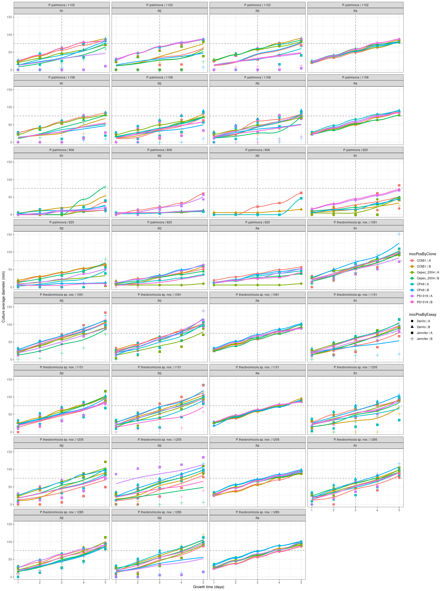

# Exploratory data analysis

## Get raw data

<div data-pagedtable="false">
  <script data-pagedtable-source type="application/json">
{"columns":[{"label":["id"],"name":[1],"type":["dbl"],"align":["right"]},{"label":["strain"],"name":[2],"type":["chr"],"align":["left"]},{"label":["replicate"],"name":[3],"type":["chr"],"align":["left"]},{"label":["day"],"name":[4],"type":["dbl"],"align":["right"]},{"label":["clone"],"name":[5],"type":["chr"],"align":["left"]},{"label":["length"],"name":[6],"type":["dbl"],"align":["right"]},{"label":["width"],"name":[7],"type":["dbl"],"align":["right"]},{"label":["average"],"name":[8],"type":["dbl"],"align":["right"]},{"label":["inocPos"],"name":[9],"type":["chr"],"align":["left"]},{"label":["essay"],"name":[10],"type":["chr"],"align":["left"]},{"label":["species"],"name":[11],"type":["chr"],"align":["left"]},{"label":["strain_old"],"name":[12],"type":["chr"],"align":["left"]},{"label":["cdna"],"name":[13],"type":["chr"],"align":["left"]},{"label":["farm"],"name":[14],"type":["chr"],"align":["left"]},{"label":["code"],"name":[15],"type":["chr"],"align":["left"]},{"label":["inocPosByEssay"],"name":[16],"type":["chr"],"align":["left"]},{"label":["inocPosByClone"],"name":[17],"type":["chr"],"align":["left"]}],"data":[{"1":"1","2":"1091","3":"R1","4":"1","5":"CCN51","6":"0.000","7":"0.000","8":"0.0000","9":"A","10":"Jennifer","11":"P. theobromicola sp. nov.","12":"02_IF","13":"950","14":"Lembrance","15":"P. theobromicola sp. nov. | 1091","16":"Jennifer | A","17":"CCN51 | A"},{"1":"2","2":"1091","3":"R1","4":"2","5":"CCN51","6":"22.450","7":"15.850","8":"19.1500","9":"A","10":"Jennifer","11":"P. theobromicola sp. nov.","12":"02_IF","13":"950","14":"Lembrance","15":"P. theobromicola sp. nov. | 1091","16":"Jennifer | A","17":"CCN51 | A"},{"1":"3","2":"1091","3":"R1","4":"3","5":"CCN51","6":"37.930","7":"34.930","8":"36.4300","9":"A","10":"Jennifer","11":"P. theobromicola sp. nov.","12":"02_IF","13":"950","14":"Lembrance","15":"P. theobromicola sp. nov. | 1091","16":"Jennifer | A","17":"CCN51 | A"},{"1":"4","2":"1091","3":"R1","4":"4","5":"CCN51","6":"54.640","7":"58.840","8":"56.7400","9":"A","10":"Jennifer","11":"P. theobromicola sp. nov.","12":"02_IF","13":"950","14":"Lembrance","15":"P. theobromicola sp. nov. | 1091","16":"Jennifer | A","17":"CCN51 | A"},{"1":"5","2":"1091","3":"R1","4":"5","5":"CCN51","6":"86.600","7":"105.320","8":"95.9600","9":"A","10":"Jennifer","11":"P. theobromicola sp. nov.","12":"02_IF","13":"950","14":"Lembrance","15":"P. theobromicola sp. nov. | 1091","16":"Jennifer | A","17":"CCN51 | A"},{"1":"6","2":"1091","3":"R2","4":"1","5":"CCN51","6":"32.650","7":"25.700","8":"29.1750","9":"A","10":"Jennifer","11":"P. theobromicola sp. nov.","12":"02_IF","13":"950","14":"Lembrance","15":"P. theobromicola sp. nov. | 1091","16":"Jennifer | A","17":"CCN51 | A"},{"1":"7","2":"1091","3":"R2","4":"2","5":"CCN51","6":"54.330","7":"51.490","8":"52.9100","9":"A","10":"Jennifer","11":"P. theobromicola sp. nov.","12":"02_IF","13":"950","14":"Lembrance","15":"P. theobromicola sp. nov. | 1091","16":"Jennifer | A","17":"CCN51 | A"},{"1":"8","2":"1091","3":"R2","4":"3","5":"CCN51","6":"74.840","7":"69.140","8":"71.9900","9":"A","10":"Jennifer","11":"P. theobromicola sp. nov.","12":"02_IF","13":"950","14":"Lembrance","15":"P. theobromicola sp. nov. | 1091","16":"Jennifer | A","17":"CCN51 | A"},{"1":"9","2":"1091","3":"R2","4":"4","5":"CCN51","6":"92.540","7":"103.490","8":"98.0150","9":"A","10":"Jennifer","11":"P. theobromicola sp. nov.","12":"02_IF","13":"950","14":"Lembrance","15":"P. theobromicola sp. nov. | 1091","16":"Jennifer | A","17":"CCN51 | A"},{"1":"10","2":"1091","3":"R2","4":"5","5":"CCN51","6":"108.200","7":"159.520","8":"133.8600","9":"A","10":"Jennifer","11":"P. theobromicola sp. nov.","12":"02_IF","13":"950","14":"Lembrance","15":"P. theobromicola sp. nov. | 1091","16":"Jennifer | A","17":"CCN51 | A"},{"1":"11","2":"1091","3":"R3","4":"1","5":"CCN51","6":"18.380","7":"18.850","8":"18.6150","9":"A","10":"Jennifer","11":"P. theobromicola sp. nov.","12":"02_IF","13":"950","14":"Lembrance","15":"P. theobromicola sp. nov. | 1091","16":"Jennifer | A","17":"CCN51 | A"},{"1":"12","2":"1091","3":"R3","4":"2","5":"CCN51","6":"39.080","7":"31.690","8":"35.3850","9":"A","10":"Jennifer","11":"P. theobromicola sp. nov.","12":"02_IF","13":"950","14":"Lembrance","15":"P. theobromicola sp. nov. | 1091","16":"Jennifer | A","17":"CCN51 | A"},{"1":"13","2":"1091","3":"R3","4":"3","5":"CCN51","6":"62.690","7":"58.710","8":"60.7000","9":"A","10":"Jennifer","11":"P. theobromicola sp. nov.","12":"02_IF","13":"950","14":"Lembrance","15":"P. theobromicola sp. nov. | 1091","16":"Jennifer | A","17":"CCN51 | A"},{"1":"14","2":"1091","3":"R3","4":"4","5":"CCN51","6":"79.990","7":"79.220","8":"79.6050","9":"A","10":"Jennifer","11":"P. theobromicola sp. nov.","12":"02_IF","13":"950","14":"Lembrance","15":"P. theobromicola sp. nov. | 1091","16":"Jennifer | A","17":"CCN51 | A"},{"1":"15","2":"1091","3":"R3","4":"5","5":"CCN51","6":"101.350","7":"119.630","8":"110.4900","9":"A","10":"Jennifer","11":"P. theobromicola sp. nov.","12":"02_IF","13":"950","14":"Lembrance","15":"P. theobromicola sp. nov. | 1091","16":"Jennifer | A","17":"CCN51 | A"},{"1":"16","2":"1091","3":"R1","4":"1","5":"Cepec_2004","6":"0.000","7":"0.000","8":"0.0000","9":"A","10":"Jennifer","11":"P. theobromicola sp. nov.","12":"02_IF","13":"950","14":"Lembrance","15":"P. theobromicola sp. nov. | 1091","16":"Jennifer | A","17":"Cepec_2004 | A"},{"1":"17","2":"1091","3":"R1","4":"2","5":"Cepec_2004","6":"0.000","7":"0.000","8":"0.0000","9":"A","10":"Jennifer","11":"P. theobromicola sp. nov.","12":"02_IF","13":"950","14":"Lembrance","15":"P. theobromicola sp. nov. | 1091","16":"Jennifer | A","17":"Cepec_2004 | A"},{"1":"18","2":"1091","3":"R1","4":"3","5":"Cepec_2004","6":"0.000","7":"0.000","8":"0.0000","9":"A","10":"Jennifer","11":"P. theobromicola sp. nov.","12":"02_IF","13":"950","14":"Lembrance","15":"P. theobromicola sp. nov. | 1091","16":"Jennifer | A","17":"Cepec_2004 | A"},{"1":"19","2":"1091","3":"R1","4":"4","5":"Cepec_2004","6":"0.000","7":"0.000","8":"0.0000","9":"A","10":"Jennifer","11":"P. theobromicola sp. nov.","12":"02_IF","13":"950","14":"Lembrance","15":"P. theobromicola sp. nov. | 1091","16":"Jennifer | A","17":"Cepec_2004 | A"},{"1":"20","2":"1091","3":"R1","4":"5","5":"Cepec_2004","6":"0.000","7":"0.000","8":"0.0000","9":"A","10":"Jennifer","11":"P. theobromicola sp. nov.","12":"02_IF","13":"950","14":"Lembrance","15":"P. theobromicola sp. nov. | 1091","16":"Jennifer | A","17":"Cepec_2004 | A"},{"1":"21","2":"1091","3":"R2","4":"1","5":"Cepec_2004","6":"0.000","7":"0.000","8":"0.0000","9":"A","10":"Jennifer","11":"P. theobromicola sp. nov.","12":"02_IF","13":"950","14":"Lembrance","15":"P. theobromicola sp. nov. | 1091","16":"Jennifer | A","17":"Cepec_2004 | A"},{"1":"22","2":"1091","3":"R2","4":"2","5":"Cepec_2004","6":"0.000","7":"0.000","8":"0.0000","9":"A","10":"Jennifer","11":"P. theobromicola sp. nov.","12":"02_IF","13":"950","14":"Lembrance","15":"P. theobromicola sp. nov. | 1091","16":"Jennifer | A","17":"Cepec_2004 | A"},{"1":"23","2":"1091","3":"R2","4":"3","5":"Cepec_2004","6":"0.000","7":"0.000","8":"0.0000","9":"A","10":"Jennifer","11":"P. theobromicola sp. nov.","12":"02_IF","13":"950","14":"Lembrance","15":"P. theobromicola sp. nov. | 1091","16":"Jennifer | A","17":"Cepec_2004 | A"},{"1":"24","2":"1091","3":"R2","4":"4","5":"Cepec_2004","6":"0.000","7":"0.000","8":"0.0000","9":"A","10":"Jennifer","11":"P. theobromicola sp. nov.","12":"02_IF","13":"950","14":"Lembrance","15":"P. theobromicola sp. nov. | 1091","16":"Jennifer | A","17":"Cepec_2004 | A"},{"1":"25","2":"1091","3":"R2","4":"5","5":"Cepec_2004","6":"0.000","7":"0.000","8":"0.0000","9":"A","10":"Jennifer","11":"P. theobromicola sp. nov.","12":"02_IF","13":"950","14":"Lembrance","15":"P. theobromicola sp. nov. | 1091","16":"Jennifer | A","17":"Cepec_2004 | A"},{"1":"26","2":"1091","3":"R3","4":"1","5":"Cepec_2004","6":"0.000","7":"6.960","8":"3.4800","9":"A","10":"Jennifer","11":"P. theobromicola sp. nov.","12":"02_IF","13":"950","14":"Lembrance","15":"P. theobromicola sp. nov. | 1091","16":"Jennifer | A","17":"Cepec_2004 | A"},{"1":"27","2":"1091","3":"R3","4":"2","5":"Cepec_2004","6":"14.220","7":"11.770","8":"12.9950","9":"A","10":"Jennifer","11":"P. theobromicola sp. nov.","12":"02_IF","13":"950","14":"Lembrance","15":"P. theobromicola sp. nov. | 1091","16":"Jennifer | A","17":"Cepec_2004 | A"},{"1":"28","2":"1091","3":"R3","4":"3","5":"Cepec_2004","6":"26.360","7":"18.830","8":"22.5950","9":"A","10":"Jennifer","11":"P. theobromicola sp. nov.","12":"02_IF","13":"950","14":"Lembrance","15":"P. theobromicola sp. nov. | 1091","16":"Jennifer | A","17":"Cepec_2004 | A"},{"1":"29","2":"1091","3":"R3","4":"4","5":"Cepec_2004","6":"42.240","7":"31.050","8":"36.6450","9":"A","10":"Jennifer","11":"P. theobromicola sp. nov.","12":"02_IF","13":"950","14":"Lembrance","15":"P. theobromicola sp. nov. | 1091","16":"Jennifer | A","17":"Cepec_2004 | A"},{"1":"30","2":"1091","3":"R3","4":"5","5":"Cepec_2004","6":"69.080","7":"71.770","8":"70.4250","9":"A","10":"Jennifer","11":"P. theobromicola sp. nov.","12":"02_IF","13":"950","14":"Lembrance","15":"P. theobromicola sp. nov. | 1091","16":"Jennifer | A","17":"Cepec_2004 | A"},{"1":"31","2":"1091","3":"R1","4":"1","5":"CP49","6":"12.080","7":"11.060","8":"11.5700","9":"A","10":"Jennifer","11":"P. theobromicola sp. nov.","12":"02_IF","13":"950","14":"Lembrance","15":"P. theobromicola sp. nov. | 1091","16":"Jennifer | A","17":"CP49 | A"},{"1":"32","2":"1091","3":"R1","4":"2","5":"CP49","6":"29.260","7":"27.710","8":"28.4850","9":"A","10":"Jennifer","11":"P. theobromicola sp. nov.","12":"02_IF","13":"950","14":"Lembrance","15":"P. theobromicola sp. nov. | 1091","16":"Jennifer | A","17":"CP49 | A"},{"1":"33","2":"1091","3":"R1","4":"3","5":"CP49","6":"50.250","7":"53.870","8":"52.0600","9":"A","10":"Jennifer","11":"P. theobromicola sp. nov.","12":"02_IF","13":"950","14":"Lembrance","15":"P. theobromicola sp. nov. | 1091","16":"Jennifer | A","17":"CP49 | A"},{"1":"34","2":"1091","3":"R1","4":"4","5":"CP49","6":"68.010","7":"78.820","8":"73.4150","9":"A","10":"Jennifer","11":"P. theobromicola sp. nov.","12":"02_IF","13":"950","14":"Lembrance","15":"P. theobromicola sp. nov. | 1091","16":"Jennifer | A","17":"CP49 | A"},{"1":"35","2":"1091","3":"R1","4":"5","5":"CP49","6":"101.630","7":"117.470","8":"109.5500","9":"A","10":"Jennifer","11":"P. theobromicola sp. nov.","12":"02_IF","13":"950","14":"Lembrance","15":"P. theobromicola sp. nov. | 1091","16":"Jennifer | A","17":"CP49 | A"},{"1":"36","2":"1091","3":"R2","4":"1","5":"CP49","6":"19.770","7":"17.260","8":"18.5150","9":"A","10":"Jennifer","11":"P. theobromicola sp. nov.","12":"02_IF","13":"950","14":"Lembrance","15":"P. theobromicola sp. nov. | 1091","16":"Jennifer | A","17":"CP49 | A"},{"1":"37","2":"1091","3":"R2","4":"2","5":"CP49","6":"34.090","7":"37.930","8":"36.0100","9":"A","10":"Jennifer","11":"P. theobromicola sp. nov.","12":"02_IF","13":"950","14":"Lembrance","15":"P. theobromicola sp. nov. | 1091","16":"Jennifer | A","17":"CP49 | A"},{"1":"38","2":"1091","3":"R2","4":"3","5":"CP49","6":"56.380","7":"61.160","8":"58.7700","9":"A","10":"Jennifer","11":"P. theobromicola sp. nov.","12":"02_IF","13":"950","14":"Lembrance","15":"P. theobromicola sp. nov. | 1091","16":"Jennifer | A","17":"CP49 | A"},{"1":"39","2":"1091","3":"R2","4":"4","5":"CP49","6":"72.990","7":"86.360","8":"79.6750","9":"A","10":"Jennifer","11":"P. theobromicola sp. nov.","12":"02_IF","13":"950","14":"Lembrance","15":"P. theobromicola sp. nov. | 1091","16":"Jennifer | A","17":"CP49 | A"},{"1":"40","2":"1091","3":"R2","4":"5","5":"CP49","6":"96.950","7":"122.400","8":"109.6750","9":"A","10":"Jennifer","11":"P. theobromicola sp. nov.","12":"02_IF","13":"950","14":"Lembrance","15":"P. theobromicola sp. nov. | 1091","16":"Jennifer | A","17":"CP49 | A"},{"1":"41","2":"1091","3":"R3","4":"1","5":"CP49","6":"10.540","7":"13.050","8":"11.7950","9":"A","10":"Jennifer","11":"P. theobromicola sp. nov.","12":"02_IF","13":"950","14":"Lembrance","15":"P. theobromicola sp. nov. | 1091","16":"Jennifer | A","17":"CP49 | A"},{"1":"42","2":"1091","3":"R3","4":"2","5":"CP49","6":"13.590","7":"16.030","8":"14.8100","9":"A","10":"Jennifer","11":"P. theobromicola sp. nov.","12":"02_IF","13":"950","14":"Lembrance","15":"P. theobromicola sp. nov. | 1091","16":"Jennifer | A","17":"CP49 | A"},{"1":"43","2":"1091","3":"R3","4":"3","5":"CP49","6":"26.270","7":"42.250","8":"34.2600","9":"A","10":"Jennifer","11":"P. theobromicola sp. nov.","12":"02_IF","13":"950","14":"Lembrance","15":"P. theobromicola sp. nov. | 1091","16":"Jennifer | A","17":"CP49 | A"},{"1":"44","2":"1091","3":"R3","4":"4","5":"CP49","6":"46.050","7":"61.610","8":"53.8300","9":"A","10":"Jennifer","11":"P. theobromicola sp. nov.","12":"02_IF","13":"950","14":"Lembrance","15":"P. theobromicola sp. nov. | 1091","16":"Jennifer | A","17":"CP49 | A"},{"1":"45","2":"1091","3":"R3","4":"5","5":"CP49","6":"93.650","7":"117.490","8":"105.5700","9":"A","10":"Jennifer","11":"P. theobromicola sp. nov.","12":"02_IF","13":"950","14":"Lembrance","15":"P. theobromicola sp. nov. | 1091","16":"Jennifer | A","17":"CP49 | A"},{"1":"46","2":"1091","3":"R1","4":"1","5":"PS1319","6":"15.810","7":"13.750","8":"14.7800","9":"A","10":"Jennifer","11":"P. theobromicola sp. nov.","12":"02_IF","13":"950","14":"Lembrance","15":"P. theobromicola sp. nov. | 1091","16":"Jennifer | A","17":"PS1319 | A"},{"1":"47","2":"1091","3":"R1","4":"2","5":"PS1319","6":"25.720","7":"23.460","8":"24.5900","9":"A","10":"Jennifer","11":"P. theobromicola sp. nov.","12":"02_IF","13":"950","14":"Lembrance","15":"P. theobromicola sp. nov. | 1091","16":"Jennifer | A","17":"PS1319 | A"},{"1":"48","2":"1091","3":"R1","4":"3","5":"PS1319","6":"38.080","7":"38.320","8":"38.2000","9":"A","10":"Jennifer","11":"P. theobromicola sp. nov.","12":"02_IF","13":"950","14":"Lembrance","15":"P. theobromicola sp. nov. | 1091","16":"Jennifer | A","17":"PS1319 | A"},{"1":"49","2":"1091","3":"R1","4":"4","5":"PS1319","6":"49.650","7":"52.150","8":"50.9000","9":"A","10":"Jennifer","11":"P. theobromicola sp. nov.","12":"02_IF","13":"950","14":"Lembrance","15":"P. theobromicola sp. nov. | 1091","16":"Jennifer | A","17":"PS1319 | A"},{"1":"50","2":"1091","3":"R1","4":"5","5":"PS1319","6":"71.720","7":"73.360","8":"72.5400","9":"A","10":"Jennifer","11":"P. theobromicola sp. nov.","12":"02_IF","13":"950","14":"Lembrance","15":"P. theobromicola sp. nov. | 1091","16":"Jennifer | A","17":"PS1319 | A"},{"1":"51","2":"1091","3":"R2","4":"1","5":"PS1319","6":"12.910","7":"10.750","8":"11.8300","9":"A","10":"Jennifer","11":"P. theobromicola sp. nov.","12":"02_IF","13":"950","14":"Lembrance","15":"P. theobromicola sp. nov. | 1091","16":"Jennifer | A","17":"PS1319 | A"},{"1":"52","2":"1091","3":"R2","4":"2","5":"PS1319","6":"23.700","7":"23.930","8":"23.8150","9":"A","10":"Jennifer","11":"P. theobromicola sp. nov.","12":"02_IF","13":"950","14":"Lembrance","15":"P. theobromicola sp. nov. | 1091","16":"Jennifer | A","17":"PS1319 | A"},{"1":"53","2":"1091","3":"R2","4":"3","5":"PS1319","6":"40.210","7":"47.630","8":"43.9200","9":"A","10":"Jennifer","11":"P. theobromicola sp. nov.","12":"02_IF","13":"950","14":"Lembrance","15":"P. theobromicola sp. nov. | 1091","16":"Jennifer | A","17":"PS1319 | A"},{"1":"54","2":"1091","3":"R2","4":"4","5":"PS1319","6":"55.910","7":"75.880","8":"65.8950","9":"A","10":"Jennifer","11":"P. theobromicola sp. nov.","12":"02_IF","13":"950","14":"Lembrance","15":"P. theobromicola sp. nov. | 1091","16":"Jennifer | A","17":"PS1319 | A"},{"1":"55","2":"1091","3":"R2","4":"5","5":"PS1319","6":"81.930","7":"101.920","8":"91.9250","9":"A","10":"Jennifer","11":"P. theobromicola sp. nov.","12":"02_IF","13":"950","14":"Lembrance","15":"P. theobromicola sp. nov. | 1091","16":"Jennifer | A","17":"PS1319 | A"},{"1":"56","2":"1091","3":"R3","4":"1","5":"PS1319","6":"14.770","7":"12.780","8":"13.7750","9":"A","10":"Jennifer","11":"P. theobromicola sp. nov.","12":"02_IF","13":"950","14":"Lembrance","15":"P. theobromicola sp. nov. | 1091","16":"Jennifer | A","17":"PS1319 | A"},{"1":"57","2":"1091","3":"R3","4":"2","5":"PS1319","6":"23.300","7":"27.540","8":"25.4200","9":"A","10":"Jennifer","11":"P. theobromicola sp. nov.","12":"02_IF","13":"950","14":"Lembrance","15":"P. theobromicola sp. nov. | 1091","16":"Jennifer | A","17":"PS1319 | A"},{"1":"58","2":"1091","3":"R3","4":"3","5":"PS1319","6":"47.730","7":"54.780","8":"51.2550","9":"A","10":"Jennifer","11":"P. theobromicola sp. nov.","12":"02_IF","13":"950","14":"Lembrance","15":"P. theobromicola sp. nov. | 1091","16":"Jennifer | A","17":"PS1319 | A"},{"1":"59","2":"1091","3":"R3","4":"4","5":"PS1319","6":"62.220","7":"77.780","8":"70.0000","9":"A","10":"Jennifer","11":"P. theobromicola sp. nov.","12":"02_IF","13":"950","14":"Lembrance","15":"P. theobromicola sp. nov. | 1091","16":"Jennifer | A","17":"PS1319 | A"},{"1":"60","2":"1091","3":"R3","4":"5","5":"PS1319","6":"112.470","7":"112.470","8":"112.4700","9":"A","10":"Jennifer","11":"P. theobromicola sp. nov.","12":"02_IF","13":"950","14":"Lembrance","15":"P. theobromicola sp. nov. | 1091","16":"Jennifer | A","17":"PS1319 | A"},{"1":"61","2":"1205","3":"R1","4":"1","5":"CCN51","6":"0.000","7":"0.000","8":"0.0000","9":"A","10":"Jennifer","11":"P. theobromicola sp. nov.","12":"38_F","13":"987","14":"Sucupira","15":"P. theobromicola sp. nov. | 1205","16":"Jennifer | A","17":"CCN51 | A"},{"1":"62","2":"1205","3":"R1","4":"2","5":"CCN51","6":"0.000","7":"0.000","8":"0.0000","9":"A","10":"Jennifer","11":"P. theobromicola sp. nov.","12":"38_F","13":"987","14":"Sucupira","15":"P. theobromicola sp. nov. | 1205","16":"Jennifer | A","17":"CCN51 | A"},{"1":"63","2":"1205","3":"R1","4":"3","5":"CCN51","6":"0.000","7":"0.000","8":"0.0000","9":"A","10":"Jennifer","11":"P. theobromicola sp. nov.","12":"38_F","13":"987","14":"Sucupira","15":"P. theobromicola sp. nov. | 1205","16":"Jennifer | A","17":"CCN51 | A"},{"1":"64","2":"1205","3":"R1","4":"4","5":"CCN51","6":"0.000","7":"0.000","8":"0.0000","9":"A","10":"Jennifer","11":"P. theobromicola sp. nov.","12":"38_F","13":"987","14":"Sucupira","15":"P. theobromicola sp. nov. | 1205","16":"Jennifer | A","17":"CCN51 | A"},{"1":"65","2":"1205","3":"R1","4":"5","5":"CCN51","6":"0.000","7":"0.000","8":"0.0000","9":"A","10":"Jennifer","11":"P. theobromicola sp. nov.","12":"38_F","13":"987","14":"Sucupira","15":"P. theobromicola sp. nov. | 1205","16":"Jennifer | A","17":"CCN51 | A"},{"1":"66","2":"1205","3":"R2","4":"1","5":"CCN51","6":"0.000","7":"0.000","8":"0.0000","9":"A","10":"Jennifer","11":"P. theobromicola sp. nov.","12":"38_F","13":"987","14":"Sucupira","15":"P. theobromicola sp. nov. | 1205","16":"Jennifer | A","17":"CCN51 | A"},{"1":"67","2":"1205","3":"R2","4":"2","5":"CCN51","6":"0.000","7":"0.000","8":"0.0000","9":"A","10":"Jennifer","11":"P. theobromicola sp. nov.","12":"38_F","13":"987","14":"Sucupira","15":"P. theobromicola sp. nov. | 1205","16":"Jennifer | A","17":"CCN51 | A"},{"1":"68","2":"1205","3":"R2","4":"3","5":"CCN51","6":"11.630","7":"0.000","8":"5.8150","9":"A","10":"Jennifer","11":"P. theobromicola sp. nov.","12":"38_F","13":"987","14":"Sucupira","15":"P. theobromicola sp. nov. | 1205","16":"Jennifer | A","17":"CCN51 | A"},{"1":"69","2":"1205","3":"R2","4":"4","5":"CCN51","6":"26.420","7":"21.460","8":"23.9400","9":"A","10":"Jennifer","11":"P. theobromicola sp. nov.","12":"38_F","13":"987","14":"Sucupira","15":"P. theobromicola sp. nov. | 1205","16":"Jennifer | A","17":"CCN51 | A"},{"1":"70","2":"1205","3":"R2","4":"5","5":"CCN51","6":"52.680","7":"46.550","8":"49.6150","9":"A","10":"Jennifer","11":"P. theobromicola sp. nov.","12":"38_F","13":"987","14":"Sucupira","15":"P. theobromicola sp. nov. | 1205","16":"Jennifer | A","17":"CCN51 | A"},{"1":"71","2":"1205","3":"R3","4":"1","5":"CCN51","6":"0.000","7":"0.000","8":"0.0000","9":"A","10":"Jennifer","11":"P. theobromicola sp. nov.","12":"38_F","13":"987","14":"Sucupira","15":"P. theobromicola sp. nov. | 1205","16":"Jennifer | A","17":"CCN51 | A"},{"1":"72","2":"1205","3":"R3","4":"2","5":"CCN51","6":"0.000","7":"0.000","8":"0.0000","9":"A","10":"Jennifer","11":"P. theobromicola sp. nov.","12":"38_F","13":"987","14":"Sucupira","15":"P. theobromicola sp. nov. | 1205","16":"Jennifer | A","17":"CCN51 | A"},{"1":"73","2":"1205","3":"R3","4":"3","5":"CCN51","6":"20.250","7":"25.710","8":"22.9800","9":"A","10":"Jennifer","11":"P. theobromicola sp. nov.","12":"38_F","13":"987","14":"Sucupira","15":"P. theobromicola sp. nov. | 1205","16":"Jennifer | A","17":"CCN51 | A"},{"1":"74","2":"1205","3":"R3","4":"4","5":"CCN51","6":"39.730","7":"54.180","8":"46.9550","9":"A","10":"Jennifer","11":"P. theobromicola sp. nov.","12":"38_F","13":"987","14":"Sucupira","15":"P. theobromicola sp. nov. | 1205","16":"Jennifer | A","17":"CCN51 | A"},{"1":"75","2":"1205","3":"R3","4":"5","5":"CCN51","6":"67.540","7":"87.470","8":"77.5050","9":"A","10":"Jennifer","11":"P. theobromicola sp. nov.","12":"38_F","13":"987","14":"Sucupira","15":"P. theobromicola sp. nov. | 1205","16":"Jennifer | A","17":"CCN51 | A"},{"1":"76","2":"1205","3":"R1","4":"1","5":"Cepec_2004","6":"10.160","7":"12.130","8":"11.1450","9":"A","10":"Jennifer","11":"P. theobromicola sp. nov.","12":"38_F","13":"987","14":"Sucupira","15":"P. theobromicola sp. nov. | 1205","16":"Jennifer | A","17":"Cepec_2004 | A"},{"1":"77","2":"1205","3":"R1","4":"2","5":"Cepec_2004","6":"27.140","7":"27.220","8":"27.1800","9":"A","10":"Jennifer","11":"P. theobromicola sp. nov.","12":"38_F","13":"987","14":"Sucupira","15":"P. theobromicola sp. nov. | 1205","16":"Jennifer | A","17":"Cepec_2004 | A"},{"1":"78","2":"1205","3":"R1","4":"3","5":"Cepec_2004","6":"46.070","7":"35.440","8":"40.7550","9":"A","10":"Jennifer","11":"P. theobromicola sp. nov.","12":"38_F","13":"987","14":"Sucupira","15":"P. theobromicola sp. nov. | 1205","16":"Jennifer | A","17":"Cepec_2004 | A"},{"1":"79","2":"1205","3":"R1","4":"4","5":"Cepec_2004","6":"60.820","7":"60.820","8":"60.8200","9":"A","10":"Jennifer","11":"P. theobromicola sp. nov.","12":"38_F","13":"987","14":"Sucupira","15":"P. theobromicola sp. nov. | 1205","16":"Jennifer | A","17":"Cepec_2004 | A"},{"1":"80","2":"1205","3":"R1","4":"5","5":"Cepec_2004","6":"89.040","7":"97.040","8":"93.0400","9":"A","10":"Jennifer","11":"P. theobromicola sp. nov.","12":"38_F","13":"987","14":"Sucupira","15":"P. theobromicola sp. nov. | 1205","16":"Jennifer | A","17":"Cepec_2004 | A"},{"1":"81","2":"1205","3":"R2","4":"1","5":"Cepec_2004","6":"25.880","7":"15.220","8":"20.5500","9":"A","10":"Jennifer","11":"P. theobromicola sp. nov.","12":"38_F","13":"987","14":"Sucupira","15":"P. theobromicola sp. nov. | 1205","16":"Jennifer | A","17":"Cepec_2004 | A"},{"1":"82","2":"1205","3":"R2","4":"2","5":"Cepec_2004","6":"48.240","7":"36.370","8":"42.3050","9":"A","10":"Jennifer","11":"P. theobromicola sp. nov.","12":"38_F","13":"987","14":"Sucupira","15":"P. theobromicola sp. nov. | 1205","16":"Jennifer | A","17":"Cepec_2004 | A"},{"1":"83","2":"1205","3":"R2","4":"3","5":"Cepec_2004","6":"71.300","7":"60.100","8":"65.7000","9":"A","10":"Jennifer","11":"P. theobromicola sp. nov.","12":"38_F","13":"987","14":"Sucupira","15":"P. theobromicola sp. nov. | 1205","16":"Jennifer | A","17":"Cepec_2004 | A"},{"1":"84","2":"1205","3":"R2","4":"4","5":"Cepec_2004","6":"89.680","7":"86.760","8":"88.2200","9":"A","10":"Jennifer","11":"P. theobromicola sp. nov.","12":"38_F","13":"987","14":"Sucupira","15":"P. theobromicola sp. nov. | 1205","16":"Jennifer | A","17":"Cepec_2004 | A"},{"1":"85","2":"1205","3":"R2","4":"5","5":"Cepec_2004","6":"106.360","7":"136.560","8":"121.4600","9":"A","10":"Jennifer","11":"P. theobromicola sp. nov.","12":"38_F","13":"987","14":"Sucupira","15":"P. theobromicola sp. nov. | 1205","16":"Jennifer | A","17":"Cepec_2004 | A"},{"1":"86","2":"1205","3":"R3","4":"1","5":"Cepec_2004","6":"10.630","7":"12.840","8":"11.7350","9":"A","10":"Jennifer","11":"P. theobromicola sp. nov.","12":"38_F","13":"987","14":"Sucupira","15":"P. theobromicola sp. nov. | 1205","16":"Jennifer | A","17":"Cepec_2004 | A"},{"1":"87","2":"1205","3":"R3","4":"2","5":"Cepec_2004","6":"23.880","7":"34.830","8":"29.3550","9":"A","10":"Jennifer","11":"P. theobromicola sp. nov.","12":"38_F","13":"987","14":"Sucupira","15":"P. theobromicola sp. nov. | 1205","16":"Jennifer | A","17":"Cepec_2004 | A"},{"1":"88","2":"1205","3":"R3","4":"3","5":"Cepec_2004","6":"46.260","7":"75.250","8":"60.7550","9":"A","10":"Jennifer","11":"P. theobromicola sp. nov.","12":"38_F","13":"987","14":"Sucupira","15":"P. theobromicola sp. nov. | 1205","16":"Jennifer | A","17":"Cepec_2004 | A"},{"1":"89","2":"1205","3":"R3","4":"4","5":"Cepec_2004","6":"60.420","7":"96.590","8":"78.5050","9":"A","10":"Jennifer","11":"P. theobromicola sp. nov.","12":"38_F","13":"987","14":"Sucupira","15":"P. theobromicola sp. nov. | 1205","16":"Jennifer | A","17":"Cepec_2004 | A"},{"1":"90","2":"1205","3":"R3","4":"5","5":"Cepec_2004","6":"95.660","7":"123.340","8":"109.5000","9":"A","10":"Jennifer","11":"P. theobromicola sp. nov.","12":"38_F","13":"987","14":"Sucupira","15":"P. theobromicola sp. nov. | 1205","16":"Jennifer | A","17":"Cepec_2004 | A"},{"1":"91","2":"1205","3":"R1","4":"1","5":"CP49","6":"6.640","7":"0.000","8":"3.3200","9":"A","10":"Jennifer","11":"P. theobromicola sp. nov.","12":"38_F","13":"987","14":"Sucupira","15":"P. theobromicola sp. nov. | 1205","16":"Jennifer | A","17":"CP49 | A"},{"1":"92","2":"1205","3":"R1","4":"2","5":"CP49","6":"10.300","7":"9.930","8":"10.1150","9":"A","10":"Jennifer","11":"P. theobromicola sp. nov.","12":"38_F","13":"987","14":"Sucupira","15":"P. theobromicola sp. nov. | 1205","16":"Jennifer | A","17":"CP49 | A"},{"1":"93","2":"1205","3":"R1","4":"3","5":"CP49","6":"17.090","7":"13.440","8":"15.2650","9":"A","10":"Jennifer","11":"P. theobromicola sp. nov.","12":"38_F","13":"987","14":"Sucupira","15":"P. theobromicola sp. nov. | 1205","16":"Jennifer | A","17":"CP49 | A"},{"1":"94","2":"1205","3":"R1","4":"4","5":"CP49","6":"25.220","7":"15.970","8":"20.5950","9":"A","10":"Jennifer","11":"P. theobromicola sp. nov.","12":"38_F","13":"987","14":"Sucupira","15":"P. theobromicola sp. nov. | 1205","16":"Jennifer | A","17":"CP49 | A"},{"1":"95","2":"1205","3":"R1","4":"5","5":"CP49","6":"41.250","7":"26.650","8":"33.9500","9":"A","10":"Jennifer","11":"P. theobromicola sp. nov.","12":"38_F","13":"987","14":"Sucupira","15":"P. theobromicola sp. nov. | 1205","16":"Jennifer | A","17":"CP49 | A"},{"1":"96","2":"1205","3":"R2","4":"1","5":"CP49","6":"13.320","7":"10.110","8":"11.7150","9":"A","10":"Jennifer","11":"P. theobromicola sp. nov.","12":"38_F","13":"987","14":"Sucupira","15":"P. theobromicola sp. nov. | 1205","16":"Jennifer | A","17":"CP49 | A"},{"1":"97","2":"1205","3":"R2","4":"2","5":"CP49","6":"13.430","7":"17.890","8":"15.6600","9":"A","10":"Jennifer","11":"P. theobromicola sp. nov.","12":"38_F","13":"987","14":"Sucupira","15":"P. theobromicola sp. nov. | 1205","16":"Jennifer | A","17":"CP49 | A"},{"1":"98","2":"1205","3":"R2","4":"3","5":"CP49","6":"33.390","7":"32.250","8":"32.8200","9":"A","10":"Jennifer","11":"P. theobromicola sp. nov.","12":"38_F","13":"987","14":"Sucupira","15":"P. theobromicola sp. nov. | 1205","16":"Jennifer | A","17":"CP49 | A"},{"1":"99","2":"1205","3":"R2","4":"4","5":"CP49","6":"41.780","7":"50.420","8":"46.1000","9":"A","10":"Jennifer","11":"P. theobromicola sp. nov.","12":"38_F","13":"987","14":"Sucupira","15":"P. theobromicola sp. nov. | 1205","16":"Jennifer | A","17":"CP49 | A"},{"1":"100","2":"1205","3":"R2","4":"5","5":"CP49","6":"72.280","7":"95.080","8":"83.6800","9":"A","10":"Jennifer","11":"P. theobromicola sp. nov.","12":"38_F","13":"987","14":"Sucupira","15":"P. theobromicola sp. nov. | 1205","16":"Jennifer | A","17":"CP49 | A"},{"1":"101","2":"1205","3":"R3","4":"1","5":"CP49","6":"12.050","7":"11.300","8":"11.6750","9":"A","10":"Jennifer","11":"P. theobromicola sp. nov.","12":"38_F","13":"987","14":"Sucupira","15":"P. theobromicola sp. nov. | 1205","16":"Jennifer | A","17":"CP49 | A"},{"1":"102","2":"1205","3":"R3","4":"2","5":"CP49","6":"17.690","7":"18.570","8":"18.1300","9":"A","10":"Jennifer","11":"P. theobromicola sp. nov.","12":"38_F","13":"987","14":"Sucupira","15":"P. theobromicola sp. nov. | 1205","16":"Jennifer | A","17":"CP49 | A"},{"1":"103","2":"1205","3":"R3","4":"3","5":"CP49","6":"36.110","7":"55.770","8":"45.9400","9":"A","10":"Jennifer","11":"P. theobromicola sp. nov.","12":"38_F","13":"987","14":"Sucupira","15":"P. theobromicola sp. nov. | 1205","16":"Jennifer | A","17":"CP49 | A"},{"1":"104","2":"1205","3":"R3","4":"4","5":"CP49","6":"56.880","7":"76.560","8":"66.7200","9":"A","10":"Jennifer","11":"P. theobromicola sp. nov.","12":"38_F","13":"987","14":"Sucupira","15":"P. theobromicola sp. nov. | 1205","16":"Jennifer | A","17":"CP49 | A"},{"1":"105","2":"1205","3":"R3","4":"5","5":"CP49","6":"87.770","7":"111.590","8":"99.6800","9":"A","10":"Jennifer","11":"P. theobromicola sp. nov.","12":"38_F","13":"987","14":"Sucupira","15":"P. theobromicola sp. nov. | 1205","16":"Jennifer | A","17":"CP49 | A"},{"1":"106","2":"1205","3":"R1","4":"1","5":"PS1319","6":"21.030","7":"14.900","8":"17.9650","9":"A","10":"Jennifer","11":"P. theobromicola sp. nov.","12":"38_F","13":"987","14":"Sucupira","15":"P. theobromicola sp. nov. | 1205","16":"Jennifer | A","17":"PS1319 | A"},{"1":"107","2":"1205","3":"R1","4":"2","5":"PS1319","6":"23.650","7":"23.490","8":"23.5700","9":"A","10":"Jennifer","11":"P. theobromicola sp. nov.","12":"38_F","13":"987","14":"Sucupira","15":"P. theobromicola sp. nov. | 1205","16":"Jennifer | A","17":"PS1319 | A"},{"1":"108","2":"1205","3":"R1","4":"3","5":"PS1319","6":"41.460","7":"45.460","8":"43.4600","9":"A","10":"Jennifer","11":"P. theobromicola sp. nov.","12":"38_F","13":"987","14":"Sucupira","15":"P. theobromicola sp. nov. | 1205","16":"Jennifer | A","17":"PS1319 | A"},{"1":"109","2":"1205","3":"R1","4":"4","5":"PS1319","6":"49.910","7":"51.850","8":"50.8800","9":"A","10":"Jennifer","11":"P. theobromicola sp. nov.","12":"38_F","13":"987","14":"Sucupira","15":"P. theobromicola sp. nov. | 1205","16":"Jennifer | A","17":"PS1319 | A"},{"1":"110","2":"1205","3":"R1","4":"5","5":"PS1319","6":"76.050","7":"98.930","8":"87.4900","9":"A","10":"Jennifer","11":"P. theobromicola sp. nov.","12":"38_F","13":"987","14":"Sucupira","15":"P. theobromicola sp. nov. | 1205","16":"Jennifer | A","17":"PS1319 | A"},{"1":"111","2":"1205","3":"R2","4":"1","5":"PS1319","6":"8.430","7":"0.000","8":"4.2150","9":"A","10":"Jennifer","11":"P. theobromicola sp. nov.","12":"38_F","13":"987","14":"Sucupira","15":"P. theobromicola sp. nov. | 1205","16":"Jennifer | A","17":"PS1319 | A"},{"1":"112","2":"1205","3":"R2","4":"2","5":"PS1319","6":"13.850","7":"10.280","8":"12.0650","9":"A","10":"Jennifer","11":"P. theobromicola sp. nov.","12":"38_F","13":"987","14":"Sucupira","15":"P. theobromicola sp. nov. | 1205","16":"Jennifer | A","17":"PS1319 | A"},{"1":"113","2":"1205","3":"R2","4":"3","5":"PS1319","6":"20.650","7":"17.050","8":"18.8500","9":"A","10":"Jennifer","11":"P. theobromicola sp. nov.","12":"38_F","13":"987","14":"Sucupira","15":"P. theobromicola sp. nov. | 1205","16":"Jennifer | A","17":"PS1319 | A"},{"1":"114","2":"1205","3":"R2","4":"4","5":"PS1319","6":"37.800","7":"39.000","8":"38.4000","9":"A","10":"Jennifer","11":"P. theobromicola sp. nov.","12":"38_F","13":"987","14":"Sucupira","15":"P. theobromicola sp. nov. | 1205","16":"Jennifer | A","17":"PS1319 | A"},{"1":"115","2":"1205","3":"R2","4":"5","5":"PS1319","6":"61.820","7":"86.970","8":"74.3950","9":"A","10":"Jennifer","11":"P. theobromicola sp. nov.","12":"38_F","13":"987","14":"Sucupira","15":"P. theobromicola sp. nov. | 1205","16":"Jennifer | A","17":"PS1319 | A"},{"1":"116","2":"1205","3":"R3","4":"1","5":"PS1319","6":"71.390","7":"101.500","8":"86.4450","9":"A","10":"Jennifer","11":"P. theobromicola sp. nov.","12":"38_F","13":"987","14":"Sucupira","15":"P. theobromicola sp. nov. | 1205","16":"Jennifer | A","17":"PS1319 | A"},{"1":"117","2":"1205","3":"R3","4":"2","5":"PS1319","6":"75.550","7":"128.350","8":"101.9500","9":"A","10":"Jennifer","11":"P. theobromicola sp. nov.","12":"38_F","13":"987","14":"Sucupira","15":"P. theobromicola sp. nov. | 1205","16":"Jennifer | A","17":"PS1319 | A"},{"1":"118","2":"1205","3":"R3","4":"3","5":"PS1319","6":"80.730","7":"132.120","8":"106.4250","9":"A","10":"Jennifer","11":"P. theobromicola sp. nov.","12":"38_F","13":"987","14":"Sucupira","15":"P. theobromicola sp. nov. | 1205","16":"Jennifer | A","17":"PS1319 | A"},{"1":"119","2":"1205","3":"R3","4":"4","5":"PS1319","6":"81.970","7":"144.810","8":"113.3900","9":"A","10":"Jennifer","11":"P. theobromicola sp. nov.","12":"38_F","13":"987","14":"Sucupira","15":"P. theobromicola sp. nov. | 1205","16":"Jennifer | A","17":"PS1319 | A"},{"1":"120","2":"1205","3":"R3","4":"5","5":"PS1319","6":"115.920","7":"152.330","8":"134.1250","9":"A","10":"Jennifer","11":"P. theobromicola sp. nov.","12":"38_F","13":"987","14":"Sucupira","15":"P. theobromicola sp. nov. | 1205","16":"Jennifer | A","17":"PS1319 | A"},{"1":"121","2":"1285","3":"R1","4":"1","5":"CCN51","6":"0.000","7":"0.000","8":"0.0000","9":"A","10":"Jennifer","11":"P. theobromicola sp. nov.","12":"925F_II_SD","13":"1021","14":"Bom Sossego","15":"P. theobromicola sp. nov. | 1285","16":"Jennifer | A","17":"CCN51 | A"},{"1":"122","2":"1285","3":"R1","4":"2","5":"CCN51","6":"0.000","7":"0.000","8":"0.0000","9":"A","10":"Jennifer","11":"P. theobromicola sp. nov.","12":"925F_II_SD","13":"1021","14":"Bom Sossego","15":"P. theobromicola sp. nov. | 1285","16":"Jennifer | A","17":"CCN51 | A"},{"1":"123","2":"1285","3":"R1","4":"3","5":"CCN51","6":"27.360","7":"25.410","8":"26.3850","9":"A","10":"Jennifer","11":"P. theobromicola sp. nov.","12":"925F_II_SD","13":"1021","14":"Bom Sossego","15":"P. theobromicola sp. nov. | 1285","16":"Jennifer | A","17":"CCN51 | A"},{"1":"124","2":"1285","3":"R1","4":"4","5":"CCN51","6":"42.960","7":"38.060","8":"40.5100","9":"A","10":"Jennifer","11":"P. theobromicola sp. nov.","12":"925F_II_SD","13":"1021","14":"Bom Sossego","15":"P. theobromicola sp. nov. | 1285","16":"Jennifer | A","17":"CCN51 | A"},{"1":"125","2":"1285","3":"R1","4":"5","5":"CCN51","6":"71.810","7":"80.940","8":"76.3750","9":"A","10":"Jennifer","11":"P. theobromicola sp. nov.","12":"925F_II_SD","13":"1021","14":"Bom Sossego","15":"P. theobromicola sp. nov. | 1285","16":"Jennifer | A","17":"CCN51 | A"},{"1":"126","2":"1285","3":"R2","4":"1","5":"CCN51","6":"0.000","7":"0.000","8":"0.0000","9":"A","10":"Jennifer","11":"P. theobromicola sp. nov.","12":"925F_II_SD","13":"1021","14":"Bom Sossego","15":"P. theobromicola sp. nov. | 1285","16":"Jennifer | A","17":"CCN51 | A"},{"1":"127","2":"1285","3":"R2","4":"2","5":"CCN51","6":"0.000","7":"0.000","8":"0.0000","9":"A","10":"Jennifer","11":"P. theobromicola sp. nov.","12":"925F_II_SD","13":"1021","14":"Bom Sossego","15":"P. theobromicola sp. nov. | 1285","16":"Jennifer | A","17":"CCN51 | A"},{"1":"128","2":"1285","3":"R2","4":"3","5":"CCN51","6":"0.000","7":"0.000","8":"0.0000","9":"A","10":"Jennifer","11":"P. theobromicola sp. nov.","12":"925F_II_SD","13":"1021","14":"Bom Sossego","15":"P. theobromicola sp. nov. | 1285","16":"Jennifer | A","17":"CCN51 | A"},{"1":"129","2":"1285","3":"R2","4":"4","5":"CCN51","6":"0.000","7":"0.000","8":"0.0000","9":"A","10":"Jennifer","11":"P. theobromicola sp. nov.","12":"925F_II_SD","13":"1021","14":"Bom Sossego","15":"P. theobromicola sp. nov. | 1285","16":"Jennifer | A","17":"CCN51 | A"},{"1":"130","2":"1285","3":"R2","4":"5","5":"CCN51","6":"0.000","7":"0.000","8":"0.0000","9":"A","10":"Jennifer","11":"P. theobromicola sp. nov.","12":"925F_II_SD","13":"1021","14":"Bom Sossego","15":"P. theobromicola sp. nov. | 1285","16":"Jennifer | A","17":"CCN51 | A"},{"1":"131","2":"1285","3":"R3","4":"1","5":"CCN51","6":"7.640","7":"0.000","8":"3.8200","9":"A","10":"Jennifer","11":"P. theobromicola sp. nov.","12":"925F_II_SD","13":"1021","14":"Bom Sossego","15":"P. theobromicola sp. nov. | 1285","16":"Jennifer | A","17":"CCN51 | A"},{"1":"132","2":"1285","3":"R3","4":"2","5":"CCN51","6":"13.630","7":"10.500","8":"12.0650","9":"A","10":"Jennifer","11":"P. theobromicola sp. nov.","12":"925F_II_SD","13":"1021","14":"Bom Sossego","15":"P. theobromicola sp. nov. | 1285","16":"Jennifer | A","17":"CCN51 | A"},{"1":"133","2":"1285","3":"R3","4":"3","5":"CCN51","6":"28.320","7":"45.950","8":"37.1350","9":"A","10":"Jennifer","11":"P. theobromicola sp. nov.","12":"925F_II_SD","13":"1021","14":"Bom Sossego","15":"P. theobromicola sp. nov. | 1285","16":"Jennifer | A","17":"CCN51 | A"},{"1":"134","2":"1285","3":"R3","4":"4","5":"CCN51","6":"48.600","7":"58.850","8":"53.7250","9":"A","10":"Jennifer","11":"P. theobromicola sp. nov.","12":"925F_II_SD","13":"1021","14":"Bom Sossego","15":"P. theobromicola sp. nov. | 1285","16":"Jennifer | A","17":"CCN51 | A"},{"1":"135","2":"1285","3":"R3","4":"5","5":"CCN51","6":"77.160","7":"103.040","8":"90.1000","9":"A","10":"Jennifer","11":"P. theobromicola sp. nov.","12":"925F_II_SD","13":"1021","14":"Bom Sossego","15":"P. theobromicola sp. nov. | 1285","16":"Jennifer | A","17":"CCN51 | A"},{"1":"136","2":"1285","3":"R1","4":"1","5":"Cepec_2004","6":"0.000","7":"0.000","8":"0.0000","9":"A","10":"Jennifer","11":"P. theobromicola sp. nov.","12":"925F_II_SD","13":"1021","14":"Bom Sossego","15":"P. theobromicola sp. nov. | 1285","16":"Jennifer | A","17":"Cepec_2004 | A"},{"1":"137","2":"1285","3":"R1","4":"2","5":"Cepec_2004","6":"31.720","7":"19.340","8":"25.5300","9":"A","10":"Jennifer","11":"P. theobromicola sp. nov.","12":"925F_II_SD","13":"1021","14":"Bom Sossego","15":"P. theobromicola sp. nov. | 1285","16":"Jennifer | A","17":"Cepec_2004 | A"},{"1":"138","2":"1285","3":"R1","4":"3","5":"Cepec_2004","6":"54.790","7":"38.590","8":"46.6900","9":"A","10":"Jennifer","11":"P. theobromicola sp. nov.","12":"925F_II_SD","13":"1021","14":"Bom Sossego","15":"P. theobromicola sp. nov. | 1285","16":"Jennifer | A","17":"Cepec_2004 | A"},{"1":"139","2":"1285","3":"R1","4":"4","5":"Cepec_2004","6":"70.730","7":"63.560","8":"67.1450","9":"A","10":"Jennifer","11":"P. theobromicola sp. nov.","12":"925F_II_SD","13":"1021","14":"Bom Sossego","15":"P. theobromicola sp. nov. | 1285","16":"Jennifer | A","17":"Cepec_2004 | A"},{"1":"140","2":"1285","3":"R1","4":"5","5":"Cepec_2004","6":"100.790","7":"108.710","8":"104.7500","9":"A","10":"Jennifer","11":"P. theobromicola sp. nov.","12":"925F_II_SD","13":"1021","14":"Bom Sossego","15":"P. theobromicola sp. nov. | 1285","16":"Jennifer | A","17":"Cepec_2004 | A"},{"1":"141","2":"1285","3":"R2","4":"1","5":"Cepec_2004","6":"14.510","7":"15.740","8":"15.1250","9":"A","10":"Jennifer","11":"P. theobromicola sp. nov.","12":"925F_II_SD","13":"1021","14":"Bom Sossego","15":"P. theobromicola sp. nov. | 1285","16":"Jennifer | A","17":"Cepec_2004 | A"},{"1":"142","2":"1285","3":"R2","4":"2","5":"Cepec_2004","6":"31.530","7":"35.050","8":"33.2900","9":"A","10":"Jennifer","11":"P. theobromicola sp. nov.","12":"925F_II_SD","13":"1021","14":"Bom Sossego","15":"P. theobromicola sp. nov. | 1285","16":"Jennifer | A","17":"Cepec_2004 | A"},{"1":"143","2":"1285","3":"R2","4":"3","5":"Cepec_2004","6":"55.360","7":"53.980","8":"54.6700","9":"A","10":"Jennifer","11":"P. theobromicola sp. nov.","12":"925F_II_SD","13":"1021","14":"Bom Sossego","15":"P. theobromicola sp. nov. | 1285","16":"Jennifer | A","17":"Cepec_2004 | A"},{"1":"144","2":"1285","3":"R2","4":"4","5":"Cepec_2004","6":"72.020","7":"84.660","8":"78.3400","9":"A","10":"Jennifer","11":"P. theobromicola sp. nov.","12":"925F_II_SD","13":"1021","14":"Bom Sossego","15":"P. theobromicola sp. nov. | 1285","16":"Jennifer | A","17":"Cepec_2004 | A"},{"1":"145","2":"1285","3":"R2","4":"5","5":"Cepec_2004","6":"99.490","7":"125.750","8":"112.6200","9":"A","10":"Jennifer","11":"P. theobromicola sp. nov.","12":"925F_II_SD","13":"1021","14":"Bom Sossego","15":"P. theobromicola sp. nov. | 1285","16":"Jennifer | A","17":"Cepec_2004 | A"},{"1":"146","2":"1285","3":"R3","4":"1","5":"Cepec_2004","6":"0.000","7":"0.000","8":"0.0000","9":"A","10":"Jennifer","11":"P. theobromicola sp. nov.","12":"925F_II_SD","13":"1021","14":"Bom Sossego","15":"P. theobromicola sp. nov. | 1285","16":"Jennifer | A","17":"Cepec_2004 | A"},{"1":"147","2":"1285","3":"R3","4":"2","5":"Cepec_2004","6":"8.370","7":"7.960","8":"8.1650","9":"A","10":"Jennifer","11":"P. theobromicola sp. nov.","12":"925F_II_SD","13":"1021","14":"Bom Sossego","15":"P. theobromicola sp. nov. | 1285","16":"Jennifer | A","17":"Cepec_2004 | A"},{"1":"148","2":"1285","3":"R3","4":"3","5":"Cepec_2004","6":"33.230","7":"29.560","8":"31.3950","9":"A","10":"Jennifer","11":"P. theobromicola sp. nov.","12":"925F_II_SD","13":"1021","14":"Bom Sossego","15":"P. theobromicola sp. nov. | 1285","16":"Jennifer | A","17":"Cepec_2004 | A"},{"1":"149","2":"1285","3":"R3","4":"4","5":"Cepec_2004","6":"47.620","7":"61.480","8":"54.5500","9":"A","10":"Jennifer","11":"P. theobromicola sp. nov.","12":"925F_II_SD","13":"1021","14":"Bom Sossego","15":"P. theobromicola sp. nov. | 1285","16":"Jennifer | A","17":"Cepec_2004 | A"},{"1":"150","2":"1285","3":"R3","4":"5","5":"Cepec_2004","6":"78.620","7":"99.520","8":"89.0700","9":"A","10":"Jennifer","11":"P. theobromicola sp. nov.","12":"925F_II_SD","13":"1021","14":"Bom Sossego","15":"P. theobromicola sp. nov. | 1285","16":"Jennifer | A","17":"Cepec_2004 | A"},{"1":"151","2":"1285","3":"R1","4":"1","5":"CP49","6":"9.360","7":"8.540","8":"8.9500","9":"A","10":"Jennifer","11":"P. theobromicola sp. nov.","12":"925F_II_SD","13":"1021","14":"Bom Sossego","15":"P. theobromicola sp. nov. | 1285","16":"Jennifer | A","17":"CP49 | A"},{"1":"152","2":"1285","3":"R1","4":"2","5":"CP49","6":"12.920","7":"14.930","8":"13.9250","9":"A","10":"Jennifer","11":"P. theobromicola sp. nov.","12":"925F_II_SD","13":"1021","14":"Bom Sossego","15":"P. theobromicola sp. nov. | 1285","16":"Jennifer | A","17":"CP49 | A"},{"1":"153","2":"1285","3":"R1","4":"3","5":"CP49","6":"21.080","7":"31.540","8":"26.3100","9":"A","10":"Jennifer","11":"P. theobromicola sp. nov.","12":"925F_II_SD","13":"1021","14":"Bom Sossego","15":"P. theobromicola sp. nov. | 1285","16":"Jennifer | A","17":"CP49 | A"},{"1":"154","2":"1285","3":"R1","4":"4","5":"CP49","6":"40.330","7":"58.900","8":"49.6150","9":"A","10":"Jennifer","11":"P. theobromicola sp. nov.","12":"925F_II_SD","13":"1021","14":"Bom Sossego","15":"P. theobromicola sp. nov. | 1285","16":"Jennifer | A","17":"CP49 | A"},{"1":"155","2":"1285","3":"R1","4":"5","5":"CP49","6":"71.150","7":"94.900","8":"83.0250","9":"A","10":"Jennifer","11":"P. theobromicola sp. nov.","12":"925F_II_SD","13":"1021","14":"Bom Sossego","15":"P. theobromicola sp. nov. | 1285","16":"Jennifer | A","17":"CP49 | A"},{"1":"156","2":"1285","3":"R2","4":"1","5":"CP49","6":"0.000","7":"0.000","8":"0.0000","9":"A","10":"Jennifer","11":"P. theobromicola sp. nov.","12":"925F_II_SD","13":"1021","14":"Bom Sossego","15":"P. theobromicola sp. nov. | 1285","16":"Jennifer | A","17":"CP49 | A"},{"1":"157","2":"1285","3":"R2","4":"2","5":"CP49","6":"9.070","7":"15.180","8":"12.1250","9":"A","10":"Jennifer","11":"P. theobromicola sp. nov.","12":"925F_II_SD","13":"1021","14":"Bom Sossego","15":"P. theobromicola sp. nov. | 1285","16":"Jennifer | A","17":"CP49 | A"},{"1":"158","2":"1285","3":"R2","4":"3","5":"CP49","6":"23.380","7":"29.230","8":"26.3050","9":"A","10":"Jennifer","11":"P. theobromicola sp. nov.","12":"925F_II_SD","13":"1021","14":"Bom Sossego","15":"P. theobromicola sp. nov. | 1285","16":"Jennifer | A","17":"CP49 | A"},{"1":"159","2":"1285","3":"R2","4":"4","5":"CP49","6":"42.600","7":"46.420","8":"44.5100","9":"A","10":"Jennifer","11":"P. theobromicola sp. nov.","12":"925F_II_SD","13":"1021","14":"Bom Sossego","15":"P. theobromicola sp. nov. | 1285","16":"Jennifer | A","17":"CP49 | A"},{"1":"160","2":"1285","3":"R2","4":"5","5":"CP49","6":"74.300","7":"86.860","8":"80.5800","9":"A","10":"Jennifer","11":"P. theobromicola sp. nov.","12":"925F_II_SD","13":"1021","14":"Bom Sossego","15":"P. theobromicola sp. nov. | 1285","16":"Jennifer | A","17":"CP49 | A"},{"1":"161","2":"1285","3":"R3","4":"1","5":"CP49","6":"8.330","7":"10.900","8":"9.6150","9":"A","10":"Jennifer","11":"P. theobromicola sp. nov.","12":"925F_II_SD","13":"1021","14":"Bom Sossego","15":"P. theobromicola sp. nov. | 1285","16":"Jennifer | A","17":"CP49 | A"},{"1":"162","2":"1285","3":"R3","4":"2","5":"CP49","6":"28.650","7":"39.940","8":"34.2950","9":"A","10":"Jennifer","11":"P. theobromicola sp. nov.","12":"925F_II_SD","13":"1021","14":"Bom Sossego","15":"P. theobromicola sp. nov. | 1285","16":"Jennifer | A","17":"CP49 | A"},{"1":"163","2":"1285","3":"R3","4":"3","5":"CP49","6":"51.730","7":"59.580","8":"55.6550","9":"A","10":"Jennifer","11":"P. theobromicola sp. nov.","12":"925F_II_SD","13":"1021","14":"Bom Sossego","15":"P. theobromicola sp. nov. | 1285","16":"Jennifer | A","17":"CP49 | A"},{"1":"164","2":"1285","3":"R3","4":"4","5":"CP49","6":"69.920","7":"89.730","8":"79.8250","9":"A","10":"Jennifer","11":"P. theobromicola sp. nov.","12":"925F_II_SD","13":"1021","14":"Bom Sossego","15":"P. theobromicola sp. nov. | 1285","16":"Jennifer | A","17":"CP49 | A"},{"1":"165","2":"1285","3":"R3","4":"5","5":"CP49","6":"105.090","7":"119.900","8":"112.4950","9":"A","10":"Jennifer","11":"P. theobromicola sp. nov.","12":"925F_II_SD","13":"1021","14":"Bom Sossego","15":"P. theobromicola sp. nov. | 1285","16":"Jennifer | A","17":"CP49 | A"},{"1":"166","2":"1285","3":"R1","4":"1","5":"PS1319","6":"0.000","7":"0.000","8":"0.0000","9":"A","10":"Jennifer","11":"P. theobromicola sp. nov.","12":"925F_II_SD","13":"1021","14":"Bom Sossego","15":"P. theobromicola sp. nov. | 1285","16":"Jennifer | A","17":"PS1319 | A"},{"1":"167","2":"1285","3":"R1","4":"2","5":"PS1319","6":"16.890","7":"17.680","8":"17.2850","9":"A","10":"Jennifer","11":"P. theobromicola sp. nov.","12":"925F_II_SD","13":"1021","14":"Bom Sossego","15":"P. theobromicola sp. nov. | 1285","16":"Jennifer | A","17":"PS1319 | A"},{"1":"168","2":"1285","3":"R1","4":"3","5":"PS1319","6":"28.760","7":"43.660","8":"36.2100","9":"A","10":"Jennifer","11":"P. theobromicola sp. nov.","12":"925F_II_SD","13":"1021","14":"Bom Sossego","15":"P. theobromicola sp. nov. | 1285","16":"Jennifer | A","17":"PS1319 | A"},{"1":"169","2":"1285","3":"R1","4":"4","5":"PS1319","6":"44.450","7":"58.810","8":"51.6300","9":"A","10":"Jennifer","11":"P. theobromicola sp. nov.","12":"925F_II_SD","13":"1021","14":"Bom Sossego","15":"P. theobromicola sp. nov. | 1285","16":"Jennifer | A","17":"PS1319 | A"},{"1":"170","2":"1285","3":"R1","4":"5","5":"PS1319","6":"76.210","7":"99.830","8":"88.0200","9":"A","10":"Jennifer","11":"P. theobromicola sp. nov.","12":"925F_II_SD","13":"1021","14":"Bom Sossego","15":"P. theobromicola sp. nov. | 1285","16":"Jennifer | A","17":"PS1319 | A"},{"1":"171","2":"1285","3":"R2","4":"1","5":"PS1319","6":"0.000","7":"0.000","8":"0.0000","9":"A","10":"Jennifer","11":"P. theobromicola sp. nov.","12":"925F_II_SD","13":"1021","14":"Bom Sossego","15":"P. theobromicola sp. nov. | 1285","16":"Jennifer | A","17":"PS1319 | A"},{"1":"172","2":"1285","3":"R2","4":"2","5":"PS1319","6":"0.000","7":"0.000","8":"0.0000","9":"A","10":"Jennifer","11":"P. theobromicola sp. nov.","12":"925F_II_SD","13":"1021","14":"Bom Sossego","15":"P. theobromicola sp. nov. | 1285","16":"Jennifer | A","17":"PS1319 | A"},{"1":"173","2":"1285","3":"R2","4":"3","5":"PS1319","6":"0.000","7":"0.000","8":"0.0000","9":"A","10":"Jennifer","11":"P. theobromicola sp. nov.","12":"925F_II_SD","13":"1021","14":"Bom Sossego","15":"P. theobromicola sp. nov. | 1285","16":"Jennifer | A","17":"PS1319 | A"},{"1":"174","2":"1285","3":"R2","4":"4","5":"PS1319","6":"0.000","7":"0.000","8":"0.0000","9":"A","10":"Jennifer","11":"P. theobromicola sp. nov.","12":"925F_II_SD","13":"1021","14":"Bom Sossego","15":"P. theobromicola sp. nov. | 1285","16":"Jennifer | A","17":"PS1319 | A"},{"1":"175","2":"1285","3":"R2","4":"5","5":"PS1319","6":"0.000","7":"0.000","8":"0.0000","9":"A","10":"Jennifer","11":"P. theobromicola sp. nov.","12":"925F_II_SD","13":"1021","14":"Bom Sossego","15":"P. theobromicola sp. nov. | 1285","16":"Jennifer | A","17":"PS1319 | A"},{"1":"176","2":"1285","3":"R3","4":"1","5":"PS1319","6":"0.000","7":"0.000","8":"0.0000","9":"A","10":"Jennifer","11":"P. theobromicola sp. nov.","12":"925F_II_SD","13":"1021","14":"Bom Sossego","15":"P. theobromicola sp. nov. | 1285","16":"Jennifer | A","17":"PS1319 | A"},{"1":"177","2":"1285","3":"R3","4":"2","5":"PS1319","6":"0.000","7":"0.000","8":"0.0000","9":"A","10":"Jennifer","11":"P. theobromicola sp. nov.","12":"925F_II_SD","13":"1021","14":"Bom Sossego","15":"P. theobromicola sp. nov. | 1285","16":"Jennifer | A","17":"PS1319 | A"},{"1":"178","2":"1285","3":"R3","4":"3","5":"PS1319","6":"0.000","7":"9.720","8":"4.8600","9":"A","10":"Jennifer","11":"P. theobromicola sp. nov.","12":"925F_II_SD","13":"1021","14":"Bom Sossego","15":"P. theobromicola sp. nov. | 1285","16":"Jennifer | A","17":"PS1319 | A"},{"1":"179","2":"1285","3":"R3","4":"4","5":"PS1319","6":"0.000","7":"10.930","8":"5.4650","9":"A","10":"Jennifer","11":"P. theobromicola sp. nov.","12":"925F_II_SD","13":"1021","14":"Bom Sossego","15":"P. theobromicola sp. nov. | 1285","16":"Jennifer | A","17":"PS1319 | A"},{"1":"180","2":"1285","3":"R3","4":"5","5":"PS1319","6":"11.070","7":"17.780","8":"14.4250","9":"A","10":"Jennifer","11":"P. theobromicola sp. nov.","12":"925F_II_SD","13":"1021","14":"Bom Sossego","15":"P. theobromicola sp. nov. | 1285","16":"Jennifer | A","17":"PS1319 | A"},{"1":"181","2":"1151","3":"R1","4":"1","5":"CCN51","6":"10.180","7":"12.280","8":"11.2300","9":"A","10":"Jennifer","11":"P. theobromicola sp. nov.","12":"937F2_R2","13":"1038","14":"MCCS","15":"P. theobromicola sp. nov. | 1151","16":"Jennifer | A","17":"CCN51 | A"},{"1":"182","2":"1151","3":"R1","4":"2","5":"CCN51","6":"16.330","7":"11.220","8":"13.7750","9":"A","10":"Jennifer","11":"P. theobromicola sp. nov.","12":"937F2_R2","13":"1038","14":"MCCS","15":"P. theobromicola sp. nov. | 1151","16":"Jennifer | A","17":"CCN51 | A"},{"1":"183","2":"1151","3":"R1","4":"3","5":"CCN51","6":"24.170","7":"19.620","8":"21.8950","9":"A","10":"Jennifer","11":"P. theobromicola sp. nov.","12":"937F2_R2","13":"1038","14":"MCCS","15":"P. theobromicola sp. nov. | 1151","16":"Jennifer | A","17":"CCN51 | A"},{"1":"184","2":"1151","3":"R1","4":"4","5":"CCN51","6":"41.700","7":"28.970","8":"35.3350","9":"A","10":"Jennifer","11":"P. theobromicola sp. nov.","12":"937F2_R2","13":"1038","14":"MCCS","15":"P. theobromicola sp. nov. | 1151","16":"Jennifer | A","17":"CCN51 | A"},{"1":"185","2":"1151","3":"R1","4":"5","5":"CCN51","6":"71.810","7":"61.580","8":"66.6950","9":"A","10":"Jennifer","11":"P. theobromicola sp. nov.","12":"937F2_R2","13":"1038","14":"MCCS","15":"P. theobromicola sp. nov. | 1151","16":"Jennifer | A","17":"CCN51 | A"},{"1":"186","2":"1151","3":"R2","4":"1","5":"CCN51","6":"0.000","7":"0.000","8":"0.0000","9":"A","10":"Jennifer","11":"P. theobromicola sp. nov.","12":"937F2_R2","13":"1038","14":"MCCS","15":"P. theobromicola sp. nov. | 1151","16":"Jennifer | A","17":"CCN51 | A"},{"1":"187","2":"1151","3":"R2","4":"2","5":"CCN51","6":"20.010","7":"10.130","8":"15.0700","9":"A","10":"Jennifer","11":"P. theobromicola sp. nov.","12":"937F2_R2","13":"1038","14":"MCCS","15":"P. theobromicola sp. nov. | 1151","16":"Jennifer | A","17":"CCN51 | A"},{"1":"188","2":"1151","3":"R2","4":"3","5":"CCN51","6":"34.110","7":"28.460","8":"31.2850","9":"A","10":"Jennifer","11":"P. theobromicola sp. nov.","12":"937F2_R2","13":"1038","14":"MCCS","15":"P. theobromicola sp. nov. | 1151","16":"Jennifer | A","17":"CCN51 | A"},{"1":"189","2":"1151","3":"R2","4":"4","5":"CCN51","6":"50.390","7":"41.170","8":"45.7800","9":"A","10":"Jennifer","11":"P. theobromicola sp. nov.","12":"937F2_R2","13":"1038","14":"MCCS","15":"P. theobromicola sp. nov. | 1151","16":"Jennifer | A","17":"CCN51 | A"},{"1":"190","2":"1151","3":"R2","4":"5","5":"CCN51","6":"78.070","7":"90.490","8":"84.2800","9":"A","10":"Jennifer","11":"P. theobromicola sp. nov.","12":"937F2_R2","13":"1038","14":"MCCS","15":"P. theobromicola sp. nov. | 1151","16":"Jennifer | A","17":"CCN51 | A"},{"1":"191","2":"1151","3":"R3","4":"1","5":"CCN51","6":"32.630","7":"24.160","8":"28.3950","9":"A","10":"Jennifer","11":"P. theobromicola sp. nov.","12":"937F2_R2","13":"1038","14":"MCCS","15":"P. theobromicola sp. nov. | 1151","16":"Jennifer | A","17":"CCN51 | A"},{"1":"192","2":"1151","3":"R3","4":"2","5":"CCN51","6":"58.340","7":"52.230","8":"55.2850","9":"A","10":"Jennifer","11":"P. theobromicola sp. nov.","12":"937F2_R2","13":"1038","14":"MCCS","15":"P. theobromicola sp. nov. | 1151","16":"Jennifer | A","17":"CCN51 | A"},{"1":"193","2":"1151","3":"R3","4":"3","5":"CCN51","6":"77.320","7":"84.010","8":"80.6650","9":"A","10":"Jennifer","11":"P. theobromicola sp. nov.","12":"937F2_R2","13":"1038","14":"MCCS","15":"P. theobromicola sp. nov. | 1151","16":"Jennifer | A","17":"CCN51 | A"},{"1":"194","2":"1151","3":"R3","4":"4","5":"CCN51","6":"92.090","7":"108.050","8":"100.0700","9":"A","10":"Jennifer","11":"P. theobromicola sp. nov.","12":"937F2_R2","13":"1038","14":"MCCS","15":"P. theobromicola sp. nov. | 1151","16":"Jennifer | A","17":"CCN51 | A"},{"1":"195","2":"1151","3":"R3","4":"5","5":"CCN51","6":"120.980","7":"145.190","8":"133.0850","9":"A","10":"Jennifer","11":"P. theobromicola sp. nov.","12":"937F2_R2","13":"1038","14":"MCCS","15":"P. theobromicola sp. nov. | 1151","16":"Jennifer | A","17":"CCN51 | A"},{"1":"196","2":"1151","3":"R1","4":"1","5":"Cepec_2004","6":"25.810","7":"15.360","8":"20.5850","9":"A","10":"Jennifer","11":"P. theobromicola sp. nov.","12":"937F2_R2","13":"1038","14":"MCCS","15":"P. theobromicola sp. nov. | 1151","16":"Jennifer | A","17":"Cepec_2004 | A"},{"1":"197","2":"1151","3":"R1","4":"2","5":"Cepec_2004","6":"48.730","7":"34.820","8":"41.7750","9":"A","10":"Jennifer","11":"P. theobromicola sp. nov.","12":"937F2_R2","13":"1038","14":"MCCS","15":"P. theobromicola sp. nov. | 1151","16":"Jennifer | A","17":"Cepec_2004 | A"},{"1":"198","2":"1151","3":"R1","4":"3","5":"Cepec_2004","6":"63.840","7":"55.680","8":"59.7600","9":"A","10":"Jennifer","11":"P. theobromicola sp. nov.","12":"937F2_R2","13":"1038","14":"MCCS","15":"P. theobromicola sp. nov. | 1151","16":"Jennifer | A","17":"Cepec_2004 | A"},{"1":"199","2":"1151","3":"R1","4":"4","5":"Cepec_2004","6":"79.540","7":"87.190","8":"83.3650","9":"A","10":"Jennifer","11":"P. theobromicola sp. nov.","12":"937F2_R2","13":"1038","14":"MCCS","15":"P. theobromicola sp. nov. | 1151","16":"Jennifer | A","17":"Cepec_2004 | A"},{"1":"200","2":"1151","3":"R1","4":"5","5":"Cepec_2004","6":"103.780","7":"126.270","8":"115.0250","9":"A","10":"Jennifer","11":"P. theobromicola sp. nov.","12":"937F2_R2","13":"1038","14":"MCCS","15":"P. theobromicola sp. nov. | 1151","16":"Jennifer | A","17":"Cepec_2004 | A"},{"1":"201","2":"1151","3":"R2","4":"1","5":"Cepec_2004","6":"18.250","7":"13.770","8":"16.0100","9":"A","10":"Jennifer","11":"P. theobromicola sp. nov.","12":"937F2_R2","13":"1038","14":"MCCS","15":"P. theobromicola sp. nov. | 1151","16":"Jennifer | A","17":"Cepec_2004 | A"},{"1":"202","2":"1151","3":"R2","4":"2","5":"Cepec_2004","6":"41.020","7":"26.810","8":"33.9150","9":"A","10":"Jennifer","11":"P. theobromicola sp. nov.","12":"937F2_R2","13":"1038","14":"MCCS","15":"P. theobromicola sp. nov. | 1151","16":"Jennifer | A","17":"Cepec_2004 | A"},{"1":"203","2":"1151","3":"R2","4":"3","5":"Cepec_2004","6":"60.950","7":"55.880","8":"58.4150","9":"A","10":"Jennifer","11":"P. theobromicola sp. nov.","12":"937F2_R2","13":"1038","14":"MCCS","15":"P. theobromicola sp. nov. | 1151","16":"Jennifer | A","17":"Cepec_2004 | A"},{"1":"204","2":"1151","3":"R2","4":"4","5":"Cepec_2004","6":"78.540","7":"79.120","8":"78.8300","9":"A","10":"Jennifer","11":"P. theobromicola sp. nov.","12":"937F2_R2","13":"1038","14":"MCCS","15":"P. theobromicola sp. nov. | 1151","16":"Jennifer | A","17":"Cepec_2004 | A"},{"1":"205","2":"1151","3":"R2","4":"5","5":"Cepec_2004","6":"110.930","7":"122.230","8":"116.5800","9":"A","10":"Jennifer","11":"P. theobromicola sp. nov.","12":"937F2_R2","13":"1038","14":"MCCS","15":"P. theobromicola sp. nov. | 1151","16":"Jennifer | A","17":"Cepec_2004 | A"},{"1":"206","2":"1151","3":"R3","4":"1","5":"Cepec_2004","6":"8.350","7":"13.170","8":"10.7600","9":"A","10":"Jennifer","11":"P. theobromicola sp. nov.","12":"937F2_R2","13":"1038","14":"MCCS","15":"P. theobromicola sp. nov. | 1151","16":"Jennifer | A","17":"Cepec_2004 | A"},{"1":"207","2":"1151","3":"R3","4":"2","5":"Cepec_2004","6":"13.710","7":"22.840","8":"18.2750","9":"A","10":"Jennifer","11":"P. theobromicola sp. nov.","12":"937F2_R2","13":"1038","14":"MCCS","15":"P. theobromicola sp. nov. | 1151","16":"Jennifer | A","17":"Cepec_2004 | A"},{"1":"208","2":"1151","3":"R3","4":"3","5":"Cepec_2004","6":"42.760","7":"38.270","8":"40.5150","9":"A","10":"Jennifer","11":"P. theobromicola sp. nov.","12":"937F2_R2","13":"1038","14":"MCCS","15":"P. theobromicola sp. nov. | 1151","16":"Jennifer | A","17":"Cepec_2004 | A"},{"1":"209","2":"1151","3":"R3","4":"4","5":"Cepec_2004","6":"60.720","7":"70.740","8":"65.7300","9":"A","10":"Jennifer","11":"P. theobromicola sp. nov.","12":"937F2_R2","13":"1038","14":"MCCS","15":"P. theobromicola sp. nov. | 1151","16":"Jennifer | A","17":"Cepec_2004 | A"},{"1":"210","2":"1151","3":"R3","4":"5","5":"Cepec_2004","6":"87.360","7":"112.010","8":"99.6850","9":"A","10":"Jennifer","11":"P. theobromicola sp. nov.","12":"937F2_R2","13":"1038","14":"MCCS","15":"P. theobromicola sp. nov. | 1151","16":"Jennifer | A","17":"Cepec_2004 | A"},{"1":"211","2":"1151","3":"R1","4":"1","5":"CP49","6":"12.730","7":"13.950","8":"13.3400","9":"A","10":"Jennifer","11":"P. theobromicola sp. nov.","12":"937F2_R2","13":"1038","14":"MCCS","15":"P. theobromicola sp. nov. | 1151","16":"Jennifer | A","17":"CP49 | A"},{"1":"212","2":"1151","3":"R1","4":"2","5":"CP49","6":"27.180","7":"37.400","8":"32.2900","9":"A","10":"Jennifer","11":"P. theobromicola sp. nov.","12":"937F2_R2","13":"1038","14":"MCCS","15":"P. theobromicola sp. nov. | 1151","16":"Jennifer | A","17":"CP49 | A"},{"1":"213","2":"1151","3":"R1","4":"3","5":"CP49","6":"52.290","7":"62.140","8":"57.2150","9":"A","10":"Jennifer","11":"P. theobromicola sp. nov.","12":"937F2_R2","13":"1038","14":"MCCS","15":"P. theobromicola sp. nov. | 1151","16":"Jennifer | A","17":"CP49 | A"},{"1":"214","2":"1151","3":"R1","4":"4","5":"CP49","6":"69.880","7":"88.350","8":"79.1150","9":"A","10":"Jennifer","11":"P. theobromicola sp. nov.","12":"937F2_R2","13":"1038","14":"MCCS","15":"P. theobromicola sp. nov. | 1151","16":"Jennifer | A","17":"CP49 | A"},{"1":"215","2":"1151","3":"R1","4":"5","5":"CP49","6":"105.440","7":"122.660","8":"114.0500","9":"A","10":"Jennifer","11":"P. theobromicola sp. nov.","12":"937F2_R2","13":"1038","14":"MCCS","15":"P. theobromicola sp. nov. | 1151","16":"Jennifer | A","17":"CP49 | A"},{"1":"216","2":"1151","3":"R2","4":"1","5":"CP49","6":"11.470","7":"15.450","8":"13.4600","9":"A","10":"Jennifer","11":"P. theobromicola sp. nov.","12":"937F2_R2","13":"1038","14":"MCCS","15":"P. theobromicola sp. nov. | 1151","16":"Jennifer | A","17":"CP49 | A"},{"1":"217","2":"1151","3":"R2","4":"2","5":"CP49","6":"20.150","7":"24.840","8":"22.4950","9":"A","10":"Jennifer","11":"P. theobromicola sp. nov.","12":"937F2_R2","13":"1038","14":"MCCS","15":"P. theobromicola sp. nov. | 1151","16":"Jennifer | A","17":"CP49 | A"},{"1":"218","2":"1151","3":"R2","4":"3","5":"CP49","6":"29.430","7":"33.780","8":"31.6050","9":"A","10":"Jennifer","11":"P. theobromicola sp. nov.","12":"937F2_R2","13":"1038","14":"MCCS","15":"P. theobromicola sp. nov. | 1151","16":"Jennifer | A","17":"CP49 | A"},{"1":"219","2":"1151","3":"R2","4":"4","5":"CP49","6":"39.780","7":"45.150","8":"42.4650","9":"A","10":"Jennifer","11":"P. theobromicola sp. nov.","12":"937F2_R2","13":"1038","14":"MCCS","15":"P. theobromicola sp. nov. | 1151","16":"Jennifer | A","17":"CP49 | A"},{"1":"220","2":"1151","3":"R2","4":"5","5":"CP49","6":"66.240","7":"70.090","8":"68.1650","9":"A","10":"Jennifer","11":"P. theobromicola sp. nov.","12":"937F2_R2","13":"1038","14":"MCCS","15":"P. theobromicola sp. nov. | 1151","16":"Jennifer | A","17":"CP49 | A"},{"1":"221","2":"1151","3":"R3","4":"1","5":"CP49","6":"10.960","7":"8.330","8":"9.6450","9":"A","10":"Jennifer","11":"P. theobromicola sp. nov.","12":"937F2_R2","13":"1038","14":"MCCS","15":"P. theobromicola sp. nov. | 1151","16":"Jennifer | A","17":"CP49 | A"},{"1":"222","2":"1151","3":"R3","4":"2","5":"CP49","6":"12.770","7":"8.900","8":"10.8350","9":"A","10":"Jennifer","11":"P. theobromicola sp. nov.","12":"937F2_R2","13":"1038","14":"MCCS","15":"P. theobromicola sp. nov. | 1151","16":"Jennifer | A","17":"CP49 | A"},{"1":"223","2":"1151","3":"R3","4":"3","5":"CP49","6":"16.700","7":"8.910","8":"12.8050","9":"A","10":"Jennifer","11":"P. theobromicola sp. nov.","12":"937F2_R2","13":"1038","14":"MCCS","15":"P. theobromicola sp. nov. | 1151","16":"Jennifer | A","17":"CP49 | A"},{"1":"224","2":"1151","3":"R3","4":"4","5":"CP49","6":"38.620","7":"46.400","8":"42.5100","9":"A","10":"Jennifer","11":"P. theobromicola sp. nov.","12":"937F2_R2","13":"1038","14":"MCCS","15":"P. theobromicola sp. nov. | 1151","16":"Jennifer | A","17":"CP49 | A"},{"1":"225","2":"1151","3":"R3","4":"5","5":"CP49","6":"71.790","7":"88.510","8":"80.1500","9":"A","10":"Jennifer","11":"P. theobromicola sp. nov.","12":"937F2_R2","13":"1038","14":"MCCS","15":"P. theobromicola sp. nov. | 1151","16":"Jennifer | A","17":"CP49 | A"},{"1":"226","2":"1151","3":"R1","4":"1","5":"PS1319","6":"14.280","7":"15.240","8":"14.7600","9":"A","10":"Jennifer","11":"P. theobromicola sp. nov.","12":"937F2_R2","13":"1038","14":"MCCS","15":"P. theobromicola sp. nov. | 1151","16":"Jennifer | A","17":"PS1319 | A"},{"1":"227","2":"1151","3":"R1","4":"2","5":"PS1319","6":"27.360","7":"22.590","8":"24.9750","9":"A","10":"Jennifer","11":"P. theobromicola sp. nov.","12":"937F2_R2","13":"1038","14":"MCCS","15":"P. theobromicola sp. nov. | 1151","16":"Jennifer | A","17":"PS1319 | A"},{"1":"228","2":"1151","3":"R1","4":"3","5":"PS1319","6":"43.670","7":"37.860","8":"40.7650","9":"A","10":"Jennifer","11":"P. theobromicola sp. nov.","12":"937F2_R2","13":"1038","14":"MCCS","15":"P. theobromicola sp. nov. | 1151","16":"Jennifer | A","17":"PS1319 | A"},{"1":"229","2":"1151","3":"R1","4":"4","5":"PS1319","6":"58.270","7":"49.420","8":"53.8450","9":"A","10":"Jennifer","11":"P. theobromicola sp. nov.","12":"937F2_R2","13":"1038","14":"MCCS","15":"P. theobromicola sp. nov. | 1151","16":"Jennifer | A","17":"PS1319 | A"},{"1":"230","2":"1151","3":"R1","4":"5","5":"PS1319","6":"83.540","7":"74.280","8":"78.9100","9":"A","10":"Jennifer","11":"P. theobromicola sp. nov.","12":"937F2_R2","13":"1038","14":"MCCS","15":"P. theobromicola sp. nov. | 1151","16":"Jennifer | A","17":"PS1319 | A"},{"1":"231","2":"1151","3":"R2","4":"1","5":"PS1319","6":"10.610","7":"9.070","8":"9.8400","9":"A","10":"Jennifer","11":"P. theobromicola sp. nov.","12":"937F2_R2","13":"1038","14":"MCCS","15":"P. theobromicola sp. nov. | 1151","16":"Jennifer | A","17":"PS1319 | A"},{"1":"232","2":"1151","3":"R2","4":"2","5":"PS1319","6":"18.890","7":"16.860","8":"17.8750","9":"A","10":"Jennifer","11":"P. theobromicola sp. nov.","12":"937F2_R2","13":"1038","14":"MCCS","15":"P. theobromicola sp. nov. | 1151","16":"Jennifer | A","17":"PS1319 | A"},{"1":"233","2":"1151","3":"R2","4":"3","5":"PS1319","6":"31.320","7":"32.030","8":"31.6750","9":"A","10":"Jennifer","11":"P. theobromicola sp. nov.","12":"937F2_R2","13":"1038","14":"MCCS","15":"P. theobromicola sp. nov. | 1151","16":"Jennifer | A","17":"PS1319 | A"},{"1":"234","2":"1151","3":"R2","4":"4","5":"PS1319","6":"47.250","7":"47.990","8":"47.6200","9":"A","10":"Jennifer","11":"P. theobromicola sp. nov.","12":"937F2_R2","13":"1038","14":"MCCS","15":"P. theobromicola sp. nov. | 1151","16":"Jennifer | A","17":"PS1319 | A"},{"1":"235","2":"1151","3":"R2","4":"5","5":"PS1319","6":"75.450","7":"86.210","8":"80.8300","9":"A","10":"Jennifer","11":"P. theobromicola sp. nov.","12":"937F2_R2","13":"1038","14":"MCCS","15":"P. theobromicola sp. nov. | 1151","16":"Jennifer | A","17":"PS1319 | A"},{"1":"236","2":"1151","3":"R3","4":"1","5":"PS1319","6":"17.190","7":"17.030","8":"17.1100","9":"A","10":"Jennifer","11":"P. theobromicola sp. nov.","12":"937F2_R2","13":"1038","14":"MCCS","15":"P. theobromicola sp. nov. | 1151","16":"Jennifer | A","17":"PS1319 | A"},{"1":"237","2":"1151","3":"R3","4":"2","5":"PS1319","6":"29.250","7":"38.170","8":"33.7100","9":"A","10":"Jennifer","11":"P. theobromicola sp. nov.","12":"937F2_R2","13":"1038","14":"MCCS","15":"P. theobromicola sp. nov. | 1151","16":"Jennifer | A","17":"PS1319 | A"},{"1":"238","2":"1151","3":"R3","4":"3","5":"PS1319","6":"49.930","7":"54.470","8":"52.2000","9":"A","10":"Jennifer","11":"P. theobromicola sp. nov.","12":"937F2_R2","13":"1038","14":"MCCS","15":"P. theobromicola sp. nov. | 1151","16":"Jennifer | A","17":"PS1319 | A"},{"1":"239","2":"1151","3":"R3","4":"4","5":"PS1319","6":"67.100","7":"82.200","8":"74.6500","9":"A","10":"Jennifer","11":"P. theobromicola sp. nov.","12":"937F2_R2","13":"1038","14":"MCCS","15":"P. theobromicola sp. nov. | 1151","16":"Jennifer | A","17":"PS1319 | A"},{"1":"240","2":"1151","3":"R3","4":"5","5":"PS1319","6":"94.640","7":"113.630","8":"104.1350","9":"A","10":"Jennifer","11":"P. theobromicola sp. nov.","12":"937F2_R2","13":"1038","14":"MCCS","15":"P. theobromicola sp. nov. | 1151","16":"Jennifer | A","17":"PS1319 | A"},{"1":"241","2":"920","3":"R1","4":"1","5":"CCN51","6":"8.480","7":"10.240","8":"9.3600","9":"A","10":"Jennifer","11":"P. palmivora","12":"29_F","13":"1703","14":"Sucupira","15":"P. palmivora | 920","16":"Jennifer | A","17":"CCN51 | A"},{"1":"242","2":"920","3":"R1","4":"2","5":"CCN51","6":"23.450","7":"19.150","8":"21.3000","9":"A","10":"Jennifer","11":"P. palmivora","12":"29_F","13":"1703","14":"Sucupira","15":"P. palmivora | 920","16":"Jennifer | A","17":"CCN51 | A"},{"1":"243","2":"920","3":"R1","4":"3","5":"CCN51","6":"41.150","7":"44.070","8":"42.6100","9":"A","10":"Jennifer","11":"P. palmivora","12":"29_F","13":"1703","14":"Sucupira","15":"P. palmivora | 920","16":"Jennifer | A","17":"CCN51 | A"},{"1":"244","2":"920","3":"R1","4":"4","5":"CCN51","6":"57.960","7":"64.050","8":"61.0050","9":"A","10":"Jennifer","11":"P. palmivora","12":"29_F","13":"1703","14":"Sucupira","15":"P. palmivora | 920","16":"Jennifer | A","17":"CCN51 | A"},{"1":"245","2":"920","3":"R1","4":"5","5":"CCN51","6":"79.820","7":"87.810","8":"83.8150","9":"A","10":"Jennifer","11":"P. palmivora","12":"29_F","13":"1703","14":"Sucupira","15":"P. palmivora | 920","16":"Jennifer | A","17":"CCN51 | A"},{"1":"246","2":"920","3":"R2","4":"1","5":"CCN51","6":"0.000","7":"0.000","8":"0.0000","9":"A","10":"Jennifer","11":"P. palmivora","12":"29_F","13":"1703","14":"Sucupira","15":"P. palmivora | 920","16":"Jennifer | A","17":"CCN51 | A"},{"1":"247","2":"920","3":"R2","4":"2","5":"CCN51","6":"0.000","7":"0.000","8":"0.0000","9":"A","10":"Jennifer","11":"P. palmivora","12":"29_F","13":"1703","14":"Sucupira","15":"P. palmivora | 920","16":"Jennifer | A","17":"CCN51 | A"},{"1":"248","2":"920","3":"R2","4":"3","5":"CCN51","6":"0.000","7":"0.000","8":"0.0000","9":"A","10":"Jennifer","11":"P. palmivora","12":"29_F","13":"1703","14":"Sucupira","15":"P. palmivora | 920","16":"Jennifer | A","17":"CCN51 | A"},{"1":"249","2":"920","3":"R2","4":"4","5":"CCN51","6":"0.000","7":"0.000","8":"0.0000","9":"A","10":"Jennifer","11":"P. palmivora","12":"29_F","13":"1703","14":"Sucupira","15":"P. palmivora | 920","16":"Jennifer | A","17":"CCN51 | A"},{"1":"250","2":"920","3":"R2","4":"5","5":"CCN51","6":"0.000","7":"0.000","8":"0.0000","9":"A","10":"Jennifer","11":"P. palmivora","12":"29_F","13":"1703","14":"Sucupira","15":"P. palmivora | 920","16":"Jennifer | A","17":"CCN51 | A"},{"1":"251","2":"920","3":"R3","4":"1","5":"CCN51","6":"0.000","7":"0.000","8":"0.0000","9":"A","10":"Jennifer","11":"P. palmivora","12":"29_F","13":"1703","14":"Sucupira","15":"P. palmivora | 920","16":"Jennifer | A","17":"CCN51 | A"},{"1":"252","2":"920","3":"R3","4":"2","5":"CCN51","6":"0.000","7":"0.000","8":"0.0000","9":"A","10":"Jennifer","11":"P. palmivora","12":"29_F","13":"1703","14":"Sucupira","15":"P. palmivora | 920","16":"Jennifer | A","17":"CCN51 | A"},{"1":"253","2":"920","3":"R3","4":"3","5":"CCN51","6":"0.000","7":"0.000","8":"0.0000","9":"A","10":"Jennifer","11":"P. palmivora","12":"29_F","13":"1703","14":"Sucupira","15":"P. palmivora | 920","16":"Jennifer | A","17":"CCN51 | A"},{"1":"254","2":"920","3":"R3","4":"4","5":"CCN51","6":"0.000","7":"0.000","8":"0.0000","9":"A","10":"Jennifer","11":"P. palmivora","12":"29_F","13":"1703","14":"Sucupira","15":"P. palmivora | 920","16":"Jennifer | A","17":"CCN51 | A"},{"1":"255","2":"920","3":"R3","4":"5","5":"CCN51","6":"0.000","7":"0.000","8":"0.0000","9":"A","10":"Jennifer","11":"P. palmivora","12":"29_F","13":"1703","14":"Sucupira","15":"P. palmivora | 920","16":"Jennifer | A","17":"CCN51 | A"},{"1":"256","2":"920","3":"R1","4":"1","5":"Cepec_2004","6":"0.000","7":"0.000","8":"0.0000","9":"A","10":"Jennifer","11":"P. palmivora","12":"29_F","13":"1703","14":"Sucupira","15":"P. palmivora | 920","16":"Jennifer | A","17":"Cepec_2004 | A"},{"1":"257","2":"920","3":"R1","4":"2","5":"Cepec_2004","6":"0.000","7":"0.000","8":"0.0000","9":"A","10":"Jennifer","11":"P. palmivora","12":"29_F","13":"1703","14":"Sucupira","15":"P. palmivora | 920","16":"Jennifer | A","17":"Cepec_2004 | A"},{"1":"258","2":"920","3":"R1","4":"3","5":"Cepec_2004","6":"0.000","7":"0.000","8":"0.0000","9":"A","10":"Jennifer","11":"P. palmivora","12":"29_F","13":"1703","14":"Sucupira","15":"P. palmivora | 920","16":"Jennifer | A","17":"Cepec_2004 | A"},{"1":"259","2":"920","3":"R1","4":"4","5":"Cepec_2004","6":"0.000","7":"0.000","8":"0.0000","9":"A","10":"Jennifer","11":"P. palmivora","12":"29_F","13":"1703","14":"Sucupira","15":"P. palmivora | 920","16":"Jennifer | A","17":"Cepec_2004 | A"},{"1":"260","2":"920","3":"R1","4":"5","5":"Cepec_2004","6":"41.970","7":"54.690","8":"48.3300","9":"A","10":"Jennifer","11":"P. palmivora","12":"29_F","13":"1703","14":"Sucupira","15":"P. palmivora | 920","16":"Jennifer | A","17":"Cepec_2004 | A"},{"1":"261","2":"920","3":"R2","4":"1","5":"Cepec_2004","6":"0.000","7":"0.000","8":"0.0000","9":"A","10":"Jennifer","11":"P. palmivora","12":"29_F","13":"1703","14":"Sucupira","15":"P. palmivora | 920","16":"Jennifer | A","17":"Cepec_2004 | A"},{"1":"262","2":"920","3":"R2","4":"2","5":"Cepec_2004","6":"0.000","7":"0.000","8":"0.0000","9":"A","10":"Jennifer","11":"P. palmivora","12":"29_F","13":"1703","14":"Sucupira","15":"P. palmivora | 920","16":"Jennifer | A","17":"Cepec_2004 | A"},{"1":"263","2":"920","3":"R2","4":"3","5":"Cepec_2004","6":"0.000","7":"0.000","8":"0.0000","9":"A","10":"Jennifer","11":"P. palmivora","12":"29_F","13":"1703","14":"Sucupira","15":"P. palmivora | 920","16":"Jennifer | A","17":"Cepec_2004 | A"},{"1":"264","2":"920","3":"R2","4":"4","5":"Cepec_2004","6":"0.000","7":"0.000","8":"0.0000","9":"A","10":"Jennifer","11":"P. palmivora","12":"29_F","13":"1703","14":"Sucupira","15":"P. palmivora | 920","16":"Jennifer | A","17":"Cepec_2004 | A"},{"1":"265","2":"920","3":"R2","4":"5","5":"Cepec_2004","6":"0.000","7":"7.360","8":"3.6800","9":"A","10":"Jennifer","11":"P. palmivora","12":"29_F","13":"1703","14":"Sucupira","15":"P. palmivora | 920","16":"Jennifer | A","17":"Cepec_2004 | A"},{"1":"266","2":"920","3":"R3","4":"1","5":"Cepec_2004","6":"0.000","7":"0.000","8":"0.0000","9":"A","10":"Jennifer","11":"P. palmivora","12":"29_F","13":"1703","14":"Sucupira","15":"P. palmivora | 920","16":"Jennifer | A","17":"Cepec_2004 | A"},{"1":"267","2":"920","3":"R3","4":"2","5":"Cepec_2004","6":"0.000","7":"0.000","8":"0.0000","9":"A","10":"Jennifer","11":"P. palmivora","12":"29_F","13":"1703","14":"Sucupira","15":"P. palmivora | 920","16":"Jennifer | A","17":"Cepec_2004 | A"},{"1":"268","2":"920","3":"R3","4":"3","5":"Cepec_2004","6":"0.000","7":"0.000","8":"0.0000","9":"A","10":"Jennifer","11":"P. palmivora","12":"29_F","13":"1703","14":"Sucupira","15":"P. palmivora | 920","16":"Jennifer | A","17":"Cepec_2004 | A"},{"1":"269","2":"920","3":"R3","4":"4","5":"Cepec_2004","6":"0.000","7":"0.000","8":"0.0000","9":"A","10":"Jennifer","11":"P. palmivora","12":"29_F","13":"1703","14":"Sucupira","15":"P. palmivora | 920","16":"Jennifer | A","17":"Cepec_2004 | A"},{"1":"270","2":"920","3":"R3","4":"5","5":"Cepec_2004","6":"0.000","7":"0.000","8":"0.0000","9":"A","10":"Jennifer","11":"P. palmivora","12":"29_F","13":"1703","14":"Sucupira","15":"P. palmivora | 920","16":"Jennifer | A","17":"Cepec_2004 | A"},{"1":"271","2":"920","3":"R1","4":"1","5":"CP49","6":"0.000","7":"0.000","8":"0.0000","9":"A","10":"Jennifer","11":"P. palmivora","12":"29_F","13":"1703","14":"Sucupira","15":"P. palmivora | 920","16":"Jennifer | A","17":"CP49 | A"},{"1":"272","2":"920","3":"R1","4":"2","5":"CP49","6":"0.000","7":"0.000","8":"0.0000","9":"A","10":"Jennifer","11":"P. palmivora","12":"29_F","13":"1703","14":"Sucupira","15":"P. palmivora | 920","16":"Jennifer | A","17":"CP49 | A"},{"1":"273","2":"920","3":"R1","4":"3","5":"CP49","6":"0.000","7":"0.000","8":"0.0000","9":"A","10":"Jennifer","11":"P. palmivora","12":"29_F","13":"1703","14":"Sucupira","15":"P. palmivora | 920","16":"Jennifer | A","17":"CP49 | A"},{"1":"274","2":"920","3":"R1","4":"4","5":"CP49","6":"0.000","7":"0.000","8":"0.0000","9":"A","10":"Jennifer","11":"P. palmivora","12":"29_F","13":"1703","14":"Sucupira","15":"P. palmivora | 920","16":"Jennifer | A","17":"CP49 | A"},{"1":"275","2":"920","3":"R1","4":"5","5":"CP49","6":"0.000","7":"0.000","8":"0.0000","9":"A","10":"Jennifer","11":"P. palmivora","12":"29_F","13":"1703","14":"Sucupira","15":"P. palmivora | 920","16":"Jennifer | A","17":"CP49 | A"},{"1":"276","2":"920","3":"R2","4":"1","5":"CP49","6":"0.000","7":"0.000","8":"0.0000","9":"A","10":"Jennifer","11":"P. palmivora","12":"29_F","13":"1703","14":"Sucupira","15":"P. palmivora | 920","16":"Jennifer | A","17":"CP49 | A"},{"1":"277","2":"920","3":"R2","4":"2","5":"CP49","6":"0.000","7":"0.000","8":"0.0000","9":"A","10":"Jennifer","11":"P. palmivora","12":"29_F","13":"1703","14":"Sucupira","15":"P. palmivora | 920","16":"Jennifer | A","17":"CP49 | A"},{"1":"278","2":"920","3":"R2","4":"3","5":"CP49","6":"0.000","7":"0.000","8":"0.0000","9":"A","10":"Jennifer","11":"P. palmivora","12":"29_F","13":"1703","14":"Sucupira","15":"P. palmivora | 920","16":"Jennifer | A","17":"CP49 | A"},{"1":"279","2":"920","3":"R2","4":"4","5":"CP49","6":"0.000","7":"0.000","8":"0.0000","9":"A","10":"Jennifer","11":"P. palmivora","12":"29_F","13":"1703","14":"Sucupira","15":"P. palmivora | 920","16":"Jennifer | A","17":"CP49 | A"},{"1":"280","2":"920","3":"R2","4":"5","5":"CP49","6":"32.120","7":"45.620","8":"38.8700","9":"A","10":"Jennifer","11":"P. palmivora","12":"29_F","13":"1703","14":"Sucupira","15":"P. palmivora | 920","16":"Jennifer | A","17":"CP49 | A"},{"1":"281","2":"920","3":"R3","4":"1","5":"CP49","6":"0.000","7":"0.000","8":"0.0000","9":"A","10":"Jennifer","11":"P. palmivora","12":"29_F","13":"1703","14":"Sucupira","15":"P. palmivora | 920","16":"Jennifer | A","17":"CP49 | A"},{"1":"282","2":"920","3":"R3","4":"2","5":"CP49","6":"0.000","7":"0.000","8":"0.0000","9":"A","10":"Jennifer","11":"P. palmivora","12":"29_F","13":"1703","14":"Sucupira","15":"P. palmivora | 920","16":"Jennifer | A","17":"CP49 | A"},{"1":"283","2":"920","3":"R3","4":"3","5":"CP49","6":"0.000","7":"0.000","8":"0.0000","9":"A","10":"Jennifer","11":"P. palmivora","12":"29_F","13":"1703","14":"Sucupira","15":"P. palmivora | 920","16":"Jennifer | A","17":"CP49 | A"},{"1":"284","2":"920","3":"R3","4":"4","5":"CP49","6":"0.000","7":"0.000","8":"0.0000","9":"A","10":"Jennifer","11":"P. palmivora","12":"29_F","13":"1703","14":"Sucupira","15":"P. palmivora | 920","16":"Jennifer | A","17":"CP49 | A"},{"1":"285","2":"920","3":"R3","4":"5","5":"CP49","6":"0.000","7":"0.000","8":"0.0000","9":"A","10":"Jennifer","11":"P. palmivora","12":"29_F","13":"1703","14":"Sucupira","15":"P. palmivora | 920","16":"Jennifer | A","17":"CP49 | A"},{"1":"286","2":"920","3":"R1","4":"1","5":"PS1319","6":"0.000","7":"0.000","8":"0.0000","9":"A","10":"Jennifer","11":"P. palmivora","12":"29_F","13":"1703","14":"Sucupira","15":"P. palmivora | 920","16":"Jennifer | A","17":"PS1319 | A"},{"1":"287","2":"920","3":"R1","4":"2","5":"PS1319","6":"0.000","7":"0.000","8":"0.0000","9":"A","10":"Jennifer","11":"P. palmivora","12":"29_F","13":"1703","14":"Sucupira","15":"P. palmivora | 920","16":"Jennifer | A","17":"PS1319 | A"},{"1":"288","2":"920","3":"R1","4":"3","5":"PS1319","6":"0.000","7":"0.000","8":"0.0000","9":"A","10":"Jennifer","11":"P. palmivora","12":"29_F","13":"1703","14":"Sucupira","15":"P. palmivora | 920","16":"Jennifer | A","17":"PS1319 | A"},{"1":"289","2":"920","3":"R1","4":"4","5":"PS1319","6":"0.000","7":"0.000","8":"0.0000","9":"A","10":"Jennifer","11":"P. palmivora","12":"29_F","13":"1703","14":"Sucupira","15":"P. palmivora | 920","16":"Jennifer | A","17":"PS1319 | A"},{"1":"290","2":"920","3":"R1","4":"5","5":"PS1319","6":"0.000","7":"0.000","8":"0.0000","9":"A","10":"Jennifer","11":"P. palmivora","12":"29_F","13":"1703","14":"Sucupira","15":"P. palmivora | 920","16":"Jennifer | A","17":"PS1319 | A"},{"1":"291","2":"920","3":"R2","4":"1","5":"PS1319","6":"0.000","7":"0.000","8":"0.0000","9":"A","10":"Jennifer","11":"P. palmivora","12":"29_F","13":"1703","14":"Sucupira","15":"P. palmivora | 920","16":"Jennifer | A","17":"PS1319 | A"},{"1":"292","2":"920","3":"R2","4":"2","5":"PS1319","6":"0.000","7":"0.000","8":"0.0000","9":"A","10":"Jennifer","11":"P. palmivora","12":"29_F","13":"1703","14":"Sucupira","15":"P. palmivora | 920","16":"Jennifer | A","17":"PS1319 | A"},{"1":"293","2":"920","3":"R2","4":"3","5":"PS1319","6":"0.000","7":"0.000","8":"0.0000","9":"A","10":"Jennifer","11":"P. palmivora","12":"29_F","13":"1703","14":"Sucupira","15":"P. palmivora | 920","16":"Jennifer | A","17":"PS1319 | A"},{"1":"294","2":"920","3":"R2","4":"4","5":"PS1319","6":"0.000","7":"0.000","8":"0.0000","9":"A","10":"Jennifer","11":"P. palmivora","12":"29_F","13":"1703","14":"Sucupira","15":"P. palmivora | 920","16":"Jennifer | A","17":"PS1319 | A"},{"1":"295","2":"920","3":"R2","4":"5","5":"PS1319","6":"0.000","7":"0.000","8":"0.0000","9":"A","10":"Jennifer","11":"P. palmivora","12":"29_F","13":"1703","14":"Sucupira","15":"P. palmivora | 920","16":"Jennifer | A","17":"PS1319 | A"},{"1":"296","2":"920","3":"R3","4":"1","5":"PS1319","6":"0.000","7":"0.000","8":"0.0000","9":"A","10":"Jennifer","11":"P. palmivora","12":"29_F","13":"1703","14":"Sucupira","15":"P. palmivora | 920","16":"Jennifer | A","17":"PS1319 | A"},{"1":"297","2":"920","3":"R3","4":"2","5":"PS1319","6":"0.000","7":"0.000","8":"0.0000","9":"A","10":"Jennifer","11":"P. palmivora","12":"29_F","13":"1703","14":"Sucupira","15":"P. palmivora | 920","16":"Jennifer | A","17":"PS1319 | A"},{"1":"298","2":"920","3":"R3","4":"3","5":"PS1319","6":"0.000","7":"0.000","8":"0.0000","9":"A","10":"Jennifer","11":"P. palmivora","12":"29_F","13":"1703","14":"Sucupira","15":"P. palmivora | 920","16":"Jennifer | A","17":"PS1319 | A"},{"1":"299","2":"920","3":"R3","4":"4","5":"PS1319","6":"0.000","7":"0.000","8":"0.0000","9":"A","10":"Jennifer","11":"P. palmivora","12":"29_F","13":"1703","14":"Sucupira","15":"P. palmivora | 920","16":"Jennifer | A","17":"PS1319 | A"},{"1":"300","2":"920","3":"R3","4":"5","5":"PS1319","6":"0.000","7":"0.000","8":"0.0000","9":"A","10":"Jennifer","11":"P. palmivora","12":"29_F","13":"1703","14":"Sucupira","15":"P. palmivora | 920","16":"Jennifer | A","17":"PS1319 | A"},{"1":"301","2":"1102","3":"R1","4":"1","5":"CCN51","6":"0.000","7":"0.000","8":"0.0000","9":"A","10":"Jennifer","11":"P. palmivora","12":"895F_II_SD","13":"997","14":"Lembrance","15":"P. palmivora | 1102","16":"Jennifer | A","17":"CCN51 | A"},{"1":"302","2":"1102","3":"R1","4":"2","5":"CCN51","6":"0.000","7":"0.000","8":"0.0000","9":"A","10":"Jennifer","11":"P. palmivora","12":"895F_II_SD","13":"997","14":"Lembrance","15":"P. palmivora | 1102","16":"Jennifer | A","17":"CCN51 | A"},{"1":"303","2":"1102","3":"R1","4":"3","5":"CCN51","6":"0.000","7":"0.000","8":"0.0000","9":"A","10":"Jennifer","11":"P. palmivora","12":"895F_II_SD","13":"997","14":"Lembrance","15":"P. palmivora | 1102","16":"Jennifer | A","17":"CCN51 | A"},{"1":"304","2":"1102","3":"R1","4":"4","5":"CCN51","6":"0.000","7":"0.000","8":"0.0000","9":"A","10":"Jennifer","11":"P. palmivora","12":"895F_II_SD","13":"997","14":"Lembrance","15":"P. palmivora | 1102","16":"Jennifer | A","17":"CCN51 | A"},{"1":"305","2":"1102","3":"R1","4":"5","5":"CCN51","6":"0.000","7":"0.000","8":"0.0000","9":"A","10":"Jennifer","11":"P. palmivora","12":"895F_II_SD","13":"997","14":"Lembrance","15":"P. palmivora | 1102","16":"Jennifer | A","17":"CCN51 | A"},{"1":"306","2":"1102","3":"R2","4":"1","5":"CCN51","6":"0.000","7":"0.000","8":"0.0000","9":"A","10":"Jennifer","11":"P. palmivora","12":"895F_II_SD","13":"997","14":"Lembrance","15":"P. palmivora | 1102","16":"Jennifer | A","17":"CCN51 | A"},{"1":"307","2":"1102","3":"R2","4":"2","5":"CCN51","6":"0.000","7":"0.000","8":"0.0000","9":"A","10":"Jennifer","11":"P. palmivora","12":"895F_II_SD","13":"997","14":"Lembrance","15":"P. palmivora | 1102","16":"Jennifer | A","17":"CCN51 | A"},{"1":"308","2":"1102","3":"R2","4":"3","5":"CCN51","6":"17.970","7":"9.330","8":"13.6500","9":"A","10":"Jennifer","11":"P. palmivora","12":"895F_II_SD","13":"997","14":"Lembrance","15":"P. palmivora | 1102","16":"Jennifer | A","17":"CCN51 | A"},{"1":"309","2":"1102","3":"R2","4":"4","5":"CCN51","6":"19.360","7":"10.640","8":"15.0000","9":"A","10":"Jennifer","11":"P. palmivora","12":"895F_II_SD","13":"997","14":"Lembrance","15":"P. palmivora | 1102","16":"Jennifer | A","17":"CCN51 | A"},{"1":"310","2":"1102","3":"R2","4":"5","5":"CCN51","6":"41.020","7":"36.640","8":"38.8300","9":"A","10":"Jennifer","11":"P. palmivora","12":"895F_II_SD","13":"997","14":"Lembrance","15":"P. palmivora | 1102","16":"Jennifer | A","17":"CCN51 | A"},{"1":"311","2":"1102","3":"R3","4":"1","5":"CCN51","6":"0.000","7":"0.000","8":"0.0000","9":"A","10":"Jennifer","11":"P. palmivora","12":"895F_II_SD","13":"997","14":"Lembrance","15":"P. palmivora | 1102","16":"Jennifer | A","17":"CCN51 | A"},{"1":"312","2":"1102","3":"R3","4":"2","5":"CCN51","6":"0.000","7":"0.000","8":"0.0000","9":"A","10":"Jennifer","11":"P. palmivora","12":"895F_II_SD","13":"997","14":"Lembrance","15":"P. palmivora | 1102","16":"Jennifer | A","17":"CCN51 | A"},{"1":"313","2":"1102","3":"R3","4":"3","5":"CCN51","6":"31.110","7":"26.730","8":"28.9200","9":"A","10":"Jennifer","11":"P. palmivora","12":"895F_II_SD","13":"997","14":"Lembrance","15":"P. palmivora | 1102","16":"Jennifer | A","17":"CCN51 | A"},{"1":"314","2":"1102","3":"R3","4":"4","5":"CCN51","6":"45.810","7":"36.420","8":"41.1150","9":"A","10":"Jennifer","11":"P. palmivora","12":"895F_II_SD","13":"997","14":"Lembrance","15":"P. palmivora | 1102","16":"Jennifer | A","17":"CCN51 | A"},{"1":"315","2":"1102","3":"R3","4":"5","5":"CCN51","6":"73.780","7":"65.210","8":"69.4950","9":"A","10":"Jennifer","11":"P. palmivora","12":"895F_II_SD","13":"997","14":"Lembrance","15":"P. palmivora | 1102","16":"Jennifer | A","17":"CCN51 | A"},{"1":"316","2":"1102","3":"R1","4":"1","5":"Cepec_2004","6":"0.000","7":"0.000","8":"0.0000","9":"A","10":"Jennifer","11":"P. palmivora","12":"895F_II_SD","13":"997","14":"Lembrance","15":"P. palmivora | 1102","16":"Jennifer | A","17":"Cepec_2004 | A"},{"1":"317","2":"1102","3":"R1","4":"2","5":"Cepec_2004","6":"0.000","7":"0.000","8":"0.0000","9":"A","10":"Jennifer","11":"P. palmivora","12":"895F_II_SD","13":"997","14":"Lembrance","15":"P. palmivora | 1102","16":"Jennifer | A","17":"Cepec_2004 | A"},{"1":"318","2":"1102","3":"R1","4":"3","5":"Cepec_2004","6":"0.000","7":"0.000","8":"0.0000","9":"A","10":"Jennifer","11":"P. palmivora","12":"895F_II_SD","13":"997","14":"Lembrance","15":"P. palmivora | 1102","16":"Jennifer | A","17":"Cepec_2004 | A"},{"1":"319","2":"1102","3":"R1","4":"4","5":"Cepec_2004","6":"0.000","7":"0.000","8":"0.0000","9":"A","10":"Jennifer","11":"P. palmivora","12":"895F_II_SD","13":"997","14":"Lembrance","15":"P. palmivora | 1102","16":"Jennifer | A","17":"Cepec_2004 | A"},{"1":"320","2":"1102","3":"R1","4":"5","5":"Cepec_2004","6":"0.000","7":"0.000","8":"0.0000","9":"A","10":"Jennifer","11":"P. palmivora","12":"895F_II_SD","13":"997","14":"Lembrance","15":"P. palmivora | 1102","16":"Jennifer | A","17":"Cepec_2004 | A"},{"1":"321","2":"1102","3":"R2","4":"1","5":"Cepec_2004","6":"0.000","7":"0.000","8":"0.0000","9":"A","10":"Jennifer","11":"P. palmivora","12":"895F_II_SD","13":"997","14":"Lembrance","15":"P. palmivora | 1102","16":"Jennifer | A","17":"Cepec_2004 | A"},{"1":"322","2":"1102","3":"R2","4":"2","5":"Cepec_2004","6":"0.000","7":"0.000","8":"0.0000","9":"A","10":"Jennifer","11":"P. palmivora","12":"895F_II_SD","13":"997","14":"Lembrance","15":"P. palmivora | 1102","16":"Jennifer | A","17":"Cepec_2004 | A"},{"1":"323","2":"1102","3":"R2","4":"3","5":"Cepec_2004","6":"0.000","7":"0.000","8":"0.0000","9":"A","10":"Jennifer","11":"P. palmivora","12":"895F_II_SD","13":"997","14":"Lembrance","15":"P. palmivora | 1102","16":"Jennifer | A","17":"Cepec_2004 | A"},{"1":"324","2":"1102","3":"R2","4":"4","5":"Cepec_2004","6":"0.000","7":"0.000","8":"0.0000","9":"A","10":"Jennifer","11":"P. palmivora","12":"895F_II_SD","13":"997","14":"Lembrance","15":"P. palmivora | 1102","16":"Jennifer | A","17":"Cepec_2004 | A"},{"1":"325","2":"1102","3":"R2","4":"5","5":"Cepec_2004","6":"35.160","7":"43.320","8":"39.2400","9":"A","10":"Jennifer","11":"P. palmivora","12":"895F_II_SD","13":"997","14":"Lembrance","15":"P. palmivora | 1102","16":"Jennifer | A","17":"Cepec_2004 | A"},{"1":"326","2":"1102","3":"R3","4":"1","5":"Cepec_2004","6":"0.000","7":"0.000","8":"0.0000","9":"A","10":"Jennifer","11":"P. palmivora","12":"895F_II_SD","13":"997","14":"Lembrance","15":"P. palmivora | 1102","16":"Jennifer | A","17":"Cepec_2004 | A"},{"1":"327","2":"1102","3":"R3","4":"2","5":"Cepec_2004","6":"0.000","7":"0.000","8":"0.0000","9":"A","10":"Jennifer","11":"P. palmivora","12":"895F_II_SD","13":"997","14":"Lembrance","15":"P. palmivora | 1102","16":"Jennifer | A","17":"Cepec_2004 | A"},{"1":"328","2":"1102","3":"R3","4":"3","5":"Cepec_2004","6":"0.000","7":"0.000","8":"0.0000","9":"A","10":"Jennifer","11":"P. palmivora","12":"895F_II_SD","13":"997","14":"Lembrance","15":"P. palmivora | 1102","16":"Jennifer | A","17":"Cepec_2004 | A"},{"1":"329","2":"1102","3":"R3","4":"4","5":"Cepec_2004","6":"0.000","7":"0.000","8":"0.0000","9":"A","10":"Jennifer","11":"P. palmivora","12":"895F_II_SD","13":"997","14":"Lembrance","15":"P. palmivora | 1102","16":"Jennifer | A","17":"Cepec_2004 | A"},{"1":"330","2":"1102","3":"R3","4":"5","5":"Cepec_2004","6":"0.000","7":"0.000","8":"0.0000","9":"A","10":"Jennifer","11":"P. palmivora","12":"895F_II_SD","13":"997","14":"Lembrance","15":"P. palmivora | 1102","16":"Jennifer | A","17":"Cepec_2004 | A"},{"1":"331","2":"1102","3":"R1","4":"1","5":"CP49","6":"0.000","7":"0.000","8":"0.0000","9":"A","10":"Jennifer","11":"P. palmivora","12":"895F_II_SD","13":"997","14":"Lembrance","15":"P. palmivora | 1102","16":"Jennifer | A","17":"CP49 | A"},{"1":"332","2":"1102","3":"R1","4":"2","5":"CP49","6":"15.420","7":"14.050","8":"14.7350","9":"A","10":"Jennifer","11":"P. palmivora","12":"895F_II_SD","13":"997","14":"Lembrance","15":"P. palmivora | 1102","16":"Jennifer | A","17":"CP49 | A"},{"1":"333","2":"1102","3":"R1","4":"3","5":"CP49","6":"24.280","7":"25.260","8":"24.7700","9":"A","10":"Jennifer","11":"P. palmivora","12":"895F_II_SD","13":"997","14":"Lembrance","15":"P. palmivora | 1102","16":"Jennifer | A","17":"CP49 | A"},{"1":"334","2":"1102","3":"R1","4":"4","5":"CP49","6":"35.070","7":"35.400","8":"35.2350","9":"A","10":"Jennifer","11":"P. palmivora","12":"895F_II_SD","13":"997","14":"Lembrance","15":"P. palmivora | 1102","16":"Jennifer | A","17":"CP49 | A"},{"1":"335","2":"1102","3":"R1","4":"5","5":"CP49","6":"61.830","7":"80.730","8":"71.2800","9":"A","10":"Jennifer","11":"P. palmivora","12":"895F_II_SD","13":"997","14":"Lembrance","15":"P. palmivora | 1102","16":"Jennifer | A","17":"CP49 | A"},{"1":"336","2":"1102","3":"R2","4":"1","5":"CP49","6":"0.000","7":"0.000","8":"0.0000","9":"A","10":"Jennifer","11":"P. palmivora","12":"895F_II_SD","13":"997","14":"Lembrance","15":"P. palmivora | 1102","16":"Jennifer | A","17":"CP49 | A"},{"1":"337","2":"1102","3":"R2","4":"2","5":"CP49","6":"0.000","7":"0.000","8":"0.0000","9":"A","10":"Jennifer","11":"P. palmivora","12":"895F_II_SD","13":"997","14":"Lembrance","15":"P. palmivora | 1102","16":"Jennifer | A","17":"CP49 | A"},{"1":"338","2":"1102","3":"R2","4":"3","5":"CP49","6":"0.000","7":"0.000","8":"0.0000","9":"A","10":"Jennifer","11":"P. palmivora","12":"895F_II_SD","13":"997","14":"Lembrance","15":"P. palmivora | 1102","16":"Jennifer | A","17":"CP49 | A"},{"1":"339","2":"1102","3":"R2","4":"4","5":"CP49","6":"0.000","7":"0.000","8":"0.0000","9":"A","10":"Jennifer","11":"P. palmivora","12":"895F_II_SD","13":"997","14":"Lembrance","15":"P. palmivora | 1102","16":"Jennifer | A","17":"CP49 | A"},{"1":"340","2":"1102","3":"R2","4":"5","5":"CP49","6":"0.000","7":"0.000","8":"0.0000","9":"A","10":"Jennifer","11":"P. palmivora","12":"895F_II_SD","13":"997","14":"Lembrance","15":"P. palmivora | 1102","16":"Jennifer | A","17":"CP49 | A"},{"1":"341","2":"1102","3":"R3","4":"1","5":"CP49","6":"0.000","7":"0.000","8":"0.0000","9":"A","10":"Jennifer","11":"P. palmivora","12":"895F_II_SD","13":"997","14":"Lembrance","15":"P. palmivora | 1102","16":"Jennifer | A","17":"CP49 | A"},{"1":"342","2":"1102","3":"R3","4":"2","5":"CP49","6":"0.000","7":"0.000","8":"0.0000","9":"A","10":"Jennifer","11":"P. palmivora","12":"895F_II_SD","13":"997","14":"Lembrance","15":"P. palmivora | 1102","16":"Jennifer | A","17":"CP49 | A"},{"1":"343","2":"1102","3":"R3","4":"3","5":"CP49","6":"0.000","7":"0.000","8":"0.0000","9":"A","10":"Jennifer","11":"P. palmivora","12":"895F_II_SD","13":"997","14":"Lembrance","15":"P. palmivora | 1102","16":"Jennifer | A","17":"CP49 | A"},{"1":"344","2":"1102","3":"R3","4":"4","5":"CP49","6":"17.980","7":"13.280","8":"15.6300","9":"A","10":"Jennifer","11":"P. palmivora","12":"895F_II_SD","13":"997","14":"Lembrance","15":"P. palmivora | 1102","16":"Jennifer | A","17":"CP49 | A"},{"1":"345","2":"1102","3":"R3","4":"5","5":"CP49","6":"37.900","7":"43.870","8":"40.8850","9":"A","10":"Jennifer","11":"P. palmivora","12":"895F_II_SD","13":"997","14":"Lembrance","15":"P. palmivora | 1102","16":"Jennifer | A","17":"CP49 | A"},{"1":"346","2":"1102","3":"R1","4":"1","5":"PS1319","6":"0.000","7":"0.000","8":"0.0000","9":"A","10":"Jennifer","11":"P. palmivora","12":"895F_II_SD","13":"997","14":"Lembrance","15":"P. palmivora | 1102","16":"Jennifer | A","17":"PS1319 | A"},{"1":"347","2":"1102","3":"R1","4":"2","5":"PS1319","6":"0.000","7":"0.000","8":"0.0000","9":"A","10":"Jennifer","11":"P. palmivora","12":"895F_II_SD","13":"997","14":"Lembrance","15":"P. palmivora | 1102","16":"Jennifer | A","17":"PS1319 | A"},{"1":"348","2":"1102","3":"R1","4":"3","5":"PS1319","6":"0.000","7":"0.000","8":"0.0000","9":"A","10":"Jennifer","11":"P. palmivora","12":"895F_II_SD","13":"997","14":"Lembrance","15":"P. palmivora | 1102","16":"Jennifer | A","17":"PS1319 | A"},{"1":"349","2":"1102","3":"R1","4":"4","5":"PS1319","6":"0.000","7":"0.000","8":"0.0000","9":"A","10":"Jennifer","11":"P. palmivora","12":"895F_II_SD","13":"997","14":"Lembrance","15":"P. palmivora | 1102","16":"Jennifer | A","17":"PS1319 | A"},{"1":"350","2":"1102","3":"R1","4":"5","5":"PS1319","6":"11.340","7":"9.020","8":"10.1800","9":"A","10":"Jennifer","11":"P. palmivora","12":"895F_II_SD","13":"997","14":"Lembrance","15":"P. palmivora | 1102","16":"Jennifer | A","17":"PS1319 | A"},{"1":"351","2":"1102","3":"R2","4":"1","5":"PS1319","6":"0.000","7":"0.000","8":"0.0000","9":"A","10":"Jennifer","11":"P. palmivora","12":"895F_II_SD","13":"997","14":"Lembrance","15":"P. palmivora | 1102","16":"Jennifer | A","17":"PS1319 | A"},{"1":"352","2":"1102","3":"R2","4":"2","5":"PS1319","6":"0.000","7":"0.000","8":"0.0000","9":"A","10":"Jennifer","11":"P. palmivora","12":"895F_II_SD","13":"997","14":"Lembrance","15":"P. palmivora | 1102","16":"Jennifer | A","17":"PS1319 | A"},{"1":"353","2":"1102","3":"R2","4":"3","5":"PS1319","6":"0.000","7":"0.000","8":"0.0000","9":"A","10":"Jennifer","11":"P. palmivora","12":"895F_II_SD","13":"997","14":"Lembrance","15":"P. palmivora | 1102","16":"Jennifer | A","17":"PS1319 | A"},{"1":"354","2":"1102","3":"R2","4":"4","5":"PS1319","6":"0.000","7":"0.000","8":"0.0000","9":"A","10":"Jennifer","11":"P. palmivora","12":"895F_II_SD","13":"997","14":"Lembrance","15":"P. palmivora | 1102","16":"Jennifer | A","17":"PS1319 | A"},{"1":"355","2":"1102","3":"R2","4":"5","5":"PS1319","6":"0.000","7":"0.000","8":"0.0000","9":"A","10":"Jennifer","11":"P. palmivora","12":"895F_II_SD","13":"997","14":"Lembrance","15":"P. palmivora | 1102","16":"Jennifer | A","17":"PS1319 | A"},{"1":"356","2":"1102","3":"R3","4":"1","5":"PS1319","6":"0.000","7":"0.000","8":"0.0000","9":"A","10":"Jennifer","11":"P. palmivora","12":"895F_II_SD","13":"997","14":"Lembrance","15":"P. palmivora | 1102","16":"Jennifer | A","17":"PS1319 | A"},{"1":"357","2":"1102","3":"R3","4":"2","5":"PS1319","6":"0.000","7":"0.000","8":"0.0000","9":"A","10":"Jennifer","11":"P. palmivora","12":"895F_II_SD","13":"997","14":"Lembrance","15":"P. palmivora | 1102","16":"Jennifer | A","17":"PS1319 | A"},{"1":"358","2":"1102","3":"R3","4":"3","5":"PS1319","6":"0.000","7":"0.000","8":"0.0000","9":"A","10":"Jennifer","11":"P. palmivora","12":"895F_II_SD","13":"997","14":"Lembrance","15":"P. palmivora | 1102","16":"Jennifer | A","17":"PS1319 | A"},{"1":"359","2":"1102","3":"R3","4":"4","5":"PS1319","6":"0.000","7":"0.000","8":"0.0000","9":"A","10":"Jennifer","11":"P. palmivora","12":"895F_II_SD","13":"997","14":"Lembrance","15":"P. palmivora | 1102","16":"Jennifer | A","17":"PS1319 | A"},{"1":"360","2":"1102","3":"R3","4":"5","5":"PS1319","6":"0.000","7":"8.800","8":"4.4000","9":"A","10":"Jennifer","11":"P. palmivora","12":"895F_II_SD","13":"997","14":"Lembrance","15":"P. palmivora | 1102","16":"Jennifer | A","17":"PS1319 | A"},{"1":"361","2":"1158","3":"R1","4":"1","5":"CCN51","6":"0.000","7":"0.000","8":"0.0000","9":"A","10":"Jennifer","11":"P. palmivora","12":"939F2","13":"1042","14":"MCCS","15":"P. palmivora | 1158","16":"Jennifer | A","17":"CCN51 | A"},{"1":"362","2":"1158","3":"R1","4":"2","5":"CCN51","6":"0.000","7":"0.000","8":"0.0000","9":"A","10":"Jennifer","11":"P. palmivora","12":"939F2","13":"1042","14":"MCCS","15":"P. palmivora | 1158","16":"Jennifer | A","17":"CCN51 | A"},{"1":"363","2":"1158","3":"R1","4":"3","5":"CCN51","6":"0.000","7":"0.000","8":"0.0000","9":"A","10":"Jennifer","11":"P. palmivora","12":"939F2","13":"1042","14":"MCCS","15":"P. palmivora | 1158","16":"Jennifer | A","17":"CCN51 | A"},{"1":"364","2":"1158","3":"R1","4":"4","5":"CCN51","6":"0.000","7":"0.000","8":"0.0000","9":"A","10":"Jennifer","11":"P. palmivora","12":"939F2","13":"1042","14":"MCCS","15":"P. palmivora | 1158","16":"Jennifer | A","17":"CCN51 | A"},{"1":"365","2":"1158","3":"R1","4":"5","5":"CCN51","6":"0.000","7":"0.000","8":"0.0000","9":"A","10":"Jennifer","11":"P. palmivora","12":"939F2","13":"1042","14":"MCCS","15":"P. palmivora | 1158","16":"Jennifer | A","17":"CCN51 | A"},{"1":"366","2":"1158","3":"R2","4":"1","5":"CCN51","6":"0.000","7":"0.000","8":"0.0000","9":"A","10":"Jennifer","11":"P. palmivora","12":"939F2","13":"1042","14":"MCCS","15":"P. palmivora | 1158","16":"Jennifer | A","17":"CCN51 | A"},{"1":"367","2":"1158","3":"R2","4":"2","5":"CCN51","6":"0.000","7":"0.000","8":"0.0000","9":"A","10":"Jennifer","11":"P. palmivora","12":"939F2","13":"1042","14":"MCCS","15":"P. palmivora | 1158","16":"Jennifer | A","17":"CCN51 | A"},{"1":"368","2":"1158","3":"R2","4":"3","5":"CCN51","6":"12.090","7":"9.090","8":"10.5900","9":"A","10":"Jennifer","11":"P. palmivora","12":"939F2","13":"1042","14":"MCCS","15":"P. palmivora | 1158","16":"Jennifer | A","17":"CCN51 | A"},{"1":"369","2":"1158","3":"R2","4":"4","5":"CCN51","6":"27.210","7":"29.080","8":"28.1450","9":"A","10":"Jennifer","11":"P. palmivora","12":"939F2","13":"1042","14":"MCCS","15":"P. palmivora | 1158","16":"Jennifer | A","17":"CCN51 | A"},{"1":"370","2":"1158","3":"R2","4":"5","5":"CCN51","6":"58.380","7":"65.320","8":"61.8500","9":"A","10":"Jennifer","11":"P. palmivora","12":"939F2","13":"1042","14":"MCCS","15":"P. palmivora | 1158","16":"Jennifer | A","17":"CCN51 | A"},{"1":"371","2":"1158","3":"R3","4":"1","5":"CCN51","6":"0.000","7":"0.000","8":"0.0000","9":"A","10":"Jennifer","11":"P. palmivora","12":"939F2","13":"1042","14":"MCCS","15":"P. palmivora | 1158","16":"Jennifer | A","17":"CCN51 | A"},{"1":"372","2":"1158","3":"R3","4":"2","5":"CCN51","6":"0.000","7":"0.000","8":"0.0000","9":"A","10":"Jennifer","11":"P. palmivora","12":"939F2","13":"1042","14":"MCCS","15":"P. palmivora | 1158","16":"Jennifer | A","17":"CCN51 | A"},{"1":"373","2":"1158","3":"R3","4":"3","5":"CCN51","6":"0.000","7":"0.000","8":"0.0000","9":"A","10":"Jennifer","11":"P. palmivora","12":"939F2","13":"1042","14":"MCCS","15":"P. palmivora | 1158","16":"Jennifer | A","17":"CCN51 | A"},{"1":"374","2":"1158","3":"R3","4":"4","5":"CCN51","6":"0.000","7":"0.000","8":"0.0000","9":"A","10":"Jennifer","11":"P. palmivora","12":"939F2","13":"1042","14":"MCCS","15":"P. palmivora | 1158","16":"Jennifer | A","17":"CCN51 | A"},{"1":"375","2":"1158","3":"R3","4":"5","5":"CCN51","6":"0.000","7":"0.000","8":"0.0000","9":"A","10":"Jennifer","11":"P. palmivora","12":"939F2","13":"1042","14":"MCCS","15":"P. palmivora | 1158","16":"Jennifer | A","17":"CCN51 | A"},{"1":"376","2":"1158","3":"R1","4":"1","5":"Cepec_2004","6":"0.000","7":"0.000","8":"0.0000","9":"A","10":"Jennifer","11":"P. palmivora","12":"939F2","13":"1042","14":"MCCS","15":"P. palmivora | 1158","16":"Jennifer | A","17":"Cepec_2004 | A"},{"1":"377","2":"1158","3":"R1","4":"2","5":"Cepec_2004","6":"0.000","7":"0.000","8":"0.0000","9":"A","10":"Jennifer","11":"P. palmivora","12":"939F2","13":"1042","14":"MCCS","15":"P. palmivora | 1158","16":"Jennifer | A","17":"Cepec_2004 | A"},{"1":"378","2":"1158","3":"R1","4":"3","5":"Cepec_2004","6":"0.000","7":"0.000","8":"0.0000","9":"A","10":"Jennifer","11":"P. palmivora","12":"939F2","13":"1042","14":"MCCS","15":"P. palmivora | 1158","16":"Jennifer | A","17":"Cepec_2004 | A"},{"1":"379","2":"1158","3":"R1","4":"4","5":"Cepec_2004","6":"0.000","7":"0.000","8":"0.0000","9":"A","10":"Jennifer","11":"P. palmivora","12":"939F2","13":"1042","14":"MCCS","15":"P. palmivora | 1158","16":"Jennifer | A","17":"Cepec_2004 | A"},{"1":"380","2":"1158","3":"R1","4":"5","5":"Cepec_2004","6":"0.000","7":"0.000","8":"0.0000","9":"A","10":"Jennifer","11":"P. palmivora","12":"939F2","13":"1042","14":"MCCS","15":"P. palmivora | 1158","16":"Jennifer | A","17":"Cepec_2004 | A"},{"1":"381","2":"1158","3":"R2","4":"1","5":"Cepec_2004","6":"0.000","7":"0.000","8":"0.0000","9":"A","10":"Jennifer","11":"P. palmivora","12":"939F2","13":"1042","14":"MCCS","15":"P. palmivora | 1158","16":"Jennifer | A","17":"Cepec_2004 | A"},{"1":"382","2":"1158","3":"R2","4":"2","5":"Cepec_2004","6":"0.000","7":"0.000","8":"0.0000","9":"A","10":"Jennifer","11":"P. palmivora","12":"939F2","13":"1042","14":"MCCS","15":"P. palmivora | 1158","16":"Jennifer | A","17":"Cepec_2004 | A"},{"1":"383","2":"1158","3":"R2","4":"3","5":"Cepec_2004","6":"0.000","7":"0.000","8":"0.0000","9":"A","10":"Jennifer","11":"P. palmivora","12":"939F2","13":"1042","14":"MCCS","15":"P. palmivora | 1158","16":"Jennifer | A","17":"Cepec_2004 | A"},{"1":"384","2":"1158","3":"R2","4":"4","5":"Cepec_2004","6":"0.000","7":"0.000","8":"0.0000","9":"A","10":"Jennifer","11":"P. palmivora","12":"939F2","13":"1042","14":"MCCS","15":"P. palmivora | 1158","16":"Jennifer | A","17":"Cepec_2004 | A"},{"1":"385","2":"1158","3":"R2","4":"5","5":"Cepec_2004","6":"0.000","7":"0.000","8":"0.0000","9":"A","10":"Jennifer","11":"P. palmivora","12":"939F2","13":"1042","14":"MCCS","15":"P. palmivora | 1158","16":"Jennifer | A","17":"Cepec_2004 | A"},{"1":"386","2":"1158","3":"R3","4":"1","5":"Cepec_2004","6":"0.000","7":"0.000","8":"0.0000","9":"A","10":"Jennifer","11":"P. palmivora","12":"939F2","13":"1042","14":"MCCS","15":"P. palmivora | 1158","16":"Jennifer | A","17":"Cepec_2004 | A"},{"1":"387","2":"1158","3":"R3","4":"2","5":"Cepec_2004","6":"0.000","7":"0.000","8":"0.0000","9":"A","10":"Jennifer","11":"P. palmivora","12":"939F2","13":"1042","14":"MCCS","15":"P. palmivora | 1158","16":"Jennifer | A","17":"Cepec_2004 | A"},{"1":"388","2":"1158","3":"R3","4":"3","5":"Cepec_2004","6":"0.000","7":"0.000","8":"0.0000","9":"A","10":"Jennifer","11":"P. palmivora","12":"939F2","13":"1042","14":"MCCS","15":"P. palmivora | 1158","16":"Jennifer | A","17":"Cepec_2004 | A"},{"1":"389","2":"1158","3":"R3","4":"4","5":"Cepec_2004","6":"0.000","7":"0.000","8":"0.0000","9":"A","10":"Jennifer","11":"P. palmivora","12":"939F2","13":"1042","14":"MCCS","15":"P. palmivora | 1158","16":"Jennifer | A","17":"Cepec_2004 | A"},{"1":"390","2":"1158","3":"R3","4":"5","5":"Cepec_2004","6":"0.000","7":"0.000","8":"0.0000","9":"A","10":"Jennifer","11":"P. palmivora","12":"939F2","13":"1042","14":"MCCS","15":"P. palmivora | 1158","16":"Jennifer | A","17":"Cepec_2004 | A"},{"1":"391","2":"1158","3":"R1","4":"1","5":"CP49","6":"0.000","7":"0.000","8":"0.0000","9":"A","10":"Jennifer","11":"P. palmivora","12":"939F2","13":"1042","14":"MCCS","15":"P. palmivora | 1158","16":"Jennifer | A","17":"CP49 | A"},{"1":"392","2":"1158","3":"R1","4":"2","5":"CP49","6":"0.000","7":"0.000","8":"0.0000","9":"A","10":"Jennifer","11":"P. palmivora","12":"939F2","13":"1042","14":"MCCS","15":"P. palmivora | 1158","16":"Jennifer | A","17":"CP49 | A"},{"1":"393","2":"1158","3":"R1","4":"3","5":"CP49","6":"9.220","7":"9.640","8":"9.4300","9":"A","10":"Jennifer","11":"P. palmivora","12":"939F2","13":"1042","14":"MCCS","15":"P. palmivora | 1158","16":"Jennifer | A","17":"CP49 | A"},{"1":"394","2":"1158","3":"R1","4":"4","5":"CP49","6":"12.580","7":"13.090","8":"12.8350","9":"A","10":"Jennifer","11":"P. palmivora","12":"939F2","13":"1042","14":"MCCS","15":"P. palmivora | 1158","16":"Jennifer | A","17":"CP49 | A"},{"1":"395","2":"1158","3":"R1","4":"5","5":"CP49","6":"19.940","7":"17.830","8":"18.8850","9":"A","10":"Jennifer","11":"P. palmivora","12":"939F2","13":"1042","14":"MCCS","15":"P. palmivora | 1158","16":"Jennifer | A","17":"CP49 | A"},{"1":"396","2":"1158","3":"R2","4":"1","5":"CP49","6":"0.000","7":"0.000","8":"0.0000","9":"A","10":"Jennifer","11":"P. palmivora","12":"939F2","13":"1042","14":"MCCS","15":"P. palmivora | 1158","16":"Jennifer | A","17":"CP49 | A"},{"1":"397","2":"1158","3":"R2","4":"2","5":"CP49","6":"11.100","7":"8.150","8":"9.6250","9":"A","10":"Jennifer","11":"P. palmivora","12":"939F2","13":"1042","14":"MCCS","15":"P. palmivora | 1158","16":"Jennifer | A","17":"CP49 | A"},{"1":"398","2":"1158","3":"R2","4":"3","5":"CP49","6":"19.040","7":"16.800","8":"17.9200","9":"A","10":"Jennifer","11":"P. palmivora","12":"939F2","13":"1042","14":"MCCS","15":"P. palmivora | 1158","16":"Jennifer | A","17":"CP49 | A"},{"1":"399","2":"1158","3":"R2","4":"4","5":"CP49","6":"30.350","7":"28.210","8":"29.2800","9":"A","10":"Jennifer","11":"P. palmivora","12":"939F2","13":"1042","14":"MCCS","15":"P. palmivora | 1158","16":"Jennifer | A","17":"CP49 | A"},{"1":"400","2":"1158","3":"R2","4":"5","5":"CP49","6":"55.410","7":"57.510","8":"56.4600","9":"A","10":"Jennifer","11":"P. palmivora","12":"939F2","13":"1042","14":"MCCS","15":"P. palmivora | 1158","16":"Jennifer | A","17":"CP49 | A"},{"1":"401","2":"1158","3":"R3","4":"1","5":"CP49","6":"0.000","7":"0.000","8":"0.0000","9":"A","10":"Jennifer","11":"P. palmivora","12":"939F2","13":"1042","14":"MCCS","15":"P. palmivora | 1158","16":"Jennifer | A","17":"CP49 | A"},{"1":"402","2":"1158","3":"R3","4":"2","5":"CP49","6":"7.520","7":"11.740","8":"9.6300","9":"A","10":"Jennifer","11":"P. palmivora","12":"939F2","13":"1042","14":"MCCS","15":"P. palmivora | 1158","16":"Jennifer | A","17":"CP49 | A"},{"1":"403","2":"1158","3":"R3","4":"3","5":"CP49","6":"24.770","7":"32.370","8":"28.5700","9":"A","10":"Jennifer","11":"P. palmivora","12":"939F2","13":"1042","14":"MCCS","15":"P. palmivora | 1158","16":"Jennifer | A","17":"CP49 | A"},{"1":"404","2":"1158","3":"R3","4":"4","5":"CP49","6":"42.450","7":"47.140","8":"44.7950","9":"A","10":"Jennifer","11":"P. palmivora","12":"939F2","13":"1042","14":"MCCS","15":"P. palmivora | 1158","16":"Jennifer | A","17":"CP49 | A"},{"1":"405","2":"1158","3":"R3","4":"5","5":"CP49","6":"73.460","7":"77.610","8":"75.5350","9":"A","10":"Jennifer","11":"P. palmivora","12":"939F2","13":"1042","14":"MCCS","15":"P. palmivora | 1158","16":"Jennifer | A","17":"CP49 | A"},{"1":"406","2":"1158","3":"R1","4":"1","5":"PS1319","6":"0.000","7":"0.000","8":"0.0000","9":"A","10":"Jennifer","11":"P. palmivora","12":"939F2","13":"1042","14":"MCCS","15":"P. palmivora | 1158","16":"Jennifer | A","17":"PS1319 | A"},{"1":"407","2":"1158","3":"R1","4":"2","5":"PS1319","6":"0.000","7":"0.000","8":"0.0000","9":"A","10":"Jennifer","11":"P. palmivora","12":"939F2","13":"1042","14":"MCCS","15":"P. palmivora | 1158","16":"Jennifer | A","17":"PS1319 | A"},{"1":"408","2":"1158","3":"R1","4":"3","5":"PS1319","6":"0.000","7":"0.000","8":"0.0000","9":"A","10":"Jennifer","11":"P. palmivora","12":"939F2","13":"1042","14":"MCCS","15":"P. palmivora | 1158","16":"Jennifer | A","17":"PS1319 | A"},{"1":"409","2":"1158","3":"R1","4":"4","5":"PS1319","6":"11.970","7":"9.450","8":"10.7100","9":"A","10":"Jennifer","11":"P. palmivora","12":"939F2","13":"1042","14":"MCCS","15":"P. palmivora | 1158","16":"Jennifer | A","17":"PS1319 | A"},{"1":"410","2":"1158","3":"R1","4":"5","5":"PS1319","6":"27.260","7":"28.430","8":"27.8450","9":"A","10":"Jennifer","11":"P. palmivora","12":"939F2","13":"1042","14":"MCCS","15":"P. palmivora | 1158","16":"Jennifer | A","17":"PS1319 | A"},{"1":"411","2":"1158","3":"R2","4":"1","5":"PS1319","6":"0.000","7":"0.000","8":"0.0000","9":"A","10":"Jennifer","11":"P. palmivora","12":"939F2","13":"1042","14":"MCCS","15":"P. palmivora | 1158","16":"Jennifer | A","17":"PS1319 | A"},{"1":"412","2":"1158","3":"R2","4":"2","5":"PS1319","6":"0.000","7":"0.000","8":"0.0000","9":"A","10":"Jennifer","11":"P. palmivora","12":"939F2","13":"1042","14":"MCCS","15":"P. palmivora | 1158","16":"Jennifer | A","17":"PS1319 | A"},{"1":"413","2":"1158","3":"R2","4":"3","5":"PS1319","6":"15.360","7":"13.850","8":"14.6050","9":"A","10":"Jennifer","11":"P. palmivora","12":"939F2","13":"1042","14":"MCCS","15":"P. palmivora | 1158","16":"Jennifer | A","17":"PS1319 | A"},{"1":"414","2":"1158","3":"R2","4":"4","5":"PS1319","6":"21.850","7":"15.630","8":"18.7400","9":"A","10":"Jennifer","11":"P. palmivora","12":"939F2","13":"1042","14":"MCCS","15":"P. palmivora | 1158","16":"Jennifer | A","17":"PS1319 | A"},{"1":"415","2":"1158","3":"R2","4":"5","5":"PS1319","6":"36.180","7":"31.360","8":"33.7700","9":"A","10":"Jennifer","11":"P. palmivora","12":"939F2","13":"1042","14":"MCCS","15":"P. palmivora | 1158","16":"Jennifer | A","17":"PS1319 | A"},{"1":"416","2":"1158","3":"R3","4":"1","5":"PS1319","6":"12.210","7":"10.060","8":"11.1350","9":"A","10":"Jennifer","11":"P. palmivora","12":"939F2","13":"1042","14":"MCCS","15":"P. palmivora | 1158","16":"Jennifer | A","17":"PS1319 | A"},{"1":"417","2":"1158","3":"R3","4":"2","5":"PS1319","6":"21.810","7":"18.470","8":"20.1400","9":"A","10":"Jennifer","11":"P. palmivora","12":"939F2","13":"1042","14":"MCCS","15":"P. palmivora | 1158","16":"Jennifer | A","17":"PS1319 | A"},{"1":"418","2":"1158","3":"R3","4":"3","5":"PS1319","6":"30.050","7":"29.600","8":"29.8250","9":"A","10":"Jennifer","11":"P. palmivora","12":"939F2","13":"1042","14":"MCCS","15":"P. palmivora | 1158","16":"Jennifer | A","17":"PS1319 | A"},{"1":"419","2":"1158","3":"R3","4":"4","5":"PS1319","6":"39.290","7":"42.960","8":"41.1250","9":"A","10":"Jennifer","11":"P. palmivora","12":"939F2","13":"1042","14":"MCCS","15":"P. palmivora | 1158","16":"Jennifer | A","17":"PS1319 | A"},{"1":"420","2":"1158","3":"R3","4":"5","5":"PS1319","6":"65.740","7":"68.120","8":"66.9300","9":"A","10":"Jennifer","11":"P. palmivora","12":"939F2","13":"1042","14":"MCCS","15":"P. palmivora | 1158","16":"Jennifer | A","17":"PS1319 | A"},{"1":"421","2":"906","3":"R1","4":"1","5":"CCN51","6":"0.000","7":"0.000","8":"0.0000","9":"A","10":"Jennifer","11":"P. palmivora","12":"985_F","13":"1767","14":"Bom Sossego","15":"P. palmivora | 906","16":"Jennifer | A","17":"CCN51 | A"},{"1":"422","2":"906","3":"R1","4":"2","5":"CCN51","6":"0.000","7":"0.000","8":"0.0000","9":"A","10":"Jennifer","11":"P. palmivora","12":"985_F","13":"1767","14":"Bom Sossego","15":"P. palmivora | 906","16":"Jennifer | A","17":"CCN51 | A"},{"1":"423","2":"906","3":"R1","4":"3","5":"CCN51","6":"0.000","7":"0.000","8":"0.0000","9":"A","10":"Jennifer","11":"P. palmivora","12":"985_F","13":"1767","14":"Bom Sossego","15":"P. palmivora | 906","16":"Jennifer | A","17":"CCN51 | A"},{"1":"424","2":"906","3":"R1","4":"4","5":"CCN51","6":"13.070","7":"12.900","8":"12.9850","9":"A","10":"Jennifer","11":"P. palmivora","12":"985_F","13":"1767","14":"Bom Sossego","15":"P. palmivora | 906","16":"Jennifer | A","17":"CCN51 | A"},{"1":"425","2":"906","3":"R1","4":"5","5":"CCN51","6":"38.540","7":"35.290","8":"36.9150","9":"A","10":"Jennifer","11":"P. palmivora","12":"985_F","13":"1767","14":"Bom Sossego","15":"P. palmivora | 906","16":"Jennifer | A","17":"CCN51 | A"},{"1":"426","2":"906","3":"R2","4":"1","5":"CCN51","6":"0.000","7":"0.000","8":"0.0000","9":"A","10":"Jennifer","11":"P. palmivora","12":"985_F","13":"1767","14":"Bom Sossego","15":"P. palmivora | 906","16":"Jennifer | A","17":"CCN51 | A"},{"1":"427","2":"906","3":"R2","4":"2","5":"CCN51","6":"12.450","7":"13.530","8":"12.9900","9":"A","10":"Jennifer","11":"P. palmivora","12":"985_F","13":"1767","14":"Bom Sossego","15":"P. palmivora | 906","16":"Jennifer | A","17":"CCN51 | A"},{"1":"428","2":"906","3":"R2","4":"3","5":"CCN51","6":"20.110","7":"22.230","8":"21.1700","9":"A","10":"Jennifer","11":"P. palmivora","12":"985_F","13":"1767","14":"Bom Sossego","15":"P. palmivora | 906","16":"Jennifer | A","17":"CCN51 | A"},{"1":"429","2":"906","3":"R2","4":"4","5":"CCN51","6":"34.110","7":"31.540","8":"32.8250","9":"A","10":"Jennifer","11":"P. palmivora","12":"985_F","13":"1767","14":"Bom Sossego","15":"P. palmivora | 906","16":"Jennifer | A","17":"CCN51 | A"},{"1":"430","2":"906","3":"R2","4":"5","5":"CCN51","6":"59.660","7":"60.180","8":"59.9200","9":"A","10":"Jennifer","11":"P. palmivora","12":"985_F","13":"1767","14":"Bom Sossego","15":"P. palmivora | 906","16":"Jennifer | A","17":"CCN51 | A"},{"1":"431","2":"906","3":"R3","4":"1","5":"CCN51","6":"0.000","7":"0.000","8":"0.0000","9":"A","10":"Jennifer","11":"P. palmivora","12":"985_F","13":"1767","14":"Bom Sossego","15":"P. palmivora | 906","16":"Jennifer | A","17":"CCN51 | A"},{"1":"432","2":"906","3":"R3","4":"2","5":"CCN51","6":"0.000","7":"0.000","8":"0.0000","9":"A","10":"Jennifer","11":"P. palmivora","12":"985_F","13":"1767","14":"Bom Sossego","15":"P. palmivora | 906","16":"Jennifer | A","17":"CCN51 | A"},{"1":"433","2":"906","3":"R3","4":"3","5":"CCN51","6":"24.460","7":"21.260","8":"22.8600","9":"A","10":"Jennifer","11":"P. palmivora","12":"985_F","13":"1767","14":"Bom Sossego","15":"P. palmivora | 906","16":"Jennifer | A","17":"CCN51 | A"},{"1":"434","2":"906","3":"R3","4":"4","5":"CCN51","6":"32.900","7":"33.330","8":"33.1150","9":"A","10":"Jennifer","11":"P. palmivora","12":"985_F","13":"1767","14":"Bom Sossego","15":"P. palmivora | 906","16":"Jennifer | A","17":"CCN51 | A"},{"1":"435","2":"906","3":"R3","4":"5","5":"CCN51","6":"58.490","7":"65.620","8":"62.0550","9":"A","10":"Jennifer","11":"P. palmivora","12":"985_F","13":"1767","14":"Bom Sossego","15":"P. palmivora | 906","16":"Jennifer | A","17":"CCN51 | A"},{"1":"436","2":"906","3":"R1","4":"1","5":"Cepec_2004","6":"0.000","7":"0.000","8":"0.0000","9":"A","10":"Jennifer","11":"P. palmivora","12":"985_F","13":"1767","14":"Bom Sossego","15":"P. palmivora | 906","16":"Jennifer | A","17":"Cepec_2004 | A"},{"1":"437","2":"906","3":"R1","4":"2","5":"Cepec_2004","6":"0.000","7":"0.000","8":"0.0000","9":"A","10":"Jennifer","11":"P. palmivora","12":"985_F","13":"1767","14":"Bom Sossego","15":"P. palmivora | 906","16":"Jennifer | A","17":"Cepec_2004 | A"},{"1":"438","2":"906","3":"R1","4":"3","5":"Cepec_2004","6":"0.000","7":"0.000","8":"0.0000","9":"A","10":"Jennifer","11":"P. palmivora","12":"985_F","13":"1767","14":"Bom Sossego","15":"P. palmivora | 906","16":"Jennifer | A","17":"Cepec_2004 | A"},{"1":"439","2":"906","3":"R1","4":"4","5":"Cepec_2004","6":"9.220","7":"8.030","8":"8.6250","9":"A","10":"Jennifer","11":"P. palmivora","12":"985_F","13":"1767","14":"Bom Sossego","15":"P. palmivora | 906","16":"Jennifer | A","17":"Cepec_2004 | A"},{"1":"440","2":"906","3":"R1","4":"5","5":"Cepec_2004","6":"14.230","7":"11.150","8":"12.6900","9":"A","10":"Jennifer","11":"P. palmivora","12":"985_F","13":"1767","14":"Bom Sossego","15":"P. palmivora | 906","16":"Jennifer | A","17":"Cepec_2004 | A"},{"1":"441","2":"906","3":"R2","4":"1","5":"Cepec_2004","6":"0.000","7":"0.000","8":"0.0000","9":"A","10":"Jennifer","11":"P. palmivora","12":"985_F","13":"1767","14":"Bom Sossego","15":"P. palmivora | 906","16":"Jennifer | A","17":"Cepec_2004 | A"},{"1":"442","2":"906","3":"R2","4":"2","5":"Cepec_2004","6":"0.000","7":"0.000","8":"0.0000","9":"A","10":"Jennifer","11":"P. palmivora","12":"985_F","13":"1767","14":"Bom Sossego","15":"P. palmivora | 906","16":"Jennifer | A","17":"Cepec_2004 | A"},{"1":"443","2":"906","3":"R2","4":"3","5":"Cepec_2004","6":"0.000","7":"0.000","8":"0.0000","9":"A","10":"Jennifer","11":"P. palmivora","12":"985_F","13":"1767","14":"Bom Sossego","15":"P. palmivora | 906","16":"Jennifer | A","17":"Cepec_2004 | A"},{"1":"444","2":"906","3":"R2","4":"4","5":"Cepec_2004","6":"0.000","7":"0.000","8":"0.0000","9":"A","10":"Jennifer","11":"P. palmivora","12":"985_F","13":"1767","14":"Bom Sossego","15":"P. palmivora | 906","16":"Jennifer | A","17":"Cepec_2004 | A"},{"1":"445","2":"906","3":"R2","4":"5","5":"Cepec_2004","6":"0.000","7":"0.000","8":"0.0000","9":"A","10":"Jennifer","11":"P. palmivora","12":"985_F","13":"1767","14":"Bom Sossego","15":"P. palmivora | 906","16":"Jennifer | A","17":"Cepec_2004 | A"},{"1":"446","2":"906","3":"R3","4":"1","5":"Cepec_2004","6":"0.000","7":"0.000","8":"0.0000","9":"A","10":"Jennifer","11":"P. palmivora","12":"985_F","13":"1767","14":"Bom Sossego","15":"P. palmivora | 906","16":"Jennifer | A","17":"Cepec_2004 | A"},{"1":"447","2":"906","3":"R3","4":"2","5":"Cepec_2004","6":"8.400","7":"8.220","8":"8.3100","9":"A","10":"Jennifer","11":"P. palmivora","12":"985_F","13":"1767","14":"Bom Sossego","15":"P. palmivora | 906","16":"Jennifer | A","17":"Cepec_2004 | A"},{"1":"448","2":"906","3":"R3","4":"3","5":"Cepec_2004","6":"13.910","7":"10.140","8":"12.0250","9":"A","10":"Jennifer","11":"P. palmivora","12":"985_F","13":"1767","14":"Bom Sossego","15":"P. palmivora | 906","16":"Jennifer | A","17":"Cepec_2004 | A"},{"1":"449","2":"906","3":"R3","4":"4","5":"Cepec_2004","6":"19.690","7":"13.530","8":"16.6100","9":"A","10":"Jennifer","11":"P. palmivora","12":"985_F","13":"1767","14":"Bom Sossego","15":"P. palmivora | 906","16":"Jennifer | A","17":"Cepec_2004 | A"},{"1":"450","2":"906","3":"R3","4":"5","5":"Cepec_2004","6":"NA","7":"NA","8":"NA","9":"A","10":"Jennifer","11":"P. palmivora","12":"985_F","13":"1767","14":"Bom Sossego","15":"P. palmivora | 906","16":"Jennifer | A","17":"Cepec_2004 | A"},{"1":"451","2":"906","3":"R1","4":"1","5":"CP49","6":"0.000","7":"0.000","8":"0.0000","9":"A","10":"Jennifer","11":"P. palmivora","12":"985_F","13":"1767","14":"Bom Sossego","15":"P. palmivora | 906","16":"Jennifer | A","17":"CP49 | A"},{"1":"452","2":"906","3":"R1","4":"2","5":"CP49","6":"16.840","7":"14.010","8":"15.4250","9":"A","10":"Jennifer","11":"P. palmivora","12":"985_F","13":"1767","14":"Bom Sossego","15":"P. palmivora | 906","16":"Jennifer | A","17":"CP49 | A"},{"1":"453","2":"906","3":"R1","4":"3","5":"CP49","6":"18.080","7":"18.610","8":"18.3450","9":"A","10":"Jennifer","11":"P. palmivora","12":"985_F","13":"1767","14":"Bom Sossego","15":"P. palmivora | 906","16":"Jennifer | A","17":"CP49 | A"},{"1":"454","2":"906","3":"R1","4":"4","5":"CP49","6":"19.490","7":"24.240","8":"21.8650","9":"A","10":"Jennifer","11":"P. palmivora","12":"985_F","13":"1767","14":"Bom Sossego","15":"P. palmivora | 906","16":"Jennifer | A","17":"CP49 | A"},{"1":"455","2":"906","3":"R1","4":"5","5":"CP49","6":"40.510","7":"39.630","8":"40.0700","9":"A","10":"Jennifer","11":"P. palmivora","12":"985_F","13":"1767","14":"Bom Sossego","15":"P. palmivora | 906","16":"Jennifer | A","17":"CP49 | A"},{"1":"456","2":"906","3":"R2","4":"1","5":"CP49","6":"0.000","7":"0.000","8":"0.0000","9":"A","10":"Jennifer","11":"P. palmivora","12":"985_F","13":"1767","14":"Bom Sossego","15":"P. palmivora | 906","16":"Jennifer | A","17":"CP49 | A"},{"1":"457","2":"906","3":"R2","4":"2","5":"CP49","6":"0.000","7":"0.000","8":"0.0000","9":"A","10":"Jennifer","11":"P. palmivora","12":"985_F","13":"1767","14":"Bom Sossego","15":"P. palmivora | 906","16":"Jennifer | A","17":"CP49 | A"},{"1":"458","2":"906","3":"R2","4":"3","5":"CP49","6":"7.310","7":"0.000","8":"3.6550","9":"A","10":"Jennifer","11":"P. palmivora","12":"985_F","13":"1767","14":"Bom Sossego","15":"P. palmivora | 906","16":"Jennifer | A","17":"CP49 | A"},{"1":"459","2":"906","3":"R2","4":"4","5":"CP49","6":"8.700","7":"6.750","8":"7.7250","9":"A","10":"Jennifer","11":"P. palmivora","12":"985_F","13":"1767","14":"Bom Sossego","15":"P. palmivora | 906","16":"Jennifer | A","17":"CP49 | A"},{"1":"460","2":"906","3":"R2","4":"5","5":"CP49","6":"9.420","7":"7.580","8":"8.5000","9":"A","10":"Jennifer","11":"P. palmivora","12":"985_F","13":"1767","14":"Bom Sossego","15":"P. palmivora | 906","16":"Jennifer | A","17":"CP49 | A"},{"1":"461","2":"906","3":"R3","4":"1","5":"CP49","6":"0.000","7":"0.000","8":"0.0000","9":"A","10":"Jennifer","11":"P. palmivora","12":"985_F","13":"1767","14":"Bom Sossego","15":"P. palmivora | 906","16":"Jennifer | A","17":"CP49 | A"},{"1":"462","2":"906","3":"R3","4":"2","5":"CP49","6":"0.000","7":"0.000","8":"0.0000","9":"A","10":"Jennifer","11":"P. palmivora","12":"985_F","13":"1767","14":"Bom Sossego","15":"P. palmivora | 906","16":"Jennifer | A","17":"CP49 | A"},{"1":"463","2":"906","3":"R3","4":"3","5":"CP49","6":"0.000","7":"0.000","8":"0.0000","9":"A","10":"Jennifer","11":"P. palmivora","12":"985_F","13":"1767","14":"Bom Sossego","15":"P. palmivora | 906","16":"Jennifer | A","17":"CP49 | A"},{"1":"464","2":"906","3":"R3","4":"4","5":"CP49","6":"0.000","7":"0.000","8":"0.0000","9":"A","10":"Jennifer","11":"P. palmivora","12":"985_F","13":"1767","14":"Bom Sossego","15":"P. palmivora | 906","16":"Jennifer | A","17":"CP49 | A"},{"1":"465","2":"906","3":"R3","4":"5","5":"CP49","6":"40.370","7":"53.140","8":"46.7550","9":"A","10":"Jennifer","11":"P. palmivora","12":"985_F","13":"1767","14":"Bom Sossego","15":"P. palmivora | 906","16":"Jennifer | A","17":"CP49 | A"},{"1":"466","2":"906","3":"R1","4":"1","5":"PS1319","6":"0.000","7":"0.000","8":"0.0000","9":"A","10":"Jennifer","11":"P. palmivora","12":"985_F","13":"1767","14":"Bom Sossego","15":"P. palmivora | 906","16":"Jennifer | A","17":"PS1319 | A"},{"1":"467","2":"906","3":"R1","4":"2","5":"PS1319","6":"0.000","7":"7.870","8":"3.9350","9":"A","10":"Jennifer","11":"P. palmivora","12":"985_F","13":"1767","14":"Bom Sossego","15":"P. palmivora | 906","16":"Jennifer | A","17":"PS1319 | A"},{"1":"468","2":"906","3":"R1","4":"3","5":"PS1319","6":"11.230","7":"13.680","8":"12.4550","9":"A","10":"Jennifer","11":"P. palmivora","12":"985_F","13":"1767","14":"Bom Sossego","15":"P. palmivora | 906","16":"Jennifer | A","17":"PS1319 | A"},{"1":"469","2":"906","3":"R1","4":"4","5":"PS1319","6":"11.830","7":"14.800","8":"13.3150","9":"A","10":"Jennifer","11":"P. palmivora","12":"985_F","13":"1767","14":"Bom Sossego","15":"P. palmivora | 906","16":"Jennifer | A","17":"PS1319 | A"},{"1":"470","2":"906","3":"R1","4":"5","5":"PS1319","6":"18.080","7":"20.460","8":"19.2700","9":"A","10":"Jennifer","11":"P. palmivora","12":"985_F","13":"1767","14":"Bom Sossego","15":"P. palmivora | 906","16":"Jennifer | A","17":"PS1319 | A"},{"1":"471","2":"906","3":"R2","4":"1","5":"PS1319","6":"0.000","7":"0.000","8":"0.0000","9":"A","10":"Jennifer","11":"P. palmivora","12":"985_F","13":"1767","14":"Bom Sossego","15":"P. palmivora | 906","16":"Jennifer | A","17":"PS1319 | A"},{"1":"472","2":"906","3":"R2","4":"2","5":"PS1319","6":"0.000","7":"0.000","8":"0.0000","9":"A","10":"Jennifer","11":"P. palmivora","12":"985_F","13":"1767","14":"Bom Sossego","15":"P. palmivora | 906","16":"Jennifer | A","17":"PS1319 | A"},{"1":"473","2":"906","3":"R2","4":"3","5":"PS1319","6":"14.580","7":"14.460","8":"14.5200","9":"A","10":"Jennifer","11":"P. palmivora","12":"985_F","13":"1767","14":"Bom Sossego","15":"P. palmivora | 906","16":"Jennifer | A","17":"PS1319 | A"},{"1":"474","2":"906","3":"R2","4":"4","5":"PS1319","6":"26.460","7":"22.550","8":"24.5050","9":"A","10":"Jennifer","11":"P. palmivora","12":"985_F","13":"1767","14":"Bom Sossego","15":"P. palmivora | 906","16":"Jennifer | A","17":"PS1319 | A"},{"1":"475","2":"906","3":"R2","4":"5","5":"PS1319","6":"54.400","7":"59.570","8":"56.9850","9":"A","10":"Jennifer","11":"P. palmivora","12":"985_F","13":"1767","14":"Bom Sossego","15":"P. palmivora | 906","16":"Jennifer | A","17":"PS1319 | A"},{"1":"476","2":"906","3":"R3","4":"1","5":"PS1319","6":"0.000","7":"0.000","8":"0.0000","9":"A","10":"Jennifer","11":"P. palmivora","12":"985_F","13":"1767","14":"Bom Sossego","15":"P. palmivora | 906","16":"Jennifer | A","17":"PS1319 | A"},{"1":"477","2":"906","3":"R3","4":"2","5":"PS1319","6":"0.000","7":"0.000","8":"0.0000","9":"A","10":"Jennifer","11":"P. palmivora","12":"985_F","13":"1767","14":"Bom Sossego","15":"P. palmivora | 906","16":"Jennifer | A","17":"PS1319 | A"},{"1":"478","2":"906","3":"R3","4":"3","5":"PS1319","6":"0.000","7":"0.000","8":"0.0000","9":"A","10":"Jennifer","11":"P. palmivora","12":"985_F","13":"1767","14":"Bom Sossego","15":"P. palmivora | 906","16":"Jennifer | A","17":"PS1319 | A"},{"1":"479","2":"906","3":"R3","4":"4","5":"PS1319","6":"0.000","7":"0.000","8":"0.0000","9":"A","10":"Jennifer","11":"P. palmivora","12":"985_F","13":"1767","14":"Bom Sossego","15":"P. palmivora | 906","16":"Jennifer | A","17":"PS1319 | A"},{"1":"480","2":"906","3":"R3","4":"5","5":"PS1319","6":"0.000","7":"0.000","8":"0.0000","9":"A","10":"Jennifer","11":"P. palmivora","12":"985_F","13":"1767","14":"Bom Sossego","15":"P. palmivora | 906","16":"Jennifer | A","17":"PS1319 | A"},{"1":"481","2":"Control","3":"R1","4":"1","5":"CCN51","6":"0.000","7":"0.000","8":"0.0000","9":"A","10":"Jennifer","11":"Control","12":"Control","13":"Control","14":"Control","15":"Control | Control","16":"Jennifer | A","17":"CCN51 | A"},{"1":"482","2":"Control","3":"R1","4":"2","5":"CCN51","6":"0.000","7":"0.000","8":"0.0000","9":"A","10":"Jennifer","11":"Control","12":"Control","13":"Control","14":"Control","15":"Control | Control","16":"Jennifer | A","17":"CCN51 | A"},{"1":"483","2":"Control","3":"R1","4":"3","5":"CCN51","6":"0.000","7":"0.000","8":"0.0000","9":"A","10":"Jennifer","11":"Control","12":"Control","13":"Control","14":"Control","15":"Control | Control","16":"Jennifer | A","17":"CCN51 | A"},{"1":"484","2":"Control","3":"R1","4":"4","5":"CCN51","6":"0.000","7":"0.000","8":"0.0000","9":"A","10":"Jennifer","11":"Control","12":"Control","13":"Control","14":"Control","15":"Control | Control","16":"Jennifer | A","17":"CCN51 | A"},{"1":"485","2":"Control","3":"R1","4":"5","5":"CCN51","6":"0.000","7":"0.000","8":"0.0000","9":"A","10":"Jennifer","11":"Control","12":"Control","13":"Control","14":"Control","15":"Control | Control","16":"Jennifer | A","17":"CCN51 | A"},{"1":"486","2":"Control","3":"R2","4":"1","5":"CCN51","6":"0.000","7":"0.000","8":"0.0000","9":"A","10":"Jennifer","11":"Control","12":"Control","13":"Control","14":"Control","15":"Control | Control","16":"Jennifer | A","17":"CCN51 | A"},{"1":"487","2":"Control","3":"R2","4":"2","5":"CCN51","6":"0.000","7":"0.000","8":"0.0000","9":"A","10":"Jennifer","11":"Control","12":"Control","13":"Control","14":"Control","15":"Control | Control","16":"Jennifer | A","17":"CCN51 | A"},{"1":"488","2":"Control","3":"R2","4":"3","5":"CCN51","6":"0.000","7":"0.000","8":"0.0000","9":"A","10":"Jennifer","11":"Control","12":"Control","13":"Control","14":"Control","15":"Control | Control","16":"Jennifer | A","17":"CCN51 | A"},{"1":"489","2":"Control","3":"R2","4":"4","5":"CCN51","6":"0.000","7":"0.000","8":"0.0000","9":"A","10":"Jennifer","11":"Control","12":"Control","13":"Control","14":"Control","15":"Control | Control","16":"Jennifer | A","17":"CCN51 | A"},{"1":"490","2":"Control","3":"R2","4":"5","5":"CCN51","6":"0.000","7":"0.000","8":"0.0000","9":"A","10":"Jennifer","11":"Control","12":"Control","13":"Control","14":"Control","15":"Control | Control","16":"Jennifer | A","17":"CCN51 | A"},{"1":"491","2":"Control","3":"R3","4":"1","5":"CCN51","6":"0.000","7":"0.000","8":"0.0000","9":"A","10":"Jennifer","11":"Control","12":"Control","13":"Control","14":"Control","15":"Control | Control","16":"Jennifer | A","17":"CCN51 | A"},{"1":"492","2":"Control","3":"R3","4":"2","5":"CCN51","6":"0.000","7":"0.000","8":"0.0000","9":"A","10":"Jennifer","11":"Control","12":"Control","13":"Control","14":"Control","15":"Control | Control","16":"Jennifer | A","17":"CCN51 | A"},{"1":"493","2":"Control","3":"R3","4":"3","5":"CCN51","6":"0.000","7":"0.000","8":"0.0000","9":"A","10":"Jennifer","11":"Control","12":"Control","13":"Control","14":"Control","15":"Control | Control","16":"Jennifer | A","17":"CCN51 | A"},{"1":"494","2":"Control","3":"R3","4":"4","5":"CCN51","6":"0.000","7":"0.000","8":"0.0000","9":"A","10":"Jennifer","11":"Control","12":"Control","13":"Control","14":"Control","15":"Control | Control","16":"Jennifer | A","17":"CCN51 | A"},{"1":"495","2":"Control","3":"R3","4":"5","5":"CCN51","6":"0.000","7":"0.000","8":"0.0000","9":"A","10":"Jennifer","11":"Control","12":"Control","13":"Control","14":"Control","15":"Control | Control","16":"Jennifer | A","17":"CCN51 | A"},{"1":"496","2":"Control","3":"R1","4":"1","5":"Cepec_2004","6":"0.000","7":"0.000","8":"0.0000","9":"A","10":"Jennifer","11":"Control","12":"Control","13":"Control","14":"Control","15":"Control | Control","16":"Jennifer | A","17":"Cepec_2004 | A"},{"1":"497","2":"Control","3":"R1","4":"2","5":"Cepec_2004","6":"0.000","7":"0.000","8":"0.0000","9":"A","10":"Jennifer","11":"Control","12":"Control","13":"Control","14":"Control","15":"Control | Control","16":"Jennifer | A","17":"Cepec_2004 | A"},{"1":"498","2":"Control","3":"R1","4":"3","5":"Cepec_2004","6":"0.000","7":"0.000","8":"0.0000","9":"A","10":"Jennifer","11":"Control","12":"Control","13":"Control","14":"Control","15":"Control | Control","16":"Jennifer | A","17":"Cepec_2004 | A"},{"1":"499","2":"Control","3":"R1","4":"4","5":"Cepec_2004","6":"0.000","7":"0.000","8":"0.0000","9":"A","10":"Jennifer","11":"Control","12":"Control","13":"Control","14":"Control","15":"Control | Control","16":"Jennifer | A","17":"Cepec_2004 | A"},{"1":"500","2":"Control","3":"R1","4":"5","5":"Cepec_2004","6":"0.000","7":"0.000","8":"0.0000","9":"A","10":"Jennifer","11":"Control","12":"Control","13":"Control","14":"Control","15":"Control | Control","16":"Jennifer | A","17":"Cepec_2004 | A"},{"1":"501","2":"Control","3":"R2","4":"1","5":"Cepec_2004","6":"0.000","7":"0.000","8":"0.0000","9":"A","10":"Jennifer","11":"Control","12":"Control","13":"Control","14":"Control","15":"Control | Control","16":"Jennifer | A","17":"Cepec_2004 | A"},{"1":"502","2":"Control","3":"R2","4":"2","5":"Cepec_2004","6":"0.000","7":"0.000","8":"0.0000","9":"A","10":"Jennifer","11":"Control","12":"Control","13":"Control","14":"Control","15":"Control | Control","16":"Jennifer | A","17":"Cepec_2004 | A"},{"1":"503","2":"Control","3":"R2","4":"3","5":"Cepec_2004","6":"0.000","7":"0.000","8":"0.0000","9":"A","10":"Jennifer","11":"Control","12":"Control","13":"Control","14":"Control","15":"Control | Control","16":"Jennifer | A","17":"Cepec_2004 | A"},{"1":"504","2":"Control","3":"R2","4":"4","5":"Cepec_2004","6":"0.000","7":"0.000","8":"0.0000","9":"A","10":"Jennifer","11":"Control","12":"Control","13":"Control","14":"Control","15":"Control | Control","16":"Jennifer | A","17":"Cepec_2004 | A"},{"1":"505","2":"Control","3":"R2","4":"5","5":"Cepec_2004","6":"0.000","7":"0.000","8":"0.0000","9":"A","10":"Jennifer","11":"Control","12":"Control","13":"Control","14":"Control","15":"Control | Control","16":"Jennifer | A","17":"Cepec_2004 | A"},{"1":"506","2":"Control","3":"R3","4":"1","5":"Cepec_2004","6":"0.000","7":"0.000","8":"0.0000","9":"A","10":"Jennifer","11":"Control","12":"Control","13":"Control","14":"Control","15":"Control | Control","16":"Jennifer | A","17":"Cepec_2004 | A"},{"1":"507","2":"Control","3":"R3","4":"2","5":"Cepec_2004","6":"0.000","7":"0.000","8":"0.0000","9":"A","10":"Jennifer","11":"Control","12":"Control","13":"Control","14":"Control","15":"Control | Control","16":"Jennifer | A","17":"Cepec_2004 | A"},{"1":"508","2":"Control","3":"R3","4":"3","5":"Cepec_2004","6":"0.000","7":"0.000","8":"0.0000","9":"A","10":"Jennifer","11":"Control","12":"Control","13":"Control","14":"Control","15":"Control | Control","16":"Jennifer | A","17":"Cepec_2004 | A"},{"1":"509","2":"Control","3":"R3","4":"4","5":"Cepec_2004","6":"0.000","7":"0.000","8":"0.0000","9":"A","10":"Jennifer","11":"Control","12":"Control","13":"Control","14":"Control","15":"Control | Control","16":"Jennifer | A","17":"Cepec_2004 | A"},{"1":"510","2":"Control","3":"R3","4":"5","5":"Cepec_2004","6":"0.000","7":"0.000","8":"0.0000","9":"A","10":"Jennifer","11":"Control","12":"Control","13":"Control","14":"Control","15":"Control | Control","16":"Jennifer | A","17":"Cepec_2004 | A"},{"1":"511","2":"Control","3":"R1","4":"1","5":"CP49","6":"0.000","7":"0.000","8":"0.0000","9":"A","10":"Jennifer","11":"Control","12":"Control","13":"Control","14":"Control","15":"Control | Control","16":"Jennifer | A","17":"CP49 | A"},{"1":"512","2":"Control","3":"R1","4":"2","5":"CP49","6":"0.000","7":"0.000","8":"0.0000","9":"A","10":"Jennifer","11":"Control","12":"Control","13":"Control","14":"Control","15":"Control | Control","16":"Jennifer | A","17":"CP49 | A"},{"1":"513","2":"Control","3":"R1","4":"3","5":"CP49","6":"0.000","7":"0.000","8":"0.0000","9":"A","10":"Jennifer","11":"Control","12":"Control","13":"Control","14":"Control","15":"Control | Control","16":"Jennifer | A","17":"CP49 | A"},{"1":"514","2":"Control","3":"R1","4":"4","5":"CP49","6":"0.000","7":"0.000","8":"0.0000","9":"A","10":"Jennifer","11":"Control","12":"Control","13":"Control","14":"Control","15":"Control | Control","16":"Jennifer | A","17":"CP49 | A"},{"1":"515","2":"Control","3":"R1","4":"5","5":"CP49","6":"0.000","7":"0.000","8":"0.0000","9":"A","10":"Jennifer","11":"Control","12":"Control","13":"Control","14":"Control","15":"Control | Control","16":"Jennifer | A","17":"CP49 | A"},{"1":"516","2":"Control","3":"R2","4":"1","5":"CP49","6":"0.000","7":"0.000","8":"0.0000","9":"A","10":"Jennifer","11":"Control","12":"Control","13":"Control","14":"Control","15":"Control | Control","16":"Jennifer | A","17":"CP49 | A"},{"1":"517","2":"Control","3":"R2","4":"2","5":"CP49","6":"0.000","7":"0.000","8":"0.0000","9":"A","10":"Jennifer","11":"Control","12":"Control","13":"Control","14":"Control","15":"Control | Control","16":"Jennifer | A","17":"CP49 | A"},{"1":"518","2":"Control","3":"R2","4":"3","5":"CP49","6":"0.000","7":"0.000","8":"0.0000","9":"A","10":"Jennifer","11":"Control","12":"Control","13":"Control","14":"Control","15":"Control | Control","16":"Jennifer | A","17":"CP49 | A"},{"1":"519","2":"Control","3":"R2","4":"4","5":"CP49","6":"0.000","7":"0.000","8":"0.0000","9":"A","10":"Jennifer","11":"Control","12":"Control","13":"Control","14":"Control","15":"Control | Control","16":"Jennifer | A","17":"CP49 | A"},{"1":"520","2":"Control","3":"R2","4":"5","5":"CP49","6":"0.000","7":"0.000","8":"0.0000","9":"A","10":"Jennifer","11":"Control","12":"Control","13":"Control","14":"Control","15":"Control | Control","16":"Jennifer | A","17":"CP49 | A"},{"1":"521","2":"Control","3":"R3","4":"1","5":"CP49","6":"0.000","7":"0.000","8":"0.0000","9":"A","10":"Jennifer","11":"Control","12":"Control","13":"Control","14":"Control","15":"Control | Control","16":"Jennifer | A","17":"CP49 | A"},{"1":"522","2":"Control","3":"R3","4":"2","5":"CP49","6":"0.000","7":"0.000","8":"0.0000","9":"A","10":"Jennifer","11":"Control","12":"Control","13":"Control","14":"Control","15":"Control | Control","16":"Jennifer | A","17":"CP49 | A"},{"1":"523","2":"Control","3":"R3","4":"3","5":"CP49","6":"0.000","7":"0.000","8":"0.0000","9":"A","10":"Jennifer","11":"Control","12":"Control","13":"Control","14":"Control","15":"Control | Control","16":"Jennifer | A","17":"CP49 | A"},{"1":"524","2":"Control","3":"R3","4":"4","5":"CP49","6":"0.000","7":"0.000","8":"0.0000","9":"A","10":"Jennifer","11":"Control","12":"Control","13":"Control","14":"Control","15":"Control | Control","16":"Jennifer | A","17":"CP49 | A"},{"1":"525","2":"Control","3":"R3","4":"5","5":"CP49","6":"0.000","7":"0.000","8":"0.0000","9":"A","10":"Jennifer","11":"Control","12":"Control","13":"Control","14":"Control","15":"Control | Control","16":"Jennifer | A","17":"CP49 | A"},{"1":"526","2":"Control","3":"R1","4":"1","5":"PS1319","6":"0.000","7":"0.000","8":"0.0000","9":"A","10":"Jennifer","11":"Control","12":"Control","13":"Control","14":"Control","15":"Control | Control","16":"Jennifer | A","17":"PS1319 | A"},{"1":"527","2":"Control","3":"R1","4":"2","5":"PS1319","6":"0.000","7":"0.000","8":"0.0000","9":"A","10":"Jennifer","11":"Control","12":"Control","13":"Control","14":"Control","15":"Control | Control","16":"Jennifer | A","17":"PS1319 | A"},{"1":"528","2":"Control","3":"R1","4":"3","5":"PS1319","6":"0.000","7":"0.000","8":"0.0000","9":"A","10":"Jennifer","11":"Control","12":"Control","13":"Control","14":"Control","15":"Control | Control","16":"Jennifer | A","17":"PS1319 | A"},{"1":"529","2":"Control","3":"R1","4":"4","5":"PS1319","6":"0.000","7":"0.000","8":"0.0000","9":"A","10":"Jennifer","11":"Control","12":"Control","13":"Control","14":"Control","15":"Control | Control","16":"Jennifer | A","17":"PS1319 | A"},{"1":"530","2":"Control","3":"R1","4":"5","5":"PS1319","6":"0.000","7":"0.000","8":"0.0000","9":"A","10":"Jennifer","11":"Control","12":"Control","13":"Control","14":"Control","15":"Control | Control","16":"Jennifer | A","17":"PS1319 | A"},{"1":"531","2":"Control","3":"R2","4":"1","5":"PS1319","6":"0.000","7":"0.000","8":"0.0000","9":"A","10":"Jennifer","11":"Control","12":"Control","13":"Control","14":"Control","15":"Control | Control","16":"Jennifer | A","17":"PS1319 | A"},{"1":"532","2":"Control","3":"R2","4":"2","5":"PS1319","6":"0.000","7":"0.000","8":"0.0000","9":"A","10":"Jennifer","11":"Control","12":"Control","13":"Control","14":"Control","15":"Control | Control","16":"Jennifer | A","17":"PS1319 | A"},{"1":"533","2":"Control","3":"R2","4":"3","5":"PS1319","6":"0.000","7":"0.000","8":"0.0000","9":"A","10":"Jennifer","11":"Control","12":"Control","13":"Control","14":"Control","15":"Control | Control","16":"Jennifer | A","17":"PS1319 | A"},{"1":"534","2":"Control","3":"R2","4":"4","5":"PS1319","6":"0.000","7":"0.000","8":"0.0000","9":"A","10":"Jennifer","11":"Control","12":"Control","13":"Control","14":"Control","15":"Control | Control","16":"Jennifer | A","17":"PS1319 | A"},{"1":"535","2":"Control","3":"R2","4":"5","5":"PS1319","6":"0.000","7":"0.000","8":"0.0000","9":"A","10":"Jennifer","11":"Control","12":"Control","13":"Control","14":"Control","15":"Control | Control","16":"Jennifer | A","17":"PS1319 | A"},{"1":"536","2":"Control","3":"R3","4":"1","5":"PS1319","6":"0.000","7":"0.000","8":"0.0000","9":"A","10":"Jennifer","11":"Control","12":"Control","13":"Control","14":"Control","15":"Control | Control","16":"Jennifer | A","17":"PS1319 | A"},{"1":"537","2":"Control","3":"R3","4":"2","5":"PS1319","6":"0.000","7":"0.000","8":"0.0000","9":"A","10":"Jennifer","11":"Control","12":"Control","13":"Control","14":"Control","15":"Control | Control","16":"Jennifer | A","17":"PS1319 | A"},{"1":"538","2":"Control","3":"R3","4":"3","5":"PS1319","6":"0.000","7":"0.000","8":"0.0000","9":"A","10":"Jennifer","11":"Control","12":"Control","13":"Control","14":"Control","15":"Control | Control","16":"Jennifer | A","17":"PS1319 | A"},{"1":"539","2":"Control","3":"R3","4":"4","5":"PS1319","6":"0.000","7":"0.000","8":"0.0000","9":"A","10":"Jennifer","11":"Control","12":"Control","13":"Control","14":"Control","15":"Control | Control","16":"Jennifer | A","17":"PS1319 | A"},{"1":"540","2":"Control","3":"R3","4":"5","5":"PS1319","6":"0.000","7":"0.000","8":"0.0000","9":"A","10":"Jennifer","11":"Control","12":"Control","13":"Control","14":"Control","15":"Control | Control","16":"Jennifer | A","17":"PS1319 | A"},{"1":"541","2":"1091","3":"R1","4":"1","5":"CCN51","6":"9.600","7":"13.600","8":"11.6000","9":"B","10":"Jennifer","11":"P. theobromicola sp. nov.","12":"02_IF","13":"950","14":"Lembrance","15":"P. theobromicola sp. nov. | 1091","16":"Jennifer | B","17":"CCN51 | B"},{"1":"542","2":"1091","3":"R1","4":"2","5":"CCN51","6":"19.170","7":"29.290","8":"24.2300","9":"B","10":"Jennifer","11":"P. theobromicola sp. nov.","12":"02_IF","13":"950","14":"Lembrance","15":"P. theobromicola sp. nov. | 1091","16":"Jennifer | B","17":"CCN51 | B"},{"1":"543","2":"1091","3":"R1","4":"3","5":"CCN51","6":"49.830","7":"49.570","8":"49.7000","9":"B","10":"Jennifer","11":"P. theobromicola sp. nov.","12":"02_IF","13":"950","14":"Lembrance","15":"P. theobromicola sp. nov. | 1091","16":"Jennifer | B","17":"CCN51 | B"},{"1":"544","2":"1091","3":"R1","4":"4","5":"CCN51","6":"62.840","7":"75.360","8":"69.1000","9":"B","10":"Jennifer","11":"P. theobromicola sp. nov.","12":"02_IF","13":"950","14":"Lembrance","15":"P. theobromicola sp. nov. | 1091","16":"Jennifer | B","17":"CCN51 | B"},{"1":"545","2":"1091","3":"R1","4":"5","5":"CCN51","6":"91.940","7":"118.460","8":"105.2000","9":"B","10":"Jennifer","11":"P. theobromicola sp. nov.","12":"02_IF","13":"950","14":"Lembrance","15":"P. theobromicola sp. nov. | 1091","16":"Jennifer | B","17":"CCN51 | B"},{"1":"546","2":"1091","3":"R2","4":"1","5":"CCN51","6":"15.050","7":"12.940","8":"13.9950","9":"B","10":"Jennifer","11":"P. theobromicola sp. nov.","12":"02_IF","13":"950","14":"Lembrance","15":"P. theobromicola sp. nov. | 1091","16":"Jennifer | B","17":"CCN51 | B"},{"1":"547","2":"1091","3":"R2","4":"2","5":"CCN51","6":"37.160","7":"33.510","8":"35.3350","9":"B","10":"Jennifer","11":"P. theobromicola sp. nov.","12":"02_IF","13":"950","14":"Lembrance","15":"P. theobromicola sp. nov. | 1091","16":"Jennifer | B","17":"CCN51 | B"},{"1":"548","2":"1091","3":"R2","4":"3","5":"CCN51","6":"56.870","7":"53.030","8":"54.9500","9":"B","10":"Jennifer","11":"P. theobromicola sp. nov.","12":"02_IF","13":"950","14":"Lembrance","15":"P. theobromicola sp. nov. | 1091","16":"Jennifer | B","17":"CCN51 | B"},{"1":"549","2":"1091","3":"R2","4":"4","5":"CCN51","6":"72.150","7":"86.080","8":"79.1150","9":"B","10":"Jennifer","11":"P. theobromicola sp. nov.","12":"02_IF","13":"950","14":"Lembrance","15":"P. theobromicola sp. nov. | 1091","16":"Jennifer | B","17":"CCN51 | B"},{"1":"550","2":"1091","3":"R2","4":"5","5":"CCN51","6":"100.730","7":"120.350","8":"110.5400","9":"B","10":"Jennifer","11":"P. theobromicola sp. nov.","12":"02_IF","13":"950","14":"Lembrance","15":"P. theobromicola sp. nov. | 1091","16":"Jennifer | B","17":"CCN51 | B"},{"1":"551","2":"1091","3":"R3","4":"1","5":"CCN51","6":"0.000","7":"0.000","8":"0.0000","9":"B","10":"Jennifer","11":"P. theobromicola sp. nov.","12":"02_IF","13":"950","14":"Lembrance","15":"P. theobromicola sp. nov. | 1091","16":"Jennifer | B","17":"CCN51 | B"},{"1":"552","2":"1091","3":"R3","4":"2","5":"CCN51","6":"0.000","7":"0.000","8":"0.0000","9":"B","10":"Jennifer","11":"P. theobromicola sp. nov.","12":"02_IF","13":"950","14":"Lembrance","15":"P. theobromicola sp. nov. | 1091","16":"Jennifer | B","17":"CCN51 | B"},{"1":"553","2":"1091","3":"R3","4":"3","5":"CCN51","6":"0.000","7":"0.000","8":"0.0000","9":"B","10":"Jennifer","11":"P. theobromicola sp. nov.","12":"02_IF","13":"950","14":"Lembrance","15":"P. theobromicola sp. nov. | 1091","16":"Jennifer | B","17":"CCN51 | B"},{"1":"554","2":"1091","3":"R3","4":"4","5":"CCN51","6":"0.000","7":"0.000","8":"0.0000","9":"B","10":"Jennifer","11":"P. theobromicola sp. nov.","12":"02_IF","13":"950","14":"Lembrance","15":"P. theobromicola sp. nov. | 1091","16":"Jennifer | B","17":"CCN51 | B"},{"1":"555","2":"1091","3":"R3","4":"5","5":"CCN51","6":"0.000","7":"0.000","8":"0.0000","9":"B","10":"Jennifer","11":"P. theobromicola sp. nov.","12":"02_IF","13":"950","14":"Lembrance","15":"P. theobromicola sp. nov. | 1091","16":"Jennifer | B","17":"CCN51 | B"},{"1":"556","2":"1091","3":"R1","4":"1","5":"Cepec_2004","6":"9.920","7":"7.010","8":"8.4650","9":"B","10":"Jennifer","11":"P. theobromicola sp. nov.","12":"02_IF","13":"950","14":"Lembrance","15":"P. theobromicola sp. nov. | 1091","16":"Jennifer | B","17":"Cepec_2004 | B"},{"1":"557","2":"1091","3":"R1","4":"2","5":"Cepec_2004","6":"21.450","7":"19.620","8":"20.5350","9":"B","10":"Jennifer","11":"P. theobromicola sp. nov.","12":"02_IF","13":"950","14":"Lembrance","15":"P. theobromicola sp. nov. | 1091","16":"Jennifer | B","17":"Cepec_2004 | B"},{"1":"558","2":"1091","3":"R1","4":"3","5":"Cepec_2004","6":"43.550","7":"39.800","8":"41.6750","9":"B","10":"Jennifer","11":"P. theobromicola sp. nov.","12":"02_IF","13":"950","14":"Lembrance","15":"P. theobromicola sp. nov. | 1091","16":"Jennifer | B","17":"Cepec_2004 | B"},{"1":"559","2":"1091","3":"R1","4":"4","5":"Cepec_2004","6":"59.350","7":"67.550","8":"63.4500","9":"B","10":"Jennifer","11":"P. theobromicola sp. nov.","12":"02_IF","13":"950","14":"Lembrance","15":"P. theobromicola sp. nov. | 1091","16":"Jennifer | B","17":"Cepec_2004 | B"},{"1":"560","2":"1091","3":"R1","4":"5","5":"Cepec_2004","6":"89.190","7":"107.250","8":"98.2200","9":"B","10":"Jennifer","11":"P. theobromicola sp. nov.","12":"02_IF","13":"950","14":"Lembrance","15":"P. theobromicola sp. nov. | 1091","16":"Jennifer | B","17":"Cepec_2004 | B"},{"1":"561","2":"1091","3":"R2","4":"1","5":"Cepec_2004","6":"0.000","7":"0.000","8":"0.0000","9":"B","10":"Jennifer","11":"P. theobromicola sp. nov.","12":"02_IF","13":"950","14":"Lembrance","15":"P. theobromicola sp. nov. | 1091","16":"Jennifer | B","17":"Cepec_2004 | B"},{"1":"562","2":"1091","3":"R2","4":"2","5":"Cepec_2004","6":"0.000","7":"7.010","8":"3.5050","9":"B","10":"Jennifer","11":"P. theobromicola sp. nov.","12":"02_IF","13":"950","14":"Lembrance","15":"P. theobromicola sp. nov. | 1091","16":"Jennifer | B","17":"Cepec_2004 | B"},{"1":"563","2":"1091","3":"R2","4":"3","5":"Cepec_2004","6":"21.740","7":"14.590","8":"18.1650","9":"B","10":"Jennifer","11":"P. theobromicola sp. nov.","12":"02_IF","13":"950","14":"Lembrance","15":"P. theobromicola sp. nov. | 1091","16":"Jennifer | B","17":"Cepec_2004 | B"},{"1":"564","2":"1091","3":"R2","4":"4","5":"Cepec_2004","6":"35.810","7":"29.770","8":"32.7900","9":"B","10":"Jennifer","11":"P. theobromicola sp. nov.","12":"02_IF","13":"950","14":"Lembrance","15":"P. theobromicola sp. nov. | 1091","16":"Jennifer | B","17":"Cepec_2004 | B"},{"1":"565","2":"1091","3":"R2","4":"5","5":"Cepec_2004","6":"65.690","7":"79.090","8":"72.3900","9":"B","10":"Jennifer","11":"P. theobromicola sp. nov.","12":"02_IF","13":"950","14":"Lembrance","15":"P. theobromicola sp. nov. | 1091","16":"Jennifer | B","17":"Cepec_2004 | B"},{"1":"566","2":"1091","3":"R3","4":"1","5":"Cepec_2004","6":"0.000","7":"0.000","8":"0.0000","9":"B","10":"Jennifer","11":"P. theobromicola sp. nov.","12":"02_IF","13":"950","14":"Lembrance","15":"P. theobromicola sp. nov. | 1091","16":"Jennifer | B","17":"Cepec_2004 | B"},{"1":"567","2":"1091","3":"R3","4":"2","5":"Cepec_2004","6":"0.000","7":"0.000","8":"0.0000","9":"B","10":"Jennifer","11":"P. theobromicola sp. nov.","12":"02_IF","13":"950","14":"Lembrance","15":"P. theobromicola sp. nov. | 1091","16":"Jennifer | B","17":"Cepec_2004 | B"},{"1":"568","2":"1091","3":"R3","4":"3","5":"Cepec_2004","6":"0.000","7":"0.000","8":"0.0000","9":"B","10":"Jennifer","11":"P. theobromicola sp. nov.","12":"02_IF","13":"950","14":"Lembrance","15":"P. theobromicola sp. nov. | 1091","16":"Jennifer | B","17":"Cepec_2004 | B"},{"1":"569","2":"1091","3":"R3","4":"4","5":"Cepec_2004","6":"0.000","7":"0.000","8":"0.0000","9":"B","10":"Jennifer","11":"P. theobromicola sp. nov.","12":"02_IF","13":"950","14":"Lembrance","15":"P. theobromicola sp. nov. | 1091","16":"Jennifer | B","17":"Cepec_2004 | B"},{"1":"570","2":"1091","3":"R3","4":"5","5":"Cepec_2004","6":"0.000","7":"0.000","8":"0.0000","9":"B","10":"Jennifer","11":"P. theobromicola sp. nov.","12":"02_IF","13":"950","14":"Lembrance","15":"P. theobromicola sp. nov. | 1091","16":"Jennifer | B","17":"Cepec_2004 | B"},{"1":"571","2":"1091","3":"R1","4":"1","5":"CP49","6":"22.090","7":"27.150","8":"24.6200","9":"B","10":"Jennifer","11":"P. theobromicola sp. nov.","12":"02_IF","13":"950","14":"Lembrance","15":"P. theobromicola sp. nov. | 1091","16":"Jennifer | B","17":"CP49 | B"},{"1":"572","2":"1091","3":"R1","4":"2","5":"CP49","6":"41.870","7":"53.840","8":"47.8550","9":"B","10":"Jennifer","11":"P. theobromicola sp. nov.","12":"02_IF","13":"950","14":"Lembrance","15":"P. theobromicola sp. nov. | 1091","16":"Jennifer | B","17":"CP49 | B"},{"1":"573","2":"1091","3":"R1","4":"3","5":"CP49","6":"63.780","7":"86.280","8":"75.0300","9":"B","10":"Jennifer","11":"P. theobromicola sp. nov.","12":"02_IF","13":"950","14":"Lembrance","15":"P. theobromicola sp. nov. | 1091","16":"Jennifer | B","17":"CP49 | B"},{"1":"574","2":"1091","3":"R1","4":"4","5":"CP49","6":"81.110","7":"103.690","8":"92.4000","9":"B","10":"Jennifer","11":"P. theobromicola sp. nov.","12":"02_IF","13":"950","14":"Lembrance","15":"P. theobromicola sp. nov. | 1091","16":"Jennifer | B","17":"CP49 | B"},{"1":"575","2":"1091","3":"R1","4":"5","5":"CP49","6":"109.840","7":"192.860","8":"151.3500","9":"B","10":"Jennifer","11":"P. theobromicola sp. nov.","12":"02_IF","13":"950","14":"Lembrance","15":"P. theobromicola sp. nov. | 1091","16":"Jennifer | B","17":"CP49 | B"},{"1":"576","2":"1091","3":"R2","4":"1","5":"CP49","6":"20.780","7":"25.650","8":"23.2150","9":"B","10":"Jennifer","11":"P. theobromicola sp. nov.","12":"02_IF","13":"950","14":"Lembrance","15":"P. theobromicola sp. nov. | 1091","16":"Jennifer | B","17":"CP49 | B"},{"1":"577","2":"1091","3":"R2","4":"2","5":"CP49","6":"45.360","7":"48.180","8":"46.7700","9":"B","10":"Jennifer","11":"P. theobromicola sp. nov.","12":"02_IF","13":"950","14":"Lembrance","15":"P. theobromicola sp. nov. | 1091","16":"Jennifer | B","17":"CP49 | B"},{"1":"578","2":"1091","3":"R2","4":"3","5":"CP49","6":"66.110","7":"66.000","8":"66.0550","9":"B","10":"Jennifer","11":"P. theobromicola sp. nov.","12":"02_IF","13":"950","14":"Lembrance","15":"P. theobromicola sp. nov. | 1091","16":"Jennifer | B","17":"CP49 | B"},{"1":"579","2":"1091","3":"R2","4":"4","5":"CP49","6":"82.270","7":"101.320","8":"91.7950","9":"B","10":"Jennifer","11":"P. theobromicola sp. nov.","12":"02_IF","13":"950","14":"Lembrance","15":"P. theobromicola sp. nov. | 1091","16":"Jennifer | B","17":"CP49 | B"},{"1":"580","2":"1091","3":"R2","4":"5","5":"CP49","6":"111.590","7":"140.210","8":"125.9000","9":"B","10":"Jennifer","11":"P. theobromicola sp. nov.","12":"02_IF","13":"950","14":"Lembrance","15":"P. theobromicola sp. nov. | 1091","16":"Jennifer | B","17":"CP49 | B"},{"1":"581","2":"1091","3":"R3","4":"1","5":"CP49","6":"0.000","7":"0.000","8":"0.0000","9":"B","10":"Jennifer","11":"P. theobromicola sp. nov.","12":"02_IF","13":"950","14":"Lembrance","15":"P. theobromicola sp. nov. | 1091","16":"Jennifer | B","17":"CP49 | B"},{"1":"582","2":"1091","3":"R3","4":"2","5":"CP49","6":"22.670","7":"34.390","8":"28.5300","9":"B","10":"Jennifer","11":"P. theobromicola sp. nov.","12":"02_IF","13":"950","14":"Lembrance","15":"P. theobromicola sp. nov. | 1091","16":"Jennifer | B","17":"CP49 | B"},{"1":"583","2":"1091","3":"R3","4":"3","5":"CP49","6":"47.770","7":"59.250","8":"53.5100","9":"B","10":"Jennifer","11":"P. theobromicola sp. nov.","12":"02_IF","13":"950","14":"Lembrance","15":"P. theobromicola sp. nov. | 1091","16":"Jennifer | B","17":"CP49 | B"},{"1":"584","2":"1091","3":"R3","4":"4","5":"CP49","6":"64.780","7":"88.870","8":"76.8250","9":"B","10":"Jennifer","11":"P. theobromicola sp. nov.","12":"02_IF","13":"950","14":"Lembrance","15":"P. theobromicola sp. nov. | 1091","16":"Jennifer | B","17":"CP49 | B"},{"1":"585","2":"1091","3":"R3","4":"5","5":"CP49","6":"94.690","7":"180.810","8":"137.7500","9":"B","10":"Jennifer","11":"P. theobromicola sp. nov.","12":"02_IF","13":"950","14":"Lembrance","15":"P. theobromicola sp. nov. | 1091","16":"Jennifer | B","17":"CP49 | B"},{"1":"586","2":"1091","3":"R1","4":"1","5":"PS1319","6":"17.130","7":"17.490","8":"17.3100","9":"B","10":"Jennifer","11":"P. theobromicola sp. nov.","12":"02_IF","13":"950","14":"Lembrance","15":"P. theobromicola sp. nov. | 1091","16":"Jennifer | B","17":"PS1319 | B"},{"1":"587","2":"1091","3":"R1","4":"2","5":"PS1319","6":"26.990","7":"33.950","8":"30.4700","9":"B","10":"Jennifer","11":"P. theobromicola sp. nov.","12":"02_IF","13":"950","14":"Lembrance","15":"P. theobromicola sp. nov. | 1091","16":"Jennifer | B","17":"PS1319 | B"},{"1":"588","2":"1091","3":"R1","4":"3","5":"PS1319","6":"46.270","7":"55.560","8":"50.9150","9":"B","10":"Jennifer","11":"P. theobromicola sp. nov.","12":"02_IF","13":"950","14":"Lembrance","15":"P. theobromicola sp. nov. | 1091","16":"Jennifer | B","17":"PS1319 | B"},{"1":"589","2":"1091","3":"R1","4":"4","5":"PS1319","6":"60.790","7":"82.570","8":"71.6800","9":"B","10":"Jennifer","11":"P. theobromicola sp. nov.","12":"02_IF","13":"950","14":"Lembrance","15":"P. theobromicola sp. nov. | 1091","16":"Jennifer | B","17":"PS1319 | B"},{"1":"590","2":"1091","3":"R1","4":"5","5":"PS1319","6":"86.970","7":"115.740","8":"101.3550","9":"B","10":"Jennifer","11":"P. theobromicola sp. nov.","12":"02_IF","13":"950","14":"Lembrance","15":"P. theobromicola sp. nov. | 1091","16":"Jennifer | B","17":"PS1319 | B"},{"1":"591","2":"1091","3":"R2","4":"1","5":"PS1319","6":"19.400","7":"21.190","8":"20.2950","9":"B","10":"Jennifer","11":"P. theobromicola sp. nov.","12":"02_IF","13":"950","14":"Lembrance","15":"P. theobromicola sp. nov. | 1091","16":"Jennifer | B","17":"PS1319 | B"},{"1":"592","2":"1091","3":"R2","4":"2","5":"PS1319","6":"38.480","7":"49.790","8":"44.1350","9":"B","10":"Jennifer","11":"P. theobromicola sp. nov.","12":"02_IF","13":"950","14":"Lembrance","15":"P. theobromicola sp. nov. | 1091","16":"Jennifer | B","17":"PS1319 | B"},{"1":"593","2":"1091","3":"R2","4":"3","5":"PS1319","6":"62.600","7":"68.170","8":"65.3850","9":"B","10":"Jennifer","11":"P. theobromicola sp. nov.","12":"02_IF","13":"950","14":"Lembrance","15":"P. theobromicola sp. nov. | 1091","16":"Jennifer | B","17":"PS1319 | B"},{"1":"594","2":"1091","3":"R2","4":"4","5":"PS1319","6":"77.110","7":"97.920","8":"87.5150","9":"B","10":"Jennifer","11":"P. theobromicola sp. nov.","12":"02_IF","13":"950","14":"Lembrance","15":"P. theobromicola sp. nov. | 1091","16":"Jennifer | B","17":"PS1319 | B"},{"1":"595","2":"1091","3":"R2","4":"5","5":"PS1319","6":"99.800","7":"130.580","8":"115.1900","9":"B","10":"Jennifer","11":"P. theobromicola sp. nov.","12":"02_IF","13":"950","14":"Lembrance","15":"P. theobromicola sp. nov. | 1091","16":"Jennifer | B","17":"PS1319 | B"},{"1":"596","2":"1091","3":"R3","4":"1","5":"PS1319","6":"17.140","7":"18.650","8":"17.8950","9":"B","10":"Jennifer","11":"P. theobromicola sp. nov.","12":"02_IF","13":"950","14":"Lembrance","15":"P. theobromicola sp. nov. | 1091","16":"Jennifer | B","17":"PS1319 | B"},{"1":"597","2":"1091","3":"R3","4":"2","5":"PS1319","6":"36.880","7":"48.360","8":"42.6200","9":"B","10":"Jennifer","11":"P. theobromicola sp. nov.","12":"02_IF","13":"950","14":"Lembrance","15":"P. theobromicola sp. nov. | 1091","16":"Jennifer | B","17":"PS1319 | B"},{"1":"598","2":"1091","3":"R3","4":"3","5":"PS1319","6":"57.560","7":"66.770","8":"62.1650","9":"B","10":"Jennifer","11":"P. theobromicola sp. nov.","12":"02_IF","13":"950","14":"Lembrance","15":"P. theobromicola sp. nov. | 1091","16":"Jennifer | B","17":"PS1319 | B"},{"1":"599","2":"1091","3":"R3","4":"4","5":"PS1319","6":"75.190","7":"98.490","8":"86.8400","9":"B","10":"Jennifer","11":"P. theobromicola sp. nov.","12":"02_IF","13":"950","14":"Lembrance","15":"P. theobromicola sp. nov. | 1091","16":"Jennifer | B","17":"PS1319 | B"},{"1":"600","2":"1091","3":"R3","4":"5","5":"PS1319","6":"139.710","7":"139.710","8":"139.7100","9":"B","10":"Jennifer","11":"P. theobromicola sp. nov.","12":"02_IF","13":"950","14":"Lembrance","15":"P. theobromicola sp. nov. | 1091","16":"Jennifer | B","17":"PS1319 | B"},{"1":"601","2":"1205","3":"R1","4":"1","5":"CCN51","6":"0.000","7":"0.000","8":"0.0000","9":"B","10":"Jennifer","11":"P. theobromicola sp. nov.","12":"38_F","13":"987","14":"Sucupira","15":"P. theobromicola sp. nov. | 1205","16":"Jennifer | B","17":"CCN51 | B"},{"1":"602","2":"1205","3":"R1","4":"2","5":"CCN51","6":"0.000","7":"0.000","8":"0.0000","9":"B","10":"Jennifer","11":"P. theobromicola sp. nov.","12":"38_F","13":"987","14":"Sucupira","15":"P. theobromicola sp. nov. | 1205","16":"Jennifer | B","17":"CCN51 | B"},{"1":"603","2":"1205","3":"R1","4":"3","5":"CCN51","6":"0.000","7":"0.000","8":"0.0000","9":"B","10":"Jennifer","11":"P. theobromicola sp. nov.","12":"38_F","13":"987","14":"Sucupira","15":"P. theobromicola sp. nov. | 1205","16":"Jennifer | B","17":"CCN51 | B"},{"1":"604","2":"1205","3":"R1","4":"4","5":"CCN51","6":"0.000","7":"0.000","8":"0.0000","9":"B","10":"Jennifer","11":"P. theobromicola sp. nov.","12":"38_F","13":"987","14":"Sucupira","15":"P. theobromicola sp. nov. | 1205","16":"Jennifer | B","17":"CCN51 | B"},{"1":"605","2":"1205","3":"R1","4":"5","5":"CCN51","6":"47.580","7":"56.330","8":"51.9550","9":"B","10":"Jennifer","11":"P. theobromicola sp. nov.","12":"38_F","13":"987","14":"Sucupira","15":"P. theobromicola sp. nov. | 1205","16":"Jennifer | B","17":"CCN51 | B"},{"1":"606","2":"1205","3":"R2","4":"1","5":"CCN51","6":"0.000","7":"0.000","8":"0.0000","9":"B","10":"Jennifer","11":"P. theobromicola sp. nov.","12":"38_F","13":"987","14":"Sucupira","15":"P. theobromicola sp. nov. | 1205","16":"Jennifer | B","17":"CCN51 | B"},{"1":"607","2":"1205","3":"R2","4":"2","5":"CCN51","6":"0.000","7":"0.000","8":"0.0000","9":"B","10":"Jennifer","11":"P. theobromicola sp. nov.","12":"38_F","13":"987","14":"Sucupira","15":"P. theobromicola sp. nov. | 1205","16":"Jennifer | B","17":"CCN51 | B"},{"1":"608","2":"1205","3":"R2","4":"3","5":"CCN51","6":"32.620","7":"46.530","8":"39.5750","9":"B","10":"Jennifer","11":"P. theobromicola sp. nov.","12":"38_F","13":"987","14":"Sucupira","15":"P. theobromicola sp. nov. | 1205","16":"Jennifer | B","17":"CCN51 | B"},{"1":"609","2":"1205","3":"R2","4":"4","5":"CCN51","6":"52.700","7":"76.520","8":"64.6100","9":"B","10":"Jennifer","11":"P. theobromicola sp. nov.","12":"38_F","13":"987","14":"Sucupira","15":"P. theobromicola sp. nov. | 1205","16":"Jennifer | B","17":"CCN51 | B"},{"1":"610","2":"1205","3":"R2","4":"5","5":"CCN51","6":"82.450","7":"103.840","8":"93.1450","9":"B","10":"Jennifer","11":"P. theobromicola sp. nov.","12":"38_F","13":"987","14":"Sucupira","15":"P. theobromicola sp. nov. | 1205","16":"Jennifer | B","17":"CCN51 | B"},{"1":"611","2":"1205","3":"R3","4":"1","5":"CCN51","6":"0.000","7":"7.540","8":"3.7700","9":"B","10":"Jennifer","11":"P. theobromicola sp. nov.","12":"38_F","13":"987","14":"Sucupira","15":"P. theobromicola sp. nov. | 1205","16":"Jennifer | B","17":"CCN51 | B"},{"1":"612","2":"1205","3":"R3","4":"2","5":"CCN51","6":"9.720","7":"7.880","8":"8.8000","9":"B","10":"Jennifer","11":"P. theobromicola sp. nov.","12":"38_F","13":"987","14":"Sucupira","15":"P. theobromicola sp. nov. | 1205","16":"Jennifer | B","17":"CCN51 | B"},{"1":"613","2":"1205","3":"R3","4":"3","5":"CCN51","6":"33.220","7":"52.170","8":"42.6950","9":"B","10":"Jennifer","11":"P. theobromicola sp. nov.","12":"38_F","13":"987","14":"Sucupira","15":"P. theobromicola sp. nov. | 1205","16":"Jennifer | B","17":"CCN51 | B"},{"1":"614","2":"1205","3":"R3","4":"4","5":"CCN51","6":"50.390","7":"66.700","8":"58.5450","9":"B","10":"Jennifer","11":"P. theobromicola sp. nov.","12":"38_F","13":"987","14":"Sucupira","15":"P. theobromicola sp. nov. | 1205","16":"Jennifer | B","17":"CCN51 | B"},{"1":"615","2":"1205","3":"R3","4":"5","5":"CCN51","6":"78.240","7":"104.680","8":"91.4600","9":"B","10":"Jennifer","11":"P. theobromicola sp. nov.","12":"38_F","13":"987","14":"Sucupira","15":"P. theobromicola sp. nov. | 1205","16":"Jennifer | B","17":"CCN51 | B"},{"1":"616","2":"1205","3":"R1","4":"1","5":"Cepec_2004","6":"0.000","7":"0.000","8":"0.0000","9":"B","10":"Jennifer","11":"P. theobromicola sp. nov.","12":"38_F","13":"987","14":"Sucupira","15":"P. theobromicola sp. nov. | 1205","16":"Jennifer | B","17":"Cepec_2004 | B"},{"1":"617","2":"1205","3":"R1","4":"2","5":"Cepec_2004","6":"0.000","7":"0.000","8":"0.0000","9":"B","10":"Jennifer","11":"P. theobromicola sp. nov.","12":"38_F","13":"987","14":"Sucupira","15":"P. theobromicola sp. nov. | 1205","16":"Jennifer | B","17":"Cepec_2004 | B"},{"1":"618","2":"1205","3":"R1","4":"3","5":"Cepec_2004","6":"28.350","7":"29.460","8":"28.9050","9":"B","10":"Jennifer","11":"P. theobromicola sp. nov.","12":"38_F","13":"987","14":"Sucupira","15":"P. theobromicola sp. nov. | 1205","16":"Jennifer | B","17":"Cepec_2004 | B"},{"1":"619","2":"1205","3":"R1","4":"4","5":"Cepec_2004","6":"42.650","7":"46.210","8":"44.4300","9":"B","10":"Jennifer","11":"P. theobromicola sp. nov.","12":"38_F","13":"987","14":"Sucupira","15":"P. theobromicola sp. nov. | 1205","16":"Jennifer | B","17":"Cepec_2004 | B"},{"1":"620","2":"1205","3":"R1","4":"5","5":"Cepec_2004","6":"72.680","7":"69.440","8":"71.0600","9":"B","10":"Jennifer","11":"P. theobromicola sp. nov.","12":"38_F","13":"987","14":"Sucupira","15":"P. theobromicola sp. nov. | 1205","16":"Jennifer | B","17":"Cepec_2004 | B"},{"1":"621","2":"1205","3":"R2","4":"1","5":"Cepec_2004","6":"9.510","7":"7.250","8":"8.3800","9":"B","10":"Jennifer","11":"P. theobromicola sp. nov.","12":"38_F","13":"987","14":"Sucupira","15":"P. theobromicola sp. nov. | 1205","16":"Jennifer | B","17":"Cepec_2004 | B"},{"1":"622","2":"1205","3":"R2","4":"2","5":"Cepec_2004","6":"20.840","7":"18.110","8":"19.4750","9":"B","10":"Jennifer","11":"P. theobromicola sp. nov.","12":"38_F","13":"987","14":"Sucupira","15":"P. theobromicola sp. nov. | 1205","16":"Jennifer | B","17":"Cepec_2004 | B"},{"1":"623","2":"1205","3":"R2","4":"3","5":"Cepec_2004","6":"42.770","7":"46.890","8":"44.8300","9":"B","10":"Jennifer","11":"P. theobromicola sp. nov.","12":"38_F","13":"987","14":"Sucupira","15":"P. theobromicola sp. nov. | 1205","16":"Jennifer | B","17":"Cepec_2004 | B"},{"1":"624","2":"1205","3":"R2","4":"4","5":"Cepec_2004","6":"58.280","7":"59.280","8":"58.7800","9":"B","10":"Jennifer","11":"P. theobromicola sp. nov.","12":"38_F","13":"987","14":"Sucupira","15":"P. theobromicola sp. nov. | 1205","16":"Jennifer | B","17":"Cepec_2004 | B"},{"1":"625","2":"1205","3":"R2","4":"5","5":"Cepec_2004","6":"86.660","7":"120.150","8":"103.4050","9":"B","10":"Jennifer","11":"P. theobromicola sp. nov.","12":"38_F","13":"987","14":"Sucupira","15":"P. theobromicola sp. nov. | 1205","16":"Jennifer | B","17":"Cepec_2004 | B"},{"1":"626","2":"1205","3":"R3","4":"1","5":"Cepec_2004","6":"0.000","7":"0.000","8":"0.0000","9":"B","10":"Jennifer","11":"P. theobromicola sp. nov.","12":"38_F","13":"987","14":"Sucupira","15":"P. theobromicola sp. nov. | 1205","16":"Jennifer | B","17":"Cepec_2004 | B"},{"1":"627","2":"1205","3":"R3","4":"2","5":"Cepec_2004","6":"0.000","7":"0.000","8":"0.0000","9":"B","10":"Jennifer","11":"P. theobromicola sp. nov.","12":"38_F","13":"987","14":"Sucupira","15":"P. theobromicola sp. nov. | 1205","16":"Jennifer | B","17":"Cepec_2004 | B"},{"1":"628","2":"1205","3":"R3","4":"3","5":"Cepec_2004","6":"0.000","7":"0.000","8":"0.0000","9":"B","10":"Jennifer","11":"P. theobromicola sp. nov.","12":"38_F","13":"987","14":"Sucupira","15":"P. theobromicola sp. nov. | 1205","16":"Jennifer | B","17":"Cepec_2004 | B"},{"1":"629","2":"1205","3":"R3","4":"4","5":"Cepec_2004","6":"0.000","7":"9.850","8":"4.9250","9":"B","10":"Jennifer","11":"P. theobromicola sp. nov.","12":"38_F","13":"987","14":"Sucupira","15":"P. theobromicola sp. nov. | 1205","16":"Jennifer | B","17":"Cepec_2004 | B"},{"1":"630","2":"1205","3":"R3","4":"5","5":"Cepec_2004","6":"0.000","7":"12.330","8":"6.1650","9":"B","10":"Jennifer","11":"P. theobromicola sp. nov.","12":"38_F","13":"987","14":"Sucupira","15":"P. theobromicola sp. nov. | 1205","16":"Jennifer | B","17":"Cepec_2004 | B"},{"1":"631","2":"1205","3":"R1","4":"1","5":"CP49","6":"16.520","7":"12.890","8":"14.7050","9":"B","10":"Jennifer","11":"P. theobromicola sp. nov.","12":"38_F","13":"987","14":"Sucupira","15":"P. theobromicola sp. nov. | 1205","16":"Jennifer | B","17":"CP49 | B"},{"1":"632","2":"1205","3":"R1","4":"2","5":"CP49","6":"29.730","7":"26.180","8":"27.9550","9":"B","10":"Jennifer","11":"P. theobromicola sp. nov.","12":"38_F","13":"987","14":"Sucupira","15":"P. theobromicola sp. nov. | 1205","16":"Jennifer | B","17":"CP49 | B"},{"1":"633","2":"1205","3":"R1","4":"3","5":"CP49","6":"46.060","7":"46.340","8":"46.2000","9":"B","10":"Jennifer","11":"P. theobromicola sp. nov.","12":"38_F","13":"987","14":"Sucupira","15":"P. theobromicola sp. nov. | 1205","16":"Jennifer | B","17":"CP49 | B"},{"1":"634","2":"1205","3":"R1","4":"4","5":"CP49","6":"62.580","7":"83.350","8":"72.9650","9":"B","10":"Jennifer","11":"P. theobromicola sp. nov.","12":"38_F","13":"987","14":"Sucupira","15":"P. theobromicola sp. nov. | 1205","16":"Jennifer | B","17":"CP49 | B"},{"1":"635","2":"1205","3":"R1","4":"5","5":"CP49","6":"97.580","7":"116.950","8":"107.2650","9":"B","10":"Jennifer","11":"P. theobromicola sp. nov.","12":"38_F","13":"987","14":"Sucupira","15":"P. theobromicola sp. nov. | 1205","16":"Jennifer | B","17":"CP49 | B"},{"1":"636","2":"1205","3":"R2","4":"1","5":"CP49","6":"0.000","7":"0.000","8":"0.0000","9":"B","10":"Jennifer","11":"P. theobromicola sp. nov.","12":"38_F","13":"987","14":"Sucupira","15":"P. theobromicola sp. nov. | 1205","16":"Jennifer | B","17":"CP49 | B"},{"1":"637","2":"1205","3":"R2","4":"2","5":"CP49","6":"0.000","7":"0.000","8":"0.0000","9":"B","10":"Jennifer","11":"P. theobromicola sp. nov.","12":"38_F","13":"987","14":"Sucupira","15":"P. theobromicola sp. nov. | 1205","16":"Jennifer | B","17":"CP49 | B"},{"1":"638","2":"1205","3":"R2","4":"3","5":"CP49","6":"0.000","7":"0.000","8":"0.0000","9":"B","10":"Jennifer","11":"P. theobromicola sp. nov.","12":"38_F","13":"987","14":"Sucupira","15":"P. theobromicola sp. nov. | 1205","16":"Jennifer | B","17":"CP49 | B"},{"1":"639","2":"1205","3":"R2","4":"4","5":"CP49","6":"0.000","7":"0.000","8":"0.0000","9":"B","10":"Jennifer","11":"P. theobromicola sp. nov.","12":"38_F","13":"987","14":"Sucupira","15":"P. theobromicola sp. nov. | 1205","16":"Jennifer | B","17":"CP49 | B"},{"1":"640","2":"1205","3":"R2","4":"5","5":"CP49","6":"0.000","7":"0.000","8":"0.0000","9":"B","10":"Jennifer","11":"P. theobromicola sp. nov.","12":"38_F","13":"987","14":"Sucupira","15":"P. theobromicola sp. nov. | 1205","16":"Jennifer | B","17":"CP49 | B"},{"1":"641","2":"1205","3":"R3","4":"1","5":"CP49","6":"11.740","7":"11.270","8":"11.5050","9":"B","10":"Jennifer","11":"P. theobromicola sp. nov.","12":"38_F","13":"987","14":"Sucupira","15":"P. theobromicola sp. nov. | 1205","16":"Jennifer | B","17":"CP49 | B"},{"1":"642","2":"1205","3":"R3","4":"2","5":"CP49","6":"34.050","7":"39.570","8":"36.8100","9":"B","10":"Jennifer","11":"P. theobromicola sp. nov.","12":"38_F","13":"987","14":"Sucupira","15":"P. theobromicola sp. nov. | 1205","16":"Jennifer | B","17":"CP49 | B"},{"1":"643","2":"1205","3":"R3","4":"3","5":"CP49","6":"57.440","7":"61.150","8":"59.2950","9":"B","10":"Jennifer","11":"P. theobromicola sp. nov.","12":"38_F","13":"987","14":"Sucupira","15":"P. theobromicola sp. nov. | 1205","16":"Jennifer | B","17":"CP49 | B"},{"1":"644","2":"1205","3":"R3","4":"4","5":"CP49","6":"75.190","7":"96.420","8":"85.8050","9":"B","10":"Jennifer","11":"P. theobromicola sp. nov.","12":"38_F","13":"987","14":"Sucupira","15":"P. theobromicola sp. nov. | 1205","16":"Jennifer | B","17":"CP49 | B"},{"1":"645","2":"1205","3":"R3","4":"5","5":"CP49","6":"102.720","7":"129.900","8":"116.3100","9":"B","10":"Jennifer","11":"P. theobromicola sp. nov.","12":"38_F","13":"987","14":"Sucupira","15":"P. theobromicola sp. nov. | 1205","16":"Jennifer | B","17":"CP49 | B"},{"1":"646","2":"1205","3":"R1","4":"1","5":"PS1319","6":"11.480","7":"9.500","8":"10.4900","9":"B","10":"Jennifer","11":"P. theobromicola sp. nov.","12":"38_F","13":"987","14":"Sucupira","15":"P. theobromicola sp. nov. | 1205","16":"Jennifer | B","17":"PS1319 | B"},{"1":"647","2":"1205","3":"R1","4":"2","5":"PS1319","6":"21.930","7":"15.370","8":"18.6500","9":"B","10":"Jennifer","11":"P. theobromicola sp. nov.","12":"38_F","13":"987","14":"Sucupira","15":"P. theobromicola sp. nov. | 1205","16":"Jennifer | B","17":"PS1319 | B"},{"1":"648","2":"1205","3":"R1","4":"3","5":"PS1319","6":"35.080","7":"44.480","8":"39.7800","9":"B","10":"Jennifer","11":"P. theobromicola sp. nov.","12":"38_F","13":"987","14":"Sucupira","15":"P. theobromicola sp. nov. | 1205","16":"Jennifer | B","17":"PS1319 | B"},{"1":"649","2":"1205","3":"R1","4":"4","5":"PS1319","6":"35.080","7":"45.430","8":"40.2550","9":"B","10":"Jennifer","11":"P. theobromicola sp. nov.","12":"38_F","13":"987","14":"Sucupira","15":"P. theobromicola sp. nov. | 1205","16":"Jennifer | B","17":"PS1319 | B"},{"1":"650","2":"1205","3":"R1","4":"5","5":"PS1319","6":"82.970","7":"108.410","8":"95.6900","9":"B","10":"Jennifer","11":"P. theobromicola sp. nov.","12":"38_F","13":"987","14":"Sucupira","15":"P. theobromicola sp. nov. | 1205","16":"Jennifer | B","17":"PS1319 | B"},{"1":"651","2":"1205","3":"R2","4":"1","5":"PS1319","6":"0.000","7":"13.300","8":"6.6500","9":"B","10":"Jennifer","11":"P. theobromicola sp. nov.","12":"38_F","13":"987","14":"Sucupira","15":"P. theobromicola sp. nov. | 1205","16":"Jennifer | B","17":"PS1319 | B"},{"1":"652","2":"1205","3":"R2","4":"2","5":"PS1319","6":"12.960","7":"14.470","8":"13.7150","9":"B","10":"Jennifer","11":"P. theobromicola sp. nov.","12":"38_F","13":"987","14":"Sucupira","15":"P. theobromicola sp. nov. | 1205","16":"Jennifer | B","17":"PS1319 | B"},{"1":"653","2":"1205","3":"R2","4":"3","5":"PS1319","6":"23.880","7":"24.260","8":"24.0700","9":"B","10":"Jennifer","11":"P. theobromicola sp. nov.","12":"38_F","13":"987","14":"Sucupira","15":"P. theobromicola sp. nov. | 1205","16":"Jennifer | B","17":"PS1319 | B"},{"1":"654","2":"1205","3":"R2","4":"4","5":"PS1319","6":"31.960","7":"43.350","8":"37.6550","9":"B","10":"Jennifer","11":"P. theobromicola sp. nov.","12":"38_F","13":"987","14":"Sucupira","15":"P. theobromicola sp. nov. | 1205","16":"Jennifer | B","17":"PS1319 | B"},{"1":"655","2":"1205","3":"R2","4":"5","5":"PS1319","6":"57.330","7":"86.310","8":"71.8200","9":"B","10":"Jennifer","11":"P. theobromicola sp. nov.","12":"38_F","13":"987","14":"Sucupira","15":"P. theobromicola sp. nov. | 1205","16":"Jennifer | B","17":"PS1319 | B"},{"1":"656","2":"1205","3":"R3","4":"1","5":"PS1319","6":"9.370","7":"10.140","8":"9.7550","9":"B","10":"Jennifer","11":"P. theobromicola sp. nov.","12":"38_F","13":"987","14":"Sucupira","15":"P. theobromicola sp. nov. | 1205","16":"Jennifer | B","17":"PS1319 | B"},{"1":"657","2":"1205","3":"R3","4":"2","5":"PS1319","6":"13.580","7":"17.500","8":"15.5400","9":"B","10":"Jennifer","11":"P. theobromicola sp. nov.","12":"38_F","13":"987","14":"Sucupira","15":"P. theobromicola sp. nov. | 1205","16":"Jennifer | B","17":"PS1319 | B"},{"1":"658","2":"1205","3":"R3","4":"3","5":"PS1319","6":"19.960","7":"20.600","8":"20.2800","9":"B","10":"Jennifer","11":"P. theobromicola sp. nov.","12":"38_F","13":"987","14":"Sucupira","15":"P. theobromicola sp. nov. | 1205","16":"Jennifer | B","17":"PS1319 | B"},{"1":"659","2":"1205","3":"R3","4":"4","5":"PS1319","6":"21.330","7":"22.070","8":"21.7000","9":"B","10":"Jennifer","11":"P. theobromicola sp. nov.","12":"38_F","13":"987","14":"Sucupira","15":"P. theobromicola sp. nov. | 1205","16":"Jennifer | B","17":"PS1319 | B"},{"1":"660","2":"1205","3":"R3","4":"5","5":"PS1319","6":"48.270","7":"30.220","8":"39.2450","9":"B","10":"Jennifer","11":"P. theobromicola sp. nov.","12":"38_F","13":"987","14":"Sucupira","15":"P. theobromicola sp. nov. | 1205","16":"Jennifer | B","17":"PS1319 | B"},{"1":"661","2":"1285","3":"R1","4":"1","5":"CCN51","6":"0.000","7":"0.000","8":"0.0000","9":"B","10":"Jennifer","11":"P. theobromicola sp. nov.","12":"925F_II_SD","13":"1021","14":"Bom Sossego","15":"P. theobromicola sp. nov. | 1285","16":"Jennifer | B","17":"CCN51 | B"},{"1":"662","2":"1285","3":"R1","4":"2","5":"CCN51","6":"39.520","7":"40.590","8":"40.0550","9":"B","10":"Jennifer","11":"P. theobromicola sp. nov.","12":"925F_II_SD","13":"1021","14":"Bom Sossego","15":"P. theobromicola sp. nov. | 1285","16":"Jennifer | B","17":"CCN51 | B"},{"1":"663","2":"1285","3":"R1","4":"3","5":"CCN51","6":"60.810","7":"59.890","8":"60.3500","9":"B","10":"Jennifer","11":"P. theobromicola sp. nov.","12":"925F_II_SD","13":"1021","14":"Bom Sossego","15":"P. theobromicola sp. nov. | 1285","16":"Jennifer | B","17":"CCN51 | B"},{"1":"664","2":"1285","3":"R1","4":"4","5":"CCN51","6":"68.190","7":"85.810","8":"77.0000","9":"B","10":"Jennifer","11":"P. theobromicola sp. nov.","12":"925F_II_SD","13":"1021","14":"Bom Sossego","15":"P. theobromicola sp. nov. | 1285","16":"Jennifer | B","17":"CCN51 | B"},{"1":"665","2":"1285","3":"R1","4":"5","5":"CCN51","6":"102.230","7":"113.190","8":"107.7100","9":"B","10":"Jennifer","11":"P. theobromicola sp. nov.","12":"925F_II_SD","13":"1021","14":"Bom Sossego","15":"P. theobromicola sp. nov. | 1285","16":"Jennifer | B","17":"CCN51 | B"},{"1":"666","2":"1285","3":"R2","4":"1","5":"CCN51","6":"9.180","7":"6.920","8":"8.0500","9":"B","10":"Jennifer","11":"P. theobromicola sp. nov.","12":"925F_II_SD","13":"1021","14":"Bom Sossego","15":"P. theobromicola sp. nov. | 1285","16":"Jennifer | B","17":"CCN51 | B"},{"1":"667","2":"1285","3":"R2","4":"2","5":"CCN51","6":"11.550","7":"9.340","8":"10.4450","9":"B","10":"Jennifer","11":"P. theobromicola sp. nov.","12":"925F_II_SD","13":"1021","14":"Bom Sossego","15":"P. theobromicola sp. nov. | 1285","16":"Jennifer | B","17":"CCN51 | B"},{"1":"668","2":"1285","3":"R2","4":"3","5":"CCN51","6":"24.940","7":"26.460","8":"25.7000","9":"B","10":"Jennifer","11":"P. theobromicola sp. nov.","12":"925F_II_SD","13":"1021","14":"Bom Sossego","15":"P. theobromicola sp. nov. | 1285","16":"Jennifer | B","17":"CCN51 | B"},{"1":"669","2":"1285","3":"R2","4":"4","5":"CCN51","6":"45.100","7":"49.300","8":"47.2000","9":"B","10":"Jennifer","11":"P. theobromicola sp. nov.","12":"925F_II_SD","13":"1021","14":"Bom Sossego","15":"P. theobromicola sp. nov. | 1285","16":"Jennifer | B","17":"CCN51 | B"},{"1":"670","2":"1285","3":"R2","4":"5","5":"CCN51","6":"70.070","7":"87.010","8":"78.5400","9":"B","10":"Jennifer","11":"P. theobromicola sp. nov.","12":"925F_II_SD","13":"1021","14":"Bom Sossego","15":"P. theobromicola sp. nov. | 1285","16":"Jennifer | B","17":"CCN51 | B"},{"1":"671","2":"1285","3":"R3","4":"1","5":"CCN51","6":"7.560","7":"8.440","8":"8.0000","9":"B","10":"Jennifer","11":"P. theobromicola sp. nov.","12":"925F_II_SD","13":"1021","14":"Bom Sossego","15":"P. theobromicola sp. nov. | 1285","16":"Jennifer | B","17":"CCN51 | B"},{"1":"672","2":"1285","3":"R3","4":"2","5":"CCN51","6":"39.980","7":"43.160","8":"41.5700","9":"B","10":"Jennifer","11":"P. theobromicola sp. nov.","12":"925F_II_SD","13":"1021","14":"Bom Sossego","15":"P. theobromicola sp. nov. | 1285","16":"Jennifer | B","17":"CCN51 | B"},{"1":"673","2":"1285","3":"R3","4":"3","5":"CCN51","6":"59.580","7":"63.930","8":"61.7550","9":"B","10":"Jennifer","11":"P. theobromicola sp. nov.","12":"925F_II_SD","13":"1021","14":"Bom Sossego","15":"P. theobromicola sp. nov. | 1285","16":"Jennifer | B","17":"CCN51 | B"},{"1":"674","2":"1285","3":"R3","4":"4","5":"CCN51","6":"77.330","7":"98.410","8":"87.8700","9":"B","10":"Jennifer","11":"P. theobromicola sp. nov.","12":"925F_II_SD","13":"1021","14":"Bom Sossego","15":"P. theobromicola sp. nov. | 1285","16":"Jennifer | B","17":"CCN51 | B"},{"1":"675","2":"1285","3":"R3","4":"5","5":"CCN51","6":"101.740","7":"138.130","8":"119.9350","9":"B","10":"Jennifer","11":"P. theobromicola sp. nov.","12":"925F_II_SD","13":"1021","14":"Bom Sossego","15":"P. theobromicola sp. nov. | 1285","16":"Jennifer | B","17":"CCN51 | B"},{"1":"676","2":"1285","3":"R1","4":"1","5":"Cepec_2004","6":"0.000","7":"0.000","8":"0.0000","9":"B","10":"Jennifer","11":"P. theobromicola sp. nov.","12":"925F_II_SD","13":"1021","14":"Bom Sossego","15":"P. theobromicola sp. nov. | 1285","16":"Jennifer | B","17":"Cepec_2004 | B"},{"1":"677","2":"1285","3":"R1","4":"2","5":"Cepec_2004","6":"0.000","7":"0.000","8":"0.0000","9":"B","10":"Jennifer","11":"P. theobromicola sp. nov.","12":"925F_II_SD","13":"1021","14":"Bom Sossego","15":"P. theobromicola sp. nov. | 1285","16":"Jennifer | B","17":"Cepec_2004 | B"},{"1":"678","2":"1285","3":"R1","4":"3","5":"Cepec_2004","6":"0.000","7":"0.000","8":"0.0000","9":"B","10":"Jennifer","11":"P. theobromicola sp. nov.","12":"925F_II_SD","13":"1021","14":"Bom Sossego","15":"P. theobromicola sp. nov. | 1285","16":"Jennifer | B","17":"Cepec_2004 | B"},{"1":"679","2":"1285","3":"R1","4":"4","5":"Cepec_2004","6":"0.000","7":"0.000","8":"0.0000","9":"B","10":"Jennifer","11":"P. theobromicola sp. nov.","12":"925F_II_SD","13":"1021","14":"Bom Sossego","15":"P. theobromicola sp. nov. | 1285","16":"Jennifer | B","17":"Cepec_2004 | B"},{"1":"680","2":"1285","3":"R1","4":"5","5":"Cepec_2004","6":"0.000","7":"0.000","8":"0.0000","9":"B","10":"Jennifer","11":"P. theobromicola sp. nov.","12":"925F_II_SD","13":"1021","14":"Bom Sossego","15":"P. theobromicola sp. nov. | 1285","16":"Jennifer | B","17":"Cepec_2004 | B"},{"1":"681","2":"1285","3":"R2","4":"1","5":"Cepec_2004","6":"7.700","7":"9.230","8":"8.4650","9":"B","10":"Jennifer","11":"P. theobromicola sp. nov.","12":"925F_II_SD","13":"1021","14":"Bom Sossego","15":"P. theobromicola sp. nov. | 1285","16":"Jennifer | B","17":"Cepec_2004 | B"},{"1":"682","2":"1285","3":"R2","4":"2","5":"Cepec_2004","6":"17.570","7":"20.760","8":"19.1650","9":"B","10":"Jennifer","11":"P. theobromicola sp. nov.","12":"925F_II_SD","13":"1021","14":"Bom Sossego","15":"P. theobromicola sp. nov. | 1285","16":"Jennifer | B","17":"Cepec_2004 | B"},{"1":"683","2":"1285","3":"R2","4":"3","5":"Cepec_2004","6":"39.950","7":"42.310","8":"41.1300","9":"B","10":"Jennifer","11":"P. theobromicola sp. nov.","12":"925F_II_SD","13":"1021","14":"Bom Sossego","15":"P. theobromicola sp. nov. | 1285","16":"Jennifer | B","17":"Cepec_2004 | B"},{"1":"684","2":"1285","3":"R2","4":"4","5":"Cepec_2004","6":"55.340","7":"59.560","8":"57.4500","9":"B","10":"Jennifer","11":"P. theobromicola sp. nov.","12":"925F_II_SD","13":"1021","14":"Bom Sossego","15":"P. theobromicola sp. nov. | 1285","16":"Jennifer | B","17":"Cepec_2004 | B"},{"1":"685","2":"1285","3":"R2","4":"5","5":"Cepec_2004","6":"78.660","7":"109.190","8":"93.9250","9":"B","10":"Jennifer","11":"P. theobromicola sp. nov.","12":"925F_II_SD","13":"1021","14":"Bom Sossego","15":"P. theobromicola sp. nov. | 1285","16":"Jennifer | B","17":"Cepec_2004 | B"},{"1":"686","2":"1285","3":"R3","4":"1","5":"Cepec_2004","6":"19.780","7":"33.390","8":"26.5850","9":"B","10":"Jennifer","11":"P. theobromicola sp. nov.","12":"925F_II_SD","13":"1021","14":"Bom Sossego","15":"P. theobromicola sp. nov. | 1285","16":"Jennifer | B","17":"Cepec_2004 | B"},{"1":"687","2":"1285","3":"R3","4":"2","5":"Cepec_2004","6":"32.760","7":"36.610","8":"34.6850","9":"B","10":"Jennifer","11":"P. theobromicola sp. nov.","12":"925F_II_SD","13":"1021","14":"Bom Sossego","15":"P. theobromicola sp. nov. | 1285","16":"Jennifer | B","17":"Cepec_2004 | B"},{"1":"688","2":"1285","3":"R3","4":"3","5":"Cepec_2004","6":"52.470","7":"51.460","8":"51.9650","9":"B","10":"Jennifer","11":"P. theobromicola sp. nov.","12":"925F_II_SD","13":"1021","14":"Bom Sossego","15":"P. theobromicola sp. nov. | 1285","16":"Jennifer | B","17":"Cepec_2004 | B"},{"1":"689","2":"1285","3":"R3","4":"4","5":"Cepec_2004","6":"66.810","7":"76.840","8":"71.8250","9":"B","10":"Jennifer","11":"P. theobromicola sp. nov.","12":"925F_II_SD","13":"1021","14":"Bom Sossego","15":"P. theobromicola sp. nov. | 1285","16":"Jennifer | B","17":"Cepec_2004 | B"},{"1":"690","2":"1285","3":"R3","4":"5","5":"Cepec_2004","6":"92.220","7":"127.660","8":"109.9400","9":"B","10":"Jennifer","11":"P. theobromicola sp. nov.","12":"925F_II_SD","13":"1021","14":"Bom Sossego","15":"P. theobromicola sp. nov. | 1285","16":"Jennifer | B","17":"Cepec_2004 | B"},{"1":"691","2":"1285","3":"R1","4":"1","5":"CP49","6":"0.000","7":"0.000","8":"0.0000","9":"B","10":"Jennifer","11":"P. theobromicola sp. nov.","12":"925F_II_SD","13":"1021","14":"Bom Sossego","15":"P. theobromicola sp. nov. | 1285","16":"Jennifer | B","17":"CP49 | B"},{"1":"692","2":"1285","3":"R1","4":"2","5":"CP49","6":"29.800","7":"35.850","8":"32.8250","9":"B","10":"Jennifer","11":"P. theobromicola sp. nov.","12":"925F_II_SD","13":"1021","14":"Bom Sossego","15":"P. theobromicola sp. nov. | 1285","16":"Jennifer | B","17":"CP49 | B"},{"1":"693","2":"1285","3":"R1","4":"3","5":"CP49","6":"51.220","7":"57.300","8":"54.2600","9":"B","10":"Jennifer","11":"P. theobromicola sp. nov.","12":"925F_II_SD","13":"1021","14":"Bom Sossego","15":"P. theobromicola sp. nov. | 1285","16":"Jennifer | B","17":"CP49 | B"},{"1":"694","2":"1285","3":"R1","4":"4","5":"CP49","6":"68.080","7":"92.690","8":"80.3850","9":"B","10":"Jennifer","11":"P. theobromicola sp. nov.","12":"925F_II_SD","13":"1021","14":"Bom Sossego","15":"P. theobromicola sp. nov. | 1285","16":"Jennifer | B","17":"CP49 | B"},{"1":"695","2":"1285","3":"R1","4":"5","5":"CP49","6":"94.860","7":"138.330","8":"116.5950","9":"B","10":"Jennifer","11":"P. theobromicola sp. nov.","12":"925F_II_SD","13":"1021","14":"Bom Sossego","15":"P. theobromicola sp. nov. | 1285","16":"Jennifer | B","17":"CP49 | B"},{"1":"696","2":"1285","3":"R2","4":"1","5":"CP49","6":"9.110","7":"11.490","8":"10.3000","9":"B","10":"Jennifer","11":"P. theobromicola sp. nov.","12":"925F_II_SD","13":"1021","14":"Bom Sossego","15":"P. theobromicola sp. nov. | 1285","16":"Jennifer | B","17":"CP49 | B"},{"1":"697","2":"1285","3":"R2","4":"2","5":"CP49","6":"11.940","7":"16.030","8":"13.9850","9":"B","10":"Jennifer","11":"P. theobromicola sp. nov.","12":"925F_II_SD","13":"1021","14":"Bom Sossego","15":"P. theobromicola sp. nov. | 1285","16":"Jennifer | B","17":"CP49 | B"},{"1":"698","2":"1285","3":"R2","4":"3","5":"CP49","6":"21.880","7":"23.340","8":"22.6100","9":"B","10":"Jennifer","11":"P. theobromicola sp. nov.","12":"925F_II_SD","13":"1021","14":"Bom Sossego","15":"P. theobromicola sp. nov. | 1285","16":"Jennifer | B","17":"CP49 | B"},{"1":"699","2":"1285","3":"R2","4":"4","5":"CP49","6":"37.170","7":"41.720","8":"39.4450","9":"B","10":"Jennifer","11":"P. theobromicola sp. nov.","12":"925F_II_SD","13":"1021","14":"Bom Sossego","15":"P. theobromicola sp. nov. | 1285","16":"Jennifer | B","17":"CP49 | B"},{"1":"700","2":"1285","3":"R2","4":"5","5":"CP49","6":"64.490","7":"88.610","8":"76.5500","9":"B","10":"Jennifer","11":"P. theobromicola sp. nov.","12":"925F_II_SD","13":"1021","14":"Bom Sossego","15":"P. theobromicola sp. nov. | 1285","16":"Jennifer | B","17":"CP49 | B"},{"1":"701","2":"1285","3":"R3","4":"1","5":"CP49","6":"0.000","7":"0.000","8":"0.0000","9":"B","10":"Jennifer","11":"P. theobromicola sp. nov.","12":"925F_II_SD","13":"1021","14":"Bom Sossego","15":"P. theobromicola sp. nov. | 1285","16":"Jennifer | B","17":"CP49 | B"},{"1":"702","2":"1285","3":"R3","4":"2","5":"CP49","6":"0.000","7":"0.000","8":"0.0000","9":"B","10":"Jennifer","11":"P. theobromicola sp. nov.","12":"925F_II_SD","13":"1021","14":"Bom Sossego","15":"P. theobromicola sp. nov. | 1285","16":"Jennifer | B","17":"CP49 | B"},{"1":"703","2":"1285","3":"R3","4":"3","5":"CP49","6":"7.010","7":"6.090","8":"6.5500","9":"B","10":"Jennifer","11":"P. theobromicola sp. nov.","12":"925F_II_SD","13":"1021","14":"Bom Sossego","15":"P. theobromicola sp. nov. | 1285","16":"Jennifer | B","17":"CP49 | B"},{"1":"704","2":"1285","3":"R3","4":"4","5":"CP49","6":"12.560","7":"9.050","8":"10.8050","9":"B","10":"Jennifer","11":"P. theobromicola sp. nov.","12":"925F_II_SD","13":"1021","14":"Bom Sossego","15":"P. theobromicola sp. nov. | 1285","16":"Jennifer | B","17":"CP49 | B"},{"1":"705","2":"1285","3":"R3","4":"5","5":"CP49","6":"18.200","7":"11.020","8":"14.6100","9":"B","10":"Jennifer","11":"P. theobromicola sp. nov.","12":"925F_II_SD","13":"1021","14":"Bom Sossego","15":"P. theobromicola sp. nov. | 1285","16":"Jennifer | B","17":"CP49 | B"},{"1":"706","2":"1285","3":"R1","4":"1","5":"PS1319","6":"12.550","7":"13.770","8":"13.1600","9":"B","10":"Jennifer","11":"P. theobromicola sp. nov.","12":"925F_II_SD","13":"1021","14":"Bom Sossego","15":"P. theobromicola sp. nov. | 1285","16":"Jennifer | B","17":"PS1319 | B"},{"1":"707","2":"1285","3":"R1","4":"2","5":"PS1319","6":"17.000","7":"19.630","8":"18.3150","9":"B","10":"Jennifer","11":"P. theobromicola sp. nov.","12":"925F_II_SD","13":"1021","14":"Bom Sossego","15":"P. theobromicola sp. nov. | 1285","16":"Jennifer | B","17":"PS1319 | B"},{"1":"708","2":"1285","3":"R1","4":"3","5":"PS1319","6":"39.980","7":"47.700","8":"43.8400","9":"B","10":"Jennifer","11":"P. theobromicola sp. nov.","12":"925F_II_SD","13":"1021","14":"Bom Sossego","15":"P. theobromicola sp. nov. | 1285","16":"Jennifer | B","17":"PS1319 | B"},{"1":"709","2":"1285","3":"R1","4":"4","5":"PS1319","6":"54.810","7":"63.100","8":"58.9550","9":"B","10":"Jennifer","11":"P. theobromicola sp. nov.","12":"925F_II_SD","13":"1021","14":"Bom Sossego","15":"P. theobromicola sp. nov. | 1285","16":"Jennifer | B","17":"PS1319 | B"},{"1":"710","2":"1285","3":"R1","4":"5","5":"PS1319","6":"82.360","7":"101.890","8":"92.1250","9":"B","10":"Jennifer","11":"P. theobromicola sp. nov.","12":"925F_II_SD","13":"1021","14":"Bom Sossego","15":"P. theobromicola sp. nov. | 1285","16":"Jennifer | B","17":"PS1319 | B"},{"1":"711","2":"1285","3":"R2","4":"1","5":"PS1319","6":"8.950","7":"7.190","8":"8.0700","9":"B","10":"Jennifer","11":"P. theobromicola sp. nov.","12":"925F_II_SD","13":"1021","14":"Bom Sossego","15":"P. theobromicola sp. nov. | 1285","16":"Jennifer | B","17":"PS1319 | B"},{"1":"712","2":"1285","3":"R2","4":"2","5":"PS1319","6":"15.220","7":"21.200","8":"18.2100","9":"B","10":"Jennifer","11":"P. theobromicola sp. nov.","12":"925F_II_SD","13":"1021","14":"Bom Sossego","15":"P. theobromicola sp. nov. | 1285","16":"Jennifer | B","17":"PS1319 | B"},{"1":"713","2":"1285","3":"R2","4":"3","5":"PS1319","6":"40.610","7":"50.580","8":"45.5950","9":"B","10":"Jennifer","11":"P. theobromicola sp. nov.","12":"925F_II_SD","13":"1021","14":"Bom Sossego","15":"P. theobromicola sp. nov. | 1285","16":"Jennifer | B","17":"PS1319 | B"},{"1":"714","2":"1285","3":"R2","4":"4","5":"PS1319","6":"53.080","7":"64.590","8":"58.8350","9":"B","10":"Jennifer","11":"P. theobromicola sp. nov.","12":"925F_II_SD","13":"1021","14":"Bom Sossego","15":"P. theobromicola sp. nov. | 1285","16":"Jennifer | B","17":"PS1319 | B"},{"1":"715","2":"1285","3":"R2","4":"5","5":"PS1319","6":"80.370","7":"105.410","8":"92.8900","9":"B","10":"Jennifer","11":"P. theobromicola sp. nov.","12":"925F_II_SD","13":"1021","14":"Bom Sossego","15":"P. theobromicola sp. nov. | 1285","16":"Jennifer | B","17":"PS1319 | B"},{"1":"716","2":"1285","3":"R3","4":"1","5":"PS1319","6":"9.550","7":"9.940","8":"9.7450","9":"B","10":"Jennifer","11":"P. theobromicola sp. nov.","12":"925F_II_SD","13":"1021","14":"Bom Sossego","15":"P. theobromicola sp. nov. | 1285","16":"Jennifer | B","17":"PS1319 | B"},{"1":"717","2":"1285","3":"R3","4":"2","5":"PS1319","6":"21.600","7":"27.720","8":"24.6600","9":"B","10":"Jennifer","11":"P. theobromicola sp. nov.","12":"925F_II_SD","13":"1021","14":"Bom Sossego","15":"P. theobromicola sp. nov. | 1285","16":"Jennifer | B","17":"PS1319 | B"},{"1":"718","2":"1285","3":"R3","4":"3","5":"PS1319","6":"44.190","7":"56.090","8":"50.1400","9":"B","10":"Jennifer","11":"P. theobromicola sp. nov.","12":"925F_II_SD","13":"1021","14":"Bom Sossego","15":"P. theobromicola sp. nov. | 1285","16":"Jennifer | B","17":"PS1319 | B"},{"1":"719","2":"1285","3":"R3","4":"4","5":"PS1319","6":"57.290","7":"81.520","8":"69.4050","9":"B","10":"Jennifer","11":"P. theobromicola sp. nov.","12":"925F_II_SD","13":"1021","14":"Bom Sossego","15":"P. theobromicola sp. nov. | 1285","16":"Jennifer | B","17":"PS1319 | B"},{"1":"720","2":"1285","3":"R3","4":"5","5":"PS1319","6":"83.860","7":"119.940","8":"101.9000","9":"B","10":"Jennifer","11":"P. theobromicola sp. nov.","12":"925F_II_SD","13":"1021","14":"Bom Sossego","15":"P. theobromicola sp. nov. | 1285","16":"Jennifer | B","17":"PS1319 | B"},{"1":"721","2":"1151","3":"R1","4":"1","5":"CCN51","6":"0.000","7":"8.350","8":"4.1750","9":"B","10":"Jennifer","11":"P. theobromicola sp. nov.","12":"937F2_R2","13":"1038","14":"MCCS","15":"P. theobromicola sp. nov. | 1151","16":"Jennifer | B","17":"CCN51 | B"},{"1":"722","2":"1151","3":"R1","4":"2","5":"CCN51","6":"13.340","7":"17.300","8":"15.3200","9":"B","10":"Jennifer","11":"P. theobromicola sp. nov.","12":"937F2_R2","13":"1038","14":"MCCS","15":"P. theobromicola sp. nov. | 1151","16":"Jennifer | B","17":"CCN51 | B"},{"1":"723","2":"1151","3":"R1","4":"3","5":"CCN51","6":"41.840","7":"38.830","8":"40.3350","9":"B","10":"Jennifer","11":"P. theobromicola sp. nov.","12":"937F2_R2","13":"1038","14":"MCCS","15":"P. theobromicola sp. nov. | 1151","16":"Jennifer | B","17":"CCN51 | B"},{"1":"724","2":"1151","3":"R1","4":"4","5":"CCN51","6":"57.870","7":"68.870","8":"63.3700","9":"B","10":"Jennifer","11":"P. theobromicola sp. nov.","12":"937F2_R2","13":"1038","14":"MCCS","15":"P. theobromicola sp. nov. | 1151","16":"Jennifer | B","17":"CCN51 | B"},{"1":"725","2":"1151","3":"R1","4":"5","5":"CCN51","6":"84.580","7":"109.050","8":"96.8150","9":"B","10":"Jennifer","11":"P. theobromicola sp. nov.","12":"937F2_R2","13":"1038","14":"MCCS","15":"P. theobromicola sp. nov. | 1151","16":"Jennifer | B","17":"CCN51 | B"},{"1":"726","2":"1151","3":"R2","4":"1","5":"CCN51","6":"0.000","7":"0.000","8":"0.0000","9":"B","10":"Jennifer","11":"P. theobromicola sp. nov.","12":"937F2_R2","13":"1038","14":"MCCS","15":"P. theobromicola sp. nov. | 1151","16":"Jennifer | B","17":"CCN51 | B"},{"1":"727","2":"1151","3":"R2","4":"2","5":"CCN51","6":"0.000","7":"0.000","8":"0.0000","9":"B","10":"Jennifer","11":"P. theobromicola sp. nov.","12":"937F2_R2","13":"1038","14":"MCCS","15":"P. theobromicola sp. nov. | 1151","16":"Jennifer | B","17":"CCN51 | B"},{"1":"728","2":"1151","3":"R2","4":"3","5":"CCN51","6":"0.000","7":"0.000","8":"0.0000","9":"B","10":"Jennifer","11":"P. theobromicola sp. nov.","12":"937F2_R2","13":"1038","14":"MCCS","15":"P. theobromicola sp. nov. | 1151","16":"Jennifer | B","17":"CCN51 | B"},{"1":"729","2":"1151","3":"R2","4":"4","5":"CCN51","6":"0.000","7":"0.000","8":"0.0000","9":"B","10":"Jennifer","11":"P. theobromicola sp. nov.","12":"937F2_R2","13":"1038","14":"MCCS","15":"P. theobromicola sp. nov. | 1151","16":"Jennifer | B","17":"CCN51 | B"},{"1":"730","2":"1151","3":"R2","4":"5","5":"CCN51","6":"0.000","7":"0.000","8":"0.0000","9":"B","10":"Jennifer","11":"P. theobromicola sp. nov.","12":"937F2_R2","13":"1038","14":"MCCS","15":"P. theobromicola sp. nov. | 1151","16":"Jennifer | B","17":"CCN51 | B"},{"1":"731","2":"1151","3":"R3","4":"1","5":"CCN51","6":"15.730","7":"11.270","8":"13.5000","9":"B","10":"Jennifer","11":"P. theobromicola sp. nov.","12":"937F2_R2","13":"1038","14":"MCCS","15":"P. theobromicola sp. nov. | 1151","16":"Jennifer | B","17":"CCN51 | B"},{"1":"732","2":"1151","3":"R3","4":"2","5":"CCN51","6":"41.420","7":"40.300","8":"40.8600","9":"B","10":"Jennifer","11":"P. theobromicola sp. nov.","12":"937F2_R2","13":"1038","14":"MCCS","15":"P. theobromicola sp. nov. | 1151","16":"Jennifer | B","17":"CCN51 | B"},{"1":"733","2":"1151","3":"R3","4":"3","5":"CCN51","6":"63.400","7":"59.730","8":"61.5650","9":"B","10":"Jennifer","11":"P. theobromicola sp. nov.","12":"937F2_R2","13":"1038","14":"MCCS","15":"P. theobromicola sp. nov. | 1151","16":"Jennifer | B","17":"CCN51 | B"},{"1":"734","2":"1151","3":"R3","4":"4","5":"CCN51","6":"79.630","7":"94.470","8":"87.0500","9":"B","10":"Jennifer","11":"P. theobromicola sp. nov.","12":"937F2_R2","13":"1038","14":"MCCS","15":"P. theobromicola sp. nov. | 1151","16":"Jennifer | B","17":"CCN51 | B"},{"1":"735","2":"1151","3":"R3","4":"5","5":"CCN51","6":"105.170","7":"123.370","8":"114.2700","9":"B","10":"Jennifer","11":"P. theobromicola sp. nov.","12":"937F2_R2","13":"1038","14":"MCCS","15":"P. theobromicola sp. nov. | 1151","16":"Jennifer | B","17":"CCN51 | B"},{"1":"736","2":"1151","3":"R1","4":"1","5":"Cepec_2004","6":"0.000","7":"0.000","8":"0.0000","9":"B","10":"Jennifer","11":"P. theobromicola sp. nov.","12":"937F2_R2","13":"1038","14":"MCCS","15":"P. theobromicola sp. nov. | 1151","16":"Jennifer | B","17":"Cepec_2004 | B"},{"1":"737","2":"1151","3":"R1","4":"2","5":"Cepec_2004","6":"15.230","7":"11.030","8":"13.1300","9":"B","10":"Jennifer","11":"P. theobromicola sp. nov.","12":"937F2_R2","13":"1038","14":"MCCS","15":"P. theobromicola sp. nov. | 1151","16":"Jennifer | B","17":"Cepec_2004 | B"},{"1":"738","2":"1151","3":"R1","4":"3","5":"Cepec_2004","6":"24.590","7":"30.730","8":"27.6600","9":"B","10":"Jennifer","11":"P. theobromicola sp. nov.","12":"937F2_R2","13":"1038","14":"MCCS","15":"P. theobromicola sp. nov. | 1151","16":"Jennifer | B","17":"Cepec_2004 | B"},{"1":"739","2":"1151","3":"R1","4":"4","5":"Cepec_2004","6":"48.550","7":"57.540","8":"53.0450","9":"B","10":"Jennifer","11":"P. theobromicola sp. nov.","12":"937F2_R2","13":"1038","14":"MCCS","15":"P. theobromicola sp. nov. | 1151","16":"Jennifer | B","17":"Cepec_2004 | B"},{"1":"740","2":"1151","3":"R1","4":"5","5":"Cepec_2004","6":"71.860","7":"102.310","8":"87.0850","9":"B","10":"Jennifer","11":"P. theobromicola sp. nov.","12":"937F2_R2","13":"1038","14":"MCCS","15":"P. theobromicola sp. nov. | 1151","16":"Jennifer | B","17":"Cepec_2004 | B"},{"1":"741","2":"1151","3":"R2","4":"1","5":"Cepec_2004","6":"17.990","7":"9.940","8":"13.9650","9":"B","10":"Jennifer","11":"P. theobromicola sp. nov.","12":"937F2_R2","13":"1038","14":"MCCS","15":"P. theobromicola sp. nov. | 1151","16":"Jennifer | B","17":"Cepec_2004 | B"},{"1":"742","2":"1151","3":"R2","4":"2","5":"Cepec_2004","6":"32.690","7":"27.690","8":"30.1900","9":"B","10":"Jennifer","11":"P. theobromicola sp. nov.","12":"937F2_R2","13":"1038","14":"MCCS","15":"P. theobromicola sp. nov. | 1151","16":"Jennifer | B","17":"Cepec_2004 | B"},{"1":"743","2":"1151","3":"R2","4":"3","5":"Cepec_2004","6":"52.800","7":"46.110","8":"49.4550","9":"B","10":"Jennifer","11":"P. theobromicola sp. nov.","12":"937F2_R2","13":"1038","14":"MCCS","15":"P. theobromicola sp. nov. | 1151","16":"Jennifer | B","17":"Cepec_2004 | B"},{"1":"744","2":"1151","3":"R2","4":"4","5":"Cepec_2004","6":"64.970","7":"83.470","8":"74.2200","9":"B","10":"Jennifer","11":"P. theobromicola sp. nov.","12":"937F2_R2","13":"1038","14":"MCCS","15":"P. theobromicola sp. nov. | 1151","16":"Jennifer | B","17":"Cepec_2004 | B"},{"1":"745","2":"1151","3":"R2","4":"5","5":"Cepec_2004","6":"91.520","7":"135.910","8":"113.7150","9":"B","10":"Jennifer","11":"P. theobromicola sp. nov.","12":"937F2_R2","13":"1038","14":"MCCS","15":"P. theobromicola sp. nov. | 1151","16":"Jennifer | B","17":"Cepec_2004 | B"},{"1":"746","2":"1151","3":"R3","4":"1","5":"Cepec_2004","6":"0.000","7":"0.000","8":"0.0000","9":"B","10":"Jennifer","11":"P. theobromicola sp. nov.","12":"937F2_R2","13":"1038","14":"MCCS","15":"P. theobromicola sp. nov. | 1151","16":"Jennifer | B","17":"Cepec_2004 | B"},{"1":"747","2":"1151","3":"R3","4":"2","5":"Cepec_2004","6":"31.670","7":"34.700","8":"33.1850","9":"B","10":"Jennifer","11":"P. theobromicola sp. nov.","12":"937F2_R2","13":"1038","14":"MCCS","15":"P. theobromicola sp. nov. | 1151","16":"Jennifer | B","17":"Cepec_2004 | B"},{"1":"748","2":"1151","3":"R3","4":"3","5":"Cepec_2004","6":"54.820","7":"52.140","8":"53.4800","9":"B","10":"Jennifer","11":"P. theobromicola sp. nov.","12":"937F2_R2","13":"1038","14":"MCCS","15":"P. theobromicola sp. nov. | 1151","16":"Jennifer | B","17":"Cepec_2004 | B"},{"1":"749","2":"1151","3":"R3","4":"4","5":"Cepec_2004","6":"78.170","7":"78.870","8":"78.5200","9":"B","10":"Jennifer","11":"P. theobromicola sp. nov.","12":"937F2_R2","13":"1038","14":"MCCS","15":"P. theobromicola sp. nov. | 1151","16":"Jennifer | B","17":"Cepec_2004 | B"},{"1":"750","2":"1151","3":"R3","4":"5","5":"Cepec_2004","6":"97.510","7":"120.390","8":"108.9500","9":"B","10":"Jennifer","11":"P. theobromicola sp. nov.","12":"937F2_R2","13":"1038","14":"MCCS","15":"P. theobromicola sp. nov. | 1151","16":"Jennifer | B","17":"Cepec_2004 | B"},{"1":"751","2":"1151","3":"R1","4":"1","5":"CP49","6":"9.090","7":"8.830","8":"8.9600","9":"B","10":"Jennifer","11":"P. theobromicola sp. nov.","12":"937F2_R2","13":"1038","14":"MCCS","15":"P. theobromicola sp. nov. | 1151","16":"Jennifer | B","17":"CP49 | B"},{"1":"752","2":"1151","3":"R1","4":"2","5":"CP49","6":"10.730","7":"9.050","8":"9.8900","9":"B","10":"Jennifer","11":"P. theobromicola sp. nov.","12":"937F2_R2","13":"1038","14":"MCCS","15":"P. theobromicola sp. nov. | 1151","16":"Jennifer | B","17":"CP49 | B"},{"1":"753","2":"1151","3":"R1","4":"3","5":"CP49","6":"13.670","7":"9.690","8":"11.6800","9":"B","10":"Jennifer","11":"P. theobromicola sp. nov.","12":"937F2_R2","13":"1038","14":"MCCS","15":"P. theobromicola sp. nov. | 1151","16":"Jennifer | B","17":"CP49 | B"},{"1":"754","2":"1151","3":"R1","4":"4","5":"CP49","6":"14.310","7":"10.850","8":"12.5800","9":"B","10":"Jennifer","11":"P. theobromicola sp. nov.","12":"937F2_R2","13":"1038","14":"MCCS","15":"P. theobromicola sp. nov. | 1151","16":"Jennifer | B","17":"CP49 | B"},{"1":"755","2":"1151","3":"R1","4":"5","5":"CP49","6":"16.660","7":"14.740","8":"15.7000","9":"B","10":"Jennifer","11":"P. theobromicola sp. nov.","12":"937F2_R2","13":"1038","14":"MCCS","15":"P. theobromicola sp. nov. | 1151","16":"Jennifer | B","17":"CP49 | B"},{"1":"756","2":"1151","3":"R2","4":"1","5":"CP49","6":"16.280","7":"12.300","8":"14.2900","9":"B","10":"Jennifer","11":"P. theobromicola sp. nov.","12":"937F2_R2","13":"1038","14":"MCCS","15":"P. theobromicola sp. nov. | 1151","16":"Jennifer | B","17":"CP49 | B"},{"1":"757","2":"1151","3":"R2","4":"2","5":"CP49","6":"25.200","7":"22.300","8":"23.7500","9":"B","10":"Jennifer","11":"P. theobromicola sp. nov.","12":"937F2_R2","13":"1038","14":"MCCS","15":"P. theobromicola sp. nov. | 1151","16":"Jennifer | B","17":"CP49 | B"},{"1":"758","2":"1151","3":"R2","4":"3","5":"CP49","6":"40.130","7":"34.890","8":"37.5100","9":"B","10":"Jennifer","11":"P. theobromicola sp. nov.","12":"937F2_R2","13":"1038","14":"MCCS","15":"P. theobromicola sp. nov. | 1151","16":"Jennifer | B","17":"CP49 | B"},{"1":"759","2":"1151","3":"R2","4":"4","5":"CP49","6":"52.080","7":"48.670","8":"50.3750","9":"B","10":"Jennifer","11":"P. theobromicola sp. nov.","12":"937F2_R2","13":"1038","14":"MCCS","15":"P. theobromicola sp. nov. | 1151","16":"Jennifer | B","17":"CP49 | B"},{"1":"760","2":"1151","3":"R2","4":"5","5":"CP49","6":"81.030","7":"98.910","8":"89.9700","9":"B","10":"Jennifer","11":"P. theobromicola sp. nov.","12":"937F2_R2","13":"1038","14":"MCCS","15":"P. theobromicola sp. nov. | 1151","16":"Jennifer | B","17":"CP49 | B"},{"1":"761","2":"1151","3":"R3","4":"1","5":"CP49","6":"18.700","7":"23.710","8":"21.2050","9":"B","10":"Jennifer","11":"P. theobromicola sp. nov.","12":"937F2_R2","13":"1038","14":"MCCS","15":"P. theobromicola sp. nov. | 1151","16":"Jennifer | B","17":"CP49 | B"},{"1":"762","2":"1151","3":"R3","4":"2","5":"CP49","6":"41.680","7":"47.070","8":"44.3750","9":"B","10":"Jennifer","11":"P. theobromicola sp. nov.","12":"937F2_R2","13":"1038","14":"MCCS","15":"P. theobromicola sp. nov. | 1151","16":"Jennifer | B","17":"CP49 | B"},{"1":"763","2":"1151","3":"R3","4":"3","5":"CP49","6":"62.740","7":"83.210","8":"72.9750","9":"B","10":"Jennifer","11":"P. theobromicola sp. nov.","12":"937F2_R2","13":"1038","14":"MCCS","15":"P. theobromicola sp. nov. | 1151","16":"Jennifer | B","17":"CP49 | B"},{"1":"764","2":"1151","3":"R3","4":"4","5":"CP49","6":"79.100","7":"99.040","8":"89.0700","9":"B","10":"Jennifer","11":"P. theobromicola sp. nov.","12":"937F2_R2","13":"1038","14":"MCCS","15":"P. theobromicola sp. nov. | 1151","16":"Jennifer | B","17":"CP49 | B"},{"1":"765","2":"1151","3":"R3","4":"5","5":"CP49","6":"109.200","7":"161.170","8":"135.1850","9":"B","10":"Jennifer","11":"P. theobromicola sp. nov.","12":"937F2_R2","13":"1038","14":"MCCS","15":"P. theobromicola sp. nov. | 1151","16":"Jennifer | B","17":"CP49 | B"},{"1":"766","2":"1151","3":"R1","4":"1","5":"PS1319","6":"23.740","7":"17.630","8":"20.6850","9":"B","10":"Jennifer","11":"P. theobromicola sp. nov.","12":"937F2_R2","13":"1038","14":"MCCS","15":"P. theobromicola sp. nov. | 1151","16":"Jennifer | B","17":"PS1319 | B"},{"1":"767","2":"1151","3":"R1","4":"2","5":"PS1319","6":"37.820","7":"34.470","8":"36.1450","9":"B","10":"Jennifer","11":"P. theobromicola sp. nov.","12":"937F2_R2","13":"1038","14":"MCCS","15":"P. theobromicola sp. nov. | 1151","16":"Jennifer | B","17":"PS1319 | B"},{"1":"768","2":"1151","3":"R1","4":"3","5":"PS1319","6":"57.640","7":"52.320","8":"54.9800","9":"B","10":"Jennifer","11":"P. theobromicola sp. nov.","12":"937F2_R2","13":"1038","14":"MCCS","15":"P. theobromicola sp. nov. | 1151","16":"Jennifer | B","17":"PS1319 | B"},{"1":"769","2":"1151","3":"R1","4":"4","5":"PS1319","6":"71.760","7":"77.220","8":"74.4900","9":"B","10":"Jennifer","11":"P. theobromicola sp. nov.","12":"937F2_R2","13":"1038","14":"MCCS","15":"P. theobromicola sp. nov. | 1151","16":"Jennifer | B","17":"PS1319 | B"},{"1":"770","2":"1151","3":"R1","4":"5","5":"PS1319","6":"97.440","7":"111.340","8":"104.3900","9":"B","10":"Jennifer","11":"P. theobromicola sp. nov.","12":"937F2_R2","13":"1038","14":"MCCS","15":"P. theobromicola sp. nov. | 1151","16":"Jennifer | B","17":"PS1319 | B"},{"1":"771","2":"1151","3":"R2","4":"1","5":"PS1319","6":"11.020","7":"13.140","8":"12.0800","9":"B","10":"Jennifer","11":"P. theobromicola sp. nov.","12":"937F2_R2","13":"1038","14":"MCCS","15":"P. theobromicola sp. nov. | 1151","16":"Jennifer | B","17":"PS1319 | B"},{"1":"772","2":"1151","3":"R2","4":"2","5":"PS1319","6":"17.860","7":"19.920","8":"18.8900","9":"B","10":"Jennifer","11":"P. theobromicola sp. nov.","12":"937F2_R2","13":"1038","14":"MCCS","15":"P. theobromicola sp. nov. | 1151","16":"Jennifer | B","17":"PS1319 | B"},{"1":"773","2":"1151","3":"R2","4":"3","5":"PS1319","6":"31.570","7":"33.430","8":"32.5000","9":"B","10":"Jennifer","11":"P. theobromicola sp. nov.","12":"937F2_R2","13":"1038","14":"MCCS","15":"P. theobromicola sp. nov. | 1151","16":"Jennifer | B","17":"PS1319 | B"},{"1":"774","2":"1151","3":"R2","4":"4","5":"PS1319","6":"46.770","7":"46.710","8":"46.7400","9":"B","10":"Jennifer","11":"P. theobromicola sp. nov.","12":"937F2_R2","13":"1038","14":"MCCS","15":"P. theobromicola sp. nov. | 1151","16":"Jennifer | B","17":"PS1319 | B"},{"1":"775","2":"1151","3":"R2","4":"5","5":"PS1319","6":"74.210","7":"81.570","8":"77.8900","9":"B","10":"Jennifer","11":"P. theobromicola sp. nov.","12":"937F2_R2","13":"1038","14":"MCCS","15":"P. theobromicola sp. nov. | 1151","16":"Jennifer | B","17":"PS1319 | B"},{"1":"776","2":"1151","3":"R3","4":"1","5":"PS1319","6":"0.000","7":"0.000","8":"0.0000","9":"B","10":"Jennifer","11":"P. theobromicola sp. nov.","12":"937F2_R2","13":"1038","14":"MCCS","15":"P. theobromicola sp. nov. | 1151","16":"Jennifer | B","17":"PS1319 | B"},{"1":"777","2":"1151","3":"R3","4":"2","5":"PS1319","6":"7.670","7":"7.900","8":"7.7850","9":"B","10":"Jennifer","11":"P. theobromicola sp. nov.","12":"937F2_R2","13":"1038","14":"MCCS","15":"P. theobromicola sp. nov. | 1151","16":"Jennifer | B","17":"PS1319 | B"},{"1":"778","2":"1151","3":"R3","4":"3","5":"PS1319","6":"10.100","7":"9.590","8":"9.8450","9":"B","10":"Jennifer","11":"P. theobromicola sp. nov.","12":"937F2_R2","13":"1038","14":"MCCS","15":"P. theobromicola sp. nov. | 1151","16":"Jennifer | B","17":"PS1319 | B"},{"1":"779","2":"1151","3":"R3","4":"4","5":"PS1319","6":"12.710","7":"11.160","8":"11.9350","9":"B","10":"Jennifer","11":"P. theobromicola sp. nov.","12":"937F2_R2","13":"1038","14":"MCCS","15":"P. theobromicola sp. nov. | 1151","16":"Jennifer | B","17":"PS1319 | B"},{"1":"780","2":"1151","3":"R3","4":"5","5":"PS1319","6":"53.700","7":"60.640","8":"57.1700","9":"B","10":"Jennifer","11":"P. theobromicola sp. nov.","12":"937F2_R2","13":"1038","14":"MCCS","15":"P. theobromicola sp. nov. | 1151","16":"Jennifer | B","17":"PS1319 | B"},{"1":"781","2":"920","3":"R1","4":"1","5":"CCN51","6":"0.000","7":"0.000","8":"0.0000","9":"B","10":"Jennifer","11":"P. palmivora","12":"29_F","13":"1703","14":"Sucupira","15":"P. palmivora | 920","16":"Jennifer | B","17":"CCN51 | B"},{"1":"782","2":"920","3":"R1","4":"2","5":"CCN51","6":"0.000","7":"0.000","8":"0.0000","9":"B","10":"Jennifer","11":"P. palmivora","12":"29_F","13":"1703","14":"Sucupira","15":"P. palmivora | 920","16":"Jennifer | B","17":"CCN51 | B"},{"1":"783","2":"920","3":"R1","4":"3","5":"CCN51","6":"0.000","7":"9.040","8":"4.5200","9":"B","10":"Jennifer","11":"P. palmivora","12":"29_F","13":"1703","14":"Sucupira","15":"P. palmivora | 920","16":"Jennifer | B","17":"CCN51 | B"},{"1":"784","2":"920","3":"R1","4":"4","5":"CCN51","6":"9.800","7":"13.700","8":"11.7500","9":"B","10":"Jennifer","11":"P. palmivora","12":"29_F","13":"1703","14":"Sucupira","15":"P. palmivora | 920","16":"Jennifer | B","17":"CCN51 | B"},{"1":"785","2":"920","3":"R1","4":"5","5":"CCN51","6":"23.740","7":"26.600","8":"25.1700","9":"B","10":"Jennifer","11":"P. palmivora","12":"29_F","13":"1703","14":"Sucupira","15":"P. palmivora | 920","16":"Jennifer | B","17":"CCN51 | B"},{"1":"786","2":"920","3":"R2","4":"1","5":"CCN51","6":"0.000","7":"0.000","8":"0.0000","9":"B","10":"Jennifer","11":"P. palmivora","12":"29_F","13":"1703","14":"Sucupira","15":"P. palmivora | 920","16":"Jennifer | B","17":"CCN51 | B"},{"1":"787","2":"920","3":"R2","4":"2","5":"CCN51","6":"0.000","7":"0.000","8":"0.0000","9":"B","10":"Jennifer","11":"P. palmivora","12":"29_F","13":"1703","14":"Sucupira","15":"P. palmivora | 920","16":"Jennifer | B","17":"CCN51 | B"},{"1":"788","2":"920","3":"R2","4":"3","5":"CCN51","6":"0.000","7":"0.000","8":"0.0000","9":"B","10":"Jennifer","11":"P. palmivora","12":"29_F","13":"1703","14":"Sucupira","15":"P. palmivora | 920","16":"Jennifer | B","17":"CCN51 | B"},{"1":"789","2":"920","3":"R2","4":"4","5":"CCN51","6":"0.000","7":"0.000","8":"0.0000","9":"B","10":"Jennifer","11":"P. palmivora","12":"29_F","13":"1703","14":"Sucupira","15":"P. palmivora | 920","16":"Jennifer | B","17":"CCN51 | B"},{"1":"790","2":"920","3":"R2","4":"5","5":"CCN51","6":"0.000","7":"0.000","8":"0.0000","9":"B","10":"Jennifer","11":"P. palmivora","12":"29_F","13":"1703","14":"Sucupira","15":"P. palmivora | 920","16":"Jennifer | B","17":"CCN51 | B"},{"1":"791","2":"920","3":"R3","4":"1","5":"CCN51","6":"0.000","7":"0.000","8":"0.0000","9":"B","10":"Jennifer","11":"P. palmivora","12":"29_F","13":"1703","14":"Sucupira","15":"P. palmivora | 920","16":"Jennifer | B","17":"CCN51 | B"},{"1":"792","2":"920","3":"R3","4":"2","5":"CCN51","6":"0.000","7":"0.000","8":"0.0000","9":"B","10":"Jennifer","11":"P. palmivora","12":"29_F","13":"1703","14":"Sucupira","15":"P. palmivora | 920","16":"Jennifer | B","17":"CCN51 | B"},{"1":"793","2":"920","3":"R3","4":"3","5":"CCN51","6":"19.790","7":"23.000","8":"21.3950","9":"B","10":"Jennifer","11":"P. palmivora","12":"29_F","13":"1703","14":"Sucupira","15":"P. palmivora | 920","16":"Jennifer | B","17":"CCN51 | B"},{"1":"794","2":"920","3":"R3","4":"4","5":"CCN51","6":"36.950","7":"28.310","8":"32.6300","9":"B","10":"Jennifer","11":"P. palmivora","12":"29_F","13":"1703","14":"Sucupira","15":"P. palmivora | 920","16":"Jennifer | B","17":"CCN51 | B"},{"1":"795","2":"920","3":"R3","4":"5","5":"CCN51","6":"57.950","7":"58.530","8":"58.2400","9":"B","10":"Jennifer","11":"P. palmivora","12":"29_F","13":"1703","14":"Sucupira","15":"P. palmivora | 920","16":"Jennifer | B","17":"CCN51 | B"},{"1":"796","2":"920","3":"R1","4":"1","5":"Cepec_2004","6":"0.000","7":"0.000","8":"0.0000","9":"B","10":"Jennifer","11":"P. palmivora","12":"29_F","13":"1703","14":"Sucupira","15":"P. palmivora | 920","16":"Jennifer | B","17":"Cepec_2004 | B"},{"1":"797","2":"920","3":"R1","4":"2","5":"Cepec_2004","6":"0.000","7":"0.000","8":"0.0000","9":"B","10":"Jennifer","11":"P. palmivora","12":"29_F","13":"1703","14":"Sucupira","15":"P. palmivora | 920","16":"Jennifer | B","17":"Cepec_2004 | B"},{"1":"798","2":"920","3":"R1","4":"3","5":"Cepec_2004","6":"0.000","7":"0.000","8":"0.0000","9":"B","10":"Jennifer","11":"P. palmivora","12":"29_F","13":"1703","14":"Sucupira","15":"P. palmivora | 920","16":"Jennifer | B","17":"Cepec_2004 | B"},{"1":"799","2":"920","3":"R1","4":"4","5":"Cepec_2004","6":"0.000","7":"0.000","8":"0.0000","9":"B","10":"Jennifer","11":"P. palmivora","12":"29_F","13":"1703","14":"Sucupira","15":"P. palmivora | 920","16":"Jennifer | B","17":"Cepec_2004 | B"},{"1":"800","2":"920","3":"R1","4":"5","5":"Cepec_2004","6":"0.000","7":"0.000","8":"0.0000","9":"B","10":"Jennifer","11":"P. palmivora","12":"29_F","13":"1703","14":"Sucupira","15":"P. palmivora | 920","16":"Jennifer | B","17":"Cepec_2004 | B"},{"1":"801","2":"920","3":"R2","4":"1","5":"Cepec_2004","6":"13.890","7":"9.660","8":"11.7750","9":"B","10":"Jennifer","11":"P. palmivora","12":"29_F","13":"1703","14":"Sucupira","15":"P. palmivora | 920","16":"Jennifer | B","17":"Cepec_2004 | B"},{"1":"802","2":"920","3":"R2","4":"2","5":"Cepec_2004","6":"27.240","7":"22.680","8":"24.9600","9":"B","10":"Jennifer","11":"P. palmivora","12":"29_F","13":"1703","14":"Sucupira","15":"P. palmivora | 920","16":"Jennifer | B","17":"Cepec_2004 | B"},{"1":"803","2":"920","3":"R2","4":"3","5":"Cepec_2004","6":"41.990","7":"36.540","8":"39.2650","9":"B","10":"Jennifer","11":"P. palmivora","12":"29_F","13":"1703","14":"Sucupira","15":"P. palmivora | 920","16":"Jennifer | B","17":"Cepec_2004 | B"},{"1":"804","2":"920","3":"R2","4":"4","5":"Cepec_2004","6":"54.830","7":"42.060","8":"48.4450","9":"B","10":"Jennifer","11":"P. palmivora","12":"29_F","13":"1703","14":"Sucupira","15":"P. palmivora | 920","16":"Jennifer | B","17":"Cepec_2004 | B"},{"1":"805","2":"920","3":"R2","4":"5","5":"Cepec_2004","6":"77.200","7":"82.610","8":"79.9050","9":"B","10":"Jennifer","11":"P. palmivora","12":"29_F","13":"1703","14":"Sucupira","15":"P. palmivora | 920","16":"Jennifer | B","17":"Cepec_2004 | B"},{"1":"806","2":"920","3":"R3","4":"1","5":"Cepec_2004","6":"0.000","7":"0.000","8":"0.0000","9":"B","10":"Jennifer","11":"P. palmivora","12":"29_F","13":"1703","14":"Sucupira","15":"P. palmivora | 920","16":"Jennifer | B","17":"Cepec_2004 | B"},{"1":"807","2":"920","3":"R3","4":"2","5":"Cepec_2004","6":"0.000","7":"0.000","8":"0.0000","9":"B","10":"Jennifer","11":"P. palmivora","12":"29_F","13":"1703","14":"Sucupira","15":"P. palmivora | 920","16":"Jennifer | B","17":"Cepec_2004 | B"},{"1":"808","2":"920","3":"R3","4":"3","5":"Cepec_2004","6":"0.000","7":"0.000","8":"0.0000","9":"B","10":"Jennifer","11":"P. palmivora","12":"29_F","13":"1703","14":"Sucupira","15":"P. palmivora | 920","16":"Jennifer | B","17":"Cepec_2004 | B"},{"1":"809","2":"920","3":"R3","4":"4","5":"Cepec_2004","6":"0.000","7":"0.000","8":"0.0000","9":"B","10":"Jennifer","11":"P. palmivora","12":"29_F","13":"1703","14":"Sucupira","15":"P. palmivora | 920","16":"Jennifer | B","17":"Cepec_2004 | B"},{"1":"810","2":"920","3":"R3","4":"5","5":"Cepec_2004","6":"0.000","7":"0.000","8":"0.0000","9":"B","10":"Jennifer","11":"P. palmivora","12":"29_F","13":"1703","14":"Sucupira","15":"P. palmivora | 920","16":"Jennifer | B","17":"Cepec_2004 | B"},{"1":"811","2":"920","3":"R1","4":"1","5":"CP49","6":"0.000","7":"0.000","8":"0.0000","9":"B","10":"Jennifer","11":"P. palmivora","12":"29_F","13":"1703","14":"Sucupira","15":"P. palmivora | 920","16":"Jennifer | B","17":"CP49 | B"},{"1":"812","2":"920","3":"R1","4":"2","5":"CP49","6":"0.000","7":"0.000","8":"0.0000","9":"B","10":"Jennifer","11":"P. palmivora","12":"29_F","13":"1703","14":"Sucupira","15":"P. palmivora | 920","16":"Jennifer | B","17":"CP49 | B"},{"1":"813","2":"920","3":"R1","4":"3","5":"CP49","6":"0.000","7":"0.000","8":"0.0000","9":"B","10":"Jennifer","11":"P. palmivora","12":"29_F","13":"1703","14":"Sucupira","15":"P. palmivora | 920","16":"Jennifer | B","17":"CP49 | B"},{"1":"814","2":"920","3":"R1","4":"4","5":"CP49","6":"0.000","7":"0.000","8":"0.0000","9":"B","10":"Jennifer","11":"P. palmivora","12":"29_F","13":"1703","14":"Sucupira","15":"P. palmivora | 920","16":"Jennifer | B","17":"CP49 | B"},{"1":"815","2":"920","3":"R1","4":"5","5":"CP49","6":"0.000","7":"0.000","8":"0.0000","9":"B","10":"Jennifer","11":"P. palmivora","12":"29_F","13":"1703","14":"Sucupira","15":"P. palmivora | 920","16":"Jennifer | B","17":"CP49 | B"},{"1":"816","2":"920","3":"R2","4":"1","5":"CP49","6":"0.000","7":"0.000","8":"0.0000","9":"B","10":"Jennifer","11":"P. palmivora","12":"29_F","13":"1703","14":"Sucupira","15":"P. palmivora | 920","16":"Jennifer | B","17":"CP49 | B"},{"1":"817","2":"920","3":"R2","4":"2","5":"CP49","6":"0.000","7":"0.000","8":"0.0000","9":"B","10":"Jennifer","11":"P. palmivora","12":"29_F","13":"1703","14":"Sucupira","15":"P. palmivora | 920","16":"Jennifer | B","17":"CP49 | B"},{"1":"818","2":"920","3":"R2","4":"3","5":"CP49","6":"0.000","7":"0.000","8":"0.0000","9":"B","10":"Jennifer","11":"P. palmivora","12":"29_F","13":"1703","14":"Sucupira","15":"P. palmivora | 920","16":"Jennifer | B","17":"CP49 | B"},{"1":"819","2":"920","3":"R2","4":"4","5":"CP49","6":"0.000","7":"0.000","8":"0.0000","9":"B","10":"Jennifer","11":"P. palmivora","12":"29_F","13":"1703","14":"Sucupira","15":"P. palmivora | 920","16":"Jennifer | B","17":"CP49 | B"},{"1":"820","2":"920","3":"R2","4":"5","5":"CP49","6":"0.000","7":"0.000","8":"0.0000","9":"B","10":"Jennifer","11":"P. palmivora","12":"29_F","13":"1703","14":"Sucupira","15":"P. palmivora | 920","16":"Jennifer | B","17":"CP49 | B"},{"1":"821","2":"920","3":"R3","4":"1","5":"CP49","6":"0.000","7":"0.000","8":"0.0000","9":"B","10":"Jennifer","11":"P. palmivora","12":"29_F","13":"1703","14":"Sucupira","15":"P. palmivora | 920","16":"Jennifer | B","17":"CP49 | B"},{"1":"822","2":"920","3":"R3","4":"2","5":"CP49","6":"0.000","7":"0.000","8":"0.0000","9":"B","10":"Jennifer","11":"P. palmivora","12":"29_F","13":"1703","14":"Sucupira","15":"P. palmivora | 920","16":"Jennifer | B","17":"CP49 | B"},{"1":"823","2":"920","3":"R3","4":"3","5":"CP49","6":"0.000","7":"0.000","8":"0.0000","9":"B","10":"Jennifer","11":"P. palmivora","12":"29_F","13":"1703","14":"Sucupira","15":"P. palmivora | 920","16":"Jennifer | B","17":"CP49 | B"},{"1":"824","2":"920","3":"R3","4":"4","5":"CP49","6":"0.000","7":"0.000","8":"0.0000","9":"B","10":"Jennifer","11":"P. palmivora","12":"29_F","13":"1703","14":"Sucupira","15":"P. palmivora | 920","16":"Jennifer | B","17":"CP49 | B"},{"1":"825","2":"920","3":"R3","4":"5","5":"CP49","6":"0.000","7":"0.000","8":"0.0000","9":"B","10":"Jennifer","11":"P. palmivora","12":"29_F","13":"1703","14":"Sucupira","15":"P. palmivora | 920","16":"Jennifer | B","17":"CP49 | B"},{"1":"826","2":"920","3":"R1","4":"1","5":"PS1319","6":"0.000","7":"0.000","8":"0.0000","9":"B","10":"Jennifer","11":"P. palmivora","12":"29_F","13":"1703","14":"Sucupira","15":"P. palmivora | 920","16":"Jennifer | B","17":"PS1319 | B"},{"1":"827","2":"920","3":"R1","4":"2","5":"PS1319","6":"0.000","7":"0.000","8":"0.0000","9":"B","10":"Jennifer","11":"P. palmivora","12":"29_F","13":"1703","14":"Sucupira","15":"P. palmivora | 920","16":"Jennifer | B","17":"PS1319 | B"},{"1":"828","2":"920","3":"R1","4":"3","5":"PS1319","6":"0.000","7":"0.000","8":"0.0000","9":"B","10":"Jennifer","11":"P. palmivora","12":"29_F","13":"1703","14":"Sucupira","15":"P. palmivora | 920","16":"Jennifer | B","17":"PS1319 | B"},{"1":"829","2":"920","3":"R1","4":"4","5":"PS1319","6":"0.000","7":"0.000","8":"0.0000","9":"B","10":"Jennifer","11":"P. palmivora","12":"29_F","13":"1703","14":"Sucupira","15":"P. palmivora | 920","16":"Jennifer | B","17":"PS1319 | B"},{"1":"830","2":"920","3":"R1","4":"5","5":"PS1319","6":"0.000","7":"0.000","8":"0.0000","9":"B","10":"Jennifer","11":"P. palmivora","12":"29_F","13":"1703","14":"Sucupira","15":"P. palmivora | 920","16":"Jennifer | B","17":"PS1319 | B"},{"1":"831","2":"920","3":"R2","4":"1","5":"PS1319","6":"0.000","7":"0.000","8":"0.0000","9":"B","10":"Jennifer","11":"P. palmivora","12":"29_F","13":"1703","14":"Sucupira","15":"P. palmivora | 920","16":"Jennifer | B","17":"PS1319 | B"},{"1":"832","2":"920","3":"R2","4":"2","5":"PS1319","6":"0.000","7":"0.000","8":"0.0000","9":"B","10":"Jennifer","11":"P. palmivora","12":"29_F","13":"1703","14":"Sucupira","15":"P. palmivora | 920","16":"Jennifer | B","17":"PS1319 | B"},{"1":"833","2":"920","3":"R2","4":"3","5":"PS1319","6":"0.000","7":"0.000","8":"0.0000","9":"B","10":"Jennifer","11":"P. palmivora","12":"29_F","13":"1703","14":"Sucupira","15":"P. palmivora | 920","16":"Jennifer | B","17":"PS1319 | B"},{"1":"834","2":"920","3":"R2","4":"4","5":"PS1319","6":"15.870","7":"0.000","8":"7.9350","9":"B","10":"Jennifer","11":"P. palmivora","12":"29_F","13":"1703","14":"Sucupira","15":"P. palmivora | 920","16":"Jennifer | B","17":"PS1319 | B"},{"1":"835","2":"920","3":"R2","4":"5","5":"PS1319","6":"19.450","7":"7.540","8":"13.4950","9":"B","10":"Jennifer","11":"P. palmivora","12":"29_F","13":"1703","14":"Sucupira","15":"P. palmivora | 920","16":"Jennifer | B","17":"PS1319 | B"},{"1":"836","2":"920","3":"R3","4":"1","5":"PS1319","6":"0.000","7":"0.000","8":"0.0000","9":"B","10":"Jennifer","11":"P. palmivora","12":"29_F","13":"1703","14":"Sucupira","15":"P. palmivora | 920","16":"Jennifer | B","17":"PS1319 | B"},{"1":"837","2":"920","3":"R3","4":"2","5":"PS1319","6":"0.000","7":"0.000","8":"0.0000","9":"B","10":"Jennifer","11":"P. palmivora","12":"29_F","13":"1703","14":"Sucupira","15":"P. palmivora | 920","16":"Jennifer | B","17":"PS1319 | B"},{"1":"838","2":"920","3":"R3","4":"3","5":"PS1319","6":"0.000","7":"8.950","8":"4.4750","9":"B","10":"Jennifer","11":"P. palmivora","12":"29_F","13":"1703","14":"Sucupira","15":"P. palmivora | 920","16":"Jennifer | B","17":"PS1319 | B"},{"1":"839","2":"920","3":"R3","4":"4","5":"PS1319","6":"0.000","7":"10.200","8":"5.1000","9":"B","10":"Jennifer","11":"P. palmivora","12":"29_F","13":"1703","14":"Sucupira","15":"P. palmivora | 920","16":"Jennifer | B","17":"PS1319 | B"},{"1":"840","2":"920","3":"R3","4":"5","5":"PS1319","6":"10.130","7":"10.310","8":"10.2200","9":"B","10":"Jennifer","11":"P. palmivora","12":"29_F","13":"1703","14":"Sucupira","15":"P. palmivora | 920","16":"Jennifer | B","17":"PS1319 | B"},{"1":"841","2":"1102","3":"R1","4":"1","5":"CCN51","6":"0.000","7":"0.000","8":"0.0000","9":"B","10":"Jennifer","11":"P. palmivora","12":"895F_II_SD","13":"997","14":"Lembrance","15":"P. palmivora | 1102","16":"Jennifer | B","17":"CCN51 | B"},{"1":"842","2":"1102","3":"R1","4":"2","5":"CCN51","6":"0.000","7":"0.000","8":"0.0000","9":"B","10":"Jennifer","11":"P. palmivora","12":"895F_II_SD","13":"997","14":"Lembrance","15":"P. palmivora | 1102","16":"Jennifer | B","17":"CCN51 | B"},{"1":"843","2":"1102","3":"R1","4":"3","5":"CCN51","6":"0.000","7":"0.000","8":"0.0000","9":"B","10":"Jennifer","11":"P. palmivora","12":"895F_II_SD","13":"997","14":"Lembrance","15":"P. palmivora | 1102","16":"Jennifer | B","17":"CCN51 | B"},{"1":"844","2":"1102","3":"R1","4":"4","5":"CCN51","6":"0.000","7":"0.000","8":"0.0000","9":"B","10":"Jennifer","11":"P. palmivora","12":"895F_II_SD","13":"997","14":"Lembrance","15":"P. palmivora | 1102","16":"Jennifer | B","17":"CCN51 | B"},{"1":"845","2":"1102","3":"R1","4":"5","5":"CCN51","6":"0.000","7":"0.000","8":"0.0000","9":"B","10":"Jennifer","11":"P. palmivora","12":"895F_II_SD","13":"997","14":"Lembrance","15":"P. palmivora | 1102","16":"Jennifer | B","17":"CCN51 | B"},{"1":"846","2":"1102","3":"R2","4":"1","5":"CCN51","6":"0.000","7":"0.000","8":"0.0000","9":"B","10":"Jennifer","11":"P. palmivora","12":"895F_II_SD","13":"997","14":"Lembrance","15":"P. palmivora | 1102","16":"Jennifer | B","17":"CCN51 | B"},{"1":"847","2":"1102","3":"R2","4":"2","5":"CCN51","6":"0.000","7":"0.000","8":"0.0000","9":"B","10":"Jennifer","11":"P. palmivora","12":"895F_II_SD","13":"997","14":"Lembrance","15":"P. palmivora | 1102","16":"Jennifer | B","17":"CCN51 | B"},{"1":"848","2":"1102","3":"R2","4":"3","5":"CCN51","6":"19.610","7":"20.720","8":"20.1650","9":"B","10":"Jennifer","11":"P. palmivora","12":"895F_II_SD","13":"997","14":"Lembrance","15":"P. palmivora | 1102","16":"Jennifer | B","17":"CCN51 | B"},{"1":"849","2":"1102","3":"R2","4":"4","5":"CCN51","6":"38.770","7":"35.270","8":"37.0200","9":"B","10":"Jennifer","11":"P. palmivora","12":"895F_II_SD","13":"997","14":"Lembrance","15":"P. palmivora | 1102","16":"Jennifer | B","17":"CCN51 | B"},{"1":"850","2":"1102","3":"R2","4":"5","5":"CCN51","6":"62.000","7":"63.550","8":"62.7750","9":"B","10":"Jennifer","11":"P. palmivora","12":"895F_II_SD","13":"997","14":"Lembrance","15":"P. palmivora | 1102","16":"Jennifer | B","17":"CCN51 | B"},{"1":"851","2":"1102","3":"R3","4":"1","5":"CCN51","6":"0.000","7":"0.000","8":"0.0000","9":"B","10":"Jennifer","11":"P. palmivora","12":"895F_II_SD","13":"997","14":"Lembrance","15":"P. palmivora | 1102","16":"Jennifer | B","17":"CCN51 | B"},{"1":"852","2":"1102","3":"R3","4":"2","5":"CCN51","6":"0.000","7":"0.000","8":"0.0000","9":"B","10":"Jennifer","11":"P. palmivora","12":"895F_II_SD","13":"997","14":"Lembrance","15":"P. palmivora | 1102","16":"Jennifer | B","17":"CCN51 | B"},{"1":"853","2":"1102","3":"R3","4":"3","5":"CCN51","6":"0.000","7":"0.000","8":"0.0000","9":"B","10":"Jennifer","11":"P. palmivora","12":"895F_II_SD","13":"997","14":"Lembrance","15":"P. palmivora | 1102","16":"Jennifer | B","17":"CCN51 | B"},{"1":"854","2":"1102","3":"R3","4":"4","5":"CCN51","6":"0.000","7":"0.000","8":"0.0000","9":"B","10":"Jennifer","11":"P. palmivora","12":"895F_II_SD","13":"997","14":"Lembrance","15":"P. palmivora | 1102","16":"Jennifer | B","17":"CCN51 | B"},{"1":"855","2":"1102","3":"R3","4":"5","5":"CCN51","6":"0.000","7":"0.000","8":"0.0000","9":"B","10":"Jennifer","11":"P. palmivora","12":"895F_II_SD","13":"997","14":"Lembrance","15":"P. palmivora | 1102","16":"Jennifer | B","17":"CCN51 | B"},{"1":"856","2":"1102","3":"R1","4":"1","5":"Cepec_2004","6":"0.000","7":"0.000","8":"0.0000","9":"B","10":"Jennifer","11":"P. palmivora","12":"895F_II_SD","13":"997","14":"Lembrance","15":"P. palmivora | 1102","16":"Jennifer | B","17":"Cepec_2004 | B"},{"1":"857","2":"1102","3":"R1","4":"2","5":"Cepec_2004","6":"0.000","7":"0.000","8":"0.0000","9":"B","10":"Jennifer","11":"P. palmivora","12":"895F_II_SD","13":"997","14":"Lembrance","15":"P. palmivora | 1102","16":"Jennifer | B","17":"Cepec_2004 | B"},{"1":"858","2":"1102","3":"R1","4":"3","5":"Cepec_2004","6":"17.970","7":"15.740","8":"16.8550","9":"B","10":"Jennifer","11":"P. palmivora","12":"895F_II_SD","13":"997","14":"Lembrance","15":"P. palmivora | 1102","16":"Jennifer | B","17":"Cepec_2004 | B"},{"1":"859","2":"1102","3":"R1","4":"4","5":"Cepec_2004","6":"32.870","7":"23.870","8":"28.3700","9":"B","10":"Jennifer","11":"P. palmivora","12":"895F_II_SD","13":"997","14":"Lembrance","15":"P. palmivora | 1102","16":"Jennifer | B","17":"Cepec_2004 | B"},{"1":"860","2":"1102","3":"R1","4":"5","5":"Cepec_2004","6":"63.140","7":"55.620","8":"59.3800","9":"B","10":"Jennifer","11":"P. palmivora","12":"895F_II_SD","13":"997","14":"Lembrance","15":"P. palmivora | 1102","16":"Jennifer | B","17":"Cepec_2004 | B"},{"1":"861","2":"1102","3":"R2","4":"1","5":"Cepec_2004","6":"0.000","7":"0.000","8":"0.0000","9":"B","10":"Jennifer","11":"P. palmivora","12":"895F_II_SD","13":"997","14":"Lembrance","15":"P. palmivora | 1102","16":"Jennifer | B","17":"Cepec_2004 | B"},{"1":"862","2":"1102","3":"R2","4":"2","5":"Cepec_2004","6":"0.000","7":"0.000","8":"0.0000","9":"B","10":"Jennifer","11":"P. palmivora","12":"895F_II_SD","13":"997","14":"Lembrance","15":"P. palmivora | 1102","16":"Jennifer | B","17":"Cepec_2004 | B"},{"1":"863","2":"1102","3":"R2","4":"3","5":"Cepec_2004","6":"0.000","7":"0.000","8":"0.0000","9":"B","10":"Jennifer","11":"P. palmivora","12":"895F_II_SD","13":"997","14":"Lembrance","15":"P. palmivora | 1102","16":"Jennifer | B","17":"Cepec_2004 | B"},{"1":"864","2":"1102","3":"R2","4":"4","5":"Cepec_2004","6":"0.000","7":"0.000","8":"0.0000","9":"B","10":"Jennifer","11":"P. palmivora","12":"895F_II_SD","13":"997","14":"Lembrance","15":"P. palmivora | 1102","16":"Jennifer | B","17":"Cepec_2004 | B"},{"1":"865","2":"1102","3":"R2","4":"5","5":"Cepec_2004","6":"26.340","7":"19.390","8":"22.8650","9":"B","10":"Jennifer","11":"P. palmivora","12":"895F_II_SD","13":"997","14":"Lembrance","15":"P. palmivora | 1102","16":"Jennifer | B","17":"Cepec_2004 | B"},{"1":"866","2":"1102","3":"R3","4":"1","5":"Cepec_2004","6":"0.000","7":"0.000","8":"0.0000","9":"B","10":"Jennifer","11":"P. palmivora","12":"895F_II_SD","13":"997","14":"Lembrance","15":"P. palmivora | 1102","16":"Jennifer | B","17":"Cepec_2004 | B"},{"1":"867","2":"1102","3":"R3","4":"2","5":"Cepec_2004","6":"0.000","7":"0.000","8":"0.0000","9":"B","10":"Jennifer","11":"P. palmivora","12":"895F_II_SD","13":"997","14":"Lembrance","15":"P. palmivora | 1102","16":"Jennifer | B","17":"Cepec_2004 | B"},{"1":"868","2":"1102","3":"R3","4":"3","5":"Cepec_2004","6":"0.000","7":"0.000","8":"0.0000","9":"B","10":"Jennifer","11":"P. palmivora","12":"895F_II_SD","13":"997","14":"Lembrance","15":"P. palmivora | 1102","16":"Jennifer | B","17":"Cepec_2004 | B"},{"1":"869","2":"1102","3":"R3","4":"4","5":"Cepec_2004","6":"0.000","7":"0.000","8":"0.0000","9":"B","10":"Jennifer","11":"P. palmivora","12":"895F_II_SD","13":"997","14":"Lembrance","15":"P. palmivora | 1102","16":"Jennifer | B","17":"Cepec_2004 | B"},{"1":"870","2":"1102","3":"R3","4":"5","5":"Cepec_2004","6":"0.000","7":"0.000","8":"0.0000","9":"B","10":"Jennifer","11":"P. palmivora","12":"895F_II_SD","13":"997","14":"Lembrance","15":"P. palmivora | 1102","16":"Jennifer | B","17":"Cepec_2004 | B"},{"1":"871","2":"1102","3":"R1","4":"1","5":"CP49","6":"0.000","7":"0.000","8":"0.0000","9":"B","10":"Jennifer","11":"P. palmivora","12":"895F_II_SD","13":"997","14":"Lembrance","15":"P. palmivora | 1102","16":"Jennifer | B","17":"CP49 | B"},{"1":"872","2":"1102","3":"R1","4":"2","5":"CP49","6":"0.000","7":"0.000","8":"0.0000","9":"B","10":"Jennifer","11":"P. palmivora","12":"895F_II_SD","13":"997","14":"Lembrance","15":"P. palmivora | 1102","16":"Jennifer | B","17":"CP49 | B"},{"1":"873","2":"1102","3":"R1","4":"3","5":"CP49","6":"0.000","7":"11.970","8":"5.9850","9":"B","10":"Jennifer","11":"P. palmivora","12":"895F_II_SD","13":"997","14":"Lembrance","15":"P. palmivora | 1102","16":"Jennifer | B","17":"CP49 | B"},{"1":"874","2":"1102","3":"R1","4":"4","5":"CP49","6":"32.760","7":"45.820","8":"39.2900","9":"B","10":"Jennifer","11":"P. palmivora","12":"895F_II_SD","13":"997","14":"Lembrance","15":"P. palmivora | 1102","16":"Jennifer | B","17":"CP49 | B"},{"1":"875","2":"1102","3":"R1","4":"5","5":"CP49","6":"64.010","7":"87.830","8":"75.9200","9":"B","10":"Jennifer","11":"P. palmivora","12":"895F_II_SD","13":"997","14":"Lembrance","15":"P. palmivora | 1102","16":"Jennifer | B","17":"CP49 | B"},{"1":"876","2":"1102","3":"R2","4":"1","5":"CP49","6":"0.000","7":"0.000","8":"0.0000","9":"B","10":"Jennifer","11":"P. palmivora","12":"895F_II_SD","13":"997","14":"Lembrance","15":"P. palmivora | 1102","16":"Jennifer | B","17":"CP49 | B"},{"1":"877","2":"1102","3":"R2","4":"2","5":"CP49","6":"0.000","7":"0.000","8":"0.0000","9":"B","10":"Jennifer","11":"P. palmivora","12":"895F_II_SD","13":"997","14":"Lembrance","15":"P. palmivora | 1102","16":"Jennifer | B","17":"CP49 | B"},{"1":"878","2":"1102","3":"R2","4":"3","5":"CP49","6":"0.000","7":"0.000","8":"0.0000","9":"B","10":"Jennifer","11":"P. palmivora","12":"895F_II_SD","13":"997","14":"Lembrance","15":"P. palmivora | 1102","16":"Jennifer | B","17":"CP49 | B"},{"1":"879","2":"1102","3":"R2","4":"4","5":"CP49","6":"0.000","7":"0.000","8":"0.0000","9":"B","10":"Jennifer","11":"P. palmivora","12":"895F_II_SD","13":"997","14":"Lembrance","15":"P. palmivora | 1102","16":"Jennifer | B","17":"CP49 | B"},{"1":"880","2":"1102","3":"R2","4":"5","5":"CP49","6":"7.850","7":"6.950","8":"7.4000","9":"B","10":"Jennifer","11":"P. palmivora","12":"895F_II_SD","13":"997","14":"Lembrance","15":"P. palmivora | 1102","16":"Jennifer | B","17":"CP49 | B"},{"1":"881","2":"1102","3":"R3","4":"1","5":"CP49","6":"0.000","7":"0.000","8":"0.0000","9":"B","10":"Jennifer","11":"P. palmivora","12":"895F_II_SD","13":"997","14":"Lembrance","15":"P. palmivora | 1102","16":"Jennifer | B","17":"CP49 | B"},{"1":"882","2":"1102","3":"R3","4":"2","5":"CP49","6":"0.000","7":"0.000","8":"0.0000","9":"B","10":"Jennifer","11":"P. palmivora","12":"895F_II_SD","13":"997","14":"Lembrance","15":"P. palmivora | 1102","16":"Jennifer | B","17":"CP49 | B"},{"1":"883","2":"1102","3":"R3","4":"3","5":"CP49","6":"33.410","7":"27.990","8":"30.7000","9":"B","10":"Jennifer","11":"P. palmivora","12":"895F_II_SD","13":"997","14":"Lembrance","15":"P. palmivora | 1102","16":"Jennifer | B","17":"CP49 | B"},{"1":"884","2":"1102","3":"R3","4":"4","5":"CP49","6":"45.400","7":"43.720","8":"44.5600","9":"B","10":"Jennifer","11":"P. palmivora","12":"895F_II_SD","13":"997","14":"Lembrance","15":"P. palmivora | 1102","16":"Jennifer | B","17":"CP49 | B"},{"1":"885","2":"1102","3":"R3","4":"5","5":"CP49","6":"69.470","7":"64.700","8":"67.0850","9":"B","10":"Jennifer","11":"P. palmivora","12":"895F_II_SD","13":"997","14":"Lembrance","15":"P. palmivora | 1102","16":"Jennifer | B","17":"CP49 | B"},{"1":"886","2":"1102","3":"R1","4":"1","5":"PS1319","6":"0.000","7":"0.000","8":"0.0000","9":"B","10":"Jennifer","11":"P. palmivora","12":"895F_II_SD","13":"997","14":"Lembrance","15":"P. palmivora | 1102","16":"Jennifer | B","17":"PS1319 | B"},{"1":"887","2":"1102","3":"R1","4":"2","5":"PS1319","6":"0.000","7":"0.000","8":"0.0000","9":"B","10":"Jennifer","11":"P. palmivora","12":"895F_II_SD","13":"997","14":"Lembrance","15":"P. palmivora | 1102","16":"Jennifer | B","17":"PS1319 | B"},{"1":"888","2":"1102","3":"R1","4":"3","5":"PS1319","6":"0.000","7":"0.000","8":"0.0000","9":"B","10":"Jennifer","11":"P. palmivora","12":"895F_II_SD","13":"997","14":"Lembrance","15":"P. palmivora | 1102","16":"Jennifer | B","17":"PS1319 | B"},{"1":"889","2":"1102","3":"R1","4":"4","5":"PS1319","6":"0.000","7":"0.000","8":"0.0000","9":"B","10":"Jennifer","11":"P. palmivora","12":"895F_II_SD","13":"997","14":"Lembrance","15":"P. palmivora | 1102","16":"Jennifer | B","17":"PS1319 | B"},{"1":"890","2":"1102","3":"R1","4":"5","5":"PS1319","6":"0.000","7":"0.000","8":"0.0000","9":"B","10":"Jennifer","11":"P. palmivora","12":"895F_II_SD","13":"997","14":"Lembrance","15":"P. palmivora | 1102","16":"Jennifer | B","17":"PS1319 | B"},{"1":"891","2":"1102","3":"R2","4":"1","5":"PS1319","6":"0.000","7":"0.000","8":"0.0000","9":"B","10":"Jennifer","11":"P. palmivora","12":"895F_II_SD","13":"997","14":"Lembrance","15":"P. palmivora | 1102","16":"Jennifer | B","17":"PS1319 | B"},{"1":"892","2":"1102","3":"R2","4":"2","5":"PS1319","6":"0.000","7":"0.000","8":"0.0000","9":"B","10":"Jennifer","11":"P. palmivora","12":"895F_II_SD","13":"997","14":"Lembrance","15":"P. palmivora | 1102","16":"Jennifer | B","17":"PS1319 | B"},{"1":"893","2":"1102","3":"R2","4":"3","5":"PS1319","6":"0.000","7":"0.000","8":"0.0000","9":"B","10":"Jennifer","11":"P. palmivora","12":"895F_II_SD","13":"997","14":"Lembrance","15":"P. palmivora | 1102","16":"Jennifer | B","17":"PS1319 | B"},{"1":"894","2":"1102","3":"R2","4":"4","5":"PS1319","6":"0.000","7":"0.000","8":"0.0000","9":"B","10":"Jennifer","11":"P. palmivora","12":"895F_II_SD","13":"997","14":"Lembrance","15":"P. palmivora | 1102","16":"Jennifer | B","17":"PS1319 | B"},{"1":"895","2":"1102","3":"R2","4":"5","5":"PS1319","6":"0.000","7":"0.000","8":"0.0000","9":"B","10":"Jennifer","11":"P. palmivora","12":"895F_II_SD","13":"997","14":"Lembrance","15":"P. palmivora | 1102","16":"Jennifer | B","17":"PS1319 | B"},{"1":"896","2":"1102","3":"R3","4":"1","5":"PS1319","6":"0.000","7":"0.000","8":"0.0000","9":"B","10":"Jennifer","11":"P. palmivora","12":"895F_II_SD","13":"997","14":"Lembrance","15":"P. palmivora | 1102","16":"Jennifer | B","17":"PS1319 | B"},{"1":"897","2":"1102","3":"R3","4":"2","5":"PS1319","6":"7.840","7":"6.490","8":"7.1650","9":"B","10":"Jennifer","11":"P. palmivora","12":"895F_II_SD","13":"997","14":"Lembrance","15":"P. palmivora | 1102","16":"Jennifer | B","17":"PS1319 | B"},{"1":"898","2":"1102","3":"R3","4":"3","5":"PS1319","6":"9.410","7":"7.950","8":"8.6800","9":"B","10":"Jennifer","11":"P. palmivora","12":"895F_II_SD","13":"997","14":"Lembrance","15":"P. palmivora | 1102","16":"Jennifer | B","17":"PS1319 | B"},{"1":"899","2":"1102","3":"R3","4":"4","5":"PS1319","6":"10.970","7":"9.410","8":"10.1900","9":"B","10":"Jennifer","11":"P. palmivora","12":"895F_II_SD","13":"997","14":"Lembrance","15":"P. palmivora | 1102","16":"Jennifer | B","17":"PS1319 | B"},{"1":"900","2":"1102","3":"R3","4":"5","5":"PS1319","6":"12.630","7":"11.420","8":"12.0250","9":"B","10":"Jennifer","11":"P. palmivora","12":"895F_II_SD","13":"997","14":"Lembrance","15":"P. palmivora | 1102","16":"Jennifer | B","17":"PS1319 | B"},{"1":"901","2":"1158","3":"R1","4":"1","5":"CCN51","6":"0.000","7":"0.000","8":"0.0000","9":"B","10":"Jennifer","11":"P. palmivora","12":"939F2","13":"1042","14":"MCCS","15":"P. palmivora | 1158","16":"Jennifer | B","17":"CCN51 | B"},{"1":"902","2":"1158","3":"R1","4":"2","5":"CCN51","6":"0.000","7":"0.000","8":"0.0000","9":"B","10":"Jennifer","11":"P. palmivora","12":"939F2","13":"1042","14":"MCCS","15":"P. palmivora | 1158","16":"Jennifer | B","17":"CCN51 | B"},{"1":"903","2":"1158","3":"R1","4":"3","5":"CCN51","6":"0.000","7":"0.000","8":"0.0000","9":"B","10":"Jennifer","11":"P. palmivora","12":"939F2","13":"1042","14":"MCCS","15":"P. palmivora | 1158","16":"Jennifer | B","17":"CCN51 | B"},{"1":"904","2":"1158","3":"R1","4":"4","5":"CCN51","6":"24.940","7":"22.600","8":"23.7700","9":"B","10":"Jennifer","11":"P. palmivora","12":"939F2","13":"1042","14":"MCCS","15":"P. palmivora | 1158","16":"Jennifer | B","17":"CCN51 | B"},{"1":"905","2":"1158","3":"R1","4":"5","5":"CCN51","6":"51.080","7":"54.890","8":"52.9850","9":"B","10":"Jennifer","11":"P. palmivora","12":"939F2","13":"1042","14":"MCCS","15":"P. palmivora | 1158","16":"Jennifer | B","17":"CCN51 | B"},{"1":"906","2":"1158","3":"R2","4":"1","5":"CCN51","6":"0.000","7":"0.000","8":"0.0000","9":"B","10":"Jennifer","11":"P. palmivora","12":"939F2","13":"1042","14":"MCCS","15":"P. palmivora | 1158","16":"Jennifer | B","17":"CCN51 | B"},{"1":"907","2":"1158","3":"R2","4":"2","5":"CCN51","6":"0.000","7":"0.000","8":"0.0000","9":"B","10":"Jennifer","11":"P. palmivora","12":"939F2","13":"1042","14":"MCCS","15":"P. palmivora | 1158","16":"Jennifer | B","17":"CCN51 | B"},{"1":"908","2":"1158","3":"R2","4":"3","5":"CCN51","6":"24.630","7":"22.790","8":"23.7100","9":"B","10":"Jennifer","11":"P. palmivora","12":"939F2","13":"1042","14":"MCCS","15":"P. palmivora | 1158","16":"Jennifer | B","17":"CCN51 | B"},{"1":"909","2":"1158","3":"R2","4":"4","5":"CCN51","6":"37.760","7":"36.070","8":"36.9150","9":"B","10":"Jennifer","11":"P. palmivora","12":"939F2","13":"1042","14":"MCCS","15":"P. palmivora | 1158","16":"Jennifer | B","17":"CCN51 | B"},{"1":"910","2":"1158","3":"R2","4":"5","5":"CCN51","6":"64.030","7":"86.770","8":"75.4000","9":"B","10":"Jennifer","11":"P. palmivora","12":"939F2","13":"1042","14":"MCCS","15":"P. palmivora | 1158","16":"Jennifer | B","17":"CCN51 | B"},{"1":"911","2":"1158","3":"R3","4":"1","5":"CCN51","6":"0.000","7":"0.000","8":"0.0000","9":"B","10":"Jennifer","11":"P. palmivora","12":"939F2","13":"1042","14":"MCCS","15":"P. palmivora | 1158","16":"Jennifer | B","17":"CCN51 | B"},{"1":"912","2":"1158","3":"R3","4":"2","5":"CCN51","6":"0.000","7":"0.000","8":"0.0000","9":"B","10":"Jennifer","11":"P. palmivora","12":"939F2","13":"1042","14":"MCCS","15":"P. palmivora | 1158","16":"Jennifer | B","17":"CCN51 | B"},{"1":"913","2":"1158","3":"R3","4":"3","5":"CCN51","6":"17.810","7":"26.250","8":"22.0300","9":"B","10":"Jennifer","11":"P. palmivora","12":"939F2","13":"1042","14":"MCCS","15":"P. palmivora | 1158","16":"Jennifer | B","17":"CCN51 | B"},{"1":"914","2":"1158","3":"R3","4":"4","5":"CCN51","6":"33.220","7":"40.310","8":"36.7650","9":"B","10":"Jennifer","11":"P. palmivora","12":"939F2","13":"1042","14":"MCCS","15":"P. palmivora | 1158","16":"Jennifer | B","17":"CCN51 | B"},{"1":"915","2":"1158","3":"R3","4":"5","5":"CCN51","6":"56.760","7":"78.520","8":"67.6400","9":"B","10":"Jennifer","11":"P. palmivora","12":"939F2","13":"1042","14":"MCCS","15":"P. palmivora | 1158","16":"Jennifer | B","17":"CCN51 | B"},{"1":"916","2":"1158","3":"R1","4":"1","5":"Cepec_2004","6":"0.000","7":"0.000","8":"0.0000","9":"B","10":"Jennifer","11":"P. palmivora","12":"939F2","13":"1042","14":"MCCS","15":"P. palmivora | 1158","16":"Jennifer | B","17":"Cepec_2004 | B"},{"1":"917","2":"1158","3":"R1","4":"2","5":"Cepec_2004","6":"10.460","7":"14.870","8":"12.6650","9":"B","10":"Jennifer","11":"P. palmivora","12":"939F2","13":"1042","14":"MCCS","15":"P. palmivora | 1158","16":"Jennifer | B","17":"Cepec_2004 | B"},{"1":"918","2":"1158","3":"R1","4":"3","5":"Cepec_2004","6":"34.310","7":"22.780","8":"28.5450","9":"B","10":"Jennifer","11":"P. palmivora","12":"939F2","13":"1042","14":"MCCS","15":"P. palmivora | 1158","16":"Jennifer | B","17":"Cepec_2004 | B"},{"1":"919","2":"1158","3":"R1","4":"4","5":"Cepec_2004","6":"53.130","7":"52.410","8":"52.7700","9":"B","10":"Jennifer","11":"P. palmivora","12":"939F2","13":"1042","14":"MCCS","15":"P. palmivora | 1158","16":"Jennifer | B","17":"Cepec_2004 | B"},{"1":"920","2":"1158","3":"R1","4":"5","5":"Cepec_2004","6":"71.660","7":"83.030","8":"77.3450","9":"B","10":"Jennifer","11":"P. palmivora","12":"939F2","13":"1042","14":"MCCS","15":"P. palmivora | 1158","16":"Jennifer | B","17":"Cepec_2004 | B"},{"1":"921","2":"1158","3":"R2","4":"1","5":"Cepec_2004","6":"0.000","7":"0.000","8":"0.0000","9":"B","10":"Jennifer","11":"P. palmivora","12":"939F2","13":"1042","14":"MCCS","15":"P. palmivora | 1158","16":"Jennifer | B","17":"Cepec_2004 | B"},{"1":"922","2":"1158","3":"R2","4":"2","5":"Cepec_2004","6":"0.000","7":"0.000","8":"0.0000","9":"B","10":"Jennifer","11":"P. palmivora","12":"939F2","13":"1042","14":"MCCS","15":"P. palmivora | 1158","16":"Jennifer | B","17":"Cepec_2004 | B"},{"1":"923","2":"1158","3":"R2","4":"3","5":"Cepec_2004","6":"0.000","7":"0.000","8":"0.0000","9":"B","10":"Jennifer","11":"P. palmivora","12":"939F2","13":"1042","14":"MCCS","15":"P. palmivora | 1158","16":"Jennifer | B","17":"Cepec_2004 | B"},{"1":"924","2":"1158","3":"R2","4":"4","5":"Cepec_2004","6":"0.000","7":"0.000","8":"0.0000","9":"B","10":"Jennifer","11":"P. palmivora","12":"939F2","13":"1042","14":"MCCS","15":"P. palmivora | 1158","16":"Jennifer | B","17":"Cepec_2004 | B"},{"1":"925","2":"1158","3":"R2","4":"5","5":"Cepec_2004","6":"0.000","7":"0.000","8":"0.0000","9":"B","10":"Jennifer","11":"P. palmivora","12":"939F2","13":"1042","14":"MCCS","15":"P. palmivora | 1158","16":"Jennifer | B","17":"Cepec_2004 | B"},{"1":"926","2":"1158","3":"R3","4":"1","5":"Cepec_2004","6":"0.000","7":"0.000","8":"0.0000","9":"B","10":"Jennifer","11":"P. palmivora","12":"939F2","13":"1042","14":"MCCS","15":"P. palmivora | 1158","16":"Jennifer | B","17":"Cepec_2004 | B"},{"1":"927","2":"1158","3":"R3","4":"2","5":"Cepec_2004","6":"0.000","7":"0.000","8":"0.0000","9":"B","10":"Jennifer","11":"P. palmivora","12":"939F2","13":"1042","14":"MCCS","15":"P. palmivora | 1158","16":"Jennifer | B","17":"Cepec_2004 | B"},{"1":"928","2":"1158","3":"R3","4":"3","5":"Cepec_2004","6":"0.000","7":"0.000","8":"0.0000","9":"B","10":"Jennifer","11":"P. palmivora","12":"939F2","13":"1042","14":"MCCS","15":"P. palmivora | 1158","16":"Jennifer | B","17":"Cepec_2004 | B"},{"1":"929","2":"1158","3":"R3","4":"4","5":"Cepec_2004","6":"0.000","7":"0.000","8":"0.0000","9":"B","10":"Jennifer","11":"P. palmivora","12":"939F2","13":"1042","14":"MCCS","15":"P. palmivora | 1158","16":"Jennifer | B","17":"Cepec_2004 | B"},{"1":"930","2":"1158","3":"R3","4":"5","5":"Cepec_2004","6":"121.210","7":"21.710","8":"71.4600","9":"B","10":"Jennifer","11":"P. palmivora","12":"939F2","13":"1042","14":"MCCS","15":"P. palmivora | 1158","16":"Jennifer | B","17":"Cepec_2004 | B"},{"1":"931","2":"1158","3":"R1","4":"1","5":"CP49","6":"0.000","7":"0.000","8":"0.0000","9":"B","10":"Jennifer","11":"P. palmivora","12":"939F2","13":"1042","14":"MCCS","15":"P. palmivora | 1158","16":"Jennifer | B","17":"CP49 | B"},{"1":"932","2":"1158","3":"R1","4":"2","5":"CP49","6":"0.000","7":"0.000","8":"0.0000","9":"B","10":"Jennifer","11":"P. palmivora","12":"939F2","13":"1042","14":"MCCS","15":"P. palmivora | 1158","16":"Jennifer | B","17":"CP49 | B"},{"1":"933","2":"1158","3":"R1","4":"3","5":"CP49","6":"0.000","7":"0.000","8":"0.0000","9":"B","10":"Jennifer","11":"P. palmivora","12":"939F2","13":"1042","14":"MCCS","15":"P. palmivora | 1158","16":"Jennifer | B","17":"CP49 | B"},{"1":"934","2":"1158","3":"R1","4":"4","5":"CP49","6":"9.470","7":"0.000","8":"4.7350","9":"B","10":"Jennifer","11":"P. palmivora","12":"939F2","13":"1042","14":"MCCS","15":"P. palmivora | 1158","16":"Jennifer | B","17":"CP49 | B"},{"1":"935","2":"1158","3":"R1","4":"5","5":"CP49","6":"10.100","7":"9.050","8":"9.5750","9":"B","10":"Jennifer","11":"P. palmivora","12":"939F2","13":"1042","14":"MCCS","15":"P. palmivora | 1158","16":"Jennifer | B","17":"CP49 | B"},{"1":"936","2":"1158","3":"R2","4":"1","5":"CP49","6":"0.000","7":"0.000","8":"0.0000","9":"B","10":"Jennifer","11":"P. palmivora","12":"939F2","13":"1042","14":"MCCS","15":"P. palmivora | 1158","16":"Jennifer | B","17":"CP49 | B"},{"1":"937","2":"1158","3":"R2","4":"2","5":"CP49","6":"0.000","7":"0.000","8":"0.0000","9":"B","10":"Jennifer","11":"P. palmivora","12":"939F2","13":"1042","14":"MCCS","15":"P. palmivora | 1158","16":"Jennifer | B","17":"CP49 | B"},{"1":"938","2":"1158","3":"R2","4":"3","5":"CP49","6":"0.000","7":"0.000","8":"0.0000","9":"B","10":"Jennifer","11":"P. palmivora","12":"939F2","13":"1042","14":"MCCS","15":"P. palmivora | 1158","16":"Jennifer | B","17":"CP49 | B"},{"1":"939","2":"1158","3":"R2","4":"4","5":"CP49","6":"0.000","7":"0.000","8":"0.0000","9":"B","10":"Jennifer","11":"P. palmivora","12":"939F2","13":"1042","14":"MCCS","15":"P. palmivora | 1158","16":"Jennifer | B","17":"CP49 | B"},{"1":"940","2":"1158","3":"R2","4":"5","5":"CP49","6":"11.130","7":"8.920","8":"10.0250","9":"B","10":"Jennifer","11":"P. palmivora","12":"939F2","13":"1042","14":"MCCS","15":"P. palmivora | 1158","16":"Jennifer | B","17":"CP49 | B"},{"1":"941","2":"1158","3":"R3","4":"1","5":"CP49","6":"0.000","7":"0.000","8":"0.0000","9":"B","10":"Jennifer","11":"P. palmivora","12":"939F2","13":"1042","14":"MCCS","15":"P. palmivora | 1158","16":"Jennifer | B","17":"CP49 | B"},{"1":"942","2":"1158","3":"R3","4":"2","5":"CP49","6":"7.740","7":"9.130","8":"8.4350","9":"B","10":"Jennifer","11":"P. palmivora","12":"939F2","13":"1042","14":"MCCS","15":"P. palmivora | 1158","16":"Jennifer | B","17":"CP49 | B"},{"1":"943","2":"1158","3":"R3","4":"3","5":"CP49","6":"8.270","7":"9.770","8":"9.0200","9":"B","10":"Jennifer","11":"P. palmivora","12":"939F2","13":"1042","14":"MCCS","15":"P. palmivora | 1158","16":"Jennifer | B","17":"CP49 | B"},{"1":"944","2":"1158","3":"R3","4":"4","5":"CP49","6":"9.620","7":"10.410","8":"10.0150","9":"B","10":"Jennifer","11":"P. palmivora","12":"939F2","13":"1042","14":"MCCS","15":"P. palmivora | 1158","16":"Jennifer | B","17":"CP49 | B"},{"1":"945","2":"1158","3":"R3","4":"5","5":"CP49","6":"11.340","7":"12.770","8":"12.0550","9":"B","10":"Jennifer","11":"P. palmivora","12":"939F2","13":"1042","14":"MCCS","15":"P. palmivora | 1158","16":"Jennifer | B","17":"CP49 | B"},{"1":"946","2":"1158","3":"R1","4":"1","5":"PS1319","6":"0.000","7":"0.000","8":"0.0000","9":"B","10":"Jennifer","11":"P. palmivora","12":"939F2","13":"1042","14":"MCCS","15":"P. palmivora | 1158","16":"Jennifer | B","17":"PS1319 | B"},{"1":"947","2":"1158","3":"R1","4":"2","5":"PS1319","6":"0.000","7":"0.000","8":"0.0000","9":"B","10":"Jennifer","11":"P. palmivora","12":"939F2","13":"1042","14":"MCCS","15":"P. palmivora | 1158","16":"Jennifer | B","17":"PS1319 | B"},{"1":"948","2":"1158","3":"R1","4":"3","5":"PS1319","6":"0.000","7":"0.000","8":"0.0000","9":"B","10":"Jennifer","11":"P. palmivora","12":"939F2","13":"1042","14":"MCCS","15":"P. palmivora | 1158","16":"Jennifer | B","17":"PS1319 | B"},{"1":"949","2":"1158","3":"R1","4":"4","5":"PS1319","6":"15.210","7":"9.910","8":"12.5600","9":"B","10":"Jennifer","11":"P. palmivora","12":"939F2","13":"1042","14":"MCCS","15":"P. palmivora | 1158","16":"Jennifer | B","17":"PS1319 | B"},{"1":"950","2":"1158","3":"R1","4":"5","5":"PS1319","6":"24.390","7":"24.970","8":"24.6800","9":"B","10":"Jennifer","11":"P. palmivora","12":"939F2","13":"1042","14":"MCCS","15":"P. palmivora | 1158","16":"Jennifer | B","17":"PS1319 | B"},{"1":"951","2":"1158","3":"R2","4":"1","5":"PS1319","6":"0.000","7":"0.000","8":"0.0000","9":"B","10":"Jennifer","11":"P. palmivora","12":"939F2","13":"1042","14":"MCCS","15":"P. palmivora | 1158","16":"Jennifer | B","17":"PS1319 | B"},{"1":"952","2":"1158","3":"R2","4":"2","5":"PS1319","6":"7.610","7":"8.190","8":"7.9000","9":"B","10":"Jennifer","11":"P. palmivora","12":"939F2","13":"1042","14":"MCCS","15":"P. palmivora | 1158","16":"Jennifer | B","17":"PS1319 | B"},{"1":"953","2":"1158","3":"R2","4":"3","5":"PS1319","6":"15.810","7":"12.440","8":"14.1250","9":"B","10":"Jennifer","11":"P. palmivora","12":"939F2","13":"1042","14":"MCCS","15":"P. palmivora | 1158","16":"Jennifer | B","17":"PS1319 | B"},{"1":"954","2":"1158","3":"R2","4":"4","5":"PS1319","6":"22.630","7":"18.790","8":"20.7100","9":"B","10":"Jennifer","11":"P. palmivora","12":"939F2","13":"1042","14":"MCCS","15":"P. palmivora | 1158","16":"Jennifer | B","17":"PS1319 | B"},{"1":"955","2":"1158","3":"R2","4":"5","5":"PS1319","6":"34.330","7":"28.660","8":"31.4950","9":"B","10":"Jennifer","11":"P. palmivora","12":"939F2","13":"1042","14":"MCCS","15":"P. palmivora | 1158","16":"Jennifer | B","17":"PS1319 | B"},{"1":"956","2":"1158","3":"R3","4":"1","5":"PS1319","6":"0.000","7":"0.000","8":"0.0000","9":"B","10":"Jennifer","11":"P. palmivora","12":"939F2","13":"1042","14":"MCCS","15":"P. palmivora | 1158","16":"Jennifer | B","17":"PS1319 | B"},{"1":"957","2":"1158","3":"R3","4":"2","5":"PS1319","6":"0.000","7":"0.000","8":"0.0000","9":"B","10":"Jennifer","11":"P. palmivora","12":"939F2","13":"1042","14":"MCCS","15":"P. palmivora | 1158","16":"Jennifer | B","17":"PS1319 | B"},{"1":"958","2":"1158","3":"R3","4":"3","5":"PS1319","6":"0.000","7":"0.000","8":"0.0000","9":"B","10":"Jennifer","11":"P. palmivora","12":"939F2","13":"1042","14":"MCCS","15":"P. palmivora | 1158","16":"Jennifer | B","17":"PS1319 | B"},{"1":"959","2":"1158","3":"R3","4":"4","5":"PS1319","6":"9.540","7":"0.000","8":"4.7700","9":"B","10":"Jennifer","11":"P. palmivora","12":"939F2","13":"1042","14":"MCCS","15":"P. palmivora | 1158","16":"Jennifer | B","17":"PS1319 | B"},{"1":"960","2":"1158","3":"R3","4":"5","5":"PS1319","6":"15.450","7":"18.030","8":"16.7400","9":"B","10":"Jennifer","11":"P. palmivora","12":"939F2","13":"1042","14":"MCCS","15":"P. palmivora | 1158","16":"Jennifer | B","17":"PS1319 | B"},{"1":"961","2":"906","3":"R1","4":"1","5":"CCN51","6":"9.180","7":"0.000","8":"4.5900","9":"B","10":"Jennifer","11":"P. palmivora","12":"985_F","13":"1767","14":"Bom Sossego","15":"P. palmivora | 906","16":"Jennifer | B","17":"CCN51 | B"},{"1":"962","2":"906","3":"R1","4":"2","5":"CCN51","6":"14.570","7":"10.070","8":"12.3200","9":"B","10":"Jennifer","11":"P. palmivora","12":"985_F","13":"1767","14":"Bom Sossego","15":"P. palmivora | 906","16":"Jennifer | B","17":"CCN51 | B"},{"1":"963","2":"906","3":"R1","4":"3","5":"CCN51","6":"19.050","7":"19.350","8":"19.2000","9":"B","10":"Jennifer","11":"P. palmivora","12":"985_F","13":"1767","14":"Bom Sossego","15":"P. palmivora | 906","16":"Jennifer | B","17":"CCN51 | B"},{"1":"964","2":"906","3":"R1","4":"4","5":"CCN51","6":"26.110","7":"28.180","8":"27.1450","9":"B","10":"Jennifer","11":"P. palmivora","12":"985_F","13":"1767","14":"Bom Sossego","15":"P. palmivora | 906","16":"Jennifer | B","17":"CCN51 | B"},{"1":"965","2":"906","3":"R1","4":"5","5":"CCN51","6":"52.060","7":"55.370","8":"53.7150","9":"B","10":"Jennifer","11":"P. palmivora","12":"985_F","13":"1767","14":"Bom Sossego","15":"P. palmivora | 906","16":"Jennifer | B","17":"CCN51 | B"},{"1":"966","2":"906","3":"R2","4":"1","5":"CCN51","6":"0.000","7":"0.000","8":"0.0000","9":"B","10":"Jennifer","11":"P. palmivora","12":"985_F","13":"1767","14":"Bom Sossego","15":"P. palmivora | 906","16":"Jennifer | B","17":"CCN51 | B"},{"1":"967","2":"906","3":"R2","4":"2","5":"CCN51","6":"0.000","7":"0.000","8":"0.0000","9":"B","10":"Jennifer","11":"P. palmivora","12":"985_F","13":"1767","14":"Bom Sossego","15":"P. palmivora | 906","16":"Jennifer | B","17":"CCN51 | B"},{"1":"968","2":"906","3":"R2","4":"3","5":"CCN51","6":"0.000","7":"0.000","8":"0.0000","9":"B","10":"Jennifer","11":"P. palmivora","12":"985_F","13":"1767","14":"Bom Sossego","15":"P. palmivora | 906","16":"Jennifer | B","17":"CCN51 | B"},{"1":"969","2":"906","3":"R2","4":"4","5":"CCN51","6":"0.000","7":"0.000","8":"0.0000","9":"B","10":"Jennifer","11":"P. palmivora","12":"985_F","13":"1767","14":"Bom Sossego","15":"P. palmivora | 906","16":"Jennifer | B","17":"CCN51 | B"},{"1":"970","2":"906","3":"R2","4":"5","5":"CCN51","6":"0.000","7":"0.000","8":"0.0000","9":"B","10":"Jennifer","11":"P. palmivora","12":"985_F","13":"1767","14":"Bom Sossego","15":"P. palmivora | 906","16":"Jennifer | B","17":"CCN51 | B"},{"1":"971","2":"906","3":"R3","4":"1","5":"CCN51","6":"0.000","7":"0.000","8":"0.0000","9":"B","10":"Jennifer","11":"P. palmivora","12":"985_F","13":"1767","14":"Bom Sossego","15":"P. palmivora | 906","16":"Jennifer | B","17":"CCN51 | B"},{"1":"972","2":"906","3":"R3","4":"2","5":"CCN51","6":"0.000","7":"0.000","8":"0.0000","9":"B","10":"Jennifer","11":"P. palmivora","12":"985_F","13":"1767","14":"Bom Sossego","15":"P. palmivora | 906","16":"Jennifer | B","17":"CCN51 | B"},{"1":"973","2":"906","3":"R3","4":"3","5":"CCN51","6":"0.000","7":"0.000","8":"0.0000","9":"B","10":"Jennifer","11":"P. palmivora","12":"985_F","13":"1767","14":"Bom Sossego","15":"P. palmivora | 906","16":"Jennifer | B","17":"CCN51 | B"},{"1":"974","2":"906","3":"R3","4":"4","5":"CCN51","6":"0.000","7":"0.000","8":"0.0000","9":"B","10":"Jennifer","11":"P. palmivora","12":"985_F","13":"1767","14":"Bom Sossego","15":"P. palmivora | 906","16":"Jennifer | B","17":"CCN51 | B"},{"1":"975","2":"906","3":"R3","4":"5","5":"CCN51","6":"0.000","7":"0.000","8":"0.0000","9":"B","10":"Jennifer","11":"P. palmivora","12":"985_F","13":"1767","14":"Bom Sossego","15":"P. palmivora | 906","16":"Jennifer | B","17":"CCN51 | B"},{"1":"976","2":"906","3":"R1","4":"1","5":"Cepec_2004","6":"0.000","7":"0.000","8":"0.0000","9":"B","10":"Jennifer","11":"P. palmivora","12":"985_F","13":"1767","14":"Bom Sossego","15":"P. palmivora | 906","16":"Jennifer | B","17":"Cepec_2004 | B"},{"1":"977","2":"906","3":"R1","4":"2","5":"Cepec_2004","6":"0.000","7":"0.000","8":"0.0000","9":"B","10":"Jennifer","11":"P. palmivora","12":"985_F","13":"1767","14":"Bom Sossego","15":"P. palmivora | 906","16":"Jennifer | B","17":"Cepec_2004 | B"},{"1":"978","2":"906","3":"R1","4":"3","5":"Cepec_2004","6":"0.000","7":"0.000","8":"0.0000","9":"B","10":"Jennifer","11":"P. palmivora","12":"985_F","13":"1767","14":"Bom Sossego","15":"P. palmivora | 906","16":"Jennifer | B","17":"Cepec_2004 | B"},{"1":"979","2":"906","3":"R1","4":"4","5":"Cepec_2004","6":"34.670","7":"52.560","8":"43.6150","9":"B","10":"Jennifer","11":"P. palmivora","12":"985_F","13":"1767","14":"Bom Sossego","15":"P. palmivora | 906","16":"Jennifer | B","17":"Cepec_2004 | B"},{"1":"980","2":"906","3":"R1","4":"5","5":"Cepec_2004","6":"65.770","7":"92.760","8":"79.2650","9":"B","10":"Jennifer","11":"P. palmivora","12":"985_F","13":"1767","14":"Bom Sossego","15":"P. palmivora | 906","16":"Jennifer | B","17":"Cepec_2004 | B"},{"1":"981","2":"906","3":"R2","4":"1","5":"Cepec_2004","6":"0.000","7":"0.000","8":"0.0000","9":"B","10":"Jennifer","11":"P. palmivora","12":"985_F","13":"1767","14":"Bom Sossego","15":"P. palmivora | 906","16":"Jennifer | B","17":"Cepec_2004 | B"},{"1":"982","2":"906","3":"R2","4":"2","5":"Cepec_2004","6":"0.000","7":"0.000","8":"0.0000","9":"B","10":"Jennifer","11":"P. palmivora","12":"985_F","13":"1767","14":"Bom Sossego","15":"P. palmivora | 906","16":"Jennifer | B","17":"Cepec_2004 | B"},{"1":"983","2":"906","3":"R2","4":"3","5":"Cepec_2004","6":"0.000","7":"0.000","8":"0.0000","9":"B","10":"Jennifer","11":"P. palmivora","12":"985_F","13":"1767","14":"Bom Sossego","15":"P. palmivora | 906","16":"Jennifer | B","17":"Cepec_2004 | B"},{"1":"984","2":"906","3":"R2","4":"4","5":"Cepec_2004","6":"0.000","7":"0.000","8":"0.0000","9":"B","10":"Jennifer","11":"P. palmivora","12":"985_F","13":"1767","14":"Bom Sossego","15":"P. palmivora | 906","16":"Jennifer | B","17":"Cepec_2004 | B"},{"1":"985","2":"906","3":"R2","4":"5","5":"Cepec_2004","6":"0.000","7":"0.000","8":"0.0000","9":"B","10":"Jennifer","11":"P. palmivora","12":"985_F","13":"1767","14":"Bom Sossego","15":"P. palmivora | 906","16":"Jennifer | B","17":"Cepec_2004 | B"},{"1":"986","2":"906","3":"R3","4":"1","5":"Cepec_2004","6":"11.044","7":"16.388","8":"13.7160","9":"B","10":"Jennifer","11":"P. palmivora","12":"985_F","13":"1767","14":"Bom Sossego","15":"P. palmivora | 906","16":"Jennifer | B","17":"Cepec_2004 | B"},{"1":"987","2":"906","3":"R3","4":"2","5":"Cepec_2004","6":"12.170","7":"18.903","8":"15.5365","9":"B","10":"Jennifer","11":"P. palmivora","12":"985_F","13":"1767","14":"Bom Sossego","15":"P. palmivora | 906","16":"Jennifer | B","17":"Cepec_2004 | B"},{"1":"988","2":"906","3":"R3","4":"3","5":"Cepec_2004","6":"13.559","7":"18.903","8":"16.2310","9":"B","10":"Jennifer","11":"P. palmivora","12":"985_F","13":"1767","14":"Bom Sossego","15":"P. palmivora | 906","16":"Jennifer | B","17":"Cepec_2004 | B"},{"1":"989","2":"906","3":"R3","4":"4","5":"Cepec_2004","6":"14.132","7":"18.903","8":"16.5175","9":"B","10":"Jennifer","11":"P. palmivora","12":"985_F","13":"1767","14":"Bom Sossego","15":"P. palmivora | 906","16":"Jennifer | B","17":"Cepec_2004 | B"},{"1":"990","2":"906","3":"R3","4":"5","5":"Cepec_2004","6":"NA","7":"NA","8":"NA","9":"B","10":"Jennifer","11":"P. palmivora","12":"985_F","13":"1767","14":"Bom Sossego","15":"P. palmivora | 906","16":"Jennifer | B","17":"Cepec_2004 | B"},{"1":"991","2":"906","3":"R1","4":"1","5":"CP49","6":"0.000","7":"0.000","8":"0.0000","9":"B","10":"Jennifer","11":"P. palmivora","12":"985_F","13":"1767","14":"Bom Sossego","15":"P. palmivora | 906","16":"Jennifer | B","17":"CP49 | B"},{"1":"992","2":"906","3":"R1","4":"2","5":"CP49","6":"0.000","7":"0.000","8":"0.0000","9":"B","10":"Jennifer","11":"P. palmivora","12":"985_F","13":"1767","14":"Bom Sossego","15":"P. palmivora | 906","16":"Jennifer | B","17":"CP49 | B"},{"1":"993","2":"906","3":"R1","4":"3","5":"CP49","6":"15.980","7":"10.970","8":"13.4750","9":"B","10":"Jennifer","11":"P. palmivora","12":"985_F","13":"1767","14":"Bom Sossego","15":"P. palmivora | 906","16":"Jennifer | B","17":"CP49 | B"},{"1":"994","2":"906","3":"R1","4":"4","5":"CP49","6":"20.870","7":"17.010","8":"18.9400","9":"B","10":"Jennifer","11":"P. palmivora","12":"985_F","13":"1767","14":"Bom Sossego","15":"P. palmivora | 906","16":"Jennifer | B","17":"CP49 | B"},{"1":"995","2":"906","3":"R1","4":"5","5":"CP49","6":"35.750","7":"43.530","8":"39.6400","9":"B","10":"Jennifer","11":"P. palmivora","12":"985_F","13":"1767","14":"Bom Sossego","15":"P. palmivora | 906","16":"Jennifer | B","17":"CP49 | B"},{"1":"996","2":"906","3":"R2","4":"1","5":"CP49","6":"0.000","7":"0.000","8":"0.0000","9":"B","10":"Jennifer","11":"P. palmivora","12":"985_F","13":"1767","14":"Bom Sossego","15":"P. palmivora | 906","16":"Jennifer | B","17":"CP49 | B"},{"1":"997","2":"906","3":"R2","4":"2","5":"CP49","6":"0.000","7":"0.000","8":"0.0000","9":"B","10":"Jennifer","11":"P. palmivora","12":"985_F","13":"1767","14":"Bom Sossego","15":"P. palmivora | 906","16":"Jennifer | B","17":"CP49 | B"},{"1":"998","2":"906","3":"R2","4":"3","5":"CP49","6":"0.000","7":"0.000","8":"0.0000","9":"B","10":"Jennifer","11":"P. palmivora","12":"985_F","13":"1767","14":"Bom Sossego","15":"P. palmivora | 906","16":"Jennifer | B","17":"CP49 | B"},{"1":"999","2":"906","3":"R2","4":"4","5":"CP49","6":"0.000","7":"0.000","8":"0.0000","9":"B","10":"Jennifer","11":"P. palmivora","12":"985_F","13":"1767","14":"Bom Sossego","15":"P. palmivora | 906","16":"Jennifer | B","17":"CP49 | B"},{"1":"1000","2":"906","3":"R2","4":"5","5":"CP49","6":"0.000","7":"0.000","8":"0.0000","9":"B","10":"Jennifer","11":"P. palmivora","12":"985_F","13":"1767","14":"Bom Sossego","15":"P. palmivora | 906","16":"Jennifer | B","17":"CP49 | B"},{"1":"1001","2":"906","3":"R3","4":"1","5":"CP49","6":"0.000","7":"0.000","8":"0.0000","9":"B","10":"Jennifer","11":"P. palmivora","12":"985_F","13":"1767","14":"Bom Sossego","15":"P. palmivora | 906","16":"Jennifer | B","17":"CP49 | B"},{"1":"1002","2":"906","3":"R3","4":"2","5":"CP49","6":"0.000","7":"0.000","8":"0.0000","9":"B","10":"Jennifer","11":"P. palmivora","12":"985_F","13":"1767","14":"Bom Sossego","15":"P. palmivora | 906","16":"Jennifer | B","17":"CP49 | B"},{"1":"1003","2":"906","3":"R3","4":"3","5":"CP49","6":"0.000","7":"0.000","8":"0.0000","9":"B","10":"Jennifer","11":"P. palmivora","12":"985_F","13":"1767","14":"Bom Sossego","15":"P. palmivora | 906","16":"Jennifer | B","17":"CP49 | B"},{"1":"1004","2":"906","3":"R3","4":"4","5":"CP49","6":"0.000","7":"0.000","8":"0.0000","9":"B","10":"Jennifer","11":"P. palmivora","12":"985_F","13":"1767","14":"Bom Sossego","15":"P. palmivora | 906","16":"Jennifer | B","17":"CP49 | B"},{"1":"1005","2":"906","3":"R3","4":"5","5":"CP49","6":"0.000","7":"0.000","8":"0.0000","9":"B","10":"Jennifer","11":"P. palmivora","12":"985_F","13":"1767","14":"Bom Sossego","15":"P. palmivora | 906","16":"Jennifer | B","17":"CP49 | B"},{"1":"1006","2":"906","3":"R1","4":"1","5":"PS1319","6":"0.000","7":"0.000","8":"0.0000","9":"B","10":"Jennifer","11":"P. palmivora","12":"985_F","13":"1767","14":"Bom Sossego","15":"P. palmivora | 906","16":"Jennifer | B","17":"PS1319 | B"},{"1":"1007","2":"906","3":"R1","4":"2","5":"PS1319","6":"0.000","7":"0.000","8":"0.0000","9":"B","10":"Jennifer","11":"P. palmivora","12":"985_F","13":"1767","14":"Bom Sossego","15":"P. palmivora | 906","16":"Jennifer | B","17":"PS1319 | B"},{"1":"1008","2":"906","3":"R1","4":"3","5":"PS1319","6":"8.530","7":"10.190","8":"9.3600","9":"B","10":"Jennifer","11":"P. palmivora","12":"985_F","13":"1767","14":"Bom Sossego","15":"P. palmivora | 906","16":"Jennifer | B","17":"PS1319 | B"},{"1":"1009","2":"906","3":"R1","4":"4","5":"PS1319","6":"8.840","7":"12.020","8":"10.4300","9":"B","10":"Jennifer","11":"P. palmivora","12":"985_F","13":"1767","14":"Bom Sossego","15":"P. palmivora | 906","16":"Jennifer | B","17":"PS1319 | B"},{"1":"1010","2":"906","3":"R1","4":"5","5":"PS1319","6":"13.270","7":"13.140","8":"13.2050","9":"B","10":"Jennifer","11":"P. palmivora","12":"985_F","13":"1767","14":"Bom Sossego","15":"P. palmivora | 906","16":"Jennifer | B","17":"PS1319 | B"},{"1":"1011","2":"906","3":"R2","4":"1","5":"PS1319","6":"0.000","7":"0.000","8":"0.0000","9":"B","10":"Jennifer","11":"P. palmivora","12":"985_F","13":"1767","14":"Bom Sossego","15":"P. palmivora | 906","16":"Jennifer | B","17":"PS1319 | B"},{"1":"1012","2":"906","3":"R2","4":"2","5":"PS1319","6":"0.000","7":"0.000","8":"0.0000","9":"B","10":"Jennifer","11":"P. palmivora","12":"985_F","13":"1767","14":"Bom Sossego","15":"P. palmivora | 906","16":"Jennifer | B","17":"PS1319 | B"},{"1":"1013","2":"906","3":"R2","4":"3","5":"PS1319","6":"0.000","7":"0.000","8":"0.0000","9":"B","10":"Jennifer","11":"P. palmivora","12":"985_F","13":"1767","14":"Bom Sossego","15":"P. palmivora | 906","16":"Jennifer | B","17":"PS1319 | B"},{"1":"1014","2":"906","3":"R2","4":"4","5":"PS1319","6":"0.000","7":"0.000","8":"0.0000","9":"B","10":"Jennifer","11":"P. palmivora","12":"985_F","13":"1767","14":"Bom Sossego","15":"P. palmivora | 906","16":"Jennifer | B","17":"PS1319 | B"},{"1":"1015","2":"906","3":"R2","4":"5","5":"PS1319","6":"0.000","7":"0.000","8":"0.0000","9":"B","10":"Jennifer","11":"P. palmivora","12":"985_F","13":"1767","14":"Bom Sossego","15":"P. palmivora | 906","16":"Jennifer | B","17":"PS1319 | B"},{"1":"1016","2":"906","3":"R3","4":"1","5":"PS1319","6":"0.000","7":"0.000","8":"0.0000","9":"B","10":"Jennifer","11":"P. palmivora","12":"985_F","13":"1767","14":"Bom Sossego","15":"P. palmivora | 906","16":"Jennifer | B","17":"PS1319 | B"},{"1":"1017","2":"906","3":"R3","4":"2","5":"PS1319","6":"0.000","7":"0.000","8":"0.0000","9":"B","10":"Jennifer","11":"P. palmivora","12":"985_F","13":"1767","14":"Bom Sossego","15":"P. palmivora | 906","16":"Jennifer | B","17":"PS1319 | B"},{"1":"1018","2":"906","3":"R3","4":"3","5":"PS1319","6":"0.000","7":"0.000","8":"0.0000","9":"B","10":"Jennifer","11":"P. palmivora","12":"985_F","13":"1767","14":"Bom Sossego","15":"P. palmivora | 906","16":"Jennifer | B","17":"PS1319 | B"},{"1":"1019","2":"906","3":"R3","4":"4","5":"PS1319","6":"0.000","7":"0.000","8":"0.0000","9":"B","10":"Jennifer","11":"P. palmivora","12":"985_F","13":"1767","14":"Bom Sossego","15":"P. palmivora | 906","16":"Jennifer | B","17":"PS1319 | B"},{"1":"1020","2":"906","3":"R3","4":"5","5":"PS1319","6":"0.000","7":"0.000","8":"0.0000","9":"B","10":"Jennifer","11":"P. palmivora","12":"985_F","13":"1767","14":"Bom Sossego","15":"P. palmivora | 906","16":"Jennifer | B","17":"PS1319 | B"},{"1":"1021","2":"Control","3":"R1","4":"1","5":"CCN51","6":"0.000","7":"0.000","8":"0.0000","9":"B","10":"Jennifer","11":"Control","12":"Control","13":"Control","14":"Control","15":"Control | Control","16":"Jennifer | B","17":"CCN51 | B"},{"1":"1022","2":"Control","3":"R1","4":"2","5":"CCN51","6":"0.000","7":"0.000","8":"0.0000","9":"B","10":"Jennifer","11":"Control","12":"Control","13":"Control","14":"Control","15":"Control | Control","16":"Jennifer | B","17":"CCN51 | B"},{"1":"1023","2":"Control","3":"R1","4":"3","5":"CCN51","6":"0.000","7":"0.000","8":"0.0000","9":"B","10":"Jennifer","11":"Control","12":"Control","13":"Control","14":"Control","15":"Control | Control","16":"Jennifer | B","17":"CCN51 | B"},{"1":"1024","2":"Control","3":"R1","4":"4","5":"CCN51","6":"0.000","7":"0.000","8":"0.0000","9":"B","10":"Jennifer","11":"Control","12":"Control","13":"Control","14":"Control","15":"Control | Control","16":"Jennifer | B","17":"CCN51 | B"},{"1":"1025","2":"Control","3":"R1","4":"5","5":"CCN51","6":"0.000","7":"0.000","8":"0.0000","9":"B","10":"Jennifer","11":"Control","12":"Control","13":"Control","14":"Control","15":"Control | Control","16":"Jennifer | B","17":"CCN51 | B"},{"1":"1026","2":"Control","3":"R2","4":"1","5":"CCN51","6":"0.000","7":"0.000","8":"0.0000","9":"B","10":"Jennifer","11":"Control","12":"Control","13":"Control","14":"Control","15":"Control | Control","16":"Jennifer | B","17":"CCN51 | B"},{"1":"1027","2":"Control","3":"R2","4":"2","5":"CCN51","6":"0.000","7":"0.000","8":"0.0000","9":"B","10":"Jennifer","11":"Control","12":"Control","13":"Control","14":"Control","15":"Control | Control","16":"Jennifer | B","17":"CCN51 | B"},{"1":"1028","2":"Control","3":"R2","4":"3","5":"CCN51","6":"0.000","7":"0.000","8":"0.0000","9":"B","10":"Jennifer","11":"Control","12":"Control","13":"Control","14":"Control","15":"Control | Control","16":"Jennifer | B","17":"CCN51 | B"},{"1":"1029","2":"Control","3":"R2","4":"4","5":"CCN51","6":"0.000","7":"0.000","8":"0.0000","9":"B","10":"Jennifer","11":"Control","12":"Control","13":"Control","14":"Control","15":"Control | Control","16":"Jennifer | B","17":"CCN51 | B"},{"1":"1030","2":"Control","3":"R2","4":"5","5":"CCN51","6":"0.000","7":"0.000","8":"0.0000","9":"B","10":"Jennifer","11":"Control","12":"Control","13":"Control","14":"Control","15":"Control | Control","16":"Jennifer | B","17":"CCN51 | B"},{"1":"1031","2":"Control","3":"R3","4":"1","5":"CCN51","6":"0.000","7":"0.000","8":"0.0000","9":"B","10":"Jennifer","11":"Control","12":"Control","13":"Control","14":"Control","15":"Control | Control","16":"Jennifer | B","17":"CCN51 | B"},{"1":"1032","2":"Control","3":"R3","4":"2","5":"CCN51","6":"0.000","7":"0.000","8":"0.0000","9":"B","10":"Jennifer","11":"Control","12":"Control","13":"Control","14":"Control","15":"Control | Control","16":"Jennifer | B","17":"CCN51 | B"},{"1":"1033","2":"Control","3":"R3","4":"3","5":"CCN51","6":"0.000","7":"0.000","8":"0.0000","9":"B","10":"Jennifer","11":"Control","12":"Control","13":"Control","14":"Control","15":"Control | Control","16":"Jennifer | B","17":"CCN51 | B"},{"1":"1034","2":"Control","3":"R3","4":"4","5":"CCN51","6":"0.000","7":"0.000","8":"0.0000","9":"B","10":"Jennifer","11":"Control","12":"Control","13":"Control","14":"Control","15":"Control | Control","16":"Jennifer | B","17":"CCN51 | B"},{"1":"1035","2":"Control","3":"R3","4":"5","5":"CCN51","6":"0.000","7":"0.000","8":"0.0000","9":"B","10":"Jennifer","11":"Control","12":"Control","13":"Control","14":"Control","15":"Control | Control","16":"Jennifer | B","17":"CCN51 | B"},{"1":"1036","2":"Control","3":"R1","4":"1","5":"Cepec_2004","6":"0.000","7":"0.000","8":"0.0000","9":"B","10":"Jennifer","11":"Control","12":"Control","13":"Control","14":"Control","15":"Control | Control","16":"Jennifer | B","17":"Cepec_2004 | B"},{"1":"1037","2":"Control","3":"R1","4":"2","5":"Cepec_2004","6":"0.000","7":"0.000","8":"0.0000","9":"B","10":"Jennifer","11":"Control","12":"Control","13":"Control","14":"Control","15":"Control | Control","16":"Jennifer | B","17":"Cepec_2004 | B"},{"1":"1038","2":"Control","3":"R1","4":"3","5":"Cepec_2004","6":"0.000","7":"0.000","8":"0.0000","9":"B","10":"Jennifer","11":"Control","12":"Control","13":"Control","14":"Control","15":"Control | Control","16":"Jennifer | B","17":"Cepec_2004 | B"},{"1":"1039","2":"Control","3":"R1","4":"4","5":"Cepec_2004","6":"0.000","7":"0.000","8":"0.0000","9":"B","10":"Jennifer","11":"Control","12":"Control","13":"Control","14":"Control","15":"Control | Control","16":"Jennifer | B","17":"Cepec_2004 | B"},{"1":"1040","2":"Control","3":"R1","4":"5","5":"Cepec_2004","6":"0.000","7":"0.000","8":"0.0000","9":"B","10":"Jennifer","11":"Control","12":"Control","13":"Control","14":"Control","15":"Control | Control","16":"Jennifer | B","17":"Cepec_2004 | B"},{"1":"1041","2":"Control","3":"R2","4":"1","5":"Cepec_2004","6":"0.000","7":"0.000","8":"0.0000","9":"B","10":"Jennifer","11":"Control","12":"Control","13":"Control","14":"Control","15":"Control | Control","16":"Jennifer | B","17":"Cepec_2004 | B"},{"1":"1042","2":"Control","3":"R2","4":"2","5":"Cepec_2004","6":"0.000","7":"0.000","8":"0.0000","9":"B","10":"Jennifer","11":"Control","12":"Control","13":"Control","14":"Control","15":"Control | Control","16":"Jennifer | B","17":"Cepec_2004 | B"},{"1":"1043","2":"Control","3":"R2","4":"3","5":"Cepec_2004","6":"0.000","7":"0.000","8":"0.0000","9":"B","10":"Jennifer","11":"Control","12":"Control","13":"Control","14":"Control","15":"Control | Control","16":"Jennifer | B","17":"Cepec_2004 | B"},{"1":"1044","2":"Control","3":"R2","4":"4","5":"Cepec_2004","6":"0.000","7":"0.000","8":"0.0000","9":"B","10":"Jennifer","11":"Control","12":"Control","13":"Control","14":"Control","15":"Control | Control","16":"Jennifer | B","17":"Cepec_2004 | B"},{"1":"1045","2":"Control","3":"R2","4":"5","5":"Cepec_2004","6":"0.000","7":"0.000","8":"0.0000","9":"B","10":"Jennifer","11":"Control","12":"Control","13":"Control","14":"Control","15":"Control | Control","16":"Jennifer | B","17":"Cepec_2004 | B"},{"1":"1046","2":"Control","3":"R3","4":"1","5":"Cepec_2004","6":"0.000","7":"0.000","8":"0.0000","9":"B","10":"Jennifer","11":"Control","12":"Control","13":"Control","14":"Control","15":"Control | Control","16":"Jennifer | B","17":"Cepec_2004 | B"},{"1":"1047","2":"Control","3":"R3","4":"2","5":"Cepec_2004","6":"0.000","7":"0.000","8":"0.0000","9":"B","10":"Jennifer","11":"Control","12":"Control","13":"Control","14":"Control","15":"Control | Control","16":"Jennifer | B","17":"Cepec_2004 | B"},{"1":"1048","2":"Control","3":"R3","4":"3","5":"Cepec_2004","6":"0.000","7":"0.000","8":"0.0000","9":"B","10":"Jennifer","11":"Control","12":"Control","13":"Control","14":"Control","15":"Control | Control","16":"Jennifer | B","17":"Cepec_2004 | B"},{"1":"1049","2":"Control","3":"R3","4":"4","5":"Cepec_2004","6":"0.000","7":"0.000","8":"0.0000","9":"B","10":"Jennifer","11":"Control","12":"Control","13":"Control","14":"Control","15":"Control | Control","16":"Jennifer | B","17":"Cepec_2004 | B"},{"1":"1050","2":"Control","3":"R3","4":"5","5":"Cepec_2004","6":"0.000","7":"0.000","8":"0.0000","9":"B","10":"Jennifer","11":"Control","12":"Control","13":"Control","14":"Control","15":"Control | Control","16":"Jennifer | B","17":"Cepec_2004 | B"},{"1":"1051","2":"Control","3":"R1","4":"1","5":"CP49","6":"0.000","7":"0.000","8":"0.0000","9":"B","10":"Jennifer","11":"Control","12":"Control","13":"Control","14":"Control","15":"Control | Control","16":"Jennifer | B","17":"CP49 | B"},{"1":"1052","2":"Control","3":"R1","4":"2","5":"CP49","6":"0.000","7":"0.000","8":"0.0000","9":"B","10":"Jennifer","11":"Control","12":"Control","13":"Control","14":"Control","15":"Control | Control","16":"Jennifer | B","17":"CP49 | B"},{"1":"1053","2":"Control","3":"R1","4":"3","5":"CP49","6":"0.000","7":"0.000","8":"0.0000","9":"B","10":"Jennifer","11":"Control","12":"Control","13":"Control","14":"Control","15":"Control | Control","16":"Jennifer | B","17":"CP49 | B"},{"1":"1054","2":"Control","3":"R1","4":"4","5":"CP49","6":"0.000","7":"0.000","8":"0.0000","9":"B","10":"Jennifer","11":"Control","12":"Control","13":"Control","14":"Control","15":"Control | Control","16":"Jennifer | B","17":"CP49 | B"},{"1":"1055","2":"Control","3":"R1","4":"5","5":"CP49","6":"0.000","7":"0.000","8":"0.0000","9":"B","10":"Jennifer","11":"Control","12":"Control","13":"Control","14":"Control","15":"Control | Control","16":"Jennifer | B","17":"CP49 | B"},{"1":"1056","2":"Control","3":"R2","4":"1","5":"CP49","6":"0.000","7":"0.000","8":"0.0000","9":"B","10":"Jennifer","11":"Control","12":"Control","13":"Control","14":"Control","15":"Control | Control","16":"Jennifer | B","17":"CP49 | B"},{"1":"1057","2":"Control","3":"R2","4":"2","5":"CP49","6":"0.000","7":"0.000","8":"0.0000","9":"B","10":"Jennifer","11":"Control","12":"Control","13":"Control","14":"Control","15":"Control | Control","16":"Jennifer | B","17":"CP49 | B"},{"1":"1058","2":"Control","3":"R2","4":"3","5":"CP49","6":"0.000","7":"0.000","8":"0.0000","9":"B","10":"Jennifer","11":"Control","12":"Control","13":"Control","14":"Control","15":"Control | Control","16":"Jennifer | B","17":"CP49 | B"},{"1":"1059","2":"Control","3":"R2","4":"4","5":"CP49","6":"0.000","7":"0.000","8":"0.0000","9":"B","10":"Jennifer","11":"Control","12":"Control","13":"Control","14":"Control","15":"Control | Control","16":"Jennifer | B","17":"CP49 | B"},{"1":"1060","2":"Control","3":"R2","4":"5","5":"CP49","6":"0.000","7":"0.000","8":"0.0000","9":"B","10":"Jennifer","11":"Control","12":"Control","13":"Control","14":"Control","15":"Control | Control","16":"Jennifer | B","17":"CP49 | B"},{"1":"1061","2":"Control","3":"R3","4":"1","5":"CP49","6":"0.000","7":"0.000","8":"0.0000","9":"B","10":"Jennifer","11":"Control","12":"Control","13":"Control","14":"Control","15":"Control | Control","16":"Jennifer | B","17":"CP49 | B"},{"1":"1062","2":"Control","3":"R3","4":"2","5":"CP49","6":"0.000","7":"0.000","8":"0.0000","9":"B","10":"Jennifer","11":"Control","12":"Control","13":"Control","14":"Control","15":"Control | Control","16":"Jennifer | B","17":"CP49 | B"},{"1":"1063","2":"Control","3":"R3","4":"3","5":"CP49","6":"0.000","7":"0.000","8":"0.0000","9":"B","10":"Jennifer","11":"Control","12":"Control","13":"Control","14":"Control","15":"Control | Control","16":"Jennifer | B","17":"CP49 | B"},{"1":"1064","2":"Control","3":"R3","4":"4","5":"CP49","6":"0.000","7":"0.000","8":"0.0000","9":"B","10":"Jennifer","11":"Control","12":"Control","13":"Control","14":"Control","15":"Control | Control","16":"Jennifer | B","17":"CP49 | B"},{"1":"1065","2":"Control","3":"R3","4":"5","5":"CP49","6":"0.000","7":"0.000","8":"0.0000","9":"B","10":"Jennifer","11":"Control","12":"Control","13":"Control","14":"Control","15":"Control | Control","16":"Jennifer | B","17":"CP49 | B"},{"1":"1066","2":"Control","3":"R1","4":"1","5":"PS1319","6":"0.000","7":"0.000","8":"0.0000","9":"B","10":"Jennifer","11":"Control","12":"Control","13":"Control","14":"Control","15":"Control | Control","16":"Jennifer | B","17":"PS1319 | B"},{"1":"1067","2":"Control","3":"R1","4":"2","5":"PS1319","6":"0.000","7":"0.000","8":"0.0000","9":"B","10":"Jennifer","11":"Control","12":"Control","13":"Control","14":"Control","15":"Control | Control","16":"Jennifer | B","17":"PS1319 | B"},{"1":"1068","2":"Control","3":"R1","4":"3","5":"PS1319","6":"0.000","7":"0.000","8":"0.0000","9":"B","10":"Jennifer","11":"Control","12":"Control","13":"Control","14":"Control","15":"Control | Control","16":"Jennifer | B","17":"PS1319 | B"},{"1":"1069","2":"Control","3":"R1","4":"4","5":"PS1319","6":"0.000","7":"0.000","8":"0.0000","9":"B","10":"Jennifer","11":"Control","12":"Control","13":"Control","14":"Control","15":"Control | Control","16":"Jennifer | B","17":"PS1319 | B"},{"1":"1070","2":"Control","3":"R1","4":"5","5":"PS1319","6":"0.000","7":"0.000","8":"0.0000","9":"B","10":"Jennifer","11":"Control","12":"Control","13":"Control","14":"Control","15":"Control | Control","16":"Jennifer | B","17":"PS1319 | B"},{"1":"1071","2":"Control","3":"R2","4":"1","5":"PS1319","6":"0.000","7":"0.000","8":"0.0000","9":"B","10":"Jennifer","11":"Control","12":"Control","13":"Control","14":"Control","15":"Control | Control","16":"Jennifer | B","17":"PS1319 | B"},{"1":"1072","2":"Control","3":"R2","4":"2","5":"PS1319","6":"0.000","7":"0.000","8":"0.0000","9":"B","10":"Jennifer","11":"Control","12":"Control","13":"Control","14":"Control","15":"Control | Control","16":"Jennifer | B","17":"PS1319 | B"},{"1":"1073","2":"Control","3":"R2","4":"3","5":"PS1319","6":"0.000","7":"0.000","8":"0.0000","9":"B","10":"Jennifer","11":"Control","12":"Control","13":"Control","14":"Control","15":"Control | Control","16":"Jennifer | B","17":"PS1319 | B"},{"1":"1074","2":"Control","3":"R2","4":"4","5":"PS1319","6":"0.000","7":"0.000","8":"0.0000","9":"B","10":"Jennifer","11":"Control","12":"Control","13":"Control","14":"Control","15":"Control | Control","16":"Jennifer | B","17":"PS1319 | B"},{"1":"1075","2":"Control","3":"R2","4":"5","5":"PS1319","6":"0.000","7":"0.000","8":"0.0000","9":"B","10":"Jennifer","11":"Control","12":"Control","13":"Control","14":"Control","15":"Control | Control","16":"Jennifer | B","17":"PS1319 | B"},{"1":"1076","2":"Control","3":"R3","4":"1","5":"PS1319","6":"0.000","7":"0.000","8":"0.0000","9":"B","10":"Jennifer","11":"Control","12":"Control","13":"Control","14":"Control","15":"Control | Control","16":"Jennifer | B","17":"PS1319 | B"},{"1":"1077","2":"Control","3":"R3","4":"2","5":"PS1319","6":"0.000","7":"0.000","8":"0.0000","9":"B","10":"Jennifer","11":"Control","12":"Control","13":"Control","14":"Control","15":"Control | Control","16":"Jennifer | B","17":"PS1319 | B"},{"1":"1078","2":"Control","3":"R3","4":"3","5":"PS1319","6":"0.000","7":"0.000","8":"0.0000","9":"B","10":"Jennifer","11":"Control","12":"Control","13":"Control","14":"Control","15":"Control | Control","16":"Jennifer | B","17":"PS1319 | B"},{"1":"1079","2":"Control","3":"R3","4":"4","5":"PS1319","6":"0.000","7":"0.000","8":"0.0000","9":"B","10":"Jennifer","11":"Control","12":"Control","13":"Control","14":"Control","15":"Control | Control","16":"Jennifer | B","17":"PS1319 | B"},{"1":"1080","2":"Control","3":"R3","4":"5","5":"PS1319","6":"0.000","7":"0.000","8":"0.0000","9":"B","10":"Jennifer","11":"Control","12":"Control","13":"Control","14":"Control","15":"Control | Control","16":"Jennifer | B","17":"PS1319 | B"},{"1":"1081","2":"2718","3":"R1","4":"1","5":"CCN51","6":"6.000","7":"6.000","8":"6.0000","9":"B","10":"Jennifer","11":"P. citrophthora","12":"NA","13":"NA","14":"NA","15":"P. citrophthora | 2718","16":"Jennifer | B","17":"CCN51 | B"},{"1":"1082","2":"2718","3":"R2","4":"1","5":"CCN51","6":"6.000","7":"6.000","8":"6.0000","9":"B","10":"Jennifer","11":"P. citrophthora","12":"NA","13":"NA","14":"NA","15":"P. citrophthora | 2718","16":"Jennifer | B","17":"CCN51 | B"},{"1":"1083","2":"2718","3":"R3","4":"1","5":"CCN51","6":"6.000","7":"6.000","8":"6.0000","9":"B","10":"Jennifer","11":"P. citrophthora","12":"NA","13":"NA","14":"NA","15":"P. citrophthora | 2718","16":"Jennifer | B","17":"CCN51 | B"},{"1":"1084","2":"2718","3":"R4","4":"1","5":"CCN51","6":"6.000","7":"6.000","8":"6.0000","9":"B","10":"Jennifer","11":"P. citrophthora","12":"NA","13":"NA","14":"NA","15":"P. citrophthora | 2718","16":"Jennifer | B","17":"CCN51 | B"},{"1":"1085","2":"2718","3":"R1","4":"1","5":"PS1319","6":"6.000","7":"6.000","8":"6.0000","9":"B","10":"Jennifer","11":"P. citrophthora","12":"NA","13":"NA","14":"NA","15":"P. citrophthora | 2718","16":"Jennifer | B","17":"PS1319 | B"},{"1":"1086","2":"2718","3":"R2","4":"1","5":"PS1319","6":"6.000","7":"6.000","8":"6.0000","9":"B","10":"Jennifer","11":"P. citrophthora","12":"NA","13":"NA","14":"NA","15":"P. citrophthora | 2718","16":"Jennifer | B","17":"PS1319 | B"},{"1":"1087","2":"2718","3":"R3","4":"1","5":"PS1319","6":"6.000","7":"6.000","8":"6.0000","9":"B","10":"Jennifer","11":"P. citrophthora","12":"NA","13":"NA","14":"NA","15":"P. citrophthora | 2718","16":"Jennifer | B","17":"PS1319 | B"},{"1":"1088","2":"2718","3":"R4","4":"1","5":"PS1319","6":"6.000","7":"6.000","8":"6.0000","9":"B","10":"Jennifer","11":"P. citrophthora","12":"NA","13":"NA","14":"NA","15":"P. citrophthora | 2718","16":"Jennifer | B","17":"PS1319 | B"},{"1":"1089","2":"2718","3":"R1","4":"1","5":"CP49","6":"6.000","7":"6.000","8":"6.0000","9":"B","10":"Jennifer","11":"P. citrophthora","12":"NA","13":"NA","14":"NA","15":"P. citrophthora | 2718","16":"Jennifer | B","17":"CP49 | B"},{"1":"1090","2":"2718","3":"R2","4":"1","5":"CP49","6":"6.000","7":"6.000","8":"6.0000","9":"B","10":"Jennifer","11":"P. citrophthora","12":"NA","13":"NA","14":"NA","15":"P. citrophthora | 2718","16":"Jennifer | B","17":"CP49 | B"},{"1":"1091","2":"2718","3":"R3","4":"1","5":"CP49","6":"6.000","7":"6.000","8":"6.0000","9":"B","10":"Jennifer","11":"P. citrophthora","12":"NA","13":"NA","14":"NA","15":"P. citrophthora | 2718","16":"Jennifer | B","17":"CP49 | B"},{"1":"1092","2":"2718","3":"R4","4":"1","5":"CP49","6":"6.000","7":"6.000","8":"6.0000","9":"B","10":"Jennifer","11":"P. citrophthora","12":"NA","13":"NA","14":"NA","15":"P. citrophthora | 2718","16":"Jennifer | B","17":"CP49 | B"},{"1":"1093","2":"2718","3":"R1","4":"1","5":"Cepec_2004","6":"6.000","7":"6.000","8":"6.0000","9":"B","10":"Jennifer","11":"P. citrophthora","12":"NA","13":"NA","14":"NA","15":"P. citrophthora | 2718","16":"Jennifer | B","17":"Cepec_2004 | B"},{"1":"1094","2":"2718","3":"R2","4":"1","5":"Cepec_2004","6":"6.000","7":"6.000","8":"6.0000","9":"B","10":"Jennifer","11":"P. citrophthora","12":"NA","13":"NA","14":"NA","15":"P. citrophthora | 2718","16":"Jennifer | B","17":"Cepec_2004 | B"},{"1":"1095","2":"2718","3":"R3","4":"1","5":"Cepec_2004","6":"6.000","7":"6.000","8":"6.0000","9":"B","10":"Jennifer","11":"P. citrophthora","12":"NA","13":"NA","14":"NA","15":"P. citrophthora | 2718","16":"Jennifer | B","17":"Cepec_2004 | B"},{"1":"1096","2":"2718","3":"R4","4":"1","5":"Cepec_2004","6":"6.000","7":"6.000","8":"6.0000","9":"B","10":"Jennifer","11":"P. citrophthora","12":"NA","13":"NA","14":"NA","15":"P. citrophthora | 2718","16":"Jennifer | B","17":"Cepec_2004 | B"},{"1":"1097","2":"2718","3":"R1","4":"1","5":"CCN51","6":"6.000","7":"6.000","8":"6.0000","9":"A","10":"Jennifer","11":"P. citrophthora","12":"NA","13":"NA","14":"NA","15":"P. citrophthora | 2718","16":"Jennifer | A","17":"CCN51 | A"},{"1":"1098","2":"2718","3":"R2","4":"1","5":"CCN51","6":"6.000","7":"6.000","8":"6.0000","9":"A","10":"Jennifer","11":"P. citrophthora","12":"NA","13":"NA","14":"NA","15":"P. citrophthora | 2718","16":"Jennifer | A","17":"CCN51 | A"},{"1":"1099","2":"2718","3":"R3","4":"1","5":"CCN51","6":"6.000","7":"6.000","8":"6.0000","9":"A","10":"Jennifer","11":"P. citrophthora","12":"NA","13":"NA","14":"NA","15":"P. citrophthora | 2718","16":"Jennifer | A","17":"CCN51 | A"},{"1":"1100","2":"2718","3":"R4","4":"1","5":"CCN51","6":"6.000","7":"6.000","8":"6.0000","9":"A","10":"Jennifer","11":"P. citrophthora","12":"NA","13":"NA","14":"NA","15":"P. citrophthora | 2718","16":"Jennifer | A","17":"CCN51 | A"},{"1":"1101","2":"2718","3":"R1","4":"1","5":"PS1319","6":"6.000","7":"6.000","8":"6.0000","9":"A","10":"Jennifer","11":"P. citrophthora","12":"NA","13":"NA","14":"NA","15":"P. citrophthora | 2718","16":"Jennifer | A","17":"PS1319 | A"},{"1":"1102","2":"2718","3":"R2","4":"1","5":"PS1319","6":"6.000","7":"6.000","8":"6.0000","9":"A","10":"Jennifer","11":"P. citrophthora","12":"NA","13":"NA","14":"NA","15":"P. citrophthora | 2718","16":"Jennifer | A","17":"PS1319 | A"},{"1":"1103","2":"2718","3":"R3","4":"1","5":"PS1319","6":"6.000","7":"6.000","8":"6.0000","9":"A","10":"Jennifer","11":"P. citrophthora","12":"NA","13":"NA","14":"NA","15":"P. citrophthora | 2718","16":"Jennifer | A","17":"PS1319 | A"},{"1":"1104","2":"2718","3":"R4","4":"1","5":"PS1319","6":"6.000","7":"6.000","8":"6.0000","9":"A","10":"Jennifer","11":"P. citrophthora","12":"NA","13":"NA","14":"NA","15":"P. citrophthora | 2718","16":"Jennifer | A","17":"PS1319 | A"},{"1":"1105","2":"2718","3":"R1","4":"1","5":"CP49","6":"6.000","7":"6.000","8":"6.0000","9":"A","10":"Jennifer","11":"P. citrophthora","12":"NA","13":"NA","14":"NA","15":"P. citrophthora | 2718","16":"Jennifer | A","17":"CP49 | A"},{"1":"1106","2":"2718","3":"R2","4":"1","5":"CP49","6":"6.000","7":"6.000","8":"6.0000","9":"A","10":"Jennifer","11":"P. citrophthora","12":"NA","13":"NA","14":"NA","15":"P. citrophthora | 2718","16":"Jennifer | A","17":"CP49 | A"},{"1":"1107","2":"2718","3":"R3","4":"1","5":"CP49","6":"6.000","7":"6.000","8":"6.0000","9":"A","10":"Jennifer","11":"P. citrophthora","12":"NA","13":"NA","14":"NA","15":"P. citrophthora | 2718","16":"Jennifer | A","17":"CP49 | A"},{"1":"1108","2":"2718","3":"R4","4":"1","5":"CP49","6":"6.000","7":"6.000","8":"6.0000","9":"A","10":"Jennifer","11":"P. citrophthora","12":"NA","13":"NA","14":"NA","15":"P. citrophthora | 2718","16":"Jennifer | A","17":"CP49 | A"},{"1":"1109","2":"2718","3":"R1","4":"1","5":"Cepec_2004","6":"6.000","7":"6.000","8":"6.0000","9":"A","10":"Jennifer","11":"P. citrophthora","12":"NA","13":"NA","14":"NA","15":"P. citrophthora | 2718","16":"Jennifer | A","17":"Cepec_2004 | A"},{"1":"1110","2":"2718","3":"R2","4":"1","5":"Cepec_2004","6":"6.000","7":"6.000","8":"6.0000","9":"A","10":"Jennifer","11":"P. citrophthora","12":"NA","13":"NA","14":"NA","15":"P. citrophthora | 2718","16":"Jennifer | A","17":"Cepec_2004 | A"},{"1":"1111","2":"2718","3":"R3","4":"1","5":"Cepec_2004","6":"6.000","7":"6.000","8":"6.0000","9":"A","10":"Jennifer","11":"P. citrophthora","12":"NA","13":"NA","14":"NA","15":"P. citrophthora | 2718","16":"Jennifer | A","17":"Cepec_2004 | A"},{"1":"1112","2":"2718","3":"R4","4":"1","5":"Cepec_2004","6":"6.000","7":"6.000","8":"6.0000","9":"A","10":"Jennifer","11":"P. citrophthora","12":"NA","13":"NA","14":"NA","15":"P. citrophthora | 2718","16":"Jennifer | A","17":"Cepec_2004 | A"},{"1":"1113","2":"2718","3":"R1","4":"2","5":"CCN51","6":"6.000","7":"6.000","8":"6.0000","9":"B","10":"Jennifer","11":"P. citrophthora","12":"NA","13":"NA","14":"NA","15":"P. citrophthora | 2718","16":"Jennifer | B","17":"CCN51 | B"},{"1":"1114","2":"2718","3":"R2","4":"2","5":"CCN51","6":"6.000","7":"6.000","8":"6.0000","9":"B","10":"Jennifer","11":"P. citrophthora","12":"NA","13":"NA","14":"NA","15":"P. citrophthora | 2718","16":"Jennifer | B","17":"CCN51 | B"},{"1":"1115","2":"2718","3":"R3","4":"2","5":"CCN51","6":"6.000","7":"6.000","8":"6.0000","9":"B","10":"Jennifer","11":"P. citrophthora","12":"NA","13":"NA","14":"NA","15":"P. citrophthora | 2718","16":"Jennifer | B","17":"CCN51 | B"},{"1":"1116","2":"2718","3":"R4","4":"2","5":"CCN51","6":"6.000","7":"6.000","8":"6.0000","9":"B","10":"Jennifer","11":"P. citrophthora","12":"NA","13":"NA","14":"NA","15":"P. citrophthora | 2718","16":"Jennifer | B","17":"CCN51 | B"},{"1":"1117","2":"2718","3":"R1","4":"2","5":"PS1319","6":"6.000","7":"6.000","8":"6.0000","9":"B","10":"Jennifer","11":"P. citrophthora","12":"NA","13":"NA","14":"NA","15":"P. citrophthora | 2718","16":"Jennifer | B","17":"PS1319 | B"},{"1":"1118","2":"2718","3":"R2","4":"2","5":"PS1319","6":"6.000","7":"6.000","8":"6.0000","9":"B","10":"Jennifer","11":"P. citrophthora","12":"NA","13":"NA","14":"NA","15":"P. citrophthora | 2718","16":"Jennifer | B","17":"PS1319 | B"},{"1":"1119","2":"2718","3":"R3","4":"2","5":"PS1319","6":"6.000","7":"6.000","8":"6.0000","9":"B","10":"Jennifer","11":"P. citrophthora","12":"NA","13":"NA","14":"NA","15":"P. citrophthora | 2718","16":"Jennifer | B","17":"PS1319 | B"},{"1":"1120","2":"2718","3":"R4","4":"2","5":"PS1319","6":"6.000","7":"6.000","8":"6.0000","9":"B","10":"Jennifer","11":"P. citrophthora","12":"NA","13":"NA","14":"NA","15":"P. citrophthora | 2718","16":"Jennifer | B","17":"PS1319 | B"},{"1":"1121","2":"2718","3":"R1","4":"2","5":"CP49","6":"6.000","7":"6.000","8":"6.0000","9":"B","10":"Jennifer","11":"P. citrophthora","12":"NA","13":"NA","14":"NA","15":"P. citrophthora | 2718","16":"Jennifer | B","17":"CP49 | B"},{"1":"1122","2":"2718","3":"R2","4":"2","5":"CP49","6":"6.000","7":"6.000","8":"6.0000","9":"B","10":"Jennifer","11":"P. citrophthora","12":"NA","13":"NA","14":"NA","15":"P. citrophthora | 2718","16":"Jennifer | B","17":"CP49 | B"},{"1":"1123","2":"2718","3":"R3","4":"2","5":"CP49","6":"6.000","7":"6.000","8":"6.0000","9":"B","10":"Jennifer","11":"P. citrophthora","12":"NA","13":"NA","14":"NA","15":"P. citrophthora | 2718","16":"Jennifer | B","17":"CP49 | B"},{"1":"1124","2":"2718","3":"R4","4":"2","5":"CP49","6":"6.000","7":"6.000","8":"6.0000","9":"B","10":"Jennifer","11":"P. citrophthora","12":"NA","13":"NA","14":"NA","15":"P. citrophthora | 2718","16":"Jennifer | B","17":"CP49 | B"},{"1":"1125","2":"2718","3":"R1","4":"2","5":"Cepec_2004","6":"6.000","7":"6.000","8":"6.0000","9":"B","10":"Jennifer","11":"P. citrophthora","12":"NA","13":"NA","14":"NA","15":"P. citrophthora | 2718","16":"Jennifer | B","17":"Cepec_2004 | B"},{"1":"1126","2":"2718","3":"R2","4":"2","5":"Cepec_2004","6":"6.000","7":"6.000","8":"6.0000","9":"B","10":"Jennifer","11":"P. citrophthora","12":"NA","13":"NA","14":"NA","15":"P. citrophthora | 2718","16":"Jennifer | B","17":"Cepec_2004 | B"},{"1":"1127","2":"2718","3":"R3","4":"2","5":"Cepec_2004","6":"6.000","7":"6.000","8":"6.0000","9":"B","10":"Jennifer","11":"P. citrophthora","12":"NA","13":"NA","14":"NA","15":"P. citrophthora | 2718","16":"Jennifer | B","17":"Cepec_2004 | B"},{"1":"1128","2":"2718","3":"R4","4":"2","5":"Cepec_2004","6":"6.000","7":"6.000","8":"6.0000","9":"B","10":"Jennifer","11":"P. citrophthora","12":"NA","13":"NA","14":"NA","15":"P. citrophthora | 2718","16":"Jennifer | B","17":"Cepec_2004 | B"},{"1":"1129","2":"2718","3":"R1","4":"2","5":"CCN51","6":"6.000","7":"6.000","8":"6.0000","9":"A","10":"Jennifer","11":"P. citrophthora","12":"NA","13":"NA","14":"NA","15":"P. citrophthora | 2718","16":"Jennifer | A","17":"CCN51 | A"},{"1":"1130","2":"2718","3":"R2","4":"2","5":"CCN51","6":"6.000","7":"6.000","8":"6.0000","9":"A","10":"Jennifer","11":"P. citrophthora","12":"NA","13":"NA","14":"NA","15":"P. citrophthora | 2718","16":"Jennifer | A","17":"CCN51 | A"},{"1":"1131","2":"2718","3":"R3","4":"2","5":"CCN51","6":"6.000","7":"6.000","8":"6.0000","9":"A","10":"Jennifer","11":"P. citrophthora","12":"NA","13":"NA","14":"NA","15":"P. citrophthora | 2718","16":"Jennifer | A","17":"CCN51 | A"},{"1":"1132","2":"2718","3":"R4","4":"2","5":"CCN51","6":"6.000","7":"6.000","8":"6.0000","9":"A","10":"Jennifer","11":"P. citrophthora","12":"NA","13":"NA","14":"NA","15":"P. citrophthora | 2718","16":"Jennifer | A","17":"CCN51 | A"},{"1":"1133","2":"2718","3":"R1","4":"2","5":"PS1319","6":"6.000","7":"6.000","8":"6.0000","9":"A","10":"Jennifer","11":"P. citrophthora","12":"NA","13":"NA","14":"NA","15":"P. citrophthora | 2718","16":"Jennifer | A","17":"PS1319 | A"},{"1":"1134","2":"2718","3":"R2","4":"2","5":"PS1319","6":"6.000","7":"6.000","8":"6.0000","9":"A","10":"Jennifer","11":"P. citrophthora","12":"NA","13":"NA","14":"NA","15":"P. citrophthora | 2718","16":"Jennifer | A","17":"PS1319 | A"},{"1":"1135","2":"2718","3":"R3","4":"2","5":"PS1319","6":"6.000","7":"6.000","8":"6.0000","9":"A","10":"Jennifer","11":"P. citrophthora","12":"NA","13":"NA","14":"NA","15":"P. citrophthora | 2718","16":"Jennifer | A","17":"PS1319 | A"},{"1":"1136","2":"2718","3":"R4","4":"2","5":"PS1319","6":"6.000","7":"6.000","8":"6.0000","9":"A","10":"Jennifer","11":"P. citrophthora","12":"NA","13":"NA","14":"NA","15":"P. citrophthora | 2718","16":"Jennifer | A","17":"PS1319 | A"},{"1":"1137","2":"2718","3":"R1","4":"2","5":"CP49","6":"6.000","7":"6.000","8":"6.0000","9":"A","10":"Jennifer","11":"P. citrophthora","12":"NA","13":"NA","14":"NA","15":"P. citrophthora | 2718","16":"Jennifer | A","17":"CP49 | A"},{"1":"1138","2":"2718","3":"R2","4":"2","5":"CP49","6":"6.000","7":"6.000","8":"6.0000","9":"A","10":"Jennifer","11":"P. citrophthora","12":"NA","13":"NA","14":"NA","15":"P. citrophthora | 2718","16":"Jennifer | A","17":"CP49 | A"},{"1":"1139","2":"2718","3":"R3","4":"2","5":"CP49","6":"6.000","7":"6.000","8":"6.0000","9":"A","10":"Jennifer","11":"P. citrophthora","12":"NA","13":"NA","14":"NA","15":"P. citrophthora | 2718","16":"Jennifer | A","17":"CP49 | A"},{"1":"1140","2":"2718","3":"R4","4":"2","5":"CP49","6":"6.000","7":"6.000","8":"6.0000","9":"A","10":"Jennifer","11":"P. citrophthora","12":"NA","13":"NA","14":"NA","15":"P. citrophthora | 2718","16":"Jennifer | A","17":"CP49 | A"},{"1":"1141","2":"2718","3":"R1","4":"2","5":"Cepec_2004","6":"6.000","7":"6.000","8":"6.0000","9":"A","10":"Jennifer","11":"P. citrophthora","12":"NA","13":"NA","14":"NA","15":"P. citrophthora | 2718","16":"Jennifer | A","17":"Cepec_2004 | A"},{"1":"1142","2":"2718","3":"R2","4":"2","5":"Cepec_2004","6":"6.000","7":"6.000","8":"6.0000","9":"A","10":"Jennifer","11":"P. citrophthora","12":"NA","13":"NA","14":"NA","15":"P. citrophthora | 2718","16":"Jennifer | A","17":"Cepec_2004 | A"},{"1":"1143","2":"2718","3":"R3","4":"2","5":"Cepec_2004","6":"6.000","7":"6.000","8":"6.0000","9":"A","10":"Jennifer","11":"P. citrophthora","12":"NA","13":"NA","14":"NA","15":"P. citrophthora | 2718","16":"Jennifer | A","17":"Cepec_2004 | A"},{"1":"1144","2":"2718","3":"R4","4":"2","5":"Cepec_2004","6":"6.000","7":"6.000","8":"6.0000","9":"A","10":"Jennifer","11":"P. citrophthora","12":"NA","13":"NA","14":"NA","15":"P. citrophthora | 2718","16":"Jennifer | A","17":"Cepec_2004 | A"},{"1":"1145","2":"2718","3":"R1","4":"3","5":"CCN51","6":"6.000","7":"6.000","8":"6.0000","9":"B","10":"Jennifer","11":"P. citrophthora","12":"NA","13":"NA","14":"NA","15":"P. citrophthora | 2718","16":"Jennifer | B","17":"CCN51 | B"},{"1":"1146","2":"2718","3":"R2","4":"3","5":"CCN51","6":"6.000","7":"6.000","8":"6.0000","9":"B","10":"Jennifer","11":"P. citrophthora","12":"NA","13":"NA","14":"NA","15":"P. citrophthora | 2718","16":"Jennifer | B","17":"CCN51 | B"},{"1":"1147","2":"2718","3":"R3","4":"3","5":"CCN51","6":"6.000","7":"6.000","8":"6.0000","9":"B","10":"Jennifer","11":"P. citrophthora","12":"NA","13":"NA","14":"NA","15":"P. citrophthora | 2718","16":"Jennifer | B","17":"CCN51 | B"},{"1":"1148","2":"2718","3":"R4","4":"3","5":"CCN51","6":"6.000","7":"6.000","8":"6.0000","9":"B","10":"Jennifer","11":"P. citrophthora","12":"NA","13":"NA","14":"NA","15":"P. citrophthora | 2718","16":"Jennifer | B","17":"CCN51 | B"},{"1":"1149","2":"2718","3":"R1","4":"3","5":"PS1319","6":"6.000","7":"6.000","8":"6.0000","9":"B","10":"Jennifer","11":"P. citrophthora","12":"NA","13":"NA","14":"NA","15":"P. citrophthora | 2718","16":"Jennifer | B","17":"PS1319 | B"},{"1":"1150","2":"2718","3":"R2","4":"3","5":"PS1319","6":"6.000","7":"6.000","8":"6.0000","9":"B","10":"Jennifer","11":"P. citrophthora","12":"NA","13":"NA","14":"NA","15":"P. citrophthora | 2718","16":"Jennifer | B","17":"PS1319 | B"},{"1":"1151","2":"2718","3":"R3","4":"3","5":"PS1319","6":"6.000","7":"6.000","8":"6.0000","9":"B","10":"Jennifer","11":"P. citrophthora","12":"NA","13":"NA","14":"NA","15":"P. citrophthora | 2718","16":"Jennifer | B","17":"PS1319 | B"},{"1":"1152","2":"2718","3":"R4","4":"3","5":"PS1319","6":"6.000","7":"6.000","8":"6.0000","9":"B","10":"Jennifer","11":"P. citrophthora","12":"NA","13":"NA","14":"NA","15":"P. citrophthora | 2718","16":"Jennifer | B","17":"PS1319 | B"},{"1":"1153","2":"2718","3":"R1","4":"3","5":"CP49","6":"6.000","7":"6.000","8":"6.0000","9":"B","10":"Jennifer","11":"P. citrophthora","12":"NA","13":"NA","14":"NA","15":"P. citrophthora | 2718","16":"Jennifer | B","17":"CP49 | B"},{"1":"1154","2":"2718","3":"R2","4":"3","5":"CP49","6":"6.000","7":"6.000","8":"6.0000","9":"B","10":"Jennifer","11":"P. citrophthora","12":"NA","13":"NA","14":"NA","15":"P. citrophthora | 2718","16":"Jennifer | B","17":"CP49 | B"},{"1":"1155","2":"2718","3":"R3","4":"3","5":"CP49","6":"6.000","7":"6.000","8":"6.0000","9":"B","10":"Jennifer","11":"P. citrophthora","12":"NA","13":"NA","14":"NA","15":"P. citrophthora | 2718","16":"Jennifer | B","17":"CP49 | B"},{"1":"1156","2":"2718","3":"R4","4":"3","5":"CP49","6":"6.000","7":"6.000","8":"6.0000","9":"B","10":"Jennifer","11":"P. citrophthora","12":"NA","13":"NA","14":"NA","15":"P. citrophthora | 2718","16":"Jennifer | B","17":"CP49 | B"},{"1":"1157","2":"2718","3":"R1","4":"3","5":"Cepec_2004","6":"6.000","7":"6.000","8":"6.0000","9":"B","10":"Jennifer","11":"P. citrophthora","12":"NA","13":"NA","14":"NA","15":"P. citrophthora | 2718","16":"Jennifer | B","17":"Cepec_2004 | B"},{"1":"1158","2":"2718","3":"R2","4":"3","5":"Cepec_2004","6":"6.000","7":"6.000","8":"6.0000","9":"B","10":"Jennifer","11":"P. citrophthora","12":"NA","13":"NA","14":"NA","15":"P. citrophthora | 2718","16":"Jennifer | B","17":"Cepec_2004 | B"},{"1":"1159","2":"2718","3":"R3","4":"3","5":"Cepec_2004","6":"6.000","7":"6.000","8":"6.0000","9":"B","10":"Jennifer","11":"P. citrophthora","12":"NA","13":"NA","14":"NA","15":"P. citrophthora | 2718","16":"Jennifer | B","17":"Cepec_2004 | B"},{"1":"1160","2":"2718","3":"R4","4":"3","5":"Cepec_2004","6":"6.000","7":"6.000","8":"6.0000","9":"B","10":"Jennifer","11":"P. citrophthora","12":"NA","13":"NA","14":"NA","15":"P. citrophthora | 2718","16":"Jennifer | B","17":"Cepec_2004 | B"},{"1":"1161","2":"2718","3":"R1","4":"3","5":"CCN51","6":"6.000","7":"6.000","8":"6.0000","9":"A","10":"Jennifer","11":"P. citrophthora","12":"NA","13":"NA","14":"NA","15":"P. citrophthora | 2718","16":"Jennifer | A","17":"CCN51 | A"},{"1":"1162","2":"2718","3":"R2","4":"3","5":"CCN51","6":"6.000","7":"6.000","8":"6.0000","9":"A","10":"Jennifer","11":"P. citrophthora","12":"NA","13":"NA","14":"NA","15":"P. citrophthora | 2718","16":"Jennifer | A","17":"CCN51 | A"},{"1":"1163","2":"2718","3":"R3","4":"3","5":"CCN51","6":"6.000","7":"6.000","8":"6.0000","9":"A","10":"Jennifer","11":"P. citrophthora","12":"NA","13":"NA","14":"NA","15":"P. citrophthora | 2718","16":"Jennifer | A","17":"CCN51 | A"},{"1":"1164","2":"2718","3":"R4","4":"3","5":"CCN51","6":"6.000","7":"6.000","8":"6.0000","9":"A","10":"Jennifer","11":"P. citrophthora","12":"NA","13":"NA","14":"NA","15":"P. citrophthora | 2718","16":"Jennifer | A","17":"CCN51 | A"},{"1":"1165","2":"2718","3":"R1","4":"3","5":"PS1319","6":"6.000","7":"6.000","8":"6.0000","9":"A","10":"Jennifer","11":"P. citrophthora","12":"NA","13":"NA","14":"NA","15":"P. citrophthora | 2718","16":"Jennifer | A","17":"PS1319 | A"},{"1":"1166","2":"2718","3":"R2","4":"3","5":"PS1319","6":"6.000","7":"6.000","8":"6.0000","9":"A","10":"Jennifer","11":"P. citrophthora","12":"NA","13":"NA","14":"NA","15":"P. citrophthora | 2718","16":"Jennifer | A","17":"PS1319 | A"},{"1":"1167","2":"2718","3":"R3","4":"3","5":"PS1319","6":"6.000","7":"6.000","8":"6.0000","9":"A","10":"Jennifer","11":"P. citrophthora","12":"NA","13":"NA","14":"NA","15":"P. citrophthora | 2718","16":"Jennifer | A","17":"PS1319 | A"},{"1":"1168","2":"2718","3":"R4","4":"3","5":"PS1319","6":"6.000","7":"6.000","8":"6.0000","9":"A","10":"Jennifer","11":"P. citrophthora","12":"NA","13":"NA","14":"NA","15":"P. citrophthora | 2718","16":"Jennifer | A","17":"PS1319 | A"},{"1":"1169","2":"2718","3":"R1","4":"3","5":"CP49","6":"6.000","7":"6.000","8":"6.0000","9":"A","10":"Jennifer","11":"P. citrophthora","12":"NA","13":"NA","14":"NA","15":"P. citrophthora | 2718","16":"Jennifer | A","17":"CP49 | A"},{"1":"1170","2":"2718","3":"R2","4":"3","5":"CP49","6":"6.000","7":"6.000","8":"6.0000","9":"A","10":"Jennifer","11":"P. citrophthora","12":"NA","13":"NA","14":"NA","15":"P. citrophthora | 2718","16":"Jennifer | A","17":"CP49 | A"},{"1":"1171","2":"2718","3":"R3","4":"3","5":"CP49","6":"6.000","7":"6.000","8":"6.0000","9":"A","10":"Jennifer","11":"P. citrophthora","12":"NA","13":"NA","14":"NA","15":"P. citrophthora | 2718","16":"Jennifer | A","17":"CP49 | A"},{"1":"1172","2":"2718","3":"R4","4":"3","5":"CP49","6":"6.000","7":"6.000","8":"6.0000","9":"A","10":"Jennifer","11":"P. citrophthora","12":"NA","13":"NA","14":"NA","15":"P. citrophthora | 2718","16":"Jennifer | A","17":"CP49 | A"},{"1":"1173","2":"2718","3":"R1","4":"3","5":"Cepec_2004","6":"6.000","7":"6.000","8":"6.0000","9":"A","10":"Jennifer","11":"P. citrophthora","12":"NA","13":"NA","14":"NA","15":"P. citrophthora | 2718","16":"Jennifer | A","17":"Cepec_2004 | A"},{"1":"1174","2":"2718","3":"R2","4":"3","5":"Cepec_2004","6":"6.000","7":"6.000","8":"6.0000","9":"A","10":"Jennifer","11":"P. citrophthora","12":"NA","13":"NA","14":"NA","15":"P. citrophthora | 2718","16":"Jennifer | A","17":"Cepec_2004 | A"},{"1":"1175","2":"2718","3":"R3","4":"3","5":"Cepec_2004","6":"6.000","7":"6.000","8":"6.0000","9":"A","10":"Jennifer","11":"P. citrophthora","12":"NA","13":"NA","14":"NA","15":"P. citrophthora | 2718","16":"Jennifer | A","17":"Cepec_2004 | A"},{"1":"1176","2":"2718","3":"R4","4":"3","5":"Cepec_2004","6":"6.000","7":"6.000","8":"6.0000","9":"A","10":"Jennifer","11":"P. citrophthora","12":"NA","13":"NA","14":"NA","15":"P. citrophthora | 2718","16":"Jennifer | A","17":"Cepec_2004 | A"},{"1":"1177","2":"2718","3":"R1","4":"4","5":"CCN51","6":"6.000","7":"6.000","8":"6.0000","9":"B","10":"Jennifer","11":"P. citrophthora","12":"NA","13":"NA","14":"NA","15":"P. citrophthora | 2718","16":"Jennifer | B","17":"CCN51 | B"},{"1":"1178","2":"2718","3":"R2","4":"4","5":"CCN51","6":"6.000","7":"6.000","8":"6.0000","9":"B","10":"Jennifer","11":"P. citrophthora","12":"NA","13":"NA","14":"NA","15":"P. citrophthora | 2718","16":"Jennifer | B","17":"CCN51 | B"},{"1":"1179","2":"2718","3":"R3","4":"4","5":"CCN51","6":"6.000","7":"6.000","8":"6.0000","9":"B","10":"Jennifer","11":"P. citrophthora","12":"NA","13":"NA","14":"NA","15":"P. citrophthora | 2718","16":"Jennifer | B","17":"CCN51 | B"},{"1":"1180","2":"2718","3":"R4","4":"4","5":"CCN51","6":"6.000","7":"6.000","8":"6.0000","9":"B","10":"Jennifer","11":"P. citrophthora","12":"NA","13":"NA","14":"NA","15":"P. citrophthora | 2718","16":"Jennifer | B","17":"CCN51 | B"},{"1":"1181","2":"2718","3":"R1","4":"4","5":"PS1319","6":"6.000","7":"6.000","8":"6.0000","9":"B","10":"Jennifer","11":"P. citrophthora","12":"NA","13":"NA","14":"NA","15":"P. citrophthora | 2718","16":"Jennifer | B","17":"PS1319 | B"},{"1":"1182","2":"2718","3":"R2","4":"4","5":"PS1319","6":"6.000","7":"6.000","8":"6.0000","9":"B","10":"Jennifer","11":"P. citrophthora","12":"NA","13":"NA","14":"NA","15":"P. citrophthora | 2718","16":"Jennifer | B","17":"PS1319 | B"},{"1":"1183","2":"2718","3":"R3","4":"4","5":"PS1319","6":"6.000","7":"6.000","8":"6.0000","9":"B","10":"Jennifer","11":"P. citrophthora","12":"NA","13":"NA","14":"NA","15":"P. citrophthora | 2718","16":"Jennifer | B","17":"PS1319 | B"},{"1":"1184","2":"2718","3":"R4","4":"4","5":"PS1319","6":"6.000","7":"6.000","8":"6.0000","9":"B","10":"Jennifer","11":"P. citrophthora","12":"NA","13":"NA","14":"NA","15":"P. citrophthora | 2718","16":"Jennifer | B","17":"PS1319 | B"},{"1":"1185","2":"2718","3":"R1","4":"4","5":"CP49","6":"6.000","7":"6.000","8":"6.0000","9":"B","10":"Jennifer","11":"P. citrophthora","12":"NA","13":"NA","14":"NA","15":"P. citrophthora | 2718","16":"Jennifer | B","17":"CP49 | B"},{"1":"1186","2":"2718","3":"R2","4":"4","5":"CP49","6":"6.000","7":"6.000","8":"6.0000","9":"B","10":"Jennifer","11":"P. citrophthora","12":"NA","13":"NA","14":"NA","15":"P. citrophthora | 2718","16":"Jennifer | B","17":"CP49 | B"},{"1":"1187","2":"2718","3":"R3","4":"4","5":"CP49","6":"6.000","7":"6.000","8":"6.0000","9":"B","10":"Jennifer","11":"P. citrophthora","12":"NA","13":"NA","14":"NA","15":"P. citrophthora | 2718","16":"Jennifer | B","17":"CP49 | B"},{"1":"1188","2":"2718","3":"R4","4":"4","5":"CP49","6":"6.000","7":"6.000","8":"6.0000","9":"B","10":"Jennifer","11":"P. citrophthora","12":"NA","13":"NA","14":"NA","15":"P. citrophthora | 2718","16":"Jennifer | B","17":"CP49 | B"},{"1":"1189","2":"2718","3":"R1","4":"4","5":"Cepec_2004","6":"6.000","7":"6.000","8":"6.0000","9":"B","10":"Jennifer","11":"P. citrophthora","12":"NA","13":"NA","14":"NA","15":"P. citrophthora | 2718","16":"Jennifer | B","17":"Cepec_2004 | B"},{"1":"1190","2":"2718","3":"R2","4":"4","5":"Cepec_2004","6":"8.840","7":"10.270","8":"9.5550","9":"B","10":"Jennifer","11":"P. citrophthora","12":"NA","13":"NA","14":"NA","15":"P. citrophthora | 2718","16":"Jennifer | B","17":"Cepec_2004 | B"},{"1":"1191","2":"2718","3":"R3","4":"4","5":"Cepec_2004","6":"9.080","7":"9.510","8":"9.2950","9":"B","10":"Jennifer","11":"P. citrophthora","12":"NA","13":"NA","14":"NA","15":"P. citrophthora | 2718","16":"Jennifer | B","17":"Cepec_2004 | B"},{"1":"1192","2":"2718","3":"R4","4":"4","5":"Cepec_2004","6":"6.000","7":"6.000","8":"6.0000","9":"B","10":"Jennifer","11":"P. citrophthora","12":"NA","13":"NA","14":"NA","15":"P. citrophthora | 2718","16":"Jennifer | B","17":"Cepec_2004 | B"},{"1":"1193","2":"2718","3":"R1","4":"4","5":"CCN51","6":"6.000","7":"6.000","8":"6.0000","9":"A","10":"Jennifer","11":"P. citrophthora","12":"NA","13":"NA","14":"NA","15":"P. citrophthora | 2718","16":"Jennifer | A","17":"CCN51 | A"},{"1":"1194","2":"2718","3":"R2","4":"4","5":"CCN51","6":"6.000","7":"6.000","8":"6.0000","9":"A","10":"Jennifer","11":"P. citrophthora","12":"NA","13":"NA","14":"NA","15":"P. citrophthora | 2718","16":"Jennifer | A","17":"CCN51 | A"},{"1":"1195","2":"2718","3":"R3","4":"4","5":"CCN51","6":"6.000","7":"6.000","8":"6.0000","9":"A","10":"Jennifer","11":"P. citrophthora","12":"NA","13":"NA","14":"NA","15":"P. citrophthora | 2718","16":"Jennifer | A","17":"CCN51 | A"},{"1":"1196","2":"2718","3":"R4","4":"4","5":"CCN51","6":"6.000","7":"6.000","8":"6.0000","9":"A","10":"Jennifer","11":"P. citrophthora","12":"NA","13":"NA","14":"NA","15":"P. citrophthora | 2718","16":"Jennifer | A","17":"CCN51 | A"},{"1":"1197","2":"2718","3":"R1","4":"4","5":"PS1319","6":"6.000","7":"6.000","8":"6.0000","9":"A","10":"Jennifer","11":"P. citrophthora","12":"NA","13":"NA","14":"NA","15":"P. citrophthora | 2718","16":"Jennifer | A","17":"PS1319 | A"},{"1":"1198","2":"2718","3":"R2","4":"4","5":"PS1319","6":"6.000","7":"6.000","8":"6.0000","9":"A","10":"Jennifer","11":"P. citrophthora","12":"NA","13":"NA","14":"NA","15":"P. citrophthora | 2718","16":"Jennifer | A","17":"PS1319 | A"},{"1":"1199","2":"2718","3":"R3","4":"4","5":"PS1319","6":"6.000","7":"6.000","8":"6.0000","9":"A","10":"Jennifer","11":"P. citrophthora","12":"NA","13":"NA","14":"NA","15":"P. citrophthora | 2718","16":"Jennifer | A","17":"PS1319 | A"},{"1":"1200","2":"2718","3":"R4","4":"4","5":"PS1319","6":"6.000","7":"6.000","8":"6.0000","9":"A","10":"Jennifer","11":"P. citrophthora","12":"NA","13":"NA","14":"NA","15":"P. citrophthora | 2718","16":"Jennifer | A","17":"PS1319 | A"},{"1":"1201","2":"2718","3":"R1","4":"4","5":"CP49","6":"6.000","7":"6.000","8":"6.0000","9":"A","10":"Jennifer","11":"P. citrophthora","12":"NA","13":"NA","14":"NA","15":"P. citrophthora | 2718","16":"Jennifer | A","17":"CP49 | A"},{"1":"1202","2":"2718","3":"R2","4":"4","5":"CP49","6":"6.000","7":"6.000","8":"6.0000","9":"A","10":"Jennifer","11":"P. citrophthora","12":"NA","13":"NA","14":"NA","15":"P. citrophthora | 2718","16":"Jennifer | A","17":"CP49 | A"},{"1":"1203","2":"2718","3":"R3","4":"4","5":"CP49","6":"6.000","7":"6.000","8":"6.0000","9":"A","10":"Jennifer","11":"P. citrophthora","12":"NA","13":"NA","14":"NA","15":"P. citrophthora | 2718","16":"Jennifer | A","17":"CP49 | A"},{"1":"1204","2":"2718","3":"R4","4":"4","5":"CP49","6":"6.000","7":"6.000","8":"6.0000","9":"A","10":"Jennifer","11":"P. citrophthora","12":"NA","13":"NA","14":"NA","15":"P. citrophthora | 2718","16":"Jennifer | A","17":"CP49 | A"},{"1":"1205","2":"2718","3":"R1","4":"4","5":"Cepec_2004","6":"6.000","7":"6.000","8":"6.0000","9":"A","10":"Jennifer","11":"P. citrophthora","12":"NA","13":"NA","14":"NA","15":"P. citrophthora | 2718","16":"Jennifer | A","17":"Cepec_2004 | A"},{"1":"1206","2":"2718","3":"R2","4":"4","5":"Cepec_2004","6":"9.620","7":"10.460","8":"10.0400","9":"A","10":"Jennifer","11":"P. citrophthora","12":"NA","13":"NA","14":"NA","15":"P. citrophthora | 2718","16":"Jennifer | A","17":"Cepec_2004 | A"},{"1":"1207","2":"2718","3":"R3","4":"4","5":"Cepec_2004","6":"9.350","7":"10.400","8":"9.8750","9":"A","10":"Jennifer","11":"P. citrophthora","12":"NA","13":"NA","14":"NA","15":"P. citrophthora | 2718","16":"Jennifer | A","17":"Cepec_2004 | A"},{"1":"1208","2":"2718","3":"R4","4":"4","5":"Cepec_2004","6":"6.000","7":"6.000","8":"6.0000","9":"A","10":"Jennifer","11":"P. citrophthora","12":"NA","13":"NA","14":"NA","15":"P. citrophthora | 2718","16":"Jennifer | A","17":"Cepec_2004 | A"},{"1":"1209","2":"2718","3":"R1","4":"5","5":"CCN51","6":"6.000","7":"6.000","8":"6.0000","9":"B","10":"Jennifer","11":"P. citrophthora","12":"NA","13":"NA","14":"NA","15":"P. citrophthora | 2718","16":"Jennifer | B","17":"CCN51 | B"},{"1":"1210","2":"2718","3":"R2","4":"5","5":"CCN51","6":"6.000","7":"6.000","8":"6.0000","9":"B","10":"Jennifer","11":"P. citrophthora","12":"NA","13":"NA","14":"NA","15":"P. citrophthora | 2718","16":"Jennifer | B","17":"CCN51 | B"},{"1":"1211","2":"2718","3":"R3","4":"5","5":"CCN51","6":"6.000","7":"6.000","8":"6.0000","9":"B","10":"Jennifer","11":"P. citrophthora","12":"NA","13":"NA","14":"NA","15":"P. citrophthora | 2718","16":"Jennifer | B","17":"CCN51 | B"},{"1":"1212","2":"2718","3":"R4","4":"5","5":"CCN51","6":"6.000","7":"6.000","8":"6.0000","9":"B","10":"Jennifer","11":"P. citrophthora","12":"NA","13":"NA","14":"NA","15":"P. citrophthora | 2718","16":"Jennifer | B","17":"CCN51 | B"},{"1":"1213","2":"2718","3":"R1","4":"5","5":"PS1319","6":"6.000","7":"6.000","8":"6.0000","9":"B","10":"Jennifer","11":"P. citrophthora","12":"NA","13":"NA","14":"NA","15":"P. citrophthora | 2718","16":"Jennifer | B","17":"PS1319 | B"},{"1":"1214","2":"2718","3":"R2","4":"5","5":"PS1319","6":"6.000","7":"6.000","8":"6.0000","9":"B","10":"Jennifer","11":"P. citrophthora","12":"NA","13":"NA","14":"NA","15":"P. citrophthora | 2718","16":"Jennifer | B","17":"PS1319 | B"},{"1":"1215","2":"2718","3":"R3","4":"5","5":"PS1319","6":"6.000","7":"6.000","8":"6.0000","9":"B","10":"Jennifer","11":"P. citrophthora","12":"NA","13":"NA","14":"NA","15":"P. citrophthora | 2718","16":"Jennifer | B","17":"PS1319 | B"},{"1":"1216","2":"2718","3":"R4","4":"5","5":"PS1319","6":"6.000","7":"6.000","8":"6.0000","9":"B","10":"Jennifer","11":"P. citrophthora","12":"NA","13":"NA","14":"NA","15":"P. citrophthora | 2718","16":"Jennifer | B","17":"PS1319 | B"},{"1":"1217","2":"2718","3":"R1","4":"5","5":"CP49","6":"6.000","7":"6.000","8":"6.0000","9":"B","10":"Jennifer","11":"P. citrophthora","12":"NA","13":"NA","14":"NA","15":"P. citrophthora | 2718","16":"Jennifer | B","17":"CP49 | B"},{"1":"1218","2":"2718","3":"R2","4":"5","5":"CP49","6":"6.000","7":"6.000","8":"6.0000","9":"B","10":"Jennifer","11":"P. citrophthora","12":"NA","13":"NA","14":"NA","15":"P. citrophthora | 2718","16":"Jennifer | B","17":"CP49 | B"},{"1":"1219","2":"2718","3":"R3","4":"5","5":"CP49","6":"6.000","7":"6.000","8":"6.0000","9":"B","10":"Jennifer","11":"P. citrophthora","12":"NA","13":"NA","14":"NA","15":"P. citrophthora | 2718","16":"Jennifer | B","17":"CP49 | B"},{"1":"1220","2":"2718","3":"R4","4":"5","5":"CP49","6":"6.000","7":"6.000","8":"6.0000","9":"B","10":"Jennifer","11":"P. citrophthora","12":"NA","13":"NA","14":"NA","15":"P. citrophthora | 2718","16":"Jennifer | B","17":"CP49 | B"},{"1":"1221","2":"2718","3":"R1","4":"5","5":"Cepec_2004","6":"6.000","7":"6.000","8":"6.0000","9":"B","10":"Jennifer","11":"P. citrophthora","12":"NA","13":"NA","14":"NA","15":"P. citrophthora | 2718","16":"Jennifer | B","17":"Cepec_2004 | B"},{"1":"1222","2":"2718","3":"R2","4":"5","5":"Cepec_2004","6":"10.330","7":"11.240","8":"10.7850","9":"B","10":"Jennifer","11":"P. citrophthora","12":"NA","13":"NA","14":"NA","15":"P. citrophthora | 2718","16":"Jennifer | B","17":"Cepec_2004 | B"},{"1":"1223","2":"2718","3":"R3","4":"5","5":"Cepec_2004","6":"10.770","7":"11.440","8":"11.1050","9":"B","10":"Jennifer","11":"P. citrophthora","12":"NA","13":"NA","14":"NA","15":"P. citrophthora | 2718","16":"Jennifer | B","17":"Cepec_2004 | B"},{"1":"1224","2":"2718","3":"R4","4":"5","5":"Cepec_2004","6":"6.000","7":"6.000","8":"6.0000","9":"B","10":"Jennifer","11":"P. citrophthora","12":"NA","13":"NA","14":"NA","15":"P. citrophthora | 2718","16":"Jennifer | B","17":"Cepec_2004 | B"},{"1":"1225","2":"2718","3":"R1","4":"5","5":"CCN51","6":"6.000","7":"6.000","8":"6.0000","9":"A","10":"Jennifer","11":"P. citrophthora","12":"NA","13":"NA","14":"NA","15":"P. citrophthora | 2718","16":"Jennifer | A","17":"CCN51 | A"},{"1":"1226","2":"2718","3":"R2","4":"5","5":"CCN51","6":"6.000","7":"6.000","8":"6.0000","9":"A","10":"Jennifer","11":"P. citrophthora","12":"NA","13":"NA","14":"NA","15":"P. citrophthora | 2718","16":"Jennifer | A","17":"CCN51 | A"},{"1":"1227","2":"2718","3":"R3","4":"5","5":"CCN51","6":"6.000","7":"6.000","8":"6.0000","9":"A","10":"Jennifer","11":"P. citrophthora","12":"NA","13":"NA","14":"NA","15":"P. citrophthora | 2718","16":"Jennifer | A","17":"CCN51 | A"},{"1":"1228","2":"2718","3":"R4","4":"5","5":"CCN51","6":"6.000","7":"6.000","8":"6.0000","9":"A","10":"Jennifer","11":"P. citrophthora","12":"NA","13":"NA","14":"NA","15":"P. citrophthora | 2718","16":"Jennifer | A","17":"CCN51 | A"},{"1":"1229","2":"2718","3":"R1","4":"5","5":"PS1319","6":"6.000","7":"6.000","8":"6.0000","9":"A","10":"Jennifer","11":"P. citrophthora","12":"NA","13":"NA","14":"NA","15":"P. citrophthora | 2718","16":"Jennifer | A","17":"PS1319 | A"},{"1":"1230","2":"2718","3":"R2","4":"5","5":"PS1319","6":"6.000","7":"6.000","8":"6.0000","9":"A","10":"Jennifer","11":"P. citrophthora","12":"NA","13":"NA","14":"NA","15":"P. citrophthora | 2718","16":"Jennifer | A","17":"PS1319 | A"},{"1":"1231","2":"2718","3":"R3","4":"5","5":"PS1319","6":"6.000","7":"6.000","8":"6.0000","9":"A","10":"Jennifer","11":"P. citrophthora","12":"NA","13":"NA","14":"NA","15":"P. citrophthora | 2718","16":"Jennifer | A","17":"PS1319 | A"},{"1":"1232","2":"2718","3":"R4","4":"5","5":"PS1319","6":"6.000","7":"6.000","8":"6.0000","9":"A","10":"Jennifer","11":"P. citrophthora","12":"NA","13":"NA","14":"NA","15":"P. citrophthora | 2718","16":"Jennifer | A","17":"PS1319 | A"},{"1":"1233","2":"2718","3":"R1","4":"5","5":"CP49","6":"6.000","7":"6.000","8":"6.0000","9":"A","10":"Jennifer","11":"P. citrophthora","12":"NA","13":"NA","14":"NA","15":"P. citrophthora | 2718","16":"Jennifer | A","17":"CP49 | A"},{"1":"1234","2":"2718","3":"R2","4":"5","5":"CP49","6":"6.000","7":"6.000","8":"6.0000","9":"A","10":"Jennifer","11":"P. citrophthora","12":"NA","13":"NA","14":"NA","15":"P. citrophthora | 2718","16":"Jennifer | A","17":"CP49 | A"},{"1":"1235","2":"2718","3":"R3","4":"5","5":"CP49","6":"6.000","7":"6.000","8":"6.0000","9":"A","10":"Jennifer","11":"P. citrophthora","12":"NA","13":"NA","14":"NA","15":"P. citrophthora | 2718","16":"Jennifer | A","17":"CP49 | A"},{"1":"1236","2":"2718","3":"R4","4":"5","5":"CP49","6":"6.000","7":"6.000","8":"6.0000","9":"A","10":"Jennifer","11":"P. citrophthora","12":"NA","13":"NA","14":"NA","15":"P. citrophthora | 2718","16":"Jennifer | A","17":"CP49 | A"},{"1":"1237","2":"2718","3":"R1","4":"5","5":"Cepec_2004","6":"6.000","7":"6.000","8":"6.0000","9":"A","10":"Jennifer","11":"P. citrophthora","12":"NA","13":"NA","14":"NA","15":"P. citrophthora | 2718","16":"Jennifer | A","17":"Cepec_2004 | A"},{"1":"1238","2":"2718","3":"R2","4":"5","5":"Cepec_2004","6":"12.460","7":"13.020","8":"12.7400","9":"A","10":"Jennifer","11":"P. citrophthora","12":"NA","13":"NA","14":"NA","15":"P. citrophthora | 2718","16":"Jennifer | A","17":"Cepec_2004 | A"},{"1":"1239","2":"2718","3":"R3","4":"5","5":"Cepec_2004","6":"12.770","7":"12.980","8":"12.8750","9":"A","10":"Jennifer","11":"P. citrophthora","12":"NA","13":"NA","14":"NA","15":"P. citrophthora | 2718","16":"Jennifer | A","17":"Cepec_2004 | A"},{"1":"1240","2":"2718","3":"R4","4":"5","5":"Cepec_2004","6":"6.000","7":"6.000","8":"6.0000","9":"A","10":"Jennifer","11":"P. citrophthora","12":"NA","13":"NA","14":"NA","15":"P. citrophthora | 2718","16":"Jennifer | A","17":"Cepec_2004 | A"},{"1":"1241","2":"1151","3":"R1","4":"1","5":"CCN51","6":"24.240","7":"22.800","8":"23.5200","9":"B","10":"Danilo","11":"P. theobromicola sp. nov.","12":"NA","13":"NA","14":"NA","15":"P. theobromicola sp. nov. | 1151","16":"Danilo | B","17":"CCN51 | B"},{"1":"1242","2":"1151","3":"R2","4":"1","5":"CCN51","6":"28.870","7":"23.760","8":"26.3150","9":"B","10":"Danilo","11":"P. theobromicola sp. nov.","12":"NA","13":"NA","14":"NA","15":"P. theobromicola sp. nov. | 1151","16":"Danilo | B","17":"CCN51 | B"},{"1":"1243","2":"1151","3":"R3","4":"1","5":"CCN51","6":"26.730","7":"28.240","8":"27.4850","9":"B","10":"Danilo","11":"P. theobromicola sp. nov.","12":"NA","13":"NA","14":"NA","15":"P. theobromicola sp. nov. | 1151","16":"Danilo | B","17":"CCN51 | B"},{"1":"1244","2":"1151","3":"R4","4":"1","5":"CCN51","6":"28.760","7":"25.710","8":"27.2350","9":"B","10":"Danilo","11":"P. theobromicola sp. nov.","12":"NA","13":"NA","14":"NA","15":"P. theobromicola sp. nov. | 1151","16":"Danilo | B","17":"CCN51 | B"},{"1":"1245","2":"1285","3":"R1","4":"1","5":"CCN51","6":"24.080","7":"27.630","8":"25.8550","9":"B","10":"Danilo","11":"P. theobromicola sp. nov.","12":"NA","13":"NA","14":"NA","15":"P. theobromicola sp. nov. | 1285","16":"Danilo | B","17":"CCN51 | B"},{"1":"1246","2":"1285","3":"R2","4":"1","5":"CCN51","6":"29.930","7":"32.270","8":"31.1000","9":"B","10":"Danilo","11":"P. theobromicola sp. nov.","12":"NA","13":"NA","14":"NA","15":"P. theobromicola sp. nov. | 1285","16":"Danilo | B","17":"CCN51 | B"},{"1":"1247","2":"1285","3":"R3","4":"1","5":"CCN51","6":"22.840","7":"24.680","8":"23.7600","9":"B","10":"Danilo","11":"P. theobromicola sp. nov.","12":"NA","13":"NA","14":"NA","15":"P. theobromicola sp. nov. | 1285","16":"Danilo | B","17":"CCN51 | B"},{"1":"1248","2":"1285","3":"R4","4":"1","5":"CCN51","6":"23.940","7":"27.330","8":"25.6350","9":"B","10":"Danilo","11":"P. theobromicola sp. nov.","12":"NA","13":"NA","14":"NA","15":"P. theobromicola sp. nov. | 1285","16":"Danilo | B","17":"CCN51 | B"},{"1":"1249","2":"1158","3":"R1","4":"1","5":"CCN51","6":"26.970","7":"29.410","8":"28.1900","9":"B","10":"Danilo","11":"P. palmivora","12":"NA","13":"NA","14":"NA","15":"P. palmivora | 1158","16":"Danilo | B","17":"CCN51 | B"},{"1":"1250","2":"1158","3":"R2","4":"1","5":"CCN51","6":"25.330","7":"24.060","8":"24.6950","9":"B","10":"Danilo","11":"P. palmivora","12":"NA","13":"NA","14":"NA","15":"P. palmivora | 1158","16":"Danilo | B","17":"CCN51 | B"},{"1":"1251","2":"1158","3":"R3","4":"1","5":"CCN51","6":"31.180","7":"27.940","8":"29.5600","9":"B","10":"Danilo","11":"P. palmivora","12":"NA","13":"NA","14":"NA","15":"P. palmivora | 1158","16":"Danilo | B","17":"CCN51 | B"},{"1":"1252","2":"1158","3":"R4","4":"1","5":"CCN51","6":"28.380","7":"21.260","8":"24.8200","9":"B","10":"Danilo","11":"P. palmivora","12":"NA","13":"NA","14":"NA","15":"P. palmivora | 1158","16":"Danilo | B","17":"CCN51 | B"},{"1":"1253","2":"1091","3":"R1","4":"1","5":"CCN51","6":"29.440","7":"27.510","8":"28.4750","9":"B","10":"Danilo","11":"P. theobromicola sp. nov.","12":"NA","13":"NA","14":"NA","15":"P. theobromicola sp. nov. | 1091","16":"Danilo | B","17":"CCN51 | B"},{"1":"1254","2":"1091","3":"R2","4":"1","5":"CCN51","6":"34.480","7":"28.850","8":"31.6650","9":"B","10":"Danilo","11":"P. theobromicola sp. nov.","12":"NA","13":"NA","14":"NA","15":"P. theobromicola sp. nov. | 1091","16":"Danilo | B","17":"CCN51 | B"},{"1":"1255","2":"1091","3":"R3","4":"1","5":"CCN51","6":"29.490","7":"28.960","8":"29.2250","9":"B","10":"Danilo","11":"P. theobromicola sp. nov.","12":"NA","13":"NA","14":"NA","15":"P. theobromicola sp. nov. | 1091","16":"Danilo | B","17":"CCN51 | B"},{"1":"1256","2":"1091","3":"R4","4":"1","5":"CCN51","6":"30.020","7":"24.100","8":"27.0600","9":"B","10":"Danilo","11":"P. theobromicola sp. nov.","12":"NA","13":"NA","14":"NA","15":"P. theobromicola sp. nov. | 1091","16":"Danilo | B","17":"CCN51 | B"},{"1":"1257","2":"920","3":"R1","4":"1","5":"CCN51","6":"13.860","7":"13.240","8":"13.5500","9":"B","10":"Danilo","11":"P. palmivora","12":"NA","13":"NA","14":"NA","15":"P. palmivora | 920","16":"Danilo | B","17":"CCN51 | B"},{"1":"1258","2":"920","3":"R2","4":"1","5":"CCN51","6":"21.300","7":"18.470","8":"19.8850","9":"B","10":"Danilo","11":"P. palmivora","12":"NA","13":"NA","14":"NA","15":"P. palmivora | 920","16":"Danilo | B","17":"CCN51 | B"},{"1":"1259","2":"920","3":"R3","4":"1","5":"CCN51","6":"16.410","7":"18.930","8":"17.6700","9":"B","10":"Danilo","11":"P. palmivora","12":"NA","13":"NA","14":"NA","15":"P. palmivora | 920","16":"Danilo | B","17":"CCN51 | B"},{"1":"1260","2":"920","3":"R4","4":"1","5":"CCN51","6":"6.000","7":"6.000","8":"6.0000","9":"B","10":"Danilo","11":"P. palmivora","12":"NA","13":"NA","14":"NA","15":"P. palmivora | 920","16":"Danilo | B","17":"CCN51 | B"},{"1":"1261","2":"1102","3":"R1","4":"1","5":"CCN51","6":"24.630","7":"24.720","8":"24.6750","9":"B","10":"Danilo","11":"P. palmivora","12":"NA","13":"NA","14":"NA","15":"P. palmivora | 1102","16":"Danilo | B","17":"CCN51 | B"},{"1":"1262","2":"1102","3":"R2","4":"1","5":"CCN51","6":"23.150","7":"24.220","8":"23.6850","9":"B","10":"Danilo","11":"P. palmivora","12":"NA","13":"NA","14":"NA","15":"P. palmivora | 1102","16":"Danilo | B","17":"CCN51 | B"},{"1":"1263","2":"1102","3":"R3","4":"1","5":"CCN51","6":"26.940","7":"24.860","8":"25.9000","9":"B","10":"Danilo","11":"P. palmivora","12":"NA","13":"NA","14":"NA","15":"P. palmivora | 1102","16":"Danilo | B","17":"CCN51 | B"},{"1":"1264","2":"1102","3":"R4","4":"1","5":"CCN51","6":"21.350","7":"21.820","8":"21.5850","9":"B","10":"Danilo","11":"P. palmivora","12":"NA","13":"NA","14":"NA","15":"P. palmivora | 1102","16":"Danilo | B","17":"CCN51 | B"},{"1":"1265","2":"1205","3":"R1","4":"1","5":"CCN51","6":"31.570","7":"27.790","8":"29.6800","9":"B","10":"Danilo","11":"P. theobromicola sp. nov.","12":"NA","13":"NA","14":"NA","15":"P. theobromicola sp. nov. | 1205","16":"Danilo | B","17":"CCN51 | B"},{"1":"1266","2":"1205","3":"R2","4":"1","5":"CCN51","6":"25.510","7":"20.370","8":"22.9400","9":"B","10":"Danilo","11":"P. theobromicola sp. nov.","12":"NA","13":"NA","14":"NA","15":"P. theobromicola sp. nov. | 1205","16":"Danilo | B","17":"CCN51 | B"},{"1":"1267","2":"1205","3":"R3","4":"1","5":"CCN51","6":"30.090","7":"26.770","8":"28.4300","9":"B","10":"Danilo","11":"P. theobromicola sp. nov.","12":"NA","13":"NA","14":"NA","15":"P. theobromicola sp. nov. | 1205","16":"Danilo | B","17":"CCN51 | B"},{"1":"1268","2":"1205","3":"R4","4":"1","5":"CCN51","6":"28.520","7":"25.120","8":"26.8200","9":"B","10":"Danilo","11":"P. theobromicola sp. nov.","12":"NA","13":"NA","14":"NA","15":"P. theobromicola sp. nov. | 1205","16":"Danilo | B","17":"CCN51 | B"},{"1":"1269","2":"906","3":"R1","4":"1","5":"CCN51","6":"6.000","7":"6.000","8":"6.0000","9":"B","10":"Danilo","11":"P. palmivora","12":"NA","13":"NA","14":"NA","15":"P. palmivora | 906","16":"Danilo | B","17":"CCN51 | B"},{"1":"1270","2":"906","3":"R2","4":"1","5":"CCN51","6":"6.000","7":"6.000","8":"6.0000","9":"B","10":"Danilo","11":"P. palmivora","12":"NA","13":"NA","14":"NA","15":"P. palmivora | 906","16":"Danilo | B","17":"CCN51 | B"},{"1":"1271","2":"906","3":"R3","4":"1","5":"CCN51","6":"6.000","7":"6.000","8":"6.0000","9":"B","10":"Danilo","11":"P. palmivora","12":"NA","13":"NA","14":"NA","15":"P. palmivora | 906","16":"Danilo | B","17":"CCN51 | B"},{"1":"1272","2":"906","3":"R4","4":"1","5":"CCN51","6":"6.000","7":"6.000","8":"6.0000","9":"B","10":"Danilo","11":"P. palmivora","12":"NA","13":"NA","14":"NA","15":"P. palmivora | 906","16":"Danilo | B","17":"CCN51 | B"},{"1":"1273","2":"2718","3":"R1","4":"1","5":"CCN51","6":"6.000","7":"6.000","8":"6.0000","9":"B","10":"Danilo","11":"P. citrophthora","12":"NA","13":"NA","14":"NA","15":"P. citrophthora | 2718","16":"Danilo | B","17":"CCN51 | B"},{"1":"1274","2":"2718","3":"R2","4":"1","5":"CCN51","6":"6.000","7":"6.000","8":"6.0000","9":"B","10":"Danilo","11":"P. citrophthora","12":"NA","13":"NA","14":"NA","15":"P. citrophthora | 2718","16":"Danilo | B","17":"CCN51 | B"},{"1":"1275","2":"2718","3":"R3","4":"1","5":"CCN51","6":"6.000","7":"6.000","8":"6.0000","9":"B","10":"Danilo","11":"P. citrophthora","12":"NA","13":"NA","14":"NA","15":"P. citrophthora | 2718","16":"Danilo | B","17":"CCN51 | B"},{"1":"1276","2":"2718","3":"R4","4":"1","5":"CCN51","6":"6.000","7":"6.000","8":"6.0000","9":"B","10":"Danilo","11":"P. citrophthora","12":"NA","13":"NA","14":"NA","15":"P. citrophthora | 2718","16":"Danilo | B","17":"CCN51 | B"},{"1":"1277","2":"1151","3":"R1","4":"1","5":"PS1319","6":"20.770","7":"24.980","8":"22.8750","9":"B","10":"Danilo","11":"P. theobromicola sp. nov.","12":"NA","13":"NA","14":"NA","15":"P. theobromicola sp. nov. | 1151","16":"Danilo | B","17":"PS1319 | B"},{"1":"1278","2":"1151","3":"R2","4":"1","5":"PS1319","6":"26.760","7":"28.970","8":"27.8650","9":"B","10":"Danilo","11":"P. theobromicola sp. nov.","12":"NA","13":"NA","14":"NA","15":"P. theobromicola sp. nov. | 1151","16":"Danilo | B","17":"PS1319 | B"},{"1":"1279","2":"1151","3":"R3","4":"1","5":"PS1319","6":"26.560","7":"27.280","8":"26.9200","9":"B","10":"Danilo","11":"P. theobromicola sp. nov.","12":"NA","13":"NA","14":"NA","15":"P. theobromicola sp. nov. | 1151","16":"Danilo | B","17":"PS1319 | B"},{"1":"1280","2":"1151","3":"R4","4":"1","5":"PS1319","6":"29.540","7":"28.660","8":"29.1000","9":"B","10":"Danilo","11":"P. theobromicola sp. nov.","12":"NA","13":"NA","14":"NA","15":"P. theobromicola sp. nov. | 1151","16":"Danilo | B","17":"PS1319 | B"},{"1":"1281","2":"1285","3":"R1","4":"1","5":"PS1319","6":"25.250","7":"28.360","8":"26.8050","9":"B","10":"Danilo","11":"P. theobromicola sp. nov.","12":"NA","13":"NA","14":"NA","15":"P. theobromicola sp. nov. | 1285","16":"Danilo | B","17":"PS1319 | B"},{"1":"1282","2":"1285","3":"R2","4":"1","5":"PS1319","6":"26.010","7":"30.980","8":"28.4950","9":"B","10":"Danilo","11":"P. theobromicola sp. nov.","12":"NA","13":"NA","14":"NA","15":"P. theobromicola sp. nov. | 1285","16":"Danilo | B","17":"PS1319 | B"},{"1":"1283","2":"1285","3":"R3","4":"1","5":"PS1319","6":"25.700","7":"28.750","8":"27.2250","9":"B","10":"Danilo","11":"P. theobromicola sp. nov.","12":"NA","13":"NA","14":"NA","15":"P. theobromicola sp. nov. | 1285","16":"Danilo | B","17":"PS1319 | B"},{"1":"1284","2":"1285","3":"R4","4":"1","5":"PS1319","6":"22.030","7":"24.510","8":"23.2700","9":"B","10":"Danilo","11":"P. theobromicola sp. nov.","12":"NA","13":"NA","14":"NA","15":"P. theobromicola sp. nov. | 1285","16":"Danilo | B","17":"PS1319 | B"},{"1":"1285","2":"1158","3":"R1","4":"1","5":"PS1319","6":"27.270","7":"24.510","8":"25.8900","9":"B","10":"Danilo","11":"P. palmivora","12":"NA","13":"NA","14":"NA","15":"P. palmivora | 1158","16":"Danilo | B","17":"PS1319 | B"},{"1":"1286","2":"1158","3":"R2","4":"1","5":"PS1319","6":"23.240","7":"25.390","8":"24.3150","9":"B","10":"Danilo","11":"P. palmivora","12":"NA","13":"NA","14":"NA","15":"P. palmivora | 1158","16":"Danilo | B","17":"PS1319 | B"},{"1":"1287","2":"1158","3":"R3","4":"1","5":"PS1319","6":"31.090","7":"25.930","8":"28.5100","9":"B","10":"Danilo","11":"P. palmivora","12":"NA","13":"NA","14":"NA","15":"P. palmivora | 1158","16":"Danilo | B","17":"PS1319 | B"},{"1":"1288","2":"1158","3":"R4","4":"1","5":"PS1319","6":"24.490","7":"23.850","8":"24.1700","9":"B","10":"Danilo","11":"P. palmivora","12":"NA","13":"NA","14":"NA","15":"P. palmivora | 1158","16":"Danilo | B","17":"PS1319 | B"},{"1":"1289","2":"1091","3":"R1","4":"1","5":"PS1319","6":"28.050","7":"29.870","8":"28.9600","9":"B","10":"Danilo","11":"P. theobromicola sp. nov.","12":"NA","13":"NA","14":"NA","15":"P. theobromicola sp. nov. | 1091","16":"Danilo | B","17":"PS1319 | B"},{"1":"1290","2":"1091","3":"R2","4":"1","5":"PS1319","6":"23.320","7":"26.750","8":"25.0350","9":"B","10":"Danilo","11":"P. theobromicola sp. nov.","12":"NA","13":"NA","14":"NA","15":"P. theobromicola sp. nov. | 1091","16":"Danilo | B","17":"PS1319 | B"},{"1":"1291","2":"1091","3":"R3","4":"1","5":"PS1319","6":"24.740","7":"28.440","8":"26.5900","9":"B","10":"Danilo","11":"P. theobromicola sp. nov.","12":"NA","13":"NA","14":"NA","15":"P. theobromicola sp. nov. | 1091","16":"Danilo | B","17":"PS1319 | B"},{"1":"1292","2":"1091","3":"R4","4":"1","5":"PS1319","6":"30.350","7":"29.160","8":"29.7550","9":"B","10":"Danilo","11":"P. theobromicola sp. nov.","12":"NA","13":"NA","14":"NA","15":"P. theobromicola sp. nov. | 1091","16":"Danilo | B","17":"PS1319 | B"},{"1":"1293","2":"920","3":"R1","4":"1","5":"PS1319","6":"14.860","7":"18.690","8":"16.7750","9":"B","10":"Danilo","11":"P. palmivora","12":"NA","13":"NA","14":"NA","15":"P. palmivora | 920","16":"Danilo | B","17":"PS1319 | B"},{"1":"1294","2":"920","3":"R2","4":"1","5":"PS1319","6":"10.770","7":"11.160","8":"10.9650","9":"B","10":"Danilo","11":"P. palmivora","12":"NA","13":"NA","14":"NA","15":"P. palmivora | 920","16":"Danilo | B","17":"PS1319 | B"},{"1":"1295","2":"920","3":"R3","4":"1","5":"PS1319","6":"9.570","7":"9.850","8":"9.7100","9":"B","10":"Danilo","11":"P. palmivora","12":"NA","13":"NA","14":"NA","15":"P. palmivora | 920","16":"Danilo | B","17":"PS1319 | B"},{"1":"1296","2":"920","3":"R4","4":"1","5":"PS1319","6":"14.240","7":"13.770","8":"14.0050","9":"B","10":"Danilo","11":"P. palmivora","12":"NA","13":"NA","14":"NA","15":"P. palmivora | 920","16":"Danilo | B","17":"PS1319 | B"},{"1":"1297","2":"1102","3":"R1","4":"1","5":"PS1319","6":"26.080","7":"26.680","8":"26.3800","9":"B","10":"Danilo","11":"P. palmivora","12":"NA","13":"NA","14":"NA","15":"P. palmivora | 1102","16":"Danilo | B","17":"PS1319 | B"},{"1":"1298","2":"1102","3":"R2","4":"1","5":"PS1319","6":"27.870","7":"28.830","8":"28.3500","9":"B","10":"Danilo","11":"P. palmivora","12":"NA","13":"NA","14":"NA","15":"P. palmivora | 1102","16":"Danilo | B","17":"PS1319 | B"},{"1":"1299","2":"1102","3":"R3","4":"1","5":"PS1319","6":"23.680","7":"26.120","8":"24.9000","9":"B","10":"Danilo","11":"P. palmivora","12":"NA","13":"NA","14":"NA","15":"P. palmivora | 1102","16":"Danilo | B","17":"PS1319 | B"},{"1":"1300","2":"1102","3":"R4","4":"1","5":"PS1319","6":"22.270","7":"22.930","8":"22.6000","9":"B","10":"Danilo","11":"P. palmivora","12":"NA","13":"NA","14":"NA","15":"P. palmivora | 1102","16":"Danilo | B","17":"PS1319 | B"},{"1":"1301","2":"1205","3":"R1","4":"1","5":"PS1319","6":"30.820","7":"35.890","8":"33.3550","9":"B","10":"Danilo","11":"P. theobromicola sp. nov.","12":"NA","13":"NA","14":"NA","15":"P. theobromicola sp. nov. | 1205","16":"Danilo | B","17":"PS1319 | B"},{"1":"1302","2":"1205","3":"R2","4":"1","5":"PS1319","6":"27.950","7":"32.210","8":"30.0800","9":"B","10":"Danilo","11":"P. theobromicola sp. nov.","12":"NA","13":"NA","14":"NA","15":"P. theobromicola sp. nov. | 1205","16":"Danilo | B","17":"PS1319 | B"},{"1":"1303","2":"1205","3":"R3","4":"1","5":"PS1319","6":"32.220","7":"31.570","8":"31.8950","9":"B","10":"Danilo","11":"P. theobromicola sp. nov.","12":"NA","13":"NA","14":"NA","15":"P. theobromicola sp. nov. | 1205","16":"Danilo | B","17":"PS1319 | B"},{"1":"1304","2":"1205","3":"R4","4":"1","5":"PS1319","6":"29.730","7":"30.050","8":"29.8900","9":"B","10":"Danilo","11":"P. theobromicola sp. nov.","12":"NA","13":"NA","14":"NA","15":"P. theobromicola sp. nov. | 1205","16":"Danilo | B","17":"PS1319 | B"},{"1":"1305","2":"906","3":"R1","4":"1","5":"PS1319","6":"6.000","7":"6.000","8":"6.0000","9":"B","10":"Danilo","11":"P. palmivora","12":"NA","13":"NA","14":"NA","15":"P. palmivora | 906","16":"Danilo | B","17":"PS1319 | B"},{"1":"1306","2":"906","3":"R2","4":"1","5":"PS1319","6":"6.000","7":"6.000","8":"6.0000","9":"B","10":"Danilo","11":"P. palmivora","12":"NA","13":"NA","14":"NA","15":"P. palmivora | 906","16":"Danilo | B","17":"PS1319 | B"},{"1":"1307","2":"906","3":"R3","4":"1","5":"PS1319","6":"6.000","7":"6.000","8":"6.0000","9":"B","10":"Danilo","11":"P. palmivora","12":"NA","13":"NA","14":"NA","15":"P. palmivora | 906","16":"Danilo | B","17":"PS1319 | B"},{"1":"1308","2":"906","3":"R4","4":"1","5":"PS1319","6":"6.000","7":"6.000","8":"6.0000","9":"B","10":"Danilo","11":"P. palmivora","12":"NA","13":"NA","14":"NA","15":"P. palmivora | 906","16":"Danilo | B","17":"PS1319 | B"},{"1":"1309","2":"2718","3":"R1","4":"1","5":"PS1319","6":"6.000","7":"6.000","8":"6.0000","9":"B","10":"Danilo","11":"P. citrophthora","12":"NA","13":"NA","14":"NA","15":"P. citrophthora | 2718","16":"Danilo | B","17":"PS1319 | B"},{"1":"1310","2":"2718","3":"R2","4":"1","5":"PS1319","6":"6.000","7":"6.000","8":"6.0000","9":"B","10":"Danilo","11":"P. citrophthora","12":"NA","13":"NA","14":"NA","15":"P. citrophthora | 2718","16":"Danilo | B","17":"PS1319 | B"},{"1":"1311","2":"2718","3":"R3","4":"1","5":"PS1319","6":"6.000","7":"6.000","8":"6.0000","9":"B","10":"Danilo","11":"P. citrophthora","12":"NA","13":"NA","14":"NA","15":"P. citrophthora | 2718","16":"Danilo | B","17":"PS1319 | B"},{"1":"1312","2":"2718","3":"R4","4":"1","5":"PS1319","6":"6.000","7":"6.000","8":"6.0000","9":"B","10":"Danilo","11":"P. citrophthora","12":"NA","13":"NA","14":"NA","15":"P. citrophthora | 2718","16":"Danilo | B","17":"PS1319 | B"},{"1":"1313","2":"1151","3":"R1","4":"1","5":"CP49","6":"28.280","7":"33.250","8":"30.7650","9":"B","10":"Danilo","11":"P. theobromicola sp. nov.","12":"NA","13":"NA","14":"NA","15":"P. theobromicola sp. nov. | 1151","16":"Danilo | B","17":"CP49 | B"},{"1":"1314","2":"1151","3":"R2","4":"1","5":"CP49","6":"25.370","7":"32.900","8":"29.1350","9":"B","10":"Danilo","11":"P. theobromicola sp. nov.","12":"NA","13":"NA","14":"NA","15":"P. theobromicola sp. nov. | 1151","16":"Danilo | B","17":"CP49 | B"},{"1":"1315","2":"1151","3":"R3","4":"1","5":"CP49","6":"32.290","7":"33.650","8":"32.9700","9":"B","10":"Danilo","11":"P. theobromicola sp. nov.","12":"NA","13":"NA","14":"NA","15":"P. theobromicola sp. nov. | 1151","16":"Danilo | B","17":"CP49 | B"},{"1":"1316","2":"1151","3":"R4","4":"1","5":"CP49","6":"15.840","7":"20.150","8":"17.9950","9":"B","10":"Danilo","11":"P. theobromicola sp. nov.","12":"NA","13":"NA","14":"NA","15":"P. theobromicola sp. nov. | 1151","16":"Danilo | B","17":"CP49 | B"},{"1":"1317","2":"1285","3":"R1","4":"1","5":"CP49","6":"33.680","7":"33.180","8":"33.4300","9":"B","10":"Danilo","11":"P. theobromicola sp. nov.","12":"NA","13":"NA","14":"NA","15":"P. theobromicola sp. nov. | 1285","16":"Danilo | B","17":"CP49 | B"},{"1":"1318","2":"1285","3":"R2","4":"1","5":"CP49","6":"28.330","7":"28.680","8":"28.5050","9":"B","10":"Danilo","11":"P. theobromicola sp. nov.","12":"NA","13":"NA","14":"NA","15":"P. theobromicola sp. nov. | 1285","16":"Danilo | B","17":"CP49 | B"},{"1":"1319","2":"1285","3":"R3","4":"1","5":"CP49","6":"33.050","7":"30.810","8":"31.9300","9":"B","10":"Danilo","11":"P. theobromicola sp. nov.","12":"NA","13":"NA","14":"NA","15":"P. theobromicola sp. nov. | 1285","16":"Danilo | B","17":"CP49 | B"},{"1":"1320","2":"1285","3":"R4","4":"1","5":"CP49","6":"33.800","7":"34.860","8":"34.3300","9":"B","10":"Danilo","11":"P. theobromicola sp. nov.","12":"NA","13":"NA","14":"NA","15":"P. theobromicola sp. nov. | 1285","16":"Danilo | B","17":"CP49 | B"},{"1":"1321","2":"1158","3":"R1","4":"1","5":"CP49","6":"25.900","7":"27.650","8":"26.7750","9":"B","10":"Danilo","11":"P. palmivora","12":"NA","13":"NA","14":"NA","15":"P. palmivora | 1158","16":"Danilo | B","17":"CP49 | B"},{"1":"1322","2":"1158","3":"R2","4":"1","5":"CP49","6":"19.410","7":"33.360","8":"26.3850","9":"B","10":"Danilo","11":"P. palmivora","12":"NA","13":"NA","14":"NA","15":"P. palmivora | 1158","16":"Danilo | B","17":"CP49 | B"},{"1":"1323","2":"1158","3":"R3","4":"1","5":"CP49","6":"27.480","7":"28.820","8":"28.1500","9":"B","10":"Danilo","11":"P. palmivora","12":"NA","13":"NA","14":"NA","15":"P. palmivora | 1158","16":"Danilo | B","17":"CP49 | B"},{"1":"1324","2":"1158","3":"R4","4":"1","5":"CP49","6":"21.020","7":"23.150","8":"22.0850","9":"B","10":"Danilo","11":"P. palmivora","12":"NA","13":"NA","14":"NA","15":"P. palmivora | 1158","16":"Danilo | B","17":"CP49 | B"},{"1":"1325","2":"1091","3":"R1","4":"1","5":"CP49","6":"29.040","7":"31.080","8":"30.0600","9":"B","10":"Danilo","11":"P. theobromicola sp. nov.","12":"NA","13":"NA","14":"NA","15":"P. theobromicola sp. nov. | 1091","16":"Danilo | B","17":"CP49 | B"},{"1":"1326","2":"1091","3":"R2","4":"1","5":"CP49","6":"31.570","7":"32.920","8":"32.2450","9":"B","10":"Danilo","11":"P. theobromicola sp. nov.","12":"NA","13":"NA","14":"NA","15":"P. theobromicola sp. nov. | 1091","16":"Danilo | B","17":"CP49 | B"},{"1":"1327","2":"1091","3":"R3","4":"1","5":"CP49","6":"26.080","7":"26.940","8":"26.5100","9":"B","10":"Danilo","11":"P. theobromicola sp. nov.","12":"NA","13":"NA","14":"NA","15":"P. theobromicola sp. nov. | 1091","16":"Danilo | B","17":"CP49 | B"},{"1":"1328","2":"1091","3":"R4","4":"1","5":"CP49","6":"31.750","7":"32.580","8":"32.1650","9":"B","10":"Danilo","11":"P. theobromicola sp. nov.","12":"NA","13":"NA","14":"NA","15":"P. theobromicola sp. nov. | 1091","16":"Danilo | B","17":"CP49 | B"},{"1":"1329","2":"920","3":"R1","4":"1","5":"CP49","6":"6.000","7":"6.000","8":"6.0000","9":"B","10":"Danilo","11":"P. palmivora","12":"NA","13":"NA","14":"NA","15":"P. palmivora | 920","16":"Danilo | B","17":"CP49 | B"},{"1":"1330","2":"920","3":"R2","4":"1","5":"CP49","6":"6.000","7":"6.000","8":"6.0000","9":"B","10":"Danilo","11":"P. palmivora","12":"NA","13":"NA","14":"NA","15":"P. palmivora | 920","16":"Danilo | B","17":"CP49 | B"},{"1":"1331","2":"920","3":"R3","4":"1","5":"CP49","6":"11.870","7":"13.260","8":"12.5650","9":"B","10":"Danilo","11":"P. palmivora","12":"NA","13":"NA","14":"NA","15":"P. palmivora | 920","16":"Danilo | B","17":"CP49 | B"},{"1":"1332","2":"920","3":"R4","4":"1","5":"CP49","6":"12.410","7":"15.810","8":"14.1100","9":"B","10":"Danilo","11":"P. palmivora","12":"NA","13":"NA","14":"NA","15":"P. palmivora | 920","16":"Danilo | B","17":"CP49 | B"},{"1":"1333","2":"1102","3":"R1","4":"1","5":"CP49","6":"28.500","7":"25.100","8":"26.8000","9":"B","10":"Danilo","11":"P. palmivora","12":"NA","13":"NA","14":"NA","15":"P. palmivora | 1102","16":"Danilo | B","17":"CP49 | B"},{"1":"1334","2":"1102","3":"R2","4":"1","5":"CP49","6":"26.350","7":"28.310","8":"27.3300","9":"B","10":"Danilo","11":"P. palmivora","12":"NA","13":"NA","14":"NA","15":"P. palmivora | 1102","16":"Danilo | B","17":"CP49 | B"},{"1":"1335","2":"1102","3":"R3","4":"1","5":"CP49","6":"25.870","7":"32.100","8":"28.9850","9":"B","10":"Danilo","11":"P. palmivora","12":"NA","13":"NA","14":"NA","15":"P. palmivora | 1102","16":"Danilo | B","17":"CP49 | B"},{"1":"1336","2":"1102","3":"R4","4":"1","5":"CP49","6":"19.680","7":"21.350","8":"20.5150","9":"B","10":"Danilo","11":"P. palmivora","12":"NA","13":"NA","14":"NA","15":"P. palmivora | 1102","16":"Danilo | B","17":"CP49 | B"},{"1":"1337","2":"1205","3":"R1","4":"1","5":"CP49","6":"34.960","7":"37.340","8":"36.1500","9":"B","10":"Danilo","11":"P. theobromicola sp. nov.","12":"NA","13":"NA","14":"NA","15":"P. theobromicola sp. nov. | 1205","16":"Danilo | B","17":"CP49 | B"},{"1":"1338","2":"1205","3":"R2","4":"1","5":"CP49","6":"26.050","7":"28.470","8":"27.2600","9":"B","10":"Danilo","11":"P. theobromicola sp. nov.","12":"NA","13":"NA","14":"NA","15":"P. theobromicola sp. nov. | 1205","16":"Danilo | B","17":"CP49 | B"},{"1":"1339","2":"1205","3":"R3","4":"1","5":"CP49","6":"34.900","7":"35.150","8":"35.0250","9":"B","10":"Danilo","11":"P. theobromicola sp. nov.","12":"NA","13":"NA","14":"NA","15":"P. theobromicola sp. nov. | 1205","16":"Danilo | B","17":"CP49 | B"},{"1":"1340","2":"1205","3":"R4","4":"1","5":"CP49","6":"33.130","7":"36.130","8":"34.6300","9":"B","10":"Danilo","11":"P. theobromicola sp. nov.","12":"NA","13":"NA","14":"NA","15":"P. theobromicola sp. nov. | 1205","16":"Danilo | B","17":"CP49 | B"},{"1":"1341","2":"906","3":"R1","4":"1","5":"CP49","6":"6.000","7":"6.000","8":"6.0000","9":"B","10":"Danilo","11":"P. palmivora","12":"NA","13":"NA","14":"NA","15":"P. palmivora | 906","16":"Danilo | B","17":"CP49 | B"},{"1":"1342","2":"906","3":"R2","4":"1","5":"CP49","6":"6.000","7":"6.000","8":"6.0000","9":"B","10":"Danilo","11":"P. palmivora","12":"NA","13":"NA","14":"NA","15":"P. palmivora | 906","16":"Danilo | B","17":"CP49 | B"},{"1":"1343","2":"906","3":"R3","4":"1","5":"CP49","6":"6.000","7":"6.000","8":"6.0000","9":"B","10":"Danilo","11":"P. palmivora","12":"NA","13":"NA","14":"NA","15":"P. palmivora | 906","16":"Danilo | B","17":"CP49 | B"},{"1":"1344","2":"906","3":"R4","4":"1","5":"CP49","6":"6.000","7":"6.000","8":"6.0000","9":"B","10":"Danilo","11":"P. palmivora","12":"NA","13":"NA","14":"NA","15":"P. palmivora | 906","16":"Danilo | B","17":"CP49 | B"},{"1":"1345","2":"2718","3":"R1","4":"1","5":"CP49","6":"6.000","7":"6.000","8":"6.0000","9":"B","10":"Danilo","11":"P. citrophthora","12":"NA","13":"NA","14":"NA","15":"P. citrophthora | 2718","16":"Danilo | B","17":"CP49 | B"},{"1":"1346","2":"2718","3":"R2","4":"1","5":"CP49","6":"6.000","7":"6.000","8":"6.0000","9":"B","10":"Danilo","11":"P. citrophthora","12":"NA","13":"NA","14":"NA","15":"P. citrophthora | 2718","16":"Danilo | B","17":"CP49 | B"},{"1":"1347","2":"2718","3":"R3","4":"1","5":"CP49","6":"6.000","7":"6.000","8":"6.0000","9":"B","10":"Danilo","11":"P. citrophthora","12":"NA","13":"NA","14":"NA","15":"P. citrophthora | 2718","16":"Danilo | B","17":"CP49 | B"},{"1":"1348","2":"2718","3":"R4","4":"1","5":"CP49","6":"6.000","7":"6.000","8":"6.0000","9":"B","10":"Danilo","11":"P. citrophthora","12":"NA","13":"NA","14":"NA","15":"P. citrophthora | 2718","16":"Danilo | B","17":"CP49 | B"},{"1":"1349","2":"1151","3":"R1","4":"1","5":"Cepec_2004","6":"32.360","7":"22.900","8":"27.6300","9":"B","10":"Danilo","11":"P. theobromicola sp. nov.","12":"NA","13":"NA","14":"NA","15":"P. theobromicola sp. nov. | 1151","16":"Danilo | B","17":"Cepec_2004 | B"},{"1":"1350","2":"1151","3":"R2","4":"1","5":"Cepec_2004","6":"30.110","7":"24.550","8":"27.3300","9":"B","10":"Danilo","11":"P. theobromicola sp. nov.","12":"NA","13":"NA","14":"NA","15":"P. theobromicola sp. nov. | 1151","16":"Danilo | B","17":"Cepec_2004 | B"},{"1":"1351","2":"1151","3":"R3","4":"1","5":"Cepec_2004","6":"28.070","7":"25.920","8":"26.9950","9":"B","10":"Danilo","11":"P. theobromicola sp. nov.","12":"NA","13":"NA","14":"NA","15":"P. theobromicola sp. nov. | 1151","16":"Danilo | B","17":"Cepec_2004 | B"},{"1":"1352","2":"1151","3":"R4","4":"1","5":"Cepec_2004","6":"29.500","7":"21.000","8":"25.2500","9":"B","10":"Danilo","11":"P. theobromicola sp. nov.","12":"NA","13":"NA","14":"NA","15":"P. theobromicola sp. nov. | 1151","16":"Danilo | B","17":"Cepec_2004 | B"},{"1":"1353","2":"1285","3":"R1","4":"1","5":"Cepec_2004","6":"28.570","7":"22.330","8":"25.4500","9":"B","10":"Danilo","11":"P. theobromicola sp. nov.","12":"NA","13":"NA","14":"NA","15":"P. theobromicola sp. nov. | 1285","16":"Danilo | B","17":"Cepec_2004 | B"},{"1":"1354","2":"1285","3":"R2","4":"1","5":"Cepec_2004","6":"25.460","7":"20.430","8":"22.9450","9":"B","10":"Danilo","11":"P. theobromicola sp. nov.","12":"NA","13":"NA","14":"NA","15":"P. theobromicola sp. nov. | 1285","16":"Danilo | B","17":"Cepec_2004 | B"},{"1":"1355","2":"1285","3":"R3","4":"1","5":"Cepec_2004","6":"26.420","7":"21.540","8":"23.9800","9":"B","10":"Danilo","11":"P. theobromicola sp. nov.","12":"NA","13":"NA","14":"NA","15":"P. theobromicola sp. nov. | 1285","16":"Danilo | B","17":"Cepec_2004 | B"},{"1":"1356","2":"1285","3":"R4","4":"1","5":"Cepec_2004","6":"29.720","7":"21.370","8":"25.5450","9":"B","10":"Danilo","11":"P. theobromicola sp. nov.","12":"NA","13":"NA","14":"NA","15":"P. theobromicola sp. nov. | 1285","16":"Danilo | B","17":"Cepec_2004 | B"},{"1":"1357","2":"1158","3":"R1","4":"1","5":"Cepec_2004","6":"22.450","7":"19.760","8":"21.1050","9":"B","10":"Danilo","11":"P. palmivora","12":"NA","13":"NA","14":"NA","15":"P. palmivora | 1158","16":"Danilo | B","17":"Cepec_2004 | B"},{"1":"1358","2":"1158","3":"R2","4":"1","5":"Cepec_2004","6":"16.890","7":"17.300","8":"17.0950","9":"B","10":"Danilo","11":"P. palmivora","12":"NA","13":"NA","14":"NA","15":"P. palmivora | 1158","16":"Danilo | B","17":"Cepec_2004 | B"},{"1":"1359","2":"1158","3":"R3","4":"1","5":"Cepec_2004","6":"25.810","7":"22.280","8":"24.0450","9":"B","10":"Danilo","11":"P. palmivora","12":"NA","13":"NA","14":"NA","15":"P. palmivora | 1158","16":"Danilo | B","17":"Cepec_2004 | B"},{"1":"1360","2":"1158","3":"R4","4":"1","5":"Cepec_2004","6":"23.300","7":"21.880","8":"22.5900","9":"B","10":"Danilo","11":"P. palmivora","12":"NA","13":"NA","14":"NA","15":"P. palmivora | 1158","16":"Danilo | B","17":"Cepec_2004 | B"},{"1":"1361","2":"1091","3":"R1","4":"1","5":"Cepec_2004","6":"26.880","7":"22.210","8":"24.5450","9":"B","10":"Danilo","11":"P. theobromicola sp. nov.","12":"NA","13":"NA","14":"NA","15":"P. theobromicola sp. nov. | 1091","16":"Danilo | B","17":"Cepec_2004 | B"},{"1":"1362","2":"1091","3":"R2","4":"1","5":"Cepec_2004","6":"29.840","7":"23.340","8":"26.5900","9":"B","10":"Danilo","11":"P. theobromicola sp. nov.","12":"NA","13":"NA","14":"NA","15":"P. theobromicola sp. nov. | 1091","16":"Danilo | B","17":"Cepec_2004 | B"},{"1":"1363","2":"1091","3":"R3","4":"1","5":"Cepec_2004","6":"24.060","7":"21.480","8":"22.7700","9":"B","10":"Danilo","11":"P. theobromicola sp. nov.","12":"NA","13":"NA","14":"NA","15":"P. theobromicola sp. nov. | 1091","16":"Danilo | B","17":"Cepec_2004 | B"},{"1":"1364","2":"1091","3":"R4","4":"1","5":"Cepec_2004","6":"26.550","7":"21.230","8":"23.8900","9":"B","10":"Danilo","11":"P. theobromicola sp. nov.","12":"NA","13":"NA","14":"NA","15":"P. theobromicola sp. nov. | 1091","16":"Danilo | B","17":"Cepec_2004 | B"},{"1":"1365","2":"920","3":"R1","4":"1","5":"Cepec_2004","6":"10.820","7":"10.640","8":"10.7300","9":"B","10":"Danilo","11":"P. palmivora","12":"NA","13":"NA","14":"NA","15":"P. palmivora | 920","16":"Danilo | B","17":"Cepec_2004 | B"},{"1":"1366","2":"920","3":"R2","4":"1","5":"Cepec_2004","6":"14.900","7":"15.420","8":"15.1600","9":"B","10":"Danilo","11":"P. palmivora","12":"NA","13":"NA","14":"NA","15":"P. palmivora | 920","16":"Danilo | B","17":"Cepec_2004 | B"},{"1":"1367","2":"920","3":"R3","4":"1","5":"Cepec_2004","6":"11.250","7":"10.670","8":"10.9600","9":"B","10":"Danilo","11":"P. palmivora","12":"NA","13":"NA","14":"NA","15":"P. palmivora | 920","16":"Danilo | B","17":"Cepec_2004 | B"},{"1":"1368","2":"920","3":"R4","4":"1","5":"Cepec_2004","6":"12.800","7":"14.490","8":"13.6450","9":"B","10":"Danilo","11":"P. palmivora","12":"NA","13":"NA","14":"NA","15":"P. palmivora | 920","16":"Danilo | B","17":"Cepec_2004 | B"},{"1":"1369","2":"1102","3":"R1","4":"1","5":"Cepec_2004","6":"18.100","7":"15.900","8":"17.0000","9":"B","10":"Danilo","11":"P. palmivora","12":"NA","13":"NA","14":"NA","15":"P. palmivora | 1102","16":"Danilo | B","17":"Cepec_2004 | B"},{"1":"1370","2":"1102","3":"R2","4":"1","5":"Cepec_2004","6":"25.870","7":"19.700","8":"22.7850","9":"B","10":"Danilo","11":"P. palmivora","12":"NA","13":"NA","14":"NA","15":"P. palmivora | 1102","16":"Danilo | B","17":"Cepec_2004 | B"},{"1":"1371","2":"1102","3":"R3","4":"1","5":"Cepec_2004","6":"30.280","7":"23.870","8":"27.0750","9":"B","10":"Danilo","11":"P. palmivora","12":"NA","13":"NA","14":"NA","15":"P. palmivora | 1102","16":"Danilo | B","17":"Cepec_2004 | B"},{"1":"1372","2":"1102","3":"R4","4":"1","5":"Cepec_2004","6":"27.760","7":"22.350","8":"25.0550","9":"B","10":"Danilo","11":"P. palmivora","12":"NA","13":"NA","14":"NA","15":"P. palmivora | 1102","16":"Danilo | B","17":"Cepec_2004 | B"},{"1":"1373","2":"1205","3":"R1","4":"1","5":"Cepec_2004","6":"34.060","7":"27.090","8":"30.5750","9":"B","10":"Danilo","11":"P. theobromicola sp. nov.","12":"NA","13":"NA","14":"NA","15":"P. theobromicola sp. nov. | 1205","16":"Danilo | B","17":"Cepec_2004 | B"},{"1":"1374","2":"1205","3":"R2","4":"1","5":"Cepec_2004","6":"34.440","7":"23.110","8":"28.7750","9":"B","10":"Danilo","11":"P. theobromicola sp. nov.","12":"NA","13":"NA","14":"NA","15":"P. theobromicola sp. nov. | 1205","16":"Danilo | B","17":"Cepec_2004 | B"},{"1":"1375","2":"1205","3":"R3","4":"1","5":"Cepec_2004","6":"29.400","7":"23.110","8":"26.2550","9":"B","10":"Danilo","11":"P. theobromicola sp. nov.","12":"NA","13":"NA","14":"NA","15":"P. theobromicola sp. nov. | 1205","16":"Danilo | B","17":"Cepec_2004 | B"},{"1":"1376","2":"1205","3":"R4","4":"1","5":"Cepec_2004","6":"33.850","7":"24.410","8":"29.1300","9":"B","10":"Danilo","11":"P. theobromicola sp. nov.","12":"NA","13":"NA","14":"NA","15":"P. theobromicola sp. nov. | 1205","16":"Danilo | B","17":"Cepec_2004 | B"},{"1":"1377","2":"906","3":"R1","4":"1","5":"Cepec_2004","6":"6.000","7":"6.000","8":"6.0000","9":"B","10":"Danilo","11":"P. palmivora","12":"NA","13":"NA","14":"NA","15":"P. palmivora | 906","16":"Danilo | B","17":"Cepec_2004 | B"},{"1":"1378","2":"906","3":"R2","4":"1","5":"Cepec_2004","6":"6.000","7":"6.000","8":"6.0000","9":"B","10":"Danilo","11":"P. palmivora","12":"NA","13":"NA","14":"NA","15":"P. palmivora | 906","16":"Danilo | B","17":"Cepec_2004 | B"},{"1":"1379","2":"906","3":"R3","4":"1","5":"Cepec_2004","6":"6.000","7":"6.000","8":"6.0000","9":"B","10":"Danilo","11":"P. palmivora","12":"NA","13":"NA","14":"NA","15":"P. palmivora | 906","16":"Danilo | B","17":"Cepec_2004 | B"},{"1":"1380","2":"906","3":"R4","4":"1","5":"Cepec_2004","6":"6.000","7":"6.000","8":"6.0000","9":"B","10":"Danilo","11":"P. palmivora","12":"NA","13":"NA","14":"NA","15":"P. palmivora | 906","16":"Danilo | B","17":"Cepec_2004 | B"},{"1":"1381","2":"2718","3":"R1","4":"1","5":"Cepec_2004","6":"6.000","7":"6.000","8":"6.0000","9":"B","10":"Danilo","11":"P. citrophthora","12":"NA","13":"NA","14":"NA","15":"P. citrophthora | 2718","16":"Danilo | B","17":"Cepec_2004 | B"},{"1":"1382","2":"2718","3":"R2","4":"1","5":"Cepec_2004","6":"6.000","7":"6.000","8":"6.0000","9":"B","10":"Danilo","11":"P. citrophthora","12":"NA","13":"NA","14":"NA","15":"P. citrophthora | 2718","16":"Danilo | B","17":"Cepec_2004 | B"},{"1":"1383","2":"2718","3":"R3","4":"1","5":"Cepec_2004","6":"6.000","7":"6.000","8":"6.0000","9":"B","10":"Danilo","11":"P. citrophthora","12":"NA","13":"NA","14":"NA","15":"P. citrophthora | 2718","16":"Danilo | B","17":"Cepec_2004 | B"},{"1":"1384","2":"2718","3":"R4","4":"1","5":"Cepec_2004","6":"6.000","7":"6.000","8":"6.0000","9":"B","10":"Danilo","11":"P. citrophthora","12":"NA","13":"NA","14":"NA","15":"P. citrophthora | 2718","16":"Danilo | B","17":"Cepec_2004 | B"},{"1":"1385","2":"1151","3":"R1","4":"1","5":"CCN51","6":"23.220","7":"27.220","8":"25.2200","9":"A","10":"Danilo","11":"P. theobromicola sp. nov.","12":"NA","13":"NA","14":"NA","15":"P. theobromicola sp. nov. | 1151","16":"Danilo | A","17":"CCN51 | A"},{"1":"1386","2":"1151","3":"R2","4":"1","5":"CCN51","6":"27.000","7":"27.580","8":"27.2900","9":"A","10":"Danilo","11":"P. theobromicola sp. nov.","12":"NA","13":"NA","14":"NA","15":"P. theobromicola sp. nov. | 1151","16":"Danilo | A","17":"CCN51 | A"},{"1":"1387","2":"1151","3":"R3","4":"1","5":"CCN51","6":"30.610","7":"25.240","8":"27.9250","9":"A","10":"Danilo","11":"P. theobromicola sp. nov.","12":"NA","13":"NA","14":"NA","15":"P. theobromicola sp. nov. | 1151","16":"Danilo | A","17":"CCN51 | A"},{"1":"1388","2":"1151","3":"R4","4":"1","5":"CCN51","6":"23.330","7":"27.780","8":"25.5550","9":"A","10":"Danilo","11":"P. theobromicola sp. nov.","12":"NA","13":"NA","14":"NA","15":"P. theobromicola sp. nov. | 1151","16":"Danilo | A","17":"CCN51 | A"},{"1":"1389","2":"1285","3":"R1","4":"1","5":"CCN51","6":"22.210","7":"29.210","8":"25.7100","9":"A","10":"Danilo","11":"P. theobromicola sp. nov.","12":"NA","13":"NA","14":"NA","15":"P. theobromicola sp. nov. | 1285","16":"Danilo | A","17":"CCN51 | A"},{"1":"1390","2":"1285","3":"R2","4":"1","5":"CCN51","6":"25.840","7":"28.900","8":"27.3700","9":"A","10":"Danilo","11":"P. theobromicola sp. nov.","12":"NA","13":"NA","14":"NA","15":"P. theobromicola sp. nov. | 1285","16":"Danilo | A","17":"CCN51 | A"},{"1":"1391","2":"1285","3":"R3","4":"1","5":"CCN51","6":"24.110","7":"23.440","8":"23.7750","9":"A","10":"Danilo","11":"P. theobromicola sp. nov.","12":"NA","13":"NA","14":"NA","15":"P. theobromicola sp. nov. | 1285","16":"Danilo | A","17":"CCN51 | A"},{"1":"1392","2":"1285","3":"R4","4":"1","5":"CCN51","6":"23.340","7":"25.770","8":"24.5550","9":"A","10":"Danilo","11":"P. theobromicola sp. nov.","12":"NA","13":"NA","14":"NA","15":"P. theobromicola sp. nov. | 1285","16":"Danilo | A","17":"CCN51 | A"},{"1":"1393","2":"1158","3":"R1","4":"1","5":"CCN51","6":"28.400","7":"27.010","8":"27.7050","9":"A","10":"Danilo","11":"P. palmivora","12":"NA","13":"NA","14":"NA","15":"P. palmivora | 1158","16":"Danilo | A","17":"CCN51 | A"},{"1":"1394","2":"1158","3":"R2","4":"1","5":"CCN51","6":"20.110","7":"24.130","8":"22.1200","9":"A","10":"Danilo","11":"P. palmivora","12":"NA","13":"NA","14":"NA","15":"P. palmivora | 1158","16":"Danilo | A","17":"CCN51 | A"},{"1":"1395","2":"1158","3":"R3","4":"1","5":"CCN51","6":"16.230","7":"18.640","8":"17.4350","9":"A","10":"Danilo","11":"P. palmivora","12":"NA","13":"NA","14":"NA","15":"P. palmivora | 1158","16":"Danilo | A","17":"CCN51 | A"},{"1":"1396","2":"1158","3":"R4","4":"1","5":"CCN51","6":"25.050","7":"28.840","8":"26.9450","9":"A","10":"Danilo","11":"P. palmivora","12":"NA","13":"NA","14":"NA","15":"P. palmivora | 1158","16":"Danilo | A","17":"CCN51 | A"},{"1":"1397","2":"1091","3":"R1","4":"1","5":"CCN51","6":"32.380","7":"31.780","8":"32.0800","9":"A","10":"Danilo","11":"P. theobromicola sp. nov.","12":"NA","13":"NA","14":"NA","15":"P. theobromicola sp. nov. | 1091","16":"Danilo | A","17":"CCN51 | A"},{"1":"1398","2":"1091","3":"R2","4":"1","5":"CCN51","6":"27.030","7":"28.030","8":"27.5300","9":"A","10":"Danilo","11":"P. theobromicola sp. nov.","12":"NA","13":"NA","14":"NA","15":"P. theobromicola sp. nov. | 1091","16":"Danilo | A","17":"CCN51 | A"},{"1":"1399","2":"1091","3":"R3","4":"1","5":"CCN51","6":"35.370","7":"30.640","8":"33.0050","9":"A","10":"Danilo","11":"P. theobromicola sp. nov.","12":"NA","13":"NA","14":"NA","15":"P. theobromicola sp. nov. | 1091","16":"Danilo | A","17":"CCN51 | A"},{"1":"1400","2":"1091","3":"R4","4":"1","5":"CCN51","6":"25.840","7":"23.660","8":"24.7500","9":"A","10":"Danilo","11":"P. theobromicola sp. nov.","12":"NA","13":"NA","14":"NA","15":"P. theobromicola sp. nov. | 1091","16":"Danilo | A","17":"CCN51 | A"},{"1":"1401","2":"920","3":"R1","4":"1","5":"CCN51","6":"9.840","7":"11.570","8":"10.7050","9":"A","10":"Danilo","11":"P. palmivora","12":"NA","13":"NA","14":"NA","15":"P. palmivora | 920","16":"Danilo | A","17":"CCN51 | A"},{"1":"1402","2":"920","3":"R2","4":"1","5":"CCN51","6":"14.700","7":"16.520","8":"15.6100","9":"A","10":"Danilo","11":"P. palmivora","12":"NA","13":"NA","14":"NA","15":"P. palmivora | 920","16":"Danilo | A","17":"CCN51 | A"},{"1":"1403","2":"920","3":"R3","4":"1","5":"CCN51","6":"9.940","7":"11.230","8":"10.5850","9":"A","10":"Danilo","11":"P. palmivora","12":"NA","13":"NA","14":"NA","15":"P. palmivora | 920","16":"Danilo | A","17":"CCN51 | A"},{"1":"1404","2":"920","3":"R4","4":"1","5":"CCN51","6":"18.970","7":"20.340","8":"19.6550","9":"A","10":"Danilo","11":"P. palmivora","12":"NA","13":"NA","14":"NA","15":"P. palmivora | 920","16":"Danilo | A","17":"CCN51 | A"},{"1":"1405","2":"1102","3":"R1","4":"1","5":"CCN51","6":"24.210","7":"23.300","8":"23.7550","9":"A","10":"Danilo","11":"P. palmivora","12":"NA","13":"NA","14":"NA","15":"P. palmivora | 1102","16":"Danilo | A","17":"CCN51 | A"},{"1":"1406","2":"1102","3":"R2","4":"1","5":"CCN51","6":"25.330","7":"24.160","8":"24.7450","9":"A","10":"Danilo","11":"P. palmivora","12":"NA","13":"NA","14":"NA","15":"P. palmivora | 1102","16":"Danilo | A","17":"CCN51 | A"},{"1":"1407","2":"1102","3":"R3","4":"1","5":"CCN51","6":"24.260","7":"23.680","8":"23.9700","9":"A","10":"Danilo","11":"P. palmivora","12":"NA","13":"NA","14":"NA","15":"P. palmivora | 1102","16":"Danilo | A","17":"CCN51 | A"},{"1":"1408","2":"1102","3":"R4","4":"1","5":"CCN51","6":"19.870","7":"18.640","8":"19.2550","9":"A","10":"Danilo","11":"P. palmivora","12":"NA","13":"NA","14":"NA","15":"P. palmivora | 1102","16":"Danilo | A","17":"CCN51 | A"},{"1":"1409","2":"1205","3":"R1","4":"1","5":"CCN51","6":"28.500","7":"28.840","8":"28.6700","9":"A","10":"Danilo","11":"P. theobromicola sp. nov.","12":"NA","13":"NA","14":"NA","15":"P. theobromicola sp. nov. | 1205","16":"Danilo | A","17":"CCN51 | A"},{"1":"1410","2":"1205","3":"R2","4":"1","5":"CCN51","6":"27.220","7":"25.980","8":"26.6000","9":"A","10":"Danilo","11":"P. theobromicola sp. nov.","12":"NA","13":"NA","14":"NA","15":"P. theobromicola sp. nov. | 1205","16":"Danilo | A","17":"CCN51 | A"},{"1":"1411","2":"1205","3":"R3","4":"1","5":"CCN51","6":"22.550","7":"23.340","8":"22.9450","9":"A","10":"Danilo","11":"P. theobromicola sp. nov.","12":"NA","13":"NA","14":"NA","15":"P. theobromicola sp. nov. | 1205","16":"Danilo | A","17":"CCN51 | A"},{"1":"1412","2":"1205","3":"R4","4":"1","5":"CCN51","6":"24.510","7":"24.650","8":"24.5800","9":"A","10":"Danilo","11":"P. theobromicola sp. nov.","12":"NA","13":"NA","14":"NA","15":"P. theobromicola sp. nov. | 1205","16":"Danilo | A","17":"CCN51 | A"},{"1":"1413","2":"906","3":"R1","4":"1","5":"CCN51","6":"6.000","7":"6.000","8":"6.0000","9":"A","10":"Danilo","11":"P. palmivora","12":"NA","13":"NA","14":"NA","15":"P. palmivora | 906","16":"Danilo | A","17":"CCN51 | A"},{"1":"1414","2":"906","3":"R2","4":"1","5":"CCN51","6":"6.000","7":"6.000","8":"6.0000","9":"A","10":"Danilo","11":"P. palmivora","12":"NA","13":"NA","14":"NA","15":"P. palmivora | 906","16":"Danilo | A","17":"CCN51 | A"},{"1":"1415","2":"906","3":"R3","4":"1","5":"CCN51","6":"6.000","7":"6.000","8":"6.0000","9":"A","10":"Danilo","11":"P. palmivora","12":"NA","13":"NA","14":"NA","15":"P. palmivora | 906","16":"Danilo | A","17":"CCN51 | A"},{"1":"1416","2":"906","3":"R4","4":"1","5":"CCN51","6":"6.000","7":"6.000","8":"6.0000","9":"A","10":"Danilo","11":"P. palmivora","12":"NA","13":"NA","14":"NA","15":"P. palmivora | 906","16":"Danilo | A","17":"CCN51 | A"},{"1":"1417","2":"2718","3":"R1","4":"1","5":"CCN51","6":"6.000","7":"6.000","8":"6.0000","9":"A","10":"Danilo","11":"P. citrophthora","12":"NA","13":"NA","14":"NA","15":"P. citrophthora | 2718","16":"Danilo | A","17":"CCN51 | A"},{"1":"1418","2":"2718","3":"R2","4":"1","5":"CCN51","6":"6.000","7":"6.000","8":"6.0000","9":"A","10":"Danilo","11":"P. citrophthora","12":"NA","13":"NA","14":"NA","15":"P. citrophthora | 2718","16":"Danilo | A","17":"CCN51 | A"},{"1":"1419","2":"2718","3":"R3","4":"1","5":"CCN51","6":"6.000","7":"6.000","8":"6.0000","9":"A","10":"Danilo","11":"P. citrophthora","12":"NA","13":"NA","14":"NA","15":"P. citrophthora | 2718","16":"Danilo | A","17":"CCN51 | A"},{"1":"1420","2":"2718","3":"R4","4":"1","5":"CCN51","6":"6.000","7":"6.000","8":"6.0000","9":"A","10":"Danilo","11":"P. citrophthora","12":"NA","13":"NA","14":"NA","15":"P. citrophthora | 2718","16":"Danilo | A","17":"CCN51 | A"},{"1":"1421","2":"1151","3":"R1","4":"1","5":"PS1319","6":"22.310","7":"25.390","8":"23.8500","9":"A","10":"Danilo","11":"P. theobromicola sp. nov.","12":"NA","13":"NA","14":"NA","15":"P. theobromicola sp. nov. | 1151","16":"Danilo | A","17":"PS1319 | A"},{"1":"1422","2":"1151","3":"R2","4":"1","5":"PS1319","6":"25.330","7":"29.040","8":"27.1850","9":"A","10":"Danilo","11":"P. theobromicola sp. nov.","12":"NA","13":"NA","14":"NA","15":"P. theobromicola sp. nov. | 1151","16":"Danilo | A","17":"PS1319 | A"},{"1":"1423","2":"1151","3":"R3","4":"1","5":"PS1319","6":"24.490","7":"28.390","8":"26.4400","9":"A","10":"Danilo","11":"P. theobromicola sp. nov.","12":"NA","13":"NA","14":"NA","15":"P. theobromicola sp. nov. | 1151","16":"Danilo | A","17":"PS1319 | A"},{"1":"1424","2":"1151","3":"R4","4":"1","5":"PS1319","6":"27.770","7":"29.570","8":"28.6700","9":"A","10":"Danilo","11":"P. theobromicola sp. nov.","12":"NA","13":"NA","14":"NA","15":"P. theobromicola sp. nov. | 1151","16":"Danilo | A","17":"PS1319 | A"},{"1":"1425","2":"1285","3":"R1","4":"1","5":"PS1319","6":"28.220","7":"29.020","8":"28.6200","9":"A","10":"Danilo","11":"P. theobromicola sp. nov.","12":"NA","13":"NA","14":"NA","15":"P. theobromicola sp. nov. | 1285","16":"Danilo | A","17":"PS1319 | A"},{"1":"1426","2":"1285","3":"R2","4":"1","5":"PS1319","6":"25.900","7":"29.040","8":"27.4700","9":"A","10":"Danilo","11":"P. theobromicola sp. nov.","12":"NA","13":"NA","14":"NA","15":"P. theobromicola sp. nov. | 1285","16":"Danilo | A","17":"PS1319 | A"},{"1":"1427","2":"1285","3":"R3","4":"1","5":"PS1319","6":"29.050","7":"28.660","8":"28.8550","9":"A","10":"Danilo","11":"P. theobromicola sp. nov.","12":"NA","13":"NA","14":"NA","15":"P. theobromicola sp. nov. | 1285","16":"Danilo | A","17":"PS1319 | A"},{"1":"1428","2":"1285","3":"R4","4":"1","5":"PS1319","6":"27.520","7":"28.060","8":"27.7900","9":"A","10":"Danilo","11":"P. theobromicola sp. nov.","12":"NA","13":"NA","14":"NA","15":"P. theobromicola sp. nov. | 1285","16":"Danilo | A","17":"PS1319 | A"},{"1":"1429","2":"1158","3":"R1","4":"1","5":"PS1319","6":"26.140","7":"25.910","8":"26.0250","9":"A","10":"Danilo","11":"P. palmivora","12":"NA","13":"NA","14":"NA","15":"P. palmivora | 1158","16":"Danilo | A","17":"PS1319 | A"},{"1":"1430","2":"1158","3":"R2","4":"1","5":"PS1319","6":"26.820","7":"23.410","8":"25.1150","9":"A","10":"Danilo","11":"P. palmivora","12":"NA","13":"NA","14":"NA","15":"P. palmivora | 1158","16":"Danilo | A","17":"PS1319 | A"},{"1":"1431","2":"1158","3":"R3","4":"1","5":"PS1319","6":"22.910","7":"18.360","8":"20.6350","9":"A","10":"Danilo","11":"P. palmivora","12":"NA","13":"NA","14":"NA","15":"P. palmivora | 1158","16":"Danilo | A","17":"PS1319 | A"},{"1":"1432","2":"1158","3":"R4","4":"1","5":"PS1319","6":"21.290","7":"23.290","8":"22.2900","9":"A","10":"Danilo","11":"P. palmivora","12":"NA","13":"NA","14":"NA","15":"P. palmivora | 1158","16":"Danilo | A","17":"PS1319 | A"},{"1":"1433","2":"1091","3":"R1","4":"1","5":"PS1319","6":"24.660","7":"27.620","8":"26.1400","9":"A","10":"Danilo","11":"P. theobromicola sp. nov.","12":"NA","13":"NA","14":"NA","15":"P. theobromicola sp. nov. | 1091","16":"Danilo | A","17":"PS1319 | A"},{"1":"1434","2":"1091","3":"R2","4":"1","5":"PS1319","6":"24.700","7":"27.990","8":"26.3450","9":"A","10":"Danilo","11":"P. theobromicola sp. nov.","12":"NA","13":"NA","14":"NA","15":"P. theobromicola sp. nov. | 1091","16":"Danilo | A","17":"PS1319 | A"},{"1":"1435","2":"1091","3":"R3","4":"1","5":"PS1319","6":"26.850","7":"28.420","8":"27.6350","9":"A","10":"Danilo","11":"P. theobromicola sp. nov.","12":"NA","13":"NA","14":"NA","15":"P. theobromicola sp. nov. | 1091","16":"Danilo | A","17":"PS1319 | A"},{"1":"1436","2":"1091","3":"R4","4":"1","5":"PS1319","6":"28.540","7":"29.720","8":"29.1300","9":"A","10":"Danilo","11":"P. theobromicola sp. nov.","12":"NA","13":"NA","14":"NA","15":"P. theobromicola sp. nov. | 1091","16":"Danilo | A","17":"PS1319 | A"},{"1":"1437","2":"920","3":"R1","4":"1","5":"PS1319","6":"13.390","7":"17.670","8":"15.5300","9":"A","10":"Danilo","11":"P. palmivora","12":"NA","13":"NA","14":"NA","15":"P. palmivora | 920","16":"Danilo | A","17":"PS1319 | A"},{"1":"1438","2":"920","3":"R2","4":"1","5":"PS1319","6":"7.620","7":"7.920","8":"7.7700","9":"A","10":"Danilo","11":"P. palmivora","12":"NA","13":"NA","14":"NA","15":"P. palmivora | 920","16":"Danilo | A","17":"PS1319 | A"},{"1":"1439","2":"920","3":"R3","4":"1","5":"PS1319","6":"12.590","7":"13.460","8":"13.0250","9":"A","10":"Danilo","11":"P. palmivora","12":"NA","13":"NA","14":"NA","15":"P. palmivora | 920","16":"Danilo | A","17":"PS1319 | A"},{"1":"1440","2":"920","3":"R4","4":"1","5":"PS1319","6":"10.550","7":"12.300","8":"11.4250","9":"A","10":"Danilo","11":"P. palmivora","12":"NA","13":"NA","14":"NA","15":"P. palmivora | 920","16":"Danilo | A","17":"PS1319 | A"},{"1":"1441","2":"1102","3":"R1","4":"1","5":"PS1319","6":"23.580","7":"27.250","8":"25.4150","9":"A","10":"Danilo","11":"P. palmivora","12":"NA","13":"NA","14":"NA","15":"P. palmivora | 1102","16":"Danilo | A","17":"PS1319 | A"},{"1":"1442","2":"1102","3":"R2","4":"1","5":"PS1319","6":"32.410","7":"30.400","8":"31.4050","9":"A","10":"Danilo","11":"P. palmivora","12":"NA","13":"NA","14":"NA","15":"P. palmivora | 1102","16":"Danilo | A","17":"PS1319 | A"},{"1":"1443","2":"1102","3":"R3","4":"1","5":"PS1319","6":"27.560","7":"28.910","8":"28.2350","9":"A","10":"Danilo","11":"P. palmivora","12":"NA","13":"NA","14":"NA","15":"P. palmivora | 1102","16":"Danilo | A","17":"PS1319 | A"},{"1":"1444","2":"1102","3":"R4","4":"1","5":"PS1319","6":"23.270","7":"26.130","8":"24.7000","9":"A","10":"Danilo","11":"P. palmivora","12":"NA","13":"NA","14":"NA","15":"P. palmivora | 1102","16":"Danilo | A","17":"PS1319 | A"},{"1":"1445","2":"1205","3":"R1","4":"1","5":"PS1319","6":"28.420","7":"33.950","8":"31.1850","9":"A","10":"Danilo","11":"P. theobromicola sp. nov.","12":"NA","13":"NA","14":"NA","15":"P. theobromicola sp. nov. | 1205","16":"Danilo | A","17":"PS1319 | A"},{"1":"1446","2":"1205","3":"R2","4":"1","5":"PS1319","6":"33.040","7":"29.980","8":"31.5100","9":"A","10":"Danilo","11":"P. theobromicola sp. nov.","12":"NA","13":"NA","14":"NA","15":"P. theobromicola sp. nov. | 1205","16":"Danilo | A","17":"PS1319 | A"},{"1":"1447","2":"1205","3":"R3","4":"1","5":"PS1319","6":"29.990","7":"32.200","8":"31.0950","9":"A","10":"Danilo","11":"P. theobromicola sp. nov.","12":"NA","13":"NA","14":"NA","15":"P. theobromicola sp. nov. | 1205","16":"Danilo | A","17":"PS1319 | A"},{"1":"1448","2":"1205","3":"R4","4":"1","5":"PS1319","6":"25.380","7":"29.350","8":"27.3650","9":"A","10":"Danilo","11":"P. theobromicola sp. nov.","12":"NA","13":"NA","14":"NA","15":"P. theobromicola sp. nov. | 1205","16":"Danilo | A","17":"PS1319 | A"},{"1":"1449","2":"906","3":"R1","4":"1","5":"PS1319","6":"6.000","7":"6.000","8":"6.0000","9":"A","10":"Danilo","11":"P. palmivora","12":"NA","13":"NA","14":"NA","15":"P. palmivora | 906","16":"Danilo | A","17":"PS1319 | A"},{"1":"1450","2":"906","3":"R2","4":"1","5":"PS1319","6":"6.000","7":"6.000","8":"6.0000","9":"A","10":"Danilo","11":"P. palmivora","12":"NA","13":"NA","14":"NA","15":"P. palmivora | 906","16":"Danilo | A","17":"PS1319 | A"},{"1":"1451","2":"906","3":"R3","4":"1","5":"PS1319","6":"6.000","7":"6.000","8":"6.0000","9":"A","10":"Danilo","11":"P. palmivora","12":"NA","13":"NA","14":"NA","15":"P. palmivora | 906","16":"Danilo | A","17":"PS1319 | A"},{"1":"1452","2":"906","3":"R4","4":"1","5":"PS1319","6":"6.000","7":"6.000","8":"6.0000","9":"A","10":"Danilo","11":"P. palmivora","12":"NA","13":"NA","14":"NA","15":"P. palmivora | 906","16":"Danilo | A","17":"PS1319 | A"},{"1":"1453","2":"2718","3":"R1","4":"1","5":"PS1319","6":"6.000","7":"6.000","8":"6.0000","9":"A","10":"Danilo","11":"P. citrophthora","12":"NA","13":"NA","14":"NA","15":"P. citrophthora | 2718","16":"Danilo | A","17":"PS1319 | A"},{"1":"1454","2":"2718","3":"R2","4":"1","5":"PS1319","6":"6.000","7":"6.000","8":"6.0000","9":"A","10":"Danilo","11":"P. citrophthora","12":"NA","13":"NA","14":"NA","15":"P. citrophthora | 2718","16":"Danilo | A","17":"PS1319 | A"},{"1":"1455","2":"2718","3":"R3","4":"1","5":"PS1319","6":"6.000","7":"6.000","8":"6.0000","9":"A","10":"Danilo","11":"P. citrophthora","12":"NA","13":"NA","14":"NA","15":"P. citrophthora | 2718","16":"Danilo | A","17":"PS1319 | A"},{"1":"1456","2":"2718","3":"R4","4":"1","5":"PS1319","6":"6.000","7":"6.000","8":"6.0000","9":"A","10":"Danilo","11":"P. citrophthora","12":"NA","13":"NA","14":"NA","15":"P. citrophthora | 2718","16":"Danilo | A","17":"PS1319 | A"},{"1":"1457","2":"1151","3":"R1","4":"1","5":"CP49","6":"25.000","7":"28.320","8":"26.6600","9":"A","10":"Danilo","11":"P. theobromicola sp. nov.","12":"NA","13":"NA","14":"NA","15":"P. theobromicola sp. nov. | 1151","16":"Danilo | A","17":"CP49 | A"},{"1":"1458","2":"1151","3":"R2","4":"1","5":"CP49","6":"29.310","7":"36.670","8":"32.9900","9":"A","10":"Danilo","11":"P. theobromicola sp. nov.","12":"NA","13":"NA","14":"NA","15":"P. theobromicola sp. nov. | 1151","16":"Danilo | A","17":"CP49 | A"},{"1":"1459","2":"1151","3":"R3","4":"1","5":"CP49","6":"33.950","7":"35.330","8":"34.6400","9":"A","10":"Danilo","11":"P. theobromicola sp. nov.","12":"NA","13":"NA","14":"NA","15":"P. theobromicola sp. nov. | 1151","16":"Danilo | A","17":"CP49 | A"},{"1":"1460","2":"1151","3":"R4","4":"1","5":"CP49","6":"26.880","7":"30.340","8":"28.6100","9":"A","10":"Danilo","11":"P. theobromicola sp. nov.","12":"NA","13":"NA","14":"NA","15":"P. theobromicola sp. nov. | 1151","16":"Danilo | A","17":"CP49 | A"},{"1":"1461","2":"1285","3":"R1","4":"1","5":"CP49","6":"33.660","7":"34.960","8":"34.3100","9":"A","10":"Danilo","11":"P. theobromicola sp. nov.","12":"NA","13":"NA","14":"NA","15":"P. theobromicola sp. nov. | 1285","16":"Danilo | A","17":"CP49 | A"},{"1":"1462","2":"1285","3":"R2","4":"1","5":"CP49","6":"27.380","7":"32.870","8":"30.1250","9":"A","10":"Danilo","11":"P. theobromicola sp. nov.","12":"NA","13":"NA","14":"NA","15":"P. theobromicola sp. nov. | 1285","16":"Danilo | A","17":"CP49 | A"},{"1":"1463","2":"1285","3":"R3","4":"1","5":"CP49","6":"31.850","7":"32.210","8":"32.0300","9":"A","10":"Danilo","11":"P. theobromicola sp. nov.","12":"NA","13":"NA","14":"NA","15":"P. theobromicola sp. nov. | 1285","16":"Danilo | A","17":"CP49 | A"},{"1":"1464","2":"1285","3":"R4","4":"1","5":"CP49","6":"36.000","7":"38.300","8":"37.1500","9":"A","10":"Danilo","11":"P. theobromicola sp. nov.","12":"NA","13":"NA","14":"NA","15":"P. theobromicola sp. nov. | 1285","16":"Danilo | A","17":"CP49 | A"},{"1":"1465","2":"1158","3":"R1","4":"1","5":"CP49","6":"28.390","7":"29.530","8":"28.9600","9":"A","10":"Danilo","11":"P. palmivora","12":"NA","13":"NA","14":"NA","15":"P. palmivora | 1158","16":"Danilo | A","17":"CP49 | A"},{"1":"1466","2":"1158","3":"R2","4":"1","5":"CP49","6":"25.530","7":"31.710","8":"28.6200","9":"A","10":"Danilo","11":"P. palmivora","12":"NA","13":"NA","14":"NA","15":"P. palmivora | 1158","16":"Danilo | A","17":"CP49 | A"},{"1":"1467","2":"1158","3":"R3","4":"1","5":"CP49","6":"22.830","7":"24.510","8":"23.6700","9":"A","10":"Danilo","11":"P. palmivora","12":"NA","13":"NA","14":"NA","15":"P. palmivora | 1158","16":"Danilo | A","17":"CP49 | A"},{"1":"1468","2":"1158","3":"R4","4":"1","5":"CP49","6":"26.740","7":"31.640","8":"29.1900","9":"A","10":"Danilo","11":"P. palmivora","12":"NA","13":"NA","14":"NA","15":"P. palmivora | 1158","16":"Danilo | A","17":"CP49 | A"},{"1":"1469","2":"1091","3":"R1","4":"1","5":"CP49","6":"26.310","7":"31.290","8":"28.8000","9":"A","10":"Danilo","11":"P. theobromicola sp. nov.","12":"NA","13":"NA","14":"NA","15":"P. theobromicola sp. nov. | 1091","16":"Danilo | A","17":"CP49 | A"},{"1":"1470","2":"1091","3":"R2","4":"1","5":"CP49","6":"31.100","7":"32.440","8":"31.7700","9":"A","10":"Danilo","11":"P. theobromicola sp. nov.","12":"NA","13":"NA","14":"NA","15":"P. theobromicola sp. nov. | 1091","16":"Danilo | A","17":"CP49 | A"},{"1":"1471","2":"1091","3":"R3","4":"1","5":"CP49","6":"27.970","7":"27.810","8":"27.8900","9":"A","10":"Danilo","11":"P. theobromicola sp. nov.","12":"NA","13":"NA","14":"NA","15":"P. theobromicola sp. nov. | 1091","16":"Danilo | A","17":"CP49 | A"},{"1":"1472","2":"1091","3":"R4","4":"1","5":"CP49","6":"29.760","7":"35.410","8":"32.5850","9":"A","10":"Danilo","11":"P. theobromicola sp. nov.","12":"NA","13":"NA","14":"NA","15":"P. theobromicola sp. nov. | 1091","16":"Danilo | A","17":"CP49 | A"},{"1":"1473","2":"920","3":"R1","4":"1","5":"CP49","6":"6.000","7":"6.000","8":"6.0000","9":"A","10":"Danilo","11":"P. palmivora","12":"NA","13":"NA","14":"NA","15":"P. palmivora | 920","16":"Danilo | A","17":"CP49 | A"},{"1":"1474","2":"920","3":"R2","4":"1","5":"CP49","6":"6.000","7":"6.000","8":"6.0000","9":"A","10":"Danilo","11":"P. palmivora","12":"NA","13":"NA","14":"NA","15":"P. palmivora | 920","16":"Danilo | A","17":"CP49 | A"},{"1":"1475","2":"920","3":"R3","4":"1","5":"CP49","6":"6.000","7":"6.000","8":"6.0000","9":"A","10":"Danilo","11":"P. palmivora","12":"NA","13":"NA","14":"NA","15":"P. palmivora | 920","16":"Danilo | A","17":"CP49 | A"},{"1":"1476","2":"920","3":"R4","4":"1","5":"CP49","6":"12.440","7":"13.140","8":"12.7900","9":"A","10":"Danilo","11":"P. palmivora","12":"NA","13":"NA","14":"NA","15":"P. palmivora | 920","16":"Danilo | A","17":"CP49 | A"},{"1":"1477","2":"1102","3":"R1","4":"1","5":"CP49","6":"24.650","7":"25.930","8":"25.2900","9":"A","10":"Danilo","11":"P. palmivora","12":"NA","13":"NA","14":"NA","15":"P. palmivora | 1102","16":"Danilo | A","17":"CP49 | A"},{"1":"1478","2":"1102","3":"R2","4":"1","5":"CP49","6":"28.890","7":"29.270","8":"29.0800","9":"A","10":"Danilo","11":"P. palmivora","12":"NA","13":"NA","14":"NA","15":"P. palmivora | 1102","16":"Danilo | A","17":"CP49 | A"},{"1":"1479","2":"1102","3":"R3","4":"1","5":"CP49","6":"26.620","7":"29.580","8":"28.1000","9":"A","10":"Danilo","11":"P. palmivora","12":"NA","13":"NA","14":"NA","15":"P. palmivora | 1102","16":"Danilo | A","17":"CP49 | A"},{"1":"1480","2":"1102","3":"R4","4":"1","5":"CP49","6":"22.400","7":"25.900","8":"24.1500","9":"A","10":"Danilo","11":"P. palmivora","12":"NA","13":"NA","14":"NA","15":"P. palmivora | 1102","16":"Danilo | A","17":"CP49 | A"},{"1":"1481","2":"1205","3":"R1","4":"1","5":"CP49","6":"36.270","7":"39.820","8":"38.0450","9":"A","10":"Danilo","11":"P. theobromicola sp. nov.","12":"NA","13":"NA","14":"NA","15":"P. theobromicola sp. nov. | 1205","16":"Danilo | A","17":"CP49 | A"},{"1":"1482","2":"1205","3":"R2","4":"1","5":"CP49","6":"25.210","7":"27.800","8":"26.5050","9":"A","10":"Danilo","11":"P. theobromicola sp. nov.","12":"NA","13":"NA","14":"NA","15":"P. theobromicola sp. nov. | 1205","16":"Danilo | A","17":"CP49 | A"},{"1":"1483","2":"1205","3":"R3","4":"1","5":"CP49","6":"33.880","7":"35.510","8":"34.6950","9":"A","10":"Danilo","11":"P. theobromicola sp. nov.","12":"NA","13":"NA","14":"NA","15":"P. theobromicola sp. nov. | 1205","16":"Danilo | A","17":"CP49 | A"},{"1":"1484","2":"1205","3":"R4","4":"1","5":"CP49","6":"33.470","7":"35.740","8":"34.6050","9":"A","10":"Danilo","11":"P. theobromicola sp. nov.","12":"NA","13":"NA","14":"NA","15":"P. theobromicola sp. nov. | 1205","16":"Danilo | A","17":"CP49 | A"},{"1":"1485","2":"906","3":"R1","4":"1","5":"CP49","6":"6.000","7":"6.000","8":"6.0000","9":"A","10":"Danilo","11":"P. palmivora","12":"NA","13":"NA","14":"NA","15":"P. palmivora | 906","16":"Danilo | A","17":"CP49 | A"},{"1":"1486","2":"906","3":"R2","4":"1","5":"CP49","6":"6.000","7":"6.000","8":"6.0000","9":"A","10":"Danilo","11":"P. palmivora","12":"NA","13":"NA","14":"NA","15":"P. palmivora | 906","16":"Danilo | A","17":"CP49 | A"},{"1":"1487","2":"906","3":"R3","4":"1","5":"CP49","6":"6.000","7":"6.000","8":"6.0000","9":"A","10":"Danilo","11":"P. palmivora","12":"NA","13":"NA","14":"NA","15":"P. palmivora | 906","16":"Danilo | A","17":"CP49 | A"},{"1":"1488","2":"906","3":"R4","4":"1","5":"CP49","6":"6.000","7":"6.000","8":"6.0000","9":"A","10":"Danilo","11":"P. palmivora","12":"NA","13":"NA","14":"NA","15":"P. palmivora | 906","16":"Danilo | A","17":"CP49 | A"},{"1":"1489","2":"2718","3":"R1","4":"1","5":"CP49","6":"6.000","7":"6.000","8":"6.0000","9":"A","10":"Danilo","11":"P. citrophthora","12":"NA","13":"NA","14":"NA","15":"P. citrophthora | 2718","16":"Danilo | A","17":"CP49 | A"},{"1":"1490","2":"2718","3":"R2","4":"1","5":"CP49","6":"6.000","7":"6.000","8":"6.0000","9":"A","10":"Danilo","11":"P. citrophthora","12":"NA","13":"NA","14":"NA","15":"P. citrophthora | 2718","16":"Danilo | A","17":"CP49 | A"},{"1":"1491","2":"2718","3":"R3","4":"1","5":"CP49","6":"6.000","7":"6.000","8":"6.0000","9":"A","10":"Danilo","11":"P. citrophthora","12":"NA","13":"NA","14":"NA","15":"P. citrophthora | 2718","16":"Danilo | A","17":"CP49 | A"},{"1":"1492","2":"2718","3":"R4","4":"1","5":"CP49","6":"6.000","7":"6.000","8":"6.0000","9":"A","10":"Danilo","11":"P. citrophthora","12":"NA","13":"NA","14":"NA","15":"P. citrophthora | 2718","16":"Danilo | A","17":"CP49 | A"},{"1":"1493","2":"1151","3":"R1","4":"1","5":"Cepec_2004","6":"30.910","7":"23.920","8":"27.4150","9":"A","10":"Danilo","11":"P. theobromicola sp. nov.","12":"NA","13":"NA","14":"NA","15":"P. theobromicola sp. nov. | 1151","16":"Danilo | A","17":"Cepec_2004 | A"},{"1":"1494","2":"1151","3":"R2","4":"1","5":"Cepec_2004","6":"27.760","7":"23.870","8":"25.8150","9":"A","10":"Danilo","11":"P. theobromicola sp. nov.","12":"NA","13":"NA","14":"NA","15":"P. theobromicola sp. nov. | 1151","16":"Danilo | A","17":"Cepec_2004 | A"},{"1":"1495","2":"1151","3":"R3","4":"1","5":"Cepec_2004","6":"30.020","7":"29.010","8":"29.5150","9":"A","10":"Danilo","11":"P. theobromicola sp. nov.","12":"NA","13":"NA","14":"NA","15":"P. theobromicola sp. nov. | 1151","16":"Danilo | A","17":"Cepec_2004 | A"},{"1":"1496","2":"1151","3":"R4","4":"1","5":"Cepec_2004","6":"27.920","7":"24.240","8":"26.0800","9":"A","10":"Danilo","11":"P. theobromicola sp. nov.","12":"NA","13":"NA","14":"NA","15":"P. theobromicola sp. nov. | 1151","16":"Danilo | A","17":"Cepec_2004 | A"},{"1":"1497","2":"1285","3":"R1","4":"1","5":"Cepec_2004","6":"28.960","7":"26.330","8":"27.6450","9":"A","10":"Danilo","11":"P. theobromicola sp. nov.","12":"NA","13":"NA","14":"NA","15":"P. theobromicola sp. nov. | 1285","16":"Danilo | A","17":"Cepec_2004 | A"},{"1":"1498","2":"1285","3":"R2","4":"1","5":"Cepec_2004","6":"25.310","7":"22.120","8":"23.7150","9":"A","10":"Danilo","11":"P. theobromicola sp. nov.","12":"NA","13":"NA","14":"NA","15":"P. theobromicola sp. nov. | 1285","16":"Danilo | A","17":"Cepec_2004 | A"},{"1":"1499","2":"1285","3":"R3","4":"1","5":"Cepec_2004","6":"27.270","7":"25.420","8":"26.3450","9":"A","10":"Danilo","11":"P. theobromicola sp. nov.","12":"NA","13":"NA","14":"NA","15":"P. theobromicola sp. nov. | 1285","16":"Danilo | A","17":"Cepec_2004 | A"},{"1":"1500","2":"1285","3":"R4","4":"1","5":"Cepec_2004","6":"29.820","7":"27.560","8":"28.6900","9":"A","10":"Danilo","11":"P. theobromicola sp. nov.","12":"NA","13":"NA","14":"NA","15":"P. theobromicola sp. nov. | 1285","16":"Danilo | A","17":"Cepec_2004 | A"},{"1":"1501","2":"1158","3":"R1","4":"1","5":"Cepec_2004","6":"20.470","7":"23.450","8":"21.9600","9":"A","10":"Danilo","11":"P. palmivora","12":"NA","13":"NA","14":"NA","15":"P. palmivora | 1158","16":"Danilo | A","17":"Cepec_2004 | A"},{"1":"1502","2":"1158","3":"R2","4":"1","5":"Cepec_2004","6":"24.810","7":"18.440","8":"21.6250","9":"A","10":"Danilo","11":"P. palmivora","12":"NA","13":"NA","14":"NA","15":"P. palmivora | 1158","16":"Danilo | A","17":"Cepec_2004 | A"},{"1":"1503","2":"1158","3":"R3","4":"1","5":"Cepec_2004","6":"22.910","7":"21.760","8":"22.3350","9":"A","10":"Danilo","11":"P. palmivora","12":"NA","13":"NA","14":"NA","15":"P. palmivora | 1158","16":"Danilo | A","17":"Cepec_2004 | A"},{"1":"1504","2":"1158","3":"R4","4":"1","5":"Cepec_2004","6":"23.410","7":"24.270","8":"23.8400","9":"A","10":"Danilo","11":"P. palmivora","12":"NA","13":"NA","14":"NA","15":"P. palmivora | 1158","16":"Danilo | A","17":"Cepec_2004 | A"},{"1":"1505","2":"1091","3":"R1","4":"1","5":"Cepec_2004","6":"27.640","7":"25.760","8":"26.7000","9":"A","10":"Danilo","11":"P. theobromicola sp. nov.","12":"NA","13":"NA","14":"NA","15":"P. theobromicola sp. nov. | 1091","16":"Danilo | A","17":"Cepec_2004 | A"},{"1":"1506","2":"1091","3":"R2","4":"1","5":"Cepec_2004","6":"20.920","7":"19.840","8":"20.3800","9":"A","10":"Danilo","11":"P. theobromicola sp. nov.","12":"NA","13":"NA","14":"NA","15":"P. theobromicola sp. nov. | 1091","16":"Danilo | A","17":"Cepec_2004 | A"},{"1":"1507","2":"1091","3":"R3","4":"1","5":"Cepec_2004","6":"24.240","7":"19.560","8":"21.9000","9":"A","10":"Danilo","11":"P. theobromicola sp. nov.","12":"NA","13":"NA","14":"NA","15":"P. theobromicola sp. nov. | 1091","16":"Danilo | A","17":"Cepec_2004 | A"},{"1":"1508","2":"1091","3":"R4","4":"1","5":"Cepec_2004","6":"28.910","7":"24.520","8":"26.7150","9":"A","10":"Danilo","11":"P. theobromicola sp. nov.","12":"NA","13":"NA","14":"NA","15":"P. theobromicola sp. nov. | 1091","16":"Danilo | A","17":"Cepec_2004 | A"},{"1":"1509","2":"920","3":"R1","4":"1","5":"Cepec_2004","6":"10.840","7":"9.300","8":"10.0700","9":"A","10":"Danilo","11":"P. palmivora","12":"NA","13":"NA","14":"NA","15":"P. palmivora | 920","16":"Danilo | A","17":"Cepec_2004 | A"},{"1":"1510","2":"920","3":"R2","4":"1","5":"Cepec_2004","6":"18.480","7":"17.880","8":"18.1800","9":"A","10":"Danilo","11":"P. palmivora","12":"NA","13":"NA","14":"NA","15":"P. palmivora | 920","16":"Danilo | A","17":"Cepec_2004 | A"},{"1":"1511","2":"920","3":"R3","4":"1","5":"Cepec_2004","6":"6.000","7":"6.000","8":"6.0000","9":"A","10":"Danilo","11":"P. palmivora","12":"NA","13":"NA","14":"NA","15":"P. palmivora | 920","16":"Danilo | A","17":"Cepec_2004 | A"},{"1":"1512","2":"920","3":"R4","4":"1","5":"Cepec_2004","6":"6.000","7":"6.000","8":"6.0000","9":"A","10":"Danilo","11":"P. palmivora","12":"NA","13":"NA","14":"NA","15":"P. palmivora | 920","16":"Danilo | A","17":"Cepec_2004 | A"},{"1":"1513","2":"1102","3":"R1","4":"1","5":"Cepec_2004","6":"23.140","7":"19.560","8":"21.3500","9":"A","10":"Danilo","11":"P. palmivora","12":"NA","13":"NA","14":"NA","15":"P. palmivora | 1102","16":"Danilo | A","17":"Cepec_2004 | A"},{"1":"1514","2":"1102","3":"R2","4":"1","5":"Cepec_2004","6":"21.880","7":"21.600","8":"21.7400","9":"A","10":"Danilo","11":"P. palmivora","12":"NA","13":"NA","14":"NA","15":"P. palmivora | 1102","16":"Danilo | A","17":"Cepec_2004 | A"},{"1":"1515","2":"1102","3":"R3","4":"1","5":"Cepec_2004","6":"27.360","7":"29.040","8":"28.2000","9":"A","10":"Danilo","11":"P. palmivora","12":"NA","13":"NA","14":"NA","15":"P. palmivora | 1102","16":"Danilo | A","17":"Cepec_2004 | A"},{"1":"1516","2":"1102","3":"R4","4":"1","5":"Cepec_2004","6":"22.400","7":"21.000","8":"21.7000","9":"A","10":"Danilo","11":"P. palmivora","12":"NA","13":"NA","14":"NA","15":"P. palmivora | 1102","16":"Danilo | A","17":"Cepec_2004 | A"},{"1":"1517","2":"1205","3":"R1","4":"1","5":"Cepec_2004","6":"34.160","7":"30.670","8":"32.4150","9":"A","10":"Danilo","11":"P. theobromicola sp. nov.","12":"NA","13":"NA","14":"NA","15":"P. theobromicola sp. nov. | 1205","16":"Danilo | A","17":"Cepec_2004 | A"},{"1":"1518","2":"1205","3":"R2","4":"1","5":"Cepec_2004","6":"29.300","7":"23.350","8":"26.3250","9":"A","10":"Danilo","11":"P. theobromicola sp. nov.","12":"NA","13":"NA","14":"NA","15":"P. theobromicola sp. nov. | 1205","16":"Danilo | A","17":"Cepec_2004 | A"},{"1":"1519","2":"1205","3":"R3","4":"1","5":"Cepec_2004","6":"31.510","7":"28.050","8":"29.7800","9":"A","10":"Danilo","11":"P. theobromicola sp. nov.","12":"NA","13":"NA","14":"NA","15":"P. theobromicola sp. nov. | 1205","16":"Danilo | A","17":"Cepec_2004 | A"},{"1":"1520","2":"1205","3":"R4","4":"1","5":"Cepec_2004","6":"32.250","7":"28.660","8":"30.4550","9":"A","10":"Danilo","11":"P. theobromicola sp. nov.","12":"NA","13":"NA","14":"NA","15":"P. theobromicola sp. nov. | 1205","16":"Danilo | A","17":"Cepec_2004 | A"},{"1":"1521","2":"906","3":"R1","4":"1","5":"Cepec_2004","6":"6.000","7":"6.000","8":"6.0000","9":"A","10":"Danilo","11":"P. palmivora","12":"NA","13":"NA","14":"NA","15":"P. palmivora | 906","16":"Danilo | A","17":"Cepec_2004 | A"},{"1":"1522","2":"906","3":"R2","4":"1","5":"Cepec_2004","6":"6.000","7":"6.000","8":"6.0000","9":"A","10":"Danilo","11":"P. palmivora","12":"NA","13":"NA","14":"NA","15":"P. palmivora | 906","16":"Danilo | A","17":"Cepec_2004 | A"},{"1":"1523","2":"906","3":"R3","4":"1","5":"Cepec_2004","6":"6.000","7":"6.000","8":"6.0000","9":"A","10":"Danilo","11":"P. palmivora","12":"NA","13":"NA","14":"NA","15":"P. palmivora | 906","16":"Danilo | A","17":"Cepec_2004 | A"},{"1":"1524","2":"906","3":"R4","4":"1","5":"Cepec_2004","6":"6.000","7":"6.000","8":"6.0000","9":"A","10":"Danilo","11":"P. palmivora","12":"NA","13":"NA","14":"NA","15":"P. palmivora | 906","16":"Danilo | A","17":"Cepec_2004 | A"},{"1":"1525","2":"2718","3":"R1","4":"1","5":"Cepec_2004","6":"6.000","7":"6.000","8":"6.0000","9":"A","10":"Danilo","11":"P. citrophthora","12":"NA","13":"NA","14":"NA","15":"P. citrophthora | 2718","16":"Danilo | A","17":"Cepec_2004 | A"},{"1":"1526","2":"2718","3":"R2","4":"1","5":"Cepec_2004","6":"6.000","7":"6.000","8":"6.0000","9":"A","10":"Danilo","11":"P. citrophthora","12":"NA","13":"NA","14":"NA","15":"P. citrophthora | 2718","16":"Danilo | A","17":"Cepec_2004 | A"},{"1":"1527","2":"2718","3":"R3","4":"1","5":"Cepec_2004","6":"6.000","7":"6.000","8":"6.0000","9":"A","10":"Danilo","11":"P. citrophthora","12":"NA","13":"NA","14":"NA","15":"P. citrophthora | 2718","16":"Danilo | A","17":"Cepec_2004 | A"},{"1":"1528","2":"2718","3":"R4","4":"1","5":"Cepec_2004","6":"6.000","7":"6.000","8":"6.0000","9":"A","10":"Danilo","11":"P. citrophthora","12":"NA","13":"NA","14":"NA","15":"P. citrophthora | 2718","16":"Danilo | A","17":"Cepec_2004 | A"},{"1":"1529","2":"1151","3":"R1","4":"2","5":"CCN51","6":"42.510","7":"35.590","8":"39.0500","9":"B","10":"Danilo","11":"P. theobromicola sp. nov.","12":"NA","13":"NA","14":"NA","15":"P. theobromicola sp. nov. | 1151","16":"Danilo | B","17":"CCN51 | B"},{"1":"1530","2":"1151","3":"R2","4":"2","5":"CCN51","6":"44.780","7":"35.840","8":"40.3100","9":"B","10":"Danilo","11":"P. theobromicola sp. nov.","12":"NA","13":"NA","14":"NA","15":"P. theobromicola sp. nov. | 1151","16":"Danilo | B","17":"CCN51 | B"},{"1":"1531","2":"1151","3":"R3","4":"2","5":"CCN51","6":"47.750","7":"43.760","8":"45.7550","9":"B","10":"Danilo","11":"P. theobromicola sp. nov.","12":"NA","13":"NA","14":"NA","15":"P. theobromicola sp. nov. | 1151","16":"Danilo | B","17":"CCN51 | B"},{"1":"1532","2":"1151","3":"R4","4":"2","5":"CCN51","6":"38.790","7":"40.970","8":"39.8800","9":"B","10":"Danilo","11":"P. theobromicola sp. nov.","12":"NA","13":"NA","14":"NA","15":"P. theobromicola sp. nov. | 1151","16":"Danilo | B","17":"CCN51 | B"},{"1":"1533","2":"1285","3":"R1","4":"2","5":"CCN51","6":"43.400","7":"37.260","8":"40.3300","9":"B","10":"Danilo","11":"P. theobromicola sp. nov.","12":"NA","13":"NA","14":"NA","15":"P. theobromicola sp. nov. | 1285","16":"Danilo | B","17":"CCN51 | B"},{"1":"1534","2":"1285","3":"R2","4":"2","5":"CCN51","6":"47.360","7":"48.400","8":"47.8800","9":"B","10":"Danilo","11":"P. theobromicola sp. nov.","12":"NA","13":"NA","14":"NA","15":"P. theobromicola sp. nov. | 1285","16":"Danilo | B","17":"CCN51 | B"},{"1":"1535","2":"1285","3":"R3","4":"2","5":"CCN51","6":"38.270","7":"37.570","8":"37.9200","9":"B","10":"Danilo","11":"P. theobromicola sp. nov.","12":"NA","13":"NA","14":"NA","15":"P. theobromicola sp. nov. | 1285","16":"Danilo | B","17":"CCN51 | B"},{"1":"1536","2":"1285","3":"R4","4":"2","5":"CCN51","6":"39.110","7":"38.410","8":"38.7600","9":"B","10":"Danilo","11":"P. theobromicola sp. nov.","12":"NA","13":"NA","14":"NA","15":"P. theobromicola sp. nov. | 1285","16":"Danilo | B","17":"CCN51 | B"},{"1":"1537","2":"1158","3":"R1","4":"2","5":"CCN51","6":"42.160","7":"36.060","8":"39.1100","9":"B","10":"Danilo","11":"P. palmivora","12":"NA","13":"NA","14":"NA","15":"P. palmivora | 1158","16":"Danilo | B","17":"CCN51 | B"},{"1":"1538","2":"1158","3":"R2","4":"2","5":"CCN51","6":"43.100","7":"31.130","8":"37.1150","9":"B","10":"Danilo","11":"P. palmivora","12":"NA","13":"NA","14":"NA","15":"P. palmivora | 1158","16":"Danilo | B","17":"CCN51 | B"},{"1":"1539","2":"1158","3":"R3","4":"2","5":"CCN51","6":"48.900","7":"39.960","8":"44.4300","9":"B","10":"Danilo","11":"P. palmivora","12":"NA","13":"NA","14":"NA","15":"P. palmivora | 1158","16":"Danilo | B","17":"CCN51 | B"},{"1":"1540","2":"1158","3":"R4","4":"2","5":"CCN51","6":"40.460","7":"28.510","8":"34.4850","9":"B","10":"Danilo","11":"P. palmivora","12":"NA","13":"NA","14":"NA","15":"P. palmivora | 1158","16":"Danilo | B","17":"CCN51 | B"},{"1":"1541","2":"1091","3":"R1","4":"2","5":"CCN51","6":"48.140","7":"45.640","8":"46.8900","9":"B","10":"Danilo","11":"P. theobromicola sp. nov.","12":"NA","13":"NA","14":"NA","15":"P. theobromicola sp. nov. | 1091","16":"Danilo | B","17":"CCN51 | B"},{"1":"1542","2":"1091","3":"R2","4":"2","5":"CCN51","6":"48.020","7":"41.020","8":"44.5200","9":"B","10":"Danilo","11":"P. theobromicola sp. nov.","12":"NA","13":"NA","14":"NA","15":"P. theobromicola sp. nov. | 1091","16":"Danilo | B","17":"CCN51 | B"},{"1":"1543","2":"1091","3":"R3","4":"2","5":"CCN51","6":"48.650","7":"39.300","8":"43.9750","9":"B","10":"Danilo","11":"P. theobromicola sp. nov.","12":"NA","13":"NA","14":"NA","15":"P. theobromicola sp. nov. | 1091","16":"Danilo | B","17":"CCN51 | B"},{"1":"1544","2":"1091","3":"R4","4":"2","5":"CCN51","6":"45.930","7":"41.150","8":"43.5400","9":"B","10":"Danilo","11":"P. theobromicola sp. nov.","12":"NA","13":"NA","14":"NA","15":"P. theobromicola sp. nov. | 1091","16":"Danilo | B","17":"CCN51 | B"},{"1":"1545","2":"920","3":"R1","4":"2","5":"CCN51","6":"21.850","7":"19.570","8":"20.7100","9":"B","10":"Danilo","11":"P. palmivora","12":"NA","13":"NA","14":"NA","15":"P. palmivora | 920","16":"Danilo | B","17":"CCN51 | B"},{"1":"1546","2":"920","3":"R2","4":"2","5":"CCN51","6":"33.900","7":"28.080","8":"30.9900","9":"B","10":"Danilo","11":"P. palmivora","12":"NA","13":"NA","14":"NA","15":"P. palmivora | 920","16":"Danilo | B","17":"CCN51 | B"},{"1":"1547","2":"920","3":"R3","4":"2","5":"CCN51","6":"22.750","7":"27.030","8":"24.8900","9":"B","10":"Danilo","11":"P. palmivora","12":"NA","13":"NA","14":"NA","15":"P. palmivora | 920","16":"Danilo | B","17":"CCN51 | B"},{"1":"1548","2":"920","3":"R4","4":"2","5":"CCN51","6":"6.000","7":"6.000","8":"6.0000","9":"B","10":"Danilo","11":"P. palmivora","12":"NA","13":"NA","14":"NA","15":"P. palmivora | 920","16":"Danilo | B","17":"CCN51 | B"},{"1":"1549","2":"1102","3":"R1","4":"2","5":"CCN51","6":"44.710","7":"33.930","8":"39.3200","9":"B","10":"Danilo","11":"P. palmivora","12":"NA","13":"NA","14":"NA","15":"P. palmivora | 1102","16":"Danilo | B","17":"CCN51 | B"},{"1":"1550","2":"1102","3":"R2","4":"2","5":"CCN51","6":"41.890","7":"36.480","8":"39.1850","9":"B","10":"Danilo","11":"P. palmivora","12":"NA","13":"NA","14":"NA","15":"P. palmivora | 1102","16":"Danilo | B","17":"CCN51 | B"},{"1":"1551","2":"1102","3":"R3","4":"2","5":"CCN51","6":"42.640","7":"43.940","8":"43.2900","9":"B","10":"Danilo","11":"P. palmivora","12":"NA","13":"NA","14":"NA","15":"P. palmivora | 1102","16":"Danilo | B","17":"CCN51 | B"},{"1":"1552","2":"1102","3":"R4","4":"2","5":"CCN51","6":"41.490","7":"33.590","8":"37.5400","9":"B","10":"Danilo","11":"P. palmivora","12":"NA","13":"NA","14":"NA","15":"P. palmivora | 1102","16":"Danilo | B","17":"CCN51 | B"},{"1":"1553","2":"1205","3":"R1","4":"2","5":"CCN51","6":"47.170","7":"46.870","8":"47.0200","9":"B","10":"Danilo","11":"P. theobromicola sp. nov.","12":"NA","13":"NA","14":"NA","15":"P. theobromicola sp. nov. | 1205","16":"Danilo | B","17":"CCN51 | B"},{"1":"1554","2":"1205","3":"R2","4":"2","5":"CCN51","6":"42.150","7":"37.160","8":"39.6550","9":"B","10":"Danilo","11":"P. theobromicola sp. nov.","12":"NA","13":"NA","14":"NA","15":"P. theobromicola sp. nov. | 1205","16":"Danilo | B","17":"CCN51 | B"},{"1":"1555","2":"1205","3":"R3","4":"2","5":"CCN51","6":"48.800","7":"37.650","8":"43.2250","9":"B","10":"Danilo","11":"P. theobromicola sp. nov.","12":"NA","13":"NA","14":"NA","15":"P. theobromicola sp. nov. | 1205","16":"Danilo | B","17":"CCN51 | B"},{"1":"1556","2":"1205","3":"R4","4":"2","5":"CCN51","6":"40.560","7":"32.950","8":"36.7550","9":"B","10":"Danilo","11":"P. theobromicola sp. nov.","12":"NA","13":"NA","14":"NA","15":"P. theobromicola sp. nov. | 1205","16":"Danilo | B","17":"CCN51 | B"},{"1":"1557","2":"906","3":"R1","4":"2","5":"CCN51","6":"6.000","7":"6.000","8":"6.0000","9":"B","10":"Danilo","11":"P. palmivora","12":"NA","13":"NA","14":"NA","15":"P. palmivora | 906","16":"Danilo | B","17":"CCN51 | B"},{"1":"1558","2":"906","3":"R2","4":"2","5":"CCN51","6":"6.000","7":"6.000","8":"6.0000","9":"B","10":"Danilo","11":"P. palmivora","12":"NA","13":"NA","14":"NA","15":"P. palmivora | 906","16":"Danilo | B","17":"CCN51 | B"},{"1":"1559","2":"906","3":"R3","4":"2","5":"CCN51","6":"6.000","7":"6.000","8":"6.0000","9":"B","10":"Danilo","11":"P. palmivora","12":"NA","13":"NA","14":"NA","15":"P. palmivora | 906","16":"Danilo | B","17":"CCN51 | B"},{"1":"1560","2":"906","3":"R4","4":"2","5":"CCN51","6":"6.000","7":"6.000","8":"6.0000","9":"B","10":"Danilo","11":"P. palmivora","12":"NA","13":"NA","14":"NA","15":"P. palmivora | 906","16":"Danilo | B","17":"CCN51 | B"},{"1":"1561","2":"2718","3":"R1","4":"2","5":"CCN51","6":"6.000","7":"6.000","8":"6.0000","9":"B","10":"Danilo","11":"P. citrophthora","12":"NA","13":"NA","14":"NA","15":"P. citrophthora | 2718","16":"Danilo | B","17":"CCN51 | B"},{"1":"1562","2":"2718","3":"R2","4":"2","5":"CCN51","6":"6.000","7":"6.000","8":"6.0000","9":"B","10":"Danilo","11":"P. citrophthora","12":"NA","13":"NA","14":"NA","15":"P. citrophthora | 2718","16":"Danilo | B","17":"CCN51 | B"},{"1":"1563","2":"2718","3":"R3","4":"2","5":"CCN51","6":"6.000","7":"6.000","8":"6.0000","9":"B","10":"Danilo","11":"P. citrophthora","12":"NA","13":"NA","14":"NA","15":"P. citrophthora | 2718","16":"Danilo | B","17":"CCN51 | B"},{"1":"1564","2":"2718","3":"R4","4":"2","5":"CCN51","6":"6.000","7":"6.000","8":"6.0000","9":"B","10":"Danilo","11":"P. citrophthora","12":"NA","13":"NA","14":"NA","15":"P. citrophthora | 2718","16":"Danilo | B","17":"CCN51 | B"},{"1":"1565","2":"1151","3":"R1","4":"2","5":"PS1319","6":"41.040","7":"45.070","8":"43.0550","9":"B","10":"Danilo","11":"P. theobromicola sp. nov.","12":"NA","13":"NA","14":"NA","15":"P. theobromicola sp. nov. | 1151","16":"Danilo | B","17":"PS1319 | B"},{"1":"1566","2":"1151","3":"R2","4":"2","5":"PS1319","6":"46.800","7":"45.540","8":"46.1700","9":"B","10":"Danilo","11":"P. theobromicola sp. nov.","12":"NA","13":"NA","14":"NA","15":"P. theobromicola sp. nov. | 1151","16":"Danilo | B","17":"PS1319 | B"},{"1":"1567","2":"1151","3":"R3","4":"2","5":"PS1319","6":"41.120","7":"44.210","8":"42.6650","9":"B","10":"Danilo","11":"P. theobromicola sp. nov.","12":"NA","13":"NA","14":"NA","15":"P. theobromicola sp. nov. | 1151","16":"Danilo | B","17":"PS1319 | B"},{"1":"1568","2":"1151","3":"R4","4":"2","5":"PS1319","6":"46.070","7":"48.050","8":"47.0600","9":"B","10":"Danilo","11":"P. theobromicola sp. nov.","12":"NA","13":"NA","14":"NA","15":"P. theobromicola sp. nov. | 1151","16":"Danilo | B","17":"PS1319 | B"},{"1":"1569","2":"1285","3":"R1","4":"2","5":"PS1319","6":"41.250","7":"47.030","8":"44.1400","9":"B","10":"Danilo","11":"P. theobromicola sp. nov.","12":"NA","13":"NA","14":"NA","15":"P. theobromicola sp. nov. | 1285","16":"Danilo | B","17":"PS1319 | B"},{"1":"1570","2":"1285","3":"R2","4":"2","5":"PS1319","6":"44.300","7":"54.060","8":"49.1800","9":"B","10":"Danilo","11":"P. theobromicola sp. nov.","12":"NA","13":"NA","14":"NA","15":"P. theobromicola sp. nov. | 1285","16":"Danilo | B","17":"PS1319 | B"},{"1":"1571","2":"1285","3":"R3","4":"2","5":"PS1319","6":"40.230","7":"44.050","8":"42.1400","9":"B","10":"Danilo","11":"P. theobromicola sp. nov.","12":"NA","13":"NA","14":"NA","15":"P. theobromicola sp. nov. | 1285","16":"Danilo | B","17":"PS1319 | B"},{"1":"1572","2":"1285","3":"R4","4":"2","5":"PS1319","6":"36.750","7":"38.450","8":"37.6000","9":"B","10":"Danilo","11":"P. theobromicola sp. nov.","12":"NA","13":"NA","14":"NA","15":"P. theobromicola sp. nov. | 1285","16":"Danilo | B","17":"PS1319 | B"},{"1":"1573","2":"1158","3":"R1","4":"2","5":"PS1319","6":"46.230","7":"39.780","8":"43.0050","9":"B","10":"Danilo","11":"P. palmivora","12":"NA","13":"NA","14":"NA","15":"P. palmivora | 1158","16":"Danilo | B","17":"PS1319 | B"},{"1":"1574","2":"1158","3":"R2","4":"2","5":"PS1319","6":"41.550","7":"39.620","8":"40.5850","9":"B","10":"Danilo","11":"P. palmivora","12":"NA","13":"NA","14":"NA","15":"P. palmivora | 1158","16":"Danilo | B","17":"PS1319 | B"},{"1":"1575","2":"1158","3":"R3","4":"2","5":"PS1319","6":"53.600","7":"42.910","8":"48.2550","9":"B","10":"Danilo","11":"P. palmivora","12":"NA","13":"NA","14":"NA","15":"P. palmivora | 1158","16":"Danilo | B","17":"PS1319 | B"},{"1":"1576","2":"1158","3":"R4","4":"2","5":"PS1319","6":"41.350","7":"37.910","8":"39.6300","9":"B","10":"Danilo","11":"P. palmivora","12":"NA","13":"NA","14":"NA","15":"P. palmivora | 1158","16":"Danilo | B","17":"PS1319 | B"},{"1":"1577","2":"1091","3":"R1","4":"2","5":"PS1319","6":"47.420","7":"45.950","8":"46.6850","9":"B","10":"Danilo","11":"P. theobromicola sp. nov.","12":"NA","13":"NA","14":"NA","15":"P. theobromicola sp. nov. | 1091","16":"Danilo | B","17":"PS1319 | B"},{"1":"1578","2":"1091","3":"R2","4":"2","5":"PS1319","6":"42.140","7":"44.940","8":"43.5400","9":"B","10":"Danilo","11":"P. theobromicola sp. nov.","12":"NA","13":"NA","14":"NA","15":"P. theobromicola sp. nov. | 1091","16":"Danilo | B","17":"PS1319 | B"},{"1":"1579","2":"1091","3":"R3","4":"2","5":"PS1319","6":"43.520","7":"44.340","8":"43.9300","9":"B","10":"Danilo","11":"P. theobromicola sp. nov.","12":"NA","13":"NA","14":"NA","15":"P. theobromicola sp. nov. | 1091","16":"Danilo | B","17":"PS1319 | B"},{"1":"1580","2":"1091","3":"R4","4":"2","5":"PS1319","6":"48.170","7":"49.180","8":"48.6750","9":"B","10":"Danilo","11":"P. theobromicola sp. nov.","12":"NA","13":"NA","14":"NA","15":"P. theobromicola sp. nov. | 1091","16":"Danilo | B","17":"PS1319 | B"},{"1":"1581","2":"920","3":"R1","4":"2","5":"PS1319","6":"28.140","7":"34.340","8":"31.2400","9":"B","10":"Danilo","11":"P. palmivora","12":"NA","13":"NA","14":"NA","15":"P. palmivora | 920","16":"Danilo | B","17":"PS1319 | B"},{"1":"1582","2":"920","3":"R2","4":"2","5":"PS1319","6":"9.090","7":"10.550","8":"9.8200","9":"B","10":"Danilo","11":"P. palmivora","12":"NA","13":"NA","14":"NA","15":"P. palmivora | 920","16":"Danilo | B","17":"PS1319 | B"},{"1":"1583","2":"920","3":"R3","4":"2","5":"PS1319","6":"18.820","7":"17.080","8":"17.9500","9":"B","10":"Danilo","11":"P. palmivora","12":"NA","13":"NA","14":"NA","15":"P. palmivora | 920","16":"Danilo | B","17":"PS1319 | B"},{"1":"1584","2":"920","3":"R4","4":"2","5":"PS1319","6":"18.110","7":"22.490","8":"20.3000","9":"B","10":"Danilo","11":"P. palmivora","12":"NA","13":"NA","14":"NA","15":"P. palmivora | 920","16":"Danilo | B","17":"PS1319 | B"},{"1":"1585","2":"1102","3":"R1","4":"2","5":"PS1319","6":"42.690","7":"42.140","8":"42.4150","9":"B","10":"Danilo","11":"P. palmivora","12":"NA","13":"NA","14":"NA","15":"P. palmivora | 1102","16":"Danilo | B","17":"PS1319 | B"},{"1":"1586","2":"1102","3":"R2","4":"2","5":"PS1319","6":"50.760","7":"45.180","8":"47.9700","9":"B","10":"Danilo","11":"P. palmivora","12":"NA","13":"NA","14":"NA","15":"P. palmivora | 1102","16":"Danilo | B","17":"PS1319 | B"},{"1":"1587","2":"1102","3":"R3","4":"2","5":"PS1319","6":"38.160","7":"40.680","8":"39.4200","9":"B","10":"Danilo","11":"P. palmivora","12":"NA","13":"NA","14":"NA","15":"P. palmivora | 1102","16":"Danilo | B","17":"PS1319 | B"},{"1":"1588","2":"1102","3":"R4","4":"2","5":"PS1319","6":"40.010","7":"37.750","8":"38.8800","9":"B","10":"Danilo","11":"P. palmivora","12":"NA","13":"NA","14":"NA","15":"P. palmivora | 1102","16":"Danilo | B","17":"PS1319 | B"},{"1":"1589","2":"1205","3":"R1","4":"2","5":"PS1319","6":"48.060","7":"54.070","8":"51.0650","9":"B","10":"Danilo","11":"P. theobromicola sp. nov.","12":"NA","13":"NA","14":"NA","15":"P. theobromicola sp. nov. | 1205","16":"Danilo | B","17":"PS1319 | B"},{"1":"1590","2":"1205","3":"R2","4":"2","5":"PS1319","6":"47.200","7":"51.870","8":"49.5350","9":"B","10":"Danilo","11":"P. theobromicola sp. nov.","12":"NA","13":"NA","14":"NA","15":"P. theobromicola sp. nov. | 1205","16":"Danilo | B","17":"PS1319 | B"},{"1":"1591","2":"1205","3":"R3","4":"2","5":"PS1319","6":"51.580","7":"49.800","8":"50.6900","9":"B","10":"Danilo","11":"P. theobromicola sp. nov.","12":"NA","13":"NA","14":"NA","15":"P. theobromicola sp. nov. | 1205","16":"Danilo | B","17":"PS1319 | B"},{"1":"1592","2":"1205","3":"R4","4":"2","5":"PS1319","6":"47.340","7":"48.370","8":"47.8550","9":"B","10":"Danilo","11":"P. theobromicola sp. nov.","12":"NA","13":"NA","14":"NA","15":"P. theobromicola sp. nov. | 1205","16":"Danilo | B","17":"PS1319 | B"},{"1":"1593","2":"906","3":"R1","4":"2","5":"PS1319","6":"6.000","7":"6.000","8":"6.0000","9":"B","10":"Danilo","11":"P. palmivora","12":"NA","13":"NA","14":"NA","15":"P. palmivora | 906","16":"Danilo | B","17":"PS1319 | B"},{"1":"1594","2":"906","3":"R2","4":"2","5":"PS1319","6":"6.000","7":"6.000","8":"6.0000","9":"B","10":"Danilo","11":"P. palmivora","12":"NA","13":"NA","14":"NA","15":"P. palmivora | 906","16":"Danilo | B","17":"PS1319 | B"},{"1":"1595","2":"906","3":"R3","4":"2","5":"PS1319","6":"6.000","7":"6.000","8":"6.0000","9":"B","10":"Danilo","11":"P. palmivora","12":"NA","13":"NA","14":"NA","15":"P. palmivora | 906","16":"Danilo | B","17":"PS1319 | B"},{"1":"1596","2":"906","3":"R4","4":"2","5":"PS1319","6":"6.000","7":"6.000","8":"6.0000","9":"B","10":"Danilo","11":"P. palmivora","12":"NA","13":"NA","14":"NA","15":"P. palmivora | 906","16":"Danilo | B","17":"PS1319 | B"},{"1":"1597","2":"2718","3":"R1","4":"2","5":"PS1319","6":"6.000","7":"6.000","8":"6.0000","9":"B","10":"Danilo","11":"P. citrophthora","12":"NA","13":"NA","14":"NA","15":"P. citrophthora | 2718","16":"Danilo | B","17":"PS1319 | B"},{"1":"1598","2":"2718","3":"R2","4":"2","5":"PS1319","6":"6.000","7":"6.000","8":"6.0000","9":"B","10":"Danilo","11":"P. citrophthora","12":"NA","13":"NA","14":"NA","15":"P. citrophthora | 2718","16":"Danilo | B","17":"PS1319 | B"},{"1":"1599","2":"2718","3":"R3","4":"2","5":"PS1319","6":"6.000","7":"6.000","8":"6.0000","9":"B","10":"Danilo","11":"P. citrophthora","12":"NA","13":"NA","14":"NA","15":"P. citrophthora | 2718","16":"Danilo | B","17":"PS1319 | B"},{"1":"1600","2":"2718","3":"R4","4":"2","5":"PS1319","6":"6.000","7":"6.000","8":"6.0000","9":"B","10":"Danilo","11":"P. citrophthora","12":"NA","13":"NA","14":"NA","15":"P. citrophthora | 2718","16":"Danilo | B","17":"PS1319 | B"},{"1":"1601","2":"1151","3":"R1","4":"2","5":"CP49","6":"46.300","7":"50.420","8":"48.3600","9":"B","10":"Danilo","11":"P. theobromicola sp. nov.","12":"NA","13":"NA","14":"NA","15":"P. theobromicola sp. nov. | 1151","16":"Danilo | B","17":"CP49 | B"},{"1":"1602","2":"1151","3":"R2","4":"2","5":"CP49","6":"45.890","7":"53.980","8":"49.9350","9":"B","10":"Danilo","11":"P. theobromicola sp. nov.","12":"NA","13":"NA","14":"NA","15":"P. theobromicola sp. nov. | 1151","16":"Danilo | B","17":"CP49 | B"},{"1":"1603","2":"1151","3":"R3","4":"2","5":"CP49","6":"52.240","7":"55.880","8":"54.0600","9":"B","10":"Danilo","11":"P. theobromicola sp. nov.","12":"NA","13":"NA","14":"NA","15":"P. theobromicola sp. nov. | 1151","16":"Danilo | B","17":"CP49 | B"},{"1":"1604","2":"1151","3":"R4","4":"2","5":"CP49","6":"40.800","7":"46.220","8":"43.5100","9":"B","10":"Danilo","11":"P. theobromicola sp. nov.","12":"NA","13":"NA","14":"NA","15":"P. theobromicola sp. nov. | 1151","16":"Danilo | B","17":"CP49 | B"},{"1":"1605","2":"1285","3":"R1","4":"2","5":"CP49","6":"53.700","7":"56.210","8":"54.9550","9":"B","10":"Danilo","11":"P. theobromicola sp. nov.","12":"NA","13":"NA","14":"NA","15":"P. theobromicola sp. nov. | 1285","16":"Danilo | B","17":"CP49 | B"},{"1":"1606","2":"1285","3":"R2","4":"2","5":"CP49","6":"48.320","7":"46.750","8":"47.5350","9":"B","10":"Danilo","11":"P. theobromicola sp. nov.","12":"NA","13":"NA","14":"NA","15":"P. theobromicola sp. nov. | 1285","16":"Danilo | B","17":"CP49 | B"},{"1":"1607","2":"1285","3":"R3","4":"2","5":"CP49","6":"51.230","7":"48.280","8":"49.7550","9":"B","10":"Danilo","11":"P. theobromicola sp. nov.","12":"NA","13":"NA","14":"NA","15":"P. theobromicola sp. nov. | 1285","16":"Danilo | B","17":"CP49 | B"},{"1":"1608","2":"1285","3":"R4","4":"2","5":"CP49","6":"53.330","7":"54.020","8":"53.6750","9":"B","10":"Danilo","11":"P. theobromicola sp. nov.","12":"NA","13":"NA","14":"NA","15":"P. theobromicola sp. nov. | 1285","16":"Danilo | B","17":"CP49 | B"},{"1":"1609","2":"1158","3":"R1","4":"2","5":"CP49","6":"41.040","7":"43.980","8":"42.5100","9":"B","10":"Danilo","11":"P. palmivora","12":"NA","13":"NA","14":"NA","15":"P. palmivora | 1158","16":"Danilo | B","17":"CP49 | B"},{"1":"1610","2":"1158","3":"R2","4":"2","5":"CP49","6":"38.290","7":"53.360","8":"45.8250","9":"B","10":"Danilo","11":"P. palmivora","12":"NA","13":"NA","14":"NA","15":"P. palmivora | 1158","16":"Danilo | B","17":"CP49 | B"},{"1":"1611","2":"1158","3":"R3","4":"2","5":"CP49","6":"48.450","7":"46.420","8":"47.4350","9":"B","10":"Danilo","11":"P. palmivora","12":"NA","13":"NA","14":"NA","15":"P. palmivora | 1158","16":"Danilo | B","17":"CP49 | B"},{"1":"1612","2":"1158","3":"R4","4":"2","5":"CP49","6":"39.140","7":"45.840","8":"42.4900","9":"B","10":"Danilo","11":"P. palmivora","12":"NA","13":"NA","14":"NA","15":"P. palmivora | 1158","16":"Danilo | B","17":"CP49 | B"},{"1":"1613","2":"1091","3":"R1","4":"2","5":"CP49","6":"47.700","7":"54.300","8":"51.0000","9":"B","10":"Danilo","11":"P. theobromicola sp. nov.","12":"NA","13":"NA","14":"NA","15":"P. theobromicola sp. nov. | 1091","16":"Danilo | B","17":"CP49 | B"},{"1":"1614","2":"1091","3":"R2","4":"2","5":"CP49","6":"52.100","7":"54.200","8":"53.1500","9":"B","10":"Danilo","11":"P. theobromicola sp. nov.","12":"NA","13":"NA","14":"NA","15":"P. theobromicola sp. nov. | 1091","16":"Danilo | B","17":"CP49 | B"},{"1":"1615","2":"1091","3":"R3","4":"2","5":"CP49","6":"41.390","7":"45.490","8":"43.4400","9":"B","10":"Danilo","11":"P. theobromicola sp. nov.","12":"NA","13":"NA","14":"NA","15":"P. theobromicola sp. nov. | 1091","16":"Danilo | B","17":"CP49 | B"},{"1":"1616","2":"1091","3":"R4","4":"2","5":"CP49","6":"51.580","7":"52.010","8":"51.7950","9":"B","10":"Danilo","11":"P. theobromicola sp. nov.","12":"NA","13":"NA","14":"NA","15":"P. theobromicola sp. nov. | 1091","16":"Danilo | B","17":"CP49 | B"},{"1":"1617","2":"920","3":"R1","4":"2","5":"CP49","6":"12.550","7":"14.720","8":"13.6350","9":"B","10":"Danilo","11":"P. palmivora","12":"NA","13":"NA","14":"NA","15":"P. palmivora | 920","16":"Danilo | B","17":"CP49 | B"},{"1":"1618","2":"920","3":"R2","4":"2","5":"CP49","6":"6.000","7":"6.000","8":"6.0000","9":"B","10":"Danilo","11":"P. palmivora","12":"NA","13":"NA","14":"NA","15":"P. palmivora | 920","16":"Danilo | B","17":"CP49 | B"},{"1":"1619","2":"920","3":"R3","4":"2","5":"CP49","6":"21.010","7":"22.540","8":"21.7750","9":"B","10":"Danilo","11":"P. palmivora","12":"NA","13":"NA","14":"NA","15":"P. palmivora | 920","16":"Danilo | B","17":"CP49 | B"},{"1":"1620","2":"920","3":"R4","4":"2","5":"CP49","6":"19.780","7":"22.480","8":"21.1300","9":"B","10":"Danilo","11":"P. palmivora","12":"NA","13":"NA","14":"NA","15":"P. palmivora | 920","16":"Danilo | B","17":"CP49 | B"},{"1":"1621","2":"1102","3":"R1","4":"2","5":"CP49","6":"46.490","7":"47.510","8":"47.0000","9":"B","10":"Danilo","11":"P. palmivora","12":"NA","13":"NA","14":"NA","15":"P. palmivora | 1102","16":"Danilo | B","17":"CP49 | B"},{"1":"1622","2":"1102","3":"R2","4":"2","5":"CP49","6":"47.090","7":"48.240","8":"47.6650","9":"B","10":"Danilo","11":"P. palmivora","12":"NA","13":"NA","14":"NA","15":"P. palmivora | 1102","16":"Danilo | B","17":"CP49 | B"},{"1":"1623","2":"1102","3":"R3","4":"2","5":"CP49","6":"42.580","7":"49.370","8":"45.9750","9":"B","10":"Danilo","11":"P. palmivora","12":"NA","13":"NA","14":"NA","15":"P. palmivora | 1102","16":"Danilo | B","17":"CP49 | B"},{"1":"1624","2":"1102","3":"R4","4":"2","5":"CP49","6":"39.530","7":"39.680","8":"39.6050","9":"B","10":"Danilo","11":"P. palmivora","12":"NA","13":"NA","14":"NA","15":"P. palmivora | 1102","16":"Danilo | B","17":"CP49 | B"},{"1":"1625","2":"1205","3":"R1","4":"2","5":"CP49","6":"55.100","7":"59.850","8":"57.4750","9":"B","10":"Danilo","11":"P. theobromicola sp. nov.","12":"NA","13":"NA","14":"NA","15":"P. theobromicola sp. nov. | 1205","16":"Danilo | B","17":"CP49 | B"},{"1":"1626","2":"1205","3":"R2","4":"2","5":"CP49","6":"41.700","7":"48.570","8":"45.1350","9":"B","10":"Danilo","11":"P. theobromicola sp. nov.","12":"NA","13":"NA","14":"NA","15":"P. theobromicola sp. nov. | 1205","16":"Danilo | B","17":"CP49 | B"},{"1":"1627","2":"1205","3":"R3","4":"2","5":"CP49","6":"55.140","7":"57.280","8":"56.2100","9":"B","10":"Danilo","11":"P. theobromicola sp. nov.","12":"NA","13":"NA","14":"NA","15":"P. theobromicola sp. nov. | 1205","16":"Danilo | B","17":"CP49 | B"},{"1":"1628","2":"1205","3":"R4","4":"2","5":"CP49","6":"53.720","7":"60.080","8":"56.9000","9":"B","10":"Danilo","11":"P. theobromicola sp. nov.","12":"NA","13":"NA","14":"NA","15":"P. theobromicola sp. nov. | 1205","16":"Danilo | B","17":"CP49 | B"},{"1":"1629","2":"906","3":"R1","4":"2","5":"CP49","6":"6.000","7":"6.000","8":"6.0000","9":"B","10":"Danilo","11":"P. palmivora","12":"NA","13":"NA","14":"NA","15":"P. palmivora | 906","16":"Danilo | B","17":"CP49 | B"},{"1":"1630","2":"906","3":"R2","4":"2","5":"CP49","6":"6.000","7":"6.000","8":"6.0000","9":"B","10":"Danilo","11":"P. palmivora","12":"NA","13":"NA","14":"NA","15":"P. palmivora | 906","16":"Danilo | B","17":"CP49 | B"},{"1":"1631","2":"906","3":"R3","4":"2","5":"CP49","6":"6.000","7":"6.000","8":"6.0000","9":"B","10":"Danilo","11":"P. palmivora","12":"NA","13":"NA","14":"NA","15":"P. palmivora | 906","16":"Danilo | B","17":"CP49 | B"},{"1":"1632","2":"906","3":"R4","4":"2","5":"CP49","6":"6.000","7":"6.000","8":"6.0000","9":"B","10":"Danilo","11":"P. palmivora","12":"NA","13":"NA","14":"NA","15":"P. palmivora | 906","16":"Danilo | B","17":"CP49 | B"},{"1":"1633","2":"2718","3":"R1","4":"2","5":"CP49","6":"6.000","7":"6.000","8":"6.0000","9":"B","10":"Danilo","11":"P. citrophthora","12":"NA","13":"NA","14":"NA","15":"P. citrophthora | 2718","16":"Danilo | B","17":"CP49 | B"},{"1":"1634","2":"2718","3":"R2","4":"2","5":"CP49","6":"6.000","7":"6.000","8":"6.0000","9":"B","10":"Danilo","11":"P. citrophthora","12":"NA","13":"NA","14":"NA","15":"P. citrophthora | 2718","16":"Danilo | B","17":"CP49 | B"},{"1":"1635","2":"2718","3":"R3","4":"2","5":"CP49","6":"6.000","7":"6.000","8":"6.0000","9":"B","10":"Danilo","11":"P. citrophthora","12":"NA","13":"NA","14":"NA","15":"P. citrophthora | 2718","16":"Danilo | B","17":"CP49 | B"},{"1":"1636","2":"2718","3":"R4","4":"2","5":"CP49","6":"6.000","7":"6.000","8":"6.0000","9":"B","10":"Danilo","11":"P. citrophthora","12":"NA","13":"NA","14":"NA","15":"P. citrophthora | 2718","16":"Danilo | B","17":"CP49 | B"},{"1":"1637","2":"1151","3":"R1","4":"2","5":"Cepec_2004","6":"51.190","7":"42.890","8":"47.0400","9":"B","10":"Danilo","11":"P. theobromicola sp. nov.","12":"NA","13":"NA","14":"NA","15":"P. theobromicola sp. nov. | 1151","16":"Danilo | B","17":"Cepec_2004 | B"},{"1":"1638","2":"1151","3":"R2","4":"2","5":"Cepec_2004","6":"46.180","7":"29.110","8":"37.6450","9":"B","10":"Danilo","11":"P. theobromicola sp. nov.","12":"NA","13":"NA","14":"NA","15":"P. theobromicola sp. nov. | 1151","16":"Danilo | B","17":"Cepec_2004 | B"},{"1":"1639","2":"1151","3":"R3","4":"2","5":"Cepec_2004","6":"46.130","7":"42.550","8":"44.3400","9":"B","10":"Danilo","11":"P. theobromicola sp. nov.","12":"NA","13":"NA","14":"NA","15":"P. theobromicola sp. nov. | 1151","16":"Danilo | B","17":"Cepec_2004 | B"},{"1":"1640","2":"1151","3":"R4","4":"2","5":"Cepec_2004","6":"46.380","7":"36.290","8":"41.3350","9":"B","10":"Danilo","11":"P. theobromicola sp. nov.","12":"NA","13":"NA","14":"NA","15":"P. theobromicola sp. nov. | 1151","16":"Danilo | B","17":"Cepec_2004 | B"},{"1":"1641","2":"1285","3":"R1","4":"2","5":"Cepec_2004","6":"45.130","7":"40.630","8":"42.8800","9":"B","10":"Danilo","11":"P. theobromicola sp. nov.","12":"NA","13":"NA","14":"NA","15":"P. theobromicola sp. nov. | 1285","16":"Danilo | B","17":"Cepec_2004 | B"},{"1":"1642","2":"1285","3":"R2","4":"2","5":"Cepec_2004","6":"41.010","7":"31.410","8":"36.2100","9":"B","10":"Danilo","11":"P. theobromicola sp. nov.","12":"NA","13":"NA","14":"NA","15":"P. theobromicola sp. nov. | 1285","16":"Danilo | B","17":"Cepec_2004 | B"},{"1":"1643","2":"1285","3":"R3","4":"2","5":"Cepec_2004","6":"43.200","7":"35.230","8":"39.2150","9":"B","10":"Danilo","11":"P. theobromicola sp. nov.","12":"NA","13":"NA","14":"NA","15":"P. theobromicola sp. nov. | 1285","16":"Danilo | B","17":"Cepec_2004 | B"},{"1":"1644","2":"1285","3":"R4","4":"2","5":"Cepec_2004","6":"47.850","7":"42.310","8":"45.0800","9":"B","10":"Danilo","11":"P. theobromicola sp. nov.","12":"NA","13":"NA","14":"NA","15":"P. theobromicola sp. nov. | 1285","16":"Danilo | B","17":"Cepec_2004 | B"},{"1":"1645","2":"1158","3":"R1","4":"2","5":"Cepec_2004","6":"38.050","7":"32.470","8":"35.2600","9":"B","10":"Danilo","11":"P. palmivora","12":"NA","13":"NA","14":"NA","15":"P. palmivora | 1158","16":"Danilo | B","17":"Cepec_2004 | B"},{"1":"1646","2":"1158","3":"R2","4":"2","5":"Cepec_2004","6":"30.050","7":"22.760","8":"26.4050","9":"B","10":"Danilo","11":"P. palmivora","12":"NA","13":"NA","14":"NA","15":"P. palmivora | 1158","16":"Danilo | B","17":"Cepec_2004 | B"},{"1":"1647","2":"1158","3":"R3","4":"2","5":"Cepec_2004","6":"42.170","7":"26.370","8":"34.2700","9":"B","10":"Danilo","11":"P. palmivora","12":"NA","13":"NA","14":"NA","15":"P. palmivora | 1158","16":"Danilo | B","17":"Cepec_2004 | B"},{"1":"1648","2":"1158","3":"R4","4":"2","5":"Cepec_2004","6":"37.620","7":"31.330","8":"34.4750","9":"B","10":"Danilo","11":"P. palmivora","12":"NA","13":"NA","14":"NA","15":"P. palmivora | 1158","16":"Danilo | B","17":"Cepec_2004 | B"},{"1":"1649","2":"1091","3":"R1","4":"2","5":"Cepec_2004","6":"47.820","7":"41.740","8":"44.7800","9":"B","10":"Danilo","11":"P. theobromicola sp. nov.","12":"NA","13":"NA","14":"NA","15":"P. theobromicola sp. nov. | 1091","16":"Danilo | B","17":"Cepec_2004 | B"},{"1":"1650","2":"1091","3":"R2","4":"2","5":"Cepec_2004","6":"49.360","7":"41.770","8":"45.5650","9":"B","10":"Danilo","11":"P. theobromicola sp. nov.","12":"NA","13":"NA","14":"NA","15":"P. theobromicola sp. nov. | 1091","16":"Danilo | B","17":"Cepec_2004 | B"},{"1":"1651","2":"1091","3":"R3","4":"2","5":"Cepec_2004","6":"41.600","7":"33.150","8":"37.3750","9":"B","10":"Danilo","11":"P. theobromicola sp. nov.","12":"NA","13":"NA","14":"NA","15":"P. theobromicola sp. nov. | 1091","16":"Danilo | B","17":"Cepec_2004 | B"},{"1":"1652","2":"1091","3":"R4","4":"2","5":"Cepec_2004","6":"45.450","7":"31.310","8":"38.3800","9":"B","10":"Danilo","11":"P. theobromicola sp. nov.","12":"NA","13":"NA","14":"NA","15":"P. theobromicola sp. nov. | 1091","16":"Danilo | B","17":"Cepec_2004 | B"},{"1":"1653","2":"920","3":"R1","4":"2","5":"Cepec_2004","6":"15.480","7":"13.370","8":"14.4250","9":"B","10":"Danilo","11":"P. palmivora","12":"NA","13":"NA","14":"NA","15":"P. palmivora | 920","16":"Danilo | B","17":"Cepec_2004 | B"},{"1":"1654","2":"920","3":"R2","4":"2","5":"Cepec_2004","6":"23.020","7":"21.290","8":"22.1550","9":"B","10":"Danilo","11":"P. palmivora","12":"NA","13":"NA","14":"NA","15":"P. palmivora | 920","16":"Danilo | B","17":"Cepec_2004 | B"},{"1":"1655","2":"920","3":"R3","4":"2","5":"Cepec_2004","6":"20.620","7":"13.970","8":"17.2950","9":"B","10":"Danilo","11":"P. palmivora","12":"NA","13":"NA","14":"NA","15":"P. palmivora | 920","16":"Danilo | B","17":"Cepec_2004 | B"},{"1":"1656","2":"920","3":"R4","4":"2","5":"Cepec_2004","6":"15.640","7":"19.290","8":"17.4650","9":"B","10":"Danilo","11":"P. palmivora","12":"NA","13":"NA","14":"NA","15":"P. palmivora | 920","16":"Danilo | B","17":"Cepec_2004 | B"},{"1":"1657","2":"1102","3":"R1","4":"2","5":"Cepec_2004","6":"31.390","7":"40.360","8":"35.8750","9":"B","10":"Danilo","11":"P. palmivora","12":"NA","13":"NA","14":"NA","15":"P. palmivora | 1102","16":"Danilo | B","17":"Cepec_2004 | B"},{"1":"1658","2":"1102","3":"R2","4":"2","5":"Cepec_2004","6":"42.000","7":"28.930","8":"35.4650","9":"B","10":"Danilo","11":"P. palmivora","12":"NA","13":"NA","14":"NA","15":"P. palmivora | 1102","16":"Danilo | B","17":"Cepec_2004 | B"},{"1":"1659","2":"1102","3":"R3","4":"2","5":"Cepec_2004","6":"45.430","7":"39.510","8":"42.4700","9":"B","10":"Danilo","11":"P. palmivora","12":"NA","13":"NA","14":"NA","15":"P. palmivora | 1102","16":"Danilo | B","17":"Cepec_2004 | B"},{"1":"1660","2":"1102","3":"R4","4":"2","5":"Cepec_2004","6":"43.750","7":"39.240","8":"41.4950","9":"B","10":"Danilo","11":"P. palmivora","12":"NA","13":"NA","14":"NA","15":"P. palmivora | 1102","16":"Danilo | B","17":"Cepec_2004 | B"},{"1":"1661","2":"1205","3":"R1","4":"2","5":"Cepec_2004","6":"51.490","7":"51.120","8":"51.3050","9":"B","10":"Danilo","11":"P. theobromicola sp. nov.","12":"NA","13":"NA","14":"NA","15":"P. theobromicola sp. nov. | 1205","16":"Danilo | B","17":"Cepec_2004 | B"},{"1":"1662","2":"1205","3":"R2","4":"2","5":"Cepec_2004","6":"50.220","7":"41.000","8":"45.6100","9":"B","10":"Danilo","11":"P. theobromicola sp. nov.","12":"NA","13":"NA","14":"NA","15":"P. theobromicola sp. nov. | 1205","16":"Danilo | B","17":"Cepec_2004 | B"},{"1":"1663","2":"1205","3":"R3","4":"2","5":"Cepec_2004","6":"46.390","7":"40.630","8":"43.5100","9":"B","10":"Danilo","11":"P. theobromicola sp. nov.","12":"NA","13":"NA","14":"NA","15":"P. theobromicola sp. nov. | 1205","16":"Danilo | B","17":"Cepec_2004 | B"},{"1":"1664","2":"1205","3":"R4","4":"2","5":"Cepec_2004","6":"49.940","7":"45.260","8":"47.6000","9":"B","10":"Danilo","11":"P. theobromicola sp. nov.","12":"NA","13":"NA","14":"NA","15":"P. theobromicola sp. nov. | 1205","16":"Danilo | B","17":"Cepec_2004 | B"},{"1":"1665","2":"906","3":"R1","4":"2","5":"Cepec_2004","6":"6.000","7":"6.000","8":"6.0000","9":"B","10":"Danilo","11":"P. palmivora","12":"NA","13":"NA","14":"NA","15":"P. palmivora | 906","16":"Danilo | B","17":"Cepec_2004 | B"},{"1":"1666","2":"906","3":"R2","4":"2","5":"Cepec_2004","6":"6.000","7":"6.000","8":"6.0000","9":"B","10":"Danilo","11":"P. palmivora","12":"NA","13":"NA","14":"NA","15":"P. palmivora | 906","16":"Danilo | B","17":"Cepec_2004 | B"},{"1":"1667","2":"906","3":"R3","4":"2","5":"Cepec_2004","6":"6.000","7":"6.000","8":"6.0000","9":"B","10":"Danilo","11":"P. palmivora","12":"NA","13":"NA","14":"NA","15":"P. palmivora | 906","16":"Danilo | B","17":"Cepec_2004 | B"},{"1":"1668","2":"906","3":"R4","4":"2","5":"Cepec_2004","6":"6.000","7":"6.000","8":"6.0000","9":"B","10":"Danilo","11":"P. palmivora","12":"NA","13":"NA","14":"NA","15":"P. palmivora | 906","16":"Danilo | B","17":"Cepec_2004 | B"},{"1":"1669","2":"2718","3":"R1","4":"2","5":"Cepec_2004","6":"6.000","7":"6.000","8":"6.0000","9":"B","10":"Danilo","11":"P. citrophthora","12":"NA","13":"NA","14":"NA","15":"P. citrophthora | 2718","16":"Danilo | B","17":"Cepec_2004 | B"},{"1":"1670","2":"2718","3":"R2","4":"2","5":"Cepec_2004","6":"6.000","7":"6.000","8":"6.0000","9":"B","10":"Danilo","11":"P. citrophthora","12":"NA","13":"NA","14":"NA","15":"P. citrophthora | 2718","16":"Danilo | B","17":"Cepec_2004 | B"},{"1":"1671","2":"2718","3":"R3","4":"2","5":"Cepec_2004","6":"6.000","7":"6.000","8":"6.0000","9":"B","10":"Danilo","11":"P. citrophthora","12":"NA","13":"NA","14":"NA","15":"P. citrophthora | 2718","16":"Danilo | B","17":"Cepec_2004 | B"},{"1":"1672","2":"2718","3":"R4","4":"2","5":"Cepec_2004","6":"6.000","7":"6.000","8":"6.0000","9":"B","10":"Danilo","11":"P. citrophthora","12":"NA","13":"NA","14":"NA","15":"P. citrophthora | 2718","16":"Danilo | B","17":"Cepec_2004 | B"},{"1":"1673","2":"1151","3":"R1","4":"2","5":"CCN51","6":"38.320","7":"40.650","8":"39.4850","9":"A","10":"Danilo","11":"P. theobromicola sp. nov.","12":"NA","13":"NA","14":"NA","15":"P. theobromicola sp. nov. | 1151","16":"Danilo | A","17":"CCN51 | A"},{"1":"1674","2":"1151","3":"R2","4":"2","5":"CCN51","6":"45.060","7":"48.290","8":"46.6750","9":"A","10":"Danilo","11":"P. theobromicola sp. nov.","12":"NA","13":"NA","14":"NA","15":"P. theobromicola sp. nov. | 1151","16":"Danilo | A","17":"CCN51 | A"},{"1":"1675","2":"1151","3":"R3","4":"2","5":"CCN51","6":"46.050","7":"33.470","8":"39.7600","9":"A","10":"Danilo","11":"P. theobromicola sp. nov.","12":"NA","13":"NA","14":"NA","15":"P. theobromicola sp. nov. | 1151","16":"Danilo | A","17":"CCN51 | A"},{"1":"1676","2":"1151","3":"R4","4":"2","5":"CCN51","6":"44.510","7":"32.780","8":"38.6450","9":"A","10":"Danilo","11":"P. theobromicola sp. nov.","12":"NA","13":"NA","14":"NA","15":"P. theobromicola sp. nov. | 1151","16":"Danilo | A","17":"CCN51 | A"},{"1":"1677","2":"1285","3":"R1","4":"2","5":"CCN51","6":"42.430","7":"40.910","8":"41.6700","9":"A","10":"Danilo","11":"P. theobromicola sp. nov.","12":"NA","13":"NA","14":"NA","15":"P. theobromicola sp. nov. | 1285","16":"Danilo | A","17":"CCN51 | A"},{"1":"1678","2":"1285","3":"R2","4":"2","5":"CCN51","6":"40.320","7":"44.050","8":"42.1850","9":"A","10":"Danilo","11":"P. theobromicola sp. nov.","12":"NA","13":"NA","14":"NA","15":"P. theobromicola sp. nov. | 1285","16":"Danilo | A","17":"CCN51 | A"},{"1":"1679","2":"1285","3":"R3","4":"2","5":"CCN51","6":"41.510","7":"43.640","8":"42.5750","9":"A","10":"Danilo","11":"P. theobromicola sp. nov.","12":"NA","13":"NA","14":"NA","15":"P. theobromicola sp. nov. | 1285","16":"Danilo | A","17":"CCN51 | A"},{"1":"1680","2":"1285","3":"R4","4":"2","5":"CCN51","6":"36.870","7":"39.010","8":"37.9400","9":"A","10":"Danilo","11":"P. theobromicola sp. nov.","12":"NA","13":"NA","14":"NA","15":"P. theobromicola sp. nov. | 1285","16":"Danilo | A","17":"CCN51 | A"},{"1":"1681","2":"1158","3":"R1","4":"2","5":"CCN51","6":"39.900","7":"42.000","8":"40.9500","9":"A","10":"Danilo","11":"P. palmivora","12":"NA","13":"NA","14":"NA","15":"P. palmivora | 1158","16":"Danilo | A","17":"CCN51 | A"},{"1":"1682","2":"1158","3":"R2","4":"2","5":"CCN51","6":"24.570","7":"31.500","8":"28.0350","9":"A","10":"Danilo","11":"P. palmivora","12":"NA","13":"NA","14":"NA","15":"P. palmivora | 1158","16":"Danilo | A","17":"CCN51 | A"},{"1":"1683","2":"1158","3":"R3","4":"2","5":"CCN51","6":"31.900","7":"32.750","8":"32.3250","9":"A","10":"Danilo","11":"P. palmivora","12":"NA","13":"NA","14":"NA","15":"P. palmivora | 1158","16":"Danilo | A","17":"CCN51 | A"},{"1":"1684","2":"1158","3":"R4","4":"2","5":"CCN51","6":"41.570","7":"43.970","8":"42.7700","9":"A","10":"Danilo","11":"P. palmivora","12":"NA","13":"NA","14":"NA","15":"P. palmivora | 1158","16":"Danilo | A","17":"CCN51 | A"},{"1":"1685","2":"1091","3":"R1","4":"2","5":"CCN51","6":"48.840","7":"51.150","8":"49.9950","9":"A","10":"Danilo","11":"P. theobromicola sp. nov.","12":"NA","13":"NA","14":"NA","15":"P. theobromicola sp. nov. | 1091","16":"Danilo | A","17":"CCN51 | A"},{"1":"1686","2":"1091","3":"R2","4":"2","5":"CCN51","6":"42.870","7":"46.270","8":"44.5700","9":"A","10":"Danilo","11":"P. theobromicola sp. nov.","12":"NA","13":"NA","14":"NA","15":"P. theobromicola sp. nov. | 1091","16":"Danilo | A","17":"CCN51 | A"},{"1":"1687","2":"1091","3":"R3","4":"2","5":"CCN51","6":"48.280","7":"48.860","8":"48.5700","9":"A","10":"Danilo","11":"P. theobromicola sp. nov.","12":"NA","13":"NA","14":"NA","15":"P. theobromicola sp. nov. | 1091","16":"Danilo | A","17":"CCN51 | A"},{"1":"1688","2":"1091","3":"R4","4":"2","5":"CCN51","6":"42.890","7":"42.010","8":"42.4500","9":"A","10":"Danilo","11":"P. theobromicola sp. nov.","12":"NA","13":"NA","14":"NA","15":"P. theobromicola sp. nov. | 1091","16":"Danilo | A","17":"CCN51 | A"},{"1":"1689","2":"920","3":"R1","4":"2","5":"CCN51","6":"10.050","7":"13.710","8":"11.8800","9":"A","10":"Danilo","11":"P. palmivora","12":"NA","13":"NA","14":"NA","15":"P. palmivora | 920","16":"Danilo | A","17":"CCN51 | A"},{"1":"1690","2":"920","3":"R2","4":"2","5":"CCN51","6":"26.530","7":"32.320","8":"29.4250","9":"A","10":"Danilo","11":"P. palmivora","12":"NA","13":"NA","14":"NA","15":"P. palmivora | 920","16":"Danilo | A","17":"CCN51 | A"},{"1":"1691","2":"920","3":"R3","4":"2","5":"CCN51","6":"24.230","7":"24.060","8":"24.1450","9":"A","10":"Danilo","11":"P. palmivora","12":"NA","13":"NA","14":"NA","15":"P. palmivora | 920","16":"Danilo | A","17":"CCN51 | A"},{"1":"1692","2":"920","3":"R4","4":"2","5":"CCN51","6":"27.520","7":"30.820","8":"29.1700","9":"A","10":"Danilo","11":"P. palmivora","12":"NA","13":"NA","14":"NA","15":"P. palmivora | 920","16":"Danilo | A","17":"CCN51 | A"},{"1":"1693","2":"1102","3":"R1","4":"2","5":"CCN51","6":"40.180","7":"40.440","8":"40.3100","9":"A","10":"Danilo","11":"P. palmivora","12":"NA","13":"NA","14":"NA","15":"P. palmivora | 1102","16":"Danilo | A","17":"CCN51 | A"},{"1":"1694","2":"1102","3":"R2","4":"2","5":"CCN51","6":"42.210","7":"36.980","8":"39.5950","9":"A","10":"Danilo","11":"P. palmivora","12":"NA","13":"NA","14":"NA","15":"P. palmivora | 1102","16":"Danilo | A","17":"CCN51 | A"},{"1":"1695","2":"1102","3":"R3","4":"2","5":"CCN51","6":"40.850","7":"44.140","8":"42.4950","9":"A","10":"Danilo","11":"P. palmivora","12":"NA","13":"NA","14":"NA","15":"P. palmivora | 1102","16":"Danilo | A","17":"CCN51 | A"},{"1":"1696","2":"1102","3":"R4","4":"2","5":"CCN51","6":"34.800","7":"33.290","8":"34.0450","9":"A","10":"Danilo","11":"P. palmivora","12":"NA","13":"NA","14":"NA","15":"P. palmivora | 1102","16":"Danilo | A","17":"CCN51 | A"},{"1":"1697","2":"1205","3":"R1","4":"2","5":"CCN51","6":"47.680","7":"50.920","8":"49.3000","9":"A","10":"Danilo","11":"P. theobromicola sp. nov.","12":"NA","13":"NA","14":"NA","15":"P. theobromicola sp. nov. | 1205","16":"Danilo | A","17":"CCN51 | A"},{"1":"1698","2":"1205","3":"R2","4":"2","5":"CCN51","6":"42.070","7":"43.920","8":"42.9950","9":"A","10":"Danilo","11":"P. theobromicola sp. nov.","12":"NA","13":"NA","14":"NA","15":"P. theobromicola sp. nov. | 1205","16":"Danilo | A","17":"CCN51 | A"},{"1":"1699","2":"1205","3":"R3","4":"2","5":"CCN51","6":"38.160","7":"39.200","8":"38.6800","9":"A","10":"Danilo","11":"P. theobromicola sp. nov.","12":"NA","13":"NA","14":"NA","15":"P. theobromicola sp. nov. | 1205","16":"Danilo | A","17":"CCN51 | A"},{"1":"1700","2":"1205","3":"R4","4":"2","5":"CCN51","6":"40.210","7":"37.460","8":"38.8350","9":"A","10":"Danilo","11":"P. theobromicola sp. nov.","12":"NA","13":"NA","14":"NA","15":"P. theobromicola sp. nov. | 1205","16":"Danilo | A","17":"CCN51 | A"},{"1":"1701","2":"906","3":"R1","4":"2","5":"CCN51","6":"6.000","7":"6.000","8":"6.0000","9":"A","10":"Danilo","11":"P. palmivora","12":"NA","13":"NA","14":"NA","15":"P. palmivora | 906","16":"Danilo | A","17":"CCN51 | A"},{"1":"1702","2":"906","3":"R2","4":"2","5":"CCN51","6":"6.000","7":"6.000","8":"6.0000","9":"A","10":"Danilo","11":"P. palmivora","12":"NA","13":"NA","14":"NA","15":"P. palmivora | 906","16":"Danilo | A","17":"CCN51 | A"},{"1":"1703","2":"906","3":"R3","4":"2","5":"CCN51","6":"6.000","7":"6.000","8":"6.0000","9":"A","10":"Danilo","11":"P. palmivora","12":"NA","13":"NA","14":"NA","15":"P. palmivora | 906","16":"Danilo | A","17":"CCN51 | A"},{"1":"1704","2":"906","3":"R4","4":"2","5":"CCN51","6":"6.000","7":"6.000","8":"6.0000","9":"A","10":"Danilo","11":"P. palmivora","12":"NA","13":"NA","14":"NA","15":"P. palmivora | 906","16":"Danilo | A","17":"CCN51 | A"},{"1":"1705","2":"2718","3":"R1","4":"2","5":"CCN51","6":"6.000","7":"6.000","8":"6.0000","9":"A","10":"Danilo","11":"P. citrophthora","12":"NA","13":"NA","14":"NA","15":"P. citrophthora | 2718","16":"Danilo | A","17":"CCN51 | A"},{"1":"1706","2":"2718","3":"R2","4":"2","5":"CCN51","6":"6.000","7":"6.000","8":"6.0000","9":"A","10":"Danilo","11":"P. citrophthora","12":"NA","13":"NA","14":"NA","15":"P. citrophthora | 2718","16":"Danilo | A","17":"CCN51 | A"},{"1":"1707","2":"2718","3":"R3","4":"2","5":"CCN51","6":"6.000","7":"6.000","8":"6.0000","9":"A","10":"Danilo","11":"P. citrophthora","12":"NA","13":"NA","14":"NA","15":"P. citrophthora | 2718","16":"Danilo | A","17":"CCN51 | A"},{"1":"1708","2":"2718","3":"R4","4":"2","5":"CCN51","6":"6.000","7":"6.000","8":"6.0000","9":"A","10":"Danilo","11":"P. citrophthora","12":"NA","13":"NA","14":"NA","15":"P. citrophthora | 2718","16":"Danilo | A","17":"CCN51 | A"},{"1":"1709","2":"1151","3":"R1","4":"2","5":"PS1319","6":"39.990","7":"44.530","8":"42.2600","9":"A","10":"Danilo","11":"P. theobromicola sp. nov.","12":"NA","13":"NA","14":"NA","15":"P. theobromicola sp. nov. | 1151","16":"Danilo | A","17":"PS1319 | A"},{"1":"1710","2":"1151","3":"R2","4":"2","5":"PS1319","6":"45.960","7":"51.440","8":"48.7000","9":"A","10":"Danilo","11":"P. theobromicola sp. nov.","12":"NA","13":"NA","14":"NA","15":"P. theobromicola sp. nov. | 1151","16":"Danilo | A","17":"PS1319 | A"},{"1":"1711","2":"1151","3":"R3","4":"2","5":"PS1319","6":"41.230","7":"50.330","8":"45.7800","9":"A","10":"Danilo","11":"P. theobromicola sp. nov.","12":"NA","13":"NA","14":"NA","15":"P. theobromicola sp. nov. | 1151","16":"Danilo | A","17":"PS1319 | A"},{"1":"1712","2":"1151","3":"R4","4":"2","5":"PS1319","6":"46.490","7":"48.830","8":"47.6600","9":"A","10":"Danilo","11":"P. theobromicola sp. nov.","12":"NA","13":"NA","14":"NA","15":"P. theobromicola sp. nov. | 1151","16":"Danilo | A","17":"PS1319 | A"},{"1":"1713","2":"1285","3":"R1","4":"2","5":"PS1319","6":"45.560","7":"47.070","8":"46.3150","9":"A","10":"Danilo","11":"P. theobromicola sp. nov.","12":"NA","13":"NA","14":"NA","15":"P. theobromicola sp. nov. | 1285","16":"Danilo | A","17":"PS1319 | A"},{"1":"1714","2":"1285","3":"R2","4":"2","5":"PS1319","6":"43.040","7":"52.790","8":"47.9150","9":"A","10":"Danilo","11":"P. theobromicola sp. nov.","12":"NA","13":"NA","14":"NA","15":"P. theobromicola sp. nov. | 1285","16":"Danilo | A","17":"PS1319 | A"},{"1":"1715","2":"1285","3":"R3","4":"2","5":"PS1319","6":"42.810","7":"47.260","8":"45.0350","9":"A","10":"Danilo","11":"P. theobromicola sp. nov.","12":"NA","13":"NA","14":"NA","15":"P. theobromicola sp. nov. | 1285","16":"Danilo | A","17":"PS1319 | A"},{"1":"1716","2":"1285","3":"R4","4":"2","5":"PS1319","6":"44.190","7":"47.790","8":"45.9900","9":"A","10":"Danilo","11":"P. theobromicola sp. nov.","12":"NA","13":"NA","14":"NA","15":"P. theobromicola sp. nov. | 1285","16":"Danilo | A","17":"PS1319 | A"},{"1":"1717","2":"1158","3":"R1","4":"2","5":"PS1319","6":"45.260","7":"44.370","8":"44.8150","9":"A","10":"Danilo","11":"P. palmivora","12":"NA","13":"NA","14":"NA","15":"P. palmivora | 1158","16":"Danilo | A","17":"PS1319 | A"},{"1":"1718","2":"1158","3":"R2","4":"2","5":"PS1319","6":"46.820","7":"44.080","8":"45.4500","9":"A","10":"Danilo","11":"P. palmivora","12":"NA","13":"NA","14":"NA","15":"P. palmivora | 1158","16":"Danilo | A","17":"PS1319 | A"},{"1":"1719","2":"1158","3":"R3","4":"2","5":"PS1319","6":"45.810","7":"40.290","8":"43.0500","9":"A","10":"Danilo","11":"P. palmivora","12":"NA","13":"NA","14":"NA","15":"P. palmivora | 1158","16":"Danilo | A","17":"PS1319 | A"},{"1":"1720","2":"1158","3":"R4","4":"2","5":"PS1319","6":"41.050","7":"42.090","8":"41.5700","9":"A","10":"Danilo","11":"P. palmivora","12":"NA","13":"NA","14":"NA","15":"P. palmivora | 1158","16":"Danilo | A","17":"PS1319 | A"},{"1":"1721","2":"1091","3":"R1","4":"2","5":"PS1319","6":"43.710","7":"46.750","8":"45.2300","9":"A","10":"Danilo","11":"P. theobromicola sp. nov.","12":"NA","13":"NA","14":"NA","15":"P. theobromicola sp. nov. | 1091","16":"Danilo | A","17":"PS1319 | A"},{"1":"1722","2":"1091","3":"R2","4":"2","5":"PS1319","6":"40.400","7":"45.470","8":"42.9350","9":"A","10":"Danilo","11":"P. theobromicola sp. nov.","12":"NA","13":"NA","14":"NA","15":"P. theobromicola sp. nov. | 1091","16":"Danilo | A","17":"PS1319 | A"},{"1":"1723","2":"1091","3":"R3","4":"2","5":"PS1319","6":"43.520","7":"46.380","8":"44.9500","9":"A","10":"Danilo","11":"P. theobromicola sp. nov.","12":"NA","13":"NA","14":"NA","15":"P. theobromicola sp. nov. | 1091","16":"Danilo | A","17":"PS1319 | A"},{"1":"1724","2":"1091","3":"R4","4":"2","5":"PS1319","6":"45.250","7":"52.390","8":"48.8200","9":"A","10":"Danilo","11":"P. theobromicola sp. nov.","12":"NA","13":"NA","14":"NA","15":"P. theobromicola sp. nov. | 1091","16":"Danilo | A","17":"PS1319 | A"},{"1":"1725","2":"920","3":"R1","4":"2","5":"PS1319","6":"28.260","7":"30.160","8":"29.2100","9":"A","10":"Danilo","11":"P. palmivora","12":"NA","13":"NA","14":"NA","15":"P. palmivora | 920","16":"Danilo | A","17":"PS1319 | A"},{"1":"1726","2":"920","3":"R2","4":"2","5":"PS1319","6":"14.270","7":"14.670","8":"14.4700","9":"A","10":"Danilo","11":"P. palmivora","12":"NA","13":"NA","14":"NA","15":"P. palmivora | 920","16":"Danilo | A","17":"PS1319 | A"},{"1":"1727","2":"920","3":"R3","4":"2","5":"PS1319","6":"21.970","7":"22.210","8":"22.0900","9":"A","10":"Danilo","11":"P. palmivora","12":"NA","13":"NA","14":"NA","15":"P. palmivora | 920","16":"Danilo | A","17":"PS1319 | A"},{"1":"1728","2":"920","3":"R4","4":"2","5":"PS1319","6":"17.500","7":"19.270","8":"18.3850","9":"A","10":"Danilo","11":"P. palmivora","12":"NA","13":"NA","14":"NA","15":"P. palmivora | 920","16":"Danilo | A","17":"PS1319 | A"},{"1":"1729","2":"1102","3":"R1","4":"2","5":"PS1319","6":"44.150","7":"42.640","8":"43.3950","9":"A","10":"Danilo","11":"P. palmivora","12":"NA","13":"NA","14":"NA","15":"P. palmivora | 1102","16":"Danilo | A","17":"PS1319 | A"},{"1":"1730","2":"1102","3":"R2","4":"2","5":"PS1319","6":"48.650","7":"46.440","8":"47.5450","9":"A","10":"Danilo","11":"P. palmivora","12":"NA","13":"NA","14":"NA","15":"P. palmivora | 1102","16":"Danilo | A","17":"PS1319 | A"},{"1":"1731","2":"1102","3":"R3","4":"2","5":"PS1319","6":"44.820","7":"44.210","8":"44.5150","9":"A","10":"Danilo","11":"P. palmivora","12":"NA","13":"NA","14":"NA","15":"P. palmivora | 1102","16":"Danilo | A","17":"PS1319 | A"},{"1":"1732","2":"1102","3":"R4","4":"2","5":"PS1319","6":"41.480","7":"39.160","8":"40.3200","9":"A","10":"Danilo","11":"P. palmivora","12":"NA","13":"NA","14":"NA","15":"P. palmivora | 1102","16":"Danilo | A","17":"PS1319 | A"},{"1":"1733","2":"1205","3":"R1","4":"2","5":"PS1319","6":"46.950","7":"51.820","8":"49.3850","9":"A","10":"Danilo","11":"P. theobromicola sp. nov.","12":"NA","13":"NA","14":"NA","15":"P. theobromicola sp. nov. | 1205","16":"Danilo | A","17":"PS1319 | A"},{"1":"1734","2":"1205","3":"R2","4":"2","5":"PS1319","6":"53.940","7":"49.650","8":"51.7950","9":"A","10":"Danilo","11":"P. theobromicola sp. nov.","12":"NA","13":"NA","14":"NA","15":"P. theobromicola sp. nov. | 1205","16":"Danilo | A","17":"PS1319 | A"},{"1":"1735","2":"1205","3":"R3","4":"2","5":"PS1319","6":"48.440","7":"51.380","8":"49.9100","9":"A","10":"Danilo","11":"P. theobromicola sp. nov.","12":"NA","13":"NA","14":"NA","15":"P. theobromicola sp. nov. | 1205","16":"Danilo | A","17":"PS1319 | A"},{"1":"1736","2":"1205","3":"R4","4":"2","5":"PS1319","6":"43.230","7":"50.910","8":"47.0700","9":"A","10":"Danilo","11":"P. theobromicola sp. nov.","12":"NA","13":"NA","14":"NA","15":"P. theobromicola sp. nov. | 1205","16":"Danilo | A","17":"PS1319 | A"},{"1":"1737","2":"906","3":"R1","4":"2","5":"PS1319","6":"6.000","7":"6.000","8":"6.0000","9":"A","10":"Danilo","11":"P. palmivora","12":"NA","13":"NA","14":"NA","15":"P. palmivora | 906","16":"Danilo | A","17":"PS1319 | A"},{"1":"1738","2":"906","3":"R2","4":"2","5":"PS1319","6":"14.830","7":"14.880","8":"14.8550","9":"A","10":"Danilo","11":"P. palmivora","12":"NA","13":"NA","14":"NA","15":"P. palmivora | 906","16":"Danilo | A","17":"PS1319 | A"},{"1":"1739","2":"906","3":"R3","4":"2","5":"PS1319","6":"6.000","7":"6.000","8":"6.0000","9":"A","10":"Danilo","11":"P. palmivora","12":"NA","13":"NA","14":"NA","15":"P. palmivora | 906","16":"Danilo | A","17":"PS1319 | A"},{"1":"1740","2":"906","3":"R4","4":"2","5":"PS1319","6":"6.000","7":"6.000","8":"6.0000","9":"A","10":"Danilo","11":"P. palmivora","12":"NA","13":"NA","14":"NA","15":"P. palmivora | 906","16":"Danilo | A","17":"PS1319 | A"},{"1":"1741","2":"2718","3":"R1","4":"2","5":"PS1319","6":"6.000","7":"6.000","8":"6.0000","9":"A","10":"Danilo","11":"P. citrophthora","12":"NA","13":"NA","14":"NA","15":"P. citrophthora | 2718","16":"Danilo | A","17":"PS1319 | A"},{"1":"1742","2":"2718","3":"R2","4":"2","5":"PS1319","6":"6.000","7":"6.000","8":"6.0000","9":"A","10":"Danilo","11":"P. citrophthora","12":"NA","13":"NA","14":"NA","15":"P. citrophthora | 2718","16":"Danilo | A","17":"PS1319 | A"},{"1":"1743","2":"2718","3":"R3","4":"2","5":"PS1319","6":"6.000","7":"6.000","8":"6.0000","9":"A","10":"Danilo","11":"P. citrophthora","12":"NA","13":"NA","14":"NA","15":"P. citrophthora | 2718","16":"Danilo | A","17":"PS1319 | A"},{"1":"1744","2":"2718","3":"R4","4":"2","5":"PS1319","6":"6.000","7":"6.000","8":"6.0000","9":"A","10":"Danilo","11":"P. citrophthora","12":"NA","13":"NA","14":"NA","15":"P. citrophthora | 2718","16":"Danilo | A","17":"PS1319 | A"},{"1":"1745","2":"1151","3":"R1","4":"2","5":"CP49","6":"47.570","7":"49.970","8":"48.7700","9":"A","10":"Danilo","11":"P. theobromicola sp. nov.","12":"NA","13":"NA","14":"NA","15":"P. theobromicola sp. nov. | 1151","16":"Danilo | A","17":"CP49 | A"},{"1":"1746","2":"1151","3":"R2","4":"2","5":"CP49","6":"51.040","7":"56.050","8":"53.5450","9":"A","10":"Danilo","11":"P. theobromicola sp. nov.","12":"NA","13":"NA","14":"NA","15":"P. theobromicola sp. nov. | 1151","16":"Danilo | A","17":"CP49 | A"},{"1":"1747","2":"1151","3":"R3","4":"2","5":"CP49","6":"51.810","7":"56.290","8":"54.0500","9":"A","10":"Danilo","11":"P. theobromicola sp. nov.","12":"NA","13":"NA","14":"NA","15":"P. theobromicola sp. nov. | 1151","16":"Danilo | A","17":"CP49 | A"},{"1":"1748","2":"1151","3":"R4","4":"2","5":"CP49","6":"45.710","7":"47.700","8":"46.7050","9":"A","10":"Danilo","11":"P. theobromicola sp. nov.","12":"NA","13":"NA","14":"NA","15":"P. theobromicola sp. nov. | 1151","16":"Danilo | A","17":"CP49 | A"},{"1":"1749","2":"1285","3":"R1","4":"2","5":"CP49","6":"51.190","7":"57.280","8":"54.2350","9":"A","10":"Danilo","11":"P. theobromicola sp. nov.","12":"NA","13":"NA","14":"NA","15":"P. theobromicola sp. nov. | 1285","16":"Danilo | A","17":"CP49 | A"},{"1":"1750","2":"1285","3":"R2","4":"2","5":"CP49","6":"46.570","7":"50.420","8":"48.4950","9":"A","10":"Danilo","11":"P. theobromicola sp. nov.","12":"NA","13":"NA","14":"NA","15":"P. theobromicola sp. nov. | 1285","16":"Danilo | A","17":"CP49 | A"},{"1":"1751","2":"1285","3":"R3","4":"2","5":"CP49","6":"48.490","7":"55.530","8":"52.0100","9":"A","10":"Danilo","11":"P. theobromicola sp. nov.","12":"NA","13":"NA","14":"NA","15":"P. theobromicola sp. nov. | 1285","16":"Danilo | A","17":"CP49 | A"},{"1":"1752","2":"1285","3":"R4","4":"2","5":"CP49","6":"54.080","7":"57.330","8":"55.7050","9":"A","10":"Danilo","11":"P. theobromicola sp. nov.","12":"NA","13":"NA","14":"NA","15":"P. theobromicola sp. nov. | 1285","16":"Danilo | A","17":"CP49 | A"},{"1":"1753","2":"1158","3":"R1","4":"2","5":"CP49","6":"42.430","7":"46.240","8":"44.3350","9":"A","10":"Danilo","11":"P. palmivora","12":"NA","13":"NA","14":"NA","15":"P. palmivora | 1158","16":"Danilo | A","17":"CP49 | A"},{"1":"1754","2":"1158","3":"R2","4":"2","5":"CP49","6":"42.630","7":"49.370","8":"46.0000","9":"A","10":"Danilo","11":"P. palmivora","12":"NA","13":"NA","14":"NA","15":"P. palmivora | 1158","16":"Danilo | A","17":"CP49 | A"},{"1":"1755","2":"1158","3":"R3","4":"2","5":"CP49","6":"37.830","7":"40.320","8":"39.0750","9":"A","10":"Danilo","11":"P. palmivora","12":"NA","13":"NA","14":"NA","15":"P. palmivora | 1158","16":"Danilo | A","17":"CP49 | A"},{"1":"1756","2":"1158","3":"R4","4":"2","5":"CP49","6":"43.870","7":"50.870","8":"47.3700","9":"A","10":"Danilo","11":"P. palmivora","12":"NA","13":"NA","14":"NA","15":"P. palmivora | 1158","16":"Danilo | A","17":"CP49 | A"},{"1":"1757","2":"1091","3":"R1","4":"2","5":"CP49","6":"47.050","7":"51.680","8":"49.3650","9":"A","10":"Danilo","11":"P. theobromicola sp. nov.","12":"NA","13":"NA","14":"NA","15":"P. theobromicola sp. nov. | 1091","16":"Danilo | A","17":"CP49 | A"},{"1":"1758","2":"1091","3":"R2","4":"2","5":"CP49","6":"46.330","7":"54.080","8":"50.2050","9":"A","10":"Danilo","11":"P. theobromicola sp. nov.","12":"NA","13":"NA","14":"NA","15":"P. theobromicola sp. nov. | 1091","16":"Danilo | A","17":"CP49 | A"},{"1":"1759","2":"1091","3":"R3","4":"2","5":"CP49","6":"44.460","7":"49.510","8":"46.9850","9":"A","10":"Danilo","11":"P. theobromicola sp. nov.","12":"NA","13":"NA","14":"NA","15":"P. theobromicola sp. nov. | 1091","16":"Danilo | A","17":"CP49 | A"},{"1":"1760","2":"1091","3":"R4","4":"2","5":"CP49","6":"48.810","7":"55.150","8":"51.9800","9":"A","10":"Danilo","11":"P. theobromicola sp. nov.","12":"NA","13":"NA","14":"NA","15":"P. theobromicola sp. nov. | 1091","16":"Danilo | A","17":"CP49 | A"},{"1":"1761","2":"920","3":"R1","4":"2","5":"CP49","6":"6.000","7":"6.000","8":"6.0000","9":"A","10":"Danilo","11":"P. palmivora","12":"NA","13":"NA","14":"NA","15":"P. palmivora | 920","16":"Danilo | A","17":"CP49 | A"},{"1":"1762","2":"920","3":"R2","4":"2","5":"CP49","6":"16.630","7":"17.120","8":"16.8750","9":"A","10":"Danilo","11":"P. palmivora","12":"NA","13":"NA","14":"NA","15":"P. palmivora | 920","16":"Danilo | A","17":"CP49 | A"},{"1":"1763","2":"920","3":"R3","4":"2","5":"CP49","6":"12.900","7":"13.600","8":"13.2500","9":"A","10":"Danilo","11":"P. palmivora","12":"NA","13":"NA","14":"NA","15":"P. palmivora | 920","16":"Danilo | A","17":"CP49 | A"},{"1":"1764","2":"920","3":"R4","4":"2","5":"CP49","6":"21.170","7":"22.070","8":"21.6200","9":"A","10":"Danilo","11":"P. palmivora","12":"NA","13":"NA","14":"NA","15":"P. palmivora | 920","16":"Danilo | A","17":"CP49 | A"},{"1":"1765","2":"1102","3":"R1","4":"2","5":"CP49","6":"41.660","7":"46.670","8":"44.1650","9":"A","10":"Danilo","11":"P. palmivora","12":"NA","13":"NA","14":"NA","15":"P. palmivora | 1102","16":"Danilo | A","17":"CP49 | A"},{"1":"1766","2":"1102","3":"R2","4":"2","5":"CP49","6":"47.540","7":"47.320","8":"47.4300","9":"A","10":"Danilo","11":"P. palmivora","12":"NA","13":"NA","14":"NA","15":"P. palmivora | 1102","16":"Danilo | A","17":"CP49 | A"},{"1":"1767","2":"1102","3":"R3","4":"2","5":"CP49","6":"43.470","7":"49.540","8":"46.5050","9":"A","10":"Danilo","11":"P. palmivora","12":"NA","13":"NA","14":"NA","15":"P. palmivora | 1102","16":"Danilo | A","17":"CP49 | A"},{"1":"1768","2":"1102","3":"R4","4":"2","5":"CP49","6":"35.620","7":"39.490","8":"37.5550","9":"A","10":"Danilo","11":"P. palmivora","12":"NA","13":"NA","14":"NA","15":"P. palmivora | 1102","16":"Danilo | A","17":"CP49 | A"},{"1":"1769","2":"1205","3":"R1","4":"2","5":"CP49","6":"55.460","7":"59.570","8":"57.5150","9":"A","10":"Danilo","11":"P. theobromicola sp. nov.","12":"NA","13":"NA","14":"NA","15":"P. theobromicola sp. nov. | 1205","16":"Danilo | A","17":"CP49 | A"},{"1":"1770","2":"1205","3":"R2","4":"2","5":"CP49","6":"44.430","7":"48.510","8":"46.4700","9":"A","10":"Danilo","11":"P. theobromicola sp. nov.","12":"NA","13":"NA","14":"NA","15":"P. theobromicola sp. nov. | 1205","16":"Danilo | A","17":"CP49 | A"},{"1":"1771","2":"1205","3":"R3","4":"2","5":"CP49","6":"52.780","7":"58.810","8":"55.7950","9":"A","10":"Danilo","11":"P. theobromicola sp. nov.","12":"NA","13":"NA","14":"NA","15":"P. theobromicola sp. nov. | 1205","16":"Danilo | A","17":"CP49 | A"},{"1":"1772","2":"1205","3":"R4","4":"2","5":"CP49","6":"53.140","7":"57.920","8":"55.5300","9":"A","10":"Danilo","11":"P. theobromicola sp. nov.","12":"NA","13":"NA","14":"NA","15":"P. theobromicola sp. nov. | 1205","16":"Danilo | A","17":"CP49 | A"},{"1":"1773","2":"906","3":"R1","4":"2","5":"CP49","6":"6.000","7":"6.000","8":"6.0000","9":"A","10":"Danilo","11":"P. palmivora","12":"NA","13":"NA","14":"NA","15":"P. palmivora | 906","16":"Danilo | A","17":"CP49 | A"},{"1":"1774","2":"906","3":"R2","4":"2","5":"CP49","6":"6.000","7":"6.000","8":"6.0000","9":"A","10":"Danilo","11":"P. palmivora","12":"NA","13":"NA","14":"NA","15":"P. palmivora | 906","16":"Danilo | A","17":"CP49 | A"},{"1":"1775","2":"906","3":"R3","4":"2","5":"CP49","6":"6.000","7":"6.000","8":"6.0000","9":"A","10":"Danilo","11":"P. palmivora","12":"NA","13":"NA","14":"NA","15":"P. palmivora | 906","16":"Danilo | A","17":"CP49 | A"},{"1":"1776","2":"906","3":"R4","4":"2","5":"CP49","6":"6.000","7":"6.000","8":"6.0000","9":"A","10":"Danilo","11":"P. palmivora","12":"NA","13":"NA","14":"NA","15":"P. palmivora | 906","16":"Danilo | A","17":"CP49 | A"},{"1":"1777","2":"2718","3":"R1","4":"2","5":"CP49","6":"6.000","7":"6.000","8":"6.0000","9":"A","10":"Danilo","11":"P. citrophthora","12":"NA","13":"NA","14":"NA","15":"P. citrophthora | 2718","16":"Danilo | A","17":"CP49 | A"},{"1":"1778","2":"2718","3":"R2","4":"2","5":"CP49","6":"6.000","7":"6.000","8":"6.0000","9":"A","10":"Danilo","11":"P. citrophthora","12":"NA","13":"NA","14":"NA","15":"P. citrophthora | 2718","16":"Danilo | A","17":"CP49 | A"},{"1":"1779","2":"2718","3":"R3","4":"2","5":"CP49","6":"6.000","7":"6.000","8":"6.0000","9":"A","10":"Danilo","11":"P. citrophthora","12":"NA","13":"NA","14":"NA","15":"P. citrophthora | 2718","16":"Danilo | A","17":"CP49 | A"},{"1":"1780","2":"2718","3":"R4","4":"2","5":"CP49","6":"6.000","7":"6.000","8":"6.0000","9":"A","10":"Danilo","11":"P. citrophthora","12":"NA","13":"NA","14":"NA","15":"P. citrophthora | 2718","16":"Danilo | A","17":"CP49 | A"},{"1":"1781","2":"1151","3":"R1","4":"2","5":"Cepec_2004","6":"46.720","7":"43.420","8":"45.0700","9":"A","10":"Danilo","11":"P. theobromicola sp. nov.","12":"NA","13":"NA","14":"NA","15":"P. theobromicola sp. nov. | 1151","16":"Danilo | A","17":"Cepec_2004 | A"},{"1":"1782","2":"1151","3":"R2","4":"2","5":"Cepec_2004","6":"45.290","7":"40.730","8":"43.0100","9":"A","10":"Danilo","11":"P. theobromicola sp. nov.","12":"NA","13":"NA","14":"NA","15":"P. theobromicola sp. nov. | 1151","16":"Danilo | A","17":"Cepec_2004 | A"},{"1":"1783","2":"1151","3":"R3","4":"2","5":"Cepec_2004","6":"46.250","7":"49.120","8":"47.6850","9":"A","10":"Danilo","11":"P. theobromicola sp. nov.","12":"NA","13":"NA","14":"NA","15":"P. theobromicola sp. nov. | 1151","16":"Danilo | A","17":"Cepec_2004 | A"},{"1":"1784","2":"1151","3":"R4","4":"2","5":"Cepec_2004","6":"43.740","7":"45.740","8":"44.7400","9":"A","10":"Danilo","11":"P. theobromicola sp. nov.","12":"NA","13":"NA","14":"NA","15":"P. theobromicola sp. nov. | 1151","16":"Danilo | A","17":"Cepec_2004 | A"},{"1":"1785","2":"1285","3":"R1","4":"2","5":"Cepec_2004","6":"45.640","7":"47.880","8":"46.7600","9":"A","10":"Danilo","11":"P. theobromicola sp. nov.","12":"NA","13":"NA","14":"NA","15":"P. theobromicola sp. nov. | 1285","16":"Danilo | A","17":"Cepec_2004 | A"},{"1":"1786","2":"1285","3":"R2","4":"2","5":"Cepec_2004","6":"41.520","7":"40.060","8":"40.7900","9":"A","10":"Danilo","11":"P. theobromicola sp. nov.","12":"NA","13":"NA","14":"NA","15":"P. theobromicola sp. nov. | 1285","16":"Danilo | A","17":"Cepec_2004 | A"},{"1":"1787","2":"1285","3":"R3","4":"2","5":"Cepec_2004","6":"43.480","7":"42.340","8":"42.9100","9":"A","10":"Danilo","11":"P. theobromicola sp. nov.","12":"NA","13":"NA","14":"NA","15":"P. theobromicola sp. nov. | 1285","16":"Danilo | A","17":"Cepec_2004 | A"},{"1":"1788","2":"1285","3":"R4","4":"2","5":"Cepec_2004","6":"47.180","7":"48.060","8":"47.6200","9":"A","10":"Danilo","11":"P. theobromicola sp. nov.","12":"NA","13":"NA","14":"NA","15":"P. theobromicola sp. nov. | 1285","16":"Danilo | A","17":"Cepec_2004 | A"},{"1":"1789","2":"1158","3":"R1","4":"2","5":"Cepec_2004","6":"38.020","7":"42.420","8":"40.2200","9":"A","10":"Danilo","11":"P. palmivora","12":"NA","13":"NA","14":"NA","15":"P. palmivora | 1158","16":"Danilo | A","17":"Cepec_2004 | A"},{"1":"1790","2":"1158","3":"R2","4":"2","5":"Cepec_2004","6":"37.880","7":"31.900","8":"34.8900","9":"A","10":"Danilo","11":"P. palmivora","12":"NA","13":"NA","14":"NA","15":"P. palmivora | 1158","16":"Danilo | A","17":"Cepec_2004 | A"},{"1":"1791","2":"1158","3":"R3","4":"2","5":"Cepec_2004","6":"38.300","7":"29.830","8":"34.0650","9":"A","10":"Danilo","11":"P. palmivora","12":"NA","13":"NA","14":"NA","15":"P. palmivora | 1158","16":"Danilo | A","17":"Cepec_2004 | A"},{"1":"1792","2":"1158","3":"R4","4":"2","5":"Cepec_2004","6":"38.180","7":"36.740","8":"37.4600","9":"A","10":"Danilo","11":"P. palmivora","12":"NA","13":"NA","14":"NA","15":"P. palmivora | 1158","16":"Danilo | A","17":"Cepec_2004 | A"},{"1":"1793","2":"1091","3":"R1","4":"2","5":"Cepec_2004","6":"47.030","7":"45.900","8":"46.4650","9":"A","10":"Danilo","11":"P. theobromicola sp. nov.","12":"NA","13":"NA","14":"NA","15":"P. theobromicola sp. nov. | 1091","16":"Danilo | A","17":"Cepec_2004 | A"},{"1":"1794","2":"1091","3":"R2","4":"2","5":"Cepec_2004","6":"43.250","7":"36.740","8":"39.9950","9":"A","10":"Danilo","11":"P. theobromicola sp. nov.","12":"NA","13":"NA","14":"NA","15":"P. theobromicola sp. nov. | 1091","16":"Danilo | A","17":"Cepec_2004 | A"},{"1":"1795","2":"1091","3":"R3","4":"2","5":"Cepec_2004","6":"NA","7":"37.370","8":"37.3700","9":"A","10":"Danilo","11":"P. theobromicola sp. nov.","12":"NA","13":"NA","14":"NA","15":"P. theobromicola sp. nov. | 1091","16":"Danilo | A","17":"Cepec_2004 | A"},{"1":"1796","2":"1091","3":"R4","4":"2","5":"Cepec_2004","6":"46.620","7":"43.940","8":"45.2800","9":"A","10":"Danilo","11":"P. theobromicola sp. nov.","12":"NA","13":"NA","14":"NA","15":"P. theobromicola sp. nov. | 1091","16":"Danilo | A","17":"Cepec_2004 | A"},{"1":"1797","2":"920","3":"R1","4":"2","5":"Cepec_2004","6":"10.320","7":"7.940","8":"9.1300","9":"A","10":"Danilo","11":"P. palmivora","12":"NA","13":"NA","14":"NA","15":"P. palmivora | 920","16":"Danilo | A","17":"Cepec_2004 | A"},{"1":"1798","2":"920","3":"R2","4":"2","5":"Cepec_2004","6":"28.440","7":"26.250","8":"27.3450","9":"A","10":"Danilo","11":"P. palmivora","12":"NA","13":"NA","14":"NA","15":"P. palmivora | 920","16":"Danilo | A","17":"Cepec_2004 | A"},{"1":"1799","2":"920","3":"R3","4":"2","5":"Cepec_2004","6":"6.000","7":"6.000","8":"6.0000","9":"A","10":"Danilo","11":"P. palmivora","12":"NA","13":"NA","14":"NA","15":"P. palmivora | 920","16":"Danilo | A","17":"Cepec_2004 | A"},{"1":"1800","2":"920","3":"R4","4":"2","5":"Cepec_2004","6":"6.000","7":"6.000","8":"6.0000","9":"A","10":"Danilo","11":"P. palmivora","12":"NA","13":"NA","14":"NA","15":"P. palmivora | 920","16":"Danilo | A","17":"Cepec_2004 | A"},{"1":"1801","2":"1102","3":"R1","4":"2","5":"Cepec_2004","6":"35.240","7":"29.130","8":"32.1850","9":"A","10":"Danilo","11":"P. palmivora","12":"NA","13":"NA","14":"NA","15":"P. palmivora | 1102","16":"Danilo | A","17":"Cepec_2004 | A"},{"1":"1802","2":"1102","3":"R2","4":"2","5":"Cepec_2004","6":"38.540","7":"36.790","8":"37.6650","9":"A","10":"Danilo","11":"P. palmivora","12":"NA","13":"NA","14":"NA","15":"P. palmivora | 1102","16":"Danilo | A","17":"Cepec_2004 | A"},{"1":"1803","2":"1102","3":"R3","4":"2","5":"Cepec_2004","6":"42.400","7":"44.000","8":"43.2000","9":"A","10":"Danilo","11":"P. palmivora","12":"NA","13":"NA","14":"NA","15":"P. palmivora | 1102","16":"Danilo | A","17":"Cepec_2004 | A"},{"1":"1804","2":"1102","3":"R4","4":"2","5":"Cepec_2004","6":"36.880","7":"37.610","8":"37.2450","9":"A","10":"Danilo","11":"P. palmivora","12":"NA","13":"NA","14":"NA","15":"P. palmivora | 1102","16":"Danilo | A","17":"Cepec_2004 | A"},{"1":"1805","2":"1205","3":"R1","4":"2","5":"Cepec_2004","6":"49.550","7":"48.880","8":"49.2150","9":"A","10":"Danilo","11":"P. theobromicola sp. nov.","12":"NA","13":"NA","14":"NA","15":"P. theobromicola sp. nov. | 1205","16":"Danilo | A","17":"Cepec_2004 | A"},{"1":"1806","2":"1205","3":"R2","4":"2","5":"Cepec_2004","6":"47.540","7":"44.650","8":"46.0950","9":"A","10":"Danilo","11":"P. theobromicola sp. nov.","12":"NA","13":"NA","14":"NA","15":"P. theobromicola sp. nov. | 1205","16":"Danilo | A","17":"Cepec_2004 | A"},{"1":"1807","2":"1205","3":"R3","4":"2","5":"Cepec_2004","6":"46.940","7":"46.930","8":"46.9350","9":"A","10":"Danilo","11":"P. theobromicola sp. nov.","12":"NA","13":"NA","14":"NA","15":"P. theobromicola sp. nov. | 1205","16":"Danilo | A","17":"Cepec_2004 | A"},{"1":"1808","2":"1205","3":"R4","4":"2","5":"Cepec_2004","6":"51.770","7":"47.460","8":"49.6150","9":"A","10":"Danilo","11":"P. theobromicola sp. nov.","12":"NA","13":"NA","14":"NA","15":"P. theobromicola sp. nov. | 1205","16":"Danilo | A","17":"Cepec_2004 | A"},{"1":"1809","2":"906","3":"R1","4":"2","5":"Cepec_2004","6":"6.000","7":"6.000","8":"6.0000","9":"A","10":"Danilo","11":"P. palmivora","12":"NA","13":"NA","14":"NA","15":"P. palmivora | 906","16":"Danilo | A","17":"Cepec_2004 | A"},{"1":"1810","2":"906","3":"R2","4":"2","5":"Cepec_2004","6":"6.000","7":"6.000","8":"6.0000","9":"A","10":"Danilo","11":"P. palmivora","12":"NA","13":"NA","14":"NA","15":"P. palmivora | 906","16":"Danilo | A","17":"Cepec_2004 | A"},{"1":"1811","2":"906","3":"R3","4":"2","5":"Cepec_2004","6":"6.000","7":"6.000","8":"6.0000","9":"A","10":"Danilo","11":"P. palmivora","12":"NA","13":"NA","14":"NA","15":"P. palmivora | 906","16":"Danilo | A","17":"Cepec_2004 | A"},{"1":"1812","2":"906","3":"R4","4":"2","5":"Cepec_2004","6":"6.000","7":"6.000","8":"6.0000","9":"A","10":"Danilo","11":"P. palmivora","12":"NA","13":"NA","14":"NA","15":"P. palmivora | 906","16":"Danilo | A","17":"Cepec_2004 | A"},{"1":"1813","2":"2718","3":"R1","4":"2","5":"Cepec_2004","6":"6.000","7":"6.000","8":"6.0000","9":"A","10":"Danilo","11":"P. citrophthora","12":"NA","13":"NA","14":"NA","15":"P. citrophthora | 2718","16":"Danilo | A","17":"Cepec_2004 | A"},{"1":"1814","2":"2718","3":"R2","4":"2","5":"Cepec_2004","6":"6.000","7":"6.000","8":"6.0000","9":"A","10":"Danilo","11":"P. citrophthora","12":"NA","13":"NA","14":"NA","15":"P. citrophthora | 2718","16":"Danilo | A","17":"Cepec_2004 | A"},{"1":"1815","2":"2718","3":"R3","4":"2","5":"Cepec_2004","6":"6.000","7":"6.000","8":"6.0000","9":"A","10":"Danilo","11":"P. citrophthora","12":"NA","13":"NA","14":"NA","15":"P. citrophthora | 2718","16":"Danilo | A","17":"Cepec_2004 | A"},{"1":"1816","2":"2718","3":"R4","4":"2","5":"Cepec_2004","6":"6.000","7":"6.000","8":"6.0000","9":"A","10":"Danilo","11":"P. citrophthora","12":"NA","13":"NA","14":"NA","15":"P. citrophthora | 2718","16":"Danilo | A","17":"Cepec_2004 | A"},{"1":"1817","2":"1151","3":"R1","4":"3","5":"CCN51","6":"62.010","7":"51.710","8":"56.8600","9":"B","10":"Danilo","11":"P. theobromicola sp. nov.","12":"NA","13":"NA","14":"NA","15":"P. theobromicola sp. nov. | 1151","16":"Danilo | B","17":"CCN51 | B"},{"1":"1818","2":"1151","3":"R2","4":"3","5":"CCN51","6":"64.940","7":"59.940","8":"62.4400","9":"B","10":"Danilo","11":"P. theobromicola sp. nov.","12":"NA","13":"NA","14":"NA","15":"P. theobromicola sp. nov. | 1151","16":"Danilo | B","17":"CCN51 | B"},{"1":"1819","2":"1151","3":"R3","4":"3","5":"CCN51","6":"66.190","7":"59.630","8":"62.9100","9":"B","10":"Danilo","11":"P. theobromicola sp. nov.","12":"NA","13":"NA","14":"NA","15":"P. theobromicola sp. nov. | 1151","16":"Danilo | B","17":"CCN51 | B"},{"1":"1820","2":"1151","3":"R4","4":"3","5":"CCN51","6":"62.740","7":"53.710","8":"58.2250","9":"B","10":"Danilo","11":"P. theobromicola sp. nov.","12":"NA","13":"NA","14":"NA","15":"P. theobromicola sp. nov. | 1151","16":"Danilo | B","17":"CCN51 | B"},{"1":"1821","2":"1285","3":"R1","4":"3","5":"CCN51","6":"63.190","7":"58.800","8":"60.9950","9":"B","10":"Danilo","11":"P. theobromicola sp. nov.","12":"NA","13":"NA","14":"NA","15":"P. theobromicola sp. nov. | 1285","16":"Danilo | B","17":"CCN51 | B"},{"1":"1822","2":"1285","3":"R2","4":"3","5":"CCN51","6":"65.100","7":"60.250","8":"62.6750","9":"B","10":"Danilo","11":"P. theobromicola sp. nov.","12":"NA","13":"NA","14":"NA","15":"P. theobromicola sp. nov. | 1285","16":"Danilo | B","17":"CCN51 | B"},{"1":"1823","2":"1285","3":"R3","4":"3","5":"CCN51","6":"59.110","7":"59.110","8":"59.1100","9":"B","10":"Danilo","11":"P. theobromicola sp. nov.","12":"NA","13":"NA","14":"NA","15":"P. theobromicola sp. nov. | 1285","16":"Danilo | B","17":"CCN51 | B"},{"1":"1824","2":"1285","3":"R4","4":"3","5":"CCN51","6":"59.000","7":"59.990","8":"59.4950","9":"B","10":"Danilo","11":"P. theobromicola sp. nov.","12":"NA","13":"NA","14":"NA","15":"P. theobromicola sp. nov. | 1285","16":"Danilo | B","17":"CCN51 | B"},{"1":"1825","2":"1158","3":"R1","4":"3","5":"CCN51","6":"45.150","7":"58.810","8":"51.9800","9":"B","10":"Danilo","11":"P. palmivora","12":"NA","13":"NA","14":"NA","15":"P. palmivora | 1158","16":"Danilo | B","17":"CCN51 | B"},{"1":"1826","2":"1158","3":"R2","4":"3","5":"CCN51","6":"45.590","7":"51.120","8":"48.3550","9":"B","10":"Danilo","11":"P. palmivora","12":"NA","13":"NA","14":"NA","15":"P. palmivora | 1158","16":"Danilo | B","17":"CCN51 | B"},{"1":"1827","2":"1158","3":"R3","4":"3","5":"CCN51","6":"70.980","7":"62.890","8":"66.9350","9":"B","10":"Danilo","11":"P. palmivora","12":"NA","13":"NA","14":"NA","15":"P. palmivora | 1158","16":"Danilo | B","17":"CCN51 | B"},{"1":"1828","2":"1158","3":"R4","4":"3","5":"CCN51","6":"54.900","7":"44.100","8":"49.5000","9":"B","10":"Danilo","11":"P. palmivora","12":"NA","13":"NA","14":"NA","15":"P. palmivora | 1158","16":"Danilo | B","17":"CCN51 | B"},{"1":"1829","2":"1091","3":"R1","4":"3","5":"CCN51","6":"66.880","7":"63.270","8":"65.0750","9":"B","10":"Danilo","11":"P. theobromicola sp. nov.","12":"NA","13":"NA","14":"NA","15":"P. theobromicola sp. nov. | 1091","16":"Danilo | B","17":"CCN51 | B"},{"1":"1830","2":"1091","3":"R2","4":"3","5":"CCN51","6":"68.430","7":"63.800","8":"66.1150","9":"B","10":"Danilo","11":"P. theobromicola sp. nov.","12":"NA","13":"NA","14":"NA","15":"P. theobromicola sp. nov. | 1091","16":"Danilo | B","17":"CCN51 | B"},{"1":"1831","2":"1091","3":"R3","4":"3","5":"CCN51","6":"66.840","7":"60.180","8":"63.5100","9":"B","10":"Danilo","11":"P. theobromicola sp. nov.","12":"NA","13":"NA","14":"NA","15":"P. theobromicola sp. nov. | 1091","16":"Danilo | B","17":"CCN51 | B"},{"1":"1832","2":"1091","3":"R4","4":"3","5":"CCN51","6":"61.360","7":"63.910","8":"62.6350","9":"B","10":"Danilo","11":"P. theobromicola sp. nov.","12":"NA","13":"NA","14":"NA","15":"P. theobromicola sp. nov. | 1091","16":"Danilo | B","17":"CCN51 | B"},{"1":"1833","2":"920","3":"R1","4":"3","5":"CCN51","6":"27.890","7":"25.100","8":"26.4950","9":"B","10":"Danilo","11":"P. palmivora","12":"NA","13":"NA","14":"NA","15":"P. palmivora | 920","16":"Danilo | B","17":"CCN51 | B"},{"1":"1834","2":"920","3":"R2","4":"3","5":"CCN51","6":"44.610","7":"38.810","8":"41.7100","9":"B","10":"Danilo","11":"P. palmivora","12":"NA","13":"NA","14":"NA","15":"P. palmivora | 920","16":"Danilo | B","17":"CCN51 | B"},{"1":"1835","2":"920","3":"R3","4":"3","5":"CCN51","6":"34.360","7":"35.200","8":"34.7800","9":"B","10":"Danilo","11":"P. palmivora","12":"NA","13":"NA","14":"NA","15":"P. palmivora | 920","16":"Danilo | B","17":"CCN51 | B"},{"1":"1836","2":"920","3":"R4","4":"3","5":"CCN51","6":"6.000","7":"6.000","8":"6.0000","9":"B","10":"Danilo","11":"P. palmivora","12":"NA","13":"NA","14":"NA","15":"P. palmivora | 920","16":"Danilo | B","17":"CCN51 | B"},{"1":"1837","2":"1102","3":"R1","4":"3","5":"CCN51","6":"62.830","7":"60.220","8":"61.5250","9":"B","10":"Danilo","11":"P. palmivora","12":"NA","13":"NA","14":"NA","15":"P. palmivora | 1102","16":"Danilo | B","17":"CCN51 | B"},{"1":"1838","2":"1102","3":"R2","4":"3","5":"CCN51","6":"57.470","7":"52.910","8":"55.1900","9":"B","10":"Danilo","11":"P. palmivora","12":"NA","13":"NA","14":"NA","15":"P. palmivora | 1102","16":"Danilo | B","17":"CCN51 | B"},{"1":"1839","2":"1102","3":"R3","4":"3","5":"CCN51","6":"59.100","7":"58.890","8":"58.9950","9":"B","10":"Danilo","11":"P. palmivora","12":"NA","13":"NA","14":"NA","15":"P. palmivora | 1102","16":"Danilo | B","17":"CCN51 | B"},{"1":"1840","2":"1102","3":"R4","4":"3","5":"CCN51","6":"57.340","7":"52.870","8":"55.1050","9":"B","10":"Danilo","11":"P. palmivora","12":"NA","13":"NA","14":"NA","15":"P. palmivora | 1102","16":"Danilo | B","17":"CCN51 | B"},{"1":"1841","2":"1205","3":"R1","4":"3","5":"CCN51","6":"63.320","7":"65.440","8":"64.3800","9":"B","10":"Danilo","11":"P. theobromicola sp. nov.","12":"NA","13":"NA","14":"NA","15":"P. theobromicola sp. nov. | 1205","16":"Danilo | B","17":"CCN51 | B"},{"1":"1842","2":"1205","3":"R2","4":"3","5":"CCN51","6":"57.820","7":"57.090","8":"57.4550","9":"B","10":"Danilo","11":"P. theobromicola sp. nov.","12":"NA","13":"NA","14":"NA","15":"P. theobromicola sp. nov. | 1205","16":"Danilo | B","17":"CCN51 | B"},{"1":"1843","2":"1205","3":"R3","4":"3","5":"CCN51","6":"63.910","7":"62.930","8":"63.4200","9":"B","10":"Danilo","11":"P. theobromicola sp. nov.","12":"NA","13":"NA","14":"NA","15":"P. theobromicola sp. nov. | 1205","16":"Danilo | B","17":"CCN51 | B"},{"1":"1844","2":"1205","3":"R4","4":"3","5":"CCN51","6":"57.460","7":"53.490","8":"55.4750","9":"B","10":"Danilo","11":"P. theobromicola sp. nov.","12":"NA","13":"NA","14":"NA","15":"P. theobromicola sp. nov. | 1205","16":"Danilo | B","17":"CCN51 | B"},{"1":"1845","2":"906","3":"R1","4":"3","5":"CCN51","6":"6.000","7":"6.000","8":"6.0000","9":"B","10":"Danilo","11":"P. palmivora","12":"NA","13":"NA","14":"NA","15":"P. palmivora | 906","16":"Danilo | B","17":"CCN51 | B"},{"1":"1846","2":"906","3":"R2","4":"3","5":"CCN51","6":"6.000","7":"6.000","8":"6.0000","9":"B","10":"Danilo","11":"P. palmivora","12":"NA","13":"NA","14":"NA","15":"P. palmivora | 906","16":"Danilo | B","17":"CCN51 | B"},{"1":"1847","2":"906","3":"R3","4":"3","5":"CCN51","6":"6.000","7":"6.000","8":"6.0000","9":"B","10":"Danilo","11":"P. palmivora","12":"NA","13":"NA","14":"NA","15":"P. palmivora | 906","16":"Danilo | B","17":"CCN51 | B"},{"1":"1848","2":"906","3":"R4","4":"3","5":"CCN51","6":"6.000","7":"6.000","8":"6.0000","9":"B","10":"Danilo","11":"P. palmivora","12":"NA","13":"NA","14":"NA","15":"P. palmivora | 906","16":"Danilo | B","17":"CCN51 | B"},{"1":"1849","2":"2718","3":"R1","4":"3","5":"CCN51","6":"6.000","7":"6.000","8":"6.0000","9":"B","10":"Danilo","11":"P. citrophthora","12":"NA","13":"NA","14":"NA","15":"P. citrophthora | 2718","16":"Danilo | B","17":"CCN51 | B"},{"1":"1850","2":"2718","3":"R2","4":"3","5":"CCN51","6":"6.000","7":"6.000","8":"6.0000","9":"B","10":"Danilo","11":"P. citrophthora","12":"NA","13":"NA","14":"NA","15":"P. citrophthora | 2718","16":"Danilo | B","17":"CCN51 | B"},{"1":"1851","2":"2718","3":"R3","4":"3","5":"CCN51","6":"6.000","7":"6.000","8":"6.0000","9":"B","10":"Danilo","11":"P. citrophthora","12":"NA","13":"NA","14":"NA","15":"P. citrophthora | 2718","16":"Danilo | B","17":"CCN51 | B"},{"1":"1852","2":"2718","3":"R4","4":"3","5":"CCN51","6":"6.000","7":"6.000","8":"6.0000","9":"B","10":"Danilo","11":"P. citrophthora","12":"NA","13":"NA","14":"NA","15":"P. citrophthora | 2718","16":"Danilo | B","17":"CCN51 | B"},{"1":"1853","2":"1151","3":"R1","4":"3","5":"PS1319","6":"60.260","7":"67.100","8":"63.6800","9":"B","10":"Danilo","11":"P. theobromicola sp. nov.","12":"NA","13":"NA","14":"NA","15":"P. theobromicola sp. nov. | 1151","16":"Danilo | B","17":"PS1319 | B"},{"1":"1854","2":"1151","3":"R2","4":"3","5":"PS1319","6":"66.940","7":"67.950","8":"67.4450","9":"B","10":"Danilo","11":"P. theobromicola sp. nov.","12":"NA","13":"NA","14":"NA","15":"P. theobromicola sp. nov. | 1151","16":"Danilo | B","17":"PS1319 | B"},{"1":"1855","2":"1151","3":"R3","4":"3","5":"PS1319","6":"57.760","7":"65.050","8":"61.4050","9":"B","10":"Danilo","11":"P. theobromicola sp. nov.","12":"NA","13":"NA","14":"NA","15":"P. theobromicola sp. nov. | 1151","16":"Danilo | B","17":"PS1319 | B"},{"1":"1856","2":"1151","3":"R4","4":"3","5":"PS1319","6":"61.980","7":"65.570","8":"63.7750","9":"B","10":"Danilo","11":"P. theobromicola sp. nov.","12":"NA","13":"NA","14":"NA","15":"P. theobromicola sp. nov. | 1151","16":"Danilo | B","17":"PS1319 | B"},{"1":"1857","2":"1285","3":"R1","4":"3","5":"PS1319","6":"58.780","7":"65.530","8":"62.1550","9":"B","10":"Danilo","11":"P. theobromicola sp. nov.","12":"NA","13":"NA","14":"NA","15":"P. theobromicola sp. nov. | 1285","16":"Danilo | B","17":"PS1319 | B"},{"1":"1858","2":"1285","3":"R2","4":"3","5":"PS1319","6":"60.780","7":"72.420","8":"66.6000","9":"B","10":"Danilo","11":"P. theobromicola sp. nov.","12":"NA","13":"NA","14":"NA","15":"P. theobromicola sp. nov. | 1285","16":"Danilo | B","17":"PS1319 | B"},{"1":"1859","2":"1285","3":"R3","4":"3","5":"PS1319","6":"56.400","7":"63.630","8":"60.0150","9":"B","10":"Danilo","11":"P. theobromicola sp. nov.","12":"NA","13":"NA","14":"NA","15":"P. theobromicola sp. nov. | 1285","16":"Danilo | B","17":"PS1319 | B"},{"1":"1860","2":"1285","3":"R4","4":"3","5":"PS1319","6":"53.870","7":"59.840","8":"56.8550","9":"B","10":"Danilo","11":"P. theobromicola sp. nov.","12":"NA","13":"NA","14":"NA","15":"P. theobromicola sp. nov. | 1285","16":"Danilo | B","17":"PS1319 | B"},{"1":"1861","2":"1158","3":"R1","4":"3","5":"PS1319","6":"63.790","7":"57.100","8":"60.4450","9":"B","10":"Danilo","11":"P. palmivora","12":"NA","13":"NA","14":"NA","15":"P. palmivora | 1158","16":"Danilo | B","17":"PS1319 | B"},{"1":"1862","2":"1158","3":"R2","4":"3","5":"PS1319","6":"65.890","7":"56.140","8":"61.0150","9":"B","10":"Danilo","11":"P. palmivora","12":"NA","13":"NA","14":"NA","15":"P. palmivora | 1158","16":"Danilo | B","17":"PS1319 | B"},{"1":"1863","2":"1158","3":"R3","4":"3","5":"PS1319","6":"71.140","7":"57.490","8":"64.3150","9":"B","10":"Danilo","11":"P. palmivora","12":"NA","13":"NA","14":"NA","15":"P. palmivora | 1158","16":"Danilo | B","17":"PS1319 | B"},{"1":"1864","2":"1158","3":"R4","4":"3","5":"PS1319","6":"55.420","7":"56.310","8":"55.8650","9":"B","10":"Danilo","11":"P. palmivora","12":"NA","13":"NA","14":"NA","15":"P. palmivora | 1158","16":"Danilo | B","17":"PS1319 | B"},{"1":"1865","2":"1091","3":"R1","4":"3","5":"PS1319","6":"64.800","7":"67.020","8":"65.9100","9":"B","10":"Danilo","11":"P. theobromicola sp. nov.","12":"NA","13":"NA","14":"NA","15":"P. theobromicola sp. nov. | 1091","16":"Danilo | B","17":"PS1319 | B"},{"1":"1866","2":"1091","3":"R2","4":"3","5":"PS1319","6":"58.590","7":"65.000","8":"61.7950","9":"B","10":"Danilo","11":"P. theobromicola sp. nov.","12":"NA","13":"NA","14":"NA","15":"P. theobromicola sp. nov. | 1091","16":"Danilo | B","17":"PS1319 | B"},{"1":"1867","2":"1091","3":"R3","4":"3","5":"PS1319","6":"59.970","7":"66.850","8":"63.4100","9":"B","10":"Danilo","11":"P. theobromicola sp. nov.","12":"NA","13":"NA","14":"NA","15":"P. theobromicola sp. nov. | 1091","16":"Danilo | B","17":"PS1319 | B"},{"1":"1868","2":"1091","3":"R4","4":"3","5":"PS1319","6":"67.410","7":"68.460","8":"67.9350","9":"B","10":"Danilo","11":"P. theobromicola sp. nov.","12":"NA","13":"NA","14":"NA","15":"P. theobromicola sp. nov. | 1091","16":"Danilo | B","17":"PS1319 | B"},{"1":"1869","2":"920","3":"R1","4":"3","5":"PS1319","6":"44.310","7":"45.930","8":"45.1200","9":"B","10":"Danilo","11":"P. palmivora","12":"NA","13":"NA","14":"NA","15":"P. palmivora | 920","16":"Danilo | B","17":"PS1319 | B"},{"1":"1870","2":"920","3":"R2","4":"3","5":"PS1319","6":"9.320","7":"11.240","8":"10.2800","9":"B","10":"Danilo","11":"P. palmivora","12":"NA","13":"NA","14":"NA","15":"P. palmivora | 920","16":"Danilo | B","17":"PS1319 | B"},{"1":"1871","2":"920","3":"R3","4":"3","5":"PS1319","6":"23.440","7":"20.860","8":"22.1500","9":"B","10":"Danilo","11":"P. palmivora","12":"NA","13":"NA","14":"NA","15":"P. palmivora | 920","16":"Danilo | B","17":"PS1319 | B"},{"1":"1872","2":"920","3":"R4","4":"3","5":"PS1319","6":"22.560","7":"26.510","8":"24.5350","9":"B","10":"Danilo","11":"P. palmivora","12":"NA","13":"NA","14":"NA","15":"P. palmivora | 920","16":"Danilo | B","17":"PS1319 | B"},{"1":"1873","2":"1102","3":"R1","4":"3","5":"PS1319","6":"62.060","7":"58.880","8":"60.4700","9":"B","10":"Danilo","11":"P. palmivora","12":"NA","13":"NA","14":"NA","15":"P. palmivora | 1102","16":"Danilo | B","17":"PS1319 | B"},{"1":"1874","2":"1102","3":"R2","4":"3","5":"PS1319","6":"67.020","7":"65.270","8":"66.1450","9":"B","10":"Danilo","11":"P. palmivora","12":"NA","13":"NA","14":"NA","15":"P. palmivora | 1102","16":"Danilo | B","17":"PS1319 | B"},{"1":"1875","2":"1102","3":"R3","4":"3","5":"PS1319","6":"53.650","7":"59.360","8":"56.5050","9":"B","10":"Danilo","11":"P. palmivora","12":"NA","13":"NA","14":"NA","15":"P. palmivora | 1102","16":"Danilo | B","17":"PS1319 | B"},{"1":"1876","2":"1102","3":"R4","4":"3","5":"PS1319","6":"60.880","7":"57.320","8":"59.1000","9":"B","10":"Danilo","11":"P. palmivora","12":"NA","13":"NA","14":"NA","15":"P. palmivora | 1102","16":"Danilo | B","17":"PS1319 | B"},{"1":"1877","2":"1205","3":"R1","4":"3","5":"PS1319","6":"65.160","7":"73.920","8":"69.5400","9":"B","10":"Danilo","11":"P. theobromicola sp. nov.","12":"NA","13":"NA","14":"NA","15":"P. theobromicola sp. nov. | 1205","16":"Danilo | B","17":"PS1319 | B"},{"1":"1878","2":"1205","3":"R2","4":"3","5":"PS1319","6":"61.870","7":"68.090","8":"64.9800","9":"B","10":"Danilo","11":"P. theobromicola sp. nov.","12":"NA","13":"NA","14":"NA","15":"P. theobromicola sp. nov. | 1205","16":"Danilo | B","17":"PS1319 | B"},{"1":"1879","2":"1205","3":"R3","4":"3","5":"PS1319","6":"69.570","7":"68.610","8":"69.0900","9":"B","10":"Danilo","11":"P. theobromicola sp. nov.","12":"NA","13":"NA","14":"NA","15":"P. theobromicola sp. nov. | 1205","16":"Danilo | B","17":"PS1319 | B"},{"1":"1880","2":"1205","3":"R4","4":"3","5":"PS1319","6":"66.970","7":"70.800","8":"68.8850","9":"B","10":"Danilo","11":"P. theobromicola sp. nov.","12":"NA","13":"NA","14":"NA","15":"P. theobromicola sp. nov. | 1205","16":"Danilo | B","17":"PS1319 | B"},{"1":"1881","2":"906","3":"R1","4":"3","5":"PS1319","6":"6.000","7":"6.000","8":"6.0000","9":"B","10":"Danilo","11":"P. palmivora","12":"NA","13":"NA","14":"NA","15":"P. palmivora | 906","16":"Danilo | B","17":"PS1319 | B"},{"1":"1882","2":"906","3":"R2","4":"3","5":"PS1319","6":"6.000","7":"6.000","8":"6.0000","9":"B","10":"Danilo","11":"P. palmivora","12":"NA","13":"NA","14":"NA","15":"P. palmivora | 906","16":"Danilo | B","17":"PS1319 | B"},{"1":"1883","2":"906","3":"R3","4":"3","5":"PS1319","6":"6.000","7":"6.000","8":"6.0000","9":"B","10":"Danilo","11":"P. palmivora","12":"NA","13":"NA","14":"NA","15":"P. palmivora | 906","16":"Danilo | B","17":"PS1319 | B"},{"1":"1884","2":"906","3":"R4","4":"3","5":"PS1319","6":"6.000","7":"6.000","8":"6.0000","9":"B","10":"Danilo","11":"P. palmivora","12":"NA","13":"NA","14":"NA","15":"P. palmivora | 906","16":"Danilo | B","17":"PS1319 | B"},{"1":"1885","2":"2718","3":"R1","4":"3","5":"PS1319","6":"6.000","7":"6.000","8":"6.0000","9":"B","10":"Danilo","11":"P. citrophthora","12":"NA","13":"NA","14":"NA","15":"P. citrophthora | 2718","16":"Danilo | B","17":"PS1319 | B"},{"1":"1886","2":"2718","3":"R2","4":"3","5":"PS1319","6":"6.000","7":"6.000","8":"6.0000","9":"B","10":"Danilo","11":"P. citrophthora","12":"NA","13":"NA","14":"NA","15":"P. citrophthora | 2718","16":"Danilo | B","17":"PS1319 | B"},{"1":"1887","2":"2718","3":"R3","4":"3","5":"PS1319","6":"6.000","7":"6.000","8":"6.0000","9":"B","10":"Danilo","11":"P. citrophthora","12":"NA","13":"NA","14":"NA","15":"P. citrophthora | 2718","16":"Danilo | B","17":"PS1319 | B"},{"1":"1888","2":"2718","3":"R4","4":"3","5":"PS1319","6":"6.000","7":"6.000","8":"6.0000","9":"B","10":"Danilo","11":"P. citrophthora","12":"NA","13":"NA","14":"NA","15":"P. citrophthora | 2718","16":"Danilo | B","17":"PS1319 | B"},{"1":"1889","2":"1151","3":"R1","4":"3","5":"CP49","6":"63.560","7":"64.620","8":"64.0900","9":"B","10":"Danilo","11":"P. theobromicola sp. nov.","12":"NA","13":"NA","14":"NA","15":"P. theobromicola sp. nov. | 1151","16":"Danilo | B","17":"CP49 | B"},{"1":"1890","2":"1151","3":"R2","4":"3","5":"CP49","6":"65.710","7":"72.110","8":"68.9100","9":"B","10":"Danilo","11":"P. theobromicola sp. nov.","12":"NA","13":"NA","14":"NA","15":"P. theobromicola sp. nov. | 1151","16":"Danilo | B","17":"CP49 | B"},{"1":"1891","2":"1151","3":"R3","4":"3","5":"CP49","6":"72.320","7":"68.390","8":"70.3550","9":"B","10":"Danilo","11":"P. theobromicola sp. nov.","12":"NA","13":"NA","14":"NA","15":"P. theobromicola sp. nov. | 1151","16":"Danilo | B","17":"CP49 | B"},{"1":"1892","2":"1151","3":"R4","4":"3","5":"CP49","6":"56.790","7":"63.390","8":"60.0900","9":"B","10":"Danilo","11":"P. theobromicola sp. nov.","12":"NA","13":"NA","14":"NA","15":"P. theobromicola sp. nov. | 1151","16":"Danilo | B","17":"CP49 | B"},{"1":"1893","2":"1285","3":"R1","4":"3","5":"CP49","6":"71.490","7":"73.500","8":"72.4950","9":"B","10":"Danilo","11":"P. theobromicola sp. nov.","12":"NA","13":"NA","14":"NA","15":"P. theobromicola sp. nov. | 1285","16":"Danilo | B","17":"CP49 | B"},{"1":"1894","2":"1285","3":"R2","4":"3","5":"CP49","6":"66.670","7":"63.400","8":"65.0350","9":"B","10":"Danilo","11":"P. theobromicola sp. nov.","12":"NA","13":"NA","14":"NA","15":"P. theobromicola sp. nov. | 1285","16":"Danilo | B","17":"CP49 | B"},{"1":"1895","2":"1285","3":"R3","4":"3","5":"CP49","6":"70.630","7":"70.490","8":"70.5600","9":"B","10":"Danilo","11":"P. theobromicola sp. nov.","12":"NA","13":"NA","14":"NA","15":"P. theobromicola sp. nov. | 1285","16":"Danilo | B","17":"CP49 | B"},{"1":"1896","2":"1285","3":"R4","4":"3","5":"CP49","6":"73.640","7":"71.990","8":"72.8150","9":"B","10":"Danilo","11":"P. theobromicola sp. nov.","12":"NA","13":"NA","14":"NA","15":"P. theobromicola sp. nov. | 1285","16":"Danilo | B","17":"CP49 | B"},{"1":"1897","2":"1158","3":"R1","4":"3","5":"CP49","6":"56.210","7":"60.540","8":"58.3750","9":"B","10":"Danilo","11":"P. palmivora","12":"NA","13":"NA","14":"NA","15":"P. palmivora | 1158","16":"Danilo | B","17":"CP49 | B"},{"1":"1898","2":"1158","3":"R2","4":"3","5":"CP49","6":"57.220","7":"69.500","8":"63.3600","9":"B","10":"Danilo","11":"P. palmivora","12":"NA","13":"NA","14":"NA","15":"P. palmivora | 1158","16":"Danilo | B","17":"CP49 | B"},{"1":"1899","2":"1158","3":"R3","4":"3","5":"CP49","6":"65.720","7":"65.520","8":"65.6200","9":"B","10":"Danilo","11":"P. palmivora","12":"NA","13":"NA","14":"NA","15":"P. palmivora | 1158","16":"Danilo | B","17":"CP49 | B"},{"1":"1900","2":"1158","3":"R4","4":"3","5":"CP49","6":"56.910","7":"63.540","8":"60.2250","9":"B","10":"Danilo","11":"P. palmivora","12":"NA","13":"NA","14":"NA","15":"P. palmivora | 1158","16":"Danilo | B","17":"CP49 | B"},{"1":"1901","2":"1091","3":"R1","4":"3","5":"CP49","6":"65.940","7":"69.260","8":"67.6000","9":"B","10":"Danilo","11":"P. theobromicola sp. nov.","12":"NA","13":"NA","14":"NA","15":"P. theobromicola sp. nov. | 1091","16":"Danilo | B","17":"CP49 | B"},{"1":"1902","2":"1091","3":"R2","4":"3","5":"CP49","6":"70.300","7":"68.440","8":"69.3700","9":"B","10":"Danilo","11":"P. theobromicola sp. nov.","12":"NA","13":"NA","14":"NA","15":"P. theobromicola sp. nov. | 1091","16":"Danilo | B","17":"CP49 | B"},{"1":"1903","2":"1091","3":"R3","4":"3","5":"CP49","6":"60.400","7":"66.820","8":"63.6100","9":"B","10":"Danilo","11":"P. theobromicola sp. nov.","12":"NA","13":"NA","14":"NA","15":"P. theobromicola sp. nov. | 1091","16":"Danilo | B","17":"CP49 | B"},{"1":"1904","2":"1091","3":"R4","4":"3","5":"CP49","6":"71.260","7":"70.740","8":"71.0000","9":"B","10":"Danilo","11":"P. theobromicola sp. nov.","12":"NA","13":"NA","14":"NA","15":"P. theobromicola sp. nov. | 1091","16":"Danilo | B","17":"CP49 | B"},{"1":"1905","2":"920","3":"R1","4":"3","5":"CP49","6":"13.350","7":"16.170","8":"14.7600","9":"B","10":"Danilo","11":"P. palmivora","12":"NA","13":"NA","14":"NA","15":"P. palmivora | 920","16":"Danilo | B","17":"CP49 | B"},{"1":"1906","2":"920","3":"R2","4":"3","5":"CP49","6":"9.600","7":"11.620","8":"10.6100","9":"B","10":"Danilo","11":"P. palmivora","12":"NA","13":"NA","14":"NA","15":"P. palmivora | 920","16":"Danilo | B","17":"CP49 | B"},{"1":"1907","2":"920","3":"R3","4":"3","5":"CP49","6":"34.340","7":"32.390","8":"33.3650","9":"B","10":"Danilo","11":"P. palmivora","12":"NA","13":"NA","14":"NA","15":"P. palmivora | 920","16":"Danilo | B","17":"CP49 | B"},{"1":"1908","2":"920","3":"R4","4":"3","5":"CP49","6":"34.340","7":"38.820","8":"36.5800","9":"B","10":"Danilo","11":"P. palmivora","12":"NA","13":"NA","14":"NA","15":"P. palmivora | 920","16":"Danilo | B","17":"CP49 | B"},{"1":"1909","2":"1102","3":"R1","4":"3","5":"CP49","6":"62.290","7":"62.600","8":"62.4450","9":"B","10":"Danilo","11":"P. palmivora","12":"NA","13":"NA","14":"NA","15":"P. palmivora | 1102","16":"Danilo | B","17":"CP49 | B"},{"1":"1910","2":"1102","3":"R2","4":"3","5":"CP49","6":"64.840","7":"61.300","8":"63.0700","9":"B","10":"Danilo","11":"P. palmivora","12":"NA","13":"NA","14":"NA","15":"P. palmivora | 1102","16":"Danilo | B","17":"CP49 | B"},{"1":"1911","2":"1102","3":"R3","4":"3","5":"CP49","6":"56.490","7":"63.480","8":"59.9850","9":"B","10":"Danilo","11":"P. palmivora","12":"NA","13":"NA","14":"NA","15":"P. palmivora | 1102","16":"Danilo | B","17":"CP49 | B"},{"1":"1912","2":"1102","3":"R4","4":"3","5":"CP49","6":"54.980","7":"49.970","8":"52.4750","9":"B","10":"Danilo","11":"P. palmivora","12":"NA","13":"NA","14":"NA","15":"P. palmivora | 1102","16":"Danilo | B","17":"CP49 | B"},{"1":"1913","2":"1205","3":"R1","4":"3","5":"CP49","6":"75.700","7":"75.700","8":"75.7000","9":"B","10":"Danilo","11":"P. theobromicola sp. nov.","12":"NA","13":"NA","14":"NA","15":"P. theobromicola sp. nov. | 1205","16":"Danilo | B","17":"CP49 | B"},{"1":"1914","2":"1205","3":"R2","4":"3","5":"CP49","6":"61.730","7":"63.700","8":"62.7150","9":"B","10":"Danilo","11":"P. theobromicola sp. nov.","12":"NA","13":"NA","14":"NA","15":"P. theobromicola sp. nov. | 1205","16":"Danilo | B","17":"CP49 | B"},{"1":"1915","2":"1205","3":"R3","4":"3","5":"CP49","6":"74.740","7":"72.490","8":"73.6150","9":"B","10":"Danilo","11":"P. theobromicola sp. nov.","12":"NA","13":"NA","14":"NA","15":"P. theobromicola sp. nov. | 1205","16":"Danilo | B","17":"CP49 | B"},{"1":"1916","2":"1205","3":"R4","4":"3","5":"CP49","6":"71.150","7":"72.760","8":"71.9550","9":"B","10":"Danilo","11":"P. theobromicola sp. nov.","12":"NA","13":"NA","14":"NA","15":"P. theobromicola sp. nov. | 1205","16":"Danilo | B","17":"CP49 | B"},{"1":"1917","2":"906","3":"R1","4":"3","5":"CP49","6":"6.000","7":"6.000","8":"6.0000","9":"B","10":"Danilo","11":"P. palmivora","12":"NA","13":"NA","14":"NA","15":"P. palmivora | 906","16":"Danilo | B","17":"CP49 | B"},{"1":"1918","2":"906","3":"R2","4":"3","5":"CP49","6":"6.000","7":"6.000","8":"6.0000","9":"B","10":"Danilo","11":"P. palmivora","12":"NA","13":"NA","14":"NA","15":"P. palmivora | 906","16":"Danilo | B","17":"CP49 | B"},{"1":"1919","2":"906","3":"R3","4":"3","5":"CP49","6":"6.000","7":"6.000","8":"6.0000","9":"B","10":"Danilo","11":"P. palmivora","12":"NA","13":"NA","14":"NA","15":"P. palmivora | 906","16":"Danilo | B","17":"CP49 | B"},{"1":"1920","2":"906","3":"R4","4":"3","5":"CP49","6":"6.000","7":"6.000","8":"6.0000","9":"B","10":"Danilo","11":"P. palmivora","12":"NA","13":"NA","14":"NA","15":"P. palmivora | 906","16":"Danilo | B","17":"CP49 | B"},{"1":"1921","2":"2718","3":"R1","4":"3","5":"CP49","6":"6.000","7":"6.000","8":"6.0000","9":"B","10":"Danilo","11":"P. citrophthora","12":"NA","13":"NA","14":"NA","15":"P. citrophthora | 2718","16":"Danilo | B","17":"CP49 | B"},{"1":"1922","2":"2718","3":"R2","4":"3","5":"CP49","6":"6.000","7":"6.000","8":"6.0000","9":"B","10":"Danilo","11":"P. citrophthora","12":"NA","13":"NA","14":"NA","15":"P. citrophthora | 2718","16":"Danilo | B","17":"CP49 | B"},{"1":"1923","2":"2718","3":"R3","4":"3","5":"CP49","6":"6.000","7":"6.000","8":"6.0000","9":"B","10":"Danilo","11":"P. citrophthora","12":"NA","13":"NA","14":"NA","15":"P. citrophthora | 2718","16":"Danilo | B","17":"CP49 | B"},{"1":"1924","2":"2718","3":"R4","4":"3","5":"CP49","6":"6.000","7":"6.000","8":"6.0000","9":"B","10":"Danilo","11":"P. citrophthora","12":"NA","13":"NA","14":"NA","15":"P. citrophthora | 2718","16":"Danilo | B","17":"CP49 | B"},{"1":"1925","2":"1151","3":"R1","4":"3","5":"Cepec_2004","6":"70.540","7":"61.250","8":"65.8950","9":"B","10":"Danilo","11":"P. theobromicola sp. nov.","12":"NA","13":"NA","14":"NA","15":"P. theobromicola sp. nov. | 1151","16":"Danilo | B","17":"Cepec_2004 | B"},{"1":"1926","2":"1151","3":"R2","4":"3","5":"Cepec_2004","6":"65.470","7":"53.800","8":"59.6350","9":"B","10":"Danilo","11":"P. theobromicola sp. nov.","12":"NA","13":"NA","14":"NA","15":"P. theobromicola sp. nov. | 1151","16":"Danilo | B","17":"Cepec_2004 | B"},{"1":"1927","2":"1151","3":"R3","4":"3","5":"Cepec_2004","6":"64.450","7":"59.700","8":"62.0750","9":"B","10":"Danilo","11":"P. theobromicola sp. nov.","12":"NA","13":"NA","14":"NA","15":"P. theobromicola sp. nov. | 1151","16":"Danilo | B","17":"Cepec_2004 | B"},{"1":"1928","2":"1151","3":"R4","4":"3","5":"Cepec_2004","6":"64.660","7":"59.300","8":"61.9800","9":"B","10":"Danilo","11":"P. theobromicola sp. nov.","12":"NA","13":"NA","14":"NA","15":"P. theobromicola sp. nov. | 1151","16":"Danilo | B","17":"Cepec_2004 | B"},{"1":"1929","2":"1285","3":"R1","4":"3","5":"Cepec_2004","6":"61.950","7":"60.890","8":"61.4200","9":"B","10":"Danilo","11":"P. theobromicola sp. nov.","12":"NA","13":"NA","14":"NA","15":"P. theobromicola sp. nov. | 1285","16":"Danilo | B","17":"Cepec_2004 | B"},{"1":"1930","2":"1285","3":"R2","4":"3","5":"Cepec_2004","6":"61.550","7":"52.440","8":"56.9950","9":"B","10":"Danilo","11":"P. theobromicola sp. nov.","12":"NA","13":"NA","14":"NA","15":"P. theobromicola sp. nov. | 1285","16":"Danilo | B","17":"Cepec_2004 | B"},{"1":"1931","2":"1285","3":"R3","4":"3","5":"Cepec_2004","6":"63.050","7":"55.120","8":"59.0850","9":"B","10":"Danilo","11":"P. theobromicola sp. nov.","12":"NA","13":"NA","14":"NA","15":"P. theobromicola sp. nov. | 1285","16":"Danilo | B","17":"Cepec_2004 | B"},{"1":"1932","2":"1285","3":"R4","4":"3","5":"Cepec_2004","6":"64.360","7":"59.460","8":"61.9100","9":"B","10":"Danilo","11":"P. theobromicola sp. nov.","12":"NA","13":"NA","14":"NA","15":"P. theobromicola sp. nov. | 1285","16":"Danilo | B","17":"Cepec_2004 | B"},{"1":"1933","2":"1158","3":"R1","4":"3","5":"Cepec_2004","6":"53.360","7":"56.610","8":"54.9850","9":"B","10":"Danilo","11":"P. palmivora","12":"NA","13":"NA","14":"NA","15":"P. palmivora | 1158","16":"Danilo | B","17":"Cepec_2004 | B"},{"1":"1934","2":"1158","3":"R2","4":"3","5":"Cepec_2004","6":"43.150","7":"35.290","8":"39.2200","9":"B","10":"Danilo","11":"P. palmivora","12":"NA","13":"NA","14":"NA","15":"P. palmivora | 1158","16":"Danilo | B","17":"Cepec_2004 | B"},{"1":"1935","2":"1158","3":"R3","4":"3","5":"Cepec_2004","6":"57.350","7":"46.360","8":"51.8550","9":"B","10":"Danilo","11":"P. palmivora","12":"NA","13":"NA","14":"NA","15":"P. palmivora | 1158","16":"Danilo | B","17":"Cepec_2004 | B"},{"1":"1936","2":"1158","3":"R4","4":"3","5":"Cepec_2004","6":"54.370","7":"48.750","8":"51.5600","9":"B","10":"Danilo","11":"P. palmivora","12":"NA","13":"NA","14":"NA","15":"P. palmivora | 1158","16":"Danilo | B","17":"Cepec_2004 | B"},{"1":"1937","2":"1091","3":"R1","4":"3","5":"Cepec_2004","6":"62.080","7":"69.790","8":"65.9350","9":"B","10":"Danilo","11":"P. theobromicola sp. nov.","12":"NA","13":"NA","14":"NA","15":"P. theobromicola sp. nov. | 1091","16":"Danilo | B","17":"Cepec_2004 | B"},{"1":"1938","2":"1091","3":"R2","4":"3","5":"Cepec_2004","6":"72.020","7":"63.320","8":"67.6700","9":"B","10":"Danilo","11":"P. theobromicola sp. nov.","12":"NA","13":"NA","14":"NA","15":"P. theobromicola sp. nov. | 1091","16":"Danilo | B","17":"Cepec_2004 | B"},{"1":"1939","2":"1091","3":"R3","4":"3","5":"Cepec_2004","6":"57.510","7":"55.700","8":"56.6050","9":"B","10":"Danilo","11":"P. theobromicola sp. nov.","12":"NA","13":"NA","14":"NA","15":"P. theobromicola sp. nov. | 1091","16":"Danilo | B","17":"Cepec_2004 | B"},{"1":"1940","2":"1091","3":"R4","4":"3","5":"Cepec_2004","6":"62.700","7":"55.230","8":"58.9650","9":"B","10":"Danilo","11":"P. theobromicola sp. nov.","12":"NA","13":"NA","14":"NA","15":"P. theobromicola sp. nov. | 1091","16":"Danilo | B","17":"Cepec_2004 | B"},{"1":"1941","2":"920","3":"R1","4":"3","5":"Cepec_2004","6":"19.950","7":"21.420","8":"20.6850","9":"B","10":"Danilo","11":"P. palmivora","12":"NA","13":"NA","14":"NA","15":"P. palmivora | 920","16":"Danilo | B","17":"Cepec_2004 | B"},{"1":"1942","2":"920","3":"R2","4":"3","5":"Cepec_2004","6":"32.900","7":"31.060","8":"31.9800","9":"B","10":"Danilo","11":"P. palmivora","12":"NA","13":"NA","14":"NA","15":"P. palmivora | 920","16":"Danilo | B","17":"Cepec_2004 | B"},{"1":"1943","2":"920","3":"R3","4":"3","5":"Cepec_2004","6":"32.210","7":"25.460","8":"28.8350","9":"B","10":"Danilo","11":"P. palmivora","12":"NA","13":"NA","14":"NA","15":"P. palmivora | 920","16":"Danilo | B","17":"Cepec_2004 | B"},{"1":"1944","2":"920","3":"R4","4":"3","5":"Cepec_2004","6":"28.100","7":"27.040","8":"27.5700","9":"B","10":"Danilo","11":"P. palmivora","12":"NA","13":"NA","14":"NA","15":"P. palmivora | 920","16":"Danilo | B","17":"Cepec_2004 | B"},{"1":"1945","2":"1102","3":"R1","4":"3","5":"Cepec_2004","6":"50.010","7":"42.170","8":"46.0900","9":"B","10":"Danilo","11":"P. palmivora","12":"NA","13":"NA","14":"NA","15":"P. palmivora | 1102","16":"Danilo | B","17":"Cepec_2004 | B"},{"1":"1946","2":"1102","3":"R2","4":"3","5":"Cepec_2004","6":"57.990","7":"52.960","8":"55.4750","9":"B","10":"Danilo","11":"P. palmivora","12":"NA","13":"NA","14":"NA","15":"P. palmivora | 1102","16":"Danilo | B","17":"Cepec_2004 | B"},{"1":"1947","2":"1102","3":"R3","4":"3","5":"Cepec_2004","6":"64.700","7":"55.830","8":"60.2650","9":"B","10":"Danilo","11":"P. palmivora","12":"NA","13":"NA","14":"NA","15":"P. palmivora | 1102","16":"Danilo | B","17":"Cepec_2004 | B"},{"1":"1948","2":"1102","3":"R4","4":"3","5":"Cepec_2004","6":"60.610","7":"59.020","8":"59.8150","9":"B","10":"Danilo","11":"P. palmivora","12":"NA","13":"NA","14":"NA","15":"P. palmivora | 1102","16":"Danilo | B","17":"Cepec_2004 | B"},{"1":"1949","2":"1205","3":"R1","4":"3","5":"Cepec_2004","6":"71.450","7":"65.260","8":"68.3550","9":"B","10":"Danilo","11":"P. theobromicola sp. nov.","12":"NA","13":"NA","14":"NA","15":"P. theobromicola sp. nov. | 1205","16":"Danilo | B","17":"Cepec_2004 | B"},{"1":"1950","2":"1205","3":"R2","4":"3","5":"Cepec_2004","6":"69.100","7":"59.200","8":"64.1500","9":"B","10":"Danilo","11":"P. theobromicola sp. nov.","12":"NA","13":"NA","14":"NA","15":"P. theobromicola sp. nov. | 1205","16":"Danilo | B","17":"Cepec_2004 | B"},{"1":"1951","2":"1205","3":"R3","4":"3","5":"Cepec_2004","6":"62.250","7":"58.140","8":"60.1950","9":"B","10":"Danilo","11":"P. theobromicola sp. nov.","12":"NA","13":"NA","14":"NA","15":"P. theobromicola sp. nov. | 1205","16":"Danilo | B","17":"Cepec_2004 | B"},{"1":"1952","2":"1205","3":"R4","4":"3","5":"Cepec_2004","6":"70.660","7":"60.500","8":"65.5800","9":"B","10":"Danilo","11":"P. theobromicola sp. nov.","12":"NA","13":"NA","14":"NA","15":"P. theobromicola sp. nov. | 1205","16":"Danilo | B","17":"Cepec_2004 | B"},{"1":"1953","2":"906","3":"R1","4":"3","5":"Cepec_2004","6":"6.000","7":"6.000","8":"6.0000","9":"B","10":"Danilo","11":"P. palmivora","12":"NA","13":"NA","14":"NA","15":"P. palmivora | 906","16":"Danilo | B","17":"Cepec_2004 | B"},{"1":"1954","2":"906","3":"R2","4":"3","5":"Cepec_2004","6":"6.000","7":"6.000","8":"6.0000","9":"B","10":"Danilo","11":"P. palmivora","12":"NA","13":"NA","14":"NA","15":"P. palmivora | 906","16":"Danilo | B","17":"Cepec_2004 | B"},{"1":"1955","2":"906","3":"R3","4":"3","5":"Cepec_2004","6":"6.000","7":"6.000","8":"6.0000","9":"B","10":"Danilo","11":"P. palmivora","12":"NA","13":"NA","14":"NA","15":"P. palmivora | 906","16":"Danilo | B","17":"Cepec_2004 | B"},{"1":"1956","2":"906","3":"R4","4":"3","5":"Cepec_2004","6":"6.000","7":"6.000","8":"6.0000","9":"B","10":"Danilo","11":"P. palmivora","12":"NA","13":"NA","14":"NA","15":"P. palmivora | 906","16":"Danilo | B","17":"Cepec_2004 | B"},{"1":"1957","2":"2718","3":"R1","4":"3","5":"Cepec_2004","6":"6.000","7":"6.000","8":"6.0000","9":"B","10":"Danilo","11":"P. citrophthora","12":"NA","13":"NA","14":"NA","15":"P. citrophthora | 2718","16":"Danilo | B","17":"Cepec_2004 | B"},{"1":"1958","2":"2718","3":"R2","4":"3","5":"Cepec_2004","6":"6.000","7":"6.000","8":"6.0000","9":"B","10":"Danilo","11":"P. citrophthora","12":"NA","13":"NA","14":"NA","15":"P. citrophthora | 2718","16":"Danilo | B","17":"Cepec_2004 | B"},{"1":"1959","2":"2718","3":"R3","4":"3","5":"Cepec_2004","6":"6.000","7":"6.000","8":"6.0000","9":"B","10":"Danilo","11":"P. citrophthora","12":"NA","13":"NA","14":"NA","15":"P. citrophthora | 2718","16":"Danilo | B","17":"Cepec_2004 | B"},{"1":"1960","2":"2718","3":"R4","4":"3","5":"Cepec_2004","6":"6.000","7":"6.000","8":"6.0000","9":"B","10":"Danilo","11":"P. citrophthora","12":"NA","13":"NA","14":"NA","15":"P. citrophthora | 2718","16":"Danilo | B","17":"Cepec_2004 | B"},{"1":"1961","2":"1151","3":"R1","4":"3","5":"CCN51","6":"53.740","7":"60.420","8":"57.0800","9":"A","10":"Danilo","11":"P. theobromicola sp. nov.","12":"NA","13":"NA","14":"NA","15":"P. theobromicola sp. nov. | 1151","16":"Danilo | A","17":"CCN51 | A"},{"1":"1962","2":"1151","3":"R2","4":"3","5":"CCN51","6":"62.470","7":"61.580","8":"62.0250","9":"A","10":"Danilo","11":"P. theobromicola sp. nov.","12":"NA","13":"NA","14":"NA","15":"P. theobromicola sp. nov. | 1151","16":"Danilo | A","17":"CCN51 | A"},{"1":"1963","2":"1151","3":"R3","4":"3","5":"CCN51","6":"62.820","7":"62.740","8":"62.7800","9":"A","10":"Danilo","11":"P. theobromicola sp. nov.","12":"NA","13":"NA","14":"NA","15":"P. theobromicola sp. nov. | 1151","16":"Danilo | A","17":"CCN51 | A"},{"1":"1964","2":"1151","3":"R4","4":"3","5":"CCN51","6":"58.780","7":"63.170","8":"60.9750","9":"A","10":"Danilo","11":"P. theobromicola sp. nov.","12":"NA","13":"NA","14":"NA","15":"P. theobromicola sp. nov. | 1151","16":"Danilo | A","17":"CCN51 | A"},{"1":"1965","2":"1285","3":"R1","4":"3","5":"CCN51","6":"59.770","7":"62.190","8":"60.9800","9":"A","10":"Danilo","11":"P. theobromicola sp. nov.","12":"NA","13":"NA","14":"NA","15":"P. theobromicola sp. nov. | 1285","16":"Danilo | A","17":"CCN51 | A"},{"1":"1966","2":"1285","3":"R2","4":"3","5":"CCN51","6":"63.270","7":"62.890","8":"63.0800","9":"A","10":"Danilo","11":"P. theobromicola sp. nov.","12":"NA","13":"NA","14":"NA","15":"P. theobromicola sp. nov. | 1285","16":"Danilo | A","17":"CCN51 | A"},{"1":"1967","2":"1285","3":"R3","4":"3","5":"CCN51","6":"57.660","7":"60.630","8":"59.1450","9":"A","10":"Danilo","11":"P. theobromicola sp. nov.","12":"NA","13":"NA","14":"NA","15":"P. theobromicola sp. nov. | 1285","16":"Danilo | A","17":"CCN51 | A"},{"1":"1968","2":"1285","3":"R4","4":"3","5":"CCN51","6":"51.560","7":"60.770","8":"56.1650","9":"A","10":"Danilo","11":"P. theobromicola sp. nov.","12":"NA","13":"NA","14":"NA","15":"P. theobromicola sp. nov. | 1285","16":"Danilo | A","17":"CCN51 | A"},{"1":"1969","2":"1158","3":"R1","4":"3","5":"CCN51","6":"59.720","7":"57.430","8":"58.5750","9":"A","10":"Danilo","11":"P. palmivora","12":"NA","13":"NA","14":"NA","15":"P. palmivora | 1158","16":"Danilo | A","17":"CCN51 | A"},{"1":"1970","2":"1158","3":"R2","4":"3","5":"CCN51","6":"59.900","7":"53.160","8":"56.5300","9":"A","10":"Danilo","11":"P. palmivora","12":"NA","13":"NA","14":"NA","15":"P. palmivora | 1158","16":"Danilo | A","17":"CCN51 | A"},{"1":"1971","2":"1158","3":"R3","4":"3","5":"CCN51","6":"67.970","7":"52.490","8":"60.2300","9":"A","10":"Danilo","11":"P. palmivora","12":"NA","13":"NA","14":"NA","15":"P. palmivora | 1158","16":"Danilo | A","17":"CCN51 | A"},{"1":"1972","2":"1158","3":"R4","4":"3","5":"CCN51","6":"56.440","7":"63.090","8":"59.7650","9":"A","10":"Danilo","11":"P. palmivora","12":"NA","13":"NA","14":"NA","15":"P. palmivora | 1158","16":"Danilo | A","17":"CCN51 | A"},{"1":"1973","2":"1091","3":"R1","4":"3","5":"CCN51","6":"68.640","7":"63.650","8":"66.1450","9":"A","10":"Danilo","11":"P. theobromicola sp. nov.","12":"NA","13":"NA","14":"NA","15":"P. theobromicola sp. nov. | 1091","16":"Danilo | A","17":"CCN51 | A"},{"1":"1974","2":"1091","3":"R2","4":"3","5":"CCN51","6":"60.530","7":"63.410","8":"61.9700","9":"A","10":"Danilo","11":"P. theobromicola sp. nov.","12":"NA","13":"NA","14":"NA","15":"P. theobromicola sp. nov. | 1091","16":"Danilo | A","17":"CCN51 | A"},{"1":"1975","2":"1091","3":"R3","4":"3","5":"CCN51","6":"66.560","7":"64.890","8":"65.7250","9":"A","10":"Danilo","11":"P. theobromicola sp. nov.","12":"NA","13":"NA","14":"NA","15":"P. theobromicola sp. nov. | 1091","16":"Danilo | A","17":"CCN51 | A"},{"1":"1976","2":"1091","3":"R4","4":"3","5":"CCN51","6":"58.320","7":"57.050","8":"57.6850","9":"A","10":"Danilo","11":"P. theobromicola sp. nov.","12":"NA","13":"NA","14":"NA","15":"P. theobromicola sp. nov. | 1091","16":"Danilo | A","17":"CCN51 | A"},{"1":"1977","2":"920","3":"R1","4":"3","5":"CCN51","6":"11.400","7":"15.520","8":"13.4600","9":"A","10":"Danilo","11":"P. palmivora","12":"NA","13":"NA","14":"NA","15":"P. palmivora | 920","16":"Danilo | A","17":"CCN51 | A"},{"1":"1978","2":"920","3":"R2","4":"3","5":"CCN51","6":"37.560","7":"43.380","8":"40.4700","9":"A","10":"Danilo","11":"P. palmivora","12":"NA","13":"NA","14":"NA","15":"P. palmivora | 920","16":"Danilo | A","17":"CCN51 | A"},{"1":"1979","2":"920","3":"R3","4":"3","5":"CCN51","6":"27.000","7":"30.810","8":"28.9050","9":"A","10":"Danilo","11":"P. palmivora","12":"NA","13":"NA","14":"NA","15":"P. palmivora | 920","16":"Danilo | A","17":"CCN51 | A"},{"1":"1980","2":"920","3":"R4","4":"3","5":"CCN51","6":"35.880","7":"41.440","8":"38.6600","9":"A","10":"Danilo","11":"P. palmivora","12":"NA","13":"NA","14":"NA","15":"P. palmivora | 920","16":"Danilo | A","17":"CCN51 | A"},{"1":"1981","2":"1102","3":"R1","4":"3","5":"CCN51","6":"55.060","7":"57.050","8":"56.0550","9":"A","10":"Danilo","11":"P. palmivora","12":"NA","13":"NA","14":"NA","15":"P. palmivora | 1102","16":"Danilo | A","17":"CCN51 | A"},{"1":"1982","2":"1102","3":"R2","4":"3","5":"CCN51","6":"56.500","7":"56.450","8":"56.4750","9":"A","10":"Danilo","11":"P. palmivora","12":"NA","13":"NA","14":"NA","15":"P. palmivora | 1102","16":"Danilo | A","17":"CCN51 | A"},{"1":"1983","2":"1102","3":"R3","4":"3","5":"CCN51","6":"57.870","7":"57.120","8":"57.4950","9":"A","10":"Danilo","11":"P. palmivora","12":"NA","13":"NA","14":"NA","15":"P. palmivora | 1102","16":"Danilo | A","17":"CCN51 | A"},{"1":"1984","2":"1102","3":"R4","4":"3","5":"CCN51","6":"50.260","7":"47.990","8":"49.1250","9":"A","10":"Danilo","11":"P. palmivora","12":"NA","13":"NA","14":"NA","15":"P. palmivora | 1102","16":"Danilo | A","17":"CCN51 | A"},{"1":"1985","2":"1205","3":"R1","4":"3","5":"CCN51","6":"64.110","7":"62.560","8":"63.3350","9":"A","10":"Danilo","11":"P. theobromicola sp. nov.","12":"NA","13":"NA","14":"NA","15":"P. theobromicola sp. nov. | 1205","16":"Danilo | A","17":"CCN51 | A"},{"1":"1986","2":"1205","3":"R2","4":"3","5":"CCN51","6":"61.970","7":"63.050","8":"62.5100","9":"A","10":"Danilo","11":"P. theobromicola sp. nov.","12":"NA","13":"NA","14":"NA","15":"P. theobromicola sp. nov. | 1205","16":"Danilo | A","17":"CCN51 | A"},{"1":"1987","2":"1205","3":"R3","4":"3","5":"CCN51","6":"59.020","7":"59.460","8":"59.2400","9":"A","10":"Danilo","11":"P. theobromicola sp. nov.","12":"NA","13":"NA","14":"NA","15":"P. theobromicola sp. nov. | 1205","16":"Danilo | A","17":"CCN51 | A"},{"1":"1988","2":"1205","3":"R4","4":"3","5":"CCN51","6":"55.920","7":"59.820","8":"57.8700","9":"A","10":"Danilo","11":"P. theobromicola sp. nov.","12":"NA","13":"NA","14":"NA","15":"P. theobromicola sp. nov. | 1205","16":"Danilo | A","17":"CCN51 | A"},{"1":"1989","2":"906","3":"R1","4":"3","5":"CCN51","6":"6.000","7":"6.000","8":"6.0000","9":"A","10":"Danilo","11":"P. palmivora","12":"NA","13":"NA","14":"NA","15":"P. palmivora | 906","16":"Danilo | A","17":"CCN51 | A"},{"1":"1990","2":"906","3":"R2","4":"3","5":"CCN51","6":"6.000","7":"6.000","8":"6.0000","9":"A","10":"Danilo","11":"P. palmivora","12":"NA","13":"NA","14":"NA","15":"P. palmivora | 906","16":"Danilo | A","17":"CCN51 | A"},{"1":"1991","2":"906","3":"R3","4":"3","5":"CCN51","6":"6.000","7":"6.000","8":"6.0000","9":"A","10":"Danilo","11":"P. palmivora","12":"NA","13":"NA","14":"NA","15":"P. palmivora | 906","16":"Danilo | A","17":"CCN51 | A"},{"1":"1992","2":"906","3":"R4","4":"3","5":"CCN51","6":"6.000","7":"6.000","8":"6.0000","9":"A","10":"Danilo","11":"P. palmivora","12":"NA","13":"NA","14":"NA","15":"P. palmivora | 906","16":"Danilo | A","17":"CCN51 | A"},{"1":"1993","2":"2718","3":"R1","4":"3","5":"CCN51","6":"6.000","7":"6.000","8":"6.0000","9":"A","10":"Danilo","11":"P. citrophthora","12":"NA","13":"NA","14":"NA","15":"P. citrophthora | 2718","16":"Danilo | A","17":"CCN51 | A"},{"1":"1994","2":"2718","3":"R2","4":"3","5":"CCN51","6":"6.000","7":"6.000","8":"6.0000","9":"A","10":"Danilo","11":"P. citrophthora","12":"NA","13":"NA","14":"NA","15":"P. citrophthora | 2718","16":"Danilo | A","17":"CCN51 | A"},{"1":"1995","2":"2718","3":"R3","4":"3","5":"CCN51","6":"6.000","7":"6.000","8":"6.0000","9":"A","10":"Danilo","11":"P. citrophthora","12":"NA","13":"NA","14":"NA","15":"P. citrophthora | 2718","16":"Danilo | A","17":"CCN51 | A"},{"1":"1996","2":"2718","3":"R4","4":"3","5":"CCN51","6":"6.000","7":"6.000","8":"6.0000","9":"A","10":"Danilo","11":"P. citrophthora","12":"NA","13":"NA","14":"NA","15":"P. citrophthora | 2718","16":"Danilo | A","17":"CCN51 | A"},{"1":"1997","2":"1151","3":"R1","4":"3","5":"PS1319","6":"59.440","7":"65.370","8":"62.4050","9":"A","10":"Danilo","11":"P. theobromicola sp. nov.","12":"NA","13":"NA","14":"NA","15":"P. theobromicola sp. nov. | 1151","16":"Danilo | A","17":"PS1319 | A"},{"1":"1998","2":"1151","3":"R2","4":"3","5":"PS1319","6":"66.670","7":"70.200","8":"68.4350","9":"A","10":"Danilo","11":"P. theobromicola sp. nov.","12":"NA","13":"NA","14":"NA","15":"P. theobromicola sp. nov. | 1151","16":"Danilo | A","17":"PS1319 | A"},{"1":"1999","2":"1151","3":"R3","4":"3","5":"PS1319","6":"67.790","7":"65.840","8":"66.8150","9":"A","10":"Danilo","11":"P. theobromicola sp. nov.","12":"NA","13":"NA","14":"NA","15":"P. theobromicola sp. nov. | 1151","16":"Danilo | A","17":"PS1319 | A"},{"1":"2000","2":"1151","3":"R4","4":"3","5":"PS1319","6":"62.730","7":"64.260","8":"63.4950","9":"A","10":"Danilo","11":"P. theobromicola sp. nov.","12":"NA","13":"NA","14":"NA","15":"P. theobromicola sp. nov. | 1151","16":"Danilo | A","17":"PS1319 | A"},{"1":"2001","2":"1285","3":"R1","4":"3","5":"PS1319","6":"65.830","7":"67.630","8":"66.7300","9":"A","10":"Danilo","11":"P. theobromicola sp. nov.","12":"NA","13":"NA","14":"NA","15":"P. theobromicola sp. nov. | 1285","16":"Danilo | A","17":"PS1319 | A"},{"1":"2002","2":"1285","3":"R2","4":"3","5":"PS1319","6":"60.610","7":"69.170","8":"64.8900","9":"A","10":"Danilo","11":"P. theobromicola sp. nov.","12":"NA","13":"NA","14":"NA","15":"P. theobromicola sp. nov. | 1285","16":"Danilo | A","17":"PS1319 | A"},{"1":"2003","2":"1285","3":"R3","4":"3","5":"PS1319","6":"59.820","7":"64.890","8":"62.3550","9":"A","10":"Danilo","11":"P. theobromicola sp. nov.","12":"NA","13":"NA","14":"NA","15":"P. theobromicola sp. nov. | 1285","16":"Danilo | A","17":"PS1319 | A"},{"1":"2004","2":"1285","3":"R4","4":"3","5":"PS1319","6":"63.320","7":"68.280","8":"65.8000","9":"A","10":"Danilo","11":"P. theobromicola sp. nov.","12":"NA","13":"NA","14":"NA","15":"P. theobromicola sp. nov. | 1285","16":"Danilo | A","17":"PS1319 | A"},{"1":"2005","2":"1158","3":"R1","4":"3","5":"PS1319","6":"62.870","7":"55.270","8":"59.0700","9":"A","10":"Danilo","11":"P. palmivora","12":"NA","13":"NA","14":"NA","15":"P. palmivora | 1158","16":"Danilo | A","17":"PS1319 | A"},{"1":"2006","2":"1158","3":"R2","4":"3","5":"PS1319","6":"63.160","7":"55.490","8":"59.3250","9":"A","10":"Danilo","11":"P. palmivora","12":"NA","13":"NA","14":"NA","15":"P. palmivora | 1158","16":"Danilo | A","17":"PS1319 | A"},{"1":"2007","2":"1158","3":"R3","4":"3","5":"PS1319","6":"65.370","7":"56.040","8":"60.7050","9":"A","10":"Danilo","11":"P. palmivora","12":"NA","13":"NA","14":"NA","15":"P. palmivora | 1158","16":"Danilo | A","17":"PS1319 | A"},{"1":"2008","2":"1158","3":"R4","4":"3","5":"PS1319","6":"64.970","7":"54.390","8":"59.6800","9":"A","10":"Danilo","11":"P. palmivora","12":"NA","13":"NA","14":"NA","15":"P. palmivora | 1158","16":"Danilo | A","17":"PS1319 | A"},{"1":"2009","2":"1091","3":"R1","4":"3","5":"PS1319","6":"62.550","7":"65.790","8":"64.1700","9":"A","10":"Danilo","11":"P. theobromicola sp. nov.","12":"NA","13":"NA","14":"NA","15":"P. theobromicola sp. nov. | 1091","16":"Danilo | A","17":"PS1319 | A"},{"1":"2010","2":"1091","3":"R2","4":"3","5":"PS1319","6":"53.110","7":"61.580","8":"57.3450","9":"A","10":"Danilo","11":"P. theobromicola sp. nov.","12":"NA","13":"NA","14":"NA","15":"P. theobromicola sp. nov. | 1091","16":"Danilo | A","17":"PS1319 | A"},{"1":"2011","2":"1091","3":"R3","4":"3","5":"PS1319","6":"61.870","7":"65.880","8":"63.8750","9":"A","10":"Danilo","11":"P. theobromicola sp. nov.","12":"NA","13":"NA","14":"NA","15":"P. theobromicola sp. nov. | 1091","16":"Danilo | A","17":"PS1319 | A"},{"1":"2012","2":"1091","3":"R4","4":"3","5":"PS1319","6":"65.070","7":"69.100","8":"67.0850","9":"A","10":"Danilo","11":"P. theobromicola sp. nov.","12":"NA","13":"NA","14":"NA","15":"P. theobromicola sp. nov. | 1091","16":"Danilo | A","17":"PS1319 | A"},{"1":"2013","2":"920","3":"R1","4":"3","5":"PS1319","6":"39.400","7":"43.730","8":"41.5650","9":"A","10":"Danilo","11":"P. palmivora","12":"NA","13":"NA","14":"NA","15":"P. palmivora | 920","16":"Danilo | A","17":"PS1319 | A"},{"1":"2014","2":"920","3":"R2","4":"3","5":"PS1319","6":"19.840","7":"25.670","8":"22.7550","9":"A","10":"Danilo","11":"P. palmivora","12":"NA","13":"NA","14":"NA","15":"P. palmivora | 920","16":"Danilo | A","17":"PS1319 | A"},{"1":"2015","2":"920","3":"R3","4":"3","5":"PS1319","6":"30.710","7":"32.000","8":"31.3550","9":"A","10":"Danilo","11":"P. palmivora","12":"NA","13":"NA","14":"NA","15":"P. palmivora | 920","16":"Danilo | A","17":"PS1319 | A"},{"1":"2016","2":"920","3":"R4","4":"3","5":"PS1319","6":"24.550","7":"27.280","8":"25.9150","9":"A","10":"Danilo","11":"P. palmivora","12":"NA","13":"NA","14":"NA","15":"P. palmivora | 920","16":"Danilo | A","17":"PS1319 | A"},{"1":"2017","2":"1102","3":"R1","4":"3","5":"PS1319","6":"65.720","7":"60.890","8":"63.3050","9":"A","10":"Danilo","11":"P. palmivora","12":"NA","13":"NA","14":"NA","15":"P. palmivora | 1102","16":"Danilo | A","17":"PS1319 | A"},{"1":"2018","2":"1102","3":"R2","4":"3","5":"PS1319","6":"71.520","7":"61.270","8":"66.3950","9":"A","10":"Danilo","11":"P. palmivora","12":"NA","13":"NA","14":"NA","15":"P. palmivora | 1102","16":"Danilo | A","17":"PS1319 | A"},{"1":"2019","2":"1102","3":"R3","4":"3","5":"PS1319","6":"63.200","7":"61.510","8":"62.3550","9":"A","10":"Danilo","11":"P. palmivora","12":"NA","13":"NA","14":"NA","15":"P. palmivora | 1102","16":"Danilo | A","17":"PS1319 | A"},{"1":"2020","2":"1102","3":"R4","4":"3","5":"PS1319","6":"59.030","7":"57.530","8":"58.2800","9":"A","10":"Danilo","11":"P. palmivora","12":"NA","13":"NA","14":"NA","15":"P. palmivora | 1102","16":"Danilo | A","17":"PS1319 | A"},{"1":"2021","2":"1205","3":"R1","4":"3","5":"PS1319","6":"63.090","7":"67.110","8":"65.1000","9":"A","10":"Danilo","11":"P. theobromicola sp. nov.","12":"NA","13":"NA","14":"NA","15":"P. theobromicola sp. nov. | 1205","16":"Danilo | A","17":"PS1319 | A"},{"1":"2022","2":"1205","3":"R2","4":"3","5":"PS1319","6":"73.910","7":"66.440","8":"70.1750","9":"A","10":"Danilo","11":"P. theobromicola sp. nov.","12":"NA","13":"NA","14":"NA","15":"P. theobromicola sp. nov. | 1205","16":"Danilo | A","17":"PS1319 | A"},{"1":"2023","2":"1205","3":"R3","4":"3","5":"PS1319","6":"68.270","7":"68.070","8":"68.1700","9":"A","10":"Danilo","11":"P. theobromicola sp. nov.","12":"NA","13":"NA","14":"NA","15":"P. theobromicola sp. nov. | 1205","16":"Danilo | A","17":"PS1319 | A"},{"1":"2024","2":"1205","3":"R4","4":"3","5":"PS1319","6":"62.780","7":"69.180","8":"65.9800","9":"A","10":"Danilo","11":"P. theobromicola sp. nov.","12":"NA","13":"NA","14":"NA","15":"P. theobromicola sp. nov. | 1205","16":"Danilo | A","17":"PS1319 | A"},{"1":"2025","2":"906","3":"R1","4":"3","5":"PS1319","6":"6.000","7":"6.000","8":"6.0000","9":"A","10":"Danilo","11":"P. palmivora","12":"NA","13":"NA","14":"NA","15":"P. palmivora | 906","16":"Danilo | A","17":"PS1319 | A"},{"1":"2026","2":"906","3":"R2","4":"3","5":"PS1319","6":"20.890","7":"26.620","8":"23.7550","9":"A","10":"Danilo","11":"P. palmivora","12":"NA","13":"NA","14":"NA","15":"P. palmivora | 906","16":"Danilo | A","17":"PS1319 | A"},{"1":"2027","2":"906","3":"R3","4":"3","5":"PS1319","6":"6.000","7":"6.000","8":"6.0000","9":"A","10":"Danilo","11":"P. palmivora","12":"NA","13":"NA","14":"NA","15":"P. palmivora | 906","16":"Danilo | A","17":"PS1319 | A"},{"1":"2028","2":"906","3":"R4","4":"3","5":"PS1319","6":"6.000","7":"6.000","8":"6.0000","9":"A","10":"Danilo","11":"P. palmivora","12":"NA","13":"NA","14":"NA","15":"P. palmivora | 906","16":"Danilo | A","17":"PS1319 | A"},{"1":"2029","2":"2718","3":"R1","4":"3","5":"PS1319","6":"6.000","7":"6.000","8":"6.0000","9":"A","10":"Danilo","11":"P. citrophthora","12":"NA","13":"NA","14":"NA","15":"P. citrophthora | 2718","16":"Danilo | A","17":"PS1319 | A"},{"1":"2030","2":"2718","3":"R2","4":"3","5":"PS1319","6":"6.000","7":"6.000","8":"6.0000","9":"A","10":"Danilo","11":"P. citrophthora","12":"NA","13":"NA","14":"NA","15":"P. citrophthora | 2718","16":"Danilo | A","17":"PS1319 | A"},{"1":"2031","2":"2718","3":"R3","4":"3","5":"PS1319","6":"6.000","7":"6.000","8":"6.0000","9":"A","10":"Danilo","11":"P. citrophthora","12":"NA","13":"NA","14":"NA","15":"P. citrophthora | 2718","16":"Danilo | A","17":"PS1319 | A"},{"1":"2032","2":"2718","3":"R4","4":"3","5":"PS1319","6":"6.000","7":"6.000","8":"6.0000","9":"A","10":"Danilo","11":"P. citrophthora","12":"NA","13":"NA","14":"NA","15":"P. citrophthora | 2718","16":"Danilo | A","17":"PS1319 | A"},{"1":"2033","2":"1151","3":"R1","4":"3","5":"CP49","6":"66.420","7":"68.790","8":"67.6050","9":"A","10":"Danilo","11":"P. theobromicola sp. nov.","12":"NA","13":"NA","14":"NA","15":"P. theobromicola sp. nov. | 1151","16":"Danilo | A","17":"CP49 | A"},{"1":"2034","2":"1151","3":"R2","4":"3","5":"CP49","6":"69.950","7":"72.080","8":"71.0150","9":"A","10":"Danilo","11":"P. theobromicola sp. nov.","12":"NA","13":"NA","14":"NA","15":"P. theobromicola sp. nov. | 1151","16":"Danilo | A","17":"CP49 | A"},{"1":"2035","2":"1151","3":"R3","4":"3","5":"CP49","6":"70.550","7":"68.290","8":"69.4200","9":"A","10":"Danilo","11":"P. theobromicola sp. nov.","12":"NA","13":"NA","14":"NA","15":"P. theobromicola sp. nov. | 1151","16":"Danilo | A","17":"CP49 | A"},{"1":"2036","2":"1151","3":"R4","4":"3","5":"CP49","6":"59.580","7":"62.920","8":"61.2500","9":"A","10":"Danilo","11":"P. theobromicola sp. nov.","12":"NA","13":"NA","14":"NA","15":"P. theobromicola sp. nov. | 1151","16":"Danilo | A","17":"CP49 | A"},{"1":"2037","2":"1285","3":"R1","4":"3","5":"CP49","6":"70.650","7":"70.660","8":"70.6550","9":"A","10":"Danilo","11":"P. theobromicola sp. nov.","12":"NA","13":"NA","14":"NA","15":"P. theobromicola sp. nov. | 1285","16":"Danilo | A","17":"CP49 | A"},{"1":"2038","2":"1285","3":"R2","4":"3","5":"CP49","6":"65.780","7":"68.010","8":"66.8950","9":"A","10":"Danilo","11":"P. theobromicola sp. nov.","12":"NA","13":"NA","14":"NA","15":"P. theobromicola sp. nov. | 1285","16":"Danilo | A","17":"CP49 | A"},{"1":"2039","2":"1285","3":"R3","4":"3","5":"CP49","6":"70.780","7":"79.590","8":"75.1850","9":"A","10":"Danilo","11":"P. theobromicola sp. nov.","12":"NA","13":"NA","14":"NA","15":"P. theobromicola sp. nov. | 1285","16":"Danilo | A","17":"CP49 | A"},{"1":"2040","2":"1285","3":"R4","4":"3","5":"CP49","6":"74.090","7":"73.620","8":"73.8550","9":"A","10":"Danilo","11":"P. theobromicola sp. nov.","12":"NA","13":"NA","14":"NA","15":"P. theobromicola sp. nov. | 1285","16":"Danilo | A","17":"CP49 | A"},{"1":"2041","2":"1158","3":"R1","4":"3","5":"CP49","6":"58.960","7":"65.260","8":"62.1100","9":"A","10":"Danilo","11":"P. palmivora","12":"NA","13":"NA","14":"NA","15":"P. palmivora | 1158","16":"Danilo | A","17":"CP49 | A"},{"1":"2042","2":"1158","3":"R2","4":"3","5":"CP49","6":"61.210","7":"64.350","8":"62.7800","9":"A","10":"Danilo","11":"P. palmivora","12":"NA","13":"NA","14":"NA","15":"P. palmivora | 1158","16":"Danilo | A","17":"CP49 | A"},{"1":"2043","2":"1158","3":"R3","4":"3","5":"CP49","6":"54.830","7":"58.500","8":"56.6650","9":"A","10":"Danilo","11":"P. palmivora","12":"NA","13":"NA","14":"NA","15":"P. palmivora | 1158","16":"Danilo | A","17":"CP49 | A"},{"1":"2044","2":"1158","3":"R4","4":"3","5":"CP49","6":"62.800","7":"67.970","8":"65.3850","9":"A","10":"Danilo","11":"P. palmivora","12":"NA","13":"NA","14":"NA","15":"P. palmivora | 1158","16":"Danilo | A","17":"CP49 | A"},{"1":"2045","2":"1091","3":"R1","4":"3","5":"CP49","6":"65.960","7":"69.400","8":"67.6800","9":"A","10":"Danilo","11":"P. theobromicola sp. nov.","12":"NA","13":"NA","14":"NA","15":"P. theobromicola sp. nov. | 1091","16":"Danilo | A","17":"CP49 | A"},{"1":"2046","2":"1091","3":"R2","4":"3","5":"CP49","6":"67.060","7":"68.680","8":"67.8700","9":"A","10":"Danilo","11":"P. theobromicola sp. nov.","12":"NA","13":"NA","14":"NA","15":"P. theobromicola sp. nov. | 1091","16":"Danilo | A","17":"CP49 | A"},{"1":"2047","2":"1091","3":"R3","4":"3","5":"CP49","6":"64.940","7":"65.100","8":"65.0200","9":"A","10":"Danilo","11":"P. theobromicola sp. nov.","12":"NA","13":"NA","14":"NA","15":"P. theobromicola sp. nov. | 1091","16":"Danilo | A","17":"CP49 | A"},{"1":"2048","2":"1091","3":"R4","4":"3","5":"CP49","6":"66.070","7":"60.010","8":"63.0400","9":"A","10":"Danilo","11":"P. theobromicola sp. nov.","12":"NA","13":"NA","14":"NA","15":"P. theobromicola sp. nov. | 1091","16":"Danilo | A","17":"CP49 | A"},{"1":"2049","2":"920","3":"R1","4":"3","5":"CP49","6":"6.000","7":"6.000","8":"6.0000","9":"A","10":"Danilo","11":"P. palmivora","12":"NA","13":"NA","14":"NA","15":"P. palmivora | 920","16":"Danilo | A","17":"CP49 | A"},{"1":"2050","2":"920","3":"R2","4":"3","5":"CP49","6":"31.670","7":"35.920","8":"33.7950","9":"A","10":"Danilo","11":"P. palmivora","12":"NA","13":"NA","14":"NA","15":"P. palmivora | 920","16":"Danilo | A","17":"CP49 | A"},{"1":"2051","2":"920","3":"R3","4":"3","5":"CP49","6":"19.590","7":"17.930","8":"18.7600","9":"A","10":"Danilo","11":"P. palmivora","12":"NA","13":"NA","14":"NA","15":"P. palmivora | 920","16":"Danilo | A","17":"CP49 | A"},{"1":"2052","2":"920","3":"R4","4":"3","5":"CP49","6":"30.270","7":"34.620","8":"32.4450","9":"A","10":"Danilo","11":"P. palmivora","12":"NA","13":"NA","14":"NA","15":"P. palmivora | 920","16":"Danilo | A","17":"CP49 | A"},{"1":"2053","2":"1102","3":"R1","4":"3","5":"CP49","6":"56.960","7":"61.050","8":"59.0050","9":"A","10":"Danilo","11":"P. palmivora","12":"NA","13":"NA","14":"NA","15":"P. palmivora | 1102","16":"Danilo | A","17":"CP49 | A"},{"1":"2054","2":"1102","3":"R2","4":"3","5":"CP49","6":"68.140","7":"61.750","8":"64.9450","9":"A","10":"Danilo","11":"P. palmivora","12":"NA","13":"NA","14":"NA","15":"P. palmivora | 1102","16":"Danilo | A","17":"CP49 | A"},{"1":"2055","2":"1102","3":"R3","4":"3","5":"CP49","6":"56.470","7":"62.100","8":"59.2850","9":"A","10":"Danilo","11":"P. palmivora","12":"NA","13":"NA","14":"NA","15":"P. palmivora | 1102","16":"Danilo | A","17":"CP49 | A"},{"1":"2056","2":"1102","3":"R4","4":"3","5":"CP49","6":"52.120","7":"55.230","8":"53.6750","9":"A","10":"Danilo","11":"P. palmivora","12":"NA","13":"NA","14":"NA","15":"P. palmivora | 1102","16":"Danilo | A","17":"CP49 | A"},{"1":"2057","2":"1205","3":"R1","4":"3","5":"CP49","6":"73.510","7":"72.860","8":"73.1850","9":"A","10":"Danilo","11":"P. theobromicola sp. nov.","12":"NA","13":"NA","14":"NA","15":"P. theobromicola sp. nov. | 1205","16":"Danilo | A","17":"CP49 | A"},{"1":"2058","2":"1205","3":"R2","4":"3","5":"CP49","6":"57.870","7":"61.330","8":"59.6000","9":"A","10":"Danilo","11":"P. theobromicola sp. nov.","12":"NA","13":"NA","14":"NA","15":"P. theobromicola sp. nov. | 1205","16":"Danilo | A","17":"CP49 | A"},{"1":"2059","2":"1205","3":"R3","4":"3","5":"CP49","6":"75.020","7":"71.070","8":"73.0450","9":"A","10":"Danilo","11":"P. theobromicola sp. nov.","12":"NA","13":"NA","14":"NA","15":"P. theobromicola sp. nov. | 1205","16":"Danilo | A","17":"CP49 | A"},{"1":"2060","2":"1205","3":"R4","4":"3","5":"CP49","6":"71.680","7":"69.200","8":"70.4400","9":"A","10":"Danilo","11":"P. theobromicola sp. nov.","12":"NA","13":"NA","14":"NA","15":"P. theobromicola sp. nov. | 1205","16":"Danilo | A","17":"CP49 | A"},{"1":"2061","2":"906","3":"R1","4":"3","5":"CP49","6":"6.000","7":"6.000","8":"6.0000","9":"A","10":"Danilo","11":"P. palmivora","12":"NA","13":"NA","14":"NA","15":"P. palmivora | 906","16":"Danilo | A","17":"CP49 | A"},{"1":"2062","2":"906","3":"R2","4":"3","5":"CP49","6":"6.000","7":"6.000","8":"6.0000","9":"A","10":"Danilo","11":"P. palmivora","12":"NA","13":"NA","14":"NA","15":"P. palmivora | 906","16":"Danilo | A","17":"CP49 | A"},{"1":"2063","2":"906","3":"R3","4":"3","5":"CP49","6":"6.000","7":"6.000","8":"6.0000","9":"A","10":"Danilo","11":"P. palmivora","12":"NA","13":"NA","14":"NA","15":"P. palmivora | 906","16":"Danilo | A","17":"CP49 | A"},{"1":"2064","2":"906","3":"R4","4":"3","5":"CP49","6":"6.000","7":"6.000","8":"6.0000","9":"A","10":"Danilo","11":"P. palmivora","12":"NA","13":"NA","14":"NA","15":"P. palmivora | 906","16":"Danilo | A","17":"CP49 | A"},{"1":"2065","2":"2718","3":"R1","4":"3","5":"CP49","6":"6.000","7":"6.000","8":"6.0000","9":"A","10":"Danilo","11":"P. citrophthora","12":"NA","13":"NA","14":"NA","15":"P. citrophthora | 2718","16":"Danilo | A","17":"CP49 | A"},{"1":"2066","2":"2718","3":"R2","4":"3","5":"CP49","6":"6.000","7":"6.000","8":"6.0000","9":"A","10":"Danilo","11":"P. citrophthora","12":"NA","13":"NA","14":"NA","15":"P. citrophthora | 2718","16":"Danilo | A","17":"CP49 | A"},{"1":"2067","2":"2718","3":"R3","4":"3","5":"CP49","6":"6.000","7":"6.000","8":"6.0000","9":"A","10":"Danilo","11":"P. citrophthora","12":"NA","13":"NA","14":"NA","15":"P. citrophthora | 2718","16":"Danilo | A","17":"CP49 | A"},{"1":"2068","2":"2718","3":"R4","4":"3","5":"CP49","6":"6.000","7":"6.000","8":"6.0000","9":"A","10":"Danilo","11":"P. citrophthora","12":"NA","13":"NA","14":"NA","15":"P. citrophthora | 2718","16":"Danilo | A","17":"CP49 | A"},{"1":"2069","2":"1151","3":"R1","4":"3","5":"Cepec_2004","6":"66.450","7":"58.450","8":"62.4500","9":"A","10":"Danilo","11":"P. theobromicola sp. nov.","12":"NA","13":"NA","14":"NA","15":"P. theobromicola sp. nov. | 1151","16":"Danilo | A","17":"Cepec_2004 | A"},{"1":"2070","2":"1151","3":"R2","4":"3","5":"Cepec_2004","6":"62.340","7":"57.130","8":"59.7350","9":"A","10":"Danilo","11":"P. theobromicola sp. nov.","12":"NA","13":"NA","14":"NA","15":"P. theobromicola sp. nov. | 1151","16":"Danilo | A","17":"Cepec_2004 | A"},{"1":"2071","2":"1151","3":"R3","4":"3","5":"Cepec_2004","6":"65.100","7":"61.970","8":"63.5350","9":"A","10":"Danilo","11":"P. theobromicola sp. nov.","12":"NA","13":"NA","14":"NA","15":"P. theobromicola sp. nov. | 1151","16":"Danilo | A","17":"Cepec_2004 | A"},{"1":"2072","2":"1151","3":"R4","4":"3","5":"Cepec_2004","6":"63.190","7":"61.580","8":"62.3850","9":"A","10":"Danilo","11":"P. theobromicola sp. nov.","12":"NA","13":"NA","14":"NA","15":"P. theobromicola sp. nov. | 1151","16":"Danilo | A","17":"Cepec_2004 | A"},{"1":"2073","2":"1285","3":"R1","4":"3","5":"Cepec_2004","6":"62.010","7":"60.540","8":"61.2750","9":"A","10":"Danilo","11":"P. theobromicola sp. nov.","12":"NA","13":"NA","14":"NA","15":"P. theobromicola sp. nov. | 1285","16":"Danilo | A","17":"Cepec_2004 | A"},{"1":"2074","2":"1285","3":"R2","4":"3","5":"Cepec_2004","6":"57.350","7":"53.970","8":"55.6600","9":"A","10":"Danilo","11":"P. theobromicola sp. nov.","12":"NA","13":"NA","14":"NA","15":"P. theobromicola sp. nov. | 1285","16":"Danilo | A","17":"Cepec_2004 | A"},{"1":"2075","2":"1285","3":"R3","4":"3","5":"Cepec_2004","6":"60.160","7":"60.510","8":"60.3350","9":"A","10":"Danilo","11":"P. theobromicola sp. nov.","12":"NA","13":"NA","14":"NA","15":"P. theobromicola sp. nov. | 1285","16":"Danilo | A","17":"Cepec_2004 | A"},{"1":"2076","2":"1285","3":"R4","4":"3","5":"Cepec_2004","6":"66.320","7":"59.700","8":"63.0100","9":"A","10":"Danilo","11":"P. theobromicola sp. nov.","12":"NA","13":"NA","14":"NA","15":"P. theobromicola sp. nov. | 1285","16":"Danilo | A","17":"Cepec_2004 | A"},{"1":"2077","2":"1158","3":"R1","4":"3","5":"Cepec_2004","6":"51.640","7":"58.980","8":"55.3100","9":"A","10":"Danilo","11":"P. palmivora","12":"NA","13":"NA","14":"NA","15":"P. palmivora | 1158","16":"Danilo | A","17":"Cepec_2004 | A"},{"1":"2078","2":"1158","3":"R2","4":"3","5":"Cepec_2004","6":"52.660","7":"46.240","8":"49.4500","9":"A","10":"Danilo","11":"P. palmivora","12":"NA","13":"NA","14":"NA","15":"P. palmivora | 1158","16":"Danilo | A","17":"Cepec_2004 | A"},{"1":"2079","2":"1158","3":"R3","4":"3","5":"Cepec_2004","6":"51.370","7":"45.470","8":"48.4200","9":"A","10":"Danilo","11":"P. palmivora","12":"NA","13":"NA","14":"NA","15":"P. palmivora | 1158","16":"Danilo | A","17":"Cepec_2004 | A"},{"1":"2080","2":"1158","3":"R4","4":"3","5":"Cepec_2004","6":"53.760","7":"53.540","8":"53.6500","9":"A","10":"Danilo","11":"P. palmivora","12":"NA","13":"NA","14":"NA","15":"P. palmivora | 1158","16":"Danilo | A","17":"Cepec_2004 | A"},{"1":"2081","2":"1091","3":"R1","4":"3","5":"Cepec_2004","6":"58.730","7":"51.940","8":"55.3350","9":"A","10":"Danilo","11":"P. theobromicola sp. nov.","12":"NA","13":"NA","14":"NA","15":"P. theobromicola sp. nov. | 1091","16":"Danilo | A","17":"Cepec_2004 | A"},{"1":"2082","2":"1091","3":"R2","4":"3","5":"Cepec_2004","6":"61.470","7":"53.910","8":"57.6900","9":"A","10":"Danilo","11":"P. theobromicola sp. nov.","12":"NA","13":"NA","14":"NA","15":"P. theobromicola sp. nov. | 1091","16":"Danilo | A","17":"Cepec_2004 | A"},{"1":"2083","2":"1091","3":"R3","4":"3","5":"Cepec_2004","6":"59.400","7":"51.540","8":"55.4700","9":"A","10":"Danilo","11":"P. theobromicola sp. nov.","12":"NA","13":"NA","14":"NA","15":"P. theobromicola sp. nov. | 1091","16":"Danilo | A","17":"Cepec_2004 | A"},{"1":"2084","2":"1091","3":"R4","4":"3","5":"Cepec_2004","6":"65.190","7":"59.640","8":"62.4150","9":"A","10":"Danilo","11":"P. theobromicola sp. nov.","12":"NA","13":"NA","14":"NA","15":"P. theobromicola sp. nov. | 1091","16":"Danilo | A","17":"Cepec_2004 | A"},{"1":"2085","2":"920","3":"R1","4":"3","5":"Cepec_2004","6":"12.820","7":"9.520","8":"11.1700","9":"A","10":"Danilo","11":"P. palmivora","12":"NA","13":"NA","14":"NA","15":"P. palmivora | 920","16":"Danilo | A","17":"Cepec_2004 | A"},{"1":"2086","2":"920","3":"R2","4":"3","5":"Cepec_2004","6":"42.880","7":"42.000","8":"42.4400","9":"A","10":"Danilo","11":"P. palmivora","12":"NA","13":"NA","14":"NA","15":"P. palmivora | 920","16":"Danilo | A","17":"Cepec_2004 | A"},{"1":"2087","2":"920","3":"R3","4":"3","5":"Cepec_2004","6":"6.000","7":"6.000","8":"6.0000","9":"A","10":"Danilo","11":"P. palmivora","12":"NA","13":"NA","14":"NA","15":"P. palmivora | 920","16":"Danilo | A","17":"Cepec_2004 | A"},{"1":"2088","2":"920","3":"R4","4":"3","5":"Cepec_2004","6":"6.000","7":"6.000","8":"6.0000","9":"A","10":"Danilo","11":"P. palmivora","12":"NA","13":"NA","14":"NA","15":"P. palmivora | 920","16":"Danilo | A","17":"Cepec_2004 | A"},{"1":"2089","2":"1102","3":"R1","4":"3","5":"Cepec_2004","6":"47.560","7":"45.860","8":"46.7100","9":"A","10":"Danilo","11":"P. palmivora","12":"NA","13":"NA","14":"NA","15":"P. palmivora | 1102","16":"Danilo | A","17":"Cepec_2004 | A"},{"1":"2090","2":"1102","3":"R2","4":"3","5":"Cepec_2004","6":"54.130","7":"53.810","8":"53.9700","9":"A","10":"Danilo","11":"P. palmivora","12":"NA","13":"NA","14":"NA","15":"P. palmivora | 1102","16":"Danilo | A","17":"Cepec_2004 | A"},{"1":"2091","2":"1102","3":"R3","4":"3","5":"Cepec_2004","6":"57.560","7":"57.960","8":"57.7600","9":"A","10":"Danilo","11":"P. palmivora","12":"NA","13":"NA","14":"NA","15":"P. palmivora | 1102","16":"Danilo | A","17":"Cepec_2004 | A"},{"1":"2092","2":"1102","3":"R4","4":"3","5":"Cepec_2004","6":"52.940","7":"50.920","8":"51.9300","9":"A","10":"Danilo","11":"P. palmivora","12":"NA","13":"NA","14":"NA","15":"P. palmivora | 1102","16":"Danilo | A","17":"Cepec_2004 | A"},{"1":"2093","2":"1205","3":"R1","4":"3","5":"Cepec_2004","6":"66.220","7":"61.060","8":"63.6400","9":"A","10":"Danilo","11":"P. theobromicola sp. nov.","12":"NA","13":"NA","14":"NA","15":"P. theobromicola sp. nov. | 1205","16":"Danilo | A","17":"Cepec_2004 | A"},{"1":"2094","2":"1205","3":"R2","4":"3","5":"Cepec_2004","6":"67.560","7":"60.420","8":"63.9900","9":"A","10":"Danilo","11":"P. theobromicola sp. nov.","12":"NA","13":"NA","14":"NA","15":"P. theobromicola sp. nov. | 1205","16":"Danilo | A","17":"Cepec_2004 | A"},{"1":"2095","2":"1205","3":"R3","4":"3","5":"Cepec_2004","6":"65.920","7":"60.260","8":"63.0900","9":"A","10":"Danilo","11":"P. theobromicola sp. nov.","12":"NA","13":"NA","14":"NA","15":"P. theobromicola sp. nov. | 1205","16":"Danilo | A","17":"Cepec_2004 | A"},{"1":"2096","2":"1205","3":"R4","4":"3","5":"Cepec_2004","6":"70.940","7":"61.470","8":"66.2050","9":"A","10":"Danilo","11":"P. theobromicola sp. nov.","12":"NA","13":"NA","14":"NA","15":"P. theobromicola sp. nov. | 1205","16":"Danilo | A","17":"Cepec_2004 | A"},{"1":"2097","2":"906","3":"R1","4":"3","5":"Cepec_2004","6":"6.000","7":"6.000","8":"6.0000","9":"A","10":"Danilo","11":"P. palmivora","12":"NA","13":"NA","14":"NA","15":"P. palmivora | 906","16":"Danilo | A","17":"Cepec_2004 | A"},{"1":"2098","2":"906","3":"R2","4":"3","5":"Cepec_2004","6":"6.000","7":"6.000","8":"6.0000","9":"A","10":"Danilo","11":"P. palmivora","12":"NA","13":"NA","14":"NA","15":"P. palmivora | 906","16":"Danilo | A","17":"Cepec_2004 | A"},{"1":"2099","2":"906","3":"R3","4":"3","5":"Cepec_2004","6":"6.000","7":"6.000","8":"6.0000","9":"A","10":"Danilo","11":"P. palmivora","12":"NA","13":"NA","14":"NA","15":"P. palmivora | 906","16":"Danilo | A","17":"Cepec_2004 | A"},{"1":"2100","2":"906","3":"R4","4":"3","5":"Cepec_2004","6":"6.000","7":"6.000","8":"6.0000","9":"A","10":"Danilo","11":"P. palmivora","12":"NA","13":"NA","14":"NA","15":"P. palmivora | 906","16":"Danilo | A","17":"Cepec_2004 | A"},{"1":"2101","2":"2718","3":"R1","4":"3","5":"Cepec_2004","6":"6.000","7":"6.000","8":"6.0000","9":"A","10":"Danilo","11":"P. citrophthora","12":"NA","13":"NA","14":"NA","15":"P. citrophthora | 2718","16":"Danilo | A","17":"Cepec_2004 | A"},{"1":"2102","2":"2718","3":"R2","4":"3","5":"Cepec_2004","6":"6.000","7":"6.000","8":"6.0000","9":"A","10":"Danilo","11":"P. citrophthora","12":"NA","13":"NA","14":"NA","15":"P. citrophthora | 2718","16":"Danilo | A","17":"Cepec_2004 | A"},{"1":"2103","2":"2718","3":"R3","4":"3","5":"Cepec_2004","6":"6.000","7":"6.000","8":"6.0000","9":"A","10":"Danilo","11":"P. citrophthora","12":"NA","13":"NA","14":"NA","15":"P. citrophthora | 2718","16":"Danilo | A","17":"Cepec_2004 | A"},{"1":"2104","2":"2718","3":"R4","4":"3","5":"Cepec_2004","6":"6.000","7":"6.000","8":"6.0000","9":"A","10":"Danilo","11":"P. citrophthora","12":"NA","13":"NA","14":"NA","15":"P. citrophthora | 2718","16":"Danilo | A","17":"Cepec_2004 | A"},{"1":"2105","2":"1151","3":"R1","4":"4","5":"CCN51","6":"77.780","7":"70.480","8":"74.1300","9":"B","10":"Danilo","11":"P. theobromicola sp. nov.","12":"NA","13":"NA","14":"NA","15":"P. theobromicola sp. nov. | 1151","16":"Danilo | B","17":"CCN51 | B"},{"1":"2106","2":"1151","3":"R2","4":"4","5":"CCN51","6":"81.690","7":"73.730","8":"77.7100","9":"B","10":"Danilo","11":"P. theobromicola sp. nov.","12":"NA","13":"NA","14":"NA","15":"P. theobromicola sp. nov. | 1151","16":"Danilo | B","17":"CCN51 | B"},{"1":"2107","2":"1151","3":"R3","4":"4","5":"CCN51","6":"82.300","7":"72.040","8":"77.1700","9":"B","10":"Danilo","11":"P. theobromicola sp. nov.","12":"NA","13":"NA","14":"NA","15":"P. theobromicola sp. nov. | 1151","16":"Danilo | B","17":"CCN51 | B"},{"1":"2108","2":"1151","3":"R4","4":"4","5":"CCN51","6":"77.320","7":"71.510","8":"74.4150","9":"B","10":"Danilo","11":"P. theobromicola sp. nov.","12":"NA","13":"NA","14":"NA","15":"P. theobromicola sp. nov. | 1151","16":"Danilo | B","17":"CCN51 | B"},{"1":"2109","2":"1285","3":"R1","4":"4","5":"CCN51","6":"76.070","7":"74.230","8":"75.1500","9":"B","10":"Danilo","11":"P. theobromicola sp. nov.","12":"NA","13":"NA","14":"NA","15":"P. theobromicola sp. nov. | 1285","16":"Danilo | B","17":"CCN51 | B"},{"1":"2110","2":"1285","3":"R2","4":"4","5":"CCN51","6":"77.810","7":"91.440","8":"84.6250","9":"B","10":"Danilo","11":"P. theobromicola sp. nov.","12":"NA","13":"NA","14":"NA","15":"P. theobromicola sp. nov. | 1285","16":"Danilo | B","17":"CCN51 | B"},{"1":"2111","2":"1285","3":"R3","4":"4","5":"CCN51","6":"76.850","7":"72.730","8":"74.7900","9":"B","10":"Danilo","11":"P. theobromicola sp. nov.","12":"NA","13":"NA","14":"NA","15":"P. theobromicola sp. nov. | 1285","16":"Danilo | B","17":"CCN51 | B"},{"1":"2112","2":"1285","3":"R4","4":"4","5":"CCN51","6":"82.380","7":"80.460","8":"81.4200","9":"B","10":"Danilo","11":"P. theobromicola sp. nov.","12":"NA","13":"NA","14":"NA","15":"P. theobromicola sp. nov. | 1285","16":"Danilo | B","17":"CCN51 | B"},{"1":"2113","2":"1158","3":"R1","4":"4","5":"CCN51","6":"77.070","7":"69.540","8":"73.3050","9":"B","10":"Danilo","11":"P. palmivora","12":"NA","13":"NA","14":"NA","15":"P. palmivora | 1158","16":"Danilo | B","17":"CCN51 | B"},{"1":"2114","2":"1158","3":"R2","4":"4","5":"CCN51","6":"78.950","7":"70.060","8":"74.5050","9":"B","10":"Danilo","11":"P. palmivora","12":"NA","13":"NA","14":"NA","15":"P. palmivora | 1158","16":"Danilo | B","17":"CCN51 | B"},{"1":"2115","2":"1158","3":"R3","4":"4","5":"CCN51","6":"77.690","7":"73.880","8":"75.7850","9":"B","10":"Danilo","11":"P. palmivora","12":"NA","13":"NA","14":"NA","15":"P. palmivora | 1158","16":"Danilo | B","17":"CCN51 | B"},{"1":"2116","2":"1158","3":"R4","4":"4","5":"CCN51","6":"75.180","7":"66.610","8":"70.8950","9":"B","10":"Danilo","11":"P. palmivora","12":"NA","13":"NA","14":"NA","15":"P. palmivora | 1158","16":"Danilo | B","17":"CCN51 | B"},{"1":"2117","2":"1091","3":"R1","4":"4","5":"CCN51","6":"85.560","7":"78.860","8":"82.2100","9":"B","10":"Danilo","11":"P. theobromicola sp. nov.","12":"NA","13":"NA","14":"NA","15":"P. theobromicola sp. nov. | 1091","16":"Danilo | B","17":"CCN51 | B"},{"1":"2118","2":"1091","3":"R2","4":"4","5":"CCN51","6":"87.090","7":"74.730","8":"80.9100","9":"B","10":"Danilo","11":"P. theobromicola sp. nov.","12":"NA","13":"NA","14":"NA","15":"P. theobromicola sp. nov. | 1091","16":"Danilo | B","17":"CCN51 | B"},{"1":"2119","2":"1091","3":"R3","4":"4","5":"CCN51","6":"82.700","7":"81.580","8":"82.1400","9":"B","10":"Danilo","11":"P. theobromicola sp. nov.","12":"NA","13":"NA","14":"NA","15":"P. theobromicola sp. nov. | 1091","16":"Danilo | B","17":"CCN51 | B"},{"1":"2120","2":"1091","3":"R4","4":"4","5":"CCN51","6":"82.380","7":"78.040","8":"80.2100","9":"B","10":"Danilo","11":"P. theobromicola sp. nov.","12":"NA","13":"NA","14":"NA","15":"P. theobromicola sp. nov. | 1091","16":"Danilo | B","17":"CCN51 | B"},{"1":"2121","2":"920","3":"R1","4":"4","5":"CCN51","6":"35.990","7":"33.880","8":"34.9350","9":"B","10":"Danilo","11":"P. palmivora","12":"NA","13":"NA","14":"NA","15":"P. palmivora | 920","16":"Danilo | B","17":"CCN51 | B"},{"1":"2122","2":"920","3":"R2","4":"4","5":"CCN51","6":"56.000","7":"51.540","8":"53.7700","9":"B","10":"Danilo","11":"P. palmivora","12":"NA","13":"NA","14":"NA","15":"P. palmivora | 920","16":"Danilo | B","17":"CCN51 | B"},{"1":"2123","2":"920","3":"R3","4":"4","5":"CCN51","6":"44.940","7":"47.710","8":"46.3250","9":"B","10":"Danilo","11":"P. palmivora","12":"NA","13":"NA","14":"NA","15":"P. palmivora | 920","16":"Danilo | B","17":"CCN51 | B"},{"1":"2124","2":"920","3":"R4","4":"4","5":"CCN51","6":"6.000","7":"6.000","8":"6.0000","9":"B","10":"Danilo","11":"P. palmivora","12":"NA","13":"NA","14":"NA","15":"P. palmivora | 920","16":"Danilo | B","17":"CCN51 | B"},{"1":"2125","2":"1102","3":"R1","4":"4","5":"CCN51","6":"81.590","7":"73.060","8":"77.3250","9":"B","10":"Danilo","11":"P. palmivora","12":"NA","13":"NA","14":"NA","15":"P. palmivora | 1102","16":"Danilo | B","17":"CCN51 | B"},{"1":"2126","2":"1102","3":"R2","4":"4","5":"CCN51","6":"74.370","7":"74.220","8":"74.2950","9":"B","10":"Danilo","11":"P. palmivora","12":"NA","13":"NA","14":"NA","15":"P. palmivora | 1102","16":"Danilo | B","17":"CCN51 | B"},{"1":"2127","2":"1102","3":"R3","4":"4","5":"CCN51","6":"76.910","7":"75.730","8":"76.3200","9":"B","10":"Danilo","11":"P. palmivora","12":"NA","13":"NA","14":"NA","15":"P. palmivora | 1102","16":"Danilo | B","17":"CCN51 | B"},{"1":"2128","2":"1102","3":"R4","4":"4","5":"CCN51","6":"72.820","7":"70.430","8":"71.6250","9":"B","10":"Danilo","11":"P. palmivora","12":"NA","13":"NA","14":"NA","15":"P. palmivora | 1102","16":"Danilo | B","17":"CCN51 | B"},{"1":"2129","2":"1205","3":"R1","4":"4","5":"CCN51","6":"81.690","7":"77.770","8":"79.7300","9":"B","10":"Danilo","11":"P. theobromicola sp. nov.","12":"NA","13":"NA","14":"NA","15":"P. theobromicola sp. nov. | 1205","16":"Danilo | B","17":"CCN51 | B"},{"1":"2130","2":"1205","3":"R2","4":"4","5":"CCN51","6":"77.010","7":"73.560","8":"75.2850","9":"B","10":"Danilo","11":"P. theobromicola sp. nov.","12":"NA","13":"NA","14":"NA","15":"P. theobromicola sp. nov. | 1205","16":"Danilo | B","17":"CCN51 | B"},{"1":"2131","2":"1205","3":"R3","4":"4","5":"CCN51","6":"79.740","7":"78.500","8":"79.1200","9":"B","10":"Danilo","11":"P. theobromicola sp. nov.","12":"NA","13":"NA","14":"NA","15":"P. theobromicola sp. nov. | 1205","16":"Danilo | B","17":"CCN51 | B"},{"1":"2132","2":"1205","3":"R4","4":"4","5":"CCN51","6":"75.350","7":"77.630","8":"76.4900","9":"B","10":"Danilo","11":"P. theobromicola sp. nov.","12":"NA","13":"NA","14":"NA","15":"P. theobromicola sp. nov. | 1205","16":"Danilo | B","17":"CCN51 | B"},{"1":"2133","2":"906","3":"R1","4":"4","5":"CCN51","6":"6.000","7":"6.000","8":"6.0000","9":"B","10":"Danilo","11":"P. palmivora","12":"NA","13":"NA","14":"NA","15":"P. palmivora | 906","16":"Danilo | B","17":"CCN51 | B"},{"1":"2134","2":"906","3":"R2","4":"4","5":"CCN51","6":"6.000","7":"6.000","8":"6.0000","9":"B","10":"Danilo","11":"P. palmivora","12":"NA","13":"NA","14":"NA","15":"P. palmivora | 906","16":"Danilo | B","17":"CCN51 | B"},{"1":"2135","2":"906","3":"R3","4":"4","5":"CCN51","6":"10.900","7":"9.250","8":"10.0750","9":"B","10":"Danilo","11":"P. palmivora","12":"NA","13":"NA","14":"NA","15":"P. palmivora | 906","16":"Danilo | B","17":"CCN51 | B"},{"1":"2136","2":"906","3":"R4","4":"4","5":"CCN51","6":"6.000","7":"6.000","8":"6.0000","9":"B","10":"Danilo","11":"P. palmivora","12":"NA","13":"NA","14":"NA","15":"P. palmivora | 906","16":"Danilo | B","17":"CCN51 | B"},{"1":"2137","2":"2718","3":"R1","4":"4","5":"CCN51","6":"9.210","7":"9.840","8":"9.5250","9":"B","10":"Danilo","11":"P. citrophthora","12":"NA","13":"NA","14":"NA","15":"P. citrophthora | 2718","16":"Danilo | B","17":"CCN51 | B"},{"1":"2138","2":"2718","3":"R2","4":"4","5":"CCN51","6":"8.750","7":"8.580","8":"8.6650","9":"B","10":"Danilo","11":"P. citrophthora","12":"NA","13":"NA","14":"NA","15":"P. citrophthora | 2718","16":"Danilo | B","17":"CCN51 | B"},{"1":"2139","2":"2718","3":"R3","4":"4","5":"CCN51","6":"8.670","7":"8.240","8":"8.4550","9":"B","10":"Danilo","11":"P. citrophthora","12":"NA","13":"NA","14":"NA","15":"P. citrophthora | 2718","16":"Danilo | B","17":"CCN51 | B"},{"1":"2140","2":"2718","3":"R4","4":"4","5":"CCN51","6":"10.390","7":"9.850","8":"10.1200","9":"B","10":"Danilo","11":"P. citrophthora","12":"NA","13":"NA","14":"NA","15":"P. citrophthora | 2718","16":"Danilo | B","17":"CCN51 | B"},{"1":"2141","2":"1151","3":"R1","4":"4","5":"PS1319","6":"75.070","7":"79.000","8":"77.0350","9":"B","10":"Danilo","11":"P. theobromicola sp. nov.","12":"NA","13":"NA","14":"NA","15":"P. theobromicola sp. nov. | 1151","16":"Danilo | B","17":"PS1319 | B"},{"1":"2142","2":"1151","3":"R2","4":"4","5":"PS1319","6":"78.490","7":"78.920","8":"78.7050","9":"B","10":"Danilo","11":"P. theobromicola sp. nov.","12":"NA","13":"NA","14":"NA","15":"P. theobromicola sp. nov. | 1151","16":"Danilo | B","17":"PS1319 | B"},{"1":"2143","2":"1151","3":"R3","4":"4","5":"PS1319","6":"75.340","7":"77.670","8":"76.5050","9":"B","10":"Danilo","11":"P. theobromicola sp. nov.","12":"NA","13":"NA","14":"NA","15":"P. theobromicola sp. nov. | 1151","16":"Danilo | B","17":"PS1319 | B"},{"1":"2144","2":"1151","3":"R4","4":"4","5":"PS1319","6":"79.210","7":"76.140","8":"77.6750","9":"B","10":"Danilo","11":"P. theobromicola sp. nov.","12":"NA","13":"NA","14":"NA","15":"P. theobromicola sp. nov. | 1151","16":"Danilo | B","17":"PS1319 | B"},{"1":"2145","2":"1285","3":"R1","4":"4","5":"PS1319","6":"77.030","7":"80.600","8":"78.8150","9":"B","10":"Danilo","11":"P. theobromicola sp. nov.","12":"NA","13":"NA","14":"NA","15":"P. theobromicola sp. nov. | 1285","16":"Danilo | B","17":"PS1319 | B"},{"1":"2146","2":"1285","3":"R2","4":"4","5":"PS1319","6":"78.510","7":"84.020","8":"81.2650","9":"B","10":"Danilo","11":"P. theobromicola sp. nov.","12":"NA","13":"NA","14":"NA","15":"P. theobromicola sp. nov. | 1285","16":"Danilo | B","17":"PS1319 | B"},{"1":"2147","2":"1285","3":"R3","4":"4","5":"PS1319","6":"69.710","7":"75.070","8":"72.3900","9":"B","10":"Danilo","11":"P. theobromicola sp. nov.","12":"NA","13":"NA","14":"NA","15":"P. theobromicola sp. nov. | 1285","16":"Danilo | B","17":"PS1319 | B"},{"1":"2148","2":"1285","3":"R4","4":"4","5":"PS1319","6":"72.080","7":"74.650","8":"73.3650","9":"B","10":"Danilo","11":"P. theobromicola sp. nov.","12":"NA","13":"NA","14":"NA","15":"P. theobromicola sp. nov. | 1285","16":"Danilo | B","17":"PS1319 | B"},{"1":"2149","2":"1158","3":"R1","4":"4","5":"PS1319","6":"78.680","7":"73.550","8":"76.1150","9":"B","10":"Danilo","11":"P. palmivora","12":"NA","13":"NA","14":"NA","15":"P. palmivora | 1158","16":"Danilo | B","17":"PS1319 | B"},{"1":"2150","2":"1158","3":"R2","4":"4","5":"PS1319","6":"76.890","7":"74.220","8":"75.5550","9":"B","10":"Danilo","11":"P. palmivora","12":"NA","13":"NA","14":"NA","15":"P. palmivora | 1158","16":"Danilo | B","17":"PS1319 | B"},{"1":"2151","2":"1158","3":"R3","4":"4","5":"PS1319","6":"80.120","7":"73.870","8":"76.9950","9":"B","10":"Danilo","11":"P. palmivora","12":"NA","13":"NA","14":"NA","15":"P. palmivora | 1158","16":"Danilo | B","17":"PS1319 | B"},{"1":"2152","2":"1158","3":"R4","4":"4","5":"PS1319","6":"73.310","7":"72.500","8":"72.9050","9":"B","10":"Danilo","11":"P. palmivora","12":"NA","13":"NA","14":"NA","15":"P. palmivora | 1158","16":"Danilo | B","17":"PS1319 | B"},{"1":"2153","2":"1091","3":"R1","4":"4","5":"PS1319","6":"82.280","7":"80.170","8":"81.2250","9":"B","10":"Danilo","11":"P. theobromicola sp. nov.","12":"NA","13":"NA","14":"NA","15":"P. theobromicola sp. nov. | 1091","16":"Danilo | B","17":"PS1319 | B"},{"1":"2154","2":"1091","3":"R2","4":"4","5":"PS1319","6":"75.430","7":"78.210","8":"76.8200","9":"B","10":"Danilo","11":"P. theobromicola sp. nov.","12":"NA","13":"NA","14":"NA","15":"P. theobromicola sp. nov. | 1091","16":"Danilo | B","17":"PS1319 | B"},{"1":"2155","2":"1091","3":"R3","4":"4","5":"PS1319","6":"78.790","7":"79.980","8":"79.3850","9":"B","10":"Danilo","11":"P. theobromicola sp. nov.","12":"NA","13":"NA","14":"NA","15":"P. theobromicola sp. nov. | 1091","16":"Danilo | B","17":"PS1319 | B"},{"1":"2156","2":"1091","3":"R4","4":"4","5":"PS1319","6":"81.220","7":"81.230","8":"81.2250","9":"B","10":"Danilo","11":"P. theobromicola sp. nov.","12":"NA","13":"NA","14":"NA","15":"P. theobromicola sp. nov. | 1091","16":"Danilo | B","17":"PS1319 | B"},{"1":"2157","2":"920","3":"R1","4":"4","5":"PS1319","6":"54.120","7":"59.440","8":"56.7800","9":"B","10":"Danilo","11":"P. palmivora","12":"NA","13":"NA","14":"NA","15":"P. palmivora | 920","16":"Danilo | B","17":"PS1319 | B"},{"1":"2158","2":"920","3":"R2","4":"4","5":"PS1319","6":"9.530","7":"11.700","8":"10.6150","9":"B","10":"Danilo","11":"P. palmivora","12":"NA","13":"NA","14":"NA","15":"P. palmivora | 920","16":"Danilo | B","17":"PS1319 | B"},{"1":"2159","2":"920","3":"R3","4":"4","5":"PS1319","6":"37.270","7":"43.160","8":"40.2150","9":"B","10":"Danilo","11":"P. palmivora","12":"NA","13":"NA","14":"NA","15":"P. palmivora | 920","16":"Danilo | B","17":"PS1319 | B"},{"1":"2160","2":"920","3":"R4","4":"4","5":"PS1319","6":"26.450","7":"29.630","8":"28.0400","9":"B","10":"Danilo","11":"P. palmivora","12":"NA","13":"NA","14":"NA","15":"P. palmivora | 920","16":"Danilo | B","17":"PS1319 | B"},{"1":"2161","2":"1102","3":"R1","4":"4","5":"PS1319","6":"82.180","7":"74.090","8":"78.1350","9":"B","10":"Danilo","11":"P. palmivora","12":"NA","13":"NA","14":"NA","15":"P. palmivora | 1102","16":"Danilo | B","17":"PS1319 | B"},{"1":"2162","2":"1102","3":"R2","4":"4","5":"PS1319","6":"76.040","7":"75.400","8":"75.7200","9":"B","10":"Danilo","11":"P. palmivora","12":"NA","13":"NA","14":"NA","15":"P. palmivora | 1102","16":"Danilo | B","17":"PS1319 | B"},{"1":"2163","2":"1102","3":"R3","4":"4","5":"PS1319","6":"71.050","7":"73.620","8":"72.3350","9":"B","10":"Danilo","11":"P. palmivora","12":"NA","13":"NA","14":"NA","15":"P. palmivora | 1102","16":"Danilo | B","17":"PS1319 | B"},{"1":"2164","2":"1102","3":"R4","4":"4","5":"PS1319","6":"78.570","7":"74.530","8":"76.5500","9":"B","10":"Danilo","11":"P. palmivora","12":"NA","13":"NA","14":"NA","15":"P. palmivora | 1102","16":"Danilo | B","17":"PS1319 | B"},{"1":"2165","2":"1205","3":"R1","4":"4","5":"PS1319","6":"84.040","7":"84.090","8":"84.0650","9":"B","10":"Danilo","11":"P. theobromicola sp. nov.","12":"NA","13":"NA","14":"NA","15":"P. theobromicola sp. nov. | 1205","16":"Danilo | B","17":"PS1319 | B"},{"1":"2166","2":"1205","3":"R2","4":"4","5":"PS1319","6":"79.110","7":"78.530","8":"78.8200","9":"B","10":"Danilo","11":"P. theobromicola sp. nov.","12":"NA","13":"NA","14":"NA","15":"P. theobromicola sp. nov. | 1205","16":"Danilo | B","17":"PS1319 | B"},{"1":"2167","2":"1205","3":"R3","4":"4","5":"PS1319","6":"85.440","7":"80.120","8":"82.7800","9":"B","10":"Danilo","11":"P. theobromicola sp. nov.","12":"NA","13":"NA","14":"NA","15":"P. theobromicola sp. nov. | 1205","16":"Danilo | B","17":"PS1319 | B"},{"1":"2168","2":"1205","3":"R4","4":"4","5":"PS1319","6":"81.480","7":"84.540","8":"83.0100","9":"B","10":"Danilo","11":"P. theobromicola sp. nov.","12":"NA","13":"NA","14":"NA","15":"P. theobromicola sp. nov. | 1205","16":"Danilo | B","17":"PS1319 | B"},{"1":"2169","2":"906","3":"R1","4":"4","5":"PS1319","6":"6.000","7":"6.000","8":"6.0000","9":"B","10":"Danilo","11":"P. palmivora","12":"NA","13":"NA","14":"NA","15":"P. palmivora | 906","16":"Danilo | B","17":"PS1319 | B"},{"1":"2170","2":"906","3":"R2","4":"4","5":"PS1319","6":"9.170","7":"9.570","8":"9.3700","9":"B","10":"Danilo","11":"P. palmivora","12":"NA","13":"NA","14":"NA","15":"P. palmivora | 906","16":"Danilo | B","17":"PS1319 | B"},{"1":"2171","2":"906","3":"R3","4":"4","5":"PS1319","6":"6.000","7":"6.000","8":"6.0000","9":"B","10":"Danilo","11":"P. palmivora","12":"NA","13":"NA","14":"NA","15":"P. palmivora | 906","16":"Danilo | B","17":"PS1319 | B"},{"1":"2172","2":"906","3":"R4","4":"4","5":"PS1319","6":"6.000","7":"6.000","8":"6.0000","9":"B","10":"Danilo","11":"P. palmivora","12":"NA","13":"NA","14":"NA","15":"P. palmivora | 906","16":"Danilo | B","17":"PS1319 | B"},{"1":"2173","2":"2718","3":"R1","4":"4","5":"PS1319","6":"6.000","7":"6.000","8":"6.0000","9":"B","10":"Danilo","11":"P. citrophthora","12":"NA","13":"NA","14":"NA","15":"P. citrophthora | 2718","16":"Danilo | B","17":"PS1319 | B"},{"1":"2174","2":"2718","3":"R2","4":"4","5":"PS1319","6":"6.000","7":"6.000","8":"6.0000","9":"B","10":"Danilo","11":"P. citrophthora","12":"NA","13":"NA","14":"NA","15":"P. citrophthora | 2718","16":"Danilo | B","17":"PS1319 | B"},{"1":"2175","2":"2718","3":"R3","4":"4","5":"PS1319","6":"6.000","7":"6.000","8":"6.0000","9":"B","10":"Danilo","11":"P. citrophthora","12":"NA","13":"NA","14":"NA","15":"P. citrophthora | 2718","16":"Danilo | B","17":"PS1319 | B"},{"1":"2176","2":"2718","3":"R4","4":"4","5":"PS1319","6":"6.000","7":"6.000","8":"6.0000","9":"B","10":"Danilo","11":"P. citrophthora","12":"NA","13":"NA","14":"NA","15":"P. citrophthora | 2718","16":"Danilo | B","17":"PS1319 | B"},{"1":"2177","2":"1151","3":"R1","4":"4","5":"CP49","6":"78.450","7":"74.450","8":"76.4500","9":"B","10":"Danilo","11":"P. theobromicola sp. nov.","12":"NA","13":"NA","14":"NA","15":"P. theobromicola sp. nov. | 1151","16":"Danilo | B","17":"CP49 | B"},{"1":"2178","2":"1151","3":"R2","4":"4","5":"CP49","6":"83.700","7":"82.900","8":"83.3000","9":"B","10":"Danilo","11":"P. theobromicola sp. nov.","12":"NA","13":"NA","14":"NA","15":"P. theobromicola sp. nov. | 1151","16":"Danilo | B","17":"CP49 | B"},{"1":"2179","2":"1151","3":"R3","4":"4","5":"CP49","6":"90.420","7":"77.490","8":"83.9550","9":"B","10":"Danilo","11":"P. theobromicola sp. nov.","12":"NA","13":"NA","14":"NA","15":"P. theobromicola sp. nov. | 1151","16":"Danilo | B","17":"CP49 | B"},{"1":"2180","2":"1151","3":"R4","4":"4","5":"CP49","6":"69.580","7":"73.730","8":"71.6550","9":"B","10":"Danilo","11":"P. theobromicola sp. nov.","12":"NA","13":"NA","14":"NA","15":"P. theobromicola sp. nov. | 1151","16":"Danilo | B","17":"CP49 | B"},{"1":"2181","2":"1285","3":"R1","4":"4","5":"CP49","6":"88.090","7":"79.420","8":"83.7550","9":"B","10":"Danilo","11":"P. theobromicola sp. nov.","12":"NA","13":"NA","14":"NA","15":"P. theobromicola sp. nov. | 1285","16":"Danilo | B","17":"CP49 | B"},{"1":"2182","2":"1285","3":"R2","4":"4","5":"CP49","6":"82.960","7":"80.680","8":"81.8200","9":"B","10":"Danilo","11":"P. theobromicola sp. nov.","12":"NA","13":"NA","14":"NA","15":"P. theobromicola sp. nov. | 1285","16":"Danilo | B","17":"CP49 | B"},{"1":"2183","2":"1285","3":"R3","4":"4","5":"CP49","6":"86.670","7":"83.680","8":"85.1750","9":"B","10":"Danilo","11":"P. theobromicola sp. nov.","12":"NA","13":"NA","14":"NA","15":"P. theobromicola sp. nov. | 1285","16":"Danilo | B","17":"CP49 | B"},{"1":"2184","2":"1285","3":"R4","4":"4","5":"CP49","6":"91.700","7":"86.160","8":"88.9300","9":"B","10":"Danilo","11":"P. theobromicola sp. nov.","12":"NA","13":"NA","14":"NA","15":"P. theobromicola sp. nov. | 1285","16":"Danilo | B","17":"CP49 | B"},{"1":"2185","2":"1158","3":"R1","4":"4","5":"CP49","6":"69.660","7":"72.730","8":"71.1950","9":"B","10":"Danilo","11":"P. palmivora","12":"NA","13":"NA","14":"NA","15":"P. palmivora | 1158","16":"Danilo | B","17":"CP49 | B"},{"1":"2186","2":"1158","3":"R2","4":"4","5":"CP49","6":"72.650","7":"79.340","8":"75.9950","9":"B","10":"Danilo","11":"P. palmivora","12":"NA","13":"NA","14":"NA","15":"P. palmivora | 1158","16":"Danilo | B","17":"CP49 | B"},{"1":"2187","2":"1158","3":"R3","4":"4","5":"CP49","6":"72.930","7":"78.720","8":"75.8250","9":"B","10":"Danilo","11":"P. palmivora","12":"NA","13":"NA","14":"NA","15":"P. palmivora | 1158","16":"Danilo | B","17":"CP49 | B"},{"1":"2188","2":"1158","3":"R4","4":"4","5":"CP49","6":"74.520","7":"76.620","8":"75.5700","9":"B","10":"Danilo","11":"P. palmivora","12":"NA","13":"NA","14":"NA","15":"P. palmivora | 1158","16":"Danilo | B","17":"CP49 | B"},{"1":"2189","2":"1091","3":"R1","4":"4","5":"CP49","6":"84.670","7":"83.700","8":"84.1850","9":"B","10":"Danilo","11":"P. theobromicola sp. nov.","12":"NA","13":"NA","14":"NA","15":"P. theobromicola sp. nov. | 1091","16":"Danilo | B","17":"CP49 | B"},{"1":"2190","2":"1091","3":"R2","4":"4","5":"CP49","6":"89.150","7":"81.650","8":"85.4000","9":"B","10":"Danilo","11":"P. theobromicola sp. nov.","12":"NA","13":"NA","14":"NA","15":"P. theobromicola sp. nov. | 1091","16":"Danilo | B","17":"CP49 | B"},{"1":"2191","2":"1091","3":"R3","4":"4","5":"CP49","6":"80.550","7":"80.680","8":"80.6150","9":"B","10":"Danilo","11":"P. theobromicola sp. nov.","12":"NA","13":"NA","14":"NA","15":"P. theobromicola sp. nov. | 1091","16":"Danilo | B","17":"CP49 | B"},{"1":"2192","2":"1091","3":"R4","4":"4","5":"CP49","6":"88.660","7":"84.850","8":"86.7550","9":"B","10":"Danilo","11":"P. theobromicola sp. nov.","12":"NA","13":"NA","14":"NA","15":"P. theobromicola sp. nov. | 1091","16":"Danilo | B","17":"CP49 | B"},{"1":"2193","2":"920","3":"R1","4":"4","5":"CP49","6":"32.650","7":"31.660","8":"32.1550","9":"B","10":"Danilo","11":"P. palmivora","12":"NA","13":"NA","14":"NA","15":"P. palmivora | 920","16":"Danilo | B","17":"CP49 | B"},{"1":"2194","2":"920","3":"R2","4":"4","5":"CP49","6":"10.630","7":"10.990","8":"10.8100","9":"B","10":"Danilo","11":"P. palmivora","12":"NA","13":"NA","14":"NA","15":"P. palmivora | 920","16":"Danilo | B","17":"CP49 | B"},{"1":"2195","2":"920","3":"R3","4":"4","5":"CP49","6":"48.400","7":"50.620","8":"49.5100","9":"B","10":"Danilo","11":"P. palmivora","12":"NA","13":"NA","14":"NA","15":"P. palmivora | 920","16":"Danilo | B","17":"CP49 | B"},{"1":"2196","2":"920","3":"R4","4":"4","5":"CP49","6":"42.260","7":"46.210","8":"44.2350","9":"B","10":"Danilo","11":"P. palmivora","12":"NA","13":"NA","14":"NA","15":"P. palmivora | 920","16":"Danilo | B","17":"CP49 | B"},{"1":"2197","2":"1102","3":"R1","4":"4","5":"CP49","6":"78.680","7":"71.450","8":"75.0650","9":"B","10":"Danilo","11":"P. palmivora","12":"NA","13":"NA","14":"NA","15":"P. palmivora | 1102","16":"Danilo | B","17":"CP49 | B"},{"1":"2198","2":"1102","3":"R2","4":"4","5":"CP49","6":"80.170","7":"73.090","8":"76.6300","9":"B","10":"Danilo","11":"P. palmivora","12":"NA","13":"NA","14":"NA","15":"P. palmivora | 1102","16":"Danilo | B","17":"CP49 | B"},{"1":"2199","2":"1102","3":"R3","4":"4","5":"CP49","6":"68.680","7":"72.670","8":"70.6750","9":"B","10":"Danilo","11":"P. palmivora","12":"NA","13":"NA","14":"NA","15":"P. palmivora | 1102","16":"Danilo | B","17":"CP49 | B"},{"1":"2200","2":"1102","3":"R4","4":"4","5":"CP49","6":"69.540","7":"67.610","8":"68.5750","9":"B","10":"Danilo","11":"P. palmivora","12":"NA","13":"NA","14":"NA","15":"P. palmivora | 1102","16":"Danilo | B","17":"CP49 | B"},{"1":"2201","2":"1205","3":"R1","4":"4","5":"CP49","6":"91.490","7":"83.220","8":"87.3550","9":"B","10":"Danilo","11":"P. theobromicola sp. nov.","12":"NA","13":"NA","14":"NA","15":"P. theobromicola sp. nov. | 1205","16":"Danilo | B","17":"CP49 | B"},{"1":"2202","2":"1205","3":"R2","4":"4","5":"CP49","6":"86.030","7":"85.720","8":"85.8750","9":"B","10":"Danilo","11":"P. theobromicola sp. nov.","12":"NA","13":"NA","14":"NA","15":"P. theobromicola sp. nov. | 1205","16":"Danilo | B","17":"CP49 | B"},{"1":"2203","2":"1205","3":"R3","4":"4","5":"CP49","6":"93.870","7":"80.880","8":"87.3750","9":"B","10":"Danilo","11":"P. theobromicola sp. nov.","12":"NA","13":"NA","14":"NA","15":"P. theobromicola sp. nov. | 1205","16":"Danilo | B","17":"CP49 | B"},{"1":"2204","2":"1205","3":"R4","4":"4","5":"CP49","6":"88.320","7":"83.440","8":"85.8800","9":"B","10":"Danilo","11":"P. theobromicola sp. nov.","12":"NA","13":"NA","14":"NA","15":"P. theobromicola sp. nov. | 1205","16":"Danilo | B","17":"CP49 | B"},{"1":"2205","2":"906","3":"R1","4":"4","5":"CP49","6":"8.840","7":"8.760","8":"8.8000","9":"B","10":"Danilo","11":"P. palmivora","12":"NA","13":"NA","14":"NA","15":"P. palmivora | 906","16":"Danilo | B","17":"CP49 | B"},{"1":"2206","2":"906","3":"R2","4":"4","5":"CP49","6":"10.160","7":"8.920","8":"9.5400","9":"B","10":"Danilo","11":"P. palmivora","12":"NA","13":"NA","14":"NA","15":"P. palmivora | 906","16":"Danilo | B","17":"CP49 | B"},{"1":"2207","2":"906","3":"R3","4":"4","5":"CP49","6":"6.000","7":"6.000","8":"6.0000","9":"B","10":"Danilo","11":"P. palmivora","12":"NA","13":"NA","14":"NA","15":"P. palmivora | 906","16":"Danilo | B","17":"CP49 | B"},{"1":"2208","2":"906","3":"R4","4":"4","5":"CP49","6":"6.000","7":"6.000","8":"6.0000","9":"B","10":"Danilo","11":"P. palmivora","12":"NA","13":"NA","14":"NA","15":"P. palmivora | 906","16":"Danilo | B","17":"CP49 | B"},{"1":"2209","2":"2718","3":"R1","4":"4","5":"CP49","6":"6.000","7":"6.000","8":"6.0000","9":"B","10":"Danilo","11":"P. citrophthora","12":"NA","13":"NA","14":"NA","15":"P. citrophthora | 2718","16":"Danilo | B","17":"CP49 | B"},{"1":"2210","2":"2718","3":"R2","4":"4","5":"CP49","6":"6.000","7":"6.000","8":"6.0000","9":"B","10":"Danilo","11":"P. citrophthora","12":"NA","13":"NA","14":"NA","15":"P. citrophthora | 2718","16":"Danilo | B","17":"CP49 | B"},{"1":"2211","2":"2718","3":"R3","4":"4","5":"CP49","6":"6.000","7":"6.000","8":"6.0000","9":"B","10":"Danilo","11":"P. citrophthora","12":"NA","13":"NA","14":"NA","15":"P. citrophthora | 2718","16":"Danilo | B","17":"CP49 | B"},{"1":"2212","2":"2718","3":"R4","4":"4","5":"CP49","6":"6.000","7":"6.000","8":"6.0000","9":"B","10":"Danilo","11":"P. citrophthora","12":"NA","13":"NA","14":"NA","15":"P. citrophthora | 2718","16":"Danilo | B","17":"CP49 | B"},{"1":"2213","2":"1151","3":"R1","4":"4","5":"Cepec_2004","6":"83.430","7":"79.800","8":"81.6150","9":"B","10":"Danilo","11":"P. theobromicola sp. nov.","12":"NA","13":"NA","14":"NA","15":"P. theobromicola sp. nov. | 1151","16":"Danilo | B","17":"Cepec_2004 | B"},{"1":"2214","2":"1151","3":"R2","4":"4","5":"Cepec_2004","6":"81.560","7":"73.550","8":"77.5550","9":"B","10":"Danilo","11":"P. theobromicola sp. nov.","12":"NA","13":"NA","14":"NA","15":"P. theobromicola sp. nov. | 1151","16":"Danilo | B","17":"Cepec_2004 | B"},{"1":"2215","2":"1151","3":"R3","4":"4","5":"Cepec_2004","6":"80.540","7":"71.990","8":"76.2650","9":"B","10":"Danilo","11":"P. theobromicola sp. nov.","12":"NA","13":"NA","14":"NA","15":"P. theobromicola sp. nov. | 1151","16":"Danilo | B","17":"Cepec_2004 | B"},{"1":"2216","2":"1151","3":"R4","4":"4","5":"Cepec_2004","6":"82.710","7":"74.440","8":"78.5750","9":"B","10":"Danilo","11":"P. theobromicola sp. nov.","12":"NA","13":"NA","14":"NA","15":"P. theobromicola sp. nov. | 1151","16":"Danilo | B","17":"Cepec_2004 | B"},{"1":"2217","2":"1285","3":"R1","4":"4","5":"Cepec_2004","6":"75.960","7":"71.840","8":"73.9000","9":"B","10":"Danilo","11":"P. theobromicola sp. nov.","12":"NA","13":"NA","14":"NA","15":"P. theobromicola sp. nov. | 1285","16":"Danilo | B","17":"Cepec_2004 | B"},{"1":"2218","2":"1285","3":"R2","4":"4","5":"Cepec_2004","6":"76.400","7":"65.070","8":"70.7350","9":"B","10":"Danilo","11":"P. theobromicola sp. nov.","12":"NA","13":"NA","14":"NA","15":"P. theobromicola sp. nov. | 1285","16":"Danilo | B","17":"Cepec_2004 | B"},{"1":"2219","2":"1285","3":"R3","4":"4","5":"Cepec_2004","6":"83.090","7":"67.180","8":"75.1350","9":"B","10":"Danilo","11":"P. theobromicola sp. nov.","12":"NA","13":"NA","14":"NA","15":"P. theobromicola sp. nov. | 1285","16":"Danilo | B","17":"Cepec_2004 | B"},{"1":"2220","2":"1285","3":"R4","4":"4","5":"Cepec_2004","6":"80.920","7":"73.450","8":"77.1850","9":"B","10":"Danilo","11":"P. theobromicola sp. nov.","12":"NA","13":"NA","14":"NA","15":"P. theobromicola sp. nov. | 1285","16":"Danilo | B","17":"Cepec_2004 | B"},{"1":"2221","2":"1158","3":"R1","4":"4","5":"Cepec_2004","6":"63.210","7":"64.480","8":"63.8450","9":"B","10":"Danilo","11":"P. palmivora","12":"NA","13":"NA","14":"NA","15":"P. palmivora | 1158","16":"Danilo | B","17":"Cepec_2004 | B"},{"1":"2222","2":"1158","3":"R2","4":"4","5":"Cepec_2004","6":"57.860","7":"52.820","8":"55.3400","9":"B","10":"Danilo","11":"P. palmivora","12":"NA","13":"NA","14":"NA","15":"P. palmivora | 1158","16":"Danilo | B","17":"Cepec_2004 | B"},{"1":"2223","2":"1158","3":"R3","4":"4","5":"Cepec_2004","6":"67.160","7":"55.680","8":"61.4200","9":"B","10":"Danilo","11":"P. palmivora","12":"NA","13":"NA","14":"NA","15":"P. palmivora | 1158","16":"Danilo | B","17":"Cepec_2004 | B"},{"1":"2224","2":"1158","3":"R4","4":"4","5":"Cepec_2004","6":"65.520","7":"61.540","8":"63.5300","9":"B","10":"Danilo","11":"P. palmivora","12":"NA","13":"NA","14":"NA","15":"P. palmivora | 1158","16":"Danilo | B","17":"Cepec_2004 | B"},{"1":"2225","2":"1091","3":"R1","4":"4","5":"Cepec_2004","6":"79.770","7":"74.090","8":"76.9300","9":"B","10":"Danilo","11":"P. theobromicola sp. nov.","12":"NA","13":"NA","14":"NA","15":"P. theobromicola sp. nov. | 1091","16":"Danilo | B","17":"Cepec_2004 | B"},{"1":"2226","2":"1091","3":"R2","4":"4","5":"Cepec_2004","6":"86.390","7":"75.330","8":"80.8600","9":"B","10":"Danilo","11":"P. theobromicola sp. nov.","12":"NA","13":"NA","14":"NA","15":"P. theobromicola sp. nov. | 1091","16":"Danilo | B","17":"Cepec_2004 | B"},{"1":"2227","2":"1091","3":"R3","4":"4","5":"Cepec_2004","6":"75.710","7":"72.610","8":"74.1600","9":"B","10":"Danilo","11":"P. theobromicola sp. nov.","12":"NA","13":"NA","14":"NA","15":"P. theobromicola sp. nov. | 1091","16":"Danilo | B","17":"Cepec_2004 | B"},{"1":"2228","2":"1091","3":"R4","4":"4","5":"Cepec_2004","6":"78.390","7":"68.950","8":"73.6700","9":"B","10":"Danilo","11":"P. theobromicola sp. nov.","12":"NA","13":"NA","14":"NA","15":"P. theobromicola sp. nov. | 1091","16":"Danilo | B","17":"Cepec_2004 | B"},{"1":"2229","2":"920","3":"R1","4":"4","5":"Cepec_2004","6":"31.310","7":"26.120","8":"28.7150","9":"B","10":"Danilo","11":"P. palmivora","12":"NA","13":"NA","14":"NA","15":"P. palmivora | 920","16":"Danilo | B","17":"Cepec_2004 | B"},{"1":"2230","2":"920","3":"R2","4":"4","5":"Cepec_2004","6":"44.330","7":"44.100","8":"44.2150","9":"B","10":"Danilo","11":"P. palmivora","12":"NA","13":"NA","14":"NA","15":"P. palmivora | 920","16":"Danilo | B","17":"Cepec_2004 | B"},{"1":"2231","2":"920","3":"R3","4":"4","5":"Cepec_2004","6":"42.150","7":"30.660","8":"36.4050","9":"B","10":"Danilo","11":"P. palmivora","12":"NA","13":"NA","14":"NA","15":"P. palmivora | 920","16":"Danilo | B","17":"Cepec_2004 | B"},{"1":"2232","2":"920","3":"R4","4":"4","5":"Cepec_2004","6":"32.880","7":"29.910","8":"31.3950","9":"B","10":"Danilo","11":"P. palmivora","12":"NA","13":"NA","14":"NA","15":"P. palmivora | 920","16":"Danilo | B","17":"Cepec_2004 | B"},{"1":"2233","2":"1102","3":"R1","4":"4","5":"Cepec_2004","6":"62.790","7":"51.690","8":"57.2400","9":"B","10":"Danilo","11":"P. palmivora","12":"NA","13":"NA","14":"NA","15":"P. palmivora | 1102","16":"Danilo | B","17":"Cepec_2004 | B"},{"1":"2234","2":"1102","3":"R2","4":"4","5":"Cepec_2004","6":"68.400","7":"62.930","8":"65.6650","9":"B","10":"Danilo","11":"P. palmivora","12":"NA","13":"NA","14":"NA","15":"P. palmivora | 1102","16":"Danilo | B","17":"Cepec_2004 | B"},{"1":"2235","2":"1102","3":"R3","4":"4","5":"Cepec_2004","6":"76.250","7":"69.230","8":"72.7400","9":"B","10":"Danilo","11":"P. palmivora","12":"NA","13":"NA","14":"NA","15":"P. palmivora | 1102","16":"Danilo | B","17":"Cepec_2004 | B"},{"1":"2236","2":"1102","3":"R4","4":"4","5":"Cepec_2004","6":"74.090","7":"70.660","8":"72.3750","9":"B","10":"Danilo","11":"P. palmivora","12":"NA","13":"NA","14":"NA","15":"P. palmivora | 1102","16":"Danilo | B","17":"Cepec_2004 | B"},{"1":"2237","2":"1205","3":"R1","4":"4","5":"Cepec_2004","6":"82.530","7":"68.790","8":"75.6600","9":"B","10":"Danilo","11":"P. theobromicola sp. nov.","12":"NA","13":"NA","14":"NA","15":"P. theobromicola sp. nov. | 1205","16":"Danilo | B","17":"Cepec_2004 | B"},{"1":"2238","2":"1205","3":"R2","4":"4","5":"Cepec_2004","6":"84.920","7":"75.770","8":"80.3450","9":"B","10":"Danilo","11":"P. theobromicola sp. nov.","12":"NA","13":"NA","14":"NA","15":"P. theobromicola sp. nov. | 1205","16":"Danilo | B","17":"Cepec_2004 | B"},{"1":"2239","2":"1205","3":"R3","4":"4","5":"Cepec_2004","6":"76.230","7":"71.830","8":"74.0300","9":"B","10":"Danilo","11":"P. theobromicola sp. nov.","12":"NA","13":"NA","14":"NA","15":"P. theobromicola sp. nov. | 1205","16":"Danilo | B","17":"Cepec_2004 | B"},{"1":"2240","2":"1205","3":"R4","4":"4","5":"Cepec_2004","6":"82.910","7":"73.790","8":"78.3500","9":"B","10":"Danilo","11":"P. theobromicola sp. nov.","12":"NA","13":"NA","14":"NA","15":"P. theobromicola sp. nov. | 1205","16":"Danilo | B","17":"Cepec_2004 | B"},{"1":"2241","2":"906","3":"R1","4":"4","5":"Cepec_2004","6":"6.000","7":"6.000","8":"6.0000","9":"B","10":"Danilo","11":"P. palmivora","12":"NA","13":"NA","14":"NA","15":"P. palmivora | 906","16":"Danilo | B","17":"Cepec_2004 | B"},{"1":"2242","2":"906","3":"R2","4":"4","5":"Cepec_2004","6":"6.000","7":"6.000","8":"6.0000","9":"B","10":"Danilo","11":"P. palmivora","12":"NA","13":"NA","14":"NA","15":"P. palmivora | 906","16":"Danilo | B","17":"Cepec_2004 | B"},{"1":"2243","2":"906","3":"R3","4":"4","5":"Cepec_2004","6":"6.000","7":"6.000","8":"6.0000","9":"B","10":"Danilo","11":"P. palmivora","12":"NA","13":"NA","14":"NA","15":"P. palmivora | 906","16":"Danilo | B","17":"Cepec_2004 | B"},{"1":"2244","2":"906","3":"R4","4":"4","5":"Cepec_2004","6":"6.000","7":"6.000","8":"6.0000","9":"B","10":"Danilo","11":"P. palmivora","12":"NA","13":"NA","14":"NA","15":"P. palmivora | 906","16":"Danilo | B","17":"Cepec_2004 | B"},{"1":"2245","2":"2718","3":"R1","4":"4","5":"Cepec_2004","6":"6.000","7":"6.000","8":"6.0000","9":"B","10":"Danilo","11":"P. citrophthora","12":"NA","13":"NA","14":"NA","15":"P. citrophthora | 2718","16":"Danilo | B","17":"Cepec_2004 | B"},{"1":"2246","2":"2718","3":"R2","4":"4","5":"Cepec_2004","6":"6.000","7":"6.000","8":"6.0000","9":"B","10":"Danilo","11":"P. citrophthora","12":"NA","13":"NA","14":"NA","15":"P. citrophthora | 2718","16":"Danilo | B","17":"Cepec_2004 | B"},{"1":"2247","2":"2718","3":"R3","4":"4","5":"Cepec_2004","6":"10.270","7":"10.070","8":"10.1700","9":"B","10":"Danilo","11":"P. citrophthora","12":"NA","13":"NA","14":"NA","15":"P. citrophthora | 2718","16":"Danilo | B","17":"Cepec_2004 | B"},{"1":"2248","2":"2718","3":"R4","4":"4","5":"Cepec_2004","6":"11.490","7":"10.030","8":"10.7600","9":"B","10":"Danilo","11":"P. citrophthora","12":"NA","13":"NA","14":"NA","15":"P. citrophthora | 2718","16":"Danilo | B","17":"Cepec_2004 | B"},{"1":"2249","2":"1151","3":"R1","4":"4","5":"CCN51","6":"70.380","7":"72.290","8":"71.3350","9":"A","10":"Danilo","11":"P. theobromicola sp. nov.","12":"NA","13":"NA","14":"NA","15":"P. theobromicola sp. nov. | 1151","16":"Danilo | A","17":"CCN51 | A"},{"1":"2250","2":"1151","3":"R2","4":"4","5":"CCN51","6":"78.970","7":"76.840","8":"77.9050","9":"A","10":"Danilo","11":"P. theobromicola sp. nov.","12":"NA","13":"NA","14":"NA","15":"P. theobromicola sp. nov. | 1151","16":"Danilo | A","17":"CCN51 | A"},{"1":"2251","2":"1151","3":"R3","4":"4","5":"CCN51","6":"78.650","7":"78.250","8":"78.4500","9":"A","10":"Danilo","11":"P. theobromicola sp. nov.","12":"NA","13":"NA","14":"NA","15":"P. theobromicola sp. nov. | 1151","16":"Danilo | A","17":"CCN51 | A"},{"1":"2252","2":"1151","3":"R4","4":"4","5":"CCN51","6":"73.860","7":"76.120","8":"74.9900","9":"A","10":"Danilo","11":"P. theobromicola sp. nov.","12":"NA","13":"NA","14":"NA","15":"P. theobromicola sp. nov. | 1151","16":"Danilo | A","17":"CCN51 | A"},{"1":"2253","2":"1285","3":"R1","4":"4","5":"CCN51","6":"76.030","7":"74.780","8":"75.4050","9":"A","10":"Danilo","11":"P. theobromicola sp. nov.","12":"NA","13":"NA","14":"NA","15":"P. theobromicola sp. nov. | 1285","16":"Danilo | A","17":"CCN51 | A"},{"1":"2254","2":"1285","3":"R2","4":"4","5":"CCN51","6":"76.460","7":"75.670","8":"76.0650","9":"A","10":"Danilo","11":"P. theobromicola sp. nov.","12":"NA","13":"NA","14":"NA","15":"P. theobromicola sp. nov. | 1285","16":"Danilo | A","17":"CCN51 | A"},{"1":"2255","2":"1285","3":"R3","4":"4","5":"CCN51","6":"71.870","7":"70.490","8":"71.1800","9":"A","10":"Danilo","11":"P. theobromicola sp. nov.","12":"NA","13":"NA","14":"NA","15":"P. theobromicola sp. nov. | 1285","16":"Danilo | A","17":"CCN51 | A"},{"1":"2256","2":"1285","3":"R4","4":"4","5":"CCN51","6":"69.700","7":"73.900","8":"71.8000","9":"A","10":"Danilo","11":"P. theobromicola sp. nov.","12":"NA","13":"NA","14":"NA","15":"P. theobromicola sp. nov. | 1285","16":"Danilo | A","17":"CCN51 | A"},{"1":"2257","2":"1158","3":"R1","4":"4","5":"CCN51","6":"74.130","7":"70.000","8":"72.0650","9":"A","10":"Danilo","11":"P. palmivora","12":"NA","13":"NA","14":"NA","15":"P. palmivora | 1158","16":"Danilo | A","17":"CCN51 | A"},{"1":"2258","2":"1158","3":"R2","4":"4","5":"CCN51","6":"61.990","7":"66.840","8":"64.4150","9":"A","10":"Danilo","11":"P. palmivora","12":"NA","13":"NA","14":"NA","15":"P. palmivora | 1158","16":"Danilo | A","17":"CCN51 | A"},{"1":"2259","2":"1158","3":"R3","4":"4","5":"CCN51","6":"64.170","7":"66.540","8":"65.3550","9":"A","10":"Danilo","11":"P. palmivora","12":"NA","13":"NA","14":"NA","15":"P. palmivora | 1158","16":"Danilo | A","17":"CCN51 | A"},{"1":"2260","2":"1158","3":"R4","4":"4","5":"CCN51","6":"74.270","7":"79.410","8":"76.8400","9":"A","10":"Danilo","11":"P. palmivora","12":"NA","13":"NA","14":"NA","15":"P. palmivora | 1158","16":"Danilo | A","17":"CCN51 | A"},{"1":"2261","2":"1091","3":"R1","4":"4","5":"CCN51","6":"85.810","7":"78.120","8":"81.9650","9":"A","10":"Danilo","11":"P. theobromicola sp. nov.","12":"NA","13":"NA","14":"NA","15":"P. theobromicola sp. nov. | 1091","16":"Danilo | A","17":"CCN51 | A"},{"1":"2262","2":"1091","3":"R2","4":"4","5":"CCN51","6":"76.900","7":"75.910","8":"76.4050","9":"A","10":"Danilo","11":"P. theobromicola sp. nov.","12":"NA","13":"NA","14":"NA","15":"P. theobromicola sp. nov. | 1091","16":"Danilo | A","17":"CCN51 | A"},{"1":"2263","2":"1091","3":"R3","4":"4","5":"CCN51","6":"84.830","7":"81.150","8":"82.9900","9":"A","10":"Danilo","11":"P. theobromicola sp. nov.","12":"NA","13":"NA","14":"NA","15":"P. theobromicola sp. nov. | 1091","16":"Danilo | A","17":"CCN51 | A"},{"1":"2264","2":"1091","3":"R4","4":"4","5":"CCN51","6":"75.680","7":"74.550","8":"75.1150","9":"A","10":"Danilo","11":"P. theobromicola sp. nov.","12":"NA","13":"NA","14":"NA","15":"P. theobromicola sp. nov. | 1091","16":"Danilo | A","17":"CCN51 | A"},{"1":"2265","2":"920","3":"R1","4":"4","5":"CCN51","6":"11.180","7":"15.500","8":"13.3400","9":"A","10":"Danilo","11":"P. palmivora","12":"NA","13":"NA","14":"NA","15":"P. palmivora | 920","16":"Danilo | A","17":"CCN51 | A"},{"1":"2266","2":"920","3":"R2","4":"4","5":"CCN51","6":"50.360","7":"55.100","8":"52.7300","9":"A","10":"Danilo","11":"P. palmivora","12":"NA","13":"NA","14":"NA","15":"P. palmivora | 920","16":"Danilo | A","17":"CCN51 | A"},{"1":"2267","2":"920","3":"R3","4":"4","5":"CCN51","6":"39.150","7":"41.870","8":"40.5100","9":"A","10":"Danilo","11":"P. palmivora","12":"NA","13":"NA","14":"NA","15":"P. palmivora | 920","16":"Danilo | A","17":"CCN51 | A"},{"1":"2268","2":"920","3":"R4","4":"4","5":"CCN51","6":"46.170","7":"52.960","8":"49.5650","9":"A","10":"Danilo","11":"P. palmivora","12":"NA","13":"NA","14":"NA","15":"P. palmivora | 920","16":"Danilo | A","17":"CCN51 | A"},{"1":"2269","2":"1102","3":"R1","4":"4","5":"CCN51","6":"72.710","7":"68.080","8":"70.3950","9":"A","10":"Danilo","11":"P. palmivora","12":"NA","13":"NA","14":"NA","15":"P. palmivora | 1102","16":"Danilo | A","17":"CCN51 | A"},{"1":"2270","2":"1102","3":"R2","4":"4","5":"CCN51","6":"63.330","7":"74.440","8":"68.8850","9":"A","10":"Danilo","11":"P. palmivora","12":"NA","13":"NA","14":"NA","15":"P. palmivora | 1102","16":"Danilo | A","17":"CCN51 | A"},{"1":"2271","2":"1102","3":"R3","4":"4","5":"CCN51","6":"69.910","7":"69.800","8":"69.8550","9":"A","10":"Danilo","11":"P. palmivora","12":"NA","13":"NA","14":"NA","15":"P. palmivora | 1102","16":"Danilo | A","17":"CCN51 | A"},{"1":"2272","2":"1102","3":"R4","4":"4","5":"CCN51","6":"63.570","7":"62.810","8":"63.1900","9":"A","10":"Danilo","11":"P. palmivora","12":"NA","13":"NA","14":"NA","15":"P. palmivora | 1102","16":"Danilo | A","17":"CCN51 | A"},{"1":"2273","2":"1205","3":"R1","4":"4","5":"CCN51","6":"79.160","7":"72.390","8":"75.7750","9":"A","10":"Danilo","11":"P. theobromicola sp. nov.","12":"NA","13":"NA","14":"NA","15":"P. theobromicola sp. nov. | 1205","16":"Danilo | A","17":"CCN51 | A"},{"1":"2274","2":"1205","3":"R2","4":"4","5":"CCN51","6":"79.690","7":"79.220","8":"79.4550","9":"A","10":"Danilo","11":"P. theobromicola sp. nov.","12":"NA","13":"NA","14":"NA","15":"P. theobromicola sp. nov. | 1205","16":"Danilo | A","17":"CCN51 | A"},{"1":"2275","2":"1205","3":"R3","4":"4","5":"CCN51","6":"74.720","7":"73.000","8":"73.8600","9":"A","10":"Danilo","11":"P. theobromicola sp. nov.","12":"NA","13":"NA","14":"NA","15":"P. theobromicola sp. nov. | 1205","16":"Danilo | A","17":"CCN51 | A"},{"1":"2276","2":"1205","3":"R4","4":"4","5":"CCN51","6":"71.630","7":"68.960","8":"70.2950","9":"A","10":"Danilo","11":"P. theobromicola sp. nov.","12":"NA","13":"NA","14":"NA","15":"P. theobromicola sp. nov. | 1205","16":"Danilo | A","17":"CCN51 | A"},{"1":"2277","2":"906","3":"R1","4":"4","5":"CCN51","6":"6.000","7":"6.000","8":"6.0000","9":"A","10":"Danilo","11":"P. palmivora","12":"NA","13":"NA","14":"NA","15":"P. palmivora | 906","16":"Danilo | A","17":"CCN51 | A"},{"1":"2278","2":"906","3":"R2","4":"4","5":"CCN51","6":"6.000","7":"6.000","8":"6.0000","9":"A","10":"Danilo","11":"P. palmivora","12":"NA","13":"NA","14":"NA","15":"P. palmivora | 906","16":"Danilo | A","17":"CCN51 | A"},{"1":"2279","2":"906","3":"R3","4":"4","5":"CCN51","6":"6.000","7":"6.000","8":"6.0000","9":"A","10":"Danilo","11":"P. palmivora","12":"NA","13":"NA","14":"NA","15":"P. palmivora | 906","16":"Danilo | A","17":"CCN51 | A"},{"1":"2280","2":"906","3":"R4","4":"4","5":"CCN51","6":"6.000","7":"6.000","8":"6.0000","9":"A","10":"Danilo","11":"P. palmivora","12":"NA","13":"NA","14":"NA","15":"P. palmivora | 906","16":"Danilo | A","17":"CCN51 | A"},{"1":"2281","2":"2718","3":"R1","4":"4","5":"CCN51","6":"6.000","7":"6.000","8":"6.0000","9":"A","10":"Danilo","11":"P. citrophthora","12":"NA","13":"NA","14":"NA","15":"P. citrophthora | 2718","16":"Danilo | A","17":"CCN51 | A"},{"1":"2282","2":"2718","3":"R2","4":"4","5":"CCN51","6":"8.140","7":"10.640","8":"9.3900","9":"A","10":"Danilo","11":"P. citrophthora","12":"NA","13":"NA","14":"NA","15":"P. citrophthora | 2718","16":"Danilo | A","17":"CCN51 | A"},{"1":"2283","2":"2718","3":"R3","4":"4","5":"CCN51","6":"8.650","7":"7.750","8":"8.2000","9":"A","10":"Danilo","11":"P. citrophthora","12":"NA","13":"NA","14":"NA","15":"P. citrophthora | 2718","16":"Danilo | A","17":"CCN51 | A"},{"1":"2284","2":"2718","3":"R4","4":"4","5":"CCN51","6":"13.870","7":"12.940","8":"13.4050","9":"A","10":"Danilo","11":"P. citrophthora","12":"NA","13":"NA","14":"NA","15":"P. citrophthora | 2718","16":"Danilo | A","17":"CCN51 | A"},{"1":"2285","2":"1151","3":"R1","4":"4","5":"PS1319","6":"74.130","7":"78.180","8":"76.1550","9":"A","10":"Danilo","11":"P. theobromicola sp. nov.","12":"NA","13":"NA","14":"NA","15":"P. theobromicola sp. nov. | 1151","16":"Danilo | A","17":"PS1319 | A"},{"1":"2286","2":"1151","3":"R2","4":"4","5":"PS1319","6":"83.040","7":"82.150","8":"82.5950","9":"A","10":"Danilo","11":"P. theobromicola sp. nov.","12":"NA","13":"NA","14":"NA","15":"P. theobromicola sp. nov. | 1151","16":"Danilo | A","17":"PS1319 | A"},{"1":"2287","2":"1151","3":"R3","4":"4","5":"PS1319","6":"74.160","7":"76.700","8":"75.4300","9":"A","10":"Danilo","11":"P. theobromicola sp. nov.","12":"NA","13":"NA","14":"NA","15":"P. theobromicola sp. nov. | 1151","16":"Danilo | A","17":"PS1319 | A"},{"1":"2288","2":"1151","3":"R4","4":"4","5":"PS1319","6":"80.200","7":"77.370","8":"78.7850","9":"A","10":"Danilo","11":"P. theobromicola sp. nov.","12":"NA","13":"NA","14":"NA","15":"P. theobromicola sp. nov. | 1151","16":"Danilo | A","17":"PS1319 | A"},{"1":"2289","2":"1285","3":"R1","4":"4","5":"PS1319","6":"81.440","7":"85.560","8":"83.5000","9":"A","10":"Danilo","11":"P. theobromicola sp. nov.","12":"NA","13":"NA","14":"NA","15":"P. theobromicola sp. nov. | 1285","16":"Danilo | A","17":"PS1319 | A"},{"1":"2290","2":"1285","3":"R2","4":"4","5":"PS1319","6":"78.180","7":"80.860","8":"79.5200","9":"A","10":"Danilo","11":"P. theobromicola sp. nov.","12":"NA","13":"NA","14":"NA","15":"P. theobromicola sp. nov. | 1285","16":"Danilo | A","17":"PS1319 | A"},{"1":"2291","2":"1285","3":"R3","4":"4","5":"PS1319","6":"74.420","7":"76.680","8":"75.5500","9":"A","10":"Danilo","11":"P. theobromicola sp. nov.","12":"NA","13":"NA","14":"NA","15":"P. theobromicola sp. nov. | 1285","16":"Danilo | A","17":"PS1319 | A"},{"1":"2292","2":"1285","3":"R4","4":"4","5":"PS1319","6":"76.350","7":"79.370","8":"77.8600","9":"A","10":"Danilo","11":"P. theobromicola sp. nov.","12":"NA","13":"NA","14":"NA","15":"P. theobromicola sp. nov. | 1285","16":"Danilo | A","17":"PS1319 | A"},{"1":"2293","2":"1158","3":"R1","4":"4","5":"PS1319","6":"76.310","7":"78.540","8":"77.4250","9":"A","10":"Danilo","11":"P. palmivora","12":"NA","13":"NA","14":"NA","15":"P. palmivora | 1158","16":"Danilo | A","17":"PS1319 | A"},{"1":"2294","2":"1158","3":"R2","4":"4","5":"PS1319","6":"80.160","7":"72.760","8":"76.4600","9":"A","10":"Danilo","11":"P. palmivora","12":"NA","13":"NA","14":"NA","15":"P. palmivora | 1158","16":"Danilo | A","17":"PS1319 | A"},{"1":"2295","2":"1158","3":"R3","4":"4","5":"PS1319","6":"80.660","7":"74.470","8":"77.5650","9":"A","10":"Danilo","11":"P. palmivora","12":"NA","13":"NA","14":"NA","15":"P. palmivora | 1158","16":"Danilo | A","17":"PS1319 | A"},{"1":"2296","2":"1158","3":"R4","4":"4","5":"PS1319","6":"75.740","7":"76.050","8":"75.8950","9":"A","10":"Danilo","11":"P. palmivora","12":"NA","13":"NA","14":"NA","15":"P. palmivora | 1158","16":"Danilo | A","17":"PS1319 | A"},{"1":"2297","2":"1091","3":"R1","4":"4","5":"PS1319","6":"78.630","7":"78.660","8":"78.6450","9":"A","10":"Danilo","11":"P. theobromicola sp. nov.","12":"NA","13":"NA","14":"NA","15":"P. theobromicola sp. nov. | 1091","16":"Danilo | A","17":"PS1319 | A"},{"1":"2298","2":"1091","3":"R2","4":"4","5":"PS1319","6":"72.220","7":"73.800","8":"73.0100","9":"A","10":"Danilo","11":"P. theobromicola sp. nov.","12":"NA","13":"NA","14":"NA","15":"P. theobromicola sp. nov. | 1091","16":"Danilo | A","17":"PS1319 | A"},{"1":"2299","2":"1091","3":"R3","4":"4","5":"PS1319","6":"81.260","7":"80.150","8":"80.7050","9":"A","10":"Danilo","11":"P. theobromicola sp. nov.","12":"NA","13":"NA","14":"NA","15":"P. theobromicola sp. nov. | 1091","16":"Danilo | A","17":"PS1319 | A"},{"1":"2300","2":"1091","3":"R4","4":"4","5":"PS1319","6":"79.860","7":"77.910","8":"78.8850","9":"A","10":"Danilo","11":"P. theobromicola sp. nov.","12":"NA","13":"NA","14":"NA","15":"P. theobromicola sp. nov. | 1091","16":"Danilo | A","17":"PS1319 | A"},{"1":"2301","2":"920","3":"R1","4":"4","5":"PS1319","6":"52.740","7":"55.200","8":"53.9700","9":"A","10":"Danilo","11":"P. palmivora","12":"NA","13":"NA","14":"NA","15":"P. palmivora | 920","16":"Danilo | A","17":"PS1319 | A"},{"1":"2302","2":"920","3":"R2","4":"4","5":"PS1319","6":"33.070","7":"42.560","8":"37.8150","9":"A","10":"Danilo","11":"P. palmivora","12":"NA","13":"NA","14":"NA","15":"P. palmivora | 920","16":"Danilo | A","17":"PS1319 | A"},{"1":"2303","2":"920","3":"R3","4":"4","5":"PS1319","6":"44.490","7":"49.300","8":"46.8950","9":"A","10":"Danilo","11":"P. palmivora","12":"NA","13":"NA","14":"NA","15":"P. palmivora | 920","16":"Danilo | A","17":"PS1319 | A"},{"1":"2304","2":"920","3":"R4","4":"4","5":"PS1319","6":"32.090","7":"47.740","8":"39.9150","9":"A","10":"Danilo","11":"P. palmivora","12":"NA","13":"NA","14":"NA","15":"P. palmivora | 920","16":"Danilo | A","17":"PS1319 | A"},{"1":"2305","2":"1102","3":"R1","4":"4","5":"PS1319","6":"85.950","7":"73.330","8":"79.6400","9":"A","10":"Danilo","11":"P. palmivora","12":"NA","13":"NA","14":"NA","15":"P. palmivora | 1102","16":"Danilo | A","17":"PS1319 | A"},{"1":"2306","2":"1102","3":"R2","4":"4","5":"PS1319","6":"82.220","7":"74.880","8":"78.5500","9":"A","10":"Danilo","11":"P. palmivora","12":"NA","13":"NA","14":"NA","15":"P. palmivora | 1102","16":"Danilo | A","17":"PS1319 | A"},{"1":"2307","2":"1102","3":"R3","4":"4","5":"PS1319","6":"81.410","7":"72.490","8":"76.9500","9":"A","10":"Danilo","11":"P. palmivora","12":"NA","13":"NA","14":"NA","15":"P. palmivora | 1102","16":"Danilo | A","17":"PS1319 | A"},{"1":"2308","2":"1102","3":"R4","4":"4","5":"PS1319","6":"78.450","7":"72.930","8":"75.6900","9":"A","10":"Danilo","11":"P. palmivora","12":"NA","13":"NA","14":"NA","15":"P. palmivora | 1102","16":"Danilo | A","17":"PS1319 | A"},{"1":"2309","2":"1205","3":"R1","4":"4","5":"PS1319","6":"78.780","7":"78.890","8":"78.8350","9":"A","10":"Danilo","11":"P. theobromicola sp. nov.","12":"NA","13":"NA","14":"NA","15":"P. theobromicola sp. nov. | 1205","16":"Danilo | A","17":"PS1319 | A"},{"1":"2310","2":"1205","3":"R2","4":"4","5":"PS1319","6":"83.010","7":"76.710","8":"79.8600","9":"A","10":"Danilo","11":"P. theobromicola sp. nov.","12":"NA","13":"NA","14":"NA","15":"P. theobromicola sp. nov. | 1205","16":"Danilo | A","17":"PS1319 | A"},{"1":"2311","2":"1205","3":"R3","4":"4","5":"PS1319","6":"85.740","7":"78.400","8":"82.0700","9":"A","10":"Danilo","11":"P. theobromicola sp. nov.","12":"NA","13":"NA","14":"NA","15":"P. theobromicola sp. nov. | 1205","16":"Danilo | A","17":"PS1319 | A"},{"1":"2312","2":"1205","3":"R4","4":"4","5":"PS1319","6":"80.880","7":"80.380","8":"80.6300","9":"A","10":"Danilo","11":"P. theobromicola sp. nov.","12":"NA","13":"NA","14":"NA","15":"P. theobromicola sp. nov. | 1205","16":"Danilo | A","17":"PS1319 | A"},{"1":"2313","2":"906","3":"R1","4":"4","5":"PS1319","6":"6.000","7":"6.000","8":"6.0000","9":"A","10":"Danilo","11":"P. palmivora","12":"NA","13":"NA","14":"NA","15":"P. palmivora | 906","16":"Danilo | A","17":"PS1319 | A"},{"1":"2314","2":"906","3":"R2","4":"4","5":"PS1319","6":"31.920","7":"34.050","8":"32.9850","9":"A","10":"Danilo","11":"P. palmivora","12":"NA","13":"NA","14":"NA","15":"P. palmivora | 906","16":"Danilo | A","17":"PS1319 | A"},{"1":"2315","2":"906","3":"R3","4":"4","5":"PS1319","6":"6.000","7":"6.000","8":"6.0000","9":"A","10":"Danilo","11":"P. palmivora","12":"NA","13":"NA","14":"NA","15":"P. palmivora | 906","16":"Danilo | A","17":"PS1319 | A"},{"1":"2316","2":"906","3":"R4","4":"4","5":"PS1319","6":"6.000","7":"6.000","8":"6.0000","9":"A","10":"Danilo","11":"P. palmivora","12":"NA","13":"NA","14":"NA","15":"P. palmivora | 906","16":"Danilo | A","17":"PS1319 | A"},{"1":"2317","2":"2718","3":"R1","4":"4","5":"PS1319","6":"6.000","7":"6.000","8":"6.0000","9":"A","10":"Danilo","11":"P. citrophthora","12":"NA","13":"NA","14":"NA","15":"P. citrophthora | 2718","16":"Danilo | A","17":"PS1319 | A"},{"1":"2318","2":"2718","3":"R2","4":"4","5":"PS1319","6":"6.000","7":"6.000","8":"6.0000","9":"A","10":"Danilo","11":"P. citrophthora","12":"NA","13":"NA","14":"NA","15":"P. citrophthora | 2718","16":"Danilo | A","17":"PS1319 | A"},{"1":"2319","2":"2718","3":"R3","4":"4","5":"PS1319","6":"6.000","7":"6.000","8":"6.0000","9":"A","10":"Danilo","11":"P. citrophthora","12":"NA","13":"NA","14":"NA","15":"P. citrophthora | 2718","16":"Danilo | A","17":"PS1319 | A"},{"1":"2320","2":"2718","3":"R4","4":"4","5":"PS1319","6":"6.000","7":"6.000","8":"6.0000","9":"A","10":"Danilo","11":"P. citrophthora","12":"NA","13":"NA","14":"NA","15":"P. citrophthora | 2718","16":"Danilo | A","17":"PS1319 | A"},{"1":"2321","2":"1151","3":"R1","4":"4","5":"CP49","6":"79.140","7":"76.140","8":"77.6400","9":"A","10":"Danilo","11":"P. theobromicola sp. nov.","12":"NA","13":"NA","14":"NA","15":"P. theobromicola sp. nov. | 1151","16":"Danilo | A","17":"CP49 | A"},{"1":"2322","2":"1151","3":"R2","4":"4","5":"CP49","6":"89.750","7":"82.000","8":"85.8750","9":"A","10":"Danilo","11":"P. theobromicola sp. nov.","12":"NA","13":"NA","14":"NA","15":"P. theobromicola sp. nov. | 1151","16":"Danilo | A","17":"CP49 | A"},{"1":"2323","2":"1151","3":"R3","4":"4","5":"CP49","6":"87.200","7":"75.490","8":"81.3450","9":"A","10":"Danilo","11":"P. theobromicola sp. nov.","12":"NA","13":"NA","14":"NA","15":"P. theobromicola sp. nov. | 1151","16":"Danilo | A","17":"CP49 | A"},{"1":"2324","2":"1151","3":"R4","4":"4","5":"CP49","6":"71.960","7":"72.250","8":"72.1050","9":"A","10":"Danilo","11":"P. theobromicola sp. nov.","12":"NA","13":"NA","14":"NA","15":"P. theobromicola sp. nov. | 1151","16":"Danilo | A","17":"CP49 | A"},{"1":"2325","2":"1285","3":"R1","4":"4","5":"CP49","6":"86.640","7":"76.260","8":"81.4500","9":"A","10":"Danilo","11":"P. theobromicola sp. nov.","12":"NA","13":"NA","14":"NA","15":"P. theobromicola sp. nov. | 1285","16":"Danilo | A","17":"CP49 | A"},{"1":"2326","2":"1285","3":"R2","4":"4","5":"CP49","6":"82.480","7":"76.480","8":"79.4800","9":"A","10":"Danilo","11":"P. theobromicola sp. nov.","12":"NA","13":"NA","14":"NA","15":"P. theobromicola sp. nov. | 1285","16":"Danilo | A","17":"CP49 | A"},{"1":"2327","2":"1285","3":"R3","4":"4","5":"CP49","6":"86.840","7":"84.950","8":"85.8950","9":"A","10":"Danilo","11":"P. theobromicola sp. nov.","12":"NA","13":"NA","14":"NA","15":"P. theobromicola sp. nov. | 1285","16":"Danilo | A","17":"CP49 | A"},{"1":"2328","2":"1285","3":"R4","4":"4","5":"CP49","6":"91.210","7":"87.110","8":"89.1600","9":"A","10":"Danilo","11":"P. theobromicola sp. nov.","12":"NA","13":"NA","14":"NA","15":"P. theobromicola sp. nov. | 1285","16":"Danilo | A","17":"CP49 | A"},{"1":"2329","2":"1158","3":"R1","4":"4","5":"CP49","6":"72.080","7":"74.550","8":"73.3150","9":"A","10":"Danilo","11":"P. palmivora","12":"NA","13":"NA","14":"NA","15":"P. palmivora | 1158","16":"Danilo | A","17":"CP49 | A"},{"1":"2330","2":"1158","3":"R2","4":"4","5":"CP49","6":"76.220","7":"73.710","8":"74.9650","9":"A","10":"Danilo","11":"P. palmivora","12":"NA","13":"NA","14":"NA","15":"P. palmivora | 1158","16":"Danilo | A","17":"CP49 | A"},{"1":"2331","2":"1158","3":"R3","4":"4","5":"CP49","6":"69.330","7":"69.030","8":"69.1800","9":"A","10":"Danilo","11":"P. palmivora","12":"NA","13":"NA","14":"NA","15":"P. palmivora | 1158","16":"Danilo | A","17":"CP49 | A"},{"1":"2332","2":"1158","3":"R4","4":"4","5":"CP49","6":"79.800","7":"79.430","8":"79.6150","9":"A","10":"Danilo","11":"P. palmivora","12":"NA","13":"NA","14":"NA","15":"P. palmivora | 1158","16":"Danilo | A","17":"CP49 | A"},{"1":"2333","2":"1091","3":"R1","4":"4","5":"CP49","6":"82.150","7":"81.900","8":"82.0250","9":"A","10":"Danilo","11":"P. theobromicola sp. nov.","12":"NA","13":"NA","14":"NA","15":"P. theobromicola sp. nov. | 1091","16":"Danilo | A","17":"CP49 | A"},{"1":"2334","2":"1091","3":"R2","4":"4","5":"CP49","6":"81.900","7":"77.770","8":"79.8350","9":"A","10":"Danilo","11":"P. theobromicola sp. nov.","12":"NA","13":"NA","14":"NA","15":"P. theobromicola sp. nov. | 1091","16":"Danilo | A","17":"CP49 | A"},{"1":"2335","2":"1091","3":"R3","4":"4","5":"CP49","6":"81.710","7":"78.150","8":"79.9300","9":"A","10":"Danilo","11":"P. theobromicola sp. nov.","12":"NA","13":"NA","14":"NA","15":"P. theobromicola sp. nov. | 1091","16":"Danilo | A","17":"CP49 | A"},{"1":"2336","2":"1091","3":"R4","4":"4","5":"CP49","6":"84.040","7":"80.980","8":"82.5100","9":"A","10":"Danilo","11":"P. theobromicola sp. nov.","12":"NA","13":"NA","14":"NA","15":"P. theobromicola sp. nov. | 1091","16":"Danilo | A","17":"CP49 | A"},{"1":"2337","2":"920","3":"R1","4":"4","5":"CP49","6":"6.000","7":"6.000","8":"6.0000","9":"A","10":"Danilo","11":"P. palmivora","12":"NA","13":"NA","14":"NA","15":"P. palmivora | 920","16":"Danilo | A","17":"CP49 | A"},{"1":"2338","2":"920","3":"R2","4":"4","5":"CP49","6":"44.740","7":"47.450","8":"46.0950","9":"A","10":"Danilo","11":"P. palmivora","12":"NA","13":"NA","14":"NA","15":"P. palmivora | 920","16":"Danilo | A","17":"CP49 | A"},{"1":"2339","2":"920","3":"R3","4":"4","5":"CP49","6":"26.720","7":"25.390","8":"26.0550","9":"A","10":"Danilo","11":"P. palmivora","12":"NA","13":"NA","14":"NA","15":"P. palmivora | 920","16":"Danilo | A","17":"CP49 | A"},{"1":"2340","2":"920","3":"R4","4":"4","5":"CP49","6":"38.360","7":"40.850","8":"39.6050","9":"A","10":"Danilo","11":"P. palmivora","12":"NA","13":"NA","14":"NA","15":"P. palmivora | 920","16":"Danilo | A","17":"CP49 | A"},{"1":"2341","2":"1102","3":"R1","4":"4","5":"CP49","6":"71.380","7":"72.190","8":"71.7850","9":"A","10":"Danilo","11":"P. palmivora","12":"NA","13":"NA","14":"NA","15":"P. palmivora | 1102","16":"Danilo | A","17":"CP49 | A"},{"1":"2342","2":"1102","3":"R2","4":"4","5":"CP49","6":"79.030","7":"73.340","8":"76.1850","9":"A","10":"Danilo","11":"P. palmivora","12":"NA","13":"NA","14":"NA","15":"P. palmivora | 1102","16":"Danilo | A","17":"CP49 | A"},{"1":"2343","2":"1102","3":"R3","4":"4","5":"CP49","6":"69.890","7":"71.460","8":"70.6750","9":"A","10":"Danilo","11":"P. palmivora","12":"NA","13":"NA","14":"NA","15":"P. palmivora | 1102","16":"Danilo | A","17":"CP49 | A"},{"1":"2344","2":"1102","3":"R4","4":"4","5":"CP49","6":"67.640","7":"67.840","8":"67.7400","9":"A","10":"Danilo","11":"P. palmivora","12":"NA","13":"NA","14":"NA","15":"P. palmivora | 1102","16":"Danilo | A","17":"CP49 | A"},{"1":"2345","2":"1205","3":"R1","4":"4","5":"CP49","6":"91.490","7":"80.780","8":"86.1350","9":"A","10":"Danilo","11":"P. theobromicola sp. nov.","12":"NA","13":"NA","14":"NA","15":"P. theobromicola sp. nov. | 1205","16":"Danilo | A","17":"CP49 | A"},{"1":"2346","2":"1205","3":"R2","4":"4","5":"CP49","6":"77.000","7":"74.610","8":"75.8050","9":"A","10":"Danilo","11":"P. theobromicola sp. nov.","12":"NA","13":"NA","14":"NA","15":"P. theobromicola sp. nov. | 1205","16":"Danilo | A","17":"CP49 | A"},{"1":"2347","2":"1205","3":"R3","4":"4","5":"CP49","6":"93.640","7":"80.440","8":"87.0400","9":"A","10":"Danilo","11":"P. theobromicola sp. nov.","12":"NA","13":"NA","14":"NA","15":"P. theobromicola sp. nov. | 1205","16":"Danilo | A","17":"CP49 | A"},{"1":"2348","2":"1205","3":"R4","4":"4","5":"CP49","6":"85.710","7":"77.920","8":"81.8150","9":"A","10":"Danilo","11":"P. theobromicola sp. nov.","12":"NA","13":"NA","14":"NA","15":"P. theobromicola sp. nov. | 1205","16":"Danilo | A","17":"CP49 | A"},{"1":"2349","2":"906","3":"R1","4":"4","5":"CP49","6":"8.300","7":"9.680","8":"8.9900","9":"A","10":"Danilo","11":"P. palmivora","12":"NA","13":"NA","14":"NA","15":"P. palmivora | 906","16":"Danilo | A","17":"CP49 | A"},{"1":"2350","2":"906","3":"R2","4":"4","5":"CP49","6":"7.010","7":"7.620","8":"7.3150","9":"A","10":"Danilo","11":"P. palmivora","12":"NA","13":"NA","14":"NA","15":"P. palmivora | 906","16":"Danilo | A","17":"CP49 | A"},{"1":"2351","2":"906","3":"R3","4":"4","5":"CP49","6":"6.000","7":"6.000","8":"6.0000","9":"A","10":"Danilo","11":"P. palmivora","12":"NA","13":"NA","14":"NA","15":"P. palmivora | 906","16":"Danilo | A","17":"CP49 | A"},{"1":"2352","2":"906","3":"R4","4":"4","5":"CP49","6":"6.000","7":"6.000","8":"6.0000","9":"A","10":"Danilo","11":"P. palmivora","12":"NA","13":"NA","14":"NA","15":"P. palmivora | 906","16":"Danilo | A","17":"CP49 | A"},{"1":"2353","2":"2718","3":"R1","4":"4","5":"CP49","6":"6.000","7":"6.000","8":"6.0000","9":"A","10":"Danilo","11":"P. citrophthora","12":"NA","13":"NA","14":"NA","15":"P. citrophthora | 2718","16":"Danilo | A","17":"CP49 | A"},{"1":"2354","2":"2718","3":"R2","4":"4","5":"CP49","6":"6.000","7":"6.000","8":"6.0000","9":"A","10":"Danilo","11":"P. citrophthora","12":"NA","13":"NA","14":"NA","15":"P. citrophthora | 2718","16":"Danilo | A","17":"CP49 | A"},{"1":"2355","2":"2718","3":"R3","4":"4","5":"CP49","6":"6.000","7":"6.000","8":"6.0000","9":"A","10":"Danilo","11":"P. citrophthora","12":"NA","13":"NA","14":"NA","15":"P. citrophthora | 2718","16":"Danilo | A","17":"CP49 | A"},{"1":"2356","2":"2718","3":"R4","4":"4","5":"CP49","6":"6.000","7":"6.000","8":"6.0000","9":"A","10":"Danilo","11":"P. citrophthora","12":"NA","13":"NA","14":"NA","15":"P. citrophthora | 2718","16":"Danilo | A","17":"CP49 | A"},{"1":"2357","2":"1151","3":"R1","4":"4","5":"Cepec_2004","6":"81.530","7":"69.640","8":"75.5850","9":"A","10":"Danilo","11":"P. theobromicola sp. nov.","12":"NA","13":"NA","14":"NA","15":"P. theobromicola sp. nov. | 1151","16":"Danilo | A","17":"Cepec_2004 | A"},{"1":"2358","2":"1151","3":"R2","4":"4","5":"Cepec_2004","6":"80.870","7":"70.980","8":"75.9250","9":"A","10":"Danilo","11":"P. theobromicola sp. nov.","12":"NA","13":"NA","14":"NA","15":"P. theobromicola sp. nov. | 1151","16":"Danilo | A","17":"Cepec_2004 | A"},{"1":"2359","2":"1151","3":"R3","4":"4","5":"Cepec_2004","6":"80.690","7":"73.660","8":"77.1750","9":"A","10":"Danilo","11":"P. theobromicola sp. nov.","12":"NA","13":"NA","14":"NA","15":"P. theobromicola sp. nov. | 1151","16":"Danilo | A","17":"Cepec_2004 | A"},{"1":"2360","2":"1151","3":"R4","4":"4","5":"Cepec_2004","6":"78.320","7":"70.860","8":"74.5900","9":"A","10":"Danilo","11":"P. theobromicola sp. nov.","12":"NA","13":"NA","14":"NA","15":"P. theobromicola sp. nov. | 1151","16":"Danilo | A","17":"Cepec_2004 | A"},{"1":"2361","2":"1285","3":"R1","4":"4","5":"Cepec_2004","6":"78.740","7":"73.780","8":"76.2600","9":"A","10":"Danilo","11":"P. theobromicola sp. nov.","12":"NA","13":"NA","14":"NA","15":"P. theobromicola sp. nov. | 1285","16":"Danilo | A","17":"Cepec_2004 | A"},{"1":"2362","2":"1285","3":"R2","4":"4","5":"Cepec_2004","6":"72.110","7":"68.510","8":"70.3100","9":"A","10":"Danilo","11":"P. theobromicola sp. nov.","12":"NA","13":"NA","14":"NA","15":"P. theobromicola sp. nov. | 1285","16":"Danilo | A","17":"Cepec_2004 | A"},{"1":"2363","2":"1285","3":"R3","4":"4","5":"Cepec_2004","6":"80.220","7":"77.350","8":"78.7850","9":"A","10":"Danilo","11":"P. theobromicola sp. nov.","12":"NA","13":"NA","14":"NA","15":"P. theobromicola sp. nov. | 1285","16":"Danilo | A","17":"Cepec_2004 | A"},{"1":"2364","2":"1285","3":"R4","4":"4","5":"Cepec_2004","6":"82.810","7":"73.190","8":"78.0000","9":"A","10":"Danilo","11":"P. theobromicola sp. nov.","12":"NA","13":"NA","14":"NA","15":"P. theobromicola sp. nov. | 1285","16":"Danilo | A","17":"Cepec_2004 | A"},{"1":"2365","2":"1158","3":"R1","4":"4","5":"Cepec_2004","6":"65.410","7":"72.320","8":"68.8650","9":"A","10":"Danilo","11":"P. palmivora","12":"NA","13":"NA","14":"NA","15":"P. palmivora | 1158","16":"Danilo | A","17":"Cepec_2004 | A"},{"1":"2366","2":"1158","3":"R2","4":"4","5":"Cepec_2004","6":"63.410","7":"54.810","8":"59.1100","9":"A","10":"Danilo","11":"P. palmivora","12":"NA","13":"NA","14":"NA","15":"P. palmivora | 1158","16":"Danilo | A","17":"Cepec_2004 | A"},{"1":"2367","2":"1158","3":"R3","4":"4","5":"Cepec_2004","6":"62.610","7":"53.880","8":"58.2450","9":"A","10":"Danilo","11":"P. palmivora","12":"NA","13":"NA","14":"NA","15":"P. palmivora | 1158","16":"Danilo | A","17":"Cepec_2004 | A"},{"1":"2368","2":"1158","3":"R4","4":"4","5":"Cepec_2004","6":"67.330","7":"58.970","8":"63.1500","9":"A","10":"Danilo","11":"P. palmivora","12":"NA","13":"NA","14":"NA","15":"P. palmivora | 1158","16":"Danilo | A","17":"Cepec_2004 | A"},{"1":"2369","2":"1091","3":"R1","4":"4","5":"Cepec_2004","6":"82.500","7":"76.090","8":"79.2950","9":"A","10":"Danilo","11":"P. theobromicola sp. nov.","12":"NA","13":"NA","14":"NA","15":"P. theobromicola sp. nov. | 1091","16":"Danilo | A","17":"Cepec_2004 | A"},{"1":"2370","2":"1091","3":"R2","4":"4","5":"Cepec_2004","6":"81.650","7":"64.850","8":"73.2500","9":"A","10":"Danilo","11":"P. theobromicola sp. nov.","12":"NA","13":"NA","14":"NA","15":"P. theobromicola sp. nov. | 1091","16":"Danilo | A","17":"Cepec_2004 | A"},{"1":"2371","2":"1091","3":"R3","4":"4","5":"Cepec_2004","6":"74.100","7":"65.280","8":"69.6900","9":"A","10":"Danilo","11":"P. theobromicola sp. nov.","12":"NA","13":"NA","14":"NA","15":"P. theobromicola sp. nov. | 1091","16":"Danilo | A","17":"Cepec_2004 | A"},{"1":"2372","2":"1091","3":"R4","4":"4","5":"Cepec_2004","6":"82.980","7":"74.630","8":"78.8050","9":"A","10":"Danilo","11":"P. theobromicola sp. nov.","12":"NA","13":"NA","14":"NA","15":"P. theobromicola sp. nov. | 1091","16":"Danilo | A","17":"Cepec_2004 | A"},{"1":"2373","2":"920","3":"R1","4":"4","5":"Cepec_2004","6":"43.030","7":"44.480","8":"43.7550","9":"A","10":"Danilo","11":"P. palmivora","12":"NA","13":"NA","14":"NA","15":"P. palmivora | 920","16":"Danilo | A","17":"Cepec_2004 | A"},{"1":"2374","2":"920","3":"R2","4":"4","5":"Cepec_2004","6":"51.880","7":"53.570","8":"52.7250","9":"A","10":"Danilo","11":"P. palmivora","12":"NA","13":"NA","14":"NA","15":"P. palmivora | 920","16":"Danilo | A","17":"Cepec_2004 | A"},{"1":"2375","2":"920","3":"R3","4":"4","5":"Cepec_2004","6":"6.000","7":"6.000","8":"6.0000","9":"A","10":"Danilo","11":"P. palmivora","12":"NA","13":"NA","14":"NA","15":"P. palmivora | 920","16":"Danilo | A","17":"Cepec_2004 | A"},{"1":"2376","2":"920","3":"R4","4":"4","5":"Cepec_2004","6":"6.000","7":"6.000","8":"6.0000","9":"A","10":"Danilo","11":"P. palmivora","12":"NA","13":"NA","14":"NA","15":"P. palmivora | 920","16":"Danilo | A","17":"Cepec_2004 | A"},{"1":"2377","2":"1102","3":"R1","4":"4","5":"Cepec_2004","6":"60.760","7":"51.280","8":"56.0200","9":"A","10":"Danilo","11":"P. palmivora","12":"NA","13":"NA","14":"NA","15":"P. palmivora | 1102","16":"Danilo | A","17":"Cepec_2004 | A"},{"1":"2378","2":"1102","3":"R2","4":"4","5":"Cepec_2004","6":"67.270","7":"64.750","8":"66.0100","9":"A","10":"Danilo","11":"P. palmivora","12":"NA","13":"NA","14":"NA","15":"P. palmivora | 1102","16":"Danilo | A","17":"Cepec_2004 | A"},{"1":"2379","2":"1102","3":"R3","4":"4","5":"Cepec_2004","6":"68.320","7":"65.220","8":"66.7700","9":"A","10":"Danilo","11":"P. palmivora","12":"NA","13":"NA","14":"NA","15":"P. palmivora | 1102","16":"Danilo | A","17":"Cepec_2004 | A"},{"1":"2380","2":"1102","3":"R4","4":"4","5":"Cepec_2004","6":"66.140","7":"61.820","8":"63.9800","9":"A","10":"Danilo","11":"P. palmivora","12":"NA","13":"NA","14":"NA","15":"P. palmivora | 1102","16":"Danilo | A","17":"Cepec_2004 | A"},{"1":"2381","2":"1205","3":"R1","4":"4","5":"Cepec_2004","6":"84.430","7":"73.500","8":"78.9650","9":"A","10":"Danilo","11":"P. theobromicola sp. nov.","12":"NA","13":"NA","14":"NA","15":"P. theobromicola sp. nov. | 1205","16":"Danilo | A","17":"Cepec_2004 | A"},{"1":"2382","2":"1205","3":"R2","4":"4","5":"Cepec_2004","6":"82.960","7":"74.760","8":"78.8600","9":"A","10":"Danilo","11":"P. theobromicola sp. nov.","12":"NA","13":"NA","14":"NA","15":"P. theobromicola sp. nov. | 1205","16":"Danilo | A","17":"Cepec_2004 | A"},{"1":"2383","2":"1205","3":"R3","4":"4","5":"Cepec_2004","6":"79.770","7":"69.530","8":"74.6500","9":"A","10":"Danilo","11":"P. theobromicola sp. nov.","12":"NA","13":"NA","14":"NA","15":"P. theobromicola sp. nov. | 1205","16":"Danilo | A","17":"Cepec_2004 | A"},{"1":"2384","2":"1205","3":"R4","4":"4","5":"Cepec_2004","6":"84.210","7":"69.430","8":"76.8200","9":"A","10":"Danilo","11":"P. theobromicola sp. nov.","12":"NA","13":"NA","14":"NA","15":"P. theobromicola sp. nov. | 1205","16":"Danilo | A","17":"Cepec_2004 | A"},{"1":"2385","2":"906","3":"R1","4":"4","5":"Cepec_2004","6":"6.000","7":"6.000","8":"6.0000","9":"A","10":"Danilo","11":"P. palmivora","12":"NA","13":"NA","14":"NA","15":"P. palmivora | 906","16":"Danilo | A","17":"Cepec_2004 | A"},{"1":"2386","2":"906","3":"R2","4":"4","5":"Cepec_2004","6":"6.000","7":"6.000","8":"6.0000","9":"A","10":"Danilo","11":"P. palmivora","12":"NA","13":"NA","14":"NA","15":"P. palmivora | 906","16":"Danilo | A","17":"Cepec_2004 | A"},{"1":"2387","2":"906","3":"R3","4":"4","5":"Cepec_2004","6":"6.000","7":"6.000","8":"6.0000","9":"A","10":"Danilo","11":"P. palmivora","12":"NA","13":"NA","14":"NA","15":"P. palmivora | 906","16":"Danilo | A","17":"Cepec_2004 | A"},{"1":"2388","2":"906","3":"R4","4":"4","5":"Cepec_2004","6":"6.000","7":"6.000","8":"6.0000","9":"A","10":"Danilo","11":"P. palmivora","12":"NA","13":"NA","14":"NA","15":"P. palmivora | 906","16":"Danilo | A","17":"Cepec_2004 | A"},{"1":"2389","2":"2718","3":"R1","4":"4","5":"Cepec_2004","6":"11.770","7":"10.480","8":"11.1250","9":"A","10":"Danilo","11":"P. citrophthora","12":"NA","13":"NA","14":"NA","15":"P. citrophthora | 2718","16":"Danilo | A","17":"Cepec_2004 | A"},{"1":"2390","2":"2718","3":"R2","4":"4","5":"Cepec_2004","6":"9.830","7":"8.310","8":"9.0700","9":"A","10":"Danilo","11":"P. citrophthora","12":"NA","13":"NA","14":"NA","15":"P. citrophthora | 2718","16":"Danilo | A","17":"Cepec_2004 | A"},{"1":"2391","2":"2718","3":"R3","4":"4","5":"Cepec_2004","6":"7.020","7":"10.840","8":"8.9300","9":"A","10":"Danilo","11":"P. citrophthora","12":"NA","13":"NA","14":"NA","15":"P. citrophthora | 2718","16":"Danilo | A","17":"Cepec_2004 | A"},{"1":"2392","2":"2718","3":"R4","4":"4","5":"Cepec_2004","6":"6.000","7":"6.000","8":"6.0000","9":"A","10":"Danilo","11":"P. citrophthora","12":"NA","13":"NA","14":"NA","15":"P. citrophthora | 2718","16":"Danilo | A","17":"Cepec_2004 | A"},{"1":"2393","2":"1151","3":"R1","4":"5","5":"CCN51","6":"94.320","7":"89.750","8":"92.0350","9":"B","10":"Danilo","11":"P. theobromicola sp. nov.","12":"NA","13":"NA","14":"NA","15":"P. theobromicola sp. nov. | 1151","16":"Danilo | B","17":"CCN51 | B"},{"1":"2394","2":"1151","3":"R2","4":"5","5":"CCN51","6":"102.800","7":"90.600","8":"96.7000","9":"B","10":"Danilo","11":"P. theobromicola sp. nov.","12":"NA","13":"NA","14":"NA","15":"P. theobromicola sp. nov. | 1151","16":"Danilo | B","17":"CCN51 | B"},{"1":"2395","2":"1151","3":"R3","4":"5","5":"CCN51","6":"99.340","7":"91.240","8":"95.2900","9":"B","10":"Danilo","11":"P. theobromicola sp. nov.","12":"NA","13":"NA","14":"NA","15":"P. theobromicola sp. nov. | 1151","16":"Danilo | B","17":"CCN51 | B"},{"1":"2396","2":"1151","3":"R4","4":"5","5":"CCN51","6":"97.850","7":"92.930","8":"95.3900","9":"B","10":"Danilo","11":"P. theobromicola sp. nov.","12":"NA","13":"NA","14":"NA","15":"P. theobromicola sp. nov. | 1151","16":"Danilo | B","17":"CCN51 | B"},{"1":"2397","2":"1285","3":"R1","4":"5","5":"CCN51","6":"88.770","7":"91.390","8":"90.0800","9":"B","10":"Danilo","11":"P. theobromicola sp. nov.","12":"NA","13":"NA","14":"NA","15":"P. theobromicola sp. nov. | 1285","16":"Danilo | B","17":"CCN51 | B"},{"1":"2398","2":"1285","3":"R2","4":"5","5":"CCN51","6":"97.360","7":"93.900","8":"95.6300","9":"B","10":"Danilo","11":"P. theobromicola sp. nov.","12":"NA","13":"NA","14":"NA","15":"P. theobromicola sp. nov. | 1285","16":"Danilo | B","17":"CCN51 | B"},{"1":"2399","2":"1285","3":"R3","4":"5","5":"CCN51","6":"91.770","7":"88.350","8":"90.0600","9":"B","10":"Danilo","11":"P. theobromicola sp. nov.","12":"NA","13":"NA","14":"NA","15":"P. theobromicola sp. nov. | 1285","16":"Danilo | B","17":"CCN51 | B"},{"1":"2400","2":"1285","3":"R4","4":"5","5":"CCN51","6":"93.760","7":"91.070","8":"92.4150","9":"B","10":"Danilo","11":"P. theobromicola sp. nov.","12":"NA","13":"NA","14":"NA","15":"P. theobromicola sp. nov. | 1285","16":"Danilo | B","17":"CCN51 | B"},{"1":"2401","2":"1158","3":"R1","4":"5","5":"CCN51","6":"84.630","7":"80.240","8":"82.4350","9":"B","10":"Danilo","11":"P. palmivora","12":"NA","13":"NA","14":"NA","15":"P. palmivora | 1158","16":"Danilo | B","17":"CCN51 | B"},{"1":"2402","2":"1158","3":"R2","4":"5","5":"CCN51","6":"86.440","7":"83.610","8":"85.0250","9":"B","10":"Danilo","11":"P. palmivora","12":"NA","13":"NA","14":"NA","15":"P. palmivora | 1158","16":"Danilo | B","17":"CCN51 | B"},{"1":"2403","2":"1158","3":"R3","4":"5","5":"CCN51","6":"89.670","7":"87.440","8":"88.5550","9":"B","10":"Danilo","11":"P. palmivora","12":"NA","13":"NA","14":"NA","15":"P. palmivora | 1158","16":"Danilo | B","17":"CCN51 | B"},{"1":"2404","2":"1158","3":"R4","4":"5","5":"CCN51","6":"89.970","7":"78.890","8":"84.4300","9":"B","10":"Danilo","11":"P. palmivora","12":"NA","13":"NA","14":"NA","15":"P. palmivora | 1158","16":"Danilo | B","17":"CCN51 | B"},{"1":"2405","2":"1091","3":"R1","4":"5","5":"CCN51","6":"101.930","7":"97.790","8":"99.8600","9":"B","10":"Danilo","11":"P. theobromicola sp. nov.","12":"NA","13":"NA","14":"NA","15":"P. theobromicola sp. nov. | 1091","16":"Danilo | B","17":"CCN51 | B"},{"1":"2406","2":"1091","3":"R2","4":"5","5":"CCN51","6":"106.890","7":"99.790","8":"103.3400","9":"B","10":"Danilo","11":"P. theobromicola sp. nov.","12":"NA","13":"NA","14":"NA","15":"P. theobromicola sp. nov. | 1091","16":"Danilo | B","17":"CCN51 | B"},{"1":"2407","2":"1091","3":"R3","4":"5","5":"CCN51","6":"102.720","7":"98.940","8":"100.8300","9":"B","10":"Danilo","11":"P. theobromicola sp. nov.","12":"NA","13":"NA","14":"NA","15":"P. theobromicola sp. nov. | 1091","16":"Danilo | B","17":"CCN51 | B"},{"1":"2408","2":"1091","3":"R4","4":"5","5":"CCN51","6":"99.260","7":"98.910","8":"99.0850","9":"B","10":"Danilo","11":"P. theobromicola sp. nov.","12":"NA","13":"NA","14":"NA","15":"P. theobromicola sp. nov. | 1091","16":"Danilo | B","17":"CCN51 | B"},{"1":"2409","2":"920","3":"R1","4":"5","5":"CCN51","6":"37.500","7":"44.560","8":"41.0300","9":"B","10":"Danilo","11":"P. palmivora","12":"NA","13":"NA","14":"NA","15":"P. palmivora | 920","16":"Danilo | B","17":"CCN51 | B"},{"1":"2410","2":"920","3":"R2","4":"5","5":"CCN51","6":"64.640","7":"65.310","8":"64.9750","9":"B","10":"Danilo","11":"P. palmivora","12":"NA","13":"NA","14":"NA","15":"P. palmivora | 920","16":"Danilo | B","17":"CCN51 | B"},{"1":"2411","2":"920","3":"R3","4":"5","5":"CCN51","6":"57.850","7":"62.880","8":"60.3650","9":"B","10":"Danilo","11":"P. palmivora","12":"NA","13":"NA","14":"NA","15":"P. palmivora | 920","16":"Danilo | B","17":"CCN51 | B"},{"1":"2412","2":"920","3":"R4","4":"5","5":"CCN51","6":"6.000","7":"6.000","8":"6.0000","9":"B","10":"Danilo","11":"P. palmivora","12":"NA","13":"NA","14":"NA","15":"P. palmivora | 920","16":"Danilo | B","17":"CCN51 | B"},{"1":"2413","2":"1102","3":"R1","4":"5","5":"CCN51","6":"90.950","7":"85.640","8":"88.2950","9":"B","10":"Danilo","11":"P. palmivora","12":"NA","13":"NA","14":"NA","15":"P. palmivora | 1102","16":"Danilo | B","17":"CCN51 | B"},{"1":"2414","2":"1102","3":"R2","4":"5","5":"CCN51","6":"89.060","7":"80.640","8":"84.8500","9":"B","10":"Danilo","11":"P. palmivora","12":"NA","13":"NA","14":"NA","15":"P. palmivora | 1102","16":"Danilo | B","17":"CCN51 | B"},{"1":"2415","2":"1102","3":"R3","4":"5","5":"CCN51","6":"92.480","7":"86.380","8":"89.4300","9":"B","10":"Danilo","11":"P. palmivora","12":"NA","13":"NA","14":"NA","15":"P. palmivora | 1102","16":"Danilo | B","17":"CCN51 | B"},{"1":"2416","2":"1102","3":"R4","4":"5","5":"CCN51","6":"87.010","7":"82.540","8":"84.7750","9":"B","10":"Danilo","11":"P. palmivora","12":"NA","13":"NA","14":"NA","15":"P. palmivora | 1102","16":"Danilo | B","17":"CCN51 | B"},{"1":"2417","2":"1205","3":"R1","4":"5","5":"CCN51","6":"93.540","7":"84.680","8":"89.1100","9":"B","10":"Danilo","11":"P. theobromicola sp. nov.","12":"NA","13":"NA","14":"NA","15":"P. theobromicola sp. nov. | 1205","16":"Danilo | B","17":"CCN51 | B"},{"1":"2418","2":"1205","3":"R2","4":"5","5":"CCN51","6":"91.320","7":"85.540","8":"88.4300","9":"B","10":"Danilo","11":"P. theobromicola sp. nov.","12":"NA","13":"NA","14":"NA","15":"P. theobromicola sp. nov. | 1205","16":"Danilo | B","17":"CCN51 | B"},{"1":"2419","2":"1205","3":"R3","4":"5","5":"CCN51","6":"97.030","7":"90.950","8":"93.9900","9":"B","10":"Danilo","11":"P. theobromicola sp. nov.","12":"NA","13":"NA","14":"NA","15":"P. theobromicola sp. nov. | 1205","16":"Danilo | B","17":"CCN51 | B"},{"1":"2420","2":"1205","3":"R4","4":"5","5":"CCN51","6":"87.490","7":"88.770","8":"88.1300","9":"B","10":"Danilo","11":"P. theobromicola sp. nov.","12":"NA","13":"NA","14":"NA","15":"P. theobromicola sp. nov. | 1205","16":"Danilo | B","17":"CCN51 | B"},{"1":"2421","2":"906","3":"R1","4":"5","5":"CCN51","6":"6.000","7":"6.000","8":"6.0000","9":"B","10":"Danilo","11":"P. palmivora","12":"NA","13":"NA","14":"NA","15":"P. palmivora | 906","16":"Danilo | B","17":"CCN51 | B"},{"1":"2422","2":"906","3":"R2","4":"5","5":"CCN51","6":"14.370","7":"10.930","8":"12.6500","9":"B","10":"Danilo","11":"P. palmivora","12":"NA","13":"NA","14":"NA","15":"P. palmivora | 906","16":"Danilo | B","17":"CCN51 | B"},{"1":"2423","2":"906","3":"R3","4":"5","5":"CCN51","6":"16.750","7":"13.240","8":"14.9950","9":"B","10":"Danilo","11":"P. palmivora","12":"NA","13":"NA","14":"NA","15":"P. palmivora | 906","16":"Danilo | B","17":"CCN51 | B"},{"1":"2424","2":"906","3":"R4","4":"5","5":"CCN51","6":"6.000","7":"6.000","8":"6.0000","9":"B","10":"Danilo","11":"P. palmivora","12":"NA","13":"NA","14":"NA","15":"P. palmivora | 906","16":"Danilo | B","17":"CCN51 | B"},{"1":"2425","2":"2718","3":"R1","4":"5","5":"CCN51","6":"6.000","7":"6.000","8":"6.0000","9":"B","10":"Danilo","11":"P. citrophthora","12":"NA","13":"NA","14":"NA","15":"P. citrophthora | 2718","16":"Danilo | B","17":"CCN51 | B"},{"1":"2426","2":"2718","3":"R2","4":"5","5":"CCN51","6":"6.000","7":"6.000","8":"6.0000","9":"B","10":"Danilo","11":"P. citrophthora","12":"NA","13":"NA","14":"NA","15":"P. citrophthora | 2718","16":"Danilo | B","17":"CCN51 | B"},{"1":"2427","2":"2718","3":"R3","4":"5","5":"CCN51","6":"6.000","7":"6.000","8":"6.0000","9":"B","10":"Danilo","11":"P. citrophthora","12":"NA","13":"NA","14":"NA","15":"P. citrophthora | 2718","16":"Danilo | B","17":"CCN51 | B"},{"1":"2428","2":"2718","3":"R4","4":"5","5":"CCN51","6":"6.000","7":"6.000","8":"6.0000","9":"B","10":"Danilo","11":"P. citrophthora","12":"NA","13":"NA","14":"NA","15":"P. citrophthora | 2718","16":"Danilo | B","17":"CCN51 | B"},{"1":"2429","2":"1151","3":"R1","4":"5","5":"PS1319","6":"90.450","7":"87.250","8":"88.8500","9":"B","10":"Danilo","11":"P. theobromicola sp. nov.","12":"NA","13":"NA","14":"NA","15":"P. theobromicola sp. nov. | 1151","16":"Danilo | B","17":"PS1319 | B"},{"1":"2430","2":"1151","3":"R2","4":"5","5":"PS1319","6":"89.160","7":"88.190","8":"88.6750","9":"B","10":"Danilo","11":"P. theobromicola sp. nov.","12":"NA","13":"NA","14":"NA","15":"P. theobromicola sp. nov. | 1151","16":"Danilo | B","17":"PS1319 | B"},{"1":"2431","2":"1151","3":"R3","4":"5","5":"PS1319","6":"86.300","7":"85.550","8":"85.9250","9":"B","10":"Danilo","11":"P. theobromicola sp. nov.","12":"NA","13":"NA","14":"NA","15":"P. theobromicola sp. nov. | 1151","16":"Danilo | B","17":"PS1319 | B"},{"1":"2432","2":"1151","3":"R4","4":"5","5":"PS1319","6":"84.240","7":"86.570","8":"85.4050","9":"B","10":"Danilo","11":"P. theobromicola sp. nov.","12":"NA","13":"NA","14":"NA","15":"P. theobromicola sp. nov. | 1151","16":"Danilo | B","17":"PS1319 | B"},{"1":"2433","2":"1285","3":"R1","4":"5","5":"PS1319","6":"91.510","7":"89.520","8":"90.5150","9":"B","10":"Danilo","11":"P. theobromicola sp. nov.","12":"NA","13":"NA","14":"NA","15":"P. theobromicola sp. nov. | 1285","16":"Danilo | B","17":"PS1319 | B"},{"1":"2434","2":"1285","3":"R2","4":"5","5":"PS1319","6":"87.740","7":"89.910","8":"88.8250","9":"B","10":"Danilo","11":"P. theobromicola sp. nov.","12":"NA","13":"NA","14":"NA","15":"P. theobromicola sp. nov. | 1285","16":"Danilo | B","17":"PS1319 | B"},{"1":"2435","2":"1285","3":"R3","4":"5","5":"PS1319","6":"89.640","7":"89.330","8":"89.4850","9":"B","10":"Danilo","11":"P. theobromicola sp. nov.","12":"NA","13":"NA","14":"NA","15":"P. theobromicola sp. nov. | 1285","16":"Danilo | B","17":"PS1319 | B"},{"1":"2436","2":"1285","3":"R4","4":"5","5":"PS1319","6":"88.480","7":"86.490","8":"87.4850","9":"B","10":"Danilo","11":"P. theobromicola sp. nov.","12":"NA","13":"NA","14":"NA","15":"P. theobromicola sp. nov. | 1285","16":"Danilo | B","17":"PS1319 | B"},{"1":"2437","2":"1158","3":"R1","4":"5","5":"PS1319","6":"85.100","7":"82.610","8":"83.8550","9":"B","10":"Danilo","11":"P. palmivora","12":"NA","13":"NA","14":"NA","15":"P. palmivora | 1158","16":"Danilo | B","17":"PS1319 | B"},{"1":"2438","2":"1158","3":"R2","4":"5","5":"PS1319","6":"84.140","7":"83.590","8":"83.8650","9":"B","10":"Danilo","11":"P. palmivora","12":"NA","13":"NA","14":"NA","15":"P. palmivora | 1158","16":"Danilo | B","17":"PS1319 | B"},{"1":"2439","2":"1158","3":"R3","4":"5","5":"PS1319","6":"84.930","7":"80.870","8":"82.9000","9":"B","10":"Danilo","11":"P. palmivora","12":"NA","13":"NA","14":"NA","15":"P. palmivora | 1158","16":"Danilo | B","17":"PS1319 | B"},{"1":"2440","2":"1158","3":"R4","4":"5","5":"PS1319","6":"86.050","7":"82.360","8":"84.2050","9":"B","10":"Danilo","11":"P. palmivora","12":"NA","13":"NA","14":"NA","15":"P. palmivora | 1158","16":"Danilo | B","17":"PS1319 | B"},{"1":"2441","2":"1091","3":"R1","4":"5","5":"PS1319","6":"96.820","7":"93.660","8":"95.2400","9":"B","10":"Danilo","11":"P. theobromicola sp. nov.","12":"NA","13":"NA","14":"NA","15":"P. theobromicola sp. nov. | 1091","16":"Danilo | B","17":"PS1319 | B"},{"1":"2442","2":"1091","3":"R2","4":"5","5":"PS1319","6":"91.170","7":"92.730","8":"91.9500","9":"B","10":"Danilo","11":"P. theobromicola sp. nov.","12":"NA","13":"NA","14":"NA","15":"P. theobromicola sp. nov. | 1091","16":"Danilo | B","17":"PS1319 | B"},{"1":"2443","2":"1091","3":"R3","4":"5","5":"PS1319","6":"90.410","7":"90.310","8":"90.3600","9":"B","10":"Danilo","11":"P. theobromicola sp. nov.","12":"NA","13":"NA","14":"NA","15":"P. theobromicola sp. nov. | 1091","16":"Danilo | B","17":"PS1319 | B"},{"1":"2444","2":"1091","3":"R4","4":"5","5":"PS1319","6":"88.490","7":"92.580","8":"90.5350","9":"B","10":"Danilo","11":"P. theobromicola sp. nov.","12":"NA","13":"NA","14":"NA","15":"P. theobromicola sp. nov. | 1091","16":"Danilo | B","17":"PS1319 | B"},{"1":"2445","2":"920","3":"R1","4":"5","5":"PS1319","6":"70.990","7":"73.460","8":"72.2250","9":"B","10":"Danilo","11":"P. palmivora","12":"NA","13":"NA","14":"NA","15":"P. palmivora | 920","16":"Danilo | B","17":"PS1319 | B"},{"1":"2446","2":"920","3":"R2","4":"5","5":"PS1319","6":"6.000","7":"6.000","8":"6.0000","9":"B","10":"Danilo","11":"P. palmivora","12":"NA","13":"NA","14":"NA","15":"P. palmivora | 920","16":"Danilo | B","17":"PS1319 | B"},{"1":"2447","2":"920","3":"R3","4":"5","5":"PS1319","6":"51.840","7":"62.270","8":"57.0550","9":"B","10":"Danilo","11":"P. palmivora","12":"NA","13":"NA","14":"NA","15":"P. palmivora | 920","16":"Danilo | B","17":"PS1319 | B"},{"1":"2448","2":"920","3":"R4","4":"5","5":"PS1319","6":"38.680","7":"44.110","8":"41.3950","9":"B","10":"Danilo","11":"P. palmivora","12":"NA","13":"NA","14":"NA","15":"P. palmivora | 920","16":"Danilo | B","17":"PS1319 | B"},{"1":"2449","2":"1102","3":"R1","4":"5","5":"PS1319","6":"84.850","7":"79.740","8":"82.2950","9":"B","10":"Danilo","11":"P. palmivora","12":"NA","13":"NA","14":"NA","15":"P. palmivora | 1102","16":"Danilo | B","17":"PS1319 | B"},{"1":"2450","2":"1102","3":"R2","4":"5","5":"PS1319","6":"89.790","7":"84.100","8":"86.9450","9":"B","10":"Danilo","11":"P. palmivora","12":"NA","13":"NA","14":"NA","15":"P. palmivora | 1102","16":"Danilo | B","17":"PS1319 | B"},{"1":"2451","2":"1102","3":"R3","4":"5","5":"PS1319","6":"86.080","7":"83.980","8":"85.0300","9":"B","10":"Danilo","11":"P. palmivora","12":"NA","13":"NA","14":"NA","15":"P. palmivora | 1102","16":"Danilo | B","17":"PS1319 | B"},{"1":"2452","2":"1102","3":"R4","4":"5","5":"PS1319","6":"87.260","7":"87.530","8":"87.3950","9":"B","10":"Danilo","11":"P. palmivora","12":"NA","13":"NA","14":"NA","15":"P. palmivora | 1102","16":"Danilo | B","17":"PS1319 | B"},{"1":"2453","2":"1205","3":"R1","4":"5","5":"PS1319","6":"92.220","7":"93.470","8":"92.8450","9":"B","10":"Danilo","11":"P. theobromicola sp. nov.","12":"NA","13":"NA","14":"NA","15":"P. theobromicola sp. nov. | 1205","16":"Danilo | B","17":"PS1319 | B"},{"1":"2454","2":"1205","3":"R2","4":"5","5":"PS1319","6":"87.050","7":"86.770","8":"86.9100","9":"B","10":"Danilo","11":"P. theobromicola sp. nov.","12":"NA","13":"NA","14":"NA","15":"P. theobromicola sp. nov. | 1205","16":"Danilo | B","17":"PS1319 | B"},{"1":"2455","2":"1205","3":"R3","4":"5","5":"PS1319","6":"99.570","7":"87.410","8":"93.4900","9":"B","10":"Danilo","11":"P. theobromicola sp. nov.","12":"NA","13":"NA","14":"NA","15":"P. theobromicola sp. nov. | 1205","16":"Danilo | B","17":"PS1319 | B"},{"1":"2456","2":"1205","3":"R4","4":"5","5":"PS1319","6":"99.020","7":"93.260","8":"96.1400","9":"B","10":"Danilo","11":"P. theobromicola sp. nov.","12":"NA","13":"NA","14":"NA","15":"P. theobromicola sp. nov. | 1205","16":"Danilo | B","17":"PS1319 | B"},{"1":"2457","2":"906","3":"R1","4":"5","5":"PS1319","6":"6.000","7":"6.000","8":"6.0000","9":"B","10":"Danilo","11":"P. palmivora","12":"NA","13":"NA","14":"NA","15":"P. palmivora | 906","16":"Danilo | B","17":"PS1319 | B"},{"1":"2458","2":"906","3":"R2","4":"5","5":"PS1319","6":"10.050","7":"11.350","8":"10.7000","9":"B","10":"Danilo","11":"P. palmivora","12":"NA","13":"NA","14":"NA","15":"P. palmivora | 906","16":"Danilo | B","17":"PS1319 | B"},{"1":"2459","2":"906","3":"R3","4":"5","5":"PS1319","6":"6.000","7":"6.000","8":"6.0000","9":"B","10":"Danilo","11":"P. palmivora","12":"NA","13":"NA","14":"NA","15":"P. palmivora | 906","16":"Danilo | B","17":"PS1319 | B"},{"1":"2460","2":"906","3":"R4","4":"5","5":"PS1319","6":"6.000","7":"6.000","8":"6.0000","9":"B","10":"Danilo","11":"P. palmivora","12":"NA","13":"NA","14":"NA","15":"P. palmivora | 906","16":"Danilo | B","17":"PS1319 | B"},{"1":"2461","2":"2718","3":"R1","4":"5","5":"PS1319","6":"6.000","7":"6.000","8":"6.0000","9":"B","10":"Danilo","11":"P. citrophthora","12":"NA","13":"NA","14":"NA","15":"P. citrophthora | 2718","16":"Danilo | B","17":"PS1319 | B"},{"1":"2462","2":"2718","3":"R2","4":"5","5":"PS1319","6":"6.000","7":"6.000","8":"6.0000","9":"B","10":"Danilo","11":"P. citrophthora","12":"NA","13":"NA","14":"NA","15":"P. citrophthora | 2718","16":"Danilo | B","17":"PS1319 | B"},{"1":"2463","2":"2718","3":"R3","4":"5","5":"PS1319","6":"6.000","7":"6.000","8":"6.0000","9":"B","10":"Danilo","11":"P. citrophthora","12":"NA","13":"NA","14":"NA","15":"P. citrophthora | 2718","16":"Danilo | B","17":"PS1319 | B"},{"1":"2464","2":"2718","3":"R4","4":"5","5":"PS1319","6":"6.000","7":"6.000","8":"6.0000","9":"B","10":"Danilo","11":"P. citrophthora","12":"NA","13":"NA","14":"NA","15":"P. citrophthora | 2718","16":"Danilo | B","17":"PS1319 | B"},{"1":"2465","2":"1151","3":"R1","4":"5","5":"CP49","6":"93.930","7":"89.570","8":"91.7500","9":"B","10":"Danilo","11":"P. theobromicola sp. nov.","12":"NA","13":"NA","14":"NA","15":"P. theobromicola sp. nov. | 1151","16":"Danilo | B","17":"CP49 | B"},{"1":"2466","2":"1151","3":"R2","4":"5","5":"CP49","6":"115.200","7":"89.950","8":"102.5750","9":"B","10":"Danilo","11":"P. theobromicola sp. nov.","12":"NA","13":"NA","14":"NA","15":"P. theobromicola sp. nov. | 1151","16":"Danilo | B","17":"CP49 | B"},{"1":"2467","2":"1151","3":"R3","4":"5","5":"CP49","6":"111.940","7":"90.030","8":"100.9850","9":"B","10":"Danilo","11":"P. theobromicola sp. nov.","12":"NA","13":"NA","14":"NA","15":"P. theobromicola sp. nov. | 1151","16":"Danilo | B","17":"CP49 | B"},{"1":"2468","2":"1151","3":"R4","4":"5","5":"CP49","6":"88.900","7":"91.850","8":"90.3750","9":"B","10":"Danilo","11":"P. theobromicola sp. nov.","12":"NA","13":"NA","14":"NA","15":"P. theobromicola sp. nov. | 1151","16":"Danilo | B","17":"CP49 | B"},{"1":"2469","2":"1285","3":"R1","4":"5","5":"CP49","6":"109.290","7":"87.860","8":"98.5750","9":"B","10":"Danilo","11":"P. theobromicola sp. nov.","12":"NA","13":"NA","14":"NA","15":"P. theobromicola sp. nov. | 1285","16":"Danilo | B","17":"CP49 | B"},{"1":"2470","2":"1285","3":"R2","4":"5","5":"CP49","6":"100.700","7":"92.010","8":"96.3550","9":"B","10":"Danilo","11":"P. theobromicola sp. nov.","12":"NA","13":"NA","14":"NA","15":"P. theobromicola sp. nov. | 1285","16":"Danilo | B","17":"CP49 | B"},{"1":"2471","2":"1285","3":"R3","4":"5","5":"CP49","6":"107.990","7":"86.270","8":"97.1300","9":"B","10":"Danilo","11":"P. theobromicola sp. nov.","12":"NA","13":"NA","14":"NA","15":"P. theobromicola sp. nov. | 1285","16":"Danilo | B","17":"CP49 | B"},{"1":"2472","2":"1285","3":"R4","4":"5","5":"CP49","6":"108.370","7":"89.810","8":"99.0900","9":"B","10":"Danilo","11":"P. theobromicola sp. nov.","12":"NA","13":"NA","14":"NA","15":"P. theobromicola sp. nov. | 1285","16":"Danilo | B","17":"CP49 | B"},{"1":"2473","2":"1158","3":"R1","4":"5","5":"CP49","6":"88.310","7":"81.280","8":"84.7950","9":"B","10":"Danilo","11":"P. palmivora","12":"NA","13":"NA","14":"NA","15":"P. palmivora | 1158","16":"Danilo | B","17":"CP49 | B"},{"1":"2474","2":"1158","3":"R2","4":"5","5":"CP49","6":"92.120","7":"86.490","8":"89.3050","9":"B","10":"Danilo","11":"P. palmivora","12":"NA","13":"NA","14":"NA","15":"P. palmivora | 1158","16":"Danilo | B","17":"CP49 | B"},{"1":"2475","2":"1158","3":"R3","4":"5","5":"CP49","6":"91.120","7":"89.450","8":"90.2850","9":"B","10":"Danilo","11":"P. palmivora","12":"NA","13":"NA","14":"NA","15":"P. palmivora | 1158","16":"Danilo | B","17":"CP49 | B"},{"1":"2476","2":"1158","3":"R4","4":"5","5":"CP49","6":"90.130","7":"90.780","8":"90.4550","9":"B","10":"Danilo","11":"P. palmivora","12":"NA","13":"NA","14":"NA","15":"P. palmivora | 1158","16":"Danilo | B","17":"CP49 | B"},{"1":"2477","2":"1091","3":"R1","4":"5","5":"CP49","6":"105.250","7":"93.900","8":"99.5750","9":"B","10":"Danilo","11":"P. theobromicola sp. nov.","12":"NA","13":"NA","14":"NA","15":"P. theobromicola sp. nov. | 1091","16":"Danilo | B","17":"CP49 | B"},{"1":"2478","2":"1091","3":"R2","4":"5","5":"CP49","6":"106.330","7":"88.220","8":"97.2750","9":"B","10":"Danilo","11":"P. theobromicola sp. nov.","12":"NA","13":"NA","14":"NA","15":"P. theobromicola sp. nov. | 1091","16":"Danilo | B","17":"CP49 | B"},{"1":"2479","2":"1091","3":"R3","4":"5","5":"CP49","6":"97.800","7":"96.250","8":"97.0250","9":"B","10":"Danilo","11":"P. theobromicola sp. nov.","12":"NA","13":"NA","14":"NA","15":"P. theobromicola sp. nov. | 1091","16":"Danilo | B","17":"CP49 | B"},{"1":"2480","2":"1091","3":"R4","4":"5","5":"CP49","6":"107.330","7":"96.840","8":"102.0850","9":"B","10":"Danilo","11":"P. theobromicola sp. nov.","12":"NA","13":"NA","14":"NA","15":"P. theobromicola sp. nov. | 1091","16":"Danilo | B","17":"CP49 | B"},{"1":"2481","2":"920","3":"R1","4":"5","5":"CP49","6":"43.380","7":"44.260","8":"43.8200","9":"B","10":"Danilo","11":"P. palmivora","12":"NA","13":"NA","14":"NA","15":"P. palmivora | 920","16":"Danilo | B","17":"CP49 | B"},{"1":"2482","2":"920","3":"R2","4":"5","5":"CP49","6":"12.750","7":"12.090","8":"12.4200","9":"B","10":"Danilo","11":"P. palmivora","12":"NA","13":"NA","14":"NA","15":"P. palmivora | 920","16":"Danilo | B","17":"CP49 | B"},{"1":"2483","2":"920","3":"R3","4":"5","5":"CP49","6":"59.820","7":"62.580","8":"61.2000","9":"B","10":"Danilo","11":"P. palmivora","12":"NA","13":"NA","14":"NA","15":"P. palmivora | 920","16":"Danilo | B","17":"CP49 | B"},{"1":"2484","2":"920","3":"R4","4":"5","5":"CP49","6":"48.280","7":"56.470","8":"52.3750","9":"B","10":"Danilo","11":"P. palmivora","12":"NA","13":"NA","14":"NA","15":"P. palmivora | 920","16":"Danilo | B","17":"CP49 | B"},{"1":"2485","2":"1102","3":"R1","4":"5","5":"CP49","6":"93.450","7":"82.760","8":"88.1050","9":"B","10":"Danilo","11":"P. palmivora","12":"NA","13":"NA","14":"NA","15":"P. palmivora | 1102","16":"Danilo | B","17":"CP49 | B"},{"1":"2486","2":"1102","3":"R2","4":"5","5":"CP49","6":"99.500","7":"74.020","8":"86.7600","9":"B","10":"Danilo","11":"P. palmivora","12":"NA","13":"NA","14":"NA","15":"P. palmivora | 1102","16":"Danilo | B","17":"CP49 | B"},{"1":"2487","2":"1102","3":"R3","4":"5","5":"CP49","6":"99.180","7":"77.910","8":"88.5450","9":"B","10":"Danilo","11":"P. palmivora","12":"NA","13":"NA","14":"NA","15":"P. palmivora | 1102","16":"Danilo | B","17":"CP49 | B"},{"1":"2488","2":"1102","3":"R4","4":"5","5":"CP49","6":"81.190","7":"79.670","8":"80.4300","9":"B","10":"Danilo","11":"P. palmivora","12":"NA","13":"NA","14":"NA","15":"P. palmivora | 1102","16":"Danilo | B","17":"CP49 | B"},{"1":"2489","2":"1205","3":"R1","4":"5","5":"CP49","6":"116.850","7":"86.740","8":"101.7950","9":"B","10":"Danilo","11":"P. theobromicola sp. nov.","12":"NA","13":"NA","14":"NA","15":"P. theobromicola sp. nov. | 1205","16":"Danilo | B","17":"CP49 | B"},{"1":"2490","2":"1205","3":"R2","4":"5","5":"CP49","6":"99.070","7":"95.200","8":"97.1350","9":"B","10":"Danilo","11":"P. theobromicola sp. nov.","12":"NA","13":"NA","14":"NA","15":"P. theobromicola sp. nov. | 1205","16":"Danilo | B","17":"CP49 | B"},{"1":"2491","2":"1205","3":"R3","4":"5","5":"CP49","6":"108.520","7":"84.700","8":"96.6100","9":"B","10":"Danilo","11":"P. theobromicola sp. nov.","12":"NA","13":"NA","14":"NA","15":"P. theobromicola sp. nov. | 1205","16":"Danilo | B","17":"CP49 | B"},{"1":"2492","2":"1205","3":"R4","4":"5","5":"CP49","6":"108.760","7":"88.310","8":"98.5350","9":"B","10":"Danilo","11":"P. theobromicola sp. nov.","12":"NA","13":"NA","14":"NA","15":"P. theobromicola sp. nov. | 1205","16":"Danilo | B","17":"CP49 | B"},{"1":"2493","2":"906","3":"R1","4":"5","5":"CP49","6":"13.580","7":"14.920","8":"14.2500","9":"B","10":"Danilo","11":"P. palmivora","12":"NA","13":"NA","14":"NA","15":"P. palmivora | 906","16":"Danilo | B","17":"CP49 | B"},{"1":"2494","2":"906","3":"R2","4":"5","5":"CP49","6":"13.370","7":"10.460","8":"11.9150","9":"B","10":"Danilo","11":"P. palmivora","12":"NA","13":"NA","14":"NA","15":"P. palmivora | 906","16":"Danilo | B","17":"CP49 | B"},{"1":"2495","2":"906","3":"R3","4":"5","5":"CP49","6":"6.000","7":"6.000","8":"6.0000","9":"B","10":"Danilo","11":"P. palmivora","12":"NA","13":"NA","14":"NA","15":"P. palmivora | 906","16":"Danilo | B","17":"CP49 | B"},{"1":"2496","2":"906","3":"R4","4":"5","5":"CP49","6":"6.000","7":"6.000","8":"6.0000","9":"B","10":"Danilo","11":"P. palmivora","12":"NA","13":"NA","14":"NA","15":"P. palmivora | 906","16":"Danilo | B","17":"CP49 | B"},{"1":"2497","2":"2718","3":"R1","4":"5","5":"CP49","6":"6.000","7":"6.000","8":"6.0000","9":"B","10":"Danilo","11":"P. citrophthora","12":"NA","13":"NA","14":"NA","15":"P. citrophthora | 2718","16":"Danilo | B","17":"CP49 | B"},{"1":"2498","2":"2718","3":"R2","4":"5","5":"CP49","6":"6.000","7":"6.000","8":"6.0000","9":"B","10":"Danilo","11":"P. citrophthora","12":"NA","13":"NA","14":"NA","15":"P. citrophthora | 2718","16":"Danilo | B","17":"CP49 | B"},{"1":"2499","2":"2718","3":"R3","4":"5","5":"CP49","6":"6.000","7":"6.000","8":"6.0000","9":"B","10":"Danilo","11":"P. citrophthora","12":"NA","13":"NA","14":"NA","15":"P. citrophthora | 2718","16":"Danilo | B","17":"CP49 | B"},{"1":"2500","2":"2718","3":"R4","4":"5","5":"CP49","6":"6.000","7":"6.000","8":"6.0000","9":"B","10":"Danilo","11":"P. citrophthora","12":"NA","13":"NA","14":"NA","15":"P. citrophthora | 2718","16":"Danilo | B","17":"CP49 | B"},{"1":"2501","2":"1151","3":"R1","4":"5","5":"Cepec_2004","6":"105.400","7":"77.210","8":"91.3050","9":"B","10":"Danilo","11":"P. theobromicola sp. nov.","12":"NA","13":"NA","14":"NA","15":"P. theobromicola sp. nov. | 1151","16":"Danilo | B","17":"Cepec_2004 | B"},{"1":"2502","2":"1151","3":"R2","4":"5","5":"Cepec_2004","6":"94.810","7":"82.490","8":"88.6500","9":"B","10":"Danilo","11":"P. theobromicola sp. nov.","12":"NA","13":"NA","14":"NA","15":"P. theobromicola sp. nov. | 1151","16":"Danilo | B","17":"Cepec_2004 | B"},{"1":"2503","2":"1151","3":"R3","4":"5","5":"Cepec_2004","6":"92.770","7":"83.950","8":"88.3600","9":"B","10":"Danilo","11":"P. theobromicola sp. nov.","12":"NA","13":"NA","14":"NA","15":"P. theobromicola sp. nov. | 1151","16":"Danilo | B","17":"Cepec_2004 | B"},{"1":"2504","2":"1151","3":"R4","4":"5","5":"Cepec_2004","6":"90.680","7":"83.820","8":"87.2500","9":"B","10":"Danilo","11":"P. theobromicola sp. nov.","12":"NA","13":"NA","14":"NA","15":"P. theobromicola sp. nov. | 1151","16":"Danilo | B","17":"Cepec_2004 | B"},{"1":"2505","2":"1285","3":"R1","4":"5","5":"Cepec_2004","6":"95.550","7":"86.400","8":"90.9750","9":"B","10":"Danilo","11":"P. theobromicola sp. nov.","12":"NA","13":"NA","14":"NA","15":"P. theobromicola sp. nov. | 1285","16":"Danilo | B","17":"Cepec_2004 | B"},{"1":"2506","2":"1285","3":"R2","4":"5","5":"Cepec_2004","6":"93.770","7":"89.110","8":"91.4400","9":"B","10":"Danilo","11":"P. theobromicola sp. nov.","12":"NA","13":"NA","14":"NA","15":"P. theobromicola sp. nov. | 1285","16":"Danilo | B","17":"Cepec_2004 | B"},{"1":"2507","2":"1285","3":"R3","4":"5","5":"Cepec_2004","6":"95.710","7":"85.540","8":"90.6250","9":"B","10":"Danilo","11":"P. theobromicola sp. nov.","12":"NA","13":"NA","14":"NA","15":"P. theobromicola sp. nov. | 1285","16":"Danilo | B","17":"Cepec_2004 | B"},{"1":"2508","2":"1285","3":"R4","4":"5","5":"Cepec_2004","6":"106.600","7":"86.250","8":"96.4250","9":"B","10":"Danilo","11":"P. theobromicola sp. nov.","12":"NA","13":"NA","14":"NA","15":"P. theobromicola sp. nov. | 1285","16":"Danilo | B","17":"Cepec_2004 | B"},{"1":"2509","2":"1158","3":"R1","4":"5","5":"Cepec_2004","6":"78.780","7":"74.600","8":"76.6900","9":"B","10":"Danilo","11":"P. palmivora","12":"NA","13":"NA","14":"NA","15":"P. palmivora | 1158","16":"Danilo | B","17":"Cepec_2004 | B"},{"1":"2510","2":"1158","3":"R2","4":"5","5":"Cepec_2004","6":"73.300","7":"68.520","8":"70.9100","9":"B","10":"Danilo","11":"P. palmivora","12":"NA","13":"NA","14":"NA","15":"P. palmivora | 1158","16":"Danilo | B","17":"Cepec_2004 | B"},{"1":"2511","2":"1158","3":"R3","4":"5","5":"Cepec_2004","6":"85.060","7":"69.180","8":"77.1200","9":"B","10":"Danilo","11":"P. palmivora","12":"NA","13":"NA","14":"NA","15":"P. palmivora | 1158","16":"Danilo | B","17":"Cepec_2004 | B"},{"1":"2512","2":"1158","3":"R4","4":"5","5":"Cepec_2004","6":"83.750","7":"70.060","8":"76.9050","9":"B","10":"Danilo","11":"P. palmivora","12":"NA","13":"NA","14":"NA","15":"P. palmivora | 1158","16":"Danilo | B","17":"Cepec_2004 | B"},{"1":"2513","2":"1091","3":"R1","4":"5","5":"Cepec_2004","6":"94.760","7":"89.370","8":"92.0650","9":"B","10":"Danilo","11":"P. theobromicola sp. nov.","12":"NA","13":"NA","14":"NA","15":"P. theobromicola sp. nov. | 1091","16":"Danilo | B","17":"Cepec_2004 | B"},{"1":"2514","2":"1091","3":"R2","4":"5","5":"Cepec_2004","6":"107.470","7":"91.940","8":"99.7050","9":"B","10":"Danilo","11":"P. theobromicola sp. nov.","12":"NA","13":"NA","14":"NA","15":"P. theobromicola sp. nov. | 1091","16":"Danilo | B","17":"Cepec_2004 | B"},{"1":"2515","2":"1091","3":"R3","4":"5","5":"Cepec_2004","6":"100.870","7":"90.280","8":"95.5750","9":"B","10":"Danilo","11":"P. theobromicola sp. nov.","12":"NA","13":"NA","14":"NA","15":"P. theobromicola sp. nov. | 1091","16":"Danilo | B","17":"Cepec_2004 | B"},{"1":"2516","2":"1091","3":"R4","4":"5","5":"Cepec_2004","6":"106.060","7":"79.730","8":"92.8950","9":"B","10":"Danilo","11":"P. theobromicola sp. nov.","12":"NA","13":"NA","14":"NA","15":"P. theobromicola sp. nov. | 1091","16":"Danilo | B","17":"Cepec_2004 | B"},{"1":"2517","2":"920","3":"R1","4":"5","5":"Cepec_2004","6":"54.370","7":"44.550","8":"49.4600","9":"B","10":"Danilo","11":"P. palmivora","12":"NA","13":"NA","14":"NA","15":"P. palmivora | 920","16":"Danilo | B","17":"Cepec_2004 | B"},{"1":"2518","2":"920","3":"R2","4":"5","5":"Cepec_2004","6":"62.460","7":"56.200","8":"59.3300","9":"B","10":"Danilo","11":"P. palmivora","12":"NA","13":"NA","14":"NA","15":"P. palmivora | 920","16":"Danilo | B","17":"Cepec_2004 | B"},{"1":"2519","2":"920","3":"R3","4":"5","5":"Cepec_2004","6":"46.090","7":"43.650","8":"44.8700","9":"B","10":"Danilo","11":"P. palmivora","12":"NA","13":"NA","14":"NA","15":"P. palmivora | 920","16":"Danilo | B","17":"Cepec_2004 | B"},{"1":"2520","2":"920","3":"R4","4":"5","5":"Cepec_2004","6":"45.550","7":"30.580","8":"38.0650","9":"B","10":"Danilo","11":"P. palmivora","12":"NA","13":"NA","14":"NA","15":"P. palmivora | 920","16":"Danilo | B","17":"Cepec_2004 | B"},{"1":"2521","2":"1102","3":"R1","4":"5","5":"Cepec_2004","6":"73.480","7":"69.280","8":"71.3800","9":"B","10":"Danilo","11":"P. palmivora","12":"NA","13":"NA","14":"NA","15":"P. palmivora | 1102","16":"Danilo | B","17":"Cepec_2004 | B"},{"1":"2522","2":"1102","3":"R2","4":"5","5":"Cepec_2004","6":"84.880","7":"77.500","8":"81.1900","9":"B","10":"Danilo","11":"P. palmivora","12":"NA","13":"NA","14":"NA","15":"P. palmivora | 1102","16":"Danilo | B","17":"Cepec_2004 | B"},{"1":"2523","2":"1102","3":"R3","4":"5","5":"Cepec_2004","6":"89.700","7":"77.790","8":"83.7450","9":"B","10":"Danilo","11":"P. palmivora","12":"NA","13":"NA","14":"NA","15":"P. palmivora | 1102","16":"Danilo | B","17":"Cepec_2004 | B"},{"1":"2524","2":"1102","3":"R4","4":"5","5":"Cepec_2004","6":"79.680","7":"80.410","8":"80.0450","9":"B","10":"Danilo","11":"P. palmivora","12":"NA","13":"NA","14":"NA","15":"P. palmivora | 1102","16":"Danilo | B","17":"Cepec_2004 | B"},{"1":"2525","2":"1205","3":"R1","4":"5","5":"Cepec_2004","6":"101.420","7":"89.960","8":"95.6900","9":"B","10":"Danilo","11":"P. theobromicola sp. nov.","12":"NA","13":"NA","14":"NA","15":"P. theobromicola sp. nov. | 1205","16":"Danilo | B","17":"Cepec_2004 | B"},{"1":"2526","2":"1205","3":"R2","4":"5","5":"Cepec_2004","6":"110.000","7":"91.200","8":"100.6000","9":"B","10":"Danilo","11":"P. theobromicola sp. nov.","12":"NA","13":"NA","14":"NA","15":"P. theobromicola sp. nov. | 1205","16":"Danilo | B","17":"Cepec_2004 | B"},{"1":"2527","2":"1205","3":"R3","4":"5","5":"Cepec_2004","6":"91.750","7":"90.070","8":"90.9100","9":"B","10":"Danilo","11":"P. theobromicola sp. nov.","12":"NA","13":"NA","14":"NA","15":"P. theobromicola sp. nov. | 1205","16":"Danilo | B","17":"Cepec_2004 | B"},{"1":"2528","2":"1205","3":"R4","4":"5","5":"Cepec_2004","6":"94.400","7":"86.730","8":"90.5650","9":"B","10":"Danilo","11":"P. theobromicola sp. nov.","12":"NA","13":"NA","14":"NA","15":"P. theobromicola sp. nov. | 1205","16":"Danilo | B","17":"Cepec_2004 | B"},{"1":"2529","2":"906","3":"R1","4":"5","5":"Cepec_2004","6":"6.000","7":"6.000","8":"6.0000","9":"B","10":"Danilo","11":"P. palmivora","12":"NA","13":"NA","14":"NA","15":"P. palmivora | 906","16":"Danilo | B","17":"Cepec_2004 | B"},{"1":"2530","2":"906","3":"R2","4":"5","5":"Cepec_2004","6":"6.000","7":"6.000","8":"6.0000","9":"B","10":"Danilo","11":"P. palmivora","12":"NA","13":"NA","14":"NA","15":"P. palmivora | 906","16":"Danilo | B","17":"Cepec_2004 | B"},{"1":"2531","2":"906","3":"R3","4":"5","5":"Cepec_2004","6":"6.000","7":"6.000","8":"6.0000","9":"B","10":"Danilo","11":"P. palmivora","12":"NA","13":"NA","14":"NA","15":"P. palmivora | 906","16":"Danilo | B","17":"Cepec_2004 | B"},{"1":"2532","2":"906","3":"R4","4":"5","5":"Cepec_2004","6":"6.000","7":"6.000","8":"6.0000","9":"B","10":"Danilo","11":"P. palmivora","12":"NA","13":"NA","14":"NA","15":"P. palmivora | 906","16":"Danilo | B","17":"Cepec_2004 | B"},{"1":"2533","2":"2718","3":"R1","4":"5","5":"Cepec_2004","6":"6.000","7":"6.000","8":"6.0000","9":"B","10":"Danilo","11":"P. citrophthora","12":"NA","13":"NA","14":"NA","15":"P. citrophthora | 2718","16":"Danilo | B","17":"Cepec_2004 | B"},{"1":"2534","2":"2718","3":"R2","4":"5","5":"Cepec_2004","6":"6.000","7":"6.000","8":"6.0000","9":"B","10":"Danilo","11":"P. citrophthora","12":"NA","13":"NA","14":"NA","15":"P. citrophthora | 2718","16":"Danilo | B","17":"Cepec_2004 | B"},{"1":"2535","2":"2718","3":"R3","4":"5","5":"Cepec_2004","6":"11.060","7":"11.650","8":"11.3550","9":"B","10":"Danilo","11":"P. citrophthora","12":"NA","13":"NA","14":"NA","15":"P. citrophthora | 2718","16":"Danilo | B","17":"Cepec_2004 | B"},{"1":"2536","2":"2718","3":"R4","4":"5","5":"Cepec_2004","6":"12.730","7":"10.980","8":"11.8550","9":"B","10":"Danilo","11":"P. citrophthora","12":"NA","13":"NA","14":"NA","15":"P. citrophthora | 2718","16":"Danilo | B","17":"Cepec_2004 | B"},{"1":"2537","2":"1151","3":"R1","4":"5","5":"CCN51","6":"88.400","7":"84.420","8":"86.4100","9":"A","10":"Danilo","11":"P. theobromicola sp. nov.","12":"NA","13":"NA","14":"NA","15":"P. theobromicola sp. nov. | 1151","16":"Danilo | A","17":"CCN51 | A"},{"1":"2538","2":"1151","3":"R2","4":"5","5":"CCN51","6":"94.350","7":"89.370","8":"91.8600","9":"A","10":"Danilo","11":"P. theobromicola sp. nov.","12":"NA","13":"NA","14":"NA","15":"P. theobromicola sp. nov. | 1151","16":"Danilo | A","17":"CCN51 | A"},{"1":"2539","2":"1151","3":"R3","4":"5","5":"CCN51","6":"94.950","7":"87.300","8":"91.1250","9":"A","10":"Danilo","11":"P. theobromicola sp. nov.","12":"NA","13":"NA","14":"NA","15":"P. theobromicola sp. nov. | 1151","16":"Danilo | A","17":"CCN51 | A"},{"1":"2540","2":"1151","3":"R4","4":"5","5":"CCN51","6":"92.480","7":"87.460","8":"89.9700","9":"A","10":"Danilo","11":"P. theobromicola sp. nov.","12":"NA","13":"NA","14":"NA","15":"P. theobromicola sp. nov. | 1151","16":"Danilo | A","17":"CCN51 | A"},{"1":"2541","2":"1285","3":"R1","4":"5","5":"CCN51","6":"89.090","7":"87.050","8":"88.0700","9":"A","10":"Danilo","11":"P. theobromicola sp. nov.","12":"NA","13":"NA","14":"NA","15":"P. theobromicola sp. nov. | 1285","16":"Danilo | A","17":"CCN51 | A"},{"1":"2542","2":"1285","3":"R2","4":"5","5":"CCN51","6":"98.020","7":"96.850","8":"97.4350","9":"A","10":"Danilo","11":"P. theobromicola sp. nov.","12":"NA","13":"NA","14":"NA","15":"P. theobromicola sp. nov. | 1285","16":"Danilo | A","17":"CCN51 | A"},{"1":"2543","2":"1285","3":"R3","4":"5","5":"CCN51","6":"87.350","7":"87.150","8":"87.2500","9":"A","10":"Danilo","11":"P. theobromicola sp. nov.","12":"NA","13":"NA","14":"NA","15":"P. theobromicola sp. nov. | 1285","16":"Danilo | A","17":"CCN51 | A"},{"1":"2544","2":"1285","3":"R4","4":"5","5":"CCN51","6":"85.020","7":"88.130","8":"86.5750","9":"A","10":"Danilo","11":"P. theobromicola sp. nov.","12":"NA","13":"NA","14":"NA","15":"P. theobromicola sp. nov. | 1285","16":"Danilo | A","17":"CCN51 | A"},{"1":"2545","2":"1158","3":"R1","4":"5","5":"CCN51","6":"84.930","7":"81.610","8":"83.2700","9":"A","10":"Danilo","11":"P. palmivora","12":"NA","13":"NA","14":"NA","15":"P. palmivora | 1158","16":"Danilo | A","17":"CCN51 | A"},{"1":"2546","2":"1158","3":"R2","4":"5","5":"CCN51","6":"82.950","7":"80.280","8":"81.6150","9":"A","10":"Danilo","11":"P. palmivora","12":"NA","13":"NA","14":"NA","15":"P. palmivora | 1158","16":"Danilo | A","17":"CCN51 | A"},{"1":"2547","2":"1158","3":"R3","4":"5","5":"CCN51","6":"79.990","7":"77.460","8":"78.7250","9":"A","10":"Danilo","11":"P. palmivora","12":"NA","13":"NA","14":"NA","15":"P. palmivora | 1158","16":"Danilo | A","17":"CCN51 | A"},{"1":"2548","2":"1158","3":"R4","4":"5","5":"CCN51","6":"86.280","7":"85.800","8":"86.0400","9":"A","10":"Danilo","11":"P. palmivora","12":"NA","13":"NA","14":"NA","15":"P. palmivora | 1158","16":"Danilo | A","17":"CCN51 | A"},{"1":"2549","2":"1091","3":"R1","4":"5","5":"CCN51","6":"102.310","7":"96.140","8":"99.2250","9":"A","10":"Danilo","11":"P. theobromicola sp. nov.","12":"NA","13":"NA","14":"NA","15":"P. theobromicola sp. nov. | 1091","16":"Danilo | A","17":"CCN51 | A"},{"1":"2550","2":"1091","3":"R2","4":"5","5":"CCN51","6":"92.760","7":"90.930","8":"91.8450","9":"A","10":"Danilo","11":"P. theobromicola sp. nov.","12":"NA","13":"NA","14":"NA","15":"P. theobromicola sp. nov. | 1091","16":"Danilo | A","17":"CCN51 | A"},{"1":"2551","2":"1091","3":"R3","4":"5","5":"CCN51","6":"101.170","7":"88.290","8":"94.7300","9":"A","10":"Danilo","11":"P. theobromicola sp. nov.","12":"NA","13":"NA","14":"NA","15":"P. theobromicola sp. nov. | 1091","16":"Danilo | A","17":"CCN51 | A"},{"1":"2552","2":"1091","3":"R4","4":"5","5":"CCN51","6":"89.150","7":"89.100","8":"89.1250","9":"A","10":"Danilo","11":"P. theobromicola sp. nov.","12":"NA","13":"NA","14":"NA","15":"P. theobromicola sp. nov. | 1091","16":"Danilo | A","17":"CCN51 | A"},{"1":"2553","2":"920","3":"R1","4":"5","5":"CCN51","6":"12.190","7":"22.970","8":"17.5800","9":"A","10":"Danilo","11":"P. palmivora","12":"NA","13":"NA","14":"NA","15":"P. palmivora | 920","16":"Danilo | A","17":"CCN51 | A"},{"1":"2554","2":"920","3":"R2","4":"5","5":"CCN51","6":"60.470","7":"64.710","8":"62.5900","9":"A","10":"Danilo","11":"P. palmivora","12":"NA","13":"NA","14":"NA","15":"P. palmivora | 920","16":"Danilo | A","17":"CCN51 | A"},{"1":"2555","2":"920","3":"R3","4":"5","5":"CCN51","6":"48.510","7":"53.270","8":"50.8900","9":"A","10":"Danilo","11":"P. palmivora","12":"NA","13":"NA","14":"NA","15":"P. palmivora | 920","16":"Danilo | A","17":"CCN51 | A"},{"1":"2556","2":"920","3":"R4","4":"5","5":"CCN51","6":"54.540","7":"59.410","8":"56.9750","9":"A","10":"Danilo","11":"P. palmivora","12":"NA","13":"NA","14":"NA","15":"P. palmivora | 920","16":"Danilo | A","17":"CCN51 | A"},{"1":"2557","2":"1102","3":"R1","4":"5","5":"CCN51","6":"88.140","7":"78.360","8":"83.2500","9":"A","10":"Danilo","11":"P. palmivora","12":"NA","13":"NA","14":"NA","15":"P. palmivora | 1102","16":"Danilo | A","17":"CCN51 | A"},{"1":"2558","2":"1102","3":"R2","4":"5","5":"CCN51","6":"87.060","7":"81.310","8":"84.1850","9":"A","10":"Danilo","11":"P. palmivora","12":"NA","13":"NA","14":"NA","15":"P. palmivora | 1102","16":"Danilo | A","17":"CCN51 | A"},{"1":"2559","2":"1102","3":"R3","4":"5","5":"CCN51","6":"85.500","7":"78.230","8":"81.8650","9":"A","10":"Danilo","11":"P. palmivora","12":"NA","13":"NA","14":"NA","15":"P. palmivora | 1102","16":"Danilo | A","17":"CCN51 | A"},{"1":"2560","2":"1102","3":"R4","4":"5","5":"CCN51","6":"79.900","7":"77.760","8":"78.8300","9":"A","10":"Danilo","11":"P. palmivora","12":"NA","13":"NA","14":"NA","15":"P. palmivora | 1102","16":"Danilo | A","17":"CCN51 | A"},{"1":"2561","2":"1205","3":"R1","4":"5","5":"CCN51","6":"93.240","7":"84.690","8":"88.9650","9":"A","10":"Danilo","11":"P. theobromicola sp. nov.","12":"NA","13":"NA","14":"NA","15":"P. theobromicola sp. nov. | 1205","16":"Danilo | A","17":"CCN51 | A"},{"1":"2562","2":"1205","3":"R2","4":"5","5":"CCN51","6":"93.590","7":"87.840","8":"90.7150","9":"A","10":"Danilo","11":"P. theobromicola sp. nov.","12":"NA","13":"NA","14":"NA","15":"P. theobromicola sp. nov. | 1205","16":"Danilo | A","17":"CCN51 | A"},{"1":"2563","2":"1205","3":"R3","4":"5","5":"CCN51","6":"91.000","7":"87.070","8":"89.0350","9":"A","10":"Danilo","11":"P. theobromicola sp. nov.","12":"NA","13":"NA","14":"NA","15":"P. theobromicola sp. nov. | 1205","16":"Danilo | A","17":"CCN51 | A"},{"1":"2564","2":"1205","3":"R4","4":"5","5":"CCN51","6":"93.710","7":"88.350","8":"91.0300","9":"A","10":"Danilo","11":"P. theobromicola sp. nov.","12":"NA","13":"NA","14":"NA","15":"P. theobromicola sp. nov. | 1205","16":"Danilo | A","17":"CCN51 | A"},{"1":"2565","2":"906","3":"R1","4":"5","5":"CCN51","6":"6.000","7":"6.000","8":"6.0000","9":"A","10":"Danilo","11":"P. palmivora","12":"NA","13":"NA","14":"NA","15":"P. palmivora | 906","16":"Danilo | A","17":"CCN51 | A"},{"1":"2566","2":"906","3":"R2","4":"5","5":"CCN51","6":"6.000","7":"6.000","8":"6.0000","9":"A","10":"Danilo","11":"P. palmivora","12":"NA","13":"NA","14":"NA","15":"P. palmivora | 906","16":"Danilo | A","17":"CCN51 | A"},{"1":"2567","2":"906","3":"R3","4":"5","5":"CCN51","6":"6.000","7":"6.000","8":"6.0000","9":"A","10":"Danilo","11":"P. palmivora","12":"NA","13":"NA","14":"NA","15":"P. palmivora | 906","16":"Danilo | A","17":"CCN51 | A"},{"1":"2568","2":"906","3":"R4","4":"5","5":"CCN51","6":"6.000","7":"6.000","8":"6.0000","9":"A","10":"Danilo","11":"P. palmivora","12":"NA","13":"NA","14":"NA","15":"P. palmivora | 906","16":"Danilo | A","17":"CCN51 | A"},{"1":"2569","2":"2718","3":"R1","4":"5","5":"CCN51","6":"6.000","7":"6.000","8":"6.0000","9":"A","10":"Danilo","11":"P. citrophthora","12":"NA","13":"NA","14":"NA","15":"P. citrophthora | 2718","16":"Danilo | A","17":"CCN51 | A"},{"1":"2570","2":"2718","3":"R2","4":"5","5":"CCN51","6":"6.000","7":"6.000","8":"6.0000","9":"A","10":"Danilo","11":"P. citrophthora","12":"NA","13":"NA","14":"NA","15":"P. citrophthora | 2718","16":"Danilo | A","17":"CCN51 | A"},{"1":"2571","2":"2718","3":"R3","4":"5","5":"CCN51","6":"6.000","7":"6.000","8":"6.0000","9":"A","10":"Danilo","11":"P. citrophthora","12":"NA","13":"NA","14":"NA","15":"P. citrophthora | 2718","16":"Danilo | A","17":"CCN51 | A"},{"1":"2572","2":"2718","3":"R4","4":"5","5":"CCN51","6":"6.000","7":"6.000","8":"6.0000","9":"A","10":"Danilo","11":"P. citrophthora","12":"NA","13":"NA","14":"NA","15":"P. citrophthora | 2718","16":"Danilo | A","17":"CCN51 | A"},{"1":"2573","2":"1151","3":"R1","4":"5","5":"PS1319","6":"90.210","7":"86.050","8":"88.1300","9":"A","10":"Danilo","11":"P. theobromicola sp. nov.","12":"NA","13":"NA","14":"NA","15":"P. theobromicola sp. nov. | 1151","16":"Danilo | A","17":"PS1319 | A"},{"1":"2574","2":"1151","3":"R2","4":"5","5":"PS1319","6":"88.570","7":"87.250","8":"87.9100","9":"A","10":"Danilo","11":"P. theobromicola sp. nov.","12":"NA","13":"NA","14":"NA","15":"P. theobromicola sp. nov. | 1151","16":"Danilo | A","17":"PS1319 | A"},{"1":"2575","2":"1151","3":"R3","4":"5","5":"PS1319","6":"86.860","7":"85.410","8":"86.1350","9":"A","10":"Danilo","11":"P. theobromicola sp. nov.","12":"NA","13":"NA","14":"NA","15":"P. theobromicola sp. nov. | 1151","16":"Danilo | A","17":"PS1319 | A"},{"1":"2576","2":"1151","3":"R4","4":"5","5":"PS1319","6":"88.580","7":"84.500","8":"86.5400","9":"A","10":"Danilo","11":"P. theobromicola sp. nov.","12":"NA","13":"NA","14":"NA","15":"P. theobromicola sp. nov. | 1151","16":"Danilo | A","17":"PS1319 | A"},{"1":"2577","2":"1285","3":"R1","4":"5","5":"PS1319","6":"92.540","7":"93.890","8":"93.2150","9":"A","10":"Danilo","11":"P. theobromicola sp. nov.","12":"NA","13":"NA","14":"NA","15":"P. theobromicola sp. nov. | 1285","16":"Danilo | A","17":"PS1319 | A"},{"1":"2578","2":"1285","3":"R2","4":"5","5":"PS1319","6":"90.820","7":"91.060","8":"90.9400","9":"A","10":"Danilo","11":"P. theobromicola sp. nov.","12":"NA","13":"NA","14":"NA","15":"P. theobromicola sp. nov. | 1285","16":"Danilo | A","17":"PS1319 | A"},{"1":"2579","2":"1285","3":"R3","4":"5","5":"PS1319","6":"90.500","7":"89.130","8":"89.8150","9":"A","10":"Danilo","11":"P. theobromicola sp. nov.","12":"NA","13":"NA","14":"NA","15":"P. theobromicola sp. nov. | 1285","16":"Danilo | A","17":"PS1319 | A"},{"1":"2580","2":"1285","3":"R4","4":"5","5":"PS1319","6":"104.930","7":"93.210","8":"99.0700","9":"A","10":"Danilo","11":"P. theobromicola sp. nov.","12":"NA","13":"NA","14":"NA","15":"P. theobromicola sp. nov. | 1285","16":"Danilo | A","17":"PS1319 | A"},{"1":"2581","2":"1158","3":"R1","4":"5","5":"PS1319","6":"83.140","7":"81.280","8":"82.2100","9":"A","10":"Danilo","11":"P. palmivora","12":"NA","13":"NA","14":"NA","15":"P. palmivora | 1158","16":"Danilo | A","17":"PS1319 | A"},{"1":"2582","2":"1158","3":"R2","4":"5","5":"PS1319","6":"82.180","7":"80.860","8":"81.5200","9":"A","10":"Danilo","11":"P. palmivora","12":"NA","13":"NA","14":"NA","15":"P. palmivora | 1158","16":"Danilo | A","17":"PS1319 | A"},{"1":"2583","2":"1158","3":"R3","4":"5","5":"PS1319","6":"82.910","7":"79.640","8":"81.2750","9":"A","10":"Danilo","11":"P. palmivora","12":"NA","13":"NA","14":"NA","15":"P. palmivora | 1158","16":"Danilo | A","17":"PS1319 | A"},{"1":"2584","2":"1158","3":"R4","4":"5","5":"PS1319","6":"83.910","7":"84.030","8":"83.9700","9":"A","10":"Danilo","11":"P. palmivora","12":"NA","13":"NA","14":"NA","15":"P. palmivora | 1158","16":"Danilo | A","17":"PS1319 | A"},{"1":"2585","2":"1091","3":"R1","4":"5","5":"PS1319","6":"96.270","7":"91.790","8":"94.0300","9":"A","10":"Danilo","11":"P. theobromicola sp. nov.","12":"NA","13":"NA","14":"NA","15":"P. theobromicola sp. nov. | 1091","16":"Danilo | A","17":"PS1319 | A"},{"1":"2586","2":"1091","3":"R2","4":"5","5":"PS1319","6":"86.800","7":"87.310","8":"87.0550","9":"A","10":"Danilo","11":"P. theobromicola sp. nov.","12":"NA","13":"NA","14":"NA","15":"P. theobromicola sp. nov. | 1091","16":"Danilo | A","17":"PS1319 | A"},{"1":"2587","2":"1091","3":"R3","4":"5","5":"PS1319","6":"96.650","7":"88.630","8":"92.6400","9":"A","10":"Danilo","11":"P. theobromicola sp. nov.","12":"NA","13":"NA","14":"NA","15":"P. theobromicola sp. nov. | 1091","16":"Danilo | A","17":"PS1319 | A"},{"1":"2588","2":"1091","3":"R4","4":"5","5":"PS1319","6":"87.930","7":"88.190","8":"88.0600","9":"A","10":"Danilo","11":"P. theobromicola sp. nov.","12":"NA","13":"NA","14":"NA","15":"P. theobromicola sp. nov. | 1091","16":"Danilo | A","17":"PS1319 | A"},{"1":"2589","2":"920","3":"R1","4":"5","5":"PS1319","6":"73.910","7":"63.860","8":"68.8850","9":"A","10":"Danilo","11":"P. palmivora","12":"NA","13":"NA","14":"NA","15":"P. palmivora | 920","16":"Danilo | A","17":"PS1319 | A"},{"1":"2590","2":"920","3":"R2","4":"5","5":"PS1319","6":"47.060","7":"53.930","8":"50.4950","9":"A","10":"Danilo","11":"P. palmivora","12":"NA","13":"NA","14":"NA","15":"P. palmivora | 920","16":"Danilo | A","17":"PS1319 | A"},{"1":"2591","2":"920","3":"R3","4":"5","5":"PS1319","6":"61.210","7":"65.990","8":"63.6000","9":"A","10":"Danilo","11":"P. palmivora","12":"NA","13":"NA","14":"NA","15":"P. palmivora | 920","16":"Danilo | A","17":"PS1319 | A"},{"1":"2592","2":"920","3":"R4","4":"5","5":"PS1319","6":"43.140","7":"60.680","8":"51.9100","9":"A","10":"Danilo","11":"P. palmivora","12":"NA","13":"NA","14":"NA","15":"P. palmivora | 920","16":"Danilo | A","17":"PS1319 | A"},{"1":"2593","2":"1102","3":"R1","4":"5","5":"PS1319","6":"88.960","7":"77.540","8":"83.2500","9":"A","10":"Danilo","11":"P. palmivora","12":"NA","13":"NA","14":"NA","15":"P. palmivora | 1102","16":"Danilo | A","17":"PS1319 | A"},{"1":"2594","2":"1102","3":"R2","4":"5","5":"PS1319","6":"90.810","7":"84.220","8":"87.5150","9":"A","10":"Danilo","11":"P. palmivora","12":"NA","13":"NA","14":"NA","15":"P. palmivora | 1102","16":"Danilo | A","17":"PS1319 | A"},{"1":"2595","2":"1102","3":"R3","4":"5","5":"PS1319","6":"91.130","7":"86.410","8":"88.7700","9":"A","10":"Danilo","11":"P. palmivora","12":"NA","13":"NA","14":"NA","15":"P. palmivora | 1102","16":"Danilo | A","17":"PS1319 | A"},{"1":"2596","2":"1102","3":"R4","4":"5","5":"PS1319","6":"90.360","7":"85.140","8":"87.7500","9":"A","10":"Danilo","11":"P. palmivora","12":"NA","13":"NA","14":"NA","15":"P. palmivora | 1102","16":"Danilo | A","17":"PS1319 | A"},{"1":"2597","2":"1205","3":"R1","4":"5","5":"PS1319","6":"87.330","7":"88.360","8":"87.8450","9":"A","10":"Danilo","11":"P. theobromicola sp. nov.","12":"NA","13":"NA","14":"NA","15":"P. theobromicola sp. nov. | 1205","16":"Danilo | A","17":"PS1319 | A"},{"1":"2598","2":"1205","3":"R2","4":"5","5":"PS1319","6":"86.990","7":"90.460","8":"88.7250","9":"A","10":"Danilo","11":"P. theobromicola sp. nov.","12":"NA","13":"NA","14":"NA","15":"P. theobromicola sp. nov. | 1205","16":"Danilo | A","17":"PS1319 | A"},{"1":"2599","2":"1205","3":"R3","4":"5","5":"PS1319","6":"98.250","7":"87.880","8":"93.0650","9":"A","10":"Danilo","11":"P. theobromicola sp. nov.","12":"NA","13":"NA","14":"NA","15":"P. theobromicola sp. nov. | 1205","16":"Danilo | A","17":"PS1319 | A"},{"1":"2600","2":"1205","3":"R4","4":"5","5":"PS1319","6":"93.030","7":"90.210","8":"91.6200","9":"A","10":"Danilo","11":"P. theobromicola sp. nov.","12":"NA","13":"NA","14":"NA","15":"P. theobromicola sp. nov. | 1205","16":"Danilo | A","17":"PS1319 | A"},{"1":"2601","2":"906","3":"R1","4":"5","5":"PS1319","6":"6.000","7":"6.000","8":"6.0000","9":"A","10":"Danilo","11":"P. palmivora","12":"NA","13":"NA","14":"NA","15":"P. palmivora | 906","16":"Danilo | A","17":"PS1319 | A"},{"1":"2602","2":"906","3":"R2","4":"5","5":"PS1319","6":"41.590","7":"45.350","8":"43.4700","9":"A","10":"Danilo","11":"P. palmivora","12":"NA","13":"NA","14":"NA","15":"P. palmivora | 906","16":"Danilo | A","17":"PS1319 | A"},{"1":"2603","2":"906","3":"R3","4":"5","5":"PS1319","6":"6.000","7":"6.000","8":"6.0000","9":"A","10":"Danilo","11":"P. palmivora","12":"NA","13":"NA","14":"NA","15":"P. palmivora | 906","16":"Danilo | A","17":"PS1319 | A"},{"1":"2604","2":"906","3":"R4","4":"5","5":"PS1319","6":"6.000","7":"6.000","8":"6.0000","9":"A","10":"Danilo","11":"P. palmivora","12":"NA","13":"NA","14":"NA","15":"P. palmivora | 906","16":"Danilo | A","17":"PS1319 | A"},{"1":"2605","2":"2718","3":"R1","4":"5","5":"PS1319","6":"6.000","7":"6.000","8":"6.0000","9":"A","10":"Danilo","11":"P. citrophthora","12":"NA","13":"NA","14":"NA","15":"P. citrophthora | 2718","16":"Danilo | A","17":"PS1319 | A"},{"1":"2606","2":"2718","3":"R2","4":"5","5":"PS1319","6":"6.000","7":"6.000","8":"6.0000","9":"A","10":"Danilo","11":"P. citrophthora","12":"NA","13":"NA","14":"NA","15":"P. citrophthora | 2718","16":"Danilo | A","17":"PS1319 | A"},{"1":"2607","2":"2718","3":"R3","4":"5","5":"PS1319","6":"6.000","7":"6.000","8":"6.0000","9":"A","10":"Danilo","11":"P. citrophthora","12":"NA","13":"NA","14":"NA","15":"P. citrophthora | 2718","16":"Danilo | A","17":"PS1319 | A"},{"1":"2608","2":"2718","3":"R4","4":"5","5":"PS1319","6":"6.000","7":"6.000","8":"6.0000","9":"A","10":"Danilo","11":"P. citrophthora","12":"NA","13":"NA","14":"NA","15":"P. citrophthora | 2718","16":"Danilo | A","17":"PS1319 | A"},{"1":"2609","2":"1151","3":"R1","4":"5","5":"CP49","6":"97.730","7":"93.520","8":"95.6250","9":"A","10":"Danilo","11":"P. theobromicola sp. nov.","12":"NA","13":"NA","14":"NA","15":"P. theobromicola sp. nov. | 1151","16":"Danilo | A","17":"CP49 | A"},{"1":"2610","2":"1151","3":"R2","4":"5","5":"CP49","6":"110.370","7":"90.720","8":"100.5450","9":"A","10":"Danilo","11":"P. theobromicola sp. nov.","12":"NA","13":"NA","14":"NA","15":"P. theobromicola sp. nov. | 1151","16":"Danilo | A","17":"CP49 | A"},{"1":"2611","2":"1151","3":"R3","4":"5","5":"CP49","6":"100.670","7":"99.280","8":"99.9750","9":"A","10":"Danilo","11":"P. theobromicola sp. nov.","12":"NA","13":"NA","14":"NA","15":"P. theobromicola sp. nov. | 1151","16":"Danilo | A","17":"CP49 | A"},{"1":"2612","2":"1151","3":"R4","4":"5","5":"CP49","6":"90.950","7":"91.010","8":"90.9800","9":"A","10":"Danilo","11":"P. theobromicola sp. nov.","12":"NA","13":"NA","14":"NA","15":"P. theobromicola sp. nov. | 1151","16":"Danilo | A","17":"CP49 | A"},{"1":"2613","2":"1285","3":"R1","4":"5","5":"CP49","6":"104.880","7":"92.530","8":"98.7050","9":"A","10":"Danilo","11":"P. theobromicola sp. nov.","12":"NA","13":"NA","14":"NA","15":"P. theobromicola sp. nov. | 1285","16":"Danilo | A","17":"CP49 | A"},{"1":"2614","2":"1285","3":"R2","4":"5","5":"CP49","6":"98.840","7":"91.120","8":"94.9800","9":"A","10":"Danilo","11":"P. theobromicola sp. nov.","12":"NA","13":"NA","14":"NA","15":"P. theobromicola sp. nov. | 1285","16":"Danilo | A","17":"CP49 | A"},{"1":"2615","2":"1285","3":"R3","4":"5","5":"CP49","6":"103.490","7":"96.270","8":"99.8800","9":"A","10":"Danilo","11":"P. theobromicola sp. nov.","12":"NA","13":"NA","14":"NA","15":"P. theobromicola sp. nov. | 1285","16":"Danilo | A","17":"CP49 | A"},{"1":"2616","2":"1285","3":"R4","4":"5","5":"CP49","6":"107.450","7":"94.280","8":"100.8650","9":"A","10":"Danilo","11":"P. theobromicola sp. nov.","12":"NA","13":"NA","14":"NA","15":"P. theobromicola sp. nov. | 1285","16":"Danilo | A","17":"CP49 | A"},{"1":"2617","2":"1158","3":"R1","4":"5","5":"CP49","6":"85.560","7":"83.250","8":"84.4050","9":"A","10":"Danilo","11":"P. palmivora","12":"NA","13":"NA","14":"NA","15":"P. palmivora | 1158","16":"Danilo | A","17":"CP49 | A"},{"1":"2618","2":"1158","3":"R2","4":"5","5":"CP49","6":"89.640","7":"78.910","8":"84.2750","9":"A","10":"Danilo","11":"P. palmivora","12":"NA","13":"NA","14":"NA","15":"P. palmivora | 1158","16":"Danilo | A","17":"CP49 | A"},{"1":"2619","2":"1158","3":"R3","4":"5","5":"CP49","6":"84.580","7":"83.110","8":"83.8450","9":"A","10":"Danilo","11":"P. palmivora","12":"NA","13":"NA","14":"NA","15":"P. palmivora | 1158","16":"Danilo | A","17":"CP49 | A"},{"1":"2620","2":"1158","3":"R4","4":"5","5":"CP49","6":"94.410","7":"83.360","8":"88.8850","9":"A","10":"Danilo","11":"P. palmivora","12":"NA","13":"NA","14":"NA","15":"P. palmivora | 1158","16":"Danilo | A","17":"CP49 | A"},{"1":"2621","2":"1091","3":"R1","4":"5","5":"CP49","6":"98.140","7":"95.440","8":"96.7900","9":"A","10":"Danilo","11":"P. theobromicola sp. nov.","12":"NA","13":"NA","14":"NA","15":"P. theobromicola sp. nov. | 1091","16":"Danilo | A","17":"CP49 | A"},{"1":"2622","2":"1091","3":"R2","4":"5","5":"CP49","6":"99.450","7":"97.840","8":"98.6450","9":"A","10":"Danilo","11":"P. theobromicola sp. nov.","12":"NA","13":"NA","14":"NA","15":"P. theobromicola sp. nov. | 1091","16":"Danilo | A","17":"CP49 | A"},{"1":"2623","2":"1091","3":"R3","4":"5","5":"CP49","6":"100.130","7":"96.020","8":"98.0750","9":"A","10":"Danilo","11":"P. theobromicola sp. nov.","12":"NA","13":"NA","14":"NA","15":"P. theobromicola sp. nov. | 1091","16":"Danilo | A","17":"CP49 | A"},{"1":"2624","2":"1091","3":"R4","4":"5","5":"CP49","6":"103.380","7":"95.890","8":"99.6350","9":"A","10":"Danilo","11":"P. theobromicola sp. nov.","12":"NA","13":"NA","14":"NA","15":"P. theobromicola sp. nov. | 1091","16":"Danilo | A","17":"CP49 | A"},{"1":"2625","2":"920","3":"R1","4":"5","5":"CP49","6":"6.000","7":"6.000","8":"6.0000","9":"A","10":"Danilo","11":"P. palmivora","12":"NA","13":"NA","14":"NA","15":"P. palmivora | 920","16":"Danilo | A","17":"CP49 | A"},{"1":"2626","2":"920","3":"R2","4":"5","5":"CP49","6":"55.350","7":"56.310","8":"55.8300","9":"A","10":"Danilo","11":"P. palmivora","12":"NA","13":"NA","14":"NA","15":"P. palmivora | 920","16":"Danilo | A","17":"CP49 | A"},{"1":"2627","2":"920","3":"R3","4":"5","5":"CP49","6":"39.490","7":"31.510","8":"35.5000","9":"A","10":"Danilo","11":"P. palmivora","12":"NA","13":"NA","14":"NA","15":"P. palmivora | 920","16":"Danilo | A","17":"CP49 | A"},{"1":"2628","2":"920","3":"R4","4":"5","5":"CP49","6":"44.930","7":"47.050","8":"45.9900","9":"A","10":"Danilo","11":"P. palmivora","12":"NA","13":"NA","14":"NA","15":"P. palmivora | 920","16":"Danilo | A","17":"CP49 | A"},{"1":"2629","2":"1102","3":"R1","4":"5","5":"CP49","6":"86.130","7":"76.630","8":"81.3800","9":"A","10":"Danilo","11":"P. palmivora","12":"NA","13":"NA","14":"NA","15":"P. palmivora | 1102","16":"Danilo | A","17":"CP49 | A"},{"1":"2630","2":"1102","3":"R2","4":"5","5":"CP49","6":"93.130","7":"78.470","8":"85.8000","9":"A","10":"Danilo","11":"P. palmivora","12":"NA","13":"NA","14":"NA","15":"P. palmivora | 1102","16":"Danilo | A","17":"CP49 | A"},{"1":"2631","2":"1102","3":"R3","4":"5","5":"CP49","6":"81.090","7":"78.720","8":"79.9050","9":"A","10":"Danilo","11":"P. palmivora","12":"NA","13":"NA","14":"NA","15":"P. palmivora | 1102","16":"Danilo | A","17":"CP49 | A"},{"1":"2632","2":"1102","3":"R4","4":"5","5":"CP49","6":"75.110","7":"79.380","8":"77.2450","9":"A","10":"Danilo","11":"P. palmivora","12":"NA","13":"NA","14":"NA","15":"P. palmivora | 1102","16":"Danilo | A","17":"CP49 | A"},{"1":"2633","2":"1205","3":"R1","4":"5","5":"CP49","6":"108.900","7":"89.360","8":"99.1300","9":"A","10":"Danilo","11":"P. theobromicola sp. nov.","12":"NA","13":"NA","14":"NA","15":"P. theobromicola sp. nov. | 1205","16":"Danilo | A","17":"CP49 | A"},{"1":"2634","2":"1205","3":"R2","4":"5","5":"CP49","6":"90.760","7":"91.530","8":"91.1450","9":"A","10":"Danilo","11":"P. theobromicola sp. nov.","12":"NA","13":"NA","14":"NA","15":"P. theobromicola sp. nov. | 1205","16":"Danilo | A","17":"CP49 | A"},{"1":"2635","2":"1205","3":"R3","4":"5","5":"CP49","6":"108.020","7":"84.200","8":"96.1100","9":"A","10":"Danilo","11":"P. theobromicola sp. nov.","12":"NA","13":"NA","14":"NA","15":"P. theobromicola sp. nov. | 1205","16":"Danilo | A","17":"CP49 | A"},{"1":"2636","2":"1205","3":"R4","4":"5","5":"CP49","6":"106.140","7":"82.760","8":"94.4500","9":"A","10":"Danilo","11":"P. theobromicola sp. nov.","12":"NA","13":"NA","14":"NA","15":"P. theobromicola sp. nov. | 1205","16":"Danilo | A","17":"CP49 | A"},{"1":"2637","2":"906","3":"R1","4":"5","5":"CP49","6":"9.780","7":"10.370","8":"10.0750","9":"A","10":"Danilo","11":"P. palmivora","12":"NA","13":"NA","14":"NA","15":"P. palmivora | 906","16":"Danilo | A","17":"CP49 | A"},{"1":"2638","2":"906","3":"R2","4":"5","5":"CP49","6":"9.290","7":"7.910","8":"8.6000","9":"A","10":"Danilo","11":"P. palmivora","12":"NA","13":"NA","14":"NA","15":"P. palmivora | 906","16":"Danilo | A","17":"CP49 | A"},{"1":"2639","2":"906","3":"R3","4":"5","5":"CP49","6":"6.000","7":"6.000","8":"6.0000","9":"A","10":"Danilo","11":"P. palmivora","12":"NA","13":"NA","14":"NA","15":"P. palmivora | 906","16":"Danilo | A","17":"CP49 | A"},{"1":"2640","2":"906","3":"R4","4":"5","5":"CP49","6":"6.000","7":"6.000","8":"6.0000","9":"A","10":"Danilo","11":"P. palmivora","12":"NA","13":"NA","14":"NA","15":"P. palmivora | 906","16":"Danilo | A","17":"CP49 | A"},{"1":"2641","2":"2718","3":"R1","4":"5","5":"CP49","6":"6.000","7":"6.000","8":"6.0000","9":"A","10":"Danilo","11":"P. citrophthora","12":"NA","13":"NA","14":"NA","15":"P. citrophthora | 2718","16":"Danilo | A","17":"CP49 | A"},{"1":"2642","2":"2718","3":"R2","4":"5","5":"CP49","6":"6.000","7":"6.000","8":"6.0000","9":"A","10":"Danilo","11":"P. citrophthora","12":"NA","13":"NA","14":"NA","15":"P. citrophthora | 2718","16":"Danilo | A","17":"CP49 | A"},{"1":"2643","2":"2718","3":"R3","4":"5","5":"CP49","6":"6.000","7":"6.000","8":"6.0000","9":"A","10":"Danilo","11":"P. citrophthora","12":"NA","13":"NA","14":"NA","15":"P. citrophthora | 2718","16":"Danilo | A","17":"CP49 | A"},{"1":"2644","2":"2718","3":"R4","4":"5","5":"CP49","6":"6.000","7":"6.000","8":"6.0000","9":"A","10":"Danilo","11":"P. citrophthora","12":"NA","13":"NA","14":"NA","15":"P. citrophthora | 2718","16":"Danilo | A","17":"CP49 | A"},{"1":"2645","2":"1151","3":"R1","4":"5","5":"Cepec_2004","6":"98.150","7":"85.110","8":"91.6300","9":"A","10":"Danilo","11":"P. theobromicola sp. nov.","12":"NA","13":"NA","14":"NA","15":"P. theobromicola sp. nov. | 1151","16":"Danilo | A","17":"Cepec_2004 | A"},{"1":"2646","2":"1151","3":"R2","4":"5","5":"Cepec_2004","6":"91.530","7":"85.670","8":"88.6000","9":"A","10":"Danilo","11":"P. theobromicola sp. nov.","12":"NA","13":"NA","14":"NA","15":"P. theobromicola sp. nov. | 1151","16":"Danilo | A","17":"Cepec_2004 | A"},{"1":"2647","2":"1151","3":"R3","4":"5","5":"Cepec_2004","6":"95.070","7":"90.160","8":"92.6150","9":"A","10":"Danilo","11":"P. theobromicola sp. nov.","12":"NA","13":"NA","14":"NA","15":"P. theobromicola sp. nov. | 1151","16":"Danilo | A","17":"Cepec_2004 | A"},{"1":"2648","2":"1151","3":"R4","4":"5","5":"Cepec_2004","6":"89.270","7":"90.850","8":"90.0600","9":"A","10":"Danilo","11":"P. theobromicola sp. nov.","12":"NA","13":"NA","14":"NA","15":"P. theobromicola sp. nov. | 1151","16":"Danilo | A","17":"Cepec_2004 | A"},{"1":"2649","2":"1285","3":"R1","4":"5","5":"Cepec_2004","6":"95.840","7":"91.270","8":"93.5550","9":"A","10":"Danilo","11":"P. theobromicola sp. nov.","12":"NA","13":"NA","14":"NA","15":"P. theobromicola sp. nov. | 1285","16":"Danilo | A","17":"Cepec_2004 | A"},{"1":"2650","2":"1285","3":"R2","4":"5","5":"Cepec_2004","6":"84.820","7":"89.290","8":"87.0550","9":"A","10":"Danilo","11":"P. theobromicola sp. nov.","12":"NA","13":"NA","14":"NA","15":"P. theobromicola sp. nov. | 1285","16":"Danilo | A","17":"Cepec_2004 | A"},{"1":"2651","2":"1285","3":"R3","4":"5","5":"Cepec_2004","6":"94.370","7":"91.120","8":"92.7450","9":"A","10":"Danilo","11":"P. theobromicola sp. nov.","12":"NA","13":"NA","14":"NA","15":"P. theobromicola sp. nov. | 1285","16":"Danilo | A","17":"Cepec_2004 | A"},{"1":"2652","2":"1285","3":"R4","4":"5","5":"Cepec_2004","6":"93.350","7":"87.220","8":"90.2850","9":"A","10":"Danilo","11":"P. theobromicola sp. nov.","12":"NA","13":"NA","14":"NA","15":"P. theobromicola sp. nov. | 1285","16":"Danilo | A","17":"Cepec_2004 | A"},{"1":"2653","2":"1158","3":"R1","4":"5","5":"Cepec_2004","6":"79.040","7":"76.070","8":"77.5550","9":"A","10":"Danilo","11":"P. palmivora","12":"NA","13":"NA","14":"NA","15":"P. palmivora | 1158","16":"Danilo | A","17":"Cepec_2004 | A"},{"1":"2654","2":"1158","3":"R2","4":"5","5":"Cepec_2004","6":"75.340","7":"68.080","8":"71.7100","9":"A","10":"Danilo","11":"P. palmivora","12":"NA","13":"NA","14":"NA","15":"P. palmivora | 1158","16":"Danilo | A","17":"Cepec_2004 | A"},{"1":"2655","2":"1158","3":"R3","4":"5","5":"Cepec_2004","6":"72.240","7":"67.650","8":"69.9450","9":"A","10":"Danilo","11":"P. palmivora","12":"NA","13":"NA","14":"NA","15":"P. palmivora | 1158","16":"Danilo | A","17":"Cepec_2004 | A"},{"1":"2656","2":"1158","3":"R4","4":"5","5":"Cepec_2004","6":"80.200","7":"74.020","8":"77.1100","9":"A","10":"Danilo","11":"P. palmivora","12":"NA","13":"NA","14":"NA","15":"P. palmivora | 1158","16":"Danilo | A","17":"Cepec_2004 | A"},{"1":"2657","2":"1091","3":"R1","4":"5","5":"Cepec_2004","6":"96.630","7":"85.070","8":"90.8500","9":"A","10":"Danilo","11":"P. theobromicola sp. nov.","12":"NA","13":"NA","14":"NA","15":"P. theobromicola sp. nov. | 1091","16":"Danilo | A","17":"Cepec_2004 | A"},{"1":"2658","2":"1091","3":"R2","4":"5","5":"Cepec_2004","6":"94.030","7":"86.330","8":"90.1800","9":"A","10":"Danilo","11":"P. theobromicola sp. nov.","12":"NA","13":"NA","14":"NA","15":"P. theobromicola sp. nov. | 1091","16":"Danilo | A","17":"Cepec_2004 | A"},{"1":"2659","2":"1091","3":"R3","4":"5","5":"Cepec_2004","6":"90.870","7":"84.330","8":"87.6000","9":"A","10":"Danilo","11":"P. theobromicola sp. nov.","12":"NA","13":"NA","14":"NA","15":"P. theobromicola sp. nov. | 1091","16":"Danilo | A","17":"Cepec_2004 | A"},{"1":"2660","2":"1091","3":"R4","4":"5","5":"Cepec_2004","6":"101.800","7":"81.660","8":"91.7300","9":"A","10":"Danilo","11":"P. theobromicola sp. nov.","12":"NA","13":"NA","14":"NA","15":"P. theobromicola sp. nov. | 1091","16":"Danilo | A","17":"Cepec_2004 | A"},{"1":"2661","2":"920","3":"R1","4":"5","5":"Cepec_2004","6":"45.960","7":"47.860","8":"46.9100","9":"A","10":"Danilo","11":"P. palmivora","12":"NA","13":"NA","14":"NA","15":"P. palmivora | 920","16":"Danilo | A","17":"Cepec_2004 | A"},{"1":"2662","2":"920","3":"R2","4":"5","5":"Cepec_2004","6":"61.690","7":"61.680","8":"61.6850","9":"A","10":"Danilo","11":"P. palmivora","12":"NA","13":"NA","14":"NA","15":"P. palmivora | 920","16":"Danilo | A","17":"Cepec_2004 | A"},{"1":"2663","2":"920","3":"R3","4":"5","5":"Cepec_2004","6":"10.470","7":"9.170","8":"9.8200","9":"A","10":"Danilo","11":"P. palmivora","12":"NA","13":"NA","14":"NA","15":"P. palmivora | 920","16":"Danilo | A","17":"Cepec_2004 | A"},{"1":"2664","2":"920","3":"R4","4":"5","5":"Cepec_2004","6":"10.360","7":"9.610","8":"9.9850","9":"A","10":"Danilo","11":"P. palmivora","12":"NA","13":"NA","14":"NA","15":"P. palmivora | 920","16":"Danilo | A","17":"Cepec_2004 | A"},{"1":"2665","2":"1102","3":"R1","4":"5","5":"Cepec_2004","6":"72.560","7":"68.660","8":"70.6100","9":"A","10":"Danilo","11":"P. palmivora","12":"NA","13":"NA","14":"NA","15":"P. palmivora | 1102","16":"Danilo | A","17":"Cepec_2004 | A"},{"1":"2666","2":"1102","3":"R2","4":"5","5":"Cepec_2004","6":"78.890","7":"79.100","8":"78.9950","9":"A","10":"Danilo","11":"P. palmivora","12":"NA","13":"NA","14":"NA","15":"P. palmivora | 1102","16":"Danilo | A","17":"Cepec_2004 | A"},{"1":"2667","2":"1102","3":"R3","4":"5","5":"Cepec_2004","6":"83.070","7":"74.550","8":"78.8100","9":"A","10":"Danilo","11":"P. palmivora","12":"NA","13":"NA","14":"NA","15":"P. palmivora | 1102","16":"Danilo | A","17":"Cepec_2004 | A"},{"1":"2668","2":"1102","3":"R4","4":"5","5":"Cepec_2004","6":"79.530","7":"77.180","8":"78.3550","9":"A","10":"Danilo","11":"P. palmivora","12":"NA","13":"NA","14":"NA","15":"P. palmivora | 1102","16":"Danilo | A","17":"Cepec_2004 | A"},{"1":"2669","2":"1205","3":"R1","4":"5","5":"Cepec_2004","6":"92.070","7":"84.160","8":"88.1150","9":"A","10":"Danilo","11":"P. theobromicola sp. nov.","12":"NA","13":"NA","14":"NA","15":"P. theobromicola sp. nov. | 1205","16":"Danilo | A","17":"Cepec_2004 | A"},{"1":"2670","2":"1205","3":"R2","4":"5","5":"Cepec_2004","6":"93.110","7":"81.040","8":"87.0750","9":"A","10":"Danilo","11":"P. theobromicola sp. nov.","12":"NA","13":"NA","14":"NA","15":"P. theobromicola sp. nov. | 1205","16":"Danilo | A","17":"Cepec_2004 | A"},{"1":"2671","2":"1205","3":"R3","4":"5","5":"Cepec_2004","6":"93.830","7":"80.960","8":"87.3950","9":"A","10":"Danilo","11":"P. theobromicola sp. nov.","12":"NA","13":"NA","14":"NA","15":"P. theobromicola sp. nov. | 1205","16":"Danilo | A","17":"Cepec_2004 | A"},{"1":"2672","2":"1205","3":"R4","4":"5","5":"Cepec_2004","6":"95.490","7":"79.230","8":"87.3600","9":"A","10":"Danilo","11":"P. theobromicola sp. nov.","12":"NA","13":"NA","14":"NA","15":"P. theobromicola sp. nov. | 1205","16":"Danilo | A","17":"Cepec_2004 | A"},{"1":"2673","2":"906","3":"R1","4":"5","5":"Cepec_2004","6":"6.000","7":"6.000","8":"6.0000","9":"A","10":"Danilo","11":"P. palmivora","12":"NA","13":"NA","14":"NA","15":"P. palmivora | 906","16":"Danilo | A","17":"Cepec_2004 | A"},{"1":"2674","2":"906","3":"R2","4":"5","5":"Cepec_2004","6":"6.000","7":"6.000","8":"6.0000","9":"A","10":"Danilo","11":"P. palmivora","12":"NA","13":"NA","14":"NA","15":"P. palmivora | 906","16":"Danilo | A","17":"Cepec_2004 | A"},{"1":"2675","2":"906","3":"R3","4":"5","5":"Cepec_2004","6":"6.000","7":"6.000","8":"6.0000","9":"A","10":"Danilo","11":"P. palmivora","12":"NA","13":"NA","14":"NA","15":"P. palmivora | 906","16":"Danilo | A","17":"Cepec_2004 | A"},{"1":"2676","2":"906","3":"R4","4":"5","5":"Cepec_2004","6":"6.000","7":"6.000","8":"6.0000","9":"A","10":"Danilo","11":"P. palmivora","12":"NA","13":"NA","14":"NA","15":"P. palmivora | 906","16":"Danilo | A","17":"Cepec_2004 | A"},{"1":"2677","2":"2718","3":"R1","4":"5","5":"Cepec_2004","6":"13.010","7":"11.420","8":"12.2150","9":"A","10":"Danilo","11":"P. citrophthora","12":"NA","13":"NA","14":"NA","15":"P. citrophthora | 2718","16":"Danilo | A","17":"Cepec_2004 | A"},{"1":"2678","2":"2718","3":"R2","4":"5","5":"Cepec_2004","6":"10.770","7":"10.260","8":"10.5150","9":"A","10":"Danilo","11":"P. citrophthora","12":"NA","13":"NA","14":"NA","15":"P. citrophthora | 2718","16":"Danilo | A","17":"Cepec_2004 | A"},{"1":"2679","2":"2718","3":"R3","4":"5","5":"Cepec_2004","6":"8.490","7":"11.870","8":"10.1800","9":"A","10":"Danilo","11":"P. citrophthora","12":"NA","13":"NA","14":"NA","15":"P. citrophthora | 2718","16":"Danilo | A","17":"Cepec_2004 | A"},{"1":"2680","2":"2718","3":"R4","4":"5","5":"Cepec_2004","6":"6.000","7":"6.000","8":"6.0000","9":"A","10":"Danilo","11":"P. citrophthora","12":"NA","13":"NA","14":"NA","15":"P. citrophthora | 2718","16":"Danilo | A","17":"Cepec_2004 | A"}],"options":{"columns":{"min":{},"max":[10]},"rows":{"min":[25],"max":[25]},"pages":{}}}
  </script>
</div>

## Plot data profile

<!-- -->

## Remove Control from raw dataset

<div data-pagedtable="false">
  <script data-pagedtable-source type="application/json">
{"columns":[{"label":["id"],"name":[1],"type":["dbl"],"align":["right"]},{"label":["strain"],"name":[2],"type":["chr"],"align":["left"]},{"label":["replicate"],"name":[3],"type":["chr"],"align":["left"]},{"label":["day"],"name":[4],"type":["dbl"],"align":["right"]},{"label":["clone"],"name":[5],"type":["chr"],"align":["left"]},{"label":["length"],"name":[6],"type":["dbl"],"align":["right"]},{"label":["width"],"name":[7],"type":["dbl"],"align":["right"]},{"label":["average"],"name":[8],"type":["dbl"],"align":["right"]},{"label":["inocPos"],"name":[9],"type":["chr"],"align":["left"]},{"label":["essay"],"name":[10],"type":["chr"],"align":["left"]},{"label":["species"],"name":[11],"type":["chr"],"align":["left"]},{"label":["strain_old"],"name":[12],"type":["chr"],"align":["left"]},{"label":["cdna"],"name":[13],"type":["chr"],"align":["left"]},{"label":["farm"],"name":[14],"type":["chr"],"align":["left"]},{"label":["code"],"name":[15],"type":["chr"],"align":["left"]},{"label":["inocPosByEssay"],"name":[16],"type":["chr"],"align":["left"]},{"label":["inocPosByClone"],"name":[17],"type":["chr"],"align":["left"]}],"data":[{"1":"1","2":"1091","3":"R1","4":"1","5":"CCN51","6":"0.000","7":"0.000","8":"0.0000","9":"A","10":"Jennifer","11":"P. theobromicola sp. nov.","12":"02_IF","13":"950","14":"Lembrance","15":"P. theobromicola sp. nov. | 1091","16":"Jennifer | A","17":"CCN51 | A"},{"1":"2","2":"1091","3":"R1","4":"2","5":"CCN51","6":"22.450","7":"15.850","8":"19.1500","9":"A","10":"Jennifer","11":"P. theobromicola sp. nov.","12":"02_IF","13":"950","14":"Lembrance","15":"P. theobromicola sp. nov. | 1091","16":"Jennifer | A","17":"CCN51 | A"},{"1":"3","2":"1091","3":"R1","4":"3","5":"CCN51","6":"37.930","7":"34.930","8":"36.4300","9":"A","10":"Jennifer","11":"P. theobromicola sp. nov.","12":"02_IF","13":"950","14":"Lembrance","15":"P. theobromicola sp. nov. | 1091","16":"Jennifer | A","17":"CCN51 | A"},{"1":"4","2":"1091","3":"R1","4":"4","5":"CCN51","6":"54.640","7":"58.840","8":"56.7400","9":"A","10":"Jennifer","11":"P. theobromicola sp. nov.","12":"02_IF","13":"950","14":"Lembrance","15":"P. theobromicola sp. nov. | 1091","16":"Jennifer | A","17":"CCN51 | A"},{"1":"5","2":"1091","3":"R1","4":"5","5":"CCN51","6":"86.600","7":"105.320","8":"95.9600","9":"A","10":"Jennifer","11":"P. theobromicola sp. nov.","12":"02_IF","13":"950","14":"Lembrance","15":"P. theobromicola sp. nov. | 1091","16":"Jennifer | A","17":"CCN51 | A"},{"1":"6","2":"1091","3":"R2","4":"1","5":"CCN51","6":"32.650","7":"25.700","8":"29.1750","9":"A","10":"Jennifer","11":"P. theobromicola sp. nov.","12":"02_IF","13":"950","14":"Lembrance","15":"P. theobromicola sp. nov. | 1091","16":"Jennifer | A","17":"CCN51 | A"},{"1":"7","2":"1091","3":"R2","4":"2","5":"CCN51","6":"54.330","7":"51.490","8":"52.9100","9":"A","10":"Jennifer","11":"P. theobromicola sp. nov.","12":"02_IF","13":"950","14":"Lembrance","15":"P. theobromicola sp. nov. | 1091","16":"Jennifer | A","17":"CCN51 | A"},{"1":"8","2":"1091","3":"R2","4":"3","5":"CCN51","6":"74.840","7":"69.140","8":"71.9900","9":"A","10":"Jennifer","11":"P. theobromicola sp. nov.","12":"02_IF","13":"950","14":"Lembrance","15":"P. theobromicola sp. nov. | 1091","16":"Jennifer | A","17":"CCN51 | A"},{"1":"9","2":"1091","3":"R2","4":"4","5":"CCN51","6":"92.540","7":"103.490","8":"98.0150","9":"A","10":"Jennifer","11":"P. theobromicola sp. nov.","12":"02_IF","13":"950","14":"Lembrance","15":"P. theobromicola sp. nov. | 1091","16":"Jennifer | A","17":"CCN51 | A"},{"1":"10","2":"1091","3":"R2","4":"5","5":"CCN51","6":"108.200","7":"159.520","8":"133.8600","9":"A","10":"Jennifer","11":"P. theobromicola sp. nov.","12":"02_IF","13":"950","14":"Lembrance","15":"P. theobromicola sp. nov. | 1091","16":"Jennifer | A","17":"CCN51 | A"},{"1":"11","2":"1091","3":"R3","4":"1","5":"CCN51","6":"18.380","7":"18.850","8":"18.6150","9":"A","10":"Jennifer","11":"P. theobromicola sp. nov.","12":"02_IF","13":"950","14":"Lembrance","15":"P. theobromicola sp. nov. | 1091","16":"Jennifer | A","17":"CCN51 | A"},{"1":"12","2":"1091","3":"R3","4":"2","5":"CCN51","6":"39.080","7":"31.690","8":"35.3850","9":"A","10":"Jennifer","11":"P. theobromicola sp. nov.","12":"02_IF","13":"950","14":"Lembrance","15":"P. theobromicola sp. nov. | 1091","16":"Jennifer | A","17":"CCN51 | A"},{"1":"13","2":"1091","3":"R3","4":"3","5":"CCN51","6":"62.690","7":"58.710","8":"60.7000","9":"A","10":"Jennifer","11":"P. theobromicola sp. nov.","12":"02_IF","13":"950","14":"Lembrance","15":"P. theobromicola sp. nov. | 1091","16":"Jennifer | A","17":"CCN51 | A"},{"1":"14","2":"1091","3":"R3","4":"4","5":"CCN51","6":"79.990","7":"79.220","8":"79.6050","9":"A","10":"Jennifer","11":"P. theobromicola sp. nov.","12":"02_IF","13":"950","14":"Lembrance","15":"P. theobromicola sp. nov. | 1091","16":"Jennifer | A","17":"CCN51 | A"},{"1":"15","2":"1091","3":"R3","4":"5","5":"CCN51","6":"101.350","7":"119.630","8":"110.4900","9":"A","10":"Jennifer","11":"P. theobromicola sp. nov.","12":"02_IF","13":"950","14":"Lembrance","15":"P. theobromicola sp. nov. | 1091","16":"Jennifer | A","17":"CCN51 | A"},{"1":"16","2":"1091","3":"R1","4":"1","5":"Cepec_2004","6":"0.000","7":"0.000","8":"0.0000","9":"A","10":"Jennifer","11":"P. theobromicola sp. nov.","12":"02_IF","13":"950","14":"Lembrance","15":"P. theobromicola sp. nov. | 1091","16":"Jennifer | A","17":"Cepec_2004 | A"},{"1":"17","2":"1091","3":"R1","4":"2","5":"Cepec_2004","6":"0.000","7":"0.000","8":"0.0000","9":"A","10":"Jennifer","11":"P. theobromicola sp. nov.","12":"02_IF","13":"950","14":"Lembrance","15":"P. theobromicola sp. nov. | 1091","16":"Jennifer | A","17":"Cepec_2004 | A"},{"1":"18","2":"1091","3":"R1","4":"3","5":"Cepec_2004","6":"0.000","7":"0.000","8":"0.0000","9":"A","10":"Jennifer","11":"P. theobromicola sp. nov.","12":"02_IF","13":"950","14":"Lembrance","15":"P. theobromicola sp. nov. | 1091","16":"Jennifer | A","17":"Cepec_2004 | A"},{"1":"19","2":"1091","3":"R1","4":"4","5":"Cepec_2004","6":"0.000","7":"0.000","8":"0.0000","9":"A","10":"Jennifer","11":"P. theobromicola sp. nov.","12":"02_IF","13":"950","14":"Lembrance","15":"P. theobromicola sp. nov. | 1091","16":"Jennifer | A","17":"Cepec_2004 | A"},{"1":"20","2":"1091","3":"R1","4":"5","5":"Cepec_2004","6":"0.000","7":"0.000","8":"0.0000","9":"A","10":"Jennifer","11":"P. theobromicola sp. nov.","12":"02_IF","13":"950","14":"Lembrance","15":"P. theobromicola sp. nov. | 1091","16":"Jennifer | A","17":"Cepec_2004 | A"},{"1":"21","2":"1091","3":"R2","4":"1","5":"Cepec_2004","6":"0.000","7":"0.000","8":"0.0000","9":"A","10":"Jennifer","11":"P. theobromicola sp. nov.","12":"02_IF","13":"950","14":"Lembrance","15":"P. theobromicola sp. nov. | 1091","16":"Jennifer | A","17":"Cepec_2004 | A"},{"1":"22","2":"1091","3":"R2","4":"2","5":"Cepec_2004","6":"0.000","7":"0.000","8":"0.0000","9":"A","10":"Jennifer","11":"P. theobromicola sp. nov.","12":"02_IF","13":"950","14":"Lembrance","15":"P. theobromicola sp. nov. | 1091","16":"Jennifer | A","17":"Cepec_2004 | A"},{"1":"23","2":"1091","3":"R2","4":"3","5":"Cepec_2004","6":"0.000","7":"0.000","8":"0.0000","9":"A","10":"Jennifer","11":"P. theobromicola sp. nov.","12":"02_IF","13":"950","14":"Lembrance","15":"P. theobromicola sp. nov. | 1091","16":"Jennifer | A","17":"Cepec_2004 | A"},{"1":"24","2":"1091","3":"R2","4":"4","5":"Cepec_2004","6":"0.000","7":"0.000","8":"0.0000","9":"A","10":"Jennifer","11":"P. theobromicola sp. nov.","12":"02_IF","13":"950","14":"Lembrance","15":"P. theobromicola sp. nov. | 1091","16":"Jennifer | A","17":"Cepec_2004 | A"},{"1":"25","2":"1091","3":"R2","4":"5","5":"Cepec_2004","6":"0.000","7":"0.000","8":"0.0000","9":"A","10":"Jennifer","11":"P. theobromicola sp. nov.","12":"02_IF","13":"950","14":"Lembrance","15":"P. theobromicola sp. nov. | 1091","16":"Jennifer | A","17":"Cepec_2004 | A"},{"1":"26","2":"1091","3":"R3","4":"1","5":"Cepec_2004","6":"0.000","7":"6.960","8":"3.4800","9":"A","10":"Jennifer","11":"P. theobromicola sp. nov.","12":"02_IF","13":"950","14":"Lembrance","15":"P. theobromicola sp. nov. | 1091","16":"Jennifer | A","17":"Cepec_2004 | A"},{"1":"27","2":"1091","3":"R3","4":"2","5":"Cepec_2004","6":"14.220","7":"11.770","8":"12.9950","9":"A","10":"Jennifer","11":"P. theobromicola sp. nov.","12":"02_IF","13":"950","14":"Lembrance","15":"P. theobromicola sp. nov. | 1091","16":"Jennifer | A","17":"Cepec_2004 | A"},{"1":"28","2":"1091","3":"R3","4":"3","5":"Cepec_2004","6":"26.360","7":"18.830","8":"22.5950","9":"A","10":"Jennifer","11":"P. theobromicola sp. nov.","12":"02_IF","13":"950","14":"Lembrance","15":"P. theobromicola sp. nov. | 1091","16":"Jennifer | A","17":"Cepec_2004 | A"},{"1":"29","2":"1091","3":"R3","4":"4","5":"Cepec_2004","6":"42.240","7":"31.050","8":"36.6450","9":"A","10":"Jennifer","11":"P. theobromicola sp. nov.","12":"02_IF","13":"950","14":"Lembrance","15":"P. theobromicola sp. nov. | 1091","16":"Jennifer | A","17":"Cepec_2004 | A"},{"1":"30","2":"1091","3":"R3","4":"5","5":"Cepec_2004","6":"69.080","7":"71.770","8":"70.4250","9":"A","10":"Jennifer","11":"P. theobromicola sp. nov.","12":"02_IF","13":"950","14":"Lembrance","15":"P. theobromicola sp. nov. | 1091","16":"Jennifer | A","17":"Cepec_2004 | A"},{"1":"31","2":"1091","3":"R1","4":"1","5":"CP49","6":"12.080","7":"11.060","8":"11.5700","9":"A","10":"Jennifer","11":"P. theobromicola sp. nov.","12":"02_IF","13":"950","14":"Lembrance","15":"P. theobromicola sp. nov. | 1091","16":"Jennifer | A","17":"CP49 | A"},{"1":"32","2":"1091","3":"R1","4":"2","5":"CP49","6":"29.260","7":"27.710","8":"28.4850","9":"A","10":"Jennifer","11":"P. theobromicola sp. nov.","12":"02_IF","13":"950","14":"Lembrance","15":"P. theobromicola sp. nov. | 1091","16":"Jennifer | A","17":"CP49 | A"},{"1":"33","2":"1091","3":"R1","4":"3","5":"CP49","6":"50.250","7":"53.870","8":"52.0600","9":"A","10":"Jennifer","11":"P. theobromicola sp. nov.","12":"02_IF","13":"950","14":"Lembrance","15":"P. theobromicola sp. nov. | 1091","16":"Jennifer | A","17":"CP49 | A"},{"1":"34","2":"1091","3":"R1","4":"4","5":"CP49","6":"68.010","7":"78.820","8":"73.4150","9":"A","10":"Jennifer","11":"P. theobromicola sp. nov.","12":"02_IF","13":"950","14":"Lembrance","15":"P. theobromicola sp. nov. | 1091","16":"Jennifer | A","17":"CP49 | A"},{"1":"35","2":"1091","3":"R1","4":"5","5":"CP49","6":"101.630","7":"117.470","8":"109.5500","9":"A","10":"Jennifer","11":"P. theobromicola sp. nov.","12":"02_IF","13":"950","14":"Lembrance","15":"P. theobromicola sp. nov. | 1091","16":"Jennifer | A","17":"CP49 | A"},{"1":"36","2":"1091","3":"R2","4":"1","5":"CP49","6":"19.770","7":"17.260","8":"18.5150","9":"A","10":"Jennifer","11":"P. theobromicola sp. nov.","12":"02_IF","13":"950","14":"Lembrance","15":"P. theobromicola sp. nov. | 1091","16":"Jennifer | A","17":"CP49 | A"},{"1":"37","2":"1091","3":"R2","4":"2","5":"CP49","6":"34.090","7":"37.930","8":"36.0100","9":"A","10":"Jennifer","11":"P. theobromicola sp. nov.","12":"02_IF","13":"950","14":"Lembrance","15":"P. theobromicola sp. nov. | 1091","16":"Jennifer | A","17":"CP49 | A"},{"1":"38","2":"1091","3":"R2","4":"3","5":"CP49","6":"56.380","7":"61.160","8":"58.7700","9":"A","10":"Jennifer","11":"P. theobromicola sp. nov.","12":"02_IF","13":"950","14":"Lembrance","15":"P. theobromicola sp. nov. | 1091","16":"Jennifer | A","17":"CP49 | A"},{"1":"39","2":"1091","3":"R2","4":"4","5":"CP49","6":"72.990","7":"86.360","8":"79.6750","9":"A","10":"Jennifer","11":"P. theobromicola sp. nov.","12":"02_IF","13":"950","14":"Lembrance","15":"P. theobromicola sp. nov. | 1091","16":"Jennifer | A","17":"CP49 | A"},{"1":"40","2":"1091","3":"R2","4":"5","5":"CP49","6":"96.950","7":"122.400","8":"109.6750","9":"A","10":"Jennifer","11":"P. theobromicola sp. nov.","12":"02_IF","13":"950","14":"Lembrance","15":"P. theobromicola sp. nov. | 1091","16":"Jennifer | A","17":"CP49 | A"},{"1":"41","2":"1091","3":"R3","4":"1","5":"CP49","6":"10.540","7":"13.050","8":"11.7950","9":"A","10":"Jennifer","11":"P. theobromicola sp. nov.","12":"02_IF","13":"950","14":"Lembrance","15":"P. theobromicola sp. nov. | 1091","16":"Jennifer | A","17":"CP49 | A"},{"1":"42","2":"1091","3":"R3","4":"2","5":"CP49","6":"13.590","7":"16.030","8":"14.8100","9":"A","10":"Jennifer","11":"P. theobromicola sp. nov.","12":"02_IF","13":"950","14":"Lembrance","15":"P. theobromicola sp. nov. | 1091","16":"Jennifer | A","17":"CP49 | A"},{"1":"43","2":"1091","3":"R3","4":"3","5":"CP49","6":"26.270","7":"42.250","8":"34.2600","9":"A","10":"Jennifer","11":"P. theobromicola sp. nov.","12":"02_IF","13":"950","14":"Lembrance","15":"P. theobromicola sp. nov. | 1091","16":"Jennifer | A","17":"CP49 | A"},{"1":"44","2":"1091","3":"R3","4":"4","5":"CP49","6":"46.050","7":"61.610","8":"53.8300","9":"A","10":"Jennifer","11":"P. theobromicola sp. nov.","12":"02_IF","13":"950","14":"Lembrance","15":"P. theobromicola sp. nov. | 1091","16":"Jennifer | A","17":"CP49 | A"},{"1":"45","2":"1091","3":"R3","4":"5","5":"CP49","6":"93.650","7":"117.490","8":"105.5700","9":"A","10":"Jennifer","11":"P. theobromicola sp. nov.","12":"02_IF","13":"950","14":"Lembrance","15":"P. theobromicola sp. nov. | 1091","16":"Jennifer | A","17":"CP49 | A"},{"1":"46","2":"1091","3":"R1","4":"1","5":"PS1319","6":"15.810","7":"13.750","8":"14.7800","9":"A","10":"Jennifer","11":"P. theobromicola sp. nov.","12":"02_IF","13":"950","14":"Lembrance","15":"P. theobromicola sp. nov. | 1091","16":"Jennifer | A","17":"PS1319 | A"},{"1":"47","2":"1091","3":"R1","4":"2","5":"PS1319","6":"25.720","7":"23.460","8":"24.5900","9":"A","10":"Jennifer","11":"P. theobromicola sp. nov.","12":"02_IF","13":"950","14":"Lembrance","15":"P. theobromicola sp. nov. | 1091","16":"Jennifer | A","17":"PS1319 | A"},{"1":"48","2":"1091","3":"R1","4":"3","5":"PS1319","6":"38.080","7":"38.320","8":"38.2000","9":"A","10":"Jennifer","11":"P. theobromicola sp. nov.","12":"02_IF","13":"950","14":"Lembrance","15":"P. theobromicola sp. nov. | 1091","16":"Jennifer | A","17":"PS1319 | A"},{"1":"49","2":"1091","3":"R1","4":"4","5":"PS1319","6":"49.650","7":"52.150","8":"50.9000","9":"A","10":"Jennifer","11":"P. theobromicola sp. nov.","12":"02_IF","13":"950","14":"Lembrance","15":"P. theobromicola sp. nov. | 1091","16":"Jennifer | A","17":"PS1319 | A"},{"1":"50","2":"1091","3":"R1","4":"5","5":"PS1319","6":"71.720","7":"73.360","8":"72.5400","9":"A","10":"Jennifer","11":"P. theobromicola sp. nov.","12":"02_IF","13":"950","14":"Lembrance","15":"P. theobromicola sp. nov. | 1091","16":"Jennifer | A","17":"PS1319 | A"},{"1":"51","2":"1091","3":"R2","4":"1","5":"PS1319","6":"12.910","7":"10.750","8":"11.8300","9":"A","10":"Jennifer","11":"P. theobromicola sp. nov.","12":"02_IF","13":"950","14":"Lembrance","15":"P. theobromicola sp. nov. | 1091","16":"Jennifer | A","17":"PS1319 | A"},{"1":"52","2":"1091","3":"R2","4":"2","5":"PS1319","6":"23.700","7":"23.930","8":"23.8150","9":"A","10":"Jennifer","11":"P. theobromicola sp. nov.","12":"02_IF","13":"950","14":"Lembrance","15":"P. theobromicola sp. nov. | 1091","16":"Jennifer | A","17":"PS1319 | A"},{"1":"53","2":"1091","3":"R2","4":"3","5":"PS1319","6":"40.210","7":"47.630","8":"43.9200","9":"A","10":"Jennifer","11":"P. theobromicola sp. nov.","12":"02_IF","13":"950","14":"Lembrance","15":"P. theobromicola sp. nov. | 1091","16":"Jennifer | A","17":"PS1319 | A"},{"1":"54","2":"1091","3":"R2","4":"4","5":"PS1319","6":"55.910","7":"75.880","8":"65.8950","9":"A","10":"Jennifer","11":"P. theobromicola sp. nov.","12":"02_IF","13":"950","14":"Lembrance","15":"P. theobromicola sp. nov. | 1091","16":"Jennifer | A","17":"PS1319 | A"},{"1":"55","2":"1091","3":"R2","4":"5","5":"PS1319","6":"81.930","7":"101.920","8":"91.9250","9":"A","10":"Jennifer","11":"P. theobromicola sp. nov.","12":"02_IF","13":"950","14":"Lembrance","15":"P. theobromicola sp. nov. | 1091","16":"Jennifer | A","17":"PS1319 | A"},{"1":"56","2":"1091","3":"R3","4":"1","5":"PS1319","6":"14.770","7":"12.780","8":"13.7750","9":"A","10":"Jennifer","11":"P. theobromicola sp. nov.","12":"02_IF","13":"950","14":"Lembrance","15":"P. theobromicola sp. nov. | 1091","16":"Jennifer | A","17":"PS1319 | A"},{"1":"57","2":"1091","3":"R3","4":"2","5":"PS1319","6":"23.300","7":"27.540","8":"25.4200","9":"A","10":"Jennifer","11":"P. theobromicola sp. nov.","12":"02_IF","13":"950","14":"Lembrance","15":"P. theobromicola sp. nov. | 1091","16":"Jennifer | A","17":"PS1319 | A"},{"1":"58","2":"1091","3":"R3","4":"3","5":"PS1319","6":"47.730","7":"54.780","8":"51.2550","9":"A","10":"Jennifer","11":"P. theobromicola sp. nov.","12":"02_IF","13":"950","14":"Lembrance","15":"P. theobromicola sp. nov. | 1091","16":"Jennifer | A","17":"PS1319 | A"},{"1":"59","2":"1091","3":"R3","4":"4","5":"PS1319","6":"62.220","7":"77.780","8":"70.0000","9":"A","10":"Jennifer","11":"P. theobromicola sp. nov.","12":"02_IF","13":"950","14":"Lembrance","15":"P. theobromicola sp. nov. | 1091","16":"Jennifer | A","17":"PS1319 | A"},{"1":"60","2":"1091","3":"R3","4":"5","5":"PS1319","6":"112.470","7":"112.470","8":"112.4700","9":"A","10":"Jennifer","11":"P. theobromicola sp. nov.","12":"02_IF","13":"950","14":"Lembrance","15":"P. theobromicola sp. nov. | 1091","16":"Jennifer | A","17":"PS1319 | A"},{"1":"61","2":"1205","3":"R1","4":"1","5":"CCN51","6":"0.000","7":"0.000","8":"0.0000","9":"A","10":"Jennifer","11":"P. theobromicola sp. nov.","12":"38_F","13":"987","14":"Sucupira","15":"P. theobromicola sp. nov. | 1205","16":"Jennifer | A","17":"CCN51 | A"},{"1":"62","2":"1205","3":"R1","4":"2","5":"CCN51","6":"0.000","7":"0.000","8":"0.0000","9":"A","10":"Jennifer","11":"P. theobromicola sp. nov.","12":"38_F","13":"987","14":"Sucupira","15":"P. theobromicola sp. nov. | 1205","16":"Jennifer | A","17":"CCN51 | A"},{"1":"63","2":"1205","3":"R1","4":"3","5":"CCN51","6":"0.000","7":"0.000","8":"0.0000","9":"A","10":"Jennifer","11":"P. theobromicola sp. nov.","12":"38_F","13":"987","14":"Sucupira","15":"P. theobromicola sp. nov. | 1205","16":"Jennifer | A","17":"CCN51 | A"},{"1":"64","2":"1205","3":"R1","4":"4","5":"CCN51","6":"0.000","7":"0.000","8":"0.0000","9":"A","10":"Jennifer","11":"P. theobromicola sp. nov.","12":"38_F","13":"987","14":"Sucupira","15":"P. theobromicola sp. nov. | 1205","16":"Jennifer | A","17":"CCN51 | A"},{"1":"65","2":"1205","3":"R1","4":"5","5":"CCN51","6":"0.000","7":"0.000","8":"0.0000","9":"A","10":"Jennifer","11":"P. theobromicola sp. nov.","12":"38_F","13":"987","14":"Sucupira","15":"P. theobromicola sp. nov. | 1205","16":"Jennifer | A","17":"CCN51 | A"},{"1":"66","2":"1205","3":"R2","4":"1","5":"CCN51","6":"0.000","7":"0.000","8":"0.0000","9":"A","10":"Jennifer","11":"P. theobromicola sp. nov.","12":"38_F","13":"987","14":"Sucupira","15":"P. theobromicola sp. nov. | 1205","16":"Jennifer | A","17":"CCN51 | A"},{"1":"67","2":"1205","3":"R2","4":"2","5":"CCN51","6":"0.000","7":"0.000","8":"0.0000","9":"A","10":"Jennifer","11":"P. theobromicola sp. nov.","12":"38_F","13":"987","14":"Sucupira","15":"P. theobromicola sp. nov. | 1205","16":"Jennifer | A","17":"CCN51 | A"},{"1":"68","2":"1205","3":"R2","4":"3","5":"CCN51","6":"11.630","7":"0.000","8":"5.8150","9":"A","10":"Jennifer","11":"P. theobromicola sp. nov.","12":"38_F","13":"987","14":"Sucupira","15":"P. theobromicola sp. nov. | 1205","16":"Jennifer | A","17":"CCN51 | A"},{"1":"69","2":"1205","3":"R2","4":"4","5":"CCN51","6":"26.420","7":"21.460","8":"23.9400","9":"A","10":"Jennifer","11":"P. theobromicola sp. nov.","12":"38_F","13":"987","14":"Sucupira","15":"P. theobromicola sp. nov. | 1205","16":"Jennifer | A","17":"CCN51 | A"},{"1":"70","2":"1205","3":"R2","4":"5","5":"CCN51","6":"52.680","7":"46.550","8":"49.6150","9":"A","10":"Jennifer","11":"P. theobromicola sp. nov.","12":"38_F","13":"987","14":"Sucupira","15":"P. theobromicola sp. nov. | 1205","16":"Jennifer | A","17":"CCN51 | A"},{"1":"71","2":"1205","3":"R3","4":"1","5":"CCN51","6":"0.000","7":"0.000","8":"0.0000","9":"A","10":"Jennifer","11":"P. theobromicola sp. nov.","12":"38_F","13":"987","14":"Sucupira","15":"P. theobromicola sp. nov. | 1205","16":"Jennifer | A","17":"CCN51 | A"},{"1":"72","2":"1205","3":"R3","4":"2","5":"CCN51","6":"0.000","7":"0.000","8":"0.0000","9":"A","10":"Jennifer","11":"P. theobromicola sp. nov.","12":"38_F","13":"987","14":"Sucupira","15":"P. theobromicola sp. nov. | 1205","16":"Jennifer | A","17":"CCN51 | A"},{"1":"73","2":"1205","3":"R3","4":"3","5":"CCN51","6":"20.250","7":"25.710","8":"22.9800","9":"A","10":"Jennifer","11":"P. theobromicola sp. nov.","12":"38_F","13":"987","14":"Sucupira","15":"P. theobromicola sp. nov. | 1205","16":"Jennifer | A","17":"CCN51 | A"},{"1":"74","2":"1205","3":"R3","4":"4","5":"CCN51","6":"39.730","7":"54.180","8":"46.9550","9":"A","10":"Jennifer","11":"P. theobromicola sp. nov.","12":"38_F","13":"987","14":"Sucupira","15":"P. theobromicola sp. nov. | 1205","16":"Jennifer | A","17":"CCN51 | A"},{"1":"75","2":"1205","3":"R3","4":"5","5":"CCN51","6":"67.540","7":"87.470","8":"77.5050","9":"A","10":"Jennifer","11":"P. theobromicola sp. nov.","12":"38_F","13":"987","14":"Sucupira","15":"P. theobromicola sp. nov. | 1205","16":"Jennifer | A","17":"CCN51 | A"},{"1":"76","2":"1205","3":"R1","4":"1","5":"Cepec_2004","6":"10.160","7":"12.130","8":"11.1450","9":"A","10":"Jennifer","11":"P. theobromicola sp. nov.","12":"38_F","13":"987","14":"Sucupira","15":"P. theobromicola sp. nov. | 1205","16":"Jennifer | A","17":"Cepec_2004 | A"},{"1":"77","2":"1205","3":"R1","4":"2","5":"Cepec_2004","6":"27.140","7":"27.220","8":"27.1800","9":"A","10":"Jennifer","11":"P. theobromicola sp. nov.","12":"38_F","13":"987","14":"Sucupira","15":"P. theobromicola sp. nov. | 1205","16":"Jennifer | A","17":"Cepec_2004 | A"},{"1":"78","2":"1205","3":"R1","4":"3","5":"Cepec_2004","6":"46.070","7":"35.440","8":"40.7550","9":"A","10":"Jennifer","11":"P. theobromicola sp. nov.","12":"38_F","13":"987","14":"Sucupira","15":"P. theobromicola sp. nov. | 1205","16":"Jennifer | A","17":"Cepec_2004 | A"},{"1":"79","2":"1205","3":"R1","4":"4","5":"Cepec_2004","6":"60.820","7":"60.820","8":"60.8200","9":"A","10":"Jennifer","11":"P. theobromicola sp. nov.","12":"38_F","13":"987","14":"Sucupira","15":"P. theobromicola sp. nov. | 1205","16":"Jennifer | A","17":"Cepec_2004 | A"},{"1":"80","2":"1205","3":"R1","4":"5","5":"Cepec_2004","6":"89.040","7":"97.040","8":"93.0400","9":"A","10":"Jennifer","11":"P. theobromicola sp. nov.","12":"38_F","13":"987","14":"Sucupira","15":"P. theobromicola sp. nov. | 1205","16":"Jennifer | A","17":"Cepec_2004 | A"},{"1":"81","2":"1205","3":"R2","4":"1","5":"Cepec_2004","6":"25.880","7":"15.220","8":"20.5500","9":"A","10":"Jennifer","11":"P. theobromicola sp. nov.","12":"38_F","13":"987","14":"Sucupira","15":"P. theobromicola sp. nov. | 1205","16":"Jennifer | A","17":"Cepec_2004 | A"},{"1":"82","2":"1205","3":"R2","4":"2","5":"Cepec_2004","6":"48.240","7":"36.370","8":"42.3050","9":"A","10":"Jennifer","11":"P. theobromicola sp. nov.","12":"38_F","13":"987","14":"Sucupira","15":"P. theobromicola sp. nov. | 1205","16":"Jennifer | A","17":"Cepec_2004 | A"},{"1":"83","2":"1205","3":"R2","4":"3","5":"Cepec_2004","6":"71.300","7":"60.100","8":"65.7000","9":"A","10":"Jennifer","11":"P. theobromicola sp. nov.","12":"38_F","13":"987","14":"Sucupira","15":"P. theobromicola sp. nov. | 1205","16":"Jennifer | A","17":"Cepec_2004 | A"},{"1":"84","2":"1205","3":"R2","4":"4","5":"Cepec_2004","6":"89.680","7":"86.760","8":"88.2200","9":"A","10":"Jennifer","11":"P. theobromicola sp. nov.","12":"38_F","13":"987","14":"Sucupira","15":"P. theobromicola sp. nov. | 1205","16":"Jennifer | A","17":"Cepec_2004 | A"},{"1":"85","2":"1205","3":"R2","4":"5","5":"Cepec_2004","6":"106.360","7":"136.560","8":"121.4600","9":"A","10":"Jennifer","11":"P. theobromicola sp. nov.","12":"38_F","13":"987","14":"Sucupira","15":"P. theobromicola sp. nov. | 1205","16":"Jennifer | A","17":"Cepec_2004 | A"},{"1":"86","2":"1205","3":"R3","4":"1","5":"Cepec_2004","6":"10.630","7":"12.840","8":"11.7350","9":"A","10":"Jennifer","11":"P. theobromicola sp. nov.","12":"38_F","13":"987","14":"Sucupira","15":"P. theobromicola sp. nov. | 1205","16":"Jennifer | A","17":"Cepec_2004 | A"},{"1":"87","2":"1205","3":"R3","4":"2","5":"Cepec_2004","6":"23.880","7":"34.830","8":"29.3550","9":"A","10":"Jennifer","11":"P. theobromicola sp. nov.","12":"38_F","13":"987","14":"Sucupira","15":"P. theobromicola sp. nov. | 1205","16":"Jennifer | A","17":"Cepec_2004 | A"},{"1":"88","2":"1205","3":"R3","4":"3","5":"Cepec_2004","6":"46.260","7":"75.250","8":"60.7550","9":"A","10":"Jennifer","11":"P. theobromicola sp. nov.","12":"38_F","13":"987","14":"Sucupira","15":"P. theobromicola sp. nov. | 1205","16":"Jennifer | A","17":"Cepec_2004 | A"},{"1":"89","2":"1205","3":"R3","4":"4","5":"Cepec_2004","6":"60.420","7":"96.590","8":"78.5050","9":"A","10":"Jennifer","11":"P. theobromicola sp. nov.","12":"38_F","13":"987","14":"Sucupira","15":"P. theobromicola sp. nov. | 1205","16":"Jennifer | A","17":"Cepec_2004 | A"},{"1":"90","2":"1205","3":"R3","4":"5","5":"Cepec_2004","6":"95.660","7":"123.340","8":"109.5000","9":"A","10":"Jennifer","11":"P. theobromicola sp. nov.","12":"38_F","13":"987","14":"Sucupira","15":"P. theobromicola sp. nov. | 1205","16":"Jennifer | A","17":"Cepec_2004 | A"},{"1":"91","2":"1205","3":"R1","4":"1","5":"CP49","6":"6.640","7":"0.000","8":"3.3200","9":"A","10":"Jennifer","11":"P. theobromicola sp. nov.","12":"38_F","13":"987","14":"Sucupira","15":"P. theobromicola sp. nov. | 1205","16":"Jennifer | A","17":"CP49 | A"},{"1":"92","2":"1205","3":"R1","4":"2","5":"CP49","6":"10.300","7":"9.930","8":"10.1150","9":"A","10":"Jennifer","11":"P. theobromicola sp. nov.","12":"38_F","13":"987","14":"Sucupira","15":"P. theobromicola sp. nov. | 1205","16":"Jennifer | A","17":"CP49 | A"},{"1":"93","2":"1205","3":"R1","4":"3","5":"CP49","6":"17.090","7":"13.440","8":"15.2650","9":"A","10":"Jennifer","11":"P. theobromicola sp. nov.","12":"38_F","13":"987","14":"Sucupira","15":"P. theobromicola sp. nov. | 1205","16":"Jennifer | A","17":"CP49 | A"},{"1":"94","2":"1205","3":"R1","4":"4","5":"CP49","6":"25.220","7":"15.970","8":"20.5950","9":"A","10":"Jennifer","11":"P. theobromicola sp. nov.","12":"38_F","13":"987","14":"Sucupira","15":"P. theobromicola sp. nov. | 1205","16":"Jennifer | A","17":"CP49 | A"},{"1":"95","2":"1205","3":"R1","4":"5","5":"CP49","6":"41.250","7":"26.650","8":"33.9500","9":"A","10":"Jennifer","11":"P. theobromicola sp. nov.","12":"38_F","13":"987","14":"Sucupira","15":"P. theobromicola sp. nov. | 1205","16":"Jennifer | A","17":"CP49 | A"},{"1":"96","2":"1205","3":"R2","4":"1","5":"CP49","6":"13.320","7":"10.110","8":"11.7150","9":"A","10":"Jennifer","11":"P. theobromicola sp. nov.","12":"38_F","13":"987","14":"Sucupira","15":"P. theobromicola sp. nov. | 1205","16":"Jennifer | A","17":"CP49 | A"},{"1":"97","2":"1205","3":"R2","4":"2","5":"CP49","6":"13.430","7":"17.890","8":"15.6600","9":"A","10":"Jennifer","11":"P. theobromicola sp. nov.","12":"38_F","13":"987","14":"Sucupira","15":"P. theobromicola sp. nov. | 1205","16":"Jennifer | A","17":"CP49 | A"},{"1":"98","2":"1205","3":"R2","4":"3","5":"CP49","6":"33.390","7":"32.250","8":"32.8200","9":"A","10":"Jennifer","11":"P. theobromicola sp. nov.","12":"38_F","13":"987","14":"Sucupira","15":"P. theobromicola sp. nov. | 1205","16":"Jennifer | A","17":"CP49 | A"},{"1":"99","2":"1205","3":"R2","4":"4","5":"CP49","6":"41.780","7":"50.420","8":"46.1000","9":"A","10":"Jennifer","11":"P. theobromicola sp. nov.","12":"38_F","13":"987","14":"Sucupira","15":"P. theobromicola sp. nov. | 1205","16":"Jennifer | A","17":"CP49 | A"},{"1":"100","2":"1205","3":"R2","4":"5","5":"CP49","6":"72.280","7":"95.080","8":"83.6800","9":"A","10":"Jennifer","11":"P. theobromicola sp. nov.","12":"38_F","13":"987","14":"Sucupira","15":"P. theobromicola sp. nov. | 1205","16":"Jennifer | A","17":"CP49 | A"},{"1":"101","2":"1205","3":"R3","4":"1","5":"CP49","6":"12.050","7":"11.300","8":"11.6750","9":"A","10":"Jennifer","11":"P. theobromicola sp. nov.","12":"38_F","13":"987","14":"Sucupira","15":"P. theobromicola sp. nov. | 1205","16":"Jennifer | A","17":"CP49 | A"},{"1":"102","2":"1205","3":"R3","4":"2","5":"CP49","6":"17.690","7":"18.570","8":"18.1300","9":"A","10":"Jennifer","11":"P. theobromicola sp. nov.","12":"38_F","13":"987","14":"Sucupira","15":"P. theobromicola sp. nov. | 1205","16":"Jennifer | A","17":"CP49 | A"},{"1":"103","2":"1205","3":"R3","4":"3","5":"CP49","6":"36.110","7":"55.770","8":"45.9400","9":"A","10":"Jennifer","11":"P. theobromicola sp. nov.","12":"38_F","13":"987","14":"Sucupira","15":"P. theobromicola sp. nov. | 1205","16":"Jennifer | A","17":"CP49 | A"},{"1":"104","2":"1205","3":"R3","4":"4","5":"CP49","6":"56.880","7":"76.560","8":"66.7200","9":"A","10":"Jennifer","11":"P. theobromicola sp. nov.","12":"38_F","13":"987","14":"Sucupira","15":"P. theobromicola sp. nov. | 1205","16":"Jennifer | A","17":"CP49 | A"},{"1":"105","2":"1205","3":"R3","4":"5","5":"CP49","6":"87.770","7":"111.590","8":"99.6800","9":"A","10":"Jennifer","11":"P. theobromicola sp. nov.","12":"38_F","13":"987","14":"Sucupira","15":"P. theobromicola sp. nov. | 1205","16":"Jennifer | A","17":"CP49 | A"},{"1":"106","2":"1205","3":"R1","4":"1","5":"PS1319","6":"21.030","7":"14.900","8":"17.9650","9":"A","10":"Jennifer","11":"P. theobromicola sp. nov.","12":"38_F","13":"987","14":"Sucupira","15":"P. theobromicola sp. nov. | 1205","16":"Jennifer | A","17":"PS1319 | A"},{"1":"107","2":"1205","3":"R1","4":"2","5":"PS1319","6":"23.650","7":"23.490","8":"23.5700","9":"A","10":"Jennifer","11":"P. theobromicola sp. nov.","12":"38_F","13":"987","14":"Sucupira","15":"P. theobromicola sp. nov. | 1205","16":"Jennifer | A","17":"PS1319 | A"},{"1":"108","2":"1205","3":"R1","4":"3","5":"PS1319","6":"41.460","7":"45.460","8":"43.4600","9":"A","10":"Jennifer","11":"P. theobromicola sp. nov.","12":"38_F","13":"987","14":"Sucupira","15":"P. theobromicola sp. nov. | 1205","16":"Jennifer | A","17":"PS1319 | A"},{"1":"109","2":"1205","3":"R1","4":"4","5":"PS1319","6":"49.910","7":"51.850","8":"50.8800","9":"A","10":"Jennifer","11":"P. theobromicola sp. nov.","12":"38_F","13":"987","14":"Sucupira","15":"P. theobromicola sp. nov. | 1205","16":"Jennifer | A","17":"PS1319 | A"},{"1":"110","2":"1205","3":"R1","4":"5","5":"PS1319","6":"76.050","7":"98.930","8":"87.4900","9":"A","10":"Jennifer","11":"P. theobromicola sp. nov.","12":"38_F","13":"987","14":"Sucupira","15":"P. theobromicola sp. nov. | 1205","16":"Jennifer | A","17":"PS1319 | A"},{"1":"111","2":"1205","3":"R2","4":"1","5":"PS1319","6":"8.430","7":"0.000","8":"4.2150","9":"A","10":"Jennifer","11":"P. theobromicola sp. nov.","12":"38_F","13":"987","14":"Sucupira","15":"P. theobromicola sp. nov. | 1205","16":"Jennifer | A","17":"PS1319 | A"},{"1":"112","2":"1205","3":"R2","4":"2","5":"PS1319","6":"13.850","7":"10.280","8":"12.0650","9":"A","10":"Jennifer","11":"P. theobromicola sp. nov.","12":"38_F","13":"987","14":"Sucupira","15":"P. theobromicola sp. nov. | 1205","16":"Jennifer | A","17":"PS1319 | A"},{"1":"113","2":"1205","3":"R2","4":"3","5":"PS1319","6":"20.650","7":"17.050","8":"18.8500","9":"A","10":"Jennifer","11":"P. theobromicola sp. nov.","12":"38_F","13":"987","14":"Sucupira","15":"P. theobromicola sp. nov. | 1205","16":"Jennifer | A","17":"PS1319 | A"},{"1":"114","2":"1205","3":"R2","4":"4","5":"PS1319","6":"37.800","7":"39.000","8":"38.4000","9":"A","10":"Jennifer","11":"P. theobromicola sp. nov.","12":"38_F","13":"987","14":"Sucupira","15":"P. theobromicola sp. nov. | 1205","16":"Jennifer | A","17":"PS1319 | A"},{"1":"115","2":"1205","3":"R2","4":"5","5":"PS1319","6":"61.820","7":"86.970","8":"74.3950","9":"A","10":"Jennifer","11":"P. theobromicola sp. nov.","12":"38_F","13":"987","14":"Sucupira","15":"P. theobromicola sp. nov. | 1205","16":"Jennifer | A","17":"PS1319 | A"},{"1":"116","2":"1205","3":"R3","4":"1","5":"PS1319","6":"71.390","7":"101.500","8":"86.4450","9":"A","10":"Jennifer","11":"P. theobromicola sp. nov.","12":"38_F","13":"987","14":"Sucupira","15":"P. theobromicola sp. nov. | 1205","16":"Jennifer | A","17":"PS1319 | A"},{"1":"117","2":"1205","3":"R3","4":"2","5":"PS1319","6":"75.550","7":"128.350","8":"101.9500","9":"A","10":"Jennifer","11":"P. theobromicola sp. nov.","12":"38_F","13":"987","14":"Sucupira","15":"P. theobromicola sp. nov. | 1205","16":"Jennifer | A","17":"PS1319 | A"},{"1":"118","2":"1205","3":"R3","4":"3","5":"PS1319","6":"80.730","7":"132.120","8":"106.4250","9":"A","10":"Jennifer","11":"P. theobromicola sp. nov.","12":"38_F","13":"987","14":"Sucupira","15":"P. theobromicola sp. nov. | 1205","16":"Jennifer | A","17":"PS1319 | A"},{"1":"119","2":"1205","3":"R3","4":"4","5":"PS1319","6":"81.970","7":"144.810","8":"113.3900","9":"A","10":"Jennifer","11":"P. theobromicola sp. nov.","12":"38_F","13":"987","14":"Sucupira","15":"P. theobromicola sp. nov. | 1205","16":"Jennifer | A","17":"PS1319 | A"},{"1":"120","2":"1205","3":"R3","4":"5","5":"PS1319","6":"115.920","7":"152.330","8":"134.1250","9":"A","10":"Jennifer","11":"P. theobromicola sp. nov.","12":"38_F","13":"987","14":"Sucupira","15":"P. theobromicola sp. nov. | 1205","16":"Jennifer | A","17":"PS1319 | A"},{"1":"121","2":"1285","3":"R1","4":"1","5":"CCN51","6":"0.000","7":"0.000","8":"0.0000","9":"A","10":"Jennifer","11":"P. theobromicola sp. nov.","12":"925F_II_SD","13":"1021","14":"Bom Sossego","15":"P. theobromicola sp. nov. | 1285","16":"Jennifer | A","17":"CCN51 | A"},{"1":"122","2":"1285","3":"R1","4":"2","5":"CCN51","6":"0.000","7":"0.000","8":"0.0000","9":"A","10":"Jennifer","11":"P. theobromicola sp. nov.","12":"925F_II_SD","13":"1021","14":"Bom Sossego","15":"P. theobromicola sp. nov. | 1285","16":"Jennifer | A","17":"CCN51 | A"},{"1":"123","2":"1285","3":"R1","4":"3","5":"CCN51","6":"27.360","7":"25.410","8":"26.3850","9":"A","10":"Jennifer","11":"P. theobromicola sp. nov.","12":"925F_II_SD","13":"1021","14":"Bom Sossego","15":"P. theobromicola sp. nov. | 1285","16":"Jennifer | A","17":"CCN51 | A"},{"1":"124","2":"1285","3":"R1","4":"4","5":"CCN51","6":"42.960","7":"38.060","8":"40.5100","9":"A","10":"Jennifer","11":"P. theobromicola sp. nov.","12":"925F_II_SD","13":"1021","14":"Bom Sossego","15":"P. theobromicola sp. nov. | 1285","16":"Jennifer | A","17":"CCN51 | A"},{"1":"125","2":"1285","3":"R1","4":"5","5":"CCN51","6":"71.810","7":"80.940","8":"76.3750","9":"A","10":"Jennifer","11":"P. theobromicola sp. nov.","12":"925F_II_SD","13":"1021","14":"Bom Sossego","15":"P. theobromicola sp. nov. | 1285","16":"Jennifer | A","17":"CCN51 | A"},{"1":"126","2":"1285","3":"R2","4":"1","5":"CCN51","6":"0.000","7":"0.000","8":"0.0000","9":"A","10":"Jennifer","11":"P. theobromicola sp. nov.","12":"925F_II_SD","13":"1021","14":"Bom Sossego","15":"P. theobromicola sp. nov. | 1285","16":"Jennifer | A","17":"CCN51 | A"},{"1":"127","2":"1285","3":"R2","4":"2","5":"CCN51","6":"0.000","7":"0.000","8":"0.0000","9":"A","10":"Jennifer","11":"P. theobromicola sp. nov.","12":"925F_II_SD","13":"1021","14":"Bom Sossego","15":"P. theobromicola sp. nov. | 1285","16":"Jennifer | A","17":"CCN51 | A"},{"1":"128","2":"1285","3":"R2","4":"3","5":"CCN51","6":"0.000","7":"0.000","8":"0.0000","9":"A","10":"Jennifer","11":"P. theobromicola sp. nov.","12":"925F_II_SD","13":"1021","14":"Bom Sossego","15":"P. theobromicola sp. nov. | 1285","16":"Jennifer | A","17":"CCN51 | A"},{"1":"129","2":"1285","3":"R2","4":"4","5":"CCN51","6":"0.000","7":"0.000","8":"0.0000","9":"A","10":"Jennifer","11":"P. theobromicola sp. nov.","12":"925F_II_SD","13":"1021","14":"Bom Sossego","15":"P. theobromicola sp. nov. | 1285","16":"Jennifer | A","17":"CCN51 | A"},{"1":"130","2":"1285","3":"R2","4":"5","5":"CCN51","6":"0.000","7":"0.000","8":"0.0000","9":"A","10":"Jennifer","11":"P. theobromicola sp. nov.","12":"925F_II_SD","13":"1021","14":"Bom Sossego","15":"P. theobromicola sp. nov. | 1285","16":"Jennifer | A","17":"CCN51 | A"},{"1":"131","2":"1285","3":"R3","4":"1","5":"CCN51","6":"7.640","7":"0.000","8":"3.8200","9":"A","10":"Jennifer","11":"P. theobromicola sp. nov.","12":"925F_II_SD","13":"1021","14":"Bom Sossego","15":"P. theobromicola sp. nov. | 1285","16":"Jennifer | A","17":"CCN51 | A"},{"1":"132","2":"1285","3":"R3","4":"2","5":"CCN51","6":"13.630","7":"10.500","8":"12.0650","9":"A","10":"Jennifer","11":"P. theobromicola sp. nov.","12":"925F_II_SD","13":"1021","14":"Bom Sossego","15":"P. theobromicola sp. nov. | 1285","16":"Jennifer | A","17":"CCN51 | A"},{"1":"133","2":"1285","3":"R3","4":"3","5":"CCN51","6":"28.320","7":"45.950","8":"37.1350","9":"A","10":"Jennifer","11":"P. theobromicola sp. nov.","12":"925F_II_SD","13":"1021","14":"Bom Sossego","15":"P. theobromicola sp. nov. | 1285","16":"Jennifer | A","17":"CCN51 | A"},{"1":"134","2":"1285","3":"R3","4":"4","5":"CCN51","6":"48.600","7":"58.850","8":"53.7250","9":"A","10":"Jennifer","11":"P. theobromicola sp. nov.","12":"925F_II_SD","13":"1021","14":"Bom Sossego","15":"P. theobromicola sp. nov. | 1285","16":"Jennifer | A","17":"CCN51 | A"},{"1":"135","2":"1285","3":"R3","4":"5","5":"CCN51","6":"77.160","7":"103.040","8":"90.1000","9":"A","10":"Jennifer","11":"P. theobromicola sp. nov.","12":"925F_II_SD","13":"1021","14":"Bom Sossego","15":"P. theobromicola sp. nov. | 1285","16":"Jennifer | A","17":"CCN51 | A"},{"1":"136","2":"1285","3":"R1","4":"1","5":"Cepec_2004","6":"0.000","7":"0.000","8":"0.0000","9":"A","10":"Jennifer","11":"P. theobromicola sp. nov.","12":"925F_II_SD","13":"1021","14":"Bom Sossego","15":"P. theobromicola sp. nov. | 1285","16":"Jennifer | A","17":"Cepec_2004 | A"},{"1":"137","2":"1285","3":"R1","4":"2","5":"Cepec_2004","6":"31.720","7":"19.340","8":"25.5300","9":"A","10":"Jennifer","11":"P. theobromicola sp. nov.","12":"925F_II_SD","13":"1021","14":"Bom Sossego","15":"P. theobromicola sp. nov. | 1285","16":"Jennifer | A","17":"Cepec_2004 | A"},{"1":"138","2":"1285","3":"R1","4":"3","5":"Cepec_2004","6":"54.790","7":"38.590","8":"46.6900","9":"A","10":"Jennifer","11":"P. theobromicola sp. nov.","12":"925F_II_SD","13":"1021","14":"Bom Sossego","15":"P. theobromicola sp. nov. | 1285","16":"Jennifer | A","17":"Cepec_2004 | A"},{"1":"139","2":"1285","3":"R1","4":"4","5":"Cepec_2004","6":"70.730","7":"63.560","8":"67.1450","9":"A","10":"Jennifer","11":"P. theobromicola sp. nov.","12":"925F_II_SD","13":"1021","14":"Bom Sossego","15":"P. theobromicola sp. nov. | 1285","16":"Jennifer | A","17":"Cepec_2004 | A"},{"1":"140","2":"1285","3":"R1","4":"5","5":"Cepec_2004","6":"100.790","7":"108.710","8":"104.7500","9":"A","10":"Jennifer","11":"P. theobromicola sp. nov.","12":"925F_II_SD","13":"1021","14":"Bom Sossego","15":"P. theobromicola sp. nov. | 1285","16":"Jennifer | A","17":"Cepec_2004 | A"},{"1":"141","2":"1285","3":"R2","4":"1","5":"Cepec_2004","6":"14.510","7":"15.740","8":"15.1250","9":"A","10":"Jennifer","11":"P. theobromicola sp. nov.","12":"925F_II_SD","13":"1021","14":"Bom Sossego","15":"P. theobromicola sp. nov. | 1285","16":"Jennifer | A","17":"Cepec_2004 | A"},{"1":"142","2":"1285","3":"R2","4":"2","5":"Cepec_2004","6":"31.530","7":"35.050","8":"33.2900","9":"A","10":"Jennifer","11":"P. theobromicola sp. nov.","12":"925F_II_SD","13":"1021","14":"Bom Sossego","15":"P. theobromicola sp. nov. | 1285","16":"Jennifer | A","17":"Cepec_2004 | A"},{"1":"143","2":"1285","3":"R2","4":"3","5":"Cepec_2004","6":"55.360","7":"53.980","8":"54.6700","9":"A","10":"Jennifer","11":"P. theobromicola sp. nov.","12":"925F_II_SD","13":"1021","14":"Bom Sossego","15":"P. theobromicola sp. nov. | 1285","16":"Jennifer | A","17":"Cepec_2004 | A"},{"1":"144","2":"1285","3":"R2","4":"4","5":"Cepec_2004","6":"72.020","7":"84.660","8":"78.3400","9":"A","10":"Jennifer","11":"P. theobromicola sp. nov.","12":"925F_II_SD","13":"1021","14":"Bom Sossego","15":"P. theobromicola sp. nov. | 1285","16":"Jennifer | A","17":"Cepec_2004 | A"},{"1":"145","2":"1285","3":"R2","4":"5","5":"Cepec_2004","6":"99.490","7":"125.750","8":"112.6200","9":"A","10":"Jennifer","11":"P. theobromicola sp. nov.","12":"925F_II_SD","13":"1021","14":"Bom Sossego","15":"P. theobromicola sp. nov. | 1285","16":"Jennifer | A","17":"Cepec_2004 | A"},{"1":"146","2":"1285","3":"R3","4":"1","5":"Cepec_2004","6":"0.000","7":"0.000","8":"0.0000","9":"A","10":"Jennifer","11":"P. theobromicola sp. nov.","12":"925F_II_SD","13":"1021","14":"Bom Sossego","15":"P. theobromicola sp. nov. | 1285","16":"Jennifer | A","17":"Cepec_2004 | A"},{"1":"147","2":"1285","3":"R3","4":"2","5":"Cepec_2004","6":"8.370","7":"7.960","8":"8.1650","9":"A","10":"Jennifer","11":"P. theobromicola sp. nov.","12":"925F_II_SD","13":"1021","14":"Bom Sossego","15":"P. theobromicola sp. nov. | 1285","16":"Jennifer | A","17":"Cepec_2004 | A"},{"1":"148","2":"1285","3":"R3","4":"3","5":"Cepec_2004","6":"33.230","7":"29.560","8":"31.3950","9":"A","10":"Jennifer","11":"P. theobromicola sp. nov.","12":"925F_II_SD","13":"1021","14":"Bom Sossego","15":"P. theobromicola sp. nov. | 1285","16":"Jennifer | A","17":"Cepec_2004 | A"},{"1":"149","2":"1285","3":"R3","4":"4","5":"Cepec_2004","6":"47.620","7":"61.480","8":"54.5500","9":"A","10":"Jennifer","11":"P. theobromicola sp. nov.","12":"925F_II_SD","13":"1021","14":"Bom Sossego","15":"P. theobromicola sp. nov. | 1285","16":"Jennifer | A","17":"Cepec_2004 | A"},{"1":"150","2":"1285","3":"R3","4":"5","5":"Cepec_2004","6":"78.620","7":"99.520","8":"89.0700","9":"A","10":"Jennifer","11":"P. theobromicola sp. nov.","12":"925F_II_SD","13":"1021","14":"Bom Sossego","15":"P. theobromicola sp. nov. | 1285","16":"Jennifer | A","17":"Cepec_2004 | A"},{"1":"151","2":"1285","3":"R1","4":"1","5":"CP49","6":"9.360","7":"8.540","8":"8.9500","9":"A","10":"Jennifer","11":"P. theobromicola sp. nov.","12":"925F_II_SD","13":"1021","14":"Bom Sossego","15":"P. theobromicola sp. nov. | 1285","16":"Jennifer | A","17":"CP49 | A"},{"1":"152","2":"1285","3":"R1","4":"2","5":"CP49","6":"12.920","7":"14.930","8":"13.9250","9":"A","10":"Jennifer","11":"P. theobromicola sp. nov.","12":"925F_II_SD","13":"1021","14":"Bom Sossego","15":"P. theobromicola sp. nov. | 1285","16":"Jennifer | A","17":"CP49 | A"},{"1":"153","2":"1285","3":"R1","4":"3","5":"CP49","6":"21.080","7":"31.540","8":"26.3100","9":"A","10":"Jennifer","11":"P. theobromicola sp. nov.","12":"925F_II_SD","13":"1021","14":"Bom Sossego","15":"P. theobromicola sp. nov. | 1285","16":"Jennifer | A","17":"CP49 | A"},{"1":"154","2":"1285","3":"R1","4":"4","5":"CP49","6":"40.330","7":"58.900","8":"49.6150","9":"A","10":"Jennifer","11":"P. theobromicola sp. nov.","12":"925F_II_SD","13":"1021","14":"Bom Sossego","15":"P. theobromicola sp. nov. | 1285","16":"Jennifer | A","17":"CP49 | A"},{"1":"155","2":"1285","3":"R1","4":"5","5":"CP49","6":"71.150","7":"94.900","8":"83.0250","9":"A","10":"Jennifer","11":"P. theobromicola sp. nov.","12":"925F_II_SD","13":"1021","14":"Bom Sossego","15":"P. theobromicola sp. nov. | 1285","16":"Jennifer | A","17":"CP49 | A"},{"1":"156","2":"1285","3":"R2","4":"1","5":"CP49","6":"0.000","7":"0.000","8":"0.0000","9":"A","10":"Jennifer","11":"P. theobromicola sp. nov.","12":"925F_II_SD","13":"1021","14":"Bom Sossego","15":"P. theobromicola sp. nov. | 1285","16":"Jennifer | A","17":"CP49 | A"},{"1":"157","2":"1285","3":"R2","4":"2","5":"CP49","6":"9.070","7":"15.180","8":"12.1250","9":"A","10":"Jennifer","11":"P. theobromicola sp. nov.","12":"925F_II_SD","13":"1021","14":"Bom Sossego","15":"P. theobromicola sp. nov. | 1285","16":"Jennifer | A","17":"CP49 | A"},{"1":"158","2":"1285","3":"R2","4":"3","5":"CP49","6":"23.380","7":"29.230","8":"26.3050","9":"A","10":"Jennifer","11":"P. theobromicola sp. nov.","12":"925F_II_SD","13":"1021","14":"Bom Sossego","15":"P. theobromicola sp. nov. | 1285","16":"Jennifer | A","17":"CP49 | A"},{"1":"159","2":"1285","3":"R2","4":"4","5":"CP49","6":"42.600","7":"46.420","8":"44.5100","9":"A","10":"Jennifer","11":"P. theobromicola sp. nov.","12":"925F_II_SD","13":"1021","14":"Bom Sossego","15":"P. theobromicola sp. nov. | 1285","16":"Jennifer | A","17":"CP49 | A"},{"1":"160","2":"1285","3":"R2","4":"5","5":"CP49","6":"74.300","7":"86.860","8":"80.5800","9":"A","10":"Jennifer","11":"P. theobromicola sp. nov.","12":"925F_II_SD","13":"1021","14":"Bom Sossego","15":"P. theobromicola sp. nov. | 1285","16":"Jennifer | A","17":"CP49 | A"},{"1":"161","2":"1285","3":"R3","4":"1","5":"CP49","6":"8.330","7":"10.900","8":"9.6150","9":"A","10":"Jennifer","11":"P. theobromicola sp. nov.","12":"925F_II_SD","13":"1021","14":"Bom Sossego","15":"P. theobromicola sp. nov. | 1285","16":"Jennifer | A","17":"CP49 | A"},{"1":"162","2":"1285","3":"R3","4":"2","5":"CP49","6":"28.650","7":"39.940","8":"34.2950","9":"A","10":"Jennifer","11":"P. theobromicola sp. nov.","12":"925F_II_SD","13":"1021","14":"Bom Sossego","15":"P. theobromicola sp. nov. | 1285","16":"Jennifer | A","17":"CP49 | A"},{"1":"163","2":"1285","3":"R3","4":"3","5":"CP49","6":"51.730","7":"59.580","8":"55.6550","9":"A","10":"Jennifer","11":"P. theobromicola sp. nov.","12":"925F_II_SD","13":"1021","14":"Bom Sossego","15":"P. theobromicola sp. nov. | 1285","16":"Jennifer | A","17":"CP49 | A"},{"1":"164","2":"1285","3":"R3","4":"4","5":"CP49","6":"69.920","7":"89.730","8":"79.8250","9":"A","10":"Jennifer","11":"P. theobromicola sp. nov.","12":"925F_II_SD","13":"1021","14":"Bom Sossego","15":"P. theobromicola sp. nov. | 1285","16":"Jennifer | A","17":"CP49 | A"},{"1":"165","2":"1285","3":"R3","4":"5","5":"CP49","6":"105.090","7":"119.900","8":"112.4950","9":"A","10":"Jennifer","11":"P. theobromicola sp. nov.","12":"925F_II_SD","13":"1021","14":"Bom Sossego","15":"P. theobromicola sp. nov. | 1285","16":"Jennifer | A","17":"CP49 | A"},{"1":"166","2":"1285","3":"R1","4":"1","5":"PS1319","6":"0.000","7":"0.000","8":"0.0000","9":"A","10":"Jennifer","11":"P. theobromicola sp. nov.","12":"925F_II_SD","13":"1021","14":"Bom Sossego","15":"P. theobromicola sp. nov. | 1285","16":"Jennifer | A","17":"PS1319 | A"},{"1":"167","2":"1285","3":"R1","4":"2","5":"PS1319","6":"16.890","7":"17.680","8":"17.2850","9":"A","10":"Jennifer","11":"P. theobromicola sp. nov.","12":"925F_II_SD","13":"1021","14":"Bom Sossego","15":"P. theobromicola sp. nov. | 1285","16":"Jennifer | A","17":"PS1319 | A"},{"1":"168","2":"1285","3":"R1","4":"3","5":"PS1319","6":"28.760","7":"43.660","8":"36.2100","9":"A","10":"Jennifer","11":"P. theobromicola sp. nov.","12":"925F_II_SD","13":"1021","14":"Bom Sossego","15":"P. theobromicola sp. nov. | 1285","16":"Jennifer | A","17":"PS1319 | A"},{"1":"169","2":"1285","3":"R1","4":"4","5":"PS1319","6":"44.450","7":"58.810","8":"51.6300","9":"A","10":"Jennifer","11":"P. theobromicola sp. nov.","12":"925F_II_SD","13":"1021","14":"Bom Sossego","15":"P. theobromicola sp. nov. | 1285","16":"Jennifer | A","17":"PS1319 | A"},{"1":"170","2":"1285","3":"R1","4":"5","5":"PS1319","6":"76.210","7":"99.830","8":"88.0200","9":"A","10":"Jennifer","11":"P. theobromicola sp. nov.","12":"925F_II_SD","13":"1021","14":"Bom Sossego","15":"P. theobromicola sp. nov. | 1285","16":"Jennifer | A","17":"PS1319 | A"},{"1":"171","2":"1285","3":"R2","4":"1","5":"PS1319","6":"0.000","7":"0.000","8":"0.0000","9":"A","10":"Jennifer","11":"P. theobromicola sp. nov.","12":"925F_II_SD","13":"1021","14":"Bom Sossego","15":"P. theobromicola sp. nov. | 1285","16":"Jennifer | A","17":"PS1319 | A"},{"1":"172","2":"1285","3":"R2","4":"2","5":"PS1319","6":"0.000","7":"0.000","8":"0.0000","9":"A","10":"Jennifer","11":"P. theobromicola sp. nov.","12":"925F_II_SD","13":"1021","14":"Bom Sossego","15":"P. theobromicola sp. nov. | 1285","16":"Jennifer | A","17":"PS1319 | A"},{"1":"173","2":"1285","3":"R2","4":"3","5":"PS1319","6":"0.000","7":"0.000","8":"0.0000","9":"A","10":"Jennifer","11":"P. theobromicola sp. nov.","12":"925F_II_SD","13":"1021","14":"Bom Sossego","15":"P. theobromicola sp. nov. | 1285","16":"Jennifer | A","17":"PS1319 | A"},{"1":"174","2":"1285","3":"R2","4":"4","5":"PS1319","6":"0.000","7":"0.000","8":"0.0000","9":"A","10":"Jennifer","11":"P. theobromicola sp. nov.","12":"925F_II_SD","13":"1021","14":"Bom Sossego","15":"P. theobromicola sp. nov. | 1285","16":"Jennifer | A","17":"PS1319 | A"},{"1":"175","2":"1285","3":"R2","4":"5","5":"PS1319","6":"0.000","7":"0.000","8":"0.0000","9":"A","10":"Jennifer","11":"P. theobromicola sp. nov.","12":"925F_II_SD","13":"1021","14":"Bom Sossego","15":"P. theobromicola sp. nov. | 1285","16":"Jennifer | A","17":"PS1319 | A"},{"1":"176","2":"1285","3":"R3","4":"1","5":"PS1319","6":"0.000","7":"0.000","8":"0.0000","9":"A","10":"Jennifer","11":"P. theobromicola sp. nov.","12":"925F_II_SD","13":"1021","14":"Bom Sossego","15":"P. theobromicola sp. nov. | 1285","16":"Jennifer | A","17":"PS1319 | A"},{"1":"177","2":"1285","3":"R3","4":"2","5":"PS1319","6":"0.000","7":"0.000","8":"0.0000","9":"A","10":"Jennifer","11":"P. theobromicola sp. nov.","12":"925F_II_SD","13":"1021","14":"Bom Sossego","15":"P. theobromicola sp. nov. | 1285","16":"Jennifer | A","17":"PS1319 | A"},{"1":"178","2":"1285","3":"R3","4":"3","5":"PS1319","6":"0.000","7":"9.720","8":"4.8600","9":"A","10":"Jennifer","11":"P. theobromicola sp. nov.","12":"925F_II_SD","13":"1021","14":"Bom Sossego","15":"P. theobromicola sp. nov. | 1285","16":"Jennifer | A","17":"PS1319 | A"},{"1":"179","2":"1285","3":"R3","4":"4","5":"PS1319","6":"0.000","7":"10.930","8":"5.4650","9":"A","10":"Jennifer","11":"P. theobromicola sp. nov.","12":"925F_II_SD","13":"1021","14":"Bom Sossego","15":"P. theobromicola sp. nov. | 1285","16":"Jennifer | A","17":"PS1319 | A"},{"1":"180","2":"1285","3":"R3","4":"5","5":"PS1319","6":"11.070","7":"17.780","8":"14.4250","9":"A","10":"Jennifer","11":"P. theobromicola sp. nov.","12":"925F_II_SD","13":"1021","14":"Bom Sossego","15":"P. theobromicola sp. nov. | 1285","16":"Jennifer | A","17":"PS1319 | A"},{"1":"181","2":"1151","3":"R1","4":"1","5":"CCN51","6":"10.180","7":"12.280","8":"11.2300","9":"A","10":"Jennifer","11":"P. theobromicola sp. nov.","12":"937F2_R2","13":"1038","14":"MCCS","15":"P. theobromicola sp. nov. | 1151","16":"Jennifer | A","17":"CCN51 | A"},{"1":"182","2":"1151","3":"R1","4":"2","5":"CCN51","6":"16.330","7":"11.220","8":"13.7750","9":"A","10":"Jennifer","11":"P. theobromicola sp. nov.","12":"937F2_R2","13":"1038","14":"MCCS","15":"P. theobromicola sp. nov. | 1151","16":"Jennifer | A","17":"CCN51 | A"},{"1":"183","2":"1151","3":"R1","4":"3","5":"CCN51","6":"24.170","7":"19.620","8":"21.8950","9":"A","10":"Jennifer","11":"P. theobromicola sp. nov.","12":"937F2_R2","13":"1038","14":"MCCS","15":"P. theobromicola sp. nov. | 1151","16":"Jennifer | A","17":"CCN51 | A"},{"1":"184","2":"1151","3":"R1","4":"4","5":"CCN51","6":"41.700","7":"28.970","8":"35.3350","9":"A","10":"Jennifer","11":"P. theobromicola sp. nov.","12":"937F2_R2","13":"1038","14":"MCCS","15":"P. theobromicola sp. nov. | 1151","16":"Jennifer | A","17":"CCN51 | A"},{"1":"185","2":"1151","3":"R1","4":"5","5":"CCN51","6":"71.810","7":"61.580","8":"66.6950","9":"A","10":"Jennifer","11":"P. theobromicola sp. nov.","12":"937F2_R2","13":"1038","14":"MCCS","15":"P. theobromicola sp. nov. | 1151","16":"Jennifer | A","17":"CCN51 | A"},{"1":"186","2":"1151","3":"R2","4":"1","5":"CCN51","6":"0.000","7":"0.000","8":"0.0000","9":"A","10":"Jennifer","11":"P. theobromicola sp. nov.","12":"937F2_R2","13":"1038","14":"MCCS","15":"P. theobromicola sp. nov. | 1151","16":"Jennifer | A","17":"CCN51 | A"},{"1":"187","2":"1151","3":"R2","4":"2","5":"CCN51","6":"20.010","7":"10.130","8":"15.0700","9":"A","10":"Jennifer","11":"P. theobromicola sp. nov.","12":"937F2_R2","13":"1038","14":"MCCS","15":"P. theobromicola sp. nov. | 1151","16":"Jennifer | A","17":"CCN51 | A"},{"1":"188","2":"1151","3":"R2","4":"3","5":"CCN51","6":"34.110","7":"28.460","8":"31.2850","9":"A","10":"Jennifer","11":"P. theobromicola sp. nov.","12":"937F2_R2","13":"1038","14":"MCCS","15":"P. theobromicola sp. nov. | 1151","16":"Jennifer | A","17":"CCN51 | A"},{"1":"189","2":"1151","3":"R2","4":"4","5":"CCN51","6":"50.390","7":"41.170","8":"45.7800","9":"A","10":"Jennifer","11":"P. theobromicola sp. nov.","12":"937F2_R2","13":"1038","14":"MCCS","15":"P. theobromicola sp. nov. | 1151","16":"Jennifer | A","17":"CCN51 | A"},{"1":"190","2":"1151","3":"R2","4":"5","5":"CCN51","6":"78.070","7":"90.490","8":"84.2800","9":"A","10":"Jennifer","11":"P. theobromicola sp. nov.","12":"937F2_R2","13":"1038","14":"MCCS","15":"P. theobromicola sp. nov. | 1151","16":"Jennifer | A","17":"CCN51 | A"},{"1":"191","2":"1151","3":"R3","4":"1","5":"CCN51","6":"32.630","7":"24.160","8":"28.3950","9":"A","10":"Jennifer","11":"P. theobromicola sp. nov.","12":"937F2_R2","13":"1038","14":"MCCS","15":"P. theobromicola sp. nov. | 1151","16":"Jennifer | A","17":"CCN51 | A"},{"1":"192","2":"1151","3":"R3","4":"2","5":"CCN51","6":"58.340","7":"52.230","8":"55.2850","9":"A","10":"Jennifer","11":"P. theobromicola sp. nov.","12":"937F2_R2","13":"1038","14":"MCCS","15":"P. theobromicola sp. nov. | 1151","16":"Jennifer | A","17":"CCN51 | A"},{"1":"193","2":"1151","3":"R3","4":"3","5":"CCN51","6":"77.320","7":"84.010","8":"80.6650","9":"A","10":"Jennifer","11":"P. theobromicola sp. nov.","12":"937F2_R2","13":"1038","14":"MCCS","15":"P. theobromicola sp. nov. | 1151","16":"Jennifer | A","17":"CCN51 | A"},{"1":"194","2":"1151","3":"R3","4":"4","5":"CCN51","6":"92.090","7":"108.050","8":"100.0700","9":"A","10":"Jennifer","11":"P. theobromicola sp. nov.","12":"937F2_R2","13":"1038","14":"MCCS","15":"P. theobromicola sp. nov. | 1151","16":"Jennifer | A","17":"CCN51 | A"},{"1":"195","2":"1151","3":"R3","4":"5","5":"CCN51","6":"120.980","7":"145.190","8":"133.0850","9":"A","10":"Jennifer","11":"P. theobromicola sp. nov.","12":"937F2_R2","13":"1038","14":"MCCS","15":"P. theobromicola sp. nov. | 1151","16":"Jennifer | A","17":"CCN51 | A"},{"1":"196","2":"1151","3":"R1","4":"1","5":"Cepec_2004","6":"25.810","7":"15.360","8":"20.5850","9":"A","10":"Jennifer","11":"P. theobromicola sp. nov.","12":"937F2_R2","13":"1038","14":"MCCS","15":"P. theobromicola sp. nov. | 1151","16":"Jennifer | A","17":"Cepec_2004 | A"},{"1":"197","2":"1151","3":"R1","4":"2","5":"Cepec_2004","6":"48.730","7":"34.820","8":"41.7750","9":"A","10":"Jennifer","11":"P. theobromicola sp. nov.","12":"937F2_R2","13":"1038","14":"MCCS","15":"P. theobromicola sp. nov. | 1151","16":"Jennifer | A","17":"Cepec_2004 | A"},{"1":"198","2":"1151","3":"R1","4":"3","5":"Cepec_2004","6":"63.840","7":"55.680","8":"59.7600","9":"A","10":"Jennifer","11":"P. theobromicola sp. nov.","12":"937F2_R2","13":"1038","14":"MCCS","15":"P. theobromicola sp. nov. | 1151","16":"Jennifer | A","17":"Cepec_2004 | A"},{"1":"199","2":"1151","3":"R1","4":"4","5":"Cepec_2004","6":"79.540","7":"87.190","8":"83.3650","9":"A","10":"Jennifer","11":"P. theobromicola sp. nov.","12":"937F2_R2","13":"1038","14":"MCCS","15":"P. theobromicola sp. nov. | 1151","16":"Jennifer | A","17":"Cepec_2004 | A"},{"1":"200","2":"1151","3":"R1","4":"5","5":"Cepec_2004","6":"103.780","7":"126.270","8":"115.0250","9":"A","10":"Jennifer","11":"P. theobromicola sp. nov.","12":"937F2_R2","13":"1038","14":"MCCS","15":"P. theobromicola sp. nov. | 1151","16":"Jennifer | A","17":"Cepec_2004 | A"},{"1":"201","2":"1151","3":"R2","4":"1","5":"Cepec_2004","6":"18.250","7":"13.770","8":"16.0100","9":"A","10":"Jennifer","11":"P. theobromicola sp. nov.","12":"937F2_R2","13":"1038","14":"MCCS","15":"P. theobromicola sp. nov. | 1151","16":"Jennifer | A","17":"Cepec_2004 | A"},{"1":"202","2":"1151","3":"R2","4":"2","5":"Cepec_2004","6":"41.020","7":"26.810","8":"33.9150","9":"A","10":"Jennifer","11":"P. theobromicola sp. nov.","12":"937F2_R2","13":"1038","14":"MCCS","15":"P. theobromicola sp. nov. | 1151","16":"Jennifer | A","17":"Cepec_2004 | A"},{"1":"203","2":"1151","3":"R2","4":"3","5":"Cepec_2004","6":"60.950","7":"55.880","8":"58.4150","9":"A","10":"Jennifer","11":"P. theobromicola sp. nov.","12":"937F2_R2","13":"1038","14":"MCCS","15":"P. theobromicola sp. nov. | 1151","16":"Jennifer | A","17":"Cepec_2004 | A"},{"1":"204","2":"1151","3":"R2","4":"4","5":"Cepec_2004","6":"78.540","7":"79.120","8":"78.8300","9":"A","10":"Jennifer","11":"P. theobromicola sp. nov.","12":"937F2_R2","13":"1038","14":"MCCS","15":"P. theobromicola sp. nov. | 1151","16":"Jennifer | A","17":"Cepec_2004 | A"},{"1":"205","2":"1151","3":"R2","4":"5","5":"Cepec_2004","6":"110.930","7":"122.230","8":"116.5800","9":"A","10":"Jennifer","11":"P. theobromicola sp. nov.","12":"937F2_R2","13":"1038","14":"MCCS","15":"P. theobromicola sp. nov. | 1151","16":"Jennifer | A","17":"Cepec_2004 | A"},{"1":"206","2":"1151","3":"R3","4":"1","5":"Cepec_2004","6":"8.350","7":"13.170","8":"10.7600","9":"A","10":"Jennifer","11":"P. theobromicola sp. nov.","12":"937F2_R2","13":"1038","14":"MCCS","15":"P. theobromicola sp. nov. | 1151","16":"Jennifer | A","17":"Cepec_2004 | A"},{"1":"207","2":"1151","3":"R3","4":"2","5":"Cepec_2004","6":"13.710","7":"22.840","8":"18.2750","9":"A","10":"Jennifer","11":"P. theobromicola sp. nov.","12":"937F2_R2","13":"1038","14":"MCCS","15":"P. theobromicola sp. nov. | 1151","16":"Jennifer | A","17":"Cepec_2004 | A"},{"1":"208","2":"1151","3":"R3","4":"3","5":"Cepec_2004","6":"42.760","7":"38.270","8":"40.5150","9":"A","10":"Jennifer","11":"P. theobromicola sp. nov.","12":"937F2_R2","13":"1038","14":"MCCS","15":"P. theobromicola sp. nov. | 1151","16":"Jennifer | A","17":"Cepec_2004 | A"},{"1":"209","2":"1151","3":"R3","4":"4","5":"Cepec_2004","6":"60.720","7":"70.740","8":"65.7300","9":"A","10":"Jennifer","11":"P. theobromicola sp. nov.","12":"937F2_R2","13":"1038","14":"MCCS","15":"P. theobromicola sp. nov. | 1151","16":"Jennifer | A","17":"Cepec_2004 | A"},{"1":"210","2":"1151","3":"R3","4":"5","5":"Cepec_2004","6":"87.360","7":"112.010","8":"99.6850","9":"A","10":"Jennifer","11":"P. theobromicola sp. nov.","12":"937F2_R2","13":"1038","14":"MCCS","15":"P. theobromicola sp. nov. | 1151","16":"Jennifer | A","17":"Cepec_2004 | A"},{"1":"211","2":"1151","3":"R1","4":"1","5":"CP49","6":"12.730","7":"13.950","8":"13.3400","9":"A","10":"Jennifer","11":"P. theobromicola sp. nov.","12":"937F2_R2","13":"1038","14":"MCCS","15":"P. theobromicola sp. nov. | 1151","16":"Jennifer | A","17":"CP49 | A"},{"1":"212","2":"1151","3":"R1","4":"2","5":"CP49","6":"27.180","7":"37.400","8":"32.2900","9":"A","10":"Jennifer","11":"P. theobromicola sp. nov.","12":"937F2_R2","13":"1038","14":"MCCS","15":"P. theobromicola sp. nov. | 1151","16":"Jennifer | A","17":"CP49 | A"},{"1":"213","2":"1151","3":"R1","4":"3","5":"CP49","6":"52.290","7":"62.140","8":"57.2150","9":"A","10":"Jennifer","11":"P. theobromicola sp. nov.","12":"937F2_R2","13":"1038","14":"MCCS","15":"P. theobromicola sp. nov. | 1151","16":"Jennifer | A","17":"CP49 | A"},{"1":"214","2":"1151","3":"R1","4":"4","5":"CP49","6":"69.880","7":"88.350","8":"79.1150","9":"A","10":"Jennifer","11":"P. theobromicola sp. nov.","12":"937F2_R2","13":"1038","14":"MCCS","15":"P. theobromicola sp. nov. | 1151","16":"Jennifer | A","17":"CP49 | A"},{"1":"215","2":"1151","3":"R1","4":"5","5":"CP49","6":"105.440","7":"122.660","8":"114.0500","9":"A","10":"Jennifer","11":"P. theobromicola sp. nov.","12":"937F2_R2","13":"1038","14":"MCCS","15":"P. theobromicola sp. nov. | 1151","16":"Jennifer | A","17":"CP49 | A"},{"1":"216","2":"1151","3":"R2","4":"1","5":"CP49","6":"11.470","7":"15.450","8":"13.4600","9":"A","10":"Jennifer","11":"P. theobromicola sp. nov.","12":"937F2_R2","13":"1038","14":"MCCS","15":"P. theobromicola sp. nov. | 1151","16":"Jennifer | A","17":"CP49 | A"},{"1":"217","2":"1151","3":"R2","4":"2","5":"CP49","6":"20.150","7":"24.840","8":"22.4950","9":"A","10":"Jennifer","11":"P. theobromicola sp. nov.","12":"937F2_R2","13":"1038","14":"MCCS","15":"P. theobromicola sp. nov. | 1151","16":"Jennifer | A","17":"CP49 | A"},{"1":"218","2":"1151","3":"R2","4":"3","5":"CP49","6":"29.430","7":"33.780","8":"31.6050","9":"A","10":"Jennifer","11":"P. theobromicola sp. nov.","12":"937F2_R2","13":"1038","14":"MCCS","15":"P. theobromicola sp. nov. | 1151","16":"Jennifer | A","17":"CP49 | A"},{"1":"219","2":"1151","3":"R2","4":"4","5":"CP49","6":"39.780","7":"45.150","8":"42.4650","9":"A","10":"Jennifer","11":"P. theobromicola sp. nov.","12":"937F2_R2","13":"1038","14":"MCCS","15":"P. theobromicola sp. nov. | 1151","16":"Jennifer | A","17":"CP49 | A"},{"1":"220","2":"1151","3":"R2","4":"5","5":"CP49","6":"66.240","7":"70.090","8":"68.1650","9":"A","10":"Jennifer","11":"P. theobromicola sp. nov.","12":"937F2_R2","13":"1038","14":"MCCS","15":"P. theobromicola sp. nov. | 1151","16":"Jennifer | A","17":"CP49 | A"},{"1":"221","2":"1151","3":"R3","4":"1","5":"CP49","6":"10.960","7":"8.330","8":"9.6450","9":"A","10":"Jennifer","11":"P. theobromicola sp. nov.","12":"937F2_R2","13":"1038","14":"MCCS","15":"P. theobromicola sp. nov. | 1151","16":"Jennifer | A","17":"CP49 | A"},{"1":"222","2":"1151","3":"R3","4":"2","5":"CP49","6":"12.770","7":"8.900","8":"10.8350","9":"A","10":"Jennifer","11":"P. theobromicola sp. nov.","12":"937F2_R2","13":"1038","14":"MCCS","15":"P. theobromicola sp. nov. | 1151","16":"Jennifer | A","17":"CP49 | A"},{"1":"223","2":"1151","3":"R3","4":"3","5":"CP49","6":"16.700","7":"8.910","8":"12.8050","9":"A","10":"Jennifer","11":"P. theobromicola sp. nov.","12":"937F2_R2","13":"1038","14":"MCCS","15":"P. theobromicola sp. nov. | 1151","16":"Jennifer | A","17":"CP49 | A"},{"1":"224","2":"1151","3":"R3","4":"4","5":"CP49","6":"38.620","7":"46.400","8":"42.5100","9":"A","10":"Jennifer","11":"P. theobromicola sp. nov.","12":"937F2_R2","13":"1038","14":"MCCS","15":"P. theobromicola sp. nov. | 1151","16":"Jennifer | A","17":"CP49 | A"},{"1":"225","2":"1151","3":"R3","4":"5","5":"CP49","6":"71.790","7":"88.510","8":"80.1500","9":"A","10":"Jennifer","11":"P. theobromicola sp. nov.","12":"937F2_R2","13":"1038","14":"MCCS","15":"P. theobromicola sp. nov. | 1151","16":"Jennifer | A","17":"CP49 | A"},{"1":"226","2":"1151","3":"R1","4":"1","5":"PS1319","6":"14.280","7":"15.240","8":"14.7600","9":"A","10":"Jennifer","11":"P. theobromicola sp. nov.","12":"937F2_R2","13":"1038","14":"MCCS","15":"P. theobromicola sp. nov. | 1151","16":"Jennifer | A","17":"PS1319 | A"},{"1":"227","2":"1151","3":"R1","4":"2","5":"PS1319","6":"27.360","7":"22.590","8":"24.9750","9":"A","10":"Jennifer","11":"P. theobromicola sp. nov.","12":"937F2_R2","13":"1038","14":"MCCS","15":"P. theobromicola sp. nov. | 1151","16":"Jennifer | A","17":"PS1319 | A"},{"1":"228","2":"1151","3":"R1","4":"3","5":"PS1319","6":"43.670","7":"37.860","8":"40.7650","9":"A","10":"Jennifer","11":"P. theobromicola sp. nov.","12":"937F2_R2","13":"1038","14":"MCCS","15":"P. theobromicola sp. nov. | 1151","16":"Jennifer | A","17":"PS1319 | A"},{"1":"229","2":"1151","3":"R1","4":"4","5":"PS1319","6":"58.270","7":"49.420","8":"53.8450","9":"A","10":"Jennifer","11":"P. theobromicola sp. nov.","12":"937F2_R2","13":"1038","14":"MCCS","15":"P. theobromicola sp. nov. | 1151","16":"Jennifer | A","17":"PS1319 | A"},{"1":"230","2":"1151","3":"R1","4":"5","5":"PS1319","6":"83.540","7":"74.280","8":"78.9100","9":"A","10":"Jennifer","11":"P. theobromicola sp. nov.","12":"937F2_R2","13":"1038","14":"MCCS","15":"P. theobromicola sp. nov. | 1151","16":"Jennifer | A","17":"PS1319 | A"},{"1":"231","2":"1151","3":"R2","4":"1","5":"PS1319","6":"10.610","7":"9.070","8":"9.8400","9":"A","10":"Jennifer","11":"P. theobromicola sp. nov.","12":"937F2_R2","13":"1038","14":"MCCS","15":"P. theobromicola sp. nov. | 1151","16":"Jennifer | A","17":"PS1319 | A"},{"1":"232","2":"1151","3":"R2","4":"2","5":"PS1319","6":"18.890","7":"16.860","8":"17.8750","9":"A","10":"Jennifer","11":"P. theobromicola sp. nov.","12":"937F2_R2","13":"1038","14":"MCCS","15":"P. theobromicola sp. nov. | 1151","16":"Jennifer | A","17":"PS1319 | A"},{"1":"233","2":"1151","3":"R2","4":"3","5":"PS1319","6":"31.320","7":"32.030","8":"31.6750","9":"A","10":"Jennifer","11":"P. theobromicola sp. nov.","12":"937F2_R2","13":"1038","14":"MCCS","15":"P. theobromicola sp. nov. | 1151","16":"Jennifer | A","17":"PS1319 | A"},{"1":"234","2":"1151","3":"R2","4":"4","5":"PS1319","6":"47.250","7":"47.990","8":"47.6200","9":"A","10":"Jennifer","11":"P. theobromicola sp. nov.","12":"937F2_R2","13":"1038","14":"MCCS","15":"P. theobromicola sp. nov. | 1151","16":"Jennifer | A","17":"PS1319 | A"},{"1":"235","2":"1151","3":"R2","4":"5","5":"PS1319","6":"75.450","7":"86.210","8":"80.8300","9":"A","10":"Jennifer","11":"P. theobromicola sp. nov.","12":"937F2_R2","13":"1038","14":"MCCS","15":"P. theobromicola sp. nov. | 1151","16":"Jennifer | A","17":"PS1319 | A"},{"1":"236","2":"1151","3":"R3","4":"1","5":"PS1319","6":"17.190","7":"17.030","8":"17.1100","9":"A","10":"Jennifer","11":"P. theobromicola sp. nov.","12":"937F2_R2","13":"1038","14":"MCCS","15":"P. theobromicola sp. nov. | 1151","16":"Jennifer | A","17":"PS1319 | A"},{"1":"237","2":"1151","3":"R3","4":"2","5":"PS1319","6":"29.250","7":"38.170","8":"33.7100","9":"A","10":"Jennifer","11":"P. theobromicola sp. nov.","12":"937F2_R2","13":"1038","14":"MCCS","15":"P. theobromicola sp. nov. | 1151","16":"Jennifer | A","17":"PS1319 | A"},{"1":"238","2":"1151","3":"R3","4":"3","5":"PS1319","6":"49.930","7":"54.470","8":"52.2000","9":"A","10":"Jennifer","11":"P. theobromicola sp. nov.","12":"937F2_R2","13":"1038","14":"MCCS","15":"P. theobromicola sp. nov. | 1151","16":"Jennifer | A","17":"PS1319 | A"},{"1":"239","2":"1151","3":"R3","4":"4","5":"PS1319","6":"67.100","7":"82.200","8":"74.6500","9":"A","10":"Jennifer","11":"P. theobromicola sp. nov.","12":"937F2_R2","13":"1038","14":"MCCS","15":"P. theobromicola sp. nov. | 1151","16":"Jennifer | A","17":"PS1319 | A"},{"1":"240","2":"1151","3":"R3","4":"5","5":"PS1319","6":"94.640","7":"113.630","8":"104.1350","9":"A","10":"Jennifer","11":"P. theobromicola sp. nov.","12":"937F2_R2","13":"1038","14":"MCCS","15":"P. theobromicola sp. nov. | 1151","16":"Jennifer | A","17":"PS1319 | A"},{"1":"241","2":"920","3":"R1","4":"1","5":"CCN51","6":"8.480","7":"10.240","8":"9.3600","9":"A","10":"Jennifer","11":"P. palmivora","12":"29_F","13":"1703","14":"Sucupira","15":"P. palmivora | 920","16":"Jennifer | A","17":"CCN51 | A"},{"1":"242","2":"920","3":"R1","4":"2","5":"CCN51","6":"23.450","7":"19.150","8":"21.3000","9":"A","10":"Jennifer","11":"P. palmivora","12":"29_F","13":"1703","14":"Sucupira","15":"P. palmivora | 920","16":"Jennifer | A","17":"CCN51 | A"},{"1":"243","2":"920","3":"R1","4":"3","5":"CCN51","6":"41.150","7":"44.070","8":"42.6100","9":"A","10":"Jennifer","11":"P. palmivora","12":"29_F","13":"1703","14":"Sucupira","15":"P. palmivora | 920","16":"Jennifer | A","17":"CCN51 | A"},{"1":"244","2":"920","3":"R1","4":"4","5":"CCN51","6":"57.960","7":"64.050","8":"61.0050","9":"A","10":"Jennifer","11":"P. palmivora","12":"29_F","13":"1703","14":"Sucupira","15":"P. palmivora | 920","16":"Jennifer | A","17":"CCN51 | A"},{"1":"245","2":"920","3":"R1","4":"5","5":"CCN51","6":"79.820","7":"87.810","8":"83.8150","9":"A","10":"Jennifer","11":"P. palmivora","12":"29_F","13":"1703","14":"Sucupira","15":"P. palmivora | 920","16":"Jennifer | A","17":"CCN51 | A"},{"1":"246","2":"920","3":"R2","4":"1","5":"CCN51","6":"0.000","7":"0.000","8":"0.0000","9":"A","10":"Jennifer","11":"P. palmivora","12":"29_F","13":"1703","14":"Sucupira","15":"P. palmivora | 920","16":"Jennifer | A","17":"CCN51 | A"},{"1":"247","2":"920","3":"R2","4":"2","5":"CCN51","6":"0.000","7":"0.000","8":"0.0000","9":"A","10":"Jennifer","11":"P. palmivora","12":"29_F","13":"1703","14":"Sucupira","15":"P. palmivora | 920","16":"Jennifer | A","17":"CCN51 | A"},{"1":"248","2":"920","3":"R2","4":"3","5":"CCN51","6":"0.000","7":"0.000","8":"0.0000","9":"A","10":"Jennifer","11":"P. palmivora","12":"29_F","13":"1703","14":"Sucupira","15":"P. palmivora | 920","16":"Jennifer | A","17":"CCN51 | A"},{"1":"249","2":"920","3":"R2","4":"4","5":"CCN51","6":"0.000","7":"0.000","8":"0.0000","9":"A","10":"Jennifer","11":"P. palmivora","12":"29_F","13":"1703","14":"Sucupira","15":"P. palmivora | 920","16":"Jennifer | A","17":"CCN51 | A"},{"1":"250","2":"920","3":"R2","4":"5","5":"CCN51","6":"0.000","7":"0.000","8":"0.0000","9":"A","10":"Jennifer","11":"P. palmivora","12":"29_F","13":"1703","14":"Sucupira","15":"P. palmivora | 920","16":"Jennifer | A","17":"CCN51 | A"},{"1":"251","2":"920","3":"R3","4":"1","5":"CCN51","6":"0.000","7":"0.000","8":"0.0000","9":"A","10":"Jennifer","11":"P. palmivora","12":"29_F","13":"1703","14":"Sucupira","15":"P. palmivora | 920","16":"Jennifer | A","17":"CCN51 | A"},{"1":"252","2":"920","3":"R3","4":"2","5":"CCN51","6":"0.000","7":"0.000","8":"0.0000","9":"A","10":"Jennifer","11":"P. palmivora","12":"29_F","13":"1703","14":"Sucupira","15":"P. palmivora | 920","16":"Jennifer | A","17":"CCN51 | A"},{"1":"253","2":"920","3":"R3","4":"3","5":"CCN51","6":"0.000","7":"0.000","8":"0.0000","9":"A","10":"Jennifer","11":"P. palmivora","12":"29_F","13":"1703","14":"Sucupira","15":"P. palmivora | 920","16":"Jennifer | A","17":"CCN51 | A"},{"1":"254","2":"920","3":"R3","4":"4","5":"CCN51","6":"0.000","7":"0.000","8":"0.0000","9":"A","10":"Jennifer","11":"P. palmivora","12":"29_F","13":"1703","14":"Sucupira","15":"P. palmivora | 920","16":"Jennifer | A","17":"CCN51 | A"},{"1":"255","2":"920","3":"R3","4":"5","5":"CCN51","6":"0.000","7":"0.000","8":"0.0000","9":"A","10":"Jennifer","11":"P. palmivora","12":"29_F","13":"1703","14":"Sucupira","15":"P. palmivora | 920","16":"Jennifer | A","17":"CCN51 | A"},{"1":"256","2":"920","3":"R1","4":"1","5":"Cepec_2004","6":"0.000","7":"0.000","8":"0.0000","9":"A","10":"Jennifer","11":"P. palmivora","12":"29_F","13":"1703","14":"Sucupira","15":"P. palmivora | 920","16":"Jennifer | A","17":"Cepec_2004 | A"},{"1":"257","2":"920","3":"R1","4":"2","5":"Cepec_2004","6":"0.000","7":"0.000","8":"0.0000","9":"A","10":"Jennifer","11":"P. palmivora","12":"29_F","13":"1703","14":"Sucupira","15":"P. palmivora | 920","16":"Jennifer | A","17":"Cepec_2004 | A"},{"1":"258","2":"920","3":"R1","4":"3","5":"Cepec_2004","6":"0.000","7":"0.000","8":"0.0000","9":"A","10":"Jennifer","11":"P. palmivora","12":"29_F","13":"1703","14":"Sucupira","15":"P. palmivora | 920","16":"Jennifer | A","17":"Cepec_2004 | A"},{"1":"259","2":"920","3":"R1","4":"4","5":"Cepec_2004","6":"0.000","7":"0.000","8":"0.0000","9":"A","10":"Jennifer","11":"P. palmivora","12":"29_F","13":"1703","14":"Sucupira","15":"P. palmivora | 920","16":"Jennifer | A","17":"Cepec_2004 | A"},{"1":"260","2":"920","3":"R1","4":"5","5":"Cepec_2004","6":"41.970","7":"54.690","8":"48.3300","9":"A","10":"Jennifer","11":"P. palmivora","12":"29_F","13":"1703","14":"Sucupira","15":"P. palmivora | 920","16":"Jennifer | A","17":"Cepec_2004 | A"},{"1":"261","2":"920","3":"R2","4":"1","5":"Cepec_2004","6":"0.000","7":"0.000","8":"0.0000","9":"A","10":"Jennifer","11":"P. palmivora","12":"29_F","13":"1703","14":"Sucupira","15":"P. palmivora | 920","16":"Jennifer | A","17":"Cepec_2004 | A"},{"1":"262","2":"920","3":"R2","4":"2","5":"Cepec_2004","6":"0.000","7":"0.000","8":"0.0000","9":"A","10":"Jennifer","11":"P. palmivora","12":"29_F","13":"1703","14":"Sucupira","15":"P. palmivora | 920","16":"Jennifer | A","17":"Cepec_2004 | A"},{"1":"263","2":"920","3":"R2","4":"3","5":"Cepec_2004","6":"0.000","7":"0.000","8":"0.0000","9":"A","10":"Jennifer","11":"P. palmivora","12":"29_F","13":"1703","14":"Sucupira","15":"P. palmivora | 920","16":"Jennifer | A","17":"Cepec_2004 | A"},{"1":"264","2":"920","3":"R2","4":"4","5":"Cepec_2004","6":"0.000","7":"0.000","8":"0.0000","9":"A","10":"Jennifer","11":"P. palmivora","12":"29_F","13":"1703","14":"Sucupira","15":"P. palmivora | 920","16":"Jennifer | A","17":"Cepec_2004 | A"},{"1":"265","2":"920","3":"R2","4":"5","5":"Cepec_2004","6":"0.000","7":"7.360","8":"3.6800","9":"A","10":"Jennifer","11":"P. palmivora","12":"29_F","13":"1703","14":"Sucupira","15":"P. palmivora | 920","16":"Jennifer | A","17":"Cepec_2004 | A"},{"1":"266","2":"920","3":"R3","4":"1","5":"Cepec_2004","6":"0.000","7":"0.000","8":"0.0000","9":"A","10":"Jennifer","11":"P. palmivora","12":"29_F","13":"1703","14":"Sucupira","15":"P. palmivora | 920","16":"Jennifer | A","17":"Cepec_2004 | A"},{"1":"267","2":"920","3":"R3","4":"2","5":"Cepec_2004","6":"0.000","7":"0.000","8":"0.0000","9":"A","10":"Jennifer","11":"P. palmivora","12":"29_F","13":"1703","14":"Sucupira","15":"P. palmivora | 920","16":"Jennifer | A","17":"Cepec_2004 | A"},{"1":"268","2":"920","3":"R3","4":"3","5":"Cepec_2004","6":"0.000","7":"0.000","8":"0.0000","9":"A","10":"Jennifer","11":"P. palmivora","12":"29_F","13":"1703","14":"Sucupira","15":"P. palmivora | 920","16":"Jennifer | A","17":"Cepec_2004 | A"},{"1":"269","2":"920","3":"R3","4":"4","5":"Cepec_2004","6":"0.000","7":"0.000","8":"0.0000","9":"A","10":"Jennifer","11":"P. palmivora","12":"29_F","13":"1703","14":"Sucupira","15":"P. palmivora | 920","16":"Jennifer | A","17":"Cepec_2004 | A"},{"1":"270","2":"920","3":"R3","4":"5","5":"Cepec_2004","6":"0.000","7":"0.000","8":"0.0000","9":"A","10":"Jennifer","11":"P. palmivora","12":"29_F","13":"1703","14":"Sucupira","15":"P. palmivora | 920","16":"Jennifer | A","17":"Cepec_2004 | A"},{"1":"271","2":"920","3":"R1","4":"1","5":"CP49","6":"0.000","7":"0.000","8":"0.0000","9":"A","10":"Jennifer","11":"P. palmivora","12":"29_F","13":"1703","14":"Sucupira","15":"P. palmivora | 920","16":"Jennifer | A","17":"CP49 | A"},{"1":"272","2":"920","3":"R1","4":"2","5":"CP49","6":"0.000","7":"0.000","8":"0.0000","9":"A","10":"Jennifer","11":"P. palmivora","12":"29_F","13":"1703","14":"Sucupira","15":"P. palmivora | 920","16":"Jennifer | A","17":"CP49 | A"},{"1":"273","2":"920","3":"R1","4":"3","5":"CP49","6":"0.000","7":"0.000","8":"0.0000","9":"A","10":"Jennifer","11":"P. palmivora","12":"29_F","13":"1703","14":"Sucupira","15":"P. palmivora | 920","16":"Jennifer | A","17":"CP49 | A"},{"1":"274","2":"920","3":"R1","4":"4","5":"CP49","6":"0.000","7":"0.000","8":"0.0000","9":"A","10":"Jennifer","11":"P. palmivora","12":"29_F","13":"1703","14":"Sucupira","15":"P. palmivora | 920","16":"Jennifer | A","17":"CP49 | A"},{"1":"275","2":"920","3":"R1","4":"5","5":"CP49","6":"0.000","7":"0.000","8":"0.0000","9":"A","10":"Jennifer","11":"P. palmivora","12":"29_F","13":"1703","14":"Sucupira","15":"P. palmivora | 920","16":"Jennifer | A","17":"CP49 | A"},{"1":"276","2":"920","3":"R2","4":"1","5":"CP49","6":"0.000","7":"0.000","8":"0.0000","9":"A","10":"Jennifer","11":"P. palmivora","12":"29_F","13":"1703","14":"Sucupira","15":"P. palmivora | 920","16":"Jennifer | A","17":"CP49 | A"},{"1":"277","2":"920","3":"R2","4":"2","5":"CP49","6":"0.000","7":"0.000","8":"0.0000","9":"A","10":"Jennifer","11":"P. palmivora","12":"29_F","13":"1703","14":"Sucupira","15":"P. palmivora | 920","16":"Jennifer | A","17":"CP49 | A"},{"1":"278","2":"920","3":"R2","4":"3","5":"CP49","6":"0.000","7":"0.000","8":"0.0000","9":"A","10":"Jennifer","11":"P. palmivora","12":"29_F","13":"1703","14":"Sucupira","15":"P. palmivora | 920","16":"Jennifer | A","17":"CP49 | A"},{"1":"279","2":"920","3":"R2","4":"4","5":"CP49","6":"0.000","7":"0.000","8":"0.0000","9":"A","10":"Jennifer","11":"P. palmivora","12":"29_F","13":"1703","14":"Sucupira","15":"P. palmivora | 920","16":"Jennifer | A","17":"CP49 | A"},{"1":"280","2":"920","3":"R2","4":"5","5":"CP49","6":"32.120","7":"45.620","8":"38.8700","9":"A","10":"Jennifer","11":"P. palmivora","12":"29_F","13":"1703","14":"Sucupira","15":"P. palmivora | 920","16":"Jennifer | A","17":"CP49 | A"},{"1":"281","2":"920","3":"R3","4":"1","5":"CP49","6":"0.000","7":"0.000","8":"0.0000","9":"A","10":"Jennifer","11":"P. palmivora","12":"29_F","13":"1703","14":"Sucupira","15":"P. palmivora | 920","16":"Jennifer | A","17":"CP49 | A"},{"1":"282","2":"920","3":"R3","4":"2","5":"CP49","6":"0.000","7":"0.000","8":"0.0000","9":"A","10":"Jennifer","11":"P. palmivora","12":"29_F","13":"1703","14":"Sucupira","15":"P. palmivora | 920","16":"Jennifer | A","17":"CP49 | A"},{"1":"283","2":"920","3":"R3","4":"3","5":"CP49","6":"0.000","7":"0.000","8":"0.0000","9":"A","10":"Jennifer","11":"P. palmivora","12":"29_F","13":"1703","14":"Sucupira","15":"P. palmivora | 920","16":"Jennifer | A","17":"CP49 | A"},{"1":"284","2":"920","3":"R3","4":"4","5":"CP49","6":"0.000","7":"0.000","8":"0.0000","9":"A","10":"Jennifer","11":"P. palmivora","12":"29_F","13":"1703","14":"Sucupira","15":"P. palmivora | 920","16":"Jennifer | A","17":"CP49 | A"},{"1":"285","2":"920","3":"R3","4":"5","5":"CP49","6":"0.000","7":"0.000","8":"0.0000","9":"A","10":"Jennifer","11":"P. palmivora","12":"29_F","13":"1703","14":"Sucupira","15":"P. palmivora | 920","16":"Jennifer | A","17":"CP49 | A"},{"1":"286","2":"920","3":"R1","4":"1","5":"PS1319","6":"0.000","7":"0.000","8":"0.0000","9":"A","10":"Jennifer","11":"P. palmivora","12":"29_F","13":"1703","14":"Sucupira","15":"P. palmivora | 920","16":"Jennifer | A","17":"PS1319 | A"},{"1":"287","2":"920","3":"R1","4":"2","5":"PS1319","6":"0.000","7":"0.000","8":"0.0000","9":"A","10":"Jennifer","11":"P. palmivora","12":"29_F","13":"1703","14":"Sucupira","15":"P. palmivora | 920","16":"Jennifer | A","17":"PS1319 | A"},{"1":"288","2":"920","3":"R1","4":"3","5":"PS1319","6":"0.000","7":"0.000","8":"0.0000","9":"A","10":"Jennifer","11":"P. palmivora","12":"29_F","13":"1703","14":"Sucupira","15":"P. palmivora | 920","16":"Jennifer | A","17":"PS1319 | A"},{"1":"289","2":"920","3":"R1","4":"4","5":"PS1319","6":"0.000","7":"0.000","8":"0.0000","9":"A","10":"Jennifer","11":"P. palmivora","12":"29_F","13":"1703","14":"Sucupira","15":"P. palmivora | 920","16":"Jennifer | A","17":"PS1319 | A"},{"1":"290","2":"920","3":"R1","4":"5","5":"PS1319","6":"0.000","7":"0.000","8":"0.0000","9":"A","10":"Jennifer","11":"P. palmivora","12":"29_F","13":"1703","14":"Sucupira","15":"P. palmivora | 920","16":"Jennifer | A","17":"PS1319 | A"},{"1":"291","2":"920","3":"R2","4":"1","5":"PS1319","6":"0.000","7":"0.000","8":"0.0000","9":"A","10":"Jennifer","11":"P. palmivora","12":"29_F","13":"1703","14":"Sucupira","15":"P. palmivora | 920","16":"Jennifer | A","17":"PS1319 | A"},{"1":"292","2":"920","3":"R2","4":"2","5":"PS1319","6":"0.000","7":"0.000","8":"0.0000","9":"A","10":"Jennifer","11":"P. palmivora","12":"29_F","13":"1703","14":"Sucupira","15":"P. palmivora | 920","16":"Jennifer | A","17":"PS1319 | A"},{"1":"293","2":"920","3":"R2","4":"3","5":"PS1319","6":"0.000","7":"0.000","8":"0.0000","9":"A","10":"Jennifer","11":"P. palmivora","12":"29_F","13":"1703","14":"Sucupira","15":"P. palmivora | 920","16":"Jennifer | A","17":"PS1319 | A"},{"1":"294","2":"920","3":"R2","4":"4","5":"PS1319","6":"0.000","7":"0.000","8":"0.0000","9":"A","10":"Jennifer","11":"P. palmivora","12":"29_F","13":"1703","14":"Sucupira","15":"P. palmivora | 920","16":"Jennifer | A","17":"PS1319 | A"},{"1":"295","2":"920","3":"R2","4":"5","5":"PS1319","6":"0.000","7":"0.000","8":"0.0000","9":"A","10":"Jennifer","11":"P. palmivora","12":"29_F","13":"1703","14":"Sucupira","15":"P. palmivora | 920","16":"Jennifer | A","17":"PS1319 | A"},{"1":"296","2":"920","3":"R3","4":"1","5":"PS1319","6":"0.000","7":"0.000","8":"0.0000","9":"A","10":"Jennifer","11":"P. palmivora","12":"29_F","13":"1703","14":"Sucupira","15":"P. palmivora | 920","16":"Jennifer | A","17":"PS1319 | A"},{"1":"297","2":"920","3":"R3","4":"2","5":"PS1319","6":"0.000","7":"0.000","8":"0.0000","9":"A","10":"Jennifer","11":"P. palmivora","12":"29_F","13":"1703","14":"Sucupira","15":"P. palmivora | 920","16":"Jennifer | A","17":"PS1319 | A"},{"1":"298","2":"920","3":"R3","4":"3","5":"PS1319","6":"0.000","7":"0.000","8":"0.0000","9":"A","10":"Jennifer","11":"P. palmivora","12":"29_F","13":"1703","14":"Sucupira","15":"P. palmivora | 920","16":"Jennifer | A","17":"PS1319 | A"},{"1":"299","2":"920","3":"R3","4":"4","5":"PS1319","6":"0.000","7":"0.000","8":"0.0000","9":"A","10":"Jennifer","11":"P. palmivora","12":"29_F","13":"1703","14":"Sucupira","15":"P. palmivora | 920","16":"Jennifer | A","17":"PS1319 | A"},{"1":"300","2":"920","3":"R3","4":"5","5":"PS1319","6":"0.000","7":"0.000","8":"0.0000","9":"A","10":"Jennifer","11":"P. palmivora","12":"29_F","13":"1703","14":"Sucupira","15":"P. palmivora | 920","16":"Jennifer | A","17":"PS1319 | A"},{"1":"301","2":"1102","3":"R1","4":"1","5":"CCN51","6":"0.000","7":"0.000","8":"0.0000","9":"A","10":"Jennifer","11":"P. palmivora","12":"895F_II_SD","13":"997","14":"Lembrance","15":"P. palmivora | 1102","16":"Jennifer | A","17":"CCN51 | A"},{"1":"302","2":"1102","3":"R1","4":"2","5":"CCN51","6":"0.000","7":"0.000","8":"0.0000","9":"A","10":"Jennifer","11":"P. palmivora","12":"895F_II_SD","13":"997","14":"Lembrance","15":"P. palmivora | 1102","16":"Jennifer | A","17":"CCN51 | A"},{"1":"303","2":"1102","3":"R1","4":"3","5":"CCN51","6":"0.000","7":"0.000","8":"0.0000","9":"A","10":"Jennifer","11":"P. palmivora","12":"895F_II_SD","13":"997","14":"Lembrance","15":"P. palmivora | 1102","16":"Jennifer | A","17":"CCN51 | A"},{"1":"304","2":"1102","3":"R1","4":"4","5":"CCN51","6":"0.000","7":"0.000","8":"0.0000","9":"A","10":"Jennifer","11":"P. palmivora","12":"895F_II_SD","13":"997","14":"Lembrance","15":"P. palmivora | 1102","16":"Jennifer | A","17":"CCN51 | A"},{"1":"305","2":"1102","3":"R1","4":"5","5":"CCN51","6":"0.000","7":"0.000","8":"0.0000","9":"A","10":"Jennifer","11":"P. palmivora","12":"895F_II_SD","13":"997","14":"Lembrance","15":"P. palmivora | 1102","16":"Jennifer | A","17":"CCN51 | A"},{"1":"306","2":"1102","3":"R2","4":"1","5":"CCN51","6":"0.000","7":"0.000","8":"0.0000","9":"A","10":"Jennifer","11":"P. palmivora","12":"895F_II_SD","13":"997","14":"Lembrance","15":"P. palmivora | 1102","16":"Jennifer | A","17":"CCN51 | A"},{"1":"307","2":"1102","3":"R2","4":"2","5":"CCN51","6":"0.000","7":"0.000","8":"0.0000","9":"A","10":"Jennifer","11":"P. palmivora","12":"895F_II_SD","13":"997","14":"Lembrance","15":"P. palmivora | 1102","16":"Jennifer | A","17":"CCN51 | A"},{"1":"308","2":"1102","3":"R2","4":"3","5":"CCN51","6":"17.970","7":"9.330","8":"13.6500","9":"A","10":"Jennifer","11":"P. palmivora","12":"895F_II_SD","13":"997","14":"Lembrance","15":"P. palmivora | 1102","16":"Jennifer | A","17":"CCN51 | A"},{"1":"309","2":"1102","3":"R2","4":"4","5":"CCN51","6":"19.360","7":"10.640","8":"15.0000","9":"A","10":"Jennifer","11":"P. palmivora","12":"895F_II_SD","13":"997","14":"Lembrance","15":"P. palmivora | 1102","16":"Jennifer | A","17":"CCN51 | A"},{"1":"310","2":"1102","3":"R2","4":"5","5":"CCN51","6":"41.020","7":"36.640","8":"38.8300","9":"A","10":"Jennifer","11":"P. palmivora","12":"895F_II_SD","13":"997","14":"Lembrance","15":"P. palmivora | 1102","16":"Jennifer | A","17":"CCN51 | A"},{"1":"311","2":"1102","3":"R3","4":"1","5":"CCN51","6":"0.000","7":"0.000","8":"0.0000","9":"A","10":"Jennifer","11":"P. palmivora","12":"895F_II_SD","13":"997","14":"Lembrance","15":"P. palmivora | 1102","16":"Jennifer | A","17":"CCN51 | A"},{"1":"312","2":"1102","3":"R3","4":"2","5":"CCN51","6":"0.000","7":"0.000","8":"0.0000","9":"A","10":"Jennifer","11":"P. palmivora","12":"895F_II_SD","13":"997","14":"Lembrance","15":"P. palmivora | 1102","16":"Jennifer | A","17":"CCN51 | A"},{"1":"313","2":"1102","3":"R3","4":"3","5":"CCN51","6":"31.110","7":"26.730","8":"28.9200","9":"A","10":"Jennifer","11":"P. palmivora","12":"895F_II_SD","13":"997","14":"Lembrance","15":"P. palmivora | 1102","16":"Jennifer | A","17":"CCN51 | A"},{"1":"314","2":"1102","3":"R3","4":"4","5":"CCN51","6":"45.810","7":"36.420","8":"41.1150","9":"A","10":"Jennifer","11":"P. palmivora","12":"895F_II_SD","13":"997","14":"Lembrance","15":"P. palmivora | 1102","16":"Jennifer | A","17":"CCN51 | A"},{"1":"315","2":"1102","3":"R3","4":"5","5":"CCN51","6":"73.780","7":"65.210","8":"69.4950","9":"A","10":"Jennifer","11":"P. palmivora","12":"895F_II_SD","13":"997","14":"Lembrance","15":"P. palmivora | 1102","16":"Jennifer | A","17":"CCN51 | A"},{"1":"316","2":"1102","3":"R1","4":"1","5":"Cepec_2004","6":"0.000","7":"0.000","8":"0.0000","9":"A","10":"Jennifer","11":"P. palmivora","12":"895F_II_SD","13":"997","14":"Lembrance","15":"P. palmivora | 1102","16":"Jennifer | A","17":"Cepec_2004 | A"},{"1":"317","2":"1102","3":"R1","4":"2","5":"Cepec_2004","6":"0.000","7":"0.000","8":"0.0000","9":"A","10":"Jennifer","11":"P. palmivora","12":"895F_II_SD","13":"997","14":"Lembrance","15":"P. palmivora | 1102","16":"Jennifer | A","17":"Cepec_2004 | A"},{"1":"318","2":"1102","3":"R1","4":"3","5":"Cepec_2004","6":"0.000","7":"0.000","8":"0.0000","9":"A","10":"Jennifer","11":"P. palmivora","12":"895F_II_SD","13":"997","14":"Lembrance","15":"P. palmivora | 1102","16":"Jennifer | A","17":"Cepec_2004 | A"},{"1":"319","2":"1102","3":"R1","4":"4","5":"Cepec_2004","6":"0.000","7":"0.000","8":"0.0000","9":"A","10":"Jennifer","11":"P. palmivora","12":"895F_II_SD","13":"997","14":"Lembrance","15":"P. palmivora | 1102","16":"Jennifer | A","17":"Cepec_2004 | A"},{"1":"320","2":"1102","3":"R1","4":"5","5":"Cepec_2004","6":"0.000","7":"0.000","8":"0.0000","9":"A","10":"Jennifer","11":"P. palmivora","12":"895F_II_SD","13":"997","14":"Lembrance","15":"P. palmivora | 1102","16":"Jennifer | A","17":"Cepec_2004 | A"},{"1":"321","2":"1102","3":"R2","4":"1","5":"Cepec_2004","6":"0.000","7":"0.000","8":"0.0000","9":"A","10":"Jennifer","11":"P. palmivora","12":"895F_II_SD","13":"997","14":"Lembrance","15":"P. palmivora | 1102","16":"Jennifer | A","17":"Cepec_2004 | A"},{"1":"322","2":"1102","3":"R2","4":"2","5":"Cepec_2004","6":"0.000","7":"0.000","8":"0.0000","9":"A","10":"Jennifer","11":"P. palmivora","12":"895F_II_SD","13":"997","14":"Lembrance","15":"P. palmivora | 1102","16":"Jennifer | A","17":"Cepec_2004 | A"},{"1":"323","2":"1102","3":"R2","4":"3","5":"Cepec_2004","6":"0.000","7":"0.000","8":"0.0000","9":"A","10":"Jennifer","11":"P. palmivora","12":"895F_II_SD","13":"997","14":"Lembrance","15":"P. palmivora | 1102","16":"Jennifer | A","17":"Cepec_2004 | A"},{"1":"324","2":"1102","3":"R2","4":"4","5":"Cepec_2004","6":"0.000","7":"0.000","8":"0.0000","9":"A","10":"Jennifer","11":"P. palmivora","12":"895F_II_SD","13":"997","14":"Lembrance","15":"P. palmivora | 1102","16":"Jennifer | A","17":"Cepec_2004 | A"},{"1":"325","2":"1102","3":"R2","4":"5","5":"Cepec_2004","6":"35.160","7":"43.320","8":"39.2400","9":"A","10":"Jennifer","11":"P. palmivora","12":"895F_II_SD","13":"997","14":"Lembrance","15":"P. palmivora | 1102","16":"Jennifer | A","17":"Cepec_2004 | A"},{"1":"326","2":"1102","3":"R3","4":"1","5":"Cepec_2004","6":"0.000","7":"0.000","8":"0.0000","9":"A","10":"Jennifer","11":"P. palmivora","12":"895F_II_SD","13":"997","14":"Lembrance","15":"P. palmivora | 1102","16":"Jennifer | A","17":"Cepec_2004 | A"},{"1":"327","2":"1102","3":"R3","4":"2","5":"Cepec_2004","6":"0.000","7":"0.000","8":"0.0000","9":"A","10":"Jennifer","11":"P. palmivora","12":"895F_II_SD","13":"997","14":"Lembrance","15":"P. palmivora | 1102","16":"Jennifer | A","17":"Cepec_2004 | A"},{"1":"328","2":"1102","3":"R3","4":"3","5":"Cepec_2004","6":"0.000","7":"0.000","8":"0.0000","9":"A","10":"Jennifer","11":"P. palmivora","12":"895F_II_SD","13":"997","14":"Lembrance","15":"P. palmivora | 1102","16":"Jennifer | A","17":"Cepec_2004 | A"},{"1":"329","2":"1102","3":"R3","4":"4","5":"Cepec_2004","6":"0.000","7":"0.000","8":"0.0000","9":"A","10":"Jennifer","11":"P. palmivora","12":"895F_II_SD","13":"997","14":"Lembrance","15":"P. palmivora | 1102","16":"Jennifer | A","17":"Cepec_2004 | A"},{"1":"330","2":"1102","3":"R3","4":"5","5":"Cepec_2004","6":"0.000","7":"0.000","8":"0.0000","9":"A","10":"Jennifer","11":"P. palmivora","12":"895F_II_SD","13":"997","14":"Lembrance","15":"P. palmivora | 1102","16":"Jennifer | A","17":"Cepec_2004 | A"},{"1":"331","2":"1102","3":"R1","4":"1","5":"CP49","6":"0.000","7":"0.000","8":"0.0000","9":"A","10":"Jennifer","11":"P. palmivora","12":"895F_II_SD","13":"997","14":"Lembrance","15":"P. palmivora | 1102","16":"Jennifer | A","17":"CP49 | A"},{"1":"332","2":"1102","3":"R1","4":"2","5":"CP49","6":"15.420","7":"14.050","8":"14.7350","9":"A","10":"Jennifer","11":"P. palmivora","12":"895F_II_SD","13":"997","14":"Lembrance","15":"P. palmivora | 1102","16":"Jennifer | A","17":"CP49 | A"},{"1":"333","2":"1102","3":"R1","4":"3","5":"CP49","6":"24.280","7":"25.260","8":"24.7700","9":"A","10":"Jennifer","11":"P. palmivora","12":"895F_II_SD","13":"997","14":"Lembrance","15":"P. palmivora | 1102","16":"Jennifer | A","17":"CP49 | A"},{"1":"334","2":"1102","3":"R1","4":"4","5":"CP49","6":"35.070","7":"35.400","8":"35.2350","9":"A","10":"Jennifer","11":"P. palmivora","12":"895F_II_SD","13":"997","14":"Lembrance","15":"P. palmivora | 1102","16":"Jennifer | A","17":"CP49 | A"},{"1":"335","2":"1102","3":"R1","4":"5","5":"CP49","6":"61.830","7":"80.730","8":"71.2800","9":"A","10":"Jennifer","11":"P. palmivora","12":"895F_II_SD","13":"997","14":"Lembrance","15":"P. palmivora | 1102","16":"Jennifer | A","17":"CP49 | A"},{"1":"336","2":"1102","3":"R2","4":"1","5":"CP49","6":"0.000","7":"0.000","8":"0.0000","9":"A","10":"Jennifer","11":"P. palmivora","12":"895F_II_SD","13":"997","14":"Lembrance","15":"P. palmivora | 1102","16":"Jennifer | A","17":"CP49 | A"},{"1":"337","2":"1102","3":"R2","4":"2","5":"CP49","6":"0.000","7":"0.000","8":"0.0000","9":"A","10":"Jennifer","11":"P. palmivora","12":"895F_II_SD","13":"997","14":"Lembrance","15":"P. palmivora | 1102","16":"Jennifer | A","17":"CP49 | A"},{"1":"338","2":"1102","3":"R2","4":"3","5":"CP49","6":"0.000","7":"0.000","8":"0.0000","9":"A","10":"Jennifer","11":"P. palmivora","12":"895F_II_SD","13":"997","14":"Lembrance","15":"P. palmivora | 1102","16":"Jennifer | A","17":"CP49 | A"},{"1":"339","2":"1102","3":"R2","4":"4","5":"CP49","6":"0.000","7":"0.000","8":"0.0000","9":"A","10":"Jennifer","11":"P. palmivora","12":"895F_II_SD","13":"997","14":"Lembrance","15":"P. palmivora | 1102","16":"Jennifer | A","17":"CP49 | A"},{"1":"340","2":"1102","3":"R2","4":"5","5":"CP49","6":"0.000","7":"0.000","8":"0.0000","9":"A","10":"Jennifer","11":"P. palmivora","12":"895F_II_SD","13":"997","14":"Lembrance","15":"P. palmivora | 1102","16":"Jennifer | A","17":"CP49 | A"},{"1":"341","2":"1102","3":"R3","4":"1","5":"CP49","6":"0.000","7":"0.000","8":"0.0000","9":"A","10":"Jennifer","11":"P. palmivora","12":"895F_II_SD","13":"997","14":"Lembrance","15":"P. palmivora | 1102","16":"Jennifer | A","17":"CP49 | A"},{"1":"342","2":"1102","3":"R3","4":"2","5":"CP49","6":"0.000","7":"0.000","8":"0.0000","9":"A","10":"Jennifer","11":"P. palmivora","12":"895F_II_SD","13":"997","14":"Lembrance","15":"P. palmivora | 1102","16":"Jennifer | A","17":"CP49 | A"},{"1":"343","2":"1102","3":"R3","4":"3","5":"CP49","6":"0.000","7":"0.000","8":"0.0000","9":"A","10":"Jennifer","11":"P. palmivora","12":"895F_II_SD","13":"997","14":"Lembrance","15":"P. palmivora | 1102","16":"Jennifer | A","17":"CP49 | A"},{"1":"344","2":"1102","3":"R3","4":"4","5":"CP49","6":"17.980","7":"13.280","8":"15.6300","9":"A","10":"Jennifer","11":"P. palmivora","12":"895F_II_SD","13":"997","14":"Lembrance","15":"P. palmivora | 1102","16":"Jennifer | A","17":"CP49 | A"},{"1":"345","2":"1102","3":"R3","4":"5","5":"CP49","6":"37.900","7":"43.870","8":"40.8850","9":"A","10":"Jennifer","11":"P. palmivora","12":"895F_II_SD","13":"997","14":"Lembrance","15":"P. palmivora | 1102","16":"Jennifer | A","17":"CP49 | A"},{"1":"346","2":"1102","3":"R1","4":"1","5":"PS1319","6":"0.000","7":"0.000","8":"0.0000","9":"A","10":"Jennifer","11":"P. palmivora","12":"895F_II_SD","13":"997","14":"Lembrance","15":"P. palmivora | 1102","16":"Jennifer | A","17":"PS1319 | A"},{"1":"347","2":"1102","3":"R1","4":"2","5":"PS1319","6":"0.000","7":"0.000","8":"0.0000","9":"A","10":"Jennifer","11":"P. palmivora","12":"895F_II_SD","13":"997","14":"Lembrance","15":"P. palmivora | 1102","16":"Jennifer | A","17":"PS1319 | A"},{"1":"348","2":"1102","3":"R1","4":"3","5":"PS1319","6":"0.000","7":"0.000","8":"0.0000","9":"A","10":"Jennifer","11":"P. palmivora","12":"895F_II_SD","13":"997","14":"Lembrance","15":"P. palmivora | 1102","16":"Jennifer | A","17":"PS1319 | A"},{"1":"349","2":"1102","3":"R1","4":"4","5":"PS1319","6":"0.000","7":"0.000","8":"0.0000","9":"A","10":"Jennifer","11":"P. palmivora","12":"895F_II_SD","13":"997","14":"Lembrance","15":"P. palmivora | 1102","16":"Jennifer | A","17":"PS1319 | A"},{"1":"350","2":"1102","3":"R1","4":"5","5":"PS1319","6":"11.340","7":"9.020","8":"10.1800","9":"A","10":"Jennifer","11":"P. palmivora","12":"895F_II_SD","13":"997","14":"Lembrance","15":"P. palmivora | 1102","16":"Jennifer | A","17":"PS1319 | A"},{"1":"351","2":"1102","3":"R2","4":"1","5":"PS1319","6":"0.000","7":"0.000","8":"0.0000","9":"A","10":"Jennifer","11":"P. palmivora","12":"895F_II_SD","13":"997","14":"Lembrance","15":"P. palmivora | 1102","16":"Jennifer | A","17":"PS1319 | A"},{"1":"352","2":"1102","3":"R2","4":"2","5":"PS1319","6":"0.000","7":"0.000","8":"0.0000","9":"A","10":"Jennifer","11":"P. palmivora","12":"895F_II_SD","13":"997","14":"Lembrance","15":"P. palmivora | 1102","16":"Jennifer | A","17":"PS1319 | A"},{"1":"353","2":"1102","3":"R2","4":"3","5":"PS1319","6":"0.000","7":"0.000","8":"0.0000","9":"A","10":"Jennifer","11":"P. palmivora","12":"895F_II_SD","13":"997","14":"Lembrance","15":"P. palmivora | 1102","16":"Jennifer | A","17":"PS1319 | A"},{"1":"354","2":"1102","3":"R2","4":"4","5":"PS1319","6":"0.000","7":"0.000","8":"0.0000","9":"A","10":"Jennifer","11":"P. palmivora","12":"895F_II_SD","13":"997","14":"Lembrance","15":"P. palmivora | 1102","16":"Jennifer | A","17":"PS1319 | A"},{"1":"355","2":"1102","3":"R2","4":"5","5":"PS1319","6":"0.000","7":"0.000","8":"0.0000","9":"A","10":"Jennifer","11":"P. palmivora","12":"895F_II_SD","13":"997","14":"Lembrance","15":"P. palmivora | 1102","16":"Jennifer | A","17":"PS1319 | A"},{"1":"356","2":"1102","3":"R3","4":"1","5":"PS1319","6":"0.000","7":"0.000","8":"0.0000","9":"A","10":"Jennifer","11":"P. palmivora","12":"895F_II_SD","13":"997","14":"Lembrance","15":"P. palmivora | 1102","16":"Jennifer | A","17":"PS1319 | A"},{"1":"357","2":"1102","3":"R3","4":"2","5":"PS1319","6":"0.000","7":"0.000","8":"0.0000","9":"A","10":"Jennifer","11":"P. palmivora","12":"895F_II_SD","13":"997","14":"Lembrance","15":"P. palmivora | 1102","16":"Jennifer | A","17":"PS1319 | A"},{"1":"358","2":"1102","3":"R3","4":"3","5":"PS1319","6":"0.000","7":"0.000","8":"0.0000","9":"A","10":"Jennifer","11":"P. palmivora","12":"895F_II_SD","13":"997","14":"Lembrance","15":"P. palmivora | 1102","16":"Jennifer | A","17":"PS1319 | A"},{"1":"359","2":"1102","3":"R3","4":"4","5":"PS1319","6":"0.000","7":"0.000","8":"0.0000","9":"A","10":"Jennifer","11":"P. palmivora","12":"895F_II_SD","13":"997","14":"Lembrance","15":"P. palmivora | 1102","16":"Jennifer | A","17":"PS1319 | A"},{"1":"360","2":"1102","3":"R3","4":"5","5":"PS1319","6":"0.000","7":"8.800","8":"4.4000","9":"A","10":"Jennifer","11":"P. palmivora","12":"895F_II_SD","13":"997","14":"Lembrance","15":"P. palmivora | 1102","16":"Jennifer | A","17":"PS1319 | A"},{"1":"361","2":"1158","3":"R1","4":"1","5":"CCN51","6":"0.000","7":"0.000","8":"0.0000","9":"A","10":"Jennifer","11":"P. palmivora","12":"939F2","13":"1042","14":"MCCS","15":"P. palmivora | 1158","16":"Jennifer | A","17":"CCN51 | A"},{"1":"362","2":"1158","3":"R1","4":"2","5":"CCN51","6":"0.000","7":"0.000","8":"0.0000","9":"A","10":"Jennifer","11":"P. palmivora","12":"939F2","13":"1042","14":"MCCS","15":"P. palmivora | 1158","16":"Jennifer | A","17":"CCN51 | A"},{"1":"363","2":"1158","3":"R1","4":"3","5":"CCN51","6":"0.000","7":"0.000","8":"0.0000","9":"A","10":"Jennifer","11":"P. palmivora","12":"939F2","13":"1042","14":"MCCS","15":"P. palmivora | 1158","16":"Jennifer | A","17":"CCN51 | A"},{"1":"364","2":"1158","3":"R1","4":"4","5":"CCN51","6":"0.000","7":"0.000","8":"0.0000","9":"A","10":"Jennifer","11":"P. palmivora","12":"939F2","13":"1042","14":"MCCS","15":"P. palmivora | 1158","16":"Jennifer | A","17":"CCN51 | A"},{"1":"365","2":"1158","3":"R1","4":"5","5":"CCN51","6":"0.000","7":"0.000","8":"0.0000","9":"A","10":"Jennifer","11":"P. palmivora","12":"939F2","13":"1042","14":"MCCS","15":"P. palmivora | 1158","16":"Jennifer | A","17":"CCN51 | A"},{"1":"366","2":"1158","3":"R2","4":"1","5":"CCN51","6":"0.000","7":"0.000","8":"0.0000","9":"A","10":"Jennifer","11":"P. palmivora","12":"939F2","13":"1042","14":"MCCS","15":"P. palmivora | 1158","16":"Jennifer | A","17":"CCN51 | A"},{"1":"367","2":"1158","3":"R2","4":"2","5":"CCN51","6":"0.000","7":"0.000","8":"0.0000","9":"A","10":"Jennifer","11":"P. palmivora","12":"939F2","13":"1042","14":"MCCS","15":"P. palmivora | 1158","16":"Jennifer | A","17":"CCN51 | A"},{"1":"368","2":"1158","3":"R2","4":"3","5":"CCN51","6":"12.090","7":"9.090","8":"10.5900","9":"A","10":"Jennifer","11":"P. palmivora","12":"939F2","13":"1042","14":"MCCS","15":"P. palmivora | 1158","16":"Jennifer | A","17":"CCN51 | A"},{"1":"369","2":"1158","3":"R2","4":"4","5":"CCN51","6":"27.210","7":"29.080","8":"28.1450","9":"A","10":"Jennifer","11":"P. palmivora","12":"939F2","13":"1042","14":"MCCS","15":"P. palmivora | 1158","16":"Jennifer | A","17":"CCN51 | A"},{"1":"370","2":"1158","3":"R2","4":"5","5":"CCN51","6":"58.380","7":"65.320","8":"61.8500","9":"A","10":"Jennifer","11":"P. palmivora","12":"939F2","13":"1042","14":"MCCS","15":"P. palmivora | 1158","16":"Jennifer | A","17":"CCN51 | A"},{"1":"371","2":"1158","3":"R3","4":"1","5":"CCN51","6":"0.000","7":"0.000","8":"0.0000","9":"A","10":"Jennifer","11":"P. palmivora","12":"939F2","13":"1042","14":"MCCS","15":"P. palmivora | 1158","16":"Jennifer | A","17":"CCN51 | A"},{"1":"372","2":"1158","3":"R3","4":"2","5":"CCN51","6":"0.000","7":"0.000","8":"0.0000","9":"A","10":"Jennifer","11":"P. palmivora","12":"939F2","13":"1042","14":"MCCS","15":"P. palmivora | 1158","16":"Jennifer | A","17":"CCN51 | A"},{"1":"373","2":"1158","3":"R3","4":"3","5":"CCN51","6":"0.000","7":"0.000","8":"0.0000","9":"A","10":"Jennifer","11":"P. palmivora","12":"939F2","13":"1042","14":"MCCS","15":"P. palmivora | 1158","16":"Jennifer | A","17":"CCN51 | A"},{"1":"374","2":"1158","3":"R3","4":"4","5":"CCN51","6":"0.000","7":"0.000","8":"0.0000","9":"A","10":"Jennifer","11":"P. palmivora","12":"939F2","13":"1042","14":"MCCS","15":"P. palmivora | 1158","16":"Jennifer | A","17":"CCN51 | A"},{"1":"375","2":"1158","3":"R3","4":"5","5":"CCN51","6":"0.000","7":"0.000","8":"0.0000","9":"A","10":"Jennifer","11":"P. palmivora","12":"939F2","13":"1042","14":"MCCS","15":"P. palmivora | 1158","16":"Jennifer | A","17":"CCN51 | A"},{"1":"376","2":"1158","3":"R1","4":"1","5":"Cepec_2004","6":"0.000","7":"0.000","8":"0.0000","9":"A","10":"Jennifer","11":"P. palmivora","12":"939F2","13":"1042","14":"MCCS","15":"P. palmivora | 1158","16":"Jennifer | A","17":"Cepec_2004 | A"},{"1":"377","2":"1158","3":"R1","4":"2","5":"Cepec_2004","6":"0.000","7":"0.000","8":"0.0000","9":"A","10":"Jennifer","11":"P. palmivora","12":"939F2","13":"1042","14":"MCCS","15":"P. palmivora | 1158","16":"Jennifer | A","17":"Cepec_2004 | A"},{"1":"378","2":"1158","3":"R1","4":"3","5":"Cepec_2004","6":"0.000","7":"0.000","8":"0.0000","9":"A","10":"Jennifer","11":"P. palmivora","12":"939F2","13":"1042","14":"MCCS","15":"P. palmivora | 1158","16":"Jennifer | A","17":"Cepec_2004 | A"},{"1":"379","2":"1158","3":"R1","4":"4","5":"Cepec_2004","6":"0.000","7":"0.000","8":"0.0000","9":"A","10":"Jennifer","11":"P. palmivora","12":"939F2","13":"1042","14":"MCCS","15":"P. palmivora | 1158","16":"Jennifer | A","17":"Cepec_2004 | A"},{"1":"380","2":"1158","3":"R1","4":"5","5":"Cepec_2004","6":"0.000","7":"0.000","8":"0.0000","9":"A","10":"Jennifer","11":"P. palmivora","12":"939F2","13":"1042","14":"MCCS","15":"P. palmivora | 1158","16":"Jennifer | A","17":"Cepec_2004 | A"},{"1":"381","2":"1158","3":"R2","4":"1","5":"Cepec_2004","6":"0.000","7":"0.000","8":"0.0000","9":"A","10":"Jennifer","11":"P. palmivora","12":"939F2","13":"1042","14":"MCCS","15":"P. palmivora | 1158","16":"Jennifer | A","17":"Cepec_2004 | A"},{"1":"382","2":"1158","3":"R2","4":"2","5":"Cepec_2004","6":"0.000","7":"0.000","8":"0.0000","9":"A","10":"Jennifer","11":"P. palmivora","12":"939F2","13":"1042","14":"MCCS","15":"P. palmivora | 1158","16":"Jennifer | A","17":"Cepec_2004 | A"},{"1":"383","2":"1158","3":"R2","4":"3","5":"Cepec_2004","6":"0.000","7":"0.000","8":"0.0000","9":"A","10":"Jennifer","11":"P. palmivora","12":"939F2","13":"1042","14":"MCCS","15":"P. palmivora | 1158","16":"Jennifer | A","17":"Cepec_2004 | A"},{"1":"384","2":"1158","3":"R2","4":"4","5":"Cepec_2004","6":"0.000","7":"0.000","8":"0.0000","9":"A","10":"Jennifer","11":"P. palmivora","12":"939F2","13":"1042","14":"MCCS","15":"P. palmivora | 1158","16":"Jennifer | A","17":"Cepec_2004 | A"},{"1":"385","2":"1158","3":"R2","4":"5","5":"Cepec_2004","6":"0.000","7":"0.000","8":"0.0000","9":"A","10":"Jennifer","11":"P. palmivora","12":"939F2","13":"1042","14":"MCCS","15":"P. palmivora | 1158","16":"Jennifer | A","17":"Cepec_2004 | A"},{"1":"386","2":"1158","3":"R3","4":"1","5":"Cepec_2004","6":"0.000","7":"0.000","8":"0.0000","9":"A","10":"Jennifer","11":"P. palmivora","12":"939F2","13":"1042","14":"MCCS","15":"P. palmivora | 1158","16":"Jennifer | A","17":"Cepec_2004 | A"},{"1":"387","2":"1158","3":"R3","4":"2","5":"Cepec_2004","6":"0.000","7":"0.000","8":"0.0000","9":"A","10":"Jennifer","11":"P. palmivora","12":"939F2","13":"1042","14":"MCCS","15":"P. palmivora | 1158","16":"Jennifer | A","17":"Cepec_2004 | A"},{"1":"388","2":"1158","3":"R3","4":"3","5":"Cepec_2004","6":"0.000","7":"0.000","8":"0.0000","9":"A","10":"Jennifer","11":"P. palmivora","12":"939F2","13":"1042","14":"MCCS","15":"P. palmivora | 1158","16":"Jennifer | A","17":"Cepec_2004 | A"},{"1":"389","2":"1158","3":"R3","4":"4","5":"Cepec_2004","6":"0.000","7":"0.000","8":"0.0000","9":"A","10":"Jennifer","11":"P. palmivora","12":"939F2","13":"1042","14":"MCCS","15":"P. palmivora | 1158","16":"Jennifer | A","17":"Cepec_2004 | A"},{"1":"390","2":"1158","3":"R3","4":"5","5":"Cepec_2004","6":"0.000","7":"0.000","8":"0.0000","9":"A","10":"Jennifer","11":"P. palmivora","12":"939F2","13":"1042","14":"MCCS","15":"P. palmivora | 1158","16":"Jennifer | A","17":"Cepec_2004 | A"},{"1":"391","2":"1158","3":"R1","4":"1","5":"CP49","6":"0.000","7":"0.000","8":"0.0000","9":"A","10":"Jennifer","11":"P. palmivora","12":"939F2","13":"1042","14":"MCCS","15":"P. palmivora | 1158","16":"Jennifer | A","17":"CP49 | A"},{"1":"392","2":"1158","3":"R1","4":"2","5":"CP49","6":"0.000","7":"0.000","8":"0.0000","9":"A","10":"Jennifer","11":"P. palmivora","12":"939F2","13":"1042","14":"MCCS","15":"P. palmivora | 1158","16":"Jennifer | A","17":"CP49 | A"},{"1":"393","2":"1158","3":"R1","4":"3","5":"CP49","6":"9.220","7":"9.640","8":"9.4300","9":"A","10":"Jennifer","11":"P. palmivora","12":"939F2","13":"1042","14":"MCCS","15":"P. palmivora | 1158","16":"Jennifer | A","17":"CP49 | A"},{"1":"394","2":"1158","3":"R1","4":"4","5":"CP49","6":"12.580","7":"13.090","8":"12.8350","9":"A","10":"Jennifer","11":"P. palmivora","12":"939F2","13":"1042","14":"MCCS","15":"P. palmivora | 1158","16":"Jennifer | A","17":"CP49 | A"},{"1":"395","2":"1158","3":"R1","4":"5","5":"CP49","6":"19.940","7":"17.830","8":"18.8850","9":"A","10":"Jennifer","11":"P. palmivora","12":"939F2","13":"1042","14":"MCCS","15":"P. palmivora | 1158","16":"Jennifer | A","17":"CP49 | A"},{"1":"396","2":"1158","3":"R2","4":"1","5":"CP49","6":"0.000","7":"0.000","8":"0.0000","9":"A","10":"Jennifer","11":"P. palmivora","12":"939F2","13":"1042","14":"MCCS","15":"P. palmivora | 1158","16":"Jennifer | A","17":"CP49 | A"},{"1":"397","2":"1158","3":"R2","4":"2","5":"CP49","6":"11.100","7":"8.150","8":"9.6250","9":"A","10":"Jennifer","11":"P. palmivora","12":"939F2","13":"1042","14":"MCCS","15":"P. palmivora | 1158","16":"Jennifer | A","17":"CP49 | A"},{"1":"398","2":"1158","3":"R2","4":"3","5":"CP49","6":"19.040","7":"16.800","8":"17.9200","9":"A","10":"Jennifer","11":"P. palmivora","12":"939F2","13":"1042","14":"MCCS","15":"P. palmivora | 1158","16":"Jennifer | A","17":"CP49 | A"},{"1":"399","2":"1158","3":"R2","4":"4","5":"CP49","6":"30.350","7":"28.210","8":"29.2800","9":"A","10":"Jennifer","11":"P. palmivora","12":"939F2","13":"1042","14":"MCCS","15":"P. palmivora | 1158","16":"Jennifer | A","17":"CP49 | A"},{"1":"400","2":"1158","3":"R2","4":"5","5":"CP49","6":"55.410","7":"57.510","8":"56.4600","9":"A","10":"Jennifer","11":"P. palmivora","12":"939F2","13":"1042","14":"MCCS","15":"P. palmivora | 1158","16":"Jennifer | A","17":"CP49 | A"},{"1":"401","2":"1158","3":"R3","4":"1","5":"CP49","6":"0.000","7":"0.000","8":"0.0000","9":"A","10":"Jennifer","11":"P. palmivora","12":"939F2","13":"1042","14":"MCCS","15":"P. palmivora | 1158","16":"Jennifer | A","17":"CP49 | A"},{"1":"402","2":"1158","3":"R3","4":"2","5":"CP49","6":"7.520","7":"11.740","8":"9.6300","9":"A","10":"Jennifer","11":"P. palmivora","12":"939F2","13":"1042","14":"MCCS","15":"P. palmivora | 1158","16":"Jennifer | A","17":"CP49 | A"},{"1":"403","2":"1158","3":"R3","4":"3","5":"CP49","6":"24.770","7":"32.370","8":"28.5700","9":"A","10":"Jennifer","11":"P. palmivora","12":"939F2","13":"1042","14":"MCCS","15":"P. palmivora | 1158","16":"Jennifer | A","17":"CP49 | A"},{"1":"404","2":"1158","3":"R3","4":"4","5":"CP49","6":"42.450","7":"47.140","8":"44.7950","9":"A","10":"Jennifer","11":"P. palmivora","12":"939F2","13":"1042","14":"MCCS","15":"P. palmivora | 1158","16":"Jennifer | A","17":"CP49 | A"},{"1":"405","2":"1158","3":"R3","4":"5","5":"CP49","6":"73.460","7":"77.610","8":"75.5350","9":"A","10":"Jennifer","11":"P. palmivora","12":"939F2","13":"1042","14":"MCCS","15":"P. palmivora | 1158","16":"Jennifer | A","17":"CP49 | A"},{"1":"406","2":"1158","3":"R1","4":"1","5":"PS1319","6":"0.000","7":"0.000","8":"0.0000","9":"A","10":"Jennifer","11":"P. palmivora","12":"939F2","13":"1042","14":"MCCS","15":"P. palmivora | 1158","16":"Jennifer | A","17":"PS1319 | A"},{"1":"407","2":"1158","3":"R1","4":"2","5":"PS1319","6":"0.000","7":"0.000","8":"0.0000","9":"A","10":"Jennifer","11":"P. palmivora","12":"939F2","13":"1042","14":"MCCS","15":"P. palmivora | 1158","16":"Jennifer | A","17":"PS1319 | A"},{"1":"408","2":"1158","3":"R1","4":"3","5":"PS1319","6":"0.000","7":"0.000","8":"0.0000","9":"A","10":"Jennifer","11":"P. palmivora","12":"939F2","13":"1042","14":"MCCS","15":"P. palmivora | 1158","16":"Jennifer | A","17":"PS1319 | A"},{"1":"409","2":"1158","3":"R1","4":"4","5":"PS1319","6":"11.970","7":"9.450","8":"10.7100","9":"A","10":"Jennifer","11":"P. palmivora","12":"939F2","13":"1042","14":"MCCS","15":"P. palmivora | 1158","16":"Jennifer | A","17":"PS1319 | A"},{"1":"410","2":"1158","3":"R1","4":"5","5":"PS1319","6":"27.260","7":"28.430","8":"27.8450","9":"A","10":"Jennifer","11":"P. palmivora","12":"939F2","13":"1042","14":"MCCS","15":"P. palmivora | 1158","16":"Jennifer | A","17":"PS1319 | A"},{"1":"411","2":"1158","3":"R2","4":"1","5":"PS1319","6":"0.000","7":"0.000","8":"0.0000","9":"A","10":"Jennifer","11":"P. palmivora","12":"939F2","13":"1042","14":"MCCS","15":"P. palmivora | 1158","16":"Jennifer | A","17":"PS1319 | A"},{"1":"412","2":"1158","3":"R2","4":"2","5":"PS1319","6":"0.000","7":"0.000","8":"0.0000","9":"A","10":"Jennifer","11":"P. palmivora","12":"939F2","13":"1042","14":"MCCS","15":"P. palmivora | 1158","16":"Jennifer | A","17":"PS1319 | A"},{"1":"413","2":"1158","3":"R2","4":"3","5":"PS1319","6":"15.360","7":"13.850","8":"14.6050","9":"A","10":"Jennifer","11":"P. palmivora","12":"939F2","13":"1042","14":"MCCS","15":"P. palmivora | 1158","16":"Jennifer | A","17":"PS1319 | A"},{"1":"414","2":"1158","3":"R2","4":"4","5":"PS1319","6":"21.850","7":"15.630","8":"18.7400","9":"A","10":"Jennifer","11":"P. palmivora","12":"939F2","13":"1042","14":"MCCS","15":"P. palmivora | 1158","16":"Jennifer | A","17":"PS1319 | A"},{"1":"415","2":"1158","3":"R2","4":"5","5":"PS1319","6":"36.180","7":"31.360","8":"33.7700","9":"A","10":"Jennifer","11":"P. palmivora","12":"939F2","13":"1042","14":"MCCS","15":"P. palmivora | 1158","16":"Jennifer | A","17":"PS1319 | A"},{"1":"416","2":"1158","3":"R3","4":"1","5":"PS1319","6":"12.210","7":"10.060","8":"11.1350","9":"A","10":"Jennifer","11":"P. palmivora","12":"939F2","13":"1042","14":"MCCS","15":"P. palmivora | 1158","16":"Jennifer | A","17":"PS1319 | A"},{"1":"417","2":"1158","3":"R3","4":"2","5":"PS1319","6":"21.810","7":"18.470","8":"20.1400","9":"A","10":"Jennifer","11":"P. palmivora","12":"939F2","13":"1042","14":"MCCS","15":"P. palmivora | 1158","16":"Jennifer | A","17":"PS1319 | A"},{"1":"418","2":"1158","3":"R3","4":"3","5":"PS1319","6":"30.050","7":"29.600","8":"29.8250","9":"A","10":"Jennifer","11":"P. palmivora","12":"939F2","13":"1042","14":"MCCS","15":"P. palmivora | 1158","16":"Jennifer | A","17":"PS1319 | A"},{"1":"419","2":"1158","3":"R3","4":"4","5":"PS1319","6":"39.290","7":"42.960","8":"41.1250","9":"A","10":"Jennifer","11":"P. palmivora","12":"939F2","13":"1042","14":"MCCS","15":"P. palmivora | 1158","16":"Jennifer | A","17":"PS1319 | A"},{"1":"420","2":"1158","3":"R3","4":"5","5":"PS1319","6":"65.740","7":"68.120","8":"66.9300","9":"A","10":"Jennifer","11":"P. palmivora","12":"939F2","13":"1042","14":"MCCS","15":"P. palmivora | 1158","16":"Jennifer | A","17":"PS1319 | A"},{"1":"421","2":"906","3":"R1","4":"1","5":"CCN51","6":"0.000","7":"0.000","8":"0.0000","9":"A","10":"Jennifer","11":"P. palmivora","12":"985_F","13":"1767","14":"Bom Sossego","15":"P. palmivora | 906","16":"Jennifer | A","17":"CCN51 | A"},{"1":"422","2":"906","3":"R1","4":"2","5":"CCN51","6":"0.000","7":"0.000","8":"0.0000","9":"A","10":"Jennifer","11":"P. palmivora","12":"985_F","13":"1767","14":"Bom Sossego","15":"P. palmivora | 906","16":"Jennifer | A","17":"CCN51 | A"},{"1":"423","2":"906","3":"R1","4":"3","5":"CCN51","6":"0.000","7":"0.000","8":"0.0000","9":"A","10":"Jennifer","11":"P. palmivora","12":"985_F","13":"1767","14":"Bom Sossego","15":"P. palmivora | 906","16":"Jennifer | A","17":"CCN51 | A"},{"1":"424","2":"906","3":"R1","4":"4","5":"CCN51","6":"13.070","7":"12.900","8":"12.9850","9":"A","10":"Jennifer","11":"P. palmivora","12":"985_F","13":"1767","14":"Bom Sossego","15":"P. palmivora | 906","16":"Jennifer | A","17":"CCN51 | A"},{"1":"425","2":"906","3":"R1","4":"5","5":"CCN51","6":"38.540","7":"35.290","8":"36.9150","9":"A","10":"Jennifer","11":"P. palmivora","12":"985_F","13":"1767","14":"Bom Sossego","15":"P. palmivora | 906","16":"Jennifer | A","17":"CCN51 | A"},{"1":"426","2":"906","3":"R2","4":"1","5":"CCN51","6":"0.000","7":"0.000","8":"0.0000","9":"A","10":"Jennifer","11":"P. palmivora","12":"985_F","13":"1767","14":"Bom Sossego","15":"P. palmivora | 906","16":"Jennifer | A","17":"CCN51 | A"},{"1":"427","2":"906","3":"R2","4":"2","5":"CCN51","6":"12.450","7":"13.530","8":"12.9900","9":"A","10":"Jennifer","11":"P. palmivora","12":"985_F","13":"1767","14":"Bom Sossego","15":"P. palmivora | 906","16":"Jennifer | A","17":"CCN51 | A"},{"1":"428","2":"906","3":"R2","4":"3","5":"CCN51","6":"20.110","7":"22.230","8":"21.1700","9":"A","10":"Jennifer","11":"P. palmivora","12":"985_F","13":"1767","14":"Bom Sossego","15":"P. palmivora | 906","16":"Jennifer | A","17":"CCN51 | A"},{"1":"429","2":"906","3":"R2","4":"4","5":"CCN51","6":"34.110","7":"31.540","8":"32.8250","9":"A","10":"Jennifer","11":"P. palmivora","12":"985_F","13":"1767","14":"Bom Sossego","15":"P. palmivora | 906","16":"Jennifer | A","17":"CCN51 | A"},{"1":"430","2":"906","3":"R2","4":"5","5":"CCN51","6":"59.660","7":"60.180","8":"59.9200","9":"A","10":"Jennifer","11":"P. palmivora","12":"985_F","13":"1767","14":"Bom Sossego","15":"P. palmivora | 906","16":"Jennifer | A","17":"CCN51 | A"},{"1":"431","2":"906","3":"R3","4":"1","5":"CCN51","6":"0.000","7":"0.000","8":"0.0000","9":"A","10":"Jennifer","11":"P. palmivora","12":"985_F","13":"1767","14":"Bom Sossego","15":"P. palmivora | 906","16":"Jennifer | A","17":"CCN51 | A"},{"1":"432","2":"906","3":"R3","4":"2","5":"CCN51","6":"0.000","7":"0.000","8":"0.0000","9":"A","10":"Jennifer","11":"P. palmivora","12":"985_F","13":"1767","14":"Bom Sossego","15":"P. palmivora | 906","16":"Jennifer | A","17":"CCN51 | A"},{"1":"433","2":"906","3":"R3","4":"3","5":"CCN51","6":"24.460","7":"21.260","8":"22.8600","9":"A","10":"Jennifer","11":"P. palmivora","12":"985_F","13":"1767","14":"Bom Sossego","15":"P. palmivora | 906","16":"Jennifer | A","17":"CCN51 | A"},{"1":"434","2":"906","3":"R3","4":"4","5":"CCN51","6":"32.900","7":"33.330","8":"33.1150","9":"A","10":"Jennifer","11":"P. palmivora","12":"985_F","13":"1767","14":"Bom Sossego","15":"P. palmivora | 906","16":"Jennifer | A","17":"CCN51 | A"},{"1":"435","2":"906","3":"R3","4":"5","5":"CCN51","6":"58.490","7":"65.620","8":"62.0550","9":"A","10":"Jennifer","11":"P. palmivora","12":"985_F","13":"1767","14":"Bom Sossego","15":"P. palmivora | 906","16":"Jennifer | A","17":"CCN51 | A"},{"1":"436","2":"906","3":"R1","4":"1","5":"Cepec_2004","6":"0.000","7":"0.000","8":"0.0000","9":"A","10":"Jennifer","11":"P. palmivora","12":"985_F","13":"1767","14":"Bom Sossego","15":"P. palmivora | 906","16":"Jennifer | A","17":"Cepec_2004 | A"},{"1":"437","2":"906","3":"R1","4":"2","5":"Cepec_2004","6":"0.000","7":"0.000","8":"0.0000","9":"A","10":"Jennifer","11":"P. palmivora","12":"985_F","13":"1767","14":"Bom Sossego","15":"P. palmivora | 906","16":"Jennifer | A","17":"Cepec_2004 | A"},{"1":"438","2":"906","3":"R1","4":"3","5":"Cepec_2004","6":"0.000","7":"0.000","8":"0.0000","9":"A","10":"Jennifer","11":"P. palmivora","12":"985_F","13":"1767","14":"Bom Sossego","15":"P. palmivora | 906","16":"Jennifer | A","17":"Cepec_2004 | A"},{"1":"439","2":"906","3":"R1","4":"4","5":"Cepec_2004","6":"9.220","7":"8.030","8":"8.6250","9":"A","10":"Jennifer","11":"P. palmivora","12":"985_F","13":"1767","14":"Bom Sossego","15":"P. palmivora | 906","16":"Jennifer | A","17":"Cepec_2004 | A"},{"1":"440","2":"906","3":"R1","4":"5","5":"Cepec_2004","6":"14.230","7":"11.150","8":"12.6900","9":"A","10":"Jennifer","11":"P. palmivora","12":"985_F","13":"1767","14":"Bom Sossego","15":"P. palmivora | 906","16":"Jennifer | A","17":"Cepec_2004 | A"},{"1":"441","2":"906","3":"R2","4":"1","5":"Cepec_2004","6":"0.000","7":"0.000","8":"0.0000","9":"A","10":"Jennifer","11":"P. palmivora","12":"985_F","13":"1767","14":"Bom Sossego","15":"P. palmivora | 906","16":"Jennifer | A","17":"Cepec_2004 | A"},{"1":"442","2":"906","3":"R2","4":"2","5":"Cepec_2004","6":"0.000","7":"0.000","8":"0.0000","9":"A","10":"Jennifer","11":"P. palmivora","12":"985_F","13":"1767","14":"Bom Sossego","15":"P. palmivora | 906","16":"Jennifer | A","17":"Cepec_2004 | A"},{"1":"443","2":"906","3":"R2","4":"3","5":"Cepec_2004","6":"0.000","7":"0.000","8":"0.0000","9":"A","10":"Jennifer","11":"P. palmivora","12":"985_F","13":"1767","14":"Bom Sossego","15":"P. palmivora | 906","16":"Jennifer | A","17":"Cepec_2004 | A"},{"1":"444","2":"906","3":"R2","4":"4","5":"Cepec_2004","6":"0.000","7":"0.000","8":"0.0000","9":"A","10":"Jennifer","11":"P. palmivora","12":"985_F","13":"1767","14":"Bom Sossego","15":"P. palmivora | 906","16":"Jennifer | A","17":"Cepec_2004 | A"},{"1":"445","2":"906","3":"R2","4":"5","5":"Cepec_2004","6":"0.000","7":"0.000","8":"0.0000","9":"A","10":"Jennifer","11":"P. palmivora","12":"985_F","13":"1767","14":"Bom Sossego","15":"P. palmivora | 906","16":"Jennifer | A","17":"Cepec_2004 | A"},{"1":"446","2":"906","3":"R3","4":"1","5":"Cepec_2004","6":"0.000","7":"0.000","8":"0.0000","9":"A","10":"Jennifer","11":"P. palmivora","12":"985_F","13":"1767","14":"Bom Sossego","15":"P. palmivora | 906","16":"Jennifer | A","17":"Cepec_2004 | A"},{"1":"447","2":"906","3":"R3","4":"2","5":"Cepec_2004","6":"8.400","7":"8.220","8":"8.3100","9":"A","10":"Jennifer","11":"P. palmivora","12":"985_F","13":"1767","14":"Bom Sossego","15":"P. palmivora | 906","16":"Jennifer | A","17":"Cepec_2004 | A"},{"1":"448","2":"906","3":"R3","4":"3","5":"Cepec_2004","6":"13.910","7":"10.140","8":"12.0250","9":"A","10":"Jennifer","11":"P. palmivora","12":"985_F","13":"1767","14":"Bom Sossego","15":"P. palmivora | 906","16":"Jennifer | A","17":"Cepec_2004 | A"},{"1":"449","2":"906","3":"R3","4":"4","5":"Cepec_2004","6":"19.690","7":"13.530","8":"16.6100","9":"A","10":"Jennifer","11":"P. palmivora","12":"985_F","13":"1767","14":"Bom Sossego","15":"P. palmivora | 906","16":"Jennifer | A","17":"Cepec_2004 | A"},{"1":"451","2":"906","3":"R1","4":"1","5":"CP49","6":"0.000","7":"0.000","8":"0.0000","9":"A","10":"Jennifer","11":"P. palmivora","12":"985_F","13":"1767","14":"Bom Sossego","15":"P. palmivora | 906","16":"Jennifer | A","17":"CP49 | A"},{"1":"452","2":"906","3":"R1","4":"2","5":"CP49","6":"16.840","7":"14.010","8":"15.4250","9":"A","10":"Jennifer","11":"P. palmivora","12":"985_F","13":"1767","14":"Bom Sossego","15":"P. palmivora | 906","16":"Jennifer | A","17":"CP49 | A"},{"1":"453","2":"906","3":"R1","4":"3","5":"CP49","6":"18.080","7":"18.610","8":"18.3450","9":"A","10":"Jennifer","11":"P. palmivora","12":"985_F","13":"1767","14":"Bom Sossego","15":"P. palmivora | 906","16":"Jennifer | A","17":"CP49 | A"},{"1":"454","2":"906","3":"R1","4":"4","5":"CP49","6":"19.490","7":"24.240","8":"21.8650","9":"A","10":"Jennifer","11":"P. palmivora","12":"985_F","13":"1767","14":"Bom Sossego","15":"P. palmivora | 906","16":"Jennifer | A","17":"CP49 | A"},{"1":"455","2":"906","3":"R1","4":"5","5":"CP49","6":"40.510","7":"39.630","8":"40.0700","9":"A","10":"Jennifer","11":"P. palmivora","12":"985_F","13":"1767","14":"Bom Sossego","15":"P. palmivora | 906","16":"Jennifer | A","17":"CP49 | A"},{"1":"456","2":"906","3":"R2","4":"1","5":"CP49","6":"0.000","7":"0.000","8":"0.0000","9":"A","10":"Jennifer","11":"P. palmivora","12":"985_F","13":"1767","14":"Bom Sossego","15":"P. palmivora | 906","16":"Jennifer | A","17":"CP49 | A"},{"1":"457","2":"906","3":"R2","4":"2","5":"CP49","6":"0.000","7":"0.000","8":"0.0000","9":"A","10":"Jennifer","11":"P. palmivora","12":"985_F","13":"1767","14":"Bom Sossego","15":"P. palmivora | 906","16":"Jennifer | A","17":"CP49 | A"},{"1":"458","2":"906","3":"R2","4":"3","5":"CP49","6":"7.310","7":"0.000","8":"3.6550","9":"A","10":"Jennifer","11":"P. palmivora","12":"985_F","13":"1767","14":"Bom Sossego","15":"P. palmivora | 906","16":"Jennifer | A","17":"CP49 | A"},{"1":"459","2":"906","3":"R2","4":"4","5":"CP49","6":"8.700","7":"6.750","8":"7.7250","9":"A","10":"Jennifer","11":"P. palmivora","12":"985_F","13":"1767","14":"Bom Sossego","15":"P. palmivora | 906","16":"Jennifer | A","17":"CP49 | A"},{"1":"460","2":"906","3":"R2","4":"5","5":"CP49","6":"9.420","7":"7.580","8":"8.5000","9":"A","10":"Jennifer","11":"P. palmivora","12":"985_F","13":"1767","14":"Bom Sossego","15":"P. palmivora | 906","16":"Jennifer | A","17":"CP49 | A"},{"1":"461","2":"906","3":"R3","4":"1","5":"CP49","6":"0.000","7":"0.000","8":"0.0000","9":"A","10":"Jennifer","11":"P. palmivora","12":"985_F","13":"1767","14":"Bom Sossego","15":"P. palmivora | 906","16":"Jennifer | A","17":"CP49 | A"},{"1":"462","2":"906","3":"R3","4":"2","5":"CP49","6":"0.000","7":"0.000","8":"0.0000","9":"A","10":"Jennifer","11":"P. palmivora","12":"985_F","13":"1767","14":"Bom Sossego","15":"P. palmivora | 906","16":"Jennifer | A","17":"CP49 | A"},{"1":"463","2":"906","3":"R3","4":"3","5":"CP49","6":"0.000","7":"0.000","8":"0.0000","9":"A","10":"Jennifer","11":"P. palmivora","12":"985_F","13":"1767","14":"Bom Sossego","15":"P. palmivora | 906","16":"Jennifer | A","17":"CP49 | A"},{"1":"464","2":"906","3":"R3","4":"4","5":"CP49","6":"0.000","7":"0.000","8":"0.0000","9":"A","10":"Jennifer","11":"P. palmivora","12":"985_F","13":"1767","14":"Bom Sossego","15":"P. palmivora | 906","16":"Jennifer | A","17":"CP49 | A"},{"1":"465","2":"906","3":"R3","4":"5","5":"CP49","6":"40.370","7":"53.140","8":"46.7550","9":"A","10":"Jennifer","11":"P. palmivora","12":"985_F","13":"1767","14":"Bom Sossego","15":"P. palmivora | 906","16":"Jennifer | A","17":"CP49 | A"},{"1":"466","2":"906","3":"R1","4":"1","5":"PS1319","6":"0.000","7":"0.000","8":"0.0000","9":"A","10":"Jennifer","11":"P. palmivora","12":"985_F","13":"1767","14":"Bom Sossego","15":"P. palmivora | 906","16":"Jennifer | A","17":"PS1319 | A"},{"1":"467","2":"906","3":"R1","4":"2","5":"PS1319","6":"0.000","7":"7.870","8":"3.9350","9":"A","10":"Jennifer","11":"P. palmivora","12":"985_F","13":"1767","14":"Bom Sossego","15":"P. palmivora | 906","16":"Jennifer | A","17":"PS1319 | A"},{"1":"468","2":"906","3":"R1","4":"3","5":"PS1319","6":"11.230","7":"13.680","8":"12.4550","9":"A","10":"Jennifer","11":"P. palmivora","12":"985_F","13":"1767","14":"Bom Sossego","15":"P. palmivora | 906","16":"Jennifer | A","17":"PS1319 | A"},{"1":"469","2":"906","3":"R1","4":"4","5":"PS1319","6":"11.830","7":"14.800","8":"13.3150","9":"A","10":"Jennifer","11":"P. palmivora","12":"985_F","13":"1767","14":"Bom Sossego","15":"P. palmivora | 906","16":"Jennifer | A","17":"PS1319 | A"},{"1":"470","2":"906","3":"R1","4":"5","5":"PS1319","6":"18.080","7":"20.460","8":"19.2700","9":"A","10":"Jennifer","11":"P. palmivora","12":"985_F","13":"1767","14":"Bom Sossego","15":"P. palmivora | 906","16":"Jennifer | A","17":"PS1319 | A"},{"1":"471","2":"906","3":"R2","4":"1","5":"PS1319","6":"0.000","7":"0.000","8":"0.0000","9":"A","10":"Jennifer","11":"P. palmivora","12":"985_F","13":"1767","14":"Bom Sossego","15":"P. palmivora | 906","16":"Jennifer | A","17":"PS1319 | A"},{"1":"472","2":"906","3":"R2","4":"2","5":"PS1319","6":"0.000","7":"0.000","8":"0.0000","9":"A","10":"Jennifer","11":"P. palmivora","12":"985_F","13":"1767","14":"Bom Sossego","15":"P. palmivora | 906","16":"Jennifer | A","17":"PS1319 | A"},{"1":"473","2":"906","3":"R2","4":"3","5":"PS1319","6":"14.580","7":"14.460","8":"14.5200","9":"A","10":"Jennifer","11":"P. palmivora","12":"985_F","13":"1767","14":"Bom Sossego","15":"P. palmivora | 906","16":"Jennifer | A","17":"PS1319 | A"},{"1":"474","2":"906","3":"R2","4":"4","5":"PS1319","6":"26.460","7":"22.550","8":"24.5050","9":"A","10":"Jennifer","11":"P. palmivora","12":"985_F","13":"1767","14":"Bom Sossego","15":"P. palmivora | 906","16":"Jennifer | A","17":"PS1319 | A"},{"1":"475","2":"906","3":"R2","4":"5","5":"PS1319","6":"54.400","7":"59.570","8":"56.9850","9":"A","10":"Jennifer","11":"P. palmivora","12":"985_F","13":"1767","14":"Bom Sossego","15":"P. palmivora | 906","16":"Jennifer | A","17":"PS1319 | A"},{"1":"476","2":"906","3":"R3","4":"1","5":"PS1319","6":"0.000","7":"0.000","8":"0.0000","9":"A","10":"Jennifer","11":"P. palmivora","12":"985_F","13":"1767","14":"Bom Sossego","15":"P. palmivora | 906","16":"Jennifer | A","17":"PS1319 | A"},{"1":"477","2":"906","3":"R3","4":"2","5":"PS1319","6":"0.000","7":"0.000","8":"0.0000","9":"A","10":"Jennifer","11":"P. palmivora","12":"985_F","13":"1767","14":"Bom Sossego","15":"P. palmivora | 906","16":"Jennifer | A","17":"PS1319 | A"},{"1":"478","2":"906","3":"R3","4":"3","5":"PS1319","6":"0.000","7":"0.000","8":"0.0000","9":"A","10":"Jennifer","11":"P. palmivora","12":"985_F","13":"1767","14":"Bom Sossego","15":"P. palmivora | 906","16":"Jennifer | A","17":"PS1319 | A"},{"1":"479","2":"906","3":"R3","4":"4","5":"PS1319","6":"0.000","7":"0.000","8":"0.0000","9":"A","10":"Jennifer","11":"P. palmivora","12":"985_F","13":"1767","14":"Bom Sossego","15":"P. palmivora | 906","16":"Jennifer | A","17":"PS1319 | A"},{"1":"480","2":"906","3":"R3","4":"5","5":"PS1319","6":"0.000","7":"0.000","8":"0.0000","9":"A","10":"Jennifer","11":"P. palmivora","12":"985_F","13":"1767","14":"Bom Sossego","15":"P. palmivora | 906","16":"Jennifer | A","17":"PS1319 | A"},{"1":"541","2":"1091","3":"R1","4":"1","5":"CCN51","6":"9.600","7":"13.600","8":"11.6000","9":"B","10":"Jennifer","11":"P. theobromicola sp. nov.","12":"02_IF","13":"950","14":"Lembrance","15":"P. theobromicola sp. nov. | 1091","16":"Jennifer | B","17":"CCN51 | B"},{"1":"542","2":"1091","3":"R1","4":"2","5":"CCN51","6":"19.170","7":"29.290","8":"24.2300","9":"B","10":"Jennifer","11":"P. theobromicola sp. nov.","12":"02_IF","13":"950","14":"Lembrance","15":"P. theobromicola sp. nov. | 1091","16":"Jennifer | B","17":"CCN51 | B"},{"1":"543","2":"1091","3":"R1","4":"3","5":"CCN51","6":"49.830","7":"49.570","8":"49.7000","9":"B","10":"Jennifer","11":"P. theobromicola sp. nov.","12":"02_IF","13":"950","14":"Lembrance","15":"P. theobromicola sp. nov. | 1091","16":"Jennifer | B","17":"CCN51 | B"},{"1":"544","2":"1091","3":"R1","4":"4","5":"CCN51","6":"62.840","7":"75.360","8":"69.1000","9":"B","10":"Jennifer","11":"P. theobromicola sp. nov.","12":"02_IF","13":"950","14":"Lembrance","15":"P. theobromicola sp. nov. | 1091","16":"Jennifer | B","17":"CCN51 | B"},{"1":"545","2":"1091","3":"R1","4":"5","5":"CCN51","6":"91.940","7":"118.460","8":"105.2000","9":"B","10":"Jennifer","11":"P. theobromicola sp. nov.","12":"02_IF","13":"950","14":"Lembrance","15":"P. theobromicola sp. nov. | 1091","16":"Jennifer | B","17":"CCN51 | B"},{"1":"546","2":"1091","3":"R2","4":"1","5":"CCN51","6":"15.050","7":"12.940","8":"13.9950","9":"B","10":"Jennifer","11":"P. theobromicola sp. nov.","12":"02_IF","13":"950","14":"Lembrance","15":"P. theobromicola sp. nov. | 1091","16":"Jennifer | B","17":"CCN51 | B"},{"1":"547","2":"1091","3":"R2","4":"2","5":"CCN51","6":"37.160","7":"33.510","8":"35.3350","9":"B","10":"Jennifer","11":"P. theobromicola sp. nov.","12":"02_IF","13":"950","14":"Lembrance","15":"P. theobromicola sp. nov. | 1091","16":"Jennifer | B","17":"CCN51 | B"},{"1":"548","2":"1091","3":"R2","4":"3","5":"CCN51","6":"56.870","7":"53.030","8":"54.9500","9":"B","10":"Jennifer","11":"P. theobromicola sp. nov.","12":"02_IF","13":"950","14":"Lembrance","15":"P. theobromicola sp. nov. | 1091","16":"Jennifer | B","17":"CCN51 | B"},{"1":"549","2":"1091","3":"R2","4":"4","5":"CCN51","6":"72.150","7":"86.080","8":"79.1150","9":"B","10":"Jennifer","11":"P. theobromicola sp. nov.","12":"02_IF","13":"950","14":"Lembrance","15":"P. theobromicola sp. nov. | 1091","16":"Jennifer | B","17":"CCN51 | B"},{"1":"550","2":"1091","3":"R2","4":"5","5":"CCN51","6":"100.730","7":"120.350","8":"110.5400","9":"B","10":"Jennifer","11":"P. theobromicola sp. nov.","12":"02_IF","13":"950","14":"Lembrance","15":"P. theobromicola sp. nov. | 1091","16":"Jennifer | B","17":"CCN51 | B"},{"1":"551","2":"1091","3":"R3","4":"1","5":"CCN51","6":"0.000","7":"0.000","8":"0.0000","9":"B","10":"Jennifer","11":"P. theobromicola sp. nov.","12":"02_IF","13":"950","14":"Lembrance","15":"P. theobromicola sp. nov. | 1091","16":"Jennifer | B","17":"CCN51 | B"},{"1":"552","2":"1091","3":"R3","4":"2","5":"CCN51","6":"0.000","7":"0.000","8":"0.0000","9":"B","10":"Jennifer","11":"P. theobromicola sp. nov.","12":"02_IF","13":"950","14":"Lembrance","15":"P. theobromicola sp. nov. | 1091","16":"Jennifer | B","17":"CCN51 | B"},{"1":"553","2":"1091","3":"R3","4":"3","5":"CCN51","6":"0.000","7":"0.000","8":"0.0000","9":"B","10":"Jennifer","11":"P. theobromicola sp. nov.","12":"02_IF","13":"950","14":"Lembrance","15":"P. theobromicola sp. nov. | 1091","16":"Jennifer | B","17":"CCN51 | B"},{"1":"554","2":"1091","3":"R3","4":"4","5":"CCN51","6":"0.000","7":"0.000","8":"0.0000","9":"B","10":"Jennifer","11":"P. theobromicola sp. nov.","12":"02_IF","13":"950","14":"Lembrance","15":"P. theobromicola sp. nov. | 1091","16":"Jennifer | B","17":"CCN51 | B"},{"1":"555","2":"1091","3":"R3","4":"5","5":"CCN51","6":"0.000","7":"0.000","8":"0.0000","9":"B","10":"Jennifer","11":"P. theobromicola sp. nov.","12":"02_IF","13":"950","14":"Lembrance","15":"P. theobromicola sp. nov. | 1091","16":"Jennifer | B","17":"CCN51 | B"},{"1":"556","2":"1091","3":"R1","4":"1","5":"Cepec_2004","6":"9.920","7":"7.010","8":"8.4650","9":"B","10":"Jennifer","11":"P. theobromicola sp. nov.","12":"02_IF","13":"950","14":"Lembrance","15":"P. theobromicola sp. nov. | 1091","16":"Jennifer | B","17":"Cepec_2004 | B"},{"1":"557","2":"1091","3":"R1","4":"2","5":"Cepec_2004","6":"21.450","7":"19.620","8":"20.5350","9":"B","10":"Jennifer","11":"P. theobromicola sp. nov.","12":"02_IF","13":"950","14":"Lembrance","15":"P. theobromicola sp. nov. | 1091","16":"Jennifer | B","17":"Cepec_2004 | B"},{"1":"558","2":"1091","3":"R1","4":"3","5":"Cepec_2004","6":"43.550","7":"39.800","8":"41.6750","9":"B","10":"Jennifer","11":"P. theobromicola sp. nov.","12":"02_IF","13":"950","14":"Lembrance","15":"P. theobromicola sp. nov. | 1091","16":"Jennifer | B","17":"Cepec_2004 | B"},{"1":"559","2":"1091","3":"R1","4":"4","5":"Cepec_2004","6":"59.350","7":"67.550","8":"63.4500","9":"B","10":"Jennifer","11":"P. theobromicola sp. nov.","12":"02_IF","13":"950","14":"Lembrance","15":"P. theobromicola sp. nov. | 1091","16":"Jennifer | B","17":"Cepec_2004 | B"},{"1":"560","2":"1091","3":"R1","4":"5","5":"Cepec_2004","6":"89.190","7":"107.250","8":"98.2200","9":"B","10":"Jennifer","11":"P. theobromicola sp. nov.","12":"02_IF","13":"950","14":"Lembrance","15":"P. theobromicola sp. nov. | 1091","16":"Jennifer | B","17":"Cepec_2004 | B"},{"1":"561","2":"1091","3":"R2","4":"1","5":"Cepec_2004","6":"0.000","7":"0.000","8":"0.0000","9":"B","10":"Jennifer","11":"P. theobromicola sp. nov.","12":"02_IF","13":"950","14":"Lembrance","15":"P. theobromicola sp. nov. | 1091","16":"Jennifer | B","17":"Cepec_2004 | B"},{"1":"562","2":"1091","3":"R2","4":"2","5":"Cepec_2004","6":"0.000","7":"7.010","8":"3.5050","9":"B","10":"Jennifer","11":"P. theobromicola sp. nov.","12":"02_IF","13":"950","14":"Lembrance","15":"P. theobromicola sp. nov. | 1091","16":"Jennifer | B","17":"Cepec_2004 | B"},{"1":"563","2":"1091","3":"R2","4":"3","5":"Cepec_2004","6":"21.740","7":"14.590","8":"18.1650","9":"B","10":"Jennifer","11":"P. theobromicola sp. nov.","12":"02_IF","13":"950","14":"Lembrance","15":"P. theobromicola sp. nov. | 1091","16":"Jennifer | B","17":"Cepec_2004 | B"},{"1":"564","2":"1091","3":"R2","4":"4","5":"Cepec_2004","6":"35.810","7":"29.770","8":"32.7900","9":"B","10":"Jennifer","11":"P. theobromicola sp. nov.","12":"02_IF","13":"950","14":"Lembrance","15":"P. theobromicola sp. nov. | 1091","16":"Jennifer | B","17":"Cepec_2004 | B"},{"1":"565","2":"1091","3":"R2","4":"5","5":"Cepec_2004","6":"65.690","7":"79.090","8":"72.3900","9":"B","10":"Jennifer","11":"P. theobromicola sp. nov.","12":"02_IF","13":"950","14":"Lembrance","15":"P. theobromicola sp. nov. | 1091","16":"Jennifer | B","17":"Cepec_2004 | B"},{"1":"566","2":"1091","3":"R3","4":"1","5":"Cepec_2004","6":"0.000","7":"0.000","8":"0.0000","9":"B","10":"Jennifer","11":"P. theobromicola sp. nov.","12":"02_IF","13":"950","14":"Lembrance","15":"P. theobromicola sp. nov. | 1091","16":"Jennifer | B","17":"Cepec_2004 | B"},{"1":"567","2":"1091","3":"R3","4":"2","5":"Cepec_2004","6":"0.000","7":"0.000","8":"0.0000","9":"B","10":"Jennifer","11":"P. theobromicola sp. nov.","12":"02_IF","13":"950","14":"Lembrance","15":"P. theobromicola sp. nov. | 1091","16":"Jennifer | B","17":"Cepec_2004 | B"},{"1":"568","2":"1091","3":"R3","4":"3","5":"Cepec_2004","6":"0.000","7":"0.000","8":"0.0000","9":"B","10":"Jennifer","11":"P. theobromicola sp. nov.","12":"02_IF","13":"950","14":"Lembrance","15":"P. theobromicola sp. nov. | 1091","16":"Jennifer | B","17":"Cepec_2004 | B"},{"1":"569","2":"1091","3":"R3","4":"4","5":"Cepec_2004","6":"0.000","7":"0.000","8":"0.0000","9":"B","10":"Jennifer","11":"P. theobromicola sp. nov.","12":"02_IF","13":"950","14":"Lembrance","15":"P. theobromicola sp. nov. | 1091","16":"Jennifer | B","17":"Cepec_2004 | B"},{"1":"570","2":"1091","3":"R3","4":"5","5":"Cepec_2004","6":"0.000","7":"0.000","8":"0.0000","9":"B","10":"Jennifer","11":"P. theobromicola sp. nov.","12":"02_IF","13":"950","14":"Lembrance","15":"P. theobromicola sp. nov. | 1091","16":"Jennifer | B","17":"Cepec_2004 | B"},{"1":"571","2":"1091","3":"R1","4":"1","5":"CP49","6":"22.090","7":"27.150","8":"24.6200","9":"B","10":"Jennifer","11":"P. theobromicola sp. nov.","12":"02_IF","13":"950","14":"Lembrance","15":"P. theobromicola sp. nov. | 1091","16":"Jennifer | B","17":"CP49 | B"},{"1":"572","2":"1091","3":"R1","4":"2","5":"CP49","6":"41.870","7":"53.840","8":"47.8550","9":"B","10":"Jennifer","11":"P. theobromicola sp. nov.","12":"02_IF","13":"950","14":"Lembrance","15":"P. theobromicola sp. nov. | 1091","16":"Jennifer | B","17":"CP49 | B"},{"1":"573","2":"1091","3":"R1","4":"3","5":"CP49","6":"63.780","7":"86.280","8":"75.0300","9":"B","10":"Jennifer","11":"P. theobromicola sp. nov.","12":"02_IF","13":"950","14":"Lembrance","15":"P. theobromicola sp. nov. | 1091","16":"Jennifer | B","17":"CP49 | B"},{"1":"574","2":"1091","3":"R1","4":"4","5":"CP49","6":"81.110","7":"103.690","8":"92.4000","9":"B","10":"Jennifer","11":"P. theobromicola sp. nov.","12":"02_IF","13":"950","14":"Lembrance","15":"P. theobromicola sp. nov. | 1091","16":"Jennifer | B","17":"CP49 | B"},{"1":"575","2":"1091","3":"R1","4":"5","5":"CP49","6":"109.840","7":"192.860","8":"151.3500","9":"B","10":"Jennifer","11":"P. theobromicola sp. nov.","12":"02_IF","13":"950","14":"Lembrance","15":"P. theobromicola sp. nov. | 1091","16":"Jennifer | B","17":"CP49 | B"},{"1":"576","2":"1091","3":"R2","4":"1","5":"CP49","6":"20.780","7":"25.650","8":"23.2150","9":"B","10":"Jennifer","11":"P. theobromicola sp. nov.","12":"02_IF","13":"950","14":"Lembrance","15":"P. theobromicola sp. nov. | 1091","16":"Jennifer | B","17":"CP49 | B"},{"1":"577","2":"1091","3":"R2","4":"2","5":"CP49","6":"45.360","7":"48.180","8":"46.7700","9":"B","10":"Jennifer","11":"P. theobromicola sp. nov.","12":"02_IF","13":"950","14":"Lembrance","15":"P. theobromicola sp. nov. | 1091","16":"Jennifer | B","17":"CP49 | B"},{"1":"578","2":"1091","3":"R2","4":"3","5":"CP49","6":"66.110","7":"66.000","8":"66.0550","9":"B","10":"Jennifer","11":"P. theobromicola sp. nov.","12":"02_IF","13":"950","14":"Lembrance","15":"P. theobromicola sp. nov. | 1091","16":"Jennifer | B","17":"CP49 | B"},{"1":"579","2":"1091","3":"R2","4":"4","5":"CP49","6":"82.270","7":"101.320","8":"91.7950","9":"B","10":"Jennifer","11":"P. theobromicola sp. nov.","12":"02_IF","13":"950","14":"Lembrance","15":"P. theobromicola sp. nov. | 1091","16":"Jennifer | B","17":"CP49 | B"},{"1":"580","2":"1091","3":"R2","4":"5","5":"CP49","6":"111.590","7":"140.210","8":"125.9000","9":"B","10":"Jennifer","11":"P. theobromicola sp. nov.","12":"02_IF","13":"950","14":"Lembrance","15":"P. theobromicola sp. nov. | 1091","16":"Jennifer | B","17":"CP49 | B"},{"1":"581","2":"1091","3":"R3","4":"1","5":"CP49","6":"0.000","7":"0.000","8":"0.0000","9":"B","10":"Jennifer","11":"P. theobromicola sp. nov.","12":"02_IF","13":"950","14":"Lembrance","15":"P. theobromicola sp. nov. | 1091","16":"Jennifer | B","17":"CP49 | B"},{"1":"582","2":"1091","3":"R3","4":"2","5":"CP49","6":"22.670","7":"34.390","8":"28.5300","9":"B","10":"Jennifer","11":"P. theobromicola sp. nov.","12":"02_IF","13":"950","14":"Lembrance","15":"P. theobromicola sp. nov. | 1091","16":"Jennifer | B","17":"CP49 | B"},{"1":"583","2":"1091","3":"R3","4":"3","5":"CP49","6":"47.770","7":"59.250","8":"53.5100","9":"B","10":"Jennifer","11":"P. theobromicola sp. nov.","12":"02_IF","13":"950","14":"Lembrance","15":"P. theobromicola sp. nov. | 1091","16":"Jennifer | B","17":"CP49 | B"},{"1":"584","2":"1091","3":"R3","4":"4","5":"CP49","6":"64.780","7":"88.870","8":"76.8250","9":"B","10":"Jennifer","11":"P. theobromicola sp. nov.","12":"02_IF","13":"950","14":"Lembrance","15":"P. theobromicola sp. nov. | 1091","16":"Jennifer | B","17":"CP49 | B"},{"1":"585","2":"1091","3":"R3","4":"5","5":"CP49","6":"94.690","7":"180.810","8":"137.7500","9":"B","10":"Jennifer","11":"P. theobromicola sp. nov.","12":"02_IF","13":"950","14":"Lembrance","15":"P. theobromicola sp. nov. | 1091","16":"Jennifer | B","17":"CP49 | B"},{"1":"586","2":"1091","3":"R1","4":"1","5":"PS1319","6":"17.130","7":"17.490","8":"17.3100","9":"B","10":"Jennifer","11":"P. theobromicola sp. nov.","12":"02_IF","13":"950","14":"Lembrance","15":"P. theobromicola sp. nov. | 1091","16":"Jennifer | B","17":"PS1319 | B"},{"1":"587","2":"1091","3":"R1","4":"2","5":"PS1319","6":"26.990","7":"33.950","8":"30.4700","9":"B","10":"Jennifer","11":"P. theobromicola sp. nov.","12":"02_IF","13":"950","14":"Lembrance","15":"P. theobromicola sp. nov. | 1091","16":"Jennifer | B","17":"PS1319 | B"},{"1":"588","2":"1091","3":"R1","4":"3","5":"PS1319","6":"46.270","7":"55.560","8":"50.9150","9":"B","10":"Jennifer","11":"P. theobromicola sp. nov.","12":"02_IF","13":"950","14":"Lembrance","15":"P. theobromicola sp. nov. | 1091","16":"Jennifer | B","17":"PS1319 | B"},{"1":"589","2":"1091","3":"R1","4":"4","5":"PS1319","6":"60.790","7":"82.570","8":"71.6800","9":"B","10":"Jennifer","11":"P. theobromicola sp. nov.","12":"02_IF","13":"950","14":"Lembrance","15":"P. theobromicola sp. nov. | 1091","16":"Jennifer | B","17":"PS1319 | B"},{"1":"590","2":"1091","3":"R1","4":"5","5":"PS1319","6":"86.970","7":"115.740","8":"101.3550","9":"B","10":"Jennifer","11":"P. theobromicola sp. nov.","12":"02_IF","13":"950","14":"Lembrance","15":"P. theobromicola sp. nov. | 1091","16":"Jennifer | B","17":"PS1319 | B"},{"1":"591","2":"1091","3":"R2","4":"1","5":"PS1319","6":"19.400","7":"21.190","8":"20.2950","9":"B","10":"Jennifer","11":"P. theobromicola sp. nov.","12":"02_IF","13":"950","14":"Lembrance","15":"P. theobromicola sp. nov. | 1091","16":"Jennifer | B","17":"PS1319 | B"},{"1":"592","2":"1091","3":"R2","4":"2","5":"PS1319","6":"38.480","7":"49.790","8":"44.1350","9":"B","10":"Jennifer","11":"P. theobromicola sp. nov.","12":"02_IF","13":"950","14":"Lembrance","15":"P. theobromicola sp. nov. | 1091","16":"Jennifer | B","17":"PS1319 | B"},{"1":"593","2":"1091","3":"R2","4":"3","5":"PS1319","6":"62.600","7":"68.170","8":"65.3850","9":"B","10":"Jennifer","11":"P. theobromicola sp. nov.","12":"02_IF","13":"950","14":"Lembrance","15":"P. theobromicola sp. nov. | 1091","16":"Jennifer | B","17":"PS1319 | B"},{"1":"594","2":"1091","3":"R2","4":"4","5":"PS1319","6":"77.110","7":"97.920","8":"87.5150","9":"B","10":"Jennifer","11":"P. theobromicola sp. nov.","12":"02_IF","13":"950","14":"Lembrance","15":"P. theobromicola sp. nov. | 1091","16":"Jennifer | B","17":"PS1319 | B"},{"1":"595","2":"1091","3":"R2","4":"5","5":"PS1319","6":"99.800","7":"130.580","8":"115.1900","9":"B","10":"Jennifer","11":"P. theobromicola sp. nov.","12":"02_IF","13":"950","14":"Lembrance","15":"P. theobromicola sp. nov. | 1091","16":"Jennifer | B","17":"PS1319 | B"},{"1":"596","2":"1091","3":"R3","4":"1","5":"PS1319","6":"17.140","7":"18.650","8":"17.8950","9":"B","10":"Jennifer","11":"P. theobromicola sp. nov.","12":"02_IF","13":"950","14":"Lembrance","15":"P. theobromicola sp. nov. | 1091","16":"Jennifer | B","17":"PS1319 | B"},{"1":"597","2":"1091","3":"R3","4":"2","5":"PS1319","6":"36.880","7":"48.360","8":"42.6200","9":"B","10":"Jennifer","11":"P. theobromicola sp. nov.","12":"02_IF","13":"950","14":"Lembrance","15":"P. theobromicola sp. nov. | 1091","16":"Jennifer | B","17":"PS1319 | B"},{"1":"598","2":"1091","3":"R3","4":"3","5":"PS1319","6":"57.560","7":"66.770","8":"62.1650","9":"B","10":"Jennifer","11":"P. theobromicola sp. nov.","12":"02_IF","13":"950","14":"Lembrance","15":"P. theobromicola sp. nov. | 1091","16":"Jennifer | B","17":"PS1319 | B"},{"1":"599","2":"1091","3":"R3","4":"4","5":"PS1319","6":"75.190","7":"98.490","8":"86.8400","9":"B","10":"Jennifer","11":"P. theobromicola sp. nov.","12":"02_IF","13":"950","14":"Lembrance","15":"P. theobromicola sp. nov. | 1091","16":"Jennifer | B","17":"PS1319 | B"},{"1":"600","2":"1091","3":"R3","4":"5","5":"PS1319","6":"139.710","7":"139.710","8":"139.7100","9":"B","10":"Jennifer","11":"P. theobromicola sp. nov.","12":"02_IF","13":"950","14":"Lembrance","15":"P. theobromicola sp. nov. | 1091","16":"Jennifer | B","17":"PS1319 | B"},{"1":"601","2":"1205","3":"R1","4":"1","5":"CCN51","6":"0.000","7":"0.000","8":"0.0000","9":"B","10":"Jennifer","11":"P. theobromicola sp. nov.","12":"38_F","13":"987","14":"Sucupira","15":"P. theobromicola sp. nov. | 1205","16":"Jennifer | B","17":"CCN51 | B"},{"1":"602","2":"1205","3":"R1","4":"2","5":"CCN51","6":"0.000","7":"0.000","8":"0.0000","9":"B","10":"Jennifer","11":"P. theobromicola sp. nov.","12":"38_F","13":"987","14":"Sucupira","15":"P. theobromicola sp. nov. | 1205","16":"Jennifer | B","17":"CCN51 | B"},{"1":"603","2":"1205","3":"R1","4":"3","5":"CCN51","6":"0.000","7":"0.000","8":"0.0000","9":"B","10":"Jennifer","11":"P. theobromicola sp. nov.","12":"38_F","13":"987","14":"Sucupira","15":"P. theobromicola sp. nov. | 1205","16":"Jennifer | B","17":"CCN51 | B"},{"1":"604","2":"1205","3":"R1","4":"4","5":"CCN51","6":"0.000","7":"0.000","8":"0.0000","9":"B","10":"Jennifer","11":"P. theobromicola sp. nov.","12":"38_F","13":"987","14":"Sucupira","15":"P. theobromicola sp. nov. | 1205","16":"Jennifer | B","17":"CCN51 | B"},{"1":"605","2":"1205","3":"R1","4":"5","5":"CCN51","6":"47.580","7":"56.330","8":"51.9550","9":"B","10":"Jennifer","11":"P. theobromicola sp. nov.","12":"38_F","13":"987","14":"Sucupira","15":"P. theobromicola sp. nov. | 1205","16":"Jennifer | B","17":"CCN51 | B"},{"1":"606","2":"1205","3":"R2","4":"1","5":"CCN51","6":"0.000","7":"0.000","8":"0.0000","9":"B","10":"Jennifer","11":"P. theobromicola sp. nov.","12":"38_F","13":"987","14":"Sucupira","15":"P. theobromicola sp. nov. | 1205","16":"Jennifer | B","17":"CCN51 | B"},{"1":"607","2":"1205","3":"R2","4":"2","5":"CCN51","6":"0.000","7":"0.000","8":"0.0000","9":"B","10":"Jennifer","11":"P. theobromicola sp. nov.","12":"38_F","13":"987","14":"Sucupira","15":"P. theobromicola sp. nov. | 1205","16":"Jennifer | B","17":"CCN51 | B"},{"1":"608","2":"1205","3":"R2","4":"3","5":"CCN51","6":"32.620","7":"46.530","8":"39.5750","9":"B","10":"Jennifer","11":"P. theobromicola sp. nov.","12":"38_F","13":"987","14":"Sucupira","15":"P. theobromicola sp. nov. | 1205","16":"Jennifer | B","17":"CCN51 | B"},{"1":"609","2":"1205","3":"R2","4":"4","5":"CCN51","6":"52.700","7":"76.520","8":"64.6100","9":"B","10":"Jennifer","11":"P. theobromicola sp. nov.","12":"38_F","13":"987","14":"Sucupira","15":"P. theobromicola sp. nov. | 1205","16":"Jennifer | B","17":"CCN51 | B"},{"1":"610","2":"1205","3":"R2","4":"5","5":"CCN51","6":"82.450","7":"103.840","8":"93.1450","9":"B","10":"Jennifer","11":"P. theobromicola sp. nov.","12":"38_F","13":"987","14":"Sucupira","15":"P. theobromicola sp. nov. | 1205","16":"Jennifer | B","17":"CCN51 | B"},{"1":"611","2":"1205","3":"R3","4":"1","5":"CCN51","6":"0.000","7":"7.540","8":"3.7700","9":"B","10":"Jennifer","11":"P. theobromicola sp. nov.","12":"38_F","13":"987","14":"Sucupira","15":"P. theobromicola sp. nov. | 1205","16":"Jennifer | B","17":"CCN51 | B"},{"1":"612","2":"1205","3":"R3","4":"2","5":"CCN51","6":"9.720","7":"7.880","8":"8.8000","9":"B","10":"Jennifer","11":"P. theobromicola sp. nov.","12":"38_F","13":"987","14":"Sucupira","15":"P. theobromicola sp. nov. | 1205","16":"Jennifer | B","17":"CCN51 | B"},{"1":"613","2":"1205","3":"R3","4":"3","5":"CCN51","6":"33.220","7":"52.170","8":"42.6950","9":"B","10":"Jennifer","11":"P. theobromicola sp. nov.","12":"38_F","13":"987","14":"Sucupira","15":"P. theobromicola sp. nov. | 1205","16":"Jennifer | B","17":"CCN51 | B"},{"1":"614","2":"1205","3":"R3","4":"4","5":"CCN51","6":"50.390","7":"66.700","8":"58.5450","9":"B","10":"Jennifer","11":"P. theobromicola sp. nov.","12":"38_F","13":"987","14":"Sucupira","15":"P. theobromicola sp. nov. | 1205","16":"Jennifer | B","17":"CCN51 | B"},{"1":"615","2":"1205","3":"R3","4":"5","5":"CCN51","6":"78.240","7":"104.680","8":"91.4600","9":"B","10":"Jennifer","11":"P. theobromicola sp. nov.","12":"38_F","13":"987","14":"Sucupira","15":"P. theobromicola sp. nov. | 1205","16":"Jennifer | B","17":"CCN51 | B"},{"1":"616","2":"1205","3":"R1","4":"1","5":"Cepec_2004","6":"0.000","7":"0.000","8":"0.0000","9":"B","10":"Jennifer","11":"P. theobromicola sp. nov.","12":"38_F","13":"987","14":"Sucupira","15":"P. theobromicola sp. nov. | 1205","16":"Jennifer | B","17":"Cepec_2004 | B"},{"1":"617","2":"1205","3":"R1","4":"2","5":"Cepec_2004","6":"0.000","7":"0.000","8":"0.0000","9":"B","10":"Jennifer","11":"P. theobromicola sp. nov.","12":"38_F","13":"987","14":"Sucupira","15":"P. theobromicola sp. nov. | 1205","16":"Jennifer | B","17":"Cepec_2004 | B"},{"1":"618","2":"1205","3":"R1","4":"3","5":"Cepec_2004","6":"28.350","7":"29.460","8":"28.9050","9":"B","10":"Jennifer","11":"P. theobromicola sp. nov.","12":"38_F","13":"987","14":"Sucupira","15":"P. theobromicola sp. nov. | 1205","16":"Jennifer | B","17":"Cepec_2004 | B"},{"1":"619","2":"1205","3":"R1","4":"4","5":"Cepec_2004","6":"42.650","7":"46.210","8":"44.4300","9":"B","10":"Jennifer","11":"P. theobromicola sp. nov.","12":"38_F","13":"987","14":"Sucupira","15":"P. theobromicola sp. nov. | 1205","16":"Jennifer | B","17":"Cepec_2004 | B"},{"1":"620","2":"1205","3":"R1","4":"5","5":"Cepec_2004","6":"72.680","7":"69.440","8":"71.0600","9":"B","10":"Jennifer","11":"P. theobromicola sp. nov.","12":"38_F","13":"987","14":"Sucupira","15":"P. theobromicola sp. nov. | 1205","16":"Jennifer | B","17":"Cepec_2004 | B"},{"1":"621","2":"1205","3":"R2","4":"1","5":"Cepec_2004","6":"9.510","7":"7.250","8":"8.3800","9":"B","10":"Jennifer","11":"P. theobromicola sp. nov.","12":"38_F","13":"987","14":"Sucupira","15":"P. theobromicola sp. nov. | 1205","16":"Jennifer | B","17":"Cepec_2004 | B"},{"1":"622","2":"1205","3":"R2","4":"2","5":"Cepec_2004","6":"20.840","7":"18.110","8":"19.4750","9":"B","10":"Jennifer","11":"P. theobromicola sp. nov.","12":"38_F","13":"987","14":"Sucupira","15":"P. theobromicola sp. nov. | 1205","16":"Jennifer | B","17":"Cepec_2004 | B"},{"1":"623","2":"1205","3":"R2","4":"3","5":"Cepec_2004","6":"42.770","7":"46.890","8":"44.8300","9":"B","10":"Jennifer","11":"P. theobromicola sp. nov.","12":"38_F","13":"987","14":"Sucupira","15":"P. theobromicola sp. nov. | 1205","16":"Jennifer | B","17":"Cepec_2004 | B"},{"1":"624","2":"1205","3":"R2","4":"4","5":"Cepec_2004","6":"58.280","7":"59.280","8":"58.7800","9":"B","10":"Jennifer","11":"P. theobromicola sp. nov.","12":"38_F","13":"987","14":"Sucupira","15":"P. theobromicola sp. nov. | 1205","16":"Jennifer | B","17":"Cepec_2004 | B"},{"1":"625","2":"1205","3":"R2","4":"5","5":"Cepec_2004","6":"86.660","7":"120.150","8":"103.4050","9":"B","10":"Jennifer","11":"P. theobromicola sp. nov.","12":"38_F","13":"987","14":"Sucupira","15":"P. theobromicola sp. nov. | 1205","16":"Jennifer | B","17":"Cepec_2004 | B"},{"1":"626","2":"1205","3":"R3","4":"1","5":"Cepec_2004","6":"0.000","7":"0.000","8":"0.0000","9":"B","10":"Jennifer","11":"P. theobromicola sp. nov.","12":"38_F","13":"987","14":"Sucupira","15":"P. theobromicola sp. nov. | 1205","16":"Jennifer | B","17":"Cepec_2004 | B"},{"1":"627","2":"1205","3":"R3","4":"2","5":"Cepec_2004","6":"0.000","7":"0.000","8":"0.0000","9":"B","10":"Jennifer","11":"P. theobromicola sp. nov.","12":"38_F","13":"987","14":"Sucupira","15":"P. theobromicola sp. nov. | 1205","16":"Jennifer | B","17":"Cepec_2004 | B"},{"1":"628","2":"1205","3":"R3","4":"3","5":"Cepec_2004","6":"0.000","7":"0.000","8":"0.0000","9":"B","10":"Jennifer","11":"P. theobromicola sp. nov.","12":"38_F","13":"987","14":"Sucupira","15":"P. theobromicola sp. nov. | 1205","16":"Jennifer | B","17":"Cepec_2004 | B"},{"1":"629","2":"1205","3":"R3","4":"4","5":"Cepec_2004","6":"0.000","7":"9.850","8":"4.9250","9":"B","10":"Jennifer","11":"P. theobromicola sp. nov.","12":"38_F","13":"987","14":"Sucupira","15":"P. theobromicola sp. nov. | 1205","16":"Jennifer | B","17":"Cepec_2004 | B"},{"1":"630","2":"1205","3":"R3","4":"5","5":"Cepec_2004","6":"0.000","7":"12.330","8":"6.1650","9":"B","10":"Jennifer","11":"P. theobromicola sp. nov.","12":"38_F","13":"987","14":"Sucupira","15":"P. theobromicola sp. nov. | 1205","16":"Jennifer | B","17":"Cepec_2004 | B"},{"1":"631","2":"1205","3":"R1","4":"1","5":"CP49","6":"16.520","7":"12.890","8":"14.7050","9":"B","10":"Jennifer","11":"P. theobromicola sp. nov.","12":"38_F","13":"987","14":"Sucupira","15":"P. theobromicola sp. nov. | 1205","16":"Jennifer | B","17":"CP49 | B"},{"1":"632","2":"1205","3":"R1","4":"2","5":"CP49","6":"29.730","7":"26.180","8":"27.9550","9":"B","10":"Jennifer","11":"P. theobromicola sp. nov.","12":"38_F","13":"987","14":"Sucupira","15":"P. theobromicola sp. nov. | 1205","16":"Jennifer | B","17":"CP49 | B"},{"1":"633","2":"1205","3":"R1","4":"3","5":"CP49","6":"46.060","7":"46.340","8":"46.2000","9":"B","10":"Jennifer","11":"P. theobromicola sp. nov.","12":"38_F","13":"987","14":"Sucupira","15":"P. theobromicola sp. nov. | 1205","16":"Jennifer | B","17":"CP49 | B"},{"1":"634","2":"1205","3":"R1","4":"4","5":"CP49","6":"62.580","7":"83.350","8":"72.9650","9":"B","10":"Jennifer","11":"P. theobromicola sp. nov.","12":"38_F","13":"987","14":"Sucupira","15":"P. theobromicola sp. nov. | 1205","16":"Jennifer | B","17":"CP49 | B"},{"1":"635","2":"1205","3":"R1","4":"5","5":"CP49","6":"97.580","7":"116.950","8":"107.2650","9":"B","10":"Jennifer","11":"P. theobromicola sp. nov.","12":"38_F","13":"987","14":"Sucupira","15":"P. theobromicola sp. nov. | 1205","16":"Jennifer | B","17":"CP49 | B"},{"1":"636","2":"1205","3":"R2","4":"1","5":"CP49","6":"0.000","7":"0.000","8":"0.0000","9":"B","10":"Jennifer","11":"P. theobromicola sp. nov.","12":"38_F","13":"987","14":"Sucupira","15":"P. theobromicola sp. nov. | 1205","16":"Jennifer | B","17":"CP49 | B"},{"1":"637","2":"1205","3":"R2","4":"2","5":"CP49","6":"0.000","7":"0.000","8":"0.0000","9":"B","10":"Jennifer","11":"P. theobromicola sp. nov.","12":"38_F","13":"987","14":"Sucupira","15":"P. theobromicola sp. nov. | 1205","16":"Jennifer | B","17":"CP49 | B"},{"1":"638","2":"1205","3":"R2","4":"3","5":"CP49","6":"0.000","7":"0.000","8":"0.0000","9":"B","10":"Jennifer","11":"P. theobromicola sp. nov.","12":"38_F","13":"987","14":"Sucupira","15":"P. theobromicola sp. nov. | 1205","16":"Jennifer | B","17":"CP49 | B"},{"1":"639","2":"1205","3":"R2","4":"4","5":"CP49","6":"0.000","7":"0.000","8":"0.0000","9":"B","10":"Jennifer","11":"P. theobromicola sp. nov.","12":"38_F","13":"987","14":"Sucupira","15":"P. theobromicola sp. nov. | 1205","16":"Jennifer | B","17":"CP49 | B"},{"1":"640","2":"1205","3":"R2","4":"5","5":"CP49","6":"0.000","7":"0.000","8":"0.0000","9":"B","10":"Jennifer","11":"P. theobromicola sp. nov.","12":"38_F","13":"987","14":"Sucupira","15":"P. theobromicola sp. nov. | 1205","16":"Jennifer | B","17":"CP49 | B"},{"1":"641","2":"1205","3":"R3","4":"1","5":"CP49","6":"11.740","7":"11.270","8":"11.5050","9":"B","10":"Jennifer","11":"P. theobromicola sp. nov.","12":"38_F","13":"987","14":"Sucupira","15":"P. theobromicola sp. nov. | 1205","16":"Jennifer | B","17":"CP49 | B"},{"1":"642","2":"1205","3":"R3","4":"2","5":"CP49","6":"34.050","7":"39.570","8":"36.8100","9":"B","10":"Jennifer","11":"P. theobromicola sp. nov.","12":"38_F","13":"987","14":"Sucupira","15":"P. theobromicola sp. nov. | 1205","16":"Jennifer | B","17":"CP49 | B"},{"1":"643","2":"1205","3":"R3","4":"3","5":"CP49","6":"57.440","7":"61.150","8":"59.2950","9":"B","10":"Jennifer","11":"P. theobromicola sp. nov.","12":"38_F","13":"987","14":"Sucupira","15":"P. theobromicola sp. nov. | 1205","16":"Jennifer | B","17":"CP49 | B"},{"1":"644","2":"1205","3":"R3","4":"4","5":"CP49","6":"75.190","7":"96.420","8":"85.8050","9":"B","10":"Jennifer","11":"P. theobromicola sp. nov.","12":"38_F","13":"987","14":"Sucupira","15":"P. theobromicola sp. nov. | 1205","16":"Jennifer | B","17":"CP49 | B"},{"1":"645","2":"1205","3":"R3","4":"5","5":"CP49","6":"102.720","7":"129.900","8":"116.3100","9":"B","10":"Jennifer","11":"P. theobromicola sp. nov.","12":"38_F","13":"987","14":"Sucupira","15":"P. theobromicola sp. nov. | 1205","16":"Jennifer | B","17":"CP49 | B"},{"1":"646","2":"1205","3":"R1","4":"1","5":"PS1319","6":"11.480","7":"9.500","8":"10.4900","9":"B","10":"Jennifer","11":"P. theobromicola sp. nov.","12":"38_F","13":"987","14":"Sucupira","15":"P. theobromicola sp. nov. | 1205","16":"Jennifer | B","17":"PS1319 | B"},{"1":"647","2":"1205","3":"R1","4":"2","5":"PS1319","6":"21.930","7":"15.370","8":"18.6500","9":"B","10":"Jennifer","11":"P. theobromicola sp. nov.","12":"38_F","13":"987","14":"Sucupira","15":"P. theobromicola sp. nov. | 1205","16":"Jennifer | B","17":"PS1319 | B"},{"1":"648","2":"1205","3":"R1","4":"3","5":"PS1319","6":"35.080","7":"44.480","8":"39.7800","9":"B","10":"Jennifer","11":"P. theobromicola sp. nov.","12":"38_F","13":"987","14":"Sucupira","15":"P. theobromicola sp. nov. | 1205","16":"Jennifer | B","17":"PS1319 | B"},{"1":"649","2":"1205","3":"R1","4":"4","5":"PS1319","6":"35.080","7":"45.430","8":"40.2550","9":"B","10":"Jennifer","11":"P. theobromicola sp. nov.","12":"38_F","13":"987","14":"Sucupira","15":"P. theobromicola sp. nov. | 1205","16":"Jennifer | B","17":"PS1319 | B"},{"1":"650","2":"1205","3":"R1","4":"5","5":"PS1319","6":"82.970","7":"108.410","8":"95.6900","9":"B","10":"Jennifer","11":"P. theobromicola sp. nov.","12":"38_F","13":"987","14":"Sucupira","15":"P. theobromicola sp. nov. | 1205","16":"Jennifer | B","17":"PS1319 | B"},{"1":"651","2":"1205","3":"R2","4":"1","5":"PS1319","6":"0.000","7":"13.300","8":"6.6500","9":"B","10":"Jennifer","11":"P. theobromicola sp. nov.","12":"38_F","13":"987","14":"Sucupira","15":"P. theobromicola sp. nov. | 1205","16":"Jennifer | B","17":"PS1319 | B"},{"1":"652","2":"1205","3":"R2","4":"2","5":"PS1319","6":"12.960","7":"14.470","8":"13.7150","9":"B","10":"Jennifer","11":"P. theobromicola sp. nov.","12":"38_F","13":"987","14":"Sucupira","15":"P. theobromicola sp. nov. | 1205","16":"Jennifer | B","17":"PS1319 | B"},{"1":"653","2":"1205","3":"R2","4":"3","5":"PS1319","6":"23.880","7":"24.260","8":"24.0700","9":"B","10":"Jennifer","11":"P. theobromicola sp. nov.","12":"38_F","13":"987","14":"Sucupira","15":"P. theobromicola sp. nov. | 1205","16":"Jennifer | B","17":"PS1319 | B"},{"1":"654","2":"1205","3":"R2","4":"4","5":"PS1319","6":"31.960","7":"43.350","8":"37.6550","9":"B","10":"Jennifer","11":"P. theobromicola sp. nov.","12":"38_F","13":"987","14":"Sucupira","15":"P. theobromicola sp. nov. | 1205","16":"Jennifer | B","17":"PS1319 | B"},{"1":"655","2":"1205","3":"R2","4":"5","5":"PS1319","6":"57.330","7":"86.310","8":"71.8200","9":"B","10":"Jennifer","11":"P. theobromicola sp. nov.","12":"38_F","13":"987","14":"Sucupira","15":"P. theobromicola sp. nov. | 1205","16":"Jennifer | B","17":"PS1319 | B"},{"1":"656","2":"1205","3":"R3","4":"1","5":"PS1319","6":"9.370","7":"10.140","8":"9.7550","9":"B","10":"Jennifer","11":"P. theobromicola sp. nov.","12":"38_F","13":"987","14":"Sucupira","15":"P. theobromicola sp. nov. | 1205","16":"Jennifer | B","17":"PS1319 | B"},{"1":"657","2":"1205","3":"R3","4":"2","5":"PS1319","6":"13.580","7":"17.500","8":"15.5400","9":"B","10":"Jennifer","11":"P. theobromicola sp. nov.","12":"38_F","13":"987","14":"Sucupira","15":"P. theobromicola sp. nov. | 1205","16":"Jennifer | B","17":"PS1319 | B"},{"1":"658","2":"1205","3":"R3","4":"3","5":"PS1319","6":"19.960","7":"20.600","8":"20.2800","9":"B","10":"Jennifer","11":"P. theobromicola sp. nov.","12":"38_F","13":"987","14":"Sucupira","15":"P. theobromicola sp. nov. | 1205","16":"Jennifer | B","17":"PS1319 | B"},{"1":"659","2":"1205","3":"R3","4":"4","5":"PS1319","6":"21.330","7":"22.070","8":"21.7000","9":"B","10":"Jennifer","11":"P. theobromicola sp. nov.","12":"38_F","13":"987","14":"Sucupira","15":"P. theobromicola sp. nov. | 1205","16":"Jennifer | B","17":"PS1319 | B"},{"1":"660","2":"1205","3":"R3","4":"5","5":"PS1319","6":"48.270","7":"30.220","8":"39.2450","9":"B","10":"Jennifer","11":"P. theobromicola sp. nov.","12":"38_F","13":"987","14":"Sucupira","15":"P. theobromicola sp. nov. | 1205","16":"Jennifer | B","17":"PS1319 | B"},{"1":"661","2":"1285","3":"R1","4":"1","5":"CCN51","6":"0.000","7":"0.000","8":"0.0000","9":"B","10":"Jennifer","11":"P. theobromicola sp. nov.","12":"925F_II_SD","13":"1021","14":"Bom Sossego","15":"P. theobromicola sp. nov. | 1285","16":"Jennifer | B","17":"CCN51 | B"},{"1":"662","2":"1285","3":"R1","4":"2","5":"CCN51","6":"39.520","7":"40.590","8":"40.0550","9":"B","10":"Jennifer","11":"P. theobromicola sp. nov.","12":"925F_II_SD","13":"1021","14":"Bom Sossego","15":"P. theobromicola sp. nov. | 1285","16":"Jennifer | B","17":"CCN51 | B"},{"1":"663","2":"1285","3":"R1","4":"3","5":"CCN51","6":"60.810","7":"59.890","8":"60.3500","9":"B","10":"Jennifer","11":"P. theobromicola sp. nov.","12":"925F_II_SD","13":"1021","14":"Bom Sossego","15":"P. theobromicola sp. nov. | 1285","16":"Jennifer | B","17":"CCN51 | B"},{"1":"664","2":"1285","3":"R1","4":"4","5":"CCN51","6":"68.190","7":"85.810","8":"77.0000","9":"B","10":"Jennifer","11":"P. theobromicola sp. nov.","12":"925F_II_SD","13":"1021","14":"Bom Sossego","15":"P. theobromicola sp. nov. | 1285","16":"Jennifer | B","17":"CCN51 | B"},{"1":"665","2":"1285","3":"R1","4":"5","5":"CCN51","6":"102.230","7":"113.190","8":"107.7100","9":"B","10":"Jennifer","11":"P. theobromicola sp. nov.","12":"925F_II_SD","13":"1021","14":"Bom Sossego","15":"P. theobromicola sp. nov. | 1285","16":"Jennifer | B","17":"CCN51 | B"},{"1":"666","2":"1285","3":"R2","4":"1","5":"CCN51","6":"9.180","7":"6.920","8":"8.0500","9":"B","10":"Jennifer","11":"P. theobromicola sp. nov.","12":"925F_II_SD","13":"1021","14":"Bom Sossego","15":"P. theobromicola sp. nov. | 1285","16":"Jennifer | B","17":"CCN51 | B"},{"1":"667","2":"1285","3":"R2","4":"2","5":"CCN51","6":"11.550","7":"9.340","8":"10.4450","9":"B","10":"Jennifer","11":"P. theobromicola sp. nov.","12":"925F_II_SD","13":"1021","14":"Bom Sossego","15":"P. theobromicola sp. nov. | 1285","16":"Jennifer | B","17":"CCN51 | B"},{"1":"668","2":"1285","3":"R2","4":"3","5":"CCN51","6":"24.940","7":"26.460","8":"25.7000","9":"B","10":"Jennifer","11":"P. theobromicola sp. nov.","12":"925F_II_SD","13":"1021","14":"Bom Sossego","15":"P. theobromicola sp. nov. | 1285","16":"Jennifer | B","17":"CCN51 | B"},{"1":"669","2":"1285","3":"R2","4":"4","5":"CCN51","6":"45.100","7":"49.300","8":"47.2000","9":"B","10":"Jennifer","11":"P. theobromicola sp. nov.","12":"925F_II_SD","13":"1021","14":"Bom Sossego","15":"P. theobromicola sp. nov. | 1285","16":"Jennifer | B","17":"CCN51 | B"},{"1":"670","2":"1285","3":"R2","4":"5","5":"CCN51","6":"70.070","7":"87.010","8":"78.5400","9":"B","10":"Jennifer","11":"P. theobromicola sp. nov.","12":"925F_II_SD","13":"1021","14":"Bom Sossego","15":"P. theobromicola sp. nov. | 1285","16":"Jennifer | B","17":"CCN51 | B"},{"1":"671","2":"1285","3":"R3","4":"1","5":"CCN51","6":"7.560","7":"8.440","8":"8.0000","9":"B","10":"Jennifer","11":"P. theobromicola sp. nov.","12":"925F_II_SD","13":"1021","14":"Bom Sossego","15":"P. theobromicola sp. nov. | 1285","16":"Jennifer | B","17":"CCN51 | B"},{"1":"672","2":"1285","3":"R3","4":"2","5":"CCN51","6":"39.980","7":"43.160","8":"41.5700","9":"B","10":"Jennifer","11":"P. theobromicola sp. nov.","12":"925F_II_SD","13":"1021","14":"Bom Sossego","15":"P. theobromicola sp. nov. | 1285","16":"Jennifer | B","17":"CCN51 | B"},{"1":"673","2":"1285","3":"R3","4":"3","5":"CCN51","6":"59.580","7":"63.930","8":"61.7550","9":"B","10":"Jennifer","11":"P. theobromicola sp. nov.","12":"925F_II_SD","13":"1021","14":"Bom Sossego","15":"P. theobromicola sp. nov. | 1285","16":"Jennifer | B","17":"CCN51 | B"},{"1":"674","2":"1285","3":"R3","4":"4","5":"CCN51","6":"77.330","7":"98.410","8":"87.8700","9":"B","10":"Jennifer","11":"P. theobromicola sp. nov.","12":"925F_II_SD","13":"1021","14":"Bom Sossego","15":"P. theobromicola sp. nov. | 1285","16":"Jennifer | B","17":"CCN51 | B"},{"1":"675","2":"1285","3":"R3","4":"5","5":"CCN51","6":"101.740","7":"138.130","8":"119.9350","9":"B","10":"Jennifer","11":"P. theobromicola sp. nov.","12":"925F_II_SD","13":"1021","14":"Bom Sossego","15":"P. theobromicola sp. nov. | 1285","16":"Jennifer | B","17":"CCN51 | B"},{"1":"676","2":"1285","3":"R1","4":"1","5":"Cepec_2004","6":"0.000","7":"0.000","8":"0.0000","9":"B","10":"Jennifer","11":"P. theobromicola sp. nov.","12":"925F_II_SD","13":"1021","14":"Bom Sossego","15":"P. theobromicola sp. nov. | 1285","16":"Jennifer | B","17":"Cepec_2004 | B"},{"1":"677","2":"1285","3":"R1","4":"2","5":"Cepec_2004","6":"0.000","7":"0.000","8":"0.0000","9":"B","10":"Jennifer","11":"P. theobromicola sp. nov.","12":"925F_II_SD","13":"1021","14":"Bom Sossego","15":"P. theobromicola sp. nov. | 1285","16":"Jennifer | B","17":"Cepec_2004 | B"},{"1":"678","2":"1285","3":"R1","4":"3","5":"Cepec_2004","6":"0.000","7":"0.000","8":"0.0000","9":"B","10":"Jennifer","11":"P. theobromicola sp. nov.","12":"925F_II_SD","13":"1021","14":"Bom Sossego","15":"P. theobromicola sp. nov. | 1285","16":"Jennifer | B","17":"Cepec_2004 | B"},{"1":"679","2":"1285","3":"R1","4":"4","5":"Cepec_2004","6":"0.000","7":"0.000","8":"0.0000","9":"B","10":"Jennifer","11":"P. theobromicola sp. nov.","12":"925F_II_SD","13":"1021","14":"Bom Sossego","15":"P. theobromicola sp. nov. | 1285","16":"Jennifer | B","17":"Cepec_2004 | B"},{"1":"680","2":"1285","3":"R1","4":"5","5":"Cepec_2004","6":"0.000","7":"0.000","8":"0.0000","9":"B","10":"Jennifer","11":"P. theobromicola sp. nov.","12":"925F_II_SD","13":"1021","14":"Bom Sossego","15":"P. theobromicola sp. nov. | 1285","16":"Jennifer | B","17":"Cepec_2004 | B"},{"1":"681","2":"1285","3":"R2","4":"1","5":"Cepec_2004","6":"7.700","7":"9.230","8":"8.4650","9":"B","10":"Jennifer","11":"P. theobromicola sp. nov.","12":"925F_II_SD","13":"1021","14":"Bom Sossego","15":"P. theobromicola sp. nov. | 1285","16":"Jennifer | B","17":"Cepec_2004 | B"},{"1":"682","2":"1285","3":"R2","4":"2","5":"Cepec_2004","6":"17.570","7":"20.760","8":"19.1650","9":"B","10":"Jennifer","11":"P. theobromicola sp. nov.","12":"925F_II_SD","13":"1021","14":"Bom Sossego","15":"P. theobromicola sp. nov. | 1285","16":"Jennifer | B","17":"Cepec_2004 | B"},{"1":"683","2":"1285","3":"R2","4":"3","5":"Cepec_2004","6":"39.950","7":"42.310","8":"41.1300","9":"B","10":"Jennifer","11":"P. theobromicola sp. nov.","12":"925F_II_SD","13":"1021","14":"Bom Sossego","15":"P. theobromicola sp. nov. | 1285","16":"Jennifer | B","17":"Cepec_2004 | B"},{"1":"684","2":"1285","3":"R2","4":"4","5":"Cepec_2004","6":"55.340","7":"59.560","8":"57.4500","9":"B","10":"Jennifer","11":"P. theobromicola sp. nov.","12":"925F_II_SD","13":"1021","14":"Bom Sossego","15":"P. theobromicola sp. nov. | 1285","16":"Jennifer | B","17":"Cepec_2004 | B"},{"1":"685","2":"1285","3":"R2","4":"5","5":"Cepec_2004","6":"78.660","7":"109.190","8":"93.9250","9":"B","10":"Jennifer","11":"P. theobromicola sp. nov.","12":"925F_II_SD","13":"1021","14":"Bom Sossego","15":"P. theobromicola sp. nov. | 1285","16":"Jennifer | B","17":"Cepec_2004 | B"},{"1":"686","2":"1285","3":"R3","4":"1","5":"Cepec_2004","6":"19.780","7":"33.390","8":"26.5850","9":"B","10":"Jennifer","11":"P. theobromicola sp. nov.","12":"925F_II_SD","13":"1021","14":"Bom Sossego","15":"P. theobromicola sp. nov. | 1285","16":"Jennifer | B","17":"Cepec_2004 | B"},{"1":"687","2":"1285","3":"R3","4":"2","5":"Cepec_2004","6":"32.760","7":"36.610","8":"34.6850","9":"B","10":"Jennifer","11":"P. theobromicola sp. nov.","12":"925F_II_SD","13":"1021","14":"Bom Sossego","15":"P. theobromicola sp. nov. | 1285","16":"Jennifer | B","17":"Cepec_2004 | B"},{"1":"688","2":"1285","3":"R3","4":"3","5":"Cepec_2004","6":"52.470","7":"51.460","8":"51.9650","9":"B","10":"Jennifer","11":"P. theobromicola sp. nov.","12":"925F_II_SD","13":"1021","14":"Bom Sossego","15":"P. theobromicola sp. nov. | 1285","16":"Jennifer | B","17":"Cepec_2004 | B"},{"1":"689","2":"1285","3":"R3","4":"4","5":"Cepec_2004","6":"66.810","7":"76.840","8":"71.8250","9":"B","10":"Jennifer","11":"P. theobromicola sp. nov.","12":"925F_II_SD","13":"1021","14":"Bom Sossego","15":"P. theobromicola sp. nov. | 1285","16":"Jennifer | B","17":"Cepec_2004 | B"},{"1":"690","2":"1285","3":"R3","4":"5","5":"Cepec_2004","6":"92.220","7":"127.660","8":"109.9400","9":"B","10":"Jennifer","11":"P. theobromicola sp. nov.","12":"925F_II_SD","13":"1021","14":"Bom Sossego","15":"P. theobromicola sp. nov. | 1285","16":"Jennifer | B","17":"Cepec_2004 | B"},{"1":"691","2":"1285","3":"R1","4":"1","5":"CP49","6":"0.000","7":"0.000","8":"0.0000","9":"B","10":"Jennifer","11":"P. theobromicola sp. nov.","12":"925F_II_SD","13":"1021","14":"Bom Sossego","15":"P. theobromicola sp. nov. | 1285","16":"Jennifer | B","17":"CP49 | B"},{"1":"692","2":"1285","3":"R1","4":"2","5":"CP49","6":"29.800","7":"35.850","8":"32.8250","9":"B","10":"Jennifer","11":"P. theobromicola sp. nov.","12":"925F_II_SD","13":"1021","14":"Bom Sossego","15":"P. theobromicola sp. nov. | 1285","16":"Jennifer | B","17":"CP49 | B"},{"1":"693","2":"1285","3":"R1","4":"3","5":"CP49","6":"51.220","7":"57.300","8":"54.2600","9":"B","10":"Jennifer","11":"P. theobromicola sp. nov.","12":"925F_II_SD","13":"1021","14":"Bom Sossego","15":"P. theobromicola sp. nov. | 1285","16":"Jennifer | B","17":"CP49 | B"},{"1":"694","2":"1285","3":"R1","4":"4","5":"CP49","6":"68.080","7":"92.690","8":"80.3850","9":"B","10":"Jennifer","11":"P. theobromicola sp. nov.","12":"925F_II_SD","13":"1021","14":"Bom Sossego","15":"P. theobromicola sp. nov. | 1285","16":"Jennifer | B","17":"CP49 | B"},{"1":"695","2":"1285","3":"R1","4":"5","5":"CP49","6":"94.860","7":"138.330","8":"116.5950","9":"B","10":"Jennifer","11":"P. theobromicola sp. nov.","12":"925F_II_SD","13":"1021","14":"Bom Sossego","15":"P. theobromicola sp. nov. | 1285","16":"Jennifer | B","17":"CP49 | B"},{"1":"696","2":"1285","3":"R2","4":"1","5":"CP49","6":"9.110","7":"11.490","8":"10.3000","9":"B","10":"Jennifer","11":"P. theobromicola sp. nov.","12":"925F_II_SD","13":"1021","14":"Bom Sossego","15":"P. theobromicola sp. nov. | 1285","16":"Jennifer | B","17":"CP49 | B"},{"1":"697","2":"1285","3":"R2","4":"2","5":"CP49","6":"11.940","7":"16.030","8":"13.9850","9":"B","10":"Jennifer","11":"P. theobromicola sp. nov.","12":"925F_II_SD","13":"1021","14":"Bom Sossego","15":"P. theobromicola sp. nov. | 1285","16":"Jennifer | B","17":"CP49 | B"},{"1":"698","2":"1285","3":"R2","4":"3","5":"CP49","6":"21.880","7":"23.340","8":"22.6100","9":"B","10":"Jennifer","11":"P. theobromicola sp. nov.","12":"925F_II_SD","13":"1021","14":"Bom Sossego","15":"P. theobromicola sp. nov. | 1285","16":"Jennifer | B","17":"CP49 | B"},{"1":"699","2":"1285","3":"R2","4":"4","5":"CP49","6":"37.170","7":"41.720","8":"39.4450","9":"B","10":"Jennifer","11":"P. theobromicola sp. nov.","12":"925F_II_SD","13":"1021","14":"Bom Sossego","15":"P. theobromicola sp. nov. | 1285","16":"Jennifer | B","17":"CP49 | B"},{"1":"700","2":"1285","3":"R2","4":"5","5":"CP49","6":"64.490","7":"88.610","8":"76.5500","9":"B","10":"Jennifer","11":"P. theobromicola sp. nov.","12":"925F_II_SD","13":"1021","14":"Bom Sossego","15":"P. theobromicola sp. nov. | 1285","16":"Jennifer | B","17":"CP49 | B"},{"1":"701","2":"1285","3":"R3","4":"1","5":"CP49","6":"0.000","7":"0.000","8":"0.0000","9":"B","10":"Jennifer","11":"P. theobromicola sp. nov.","12":"925F_II_SD","13":"1021","14":"Bom Sossego","15":"P. theobromicola sp. nov. | 1285","16":"Jennifer | B","17":"CP49 | B"},{"1":"702","2":"1285","3":"R3","4":"2","5":"CP49","6":"0.000","7":"0.000","8":"0.0000","9":"B","10":"Jennifer","11":"P. theobromicola sp. nov.","12":"925F_II_SD","13":"1021","14":"Bom Sossego","15":"P. theobromicola sp. nov. | 1285","16":"Jennifer | B","17":"CP49 | B"},{"1":"703","2":"1285","3":"R3","4":"3","5":"CP49","6":"7.010","7":"6.090","8":"6.5500","9":"B","10":"Jennifer","11":"P. theobromicola sp. nov.","12":"925F_II_SD","13":"1021","14":"Bom Sossego","15":"P. theobromicola sp. nov. | 1285","16":"Jennifer | B","17":"CP49 | B"},{"1":"704","2":"1285","3":"R3","4":"4","5":"CP49","6":"12.560","7":"9.050","8":"10.8050","9":"B","10":"Jennifer","11":"P. theobromicola sp. nov.","12":"925F_II_SD","13":"1021","14":"Bom Sossego","15":"P. theobromicola sp. nov. | 1285","16":"Jennifer | B","17":"CP49 | B"},{"1":"705","2":"1285","3":"R3","4":"5","5":"CP49","6":"18.200","7":"11.020","8":"14.6100","9":"B","10":"Jennifer","11":"P. theobromicola sp. nov.","12":"925F_II_SD","13":"1021","14":"Bom Sossego","15":"P. theobromicola sp. nov. | 1285","16":"Jennifer | B","17":"CP49 | B"},{"1":"706","2":"1285","3":"R1","4":"1","5":"PS1319","6":"12.550","7":"13.770","8":"13.1600","9":"B","10":"Jennifer","11":"P. theobromicola sp. nov.","12":"925F_II_SD","13":"1021","14":"Bom Sossego","15":"P. theobromicola sp. nov. | 1285","16":"Jennifer | B","17":"PS1319 | B"},{"1":"707","2":"1285","3":"R1","4":"2","5":"PS1319","6":"17.000","7":"19.630","8":"18.3150","9":"B","10":"Jennifer","11":"P. theobromicola sp. nov.","12":"925F_II_SD","13":"1021","14":"Bom Sossego","15":"P. theobromicola sp. nov. | 1285","16":"Jennifer | B","17":"PS1319 | B"},{"1":"708","2":"1285","3":"R1","4":"3","5":"PS1319","6":"39.980","7":"47.700","8":"43.8400","9":"B","10":"Jennifer","11":"P. theobromicola sp. nov.","12":"925F_II_SD","13":"1021","14":"Bom Sossego","15":"P. theobromicola sp. nov. | 1285","16":"Jennifer | B","17":"PS1319 | B"},{"1":"709","2":"1285","3":"R1","4":"4","5":"PS1319","6":"54.810","7":"63.100","8":"58.9550","9":"B","10":"Jennifer","11":"P. theobromicola sp. nov.","12":"925F_II_SD","13":"1021","14":"Bom Sossego","15":"P. theobromicola sp. nov. | 1285","16":"Jennifer | B","17":"PS1319 | B"},{"1":"710","2":"1285","3":"R1","4":"5","5":"PS1319","6":"82.360","7":"101.890","8":"92.1250","9":"B","10":"Jennifer","11":"P. theobromicola sp. nov.","12":"925F_II_SD","13":"1021","14":"Bom Sossego","15":"P. theobromicola sp. nov. | 1285","16":"Jennifer | B","17":"PS1319 | B"},{"1":"711","2":"1285","3":"R2","4":"1","5":"PS1319","6":"8.950","7":"7.190","8":"8.0700","9":"B","10":"Jennifer","11":"P. theobromicola sp. nov.","12":"925F_II_SD","13":"1021","14":"Bom Sossego","15":"P. theobromicola sp. nov. | 1285","16":"Jennifer | B","17":"PS1319 | B"},{"1":"712","2":"1285","3":"R2","4":"2","5":"PS1319","6":"15.220","7":"21.200","8":"18.2100","9":"B","10":"Jennifer","11":"P. theobromicola sp. nov.","12":"925F_II_SD","13":"1021","14":"Bom Sossego","15":"P. theobromicola sp. nov. | 1285","16":"Jennifer | B","17":"PS1319 | B"},{"1":"713","2":"1285","3":"R2","4":"3","5":"PS1319","6":"40.610","7":"50.580","8":"45.5950","9":"B","10":"Jennifer","11":"P. theobromicola sp. nov.","12":"925F_II_SD","13":"1021","14":"Bom Sossego","15":"P. theobromicola sp. nov. | 1285","16":"Jennifer | B","17":"PS1319 | B"},{"1":"714","2":"1285","3":"R2","4":"4","5":"PS1319","6":"53.080","7":"64.590","8":"58.8350","9":"B","10":"Jennifer","11":"P. theobromicola sp. nov.","12":"925F_II_SD","13":"1021","14":"Bom Sossego","15":"P. theobromicola sp. nov. | 1285","16":"Jennifer | B","17":"PS1319 | B"},{"1":"715","2":"1285","3":"R2","4":"5","5":"PS1319","6":"80.370","7":"105.410","8":"92.8900","9":"B","10":"Jennifer","11":"P. theobromicola sp. nov.","12":"925F_II_SD","13":"1021","14":"Bom Sossego","15":"P. theobromicola sp. nov. | 1285","16":"Jennifer | B","17":"PS1319 | B"},{"1":"716","2":"1285","3":"R3","4":"1","5":"PS1319","6":"9.550","7":"9.940","8":"9.7450","9":"B","10":"Jennifer","11":"P. theobromicola sp. nov.","12":"925F_II_SD","13":"1021","14":"Bom Sossego","15":"P. theobromicola sp. nov. | 1285","16":"Jennifer | B","17":"PS1319 | B"},{"1":"717","2":"1285","3":"R3","4":"2","5":"PS1319","6":"21.600","7":"27.720","8":"24.6600","9":"B","10":"Jennifer","11":"P. theobromicola sp. nov.","12":"925F_II_SD","13":"1021","14":"Bom Sossego","15":"P. theobromicola sp. nov. | 1285","16":"Jennifer | B","17":"PS1319 | B"},{"1":"718","2":"1285","3":"R3","4":"3","5":"PS1319","6":"44.190","7":"56.090","8":"50.1400","9":"B","10":"Jennifer","11":"P. theobromicola sp. nov.","12":"925F_II_SD","13":"1021","14":"Bom Sossego","15":"P. theobromicola sp. nov. | 1285","16":"Jennifer | B","17":"PS1319 | B"},{"1":"719","2":"1285","3":"R3","4":"4","5":"PS1319","6":"57.290","7":"81.520","8":"69.4050","9":"B","10":"Jennifer","11":"P. theobromicola sp. nov.","12":"925F_II_SD","13":"1021","14":"Bom Sossego","15":"P. theobromicola sp. nov. | 1285","16":"Jennifer | B","17":"PS1319 | B"},{"1":"720","2":"1285","3":"R3","4":"5","5":"PS1319","6":"83.860","7":"119.940","8":"101.9000","9":"B","10":"Jennifer","11":"P. theobromicola sp. nov.","12":"925F_II_SD","13":"1021","14":"Bom Sossego","15":"P. theobromicola sp. nov. | 1285","16":"Jennifer | B","17":"PS1319 | B"},{"1":"721","2":"1151","3":"R1","4":"1","5":"CCN51","6":"0.000","7":"8.350","8":"4.1750","9":"B","10":"Jennifer","11":"P. theobromicola sp. nov.","12":"937F2_R2","13":"1038","14":"MCCS","15":"P. theobromicola sp. nov. | 1151","16":"Jennifer | B","17":"CCN51 | B"},{"1":"722","2":"1151","3":"R1","4":"2","5":"CCN51","6":"13.340","7":"17.300","8":"15.3200","9":"B","10":"Jennifer","11":"P. theobromicola sp. nov.","12":"937F2_R2","13":"1038","14":"MCCS","15":"P. theobromicola sp. nov. | 1151","16":"Jennifer | B","17":"CCN51 | B"},{"1":"723","2":"1151","3":"R1","4":"3","5":"CCN51","6":"41.840","7":"38.830","8":"40.3350","9":"B","10":"Jennifer","11":"P. theobromicola sp. nov.","12":"937F2_R2","13":"1038","14":"MCCS","15":"P. theobromicola sp. nov. | 1151","16":"Jennifer | B","17":"CCN51 | B"},{"1":"724","2":"1151","3":"R1","4":"4","5":"CCN51","6":"57.870","7":"68.870","8":"63.3700","9":"B","10":"Jennifer","11":"P. theobromicola sp. nov.","12":"937F2_R2","13":"1038","14":"MCCS","15":"P. theobromicola sp. nov. | 1151","16":"Jennifer | B","17":"CCN51 | B"},{"1":"725","2":"1151","3":"R1","4":"5","5":"CCN51","6":"84.580","7":"109.050","8":"96.8150","9":"B","10":"Jennifer","11":"P. theobromicola sp. nov.","12":"937F2_R2","13":"1038","14":"MCCS","15":"P. theobromicola sp. nov. | 1151","16":"Jennifer | B","17":"CCN51 | B"},{"1":"726","2":"1151","3":"R2","4":"1","5":"CCN51","6":"0.000","7":"0.000","8":"0.0000","9":"B","10":"Jennifer","11":"P. theobromicola sp. nov.","12":"937F2_R2","13":"1038","14":"MCCS","15":"P. theobromicola sp. nov. | 1151","16":"Jennifer | B","17":"CCN51 | B"},{"1":"727","2":"1151","3":"R2","4":"2","5":"CCN51","6":"0.000","7":"0.000","8":"0.0000","9":"B","10":"Jennifer","11":"P. theobromicola sp. nov.","12":"937F2_R2","13":"1038","14":"MCCS","15":"P. theobromicola sp. nov. | 1151","16":"Jennifer | B","17":"CCN51 | B"},{"1":"728","2":"1151","3":"R2","4":"3","5":"CCN51","6":"0.000","7":"0.000","8":"0.0000","9":"B","10":"Jennifer","11":"P. theobromicola sp. nov.","12":"937F2_R2","13":"1038","14":"MCCS","15":"P. theobromicola sp. nov. | 1151","16":"Jennifer | B","17":"CCN51 | B"},{"1":"729","2":"1151","3":"R2","4":"4","5":"CCN51","6":"0.000","7":"0.000","8":"0.0000","9":"B","10":"Jennifer","11":"P. theobromicola sp. nov.","12":"937F2_R2","13":"1038","14":"MCCS","15":"P. theobromicola sp. nov. | 1151","16":"Jennifer | B","17":"CCN51 | B"},{"1":"730","2":"1151","3":"R2","4":"5","5":"CCN51","6":"0.000","7":"0.000","8":"0.0000","9":"B","10":"Jennifer","11":"P. theobromicola sp. nov.","12":"937F2_R2","13":"1038","14":"MCCS","15":"P. theobromicola sp. nov. | 1151","16":"Jennifer | B","17":"CCN51 | B"},{"1":"731","2":"1151","3":"R3","4":"1","5":"CCN51","6":"15.730","7":"11.270","8":"13.5000","9":"B","10":"Jennifer","11":"P. theobromicola sp. nov.","12":"937F2_R2","13":"1038","14":"MCCS","15":"P. theobromicola sp. nov. | 1151","16":"Jennifer | B","17":"CCN51 | B"},{"1":"732","2":"1151","3":"R3","4":"2","5":"CCN51","6":"41.420","7":"40.300","8":"40.8600","9":"B","10":"Jennifer","11":"P. theobromicola sp. nov.","12":"937F2_R2","13":"1038","14":"MCCS","15":"P. theobromicola sp. nov. | 1151","16":"Jennifer | B","17":"CCN51 | B"},{"1":"733","2":"1151","3":"R3","4":"3","5":"CCN51","6":"63.400","7":"59.730","8":"61.5650","9":"B","10":"Jennifer","11":"P. theobromicola sp. nov.","12":"937F2_R2","13":"1038","14":"MCCS","15":"P. theobromicola sp. nov. | 1151","16":"Jennifer | B","17":"CCN51 | B"},{"1":"734","2":"1151","3":"R3","4":"4","5":"CCN51","6":"79.630","7":"94.470","8":"87.0500","9":"B","10":"Jennifer","11":"P. theobromicola sp. nov.","12":"937F2_R2","13":"1038","14":"MCCS","15":"P. theobromicola sp. nov. | 1151","16":"Jennifer | B","17":"CCN51 | B"},{"1":"735","2":"1151","3":"R3","4":"5","5":"CCN51","6":"105.170","7":"123.370","8":"114.2700","9":"B","10":"Jennifer","11":"P. theobromicola sp. nov.","12":"937F2_R2","13":"1038","14":"MCCS","15":"P. theobromicola sp. nov. | 1151","16":"Jennifer | B","17":"CCN51 | B"},{"1":"736","2":"1151","3":"R1","4":"1","5":"Cepec_2004","6":"0.000","7":"0.000","8":"0.0000","9":"B","10":"Jennifer","11":"P. theobromicola sp. nov.","12":"937F2_R2","13":"1038","14":"MCCS","15":"P. theobromicola sp. nov. | 1151","16":"Jennifer | B","17":"Cepec_2004 | B"},{"1":"737","2":"1151","3":"R1","4":"2","5":"Cepec_2004","6":"15.230","7":"11.030","8":"13.1300","9":"B","10":"Jennifer","11":"P. theobromicola sp. nov.","12":"937F2_R2","13":"1038","14":"MCCS","15":"P. theobromicola sp. nov. | 1151","16":"Jennifer | B","17":"Cepec_2004 | B"},{"1":"738","2":"1151","3":"R1","4":"3","5":"Cepec_2004","6":"24.590","7":"30.730","8":"27.6600","9":"B","10":"Jennifer","11":"P. theobromicola sp. nov.","12":"937F2_R2","13":"1038","14":"MCCS","15":"P. theobromicola sp. nov. | 1151","16":"Jennifer | B","17":"Cepec_2004 | B"},{"1":"739","2":"1151","3":"R1","4":"4","5":"Cepec_2004","6":"48.550","7":"57.540","8":"53.0450","9":"B","10":"Jennifer","11":"P. theobromicola sp. nov.","12":"937F2_R2","13":"1038","14":"MCCS","15":"P. theobromicola sp. nov. | 1151","16":"Jennifer | B","17":"Cepec_2004 | B"},{"1":"740","2":"1151","3":"R1","4":"5","5":"Cepec_2004","6":"71.860","7":"102.310","8":"87.0850","9":"B","10":"Jennifer","11":"P. theobromicola sp. nov.","12":"937F2_R2","13":"1038","14":"MCCS","15":"P. theobromicola sp. nov. | 1151","16":"Jennifer | B","17":"Cepec_2004 | B"},{"1":"741","2":"1151","3":"R2","4":"1","5":"Cepec_2004","6":"17.990","7":"9.940","8":"13.9650","9":"B","10":"Jennifer","11":"P. theobromicola sp. nov.","12":"937F2_R2","13":"1038","14":"MCCS","15":"P. theobromicola sp. nov. | 1151","16":"Jennifer | B","17":"Cepec_2004 | B"},{"1":"742","2":"1151","3":"R2","4":"2","5":"Cepec_2004","6":"32.690","7":"27.690","8":"30.1900","9":"B","10":"Jennifer","11":"P. theobromicola sp. nov.","12":"937F2_R2","13":"1038","14":"MCCS","15":"P. theobromicola sp. nov. | 1151","16":"Jennifer | B","17":"Cepec_2004 | B"},{"1":"743","2":"1151","3":"R2","4":"3","5":"Cepec_2004","6":"52.800","7":"46.110","8":"49.4550","9":"B","10":"Jennifer","11":"P. theobromicola sp. nov.","12":"937F2_R2","13":"1038","14":"MCCS","15":"P. theobromicola sp. nov. | 1151","16":"Jennifer | B","17":"Cepec_2004 | B"},{"1":"744","2":"1151","3":"R2","4":"4","5":"Cepec_2004","6":"64.970","7":"83.470","8":"74.2200","9":"B","10":"Jennifer","11":"P. theobromicola sp. nov.","12":"937F2_R2","13":"1038","14":"MCCS","15":"P. theobromicola sp. nov. | 1151","16":"Jennifer | B","17":"Cepec_2004 | B"},{"1":"745","2":"1151","3":"R2","4":"5","5":"Cepec_2004","6":"91.520","7":"135.910","8":"113.7150","9":"B","10":"Jennifer","11":"P. theobromicola sp. nov.","12":"937F2_R2","13":"1038","14":"MCCS","15":"P. theobromicola sp. nov. | 1151","16":"Jennifer | B","17":"Cepec_2004 | B"},{"1":"746","2":"1151","3":"R3","4":"1","5":"Cepec_2004","6":"0.000","7":"0.000","8":"0.0000","9":"B","10":"Jennifer","11":"P. theobromicola sp. nov.","12":"937F2_R2","13":"1038","14":"MCCS","15":"P. theobromicola sp. nov. | 1151","16":"Jennifer | B","17":"Cepec_2004 | B"},{"1":"747","2":"1151","3":"R3","4":"2","5":"Cepec_2004","6":"31.670","7":"34.700","8":"33.1850","9":"B","10":"Jennifer","11":"P. theobromicola sp. nov.","12":"937F2_R2","13":"1038","14":"MCCS","15":"P. theobromicola sp. nov. | 1151","16":"Jennifer | B","17":"Cepec_2004 | B"},{"1":"748","2":"1151","3":"R3","4":"3","5":"Cepec_2004","6":"54.820","7":"52.140","8":"53.4800","9":"B","10":"Jennifer","11":"P. theobromicola sp. nov.","12":"937F2_R2","13":"1038","14":"MCCS","15":"P. theobromicola sp. nov. | 1151","16":"Jennifer | B","17":"Cepec_2004 | B"},{"1":"749","2":"1151","3":"R3","4":"4","5":"Cepec_2004","6":"78.170","7":"78.870","8":"78.5200","9":"B","10":"Jennifer","11":"P. theobromicola sp. nov.","12":"937F2_R2","13":"1038","14":"MCCS","15":"P. theobromicola sp. nov. | 1151","16":"Jennifer | B","17":"Cepec_2004 | B"},{"1":"750","2":"1151","3":"R3","4":"5","5":"Cepec_2004","6":"97.510","7":"120.390","8":"108.9500","9":"B","10":"Jennifer","11":"P. theobromicola sp. nov.","12":"937F2_R2","13":"1038","14":"MCCS","15":"P. theobromicola sp. nov. | 1151","16":"Jennifer | B","17":"Cepec_2004 | B"},{"1":"751","2":"1151","3":"R1","4":"1","5":"CP49","6":"9.090","7":"8.830","8":"8.9600","9":"B","10":"Jennifer","11":"P. theobromicola sp. nov.","12":"937F2_R2","13":"1038","14":"MCCS","15":"P. theobromicola sp. nov. | 1151","16":"Jennifer | B","17":"CP49 | B"},{"1":"752","2":"1151","3":"R1","4":"2","5":"CP49","6":"10.730","7":"9.050","8":"9.8900","9":"B","10":"Jennifer","11":"P. theobromicola sp. nov.","12":"937F2_R2","13":"1038","14":"MCCS","15":"P. theobromicola sp. nov. | 1151","16":"Jennifer | B","17":"CP49 | B"},{"1":"753","2":"1151","3":"R1","4":"3","5":"CP49","6":"13.670","7":"9.690","8":"11.6800","9":"B","10":"Jennifer","11":"P. theobromicola sp. nov.","12":"937F2_R2","13":"1038","14":"MCCS","15":"P. theobromicola sp. nov. | 1151","16":"Jennifer | B","17":"CP49 | B"},{"1":"754","2":"1151","3":"R1","4":"4","5":"CP49","6":"14.310","7":"10.850","8":"12.5800","9":"B","10":"Jennifer","11":"P. theobromicola sp. nov.","12":"937F2_R2","13":"1038","14":"MCCS","15":"P. theobromicola sp. nov. | 1151","16":"Jennifer | B","17":"CP49 | B"},{"1":"755","2":"1151","3":"R1","4":"5","5":"CP49","6":"16.660","7":"14.740","8":"15.7000","9":"B","10":"Jennifer","11":"P. theobromicola sp. nov.","12":"937F2_R2","13":"1038","14":"MCCS","15":"P. theobromicola sp. nov. | 1151","16":"Jennifer | B","17":"CP49 | B"},{"1":"756","2":"1151","3":"R2","4":"1","5":"CP49","6":"16.280","7":"12.300","8":"14.2900","9":"B","10":"Jennifer","11":"P. theobromicola sp. nov.","12":"937F2_R2","13":"1038","14":"MCCS","15":"P. theobromicola sp. nov. | 1151","16":"Jennifer | B","17":"CP49 | B"},{"1":"757","2":"1151","3":"R2","4":"2","5":"CP49","6":"25.200","7":"22.300","8":"23.7500","9":"B","10":"Jennifer","11":"P. theobromicola sp. nov.","12":"937F2_R2","13":"1038","14":"MCCS","15":"P. theobromicola sp. nov. | 1151","16":"Jennifer | B","17":"CP49 | B"},{"1":"758","2":"1151","3":"R2","4":"3","5":"CP49","6":"40.130","7":"34.890","8":"37.5100","9":"B","10":"Jennifer","11":"P. theobromicola sp. nov.","12":"937F2_R2","13":"1038","14":"MCCS","15":"P. theobromicola sp. nov. | 1151","16":"Jennifer | B","17":"CP49 | B"},{"1":"759","2":"1151","3":"R2","4":"4","5":"CP49","6":"52.080","7":"48.670","8":"50.3750","9":"B","10":"Jennifer","11":"P. theobromicola sp. nov.","12":"937F2_R2","13":"1038","14":"MCCS","15":"P. theobromicola sp. nov. | 1151","16":"Jennifer | B","17":"CP49 | B"},{"1":"760","2":"1151","3":"R2","4":"5","5":"CP49","6":"81.030","7":"98.910","8":"89.9700","9":"B","10":"Jennifer","11":"P. theobromicola sp. nov.","12":"937F2_R2","13":"1038","14":"MCCS","15":"P. theobromicola sp. nov. | 1151","16":"Jennifer | B","17":"CP49 | B"},{"1":"761","2":"1151","3":"R3","4":"1","5":"CP49","6":"18.700","7":"23.710","8":"21.2050","9":"B","10":"Jennifer","11":"P. theobromicola sp. nov.","12":"937F2_R2","13":"1038","14":"MCCS","15":"P. theobromicola sp. nov. | 1151","16":"Jennifer | B","17":"CP49 | B"},{"1":"762","2":"1151","3":"R3","4":"2","5":"CP49","6":"41.680","7":"47.070","8":"44.3750","9":"B","10":"Jennifer","11":"P. theobromicola sp. nov.","12":"937F2_R2","13":"1038","14":"MCCS","15":"P. theobromicola sp. nov. | 1151","16":"Jennifer | B","17":"CP49 | B"},{"1":"763","2":"1151","3":"R3","4":"3","5":"CP49","6":"62.740","7":"83.210","8":"72.9750","9":"B","10":"Jennifer","11":"P. theobromicola sp. nov.","12":"937F2_R2","13":"1038","14":"MCCS","15":"P. theobromicola sp. nov. | 1151","16":"Jennifer | B","17":"CP49 | B"},{"1":"764","2":"1151","3":"R3","4":"4","5":"CP49","6":"79.100","7":"99.040","8":"89.0700","9":"B","10":"Jennifer","11":"P. theobromicola sp. nov.","12":"937F2_R2","13":"1038","14":"MCCS","15":"P. theobromicola sp. nov. | 1151","16":"Jennifer | B","17":"CP49 | B"},{"1":"765","2":"1151","3":"R3","4":"5","5":"CP49","6":"109.200","7":"161.170","8":"135.1850","9":"B","10":"Jennifer","11":"P. theobromicola sp. nov.","12":"937F2_R2","13":"1038","14":"MCCS","15":"P. theobromicola sp. nov. | 1151","16":"Jennifer | B","17":"CP49 | B"},{"1":"766","2":"1151","3":"R1","4":"1","5":"PS1319","6":"23.740","7":"17.630","8":"20.6850","9":"B","10":"Jennifer","11":"P. theobromicola sp. nov.","12":"937F2_R2","13":"1038","14":"MCCS","15":"P. theobromicola sp. nov. | 1151","16":"Jennifer | B","17":"PS1319 | B"},{"1":"767","2":"1151","3":"R1","4":"2","5":"PS1319","6":"37.820","7":"34.470","8":"36.1450","9":"B","10":"Jennifer","11":"P. theobromicola sp. nov.","12":"937F2_R2","13":"1038","14":"MCCS","15":"P. theobromicola sp. nov. | 1151","16":"Jennifer | B","17":"PS1319 | B"},{"1":"768","2":"1151","3":"R1","4":"3","5":"PS1319","6":"57.640","7":"52.320","8":"54.9800","9":"B","10":"Jennifer","11":"P. theobromicola sp. nov.","12":"937F2_R2","13":"1038","14":"MCCS","15":"P. theobromicola sp. nov. | 1151","16":"Jennifer | B","17":"PS1319 | B"},{"1":"769","2":"1151","3":"R1","4":"4","5":"PS1319","6":"71.760","7":"77.220","8":"74.4900","9":"B","10":"Jennifer","11":"P. theobromicola sp. nov.","12":"937F2_R2","13":"1038","14":"MCCS","15":"P. theobromicola sp. nov. | 1151","16":"Jennifer | B","17":"PS1319 | B"},{"1":"770","2":"1151","3":"R1","4":"5","5":"PS1319","6":"97.440","7":"111.340","8":"104.3900","9":"B","10":"Jennifer","11":"P. theobromicola sp. nov.","12":"937F2_R2","13":"1038","14":"MCCS","15":"P. theobromicola sp. nov. | 1151","16":"Jennifer | B","17":"PS1319 | B"},{"1":"771","2":"1151","3":"R2","4":"1","5":"PS1319","6":"11.020","7":"13.140","8":"12.0800","9":"B","10":"Jennifer","11":"P. theobromicola sp. nov.","12":"937F2_R2","13":"1038","14":"MCCS","15":"P. theobromicola sp. nov. | 1151","16":"Jennifer | B","17":"PS1319 | B"},{"1":"772","2":"1151","3":"R2","4":"2","5":"PS1319","6":"17.860","7":"19.920","8":"18.8900","9":"B","10":"Jennifer","11":"P. theobromicola sp. nov.","12":"937F2_R2","13":"1038","14":"MCCS","15":"P. theobromicola sp. nov. | 1151","16":"Jennifer | B","17":"PS1319 | B"},{"1":"773","2":"1151","3":"R2","4":"3","5":"PS1319","6":"31.570","7":"33.430","8":"32.5000","9":"B","10":"Jennifer","11":"P. theobromicola sp. nov.","12":"937F2_R2","13":"1038","14":"MCCS","15":"P. theobromicola sp. nov. | 1151","16":"Jennifer | B","17":"PS1319 | B"},{"1":"774","2":"1151","3":"R2","4":"4","5":"PS1319","6":"46.770","7":"46.710","8":"46.7400","9":"B","10":"Jennifer","11":"P. theobromicola sp. nov.","12":"937F2_R2","13":"1038","14":"MCCS","15":"P. theobromicola sp. nov. | 1151","16":"Jennifer | B","17":"PS1319 | B"},{"1":"775","2":"1151","3":"R2","4":"5","5":"PS1319","6":"74.210","7":"81.570","8":"77.8900","9":"B","10":"Jennifer","11":"P. theobromicola sp. nov.","12":"937F2_R2","13":"1038","14":"MCCS","15":"P. theobromicola sp. nov. | 1151","16":"Jennifer | B","17":"PS1319 | B"},{"1":"776","2":"1151","3":"R3","4":"1","5":"PS1319","6":"0.000","7":"0.000","8":"0.0000","9":"B","10":"Jennifer","11":"P. theobromicola sp. nov.","12":"937F2_R2","13":"1038","14":"MCCS","15":"P. theobromicola sp. nov. | 1151","16":"Jennifer | B","17":"PS1319 | B"},{"1":"777","2":"1151","3":"R3","4":"2","5":"PS1319","6":"7.670","7":"7.900","8":"7.7850","9":"B","10":"Jennifer","11":"P. theobromicola sp. nov.","12":"937F2_R2","13":"1038","14":"MCCS","15":"P. theobromicola sp. nov. | 1151","16":"Jennifer | B","17":"PS1319 | B"},{"1":"778","2":"1151","3":"R3","4":"3","5":"PS1319","6":"10.100","7":"9.590","8":"9.8450","9":"B","10":"Jennifer","11":"P. theobromicola sp. nov.","12":"937F2_R2","13":"1038","14":"MCCS","15":"P. theobromicola sp. nov. | 1151","16":"Jennifer | B","17":"PS1319 | B"},{"1":"779","2":"1151","3":"R3","4":"4","5":"PS1319","6":"12.710","7":"11.160","8":"11.9350","9":"B","10":"Jennifer","11":"P. theobromicola sp. nov.","12":"937F2_R2","13":"1038","14":"MCCS","15":"P. theobromicola sp. nov. | 1151","16":"Jennifer | B","17":"PS1319 | B"},{"1":"780","2":"1151","3":"R3","4":"5","5":"PS1319","6":"53.700","7":"60.640","8":"57.1700","9":"B","10":"Jennifer","11":"P. theobromicola sp. nov.","12":"937F2_R2","13":"1038","14":"MCCS","15":"P. theobromicola sp. nov. | 1151","16":"Jennifer | B","17":"PS1319 | B"},{"1":"781","2":"920","3":"R1","4":"1","5":"CCN51","6":"0.000","7":"0.000","8":"0.0000","9":"B","10":"Jennifer","11":"P. palmivora","12":"29_F","13":"1703","14":"Sucupira","15":"P. palmivora | 920","16":"Jennifer | B","17":"CCN51 | B"},{"1":"782","2":"920","3":"R1","4":"2","5":"CCN51","6":"0.000","7":"0.000","8":"0.0000","9":"B","10":"Jennifer","11":"P. palmivora","12":"29_F","13":"1703","14":"Sucupira","15":"P. palmivora | 920","16":"Jennifer | B","17":"CCN51 | B"},{"1":"783","2":"920","3":"R1","4":"3","5":"CCN51","6":"0.000","7":"9.040","8":"4.5200","9":"B","10":"Jennifer","11":"P. palmivora","12":"29_F","13":"1703","14":"Sucupira","15":"P. palmivora | 920","16":"Jennifer | B","17":"CCN51 | B"},{"1":"784","2":"920","3":"R1","4":"4","5":"CCN51","6":"9.800","7":"13.700","8":"11.7500","9":"B","10":"Jennifer","11":"P. palmivora","12":"29_F","13":"1703","14":"Sucupira","15":"P. palmivora | 920","16":"Jennifer | B","17":"CCN51 | B"},{"1":"785","2":"920","3":"R1","4":"5","5":"CCN51","6":"23.740","7":"26.600","8":"25.1700","9":"B","10":"Jennifer","11":"P. palmivora","12":"29_F","13":"1703","14":"Sucupira","15":"P. palmivora | 920","16":"Jennifer | B","17":"CCN51 | B"},{"1":"786","2":"920","3":"R2","4":"1","5":"CCN51","6":"0.000","7":"0.000","8":"0.0000","9":"B","10":"Jennifer","11":"P. palmivora","12":"29_F","13":"1703","14":"Sucupira","15":"P. palmivora | 920","16":"Jennifer | B","17":"CCN51 | B"},{"1":"787","2":"920","3":"R2","4":"2","5":"CCN51","6":"0.000","7":"0.000","8":"0.0000","9":"B","10":"Jennifer","11":"P. palmivora","12":"29_F","13":"1703","14":"Sucupira","15":"P. palmivora | 920","16":"Jennifer | B","17":"CCN51 | B"},{"1":"788","2":"920","3":"R2","4":"3","5":"CCN51","6":"0.000","7":"0.000","8":"0.0000","9":"B","10":"Jennifer","11":"P. palmivora","12":"29_F","13":"1703","14":"Sucupira","15":"P. palmivora | 920","16":"Jennifer | B","17":"CCN51 | B"},{"1":"789","2":"920","3":"R2","4":"4","5":"CCN51","6":"0.000","7":"0.000","8":"0.0000","9":"B","10":"Jennifer","11":"P. palmivora","12":"29_F","13":"1703","14":"Sucupira","15":"P. palmivora | 920","16":"Jennifer | B","17":"CCN51 | B"},{"1":"790","2":"920","3":"R2","4":"5","5":"CCN51","6":"0.000","7":"0.000","8":"0.0000","9":"B","10":"Jennifer","11":"P. palmivora","12":"29_F","13":"1703","14":"Sucupira","15":"P. palmivora | 920","16":"Jennifer | B","17":"CCN51 | B"},{"1":"791","2":"920","3":"R3","4":"1","5":"CCN51","6":"0.000","7":"0.000","8":"0.0000","9":"B","10":"Jennifer","11":"P. palmivora","12":"29_F","13":"1703","14":"Sucupira","15":"P. palmivora | 920","16":"Jennifer | B","17":"CCN51 | B"},{"1":"792","2":"920","3":"R3","4":"2","5":"CCN51","6":"0.000","7":"0.000","8":"0.0000","9":"B","10":"Jennifer","11":"P. palmivora","12":"29_F","13":"1703","14":"Sucupira","15":"P. palmivora | 920","16":"Jennifer | B","17":"CCN51 | B"},{"1":"793","2":"920","3":"R3","4":"3","5":"CCN51","6":"19.790","7":"23.000","8":"21.3950","9":"B","10":"Jennifer","11":"P. palmivora","12":"29_F","13":"1703","14":"Sucupira","15":"P. palmivora | 920","16":"Jennifer | B","17":"CCN51 | B"},{"1":"794","2":"920","3":"R3","4":"4","5":"CCN51","6":"36.950","7":"28.310","8":"32.6300","9":"B","10":"Jennifer","11":"P. palmivora","12":"29_F","13":"1703","14":"Sucupira","15":"P. palmivora | 920","16":"Jennifer | B","17":"CCN51 | B"},{"1":"795","2":"920","3":"R3","4":"5","5":"CCN51","6":"57.950","7":"58.530","8":"58.2400","9":"B","10":"Jennifer","11":"P. palmivora","12":"29_F","13":"1703","14":"Sucupira","15":"P. palmivora | 920","16":"Jennifer | B","17":"CCN51 | B"},{"1":"796","2":"920","3":"R1","4":"1","5":"Cepec_2004","6":"0.000","7":"0.000","8":"0.0000","9":"B","10":"Jennifer","11":"P. palmivora","12":"29_F","13":"1703","14":"Sucupira","15":"P. palmivora | 920","16":"Jennifer | B","17":"Cepec_2004 | B"},{"1":"797","2":"920","3":"R1","4":"2","5":"Cepec_2004","6":"0.000","7":"0.000","8":"0.0000","9":"B","10":"Jennifer","11":"P. palmivora","12":"29_F","13":"1703","14":"Sucupira","15":"P. palmivora | 920","16":"Jennifer | B","17":"Cepec_2004 | B"},{"1":"798","2":"920","3":"R1","4":"3","5":"Cepec_2004","6":"0.000","7":"0.000","8":"0.0000","9":"B","10":"Jennifer","11":"P. palmivora","12":"29_F","13":"1703","14":"Sucupira","15":"P. palmivora | 920","16":"Jennifer | B","17":"Cepec_2004 | B"},{"1":"799","2":"920","3":"R1","4":"4","5":"Cepec_2004","6":"0.000","7":"0.000","8":"0.0000","9":"B","10":"Jennifer","11":"P. palmivora","12":"29_F","13":"1703","14":"Sucupira","15":"P. palmivora | 920","16":"Jennifer | B","17":"Cepec_2004 | B"},{"1":"800","2":"920","3":"R1","4":"5","5":"Cepec_2004","6":"0.000","7":"0.000","8":"0.0000","9":"B","10":"Jennifer","11":"P. palmivora","12":"29_F","13":"1703","14":"Sucupira","15":"P. palmivora | 920","16":"Jennifer | B","17":"Cepec_2004 | B"},{"1":"801","2":"920","3":"R2","4":"1","5":"Cepec_2004","6":"13.890","7":"9.660","8":"11.7750","9":"B","10":"Jennifer","11":"P. palmivora","12":"29_F","13":"1703","14":"Sucupira","15":"P. palmivora | 920","16":"Jennifer | B","17":"Cepec_2004 | B"},{"1":"802","2":"920","3":"R2","4":"2","5":"Cepec_2004","6":"27.240","7":"22.680","8":"24.9600","9":"B","10":"Jennifer","11":"P. palmivora","12":"29_F","13":"1703","14":"Sucupira","15":"P. palmivora | 920","16":"Jennifer | B","17":"Cepec_2004 | B"},{"1":"803","2":"920","3":"R2","4":"3","5":"Cepec_2004","6":"41.990","7":"36.540","8":"39.2650","9":"B","10":"Jennifer","11":"P. palmivora","12":"29_F","13":"1703","14":"Sucupira","15":"P. palmivora | 920","16":"Jennifer | B","17":"Cepec_2004 | B"},{"1":"804","2":"920","3":"R2","4":"4","5":"Cepec_2004","6":"54.830","7":"42.060","8":"48.4450","9":"B","10":"Jennifer","11":"P. palmivora","12":"29_F","13":"1703","14":"Sucupira","15":"P. palmivora | 920","16":"Jennifer | B","17":"Cepec_2004 | B"},{"1":"805","2":"920","3":"R2","4":"5","5":"Cepec_2004","6":"77.200","7":"82.610","8":"79.9050","9":"B","10":"Jennifer","11":"P. palmivora","12":"29_F","13":"1703","14":"Sucupira","15":"P. palmivora | 920","16":"Jennifer | B","17":"Cepec_2004 | B"},{"1":"806","2":"920","3":"R3","4":"1","5":"Cepec_2004","6":"0.000","7":"0.000","8":"0.0000","9":"B","10":"Jennifer","11":"P. palmivora","12":"29_F","13":"1703","14":"Sucupira","15":"P. palmivora | 920","16":"Jennifer | B","17":"Cepec_2004 | B"},{"1":"807","2":"920","3":"R3","4":"2","5":"Cepec_2004","6":"0.000","7":"0.000","8":"0.0000","9":"B","10":"Jennifer","11":"P. palmivora","12":"29_F","13":"1703","14":"Sucupira","15":"P. palmivora | 920","16":"Jennifer | B","17":"Cepec_2004 | B"},{"1":"808","2":"920","3":"R3","4":"3","5":"Cepec_2004","6":"0.000","7":"0.000","8":"0.0000","9":"B","10":"Jennifer","11":"P. palmivora","12":"29_F","13":"1703","14":"Sucupira","15":"P. palmivora | 920","16":"Jennifer | B","17":"Cepec_2004 | B"},{"1":"809","2":"920","3":"R3","4":"4","5":"Cepec_2004","6":"0.000","7":"0.000","8":"0.0000","9":"B","10":"Jennifer","11":"P. palmivora","12":"29_F","13":"1703","14":"Sucupira","15":"P. palmivora | 920","16":"Jennifer | B","17":"Cepec_2004 | B"},{"1":"810","2":"920","3":"R3","4":"5","5":"Cepec_2004","6":"0.000","7":"0.000","8":"0.0000","9":"B","10":"Jennifer","11":"P. palmivora","12":"29_F","13":"1703","14":"Sucupira","15":"P. palmivora | 920","16":"Jennifer | B","17":"Cepec_2004 | B"},{"1":"811","2":"920","3":"R1","4":"1","5":"CP49","6":"0.000","7":"0.000","8":"0.0000","9":"B","10":"Jennifer","11":"P. palmivora","12":"29_F","13":"1703","14":"Sucupira","15":"P. palmivora | 920","16":"Jennifer | B","17":"CP49 | B"},{"1":"812","2":"920","3":"R1","4":"2","5":"CP49","6":"0.000","7":"0.000","8":"0.0000","9":"B","10":"Jennifer","11":"P. palmivora","12":"29_F","13":"1703","14":"Sucupira","15":"P. palmivora | 920","16":"Jennifer | B","17":"CP49 | B"},{"1":"813","2":"920","3":"R1","4":"3","5":"CP49","6":"0.000","7":"0.000","8":"0.0000","9":"B","10":"Jennifer","11":"P. palmivora","12":"29_F","13":"1703","14":"Sucupira","15":"P. palmivora | 920","16":"Jennifer | B","17":"CP49 | B"},{"1":"814","2":"920","3":"R1","4":"4","5":"CP49","6":"0.000","7":"0.000","8":"0.0000","9":"B","10":"Jennifer","11":"P. palmivora","12":"29_F","13":"1703","14":"Sucupira","15":"P. palmivora | 920","16":"Jennifer | B","17":"CP49 | B"},{"1":"815","2":"920","3":"R1","4":"5","5":"CP49","6":"0.000","7":"0.000","8":"0.0000","9":"B","10":"Jennifer","11":"P. palmivora","12":"29_F","13":"1703","14":"Sucupira","15":"P. palmivora | 920","16":"Jennifer | B","17":"CP49 | B"},{"1":"816","2":"920","3":"R2","4":"1","5":"CP49","6":"0.000","7":"0.000","8":"0.0000","9":"B","10":"Jennifer","11":"P. palmivora","12":"29_F","13":"1703","14":"Sucupira","15":"P. palmivora | 920","16":"Jennifer | B","17":"CP49 | B"},{"1":"817","2":"920","3":"R2","4":"2","5":"CP49","6":"0.000","7":"0.000","8":"0.0000","9":"B","10":"Jennifer","11":"P. palmivora","12":"29_F","13":"1703","14":"Sucupira","15":"P. palmivora | 920","16":"Jennifer | B","17":"CP49 | B"},{"1":"818","2":"920","3":"R2","4":"3","5":"CP49","6":"0.000","7":"0.000","8":"0.0000","9":"B","10":"Jennifer","11":"P. palmivora","12":"29_F","13":"1703","14":"Sucupira","15":"P. palmivora | 920","16":"Jennifer | B","17":"CP49 | B"},{"1":"819","2":"920","3":"R2","4":"4","5":"CP49","6":"0.000","7":"0.000","8":"0.0000","9":"B","10":"Jennifer","11":"P. palmivora","12":"29_F","13":"1703","14":"Sucupira","15":"P. palmivora | 920","16":"Jennifer | B","17":"CP49 | B"},{"1":"820","2":"920","3":"R2","4":"5","5":"CP49","6":"0.000","7":"0.000","8":"0.0000","9":"B","10":"Jennifer","11":"P. palmivora","12":"29_F","13":"1703","14":"Sucupira","15":"P. palmivora | 920","16":"Jennifer | B","17":"CP49 | B"},{"1":"821","2":"920","3":"R3","4":"1","5":"CP49","6":"0.000","7":"0.000","8":"0.0000","9":"B","10":"Jennifer","11":"P. palmivora","12":"29_F","13":"1703","14":"Sucupira","15":"P. palmivora | 920","16":"Jennifer | B","17":"CP49 | B"},{"1":"822","2":"920","3":"R3","4":"2","5":"CP49","6":"0.000","7":"0.000","8":"0.0000","9":"B","10":"Jennifer","11":"P. palmivora","12":"29_F","13":"1703","14":"Sucupira","15":"P. palmivora | 920","16":"Jennifer | B","17":"CP49 | B"},{"1":"823","2":"920","3":"R3","4":"3","5":"CP49","6":"0.000","7":"0.000","8":"0.0000","9":"B","10":"Jennifer","11":"P. palmivora","12":"29_F","13":"1703","14":"Sucupira","15":"P. palmivora | 920","16":"Jennifer | B","17":"CP49 | B"},{"1":"824","2":"920","3":"R3","4":"4","5":"CP49","6":"0.000","7":"0.000","8":"0.0000","9":"B","10":"Jennifer","11":"P. palmivora","12":"29_F","13":"1703","14":"Sucupira","15":"P. palmivora | 920","16":"Jennifer | B","17":"CP49 | B"},{"1":"825","2":"920","3":"R3","4":"5","5":"CP49","6":"0.000","7":"0.000","8":"0.0000","9":"B","10":"Jennifer","11":"P. palmivora","12":"29_F","13":"1703","14":"Sucupira","15":"P. palmivora | 920","16":"Jennifer | B","17":"CP49 | B"},{"1":"826","2":"920","3":"R1","4":"1","5":"PS1319","6":"0.000","7":"0.000","8":"0.0000","9":"B","10":"Jennifer","11":"P. palmivora","12":"29_F","13":"1703","14":"Sucupira","15":"P. palmivora | 920","16":"Jennifer | B","17":"PS1319 | B"},{"1":"827","2":"920","3":"R1","4":"2","5":"PS1319","6":"0.000","7":"0.000","8":"0.0000","9":"B","10":"Jennifer","11":"P. palmivora","12":"29_F","13":"1703","14":"Sucupira","15":"P. palmivora | 920","16":"Jennifer | B","17":"PS1319 | B"},{"1":"828","2":"920","3":"R1","4":"3","5":"PS1319","6":"0.000","7":"0.000","8":"0.0000","9":"B","10":"Jennifer","11":"P. palmivora","12":"29_F","13":"1703","14":"Sucupira","15":"P. palmivora | 920","16":"Jennifer | B","17":"PS1319 | B"},{"1":"829","2":"920","3":"R1","4":"4","5":"PS1319","6":"0.000","7":"0.000","8":"0.0000","9":"B","10":"Jennifer","11":"P. palmivora","12":"29_F","13":"1703","14":"Sucupira","15":"P. palmivora | 920","16":"Jennifer | B","17":"PS1319 | B"},{"1":"830","2":"920","3":"R1","4":"5","5":"PS1319","6":"0.000","7":"0.000","8":"0.0000","9":"B","10":"Jennifer","11":"P. palmivora","12":"29_F","13":"1703","14":"Sucupira","15":"P. palmivora | 920","16":"Jennifer | B","17":"PS1319 | B"},{"1":"831","2":"920","3":"R2","4":"1","5":"PS1319","6":"0.000","7":"0.000","8":"0.0000","9":"B","10":"Jennifer","11":"P. palmivora","12":"29_F","13":"1703","14":"Sucupira","15":"P. palmivora | 920","16":"Jennifer | B","17":"PS1319 | B"},{"1":"832","2":"920","3":"R2","4":"2","5":"PS1319","6":"0.000","7":"0.000","8":"0.0000","9":"B","10":"Jennifer","11":"P. palmivora","12":"29_F","13":"1703","14":"Sucupira","15":"P. palmivora | 920","16":"Jennifer | B","17":"PS1319 | B"},{"1":"833","2":"920","3":"R2","4":"3","5":"PS1319","6":"0.000","7":"0.000","8":"0.0000","9":"B","10":"Jennifer","11":"P. palmivora","12":"29_F","13":"1703","14":"Sucupira","15":"P. palmivora | 920","16":"Jennifer | B","17":"PS1319 | B"},{"1":"834","2":"920","3":"R2","4":"4","5":"PS1319","6":"15.870","7":"0.000","8":"7.9350","9":"B","10":"Jennifer","11":"P. palmivora","12":"29_F","13":"1703","14":"Sucupira","15":"P. palmivora | 920","16":"Jennifer | B","17":"PS1319 | B"},{"1":"835","2":"920","3":"R2","4":"5","5":"PS1319","6":"19.450","7":"7.540","8":"13.4950","9":"B","10":"Jennifer","11":"P. palmivora","12":"29_F","13":"1703","14":"Sucupira","15":"P. palmivora | 920","16":"Jennifer | B","17":"PS1319 | B"},{"1":"836","2":"920","3":"R3","4":"1","5":"PS1319","6":"0.000","7":"0.000","8":"0.0000","9":"B","10":"Jennifer","11":"P. palmivora","12":"29_F","13":"1703","14":"Sucupira","15":"P. palmivora | 920","16":"Jennifer | B","17":"PS1319 | B"},{"1":"837","2":"920","3":"R3","4":"2","5":"PS1319","6":"0.000","7":"0.000","8":"0.0000","9":"B","10":"Jennifer","11":"P. palmivora","12":"29_F","13":"1703","14":"Sucupira","15":"P. palmivora | 920","16":"Jennifer | B","17":"PS1319 | B"},{"1":"838","2":"920","3":"R3","4":"3","5":"PS1319","6":"0.000","7":"8.950","8":"4.4750","9":"B","10":"Jennifer","11":"P. palmivora","12":"29_F","13":"1703","14":"Sucupira","15":"P. palmivora | 920","16":"Jennifer | B","17":"PS1319 | B"},{"1":"839","2":"920","3":"R3","4":"4","5":"PS1319","6":"0.000","7":"10.200","8":"5.1000","9":"B","10":"Jennifer","11":"P. palmivora","12":"29_F","13":"1703","14":"Sucupira","15":"P. palmivora | 920","16":"Jennifer | B","17":"PS1319 | B"},{"1":"840","2":"920","3":"R3","4":"5","5":"PS1319","6":"10.130","7":"10.310","8":"10.2200","9":"B","10":"Jennifer","11":"P. palmivora","12":"29_F","13":"1703","14":"Sucupira","15":"P. palmivora | 920","16":"Jennifer | B","17":"PS1319 | B"},{"1":"841","2":"1102","3":"R1","4":"1","5":"CCN51","6":"0.000","7":"0.000","8":"0.0000","9":"B","10":"Jennifer","11":"P. palmivora","12":"895F_II_SD","13":"997","14":"Lembrance","15":"P. palmivora | 1102","16":"Jennifer | B","17":"CCN51 | B"},{"1":"842","2":"1102","3":"R1","4":"2","5":"CCN51","6":"0.000","7":"0.000","8":"0.0000","9":"B","10":"Jennifer","11":"P. palmivora","12":"895F_II_SD","13":"997","14":"Lembrance","15":"P. palmivora | 1102","16":"Jennifer | B","17":"CCN51 | B"},{"1":"843","2":"1102","3":"R1","4":"3","5":"CCN51","6":"0.000","7":"0.000","8":"0.0000","9":"B","10":"Jennifer","11":"P. palmivora","12":"895F_II_SD","13":"997","14":"Lembrance","15":"P. palmivora | 1102","16":"Jennifer | B","17":"CCN51 | B"},{"1":"844","2":"1102","3":"R1","4":"4","5":"CCN51","6":"0.000","7":"0.000","8":"0.0000","9":"B","10":"Jennifer","11":"P. palmivora","12":"895F_II_SD","13":"997","14":"Lembrance","15":"P. palmivora | 1102","16":"Jennifer | B","17":"CCN51 | B"},{"1":"845","2":"1102","3":"R1","4":"5","5":"CCN51","6":"0.000","7":"0.000","8":"0.0000","9":"B","10":"Jennifer","11":"P. palmivora","12":"895F_II_SD","13":"997","14":"Lembrance","15":"P. palmivora | 1102","16":"Jennifer | B","17":"CCN51 | B"},{"1":"846","2":"1102","3":"R2","4":"1","5":"CCN51","6":"0.000","7":"0.000","8":"0.0000","9":"B","10":"Jennifer","11":"P. palmivora","12":"895F_II_SD","13":"997","14":"Lembrance","15":"P. palmivora | 1102","16":"Jennifer | B","17":"CCN51 | B"},{"1":"847","2":"1102","3":"R2","4":"2","5":"CCN51","6":"0.000","7":"0.000","8":"0.0000","9":"B","10":"Jennifer","11":"P. palmivora","12":"895F_II_SD","13":"997","14":"Lembrance","15":"P. palmivora | 1102","16":"Jennifer | B","17":"CCN51 | B"},{"1":"848","2":"1102","3":"R2","4":"3","5":"CCN51","6":"19.610","7":"20.720","8":"20.1650","9":"B","10":"Jennifer","11":"P. palmivora","12":"895F_II_SD","13":"997","14":"Lembrance","15":"P. palmivora | 1102","16":"Jennifer | B","17":"CCN51 | B"},{"1":"849","2":"1102","3":"R2","4":"4","5":"CCN51","6":"38.770","7":"35.270","8":"37.0200","9":"B","10":"Jennifer","11":"P. palmivora","12":"895F_II_SD","13":"997","14":"Lembrance","15":"P. palmivora | 1102","16":"Jennifer | B","17":"CCN51 | B"},{"1":"850","2":"1102","3":"R2","4":"5","5":"CCN51","6":"62.000","7":"63.550","8":"62.7750","9":"B","10":"Jennifer","11":"P. palmivora","12":"895F_II_SD","13":"997","14":"Lembrance","15":"P. palmivora | 1102","16":"Jennifer | B","17":"CCN51 | B"},{"1":"851","2":"1102","3":"R3","4":"1","5":"CCN51","6":"0.000","7":"0.000","8":"0.0000","9":"B","10":"Jennifer","11":"P. palmivora","12":"895F_II_SD","13":"997","14":"Lembrance","15":"P. palmivora | 1102","16":"Jennifer | B","17":"CCN51 | B"},{"1":"852","2":"1102","3":"R3","4":"2","5":"CCN51","6":"0.000","7":"0.000","8":"0.0000","9":"B","10":"Jennifer","11":"P. palmivora","12":"895F_II_SD","13":"997","14":"Lembrance","15":"P. palmivora | 1102","16":"Jennifer | B","17":"CCN51 | B"},{"1":"853","2":"1102","3":"R3","4":"3","5":"CCN51","6":"0.000","7":"0.000","8":"0.0000","9":"B","10":"Jennifer","11":"P. palmivora","12":"895F_II_SD","13":"997","14":"Lembrance","15":"P. palmivora | 1102","16":"Jennifer | B","17":"CCN51 | B"},{"1":"854","2":"1102","3":"R3","4":"4","5":"CCN51","6":"0.000","7":"0.000","8":"0.0000","9":"B","10":"Jennifer","11":"P. palmivora","12":"895F_II_SD","13":"997","14":"Lembrance","15":"P. palmivora | 1102","16":"Jennifer | B","17":"CCN51 | B"},{"1":"855","2":"1102","3":"R3","4":"5","5":"CCN51","6":"0.000","7":"0.000","8":"0.0000","9":"B","10":"Jennifer","11":"P. palmivora","12":"895F_II_SD","13":"997","14":"Lembrance","15":"P. palmivora | 1102","16":"Jennifer | B","17":"CCN51 | B"},{"1":"856","2":"1102","3":"R1","4":"1","5":"Cepec_2004","6":"0.000","7":"0.000","8":"0.0000","9":"B","10":"Jennifer","11":"P. palmivora","12":"895F_II_SD","13":"997","14":"Lembrance","15":"P. palmivora | 1102","16":"Jennifer | B","17":"Cepec_2004 | B"},{"1":"857","2":"1102","3":"R1","4":"2","5":"Cepec_2004","6":"0.000","7":"0.000","8":"0.0000","9":"B","10":"Jennifer","11":"P. palmivora","12":"895F_II_SD","13":"997","14":"Lembrance","15":"P. palmivora | 1102","16":"Jennifer | B","17":"Cepec_2004 | B"},{"1":"858","2":"1102","3":"R1","4":"3","5":"Cepec_2004","6":"17.970","7":"15.740","8":"16.8550","9":"B","10":"Jennifer","11":"P. palmivora","12":"895F_II_SD","13":"997","14":"Lembrance","15":"P. palmivora | 1102","16":"Jennifer | B","17":"Cepec_2004 | B"},{"1":"859","2":"1102","3":"R1","4":"4","5":"Cepec_2004","6":"32.870","7":"23.870","8":"28.3700","9":"B","10":"Jennifer","11":"P. palmivora","12":"895F_II_SD","13":"997","14":"Lembrance","15":"P. palmivora | 1102","16":"Jennifer | B","17":"Cepec_2004 | B"},{"1":"860","2":"1102","3":"R1","4":"5","5":"Cepec_2004","6":"63.140","7":"55.620","8":"59.3800","9":"B","10":"Jennifer","11":"P. palmivora","12":"895F_II_SD","13":"997","14":"Lembrance","15":"P. palmivora | 1102","16":"Jennifer | B","17":"Cepec_2004 | B"},{"1":"861","2":"1102","3":"R2","4":"1","5":"Cepec_2004","6":"0.000","7":"0.000","8":"0.0000","9":"B","10":"Jennifer","11":"P. palmivora","12":"895F_II_SD","13":"997","14":"Lembrance","15":"P. palmivora | 1102","16":"Jennifer | B","17":"Cepec_2004 | B"},{"1":"862","2":"1102","3":"R2","4":"2","5":"Cepec_2004","6":"0.000","7":"0.000","8":"0.0000","9":"B","10":"Jennifer","11":"P. palmivora","12":"895F_II_SD","13":"997","14":"Lembrance","15":"P. palmivora | 1102","16":"Jennifer | B","17":"Cepec_2004 | B"},{"1":"863","2":"1102","3":"R2","4":"3","5":"Cepec_2004","6":"0.000","7":"0.000","8":"0.0000","9":"B","10":"Jennifer","11":"P. palmivora","12":"895F_II_SD","13":"997","14":"Lembrance","15":"P. palmivora | 1102","16":"Jennifer | B","17":"Cepec_2004 | B"},{"1":"864","2":"1102","3":"R2","4":"4","5":"Cepec_2004","6":"0.000","7":"0.000","8":"0.0000","9":"B","10":"Jennifer","11":"P. palmivora","12":"895F_II_SD","13":"997","14":"Lembrance","15":"P. palmivora | 1102","16":"Jennifer | B","17":"Cepec_2004 | B"},{"1":"865","2":"1102","3":"R2","4":"5","5":"Cepec_2004","6":"26.340","7":"19.390","8":"22.8650","9":"B","10":"Jennifer","11":"P. palmivora","12":"895F_II_SD","13":"997","14":"Lembrance","15":"P. palmivora | 1102","16":"Jennifer | B","17":"Cepec_2004 | B"},{"1":"866","2":"1102","3":"R3","4":"1","5":"Cepec_2004","6":"0.000","7":"0.000","8":"0.0000","9":"B","10":"Jennifer","11":"P. palmivora","12":"895F_II_SD","13":"997","14":"Lembrance","15":"P. palmivora | 1102","16":"Jennifer | B","17":"Cepec_2004 | B"},{"1":"867","2":"1102","3":"R3","4":"2","5":"Cepec_2004","6":"0.000","7":"0.000","8":"0.0000","9":"B","10":"Jennifer","11":"P. palmivora","12":"895F_II_SD","13":"997","14":"Lembrance","15":"P. palmivora | 1102","16":"Jennifer | B","17":"Cepec_2004 | B"},{"1":"868","2":"1102","3":"R3","4":"3","5":"Cepec_2004","6":"0.000","7":"0.000","8":"0.0000","9":"B","10":"Jennifer","11":"P. palmivora","12":"895F_II_SD","13":"997","14":"Lembrance","15":"P. palmivora | 1102","16":"Jennifer | B","17":"Cepec_2004 | B"},{"1":"869","2":"1102","3":"R3","4":"4","5":"Cepec_2004","6":"0.000","7":"0.000","8":"0.0000","9":"B","10":"Jennifer","11":"P. palmivora","12":"895F_II_SD","13":"997","14":"Lembrance","15":"P. palmivora | 1102","16":"Jennifer | B","17":"Cepec_2004 | B"},{"1":"870","2":"1102","3":"R3","4":"5","5":"Cepec_2004","6":"0.000","7":"0.000","8":"0.0000","9":"B","10":"Jennifer","11":"P. palmivora","12":"895F_II_SD","13":"997","14":"Lembrance","15":"P. palmivora | 1102","16":"Jennifer | B","17":"Cepec_2004 | B"},{"1":"871","2":"1102","3":"R1","4":"1","5":"CP49","6":"0.000","7":"0.000","8":"0.0000","9":"B","10":"Jennifer","11":"P. palmivora","12":"895F_II_SD","13":"997","14":"Lembrance","15":"P. palmivora | 1102","16":"Jennifer | B","17":"CP49 | B"},{"1":"872","2":"1102","3":"R1","4":"2","5":"CP49","6":"0.000","7":"0.000","8":"0.0000","9":"B","10":"Jennifer","11":"P. palmivora","12":"895F_II_SD","13":"997","14":"Lembrance","15":"P. palmivora | 1102","16":"Jennifer | B","17":"CP49 | B"},{"1":"873","2":"1102","3":"R1","4":"3","5":"CP49","6":"0.000","7":"11.970","8":"5.9850","9":"B","10":"Jennifer","11":"P. palmivora","12":"895F_II_SD","13":"997","14":"Lembrance","15":"P. palmivora | 1102","16":"Jennifer | B","17":"CP49 | B"},{"1":"874","2":"1102","3":"R1","4":"4","5":"CP49","6":"32.760","7":"45.820","8":"39.2900","9":"B","10":"Jennifer","11":"P. palmivora","12":"895F_II_SD","13":"997","14":"Lembrance","15":"P. palmivora | 1102","16":"Jennifer | B","17":"CP49 | B"},{"1":"875","2":"1102","3":"R1","4":"5","5":"CP49","6":"64.010","7":"87.830","8":"75.9200","9":"B","10":"Jennifer","11":"P. palmivora","12":"895F_II_SD","13":"997","14":"Lembrance","15":"P. palmivora | 1102","16":"Jennifer | B","17":"CP49 | B"},{"1":"876","2":"1102","3":"R2","4":"1","5":"CP49","6":"0.000","7":"0.000","8":"0.0000","9":"B","10":"Jennifer","11":"P. palmivora","12":"895F_II_SD","13":"997","14":"Lembrance","15":"P. palmivora | 1102","16":"Jennifer | B","17":"CP49 | B"},{"1":"877","2":"1102","3":"R2","4":"2","5":"CP49","6":"0.000","7":"0.000","8":"0.0000","9":"B","10":"Jennifer","11":"P. palmivora","12":"895F_II_SD","13":"997","14":"Lembrance","15":"P. palmivora | 1102","16":"Jennifer | B","17":"CP49 | B"},{"1":"878","2":"1102","3":"R2","4":"3","5":"CP49","6":"0.000","7":"0.000","8":"0.0000","9":"B","10":"Jennifer","11":"P. palmivora","12":"895F_II_SD","13":"997","14":"Lembrance","15":"P. palmivora | 1102","16":"Jennifer | B","17":"CP49 | B"},{"1":"879","2":"1102","3":"R2","4":"4","5":"CP49","6":"0.000","7":"0.000","8":"0.0000","9":"B","10":"Jennifer","11":"P. palmivora","12":"895F_II_SD","13":"997","14":"Lembrance","15":"P. palmivora | 1102","16":"Jennifer | B","17":"CP49 | B"},{"1":"880","2":"1102","3":"R2","4":"5","5":"CP49","6":"7.850","7":"6.950","8":"7.4000","9":"B","10":"Jennifer","11":"P. palmivora","12":"895F_II_SD","13":"997","14":"Lembrance","15":"P. palmivora | 1102","16":"Jennifer | B","17":"CP49 | B"},{"1":"881","2":"1102","3":"R3","4":"1","5":"CP49","6":"0.000","7":"0.000","8":"0.0000","9":"B","10":"Jennifer","11":"P. palmivora","12":"895F_II_SD","13":"997","14":"Lembrance","15":"P. palmivora | 1102","16":"Jennifer | B","17":"CP49 | B"},{"1":"882","2":"1102","3":"R3","4":"2","5":"CP49","6":"0.000","7":"0.000","8":"0.0000","9":"B","10":"Jennifer","11":"P. palmivora","12":"895F_II_SD","13":"997","14":"Lembrance","15":"P. palmivora | 1102","16":"Jennifer | B","17":"CP49 | B"},{"1":"883","2":"1102","3":"R3","4":"3","5":"CP49","6":"33.410","7":"27.990","8":"30.7000","9":"B","10":"Jennifer","11":"P. palmivora","12":"895F_II_SD","13":"997","14":"Lembrance","15":"P. palmivora | 1102","16":"Jennifer | B","17":"CP49 | B"},{"1":"884","2":"1102","3":"R3","4":"4","5":"CP49","6":"45.400","7":"43.720","8":"44.5600","9":"B","10":"Jennifer","11":"P. palmivora","12":"895F_II_SD","13":"997","14":"Lembrance","15":"P. palmivora | 1102","16":"Jennifer | B","17":"CP49 | B"},{"1":"885","2":"1102","3":"R3","4":"5","5":"CP49","6":"69.470","7":"64.700","8":"67.0850","9":"B","10":"Jennifer","11":"P. palmivora","12":"895F_II_SD","13":"997","14":"Lembrance","15":"P. palmivora | 1102","16":"Jennifer | B","17":"CP49 | B"},{"1":"886","2":"1102","3":"R1","4":"1","5":"PS1319","6":"0.000","7":"0.000","8":"0.0000","9":"B","10":"Jennifer","11":"P. palmivora","12":"895F_II_SD","13":"997","14":"Lembrance","15":"P. palmivora | 1102","16":"Jennifer | B","17":"PS1319 | B"},{"1":"887","2":"1102","3":"R1","4":"2","5":"PS1319","6":"0.000","7":"0.000","8":"0.0000","9":"B","10":"Jennifer","11":"P. palmivora","12":"895F_II_SD","13":"997","14":"Lembrance","15":"P. palmivora | 1102","16":"Jennifer | B","17":"PS1319 | B"},{"1":"888","2":"1102","3":"R1","4":"3","5":"PS1319","6":"0.000","7":"0.000","8":"0.0000","9":"B","10":"Jennifer","11":"P. palmivora","12":"895F_II_SD","13":"997","14":"Lembrance","15":"P. palmivora | 1102","16":"Jennifer | B","17":"PS1319 | B"},{"1":"889","2":"1102","3":"R1","4":"4","5":"PS1319","6":"0.000","7":"0.000","8":"0.0000","9":"B","10":"Jennifer","11":"P. palmivora","12":"895F_II_SD","13":"997","14":"Lembrance","15":"P. palmivora | 1102","16":"Jennifer | B","17":"PS1319 | B"},{"1":"890","2":"1102","3":"R1","4":"5","5":"PS1319","6":"0.000","7":"0.000","8":"0.0000","9":"B","10":"Jennifer","11":"P. palmivora","12":"895F_II_SD","13":"997","14":"Lembrance","15":"P. palmivora | 1102","16":"Jennifer | B","17":"PS1319 | B"},{"1":"891","2":"1102","3":"R2","4":"1","5":"PS1319","6":"0.000","7":"0.000","8":"0.0000","9":"B","10":"Jennifer","11":"P. palmivora","12":"895F_II_SD","13":"997","14":"Lembrance","15":"P. palmivora | 1102","16":"Jennifer | B","17":"PS1319 | B"},{"1":"892","2":"1102","3":"R2","4":"2","5":"PS1319","6":"0.000","7":"0.000","8":"0.0000","9":"B","10":"Jennifer","11":"P. palmivora","12":"895F_II_SD","13":"997","14":"Lembrance","15":"P. palmivora | 1102","16":"Jennifer | B","17":"PS1319 | B"},{"1":"893","2":"1102","3":"R2","4":"3","5":"PS1319","6":"0.000","7":"0.000","8":"0.0000","9":"B","10":"Jennifer","11":"P. palmivora","12":"895F_II_SD","13":"997","14":"Lembrance","15":"P. palmivora | 1102","16":"Jennifer | B","17":"PS1319 | B"},{"1":"894","2":"1102","3":"R2","4":"4","5":"PS1319","6":"0.000","7":"0.000","8":"0.0000","9":"B","10":"Jennifer","11":"P. palmivora","12":"895F_II_SD","13":"997","14":"Lembrance","15":"P. palmivora | 1102","16":"Jennifer | B","17":"PS1319 | B"},{"1":"895","2":"1102","3":"R2","4":"5","5":"PS1319","6":"0.000","7":"0.000","8":"0.0000","9":"B","10":"Jennifer","11":"P. palmivora","12":"895F_II_SD","13":"997","14":"Lembrance","15":"P. palmivora | 1102","16":"Jennifer | B","17":"PS1319 | B"},{"1":"896","2":"1102","3":"R3","4":"1","5":"PS1319","6":"0.000","7":"0.000","8":"0.0000","9":"B","10":"Jennifer","11":"P. palmivora","12":"895F_II_SD","13":"997","14":"Lembrance","15":"P. palmivora | 1102","16":"Jennifer | B","17":"PS1319 | B"},{"1":"897","2":"1102","3":"R3","4":"2","5":"PS1319","6":"7.840","7":"6.490","8":"7.1650","9":"B","10":"Jennifer","11":"P. palmivora","12":"895F_II_SD","13":"997","14":"Lembrance","15":"P. palmivora | 1102","16":"Jennifer | B","17":"PS1319 | B"},{"1":"898","2":"1102","3":"R3","4":"3","5":"PS1319","6":"9.410","7":"7.950","8":"8.6800","9":"B","10":"Jennifer","11":"P. palmivora","12":"895F_II_SD","13":"997","14":"Lembrance","15":"P. palmivora | 1102","16":"Jennifer | B","17":"PS1319 | B"},{"1":"899","2":"1102","3":"R3","4":"4","5":"PS1319","6":"10.970","7":"9.410","8":"10.1900","9":"B","10":"Jennifer","11":"P. palmivora","12":"895F_II_SD","13":"997","14":"Lembrance","15":"P. palmivora | 1102","16":"Jennifer | B","17":"PS1319 | B"},{"1":"900","2":"1102","3":"R3","4":"5","5":"PS1319","6":"12.630","7":"11.420","8":"12.0250","9":"B","10":"Jennifer","11":"P. palmivora","12":"895F_II_SD","13":"997","14":"Lembrance","15":"P. palmivora | 1102","16":"Jennifer | B","17":"PS1319 | B"},{"1":"901","2":"1158","3":"R1","4":"1","5":"CCN51","6":"0.000","7":"0.000","8":"0.0000","9":"B","10":"Jennifer","11":"P. palmivora","12":"939F2","13":"1042","14":"MCCS","15":"P. palmivora | 1158","16":"Jennifer | B","17":"CCN51 | B"},{"1":"902","2":"1158","3":"R1","4":"2","5":"CCN51","6":"0.000","7":"0.000","8":"0.0000","9":"B","10":"Jennifer","11":"P. palmivora","12":"939F2","13":"1042","14":"MCCS","15":"P. palmivora | 1158","16":"Jennifer | B","17":"CCN51 | B"},{"1":"903","2":"1158","3":"R1","4":"3","5":"CCN51","6":"0.000","7":"0.000","8":"0.0000","9":"B","10":"Jennifer","11":"P. palmivora","12":"939F2","13":"1042","14":"MCCS","15":"P. palmivora | 1158","16":"Jennifer | B","17":"CCN51 | B"},{"1":"904","2":"1158","3":"R1","4":"4","5":"CCN51","6":"24.940","7":"22.600","8":"23.7700","9":"B","10":"Jennifer","11":"P. palmivora","12":"939F2","13":"1042","14":"MCCS","15":"P. palmivora | 1158","16":"Jennifer | B","17":"CCN51 | B"},{"1":"905","2":"1158","3":"R1","4":"5","5":"CCN51","6":"51.080","7":"54.890","8":"52.9850","9":"B","10":"Jennifer","11":"P. palmivora","12":"939F2","13":"1042","14":"MCCS","15":"P. palmivora | 1158","16":"Jennifer | B","17":"CCN51 | B"},{"1":"906","2":"1158","3":"R2","4":"1","5":"CCN51","6":"0.000","7":"0.000","8":"0.0000","9":"B","10":"Jennifer","11":"P. palmivora","12":"939F2","13":"1042","14":"MCCS","15":"P. palmivora | 1158","16":"Jennifer | B","17":"CCN51 | B"},{"1":"907","2":"1158","3":"R2","4":"2","5":"CCN51","6":"0.000","7":"0.000","8":"0.0000","9":"B","10":"Jennifer","11":"P. palmivora","12":"939F2","13":"1042","14":"MCCS","15":"P. palmivora | 1158","16":"Jennifer | B","17":"CCN51 | B"},{"1":"908","2":"1158","3":"R2","4":"3","5":"CCN51","6":"24.630","7":"22.790","8":"23.7100","9":"B","10":"Jennifer","11":"P. palmivora","12":"939F2","13":"1042","14":"MCCS","15":"P. palmivora | 1158","16":"Jennifer | B","17":"CCN51 | B"},{"1":"909","2":"1158","3":"R2","4":"4","5":"CCN51","6":"37.760","7":"36.070","8":"36.9150","9":"B","10":"Jennifer","11":"P. palmivora","12":"939F2","13":"1042","14":"MCCS","15":"P. palmivora | 1158","16":"Jennifer | B","17":"CCN51 | B"},{"1":"910","2":"1158","3":"R2","4":"5","5":"CCN51","6":"64.030","7":"86.770","8":"75.4000","9":"B","10":"Jennifer","11":"P. palmivora","12":"939F2","13":"1042","14":"MCCS","15":"P. palmivora | 1158","16":"Jennifer | B","17":"CCN51 | B"},{"1":"911","2":"1158","3":"R3","4":"1","5":"CCN51","6":"0.000","7":"0.000","8":"0.0000","9":"B","10":"Jennifer","11":"P. palmivora","12":"939F2","13":"1042","14":"MCCS","15":"P. palmivora | 1158","16":"Jennifer | B","17":"CCN51 | B"},{"1":"912","2":"1158","3":"R3","4":"2","5":"CCN51","6":"0.000","7":"0.000","8":"0.0000","9":"B","10":"Jennifer","11":"P. palmivora","12":"939F2","13":"1042","14":"MCCS","15":"P. palmivora | 1158","16":"Jennifer | B","17":"CCN51 | B"},{"1":"913","2":"1158","3":"R3","4":"3","5":"CCN51","6":"17.810","7":"26.250","8":"22.0300","9":"B","10":"Jennifer","11":"P. palmivora","12":"939F2","13":"1042","14":"MCCS","15":"P. palmivora | 1158","16":"Jennifer | B","17":"CCN51 | B"},{"1":"914","2":"1158","3":"R3","4":"4","5":"CCN51","6":"33.220","7":"40.310","8":"36.7650","9":"B","10":"Jennifer","11":"P. palmivora","12":"939F2","13":"1042","14":"MCCS","15":"P. palmivora | 1158","16":"Jennifer | B","17":"CCN51 | B"},{"1":"915","2":"1158","3":"R3","4":"5","5":"CCN51","6":"56.760","7":"78.520","8":"67.6400","9":"B","10":"Jennifer","11":"P. palmivora","12":"939F2","13":"1042","14":"MCCS","15":"P. palmivora | 1158","16":"Jennifer | B","17":"CCN51 | B"},{"1":"916","2":"1158","3":"R1","4":"1","5":"Cepec_2004","6":"0.000","7":"0.000","8":"0.0000","9":"B","10":"Jennifer","11":"P. palmivora","12":"939F2","13":"1042","14":"MCCS","15":"P. palmivora | 1158","16":"Jennifer | B","17":"Cepec_2004 | B"},{"1":"917","2":"1158","3":"R1","4":"2","5":"Cepec_2004","6":"10.460","7":"14.870","8":"12.6650","9":"B","10":"Jennifer","11":"P. palmivora","12":"939F2","13":"1042","14":"MCCS","15":"P. palmivora | 1158","16":"Jennifer | B","17":"Cepec_2004 | B"},{"1":"918","2":"1158","3":"R1","4":"3","5":"Cepec_2004","6":"34.310","7":"22.780","8":"28.5450","9":"B","10":"Jennifer","11":"P. palmivora","12":"939F2","13":"1042","14":"MCCS","15":"P. palmivora | 1158","16":"Jennifer | B","17":"Cepec_2004 | B"},{"1":"919","2":"1158","3":"R1","4":"4","5":"Cepec_2004","6":"53.130","7":"52.410","8":"52.7700","9":"B","10":"Jennifer","11":"P. palmivora","12":"939F2","13":"1042","14":"MCCS","15":"P. palmivora | 1158","16":"Jennifer | B","17":"Cepec_2004 | B"},{"1":"920","2":"1158","3":"R1","4":"5","5":"Cepec_2004","6":"71.660","7":"83.030","8":"77.3450","9":"B","10":"Jennifer","11":"P. palmivora","12":"939F2","13":"1042","14":"MCCS","15":"P. palmivora | 1158","16":"Jennifer | B","17":"Cepec_2004 | B"},{"1":"921","2":"1158","3":"R2","4":"1","5":"Cepec_2004","6":"0.000","7":"0.000","8":"0.0000","9":"B","10":"Jennifer","11":"P. palmivora","12":"939F2","13":"1042","14":"MCCS","15":"P. palmivora | 1158","16":"Jennifer | B","17":"Cepec_2004 | B"},{"1":"922","2":"1158","3":"R2","4":"2","5":"Cepec_2004","6":"0.000","7":"0.000","8":"0.0000","9":"B","10":"Jennifer","11":"P. palmivora","12":"939F2","13":"1042","14":"MCCS","15":"P. palmivora | 1158","16":"Jennifer | B","17":"Cepec_2004 | B"},{"1":"923","2":"1158","3":"R2","4":"3","5":"Cepec_2004","6":"0.000","7":"0.000","8":"0.0000","9":"B","10":"Jennifer","11":"P. palmivora","12":"939F2","13":"1042","14":"MCCS","15":"P. palmivora | 1158","16":"Jennifer | B","17":"Cepec_2004 | B"},{"1":"924","2":"1158","3":"R2","4":"4","5":"Cepec_2004","6":"0.000","7":"0.000","8":"0.0000","9":"B","10":"Jennifer","11":"P. palmivora","12":"939F2","13":"1042","14":"MCCS","15":"P. palmivora | 1158","16":"Jennifer | B","17":"Cepec_2004 | B"},{"1":"925","2":"1158","3":"R2","4":"5","5":"Cepec_2004","6":"0.000","7":"0.000","8":"0.0000","9":"B","10":"Jennifer","11":"P. palmivora","12":"939F2","13":"1042","14":"MCCS","15":"P. palmivora | 1158","16":"Jennifer | B","17":"Cepec_2004 | B"},{"1":"926","2":"1158","3":"R3","4":"1","5":"Cepec_2004","6":"0.000","7":"0.000","8":"0.0000","9":"B","10":"Jennifer","11":"P. palmivora","12":"939F2","13":"1042","14":"MCCS","15":"P. palmivora | 1158","16":"Jennifer | B","17":"Cepec_2004 | B"},{"1":"927","2":"1158","3":"R3","4":"2","5":"Cepec_2004","6":"0.000","7":"0.000","8":"0.0000","9":"B","10":"Jennifer","11":"P. palmivora","12":"939F2","13":"1042","14":"MCCS","15":"P. palmivora | 1158","16":"Jennifer | B","17":"Cepec_2004 | B"},{"1":"928","2":"1158","3":"R3","4":"3","5":"Cepec_2004","6":"0.000","7":"0.000","8":"0.0000","9":"B","10":"Jennifer","11":"P. palmivora","12":"939F2","13":"1042","14":"MCCS","15":"P. palmivora | 1158","16":"Jennifer | B","17":"Cepec_2004 | B"},{"1":"929","2":"1158","3":"R3","4":"4","5":"Cepec_2004","6":"0.000","7":"0.000","8":"0.0000","9":"B","10":"Jennifer","11":"P. palmivora","12":"939F2","13":"1042","14":"MCCS","15":"P. palmivora | 1158","16":"Jennifer | B","17":"Cepec_2004 | B"},{"1":"930","2":"1158","3":"R3","4":"5","5":"Cepec_2004","6":"121.210","7":"21.710","8":"71.4600","9":"B","10":"Jennifer","11":"P. palmivora","12":"939F2","13":"1042","14":"MCCS","15":"P. palmivora | 1158","16":"Jennifer | B","17":"Cepec_2004 | B"},{"1":"931","2":"1158","3":"R1","4":"1","5":"CP49","6":"0.000","7":"0.000","8":"0.0000","9":"B","10":"Jennifer","11":"P. palmivora","12":"939F2","13":"1042","14":"MCCS","15":"P. palmivora | 1158","16":"Jennifer | B","17":"CP49 | B"},{"1":"932","2":"1158","3":"R1","4":"2","5":"CP49","6":"0.000","7":"0.000","8":"0.0000","9":"B","10":"Jennifer","11":"P. palmivora","12":"939F2","13":"1042","14":"MCCS","15":"P. palmivora | 1158","16":"Jennifer | B","17":"CP49 | B"},{"1":"933","2":"1158","3":"R1","4":"3","5":"CP49","6":"0.000","7":"0.000","8":"0.0000","9":"B","10":"Jennifer","11":"P. palmivora","12":"939F2","13":"1042","14":"MCCS","15":"P. palmivora | 1158","16":"Jennifer | B","17":"CP49 | B"},{"1":"934","2":"1158","3":"R1","4":"4","5":"CP49","6":"9.470","7":"0.000","8":"4.7350","9":"B","10":"Jennifer","11":"P. palmivora","12":"939F2","13":"1042","14":"MCCS","15":"P. palmivora | 1158","16":"Jennifer | B","17":"CP49 | B"},{"1":"935","2":"1158","3":"R1","4":"5","5":"CP49","6":"10.100","7":"9.050","8":"9.5750","9":"B","10":"Jennifer","11":"P. palmivora","12":"939F2","13":"1042","14":"MCCS","15":"P. palmivora | 1158","16":"Jennifer | B","17":"CP49 | B"},{"1":"936","2":"1158","3":"R2","4":"1","5":"CP49","6":"0.000","7":"0.000","8":"0.0000","9":"B","10":"Jennifer","11":"P. palmivora","12":"939F2","13":"1042","14":"MCCS","15":"P. palmivora | 1158","16":"Jennifer | B","17":"CP49 | B"},{"1":"937","2":"1158","3":"R2","4":"2","5":"CP49","6":"0.000","7":"0.000","8":"0.0000","9":"B","10":"Jennifer","11":"P. palmivora","12":"939F2","13":"1042","14":"MCCS","15":"P. palmivora | 1158","16":"Jennifer | B","17":"CP49 | B"},{"1":"938","2":"1158","3":"R2","4":"3","5":"CP49","6":"0.000","7":"0.000","8":"0.0000","9":"B","10":"Jennifer","11":"P. palmivora","12":"939F2","13":"1042","14":"MCCS","15":"P. palmivora | 1158","16":"Jennifer | B","17":"CP49 | B"},{"1":"939","2":"1158","3":"R2","4":"4","5":"CP49","6":"0.000","7":"0.000","8":"0.0000","9":"B","10":"Jennifer","11":"P. palmivora","12":"939F2","13":"1042","14":"MCCS","15":"P. palmivora | 1158","16":"Jennifer | B","17":"CP49 | B"},{"1":"940","2":"1158","3":"R2","4":"5","5":"CP49","6":"11.130","7":"8.920","8":"10.0250","9":"B","10":"Jennifer","11":"P. palmivora","12":"939F2","13":"1042","14":"MCCS","15":"P. palmivora | 1158","16":"Jennifer | B","17":"CP49 | B"},{"1":"941","2":"1158","3":"R3","4":"1","5":"CP49","6":"0.000","7":"0.000","8":"0.0000","9":"B","10":"Jennifer","11":"P. palmivora","12":"939F2","13":"1042","14":"MCCS","15":"P. palmivora | 1158","16":"Jennifer | B","17":"CP49 | B"},{"1":"942","2":"1158","3":"R3","4":"2","5":"CP49","6":"7.740","7":"9.130","8":"8.4350","9":"B","10":"Jennifer","11":"P. palmivora","12":"939F2","13":"1042","14":"MCCS","15":"P. palmivora | 1158","16":"Jennifer | B","17":"CP49 | B"},{"1":"943","2":"1158","3":"R3","4":"3","5":"CP49","6":"8.270","7":"9.770","8":"9.0200","9":"B","10":"Jennifer","11":"P. palmivora","12":"939F2","13":"1042","14":"MCCS","15":"P. palmivora | 1158","16":"Jennifer | B","17":"CP49 | B"},{"1":"944","2":"1158","3":"R3","4":"4","5":"CP49","6":"9.620","7":"10.410","8":"10.0150","9":"B","10":"Jennifer","11":"P. palmivora","12":"939F2","13":"1042","14":"MCCS","15":"P. palmivora | 1158","16":"Jennifer | B","17":"CP49 | B"},{"1":"945","2":"1158","3":"R3","4":"5","5":"CP49","6":"11.340","7":"12.770","8":"12.0550","9":"B","10":"Jennifer","11":"P. palmivora","12":"939F2","13":"1042","14":"MCCS","15":"P. palmivora | 1158","16":"Jennifer | B","17":"CP49 | B"},{"1":"946","2":"1158","3":"R1","4":"1","5":"PS1319","6":"0.000","7":"0.000","8":"0.0000","9":"B","10":"Jennifer","11":"P. palmivora","12":"939F2","13":"1042","14":"MCCS","15":"P. palmivora | 1158","16":"Jennifer | B","17":"PS1319 | B"},{"1":"947","2":"1158","3":"R1","4":"2","5":"PS1319","6":"0.000","7":"0.000","8":"0.0000","9":"B","10":"Jennifer","11":"P. palmivora","12":"939F2","13":"1042","14":"MCCS","15":"P. palmivora | 1158","16":"Jennifer | B","17":"PS1319 | B"},{"1":"948","2":"1158","3":"R1","4":"3","5":"PS1319","6":"0.000","7":"0.000","8":"0.0000","9":"B","10":"Jennifer","11":"P. palmivora","12":"939F2","13":"1042","14":"MCCS","15":"P. palmivora | 1158","16":"Jennifer | B","17":"PS1319 | B"},{"1":"949","2":"1158","3":"R1","4":"4","5":"PS1319","6":"15.210","7":"9.910","8":"12.5600","9":"B","10":"Jennifer","11":"P. palmivora","12":"939F2","13":"1042","14":"MCCS","15":"P. palmivora | 1158","16":"Jennifer | B","17":"PS1319 | B"},{"1":"950","2":"1158","3":"R1","4":"5","5":"PS1319","6":"24.390","7":"24.970","8":"24.6800","9":"B","10":"Jennifer","11":"P. palmivora","12":"939F2","13":"1042","14":"MCCS","15":"P. palmivora | 1158","16":"Jennifer | B","17":"PS1319 | B"},{"1":"951","2":"1158","3":"R2","4":"1","5":"PS1319","6":"0.000","7":"0.000","8":"0.0000","9":"B","10":"Jennifer","11":"P. palmivora","12":"939F2","13":"1042","14":"MCCS","15":"P. palmivora | 1158","16":"Jennifer | B","17":"PS1319 | B"},{"1":"952","2":"1158","3":"R2","4":"2","5":"PS1319","6":"7.610","7":"8.190","8":"7.9000","9":"B","10":"Jennifer","11":"P. palmivora","12":"939F2","13":"1042","14":"MCCS","15":"P. palmivora | 1158","16":"Jennifer | B","17":"PS1319 | B"},{"1":"953","2":"1158","3":"R2","4":"3","5":"PS1319","6":"15.810","7":"12.440","8":"14.1250","9":"B","10":"Jennifer","11":"P. palmivora","12":"939F2","13":"1042","14":"MCCS","15":"P. palmivora | 1158","16":"Jennifer | B","17":"PS1319 | B"},{"1":"954","2":"1158","3":"R2","4":"4","5":"PS1319","6":"22.630","7":"18.790","8":"20.7100","9":"B","10":"Jennifer","11":"P. palmivora","12":"939F2","13":"1042","14":"MCCS","15":"P. palmivora | 1158","16":"Jennifer | B","17":"PS1319 | B"},{"1":"955","2":"1158","3":"R2","4":"5","5":"PS1319","6":"34.330","7":"28.660","8":"31.4950","9":"B","10":"Jennifer","11":"P. palmivora","12":"939F2","13":"1042","14":"MCCS","15":"P. palmivora | 1158","16":"Jennifer | B","17":"PS1319 | B"},{"1":"956","2":"1158","3":"R3","4":"1","5":"PS1319","6":"0.000","7":"0.000","8":"0.0000","9":"B","10":"Jennifer","11":"P. palmivora","12":"939F2","13":"1042","14":"MCCS","15":"P. palmivora | 1158","16":"Jennifer | B","17":"PS1319 | B"},{"1":"957","2":"1158","3":"R3","4":"2","5":"PS1319","6":"0.000","7":"0.000","8":"0.0000","9":"B","10":"Jennifer","11":"P. palmivora","12":"939F2","13":"1042","14":"MCCS","15":"P. palmivora | 1158","16":"Jennifer | B","17":"PS1319 | B"},{"1":"958","2":"1158","3":"R3","4":"3","5":"PS1319","6":"0.000","7":"0.000","8":"0.0000","9":"B","10":"Jennifer","11":"P. palmivora","12":"939F2","13":"1042","14":"MCCS","15":"P. palmivora | 1158","16":"Jennifer | B","17":"PS1319 | B"},{"1":"959","2":"1158","3":"R3","4":"4","5":"PS1319","6":"9.540","7":"0.000","8":"4.7700","9":"B","10":"Jennifer","11":"P. palmivora","12":"939F2","13":"1042","14":"MCCS","15":"P. palmivora | 1158","16":"Jennifer | B","17":"PS1319 | B"},{"1":"960","2":"1158","3":"R3","4":"5","5":"PS1319","6":"15.450","7":"18.030","8":"16.7400","9":"B","10":"Jennifer","11":"P. palmivora","12":"939F2","13":"1042","14":"MCCS","15":"P. palmivora | 1158","16":"Jennifer | B","17":"PS1319 | B"},{"1":"961","2":"906","3":"R1","4":"1","5":"CCN51","6":"9.180","7":"0.000","8":"4.5900","9":"B","10":"Jennifer","11":"P. palmivora","12":"985_F","13":"1767","14":"Bom Sossego","15":"P. palmivora | 906","16":"Jennifer | B","17":"CCN51 | B"},{"1":"962","2":"906","3":"R1","4":"2","5":"CCN51","6":"14.570","7":"10.070","8":"12.3200","9":"B","10":"Jennifer","11":"P. palmivora","12":"985_F","13":"1767","14":"Bom Sossego","15":"P. palmivora | 906","16":"Jennifer | B","17":"CCN51 | B"},{"1":"963","2":"906","3":"R1","4":"3","5":"CCN51","6":"19.050","7":"19.350","8":"19.2000","9":"B","10":"Jennifer","11":"P. palmivora","12":"985_F","13":"1767","14":"Bom Sossego","15":"P. palmivora | 906","16":"Jennifer | B","17":"CCN51 | B"},{"1":"964","2":"906","3":"R1","4":"4","5":"CCN51","6":"26.110","7":"28.180","8":"27.1450","9":"B","10":"Jennifer","11":"P. palmivora","12":"985_F","13":"1767","14":"Bom Sossego","15":"P. palmivora | 906","16":"Jennifer | B","17":"CCN51 | B"},{"1":"965","2":"906","3":"R1","4":"5","5":"CCN51","6":"52.060","7":"55.370","8":"53.7150","9":"B","10":"Jennifer","11":"P. palmivora","12":"985_F","13":"1767","14":"Bom Sossego","15":"P. palmivora | 906","16":"Jennifer | B","17":"CCN51 | B"},{"1":"966","2":"906","3":"R2","4":"1","5":"CCN51","6":"0.000","7":"0.000","8":"0.0000","9":"B","10":"Jennifer","11":"P. palmivora","12":"985_F","13":"1767","14":"Bom Sossego","15":"P. palmivora | 906","16":"Jennifer | B","17":"CCN51 | B"},{"1":"967","2":"906","3":"R2","4":"2","5":"CCN51","6":"0.000","7":"0.000","8":"0.0000","9":"B","10":"Jennifer","11":"P. palmivora","12":"985_F","13":"1767","14":"Bom Sossego","15":"P. palmivora | 906","16":"Jennifer | B","17":"CCN51 | B"},{"1":"968","2":"906","3":"R2","4":"3","5":"CCN51","6":"0.000","7":"0.000","8":"0.0000","9":"B","10":"Jennifer","11":"P. palmivora","12":"985_F","13":"1767","14":"Bom Sossego","15":"P. palmivora | 906","16":"Jennifer | B","17":"CCN51 | B"},{"1":"969","2":"906","3":"R2","4":"4","5":"CCN51","6":"0.000","7":"0.000","8":"0.0000","9":"B","10":"Jennifer","11":"P. palmivora","12":"985_F","13":"1767","14":"Bom Sossego","15":"P. palmivora | 906","16":"Jennifer | B","17":"CCN51 | B"},{"1":"970","2":"906","3":"R2","4":"5","5":"CCN51","6":"0.000","7":"0.000","8":"0.0000","9":"B","10":"Jennifer","11":"P. palmivora","12":"985_F","13":"1767","14":"Bom Sossego","15":"P. palmivora | 906","16":"Jennifer | B","17":"CCN51 | B"},{"1":"971","2":"906","3":"R3","4":"1","5":"CCN51","6":"0.000","7":"0.000","8":"0.0000","9":"B","10":"Jennifer","11":"P. palmivora","12":"985_F","13":"1767","14":"Bom Sossego","15":"P. palmivora | 906","16":"Jennifer | B","17":"CCN51 | B"},{"1":"972","2":"906","3":"R3","4":"2","5":"CCN51","6":"0.000","7":"0.000","8":"0.0000","9":"B","10":"Jennifer","11":"P. palmivora","12":"985_F","13":"1767","14":"Bom Sossego","15":"P. palmivora | 906","16":"Jennifer | B","17":"CCN51 | B"},{"1":"973","2":"906","3":"R3","4":"3","5":"CCN51","6":"0.000","7":"0.000","8":"0.0000","9":"B","10":"Jennifer","11":"P. palmivora","12":"985_F","13":"1767","14":"Bom Sossego","15":"P. palmivora | 906","16":"Jennifer | B","17":"CCN51 | B"},{"1":"974","2":"906","3":"R3","4":"4","5":"CCN51","6":"0.000","7":"0.000","8":"0.0000","9":"B","10":"Jennifer","11":"P. palmivora","12":"985_F","13":"1767","14":"Bom Sossego","15":"P. palmivora | 906","16":"Jennifer | B","17":"CCN51 | B"},{"1":"975","2":"906","3":"R3","4":"5","5":"CCN51","6":"0.000","7":"0.000","8":"0.0000","9":"B","10":"Jennifer","11":"P. palmivora","12":"985_F","13":"1767","14":"Bom Sossego","15":"P. palmivora | 906","16":"Jennifer | B","17":"CCN51 | B"},{"1":"976","2":"906","3":"R1","4":"1","5":"Cepec_2004","6":"0.000","7":"0.000","8":"0.0000","9":"B","10":"Jennifer","11":"P. palmivora","12":"985_F","13":"1767","14":"Bom Sossego","15":"P. palmivora | 906","16":"Jennifer | B","17":"Cepec_2004 | B"},{"1":"977","2":"906","3":"R1","4":"2","5":"Cepec_2004","6":"0.000","7":"0.000","8":"0.0000","9":"B","10":"Jennifer","11":"P. palmivora","12":"985_F","13":"1767","14":"Bom Sossego","15":"P. palmivora | 906","16":"Jennifer | B","17":"Cepec_2004 | B"},{"1":"978","2":"906","3":"R1","4":"3","5":"Cepec_2004","6":"0.000","7":"0.000","8":"0.0000","9":"B","10":"Jennifer","11":"P. palmivora","12":"985_F","13":"1767","14":"Bom Sossego","15":"P. palmivora | 906","16":"Jennifer | B","17":"Cepec_2004 | B"},{"1":"979","2":"906","3":"R1","4":"4","5":"Cepec_2004","6":"34.670","7":"52.560","8":"43.6150","9":"B","10":"Jennifer","11":"P. palmivora","12":"985_F","13":"1767","14":"Bom Sossego","15":"P. palmivora | 906","16":"Jennifer | B","17":"Cepec_2004 | B"},{"1":"980","2":"906","3":"R1","4":"5","5":"Cepec_2004","6":"65.770","7":"92.760","8":"79.2650","9":"B","10":"Jennifer","11":"P. palmivora","12":"985_F","13":"1767","14":"Bom Sossego","15":"P. palmivora | 906","16":"Jennifer | B","17":"Cepec_2004 | B"},{"1":"981","2":"906","3":"R2","4":"1","5":"Cepec_2004","6":"0.000","7":"0.000","8":"0.0000","9":"B","10":"Jennifer","11":"P. palmivora","12":"985_F","13":"1767","14":"Bom Sossego","15":"P. palmivora | 906","16":"Jennifer | B","17":"Cepec_2004 | B"},{"1":"982","2":"906","3":"R2","4":"2","5":"Cepec_2004","6":"0.000","7":"0.000","8":"0.0000","9":"B","10":"Jennifer","11":"P. palmivora","12":"985_F","13":"1767","14":"Bom Sossego","15":"P. palmivora | 906","16":"Jennifer | B","17":"Cepec_2004 | B"},{"1":"983","2":"906","3":"R2","4":"3","5":"Cepec_2004","6":"0.000","7":"0.000","8":"0.0000","9":"B","10":"Jennifer","11":"P. palmivora","12":"985_F","13":"1767","14":"Bom Sossego","15":"P. palmivora | 906","16":"Jennifer | B","17":"Cepec_2004 | B"},{"1":"984","2":"906","3":"R2","4":"4","5":"Cepec_2004","6":"0.000","7":"0.000","8":"0.0000","9":"B","10":"Jennifer","11":"P. palmivora","12":"985_F","13":"1767","14":"Bom Sossego","15":"P. palmivora | 906","16":"Jennifer | B","17":"Cepec_2004 | B"},{"1":"985","2":"906","3":"R2","4":"5","5":"Cepec_2004","6":"0.000","7":"0.000","8":"0.0000","9":"B","10":"Jennifer","11":"P. palmivora","12":"985_F","13":"1767","14":"Bom Sossego","15":"P. palmivora | 906","16":"Jennifer | B","17":"Cepec_2004 | B"},{"1":"986","2":"906","3":"R3","4":"1","5":"Cepec_2004","6":"11.044","7":"16.388","8":"13.7160","9":"B","10":"Jennifer","11":"P. palmivora","12":"985_F","13":"1767","14":"Bom Sossego","15":"P. palmivora | 906","16":"Jennifer | B","17":"Cepec_2004 | B"},{"1":"987","2":"906","3":"R3","4":"2","5":"Cepec_2004","6":"12.170","7":"18.903","8":"15.5365","9":"B","10":"Jennifer","11":"P. palmivora","12":"985_F","13":"1767","14":"Bom Sossego","15":"P. palmivora | 906","16":"Jennifer | B","17":"Cepec_2004 | B"},{"1":"988","2":"906","3":"R3","4":"3","5":"Cepec_2004","6":"13.559","7":"18.903","8":"16.2310","9":"B","10":"Jennifer","11":"P. palmivora","12":"985_F","13":"1767","14":"Bom Sossego","15":"P. palmivora | 906","16":"Jennifer | B","17":"Cepec_2004 | B"},{"1":"989","2":"906","3":"R3","4":"4","5":"Cepec_2004","6":"14.132","7":"18.903","8":"16.5175","9":"B","10":"Jennifer","11":"P. palmivora","12":"985_F","13":"1767","14":"Bom Sossego","15":"P. palmivora | 906","16":"Jennifer | B","17":"Cepec_2004 | B"},{"1":"991","2":"906","3":"R1","4":"1","5":"CP49","6":"0.000","7":"0.000","8":"0.0000","9":"B","10":"Jennifer","11":"P. palmivora","12":"985_F","13":"1767","14":"Bom Sossego","15":"P. palmivora | 906","16":"Jennifer | B","17":"CP49 | B"},{"1":"992","2":"906","3":"R1","4":"2","5":"CP49","6":"0.000","7":"0.000","8":"0.0000","9":"B","10":"Jennifer","11":"P. palmivora","12":"985_F","13":"1767","14":"Bom Sossego","15":"P. palmivora | 906","16":"Jennifer | B","17":"CP49 | B"},{"1":"993","2":"906","3":"R1","4":"3","5":"CP49","6":"15.980","7":"10.970","8":"13.4750","9":"B","10":"Jennifer","11":"P. palmivora","12":"985_F","13":"1767","14":"Bom Sossego","15":"P. palmivora | 906","16":"Jennifer | B","17":"CP49 | B"},{"1":"994","2":"906","3":"R1","4":"4","5":"CP49","6":"20.870","7":"17.010","8":"18.9400","9":"B","10":"Jennifer","11":"P. palmivora","12":"985_F","13":"1767","14":"Bom Sossego","15":"P. palmivora | 906","16":"Jennifer | B","17":"CP49 | B"},{"1":"995","2":"906","3":"R1","4":"5","5":"CP49","6":"35.750","7":"43.530","8":"39.6400","9":"B","10":"Jennifer","11":"P. palmivora","12":"985_F","13":"1767","14":"Bom Sossego","15":"P. palmivora | 906","16":"Jennifer | B","17":"CP49 | B"},{"1":"996","2":"906","3":"R2","4":"1","5":"CP49","6":"0.000","7":"0.000","8":"0.0000","9":"B","10":"Jennifer","11":"P. palmivora","12":"985_F","13":"1767","14":"Bom Sossego","15":"P. palmivora | 906","16":"Jennifer | B","17":"CP49 | B"},{"1":"997","2":"906","3":"R2","4":"2","5":"CP49","6":"0.000","7":"0.000","8":"0.0000","9":"B","10":"Jennifer","11":"P. palmivora","12":"985_F","13":"1767","14":"Bom Sossego","15":"P. palmivora | 906","16":"Jennifer | B","17":"CP49 | B"},{"1":"998","2":"906","3":"R2","4":"3","5":"CP49","6":"0.000","7":"0.000","8":"0.0000","9":"B","10":"Jennifer","11":"P. palmivora","12":"985_F","13":"1767","14":"Bom Sossego","15":"P. palmivora | 906","16":"Jennifer | B","17":"CP49 | B"},{"1":"999","2":"906","3":"R2","4":"4","5":"CP49","6":"0.000","7":"0.000","8":"0.0000","9":"B","10":"Jennifer","11":"P. palmivora","12":"985_F","13":"1767","14":"Bom Sossego","15":"P. palmivora | 906","16":"Jennifer | B","17":"CP49 | B"},{"1":"1000","2":"906","3":"R2","4":"5","5":"CP49","6":"0.000","7":"0.000","8":"0.0000","9":"B","10":"Jennifer","11":"P. palmivora","12":"985_F","13":"1767","14":"Bom Sossego","15":"P. palmivora | 906","16":"Jennifer | B","17":"CP49 | B"},{"1":"1001","2":"906","3":"R3","4":"1","5":"CP49","6":"0.000","7":"0.000","8":"0.0000","9":"B","10":"Jennifer","11":"P. palmivora","12":"985_F","13":"1767","14":"Bom Sossego","15":"P. palmivora | 906","16":"Jennifer | B","17":"CP49 | B"},{"1":"1002","2":"906","3":"R3","4":"2","5":"CP49","6":"0.000","7":"0.000","8":"0.0000","9":"B","10":"Jennifer","11":"P. palmivora","12":"985_F","13":"1767","14":"Bom Sossego","15":"P. palmivora | 906","16":"Jennifer | B","17":"CP49 | B"},{"1":"1003","2":"906","3":"R3","4":"3","5":"CP49","6":"0.000","7":"0.000","8":"0.0000","9":"B","10":"Jennifer","11":"P. palmivora","12":"985_F","13":"1767","14":"Bom Sossego","15":"P. palmivora | 906","16":"Jennifer | B","17":"CP49 | B"},{"1":"1004","2":"906","3":"R3","4":"4","5":"CP49","6":"0.000","7":"0.000","8":"0.0000","9":"B","10":"Jennifer","11":"P. palmivora","12":"985_F","13":"1767","14":"Bom Sossego","15":"P. palmivora | 906","16":"Jennifer | B","17":"CP49 | B"},{"1":"1005","2":"906","3":"R3","4":"5","5":"CP49","6":"0.000","7":"0.000","8":"0.0000","9":"B","10":"Jennifer","11":"P. palmivora","12":"985_F","13":"1767","14":"Bom Sossego","15":"P. palmivora | 906","16":"Jennifer | B","17":"CP49 | B"},{"1":"1006","2":"906","3":"R1","4":"1","5":"PS1319","6":"0.000","7":"0.000","8":"0.0000","9":"B","10":"Jennifer","11":"P. palmivora","12":"985_F","13":"1767","14":"Bom Sossego","15":"P. palmivora | 906","16":"Jennifer | B","17":"PS1319 | B"},{"1":"1007","2":"906","3":"R1","4":"2","5":"PS1319","6":"0.000","7":"0.000","8":"0.0000","9":"B","10":"Jennifer","11":"P. palmivora","12":"985_F","13":"1767","14":"Bom Sossego","15":"P. palmivora | 906","16":"Jennifer | B","17":"PS1319 | B"},{"1":"1008","2":"906","3":"R1","4":"3","5":"PS1319","6":"8.530","7":"10.190","8":"9.3600","9":"B","10":"Jennifer","11":"P. palmivora","12":"985_F","13":"1767","14":"Bom Sossego","15":"P. palmivora | 906","16":"Jennifer | B","17":"PS1319 | B"},{"1":"1009","2":"906","3":"R1","4":"4","5":"PS1319","6":"8.840","7":"12.020","8":"10.4300","9":"B","10":"Jennifer","11":"P. palmivora","12":"985_F","13":"1767","14":"Bom Sossego","15":"P. palmivora | 906","16":"Jennifer | B","17":"PS1319 | B"},{"1":"1010","2":"906","3":"R1","4":"5","5":"PS1319","6":"13.270","7":"13.140","8":"13.2050","9":"B","10":"Jennifer","11":"P. palmivora","12":"985_F","13":"1767","14":"Bom Sossego","15":"P. palmivora | 906","16":"Jennifer | B","17":"PS1319 | B"},{"1":"1011","2":"906","3":"R2","4":"1","5":"PS1319","6":"0.000","7":"0.000","8":"0.0000","9":"B","10":"Jennifer","11":"P. palmivora","12":"985_F","13":"1767","14":"Bom Sossego","15":"P. palmivora | 906","16":"Jennifer | B","17":"PS1319 | B"},{"1":"1012","2":"906","3":"R2","4":"2","5":"PS1319","6":"0.000","7":"0.000","8":"0.0000","9":"B","10":"Jennifer","11":"P. palmivora","12":"985_F","13":"1767","14":"Bom Sossego","15":"P. palmivora | 906","16":"Jennifer | B","17":"PS1319 | B"},{"1":"1013","2":"906","3":"R2","4":"3","5":"PS1319","6":"0.000","7":"0.000","8":"0.0000","9":"B","10":"Jennifer","11":"P. palmivora","12":"985_F","13":"1767","14":"Bom Sossego","15":"P. palmivora | 906","16":"Jennifer | B","17":"PS1319 | B"},{"1":"1014","2":"906","3":"R2","4":"4","5":"PS1319","6":"0.000","7":"0.000","8":"0.0000","9":"B","10":"Jennifer","11":"P. palmivora","12":"985_F","13":"1767","14":"Bom Sossego","15":"P. palmivora | 906","16":"Jennifer | B","17":"PS1319 | B"},{"1":"1015","2":"906","3":"R2","4":"5","5":"PS1319","6":"0.000","7":"0.000","8":"0.0000","9":"B","10":"Jennifer","11":"P. palmivora","12":"985_F","13":"1767","14":"Bom Sossego","15":"P. palmivora | 906","16":"Jennifer | B","17":"PS1319 | B"},{"1":"1016","2":"906","3":"R3","4":"1","5":"PS1319","6":"0.000","7":"0.000","8":"0.0000","9":"B","10":"Jennifer","11":"P. palmivora","12":"985_F","13":"1767","14":"Bom Sossego","15":"P. palmivora | 906","16":"Jennifer | B","17":"PS1319 | B"},{"1":"1017","2":"906","3":"R3","4":"2","5":"PS1319","6":"0.000","7":"0.000","8":"0.0000","9":"B","10":"Jennifer","11":"P. palmivora","12":"985_F","13":"1767","14":"Bom Sossego","15":"P. palmivora | 906","16":"Jennifer | B","17":"PS1319 | B"},{"1":"1018","2":"906","3":"R3","4":"3","5":"PS1319","6":"0.000","7":"0.000","8":"0.0000","9":"B","10":"Jennifer","11":"P. palmivora","12":"985_F","13":"1767","14":"Bom Sossego","15":"P. palmivora | 906","16":"Jennifer | B","17":"PS1319 | B"},{"1":"1019","2":"906","3":"R3","4":"4","5":"PS1319","6":"0.000","7":"0.000","8":"0.0000","9":"B","10":"Jennifer","11":"P. palmivora","12":"985_F","13":"1767","14":"Bom Sossego","15":"P. palmivora | 906","16":"Jennifer | B","17":"PS1319 | B"},{"1":"1020","2":"906","3":"R3","4":"5","5":"PS1319","6":"0.000","7":"0.000","8":"0.0000","9":"B","10":"Jennifer","11":"P. palmivora","12":"985_F","13":"1767","14":"Bom Sossego","15":"P. palmivora | 906","16":"Jennifer | B","17":"PS1319 | B"},{"1":"1081","2":"2718","3":"R1","4":"1","5":"CCN51","6":"6.000","7":"6.000","8":"6.0000","9":"B","10":"Jennifer","11":"P. citrophthora","12":"NA","13":"NA","14":"NA","15":"P. citrophthora | 2718","16":"Jennifer | B","17":"CCN51 | B"},{"1":"1082","2":"2718","3":"R2","4":"1","5":"CCN51","6":"6.000","7":"6.000","8":"6.0000","9":"B","10":"Jennifer","11":"P. citrophthora","12":"NA","13":"NA","14":"NA","15":"P. citrophthora | 2718","16":"Jennifer | B","17":"CCN51 | B"},{"1":"1083","2":"2718","3":"R3","4":"1","5":"CCN51","6":"6.000","7":"6.000","8":"6.0000","9":"B","10":"Jennifer","11":"P. citrophthora","12":"NA","13":"NA","14":"NA","15":"P. citrophthora | 2718","16":"Jennifer | B","17":"CCN51 | B"},{"1":"1084","2":"2718","3":"R4","4":"1","5":"CCN51","6":"6.000","7":"6.000","8":"6.0000","9":"B","10":"Jennifer","11":"P. citrophthora","12":"NA","13":"NA","14":"NA","15":"P. citrophthora | 2718","16":"Jennifer | B","17":"CCN51 | B"},{"1":"1085","2":"2718","3":"R1","4":"1","5":"PS1319","6":"6.000","7":"6.000","8":"6.0000","9":"B","10":"Jennifer","11":"P. citrophthora","12":"NA","13":"NA","14":"NA","15":"P. citrophthora | 2718","16":"Jennifer | B","17":"PS1319 | B"},{"1":"1086","2":"2718","3":"R2","4":"1","5":"PS1319","6":"6.000","7":"6.000","8":"6.0000","9":"B","10":"Jennifer","11":"P. citrophthora","12":"NA","13":"NA","14":"NA","15":"P. citrophthora | 2718","16":"Jennifer | B","17":"PS1319 | B"},{"1":"1087","2":"2718","3":"R3","4":"1","5":"PS1319","6":"6.000","7":"6.000","8":"6.0000","9":"B","10":"Jennifer","11":"P. citrophthora","12":"NA","13":"NA","14":"NA","15":"P. citrophthora | 2718","16":"Jennifer | B","17":"PS1319 | B"},{"1":"1088","2":"2718","3":"R4","4":"1","5":"PS1319","6":"6.000","7":"6.000","8":"6.0000","9":"B","10":"Jennifer","11":"P. citrophthora","12":"NA","13":"NA","14":"NA","15":"P. citrophthora | 2718","16":"Jennifer | B","17":"PS1319 | B"},{"1":"1089","2":"2718","3":"R1","4":"1","5":"CP49","6":"6.000","7":"6.000","8":"6.0000","9":"B","10":"Jennifer","11":"P. citrophthora","12":"NA","13":"NA","14":"NA","15":"P. citrophthora | 2718","16":"Jennifer | B","17":"CP49 | B"},{"1":"1090","2":"2718","3":"R2","4":"1","5":"CP49","6":"6.000","7":"6.000","8":"6.0000","9":"B","10":"Jennifer","11":"P. citrophthora","12":"NA","13":"NA","14":"NA","15":"P. citrophthora | 2718","16":"Jennifer | B","17":"CP49 | B"},{"1":"1091","2":"2718","3":"R3","4":"1","5":"CP49","6":"6.000","7":"6.000","8":"6.0000","9":"B","10":"Jennifer","11":"P. citrophthora","12":"NA","13":"NA","14":"NA","15":"P. citrophthora | 2718","16":"Jennifer | B","17":"CP49 | B"},{"1":"1092","2":"2718","3":"R4","4":"1","5":"CP49","6":"6.000","7":"6.000","8":"6.0000","9":"B","10":"Jennifer","11":"P. citrophthora","12":"NA","13":"NA","14":"NA","15":"P. citrophthora | 2718","16":"Jennifer | B","17":"CP49 | B"},{"1":"1093","2":"2718","3":"R1","4":"1","5":"Cepec_2004","6":"6.000","7":"6.000","8":"6.0000","9":"B","10":"Jennifer","11":"P. citrophthora","12":"NA","13":"NA","14":"NA","15":"P. citrophthora | 2718","16":"Jennifer | B","17":"Cepec_2004 | B"},{"1":"1094","2":"2718","3":"R2","4":"1","5":"Cepec_2004","6":"6.000","7":"6.000","8":"6.0000","9":"B","10":"Jennifer","11":"P. citrophthora","12":"NA","13":"NA","14":"NA","15":"P. citrophthora | 2718","16":"Jennifer | B","17":"Cepec_2004 | B"},{"1":"1095","2":"2718","3":"R3","4":"1","5":"Cepec_2004","6":"6.000","7":"6.000","8":"6.0000","9":"B","10":"Jennifer","11":"P. citrophthora","12":"NA","13":"NA","14":"NA","15":"P. citrophthora | 2718","16":"Jennifer | B","17":"Cepec_2004 | B"},{"1":"1096","2":"2718","3":"R4","4":"1","5":"Cepec_2004","6":"6.000","7":"6.000","8":"6.0000","9":"B","10":"Jennifer","11":"P. citrophthora","12":"NA","13":"NA","14":"NA","15":"P. citrophthora | 2718","16":"Jennifer | B","17":"Cepec_2004 | B"},{"1":"1097","2":"2718","3":"R1","4":"1","5":"CCN51","6":"6.000","7":"6.000","8":"6.0000","9":"A","10":"Jennifer","11":"P. citrophthora","12":"NA","13":"NA","14":"NA","15":"P. citrophthora | 2718","16":"Jennifer | A","17":"CCN51 | A"},{"1":"1098","2":"2718","3":"R2","4":"1","5":"CCN51","6":"6.000","7":"6.000","8":"6.0000","9":"A","10":"Jennifer","11":"P. citrophthora","12":"NA","13":"NA","14":"NA","15":"P. citrophthora | 2718","16":"Jennifer | A","17":"CCN51 | A"},{"1":"1099","2":"2718","3":"R3","4":"1","5":"CCN51","6":"6.000","7":"6.000","8":"6.0000","9":"A","10":"Jennifer","11":"P. citrophthora","12":"NA","13":"NA","14":"NA","15":"P. citrophthora | 2718","16":"Jennifer | A","17":"CCN51 | A"},{"1":"1100","2":"2718","3":"R4","4":"1","5":"CCN51","6":"6.000","7":"6.000","8":"6.0000","9":"A","10":"Jennifer","11":"P. citrophthora","12":"NA","13":"NA","14":"NA","15":"P. citrophthora | 2718","16":"Jennifer | A","17":"CCN51 | A"},{"1":"1101","2":"2718","3":"R1","4":"1","5":"PS1319","6":"6.000","7":"6.000","8":"6.0000","9":"A","10":"Jennifer","11":"P. citrophthora","12":"NA","13":"NA","14":"NA","15":"P. citrophthora | 2718","16":"Jennifer | A","17":"PS1319 | A"},{"1":"1102","2":"2718","3":"R2","4":"1","5":"PS1319","6":"6.000","7":"6.000","8":"6.0000","9":"A","10":"Jennifer","11":"P. citrophthora","12":"NA","13":"NA","14":"NA","15":"P. citrophthora | 2718","16":"Jennifer | A","17":"PS1319 | A"},{"1":"1103","2":"2718","3":"R3","4":"1","5":"PS1319","6":"6.000","7":"6.000","8":"6.0000","9":"A","10":"Jennifer","11":"P. citrophthora","12":"NA","13":"NA","14":"NA","15":"P. citrophthora | 2718","16":"Jennifer | A","17":"PS1319 | A"},{"1":"1104","2":"2718","3":"R4","4":"1","5":"PS1319","6":"6.000","7":"6.000","8":"6.0000","9":"A","10":"Jennifer","11":"P. citrophthora","12":"NA","13":"NA","14":"NA","15":"P. citrophthora | 2718","16":"Jennifer | A","17":"PS1319 | A"},{"1":"1105","2":"2718","3":"R1","4":"1","5":"CP49","6":"6.000","7":"6.000","8":"6.0000","9":"A","10":"Jennifer","11":"P. citrophthora","12":"NA","13":"NA","14":"NA","15":"P. citrophthora | 2718","16":"Jennifer | A","17":"CP49 | A"},{"1":"1106","2":"2718","3":"R2","4":"1","5":"CP49","6":"6.000","7":"6.000","8":"6.0000","9":"A","10":"Jennifer","11":"P. citrophthora","12":"NA","13":"NA","14":"NA","15":"P. citrophthora | 2718","16":"Jennifer | A","17":"CP49 | A"},{"1":"1107","2":"2718","3":"R3","4":"1","5":"CP49","6":"6.000","7":"6.000","8":"6.0000","9":"A","10":"Jennifer","11":"P. citrophthora","12":"NA","13":"NA","14":"NA","15":"P. citrophthora | 2718","16":"Jennifer | A","17":"CP49 | A"},{"1":"1108","2":"2718","3":"R4","4":"1","5":"CP49","6":"6.000","7":"6.000","8":"6.0000","9":"A","10":"Jennifer","11":"P. citrophthora","12":"NA","13":"NA","14":"NA","15":"P. citrophthora | 2718","16":"Jennifer | A","17":"CP49 | A"},{"1":"1109","2":"2718","3":"R1","4":"1","5":"Cepec_2004","6":"6.000","7":"6.000","8":"6.0000","9":"A","10":"Jennifer","11":"P. citrophthora","12":"NA","13":"NA","14":"NA","15":"P. citrophthora | 2718","16":"Jennifer | A","17":"Cepec_2004 | A"},{"1":"1110","2":"2718","3":"R2","4":"1","5":"Cepec_2004","6":"6.000","7":"6.000","8":"6.0000","9":"A","10":"Jennifer","11":"P. citrophthora","12":"NA","13":"NA","14":"NA","15":"P. citrophthora | 2718","16":"Jennifer | A","17":"Cepec_2004 | A"},{"1":"1111","2":"2718","3":"R3","4":"1","5":"Cepec_2004","6":"6.000","7":"6.000","8":"6.0000","9":"A","10":"Jennifer","11":"P. citrophthora","12":"NA","13":"NA","14":"NA","15":"P. citrophthora | 2718","16":"Jennifer | A","17":"Cepec_2004 | A"},{"1":"1112","2":"2718","3":"R4","4":"1","5":"Cepec_2004","6":"6.000","7":"6.000","8":"6.0000","9":"A","10":"Jennifer","11":"P. citrophthora","12":"NA","13":"NA","14":"NA","15":"P. citrophthora | 2718","16":"Jennifer | A","17":"Cepec_2004 | A"},{"1":"1113","2":"2718","3":"R1","4":"2","5":"CCN51","6":"6.000","7":"6.000","8":"6.0000","9":"B","10":"Jennifer","11":"P. citrophthora","12":"NA","13":"NA","14":"NA","15":"P. citrophthora | 2718","16":"Jennifer | B","17":"CCN51 | B"},{"1":"1114","2":"2718","3":"R2","4":"2","5":"CCN51","6":"6.000","7":"6.000","8":"6.0000","9":"B","10":"Jennifer","11":"P. citrophthora","12":"NA","13":"NA","14":"NA","15":"P. citrophthora | 2718","16":"Jennifer | B","17":"CCN51 | B"},{"1":"1115","2":"2718","3":"R3","4":"2","5":"CCN51","6":"6.000","7":"6.000","8":"6.0000","9":"B","10":"Jennifer","11":"P. citrophthora","12":"NA","13":"NA","14":"NA","15":"P. citrophthora | 2718","16":"Jennifer | B","17":"CCN51 | B"},{"1":"1116","2":"2718","3":"R4","4":"2","5":"CCN51","6":"6.000","7":"6.000","8":"6.0000","9":"B","10":"Jennifer","11":"P. citrophthora","12":"NA","13":"NA","14":"NA","15":"P. citrophthora | 2718","16":"Jennifer | B","17":"CCN51 | B"},{"1":"1117","2":"2718","3":"R1","4":"2","5":"PS1319","6":"6.000","7":"6.000","8":"6.0000","9":"B","10":"Jennifer","11":"P. citrophthora","12":"NA","13":"NA","14":"NA","15":"P. citrophthora | 2718","16":"Jennifer | B","17":"PS1319 | B"},{"1":"1118","2":"2718","3":"R2","4":"2","5":"PS1319","6":"6.000","7":"6.000","8":"6.0000","9":"B","10":"Jennifer","11":"P. citrophthora","12":"NA","13":"NA","14":"NA","15":"P. citrophthora | 2718","16":"Jennifer | B","17":"PS1319 | B"},{"1":"1119","2":"2718","3":"R3","4":"2","5":"PS1319","6":"6.000","7":"6.000","8":"6.0000","9":"B","10":"Jennifer","11":"P. citrophthora","12":"NA","13":"NA","14":"NA","15":"P. citrophthora | 2718","16":"Jennifer | B","17":"PS1319 | B"},{"1":"1120","2":"2718","3":"R4","4":"2","5":"PS1319","6":"6.000","7":"6.000","8":"6.0000","9":"B","10":"Jennifer","11":"P. citrophthora","12":"NA","13":"NA","14":"NA","15":"P. citrophthora | 2718","16":"Jennifer | B","17":"PS1319 | B"},{"1":"1121","2":"2718","3":"R1","4":"2","5":"CP49","6":"6.000","7":"6.000","8":"6.0000","9":"B","10":"Jennifer","11":"P. citrophthora","12":"NA","13":"NA","14":"NA","15":"P. citrophthora | 2718","16":"Jennifer | B","17":"CP49 | B"},{"1":"1122","2":"2718","3":"R2","4":"2","5":"CP49","6":"6.000","7":"6.000","8":"6.0000","9":"B","10":"Jennifer","11":"P. citrophthora","12":"NA","13":"NA","14":"NA","15":"P. citrophthora | 2718","16":"Jennifer | B","17":"CP49 | B"},{"1":"1123","2":"2718","3":"R3","4":"2","5":"CP49","6":"6.000","7":"6.000","8":"6.0000","9":"B","10":"Jennifer","11":"P. citrophthora","12":"NA","13":"NA","14":"NA","15":"P. citrophthora | 2718","16":"Jennifer | B","17":"CP49 | B"},{"1":"1124","2":"2718","3":"R4","4":"2","5":"CP49","6":"6.000","7":"6.000","8":"6.0000","9":"B","10":"Jennifer","11":"P. citrophthora","12":"NA","13":"NA","14":"NA","15":"P. citrophthora | 2718","16":"Jennifer | B","17":"CP49 | B"},{"1":"1125","2":"2718","3":"R1","4":"2","5":"Cepec_2004","6":"6.000","7":"6.000","8":"6.0000","9":"B","10":"Jennifer","11":"P. citrophthora","12":"NA","13":"NA","14":"NA","15":"P. citrophthora | 2718","16":"Jennifer | B","17":"Cepec_2004 | B"},{"1":"1126","2":"2718","3":"R2","4":"2","5":"Cepec_2004","6":"6.000","7":"6.000","8":"6.0000","9":"B","10":"Jennifer","11":"P. citrophthora","12":"NA","13":"NA","14":"NA","15":"P. citrophthora | 2718","16":"Jennifer | B","17":"Cepec_2004 | B"},{"1":"1127","2":"2718","3":"R3","4":"2","5":"Cepec_2004","6":"6.000","7":"6.000","8":"6.0000","9":"B","10":"Jennifer","11":"P. citrophthora","12":"NA","13":"NA","14":"NA","15":"P. citrophthora | 2718","16":"Jennifer | B","17":"Cepec_2004 | B"},{"1":"1128","2":"2718","3":"R4","4":"2","5":"Cepec_2004","6":"6.000","7":"6.000","8":"6.0000","9":"B","10":"Jennifer","11":"P. citrophthora","12":"NA","13":"NA","14":"NA","15":"P. citrophthora | 2718","16":"Jennifer | B","17":"Cepec_2004 | B"},{"1":"1129","2":"2718","3":"R1","4":"2","5":"CCN51","6":"6.000","7":"6.000","8":"6.0000","9":"A","10":"Jennifer","11":"P. citrophthora","12":"NA","13":"NA","14":"NA","15":"P. citrophthora | 2718","16":"Jennifer | A","17":"CCN51 | A"},{"1":"1130","2":"2718","3":"R2","4":"2","5":"CCN51","6":"6.000","7":"6.000","8":"6.0000","9":"A","10":"Jennifer","11":"P. citrophthora","12":"NA","13":"NA","14":"NA","15":"P. citrophthora | 2718","16":"Jennifer | A","17":"CCN51 | A"},{"1":"1131","2":"2718","3":"R3","4":"2","5":"CCN51","6":"6.000","7":"6.000","8":"6.0000","9":"A","10":"Jennifer","11":"P. citrophthora","12":"NA","13":"NA","14":"NA","15":"P. citrophthora | 2718","16":"Jennifer | A","17":"CCN51 | A"},{"1":"1132","2":"2718","3":"R4","4":"2","5":"CCN51","6":"6.000","7":"6.000","8":"6.0000","9":"A","10":"Jennifer","11":"P. citrophthora","12":"NA","13":"NA","14":"NA","15":"P. citrophthora | 2718","16":"Jennifer | A","17":"CCN51 | A"},{"1":"1133","2":"2718","3":"R1","4":"2","5":"PS1319","6":"6.000","7":"6.000","8":"6.0000","9":"A","10":"Jennifer","11":"P. citrophthora","12":"NA","13":"NA","14":"NA","15":"P. citrophthora | 2718","16":"Jennifer | A","17":"PS1319 | A"},{"1":"1134","2":"2718","3":"R2","4":"2","5":"PS1319","6":"6.000","7":"6.000","8":"6.0000","9":"A","10":"Jennifer","11":"P. citrophthora","12":"NA","13":"NA","14":"NA","15":"P. citrophthora | 2718","16":"Jennifer | A","17":"PS1319 | A"},{"1":"1135","2":"2718","3":"R3","4":"2","5":"PS1319","6":"6.000","7":"6.000","8":"6.0000","9":"A","10":"Jennifer","11":"P. citrophthora","12":"NA","13":"NA","14":"NA","15":"P. citrophthora | 2718","16":"Jennifer | A","17":"PS1319 | A"},{"1":"1136","2":"2718","3":"R4","4":"2","5":"PS1319","6":"6.000","7":"6.000","8":"6.0000","9":"A","10":"Jennifer","11":"P. citrophthora","12":"NA","13":"NA","14":"NA","15":"P. citrophthora | 2718","16":"Jennifer | A","17":"PS1319 | A"},{"1":"1137","2":"2718","3":"R1","4":"2","5":"CP49","6":"6.000","7":"6.000","8":"6.0000","9":"A","10":"Jennifer","11":"P. citrophthora","12":"NA","13":"NA","14":"NA","15":"P. citrophthora | 2718","16":"Jennifer | A","17":"CP49 | A"},{"1":"1138","2":"2718","3":"R2","4":"2","5":"CP49","6":"6.000","7":"6.000","8":"6.0000","9":"A","10":"Jennifer","11":"P. citrophthora","12":"NA","13":"NA","14":"NA","15":"P. citrophthora | 2718","16":"Jennifer | A","17":"CP49 | A"},{"1":"1139","2":"2718","3":"R3","4":"2","5":"CP49","6":"6.000","7":"6.000","8":"6.0000","9":"A","10":"Jennifer","11":"P. citrophthora","12":"NA","13":"NA","14":"NA","15":"P. citrophthora | 2718","16":"Jennifer | A","17":"CP49 | A"},{"1":"1140","2":"2718","3":"R4","4":"2","5":"CP49","6":"6.000","7":"6.000","8":"6.0000","9":"A","10":"Jennifer","11":"P. citrophthora","12":"NA","13":"NA","14":"NA","15":"P. citrophthora | 2718","16":"Jennifer | A","17":"CP49 | A"},{"1":"1141","2":"2718","3":"R1","4":"2","5":"Cepec_2004","6":"6.000","7":"6.000","8":"6.0000","9":"A","10":"Jennifer","11":"P. citrophthora","12":"NA","13":"NA","14":"NA","15":"P. citrophthora | 2718","16":"Jennifer | A","17":"Cepec_2004 | A"},{"1":"1142","2":"2718","3":"R2","4":"2","5":"Cepec_2004","6":"6.000","7":"6.000","8":"6.0000","9":"A","10":"Jennifer","11":"P. citrophthora","12":"NA","13":"NA","14":"NA","15":"P. citrophthora | 2718","16":"Jennifer | A","17":"Cepec_2004 | A"},{"1":"1143","2":"2718","3":"R3","4":"2","5":"Cepec_2004","6":"6.000","7":"6.000","8":"6.0000","9":"A","10":"Jennifer","11":"P. citrophthora","12":"NA","13":"NA","14":"NA","15":"P. citrophthora | 2718","16":"Jennifer | A","17":"Cepec_2004 | A"},{"1":"1144","2":"2718","3":"R4","4":"2","5":"Cepec_2004","6":"6.000","7":"6.000","8":"6.0000","9":"A","10":"Jennifer","11":"P. citrophthora","12":"NA","13":"NA","14":"NA","15":"P. citrophthora | 2718","16":"Jennifer | A","17":"Cepec_2004 | A"},{"1":"1145","2":"2718","3":"R1","4":"3","5":"CCN51","6":"6.000","7":"6.000","8":"6.0000","9":"B","10":"Jennifer","11":"P. citrophthora","12":"NA","13":"NA","14":"NA","15":"P. citrophthora | 2718","16":"Jennifer | B","17":"CCN51 | B"},{"1":"1146","2":"2718","3":"R2","4":"3","5":"CCN51","6":"6.000","7":"6.000","8":"6.0000","9":"B","10":"Jennifer","11":"P. citrophthora","12":"NA","13":"NA","14":"NA","15":"P. citrophthora | 2718","16":"Jennifer | B","17":"CCN51 | B"},{"1":"1147","2":"2718","3":"R3","4":"3","5":"CCN51","6":"6.000","7":"6.000","8":"6.0000","9":"B","10":"Jennifer","11":"P. citrophthora","12":"NA","13":"NA","14":"NA","15":"P. citrophthora | 2718","16":"Jennifer | B","17":"CCN51 | B"},{"1":"1148","2":"2718","3":"R4","4":"3","5":"CCN51","6":"6.000","7":"6.000","8":"6.0000","9":"B","10":"Jennifer","11":"P. citrophthora","12":"NA","13":"NA","14":"NA","15":"P. citrophthora | 2718","16":"Jennifer | B","17":"CCN51 | B"},{"1":"1149","2":"2718","3":"R1","4":"3","5":"PS1319","6":"6.000","7":"6.000","8":"6.0000","9":"B","10":"Jennifer","11":"P. citrophthora","12":"NA","13":"NA","14":"NA","15":"P. citrophthora | 2718","16":"Jennifer | B","17":"PS1319 | B"},{"1":"1150","2":"2718","3":"R2","4":"3","5":"PS1319","6":"6.000","7":"6.000","8":"6.0000","9":"B","10":"Jennifer","11":"P. citrophthora","12":"NA","13":"NA","14":"NA","15":"P. citrophthora | 2718","16":"Jennifer | B","17":"PS1319 | B"},{"1":"1151","2":"2718","3":"R3","4":"3","5":"PS1319","6":"6.000","7":"6.000","8":"6.0000","9":"B","10":"Jennifer","11":"P. citrophthora","12":"NA","13":"NA","14":"NA","15":"P. citrophthora | 2718","16":"Jennifer | B","17":"PS1319 | B"},{"1":"1152","2":"2718","3":"R4","4":"3","5":"PS1319","6":"6.000","7":"6.000","8":"6.0000","9":"B","10":"Jennifer","11":"P. citrophthora","12":"NA","13":"NA","14":"NA","15":"P. citrophthora | 2718","16":"Jennifer | B","17":"PS1319 | B"},{"1":"1153","2":"2718","3":"R1","4":"3","5":"CP49","6":"6.000","7":"6.000","8":"6.0000","9":"B","10":"Jennifer","11":"P. citrophthora","12":"NA","13":"NA","14":"NA","15":"P. citrophthora | 2718","16":"Jennifer | B","17":"CP49 | B"},{"1":"1154","2":"2718","3":"R2","4":"3","5":"CP49","6":"6.000","7":"6.000","8":"6.0000","9":"B","10":"Jennifer","11":"P. citrophthora","12":"NA","13":"NA","14":"NA","15":"P. citrophthora | 2718","16":"Jennifer | B","17":"CP49 | B"},{"1":"1155","2":"2718","3":"R3","4":"3","5":"CP49","6":"6.000","7":"6.000","8":"6.0000","9":"B","10":"Jennifer","11":"P. citrophthora","12":"NA","13":"NA","14":"NA","15":"P. citrophthora | 2718","16":"Jennifer | B","17":"CP49 | B"},{"1":"1156","2":"2718","3":"R4","4":"3","5":"CP49","6":"6.000","7":"6.000","8":"6.0000","9":"B","10":"Jennifer","11":"P. citrophthora","12":"NA","13":"NA","14":"NA","15":"P. citrophthora | 2718","16":"Jennifer | B","17":"CP49 | B"},{"1":"1157","2":"2718","3":"R1","4":"3","5":"Cepec_2004","6":"6.000","7":"6.000","8":"6.0000","9":"B","10":"Jennifer","11":"P. citrophthora","12":"NA","13":"NA","14":"NA","15":"P. citrophthora | 2718","16":"Jennifer | B","17":"Cepec_2004 | B"},{"1":"1158","2":"2718","3":"R2","4":"3","5":"Cepec_2004","6":"6.000","7":"6.000","8":"6.0000","9":"B","10":"Jennifer","11":"P. citrophthora","12":"NA","13":"NA","14":"NA","15":"P. citrophthora | 2718","16":"Jennifer | B","17":"Cepec_2004 | B"},{"1":"1159","2":"2718","3":"R3","4":"3","5":"Cepec_2004","6":"6.000","7":"6.000","8":"6.0000","9":"B","10":"Jennifer","11":"P. citrophthora","12":"NA","13":"NA","14":"NA","15":"P. citrophthora | 2718","16":"Jennifer | B","17":"Cepec_2004 | B"},{"1":"1160","2":"2718","3":"R4","4":"3","5":"Cepec_2004","6":"6.000","7":"6.000","8":"6.0000","9":"B","10":"Jennifer","11":"P. citrophthora","12":"NA","13":"NA","14":"NA","15":"P. citrophthora | 2718","16":"Jennifer | B","17":"Cepec_2004 | B"},{"1":"1161","2":"2718","3":"R1","4":"3","5":"CCN51","6":"6.000","7":"6.000","8":"6.0000","9":"A","10":"Jennifer","11":"P. citrophthora","12":"NA","13":"NA","14":"NA","15":"P. citrophthora | 2718","16":"Jennifer | A","17":"CCN51 | A"},{"1":"1162","2":"2718","3":"R2","4":"3","5":"CCN51","6":"6.000","7":"6.000","8":"6.0000","9":"A","10":"Jennifer","11":"P. citrophthora","12":"NA","13":"NA","14":"NA","15":"P. citrophthora | 2718","16":"Jennifer | A","17":"CCN51 | A"},{"1":"1163","2":"2718","3":"R3","4":"3","5":"CCN51","6":"6.000","7":"6.000","8":"6.0000","9":"A","10":"Jennifer","11":"P. citrophthora","12":"NA","13":"NA","14":"NA","15":"P. citrophthora | 2718","16":"Jennifer | A","17":"CCN51 | A"},{"1":"1164","2":"2718","3":"R4","4":"3","5":"CCN51","6":"6.000","7":"6.000","8":"6.0000","9":"A","10":"Jennifer","11":"P. citrophthora","12":"NA","13":"NA","14":"NA","15":"P. citrophthora | 2718","16":"Jennifer | A","17":"CCN51 | A"},{"1":"1165","2":"2718","3":"R1","4":"3","5":"PS1319","6":"6.000","7":"6.000","8":"6.0000","9":"A","10":"Jennifer","11":"P. citrophthora","12":"NA","13":"NA","14":"NA","15":"P. citrophthora | 2718","16":"Jennifer | A","17":"PS1319 | A"},{"1":"1166","2":"2718","3":"R2","4":"3","5":"PS1319","6":"6.000","7":"6.000","8":"6.0000","9":"A","10":"Jennifer","11":"P. citrophthora","12":"NA","13":"NA","14":"NA","15":"P. citrophthora | 2718","16":"Jennifer | A","17":"PS1319 | A"},{"1":"1167","2":"2718","3":"R3","4":"3","5":"PS1319","6":"6.000","7":"6.000","8":"6.0000","9":"A","10":"Jennifer","11":"P. citrophthora","12":"NA","13":"NA","14":"NA","15":"P. citrophthora | 2718","16":"Jennifer | A","17":"PS1319 | A"},{"1":"1168","2":"2718","3":"R4","4":"3","5":"PS1319","6":"6.000","7":"6.000","8":"6.0000","9":"A","10":"Jennifer","11":"P. citrophthora","12":"NA","13":"NA","14":"NA","15":"P. citrophthora | 2718","16":"Jennifer | A","17":"PS1319 | A"},{"1":"1169","2":"2718","3":"R1","4":"3","5":"CP49","6":"6.000","7":"6.000","8":"6.0000","9":"A","10":"Jennifer","11":"P. citrophthora","12":"NA","13":"NA","14":"NA","15":"P. citrophthora | 2718","16":"Jennifer | A","17":"CP49 | A"},{"1":"1170","2":"2718","3":"R2","4":"3","5":"CP49","6":"6.000","7":"6.000","8":"6.0000","9":"A","10":"Jennifer","11":"P. citrophthora","12":"NA","13":"NA","14":"NA","15":"P. citrophthora | 2718","16":"Jennifer | A","17":"CP49 | A"},{"1":"1171","2":"2718","3":"R3","4":"3","5":"CP49","6":"6.000","7":"6.000","8":"6.0000","9":"A","10":"Jennifer","11":"P. citrophthora","12":"NA","13":"NA","14":"NA","15":"P. citrophthora | 2718","16":"Jennifer | A","17":"CP49 | A"},{"1":"1172","2":"2718","3":"R4","4":"3","5":"CP49","6":"6.000","7":"6.000","8":"6.0000","9":"A","10":"Jennifer","11":"P. citrophthora","12":"NA","13":"NA","14":"NA","15":"P. citrophthora | 2718","16":"Jennifer | A","17":"CP49 | A"},{"1":"1173","2":"2718","3":"R1","4":"3","5":"Cepec_2004","6":"6.000","7":"6.000","8":"6.0000","9":"A","10":"Jennifer","11":"P. citrophthora","12":"NA","13":"NA","14":"NA","15":"P. citrophthora | 2718","16":"Jennifer | A","17":"Cepec_2004 | A"},{"1":"1174","2":"2718","3":"R2","4":"3","5":"Cepec_2004","6":"6.000","7":"6.000","8":"6.0000","9":"A","10":"Jennifer","11":"P. citrophthora","12":"NA","13":"NA","14":"NA","15":"P. citrophthora | 2718","16":"Jennifer | A","17":"Cepec_2004 | A"},{"1":"1175","2":"2718","3":"R3","4":"3","5":"Cepec_2004","6":"6.000","7":"6.000","8":"6.0000","9":"A","10":"Jennifer","11":"P. citrophthora","12":"NA","13":"NA","14":"NA","15":"P. citrophthora | 2718","16":"Jennifer | A","17":"Cepec_2004 | A"},{"1":"1176","2":"2718","3":"R4","4":"3","5":"Cepec_2004","6":"6.000","7":"6.000","8":"6.0000","9":"A","10":"Jennifer","11":"P. citrophthora","12":"NA","13":"NA","14":"NA","15":"P. citrophthora | 2718","16":"Jennifer | A","17":"Cepec_2004 | A"},{"1":"1177","2":"2718","3":"R1","4":"4","5":"CCN51","6":"6.000","7":"6.000","8":"6.0000","9":"B","10":"Jennifer","11":"P. citrophthora","12":"NA","13":"NA","14":"NA","15":"P. citrophthora | 2718","16":"Jennifer | B","17":"CCN51 | B"},{"1":"1178","2":"2718","3":"R2","4":"4","5":"CCN51","6":"6.000","7":"6.000","8":"6.0000","9":"B","10":"Jennifer","11":"P. citrophthora","12":"NA","13":"NA","14":"NA","15":"P. citrophthora | 2718","16":"Jennifer | B","17":"CCN51 | B"},{"1":"1179","2":"2718","3":"R3","4":"4","5":"CCN51","6":"6.000","7":"6.000","8":"6.0000","9":"B","10":"Jennifer","11":"P. citrophthora","12":"NA","13":"NA","14":"NA","15":"P. citrophthora | 2718","16":"Jennifer | B","17":"CCN51 | B"},{"1":"1180","2":"2718","3":"R4","4":"4","5":"CCN51","6":"6.000","7":"6.000","8":"6.0000","9":"B","10":"Jennifer","11":"P. citrophthora","12":"NA","13":"NA","14":"NA","15":"P. citrophthora | 2718","16":"Jennifer | B","17":"CCN51 | B"},{"1":"1181","2":"2718","3":"R1","4":"4","5":"PS1319","6":"6.000","7":"6.000","8":"6.0000","9":"B","10":"Jennifer","11":"P. citrophthora","12":"NA","13":"NA","14":"NA","15":"P. citrophthora | 2718","16":"Jennifer | B","17":"PS1319 | B"},{"1":"1182","2":"2718","3":"R2","4":"4","5":"PS1319","6":"6.000","7":"6.000","8":"6.0000","9":"B","10":"Jennifer","11":"P. citrophthora","12":"NA","13":"NA","14":"NA","15":"P. citrophthora | 2718","16":"Jennifer | B","17":"PS1319 | B"},{"1":"1183","2":"2718","3":"R3","4":"4","5":"PS1319","6":"6.000","7":"6.000","8":"6.0000","9":"B","10":"Jennifer","11":"P. citrophthora","12":"NA","13":"NA","14":"NA","15":"P. citrophthora | 2718","16":"Jennifer | B","17":"PS1319 | B"},{"1":"1184","2":"2718","3":"R4","4":"4","5":"PS1319","6":"6.000","7":"6.000","8":"6.0000","9":"B","10":"Jennifer","11":"P. citrophthora","12":"NA","13":"NA","14":"NA","15":"P. citrophthora | 2718","16":"Jennifer | B","17":"PS1319 | B"},{"1":"1185","2":"2718","3":"R1","4":"4","5":"CP49","6":"6.000","7":"6.000","8":"6.0000","9":"B","10":"Jennifer","11":"P. citrophthora","12":"NA","13":"NA","14":"NA","15":"P. citrophthora | 2718","16":"Jennifer | B","17":"CP49 | B"},{"1":"1186","2":"2718","3":"R2","4":"4","5":"CP49","6":"6.000","7":"6.000","8":"6.0000","9":"B","10":"Jennifer","11":"P. citrophthora","12":"NA","13":"NA","14":"NA","15":"P. citrophthora | 2718","16":"Jennifer | B","17":"CP49 | B"},{"1":"1187","2":"2718","3":"R3","4":"4","5":"CP49","6":"6.000","7":"6.000","8":"6.0000","9":"B","10":"Jennifer","11":"P. citrophthora","12":"NA","13":"NA","14":"NA","15":"P. citrophthora | 2718","16":"Jennifer | B","17":"CP49 | B"},{"1":"1188","2":"2718","3":"R4","4":"4","5":"CP49","6":"6.000","7":"6.000","8":"6.0000","9":"B","10":"Jennifer","11":"P. citrophthora","12":"NA","13":"NA","14":"NA","15":"P. citrophthora | 2718","16":"Jennifer | B","17":"CP49 | B"},{"1":"1189","2":"2718","3":"R1","4":"4","5":"Cepec_2004","6":"6.000","7":"6.000","8":"6.0000","9":"B","10":"Jennifer","11":"P. citrophthora","12":"NA","13":"NA","14":"NA","15":"P. citrophthora | 2718","16":"Jennifer | B","17":"Cepec_2004 | B"},{"1":"1190","2":"2718","3":"R2","4":"4","5":"Cepec_2004","6":"8.840","7":"10.270","8":"9.5550","9":"B","10":"Jennifer","11":"P. citrophthora","12":"NA","13":"NA","14":"NA","15":"P. citrophthora | 2718","16":"Jennifer | B","17":"Cepec_2004 | B"},{"1":"1191","2":"2718","3":"R3","4":"4","5":"Cepec_2004","6":"9.080","7":"9.510","8":"9.2950","9":"B","10":"Jennifer","11":"P. citrophthora","12":"NA","13":"NA","14":"NA","15":"P. citrophthora | 2718","16":"Jennifer | B","17":"Cepec_2004 | B"},{"1":"1192","2":"2718","3":"R4","4":"4","5":"Cepec_2004","6":"6.000","7":"6.000","8":"6.0000","9":"B","10":"Jennifer","11":"P. citrophthora","12":"NA","13":"NA","14":"NA","15":"P. citrophthora | 2718","16":"Jennifer | B","17":"Cepec_2004 | B"},{"1":"1193","2":"2718","3":"R1","4":"4","5":"CCN51","6":"6.000","7":"6.000","8":"6.0000","9":"A","10":"Jennifer","11":"P. citrophthora","12":"NA","13":"NA","14":"NA","15":"P. citrophthora | 2718","16":"Jennifer | A","17":"CCN51 | A"},{"1":"1194","2":"2718","3":"R2","4":"4","5":"CCN51","6":"6.000","7":"6.000","8":"6.0000","9":"A","10":"Jennifer","11":"P. citrophthora","12":"NA","13":"NA","14":"NA","15":"P. citrophthora | 2718","16":"Jennifer | A","17":"CCN51 | A"},{"1":"1195","2":"2718","3":"R3","4":"4","5":"CCN51","6":"6.000","7":"6.000","8":"6.0000","9":"A","10":"Jennifer","11":"P. citrophthora","12":"NA","13":"NA","14":"NA","15":"P. citrophthora | 2718","16":"Jennifer | A","17":"CCN51 | A"},{"1":"1196","2":"2718","3":"R4","4":"4","5":"CCN51","6":"6.000","7":"6.000","8":"6.0000","9":"A","10":"Jennifer","11":"P. citrophthora","12":"NA","13":"NA","14":"NA","15":"P. citrophthora | 2718","16":"Jennifer | A","17":"CCN51 | A"},{"1":"1197","2":"2718","3":"R1","4":"4","5":"PS1319","6":"6.000","7":"6.000","8":"6.0000","9":"A","10":"Jennifer","11":"P. citrophthora","12":"NA","13":"NA","14":"NA","15":"P. citrophthora | 2718","16":"Jennifer | A","17":"PS1319 | A"},{"1":"1198","2":"2718","3":"R2","4":"4","5":"PS1319","6":"6.000","7":"6.000","8":"6.0000","9":"A","10":"Jennifer","11":"P. citrophthora","12":"NA","13":"NA","14":"NA","15":"P. citrophthora | 2718","16":"Jennifer | A","17":"PS1319 | A"},{"1":"1199","2":"2718","3":"R3","4":"4","5":"PS1319","6":"6.000","7":"6.000","8":"6.0000","9":"A","10":"Jennifer","11":"P. citrophthora","12":"NA","13":"NA","14":"NA","15":"P. citrophthora | 2718","16":"Jennifer | A","17":"PS1319 | A"},{"1":"1200","2":"2718","3":"R4","4":"4","5":"PS1319","6":"6.000","7":"6.000","8":"6.0000","9":"A","10":"Jennifer","11":"P. citrophthora","12":"NA","13":"NA","14":"NA","15":"P. citrophthora | 2718","16":"Jennifer | A","17":"PS1319 | A"},{"1":"1201","2":"2718","3":"R1","4":"4","5":"CP49","6":"6.000","7":"6.000","8":"6.0000","9":"A","10":"Jennifer","11":"P. citrophthora","12":"NA","13":"NA","14":"NA","15":"P. citrophthora | 2718","16":"Jennifer | A","17":"CP49 | A"},{"1":"1202","2":"2718","3":"R2","4":"4","5":"CP49","6":"6.000","7":"6.000","8":"6.0000","9":"A","10":"Jennifer","11":"P. citrophthora","12":"NA","13":"NA","14":"NA","15":"P. citrophthora | 2718","16":"Jennifer | A","17":"CP49 | A"},{"1":"1203","2":"2718","3":"R3","4":"4","5":"CP49","6":"6.000","7":"6.000","8":"6.0000","9":"A","10":"Jennifer","11":"P. citrophthora","12":"NA","13":"NA","14":"NA","15":"P. citrophthora | 2718","16":"Jennifer | A","17":"CP49 | A"},{"1":"1204","2":"2718","3":"R4","4":"4","5":"CP49","6":"6.000","7":"6.000","8":"6.0000","9":"A","10":"Jennifer","11":"P. citrophthora","12":"NA","13":"NA","14":"NA","15":"P. citrophthora | 2718","16":"Jennifer | A","17":"CP49 | A"},{"1":"1205","2":"2718","3":"R1","4":"4","5":"Cepec_2004","6":"6.000","7":"6.000","8":"6.0000","9":"A","10":"Jennifer","11":"P. citrophthora","12":"NA","13":"NA","14":"NA","15":"P. citrophthora | 2718","16":"Jennifer | A","17":"Cepec_2004 | A"},{"1":"1206","2":"2718","3":"R2","4":"4","5":"Cepec_2004","6":"9.620","7":"10.460","8":"10.0400","9":"A","10":"Jennifer","11":"P. citrophthora","12":"NA","13":"NA","14":"NA","15":"P. citrophthora | 2718","16":"Jennifer | A","17":"Cepec_2004 | A"},{"1":"1207","2":"2718","3":"R3","4":"4","5":"Cepec_2004","6":"9.350","7":"10.400","8":"9.8750","9":"A","10":"Jennifer","11":"P. citrophthora","12":"NA","13":"NA","14":"NA","15":"P. citrophthora | 2718","16":"Jennifer | A","17":"Cepec_2004 | A"},{"1":"1208","2":"2718","3":"R4","4":"4","5":"Cepec_2004","6":"6.000","7":"6.000","8":"6.0000","9":"A","10":"Jennifer","11":"P. citrophthora","12":"NA","13":"NA","14":"NA","15":"P. citrophthora | 2718","16":"Jennifer | A","17":"Cepec_2004 | A"},{"1":"1209","2":"2718","3":"R1","4":"5","5":"CCN51","6":"6.000","7":"6.000","8":"6.0000","9":"B","10":"Jennifer","11":"P. citrophthora","12":"NA","13":"NA","14":"NA","15":"P. citrophthora | 2718","16":"Jennifer | B","17":"CCN51 | B"},{"1":"1210","2":"2718","3":"R2","4":"5","5":"CCN51","6":"6.000","7":"6.000","8":"6.0000","9":"B","10":"Jennifer","11":"P. citrophthora","12":"NA","13":"NA","14":"NA","15":"P. citrophthora | 2718","16":"Jennifer | B","17":"CCN51 | B"},{"1":"1211","2":"2718","3":"R3","4":"5","5":"CCN51","6":"6.000","7":"6.000","8":"6.0000","9":"B","10":"Jennifer","11":"P. citrophthora","12":"NA","13":"NA","14":"NA","15":"P. citrophthora | 2718","16":"Jennifer | B","17":"CCN51 | B"},{"1":"1212","2":"2718","3":"R4","4":"5","5":"CCN51","6":"6.000","7":"6.000","8":"6.0000","9":"B","10":"Jennifer","11":"P. citrophthora","12":"NA","13":"NA","14":"NA","15":"P. citrophthora | 2718","16":"Jennifer | B","17":"CCN51 | B"},{"1":"1213","2":"2718","3":"R1","4":"5","5":"PS1319","6":"6.000","7":"6.000","8":"6.0000","9":"B","10":"Jennifer","11":"P. citrophthora","12":"NA","13":"NA","14":"NA","15":"P. citrophthora | 2718","16":"Jennifer | B","17":"PS1319 | B"},{"1":"1214","2":"2718","3":"R2","4":"5","5":"PS1319","6":"6.000","7":"6.000","8":"6.0000","9":"B","10":"Jennifer","11":"P. citrophthora","12":"NA","13":"NA","14":"NA","15":"P. citrophthora | 2718","16":"Jennifer | B","17":"PS1319 | B"},{"1":"1215","2":"2718","3":"R3","4":"5","5":"PS1319","6":"6.000","7":"6.000","8":"6.0000","9":"B","10":"Jennifer","11":"P. citrophthora","12":"NA","13":"NA","14":"NA","15":"P. citrophthora | 2718","16":"Jennifer | B","17":"PS1319 | B"},{"1":"1216","2":"2718","3":"R4","4":"5","5":"PS1319","6":"6.000","7":"6.000","8":"6.0000","9":"B","10":"Jennifer","11":"P. citrophthora","12":"NA","13":"NA","14":"NA","15":"P. citrophthora | 2718","16":"Jennifer | B","17":"PS1319 | B"},{"1":"1217","2":"2718","3":"R1","4":"5","5":"CP49","6":"6.000","7":"6.000","8":"6.0000","9":"B","10":"Jennifer","11":"P. citrophthora","12":"NA","13":"NA","14":"NA","15":"P. citrophthora | 2718","16":"Jennifer | B","17":"CP49 | B"},{"1":"1218","2":"2718","3":"R2","4":"5","5":"CP49","6":"6.000","7":"6.000","8":"6.0000","9":"B","10":"Jennifer","11":"P. citrophthora","12":"NA","13":"NA","14":"NA","15":"P. citrophthora | 2718","16":"Jennifer | B","17":"CP49 | B"},{"1":"1219","2":"2718","3":"R3","4":"5","5":"CP49","6":"6.000","7":"6.000","8":"6.0000","9":"B","10":"Jennifer","11":"P. citrophthora","12":"NA","13":"NA","14":"NA","15":"P. citrophthora | 2718","16":"Jennifer | B","17":"CP49 | B"},{"1":"1220","2":"2718","3":"R4","4":"5","5":"CP49","6":"6.000","7":"6.000","8":"6.0000","9":"B","10":"Jennifer","11":"P. citrophthora","12":"NA","13":"NA","14":"NA","15":"P. citrophthora | 2718","16":"Jennifer | B","17":"CP49 | B"},{"1":"1221","2":"2718","3":"R1","4":"5","5":"Cepec_2004","6":"6.000","7":"6.000","8":"6.0000","9":"B","10":"Jennifer","11":"P. citrophthora","12":"NA","13":"NA","14":"NA","15":"P. citrophthora | 2718","16":"Jennifer | B","17":"Cepec_2004 | B"},{"1":"1222","2":"2718","3":"R2","4":"5","5":"Cepec_2004","6":"10.330","7":"11.240","8":"10.7850","9":"B","10":"Jennifer","11":"P. citrophthora","12":"NA","13":"NA","14":"NA","15":"P. citrophthora | 2718","16":"Jennifer | B","17":"Cepec_2004 | B"},{"1":"1223","2":"2718","3":"R3","4":"5","5":"Cepec_2004","6":"10.770","7":"11.440","8":"11.1050","9":"B","10":"Jennifer","11":"P. citrophthora","12":"NA","13":"NA","14":"NA","15":"P. citrophthora | 2718","16":"Jennifer | B","17":"Cepec_2004 | B"},{"1":"1224","2":"2718","3":"R4","4":"5","5":"Cepec_2004","6":"6.000","7":"6.000","8":"6.0000","9":"B","10":"Jennifer","11":"P. citrophthora","12":"NA","13":"NA","14":"NA","15":"P. citrophthora | 2718","16":"Jennifer | B","17":"Cepec_2004 | B"},{"1":"1225","2":"2718","3":"R1","4":"5","5":"CCN51","6":"6.000","7":"6.000","8":"6.0000","9":"A","10":"Jennifer","11":"P. citrophthora","12":"NA","13":"NA","14":"NA","15":"P. citrophthora | 2718","16":"Jennifer | A","17":"CCN51 | A"},{"1":"1226","2":"2718","3":"R2","4":"5","5":"CCN51","6":"6.000","7":"6.000","8":"6.0000","9":"A","10":"Jennifer","11":"P. citrophthora","12":"NA","13":"NA","14":"NA","15":"P. citrophthora | 2718","16":"Jennifer | A","17":"CCN51 | A"},{"1":"1227","2":"2718","3":"R3","4":"5","5":"CCN51","6":"6.000","7":"6.000","8":"6.0000","9":"A","10":"Jennifer","11":"P. citrophthora","12":"NA","13":"NA","14":"NA","15":"P. citrophthora | 2718","16":"Jennifer | A","17":"CCN51 | A"},{"1":"1228","2":"2718","3":"R4","4":"5","5":"CCN51","6":"6.000","7":"6.000","8":"6.0000","9":"A","10":"Jennifer","11":"P. citrophthora","12":"NA","13":"NA","14":"NA","15":"P. citrophthora | 2718","16":"Jennifer | A","17":"CCN51 | A"},{"1":"1229","2":"2718","3":"R1","4":"5","5":"PS1319","6":"6.000","7":"6.000","8":"6.0000","9":"A","10":"Jennifer","11":"P. citrophthora","12":"NA","13":"NA","14":"NA","15":"P. citrophthora | 2718","16":"Jennifer | A","17":"PS1319 | A"},{"1":"1230","2":"2718","3":"R2","4":"5","5":"PS1319","6":"6.000","7":"6.000","8":"6.0000","9":"A","10":"Jennifer","11":"P. citrophthora","12":"NA","13":"NA","14":"NA","15":"P. citrophthora | 2718","16":"Jennifer | A","17":"PS1319 | A"},{"1":"1231","2":"2718","3":"R3","4":"5","5":"PS1319","6":"6.000","7":"6.000","8":"6.0000","9":"A","10":"Jennifer","11":"P. citrophthora","12":"NA","13":"NA","14":"NA","15":"P. citrophthora | 2718","16":"Jennifer | A","17":"PS1319 | A"},{"1":"1232","2":"2718","3":"R4","4":"5","5":"PS1319","6":"6.000","7":"6.000","8":"6.0000","9":"A","10":"Jennifer","11":"P. citrophthora","12":"NA","13":"NA","14":"NA","15":"P. citrophthora | 2718","16":"Jennifer | A","17":"PS1319 | A"},{"1":"1233","2":"2718","3":"R1","4":"5","5":"CP49","6":"6.000","7":"6.000","8":"6.0000","9":"A","10":"Jennifer","11":"P. citrophthora","12":"NA","13":"NA","14":"NA","15":"P. citrophthora | 2718","16":"Jennifer | A","17":"CP49 | A"},{"1":"1234","2":"2718","3":"R2","4":"5","5":"CP49","6":"6.000","7":"6.000","8":"6.0000","9":"A","10":"Jennifer","11":"P. citrophthora","12":"NA","13":"NA","14":"NA","15":"P. citrophthora | 2718","16":"Jennifer | A","17":"CP49 | A"},{"1":"1235","2":"2718","3":"R3","4":"5","5":"CP49","6":"6.000","7":"6.000","8":"6.0000","9":"A","10":"Jennifer","11":"P. citrophthora","12":"NA","13":"NA","14":"NA","15":"P. citrophthora | 2718","16":"Jennifer | A","17":"CP49 | A"},{"1":"1236","2":"2718","3":"R4","4":"5","5":"CP49","6":"6.000","7":"6.000","8":"6.0000","9":"A","10":"Jennifer","11":"P. citrophthora","12":"NA","13":"NA","14":"NA","15":"P. citrophthora | 2718","16":"Jennifer | A","17":"CP49 | A"},{"1":"1237","2":"2718","3":"R1","4":"5","5":"Cepec_2004","6":"6.000","7":"6.000","8":"6.0000","9":"A","10":"Jennifer","11":"P. citrophthora","12":"NA","13":"NA","14":"NA","15":"P. citrophthora | 2718","16":"Jennifer | A","17":"Cepec_2004 | A"},{"1":"1238","2":"2718","3":"R2","4":"5","5":"Cepec_2004","6":"12.460","7":"13.020","8":"12.7400","9":"A","10":"Jennifer","11":"P. citrophthora","12":"NA","13":"NA","14":"NA","15":"P. citrophthora | 2718","16":"Jennifer | A","17":"Cepec_2004 | A"},{"1":"1239","2":"2718","3":"R3","4":"5","5":"Cepec_2004","6":"12.770","7":"12.980","8":"12.8750","9":"A","10":"Jennifer","11":"P. citrophthora","12":"NA","13":"NA","14":"NA","15":"P. citrophthora | 2718","16":"Jennifer | A","17":"Cepec_2004 | A"},{"1":"1240","2":"2718","3":"R4","4":"5","5":"Cepec_2004","6":"6.000","7":"6.000","8":"6.0000","9":"A","10":"Jennifer","11":"P. citrophthora","12":"NA","13":"NA","14":"NA","15":"P. citrophthora | 2718","16":"Jennifer | A","17":"Cepec_2004 | A"},{"1":"1241","2":"1151","3":"R1","4":"1","5":"CCN51","6":"24.240","7":"22.800","8":"23.5200","9":"B","10":"Danilo","11":"P. theobromicola sp. nov.","12":"NA","13":"NA","14":"NA","15":"P. theobromicola sp. nov. | 1151","16":"Danilo | B","17":"CCN51 | B"},{"1":"1242","2":"1151","3":"R2","4":"1","5":"CCN51","6":"28.870","7":"23.760","8":"26.3150","9":"B","10":"Danilo","11":"P. theobromicola sp. nov.","12":"NA","13":"NA","14":"NA","15":"P. theobromicola sp. nov. | 1151","16":"Danilo | B","17":"CCN51 | B"},{"1":"1243","2":"1151","3":"R3","4":"1","5":"CCN51","6":"26.730","7":"28.240","8":"27.4850","9":"B","10":"Danilo","11":"P. theobromicola sp. nov.","12":"NA","13":"NA","14":"NA","15":"P. theobromicola sp. nov. | 1151","16":"Danilo | B","17":"CCN51 | B"},{"1":"1244","2":"1151","3":"R4","4":"1","5":"CCN51","6":"28.760","7":"25.710","8":"27.2350","9":"B","10":"Danilo","11":"P. theobromicola sp. nov.","12":"NA","13":"NA","14":"NA","15":"P. theobromicola sp. nov. | 1151","16":"Danilo | B","17":"CCN51 | B"},{"1":"1245","2":"1285","3":"R1","4":"1","5":"CCN51","6":"24.080","7":"27.630","8":"25.8550","9":"B","10":"Danilo","11":"P. theobromicola sp. nov.","12":"NA","13":"NA","14":"NA","15":"P. theobromicola sp. nov. | 1285","16":"Danilo | B","17":"CCN51 | B"},{"1":"1246","2":"1285","3":"R2","4":"1","5":"CCN51","6":"29.930","7":"32.270","8":"31.1000","9":"B","10":"Danilo","11":"P. theobromicola sp. nov.","12":"NA","13":"NA","14":"NA","15":"P. theobromicola sp. nov. | 1285","16":"Danilo | B","17":"CCN51 | B"},{"1":"1247","2":"1285","3":"R3","4":"1","5":"CCN51","6":"22.840","7":"24.680","8":"23.7600","9":"B","10":"Danilo","11":"P. theobromicola sp. nov.","12":"NA","13":"NA","14":"NA","15":"P. theobromicola sp. nov. | 1285","16":"Danilo | B","17":"CCN51 | B"},{"1":"1248","2":"1285","3":"R4","4":"1","5":"CCN51","6":"23.940","7":"27.330","8":"25.6350","9":"B","10":"Danilo","11":"P. theobromicola sp. nov.","12":"NA","13":"NA","14":"NA","15":"P. theobromicola sp. nov. | 1285","16":"Danilo | B","17":"CCN51 | B"},{"1":"1249","2":"1158","3":"R1","4":"1","5":"CCN51","6":"26.970","7":"29.410","8":"28.1900","9":"B","10":"Danilo","11":"P. palmivora","12":"NA","13":"NA","14":"NA","15":"P. palmivora | 1158","16":"Danilo | B","17":"CCN51 | B"},{"1":"1250","2":"1158","3":"R2","4":"1","5":"CCN51","6":"25.330","7":"24.060","8":"24.6950","9":"B","10":"Danilo","11":"P. palmivora","12":"NA","13":"NA","14":"NA","15":"P. palmivora | 1158","16":"Danilo | B","17":"CCN51 | B"},{"1":"1251","2":"1158","3":"R3","4":"1","5":"CCN51","6":"31.180","7":"27.940","8":"29.5600","9":"B","10":"Danilo","11":"P. palmivora","12":"NA","13":"NA","14":"NA","15":"P. palmivora | 1158","16":"Danilo | B","17":"CCN51 | B"},{"1":"1252","2":"1158","3":"R4","4":"1","5":"CCN51","6":"28.380","7":"21.260","8":"24.8200","9":"B","10":"Danilo","11":"P. palmivora","12":"NA","13":"NA","14":"NA","15":"P. palmivora | 1158","16":"Danilo | B","17":"CCN51 | B"},{"1":"1253","2":"1091","3":"R1","4":"1","5":"CCN51","6":"29.440","7":"27.510","8":"28.4750","9":"B","10":"Danilo","11":"P. theobromicola sp. nov.","12":"NA","13":"NA","14":"NA","15":"P. theobromicola sp. nov. | 1091","16":"Danilo | B","17":"CCN51 | B"},{"1":"1254","2":"1091","3":"R2","4":"1","5":"CCN51","6":"34.480","7":"28.850","8":"31.6650","9":"B","10":"Danilo","11":"P. theobromicola sp. nov.","12":"NA","13":"NA","14":"NA","15":"P. theobromicola sp. nov. | 1091","16":"Danilo | B","17":"CCN51 | B"},{"1":"1255","2":"1091","3":"R3","4":"1","5":"CCN51","6":"29.490","7":"28.960","8":"29.2250","9":"B","10":"Danilo","11":"P. theobromicola sp. nov.","12":"NA","13":"NA","14":"NA","15":"P. theobromicola sp. nov. | 1091","16":"Danilo | B","17":"CCN51 | B"},{"1":"1256","2":"1091","3":"R4","4":"1","5":"CCN51","6":"30.020","7":"24.100","8":"27.0600","9":"B","10":"Danilo","11":"P. theobromicola sp. nov.","12":"NA","13":"NA","14":"NA","15":"P. theobromicola sp. nov. | 1091","16":"Danilo | B","17":"CCN51 | B"},{"1":"1257","2":"920","3":"R1","4":"1","5":"CCN51","6":"13.860","7":"13.240","8":"13.5500","9":"B","10":"Danilo","11":"P. palmivora","12":"NA","13":"NA","14":"NA","15":"P. palmivora | 920","16":"Danilo | B","17":"CCN51 | B"},{"1":"1258","2":"920","3":"R2","4":"1","5":"CCN51","6":"21.300","7":"18.470","8":"19.8850","9":"B","10":"Danilo","11":"P. palmivora","12":"NA","13":"NA","14":"NA","15":"P. palmivora | 920","16":"Danilo | B","17":"CCN51 | B"},{"1":"1259","2":"920","3":"R3","4":"1","5":"CCN51","6":"16.410","7":"18.930","8":"17.6700","9":"B","10":"Danilo","11":"P. palmivora","12":"NA","13":"NA","14":"NA","15":"P. palmivora | 920","16":"Danilo | B","17":"CCN51 | B"},{"1":"1260","2":"920","3":"R4","4":"1","5":"CCN51","6":"6.000","7":"6.000","8":"6.0000","9":"B","10":"Danilo","11":"P. palmivora","12":"NA","13":"NA","14":"NA","15":"P. palmivora | 920","16":"Danilo | B","17":"CCN51 | B"},{"1":"1261","2":"1102","3":"R1","4":"1","5":"CCN51","6":"24.630","7":"24.720","8":"24.6750","9":"B","10":"Danilo","11":"P. palmivora","12":"NA","13":"NA","14":"NA","15":"P. palmivora | 1102","16":"Danilo | B","17":"CCN51 | B"},{"1":"1262","2":"1102","3":"R2","4":"1","5":"CCN51","6":"23.150","7":"24.220","8":"23.6850","9":"B","10":"Danilo","11":"P. palmivora","12":"NA","13":"NA","14":"NA","15":"P. palmivora | 1102","16":"Danilo | B","17":"CCN51 | B"},{"1":"1263","2":"1102","3":"R3","4":"1","5":"CCN51","6":"26.940","7":"24.860","8":"25.9000","9":"B","10":"Danilo","11":"P. palmivora","12":"NA","13":"NA","14":"NA","15":"P. palmivora | 1102","16":"Danilo | B","17":"CCN51 | B"},{"1":"1264","2":"1102","3":"R4","4":"1","5":"CCN51","6":"21.350","7":"21.820","8":"21.5850","9":"B","10":"Danilo","11":"P. palmivora","12":"NA","13":"NA","14":"NA","15":"P. palmivora | 1102","16":"Danilo | B","17":"CCN51 | B"},{"1":"1265","2":"1205","3":"R1","4":"1","5":"CCN51","6":"31.570","7":"27.790","8":"29.6800","9":"B","10":"Danilo","11":"P. theobromicola sp. nov.","12":"NA","13":"NA","14":"NA","15":"P. theobromicola sp. nov. | 1205","16":"Danilo | B","17":"CCN51 | B"},{"1":"1266","2":"1205","3":"R2","4":"1","5":"CCN51","6":"25.510","7":"20.370","8":"22.9400","9":"B","10":"Danilo","11":"P. theobromicola sp. nov.","12":"NA","13":"NA","14":"NA","15":"P. theobromicola sp. nov. | 1205","16":"Danilo | B","17":"CCN51 | B"},{"1":"1267","2":"1205","3":"R3","4":"1","5":"CCN51","6":"30.090","7":"26.770","8":"28.4300","9":"B","10":"Danilo","11":"P. theobromicola sp. nov.","12":"NA","13":"NA","14":"NA","15":"P. theobromicola sp. nov. | 1205","16":"Danilo | B","17":"CCN51 | B"},{"1":"1268","2":"1205","3":"R4","4":"1","5":"CCN51","6":"28.520","7":"25.120","8":"26.8200","9":"B","10":"Danilo","11":"P. theobromicola sp. nov.","12":"NA","13":"NA","14":"NA","15":"P. theobromicola sp. nov. | 1205","16":"Danilo | B","17":"CCN51 | B"},{"1":"1269","2":"906","3":"R1","4":"1","5":"CCN51","6":"6.000","7":"6.000","8":"6.0000","9":"B","10":"Danilo","11":"P. palmivora","12":"NA","13":"NA","14":"NA","15":"P. palmivora | 906","16":"Danilo | B","17":"CCN51 | B"},{"1":"1270","2":"906","3":"R2","4":"1","5":"CCN51","6":"6.000","7":"6.000","8":"6.0000","9":"B","10":"Danilo","11":"P. palmivora","12":"NA","13":"NA","14":"NA","15":"P. palmivora | 906","16":"Danilo | B","17":"CCN51 | B"},{"1":"1271","2":"906","3":"R3","4":"1","5":"CCN51","6":"6.000","7":"6.000","8":"6.0000","9":"B","10":"Danilo","11":"P. palmivora","12":"NA","13":"NA","14":"NA","15":"P. palmivora | 906","16":"Danilo | B","17":"CCN51 | B"},{"1":"1272","2":"906","3":"R4","4":"1","5":"CCN51","6":"6.000","7":"6.000","8":"6.0000","9":"B","10":"Danilo","11":"P. palmivora","12":"NA","13":"NA","14":"NA","15":"P. palmivora | 906","16":"Danilo | B","17":"CCN51 | B"},{"1":"1273","2":"2718","3":"R1","4":"1","5":"CCN51","6":"6.000","7":"6.000","8":"6.0000","9":"B","10":"Danilo","11":"P. citrophthora","12":"NA","13":"NA","14":"NA","15":"P. citrophthora | 2718","16":"Danilo | B","17":"CCN51 | B"},{"1":"1274","2":"2718","3":"R2","4":"1","5":"CCN51","6":"6.000","7":"6.000","8":"6.0000","9":"B","10":"Danilo","11":"P. citrophthora","12":"NA","13":"NA","14":"NA","15":"P. citrophthora | 2718","16":"Danilo | B","17":"CCN51 | B"},{"1":"1275","2":"2718","3":"R3","4":"1","5":"CCN51","6":"6.000","7":"6.000","8":"6.0000","9":"B","10":"Danilo","11":"P. citrophthora","12":"NA","13":"NA","14":"NA","15":"P. citrophthora | 2718","16":"Danilo | B","17":"CCN51 | B"},{"1":"1276","2":"2718","3":"R4","4":"1","5":"CCN51","6":"6.000","7":"6.000","8":"6.0000","9":"B","10":"Danilo","11":"P. citrophthora","12":"NA","13":"NA","14":"NA","15":"P. citrophthora | 2718","16":"Danilo | B","17":"CCN51 | B"},{"1":"1277","2":"1151","3":"R1","4":"1","5":"PS1319","6":"20.770","7":"24.980","8":"22.8750","9":"B","10":"Danilo","11":"P. theobromicola sp. nov.","12":"NA","13":"NA","14":"NA","15":"P. theobromicola sp. nov. | 1151","16":"Danilo | B","17":"PS1319 | B"},{"1":"1278","2":"1151","3":"R2","4":"1","5":"PS1319","6":"26.760","7":"28.970","8":"27.8650","9":"B","10":"Danilo","11":"P. theobromicola sp. nov.","12":"NA","13":"NA","14":"NA","15":"P. theobromicola sp. nov. | 1151","16":"Danilo | B","17":"PS1319 | B"},{"1":"1279","2":"1151","3":"R3","4":"1","5":"PS1319","6":"26.560","7":"27.280","8":"26.9200","9":"B","10":"Danilo","11":"P. theobromicola sp. nov.","12":"NA","13":"NA","14":"NA","15":"P. theobromicola sp. nov. | 1151","16":"Danilo | B","17":"PS1319 | B"},{"1":"1280","2":"1151","3":"R4","4":"1","5":"PS1319","6":"29.540","7":"28.660","8":"29.1000","9":"B","10":"Danilo","11":"P. theobromicola sp. nov.","12":"NA","13":"NA","14":"NA","15":"P. theobromicola sp. nov. | 1151","16":"Danilo | B","17":"PS1319 | B"},{"1":"1281","2":"1285","3":"R1","4":"1","5":"PS1319","6":"25.250","7":"28.360","8":"26.8050","9":"B","10":"Danilo","11":"P. theobromicola sp. nov.","12":"NA","13":"NA","14":"NA","15":"P. theobromicola sp. nov. | 1285","16":"Danilo | B","17":"PS1319 | B"},{"1":"1282","2":"1285","3":"R2","4":"1","5":"PS1319","6":"26.010","7":"30.980","8":"28.4950","9":"B","10":"Danilo","11":"P. theobromicola sp. nov.","12":"NA","13":"NA","14":"NA","15":"P. theobromicola sp. nov. | 1285","16":"Danilo | B","17":"PS1319 | B"},{"1":"1283","2":"1285","3":"R3","4":"1","5":"PS1319","6":"25.700","7":"28.750","8":"27.2250","9":"B","10":"Danilo","11":"P. theobromicola sp. nov.","12":"NA","13":"NA","14":"NA","15":"P. theobromicola sp. nov. | 1285","16":"Danilo | B","17":"PS1319 | B"},{"1":"1284","2":"1285","3":"R4","4":"1","5":"PS1319","6":"22.030","7":"24.510","8":"23.2700","9":"B","10":"Danilo","11":"P. theobromicola sp. nov.","12":"NA","13":"NA","14":"NA","15":"P. theobromicola sp. nov. | 1285","16":"Danilo | B","17":"PS1319 | B"},{"1":"1285","2":"1158","3":"R1","4":"1","5":"PS1319","6":"27.270","7":"24.510","8":"25.8900","9":"B","10":"Danilo","11":"P. palmivora","12":"NA","13":"NA","14":"NA","15":"P. palmivora | 1158","16":"Danilo | B","17":"PS1319 | B"},{"1":"1286","2":"1158","3":"R2","4":"1","5":"PS1319","6":"23.240","7":"25.390","8":"24.3150","9":"B","10":"Danilo","11":"P. palmivora","12":"NA","13":"NA","14":"NA","15":"P. palmivora | 1158","16":"Danilo | B","17":"PS1319 | B"},{"1":"1287","2":"1158","3":"R3","4":"1","5":"PS1319","6":"31.090","7":"25.930","8":"28.5100","9":"B","10":"Danilo","11":"P. palmivora","12":"NA","13":"NA","14":"NA","15":"P. palmivora | 1158","16":"Danilo | B","17":"PS1319 | B"},{"1":"1288","2":"1158","3":"R4","4":"1","5":"PS1319","6":"24.490","7":"23.850","8":"24.1700","9":"B","10":"Danilo","11":"P. palmivora","12":"NA","13":"NA","14":"NA","15":"P. palmivora | 1158","16":"Danilo | B","17":"PS1319 | B"},{"1":"1289","2":"1091","3":"R1","4":"1","5":"PS1319","6":"28.050","7":"29.870","8":"28.9600","9":"B","10":"Danilo","11":"P. theobromicola sp. nov.","12":"NA","13":"NA","14":"NA","15":"P. theobromicola sp. nov. | 1091","16":"Danilo | B","17":"PS1319 | B"},{"1":"1290","2":"1091","3":"R2","4":"1","5":"PS1319","6":"23.320","7":"26.750","8":"25.0350","9":"B","10":"Danilo","11":"P. theobromicola sp. nov.","12":"NA","13":"NA","14":"NA","15":"P. theobromicola sp. nov. | 1091","16":"Danilo | B","17":"PS1319 | B"},{"1":"1291","2":"1091","3":"R3","4":"1","5":"PS1319","6":"24.740","7":"28.440","8":"26.5900","9":"B","10":"Danilo","11":"P. theobromicola sp. nov.","12":"NA","13":"NA","14":"NA","15":"P. theobromicola sp. nov. | 1091","16":"Danilo | B","17":"PS1319 | B"},{"1":"1292","2":"1091","3":"R4","4":"1","5":"PS1319","6":"30.350","7":"29.160","8":"29.7550","9":"B","10":"Danilo","11":"P. theobromicola sp. nov.","12":"NA","13":"NA","14":"NA","15":"P. theobromicola sp. nov. | 1091","16":"Danilo | B","17":"PS1319 | B"},{"1":"1293","2":"920","3":"R1","4":"1","5":"PS1319","6":"14.860","7":"18.690","8":"16.7750","9":"B","10":"Danilo","11":"P. palmivora","12":"NA","13":"NA","14":"NA","15":"P. palmivora | 920","16":"Danilo | B","17":"PS1319 | B"},{"1":"1294","2":"920","3":"R2","4":"1","5":"PS1319","6":"10.770","7":"11.160","8":"10.9650","9":"B","10":"Danilo","11":"P. palmivora","12":"NA","13":"NA","14":"NA","15":"P. palmivora | 920","16":"Danilo | B","17":"PS1319 | B"},{"1":"1295","2":"920","3":"R3","4":"1","5":"PS1319","6":"9.570","7":"9.850","8":"9.7100","9":"B","10":"Danilo","11":"P. palmivora","12":"NA","13":"NA","14":"NA","15":"P. palmivora | 920","16":"Danilo | B","17":"PS1319 | B"},{"1":"1296","2":"920","3":"R4","4":"1","5":"PS1319","6":"14.240","7":"13.770","8":"14.0050","9":"B","10":"Danilo","11":"P. palmivora","12":"NA","13":"NA","14":"NA","15":"P. palmivora | 920","16":"Danilo | B","17":"PS1319 | B"},{"1":"1297","2":"1102","3":"R1","4":"1","5":"PS1319","6":"26.080","7":"26.680","8":"26.3800","9":"B","10":"Danilo","11":"P. palmivora","12":"NA","13":"NA","14":"NA","15":"P. palmivora | 1102","16":"Danilo | B","17":"PS1319 | B"},{"1":"1298","2":"1102","3":"R2","4":"1","5":"PS1319","6":"27.870","7":"28.830","8":"28.3500","9":"B","10":"Danilo","11":"P. palmivora","12":"NA","13":"NA","14":"NA","15":"P. palmivora | 1102","16":"Danilo | B","17":"PS1319 | B"},{"1":"1299","2":"1102","3":"R3","4":"1","5":"PS1319","6":"23.680","7":"26.120","8":"24.9000","9":"B","10":"Danilo","11":"P. palmivora","12":"NA","13":"NA","14":"NA","15":"P. palmivora | 1102","16":"Danilo | B","17":"PS1319 | B"},{"1":"1300","2":"1102","3":"R4","4":"1","5":"PS1319","6":"22.270","7":"22.930","8":"22.6000","9":"B","10":"Danilo","11":"P. palmivora","12":"NA","13":"NA","14":"NA","15":"P. palmivora | 1102","16":"Danilo | B","17":"PS1319 | B"},{"1":"1301","2":"1205","3":"R1","4":"1","5":"PS1319","6":"30.820","7":"35.890","8":"33.3550","9":"B","10":"Danilo","11":"P. theobromicola sp. nov.","12":"NA","13":"NA","14":"NA","15":"P. theobromicola sp. nov. | 1205","16":"Danilo | B","17":"PS1319 | B"},{"1":"1302","2":"1205","3":"R2","4":"1","5":"PS1319","6":"27.950","7":"32.210","8":"30.0800","9":"B","10":"Danilo","11":"P. theobromicola sp. nov.","12":"NA","13":"NA","14":"NA","15":"P. theobromicola sp. nov. | 1205","16":"Danilo | B","17":"PS1319 | B"},{"1":"1303","2":"1205","3":"R3","4":"1","5":"PS1319","6":"32.220","7":"31.570","8":"31.8950","9":"B","10":"Danilo","11":"P. theobromicola sp. nov.","12":"NA","13":"NA","14":"NA","15":"P. theobromicola sp. nov. | 1205","16":"Danilo | B","17":"PS1319 | B"},{"1":"1304","2":"1205","3":"R4","4":"1","5":"PS1319","6":"29.730","7":"30.050","8":"29.8900","9":"B","10":"Danilo","11":"P. theobromicola sp. nov.","12":"NA","13":"NA","14":"NA","15":"P. theobromicola sp. nov. | 1205","16":"Danilo | B","17":"PS1319 | B"},{"1":"1305","2":"906","3":"R1","4":"1","5":"PS1319","6":"6.000","7":"6.000","8":"6.0000","9":"B","10":"Danilo","11":"P. palmivora","12":"NA","13":"NA","14":"NA","15":"P. palmivora | 906","16":"Danilo | B","17":"PS1319 | B"},{"1":"1306","2":"906","3":"R2","4":"1","5":"PS1319","6":"6.000","7":"6.000","8":"6.0000","9":"B","10":"Danilo","11":"P. palmivora","12":"NA","13":"NA","14":"NA","15":"P. palmivora | 906","16":"Danilo | B","17":"PS1319 | B"},{"1":"1307","2":"906","3":"R3","4":"1","5":"PS1319","6":"6.000","7":"6.000","8":"6.0000","9":"B","10":"Danilo","11":"P. palmivora","12":"NA","13":"NA","14":"NA","15":"P. palmivora | 906","16":"Danilo | B","17":"PS1319 | B"},{"1":"1308","2":"906","3":"R4","4":"1","5":"PS1319","6":"6.000","7":"6.000","8":"6.0000","9":"B","10":"Danilo","11":"P. palmivora","12":"NA","13":"NA","14":"NA","15":"P. palmivora | 906","16":"Danilo | B","17":"PS1319 | B"},{"1":"1309","2":"2718","3":"R1","4":"1","5":"PS1319","6":"6.000","7":"6.000","8":"6.0000","9":"B","10":"Danilo","11":"P. citrophthora","12":"NA","13":"NA","14":"NA","15":"P. citrophthora | 2718","16":"Danilo | B","17":"PS1319 | B"},{"1":"1310","2":"2718","3":"R2","4":"1","5":"PS1319","6":"6.000","7":"6.000","8":"6.0000","9":"B","10":"Danilo","11":"P. citrophthora","12":"NA","13":"NA","14":"NA","15":"P. citrophthora | 2718","16":"Danilo | B","17":"PS1319 | B"},{"1":"1311","2":"2718","3":"R3","4":"1","5":"PS1319","6":"6.000","7":"6.000","8":"6.0000","9":"B","10":"Danilo","11":"P. citrophthora","12":"NA","13":"NA","14":"NA","15":"P. citrophthora | 2718","16":"Danilo | B","17":"PS1319 | B"},{"1":"1312","2":"2718","3":"R4","4":"1","5":"PS1319","6":"6.000","7":"6.000","8":"6.0000","9":"B","10":"Danilo","11":"P. citrophthora","12":"NA","13":"NA","14":"NA","15":"P. citrophthora | 2718","16":"Danilo | B","17":"PS1319 | B"},{"1":"1313","2":"1151","3":"R1","4":"1","5":"CP49","6":"28.280","7":"33.250","8":"30.7650","9":"B","10":"Danilo","11":"P. theobromicola sp. nov.","12":"NA","13":"NA","14":"NA","15":"P. theobromicola sp. nov. | 1151","16":"Danilo | B","17":"CP49 | B"},{"1":"1314","2":"1151","3":"R2","4":"1","5":"CP49","6":"25.370","7":"32.900","8":"29.1350","9":"B","10":"Danilo","11":"P. theobromicola sp. nov.","12":"NA","13":"NA","14":"NA","15":"P. theobromicola sp. nov. | 1151","16":"Danilo | B","17":"CP49 | B"},{"1":"1315","2":"1151","3":"R3","4":"1","5":"CP49","6":"32.290","7":"33.650","8":"32.9700","9":"B","10":"Danilo","11":"P. theobromicola sp. nov.","12":"NA","13":"NA","14":"NA","15":"P. theobromicola sp. nov. | 1151","16":"Danilo | B","17":"CP49 | B"},{"1":"1316","2":"1151","3":"R4","4":"1","5":"CP49","6":"15.840","7":"20.150","8":"17.9950","9":"B","10":"Danilo","11":"P. theobromicola sp. nov.","12":"NA","13":"NA","14":"NA","15":"P. theobromicola sp. nov. | 1151","16":"Danilo | B","17":"CP49 | B"},{"1":"1317","2":"1285","3":"R1","4":"1","5":"CP49","6":"33.680","7":"33.180","8":"33.4300","9":"B","10":"Danilo","11":"P. theobromicola sp. nov.","12":"NA","13":"NA","14":"NA","15":"P. theobromicola sp. nov. | 1285","16":"Danilo | B","17":"CP49 | B"},{"1":"1318","2":"1285","3":"R2","4":"1","5":"CP49","6":"28.330","7":"28.680","8":"28.5050","9":"B","10":"Danilo","11":"P. theobromicola sp. nov.","12":"NA","13":"NA","14":"NA","15":"P. theobromicola sp. nov. | 1285","16":"Danilo | B","17":"CP49 | B"},{"1":"1319","2":"1285","3":"R3","4":"1","5":"CP49","6":"33.050","7":"30.810","8":"31.9300","9":"B","10":"Danilo","11":"P. theobromicola sp. nov.","12":"NA","13":"NA","14":"NA","15":"P. theobromicola sp. nov. | 1285","16":"Danilo | B","17":"CP49 | B"},{"1":"1320","2":"1285","3":"R4","4":"1","5":"CP49","6":"33.800","7":"34.860","8":"34.3300","9":"B","10":"Danilo","11":"P. theobromicola sp. nov.","12":"NA","13":"NA","14":"NA","15":"P. theobromicola sp. nov. | 1285","16":"Danilo | B","17":"CP49 | B"},{"1":"1321","2":"1158","3":"R1","4":"1","5":"CP49","6":"25.900","7":"27.650","8":"26.7750","9":"B","10":"Danilo","11":"P. palmivora","12":"NA","13":"NA","14":"NA","15":"P. palmivora | 1158","16":"Danilo | B","17":"CP49 | B"},{"1":"1322","2":"1158","3":"R2","4":"1","5":"CP49","6":"19.410","7":"33.360","8":"26.3850","9":"B","10":"Danilo","11":"P. palmivora","12":"NA","13":"NA","14":"NA","15":"P. palmivora | 1158","16":"Danilo | B","17":"CP49 | B"},{"1":"1323","2":"1158","3":"R3","4":"1","5":"CP49","6":"27.480","7":"28.820","8":"28.1500","9":"B","10":"Danilo","11":"P. palmivora","12":"NA","13":"NA","14":"NA","15":"P. palmivora | 1158","16":"Danilo | B","17":"CP49 | B"},{"1":"1324","2":"1158","3":"R4","4":"1","5":"CP49","6":"21.020","7":"23.150","8":"22.0850","9":"B","10":"Danilo","11":"P. palmivora","12":"NA","13":"NA","14":"NA","15":"P. palmivora | 1158","16":"Danilo | B","17":"CP49 | B"},{"1":"1325","2":"1091","3":"R1","4":"1","5":"CP49","6":"29.040","7":"31.080","8":"30.0600","9":"B","10":"Danilo","11":"P. theobromicola sp. nov.","12":"NA","13":"NA","14":"NA","15":"P. theobromicola sp. nov. | 1091","16":"Danilo | B","17":"CP49 | B"},{"1":"1326","2":"1091","3":"R2","4":"1","5":"CP49","6":"31.570","7":"32.920","8":"32.2450","9":"B","10":"Danilo","11":"P. theobromicola sp. nov.","12":"NA","13":"NA","14":"NA","15":"P. theobromicola sp. nov. | 1091","16":"Danilo | B","17":"CP49 | B"},{"1":"1327","2":"1091","3":"R3","4":"1","5":"CP49","6":"26.080","7":"26.940","8":"26.5100","9":"B","10":"Danilo","11":"P. theobromicola sp. nov.","12":"NA","13":"NA","14":"NA","15":"P. theobromicola sp. nov. | 1091","16":"Danilo | B","17":"CP49 | B"},{"1":"1328","2":"1091","3":"R4","4":"1","5":"CP49","6":"31.750","7":"32.580","8":"32.1650","9":"B","10":"Danilo","11":"P. theobromicola sp. nov.","12":"NA","13":"NA","14":"NA","15":"P. theobromicola sp. nov. | 1091","16":"Danilo | B","17":"CP49 | B"},{"1":"1329","2":"920","3":"R1","4":"1","5":"CP49","6":"6.000","7":"6.000","8":"6.0000","9":"B","10":"Danilo","11":"P. palmivora","12":"NA","13":"NA","14":"NA","15":"P. palmivora | 920","16":"Danilo | B","17":"CP49 | B"},{"1":"1330","2":"920","3":"R2","4":"1","5":"CP49","6":"6.000","7":"6.000","8":"6.0000","9":"B","10":"Danilo","11":"P. palmivora","12":"NA","13":"NA","14":"NA","15":"P. palmivora | 920","16":"Danilo | B","17":"CP49 | B"},{"1":"1331","2":"920","3":"R3","4":"1","5":"CP49","6":"11.870","7":"13.260","8":"12.5650","9":"B","10":"Danilo","11":"P. palmivora","12":"NA","13":"NA","14":"NA","15":"P. palmivora | 920","16":"Danilo | B","17":"CP49 | B"},{"1":"1332","2":"920","3":"R4","4":"1","5":"CP49","6":"12.410","7":"15.810","8":"14.1100","9":"B","10":"Danilo","11":"P. palmivora","12":"NA","13":"NA","14":"NA","15":"P. palmivora | 920","16":"Danilo | B","17":"CP49 | B"},{"1":"1333","2":"1102","3":"R1","4":"1","5":"CP49","6":"28.500","7":"25.100","8":"26.8000","9":"B","10":"Danilo","11":"P. palmivora","12":"NA","13":"NA","14":"NA","15":"P. palmivora | 1102","16":"Danilo | B","17":"CP49 | B"},{"1":"1334","2":"1102","3":"R2","4":"1","5":"CP49","6":"26.350","7":"28.310","8":"27.3300","9":"B","10":"Danilo","11":"P. palmivora","12":"NA","13":"NA","14":"NA","15":"P. palmivora | 1102","16":"Danilo | B","17":"CP49 | B"},{"1":"1335","2":"1102","3":"R3","4":"1","5":"CP49","6":"25.870","7":"32.100","8":"28.9850","9":"B","10":"Danilo","11":"P. palmivora","12":"NA","13":"NA","14":"NA","15":"P. palmivora | 1102","16":"Danilo | B","17":"CP49 | B"},{"1":"1336","2":"1102","3":"R4","4":"1","5":"CP49","6":"19.680","7":"21.350","8":"20.5150","9":"B","10":"Danilo","11":"P. palmivora","12":"NA","13":"NA","14":"NA","15":"P. palmivora | 1102","16":"Danilo | B","17":"CP49 | B"},{"1":"1337","2":"1205","3":"R1","4":"1","5":"CP49","6":"34.960","7":"37.340","8":"36.1500","9":"B","10":"Danilo","11":"P. theobromicola sp. nov.","12":"NA","13":"NA","14":"NA","15":"P. theobromicola sp. nov. | 1205","16":"Danilo | B","17":"CP49 | B"},{"1":"1338","2":"1205","3":"R2","4":"1","5":"CP49","6":"26.050","7":"28.470","8":"27.2600","9":"B","10":"Danilo","11":"P. theobromicola sp. nov.","12":"NA","13":"NA","14":"NA","15":"P. theobromicola sp. nov. | 1205","16":"Danilo | B","17":"CP49 | B"},{"1":"1339","2":"1205","3":"R3","4":"1","5":"CP49","6":"34.900","7":"35.150","8":"35.0250","9":"B","10":"Danilo","11":"P. theobromicola sp. nov.","12":"NA","13":"NA","14":"NA","15":"P. theobromicola sp. nov. | 1205","16":"Danilo | B","17":"CP49 | B"},{"1":"1340","2":"1205","3":"R4","4":"1","5":"CP49","6":"33.130","7":"36.130","8":"34.6300","9":"B","10":"Danilo","11":"P. theobromicola sp. nov.","12":"NA","13":"NA","14":"NA","15":"P. theobromicola sp. nov. | 1205","16":"Danilo | B","17":"CP49 | B"},{"1":"1341","2":"906","3":"R1","4":"1","5":"CP49","6":"6.000","7":"6.000","8":"6.0000","9":"B","10":"Danilo","11":"P. palmivora","12":"NA","13":"NA","14":"NA","15":"P. palmivora | 906","16":"Danilo | B","17":"CP49 | B"},{"1":"1342","2":"906","3":"R2","4":"1","5":"CP49","6":"6.000","7":"6.000","8":"6.0000","9":"B","10":"Danilo","11":"P. palmivora","12":"NA","13":"NA","14":"NA","15":"P. palmivora | 906","16":"Danilo | B","17":"CP49 | B"},{"1":"1343","2":"906","3":"R3","4":"1","5":"CP49","6":"6.000","7":"6.000","8":"6.0000","9":"B","10":"Danilo","11":"P. palmivora","12":"NA","13":"NA","14":"NA","15":"P. palmivora | 906","16":"Danilo | B","17":"CP49 | B"},{"1":"1344","2":"906","3":"R4","4":"1","5":"CP49","6":"6.000","7":"6.000","8":"6.0000","9":"B","10":"Danilo","11":"P. palmivora","12":"NA","13":"NA","14":"NA","15":"P. palmivora | 906","16":"Danilo | B","17":"CP49 | B"},{"1":"1345","2":"2718","3":"R1","4":"1","5":"CP49","6":"6.000","7":"6.000","8":"6.0000","9":"B","10":"Danilo","11":"P. citrophthora","12":"NA","13":"NA","14":"NA","15":"P. citrophthora | 2718","16":"Danilo | B","17":"CP49 | B"},{"1":"1346","2":"2718","3":"R2","4":"1","5":"CP49","6":"6.000","7":"6.000","8":"6.0000","9":"B","10":"Danilo","11":"P. citrophthora","12":"NA","13":"NA","14":"NA","15":"P. citrophthora | 2718","16":"Danilo | B","17":"CP49 | B"},{"1":"1347","2":"2718","3":"R3","4":"1","5":"CP49","6":"6.000","7":"6.000","8":"6.0000","9":"B","10":"Danilo","11":"P. citrophthora","12":"NA","13":"NA","14":"NA","15":"P. citrophthora | 2718","16":"Danilo | B","17":"CP49 | B"},{"1":"1348","2":"2718","3":"R4","4":"1","5":"CP49","6":"6.000","7":"6.000","8":"6.0000","9":"B","10":"Danilo","11":"P. citrophthora","12":"NA","13":"NA","14":"NA","15":"P. citrophthora | 2718","16":"Danilo | B","17":"CP49 | B"},{"1":"1349","2":"1151","3":"R1","4":"1","5":"Cepec_2004","6":"32.360","7":"22.900","8":"27.6300","9":"B","10":"Danilo","11":"P. theobromicola sp. nov.","12":"NA","13":"NA","14":"NA","15":"P. theobromicola sp. nov. | 1151","16":"Danilo | B","17":"Cepec_2004 | B"},{"1":"1350","2":"1151","3":"R2","4":"1","5":"Cepec_2004","6":"30.110","7":"24.550","8":"27.3300","9":"B","10":"Danilo","11":"P. theobromicola sp. nov.","12":"NA","13":"NA","14":"NA","15":"P. theobromicola sp. nov. | 1151","16":"Danilo | B","17":"Cepec_2004 | B"},{"1":"1351","2":"1151","3":"R3","4":"1","5":"Cepec_2004","6":"28.070","7":"25.920","8":"26.9950","9":"B","10":"Danilo","11":"P. theobromicola sp. nov.","12":"NA","13":"NA","14":"NA","15":"P. theobromicola sp. nov. | 1151","16":"Danilo | B","17":"Cepec_2004 | B"},{"1":"1352","2":"1151","3":"R4","4":"1","5":"Cepec_2004","6":"29.500","7":"21.000","8":"25.2500","9":"B","10":"Danilo","11":"P. theobromicola sp. nov.","12":"NA","13":"NA","14":"NA","15":"P. theobromicola sp. nov. | 1151","16":"Danilo | B","17":"Cepec_2004 | B"},{"1":"1353","2":"1285","3":"R1","4":"1","5":"Cepec_2004","6":"28.570","7":"22.330","8":"25.4500","9":"B","10":"Danilo","11":"P. theobromicola sp. nov.","12":"NA","13":"NA","14":"NA","15":"P. theobromicola sp. nov. | 1285","16":"Danilo | B","17":"Cepec_2004 | B"},{"1":"1354","2":"1285","3":"R2","4":"1","5":"Cepec_2004","6":"25.460","7":"20.430","8":"22.9450","9":"B","10":"Danilo","11":"P. theobromicola sp. nov.","12":"NA","13":"NA","14":"NA","15":"P. theobromicola sp. nov. | 1285","16":"Danilo | B","17":"Cepec_2004 | B"},{"1":"1355","2":"1285","3":"R3","4":"1","5":"Cepec_2004","6":"26.420","7":"21.540","8":"23.9800","9":"B","10":"Danilo","11":"P. theobromicola sp. nov.","12":"NA","13":"NA","14":"NA","15":"P. theobromicola sp. nov. | 1285","16":"Danilo | B","17":"Cepec_2004 | B"},{"1":"1356","2":"1285","3":"R4","4":"1","5":"Cepec_2004","6":"29.720","7":"21.370","8":"25.5450","9":"B","10":"Danilo","11":"P. theobromicola sp. nov.","12":"NA","13":"NA","14":"NA","15":"P. theobromicola sp. nov. | 1285","16":"Danilo | B","17":"Cepec_2004 | B"},{"1":"1357","2":"1158","3":"R1","4":"1","5":"Cepec_2004","6":"22.450","7":"19.760","8":"21.1050","9":"B","10":"Danilo","11":"P. palmivora","12":"NA","13":"NA","14":"NA","15":"P. palmivora | 1158","16":"Danilo | B","17":"Cepec_2004 | B"},{"1":"1358","2":"1158","3":"R2","4":"1","5":"Cepec_2004","6":"16.890","7":"17.300","8":"17.0950","9":"B","10":"Danilo","11":"P. palmivora","12":"NA","13":"NA","14":"NA","15":"P. palmivora | 1158","16":"Danilo | B","17":"Cepec_2004 | B"},{"1":"1359","2":"1158","3":"R3","4":"1","5":"Cepec_2004","6":"25.810","7":"22.280","8":"24.0450","9":"B","10":"Danilo","11":"P. palmivora","12":"NA","13":"NA","14":"NA","15":"P. palmivora | 1158","16":"Danilo | B","17":"Cepec_2004 | B"},{"1":"1360","2":"1158","3":"R4","4":"1","5":"Cepec_2004","6":"23.300","7":"21.880","8":"22.5900","9":"B","10":"Danilo","11":"P. palmivora","12":"NA","13":"NA","14":"NA","15":"P. palmivora | 1158","16":"Danilo | B","17":"Cepec_2004 | B"},{"1":"1361","2":"1091","3":"R1","4":"1","5":"Cepec_2004","6":"26.880","7":"22.210","8":"24.5450","9":"B","10":"Danilo","11":"P. theobromicola sp. nov.","12":"NA","13":"NA","14":"NA","15":"P. theobromicola sp. nov. | 1091","16":"Danilo | B","17":"Cepec_2004 | B"},{"1":"1362","2":"1091","3":"R2","4":"1","5":"Cepec_2004","6":"29.840","7":"23.340","8":"26.5900","9":"B","10":"Danilo","11":"P. theobromicola sp. nov.","12":"NA","13":"NA","14":"NA","15":"P. theobromicola sp. nov. | 1091","16":"Danilo | B","17":"Cepec_2004 | B"},{"1":"1363","2":"1091","3":"R3","4":"1","5":"Cepec_2004","6":"24.060","7":"21.480","8":"22.7700","9":"B","10":"Danilo","11":"P. theobromicola sp. nov.","12":"NA","13":"NA","14":"NA","15":"P. theobromicola sp. nov. | 1091","16":"Danilo | B","17":"Cepec_2004 | B"},{"1":"1364","2":"1091","3":"R4","4":"1","5":"Cepec_2004","6":"26.550","7":"21.230","8":"23.8900","9":"B","10":"Danilo","11":"P. theobromicola sp. nov.","12":"NA","13":"NA","14":"NA","15":"P. theobromicola sp. nov. | 1091","16":"Danilo | B","17":"Cepec_2004 | B"},{"1":"1365","2":"920","3":"R1","4":"1","5":"Cepec_2004","6":"10.820","7":"10.640","8":"10.7300","9":"B","10":"Danilo","11":"P. palmivora","12":"NA","13":"NA","14":"NA","15":"P. palmivora | 920","16":"Danilo | B","17":"Cepec_2004 | B"},{"1":"1366","2":"920","3":"R2","4":"1","5":"Cepec_2004","6":"14.900","7":"15.420","8":"15.1600","9":"B","10":"Danilo","11":"P. palmivora","12":"NA","13":"NA","14":"NA","15":"P. palmivora | 920","16":"Danilo | B","17":"Cepec_2004 | B"},{"1":"1367","2":"920","3":"R3","4":"1","5":"Cepec_2004","6":"11.250","7":"10.670","8":"10.9600","9":"B","10":"Danilo","11":"P. palmivora","12":"NA","13":"NA","14":"NA","15":"P. palmivora | 920","16":"Danilo | B","17":"Cepec_2004 | B"},{"1":"1368","2":"920","3":"R4","4":"1","5":"Cepec_2004","6":"12.800","7":"14.490","8":"13.6450","9":"B","10":"Danilo","11":"P. palmivora","12":"NA","13":"NA","14":"NA","15":"P. palmivora | 920","16":"Danilo | B","17":"Cepec_2004 | B"},{"1":"1369","2":"1102","3":"R1","4":"1","5":"Cepec_2004","6":"18.100","7":"15.900","8":"17.0000","9":"B","10":"Danilo","11":"P. palmivora","12":"NA","13":"NA","14":"NA","15":"P. palmivora | 1102","16":"Danilo | B","17":"Cepec_2004 | B"},{"1":"1370","2":"1102","3":"R2","4":"1","5":"Cepec_2004","6":"25.870","7":"19.700","8":"22.7850","9":"B","10":"Danilo","11":"P. palmivora","12":"NA","13":"NA","14":"NA","15":"P. palmivora | 1102","16":"Danilo | B","17":"Cepec_2004 | B"},{"1":"1371","2":"1102","3":"R3","4":"1","5":"Cepec_2004","6":"30.280","7":"23.870","8":"27.0750","9":"B","10":"Danilo","11":"P. palmivora","12":"NA","13":"NA","14":"NA","15":"P. palmivora | 1102","16":"Danilo | B","17":"Cepec_2004 | B"},{"1":"1372","2":"1102","3":"R4","4":"1","5":"Cepec_2004","6":"27.760","7":"22.350","8":"25.0550","9":"B","10":"Danilo","11":"P. palmivora","12":"NA","13":"NA","14":"NA","15":"P. palmivora | 1102","16":"Danilo | B","17":"Cepec_2004 | B"},{"1":"1373","2":"1205","3":"R1","4":"1","5":"Cepec_2004","6":"34.060","7":"27.090","8":"30.5750","9":"B","10":"Danilo","11":"P. theobromicola sp. nov.","12":"NA","13":"NA","14":"NA","15":"P. theobromicola sp. nov. | 1205","16":"Danilo | B","17":"Cepec_2004 | B"},{"1":"1374","2":"1205","3":"R2","4":"1","5":"Cepec_2004","6":"34.440","7":"23.110","8":"28.7750","9":"B","10":"Danilo","11":"P. theobromicola sp. nov.","12":"NA","13":"NA","14":"NA","15":"P. theobromicola sp. nov. | 1205","16":"Danilo | B","17":"Cepec_2004 | B"},{"1":"1375","2":"1205","3":"R3","4":"1","5":"Cepec_2004","6":"29.400","7":"23.110","8":"26.2550","9":"B","10":"Danilo","11":"P. theobromicola sp. nov.","12":"NA","13":"NA","14":"NA","15":"P. theobromicola sp. nov. | 1205","16":"Danilo | B","17":"Cepec_2004 | B"},{"1":"1376","2":"1205","3":"R4","4":"1","5":"Cepec_2004","6":"33.850","7":"24.410","8":"29.1300","9":"B","10":"Danilo","11":"P. theobromicola sp. nov.","12":"NA","13":"NA","14":"NA","15":"P. theobromicola sp. nov. | 1205","16":"Danilo | B","17":"Cepec_2004 | B"},{"1":"1377","2":"906","3":"R1","4":"1","5":"Cepec_2004","6":"6.000","7":"6.000","8":"6.0000","9":"B","10":"Danilo","11":"P. palmivora","12":"NA","13":"NA","14":"NA","15":"P. palmivora | 906","16":"Danilo | B","17":"Cepec_2004 | B"},{"1":"1378","2":"906","3":"R2","4":"1","5":"Cepec_2004","6":"6.000","7":"6.000","8":"6.0000","9":"B","10":"Danilo","11":"P. palmivora","12":"NA","13":"NA","14":"NA","15":"P. palmivora | 906","16":"Danilo | B","17":"Cepec_2004 | B"},{"1":"1379","2":"906","3":"R3","4":"1","5":"Cepec_2004","6":"6.000","7":"6.000","8":"6.0000","9":"B","10":"Danilo","11":"P. palmivora","12":"NA","13":"NA","14":"NA","15":"P. palmivora | 906","16":"Danilo | B","17":"Cepec_2004 | B"},{"1":"1380","2":"906","3":"R4","4":"1","5":"Cepec_2004","6":"6.000","7":"6.000","8":"6.0000","9":"B","10":"Danilo","11":"P. palmivora","12":"NA","13":"NA","14":"NA","15":"P. palmivora | 906","16":"Danilo | B","17":"Cepec_2004 | B"},{"1":"1381","2":"2718","3":"R1","4":"1","5":"Cepec_2004","6":"6.000","7":"6.000","8":"6.0000","9":"B","10":"Danilo","11":"P. citrophthora","12":"NA","13":"NA","14":"NA","15":"P. citrophthora | 2718","16":"Danilo | B","17":"Cepec_2004 | B"},{"1":"1382","2":"2718","3":"R2","4":"1","5":"Cepec_2004","6":"6.000","7":"6.000","8":"6.0000","9":"B","10":"Danilo","11":"P. citrophthora","12":"NA","13":"NA","14":"NA","15":"P. citrophthora | 2718","16":"Danilo | B","17":"Cepec_2004 | B"},{"1":"1383","2":"2718","3":"R3","4":"1","5":"Cepec_2004","6":"6.000","7":"6.000","8":"6.0000","9":"B","10":"Danilo","11":"P. citrophthora","12":"NA","13":"NA","14":"NA","15":"P. citrophthora | 2718","16":"Danilo | B","17":"Cepec_2004 | B"},{"1":"1384","2":"2718","3":"R4","4":"1","5":"Cepec_2004","6":"6.000","7":"6.000","8":"6.0000","9":"B","10":"Danilo","11":"P. citrophthora","12":"NA","13":"NA","14":"NA","15":"P. citrophthora | 2718","16":"Danilo | B","17":"Cepec_2004 | B"},{"1":"1385","2":"1151","3":"R1","4":"1","5":"CCN51","6":"23.220","7":"27.220","8":"25.2200","9":"A","10":"Danilo","11":"P. theobromicola sp. nov.","12":"NA","13":"NA","14":"NA","15":"P. theobromicola sp. nov. | 1151","16":"Danilo | A","17":"CCN51 | A"},{"1":"1386","2":"1151","3":"R2","4":"1","5":"CCN51","6":"27.000","7":"27.580","8":"27.2900","9":"A","10":"Danilo","11":"P. theobromicola sp. nov.","12":"NA","13":"NA","14":"NA","15":"P. theobromicola sp. nov. | 1151","16":"Danilo | A","17":"CCN51 | A"},{"1":"1387","2":"1151","3":"R3","4":"1","5":"CCN51","6":"30.610","7":"25.240","8":"27.9250","9":"A","10":"Danilo","11":"P. theobromicola sp. nov.","12":"NA","13":"NA","14":"NA","15":"P. theobromicola sp. nov. | 1151","16":"Danilo | A","17":"CCN51 | A"},{"1":"1388","2":"1151","3":"R4","4":"1","5":"CCN51","6":"23.330","7":"27.780","8":"25.5550","9":"A","10":"Danilo","11":"P. theobromicola sp. nov.","12":"NA","13":"NA","14":"NA","15":"P. theobromicola sp. nov. | 1151","16":"Danilo | A","17":"CCN51 | A"},{"1":"1389","2":"1285","3":"R1","4":"1","5":"CCN51","6":"22.210","7":"29.210","8":"25.7100","9":"A","10":"Danilo","11":"P. theobromicola sp. nov.","12":"NA","13":"NA","14":"NA","15":"P. theobromicola sp. nov. | 1285","16":"Danilo | A","17":"CCN51 | A"},{"1":"1390","2":"1285","3":"R2","4":"1","5":"CCN51","6":"25.840","7":"28.900","8":"27.3700","9":"A","10":"Danilo","11":"P. theobromicola sp. nov.","12":"NA","13":"NA","14":"NA","15":"P. theobromicola sp. nov. | 1285","16":"Danilo | A","17":"CCN51 | A"},{"1":"1391","2":"1285","3":"R3","4":"1","5":"CCN51","6":"24.110","7":"23.440","8":"23.7750","9":"A","10":"Danilo","11":"P. theobromicola sp. nov.","12":"NA","13":"NA","14":"NA","15":"P. theobromicola sp. nov. | 1285","16":"Danilo | A","17":"CCN51 | A"},{"1":"1392","2":"1285","3":"R4","4":"1","5":"CCN51","6":"23.340","7":"25.770","8":"24.5550","9":"A","10":"Danilo","11":"P. theobromicola sp. nov.","12":"NA","13":"NA","14":"NA","15":"P. theobromicola sp. nov. | 1285","16":"Danilo | A","17":"CCN51 | A"},{"1":"1393","2":"1158","3":"R1","4":"1","5":"CCN51","6":"28.400","7":"27.010","8":"27.7050","9":"A","10":"Danilo","11":"P. palmivora","12":"NA","13":"NA","14":"NA","15":"P. palmivora | 1158","16":"Danilo | A","17":"CCN51 | A"},{"1":"1394","2":"1158","3":"R2","4":"1","5":"CCN51","6":"20.110","7":"24.130","8":"22.1200","9":"A","10":"Danilo","11":"P. palmivora","12":"NA","13":"NA","14":"NA","15":"P. palmivora | 1158","16":"Danilo | A","17":"CCN51 | A"},{"1":"1395","2":"1158","3":"R3","4":"1","5":"CCN51","6":"16.230","7":"18.640","8":"17.4350","9":"A","10":"Danilo","11":"P. palmivora","12":"NA","13":"NA","14":"NA","15":"P. palmivora | 1158","16":"Danilo | A","17":"CCN51 | A"},{"1":"1396","2":"1158","3":"R4","4":"1","5":"CCN51","6":"25.050","7":"28.840","8":"26.9450","9":"A","10":"Danilo","11":"P. palmivora","12":"NA","13":"NA","14":"NA","15":"P. palmivora | 1158","16":"Danilo | A","17":"CCN51 | A"},{"1":"1397","2":"1091","3":"R1","4":"1","5":"CCN51","6":"32.380","7":"31.780","8":"32.0800","9":"A","10":"Danilo","11":"P. theobromicola sp. nov.","12":"NA","13":"NA","14":"NA","15":"P. theobromicola sp. nov. | 1091","16":"Danilo | A","17":"CCN51 | A"},{"1":"1398","2":"1091","3":"R2","4":"1","5":"CCN51","6":"27.030","7":"28.030","8":"27.5300","9":"A","10":"Danilo","11":"P. theobromicola sp. nov.","12":"NA","13":"NA","14":"NA","15":"P. theobromicola sp. nov. | 1091","16":"Danilo | A","17":"CCN51 | A"},{"1":"1399","2":"1091","3":"R3","4":"1","5":"CCN51","6":"35.370","7":"30.640","8":"33.0050","9":"A","10":"Danilo","11":"P. theobromicola sp. nov.","12":"NA","13":"NA","14":"NA","15":"P. theobromicola sp. nov. | 1091","16":"Danilo | A","17":"CCN51 | A"},{"1":"1400","2":"1091","3":"R4","4":"1","5":"CCN51","6":"25.840","7":"23.660","8":"24.7500","9":"A","10":"Danilo","11":"P. theobromicola sp. nov.","12":"NA","13":"NA","14":"NA","15":"P. theobromicola sp. nov. | 1091","16":"Danilo | A","17":"CCN51 | A"},{"1":"1401","2":"920","3":"R1","4":"1","5":"CCN51","6":"9.840","7":"11.570","8":"10.7050","9":"A","10":"Danilo","11":"P. palmivora","12":"NA","13":"NA","14":"NA","15":"P. palmivora | 920","16":"Danilo | A","17":"CCN51 | A"},{"1":"1402","2":"920","3":"R2","4":"1","5":"CCN51","6":"14.700","7":"16.520","8":"15.6100","9":"A","10":"Danilo","11":"P. palmivora","12":"NA","13":"NA","14":"NA","15":"P. palmivora | 920","16":"Danilo | A","17":"CCN51 | A"},{"1":"1403","2":"920","3":"R3","4":"1","5":"CCN51","6":"9.940","7":"11.230","8":"10.5850","9":"A","10":"Danilo","11":"P. palmivora","12":"NA","13":"NA","14":"NA","15":"P. palmivora | 920","16":"Danilo | A","17":"CCN51 | A"},{"1":"1404","2":"920","3":"R4","4":"1","5":"CCN51","6":"18.970","7":"20.340","8":"19.6550","9":"A","10":"Danilo","11":"P. palmivora","12":"NA","13":"NA","14":"NA","15":"P. palmivora | 920","16":"Danilo | A","17":"CCN51 | A"},{"1":"1405","2":"1102","3":"R1","4":"1","5":"CCN51","6":"24.210","7":"23.300","8":"23.7550","9":"A","10":"Danilo","11":"P. palmivora","12":"NA","13":"NA","14":"NA","15":"P. palmivora | 1102","16":"Danilo | A","17":"CCN51 | A"},{"1":"1406","2":"1102","3":"R2","4":"1","5":"CCN51","6":"25.330","7":"24.160","8":"24.7450","9":"A","10":"Danilo","11":"P. palmivora","12":"NA","13":"NA","14":"NA","15":"P. palmivora | 1102","16":"Danilo | A","17":"CCN51 | A"},{"1":"1407","2":"1102","3":"R3","4":"1","5":"CCN51","6":"24.260","7":"23.680","8":"23.9700","9":"A","10":"Danilo","11":"P. palmivora","12":"NA","13":"NA","14":"NA","15":"P. palmivora | 1102","16":"Danilo | A","17":"CCN51 | A"},{"1":"1408","2":"1102","3":"R4","4":"1","5":"CCN51","6":"19.870","7":"18.640","8":"19.2550","9":"A","10":"Danilo","11":"P. palmivora","12":"NA","13":"NA","14":"NA","15":"P. palmivora | 1102","16":"Danilo | A","17":"CCN51 | A"},{"1":"1409","2":"1205","3":"R1","4":"1","5":"CCN51","6":"28.500","7":"28.840","8":"28.6700","9":"A","10":"Danilo","11":"P. theobromicola sp. nov.","12":"NA","13":"NA","14":"NA","15":"P. theobromicola sp. nov. | 1205","16":"Danilo | A","17":"CCN51 | A"},{"1":"1410","2":"1205","3":"R2","4":"1","5":"CCN51","6":"27.220","7":"25.980","8":"26.6000","9":"A","10":"Danilo","11":"P. theobromicola sp. nov.","12":"NA","13":"NA","14":"NA","15":"P. theobromicola sp. nov. | 1205","16":"Danilo | A","17":"CCN51 | A"},{"1":"1411","2":"1205","3":"R3","4":"1","5":"CCN51","6":"22.550","7":"23.340","8":"22.9450","9":"A","10":"Danilo","11":"P. theobromicola sp. nov.","12":"NA","13":"NA","14":"NA","15":"P. theobromicola sp. nov. | 1205","16":"Danilo | A","17":"CCN51 | A"},{"1":"1412","2":"1205","3":"R4","4":"1","5":"CCN51","6":"24.510","7":"24.650","8":"24.5800","9":"A","10":"Danilo","11":"P. theobromicola sp. nov.","12":"NA","13":"NA","14":"NA","15":"P. theobromicola sp. nov. | 1205","16":"Danilo | A","17":"CCN51 | A"},{"1":"1413","2":"906","3":"R1","4":"1","5":"CCN51","6":"6.000","7":"6.000","8":"6.0000","9":"A","10":"Danilo","11":"P. palmivora","12":"NA","13":"NA","14":"NA","15":"P. palmivora | 906","16":"Danilo | A","17":"CCN51 | A"},{"1":"1414","2":"906","3":"R2","4":"1","5":"CCN51","6":"6.000","7":"6.000","8":"6.0000","9":"A","10":"Danilo","11":"P. palmivora","12":"NA","13":"NA","14":"NA","15":"P. palmivora | 906","16":"Danilo | A","17":"CCN51 | A"},{"1":"1415","2":"906","3":"R3","4":"1","5":"CCN51","6":"6.000","7":"6.000","8":"6.0000","9":"A","10":"Danilo","11":"P. palmivora","12":"NA","13":"NA","14":"NA","15":"P. palmivora | 906","16":"Danilo | A","17":"CCN51 | A"},{"1":"1416","2":"906","3":"R4","4":"1","5":"CCN51","6":"6.000","7":"6.000","8":"6.0000","9":"A","10":"Danilo","11":"P. palmivora","12":"NA","13":"NA","14":"NA","15":"P. palmivora | 906","16":"Danilo | A","17":"CCN51 | A"},{"1":"1417","2":"2718","3":"R1","4":"1","5":"CCN51","6":"6.000","7":"6.000","8":"6.0000","9":"A","10":"Danilo","11":"P. citrophthora","12":"NA","13":"NA","14":"NA","15":"P. citrophthora | 2718","16":"Danilo | A","17":"CCN51 | A"},{"1":"1418","2":"2718","3":"R2","4":"1","5":"CCN51","6":"6.000","7":"6.000","8":"6.0000","9":"A","10":"Danilo","11":"P. citrophthora","12":"NA","13":"NA","14":"NA","15":"P. citrophthora | 2718","16":"Danilo | A","17":"CCN51 | A"},{"1":"1419","2":"2718","3":"R3","4":"1","5":"CCN51","6":"6.000","7":"6.000","8":"6.0000","9":"A","10":"Danilo","11":"P. citrophthora","12":"NA","13":"NA","14":"NA","15":"P. citrophthora | 2718","16":"Danilo | A","17":"CCN51 | A"},{"1":"1420","2":"2718","3":"R4","4":"1","5":"CCN51","6":"6.000","7":"6.000","8":"6.0000","9":"A","10":"Danilo","11":"P. citrophthora","12":"NA","13":"NA","14":"NA","15":"P. citrophthora | 2718","16":"Danilo | A","17":"CCN51 | A"},{"1":"1421","2":"1151","3":"R1","4":"1","5":"PS1319","6":"22.310","7":"25.390","8":"23.8500","9":"A","10":"Danilo","11":"P. theobromicola sp. nov.","12":"NA","13":"NA","14":"NA","15":"P. theobromicola sp. nov. | 1151","16":"Danilo | A","17":"PS1319 | A"},{"1":"1422","2":"1151","3":"R2","4":"1","5":"PS1319","6":"25.330","7":"29.040","8":"27.1850","9":"A","10":"Danilo","11":"P. theobromicola sp. nov.","12":"NA","13":"NA","14":"NA","15":"P. theobromicola sp. nov. | 1151","16":"Danilo | A","17":"PS1319 | A"},{"1":"1423","2":"1151","3":"R3","4":"1","5":"PS1319","6":"24.490","7":"28.390","8":"26.4400","9":"A","10":"Danilo","11":"P. theobromicola sp. nov.","12":"NA","13":"NA","14":"NA","15":"P. theobromicola sp. nov. | 1151","16":"Danilo | A","17":"PS1319 | A"},{"1":"1424","2":"1151","3":"R4","4":"1","5":"PS1319","6":"27.770","7":"29.570","8":"28.6700","9":"A","10":"Danilo","11":"P. theobromicola sp. nov.","12":"NA","13":"NA","14":"NA","15":"P. theobromicola sp. nov. | 1151","16":"Danilo | A","17":"PS1319 | A"},{"1":"1425","2":"1285","3":"R1","4":"1","5":"PS1319","6":"28.220","7":"29.020","8":"28.6200","9":"A","10":"Danilo","11":"P. theobromicola sp. nov.","12":"NA","13":"NA","14":"NA","15":"P. theobromicola sp. nov. | 1285","16":"Danilo | A","17":"PS1319 | A"},{"1":"1426","2":"1285","3":"R2","4":"1","5":"PS1319","6":"25.900","7":"29.040","8":"27.4700","9":"A","10":"Danilo","11":"P. theobromicola sp. nov.","12":"NA","13":"NA","14":"NA","15":"P. theobromicola sp. nov. | 1285","16":"Danilo | A","17":"PS1319 | A"},{"1":"1427","2":"1285","3":"R3","4":"1","5":"PS1319","6":"29.050","7":"28.660","8":"28.8550","9":"A","10":"Danilo","11":"P. theobromicola sp. nov.","12":"NA","13":"NA","14":"NA","15":"P. theobromicola sp. nov. | 1285","16":"Danilo | A","17":"PS1319 | A"},{"1":"1428","2":"1285","3":"R4","4":"1","5":"PS1319","6":"27.520","7":"28.060","8":"27.7900","9":"A","10":"Danilo","11":"P. theobromicola sp. nov.","12":"NA","13":"NA","14":"NA","15":"P. theobromicola sp. nov. | 1285","16":"Danilo | A","17":"PS1319 | A"},{"1":"1429","2":"1158","3":"R1","4":"1","5":"PS1319","6":"26.140","7":"25.910","8":"26.0250","9":"A","10":"Danilo","11":"P. palmivora","12":"NA","13":"NA","14":"NA","15":"P. palmivora | 1158","16":"Danilo | A","17":"PS1319 | A"},{"1":"1430","2":"1158","3":"R2","4":"1","5":"PS1319","6":"26.820","7":"23.410","8":"25.1150","9":"A","10":"Danilo","11":"P. palmivora","12":"NA","13":"NA","14":"NA","15":"P. palmivora | 1158","16":"Danilo | A","17":"PS1319 | A"},{"1":"1431","2":"1158","3":"R3","4":"1","5":"PS1319","6":"22.910","7":"18.360","8":"20.6350","9":"A","10":"Danilo","11":"P. palmivora","12":"NA","13":"NA","14":"NA","15":"P. palmivora | 1158","16":"Danilo | A","17":"PS1319 | A"},{"1":"1432","2":"1158","3":"R4","4":"1","5":"PS1319","6":"21.290","7":"23.290","8":"22.2900","9":"A","10":"Danilo","11":"P. palmivora","12":"NA","13":"NA","14":"NA","15":"P. palmivora | 1158","16":"Danilo | A","17":"PS1319 | A"},{"1":"1433","2":"1091","3":"R1","4":"1","5":"PS1319","6":"24.660","7":"27.620","8":"26.1400","9":"A","10":"Danilo","11":"P. theobromicola sp. nov.","12":"NA","13":"NA","14":"NA","15":"P. theobromicola sp. nov. | 1091","16":"Danilo | A","17":"PS1319 | A"},{"1":"1434","2":"1091","3":"R2","4":"1","5":"PS1319","6":"24.700","7":"27.990","8":"26.3450","9":"A","10":"Danilo","11":"P. theobromicola sp. nov.","12":"NA","13":"NA","14":"NA","15":"P. theobromicola sp. nov. | 1091","16":"Danilo | A","17":"PS1319 | A"},{"1":"1435","2":"1091","3":"R3","4":"1","5":"PS1319","6":"26.850","7":"28.420","8":"27.6350","9":"A","10":"Danilo","11":"P. theobromicola sp. nov.","12":"NA","13":"NA","14":"NA","15":"P. theobromicola sp. nov. | 1091","16":"Danilo | A","17":"PS1319 | A"},{"1":"1436","2":"1091","3":"R4","4":"1","5":"PS1319","6":"28.540","7":"29.720","8":"29.1300","9":"A","10":"Danilo","11":"P. theobromicola sp. nov.","12":"NA","13":"NA","14":"NA","15":"P. theobromicola sp. nov. | 1091","16":"Danilo | A","17":"PS1319 | A"},{"1":"1437","2":"920","3":"R1","4":"1","5":"PS1319","6":"13.390","7":"17.670","8":"15.5300","9":"A","10":"Danilo","11":"P. palmivora","12":"NA","13":"NA","14":"NA","15":"P. palmivora | 920","16":"Danilo | A","17":"PS1319 | A"},{"1":"1438","2":"920","3":"R2","4":"1","5":"PS1319","6":"7.620","7":"7.920","8":"7.7700","9":"A","10":"Danilo","11":"P. palmivora","12":"NA","13":"NA","14":"NA","15":"P. palmivora | 920","16":"Danilo | A","17":"PS1319 | A"},{"1":"1439","2":"920","3":"R3","4":"1","5":"PS1319","6":"12.590","7":"13.460","8":"13.0250","9":"A","10":"Danilo","11":"P. palmivora","12":"NA","13":"NA","14":"NA","15":"P. palmivora | 920","16":"Danilo | A","17":"PS1319 | A"},{"1":"1440","2":"920","3":"R4","4":"1","5":"PS1319","6":"10.550","7":"12.300","8":"11.4250","9":"A","10":"Danilo","11":"P. palmivora","12":"NA","13":"NA","14":"NA","15":"P. palmivora | 920","16":"Danilo | A","17":"PS1319 | A"},{"1":"1441","2":"1102","3":"R1","4":"1","5":"PS1319","6":"23.580","7":"27.250","8":"25.4150","9":"A","10":"Danilo","11":"P. palmivora","12":"NA","13":"NA","14":"NA","15":"P. palmivora | 1102","16":"Danilo | A","17":"PS1319 | A"},{"1":"1442","2":"1102","3":"R2","4":"1","5":"PS1319","6":"32.410","7":"30.400","8":"31.4050","9":"A","10":"Danilo","11":"P. palmivora","12":"NA","13":"NA","14":"NA","15":"P. palmivora | 1102","16":"Danilo | A","17":"PS1319 | A"},{"1":"1443","2":"1102","3":"R3","4":"1","5":"PS1319","6":"27.560","7":"28.910","8":"28.2350","9":"A","10":"Danilo","11":"P. palmivora","12":"NA","13":"NA","14":"NA","15":"P. palmivora | 1102","16":"Danilo | A","17":"PS1319 | A"},{"1":"1444","2":"1102","3":"R4","4":"1","5":"PS1319","6":"23.270","7":"26.130","8":"24.7000","9":"A","10":"Danilo","11":"P. palmivora","12":"NA","13":"NA","14":"NA","15":"P. palmivora | 1102","16":"Danilo | A","17":"PS1319 | A"},{"1":"1445","2":"1205","3":"R1","4":"1","5":"PS1319","6":"28.420","7":"33.950","8":"31.1850","9":"A","10":"Danilo","11":"P. theobromicola sp. nov.","12":"NA","13":"NA","14":"NA","15":"P. theobromicola sp. nov. | 1205","16":"Danilo | A","17":"PS1319 | A"},{"1":"1446","2":"1205","3":"R2","4":"1","5":"PS1319","6":"33.040","7":"29.980","8":"31.5100","9":"A","10":"Danilo","11":"P. theobromicola sp. nov.","12":"NA","13":"NA","14":"NA","15":"P. theobromicola sp. nov. | 1205","16":"Danilo | A","17":"PS1319 | A"},{"1":"1447","2":"1205","3":"R3","4":"1","5":"PS1319","6":"29.990","7":"32.200","8":"31.0950","9":"A","10":"Danilo","11":"P. theobromicola sp. nov.","12":"NA","13":"NA","14":"NA","15":"P. theobromicola sp. nov. | 1205","16":"Danilo | A","17":"PS1319 | A"},{"1":"1448","2":"1205","3":"R4","4":"1","5":"PS1319","6":"25.380","7":"29.350","8":"27.3650","9":"A","10":"Danilo","11":"P. theobromicola sp. nov.","12":"NA","13":"NA","14":"NA","15":"P. theobromicola sp. nov. | 1205","16":"Danilo | A","17":"PS1319 | A"},{"1":"1449","2":"906","3":"R1","4":"1","5":"PS1319","6":"6.000","7":"6.000","8":"6.0000","9":"A","10":"Danilo","11":"P. palmivora","12":"NA","13":"NA","14":"NA","15":"P. palmivora | 906","16":"Danilo | A","17":"PS1319 | A"},{"1":"1450","2":"906","3":"R2","4":"1","5":"PS1319","6":"6.000","7":"6.000","8":"6.0000","9":"A","10":"Danilo","11":"P. palmivora","12":"NA","13":"NA","14":"NA","15":"P. palmivora | 906","16":"Danilo | A","17":"PS1319 | A"},{"1":"1451","2":"906","3":"R3","4":"1","5":"PS1319","6":"6.000","7":"6.000","8":"6.0000","9":"A","10":"Danilo","11":"P. palmivora","12":"NA","13":"NA","14":"NA","15":"P. palmivora | 906","16":"Danilo | A","17":"PS1319 | A"},{"1":"1452","2":"906","3":"R4","4":"1","5":"PS1319","6":"6.000","7":"6.000","8":"6.0000","9":"A","10":"Danilo","11":"P. palmivora","12":"NA","13":"NA","14":"NA","15":"P. palmivora | 906","16":"Danilo | A","17":"PS1319 | A"},{"1":"1453","2":"2718","3":"R1","4":"1","5":"PS1319","6":"6.000","7":"6.000","8":"6.0000","9":"A","10":"Danilo","11":"P. citrophthora","12":"NA","13":"NA","14":"NA","15":"P. citrophthora | 2718","16":"Danilo | A","17":"PS1319 | A"},{"1":"1454","2":"2718","3":"R2","4":"1","5":"PS1319","6":"6.000","7":"6.000","8":"6.0000","9":"A","10":"Danilo","11":"P. citrophthora","12":"NA","13":"NA","14":"NA","15":"P. citrophthora | 2718","16":"Danilo | A","17":"PS1319 | A"},{"1":"1455","2":"2718","3":"R3","4":"1","5":"PS1319","6":"6.000","7":"6.000","8":"6.0000","9":"A","10":"Danilo","11":"P. citrophthora","12":"NA","13":"NA","14":"NA","15":"P. citrophthora | 2718","16":"Danilo | A","17":"PS1319 | A"},{"1":"1456","2":"2718","3":"R4","4":"1","5":"PS1319","6":"6.000","7":"6.000","8":"6.0000","9":"A","10":"Danilo","11":"P. citrophthora","12":"NA","13":"NA","14":"NA","15":"P. citrophthora | 2718","16":"Danilo | A","17":"PS1319 | A"},{"1":"1457","2":"1151","3":"R1","4":"1","5":"CP49","6":"25.000","7":"28.320","8":"26.6600","9":"A","10":"Danilo","11":"P. theobromicola sp. nov.","12":"NA","13":"NA","14":"NA","15":"P. theobromicola sp. nov. | 1151","16":"Danilo | A","17":"CP49 | A"},{"1":"1458","2":"1151","3":"R2","4":"1","5":"CP49","6":"29.310","7":"36.670","8":"32.9900","9":"A","10":"Danilo","11":"P. theobromicola sp. nov.","12":"NA","13":"NA","14":"NA","15":"P. theobromicola sp. nov. | 1151","16":"Danilo | A","17":"CP49 | A"},{"1":"1459","2":"1151","3":"R3","4":"1","5":"CP49","6":"33.950","7":"35.330","8":"34.6400","9":"A","10":"Danilo","11":"P. theobromicola sp. nov.","12":"NA","13":"NA","14":"NA","15":"P. theobromicola sp. nov. | 1151","16":"Danilo | A","17":"CP49 | A"},{"1":"1460","2":"1151","3":"R4","4":"1","5":"CP49","6":"26.880","7":"30.340","8":"28.6100","9":"A","10":"Danilo","11":"P. theobromicola sp. nov.","12":"NA","13":"NA","14":"NA","15":"P. theobromicola sp. nov. | 1151","16":"Danilo | A","17":"CP49 | A"},{"1":"1461","2":"1285","3":"R1","4":"1","5":"CP49","6":"33.660","7":"34.960","8":"34.3100","9":"A","10":"Danilo","11":"P. theobromicola sp. nov.","12":"NA","13":"NA","14":"NA","15":"P. theobromicola sp. nov. | 1285","16":"Danilo | A","17":"CP49 | A"},{"1":"1462","2":"1285","3":"R2","4":"1","5":"CP49","6":"27.380","7":"32.870","8":"30.1250","9":"A","10":"Danilo","11":"P. theobromicola sp. nov.","12":"NA","13":"NA","14":"NA","15":"P. theobromicola sp. nov. | 1285","16":"Danilo | A","17":"CP49 | A"},{"1":"1463","2":"1285","3":"R3","4":"1","5":"CP49","6":"31.850","7":"32.210","8":"32.0300","9":"A","10":"Danilo","11":"P. theobromicola sp. nov.","12":"NA","13":"NA","14":"NA","15":"P. theobromicola sp. nov. | 1285","16":"Danilo | A","17":"CP49 | A"},{"1":"1464","2":"1285","3":"R4","4":"1","5":"CP49","6":"36.000","7":"38.300","8":"37.1500","9":"A","10":"Danilo","11":"P. theobromicola sp. nov.","12":"NA","13":"NA","14":"NA","15":"P. theobromicola sp. nov. | 1285","16":"Danilo | A","17":"CP49 | A"},{"1":"1465","2":"1158","3":"R1","4":"1","5":"CP49","6":"28.390","7":"29.530","8":"28.9600","9":"A","10":"Danilo","11":"P. palmivora","12":"NA","13":"NA","14":"NA","15":"P. palmivora | 1158","16":"Danilo | A","17":"CP49 | A"},{"1":"1466","2":"1158","3":"R2","4":"1","5":"CP49","6":"25.530","7":"31.710","8":"28.6200","9":"A","10":"Danilo","11":"P. palmivora","12":"NA","13":"NA","14":"NA","15":"P. palmivora | 1158","16":"Danilo | A","17":"CP49 | A"},{"1":"1467","2":"1158","3":"R3","4":"1","5":"CP49","6":"22.830","7":"24.510","8":"23.6700","9":"A","10":"Danilo","11":"P. palmivora","12":"NA","13":"NA","14":"NA","15":"P. palmivora | 1158","16":"Danilo | A","17":"CP49 | A"},{"1":"1468","2":"1158","3":"R4","4":"1","5":"CP49","6":"26.740","7":"31.640","8":"29.1900","9":"A","10":"Danilo","11":"P. palmivora","12":"NA","13":"NA","14":"NA","15":"P. palmivora | 1158","16":"Danilo | A","17":"CP49 | A"},{"1":"1469","2":"1091","3":"R1","4":"1","5":"CP49","6":"26.310","7":"31.290","8":"28.8000","9":"A","10":"Danilo","11":"P. theobromicola sp. nov.","12":"NA","13":"NA","14":"NA","15":"P. theobromicola sp. nov. | 1091","16":"Danilo | A","17":"CP49 | A"},{"1":"1470","2":"1091","3":"R2","4":"1","5":"CP49","6":"31.100","7":"32.440","8":"31.7700","9":"A","10":"Danilo","11":"P. theobromicola sp. nov.","12":"NA","13":"NA","14":"NA","15":"P. theobromicola sp. nov. | 1091","16":"Danilo | A","17":"CP49 | A"},{"1":"1471","2":"1091","3":"R3","4":"1","5":"CP49","6":"27.970","7":"27.810","8":"27.8900","9":"A","10":"Danilo","11":"P. theobromicola sp. nov.","12":"NA","13":"NA","14":"NA","15":"P. theobromicola sp. nov. | 1091","16":"Danilo | A","17":"CP49 | A"},{"1":"1472","2":"1091","3":"R4","4":"1","5":"CP49","6":"29.760","7":"35.410","8":"32.5850","9":"A","10":"Danilo","11":"P. theobromicola sp. nov.","12":"NA","13":"NA","14":"NA","15":"P. theobromicola sp. nov. | 1091","16":"Danilo | A","17":"CP49 | A"},{"1":"1473","2":"920","3":"R1","4":"1","5":"CP49","6":"6.000","7":"6.000","8":"6.0000","9":"A","10":"Danilo","11":"P. palmivora","12":"NA","13":"NA","14":"NA","15":"P. palmivora | 920","16":"Danilo | A","17":"CP49 | A"},{"1":"1474","2":"920","3":"R2","4":"1","5":"CP49","6":"6.000","7":"6.000","8":"6.0000","9":"A","10":"Danilo","11":"P. palmivora","12":"NA","13":"NA","14":"NA","15":"P. palmivora | 920","16":"Danilo | A","17":"CP49 | A"},{"1":"1475","2":"920","3":"R3","4":"1","5":"CP49","6":"6.000","7":"6.000","8":"6.0000","9":"A","10":"Danilo","11":"P. palmivora","12":"NA","13":"NA","14":"NA","15":"P. palmivora | 920","16":"Danilo | A","17":"CP49 | A"},{"1":"1476","2":"920","3":"R4","4":"1","5":"CP49","6":"12.440","7":"13.140","8":"12.7900","9":"A","10":"Danilo","11":"P. palmivora","12":"NA","13":"NA","14":"NA","15":"P. palmivora | 920","16":"Danilo | A","17":"CP49 | A"},{"1":"1477","2":"1102","3":"R1","4":"1","5":"CP49","6":"24.650","7":"25.930","8":"25.2900","9":"A","10":"Danilo","11":"P. palmivora","12":"NA","13":"NA","14":"NA","15":"P. palmivora | 1102","16":"Danilo | A","17":"CP49 | A"},{"1":"1478","2":"1102","3":"R2","4":"1","5":"CP49","6":"28.890","7":"29.270","8":"29.0800","9":"A","10":"Danilo","11":"P. palmivora","12":"NA","13":"NA","14":"NA","15":"P. palmivora | 1102","16":"Danilo | A","17":"CP49 | A"},{"1":"1479","2":"1102","3":"R3","4":"1","5":"CP49","6":"26.620","7":"29.580","8":"28.1000","9":"A","10":"Danilo","11":"P. palmivora","12":"NA","13":"NA","14":"NA","15":"P. palmivora | 1102","16":"Danilo | A","17":"CP49 | A"},{"1":"1480","2":"1102","3":"R4","4":"1","5":"CP49","6":"22.400","7":"25.900","8":"24.1500","9":"A","10":"Danilo","11":"P. palmivora","12":"NA","13":"NA","14":"NA","15":"P. palmivora | 1102","16":"Danilo | A","17":"CP49 | A"},{"1":"1481","2":"1205","3":"R1","4":"1","5":"CP49","6":"36.270","7":"39.820","8":"38.0450","9":"A","10":"Danilo","11":"P. theobromicola sp. nov.","12":"NA","13":"NA","14":"NA","15":"P. theobromicola sp. nov. | 1205","16":"Danilo | A","17":"CP49 | A"},{"1":"1482","2":"1205","3":"R2","4":"1","5":"CP49","6":"25.210","7":"27.800","8":"26.5050","9":"A","10":"Danilo","11":"P. theobromicola sp. nov.","12":"NA","13":"NA","14":"NA","15":"P. theobromicola sp. nov. | 1205","16":"Danilo | A","17":"CP49 | A"},{"1":"1483","2":"1205","3":"R3","4":"1","5":"CP49","6":"33.880","7":"35.510","8":"34.6950","9":"A","10":"Danilo","11":"P. theobromicola sp. nov.","12":"NA","13":"NA","14":"NA","15":"P. theobromicola sp. nov. | 1205","16":"Danilo | A","17":"CP49 | A"},{"1":"1484","2":"1205","3":"R4","4":"1","5":"CP49","6":"33.470","7":"35.740","8":"34.6050","9":"A","10":"Danilo","11":"P. theobromicola sp. nov.","12":"NA","13":"NA","14":"NA","15":"P. theobromicola sp. nov. | 1205","16":"Danilo | A","17":"CP49 | A"},{"1":"1485","2":"906","3":"R1","4":"1","5":"CP49","6":"6.000","7":"6.000","8":"6.0000","9":"A","10":"Danilo","11":"P. palmivora","12":"NA","13":"NA","14":"NA","15":"P. palmivora | 906","16":"Danilo | A","17":"CP49 | A"},{"1":"1486","2":"906","3":"R2","4":"1","5":"CP49","6":"6.000","7":"6.000","8":"6.0000","9":"A","10":"Danilo","11":"P. palmivora","12":"NA","13":"NA","14":"NA","15":"P. palmivora | 906","16":"Danilo | A","17":"CP49 | A"},{"1":"1487","2":"906","3":"R3","4":"1","5":"CP49","6":"6.000","7":"6.000","8":"6.0000","9":"A","10":"Danilo","11":"P. palmivora","12":"NA","13":"NA","14":"NA","15":"P. palmivora | 906","16":"Danilo | A","17":"CP49 | A"},{"1":"1488","2":"906","3":"R4","4":"1","5":"CP49","6":"6.000","7":"6.000","8":"6.0000","9":"A","10":"Danilo","11":"P. palmivora","12":"NA","13":"NA","14":"NA","15":"P. palmivora | 906","16":"Danilo | A","17":"CP49 | A"},{"1":"1489","2":"2718","3":"R1","4":"1","5":"CP49","6":"6.000","7":"6.000","8":"6.0000","9":"A","10":"Danilo","11":"P. citrophthora","12":"NA","13":"NA","14":"NA","15":"P. citrophthora | 2718","16":"Danilo | A","17":"CP49 | A"},{"1":"1490","2":"2718","3":"R2","4":"1","5":"CP49","6":"6.000","7":"6.000","8":"6.0000","9":"A","10":"Danilo","11":"P. citrophthora","12":"NA","13":"NA","14":"NA","15":"P. citrophthora | 2718","16":"Danilo | A","17":"CP49 | A"},{"1":"1491","2":"2718","3":"R3","4":"1","5":"CP49","6":"6.000","7":"6.000","8":"6.0000","9":"A","10":"Danilo","11":"P. citrophthora","12":"NA","13":"NA","14":"NA","15":"P. citrophthora | 2718","16":"Danilo | A","17":"CP49 | A"},{"1":"1492","2":"2718","3":"R4","4":"1","5":"CP49","6":"6.000","7":"6.000","8":"6.0000","9":"A","10":"Danilo","11":"P. citrophthora","12":"NA","13":"NA","14":"NA","15":"P. citrophthora | 2718","16":"Danilo | A","17":"CP49 | A"},{"1":"1493","2":"1151","3":"R1","4":"1","5":"Cepec_2004","6":"30.910","7":"23.920","8":"27.4150","9":"A","10":"Danilo","11":"P. theobromicola sp. nov.","12":"NA","13":"NA","14":"NA","15":"P. theobromicola sp. nov. | 1151","16":"Danilo | A","17":"Cepec_2004 | A"},{"1":"1494","2":"1151","3":"R2","4":"1","5":"Cepec_2004","6":"27.760","7":"23.870","8":"25.8150","9":"A","10":"Danilo","11":"P. theobromicola sp. nov.","12":"NA","13":"NA","14":"NA","15":"P. theobromicola sp. nov. | 1151","16":"Danilo | A","17":"Cepec_2004 | A"},{"1":"1495","2":"1151","3":"R3","4":"1","5":"Cepec_2004","6":"30.020","7":"29.010","8":"29.5150","9":"A","10":"Danilo","11":"P. theobromicola sp. nov.","12":"NA","13":"NA","14":"NA","15":"P. theobromicola sp. nov. | 1151","16":"Danilo | A","17":"Cepec_2004 | A"},{"1":"1496","2":"1151","3":"R4","4":"1","5":"Cepec_2004","6":"27.920","7":"24.240","8":"26.0800","9":"A","10":"Danilo","11":"P. theobromicola sp. nov.","12":"NA","13":"NA","14":"NA","15":"P. theobromicola sp. nov. | 1151","16":"Danilo | A","17":"Cepec_2004 | A"},{"1":"1497","2":"1285","3":"R1","4":"1","5":"Cepec_2004","6":"28.960","7":"26.330","8":"27.6450","9":"A","10":"Danilo","11":"P. theobromicola sp. nov.","12":"NA","13":"NA","14":"NA","15":"P. theobromicola sp. nov. | 1285","16":"Danilo | A","17":"Cepec_2004 | A"},{"1":"1498","2":"1285","3":"R2","4":"1","5":"Cepec_2004","6":"25.310","7":"22.120","8":"23.7150","9":"A","10":"Danilo","11":"P. theobromicola sp. nov.","12":"NA","13":"NA","14":"NA","15":"P. theobromicola sp. nov. | 1285","16":"Danilo | A","17":"Cepec_2004 | A"},{"1":"1499","2":"1285","3":"R3","4":"1","5":"Cepec_2004","6":"27.270","7":"25.420","8":"26.3450","9":"A","10":"Danilo","11":"P. theobromicola sp. nov.","12":"NA","13":"NA","14":"NA","15":"P. theobromicola sp. nov. | 1285","16":"Danilo | A","17":"Cepec_2004 | A"},{"1":"1500","2":"1285","3":"R4","4":"1","5":"Cepec_2004","6":"29.820","7":"27.560","8":"28.6900","9":"A","10":"Danilo","11":"P. theobromicola sp. nov.","12":"NA","13":"NA","14":"NA","15":"P. theobromicola sp. nov. | 1285","16":"Danilo | A","17":"Cepec_2004 | A"},{"1":"1501","2":"1158","3":"R1","4":"1","5":"Cepec_2004","6":"20.470","7":"23.450","8":"21.9600","9":"A","10":"Danilo","11":"P. palmivora","12":"NA","13":"NA","14":"NA","15":"P. palmivora | 1158","16":"Danilo | A","17":"Cepec_2004 | A"},{"1":"1502","2":"1158","3":"R2","4":"1","5":"Cepec_2004","6":"24.810","7":"18.440","8":"21.6250","9":"A","10":"Danilo","11":"P. palmivora","12":"NA","13":"NA","14":"NA","15":"P. palmivora | 1158","16":"Danilo | A","17":"Cepec_2004 | A"},{"1":"1503","2":"1158","3":"R3","4":"1","5":"Cepec_2004","6":"22.910","7":"21.760","8":"22.3350","9":"A","10":"Danilo","11":"P. palmivora","12":"NA","13":"NA","14":"NA","15":"P. palmivora | 1158","16":"Danilo | A","17":"Cepec_2004 | A"},{"1":"1504","2":"1158","3":"R4","4":"1","5":"Cepec_2004","6":"23.410","7":"24.270","8":"23.8400","9":"A","10":"Danilo","11":"P. palmivora","12":"NA","13":"NA","14":"NA","15":"P. palmivora | 1158","16":"Danilo | A","17":"Cepec_2004 | A"},{"1":"1505","2":"1091","3":"R1","4":"1","5":"Cepec_2004","6":"27.640","7":"25.760","8":"26.7000","9":"A","10":"Danilo","11":"P. theobromicola sp. nov.","12":"NA","13":"NA","14":"NA","15":"P. theobromicola sp. nov. | 1091","16":"Danilo | A","17":"Cepec_2004 | A"},{"1":"1506","2":"1091","3":"R2","4":"1","5":"Cepec_2004","6":"20.920","7":"19.840","8":"20.3800","9":"A","10":"Danilo","11":"P. theobromicola sp. nov.","12":"NA","13":"NA","14":"NA","15":"P. theobromicola sp. nov. | 1091","16":"Danilo | A","17":"Cepec_2004 | A"},{"1":"1507","2":"1091","3":"R3","4":"1","5":"Cepec_2004","6":"24.240","7":"19.560","8":"21.9000","9":"A","10":"Danilo","11":"P. theobromicola sp. nov.","12":"NA","13":"NA","14":"NA","15":"P. theobromicola sp. nov. | 1091","16":"Danilo | A","17":"Cepec_2004 | A"},{"1":"1508","2":"1091","3":"R4","4":"1","5":"Cepec_2004","6":"28.910","7":"24.520","8":"26.7150","9":"A","10":"Danilo","11":"P. theobromicola sp. nov.","12":"NA","13":"NA","14":"NA","15":"P. theobromicola sp. nov. | 1091","16":"Danilo | A","17":"Cepec_2004 | A"},{"1":"1509","2":"920","3":"R1","4":"1","5":"Cepec_2004","6":"10.840","7":"9.300","8":"10.0700","9":"A","10":"Danilo","11":"P. palmivora","12":"NA","13":"NA","14":"NA","15":"P. palmivora | 920","16":"Danilo | A","17":"Cepec_2004 | A"},{"1":"1510","2":"920","3":"R2","4":"1","5":"Cepec_2004","6":"18.480","7":"17.880","8":"18.1800","9":"A","10":"Danilo","11":"P. palmivora","12":"NA","13":"NA","14":"NA","15":"P. palmivora | 920","16":"Danilo | A","17":"Cepec_2004 | A"},{"1":"1511","2":"920","3":"R3","4":"1","5":"Cepec_2004","6":"6.000","7":"6.000","8":"6.0000","9":"A","10":"Danilo","11":"P. palmivora","12":"NA","13":"NA","14":"NA","15":"P. palmivora | 920","16":"Danilo | A","17":"Cepec_2004 | A"},{"1":"1512","2":"920","3":"R4","4":"1","5":"Cepec_2004","6":"6.000","7":"6.000","8":"6.0000","9":"A","10":"Danilo","11":"P. palmivora","12":"NA","13":"NA","14":"NA","15":"P. palmivora | 920","16":"Danilo | A","17":"Cepec_2004 | A"},{"1":"1513","2":"1102","3":"R1","4":"1","5":"Cepec_2004","6":"23.140","7":"19.560","8":"21.3500","9":"A","10":"Danilo","11":"P. palmivora","12":"NA","13":"NA","14":"NA","15":"P. palmivora | 1102","16":"Danilo | A","17":"Cepec_2004 | A"},{"1":"1514","2":"1102","3":"R2","4":"1","5":"Cepec_2004","6":"21.880","7":"21.600","8":"21.7400","9":"A","10":"Danilo","11":"P. palmivora","12":"NA","13":"NA","14":"NA","15":"P. palmivora | 1102","16":"Danilo | A","17":"Cepec_2004 | A"},{"1":"1515","2":"1102","3":"R3","4":"1","5":"Cepec_2004","6":"27.360","7":"29.040","8":"28.2000","9":"A","10":"Danilo","11":"P. palmivora","12":"NA","13":"NA","14":"NA","15":"P. palmivora | 1102","16":"Danilo | A","17":"Cepec_2004 | A"},{"1":"1516","2":"1102","3":"R4","4":"1","5":"Cepec_2004","6":"22.400","7":"21.000","8":"21.7000","9":"A","10":"Danilo","11":"P. palmivora","12":"NA","13":"NA","14":"NA","15":"P. palmivora | 1102","16":"Danilo | A","17":"Cepec_2004 | A"},{"1":"1517","2":"1205","3":"R1","4":"1","5":"Cepec_2004","6":"34.160","7":"30.670","8":"32.4150","9":"A","10":"Danilo","11":"P. theobromicola sp. nov.","12":"NA","13":"NA","14":"NA","15":"P. theobromicola sp. nov. | 1205","16":"Danilo | A","17":"Cepec_2004 | A"},{"1":"1518","2":"1205","3":"R2","4":"1","5":"Cepec_2004","6":"29.300","7":"23.350","8":"26.3250","9":"A","10":"Danilo","11":"P. theobromicola sp. nov.","12":"NA","13":"NA","14":"NA","15":"P. theobromicola sp. nov. | 1205","16":"Danilo | A","17":"Cepec_2004 | A"},{"1":"1519","2":"1205","3":"R3","4":"1","5":"Cepec_2004","6":"31.510","7":"28.050","8":"29.7800","9":"A","10":"Danilo","11":"P. theobromicola sp. nov.","12":"NA","13":"NA","14":"NA","15":"P. theobromicola sp. nov. | 1205","16":"Danilo | A","17":"Cepec_2004 | A"},{"1":"1520","2":"1205","3":"R4","4":"1","5":"Cepec_2004","6":"32.250","7":"28.660","8":"30.4550","9":"A","10":"Danilo","11":"P. theobromicola sp. nov.","12":"NA","13":"NA","14":"NA","15":"P. theobromicola sp. nov. | 1205","16":"Danilo | A","17":"Cepec_2004 | A"},{"1":"1521","2":"906","3":"R1","4":"1","5":"Cepec_2004","6":"6.000","7":"6.000","8":"6.0000","9":"A","10":"Danilo","11":"P. palmivora","12":"NA","13":"NA","14":"NA","15":"P. palmivora | 906","16":"Danilo | A","17":"Cepec_2004 | A"},{"1":"1522","2":"906","3":"R2","4":"1","5":"Cepec_2004","6":"6.000","7":"6.000","8":"6.0000","9":"A","10":"Danilo","11":"P. palmivora","12":"NA","13":"NA","14":"NA","15":"P. palmivora | 906","16":"Danilo | A","17":"Cepec_2004 | A"},{"1":"1523","2":"906","3":"R3","4":"1","5":"Cepec_2004","6":"6.000","7":"6.000","8":"6.0000","9":"A","10":"Danilo","11":"P. palmivora","12":"NA","13":"NA","14":"NA","15":"P. palmivora | 906","16":"Danilo | A","17":"Cepec_2004 | A"},{"1":"1524","2":"906","3":"R4","4":"1","5":"Cepec_2004","6":"6.000","7":"6.000","8":"6.0000","9":"A","10":"Danilo","11":"P. palmivora","12":"NA","13":"NA","14":"NA","15":"P. palmivora | 906","16":"Danilo | A","17":"Cepec_2004 | A"},{"1":"1525","2":"2718","3":"R1","4":"1","5":"Cepec_2004","6":"6.000","7":"6.000","8":"6.0000","9":"A","10":"Danilo","11":"P. citrophthora","12":"NA","13":"NA","14":"NA","15":"P. citrophthora | 2718","16":"Danilo | A","17":"Cepec_2004 | A"},{"1":"1526","2":"2718","3":"R2","4":"1","5":"Cepec_2004","6":"6.000","7":"6.000","8":"6.0000","9":"A","10":"Danilo","11":"P. citrophthora","12":"NA","13":"NA","14":"NA","15":"P. citrophthora | 2718","16":"Danilo | A","17":"Cepec_2004 | A"},{"1":"1527","2":"2718","3":"R3","4":"1","5":"Cepec_2004","6":"6.000","7":"6.000","8":"6.0000","9":"A","10":"Danilo","11":"P. citrophthora","12":"NA","13":"NA","14":"NA","15":"P. citrophthora | 2718","16":"Danilo | A","17":"Cepec_2004 | A"},{"1":"1528","2":"2718","3":"R4","4":"1","5":"Cepec_2004","6":"6.000","7":"6.000","8":"6.0000","9":"A","10":"Danilo","11":"P. citrophthora","12":"NA","13":"NA","14":"NA","15":"P. citrophthora | 2718","16":"Danilo | A","17":"Cepec_2004 | A"},{"1":"1529","2":"1151","3":"R1","4":"2","5":"CCN51","6":"42.510","7":"35.590","8":"39.0500","9":"B","10":"Danilo","11":"P. theobromicola sp. nov.","12":"NA","13":"NA","14":"NA","15":"P. theobromicola sp. nov. | 1151","16":"Danilo | B","17":"CCN51 | B"},{"1":"1530","2":"1151","3":"R2","4":"2","5":"CCN51","6":"44.780","7":"35.840","8":"40.3100","9":"B","10":"Danilo","11":"P. theobromicola sp. nov.","12":"NA","13":"NA","14":"NA","15":"P. theobromicola sp. nov. | 1151","16":"Danilo | B","17":"CCN51 | B"},{"1":"1531","2":"1151","3":"R3","4":"2","5":"CCN51","6":"47.750","7":"43.760","8":"45.7550","9":"B","10":"Danilo","11":"P. theobromicola sp. nov.","12":"NA","13":"NA","14":"NA","15":"P. theobromicola sp. nov. | 1151","16":"Danilo | B","17":"CCN51 | B"},{"1":"1532","2":"1151","3":"R4","4":"2","5":"CCN51","6":"38.790","7":"40.970","8":"39.8800","9":"B","10":"Danilo","11":"P. theobromicola sp. nov.","12":"NA","13":"NA","14":"NA","15":"P. theobromicola sp. nov. | 1151","16":"Danilo | B","17":"CCN51 | B"},{"1":"1533","2":"1285","3":"R1","4":"2","5":"CCN51","6":"43.400","7":"37.260","8":"40.3300","9":"B","10":"Danilo","11":"P. theobromicola sp. nov.","12":"NA","13":"NA","14":"NA","15":"P. theobromicola sp. nov. | 1285","16":"Danilo | B","17":"CCN51 | B"},{"1":"1534","2":"1285","3":"R2","4":"2","5":"CCN51","6":"47.360","7":"48.400","8":"47.8800","9":"B","10":"Danilo","11":"P. theobromicola sp. nov.","12":"NA","13":"NA","14":"NA","15":"P. theobromicola sp. nov. | 1285","16":"Danilo | B","17":"CCN51 | B"},{"1":"1535","2":"1285","3":"R3","4":"2","5":"CCN51","6":"38.270","7":"37.570","8":"37.9200","9":"B","10":"Danilo","11":"P. theobromicola sp. nov.","12":"NA","13":"NA","14":"NA","15":"P. theobromicola sp. nov. | 1285","16":"Danilo | B","17":"CCN51 | B"},{"1":"1536","2":"1285","3":"R4","4":"2","5":"CCN51","6":"39.110","7":"38.410","8":"38.7600","9":"B","10":"Danilo","11":"P. theobromicola sp. nov.","12":"NA","13":"NA","14":"NA","15":"P. theobromicola sp. nov. | 1285","16":"Danilo | B","17":"CCN51 | B"},{"1":"1537","2":"1158","3":"R1","4":"2","5":"CCN51","6":"42.160","7":"36.060","8":"39.1100","9":"B","10":"Danilo","11":"P. palmivora","12":"NA","13":"NA","14":"NA","15":"P. palmivora | 1158","16":"Danilo | B","17":"CCN51 | B"},{"1":"1538","2":"1158","3":"R2","4":"2","5":"CCN51","6":"43.100","7":"31.130","8":"37.1150","9":"B","10":"Danilo","11":"P. palmivora","12":"NA","13":"NA","14":"NA","15":"P. palmivora | 1158","16":"Danilo | B","17":"CCN51 | B"},{"1":"1539","2":"1158","3":"R3","4":"2","5":"CCN51","6":"48.900","7":"39.960","8":"44.4300","9":"B","10":"Danilo","11":"P. palmivora","12":"NA","13":"NA","14":"NA","15":"P. palmivora | 1158","16":"Danilo | B","17":"CCN51 | B"},{"1":"1540","2":"1158","3":"R4","4":"2","5":"CCN51","6":"40.460","7":"28.510","8":"34.4850","9":"B","10":"Danilo","11":"P. palmivora","12":"NA","13":"NA","14":"NA","15":"P. palmivora | 1158","16":"Danilo | B","17":"CCN51 | B"},{"1":"1541","2":"1091","3":"R1","4":"2","5":"CCN51","6":"48.140","7":"45.640","8":"46.8900","9":"B","10":"Danilo","11":"P. theobromicola sp. nov.","12":"NA","13":"NA","14":"NA","15":"P. theobromicola sp. nov. | 1091","16":"Danilo | B","17":"CCN51 | B"},{"1":"1542","2":"1091","3":"R2","4":"2","5":"CCN51","6":"48.020","7":"41.020","8":"44.5200","9":"B","10":"Danilo","11":"P. theobromicola sp. nov.","12":"NA","13":"NA","14":"NA","15":"P. theobromicola sp. nov. | 1091","16":"Danilo | B","17":"CCN51 | B"},{"1":"1543","2":"1091","3":"R3","4":"2","5":"CCN51","6":"48.650","7":"39.300","8":"43.9750","9":"B","10":"Danilo","11":"P. theobromicola sp. nov.","12":"NA","13":"NA","14":"NA","15":"P. theobromicola sp. nov. | 1091","16":"Danilo | B","17":"CCN51 | B"},{"1":"1544","2":"1091","3":"R4","4":"2","5":"CCN51","6":"45.930","7":"41.150","8":"43.5400","9":"B","10":"Danilo","11":"P. theobromicola sp. nov.","12":"NA","13":"NA","14":"NA","15":"P. theobromicola sp. nov. | 1091","16":"Danilo | B","17":"CCN51 | B"},{"1":"1545","2":"920","3":"R1","4":"2","5":"CCN51","6":"21.850","7":"19.570","8":"20.7100","9":"B","10":"Danilo","11":"P. palmivora","12":"NA","13":"NA","14":"NA","15":"P. palmivora | 920","16":"Danilo | B","17":"CCN51 | B"},{"1":"1546","2":"920","3":"R2","4":"2","5":"CCN51","6":"33.900","7":"28.080","8":"30.9900","9":"B","10":"Danilo","11":"P. palmivora","12":"NA","13":"NA","14":"NA","15":"P. palmivora | 920","16":"Danilo | B","17":"CCN51 | B"},{"1":"1547","2":"920","3":"R3","4":"2","5":"CCN51","6":"22.750","7":"27.030","8":"24.8900","9":"B","10":"Danilo","11":"P. palmivora","12":"NA","13":"NA","14":"NA","15":"P. palmivora | 920","16":"Danilo | B","17":"CCN51 | B"},{"1":"1548","2":"920","3":"R4","4":"2","5":"CCN51","6":"6.000","7":"6.000","8":"6.0000","9":"B","10":"Danilo","11":"P. palmivora","12":"NA","13":"NA","14":"NA","15":"P. palmivora | 920","16":"Danilo | B","17":"CCN51 | B"},{"1":"1549","2":"1102","3":"R1","4":"2","5":"CCN51","6":"44.710","7":"33.930","8":"39.3200","9":"B","10":"Danilo","11":"P. palmivora","12":"NA","13":"NA","14":"NA","15":"P. palmivora | 1102","16":"Danilo | B","17":"CCN51 | B"},{"1":"1550","2":"1102","3":"R2","4":"2","5":"CCN51","6":"41.890","7":"36.480","8":"39.1850","9":"B","10":"Danilo","11":"P. palmivora","12":"NA","13":"NA","14":"NA","15":"P. palmivora | 1102","16":"Danilo | B","17":"CCN51 | B"},{"1":"1551","2":"1102","3":"R3","4":"2","5":"CCN51","6":"42.640","7":"43.940","8":"43.2900","9":"B","10":"Danilo","11":"P. palmivora","12":"NA","13":"NA","14":"NA","15":"P. palmivora | 1102","16":"Danilo | B","17":"CCN51 | B"},{"1":"1552","2":"1102","3":"R4","4":"2","5":"CCN51","6":"41.490","7":"33.590","8":"37.5400","9":"B","10":"Danilo","11":"P. palmivora","12":"NA","13":"NA","14":"NA","15":"P. palmivora | 1102","16":"Danilo | B","17":"CCN51 | B"},{"1":"1553","2":"1205","3":"R1","4":"2","5":"CCN51","6":"47.170","7":"46.870","8":"47.0200","9":"B","10":"Danilo","11":"P. theobromicola sp. nov.","12":"NA","13":"NA","14":"NA","15":"P. theobromicola sp. nov. | 1205","16":"Danilo | B","17":"CCN51 | B"},{"1":"1554","2":"1205","3":"R2","4":"2","5":"CCN51","6":"42.150","7":"37.160","8":"39.6550","9":"B","10":"Danilo","11":"P. theobromicola sp. nov.","12":"NA","13":"NA","14":"NA","15":"P. theobromicola sp. nov. | 1205","16":"Danilo | B","17":"CCN51 | B"},{"1":"1555","2":"1205","3":"R3","4":"2","5":"CCN51","6":"48.800","7":"37.650","8":"43.2250","9":"B","10":"Danilo","11":"P. theobromicola sp. nov.","12":"NA","13":"NA","14":"NA","15":"P. theobromicola sp. nov. | 1205","16":"Danilo | B","17":"CCN51 | B"},{"1":"1556","2":"1205","3":"R4","4":"2","5":"CCN51","6":"40.560","7":"32.950","8":"36.7550","9":"B","10":"Danilo","11":"P. theobromicola sp. nov.","12":"NA","13":"NA","14":"NA","15":"P. theobromicola sp. nov. | 1205","16":"Danilo | B","17":"CCN51 | B"},{"1":"1557","2":"906","3":"R1","4":"2","5":"CCN51","6":"6.000","7":"6.000","8":"6.0000","9":"B","10":"Danilo","11":"P. palmivora","12":"NA","13":"NA","14":"NA","15":"P. palmivora | 906","16":"Danilo | B","17":"CCN51 | B"},{"1":"1558","2":"906","3":"R2","4":"2","5":"CCN51","6":"6.000","7":"6.000","8":"6.0000","9":"B","10":"Danilo","11":"P. palmivora","12":"NA","13":"NA","14":"NA","15":"P. palmivora | 906","16":"Danilo | B","17":"CCN51 | B"},{"1":"1559","2":"906","3":"R3","4":"2","5":"CCN51","6":"6.000","7":"6.000","8":"6.0000","9":"B","10":"Danilo","11":"P. palmivora","12":"NA","13":"NA","14":"NA","15":"P. palmivora | 906","16":"Danilo | B","17":"CCN51 | B"},{"1":"1560","2":"906","3":"R4","4":"2","5":"CCN51","6":"6.000","7":"6.000","8":"6.0000","9":"B","10":"Danilo","11":"P. palmivora","12":"NA","13":"NA","14":"NA","15":"P. palmivora | 906","16":"Danilo | B","17":"CCN51 | B"},{"1":"1561","2":"2718","3":"R1","4":"2","5":"CCN51","6":"6.000","7":"6.000","8":"6.0000","9":"B","10":"Danilo","11":"P. citrophthora","12":"NA","13":"NA","14":"NA","15":"P. citrophthora | 2718","16":"Danilo | B","17":"CCN51 | B"},{"1":"1562","2":"2718","3":"R2","4":"2","5":"CCN51","6":"6.000","7":"6.000","8":"6.0000","9":"B","10":"Danilo","11":"P. citrophthora","12":"NA","13":"NA","14":"NA","15":"P. citrophthora | 2718","16":"Danilo | B","17":"CCN51 | B"},{"1":"1563","2":"2718","3":"R3","4":"2","5":"CCN51","6":"6.000","7":"6.000","8":"6.0000","9":"B","10":"Danilo","11":"P. citrophthora","12":"NA","13":"NA","14":"NA","15":"P. citrophthora | 2718","16":"Danilo | B","17":"CCN51 | B"},{"1":"1564","2":"2718","3":"R4","4":"2","5":"CCN51","6":"6.000","7":"6.000","8":"6.0000","9":"B","10":"Danilo","11":"P. citrophthora","12":"NA","13":"NA","14":"NA","15":"P. citrophthora | 2718","16":"Danilo | B","17":"CCN51 | B"},{"1":"1565","2":"1151","3":"R1","4":"2","5":"PS1319","6":"41.040","7":"45.070","8":"43.0550","9":"B","10":"Danilo","11":"P. theobromicola sp. nov.","12":"NA","13":"NA","14":"NA","15":"P. theobromicola sp. nov. | 1151","16":"Danilo | B","17":"PS1319 | B"},{"1":"1566","2":"1151","3":"R2","4":"2","5":"PS1319","6":"46.800","7":"45.540","8":"46.1700","9":"B","10":"Danilo","11":"P. theobromicola sp. nov.","12":"NA","13":"NA","14":"NA","15":"P. theobromicola sp. nov. | 1151","16":"Danilo | B","17":"PS1319 | B"},{"1":"1567","2":"1151","3":"R3","4":"2","5":"PS1319","6":"41.120","7":"44.210","8":"42.6650","9":"B","10":"Danilo","11":"P. theobromicola sp. nov.","12":"NA","13":"NA","14":"NA","15":"P. theobromicola sp. nov. | 1151","16":"Danilo | B","17":"PS1319 | B"},{"1":"1568","2":"1151","3":"R4","4":"2","5":"PS1319","6":"46.070","7":"48.050","8":"47.0600","9":"B","10":"Danilo","11":"P. theobromicola sp. nov.","12":"NA","13":"NA","14":"NA","15":"P. theobromicola sp. nov. | 1151","16":"Danilo | B","17":"PS1319 | B"},{"1":"1569","2":"1285","3":"R1","4":"2","5":"PS1319","6":"41.250","7":"47.030","8":"44.1400","9":"B","10":"Danilo","11":"P. theobromicola sp. nov.","12":"NA","13":"NA","14":"NA","15":"P. theobromicola sp. nov. | 1285","16":"Danilo | B","17":"PS1319 | B"},{"1":"1570","2":"1285","3":"R2","4":"2","5":"PS1319","6":"44.300","7":"54.060","8":"49.1800","9":"B","10":"Danilo","11":"P. theobromicola sp. nov.","12":"NA","13":"NA","14":"NA","15":"P. theobromicola sp. nov. | 1285","16":"Danilo | B","17":"PS1319 | B"},{"1":"1571","2":"1285","3":"R3","4":"2","5":"PS1319","6":"40.230","7":"44.050","8":"42.1400","9":"B","10":"Danilo","11":"P. theobromicola sp. nov.","12":"NA","13":"NA","14":"NA","15":"P. theobromicola sp. nov. | 1285","16":"Danilo | B","17":"PS1319 | B"},{"1":"1572","2":"1285","3":"R4","4":"2","5":"PS1319","6":"36.750","7":"38.450","8":"37.6000","9":"B","10":"Danilo","11":"P. theobromicola sp. nov.","12":"NA","13":"NA","14":"NA","15":"P. theobromicola sp. nov. | 1285","16":"Danilo | B","17":"PS1319 | B"},{"1":"1573","2":"1158","3":"R1","4":"2","5":"PS1319","6":"46.230","7":"39.780","8":"43.0050","9":"B","10":"Danilo","11":"P. palmivora","12":"NA","13":"NA","14":"NA","15":"P. palmivora | 1158","16":"Danilo | B","17":"PS1319 | B"},{"1":"1574","2":"1158","3":"R2","4":"2","5":"PS1319","6":"41.550","7":"39.620","8":"40.5850","9":"B","10":"Danilo","11":"P. palmivora","12":"NA","13":"NA","14":"NA","15":"P. palmivora | 1158","16":"Danilo | B","17":"PS1319 | B"},{"1":"1575","2":"1158","3":"R3","4":"2","5":"PS1319","6":"53.600","7":"42.910","8":"48.2550","9":"B","10":"Danilo","11":"P. palmivora","12":"NA","13":"NA","14":"NA","15":"P. palmivora | 1158","16":"Danilo | B","17":"PS1319 | B"},{"1":"1576","2":"1158","3":"R4","4":"2","5":"PS1319","6":"41.350","7":"37.910","8":"39.6300","9":"B","10":"Danilo","11":"P. palmivora","12":"NA","13":"NA","14":"NA","15":"P. palmivora | 1158","16":"Danilo | B","17":"PS1319 | B"},{"1":"1577","2":"1091","3":"R1","4":"2","5":"PS1319","6":"47.420","7":"45.950","8":"46.6850","9":"B","10":"Danilo","11":"P. theobromicola sp. nov.","12":"NA","13":"NA","14":"NA","15":"P. theobromicola sp. nov. | 1091","16":"Danilo | B","17":"PS1319 | B"},{"1":"1578","2":"1091","3":"R2","4":"2","5":"PS1319","6":"42.140","7":"44.940","8":"43.5400","9":"B","10":"Danilo","11":"P. theobromicola sp. nov.","12":"NA","13":"NA","14":"NA","15":"P. theobromicola sp. nov. | 1091","16":"Danilo | B","17":"PS1319 | B"},{"1":"1579","2":"1091","3":"R3","4":"2","5":"PS1319","6":"43.520","7":"44.340","8":"43.9300","9":"B","10":"Danilo","11":"P. theobromicola sp. nov.","12":"NA","13":"NA","14":"NA","15":"P. theobromicola sp. nov. | 1091","16":"Danilo | B","17":"PS1319 | B"},{"1":"1580","2":"1091","3":"R4","4":"2","5":"PS1319","6":"48.170","7":"49.180","8":"48.6750","9":"B","10":"Danilo","11":"P. theobromicola sp. nov.","12":"NA","13":"NA","14":"NA","15":"P. theobromicola sp. nov. | 1091","16":"Danilo | B","17":"PS1319 | B"},{"1":"1581","2":"920","3":"R1","4":"2","5":"PS1319","6":"28.140","7":"34.340","8":"31.2400","9":"B","10":"Danilo","11":"P. palmivora","12":"NA","13":"NA","14":"NA","15":"P. palmivora | 920","16":"Danilo | B","17":"PS1319 | B"},{"1":"1582","2":"920","3":"R2","4":"2","5":"PS1319","6":"9.090","7":"10.550","8":"9.8200","9":"B","10":"Danilo","11":"P. palmivora","12":"NA","13":"NA","14":"NA","15":"P. palmivora | 920","16":"Danilo | B","17":"PS1319 | B"},{"1":"1583","2":"920","3":"R3","4":"2","5":"PS1319","6":"18.820","7":"17.080","8":"17.9500","9":"B","10":"Danilo","11":"P. palmivora","12":"NA","13":"NA","14":"NA","15":"P. palmivora | 920","16":"Danilo | B","17":"PS1319 | B"},{"1":"1584","2":"920","3":"R4","4":"2","5":"PS1319","6":"18.110","7":"22.490","8":"20.3000","9":"B","10":"Danilo","11":"P. palmivora","12":"NA","13":"NA","14":"NA","15":"P. palmivora | 920","16":"Danilo | B","17":"PS1319 | B"},{"1":"1585","2":"1102","3":"R1","4":"2","5":"PS1319","6":"42.690","7":"42.140","8":"42.4150","9":"B","10":"Danilo","11":"P. palmivora","12":"NA","13":"NA","14":"NA","15":"P. palmivora | 1102","16":"Danilo | B","17":"PS1319 | B"},{"1":"1586","2":"1102","3":"R2","4":"2","5":"PS1319","6":"50.760","7":"45.180","8":"47.9700","9":"B","10":"Danilo","11":"P. palmivora","12":"NA","13":"NA","14":"NA","15":"P. palmivora | 1102","16":"Danilo | B","17":"PS1319 | B"},{"1":"1587","2":"1102","3":"R3","4":"2","5":"PS1319","6":"38.160","7":"40.680","8":"39.4200","9":"B","10":"Danilo","11":"P. palmivora","12":"NA","13":"NA","14":"NA","15":"P. palmivora | 1102","16":"Danilo | B","17":"PS1319 | B"},{"1":"1588","2":"1102","3":"R4","4":"2","5":"PS1319","6":"40.010","7":"37.750","8":"38.8800","9":"B","10":"Danilo","11":"P. palmivora","12":"NA","13":"NA","14":"NA","15":"P. palmivora | 1102","16":"Danilo | B","17":"PS1319 | B"},{"1":"1589","2":"1205","3":"R1","4":"2","5":"PS1319","6":"48.060","7":"54.070","8":"51.0650","9":"B","10":"Danilo","11":"P. theobromicola sp. nov.","12":"NA","13":"NA","14":"NA","15":"P. theobromicola sp. nov. | 1205","16":"Danilo | B","17":"PS1319 | B"},{"1":"1590","2":"1205","3":"R2","4":"2","5":"PS1319","6":"47.200","7":"51.870","8":"49.5350","9":"B","10":"Danilo","11":"P. theobromicola sp. nov.","12":"NA","13":"NA","14":"NA","15":"P. theobromicola sp. nov. | 1205","16":"Danilo | B","17":"PS1319 | B"},{"1":"1591","2":"1205","3":"R3","4":"2","5":"PS1319","6":"51.580","7":"49.800","8":"50.6900","9":"B","10":"Danilo","11":"P. theobromicola sp. nov.","12":"NA","13":"NA","14":"NA","15":"P. theobromicola sp. nov. | 1205","16":"Danilo | B","17":"PS1319 | B"},{"1":"1592","2":"1205","3":"R4","4":"2","5":"PS1319","6":"47.340","7":"48.370","8":"47.8550","9":"B","10":"Danilo","11":"P. theobromicola sp. nov.","12":"NA","13":"NA","14":"NA","15":"P. theobromicola sp. nov. | 1205","16":"Danilo | B","17":"PS1319 | B"},{"1":"1593","2":"906","3":"R1","4":"2","5":"PS1319","6":"6.000","7":"6.000","8":"6.0000","9":"B","10":"Danilo","11":"P. palmivora","12":"NA","13":"NA","14":"NA","15":"P. palmivora | 906","16":"Danilo | B","17":"PS1319 | B"},{"1":"1594","2":"906","3":"R2","4":"2","5":"PS1319","6":"6.000","7":"6.000","8":"6.0000","9":"B","10":"Danilo","11":"P. palmivora","12":"NA","13":"NA","14":"NA","15":"P. palmivora | 906","16":"Danilo | B","17":"PS1319 | B"},{"1":"1595","2":"906","3":"R3","4":"2","5":"PS1319","6":"6.000","7":"6.000","8":"6.0000","9":"B","10":"Danilo","11":"P. palmivora","12":"NA","13":"NA","14":"NA","15":"P. palmivora | 906","16":"Danilo | B","17":"PS1319 | B"},{"1":"1596","2":"906","3":"R4","4":"2","5":"PS1319","6":"6.000","7":"6.000","8":"6.0000","9":"B","10":"Danilo","11":"P. palmivora","12":"NA","13":"NA","14":"NA","15":"P. palmivora | 906","16":"Danilo | B","17":"PS1319 | B"},{"1":"1597","2":"2718","3":"R1","4":"2","5":"PS1319","6":"6.000","7":"6.000","8":"6.0000","9":"B","10":"Danilo","11":"P. citrophthora","12":"NA","13":"NA","14":"NA","15":"P. citrophthora | 2718","16":"Danilo | B","17":"PS1319 | B"},{"1":"1598","2":"2718","3":"R2","4":"2","5":"PS1319","6":"6.000","7":"6.000","8":"6.0000","9":"B","10":"Danilo","11":"P. citrophthora","12":"NA","13":"NA","14":"NA","15":"P. citrophthora | 2718","16":"Danilo | B","17":"PS1319 | B"},{"1":"1599","2":"2718","3":"R3","4":"2","5":"PS1319","6":"6.000","7":"6.000","8":"6.0000","9":"B","10":"Danilo","11":"P. citrophthora","12":"NA","13":"NA","14":"NA","15":"P. citrophthora | 2718","16":"Danilo | B","17":"PS1319 | B"},{"1":"1600","2":"2718","3":"R4","4":"2","5":"PS1319","6":"6.000","7":"6.000","8":"6.0000","9":"B","10":"Danilo","11":"P. citrophthora","12":"NA","13":"NA","14":"NA","15":"P. citrophthora | 2718","16":"Danilo | B","17":"PS1319 | B"},{"1":"1601","2":"1151","3":"R1","4":"2","5":"CP49","6":"46.300","7":"50.420","8":"48.3600","9":"B","10":"Danilo","11":"P. theobromicola sp. nov.","12":"NA","13":"NA","14":"NA","15":"P. theobromicola sp. nov. | 1151","16":"Danilo | B","17":"CP49 | B"},{"1":"1602","2":"1151","3":"R2","4":"2","5":"CP49","6":"45.890","7":"53.980","8":"49.9350","9":"B","10":"Danilo","11":"P. theobromicola sp. nov.","12":"NA","13":"NA","14":"NA","15":"P. theobromicola sp. nov. | 1151","16":"Danilo | B","17":"CP49 | B"},{"1":"1603","2":"1151","3":"R3","4":"2","5":"CP49","6":"52.240","7":"55.880","8":"54.0600","9":"B","10":"Danilo","11":"P. theobromicola sp. nov.","12":"NA","13":"NA","14":"NA","15":"P. theobromicola sp. nov. | 1151","16":"Danilo | B","17":"CP49 | B"},{"1":"1604","2":"1151","3":"R4","4":"2","5":"CP49","6":"40.800","7":"46.220","8":"43.5100","9":"B","10":"Danilo","11":"P. theobromicola sp. nov.","12":"NA","13":"NA","14":"NA","15":"P. theobromicola sp. nov. | 1151","16":"Danilo | B","17":"CP49 | B"},{"1":"1605","2":"1285","3":"R1","4":"2","5":"CP49","6":"53.700","7":"56.210","8":"54.9550","9":"B","10":"Danilo","11":"P. theobromicola sp. nov.","12":"NA","13":"NA","14":"NA","15":"P. theobromicola sp. nov. | 1285","16":"Danilo | B","17":"CP49 | B"},{"1":"1606","2":"1285","3":"R2","4":"2","5":"CP49","6":"48.320","7":"46.750","8":"47.5350","9":"B","10":"Danilo","11":"P. theobromicola sp. nov.","12":"NA","13":"NA","14":"NA","15":"P. theobromicola sp. nov. | 1285","16":"Danilo | B","17":"CP49 | B"},{"1":"1607","2":"1285","3":"R3","4":"2","5":"CP49","6":"51.230","7":"48.280","8":"49.7550","9":"B","10":"Danilo","11":"P. theobromicola sp. nov.","12":"NA","13":"NA","14":"NA","15":"P. theobromicola sp. nov. | 1285","16":"Danilo | B","17":"CP49 | B"},{"1":"1608","2":"1285","3":"R4","4":"2","5":"CP49","6":"53.330","7":"54.020","8":"53.6750","9":"B","10":"Danilo","11":"P. theobromicola sp. nov.","12":"NA","13":"NA","14":"NA","15":"P. theobromicola sp. nov. | 1285","16":"Danilo | B","17":"CP49 | B"},{"1":"1609","2":"1158","3":"R1","4":"2","5":"CP49","6":"41.040","7":"43.980","8":"42.5100","9":"B","10":"Danilo","11":"P. palmivora","12":"NA","13":"NA","14":"NA","15":"P. palmivora | 1158","16":"Danilo | B","17":"CP49 | B"},{"1":"1610","2":"1158","3":"R2","4":"2","5":"CP49","6":"38.290","7":"53.360","8":"45.8250","9":"B","10":"Danilo","11":"P. palmivora","12":"NA","13":"NA","14":"NA","15":"P. palmivora | 1158","16":"Danilo | B","17":"CP49 | B"},{"1":"1611","2":"1158","3":"R3","4":"2","5":"CP49","6":"48.450","7":"46.420","8":"47.4350","9":"B","10":"Danilo","11":"P. palmivora","12":"NA","13":"NA","14":"NA","15":"P. palmivora | 1158","16":"Danilo | B","17":"CP49 | B"},{"1":"1612","2":"1158","3":"R4","4":"2","5":"CP49","6":"39.140","7":"45.840","8":"42.4900","9":"B","10":"Danilo","11":"P. palmivora","12":"NA","13":"NA","14":"NA","15":"P. palmivora | 1158","16":"Danilo | B","17":"CP49 | B"},{"1":"1613","2":"1091","3":"R1","4":"2","5":"CP49","6":"47.700","7":"54.300","8":"51.0000","9":"B","10":"Danilo","11":"P. theobromicola sp. nov.","12":"NA","13":"NA","14":"NA","15":"P. theobromicola sp. nov. | 1091","16":"Danilo | B","17":"CP49 | B"},{"1":"1614","2":"1091","3":"R2","4":"2","5":"CP49","6":"52.100","7":"54.200","8":"53.1500","9":"B","10":"Danilo","11":"P. theobromicola sp. nov.","12":"NA","13":"NA","14":"NA","15":"P. theobromicola sp. nov. | 1091","16":"Danilo | B","17":"CP49 | B"},{"1":"1615","2":"1091","3":"R3","4":"2","5":"CP49","6":"41.390","7":"45.490","8":"43.4400","9":"B","10":"Danilo","11":"P. theobromicola sp. nov.","12":"NA","13":"NA","14":"NA","15":"P. theobromicola sp. nov. | 1091","16":"Danilo | B","17":"CP49 | B"},{"1":"1616","2":"1091","3":"R4","4":"2","5":"CP49","6":"51.580","7":"52.010","8":"51.7950","9":"B","10":"Danilo","11":"P. theobromicola sp. nov.","12":"NA","13":"NA","14":"NA","15":"P. theobromicola sp. nov. | 1091","16":"Danilo | B","17":"CP49 | B"},{"1":"1617","2":"920","3":"R1","4":"2","5":"CP49","6":"12.550","7":"14.720","8":"13.6350","9":"B","10":"Danilo","11":"P. palmivora","12":"NA","13":"NA","14":"NA","15":"P. palmivora | 920","16":"Danilo | B","17":"CP49 | B"},{"1":"1618","2":"920","3":"R2","4":"2","5":"CP49","6":"6.000","7":"6.000","8":"6.0000","9":"B","10":"Danilo","11":"P. palmivora","12":"NA","13":"NA","14":"NA","15":"P. palmivora | 920","16":"Danilo | B","17":"CP49 | B"},{"1":"1619","2":"920","3":"R3","4":"2","5":"CP49","6":"21.010","7":"22.540","8":"21.7750","9":"B","10":"Danilo","11":"P. palmivora","12":"NA","13":"NA","14":"NA","15":"P. palmivora | 920","16":"Danilo | B","17":"CP49 | B"},{"1":"1620","2":"920","3":"R4","4":"2","5":"CP49","6":"19.780","7":"22.480","8":"21.1300","9":"B","10":"Danilo","11":"P. palmivora","12":"NA","13":"NA","14":"NA","15":"P. palmivora | 920","16":"Danilo | B","17":"CP49 | B"},{"1":"1621","2":"1102","3":"R1","4":"2","5":"CP49","6":"46.490","7":"47.510","8":"47.0000","9":"B","10":"Danilo","11":"P. palmivora","12":"NA","13":"NA","14":"NA","15":"P. palmivora | 1102","16":"Danilo | B","17":"CP49 | B"},{"1":"1622","2":"1102","3":"R2","4":"2","5":"CP49","6":"47.090","7":"48.240","8":"47.6650","9":"B","10":"Danilo","11":"P. palmivora","12":"NA","13":"NA","14":"NA","15":"P. palmivora | 1102","16":"Danilo | B","17":"CP49 | B"},{"1":"1623","2":"1102","3":"R3","4":"2","5":"CP49","6":"42.580","7":"49.370","8":"45.9750","9":"B","10":"Danilo","11":"P. palmivora","12":"NA","13":"NA","14":"NA","15":"P. palmivora | 1102","16":"Danilo | B","17":"CP49 | B"},{"1":"1624","2":"1102","3":"R4","4":"2","5":"CP49","6":"39.530","7":"39.680","8":"39.6050","9":"B","10":"Danilo","11":"P. palmivora","12":"NA","13":"NA","14":"NA","15":"P. palmivora | 1102","16":"Danilo | B","17":"CP49 | B"},{"1":"1625","2":"1205","3":"R1","4":"2","5":"CP49","6":"55.100","7":"59.850","8":"57.4750","9":"B","10":"Danilo","11":"P. theobromicola sp. nov.","12":"NA","13":"NA","14":"NA","15":"P. theobromicola sp. nov. | 1205","16":"Danilo | B","17":"CP49 | B"},{"1":"1626","2":"1205","3":"R2","4":"2","5":"CP49","6":"41.700","7":"48.570","8":"45.1350","9":"B","10":"Danilo","11":"P. theobromicola sp. nov.","12":"NA","13":"NA","14":"NA","15":"P. theobromicola sp. nov. | 1205","16":"Danilo | B","17":"CP49 | B"},{"1":"1627","2":"1205","3":"R3","4":"2","5":"CP49","6":"55.140","7":"57.280","8":"56.2100","9":"B","10":"Danilo","11":"P. theobromicola sp. nov.","12":"NA","13":"NA","14":"NA","15":"P. theobromicola sp. nov. | 1205","16":"Danilo | B","17":"CP49 | B"},{"1":"1628","2":"1205","3":"R4","4":"2","5":"CP49","6":"53.720","7":"60.080","8":"56.9000","9":"B","10":"Danilo","11":"P. theobromicola sp. nov.","12":"NA","13":"NA","14":"NA","15":"P. theobromicola sp. nov. | 1205","16":"Danilo | B","17":"CP49 | B"},{"1":"1629","2":"906","3":"R1","4":"2","5":"CP49","6":"6.000","7":"6.000","8":"6.0000","9":"B","10":"Danilo","11":"P. palmivora","12":"NA","13":"NA","14":"NA","15":"P. palmivora | 906","16":"Danilo | B","17":"CP49 | B"},{"1":"1630","2":"906","3":"R2","4":"2","5":"CP49","6":"6.000","7":"6.000","8":"6.0000","9":"B","10":"Danilo","11":"P. palmivora","12":"NA","13":"NA","14":"NA","15":"P. palmivora | 906","16":"Danilo | B","17":"CP49 | B"},{"1":"1631","2":"906","3":"R3","4":"2","5":"CP49","6":"6.000","7":"6.000","8":"6.0000","9":"B","10":"Danilo","11":"P. palmivora","12":"NA","13":"NA","14":"NA","15":"P. palmivora | 906","16":"Danilo | B","17":"CP49 | B"},{"1":"1632","2":"906","3":"R4","4":"2","5":"CP49","6":"6.000","7":"6.000","8":"6.0000","9":"B","10":"Danilo","11":"P. palmivora","12":"NA","13":"NA","14":"NA","15":"P. palmivora | 906","16":"Danilo | B","17":"CP49 | B"},{"1":"1633","2":"2718","3":"R1","4":"2","5":"CP49","6":"6.000","7":"6.000","8":"6.0000","9":"B","10":"Danilo","11":"P. citrophthora","12":"NA","13":"NA","14":"NA","15":"P. citrophthora | 2718","16":"Danilo | B","17":"CP49 | B"},{"1":"1634","2":"2718","3":"R2","4":"2","5":"CP49","6":"6.000","7":"6.000","8":"6.0000","9":"B","10":"Danilo","11":"P. citrophthora","12":"NA","13":"NA","14":"NA","15":"P. citrophthora | 2718","16":"Danilo | B","17":"CP49 | B"},{"1":"1635","2":"2718","3":"R3","4":"2","5":"CP49","6":"6.000","7":"6.000","8":"6.0000","9":"B","10":"Danilo","11":"P. citrophthora","12":"NA","13":"NA","14":"NA","15":"P. citrophthora | 2718","16":"Danilo | B","17":"CP49 | B"},{"1":"1636","2":"2718","3":"R4","4":"2","5":"CP49","6":"6.000","7":"6.000","8":"6.0000","9":"B","10":"Danilo","11":"P. citrophthora","12":"NA","13":"NA","14":"NA","15":"P. citrophthora | 2718","16":"Danilo | B","17":"CP49 | B"},{"1":"1637","2":"1151","3":"R1","4":"2","5":"Cepec_2004","6":"51.190","7":"42.890","8":"47.0400","9":"B","10":"Danilo","11":"P. theobromicola sp. nov.","12":"NA","13":"NA","14":"NA","15":"P. theobromicola sp. nov. | 1151","16":"Danilo | B","17":"Cepec_2004 | B"},{"1":"1638","2":"1151","3":"R2","4":"2","5":"Cepec_2004","6":"46.180","7":"29.110","8":"37.6450","9":"B","10":"Danilo","11":"P. theobromicola sp. nov.","12":"NA","13":"NA","14":"NA","15":"P. theobromicola sp. nov. | 1151","16":"Danilo | B","17":"Cepec_2004 | B"},{"1":"1639","2":"1151","3":"R3","4":"2","5":"Cepec_2004","6":"46.130","7":"42.550","8":"44.3400","9":"B","10":"Danilo","11":"P. theobromicola sp. nov.","12":"NA","13":"NA","14":"NA","15":"P. theobromicola sp. nov. | 1151","16":"Danilo | B","17":"Cepec_2004 | B"},{"1":"1640","2":"1151","3":"R4","4":"2","5":"Cepec_2004","6":"46.380","7":"36.290","8":"41.3350","9":"B","10":"Danilo","11":"P. theobromicola sp. nov.","12":"NA","13":"NA","14":"NA","15":"P. theobromicola sp. nov. | 1151","16":"Danilo | B","17":"Cepec_2004 | B"},{"1":"1641","2":"1285","3":"R1","4":"2","5":"Cepec_2004","6":"45.130","7":"40.630","8":"42.8800","9":"B","10":"Danilo","11":"P. theobromicola sp. nov.","12":"NA","13":"NA","14":"NA","15":"P. theobromicola sp. nov. | 1285","16":"Danilo | B","17":"Cepec_2004 | B"},{"1":"1642","2":"1285","3":"R2","4":"2","5":"Cepec_2004","6":"41.010","7":"31.410","8":"36.2100","9":"B","10":"Danilo","11":"P. theobromicola sp. nov.","12":"NA","13":"NA","14":"NA","15":"P. theobromicola sp. nov. | 1285","16":"Danilo | B","17":"Cepec_2004 | B"},{"1":"1643","2":"1285","3":"R3","4":"2","5":"Cepec_2004","6":"43.200","7":"35.230","8":"39.2150","9":"B","10":"Danilo","11":"P. theobromicola sp. nov.","12":"NA","13":"NA","14":"NA","15":"P. theobromicola sp. nov. | 1285","16":"Danilo | B","17":"Cepec_2004 | B"},{"1":"1644","2":"1285","3":"R4","4":"2","5":"Cepec_2004","6":"47.850","7":"42.310","8":"45.0800","9":"B","10":"Danilo","11":"P. theobromicola sp. nov.","12":"NA","13":"NA","14":"NA","15":"P. theobromicola sp. nov. | 1285","16":"Danilo | B","17":"Cepec_2004 | B"},{"1":"1645","2":"1158","3":"R1","4":"2","5":"Cepec_2004","6":"38.050","7":"32.470","8":"35.2600","9":"B","10":"Danilo","11":"P. palmivora","12":"NA","13":"NA","14":"NA","15":"P. palmivora | 1158","16":"Danilo | B","17":"Cepec_2004 | B"},{"1":"1646","2":"1158","3":"R2","4":"2","5":"Cepec_2004","6":"30.050","7":"22.760","8":"26.4050","9":"B","10":"Danilo","11":"P. palmivora","12":"NA","13":"NA","14":"NA","15":"P. palmivora | 1158","16":"Danilo | B","17":"Cepec_2004 | B"},{"1":"1647","2":"1158","3":"R3","4":"2","5":"Cepec_2004","6":"42.170","7":"26.370","8":"34.2700","9":"B","10":"Danilo","11":"P. palmivora","12":"NA","13":"NA","14":"NA","15":"P. palmivora | 1158","16":"Danilo | B","17":"Cepec_2004 | B"},{"1":"1648","2":"1158","3":"R4","4":"2","5":"Cepec_2004","6":"37.620","7":"31.330","8":"34.4750","9":"B","10":"Danilo","11":"P. palmivora","12":"NA","13":"NA","14":"NA","15":"P. palmivora | 1158","16":"Danilo | B","17":"Cepec_2004 | B"},{"1":"1649","2":"1091","3":"R1","4":"2","5":"Cepec_2004","6":"47.820","7":"41.740","8":"44.7800","9":"B","10":"Danilo","11":"P. theobromicola sp. nov.","12":"NA","13":"NA","14":"NA","15":"P. theobromicola sp. nov. | 1091","16":"Danilo | B","17":"Cepec_2004 | B"},{"1":"1650","2":"1091","3":"R2","4":"2","5":"Cepec_2004","6":"49.360","7":"41.770","8":"45.5650","9":"B","10":"Danilo","11":"P. theobromicola sp. nov.","12":"NA","13":"NA","14":"NA","15":"P. theobromicola sp. nov. | 1091","16":"Danilo | B","17":"Cepec_2004 | B"},{"1":"1651","2":"1091","3":"R3","4":"2","5":"Cepec_2004","6":"41.600","7":"33.150","8":"37.3750","9":"B","10":"Danilo","11":"P. theobromicola sp. nov.","12":"NA","13":"NA","14":"NA","15":"P. theobromicola sp. nov. | 1091","16":"Danilo | B","17":"Cepec_2004 | B"},{"1":"1652","2":"1091","3":"R4","4":"2","5":"Cepec_2004","6":"45.450","7":"31.310","8":"38.3800","9":"B","10":"Danilo","11":"P. theobromicola sp. nov.","12":"NA","13":"NA","14":"NA","15":"P. theobromicola sp. nov. | 1091","16":"Danilo | B","17":"Cepec_2004 | B"},{"1":"1653","2":"920","3":"R1","4":"2","5":"Cepec_2004","6":"15.480","7":"13.370","8":"14.4250","9":"B","10":"Danilo","11":"P. palmivora","12":"NA","13":"NA","14":"NA","15":"P. palmivora | 920","16":"Danilo | B","17":"Cepec_2004 | B"},{"1":"1654","2":"920","3":"R2","4":"2","5":"Cepec_2004","6":"23.020","7":"21.290","8":"22.1550","9":"B","10":"Danilo","11":"P. palmivora","12":"NA","13":"NA","14":"NA","15":"P. palmivora | 920","16":"Danilo | B","17":"Cepec_2004 | B"},{"1":"1655","2":"920","3":"R3","4":"2","5":"Cepec_2004","6":"20.620","7":"13.970","8":"17.2950","9":"B","10":"Danilo","11":"P. palmivora","12":"NA","13":"NA","14":"NA","15":"P. palmivora | 920","16":"Danilo | B","17":"Cepec_2004 | B"},{"1":"1656","2":"920","3":"R4","4":"2","5":"Cepec_2004","6":"15.640","7":"19.290","8":"17.4650","9":"B","10":"Danilo","11":"P. palmivora","12":"NA","13":"NA","14":"NA","15":"P. palmivora | 920","16":"Danilo | B","17":"Cepec_2004 | B"},{"1":"1657","2":"1102","3":"R1","4":"2","5":"Cepec_2004","6":"31.390","7":"40.360","8":"35.8750","9":"B","10":"Danilo","11":"P. palmivora","12":"NA","13":"NA","14":"NA","15":"P. palmivora | 1102","16":"Danilo | B","17":"Cepec_2004 | B"},{"1":"1658","2":"1102","3":"R2","4":"2","5":"Cepec_2004","6":"42.000","7":"28.930","8":"35.4650","9":"B","10":"Danilo","11":"P. palmivora","12":"NA","13":"NA","14":"NA","15":"P. palmivora | 1102","16":"Danilo | B","17":"Cepec_2004 | B"},{"1":"1659","2":"1102","3":"R3","4":"2","5":"Cepec_2004","6":"45.430","7":"39.510","8":"42.4700","9":"B","10":"Danilo","11":"P. palmivora","12":"NA","13":"NA","14":"NA","15":"P. palmivora | 1102","16":"Danilo | B","17":"Cepec_2004 | B"},{"1":"1660","2":"1102","3":"R4","4":"2","5":"Cepec_2004","6":"43.750","7":"39.240","8":"41.4950","9":"B","10":"Danilo","11":"P. palmivora","12":"NA","13":"NA","14":"NA","15":"P. palmivora | 1102","16":"Danilo | B","17":"Cepec_2004 | B"},{"1":"1661","2":"1205","3":"R1","4":"2","5":"Cepec_2004","6":"51.490","7":"51.120","8":"51.3050","9":"B","10":"Danilo","11":"P. theobromicola sp. nov.","12":"NA","13":"NA","14":"NA","15":"P. theobromicola sp. nov. | 1205","16":"Danilo | B","17":"Cepec_2004 | B"},{"1":"1662","2":"1205","3":"R2","4":"2","5":"Cepec_2004","6":"50.220","7":"41.000","8":"45.6100","9":"B","10":"Danilo","11":"P. theobromicola sp. nov.","12":"NA","13":"NA","14":"NA","15":"P. theobromicola sp. nov. | 1205","16":"Danilo | B","17":"Cepec_2004 | B"},{"1":"1663","2":"1205","3":"R3","4":"2","5":"Cepec_2004","6":"46.390","7":"40.630","8":"43.5100","9":"B","10":"Danilo","11":"P. theobromicola sp. nov.","12":"NA","13":"NA","14":"NA","15":"P. theobromicola sp. nov. | 1205","16":"Danilo | B","17":"Cepec_2004 | B"},{"1":"1664","2":"1205","3":"R4","4":"2","5":"Cepec_2004","6":"49.940","7":"45.260","8":"47.6000","9":"B","10":"Danilo","11":"P. theobromicola sp. nov.","12":"NA","13":"NA","14":"NA","15":"P. theobromicola sp. nov. | 1205","16":"Danilo | B","17":"Cepec_2004 | B"},{"1":"1665","2":"906","3":"R1","4":"2","5":"Cepec_2004","6":"6.000","7":"6.000","8":"6.0000","9":"B","10":"Danilo","11":"P. palmivora","12":"NA","13":"NA","14":"NA","15":"P. palmivora | 906","16":"Danilo | B","17":"Cepec_2004 | B"},{"1":"1666","2":"906","3":"R2","4":"2","5":"Cepec_2004","6":"6.000","7":"6.000","8":"6.0000","9":"B","10":"Danilo","11":"P. palmivora","12":"NA","13":"NA","14":"NA","15":"P. palmivora | 906","16":"Danilo | B","17":"Cepec_2004 | B"},{"1":"1667","2":"906","3":"R3","4":"2","5":"Cepec_2004","6":"6.000","7":"6.000","8":"6.0000","9":"B","10":"Danilo","11":"P. palmivora","12":"NA","13":"NA","14":"NA","15":"P. palmivora | 906","16":"Danilo | B","17":"Cepec_2004 | B"},{"1":"1668","2":"906","3":"R4","4":"2","5":"Cepec_2004","6":"6.000","7":"6.000","8":"6.0000","9":"B","10":"Danilo","11":"P. palmivora","12":"NA","13":"NA","14":"NA","15":"P. palmivora | 906","16":"Danilo | B","17":"Cepec_2004 | B"},{"1":"1669","2":"2718","3":"R1","4":"2","5":"Cepec_2004","6":"6.000","7":"6.000","8":"6.0000","9":"B","10":"Danilo","11":"P. citrophthora","12":"NA","13":"NA","14":"NA","15":"P. citrophthora | 2718","16":"Danilo | B","17":"Cepec_2004 | B"},{"1":"1670","2":"2718","3":"R2","4":"2","5":"Cepec_2004","6":"6.000","7":"6.000","8":"6.0000","9":"B","10":"Danilo","11":"P. citrophthora","12":"NA","13":"NA","14":"NA","15":"P. citrophthora | 2718","16":"Danilo | B","17":"Cepec_2004 | B"},{"1":"1671","2":"2718","3":"R3","4":"2","5":"Cepec_2004","6":"6.000","7":"6.000","8":"6.0000","9":"B","10":"Danilo","11":"P. citrophthora","12":"NA","13":"NA","14":"NA","15":"P. citrophthora | 2718","16":"Danilo | B","17":"Cepec_2004 | B"},{"1":"1672","2":"2718","3":"R4","4":"2","5":"Cepec_2004","6":"6.000","7":"6.000","8":"6.0000","9":"B","10":"Danilo","11":"P. citrophthora","12":"NA","13":"NA","14":"NA","15":"P. citrophthora | 2718","16":"Danilo | B","17":"Cepec_2004 | B"},{"1":"1673","2":"1151","3":"R1","4":"2","5":"CCN51","6":"38.320","7":"40.650","8":"39.4850","9":"A","10":"Danilo","11":"P. theobromicola sp. nov.","12":"NA","13":"NA","14":"NA","15":"P. theobromicola sp. nov. | 1151","16":"Danilo | A","17":"CCN51 | A"},{"1":"1674","2":"1151","3":"R2","4":"2","5":"CCN51","6":"45.060","7":"48.290","8":"46.6750","9":"A","10":"Danilo","11":"P. theobromicola sp. nov.","12":"NA","13":"NA","14":"NA","15":"P. theobromicola sp. nov. | 1151","16":"Danilo | A","17":"CCN51 | A"},{"1":"1675","2":"1151","3":"R3","4":"2","5":"CCN51","6":"46.050","7":"33.470","8":"39.7600","9":"A","10":"Danilo","11":"P. theobromicola sp. nov.","12":"NA","13":"NA","14":"NA","15":"P. theobromicola sp. nov. | 1151","16":"Danilo | A","17":"CCN51 | A"},{"1":"1676","2":"1151","3":"R4","4":"2","5":"CCN51","6":"44.510","7":"32.780","8":"38.6450","9":"A","10":"Danilo","11":"P. theobromicola sp. nov.","12":"NA","13":"NA","14":"NA","15":"P. theobromicola sp. nov. | 1151","16":"Danilo | A","17":"CCN51 | A"},{"1":"1677","2":"1285","3":"R1","4":"2","5":"CCN51","6":"42.430","7":"40.910","8":"41.6700","9":"A","10":"Danilo","11":"P. theobromicola sp. nov.","12":"NA","13":"NA","14":"NA","15":"P. theobromicola sp. nov. | 1285","16":"Danilo | A","17":"CCN51 | A"},{"1":"1678","2":"1285","3":"R2","4":"2","5":"CCN51","6":"40.320","7":"44.050","8":"42.1850","9":"A","10":"Danilo","11":"P. theobromicola sp. nov.","12":"NA","13":"NA","14":"NA","15":"P. theobromicola sp. nov. | 1285","16":"Danilo | A","17":"CCN51 | A"},{"1":"1679","2":"1285","3":"R3","4":"2","5":"CCN51","6":"41.510","7":"43.640","8":"42.5750","9":"A","10":"Danilo","11":"P. theobromicola sp. nov.","12":"NA","13":"NA","14":"NA","15":"P. theobromicola sp. nov. | 1285","16":"Danilo | A","17":"CCN51 | A"},{"1":"1680","2":"1285","3":"R4","4":"2","5":"CCN51","6":"36.870","7":"39.010","8":"37.9400","9":"A","10":"Danilo","11":"P. theobromicola sp. nov.","12":"NA","13":"NA","14":"NA","15":"P. theobromicola sp. nov. | 1285","16":"Danilo | A","17":"CCN51 | A"},{"1":"1681","2":"1158","3":"R1","4":"2","5":"CCN51","6":"39.900","7":"42.000","8":"40.9500","9":"A","10":"Danilo","11":"P. palmivora","12":"NA","13":"NA","14":"NA","15":"P. palmivora | 1158","16":"Danilo | A","17":"CCN51 | A"},{"1":"1682","2":"1158","3":"R2","4":"2","5":"CCN51","6":"24.570","7":"31.500","8":"28.0350","9":"A","10":"Danilo","11":"P. palmivora","12":"NA","13":"NA","14":"NA","15":"P. palmivora | 1158","16":"Danilo | A","17":"CCN51 | A"},{"1":"1683","2":"1158","3":"R3","4":"2","5":"CCN51","6":"31.900","7":"32.750","8":"32.3250","9":"A","10":"Danilo","11":"P. palmivora","12":"NA","13":"NA","14":"NA","15":"P. palmivora | 1158","16":"Danilo | A","17":"CCN51 | A"},{"1":"1684","2":"1158","3":"R4","4":"2","5":"CCN51","6":"41.570","7":"43.970","8":"42.7700","9":"A","10":"Danilo","11":"P. palmivora","12":"NA","13":"NA","14":"NA","15":"P. palmivora | 1158","16":"Danilo | A","17":"CCN51 | A"},{"1":"1685","2":"1091","3":"R1","4":"2","5":"CCN51","6":"48.840","7":"51.150","8":"49.9950","9":"A","10":"Danilo","11":"P. theobromicola sp. nov.","12":"NA","13":"NA","14":"NA","15":"P. theobromicola sp. nov. | 1091","16":"Danilo | A","17":"CCN51 | A"},{"1":"1686","2":"1091","3":"R2","4":"2","5":"CCN51","6":"42.870","7":"46.270","8":"44.5700","9":"A","10":"Danilo","11":"P. theobromicola sp. nov.","12":"NA","13":"NA","14":"NA","15":"P. theobromicola sp. nov. | 1091","16":"Danilo | A","17":"CCN51 | A"},{"1":"1687","2":"1091","3":"R3","4":"2","5":"CCN51","6":"48.280","7":"48.860","8":"48.5700","9":"A","10":"Danilo","11":"P. theobromicola sp. nov.","12":"NA","13":"NA","14":"NA","15":"P. theobromicola sp. nov. | 1091","16":"Danilo | A","17":"CCN51 | A"},{"1":"1688","2":"1091","3":"R4","4":"2","5":"CCN51","6":"42.890","7":"42.010","8":"42.4500","9":"A","10":"Danilo","11":"P. theobromicola sp. nov.","12":"NA","13":"NA","14":"NA","15":"P. theobromicola sp. nov. | 1091","16":"Danilo | A","17":"CCN51 | A"},{"1":"1689","2":"920","3":"R1","4":"2","5":"CCN51","6":"10.050","7":"13.710","8":"11.8800","9":"A","10":"Danilo","11":"P. palmivora","12":"NA","13":"NA","14":"NA","15":"P. palmivora | 920","16":"Danilo | A","17":"CCN51 | A"},{"1":"1690","2":"920","3":"R2","4":"2","5":"CCN51","6":"26.530","7":"32.320","8":"29.4250","9":"A","10":"Danilo","11":"P. palmivora","12":"NA","13":"NA","14":"NA","15":"P. palmivora | 920","16":"Danilo | A","17":"CCN51 | A"},{"1":"1691","2":"920","3":"R3","4":"2","5":"CCN51","6":"24.230","7":"24.060","8":"24.1450","9":"A","10":"Danilo","11":"P. palmivora","12":"NA","13":"NA","14":"NA","15":"P. palmivora | 920","16":"Danilo | A","17":"CCN51 | A"},{"1":"1692","2":"920","3":"R4","4":"2","5":"CCN51","6":"27.520","7":"30.820","8":"29.1700","9":"A","10":"Danilo","11":"P. palmivora","12":"NA","13":"NA","14":"NA","15":"P. palmivora | 920","16":"Danilo | A","17":"CCN51 | A"},{"1":"1693","2":"1102","3":"R1","4":"2","5":"CCN51","6":"40.180","7":"40.440","8":"40.3100","9":"A","10":"Danilo","11":"P. palmivora","12":"NA","13":"NA","14":"NA","15":"P. palmivora | 1102","16":"Danilo | A","17":"CCN51 | A"},{"1":"1694","2":"1102","3":"R2","4":"2","5":"CCN51","6":"42.210","7":"36.980","8":"39.5950","9":"A","10":"Danilo","11":"P. palmivora","12":"NA","13":"NA","14":"NA","15":"P. palmivora | 1102","16":"Danilo | A","17":"CCN51 | A"},{"1":"1695","2":"1102","3":"R3","4":"2","5":"CCN51","6":"40.850","7":"44.140","8":"42.4950","9":"A","10":"Danilo","11":"P. palmivora","12":"NA","13":"NA","14":"NA","15":"P. palmivora | 1102","16":"Danilo | A","17":"CCN51 | A"},{"1":"1696","2":"1102","3":"R4","4":"2","5":"CCN51","6":"34.800","7":"33.290","8":"34.0450","9":"A","10":"Danilo","11":"P. palmivora","12":"NA","13":"NA","14":"NA","15":"P. palmivora | 1102","16":"Danilo | A","17":"CCN51 | A"},{"1":"1697","2":"1205","3":"R1","4":"2","5":"CCN51","6":"47.680","7":"50.920","8":"49.3000","9":"A","10":"Danilo","11":"P. theobromicola sp. nov.","12":"NA","13":"NA","14":"NA","15":"P. theobromicola sp. nov. | 1205","16":"Danilo | A","17":"CCN51 | A"},{"1":"1698","2":"1205","3":"R2","4":"2","5":"CCN51","6":"42.070","7":"43.920","8":"42.9950","9":"A","10":"Danilo","11":"P. theobromicola sp. nov.","12":"NA","13":"NA","14":"NA","15":"P. theobromicola sp. nov. | 1205","16":"Danilo | A","17":"CCN51 | A"},{"1":"1699","2":"1205","3":"R3","4":"2","5":"CCN51","6":"38.160","7":"39.200","8":"38.6800","9":"A","10":"Danilo","11":"P. theobromicola sp. nov.","12":"NA","13":"NA","14":"NA","15":"P. theobromicola sp. nov. | 1205","16":"Danilo | A","17":"CCN51 | A"},{"1":"1700","2":"1205","3":"R4","4":"2","5":"CCN51","6":"40.210","7":"37.460","8":"38.8350","9":"A","10":"Danilo","11":"P. theobromicola sp. nov.","12":"NA","13":"NA","14":"NA","15":"P. theobromicola sp. nov. | 1205","16":"Danilo | A","17":"CCN51 | A"},{"1":"1701","2":"906","3":"R1","4":"2","5":"CCN51","6":"6.000","7":"6.000","8":"6.0000","9":"A","10":"Danilo","11":"P. palmivora","12":"NA","13":"NA","14":"NA","15":"P. palmivora | 906","16":"Danilo | A","17":"CCN51 | A"},{"1":"1702","2":"906","3":"R2","4":"2","5":"CCN51","6":"6.000","7":"6.000","8":"6.0000","9":"A","10":"Danilo","11":"P. palmivora","12":"NA","13":"NA","14":"NA","15":"P. palmivora | 906","16":"Danilo | A","17":"CCN51 | A"},{"1":"1703","2":"906","3":"R3","4":"2","5":"CCN51","6":"6.000","7":"6.000","8":"6.0000","9":"A","10":"Danilo","11":"P. palmivora","12":"NA","13":"NA","14":"NA","15":"P. palmivora | 906","16":"Danilo | A","17":"CCN51 | A"},{"1":"1704","2":"906","3":"R4","4":"2","5":"CCN51","6":"6.000","7":"6.000","8":"6.0000","9":"A","10":"Danilo","11":"P. palmivora","12":"NA","13":"NA","14":"NA","15":"P. palmivora | 906","16":"Danilo | A","17":"CCN51 | A"},{"1":"1705","2":"2718","3":"R1","4":"2","5":"CCN51","6":"6.000","7":"6.000","8":"6.0000","9":"A","10":"Danilo","11":"P. citrophthora","12":"NA","13":"NA","14":"NA","15":"P. citrophthora | 2718","16":"Danilo | A","17":"CCN51 | A"},{"1":"1706","2":"2718","3":"R2","4":"2","5":"CCN51","6":"6.000","7":"6.000","8":"6.0000","9":"A","10":"Danilo","11":"P. citrophthora","12":"NA","13":"NA","14":"NA","15":"P. citrophthora | 2718","16":"Danilo | A","17":"CCN51 | A"},{"1":"1707","2":"2718","3":"R3","4":"2","5":"CCN51","6":"6.000","7":"6.000","8":"6.0000","9":"A","10":"Danilo","11":"P. citrophthora","12":"NA","13":"NA","14":"NA","15":"P. citrophthora | 2718","16":"Danilo | A","17":"CCN51 | A"},{"1":"1708","2":"2718","3":"R4","4":"2","5":"CCN51","6":"6.000","7":"6.000","8":"6.0000","9":"A","10":"Danilo","11":"P. citrophthora","12":"NA","13":"NA","14":"NA","15":"P. citrophthora | 2718","16":"Danilo | A","17":"CCN51 | A"},{"1":"1709","2":"1151","3":"R1","4":"2","5":"PS1319","6":"39.990","7":"44.530","8":"42.2600","9":"A","10":"Danilo","11":"P. theobromicola sp. nov.","12":"NA","13":"NA","14":"NA","15":"P. theobromicola sp. nov. | 1151","16":"Danilo | A","17":"PS1319 | A"},{"1":"1710","2":"1151","3":"R2","4":"2","5":"PS1319","6":"45.960","7":"51.440","8":"48.7000","9":"A","10":"Danilo","11":"P. theobromicola sp. nov.","12":"NA","13":"NA","14":"NA","15":"P. theobromicola sp. nov. | 1151","16":"Danilo | A","17":"PS1319 | A"},{"1":"1711","2":"1151","3":"R3","4":"2","5":"PS1319","6":"41.230","7":"50.330","8":"45.7800","9":"A","10":"Danilo","11":"P. theobromicola sp. nov.","12":"NA","13":"NA","14":"NA","15":"P. theobromicola sp. nov. | 1151","16":"Danilo | A","17":"PS1319 | A"},{"1":"1712","2":"1151","3":"R4","4":"2","5":"PS1319","6":"46.490","7":"48.830","8":"47.6600","9":"A","10":"Danilo","11":"P. theobromicola sp. nov.","12":"NA","13":"NA","14":"NA","15":"P. theobromicola sp. nov. | 1151","16":"Danilo | A","17":"PS1319 | A"},{"1":"1713","2":"1285","3":"R1","4":"2","5":"PS1319","6":"45.560","7":"47.070","8":"46.3150","9":"A","10":"Danilo","11":"P. theobromicola sp. nov.","12":"NA","13":"NA","14":"NA","15":"P. theobromicola sp. nov. | 1285","16":"Danilo | A","17":"PS1319 | A"},{"1":"1714","2":"1285","3":"R2","4":"2","5":"PS1319","6":"43.040","7":"52.790","8":"47.9150","9":"A","10":"Danilo","11":"P. theobromicola sp. nov.","12":"NA","13":"NA","14":"NA","15":"P. theobromicola sp. nov. | 1285","16":"Danilo | A","17":"PS1319 | A"},{"1":"1715","2":"1285","3":"R3","4":"2","5":"PS1319","6":"42.810","7":"47.260","8":"45.0350","9":"A","10":"Danilo","11":"P. theobromicola sp. nov.","12":"NA","13":"NA","14":"NA","15":"P. theobromicola sp. nov. | 1285","16":"Danilo | A","17":"PS1319 | A"},{"1":"1716","2":"1285","3":"R4","4":"2","5":"PS1319","6":"44.190","7":"47.790","8":"45.9900","9":"A","10":"Danilo","11":"P. theobromicola sp. nov.","12":"NA","13":"NA","14":"NA","15":"P. theobromicola sp. nov. | 1285","16":"Danilo | A","17":"PS1319 | A"},{"1":"1717","2":"1158","3":"R1","4":"2","5":"PS1319","6":"45.260","7":"44.370","8":"44.8150","9":"A","10":"Danilo","11":"P. palmivora","12":"NA","13":"NA","14":"NA","15":"P. palmivora | 1158","16":"Danilo | A","17":"PS1319 | A"},{"1":"1718","2":"1158","3":"R2","4":"2","5":"PS1319","6":"46.820","7":"44.080","8":"45.4500","9":"A","10":"Danilo","11":"P. palmivora","12":"NA","13":"NA","14":"NA","15":"P. palmivora | 1158","16":"Danilo | A","17":"PS1319 | A"},{"1":"1719","2":"1158","3":"R3","4":"2","5":"PS1319","6":"45.810","7":"40.290","8":"43.0500","9":"A","10":"Danilo","11":"P. palmivora","12":"NA","13":"NA","14":"NA","15":"P. palmivora | 1158","16":"Danilo | A","17":"PS1319 | A"},{"1":"1720","2":"1158","3":"R4","4":"2","5":"PS1319","6":"41.050","7":"42.090","8":"41.5700","9":"A","10":"Danilo","11":"P. palmivora","12":"NA","13":"NA","14":"NA","15":"P. palmivora | 1158","16":"Danilo | A","17":"PS1319 | A"},{"1":"1721","2":"1091","3":"R1","4":"2","5":"PS1319","6":"43.710","7":"46.750","8":"45.2300","9":"A","10":"Danilo","11":"P. theobromicola sp. nov.","12":"NA","13":"NA","14":"NA","15":"P. theobromicola sp. nov. | 1091","16":"Danilo | A","17":"PS1319 | A"},{"1":"1722","2":"1091","3":"R2","4":"2","5":"PS1319","6":"40.400","7":"45.470","8":"42.9350","9":"A","10":"Danilo","11":"P. theobromicola sp. nov.","12":"NA","13":"NA","14":"NA","15":"P. theobromicola sp. nov. | 1091","16":"Danilo | A","17":"PS1319 | A"},{"1":"1723","2":"1091","3":"R3","4":"2","5":"PS1319","6":"43.520","7":"46.380","8":"44.9500","9":"A","10":"Danilo","11":"P. theobromicola sp. nov.","12":"NA","13":"NA","14":"NA","15":"P. theobromicola sp. nov. | 1091","16":"Danilo | A","17":"PS1319 | A"},{"1":"1724","2":"1091","3":"R4","4":"2","5":"PS1319","6":"45.250","7":"52.390","8":"48.8200","9":"A","10":"Danilo","11":"P. theobromicola sp. nov.","12":"NA","13":"NA","14":"NA","15":"P. theobromicola sp. nov. | 1091","16":"Danilo | A","17":"PS1319 | A"},{"1":"1725","2":"920","3":"R1","4":"2","5":"PS1319","6":"28.260","7":"30.160","8":"29.2100","9":"A","10":"Danilo","11":"P. palmivora","12":"NA","13":"NA","14":"NA","15":"P. palmivora | 920","16":"Danilo | A","17":"PS1319 | A"},{"1":"1726","2":"920","3":"R2","4":"2","5":"PS1319","6":"14.270","7":"14.670","8":"14.4700","9":"A","10":"Danilo","11":"P. palmivora","12":"NA","13":"NA","14":"NA","15":"P. palmivora | 920","16":"Danilo | A","17":"PS1319 | A"},{"1":"1727","2":"920","3":"R3","4":"2","5":"PS1319","6":"21.970","7":"22.210","8":"22.0900","9":"A","10":"Danilo","11":"P. palmivora","12":"NA","13":"NA","14":"NA","15":"P. palmivora | 920","16":"Danilo | A","17":"PS1319 | A"},{"1":"1728","2":"920","3":"R4","4":"2","5":"PS1319","6":"17.500","7":"19.270","8":"18.3850","9":"A","10":"Danilo","11":"P. palmivora","12":"NA","13":"NA","14":"NA","15":"P. palmivora | 920","16":"Danilo | A","17":"PS1319 | A"},{"1":"1729","2":"1102","3":"R1","4":"2","5":"PS1319","6":"44.150","7":"42.640","8":"43.3950","9":"A","10":"Danilo","11":"P. palmivora","12":"NA","13":"NA","14":"NA","15":"P. palmivora | 1102","16":"Danilo | A","17":"PS1319 | A"},{"1":"1730","2":"1102","3":"R2","4":"2","5":"PS1319","6":"48.650","7":"46.440","8":"47.5450","9":"A","10":"Danilo","11":"P. palmivora","12":"NA","13":"NA","14":"NA","15":"P. palmivora | 1102","16":"Danilo | A","17":"PS1319 | A"},{"1":"1731","2":"1102","3":"R3","4":"2","5":"PS1319","6":"44.820","7":"44.210","8":"44.5150","9":"A","10":"Danilo","11":"P. palmivora","12":"NA","13":"NA","14":"NA","15":"P. palmivora | 1102","16":"Danilo | A","17":"PS1319 | A"},{"1":"1732","2":"1102","3":"R4","4":"2","5":"PS1319","6":"41.480","7":"39.160","8":"40.3200","9":"A","10":"Danilo","11":"P. palmivora","12":"NA","13":"NA","14":"NA","15":"P. palmivora | 1102","16":"Danilo | A","17":"PS1319 | A"},{"1":"1733","2":"1205","3":"R1","4":"2","5":"PS1319","6":"46.950","7":"51.820","8":"49.3850","9":"A","10":"Danilo","11":"P. theobromicola sp. nov.","12":"NA","13":"NA","14":"NA","15":"P. theobromicola sp. nov. | 1205","16":"Danilo | A","17":"PS1319 | A"},{"1":"1734","2":"1205","3":"R2","4":"2","5":"PS1319","6":"53.940","7":"49.650","8":"51.7950","9":"A","10":"Danilo","11":"P. theobromicola sp. nov.","12":"NA","13":"NA","14":"NA","15":"P. theobromicola sp. nov. | 1205","16":"Danilo | A","17":"PS1319 | A"},{"1":"1735","2":"1205","3":"R3","4":"2","5":"PS1319","6":"48.440","7":"51.380","8":"49.9100","9":"A","10":"Danilo","11":"P. theobromicola sp. nov.","12":"NA","13":"NA","14":"NA","15":"P. theobromicola sp. nov. | 1205","16":"Danilo | A","17":"PS1319 | A"},{"1":"1736","2":"1205","3":"R4","4":"2","5":"PS1319","6":"43.230","7":"50.910","8":"47.0700","9":"A","10":"Danilo","11":"P. theobromicola sp. nov.","12":"NA","13":"NA","14":"NA","15":"P. theobromicola sp. nov. | 1205","16":"Danilo | A","17":"PS1319 | A"},{"1":"1737","2":"906","3":"R1","4":"2","5":"PS1319","6":"6.000","7":"6.000","8":"6.0000","9":"A","10":"Danilo","11":"P. palmivora","12":"NA","13":"NA","14":"NA","15":"P. palmivora | 906","16":"Danilo | A","17":"PS1319 | A"},{"1":"1738","2":"906","3":"R2","4":"2","5":"PS1319","6":"14.830","7":"14.880","8":"14.8550","9":"A","10":"Danilo","11":"P. palmivora","12":"NA","13":"NA","14":"NA","15":"P. palmivora | 906","16":"Danilo | A","17":"PS1319 | A"},{"1":"1739","2":"906","3":"R3","4":"2","5":"PS1319","6":"6.000","7":"6.000","8":"6.0000","9":"A","10":"Danilo","11":"P. palmivora","12":"NA","13":"NA","14":"NA","15":"P. palmivora | 906","16":"Danilo | A","17":"PS1319 | A"},{"1":"1740","2":"906","3":"R4","4":"2","5":"PS1319","6":"6.000","7":"6.000","8":"6.0000","9":"A","10":"Danilo","11":"P. palmivora","12":"NA","13":"NA","14":"NA","15":"P. palmivora | 906","16":"Danilo | A","17":"PS1319 | A"},{"1":"1741","2":"2718","3":"R1","4":"2","5":"PS1319","6":"6.000","7":"6.000","8":"6.0000","9":"A","10":"Danilo","11":"P. citrophthora","12":"NA","13":"NA","14":"NA","15":"P. citrophthora | 2718","16":"Danilo | A","17":"PS1319 | A"},{"1":"1742","2":"2718","3":"R2","4":"2","5":"PS1319","6":"6.000","7":"6.000","8":"6.0000","9":"A","10":"Danilo","11":"P. citrophthora","12":"NA","13":"NA","14":"NA","15":"P. citrophthora | 2718","16":"Danilo | A","17":"PS1319 | A"},{"1":"1743","2":"2718","3":"R3","4":"2","5":"PS1319","6":"6.000","7":"6.000","8":"6.0000","9":"A","10":"Danilo","11":"P. citrophthora","12":"NA","13":"NA","14":"NA","15":"P. citrophthora | 2718","16":"Danilo | A","17":"PS1319 | A"},{"1":"1744","2":"2718","3":"R4","4":"2","5":"PS1319","6":"6.000","7":"6.000","8":"6.0000","9":"A","10":"Danilo","11":"P. citrophthora","12":"NA","13":"NA","14":"NA","15":"P. citrophthora | 2718","16":"Danilo | A","17":"PS1319 | A"},{"1":"1745","2":"1151","3":"R1","4":"2","5":"CP49","6":"47.570","7":"49.970","8":"48.7700","9":"A","10":"Danilo","11":"P. theobromicola sp. nov.","12":"NA","13":"NA","14":"NA","15":"P. theobromicola sp. nov. | 1151","16":"Danilo | A","17":"CP49 | A"},{"1":"1746","2":"1151","3":"R2","4":"2","5":"CP49","6":"51.040","7":"56.050","8":"53.5450","9":"A","10":"Danilo","11":"P. theobromicola sp. nov.","12":"NA","13":"NA","14":"NA","15":"P. theobromicola sp. nov. | 1151","16":"Danilo | A","17":"CP49 | A"},{"1":"1747","2":"1151","3":"R3","4":"2","5":"CP49","6":"51.810","7":"56.290","8":"54.0500","9":"A","10":"Danilo","11":"P. theobromicola sp. nov.","12":"NA","13":"NA","14":"NA","15":"P. theobromicola sp. nov. | 1151","16":"Danilo | A","17":"CP49 | A"},{"1":"1748","2":"1151","3":"R4","4":"2","5":"CP49","6":"45.710","7":"47.700","8":"46.7050","9":"A","10":"Danilo","11":"P. theobromicola sp. nov.","12":"NA","13":"NA","14":"NA","15":"P. theobromicola sp. nov. | 1151","16":"Danilo | A","17":"CP49 | A"},{"1":"1749","2":"1285","3":"R1","4":"2","5":"CP49","6":"51.190","7":"57.280","8":"54.2350","9":"A","10":"Danilo","11":"P. theobromicola sp. nov.","12":"NA","13":"NA","14":"NA","15":"P. theobromicola sp. nov. | 1285","16":"Danilo | A","17":"CP49 | A"},{"1":"1750","2":"1285","3":"R2","4":"2","5":"CP49","6":"46.570","7":"50.420","8":"48.4950","9":"A","10":"Danilo","11":"P. theobromicola sp. nov.","12":"NA","13":"NA","14":"NA","15":"P. theobromicola sp. nov. | 1285","16":"Danilo | A","17":"CP49 | A"},{"1":"1751","2":"1285","3":"R3","4":"2","5":"CP49","6":"48.490","7":"55.530","8":"52.0100","9":"A","10":"Danilo","11":"P. theobromicola sp. nov.","12":"NA","13":"NA","14":"NA","15":"P. theobromicola sp. nov. | 1285","16":"Danilo | A","17":"CP49 | A"},{"1":"1752","2":"1285","3":"R4","4":"2","5":"CP49","6":"54.080","7":"57.330","8":"55.7050","9":"A","10":"Danilo","11":"P. theobromicola sp. nov.","12":"NA","13":"NA","14":"NA","15":"P. theobromicola sp. nov. | 1285","16":"Danilo | A","17":"CP49 | A"},{"1":"1753","2":"1158","3":"R1","4":"2","5":"CP49","6":"42.430","7":"46.240","8":"44.3350","9":"A","10":"Danilo","11":"P. palmivora","12":"NA","13":"NA","14":"NA","15":"P. palmivora | 1158","16":"Danilo | A","17":"CP49 | A"},{"1":"1754","2":"1158","3":"R2","4":"2","5":"CP49","6":"42.630","7":"49.370","8":"46.0000","9":"A","10":"Danilo","11":"P. palmivora","12":"NA","13":"NA","14":"NA","15":"P. palmivora | 1158","16":"Danilo | A","17":"CP49 | A"},{"1":"1755","2":"1158","3":"R3","4":"2","5":"CP49","6":"37.830","7":"40.320","8":"39.0750","9":"A","10":"Danilo","11":"P. palmivora","12":"NA","13":"NA","14":"NA","15":"P. palmivora | 1158","16":"Danilo | A","17":"CP49 | A"},{"1":"1756","2":"1158","3":"R4","4":"2","5":"CP49","6":"43.870","7":"50.870","8":"47.3700","9":"A","10":"Danilo","11":"P. palmivora","12":"NA","13":"NA","14":"NA","15":"P. palmivora | 1158","16":"Danilo | A","17":"CP49 | A"},{"1":"1757","2":"1091","3":"R1","4":"2","5":"CP49","6":"47.050","7":"51.680","8":"49.3650","9":"A","10":"Danilo","11":"P. theobromicola sp. nov.","12":"NA","13":"NA","14":"NA","15":"P. theobromicola sp. nov. | 1091","16":"Danilo | A","17":"CP49 | A"},{"1":"1758","2":"1091","3":"R2","4":"2","5":"CP49","6":"46.330","7":"54.080","8":"50.2050","9":"A","10":"Danilo","11":"P. theobromicola sp. nov.","12":"NA","13":"NA","14":"NA","15":"P. theobromicola sp. nov. | 1091","16":"Danilo | A","17":"CP49 | A"},{"1":"1759","2":"1091","3":"R3","4":"2","5":"CP49","6":"44.460","7":"49.510","8":"46.9850","9":"A","10":"Danilo","11":"P. theobromicola sp. nov.","12":"NA","13":"NA","14":"NA","15":"P. theobromicola sp. nov. | 1091","16":"Danilo | A","17":"CP49 | A"},{"1":"1760","2":"1091","3":"R4","4":"2","5":"CP49","6":"48.810","7":"55.150","8":"51.9800","9":"A","10":"Danilo","11":"P. theobromicola sp. nov.","12":"NA","13":"NA","14":"NA","15":"P. theobromicola sp. nov. | 1091","16":"Danilo | A","17":"CP49 | A"},{"1":"1761","2":"920","3":"R1","4":"2","5":"CP49","6":"6.000","7":"6.000","8":"6.0000","9":"A","10":"Danilo","11":"P. palmivora","12":"NA","13":"NA","14":"NA","15":"P. palmivora | 920","16":"Danilo | A","17":"CP49 | A"},{"1":"1762","2":"920","3":"R2","4":"2","5":"CP49","6":"16.630","7":"17.120","8":"16.8750","9":"A","10":"Danilo","11":"P. palmivora","12":"NA","13":"NA","14":"NA","15":"P. palmivora | 920","16":"Danilo | A","17":"CP49 | A"},{"1":"1763","2":"920","3":"R3","4":"2","5":"CP49","6":"12.900","7":"13.600","8":"13.2500","9":"A","10":"Danilo","11":"P. palmivora","12":"NA","13":"NA","14":"NA","15":"P. palmivora | 920","16":"Danilo | A","17":"CP49 | A"},{"1":"1764","2":"920","3":"R4","4":"2","5":"CP49","6":"21.170","7":"22.070","8":"21.6200","9":"A","10":"Danilo","11":"P. palmivora","12":"NA","13":"NA","14":"NA","15":"P. palmivora | 920","16":"Danilo | A","17":"CP49 | A"},{"1":"1765","2":"1102","3":"R1","4":"2","5":"CP49","6":"41.660","7":"46.670","8":"44.1650","9":"A","10":"Danilo","11":"P. palmivora","12":"NA","13":"NA","14":"NA","15":"P. palmivora | 1102","16":"Danilo | A","17":"CP49 | A"},{"1":"1766","2":"1102","3":"R2","4":"2","5":"CP49","6":"47.540","7":"47.320","8":"47.4300","9":"A","10":"Danilo","11":"P. palmivora","12":"NA","13":"NA","14":"NA","15":"P. palmivora | 1102","16":"Danilo | A","17":"CP49 | A"},{"1":"1767","2":"1102","3":"R3","4":"2","5":"CP49","6":"43.470","7":"49.540","8":"46.5050","9":"A","10":"Danilo","11":"P. palmivora","12":"NA","13":"NA","14":"NA","15":"P. palmivora | 1102","16":"Danilo | A","17":"CP49 | A"},{"1":"1768","2":"1102","3":"R4","4":"2","5":"CP49","6":"35.620","7":"39.490","8":"37.5550","9":"A","10":"Danilo","11":"P. palmivora","12":"NA","13":"NA","14":"NA","15":"P. palmivora | 1102","16":"Danilo | A","17":"CP49 | A"},{"1":"1769","2":"1205","3":"R1","4":"2","5":"CP49","6":"55.460","7":"59.570","8":"57.5150","9":"A","10":"Danilo","11":"P. theobromicola sp. nov.","12":"NA","13":"NA","14":"NA","15":"P. theobromicola sp. nov. | 1205","16":"Danilo | A","17":"CP49 | A"},{"1":"1770","2":"1205","3":"R2","4":"2","5":"CP49","6":"44.430","7":"48.510","8":"46.4700","9":"A","10":"Danilo","11":"P. theobromicola sp. nov.","12":"NA","13":"NA","14":"NA","15":"P. theobromicola sp. nov. | 1205","16":"Danilo | A","17":"CP49 | A"},{"1":"1771","2":"1205","3":"R3","4":"2","5":"CP49","6":"52.780","7":"58.810","8":"55.7950","9":"A","10":"Danilo","11":"P. theobromicola sp. nov.","12":"NA","13":"NA","14":"NA","15":"P. theobromicola sp. nov. | 1205","16":"Danilo | A","17":"CP49 | A"},{"1":"1772","2":"1205","3":"R4","4":"2","5":"CP49","6":"53.140","7":"57.920","8":"55.5300","9":"A","10":"Danilo","11":"P. theobromicola sp. nov.","12":"NA","13":"NA","14":"NA","15":"P. theobromicola sp. nov. | 1205","16":"Danilo | A","17":"CP49 | A"},{"1":"1773","2":"906","3":"R1","4":"2","5":"CP49","6":"6.000","7":"6.000","8":"6.0000","9":"A","10":"Danilo","11":"P. palmivora","12":"NA","13":"NA","14":"NA","15":"P. palmivora | 906","16":"Danilo | A","17":"CP49 | A"},{"1":"1774","2":"906","3":"R2","4":"2","5":"CP49","6":"6.000","7":"6.000","8":"6.0000","9":"A","10":"Danilo","11":"P. palmivora","12":"NA","13":"NA","14":"NA","15":"P. palmivora | 906","16":"Danilo | A","17":"CP49 | A"},{"1":"1775","2":"906","3":"R3","4":"2","5":"CP49","6":"6.000","7":"6.000","8":"6.0000","9":"A","10":"Danilo","11":"P. palmivora","12":"NA","13":"NA","14":"NA","15":"P. palmivora | 906","16":"Danilo | A","17":"CP49 | A"},{"1":"1776","2":"906","3":"R4","4":"2","5":"CP49","6":"6.000","7":"6.000","8":"6.0000","9":"A","10":"Danilo","11":"P. palmivora","12":"NA","13":"NA","14":"NA","15":"P. palmivora | 906","16":"Danilo | A","17":"CP49 | A"},{"1":"1777","2":"2718","3":"R1","4":"2","5":"CP49","6":"6.000","7":"6.000","8":"6.0000","9":"A","10":"Danilo","11":"P. citrophthora","12":"NA","13":"NA","14":"NA","15":"P. citrophthora | 2718","16":"Danilo | A","17":"CP49 | A"},{"1":"1778","2":"2718","3":"R2","4":"2","5":"CP49","6":"6.000","7":"6.000","8":"6.0000","9":"A","10":"Danilo","11":"P. citrophthora","12":"NA","13":"NA","14":"NA","15":"P. citrophthora | 2718","16":"Danilo | A","17":"CP49 | A"},{"1":"1779","2":"2718","3":"R3","4":"2","5":"CP49","6":"6.000","7":"6.000","8":"6.0000","9":"A","10":"Danilo","11":"P. citrophthora","12":"NA","13":"NA","14":"NA","15":"P. citrophthora | 2718","16":"Danilo | A","17":"CP49 | A"},{"1":"1780","2":"2718","3":"R4","4":"2","5":"CP49","6":"6.000","7":"6.000","8":"6.0000","9":"A","10":"Danilo","11":"P. citrophthora","12":"NA","13":"NA","14":"NA","15":"P. citrophthora | 2718","16":"Danilo | A","17":"CP49 | A"},{"1":"1781","2":"1151","3":"R1","4":"2","5":"Cepec_2004","6":"46.720","7":"43.420","8":"45.0700","9":"A","10":"Danilo","11":"P. theobromicola sp. nov.","12":"NA","13":"NA","14":"NA","15":"P. theobromicola sp. nov. | 1151","16":"Danilo | A","17":"Cepec_2004 | A"},{"1":"1782","2":"1151","3":"R2","4":"2","5":"Cepec_2004","6":"45.290","7":"40.730","8":"43.0100","9":"A","10":"Danilo","11":"P. theobromicola sp. nov.","12":"NA","13":"NA","14":"NA","15":"P. theobromicola sp. nov. | 1151","16":"Danilo | A","17":"Cepec_2004 | A"},{"1":"1783","2":"1151","3":"R3","4":"2","5":"Cepec_2004","6":"46.250","7":"49.120","8":"47.6850","9":"A","10":"Danilo","11":"P. theobromicola sp. nov.","12":"NA","13":"NA","14":"NA","15":"P. theobromicola sp. nov. | 1151","16":"Danilo | A","17":"Cepec_2004 | A"},{"1":"1784","2":"1151","3":"R4","4":"2","5":"Cepec_2004","6":"43.740","7":"45.740","8":"44.7400","9":"A","10":"Danilo","11":"P. theobromicola sp. nov.","12":"NA","13":"NA","14":"NA","15":"P. theobromicola sp. nov. | 1151","16":"Danilo | A","17":"Cepec_2004 | A"},{"1":"1785","2":"1285","3":"R1","4":"2","5":"Cepec_2004","6":"45.640","7":"47.880","8":"46.7600","9":"A","10":"Danilo","11":"P. theobromicola sp. nov.","12":"NA","13":"NA","14":"NA","15":"P. theobromicola sp. nov. | 1285","16":"Danilo | A","17":"Cepec_2004 | A"},{"1":"1786","2":"1285","3":"R2","4":"2","5":"Cepec_2004","6":"41.520","7":"40.060","8":"40.7900","9":"A","10":"Danilo","11":"P. theobromicola sp. nov.","12":"NA","13":"NA","14":"NA","15":"P. theobromicola sp. nov. | 1285","16":"Danilo | A","17":"Cepec_2004 | A"},{"1":"1787","2":"1285","3":"R3","4":"2","5":"Cepec_2004","6":"43.480","7":"42.340","8":"42.9100","9":"A","10":"Danilo","11":"P. theobromicola sp. nov.","12":"NA","13":"NA","14":"NA","15":"P. theobromicola sp. nov. | 1285","16":"Danilo | A","17":"Cepec_2004 | A"},{"1":"1788","2":"1285","3":"R4","4":"2","5":"Cepec_2004","6":"47.180","7":"48.060","8":"47.6200","9":"A","10":"Danilo","11":"P. theobromicola sp. nov.","12":"NA","13":"NA","14":"NA","15":"P. theobromicola sp. nov. | 1285","16":"Danilo | A","17":"Cepec_2004 | A"},{"1":"1789","2":"1158","3":"R1","4":"2","5":"Cepec_2004","6":"38.020","7":"42.420","8":"40.2200","9":"A","10":"Danilo","11":"P. palmivora","12":"NA","13":"NA","14":"NA","15":"P. palmivora | 1158","16":"Danilo | A","17":"Cepec_2004 | A"},{"1":"1790","2":"1158","3":"R2","4":"2","5":"Cepec_2004","6":"37.880","7":"31.900","8":"34.8900","9":"A","10":"Danilo","11":"P. palmivora","12":"NA","13":"NA","14":"NA","15":"P. palmivora | 1158","16":"Danilo | A","17":"Cepec_2004 | A"},{"1":"1791","2":"1158","3":"R3","4":"2","5":"Cepec_2004","6":"38.300","7":"29.830","8":"34.0650","9":"A","10":"Danilo","11":"P. palmivora","12":"NA","13":"NA","14":"NA","15":"P. palmivora | 1158","16":"Danilo | A","17":"Cepec_2004 | A"},{"1":"1792","2":"1158","3":"R4","4":"2","5":"Cepec_2004","6":"38.180","7":"36.740","8":"37.4600","9":"A","10":"Danilo","11":"P. palmivora","12":"NA","13":"NA","14":"NA","15":"P. palmivora | 1158","16":"Danilo | A","17":"Cepec_2004 | A"},{"1":"1793","2":"1091","3":"R1","4":"2","5":"Cepec_2004","6":"47.030","7":"45.900","8":"46.4650","9":"A","10":"Danilo","11":"P. theobromicola sp. nov.","12":"NA","13":"NA","14":"NA","15":"P. theobromicola sp. nov. | 1091","16":"Danilo | A","17":"Cepec_2004 | A"},{"1":"1794","2":"1091","3":"R2","4":"2","5":"Cepec_2004","6":"43.250","7":"36.740","8":"39.9950","9":"A","10":"Danilo","11":"P. theobromicola sp. nov.","12":"NA","13":"NA","14":"NA","15":"P. theobromicola sp. nov. | 1091","16":"Danilo | A","17":"Cepec_2004 | A"},{"1":"1795","2":"1091","3":"R3","4":"2","5":"Cepec_2004","6":"NA","7":"37.370","8":"37.3700","9":"A","10":"Danilo","11":"P. theobromicola sp. nov.","12":"NA","13":"NA","14":"NA","15":"P. theobromicola sp. nov. | 1091","16":"Danilo | A","17":"Cepec_2004 | A"},{"1":"1796","2":"1091","3":"R4","4":"2","5":"Cepec_2004","6":"46.620","7":"43.940","8":"45.2800","9":"A","10":"Danilo","11":"P. theobromicola sp. nov.","12":"NA","13":"NA","14":"NA","15":"P. theobromicola sp. nov. | 1091","16":"Danilo | A","17":"Cepec_2004 | A"},{"1":"1797","2":"920","3":"R1","4":"2","5":"Cepec_2004","6":"10.320","7":"7.940","8":"9.1300","9":"A","10":"Danilo","11":"P. palmivora","12":"NA","13":"NA","14":"NA","15":"P. palmivora | 920","16":"Danilo | A","17":"Cepec_2004 | A"},{"1":"1798","2":"920","3":"R2","4":"2","5":"Cepec_2004","6":"28.440","7":"26.250","8":"27.3450","9":"A","10":"Danilo","11":"P. palmivora","12":"NA","13":"NA","14":"NA","15":"P. palmivora | 920","16":"Danilo | A","17":"Cepec_2004 | A"},{"1":"1799","2":"920","3":"R3","4":"2","5":"Cepec_2004","6":"6.000","7":"6.000","8":"6.0000","9":"A","10":"Danilo","11":"P. palmivora","12":"NA","13":"NA","14":"NA","15":"P. palmivora | 920","16":"Danilo | A","17":"Cepec_2004 | A"},{"1":"1800","2":"920","3":"R4","4":"2","5":"Cepec_2004","6":"6.000","7":"6.000","8":"6.0000","9":"A","10":"Danilo","11":"P. palmivora","12":"NA","13":"NA","14":"NA","15":"P. palmivora | 920","16":"Danilo | A","17":"Cepec_2004 | A"},{"1":"1801","2":"1102","3":"R1","4":"2","5":"Cepec_2004","6":"35.240","7":"29.130","8":"32.1850","9":"A","10":"Danilo","11":"P. palmivora","12":"NA","13":"NA","14":"NA","15":"P. palmivora | 1102","16":"Danilo | A","17":"Cepec_2004 | A"},{"1":"1802","2":"1102","3":"R2","4":"2","5":"Cepec_2004","6":"38.540","7":"36.790","8":"37.6650","9":"A","10":"Danilo","11":"P. palmivora","12":"NA","13":"NA","14":"NA","15":"P. palmivora | 1102","16":"Danilo | A","17":"Cepec_2004 | A"},{"1":"1803","2":"1102","3":"R3","4":"2","5":"Cepec_2004","6":"42.400","7":"44.000","8":"43.2000","9":"A","10":"Danilo","11":"P. palmivora","12":"NA","13":"NA","14":"NA","15":"P. palmivora | 1102","16":"Danilo | A","17":"Cepec_2004 | A"},{"1":"1804","2":"1102","3":"R4","4":"2","5":"Cepec_2004","6":"36.880","7":"37.610","8":"37.2450","9":"A","10":"Danilo","11":"P. palmivora","12":"NA","13":"NA","14":"NA","15":"P. palmivora | 1102","16":"Danilo | A","17":"Cepec_2004 | A"},{"1":"1805","2":"1205","3":"R1","4":"2","5":"Cepec_2004","6":"49.550","7":"48.880","8":"49.2150","9":"A","10":"Danilo","11":"P. theobromicola sp. nov.","12":"NA","13":"NA","14":"NA","15":"P. theobromicola sp. nov. | 1205","16":"Danilo | A","17":"Cepec_2004 | A"},{"1":"1806","2":"1205","3":"R2","4":"2","5":"Cepec_2004","6":"47.540","7":"44.650","8":"46.0950","9":"A","10":"Danilo","11":"P. theobromicola sp. nov.","12":"NA","13":"NA","14":"NA","15":"P. theobromicola sp. nov. | 1205","16":"Danilo | A","17":"Cepec_2004 | A"},{"1":"1807","2":"1205","3":"R3","4":"2","5":"Cepec_2004","6":"46.940","7":"46.930","8":"46.9350","9":"A","10":"Danilo","11":"P. theobromicola sp. nov.","12":"NA","13":"NA","14":"NA","15":"P. theobromicola sp. nov. | 1205","16":"Danilo | A","17":"Cepec_2004 | A"},{"1":"1808","2":"1205","3":"R4","4":"2","5":"Cepec_2004","6":"51.770","7":"47.460","8":"49.6150","9":"A","10":"Danilo","11":"P. theobromicola sp. nov.","12":"NA","13":"NA","14":"NA","15":"P. theobromicola sp. nov. | 1205","16":"Danilo | A","17":"Cepec_2004 | A"},{"1":"1809","2":"906","3":"R1","4":"2","5":"Cepec_2004","6":"6.000","7":"6.000","8":"6.0000","9":"A","10":"Danilo","11":"P. palmivora","12":"NA","13":"NA","14":"NA","15":"P. palmivora | 906","16":"Danilo | A","17":"Cepec_2004 | A"},{"1":"1810","2":"906","3":"R2","4":"2","5":"Cepec_2004","6":"6.000","7":"6.000","8":"6.0000","9":"A","10":"Danilo","11":"P. palmivora","12":"NA","13":"NA","14":"NA","15":"P. palmivora | 906","16":"Danilo | A","17":"Cepec_2004 | A"},{"1":"1811","2":"906","3":"R3","4":"2","5":"Cepec_2004","6":"6.000","7":"6.000","8":"6.0000","9":"A","10":"Danilo","11":"P. palmivora","12":"NA","13":"NA","14":"NA","15":"P. palmivora | 906","16":"Danilo | A","17":"Cepec_2004 | A"},{"1":"1812","2":"906","3":"R4","4":"2","5":"Cepec_2004","6":"6.000","7":"6.000","8":"6.0000","9":"A","10":"Danilo","11":"P. palmivora","12":"NA","13":"NA","14":"NA","15":"P. palmivora | 906","16":"Danilo | A","17":"Cepec_2004 | A"},{"1":"1813","2":"2718","3":"R1","4":"2","5":"Cepec_2004","6":"6.000","7":"6.000","8":"6.0000","9":"A","10":"Danilo","11":"P. citrophthora","12":"NA","13":"NA","14":"NA","15":"P. citrophthora | 2718","16":"Danilo | A","17":"Cepec_2004 | A"},{"1":"1814","2":"2718","3":"R2","4":"2","5":"Cepec_2004","6":"6.000","7":"6.000","8":"6.0000","9":"A","10":"Danilo","11":"P. citrophthora","12":"NA","13":"NA","14":"NA","15":"P. citrophthora | 2718","16":"Danilo | A","17":"Cepec_2004 | A"},{"1":"1815","2":"2718","3":"R3","4":"2","5":"Cepec_2004","6":"6.000","7":"6.000","8":"6.0000","9":"A","10":"Danilo","11":"P. citrophthora","12":"NA","13":"NA","14":"NA","15":"P. citrophthora | 2718","16":"Danilo | A","17":"Cepec_2004 | A"},{"1":"1816","2":"2718","3":"R4","4":"2","5":"Cepec_2004","6":"6.000","7":"6.000","8":"6.0000","9":"A","10":"Danilo","11":"P. citrophthora","12":"NA","13":"NA","14":"NA","15":"P. citrophthora | 2718","16":"Danilo | A","17":"Cepec_2004 | A"},{"1":"1817","2":"1151","3":"R1","4":"3","5":"CCN51","6":"62.010","7":"51.710","8":"56.8600","9":"B","10":"Danilo","11":"P. theobromicola sp. nov.","12":"NA","13":"NA","14":"NA","15":"P. theobromicola sp. nov. | 1151","16":"Danilo | B","17":"CCN51 | B"},{"1":"1818","2":"1151","3":"R2","4":"3","5":"CCN51","6":"64.940","7":"59.940","8":"62.4400","9":"B","10":"Danilo","11":"P. theobromicola sp. nov.","12":"NA","13":"NA","14":"NA","15":"P. theobromicola sp. nov. | 1151","16":"Danilo | B","17":"CCN51 | B"},{"1":"1819","2":"1151","3":"R3","4":"3","5":"CCN51","6":"66.190","7":"59.630","8":"62.9100","9":"B","10":"Danilo","11":"P. theobromicola sp. nov.","12":"NA","13":"NA","14":"NA","15":"P. theobromicola sp. nov. | 1151","16":"Danilo | B","17":"CCN51 | B"},{"1":"1820","2":"1151","3":"R4","4":"3","5":"CCN51","6":"62.740","7":"53.710","8":"58.2250","9":"B","10":"Danilo","11":"P. theobromicola sp. nov.","12":"NA","13":"NA","14":"NA","15":"P. theobromicola sp. nov. | 1151","16":"Danilo | B","17":"CCN51 | B"},{"1":"1821","2":"1285","3":"R1","4":"3","5":"CCN51","6":"63.190","7":"58.800","8":"60.9950","9":"B","10":"Danilo","11":"P. theobromicola sp. nov.","12":"NA","13":"NA","14":"NA","15":"P. theobromicola sp. nov. | 1285","16":"Danilo | B","17":"CCN51 | B"},{"1":"1822","2":"1285","3":"R2","4":"3","5":"CCN51","6":"65.100","7":"60.250","8":"62.6750","9":"B","10":"Danilo","11":"P. theobromicola sp. nov.","12":"NA","13":"NA","14":"NA","15":"P. theobromicola sp. nov. | 1285","16":"Danilo | B","17":"CCN51 | B"},{"1":"1823","2":"1285","3":"R3","4":"3","5":"CCN51","6":"59.110","7":"59.110","8":"59.1100","9":"B","10":"Danilo","11":"P. theobromicola sp. nov.","12":"NA","13":"NA","14":"NA","15":"P. theobromicola sp. nov. | 1285","16":"Danilo | B","17":"CCN51 | B"},{"1":"1824","2":"1285","3":"R4","4":"3","5":"CCN51","6":"59.000","7":"59.990","8":"59.4950","9":"B","10":"Danilo","11":"P. theobromicola sp. nov.","12":"NA","13":"NA","14":"NA","15":"P. theobromicola sp. nov. | 1285","16":"Danilo | B","17":"CCN51 | B"},{"1":"1825","2":"1158","3":"R1","4":"3","5":"CCN51","6":"45.150","7":"58.810","8":"51.9800","9":"B","10":"Danilo","11":"P. palmivora","12":"NA","13":"NA","14":"NA","15":"P. palmivora | 1158","16":"Danilo | B","17":"CCN51 | B"},{"1":"1826","2":"1158","3":"R2","4":"3","5":"CCN51","6":"45.590","7":"51.120","8":"48.3550","9":"B","10":"Danilo","11":"P. palmivora","12":"NA","13":"NA","14":"NA","15":"P. palmivora | 1158","16":"Danilo | B","17":"CCN51 | B"},{"1":"1827","2":"1158","3":"R3","4":"3","5":"CCN51","6":"70.980","7":"62.890","8":"66.9350","9":"B","10":"Danilo","11":"P. palmivora","12":"NA","13":"NA","14":"NA","15":"P. palmivora | 1158","16":"Danilo | B","17":"CCN51 | B"},{"1":"1828","2":"1158","3":"R4","4":"3","5":"CCN51","6":"54.900","7":"44.100","8":"49.5000","9":"B","10":"Danilo","11":"P. palmivora","12":"NA","13":"NA","14":"NA","15":"P. palmivora | 1158","16":"Danilo | B","17":"CCN51 | B"},{"1":"1829","2":"1091","3":"R1","4":"3","5":"CCN51","6":"66.880","7":"63.270","8":"65.0750","9":"B","10":"Danilo","11":"P. theobromicola sp. nov.","12":"NA","13":"NA","14":"NA","15":"P. theobromicola sp. nov. | 1091","16":"Danilo | B","17":"CCN51 | B"},{"1":"1830","2":"1091","3":"R2","4":"3","5":"CCN51","6":"68.430","7":"63.800","8":"66.1150","9":"B","10":"Danilo","11":"P. theobromicola sp. nov.","12":"NA","13":"NA","14":"NA","15":"P. theobromicola sp. nov. | 1091","16":"Danilo | B","17":"CCN51 | B"},{"1":"1831","2":"1091","3":"R3","4":"3","5":"CCN51","6":"66.840","7":"60.180","8":"63.5100","9":"B","10":"Danilo","11":"P. theobromicola sp. nov.","12":"NA","13":"NA","14":"NA","15":"P. theobromicola sp. nov. | 1091","16":"Danilo | B","17":"CCN51 | B"},{"1":"1832","2":"1091","3":"R4","4":"3","5":"CCN51","6":"61.360","7":"63.910","8":"62.6350","9":"B","10":"Danilo","11":"P. theobromicola sp. nov.","12":"NA","13":"NA","14":"NA","15":"P. theobromicola sp. nov. | 1091","16":"Danilo | B","17":"CCN51 | B"},{"1":"1833","2":"920","3":"R1","4":"3","5":"CCN51","6":"27.890","7":"25.100","8":"26.4950","9":"B","10":"Danilo","11":"P. palmivora","12":"NA","13":"NA","14":"NA","15":"P. palmivora | 920","16":"Danilo | B","17":"CCN51 | B"},{"1":"1834","2":"920","3":"R2","4":"3","5":"CCN51","6":"44.610","7":"38.810","8":"41.7100","9":"B","10":"Danilo","11":"P. palmivora","12":"NA","13":"NA","14":"NA","15":"P. palmivora | 920","16":"Danilo | B","17":"CCN51 | B"},{"1":"1835","2":"920","3":"R3","4":"3","5":"CCN51","6":"34.360","7":"35.200","8":"34.7800","9":"B","10":"Danilo","11":"P. palmivora","12":"NA","13":"NA","14":"NA","15":"P. palmivora | 920","16":"Danilo | B","17":"CCN51 | B"},{"1":"1836","2":"920","3":"R4","4":"3","5":"CCN51","6":"6.000","7":"6.000","8":"6.0000","9":"B","10":"Danilo","11":"P. palmivora","12":"NA","13":"NA","14":"NA","15":"P. palmivora | 920","16":"Danilo | B","17":"CCN51 | B"},{"1":"1837","2":"1102","3":"R1","4":"3","5":"CCN51","6":"62.830","7":"60.220","8":"61.5250","9":"B","10":"Danilo","11":"P. palmivora","12":"NA","13":"NA","14":"NA","15":"P. palmivora | 1102","16":"Danilo | B","17":"CCN51 | B"},{"1":"1838","2":"1102","3":"R2","4":"3","5":"CCN51","6":"57.470","7":"52.910","8":"55.1900","9":"B","10":"Danilo","11":"P. palmivora","12":"NA","13":"NA","14":"NA","15":"P. palmivora | 1102","16":"Danilo | B","17":"CCN51 | B"},{"1":"1839","2":"1102","3":"R3","4":"3","5":"CCN51","6":"59.100","7":"58.890","8":"58.9950","9":"B","10":"Danilo","11":"P. palmivora","12":"NA","13":"NA","14":"NA","15":"P. palmivora | 1102","16":"Danilo | B","17":"CCN51 | B"},{"1":"1840","2":"1102","3":"R4","4":"3","5":"CCN51","6":"57.340","7":"52.870","8":"55.1050","9":"B","10":"Danilo","11":"P. palmivora","12":"NA","13":"NA","14":"NA","15":"P. palmivora | 1102","16":"Danilo | B","17":"CCN51 | B"},{"1":"1841","2":"1205","3":"R1","4":"3","5":"CCN51","6":"63.320","7":"65.440","8":"64.3800","9":"B","10":"Danilo","11":"P. theobromicola sp. nov.","12":"NA","13":"NA","14":"NA","15":"P. theobromicola sp. nov. | 1205","16":"Danilo | B","17":"CCN51 | B"},{"1":"1842","2":"1205","3":"R2","4":"3","5":"CCN51","6":"57.820","7":"57.090","8":"57.4550","9":"B","10":"Danilo","11":"P. theobromicola sp. nov.","12":"NA","13":"NA","14":"NA","15":"P. theobromicola sp. nov. | 1205","16":"Danilo | B","17":"CCN51 | B"},{"1":"1843","2":"1205","3":"R3","4":"3","5":"CCN51","6":"63.910","7":"62.930","8":"63.4200","9":"B","10":"Danilo","11":"P. theobromicola sp. nov.","12":"NA","13":"NA","14":"NA","15":"P. theobromicola sp. nov. | 1205","16":"Danilo | B","17":"CCN51 | B"},{"1":"1844","2":"1205","3":"R4","4":"3","5":"CCN51","6":"57.460","7":"53.490","8":"55.4750","9":"B","10":"Danilo","11":"P. theobromicola sp. nov.","12":"NA","13":"NA","14":"NA","15":"P. theobromicola sp. nov. | 1205","16":"Danilo | B","17":"CCN51 | B"},{"1":"1845","2":"906","3":"R1","4":"3","5":"CCN51","6":"6.000","7":"6.000","8":"6.0000","9":"B","10":"Danilo","11":"P. palmivora","12":"NA","13":"NA","14":"NA","15":"P. palmivora | 906","16":"Danilo | B","17":"CCN51 | B"},{"1":"1846","2":"906","3":"R2","4":"3","5":"CCN51","6":"6.000","7":"6.000","8":"6.0000","9":"B","10":"Danilo","11":"P. palmivora","12":"NA","13":"NA","14":"NA","15":"P. palmivora | 906","16":"Danilo | B","17":"CCN51 | B"},{"1":"1847","2":"906","3":"R3","4":"3","5":"CCN51","6":"6.000","7":"6.000","8":"6.0000","9":"B","10":"Danilo","11":"P. palmivora","12":"NA","13":"NA","14":"NA","15":"P. palmivora | 906","16":"Danilo | B","17":"CCN51 | B"},{"1":"1848","2":"906","3":"R4","4":"3","5":"CCN51","6":"6.000","7":"6.000","8":"6.0000","9":"B","10":"Danilo","11":"P. palmivora","12":"NA","13":"NA","14":"NA","15":"P. palmivora | 906","16":"Danilo | B","17":"CCN51 | B"},{"1":"1849","2":"2718","3":"R1","4":"3","5":"CCN51","6":"6.000","7":"6.000","8":"6.0000","9":"B","10":"Danilo","11":"P. citrophthora","12":"NA","13":"NA","14":"NA","15":"P. citrophthora | 2718","16":"Danilo | B","17":"CCN51 | B"},{"1":"1850","2":"2718","3":"R2","4":"3","5":"CCN51","6":"6.000","7":"6.000","8":"6.0000","9":"B","10":"Danilo","11":"P. citrophthora","12":"NA","13":"NA","14":"NA","15":"P. citrophthora | 2718","16":"Danilo | B","17":"CCN51 | B"},{"1":"1851","2":"2718","3":"R3","4":"3","5":"CCN51","6":"6.000","7":"6.000","8":"6.0000","9":"B","10":"Danilo","11":"P. citrophthora","12":"NA","13":"NA","14":"NA","15":"P. citrophthora | 2718","16":"Danilo | B","17":"CCN51 | B"},{"1":"1852","2":"2718","3":"R4","4":"3","5":"CCN51","6":"6.000","7":"6.000","8":"6.0000","9":"B","10":"Danilo","11":"P. citrophthora","12":"NA","13":"NA","14":"NA","15":"P. citrophthora | 2718","16":"Danilo | B","17":"CCN51 | B"},{"1":"1853","2":"1151","3":"R1","4":"3","5":"PS1319","6":"60.260","7":"67.100","8":"63.6800","9":"B","10":"Danilo","11":"P. theobromicola sp. nov.","12":"NA","13":"NA","14":"NA","15":"P. theobromicola sp. nov. | 1151","16":"Danilo | B","17":"PS1319 | B"},{"1":"1854","2":"1151","3":"R2","4":"3","5":"PS1319","6":"66.940","7":"67.950","8":"67.4450","9":"B","10":"Danilo","11":"P. theobromicola sp. nov.","12":"NA","13":"NA","14":"NA","15":"P. theobromicola sp. nov. | 1151","16":"Danilo | B","17":"PS1319 | B"},{"1":"1855","2":"1151","3":"R3","4":"3","5":"PS1319","6":"57.760","7":"65.050","8":"61.4050","9":"B","10":"Danilo","11":"P. theobromicola sp. nov.","12":"NA","13":"NA","14":"NA","15":"P. theobromicola sp. nov. | 1151","16":"Danilo | B","17":"PS1319 | B"},{"1":"1856","2":"1151","3":"R4","4":"3","5":"PS1319","6":"61.980","7":"65.570","8":"63.7750","9":"B","10":"Danilo","11":"P. theobromicola sp. nov.","12":"NA","13":"NA","14":"NA","15":"P. theobromicola sp. nov. | 1151","16":"Danilo | B","17":"PS1319 | B"},{"1":"1857","2":"1285","3":"R1","4":"3","5":"PS1319","6":"58.780","7":"65.530","8":"62.1550","9":"B","10":"Danilo","11":"P. theobromicola sp. nov.","12":"NA","13":"NA","14":"NA","15":"P. theobromicola sp. nov. | 1285","16":"Danilo | B","17":"PS1319 | B"},{"1":"1858","2":"1285","3":"R2","4":"3","5":"PS1319","6":"60.780","7":"72.420","8":"66.6000","9":"B","10":"Danilo","11":"P. theobromicola sp. nov.","12":"NA","13":"NA","14":"NA","15":"P. theobromicola sp. nov. | 1285","16":"Danilo | B","17":"PS1319 | B"},{"1":"1859","2":"1285","3":"R3","4":"3","5":"PS1319","6":"56.400","7":"63.630","8":"60.0150","9":"B","10":"Danilo","11":"P. theobromicola sp. nov.","12":"NA","13":"NA","14":"NA","15":"P. theobromicola sp. nov. | 1285","16":"Danilo | B","17":"PS1319 | B"},{"1":"1860","2":"1285","3":"R4","4":"3","5":"PS1319","6":"53.870","7":"59.840","8":"56.8550","9":"B","10":"Danilo","11":"P. theobromicola sp. nov.","12":"NA","13":"NA","14":"NA","15":"P. theobromicola sp. nov. | 1285","16":"Danilo | B","17":"PS1319 | B"},{"1":"1861","2":"1158","3":"R1","4":"3","5":"PS1319","6":"63.790","7":"57.100","8":"60.4450","9":"B","10":"Danilo","11":"P. palmivora","12":"NA","13":"NA","14":"NA","15":"P. palmivora | 1158","16":"Danilo | B","17":"PS1319 | B"},{"1":"1862","2":"1158","3":"R2","4":"3","5":"PS1319","6":"65.890","7":"56.140","8":"61.0150","9":"B","10":"Danilo","11":"P. palmivora","12":"NA","13":"NA","14":"NA","15":"P. palmivora | 1158","16":"Danilo | B","17":"PS1319 | B"},{"1":"1863","2":"1158","3":"R3","4":"3","5":"PS1319","6":"71.140","7":"57.490","8":"64.3150","9":"B","10":"Danilo","11":"P. palmivora","12":"NA","13":"NA","14":"NA","15":"P. palmivora | 1158","16":"Danilo | B","17":"PS1319 | B"},{"1":"1864","2":"1158","3":"R4","4":"3","5":"PS1319","6":"55.420","7":"56.310","8":"55.8650","9":"B","10":"Danilo","11":"P. palmivora","12":"NA","13":"NA","14":"NA","15":"P. palmivora | 1158","16":"Danilo | B","17":"PS1319 | B"},{"1":"1865","2":"1091","3":"R1","4":"3","5":"PS1319","6":"64.800","7":"67.020","8":"65.9100","9":"B","10":"Danilo","11":"P. theobromicola sp. nov.","12":"NA","13":"NA","14":"NA","15":"P. theobromicola sp. nov. | 1091","16":"Danilo | B","17":"PS1319 | B"},{"1":"1866","2":"1091","3":"R2","4":"3","5":"PS1319","6":"58.590","7":"65.000","8":"61.7950","9":"B","10":"Danilo","11":"P. theobromicola sp. nov.","12":"NA","13":"NA","14":"NA","15":"P. theobromicola sp. nov. | 1091","16":"Danilo | B","17":"PS1319 | B"},{"1":"1867","2":"1091","3":"R3","4":"3","5":"PS1319","6":"59.970","7":"66.850","8":"63.4100","9":"B","10":"Danilo","11":"P. theobromicola sp. nov.","12":"NA","13":"NA","14":"NA","15":"P. theobromicola sp. nov. | 1091","16":"Danilo | B","17":"PS1319 | B"},{"1":"1868","2":"1091","3":"R4","4":"3","5":"PS1319","6":"67.410","7":"68.460","8":"67.9350","9":"B","10":"Danilo","11":"P. theobromicola sp. nov.","12":"NA","13":"NA","14":"NA","15":"P. theobromicola sp. nov. | 1091","16":"Danilo | B","17":"PS1319 | B"},{"1":"1869","2":"920","3":"R1","4":"3","5":"PS1319","6":"44.310","7":"45.930","8":"45.1200","9":"B","10":"Danilo","11":"P. palmivora","12":"NA","13":"NA","14":"NA","15":"P. palmivora | 920","16":"Danilo | B","17":"PS1319 | B"},{"1":"1870","2":"920","3":"R2","4":"3","5":"PS1319","6":"9.320","7":"11.240","8":"10.2800","9":"B","10":"Danilo","11":"P. palmivora","12":"NA","13":"NA","14":"NA","15":"P. palmivora | 920","16":"Danilo | B","17":"PS1319 | B"},{"1":"1871","2":"920","3":"R3","4":"3","5":"PS1319","6":"23.440","7":"20.860","8":"22.1500","9":"B","10":"Danilo","11":"P. palmivora","12":"NA","13":"NA","14":"NA","15":"P. palmivora | 920","16":"Danilo | B","17":"PS1319 | B"},{"1":"1872","2":"920","3":"R4","4":"3","5":"PS1319","6":"22.560","7":"26.510","8":"24.5350","9":"B","10":"Danilo","11":"P. palmivora","12":"NA","13":"NA","14":"NA","15":"P. palmivora | 920","16":"Danilo | B","17":"PS1319 | B"},{"1":"1873","2":"1102","3":"R1","4":"3","5":"PS1319","6":"62.060","7":"58.880","8":"60.4700","9":"B","10":"Danilo","11":"P. palmivora","12":"NA","13":"NA","14":"NA","15":"P. palmivora | 1102","16":"Danilo | B","17":"PS1319 | B"},{"1":"1874","2":"1102","3":"R2","4":"3","5":"PS1319","6":"67.020","7":"65.270","8":"66.1450","9":"B","10":"Danilo","11":"P. palmivora","12":"NA","13":"NA","14":"NA","15":"P. palmivora | 1102","16":"Danilo | B","17":"PS1319 | B"},{"1":"1875","2":"1102","3":"R3","4":"3","5":"PS1319","6":"53.650","7":"59.360","8":"56.5050","9":"B","10":"Danilo","11":"P. palmivora","12":"NA","13":"NA","14":"NA","15":"P. palmivora | 1102","16":"Danilo | B","17":"PS1319 | B"},{"1":"1876","2":"1102","3":"R4","4":"3","5":"PS1319","6":"60.880","7":"57.320","8":"59.1000","9":"B","10":"Danilo","11":"P. palmivora","12":"NA","13":"NA","14":"NA","15":"P. palmivora | 1102","16":"Danilo | B","17":"PS1319 | B"},{"1":"1877","2":"1205","3":"R1","4":"3","5":"PS1319","6":"65.160","7":"73.920","8":"69.5400","9":"B","10":"Danilo","11":"P. theobromicola sp. nov.","12":"NA","13":"NA","14":"NA","15":"P. theobromicola sp. nov. | 1205","16":"Danilo | B","17":"PS1319 | B"},{"1":"1878","2":"1205","3":"R2","4":"3","5":"PS1319","6":"61.870","7":"68.090","8":"64.9800","9":"B","10":"Danilo","11":"P. theobromicola sp. nov.","12":"NA","13":"NA","14":"NA","15":"P. theobromicola sp. nov. | 1205","16":"Danilo | B","17":"PS1319 | B"},{"1":"1879","2":"1205","3":"R3","4":"3","5":"PS1319","6":"69.570","7":"68.610","8":"69.0900","9":"B","10":"Danilo","11":"P. theobromicola sp. nov.","12":"NA","13":"NA","14":"NA","15":"P. theobromicola sp. nov. | 1205","16":"Danilo | B","17":"PS1319 | B"},{"1":"1880","2":"1205","3":"R4","4":"3","5":"PS1319","6":"66.970","7":"70.800","8":"68.8850","9":"B","10":"Danilo","11":"P. theobromicola sp. nov.","12":"NA","13":"NA","14":"NA","15":"P. theobromicola sp. nov. | 1205","16":"Danilo | B","17":"PS1319 | B"},{"1":"1881","2":"906","3":"R1","4":"3","5":"PS1319","6":"6.000","7":"6.000","8":"6.0000","9":"B","10":"Danilo","11":"P. palmivora","12":"NA","13":"NA","14":"NA","15":"P. palmivora | 906","16":"Danilo | B","17":"PS1319 | B"},{"1":"1882","2":"906","3":"R2","4":"3","5":"PS1319","6":"6.000","7":"6.000","8":"6.0000","9":"B","10":"Danilo","11":"P. palmivora","12":"NA","13":"NA","14":"NA","15":"P. palmivora | 906","16":"Danilo | B","17":"PS1319 | B"},{"1":"1883","2":"906","3":"R3","4":"3","5":"PS1319","6":"6.000","7":"6.000","8":"6.0000","9":"B","10":"Danilo","11":"P. palmivora","12":"NA","13":"NA","14":"NA","15":"P. palmivora | 906","16":"Danilo | B","17":"PS1319 | B"},{"1":"1884","2":"906","3":"R4","4":"3","5":"PS1319","6":"6.000","7":"6.000","8":"6.0000","9":"B","10":"Danilo","11":"P. palmivora","12":"NA","13":"NA","14":"NA","15":"P. palmivora | 906","16":"Danilo | B","17":"PS1319 | B"},{"1":"1885","2":"2718","3":"R1","4":"3","5":"PS1319","6":"6.000","7":"6.000","8":"6.0000","9":"B","10":"Danilo","11":"P. citrophthora","12":"NA","13":"NA","14":"NA","15":"P. citrophthora | 2718","16":"Danilo | B","17":"PS1319 | B"},{"1":"1886","2":"2718","3":"R2","4":"3","5":"PS1319","6":"6.000","7":"6.000","8":"6.0000","9":"B","10":"Danilo","11":"P. citrophthora","12":"NA","13":"NA","14":"NA","15":"P. citrophthora | 2718","16":"Danilo | B","17":"PS1319 | B"},{"1":"1887","2":"2718","3":"R3","4":"3","5":"PS1319","6":"6.000","7":"6.000","8":"6.0000","9":"B","10":"Danilo","11":"P. citrophthora","12":"NA","13":"NA","14":"NA","15":"P. citrophthora | 2718","16":"Danilo | B","17":"PS1319 | B"},{"1":"1888","2":"2718","3":"R4","4":"3","5":"PS1319","6":"6.000","7":"6.000","8":"6.0000","9":"B","10":"Danilo","11":"P. citrophthora","12":"NA","13":"NA","14":"NA","15":"P. citrophthora | 2718","16":"Danilo | B","17":"PS1319 | B"},{"1":"1889","2":"1151","3":"R1","4":"3","5":"CP49","6":"63.560","7":"64.620","8":"64.0900","9":"B","10":"Danilo","11":"P. theobromicola sp. nov.","12":"NA","13":"NA","14":"NA","15":"P. theobromicola sp. nov. | 1151","16":"Danilo | B","17":"CP49 | B"},{"1":"1890","2":"1151","3":"R2","4":"3","5":"CP49","6":"65.710","7":"72.110","8":"68.9100","9":"B","10":"Danilo","11":"P. theobromicola sp. nov.","12":"NA","13":"NA","14":"NA","15":"P. theobromicola sp. nov. | 1151","16":"Danilo | B","17":"CP49 | B"},{"1":"1891","2":"1151","3":"R3","4":"3","5":"CP49","6":"72.320","7":"68.390","8":"70.3550","9":"B","10":"Danilo","11":"P. theobromicola sp. nov.","12":"NA","13":"NA","14":"NA","15":"P. theobromicola sp. nov. | 1151","16":"Danilo | B","17":"CP49 | B"},{"1":"1892","2":"1151","3":"R4","4":"3","5":"CP49","6":"56.790","7":"63.390","8":"60.0900","9":"B","10":"Danilo","11":"P. theobromicola sp. nov.","12":"NA","13":"NA","14":"NA","15":"P. theobromicola sp. nov. | 1151","16":"Danilo | B","17":"CP49 | B"},{"1":"1893","2":"1285","3":"R1","4":"3","5":"CP49","6":"71.490","7":"73.500","8":"72.4950","9":"B","10":"Danilo","11":"P. theobromicola sp. nov.","12":"NA","13":"NA","14":"NA","15":"P. theobromicola sp. nov. | 1285","16":"Danilo | B","17":"CP49 | B"},{"1":"1894","2":"1285","3":"R2","4":"3","5":"CP49","6":"66.670","7":"63.400","8":"65.0350","9":"B","10":"Danilo","11":"P. theobromicola sp. nov.","12":"NA","13":"NA","14":"NA","15":"P. theobromicola sp. nov. | 1285","16":"Danilo | B","17":"CP49 | B"},{"1":"1895","2":"1285","3":"R3","4":"3","5":"CP49","6":"70.630","7":"70.490","8":"70.5600","9":"B","10":"Danilo","11":"P. theobromicola sp. nov.","12":"NA","13":"NA","14":"NA","15":"P. theobromicola sp. nov. | 1285","16":"Danilo | B","17":"CP49 | B"},{"1":"1896","2":"1285","3":"R4","4":"3","5":"CP49","6":"73.640","7":"71.990","8":"72.8150","9":"B","10":"Danilo","11":"P. theobromicola sp. nov.","12":"NA","13":"NA","14":"NA","15":"P. theobromicola sp. nov. | 1285","16":"Danilo | B","17":"CP49 | B"},{"1":"1897","2":"1158","3":"R1","4":"3","5":"CP49","6":"56.210","7":"60.540","8":"58.3750","9":"B","10":"Danilo","11":"P. palmivora","12":"NA","13":"NA","14":"NA","15":"P. palmivora | 1158","16":"Danilo | B","17":"CP49 | B"},{"1":"1898","2":"1158","3":"R2","4":"3","5":"CP49","6":"57.220","7":"69.500","8":"63.3600","9":"B","10":"Danilo","11":"P. palmivora","12":"NA","13":"NA","14":"NA","15":"P. palmivora | 1158","16":"Danilo | B","17":"CP49 | B"},{"1":"1899","2":"1158","3":"R3","4":"3","5":"CP49","6":"65.720","7":"65.520","8":"65.6200","9":"B","10":"Danilo","11":"P. palmivora","12":"NA","13":"NA","14":"NA","15":"P. palmivora | 1158","16":"Danilo | B","17":"CP49 | B"},{"1":"1900","2":"1158","3":"R4","4":"3","5":"CP49","6":"56.910","7":"63.540","8":"60.2250","9":"B","10":"Danilo","11":"P. palmivora","12":"NA","13":"NA","14":"NA","15":"P. palmivora | 1158","16":"Danilo | B","17":"CP49 | B"},{"1":"1901","2":"1091","3":"R1","4":"3","5":"CP49","6":"65.940","7":"69.260","8":"67.6000","9":"B","10":"Danilo","11":"P. theobromicola sp. nov.","12":"NA","13":"NA","14":"NA","15":"P. theobromicola sp. nov. | 1091","16":"Danilo | B","17":"CP49 | B"},{"1":"1902","2":"1091","3":"R2","4":"3","5":"CP49","6":"70.300","7":"68.440","8":"69.3700","9":"B","10":"Danilo","11":"P. theobromicola sp. nov.","12":"NA","13":"NA","14":"NA","15":"P. theobromicola sp. nov. | 1091","16":"Danilo | B","17":"CP49 | B"},{"1":"1903","2":"1091","3":"R3","4":"3","5":"CP49","6":"60.400","7":"66.820","8":"63.6100","9":"B","10":"Danilo","11":"P. theobromicola sp. nov.","12":"NA","13":"NA","14":"NA","15":"P. theobromicola sp. nov. | 1091","16":"Danilo | B","17":"CP49 | B"},{"1":"1904","2":"1091","3":"R4","4":"3","5":"CP49","6":"71.260","7":"70.740","8":"71.0000","9":"B","10":"Danilo","11":"P. theobromicola sp. nov.","12":"NA","13":"NA","14":"NA","15":"P. theobromicola sp. nov. | 1091","16":"Danilo | B","17":"CP49 | B"},{"1":"1905","2":"920","3":"R1","4":"3","5":"CP49","6":"13.350","7":"16.170","8":"14.7600","9":"B","10":"Danilo","11":"P. palmivora","12":"NA","13":"NA","14":"NA","15":"P. palmivora | 920","16":"Danilo | B","17":"CP49 | B"},{"1":"1906","2":"920","3":"R2","4":"3","5":"CP49","6":"9.600","7":"11.620","8":"10.6100","9":"B","10":"Danilo","11":"P. palmivora","12":"NA","13":"NA","14":"NA","15":"P. palmivora | 920","16":"Danilo | B","17":"CP49 | B"},{"1":"1907","2":"920","3":"R3","4":"3","5":"CP49","6":"34.340","7":"32.390","8":"33.3650","9":"B","10":"Danilo","11":"P. palmivora","12":"NA","13":"NA","14":"NA","15":"P. palmivora | 920","16":"Danilo | B","17":"CP49 | B"},{"1":"1908","2":"920","3":"R4","4":"3","5":"CP49","6":"34.340","7":"38.820","8":"36.5800","9":"B","10":"Danilo","11":"P. palmivora","12":"NA","13":"NA","14":"NA","15":"P. palmivora | 920","16":"Danilo | B","17":"CP49 | B"},{"1":"1909","2":"1102","3":"R1","4":"3","5":"CP49","6":"62.290","7":"62.600","8":"62.4450","9":"B","10":"Danilo","11":"P. palmivora","12":"NA","13":"NA","14":"NA","15":"P. palmivora | 1102","16":"Danilo | B","17":"CP49 | B"},{"1":"1910","2":"1102","3":"R2","4":"3","5":"CP49","6":"64.840","7":"61.300","8":"63.0700","9":"B","10":"Danilo","11":"P. palmivora","12":"NA","13":"NA","14":"NA","15":"P. palmivora | 1102","16":"Danilo | B","17":"CP49 | B"},{"1":"1911","2":"1102","3":"R3","4":"3","5":"CP49","6":"56.490","7":"63.480","8":"59.9850","9":"B","10":"Danilo","11":"P. palmivora","12":"NA","13":"NA","14":"NA","15":"P. palmivora | 1102","16":"Danilo | B","17":"CP49 | B"},{"1":"1912","2":"1102","3":"R4","4":"3","5":"CP49","6":"54.980","7":"49.970","8":"52.4750","9":"B","10":"Danilo","11":"P. palmivora","12":"NA","13":"NA","14":"NA","15":"P. palmivora | 1102","16":"Danilo | B","17":"CP49 | B"},{"1":"1913","2":"1205","3":"R1","4":"3","5":"CP49","6":"75.700","7":"75.700","8":"75.7000","9":"B","10":"Danilo","11":"P. theobromicola sp. nov.","12":"NA","13":"NA","14":"NA","15":"P. theobromicola sp. nov. | 1205","16":"Danilo | B","17":"CP49 | B"},{"1":"1914","2":"1205","3":"R2","4":"3","5":"CP49","6":"61.730","7":"63.700","8":"62.7150","9":"B","10":"Danilo","11":"P. theobromicola sp. nov.","12":"NA","13":"NA","14":"NA","15":"P. theobromicola sp. nov. | 1205","16":"Danilo | B","17":"CP49 | B"},{"1":"1915","2":"1205","3":"R3","4":"3","5":"CP49","6":"74.740","7":"72.490","8":"73.6150","9":"B","10":"Danilo","11":"P. theobromicola sp. nov.","12":"NA","13":"NA","14":"NA","15":"P. theobromicola sp. nov. | 1205","16":"Danilo | B","17":"CP49 | B"},{"1":"1916","2":"1205","3":"R4","4":"3","5":"CP49","6":"71.150","7":"72.760","8":"71.9550","9":"B","10":"Danilo","11":"P. theobromicola sp. nov.","12":"NA","13":"NA","14":"NA","15":"P. theobromicola sp. nov. | 1205","16":"Danilo | B","17":"CP49 | B"},{"1":"1917","2":"906","3":"R1","4":"3","5":"CP49","6":"6.000","7":"6.000","8":"6.0000","9":"B","10":"Danilo","11":"P. palmivora","12":"NA","13":"NA","14":"NA","15":"P. palmivora | 906","16":"Danilo | B","17":"CP49 | B"},{"1":"1918","2":"906","3":"R2","4":"3","5":"CP49","6":"6.000","7":"6.000","8":"6.0000","9":"B","10":"Danilo","11":"P. palmivora","12":"NA","13":"NA","14":"NA","15":"P. palmivora | 906","16":"Danilo | B","17":"CP49 | B"},{"1":"1919","2":"906","3":"R3","4":"3","5":"CP49","6":"6.000","7":"6.000","8":"6.0000","9":"B","10":"Danilo","11":"P. palmivora","12":"NA","13":"NA","14":"NA","15":"P. palmivora | 906","16":"Danilo | B","17":"CP49 | B"},{"1":"1920","2":"906","3":"R4","4":"3","5":"CP49","6":"6.000","7":"6.000","8":"6.0000","9":"B","10":"Danilo","11":"P. palmivora","12":"NA","13":"NA","14":"NA","15":"P. palmivora | 906","16":"Danilo | B","17":"CP49 | B"},{"1":"1921","2":"2718","3":"R1","4":"3","5":"CP49","6":"6.000","7":"6.000","8":"6.0000","9":"B","10":"Danilo","11":"P. citrophthora","12":"NA","13":"NA","14":"NA","15":"P. citrophthora | 2718","16":"Danilo | B","17":"CP49 | B"},{"1":"1922","2":"2718","3":"R2","4":"3","5":"CP49","6":"6.000","7":"6.000","8":"6.0000","9":"B","10":"Danilo","11":"P. citrophthora","12":"NA","13":"NA","14":"NA","15":"P. citrophthora | 2718","16":"Danilo | B","17":"CP49 | B"},{"1":"1923","2":"2718","3":"R3","4":"3","5":"CP49","6":"6.000","7":"6.000","8":"6.0000","9":"B","10":"Danilo","11":"P. citrophthora","12":"NA","13":"NA","14":"NA","15":"P. citrophthora | 2718","16":"Danilo | B","17":"CP49 | B"},{"1":"1924","2":"2718","3":"R4","4":"3","5":"CP49","6":"6.000","7":"6.000","8":"6.0000","9":"B","10":"Danilo","11":"P. citrophthora","12":"NA","13":"NA","14":"NA","15":"P. citrophthora | 2718","16":"Danilo | B","17":"CP49 | B"},{"1":"1925","2":"1151","3":"R1","4":"3","5":"Cepec_2004","6":"70.540","7":"61.250","8":"65.8950","9":"B","10":"Danilo","11":"P. theobromicola sp. nov.","12":"NA","13":"NA","14":"NA","15":"P. theobromicola sp. nov. | 1151","16":"Danilo | B","17":"Cepec_2004 | B"},{"1":"1926","2":"1151","3":"R2","4":"3","5":"Cepec_2004","6":"65.470","7":"53.800","8":"59.6350","9":"B","10":"Danilo","11":"P. theobromicola sp. nov.","12":"NA","13":"NA","14":"NA","15":"P. theobromicola sp. nov. | 1151","16":"Danilo | B","17":"Cepec_2004 | B"},{"1":"1927","2":"1151","3":"R3","4":"3","5":"Cepec_2004","6":"64.450","7":"59.700","8":"62.0750","9":"B","10":"Danilo","11":"P. theobromicola sp. nov.","12":"NA","13":"NA","14":"NA","15":"P. theobromicola sp. nov. | 1151","16":"Danilo | B","17":"Cepec_2004 | B"},{"1":"1928","2":"1151","3":"R4","4":"3","5":"Cepec_2004","6":"64.660","7":"59.300","8":"61.9800","9":"B","10":"Danilo","11":"P. theobromicola sp. nov.","12":"NA","13":"NA","14":"NA","15":"P. theobromicola sp. nov. | 1151","16":"Danilo | B","17":"Cepec_2004 | B"},{"1":"1929","2":"1285","3":"R1","4":"3","5":"Cepec_2004","6":"61.950","7":"60.890","8":"61.4200","9":"B","10":"Danilo","11":"P. theobromicola sp. nov.","12":"NA","13":"NA","14":"NA","15":"P. theobromicola sp. nov. | 1285","16":"Danilo | B","17":"Cepec_2004 | B"},{"1":"1930","2":"1285","3":"R2","4":"3","5":"Cepec_2004","6":"61.550","7":"52.440","8":"56.9950","9":"B","10":"Danilo","11":"P. theobromicola sp. nov.","12":"NA","13":"NA","14":"NA","15":"P. theobromicola sp. nov. | 1285","16":"Danilo | B","17":"Cepec_2004 | B"},{"1":"1931","2":"1285","3":"R3","4":"3","5":"Cepec_2004","6":"63.050","7":"55.120","8":"59.0850","9":"B","10":"Danilo","11":"P. theobromicola sp. nov.","12":"NA","13":"NA","14":"NA","15":"P. theobromicola sp. nov. | 1285","16":"Danilo | B","17":"Cepec_2004 | B"},{"1":"1932","2":"1285","3":"R4","4":"3","5":"Cepec_2004","6":"64.360","7":"59.460","8":"61.9100","9":"B","10":"Danilo","11":"P. theobromicola sp. nov.","12":"NA","13":"NA","14":"NA","15":"P. theobromicola sp. nov. | 1285","16":"Danilo | B","17":"Cepec_2004 | B"},{"1":"1933","2":"1158","3":"R1","4":"3","5":"Cepec_2004","6":"53.360","7":"56.610","8":"54.9850","9":"B","10":"Danilo","11":"P. palmivora","12":"NA","13":"NA","14":"NA","15":"P. palmivora | 1158","16":"Danilo | B","17":"Cepec_2004 | B"},{"1":"1934","2":"1158","3":"R2","4":"3","5":"Cepec_2004","6":"43.150","7":"35.290","8":"39.2200","9":"B","10":"Danilo","11":"P. palmivora","12":"NA","13":"NA","14":"NA","15":"P. palmivora | 1158","16":"Danilo | B","17":"Cepec_2004 | B"},{"1":"1935","2":"1158","3":"R3","4":"3","5":"Cepec_2004","6":"57.350","7":"46.360","8":"51.8550","9":"B","10":"Danilo","11":"P. palmivora","12":"NA","13":"NA","14":"NA","15":"P. palmivora | 1158","16":"Danilo | B","17":"Cepec_2004 | B"},{"1":"1936","2":"1158","3":"R4","4":"3","5":"Cepec_2004","6":"54.370","7":"48.750","8":"51.5600","9":"B","10":"Danilo","11":"P. palmivora","12":"NA","13":"NA","14":"NA","15":"P. palmivora | 1158","16":"Danilo | B","17":"Cepec_2004 | B"},{"1":"1937","2":"1091","3":"R1","4":"3","5":"Cepec_2004","6":"62.080","7":"69.790","8":"65.9350","9":"B","10":"Danilo","11":"P. theobromicola sp. nov.","12":"NA","13":"NA","14":"NA","15":"P. theobromicola sp. nov. | 1091","16":"Danilo | B","17":"Cepec_2004 | B"},{"1":"1938","2":"1091","3":"R2","4":"3","5":"Cepec_2004","6":"72.020","7":"63.320","8":"67.6700","9":"B","10":"Danilo","11":"P. theobromicola sp. nov.","12":"NA","13":"NA","14":"NA","15":"P. theobromicola sp. nov. | 1091","16":"Danilo | B","17":"Cepec_2004 | B"},{"1":"1939","2":"1091","3":"R3","4":"3","5":"Cepec_2004","6":"57.510","7":"55.700","8":"56.6050","9":"B","10":"Danilo","11":"P. theobromicola sp. nov.","12":"NA","13":"NA","14":"NA","15":"P. theobromicola sp. nov. | 1091","16":"Danilo | B","17":"Cepec_2004 | B"},{"1":"1940","2":"1091","3":"R4","4":"3","5":"Cepec_2004","6":"62.700","7":"55.230","8":"58.9650","9":"B","10":"Danilo","11":"P. theobromicola sp. nov.","12":"NA","13":"NA","14":"NA","15":"P. theobromicola sp. nov. | 1091","16":"Danilo | B","17":"Cepec_2004 | B"},{"1":"1941","2":"920","3":"R1","4":"3","5":"Cepec_2004","6":"19.950","7":"21.420","8":"20.6850","9":"B","10":"Danilo","11":"P. palmivora","12":"NA","13":"NA","14":"NA","15":"P. palmivora | 920","16":"Danilo | B","17":"Cepec_2004 | B"},{"1":"1942","2":"920","3":"R2","4":"3","5":"Cepec_2004","6":"32.900","7":"31.060","8":"31.9800","9":"B","10":"Danilo","11":"P. palmivora","12":"NA","13":"NA","14":"NA","15":"P. palmivora | 920","16":"Danilo | B","17":"Cepec_2004 | B"},{"1":"1943","2":"920","3":"R3","4":"3","5":"Cepec_2004","6":"32.210","7":"25.460","8":"28.8350","9":"B","10":"Danilo","11":"P. palmivora","12":"NA","13":"NA","14":"NA","15":"P. palmivora | 920","16":"Danilo | B","17":"Cepec_2004 | B"},{"1":"1944","2":"920","3":"R4","4":"3","5":"Cepec_2004","6":"28.100","7":"27.040","8":"27.5700","9":"B","10":"Danilo","11":"P. palmivora","12":"NA","13":"NA","14":"NA","15":"P. palmivora | 920","16":"Danilo | B","17":"Cepec_2004 | B"},{"1":"1945","2":"1102","3":"R1","4":"3","5":"Cepec_2004","6":"50.010","7":"42.170","8":"46.0900","9":"B","10":"Danilo","11":"P. palmivora","12":"NA","13":"NA","14":"NA","15":"P. palmivora | 1102","16":"Danilo | B","17":"Cepec_2004 | B"},{"1":"1946","2":"1102","3":"R2","4":"3","5":"Cepec_2004","6":"57.990","7":"52.960","8":"55.4750","9":"B","10":"Danilo","11":"P. palmivora","12":"NA","13":"NA","14":"NA","15":"P. palmivora | 1102","16":"Danilo | B","17":"Cepec_2004 | B"},{"1":"1947","2":"1102","3":"R3","4":"3","5":"Cepec_2004","6":"64.700","7":"55.830","8":"60.2650","9":"B","10":"Danilo","11":"P. palmivora","12":"NA","13":"NA","14":"NA","15":"P. palmivora | 1102","16":"Danilo | B","17":"Cepec_2004 | B"},{"1":"1948","2":"1102","3":"R4","4":"3","5":"Cepec_2004","6":"60.610","7":"59.020","8":"59.8150","9":"B","10":"Danilo","11":"P. palmivora","12":"NA","13":"NA","14":"NA","15":"P. palmivora | 1102","16":"Danilo | B","17":"Cepec_2004 | B"},{"1":"1949","2":"1205","3":"R1","4":"3","5":"Cepec_2004","6":"71.450","7":"65.260","8":"68.3550","9":"B","10":"Danilo","11":"P. theobromicola sp. nov.","12":"NA","13":"NA","14":"NA","15":"P. theobromicola sp. nov. | 1205","16":"Danilo | B","17":"Cepec_2004 | B"},{"1":"1950","2":"1205","3":"R2","4":"3","5":"Cepec_2004","6":"69.100","7":"59.200","8":"64.1500","9":"B","10":"Danilo","11":"P. theobromicola sp. nov.","12":"NA","13":"NA","14":"NA","15":"P. theobromicola sp. nov. | 1205","16":"Danilo | B","17":"Cepec_2004 | B"},{"1":"1951","2":"1205","3":"R3","4":"3","5":"Cepec_2004","6":"62.250","7":"58.140","8":"60.1950","9":"B","10":"Danilo","11":"P. theobromicola sp. nov.","12":"NA","13":"NA","14":"NA","15":"P. theobromicola sp. nov. | 1205","16":"Danilo | B","17":"Cepec_2004 | B"},{"1":"1952","2":"1205","3":"R4","4":"3","5":"Cepec_2004","6":"70.660","7":"60.500","8":"65.5800","9":"B","10":"Danilo","11":"P. theobromicola sp. nov.","12":"NA","13":"NA","14":"NA","15":"P. theobromicola sp. nov. | 1205","16":"Danilo | B","17":"Cepec_2004 | B"},{"1":"1953","2":"906","3":"R1","4":"3","5":"Cepec_2004","6":"6.000","7":"6.000","8":"6.0000","9":"B","10":"Danilo","11":"P. palmivora","12":"NA","13":"NA","14":"NA","15":"P. palmivora | 906","16":"Danilo | B","17":"Cepec_2004 | B"},{"1":"1954","2":"906","3":"R2","4":"3","5":"Cepec_2004","6":"6.000","7":"6.000","8":"6.0000","9":"B","10":"Danilo","11":"P. palmivora","12":"NA","13":"NA","14":"NA","15":"P. palmivora | 906","16":"Danilo | B","17":"Cepec_2004 | B"},{"1":"1955","2":"906","3":"R3","4":"3","5":"Cepec_2004","6":"6.000","7":"6.000","8":"6.0000","9":"B","10":"Danilo","11":"P. palmivora","12":"NA","13":"NA","14":"NA","15":"P. palmivora | 906","16":"Danilo | B","17":"Cepec_2004 | B"},{"1":"1956","2":"906","3":"R4","4":"3","5":"Cepec_2004","6":"6.000","7":"6.000","8":"6.0000","9":"B","10":"Danilo","11":"P. palmivora","12":"NA","13":"NA","14":"NA","15":"P. palmivora | 906","16":"Danilo | B","17":"Cepec_2004 | B"},{"1":"1957","2":"2718","3":"R1","4":"3","5":"Cepec_2004","6":"6.000","7":"6.000","8":"6.0000","9":"B","10":"Danilo","11":"P. citrophthora","12":"NA","13":"NA","14":"NA","15":"P. citrophthora | 2718","16":"Danilo | B","17":"Cepec_2004 | B"},{"1":"1958","2":"2718","3":"R2","4":"3","5":"Cepec_2004","6":"6.000","7":"6.000","8":"6.0000","9":"B","10":"Danilo","11":"P. citrophthora","12":"NA","13":"NA","14":"NA","15":"P. citrophthora | 2718","16":"Danilo | B","17":"Cepec_2004 | B"},{"1":"1959","2":"2718","3":"R3","4":"3","5":"Cepec_2004","6":"6.000","7":"6.000","8":"6.0000","9":"B","10":"Danilo","11":"P. citrophthora","12":"NA","13":"NA","14":"NA","15":"P. citrophthora | 2718","16":"Danilo | B","17":"Cepec_2004 | B"},{"1":"1960","2":"2718","3":"R4","4":"3","5":"Cepec_2004","6":"6.000","7":"6.000","8":"6.0000","9":"B","10":"Danilo","11":"P. citrophthora","12":"NA","13":"NA","14":"NA","15":"P. citrophthora | 2718","16":"Danilo | B","17":"Cepec_2004 | B"},{"1":"1961","2":"1151","3":"R1","4":"3","5":"CCN51","6":"53.740","7":"60.420","8":"57.0800","9":"A","10":"Danilo","11":"P. theobromicola sp. nov.","12":"NA","13":"NA","14":"NA","15":"P. theobromicola sp. nov. | 1151","16":"Danilo | A","17":"CCN51 | A"},{"1":"1962","2":"1151","3":"R2","4":"3","5":"CCN51","6":"62.470","7":"61.580","8":"62.0250","9":"A","10":"Danilo","11":"P. theobromicola sp. nov.","12":"NA","13":"NA","14":"NA","15":"P. theobromicola sp. nov. | 1151","16":"Danilo | A","17":"CCN51 | A"},{"1":"1963","2":"1151","3":"R3","4":"3","5":"CCN51","6":"62.820","7":"62.740","8":"62.7800","9":"A","10":"Danilo","11":"P. theobromicola sp. nov.","12":"NA","13":"NA","14":"NA","15":"P. theobromicola sp. nov. | 1151","16":"Danilo | A","17":"CCN51 | A"},{"1":"1964","2":"1151","3":"R4","4":"3","5":"CCN51","6":"58.780","7":"63.170","8":"60.9750","9":"A","10":"Danilo","11":"P. theobromicola sp. nov.","12":"NA","13":"NA","14":"NA","15":"P. theobromicola sp. nov. | 1151","16":"Danilo | A","17":"CCN51 | A"},{"1":"1965","2":"1285","3":"R1","4":"3","5":"CCN51","6":"59.770","7":"62.190","8":"60.9800","9":"A","10":"Danilo","11":"P. theobromicola sp. nov.","12":"NA","13":"NA","14":"NA","15":"P. theobromicola sp. nov. | 1285","16":"Danilo | A","17":"CCN51 | A"},{"1":"1966","2":"1285","3":"R2","4":"3","5":"CCN51","6":"63.270","7":"62.890","8":"63.0800","9":"A","10":"Danilo","11":"P. theobromicola sp. nov.","12":"NA","13":"NA","14":"NA","15":"P. theobromicola sp. nov. | 1285","16":"Danilo | A","17":"CCN51 | A"},{"1":"1967","2":"1285","3":"R3","4":"3","5":"CCN51","6":"57.660","7":"60.630","8":"59.1450","9":"A","10":"Danilo","11":"P. theobromicola sp. nov.","12":"NA","13":"NA","14":"NA","15":"P. theobromicola sp. nov. | 1285","16":"Danilo | A","17":"CCN51 | A"},{"1":"1968","2":"1285","3":"R4","4":"3","5":"CCN51","6":"51.560","7":"60.770","8":"56.1650","9":"A","10":"Danilo","11":"P. theobromicola sp. nov.","12":"NA","13":"NA","14":"NA","15":"P. theobromicola sp. nov. | 1285","16":"Danilo | A","17":"CCN51 | A"},{"1":"1969","2":"1158","3":"R1","4":"3","5":"CCN51","6":"59.720","7":"57.430","8":"58.5750","9":"A","10":"Danilo","11":"P. palmivora","12":"NA","13":"NA","14":"NA","15":"P. palmivora | 1158","16":"Danilo | A","17":"CCN51 | A"},{"1":"1970","2":"1158","3":"R2","4":"3","5":"CCN51","6":"59.900","7":"53.160","8":"56.5300","9":"A","10":"Danilo","11":"P. palmivora","12":"NA","13":"NA","14":"NA","15":"P. palmivora | 1158","16":"Danilo | A","17":"CCN51 | A"},{"1":"1971","2":"1158","3":"R3","4":"3","5":"CCN51","6":"67.970","7":"52.490","8":"60.2300","9":"A","10":"Danilo","11":"P. palmivora","12":"NA","13":"NA","14":"NA","15":"P. palmivora | 1158","16":"Danilo | A","17":"CCN51 | A"},{"1":"1972","2":"1158","3":"R4","4":"3","5":"CCN51","6":"56.440","7":"63.090","8":"59.7650","9":"A","10":"Danilo","11":"P. palmivora","12":"NA","13":"NA","14":"NA","15":"P. palmivora | 1158","16":"Danilo | A","17":"CCN51 | A"},{"1":"1973","2":"1091","3":"R1","4":"3","5":"CCN51","6":"68.640","7":"63.650","8":"66.1450","9":"A","10":"Danilo","11":"P. theobromicola sp. nov.","12":"NA","13":"NA","14":"NA","15":"P. theobromicola sp. nov. | 1091","16":"Danilo | A","17":"CCN51 | A"},{"1":"1974","2":"1091","3":"R2","4":"3","5":"CCN51","6":"60.530","7":"63.410","8":"61.9700","9":"A","10":"Danilo","11":"P. theobromicola sp. nov.","12":"NA","13":"NA","14":"NA","15":"P. theobromicola sp. nov. | 1091","16":"Danilo | A","17":"CCN51 | A"},{"1":"1975","2":"1091","3":"R3","4":"3","5":"CCN51","6":"66.560","7":"64.890","8":"65.7250","9":"A","10":"Danilo","11":"P. theobromicola sp. nov.","12":"NA","13":"NA","14":"NA","15":"P. theobromicola sp. nov. | 1091","16":"Danilo | A","17":"CCN51 | A"},{"1":"1976","2":"1091","3":"R4","4":"3","5":"CCN51","6":"58.320","7":"57.050","8":"57.6850","9":"A","10":"Danilo","11":"P. theobromicola sp. nov.","12":"NA","13":"NA","14":"NA","15":"P. theobromicola sp. nov. | 1091","16":"Danilo | A","17":"CCN51 | A"},{"1":"1977","2":"920","3":"R1","4":"3","5":"CCN51","6":"11.400","7":"15.520","8":"13.4600","9":"A","10":"Danilo","11":"P. palmivora","12":"NA","13":"NA","14":"NA","15":"P. palmivora | 920","16":"Danilo | A","17":"CCN51 | A"},{"1":"1978","2":"920","3":"R2","4":"3","5":"CCN51","6":"37.560","7":"43.380","8":"40.4700","9":"A","10":"Danilo","11":"P. palmivora","12":"NA","13":"NA","14":"NA","15":"P. palmivora | 920","16":"Danilo | A","17":"CCN51 | A"},{"1":"1979","2":"920","3":"R3","4":"3","5":"CCN51","6":"27.000","7":"30.810","8":"28.9050","9":"A","10":"Danilo","11":"P. palmivora","12":"NA","13":"NA","14":"NA","15":"P. palmivora | 920","16":"Danilo | A","17":"CCN51 | A"},{"1":"1980","2":"920","3":"R4","4":"3","5":"CCN51","6":"35.880","7":"41.440","8":"38.6600","9":"A","10":"Danilo","11":"P. palmivora","12":"NA","13":"NA","14":"NA","15":"P. palmivora | 920","16":"Danilo | A","17":"CCN51 | A"},{"1":"1981","2":"1102","3":"R1","4":"3","5":"CCN51","6":"55.060","7":"57.050","8":"56.0550","9":"A","10":"Danilo","11":"P. palmivora","12":"NA","13":"NA","14":"NA","15":"P. palmivora | 1102","16":"Danilo | A","17":"CCN51 | A"},{"1":"1982","2":"1102","3":"R2","4":"3","5":"CCN51","6":"56.500","7":"56.450","8":"56.4750","9":"A","10":"Danilo","11":"P. palmivora","12":"NA","13":"NA","14":"NA","15":"P. palmivora | 1102","16":"Danilo | A","17":"CCN51 | A"},{"1":"1983","2":"1102","3":"R3","4":"3","5":"CCN51","6":"57.870","7":"57.120","8":"57.4950","9":"A","10":"Danilo","11":"P. palmivora","12":"NA","13":"NA","14":"NA","15":"P. palmivora | 1102","16":"Danilo | A","17":"CCN51 | A"},{"1":"1984","2":"1102","3":"R4","4":"3","5":"CCN51","6":"50.260","7":"47.990","8":"49.1250","9":"A","10":"Danilo","11":"P. palmivora","12":"NA","13":"NA","14":"NA","15":"P. palmivora | 1102","16":"Danilo | A","17":"CCN51 | A"},{"1":"1985","2":"1205","3":"R1","4":"3","5":"CCN51","6":"64.110","7":"62.560","8":"63.3350","9":"A","10":"Danilo","11":"P. theobromicola sp. nov.","12":"NA","13":"NA","14":"NA","15":"P. theobromicola sp. nov. | 1205","16":"Danilo | A","17":"CCN51 | A"},{"1":"1986","2":"1205","3":"R2","4":"3","5":"CCN51","6":"61.970","7":"63.050","8":"62.5100","9":"A","10":"Danilo","11":"P. theobromicola sp. nov.","12":"NA","13":"NA","14":"NA","15":"P. theobromicola sp. nov. | 1205","16":"Danilo | A","17":"CCN51 | A"},{"1":"1987","2":"1205","3":"R3","4":"3","5":"CCN51","6":"59.020","7":"59.460","8":"59.2400","9":"A","10":"Danilo","11":"P. theobromicola sp. nov.","12":"NA","13":"NA","14":"NA","15":"P. theobromicola sp. nov. | 1205","16":"Danilo | A","17":"CCN51 | A"},{"1":"1988","2":"1205","3":"R4","4":"3","5":"CCN51","6":"55.920","7":"59.820","8":"57.8700","9":"A","10":"Danilo","11":"P. theobromicola sp. nov.","12":"NA","13":"NA","14":"NA","15":"P. theobromicola sp. nov. | 1205","16":"Danilo | A","17":"CCN51 | A"},{"1":"1989","2":"906","3":"R1","4":"3","5":"CCN51","6":"6.000","7":"6.000","8":"6.0000","9":"A","10":"Danilo","11":"P. palmivora","12":"NA","13":"NA","14":"NA","15":"P. palmivora | 906","16":"Danilo | A","17":"CCN51 | A"},{"1":"1990","2":"906","3":"R2","4":"3","5":"CCN51","6":"6.000","7":"6.000","8":"6.0000","9":"A","10":"Danilo","11":"P. palmivora","12":"NA","13":"NA","14":"NA","15":"P. palmivora | 906","16":"Danilo | A","17":"CCN51 | A"},{"1":"1991","2":"906","3":"R3","4":"3","5":"CCN51","6":"6.000","7":"6.000","8":"6.0000","9":"A","10":"Danilo","11":"P. palmivora","12":"NA","13":"NA","14":"NA","15":"P. palmivora | 906","16":"Danilo | A","17":"CCN51 | A"},{"1":"1992","2":"906","3":"R4","4":"3","5":"CCN51","6":"6.000","7":"6.000","8":"6.0000","9":"A","10":"Danilo","11":"P. palmivora","12":"NA","13":"NA","14":"NA","15":"P. palmivora | 906","16":"Danilo | A","17":"CCN51 | A"},{"1":"1993","2":"2718","3":"R1","4":"3","5":"CCN51","6":"6.000","7":"6.000","8":"6.0000","9":"A","10":"Danilo","11":"P. citrophthora","12":"NA","13":"NA","14":"NA","15":"P. citrophthora | 2718","16":"Danilo | A","17":"CCN51 | A"},{"1":"1994","2":"2718","3":"R2","4":"3","5":"CCN51","6":"6.000","7":"6.000","8":"6.0000","9":"A","10":"Danilo","11":"P. citrophthora","12":"NA","13":"NA","14":"NA","15":"P. citrophthora | 2718","16":"Danilo | A","17":"CCN51 | A"},{"1":"1995","2":"2718","3":"R3","4":"3","5":"CCN51","6":"6.000","7":"6.000","8":"6.0000","9":"A","10":"Danilo","11":"P. citrophthora","12":"NA","13":"NA","14":"NA","15":"P. citrophthora | 2718","16":"Danilo | A","17":"CCN51 | A"},{"1":"1996","2":"2718","3":"R4","4":"3","5":"CCN51","6":"6.000","7":"6.000","8":"6.0000","9":"A","10":"Danilo","11":"P. citrophthora","12":"NA","13":"NA","14":"NA","15":"P. citrophthora | 2718","16":"Danilo | A","17":"CCN51 | A"},{"1":"1997","2":"1151","3":"R1","4":"3","5":"PS1319","6":"59.440","7":"65.370","8":"62.4050","9":"A","10":"Danilo","11":"P. theobromicola sp. nov.","12":"NA","13":"NA","14":"NA","15":"P. theobromicola sp. nov. | 1151","16":"Danilo | A","17":"PS1319 | A"},{"1":"1998","2":"1151","3":"R2","4":"3","5":"PS1319","6":"66.670","7":"70.200","8":"68.4350","9":"A","10":"Danilo","11":"P. theobromicola sp. nov.","12":"NA","13":"NA","14":"NA","15":"P. theobromicola sp. nov. | 1151","16":"Danilo | A","17":"PS1319 | A"},{"1":"1999","2":"1151","3":"R3","4":"3","5":"PS1319","6":"67.790","7":"65.840","8":"66.8150","9":"A","10":"Danilo","11":"P. theobromicola sp. nov.","12":"NA","13":"NA","14":"NA","15":"P. theobromicola sp. nov. | 1151","16":"Danilo | A","17":"PS1319 | A"},{"1":"2000","2":"1151","3":"R4","4":"3","5":"PS1319","6":"62.730","7":"64.260","8":"63.4950","9":"A","10":"Danilo","11":"P. theobromicola sp. nov.","12":"NA","13":"NA","14":"NA","15":"P. theobromicola sp. nov. | 1151","16":"Danilo | A","17":"PS1319 | A"},{"1":"2001","2":"1285","3":"R1","4":"3","5":"PS1319","6":"65.830","7":"67.630","8":"66.7300","9":"A","10":"Danilo","11":"P. theobromicola sp. nov.","12":"NA","13":"NA","14":"NA","15":"P. theobromicola sp. nov. | 1285","16":"Danilo | A","17":"PS1319 | A"},{"1":"2002","2":"1285","3":"R2","4":"3","5":"PS1319","6":"60.610","7":"69.170","8":"64.8900","9":"A","10":"Danilo","11":"P. theobromicola sp. nov.","12":"NA","13":"NA","14":"NA","15":"P. theobromicola sp. nov. | 1285","16":"Danilo | A","17":"PS1319 | A"},{"1":"2003","2":"1285","3":"R3","4":"3","5":"PS1319","6":"59.820","7":"64.890","8":"62.3550","9":"A","10":"Danilo","11":"P. theobromicola sp. nov.","12":"NA","13":"NA","14":"NA","15":"P. theobromicola sp. nov. | 1285","16":"Danilo | A","17":"PS1319 | A"},{"1":"2004","2":"1285","3":"R4","4":"3","5":"PS1319","6":"63.320","7":"68.280","8":"65.8000","9":"A","10":"Danilo","11":"P. theobromicola sp. nov.","12":"NA","13":"NA","14":"NA","15":"P. theobromicola sp. nov. | 1285","16":"Danilo | A","17":"PS1319 | A"},{"1":"2005","2":"1158","3":"R1","4":"3","5":"PS1319","6":"62.870","7":"55.270","8":"59.0700","9":"A","10":"Danilo","11":"P. palmivora","12":"NA","13":"NA","14":"NA","15":"P. palmivora | 1158","16":"Danilo | A","17":"PS1319 | A"},{"1":"2006","2":"1158","3":"R2","4":"3","5":"PS1319","6":"63.160","7":"55.490","8":"59.3250","9":"A","10":"Danilo","11":"P. palmivora","12":"NA","13":"NA","14":"NA","15":"P. palmivora | 1158","16":"Danilo | A","17":"PS1319 | A"},{"1":"2007","2":"1158","3":"R3","4":"3","5":"PS1319","6":"65.370","7":"56.040","8":"60.7050","9":"A","10":"Danilo","11":"P. palmivora","12":"NA","13":"NA","14":"NA","15":"P. palmivora | 1158","16":"Danilo | A","17":"PS1319 | A"},{"1":"2008","2":"1158","3":"R4","4":"3","5":"PS1319","6":"64.970","7":"54.390","8":"59.6800","9":"A","10":"Danilo","11":"P. palmivora","12":"NA","13":"NA","14":"NA","15":"P. palmivora | 1158","16":"Danilo | A","17":"PS1319 | A"},{"1":"2009","2":"1091","3":"R1","4":"3","5":"PS1319","6":"62.550","7":"65.790","8":"64.1700","9":"A","10":"Danilo","11":"P. theobromicola sp. nov.","12":"NA","13":"NA","14":"NA","15":"P. theobromicola sp. nov. | 1091","16":"Danilo | A","17":"PS1319 | A"},{"1":"2010","2":"1091","3":"R2","4":"3","5":"PS1319","6":"53.110","7":"61.580","8":"57.3450","9":"A","10":"Danilo","11":"P. theobromicola sp. nov.","12":"NA","13":"NA","14":"NA","15":"P. theobromicola sp. nov. | 1091","16":"Danilo | A","17":"PS1319 | A"},{"1":"2011","2":"1091","3":"R3","4":"3","5":"PS1319","6":"61.870","7":"65.880","8":"63.8750","9":"A","10":"Danilo","11":"P. theobromicola sp. nov.","12":"NA","13":"NA","14":"NA","15":"P. theobromicola sp. nov. | 1091","16":"Danilo | A","17":"PS1319 | A"},{"1":"2012","2":"1091","3":"R4","4":"3","5":"PS1319","6":"65.070","7":"69.100","8":"67.0850","9":"A","10":"Danilo","11":"P. theobromicola sp. nov.","12":"NA","13":"NA","14":"NA","15":"P. theobromicola sp. nov. | 1091","16":"Danilo | A","17":"PS1319 | A"},{"1":"2013","2":"920","3":"R1","4":"3","5":"PS1319","6":"39.400","7":"43.730","8":"41.5650","9":"A","10":"Danilo","11":"P. palmivora","12":"NA","13":"NA","14":"NA","15":"P. palmivora | 920","16":"Danilo | A","17":"PS1319 | A"},{"1":"2014","2":"920","3":"R2","4":"3","5":"PS1319","6":"19.840","7":"25.670","8":"22.7550","9":"A","10":"Danilo","11":"P. palmivora","12":"NA","13":"NA","14":"NA","15":"P. palmivora | 920","16":"Danilo | A","17":"PS1319 | A"},{"1":"2015","2":"920","3":"R3","4":"3","5":"PS1319","6":"30.710","7":"32.000","8":"31.3550","9":"A","10":"Danilo","11":"P. palmivora","12":"NA","13":"NA","14":"NA","15":"P. palmivora | 920","16":"Danilo | A","17":"PS1319 | A"},{"1":"2016","2":"920","3":"R4","4":"3","5":"PS1319","6":"24.550","7":"27.280","8":"25.9150","9":"A","10":"Danilo","11":"P. palmivora","12":"NA","13":"NA","14":"NA","15":"P. palmivora | 920","16":"Danilo | A","17":"PS1319 | A"},{"1":"2017","2":"1102","3":"R1","4":"3","5":"PS1319","6":"65.720","7":"60.890","8":"63.3050","9":"A","10":"Danilo","11":"P. palmivora","12":"NA","13":"NA","14":"NA","15":"P. palmivora | 1102","16":"Danilo | A","17":"PS1319 | A"},{"1":"2018","2":"1102","3":"R2","4":"3","5":"PS1319","6":"71.520","7":"61.270","8":"66.3950","9":"A","10":"Danilo","11":"P. palmivora","12":"NA","13":"NA","14":"NA","15":"P. palmivora | 1102","16":"Danilo | A","17":"PS1319 | A"},{"1":"2019","2":"1102","3":"R3","4":"3","5":"PS1319","6":"63.200","7":"61.510","8":"62.3550","9":"A","10":"Danilo","11":"P. palmivora","12":"NA","13":"NA","14":"NA","15":"P. palmivora | 1102","16":"Danilo | A","17":"PS1319 | A"},{"1":"2020","2":"1102","3":"R4","4":"3","5":"PS1319","6":"59.030","7":"57.530","8":"58.2800","9":"A","10":"Danilo","11":"P. palmivora","12":"NA","13":"NA","14":"NA","15":"P. palmivora | 1102","16":"Danilo | A","17":"PS1319 | A"},{"1":"2021","2":"1205","3":"R1","4":"3","5":"PS1319","6":"63.090","7":"67.110","8":"65.1000","9":"A","10":"Danilo","11":"P. theobromicola sp. nov.","12":"NA","13":"NA","14":"NA","15":"P. theobromicola sp. nov. | 1205","16":"Danilo | A","17":"PS1319 | A"},{"1":"2022","2":"1205","3":"R2","4":"3","5":"PS1319","6":"73.910","7":"66.440","8":"70.1750","9":"A","10":"Danilo","11":"P. theobromicola sp. nov.","12":"NA","13":"NA","14":"NA","15":"P. theobromicola sp. nov. | 1205","16":"Danilo | A","17":"PS1319 | A"},{"1":"2023","2":"1205","3":"R3","4":"3","5":"PS1319","6":"68.270","7":"68.070","8":"68.1700","9":"A","10":"Danilo","11":"P. theobromicola sp. nov.","12":"NA","13":"NA","14":"NA","15":"P. theobromicola sp. nov. | 1205","16":"Danilo | A","17":"PS1319 | A"},{"1":"2024","2":"1205","3":"R4","4":"3","5":"PS1319","6":"62.780","7":"69.180","8":"65.9800","9":"A","10":"Danilo","11":"P. theobromicola sp. nov.","12":"NA","13":"NA","14":"NA","15":"P. theobromicola sp. nov. | 1205","16":"Danilo | A","17":"PS1319 | A"},{"1":"2025","2":"906","3":"R1","4":"3","5":"PS1319","6":"6.000","7":"6.000","8":"6.0000","9":"A","10":"Danilo","11":"P. palmivora","12":"NA","13":"NA","14":"NA","15":"P. palmivora | 906","16":"Danilo | A","17":"PS1319 | A"},{"1":"2026","2":"906","3":"R2","4":"3","5":"PS1319","6":"20.890","7":"26.620","8":"23.7550","9":"A","10":"Danilo","11":"P. palmivora","12":"NA","13":"NA","14":"NA","15":"P. palmivora | 906","16":"Danilo | A","17":"PS1319 | A"},{"1":"2027","2":"906","3":"R3","4":"3","5":"PS1319","6":"6.000","7":"6.000","8":"6.0000","9":"A","10":"Danilo","11":"P. palmivora","12":"NA","13":"NA","14":"NA","15":"P. palmivora | 906","16":"Danilo | A","17":"PS1319 | A"},{"1":"2028","2":"906","3":"R4","4":"3","5":"PS1319","6":"6.000","7":"6.000","8":"6.0000","9":"A","10":"Danilo","11":"P. palmivora","12":"NA","13":"NA","14":"NA","15":"P. palmivora | 906","16":"Danilo | A","17":"PS1319 | A"},{"1":"2029","2":"2718","3":"R1","4":"3","5":"PS1319","6":"6.000","7":"6.000","8":"6.0000","9":"A","10":"Danilo","11":"P. citrophthora","12":"NA","13":"NA","14":"NA","15":"P. citrophthora | 2718","16":"Danilo | A","17":"PS1319 | A"},{"1":"2030","2":"2718","3":"R2","4":"3","5":"PS1319","6":"6.000","7":"6.000","8":"6.0000","9":"A","10":"Danilo","11":"P. citrophthora","12":"NA","13":"NA","14":"NA","15":"P. citrophthora | 2718","16":"Danilo | A","17":"PS1319 | A"},{"1":"2031","2":"2718","3":"R3","4":"3","5":"PS1319","6":"6.000","7":"6.000","8":"6.0000","9":"A","10":"Danilo","11":"P. citrophthora","12":"NA","13":"NA","14":"NA","15":"P. citrophthora | 2718","16":"Danilo | A","17":"PS1319 | A"},{"1":"2032","2":"2718","3":"R4","4":"3","5":"PS1319","6":"6.000","7":"6.000","8":"6.0000","9":"A","10":"Danilo","11":"P. citrophthora","12":"NA","13":"NA","14":"NA","15":"P. citrophthora | 2718","16":"Danilo | A","17":"PS1319 | A"},{"1":"2033","2":"1151","3":"R1","4":"3","5":"CP49","6":"66.420","7":"68.790","8":"67.6050","9":"A","10":"Danilo","11":"P. theobromicola sp. nov.","12":"NA","13":"NA","14":"NA","15":"P. theobromicola sp. nov. | 1151","16":"Danilo | A","17":"CP49 | A"},{"1":"2034","2":"1151","3":"R2","4":"3","5":"CP49","6":"69.950","7":"72.080","8":"71.0150","9":"A","10":"Danilo","11":"P. theobromicola sp. nov.","12":"NA","13":"NA","14":"NA","15":"P. theobromicola sp. nov. | 1151","16":"Danilo | A","17":"CP49 | A"},{"1":"2035","2":"1151","3":"R3","4":"3","5":"CP49","6":"70.550","7":"68.290","8":"69.4200","9":"A","10":"Danilo","11":"P. theobromicola sp. nov.","12":"NA","13":"NA","14":"NA","15":"P. theobromicola sp. nov. | 1151","16":"Danilo | A","17":"CP49 | A"},{"1":"2036","2":"1151","3":"R4","4":"3","5":"CP49","6":"59.580","7":"62.920","8":"61.2500","9":"A","10":"Danilo","11":"P. theobromicola sp. nov.","12":"NA","13":"NA","14":"NA","15":"P. theobromicola sp. nov. | 1151","16":"Danilo | A","17":"CP49 | A"},{"1":"2037","2":"1285","3":"R1","4":"3","5":"CP49","6":"70.650","7":"70.660","8":"70.6550","9":"A","10":"Danilo","11":"P. theobromicola sp. nov.","12":"NA","13":"NA","14":"NA","15":"P. theobromicola sp. nov. | 1285","16":"Danilo | A","17":"CP49 | A"},{"1":"2038","2":"1285","3":"R2","4":"3","5":"CP49","6":"65.780","7":"68.010","8":"66.8950","9":"A","10":"Danilo","11":"P. theobromicola sp. nov.","12":"NA","13":"NA","14":"NA","15":"P. theobromicola sp. nov. | 1285","16":"Danilo | A","17":"CP49 | A"},{"1":"2039","2":"1285","3":"R3","4":"3","5":"CP49","6":"70.780","7":"79.590","8":"75.1850","9":"A","10":"Danilo","11":"P. theobromicola sp. nov.","12":"NA","13":"NA","14":"NA","15":"P. theobromicola sp. nov. | 1285","16":"Danilo | A","17":"CP49 | A"},{"1":"2040","2":"1285","3":"R4","4":"3","5":"CP49","6":"74.090","7":"73.620","8":"73.8550","9":"A","10":"Danilo","11":"P. theobromicola sp. nov.","12":"NA","13":"NA","14":"NA","15":"P. theobromicola sp. nov. | 1285","16":"Danilo | A","17":"CP49 | A"},{"1":"2041","2":"1158","3":"R1","4":"3","5":"CP49","6":"58.960","7":"65.260","8":"62.1100","9":"A","10":"Danilo","11":"P. palmivora","12":"NA","13":"NA","14":"NA","15":"P. palmivora | 1158","16":"Danilo | A","17":"CP49 | A"},{"1":"2042","2":"1158","3":"R2","4":"3","5":"CP49","6":"61.210","7":"64.350","8":"62.7800","9":"A","10":"Danilo","11":"P. palmivora","12":"NA","13":"NA","14":"NA","15":"P. palmivora | 1158","16":"Danilo | A","17":"CP49 | A"},{"1":"2043","2":"1158","3":"R3","4":"3","5":"CP49","6":"54.830","7":"58.500","8":"56.6650","9":"A","10":"Danilo","11":"P. palmivora","12":"NA","13":"NA","14":"NA","15":"P. palmivora | 1158","16":"Danilo | A","17":"CP49 | A"},{"1":"2044","2":"1158","3":"R4","4":"3","5":"CP49","6":"62.800","7":"67.970","8":"65.3850","9":"A","10":"Danilo","11":"P. palmivora","12":"NA","13":"NA","14":"NA","15":"P. palmivora | 1158","16":"Danilo | A","17":"CP49 | A"},{"1":"2045","2":"1091","3":"R1","4":"3","5":"CP49","6":"65.960","7":"69.400","8":"67.6800","9":"A","10":"Danilo","11":"P. theobromicola sp. nov.","12":"NA","13":"NA","14":"NA","15":"P. theobromicola sp. nov. | 1091","16":"Danilo | A","17":"CP49 | A"},{"1":"2046","2":"1091","3":"R2","4":"3","5":"CP49","6":"67.060","7":"68.680","8":"67.8700","9":"A","10":"Danilo","11":"P. theobromicola sp. nov.","12":"NA","13":"NA","14":"NA","15":"P. theobromicola sp. nov. | 1091","16":"Danilo | A","17":"CP49 | A"},{"1":"2047","2":"1091","3":"R3","4":"3","5":"CP49","6":"64.940","7":"65.100","8":"65.0200","9":"A","10":"Danilo","11":"P. theobromicola sp. nov.","12":"NA","13":"NA","14":"NA","15":"P. theobromicola sp. nov. | 1091","16":"Danilo | A","17":"CP49 | A"},{"1":"2048","2":"1091","3":"R4","4":"3","5":"CP49","6":"66.070","7":"60.010","8":"63.0400","9":"A","10":"Danilo","11":"P. theobromicola sp. nov.","12":"NA","13":"NA","14":"NA","15":"P. theobromicola sp. nov. | 1091","16":"Danilo | A","17":"CP49 | A"},{"1":"2049","2":"920","3":"R1","4":"3","5":"CP49","6":"6.000","7":"6.000","8":"6.0000","9":"A","10":"Danilo","11":"P. palmivora","12":"NA","13":"NA","14":"NA","15":"P. palmivora | 920","16":"Danilo | A","17":"CP49 | A"},{"1":"2050","2":"920","3":"R2","4":"3","5":"CP49","6":"31.670","7":"35.920","8":"33.7950","9":"A","10":"Danilo","11":"P. palmivora","12":"NA","13":"NA","14":"NA","15":"P. palmivora | 920","16":"Danilo | A","17":"CP49 | A"},{"1":"2051","2":"920","3":"R3","4":"3","5":"CP49","6":"19.590","7":"17.930","8":"18.7600","9":"A","10":"Danilo","11":"P. palmivora","12":"NA","13":"NA","14":"NA","15":"P. palmivora | 920","16":"Danilo | A","17":"CP49 | A"},{"1":"2052","2":"920","3":"R4","4":"3","5":"CP49","6":"30.270","7":"34.620","8":"32.4450","9":"A","10":"Danilo","11":"P. palmivora","12":"NA","13":"NA","14":"NA","15":"P. palmivora | 920","16":"Danilo | A","17":"CP49 | A"},{"1":"2053","2":"1102","3":"R1","4":"3","5":"CP49","6":"56.960","7":"61.050","8":"59.0050","9":"A","10":"Danilo","11":"P. palmivora","12":"NA","13":"NA","14":"NA","15":"P. palmivora | 1102","16":"Danilo | A","17":"CP49 | A"},{"1":"2054","2":"1102","3":"R2","4":"3","5":"CP49","6":"68.140","7":"61.750","8":"64.9450","9":"A","10":"Danilo","11":"P. palmivora","12":"NA","13":"NA","14":"NA","15":"P. palmivora | 1102","16":"Danilo | A","17":"CP49 | A"},{"1":"2055","2":"1102","3":"R3","4":"3","5":"CP49","6":"56.470","7":"62.100","8":"59.2850","9":"A","10":"Danilo","11":"P. palmivora","12":"NA","13":"NA","14":"NA","15":"P. palmivora | 1102","16":"Danilo | A","17":"CP49 | A"},{"1":"2056","2":"1102","3":"R4","4":"3","5":"CP49","6":"52.120","7":"55.230","8":"53.6750","9":"A","10":"Danilo","11":"P. palmivora","12":"NA","13":"NA","14":"NA","15":"P. palmivora | 1102","16":"Danilo | A","17":"CP49 | A"},{"1":"2057","2":"1205","3":"R1","4":"3","5":"CP49","6":"73.510","7":"72.860","8":"73.1850","9":"A","10":"Danilo","11":"P. theobromicola sp. nov.","12":"NA","13":"NA","14":"NA","15":"P. theobromicola sp. nov. | 1205","16":"Danilo | A","17":"CP49 | A"},{"1":"2058","2":"1205","3":"R2","4":"3","5":"CP49","6":"57.870","7":"61.330","8":"59.6000","9":"A","10":"Danilo","11":"P. theobromicola sp. nov.","12":"NA","13":"NA","14":"NA","15":"P. theobromicola sp. nov. | 1205","16":"Danilo | A","17":"CP49 | A"},{"1":"2059","2":"1205","3":"R3","4":"3","5":"CP49","6":"75.020","7":"71.070","8":"73.0450","9":"A","10":"Danilo","11":"P. theobromicola sp. nov.","12":"NA","13":"NA","14":"NA","15":"P. theobromicola sp. nov. | 1205","16":"Danilo | A","17":"CP49 | A"},{"1":"2060","2":"1205","3":"R4","4":"3","5":"CP49","6":"71.680","7":"69.200","8":"70.4400","9":"A","10":"Danilo","11":"P. theobromicola sp. nov.","12":"NA","13":"NA","14":"NA","15":"P. theobromicola sp. nov. | 1205","16":"Danilo | A","17":"CP49 | A"},{"1":"2061","2":"906","3":"R1","4":"3","5":"CP49","6":"6.000","7":"6.000","8":"6.0000","9":"A","10":"Danilo","11":"P. palmivora","12":"NA","13":"NA","14":"NA","15":"P. palmivora | 906","16":"Danilo | A","17":"CP49 | A"},{"1":"2062","2":"906","3":"R2","4":"3","5":"CP49","6":"6.000","7":"6.000","8":"6.0000","9":"A","10":"Danilo","11":"P. palmivora","12":"NA","13":"NA","14":"NA","15":"P. palmivora | 906","16":"Danilo | A","17":"CP49 | A"},{"1":"2063","2":"906","3":"R3","4":"3","5":"CP49","6":"6.000","7":"6.000","8":"6.0000","9":"A","10":"Danilo","11":"P. palmivora","12":"NA","13":"NA","14":"NA","15":"P. palmivora | 906","16":"Danilo | A","17":"CP49 | A"},{"1":"2064","2":"906","3":"R4","4":"3","5":"CP49","6":"6.000","7":"6.000","8":"6.0000","9":"A","10":"Danilo","11":"P. palmivora","12":"NA","13":"NA","14":"NA","15":"P. palmivora | 906","16":"Danilo | A","17":"CP49 | A"},{"1":"2065","2":"2718","3":"R1","4":"3","5":"CP49","6":"6.000","7":"6.000","8":"6.0000","9":"A","10":"Danilo","11":"P. citrophthora","12":"NA","13":"NA","14":"NA","15":"P. citrophthora | 2718","16":"Danilo | A","17":"CP49 | A"},{"1":"2066","2":"2718","3":"R2","4":"3","5":"CP49","6":"6.000","7":"6.000","8":"6.0000","9":"A","10":"Danilo","11":"P. citrophthora","12":"NA","13":"NA","14":"NA","15":"P. citrophthora | 2718","16":"Danilo | A","17":"CP49 | A"},{"1":"2067","2":"2718","3":"R3","4":"3","5":"CP49","6":"6.000","7":"6.000","8":"6.0000","9":"A","10":"Danilo","11":"P. citrophthora","12":"NA","13":"NA","14":"NA","15":"P. citrophthora | 2718","16":"Danilo | A","17":"CP49 | A"},{"1":"2068","2":"2718","3":"R4","4":"3","5":"CP49","6":"6.000","7":"6.000","8":"6.0000","9":"A","10":"Danilo","11":"P. citrophthora","12":"NA","13":"NA","14":"NA","15":"P. citrophthora | 2718","16":"Danilo | A","17":"CP49 | A"},{"1":"2069","2":"1151","3":"R1","4":"3","5":"Cepec_2004","6":"66.450","7":"58.450","8":"62.4500","9":"A","10":"Danilo","11":"P. theobromicola sp. nov.","12":"NA","13":"NA","14":"NA","15":"P. theobromicola sp. nov. | 1151","16":"Danilo | A","17":"Cepec_2004 | A"},{"1":"2070","2":"1151","3":"R2","4":"3","5":"Cepec_2004","6":"62.340","7":"57.130","8":"59.7350","9":"A","10":"Danilo","11":"P. theobromicola sp. nov.","12":"NA","13":"NA","14":"NA","15":"P. theobromicola sp. nov. | 1151","16":"Danilo | A","17":"Cepec_2004 | A"},{"1":"2071","2":"1151","3":"R3","4":"3","5":"Cepec_2004","6":"65.100","7":"61.970","8":"63.5350","9":"A","10":"Danilo","11":"P. theobromicola sp. nov.","12":"NA","13":"NA","14":"NA","15":"P. theobromicola sp. nov. | 1151","16":"Danilo | A","17":"Cepec_2004 | A"},{"1":"2072","2":"1151","3":"R4","4":"3","5":"Cepec_2004","6":"63.190","7":"61.580","8":"62.3850","9":"A","10":"Danilo","11":"P. theobromicola sp. nov.","12":"NA","13":"NA","14":"NA","15":"P. theobromicola sp. nov. | 1151","16":"Danilo | A","17":"Cepec_2004 | A"},{"1":"2073","2":"1285","3":"R1","4":"3","5":"Cepec_2004","6":"62.010","7":"60.540","8":"61.2750","9":"A","10":"Danilo","11":"P. theobromicola sp. nov.","12":"NA","13":"NA","14":"NA","15":"P. theobromicola sp. nov. | 1285","16":"Danilo | A","17":"Cepec_2004 | A"},{"1":"2074","2":"1285","3":"R2","4":"3","5":"Cepec_2004","6":"57.350","7":"53.970","8":"55.6600","9":"A","10":"Danilo","11":"P. theobromicola sp. nov.","12":"NA","13":"NA","14":"NA","15":"P. theobromicola sp. nov. | 1285","16":"Danilo | A","17":"Cepec_2004 | A"},{"1":"2075","2":"1285","3":"R3","4":"3","5":"Cepec_2004","6":"60.160","7":"60.510","8":"60.3350","9":"A","10":"Danilo","11":"P. theobromicola sp. nov.","12":"NA","13":"NA","14":"NA","15":"P. theobromicola sp. nov. | 1285","16":"Danilo | A","17":"Cepec_2004 | A"},{"1":"2076","2":"1285","3":"R4","4":"3","5":"Cepec_2004","6":"66.320","7":"59.700","8":"63.0100","9":"A","10":"Danilo","11":"P. theobromicola sp. nov.","12":"NA","13":"NA","14":"NA","15":"P. theobromicola sp. nov. | 1285","16":"Danilo | A","17":"Cepec_2004 | A"},{"1":"2077","2":"1158","3":"R1","4":"3","5":"Cepec_2004","6":"51.640","7":"58.980","8":"55.3100","9":"A","10":"Danilo","11":"P. palmivora","12":"NA","13":"NA","14":"NA","15":"P. palmivora | 1158","16":"Danilo | A","17":"Cepec_2004 | A"},{"1":"2078","2":"1158","3":"R2","4":"3","5":"Cepec_2004","6":"52.660","7":"46.240","8":"49.4500","9":"A","10":"Danilo","11":"P. palmivora","12":"NA","13":"NA","14":"NA","15":"P. palmivora | 1158","16":"Danilo | A","17":"Cepec_2004 | A"},{"1":"2079","2":"1158","3":"R3","4":"3","5":"Cepec_2004","6":"51.370","7":"45.470","8":"48.4200","9":"A","10":"Danilo","11":"P. palmivora","12":"NA","13":"NA","14":"NA","15":"P. palmivora | 1158","16":"Danilo | A","17":"Cepec_2004 | A"},{"1":"2080","2":"1158","3":"R4","4":"3","5":"Cepec_2004","6":"53.760","7":"53.540","8":"53.6500","9":"A","10":"Danilo","11":"P. palmivora","12":"NA","13":"NA","14":"NA","15":"P. palmivora | 1158","16":"Danilo | A","17":"Cepec_2004 | A"},{"1":"2081","2":"1091","3":"R1","4":"3","5":"Cepec_2004","6":"58.730","7":"51.940","8":"55.3350","9":"A","10":"Danilo","11":"P. theobromicola sp. nov.","12":"NA","13":"NA","14":"NA","15":"P. theobromicola sp. nov. | 1091","16":"Danilo | A","17":"Cepec_2004 | A"},{"1":"2082","2":"1091","3":"R2","4":"3","5":"Cepec_2004","6":"61.470","7":"53.910","8":"57.6900","9":"A","10":"Danilo","11":"P. theobromicola sp. nov.","12":"NA","13":"NA","14":"NA","15":"P. theobromicola sp. nov. | 1091","16":"Danilo | A","17":"Cepec_2004 | A"},{"1":"2083","2":"1091","3":"R3","4":"3","5":"Cepec_2004","6":"59.400","7":"51.540","8":"55.4700","9":"A","10":"Danilo","11":"P. theobromicola sp. nov.","12":"NA","13":"NA","14":"NA","15":"P. theobromicola sp. nov. | 1091","16":"Danilo | A","17":"Cepec_2004 | A"},{"1":"2084","2":"1091","3":"R4","4":"3","5":"Cepec_2004","6":"65.190","7":"59.640","8":"62.4150","9":"A","10":"Danilo","11":"P. theobromicola sp. nov.","12":"NA","13":"NA","14":"NA","15":"P. theobromicola sp. nov. | 1091","16":"Danilo | A","17":"Cepec_2004 | A"},{"1":"2085","2":"920","3":"R1","4":"3","5":"Cepec_2004","6":"12.820","7":"9.520","8":"11.1700","9":"A","10":"Danilo","11":"P. palmivora","12":"NA","13":"NA","14":"NA","15":"P. palmivora | 920","16":"Danilo | A","17":"Cepec_2004 | A"},{"1":"2086","2":"920","3":"R2","4":"3","5":"Cepec_2004","6":"42.880","7":"42.000","8":"42.4400","9":"A","10":"Danilo","11":"P. palmivora","12":"NA","13":"NA","14":"NA","15":"P. palmivora | 920","16":"Danilo | A","17":"Cepec_2004 | A"},{"1":"2087","2":"920","3":"R3","4":"3","5":"Cepec_2004","6":"6.000","7":"6.000","8":"6.0000","9":"A","10":"Danilo","11":"P. palmivora","12":"NA","13":"NA","14":"NA","15":"P. palmivora | 920","16":"Danilo | A","17":"Cepec_2004 | A"},{"1":"2088","2":"920","3":"R4","4":"3","5":"Cepec_2004","6":"6.000","7":"6.000","8":"6.0000","9":"A","10":"Danilo","11":"P. palmivora","12":"NA","13":"NA","14":"NA","15":"P. palmivora | 920","16":"Danilo | A","17":"Cepec_2004 | A"},{"1":"2089","2":"1102","3":"R1","4":"3","5":"Cepec_2004","6":"47.560","7":"45.860","8":"46.7100","9":"A","10":"Danilo","11":"P. palmivora","12":"NA","13":"NA","14":"NA","15":"P. palmivora | 1102","16":"Danilo | A","17":"Cepec_2004 | A"},{"1":"2090","2":"1102","3":"R2","4":"3","5":"Cepec_2004","6":"54.130","7":"53.810","8":"53.9700","9":"A","10":"Danilo","11":"P. palmivora","12":"NA","13":"NA","14":"NA","15":"P. palmivora | 1102","16":"Danilo | A","17":"Cepec_2004 | A"},{"1":"2091","2":"1102","3":"R3","4":"3","5":"Cepec_2004","6":"57.560","7":"57.960","8":"57.7600","9":"A","10":"Danilo","11":"P. palmivora","12":"NA","13":"NA","14":"NA","15":"P. palmivora | 1102","16":"Danilo | A","17":"Cepec_2004 | A"},{"1":"2092","2":"1102","3":"R4","4":"3","5":"Cepec_2004","6":"52.940","7":"50.920","8":"51.9300","9":"A","10":"Danilo","11":"P. palmivora","12":"NA","13":"NA","14":"NA","15":"P. palmivora | 1102","16":"Danilo | A","17":"Cepec_2004 | A"},{"1":"2093","2":"1205","3":"R1","4":"3","5":"Cepec_2004","6":"66.220","7":"61.060","8":"63.6400","9":"A","10":"Danilo","11":"P. theobromicola sp. nov.","12":"NA","13":"NA","14":"NA","15":"P. theobromicola sp. nov. | 1205","16":"Danilo | A","17":"Cepec_2004 | A"},{"1":"2094","2":"1205","3":"R2","4":"3","5":"Cepec_2004","6":"67.560","7":"60.420","8":"63.9900","9":"A","10":"Danilo","11":"P. theobromicola sp. nov.","12":"NA","13":"NA","14":"NA","15":"P. theobromicola sp. nov. | 1205","16":"Danilo | A","17":"Cepec_2004 | A"},{"1":"2095","2":"1205","3":"R3","4":"3","5":"Cepec_2004","6":"65.920","7":"60.260","8":"63.0900","9":"A","10":"Danilo","11":"P. theobromicola sp. nov.","12":"NA","13":"NA","14":"NA","15":"P. theobromicola sp. nov. | 1205","16":"Danilo | A","17":"Cepec_2004 | A"},{"1":"2096","2":"1205","3":"R4","4":"3","5":"Cepec_2004","6":"70.940","7":"61.470","8":"66.2050","9":"A","10":"Danilo","11":"P. theobromicola sp. nov.","12":"NA","13":"NA","14":"NA","15":"P. theobromicola sp. nov. | 1205","16":"Danilo | A","17":"Cepec_2004 | A"},{"1":"2097","2":"906","3":"R1","4":"3","5":"Cepec_2004","6":"6.000","7":"6.000","8":"6.0000","9":"A","10":"Danilo","11":"P. palmivora","12":"NA","13":"NA","14":"NA","15":"P. palmivora | 906","16":"Danilo | A","17":"Cepec_2004 | A"},{"1":"2098","2":"906","3":"R2","4":"3","5":"Cepec_2004","6":"6.000","7":"6.000","8":"6.0000","9":"A","10":"Danilo","11":"P. palmivora","12":"NA","13":"NA","14":"NA","15":"P. palmivora | 906","16":"Danilo | A","17":"Cepec_2004 | A"},{"1":"2099","2":"906","3":"R3","4":"3","5":"Cepec_2004","6":"6.000","7":"6.000","8":"6.0000","9":"A","10":"Danilo","11":"P. palmivora","12":"NA","13":"NA","14":"NA","15":"P. palmivora | 906","16":"Danilo | A","17":"Cepec_2004 | A"},{"1":"2100","2":"906","3":"R4","4":"3","5":"Cepec_2004","6":"6.000","7":"6.000","8":"6.0000","9":"A","10":"Danilo","11":"P. palmivora","12":"NA","13":"NA","14":"NA","15":"P. palmivora | 906","16":"Danilo | A","17":"Cepec_2004 | A"},{"1":"2101","2":"2718","3":"R1","4":"3","5":"Cepec_2004","6":"6.000","7":"6.000","8":"6.0000","9":"A","10":"Danilo","11":"P. citrophthora","12":"NA","13":"NA","14":"NA","15":"P. citrophthora | 2718","16":"Danilo | A","17":"Cepec_2004 | A"},{"1":"2102","2":"2718","3":"R2","4":"3","5":"Cepec_2004","6":"6.000","7":"6.000","8":"6.0000","9":"A","10":"Danilo","11":"P. citrophthora","12":"NA","13":"NA","14":"NA","15":"P. citrophthora | 2718","16":"Danilo | A","17":"Cepec_2004 | A"},{"1":"2103","2":"2718","3":"R3","4":"3","5":"Cepec_2004","6":"6.000","7":"6.000","8":"6.0000","9":"A","10":"Danilo","11":"P. citrophthora","12":"NA","13":"NA","14":"NA","15":"P. citrophthora | 2718","16":"Danilo | A","17":"Cepec_2004 | A"},{"1":"2104","2":"2718","3":"R4","4":"3","5":"Cepec_2004","6":"6.000","7":"6.000","8":"6.0000","9":"A","10":"Danilo","11":"P. citrophthora","12":"NA","13":"NA","14":"NA","15":"P. citrophthora | 2718","16":"Danilo | A","17":"Cepec_2004 | A"},{"1":"2105","2":"1151","3":"R1","4":"4","5":"CCN51","6":"77.780","7":"70.480","8":"74.1300","9":"B","10":"Danilo","11":"P. theobromicola sp. nov.","12":"NA","13":"NA","14":"NA","15":"P. theobromicola sp. nov. | 1151","16":"Danilo | B","17":"CCN51 | B"},{"1":"2106","2":"1151","3":"R2","4":"4","5":"CCN51","6":"81.690","7":"73.730","8":"77.7100","9":"B","10":"Danilo","11":"P. theobromicola sp. nov.","12":"NA","13":"NA","14":"NA","15":"P. theobromicola sp. nov. | 1151","16":"Danilo | B","17":"CCN51 | B"},{"1":"2107","2":"1151","3":"R3","4":"4","5":"CCN51","6":"82.300","7":"72.040","8":"77.1700","9":"B","10":"Danilo","11":"P. theobromicola sp. nov.","12":"NA","13":"NA","14":"NA","15":"P. theobromicola sp. nov. | 1151","16":"Danilo | B","17":"CCN51 | B"},{"1":"2108","2":"1151","3":"R4","4":"4","5":"CCN51","6":"77.320","7":"71.510","8":"74.4150","9":"B","10":"Danilo","11":"P. theobromicola sp. nov.","12":"NA","13":"NA","14":"NA","15":"P. theobromicola sp. nov. | 1151","16":"Danilo | B","17":"CCN51 | B"},{"1":"2109","2":"1285","3":"R1","4":"4","5":"CCN51","6":"76.070","7":"74.230","8":"75.1500","9":"B","10":"Danilo","11":"P. theobromicola sp. nov.","12":"NA","13":"NA","14":"NA","15":"P. theobromicola sp. nov. | 1285","16":"Danilo | B","17":"CCN51 | B"},{"1":"2110","2":"1285","3":"R2","4":"4","5":"CCN51","6":"77.810","7":"91.440","8":"84.6250","9":"B","10":"Danilo","11":"P. theobromicola sp. nov.","12":"NA","13":"NA","14":"NA","15":"P. theobromicola sp. nov. | 1285","16":"Danilo | B","17":"CCN51 | B"},{"1":"2111","2":"1285","3":"R3","4":"4","5":"CCN51","6":"76.850","7":"72.730","8":"74.7900","9":"B","10":"Danilo","11":"P. theobromicola sp. nov.","12":"NA","13":"NA","14":"NA","15":"P. theobromicola sp. nov. | 1285","16":"Danilo | B","17":"CCN51 | B"},{"1":"2112","2":"1285","3":"R4","4":"4","5":"CCN51","6":"82.380","7":"80.460","8":"81.4200","9":"B","10":"Danilo","11":"P. theobromicola sp. nov.","12":"NA","13":"NA","14":"NA","15":"P. theobromicola sp. nov. | 1285","16":"Danilo | B","17":"CCN51 | B"},{"1":"2113","2":"1158","3":"R1","4":"4","5":"CCN51","6":"77.070","7":"69.540","8":"73.3050","9":"B","10":"Danilo","11":"P. palmivora","12":"NA","13":"NA","14":"NA","15":"P. palmivora | 1158","16":"Danilo | B","17":"CCN51 | B"},{"1":"2114","2":"1158","3":"R2","4":"4","5":"CCN51","6":"78.950","7":"70.060","8":"74.5050","9":"B","10":"Danilo","11":"P. palmivora","12":"NA","13":"NA","14":"NA","15":"P. palmivora | 1158","16":"Danilo | B","17":"CCN51 | B"},{"1":"2115","2":"1158","3":"R3","4":"4","5":"CCN51","6":"77.690","7":"73.880","8":"75.7850","9":"B","10":"Danilo","11":"P. palmivora","12":"NA","13":"NA","14":"NA","15":"P. palmivora | 1158","16":"Danilo | B","17":"CCN51 | B"},{"1":"2116","2":"1158","3":"R4","4":"4","5":"CCN51","6":"75.180","7":"66.610","8":"70.8950","9":"B","10":"Danilo","11":"P. palmivora","12":"NA","13":"NA","14":"NA","15":"P. palmivora | 1158","16":"Danilo | B","17":"CCN51 | B"},{"1":"2117","2":"1091","3":"R1","4":"4","5":"CCN51","6":"85.560","7":"78.860","8":"82.2100","9":"B","10":"Danilo","11":"P. theobromicola sp. nov.","12":"NA","13":"NA","14":"NA","15":"P. theobromicola sp. nov. | 1091","16":"Danilo | B","17":"CCN51 | B"},{"1":"2118","2":"1091","3":"R2","4":"4","5":"CCN51","6":"87.090","7":"74.730","8":"80.9100","9":"B","10":"Danilo","11":"P. theobromicola sp. nov.","12":"NA","13":"NA","14":"NA","15":"P. theobromicola sp. nov. | 1091","16":"Danilo | B","17":"CCN51 | B"},{"1":"2119","2":"1091","3":"R3","4":"4","5":"CCN51","6":"82.700","7":"81.580","8":"82.1400","9":"B","10":"Danilo","11":"P. theobromicola sp. nov.","12":"NA","13":"NA","14":"NA","15":"P. theobromicola sp. nov. | 1091","16":"Danilo | B","17":"CCN51 | B"},{"1":"2120","2":"1091","3":"R4","4":"4","5":"CCN51","6":"82.380","7":"78.040","8":"80.2100","9":"B","10":"Danilo","11":"P. theobromicola sp. nov.","12":"NA","13":"NA","14":"NA","15":"P. theobromicola sp. nov. | 1091","16":"Danilo | B","17":"CCN51 | B"},{"1":"2121","2":"920","3":"R1","4":"4","5":"CCN51","6":"35.990","7":"33.880","8":"34.9350","9":"B","10":"Danilo","11":"P. palmivora","12":"NA","13":"NA","14":"NA","15":"P. palmivora | 920","16":"Danilo | B","17":"CCN51 | B"},{"1":"2122","2":"920","3":"R2","4":"4","5":"CCN51","6":"56.000","7":"51.540","8":"53.7700","9":"B","10":"Danilo","11":"P. palmivora","12":"NA","13":"NA","14":"NA","15":"P. palmivora | 920","16":"Danilo | B","17":"CCN51 | B"},{"1":"2123","2":"920","3":"R3","4":"4","5":"CCN51","6":"44.940","7":"47.710","8":"46.3250","9":"B","10":"Danilo","11":"P. palmivora","12":"NA","13":"NA","14":"NA","15":"P. palmivora | 920","16":"Danilo | B","17":"CCN51 | B"},{"1":"2124","2":"920","3":"R4","4":"4","5":"CCN51","6":"6.000","7":"6.000","8":"6.0000","9":"B","10":"Danilo","11":"P. palmivora","12":"NA","13":"NA","14":"NA","15":"P. palmivora | 920","16":"Danilo | B","17":"CCN51 | B"},{"1":"2125","2":"1102","3":"R1","4":"4","5":"CCN51","6":"81.590","7":"73.060","8":"77.3250","9":"B","10":"Danilo","11":"P. palmivora","12":"NA","13":"NA","14":"NA","15":"P. palmivora | 1102","16":"Danilo | B","17":"CCN51 | B"},{"1":"2126","2":"1102","3":"R2","4":"4","5":"CCN51","6":"74.370","7":"74.220","8":"74.2950","9":"B","10":"Danilo","11":"P. palmivora","12":"NA","13":"NA","14":"NA","15":"P. palmivora | 1102","16":"Danilo | B","17":"CCN51 | B"},{"1":"2127","2":"1102","3":"R3","4":"4","5":"CCN51","6":"76.910","7":"75.730","8":"76.3200","9":"B","10":"Danilo","11":"P. palmivora","12":"NA","13":"NA","14":"NA","15":"P. palmivora | 1102","16":"Danilo | B","17":"CCN51 | B"},{"1":"2128","2":"1102","3":"R4","4":"4","5":"CCN51","6":"72.820","7":"70.430","8":"71.6250","9":"B","10":"Danilo","11":"P. palmivora","12":"NA","13":"NA","14":"NA","15":"P. palmivora | 1102","16":"Danilo | B","17":"CCN51 | B"},{"1":"2129","2":"1205","3":"R1","4":"4","5":"CCN51","6":"81.690","7":"77.770","8":"79.7300","9":"B","10":"Danilo","11":"P. theobromicola sp. nov.","12":"NA","13":"NA","14":"NA","15":"P. theobromicola sp. nov. | 1205","16":"Danilo | B","17":"CCN51 | B"},{"1":"2130","2":"1205","3":"R2","4":"4","5":"CCN51","6":"77.010","7":"73.560","8":"75.2850","9":"B","10":"Danilo","11":"P. theobromicola sp. nov.","12":"NA","13":"NA","14":"NA","15":"P. theobromicola sp. nov. | 1205","16":"Danilo | B","17":"CCN51 | B"},{"1":"2131","2":"1205","3":"R3","4":"4","5":"CCN51","6":"79.740","7":"78.500","8":"79.1200","9":"B","10":"Danilo","11":"P. theobromicola sp. nov.","12":"NA","13":"NA","14":"NA","15":"P. theobromicola sp. nov. | 1205","16":"Danilo | B","17":"CCN51 | B"},{"1":"2132","2":"1205","3":"R4","4":"4","5":"CCN51","6":"75.350","7":"77.630","8":"76.4900","9":"B","10":"Danilo","11":"P. theobromicola sp. nov.","12":"NA","13":"NA","14":"NA","15":"P. theobromicola sp. nov. | 1205","16":"Danilo | B","17":"CCN51 | B"},{"1":"2133","2":"906","3":"R1","4":"4","5":"CCN51","6":"6.000","7":"6.000","8":"6.0000","9":"B","10":"Danilo","11":"P. palmivora","12":"NA","13":"NA","14":"NA","15":"P. palmivora | 906","16":"Danilo | B","17":"CCN51 | B"},{"1":"2134","2":"906","3":"R2","4":"4","5":"CCN51","6":"6.000","7":"6.000","8":"6.0000","9":"B","10":"Danilo","11":"P. palmivora","12":"NA","13":"NA","14":"NA","15":"P. palmivora | 906","16":"Danilo | B","17":"CCN51 | B"},{"1":"2135","2":"906","3":"R3","4":"4","5":"CCN51","6":"10.900","7":"9.250","8":"10.0750","9":"B","10":"Danilo","11":"P. palmivora","12":"NA","13":"NA","14":"NA","15":"P. palmivora | 906","16":"Danilo | B","17":"CCN51 | B"},{"1":"2136","2":"906","3":"R4","4":"4","5":"CCN51","6":"6.000","7":"6.000","8":"6.0000","9":"B","10":"Danilo","11":"P. palmivora","12":"NA","13":"NA","14":"NA","15":"P. palmivora | 906","16":"Danilo | B","17":"CCN51 | B"},{"1":"2137","2":"2718","3":"R1","4":"4","5":"CCN51","6":"9.210","7":"9.840","8":"9.5250","9":"B","10":"Danilo","11":"P. citrophthora","12":"NA","13":"NA","14":"NA","15":"P. citrophthora | 2718","16":"Danilo | B","17":"CCN51 | B"},{"1":"2138","2":"2718","3":"R2","4":"4","5":"CCN51","6":"8.750","7":"8.580","8":"8.6650","9":"B","10":"Danilo","11":"P. citrophthora","12":"NA","13":"NA","14":"NA","15":"P. citrophthora | 2718","16":"Danilo | B","17":"CCN51 | B"},{"1":"2139","2":"2718","3":"R3","4":"4","5":"CCN51","6":"8.670","7":"8.240","8":"8.4550","9":"B","10":"Danilo","11":"P. citrophthora","12":"NA","13":"NA","14":"NA","15":"P. citrophthora | 2718","16":"Danilo | B","17":"CCN51 | B"},{"1":"2140","2":"2718","3":"R4","4":"4","5":"CCN51","6":"10.390","7":"9.850","8":"10.1200","9":"B","10":"Danilo","11":"P. citrophthora","12":"NA","13":"NA","14":"NA","15":"P. citrophthora | 2718","16":"Danilo | B","17":"CCN51 | B"},{"1":"2141","2":"1151","3":"R1","4":"4","5":"PS1319","6":"75.070","7":"79.000","8":"77.0350","9":"B","10":"Danilo","11":"P. theobromicola sp. nov.","12":"NA","13":"NA","14":"NA","15":"P. theobromicola sp. nov. | 1151","16":"Danilo | B","17":"PS1319 | B"},{"1":"2142","2":"1151","3":"R2","4":"4","5":"PS1319","6":"78.490","7":"78.920","8":"78.7050","9":"B","10":"Danilo","11":"P. theobromicola sp. nov.","12":"NA","13":"NA","14":"NA","15":"P. theobromicola sp. nov. | 1151","16":"Danilo | B","17":"PS1319 | B"},{"1":"2143","2":"1151","3":"R3","4":"4","5":"PS1319","6":"75.340","7":"77.670","8":"76.5050","9":"B","10":"Danilo","11":"P. theobromicola sp. nov.","12":"NA","13":"NA","14":"NA","15":"P. theobromicola sp. nov. | 1151","16":"Danilo | B","17":"PS1319 | B"},{"1":"2144","2":"1151","3":"R4","4":"4","5":"PS1319","6":"79.210","7":"76.140","8":"77.6750","9":"B","10":"Danilo","11":"P. theobromicola sp. nov.","12":"NA","13":"NA","14":"NA","15":"P. theobromicola sp. nov. | 1151","16":"Danilo | B","17":"PS1319 | B"},{"1":"2145","2":"1285","3":"R1","4":"4","5":"PS1319","6":"77.030","7":"80.600","8":"78.8150","9":"B","10":"Danilo","11":"P. theobromicola sp. nov.","12":"NA","13":"NA","14":"NA","15":"P. theobromicola sp. nov. | 1285","16":"Danilo | B","17":"PS1319 | B"},{"1":"2146","2":"1285","3":"R2","4":"4","5":"PS1319","6":"78.510","7":"84.020","8":"81.2650","9":"B","10":"Danilo","11":"P. theobromicola sp. nov.","12":"NA","13":"NA","14":"NA","15":"P. theobromicola sp. nov. | 1285","16":"Danilo | B","17":"PS1319 | B"},{"1":"2147","2":"1285","3":"R3","4":"4","5":"PS1319","6":"69.710","7":"75.070","8":"72.3900","9":"B","10":"Danilo","11":"P. theobromicola sp. nov.","12":"NA","13":"NA","14":"NA","15":"P. theobromicola sp. nov. | 1285","16":"Danilo | B","17":"PS1319 | B"},{"1":"2148","2":"1285","3":"R4","4":"4","5":"PS1319","6":"72.080","7":"74.650","8":"73.3650","9":"B","10":"Danilo","11":"P. theobromicola sp. nov.","12":"NA","13":"NA","14":"NA","15":"P. theobromicola sp. nov. | 1285","16":"Danilo | B","17":"PS1319 | B"},{"1":"2149","2":"1158","3":"R1","4":"4","5":"PS1319","6":"78.680","7":"73.550","8":"76.1150","9":"B","10":"Danilo","11":"P. palmivora","12":"NA","13":"NA","14":"NA","15":"P. palmivora | 1158","16":"Danilo | B","17":"PS1319 | B"},{"1":"2150","2":"1158","3":"R2","4":"4","5":"PS1319","6":"76.890","7":"74.220","8":"75.5550","9":"B","10":"Danilo","11":"P. palmivora","12":"NA","13":"NA","14":"NA","15":"P. palmivora | 1158","16":"Danilo | B","17":"PS1319 | B"},{"1":"2151","2":"1158","3":"R3","4":"4","5":"PS1319","6":"80.120","7":"73.870","8":"76.9950","9":"B","10":"Danilo","11":"P. palmivora","12":"NA","13":"NA","14":"NA","15":"P. palmivora | 1158","16":"Danilo | B","17":"PS1319 | B"},{"1":"2152","2":"1158","3":"R4","4":"4","5":"PS1319","6":"73.310","7":"72.500","8":"72.9050","9":"B","10":"Danilo","11":"P. palmivora","12":"NA","13":"NA","14":"NA","15":"P. palmivora | 1158","16":"Danilo | B","17":"PS1319 | B"},{"1":"2153","2":"1091","3":"R1","4":"4","5":"PS1319","6":"82.280","7":"80.170","8":"81.2250","9":"B","10":"Danilo","11":"P. theobromicola sp. nov.","12":"NA","13":"NA","14":"NA","15":"P. theobromicola sp. nov. | 1091","16":"Danilo | B","17":"PS1319 | B"},{"1":"2154","2":"1091","3":"R2","4":"4","5":"PS1319","6":"75.430","7":"78.210","8":"76.8200","9":"B","10":"Danilo","11":"P. theobromicola sp. nov.","12":"NA","13":"NA","14":"NA","15":"P. theobromicola sp. nov. | 1091","16":"Danilo | B","17":"PS1319 | B"},{"1":"2155","2":"1091","3":"R3","4":"4","5":"PS1319","6":"78.790","7":"79.980","8":"79.3850","9":"B","10":"Danilo","11":"P. theobromicola sp. nov.","12":"NA","13":"NA","14":"NA","15":"P. theobromicola sp. nov. | 1091","16":"Danilo | B","17":"PS1319 | B"},{"1":"2156","2":"1091","3":"R4","4":"4","5":"PS1319","6":"81.220","7":"81.230","8":"81.2250","9":"B","10":"Danilo","11":"P. theobromicola sp. nov.","12":"NA","13":"NA","14":"NA","15":"P. theobromicola sp. nov. | 1091","16":"Danilo | B","17":"PS1319 | B"},{"1":"2157","2":"920","3":"R1","4":"4","5":"PS1319","6":"54.120","7":"59.440","8":"56.7800","9":"B","10":"Danilo","11":"P. palmivora","12":"NA","13":"NA","14":"NA","15":"P. palmivora | 920","16":"Danilo | B","17":"PS1319 | B"},{"1":"2158","2":"920","3":"R2","4":"4","5":"PS1319","6":"9.530","7":"11.700","8":"10.6150","9":"B","10":"Danilo","11":"P. palmivora","12":"NA","13":"NA","14":"NA","15":"P. palmivora | 920","16":"Danilo | B","17":"PS1319 | B"},{"1":"2159","2":"920","3":"R3","4":"4","5":"PS1319","6":"37.270","7":"43.160","8":"40.2150","9":"B","10":"Danilo","11":"P. palmivora","12":"NA","13":"NA","14":"NA","15":"P. palmivora | 920","16":"Danilo | B","17":"PS1319 | B"},{"1":"2160","2":"920","3":"R4","4":"4","5":"PS1319","6":"26.450","7":"29.630","8":"28.0400","9":"B","10":"Danilo","11":"P. palmivora","12":"NA","13":"NA","14":"NA","15":"P. palmivora | 920","16":"Danilo | B","17":"PS1319 | B"},{"1":"2161","2":"1102","3":"R1","4":"4","5":"PS1319","6":"82.180","7":"74.090","8":"78.1350","9":"B","10":"Danilo","11":"P. palmivora","12":"NA","13":"NA","14":"NA","15":"P. palmivora | 1102","16":"Danilo | B","17":"PS1319 | B"},{"1":"2162","2":"1102","3":"R2","4":"4","5":"PS1319","6":"76.040","7":"75.400","8":"75.7200","9":"B","10":"Danilo","11":"P. palmivora","12":"NA","13":"NA","14":"NA","15":"P. palmivora | 1102","16":"Danilo | B","17":"PS1319 | B"},{"1":"2163","2":"1102","3":"R3","4":"4","5":"PS1319","6":"71.050","7":"73.620","8":"72.3350","9":"B","10":"Danilo","11":"P. palmivora","12":"NA","13":"NA","14":"NA","15":"P. palmivora | 1102","16":"Danilo | B","17":"PS1319 | B"},{"1":"2164","2":"1102","3":"R4","4":"4","5":"PS1319","6":"78.570","7":"74.530","8":"76.5500","9":"B","10":"Danilo","11":"P. palmivora","12":"NA","13":"NA","14":"NA","15":"P. palmivora | 1102","16":"Danilo | B","17":"PS1319 | B"},{"1":"2165","2":"1205","3":"R1","4":"4","5":"PS1319","6":"84.040","7":"84.090","8":"84.0650","9":"B","10":"Danilo","11":"P. theobromicola sp. nov.","12":"NA","13":"NA","14":"NA","15":"P. theobromicola sp. nov. | 1205","16":"Danilo | B","17":"PS1319 | B"},{"1":"2166","2":"1205","3":"R2","4":"4","5":"PS1319","6":"79.110","7":"78.530","8":"78.8200","9":"B","10":"Danilo","11":"P. theobromicola sp. nov.","12":"NA","13":"NA","14":"NA","15":"P. theobromicola sp. nov. | 1205","16":"Danilo | B","17":"PS1319 | B"},{"1":"2167","2":"1205","3":"R3","4":"4","5":"PS1319","6":"85.440","7":"80.120","8":"82.7800","9":"B","10":"Danilo","11":"P. theobromicola sp. nov.","12":"NA","13":"NA","14":"NA","15":"P. theobromicola sp. nov. | 1205","16":"Danilo | B","17":"PS1319 | B"},{"1":"2168","2":"1205","3":"R4","4":"4","5":"PS1319","6":"81.480","7":"84.540","8":"83.0100","9":"B","10":"Danilo","11":"P. theobromicola sp. nov.","12":"NA","13":"NA","14":"NA","15":"P. theobromicola sp. nov. | 1205","16":"Danilo | B","17":"PS1319 | B"},{"1":"2169","2":"906","3":"R1","4":"4","5":"PS1319","6":"6.000","7":"6.000","8":"6.0000","9":"B","10":"Danilo","11":"P. palmivora","12":"NA","13":"NA","14":"NA","15":"P. palmivora | 906","16":"Danilo | B","17":"PS1319 | B"},{"1":"2170","2":"906","3":"R2","4":"4","5":"PS1319","6":"9.170","7":"9.570","8":"9.3700","9":"B","10":"Danilo","11":"P. palmivora","12":"NA","13":"NA","14":"NA","15":"P. palmivora | 906","16":"Danilo | B","17":"PS1319 | B"},{"1":"2171","2":"906","3":"R3","4":"4","5":"PS1319","6":"6.000","7":"6.000","8":"6.0000","9":"B","10":"Danilo","11":"P. palmivora","12":"NA","13":"NA","14":"NA","15":"P. palmivora | 906","16":"Danilo | B","17":"PS1319 | B"},{"1":"2172","2":"906","3":"R4","4":"4","5":"PS1319","6":"6.000","7":"6.000","8":"6.0000","9":"B","10":"Danilo","11":"P. palmivora","12":"NA","13":"NA","14":"NA","15":"P. palmivora | 906","16":"Danilo | B","17":"PS1319 | B"},{"1":"2173","2":"2718","3":"R1","4":"4","5":"PS1319","6":"6.000","7":"6.000","8":"6.0000","9":"B","10":"Danilo","11":"P. citrophthora","12":"NA","13":"NA","14":"NA","15":"P. citrophthora | 2718","16":"Danilo | B","17":"PS1319 | B"},{"1":"2174","2":"2718","3":"R2","4":"4","5":"PS1319","6":"6.000","7":"6.000","8":"6.0000","9":"B","10":"Danilo","11":"P. citrophthora","12":"NA","13":"NA","14":"NA","15":"P. citrophthora | 2718","16":"Danilo | B","17":"PS1319 | B"},{"1":"2175","2":"2718","3":"R3","4":"4","5":"PS1319","6":"6.000","7":"6.000","8":"6.0000","9":"B","10":"Danilo","11":"P. citrophthora","12":"NA","13":"NA","14":"NA","15":"P. citrophthora | 2718","16":"Danilo | B","17":"PS1319 | B"},{"1":"2176","2":"2718","3":"R4","4":"4","5":"PS1319","6":"6.000","7":"6.000","8":"6.0000","9":"B","10":"Danilo","11":"P. citrophthora","12":"NA","13":"NA","14":"NA","15":"P. citrophthora | 2718","16":"Danilo | B","17":"PS1319 | B"},{"1":"2177","2":"1151","3":"R1","4":"4","5":"CP49","6":"78.450","7":"74.450","8":"76.4500","9":"B","10":"Danilo","11":"P. theobromicola sp. nov.","12":"NA","13":"NA","14":"NA","15":"P. theobromicola sp. nov. | 1151","16":"Danilo | B","17":"CP49 | B"},{"1":"2178","2":"1151","3":"R2","4":"4","5":"CP49","6":"83.700","7":"82.900","8":"83.3000","9":"B","10":"Danilo","11":"P. theobromicola sp. nov.","12":"NA","13":"NA","14":"NA","15":"P. theobromicola sp. nov. | 1151","16":"Danilo | B","17":"CP49 | B"},{"1":"2179","2":"1151","3":"R3","4":"4","5":"CP49","6":"90.420","7":"77.490","8":"83.9550","9":"B","10":"Danilo","11":"P. theobromicola sp. nov.","12":"NA","13":"NA","14":"NA","15":"P. theobromicola sp. nov. | 1151","16":"Danilo | B","17":"CP49 | B"},{"1":"2180","2":"1151","3":"R4","4":"4","5":"CP49","6":"69.580","7":"73.730","8":"71.6550","9":"B","10":"Danilo","11":"P. theobromicola sp. nov.","12":"NA","13":"NA","14":"NA","15":"P. theobromicola sp. nov. | 1151","16":"Danilo | B","17":"CP49 | B"},{"1":"2181","2":"1285","3":"R1","4":"4","5":"CP49","6":"88.090","7":"79.420","8":"83.7550","9":"B","10":"Danilo","11":"P. theobromicola sp. nov.","12":"NA","13":"NA","14":"NA","15":"P. theobromicola sp. nov. | 1285","16":"Danilo | B","17":"CP49 | B"},{"1":"2182","2":"1285","3":"R2","4":"4","5":"CP49","6":"82.960","7":"80.680","8":"81.8200","9":"B","10":"Danilo","11":"P. theobromicola sp. nov.","12":"NA","13":"NA","14":"NA","15":"P. theobromicola sp. nov. | 1285","16":"Danilo | B","17":"CP49 | B"},{"1":"2183","2":"1285","3":"R3","4":"4","5":"CP49","6":"86.670","7":"83.680","8":"85.1750","9":"B","10":"Danilo","11":"P. theobromicola sp. nov.","12":"NA","13":"NA","14":"NA","15":"P. theobromicola sp. nov. | 1285","16":"Danilo | B","17":"CP49 | B"},{"1":"2184","2":"1285","3":"R4","4":"4","5":"CP49","6":"91.700","7":"86.160","8":"88.9300","9":"B","10":"Danilo","11":"P. theobromicola sp. nov.","12":"NA","13":"NA","14":"NA","15":"P. theobromicola sp. nov. | 1285","16":"Danilo | B","17":"CP49 | B"},{"1":"2185","2":"1158","3":"R1","4":"4","5":"CP49","6":"69.660","7":"72.730","8":"71.1950","9":"B","10":"Danilo","11":"P. palmivora","12":"NA","13":"NA","14":"NA","15":"P. palmivora | 1158","16":"Danilo | B","17":"CP49 | B"},{"1":"2186","2":"1158","3":"R2","4":"4","5":"CP49","6":"72.650","7":"79.340","8":"75.9950","9":"B","10":"Danilo","11":"P. palmivora","12":"NA","13":"NA","14":"NA","15":"P. palmivora | 1158","16":"Danilo | B","17":"CP49 | B"},{"1":"2187","2":"1158","3":"R3","4":"4","5":"CP49","6":"72.930","7":"78.720","8":"75.8250","9":"B","10":"Danilo","11":"P. palmivora","12":"NA","13":"NA","14":"NA","15":"P. palmivora | 1158","16":"Danilo | B","17":"CP49 | B"},{"1":"2188","2":"1158","3":"R4","4":"4","5":"CP49","6":"74.520","7":"76.620","8":"75.5700","9":"B","10":"Danilo","11":"P. palmivora","12":"NA","13":"NA","14":"NA","15":"P. palmivora | 1158","16":"Danilo | B","17":"CP49 | B"},{"1":"2189","2":"1091","3":"R1","4":"4","5":"CP49","6":"84.670","7":"83.700","8":"84.1850","9":"B","10":"Danilo","11":"P. theobromicola sp. nov.","12":"NA","13":"NA","14":"NA","15":"P. theobromicola sp. nov. | 1091","16":"Danilo | B","17":"CP49 | B"},{"1":"2190","2":"1091","3":"R2","4":"4","5":"CP49","6":"89.150","7":"81.650","8":"85.4000","9":"B","10":"Danilo","11":"P. theobromicola sp. nov.","12":"NA","13":"NA","14":"NA","15":"P. theobromicola sp. nov. | 1091","16":"Danilo | B","17":"CP49 | B"},{"1":"2191","2":"1091","3":"R3","4":"4","5":"CP49","6":"80.550","7":"80.680","8":"80.6150","9":"B","10":"Danilo","11":"P. theobromicola sp. nov.","12":"NA","13":"NA","14":"NA","15":"P. theobromicola sp. nov. | 1091","16":"Danilo | B","17":"CP49 | B"},{"1":"2192","2":"1091","3":"R4","4":"4","5":"CP49","6":"88.660","7":"84.850","8":"86.7550","9":"B","10":"Danilo","11":"P. theobromicola sp. nov.","12":"NA","13":"NA","14":"NA","15":"P. theobromicola sp. nov. | 1091","16":"Danilo | B","17":"CP49 | B"},{"1":"2193","2":"920","3":"R1","4":"4","5":"CP49","6":"32.650","7":"31.660","8":"32.1550","9":"B","10":"Danilo","11":"P. palmivora","12":"NA","13":"NA","14":"NA","15":"P. palmivora | 920","16":"Danilo | B","17":"CP49 | B"},{"1":"2194","2":"920","3":"R2","4":"4","5":"CP49","6":"10.630","7":"10.990","8":"10.8100","9":"B","10":"Danilo","11":"P. palmivora","12":"NA","13":"NA","14":"NA","15":"P. palmivora | 920","16":"Danilo | B","17":"CP49 | B"},{"1":"2195","2":"920","3":"R3","4":"4","5":"CP49","6":"48.400","7":"50.620","8":"49.5100","9":"B","10":"Danilo","11":"P. palmivora","12":"NA","13":"NA","14":"NA","15":"P. palmivora | 920","16":"Danilo | B","17":"CP49 | B"},{"1":"2196","2":"920","3":"R4","4":"4","5":"CP49","6":"42.260","7":"46.210","8":"44.2350","9":"B","10":"Danilo","11":"P. palmivora","12":"NA","13":"NA","14":"NA","15":"P. palmivora | 920","16":"Danilo | B","17":"CP49 | B"},{"1":"2197","2":"1102","3":"R1","4":"4","5":"CP49","6":"78.680","7":"71.450","8":"75.0650","9":"B","10":"Danilo","11":"P. palmivora","12":"NA","13":"NA","14":"NA","15":"P. palmivora | 1102","16":"Danilo | B","17":"CP49 | B"},{"1":"2198","2":"1102","3":"R2","4":"4","5":"CP49","6":"80.170","7":"73.090","8":"76.6300","9":"B","10":"Danilo","11":"P. palmivora","12":"NA","13":"NA","14":"NA","15":"P. palmivora | 1102","16":"Danilo | B","17":"CP49 | B"},{"1":"2199","2":"1102","3":"R3","4":"4","5":"CP49","6":"68.680","7":"72.670","8":"70.6750","9":"B","10":"Danilo","11":"P. palmivora","12":"NA","13":"NA","14":"NA","15":"P. palmivora | 1102","16":"Danilo | B","17":"CP49 | B"},{"1":"2200","2":"1102","3":"R4","4":"4","5":"CP49","6":"69.540","7":"67.610","8":"68.5750","9":"B","10":"Danilo","11":"P. palmivora","12":"NA","13":"NA","14":"NA","15":"P. palmivora | 1102","16":"Danilo | B","17":"CP49 | B"},{"1":"2201","2":"1205","3":"R1","4":"4","5":"CP49","6":"91.490","7":"83.220","8":"87.3550","9":"B","10":"Danilo","11":"P. theobromicola sp. nov.","12":"NA","13":"NA","14":"NA","15":"P. theobromicola sp. nov. | 1205","16":"Danilo | B","17":"CP49 | B"},{"1":"2202","2":"1205","3":"R2","4":"4","5":"CP49","6":"86.030","7":"85.720","8":"85.8750","9":"B","10":"Danilo","11":"P. theobromicola sp. nov.","12":"NA","13":"NA","14":"NA","15":"P. theobromicola sp. nov. | 1205","16":"Danilo | B","17":"CP49 | B"},{"1":"2203","2":"1205","3":"R3","4":"4","5":"CP49","6":"93.870","7":"80.880","8":"87.3750","9":"B","10":"Danilo","11":"P. theobromicola sp. nov.","12":"NA","13":"NA","14":"NA","15":"P. theobromicola sp. nov. | 1205","16":"Danilo | B","17":"CP49 | B"},{"1":"2204","2":"1205","3":"R4","4":"4","5":"CP49","6":"88.320","7":"83.440","8":"85.8800","9":"B","10":"Danilo","11":"P. theobromicola sp. nov.","12":"NA","13":"NA","14":"NA","15":"P. theobromicola sp. nov. | 1205","16":"Danilo | B","17":"CP49 | B"},{"1":"2205","2":"906","3":"R1","4":"4","5":"CP49","6":"8.840","7":"8.760","8":"8.8000","9":"B","10":"Danilo","11":"P. palmivora","12":"NA","13":"NA","14":"NA","15":"P. palmivora | 906","16":"Danilo | B","17":"CP49 | B"},{"1":"2206","2":"906","3":"R2","4":"4","5":"CP49","6":"10.160","7":"8.920","8":"9.5400","9":"B","10":"Danilo","11":"P. palmivora","12":"NA","13":"NA","14":"NA","15":"P. palmivora | 906","16":"Danilo | B","17":"CP49 | B"},{"1":"2207","2":"906","3":"R3","4":"4","5":"CP49","6":"6.000","7":"6.000","8":"6.0000","9":"B","10":"Danilo","11":"P. palmivora","12":"NA","13":"NA","14":"NA","15":"P. palmivora | 906","16":"Danilo | B","17":"CP49 | B"},{"1":"2208","2":"906","3":"R4","4":"4","5":"CP49","6":"6.000","7":"6.000","8":"6.0000","9":"B","10":"Danilo","11":"P. palmivora","12":"NA","13":"NA","14":"NA","15":"P. palmivora | 906","16":"Danilo | B","17":"CP49 | B"},{"1":"2209","2":"2718","3":"R1","4":"4","5":"CP49","6":"6.000","7":"6.000","8":"6.0000","9":"B","10":"Danilo","11":"P. citrophthora","12":"NA","13":"NA","14":"NA","15":"P. citrophthora | 2718","16":"Danilo | B","17":"CP49 | B"},{"1":"2210","2":"2718","3":"R2","4":"4","5":"CP49","6":"6.000","7":"6.000","8":"6.0000","9":"B","10":"Danilo","11":"P. citrophthora","12":"NA","13":"NA","14":"NA","15":"P. citrophthora | 2718","16":"Danilo | B","17":"CP49 | B"},{"1":"2211","2":"2718","3":"R3","4":"4","5":"CP49","6":"6.000","7":"6.000","8":"6.0000","9":"B","10":"Danilo","11":"P. citrophthora","12":"NA","13":"NA","14":"NA","15":"P. citrophthora | 2718","16":"Danilo | B","17":"CP49 | B"},{"1":"2212","2":"2718","3":"R4","4":"4","5":"CP49","6":"6.000","7":"6.000","8":"6.0000","9":"B","10":"Danilo","11":"P. citrophthora","12":"NA","13":"NA","14":"NA","15":"P. citrophthora | 2718","16":"Danilo | B","17":"CP49 | B"},{"1":"2213","2":"1151","3":"R1","4":"4","5":"Cepec_2004","6":"83.430","7":"79.800","8":"81.6150","9":"B","10":"Danilo","11":"P. theobromicola sp. nov.","12":"NA","13":"NA","14":"NA","15":"P. theobromicola sp. nov. | 1151","16":"Danilo | B","17":"Cepec_2004 | B"},{"1":"2214","2":"1151","3":"R2","4":"4","5":"Cepec_2004","6":"81.560","7":"73.550","8":"77.5550","9":"B","10":"Danilo","11":"P. theobromicola sp. nov.","12":"NA","13":"NA","14":"NA","15":"P. theobromicola sp. nov. | 1151","16":"Danilo | B","17":"Cepec_2004 | B"},{"1":"2215","2":"1151","3":"R3","4":"4","5":"Cepec_2004","6":"80.540","7":"71.990","8":"76.2650","9":"B","10":"Danilo","11":"P. theobromicola sp. nov.","12":"NA","13":"NA","14":"NA","15":"P. theobromicola sp. nov. | 1151","16":"Danilo | B","17":"Cepec_2004 | B"},{"1":"2216","2":"1151","3":"R4","4":"4","5":"Cepec_2004","6":"82.710","7":"74.440","8":"78.5750","9":"B","10":"Danilo","11":"P. theobromicola sp. nov.","12":"NA","13":"NA","14":"NA","15":"P. theobromicola sp. nov. | 1151","16":"Danilo | B","17":"Cepec_2004 | B"},{"1":"2217","2":"1285","3":"R1","4":"4","5":"Cepec_2004","6":"75.960","7":"71.840","8":"73.9000","9":"B","10":"Danilo","11":"P. theobromicola sp. nov.","12":"NA","13":"NA","14":"NA","15":"P. theobromicola sp. nov. | 1285","16":"Danilo | B","17":"Cepec_2004 | B"},{"1":"2218","2":"1285","3":"R2","4":"4","5":"Cepec_2004","6":"76.400","7":"65.070","8":"70.7350","9":"B","10":"Danilo","11":"P. theobromicola sp. nov.","12":"NA","13":"NA","14":"NA","15":"P. theobromicola sp. nov. | 1285","16":"Danilo | B","17":"Cepec_2004 | B"},{"1":"2219","2":"1285","3":"R3","4":"4","5":"Cepec_2004","6":"83.090","7":"67.180","8":"75.1350","9":"B","10":"Danilo","11":"P. theobromicola sp. nov.","12":"NA","13":"NA","14":"NA","15":"P. theobromicola sp. nov. | 1285","16":"Danilo | B","17":"Cepec_2004 | B"},{"1":"2220","2":"1285","3":"R4","4":"4","5":"Cepec_2004","6":"80.920","7":"73.450","8":"77.1850","9":"B","10":"Danilo","11":"P. theobromicola sp. nov.","12":"NA","13":"NA","14":"NA","15":"P. theobromicola sp. nov. | 1285","16":"Danilo | B","17":"Cepec_2004 | B"},{"1":"2221","2":"1158","3":"R1","4":"4","5":"Cepec_2004","6":"63.210","7":"64.480","8":"63.8450","9":"B","10":"Danilo","11":"P. palmivora","12":"NA","13":"NA","14":"NA","15":"P. palmivora | 1158","16":"Danilo | B","17":"Cepec_2004 | B"},{"1":"2222","2":"1158","3":"R2","4":"4","5":"Cepec_2004","6":"57.860","7":"52.820","8":"55.3400","9":"B","10":"Danilo","11":"P. palmivora","12":"NA","13":"NA","14":"NA","15":"P. palmivora | 1158","16":"Danilo | B","17":"Cepec_2004 | B"},{"1":"2223","2":"1158","3":"R3","4":"4","5":"Cepec_2004","6":"67.160","7":"55.680","8":"61.4200","9":"B","10":"Danilo","11":"P. palmivora","12":"NA","13":"NA","14":"NA","15":"P. palmivora | 1158","16":"Danilo | B","17":"Cepec_2004 | B"},{"1":"2224","2":"1158","3":"R4","4":"4","5":"Cepec_2004","6":"65.520","7":"61.540","8":"63.5300","9":"B","10":"Danilo","11":"P. palmivora","12":"NA","13":"NA","14":"NA","15":"P. palmivora | 1158","16":"Danilo | B","17":"Cepec_2004 | B"},{"1":"2225","2":"1091","3":"R1","4":"4","5":"Cepec_2004","6":"79.770","7":"74.090","8":"76.9300","9":"B","10":"Danilo","11":"P. theobromicola sp. nov.","12":"NA","13":"NA","14":"NA","15":"P. theobromicola sp. nov. | 1091","16":"Danilo | B","17":"Cepec_2004 | B"},{"1":"2226","2":"1091","3":"R2","4":"4","5":"Cepec_2004","6":"86.390","7":"75.330","8":"80.8600","9":"B","10":"Danilo","11":"P. theobromicola sp. nov.","12":"NA","13":"NA","14":"NA","15":"P. theobromicola sp. nov. | 1091","16":"Danilo | B","17":"Cepec_2004 | B"},{"1":"2227","2":"1091","3":"R3","4":"4","5":"Cepec_2004","6":"75.710","7":"72.610","8":"74.1600","9":"B","10":"Danilo","11":"P. theobromicola sp. nov.","12":"NA","13":"NA","14":"NA","15":"P. theobromicola sp. nov. | 1091","16":"Danilo | B","17":"Cepec_2004 | B"},{"1":"2228","2":"1091","3":"R4","4":"4","5":"Cepec_2004","6":"78.390","7":"68.950","8":"73.6700","9":"B","10":"Danilo","11":"P. theobromicola sp. nov.","12":"NA","13":"NA","14":"NA","15":"P. theobromicola sp. nov. | 1091","16":"Danilo | B","17":"Cepec_2004 | B"},{"1":"2229","2":"920","3":"R1","4":"4","5":"Cepec_2004","6":"31.310","7":"26.120","8":"28.7150","9":"B","10":"Danilo","11":"P. palmivora","12":"NA","13":"NA","14":"NA","15":"P. palmivora | 920","16":"Danilo | B","17":"Cepec_2004 | B"},{"1":"2230","2":"920","3":"R2","4":"4","5":"Cepec_2004","6":"44.330","7":"44.100","8":"44.2150","9":"B","10":"Danilo","11":"P. palmivora","12":"NA","13":"NA","14":"NA","15":"P. palmivora | 920","16":"Danilo | B","17":"Cepec_2004 | B"},{"1":"2231","2":"920","3":"R3","4":"4","5":"Cepec_2004","6":"42.150","7":"30.660","8":"36.4050","9":"B","10":"Danilo","11":"P. palmivora","12":"NA","13":"NA","14":"NA","15":"P. palmivora | 920","16":"Danilo | B","17":"Cepec_2004 | B"},{"1":"2232","2":"920","3":"R4","4":"4","5":"Cepec_2004","6":"32.880","7":"29.910","8":"31.3950","9":"B","10":"Danilo","11":"P. palmivora","12":"NA","13":"NA","14":"NA","15":"P. palmivora | 920","16":"Danilo | B","17":"Cepec_2004 | B"},{"1":"2233","2":"1102","3":"R1","4":"4","5":"Cepec_2004","6":"62.790","7":"51.690","8":"57.2400","9":"B","10":"Danilo","11":"P. palmivora","12":"NA","13":"NA","14":"NA","15":"P. palmivora | 1102","16":"Danilo | B","17":"Cepec_2004 | B"},{"1":"2234","2":"1102","3":"R2","4":"4","5":"Cepec_2004","6":"68.400","7":"62.930","8":"65.6650","9":"B","10":"Danilo","11":"P. palmivora","12":"NA","13":"NA","14":"NA","15":"P. palmivora | 1102","16":"Danilo | B","17":"Cepec_2004 | B"},{"1":"2235","2":"1102","3":"R3","4":"4","5":"Cepec_2004","6":"76.250","7":"69.230","8":"72.7400","9":"B","10":"Danilo","11":"P. palmivora","12":"NA","13":"NA","14":"NA","15":"P. palmivora | 1102","16":"Danilo | B","17":"Cepec_2004 | B"},{"1":"2236","2":"1102","3":"R4","4":"4","5":"Cepec_2004","6":"74.090","7":"70.660","8":"72.3750","9":"B","10":"Danilo","11":"P. palmivora","12":"NA","13":"NA","14":"NA","15":"P. palmivora | 1102","16":"Danilo | B","17":"Cepec_2004 | B"},{"1":"2237","2":"1205","3":"R1","4":"4","5":"Cepec_2004","6":"82.530","7":"68.790","8":"75.6600","9":"B","10":"Danilo","11":"P. theobromicola sp. nov.","12":"NA","13":"NA","14":"NA","15":"P. theobromicola sp. nov. | 1205","16":"Danilo | B","17":"Cepec_2004 | B"},{"1":"2238","2":"1205","3":"R2","4":"4","5":"Cepec_2004","6":"84.920","7":"75.770","8":"80.3450","9":"B","10":"Danilo","11":"P. theobromicola sp. nov.","12":"NA","13":"NA","14":"NA","15":"P. theobromicola sp. nov. | 1205","16":"Danilo | B","17":"Cepec_2004 | B"},{"1":"2239","2":"1205","3":"R3","4":"4","5":"Cepec_2004","6":"76.230","7":"71.830","8":"74.0300","9":"B","10":"Danilo","11":"P. theobromicola sp. nov.","12":"NA","13":"NA","14":"NA","15":"P. theobromicola sp. nov. | 1205","16":"Danilo | B","17":"Cepec_2004 | B"},{"1":"2240","2":"1205","3":"R4","4":"4","5":"Cepec_2004","6":"82.910","7":"73.790","8":"78.3500","9":"B","10":"Danilo","11":"P. theobromicola sp. nov.","12":"NA","13":"NA","14":"NA","15":"P. theobromicola sp. nov. | 1205","16":"Danilo | B","17":"Cepec_2004 | B"},{"1":"2241","2":"906","3":"R1","4":"4","5":"Cepec_2004","6":"6.000","7":"6.000","8":"6.0000","9":"B","10":"Danilo","11":"P. palmivora","12":"NA","13":"NA","14":"NA","15":"P. palmivora | 906","16":"Danilo | B","17":"Cepec_2004 | B"},{"1":"2242","2":"906","3":"R2","4":"4","5":"Cepec_2004","6":"6.000","7":"6.000","8":"6.0000","9":"B","10":"Danilo","11":"P. palmivora","12":"NA","13":"NA","14":"NA","15":"P. palmivora | 906","16":"Danilo | B","17":"Cepec_2004 | B"},{"1":"2243","2":"906","3":"R3","4":"4","5":"Cepec_2004","6":"6.000","7":"6.000","8":"6.0000","9":"B","10":"Danilo","11":"P. palmivora","12":"NA","13":"NA","14":"NA","15":"P. palmivora | 906","16":"Danilo | B","17":"Cepec_2004 | B"},{"1":"2244","2":"906","3":"R4","4":"4","5":"Cepec_2004","6":"6.000","7":"6.000","8":"6.0000","9":"B","10":"Danilo","11":"P. palmivora","12":"NA","13":"NA","14":"NA","15":"P. palmivora | 906","16":"Danilo | B","17":"Cepec_2004 | B"},{"1":"2245","2":"2718","3":"R1","4":"4","5":"Cepec_2004","6":"6.000","7":"6.000","8":"6.0000","9":"B","10":"Danilo","11":"P. citrophthora","12":"NA","13":"NA","14":"NA","15":"P. citrophthora | 2718","16":"Danilo | B","17":"Cepec_2004 | B"},{"1":"2246","2":"2718","3":"R2","4":"4","5":"Cepec_2004","6":"6.000","7":"6.000","8":"6.0000","9":"B","10":"Danilo","11":"P. citrophthora","12":"NA","13":"NA","14":"NA","15":"P. citrophthora | 2718","16":"Danilo | B","17":"Cepec_2004 | B"},{"1":"2247","2":"2718","3":"R3","4":"4","5":"Cepec_2004","6":"10.270","7":"10.070","8":"10.1700","9":"B","10":"Danilo","11":"P. citrophthora","12":"NA","13":"NA","14":"NA","15":"P. citrophthora | 2718","16":"Danilo | B","17":"Cepec_2004 | B"},{"1":"2248","2":"2718","3":"R4","4":"4","5":"Cepec_2004","6":"11.490","7":"10.030","8":"10.7600","9":"B","10":"Danilo","11":"P. citrophthora","12":"NA","13":"NA","14":"NA","15":"P. citrophthora | 2718","16":"Danilo | B","17":"Cepec_2004 | B"},{"1":"2249","2":"1151","3":"R1","4":"4","5":"CCN51","6":"70.380","7":"72.290","8":"71.3350","9":"A","10":"Danilo","11":"P. theobromicola sp. nov.","12":"NA","13":"NA","14":"NA","15":"P. theobromicola sp. nov. | 1151","16":"Danilo | A","17":"CCN51 | A"},{"1":"2250","2":"1151","3":"R2","4":"4","5":"CCN51","6":"78.970","7":"76.840","8":"77.9050","9":"A","10":"Danilo","11":"P. theobromicola sp. nov.","12":"NA","13":"NA","14":"NA","15":"P. theobromicola sp. nov. | 1151","16":"Danilo | A","17":"CCN51 | A"},{"1":"2251","2":"1151","3":"R3","4":"4","5":"CCN51","6":"78.650","7":"78.250","8":"78.4500","9":"A","10":"Danilo","11":"P. theobromicola sp. nov.","12":"NA","13":"NA","14":"NA","15":"P. theobromicola sp. nov. | 1151","16":"Danilo | A","17":"CCN51 | A"},{"1":"2252","2":"1151","3":"R4","4":"4","5":"CCN51","6":"73.860","7":"76.120","8":"74.9900","9":"A","10":"Danilo","11":"P. theobromicola sp. nov.","12":"NA","13":"NA","14":"NA","15":"P. theobromicola sp. nov. | 1151","16":"Danilo | A","17":"CCN51 | A"},{"1":"2253","2":"1285","3":"R1","4":"4","5":"CCN51","6":"76.030","7":"74.780","8":"75.4050","9":"A","10":"Danilo","11":"P. theobromicola sp. nov.","12":"NA","13":"NA","14":"NA","15":"P. theobromicola sp. nov. | 1285","16":"Danilo | A","17":"CCN51 | A"},{"1":"2254","2":"1285","3":"R2","4":"4","5":"CCN51","6":"76.460","7":"75.670","8":"76.0650","9":"A","10":"Danilo","11":"P. theobromicola sp. nov.","12":"NA","13":"NA","14":"NA","15":"P. theobromicola sp. nov. | 1285","16":"Danilo | A","17":"CCN51 | A"},{"1":"2255","2":"1285","3":"R3","4":"4","5":"CCN51","6":"71.870","7":"70.490","8":"71.1800","9":"A","10":"Danilo","11":"P. theobromicola sp. nov.","12":"NA","13":"NA","14":"NA","15":"P. theobromicola sp. nov. | 1285","16":"Danilo | A","17":"CCN51 | A"},{"1":"2256","2":"1285","3":"R4","4":"4","5":"CCN51","6":"69.700","7":"73.900","8":"71.8000","9":"A","10":"Danilo","11":"P. theobromicola sp. nov.","12":"NA","13":"NA","14":"NA","15":"P. theobromicola sp. nov. | 1285","16":"Danilo | A","17":"CCN51 | A"},{"1":"2257","2":"1158","3":"R1","4":"4","5":"CCN51","6":"74.130","7":"70.000","8":"72.0650","9":"A","10":"Danilo","11":"P. palmivora","12":"NA","13":"NA","14":"NA","15":"P. palmivora | 1158","16":"Danilo | A","17":"CCN51 | A"},{"1":"2258","2":"1158","3":"R2","4":"4","5":"CCN51","6":"61.990","7":"66.840","8":"64.4150","9":"A","10":"Danilo","11":"P. palmivora","12":"NA","13":"NA","14":"NA","15":"P. palmivora | 1158","16":"Danilo | A","17":"CCN51 | A"},{"1":"2259","2":"1158","3":"R3","4":"4","5":"CCN51","6":"64.170","7":"66.540","8":"65.3550","9":"A","10":"Danilo","11":"P. palmivora","12":"NA","13":"NA","14":"NA","15":"P. palmivora | 1158","16":"Danilo | A","17":"CCN51 | A"},{"1":"2260","2":"1158","3":"R4","4":"4","5":"CCN51","6":"74.270","7":"79.410","8":"76.8400","9":"A","10":"Danilo","11":"P. palmivora","12":"NA","13":"NA","14":"NA","15":"P. palmivora | 1158","16":"Danilo | A","17":"CCN51 | A"},{"1":"2261","2":"1091","3":"R1","4":"4","5":"CCN51","6":"85.810","7":"78.120","8":"81.9650","9":"A","10":"Danilo","11":"P. theobromicola sp. nov.","12":"NA","13":"NA","14":"NA","15":"P. theobromicola sp. nov. | 1091","16":"Danilo | A","17":"CCN51 | A"},{"1":"2262","2":"1091","3":"R2","4":"4","5":"CCN51","6":"76.900","7":"75.910","8":"76.4050","9":"A","10":"Danilo","11":"P. theobromicola sp. nov.","12":"NA","13":"NA","14":"NA","15":"P. theobromicola sp. nov. | 1091","16":"Danilo | A","17":"CCN51 | A"},{"1":"2263","2":"1091","3":"R3","4":"4","5":"CCN51","6":"84.830","7":"81.150","8":"82.9900","9":"A","10":"Danilo","11":"P. theobromicola sp. nov.","12":"NA","13":"NA","14":"NA","15":"P. theobromicola sp. nov. | 1091","16":"Danilo | A","17":"CCN51 | A"},{"1":"2264","2":"1091","3":"R4","4":"4","5":"CCN51","6":"75.680","7":"74.550","8":"75.1150","9":"A","10":"Danilo","11":"P. theobromicola sp. nov.","12":"NA","13":"NA","14":"NA","15":"P. theobromicola sp. nov. | 1091","16":"Danilo | A","17":"CCN51 | A"},{"1":"2265","2":"920","3":"R1","4":"4","5":"CCN51","6":"11.180","7":"15.500","8":"13.3400","9":"A","10":"Danilo","11":"P. palmivora","12":"NA","13":"NA","14":"NA","15":"P. palmivora | 920","16":"Danilo | A","17":"CCN51 | A"},{"1":"2266","2":"920","3":"R2","4":"4","5":"CCN51","6":"50.360","7":"55.100","8":"52.7300","9":"A","10":"Danilo","11":"P. palmivora","12":"NA","13":"NA","14":"NA","15":"P. palmivora | 920","16":"Danilo | A","17":"CCN51 | A"},{"1":"2267","2":"920","3":"R3","4":"4","5":"CCN51","6":"39.150","7":"41.870","8":"40.5100","9":"A","10":"Danilo","11":"P. palmivora","12":"NA","13":"NA","14":"NA","15":"P. palmivora | 920","16":"Danilo | A","17":"CCN51 | A"},{"1":"2268","2":"920","3":"R4","4":"4","5":"CCN51","6":"46.170","7":"52.960","8":"49.5650","9":"A","10":"Danilo","11":"P. palmivora","12":"NA","13":"NA","14":"NA","15":"P. palmivora | 920","16":"Danilo | A","17":"CCN51 | A"},{"1":"2269","2":"1102","3":"R1","4":"4","5":"CCN51","6":"72.710","7":"68.080","8":"70.3950","9":"A","10":"Danilo","11":"P. palmivora","12":"NA","13":"NA","14":"NA","15":"P. palmivora | 1102","16":"Danilo | A","17":"CCN51 | A"},{"1":"2270","2":"1102","3":"R2","4":"4","5":"CCN51","6":"63.330","7":"74.440","8":"68.8850","9":"A","10":"Danilo","11":"P. palmivora","12":"NA","13":"NA","14":"NA","15":"P. palmivora | 1102","16":"Danilo | A","17":"CCN51 | A"},{"1":"2271","2":"1102","3":"R3","4":"4","5":"CCN51","6":"69.910","7":"69.800","8":"69.8550","9":"A","10":"Danilo","11":"P. palmivora","12":"NA","13":"NA","14":"NA","15":"P. palmivora | 1102","16":"Danilo | A","17":"CCN51 | A"},{"1":"2272","2":"1102","3":"R4","4":"4","5":"CCN51","6":"63.570","7":"62.810","8":"63.1900","9":"A","10":"Danilo","11":"P. palmivora","12":"NA","13":"NA","14":"NA","15":"P. palmivora | 1102","16":"Danilo | A","17":"CCN51 | A"},{"1":"2273","2":"1205","3":"R1","4":"4","5":"CCN51","6":"79.160","7":"72.390","8":"75.7750","9":"A","10":"Danilo","11":"P. theobromicola sp. nov.","12":"NA","13":"NA","14":"NA","15":"P. theobromicola sp. nov. | 1205","16":"Danilo | A","17":"CCN51 | A"},{"1":"2274","2":"1205","3":"R2","4":"4","5":"CCN51","6":"79.690","7":"79.220","8":"79.4550","9":"A","10":"Danilo","11":"P. theobromicola sp. nov.","12":"NA","13":"NA","14":"NA","15":"P. theobromicola sp. nov. | 1205","16":"Danilo | A","17":"CCN51 | A"},{"1":"2275","2":"1205","3":"R3","4":"4","5":"CCN51","6":"74.720","7":"73.000","8":"73.8600","9":"A","10":"Danilo","11":"P. theobromicola sp. nov.","12":"NA","13":"NA","14":"NA","15":"P. theobromicola sp. nov. | 1205","16":"Danilo | A","17":"CCN51 | A"},{"1":"2276","2":"1205","3":"R4","4":"4","5":"CCN51","6":"71.630","7":"68.960","8":"70.2950","9":"A","10":"Danilo","11":"P. theobromicola sp. nov.","12":"NA","13":"NA","14":"NA","15":"P. theobromicola sp. nov. | 1205","16":"Danilo | A","17":"CCN51 | A"},{"1":"2277","2":"906","3":"R1","4":"4","5":"CCN51","6":"6.000","7":"6.000","8":"6.0000","9":"A","10":"Danilo","11":"P. palmivora","12":"NA","13":"NA","14":"NA","15":"P. palmivora | 906","16":"Danilo | A","17":"CCN51 | A"},{"1":"2278","2":"906","3":"R2","4":"4","5":"CCN51","6":"6.000","7":"6.000","8":"6.0000","9":"A","10":"Danilo","11":"P. palmivora","12":"NA","13":"NA","14":"NA","15":"P. palmivora | 906","16":"Danilo | A","17":"CCN51 | A"},{"1":"2279","2":"906","3":"R3","4":"4","5":"CCN51","6":"6.000","7":"6.000","8":"6.0000","9":"A","10":"Danilo","11":"P. palmivora","12":"NA","13":"NA","14":"NA","15":"P. palmivora | 906","16":"Danilo | A","17":"CCN51 | A"},{"1":"2280","2":"906","3":"R4","4":"4","5":"CCN51","6":"6.000","7":"6.000","8":"6.0000","9":"A","10":"Danilo","11":"P. palmivora","12":"NA","13":"NA","14":"NA","15":"P. palmivora | 906","16":"Danilo | A","17":"CCN51 | A"},{"1":"2281","2":"2718","3":"R1","4":"4","5":"CCN51","6":"6.000","7":"6.000","8":"6.0000","9":"A","10":"Danilo","11":"P. citrophthora","12":"NA","13":"NA","14":"NA","15":"P. citrophthora | 2718","16":"Danilo | A","17":"CCN51 | A"},{"1":"2282","2":"2718","3":"R2","4":"4","5":"CCN51","6":"8.140","7":"10.640","8":"9.3900","9":"A","10":"Danilo","11":"P. citrophthora","12":"NA","13":"NA","14":"NA","15":"P. citrophthora | 2718","16":"Danilo | A","17":"CCN51 | A"},{"1":"2283","2":"2718","3":"R3","4":"4","5":"CCN51","6":"8.650","7":"7.750","8":"8.2000","9":"A","10":"Danilo","11":"P. citrophthora","12":"NA","13":"NA","14":"NA","15":"P. citrophthora | 2718","16":"Danilo | A","17":"CCN51 | A"},{"1":"2284","2":"2718","3":"R4","4":"4","5":"CCN51","6":"13.870","7":"12.940","8":"13.4050","9":"A","10":"Danilo","11":"P. citrophthora","12":"NA","13":"NA","14":"NA","15":"P. citrophthora | 2718","16":"Danilo | A","17":"CCN51 | A"},{"1":"2285","2":"1151","3":"R1","4":"4","5":"PS1319","6":"74.130","7":"78.180","8":"76.1550","9":"A","10":"Danilo","11":"P. theobromicola sp. nov.","12":"NA","13":"NA","14":"NA","15":"P. theobromicola sp. nov. | 1151","16":"Danilo | A","17":"PS1319 | A"},{"1":"2286","2":"1151","3":"R2","4":"4","5":"PS1319","6":"83.040","7":"82.150","8":"82.5950","9":"A","10":"Danilo","11":"P. theobromicola sp. nov.","12":"NA","13":"NA","14":"NA","15":"P. theobromicola sp. nov. | 1151","16":"Danilo | A","17":"PS1319 | A"},{"1":"2287","2":"1151","3":"R3","4":"4","5":"PS1319","6":"74.160","7":"76.700","8":"75.4300","9":"A","10":"Danilo","11":"P. theobromicola sp. nov.","12":"NA","13":"NA","14":"NA","15":"P. theobromicola sp. nov. | 1151","16":"Danilo | A","17":"PS1319 | A"},{"1":"2288","2":"1151","3":"R4","4":"4","5":"PS1319","6":"80.200","7":"77.370","8":"78.7850","9":"A","10":"Danilo","11":"P. theobromicola sp. nov.","12":"NA","13":"NA","14":"NA","15":"P. theobromicola sp. nov. | 1151","16":"Danilo | A","17":"PS1319 | A"},{"1":"2289","2":"1285","3":"R1","4":"4","5":"PS1319","6":"81.440","7":"85.560","8":"83.5000","9":"A","10":"Danilo","11":"P. theobromicola sp. nov.","12":"NA","13":"NA","14":"NA","15":"P. theobromicola sp. nov. | 1285","16":"Danilo | A","17":"PS1319 | A"},{"1":"2290","2":"1285","3":"R2","4":"4","5":"PS1319","6":"78.180","7":"80.860","8":"79.5200","9":"A","10":"Danilo","11":"P. theobromicola sp. nov.","12":"NA","13":"NA","14":"NA","15":"P. theobromicola sp. nov. | 1285","16":"Danilo | A","17":"PS1319 | A"},{"1":"2291","2":"1285","3":"R3","4":"4","5":"PS1319","6":"74.420","7":"76.680","8":"75.5500","9":"A","10":"Danilo","11":"P. theobromicola sp. nov.","12":"NA","13":"NA","14":"NA","15":"P. theobromicola sp. nov. | 1285","16":"Danilo | A","17":"PS1319 | A"},{"1":"2292","2":"1285","3":"R4","4":"4","5":"PS1319","6":"76.350","7":"79.370","8":"77.8600","9":"A","10":"Danilo","11":"P. theobromicola sp. nov.","12":"NA","13":"NA","14":"NA","15":"P. theobromicola sp. nov. | 1285","16":"Danilo | A","17":"PS1319 | A"},{"1":"2293","2":"1158","3":"R1","4":"4","5":"PS1319","6":"76.310","7":"78.540","8":"77.4250","9":"A","10":"Danilo","11":"P. palmivora","12":"NA","13":"NA","14":"NA","15":"P. palmivora | 1158","16":"Danilo | A","17":"PS1319 | A"},{"1":"2294","2":"1158","3":"R2","4":"4","5":"PS1319","6":"80.160","7":"72.760","8":"76.4600","9":"A","10":"Danilo","11":"P. palmivora","12":"NA","13":"NA","14":"NA","15":"P. palmivora | 1158","16":"Danilo | A","17":"PS1319 | A"},{"1":"2295","2":"1158","3":"R3","4":"4","5":"PS1319","6":"80.660","7":"74.470","8":"77.5650","9":"A","10":"Danilo","11":"P. palmivora","12":"NA","13":"NA","14":"NA","15":"P. palmivora | 1158","16":"Danilo | A","17":"PS1319 | A"},{"1":"2296","2":"1158","3":"R4","4":"4","5":"PS1319","6":"75.740","7":"76.050","8":"75.8950","9":"A","10":"Danilo","11":"P. palmivora","12":"NA","13":"NA","14":"NA","15":"P. palmivora | 1158","16":"Danilo | A","17":"PS1319 | A"},{"1":"2297","2":"1091","3":"R1","4":"4","5":"PS1319","6":"78.630","7":"78.660","8":"78.6450","9":"A","10":"Danilo","11":"P. theobromicola sp. nov.","12":"NA","13":"NA","14":"NA","15":"P. theobromicola sp. nov. | 1091","16":"Danilo | A","17":"PS1319 | A"},{"1":"2298","2":"1091","3":"R2","4":"4","5":"PS1319","6":"72.220","7":"73.800","8":"73.0100","9":"A","10":"Danilo","11":"P. theobromicola sp. nov.","12":"NA","13":"NA","14":"NA","15":"P. theobromicola sp. nov. | 1091","16":"Danilo | A","17":"PS1319 | A"},{"1":"2299","2":"1091","3":"R3","4":"4","5":"PS1319","6":"81.260","7":"80.150","8":"80.7050","9":"A","10":"Danilo","11":"P. theobromicola sp. nov.","12":"NA","13":"NA","14":"NA","15":"P. theobromicola sp. nov. | 1091","16":"Danilo | A","17":"PS1319 | A"},{"1":"2300","2":"1091","3":"R4","4":"4","5":"PS1319","6":"79.860","7":"77.910","8":"78.8850","9":"A","10":"Danilo","11":"P. theobromicola sp. nov.","12":"NA","13":"NA","14":"NA","15":"P. theobromicola sp. nov. | 1091","16":"Danilo | A","17":"PS1319 | A"},{"1":"2301","2":"920","3":"R1","4":"4","5":"PS1319","6":"52.740","7":"55.200","8":"53.9700","9":"A","10":"Danilo","11":"P. palmivora","12":"NA","13":"NA","14":"NA","15":"P. palmivora | 920","16":"Danilo | A","17":"PS1319 | A"},{"1":"2302","2":"920","3":"R2","4":"4","5":"PS1319","6":"33.070","7":"42.560","8":"37.8150","9":"A","10":"Danilo","11":"P. palmivora","12":"NA","13":"NA","14":"NA","15":"P. palmivora | 920","16":"Danilo | A","17":"PS1319 | A"},{"1":"2303","2":"920","3":"R3","4":"4","5":"PS1319","6":"44.490","7":"49.300","8":"46.8950","9":"A","10":"Danilo","11":"P. palmivora","12":"NA","13":"NA","14":"NA","15":"P. palmivora | 920","16":"Danilo | A","17":"PS1319 | A"},{"1":"2304","2":"920","3":"R4","4":"4","5":"PS1319","6":"32.090","7":"47.740","8":"39.9150","9":"A","10":"Danilo","11":"P. palmivora","12":"NA","13":"NA","14":"NA","15":"P. palmivora | 920","16":"Danilo | A","17":"PS1319 | A"},{"1":"2305","2":"1102","3":"R1","4":"4","5":"PS1319","6":"85.950","7":"73.330","8":"79.6400","9":"A","10":"Danilo","11":"P. palmivora","12":"NA","13":"NA","14":"NA","15":"P. palmivora | 1102","16":"Danilo | A","17":"PS1319 | A"},{"1":"2306","2":"1102","3":"R2","4":"4","5":"PS1319","6":"82.220","7":"74.880","8":"78.5500","9":"A","10":"Danilo","11":"P. palmivora","12":"NA","13":"NA","14":"NA","15":"P. palmivora | 1102","16":"Danilo | A","17":"PS1319 | A"},{"1":"2307","2":"1102","3":"R3","4":"4","5":"PS1319","6":"81.410","7":"72.490","8":"76.9500","9":"A","10":"Danilo","11":"P. palmivora","12":"NA","13":"NA","14":"NA","15":"P. palmivora | 1102","16":"Danilo | A","17":"PS1319 | A"},{"1":"2308","2":"1102","3":"R4","4":"4","5":"PS1319","6":"78.450","7":"72.930","8":"75.6900","9":"A","10":"Danilo","11":"P. palmivora","12":"NA","13":"NA","14":"NA","15":"P. palmivora | 1102","16":"Danilo | A","17":"PS1319 | A"},{"1":"2309","2":"1205","3":"R1","4":"4","5":"PS1319","6":"78.780","7":"78.890","8":"78.8350","9":"A","10":"Danilo","11":"P. theobromicola sp. nov.","12":"NA","13":"NA","14":"NA","15":"P. theobromicola sp. nov. | 1205","16":"Danilo | A","17":"PS1319 | A"},{"1":"2310","2":"1205","3":"R2","4":"4","5":"PS1319","6":"83.010","7":"76.710","8":"79.8600","9":"A","10":"Danilo","11":"P. theobromicola sp. nov.","12":"NA","13":"NA","14":"NA","15":"P. theobromicola sp. nov. | 1205","16":"Danilo | A","17":"PS1319 | A"},{"1":"2311","2":"1205","3":"R3","4":"4","5":"PS1319","6":"85.740","7":"78.400","8":"82.0700","9":"A","10":"Danilo","11":"P. theobromicola sp. nov.","12":"NA","13":"NA","14":"NA","15":"P. theobromicola sp. nov. | 1205","16":"Danilo | A","17":"PS1319 | A"},{"1":"2312","2":"1205","3":"R4","4":"4","5":"PS1319","6":"80.880","7":"80.380","8":"80.6300","9":"A","10":"Danilo","11":"P. theobromicola sp. nov.","12":"NA","13":"NA","14":"NA","15":"P. theobromicola sp. nov. | 1205","16":"Danilo | A","17":"PS1319 | A"},{"1":"2313","2":"906","3":"R1","4":"4","5":"PS1319","6":"6.000","7":"6.000","8":"6.0000","9":"A","10":"Danilo","11":"P. palmivora","12":"NA","13":"NA","14":"NA","15":"P. palmivora | 906","16":"Danilo | A","17":"PS1319 | A"},{"1":"2314","2":"906","3":"R2","4":"4","5":"PS1319","6":"31.920","7":"34.050","8":"32.9850","9":"A","10":"Danilo","11":"P. palmivora","12":"NA","13":"NA","14":"NA","15":"P. palmivora | 906","16":"Danilo | A","17":"PS1319 | A"},{"1":"2315","2":"906","3":"R3","4":"4","5":"PS1319","6":"6.000","7":"6.000","8":"6.0000","9":"A","10":"Danilo","11":"P. palmivora","12":"NA","13":"NA","14":"NA","15":"P. palmivora | 906","16":"Danilo | A","17":"PS1319 | A"},{"1":"2316","2":"906","3":"R4","4":"4","5":"PS1319","6":"6.000","7":"6.000","8":"6.0000","9":"A","10":"Danilo","11":"P. palmivora","12":"NA","13":"NA","14":"NA","15":"P. palmivora | 906","16":"Danilo | A","17":"PS1319 | A"},{"1":"2317","2":"2718","3":"R1","4":"4","5":"PS1319","6":"6.000","7":"6.000","8":"6.0000","9":"A","10":"Danilo","11":"P. citrophthora","12":"NA","13":"NA","14":"NA","15":"P. citrophthora | 2718","16":"Danilo | A","17":"PS1319 | A"},{"1":"2318","2":"2718","3":"R2","4":"4","5":"PS1319","6":"6.000","7":"6.000","8":"6.0000","9":"A","10":"Danilo","11":"P. citrophthora","12":"NA","13":"NA","14":"NA","15":"P. citrophthora | 2718","16":"Danilo | A","17":"PS1319 | A"},{"1":"2319","2":"2718","3":"R3","4":"4","5":"PS1319","6":"6.000","7":"6.000","8":"6.0000","9":"A","10":"Danilo","11":"P. citrophthora","12":"NA","13":"NA","14":"NA","15":"P. citrophthora | 2718","16":"Danilo | A","17":"PS1319 | A"},{"1":"2320","2":"2718","3":"R4","4":"4","5":"PS1319","6":"6.000","7":"6.000","8":"6.0000","9":"A","10":"Danilo","11":"P. citrophthora","12":"NA","13":"NA","14":"NA","15":"P. citrophthora | 2718","16":"Danilo | A","17":"PS1319 | A"},{"1":"2321","2":"1151","3":"R1","4":"4","5":"CP49","6":"79.140","7":"76.140","8":"77.6400","9":"A","10":"Danilo","11":"P. theobromicola sp. nov.","12":"NA","13":"NA","14":"NA","15":"P. theobromicola sp. nov. | 1151","16":"Danilo | A","17":"CP49 | A"},{"1":"2322","2":"1151","3":"R2","4":"4","5":"CP49","6":"89.750","7":"82.000","8":"85.8750","9":"A","10":"Danilo","11":"P. theobromicola sp. nov.","12":"NA","13":"NA","14":"NA","15":"P. theobromicola sp. nov. | 1151","16":"Danilo | A","17":"CP49 | A"},{"1":"2323","2":"1151","3":"R3","4":"4","5":"CP49","6":"87.200","7":"75.490","8":"81.3450","9":"A","10":"Danilo","11":"P. theobromicola sp. nov.","12":"NA","13":"NA","14":"NA","15":"P. theobromicola sp. nov. | 1151","16":"Danilo | A","17":"CP49 | A"},{"1":"2324","2":"1151","3":"R4","4":"4","5":"CP49","6":"71.960","7":"72.250","8":"72.1050","9":"A","10":"Danilo","11":"P. theobromicola sp. nov.","12":"NA","13":"NA","14":"NA","15":"P. theobromicola sp. nov. | 1151","16":"Danilo | A","17":"CP49 | A"},{"1":"2325","2":"1285","3":"R1","4":"4","5":"CP49","6":"86.640","7":"76.260","8":"81.4500","9":"A","10":"Danilo","11":"P. theobromicola sp. nov.","12":"NA","13":"NA","14":"NA","15":"P. theobromicola sp. nov. | 1285","16":"Danilo | A","17":"CP49 | A"},{"1":"2326","2":"1285","3":"R2","4":"4","5":"CP49","6":"82.480","7":"76.480","8":"79.4800","9":"A","10":"Danilo","11":"P. theobromicola sp. nov.","12":"NA","13":"NA","14":"NA","15":"P. theobromicola sp. nov. | 1285","16":"Danilo | A","17":"CP49 | A"},{"1":"2327","2":"1285","3":"R3","4":"4","5":"CP49","6":"86.840","7":"84.950","8":"85.8950","9":"A","10":"Danilo","11":"P. theobromicola sp. nov.","12":"NA","13":"NA","14":"NA","15":"P. theobromicola sp. nov. | 1285","16":"Danilo | A","17":"CP49 | A"},{"1":"2328","2":"1285","3":"R4","4":"4","5":"CP49","6":"91.210","7":"87.110","8":"89.1600","9":"A","10":"Danilo","11":"P. theobromicola sp. nov.","12":"NA","13":"NA","14":"NA","15":"P. theobromicola sp. nov. | 1285","16":"Danilo | A","17":"CP49 | A"},{"1":"2329","2":"1158","3":"R1","4":"4","5":"CP49","6":"72.080","7":"74.550","8":"73.3150","9":"A","10":"Danilo","11":"P. palmivora","12":"NA","13":"NA","14":"NA","15":"P. palmivora | 1158","16":"Danilo | A","17":"CP49 | A"},{"1":"2330","2":"1158","3":"R2","4":"4","5":"CP49","6":"76.220","7":"73.710","8":"74.9650","9":"A","10":"Danilo","11":"P. palmivora","12":"NA","13":"NA","14":"NA","15":"P. palmivora | 1158","16":"Danilo | A","17":"CP49 | A"},{"1":"2331","2":"1158","3":"R3","4":"4","5":"CP49","6":"69.330","7":"69.030","8":"69.1800","9":"A","10":"Danilo","11":"P. palmivora","12":"NA","13":"NA","14":"NA","15":"P. palmivora | 1158","16":"Danilo | A","17":"CP49 | A"},{"1":"2332","2":"1158","3":"R4","4":"4","5":"CP49","6":"79.800","7":"79.430","8":"79.6150","9":"A","10":"Danilo","11":"P. palmivora","12":"NA","13":"NA","14":"NA","15":"P. palmivora | 1158","16":"Danilo | A","17":"CP49 | A"},{"1":"2333","2":"1091","3":"R1","4":"4","5":"CP49","6":"82.150","7":"81.900","8":"82.0250","9":"A","10":"Danilo","11":"P. theobromicola sp. nov.","12":"NA","13":"NA","14":"NA","15":"P. theobromicola sp. nov. | 1091","16":"Danilo | A","17":"CP49 | A"},{"1":"2334","2":"1091","3":"R2","4":"4","5":"CP49","6":"81.900","7":"77.770","8":"79.8350","9":"A","10":"Danilo","11":"P. theobromicola sp. nov.","12":"NA","13":"NA","14":"NA","15":"P. theobromicola sp. nov. | 1091","16":"Danilo | A","17":"CP49 | A"},{"1":"2335","2":"1091","3":"R3","4":"4","5":"CP49","6":"81.710","7":"78.150","8":"79.9300","9":"A","10":"Danilo","11":"P. theobromicola sp. nov.","12":"NA","13":"NA","14":"NA","15":"P. theobromicola sp. nov. | 1091","16":"Danilo | A","17":"CP49 | A"},{"1":"2336","2":"1091","3":"R4","4":"4","5":"CP49","6":"84.040","7":"80.980","8":"82.5100","9":"A","10":"Danilo","11":"P. theobromicola sp. nov.","12":"NA","13":"NA","14":"NA","15":"P. theobromicola sp. nov. | 1091","16":"Danilo | A","17":"CP49 | A"},{"1":"2337","2":"920","3":"R1","4":"4","5":"CP49","6":"6.000","7":"6.000","8":"6.0000","9":"A","10":"Danilo","11":"P. palmivora","12":"NA","13":"NA","14":"NA","15":"P. palmivora | 920","16":"Danilo | A","17":"CP49 | A"},{"1":"2338","2":"920","3":"R2","4":"4","5":"CP49","6":"44.740","7":"47.450","8":"46.0950","9":"A","10":"Danilo","11":"P. palmivora","12":"NA","13":"NA","14":"NA","15":"P. palmivora | 920","16":"Danilo | A","17":"CP49 | A"},{"1":"2339","2":"920","3":"R3","4":"4","5":"CP49","6":"26.720","7":"25.390","8":"26.0550","9":"A","10":"Danilo","11":"P. palmivora","12":"NA","13":"NA","14":"NA","15":"P. palmivora | 920","16":"Danilo | A","17":"CP49 | A"},{"1":"2340","2":"920","3":"R4","4":"4","5":"CP49","6":"38.360","7":"40.850","8":"39.6050","9":"A","10":"Danilo","11":"P. palmivora","12":"NA","13":"NA","14":"NA","15":"P. palmivora | 920","16":"Danilo | A","17":"CP49 | A"},{"1":"2341","2":"1102","3":"R1","4":"4","5":"CP49","6":"71.380","7":"72.190","8":"71.7850","9":"A","10":"Danilo","11":"P. palmivora","12":"NA","13":"NA","14":"NA","15":"P. palmivora | 1102","16":"Danilo | A","17":"CP49 | A"},{"1":"2342","2":"1102","3":"R2","4":"4","5":"CP49","6":"79.030","7":"73.340","8":"76.1850","9":"A","10":"Danilo","11":"P. palmivora","12":"NA","13":"NA","14":"NA","15":"P. palmivora | 1102","16":"Danilo | A","17":"CP49 | A"},{"1":"2343","2":"1102","3":"R3","4":"4","5":"CP49","6":"69.890","7":"71.460","8":"70.6750","9":"A","10":"Danilo","11":"P. palmivora","12":"NA","13":"NA","14":"NA","15":"P. palmivora | 1102","16":"Danilo | A","17":"CP49 | A"},{"1":"2344","2":"1102","3":"R4","4":"4","5":"CP49","6":"67.640","7":"67.840","8":"67.7400","9":"A","10":"Danilo","11":"P. palmivora","12":"NA","13":"NA","14":"NA","15":"P. palmivora | 1102","16":"Danilo | A","17":"CP49 | A"},{"1":"2345","2":"1205","3":"R1","4":"4","5":"CP49","6":"91.490","7":"80.780","8":"86.1350","9":"A","10":"Danilo","11":"P. theobromicola sp. nov.","12":"NA","13":"NA","14":"NA","15":"P. theobromicola sp. nov. | 1205","16":"Danilo | A","17":"CP49 | A"},{"1":"2346","2":"1205","3":"R2","4":"4","5":"CP49","6":"77.000","7":"74.610","8":"75.8050","9":"A","10":"Danilo","11":"P. theobromicola sp. nov.","12":"NA","13":"NA","14":"NA","15":"P. theobromicola sp. nov. | 1205","16":"Danilo | A","17":"CP49 | A"},{"1":"2347","2":"1205","3":"R3","4":"4","5":"CP49","6":"93.640","7":"80.440","8":"87.0400","9":"A","10":"Danilo","11":"P. theobromicola sp. nov.","12":"NA","13":"NA","14":"NA","15":"P. theobromicola sp. nov. | 1205","16":"Danilo | A","17":"CP49 | A"},{"1":"2348","2":"1205","3":"R4","4":"4","5":"CP49","6":"85.710","7":"77.920","8":"81.8150","9":"A","10":"Danilo","11":"P. theobromicola sp. nov.","12":"NA","13":"NA","14":"NA","15":"P. theobromicola sp. nov. | 1205","16":"Danilo | A","17":"CP49 | A"},{"1":"2349","2":"906","3":"R1","4":"4","5":"CP49","6":"8.300","7":"9.680","8":"8.9900","9":"A","10":"Danilo","11":"P. palmivora","12":"NA","13":"NA","14":"NA","15":"P. palmivora | 906","16":"Danilo | A","17":"CP49 | A"},{"1":"2350","2":"906","3":"R2","4":"4","5":"CP49","6":"7.010","7":"7.620","8":"7.3150","9":"A","10":"Danilo","11":"P. palmivora","12":"NA","13":"NA","14":"NA","15":"P. palmivora | 906","16":"Danilo | A","17":"CP49 | A"},{"1":"2351","2":"906","3":"R3","4":"4","5":"CP49","6":"6.000","7":"6.000","8":"6.0000","9":"A","10":"Danilo","11":"P. palmivora","12":"NA","13":"NA","14":"NA","15":"P. palmivora | 906","16":"Danilo | A","17":"CP49 | A"},{"1":"2352","2":"906","3":"R4","4":"4","5":"CP49","6":"6.000","7":"6.000","8":"6.0000","9":"A","10":"Danilo","11":"P. palmivora","12":"NA","13":"NA","14":"NA","15":"P. palmivora | 906","16":"Danilo | A","17":"CP49 | A"},{"1":"2353","2":"2718","3":"R1","4":"4","5":"CP49","6":"6.000","7":"6.000","8":"6.0000","9":"A","10":"Danilo","11":"P. citrophthora","12":"NA","13":"NA","14":"NA","15":"P. citrophthora | 2718","16":"Danilo | A","17":"CP49 | A"},{"1":"2354","2":"2718","3":"R2","4":"4","5":"CP49","6":"6.000","7":"6.000","8":"6.0000","9":"A","10":"Danilo","11":"P. citrophthora","12":"NA","13":"NA","14":"NA","15":"P. citrophthora | 2718","16":"Danilo | A","17":"CP49 | A"},{"1":"2355","2":"2718","3":"R3","4":"4","5":"CP49","6":"6.000","7":"6.000","8":"6.0000","9":"A","10":"Danilo","11":"P. citrophthora","12":"NA","13":"NA","14":"NA","15":"P. citrophthora | 2718","16":"Danilo | A","17":"CP49 | A"},{"1":"2356","2":"2718","3":"R4","4":"4","5":"CP49","6":"6.000","7":"6.000","8":"6.0000","9":"A","10":"Danilo","11":"P. citrophthora","12":"NA","13":"NA","14":"NA","15":"P. citrophthora | 2718","16":"Danilo | A","17":"CP49 | A"},{"1":"2357","2":"1151","3":"R1","4":"4","5":"Cepec_2004","6":"81.530","7":"69.640","8":"75.5850","9":"A","10":"Danilo","11":"P. theobromicola sp. nov.","12":"NA","13":"NA","14":"NA","15":"P. theobromicola sp. nov. | 1151","16":"Danilo | A","17":"Cepec_2004 | A"},{"1":"2358","2":"1151","3":"R2","4":"4","5":"Cepec_2004","6":"80.870","7":"70.980","8":"75.9250","9":"A","10":"Danilo","11":"P. theobromicola sp. nov.","12":"NA","13":"NA","14":"NA","15":"P. theobromicola sp. nov. | 1151","16":"Danilo | A","17":"Cepec_2004 | A"},{"1":"2359","2":"1151","3":"R3","4":"4","5":"Cepec_2004","6":"80.690","7":"73.660","8":"77.1750","9":"A","10":"Danilo","11":"P. theobromicola sp. nov.","12":"NA","13":"NA","14":"NA","15":"P. theobromicola sp. nov. | 1151","16":"Danilo | A","17":"Cepec_2004 | A"},{"1":"2360","2":"1151","3":"R4","4":"4","5":"Cepec_2004","6":"78.320","7":"70.860","8":"74.5900","9":"A","10":"Danilo","11":"P. theobromicola sp. nov.","12":"NA","13":"NA","14":"NA","15":"P. theobromicola sp. nov. | 1151","16":"Danilo | A","17":"Cepec_2004 | A"},{"1":"2361","2":"1285","3":"R1","4":"4","5":"Cepec_2004","6":"78.740","7":"73.780","8":"76.2600","9":"A","10":"Danilo","11":"P. theobromicola sp. nov.","12":"NA","13":"NA","14":"NA","15":"P. theobromicola sp. nov. | 1285","16":"Danilo | A","17":"Cepec_2004 | A"},{"1":"2362","2":"1285","3":"R2","4":"4","5":"Cepec_2004","6":"72.110","7":"68.510","8":"70.3100","9":"A","10":"Danilo","11":"P. theobromicola sp. nov.","12":"NA","13":"NA","14":"NA","15":"P. theobromicola sp. nov. | 1285","16":"Danilo | A","17":"Cepec_2004 | A"},{"1":"2363","2":"1285","3":"R3","4":"4","5":"Cepec_2004","6":"80.220","7":"77.350","8":"78.7850","9":"A","10":"Danilo","11":"P. theobromicola sp. nov.","12":"NA","13":"NA","14":"NA","15":"P. theobromicola sp. nov. | 1285","16":"Danilo | A","17":"Cepec_2004 | A"},{"1":"2364","2":"1285","3":"R4","4":"4","5":"Cepec_2004","6":"82.810","7":"73.190","8":"78.0000","9":"A","10":"Danilo","11":"P. theobromicola sp. nov.","12":"NA","13":"NA","14":"NA","15":"P. theobromicola sp. nov. | 1285","16":"Danilo | A","17":"Cepec_2004 | A"},{"1":"2365","2":"1158","3":"R1","4":"4","5":"Cepec_2004","6":"65.410","7":"72.320","8":"68.8650","9":"A","10":"Danilo","11":"P. palmivora","12":"NA","13":"NA","14":"NA","15":"P. palmivora | 1158","16":"Danilo | A","17":"Cepec_2004 | A"},{"1":"2366","2":"1158","3":"R2","4":"4","5":"Cepec_2004","6":"63.410","7":"54.810","8":"59.1100","9":"A","10":"Danilo","11":"P. palmivora","12":"NA","13":"NA","14":"NA","15":"P. palmivora | 1158","16":"Danilo | A","17":"Cepec_2004 | A"},{"1":"2367","2":"1158","3":"R3","4":"4","5":"Cepec_2004","6":"62.610","7":"53.880","8":"58.2450","9":"A","10":"Danilo","11":"P. palmivora","12":"NA","13":"NA","14":"NA","15":"P. palmivora | 1158","16":"Danilo | A","17":"Cepec_2004 | A"},{"1":"2368","2":"1158","3":"R4","4":"4","5":"Cepec_2004","6":"67.330","7":"58.970","8":"63.1500","9":"A","10":"Danilo","11":"P. palmivora","12":"NA","13":"NA","14":"NA","15":"P. palmivora | 1158","16":"Danilo | A","17":"Cepec_2004 | A"},{"1":"2369","2":"1091","3":"R1","4":"4","5":"Cepec_2004","6":"82.500","7":"76.090","8":"79.2950","9":"A","10":"Danilo","11":"P. theobromicola sp. nov.","12":"NA","13":"NA","14":"NA","15":"P. theobromicola sp. nov. | 1091","16":"Danilo | A","17":"Cepec_2004 | A"},{"1":"2370","2":"1091","3":"R2","4":"4","5":"Cepec_2004","6":"81.650","7":"64.850","8":"73.2500","9":"A","10":"Danilo","11":"P. theobromicola sp. nov.","12":"NA","13":"NA","14":"NA","15":"P. theobromicola sp. nov. | 1091","16":"Danilo | A","17":"Cepec_2004 | A"},{"1":"2371","2":"1091","3":"R3","4":"4","5":"Cepec_2004","6":"74.100","7":"65.280","8":"69.6900","9":"A","10":"Danilo","11":"P. theobromicola sp. nov.","12":"NA","13":"NA","14":"NA","15":"P. theobromicola sp. nov. | 1091","16":"Danilo | A","17":"Cepec_2004 | A"},{"1":"2372","2":"1091","3":"R4","4":"4","5":"Cepec_2004","6":"82.980","7":"74.630","8":"78.8050","9":"A","10":"Danilo","11":"P. theobromicola sp. nov.","12":"NA","13":"NA","14":"NA","15":"P. theobromicola sp. nov. | 1091","16":"Danilo | A","17":"Cepec_2004 | A"},{"1":"2373","2":"920","3":"R1","4":"4","5":"Cepec_2004","6":"43.030","7":"44.480","8":"43.7550","9":"A","10":"Danilo","11":"P. palmivora","12":"NA","13":"NA","14":"NA","15":"P. palmivora | 920","16":"Danilo | A","17":"Cepec_2004 | A"},{"1":"2374","2":"920","3":"R2","4":"4","5":"Cepec_2004","6":"51.880","7":"53.570","8":"52.7250","9":"A","10":"Danilo","11":"P. palmivora","12":"NA","13":"NA","14":"NA","15":"P. palmivora | 920","16":"Danilo | A","17":"Cepec_2004 | A"},{"1":"2375","2":"920","3":"R3","4":"4","5":"Cepec_2004","6":"6.000","7":"6.000","8":"6.0000","9":"A","10":"Danilo","11":"P. palmivora","12":"NA","13":"NA","14":"NA","15":"P. palmivora | 920","16":"Danilo | A","17":"Cepec_2004 | A"},{"1":"2376","2":"920","3":"R4","4":"4","5":"Cepec_2004","6":"6.000","7":"6.000","8":"6.0000","9":"A","10":"Danilo","11":"P. palmivora","12":"NA","13":"NA","14":"NA","15":"P. palmivora | 920","16":"Danilo | A","17":"Cepec_2004 | A"},{"1":"2377","2":"1102","3":"R1","4":"4","5":"Cepec_2004","6":"60.760","7":"51.280","8":"56.0200","9":"A","10":"Danilo","11":"P. palmivora","12":"NA","13":"NA","14":"NA","15":"P. palmivora | 1102","16":"Danilo | A","17":"Cepec_2004 | A"},{"1":"2378","2":"1102","3":"R2","4":"4","5":"Cepec_2004","6":"67.270","7":"64.750","8":"66.0100","9":"A","10":"Danilo","11":"P. palmivora","12":"NA","13":"NA","14":"NA","15":"P. palmivora | 1102","16":"Danilo | A","17":"Cepec_2004 | A"},{"1":"2379","2":"1102","3":"R3","4":"4","5":"Cepec_2004","6":"68.320","7":"65.220","8":"66.7700","9":"A","10":"Danilo","11":"P. palmivora","12":"NA","13":"NA","14":"NA","15":"P. palmivora | 1102","16":"Danilo | A","17":"Cepec_2004 | A"},{"1":"2380","2":"1102","3":"R4","4":"4","5":"Cepec_2004","6":"66.140","7":"61.820","8":"63.9800","9":"A","10":"Danilo","11":"P. palmivora","12":"NA","13":"NA","14":"NA","15":"P. palmivora | 1102","16":"Danilo | A","17":"Cepec_2004 | A"},{"1":"2381","2":"1205","3":"R1","4":"4","5":"Cepec_2004","6":"84.430","7":"73.500","8":"78.9650","9":"A","10":"Danilo","11":"P. theobromicola sp. nov.","12":"NA","13":"NA","14":"NA","15":"P. theobromicola sp. nov. | 1205","16":"Danilo | A","17":"Cepec_2004 | A"},{"1":"2382","2":"1205","3":"R2","4":"4","5":"Cepec_2004","6":"82.960","7":"74.760","8":"78.8600","9":"A","10":"Danilo","11":"P. theobromicola sp. nov.","12":"NA","13":"NA","14":"NA","15":"P. theobromicola sp. nov. | 1205","16":"Danilo | A","17":"Cepec_2004 | A"},{"1":"2383","2":"1205","3":"R3","4":"4","5":"Cepec_2004","6":"79.770","7":"69.530","8":"74.6500","9":"A","10":"Danilo","11":"P. theobromicola sp. nov.","12":"NA","13":"NA","14":"NA","15":"P. theobromicola sp. nov. | 1205","16":"Danilo | A","17":"Cepec_2004 | A"},{"1":"2384","2":"1205","3":"R4","4":"4","5":"Cepec_2004","6":"84.210","7":"69.430","8":"76.8200","9":"A","10":"Danilo","11":"P. theobromicola sp. nov.","12":"NA","13":"NA","14":"NA","15":"P. theobromicola sp. nov. | 1205","16":"Danilo | A","17":"Cepec_2004 | A"},{"1":"2385","2":"906","3":"R1","4":"4","5":"Cepec_2004","6":"6.000","7":"6.000","8":"6.0000","9":"A","10":"Danilo","11":"P. palmivora","12":"NA","13":"NA","14":"NA","15":"P. palmivora | 906","16":"Danilo | A","17":"Cepec_2004 | A"},{"1":"2386","2":"906","3":"R2","4":"4","5":"Cepec_2004","6":"6.000","7":"6.000","8":"6.0000","9":"A","10":"Danilo","11":"P. palmivora","12":"NA","13":"NA","14":"NA","15":"P. palmivora | 906","16":"Danilo | A","17":"Cepec_2004 | A"},{"1":"2387","2":"906","3":"R3","4":"4","5":"Cepec_2004","6":"6.000","7":"6.000","8":"6.0000","9":"A","10":"Danilo","11":"P. palmivora","12":"NA","13":"NA","14":"NA","15":"P. palmivora | 906","16":"Danilo | A","17":"Cepec_2004 | A"},{"1":"2388","2":"906","3":"R4","4":"4","5":"Cepec_2004","6":"6.000","7":"6.000","8":"6.0000","9":"A","10":"Danilo","11":"P. palmivora","12":"NA","13":"NA","14":"NA","15":"P. palmivora | 906","16":"Danilo | A","17":"Cepec_2004 | A"},{"1":"2389","2":"2718","3":"R1","4":"4","5":"Cepec_2004","6":"11.770","7":"10.480","8":"11.1250","9":"A","10":"Danilo","11":"P. citrophthora","12":"NA","13":"NA","14":"NA","15":"P. citrophthora | 2718","16":"Danilo | A","17":"Cepec_2004 | A"},{"1":"2390","2":"2718","3":"R2","4":"4","5":"Cepec_2004","6":"9.830","7":"8.310","8":"9.0700","9":"A","10":"Danilo","11":"P. citrophthora","12":"NA","13":"NA","14":"NA","15":"P. citrophthora | 2718","16":"Danilo | A","17":"Cepec_2004 | A"},{"1":"2391","2":"2718","3":"R3","4":"4","5":"Cepec_2004","6":"7.020","7":"10.840","8":"8.9300","9":"A","10":"Danilo","11":"P. citrophthora","12":"NA","13":"NA","14":"NA","15":"P. citrophthora | 2718","16":"Danilo | A","17":"Cepec_2004 | A"},{"1":"2392","2":"2718","3":"R4","4":"4","5":"Cepec_2004","6":"6.000","7":"6.000","8":"6.0000","9":"A","10":"Danilo","11":"P. citrophthora","12":"NA","13":"NA","14":"NA","15":"P. citrophthora | 2718","16":"Danilo | A","17":"Cepec_2004 | A"},{"1":"2393","2":"1151","3":"R1","4":"5","5":"CCN51","6":"94.320","7":"89.750","8":"92.0350","9":"B","10":"Danilo","11":"P. theobromicola sp. nov.","12":"NA","13":"NA","14":"NA","15":"P. theobromicola sp. nov. | 1151","16":"Danilo | B","17":"CCN51 | B"},{"1":"2394","2":"1151","3":"R2","4":"5","5":"CCN51","6":"102.800","7":"90.600","8":"96.7000","9":"B","10":"Danilo","11":"P. theobromicola sp. nov.","12":"NA","13":"NA","14":"NA","15":"P. theobromicola sp. nov. | 1151","16":"Danilo | B","17":"CCN51 | B"},{"1":"2395","2":"1151","3":"R3","4":"5","5":"CCN51","6":"99.340","7":"91.240","8":"95.2900","9":"B","10":"Danilo","11":"P. theobromicola sp. nov.","12":"NA","13":"NA","14":"NA","15":"P. theobromicola sp. nov. | 1151","16":"Danilo | B","17":"CCN51 | B"},{"1":"2396","2":"1151","3":"R4","4":"5","5":"CCN51","6":"97.850","7":"92.930","8":"95.3900","9":"B","10":"Danilo","11":"P. theobromicola sp. nov.","12":"NA","13":"NA","14":"NA","15":"P. theobromicola sp. nov. | 1151","16":"Danilo | B","17":"CCN51 | B"},{"1":"2397","2":"1285","3":"R1","4":"5","5":"CCN51","6":"88.770","7":"91.390","8":"90.0800","9":"B","10":"Danilo","11":"P. theobromicola sp. nov.","12":"NA","13":"NA","14":"NA","15":"P. theobromicola sp. nov. | 1285","16":"Danilo | B","17":"CCN51 | B"},{"1":"2398","2":"1285","3":"R2","4":"5","5":"CCN51","6":"97.360","7":"93.900","8":"95.6300","9":"B","10":"Danilo","11":"P. theobromicola sp. nov.","12":"NA","13":"NA","14":"NA","15":"P. theobromicola sp. nov. | 1285","16":"Danilo | B","17":"CCN51 | B"},{"1":"2399","2":"1285","3":"R3","4":"5","5":"CCN51","6":"91.770","7":"88.350","8":"90.0600","9":"B","10":"Danilo","11":"P. theobromicola sp. nov.","12":"NA","13":"NA","14":"NA","15":"P. theobromicola sp. nov. | 1285","16":"Danilo | B","17":"CCN51 | B"},{"1":"2400","2":"1285","3":"R4","4":"5","5":"CCN51","6":"93.760","7":"91.070","8":"92.4150","9":"B","10":"Danilo","11":"P. theobromicola sp. nov.","12":"NA","13":"NA","14":"NA","15":"P. theobromicola sp. nov. | 1285","16":"Danilo | B","17":"CCN51 | B"},{"1":"2401","2":"1158","3":"R1","4":"5","5":"CCN51","6":"84.630","7":"80.240","8":"82.4350","9":"B","10":"Danilo","11":"P. palmivora","12":"NA","13":"NA","14":"NA","15":"P. palmivora | 1158","16":"Danilo | B","17":"CCN51 | B"},{"1":"2402","2":"1158","3":"R2","4":"5","5":"CCN51","6":"86.440","7":"83.610","8":"85.0250","9":"B","10":"Danilo","11":"P. palmivora","12":"NA","13":"NA","14":"NA","15":"P. palmivora | 1158","16":"Danilo | B","17":"CCN51 | B"},{"1":"2403","2":"1158","3":"R3","4":"5","5":"CCN51","6":"89.670","7":"87.440","8":"88.5550","9":"B","10":"Danilo","11":"P. palmivora","12":"NA","13":"NA","14":"NA","15":"P. palmivora | 1158","16":"Danilo | B","17":"CCN51 | B"},{"1":"2404","2":"1158","3":"R4","4":"5","5":"CCN51","6":"89.970","7":"78.890","8":"84.4300","9":"B","10":"Danilo","11":"P. palmivora","12":"NA","13":"NA","14":"NA","15":"P. palmivora | 1158","16":"Danilo | B","17":"CCN51 | B"},{"1":"2405","2":"1091","3":"R1","4":"5","5":"CCN51","6":"101.930","7":"97.790","8":"99.8600","9":"B","10":"Danilo","11":"P. theobromicola sp. nov.","12":"NA","13":"NA","14":"NA","15":"P. theobromicola sp. nov. | 1091","16":"Danilo | B","17":"CCN51 | B"},{"1":"2406","2":"1091","3":"R2","4":"5","5":"CCN51","6":"106.890","7":"99.790","8":"103.3400","9":"B","10":"Danilo","11":"P. theobromicola sp. nov.","12":"NA","13":"NA","14":"NA","15":"P. theobromicola sp. nov. | 1091","16":"Danilo | B","17":"CCN51 | B"},{"1":"2407","2":"1091","3":"R3","4":"5","5":"CCN51","6":"102.720","7":"98.940","8":"100.8300","9":"B","10":"Danilo","11":"P. theobromicola sp. nov.","12":"NA","13":"NA","14":"NA","15":"P. theobromicola sp. nov. | 1091","16":"Danilo | B","17":"CCN51 | B"},{"1":"2408","2":"1091","3":"R4","4":"5","5":"CCN51","6":"99.260","7":"98.910","8":"99.0850","9":"B","10":"Danilo","11":"P. theobromicola sp. nov.","12":"NA","13":"NA","14":"NA","15":"P. theobromicola sp. nov. | 1091","16":"Danilo | B","17":"CCN51 | B"},{"1":"2409","2":"920","3":"R1","4":"5","5":"CCN51","6":"37.500","7":"44.560","8":"41.0300","9":"B","10":"Danilo","11":"P. palmivora","12":"NA","13":"NA","14":"NA","15":"P. palmivora | 920","16":"Danilo | B","17":"CCN51 | B"},{"1":"2410","2":"920","3":"R2","4":"5","5":"CCN51","6":"64.640","7":"65.310","8":"64.9750","9":"B","10":"Danilo","11":"P. palmivora","12":"NA","13":"NA","14":"NA","15":"P. palmivora | 920","16":"Danilo | B","17":"CCN51 | B"},{"1":"2411","2":"920","3":"R3","4":"5","5":"CCN51","6":"57.850","7":"62.880","8":"60.3650","9":"B","10":"Danilo","11":"P. palmivora","12":"NA","13":"NA","14":"NA","15":"P. palmivora | 920","16":"Danilo | B","17":"CCN51 | B"},{"1":"2412","2":"920","3":"R4","4":"5","5":"CCN51","6":"6.000","7":"6.000","8":"6.0000","9":"B","10":"Danilo","11":"P. palmivora","12":"NA","13":"NA","14":"NA","15":"P. palmivora | 920","16":"Danilo | B","17":"CCN51 | B"},{"1":"2413","2":"1102","3":"R1","4":"5","5":"CCN51","6":"90.950","7":"85.640","8":"88.2950","9":"B","10":"Danilo","11":"P. palmivora","12":"NA","13":"NA","14":"NA","15":"P. palmivora | 1102","16":"Danilo | B","17":"CCN51 | B"},{"1":"2414","2":"1102","3":"R2","4":"5","5":"CCN51","6":"89.060","7":"80.640","8":"84.8500","9":"B","10":"Danilo","11":"P. palmivora","12":"NA","13":"NA","14":"NA","15":"P. palmivora | 1102","16":"Danilo | B","17":"CCN51 | B"},{"1":"2415","2":"1102","3":"R3","4":"5","5":"CCN51","6":"92.480","7":"86.380","8":"89.4300","9":"B","10":"Danilo","11":"P. palmivora","12":"NA","13":"NA","14":"NA","15":"P. palmivora | 1102","16":"Danilo | B","17":"CCN51 | B"},{"1":"2416","2":"1102","3":"R4","4":"5","5":"CCN51","6":"87.010","7":"82.540","8":"84.7750","9":"B","10":"Danilo","11":"P. palmivora","12":"NA","13":"NA","14":"NA","15":"P. palmivora | 1102","16":"Danilo | B","17":"CCN51 | B"},{"1":"2417","2":"1205","3":"R1","4":"5","5":"CCN51","6":"93.540","7":"84.680","8":"89.1100","9":"B","10":"Danilo","11":"P. theobromicola sp. nov.","12":"NA","13":"NA","14":"NA","15":"P. theobromicola sp. nov. | 1205","16":"Danilo | B","17":"CCN51 | B"},{"1":"2418","2":"1205","3":"R2","4":"5","5":"CCN51","6":"91.320","7":"85.540","8":"88.4300","9":"B","10":"Danilo","11":"P. theobromicola sp. nov.","12":"NA","13":"NA","14":"NA","15":"P. theobromicola sp. nov. | 1205","16":"Danilo | B","17":"CCN51 | B"},{"1":"2419","2":"1205","3":"R3","4":"5","5":"CCN51","6":"97.030","7":"90.950","8":"93.9900","9":"B","10":"Danilo","11":"P. theobromicola sp. nov.","12":"NA","13":"NA","14":"NA","15":"P. theobromicola sp. nov. | 1205","16":"Danilo | B","17":"CCN51 | B"},{"1":"2420","2":"1205","3":"R4","4":"5","5":"CCN51","6":"87.490","7":"88.770","8":"88.1300","9":"B","10":"Danilo","11":"P. theobromicola sp. nov.","12":"NA","13":"NA","14":"NA","15":"P. theobromicola sp. nov. | 1205","16":"Danilo | B","17":"CCN51 | B"},{"1":"2421","2":"906","3":"R1","4":"5","5":"CCN51","6":"6.000","7":"6.000","8":"6.0000","9":"B","10":"Danilo","11":"P. palmivora","12":"NA","13":"NA","14":"NA","15":"P. palmivora | 906","16":"Danilo | B","17":"CCN51 | B"},{"1":"2422","2":"906","3":"R2","4":"5","5":"CCN51","6":"14.370","7":"10.930","8":"12.6500","9":"B","10":"Danilo","11":"P. palmivora","12":"NA","13":"NA","14":"NA","15":"P. palmivora | 906","16":"Danilo | B","17":"CCN51 | B"},{"1":"2423","2":"906","3":"R3","4":"5","5":"CCN51","6":"16.750","7":"13.240","8":"14.9950","9":"B","10":"Danilo","11":"P. palmivora","12":"NA","13":"NA","14":"NA","15":"P. palmivora | 906","16":"Danilo | B","17":"CCN51 | B"},{"1":"2424","2":"906","3":"R4","4":"5","5":"CCN51","6":"6.000","7":"6.000","8":"6.0000","9":"B","10":"Danilo","11":"P. palmivora","12":"NA","13":"NA","14":"NA","15":"P. palmivora | 906","16":"Danilo | B","17":"CCN51 | B"},{"1":"2425","2":"2718","3":"R1","4":"5","5":"CCN51","6":"6.000","7":"6.000","8":"6.0000","9":"B","10":"Danilo","11":"P. citrophthora","12":"NA","13":"NA","14":"NA","15":"P. citrophthora | 2718","16":"Danilo | B","17":"CCN51 | B"},{"1":"2426","2":"2718","3":"R2","4":"5","5":"CCN51","6":"6.000","7":"6.000","8":"6.0000","9":"B","10":"Danilo","11":"P. citrophthora","12":"NA","13":"NA","14":"NA","15":"P. citrophthora | 2718","16":"Danilo | B","17":"CCN51 | B"},{"1":"2427","2":"2718","3":"R3","4":"5","5":"CCN51","6":"6.000","7":"6.000","8":"6.0000","9":"B","10":"Danilo","11":"P. citrophthora","12":"NA","13":"NA","14":"NA","15":"P. citrophthora | 2718","16":"Danilo | B","17":"CCN51 | B"},{"1":"2428","2":"2718","3":"R4","4":"5","5":"CCN51","6":"6.000","7":"6.000","8":"6.0000","9":"B","10":"Danilo","11":"P. citrophthora","12":"NA","13":"NA","14":"NA","15":"P. citrophthora | 2718","16":"Danilo | B","17":"CCN51 | B"},{"1":"2429","2":"1151","3":"R1","4":"5","5":"PS1319","6":"90.450","7":"87.250","8":"88.8500","9":"B","10":"Danilo","11":"P. theobromicola sp. nov.","12":"NA","13":"NA","14":"NA","15":"P. theobromicola sp. nov. | 1151","16":"Danilo | B","17":"PS1319 | B"},{"1":"2430","2":"1151","3":"R2","4":"5","5":"PS1319","6":"89.160","7":"88.190","8":"88.6750","9":"B","10":"Danilo","11":"P. theobromicola sp. nov.","12":"NA","13":"NA","14":"NA","15":"P. theobromicola sp. nov. | 1151","16":"Danilo | B","17":"PS1319 | B"},{"1":"2431","2":"1151","3":"R3","4":"5","5":"PS1319","6":"86.300","7":"85.550","8":"85.9250","9":"B","10":"Danilo","11":"P. theobromicola sp. nov.","12":"NA","13":"NA","14":"NA","15":"P. theobromicola sp. nov. | 1151","16":"Danilo | B","17":"PS1319 | B"},{"1":"2432","2":"1151","3":"R4","4":"5","5":"PS1319","6":"84.240","7":"86.570","8":"85.4050","9":"B","10":"Danilo","11":"P. theobromicola sp. nov.","12":"NA","13":"NA","14":"NA","15":"P. theobromicola sp. nov. | 1151","16":"Danilo | B","17":"PS1319 | B"},{"1":"2433","2":"1285","3":"R1","4":"5","5":"PS1319","6":"91.510","7":"89.520","8":"90.5150","9":"B","10":"Danilo","11":"P. theobromicola sp. nov.","12":"NA","13":"NA","14":"NA","15":"P. theobromicola sp. nov. | 1285","16":"Danilo | B","17":"PS1319 | B"},{"1":"2434","2":"1285","3":"R2","4":"5","5":"PS1319","6":"87.740","7":"89.910","8":"88.8250","9":"B","10":"Danilo","11":"P. theobromicola sp. nov.","12":"NA","13":"NA","14":"NA","15":"P. theobromicola sp. nov. | 1285","16":"Danilo | B","17":"PS1319 | B"},{"1":"2435","2":"1285","3":"R3","4":"5","5":"PS1319","6":"89.640","7":"89.330","8":"89.4850","9":"B","10":"Danilo","11":"P. theobromicola sp. nov.","12":"NA","13":"NA","14":"NA","15":"P. theobromicola sp. nov. | 1285","16":"Danilo | B","17":"PS1319 | B"},{"1":"2436","2":"1285","3":"R4","4":"5","5":"PS1319","6":"88.480","7":"86.490","8":"87.4850","9":"B","10":"Danilo","11":"P. theobromicola sp. nov.","12":"NA","13":"NA","14":"NA","15":"P. theobromicola sp. nov. | 1285","16":"Danilo | B","17":"PS1319 | B"},{"1":"2437","2":"1158","3":"R1","4":"5","5":"PS1319","6":"85.100","7":"82.610","8":"83.8550","9":"B","10":"Danilo","11":"P. palmivora","12":"NA","13":"NA","14":"NA","15":"P. palmivora | 1158","16":"Danilo | B","17":"PS1319 | B"},{"1":"2438","2":"1158","3":"R2","4":"5","5":"PS1319","6":"84.140","7":"83.590","8":"83.8650","9":"B","10":"Danilo","11":"P. palmivora","12":"NA","13":"NA","14":"NA","15":"P. palmivora | 1158","16":"Danilo | B","17":"PS1319 | B"},{"1":"2439","2":"1158","3":"R3","4":"5","5":"PS1319","6":"84.930","7":"80.870","8":"82.9000","9":"B","10":"Danilo","11":"P. palmivora","12":"NA","13":"NA","14":"NA","15":"P. palmivora | 1158","16":"Danilo | B","17":"PS1319 | B"},{"1":"2440","2":"1158","3":"R4","4":"5","5":"PS1319","6":"86.050","7":"82.360","8":"84.2050","9":"B","10":"Danilo","11":"P. palmivora","12":"NA","13":"NA","14":"NA","15":"P. palmivora | 1158","16":"Danilo | B","17":"PS1319 | B"},{"1":"2441","2":"1091","3":"R1","4":"5","5":"PS1319","6":"96.820","7":"93.660","8":"95.2400","9":"B","10":"Danilo","11":"P. theobromicola sp. nov.","12":"NA","13":"NA","14":"NA","15":"P. theobromicola sp. nov. | 1091","16":"Danilo | B","17":"PS1319 | B"},{"1":"2442","2":"1091","3":"R2","4":"5","5":"PS1319","6":"91.170","7":"92.730","8":"91.9500","9":"B","10":"Danilo","11":"P. theobromicola sp. nov.","12":"NA","13":"NA","14":"NA","15":"P. theobromicola sp. nov. | 1091","16":"Danilo | B","17":"PS1319 | B"},{"1":"2443","2":"1091","3":"R3","4":"5","5":"PS1319","6":"90.410","7":"90.310","8":"90.3600","9":"B","10":"Danilo","11":"P. theobromicola sp. nov.","12":"NA","13":"NA","14":"NA","15":"P. theobromicola sp. nov. | 1091","16":"Danilo | B","17":"PS1319 | B"},{"1":"2444","2":"1091","3":"R4","4":"5","5":"PS1319","6":"88.490","7":"92.580","8":"90.5350","9":"B","10":"Danilo","11":"P. theobromicola sp. nov.","12":"NA","13":"NA","14":"NA","15":"P. theobromicola sp. nov. | 1091","16":"Danilo | B","17":"PS1319 | B"},{"1":"2445","2":"920","3":"R1","4":"5","5":"PS1319","6":"70.990","7":"73.460","8":"72.2250","9":"B","10":"Danilo","11":"P. palmivora","12":"NA","13":"NA","14":"NA","15":"P. palmivora | 920","16":"Danilo | B","17":"PS1319 | B"},{"1":"2446","2":"920","3":"R2","4":"5","5":"PS1319","6":"6.000","7":"6.000","8":"6.0000","9":"B","10":"Danilo","11":"P. palmivora","12":"NA","13":"NA","14":"NA","15":"P. palmivora | 920","16":"Danilo | B","17":"PS1319 | B"},{"1":"2447","2":"920","3":"R3","4":"5","5":"PS1319","6":"51.840","7":"62.270","8":"57.0550","9":"B","10":"Danilo","11":"P. palmivora","12":"NA","13":"NA","14":"NA","15":"P. palmivora | 920","16":"Danilo | B","17":"PS1319 | B"},{"1":"2448","2":"920","3":"R4","4":"5","5":"PS1319","6":"38.680","7":"44.110","8":"41.3950","9":"B","10":"Danilo","11":"P. palmivora","12":"NA","13":"NA","14":"NA","15":"P. palmivora | 920","16":"Danilo | B","17":"PS1319 | B"},{"1":"2449","2":"1102","3":"R1","4":"5","5":"PS1319","6":"84.850","7":"79.740","8":"82.2950","9":"B","10":"Danilo","11":"P. palmivora","12":"NA","13":"NA","14":"NA","15":"P. palmivora | 1102","16":"Danilo | B","17":"PS1319 | B"},{"1":"2450","2":"1102","3":"R2","4":"5","5":"PS1319","6":"89.790","7":"84.100","8":"86.9450","9":"B","10":"Danilo","11":"P. palmivora","12":"NA","13":"NA","14":"NA","15":"P. palmivora | 1102","16":"Danilo | B","17":"PS1319 | B"},{"1":"2451","2":"1102","3":"R3","4":"5","5":"PS1319","6":"86.080","7":"83.980","8":"85.0300","9":"B","10":"Danilo","11":"P. palmivora","12":"NA","13":"NA","14":"NA","15":"P. palmivora | 1102","16":"Danilo | B","17":"PS1319 | B"},{"1":"2452","2":"1102","3":"R4","4":"5","5":"PS1319","6":"87.260","7":"87.530","8":"87.3950","9":"B","10":"Danilo","11":"P. palmivora","12":"NA","13":"NA","14":"NA","15":"P. palmivora | 1102","16":"Danilo | B","17":"PS1319 | B"},{"1":"2453","2":"1205","3":"R1","4":"5","5":"PS1319","6":"92.220","7":"93.470","8":"92.8450","9":"B","10":"Danilo","11":"P. theobromicola sp. nov.","12":"NA","13":"NA","14":"NA","15":"P. theobromicola sp. nov. | 1205","16":"Danilo | B","17":"PS1319 | B"},{"1":"2454","2":"1205","3":"R2","4":"5","5":"PS1319","6":"87.050","7":"86.770","8":"86.9100","9":"B","10":"Danilo","11":"P. theobromicola sp. nov.","12":"NA","13":"NA","14":"NA","15":"P. theobromicola sp. nov. | 1205","16":"Danilo | B","17":"PS1319 | B"},{"1":"2455","2":"1205","3":"R3","4":"5","5":"PS1319","6":"99.570","7":"87.410","8":"93.4900","9":"B","10":"Danilo","11":"P. theobromicola sp. nov.","12":"NA","13":"NA","14":"NA","15":"P. theobromicola sp. nov. | 1205","16":"Danilo | B","17":"PS1319 | B"},{"1":"2456","2":"1205","3":"R4","4":"5","5":"PS1319","6":"99.020","7":"93.260","8":"96.1400","9":"B","10":"Danilo","11":"P. theobromicola sp. nov.","12":"NA","13":"NA","14":"NA","15":"P. theobromicola sp. nov. | 1205","16":"Danilo | B","17":"PS1319 | B"},{"1":"2457","2":"906","3":"R1","4":"5","5":"PS1319","6":"6.000","7":"6.000","8":"6.0000","9":"B","10":"Danilo","11":"P. palmivora","12":"NA","13":"NA","14":"NA","15":"P. palmivora | 906","16":"Danilo | B","17":"PS1319 | B"},{"1":"2458","2":"906","3":"R2","4":"5","5":"PS1319","6":"10.050","7":"11.350","8":"10.7000","9":"B","10":"Danilo","11":"P. palmivora","12":"NA","13":"NA","14":"NA","15":"P. palmivora | 906","16":"Danilo | B","17":"PS1319 | B"},{"1":"2459","2":"906","3":"R3","4":"5","5":"PS1319","6":"6.000","7":"6.000","8":"6.0000","9":"B","10":"Danilo","11":"P. palmivora","12":"NA","13":"NA","14":"NA","15":"P. palmivora | 906","16":"Danilo | B","17":"PS1319 | B"},{"1":"2460","2":"906","3":"R4","4":"5","5":"PS1319","6":"6.000","7":"6.000","8":"6.0000","9":"B","10":"Danilo","11":"P. palmivora","12":"NA","13":"NA","14":"NA","15":"P. palmivora | 906","16":"Danilo | B","17":"PS1319 | B"},{"1":"2461","2":"2718","3":"R1","4":"5","5":"PS1319","6":"6.000","7":"6.000","8":"6.0000","9":"B","10":"Danilo","11":"P. citrophthora","12":"NA","13":"NA","14":"NA","15":"P. citrophthora | 2718","16":"Danilo | B","17":"PS1319 | B"},{"1":"2462","2":"2718","3":"R2","4":"5","5":"PS1319","6":"6.000","7":"6.000","8":"6.0000","9":"B","10":"Danilo","11":"P. citrophthora","12":"NA","13":"NA","14":"NA","15":"P. citrophthora | 2718","16":"Danilo | B","17":"PS1319 | B"},{"1":"2463","2":"2718","3":"R3","4":"5","5":"PS1319","6":"6.000","7":"6.000","8":"6.0000","9":"B","10":"Danilo","11":"P. citrophthora","12":"NA","13":"NA","14":"NA","15":"P. citrophthora | 2718","16":"Danilo | B","17":"PS1319 | B"},{"1":"2464","2":"2718","3":"R4","4":"5","5":"PS1319","6":"6.000","7":"6.000","8":"6.0000","9":"B","10":"Danilo","11":"P. citrophthora","12":"NA","13":"NA","14":"NA","15":"P. citrophthora | 2718","16":"Danilo | B","17":"PS1319 | B"},{"1":"2465","2":"1151","3":"R1","4":"5","5":"CP49","6":"93.930","7":"89.570","8":"91.7500","9":"B","10":"Danilo","11":"P. theobromicola sp. nov.","12":"NA","13":"NA","14":"NA","15":"P. theobromicola sp. nov. | 1151","16":"Danilo | B","17":"CP49 | B"},{"1":"2466","2":"1151","3":"R2","4":"5","5":"CP49","6":"115.200","7":"89.950","8":"102.5750","9":"B","10":"Danilo","11":"P. theobromicola sp. nov.","12":"NA","13":"NA","14":"NA","15":"P. theobromicola sp. nov. | 1151","16":"Danilo | B","17":"CP49 | B"},{"1":"2467","2":"1151","3":"R3","4":"5","5":"CP49","6":"111.940","7":"90.030","8":"100.9850","9":"B","10":"Danilo","11":"P. theobromicola sp. nov.","12":"NA","13":"NA","14":"NA","15":"P. theobromicola sp. nov. | 1151","16":"Danilo | B","17":"CP49 | B"},{"1":"2468","2":"1151","3":"R4","4":"5","5":"CP49","6":"88.900","7":"91.850","8":"90.3750","9":"B","10":"Danilo","11":"P. theobromicola sp. nov.","12":"NA","13":"NA","14":"NA","15":"P. theobromicola sp. nov. | 1151","16":"Danilo | B","17":"CP49 | B"},{"1":"2469","2":"1285","3":"R1","4":"5","5":"CP49","6":"109.290","7":"87.860","8":"98.5750","9":"B","10":"Danilo","11":"P. theobromicola sp. nov.","12":"NA","13":"NA","14":"NA","15":"P. theobromicola sp. nov. | 1285","16":"Danilo | B","17":"CP49 | B"},{"1":"2470","2":"1285","3":"R2","4":"5","5":"CP49","6":"100.700","7":"92.010","8":"96.3550","9":"B","10":"Danilo","11":"P. theobromicola sp. nov.","12":"NA","13":"NA","14":"NA","15":"P. theobromicola sp. nov. | 1285","16":"Danilo | B","17":"CP49 | B"},{"1":"2471","2":"1285","3":"R3","4":"5","5":"CP49","6":"107.990","7":"86.270","8":"97.1300","9":"B","10":"Danilo","11":"P. theobromicola sp. nov.","12":"NA","13":"NA","14":"NA","15":"P. theobromicola sp. nov. | 1285","16":"Danilo | B","17":"CP49 | B"},{"1":"2472","2":"1285","3":"R4","4":"5","5":"CP49","6":"108.370","7":"89.810","8":"99.0900","9":"B","10":"Danilo","11":"P. theobromicola sp. nov.","12":"NA","13":"NA","14":"NA","15":"P. theobromicola sp. nov. | 1285","16":"Danilo | B","17":"CP49 | B"},{"1":"2473","2":"1158","3":"R1","4":"5","5":"CP49","6":"88.310","7":"81.280","8":"84.7950","9":"B","10":"Danilo","11":"P. palmivora","12":"NA","13":"NA","14":"NA","15":"P. palmivora | 1158","16":"Danilo | B","17":"CP49 | B"},{"1":"2474","2":"1158","3":"R2","4":"5","5":"CP49","6":"92.120","7":"86.490","8":"89.3050","9":"B","10":"Danilo","11":"P. palmivora","12":"NA","13":"NA","14":"NA","15":"P. palmivora | 1158","16":"Danilo | B","17":"CP49 | B"},{"1":"2475","2":"1158","3":"R3","4":"5","5":"CP49","6":"91.120","7":"89.450","8":"90.2850","9":"B","10":"Danilo","11":"P. palmivora","12":"NA","13":"NA","14":"NA","15":"P. palmivora | 1158","16":"Danilo | B","17":"CP49 | B"},{"1":"2476","2":"1158","3":"R4","4":"5","5":"CP49","6":"90.130","7":"90.780","8":"90.4550","9":"B","10":"Danilo","11":"P. palmivora","12":"NA","13":"NA","14":"NA","15":"P. palmivora | 1158","16":"Danilo | B","17":"CP49 | B"},{"1":"2477","2":"1091","3":"R1","4":"5","5":"CP49","6":"105.250","7":"93.900","8":"99.5750","9":"B","10":"Danilo","11":"P. theobromicola sp. nov.","12":"NA","13":"NA","14":"NA","15":"P. theobromicola sp. nov. | 1091","16":"Danilo | B","17":"CP49 | B"},{"1":"2478","2":"1091","3":"R2","4":"5","5":"CP49","6":"106.330","7":"88.220","8":"97.2750","9":"B","10":"Danilo","11":"P. theobromicola sp. nov.","12":"NA","13":"NA","14":"NA","15":"P. theobromicola sp. nov. | 1091","16":"Danilo | B","17":"CP49 | B"},{"1":"2479","2":"1091","3":"R3","4":"5","5":"CP49","6":"97.800","7":"96.250","8":"97.0250","9":"B","10":"Danilo","11":"P. theobromicola sp. nov.","12":"NA","13":"NA","14":"NA","15":"P. theobromicola sp. nov. | 1091","16":"Danilo | B","17":"CP49 | B"},{"1":"2480","2":"1091","3":"R4","4":"5","5":"CP49","6":"107.330","7":"96.840","8":"102.0850","9":"B","10":"Danilo","11":"P. theobromicola sp. nov.","12":"NA","13":"NA","14":"NA","15":"P. theobromicola sp. nov. | 1091","16":"Danilo | B","17":"CP49 | B"},{"1":"2481","2":"920","3":"R1","4":"5","5":"CP49","6":"43.380","7":"44.260","8":"43.8200","9":"B","10":"Danilo","11":"P. palmivora","12":"NA","13":"NA","14":"NA","15":"P. palmivora | 920","16":"Danilo | B","17":"CP49 | B"},{"1":"2482","2":"920","3":"R2","4":"5","5":"CP49","6":"12.750","7":"12.090","8":"12.4200","9":"B","10":"Danilo","11":"P. palmivora","12":"NA","13":"NA","14":"NA","15":"P. palmivora | 920","16":"Danilo | B","17":"CP49 | B"},{"1":"2483","2":"920","3":"R3","4":"5","5":"CP49","6":"59.820","7":"62.580","8":"61.2000","9":"B","10":"Danilo","11":"P. palmivora","12":"NA","13":"NA","14":"NA","15":"P. palmivora | 920","16":"Danilo | B","17":"CP49 | B"},{"1":"2484","2":"920","3":"R4","4":"5","5":"CP49","6":"48.280","7":"56.470","8":"52.3750","9":"B","10":"Danilo","11":"P. palmivora","12":"NA","13":"NA","14":"NA","15":"P. palmivora | 920","16":"Danilo | B","17":"CP49 | B"},{"1":"2485","2":"1102","3":"R1","4":"5","5":"CP49","6":"93.450","7":"82.760","8":"88.1050","9":"B","10":"Danilo","11":"P. palmivora","12":"NA","13":"NA","14":"NA","15":"P. palmivora | 1102","16":"Danilo | B","17":"CP49 | B"},{"1":"2486","2":"1102","3":"R2","4":"5","5":"CP49","6":"99.500","7":"74.020","8":"86.7600","9":"B","10":"Danilo","11":"P. palmivora","12":"NA","13":"NA","14":"NA","15":"P. palmivora | 1102","16":"Danilo | B","17":"CP49 | B"},{"1":"2487","2":"1102","3":"R3","4":"5","5":"CP49","6":"99.180","7":"77.910","8":"88.5450","9":"B","10":"Danilo","11":"P. palmivora","12":"NA","13":"NA","14":"NA","15":"P. palmivora | 1102","16":"Danilo | B","17":"CP49 | B"},{"1":"2488","2":"1102","3":"R4","4":"5","5":"CP49","6":"81.190","7":"79.670","8":"80.4300","9":"B","10":"Danilo","11":"P. palmivora","12":"NA","13":"NA","14":"NA","15":"P. palmivora | 1102","16":"Danilo | B","17":"CP49 | B"},{"1":"2489","2":"1205","3":"R1","4":"5","5":"CP49","6":"116.850","7":"86.740","8":"101.7950","9":"B","10":"Danilo","11":"P. theobromicola sp. nov.","12":"NA","13":"NA","14":"NA","15":"P. theobromicola sp. nov. | 1205","16":"Danilo | B","17":"CP49 | B"},{"1":"2490","2":"1205","3":"R2","4":"5","5":"CP49","6":"99.070","7":"95.200","8":"97.1350","9":"B","10":"Danilo","11":"P. theobromicola sp. nov.","12":"NA","13":"NA","14":"NA","15":"P. theobromicola sp. nov. | 1205","16":"Danilo | B","17":"CP49 | B"},{"1":"2491","2":"1205","3":"R3","4":"5","5":"CP49","6":"108.520","7":"84.700","8":"96.6100","9":"B","10":"Danilo","11":"P. theobromicola sp. nov.","12":"NA","13":"NA","14":"NA","15":"P. theobromicola sp. nov. | 1205","16":"Danilo | B","17":"CP49 | B"},{"1":"2492","2":"1205","3":"R4","4":"5","5":"CP49","6":"108.760","7":"88.310","8":"98.5350","9":"B","10":"Danilo","11":"P. theobromicola sp. nov.","12":"NA","13":"NA","14":"NA","15":"P. theobromicola sp. nov. | 1205","16":"Danilo | B","17":"CP49 | B"},{"1":"2493","2":"906","3":"R1","4":"5","5":"CP49","6":"13.580","7":"14.920","8":"14.2500","9":"B","10":"Danilo","11":"P. palmivora","12":"NA","13":"NA","14":"NA","15":"P. palmivora | 906","16":"Danilo | B","17":"CP49 | B"},{"1":"2494","2":"906","3":"R2","4":"5","5":"CP49","6":"13.370","7":"10.460","8":"11.9150","9":"B","10":"Danilo","11":"P. palmivora","12":"NA","13":"NA","14":"NA","15":"P. palmivora | 906","16":"Danilo | B","17":"CP49 | B"},{"1":"2495","2":"906","3":"R3","4":"5","5":"CP49","6":"6.000","7":"6.000","8":"6.0000","9":"B","10":"Danilo","11":"P. palmivora","12":"NA","13":"NA","14":"NA","15":"P. palmivora | 906","16":"Danilo | B","17":"CP49 | B"},{"1":"2496","2":"906","3":"R4","4":"5","5":"CP49","6":"6.000","7":"6.000","8":"6.0000","9":"B","10":"Danilo","11":"P. palmivora","12":"NA","13":"NA","14":"NA","15":"P. palmivora | 906","16":"Danilo | B","17":"CP49 | B"},{"1":"2497","2":"2718","3":"R1","4":"5","5":"CP49","6":"6.000","7":"6.000","8":"6.0000","9":"B","10":"Danilo","11":"P. citrophthora","12":"NA","13":"NA","14":"NA","15":"P. citrophthora | 2718","16":"Danilo | B","17":"CP49 | B"},{"1":"2498","2":"2718","3":"R2","4":"5","5":"CP49","6":"6.000","7":"6.000","8":"6.0000","9":"B","10":"Danilo","11":"P. citrophthora","12":"NA","13":"NA","14":"NA","15":"P. citrophthora | 2718","16":"Danilo | B","17":"CP49 | B"},{"1":"2499","2":"2718","3":"R3","4":"5","5":"CP49","6":"6.000","7":"6.000","8":"6.0000","9":"B","10":"Danilo","11":"P. citrophthora","12":"NA","13":"NA","14":"NA","15":"P. citrophthora | 2718","16":"Danilo | B","17":"CP49 | B"},{"1":"2500","2":"2718","3":"R4","4":"5","5":"CP49","6":"6.000","7":"6.000","8":"6.0000","9":"B","10":"Danilo","11":"P. citrophthora","12":"NA","13":"NA","14":"NA","15":"P. citrophthora | 2718","16":"Danilo | B","17":"CP49 | B"},{"1":"2501","2":"1151","3":"R1","4":"5","5":"Cepec_2004","6":"105.400","7":"77.210","8":"91.3050","9":"B","10":"Danilo","11":"P. theobromicola sp. nov.","12":"NA","13":"NA","14":"NA","15":"P. theobromicola sp. nov. | 1151","16":"Danilo | B","17":"Cepec_2004 | B"},{"1":"2502","2":"1151","3":"R2","4":"5","5":"Cepec_2004","6":"94.810","7":"82.490","8":"88.6500","9":"B","10":"Danilo","11":"P. theobromicola sp. nov.","12":"NA","13":"NA","14":"NA","15":"P. theobromicola sp. nov. | 1151","16":"Danilo | B","17":"Cepec_2004 | B"},{"1":"2503","2":"1151","3":"R3","4":"5","5":"Cepec_2004","6":"92.770","7":"83.950","8":"88.3600","9":"B","10":"Danilo","11":"P. theobromicola sp. nov.","12":"NA","13":"NA","14":"NA","15":"P. theobromicola sp. nov. | 1151","16":"Danilo | B","17":"Cepec_2004 | B"},{"1":"2504","2":"1151","3":"R4","4":"5","5":"Cepec_2004","6":"90.680","7":"83.820","8":"87.2500","9":"B","10":"Danilo","11":"P. theobromicola sp. nov.","12":"NA","13":"NA","14":"NA","15":"P. theobromicola sp. nov. | 1151","16":"Danilo | B","17":"Cepec_2004 | B"},{"1":"2505","2":"1285","3":"R1","4":"5","5":"Cepec_2004","6":"95.550","7":"86.400","8":"90.9750","9":"B","10":"Danilo","11":"P. theobromicola sp. nov.","12":"NA","13":"NA","14":"NA","15":"P. theobromicola sp. nov. | 1285","16":"Danilo | B","17":"Cepec_2004 | B"},{"1":"2506","2":"1285","3":"R2","4":"5","5":"Cepec_2004","6":"93.770","7":"89.110","8":"91.4400","9":"B","10":"Danilo","11":"P. theobromicola sp. nov.","12":"NA","13":"NA","14":"NA","15":"P. theobromicola sp. nov. | 1285","16":"Danilo | B","17":"Cepec_2004 | B"},{"1":"2507","2":"1285","3":"R3","4":"5","5":"Cepec_2004","6":"95.710","7":"85.540","8":"90.6250","9":"B","10":"Danilo","11":"P. theobromicola sp. nov.","12":"NA","13":"NA","14":"NA","15":"P. theobromicola sp. nov. | 1285","16":"Danilo | B","17":"Cepec_2004 | B"},{"1":"2508","2":"1285","3":"R4","4":"5","5":"Cepec_2004","6":"106.600","7":"86.250","8":"96.4250","9":"B","10":"Danilo","11":"P. theobromicola sp. nov.","12":"NA","13":"NA","14":"NA","15":"P. theobromicola sp. nov. | 1285","16":"Danilo | B","17":"Cepec_2004 | B"},{"1":"2509","2":"1158","3":"R1","4":"5","5":"Cepec_2004","6":"78.780","7":"74.600","8":"76.6900","9":"B","10":"Danilo","11":"P. palmivora","12":"NA","13":"NA","14":"NA","15":"P. palmivora | 1158","16":"Danilo | B","17":"Cepec_2004 | B"},{"1":"2510","2":"1158","3":"R2","4":"5","5":"Cepec_2004","6":"73.300","7":"68.520","8":"70.9100","9":"B","10":"Danilo","11":"P. palmivora","12":"NA","13":"NA","14":"NA","15":"P. palmivora | 1158","16":"Danilo | B","17":"Cepec_2004 | B"},{"1":"2511","2":"1158","3":"R3","4":"5","5":"Cepec_2004","6":"85.060","7":"69.180","8":"77.1200","9":"B","10":"Danilo","11":"P. palmivora","12":"NA","13":"NA","14":"NA","15":"P. palmivora | 1158","16":"Danilo | B","17":"Cepec_2004 | B"},{"1":"2512","2":"1158","3":"R4","4":"5","5":"Cepec_2004","6":"83.750","7":"70.060","8":"76.9050","9":"B","10":"Danilo","11":"P. palmivora","12":"NA","13":"NA","14":"NA","15":"P. palmivora | 1158","16":"Danilo | B","17":"Cepec_2004 | B"},{"1":"2513","2":"1091","3":"R1","4":"5","5":"Cepec_2004","6":"94.760","7":"89.370","8":"92.0650","9":"B","10":"Danilo","11":"P. theobromicola sp. nov.","12":"NA","13":"NA","14":"NA","15":"P. theobromicola sp. nov. | 1091","16":"Danilo | B","17":"Cepec_2004 | B"},{"1":"2514","2":"1091","3":"R2","4":"5","5":"Cepec_2004","6":"107.470","7":"91.940","8":"99.7050","9":"B","10":"Danilo","11":"P. theobromicola sp. nov.","12":"NA","13":"NA","14":"NA","15":"P. theobromicola sp. nov. | 1091","16":"Danilo | B","17":"Cepec_2004 | B"},{"1":"2515","2":"1091","3":"R3","4":"5","5":"Cepec_2004","6":"100.870","7":"90.280","8":"95.5750","9":"B","10":"Danilo","11":"P. theobromicola sp. nov.","12":"NA","13":"NA","14":"NA","15":"P. theobromicola sp. nov. | 1091","16":"Danilo | B","17":"Cepec_2004 | B"},{"1":"2516","2":"1091","3":"R4","4":"5","5":"Cepec_2004","6":"106.060","7":"79.730","8":"92.8950","9":"B","10":"Danilo","11":"P. theobromicola sp. nov.","12":"NA","13":"NA","14":"NA","15":"P. theobromicola sp. nov. | 1091","16":"Danilo | B","17":"Cepec_2004 | B"},{"1":"2517","2":"920","3":"R1","4":"5","5":"Cepec_2004","6":"54.370","7":"44.550","8":"49.4600","9":"B","10":"Danilo","11":"P. palmivora","12":"NA","13":"NA","14":"NA","15":"P. palmivora | 920","16":"Danilo | B","17":"Cepec_2004 | B"},{"1":"2518","2":"920","3":"R2","4":"5","5":"Cepec_2004","6":"62.460","7":"56.200","8":"59.3300","9":"B","10":"Danilo","11":"P. palmivora","12":"NA","13":"NA","14":"NA","15":"P. palmivora | 920","16":"Danilo | B","17":"Cepec_2004 | B"},{"1":"2519","2":"920","3":"R3","4":"5","5":"Cepec_2004","6":"46.090","7":"43.650","8":"44.8700","9":"B","10":"Danilo","11":"P. palmivora","12":"NA","13":"NA","14":"NA","15":"P. palmivora | 920","16":"Danilo | B","17":"Cepec_2004 | B"},{"1":"2520","2":"920","3":"R4","4":"5","5":"Cepec_2004","6":"45.550","7":"30.580","8":"38.0650","9":"B","10":"Danilo","11":"P. palmivora","12":"NA","13":"NA","14":"NA","15":"P. palmivora | 920","16":"Danilo | B","17":"Cepec_2004 | B"},{"1":"2521","2":"1102","3":"R1","4":"5","5":"Cepec_2004","6":"73.480","7":"69.280","8":"71.3800","9":"B","10":"Danilo","11":"P. palmivora","12":"NA","13":"NA","14":"NA","15":"P. palmivora | 1102","16":"Danilo | B","17":"Cepec_2004 | B"},{"1":"2522","2":"1102","3":"R2","4":"5","5":"Cepec_2004","6":"84.880","7":"77.500","8":"81.1900","9":"B","10":"Danilo","11":"P. palmivora","12":"NA","13":"NA","14":"NA","15":"P. palmivora | 1102","16":"Danilo | B","17":"Cepec_2004 | B"},{"1":"2523","2":"1102","3":"R3","4":"5","5":"Cepec_2004","6":"89.700","7":"77.790","8":"83.7450","9":"B","10":"Danilo","11":"P. palmivora","12":"NA","13":"NA","14":"NA","15":"P. palmivora | 1102","16":"Danilo | B","17":"Cepec_2004 | B"},{"1":"2524","2":"1102","3":"R4","4":"5","5":"Cepec_2004","6":"79.680","7":"80.410","8":"80.0450","9":"B","10":"Danilo","11":"P. palmivora","12":"NA","13":"NA","14":"NA","15":"P. palmivora | 1102","16":"Danilo | B","17":"Cepec_2004 | B"},{"1":"2525","2":"1205","3":"R1","4":"5","5":"Cepec_2004","6":"101.420","7":"89.960","8":"95.6900","9":"B","10":"Danilo","11":"P. theobromicola sp. nov.","12":"NA","13":"NA","14":"NA","15":"P. theobromicola sp. nov. | 1205","16":"Danilo | B","17":"Cepec_2004 | B"},{"1":"2526","2":"1205","3":"R2","4":"5","5":"Cepec_2004","6":"110.000","7":"91.200","8":"100.6000","9":"B","10":"Danilo","11":"P. theobromicola sp. nov.","12":"NA","13":"NA","14":"NA","15":"P. theobromicola sp. nov. | 1205","16":"Danilo | B","17":"Cepec_2004 | B"},{"1":"2527","2":"1205","3":"R3","4":"5","5":"Cepec_2004","6":"91.750","7":"90.070","8":"90.9100","9":"B","10":"Danilo","11":"P. theobromicola sp. nov.","12":"NA","13":"NA","14":"NA","15":"P. theobromicola sp. nov. | 1205","16":"Danilo | B","17":"Cepec_2004 | B"},{"1":"2528","2":"1205","3":"R4","4":"5","5":"Cepec_2004","6":"94.400","7":"86.730","8":"90.5650","9":"B","10":"Danilo","11":"P. theobromicola sp. nov.","12":"NA","13":"NA","14":"NA","15":"P. theobromicola sp. nov. | 1205","16":"Danilo | B","17":"Cepec_2004 | B"},{"1":"2529","2":"906","3":"R1","4":"5","5":"Cepec_2004","6":"6.000","7":"6.000","8":"6.0000","9":"B","10":"Danilo","11":"P. palmivora","12":"NA","13":"NA","14":"NA","15":"P. palmivora | 906","16":"Danilo | B","17":"Cepec_2004 | B"},{"1":"2530","2":"906","3":"R2","4":"5","5":"Cepec_2004","6":"6.000","7":"6.000","8":"6.0000","9":"B","10":"Danilo","11":"P. palmivora","12":"NA","13":"NA","14":"NA","15":"P. palmivora | 906","16":"Danilo | B","17":"Cepec_2004 | B"},{"1":"2531","2":"906","3":"R3","4":"5","5":"Cepec_2004","6":"6.000","7":"6.000","8":"6.0000","9":"B","10":"Danilo","11":"P. palmivora","12":"NA","13":"NA","14":"NA","15":"P. palmivora | 906","16":"Danilo | B","17":"Cepec_2004 | B"},{"1":"2532","2":"906","3":"R4","4":"5","5":"Cepec_2004","6":"6.000","7":"6.000","8":"6.0000","9":"B","10":"Danilo","11":"P. palmivora","12":"NA","13":"NA","14":"NA","15":"P. palmivora | 906","16":"Danilo | B","17":"Cepec_2004 | B"},{"1":"2533","2":"2718","3":"R1","4":"5","5":"Cepec_2004","6":"6.000","7":"6.000","8":"6.0000","9":"B","10":"Danilo","11":"P. citrophthora","12":"NA","13":"NA","14":"NA","15":"P. citrophthora | 2718","16":"Danilo | B","17":"Cepec_2004 | B"},{"1":"2534","2":"2718","3":"R2","4":"5","5":"Cepec_2004","6":"6.000","7":"6.000","8":"6.0000","9":"B","10":"Danilo","11":"P. citrophthora","12":"NA","13":"NA","14":"NA","15":"P. citrophthora | 2718","16":"Danilo | B","17":"Cepec_2004 | B"},{"1":"2535","2":"2718","3":"R3","4":"5","5":"Cepec_2004","6":"11.060","7":"11.650","8":"11.3550","9":"B","10":"Danilo","11":"P. citrophthora","12":"NA","13":"NA","14":"NA","15":"P. citrophthora | 2718","16":"Danilo | B","17":"Cepec_2004 | B"},{"1":"2536","2":"2718","3":"R4","4":"5","5":"Cepec_2004","6":"12.730","7":"10.980","8":"11.8550","9":"B","10":"Danilo","11":"P. citrophthora","12":"NA","13":"NA","14":"NA","15":"P. citrophthora | 2718","16":"Danilo | B","17":"Cepec_2004 | B"},{"1":"2537","2":"1151","3":"R1","4":"5","5":"CCN51","6":"88.400","7":"84.420","8":"86.4100","9":"A","10":"Danilo","11":"P. theobromicola sp. nov.","12":"NA","13":"NA","14":"NA","15":"P. theobromicola sp. nov. | 1151","16":"Danilo | A","17":"CCN51 | A"},{"1":"2538","2":"1151","3":"R2","4":"5","5":"CCN51","6":"94.350","7":"89.370","8":"91.8600","9":"A","10":"Danilo","11":"P. theobromicola sp. nov.","12":"NA","13":"NA","14":"NA","15":"P. theobromicola sp. nov. | 1151","16":"Danilo | A","17":"CCN51 | A"},{"1":"2539","2":"1151","3":"R3","4":"5","5":"CCN51","6":"94.950","7":"87.300","8":"91.1250","9":"A","10":"Danilo","11":"P. theobromicola sp. nov.","12":"NA","13":"NA","14":"NA","15":"P. theobromicola sp. nov. | 1151","16":"Danilo | A","17":"CCN51 | A"},{"1":"2540","2":"1151","3":"R4","4":"5","5":"CCN51","6":"92.480","7":"87.460","8":"89.9700","9":"A","10":"Danilo","11":"P. theobromicola sp. nov.","12":"NA","13":"NA","14":"NA","15":"P. theobromicola sp. nov. | 1151","16":"Danilo | A","17":"CCN51 | A"},{"1":"2541","2":"1285","3":"R1","4":"5","5":"CCN51","6":"89.090","7":"87.050","8":"88.0700","9":"A","10":"Danilo","11":"P. theobromicola sp. nov.","12":"NA","13":"NA","14":"NA","15":"P. theobromicola sp. nov. | 1285","16":"Danilo | A","17":"CCN51 | A"},{"1":"2542","2":"1285","3":"R2","4":"5","5":"CCN51","6":"98.020","7":"96.850","8":"97.4350","9":"A","10":"Danilo","11":"P. theobromicola sp. nov.","12":"NA","13":"NA","14":"NA","15":"P. theobromicola sp. nov. | 1285","16":"Danilo | A","17":"CCN51 | A"},{"1":"2543","2":"1285","3":"R3","4":"5","5":"CCN51","6":"87.350","7":"87.150","8":"87.2500","9":"A","10":"Danilo","11":"P. theobromicola sp. nov.","12":"NA","13":"NA","14":"NA","15":"P. theobromicola sp. nov. | 1285","16":"Danilo | A","17":"CCN51 | A"},{"1":"2544","2":"1285","3":"R4","4":"5","5":"CCN51","6":"85.020","7":"88.130","8":"86.5750","9":"A","10":"Danilo","11":"P. theobromicola sp. nov.","12":"NA","13":"NA","14":"NA","15":"P. theobromicola sp. nov. | 1285","16":"Danilo | A","17":"CCN51 | A"},{"1":"2545","2":"1158","3":"R1","4":"5","5":"CCN51","6":"84.930","7":"81.610","8":"83.2700","9":"A","10":"Danilo","11":"P. palmivora","12":"NA","13":"NA","14":"NA","15":"P. palmivora | 1158","16":"Danilo | A","17":"CCN51 | A"},{"1":"2546","2":"1158","3":"R2","4":"5","5":"CCN51","6":"82.950","7":"80.280","8":"81.6150","9":"A","10":"Danilo","11":"P. palmivora","12":"NA","13":"NA","14":"NA","15":"P. palmivora | 1158","16":"Danilo | A","17":"CCN51 | A"},{"1":"2547","2":"1158","3":"R3","4":"5","5":"CCN51","6":"79.990","7":"77.460","8":"78.7250","9":"A","10":"Danilo","11":"P. palmivora","12":"NA","13":"NA","14":"NA","15":"P. palmivora | 1158","16":"Danilo | A","17":"CCN51 | A"},{"1":"2548","2":"1158","3":"R4","4":"5","5":"CCN51","6":"86.280","7":"85.800","8":"86.0400","9":"A","10":"Danilo","11":"P. palmivora","12":"NA","13":"NA","14":"NA","15":"P. palmivora | 1158","16":"Danilo | A","17":"CCN51 | A"},{"1":"2549","2":"1091","3":"R1","4":"5","5":"CCN51","6":"102.310","7":"96.140","8":"99.2250","9":"A","10":"Danilo","11":"P. theobromicola sp. nov.","12":"NA","13":"NA","14":"NA","15":"P. theobromicola sp. nov. | 1091","16":"Danilo | A","17":"CCN51 | A"},{"1":"2550","2":"1091","3":"R2","4":"5","5":"CCN51","6":"92.760","7":"90.930","8":"91.8450","9":"A","10":"Danilo","11":"P. theobromicola sp. nov.","12":"NA","13":"NA","14":"NA","15":"P. theobromicola sp. nov. | 1091","16":"Danilo | A","17":"CCN51 | A"},{"1":"2551","2":"1091","3":"R3","4":"5","5":"CCN51","6":"101.170","7":"88.290","8":"94.7300","9":"A","10":"Danilo","11":"P. theobromicola sp. nov.","12":"NA","13":"NA","14":"NA","15":"P. theobromicola sp. nov. | 1091","16":"Danilo | A","17":"CCN51 | A"},{"1":"2552","2":"1091","3":"R4","4":"5","5":"CCN51","6":"89.150","7":"89.100","8":"89.1250","9":"A","10":"Danilo","11":"P. theobromicola sp. nov.","12":"NA","13":"NA","14":"NA","15":"P. theobromicola sp. nov. | 1091","16":"Danilo | A","17":"CCN51 | A"},{"1":"2553","2":"920","3":"R1","4":"5","5":"CCN51","6":"12.190","7":"22.970","8":"17.5800","9":"A","10":"Danilo","11":"P. palmivora","12":"NA","13":"NA","14":"NA","15":"P. palmivora | 920","16":"Danilo | A","17":"CCN51 | A"},{"1":"2554","2":"920","3":"R2","4":"5","5":"CCN51","6":"60.470","7":"64.710","8":"62.5900","9":"A","10":"Danilo","11":"P. palmivora","12":"NA","13":"NA","14":"NA","15":"P. palmivora | 920","16":"Danilo | A","17":"CCN51 | A"},{"1":"2555","2":"920","3":"R3","4":"5","5":"CCN51","6":"48.510","7":"53.270","8":"50.8900","9":"A","10":"Danilo","11":"P. palmivora","12":"NA","13":"NA","14":"NA","15":"P. palmivora | 920","16":"Danilo | A","17":"CCN51 | A"},{"1":"2556","2":"920","3":"R4","4":"5","5":"CCN51","6":"54.540","7":"59.410","8":"56.9750","9":"A","10":"Danilo","11":"P. palmivora","12":"NA","13":"NA","14":"NA","15":"P. palmivora | 920","16":"Danilo | A","17":"CCN51 | A"},{"1":"2557","2":"1102","3":"R1","4":"5","5":"CCN51","6":"88.140","7":"78.360","8":"83.2500","9":"A","10":"Danilo","11":"P. palmivora","12":"NA","13":"NA","14":"NA","15":"P. palmivora | 1102","16":"Danilo | A","17":"CCN51 | A"},{"1":"2558","2":"1102","3":"R2","4":"5","5":"CCN51","6":"87.060","7":"81.310","8":"84.1850","9":"A","10":"Danilo","11":"P. palmivora","12":"NA","13":"NA","14":"NA","15":"P. palmivora | 1102","16":"Danilo | A","17":"CCN51 | A"},{"1":"2559","2":"1102","3":"R3","4":"5","5":"CCN51","6":"85.500","7":"78.230","8":"81.8650","9":"A","10":"Danilo","11":"P. palmivora","12":"NA","13":"NA","14":"NA","15":"P. palmivora | 1102","16":"Danilo | A","17":"CCN51 | A"},{"1":"2560","2":"1102","3":"R4","4":"5","5":"CCN51","6":"79.900","7":"77.760","8":"78.8300","9":"A","10":"Danilo","11":"P. palmivora","12":"NA","13":"NA","14":"NA","15":"P. palmivora | 1102","16":"Danilo | A","17":"CCN51 | A"},{"1":"2561","2":"1205","3":"R1","4":"5","5":"CCN51","6":"93.240","7":"84.690","8":"88.9650","9":"A","10":"Danilo","11":"P. theobromicola sp. nov.","12":"NA","13":"NA","14":"NA","15":"P. theobromicola sp. nov. | 1205","16":"Danilo | A","17":"CCN51 | A"},{"1":"2562","2":"1205","3":"R2","4":"5","5":"CCN51","6":"93.590","7":"87.840","8":"90.7150","9":"A","10":"Danilo","11":"P. theobromicola sp. nov.","12":"NA","13":"NA","14":"NA","15":"P. theobromicola sp. nov. | 1205","16":"Danilo | A","17":"CCN51 | A"},{"1":"2563","2":"1205","3":"R3","4":"5","5":"CCN51","6":"91.000","7":"87.070","8":"89.0350","9":"A","10":"Danilo","11":"P. theobromicola sp. nov.","12":"NA","13":"NA","14":"NA","15":"P. theobromicola sp. nov. | 1205","16":"Danilo | A","17":"CCN51 | A"},{"1":"2564","2":"1205","3":"R4","4":"5","5":"CCN51","6":"93.710","7":"88.350","8":"91.0300","9":"A","10":"Danilo","11":"P. theobromicola sp. nov.","12":"NA","13":"NA","14":"NA","15":"P. theobromicola sp. nov. | 1205","16":"Danilo | A","17":"CCN51 | A"},{"1":"2565","2":"906","3":"R1","4":"5","5":"CCN51","6":"6.000","7":"6.000","8":"6.0000","9":"A","10":"Danilo","11":"P. palmivora","12":"NA","13":"NA","14":"NA","15":"P. palmivora | 906","16":"Danilo | A","17":"CCN51 | A"},{"1":"2566","2":"906","3":"R2","4":"5","5":"CCN51","6":"6.000","7":"6.000","8":"6.0000","9":"A","10":"Danilo","11":"P. palmivora","12":"NA","13":"NA","14":"NA","15":"P. palmivora | 906","16":"Danilo | A","17":"CCN51 | A"},{"1":"2567","2":"906","3":"R3","4":"5","5":"CCN51","6":"6.000","7":"6.000","8":"6.0000","9":"A","10":"Danilo","11":"P. palmivora","12":"NA","13":"NA","14":"NA","15":"P. palmivora | 906","16":"Danilo | A","17":"CCN51 | A"},{"1":"2568","2":"906","3":"R4","4":"5","5":"CCN51","6":"6.000","7":"6.000","8":"6.0000","9":"A","10":"Danilo","11":"P. palmivora","12":"NA","13":"NA","14":"NA","15":"P. palmivora | 906","16":"Danilo | A","17":"CCN51 | A"},{"1":"2569","2":"2718","3":"R1","4":"5","5":"CCN51","6":"6.000","7":"6.000","8":"6.0000","9":"A","10":"Danilo","11":"P. citrophthora","12":"NA","13":"NA","14":"NA","15":"P. citrophthora | 2718","16":"Danilo | A","17":"CCN51 | A"},{"1":"2570","2":"2718","3":"R2","4":"5","5":"CCN51","6":"6.000","7":"6.000","8":"6.0000","9":"A","10":"Danilo","11":"P. citrophthora","12":"NA","13":"NA","14":"NA","15":"P. citrophthora | 2718","16":"Danilo | A","17":"CCN51 | A"},{"1":"2571","2":"2718","3":"R3","4":"5","5":"CCN51","6":"6.000","7":"6.000","8":"6.0000","9":"A","10":"Danilo","11":"P. citrophthora","12":"NA","13":"NA","14":"NA","15":"P. citrophthora | 2718","16":"Danilo | A","17":"CCN51 | A"},{"1":"2572","2":"2718","3":"R4","4":"5","5":"CCN51","6":"6.000","7":"6.000","8":"6.0000","9":"A","10":"Danilo","11":"P. citrophthora","12":"NA","13":"NA","14":"NA","15":"P. citrophthora | 2718","16":"Danilo | A","17":"CCN51 | A"},{"1":"2573","2":"1151","3":"R1","4":"5","5":"PS1319","6":"90.210","7":"86.050","8":"88.1300","9":"A","10":"Danilo","11":"P. theobromicola sp. nov.","12":"NA","13":"NA","14":"NA","15":"P. theobromicola sp. nov. | 1151","16":"Danilo | A","17":"PS1319 | A"},{"1":"2574","2":"1151","3":"R2","4":"5","5":"PS1319","6":"88.570","7":"87.250","8":"87.9100","9":"A","10":"Danilo","11":"P. theobromicola sp. nov.","12":"NA","13":"NA","14":"NA","15":"P. theobromicola sp. nov. | 1151","16":"Danilo | A","17":"PS1319 | A"},{"1":"2575","2":"1151","3":"R3","4":"5","5":"PS1319","6":"86.860","7":"85.410","8":"86.1350","9":"A","10":"Danilo","11":"P. theobromicola sp. nov.","12":"NA","13":"NA","14":"NA","15":"P. theobromicola sp. nov. | 1151","16":"Danilo | A","17":"PS1319 | A"},{"1":"2576","2":"1151","3":"R4","4":"5","5":"PS1319","6":"88.580","7":"84.500","8":"86.5400","9":"A","10":"Danilo","11":"P. theobromicola sp. nov.","12":"NA","13":"NA","14":"NA","15":"P. theobromicola sp. nov. | 1151","16":"Danilo | A","17":"PS1319 | A"},{"1":"2577","2":"1285","3":"R1","4":"5","5":"PS1319","6":"92.540","7":"93.890","8":"93.2150","9":"A","10":"Danilo","11":"P. theobromicola sp. nov.","12":"NA","13":"NA","14":"NA","15":"P. theobromicola sp. nov. | 1285","16":"Danilo | A","17":"PS1319 | A"},{"1":"2578","2":"1285","3":"R2","4":"5","5":"PS1319","6":"90.820","7":"91.060","8":"90.9400","9":"A","10":"Danilo","11":"P. theobromicola sp. nov.","12":"NA","13":"NA","14":"NA","15":"P. theobromicola sp. nov. | 1285","16":"Danilo | A","17":"PS1319 | A"},{"1":"2579","2":"1285","3":"R3","4":"5","5":"PS1319","6":"90.500","7":"89.130","8":"89.8150","9":"A","10":"Danilo","11":"P. theobromicola sp. nov.","12":"NA","13":"NA","14":"NA","15":"P. theobromicola sp. nov. | 1285","16":"Danilo | A","17":"PS1319 | A"},{"1":"2580","2":"1285","3":"R4","4":"5","5":"PS1319","6":"104.930","7":"93.210","8":"99.0700","9":"A","10":"Danilo","11":"P. theobromicola sp. nov.","12":"NA","13":"NA","14":"NA","15":"P. theobromicola sp. nov. | 1285","16":"Danilo | A","17":"PS1319 | A"},{"1":"2581","2":"1158","3":"R1","4":"5","5":"PS1319","6":"83.140","7":"81.280","8":"82.2100","9":"A","10":"Danilo","11":"P. palmivora","12":"NA","13":"NA","14":"NA","15":"P. palmivora | 1158","16":"Danilo | A","17":"PS1319 | A"},{"1":"2582","2":"1158","3":"R2","4":"5","5":"PS1319","6":"82.180","7":"80.860","8":"81.5200","9":"A","10":"Danilo","11":"P. palmivora","12":"NA","13":"NA","14":"NA","15":"P. palmivora | 1158","16":"Danilo | A","17":"PS1319 | A"},{"1":"2583","2":"1158","3":"R3","4":"5","5":"PS1319","6":"82.910","7":"79.640","8":"81.2750","9":"A","10":"Danilo","11":"P. palmivora","12":"NA","13":"NA","14":"NA","15":"P. palmivora | 1158","16":"Danilo | A","17":"PS1319 | A"},{"1":"2584","2":"1158","3":"R4","4":"5","5":"PS1319","6":"83.910","7":"84.030","8":"83.9700","9":"A","10":"Danilo","11":"P. palmivora","12":"NA","13":"NA","14":"NA","15":"P. palmivora | 1158","16":"Danilo | A","17":"PS1319 | A"},{"1":"2585","2":"1091","3":"R1","4":"5","5":"PS1319","6":"96.270","7":"91.790","8":"94.0300","9":"A","10":"Danilo","11":"P. theobromicola sp. nov.","12":"NA","13":"NA","14":"NA","15":"P. theobromicola sp. nov. | 1091","16":"Danilo | A","17":"PS1319 | A"},{"1":"2586","2":"1091","3":"R2","4":"5","5":"PS1319","6":"86.800","7":"87.310","8":"87.0550","9":"A","10":"Danilo","11":"P. theobromicola sp. nov.","12":"NA","13":"NA","14":"NA","15":"P. theobromicola sp. nov. | 1091","16":"Danilo | A","17":"PS1319 | A"},{"1":"2587","2":"1091","3":"R3","4":"5","5":"PS1319","6":"96.650","7":"88.630","8":"92.6400","9":"A","10":"Danilo","11":"P. theobromicola sp. nov.","12":"NA","13":"NA","14":"NA","15":"P. theobromicola sp. nov. | 1091","16":"Danilo | A","17":"PS1319 | A"},{"1":"2588","2":"1091","3":"R4","4":"5","5":"PS1319","6":"87.930","7":"88.190","8":"88.0600","9":"A","10":"Danilo","11":"P. theobromicola sp. nov.","12":"NA","13":"NA","14":"NA","15":"P. theobromicola sp. nov. | 1091","16":"Danilo | A","17":"PS1319 | A"},{"1":"2589","2":"920","3":"R1","4":"5","5":"PS1319","6":"73.910","7":"63.860","8":"68.8850","9":"A","10":"Danilo","11":"P. palmivora","12":"NA","13":"NA","14":"NA","15":"P. palmivora | 920","16":"Danilo | A","17":"PS1319 | A"},{"1":"2590","2":"920","3":"R2","4":"5","5":"PS1319","6":"47.060","7":"53.930","8":"50.4950","9":"A","10":"Danilo","11":"P. palmivora","12":"NA","13":"NA","14":"NA","15":"P. palmivora | 920","16":"Danilo | A","17":"PS1319 | A"},{"1":"2591","2":"920","3":"R3","4":"5","5":"PS1319","6":"61.210","7":"65.990","8":"63.6000","9":"A","10":"Danilo","11":"P. palmivora","12":"NA","13":"NA","14":"NA","15":"P. palmivora | 920","16":"Danilo | A","17":"PS1319 | A"},{"1":"2592","2":"920","3":"R4","4":"5","5":"PS1319","6":"43.140","7":"60.680","8":"51.9100","9":"A","10":"Danilo","11":"P. palmivora","12":"NA","13":"NA","14":"NA","15":"P. palmivora | 920","16":"Danilo | A","17":"PS1319 | A"},{"1":"2593","2":"1102","3":"R1","4":"5","5":"PS1319","6":"88.960","7":"77.540","8":"83.2500","9":"A","10":"Danilo","11":"P. palmivora","12":"NA","13":"NA","14":"NA","15":"P. palmivora | 1102","16":"Danilo | A","17":"PS1319 | A"},{"1":"2594","2":"1102","3":"R2","4":"5","5":"PS1319","6":"90.810","7":"84.220","8":"87.5150","9":"A","10":"Danilo","11":"P. palmivora","12":"NA","13":"NA","14":"NA","15":"P. palmivora | 1102","16":"Danilo | A","17":"PS1319 | A"},{"1":"2595","2":"1102","3":"R3","4":"5","5":"PS1319","6":"91.130","7":"86.410","8":"88.7700","9":"A","10":"Danilo","11":"P. palmivora","12":"NA","13":"NA","14":"NA","15":"P. palmivora | 1102","16":"Danilo | A","17":"PS1319 | A"},{"1":"2596","2":"1102","3":"R4","4":"5","5":"PS1319","6":"90.360","7":"85.140","8":"87.7500","9":"A","10":"Danilo","11":"P. palmivora","12":"NA","13":"NA","14":"NA","15":"P. palmivora | 1102","16":"Danilo | A","17":"PS1319 | A"},{"1":"2597","2":"1205","3":"R1","4":"5","5":"PS1319","6":"87.330","7":"88.360","8":"87.8450","9":"A","10":"Danilo","11":"P. theobromicola sp. nov.","12":"NA","13":"NA","14":"NA","15":"P. theobromicola sp. nov. | 1205","16":"Danilo | A","17":"PS1319 | A"},{"1":"2598","2":"1205","3":"R2","4":"5","5":"PS1319","6":"86.990","7":"90.460","8":"88.7250","9":"A","10":"Danilo","11":"P. theobromicola sp. nov.","12":"NA","13":"NA","14":"NA","15":"P. theobromicola sp. nov. | 1205","16":"Danilo | A","17":"PS1319 | A"},{"1":"2599","2":"1205","3":"R3","4":"5","5":"PS1319","6":"98.250","7":"87.880","8":"93.0650","9":"A","10":"Danilo","11":"P. theobromicola sp. nov.","12":"NA","13":"NA","14":"NA","15":"P. theobromicola sp. nov. | 1205","16":"Danilo | A","17":"PS1319 | A"},{"1":"2600","2":"1205","3":"R4","4":"5","5":"PS1319","6":"93.030","7":"90.210","8":"91.6200","9":"A","10":"Danilo","11":"P. theobromicola sp. nov.","12":"NA","13":"NA","14":"NA","15":"P. theobromicola sp. nov. | 1205","16":"Danilo | A","17":"PS1319 | A"},{"1":"2601","2":"906","3":"R1","4":"5","5":"PS1319","6":"6.000","7":"6.000","8":"6.0000","9":"A","10":"Danilo","11":"P. palmivora","12":"NA","13":"NA","14":"NA","15":"P. palmivora | 906","16":"Danilo | A","17":"PS1319 | A"},{"1":"2602","2":"906","3":"R2","4":"5","5":"PS1319","6":"41.590","7":"45.350","8":"43.4700","9":"A","10":"Danilo","11":"P. palmivora","12":"NA","13":"NA","14":"NA","15":"P. palmivora | 906","16":"Danilo | A","17":"PS1319 | A"},{"1":"2603","2":"906","3":"R3","4":"5","5":"PS1319","6":"6.000","7":"6.000","8":"6.0000","9":"A","10":"Danilo","11":"P. palmivora","12":"NA","13":"NA","14":"NA","15":"P. palmivora | 906","16":"Danilo | A","17":"PS1319 | A"},{"1":"2604","2":"906","3":"R4","4":"5","5":"PS1319","6":"6.000","7":"6.000","8":"6.0000","9":"A","10":"Danilo","11":"P. palmivora","12":"NA","13":"NA","14":"NA","15":"P. palmivora | 906","16":"Danilo | A","17":"PS1319 | A"},{"1":"2605","2":"2718","3":"R1","4":"5","5":"PS1319","6":"6.000","7":"6.000","8":"6.0000","9":"A","10":"Danilo","11":"P. citrophthora","12":"NA","13":"NA","14":"NA","15":"P. citrophthora | 2718","16":"Danilo | A","17":"PS1319 | A"},{"1":"2606","2":"2718","3":"R2","4":"5","5":"PS1319","6":"6.000","7":"6.000","8":"6.0000","9":"A","10":"Danilo","11":"P. citrophthora","12":"NA","13":"NA","14":"NA","15":"P. citrophthora | 2718","16":"Danilo | A","17":"PS1319 | A"},{"1":"2607","2":"2718","3":"R3","4":"5","5":"PS1319","6":"6.000","7":"6.000","8":"6.0000","9":"A","10":"Danilo","11":"P. citrophthora","12":"NA","13":"NA","14":"NA","15":"P. citrophthora | 2718","16":"Danilo | A","17":"PS1319 | A"},{"1":"2608","2":"2718","3":"R4","4":"5","5":"PS1319","6":"6.000","7":"6.000","8":"6.0000","9":"A","10":"Danilo","11":"P. citrophthora","12":"NA","13":"NA","14":"NA","15":"P. citrophthora | 2718","16":"Danilo | A","17":"PS1319 | A"},{"1":"2609","2":"1151","3":"R1","4":"5","5":"CP49","6":"97.730","7":"93.520","8":"95.6250","9":"A","10":"Danilo","11":"P. theobromicola sp. nov.","12":"NA","13":"NA","14":"NA","15":"P. theobromicola sp. nov. | 1151","16":"Danilo | A","17":"CP49 | A"},{"1":"2610","2":"1151","3":"R2","4":"5","5":"CP49","6":"110.370","7":"90.720","8":"100.5450","9":"A","10":"Danilo","11":"P. theobromicola sp. nov.","12":"NA","13":"NA","14":"NA","15":"P. theobromicola sp. nov. | 1151","16":"Danilo | A","17":"CP49 | A"},{"1":"2611","2":"1151","3":"R3","4":"5","5":"CP49","6":"100.670","7":"99.280","8":"99.9750","9":"A","10":"Danilo","11":"P. theobromicola sp. nov.","12":"NA","13":"NA","14":"NA","15":"P. theobromicola sp. nov. | 1151","16":"Danilo | A","17":"CP49 | A"},{"1":"2612","2":"1151","3":"R4","4":"5","5":"CP49","6":"90.950","7":"91.010","8":"90.9800","9":"A","10":"Danilo","11":"P. theobromicola sp. nov.","12":"NA","13":"NA","14":"NA","15":"P. theobromicola sp. nov. | 1151","16":"Danilo | A","17":"CP49 | A"},{"1":"2613","2":"1285","3":"R1","4":"5","5":"CP49","6":"104.880","7":"92.530","8":"98.7050","9":"A","10":"Danilo","11":"P. theobromicola sp. nov.","12":"NA","13":"NA","14":"NA","15":"P. theobromicola sp. nov. | 1285","16":"Danilo | A","17":"CP49 | A"},{"1":"2614","2":"1285","3":"R2","4":"5","5":"CP49","6":"98.840","7":"91.120","8":"94.9800","9":"A","10":"Danilo","11":"P. theobromicola sp. nov.","12":"NA","13":"NA","14":"NA","15":"P. theobromicola sp. nov. | 1285","16":"Danilo | A","17":"CP49 | A"},{"1":"2615","2":"1285","3":"R3","4":"5","5":"CP49","6":"103.490","7":"96.270","8":"99.8800","9":"A","10":"Danilo","11":"P. theobromicola sp. nov.","12":"NA","13":"NA","14":"NA","15":"P. theobromicola sp. nov. | 1285","16":"Danilo | A","17":"CP49 | A"},{"1":"2616","2":"1285","3":"R4","4":"5","5":"CP49","6":"107.450","7":"94.280","8":"100.8650","9":"A","10":"Danilo","11":"P. theobromicola sp. nov.","12":"NA","13":"NA","14":"NA","15":"P. theobromicola sp. nov. | 1285","16":"Danilo | A","17":"CP49 | A"},{"1":"2617","2":"1158","3":"R1","4":"5","5":"CP49","6":"85.560","7":"83.250","8":"84.4050","9":"A","10":"Danilo","11":"P. palmivora","12":"NA","13":"NA","14":"NA","15":"P. palmivora | 1158","16":"Danilo | A","17":"CP49 | A"},{"1":"2618","2":"1158","3":"R2","4":"5","5":"CP49","6":"89.640","7":"78.910","8":"84.2750","9":"A","10":"Danilo","11":"P. palmivora","12":"NA","13":"NA","14":"NA","15":"P. palmivora | 1158","16":"Danilo | A","17":"CP49 | A"},{"1":"2619","2":"1158","3":"R3","4":"5","5":"CP49","6":"84.580","7":"83.110","8":"83.8450","9":"A","10":"Danilo","11":"P. palmivora","12":"NA","13":"NA","14":"NA","15":"P. palmivora | 1158","16":"Danilo | A","17":"CP49 | A"},{"1":"2620","2":"1158","3":"R4","4":"5","5":"CP49","6":"94.410","7":"83.360","8":"88.8850","9":"A","10":"Danilo","11":"P. palmivora","12":"NA","13":"NA","14":"NA","15":"P. palmivora | 1158","16":"Danilo | A","17":"CP49 | A"},{"1":"2621","2":"1091","3":"R1","4":"5","5":"CP49","6":"98.140","7":"95.440","8":"96.7900","9":"A","10":"Danilo","11":"P. theobromicola sp. nov.","12":"NA","13":"NA","14":"NA","15":"P. theobromicola sp. nov. | 1091","16":"Danilo | A","17":"CP49 | A"},{"1":"2622","2":"1091","3":"R2","4":"5","5":"CP49","6":"99.450","7":"97.840","8":"98.6450","9":"A","10":"Danilo","11":"P. theobromicola sp. nov.","12":"NA","13":"NA","14":"NA","15":"P. theobromicola sp. nov. | 1091","16":"Danilo | A","17":"CP49 | A"},{"1":"2623","2":"1091","3":"R3","4":"5","5":"CP49","6":"100.130","7":"96.020","8":"98.0750","9":"A","10":"Danilo","11":"P. theobromicola sp. nov.","12":"NA","13":"NA","14":"NA","15":"P. theobromicola sp. nov. | 1091","16":"Danilo | A","17":"CP49 | A"},{"1":"2624","2":"1091","3":"R4","4":"5","5":"CP49","6":"103.380","7":"95.890","8":"99.6350","9":"A","10":"Danilo","11":"P. theobromicola sp. nov.","12":"NA","13":"NA","14":"NA","15":"P. theobromicola sp. nov. | 1091","16":"Danilo | A","17":"CP49 | A"},{"1":"2625","2":"920","3":"R1","4":"5","5":"CP49","6":"6.000","7":"6.000","8":"6.0000","9":"A","10":"Danilo","11":"P. palmivora","12":"NA","13":"NA","14":"NA","15":"P. palmivora | 920","16":"Danilo | A","17":"CP49 | A"},{"1":"2626","2":"920","3":"R2","4":"5","5":"CP49","6":"55.350","7":"56.310","8":"55.8300","9":"A","10":"Danilo","11":"P. palmivora","12":"NA","13":"NA","14":"NA","15":"P. palmivora | 920","16":"Danilo | A","17":"CP49 | A"},{"1":"2627","2":"920","3":"R3","4":"5","5":"CP49","6":"39.490","7":"31.510","8":"35.5000","9":"A","10":"Danilo","11":"P. palmivora","12":"NA","13":"NA","14":"NA","15":"P. palmivora | 920","16":"Danilo | A","17":"CP49 | A"},{"1":"2628","2":"920","3":"R4","4":"5","5":"CP49","6":"44.930","7":"47.050","8":"45.9900","9":"A","10":"Danilo","11":"P. palmivora","12":"NA","13":"NA","14":"NA","15":"P. palmivora | 920","16":"Danilo | A","17":"CP49 | A"},{"1":"2629","2":"1102","3":"R1","4":"5","5":"CP49","6":"86.130","7":"76.630","8":"81.3800","9":"A","10":"Danilo","11":"P. palmivora","12":"NA","13":"NA","14":"NA","15":"P. palmivora | 1102","16":"Danilo | A","17":"CP49 | A"},{"1":"2630","2":"1102","3":"R2","4":"5","5":"CP49","6":"93.130","7":"78.470","8":"85.8000","9":"A","10":"Danilo","11":"P. palmivora","12":"NA","13":"NA","14":"NA","15":"P. palmivora | 1102","16":"Danilo | A","17":"CP49 | A"},{"1":"2631","2":"1102","3":"R3","4":"5","5":"CP49","6":"81.090","7":"78.720","8":"79.9050","9":"A","10":"Danilo","11":"P. palmivora","12":"NA","13":"NA","14":"NA","15":"P. palmivora | 1102","16":"Danilo | A","17":"CP49 | A"},{"1":"2632","2":"1102","3":"R4","4":"5","5":"CP49","6":"75.110","7":"79.380","8":"77.2450","9":"A","10":"Danilo","11":"P. palmivora","12":"NA","13":"NA","14":"NA","15":"P. palmivora | 1102","16":"Danilo | A","17":"CP49 | A"},{"1":"2633","2":"1205","3":"R1","4":"5","5":"CP49","6":"108.900","7":"89.360","8":"99.1300","9":"A","10":"Danilo","11":"P. theobromicola sp. nov.","12":"NA","13":"NA","14":"NA","15":"P. theobromicola sp. nov. | 1205","16":"Danilo | A","17":"CP49 | A"},{"1":"2634","2":"1205","3":"R2","4":"5","5":"CP49","6":"90.760","7":"91.530","8":"91.1450","9":"A","10":"Danilo","11":"P. theobromicola sp. nov.","12":"NA","13":"NA","14":"NA","15":"P. theobromicola sp. nov. | 1205","16":"Danilo | A","17":"CP49 | A"},{"1":"2635","2":"1205","3":"R3","4":"5","5":"CP49","6":"108.020","7":"84.200","8":"96.1100","9":"A","10":"Danilo","11":"P. theobromicola sp. nov.","12":"NA","13":"NA","14":"NA","15":"P. theobromicola sp. nov. | 1205","16":"Danilo | A","17":"CP49 | A"},{"1":"2636","2":"1205","3":"R4","4":"5","5":"CP49","6":"106.140","7":"82.760","8":"94.4500","9":"A","10":"Danilo","11":"P. theobromicola sp. nov.","12":"NA","13":"NA","14":"NA","15":"P. theobromicola sp. nov. | 1205","16":"Danilo | A","17":"CP49 | A"},{"1":"2637","2":"906","3":"R1","4":"5","5":"CP49","6":"9.780","7":"10.370","8":"10.0750","9":"A","10":"Danilo","11":"P. palmivora","12":"NA","13":"NA","14":"NA","15":"P. palmivora | 906","16":"Danilo | A","17":"CP49 | A"},{"1":"2638","2":"906","3":"R2","4":"5","5":"CP49","6":"9.290","7":"7.910","8":"8.6000","9":"A","10":"Danilo","11":"P. palmivora","12":"NA","13":"NA","14":"NA","15":"P. palmivora | 906","16":"Danilo | A","17":"CP49 | A"},{"1":"2639","2":"906","3":"R3","4":"5","5":"CP49","6":"6.000","7":"6.000","8":"6.0000","9":"A","10":"Danilo","11":"P. palmivora","12":"NA","13":"NA","14":"NA","15":"P. palmivora | 906","16":"Danilo | A","17":"CP49 | A"},{"1":"2640","2":"906","3":"R4","4":"5","5":"CP49","6":"6.000","7":"6.000","8":"6.0000","9":"A","10":"Danilo","11":"P. palmivora","12":"NA","13":"NA","14":"NA","15":"P. palmivora | 906","16":"Danilo | A","17":"CP49 | A"},{"1":"2641","2":"2718","3":"R1","4":"5","5":"CP49","6":"6.000","7":"6.000","8":"6.0000","9":"A","10":"Danilo","11":"P. citrophthora","12":"NA","13":"NA","14":"NA","15":"P. citrophthora | 2718","16":"Danilo | A","17":"CP49 | A"},{"1":"2642","2":"2718","3":"R2","4":"5","5":"CP49","6":"6.000","7":"6.000","8":"6.0000","9":"A","10":"Danilo","11":"P. citrophthora","12":"NA","13":"NA","14":"NA","15":"P. citrophthora | 2718","16":"Danilo | A","17":"CP49 | A"},{"1":"2643","2":"2718","3":"R3","4":"5","5":"CP49","6":"6.000","7":"6.000","8":"6.0000","9":"A","10":"Danilo","11":"P. citrophthora","12":"NA","13":"NA","14":"NA","15":"P. citrophthora | 2718","16":"Danilo | A","17":"CP49 | A"},{"1":"2644","2":"2718","3":"R4","4":"5","5":"CP49","6":"6.000","7":"6.000","8":"6.0000","9":"A","10":"Danilo","11":"P. citrophthora","12":"NA","13":"NA","14":"NA","15":"P. citrophthora | 2718","16":"Danilo | A","17":"CP49 | A"},{"1":"2645","2":"1151","3":"R1","4":"5","5":"Cepec_2004","6":"98.150","7":"85.110","8":"91.6300","9":"A","10":"Danilo","11":"P. theobromicola sp. nov.","12":"NA","13":"NA","14":"NA","15":"P. theobromicola sp. nov. | 1151","16":"Danilo | A","17":"Cepec_2004 | A"},{"1":"2646","2":"1151","3":"R2","4":"5","5":"Cepec_2004","6":"91.530","7":"85.670","8":"88.6000","9":"A","10":"Danilo","11":"P. theobromicola sp. nov.","12":"NA","13":"NA","14":"NA","15":"P. theobromicola sp. nov. | 1151","16":"Danilo | A","17":"Cepec_2004 | A"},{"1":"2647","2":"1151","3":"R3","4":"5","5":"Cepec_2004","6":"95.070","7":"90.160","8":"92.6150","9":"A","10":"Danilo","11":"P. theobromicola sp. nov.","12":"NA","13":"NA","14":"NA","15":"P. theobromicola sp. nov. | 1151","16":"Danilo | A","17":"Cepec_2004 | A"},{"1":"2648","2":"1151","3":"R4","4":"5","5":"Cepec_2004","6":"89.270","7":"90.850","8":"90.0600","9":"A","10":"Danilo","11":"P. theobromicola sp. nov.","12":"NA","13":"NA","14":"NA","15":"P. theobromicola sp. nov. | 1151","16":"Danilo | A","17":"Cepec_2004 | A"},{"1":"2649","2":"1285","3":"R1","4":"5","5":"Cepec_2004","6":"95.840","7":"91.270","8":"93.5550","9":"A","10":"Danilo","11":"P. theobromicola sp. nov.","12":"NA","13":"NA","14":"NA","15":"P. theobromicola sp. nov. | 1285","16":"Danilo | A","17":"Cepec_2004 | A"},{"1":"2650","2":"1285","3":"R2","4":"5","5":"Cepec_2004","6":"84.820","7":"89.290","8":"87.0550","9":"A","10":"Danilo","11":"P. theobromicola sp. nov.","12":"NA","13":"NA","14":"NA","15":"P. theobromicola sp. nov. | 1285","16":"Danilo | A","17":"Cepec_2004 | A"},{"1":"2651","2":"1285","3":"R3","4":"5","5":"Cepec_2004","6":"94.370","7":"91.120","8":"92.7450","9":"A","10":"Danilo","11":"P. theobromicola sp. nov.","12":"NA","13":"NA","14":"NA","15":"P. theobromicola sp. nov. | 1285","16":"Danilo | A","17":"Cepec_2004 | A"},{"1":"2652","2":"1285","3":"R4","4":"5","5":"Cepec_2004","6":"93.350","7":"87.220","8":"90.2850","9":"A","10":"Danilo","11":"P. theobromicola sp. nov.","12":"NA","13":"NA","14":"NA","15":"P. theobromicola sp. nov. | 1285","16":"Danilo | A","17":"Cepec_2004 | A"},{"1":"2653","2":"1158","3":"R1","4":"5","5":"Cepec_2004","6":"79.040","7":"76.070","8":"77.5550","9":"A","10":"Danilo","11":"P. palmivora","12":"NA","13":"NA","14":"NA","15":"P. palmivora | 1158","16":"Danilo | A","17":"Cepec_2004 | A"},{"1":"2654","2":"1158","3":"R2","4":"5","5":"Cepec_2004","6":"75.340","7":"68.080","8":"71.7100","9":"A","10":"Danilo","11":"P. palmivora","12":"NA","13":"NA","14":"NA","15":"P. palmivora | 1158","16":"Danilo | A","17":"Cepec_2004 | A"},{"1":"2655","2":"1158","3":"R3","4":"5","5":"Cepec_2004","6":"72.240","7":"67.650","8":"69.9450","9":"A","10":"Danilo","11":"P. palmivora","12":"NA","13":"NA","14":"NA","15":"P. palmivora | 1158","16":"Danilo | A","17":"Cepec_2004 | A"},{"1":"2656","2":"1158","3":"R4","4":"5","5":"Cepec_2004","6":"80.200","7":"74.020","8":"77.1100","9":"A","10":"Danilo","11":"P. palmivora","12":"NA","13":"NA","14":"NA","15":"P. palmivora | 1158","16":"Danilo | A","17":"Cepec_2004 | A"},{"1":"2657","2":"1091","3":"R1","4":"5","5":"Cepec_2004","6":"96.630","7":"85.070","8":"90.8500","9":"A","10":"Danilo","11":"P. theobromicola sp. nov.","12":"NA","13":"NA","14":"NA","15":"P. theobromicola sp. nov. | 1091","16":"Danilo | A","17":"Cepec_2004 | A"},{"1":"2658","2":"1091","3":"R2","4":"5","5":"Cepec_2004","6":"94.030","7":"86.330","8":"90.1800","9":"A","10":"Danilo","11":"P. theobromicola sp. nov.","12":"NA","13":"NA","14":"NA","15":"P. theobromicola sp. nov. | 1091","16":"Danilo | A","17":"Cepec_2004 | A"},{"1":"2659","2":"1091","3":"R3","4":"5","5":"Cepec_2004","6":"90.870","7":"84.330","8":"87.6000","9":"A","10":"Danilo","11":"P. theobromicola sp. nov.","12":"NA","13":"NA","14":"NA","15":"P. theobromicola sp. nov. | 1091","16":"Danilo | A","17":"Cepec_2004 | A"},{"1":"2660","2":"1091","3":"R4","4":"5","5":"Cepec_2004","6":"101.800","7":"81.660","8":"91.7300","9":"A","10":"Danilo","11":"P. theobromicola sp. nov.","12":"NA","13":"NA","14":"NA","15":"P. theobromicola sp. nov. | 1091","16":"Danilo | A","17":"Cepec_2004 | A"},{"1":"2661","2":"920","3":"R1","4":"5","5":"Cepec_2004","6":"45.960","7":"47.860","8":"46.9100","9":"A","10":"Danilo","11":"P. palmivora","12":"NA","13":"NA","14":"NA","15":"P. palmivora | 920","16":"Danilo | A","17":"Cepec_2004 | A"},{"1":"2662","2":"920","3":"R2","4":"5","5":"Cepec_2004","6":"61.690","7":"61.680","8":"61.6850","9":"A","10":"Danilo","11":"P. palmivora","12":"NA","13":"NA","14":"NA","15":"P. palmivora | 920","16":"Danilo | A","17":"Cepec_2004 | A"},{"1":"2663","2":"920","3":"R3","4":"5","5":"Cepec_2004","6":"10.470","7":"9.170","8":"9.8200","9":"A","10":"Danilo","11":"P. palmivora","12":"NA","13":"NA","14":"NA","15":"P. palmivora | 920","16":"Danilo | A","17":"Cepec_2004 | A"},{"1":"2664","2":"920","3":"R4","4":"5","5":"Cepec_2004","6":"10.360","7":"9.610","8":"9.9850","9":"A","10":"Danilo","11":"P. palmivora","12":"NA","13":"NA","14":"NA","15":"P. palmivora | 920","16":"Danilo | A","17":"Cepec_2004 | A"},{"1":"2665","2":"1102","3":"R1","4":"5","5":"Cepec_2004","6":"72.560","7":"68.660","8":"70.6100","9":"A","10":"Danilo","11":"P. palmivora","12":"NA","13":"NA","14":"NA","15":"P. palmivora | 1102","16":"Danilo | A","17":"Cepec_2004 | A"},{"1":"2666","2":"1102","3":"R2","4":"5","5":"Cepec_2004","6":"78.890","7":"79.100","8":"78.9950","9":"A","10":"Danilo","11":"P. palmivora","12":"NA","13":"NA","14":"NA","15":"P. palmivora | 1102","16":"Danilo | A","17":"Cepec_2004 | A"},{"1":"2667","2":"1102","3":"R3","4":"5","5":"Cepec_2004","6":"83.070","7":"74.550","8":"78.8100","9":"A","10":"Danilo","11":"P. palmivora","12":"NA","13":"NA","14":"NA","15":"P. palmivora | 1102","16":"Danilo | A","17":"Cepec_2004 | A"},{"1":"2668","2":"1102","3":"R4","4":"5","5":"Cepec_2004","6":"79.530","7":"77.180","8":"78.3550","9":"A","10":"Danilo","11":"P. palmivora","12":"NA","13":"NA","14":"NA","15":"P. palmivora | 1102","16":"Danilo | A","17":"Cepec_2004 | A"},{"1":"2669","2":"1205","3":"R1","4":"5","5":"Cepec_2004","6":"92.070","7":"84.160","8":"88.1150","9":"A","10":"Danilo","11":"P. theobromicola sp. nov.","12":"NA","13":"NA","14":"NA","15":"P. theobromicola sp. nov. | 1205","16":"Danilo | A","17":"Cepec_2004 | A"},{"1":"2670","2":"1205","3":"R2","4":"5","5":"Cepec_2004","6":"93.110","7":"81.040","8":"87.0750","9":"A","10":"Danilo","11":"P. theobromicola sp. nov.","12":"NA","13":"NA","14":"NA","15":"P. theobromicola sp. nov. | 1205","16":"Danilo | A","17":"Cepec_2004 | A"},{"1":"2671","2":"1205","3":"R3","4":"5","5":"Cepec_2004","6":"93.830","7":"80.960","8":"87.3950","9":"A","10":"Danilo","11":"P. theobromicola sp. nov.","12":"NA","13":"NA","14":"NA","15":"P. theobromicola sp. nov. | 1205","16":"Danilo | A","17":"Cepec_2004 | A"},{"1":"2672","2":"1205","3":"R4","4":"5","5":"Cepec_2004","6":"95.490","7":"79.230","8":"87.3600","9":"A","10":"Danilo","11":"P. theobromicola sp. nov.","12":"NA","13":"NA","14":"NA","15":"P. theobromicola sp. nov. | 1205","16":"Danilo | A","17":"Cepec_2004 | A"},{"1":"2673","2":"906","3":"R1","4":"5","5":"Cepec_2004","6":"6.000","7":"6.000","8":"6.0000","9":"A","10":"Danilo","11":"P. palmivora","12":"NA","13":"NA","14":"NA","15":"P. palmivora | 906","16":"Danilo | A","17":"Cepec_2004 | A"},{"1":"2674","2":"906","3":"R2","4":"5","5":"Cepec_2004","6":"6.000","7":"6.000","8":"6.0000","9":"A","10":"Danilo","11":"P. palmivora","12":"NA","13":"NA","14":"NA","15":"P. palmivora | 906","16":"Danilo | A","17":"Cepec_2004 | A"},{"1":"2675","2":"906","3":"R3","4":"5","5":"Cepec_2004","6":"6.000","7":"6.000","8":"6.0000","9":"A","10":"Danilo","11":"P. palmivora","12":"NA","13":"NA","14":"NA","15":"P. palmivora | 906","16":"Danilo | A","17":"Cepec_2004 | A"},{"1":"2676","2":"906","3":"R4","4":"5","5":"Cepec_2004","6":"6.000","7":"6.000","8":"6.0000","9":"A","10":"Danilo","11":"P. palmivora","12":"NA","13":"NA","14":"NA","15":"P. palmivora | 906","16":"Danilo | A","17":"Cepec_2004 | A"},{"1":"2677","2":"2718","3":"R1","4":"5","5":"Cepec_2004","6":"13.010","7":"11.420","8":"12.2150","9":"A","10":"Danilo","11":"P. citrophthora","12":"NA","13":"NA","14":"NA","15":"P. citrophthora | 2718","16":"Danilo | A","17":"Cepec_2004 | A"},{"1":"2678","2":"2718","3":"R2","4":"5","5":"Cepec_2004","6":"10.770","7":"10.260","8":"10.5150","9":"A","10":"Danilo","11":"P. citrophthora","12":"NA","13":"NA","14":"NA","15":"P. citrophthora | 2718","16":"Danilo | A","17":"Cepec_2004 | A"},{"1":"2679","2":"2718","3":"R3","4":"5","5":"Cepec_2004","6":"8.490","7":"11.870","8":"10.1800","9":"A","10":"Danilo","11":"P. citrophthora","12":"NA","13":"NA","14":"NA","15":"P. citrophthora | 2718","16":"Danilo | A","17":"Cepec_2004 | A"},{"1":"2680","2":"2718","3":"R4","4":"5","5":"Cepec_2004","6":"6.000","7":"6.000","8":"6.0000","9":"A","10":"Danilo","11":"P. citrophthora","12":"NA","13":"NA","14":"NA","15":"P. citrophthora | 2718","16":"Danilo | A","17":"Cepec_2004 | A"}],"options":{"columns":{"min":{},"max":[10]},"rows":{"min":[25],"max":[25]},"pages":{}}}
  </script>
</div>

## Plot observed data as a scatterplot

<!-- -->

## Clear dataset

Remove values with sd close to zero.

<div data-pagedtable="false">
  <script data-pagedtable-source type="application/json">
{"columns":[{"label":["code"],"name":[1],"type":["chr"],"align":["left"]},{"label":["clone"],"name":[2],"type":["chr"],"align":["left"]},{"label":["essay"],"name":[3],"type":["chr"],"align":["left"]},{"label":["inocPos"],"name":[4],"type":["chr"],"align":["left"]},{"label":["replicate"],"name":[5],"type":["chr"],"align":["left"]},{"label":["n"],"name":[6],"type":["int"],"align":["right"]},{"label":["mean"],"name":[7],"type":["dbl"],"align":["right"]},{"label":["sd"],"name":[8],"type":["dbl"],"align":["right"]},{"label":["cv"],"name":[9],"type":["dbl"],"align":["right"]},{"label":["lowerq"],"name":[10],"type":["dbl"],"align":["right"]},{"label":["upperq"],"name":[11],"type":["dbl"],"align":["right"]},{"label":["iqr"],"name":[12],"type":["dbl"],"align":["right"]}],"data":[{"1":"P. palmivora | 1102","2":"CCN51","3":"Danilo","4":"A","5":"R1","6":"5","7":"54.753","8":"23.600438","9":"43.10346","10":"40.310","11":"70.395","12":"30.085"},{"1":"P. palmivora | 1102","2":"CCN51","3":"Danilo","4":"A","5":"R2","6":"5","7":"54.777","8":"23.447620","9":"42.80559","10":"39.595","11":"68.885","12":"29.290"},{"1":"P. palmivora | 1102","2":"CCN51","3":"Danilo","4":"A","5":"R3","6":"5","7":"55.136","8":"22.736357","9":"41.23686","10":"42.495","11":"69.855","12":"27.360"},{"1":"P. palmivora | 1102","2":"CCN51","3":"Danilo","4":"A","5":"R4","6":"5","7":"48.889","8":"23.449713","9":"47.96521","10":"34.045","11":"63.190","12":"29.145"},{"1":"P. palmivora | 1102","2":"CCN51","3":"Danilo","4":"B","5":"R1","6":"5","7":"58.228","8":"26.281678","9":"45.13581","10":"39.320","11":"77.325","12":"38.005"},{"1":"P. palmivora | 1102","2":"CCN51","3":"Danilo","4":"B","5":"R2","6":"5","7":"55.441","8":"24.965610","9":"45.03095","10":"39.185","11":"74.295","12":"35.110"},{"1":"P. palmivora | 1102","2":"CCN51","3":"Danilo","4":"B","5":"R3","6":"5","7":"58.787","8":"25.338482","9":"43.10219","10":"43.290","11":"76.320","12":"33.030"},{"1":"P. palmivora | 1102","2":"CCN51","3":"Danilo","4":"B","5":"R4","6":"5","7":"54.126","8":"25.399541","9":"46.92669","10":"37.540","11":"71.625","12":"34.085"},{"1":"P. palmivora | 1102","2":"CCN51","3":"Jennifer","4":"A","5":"R2","6":"5","7":"13.496","8":"15.877510","9":"117.64604","10":"0.000","11":"15.000","12":"15.000"},{"1":"P. palmivora | 1102","2":"CCN51","3":"Jennifer","4":"A","5":"R3","6":"5","7":"27.906","8":"29.422103","9":"105.43289","10":"0.000","11":"41.115","12":"41.115"},{"1":"P. palmivora | 1102","2":"CCN51","3":"Jennifer","4":"B","5":"R2","6":"5","7":"23.992","8":"26.644549","9":"111.05597","10":"0.000","11":"37.020","12":"37.020"},{"1":"P. palmivora | 1102","2":"Cepec_2004","3":"Danilo","4":"A","5":"R1","6":"5","7":"45.375","8":"19.384789","9":"42.72130","10":"32.185","11":"56.020","12":"23.835"},{"1":"P. palmivora | 1102","2":"Cepec_2004","3":"Danilo","4":"A","5":"R2","6":"5","7":"51.676","8":"22.635845","9":"43.80340","10":"37.665","11":"66.010","12":"28.345"},{"1":"P. palmivora | 1102","2":"Cepec_2004","3":"Danilo","4":"A","5":"R3","6":"5","7":"54.948","8":"19.814976","9":"36.06132","10":"43.200","11":"66.770","12":"23.570"},{"1":"P. palmivora | 1102","2":"Cepec_2004","3":"Danilo","4":"A","5":"R4","6":"5","7":"50.642","8":"22.162415","9":"43.76291","10":"37.245","11":"63.980","12":"26.735"},{"1":"P. palmivora | 1102","2":"Cepec_2004","3":"Danilo","4":"B","5":"R1","6":"5","7":"45.517","8":"20.693231","9":"45.46264","10":"35.875","11":"57.240","12":"21.365"},{"1":"P. palmivora | 1102","2":"Cepec_2004","3":"Danilo","4":"B","5":"R2","6":"5","7":"52.116","8":"23.333019","9":"44.77132","10":"35.465","11":"65.665","12":"30.200"},{"1":"P. palmivora | 1102","2":"Cepec_2004","3":"Danilo","4":"B","5":"R3","6":"5","7":"57.259","8":"22.803475","9":"39.82514","10":"42.470","11":"72.740","12":"30.270"},{"1":"P. palmivora | 1102","2":"Cepec_2004","3":"Danilo","4":"B","5":"R4","6":"5","7":"55.757","8":"22.519712","9":"40.38903","10":"41.495","11":"72.375","12":"30.880"},{"1":"P. palmivora | 1102","2":"Cepec_2004","3":"Jennifer","4":"A","5":"R2","6":"5","7":"7.848","8":"17.548661","9":"223.60680","10":"0.000","11":"0.000","12":"0.000"},{"1":"P. palmivora | 1102","2":"Cepec_2004","3":"Jennifer","4":"B","5":"R1","6":"5","7":"20.921","8":"24.629713","9":"117.72723","10":"0.000","11":"28.370","12":"28.370"},{"1":"P. palmivora | 1102","2":"Cepec_2004","3":"Jennifer","4":"B","5":"R2","6":"5","7":"4.573","8":"10.225539","9":"223.60680","10":"0.000","11":"0.000","12":"0.000"},{"1":"P. palmivora | 1102","2":"CP49","3":"Danilo","4":"A","5":"R1","6":"5","7":"56.325","8":"22.276579","9":"39.55007","10":"44.165","11":"71.785","12":"27.620"},{"1":"P. palmivora | 1102","2":"CP49","3":"Danilo","4":"A","5":"R2","6":"5","7":"60.688","8":"22.714158","9":"37.42776","10":"47.430","11":"76.185","12":"28.755"},{"1":"P. palmivora | 1102","2":"CP49","3":"Danilo","4":"A","5":"R3","6":"5","7":"56.894","8":"20.384827","9":"35.82949","10":"46.505","11":"70.675","12":"24.170"},{"1":"P. palmivora | 1102","2":"CP49","3":"Danilo","4":"A","5":"R4","6":"5","7":"52.073","8":"21.633984","9":"41.54549","10":"37.555","11":"67.740","12":"30.185"},{"1":"P. palmivora | 1102","2":"CP49","3":"Danilo","4":"B","5":"R1","6":"5","7":"59.883","8":"23.947833","9":"39.99104","10":"47.000","11":"75.065","12":"28.065"},{"1":"P. palmivora | 1102","2":"CP49","3":"Danilo","4":"B","5":"R2","6":"5","7":"60.291","8":"23.564471","9":"39.08456","10":"47.665","11":"76.630","12":"28.965"},{"1":"P. palmivora | 1102","2":"CP49","3":"Danilo","4":"B","5":"R3","6":"5","7":"58.833","8":"22.806766","9":"38.76526","10":"45.975","11":"70.675","12":"24.700"},{"1":"P. palmivora | 1102","2":"CP49","3":"Danilo","4":"B","5":"R4","6":"5","7":"52.320","8":"23.598996","9":"45.10511","10":"39.605","11":"68.575","12":"28.970"},{"1":"P. palmivora | 1102","2":"CP49","3":"Jennifer","4":"A","5":"R1","6":"5","7":"29.204","8":"26.873075","9":"92.01847","10":"14.735","11":"35.235","12":"20.500"},{"1":"P. palmivora | 1102","2":"CP49","3":"Jennifer","4":"A","5":"R3","6":"5","7":"11.303","8":"17.868206","9":"158.08374","10":"0.000","11":"15.630","12":"15.630"},{"1":"P. palmivora | 1102","2":"CP49","3":"Jennifer","4":"B","5":"R1","6":"5","7":"24.239","8":"33.187818","9":"136.91909","10":"0.000","11":"39.290","12":"39.290"},{"1":"P. palmivora | 1102","2":"CP49","3":"Jennifer","4":"B","5":"R2","6":"5","7":"1.480","8":"3.309381","9":"223.60680","10":"0.000","11":"0.000","12":"0.000"},{"1":"P. palmivora | 1102","2":"CP49","3":"Jennifer","4":"B","5":"R3","6":"5","7":"28.469","8":"29.051941","9":"102.04763","10":"0.000","11":"44.560","12":"44.560"},{"1":"P. palmivora | 1102","2":"PS1319","3":"Danilo","4":"A","5":"R1","6":"5","7":"59.001","8":"24.515675","9":"41.55129","10":"43.395","11":"79.640","12":"36.245"},{"1":"P. palmivora | 1102","2":"PS1319","3":"Danilo","4":"A","5":"R2","6":"5","7":"62.282","8":"22.851899","9":"36.69102","10":"47.545","11":"78.550","12":"31.005"},{"1":"P. palmivora | 1102","2":"PS1319","3":"Danilo","4":"A","5":"R3","6":"5","7":"60.165","8":"24.337347","9":"40.45100","10":"44.515","11":"76.950","12":"32.435"},{"1":"P. palmivora | 1102","2":"PS1319","3":"Danilo","4":"A","5":"R4","6":"5","7":"57.348","8":"25.580383","9":"44.60554","10":"40.320","11":"75.690","12":"35.370"},{"1":"P. palmivora | 1102","2":"PS1319","3":"Danilo","4":"B","5":"R1","6":"5","7":"57.939","8":"23.687888","9":"40.88419","10":"42.415","11":"78.135","12":"35.720"},{"1":"P. palmivora | 1102","2":"PS1319","3":"Danilo","4":"B","5":"R2","6":"5","7":"61.026","8":"23.195325","9":"38.00892","10":"47.970","11":"75.720","12":"27.750"},{"1":"P. palmivora | 1102","2":"PS1319","3":"Danilo","4":"B","5":"R3","6":"5","7":"55.638","8":"24.244996","9":"43.57633","10":"39.420","11":"72.335","12":"32.915"},{"1":"P. palmivora | 1102","2":"PS1319","3":"Danilo","4":"B","5":"R4","6":"5","7":"56.905","8":"26.561804","9":"46.67745","10":"38.880","11":"76.550","12":"37.670"},{"1":"P. palmivora | 1102","2":"PS1319","3":"Jennifer","4":"A","5":"R1","6":"5","7":"2.036","8":"4.552634","9":"223.60680","10":"0.000","11":"0.000","12":"0.000"},{"1":"P. palmivora | 1102","2":"PS1319","3":"Jennifer","4":"A","5":"R3","6":"5","7":"0.880","8":"1.967740","9":"223.60680","10":"0.000","11":"0.000","12":"0.000"},{"1":"P. palmivora | 1102","2":"PS1319","3":"Jennifer","4":"B","5":"R3","6":"5","7":"7.612","8":"4.620704","9":"60.70289","10":"7.165","11":"10.190","12":"3.025"},{"1":"P. palmivora | 1158","2":"CCN51","3":"Danilo","4":"A","5":"R1","6":"5","7":"56.513","8":"22.550839","9":"39.90381","10":"40.950","11":"72.065","12":"31.115"},{"1":"P. palmivora | 1158","2":"CCN51","3":"Danilo","4":"A","5":"R2","6":"5","7":"50.543","8":"25.041080","9":"49.54411","10":"28.035","11":"64.415","12":"36.380"},{"1":"P. palmivora | 1158","2":"CCN51","3":"Danilo","4":"A","5":"R3","6":"5","7":"50.814","8":"25.175019","9":"49.54347","10":"32.325","11":"65.355","12":"33.030"},{"1":"P. palmivora | 1158","2":"CCN51","3":"Danilo","4":"A","5":"R4","6":"5","7":"58.472","8":"24.184470","9":"41.36077","10":"42.770","11":"76.840","12":"34.070"},{"1":"P. palmivora | 1158","2":"CCN51","3":"Danilo","4":"B","5":"R1","6":"5","7":"55.004","8":"22.738408","9":"41.33955","10":"39.110","11":"73.305","12":"34.195"},{"1":"P. palmivora | 1158","2":"CCN51","3":"Danilo","4":"B","5":"R2","6":"5","7":"53.939","8":"25.291991","9":"46.88999","10":"37.115","11":"74.505","12":"37.390"},{"1":"P. palmivora | 1158","2":"CCN51","3":"Danilo","4":"B","5":"R3","6":"5","7":"61.053","8":"23.854365","9":"39.07157","10":"44.430","11":"75.785","12":"31.355"},{"1":"P. palmivora | 1158","2":"CCN51","3":"Danilo","4":"B","5":"R4","6":"5","7":"52.826","8":"24.784532","9":"46.91730","10":"34.485","11":"70.895","12":"36.410"},{"1":"P. palmivora | 1158","2":"CCN51","3":"Jennifer","4":"A","5":"R2","6":"5","7":"20.117","8":"26.010782","9":"129.29752","10":"0.000","11":"28.145","12":"28.145"},{"1":"P. palmivora | 1158","2":"CCN51","3":"Jennifer","4":"B","5":"R1","6":"5","7":"15.351","8":"23.420915","9":"152.56931","10":"0.000","11":"23.770","12":"23.770"},{"1":"P. palmivora | 1158","2":"CCN51","3":"Jennifer","4":"B","5":"R2","6":"5","7":"27.205","8":"31.262922","9":"114.91609","10":"0.000","11":"36.915","12":"36.915"},{"1":"P. palmivora | 1158","2":"CCN51","3":"Jennifer","4":"B","5":"R3","6":"5","7":"25.287","8":"28.350458","9":"112.11475","10":"0.000","11":"36.765","12":"36.765"},{"1":"P. palmivora | 1158","2":"Cepec_2004","3":"Danilo","4":"A","5":"R1","6":"5","7":"52.782","8":"22.285392","9":"42.22157","10":"40.220","11":"68.865","12":"28.645"},{"1":"P. palmivora | 1158","2":"Cepec_2004","3":"Danilo","4":"A","5":"R2","6":"5","7":"47.357","8":"19.704975","9":"41.60942","10":"34.890","11":"59.110","12":"24.220"},{"1":"P. palmivora | 1158","2":"Cepec_2004","3":"Danilo","4":"A","5":"R3","6":"5","7":"46.602","8":"18.906506","9":"40.57016","10":"34.065","11":"58.245","12":"24.180"},{"1":"P. palmivora | 1158","2":"Cepec_2004","3":"Danilo","4":"A","5":"R4","6":"5","7":"51.042","8":"20.960472","9":"41.06515","10":"37.460","11":"63.150","12":"25.690"},{"1":"P. palmivora | 1158","2":"Cepec_2004","3":"Danilo","4":"B","5":"R1","6":"5","7":"50.377","8":"22.250665","9":"44.16830","10":"35.260","11":"63.845","12":"28.585"},{"1":"P. palmivora | 1158","2":"Cepec_2004","3":"Danilo","4":"B","5":"R2","6":"5","7":"41.794","8":"21.706698","9":"51.93735","10":"26.405","11":"55.340","12":"28.935"},{"1":"P. palmivora | 1158","2":"Cepec_2004","3":"Danilo","4":"B","5":"R3","6":"5","7":"49.742","8":"21.154869","9":"42.52919","10":"34.270","11":"61.420","12":"27.150"},{"1":"P. palmivora | 1158","2":"Cepec_2004","3":"Danilo","4":"B","5":"R4","6":"5","7":"49.812","8":"21.803271","9":"43.77112","10":"34.475","11":"63.530","12":"29.055"},{"1":"P. palmivora | 1158","2":"Cepec_2004","3":"Jennifer","4":"B","5":"R1","6":"5","7":"34.265","8":"31.111453","9":"90.79659","10":"12.665","11":"52.770","12":"40.105"},{"1":"P. palmivora | 1158","2":"Cepec_2004","3":"Jennifer","4":"B","5":"R3","6":"5","7":"14.292","8":"31.957884","9":"223.60680","10":"0.000","11":"0.000","12":"0.000"},{"1":"P. palmivora | 1158","2":"CP49","3":"Danilo","4":"A","5":"R1","6":"5","7":"58.625","8":"22.230419","9":"37.91969","10":"44.335","11":"73.315","12":"28.980"},{"1":"P. palmivora | 1158","2":"CP49","3":"Danilo","4":"A","5":"R2","6":"5","7":"59.328","8":"22.357335","9":"37.68429","10":"46.000","11":"74.965","12":"28.965"},{"1":"P. palmivora | 1158","2":"CP49","3":"Danilo","4":"A","5":"R3","6":"5","7":"54.487","8":"23.820880","9":"43.71847","10":"39.075","11":"69.180","12":"30.105"},{"1":"P. palmivora | 1158","2":"CP49","3":"Danilo","4":"A","5":"R4","6":"5","7":"62.089","8":"24.161142","9":"38.91372","10":"47.370","11":"79.615","12":"32.245"},{"1":"P. palmivora | 1158","2":"CP49","3":"Danilo","4":"B","5":"R1","6":"5","7":"56.730","8":"22.907951","9":"40.38066","10":"42.510","11":"71.195","12":"28.685"},{"1":"P. palmivora | 1158","2":"CP49","3":"Danilo","4":"B","5":"R2","6":"5","7":"60.174","8":"24.782353","9":"41.18449","10":"45.825","11":"75.995","12":"30.170"},{"1":"P. palmivora | 1158","2":"CP49","3":"Danilo","4":"B","5":"R3","6":"5","7":"61.463","8":"24.294012","9":"39.52624","10":"47.435","11":"75.825","12":"28.390"},{"1":"P. palmivora | 1158","2":"CP49","3":"Danilo","4":"B","5":"R4","6":"5","7":"58.165","8":"26.913258","9":"46.27054","10":"42.490","11":"75.570","12":"33.080"},{"1":"P. palmivora | 1158","2":"CP49","3":"Jennifer","4":"A","5":"R1","6":"5","7":"8.230","8":"8.240765","9":"100.13081","10":"0.000","11":"12.835","12":"12.835"},{"1":"P. palmivora | 1158","2":"CP49","3":"Jennifer","4":"A","5":"R2","6":"5","7":"22.657","8":"21.749246","9":"95.99349","10":"9.625","11":"29.280","12":"19.655"},{"1":"P. palmivora | 1158","2":"CP49","3":"Jennifer","4":"A","5":"R3","6":"5","7":"31.706","8":"29.978150","9":"94.55040","10":"9.630","11":"44.795","12":"35.165"},{"1":"P. palmivora | 1158","2":"CP49","3":"Jennifer","4":"B","5":"R1","6":"5","7":"2.862","8":"4.276261","9":"149.41513","10":"0.000","11":"4.735","12":"4.735"},{"1":"P. palmivora | 1158","2":"CP49","3":"Jennifer","4":"B","5":"R2","6":"5","7":"2.005","8":"4.483316","9":"223.60680","10":"0.000","11":"0.000","12":"0.000"},{"1":"P. palmivora | 1158","2":"CP49","3":"Jennifer","4":"B","5":"R3","6":"5","7":"7.905","8":"4.628384","9":"58.55008","10":"8.435","11":"10.015","12":"1.580"},{"1":"P. palmivora | 1158","2":"PS1319","3":"Danilo","4":"A","5":"R1","6":"5","7":"57.909","8":"23.242220","9":"40.13576","10":"44.815","11":"77.425","12":"32.610"},{"1":"P. palmivora | 1158","2":"PS1319","3":"Danilo","4":"A","5":"R2","6":"5","7":"57.574","8":"23.096190","9":"40.11566","10":"45.450","11":"76.460","12":"31.010"},{"1":"P. palmivora | 1158","2":"PS1319","3":"Danilo","4":"A","5":"R3","6":"5","7":"56.646","8":"25.210667","9":"44.50564","10":"43.050","11":"77.565","12":"34.515"},{"1":"P. palmivora | 1158","2":"PS1319","3":"Danilo","4":"A","5":"R4","6":"5","7":"56.681","8":"25.169150","9":"44.40492","10":"41.570","11":"75.895","12":"34.325"},{"1":"P. palmivora | 1158","2":"PS1319","3":"Danilo","4":"B","5":"R1","6":"5","7":"57.862","8":"23.761414","9":"41.06566","10":"43.005","11":"76.115","12":"33.110"},{"1":"P. palmivora | 1158","2":"PS1319","3":"Danilo","4":"B","5":"R2","6":"5","7":"57.067","8":"24.596115","9":"43.10042","10":"40.585","11":"75.555","12":"34.970"},{"1":"P. palmivora | 1158","2":"PS1319","3":"Danilo","4":"B","5":"R3","6":"5","7":"60.195","8":"22.142912","9":"36.78530","10":"48.255","11":"76.995","12":"28.740"},{"1":"P. palmivora | 1158","2":"PS1319","3":"Danilo","4":"B","5":"R4","6":"5","7":"55.355","8":"24.291794","9":"43.88365","10":"39.630","11":"72.905","12":"33.275"},{"1":"P. palmivora | 1158","2":"PS1319","3":"Jennifer","4":"A","5":"R1","6":"5","7":"7.711","8":"12.173234","9":"157.86842","10":"0.000","11":"10.710","12":"10.710"},{"1":"P. palmivora | 1158","2":"PS1319","3":"Jennifer","4":"A","5":"R2","6":"5","7":"13.423","8":"14.177640","9":"105.62199","10":"0.000","11":"18.740","12":"18.740"},{"1":"P. palmivora | 1158","2":"PS1319","3":"Jennifer","4":"A","5":"R3","6":"5","7":"33.831","8":"21.606400","9":"63.86569","10":"20.140","11":"41.125","12":"20.985"},{"1":"P. palmivora | 1158","2":"PS1319","3":"Jennifer","4":"B","5":"R1","6":"5","7":"7.448","8":"11.062238","9":"148.52630","10":"0.000","11":"12.560","12":"12.560"},{"1":"P. palmivora | 1158","2":"PS1319","3":"Jennifer","4":"B","5":"R2","6":"5","7":"14.846","8":"12.049338","9":"81.16218","10":"7.900","11":"20.710","12":"12.810"},{"1":"P. palmivora | 1158","2":"PS1319","3":"Jennifer","4":"B","5":"R3","6":"5","7":"4.302","8":"7.253352","9":"168.60419","10":"0.000","11":"4.770","12":"4.770"},{"1":"P. palmivora | 906","2":"CCN51","3":"Danilo","4":"B","5":"R2","6":"5","7":"7.330","8":"2.973970","9":"40.57258","10":"6.000","11":"6.000","12":"0.000"},{"1":"P. palmivora | 906","2":"CCN51","3":"Danilo","4":"B","5":"R3","6":"5","7":"8.614","8":"3.979657","9":"46.19987","10":"6.000","11":"10.075","12":"4.075"},{"1":"P. palmivora | 906","2":"CCN51","3":"Jennifer","4":"A","5":"R1","6":"5","7":"9.980","8":"16.072690","9":"161.04900","10":"0.000","11":"12.985","12":"12.985"},{"1":"P. palmivora | 906","2":"CCN51","3":"Jennifer","4":"A","5":"R2","6":"5","7":"25.381","8":"22.714644","9":"89.49468","10":"12.990","11":"32.825","12":"19.835"},{"1":"P. palmivora | 906","2":"CCN51","3":"Jennifer","4":"A","5":"R3","6":"5","7":"23.606","8":"25.902653","9":"109.72911","10":"0.000","11":"33.115","12":"33.115"},{"1":"P. palmivora | 906","2":"CCN51","3":"Jennifer","4":"B","5":"R1","6":"5","7":"23.394","8":"18.889459","9":"80.74489","10":"12.320","11":"27.145","12":"14.825"},{"1":"P. palmivora | 906","2":"Cepec_2004","3":"Jennifer","4":"A","5":"R1","6":"5","7":"4.263","8":"6.011674","9":"141.01979","10":"0.000","11":"8.625","12":"8.625"},{"1":"P. palmivora | 906","2":"Cepec_2004","3":"Jennifer","4":"B","5":"R1","6":"5","7":"24.576","8":"35.935044","9":"146.22007","10":"0.000","11":"43.615","12":"43.615"},{"1":"P. palmivora | 906","2":"CP49","3":"Danilo","4":"A","5":"R1","6":"5","7":"7.413","8":"1.972491","9":"26.60854","10":"6.000","11":"8.990","12":"2.990"},{"1":"P. palmivora | 906","2":"CP49","3":"Danilo","4":"A","5":"R2","6":"5","7":"6.783","8":"1.164451","9":"17.16719","10":"6.000","11":"7.315","12":"1.315"},{"1":"P. palmivora | 906","2":"CP49","3":"Danilo","4":"B","5":"R1","6":"5","7":"8.210","8":"3.587548","9":"43.69729","10":"6.000","11":"8.800","12":"2.800"},{"1":"P. palmivora | 906","2":"CP49","3":"Danilo","4":"B","5":"R2","6":"5","7":"7.891","8":"2.722105","9":"34.49632","10":"6.000","11":"9.540","12":"3.540"},{"1":"P. palmivora | 906","2":"CP49","3":"Jennifer","4":"A","5":"R1","6":"5","7":"19.141","8":"14.372399","9":"75.08698","10":"15.425","11":"21.865","12":"6.440"},{"1":"P. palmivora | 906","2":"CP49","3":"Jennifer","4":"A","5":"R2","6":"5","7":"3.976","8":"4.069452","9":"102.35041","10":"0.000","11":"7.725","12":"7.725"},{"1":"P. palmivora | 906","2":"CP49","3":"Jennifer","4":"A","5":"R3","6":"5","7":"9.351","8":"20.909472","9":"223.60680","10":"0.000","11":"0.000","12":"0.000"},{"1":"P. palmivora | 906","2":"CP49","3":"Jennifer","4":"B","5":"R1","6":"5","7":"14.411","8":"16.380203","9":"113.66458","10":"0.000","11":"18.940","12":"18.940"},{"1":"P. palmivora | 906","2":"PS1319","3":"Danilo","4":"A","5":"R2","6":"5","7":"24.213","8":"14.724769","9":"60.81349","10":"14.855","11":"32.985","12":"18.130"},{"1":"P. palmivora | 906","2":"PS1319","3":"Danilo","4":"B","5":"R2","6":"5","7":"7.614","8":"2.259531","9":"29.67600","10":"6.000","11":"9.370","12":"3.370"},{"1":"P. palmivora | 906","2":"PS1319","3":"Jennifer","4":"A","5":"R1","6":"5","7":"9.795","8":"7.738269","9":"79.00224","10":"3.935","11":"13.315","12":"9.380"},{"1":"P. palmivora | 906","2":"PS1319","3":"Jennifer","4":"A","5":"R2","6":"5","7":"19.202","8":"23.532061","9":"122.55005","10":"0.000","11":"24.505","12":"24.505"},{"1":"P. palmivora | 906","2":"PS1319","3":"Jennifer","4":"B","5":"R1","6":"5","7":"6.599","8":"6.185316","9":"93.73111","10":"0.000","11":"10.430","12":"10.430"},{"1":"P. palmivora | 920","2":"CCN51","3":"Danilo","4":"A","5":"R1","6":"5","7":"13.393","8":"2.600614","9":"19.41771","10":"11.880","11":"13.460","12":"1.580"},{"1":"P. palmivora | 920","2":"CCN51","3":"Danilo","4":"A","5":"R2","6":"5","7":"40.165","8":"18.568444","9":"46.23041","10":"29.425","11":"52.730","12":"23.305"},{"1":"P. palmivora | 920","2":"CCN51","3":"Danilo","4":"A","5":"R3","6":"5","7":"31.007","8":"15.445098","9":"49.81165","10":"24.145","11":"40.510","12":"16.365"},{"1":"P. palmivora | 920","2":"CCN51","3":"Danilo","4":"A","5":"R4","6":"5","7":"38.805","8":"15.045791","9":"38.77281","10":"29.170","11":"49.565","12":"20.395"},{"1":"P. palmivora | 920","2":"CCN51","3":"Danilo","4":"B","5":"R1","6":"5","7":"27.344","8":"10.953710","9":"40.05892","10":"20.710","11":"34.935","12":"14.225"},{"1":"P. palmivora | 920","2":"CCN51","3":"Danilo","4":"B","5":"R2","6":"5","7":"42.266","8":"17.863421","9":"42.26428","10":"30.990","11":"53.770","12":"22.780"},{"1":"P. palmivora | 920","2":"CCN51","3":"Danilo","4":"B","5":"R3","6":"5","7":"36.806","8":"17.014112","9":"46.22646","10":"24.890","11":"46.325","12":"21.435"},{"1":"P. palmivora | 920","2":"CCN51","3":"Jennifer","4":"A","5":"R1","6":"5","7":"43.618","8":"29.961752","9":"68.69126","10":"21.300","11":"61.005","12":"39.705"},{"1":"P. palmivora | 920","2":"CCN51","3":"Jennifer","4":"B","5":"R1","6":"5","7":"8.288","8":"10.589701","9":"127.77149","10":"0.000","11":"11.750","12":"11.750"},{"1":"P. palmivora | 920","2":"CCN51","3":"Jennifer","4":"B","5":"R3","6":"5","7":"22.453","8":"24.462596","9":"108.95024","10":"0.000","11":"32.630","12":"32.630"},{"1":"P. palmivora | 920","2":"Cepec_2004","3":"Danilo","4":"A","5":"R1","6":"5","7":"24.207","8":"19.330575","9":"79.85531","10":"10.070","11":"43.755","12":"33.685"},{"1":"P. palmivora | 920","2":"Cepec_2004","3":"Danilo","4":"A","5":"R2","6":"5","7":"40.475","8":"17.841327","9":"44.07987","10":"27.345","11":"52.725","12":"25.380"},{"1":"P. palmivora | 920","2":"Cepec_2004","3":"Danilo","4":"A","5":"R3","6":"5","7":"6.764","8":"1.708356","9":"25.25659","10":"6.000","11":"6.000","12":"0.000"},{"1":"P. palmivora | 920","2":"Cepec_2004","3":"Danilo","4":"A","5":"R4","6":"5","7":"6.797","8":"1.782146","9":"26.21960","10":"6.000","11":"6.000","12":"0.000"},{"1":"P. palmivora | 920","2":"Cepec_2004","3":"Danilo","4":"B","5":"R1","6":"5","7":"24.803","8":"15.378406","9":"62.00220","10":"14.425","11":"28.715","12":"14.290"},{"1":"P. palmivora | 920","2":"Cepec_2004","3":"Danilo","4":"B","5":"R2","6":"5","7":"34.568","8":"17.632867","9":"51.00922","10":"22.155","11":"44.215","12":"22.060"},{"1":"P. palmivora | 920","2":"Cepec_2004","3":"Danilo","4":"B","5":"R3","6":"5","7":"27.673","8":"13.787332","9":"49.82233","10":"17.295","11":"36.405","12":"19.110"},{"1":"P. palmivora | 920","2":"Cepec_2004","3":"Danilo","4":"B","5":"R4","6":"5","7":"25.628","8":"10.024164","9":"39.11411","10":"17.465","11":"31.395","12":"13.930"},{"1":"P. palmivora | 920","2":"Cepec_2004","3":"Jennifer","4":"A","5":"R1","6":"5","7":"9.666","8":"21.613833","9":"223.60680","10":"0.000","11":"0.000","12":"0.000"},{"1":"P. palmivora | 920","2":"Cepec_2004","3":"Jennifer","4":"A","5":"R2","6":"5","7":"0.736","8":"1.645746","9":"223.60680","10":"0.000","11":"0.000","12":"0.000"},{"1":"P. palmivora | 920","2":"Cepec_2004","3":"Jennifer","4":"B","5":"R2","6":"5","7":"40.870","8":"25.900458","9":"63.37279","10":"24.960","11":"48.445","12":"23.485"},{"1":"P. palmivora | 920","2":"CP49","3":"Danilo","4":"A","5":"R2","6":"5","7":"31.719","8":"20.458072","9":"64.49785","10":"16.875","11":"46.095","12":"29.220"},{"1":"P. palmivora | 920","2":"CP49","3":"Danilo","4":"A","5":"R3","6":"5","7":"19.913","8":"11.401483","9":"57.25648","10":"13.250","11":"26.055","12":"12.805"},{"1":"P. palmivora | 920","2":"CP49","3":"Danilo","4":"A","5":"R4","6":"5","7":"30.490","8":"13.408226","9":"43.97582","10":"21.620","11":"39.605","12":"17.985"},{"1":"P. palmivora | 920","2":"CP49","3":"Danilo","4":"B","5":"R1","6":"5","7":"22.074","8":"15.472555","9":"70.09403","10":"13.635","11":"32.155","12":"18.520"},{"1":"P. palmivora | 920","2":"CP49","3":"Danilo","4":"B","5":"R2","6":"5","7":"9.168","8":"2.975881","9":"32.45944","10":"6.000","11":"10.810","12":"4.810"},{"1":"P. palmivora | 920","2":"CP49","3":"Danilo","4":"B","5":"R3","6":"5","7":"35.683","8":"19.846604","9":"55.61921","10":"21.775","11":"49.510","12":"27.735"},{"1":"P. palmivora | 920","2":"CP49","3":"Danilo","4":"B","5":"R4","6":"5","7":"33.686","8":"15.888740","9":"47.16719","10":"21.130","11":"44.235","12":"23.105"},{"1":"P. palmivora | 920","2":"CP49","3":"Jennifer","4":"A","5":"R2","6":"5","7":"7.774","8":"17.383192","9":"223.60680","10":"0.000","11":"0.000","12":"0.000"},{"1":"P. palmivora | 920","2":"PS1319","3":"Danilo","4":"A","5":"R1","6":"5","7":"41.832","8":"20.798902","9":"49.72007","10":"29.210","11":"53.970","12":"24.760"},{"1":"P. palmivora | 920","2":"PS1319","3":"Danilo","4":"A","5":"R2","6":"5","7":"26.661","8":"17.415643","9":"65.32254","10":"14.470","11":"37.815","12":"23.345"},{"1":"P. palmivora | 920","2":"PS1319","3":"Danilo","4":"A","5":"R3","6":"5","7":"35.393","8":"20.134135","9":"56.88734","10":"22.090","11":"46.895","12":"24.805"},{"1":"P. palmivora | 920","2":"PS1319","3":"Danilo","4":"A","5":"R4","6":"5","7":"29.510","8":"16.384298","9":"55.52117","10":"18.385","11":"39.915","12":"21.530"},{"1":"P. palmivora | 920","2":"PS1319","3":"Danilo","4":"B","5":"R1","6":"5","7":"44.428","8":"21.588977","9":"48.59318","10":"31.240","11":"56.780","12":"25.540"},{"1":"P. palmivora | 920","2":"PS1319","3":"Danilo","4":"B","5":"R2","6":"5","7":"9.536","8":"2.021371","9":"21.19727","10":"9.820","11":"10.615","12":"0.795"},{"1":"P. palmivora | 920","2":"PS1319","3":"Danilo","4":"B","5":"R3","6":"5","7":"29.416","8":"19.059926","9":"64.79442","10":"17.950","11":"40.215","12":"22.265"},{"1":"P. palmivora | 920","2":"PS1319","3":"Danilo","4":"B","5":"R4","6":"5","7":"25.655","8":"10.235829","9":"39.89799","10":"20.300","11":"28.040","12":"7.740"},{"1":"P. palmivora | 920","2":"PS1319","3":"Jennifer","4":"B","5":"R2","6":"5","7":"4.286","8":"6.189311","9":"144.40762","10":"0.000","11":"7.935","12":"7.935"},{"1":"P. palmivora | 920","2":"PS1319","3":"Jennifer","4":"B","5":"R3","6":"5","7":"3.959","8":"4.246046","9":"107.25046","10":"0.000","11":"5.100","12":"5.100"},{"1":"P. theobromicola sp. nov. | 1091","2":"CCN51","3":"Danilo","4":"A","5":"R1","6":"5","7":"65.882","8":"26.293819","9":"39.91047","10":"49.995","11":"81.965","12":"31.970"},{"1":"P. theobromicola sp. nov. | 1091","2":"CCN51","3":"Danilo","4":"A","5":"R2","6":"5","7":"60.464","8":"25.389064","9":"41.99038","10":"44.570","11":"76.405","12":"31.835"},{"1":"P. theobromicola sp. nov. | 1091","2":"CCN51","3":"Danilo","4":"A","5":"R3","6":"5","7":"65.004","8":"25.008316","9":"38.47196","10":"48.570","11":"82.990","12":"34.420"},{"1":"P. theobromicola sp. nov. | 1091","2":"CCN51","3":"Danilo","4":"A","5":"R4","6":"5","7":"57.825","8":"25.539185","9":"44.16634","10":"42.450","11":"75.115","12":"32.665"},{"1":"P. theobromicola sp. nov. | 1091","2":"CCN51","3":"Danilo","4":"B","5":"R1","6":"5","7":"64.502","8":"28.161219","9":"43.65945","10":"46.890","11":"82.210","12":"35.320"},{"1":"P. theobromicola sp. nov. | 1091","2":"CCN51","3":"Danilo","4":"B","5":"R2","6":"5","7":"65.310","8":"28.524108","9":"43.67495","10":"44.520","11":"80.910","12":"36.390"},{"1":"P. theobromicola sp. nov. | 1091","2":"CCN51","3":"Danilo","4":"B","5":"R3","6":"5","7":"63.936","8":"28.705528","9":"44.89728","10":"43.975","11":"82.140","12":"38.165"},{"1":"P. theobromicola sp. nov. | 1091","2":"CCN51","3":"Danilo","4":"B","5":"R4","6":"5","7":"62.506","8":"28.581461","9":"45.72595","10":"43.540","11":"80.210","12":"36.670"},{"1":"P. theobromicola sp. nov. | 1091","2":"CCN51","3":"Jennifer","4":"A","5":"R1","6":"5","7":"41.656","8":"36.896832","9":"88.57507","10":"19.150","11":"56.740","12":"37.590"},{"1":"P. theobromicola sp. nov. | 1091","2":"CCN51","3":"Jennifer","4":"A","5":"R2","6":"5","7":"77.190","8":"40.519033","9":"52.49259","10":"52.910","11":"98.015","12":"45.105"},{"1":"P. theobromicola sp. nov. | 1091","2":"CCN51","3":"Jennifer","4":"A","5":"R3","6":"5","7":"60.959","8":"36.221900","9":"59.42010","10":"35.385","11":"79.605","12":"44.220"},{"1":"P. theobromicola sp. nov. | 1091","2":"CCN51","3":"Jennifer","4":"B","5":"R1","6":"5","7":"51.966","8":"37.186244","9":"71.55880","10":"24.230","11":"69.100","12":"44.870"},{"1":"P. theobromicola sp. nov. | 1091","2":"CCN51","3":"Jennifer","4":"B","5":"R2","6":"5","7":"58.787","8":"37.625267","9":"64.00270","10":"35.335","11":"79.115","12":"43.780"},{"1":"P. theobromicola sp. nov. | 1091","2":"Cepec_2004","3":"Danilo","4":"A","5":"R1","6":"5","7":"59.729","8":"25.678302","9":"42.99135","10":"46.465","11":"79.295","12":"32.830"},{"1":"P. theobromicola sp. nov. | 1091","2":"Cepec_2004","3":"Danilo","4":"A","5":"R2","6":"5","7":"56.299","8":"27.355020","9":"48.58882","10":"39.995","11":"73.250","12":"33.255"},{"1":"P. theobromicola sp. nov. | 1091","2":"Cepec_2004","3":"Danilo","4":"A","5":"R3","6":"5","7":"54.406","8":"25.900964","9":"47.60682","10":"37.370","11":"69.690","12":"32.320"},{"1":"P. theobromicola sp. nov. | 1091","2":"Cepec_2004","3":"Danilo","4":"A","5":"R4","6":"5","7":"60.989","8":"25.912990","9":"42.48797","10":"45.280","11":"78.805","12":"33.525"},{"1":"P. theobromicola sp. nov. | 1091","2":"Cepec_2004","3":"Danilo","4":"B","5":"R1","6":"5","7":"60.851","8":"26.622818","9":"43.75083","10":"44.780","11":"76.930","12":"32.150"},{"1":"P. theobromicola sp. nov. | 1091","2":"Cepec_2004","3":"Danilo","4":"B","5":"R2","6":"5","7":"64.078","8":"28.774565","9":"44.90553","10":"45.565","11":"80.860","12":"35.295"},{"1":"P. theobromicola sp. nov. | 1091","2":"Cepec_2004","3":"Danilo","4":"B","5":"R3","6":"5","7":"57.297","8":"28.892234","9":"50.42539","10":"37.375","11":"74.160","12":"36.785"},{"1":"P. theobromicola sp. nov. | 1091","2":"Cepec_2004","3":"Danilo","4":"B","5":"R4","6":"5","7":"57.560","8":"27.439067","9":"47.67037","10":"38.380","11":"73.670","12":"35.290"},{"1":"P. theobromicola sp. nov. | 1091","2":"Cepec_2004","3":"Jennifer","4":"A","5":"R3","6":"5","7":"29.228","8":"26.089611","9":"89.26239","10":"12.995","11":"36.645","12":"23.650"},{"1":"P. theobromicola sp. nov. | 1091","2":"Cepec_2004","3":"Jennifer","4":"B","5":"R1","6":"5","7":"46.469","8":"35.729467","9":"76.88882","10":"20.535","11":"63.450","12":"42.915"},{"1":"P. theobromicola sp. nov. | 1091","2":"Cepec_2004","3":"Jennifer","4":"B","5":"R2","6":"5","7":"25.370","8":"29.323898","9":"115.58493","10":"3.505","11":"32.790","12":"29.285"},{"1":"P. theobromicola sp. nov. | 1091","2":"CP49","3":"Danilo","4":"A","5":"R1","6":"5","7":"64.932","8":"26.751202","9":"41.19880","10":"49.365","11":"82.025","12":"32.660"},{"1":"P. theobromicola sp. nov. | 1091","2":"CP49","3":"Danilo","4":"A","5":"R2","6":"5","7":"65.665","8":"25.890220","9":"39.42773","10":"50.205","11":"79.835","12":"29.630"},{"1":"P. theobromicola sp. nov. | 1091","2":"CP49","3":"Danilo","4":"A","5":"R3","6":"5","7":"63.580","8":"27.424766","9":"43.13427","10":"46.985","11":"79.930","12":"32.945"},{"1":"P. theobromicola sp. nov. | 1091","2":"CP49","3":"Danilo","4":"A","5":"R4","6":"5","7":"65.950","8":"26.104430","9":"39.58215","10":"51.980","11":"82.510","12":"30.530"},{"1":"P. theobromicola sp. nov. | 1091","2":"CP49","3":"Danilo","4":"B","5":"R1","6":"5","7":"66.484","8":"27.276580","9":"41.02728","10":"51.000","11":"84.185","12":"33.185"},{"1":"P. theobromicola sp. nov. | 1091","2":"CP49","3":"Danilo","4":"B","5":"R2","6":"5","7":"67.488","8":"25.784173","9":"38.20557","10":"53.150","11":"85.400","12":"32.250"},{"1":"P. theobromicola sp. nov. | 1091","2":"CP49","3":"Danilo","4":"B","5":"R3","6":"5","7":"62.240","8":"28.193912","9":"45.29870","10":"43.440","11":"80.615","12":"37.175"},{"1":"P. theobromicola sp. nov. | 1091","2":"CP49","3":"Danilo","4":"B","5":"R4","6":"5","7":"68.760","8":"27.687536","9":"40.26692","10":"51.795","11":"86.755","12":"34.960"},{"1":"P. theobromicola sp. nov. | 1091","2":"CP49","3":"Jennifer","4":"A","5":"R1","6":"5","7":"55.016","8":"38.446935","9":"69.88319","10":"28.485","11":"73.415","12":"44.930"},{"1":"P. theobromicola sp. nov. | 1091","2":"CP49","3":"Jennifer","4":"A","5":"R2","6":"5","7":"60.529","8":"35.886454","9":"59.28803","10":"36.010","11":"79.675","12":"43.665"},{"1":"P. theobromicola sp. nov. | 1091","2":"CP49","3":"Jennifer","4":"A","5":"R3","6":"5","7":"44.053","8":"38.313070","9":"86.97040","10":"14.810","11":"53.830","12":"39.020"},{"1":"P. theobromicola sp. nov. | 1091","2":"CP49","3":"Jennifer","4":"B","5":"R1","6":"5","7":"78.251","8":"48.358644","9":"61.79939","10":"47.855","11":"92.400","12":"44.545"},{"1":"P. theobromicola sp. nov. | 1091","2":"CP49","3":"Jennifer","4":"B","5":"R2","6":"5","7":"70.747","8":"39.815431","9":"56.27861","10":"46.770","11":"91.795","12":"45.025"},{"1":"P. theobromicola sp. nov. | 1091","2":"CP49","3":"Jennifer","4":"B","5":"R3","6":"5","7":"59.323","8":"52.341027","9":"88.23058","10":"28.530","11":"76.825","12":"48.295"},{"1":"P. theobromicola sp. nov. | 1091","2":"PS1319","3":"Danilo","4":"A","5":"R1","6":"5","7":"61.643","8":"26.805881","9":"43.48569","10":"45.230","11":"78.645","12":"33.415"},{"1":"P. theobromicola sp. nov. | 1091","2":"PS1319","3":"Danilo","4":"A","5":"R2","6":"5","7":"57.338","8":"23.962075","9":"41.79092","10":"42.935","11":"73.010","12":"30.075"},{"1":"P. theobromicola sp. nov. | 1091","2":"PS1319","3":"Danilo","4":"A","5":"R3","6":"5","7":"61.961","8":"26.286167","9":"42.42373","10":"44.950","11":"80.705","12":"35.755"},{"1":"P. theobromicola sp. nov. | 1091","2":"PS1319","3":"Danilo","4":"A","5":"R4","6":"5","7":"62.396","8":"23.682532","9":"37.95521","10":"48.820","11":"78.885","12":"30.065"},{"1":"P. theobromicola sp. nov. | 1091","2":"PS1319","3":"Danilo","4":"B","5":"R1","6":"5","7":"63.604","8":"26.472217","9":"41.62036","10":"46.685","11":"81.225","12":"34.540"},{"1":"P. theobromicola sp. nov. | 1091","2":"PS1319","3":"Danilo","4":"B","5":"R2","6":"5","7":"59.828","8":"26.458797","9":"44.22477","10":"43.540","11":"76.820","12":"33.280"},{"1":"P. theobromicola sp. nov. | 1091","2":"PS1319","3":"Danilo","4":"B","5":"R3","6":"5","7":"60.735","8":"25.888742","9":"42.62574","10":"43.930","11":"79.385","12":"35.455"},{"1":"P. theobromicola sp. nov. | 1091","2":"PS1319","3":"Danilo","4":"B","5":"R4","6":"5","7":"63.625","8":"24.612820","9":"38.68420","10":"48.675","11":"81.225","12":"32.550"},{"1":"P. theobromicola sp. nov. | 1091","2":"PS1319","3":"Jennifer","4":"A","5":"R1","6":"5","7":"40.202","8":"22.661719","9":"56.36963","10":"24.590","11":"50.900","12":"26.310"},{"1":"P. theobromicola sp. nov. | 1091","2":"PS1319","3":"Jennifer","4":"A","5":"R2","6":"5","7":"47.477","8":"32.241660","9":"67.91006","10":"23.815","11":"65.895","12":"42.080"},{"1":"P. theobromicola sp. nov. | 1091","2":"PS1319","3":"Jennifer","4":"A","5":"R3","6":"5","7":"54.584","8":"39.100632","9":"71.63387","10":"25.420","11":"70.000","12":"44.580"},{"1":"P. theobromicola sp. nov. | 1091","2":"PS1319","3":"Jennifer","4":"B","5":"R1","6":"5","7":"54.346","8":"33.405890","9":"61.46890","10":"30.470","11":"71.680","12":"41.210"},{"1":"P. theobromicola sp. nov. | 1091","2":"PS1319","3":"Jennifer","4":"B","5":"R2","6":"5","7":"66.504","8":"36.907603","9":"55.49682","10":"44.135","11":"87.515","12":"43.380"},{"1":"P. theobromicola sp. nov. | 1091","2":"PS1319","3":"Jennifer","4":"B","5":"R3","6":"5","7":"69.846","8":"46.553555","9":"66.65171","10":"42.620","11":"86.840","12":"44.220"},{"1":"P. theobromicola sp. nov. | 1151","2":"CCN51","3":"Danilo","4":"A","5":"R1","6":"5","7":"55.906","8":"24.398802","9":"43.64255","10":"39.485","11":"71.335","12":"31.850"},{"1":"P. theobromicola sp. nov. | 1151","2":"CCN51","3":"Danilo","4":"A","5":"R2","6":"5","7":"61.151","8":"25.399926","9":"41.53640","10":"46.675","11":"77.905","12":"31.230"},{"1":"P. theobromicola sp. nov. | 1151","2":"CCN51","3":"Danilo","4":"A","5":"R3","6":"5","7":"60.008","8":"26.245759","9":"43.73710","10":"39.760","11":"78.450","12":"38.690"},{"1":"P. theobromicola sp. nov. | 1151","2":"CCN51","3":"Danilo","4":"A","5":"R4","6":"5","7":"58.027","8":"26.205353","9":"45.16062","10":"38.645","11":"74.990","12":"36.345"},{"1":"P. theobromicola sp. nov. | 1151","2":"CCN51","3":"Danilo","4":"B","5":"R1","6":"5","7":"57.119","8":"27.221085","9":"47.65680","10":"39.050","11":"74.130","12":"35.080"},{"1":"P. theobromicola sp. nov. | 1151","2":"CCN51","3":"Danilo","4":"B","5":"R2","6":"5","7":"60.695","8":"28.224315","9":"46.50188","10":"40.310","11":"77.710","12":"37.400"},{"1":"P. theobromicola sp. nov. | 1151","2":"CCN51","3":"Danilo","4":"B","5":"R3","6":"5","7":"61.722","8":"26.429056","9":"42.81951","10":"45.755","11":"77.170","12":"31.415"},{"1":"P. theobromicola sp. nov. | 1151","2":"CCN51","3":"Danilo","4":"B","5":"R4","6":"5","7":"59.029","8":"27.097234","9":"45.90495","10":"39.880","11":"74.415","12":"34.535"},{"1":"P. theobromicola sp. nov. | 1151","2":"CCN51","3":"Jennifer","4":"A","5":"R1","6":"5","7":"29.786","8":"22.671628","9":"76.11505","10":"13.775","11":"35.335","12":"21.560"},{"1":"P. theobromicola sp. nov. | 1151","2":"CCN51","3":"Jennifer","4":"A","5":"R2","6":"5","7":"35.283","8":"32.327745","9":"91.62414","10":"15.070","11":"45.780","12":"30.710"},{"1":"P. theobromicola sp. nov. | 1151","2":"CCN51","3":"Jennifer","4":"A","5":"R3","6":"5","7":"79.500","8":"40.292436","9":"50.68231","10":"55.285","11":"100.070","12":"44.785"},{"1":"P. theobromicola sp. nov. | 1151","2":"CCN51","3":"Jennifer","4":"B","5":"R1","6":"5","7":"44.003","8":"37.371869","9":"84.93027","10":"15.320","11":"63.370","12":"48.050"},{"1":"P. theobromicola sp. nov. | 1151","2":"CCN51","3":"Jennifer","4":"B","5":"R3","6":"5","7":"63.449","8":"39.206174","9":"61.79163","10":"40.860","11":"87.050","12":"46.190"},{"1":"P. theobromicola sp. nov. | 1151","2":"Cepec_2004","3":"Danilo","4":"A","5":"R1","6":"5","7":"60.430","8":"25.165027","9":"41.64327","10":"45.070","11":"75.585","12":"30.515"},{"1":"P. theobromicola sp. nov. | 1151","2":"Cepec_2004","3":"Danilo","4":"A","5":"R2","6":"5","7":"58.617","8":"25.096547","9":"42.81445","10":"43.010","11":"75.925","12":"32.915"},{"1":"P. theobromicola sp. nov. | 1151","2":"Cepec_2004","3":"Danilo","4":"A","5":"R3","6":"5","7":"62.105","8":"24.647791","9":"39.68729","10":"47.685","11":"77.175","12":"29.490"},{"1":"P. theobromicola sp. nov. | 1151","2":"Cepec_2004","3":"Danilo","4":"A","5":"R4","6":"5","7":"59.571","8":"25.023358","9":"42.00594","10":"44.740","11":"74.590","12":"29.850"},{"1":"P. theobromicola sp. nov. | 1151","2":"Cepec_2004","3":"Danilo","4":"B","5":"R1","6":"5","7":"62.697","8":"25.794242","9":"41.14111","10":"47.040","11":"81.615","12":"34.575"},{"1":"P. theobromicola sp. nov. | 1151","2":"Cepec_2004","3":"Danilo","4":"B","5":"R2","6":"5","7":"58.163","8":"25.881151","9":"44.49762","10":"37.645","11":"77.555","12":"39.910"},{"1":"P. theobromicola sp. nov. | 1151","2":"Cepec_2004","3":"Danilo","4":"B","5":"R3","6":"5","7":"59.607","8":"24.530281","9":"41.15336","10":"44.340","11":"76.265","12":"31.925"},{"1":"P. theobromicola sp. nov. | 1151","2":"Cepec_2004","3":"Danilo","4":"B","5":"R4","6":"5","7":"58.878","8":"25.696127","9":"43.64300","10":"41.335","11":"78.575","12":"37.240"},{"1":"P. theobromicola sp. nov. | 1151","2":"Cepec_2004","3":"Jennifer","4":"A","5":"R1","6":"5","7":"64.102","8":"36.658192","9":"57.18728","10":"41.775","11":"83.365","12":"41.590"},{"1":"P. theobromicola sp. nov. | 1151","2":"Cepec_2004","3":"Jennifer","4":"A","5":"R2","6":"5","7":"60.750","8":"39.278214","9":"64.65550","10":"33.915","11":"78.830","12":"44.915"},{"1":"P. theobromicola sp. nov. | 1151","2":"Cepec_2004","3":"Jennifer","4":"A","5":"R3","6":"5","7":"46.993","8":"36.424718","9":"77.51094","10":"18.275","11":"65.730","12":"47.455"},{"1":"P. theobromicola sp. nov. | 1151","2":"Cepec_2004","3":"Jennifer","4":"B","5":"R1","6":"5","7":"36.184","8":"34.599973","9":"95.62230","10":"13.130","11":"53.045","12":"39.915"},{"1":"P. theobromicola sp. nov. | 1151","2":"Cepec_2004","3":"Jennifer","4":"B","5":"R2","6":"5","7":"56.309","8":"39.174120","9":"69.56991","10":"30.190","11":"74.220","12":"44.030"},{"1":"P. theobromicola sp. nov. | 1151","2":"Cepec_2004","3":"Jennifer","4":"B","5":"R3","6":"5","7":"54.827","8":"41.733823","9":"76.11911","10":"33.185","11":"78.520","12":"45.335"},{"1":"P. theobromicola sp. nov. | 1151","2":"CP49","3":"Danilo","4":"A","5":"R1","6":"5","7":"63.260","8":"26.564435","9":"41.99247","10":"48.770","11":"77.640","12":"28.870"},{"1":"P. theobromicola sp. nov. | 1151","2":"CP49","3":"Danilo","4":"A","5":"R2","6":"5","7":"68.794","8":"26.548436","9":"38.59121","10":"53.545","11":"85.875","12":"32.330"},{"1":"P. theobromicola sp. nov. | 1151","2":"CP49","3":"Danilo","4":"A","5":"R3","6":"5","7":"67.886","8":"25.049617","9":"36.89953","10":"54.050","11":"81.345","12":"27.295"},{"1":"P. theobromicola sp. nov. | 1151","2":"CP49","3":"Danilo","4":"A","5":"R4","6":"5","7":"59.930","8":"23.821831","9":"39.74943","10":"46.705","11":"72.105","12":"25.400"},{"1":"P. theobromicola sp. nov. | 1151","2":"CP49","3":"Danilo","4":"B","5":"R1","6":"5","7":"62.283","8":"23.767138","9":"38.15991","10":"48.360","11":"76.450","12":"28.090"},{"1":"P. theobromicola sp. nov. | 1151","2":"CP49","3":"Danilo","4":"B","5":"R2","6":"5","7":"66.771","8":"28.546580","9":"42.75296","10":"49.935","11":"83.300","12":"33.365"},{"1":"P. theobromicola sp. nov. | 1151","2":"CP49","3":"Danilo","4":"B","5":"R3","6":"5","7":"68.465","8":"26.308086","9":"38.42560","10":"54.060","11":"83.955","12":"29.895"},{"1":"P. theobromicola sp. nov. | 1151","2":"CP49","3":"Danilo","4":"B","5":"R4","6":"5","7":"56.725","8":"27.573537","9":"48.60914","10":"43.510","11":"71.655","12":"28.145"},{"1":"P. theobromicola sp. nov. | 1151","2":"CP49","3":"Jennifer","4":"A","5":"R1","6":"5","7":"59.202","8":"39.485306","9":"66.69590","10":"32.290","11":"79.115","12":"46.825"},{"1":"P. theobromicola sp. nov. | 1151","2":"CP49","3":"Jennifer","4":"A","5":"R2","6":"5","7":"35.638","8":"21.127475","9":"59.28356","10":"22.495","11":"42.465","12":"19.970"},{"1":"P. theobromicola sp. nov. | 1151","2":"CP49","3":"Jennifer","4":"A","5":"R3","6":"5","7":"31.189","8":"30.584903","9":"98.06311","10":"10.835","11":"42.510","12":"31.675"},{"1":"P. theobromicola sp. nov. | 1151","2":"CP49","3":"Jennifer","4":"B","5":"R1","6":"5","7":"11.762","8":"2.623894","9":"22.30823","10":"9.890","11":"12.580","12":"2.690"},{"1":"P. theobromicola sp. nov. | 1151","2":"CP49","3":"Jennifer","4":"B","5":"R2","6":"5","7":"43.179","8":"29.518545","9":"68.36320","10":"23.750","11":"50.375","12":"26.625"},{"1":"P. theobromicola sp. nov. | 1151","2":"CP49","3":"Jennifer","4":"B","5":"R3","6":"5","7":"72.562","8":"43.664554","9":"60.17551","10":"44.375","11":"89.070","12":"44.695"},{"1":"P. theobromicola sp. nov. | 1151","2":"PS1319","3":"Danilo","4":"A","5":"R1","6":"5","7":"58.560","8":"25.832281","9":"44.11250","10":"42.260","11":"76.155","12":"33.895"},{"1":"P. theobromicola sp. nov. | 1151","2":"PS1319","3":"Danilo","4":"A","5":"R2","6":"5","7":"62.965","8":"25.105823","9":"39.87266","10":"48.700","11":"82.595","12":"33.895"},{"1":"P. theobromicola sp. nov. | 1151","2":"PS1319","3":"Danilo","4":"A","5":"R3","6":"5","7":"60.120","8":"23.958179","9":"39.85060","10":"45.780","11":"75.430","12":"29.650"},{"1":"P. theobromicola sp. nov. | 1151","2":"PS1319","3":"Danilo","4":"A","5":"R4","6":"5","7":"61.030","8":"23.441432","9":"38.40969","10":"47.660","11":"78.785","12":"31.125"},{"1":"P. theobromicola sp. nov. | 1151","2":"PS1319","3":"Danilo","4":"B","5":"R1","6":"5","7":"59.099","8":"26.445206","9":"44.74730","10":"43.055","11":"77.035","12":"33.980"},{"1":"P. theobromicola sp. nov. | 1151","2":"PS1319","3":"Danilo","4":"B","5":"R2","6":"5","7":"61.772","8":"24.676851","9":"39.94828","10":"46.170","11":"78.705","12":"32.535"},{"1":"P. theobromicola sp. nov. | 1151","2":"PS1319","3":"Danilo","4":"B","5":"R3","6":"5","7":"58.684","8":"24.148623","9":"41.15027","10":"42.665","11":"76.505","12":"33.840"},{"1":"P. theobromicola sp. nov. | 1151","2":"PS1319","3":"Danilo","4":"B","5":"R4","6":"5","7":"60.603","8":"22.871958","9":"37.74064","10":"47.060","11":"77.675","12":"30.615"},{"1":"P. theobromicola sp. nov. | 1151","2":"PS1319","3":"Jennifer","4":"A","5":"R1","6":"5","7":"42.651","8":"25.169061","9":"59.01166","10":"24.975","11":"53.845","12":"28.870"},{"1":"P. theobromicola sp. nov. | 1151","2":"PS1319","3":"Jennifer","4":"A","5":"R2","6":"5","7":"37.568","8":"28.124842","9":"74.86383","10":"17.875","11":"47.620","12":"29.745"},{"1":"P. theobromicola sp. nov. | 1151","2":"PS1319","3":"Jennifer","4":"A","5":"R3","6":"5","7":"56.361","8":"34.233994","9":"60.74057","10":"33.710","11":"74.650","12":"40.940"},{"1":"P. theobromicola sp. nov. | 1151","2":"PS1319","3":"Jennifer","4":"B","5":"R1","6":"5","7":"58.138","8":"32.798733","9":"56.41531","10":"36.145","11":"74.490","12":"38.345"},{"1":"P. theobromicola sp. nov. | 1151","2":"PS1319","3":"Jennifer","4":"B","5":"R2","6":"5","7":"37.620","8":"26.144628","9":"69.49662","10":"18.890","11":"46.740","12":"27.850"},{"1":"P. theobromicola sp. nov. | 1151","2":"PS1319","3":"Jennifer","4":"B","5":"R3","6":"5","7":"17.347","8":"22.714485","9":"130.94186","10":"7.785","11":"11.935","12":"4.150"},{"1":"P. theobromicola sp. nov. | 1205","2":"CCN51","3":"Danilo","4":"A","5":"R1","6":"5","7":"61.209","8":"23.386399","9":"38.20745","10":"49.300","11":"75.775","12":"26.475"},{"1":"P. theobromicola sp. nov. | 1205","2":"CCN51","3":"Danilo","4":"A","5":"R2","6":"5","7":"60.455","8":"26.133806","9":"43.22853","10":"42.995","11":"79.455","12":"36.460"},{"1":"P. theobromicola sp. nov. | 1205","2":"CCN51","3":"Danilo","4":"A","5":"R3","6":"5","7":"56.752","8":"26.507434","9":"46.70749","10":"38.680","11":"73.860","12":"35.180"},{"1":"P. theobromicola sp. nov. | 1205","2":"CCN51","3":"Danilo","4":"A","5":"R4","6":"5","7":"56.522","8":"26.054923","9":"46.09696","10":"38.835","11":"70.295","12":"31.460"},{"1":"P. theobromicola sp. nov. | 1205","2":"CCN51","3":"Danilo","4":"B","5":"R1","6":"5","7":"61.984","8":"24.103687","9":"38.88695","10":"47.020","11":"79.730","12":"32.710"},{"1":"P. theobromicola sp. nov. | 1205","2":"CCN51","3":"Danilo","4":"B","5":"R2","6":"5","7":"56.753","8":"26.377172","9":"46.47714","10":"39.655","11":"75.285","12":"35.630"},{"1":"P. theobromicola sp. nov. | 1205","2":"CCN51","3":"Danilo","4":"B","5":"R3","6":"5","7":"61.637","8":"26.444553","9":"42.90370","10":"43.225","11":"79.120","12":"35.895"},{"1":"P. theobromicola sp. nov. | 1205","2":"CCN51","3":"Danilo","4":"B","5":"R4","6":"5","7":"56.734","8":"25.843767","9":"45.55252","10":"36.755","11":"76.490","12":"39.735"},{"1":"P. theobromicola sp. nov. | 1205","2":"CCN51","3":"Jennifer","4":"A","5":"R2","6":"5","7":"15.874","8":"21.264211","9":"133.95622","10":"0.000","11":"23.940","12":"23.940"},{"1":"P. theobromicola sp. nov. | 1205","2":"CCN51","3":"Jennifer","4":"A","5":"R3","6":"5","7":"29.488","8":"33.136712","9":"112.37355","10":"0.000","11":"46.955","12":"46.955"},{"1":"P. theobromicola sp. nov. | 1205","2":"CCN51","3":"Jennifer","4":"B","5":"R1","6":"5","7":"10.391","8":"23.234982","9":"223.60680","10":"0.000","11":"0.000","12":"0.000"},{"1":"P. theobromicola sp. nov. | 1205","2":"CCN51","3":"Jennifer","4":"B","5":"R2","6":"5","7":"39.466","8":"40.708715","9":"103.14882","10":"0.000","11":"64.610","12":"64.610"},{"1":"P. theobromicola sp. nov. | 1205","2":"CCN51","3":"Jennifer","4":"B","5":"R3","6":"5","7":"41.054","8":"36.331150","9":"88.49601","10":"8.800","11":"58.545","12":"49.745"},{"1":"P. theobromicola sp. nov. | 1205","2":"Cepec_2004","3":"Danilo","4":"A","5":"R1","6":"5","7":"62.470","8":"22.417170","9":"35.88470","10":"49.215","11":"78.965","12":"29.750"},{"1":"P. theobromicola sp. nov. | 1205","2":"Cepec_2004","3":"Danilo","4":"A","5":"R2","6":"5","7":"60.469","8":"24.652232","9":"40.76838","10":"46.095","11":"78.860","12":"32.765"},{"1":"P. theobromicola sp. nov. | 1205","2":"Cepec_2004","3":"Danilo","4":"A","5":"R3","6":"5","7":"60.370","8":"22.682123","9":"37.57184","10":"46.935","11":"74.650","12":"27.715"},{"1":"P. theobromicola sp. nov. | 1205","2":"Cepec_2004","3":"Danilo","4":"A","5":"R4","6":"5","7":"62.091","8":"22.521533","9":"36.27182","10":"49.615","11":"76.820","12":"27.205"},{"1":"P. theobromicola sp. nov. | 1205","2":"Cepec_2004","3":"Danilo","4":"B","5":"R1","6":"5","7":"64.317","8":"24.683339","9":"38.37763","10":"51.305","11":"75.660","12":"24.355"},{"1":"P. theobromicola sp. nov. | 1205","2":"Cepec_2004","3":"Danilo","4":"B","5":"R2","6":"5","7":"63.896","8":"28.220915","9":"44.16695","10":"45.610","11":"80.345","12":"34.735"},{"1":"P. theobromicola sp. nov. | 1205","2":"Cepec_2004","3":"Danilo","4":"B","5":"R3","6":"5","7":"58.980","8":"25.287102","9":"42.87403","10":"43.510","11":"74.030","12":"30.520"},{"1":"P. theobromicola sp. nov. | 1205","2":"Cepec_2004","3":"Danilo","4":"B","5":"R4","6":"5","7":"62.245","8":"24.411037","9":"39.21767","10":"47.600","11":"78.350","12":"30.750"},{"1":"P. theobromicola sp. nov. | 1205","2":"Cepec_2004","3":"Jennifer","4":"A","5":"R1","6":"5","7":"46.588","8":"31.730264","9":"68.10823","10":"27.180","11":"60.820","12":"33.640"},{"1":"P. theobromicola sp. nov. | 1205","2":"Cepec_2004","3":"Jennifer","4":"A","5":"R2","6":"5","7":"67.647","8":"39.316735","9":"58.12044","10":"42.305","11":"88.220","12":"45.915"},{"1":"P. theobromicola sp. nov. | 1205","2":"Cepec_2004","3":"Jennifer","4":"A","5":"R3","6":"5","7":"57.970","8":"38.862825","9":"67.03955","10":"29.355","11":"78.505","12":"49.150"},{"1":"P. theobromicola sp. nov. | 1205","2":"Cepec_2004","3":"Jennifer","4":"B","5":"R1","6":"5","7":"28.879","8":"30.368834","9":"105.15888","10":"0.000","11":"44.430","12":"44.430"},{"1":"P. theobromicola sp. nov. | 1205","2":"Cepec_2004","3":"Jennifer","4":"B","5":"R2","6":"5","7":"46.974","8":"37.330041","9":"79.46958","10":"19.475","11":"58.780","12":"39.305"},{"1":"P. theobromicola sp. nov. | 1205","2":"Cepec_2004","3":"Jennifer","4":"B","5":"R3","6":"5","7":"2.218","8":"3.068600","9":"138.34988","10":"0.000","11":"4.925","12":"4.925"},{"1":"P. theobromicola sp. nov. | 1205","2":"CP49","3":"Danilo","4":"A","5":"R1","6":"5","7":"70.802","8":"23.941703","9":"33.81501","10":"57.515","11":"86.135","12":"28.620"},{"1":"P. theobromicola sp. nov. | 1205","2":"CP49","3":"Danilo","4":"A","5":"R2","6":"5","7":"59.905","8":"25.124191","9":"41.94006","10":"46.470","11":"75.805","12":"29.335"},{"1":"P. theobromicola sp. nov. | 1205","2":"CP49","3":"Danilo","4":"A","5":"R3","6":"5","7":"69.337","8":"24.634290","9":"35.52835","10":"55.795","11":"87.040","12":"31.245"},{"1":"P. theobromicola sp. nov. | 1205","2":"CP49","3":"Danilo","4":"A","5":"R4","6":"5","7":"67.368","8":"23.265533","9":"34.53499","10":"55.530","11":"81.815","12":"26.285"},{"1":"P. theobromicola sp. nov. | 1205","2":"CP49","3":"Danilo","4":"B","5":"R1","6":"5","7":"71.695","8":"25.656096","9":"35.78506","10":"57.475","11":"87.355","12":"29.880"},{"1":"P. theobromicola sp. nov. | 1205","2":"CP49","3":"Danilo","4":"B","5":"R2","6":"5","7":"63.624","8":"28.649189","9":"45.02890","10":"45.135","11":"85.875","12":"40.740"},{"1":"P. theobromicola sp. nov. | 1205","2":"CP49","3":"Danilo","4":"B","5":"R3","6":"5","7":"69.767","8":"24.678909","9":"35.37333","10":"56.210","11":"87.375","12":"31.165"},{"1":"P. theobromicola sp. nov. | 1205","2":"CP49","3":"Danilo","4":"B","5":"R4","6":"5","7":"69.580","8":"24.960006","9":"35.87239","10":"56.900","11":"85.880","12":"28.980"},{"1":"P. theobromicola sp. nov. | 1205","2":"CP49","3":"Jennifer","4":"A","5":"R1","6":"5","7":"16.649","8":"11.588425","9":"69.60433","10":"10.115","11":"20.595","12":"10.480"},{"1":"P. theobromicola sp. nov. | 1205","2":"CP49","3":"Jennifer","4":"A","5":"R2","6":"5","7":"37.995","8":"29.021895","9":"76.38346","10":"15.660","11":"46.100","12":"30.440"},{"1":"P. theobromicola sp. nov. | 1205","2":"CP49","3":"Jennifer","4":"A","5":"R3","6":"5","7":"48.429","8":"36.181165","9":"74.70971","10":"18.130","11":"66.720","12":"48.590"},{"1":"P. theobromicola sp. nov. | 1205","2":"CP49","3":"Jennifer","4":"B","5":"R1","6":"5","7":"53.818","8":"37.013325","9":"68.77499","10":"27.955","11":"72.965","12":"45.010"},{"1":"P. theobromicola sp. nov. | 1205","2":"CP49","3":"Jennifer","4":"B","5":"R3","6":"5","7":"61.945","8":"40.950693","9":"66.10815","10":"36.810","11":"85.805","12":"48.995"},{"1":"P. theobromicola sp. nov. | 1205","2":"PS1319","3":"Danilo","4":"A","5":"R1","6":"5","7":"62.470","8":"22.740873","9":"36.40287","10":"49.385","11":"78.835","12":"29.450"},{"1":"P. theobromicola sp. nov. | 1205","2":"PS1319","3":"Danilo","4":"A","5":"R2","6":"5","7":"64.413","8":"22.938533","9":"35.61165","10":"51.795","11":"79.860","12":"28.065"},{"1":"P. theobromicola sp. nov. | 1205","2":"PS1319","3":"Danilo","4":"A","5":"R3","6":"5","7":"64.862","8":"24.830626","9":"38.28224","10":"49.910","11":"82.070","12":"32.160"},{"1":"P. theobromicola sp. nov. | 1205","2":"PS1319","3":"Danilo","4":"A","5":"R4","6":"5","7":"62.533","8":"25.794037","9":"41.24868","10":"47.070","11":"80.630","12":"33.560"},{"1":"P. theobromicola sp. nov. | 1205","2":"PS1319","3":"Danilo","4":"B","5":"R1","6":"5","7":"66.174","8":"24.228747","9":"36.61370","10":"51.065","11":"84.065","12":"33.000"},{"1":"P. theobromicola sp. nov. | 1205","2":"PS1319","3":"Danilo","4":"B","5":"R2","6":"5","7":"62.065","8":"22.839343","9":"36.79907","10":"49.535","11":"78.820","12":"29.285"},{"1":"P. theobromicola sp. nov. | 1205","2":"PS1319","3":"Danilo","4":"B","5":"R3","6":"5","7":"65.589","8":"24.715982","9":"37.68312","10":"50.690","11":"82.780","12":"32.090"},{"1":"P. theobromicola sp. nov. | 1205","2":"PS1319","3":"Danilo","4":"B","5":"R4","6":"5","7":"65.156","8":"26.625619","9":"40.86442","10":"47.855","11":"83.010","12":"35.155"},{"1":"P. theobromicola sp. nov. | 1205","2":"PS1319","3":"Jennifer","4":"A","5":"R1","6":"5","7":"44.673","8":"27.531562","9":"61.62909","10":"23.570","11":"50.880","12":"27.310"},{"1":"P. theobromicola sp. nov. | 1205","2":"PS1319","3":"Jennifer","4":"A","5":"R2","6":"5","7":"29.585","8":"28.068968","9":"94.87567","10":"12.065","11":"38.400","12":"26.335"},{"1":"P. theobromicola sp. nov. | 1205","2":"PS1319","3":"Jennifer","4":"A","5":"R3","6":"5","7":"108.467","8":"17.422532","9":"16.06252","10":"101.950","11":"113.390","12":"11.440"},{"1":"P. theobromicola sp. nov. | 1205","2":"PS1319","3":"Jennifer","4":"B","5":"R1","6":"5","7":"40.973","8":"33.254392","9":"81.16172","10":"18.650","11":"40.255","12":"21.605"},{"1":"P. theobromicola sp. nov. | 1205","2":"PS1319","3":"Jennifer","4":"B","5":"R2","6":"5","7":"30.782","8":"25.739281","9":"83.61796","10":"13.715","11":"37.655","12":"23.940"},{"1":"P. theobromicola sp. nov. | 1205","2":"PS1319","3":"Jennifer","4":"B","5":"R3","6":"5","7":"21.304","8":"11.064447","9":"51.93601","10":"15.540","11":"21.700","12":"6.160"},{"1":"P. theobromicola sp. nov. | 1285","2":"CCN51","3":"Danilo","4":"A","5":"R1","6":"5","7":"58.367","8":"25.122992","9":"43.04314","10":"41.670","11":"75.405","12":"33.735"},{"1":"P. theobromicola sp. nov. | 1285","2":"CCN51","3":"Danilo","4":"A","5":"R2","6":"5","7":"61.227","8":"27.584023","9":"45.05206","10":"42.185","11":"76.065","12":"33.880"},{"1":"P. theobromicola sp. nov. | 1285","2":"CCN51","3":"Danilo","4":"A","5":"R3","6":"5","7":"56.785","8":"24.660120","9":"43.42717","10":"42.575","11":"71.180","12":"28.605"},{"1":"P. theobromicola sp. nov. | 1285","2":"CCN51","3":"Danilo","4":"A","5":"R4","6":"5","7":"55.407","8":"24.988453","9":"45.09981","10":"37.940","11":"71.800","12":"33.860"},{"1":"P. theobromicola sp. nov. | 1285","2":"CCN51","3":"Danilo","4":"B","5":"R1","6":"5","7":"58.482","8":"25.867872","9":"44.23219","10":"40.330","11":"75.150","12":"34.820"},{"1":"P. theobromicola sp. nov. | 1285","2":"CCN51","3":"Danilo","4":"B","5":"R2","6":"5","7":"64.382","8":"26.311300","9":"40.86748","10":"47.880","11":"84.625","12":"36.745"},{"1":"P. theobromicola sp. nov. | 1285","2":"CCN51","3":"Danilo","4":"B","5":"R3","6":"5","7":"57.128","8":"26.845679","9":"46.99216","10":"37.920","11":"74.790","12":"36.870"},{"1":"P. theobromicola sp. nov. | 1285","2":"CCN51","3":"Danilo","4":"B","5":"R4","6":"5","7":"59.545","8":"28.021685","9":"47.05968","10":"38.760","11":"81.420","12":"42.660"},{"1":"P. theobromicola sp. nov. | 1285","2":"CCN51","3":"Jennifer","4":"A","5":"R1","6":"5","7":"28.654","8":"31.879109","9":"111.25535","10":"0.000","11":"40.510","12":"40.510"},{"1":"P. theobromicola sp. nov. | 1285","2":"CCN51","3":"Jennifer","4":"A","5":"R3","6":"5","7":"39.369","8":"34.619213","9":"87.93521","10":"12.065","11":"53.725","12":"41.660"},{"1":"P. theobromicola sp. nov. | 1285","2":"CCN51","3":"Jennifer","4":"B","5":"R1","6":"5","7":"57.023","8":"40.369719","9":"70.79550","10":"40.055","11":"77.000","12":"36.945"},{"1":"P. theobromicola sp. nov. | 1285","2":"CCN51","3":"Jennifer","4":"B","5":"R2","6":"5","7":"33.987","8":"29.390395","9":"86.47540","10":"10.445","11":"47.200","12":"36.755"},{"1":"P. theobromicola sp. nov. | 1285","2":"CCN51","3":"Jennifer","4":"B","5":"R3","6":"5","7":"63.826","8":"42.844179","9":"67.12653","10":"41.570","11":"87.870","12":"46.300"},{"1":"P. theobromicola sp. nov. | 1285","2":"Cepec_2004","3":"Danilo","4":"A","5":"R1","6":"5","7":"61.099","8":"25.534564","9":"41.79211","10":"46.760","11":"76.260","12":"29.500"},{"1":"P. theobromicola sp. nov. | 1285","2":"Cepec_2004","3":"Danilo","4":"A","5":"R2","6":"5","7":"55.506","8":"24.707033","9":"44.51236","10":"40.790","11":"70.310","12":"29.520"},{"1":"P. theobromicola sp. nov. | 1285","2":"Cepec_2004","3":"Danilo","4":"A","5":"R3","6":"5","7":"60.224","8":"26.691289","9":"44.32002","10":"42.910","11":"78.785","12":"35.875"},{"1":"P. theobromicola sp. nov. | 1285","2":"Cepec_2004","3":"Danilo","4":"A","5":"R4","6":"5","7":"61.521","8":"24.352898","9":"39.58469","10":"47.620","11":"78.000","12":"30.380"},{"1":"P. theobromicola sp. nov. | 1285","2":"Cepec_2004","3":"Danilo","4":"B","5":"R1","6":"5","7":"58.925","8":"25.669514","9":"43.56303","10":"42.880","11":"73.900","12":"31.020"},{"1":"P. theobromicola sp. nov. | 1285","2":"Cepec_2004","3":"Danilo","4":"B","5":"R2","6":"5","7":"55.665","8":"27.192921","9":"48.85102","10":"36.210","11":"70.735","12":"34.525"},{"1":"P. theobromicola sp. nov. | 1285","2":"Cepec_2004","3":"Danilo","4":"B","5":"R3","6":"5","7":"57.608","8":"26.779864","9":"46.48636","10":"39.215","11":"75.135","12":"35.920"},{"1":"P. theobromicola sp. nov. | 1285","2":"Cepec_2004","3":"Danilo","4":"B","5":"R4","6":"5","7":"61.229","8":"27.513425","9":"44.93528","10":"45.080","11":"77.185","12":"32.105"},{"1":"P. theobromicola sp. nov. | 1285","2":"Cepec_2004","3":"Jennifer","4":"A","5":"R1","6":"5","7":"48.823","8":"39.982258","9":"81.89226","10":"25.530","11":"67.145","12":"41.615"},{"1":"P. theobromicola sp. nov. | 1285","2":"Cepec_2004","3":"Jennifer","4":"A","5":"R2","6":"5","7":"58.809","8":"38.254824","9":"65.04927","10":"33.290","11":"78.340","12":"45.050"},{"1":"P. theobromicola sp. nov. | 1285","2":"Cepec_2004","3":"Jennifer","4":"A","5":"R3","6":"5","7":"36.636","8":"36.230161","9":"98.89224","10":"8.165","11":"54.550","12":"46.385"},{"1":"P. theobromicola sp. nov. | 1285","2":"Cepec_2004","3":"Jennifer","4":"B","5":"R2","6":"5","7":"44.027","8":"33.768161","9":"76.69876","10":"19.165","11":"57.450","12":"38.285"},{"1":"P. theobromicola sp. nov. | 1285","2":"Cepec_2004","3":"Jennifer","4":"B","5":"R3","6":"5","7":"59.000","8":"33.357184","9":"56.53760","10":"34.685","11":"71.825","12":"37.140"},{"1":"P. theobromicola sp. nov. | 1285","2":"CP49","3":"Danilo","4":"A","5":"R1","6":"5","7":"67.871","8":"24.774769","9":"36.50273","10":"54.235","11":"81.450","12":"27.215"},{"1":"P. theobromicola sp. nov. | 1285","2":"CP49","3":"Danilo","4":"A","5":"R2","6":"5","7":"63.995","8":"25.473969","9":"39.80619","10":"48.495","11":"79.480","12":"30.985"},{"1":"P. theobromicola sp. nov. | 1285","2":"CP49","3":"Danilo","4":"A","5":"R3","6":"5","7":"69.000","8":"27.077254","9":"39.24240","10":"52.010","11":"85.895","12":"33.885"},{"1":"P. theobromicola sp. nov. | 1285","2":"CP49","3":"Danilo","4":"A","5":"R4","6":"5","7":"71.347","8":"25.539246","9":"35.79582","10":"55.705","11":"89.160","12":"33.455"},{"1":"P. theobromicola sp. nov. | 1285","2":"CP49","3":"Danilo","4":"B","5":"R1","6":"5","7":"68.642","8":"25.330080","9":"36.90172","10":"54.955","11":"83.755","12":"28.800"},{"1":"P. theobromicola sp. nov. | 1285","2":"CP49","3":"Danilo","4":"B","5":"R2","6":"5","7":"63.850","8":"26.908867","9":"42.14388","10":"47.535","11":"81.820","12":"34.285"},{"1":"P. theobromicola sp. nov. | 1285","2":"CP49","3":"Danilo","4":"B","5":"R3","6":"5","7":"66.910","8":"26.353726","9":"39.38683","10":"49.755","11":"85.175","12":"35.420"},{"1":"P. theobromicola sp. nov. | 1285","2":"CP49","3":"Danilo","4":"B","5":"R4","6":"5","7":"69.768","8":"26.225382","9":"37.58941","10":"53.675","11":"88.930","12":"35.255"},{"1":"P. theobromicola sp. nov. | 1285","2":"CP49","3":"Jennifer","4":"A","5":"R1","6":"5","7":"36.365","8":"30.450603","9":"83.73602","10":"13.925","11":"49.615","12":"35.690"},{"1":"P. theobromicola sp. nov. | 1285","2":"CP49","3":"Jennifer","4":"A","5":"R2","6":"5","7":"32.704","8":"31.486057","9":"96.27586","10":"12.125","11":"44.510","12":"32.385"},{"1":"P. theobromicola sp. nov. | 1285","2":"CP49","3":"Jennifer","4":"A","5":"R3","6":"5","7":"58.377","8":"39.855549","9":"68.27269","10":"34.295","11":"79.825","12":"45.530"},{"1":"P. theobromicola sp. nov. | 1285","2":"CP49","3":"Jennifer","4":"B","5":"R1","6":"5","7":"56.813","8":"44.551054","9":"78.41701","10":"32.825","11":"80.385","12":"47.560"},{"1":"P. theobromicola sp. nov. | 1285","2":"CP49","3":"Jennifer","4":"B","5":"R2","6":"5","7":"32.578","8":"27.028052","9":"82.96412","10":"13.985","11":"39.445","12":"25.460"},{"1":"P. theobromicola sp. nov. | 1285","2":"CP49","3":"Jennifer","4":"B","5":"R3","6":"5","7":"6.393","8":"6.495198","9":"101.59859","10":"0.000","11":"10.805","12":"10.805"},{"1":"P. theobromicola sp. nov. | 1285","2":"PS1319","3":"Danilo","4":"A","5":"R1","6":"5","7":"63.676","8":"26.482059","9":"41.58876","10":"46.315","11":"83.500","12":"37.185"},{"1":"P. theobromicola sp. nov. | 1285","2":"PS1319","3":"Danilo","4":"A","5":"R2","6":"5","7":"62.147","8":"25.216196","9":"40.57508","10":"47.915","11":"79.520","12":"31.605"},{"1":"P. theobromicola sp. nov. | 1285","2":"PS1319","3":"Danilo","4":"A","5":"R3","6":"5","7":"60.322","8":"24.133621","9":"40.00799","10":"45.035","11":"75.550","12":"30.515"},{"1":"P. theobromicola sp. nov. | 1285","2":"PS1319","3":"Danilo","4":"A","5":"R4","6":"5","7":"63.302","8":"27.651097","9":"43.68124","10":"45.990","11":"77.860","12":"31.870"},{"1":"P. theobromicola sp. nov. | 1285","2":"PS1319","3":"Danilo","4":"B","5":"R1","6":"5","7":"60.486","8":"25.700584","9":"42.49014","10":"44.140","11":"78.815","12":"34.675"},{"1":"P. theobromicola sp. nov. | 1285","2":"PS1319","3":"Danilo","4":"B","5":"R2","6":"5","7":"62.873","8":"24.469408","9":"38.91878","10":"49.180","11":"81.265","12":"32.085"},{"1":"P. theobromicola sp. nov. | 1285","2":"PS1319","3":"Danilo","4":"B","5":"R3","6":"5","7":"58.251","8":"24.498790","9":"42.05729","10":"42.140","11":"72.390","12":"30.250"},{"1":"P. theobromicola sp. nov. | 1285","2":"PS1319","3":"Danilo","4":"B","5":"R4","6":"5","7":"55.715","8":"25.995126","9":"46.65732","10":"37.600","11":"73.365","12":"35.765"},{"1":"P. theobromicola sp. nov. | 1285","2":"PS1319","3":"Jennifer","4":"A","5":"R1","6":"5","7":"38.629","8":"33.771713","9":"87.42580","10":"17.285","11":"51.630","12":"34.345"},{"1":"P. theobromicola sp. nov. | 1285","2":"PS1319","3":"Jennifer","4":"A","5":"R3","6":"5","7":"4.950","8":"5.896057","9":"119.11226","10":"0.000","11":"5.465","12":"5.465"},{"1":"P. theobromicola sp. nov. | 1285","2":"PS1319","3":"Jennifer","4":"B","5":"R1","6":"5","7":"45.279","8":"32.180502","9":"71.07158","10":"18.315","11":"58.955","12":"40.640"},{"1":"P. theobromicola sp. nov. | 1285","2":"PS1319","3":"Jennifer","4":"B","5":"R2","6":"5","7":"44.720","8":"33.787388","9":"75.55319","10":"18.210","11":"58.835","12":"40.625"},{"1":"P. theobromicola sp. nov. | 1285","2":"PS1319","3":"Jennifer","4":"B","5":"R3","6":"5","7":"51.170","8":"36.489450","9":"71.31024","10":"24.660","11":"69.405","12":"44.745"}],"options":{"columns":{"min":{},"max":[10]},"rows":{"min":[25],"max":[25]},"pages":{}}}
  </script>
</div>

<!-- -->


## Plot observed data as a scatterplot

<!-- -->

# Comprobatory data analysis

## Test if essay have some effect on essay


```
## Linear mixed model fit by REML. t-tests use Satterthwaite's method ['lmerModLmerTest']
## Formula: average ~ day:code:inocPosByClone + (1 | essay)
##    Data: dataset_clean
## 
## REML criterion at convergence: 14728.9
## 
## Scaled residuals: 
##     Min      1Q  Median      3Q     Max 
## -4.5418 -0.4878  0.0130  0.4983  5.8274 
## 
## Random effects:
##  Groups   Name        Variance Std.Dev.
##  essay    (Intercept) 223.7    14.96   
##  Residual             181.6    13.48   
## Number of obs: 1850, groups:  essay, 2
## 
## Fixed effects:
##                                                                        Estimate Std. Error        df t value Pr(>|t|)    
## (Intercept)                                                             -1.1659    10.6022    1.0078  -0.110 0.930165    
## day:codeP. palmivora | 1102:inocPosByCloneCCN51 | A                     13.5564     0.7686 1784.0004  17.639  < 2e-16 ***
## day:codeP. palmivora | 1158:inocPosByCloneCCN51 | A                     14.2398     0.8377 1784.0053  16.999  < 2e-16 ***
## day:codeP. palmivora | 906:inocPosByCloneCCN51 | A                      10.8872     1.0741 1784.0385  10.136  < 2e-16 ***
## day:codeP. palmivora | 920:inocPosByCloneCCN51 | A                       9.5624     0.8377 1784.0053  11.415  < 2e-16 ***
## day:codeP. theobromicola sp. nov. | 1091:inocPosByCloneCCN51 | A        20.1468     0.7156 1784.0006  28.154  < 2e-16 ***
## day:codeP. theobromicola sp. nov. | 1151:inocPosByCloneCCN51 | A        17.8950     0.7156 1784.0006  25.007  < 2e-16 ***
## day:codeP. theobromicola sp. nov. | 1205:inocPosByCloneCCN51 | A        15.0331     0.7686 1784.0004  19.560  < 2e-16 ***
## day:codeP. theobromicola sp. nov. | 1285:inocPosByCloneCCN51 | A        16.1768     0.7686 1784.0004  21.048  < 2e-16 ***
## day:codeP. palmivora | 1102:inocPosByCloneCCN51 | B                     15.1860     0.8377 1784.0053  18.128  < 2e-16 ***
## day:codeP. palmivora | 1158:inocPosByCloneCCN51 | B                     14.0754     0.7156 1784.0006  19.670  < 2e-16 ***
## day:codeP. palmivora | 906:inocPosByCloneCCN51 | B                       3.8328     1.0682 1784.0002   3.588 0.000342 ***
## day:codeP. palmivora | 920:inocPosByCloneCCN51 | B                       9.0415     0.8371 1784.0001  10.801  < 2e-16 ***
## day:codeP. theobromicola sp. nov. | 1091:inocPosByCloneCCN51 | B        19.6417     0.7686 1784.0004  25.557  < 2e-16 ***
## day:codeP. theobromicola sp. nov. | 1151:inocPosByCloneCCN51 | B        18.6281     0.7686 1784.0004  24.238  < 2e-16 ***
## day:codeP. theobromicola sp. nov. | 1205:inocPosByCloneCCN51 | B        15.8744     0.7156 1784.0006  22.184  < 2e-16 ***
## day:codeP. theobromicola sp. nov. | 1285:inocPosByCloneCCN51 | B        18.8428     0.7156 1784.0006  26.332  < 2e-16 ***
## day:codeP. palmivora | 1102:inocPosByCloneCepec_2004 | A                12.2822     0.8377 1784.0053  14.662  < 2e-16 ***
## day:codeP. palmivora | 1158:inocPosByCloneCepec_2004 | A                13.2649     0.9330 1784.0190  14.217  < 2e-16 ***
## day:codeP. palmivora | 906:inocPosByCloneCepec_2004 | A                  4.9820     1.8318 1784.0133   2.720 0.006598 ** 
## day:codeP. palmivora | 920:inocPosByCloneCepec_2004 | A                  4.4176     0.7686 1784.0004   5.748 1.06e-08 ***
## day:codeP. theobromicola sp. nov. | 1091:inocPosByCloneCepec_2004 | A   15.7829     0.8377 1784.0053  18.841  < 2e-16 ***
## day:codeP. theobromicola sp. nov. | 1151:inocPosByCloneCepec_2004 | A   19.4419     0.7156 1784.0006  27.169  < 2e-16 ***
## day:codeP. theobromicola sp. nov. | 1205:inocPosByCloneCepec_2004 | A   19.4731     0.7156 1784.0006  27.213  < 2e-16 ***
## day:codeP. theobromicola sp. nov. | 1285:inocPosByCloneCepec_2004 | A   18.3339     0.7156 1784.0006  25.621  < 2e-16 ***
## day:codeP. palmivora | 1102:inocPosByCloneCepec_2004 | B                12.3770     0.7686 1784.0004  16.104  < 2e-16 ***
## day:codeP. palmivora | 1158:inocPosByCloneCepec_2004 | B                12.9607     0.7686 1784.0004  16.864  < 2e-16 ***
## day:codeP. palmivora | 906:inocPosByCloneCepec_2004 | B                 13.5790     1.8318 1784.0133   7.413 1.90e-13 ***
## day:codeP. palmivora | 920:inocPosByCloneCepec_2004 | B                  8.8235     0.8377 1784.0053  10.533  < 2e-16 ***
## day:codeP. theobromicola sp. nov. | 1091:inocPosByCloneCepec_2004 | B   16.8578     0.7686 1784.0004  21.934  < 2e-16 ***
## day:codeP. theobromicola sp. nov. | 1151:inocPosByCloneCepec_2004 | B   18.5066     0.7156 1784.0006  25.862  < 2e-16 ***
## day:codeP. theobromicola sp. nov. | 1205:inocPosByCloneCepec_2004 | B   15.4703     0.7156 1784.0006  21.619  < 2e-16 ***
## day:codeP. theobromicola sp. nov. | 1285:inocPosByCloneCepec_2004 | B   17.9525     0.7686 1784.0004  23.359  < 2e-16 ***
## day:codeP. palmivora | 1102:inocPosByCloneCP49 | A                      13.9143     0.7686 1784.0004  18.104  < 2e-16 ***
## day:codeP. palmivora | 1158:inocPosByCloneCP49 | A                      13.9541     0.7156 1784.0006  19.500  < 2e-16 ***
## day:codeP. palmivora | 906:inocPosByCloneCP49 | A                        4.2489     0.8380 1784.0081   5.070 4.39e-07 ***
## day:codeP. palmivora | 920:inocPosByCloneCP49 | A                        6.6549     0.9308 1784.0022   7.150 1.26e-12 ***
## day:codeP. theobromicola sp. nov. | 1091:inocPosByCloneCP49 | A         19.8004     0.7156 1784.0006  27.670  < 2e-16 ***
## day:codeP. theobromicola sp. nov. | 1151:inocPosByCloneCP49 | A         18.0389     0.7156 1784.0006  25.209  < 2e-16 ***
## day:codeP. theobromicola sp. nov. | 1205:inocPosByCloneCP49 | A         17.1462     0.7156 1784.0006  23.961  < 2e-16 ***
## day:codeP. theobromicola sp. nov. | 1285:inocPosByCloneCP49 | A         18.7911     0.7156 1784.0006  26.260  < 2e-16 ***
## day:codeP. palmivora | 1102:inocPosByCloneCP49 | B                      13.5646     0.7156 1784.0006  18.956  < 2e-16 ***
## day:codeP. palmivora | 1158:inocPosByCloneCP49 | B                      11.4188     0.7156 1784.0006  15.957  < 2e-16 ***
## day:codeP. palmivora | 906:inocPosByCloneCP49 | B                        2.9362     1.0682 1784.0002   2.749 0.006045 ** 
## day:codeP. palmivora | 920:inocPosByCloneCP49 | B                        5.8241     0.9330 1784.0190   6.242 5.38e-10 ***
## day:codeP. theobromicola sp. nov. | 1091:inocPosByCloneCP49 | B         22.3973     0.7156 1784.0006  31.299  < 2e-16 ***
## day:codeP. theobromicola sp. nov. | 1151:inocPosByCloneCP49 | B         17.7299     0.7156 1784.0006  24.777  < 2e-16 ***
## day:codeP. theobromicola sp. nov. | 1205:inocPosByCloneCP49 | B         20.5629     0.7686 1784.0004  26.755  < 2e-16 ***
## day:codeP. theobromicola sp. nov. | 1285:inocPosByCloneCP49 | B         17.0820     0.7156 1784.0006  23.871  < 2e-16 ***
## day:codeP. palmivora | 1102:inocPosByClonePS1319 | A                    12.2811     0.7686 1784.0004  15.979  < 2e-16 ***
## day:codeP. palmivora | 1158:inocPosByClonePS1319 | A                    13.2676     0.7156 1784.0006  18.541  < 2e-16 ***
## day:codeP. palmivora | 906:inocPosByClonePS1319 | A                      7.8100     1.0695 1784.0084   7.303 4.23e-13 ***
## day:codeP. palmivora | 920:inocPosByClonePS1319 | A                      8.6606     0.9330 1784.0190   9.282  < 2e-16 ***
## day:codeP. theobromicola sp. nov. | 1091:inocPosByClonePS1319 | A       18.0995     0.7156 1784.0006  25.293  < 2e-16 ***
## day:codeP. theobromicola sp. nov. | 1151:inocPosByClonePS1319 | A       17.6890     0.7156 1784.0006  24.720  < 2e-16 ***
## day:codeP. theobromicola sp. nov. | 1205:inocPosByClonePS1319 | A       19.6421     0.7156 1784.0006  27.449  < 2e-16 ***
## day:codeP. theobromicola sp. nov. | 1285:inocPosByClonePS1319 | A       15.3929     0.7686 1784.0004  20.028  < 2e-16 ***
## day:codeP. palmivora | 1102:inocPosByClonePS1319 | B                    13.9583     0.8377 1784.0053  16.663  < 2e-16 ***
## day:codeP. palmivora | 1158:inocPosByClonePS1319 | B                    11.9219     0.7156 1784.0006  16.660  < 2e-16 ***
## day:codeP. palmivora | 906:inocPosByClonePS1319 | B                      2.7071     1.3008 1784.0010   2.081 0.037561 *  
## day:codeP. palmivora | 920:inocPosByClonePS1319 | B                      5.8007     0.7686 1784.0004   7.548 7.03e-14 ***
## day:codeP. theobromicola sp. nov. | 1091:inocPosByClonePS1319 | B       20.5787     0.7156 1784.0006  28.758  < 2e-16 ***
## day:codeP. theobromicola sp. nov. | 1151:inocPosByClonePS1319 | B       16.5238     0.7156 1784.0006  23.091  < 2e-16 ***
## day:codeP. theobromicola sp. nov. | 1205:inocPosByClonePS1319 | B       16.2955     0.7156 1784.0006  22.772  < 2e-16 ***
## day:codeP. theobromicola sp. nov. | 1285:inocPosByClonePS1319 | B       17.9557     0.7156 1784.0006  25.092  < 2e-16 ***
## ---
## Signif. codes:  0 '***' 0.001 '**' 0.01 '*' 0.05 '.' 0.1 ' ' 1
```

```
## 
## Correlation matrix not shown by default, as p = 65 > 12.
## Use print(x, correlation=TRUE)  or
##     vcov(x)        if you need it
```

### How much the essay is important to explain about the total variance?


```
## [1] "Variance: 55.1895378682 %"
```

## Test if replicate have some effect on essay


```
## Linear mixed model fit by REML. t-tests use Satterthwaite's method ['lmerModLmerTest']
## Formula: average ~ day:code:inocPosByClone + (1 | replicate)
##    Data: dataset_clean
## 
## REML criterion at convergence: 15469.4
## 
## Scaled residuals: 
##     Min      1Q  Median      3Q     Max 
## -4.3076 -0.5044  0.1467  0.6544  3.9949 
## 
## Random effects:
##  Groups    Name        Variance Std.Dev.
##  replicate (Intercept)  18.93    4.351  
##  Residual              274.51   16.568  
## Number of obs: 1850, groups:  replicate, 4
## 
## Fixed effects:
##                                                                        Estimate Std. Error        df t value Pr(>|t|)    
## (Intercept)                                                              2.2749     2.3580    3.7770   0.965 0.392288    
## day:codeP. palmivora | 1102:inocPosByCloneCCN51 | A                     13.7565     0.9452 1782.0232  14.554  < 2e-16 ***
## day:codeP. palmivora | 1158:inocPosByCloneCCN51 | A                     15.1689     1.0296 1782.0591  14.732  < 2e-16 ***
## day:codeP. palmivora | 906:inocPosByCloneCCN51 | A                       7.6447     1.3139 1782.1089   5.818 7.03e-09 ***
## day:codeP. palmivora | 920:inocPosByCloneCCN51 | A                      10.4881     1.0296 1782.0529  10.186  < 2e-16 ***
## day:codeP. theobromicola sp. nov. | 1091:inocPosByCloneCCN51 | A        19.8684     0.8796 1781.9284  22.587  < 2e-16 ***
## day:codeP. theobromicola sp. nov. | 1151:inocPosByCloneCCN51 | A        17.6165     0.8796 1781.9284  20.027  < 2e-16 ***
## day:codeP. theobromicola sp. nov. | 1205:inocPosByCloneCCN51 | A        15.2332     0.9452 1782.0232  16.117  < 2e-16 ***
## day:codeP. theobromicola sp. nov. | 1285:inocPosByCloneCCN51 | A        16.3741     0.9452 1782.0190  17.324  < 2e-16 ***
## day:codeP. palmivora | 1102:inocPosByCloneCCN51 | B                     16.1151     1.0296 1782.0591  15.651  < 2e-16 ***
## day:codeP. palmivora | 1158:inocPosByCloneCCN51 | B                     13.7970     0.8796 1781.9284  15.685  < 2e-16 ***
## day:codeP. palmivora | 906:inocPosByCloneCCN51 | B                       4.4343     1.3139 1782.1089   3.375 0.000754 ***
## day:codeP. palmivora | 920:inocPosByCloneCCN51 | B                       9.2367     1.0305 1782.3210   8.963  < 2e-16 ***
## day:codeP. theobromicola sp. nov. | 1091:inocPosByCloneCCN51 | B        19.8910     0.9451 1782.0058  21.046  < 2e-16 ***
## day:codeP. theobromicola sp. nov. | 1151:inocPosByCloneCCN51 | B        18.8254     0.9452 1782.0190  19.917  < 2e-16 ***
## day:codeP. theobromicola sp. nov. | 1205:inocPosByCloneCCN51 | B        15.5959     0.8796 1781.9284  17.730  < 2e-16 ***
## day:codeP. theobromicola sp. nov. | 1285:inocPosByCloneCCN51 | B        18.5644     0.8796 1781.9284  21.105  < 2e-16 ***
## day:codeP. palmivora | 1102:inocPosByCloneCepec_2004 | A                13.2113     1.0296 1782.0591  12.831  < 2e-16 ***
## day:codeP. palmivora | 1158:inocPosByCloneCepec_2004 | A                15.2096     1.1443 1782.0394  13.292  < 2e-16 ***
## day:codeP. palmivora | 906:inocPosByCloneCepec_2004 | A                  1.8319     2.2537 1782.4790   0.813 0.416414    
## day:codeP. palmivora | 920:inocPosByCloneCepec_2004 | A                  4.6668     0.9451 1782.0058   4.938 8.64e-07 ***
## day:codeP. theobromicola sp. nov. | 1091:inocPosByCloneCepec_2004 | A   16.6497     1.0297 1782.0784  16.169  < 2e-16 ***
## day:codeP. theobromicola sp. nov. | 1151:inocPosByCloneCepec_2004 | A   19.1635     0.8796 1781.9284  21.786  < 2e-16 ***
## day:codeP. theobromicola sp. nov. | 1205:inocPosByCloneCepec_2004 | A   19.1947     0.8796 1781.9284  21.822  < 2e-16 ***
## day:codeP. theobromicola sp. nov. | 1285:inocPosByCloneCepec_2004 | A   18.0555     0.8796 1781.9284  20.526  < 2e-16 ***
## day:codeP. palmivora | 1102:inocPosByCloneCepec_2004 | B                12.6262     0.9451 1782.0058  13.360  < 2e-16 ***
## day:codeP. palmivora | 1158:inocPosByCloneCepec_2004 | B                13.1581     0.9452 1782.0190  13.921  < 2e-16 ***
## day:codeP. palmivora | 906:inocPosByCloneCepec_2004 | B                 10.4289     2.2537 1782.4790   4.628 3.97e-06 ***
## day:codeP. palmivora | 920:inocPosByCloneCepec_2004 | B                  9.7526     1.0296 1782.0591   9.472  < 2e-16 ***
## day:codeP. theobromicola sp. nov. | 1091:inocPosByCloneCepec_2004 | B   17.1070     0.9451 1782.0058  18.101  < 2e-16 ***
## day:codeP. theobromicola sp. nov. | 1151:inocPosByCloneCepec_2004 | B   18.2282     0.8796 1781.9284  20.723  < 2e-16 ***
## day:codeP. theobromicola sp. nov. | 1205:inocPosByCloneCepec_2004 | B   15.1919     0.8796 1781.9284  17.271  < 2e-16 ***
## day:codeP. theobromicola sp. nov. | 1285:inocPosByCloneCepec_2004 | B   18.1527     0.9452 1782.0232  19.205  < 2e-16 ***
## day:codeP. palmivora | 1102:inocPosByCloneCP49 | A                      14.1116     0.9452 1782.0190  14.930  < 2e-16 ***
## day:codeP. palmivora | 1158:inocPosByCloneCP49 | A                      13.6757     0.8796 1781.9284  15.547  < 2e-16 ***
## day:codeP. palmivora | 906:inocPosByCloneCP49 | A                        3.3532     1.0304 1782.3060   3.254 0.001158 ** 
## day:codeP. palmivora | 920:inocPosByCloneCP49 | A                        7.1622     1.1464 1782.4021   6.248 5.20e-10 ***
## day:codeP. theobromicola sp. nov. | 1091:inocPosByCloneCP49 | A         19.5219     0.8796 1781.9284  22.194  < 2e-16 ***
## day:codeP. theobromicola sp. nov. | 1151:inocPosByCloneCP49 | A         17.7605     0.8796 1781.9284  20.191  < 2e-16 ***
## day:codeP. theobromicola sp. nov. | 1205:inocPosByCloneCP49 | A         16.8678     0.8796 1781.9284  19.176  < 2e-16 ***
## day:codeP. theobromicola sp. nov. | 1285:inocPosByCloneCP49 | A         18.5127     0.8796 1781.9284  21.046  < 2e-16 ***
## day:codeP. palmivora | 1102:inocPosByCloneCP49 | B                      13.2861     0.8796 1781.9284  15.104  < 2e-16 ***
## day:codeP. palmivora | 1158:inocPosByCloneCP49 | B                      11.1404     0.8796 1781.9284  12.665  < 2e-16 ***
## day:codeP. palmivora | 906:inocPosByCloneCP49 | B                        3.6358     1.3171 1782.5767   2.761 0.005829 ** 
## day:codeP. palmivora | 920:inocPosByCloneCP49 | B                        7.7687     1.1443 1782.0394   6.789 1.53e-11 ***
## day:codeP. theobromicola sp. nov. | 1091:inocPosByCloneCP49 | B         22.1189     0.8796 1781.9284  25.146  < 2e-16 ***
## day:codeP. theobromicola sp. nov. | 1151:inocPosByCloneCP49 | B         17.4514     0.8796 1781.9284  19.840  < 2e-16 ***
## day:codeP. theobromicola sp. nov. | 1205:inocPosByCloneCP49 | B         20.7602     0.9452 1782.0190  21.965  < 2e-16 ***
## day:codeP. theobromicola sp. nov. | 1285:inocPosByCloneCP49 | B         16.8036     0.8796 1781.9284  19.103  < 2e-16 ***
## day:codeP. palmivora | 1102:inocPosByClonePS1319 | A                    12.4784     0.9452 1782.0190  13.202  < 2e-16 ***
## day:codeP. palmivora | 1158:inocPosByClonePS1319 | A                    12.9891     0.8796 1781.9284  14.767  < 2e-16 ***
## day:codeP. palmivora | 906:inocPosByClonePS1319 | A                      6.5933     1.3171 1782.5771   5.006 6.11e-07 ***
## day:codeP. palmivora | 920:inocPosByClonePS1319 | A                     10.6053     1.1443 1782.0394   9.268  < 2e-16 ***
## day:codeP. theobromicola sp. nov. | 1091:inocPosByClonePS1319 | A       17.8211     0.8796 1781.9284  20.260  < 2e-16 ***
## day:codeP. theobromicola sp. nov. | 1151:inocPosByClonePS1319 | A       17.4106     0.8796 1781.9284  19.793  < 2e-16 ***
## day:codeP. theobromicola sp. nov. | 1205:inocPosByClonePS1319 | A       19.3636     0.8796 1781.9284  22.014  < 2e-16 ***
## day:codeP. theobromicola sp. nov. | 1285:inocPosByClonePS1319 | A       15.5903     0.9452 1782.0190  16.495  < 2e-16 ***
## day:codeP. palmivora | 1102:inocPosByClonePS1319 | B                    14.8251     1.0297 1782.0784  14.397  < 2e-16 ***
## day:codeP. palmivora | 1158:inocPosByClonePS1319 | B                    11.6434     0.8796 1781.9284  13.237  < 2e-16 ***
## day:codeP. palmivora | 906:inocPosByClonePS1319 | B                      2.4486     1.6014 1782.2957   1.529 0.126426    
## day:codeP. palmivora | 920:inocPosByClonePS1319 | B                      6.0009     0.9452 1782.0232   6.349 2.74e-10 ***
## day:codeP. theobromicola sp. nov. | 1091:inocPosByClonePS1319 | B       20.3003     0.8796 1781.9284  23.078  < 2e-16 ***
## day:codeP. theobromicola sp. nov. | 1151:inocPosByClonePS1319 | B       16.2454     0.8796 1781.9284  18.469  < 2e-16 ***
## day:codeP. theobromicola sp. nov. | 1205:inocPosByClonePS1319 | B       16.0171     0.8796 1781.9284  18.209  < 2e-16 ***
## day:codeP. theobromicola sp. nov. | 1285:inocPosByClonePS1319 | B       17.6773     0.8796 1781.9284  20.096  < 2e-16 ***
## ---
## Signif. codes:  0 '***' 0.001 '**' 0.01 '*' 0.05 '.' 0.1 ' ' 1
```

```
## 
## Correlation matrix not shown by default, as p = 65 > 12.
## Use print(x, correlation=TRUE)  or
##     vcov(x)        if you need it
```

### How much the replicate is important to explain about the total variance?


```
## [1] "Variance: 6.4506951189 %"
```

## Generate full model


```
## boundary (singular) fit: see ?isSingular
```

```
## Linear mixed model fit by maximum likelihood . t-tests use Satterthwaite's method ['lmerModLmerTest']
## Formula: average ~ day:code:inocPosByClone + (1 | day:code:inocPosByClone)
##    Data: dataset_clean
## 
##      AIC      BIC   logLik deviance df.resid 
##  15771.8  16141.8  -7818.9  15637.8     1783 
## 
## Scaled residuals: 
##     Min      1Q  Median      3Q     Max 
## -4.4004 -0.5033  0.1981  0.6475  3.9646 
## 
## Random effects:
##  Groups                  Name        Variance Std.Dev.
##  day:code:inocPosByClone (Intercept)   0.0     0.00   
##  Residual                            274.5    16.57   
## Number of obs: 1850, groups:  day:code:inocPosByClone, 320
## 
## Fixed effects:
##                                                                        Estimate Std. Error        df t value Pr(>|t|)    
## (Intercept)                                                              1.4054     0.9034 1850.0000   1.556  0.11994    
## day:codeP. palmivora | 1102:inocPosByCloneCCN51 | A                     13.8161     0.9447 1850.0000  14.624  < 2e-16 ***
## day:codeP. palmivora | 1158:inocPosByCloneCCN51 | A                     15.2684     1.0290 1850.0000  14.838  < 2e-16 ***
## day:codeP. palmivora | 906:inocPosByCloneCCN51 | A                       7.3029     1.3132 1850.0000   5.561 3.07e-08 ***
## day:codeP. palmivora | 920:inocPosByCloneCCN51 | A                      10.5910     1.0290 1850.0000  10.292  < 2e-16 ***
## day:codeP. theobromicola sp. nov. | 1091:inocPosByCloneCCN51 | A        19.8574     0.8796 1850.0000  22.575  < 2e-16 ***
## day:codeP. theobromicola sp. nov. | 1151:inocPosByCloneCCN51 | A        17.6055     0.8796 1850.0000  20.015  < 2e-16 ***
## day:codeP. theobromicola sp. nov. | 1205:inocPosByCloneCCN51 | A        15.2928     0.9447 1850.0000  16.187  < 2e-16 ***
## day:codeP. theobromicola sp. nov. | 1285:inocPosByCloneCCN51 | A        16.4365     0.9447 1850.0000  17.398  < 2e-16 ***
## day:codeP. palmivora | 1102:inocPosByCloneCCN51 | B                     16.2146     1.0290 1850.0000  15.757  < 2e-16 ***
## day:codeP. palmivora | 1158:inocPosByCloneCCN51 | B                     13.7860     0.8796 1850.0000  15.673  < 2e-16 ***
## day:codeP. palmivora | 906:inocPosByCloneCCN51 | B                       4.0925     1.3132 1850.0000   3.117  0.00186 ** 
## day:codeP. palmivora | 920:inocPosByCloneCCN51 | B                       8.9168     1.0290 1850.0000   8.665  < 2e-16 ***
## day:codeP. theobromicola sp. nov. | 1091:inocPosByCloneCCN51 | B        19.9015     0.9447 1850.0000  21.065  < 2e-16 ***
## day:codeP. theobromicola sp. nov. | 1151:inocPosByCloneCCN51 | B        18.8878     0.9447 1850.0000  19.992  < 2e-16 ***
## day:codeP. theobromicola sp. nov. | 1205:inocPosByCloneCCN51 | B        15.5849     0.8796 1850.0000  17.718  < 2e-16 ***
## day:codeP. theobromicola sp. nov. | 1285:inocPosByCloneCCN51 | B        18.5534     0.8796 1850.0000  21.093  < 2e-16 ***
## day:codeP. palmivora | 1102:inocPosByCloneCepec_2004 | A                13.3107     1.0290 1850.0000  12.935  < 2e-16 ***
## day:codeP. palmivora | 1158:inocPosByCloneCepec_2004 | A                15.4467     1.1439 1850.0000  13.504  < 2e-16 ***
## day:codeP. palmivora | 906:inocPosByCloneCepec_2004 | A                  1.3976     2.2476 1850.0000   0.622  0.53414    
## day:codeP. palmivora | 920:inocPosByCloneCepec_2004 | A                  4.6773     0.9447 1850.0000   4.951 8.06e-07 ***
## day:codeP. theobromicola sp. nov. | 1091:inocPosByCloneCepec_2004 | A   16.8115     1.0290 1850.0000  16.337  < 2e-16 ***
## day:codeP. theobromicola sp. nov. | 1151:inocPosByCloneCepec_2004 | A   19.1525     0.8796 1850.0000  21.774  < 2e-16 ***
## day:codeP. theobromicola sp. nov. | 1205:inocPosByCloneCepec_2004 | A   19.1837     0.8796 1850.0000  21.809  < 2e-16 ***
## day:codeP. theobromicola sp. nov. | 1285:inocPosByCloneCepec_2004 | A   18.0445     0.8796 1850.0000  20.514  < 2e-16 ***
## day:codeP. palmivora | 1102:inocPosByCloneCepec_2004 | B                12.6367     0.9447 1850.0000  13.376  < 2e-16 ***
## day:codeP. palmivora | 1158:inocPosByCloneCepec_2004 | B                13.2205     0.9447 1850.0000  13.994  < 2e-16 ***
## day:codeP. palmivora | 906:inocPosByCloneCepec_2004 | B                  9.9946     2.2476 1850.0000   4.447 9.24e-06 ***
## day:codeP. palmivora | 920:inocPosByCloneCepec_2004 | B                  9.8521     1.0290 1850.0000   9.574  < 2e-16 ***
## day:codeP. theobromicola sp. nov. | 1091:inocPosByCloneCepec_2004 | B   17.1175     0.9447 1850.0000  18.119  < 2e-16 ***
## day:codeP. theobromicola sp. nov. | 1151:inocPosByCloneCepec_2004 | B   18.2172     0.8796 1850.0000  20.711  < 2e-16 ***
## day:codeP. theobromicola sp. nov. | 1205:inocPosByCloneCepec_2004 | B   15.1809     0.8796 1850.0000  17.259  < 2e-16 ***
## day:codeP. theobromicola sp. nov. | 1285:inocPosByCloneCepec_2004 | B   18.2122     0.9447 1850.0000  19.277  < 2e-16 ***
## day:codeP. palmivora | 1102:inocPosByCloneCP49 | A                      14.1740     0.9447 1850.0000  15.003  < 2e-16 ***
## day:codeP. palmivora | 1158:inocPosByCloneCP49 | A                      13.6647     0.8796 1850.0000  15.535  < 2e-16 ***
## day:codeP. palmivora | 906:inocPosByCloneCP49 | A                        2.9710     1.0290 1850.0000   2.887  0.00393 ** 
## day:codeP. palmivora | 920:inocPosByCloneCP49 | A                        7.3951     1.1439 1850.0000   6.465 1.29e-10 ***
## day:codeP. theobromicola sp. nov. | 1091:inocPosByCloneCP49 | A         19.5109     0.8796 1850.0000  22.181  < 2e-16 ***
## day:codeP. theobromicola sp. nov. | 1151:inocPosByCloneCP49 | A         17.7495     0.8796 1850.0000  20.179  < 2e-16 ***
## day:codeP. theobromicola sp. nov. | 1205:inocPosByCloneCP49 | A         16.8568     0.8796 1850.0000  19.164  < 2e-16 ***
## day:codeP. theobromicola sp. nov. | 1285:inocPosByCloneCP49 | A         18.5017     0.8796 1850.0000  21.034  < 2e-16 ***
## day:codeP. palmivora | 1102:inocPosByCloneCP49 | B                      13.2752     0.8796 1850.0000  15.092  < 2e-16 ***
## day:codeP. palmivora | 1158:inocPosByCloneCP49 | B                      11.1294     0.8796 1850.0000  12.653  < 2e-16 ***
## day:codeP. palmivora | 906:inocPosByCloneCP49 | B                        3.1959     1.3132 1850.0000   2.434  0.01504 *  
## day:codeP. palmivora | 920:inocPosByCloneCP49 | B                        8.0059     1.1439 1850.0000   6.999 3.60e-12 ***
## day:codeP. theobromicola sp. nov. | 1091:inocPosByCloneCP49 | B         22.1079     0.8796 1850.0000  25.134  < 2e-16 ***
## day:codeP. theobromicola sp. nov. | 1151:inocPosByCloneCP49 | B         17.4405     0.8796 1850.0000  19.827  < 2e-16 ***
## day:codeP. theobromicola sp. nov. | 1205:inocPosByCloneCP49 | B         20.8226     0.9447 1850.0000  22.040  < 2e-16 ***
## day:codeP. theobromicola sp. nov. | 1285:inocPosByCloneCP49 | B         16.7926     0.8796 1850.0000  19.091  < 2e-16 ***
## day:codeP. palmivora | 1102:inocPosByClonePS1319 | A                    12.5408     0.9447 1850.0000  13.274  < 2e-16 ***
## day:codeP. palmivora | 1158:inocPosByClonePS1319 | A                    12.9782     0.8796 1850.0000  14.754  < 2e-16 ***
## day:codeP. palmivora | 906:inocPosByClonePS1319 | A                      6.1477     1.3132 1850.0000   4.682 3.05e-06 ***
## day:codeP. palmivora | 920:inocPosByClonePS1319 | A                     10.8424     1.1439 1850.0000   9.479  < 2e-16 ***
## day:codeP. theobromicola sp. nov. | 1091:inocPosByClonePS1319 | A       17.8101     0.8796 1850.0000  20.248  < 2e-16 ***
## day:codeP. theobromicola sp. nov. | 1151:inocPosByClonePS1319 | A       17.3996     0.8796 1850.0000  19.781  < 2e-16 ***
## day:codeP. theobromicola sp. nov. | 1205:inocPosByClonePS1319 | A       19.3526     0.8796 1850.0000  22.001  < 2e-16 ***
## day:codeP. theobromicola sp. nov. | 1285:inocPosByClonePS1319 | A       15.6527     0.9447 1850.0000  16.568  < 2e-16 ***
## day:codeP. palmivora | 1102:inocPosByClonePS1319 | B                    14.9869     1.0290 1850.0000  14.564  < 2e-16 ***
## day:codeP. palmivora | 1158:inocPosByClonePS1319 | B                    11.6325     0.8796 1850.0000  13.225  < 2e-16 ***
## day:codeP. palmivora | 906:inocPosByClonePS1319 | B                      2.0058     1.5988 1850.0000   1.255  0.20979    
## day:codeP. palmivora | 920:inocPosByClonePS1319 | B                      6.0605     0.9447 1850.0000   6.415 1.78e-10 ***
## day:codeP. theobromicola sp. nov. | 1091:inocPosByClonePS1319 | B       20.2893     0.8796 1850.0000  23.066  < 2e-16 ***
## day:codeP. theobromicola sp. nov. | 1151:inocPosByClonePS1319 | B       16.2344     0.8796 1850.0000  18.456  < 2e-16 ***
## day:codeP. theobromicola sp. nov. | 1205:inocPosByClonePS1319 | B       16.0061     0.8796 1850.0000  18.197  < 2e-16 ***
## day:codeP. theobromicola sp. nov. | 1285:inocPosByClonePS1319 | B       17.6663     0.8796 1850.0000  20.084  < 2e-16 ***
## ---
## Signif. codes:  0 '***' 0.001 '**' 0.01 '*' 0.05 '.' 0.1 ' ' 1
```

```
## 
## Correlation matrix not shown by default, as p = 65 > 12.
## Use print(x, correlation=TRUE)  or
##     vcov(x)        if you need it
```

```
## convergence code: 0
## boundary (singular) fit: see ?isSingular
```

### Plot final model adjust

<!-- --><!-- -->

### Test significance of fixed effects

<div data-pagedtable="false">
  <script data-pagedtable-source type="application/json">
{"columns":[{"label":[""],"name":["_rn_"],"type":[""],"align":["left"]},{"label":["Sum Sq"],"name":[1],"type":["dbl"],"align":["right"]},{"label":["Mean Sq"],"name":[2],"type":["dbl"],"align":["right"]},{"label":["NumDF"],"name":[3],"type":["int"],"align":["right"]},{"label":["DenDF"],"name":[4],"type":["dbl"],"align":["right"]},{"label":["F value"],"name":[5],"type":["dbl"],"align":["right"]},{"label":["Pr(>F)"],"name":[6],"type":["dbl"],"align":["right"]}],"data":[{"1":"1234490","2":"19288.9","3":"64","4":"1850","5":"70.26672","6":"0","_rn_":"day:code:inocPosByClone"}],"options":{"columns":{"min":{},"max":[10]},"rows":{"min":[10],"max":[10]},"pages":{}}}
  </script>
</div>

### Test significance of random effects

<div data-pagedtable="false">
  <script data-pagedtable-source type="application/json">
{"columns":[{"label":[""],"name":["_rn_"],"type":[""],"align":["left"]},{"label":["npar"],"name":[1],"type":["dbl"],"align":["right"]},{"label":["logLik"],"name":[2],"type":["dbl"],"align":["right"]},{"label":["AIC"],"name":[3],"type":["dbl"],"align":["right"]},{"label":["LRT"],"name":[4],"type":["dbl"],"align":["right"]},{"label":["Df"],"name":[5],"type":["dbl"],"align":["right"]},{"label":["Pr(>Chisq)"],"name":[6],"type":["dbl"],"align":["right"]}],"data":[{"1":"67","2":"-7818.899","3":"15771.8","4":"NA","5":"NA","6":"NA","_rn_":"<none>"},{"1":"66","2":"-7818.899","3":"15769.8","4":"3.637979e-12","5":"1","6":"0.9999985","_rn_":"(1 | day:code:inocPosByClone)"}],"options":{"columns":{"min":{},"max":[10]},"rows":{"min":[10],"max":[10]},"pages":{}}}
  </script>
</div>

### Plot a residual histogram

<!-- -->

### Plot observed vs predicted data as a scatterplot

<!-- -->

## Perform a second clean to dataset

Remove values from the first essay.

<div data-pagedtable="false">
  <script data-pagedtable-source type="application/json">
{"columns":[{"label":["id"],"name":[1],"type":["dbl"],"align":["right"]},{"label":["strain"],"name":[2],"type":["chr"],"align":["left"]},{"label":["replicate"],"name":[3],"type":["chr"],"align":["left"]},{"label":["day"],"name":[4],"type":["dbl"],"align":["right"]},{"label":["clone"],"name":[5],"type":["chr"],"align":["left"]},{"label":["length"],"name":[6],"type":["dbl"],"align":["right"]},{"label":["width"],"name":[7],"type":["dbl"],"align":["right"]},{"label":["average"],"name":[8],"type":["dbl"],"align":["right"]},{"label":["inocPos"],"name":[9],"type":["chr"],"align":["left"]},{"label":["essay"],"name":[10],"type":["chr"],"align":["left"]},{"label":["species"],"name":[11],"type":["chr"],"align":["left"]},{"label":["strain_old"],"name":[12],"type":["chr"],"align":["left"]},{"label":["cdna"],"name":[13],"type":["chr"],"align":["left"]},{"label":["farm"],"name":[14],"type":["chr"],"align":["left"]},{"label":["code"],"name":[15],"type":["chr"],"align":["left"]},{"label":["inocPosByEssay"],"name":[16],"type":["chr"],"align":["left"]},{"label":["inocPosByClone"],"name":[17],"type":["chr"],"align":["left"]}],"data":[{"1":"1241","2":"1151","3":"R1","4":"1","5":"CCN51","6":"24.24","7":"22.80","8":"23.520","9":"B","10":"Danilo","11":"P. theobromicola sp. nov.","12":"NA","13":"NA","14":"NA","15":"P. theobromicola sp. nov. | 1151","16":"Danilo | B","17":"CCN51 | B"},{"1":"1242","2":"1151","3":"R2","4":"1","5":"CCN51","6":"28.87","7":"23.76","8":"26.315","9":"B","10":"Danilo","11":"P. theobromicola sp. nov.","12":"NA","13":"NA","14":"NA","15":"P. theobromicola sp. nov. | 1151","16":"Danilo | B","17":"CCN51 | B"},{"1":"1243","2":"1151","3":"R3","4":"1","5":"CCN51","6":"26.73","7":"28.24","8":"27.485","9":"B","10":"Danilo","11":"P. theobromicola sp. nov.","12":"NA","13":"NA","14":"NA","15":"P. theobromicola sp. nov. | 1151","16":"Danilo | B","17":"CCN51 | B"},{"1":"1244","2":"1151","3":"R4","4":"1","5":"CCN51","6":"28.76","7":"25.71","8":"27.235","9":"B","10":"Danilo","11":"P. theobromicola sp. nov.","12":"NA","13":"NA","14":"NA","15":"P. theobromicola sp. nov. | 1151","16":"Danilo | B","17":"CCN51 | B"},{"1":"1245","2":"1285","3":"R1","4":"1","5":"CCN51","6":"24.08","7":"27.63","8":"25.855","9":"B","10":"Danilo","11":"P. theobromicola sp. nov.","12":"NA","13":"NA","14":"NA","15":"P. theobromicola sp. nov. | 1285","16":"Danilo | B","17":"CCN51 | B"},{"1":"1246","2":"1285","3":"R2","4":"1","5":"CCN51","6":"29.93","7":"32.27","8":"31.100","9":"B","10":"Danilo","11":"P. theobromicola sp. nov.","12":"NA","13":"NA","14":"NA","15":"P. theobromicola sp. nov. | 1285","16":"Danilo | B","17":"CCN51 | B"},{"1":"1247","2":"1285","3":"R3","4":"1","5":"CCN51","6":"22.84","7":"24.68","8":"23.760","9":"B","10":"Danilo","11":"P. theobromicola sp. nov.","12":"NA","13":"NA","14":"NA","15":"P. theobromicola sp. nov. | 1285","16":"Danilo | B","17":"CCN51 | B"},{"1":"1248","2":"1285","3":"R4","4":"1","5":"CCN51","6":"23.94","7":"27.33","8":"25.635","9":"B","10":"Danilo","11":"P. theobromicola sp. nov.","12":"NA","13":"NA","14":"NA","15":"P. theobromicola sp. nov. | 1285","16":"Danilo | B","17":"CCN51 | B"},{"1":"1249","2":"1158","3":"R1","4":"1","5":"CCN51","6":"26.97","7":"29.41","8":"28.190","9":"B","10":"Danilo","11":"P. palmivora","12":"NA","13":"NA","14":"NA","15":"P. palmivora | 1158","16":"Danilo | B","17":"CCN51 | B"},{"1":"1250","2":"1158","3":"R2","4":"1","5":"CCN51","6":"25.33","7":"24.06","8":"24.695","9":"B","10":"Danilo","11":"P. palmivora","12":"NA","13":"NA","14":"NA","15":"P. palmivora | 1158","16":"Danilo | B","17":"CCN51 | B"},{"1":"1251","2":"1158","3":"R3","4":"1","5":"CCN51","6":"31.18","7":"27.94","8":"29.560","9":"B","10":"Danilo","11":"P. palmivora","12":"NA","13":"NA","14":"NA","15":"P. palmivora | 1158","16":"Danilo | B","17":"CCN51 | B"},{"1":"1252","2":"1158","3":"R4","4":"1","5":"CCN51","6":"28.38","7":"21.26","8":"24.820","9":"B","10":"Danilo","11":"P. palmivora","12":"NA","13":"NA","14":"NA","15":"P. palmivora | 1158","16":"Danilo | B","17":"CCN51 | B"},{"1":"1253","2":"1091","3":"R1","4":"1","5":"CCN51","6":"29.44","7":"27.51","8":"28.475","9":"B","10":"Danilo","11":"P. theobromicola sp. nov.","12":"NA","13":"NA","14":"NA","15":"P. theobromicola sp. nov. | 1091","16":"Danilo | B","17":"CCN51 | B"},{"1":"1254","2":"1091","3":"R2","4":"1","5":"CCN51","6":"34.48","7":"28.85","8":"31.665","9":"B","10":"Danilo","11":"P. theobromicola sp. nov.","12":"NA","13":"NA","14":"NA","15":"P. theobromicola sp. nov. | 1091","16":"Danilo | B","17":"CCN51 | B"},{"1":"1255","2":"1091","3":"R3","4":"1","5":"CCN51","6":"29.49","7":"28.96","8":"29.225","9":"B","10":"Danilo","11":"P. theobromicola sp. nov.","12":"NA","13":"NA","14":"NA","15":"P. theobromicola sp. nov. | 1091","16":"Danilo | B","17":"CCN51 | B"},{"1":"1256","2":"1091","3":"R4","4":"1","5":"CCN51","6":"30.02","7":"24.10","8":"27.060","9":"B","10":"Danilo","11":"P. theobromicola sp. nov.","12":"NA","13":"NA","14":"NA","15":"P. theobromicola sp. nov. | 1091","16":"Danilo | B","17":"CCN51 | B"},{"1":"1257","2":"920","3":"R1","4":"1","5":"CCN51","6":"13.86","7":"13.24","8":"13.550","9":"B","10":"Danilo","11":"P. palmivora","12":"NA","13":"NA","14":"NA","15":"P. palmivora | 920","16":"Danilo | B","17":"CCN51 | B"},{"1":"1258","2":"920","3":"R2","4":"1","5":"CCN51","6":"21.30","7":"18.47","8":"19.885","9":"B","10":"Danilo","11":"P. palmivora","12":"NA","13":"NA","14":"NA","15":"P. palmivora | 920","16":"Danilo | B","17":"CCN51 | B"},{"1":"1259","2":"920","3":"R3","4":"1","5":"CCN51","6":"16.41","7":"18.93","8":"17.670","9":"B","10":"Danilo","11":"P. palmivora","12":"NA","13":"NA","14":"NA","15":"P. palmivora | 920","16":"Danilo | B","17":"CCN51 | B"},{"1":"1261","2":"1102","3":"R1","4":"1","5":"CCN51","6":"24.63","7":"24.72","8":"24.675","9":"B","10":"Danilo","11":"P. palmivora","12":"NA","13":"NA","14":"NA","15":"P. palmivora | 1102","16":"Danilo | B","17":"CCN51 | B"},{"1":"1262","2":"1102","3":"R2","4":"1","5":"CCN51","6":"23.15","7":"24.22","8":"23.685","9":"B","10":"Danilo","11":"P. palmivora","12":"NA","13":"NA","14":"NA","15":"P. palmivora | 1102","16":"Danilo | B","17":"CCN51 | B"},{"1":"1263","2":"1102","3":"R3","4":"1","5":"CCN51","6":"26.94","7":"24.86","8":"25.900","9":"B","10":"Danilo","11":"P. palmivora","12":"NA","13":"NA","14":"NA","15":"P. palmivora | 1102","16":"Danilo | B","17":"CCN51 | B"},{"1":"1264","2":"1102","3":"R4","4":"1","5":"CCN51","6":"21.35","7":"21.82","8":"21.585","9":"B","10":"Danilo","11":"P. palmivora","12":"NA","13":"NA","14":"NA","15":"P. palmivora | 1102","16":"Danilo | B","17":"CCN51 | B"},{"1":"1265","2":"1205","3":"R1","4":"1","5":"CCN51","6":"31.57","7":"27.79","8":"29.680","9":"B","10":"Danilo","11":"P. theobromicola sp. nov.","12":"NA","13":"NA","14":"NA","15":"P. theobromicola sp. nov. | 1205","16":"Danilo | B","17":"CCN51 | B"},{"1":"1266","2":"1205","3":"R2","4":"1","5":"CCN51","6":"25.51","7":"20.37","8":"22.940","9":"B","10":"Danilo","11":"P. theobromicola sp. nov.","12":"NA","13":"NA","14":"NA","15":"P. theobromicola sp. nov. | 1205","16":"Danilo | B","17":"CCN51 | B"},{"1":"1267","2":"1205","3":"R3","4":"1","5":"CCN51","6":"30.09","7":"26.77","8":"28.430","9":"B","10":"Danilo","11":"P. theobromicola sp. nov.","12":"NA","13":"NA","14":"NA","15":"P. theobromicola sp. nov. | 1205","16":"Danilo | B","17":"CCN51 | B"},{"1":"1268","2":"1205","3":"R4","4":"1","5":"CCN51","6":"28.52","7":"25.12","8":"26.820","9":"B","10":"Danilo","11":"P. theobromicola sp. nov.","12":"NA","13":"NA","14":"NA","15":"P. theobromicola sp. nov. | 1205","16":"Danilo | B","17":"CCN51 | B"},{"1":"1270","2":"906","3":"R2","4":"1","5":"CCN51","6":"6.00","7":"6.00","8":"6.000","9":"B","10":"Danilo","11":"P. palmivora","12":"NA","13":"NA","14":"NA","15":"P. palmivora | 906","16":"Danilo | B","17":"CCN51 | B"},{"1":"1271","2":"906","3":"R3","4":"1","5":"CCN51","6":"6.00","7":"6.00","8":"6.000","9":"B","10":"Danilo","11":"P. palmivora","12":"NA","13":"NA","14":"NA","15":"P. palmivora | 906","16":"Danilo | B","17":"CCN51 | B"},{"1":"1277","2":"1151","3":"R1","4":"1","5":"PS1319","6":"20.77","7":"24.98","8":"22.875","9":"B","10":"Danilo","11":"P. theobromicola sp. nov.","12":"NA","13":"NA","14":"NA","15":"P. theobromicola sp. nov. | 1151","16":"Danilo | B","17":"PS1319 | B"},{"1":"1278","2":"1151","3":"R2","4":"1","5":"PS1319","6":"26.76","7":"28.97","8":"27.865","9":"B","10":"Danilo","11":"P. theobromicola sp. nov.","12":"NA","13":"NA","14":"NA","15":"P. theobromicola sp. nov. | 1151","16":"Danilo | B","17":"PS1319 | B"},{"1":"1279","2":"1151","3":"R3","4":"1","5":"PS1319","6":"26.56","7":"27.28","8":"26.920","9":"B","10":"Danilo","11":"P. theobromicola sp. nov.","12":"NA","13":"NA","14":"NA","15":"P. theobromicola sp. nov. | 1151","16":"Danilo | B","17":"PS1319 | B"},{"1":"1280","2":"1151","3":"R4","4":"1","5":"PS1319","6":"29.54","7":"28.66","8":"29.100","9":"B","10":"Danilo","11":"P. theobromicola sp. nov.","12":"NA","13":"NA","14":"NA","15":"P. theobromicola sp. nov. | 1151","16":"Danilo | B","17":"PS1319 | B"},{"1":"1281","2":"1285","3":"R1","4":"1","5":"PS1319","6":"25.25","7":"28.36","8":"26.805","9":"B","10":"Danilo","11":"P. theobromicola sp. nov.","12":"NA","13":"NA","14":"NA","15":"P. theobromicola sp. nov. | 1285","16":"Danilo | B","17":"PS1319 | B"},{"1":"1282","2":"1285","3":"R2","4":"1","5":"PS1319","6":"26.01","7":"30.98","8":"28.495","9":"B","10":"Danilo","11":"P. theobromicola sp. nov.","12":"NA","13":"NA","14":"NA","15":"P. theobromicola sp. nov. | 1285","16":"Danilo | B","17":"PS1319 | B"},{"1":"1283","2":"1285","3":"R3","4":"1","5":"PS1319","6":"25.70","7":"28.75","8":"27.225","9":"B","10":"Danilo","11":"P. theobromicola sp. nov.","12":"NA","13":"NA","14":"NA","15":"P. theobromicola sp. nov. | 1285","16":"Danilo | B","17":"PS1319 | B"},{"1":"1284","2":"1285","3":"R4","4":"1","5":"PS1319","6":"22.03","7":"24.51","8":"23.270","9":"B","10":"Danilo","11":"P. theobromicola sp. nov.","12":"NA","13":"NA","14":"NA","15":"P. theobromicola sp. nov. | 1285","16":"Danilo | B","17":"PS1319 | B"},{"1":"1285","2":"1158","3":"R1","4":"1","5":"PS1319","6":"27.27","7":"24.51","8":"25.890","9":"B","10":"Danilo","11":"P. palmivora","12":"NA","13":"NA","14":"NA","15":"P. palmivora | 1158","16":"Danilo | B","17":"PS1319 | B"},{"1":"1286","2":"1158","3":"R2","4":"1","5":"PS1319","6":"23.24","7":"25.39","8":"24.315","9":"B","10":"Danilo","11":"P. palmivora","12":"NA","13":"NA","14":"NA","15":"P. palmivora | 1158","16":"Danilo | B","17":"PS1319 | B"},{"1":"1287","2":"1158","3":"R3","4":"1","5":"PS1319","6":"31.09","7":"25.93","8":"28.510","9":"B","10":"Danilo","11":"P. palmivora","12":"NA","13":"NA","14":"NA","15":"P. palmivora | 1158","16":"Danilo | B","17":"PS1319 | B"},{"1":"1288","2":"1158","3":"R4","4":"1","5":"PS1319","6":"24.49","7":"23.85","8":"24.170","9":"B","10":"Danilo","11":"P. palmivora","12":"NA","13":"NA","14":"NA","15":"P. palmivora | 1158","16":"Danilo | B","17":"PS1319 | B"},{"1":"1289","2":"1091","3":"R1","4":"1","5":"PS1319","6":"28.05","7":"29.87","8":"28.960","9":"B","10":"Danilo","11":"P. theobromicola sp. nov.","12":"NA","13":"NA","14":"NA","15":"P. theobromicola sp. nov. | 1091","16":"Danilo | B","17":"PS1319 | B"},{"1":"1290","2":"1091","3":"R2","4":"1","5":"PS1319","6":"23.32","7":"26.75","8":"25.035","9":"B","10":"Danilo","11":"P. theobromicola sp. nov.","12":"NA","13":"NA","14":"NA","15":"P. theobromicola sp. nov. | 1091","16":"Danilo | B","17":"PS1319 | B"},{"1":"1291","2":"1091","3":"R3","4":"1","5":"PS1319","6":"24.74","7":"28.44","8":"26.590","9":"B","10":"Danilo","11":"P. theobromicola sp. nov.","12":"NA","13":"NA","14":"NA","15":"P. theobromicola sp. nov. | 1091","16":"Danilo | B","17":"PS1319 | B"},{"1":"1292","2":"1091","3":"R4","4":"1","5":"PS1319","6":"30.35","7":"29.16","8":"29.755","9":"B","10":"Danilo","11":"P. theobromicola sp. nov.","12":"NA","13":"NA","14":"NA","15":"P. theobromicola sp. nov. | 1091","16":"Danilo | B","17":"PS1319 | B"},{"1":"1293","2":"920","3":"R1","4":"1","5":"PS1319","6":"14.86","7":"18.69","8":"16.775","9":"B","10":"Danilo","11":"P. palmivora","12":"NA","13":"NA","14":"NA","15":"P. palmivora | 920","16":"Danilo | B","17":"PS1319 | B"},{"1":"1294","2":"920","3":"R2","4":"1","5":"PS1319","6":"10.77","7":"11.16","8":"10.965","9":"B","10":"Danilo","11":"P. palmivora","12":"NA","13":"NA","14":"NA","15":"P. palmivora | 920","16":"Danilo | B","17":"PS1319 | B"},{"1":"1295","2":"920","3":"R3","4":"1","5":"PS1319","6":"9.57","7":"9.85","8":"9.710","9":"B","10":"Danilo","11":"P. palmivora","12":"NA","13":"NA","14":"NA","15":"P. palmivora | 920","16":"Danilo | B","17":"PS1319 | B"},{"1":"1296","2":"920","3":"R4","4":"1","5":"PS1319","6":"14.24","7":"13.77","8":"14.005","9":"B","10":"Danilo","11":"P. palmivora","12":"NA","13":"NA","14":"NA","15":"P. palmivora | 920","16":"Danilo | B","17":"PS1319 | B"},{"1":"1297","2":"1102","3":"R1","4":"1","5":"PS1319","6":"26.08","7":"26.68","8":"26.380","9":"B","10":"Danilo","11":"P. palmivora","12":"NA","13":"NA","14":"NA","15":"P. palmivora | 1102","16":"Danilo | B","17":"PS1319 | B"},{"1":"1298","2":"1102","3":"R2","4":"1","5":"PS1319","6":"27.87","7":"28.83","8":"28.350","9":"B","10":"Danilo","11":"P. palmivora","12":"NA","13":"NA","14":"NA","15":"P. palmivora | 1102","16":"Danilo | B","17":"PS1319 | B"},{"1":"1299","2":"1102","3":"R3","4":"1","5":"PS1319","6":"23.68","7":"26.12","8":"24.900","9":"B","10":"Danilo","11":"P. palmivora","12":"NA","13":"NA","14":"NA","15":"P. palmivora | 1102","16":"Danilo | B","17":"PS1319 | B"},{"1":"1300","2":"1102","3":"R4","4":"1","5":"PS1319","6":"22.27","7":"22.93","8":"22.600","9":"B","10":"Danilo","11":"P. palmivora","12":"NA","13":"NA","14":"NA","15":"P. palmivora | 1102","16":"Danilo | B","17":"PS1319 | B"},{"1":"1301","2":"1205","3":"R1","4":"1","5":"PS1319","6":"30.82","7":"35.89","8":"33.355","9":"B","10":"Danilo","11":"P. theobromicola sp. nov.","12":"NA","13":"NA","14":"NA","15":"P. theobromicola sp. nov. | 1205","16":"Danilo | B","17":"PS1319 | B"},{"1":"1302","2":"1205","3":"R2","4":"1","5":"PS1319","6":"27.95","7":"32.21","8":"30.080","9":"B","10":"Danilo","11":"P. theobromicola sp. nov.","12":"NA","13":"NA","14":"NA","15":"P. theobromicola sp. nov. | 1205","16":"Danilo | B","17":"PS1319 | B"},{"1":"1303","2":"1205","3":"R3","4":"1","5":"PS1319","6":"32.22","7":"31.57","8":"31.895","9":"B","10":"Danilo","11":"P. theobromicola sp. nov.","12":"NA","13":"NA","14":"NA","15":"P. theobromicola sp. nov. | 1205","16":"Danilo | B","17":"PS1319 | B"},{"1":"1304","2":"1205","3":"R4","4":"1","5":"PS1319","6":"29.73","7":"30.05","8":"29.890","9":"B","10":"Danilo","11":"P. theobromicola sp. nov.","12":"NA","13":"NA","14":"NA","15":"P. theobromicola sp. nov. | 1205","16":"Danilo | B","17":"PS1319 | B"},{"1":"1306","2":"906","3":"R2","4":"1","5":"PS1319","6":"6.00","7":"6.00","8":"6.000","9":"B","10":"Danilo","11":"P. palmivora","12":"NA","13":"NA","14":"NA","15":"P. palmivora | 906","16":"Danilo | B","17":"PS1319 | B"},{"1":"1313","2":"1151","3":"R1","4":"1","5":"CP49","6":"28.28","7":"33.25","8":"30.765","9":"B","10":"Danilo","11":"P. theobromicola sp. nov.","12":"NA","13":"NA","14":"NA","15":"P. theobromicola sp. nov. | 1151","16":"Danilo | B","17":"CP49 | B"},{"1":"1314","2":"1151","3":"R2","4":"1","5":"CP49","6":"25.37","7":"32.90","8":"29.135","9":"B","10":"Danilo","11":"P. theobromicola sp. nov.","12":"NA","13":"NA","14":"NA","15":"P. theobromicola sp. nov. | 1151","16":"Danilo | B","17":"CP49 | B"},{"1":"1315","2":"1151","3":"R3","4":"1","5":"CP49","6":"32.29","7":"33.65","8":"32.970","9":"B","10":"Danilo","11":"P. theobromicola sp. nov.","12":"NA","13":"NA","14":"NA","15":"P. theobromicola sp. nov. | 1151","16":"Danilo | B","17":"CP49 | B"},{"1":"1316","2":"1151","3":"R4","4":"1","5":"CP49","6":"15.84","7":"20.15","8":"17.995","9":"B","10":"Danilo","11":"P. theobromicola sp. nov.","12":"NA","13":"NA","14":"NA","15":"P. theobromicola sp. nov. | 1151","16":"Danilo | B","17":"CP49 | B"},{"1":"1317","2":"1285","3":"R1","4":"1","5":"CP49","6":"33.68","7":"33.18","8":"33.430","9":"B","10":"Danilo","11":"P. theobromicola sp. nov.","12":"NA","13":"NA","14":"NA","15":"P. theobromicola sp. nov. | 1285","16":"Danilo | B","17":"CP49 | B"},{"1":"1318","2":"1285","3":"R2","4":"1","5":"CP49","6":"28.33","7":"28.68","8":"28.505","9":"B","10":"Danilo","11":"P. theobromicola sp. nov.","12":"NA","13":"NA","14":"NA","15":"P. theobromicola sp. nov. | 1285","16":"Danilo | B","17":"CP49 | B"},{"1":"1319","2":"1285","3":"R3","4":"1","5":"CP49","6":"33.05","7":"30.81","8":"31.930","9":"B","10":"Danilo","11":"P. theobromicola sp. nov.","12":"NA","13":"NA","14":"NA","15":"P. theobromicola sp. nov. | 1285","16":"Danilo | B","17":"CP49 | B"},{"1":"1320","2":"1285","3":"R4","4":"1","5":"CP49","6":"33.80","7":"34.86","8":"34.330","9":"B","10":"Danilo","11":"P. theobromicola sp. nov.","12":"NA","13":"NA","14":"NA","15":"P. theobromicola sp. nov. | 1285","16":"Danilo | B","17":"CP49 | B"},{"1":"1321","2":"1158","3":"R1","4":"1","5":"CP49","6":"25.90","7":"27.65","8":"26.775","9":"B","10":"Danilo","11":"P. palmivora","12":"NA","13":"NA","14":"NA","15":"P. palmivora | 1158","16":"Danilo | B","17":"CP49 | B"},{"1":"1322","2":"1158","3":"R2","4":"1","5":"CP49","6":"19.41","7":"33.36","8":"26.385","9":"B","10":"Danilo","11":"P. palmivora","12":"NA","13":"NA","14":"NA","15":"P. palmivora | 1158","16":"Danilo | B","17":"CP49 | B"},{"1":"1323","2":"1158","3":"R3","4":"1","5":"CP49","6":"27.48","7":"28.82","8":"28.150","9":"B","10":"Danilo","11":"P. palmivora","12":"NA","13":"NA","14":"NA","15":"P. palmivora | 1158","16":"Danilo | B","17":"CP49 | B"},{"1":"1324","2":"1158","3":"R4","4":"1","5":"CP49","6":"21.02","7":"23.15","8":"22.085","9":"B","10":"Danilo","11":"P. palmivora","12":"NA","13":"NA","14":"NA","15":"P. palmivora | 1158","16":"Danilo | B","17":"CP49 | B"},{"1":"1325","2":"1091","3":"R1","4":"1","5":"CP49","6":"29.04","7":"31.08","8":"30.060","9":"B","10":"Danilo","11":"P. theobromicola sp. nov.","12":"NA","13":"NA","14":"NA","15":"P. theobromicola sp. nov. | 1091","16":"Danilo | B","17":"CP49 | B"},{"1":"1326","2":"1091","3":"R2","4":"1","5":"CP49","6":"31.57","7":"32.92","8":"32.245","9":"B","10":"Danilo","11":"P. theobromicola sp. nov.","12":"NA","13":"NA","14":"NA","15":"P. theobromicola sp. nov. | 1091","16":"Danilo | B","17":"CP49 | B"},{"1":"1327","2":"1091","3":"R3","4":"1","5":"CP49","6":"26.08","7":"26.94","8":"26.510","9":"B","10":"Danilo","11":"P. theobromicola sp. nov.","12":"NA","13":"NA","14":"NA","15":"P. theobromicola sp. nov. | 1091","16":"Danilo | B","17":"CP49 | B"},{"1":"1328","2":"1091","3":"R4","4":"1","5":"CP49","6":"31.75","7":"32.58","8":"32.165","9":"B","10":"Danilo","11":"P. theobromicola sp. nov.","12":"NA","13":"NA","14":"NA","15":"P. theobromicola sp. nov. | 1091","16":"Danilo | B","17":"CP49 | B"},{"1":"1329","2":"920","3":"R1","4":"1","5":"CP49","6":"6.00","7":"6.00","8":"6.000","9":"B","10":"Danilo","11":"P. palmivora","12":"NA","13":"NA","14":"NA","15":"P. palmivora | 920","16":"Danilo | B","17":"CP49 | B"},{"1":"1330","2":"920","3":"R2","4":"1","5":"CP49","6":"6.00","7":"6.00","8":"6.000","9":"B","10":"Danilo","11":"P. palmivora","12":"NA","13":"NA","14":"NA","15":"P. palmivora | 920","16":"Danilo | B","17":"CP49 | B"},{"1":"1331","2":"920","3":"R3","4":"1","5":"CP49","6":"11.87","7":"13.26","8":"12.565","9":"B","10":"Danilo","11":"P. palmivora","12":"NA","13":"NA","14":"NA","15":"P. palmivora | 920","16":"Danilo | B","17":"CP49 | B"},{"1":"1332","2":"920","3":"R4","4":"1","5":"CP49","6":"12.41","7":"15.81","8":"14.110","9":"B","10":"Danilo","11":"P. palmivora","12":"NA","13":"NA","14":"NA","15":"P. palmivora | 920","16":"Danilo | B","17":"CP49 | B"},{"1":"1333","2":"1102","3":"R1","4":"1","5":"CP49","6":"28.50","7":"25.10","8":"26.800","9":"B","10":"Danilo","11":"P. palmivora","12":"NA","13":"NA","14":"NA","15":"P. palmivora | 1102","16":"Danilo | B","17":"CP49 | B"},{"1":"1334","2":"1102","3":"R2","4":"1","5":"CP49","6":"26.35","7":"28.31","8":"27.330","9":"B","10":"Danilo","11":"P. palmivora","12":"NA","13":"NA","14":"NA","15":"P. palmivora | 1102","16":"Danilo | B","17":"CP49 | B"},{"1":"1335","2":"1102","3":"R3","4":"1","5":"CP49","6":"25.87","7":"32.10","8":"28.985","9":"B","10":"Danilo","11":"P. palmivora","12":"NA","13":"NA","14":"NA","15":"P. palmivora | 1102","16":"Danilo | B","17":"CP49 | B"},{"1":"1336","2":"1102","3":"R4","4":"1","5":"CP49","6":"19.68","7":"21.35","8":"20.515","9":"B","10":"Danilo","11":"P. palmivora","12":"NA","13":"NA","14":"NA","15":"P. palmivora | 1102","16":"Danilo | B","17":"CP49 | B"},{"1":"1337","2":"1205","3":"R1","4":"1","5":"CP49","6":"34.96","7":"37.34","8":"36.150","9":"B","10":"Danilo","11":"P. theobromicola sp. nov.","12":"NA","13":"NA","14":"NA","15":"P. theobromicola sp. nov. | 1205","16":"Danilo | B","17":"CP49 | B"},{"1":"1338","2":"1205","3":"R2","4":"1","5":"CP49","6":"26.05","7":"28.47","8":"27.260","9":"B","10":"Danilo","11":"P. theobromicola sp. nov.","12":"NA","13":"NA","14":"NA","15":"P. theobromicola sp. nov. | 1205","16":"Danilo | B","17":"CP49 | B"},{"1":"1339","2":"1205","3":"R3","4":"1","5":"CP49","6":"34.90","7":"35.15","8":"35.025","9":"B","10":"Danilo","11":"P. theobromicola sp. nov.","12":"NA","13":"NA","14":"NA","15":"P. theobromicola sp. nov. | 1205","16":"Danilo | B","17":"CP49 | B"},{"1":"1340","2":"1205","3":"R4","4":"1","5":"CP49","6":"33.13","7":"36.13","8":"34.630","9":"B","10":"Danilo","11":"P. theobromicola sp. nov.","12":"NA","13":"NA","14":"NA","15":"P. theobromicola sp. nov. | 1205","16":"Danilo | B","17":"CP49 | B"},{"1":"1341","2":"906","3":"R1","4":"1","5":"CP49","6":"6.00","7":"6.00","8":"6.000","9":"B","10":"Danilo","11":"P. palmivora","12":"NA","13":"NA","14":"NA","15":"P. palmivora | 906","16":"Danilo | B","17":"CP49 | B"},{"1":"1342","2":"906","3":"R2","4":"1","5":"CP49","6":"6.00","7":"6.00","8":"6.000","9":"B","10":"Danilo","11":"P. palmivora","12":"NA","13":"NA","14":"NA","15":"P. palmivora | 906","16":"Danilo | B","17":"CP49 | B"},{"1":"1349","2":"1151","3":"R1","4":"1","5":"Cepec_2004","6":"32.36","7":"22.90","8":"27.630","9":"B","10":"Danilo","11":"P. theobromicola sp. nov.","12":"NA","13":"NA","14":"NA","15":"P. theobromicola sp. nov. | 1151","16":"Danilo | B","17":"Cepec_2004 | B"},{"1":"1350","2":"1151","3":"R2","4":"1","5":"Cepec_2004","6":"30.11","7":"24.55","8":"27.330","9":"B","10":"Danilo","11":"P. theobromicola sp. nov.","12":"NA","13":"NA","14":"NA","15":"P. theobromicola sp. nov. | 1151","16":"Danilo | B","17":"Cepec_2004 | B"},{"1":"1351","2":"1151","3":"R3","4":"1","5":"Cepec_2004","6":"28.07","7":"25.92","8":"26.995","9":"B","10":"Danilo","11":"P. theobromicola sp. nov.","12":"NA","13":"NA","14":"NA","15":"P. theobromicola sp. nov. | 1151","16":"Danilo | B","17":"Cepec_2004 | B"},{"1":"1352","2":"1151","3":"R4","4":"1","5":"Cepec_2004","6":"29.50","7":"21.00","8":"25.250","9":"B","10":"Danilo","11":"P. theobromicola sp. nov.","12":"NA","13":"NA","14":"NA","15":"P. theobromicola sp. nov. | 1151","16":"Danilo | B","17":"Cepec_2004 | B"},{"1":"1353","2":"1285","3":"R1","4":"1","5":"Cepec_2004","6":"28.57","7":"22.33","8":"25.450","9":"B","10":"Danilo","11":"P. theobromicola sp. nov.","12":"NA","13":"NA","14":"NA","15":"P. theobromicola sp. nov. | 1285","16":"Danilo | B","17":"Cepec_2004 | B"},{"1":"1354","2":"1285","3":"R2","4":"1","5":"Cepec_2004","6":"25.46","7":"20.43","8":"22.945","9":"B","10":"Danilo","11":"P. theobromicola sp. nov.","12":"NA","13":"NA","14":"NA","15":"P. theobromicola sp. nov. | 1285","16":"Danilo | B","17":"Cepec_2004 | B"},{"1":"1355","2":"1285","3":"R3","4":"1","5":"Cepec_2004","6":"26.42","7":"21.54","8":"23.980","9":"B","10":"Danilo","11":"P. theobromicola sp. nov.","12":"NA","13":"NA","14":"NA","15":"P. theobromicola sp. nov. | 1285","16":"Danilo | B","17":"Cepec_2004 | B"},{"1":"1356","2":"1285","3":"R4","4":"1","5":"Cepec_2004","6":"29.72","7":"21.37","8":"25.545","9":"B","10":"Danilo","11":"P. theobromicola sp. nov.","12":"NA","13":"NA","14":"NA","15":"P. theobromicola sp. nov. | 1285","16":"Danilo | B","17":"Cepec_2004 | B"},{"1":"1357","2":"1158","3":"R1","4":"1","5":"Cepec_2004","6":"22.45","7":"19.76","8":"21.105","9":"B","10":"Danilo","11":"P. palmivora","12":"NA","13":"NA","14":"NA","15":"P. palmivora | 1158","16":"Danilo | B","17":"Cepec_2004 | B"},{"1":"1358","2":"1158","3":"R2","4":"1","5":"Cepec_2004","6":"16.89","7":"17.30","8":"17.095","9":"B","10":"Danilo","11":"P. palmivora","12":"NA","13":"NA","14":"NA","15":"P. palmivora | 1158","16":"Danilo | B","17":"Cepec_2004 | B"},{"1":"1359","2":"1158","3":"R3","4":"1","5":"Cepec_2004","6":"25.81","7":"22.28","8":"24.045","9":"B","10":"Danilo","11":"P. palmivora","12":"NA","13":"NA","14":"NA","15":"P. palmivora | 1158","16":"Danilo | B","17":"Cepec_2004 | B"},{"1":"1360","2":"1158","3":"R4","4":"1","5":"Cepec_2004","6":"23.30","7":"21.88","8":"22.590","9":"B","10":"Danilo","11":"P. palmivora","12":"NA","13":"NA","14":"NA","15":"P. palmivora | 1158","16":"Danilo | B","17":"Cepec_2004 | B"},{"1":"1361","2":"1091","3":"R1","4":"1","5":"Cepec_2004","6":"26.88","7":"22.21","8":"24.545","9":"B","10":"Danilo","11":"P. theobromicola sp. nov.","12":"NA","13":"NA","14":"NA","15":"P. theobromicola sp. nov. | 1091","16":"Danilo | B","17":"Cepec_2004 | B"},{"1":"1362","2":"1091","3":"R2","4":"1","5":"Cepec_2004","6":"29.84","7":"23.34","8":"26.590","9":"B","10":"Danilo","11":"P. theobromicola sp. nov.","12":"NA","13":"NA","14":"NA","15":"P. theobromicola sp. nov. | 1091","16":"Danilo | B","17":"Cepec_2004 | B"},{"1":"1363","2":"1091","3":"R3","4":"1","5":"Cepec_2004","6":"24.06","7":"21.48","8":"22.770","9":"B","10":"Danilo","11":"P. theobromicola sp. nov.","12":"NA","13":"NA","14":"NA","15":"P. theobromicola sp. nov. | 1091","16":"Danilo | B","17":"Cepec_2004 | B"},{"1":"1364","2":"1091","3":"R4","4":"1","5":"Cepec_2004","6":"26.55","7":"21.23","8":"23.890","9":"B","10":"Danilo","11":"P. theobromicola sp. nov.","12":"NA","13":"NA","14":"NA","15":"P. theobromicola sp. nov. | 1091","16":"Danilo | B","17":"Cepec_2004 | B"},{"1":"1365","2":"920","3":"R1","4":"1","5":"Cepec_2004","6":"10.82","7":"10.64","8":"10.730","9":"B","10":"Danilo","11":"P. palmivora","12":"NA","13":"NA","14":"NA","15":"P. palmivora | 920","16":"Danilo | B","17":"Cepec_2004 | B"},{"1":"1366","2":"920","3":"R2","4":"1","5":"Cepec_2004","6":"14.90","7":"15.42","8":"15.160","9":"B","10":"Danilo","11":"P. palmivora","12":"NA","13":"NA","14":"NA","15":"P. palmivora | 920","16":"Danilo | B","17":"Cepec_2004 | B"},{"1":"1367","2":"920","3":"R3","4":"1","5":"Cepec_2004","6":"11.25","7":"10.67","8":"10.960","9":"B","10":"Danilo","11":"P. palmivora","12":"NA","13":"NA","14":"NA","15":"P. palmivora | 920","16":"Danilo | B","17":"Cepec_2004 | B"},{"1":"1368","2":"920","3":"R4","4":"1","5":"Cepec_2004","6":"12.80","7":"14.49","8":"13.645","9":"B","10":"Danilo","11":"P. palmivora","12":"NA","13":"NA","14":"NA","15":"P. palmivora | 920","16":"Danilo | B","17":"Cepec_2004 | B"},{"1":"1369","2":"1102","3":"R1","4":"1","5":"Cepec_2004","6":"18.10","7":"15.90","8":"17.000","9":"B","10":"Danilo","11":"P. palmivora","12":"NA","13":"NA","14":"NA","15":"P. palmivora | 1102","16":"Danilo | B","17":"Cepec_2004 | B"},{"1":"1370","2":"1102","3":"R2","4":"1","5":"Cepec_2004","6":"25.87","7":"19.70","8":"22.785","9":"B","10":"Danilo","11":"P. palmivora","12":"NA","13":"NA","14":"NA","15":"P. palmivora | 1102","16":"Danilo | B","17":"Cepec_2004 | B"},{"1":"1371","2":"1102","3":"R3","4":"1","5":"Cepec_2004","6":"30.28","7":"23.87","8":"27.075","9":"B","10":"Danilo","11":"P. palmivora","12":"NA","13":"NA","14":"NA","15":"P. palmivora | 1102","16":"Danilo | B","17":"Cepec_2004 | B"},{"1":"1372","2":"1102","3":"R4","4":"1","5":"Cepec_2004","6":"27.76","7":"22.35","8":"25.055","9":"B","10":"Danilo","11":"P. palmivora","12":"NA","13":"NA","14":"NA","15":"P. palmivora | 1102","16":"Danilo | B","17":"Cepec_2004 | B"},{"1":"1373","2":"1205","3":"R1","4":"1","5":"Cepec_2004","6":"34.06","7":"27.09","8":"30.575","9":"B","10":"Danilo","11":"P. theobromicola sp. nov.","12":"NA","13":"NA","14":"NA","15":"P. theobromicola sp. nov. | 1205","16":"Danilo | B","17":"Cepec_2004 | B"},{"1":"1374","2":"1205","3":"R2","4":"1","5":"Cepec_2004","6":"34.44","7":"23.11","8":"28.775","9":"B","10":"Danilo","11":"P. theobromicola sp. nov.","12":"NA","13":"NA","14":"NA","15":"P. theobromicola sp. nov. | 1205","16":"Danilo | B","17":"Cepec_2004 | B"},{"1":"1375","2":"1205","3":"R3","4":"1","5":"Cepec_2004","6":"29.40","7":"23.11","8":"26.255","9":"B","10":"Danilo","11":"P. theobromicola sp. nov.","12":"NA","13":"NA","14":"NA","15":"P. theobromicola sp. nov. | 1205","16":"Danilo | B","17":"Cepec_2004 | B"},{"1":"1376","2":"1205","3":"R4","4":"1","5":"Cepec_2004","6":"33.85","7":"24.41","8":"29.130","9":"B","10":"Danilo","11":"P. theobromicola sp. nov.","12":"NA","13":"NA","14":"NA","15":"P. theobromicola sp. nov. | 1205","16":"Danilo | B","17":"Cepec_2004 | B"},{"1":"1385","2":"1151","3":"R1","4":"1","5":"CCN51","6":"23.22","7":"27.22","8":"25.220","9":"A","10":"Danilo","11":"P. theobromicola sp. nov.","12":"NA","13":"NA","14":"NA","15":"P. theobromicola sp. nov. | 1151","16":"Danilo | A","17":"CCN51 | A"},{"1":"1386","2":"1151","3":"R2","4":"1","5":"CCN51","6":"27.00","7":"27.58","8":"27.290","9":"A","10":"Danilo","11":"P. theobromicola sp. nov.","12":"NA","13":"NA","14":"NA","15":"P. theobromicola sp. nov. | 1151","16":"Danilo | A","17":"CCN51 | A"},{"1":"1387","2":"1151","3":"R3","4":"1","5":"CCN51","6":"30.61","7":"25.24","8":"27.925","9":"A","10":"Danilo","11":"P. theobromicola sp. nov.","12":"NA","13":"NA","14":"NA","15":"P. theobromicola sp. nov. | 1151","16":"Danilo | A","17":"CCN51 | A"},{"1":"1388","2":"1151","3":"R4","4":"1","5":"CCN51","6":"23.33","7":"27.78","8":"25.555","9":"A","10":"Danilo","11":"P. theobromicola sp. nov.","12":"NA","13":"NA","14":"NA","15":"P. theobromicola sp. nov. | 1151","16":"Danilo | A","17":"CCN51 | A"},{"1":"1389","2":"1285","3":"R1","4":"1","5":"CCN51","6":"22.21","7":"29.21","8":"25.710","9":"A","10":"Danilo","11":"P. theobromicola sp. nov.","12":"NA","13":"NA","14":"NA","15":"P. theobromicola sp. nov. | 1285","16":"Danilo | A","17":"CCN51 | A"},{"1":"1390","2":"1285","3":"R2","4":"1","5":"CCN51","6":"25.84","7":"28.90","8":"27.370","9":"A","10":"Danilo","11":"P. theobromicola sp. nov.","12":"NA","13":"NA","14":"NA","15":"P. theobromicola sp. nov. | 1285","16":"Danilo | A","17":"CCN51 | A"},{"1":"1391","2":"1285","3":"R3","4":"1","5":"CCN51","6":"24.11","7":"23.44","8":"23.775","9":"A","10":"Danilo","11":"P. theobromicola sp. nov.","12":"NA","13":"NA","14":"NA","15":"P. theobromicola sp. nov. | 1285","16":"Danilo | A","17":"CCN51 | A"},{"1":"1392","2":"1285","3":"R4","4":"1","5":"CCN51","6":"23.34","7":"25.77","8":"24.555","9":"A","10":"Danilo","11":"P. theobromicola sp. nov.","12":"NA","13":"NA","14":"NA","15":"P. theobromicola sp. nov. | 1285","16":"Danilo | A","17":"CCN51 | A"},{"1":"1393","2":"1158","3":"R1","4":"1","5":"CCN51","6":"28.40","7":"27.01","8":"27.705","9":"A","10":"Danilo","11":"P. palmivora","12":"NA","13":"NA","14":"NA","15":"P. palmivora | 1158","16":"Danilo | A","17":"CCN51 | A"},{"1":"1394","2":"1158","3":"R2","4":"1","5":"CCN51","6":"20.11","7":"24.13","8":"22.120","9":"A","10":"Danilo","11":"P. palmivora","12":"NA","13":"NA","14":"NA","15":"P. palmivora | 1158","16":"Danilo | A","17":"CCN51 | A"},{"1":"1395","2":"1158","3":"R3","4":"1","5":"CCN51","6":"16.23","7":"18.64","8":"17.435","9":"A","10":"Danilo","11":"P. palmivora","12":"NA","13":"NA","14":"NA","15":"P. palmivora | 1158","16":"Danilo | A","17":"CCN51 | A"},{"1":"1396","2":"1158","3":"R4","4":"1","5":"CCN51","6":"25.05","7":"28.84","8":"26.945","9":"A","10":"Danilo","11":"P. palmivora","12":"NA","13":"NA","14":"NA","15":"P. palmivora | 1158","16":"Danilo | A","17":"CCN51 | A"},{"1":"1397","2":"1091","3":"R1","4":"1","5":"CCN51","6":"32.38","7":"31.78","8":"32.080","9":"A","10":"Danilo","11":"P. theobromicola sp. nov.","12":"NA","13":"NA","14":"NA","15":"P. theobromicola sp. nov. | 1091","16":"Danilo | A","17":"CCN51 | A"},{"1":"1398","2":"1091","3":"R2","4":"1","5":"CCN51","6":"27.03","7":"28.03","8":"27.530","9":"A","10":"Danilo","11":"P. theobromicola sp. nov.","12":"NA","13":"NA","14":"NA","15":"P. theobromicola sp. nov. | 1091","16":"Danilo | A","17":"CCN51 | A"},{"1":"1399","2":"1091","3":"R3","4":"1","5":"CCN51","6":"35.37","7":"30.64","8":"33.005","9":"A","10":"Danilo","11":"P. theobromicola sp. nov.","12":"NA","13":"NA","14":"NA","15":"P. theobromicola sp. nov. | 1091","16":"Danilo | A","17":"CCN51 | A"},{"1":"1400","2":"1091","3":"R4","4":"1","5":"CCN51","6":"25.84","7":"23.66","8":"24.750","9":"A","10":"Danilo","11":"P. theobromicola sp. nov.","12":"NA","13":"NA","14":"NA","15":"P. theobromicola sp. nov. | 1091","16":"Danilo | A","17":"CCN51 | A"},{"1":"1401","2":"920","3":"R1","4":"1","5":"CCN51","6":"9.84","7":"11.57","8":"10.705","9":"A","10":"Danilo","11":"P. palmivora","12":"NA","13":"NA","14":"NA","15":"P. palmivora | 920","16":"Danilo | A","17":"CCN51 | A"},{"1":"1402","2":"920","3":"R2","4":"1","5":"CCN51","6":"14.70","7":"16.52","8":"15.610","9":"A","10":"Danilo","11":"P. palmivora","12":"NA","13":"NA","14":"NA","15":"P. palmivora | 920","16":"Danilo | A","17":"CCN51 | A"},{"1":"1403","2":"920","3":"R3","4":"1","5":"CCN51","6":"9.94","7":"11.23","8":"10.585","9":"A","10":"Danilo","11":"P. palmivora","12":"NA","13":"NA","14":"NA","15":"P. palmivora | 920","16":"Danilo | A","17":"CCN51 | A"},{"1":"1404","2":"920","3":"R4","4":"1","5":"CCN51","6":"18.97","7":"20.34","8":"19.655","9":"A","10":"Danilo","11":"P. palmivora","12":"NA","13":"NA","14":"NA","15":"P. palmivora | 920","16":"Danilo | A","17":"CCN51 | A"},{"1":"1405","2":"1102","3":"R1","4":"1","5":"CCN51","6":"24.21","7":"23.30","8":"23.755","9":"A","10":"Danilo","11":"P. palmivora","12":"NA","13":"NA","14":"NA","15":"P. palmivora | 1102","16":"Danilo | A","17":"CCN51 | A"},{"1":"1406","2":"1102","3":"R2","4":"1","5":"CCN51","6":"25.33","7":"24.16","8":"24.745","9":"A","10":"Danilo","11":"P. palmivora","12":"NA","13":"NA","14":"NA","15":"P. palmivora | 1102","16":"Danilo | A","17":"CCN51 | A"},{"1":"1407","2":"1102","3":"R3","4":"1","5":"CCN51","6":"24.26","7":"23.68","8":"23.970","9":"A","10":"Danilo","11":"P. palmivora","12":"NA","13":"NA","14":"NA","15":"P. palmivora | 1102","16":"Danilo | A","17":"CCN51 | A"},{"1":"1408","2":"1102","3":"R4","4":"1","5":"CCN51","6":"19.87","7":"18.64","8":"19.255","9":"A","10":"Danilo","11":"P. palmivora","12":"NA","13":"NA","14":"NA","15":"P. palmivora | 1102","16":"Danilo | A","17":"CCN51 | A"},{"1":"1409","2":"1205","3":"R1","4":"1","5":"CCN51","6":"28.50","7":"28.84","8":"28.670","9":"A","10":"Danilo","11":"P. theobromicola sp. nov.","12":"NA","13":"NA","14":"NA","15":"P. theobromicola sp. nov. | 1205","16":"Danilo | A","17":"CCN51 | A"},{"1":"1410","2":"1205","3":"R2","4":"1","5":"CCN51","6":"27.22","7":"25.98","8":"26.600","9":"A","10":"Danilo","11":"P. theobromicola sp. nov.","12":"NA","13":"NA","14":"NA","15":"P. theobromicola sp. nov. | 1205","16":"Danilo | A","17":"CCN51 | A"},{"1":"1411","2":"1205","3":"R3","4":"1","5":"CCN51","6":"22.55","7":"23.34","8":"22.945","9":"A","10":"Danilo","11":"P. theobromicola sp. nov.","12":"NA","13":"NA","14":"NA","15":"P. theobromicola sp. nov. | 1205","16":"Danilo | A","17":"CCN51 | A"},{"1":"1412","2":"1205","3":"R4","4":"1","5":"CCN51","6":"24.51","7":"24.65","8":"24.580","9":"A","10":"Danilo","11":"P. theobromicola sp. nov.","12":"NA","13":"NA","14":"NA","15":"P. theobromicola sp. nov. | 1205","16":"Danilo | A","17":"CCN51 | A"},{"1":"1421","2":"1151","3":"R1","4":"1","5":"PS1319","6":"22.31","7":"25.39","8":"23.850","9":"A","10":"Danilo","11":"P. theobromicola sp. nov.","12":"NA","13":"NA","14":"NA","15":"P. theobromicola sp. nov. | 1151","16":"Danilo | A","17":"PS1319 | A"},{"1":"1422","2":"1151","3":"R2","4":"1","5":"PS1319","6":"25.33","7":"29.04","8":"27.185","9":"A","10":"Danilo","11":"P. theobromicola sp. nov.","12":"NA","13":"NA","14":"NA","15":"P. theobromicola sp. nov. | 1151","16":"Danilo | A","17":"PS1319 | A"},{"1":"1423","2":"1151","3":"R3","4":"1","5":"PS1319","6":"24.49","7":"28.39","8":"26.440","9":"A","10":"Danilo","11":"P. theobromicola sp. nov.","12":"NA","13":"NA","14":"NA","15":"P. theobromicola sp. nov. | 1151","16":"Danilo | A","17":"PS1319 | A"},{"1":"1424","2":"1151","3":"R4","4":"1","5":"PS1319","6":"27.77","7":"29.57","8":"28.670","9":"A","10":"Danilo","11":"P. theobromicola sp. nov.","12":"NA","13":"NA","14":"NA","15":"P. theobromicola sp. nov. | 1151","16":"Danilo | A","17":"PS1319 | A"},{"1":"1425","2":"1285","3":"R1","4":"1","5":"PS1319","6":"28.22","7":"29.02","8":"28.620","9":"A","10":"Danilo","11":"P. theobromicola sp. nov.","12":"NA","13":"NA","14":"NA","15":"P. theobromicola sp. nov. | 1285","16":"Danilo | A","17":"PS1319 | A"},{"1":"1426","2":"1285","3":"R2","4":"1","5":"PS1319","6":"25.90","7":"29.04","8":"27.470","9":"A","10":"Danilo","11":"P. theobromicola sp. nov.","12":"NA","13":"NA","14":"NA","15":"P. theobromicola sp. nov. | 1285","16":"Danilo | A","17":"PS1319 | A"},{"1":"1427","2":"1285","3":"R3","4":"1","5":"PS1319","6":"29.05","7":"28.66","8":"28.855","9":"A","10":"Danilo","11":"P. theobromicola sp. nov.","12":"NA","13":"NA","14":"NA","15":"P. theobromicola sp. nov. | 1285","16":"Danilo | A","17":"PS1319 | A"},{"1":"1428","2":"1285","3":"R4","4":"1","5":"PS1319","6":"27.52","7":"28.06","8":"27.790","9":"A","10":"Danilo","11":"P. theobromicola sp. nov.","12":"NA","13":"NA","14":"NA","15":"P. theobromicola sp. nov. | 1285","16":"Danilo | A","17":"PS1319 | A"},{"1":"1429","2":"1158","3":"R1","4":"1","5":"PS1319","6":"26.14","7":"25.91","8":"26.025","9":"A","10":"Danilo","11":"P. palmivora","12":"NA","13":"NA","14":"NA","15":"P. palmivora | 1158","16":"Danilo | A","17":"PS1319 | A"},{"1":"1430","2":"1158","3":"R2","4":"1","5":"PS1319","6":"26.82","7":"23.41","8":"25.115","9":"A","10":"Danilo","11":"P. palmivora","12":"NA","13":"NA","14":"NA","15":"P. palmivora | 1158","16":"Danilo | A","17":"PS1319 | A"},{"1":"1431","2":"1158","3":"R3","4":"1","5":"PS1319","6":"22.91","7":"18.36","8":"20.635","9":"A","10":"Danilo","11":"P. palmivora","12":"NA","13":"NA","14":"NA","15":"P. palmivora | 1158","16":"Danilo | A","17":"PS1319 | A"},{"1":"1432","2":"1158","3":"R4","4":"1","5":"PS1319","6":"21.29","7":"23.29","8":"22.290","9":"A","10":"Danilo","11":"P. palmivora","12":"NA","13":"NA","14":"NA","15":"P. palmivora | 1158","16":"Danilo | A","17":"PS1319 | A"},{"1":"1433","2":"1091","3":"R1","4":"1","5":"PS1319","6":"24.66","7":"27.62","8":"26.140","9":"A","10":"Danilo","11":"P. theobromicola sp. nov.","12":"NA","13":"NA","14":"NA","15":"P. theobromicola sp. nov. | 1091","16":"Danilo | A","17":"PS1319 | A"},{"1":"1434","2":"1091","3":"R2","4":"1","5":"PS1319","6":"24.70","7":"27.99","8":"26.345","9":"A","10":"Danilo","11":"P. theobromicola sp. nov.","12":"NA","13":"NA","14":"NA","15":"P. theobromicola sp. nov. | 1091","16":"Danilo | A","17":"PS1319 | A"},{"1":"1435","2":"1091","3":"R3","4":"1","5":"PS1319","6":"26.85","7":"28.42","8":"27.635","9":"A","10":"Danilo","11":"P. theobromicola sp. nov.","12":"NA","13":"NA","14":"NA","15":"P. theobromicola sp. nov. | 1091","16":"Danilo | A","17":"PS1319 | A"},{"1":"1436","2":"1091","3":"R4","4":"1","5":"PS1319","6":"28.54","7":"29.72","8":"29.130","9":"A","10":"Danilo","11":"P. theobromicola sp. nov.","12":"NA","13":"NA","14":"NA","15":"P. theobromicola sp. nov. | 1091","16":"Danilo | A","17":"PS1319 | A"},{"1":"1437","2":"920","3":"R1","4":"1","5":"PS1319","6":"13.39","7":"17.67","8":"15.530","9":"A","10":"Danilo","11":"P. palmivora","12":"NA","13":"NA","14":"NA","15":"P. palmivora | 920","16":"Danilo | A","17":"PS1319 | A"},{"1":"1438","2":"920","3":"R2","4":"1","5":"PS1319","6":"7.62","7":"7.92","8":"7.770","9":"A","10":"Danilo","11":"P. palmivora","12":"NA","13":"NA","14":"NA","15":"P. palmivora | 920","16":"Danilo | A","17":"PS1319 | A"},{"1":"1439","2":"920","3":"R3","4":"1","5":"PS1319","6":"12.59","7":"13.46","8":"13.025","9":"A","10":"Danilo","11":"P. palmivora","12":"NA","13":"NA","14":"NA","15":"P. palmivora | 920","16":"Danilo | A","17":"PS1319 | A"},{"1":"1440","2":"920","3":"R4","4":"1","5":"PS1319","6":"10.55","7":"12.30","8":"11.425","9":"A","10":"Danilo","11":"P. palmivora","12":"NA","13":"NA","14":"NA","15":"P. palmivora | 920","16":"Danilo | A","17":"PS1319 | A"},{"1":"1441","2":"1102","3":"R1","4":"1","5":"PS1319","6":"23.58","7":"27.25","8":"25.415","9":"A","10":"Danilo","11":"P. palmivora","12":"NA","13":"NA","14":"NA","15":"P. palmivora | 1102","16":"Danilo | A","17":"PS1319 | A"},{"1":"1442","2":"1102","3":"R2","4":"1","5":"PS1319","6":"32.41","7":"30.40","8":"31.405","9":"A","10":"Danilo","11":"P. palmivora","12":"NA","13":"NA","14":"NA","15":"P. palmivora | 1102","16":"Danilo | A","17":"PS1319 | A"},{"1":"1443","2":"1102","3":"R3","4":"1","5":"PS1319","6":"27.56","7":"28.91","8":"28.235","9":"A","10":"Danilo","11":"P. palmivora","12":"NA","13":"NA","14":"NA","15":"P. palmivora | 1102","16":"Danilo | A","17":"PS1319 | A"},{"1":"1444","2":"1102","3":"R4","4":"1","5":"PS1319","6":"23.27","7":"26.13","8":"24.700","9":"A","10":"Danilo","11":"P. palmivora","12":"NA","13":"NA","14":"NA","15":"P. palmivora | 1102","16":"Danilo | A","17":"PS1319 | A"},{"1":"1445","2":"1205","3":"R1","4":"1","5":"PS1319","6":"28.42","7":"33.95","8":"31.185","9":"A","10":"Danilo","11":"P. theobromicola sp. nov.","12":"NA","13":"NA","14":"NA","15":"P. theobromicola sp. nov. | 1205","16":"Danilo | A","17":"PS1319 | A"},{"1":"1446","2":"1205","3":"R2","4":"1","5":"PS1319","6":"33.04","7":"29.98","8":"31.510","9":"A","10":"Danilo","11":"P. theobromicola sp. nov.","12":"NA","13":"NA","14":"NA","15":"P. theobromicola sp. nov. | 1205","16":"Danilo | A","17":"PS1319 | A"},{"1":"1447","2":"1205","3":"R3","4":"1","5":"PS1319","6":"29.99","7":"32.20","8":"31.095","9":"A","10":"Danilo","11":"P. theobromicola sp. nov.","12":"NA","13":"NA","14":"NA","15":"P. theobromicola sp. nov. | 1205","16":"Danilo | A","17":"PS1319 | A"},{"1":"1448","2":"1205","3":"R4","4":"1","5":"PS1319","6":"25.38","7":"29.35","8":"27.365","9":"A","10":"Danilo","11":"P. theobromicola sp. nov.","12":"NA","13":"NA","14":"NA","15":"P. theobromicola sp. nov. | 1205","16":"Danilo | A","17":"PS1319 | A"},{"1":"1450","2":"906","3":"R2","4":"1","5":"PS1319","6":"6.00","7":"6.00","8":"6.000","9":"A","10":"Danilo","11":"P. palmivora","12":"NA","13":"NA","14":"NA","15":"P. palmivora | 906","16":"Danilo | A","17":"PS1319 | A"},{"1":"1457","2":"1151","3":"R1","4":"1","5":"CP49","6":"25.00","7":"28.32","8":"26.660","9":"A","10":"Danilo","11":"P. theobromicola sp. nov.","12":"NA","13":"NA","14":"NA","15":"P. theobromicola sp. nov. | 1151","16":"Danilo | A","17":"CP49 | A"},{"1":"1458","2":"1151","3":"R2","4":"1","5":"CP49","6":"29.31","7":"36.67","8":"32.990","9":"A","10":"Danilo","11":"P. theobromicola sp. nov.","12":"NA","13":"NA","14":"NA","15":"P. theobromicola sp. nov. | 1151","16":"Danilo | A","17":"CP49 | A"},{"1":"1459","2":"1151","3":"R3","4":"1","5":"CP49","6":"33.95","7":"35.33","8":"34.640","9":"A","10":"Danilo","11":"P. theobromicola sp. nov.","12":"NA","13":"NA","14":"NA","15":"P. theobromicola sp. nov. | 1151","16":"Danilo | A","17":"CP49 | A"},{"1":"1460","2":"1151","3":"R4","4":"1","5":"CP49","6":"26.88","7":"30.34","8":"28.610","9":"A","10":"Danilo","11":"P. theobromicola sp. nov.","12":"NA","13":"NA","14":"NA","15":"P. theobromicola sp. nov. | 1151","16":"Danilo | A","17":"CP49 | A"},{"1":"1461","2":"1285","3":"R1","4":"1","5":"CP49","6":"33.66","7":"34.96","8":"34.310","9":"A","10":"Danilo","11":"P. theobromicola sp. nov.","12":"NA","13":"NA","14":"NA","15":"P. theobromicola sp. nov. | 1285","16":"Danilo | A","17":"CP49 | A"},{"1":"1462","2":"1285","3":"R2","4":"1","5":"CP49","6":"27.38","7":"32.87","8":"30.125","9":"A","10":"Danilo","11":"P. theobromicola sp. nov.","12":"NA","13":"NA","14":"NA","15":"P. theobromicola sp. nov. | 1285","16":"Danilo | A","17":"CP49 | A"},{"1":"1463","2":"1285","3":"R3","4":"1","5":"CP49","6":"31.85","7":"32.21","8":"32.030","9":"A","10":"Danilo","11":"P. theobromicola sp. nov.","12":"NA","13":"NA","14":"NA","15":"P. theobromicola sp. nov. | 1285","16":"Danilo | A","17":"CP49 | A"},{"1":"1464","2":"1285","3":"R4","4":"1","5":"CP49","6":"36.00","7":"38.30","8":"37.150","9":"A","10":"Danilo","11":"P. theobromicola sp. nov.","12":"NA","13":"NA","14":"NA","15":"P. theobromicola sp. nov. | 1285","16":"Danilo | A","17":"CP49 | A"},{"1":"1465","2":"1158","3":"R1","4":"1","5":"CP49","6":"28.39","7":"29.53","8":"28.960","9":"A","10":"Danilo","11":"P. palmivora","12":"NA","13":"NA","14":"NA","15":"P. palmivora | 1158","16":"Danilo | A","17":"CP49 | A"},{"1":"1466","2":"1158","3":"R2","4":"1","5":"CP49","6":"25.53","7":"31.71","8":"28.620","9":"A","10":"Danilo","11":"P. palmivora","12":"NA","13":"NA","14":"NA","15":"P. palmivora | 1158","16":"Danilo | A","17":"CP49 | A"},{"1":"1467","2":"1158","3":"R3","4":"1","5":"CP49","6":"22.83","7":"24.51","8":"23.670","9":"A","10":"Danilo","11":"P. palmivora","12":"NA","13":"NA","14":"NA","15":"P. palmivora | 1158","16":"Danilo | A","17":"CP49 | A"},{"1":"1468","2":"1158","3":"R4","4":"1","5":"CP49","6":"26.74","7":"31.64","8":"29.190","9":"A","10":"Danilo","11":"P. palmivora","12":"NA","13":"NA","14":"NA","15":"P. palmivora | 1158","16":"Danilo | A","17":"CP49 | A"},{"1":"1469","2":"1091","3":"R1","4":"1","5":"CP49","6":"26.31","7":"31.29","8":"28.800","9":"A","10":"Danilo","11":"P. theobromicola sp. nov.","12":"NA","13":"NA","14":"NA","15":"P. theobromicola sp. nov. | 1091","16":"Danilo | A","17":"CP49 | A"},{"1":"1470","2":"1091","3":"R2","4":"1","5":"CP49","6":"31.10","7":"32.44","8":"31.770","9":"A","10":"Danilo","11":"P. theobromicola sp. nov.","12":"NA","13":"NA","14":"NA","15":"P. theobromicola sp. nov. | 1091","16":"Danilo | A","17":"CP49 | A"},{"1":"1471","2":"1091","3":"R3","4":"1","5":"CP49","6":"27.97","7":"27.81","8":"27.890","9":"A","10":"Danilo","11":"P. theobromicola sp. nov.","12":"NA","13":"NA","14":"NA","15":"P. theobromicola sp. nov. | 1091","16":"Danilo | A","17":"CP49 | A"},{"1":"1472","2":"1091","3":"R4","4":"1","5":"CP49","6":"29.76","7":"35.41","8":"32.585","9":"A","10":"Danilo","11":"P. theobromicola sp. nov.","12":"NA","13":"NA","14":"NA","15":"P. theobromicola sp. nov. | 1091","16":"Danilo | A","17":"CP49 | A"},{"1":"1474","2":"920","3":"R2","4":"1","5":"CP49","6":"6.00","7":"6.00","8":"6.000","9":"A","10":"Danilo","11":"P. palmivora","12":"NA","13":"NA","14":"NA","15":"P. palmivora | 920","16":"Danilo | A","17":"CP49 | A"},{"1":"1475","2":"920","3":"R3","4":"1","5":"CP49","6":"6.00","7":"6.00","8":"6.000","9":"A","10":"Danilo","11":"P. palmivora","12":"NA","13":"NA","14":"NA","15":"P. palmivora | 920","16":"Danilo | A","17":"CP49 | A"},{"1":"1476","2":"920","3":"R4","4":"1","5":"CP49","6":"12.44","7":"13.14","8":"12.790","9":"A","10":"Danilo","11":"P. palmivora","12":"NA","13":"NA","14":"NA","15":"P. palmivora | 920","16":"Danilo | A","17":"CP49 | A"},{"1":"1477","2":"1102","3":"R1","4":"1","5":"CP49","6":"24.65","7":"25.93","8":"25.290","9":"A","10":"Danilo","11":"P. palmivora","12":"NA","13":"NA","14":"NA","15":"P. palmivora | 1102","16":"Danilo | A","17":"CP49 | A"},{"1":"1478","2":"1102","3":"R2","4":"1","5":"CP49","6":"28.89","7":"29.27","8":"29.080","9":"A","10":"Danilo","11":"P. palmivora","12":"NA","13":"NA","14":"NA","15":"P. palmivora | 1102","16":"Danilo | A","17":"CP49 | A"},{"1":"1479","2":"1102","3":"R3","4":"1","5":"CP49","6":"26.62","7":"29.58","8":"28.100","9":"A","10":"Danilo","11":"P. palmivora","12":"NA","13":"NA","14":"NA","15":"P. palmivora | 1102","16":"Danilo | A","17":"CP49 | A"},{"1":"1480","2":"1102","3":"R4","4":"1","5":"CP49","6":"22.40","7":"25.90","8":"24.150","9":"A","10":"Danilo","11":"P. palmivora","12":"NA","13":"NA","14":"NA","15":"P. palmivora | 1102","16":"Danilo | A","17":"CP49 | A"},{"1":"1481","2":"1205","3":"R1","4":"1","5":"CP49","6":"36.27","7":"39.82","8":"38.045","9":"A","10":"Danilo","11":"P. theobromicola sp. nov.","12":"NA","13":"NA","14":"NA","15":"P. theobromicola sp. nov. | 1205","16":"Danilo | A","17":"CP49 | A"},{"1":"1482","2":"1205","3":"R2","4":"1","5":"CP49","6":"25.21","7":"27.80","8":"26.505","9":"A","10":"Danilo","11":"P. theobromicola sp. nov.","12":"NA","13":"NA","14":"NA","15":"P. theobromicola sp. nov. | 1205","16":"Danilo | A","17":"CP49 | A"},{"1":"1483","2":"1205","3":"R3","4":"1","5":"CP49","6":"33.88","7":"35.51","8":"34.695","9":"A","10":"Danilo","11":"P. theobromicola sp. nov.","12":"NA","13":"NA","14":"NA","15":"P. theobromicola sp. nov. | 1205","16":"Danilo | A","17":"CP49 | A"},{"1":"1484","2":"1205","3":"R4","4":"1","5":"CP49","6":"33.47","7":"35.74","8":"34.605","9":"A","10":"Danilo","11":"P. theobromicola sp. nov.","12":"NA","13":"NA","14":"NA","15":"P. theobromicola sp. nov. | 1205","16":"Danilo | A","17":"CP49 | A"},{"1":"1485","2":"906","3":"R1","4":"1","5":"CP49","6":"6.00","7":"6.00","8":"6.000","9":"A","10":"Danilo","11":"P. palmivora","12":"NA","13":"NA","14":"NA","15":"P. palmivora | 906","16":"Danilo | A","17":"CP49 | A"},{"1":"1486","2":"906","3":"R2","4":"1","5":"CP49","6":"6.00","7":"6.00","8":"6.000","9":"A","10":"Danilo","11":"P. palmivora","12":"NA","13":"NA","14":"NA","15":"P. palmivora | 906","16":"Danilo | A","17":"CP49 | A"},{"1":"1493","2":"1151","3":"R1","4":"1","5":"Cepec_2004","6":"30.91","7":"23.92","8":"27.415","9":"A","10":"Danilo","11":"P. theobromicola sp. nov.","12":"NA","13":"NA","14":"NA","15":"P. theobromicola sp. nov. | 1151","16":"Danilo | A","17":"Cepec_2004 | A"},{"1":"1494","2":"1151","3":"R2","4":"1","5":"Cepec_2004","6":"27.76","7":"23.87","8":"25.815","9":"A","10":"Danilo","11":"P. theobromicola sp. nov.","12":"NA","13":"NA","14":"NA","15":"P. theobromicola sp. nov. | 1151","16":"Danilo | A","17":"Cepec_2004 | A"},{"1":"1495","2":"1151","3":"R3","4":"1","5":"Cepec_2004","6":"30.02","7":"29.01","8":"29.515","9":"A","10":"Danilo","11":"P. theobromicola sp. nov.","12":"NA","13":"NA","14":"NA","15":"P. theobromicola sp. nov. | 1151","16":"Danilo | A","17":"Cepec_2004 | A"},{"1":"1496","2":"1151","3":"R4","4":"1","5":"Cepec_2004","6":"27.92","7":"24.24","8":"26.080","9":"A","10":"Danilo","11":"P. theobromicola sp. nov.","12":"NA","13":"NA","14":"NA","15":"P. theobromicola sp. nov. | 1151","16":"Danilo | A","17":"Cepec_2004 | A"},{"1":"1497","2":"1285","3":"R1","4":"1","5":"Cepec_2004","6":"28.96","7":"26.33","8":"27.645","9":"A","10":"Danilo","11":"P. theobromicola sp. nov.","12":"NA","13":"NA","14":"NA","15":"P. theobromicola sp. nov. | 1285","16":"Danilo | A","17":"Cepec_2004 | A"},{"1":"1498","2":"1285","3":"R2","4":"1","5":"Cepec_2004","6":"25.31","7":"22.12","8":"23.715","9":"A","10":"Danilo","11":"P. theobromicola sp. nov.","12":"NA","13":"NA","14":"NA","15":"P. theobromicola sp. nov. | 1285","16":"Danilo | A","17":"Cepec_2004 | A"},{"1":"1499","2":"1285","3":"R3","4":"1","5":"Cepec_2004","6":"27.27","7":"25.42","8":"26.345","9":"A","10":"Danilo","11":"P. theobromicola sp. nov.","12":"NA","13":"NA","14":"NA","15":"P. theobromicola sp. nov. | 1285","16":"Danilo | A","17":"Cepec_2004 | A"},{"1":"1500","2":"1285","3":"R4","4":"1","5":"Cepec_2004","6":"29.82","7":"27.56","8":"28.690","9":"A","10":"Danilo","11":"P. theobromicola sp. nov.","12":"NA","13":"NA","14":"NA","15":"P. theobromicola sp. nov. | 1285","16":"Danilo | A","17":"Cepec_2004 | A"},{"1":"1501","2":"1158","3":"R1","4":"1","5":"Cepec_2004","6":"20.47","7":"23.45","8":"21.960","9":"A","10":"Danilo","11":"P. palmivora","12":"NA","13":"NA","14":"NA","15":"P. palmivora | 1158","16":"Danilo | A","17":"Cepec_2004 | A"},{"1":"1502","2":"1158","3":"R2","4":"1","5":"Cepec_2004","6":"24.81","7":"18.44","8":"21.625","9":"A","10":"Danilo","11":"P. palmivora","12":"NA","13":"NA","14":"NA","15":"P. palmivora | 1158","16":"Danilo | A","17":"Cepec_2004 | A"},{"1":"1503","2":"1158","3":"R3","4":"1","5":"Cepec_2004","6":"22.91","7":"21.76","8":"22.335","9":"A","10":"Danilo","11":"P. palmivora","12":"NA","13":"NA","14":"NA","15":"P. palmivora | 1158","16":"Danilo | A","17":"Cepec_2004 | A"},{"1":"1504","2":"1158","3":"R4","4":"1","5":"Cepec_2004","6":"23.41","7":"24.27","8":"23.840","9":"A","10":"Danilo","11":"P. palmivora","12":"NA","13":"NA","14":"NA","15":"P. palmivora | 1158","16":"Danilo | A","17":"Cepec_2004 | A"},{"1":"1505","2":"1091","3":"R1","4":"1","5":"Cepec_2004","6":"27.64","7":"25.76","8":"26.700","9":"A","10":"Danilo","11":"P. theobromicola sp. nov.","12":"NA","13":"NA","14":"NA","15":"P. theobromicola sp. nov. | 1091","16":"Danilo | A","17":"Cepec_2004 | A"},{"1":"1506","2":"1091","3":"R2","4":"1","5":"Cepec_2004","6":"20.92","7":"19.84","8":"20.380","9":"A","10":"Danilo","11":"P. theobromicola sp. nov.","12":"NA","13":"NA","14":"NA","15":"P. theobromicola sp. nov. | 1091","16":"Danilo | A","17":"Cepec_2004 | A"},{"1":"1507","2":"1091","3":"R3","4":"1","5":"Cepec_2004","6":"24.24","7":"19.56","8":"21.900","9":"A","10":"Danilo","11":"P. theobromicola sp. nov.","12":"NA","13":"NA","14":"NA","15":"P. theobromicola sp. nov. | 1091","16":"Danilo | A","17":"Cepec_2004 | A"},{"1":"1508","2":"1091","3":"R4","4":"1","5":"Cepec_2004","6":"28.91","7":"24.52","8":"26.715","9":"A","10":"Danilo","11":"P. theobromicola sp. nov.","12":"NA","13":"NA","14":"NA","15":"P. theobromicola sp. nov. | 1091","16":"Danilo | A","17":"Cepec_2004 | A"},{"1":"1509","2":"920","3":"R1","4":"1","5":"Cepec_2004","6":"10.84","7":"9.30","8":"10.070","9":"A","10":"Danilo","11":"P. palmivora","12":"NA","13":"NA","14":"NA","15":"P. palmivora | 920","16":"Danilo | A","17":"Cepec_2004 | A"},{"1":"1510","2":"920","3":"R2","4":"1","5":"Cepec_2004","6":"18.48","7":"17.88","8":"18.180","9":"A","10":"Danilo","11":"P. palmivora","12":"NA","13":"NA","14":"NA","15":"P. palmivora | 920","16":"Danilo | A","17":"Cepec_2004 | A"},{"1":"1511","2":"920","3":"R3","4":"1","5":"Cepec_2004","6":"6.00","7":"6.00","8":"6.000","9":"A","10":"Danilo","11":"P. palmivora","12":"NA","13":"NA","14":"NA","15":"P. palmivora | 920","16":"Danilo | A","17":"Cepec_2004 | A"},{"1":"1512","2":"920","3":"R4","4":"1","5":"Cepec_2004","6":"6.00","7":"6.00","8":"6.000","9":"A","10":"Danilo","11":"P. palmivora","12":"NA","13":"NA","14":"NA","15":"P. palmivora | 920","16":"Danilo | A","17":"Cepec_2004 | A"},{"1":"1513","2":"1102","3":"R1","4":"1","5":"Cepec_2004","6":"23.14","7":"19.56","8":"21.350","9":"A","10":"Danilo","11":"P. palmivora","12":"NA","13":"NA","14":"NA","15":"P. palmivora | 1102","16":"Danilo | A","17":"Cepec_2004 | A"},{"1":"1514","2":"1102","3":"R2","4":"1","5":"Cepec_2004","6":"21.88","7":"21.60","8":"21.740","9":"A","10":"Danilo","11":"P. palmivora","12":"NA","13":"NA","14":"NA","15":"P. palmivora | 1102","16":"Danilo | A","17":"Cepec_2004 | A"},{"1":"1515","2":"1102","3":"R3","4":"1","5":"Cepec_2004","6":"27.36","7":"29.04","8":"28.200","9":"A","10":"Danilo","11":"P. palmivora","12":"NA","13":"NA","14":"NA","15":"P. palmivora | 1102","16":"Danilo | A","17":"Cepec_2004 | A"},{"1":"1516","2":"1102","3":"R4","4":"1","5":"Cepec_2004","6":"22.40","7":"21.00","8":"21.700","9":"A","10":"Danilo","11":"P. palmivora","12":"NA","13":"NA","14":"NA","15":"P. palmivora | 1102","16":"Danilo | A","17":"Cepec_2004 | A"},{"1":"1517","2":"1205","3":"R1","4":"1","5":"Cepec_2004","6":"34.16","7":"30.67","8":"32.415","9":"A","10":"Danilo","11":"P. theobromicola sp. nov.","12":"NA","13":"NA","14":"NA","15":"P. theobromicola sp. nov. | 1205","16":"Danilo | A","17":"Cepec_2004 | A"},{"1":"1518","2":"1205","3":"R2","4":"1","5":"Cepec_2004","6":"29.30","7":"23.35","8":"26.325","9":"A","10":"Danilo","11":"P. theobromicola sp. nov.","12":"NA","13":"NA","14":"NA","15":"P. theobromicola sp. nov. | 1205","16":"Danilo | A","17":"Cepec_2004 | A"},{"1":"1519","2":"1205","3":"R3","4":"1","5":"Cepec_2004","6":"31.51","7":"28.05","8":"29.780","9":"A","10":"Danilo","11":"P. theobromicola sp. nov.","12":"NA","13":"NA","14":"NA","15":"P. theobromicola sp. nov. | 1205","16":"Danilo | A","17":"Cepec_2004 | A"},{"1":"1520","2":"1205","3":"R4","4":"1","5":"Cepec_2004","6":"32.25","7":"28.66","8":"30.455","9":"A","10":"Danilo","11":"P. theobromicola sp. nov.","12":"NA","13":"NA","14":"NA","15":"P. theobromicola sp. nov. | 1205","16":"Danilo | A","17":"Cepec_2004 | A"},{"1":"1529","2":"1151","3":"R1","4":"2","5":"CCN51","6":"42.51","7":"35.59","8":"39.050","9":"B","10":"Danilo","11":"P. theobromicola sp. nov.","12":"NA","13":"NA","14":"NA","15":"P. theobromicola sp. nov. | 1151","16":"Danilo | B","17":"CCN51 | B"},{"1":"1530","2":"1151","3":"R2","4":"2","5":"CCN51","6":"44.78","7":"35.84","8":"40.310","9":"B","10":"Danilo","11":"P. theobromicola sp. nov.","12":"NA","13":"NA","14":"NA","15":"P. theobromicola sp. nov. | 1151","16":"Danilo | B","17":"CCN51 | B"},{"1":"1531","2":"1151","3":"R3","4":"2","5":"CCN51","6":"47.75","7":"43.76","8":"45.755","9":"B","10":"Danilo","11":"P. theobromicola sp. nov.","12":"NA","13":"NA","14":"NA","15":"P. theobromicola sp. nov. | 1151","16":"Danilo | B","17":"CCN51 | B"},{"1":"1532","2":"1151","3":"R4","4":"2","5":"CCN51","6":"38.79","7":"40.97","8":"39.880","9":"B","10":"Danilo","11":"P. theobromicola sp. nov.","12":"NA","13":"NA","14":"NA","15":"P. theobromicola sp. nov. | 1151","16":"Danilo | B","17":"CCN51 | B"},{"1":"1533","2":"1285","3":"R1","4":"2","5":"CCN51","6":"43.40","7":"37.26","8":"40.330","9":"B","10":"Danilo","11":"P. theobromicola sp. nov.","12":"NA","13":"NA","14":"NA","15":"P. theobromicola sp. nov. | 1285","16":"Danilo | B","17":"CCN51 | B"},{"1":"1534","2":"1285","3":"R2","4":"2","5":"CCN51","6":"47.36","7":"48.40","8":"47.880","9":"B","10":"Danilo","11":"P. theobromicola sp. nov.","12":"NA","13":"NA","14":"NA","15":"P. theobromicola sp. nov. | 1285","16":"Danilo | B","17":"CCN51 | B"},{"1":"1535","2":"1285","3":"R3","4":"2","5":"CCN51","6":"38.27","7":"37.57","8":"37.920","9":"B","10":"Danilo","11":"P. theobromicola sp. nov.","12":"NA","13":"NA","14":"NA","15":"P. theobromicola sp. nov. | 1285","16":"Danilo | B","17":"CCN51 | B"},{"1":"1536","2":"1285","3":"R4","4":"2","5":"CCN51","6":"39.11","7":"38.41","8":"38.760","9":"B","10":"Danilo","11":"P. theobromicola sp. nov.","12":"NA","13":"NA","14":"NA","15":"P. theobromicola sp. nov. | 1285","16":"Danilo | B","17":"CCN51 | B"},{"1":"1537","2":"1158","3":"R1","4":"2","5":"CCN51","6":"42.16","7":"36.06","8":"39.110","9":"B","10":"Danilo","11":"P. palmivora","12":"NA","13":"NA","14":"NA","15":"P. palmivora | 1158","16":"Danilo | B","17":"CCN51 | B"},{"1":"1538","2":"1158","3":"R2","4":"2","5":"CCN51","6":"43.10","7":"31.13","8":"37.115","9":"B","10":"Danilo","11":"P. palmivora","12":"NA","13":"NA","14":"NA","15":"P. palmivora | 1158","16":"Danilo | B","17":"CCN51 | B"},{"1":"1539","2":"1158","3":"R3","4":"2","5":"CCN51","6":"48.90","7":"39.96","8":"44.430","9":"B","10":"Danilo","11":"P. palmivora","12":"NA","13":"NA","14":"NA","15":"P. palmivora | 1158","16":"Danilo | B","17":"CCN51 | B"},{"1":"1540","2":"1158","3":"R4","4":"2","5":"CCN51","6":"40.46","7":"28.51","8":"34.485","9":"B","10":"Danilo","11":"P. palmivora","12":"NA","13":"NA","14":"NA","15":"P. palmivora | 1158","16":"Danilo | B","17":"CCN51 | B"},{"1":"1541","2":"1091","3":"R1","4":"2","5":"CCN51","6":"48.14","7":"45.64","8":"46.890","9":"B","10":"Danilo","11":"P. theobromicola sp. nov.","12":"NA","13":"NA","14":"NA","15":"P. theobromicola sp. nov. | 1091","16":"Danilo | B","17":"CCN51 | B"},{"1":"1542","2":"1091","3":"R2","4":"2","5":"CCN51","6":"48.02","7":"41.02","8":"44.520","9":"B","10":"Danilo","11":"P. theobromicola sp. nov.","12":"NA","13":"NA","14":"NA","15":"P. theobromicola sp. nov. | 1091","16":"Danilo | B","17":"CCN51 | B"},{"1":"1543","2":"1091","3":"R3","4":"2","5":"CCN51","6":"48.65","7":"39.30","8":"43.975","9":"B","10":"Danilo","11":"P. theobromicola sp. nov.","12":"NA","13":"NA","14":"NA","15":"P. theobromicola sp. nov. | 1091","16":"Danilo | B","17":"CCN51 | B"},{"1":"1544","2":"1091","3":"R4","4":"2","5":"CCN51","6":"45.93","7":"41.15","8":"43.540","9":"B","10":"Danilo","11":"P. theobromicola sp. nov.","12":"NA","13":"NA","14":"NA","15":"P. theobromicola sp. nov. | 1091","16":"Danilo | B","17":"CCN51 | B"},{"1":"1545","2":"920","3":"R1","4":"2","5":"CCN51","6":"21.85","7":"19.57","8":"20.710","9":"B","10":"Danilo","11":"P. palmivora","12":"NA","13":"NA","14":"NA","15":"P. palmivora | 920","16":"Danilo | B","17":"CCN51 | B"},{"1":"1546","2":"920","3":"R2","4":"2","5":"CCN51","6":"33.90","7":"28.08","8":"30.990","9":"B","10":"Danilo","11":"P. palmivora","12":"NA","13":"NA","14":"NA","15":"P. palmivora | 920","16":"Danilo | B","17":"CCN51 | B"},{"1":"1547","2":"920","3":"R3","4":"2","5":"CCN51","6":"22.75","7":"27.03","8":"24.890","9":"B","10":"Danilo","11":"P. palmivora","12":"NA","13":"NA","14":"NA","15":"P. palmivora | 920","16":"Danilo | B","17":"CCN51 | B"},{"1":"1549","2":"1102","3":"R1","4":"2","5":"CCN51","6":"44.71","7":"33.93","8":"39.320","9":"B","10":"Danilo","11":"P. palmivora","12":"NA","13":"NA","14":"NA","15":"P. palmivora | 1102","16":"Danilo | B","17":"CCN51 | B"},{"1":"1550","2":"1102","3":"R2","4":"2","5":"CCN51","6":"41.89","7":"36.48","8":"39.185","9":"B","10":"Danilo","11":"P. palmivora","12":"NA","13":"NA","14":"NA","15":"P. palmivora | 1102","16":"Danilo | B","17":"CCN51 | B"},{"1":"1551","2":"1102","3":"R3","4":"2","5":"CCN51","6":"42.64","7":"43.94","8":"43.290","9":"B","10":"Danilo","11":"P. palmivora","12":"NA","13":"NA","14":"NA","15":"P. palmivora | 1102","16":"Danilo | B","17":"CCN51 | B"},{"1":"1552","2":"1102","3":"R4","4":"2","5":"CCN51","6":"41.49","7":"33.59","8":"37.540","9":"B","10":"Danilo","11":"P. palmivora","12":"NA","13":"NA","14":"NA","15":"P. palmivora | 1102","16":"Danilo | B","17":"CCN51 | B"},{"1":"1553","2":"1205","3":"R1","4":"2","5":"CCN51","6":"47.17","7":"46.87","8":"47.020","9":"B","10":"Danilo","11":"P. theobromicola sp. nov.","12":"NA","13":"NA","14":"NA","15":"P. theobromicola sp. nov. | 1205","16":"Danilo | B","17":"CCN51 | B"},{"1":"1554","2":"1205","3":"R2","4":"2","5":"CCN51","6":"42.15","7":"37.16","8":"39.655","9":"B","10":"Danilo","11":"P. theobromicola sp. nov.","12":"NA","13":"NA","14":"NA","15":"P. theobromicola sp. nov. | 1205","16":"Danilo | B","17":"CCN51 | B"},{"1":"1555","2":"1205","3":"R3","4":"2","5":"CCN51","6":"48.80","7":"37.65","8":"43.225","9":"B","10":"Danilo","11":"P. theobromicola sp. nov.","12":"NA","13":"NA","14":"NA","15":"P. theobromicola sp. nov. | 1205","16":"Danilo | B","17":"CCN51 | B"},{"1":"1556","2":"1205","3":"R4","4":"2","5":"CCN51","6":"40.56","7":"32.95","8":"36.755","9":"B","10":"Danilo","11":"P. theobromicola sp. nov.","12":"NA","13":"NA","14":"NA","15":"P. theobromicola sp. nov. | 1205","16":"Danilo | B","17":"CCN51 | B"},{"1":"1558","2":"906","3":"R2","4":"2","5":"CCN51","6":"6.00","7":"6.00","8":"6.000","9":"B","10":"Danilo","11":"P. palmivora","12":"NA","13":"NA","14":"NA","15":"P. palmivora | 906","16":"Danilo | B","17":"CCN51 | B"},{"1":"1559","2":"906","3":"R3","4":"2","5":"CCN51","6":"6.00","7":"6.00","8":"6.000","9":"B","10":"Danilo","11":"P. palmivora","12":"NA","13":"NA","14":"NA","15":"P. palmivora | 906","16":"Danilo | B","17":"CCN51 | B"},{"1":"1565","2":"1151","3":"R1","4":"2","5":"PS1319","6":"41.04","7":"45.07","8":"43.055","9":"B","10":"Danilo","11":"P. theobromicola sp. nov.","12":"NA","13":"NA","14":"NA","15":"P. theobromicola sp. nov. | 1151","16":"Danilo | B","17":"PS1319 | B"},{"1":"1566","2":"1151","3":"R2","4":"2","5":"PS1319","6":"46.80","7":"45.54","8":"46.170","9":"B","10":"Danilo","11":"P. theobromicola sp. nov.","12":"NA","13":"NA","14":"NA","15":"P. theobromicola sp. nov. | 1151","16":"Danilo | B","17":"PS1319 | B"},{"1":"1567","2":"1151","3":"R3","4":"2","5":"PS1319","6":"41.12","7":"44.21","8":"42.665","9":"B","10":"Danilo","11":"P. theobromicola sp. nov.","12":"NA","13":"NA","14":"NA","15":"P. theobromicola sp. nov. | 1151","16":"Danilo | B","17":"PS1319 | B"},{"1":"1568","2":"1151","3":"R4","4":"2","5":"PS1319","6":"46.07","7":"48.05","8":"47.060","9":"B","10":"Danilo","11":"P. theobromicola sp. nov.","12":"NA","13":"NA","14":"NA","15":"P. theobromicola sp. nov. | 1151","16":"Danilo | B","17":"PS1319 | B"},{"1":"1569","2":"1285","3":"R1","4":"2","5":"PS1319","6":"41.25","7":"47.03","8":"44.140","9":"B","10":"Danilo","11":"P. theobromicola sp. nov.","12":"NA","13":"NA","14":"NA","15":"P. theobromicola sp. nov. | 1285","16":"Danilo | B","17":"PS1319 | B"},{"1":"1570","2":"1285","3":"R2","4":"2","5":"PS1319","6":"44.30","7":"54.06","8":"49.180","9":"B","10":"Danilo","11":"P. theobromicola sp. nov.","12":"NA","13":"NA","14":"NA","15":"P. theobromicola sp. nov. | 1285","16":"Danilo | B","17":"PS1319 | B"},{"1":"1571","2":"1285","3":"R3","4":"2","5":"PS1319","6":"40.23","7":"44.05","8":"42.140","9":"B","10":"Danilo","11":"P. theobromicola sp. nov.","12":"NA","13":"NA","14":"NA","15":"P. theobromicola sp. nov. | 1285","16":"Danilo | B","17":"PS1319 | B"},{"1":"1572","2":"1285","3":"R4","4":"2","5":"PS1319","6":"36.75","7":"38.45","8":"37.600","9":"B","10":"Danilo","11":"P. theobromicola sp. nov.","12":"NA","13":"NA","14":"NA","15":"P. theobromicola sp. nov. | 1285","16":"Danilo | B","17":"PS1319 | B"},{"1":"1573","2":"1158","3":"R1","4":"2","5":"PS1319","6":"46.23","7":"39.78","8":"43.005","9":"B","10":"Danilo","11":"P. palmivora","12":"NA","13":"NA","14":"NA","15":"P. palmivora | 1158","16":"Danilo | B","17":"PS1319 | B"},{"1":"1574","2":"1158","3":"R2","4":"2","5":"PS1319","6":"41.55","7":"39.62","8":"40.585","9":"B","10":"Danilo","11":"P. palmivora","12":"NA","13":"NA","14":"NA","15":"P. palmivora | 1158","16":"Danilo | B","17":"PS1319 | B"},{"1":"1575","2":"1158","3":"R3","4":"2","5":"PS1319","6":"53.60","7":"42.91","8":"48.255","9":"B","10":"Danilo","11":"P. palmivora","12":"NA","13":"NA","14":"NA","15":"P. palmivora | 1158","16":"Danilo | B","17":"PS1319 | B"},{"1":"1576","2":"1158","3":"R4","4":"2","5":"PS1319","6":"41.35","7":"37.91","8":"39.630","9":"B","10":"Danilo","11":"P. palmivora","12":"NA","13":"NA","14":"NA","15":"P. palmivora | 1158","16":"Danilo | B","17":"PS1319 | B"},{"1":"1577","2":"1091","3":"R1","4":"2","5":"PS1319","6":"47.42","7":"45.95","8":"46.685","9":"B","10":"Danilo","11":"P. theobromicola sp. nov.","12":"NA","13":"NA","14":"NA","15":"P. theobromicola sp. nov. | 1091","16":"Danilo | B","17":"PS1319 | B"},{"1":"1578","2":"1091","3":"R2","4":"2","5":"PS1319","6":"42.14","7":"44.94","8":"43.540","9":"B","10":"Danilo","11":"P. theobromicola sp. nov.","12":"NA","13":"NA","14":"NA","15":"P. theobromicola sp. nov. | 1091","16":"Danilo | B","17":"PS1319 | B"},{"1":"1579","2":"1091","3":"R3","4":"2","5":"PS1319","6":"43.52","7":"44.34","8":"43.930","9":"B","10":"Danilo","11":"P. theobromicola sp. nov.","12":"NA","13":"NA","14":"NA","15":"P. theobromicola sp. nov. | 1091","16":"Danilo | B","17":"PS1319 | B"},{"1":"1580","2":"1091","3":"R4","4":"2","5":"PS1319","6":"48.17","7":"49.18","8":"48.675","9":"B","10":"Danilo","11":"P. theobromicola sp. nov.","12":"NA","13":"NA","14":"NA","15":"P. theobromicola sp. nov. | 1091","16":"Danilo | B","17":"PS1319 | B"},{"1":"1581","2":"920","3":"R1","4":"2","5":"PS1319","6":"28.14","7":"34.34","8":"31.240","9":"B","10":"Danilo","11":"P. palmivora","12":"NA","13":"NA","14":"NA","15":"P. palmivora | 920","16":"Danilo | B","17":"PS1319 | B"},{"1":"1582","2":"920","3":"R2","4":"2","5":"PS1319","6":"9.09","7":"10.55","8":"9.820","9":"B","10":"Danilo","11":"P. palmivora","12":"NA","13":"NA","14":"NA","15":"P. palmivora | 920","16":"Danilo | B","17":"PS1319 | B"},{"1":"1583","2":"920","3":"R3","4":"2","5":"PS1319","6":"18.82","7":"17.08","8":"17.950","9":"B","10":"Danilo","11":"P. palmivora","12":"NA","13":"NA","14":"NA","15":"P. palmivora | 920","16":"Danilo | B","17":"PS1319 | B"},{"1":"1584","2":"920","3":"R4","4":"2","5":"PS1319","6":"18.11","7":"22.49","8":"20.300","9":"B","10":"Danilo","11":"P. palmivora","12":"NA","13":"NA","14":"NA","15":"P. palmivora | 920","16":"Danilo | B","17":"PS1319 | B"},{"1":"1585","2":"1102","3":"R1","4":"2","5":"PS1319","6":"42.69","7":"42.14","8":"42.415","9":"B","10":"Danilo","11":"P. palmivora","12":"NA","13":"NA","14":"NA","15":"P. palmivora | 1102","16":"Danilo | B","17":"PS1319 | B"},{"1":"1586","2":"1102","3":"R2","4":"2","5":"PS1319","6":"50.76","7":"45.18","8":"47.970","9":"B","10":"Danilo","11":"P. palmivora","12":"NA","13":"NA","14":"NA","15":"P. palmivora | 1102","16":"Danilo | B","17":"PS1319 | B"},{"1":"1587","2":"1102","3":"R3","4":"2","5":"PS1319","6":"38.16","7":"40.68","8":"39.420","9":"B","10":"Danilo","11":"P. palmivora","12":"NA","13":"NA","14":"NA","15":"P. palmivora | 1102","16":"Danilo | B","17":"PS1319 | B"},{"1":"1588","2":"1102","3":"R4","4":"2","5":"PS1319","6":"40.01","7":"37.75","8":"38.880","9":"B","10":"Danilo","11":"P. palmivora","12":"NA","13":"NA","14":"NA","15":"P. palmivora | 1102","16":"Danilo | B","17":"PS1319 | B"},{"1":"1589","2":"1205","3":"R1","4":"2","5":"PS1319","6":"48.06","7":"54.07","8":"51.065","9":"B","10":"Danilo","11":"P. theobromicola sp. nov.","12":"NA","13":"NA","14":"NA","15":"P. theobromicola sp. nov. | 1205","16":"Danilo | B","17":"PS1319 | B"},{"1":"1590","2":"1205","3":"R2","4":"2","5":"PS1319","6":"47.20","7":"51.87","8":"49.535","9":"B","10":"Danilo","11":"P. theobromicola sp. nov.","12":"NA","13":"NA","14":"NA","15":"P. theobromicola sp. nov. | 1205","16":"Danilo | B","17":"PS1319 | B"},{"1":"1591","2":"1205","3":"R3","4":"2","5":"PS1319","6":"51.58","7":"49.80","8":"50.690","9":"B","10":"Danilo","11":"P. theobromicola sp. nov.","12":"NA","13":"NA","14":"NA","15":"P. theobromicola sp. nov. | 1205","16":"Danilo | B","17":"PS1319 | B"},{"1":"1592","2":"1205","3":"R4","4":"2","5":"PS1319","6":"47.34","7":"48.37","8":"47.855","9":"B","10":"Danilo","11":"P. theobromicola sp. nov.","12":"NA","13":"NA","14":"NA","15":"P. theobromicola sp. nov. | 1205","16":"Danilo | B","17":"PS1319 | B"},{"1":"1594","2":"906","3":"R2","4":"2","5":"PS1319","6":"6.00","7":"6.00","8":"6.000","9":"B","10":"Danilo","11":"P. palmivora","12":"NA","13":"NA","14":"NA","15":"P. palmivora | 906","16":"Danilo | B","17":"PS1319 | B"},{"1":"1601","2":"1151","3":"R1","4":"2","5":"CP49","6":"46.30","7":"50.42","8":"48.360","9":"B","10":"Danilo","11":"P. theobromicola sp. nov.","12":"NA","13":"NA","14":"NA","15":"P. theobromicola sp. nov. | 1151","16":"Danilo | B","17":"CP49 | B"},{"1":"1602","2":"1151","3":"R2","4":"2","5":"CP49","6":"45.89","7":"53.98","8":"49.935","9":"B","10":"Danilo","11":"P. theobromicola sp. nov.","12":"NA","13":"NA","14":"NA","15":"P. theobromicola sp. nov. | 1151","16":"Danilo | B","17":"CP49 | B"},{"1":"1603","2":"1151","3":"R3","4":"2","5":"CP49","6":"52.24","7":"55.88","8":"54.060","9":"B","10":"Danilo","11":"P. theobromicola sp. nov.","12":"NA","13":"NA","14":"NA","15":"P. theobromicola sp. nov. | 1151","16":"Danilo | B","17":"CP49 | B"},{"1":"1604","2":"1151","3":"R4","4":"2","5":"CP49","6":"40.80","7":"46.22","8":"43.510","9":"B","10":"Danilo","11":"P. theobromicola sp. nov.","12":"NA","13":"NA","14":"NA","15":"P. theobromicola sp. nov. | 1151","16":"Danilo | B","17":"CP49 | B"},{"1":"1605","2":"1285","3":"R1","4":"2","5":"CP49","6":"53.70","7":"56.21","8":"54.955","9":"B","10":"Danilo","11":"P. theobromicola sp. nov.","12":"NA","13":"NA","14":"NA","15":"P. theobromicola sp. nov. | 1285","16":"Danilo | B","17":"CP49 | B"},{"1":"1606","2":"1285","3":"R2","4":"2","5":"CP49","6":"48.32","7":"46.75","8":"47.535","9":"B","10":"Danilo","11":"P. theobromicola sp. nov.","12":"NA","13":"NA","14":"NA","15":"P. theobromicola sp. nov. | 1285","16":"Danilo | B","17":"CP49 | B"},{"1":"1607","2":"1285","3":"R3","4":"2","5":"CP49","6":"51.23","7":"48.28","8":"49.755","9":"B","10":"Danilo","11":"P. theobromicola sp. nov.","12":"NA","13":"NA","14":"NA","15":"P. theobromicola sp. nov. | 1285","16":"Danilo | B","17":"CP49 | B"},{"1":"1608","2":"1285","3":"R4","4":"2","5":"CP49","6":"53.33","7":"54.02","8":"53.675","9":"B","10":"Danilo","11":"P. theobromicola sp. nov.","12":"NA","13":"NA","14":"NA","15":"P. theobromicola sp. nov. | 1285","16":"Danilo | B","17":"CP49 | B"},{"1":"1609","2":"1158","3":"R1","4":"2","5":"CP49","6":"41.04","7":"43.98","8":"42.510","9":"B","10":"Danilo","11":"P. palmivora","12":"NA","13":"NA","14":"NA","15":"P. palmivora | 1158","16":"Danilo | B","17":"CP49 | B"},{"1":"1610","2":"1158","3":"R2","4":"2","5":"CP49","6":"38.29","7":"53.36","8":"45.825","9":"B","10":"Danilo","11":"P. palmivora","12":"NA","13":"NA","14":"NA","15":"P. palmivora | 1158","16":"Danilo | B","17":"CP49 | B"},{"1":"1611","2":"1158","3":"R3","4":"2","5":"CP49","6":"48.45","7":"46.42","8":"47.435","9":"B","10":"Danilo","11":"P. palmivora","12":"NA","13":"NA","14":"NA","15":"P. palmivora | 1158","16":"Danilo | B","17":"CP49 | B"},{"1":"1612","2":"1158","3":"R4","4":"2","5":"CP49","6":"39.14","7":"45.84","8":"42.490","9":"B","10":"Danilo","11":"P. palmivora","12":"NA","13":"NA","14":"NA","15":"P. palmivora | 1158","16":"Danilo | B","17":"CP49 | B"},{"1":"1613","2":"1091","3":"R1","4":"2","5":"CP49","6":"47.70","7":"54.30","8":"51.000","9":"B","10":"Danilo","11":"P. theobromicola sp. nov.","12":"NA","13":"NA","14":"NA","15":"P. theobromicola sp. nov. | 1091","16":"Danilo | B","17":"CP49 | B"},{"1":"1614","2":"1091","3":"R2","4":"2","5":"CP49","6":"52.10","7":"54.20","8":"53.150","9":"B","10":"Danilo","11":"P. theobromicola sp. nov.","12":"NA","13":"NA","14":"NA","15":"P. theobromicola sp. nov. | 1091","16":"Danilo | B","17":"CP49 | B"},{"1":"1615","2":"1091","3":"R3","4":"2","5":"CP49","6":"41.39","7":"45.49","8":"43.440","9":"B","10":"Danilo","11":"P. theobromicola sp. nov.","12":"NA","13":"NA","14":"NA","15":"P. theobromicola sp. nov. | 1091","16":"Danilo | B","17":"CP49 | B"},{"1":"1616","2":"1091","3":"R4","4":"2","5":"CP49","6":"51.58","7":"52.01","8":"51.795","9":"B","10":"Danilo","11":"P. theobromicola sp. nov.","12":"NA","13":"NA","14":"NA","15":"P. theobromicola sp. nov. | 1091","16":"Danilo | B","17":"CP49 | B"},{"1":"1617","2":"920","3":"R1","4":"2","5":"CP49","6":"12.55","7":"14.72","8":"13.635","9":"B","10":"Danilo","11":"P. palmivora","12":"NA","13":"NA","14":"NA","15":"P. palmivora | 920","16":"Danilo | B","17":"CP49 | B"},{"1":"1618","2":"920","3":"R2","4":"2","5":"CP49","6":"6.00","7":"6.00","8":"6.000","9":"B","10":"Danilo","11":"P. palmivora","12":"NA","13":"NA","14":"NA","15":"P. palmivora | 920","16":"Danilo | B","17":"CP49 | B"},{"1":"1619","2":"920","3":"R3","4":"2","5":"CP49","6":"21.01","7":"22.54","8":"21.775","9":"B","10":"Danilo","11":"P. palmivora","12":"NA","13":"NA","14":"NA","15":"P. palmivora | 920","16":"Danilo | B","17":"CP49 | B"},{"1":"1620","2":"920","3":"R4","4":"2","5":"CP49","6":"19.78","7":"22.48","8":"21.130","9":"B","10":"Danilo","11":"P. palmivora","12":"NA","13":"NA","14":"NA","15":"P. palmivora | 920","16":"Danilo | B","17":"CP49 | B"},{"1":"1621","2":"1102","3":"R1","4":"2","5":"CP49","6":"46.49","7":"47.51","8":"47.000","9":"B","10":"Danilo","11":"P. palmivora","12":"NA","13":"NA","14":"NA","15":"P. palmivora | 1102","16":"Danilo | B","17":"CP49 | B"},{"1":"1622","2":"1102","3":"R2","4":"2","5":"CP49","6":"47.09","7":"48.24","8":"47.665","9":"B","10":"Danilo","11":"P. palmivora","12":"NA","13":"NA","14":"NA","15":"P. palmivora | 1102","16":"Danilo | B","17":"CP49 | B"},{"1":"1623","2":"1102","3":"R3","4":"2","5":"CP49","6":"42.58","7":"49.37","8":"45.975","9":"B","10":"Danilo","11":"P. palmivora","12":"NA","13":"NA","14":"NA","15":"P. palmivora | 1102","16":"Danilo | B","17":"CP49 | B"},{"1":"1624","2":"1102","3":"R4","4":"2","5":"CP49","6":"39.53","7":"39.68","8":"39.605","9":"B","10":"Danilo","11":"P. palmivora","12":"NA","13":"NA","14":"NA","15":"P. palmivora | 1102","16":"Danilo | B","17":"CP49 | B"},{"1":"1625","2":"1205","3":"R1","4":"2","5":"CP49","6":"55.10","7":"59.85","8":"57.475","9":"B","10":"Danilo","11":"P. theobromicola sp. nov.","12":"NA","13":"NA","14":"NA","15":"P. theobromicola sp. nov. | 1205","16":"Danilo | B","17":"CP49 | B"},{"1":"1626","2":"1205","3":"R2","4":"2","5":"CP49","6":"41.70","7":"48.57","8":"45.135","9":"B","10":"Danilo","11":"P. theobromicola sp. nov.","12":"NA","13":"NA","14":"NA","15":"P. theobromicola sp. nov. | 1205","16":"Danilo | B","17":"CP49 | B"},{"1":"1627","2":"1205","3":"R3","4":"2","5":"CP49","6":"55.14","7":"57.28","8":"56.210","9":"B","10":"Danilo","11":"P. theobromicola sp. nov.","12":"NA","13":"NA","14":"NA","15":"P. theobromicola sp. nov. | 1205","16":"Danilo | B","17":"CP49 | B"},{"1":"1628","2":"1205","3":"R4","4":"2","5":"CP49","6":"53.72","7":"60.08","8":"56.900","9":"B","10":"Danilo","11":"P. theobromicola sp. nov.","12":"NA","13":"NA","14":"NA","15":"P. theobromicola sp. nov. | 1205","16":"Danilo | B","17":"CP49 | B"},{"1":"1629","2":"906","3":"R1","4":"2","5":"CP49","6":"6.00","7":"6.00","8":"6.000","9":"B","10":"Danilo","11":"P. palmivora","12":"NA","13":"NA","14":"NA","15":"P. palmivora | 906","16":"Danilo | B","17":"CP49 | B"},{"1":"1630","2":"906","3":"R2","4":"2","5":"CP49","6":"6.00","7":"6.00","8":"6.000","9":"B","10":"Danilo","11":"P. palmivora","12":"NA","13":"NA","14":"NA","15":"P. palmivora | 906","16":"Danilo | B","17":"CP49 | B"},{"1":"1637","2":"1151","3":"R1","4":"2","5":"Cepec_2004","6":"51.19","7":"42.89","8":"47.040","9":"B","10":"Danilo","11":"P. theobromicola sp. nov.","12":"NA","13":"NA","14":"NA","15":"P. theobromicola sp. nov. | 1151","16":"Danilo | B","17":"Cepec_2004 | B"},{"1":"1638","2":"1151","3":"R2","4":"2","5":"Cepec_2004","6":"46.18","7":"29.11","8":"37.645","9":"B","10":"Danilo","11":"P. theobromicola sp. nov.","12":"NA","13":"NA","14":"NA","15":"P. theobromicola sp. nov. | 1151","16":"Danilo | B","17":"Cepec_2004 | B"},{"1":"1639","2":"1151","3":"R3","4":"2","5":"Cepec_2004","6":"46.13","7":"42.55","8":"44.340","9":"B","10":"Danilo","11":"P. theobromicola sp. nov.","12":"NA","13":"NA","14":"NA","15":"P. theobromicola sp. nov. | 1151","16":"Danilo | B","17":"Cepec_2004 | B"},{"1":"1640","2":"1151","3":"R4","4":"2","5":"Cepec_2004","6":"46.38","7":"36.29","8":"41.335","9":"B","10":"Danilo","11":"P. theobromicola sp. nov.","12":"NA","13":"NA","14":"NA","15":"P. theobromicola sp. nov. | 1151","16":"Danilo | B","17":"Cepec_2004 | B"},{"1":"1641","2":"1285","3":"R1","4":"2","5":"Cepec_2004","6":"45.13","7":"40.63","8":"42.880","9":"B","10":"Danilo","11":"P. theobromicola sp. nov.","12":"NA","13":"NA","14":"NA","15":"P. theobromicola sp. nov. | 1285","16":"Danilo | B","17":"Cepec_2004 | B"},{"1":"1642","2":"1285","3":"R2","4":"2","5":"Cepec_2004","6":"41.01","7":"31.41","8":"36.210","9":"B","10":"Danilo","11":"P. theobromicola sp. nov.","12":"NA","13":"NA","14":"NA","15":"P. theobromicola sp. nov. | 1285","16":"Danilo | B","17":"Cepec_2004 | B"},{"1":"1643","2":"1285","3":"R3","4":"2","5":"Cepec_2004","6":"43.20","7":"35.23","8":"39.215","9":"B","10":"Danilo","11":"P. theobromicola sp. nov.","12":"NA","13":"NA","14":"NA","15":"P. theobromicola sp. nov. | 1285","16":"Danilo | B","17":"Cepec_2004 | B"},{"1":"1644","2":"1285","3":"R4","4":"2","5":"Cepec_2004","6":"47.85","7":"42.31","8":"45.080","9":"B","10":"Danilo","11":"P. theobromicola sp. nov.","12":"NA","13":"NA","14":"NA","15":"P. theobromicola sp. nov. | 1285","16":"Danilo | B","17":"Cepec_2004 | B"},{"1":"1645","2":"1158","3":"R1","4":"2","5":"Cepec_2004","6":"38.05","7":"32.47","8":"35.260","9":"B","10":"Danilo","11":"P. palmivora","12":"NA","13":"NA","14":"NA","15":"P. palmivora | 1158","16":"Danilo | B","17":"Cepec_2004 | B"},{"1":"1646","2":"1158","3":"R2","4":"2","5":"Cepec_2004","6":"30.05","7":"22.76","8":"26.405","9":"B","10":"Danilo","11":"P. palmivora","12":"NA","13":"NA","14":"NA","15":"P. palmivora | 1158","16":"Danilo | B","17":"Cepec_2004 | B"},{"1":"1647","2":"1158","3":"R3","4":"2","5":"Cepec_2004","6":"42.17","7":"26.37","8":"34.270","9":"B","10":"Danilo","11":"P. palmivora","12":"NA","13":"NA","14":"NA","15":"P. palmivora | 1158","16":"Danilo | B","17":"Cepec_2004 | B"},{"1":"1648","2":"1158","3":"R4","4":"2","5":"Cepec_2004","6":"37.62","7":"31.33","8":"34.475","9":"B","10":"Danilo","11":"P. palmivora","12":"NA","13":"NA","14":"NA","15":"P. palmivora | 1158","16":"Danilo | B","17":"Cepec_2004 | B"},{"1":"1649","2":"1091","3":"R1","4":"2","5":"Cepec_2004","6":"47.82","7":"41.74","8":"44.780","9":"B","10":"Danilo","11":"P. theobromicola sp. nov.","12":"NA","13":"NA","14":"NA","15":"P. theobromicola sp. nov. | 1091","16":"Danilo | B","17":"Cepec_2004 | B"},{"1":"1650","2":"1091","3":"R2","4":"2","5":"Cepec_2004","6":"49.36","7":"41.77","8":"45.565","9":"B","10":"Danilo","11":"P. theobromicola sp. nov.","12":"NA","13":"NA","14":"NA","15":"P. theobromicola sp. nov. | 1091","16":"Danilo | B","17":"Cepec_2004 | B"},{"1":"1651","2":"1091","3":"R3","4":"2","5":"Cepec_2004","6":"41.60","7":"33.15","8":"37.375","9":"B","10":"Danilo","11":"P. theobromicola sp. nov.","12":"NA","13":"NA","14":"NA","15":"P. theobromicola sp. nov. | 1091","16":"Danilo | B","17":"Cepec_2004 | B"},{"1":"1652","2":"1091","3":"R4","4":"2","5":"Cepec_2004","6":"45.45","7":"31.31","8":"38.380","9":"B","10":"Danilo","11":"P. theobromicola sp. nov.","12":"NA","13":"NA","14":"NA","15":"P. theobromicola sp. nov. | 1091","16":"Danilo | B","17":"Cepec_2004 | B"},{"1":"1653","2":"920","3":"R1","4":"2","5":"Cepec_2004","6":"15.48","7":"13.37","8":"14.425","9":"B","10":"Danilo","11":"P. palmivora","12":"NA","13":"NA","14":"NA","15":"P. palmivora | 920","16":"Danilo | B","17":"Cepec_2004 | B"},{"1":"1654","2":"920","3":"R2","4":"2","5":"Cepec_2004","6":"23.02","7":"21.29","8":"22.155","9":"B","10":"Danilo","11":"P. palmivora","12":"NA","13":"NA","14":"NA","15":"P. palmivora | 920","16":"Danilo | B","17":"Cepec_2004 | B"},{"1":"1655","2":"920","3":"R3","4":"2","5":"Cepec_2004","6":"20.62","7":"13.97","8":"17.295","9":"B","10":"Danilo","11":"P. palmivora","12":"NA","13":"NA","14":"NA","15":"P. palmivora | 920","16":"Danilo | B","17":"Cepec_2004 | B"},{"1":"1656","2":"920","3":"R4","4":"2","5":"Cepec_2004","6":"15.64","7":"19.29","8":"17.465","9":"B","10":"Danilo","11":"P. palmivora","12":"NA","13":"NA","14":"NA","15":"P. palmivora | 920","16":"Danilo | B","17":"Cepec_2004 | B"},{"1":"1657","2":"1102","3":"R1","4":"2","5":"Cepec_2004","6":"31.39","7":"40.36","8":"35.875","9":"B","10":"Danilo","11":"P. palmivora","12":"NA","13":"NA","14":"NA","15":"P. palmivora | 1102","16":"Danilo | B","17":"Cepec_2004 | B"},{"1":"1658","2":"1102","3":"R2","4":"2","5":"Cepec_2004","6":"42.00","7":"28.93","8":"35.465","9":"B","10":"Danilo","11":"P. palmivora","12":"NA","13":"NA","14":"NA","15":"P. palmivora | 1102","16":"Danilo | B","17":"Cepec_2004 | B"},{"1":"1659","2":"1102","3":"R3","4":"2","5":"Cepec_2004","6":"45.43","7":"39.51","8":"42.470","9":"B","10":"Danilo","11":"P. palmivora","12":"NA","13":"NA","14":"NA","15":"P. palmivora | 1102","16":"Danilo | B","17":"Cepec_2004 | B"},{"1":"1660","2":"1102","3":"R4","4":"2","5":"Cepec_2004","6":"43.75","7":"39.24","8":"41.495","9":"B","10":"Danilo","11":"P. palmivora","12":"NA","13":"NA","14":"NA","15":"P. palmivora | 1102","16":"Danilo | B","17":"Cepec_2004 | B"},{"1":"1661","2":"1205","3":"R1","4":"2","5":"Cepec_2004","6":"51.49","7":"51.12","8":"51.305","9":"B","10":"Danilo","11":"P. theobromicola sp. nov.","12":"NA","13":"NA","14":"NA","15":"P. theobromicola sp. nov. | 1205","16":"Danilo | B","17":"Cepec_2004 | B"},{"1":"1662","2":"1205","3":"R2","4":"2","5":"Cepec_2004","6":"50.22","7":"41.00","8":"45.610","9":"B","10":"Danilo","11":"P. theobromicola sp. nov.","12":"NA","13":"NA","14":"NA","15":"P. theobromicola sp. nov. | 1205","16":"Danilo | B","17":"Cepec_2004 | B"},{"1":"1663","2":"1205","3":"R3","4":"2","5":"Cepec_2004","6":"46.39","7":"40.63","8":"43.510","9":"B","10":"Danilo","11":"P. theobromicola sp. nov.","12":"NA","13":"NA","14":"NA","15":"P. theobromicola sp. nov. | 1205","16":"Danilo | B","17":"Cepec_2004 | B"},{"1":"1664","2":"1205","3":"R4","4":"2","5":"Cepec_2004","6":"49.94","7":"45.26","8":"47.600","9":"B","10":"Danilo","11":"P. theobromicola sp. nov.","12":"NA","13":"NA","14":"NA","15":"P. theobromicola sp. nov. | 1205","16":"Danilo | B","17":"Cepec_2004 | B"},{"1":"1673","2":"1151","3":"R1","4":"2","5":"CCN51","6":"38.32","7":"40.65","8":"39.485","9":"A","10":"Danilo","11":"P. theobromicola sp. nov.","12":"NA","13":"NA","14":"NA","15":"P. theobromicola sp. nov. | 1151","16":"Danilo | A","17":"CCN51 | A"},{"1":"1674","2":"1151","3":"R2","4":"2","5":"CCN51","6":"45.06","7":"48.29","8":"46.675","9":"A","10":"Danilo","11":"P. theobromicola sp. nov.","12":"NA","13":"NA","14":"NA","15":"P. theobromicola sp. nov. | 1151","16":"Danilo | A","17":"CCN51 | A"},{"1":"1675","2":"1151","3":"R3","4":"2","5":"CCN51","6":"46.05","7":"33.47","8":"39.760","9":"A","10":"Danilo","11":"P. theobromicola sp. nov.","12":"NA","13":"NA","14":"NA","15":"P. theobromicola sp. nov. | 1151","16":"Danilo | A","17":"CCN51 | A"},{"1":"1676","2":"1151","3":"R4","4":"2","5":"CCN51","6":"44.51","7":"32.78","8":"38.645","9":"A","10":"Danilo","11":"P. theobromicola sp. nov.","12":"NA","13":"NA","14":"NA","15":"P. theobromicola sp. nov. | 1151","16":"Danilo | A","17":"CCN51 | A"},{"1":"1677","2":"1285","3":"R1","4":"2","5":"CCN51","6":"42.43","7":"40.91","8":"41.670","9":"A","10":"Danilo","11":"P. theobromicola sp. nov.","12":"NA","13":"NA","14":"NA","15":"P. theobromicola sp. nov. | 1285","16":"Danilo | A","17":"CCN51 | A"},{"1":"1678","2":"1285","3":"R2","4":"2","5":"CCN51","6":"40.32","7":"44.05","8":"42.185","9":"A","10":"Danilo","11":"P. theobromicola sp. nov.","12":"NA","13":"NA","14":"NA","15":"P. theobromicola sp. nov. | 1285","16":"Danilo | A","17":"CCN51 | A"},{"1":"1679","2":"1285","3":"R3","4":"2","5":"CCN51","6":"41.51","7":"43.64","8":"42.575","9":"A","10":"Danilo","11":"P. theobromicola sp. nov.","12":"NA","13":"NA","14":"NA","15":"P. theobromicola sp. nov. | 1285","16":"Danilo | A","17":"CCN51 | A"},{"1":"1680","2":"1285","3":"R4","4":"2","5":"CCN51","6":"36.87","7":"39.01","8":"37.940","9":"A","10":"Danilo","11":"P. theobromicola sp. nov.","12":"NA","13":"NA","14":"NA","15":"P. theobromicola sp. nov. | 1285","16":"Danilo | A","17":"CCN51 | A"},{"1":"1681","2":"1158","3":"R1","4":"2","5":"CCN51","6":"39.90","7":"42.00","8":"40.950","9":"A","10":"Danilo","11":"P. palmivora","12":"NA","13":"NA","14":"NA","15":"P. palmivora | 1158","16":"Danilo | A","17":"CCN51 | A"},{"1":"1682","2":"1158","3":"R2","4":"2","5":"CCN51","6":"24.57","7":"31.50","8":"28.035","9":"A","10":"Danilo","11":"P. palmivora","12":"NA","13":"NA","14":"NA","15":"P. palmivora | 1158","16":"Danilo | A","17":"CCN51 | A"},{"1":"1683","2":"1158","3":"R3","4":"2","5":"CCN51","6":"31.90","7":"32.75","8":"32.325","9":"A","10":"Danilo","11":"P. palmivora","12":"NA","13":"NA","14":"NA","15":"P. palmivora | 1158","16":"Danilo | A","17":"CCN51 | A"},{"1":"1684","2":"1158","3":"R4","4":"2","5":"CCN51","6":"41.57","7":"43.97","8":"42.770","9":"A","10":"Danilo","11":"P. palmivora","12":"NA","13":"NA","14":"NA","15":"P. palmivora | 1158","16":"Danilo | A","17":"CCN51 | A"},{"1":"1685","2":"1091","3":"R1","4":"2","5":"CCN51","6":"48.84","7":"51.15","8":"49.995","9":"A","10":"Danilo","11":"P. theobromicola sp. nov.","12":"NA","13":"NA","14":"NA","15":"P. theobromicola sp. nov. | 1091","16":"Danilo | A","17":"CCN51 | A"},{"1":"1686","2":"1091","3":"R2","4":"2","5":"CCN51","6":"42.87","7":"46.27","8":"44.570","9":"A","10":"Danilo","11":"P. theobromicola sp. nov.","12":"NA","13":"NA","14":"NA","15":"P. theobromicola sp. nov. | 1091","16":"Danilo | A","17":"CCN51 | A"},{"1":"1687","2":"1091","3":"R3","4":"2","5":"CCN51","6":"48.28","7":"48.86","8":"48.570","9":"A","10":"Danilo","11":"P. theobromicola sp. nov.","12":"NA","13":"NA","14":"NA","15":"P. theobromicola sp. nov. | 1091","16":"Danilo | A","17":"CCN51 | A"},{"1":"1688","2":"1091","3":"R4","4":"2","5":"CCN51","6":"42.89","7":"42.01","8":"42.450","9":"A","10":"Danilo","11":"P. theobromicola sp. nov.","12":"NA","13":"NA","14":"NA","15":"P. theobromicola sp. nov. | 1091","16":"Danilo | A","17":"CCN51 | A"},{"1":"1689","2":"920","3":"R1","4":"2","5":"CCN51","6":"10.05","7":"13.71","8":"11.880","9":"A","10":"Danilo","11":"P. palmivora","12":"NA","13":"NA","14":"NA","15":"P. palmivora | 920","16":"Danilo | A","17":"CCN51 | A"},{"1":"1690","2":"920","3":"R2","4":"2","5":"CCN51","6":"26.53","7":"32.32","8":"29.425","9":"A","10":"Danilo","11":"P. palmivora","12":"NA","13":"NA","14":"NA","15":"P. palmivora | 920","16":"Danilo | A","17":"CCN51 | A"},{"1":"1691","2":"920","3":"R3","4":"2","5":"CCN51","6":"24.23","7":"24.06","8":"24.145","9":"A","10":"Danilo","11":"P. palmivora","12":"NA","13":"NA","14":"NA","15":"P. palmivora | 920","16":"Danilo | A","17":"CCN51 | A"},{"1":"1692","2":"920","3":"R4","4":"2","5":"CCN51","6":"27.52","7":"30.82","8":"29.170","9":"A","10":"Danilo","11":"P. palmivora","12":"NA","13":"NA","14":"NA","15":"P. palmivora | 920","16":"Danilo | A","17":"CCN51 | A"},{"1":"1693","2":"1102","3":"R1","4":"2","5":"CCN51","6":"40.18","7":"40.44","8":"40.310","9":"A","10":"Danilo","11":"P. palmivora","12":"NA","13":"NA","14":"NA","15":"P. palmivora | 1102","16":"Danilo | A","17":"CCN51 | A"},{"1":"1694","2":"1102","3":"R2","4":"2","5":"CCN51","6":"42.21","7":"36.98","8":"39.595","9":"A","10":"Danilo","11":"P. palmivora","12":"NA","13":"NA","14":"NA","15":"P. palmivora | 1102","16":"Danilo | A","17":"CCN51 | A"},{"1":"1695","2":"1102","3":"R3","4":"2","5":"CCN51","6":"40.85","7":"44.14","8":"42.495","9":"A","10":"Danilo","11":"P. palmivora","12":"NA","13":"NA","14":"NA","15":"P. palmivora | 1102","16":"Danilo | A","17":"CCN51 | A"},{"1":"1696","2":"1102","3":"R4","4":"2","5":"CCN51","6":"34.80","7":"33.29","8":"34.045","9":"A","10":"Danilo","11":"P. palmivora","12":"NA","13":"NA","14":"NA","15":"P. palmivora | 1102","16":"Danilo | A","17":"CCN51 | A"},{"1":"1697","2":"1205","3":"R1","4":"2","5":"CCN51","6":"47.68","7":"50.92","8":"49.300","9":"A","10":"Danilo","11":"P. theobromicola sp. nov.","12":"NA","13":"NA","14":"NA","15":"P. theobromicola sp. nov. | 1205","16":"Danilo | A","17":"CCN51 | A"},{"1":"1698","2":"1205","3":"R2","4":"2","5":"CCN51","6":"42.07","7":"43.92","8":"42.995","9":"A","10":"Danilo","11":"P. theobromicola sp. nov.","12":"NA","13":"NA","14":"NA","15":"P. theobromicola sp. nov. | 1205","16":"Danilo | A","17":"CCN51 | A"},{"1":"1699","2":"1205","3":"R3","4":"2","5":"CCN51","6":"38.16","7":"39.20","8":"38.680","9":"A","10":"Danilo","11":"P. theobromicola sp. nov.","12":"NA","13":"NA","14":"NA","15":"P. theobromicola sp. nov. | 1205","16":"Danilo | A","17":"CCN51 | A"},{"1":"1700","2":"1205","3":"R4","4":"2","5":"CCN51","6":"40.21","7":"37.46","8":"38.835","9":"A","10":"Danilo","11":"P. theobromicola sp. nov.","12":"NA","13":"NA","14":"NA","15":"P. theobromicola sp. nov. | 1205","16":"Danilo | A","17":"CCN51 | A"},{"1":"1709","2":"1151","3":"R1","4":"2","5":"PS1319","6":"39.99","7":"44.53","8":"42.260","9":"A","10":"Danilo","11":"P. theobromicola sp. nov.","12":"NA","13":"NA","14":"NA","15":"P. theobromicola sp. nov. | 1151","16":"Danilo | A","17":"PS1319 | A"},{"1":"1710","2":"1151","3":"R2","4":"2","5":"PS1319","6":"45.96","7":"51.44","8":"48.700","9":"A","10":"Danilo","11":"P. theobromicola sp. nov.","12":"NA","13":"NA","14":"NA","15":"P. theobromicola sp. nov. | 1151","16":"Danilo | A","17":"PS1319 | A"},{"1":"1711","2":"1151","3":"R3","4":"2","5":"PS1319","6":"41.23","7":"50.33","8":"45.780","9":"A","10":"Danilo","11":"P. theobromicola sp. nov.","12":"NA","13":"NA","14":"NA","15":"P. theobromicola sp. nov. | 1151","16":"Danilo | A","17":"PS1319 | A"},{"1":"1712","2":"1151","3":"R4","4":"2","5":"PS1319","6":"46.49","7":"48.83","8":"47.660","9":"A","10":"Danilo","11":"P. theobromicola sp. nov.","12":"NA","13":"NA","14":"NA","15":"P. theobromicola sp. nov. | 1151","16":"Danilo | A","17":"PS1319 | A"},{"1":"1713","2":"1285","3":"R1","4":"2","5":"PS1319","6":"45.56","7":"47.07","8":"46.315","9":"A","10":"Danilo","11":"P. theobromicola sp. nov.","12":"NA","13":"NA","14":"NA","15":"P. theobromicola sp. nov. | 1285","16":"Danilo | A","17":"PS1319 | A"},{"1":"1714","2":"1285","3":"R2","4":"2","5":"PS1319","6":"43.04","7":"52.79","8":"47.915","9":"A","10":"Danilo","11":"P. theobromicola sp. nov.","12":"NA","13":"NA","14":"NA","15":"P. theobromicola sp. nov. | 1285","16":"Danilo | A","17":"PS1319 | A"},{"1":"1715","2":"1285","3":"R3","4":"2","5":"PS1319","6":"42.81","7":"47.26","8":"45.035","9":"A","10":"Danilo","11":"P. theobromicola sp. nov.","12":"NA","13":"NA","14":"NA","15":"P. theobromicola sp. nov. | 1285","16":"Danilo | A","17":"PS1319 | A"},{"1":"1716","2":"1285","3":"R4","4":"2","5":"PS1319","6":"44.19","7":"47.79","8":"45.990","9":"A","10":"Danilo","11":"P. theobromicola sp. nov.","12":"NA","13":"NA","14":"NA","15":"P. theobromicola sp. nov. | 1285","16":"Danilo | A","17":"PS1319 | A"},{"1":"1717","2":"1158","3":"R1","4":"2","5":"PS1319","6":"45.26","7":"44.37","8":"44.815","9":"A","10":"Danilo","11":"P. palmivora","12":"NA","13":"NA","14":"NA","15":"P. palmivora | 1158","16":"Danilo | A","17":"PS1319 | A"},{"1":"1718","2":"1158","3":"R2","4":"2","5":"PS1319","6":"46.82","7":"44.08","8":"45.450","9":"A","10":"Danilo","11":"P. palmivora","12":"NA","13":"NA","14":"NA","15":"P. palmivora | 1158","16":"Danilo | A","17":"PS1319 | A"},{"1":"1719","2":"1158","3":"R3","4":"2","5":"PS1319","6":"45.81","7":"40.29","8":"43.050","9":"A","10":"Danilo","11":"P. palmivora","12":"NA","13":"NA","14":"NA","15":"P. palmivora | 1158","16":"Danilo | A","17":"PS1319 | A"},{"1":"1720","2":"1158","3":"R4","4":"2","5":"PS1319","6":"41.05","7":"42.09","8":"41.570","9":"A","10":"Danilo","11":"P. palmivora","12":"NA","13":"NA","14":"NA","15":"P. palmivora | 1158","16":"Danilo | A","17":"PS1319 | A"},{"1":"1721","2":"1091","3":"R1","4":"2","5":"PS1319","6":"43.71","7":"46.75","8":"45.230","9":"A","10":"Danilo","11":"P. theobromicola sp. nov.","12":"NA","13":"NA","14":"NA","15":"P. theobromicola sp. nov. | 1091","16":"Danilo | A","17":"PS1319 | A"},{"1":"1722","2":"1091","3":"R2","4":"2","5":"PS1319","6":"40.40","7":"45.47","8":"42.935","9":"A","10":"Danilo","11":"P. theobromicola sp. nov.","12":"NA","13":"NA","14":"NA","15":"P. theobromicola sp. nov. | 1091","16":"Danilo | A","17":"PS1319 | A"},{"1":"1723","2":"1091","3":"R3","4":"2","5":"PS1319","6":"43.52","7":"46.38","8":"44.950","9":"A","10":"Danilo","11":"P. theobromicola sp. nov.","12":"NA","13":"NA","14":"NA","15":"P. theobromicola sp. nov. | 1091","16":"Danilo | A","17":"PS1319 | A"},{"1":"1724","2":"1091","3":"R4","4":"2","5":"PS1319","6":"45.25","7":"52.39","8":"48.820","9":"A","10":"Danilo","11":"P. theobromicola sp. nov.","12":"NA","13":"NA","14":"NA","15":"P. theobromicola sp. nov. | 1091","16":"Danilo | A","17":"PS1319 | A"},{"1":"1725","2":"920","3":"R1","4":"2","5":"PS1319","6":"28.26","7":"30.16","8":"29.210","9":"A","10":"Danilo","11":"P. palmivora","12":"NA","13":"NA","14":"NA","15":"P. palmivora | 920","16":"Danilo | A","17":"PS1319 | A"},{"1":"1726","2":"920","3":"R2","4":"2","5":"PS1319","6":"14.27","7":"14.67","8":"14.470","9":"A","10":"Danilo","11":"P. palmivora","12":"NA","13":"NA","14":"NA","15":"P. palmivora | 920","16":"Danilo | A","17":"PS1319 | A"},{"1":"1727","2":"920","3":"R3","4":"2","5":"PS1319","6":"21.97","7":"22.21","8":"22.090","9":"A","10":"Danilo","11":"P. palmivora","12":"NA","13":"NA","14":"NA","15":"P. palmivora | 920","16":"Danilo | A","17":"PS1319 | A"},{"1":"1728","2":"920","3":"R4","4":"2","5":"PS1319","6":"17.50","7":"19.27","8":"18.385","9":"A","10":"Danilo","11":"P. palmivora","12":"NA","13":"NA","14":"NA","15":"P. palmivora | 920","16":"Danilo | A","17":"PS1319 | A"},{"1":"1729","2":"1102","3":"R1","4":"2","5":"PS1319","6":"44.15","7":"42.64","8":"43.395","9":"A","10":"Danilo","11":"P. palmivora","12":"NA","13":"NA","14":"NA","15":"P. palmivora | 1102","16":"Danilo | A","17":"PS1319 | A"},{"1":"1730","2":"1102","3":"R2","4":"2","5":"PS1319","6":"48.65","7":"46.44","8":"47.545","9":"A","10":"Danilo","11":"P. palmivora","12":"NA","13":"NA","14":"NA","15":"P. palmivora | 1102","16":"Danilo | A","17":"PS1319 | A"},{"1":"1731","2":"1102","3":"R3","4":"2","5":"PS1319","6":"44.82","7":"44.21","8":"44.515","9":"A","10":"Danilo","11":"P. palmivora","12":"NA","13":"NA","14":"NA","15":"P. palmivora | 1102","16":"Danilo | A","17":"PS1319 | A"},{"1":"1732","2":"1102","3":"R4","4":"2","5":"PS1319","6":"41.48","7":"39.16","8":"40.320","9":"A","10":"Danilo","11":"P. palmivora","12":"NA","13":"NA","14":"NA","15":"P. palmivora | 1102","16":"Danilo | A","17":"PS1319 | A"},{"1":"1733","2":"1205","3":"R1","4":"2","5":"PS1319","6":"46.95","7":"51.82","8":"49.385","9":"A","10":"Danilo","11":"P. theobromicola sp. nov.","12":"NA","13":"NA","14":"NA","15":"P. theobromicola sp. nov. | 1205","16":"Danilo | A","17":"PS1319 | A"},{"1":"1734","2":"1205","3":"R2","4":"2","5":"PS1319","6":"53.94","7":"49.65","8":"51.795","9":"A","10":"Danilo","11":"P. theobromicola sp. nov.","12":"NA","13":"NA","14":"NA","15":"P. theobromicola sp. nov. | 1205","16":"Danilo | A","17":"PS1319 | A"},{"1":"1735","2":"1205","3":"R3","4":"2","5":"PS1319","6":"48.44","7":"51.38","8":"49.910","9":"A","10":"Danilo","11":"P. theobromicola sp. nov.","12":"NA","13":"NA","14":"NA","15":"P. theobromicola sp. nov. | 1205","16":"Danilo | A","17":"PS1319 | A"},{"1":"1736","2":"1205","3":"R4","4":"2","5":"PS1319","6":"43.23","7":"50.91","8":"47.070","9":"A","10":"Danilo","11":"P. theobromicola sp. nov.","12":"NA","13":"NA","14":"NA","15":"P. theobromicola sp. nov. | 1205","16":"Danilo | A","17":"PS1319 | A"},{"1":"1738","2":"906","3":"R2","4":"2","5":"PS1319","6":"14.83","7":"14.88","8":"14.855","9":"A","10":"Danilo","11":"P. palmivora","12":"NA","13":"NA","14":"NA","15":"P. palmivora | 906","16":"Danilo | A","17":"PS1319 | A"},{"1":"1745","2":"1151","3":"R1","4":"2","5":"CP49","6":"47.57","7":"49.97","8":"48.770","9":"A","10":"Danilo","11":"P. theobromicola sp. nov.","12":"NA","13":"NA","14":"NA","15":"P. theobromicola sp. nov. | 1151","16":"Danilo | A","17":"CP49 | A"},{"1":"1746","2":"1151","3":"R2","4":"2","5":"CP49","6":"51.04","7":"56.05","8":"53.545","9":"A","10":"Danilo","11":"P. theobromicola sp. nov.","12":"NA","13":"NA","14":"NA","15":"P. theobromicola sp. nov. | 1151","16":"Danilo | A","17":"CP49 | A"},{"1":"1747","2":"1151","3":"R3","4":"2","5":"CP49","6":"51.81","7":"56.29","8":"54.050","9":"A","10":"Danilo","11":"P. theobromicola sp. nov.","12":"NA","13":"NA","14":"NA","15":"P. theobromicola sp. nov. | 1151","16":"Danilo | A","17":"CP49 | A"},{"1":"1748","2":"1151","3":"R4","4":"2","5":"CP49","6":"45.71","7":"47.70","8":"46.705","9":"A","10":"Danilo","11":"P. theobromicola sp. nov.","12":"NA","13":"NA","14":"NA","15":"P. theobromicola sp. nov. | 1151","16":"Danilo | A","17":"CP49 | A"},{"1":"1749","2":"1285","3":"R1","4":"2","5":"CP49","6":"51.19","7":"57.28","8":"54.235","9":"A","10":"Danilo","11":"P. theobromicola sp. nov.","12":"NA","13":"NA","14":"NA","15":"P. theobromicola sp. nov. | 1285","16":"Danilo | A","17":"CP49 | A"},{"1":"1750","2":"1285","3":"R2","4":"2","5":"CP49","6":"46.57","7":"50.42","8":"48.495","9":"A","10":"Danilo","11":"P. theobromicola sp. nov.","12":"NA","13":"NA","14":"NA","15":"P. theobromicola sp. nov. | 1285","16":"Danilo | A","17":"CP49 | A"},{"1":"1751","2":"1285","3":"R3","4":"2","5":"CP49","6":"48.49","7":"55.53","8":"52.010","9":"A","10":"Danilo","11":"P. theobromicola sp. nov.","12":"NA","13":"NA","14":"NA","15":"P. theobromicola sp. nov. | 1285","16":"Danilo | A","17":"CP49 | A"},{"1":"1752","2":"1285","3":"R4","4":"2","5":"CP49","6":"54.08","7":"57.33","8":"55.705","9":"A","10":"Danilo","11":"P. theobromicola sp. nov.","12":"NA","13":"NA","14":"NA","15":"P. theobromicola sp. nov. | 1285","16":"Danilo | A","17":"CP49 | A"},{"1":"1753","2":"1158","3":"R1","4":"2","5":"CP49","6":"42.43","7":"46.24","8":"44.335","9":"A","10":"Danilo","11":"P. palmivora","12":"NA","13":"NA","14":"NA","15":"P. palmivora | 1158","16":"Danilo | A","17":"CP49 | A"},{"1":"1754","2":"1158","3":"R2","4":"2","5":"CP49","6":"42.63","7":"49.37","8":"46.000","9":"A","10":"Danilo","11":"P. palmivora","12":"NA","13":"NA","14":"NA","15":"P. palmivora | 1158","16":"Danilo | A","17":"CP49 | A"},{"1":"1755","2":"1158","3":"R3","4":"2","5":"CP49","6":"37.83","7":"40.32","8":"39.075","9":"A","10":"Danilo","11":"P. palmivora","12":"NA","13":"NA","14":"NA","15":"P. palmivora | 1158","16":"Danilo | A","17":"CP49 | A"},{"1":"1756","2":"1158","3":"R4","4":"2","5":"CP49","6":"43.87","7":"50.87","8":"47.370","9":"A","10":"Danilo","11":"P. palmivora","12":"NA","13":"NA","14":"NA","15":"P. palmivora | 1158","16":"Danilo | A","17":"CP49 | A"},{"1":"1757","2":"1091","3":"R1","4":"2","5":"CP49","6":"47.05","7":"51.68","8":"49.365","9":"A","10":"Danilo","11":"P. theobromicola sp. nov.","12":"NA","13":"NA","14":"NA","15":"P. theobromicola sp. nov. | 1091","16":"Danilo | A","17":"CP49 | A"},{"1":"1758","2":"1091","3":"R2","4":"2","5":"CP49","6":"46.33","7":"54.08","8":"50.205","9":"A","10":"Danilo","11":"P. theobromicola sp. nov.","12":"NA","13":"NA","14":"NA","15":"P. theobromicola sp. nov. | 1091","16":"Danilo | A","17":"CP49 | A"},{"1":"1759","2":"1091","3":"R3","4":"2","5":"CP49","6":"44.46","7":"49.51","8":"46.985","9":"A","10":"Danilo","11":"P. theobromicola sp. nov.","12":"NA","13":"NA","14":"NA","15":"P. theobromicola sp. nov. | 1091","16":"Danilo | A","17":"CP49 | A"},{"1":"1760","2":"1091","3":"R4","4":"2","5":"CP49","6":"48.81","7":"55.15","8":"51.980","9":"A","10":"Danilo","11":"P. theobromicola sp. nov.","12":"NA","13":"NA","14":"NA","15":"P. theobromicola sp. nov. | 1091","16":"Danilo | A","17":"CP49 | A"},{"1":"1762","2":"920","3":"R2","4":"2","5":"CP49","6":"16.63","7":"17.12","8":"16.875","9":"A","10":"Danilo","11":"P. palmivora","12":"NA","13":"NA","14":"NA","15":"P. palmivora | 920","16":"Danilo | A","17":"CP49 | A"},{"1":"1763","2":"920","3":"R3","4":"2","5":"CP49","6":"12.90","7":"13.60","8":"13.250","9":"A","10":"Danilo","11":"P. palmivora","12":"NA","13":"NA","14":"NA","15":"P. palmivora | 920","16":"Danilo | A","17":"CP49 | A"},{"1":"1764","2":"920","3":"R4","4":"2","5":"CP49","6":"21.17","7":"22.07","8":"21.620","9":"A","10":"Danilo","11":"P. palmivora","12":"NA","13":"NA","14":"NA","15":"P. palmivora | 920","16":"Danilo | A","17":"CP49 | A"},{"1":"1765","2":"1102","3":"R1","4":"2","5":"CP49","6":"41.66","7":"46.67","8":"44.165","9":"A","10":"Danilo","11":"P. palmivora","12":"NA","13":"NA","14":"NA","15":"P. palmivora | 1102","16":"Danilo | A","17":"CP49 | A"},{"1":"1766","2":"1102","3":"R2","4":"2","5":"CP49","6":"47.54","7":"47.32","8":"47.430","9":"A","10":"Danilo","11":"P. palmivora","12":"NA","13":"NA","14":"NA","15":"P. palmivora | 1102","16":"Danilo | A","17":"CP49 | A"},{"1":"1767","2":"1102","3":"R3","4":"2","5":"CP49","6":"43.47","7":"49.54","8":"46.505","9":"A","10":"Danilo","11":"P. palmivora","12":"NA","13":"NA","14":"NA","15":"P. palmivora | 1102","16":"Danilo | A","17":"CP49 | A"},{"1":"1768","2":"1102","3":"R4","4":"2","5":"CP49","6":"35.62","7":"39.49","8":"37.555","9":"A","10":"Danilo","11":"P. palmivora","12":"NA","13":"NA","14":"NA","15":"P. palmivora | 1102","16":"Danilo | A","17":"CP49 | A"},{"1":"1769","2":"1205","3":"R1","4":"2","5":"CP49","6":"55.46","7":"59.57","8":"57.515","9":"A","10":"Danilo","11":"P. theobromicola sp. nov.","12":"NA","13":"NA","14":"NA","15":"P. theobromicola sp. nov. | 1205","16":"Danilo | A","17":"CP49 | A"},{"1":"1770","2":"1205","3":"R2","4":"2","5":"CP49","6":"44.43","7":"48.51","8":"46.470","9":"A","10":"Danilo","11":"P. theobromicola sp. nov.","12":"NA","13":"NA","14":"NA","15":"P. theobromicola sp. nov. | 1205","16":"Danilo | A","17":"CP49 | A"},{"1":"1771","2":"1205","3":"R3","4":"2","5":"CP49","6":"52.78","7":"58.81","8":"55.795","9":"A","10":"Danilo","11":"P. theobromicola sp. nov.","12":"NA","13":"NA","14":"NA","15":"P. theobromicola sp. nov. | 1205","16":"Danilo | A","17":"CP49 | A"},{"1":"1772","2":"1205","3":"R4","4":"2","5":"CP49","6":"53.14","7":"57.92","8":"55.530","9":"A","10":"Danilo","11":"P. theobromicola sp. nov.","12":"NA","13":"NA","14":"NA","15":"P. theobromicola sp. nov. | 1205","16":"Danilo | A","17":"CP49 | A"},{"1":"1773","2":"906","3":"R1","4":"2","5":"CP49","6":"6.00","7":"6.00","8":"6.000","9":"A","10":"Danilo","11":"P. palmivora","12":"NA","13":"NA","14":"NA","15":"P. palmivora | 906","16":"Danilo | A","17":"CP49 | A"},{"1":"1774","2":"906","3":"R2","4":"2","5":"CP49","6":"6.00","7":"6.00","8":"6.000","9":"A","10":"Danilo","11":"P. palmivora","12":"NA","13":"NA","14":"NA","15":"P. palmivora | 906","16":"Danilo | A","17":"CP49 | A"},{"1":"1781","2":"1151","3":"R1","4":"2","5":"Cepec_2004","6":"46.72","7":"43.42","8":"45.070","9":"A","10":"Danilo","11":"P. theobromicola sp. nov.","12":"NA","13":"NA","14":"NA","15":"P. theobromicola sp. nov. | 1151","16":"Danilo | A","17":"Cepec_2004 | A"},{"1":"1782","2":"1151","3":"R2","4":"2","5":"Cepec_2004","6":"45.29","7":"40.73","8":"43.010","9":"A","10":"Danilo","11":"P. theobromicola sp. nov.","12":"NA","13":"NA","14":"NA","15":"P. theobromicola sp. nov. | 1151","16":"Danilo | A","17":"Cepec_2004 | A"},{"1":"1783","2":"1151","3":"R3","4":"2","5":"Cepec_2004","6":"46.25","7":"49.12","8":"47.685","9":"A","10":"Danilo","11":"P. theobromicola sp. nov.","12":"NA","13":"NA","14":"NA","15":"P. theobromicola sp. nov. | 1151","16":"Danilo | A","17":"Cepec_2004 | A"},{"1":"1784","2":"1151","3":"R4","4":"2","5":"Cepec_2004","6":"43.74","7":"45.74","8":"44.740","9":"A","10":"Danilo","11":"P. theobromicola sp. nov.","12":"NA","13":"NA","14":"NA","15":"P. theobromicola sp. nov. | 1151","16":"Danilo | A","17":"Cepec_2004 | A"},{"1":"1785","2":"1285","3":"R1","4":"2","5":"Cepec_2004","6":"45.64","7":"47.88","8":"46.760","9":"A","10":"Danilo","11":"P. theobromicola sp. nov.","12":"NA","13":"NA","14":"NA","15":"P. theobromicola sp. nov. | 1285","16":"Danilo | A","17":"Cepec_2004 | A"},{"1":"1786","2":"1285","3":"R2","4":"2","5":"Cepec_2004","6":"41.52","7":"40.06","8":"40.790","9":"A","10":"Danilo","11":"P. theobromicola sp. nov.","12":"NA","13":"NA","14":"NA","15":"P. theobromicola sp. nov. | 1285","16":"Danilo | A","17":"Cepec_2004 | A"},{"1":"1787","2":"1285","3":"R3","4":"2","5":"Cepec_2004","6":"43.48","7":"42.34","8":"42.910","9":"A","10":"Danilo","11":"P. theobromicola sp. nov.","12":"NA","13":"NA","14":"NA","15":"P. theobromicola sp. nov. | 1285","16":"Danilo | A","17":"Cepec_2004 | A"},{"1":"1788","2":"1285","3":"R4","4":"2","5":"Cepec_2004","6":"47.18","7":"48.06","8":"47.620","9":"A","10":"Danilo","11":"P. theobromicola sp. nov.","12":"NA","13":"NA","14":"NA","15":"P. theobromicola sp. nov. | 1285","16":"Danilo | A","17":"Cepec_2004 | A"},{"1":"1789","2":"1158","3":"R1","4":"2","5":"Cepec_2004","6":"38.02","7":"42.42","8":"40.220","9":"A","10":"Danilo","11":"P. palmivora","12":"NA","13":"NA","14":"NA","15":"P. palmivora | 1158","16":"Danilo | A","17":"Cepec_2004 | A"},{"1":"1790","2":"1158","3":"R2","4":"2","5":"Cepec_2004","6":"37.88","7":"31.90","8":"34.890","9":"A","10":"Danilo","11":"P. palmivora","12":"NA","13":"NA","14":"NA","15":"P. palmivora | 1158","16":"Danilo | A","17":"Cepec_2004 | A"},{"1":"1791","2":"1158","3":"R3","4":"2","5":"Cepec_2004","6":"38.30","7":"29.83","8":"34.065","9":"A","10":"Danilo","11":"P. palmivora","12":"NA","13":"NA","14":"NA","15":"P. palmivora | 1158","16":"Danilo | A","17":"Cepec_2004 | A"},{"1":"1792","2":"1158","3":"R4","4":"2","5":"Cepec_2004","6":"38.18","7":"36.74","8":"37.460","9":"A","10":"Danilo","11":"P. palmivora","12":"NA","13":"NA","14":"NA","15":"P. palmivora | 1158","16":"Danilo | A","17":"Cepec_2004 | A"},{"1":"1793","2":"1091","3":"R1","4":"2","5":"Cepec_2004","6":"47.03","7":"45.90","8":"46.465","9":"A","10":"Danilo","11":"P. theobromicola sp. nov.","12":"NA","13":"NA","14":"NA","15":"P. theobromicola sp. nov. | 1091","16":"Danilo | A","17":"Cepec_2004 | A"},{"1":"1794","2":"1091","3":"R2","4":"2","5":"Cepec_2004","6":"43.25","7":"36.74","8":"39.995","9":"A","10":"Danilo","11":"P. theobromicola sp. nov.","12":"NA","13":"NA","14":"NA","15":"P. theobromicola sp. nov. | 1091","16":"Danilo | A","17":"Cepec_2004 | A"},{"1":"1795","2":"1091","3":"R3","4":"2","5":"Cepec_2004","6":"NA","7":"37.37","8":"37.370","9":"A","10":"Danilo","11":"P. theobromicola sp. nov.","12":"NA","13":"NA","14":"NA","15":"P. theobromicola sp. nov. | 1091","16":"Danilo | A","17":"Cepec_2004 | A"},{"1":"1796","2":"1091","3":"R4","4":"2","5":"Cepec_2004","6":"46.62","7":"43.94","8":"45.280","9":"A","10":"Danilo","11":"P. theobromicola sp. nov.","12":"NA","13":"NA","14":"NA","15":"P. theobromicola sp. nov. | 1091","16":"Danilo | A","17":"Cepec_2004 | A"},{"1":"1797","2":"920","3":"R1","4":"2","5":"Cepec_2004","6":"10.32","7":"7.94","8":"9.130","9":"A","10":"Danilo","11":"P. palmivora","12":"NA","13":"NA","14":"NA","15":"P. palmivora | 920","16":"Danilo | A","17":"Cepec_2004 | A"},{"1":"1798","2":"920","3":"R2","4":"2","5":"Cepec_2004","6":"28.44","7":"26.25","8":"27.345","9":"A","10":"Danilo","11":"P. palmivora","12":"NA","13":"NA","14":"NA","15":"P. palmivora | 920","16":"Danilo | A","17":"Cepec_2004 | A"},{"1":"1799","2":"920","3":"R3","4":"2","5":"Cepec_2004","6":"6.00","7":"6.00","8":"6.000","9":"A","10":"Danilo","11":"P. palmivora","12":"NA","13":"NA","14":"NA","15":"P. palmivora | 920","16":"Danilo | A","17":"Cepec_2004 | A"},{"1":"1800","2":"920","3":"R4","4":"2","5":"Cepec_2004","6":"6.00","7":"6.00","8":"6.000","9":"A","10":"Danilo","11":"P. palmivora","12":"NA","13":"NA","14":"NA","15":"P. palmivora | 920","16":"Danilo | A","17":"Cepec_2004 | A"},{"1":"1801","2":"1102","3":"R1","4":"2","5":"Cepec_2004","6":"35.24","7":"29.13","8":"32.185","9":"A","10":"Danilo","11":"P. palmivora","12":"NA","13":"NA","14":"NA","15":"P. palmivora | 1102","16":"Danilo | A","17":"Cepec_2004 | A"},{"1":"1802","2":"1102","3":"R2","4":"2","5":"Cepec_2004","6":"38.54","7":"36.79","8":"37.665","9":"A","10":"Danilo","11":"P. palmivora","12":"NA","13":"NA","14":"NA","15":"P. palmivora | 1102","16":"Danilo | A","17":"Cepec_2004 | A"},{"1":"1803","2":"1102","3":"R3","4":"2","5":"Cepec_2004","6":"42.40","7":"44.00","8":"43.200","9":"A","10":"Danilo","11":"P. palmivora","12":"NA","13":"NA","14":"NA","15":"P. palmivora | 1102","16":"Danilo | A","17":"Cepec_2004 | A"},{"1":"1804","2":"1102","3":"R4","4":"2","5":"Cepec_2004","6":"36.88","7":"37.61","8":"37.245","9":"A","10":"Danilo","11":"P. palmivora","12":"NA","13":"NA","14":"NA","15":"P. palmivora | 1102","16":"Danilo | A","17":"Cepec_2004 | A"},{"1":"1805","2":"1205","3":"R1","4":"2","5":"Cepec_2004","6":"49.55","7":"48.88","8":"49.215","9":"A","10":"Danilo","11":"P. theobromicola sp. nov.","12":"NA","13":"NA","14":"NA","15":"P. theobromicola sp. nov. | 1205","16":"Danilo | A","17":"Cepec_2004 | A"},{"1":"1806","2":"1205","3":"R2","4":"2","5":"Cepec_2004","6":"47.54","7":"44.65","8":"46.095","9":"A","10":"Danilo","11":"P. theobromicola sp. nov.","12":"NA","13":"NA","14":"NA","15":"P. theobromicola sp. nov. | 1205","16":"Danilo | A","17":"Cepec_2004 | A"},{"1":"1807","2":"1205","3":"R3","4":"2","5":"Cepec_2004","6":"46.94","7":"46.93","8":"46.935","9":"A","10":"Danilo","11":"P. theobromicola sp. nov.","12":"NA","13":"NA","14":"NA","15":"P. theobromicola sp. nov. | 1205","16":"Danilo | A","17":"Cepec_2004 | A"},{"1":"1808","2":"1205","3":"R4","4":"2","5":"Cepec_2004","6":"51.77","7":"47.46","8":"49.615","9":"A","10":"Danilo","11":"P. theobromicola sp. nov.","12":"NA","13":"NA","14":"NA","15":"P. theobromicola sp. nov. | 1205","16":"Danilo | A","17":"Cepec_2004 | A"},{"1":"1817","2":"1151","3":"R1","4":"3","5":"CCN51","6":"62.01","7":"51.71","8":"56.860","9":"B","10":"Danilo","11":"P. theobromicola sp. nov.","12":"NA","13":"NA","14":"NA","15":"P. theobromicola sp. nov. | 1151","16":"Danilo | B","17":"CCN51 | B"},{"1":"1818","2":"1151","3":"R2","4":"3","5":"CCN51","6":"64.94","7":"59.94","8":"62.440","9":"B","10":"Danilo","11":"P. theobromicola sp. nov.","12":"NA","13":"NA","14":"NA","15":"P. theobromicola sp. nov. | 1151","16":"Danilo | B","17":"CCN51 | B"},{"1":"1819","2":"1151","3":"R3","4":"3","5":"CCN51","6":"66.19","7":"59.63","8":"62.910","9":"B","10":"Danilo","11":"P. theobromicola sp. nov.","12":"NA","13":"NA","14":"NA","15":"P. theobromicola sp. nov. | 1151","16":"Danilo | B","17":"CCN51 | B"},{"1":"1820","2":"1151","3":"R4","4":"3","5":"CCN51","6":"62.74","7":"53.71","8":"58.225","9":"B","10":"Danilo","11":"P. theobromicola sp. nov.","12":"NA","13":"NA","14":"NA","15":"P. theobromicola sp. nov. | 1151","16":"Danilo | B","17":"CCN51 | B"},{"1":"1821","2":"1285","3":"R1","4":"3","5":"CCN51","6":"63.19","7":"58.80","8":"60.995","9":"B","10":"Danilo","11":"P. theobromicola sp. nov.","12":"NA","13":"NA","14":"NA","15":"P. theobromicola sp. nov. | 1285","16":"Danilo | B","17":"CCN51 | B"},{"1":"1822","2":"1285","3":"R2","4":"3","5":"CCN51","6":"65.10","7":"60.25","8":"62.675","9":"B","10":"Danilo","11":"P. theobromicola sp. nov.","12":"NA","13":"NA","14":"NA","15":"P. theobromicola sp. nov. | 1285","16":"Danilo | B","17":"CCN51 | B"},{"1":"1823","2":"1285","3":"R3","4":"3","5":"CCN51","6":"59.11","7":"59.11","8":"59.110","9":"B","10":"Danilo","11":"P. theobromicola sp. nov.","12":"NA","13":"NA","14":"NA","15":"P. theobromicola sp. nov. | 1285","16":"Danilo | B","17":"CCN51 | B"},{"1":"1824","2":"1285","3":"R4","4":"3","5":"CCN51","6":"59.00","7":"59.99","8":"59.495","9":"B","10":"Danilo","11":"P. theobromicola sp. nov.","12":"NA","13":"NA","14":"NA","15":"P. theobromicola sp. nov. | 1285","16":"Danilo | B","17":"CCN51 | B"},{"1":"1825","2":"1158","3":"R1","4":"3","5":"CCN51","6":"45.15","7":"58.81","8":"51.980","9":"B","10":"Danilo","11":"P. palmivora","12":"NA","13":"NA","14":"NA","15":"P. palmivora | 1158","16":"Danilo | B","17":"CCN51 | B"},{"1":"1826","2":"1158","3":"R2","4":"3","5":"CCN51","6":"45.59","7":"51.12","8":"48.355","9":"B","10":"Danilo","11":"P. palmivora","12":"NA","13":"NA","14":"NA","15":"P. palmivora | 1158","16":"Danilo | B","17":"CCN51 | B"},{"1":"1827","2":"1158","3":"R3","4":"3","5":"CCN51","6":"70.98","7":"62.89","8":"66.935","9":"B","10":"Danilo","11":"P. palmivora","12":"NA","13":"NA","14":"NA","15":"P. palmivora | 1158","16":"Danilo | B","17":"CCN51 | B"},{"1":"1828","2":"1158","3":"R4","4":"3","5":"CCN51","6":"54.90","7":"44.10","8":"49.500","9":"B","10":"Danilo","11":"P. palmivora","12":"NA","13":"NA","14":"NA","15":"P. palmivora | 1158","16":"Danilo | B","17":"CCN51 | B"},{"1":"1829","2":"1091","3":"R1","4":"3","5":"CCN51","6":"66.88","7":"63.27","8":"65.075","9":"B","10":"Danilo","11":"P. theobromicola sp. nov.","12":"NA","13":"NA","14":"NA","15":"P. theobromicola sp. nov. | 1091","16":"Danilo | B","17":"CCN51 | B"},{"1":"1830","2":"1091","3":"R2","4":"3","5":"CCN51","6":"68.43","7":"63.80","8":"66.115","9":"B","10":"Danilo","11":"P. theobromicola sp. nov.","12":"NA","13":"NA","14":"NA","15":"P. theobromicola sp. nov. | 1091","16":"Danilo | B","17":"CCN51 | B"},{"1":"1831","2":"1091","3":"R3","4":"3","5":"CCN51","6":"66.84","7":"60.18","8":"63.510","9":"B","10":"Danilo","11":"P. theobromicola sp. nov.","12":"NA","13":"NA","14":"NA","15":"P. theobromicola sp. nov. | 1091","16":"Danilo | B","17":"CCN51 | B"},{"1":"1832","2":"1091","3":"R4","4":"3","5":"CCN51","6":"61.36","7":"63.91","8":"62.635","9":"B","10":"Danilo","11":"P. theobromicola sp. nov.","12":"NA","13":"NA","14":"NA","15":"P. theobromicola sp. nov. | 1091","16":"Danilo | B","17":"CCN51 | B"},{"1":"1833","2":"920","3":"R1","4":"3","5":"CCN51","6":"27.89","7":"25.10","8":"26.495","9":"B","10":"Danilo","11":"P. palmivora","12":"NA","13":"NA","14":"NA","15":"P. palmivora | 920","16":"Danilo | B","17":"CCN51 | B"},{"1":"1834","2":"920","3":"R2","4":"3","5":"CCN51","6":"44.61","7":"38.81","8":"41.710","9":"B","10":"Danilo","11":"P. palmivora","12":"NA","13":"NA","14":"NA","15":"P. palmivora | 920","16":"Danilo | B","17":"CCN51 | B"},{"1":"1835","2":"920","3":"R3","4":"3","5":"CCN51","6":"34.36","7":"35.20","8":"34.780","9":"B","10":"Danilo","11":"P. palmivora","12":"NA","13":"NA","14":"NA","15":"P. palmivora | 920","16":"Danilo | B","17":"CCN51 | B"},{"1":"1837","2":"1102","3":"R1","4":"3","5":"CCN51","6":"62.83","7":"60.22","8":"61.525","9":"B","10":"Danilo","11":"P. palmivora","12":"NA","13":"NA","14":"NA","15":"P. palmivora | 1102","16":"Danilo | B","17":"CCN51 | B"},{"1":"1838","2":"1102","3":"R2","4":"3","5":"CCN51","6":"57.47","7":"52.91","8":"55.190","9":"B","10":"Danilo","11":"P. palmivora","12":"NA","13":"NA","14":"NA","15":"P. palmivora | 1102","16":"Danilo | B","17":"CCN51 | B"},{"1":"1839","2":"1102","3":"R3","4":"3","5":"CCN51","6":"59.10","7":"58.89","8":"58.995","9":"B","10":"Danilo","11":"P. palmivora","12":"NA","13":"NA","14":"NA","15":"P. palmivora | 1102","16":"Danilo | B","17":"CCN51 | B"},{"1":"1840","2":"1102","3":"R4","4":"3","5":"CCN51","6":"57.34","7":"52.87","8":"55.105","9":"B","10":"Danilo","11":"P. palmivora","12":"NA","13":"NA","14":"NA","15":"P. palmivora | 1102","16":"Danilo | B","17":"CCN51 | B"},{"1":"1841","2":"1205","3":"R1","4":"3","5":"CCN51","6":"63.32","7":"65.44","8":"64.380","9":"B","10":"Danilo","11":"P. theobromicola sp. nov.","12":"NA","13":"NA","14":"NA","15":"P. theobromicola sp. nov. | 1205","16":"Danilo | B","17":"CCN51 | B"},{"1":"1842","2":"1205","3":"R2","4":"3","5":"CCN51","6":"57.82","7":"57.09","8":"57.455","9":"B","10":"Danilo","11":"P. theobromicola sp. nov.","12":"NA","13":"NA","14":"NA","15":"P. theobromicola sp. nov. | 1205","16":"Danilo | B","17":"CCN51 | B"},{"1":"1843","2":"1205","3":"R3","4":"3","5":"CCN51","6":"63.91","7":"62.93","8":"63.420","9":"B","10":"Danilo","11":"P. theobromicola sp. nov.","12":"NA","13":"NA","14":"NA","15":"P. theobromicola sp. nov. | 1205","16":"Danilo | B","17":"CCN51 | B"},{"1":"1844","2":"1205","3":"R4","4":"3","5":"CCN51","6":"57.46","7":"53.49","8":"55.475","9":"B","10":"Danilo","11":"P. theobromicola sp. nov.","12":"NA","13":"NA","14":"NA","15":"P. theobromicola sp. nov. | 1205","16":"Danilo | B","17":"CCN51 | B"},{"1":"1846","2":"906","3":"R2","4":"3","5":"CCN51","6":"6.00","7":"6.00","8":"6.000","9":"B","10":"Danilo","11":"P. palmivora","12":"NA","13":"NA","14":"NA","15":"P. palmivora | 906","16":"Danilo | B","17":"CCN51 | B"},{"1":"1847","2":"906","3":"R3","4":"3","5":"CCN51","6":"6.00","7":"6.00","8":"6.000","9":"B","10":"Danilo","11":"P. palmivora","12":"NA","13":"NA","14":"NA","15":"P. palmivora | 906","16":"Danilo | B","17":"CCN51 | B"},{"1":"1853","2":"1151","3":"R1","4":"3","5":"PS1319","6":"60.26","7":"67.10","8":"63.680","9":"B","10":"Danilo","11":"P. theobromicola sp. nov.","12":"NA","13":"NA","14":"NA","15":"P. theobromicola sp. nov. | 1151","16":"Danilo | B","17":"PS1319 | B"},{"1":"1854","2":"1151","3":"R2","4":"3","5":"PS1319","6":"66.94","7":"67.95","8":"67.445","9":"B","10":"Danilo","11":"P. theobromicola sp. nov.","12":"NA","13":"NA","14":"NA","15":"P. theobromicola sp. nov. | 1151","16":"Danilo | B","17":"PS1319 | B"},{"1":"1855","2":"1151","3":"R3","4":"3","5":"PS1319","6":"57.76","7":"65.05","8":"61.405","9":"B","10":"Danilo","11":"P. theobromicola sp. nov.","12":"NA","13":"NA","14":"NA","15":"P. theobromicola sp. nov. | 1151","16":"Danilo | B","17":"PS1319 | B"},{"1":"1856","2":"1151","3":"R4","4":"3","5":"PS1319","6":"61.98","7":"65.57","8":"63.775","9":"B","10":"Danilo","11":"P. theobromicola sp. nov.","12":"NA","13":"NA","14":"NA","15":"P. theobromicola sp. nov. | 1151","16":"Danilo | B","17":"PS1319 | B"},{"1":"1857","2":"1285","3":"R1","4":"3","5":"PS1319","6":"58.78","7":"65.53","8":"62.155","9":"B","10":"Danilo","11":"P. theobromicola sp. nov.","12":"NA","13":"NA","14":"NA","15":"P. theobromicola sp. nov. | 1285","16":"Danilo | B","17":"PS1319 | B"},{"1":"1858","2":"1285","3":"R2","4":"3","5":"PS1319","6":"60.78","7":"72.42","8":"66.600","9":"B","10":"Danilo","11":"P. theobromicola sp. nov.","12":"NA","13":"NA","14":"NA","15":"P. theobromicola sp. nov. | 1285","16":"Danilo | B","17":"PS1319 | B"},{"1":"1859","2":"1285","3":"R3","4":"3","5":"PS1319","6":"56.40","7":"63.63","8":"60.015","9":"B","10":"Danilo","11":"P. theobromicola sp. nov.","12":"NA","13":"NA","14":"NA","15":"P. theobromicola sp. nov. | 1285","16":"Danilo | B","17":"PS1319 | B"},{"1":"1860","2":"1285","3":"R4","4":"3","5":"PS1319","6":"53.87","7":"59.84","8":"56.855","9":"B","10":"Danilo","11":"P. theobromicola sp. nov.","12":"NA","13":"NA","14":"NA","15":"P. theobromicola sp. nov. | 1285","16":"Danilo | B","17":"PS1319 | B"},{"1":"1861","2":"1158","3":"R1","4":"3","5":"PS1319","6":"63.79","7":"57.10","8":"60.445","9":"B","10":"Danilo","11":"P. palmivora","12":"NA","13":"NA","14":"NA","15":"P. palmivora | 1158","16":"Danilo | B","17":"PS1319 | B"},{"1":"1862","2":"1158","3":"R2","4":"3","5":"PS1319","6":"65.89","7":"56.14","8":"61.015","9":"B","10":"Danilo","11":"P. palmivora","12":"NA","13":"NA","14":"NA","15":"P. palmivora | 1158","16":"Danilo | B","17":"PS1319 | B"},{"1":"1863","2":"1158","3":"R3","4":"3","5":"PS1319","6":"71.14","7":"57.49","8":"64.315","9":"B","10":"Danilo","11":"P. palmivora","12":"NA","13":"NA","14":"NA","15":"P. palmivora | 1158","16":"Danilo | B","17":"PS1319 | B"},{"1":"1864","2":"1158","3":"R4","4":"3","5":"PS1319","6":"55.42","7":"56.31","8":"55.865","9":"B","10":"Danilo","11":"P. palmivora","12":"NA","13":"NA","14":"NA","15":"P. palmivora | 1158","16":"Danilo | B","17":"PS1319 | B"},{"1":"1865","2":"1091","3":"R1","4":"3","5":"PS1319","6":"64.80","7":"67.02","8":"65.910","9":"B","10":"Danilo","11":"P. theobromicola sp. nov.","12":"NA","13":"NA","14":"NA","15":"P. theobromicola sp. nov. | 1091","16":"Danilo | B","17":"PS1319 | B"},{"1":"1866","2":"1091","3":"R2","4":"3","5":"PS1319","6":"58.59","7":"65.00","8":"61.795","9":"B","10":"Danilo","11":"P. theobromicola sp. nov.","12":"NA","13":"NA","14":"NA","15":"P. theobromicola sp. nov. | 1091","16":"Danilo | B","17":"PS1319 | B"},{"1":"1867","2":"1091","3":"R3","4":"3","5":"PS1319","6":"59.97","7":"66.85","8":"63.410","9":"B","10":"Danilo","11":"P. theobromicola sp. nov.","12":"NA","13":"NA","14":"NA","15":"P. theobromicola sp. nov. | 1091","16":"Danilo | B","17":"PS1319 | B"},{"1":"1868","2":"1091","3":"R4","4":"3","5":"PS1319","6":"67.41","7":"68.46","8":"67.935","9":"B","10":"Danilo","11":"P. theobromicola sp. nov.","12":"NA","13":"NA","14":"NA","15":"P. theobromicola sp. nov. | 1091","16":"Danilo | B","17":"PS1319 | B"},{"1":"1869","2":"920","3":"R1","4":"3","5":"PS1319","6":"44.31","7":"45.93","8":"45.120","9":"B","10":"Danilo","11":"P. palmivora","12":"NA","13":"NA","14":"NA","15":"P. palmivora | 920","16":"Danilo | B","17":"PS1319 | B"},{"1":"1870","2":"920","3":"R2","4":"3","5":"PS1319","6":"9.32","7":"11.24","8":"10.280","9":"B","10":"Danilo","11":"P. palmivora","12":"NA","13":"NA","14":"NA","15":"P. palmivora | 920","16":"Danilo | B","17":"PS1319 | B"},{"1":"1871","2":"920","3":"R3","4":"3","5":"PS1319","6":"23.44","7":"20.86","8":"22.150","9":"B","10":"Danilo","11":"P. palmivora","12":"NA","13":"NA","14":"NA","15":"P. palmivora | 920","16":"Danilo | B","17":"PS1319 | B"},{"1":"1872","2":"920","3":"R4","4":"3","5":"PS1319","6":"22.56","7":"26.51","8":"24.535","9":"B","10":"Danilo","11":"P. palmivora","12":"NA","13":"NA","14":"NA","15":"P. palmivora | 920","16":"Danilo | B","17":"PS1319 | B"},{"1":"1873","2":"1102","3":"R1","4":"3","5":"PS1319","6":"62.06","7":"58.88","8":"60.470","9":"B","10":"Danilo","11":"P. palmivora","12":"NA","13":"NA","14":"NA","15":"P. palmivora | 1102","16":"Danilo | B","17":"PS1319 | B"},{"1":"1874","2":"1102","3":"R2","4":"3","5":"PS1319","6":"67.02","7":"65.27","8":"66.145","9":"B","10":"Danilo","11":"P. palmivora","12":"NA","13":"NA","14":"NA","15":"P. palmivora | 1102","16":"Danilo | B","17":"PS1319 | B"},{"1":"1875","2":"1102","3":"R3","4":"3","5":"PS1319","6":"53.65","7":"59.36","8":"56.505","9":"B","10":"Danilo","11":"P. palmivora","12":"NA","13":"NA","14":"NA","15":"P. palmivora | 1102","16":"Danilo | B","17":"PS1319 | B"},{"1":"1876","2":"1102","3":"R4","4":"3","5":"PS1319","6":"60.88","7":"57.32","8":"59.100","9":"B","10":"Danilo","11":"P. palmivora","12":"NA","13":"NA","14":"NA","15":"P. palmivora | 1102","16":"Danilo | B","17":"PS1319 | B"},{"1":"1877","2":"1205","3":"R1","4":"3","5":"PS1319","6":"65.16","7":"73.92","8":"69.540","9":"B","10":"Danilo","11":"P. theobromicola sp. nov.","12":"NA","13":"NA","14":"NA","15":"P. theobromicola sp. nov. | 1205","16":"Danilo | B","17":"PS1319 | B"},{"1":"1878","2":"1205","3":"R2","4":"3","5":"PS1319","6":"61.87","7":"68.09","8":"64.980","9":"B","10":"Danilo","11":"P. theobromicola sp. nov.","12":"NA","13":"NA","14":"NA","15":"P. theobromicola sp. nov. | 1205","16":"Danilo | B","17":"PS1319 | B"},{"1":"1879","2":"1205","3":"R3","4":"3","5":"PS1319","6":"69.57","7":"68.61","8":"69.090","9":"B","10":"Danilo","11":"P. theobromicola sp. nov.","12":"NA","13":"NA","14":"NA","15":"P. theobromicola sp. nov. | 1205","16":"Danilo | B","17":"PS1319 | B"},{"1":"1880","2":"1205","3":"R4","4":"3","5":"PS1319","6":"66.97","7":"70.80","8":"68.885","9":"B","10":"Danilo","11":"P. theobromicola sp. nov.","12":"NA","13":"NA","14":"NA","15":"P. theobromicola sp. nov. | 1205","16":"Danilo | B","17":"PS1319 | B"},{"1":"1882","2":"906","3":"R2","4":"3","5":"PS1319","6":"6.00","7":"6.00","8":"6.000","9":"B","10":"Danilo","11":"P. palmivora","12":"NA","13":"NA","14":"NA","15":"P. palmivora | 906","16":"Danilo | B","17":"PS1319 | B"},{"1":"1889","2":"1151","3":"R1","4":"3","5":"CP49","6":"63.56","7":"64.62","8":"64.090","9":"B","10":"Danilo","11":"P. theobromicola sp. nov.","12":"NA","13":"NA","14":"NA","15":"P. theobromicola sp. nov. | 1151","16":"Danilo | B","17":"CP49 | B"},{"1":"1890","2":"1151","3":"R2","4":"3","5":"CP49","6":"65.71","7":"72.11","8":"68.910","9":"B","10":"Danilo","11":"P. theobromicola sp. nov.","12":"NA","13":"NA","14":"NA","15":"P. theobromicola sp. nov. | 1151","16":"Danilo | B","17":"CP49 | B"},{"1":"1891","2":"1151","3":"R3","4":"3","5":"CP49","6":"72.32","7":"68.39","8":"70.355","9":"B","10":"Danilo","11":"P. theobromicola sp. nov.","12":"NA","13":"NA","14":"NA","15":"P. theobromicola sp. nov. | 1151","16":"Danilo | B","17":"CP49 | B"},{"1":"1892","2":"1151","3":"R4","4":"3","5":"CP49","6":"56.79","7":"63.39","8":"60.090","9":"B","10":"Danilo","11":"P. theobromicola sp. nov.","12":"NA","13":"NA","14":"NA","15":"P. theobromicola sp. nov. | 1151","16":"Danilo | B","17":"CP49 | B"},{"1":"1893","2":"1285","3":"R1","4":"3","5":"CP49","6":"71.49","7":"73.50","8":"72.495","9":"B","10":"Danilo","11":"P. theobromicola sp. nov.","12":"NA","13":"NA","14":"NA","15":"P. theobromicola sp. nov. | 1285","16":"Danilo | B","17":"CP49 | B"},{"1":"1894","2":"1285","3":"R2","4":"3","5":"CP49","6":"66.67","7":"63.40","8":"65.035","9":"B","10":"Danilo","11":"P. theobromicola sp. nov.","12":"NA","13":"NA","14":"NA","15":"P. theobromicola sp. nov. | 1285","16":"Danilo | B","17":"CP49 | B"},{"1":"1895","2":"1285","3":"R3","4":"3","5":"CP49","6":"70.63","7":"70.49","8":"70.560","9":"B","10":"Danilo","11":"P. theobromicola sp. nov.","12":"NA","13":"NA","14":"NA","15":"P. theobromicola sp. nov. | 1285","16":"Danilo | B","17":"CP49 | B"},{"1":"1896","2":"1285","3":"R4","4":"3","5":"CP49","6":"73.64","7":"71.99","8":"72.815","9":"B","10":"Danilo","11":"P. theobromicola sp. nov.","12":"NA","13":"NA","14":"NA","15":"P. theobromicola sp. nov. | 1285","16":"Danilo | B","17":"CP49 | B"},{"1":"1897","2":"1158","3":"R1","4":"3","5":"CP49","6":"56.21","7":"60.54","8":"58.375","9":"B","10":"Danilo","11":"P. palmivora","12":"NA","13":"NA","14":"NA","15":"P. palmivora | 1158","16":"Danilo | B","17":"CP49 | B"},{"1":"1898","2":"1158","3":"R2","4":"3","5":"CP49","6":"57.22","7":"69.50","8":"63.360","9":"B","10":"Danilo","11":"P. palmivora","12":"NA","13":"NA","14":"NA","15":"P. palmivora | 1158","16":"Danilo | B","17":"CP49 | B"},{"1":"1899","2":"1158","3":"R3","4":"3","5":"CP49","6":"65.72","7":"65.52","8":"65.620","9":"B","10":"Danilo","11":"P. palmivora","12":"NA","13":"NA","14":"NA","15":"P. palmivora | 1158","16":"Danilo | B","17":"CP49 | B"},{"1":"1900","2":"1158","3":"R4","4":"3","5":"CP49","6":"56.91","7":"63.54","8":"60.225","9":"B","10":"Danilo","11":"P. palmivora","12":"NA","13":"NA","14":"NA","15":"P. palmivora | 1158","16":"Danilo | B","17":"CP49 | B"},{"1":"1901","2":"1091","3":"R1","4":"3","5":"CP49","6":"65.94","7":"69.26","8":"67.600","9":"B","10":"Danilo","11":"P. theobromicola sp. nov.","12":"NA","13":"NA","14":"NA","15":"P. theobromicola sp. nov. | 1091","16":"Danilo | B","17":"CP49 | B"},{"1":"1902","2":"1091","3":"R2","4":"3","5":"CP49","6":"70.30","7":"68.44","8":"69.370","9":"B","10":"Danilo","11":"P. theobromicola sp. nov.","12":"NA","13":"NA","14":"NA","15":"P. theobromicola sp. nov. | 1091","16":"Danilo | B","17":"CP49 | B"},{"1":"1903","2":"1091","3":"R3","4":"3","5":"CP49","6":"60.40","7":"66.82","8":"63.610","9":"B","10":"Danilo","11":"P. theobromicola sp. nov.","12":"NA","13":"NA","14":"NA","15":"P. theobromicola sp. nov. | 1091","16":"Danilo | B","17":"CP49 | B"},{"1":"1904","2":"1091","3":"R4","4":"3","5":"CP49","6":"71.26","7":"70.74","8":"71.000","9":"B","10":"Danilo","11":"P. theobromicola sp. nov.","12":"NA","13":"NA","14":"NA","15":"P. theobromicola sp. nov. | 1091","16":"Danilo | B","17":"CP49 | B"},{"1":"1905","2":"920","3":"R1","4":"3","5":"CP49","6":"13.35","7":"16.17","8":"14.760","9":"B","10":"Danilo","11":"P. palmivora","12":"NA","13":"NA","14":"NA","15":"P. palmivora | 920","16":"Danilo | B","17":"CP49 | B"},{"1":"1906","2":"920","3":"R2","4":"3","5":"CP49","6":"9.60","7":"11.62","8":"10.610","9":"B","10":"Danilo","11":"P. palmivora","12":"NA","13":"NA","14":"NA","15":"P. palmivora | 920","16":"Danilo | B","17":"CP49 | B"},{"1":"1907","2":"920","3":"R3","4":"3","5":"CP49","6":"34.34","7":"32.39","8":"33.365","9":"B","10":"Danilo","11":"P. palmivora","12":"NA","13":"NA","14":"NA","15":"P. palmivora | 920","16":"Danilo | B","17":"CP49 | B"},{"1":"1908","2":"920","3":"R4","4":"3","5":"CP49","6":"34.34","7":"38.82","8":"36.580","9":"B","10":"Danilo","11":"P. palmivora","12":"NA","13":"NA","14":"NA","15":"P. palmivora | 920","16":"Danilo | B","17":"CP49 | B"},{"1":"1909","2":"1102","3":"R1","4":"3","5":"CP49","6":"62.29","7":"62.60","8":"62.445","9":"B","10":"Danilo","11":"P. palmivora","12":"NA","13":"NA","14":"NA","15":"P. palmivora | 1102","16":"Danilo | B","17":"CP49 | B"},{"1":"1910","2":"1102","3":"R2","4":"3","5":"CP49","6":"64.84","7":"61.30","8":"63.070","9":"B","10":"Danilo","11":"P. palmivora","12":"NA","13":"NA","14":"NA","15":"P. palmivora | 1102","16":"Danilo | B","17":"CP49 | B"},{"1":"1911","2":"1102","3":"R3","4":"3","5":"CP49","6":"56.49","7":"63.48","8":"59.985","9":"B","10":"Danilo","11":"P. palmivora","12":"NA","13":"NA","14":"NA","15":"P. palmivora | 1102","16":"Danilo | B","17":"CP49 | B"},{"1":"1912","2":"1102","3":"R4","4":"3","5":"CP49","6":"54.98","7":"49.97","8":"52.475","9":"B","10":"Danilo","11":"P. palmivora","12":"NA","13":"NA","14":"NA","15":"P. palmivora | 1102","16":"Danilo | B","17":"CP49 | B"},{"1":"1913","2":"1205","3":"R1","4":"3","5":"CP49","6":"75.70","7":"75.70","8":"75.700","9":"B","10":"Danilo","11":"P. theobromicola sp. nov.","12":"NA","13":"NA","14":"NA","15":"P. theobromicola sp. nov. | 1205","16":"Danilo | B","17":"CP49 | B"},{"1":"1914","2":"1205","3":"R2","4":"3","5":"CP49","6":"61.73","7":"63.70","8":"62.715","9":"B","10":"Danilo","11":"P. theobromicola sp. nov.","12":"NA","13":"NA","14":"NA","15":"P. theobromicola sp. nov. | 1205","16":"Danilo | B","17":"CP49 | B"},{"1":"1915","2":"1205","3":"R3","4":"3","5":"CP49","6":"74.74","7":"72.49","8":"73.615","9":"B","10":"Danilo","11":"P. theobromicola sp. nov.","12":"NA","13":"NA","14":"NA","15":"P. theobromicola sp. nov. | 1205","16":"Danilo | B","17":"CP49 | B"},{"1":"1916","2":"1205","3":"R4","4":"3","5":"CP49","6":"71.15","7":"72.76","8":"71.955","9":"B","10":"Danilo","11":"P. theobromicola sp. nov.","12":"NA","13":"NA","14":"NA","15":"P. theobromicola sp. nov. | 1205","16":"Danilo | B","17":"CP49 | B"},{"1":"1917","2":"906","3":"R1","4":"3","5":"CP49","6":"6.00","7":"6.00","8":"6.000","9":"B","10":"Danilo","11":"P. palmivora","12":"NA","13":"NA","14":"NA","15":"P. palmivora | 906","16":"Danilo | B","17":"CP49 | B"},{"1":"1918","2":"906","3":"R2","4":"3","5":"CP49","6":"6.00","7":"6.00","8":"6.000","9":"B","10":"Danilo","11":"P. palmivora","12":"NA","13":"NA","14":"NA","15":"P. palmivora | 906","16":"Danilo | B","17":"CP49 | B"},{"1":"1925","2":"1151","3":"R1","4":"3","5":"Cepec_2004","6":"70.54","7":"61.25","8":"65.895","9":"B","10":"Danilo","11":"P. theobromicola sp. nov.","12":"NA","13":"NA","14":"NA","15":"P. theobromicola sp. nov. | 1151","16":"Danilo | B","17":"Cepec_2004 | B"},{"1":"1926","2":"1151","3":"R2","4":"3","5":"Cepec_2004","6":"65.47","7":"53.80","8":"59.635","9":"B","10":"Danilo","11":"P. theobromicola sp. nov.","12":"NA","13":"NA","14":"NA","15":"P. theobromicola sp. nov. | 1151","16":"Danilo | B","17":"Cepec_2004 | B"},{"1":"1927","2":"1151","3":"R3","4":"3","5":"Cepec_2004","6":"64.45","7":"59.70","8":"62.075","9":"B","10":"Danilo","11":"P. theobromicola sp. nov.","12":"NA","13":"NA","14":"NA","15":"P. theobromicola sp. nov. | 1151","16":"Danilo | B","17":"Cepec_2004 | B"},{"1":"1928","2":"1151","3":"R4","4":"3","5":"Cepec_2004","6":"64.66","7":"59.30","8":"61.980","9":"B","10":"Danilo","11":"P. theobromicola sp. nov.","12":"NA","13":"NA","14":"NA","15":"P. theobromicola sp. nov. | 1151","16":"Danilo | B","17":"Cepec_2004 | B"},{"1":"1929","2":"1285","3":"R1","4":"3","5":"Cepec_2004","6":"61.95","7":"60.89","8":"61.420","9":"B","10":"Danilo","11":"P. theobromicola sp. nov.","12":"NA","13":"NA","14":"NA","15":"P. theobromicola sp. nov. | 1285","16":"Danilo | B","17":"Cepec_2004 | B"},{"1":"1930","2":"1285","3":"R2","4":"3","5":"Cepec_2004","6":"61.55","7":"52.44","8":"56.995","9":"B","10":"Danilo","11":"P. theobromicola sp. nov.","12":"NA","13":"NA","14":"NA","15":"P. theobromicola sp. nov. | 1285","16":"Danilo | B","17":"Cepec_2004 | B"},{"1":"1931","2":"1285","3":"R3","4":"3","5":"Cepec_2004","6":"63.05","7":"55.12","8":"59.085","9":"B","10":"Danilo","11":"P. theobromicola sp. nov.","12":"NA","13":"NA","14":"NA","15":"P. theobromicola sp. nov. | 1285","16":"Danilo | B","17":"Cepec_2004 | B"},{"1":"1932","2":"1285","3":"R4","4":"3","5":"Cepec_2004","6":"64.36","7":"59.46","8":"61.910","9":"B","10":"Danilo","11":"P. theobromicola sp. nov.","12":"NA","13":"NA","14":"NA","15":"P. theobromicola sp. nov. | 1285","16":"Danilo | B","17":"Cepec_2004 | B"},{"1":"1933","2":"1158","3":"R1","4":"3","5":"Cepec_2004","6":"53.36","7":"56.61","8":"54.985","9":"B","10":"Danilo","11":"P. palmivora","12":"NA","13":"NA","14":"NA","15":"P. palmivora | 1158","16":"Danilo | B","17":"Cepec_2004 | B"},{"1":"1934","2":"1158","3":"R2","4":"3","5":"Cepec_2004","6":"43.15","7":"35.29","8":"39.220","9":"B","10":"Danilo","11":"P. palmivora","12":"NA","13":"NA","14":"NA","15":"P. palmivora | 1158","16":"Danilo | B","17":"Cepec_2004 | B"},{"1":"1935","2":"1158","3":"R3","4":"3","5":"Cepec_2004","6":"57.35","7":"46.36","8":"51.855","9":"B","10":"Danilo","11":"P. palmivora","12":"NA","13":"NA","14":"NA","15":"P. palmivora | 1158","16":"Danilo | B","17":"Cepec_2004 | B"},{"1":"1936","2":"1158","3":"R4","4":"3","5":"Cepec_2004","6":"54.37","7":"48.75","8":"51.560","9":"B","10":"Danilo","11":"P. palmivora","12":"NA","13":"NA","14":"NA","15":"P. palmivora | 1158","16":"Danilo | B","17":"Cepec_2004 | B"},{"1":"1937","2":"1091","3":"R1","4":"3","5":"Cepec_2004","6":"62.08","7":"69.79","8":"65.935","9":"B","10":"Danilo","11":"P. theobromicola sp. nov.","12":"NA","13":"NA","14":"NA","15":"P. theobromicola sp. nov. | 1091","16":"Danilo | B","17":"Cepec_2004 | B"},{"1":"1938","2":"1091","3":"R2","4":"3","5":"Cepec_2004","6":"72.02","7":"63.32","8":"67.670","9":"B","10":"Danilo","11":"P. theobromicola sp. nov.","12":"NA","13":"NA","14":"NA","15":"P. theobromicola sp. nov. | 1091","16":"Danilo | B","17":"Cepec_2004 | B"},{"1":"1939","2":"1091","3":"R3","4":"3","5":"Cepec_2004","6":"57.51","7":"55.70","8":"56.605","9":"B","10":"Danilo","11":"P. theobromicola sp. nov.","12":"NA","13":"NA","14":"NA","15":"P. theobromicola sp. nov. | 1091","16":"Danilo | B","17":"Cepec_2004 | B"},{"1":"1940","2":"1091","3":"R4","4":"3","5":"Cepec_2004","6":"62.70","7":"55.23","8":"58.965","9":"B","10":"Danilo","11":"P. theobromicola sp. nov.","12":"NA","13":"NA","14":"NA","15":"P. theobromicola sp. nov. | 1091","16":"Danilo | B","17":"Cepec_2004 | B"},{"1":"1941","2":"920","3":"R1","4":"3","5":"Cepec_2004","6":"19.95","7":"21.42","8":"20.685","9":"B","10":"Danilo","11":"P. palmivora","12":"NA","13":"NA","14":"NA","15":"P. palmivora | 920","16":"Danilo | B","17":"Cepec_2004 | B"},{"1":"1942","2":"920","3":"R2","4":"3","5":"Cepec_2004","6":"32.90","7":"31.06","8":"31.980","9":"B","10":"Danilo","11":"P. palmivora","12":"NA","13":"NA","14":"NA","15":"P. palmivora | 920","16":"Danilo | B","17":"Cepec_2004 | B"},{"1":"1943","2":"920","3":"R3","4":"3","5":"Cepec_2004","6":"32.21","7":"25.46","8":"28.835","9":"B","10":"Danilo","11":"P. palmivora","12":"NA","13":"NA","14":"NA","15":"P. palmivora | 920","16":"Danilo | B","17":"Cepec_2004 | B"},{"1":"1944","2":"920","3":"R4","4":"3","5":"Cepec_2004","6":"28.10","7":"27.04","8":"27.570","9":"B","10":"Danilo","11":"P. palmivora","12":"NA","13":"NA","14":"NA","15":"P. palmivora | 920","16":"Danilo | B","17":"Cepec_2004 | B"},{"1":"1945","2":"1102","3":"R1","4":"3","5":"Cepec_2004","6":"50.01","7":"42.17","8":"46.090","9":"B","10":"Danilo","11":"P. palmivora","12":"NA","13":"NA","14":"NA","15":"P. palmivora | 1102","16":"Danilo | B","17":"Cepec_2004 | B"},{"1":"1946","2":"1102","3":"R2","4":"3","5":"Cepec_2004","6":"57.99","7":"52.96","8":"55.475","9":"B","10":"Danilo","11":"P. palmivora","12":"NA","13":"NA","14":"NA","15":"P. palmivora | 1102","16":"Danilo | B","17":"Cepec_2004 | B"},{"1":"1947","2":"1102","3":"R3","4":"3","5":"Cepec_2004","6":"64.70","7":"55.83","8":"60.265","9":"B","10":"Danilo","11":"P. palmivora","12":"NA","13":"NA","14":"NA","15":"P. palmivora | 1102","16":"Danilo | B","17":"Cepec_2004 | B"},{"1":"1948","2":"1102","3":"R4","4":"3","5":"Cepec_2004","6":"60.61","7":"59.02","8":"59.815","9":"B","10":"Danilo","11":"P. palmivora","12":"NA","13":"NA","14":"NA","15":"P. palmivora | 1102","16":"Danilo | B","17":"Cepec_2004 | B"},{"1":"1949","2":"1205","3":"R1","4":"3","5":"Cepec_2004","6":"71.45","7":"65.26","8":"68.355","9":"B","10":"Danilo","11":"P. theobromicola sp. nov.","12":"NA","13":"NA","14":"NA","15":"P. theobromicola sp. nov. | 1205","16":"Danilo | B","17":"Cepec_2004 | B"},{"1":"1950","2":"1205","3":"R2","4":"3","5":"Cepec_2004","6":"69.10","7":"59.20","8":"64.150","9":"B","10":"Danilo","11":"P. theobromicola sp. nov.","12":"NA","13":"NA","14":"NA","15":"P. theobromicola sp. nov. | 1205","16":"Danilo | B","17":"Cepec_2004 | B"},{"1":"1951","2":"1205","3":"R3","4":"3","5":"Cepec_2004","6":"62.25","7":"58.14","8":"60.195","9":"B","10":"Danilo","11":"P. theobromicola sp. nov.","12":"NA","13":"NA","14":"NA","15":"P. theobromicola sp. nov. | 1205","16":"Danilo | B","17":"Cepec_2004 | B"},{"1":"1952","2":"1205","3":"R4","4":"3","5":"Cepec_2004","6":"70.66","7":"60.50","8":"65.580","9":"B","10":"Danilo","11":"P. theobromicola sp. nov.","12":"NA","13":"NA","14":"NA","15":"P. theobromicola sp. nov. | 1205","16":"Danilo | B","17":"Cepec_2004 | B"},{"1":"1961","2":"1151","3":"R1","4":"3","5":"CCN51","6":"53.74","7":"60.42","8":"57.080","9":"A","10":"Danilo","11":"P. theobromicola sp. nov.","12":"NA","13":"NA","14":"NA","15":"P. theobromicola sp. nov. | 1151","16":"Danilo | A","17":"CCN51 | A"},{"1":"1962","2":"1151","3":"R2","4":"3","5":"CCN51","6":"62.47","7":"61.58","8":"62.025","9":"A","10":"Danilo","11":"P. theobromicola sp. nov.","12":"NA","13":"NA","14":"NA","15":"P. theobromicola sp. nov. | 1151","16":"Danilo | A","17":"CCN51 | A"},{"1":"1963","2":"1151","3":"R3","4":"3","5":"CCN51","6":"62.82","7":"62.74","8":"62.780","9":"A","10":"Danilo","11":"P. theobromicola sp. nov.","12":"NA","13":"NA","14":"NA","15":"P. theobromicola sp. nov. | 1151","16":"Danilo | A","17":"CCN51 | A"},{"1":"1964","2":"1151","3":"R4","4":"3","5":"CCN51","6":"58.78","7":"63.17","8":"60.975","9":"A","10":"Danilo","11":"P. theobromicola sp. nov.","12":"NA","13":"NA","14":"NA","15":"P. theobromicola sp. nov. | 1151","16":"Danilo | A","17":"CCN51 | A"},{"1":"1965","2":"1285","3":"R1","4":"3","5":"CCN51","6":"59.77","7":"62.19","8":"60.980","9":"A","10":"Danilo","11":"P. theobromicola sp. nov.","12":"NA","13":"NA","14":"NA","15":"P. theobromicola sp. nov. | 1285","16":"Danilo | A","17":"CCN51 | A"},{"1":"1966","2":"1285","3":"R2","4":"3","5":"CCN51","6":"63.27","7":"62.89","8":"63.080","9":"A","10":"Danilo","11":"P. theobromicola sp. nov.","12":"NA","13":"NA","14":"NA","15":"P. theobromicola sp. nov. | 1285","16":"Danilo | A","17":"CCN51 | A"},{"1":"1967","2":"1285","3":"R3","4":"3","5":"CCN51","6":"57.66","7":"60.63","8":"59.145","9":"A","10":"Danilo","11":"P. theobromicola sp. nov.","12":"NA","13":"NA","14":"NA","15":"P. theobromicola sp. nov. | 1285","16":"Danilo | A","17":"CCN51 | A"},{"1":"1968","2":"1285","3":"R4","4":"3","5":"CCN51","6":"51.56","7":"60.77","8":"56.165","9":"A","10":"Danilo","11":"P. theobromicola sp. nov.","12":"NA","13":"NA","14":"NA","15":"P. theobromicola sp. nov. | 1285","16":"Danilo | A","17":"CCN51 | A"},{"1":"1969","2":"1158","3":"R1","4":"3","5":"CCN51","6":"59.72","7":"57.43","8":"58.575","9":"A","10":"Danilo","11":"P. palmivora","12":"NA","13":"NA","14":"NA","15":"P. palmivora | 1158","16":"Danilo | A","17":"CCN51 | A"},{"1":"1970","2":"1158","3":"R2","4":"3","5":"CCN51","6":"59.90","7":"53.16","8":"56.530","9":"A","10":"Danilo","11":"P. palmivora","12":"NA","13":"NA","14":"NA","15":"P. palmivora | 1158","16":"Danilo | A","17":"CCN51 | A"},{"1":"1971","2":"1158","3":"R3","4":"3","5":"CCN51","6":"67.97","7":"52.49","8":"60.230","9":"A","10":"Danilo","11":"P. palmivora","12":"NA","13":"NA","14":"NA","15":"P. palmivora | 1158","16":"Danilo | A","17":"CCN51 | A"},{"1":"1972","2":"1158","3":"R4","4":"3","5":"CCN51","6":"56.44","7":"63.09","8":"59.765","9":"A","10":"Danilo","11":"P. palmivora","12":"NA","13":"NA","14":"NA","15":"P. palmivora | 1158","16":"Danilo | A","17":"CCN51 | A"},{"1":"1973","2":"1091","3":"R1","4":"3","5":"CCN51","6":"68.64","7":"63.65","8":"66.145","9":"A","10":"Danilo","11":"P. theobromicola sp. nov.","12":"NA","13":"NA","14":"NA","15":"P. theobromicola sp. nov. | 1091","16":"Danilo | A","17":"CCN51 | A"},{"1":"1974","2":"1091","3":"R2","4":"3","5":"CCN51","6":"60.53","7":"63.41","8":"61.970","9":"A","10":"Danilo","11":"P. theobromicola sp. nov.","12":"NA","13":"NA","14":"NA","15":"P. theobromicola sp. nov. | 1091","16":"Danilo | A","17":"CCN51 | A"},{"1":"1975","2":"1091","3":"R3","4":"3","5":"CCN51","6":"66.56","7":"64.89","8":"65.725","9":"A","10":"Danilo","11":"P. theobromicola sp. nov.","12":"NA","13":"NA","14":"NA","15":"P. theobromicola sp. nov. | 1091","16":"Danilo | A","17":"CCN51 | A"},{"1":"1976","2":"1091","3":"R4","4":"3","5":"CCN51","6":"58.32","7":"57.05","8":"57.685","9":"A","10":"Danilo","11":"P. theobromicola sp. nov.","12":"NA","13":"NA","14":"NA","15":"P. theobromicola sp. nov. | 1091","16":"Danilo | A","17":"CCN51 | A"},{"1":"1977","2":"920","3":"R1","4":"3","5":"CCN51","6":"11.40","7":"15.52","8":"13.460","9":"A","10":"Danilo","11":"P. palmivora","12":"NA","13":"NA","14":"NA","15":"P. palmivora | 920","16":"Danilo | A","17":"CCN51 | A"},{"1":"1978","2":"920","3":"R2","4":"3","5":"CCN51","6":"37.56","7":"43.38","8":"40.470","9":"A","10":"Danilo","11":"P. palmivora","12":"NA","13":"NA","14":"NA","15":"P. palmivora | 920","16":"Danilo | A","17":"CCN51 | A"},{"1":"1979","2":"920","3":"R3","4":"3","5":"CCN51","6":"27.00","7":"30.81","8":"28.905","9":"A","10":"Danilo","11":"P. palmivora","12":"NA","13":"NA","14":"NA","15":"P. palmivora | 920","16":"Danilo | A","17":"CCN51 | A"},{"1":"1980","2":"920","3":"R4","4":"3","5":"CCN51","6":"35.88","7":"41.44","8":"38.660","9":"A","10":"Danilo","11":"P. palmivora","12":"NA","13":"NA","14":"NA","15":"P. palmivora | 920","16":"Danilo | A","17":"CCN51 | A"},{"1":"1981","2":"1102","3":"R1","4":"3","5":"CCN51","6":"55.06","7":"57.05","8":"56.055","9":"A","10":"Danilo","11":"P. palmivora","12":"NA","13":"NA","14":"NA","15":"P. palmivora | 1102","16":"Danilo | A","17":"CCN51 | A"},{"1":"1982","2":"1102","3":"R2","4":"3","5":"CCN51","6":"56.50","7":"56.45","8":"56.475","9":"A","10":"Danilo","11":"P. palmivora","12":"NA","13":"NA","14":"NA","15":"P. palmivora | 1102","16":"Danilo | A","17":"CCN51 | A"},{"1":"1983","2":"1102","3":"R3","4":"3","5":"CCN51","6":"57.87","7":"57.12","8":"57.495","9":"A","10":"Danilo","11":"P. palmivora","12":"NA","13":"NA","14":"NA","15":"P. palmivora | 1102","16":"Danilo | A","17":"CCN51 | A"},{"1":"1984","2":"1102","3":"R4","4":"3","5":"CCN51","6":"50.26","7":"47.99","8":"49.125","9":"A","10":"Danilo","11":"P. palmivora","12":"NA","13":"NA","14":"NA","15":"P. palmivora | 1102","16":"Danilo | A","17":"CCN51 | A"},{"1":"1985","2":"1205","3":"R1","4":"3","5":"CCN51","6":"64.11","7":"62.56","8":"63.335","9":"A","10":"Danilo","11":"P. theobromicola sp. nov.","12":"NA","13":"NA","14":"NA","15":"P. theobromicola sp. nov. | 1205","16":"Danilo | A","17":"CCN51 | A"},{"1":"1986","2":"1205","3":"R2","4":"3","5":"CCN51","6":"61.97","7":"63.05","8":"62.510","9":"A","10":"Danilo","11":"P. theobromicola sp. nov.","12":"NA","13":"NA","14":"NA","15":"P. theobromicola sp. nov. | 1205","16":"Danilo | A","17":"CCN51 | A"},{"1":"1987","2":"1205","3":"R3","4":"3","5":"CCN51","6":"59.02","7":"59.46","8":"59.240","9":"A","10":"Danilo","11":"P. theobromicola sp. nov.","12":"NA","13":"NA","14":"NA","15":"P. theobromicola sp. nov. | 1205","16":"Danilo | A","17":"CCN51 | A"},{"1":"1988","2":"1205","3":"R4","4":"3","5":"CCN51","6":"55.92","7":"59.82","8":"57.870","9":"A","10":"Danilo","11":"P. theobromicola sp. nov.","12":"NA","13":"NA","14":"NA","15":"P. theobromicola sp. nov. | 1205","16":"Danilo | A","17":"CCN51 | A"},{"1":"1997","2":"1151","3":"R1","4":"3","5":"PS1319","6":"59.44","7":"65.37","8":"62.405","9":"A","10":"Danilo","11":"P. theobromicola sp. nov.","12":"NA","13":"NA","14":"NA","15":"P. theobromicola sp. nov. | 1151","16":"Danilo | A","17":"PS1319 | A"},{"1":"1998","2":"1151","3":"R2","4":"3","5":"PS1319","6":"66.67","7":"70.20","8":"68.435","9":"A","10":"Danilo","11":"P. theobromicola sp. nov.","12":"NA","13":"NA","14":"NA","15":"P. theobromicola sp. nov. | 1151","16":"Danilo | A","17":"PS1319 | A"},{"1":"1999","2":"1151","3":"R3","4":"3","5":"PS1319","6":"67.79","7":"65.84","8":"66.815","9":"A","10":"Danilo","11":"P. theobromicola sp. nov.","12":"NA","13":"NA","14":"NA","15":"P. theobromicola sp. nov. | 1151","16":"Danilo | A","17":"PS1319 | A"},{"1":"2000","2":"1151","3":"R4","4":"3","5":"PS1319","6":"62.73","7":"64.26","8":"63.495","9":"A","10":"Danilo","11":"P. theobromicola sp. nov.","12":"NA","13":"NA","14":"NA","15":"P. theobromicola sp. nov. | 1151","16":"Danilo | A","17":"PS1319 | A"},{"1":"2001","2":"1285","3":"R1","4":"3","5":"PS1319","6":"65.83","7":"67.63","8":"66.730","9":"A","10":"Danilo","11":"P. theobromicola sp. nov.","12":"NA","13":"NA","14":"NA","15":"P. theobromicola sp. nov. | 1285","16":"Danilo | A","17":"PS1319 | A"},{"1":"2002","2":"1285","3":"R2","4":"3","5":"PS1319","6":"60.61","7":"69.17","8":"64.890","9":"A","10":"Danilo","11":"P. theobromicola sp. nov.","12":"NA","13":"NA","14":"NA","15":"P. theobromicola sp. nov. | 1285","16":"Danilo | A","17":"PS1319 | A"},{"1":"2003","2":"1285","3":"R3","4":"3","5":"PS1319","6":"59.82","7":"64.89","8":"62.355","9":"A","10":"Danilo","11":"P. theobromicola sp. nov.","12":"NA","13":"NA","14":"NA","15":"P. theobromicola sp. nov. | 1285","16":"Danilo | A","17":"PS1319 | A"},{"1":"2004","2":"1285","3":"R4","4":"3","5":"PS1319","6":"63.32","7":"68.28","8":"65.800","9":"A","10":"Danilo","11":"P. theobromicola sp. nov.","12":"NA","13":"NA","14":"NA","15":"P. theobromicola sp. nov. | 1285","16":"Danilo | A","17":"PS1319 | A"},{"1":"2005","2":"1158","3":"R1","4":"3","5":"PS1319","6":"62.87","7":"55.27","8":"59.070","9":"A","10":"Danilo","11":"P. palmivora","12":"NA","13":"NA","14":"NA","15":"P. palmivora | 1158","16":"Danilo | A","17":"PS1319 | A"},{"1":"2006","2":"1158","3":"R2","4":"3","5":"PS1319","6":"63.16","7":"55.49","8":"59.325","9":"A","10":"Danilo","11":"P. palmivora","12":"NA","13":"NA","14":"NA","15":"P. palmivora | 1158","16":"Danilo | A","17":"PS1319 | A"},{"1":"2007","2":"1158","3":"R3","4":"3","5":"PS1319","6":"65.37","7":"56.04","8":"60.705","9":"A","10":"Danilo","11":"P. palmivora","12":"NA","13":"NA","14":"NA","15":"P. palmivora | 1158","16":"Danilo | A","17":"PS1319 | A"},{"1":"2008","2":"1158","3":"R4","4":"3","5":"PS1319","6":"64.97","7":"54.39","8":"59.680","9":"A","10":"Danilo","11":"P. palmivora","12":"NA","13":"NA","14":"NA","15":"P. palmivora | 1158","16":"Danilo | A","17":"PS1319 | A"},{"1":"2009","2":"1091","3":"R1","4":"3","5":"PS1319","6":"62.55","7":"65.79","8":"64.170","9":"A","10":"Danilo","11":"P. theobromicola sp. nov.","12":"NA","13":"NA","14":"NA","15":"P. theobromicola sp. nov. | 1091","16":"Danilo | A","17":"PS1319 | A"},{"1":"2010","2":"1091","3":"R2","4":"3","5":"PS1319","6":"53.11","7":"61.58","8":"57.345","9":"A","10":"Danilo","11":"P. theobromicola sp. nov.","12":"NA","13":"NA","14":"NA","15":"P. theobromicola sp. nov. | 1091","16":"Danilo | A","17":"PS1319 | A"},{"1":"2011","2":"1091","3":"R3","4":"3","5":"PS1319","6":"61.87","7":"65.88","8":"63.875","9":"A","10":"Danilo","11":"P. theobromicola sp. nov.","12":"NA","13":"NA","14":"NA","15":"P. theobromicola sp. nov. | 1091","16":"Danilo | A","17":"PS1319 | A"},{"1":"2012","2":"1091","3":"R4","4":"3","5":"PS1319","6":"65.07","7":"69.10","8":"67.085","9":"A","10":"Danilo","11":"P. theobromicola sp. nov.","12":"NA","13":"NA","14":"NA","15":"P. theobromicola sp. nov. | 1091","16":"Danilo | A","17":"PS1319 | A"},{"1":"2013","2":"920","3":"R1","4":"3","5":"PS1319","6":"39.40","7":"43.73","8":"41.565","9":"A","10":"Danilo","11":"P. palmivora","12":"NA","13":"NA","14":"NA","15":"P. palmivora | 920","16":"Danilo | A","17":"PS1319 | A"},{"1":"2014","2":"920","3":"R2","4":"3","5":"PS1319","6":"19.84","7":"25.67","8":"22.755","9":"A","10":"Danilo","11":"P. palmivora","12":"NA","13":"NA","14":"NA","15":"P. palmivora | 920","16":"Danilo | A","17":"PS1319 | A"},{"1":"2015","2":"920","3":"R3","4":"3","5":"PS1319","6":"30.71","7":"32.00","8":"31.355","9":"A","10":"Danilo","11":"P. palmivora","12":"NA","13":"NA","14":"NA","15":"P. palmivora | 920","16":"Danilo | A","17":"PS1319 | A"},{"1":"2016","2":"920","3":"R4","4":"3","5":"PS1319","6":"24.55","7":"27.28","8":"25.915","9":"A","10":"Danilo","11":"P. palmivora","12":"NA","13":"NA","14":"NA","15":"P. palmivora | 920","16":"Danilo | A","17":"PS1319 | A"},{"1":"2017","2":"1102","3":"R1","4":"3","5":"PS1319","6":"65.72","7":"60.89","8":"63.305","9":"A","10":"Danilo","11":"P. palmivora","12":"NA","13":"NA","14":"NA","15":"P. palmivora | 1102","16":"Danilo | A","17":"PS1319 | A"},{"1":"2018","2":"1102","3":"R2","4":"3","5":"PS1319","6":"71.52","7":"61.27","8":"66.395","9":"A","10":"Danilo","11":"P. palmivora","12":"NA","13":"NA","14":"NA","15":"P. palmivora | 1102","16":"Danilo | A","17":"PS1319 | A"},{"1":"2019","2":"1102","3":"R3","4":"3","5":"PS1319","6":"63.20","7":"61.51","8":"62.355","9":"A","10":"Danilo","11":"P. palmivora","12":"NA","13":"NA","14":"NA","15":"P. palmivora | 1102","16":"Danilo | A","17":"PS1319 | A"},{"1":"2020","2":"1102","3":"R4","4":"3","5":"PS1319","6":"59.03","7":"57.53","8":"58.280","9":"A","10":"Danilo","11":"P. palmivora","12":"NA","13":"NA","14":"NA","15":"P. palmivora | 1102","16":"Danilo | A","17":"PS1319 | A"},{"1":"2021","2":"1205","3":"R1","4":"3","5":"PS1319","6":"63.09","7":"67.11","8":"65.100","9":"A","10":"Danilo","11":"P. theobromicola sp. nov.","12":"NA","13":"NA","14":"NA","15":"P. theobromicola sp. nov. | 1205","16":"Danilo | A","17":"PS1319 | A"},{"1":"2022","2":"1205","3":"R2","4":"3","5":"PS1319","6":"73.91","7":"66.44","8":"70.175","9":"A","10":"Danilo","11":"P. theobromicola sp. nov.","12":"NA","13":"NA","14":"NA","15":"P. theobromicola sp. nov. | 1205","16":"Danilo | A","17":"PS1319 | A"},{"1":"2023","2":"1205","3":"R3","4":"3","5":"PS1319","6":"68.27","7":"68.07","8":"68.170","9":"A","10":"Danilo","11":"P. theobromicola sp. nov.","12":"NA","13":"NA","14":"NA","15":"P. theobromicola sp. nov. | 1205","16":"Danilo | A","17":"PS1319 | A"},{"1":"2024","2":"1205","3":"R4","4":"3","5":"PS1319","6":"62.78","7":"69.18","8":"65.980","9":"A","10":"Danilo","11":"P. theobromicola sp. nov.","12":"NA","13":"NA","14":"NA","15":"P. theobromicola sp. nov. | 1205","16":"Danilo | A","17":"PS1319 | A"},{"1":"2026","2":"906","3":"R2","4":"3","5":"PS1319","6":"20.89","7":"26.62","8":"23.755","9":"A","10":"Danilo","11":"P. palmivora","12":"NA","13":"NA","14":"NA","15":"P. palmivora | 906","16":"Danilo | A","17":"PS1319 | A"},{"1":"2033","2":"1151","3":"R1","4":"3","5":"CP49","6":"66.42","7":"68.79","8":"67.605","9":"A","10":"Danilo","11":"P. theobromicola sp. nov.","12":"NA","13":"NA","14":"NA","15":"P. theobromicola sp. nov. | 1151","16":"Danilo | A","17":"CP49 | A"},{"1":"2034","2":"1151","3":"R2","4":"3","5":"CP49","6":"69.95","7":"72.08","8":"71.015","9":"A","10":"Danilo","11":"P. theobromicola sp. nov.","12":"NA","13":"NA","14":"NA","15":"P. theobromicola sp. nov. | 1151","16":"Danilo | A","17":"CP49 | A"},{"1":"2035","2":"1151","3":"R3","4":"3","5":"CP49","6":"70.55","7":"68.29","8":"69.420","9":"A","10":"Danilo","11":"P. theobromicola sp. nov.","12":"NA","13":"NA","14":"NA","15":"P. theobromicola sp. nov. | 1151","16":"Danilo | A","17":"CP49 | A"},{"1":"2036","2":"1151","3":"R4","4":"3","5":"CP49","6":"59.58","7":"62.92","8":"61.250","9":"A","10":"Danilo","11":"P. theobromicola sp. nov.","12":"NA","13":"NA","14":"NA","15":"P. theobromicola sp. nov. | 1151","16":"Danilo | A","17":"CP49 | A"},{"1":"2037","2":"1285","3":"R1","4":"3","5":"CP49","6":"70.65","7":"70.66","8":"70.655","9":"A","10":"Danilo","11":"P. theobromicola sp. nov.","12":"NA","13":"NA","14":"NA","15":"P. theobromicola sp. nov. | 1285","16":"Danilo | A","17":"CP49 | A"},{"1":"2038","2":"1285","3":"R2","4":"3","5":"CP49","6":"65.78","7":"68.01","8":"66.895","9":"A","10":"Danilo","11":"P. theobromicola sp. nov.","12":"NA","13":"NA","14":"NA","15":"P. theobromicola sp. nov. | 1285","16":"Danilo | A","17":"CP49 | A"},{"1":"2039","2":"1285","3":"R3","4":"3","5":"CP49","6":"70.78","7":"79.59","8":"75.185","9":"A","10":"Danilo","11":"P. theobromicola sp. nov.","12":"NA","13":"NA","14":"NA","15":"P. theobromicola sp. nov. | 1285","16":"Danilo | A","17":"CP49 | A"},{"1":"2040","2":"1285","3":"R4","4":"3","5":"CP49","6":"74.09","7":"73.62","8":"73.855","9":"A","10":"Danilo","11":"P. theobromicola sp. nov.","12":"NA","13":"NA","14":"NA","15":"P. theobromicola sp. nov. | 1285","16":"Danilo | A","17":"CP49 | A"},{"1":"2041","2":"1158","3":"R1","4":"3","5":"CP49","6":"58.96","7":"65.26","8":"62.110","9":"A","10":"Danilo","11":"P. palmivora","12":"NA","13":"NA","14":"NA","15":"P. palmivora | 1158","16":"Danilo | A","17":"CP49 | A"},{"1":"2042","2":"1158","3":"R2","4":"3","5":"CP49","6":"61.21","7":"64.35","8":"62.780","9":"A","10":"Danilo","11":"P. palmivora","12":"NA","13":"NA","14":"NA","15":"P. palmivora | 1158","16":"Danilo | A","17":"CP49 | A"},{"1":"2043","2":"1158","3":"R3","4":"3","5":"CP49","6":"54.83","7":"58.50","8":"56.665","9":"A","10":"Danilo","11":"P. palmivora","12":"NA","13":"NA","14":"NA","15":"P. palmivora | 1158","16":"Danilo | A","17":"CP49 | A"},{"1":"2044","2":"1158","3":"R4","4":"3","5":"CP49","6":"62.80","7":"67.97","8":"65.385","9":"A","10":"Danilo","11":"P. palmivora","12":"NA","13":"NA","14":"NA","15":"P. palmivora | 1158","16":"Danilo | A","17":"CP49 | A"},{"1":"2045","2":"1091","3":"R1","4":"3","5":"CP49","6":"65.96","7":"69.40","8":"67.680","9":"A","10":"Danilo","11":"P. theobromicola sp. nov.","12":"NA","13":"NA","14":"NA","15":"P. theobromicola sp. nov. | 1091","16":"Danilo | A","17":"CP49 | A"},{"1":"2046","2":"1091","3":"R2","4":"3","5":"CP49","6":"67.06","7":"68.68","8":"67.870","9":"A","10":"Danilo","11":"P. theobromicola sp. nov.","12":"NA","13":"NA","14":"NA","15":"P. theobromicola sp. nov. | 1091","16":"Danilo | A","17":"CP49 | A"},{"1":"2047","2":"1091","3":"R3","4":"3","5":"CP49","6":"64.94","7":"65.10","8":"65.020","9":"A","10":"Danilo","11":"P. theobromicola sp. nov.","12":"NA","13":"NA","14":"NA","15":"P. theobromicola sp. nov. | 1091","16":"Danilo | A","17":"CP49 | A"},{"1":"2048","2":"1091","3":"R4","4":"3","5":"CP49","6":"66.07","7":"60.01","8":"63.040","9":"A","10":"Danilo","11":"P. theobromicola sp. nov.","12":"NA","13":"NA","14":"NA","15":"P. theobromicola sp. nov. | 1091","16":"Danilo | A","17":"CP49 | A"},{"1":"2050","2":"920","3":"R2","4":"3","5":"CP49","6":"31.67","7":"35.92","8":"33.795","9":"A","10":"Danilo","11":"P. palmivora","12":"NA","13":"NA","14":"NA","15":"P. palmivora | 920","16":"Danilo | A","17":"CP49 | A"},{"1":"2051","2":"920","3":"R3","4":"3","5":"CP49","6":"19.59","7":"17.93","8":"18.760","9":"A","10":"Danilo","11":"P. palmivora","12":"NA","13":"NA","14":"NA","15":"P. palmivora | 920","16":"Danilo | A","17":"CP49 | A"},{"1":"2052","2":"920","3":"R4","4":"3","5":"CP49","6":"30.27","7":"34.62","8":"32.445","9":"A","10":"Danilo","11":"P. palmivora","12":"NA","13":"NA","14":"NA","15":"P. palmivora | 920","16":"Danilo | A","17":"CP49 | A"},{"1":"2053","2":"1102","3":"R1","4":"3","5":"CP49","6":"56.96","7":"61.05","8":"59.005","9":"A","10":"Danilo","11":"P. palmivora","12":"NA","13":"NA","14":"NA","15":"P. palmivora | 1102","16":"Danilo | A","17":"CP49 | A"},{"1":"2054","2":"1102","3":"R2","4":"3","5":"CP49","6":"68.14","7":"61.75","8":"64.945","9":"A","10":"Danilo","11":"P. palmivora","12":"NA","13":"NA","14":"NA","15":"P. palmivora | 1102","16":"Danilo | A","17":"CP49 | A"},{"1":"2055","2":"1102","3":"R3","4":"3","5":"CP49","6":"56.47","7":"62.10","8":"59.285","9":"A","10":"Danilo","11":"P. palmivora","12":"NA","13":"NA","14":"NA","15":"P. palmivora | 1102","16":"Danilo | A","17":"CP49 | A"},{"1":"2056","2":"1102","3":"R4","4":"3","5":"CP49","6":"52.12","7":"55.23","8":"53.675","9":"A","10":"Danilo","11":"P. palmivora","12":"NA","13":"NA","14":"NA","15":"P. palmivora | 1102","16":"Danilo | A","17":"CP49 | A"},{"1":"2057","2":"1205","3":"R1","4":"3","5":"CP49","6":"73.51","7":"72.86","8":"73.185","9":"A","10":"Danilo","11":"P. theobromicola sp. nov.","12":"NA","13":"NA","14":"NA","15":"P. theobromicola sp. nov. | 1205","16":"Danilo | A","17":"CP49 | A"},{"1":"2058","2":"1205","3":"R2","4":"3","5":"CP49","6":"57.87","7":"61.33","8":"59.600","9":"A","10":"Danilo","11":"P. theobromicola sp. nov.","12":"NA","13":"NA","14":"NA","15":"P. theobromicola sp. nov. | 1205","16":"Danilo | A","17":"CP49 | A"},{"1":"2059","2":"1205","3":"R3","4":"3","5":"CP49","6":"75.02","7":"71.07","8":"73.045","9":"A","10":"Danilo","11":"P. theobromicola sp. nov.","12":"NA","13":"NA","14":"NA","15":"P. theobromicola sp. nov. | 1205","16":"Danilo | A","17":"CP49 | A"},{"1":"2060","2":"1205","3":"R4","4":"3","5":"CP49","6":"71.68","7":"69.20","8":"70.440","9":"A","10":"Danilo","11":"P. theobromicola sp. nov.","12":"NA","13":"NA","14":"NA","15":"P. theobromicola sp. nov. | 1205","16":"Danilo | A","17":"CP49 | A"},{"1":"2061","2":"906","3":"R1","4":"3","5":"CP49","6":"6.00","7":"6.00","8":"6.000","9":"A","10":"Danilo","11":"P. palmivora","12":"NA","13":"NA","14":"NA","15":"P. palmivora | 906","16":"Danilo | A","17":"CP49 | A"},{"1":"2062","2":"906","3":"R2","4":"3","5":"CP49","6":"6.00","7":"6.00","8":"6.000","9":"A","10":"Danilo","11":"P. palmivora","12":"NA","13":"NA","14":"NA","15":"P. palmivora | 906","16":"Danilo | A","17":"CP49 | A"},{"1":"2069","2":"1151","3":"R1","4":"3","5":"Cepec_2004","6":"66.45","7":"58.45","8":"62.450","9":"A","10":"Danilo","11":"P. theobromicola sp. nov.","12":"NA","13":"NA","14":"NA","15":"P. theobromicola sp. nov. | 1151","16":"Danilo | A","17":"Cepec_2004 | A"},{"1":"2070","2":"1151","3":"R2","4":"3","5":"Cepec_2004","6":"62.34","7":"57.13","8":"59.735","9":"A","10":"Danilo","11":"P. theobromicola sp. nov.","12":"NA","13":"NA","14":"NA","15":"P. theobromicola sp. nov. | 1151","16":"Danilo | A","17":"Cepec_2004 | A"},{"1":"2071","2":"1151","3":"R3","4":"3","5":"Cepec_2004","6":"65.10","7":"61.97","8":"63.535","9":"A","10":"Danilo","11":"P. theobromicola sp. nov.","12":"NA","13":"NA","14":"NA","15":"P. theobromicola sp. nov. | 1151","16":"Danilo | A","17":"Cepec_2004 | A"},{"1":"2072","2":"1151","3":"R4","4":"3","5":"Cepec_2004","6":"63.19","7":"61.58","8":"62.385","9":"A","10":"Danilo","11":"P. theobromicola sp. nov.","12":"NA","13":"NA","14":"NA","15":"P. theobromicola sp. nov. | 1151","16":"Danilo | A","17":"Cepec_2004 | A"},{"1":"2073","2":"1285","3":"R1","4":"3","5":"Cepec_2004","6":"62.01","7":"60.54","8":"61.275","9":"A","10":"Danilo","11":"P. theobromicola sp. nov.","12":"NA","13":"NA","14":"NA","15":"P. theobromicola sp. nov. | 1285","16":"Danilo | A","17":"Cepec_2004 | A"},{"1":"2074","2":"1285","3":"R2","4":"3","5":"Cepec_2004","6":"57.35","7":"53.97","8":"55.660","9":"A","10":"Danilo","11":"P. theobromicola sp. nov.","12":"NA","13":"NA","14":"NA","15":"P. theobromicola sp. nov. | 1285","16":"Danilo | A","17":"Cepec_2004 | A"},{"1":"2075","2":"1285","3":"R3","4":"3","5":"Cepec_2004","6":"60.16","7":"60.51","8":"60.335","9":"A","10":"Danilo","11":"P. theobromicola sp. nov.","12":"NA","13":"NA","14":"NA","15":"P. theobromicola sp. nov. | 1285","16":"Danilo | A","17":"Cepec_2004 | A"},{"1":"2076","2":"1285","3":"R4","4":"3","5":"Cepec_2004","6":"66.32","7":"59.70","8":"63.010","9":"A","10":"Danilo","11":"P. theobromicola sp. nov.","12":"NA","13":"NA","14":"NA","15":"P. theobromicola sp. nov. | 1285","16":"Danilo | A","17":"Cepec_2004 | A"},{"1":"2077","2":"1158","3":"R1","4":"3","5":"Cepec_2004","6":"51.64","7":"58.98","8":"55.310","9":"A","10":"Danilo","11":"P. palmivora","12":"NA","13":"NA","14":"NA","15":"P. palmivora | 1158","16":"Danilo | A","17":"Cepec_2004 | A"},{"1":"2078","2":"1158","3":"R2","4":"3","5":"Cepec_2004","6":"52.66","7":"46.24","8":"49.450","9":"A","10":"Danilo","11":"P. palmivora","12":"NA","13":"NA","14":"NA","15":"P. palmivora | 1158","16":"Danilo | A","17":"Cepec_2004 | A"},{"1":"2079","2":"1158","3":"R3","4":"3","5":"Cepec_2004","6":"51.37","7":"45.47","8":"48.420","9":"A","10":"Danilo","11":"P. palmivora","12":"NA","13":"NA","14":"NA","15":"P. palmivora | 1158","16":"Danilo | A","17":"Cepec_2004 | A"},{"1":"2080","2":"1158","3":"R4","4":"3","5":"Cepec_2004","6":"53.76","7":"53.54","8":"53.650","9":"A","10":"Danilo","11":"P. palmivora","12":"NA","13":"NA","14":"NA","15":"P. palmivora | 1158","16":"Danilo | A","17":"Cepec_2004 | A"},{"1":"2081","2":"1091","3":"R1","4":"3","5":"Cepec_2004","6":"58.73","7":"51.94","8":"55.335","9":"A","10":"Danilo","11":"P. theobromicola sp. nov.","12":"NA","13":"NA","14":"NA","15":"P. theobromicola sp. nov. | 1091","16":"Danilo | A","17":"Cepec_2004 | A"},{"1":"2082","2":"1091","3":"R2","4":"3","5":"Cepec_2004","6":"61.47","7":"53.91","8":"57.690","9":"A","10":"Danilo","11":"P. theobromicola sp. nov.","12":"NA","13":"NA","14":"NA","15":"P. theobromicola sp. nov. | 1091","16":"Danilo | A","17":"Cepec_2004 | A"},{"1":"2083","2":"1091","3":"R3","4":"3","5":"Cepec_2004","6":"59.40","7":"51.54","8":"55.470","9":"A","10":"Danilo","11":"P. theobromicola sp. nov.","12":"NA","13":"NA","14":"NA","15":"P. theobromicola sp. nov. | 1091","16":"Danilo | A","17":"Cepec_2004 | A"},{"1":"2084","2":"1091","3":"R4","4":"3","5":"Cepec_2004","6":"65.19","7":"59.64","8":"62.415","9":"A","10":"Danilo","11":"P. theobromicola sp. nov.","12":"NA","13":"NA","14":"NA","15":"P. theobromicola sp. nov. | 1091","16":"Danilo | A","17":"Cepec_2004 | A"},{"1":"2085","2":"920","3":"R1","4":"3","5":"Cepec_2004","6":"12.82","7":"9.52","8":"11.170","9":"A","10":"Danilo","11":"P. palmivora","12":"NA","13":"NA","14":"NA","15":"P. palmivora | 920","16":"Danilo | A","17":"Cepec_2004 | A"},{"1":"2086","2":"920","3":"R2","4":"3","5":"Cepec_2004","6":"42.88","7":"42.00","8":"42.440","9":"A","10":"Danilo","11":"P. palmivora","12":"NA","13":"NA","14":"NA","15":"P. palmivora | 920","16":"Danilo | A","17":"Cepec_2004 | A"},{"1":"2087","2":"920","3":"R3","4":"3","5":"Cepec_2004","6":"6.00","7":"6.00","8":"6.000","9":"A","10":"Danilo","11":"P. palmivora","12":"NA","13":"NA","14":"NA","15":"P. palmivora | 920","16":"Danilo | A","17":"Cepec_2004 | A"},{"1":"2088","2":"920","3":"R4","4":"3","5":"Cepec_2004","6":"6.00","7":"6.00","8":"6.000","9":"A","10":"Danilo","11":"P. palmivora","12":"NA","13":"NA","14":"NA","15":"P. palmivora | 920","16":"Danilo | A","17":"Cepec_2004 | A"},{"1":"2089","2":"1102","3":"R1","4":"3","5":"Cepec_2004","6":"47.56","7":"45.86","8":"46.710","9":"A","10":"Danilo","11":"P. palmivora","12":"NA","13":"NA","14":"NA","15":"P. palmivora | 1102","16":"Danilo | A","17":"Cepec_2004 | A"},{"1":"2090","2":"1102","3":"R2","4":"3","5":"Cepec_2004","6":"54.13","7":"53.81","8":"53.970","9":"A","10":"Danilo","11":"P. palmivora","12":"NA","13":"NA","14":"NA","15":"P. palmivora | 1102","16":"Danilo | A","17":"Cepec_2004 | A"},{"1":"2091","2":"1102","3":"R3","4":"3","5":"Cepec_2004","6":"57.56","7":"57.96","8":"57.760","9":"A","10":"Danilo","11":"P. palmivora","12":"NA","13":"NA","14":"NA","15":"P. palmivora | 1102","16":"Danilo | A","17":"Cepec_2004 | A"},{"1":"2092","2":"1102","3":"R4","4":"3","5":"Cepec_2004","6":"52.94","7":"50.92","8":"51.930","9":"A","10":"Danilo","11":"P. palmivora","12":"NA","13":"NA","14":"NA","15":"P. palmivora | 1102","16":"Danilo | A","17":"Cepec_2004 | A"},{"1":"2093","2":"1205","3":"R1","4":"3","5":"Cepec_2004","6":"66.22","7":"61.06","8":"63.640","9":"A","10":"Danilo","11":"P. theobromicola sp. nov.","12":"NA","13":"NA","14":"NA","15":"P. theobromicola sp. nov. | 1205","16":"Danilo | A","17":"Cepec_2004 | A"},{"1":"2094","2":"1205","3":"R2","4":"3","5":"Cepec_2004","6":"67.56","7":"60.42","8":"63.990","9":"A","10":"Danilo","11":"P. theobromicola sp. nov.","12":"NA","13":"NA","14":"NA","15":"P. theobromicola sp. nov. | 1205","16":"Danilo | A","17":"Cepec_2004 | A"},{"1":"2095","2":"1205","3":"R3","4":"3","5":"Cepec_2004","6":"65.92","7":"60.26","8":"63.090","9":"A","10":"Danilo","11":"P. theobromicola sp. nov.","12":"NA","13":"NA","14":"NA","15":"P. theobromicola sp. nov. | 1205","16":"Danilo | A","17":"Cepec_2004 | A"},{"1":"2096","2":"1205","3":"R4","4":"3","5":"Cepec_2004","6":"70.94","7":"61.47","8":"66.205","9":"A","10":"Danilo","11":"P. theobromicola sp. nov.","12":"NA","13":"NA","14":"NA","15":"P. theobromicola sp. nov. | 1205","16":"Danilo | A","17":"Cepec_2004 | A"},{"1":"2105","2":"1151","3":"R1","4":"4","5":"CCN51","6":"77.78","7":"70.48","8":"74.130","9":"B","10":"Danilo","11":"P. theobromicola sp. nov.","12":"NA","13":"NA","14":"NA","15":"P. theobromicola sp. nov. | 1151","16":"Danilo | B","17":"CCN51 | B"},{"1":"2106","2":"1151","3":"R2","4":"4","5":"CCN51","6":"81.69","7":"73.73","8":"77.710","9":"B","10":"Danilo","11":"P. theobromicola sp. nov.","12":"NA","13":"NA","14":"NA","15":"P. theobromicola sp. nov. | 1151","16":"Danilo | B","17":"CCN51 | B"},{"1":"2107","2":"1151","3":"R3","4":"4","5":"CCN51","6":"82.30","7":"72.04","8":"77.170","9":"B","10":"Danilo","11":"P. theobromicola sp. nov.","12":"NA","13":"NA","14":"NA","15":"P. theobromicola sp. nov. | 1151","16":"Danilo | B","17":"CCN51 | B"},{"1":"2108","2":"1151","3":"R4","4":"4","5":"CCN51","6":"77.32","7":"71.51","8":"74.415","9":"B","10":"Danilo","11":"P. theobromicola sp. nov.","12":"NA","13":"NA","14":"NA","15":"P. theobromicola sp. nov. | 1151","16":"Danilo | B","17":"CCN51 | B"},{"1":"2109","2":"1285","3":"R1","4":"4","5":"CCN51","6":"76.07","7":"74.23","8":"75.150","9":"B","10":"Danilo","11":"P. theobromicola sp. nov.","12":"NA","13":"NA","14":"NA","15":"P. theobromicola sp. nov. | 1285","16":"Danilo | B","17":"CCN51 | B"},{"1":"2110","2":"1285","3":"R2","4":"4","5":"CCN51","6":"77.81","7":"91.44","8":"84.625","9":"B","10":"Danilo","11":"P. theobromicola sp. nov.","12":"NA","13":"NA","14":"NA","15":"P. theobromicola sp. nov. | 1285","16":"Danilo | B","17":"CCN51 | B"},{"1":"2111","2":"1285","3":"R3","4":"4","5":"CCN51","6":"76.85","7":"72.73","8":"74.790","9":"B","10":"Danilo","11":"P. theobromicola sp. nov.","12":"NA","13":"NA","14":"NA","15":"P. theobromicola sp. nov. | 1285","16":"Danilo | B","17":"CCN51 | B"},{"1":"2112","2":"1285","3":"R4","4":"4","5":"CCN51","6":"82.38","7":"80.46","8":"81.420","9":"B","10":"Danilo","11":"P. theobromicola sp. nov.","12":"NA","13":"NA","14":"NA","15":"P. theobromicola sp. nov. | 1285","16":"Danilo | B","17":"CCN51 | B"},{"1":"2113","2":"1158","3":"R1","4":"4","5":"CCN51","6":"77.07","7":"69.54","8":"73.305","9":"B","10":"Danilo","11":"P. palmivora","12":"NA","13":"NA","14":"NA","15":"P. palmivora | 1158","16":"Danilo | B","17":"CCN51 | B"},{"1":"2114","2":"1158","3":"R2","4":"4","5":"CCN51","6":"78.95","7":"70.06","8":"74.505","9":"B","10":"Danilo","11":"P. palmivora","12":"NA","13":"NA","14":"NA","15":"P. palmivora | 1158","16":"Danilo | B","17":"CCN51 | B"},{"1":"2115","2":"1158","3":"R3","4":"4","5":"CCN51","6":"77.69","7":"73.88","8":"75.785","9":"B","10":"Danilo","11":"P. palmivora","12":"NA","13":"NA","14":"NA","15":"P. palmivora | 1158","16":"Danilo | B","17":"CCN51 | B"},{"1":"2116","2":"1158","3":"R4","4":"4","5":"CCN51","6":"75.18","7":"66.61","8":"70.895","9":"B","10":"Danilo","11":"P. palmivora","12":"NA","13":"NA","14":"NA","15":"P. palmivora | 1158","16":"Danilo | B","17":"CCN51 | B"},{"1":"2117","2":"1091","3":"R1","4":"4","5":"CCN51","6":"85.56","7":"78.86","8":"82.210","9":"B","10":"Danilo","11":"P. theobromicola sp. nov.","12":"NA","13":"NA","14":"NA","15":"P. theobromicola sp. nov. | 1091","16":"Danilo | B","17":"CCN51 | B"},{"1":"2118","2":"1091","3":"R2","4":"4","5":"CCN51","6":"87.09","7":"74.73","8":"80.910","9":"B","10":"Danilo","11":"P. theobromicola sp. nov.","12":"NA","13":"NA","14":"NA","15":"P. theobromicola sp. nov. | 1091","16":"Danilo | B","17":"CCN51 | B"},{"1":"2119","2":"1091","3":"R3","4":"4","5":"CCN51","6":"82.70","7":"81.58","8":"82.140","9":"B","10":"Danilo","11":"P. theobromicola sp. nov.","12":"NA","13":"NA","14":"NA","15":"P. theobromicola sp. nov. | 1091","16":"Danilo | B","17":"CCN51 | B"},{"1":"2120","2":"1091","3":"R4","4":"4","5":"CCN51","6":"82.38","7":"78.04","8":"80.210","9":"B","10":"Danilo","11":"P. theobromicola sp. nov.","12":"NA","13":"NA","14":"NA","15":"P. theobromicola sp. nov. | 1091","16":"Danilo | B","17":"CCN51 | B"},{"1":"2121","2":"920","3":"R1","4":"4","5":"CCN51","6":"35.99","7":"33.88","8":"34.935","9":"B","10":"Danilo","11":"P. palmivora","12":"NA","13":"NA","14":"NA","15":"P. palmivora | 920","16":"Danilo | B","17":"CCN51 | B"},{"1":"2122","2":"920","3":"R2","4":"4","5":"CCN51","6":"56.00","7":"51.54","8":"53.770","9":"B","10":"Danilo","11":"P. palmivora","12":"NA","13":"NA","14":"NA","15":"P. palmivora | 920","16":"Danilo | B","17":"CCN51 | B"},{"1":"2123","2":"920","3":"R3","4":"4","5":"CCN51","6":"44.94","7":"47.71","8":"46.325","9":"B","10":"Danilo","11":"P. palmivora","12":"NA","13":"NA","14":"NA","15":"P. palmivora | 920","16":"Danilo | B","17":"CCN51 | B"},{"1":"2125","2":"1102","3":"R1","4":"4","5":"CCN51","6":"81.59","7":"73.06","8":"77.325","9":"B","10":"Danilo","11":"P. palmivora","12":"NA","13":"NA","14":"NA","15":"P. palmivora | 1102","16":"Danilo | B","17":"CCN51 | B"},{"1":"2126","2":"1102","3":"R2","4":"4","5":"CCN51","6":"74.37","7":"74.22","8":"74.295","9":"B","10":"Danilo","11":"P. palmivora","12":"NA","13":"NA","14":"NA","15":"P. palmivora | 1102","16":"Danilo | B","17":"CCN51 | B"},{"1":"2127","2":"1102","3":"R3","4":"4","5":"CCN51","6":"76.91","7":"75.73","8":"76.320","9":"B","10":"Danilo","11":"P. palmivora","12":"NA","13":"NA","14":"NA","15":"P. palmivora | 1102","16":"Danilo | B","17":"CCN51 | B"},{"1":"2128","2":"1102","3":"R4","4":"4","5":"CCN51","6":"72.82","7":"70.43","8":"71.625","9":"B","10":"Danilo","11":"P. palmivora","12":"NA","13":"NA","14":"NA","15":"P. palmivora | 1102","16":"Danilo | B","17":"CCN51 | B"},{"1":"2129","2":"1205","3":"R1","4":"4","5":"CCN51","6":"81.69","7":"77.77","8":"79.730","9":"B","10":"Danilo","11":"P. theobromicola sp. nov.","12":"NA","13":"NA","14":"NA","15":"P. theobromicola sp. nov. | 1205","16":"Danilo | B","17":"CCN51 | B"},{"1":"2130","2":"1205","3":"R2","4":"4","5":"CCN51","6":"77.01","7":"73.56","8":"75.285","9":"B","10":"Danilo","11":"P. theobromicola sp. nov.","12":"NA","13":"NA","14":"NA","15":"P. theobromicola sp. nov. | 1205","16":"Danilo | B","17":"CCN51 | B"},{"1":"2131","2":"1205","3":"R3","4":"4","5":"CCN51","6":"79.74","7":"78.50","8":"79.120","9":"B","10":"Danilo","11":"P. theobromicola sp. nov.","12":"NA","13":"NA","14":"NA","15":"P. theobromicola sp. nov. | 1205","16":"Danilo | B","17":"CCN51 | B"},{"1":"2132","2":"1205","3":"R4","4":"4","5":"CCN51","6":"75.35","7":"77.63","8":"76.490","9":"B","10":"Danilo","11":"P. theobromicola sp. nov.","12":"NA","13":"NA","14":"NA","15":"P. theobromicola sp. nov. | 1205","16":"Danilo | B","17":"CCN51 | B"},{"1":"2134","2":"906","3":"R2","4":"4","5":"CCN51","6":"6.00","7":"6.00","8":"6.000","9":"B","10":"Danilo","11":"P. palmivora","12":"NA","13":"NA","14":"NA","15":"P. palmivora | 906","16":"Danilo | B","17":"CCN51 | B"},{"1":"2135","2":"906","3":"R3","4":"4","5":"CCN51","6":"10.90","7":"9.25","8":"10.075","9":"B","10":"Danilo","11":"P. palmivora","12":"NA","13":"NA","14":"NA","15":"P. palmivora | 906","16":"Danilo | B","17":"CCN51 | B"},{"1":"2141","2":"1151","3":"R1","4":"4","5":"PS1319","6":"75.07","7":"79.00","8":"77.035","9":"B","10":"Danilo","11":"P. theobromicola sp. nov.","12":"NA","13":"NA","14":"NA","15":"P. theobromicola sp. nov. | 1151","16":"Danilo | B","17":"PS1319 | B"},{"1":"2142","2":"1151","3":"R2","4":"4","5":"PS1319","6":"78.49","7":"78.92","8":"78.705","9":"B","10":"Danilo","11":"P. theobromicola sp. nov.","12":"NA","13":"NA","14":"NA","15":"P. theobromicola sp. nov. | 1151","16":"Danilo | B","17":"PS1319 | B"},{"1":"2143","2":"1151","3":"R3","4":"4","5":"PS1319","6":"75.34","7":"77.67","8":"76.505","9":"B","10":"Danilo","11":"P. theobromicola sp. nov.","12":"NA","13":"NA","14":"NA","15":"P. theobromicola sp. nov. | 1151","16":"Danilo | B","17":"PS1319 | B"},{"1":"2144","2":"1151","3":"R4","4":"4","5":"PS1319","6":"79.21","7":"76.14","8":"77.675","9":"B","10":"Danilo","11":"P. theobromicola sp. nov.","12":"NA","13":"NA","14":"NA","15":"P. theobromicola sp. nov. | 1151","16":"Danilo | B","17":"PS1319 | B"},{"1":"2145","2":"1285","3":"R1","4":"4","5":"PS1319","6":"77.03","7":"80.60","8":"78.815","9":"B","10":"Danilo","11":"P. theobromicola sp. nov.","12":"NA","13":"NA","14":"NA","15":"P. theobromicola sp. nov. | 1285","16":"Danilo | B","17":"PS1319 | B"},{"1":"2146","2":"1285","3":"R2","4":"4","5":"PS1319","6":"78.51","7":"84.02","8":"81.265","9":"B","10":"Danilo","11":"P. theobromicola sp. nov.","12":"NA","13":"NA","14":"NA","15":"P. theobromicola sp. nov. | 1285","16":"Danilo | B","17":"PS1319 | B"},{"1":"2147","2":"1285","3":"R3","4":"4","5":"PS1319","6":"69.71","7":"75.07","8":"72.390","9":"B","10":"Danilo","11":"P. theobromicola sp. nov.","12":"NA","13":"NA","14":"NA","15":"P. theobromicola sp. nov. | 1285","16":"Danilo | B","17":"PS1319 | B"},{"1":"2148","2":"1285","3":"R4","4":"4","5":"PS1319","6":"72.08","7":"74.65","8":"73.365","9":"B","10":"Danilo","11":"P. theobromicola sp. nov.","12":"NA","13":"NA","14":"NA","15":"P. theobromicola sp. nov. | 1285","16":"Danilo | B","17":"PS1319 | B"},{"1":"2149","2":"1158","3":"R1","4":"4","5":"PS1319","6":"78.68","7":"73.55","8":"76.115","9":"B","10":"Danilo","11":"P. palmivora","12":"NA","13":"NA","14":"NA","15":"P. palmivora | 1158","16":"Danilo | B","17":"PS1319 | B"},{"1":"2150","2":"1158","3":"R2","4":"4","5":"PS1319","6":"76.89","7":"74.22","8":"75.555","9":"B","10":"Danilo","11":"P. palmivora","12":"NA","13":"NA","14":"NA","15":"P. palmivora | 1158","16":"Danilo | B","17":"PS1319 | B"},{"1":"2151","2":"1158","3":"R3","4":"4","5":"PS1319","6":"80.12","7":"73.87","8":"76.995","9":"B","10":"Danilo","11":"P. palmivora","12":"NA","13":"NA","14":"NA","15":"P. palmivora | 1158","16":"Danilo | B","17":"PS1319 | B"},{"1":"2152","2":"1158","3":"R4","4":"4","5":"PS1319","6":"73.31","7":"72.50","8":"72.905","9":"B","10":"Danilo","11":"P. palmivora","12":"NA","13":"NA","14":"NA","15":"P. palmivora | 1158","16":"Danilo | B","17":"PS1319 | B"},{"1":"2153","2":"1091","3":"R1","4":"4","5":"PS1319","6":"82.28","7":"80.17","8":"81.225","9":"B","10":"Danilo","11":"P. theobromicola sp. nov.","12":"NA","13":"NA","14":"NA","15":"P. theobromicola sp. nov. | 1091","16":"Danilo | B","17":"PS1319 | B"},{"1":"2154","2":"1091","3":"R2","4":"4","5":"PS1319","6":"75.43","7":"78.21","8":"76.820","9":"B","10":"Danilo","11":"P. theobromicola sp. nov.","12":"NA","13":"NA","14":"NA","15":"P. theobromicola sp. nov. | 1091","16":"Danilo | B","17":"PS1319 | B"},{"1":"2155","2":"1091","3":"R3","4":"4","5":"PS1319","6":"78.79","7":"79.98","8":"79.385","9":"B","10":"Danilo","11":"P. theobromicola sp. nov.","12":"NA","13":"NA","14":"NA","15":"P. theobromicola sp. nov. | 1091","16":"Danilo | B","17":"PS1319 | B"},{"1":"2156","2":"1091","3":"R4","4":"4","5":"PS1319","6":"81.22","7":"81.23","8":"81.225","9":"B","10":"Danilo","11":"P. theobromicola sp. nov.","12":"NA","13":"NA","14":"NA","15":"P. theobromicola sp. nov. | 1091","16":"Danilo | B","17":"PS1319 | B"},{"1":"2157","2":"920","3":"R1","4":"4","5":"PS1319","6":"54.12","7":"59.44","8":"56.780","9":"B","10":"Danilo","11":"P. palmivora","12":"NA","13":"NA","14":"NA","15":"P. palmivora | 920","16":"Danilo | B","17":"PS1319 | B"},{"1":"2158","2":"920","3":"R2","4":"4","5":"PS1319","6":"9.53","7":"11.70","8":"10.615","9":"B","10":"Danilo","11":"P. palmivora","12":"NA","13":"NA","14":"NA","15":"P. palmivora | 920","16":"Danilo | B","17":"PS1319 | B"},{"1":"2159","2":"920","3":"R3","4":"4","5":"PS1319","6":"37.27","7":"43.16","8":"40.215","9":"B","10":"Danilo","11":"P. palmivora","12":"NA","13":"NA","14":"NA","15":"P. palmivora | 920","16":"Danilo | B","17":"PS1319 | B"},{"1":"2160","2":"920","3":"R4","4":"4","5":"PS1319","6":"26.45","7":"29.63","8":"28.040","9":"B","10":"Danilo","11":"P. palmivora","12":"NA","13":"NA","14":"NA","15":"P. palmivora | 920","16":"Danilo | B","17":"PS1319 | B"},{"1":"2161","2":"1102","3":"R1","4":"4","5":"PS1319","6":"82.18","7":"74.09","8":"78.135","9":"B","10":"Danilo","11":"P. palmivora","12":"NA","13":"NA","14":"NA","15":"P. palmivora | 1102","16":"Danilo | B","17":"PS1319 | B"},{"1":"2162","2":"1102","3":"R2","4":"4","5":"PS1319","6":"76.04","7":"75.40","8":"75.720","9":"B","10":"Danilo","11":"P. palmivora","12":"NA","13":"NA","14":"NA","15":"P. palmivora | 1102","16":"Danilo | B","17":"PS1319 | B"},{"1":"2163","2":"1102","3":"R3","4":"4","5":"PS1319","6":"71.05","7":"73.62","8":"72.335","9":"B","10":"Danilo","11":"P. palmivora","12":"NA","13":"NA","14":"NA","15":"P. palmivora | 1102","16":"Danilo | B","17":"PS1319 | B"},{"1":"2164","2":"1102","3":"R4","4":"4","5":"PS1319","6":"78.57","7":"74.53","8":"76.550","9":"B","10":"Danilo","11":"P. palmivora","12":"NA","13":"NA","14":"NA","15":"P. palmivora | 1102","16":"Danilo | B","17":"PS1319 | B"},{"1":"2165","2":"1205","3":"R1","4":"4","5":"PS1319","6":"84.04","7":"84.09","8":"84.065","9":"B","10":"Danilo","11":"P. theobromicola sp. nov.","12":"NA","13":"NA","14":"NA","15":"P. theobromicola sp. nov. | 1205","16":"Danilo | B","17":"PS1319 | B"},{"1":"2166","2":"1205","3":"R2","4":"4","5":"PS1319","6":"79.11","7":"78.53","8":"78.820","9":"B","10":"Danilo","11":"P. theobromicola sp. nov.","12":"NA","13":"NA","14":"NA","15":"P. theobromicola sp. nov. | 1205","16":"Danilo | B","17":"PS1319 | B"},{"1":"2167","2":"1205","3":"R3","4":"4","5":"PS1319","6":"85.44","7":"80.12","8":"82.780","9":"B","10":"Danilo","11":"P. theobromicola sp. nov.","12":"NA","13":"NA","14":"NA","15":"P. theobromicola sp. nov. | 1205","16":"Danilo | B","17":"PS1319 | B"},{"1":"2168","2":"1205","3":"R4","4":"4","5":"PS1319","6":"81.48","7":"84.54","8":"83.010","9":"B","10":"Danilo","11":"P. theobromicola sp. nov.","12":"NA","13":"NA","14":"NA","15":"P. theobromicola sp. nov. | 1205","16":"Danilo | B","17":"PS1319 | B"},{"1":"2170","2":"906","3":"R2","4":"4","5":"PS1319","6":"9.17","7":"9.57","8":"9.370","9":"B","10":"Danilo","11":"P. palmivora","12":"NA","13":"NA","14":"NA","15":"P. palmivora | 906","16":"Danilo | B","17":"PS1319 | B"},{"1":"2177","2":"1151","3":"R1","4":"4","5":"CP49","6":"78.45","7":"74.45","8":"76.450","9":"B","10":"Danilo","11":"P. theobromicola sp. nov.","12":"NA","13":"NA","14":"NA","15":"P. theobromicola sp. nov. | 1151","16":"Danilo | B","17":"CP49 | B"},{"1":"2178","2":"1151","3":"R2","4":"4","5":"CP49","6":"83.70","7":"82.90","8":"83.300","9":"B","10":"Danilo","11":"P. theobromicola sp. nov.","12":"NA","13":"NA","14":"NA","15":"P. theobromicola sp. nov. | 1151","16":"Danilo | B","17":"CP49 | B"},{"1":"2179","2":"1151","3":"R3","4":"4","5":"CP49","6":"90.42","7":"77.49","8":"83.955","9":"B","10":"Danilo","11":"P. theobromicola sp. nov.","12":"NA","13":"NA","14":"NA","15":"P. theobromicola sp. nov. | 1151","16":"Danilo | B","17":"CP49 | B"},{"1":"2180","2":"1151","3":"R4","4":"4","5":"CP49","6":"69.58","7":"73.73","8":"71.655","9":"B","10":"Danilo","11":"P. theobromicola sp. nov.","12":"NA","13":"NA","14":"NA","15":"P. theobromicola sp. nov. | 1151","16":"Danilo | B","17":"CP49 | B"},{"1":"2181","2":"1285","3":"R1","4":"4","5":"CP49","6":"88.09","7":"79.42","8":"83.755","9":"B","10":"Danilo","11":"P. theobromicola sp. nov.","12":"NA","13":"NA","14":"NA","15":"P. theobromicola sp. nov. | 1285","16":"Danilo | B","17":"CP49 | B"},{"1":"2182","2":"1285","3":"R2","4":"4","5":"CP49","6":"82.96","7":"80.68","8":"81.820","9":"B","10":"Danilo","11":"P. theobromicola sp. nov.","12":"NA","13":"NA","14":"NA","15":"P. theobromicola sp. nov. | 1285","16":"Danilo | B","17":"CP49 | B"},{"1":"2183","2":"1285","3":"R3","4":"4","5":"CP49","6":"86.67","7":"83.68","8":"85.175","9":"B","10":"Danilo","11":"P. theobromicola sp. nov.","12":"NA","13":"NA","14":"NA","15":"P. theobromicola sp. nov. | 1285","16":"Danilo | B","17":"CP49 | B"},{"1":"2184","2":"1285","3":"R4","4":"4","5":"CP49","6":"91.70","7":"86.16","8":"88.930","9":"B","10":"Danilo","11":"P. theobromicola sp. nov.","12":"NA","13":"NA","14":"NA","15":"P. theobromicola sp. nov. | 1285","16":"Danilo | B","17":"CP49 | B"},{"1":"2185","2":"1158","3":"R1","4":"4","5":"CP49","6":"69.66","7":"72.73","8":"71.195","9":"B","10":"Danilo","11":"P. palmivora","12":"NA","13":"NA","14":"NA","15":"P. palmivora | 1158","16":"Danilo | B","17":"CP49 | B"},{"1":"2186","2":"1158","3":"R2","4":"4","5":"CP49","6":"72.65","7":"79.34","8":"75.995","9":"B","10":"Danilo","11":"P. palmivora","12":"NA","13":"NA","14":"NA","15":"P. palmivora | 1158","16":"Danilo | B","17":"CP49 | B"},{"1":"2187","2":"1158","3":"R3","4":"4","5":"CP49","6":"72.93","7":"78.72","8":"75.825","9":"B","10":"Danilo","11":"P. palmivora","12":"NA","13":"NA","14":"NA","15":"P. palmivora | 1158","16":"Danilo | B","17":"CP49 | B"},{"1":"2188","2":"1158","3":"R4","4":"4","5":"CP49","6":"74.52","7":"76.62","8":"75.570","9":"B","10":"Danilo","11":"P. palmivora","12":"NA","13":"NA","14":"NA","15":"P. palmivora | 1158","16":"Danilo | B","17":"CP49 | B"},{"1":"2189","2":"1091","3":"R1","4":"4","5":"CP49","6":"84.67","7":"83.70","8":"84.185","9":"B","10":"Danilo","11":"P. theobromicola sp. nov.","12":"NA","13":"NA","14":"NA","15":"P. theobromicola sp. nov. | 1091","16":"Danilo | B","17":"CP49 | B"},{"1":"2190","2":"1091","3":"R2","4":"4","5":"CP49","6":"89.15","7":"81.65","8":"85.400","9":"B","10":"Danilo","11":"P. theobromicola sp. nov.","12":"NA","13":"NA","14":"NA","15":"P. theobromicola sp. nov. | 1091","16":"Danilo | B","17":"CP49 | B"},{"1":"2191","2":"1091","3":"R3","4":"4","5":"CP49","6":"80.55","7":"80.68","8":"80.615","9":"B","10":"Danilo","11":"P. theobromicola sp. nov.","12":"NA","13":"NA","14":"NA","15":"P. theobromicola sp. nov. | 1091","16":"Danilo | B","17":"CP49 | B"},{"1":"2192","2":"1091","3":"R4","4":"4","5":"CP49","6":"88.66","7":"84.85","8":"86.755","9":"B","10":"Danilo","11":"P. theobromicola sp. nov.","12":"NA","13":"NA","14":"NA","15":"P. theobromicola sp. nov. | 1091","16":"Danilo | B","17":"CP49 | B"},{"1":"2193","2":"920","3":"R1","4":"4","5":"CP49","6":"32.65","7":"31.66","8":"32.155","9":"B","10":"Danilo","11":"P. palmivora","12":"NA","13":"NA","14":"NA","15":"P. palmivora | 920","16":"Danilo | B","17":"CP49 | B"},{"1":"2194","2":"920","3":"R2","4":"4","5":"CP49","6":"10.63","7":"10.99","8":"10.810","9":"B","10":"Danilo","11":"P. palmivora","12":"NA","13":"NA","14":"NA","15":"P. palmivora | 920","16":"Danilo | B","17":"CP49 | B"},{"1":"2195","2":"920","3":"R3","4":"4","5":"CP49","6":"48.40","7":"50.62","8":"49.510","9":"B","10":"Danilo","11":"P. palmivora","12":"NA","13":"NA","14":"NA","15":"P. palmivora | 920","16":"Danilo | B","17":"CP49 | B"},{"1":"2196","2":"920","3":"R4","4":"4","5":"CP49","6":"42.26","7":"46.21","8":"44.235","9":"B","10":"Danilo","11":"P. palmivora","12":"NA","13":"NA","14":"NA","15":"P. palmivora | 920","16":"Danilo | B","17":"CP49 | B"},{"1":"2197","2":"1102","3":"R1","4":"4","5":"CP49","6":"78.68","7":"71.45","8":"75.065","9":"B","10":"Danilo","11":"P. palmivora","12":"NA","13":"NA","14":"NA","15":"P. palmivora | 1102","16":"Danilo | B","17":"CP49 | B"},{"1":"2198","2":"1102","3":"R2","4":"4","5":"CP49","6":"80.17","7":"73.09","8":"76.630","9":"B","10":"Danilo","11":"P. palmivora","12":"NA","13":"NA","14":"NA","15":"P. palmivora | 1102","16":"Danilo | B","17":"CP49 | B"},{"1":"2199","2":"1102","3":"R3","4":"4","5":"CP49","6":"68.68","7":"72.67","8":"70.675","9":"B","10":"Danilo","11":"P. palmivora","12":"NA","13":"NA","14":"NA","15":"P. palmivora | 1102","16":"Danilo | B","17":"CP49 | B"},{"1":"2200","2":"1102","3":"R4","4":"4","5":"CP49","6":"69.54","7":"67.61","8":"68.575","9":"B","10":"Danilo","11":"P. palmivora","12":"NA","13":"NA","14":"NA","15":"P. palmivora | 1102","16":"Danilo | B","17":"CP49 | B"},{"1":"2201","2":"1205","3":"R1","4":"4","5":"CP49","6":"91.49","7":"83.22","8":"87.355","9":"B","10":"Danilo","11":"P. theobromicola sp. nov.","12":"NA","13":"NA","14":"NA","15":"P. theobromicola sp. nov. | 1205","16":"Danilo | B","17":"CP49 | B"},{"1":"2202","2":"1205","3":"R2","4":"4","5":"CP49","6":"86.03","7":"85.72","8":"85.875","9":"B","10":"Danilo","11":"P. theobromicola sp. nov.","12":"NA","13":"NA","14":"NA","15":"P. theobromicola sp. nov. | 1205","16":"Danilo | B","17":"CP49 | B"},{"1":"2203","2":"1205","3":"R3","4":"4","5":"CP49","6":"93.87","7":"80.88","8":"87.375","9":"B","10":"Danilo","11":"P. theobromicola sp. nov.","12":"NA","13":"NA","14":"NA","15":"P. theobromicola sp. nov. | 1205","16":"Danilo | B","17":"CP49 | B"},{"1":"2204","2":"1205","3":"R4","4":"4","5":"CP49","6":"88.32","7":"83.44","8":"85.880","9":"B","10":"Danilo","11":"P. theobromicola sp. nov.","12":"NA","13":"NA","14":"NA","15":"P. theobromicola sp. nov. | 1205","16":"Danilo | B","17":"CP49 | B"},{"1":"2205","2":"906","3":"R1","4":"4","5":"CP49","6":"8.84","7":"8.76","8":"8.800","9":"B","10":"Danilo","11":"P. palmivora","12":"NA","13":"NA","14":"NA","15":"P. palmivora | 906","16":"Danilo | B","17":"CP49 | B"},{"1":"2206","2":"906","3":"R2","4":"4","5":"CP49","6":"10.16","7":"8.92","8":"9.540","9":"B","10":"Danilo","11":"P. palmivora","12":"NA","13":"NA","14":"NA","15":"P. palmivora | 906","16":"Danilo | B","17":"CP49 | B"},{"1":"2213","2":"1151","3":"R1","4":"4","5":"Cepec_2004","6":"83.43","7":"79.80","8":"81.615","9":"B","10":"Danilo","11":"P. theobromicola sp. nov.","12":"NA","13":"NA","14":"NA","15":"P. theobromicola sp. nov. | 1151","16":"Danilo | B","17":"Cepec_2004 | B"},{"1":"2214","2":"1151","3":"R2","4":"4","5":"Cepec_2004","6":"81.56","7":"73.55","8":"77.555","9":"B","10":"Danilo","11":"P. theobromicola sp. nov.","12":"NA","13":"NA","14":"NA","15":"P. theobromicola sp. nov. | 1151","16":"Danilo | B","17":"Cepec_2004 | B"},{"1":"2215","2":"1151","3":"R3","4":"4","5":"Cepec_2004","6":"80.54","7":"71.99","8":"76.265","9":"B","10":"Danilo","11":"P. theobromicola sp. nov.","12":"NA","13":"NA","14":"NA","15":"P. theobromicola sp. nov. | 1151","16":"Danilo | B","17":"Cepec_2004 | B"},{"1":"2216","2":"1151","3":"R4","4":"4","5":"Cepec_2004","6":"82.71","7":"74.44","8":"78.575","9":"B","10":"Danilo","11":"P. theobromicola sp. nov.","12":"NA","13":"NA","14":"NA","15":"P. theobromicola sp. nov. | 1151","16":"Danilo | B","17":"Cepec_2004 | B"},{"1":"2217","2":"1285","3":"R1","4":"4","5":"Cepec_2004","6":"75.96","7":"71.84","8":"73.900","9":"B","10":"Danilo","11":"P. theobromicola sp. nov.","12":"NA","13":"NA","14":"NA","15":"P. theobromicola sp. nov. | 1285","16":"Danilo | B","17":"Cepec_2004 | B"},{"1":"2218","2":"1285","3":"R2","4":"4","5":"Cepec_2004","6":"76.40","7":"65.07","8":"70.735","9":"B","10":"Danilo","11":"P. theobromicola sp. nov.","12":"NA","13":"NA","14":"NA","15":"P. theobromicola sp. nov. | 1285","16":"Danilo | B","17":"Cepec_2004 | B"},{"1":"2219","2":"1285","3":"R3","4":"4","5":"Cepec_2004","6":"83.09","7":"67.18","8":"75.135","9":"B","10":"Danilo","11":"P. theobromicola sp. nov.","12":"NA","13":"NA","14":"NA","15":"P. theobromicola sp. nov. | 1285","16":"Danilo | B","17":"Cepec_2004 | B"},{"1":"2220","2":"1285","3":"R4","4":"4","5":"Cepec_2004","6":"80.92","7":"73.45","8":"77.185","9":"B","10":"Danilo","11":"P. theobromicola sp. nov.","12":"NA","13":"NA","14":"NA","15":"P. theobromicola sp. nov. | 1285","16":"Danilo | B","17":"Cepec_2004 | B"},{"1":"2221","2":"1158","3":"R1","4":"4","5":"Cepec_2004","6":"63.21","7":"64.48","8":"63.845","9":"B","10":"Danilo","11":"P. palmivora","12":"NA","13":"NA","14":"NA","15":"P. palmivora | 1158","16":"Danilo | B","17":"Cepec_2004 | B"},{"1":"2222","2":"1158","3":"R2","4":"4","5":"Cepec_2004","6":"57.86","7":"52.82","8":"55.340","9":"B","10":"Danilo","11":"P. palmivora","12":"NA","13":"NA","14":"NA","15":"P. palmivora | 1158","16":"Danilo | B","17":"Cepec_2004 | B"},{"1":"2223","2":"1158","3":"R3","4":"4","5":"Cepec_2004","6":"67.16","7":"55.68","8":"61.420","9":"B","10":"Danilo","11":"P. palmivora","12":"NA","13":"NA","14":"NA","15":"P. palmivora | 1158","16":"Danilo | B","17":"Cepec_2004 | B"},{"1":"2224","2":"1158","3":"R4","4":"4","5":"Cepec_2004","6":"65.52","7":"61.54","8":"63.530","9":"B","10":"Danilo","11":"P. palmivora","12":"NA","13":"NA","14":"NA","15":"P. palmivora | 1158","16":"Danilo | B","17":"Cepec_2004 | B"},{"1":"2225","2":"1091","3":"R1","4":"4","5":"Cepec_2004","6":"79.77","7":"74.09","8":"76.930","9":"B","10":"Danilo","11":"P. theobromicola sp. nov.","12":"NA","13":"NA","14":"NA","15":"P. theobromicola sp. nov. | 1091","16":"Danilo | B","17":"Cepec_2004 | B"},{"1":"2226","2":"1091","3":"R2","4":"4","5":"Cepec_2004","6":"86.39","7":"75.33","8":"80.860","9":"B","10":"Danilo","11":"P. theobromicola sp. nov.","12":"NA","13":"NA","14":"NA","15":"P. theobromicola sp. nov. | 1091","16":"Danilo | B","17":"Cepec_2004 | B"},{"1":"2227","2":"1091","3":"R3","4":"4","5":"Cepec_2004","6":"75.71","7":"72.61","8":"74.160","9":"B","10":"Danilo","11":"P. theobromicola sp. nov.","12":"NA","13":"NA","14":"NA","15":"P. theobromicola sp. nov. | 1091","16":"Danilo | B","17":"Cepec_2004 | B"},{"1":"2228","2":"1091","3":"R4","4":"4","5":"Cepec_2004","6":"78.39","7":"68.95","8":"73.670","9":"B","10":"Danilo","11":"P. theobromicola sp. nov.","12":"NA","13":"NA","14":"NA","15":"P. theobromicola sp. nov. | 1091","16":"Danilo | B","17":"Cepec_2004 | B"},{"1":"2229","2":"920","3":"R1","4":"4","5":"Cepec_2004","6":"31.31","7":"26.12","8":"28.715","9":"B","10":"Danilo","11":"P. palmivora","12":"NA","13":"NA","14":"NA","15":"P. palmivora | 920","16":"Danilo | B","17":"Cepec_2004 | B"},{"1":"2230","2":"920","3":"R2","4":"4","5":"Cepec_2004","6":"44.33","7":"44.10","8":"44.215","9":"B","10":"Danilo","11":"P. palmivora","12":"NA","13":"NA","14":"NA","15":"P. palmivora | 920","16":"Danilo | B","17":"Cepec_2004 | B"},{"1":"2231","2":"920","3":"R3","4":"4","5":"Cepec_2004","6":"42.15","7":"30.66","8":"36.405","9":"B","10":"Danilo","11":"P. palmivora","12":"NA","13":"NA","14":"NA","15":"P. palmivora | 920","16":"Danilo | B","17":"Cepec_2004 | B"},{"1":"2232","2":"920","3":"R4","4":"4","5":"Cepec_2004","6":"32.88","7":"29.91","8":"31.395","9":"B","10":"Danilo","11":"P. palmivora","12":"NA","13":"NA","14":"NA","15":"P. palmivora | 920","16":"Danilo | B","17":"Cepec_2004 | B"},{"1":"2233","2":"1102","3":"R1","4":"4","5":"Cepec_2004","6":"62.79","7":"51.69","8":"57.240","9":"B","10":"Danilo","11":"P. palmivora","12":"NA","13":"NA","14":"NA","15":"P. palmivora | 1102","16":"Danilo | B","17":"Cepec_2004 | B"},{"1":"2234","2":"1102","3":"R2","4":"4","5":"Cepec_2004","6":"68.40","7":"62.93","8":"65.665","9":"B","10":"Danilo","11":"P. palmivora","12":"NA","13":"NA","14":"NA","15":"P. palmivora | 1102","16":"Danilo | B","17":"Cepec_2004 | B"},{"1":"2235","2":"1102","3":"R3","4":"4","5":"Cepec_2004","6":"76.25","7":"69.23","8":"72.740","9":"B","10":"Danilo","11":"P. palmivora","12":"NA","13":"NA","14":"NA","15":"P. palmivora | 1102","16":"Danilo | B","17":"Cepec_2004 | B"},{"1":"2236","2":"1102","3":"R4","4":"4","5":"Cepec_2004","6":"74.09","7":"70.66","8":"72.375","9":"B","10":"Danilo","11":"P. palmivora","12":"NA","13":"NA","14":"NA","15":"P. palmivora | 1102","16":"Danilo | B","17":"Cepec_2004 | B"},{"1":"2237","2":"1205","3":"R1","4":"4","5":"Cepec_2004","6":"82.53","7":"68.79","8":"75.660","9":"B","10":"Danilo","11":"P. theobromicola sp. nov.","12":"NA","13":"NA","14":"NA","15":"P. theobromicola sp. nov. | 1205","16":"Danilo | B","17":"Cepec_2004 | B"},{"1":"2238","2":"1205","3":"R2","4":"4","5":"Cepec_2004","6":"84.92","7":"75.77","8":"80.345","9":"B","10":"Danilo","11":"P. theobromicola sp. nov.","12":"NA","13":"NA","14":"NA","15":"P. theobromicola sp. nov. | 1205","16":"Danilo | B","17":"Cepec_2004 | B"},{"1":"2239","2":"1205","3":"R3","4":"4","5":"Cepec_2004","6":"76.23","7":"71.83","8":"74.030","9":"B","10":"Danilo","11":"P. theobromicola sp. nov.","12":"NA","13":"NA","14":"NA","15":"P. theobromicola sp. nov. | 1205","16":"Danilo | B","17":"Cepec_2004 | B"},{"1":"2240","2":"1205","3":"R4","4":"4","5":"Cepec_2004","6":"82.91","7":"73.79","8":"78.350","9":"B","10":"Danilo","11":"P. theobromicola sp. nov.","12":"NA","13":"NA","14":"NA","15":"P. theobromicola sp. nov. | 1205","16":"Danilo | B","17":"Cepec_2004 | B"},{"1":"2249","2":"1151","3":"R1","4":"4","5":"CCN51","6":"70.38","7":"72.29","8":"71.335","9":"A","10":"Danilo","11":"P. theobromicola sp. nov.","12":"NA","13":"NA","14":"NA","15":"P. theobromicola sp. nov. | 1151","16":"Danilo | A","17":"CCN51 | A"},{"1":"2250","2":"1151","3":"R2","4":"4","5":"CCN51","6":"78.97","7":"76.84","8":"77.905","9":"A","10":"Danilo","11":"P. theobromicola sp. nov.","12":"NA","13":"NA","14":"NA","15":"P. theobromicola sp. nov. | 1151","16":"Danilo | A","17":"CCN51 | A"},{"1":"2251","2":"1151","3":"R3","4":"4","5":"CCN51","6":"78.65","7":"78.25","8":"78.450","9":"A","10":"Danilo","11":"P. theobromicola sp. nov.","12":"NA","13":"NA","14":"NA","15":"P. theobromicola sp. nov. | 1151","16":"Danilo | A","17":"CCN51 | A"},{"1":"2252","2":"1151","3":"R4","4":"4","5":"CCN51","6":"73.86","7":"76.12","8":"74.990","9":"A","10":"Danilo","11":"P. theobromicola sp. nov.","12":"NA","13":"NA","14":"NA","15":"P. theobromicola sp. nov. | 1151","16":"Danilo | A","17":"CCN51 | A"},{"1":"2253","2":"1285","3":"R1","4":"4","5":"CCN51","6":"76.03","7":"74.78","8":"75.405","9":"A","10":"Danilo","11":"P. theobromicola sp. nov.","12":"NA","13":"NA","14":"NA","15":"P. theobromicola sp. nov. | 1285","16":"Danilo | A","17":"CCN51 | A"},{"1":"2254","2":"1285","3":"R2","4":"4","5":"CCN51","6":"76.46","7":"75.67","8":"76.065","9":"A","10":"Danilo","11":"P. theobromicola sp. nov.","12":"NA","13":"NA","14":"NA","15":"P. theobromicola sp. nov. | 1285","16":"Danilo | A","17":"CCN51 | A"},{"1":"2255","2":"1285","3":"R3","4":"4","5":"CCN51","6":"71.87","7":"70.49","8":"71.180","9":"A","10":"Danilo","11":"P. theobromicola sp. nov.","12":"NA","13":"NA","14":"NA","15":"P. theobromicola sp. nov. | 1285","16":"Danilo | A","17":"CCN51 | A"},{"1":"2256","2":"1285","3":"R4","4":"4","5":"CCN51","6":"69.70","7":"73.90","8":"71.800","9":"A","10":"Danilo","11":"P. theobromicola sp. nov.","12":"NA","13":"NA","14":"NA","15":"P. theobromicola sp. nov. | 1285","16":"Danilo | A","17":"CCN51 | A"},{"1":"2257","2":"1158","3":"R1","4":"4","5":"CCN51","6":"74.13","7":"70.00","8":"72.065","9":"A","10":"Danilo","11":"P. palmivora","12":"NA","13":"NA","14":"NA","15":"P. palmivora | 1158","16":"Danilo | A","17":"CCN51 | A"},{"1":"2258","2":"1158","3":"R2","4":"4","5":"CCN51","6":"61.99","7":"66.84","8":"64.415","9":"A","10":"Danilo","11":"P. palmivora","12":"NA","13":"NA","14":"NA","15":"P. palmivora | 1158","16":"Danilo | A","17":"CCN51 | A"},{"1":"2259","2":"1158","3":"R3","4":"4","5":"CCN51","6":"64.17","7":"66.54","8":"65.355","9":"A","10":"Danilo","11":"P. palmivora","12":"NA","13":"NA","14":"NA","15":"P. palmivora | 1158","16":"Danilo | A","17":"CCN51 | A"},{"1":"2260","2":"1158","3":"R4","4":"4","5":"CCN51","6":"74.27","7":"79.41","8":"76.840","9":"A","10":"Danilo","11":"P. palmivora","12":"NA","13":"NA","14":"NA","15":"P. palmivora | 1158","16":"Danilo | A","17":"CCN51 | A"},{"1":"2261","2":"1091","3":"R1","4":"4","5":"CCN51","6":"85.81","7":"78.12","8":"81.965","9":"A","10":"Danilo","11":"P. theobromicola sp. nov.","12":"NA","13":"NA","14":"NA","15":"P. theobromicola sp. nov. | 1091","16":"Danilo | A","17":"CCN51 | A"},{"1":"2262","2":"1091","3":"R2","4":"4","5":"CCN51","6":"76.90","7":"75.91","8":"76.405","9":"A","10":"Danilo","11":"P. theobromicola sp. nov.","12":"NA","13":"NA","14":"NA","15":"P. theobromicola sp. nov. | 1091","16":"Danilo | A","17":"CCN51 | A"},{"1":"2263","2":"1091","3":"R3","4":"4","5":"CCN51","6":"84.83","7":"81.15","8":"82.990","9":"A","10":"Danilo","11":"P. theobromicola sp. nov.","12":"NA","13":"NA","14":"NA","15":"P. theobromicola sp. nov. | 1091","16":"Danilo | A","17":"CCN51 | A"},{"1":"2264","2":"1091","3":"R4","4":"4","5":"CCN51","6":"75.68","7":"74.55","8":"75.115","9":"A","10":"Danilo","11":"P. theobromicola sp. nov.","12":"NA","13":"NA","14":"NA","15":"P. theobromicola sp. nov. | 1091","16":"Danilo | A","17":"CCN51 | A"},{"1":"2265","2":"920","3":"R1","4":"4","5":"CCN51","6":"11.18","7":"15.50","8":"13.340","9":"A","10":"Danilo","11":"P. palmivora","12":"NA","13":"NA","14":"NA","15":"P. palmivora | 920","16":"Danilo | A","17":"CCN51 | A"},{"1":"2266","2":"920","3":"R2","4":"4","5":"CCN51","6":"50.36","7":"55.10","8":"52.730","9":"A","10":"Danilo","11":"P. palmivora","12":"NA","13":"NA","14":"NA","15":"P. palmivora | 920","16":"Danilo | A","17":"CCN51 | A"},{"1":"2267","2":"920","3":"R3","4":"4","5":"CCN51","6":"39.15","7":"41.87","8":"40.510","9":"A","10":"Danilo","11":"P. palmivora","12":"NA","13":"NA","14":"NA","15":"P. palmivora | 920","16":"Danilo | A","17":"CCN51 | A"},{"1":"2268","2":"920","3":"R4","4":"4","5":"CCN51","6":"46.17","7":"52.96","8":"49.565","9":"A","10":"Danilo","11":"P. palmivora","12":"NA","13":"NA","14":"NA","15":"P. palmivora | 920","16":"Danilo | A","17":"CCN51 | A"},{"1":"2269","2":"1102","3":"R1","4":"4","5":"CCN51","6":"72.71","7":"68.08","8":"70.395","9":"A","10":"Danilo","11":"P. palmivora","12":"NA","13":"NA","14":"NA","15":"P. palmivora | 1102","16":"Danilo | A","17":"CCN51 | A"},{"1":"2270","2":"1102","3":"R2","4":"4","5":"CCN51","6":"63.33","7":"74.44","8":"68.885","9":"A","10":"Danilo","11":"P. palmivora","12":"NA","13":"NA","14":"NA","15":"P. palmivora | 1102","16":"Danilo | A","17":"CCN51 | A"},{"1":"2271","2":"1102","3":"R3","4":"4","5":"CCN51","6":"69.91","7":"69.80","8":"69.855","9":"A","10":"Danilo","11":"P. palmivora","12":"NA","13":"NA","14":"NA","15":"P. palmivora | 1102","16":"Danilo | A","17":"CCN51 | A"},{"1":"2272","2":"1102","3":"R4","4":"4","5":"CCN51","6":"63.57","7":"62.81","8":"63.190","9":"A","10":"Danilo","11":"P. palmivora","12":"NA","13":"NA","14":"NA","15":"P. palmivora | 1102","16":"Danilo | A","17":"CCN51 | A"},{"1":"2273","2":"1205","3":"R1","4":"4","5":"CCN51","6":"79.16","7":"72.39","8":"75.775","9":"A","10":"Danilo","11":"P. theobromicola sp. nov.","12":"NA","13":"NA","14":"NA","15":"P. theobromicola sp. nov. | 1205","16":"Danilo | A","17":"CCN51 | A"},{"1":"2274","2":"1205","3":"R2","4":"4","5":"CCN51","6":"79.69","7":"79.22","8":"79.455","9":"A","10":"Danilo","11":"P. theobromicola sp. nov.","12":"NA","13":"NA","14":"NA","15":"P. theobromicola sp. nov. | 1205","16":"Danilo | A","17":"CCN51 | A"},{"1":"2275","2":"1205","3":"R3","4":"4","5":"CCN51","6":"74.72","7":"73.00","8":"73.860","9":"A","10":"Danilo","11":"P. theobromicola sp. nov.","12":"NA","13":"NA","14":"NA","15":"P. theobromicola sp. nov. | 1205","16":"Danilo | A","17":"CCN51 | A"},{"1":"2276","2":"1205","3":"R4","4":"4","5":"CCN51","6":"71.63","7":"68.96","8":"70.295","9":"A","10":"Danilo","11":"P. theobromicola sp. nov.","12":"NA","13":"NA","14":"NA","15":"P. theobromicola sp. nov. | 1205","16":"Danilo | A","17":"CCN51 | A"},{"1":"2285","2":"1151","3":"R1","4":"4","5":"PS1319","6":"74.13","7":"78.18","8":"76.155","9":"A","10":"Danilo","11":"P. theobromicola sp. nov.","12":"NA","13":"NA","14":"NA","15":"P. theobromicola sp. nov. | 1151","16":"Danilo | A","17":"PS1319 | A"},{"1":"2286","2":"1151","3":"R2","4":"4","5":"PS1319","6":"83.04","7":"82.15","8":"82.595","9":"A","10":"Danilo","11":"P. theobromicola sp. nov.","12":"NA","13":"NA","14":"NA","15":"P. theobromicola sp. nov. | 1151","16":"Danilo | A","17":"PS1319 | A"},{"1":"2287","2":"1151","3":"R3","4":"4","5":"PS1319","6":"74.16","7":"76.70","8":"75.430","9":"A","10":"Danilo","11":"P. theobromicola sp. nov.","12":"NA","13":"NA","14":"NA","15":"P. theobromicola sp. nov. | 1151","16":"Danilo | A","17":"PS1319 | A"},{"1":"2288","2":"1151","3":"R4","4":"4","5":"PS1319","6":"80.20","7":"77.37","8":"78.785","9":"A","10":"Danilo","11":"P. theobromicola sp. nov.","12":"NA","13":"NA","14":"NA","15":"P. theobromicola sp. nov. | 1151","16":"Danilo | A","17":"PS1319 | A"},{"1":"2289","2":"1285","3":"R1","4":"4","5":"PS1319","6":"81.44","7":"85.56","8":"83.500","9":"A","10":"Danilo","11":"P. theobromicola sp. nov.","12":"NA","13":"NA","14":"NA","15":"P. theobromicola sp. nov. | 1285","16":"Danilo | A","17":"PS1319 | A"},{"1":"2290","2":"1285","3":"R2","4":"4","5":"PS1319","6":"78.18","7":"80.86","8":"79.520","9":"A","10":"Danilo","11":"P. theobromicola sp. nov.","12":"NA","13":"NA","14":"NA","15":"P. theobromicola sp. nov. | 1285","16":"Danilo | A","17":"PS1319 | A"},{"1":"2291","2":"1285","3":"R3","4":"4","5":"PS1319","6":"74.42","7":"76.68","8":"75.550","9":"A","10":"Danilo","11":"P. theobromicola sp. nov.","12":"NA","13":"NA","14":"NA","15":"P. theobromicola sp. nov. | 1285","16":"Danilo | A","17":"PS1319 | A"},{"1":"2292","2":"1285","3":"R4","4":"4","5":"PS1319","6":"76.35","7":"79.37","8":"77.860","9":"A","10":"Danilo","11":"P. theobromicola sp. nov.","12":"NA","13":"NA","14":"NA","15":"P. theobromicola sp. nov. | 1285","16":"Danilo | A","17":"PS1319 | A"},{"1":"2293","2":"1158","3":"R1","4":"4","5":"PS1319","6":"76.31","7":"78.54","8":"77.425","9":"A","10":"Danilo","11":"P. palmivora","12":"NA","13":"NA","14":"NA","15":"P. palmivora | 1158","16":"Danilo | A","17":"PS1319 | A"},{"1":"2294","2":"1158","3":"R2","4":"4","5":"PS1319","6":"80.16","7":"72.76","8":"76.460","9":"A","10":"Danilo","11":"P. palmivora","12":"NA","13":"NA","14":"NA","15":"P. palmivora | 1158","16":"Danilo | A","17":"PS1319 | A"},{"1":"2295","2":"1158","3":"R3","4":"4","5":"PS1319","6":"80.66","7":"74.47","8":"77.565","9":"A","10":"Danilo","11":"P. palmivora","12":"NA","13":"NA","14":"NA","15":"P. palmivora | 1158","16":"Danilo | A","17":"PS1319 | A"},{"1":"2296","2":"1158","3":"R4","4":"4","5":"PS1319","6":"75.74","7":"76.05","8":"75.895","9":"A","10":"Danilo","11":"P. palmivora","12":"NA","13":"NA","14":"NA","15":"P. palmivora | 1158","16":"Danilo | A","17":"PS1319 | A"},{"1":"2297","2":"1091","3":"R1","4":"4","5":"PS1319","6":"78.63","7":"78.66","8":"78.645","9":"A","10":"Danilo","11":"P. theobromicola sp. nov.","12":"NA","13":"NA","14":"NA","15":"P. theobromicola sp. nov. | 1091","16":"Danilo | A","17":"PS1319 | A"},{"1":"2298","2":"1091","3":"R2","4":"4","5":"PS1319","6":"72.22","7":"73.80","8":"73.010","9":"A","10":"Danilo","11":"P. theobromicola sp. nov.","12":"NA","13":"NA","14":"NA","15":"P. theobromicola sp. nov. | 1091","16":"Danilo | A","17":"PS1319 | A"},{"1":"2299","2":"1091","3":"R3","4":"4","5":"PS1319","6":"81.26","7":"80.15","8":"80.705","9":"A","10":"Danilo","11":"P. theobromicola sp. nov.","12":"NA","13":"NA","14":"NA","15":"P. theobromicola sp. nov. | 1091","16":"Danilo | A","17":"PS1319 | A"},{"1":"2300","2":"1091","3":"R4","4":"4","5":"PS1319","6":"79.86","7":"77.91","8":"78.885","9":"A","10":"Danilo","11":"P. theobromicola sp. nov.","12":"NA","13":"NA","14":"NA","15":"P. theobromicola sp. nov. | 1091","16":"Danilo | A","17":"PS1319 | A"},{"1":"2301","2":"920","3":"R1","4":"4","5":"PS1319","6":"52.74","7":"55.20","8":"53.970","9":"A","10":"Danilo","11":"P. palmivora","12":"NA","13":"NA","14":"NA","15":"P. palmivora | 920","16":"Danilo | A","17":"PS1319 | A"},{"1":"2302","2":"920","3":"R2","4":"4","5":"PS1319","6":"33.07","7":"42.56","8":"37.815","9":"A","10":"Danilo","11":"P. palmivora","12":"NA","13":"NA","14":"NA","15":"P. palmivora | 920","16":"Danilo | A","17":"PS1319 | A"},{"1":"2303","2":"920","3":"R3","4":"4","5":"PS1319","6":"44.49","7":"49.30","8":"46.895","9":"A","10":"Danilo","11":"P. palmivora","12":"NA","13":"NA","14":"NA","15":"P. palmivora | 920","16":"Danilo | A","17":"PS1319 | A"},{"1":"2304","2":"920","3":"R4","4":"4","5":"PS1319","6":"32.09","7":"47.74","8":"39.915","9":"A","10":"Danilo","11":"P. palmivora","12":"NA","13":"NA","14":"NA","15":"P. palmivora | 920","16":"Danilo | A","17":"PS1319 | A"},{"1":"2305","2":"1102","3":"R1","4":"4","5":"PS1319","6":"85.95","7":"73.33","8":"79.640","9":"A","10":"Danilo","11":"P. palmivora","12":"NA","13":"NA","14":"NA","15":"P. palmivora | 1102","16":"Danilo | A","17":"PS1319 | A"},{"1":"2306","2":"1102","3":"R2","4":"4","5":"PS1319","6":"82.22","7":"74.88","8":"78.550","9":"A","10":"Danilo","11":"P. palmivora","12":"NA","13":"NA","14":"NA","15":"P. palmivora | 1102","16":"Danilo | A","17":"PS1319 | A"},{"1":"2307","2":"1102","3":"R3","4":"4","5":"PS1319","6":"81.41","7":"72.49","8":"76.950","9":"A","10":"Danilo","11":"P. palmivora","12":"NA","13":"NA","14":"NA","15":"P. palmivora | 1102","16":"Danilo | A","17":"PS1319 | A"},{"1":"2308","2":"1102","3":"R4","4":"4","5":"PS1319","6":"78.45","7":"72.93","8":"75.690","9":"A","10":"Danilo","11":"P. palmivora","12":"NA","13":"NA","14":"NA","15":"P. palmivora | 1102","16":"Danilo | A","17":"PS1319 | A"},{"1":"2309","2":"1205","3":"R1","4":"4","5":"PS1319","6":"78.78","7":"78.89","8":"78.835","9":"A","10":"Danilo","11":"P. theobromicola sp. nov.","12":"NA","13":"NA","14":"NA","15":"P. theobromicola sp. nov. | 1205","16":"Danilo | A","17":"PS1319 | A"},{"1":"2310","2":"1205","3":"R2","4":"4","5":"PS1319","6":"83.01","7":"76.71","8":"79.860","9":"A","10":"Danilo","11":"P. theobromicola sp. nov.","12":"NA","13":"NA","14":"NA","15":"P. theobromicola sp. nov. | 1205","16":"Danilo | A","17":"PS1319 | A"},{"1":"2311","2":"1205","3":"R3","4":"4","5":"PS1319","6":"85.74","7":"78.40","8":"82.070","9":"A","10":"Danilo","11":"P. theobromicola sp. nov.","12":"NA","13":"NA","14":"NA","15":"P. theobromicola sp. nov. | 1205","16":"Danilo | A","17":"PS1319 | A"},{"1":"2312","2":"1205","3":"R4","4":"4","5":"PS1319","6":"80.88","7":"80.38","8":"80.630","9":"A","10":"Danilo","11":"P. theobromicola sp. nov.","12":"NA","13":"NA","14":"NA","15":"P. theobromicola sp. nov. | 1205","16":"Danilo | A","17":"PS1319 | A"},{"1":"2314","2":"906","3":"R2","4":"4","5":"PS1319","6":"31.92","7":"34.05","8":"32.985","9":"A","10":"Danilo","11":"P. palmivora","12":"NA","13":"NA","14":"NA","15":"P. palmivora | 906","16":"Danilo | A","17":"PS1319 | A"},{"1":"2321","2":"1151","3":"R1","4":"4","5":"CP49","6":"79.14","7":"76.14","8":"77.640","9":"A","10":"Danilo","11":"P. theobromicola sp. nov.","12":"NA","13":"NA","14":"NA","15":"P. theobromicola sp. nov. | 1151","16":"Danilo | A","17":"CP49 | A"},{"1":"2322","2":"1151","3":"R2","4":"4","5":"CP49","6":"89.75","7":"82.00","8":"85.875","9":"A","10":"Danilo","11":"P. theobromicola sp. nov.","12":"NA","13":"NA","14":"NA","15":"P. theobromicola sp. nov. | 1151","16":"Danilo | A","17":"CP49 | A"},{"1":"2323","2":"1151","3":"R3","4":"4","5":"CP49","6":"87.20","7":"75.49","8":"81.345","9":"A","10":"Danilo","11":"P. theobromicola sp. nov.","12":"NA","13":"NA","14":"NA","15":"P. theobromicola sp. nov. | 1151","16":"Danilo | A","17":"CP49 | A"},{"1":"2324","2":"1151","3":"R4","4":"4","5":"CP49","6":"71.96","7":"72.25","8":"72.105","9":"A","10":"Danilo","11":"P. theobromicola sp. nov.","12":"NA","13":"NA","14":"NA","15":"P. theobromicola sp. nov. | 1151","16":"Danilo | A","17":"CP49 | A"},{"1":"2325","2":"1285","3":"R1","4":"4","5":"CP49","6":"86.64","7":"76.26","8":"81.450","9":"A","10":"Danilo","11":"P. theobromicola sp. nov.","12":"NA","13":"NA","14":"NA","15":"P. theobromicola sp. nov. | 1285","16":"Danilo | A","17":"CP49 | A"},{"1":"2326","2":"1285","3":"R2","4":"4","5":"CP49","6":"82.48","7":"76.48","8":"79.480","9":"A","10":"Danilo","11":"P. theobromicola sp. nov.","12":"NA","13":"NA","14":"NA","15":"P. theobromicola sp. nov. | 1285","16":"Danilo | A","17":"CP49 | A"},{"1":"2327","2":"1285","3":"R3","4":"4","5":"CP49","6":"86.84","7":"84.95","8":"85.895","9":"A","10":"Danilo","11":"P. theobromicola sp. nov.","12":"NA","13":"NA","14":"NA","15":"P. theobromicola sp. nov. | 1285","16":"Danilo | A","17":"CP49 | A"},{"1":"2328","2":"1285","3":"R4","4":"4","5":"CP49","6":"91.21","7":"87.11","8":"89.160","9":"A","10":"Danilo","11":"P. theobromicola sp. nov.","12":"NA","13":"NA","14":"NA","15":"P. theobromicola sp. nov. | 1285","16":"Danilo | A","17":"CP49 | A"},{"1":"2329","2":"1158","3":"R1","4":"4","5":"CP49","6":"72.08","7":"74.55","8":"73.315","9":"A","10":"Danilo","11":"P. palmivora","12":"NA","13":"NA","14":"NA","15":"P. palmivora | 1158","16":"Danilo | A","17":"CP49 | A"},{"1":"2330","2":"1158","3":"R2","4":"4","5":"CP49","6":"76.22","7":"73.71","8":"74.965","9":"A","10":"Danilo","11":"P. palmivora","12":"NA","13":"NA","14":"NA","15":"P. palmivora | 1158","16":"Danilo | A","17":"CP49 | A"},{"1":"2331","2":"1158","3":"R3","4":"4","5":"CP49","6":"69.33","7":"69.03","8":"69.180","9":"A","10":"Danilo","11":"P. palmivora","12":"NA","13":"NA","14":"NA","15":"P. palmivora | 1158","16":"Danilo | A","17":"CP49 | A"},{"1":"2332","2":"1158","3":"R4","4":"4","5":"CP49","6":"79.80","7":"79.43","8":"79.615","9":"A","10":"Danilo","11":"P. palmivora","12":"NA","13":"NA","14":"NA","15":"P. palmivora | 1158","16":"Danilo | A","17":"CP49 | A"},{"1":"2333","2":"1091","3":"R1","4":"4","5":"CP49","6":"82.15","7":"81.90","8":"82.025","9":"A","10":"Danilo","11":"P. theobromicola sp. nov.","12":"NA","13":"NA","14":"NA","15":"P. theobromicola sp. nov. | 1091","16":"Danilo | A","17":"CP49 | A"},{"1":"2334","2":"1091","3":"R2","4":"4","5":"CP49","6":"81.90","7":"77.77","8":"79.835","9":"A","10":"Danilo","11":"P. theobromicola sp. nov.","12":"NA","13":"NA","14":"NA","15":"P. theobromicola sp. nov. | 1091","16":"Danilo | A","17":"CP49 | A"},{"1":"2335","2":"1091","3":"R3","4":"4","5":"CP49","6":"81.71","7":"78.15","8":"79.930","9":"A","10":"Danilo","11":"P. theobromicola sp. nov.","12":"NA","13":"NA","14":"NA","15":"P. theobromicola sp. nov. | 1091","16":"Danilo | A","17":"CP49 | A"},{"1":"2336","2":"1091","3":"R4","4":"4","5":"CP49","6":"84.04","7":"80.98","8":"82.510","9":"A","10":"Danilo","11":"P. theobromicola sp. nov.","12":"NA","13":"NA","14":"NA","15":"P. theobromicola sp. nov. | 1091","16":"Danilo | A","17":"CP49 | A"},{"1":"2338","2":"920","3":"R2","4":"4","5":"CP49","6":"44.74","7":"47.45","8":"46.095","9":"A","10":"Danilo","11":"P. palmivora","12":"NA","13":"NA","14":"NA","15":"P. palmivora | 920","16":"Danilo | A","17":"CP49 | A"},{"1":"2339","2":"920","3":"R3","4":"4","5":"CP49","6":"26.72","7":"25.39","8":"26.055","9":"A","10":"Danilo","11":"P. palmivora","12":"NA","13":"NA","14":"NA","15":"P. palmivora | 920","16":"Danilo | A","17":"CP49 | A"},{"1":"2340","2":"920","3":"R4","4":"4","5":"CP49","6":"38.36","7":"40.85","8":"39.605","9":"A","10":"Danilo","11":"P. palmivora","12":"NA","13":"NA","14":"NA","15":"P. palmivora | 920","16":"Danilo | A","17":"CP49 | A"},{"1":"2341","2":"1102","3":"R1","4":"4","5":"CP49","6":"71.38","7":"72.19","8":"71.785","9":"A","10":"Danilo","11":"P. palmivora","12":"NA","13":"NA","14":"NA","15":"P. palmivora | 1102","16":"Danilo | A","17":"CP49 | A"},{"1":"2342","2":"1102","3":"R2","4":"4","5":"CP49","6":"79.03","7":"73.34","8":"76.185","9":"A","10":"Danilo","11":"P. palmivora","12":"NA","13":"NA","14":"NA","15":"P. palmivora | 1102","16":"Danilo | A","17":"CP49 | A"},{"1":"2343","2":"1102","3":"R3","4":"4","5":"CP49","6":"69.89","7":"71.46","8":"70.675","9":"A","10":"Danilo","11":"P. palmivora","12":"NA","13":"NA","14":"NA","15":"P. palmivora | 1102","16":"Danilo | A","17":"CP49 | A"},{"1":"2344","2":"1102","3":"R4","4":"4","5":"CP49","6":"67.64","7":"67.84","8":"67.740","9":"A","10":"Danilo","11":"P. palmivora","12":"NA","13":"NA","14":"NA","15":"P. palmivora | 1102","16":"Danilo | A","17":"CP49 | A"},{"1":"2345","2":"1205","3":"R1","4":"4","5":"CP49","6":"91.49","7":"80.78","8":"86.135","9":"A","10":"Danilo","11":"P. theobromicola sp. nov.","12":"NA","13":"NA","14":"NA","15":"P. theobromicola sp. nov. | 1205","16":"Danilo | A","17":"CP49 | A"},{"1":"2346","2":"1205","3":"R2","4":"4","5":"CP49","6":"77.00","7":"74.61","8":"75.805","9":"A","10":"Danilo","11":"P. theobromicola sp. nov.","12":"NA","13":"NA","14":"NA","15":"P. theobromicola sp. nov. | 1205","16":"Danilo | A","17":"CP49 | A"},{"1":"2347","2":"1205","3":"R3","4":"4","5":"CP49","6":"93.64","7":"80.44","8":"87.040","9":"A","10":"Danilo","11":"P. theobromicola sp. nov.","12":"NA","13":"NA","14":"NA","15":"P. theobromicola sp. nov. | 1205","16":"Danilo | A","17":"CP49 | A"},{"1":"2348","2":"1205","3":"R4","4":"4","5":"CP49","6":"85.71","7":"77.92","8":"81.815","9":"A","10":"Danilo","11":"P. theobromicola sp. nov.","12":"NA","13":"NA","14":"NA","15":"P. theobromicola sp. nov. | 1205","16":"Danilo | A","17":"CP49 | A"},{"1":"2349","2":"906","3":"R1","4":"4","5":"CP49","6":"8.30","7":"9.68","8":"8.990","9":"A","10":"Danilo","11":"P. palmivora","12":"NA","13":"NA","14":"NA","15":"P. palmivora | 906","16":"Danilo | A","17":"CP49 | A"},{"1":"2350","2":"906","3":"R2","4":"4","5":"CP49","6":"7.01","7":"7.62","8":"7.315","9":"A","10":"Danilo","11":"P. palmivora","12":"NA","13":"NA","14":"NA","15":"P. palmivora | 906","16":"Danilo | A","17":"CP49 | A"},{"1":"2357","2":"1151","3":"R1","4":"4","5":"Cepec_2004","6":"81.53","7":"69.64","8":"75.585","9":"A","10":"Danilo","11":"P. theobromicola sp. nov.","12":"NA","13":"NA","14":"NA","15":"P. theobromicola sp. nov. | 1151","16":"Danilo | A","17":"Cepec_2004 | A"},{"1":"2358","2":"1151","3":"R2","4":"4","5":"Cepec_2004","6":"80.87","7":"70.98","8":"75.925","9":"A","10":"Danilo","11":"P. theobromicola sp. nov.","12":"NA","13":"NA","14":"NA","15":"P. theobromicola sp. nov. | 1151","16":"Danilo | A","17":"Cepec_2004 | A"},{"1":"2359","2":"1151","3":"R3","4":"4","5":"Cepec_2004","6":"80.69","7":"73.66","8":"77.175","9":"A","10":"Danilo","11":"P. theobromicola sp. nov.","12":"NA","13":"NA","14":"NA","15":"P. theobromicola sp. nov. | 1151","16":"Danilo | A","17":"Cepec_2004 | A"},{"1":"2360","2":"1151","3":"R4","4":"4","5":"Cepec_2004","6":"78.32","7":"70.86","8":"74.590","9":"A","10":"Danilo","11":"P. theobromicola sp. nov.","12":"NA","13":"NA","14":"NA","15":"P. theobromicola sp. nov. | 1151","16":"Danilo | A","17":"Cepec_2004 | A"},{"1":"2361","2":"1285","3":"R1","4":"4","5":"Cepec_2004","6":"78.74","7":"73.78","8":"76.260","9":"A","10":"Danilo","11":"P. theobromicola sp. nov.","12":"NA","13":"NA","14":"NA","15":"P. theobromicola sp. nov. | 1285","16":"Danilo | A","17":"Cepec_2004 | A"},{"1":"2362","2":"1285","3":"R2","4":"4","5":"Cepec_2004","6":"72.11","7":"68.51","8":"70.310","9":"A","10":"Danilo","11":"P. theobromicola sp. nov.","12":"NA","13":"NA","14":"NA","15":"P. theobromicola sp. nov. | 1285","16":"Danilo | A","17":"Cepec_2004 | A"},{"1":"2363","2":"1285","3":"R3","4":"4","5":"Cepec_2004","6":"80.22","7":"77.35","8":"78.785","9":"A","10":"Danilo","11":"P. theobromicola sp. nov.","12":"NA","13":"NA","14":"NA","15":"P. theobromicola sp. nov. | 1285","16":"Danilo | A","17":"Cepec_2004 | A"},{"1":"2364","2":"1285","3":"R4","4":"4","5":"Cepec_2004","6":"82.81","7":"73.19","8":"78.000","9":"A","10":"Danilo","11":"P. theobromicola sp. nov.","12":"NA","13":"NA","14":"NA","15":"P. theobromicola sp. nov. | 1285","16":"Danilo | A","17":"Cepec_2004 | A"},{"1":"2365","2":"1158","3":"R1","4":"4","5":"Cepec_2004","6":"65.41","7":"72.32","8":"68.865","9":"A","10":"Danilo","11":"P. palmivora","12":"NA","13":"NA","14":"NA","15":"P. palmivora | 1158","16":"Danilo | A","17":"Cepec_2004 | A"},{"1":"2366","2":"1158","3":"R2","4":"4","5":"Cepec_2004","6":"63.41","7":"54.81","8":"59.110","9":"A","10":"Danilo","11":"P. palmivora","12":"NA","13":"NA","14":"NA","15":"P. palmivora | 1158","16":"Danilo | A","17":"Cepec_2004 | A"},{"1":"2367","2":"1158","3":"R3","4":"4","5":"Cepec_2004","6":"62.61","7":"53.88","8":"58.245","9":"A","10":"Danilo","11":"P. palmivora","12":"NA","13":"NA","14":"NA","15":"P. palmivora | 1158","16":"Danilo | A","17":"Cepec_2004 | A"},{"1":"2368","2":"1158","3":"R4","4":"4","5":"Cepec_2004","6":"67.33","7":"58.97","8":"63.150","9":"A","10":"Danilo","11":"P. palmivora","12":"NA","13":"NA","14":"NA","15":"P. palmivora | 1158","16":"Danilo | A","17":"Cepec_2004 | A"},{"1":"2369","2":"1091","3":"R1","4":"4","5":"Cepec_2004","6":"82.50","7":"76.09","8":"79.295","9":"A","10":"Danilo","11":"P. theobromicola sp. nov.","12":"NA","13":"NA","14":"NA","15":"P. theobromicola sp. nov. | 1091","16":"Danilo | A","17":"Cepec_2004 | A"},{"1":"2370","2":"1091","3":"R2","4":"4","5":"Cepec_2004","6":"81.65","7":"64.85","8":"73.250","9":"A","10":"Danilo","11":"P. theobromicola sp. nov.","12":"NA","13":"NA","14":"NA","15":"P. theobromicola sp. nov. | 1091","16":"Danilo | A","17":"Cepec_2004 | A"},{"1":"2371","2":"1091","3":"R3","4":"4","5":"Cepec_2004","6":"74.10","7":"65.28","8":"69.690","9":"A","10":"Danilo","11":"P. theobromicola sp. nov.","12":"NA","13":"NA","14":"NA","15":"P. theobromicola sp. nov. | 1091","16":"Danilo | A","17":"Cepec_2004 | A"},{"1":"2372","2":"1091","3":"R4","4":"4","5":"Cepec_2004","6":"82.98","7":"74.63","8":"78.805","9":"A","10":"Danilo","11":"P. theobromicola sp. nov.","12":"NA","13":"NA","14":"NA","15":"P. theobromicola sp. nov. | 1091","16":"Danilo | A","17":"Cepec_2004 | A"},{"1":"2373","2":"920","3":"R1","4":"4","5":"Cepec_2004","6":"43.03","7":"44.48","8":"43.755","9":"A","10":"Danilo","11":"P. palmivora","12":"NA","13":"NA","14":"NA","15":"P. palmivora | 920","16":"Danilo | A","17":"Cepec_2004 | A"},{"1":"2374","2":"920","3":"R2","4":"4","5":"Cepec_2004","6":"51.88","7":"53.57","8":"52.725","9":"A","10":"Danilo","11":"P. palmivora","12":"NA","13":"NA","14":"NA","15":"P. palmivora | 920","16":"Danilo | A","17":"Cepec_2004 | A"},{"1":"2375","2":"920","3":"R3","4":"4","5":"Cepec_2004","6":"6.00","7":"6.00","8":"6.000","9":"A","10":"Danilo","11":"P. palmivora","12":"NA","13":"NA","14":"NA","15":"P. palmivora | 920","16":"Danilo | A","17":"Cepec_2004 | A"},{"1":"2376","2":"920","3":"R4","4":"4","5":"Cepec_2004","6":"6.00","7":"6.00","8":"6.000","9":"A","10":"Danilo","11":"P. palmivora","12":"NA","13":"NA","14":"NA","15":"P. palmivora | 920","16":"Danilo | A","17":"Cepec_2004 | A"},{"1":"2377","2":"1102","3":"R1","4":"4","5":"Cepec_2004","6":"60.76","7":"51.28","8":"56.020","9":"A","10":"Danilo","11":"P. palmivora","12":"NA","13":"NA","14":"NA","15":"P. palmivora | 1102","16":"Danilo | A","17":"Cepec_2004 | A"},{"1":"2378","2":"1102","3":"R2","4":"4","5":"Cepec_2004","6":"67.27","7":"64.75","8":"66.010","9":"A","10":"Danilo","11":"P. palmivora","12":"NA","13":"NA","14":"NA","15":"P. palmivora | 1102","16":"Danilo | A","17":"Cepec_2004 | A"},{"1":"2379","2":"1102","3":"R3","4":"4","5":"Cepec_2004","6":"68.32","7":"65.22","8":"66.770","9":"A","10":"Danilo","11":"P. palmivora","12":"NA","13":"NA","14":"NA","15":"P. palmivora | 1102","16":"Danilo | A","17":"Cepec_2004 | A"},{"1":"2380","2":"1102","3":"R4","4":"4","5":"Cepec_2004","6":"66.14","7":"61.82","8":"63.980","9":"A","10":"Danilo","11":"P. palmivora","12":"NA","13":"NA","14":"NA","15":"P. palmivora | 1102","16":"Danilo | A","17":"Cepec_2004 | A"},{"1":"2381","2":"1205","3":"R1","4":"4","5":"Cepec_2004","6":"84.43","7":"73.50","8":"78.965","9":"A","10":"Danilo","11":"P. theobromicola sp. nov.","12":"NA","13":"NA","14":"NA","15":"P. theobromicola sp. nov. | 1205","16":"Danilo | A","17":"Cepec_2004 | A"},{"1":"2382","2":"1205","3":"R2","4":"4","5":"Cepec_2004","6":"82.96","7":"74.76","8":"78.860","9":"A","10":"Danilo","11":"P. theobromicola sp. nov.","12":"NA","13":"NA","14":"NA","15":"P. theobromicola sp. nov. | 1205","16":"Danilo | A","17":"Cepec_2004 | A"},{"1":"2383","2":"1205","3":"R3","4":"4","5":"Cepec_2004","6":"79.77","7":"69.53","8":"74.650","9":"A","10":"Danilo","11":"P. theobromicola sp. nov.","12":"NA","13":"NA","14":"NA","15":"P. theobromicola sp. nov. | 1205","16":"Danilo | A","17":"Cepec_2004 | A"},{"1":"2384","2":"1205","3":"R4","4":"4","5":"Cepec_2004","6":"84.21","7":"69.43","8":"76.820","9":"A","10":"Danilo","11":"P. theobromicola sp. nov.","12":"NA","13":"NA","14":"NA","15":"P. theobromicola sp. nov. | 1205","16":"Danilo | A","17":"Cepec_2004 | A"},{"1":"2393","2":"1151","3":"R1","4":"5","5":"CCN51","6":"94.32","7":"89.75","8":"92.035","9":"B","10":"Danilo","11":"P. theobromicola sp. nov.","12":"NA","13":"NA","14":"NA","15":"P. theobromicola sp. nov. | 1151","16":"Danilo | B","17":"CCN51 | B"},{"1":"2394","2":"1151","3":"R2","4":"5","5":"CCN51","6":"102.80","7":"90.60","8":"96.700","9":"B","10":"Danilo","11":"P. theobromicola sp. nov.","12":"NA","13":"NA","14":"NA","15":"P. theobromicola sp. nov. | 1151","16":"Danilo | B","17":"CCN51 | B"},{"1":"2395","2":"1151","3":"R3","4":"5","5":"CCN51","6":"99.34","7":"91.24","8":"95.290","9":"B","10":"Danilo","11":"P. theobromicola sp. nov.","12":"NA","13":"NA","14":"NA","15":"P. theobromicola sp. nov. | 1151","16":"Danilo | B","17":"CCN51 | B"},{"1":"2396","2":"1151","3":"R4","4":"5","5":"CCN51","6":"97.85","7":"92.93","8":"95.390","9":"B","10":"Danilo","11":"P. theobromicola sp. nov.","12":"NA","13":"NA","14":"NA","15":"P. theobromicola sp. nov. | 1151","16":"Danilo | B","17":"CCN51 | B"},{"1":"2397","2":"1285","3":"R1","4":"5","5":"CCN51","6":"88.77","7":"91.39","8":"90.080","9":"B","10":"Danilo","11":"P. theobromicola sp. nov.","12":"NA","13":"NA","14":"NA","15":"P. theobromicola sp. nov. | 1285","16":"Danilo | B","17":"CCN51 | B"},{"1":"2398","2":"1285","3":"R2","4":"5","5":"CCN51","6":"97.36","7":"93.90","8":"95.630","9":"B","10":"Danilo","11":"P. theobromicola sp. nov.","12":"NA","13":"NA","14":"NA","15":"P. theobromicola sp. nov. | 1285","16":"Danilo | B","17":"CCN51 | B"},{"1":"2399","2":"1285","3":"R3","4":"5","5":"CCN51","6":"91.77","7":"88.35","8":"90.060","9":"B","10":"Danilo","11":"P. theobromicola sp. nov.","12":"NA","13":"NA","14":"NA","15":"P. theobromicola sp. nov. | 1285","16":"Danilo | B","17":"CCN51 | B"},{"1":"2400","2":"1285","3":"R4","4":"5","5":"CCN51","6":"93.76","7":"91.07","8":"92.415","9":"B","10":"Danilo","11":"P. theobromicola sp. nov.","12":"NA","13":"NA","14":"NA","15":"P. theobromicola sp. nov. | 1285","16":"Danilo | B","17":"CCN51 | B"},{"1":"2401","2":"1158","3":"R1","4":"5","5":"CCN51","6":"84.63","7":"80.24","8":"82.435","9":"B","10":"Danilo","11":"P. palmivora","12":"NA","13":"NA","14":"NA","15":"P. palmivora | 1158","16":"Danilo | B","17":"CCN51 | B"},{"1":"2402","2":"1158","3":"R2","4":"5","5":"CCN51","6":"86.44","7":"83.61","8":"85.025","9":"B","10":"Danilo","11":"P. palmivora","12":"NA","13":"NA","14":"NA","15":"P. palmivora | 1158","16":"Danilo | B","17":"CCN51 | B"},{"1":"2403","2":"1158","3":"R3","4":"5","5":"CCN51","6":"89.67","7":"87.44","8":"88.555","9":"B","10":"Danilo","11":"P. palmivora","12":"NA","13":"NA","14":"NA","15":"P. palmivora | 1158","16":"Danilo | B","17":"CCN51 | B"},{"1":"2404","2":"1158","3":"R4","4":"5","5":"CCN51","6":"89.97","7":"78.89","8":"84.430","9":"B","10":"Danilo","11":"P. palmivora","12":"NA","13":"NA","14":"NA","15":"P. palmivora | 1158","16":"Danilo | B","17":"CCN51 | B"},{"1":"2405","2":"1091","3":"R1","4":"5","5":"CCN51","6":"101.93","7":"97.79","8":"99.860","9":"B","10":"Danilo","11":"P. theobromicola sp. nov.","12":"NA","13":"NA","14":"NA","15":"P. theobromicola sp. nov. | 1091","16":"Danilo | B","17":"CCN51 | B"},{"1":"2406","2":"1091","3":"R2","4":"5","5":"CCN51","6":"106.89","7":"99.79","8":"103.340","9":"B","10":"Danilo","11":"P. theobromicola sp. nov.","12":"NA","13":"NA","14":"NA","15":"P. theobromicola sp. nov. | 1091","16":"Danilo | B","17":"CCN51 | B"},{"1":"2407","2":"1091","3":"R3","4":"5","5":"CCN51","6":"102.72","7":"98.94","8":"100.830","9":"B","10":"Danilo","11":"P. theobromicola sp. nov.","12":"NA","13":"NA","14":"NA","15":"P. theobromicola sp. nov. | 1091","16":"Danilo | B","17":"CCN51 | B"},{"1":"2408","2":"1091","3":"R4","4":"5","5":"CCN51","6":"99.26","7":"98.91","8":"99.085","9":"B","10":"Danilo","11":"P. theobromicola sp. nov.","12":"NA","13":"NA","14":"NA","15":"P. theobromicola sp. nov. | 1091","16":"Danilo | B","17":"CCN51 | B"},{"1":"2409","2":"920","3":"R1","4":"5","5":"CCN51","6":"37.50","7":"44.56","8":"41.030","9":"B","10":"Danilo","11":"P. palmivora","12":"NA","13":"NA","14":"NA","15":"P. palmivora | 920","16":"Danilo | B","17":"CCN51 | B"},{"1":"2410","2":"920","3":"R2","4":"5","5":"CCN51","6":"64.64","7":"65.31","8":"64.975","9":"B","10":"Danilo","11":"P. palmivora","12":"NA","13":"NA","14":"NA","15":"P. palmivora | 920","16":"Danilo | B","17":"CCN51 | B"},{"1":"2411","2":"920","3":"R3","4":"5","5":"CCN51","6":"57.85","7":"62.88","8":"60.365","9":"B","10":"Danilo","11":"P. palmivora","12":"NA","13":"NA","14":"NA","15":"P. palmivora | 920","16":"Danilo | B","17":"CCN51 | B"},{"1":"2413","2":"1102","3":"R1","4":"5","5":"CCN51","6":"90.95","7":"85.64","8":"88.295","9":"B","10":"Danilo","11":"P. palmivora","12":"NA","13":"NA","14":"NA","15":"P. palmivora | 1102","16":"Danilo | B","17":"CCN51 | B"},{"1":"2414","2":"1102","3":"R2","4":"5","5":"CCN51","6":"89.06","7":"80.64","8":"84.850","9":"B","10":"Danilo","11":"P. palmivora","12":"NA","13":"NA","14":"NA","15":"P. palmivora | 1102","16":"Danilo | B","17":"CCN51 | B"},{"1":"2415","2":"1102","3":"R3","4":"5","5":"CCN51","6":"92.48","7":"86.38","8":"89.430","9":"B","10":"Danilo","11":"P. palmivora","12":"NA","13":"NA","14":"NA","15":"P. palmivora | 1102","16":"Danilo | B","17":"CCN51 | B"},{"1":"2416","2":"1102","3":"R4","4":"5","5":"CCN51","6":"87.01","7":"82.54","8":"84.775","9":"B","10":"Danilo","11":"P. palmivora","12":"NA","13":"NA","14":"NA","15":"P. palmivora | 1102","16":"Danilo | B","17":"CCN51 | B"},{"1":"2417","2":"1205","3":"R1","4":"5","5":"CCN51","6":"93.54","7":"84.68","8":"89.110","9":"B","10":"Danilo","11":"P. theobromicola sp. nov.","12":"NA","13":"NA","14":"NA","15":"P. theobromicola sp. nov. | 1205","16":"Danilo | B","17":"CCN51 | B"},{"1":"2418","2":"1205","3":"R2","4":"5","5":"CCN51","6":"91.32","7":"85.54","8":"88.430","9":"B","10":"Danilo","11":"P. theobromicola sp. nov.","12":"NA","13":"NA","14":"NA","15":"P. theobromicola sp. nov. | 1205","16":"Danilo | B","17":"CCN51 | B"},{"1":"2419","2":"1205","3":"R3","4":"5","5":"CCN51","6":"97.03","7":"90.95","8":"93.990","9":"B","10":"Danilo","11":"P. theobromicola sp. nov.","12":"NA","13":"NA","14":"NA","15":"P. theobromicola sp. nov. | 1205","16":"Danilo | B","17":"CCN51 | B"},{"1":"2420","2":"1205","3":"R4","4":"5","5":"CCN51","6":"87.49","7":"88.77","8":"88.130","9":"B","10":"Danilo","11":"P. theobromicola sp. nov.","12":"NA","13":"NA","14":"NA","15":"P. theobromicola sp. nov. | 1205","16":"Danilo | B","17":"CCN51 | B"},{"1":"2422","2":"906","3":"R2","4":"5","5":"CCN51","6":"14.37","7":"10.93","8":"12.650","9":"B","10":"Danilo","11":"P. palmivora","12":"NA","13":"NA","14":"NA","15":"P. palmivora | 906","16":"Danilo | B","17":"CCN51 | B"},{"1":"2423","2":"906","3":"R3","4":"5","5":"CCN51","6":"16.75","7":"13.24","8":"14.995","9":"B","10":"Danilo","11":"P. palmivora","12":"NA","13":"NA","14":"NA","15":"P. palmivora | 906","16":"Danilo | B","17":"CCN51 | B"},{"1":"2429","2":"1151","3":"R1","4":"5","5":"PS1319","6":"90.45","7":"87.25","8":"88.850","9":"B","10":"Danilo","11":"P. theobromicola sp. nov.","12":"NA","13":"NA","14":"NA","15":"P. theobromicola sp. nov. | 1151","16":"Danilo | B","17":"PS1319 | B"},{"1":"2430","2":"1151","3":"R2","4":"5","5":"PS1319","6":"89.16","7":"88.19","8":"88.675","9":"B","10":"Danilo","11":"P. theobromicola sp. nov.","12":"NA","13":"NA","14":"NA","15":"P. theobromicola sp. nov. | 1151","16":"Danilo | B","17":"PS1319 | B"},{"1":"2431","2":"1151","3":"R3","4":"5","5":"PS1319","6":"86.30","7":"85.55","8":"85.925","9":"B","10":"Danilo","11":"P. theobromicola sp. nov.","12":"NA","13":"NA","14":"NA","15":"P. theobromicola sp. nov. | 1151","16":"Danilo | B","17":"PS1319 | B"},{"1":"2432","2":"1151","3":"R4","4":"5","5":"PS1319","6":"84.24","7":"86.57","8":"85.405","9":"B","10":"Danilo","11":"P. theobromicola sp. nov.","12":"NA","13":"NA","14":"NA","15":"P. theobromicola sp. nov. | 1151","16":"Danilo | B","17":"PS1319 | B"},{"1":"2433","2":"1285","3":"R1","4":"5","5":"PS1319","6":"91.51","7":"89.52","8":"90.515","9":"B","10":"Danilo","11":"P. theobromicola sp. nov.","12":"NA","13":"NA","14":"NA","15":"P. theobromicola sp. nov. | 1285","16":"Danilo | B","17":"PS1319 | B"},{"1":"2434","2":"1285","3":"R2","4":"5","5":"PS1319","6":"87.74","7":"89.91","8":"88.825","9":"B","10":"Danilo","11":"P. theobromicola sp. nov.","12":"NA","13":"NA","14":"NA","15":"P. theobromicola sp. nov. | 1285","16":"Danilo | B","17":"PS1319 | B"},{"1":"2435","2":"1285","3":"R3","4":"5","5":"PS1319","6":"89.64","7":"89.33","8":"89.485","9":"B","10":"Danilo","11":"P. theobromicola sp. nov.","12":"NA","13":"NA","14":"NA","15":"P. theobromicola sp. nov. | 1285","16":"Danilo | B","17":"PS1319 | B"},{"1":"2436","2":"1285","3":"R4","4":"5","5":"PS1319","6":"88.48","7":"86.49","8":"87.485","9":"B","10":"Danilo","11":"P. theobromicola sp. nov.","12":"NA","13":"NA","14":"NA","15":"P. theobromicola sp. nov. | 1285","16":"Danilo | B","17":"PS1319 | B"},{"1":"2437","2":"1158","3":"R1","4":"5","5":"PS1319","6":"85.10","7":"82.61","8":"83.855","9":"B","10":"Danilo","11":"P. palmivora","12":"NA","13":"NA","14":"NA","15":"P. palmivora | 1158","16":"Danilo | B","17":"PS1319 | B"},{"1":"2438","2":"1158","3":"R2","4":"5","5":"PS1319","6":"84.14","7":"83.59","8":"83.865","9":"B","10":"Danilo","11":"P. palmivora","12":"NA","13":"NA","14":"NA","15":"P. palmivora | 1158","16":"Danilo | B","17":"PS1319 | B"},{"1":"2439","2":"1158","3":"R3","4":"5","5":"PS1319","6":"84.93","7":"80.87","8":"82.900","9":"B","10":"Danilo","11":"P. palmivora","12":"NA","13":"NA","14":"NA","15":"P. palmivora | 1158","16":"Danilo | B","17":"PS1319 | B"},{"1":"2440","2":"1158","3":"R4","4":"5","5":"PS1319","6":"86.05","7":"82.36","8":"84.205","9":"B","10":"Danilo","11":"P. palmivora","12":"NA","13":"NA","14":"NA","15":"P. palmivora | 1158","16":"Danilo | B","17":"PS1319 | B"},{"1":"2441","2":"1091","3":"R1","4":"5","5":"PS1319","6":"96.82","7":"93.66","8":"95.240","9":"B","10":"Danilo","11":"P. theobromicola sp. nov.","12":"NA","13":"NA","14":"NA","15":"P. theobromicola sp. nov. | 1091","16":"Danilo | B","17":"PS1319 | B"},{"1":"2442","2":"1091","3":"R2","4":"5","5":"PS1319","6":"91.17","7":"92.73","8":"91.950","9":"B","10":"Danilo","11":"P. theobromicola sp. nov.","12":"NA","13":"NA","14":"NA","15":"P. theobromicola sp. nov. | 1091","16":"Danilo | B","17":"PS1319 | B"},{"1":"2443","2":"1091","3":"R3","4":"5","5":"PS1319","6":"90.41","7":"90.31","8":"90.360","9":"B","10":"Danilo","11":"P. theobromicola sp. nov.","12":"NA","13":"NA","14":"NA","15":"P. theobromicola sp. nov. | 1091","16":"Danilo | B","17":"PS1319 | B"},{"1":"2444","2":"1091","3":"R4","4":"5","5":"PS1319","6":"88.49","7":"92.58","8":"90.535","9":"B","10":"Danilo","11":"P. theobromicola sp. nov.","12":"NA","13":"NA","14":"NA","15":"P. theobromicola sp. nov. | 1091","16":"Danilo | B","17":"PS1319 | B"},{"1":"2445","2":"920","3":"R1","4":"5","5":"PS1319","6":"70.99","7":"73.46","8":"72.225","9":"B","10":"Danilo","11":"P. palmivora","12":"NA","13":"NA","14":"NA","15":"P. palmivora | 920","16":"Danilo | B","17":"PS1319 | B"},{"1":"2446","2":"920","3":"R2","4":"5","5":"PS1319","6":"6.00","7":"6.00","8":"6.000","9":"B","10":"Danilo","11":"P. palmivora","12":"NA","13":"NA","14":"NA","15":"P. palmivora | 920","16":"Danilo | B","17":"PS1319 | B"},{"1":"2447","2":"920","3":"R3","4":"5","5":"PS1319","6":"51.84","7":"62.27","8":"57.055","9":"B","10":"Danilo","11":"P. palmivora","12":"NA","13":"NA","14":"NA","15":"P. palmivora | 920","16":"Danilo | B","17":"PS1319 | B"},{"1":"2448","2":"920","3":"R4","4":"5","5":"PS1319","6":"38.68","7":"44.11","8":"41.395","9":"B","10":"Danilo","11":"P. palmivora","12":"NA","13":"NA","14":"NA","15":"P. palmivora | 920","16":"Danilo | B","17":"PS1319 | B"},{"1":"2449","2":"1102","3":"R1","4":"5","5":"PS1319","6":"84.85","7":"79.74","8":"82.295","9":"B","10":"Danilo","11":"P. palmivora","12":"NA","13":"NA","14":"NA","15":"P. palmivora | 1102","16":"Danilo | B","17":"PS1319 | B"},{"1":"2450","2":"1102","3":"R2","4":"5","5":"PS1319","6":"89.79","7":"84.10","8":"86.945","9":"B","10":"Danilo","11":"P. palmivora","12":"NA","13":"NA","14":"NA","15":"P. palmivora | 1102","16":"Danilo | B","17":"PS1319 | B"},{"1":"2451","2":"1102","3":"R3","4":"5","5":"PS1319","6":"86.08","7":"83.98","8":"85.030","9":"B","10":"Danilo","11":"P. palmivora","12":"NA","13":"NA","14":"NA","15":"P. palmivora | 1102","16":"Danilo | B","17":"PS1319 | B"},{"1":"2452","2":"1102","3":"R4","4":"5","5":"PS1319","6":"87.26","7":"87.53","8":"87.395","9":"B","10":"Danilo","11":"P. palmivora","12":"NA","13":"NA","14":"NA","15":"P. palmivora | 1102","16":"Danilo | B","17":"PS1319 | B"},{"1":"2453","2":"1205","3":"R1","4":"5","5":"PS1319","6":"92.22","7":"93.47","8":"92.845","9":"B","10":"Danilo","11":"P. theobromicola sp. nov.","12":"NA","13":"NA","14":"NA","15":"P. theobromicola sp. nov. | 1205","16":"Danilo | B","17":"PS1319 | B"},{"1":"2454","2":"1205","3":"R2","4":"5","5":"PS1319","6":"87.05","7":"86.77","8":"86.910","9":"B","10":"Danilo","11":"P. theobromicola sp. nov.","12":"NA","13":"NA","14":"NA","15":"P. theobromicola sp. nov. | 1205","16":"Danilo | B","17":"PS1319 | B"},{"1":"2455","2":"1205","3":"R3","4":"5","5":"PS1319","6":"99.57","7":"87.41","8":"93.490","9":"B","10":"Danilo","11":"P. theobromicola sp. nov.","12":"NA","13":"NA","14":"NA","15":"P. theobromicola sp. nov. | 1205","16":"Danilo | B","17":"PS1319 | B"},{"1":"2456","2":"1205","3":"R4","4":"5","5":"PS1319","6":"99.02","7":"93.26","8":"96.140","9":"B","10":"Danilo","11":"P. theobromicola sp. nov.","12":"NA","13":"NA","14":"NA","15":"P. theobromicola sp. nov. | 1205","16":"Danilo | B","17":"PS1319 | B"},{"1":"2458","2":"906","3":"R2","4":"5","5":"PS1319","6":"10.05","7":"11.35","8":"10.700","9":"B","10":"Danilo","11":"P. palmivora","12":"NA","13":"NA","14":"NA","15":"P. palmivora | 906","16":"Danilo | B","17":"PS1319 | B"},{"1":"2465","2":"1151","3":"R1","4":"5","5":"CP49","6":"93.93","7":"89.57","8":"91.750","9":"B","10":"Danilo","11":"P. theobromicola sp. nov.","12":"NA","13":"NA","14":"NA","15":"P. theobromicola sp. nov. | 1151","16":"Danilo | B","17":"CP49 | B"},{"1":"2466","2":"1151","3":"R2","4":"5","5":"CP49","6":"115.20","7":"89.95","8":"102.575","9":"B","10":"Danilo","11":"P. theobromicola sp. nov.","12":"NA","13":"NA","14":"NA","15":"P. theobromicola sp. nov. | 1151","16":"Danilo | B","17":"CP49 | B"},{"1":"2467","2":"1151","3":"R3","4":"5","5":"CP49","6":"111.94","7":"90.03","8":"100.985","9":"B","10":"Danilo","11":"P. theobromicola sp. nov.","12":"NA","13":"NA","14":"NA","15":"P. theobromicola sp. nov. | 1151","16":"Danilo | B","17":"CP49 | B"},{"1":"2468","2":"1151","3":"R4","4":"5","5":"CP49","6":"88.90","7":"91.85","8":"90.375","9":"B","10":"Danilo","11":"P. theobromicola sp. nov.","12":"NA","13":"NA","14":"NA","15":"P. theobromicola sp. nov. | 1151","16":"Danilo | B","17":"CP49 | B"},{"1":"2469","2":"1285","3":"R1","4":"5","5":"CP49","6":"109.29","7":"87.86","8":"98.575","9":"B","10":"Danilo","11":"P. theobromicola sp. nov.","12":"NA","13":"NA","14":"NA","15":"P. theobromicola sp. nov. | 1285","16":"Danilo | B","17":"CP49 | B"},{"1":"2470","2":"1285","3":"R2","4":"5","5":"CP49","6":"100.70","7":"92.01","8":"96.355","9":"B","10":"Danilo","11":"P. theobromicola sp. nov.","12":"NA","13":"NA","14":"NA","15":"P. theobromicola sp. nov. | 1285","16":"Danilo | B","17":"CP49 | B"},{"1":"2471","2":"1285","3":"R3","4":"5","5":"CP49","6":"107.99","7":"86.27","8":"97.130","9":"B","10":"Danilo","11":"P. theobromicola sp. nov.","12":"NA","13":"NA","14":"NA","15":"P. theobromicola sp. nov. | 1285","16":"Danilo | B","17":"CP49 | B"},{"1":"2472","2":"1285","3":"R4","4":"5","5":"CP49","6":"108.37","7":"89.81","8":"99.090","9":"B","10":"Danilo","11":"P. theobromicola sp. nov.","12":"NA","13":"NA","14":"NA","15":"P. theobromicola sp. nov. | 1285","16":"Danilo | B","17":"CP49 | B"},{"1":"2473","2":"1158","3":"R1","4":"5","5":"CP49","6":"88.31","7":"81.28","8":"84.795","9":"B","10":"Danilo","11":"P. palmivora","12":"NA","13":"NA","14":"NA","15":"P. palmivora | 1158","16":"Danilo | B","17":"CP49 | B"},{"1":"2474","2":"1158","3":"R2","4":"5","5":"CP49","6":"92.12","7":"86.49","8":"89.305","9":"B","10":"Danilo","11":"P. palmivora","12":"NA","13":"NA","14":"NA","15":"P. palmivora | 1158","16":"Danilo | B","17":"CP49 | B"},{"1":"2475","2":"1158","3":"R3","4":"5","5":"CP49","6":"91.12","7":"89.45","8":"90.285","9":"B","10":"Danilo","11":"P. palmivora","12":"NA","13":"NA","14":"NA","15":"P. palmivora | 1158","16":"Danilo | B","17":"CP49 | B"},{"1":"2476","2":"1158","3":"R4","4":"5","5":"CP49","6":"90.13","7":"90.78","8":"90.455","9":"B","10":"Danilo","11":"P. palmivora","12":"NA","13":"NA","14":"NA","15":"P. palmivora | 1158","16":"Danilo | B","17":"CP49 | B"},{"1":"2477","2":"1091","3":"R1","4":"5","5":"CP49","6":"105.25","7":"93.90","8":"99.575","9":"B","10":"Danilo","11":"P. theobromicola sp. nov.","12":"NA","13":"NA","14":"NA","15":"P. theobromicola sp. nov. | 1091","16":"Danilo | B","17":"CP49 | B"},{"1":"2478","2":"1091","3":"R2","4":"5","5":"CP49","6":"106.33","7":"88.22","8":"97.275","9":"B","10":"Danilo","11":"P. theobromicola sp. nov.","12":"NA","13":"NA","14":"NA","15":"P. theobromicola sp. nov. | 1091","16":"Danilo | B","17":"CP49 | B"},{"1":"2479","2":"1091","3":"R3","4":"5","5":"CP49","6":"97.80","7":"96.25","8":"97.025","9":"B","10":"Danilo","11":"P. theobromicola sp. nov.","12":"NA","13":"NA","14":"NA","15":"P. theobromicola sp. nov. | 1091","16":"Danilo | B","17":"CP49 | B"},{"1":"2480","2":"1091","3":"R4","4":"5","5":"CP49","6":"107.33","7":"96.84","8":"102.085","9":"B","10":"Danilo","11":"P. theobromicola sp. nov.","12":"NA","13":"NA","14":"NA","15":"P. theobromicola sp. nov. | 1091","16":"Danilo | B","17":"CP49 | B"},{"1":"2481","2":"920","3":"R1","4":"5","5":"CP49","6":"43.38","7":"44.26","8":"43.820","9":"B","10":"Danilo","11":"P. palmivora","12":"NA","13":"NA","14":"NA","15":"P. palmivora | 920","16":"Danilo | B","17":"CP49 | B"},{"1":"2482","2":"920","3":"R2","4":"5","5":"CP49","6":"12.75","7":"12.09","8":"12.420","9":"B","10":"Danilo","11":"P. palmivora","12":"NA","13":"NA","14":"NA","15":"P. palmivora | 920","16":"Danilo | B","17":"CP49 | B"},{"1":"2483","2":"920","3":"R3","4":"5","5":"CP49","6":"59.82","7":"62.58","8":"61.200","9":"B","10":"Danilo","11":"P. palmivora","12":"NA","13":"NA","14":"NA","15":"P. palmivora | 920","16":"Danilo | B","17":"CP49 | B"},{"1":"2484","2":"920","3":"R4","4":"5","5":"CP49","6":"48.28","7":"56.47","8":"52.375","9":"B","10":"Danilo","11":"P. palmivora","12":"NA","13":"NA","14":"NA","15":"P. palmivora | 920","16":"Danilo | B","17":"CP49 | B"},{"1":"2485","2":"1102","3":"R1","4":"5","5":"CP49","6":"93.45","7":"82.76","8":"88.105","9":"B","10":"Danilo","11":"P. palmivora","12":"NA","13":"NA","14":"NA","15":"P. palmivora | 1102","16":"Danilo | B","17":"CP49 | B"},{"1":"2486","2":"1102","3":"R2","4":"5","5":"CP49","6":"99.50","7":"74.02","8":"86.760","9":"B","10":"Danilo","11":"P. palmivora","12":"NA","13":"NA","14":"NA","15":"P. palmivora | 1102","16":"Danilo | B","17":"CP49 | B"},{"1":"2487","2":"1102","3":"R3","4":"5","5":"CP49","6":"99.18","7":"77.91","8":"88.545","9":"B","10":"Danilo","11":"P. palmivora","12":"NA","13":"NA","14":"NA","15":"P. palmivora | 1102","16":"Danilo | B","17":"CP49 | B"},{"1":"2488","2":"1102","3":"R4","4":"5","5":"CP49","6":"81.19","7":"79.67","8":"80.430","9":"B","10":"Danilo","11":"P. palmivora","12":"NA","13":"NA","14":"NA","15":"P. palmivora | 1102","16":"Danilo | B","17":"CP49 | B"},{"1":"2489","2":"1205","3":"R1","4":"5","5":"CP49","6":"116.85","7":"86.74","8":"101.795","9":"B","10":"Danilo","11":"P. theobromicola sp. nov.","12":"NA","13":"NA","14":"NA","15":"P. theobromicola sp. nov. | 1205","16":"Danilo | B","17":"CP49 | B"},{"1":"2490","2":"1205","3":"R2","4":"5","5":"CP49","6":"99.07","7":"95.20","8":"97.135","9":"B","10":"Danilo","11":"P. theobromicola sp. nov.","12":"NA","13":"NA","14":"NA","15":"P. theobromicola sp. nov. | 1205","16":"Danilo | B","17":"CP49 | B"},{"1":"2491","2":"1205","3":"R3","4":"5","5":"CP49","6":"108.52","7":"84.70","8":"96.610","9":"B","10":"Danilo","11":"P. theobromicola sp. nov.","12":"NA","13":"NA","14":"NA","15":"P. theobromicola sp. nov. | 1205","16":"Danilo | B","17":"CP49 | B"},{"1":"2492","2":"1205","3":"R4","4":"5","5":"CP49","6":"108.76","7":"88.31","8":"98.535","9":"B","10":"Danilo","11":"P. theobromicola sp. nov.","12":"NA","13":"NA","14":"NA","15":"P. theobromicola sp. nov. | 1205","16":"Danilo | B","17":"CP49 | B"},{"1":"2493","2":"906","3":"R1","4":"5","5":"CP49","6":"13.58","7":"14.92","8":"14.250","9":"B","10":"Danilo","11":"P. palmivora","12":"NA","13":"NA","14":"NA","15":"P. palmivora | 906","16":"Danilo | B","17":"CP49 | B"},{"1":"2494","2":"906","3":"R2","4":"5","5":"CP49","6":"13.37","7":"10.46","8":"11.915","9":"B","10":"Danilo","11":"P. palmivora","12":"NA","13":"NA","14":"NA","15":"P. palmivora | 906","16":"Danilo | B","17":"CP49 | B"},{"1":"2501","2":"1151","3":"R1","4":"5","5":"Cepec_2004","6":"105.40","7":"77.21","8":"91.305","9":"B","10":"Danilo","11":"P. theobromicola sp. nov.","12":"NA","13":"NA","14":"NA","15":"P. theobromicola sp. nov. | 1151","16":"Danilo | B","17":"Cepec_2004 | B"},{"1":"2502","2":"1151","3":"R2","4":"5","5":"Cepec_2004","6":"94.81","7":"82.49","8":"88.650","9":"B","10":"Danilo","11":"P. theobromicola sp. nov.","12":"NA","13":"NA","14":"NA","15":"P. theobromicola sp. nov. | 1151","16":"Danilo | B","17":"Cepec_2004 | B"},{"1":"2503","2":"1151","3":"R3","4":"5","5":"Cepec_2004","6":"92.77","7":"83.95","8":"88.360","9":"B","10":"Danilo","11":"P. theobromicola sp. nov.","12":"NA","13":"NA","14":"NA","15":"P. theobromicola sp. nov. | 1151","16":"Danilo | B","17":"Cepec_2004 | B"},{"1":"2504","2":"1151","3":"R4","4":"5","5":"Cepec_2004","6":"90.68","7":"83.82","8":"87.250","9":"B","10":"Danilo","11":"P. theobromicola sp. nov.","12":"NA","13":"NA","14":"NA","15":"P. theobromicola sp. nov. | 1151","16":"Danilo | B","17":"Cepec_2004 | B"},{"1":"2505","2":"1285","3":"R1","4":"5","5":"Cepec_2004","6":"95.55","7":"86.40","8":"90.975","9":"B","10":"Danilo","11":"P. theobromicola sp. nov.","12":"NA","13":"NA","14":"NA","15":"P. theobromicola sp. nov. | 1285","16":"Danilo | B","17":"Cepec_2004 | B"},{"1":"2506","2":"1285","3":"R2","4":"5","5":"Cepec_2004","6":"93.77","7":"89.11","8":"91.440","9":"B","10":"Danilo","11":"P. theobromicola sp. nov.","12":"NA","13":"NA","14":"NA","15":"P. theobromicola sp. nov. | 1285","16":"Danilo | B","17":"Cepec_2004 | B"},{"1":"2507","2":"1285","3":"R3","4":"5","5":"Cepec_2004","6":"95.71","7":"85.54","8":"90.625","9":"B","10":"Danilo","11":"P. theobromicola sp. nov.","12":"NA","13":"NA","14":"NA","15":"P. theobromicola sp. nov. | 1285","16":"Danilo | B","17":"Cepec_2004 | B"},{"1":"2508","2":"1285","3":"R4","4":"5","5":"Cepec_2004","6":"106.60","7":"86.25","8":"96.425","9":"B","10":"Danilo","11":"P. theobromicola sp. nov.","12":"NA","13":"NA","14":"NA","15":"P. theobromicola sp. nov. | 1285","16":"Danilo | B","17":"Cepec_2004 | B"},{"1":"2509","2":"1158","3":"R1","4":"5","5":"Cepec_2004","6":"78.78","7":"74.60","8":"76.690","9":"B","10":"Danilo","11":"P. palmivora","12":"NA","13":"NA","14":"NA","15":"P. palmivora | 1158","16":"Danilo | B","17":"Cepec_2004 | B"},{"1":"2510","2":"1158","3":"R2","4":"5","5":"Cepec_2004","6":"73.30","7":"68.52","8":"70.910","9":"B","10":"Danilo","11":"P. palmivora","12":"NA","13":"NA","14":"NA","15":"P. palmivora | 1158","16":"Danilo | B","17":"Cepec_2004 | B"},{"1":"2511","2":"1158","3":"R3","4":"5","5":"Cepec_2004","6":"85.06","7":"69.18","8":"77.120","9":"B","10":"Danilo","11":"P. palmivora","12":"NA","13":"NA","14":"NA","15":"P. palmivora | 1158","16":"Danilo | B","17":"Cepec_2004 | B"},{"1":"2512","2":"1158","3":"R4","4":"5","5":"Cepec_2004","6":"83.75","7":"70.06","8":"76.905","9":"B","10":"Danilo","11":"P. palmivora","12":"NA","13":"NA","14":"NA","15":"P. palmivora | 1158","16":"Danilo | B","17":"Cepec_2004 | B"},{"1":"2513","2":"1091","3":"R1","4":"5","5":"Cepec_2004","6":"94.76","7":"89.37","8":"92.065","9":"B","10":"Danilo","11":"P. theobromicola sp. nov.","12":"NA","13":"NA","14":"NA","15":"P. theobromicola sp. nov. | 1091","16":"Danilo | B","17":"Cepec_2004 | B"},{"1":"2514","2":"1091","3":"R2","4":"5","5":"Cepec_2004","6":"107.47","7":"91.94","8":"99.705","9":"B","10":"Danilo","11":"P. theobromicola sp. nov.","12":"NA","13":"NA","14":"NA","15":"P. theobromicola sp. nov. | 1091","16":"Danilo | B","17":"Cepec_2004 | B"},{"1":"2515","2":"1091","3":"R3","4":"5","5":"Cepec_2004","6":"100.87","7":"90.28","8":"95.575","9":"B","10":"Danilo","11":"P. theobromicola sp. nov.","12":"NA","13":"NA","14":"NA","15":"P. theobromicola sp. nov. | 1091","16":"Danilo | B","17":"Cepec_2004 | B"},{"1":"2516","2":"1091","3":"R4","4":"5","5":"Cepec_2004","6":"106.06","7":"79.73","8":"92.895","9":"B","10":"Danilo","11":"P. theobromicola sp. nov.","12":"NA","13":"NA","14":"NA","15":"P. theobromicola sp. nov. | 1091","16":"Danilo | B","17":"Cepec_2004 | B"},{"1":"2517","2":"920","3":"R1","4":"5","5":"Cepec_2004","6":"54.37","7":"44.55","8":"49.460","9":"B","10":"Danilo","11":"P. palmivora","12":"NA","13":"NA","14":"NA","15":"P. palmivora | 920","16":"Danilo | B","17":"Cepec_2004 | B"},{"1":"2518","2":"920","3":"R2","4":"5","5":"Cepec_2004","6":"62.46","7":"56.20","8":"59.330","9":"B","10":"Danilo","11":"P. palmivora","12":"NA","13":"NA","14":"NA","15":"P. palmivora | 920","16":"Danilo | B","17":"Cepec_2004 | B"},{"1":"2519","2":"920","3":"R3","4":"5","5":"Cepec_2004","6":"46.09","7":"43.65","8":"44.870","9":"B","10":"Danilo","11":"P. palmivora","12":"NA","13":"NA","14":"NA","15":"P. palmivora | 920","16":"Danilo | B","17":"Cepec_2004 | B"},{"1":"2520","2":"920","3":"R4","4":"5","5":"Cepec_2004","6":"45.55","7":"30.58","8":"38.065","9":"B","10":"Danilo","11":"P. palmivora","12":"NA","13":"NA","14":"NA","15":"P. palmivora | 920","16":"Danilo | B","17":"Cepec_2004 | B"},{"1":"2521","2":"1102","3":"R1","4":"5","5":"Cepec_2004","6":"73.48","7":"69.28","8":"71.380","9":"B","10":"Danilo","11":"P. palmivora","12":"NA","13":"NA","14":"NA","15":"P. palmivora | 1102","16":"Danilo | B","17":"Cepec_2004 | B"},{"1":"2522","2":"1102","3":"R2","4":"5","5":"Cepec_2004","6":"84.88","7":"77.50","8":"81.190","9":"B","10":"Danilo","11":"P. palmivora","12":"NA","13":"NA","14":"NA","15":"P. palmivora | 1102","16":"Danilo | B","17":"Cepec_2004 | B"},{"1":"2523","2":"1102","3":"R3","4":"5","5":"Cepec_2004","6":"89.70","7":"77.79","8":"83.745","9":"B","10":"Danilo","11":"P. palmivora","12":"NA","13":"NA","14":"NA","15":"P. palmivora | 1102","16":"Danilo | B","17":"Cepec_2004 | B"},{"1":"2524","2":"1102","3":"R4","4":"5","5":"Cepec_2004","6":"79.68","7":"80.41","8":"80.045","9":"B","10":"Danilo","11":"P. palmivora","12":"NA","13":"NA","14":"NA","15":"P. palmivora | 1102","16":"Danilo | B","17":"Cepec_2004 | B"},{"1":"2525","2":"1205","3":"R1","4":"5","5":"Cepec_2004","6":"101.42","7":"89.96","8":"95.690","9":"B","10":"Danilo","11":"P. theobromicola sp. nov.","12":"NA","13":"NA","14":"NA","15":"P. theobromicola sp. nov. | 1205","16":"Danilo | B","17":"Cepec_2004 | B"},{"1":"2526","2":"1205","3":"R2","4":"5","5":"Cepec_2004","6":"110.00","7":"91.20","8":"100.600","9":"B","10":"Danilo","11":"P. theobromicola sp. nov.","12":"NA","13":"NA","14":"NA","15":"P. theobromicola sp. nov. | 1205","16":"Danilo | B","17":"Cepec_2004 | B"},{"1":"2527","2":"1205","3":"R3","4":"5","5":"Cepec_2004","6":"91.75","7":"90.07","8":"90.910","9":"B","10":"Danilo","11":"P. theobromicola sp. nov.","12":"NA","13":"NA","14":"NA","15":"P. theobromicola sp. nov. | 1205","16":"Danilo | B","17":"Cepec_2004 | B"},{"1":"2528","2":"1205","3":"R4","4":"5","5":"Cepec_2004","6":"94.40","7":"86.73","8":"90.565","9":"B","10":"Danilo","11":"P. theobromicola sp. nov.","12":"NA","13":"NA","14":"NA","15":"P. theobromicola sp. nov. | 1205","16":"Danilo | B","17":"Cepec_2004 | B"},{"1":"2537","2":"1151","3":"R1","4":"5","5":"CCN51","6":"88.40","7":"84.42","8":"86.410","9":"A","10":"Danilo","11":"P. theobromicola sp. nov.","12":"NA","13":"NA","14":"NA","15":"P. theobromicola sp. nov. | 1151","16":"Danilo | A","17":"CCN51 | A"},{"1":"2538","2":"1151","3":"R2","4":"5","5":"CCN51","6":"94.35","7":"89.37","8":"91.860","9":"A","10":"Danilo","11":"P. theobromicola sp. nov.","12":"NA","13":"NA","14":"NA","15":"P. theobromicola sp. nov. | 1151","16":"Danilo | A","17":"CCN51 | A"},{"1":"2539","2":"1151","3":"R3","4":"5","5":"CCN51","6":"94.95","7":"87.30","8":"91.125","9":"A","10":"Danilo","11":"P. theobromicola sp. nov.","12":"NA","13":"NA","14":"NA","15":"P. theobromicola sp. nov. | 1151","16":"Danilo | A","17":"CCN51 | A"},{"1":"2540","2":"1151","3":"R4","4":"5","5":"CCN51","6":"92.48","7":"87.46","8":"89.970","9":"A","10":"Danilo","11":"P. theobromicola sp. nov.","12":"NA","13":"NA","14":"NA","15":"P. theobromicola sp. nov. | 1151","16":"Danilo | A","17":"CCN51 | A"},{"1":"2541","2":"1285","3":"R1","4":"5","5":"CCN51","6":"89.09","7":"87.05","8":"88.070","9":"A","10":"Danilo","11":"P. theobromicola sp. nov.","12":"NA","13":"NA","14":"NA","15":"P. theobromicola sp. nov. | 1285","16":"Danilo | A","17":"CCN51 | A"},{"1":"2542","2":"1285","3":"R2","4":"5","5":"CCN51","6":"98.02","7":"96.85","8":"97.435","9":"A","10":"Danilo","11":"P. theobromicola sp. nov.","12":"NA","13":"NA","14":"NA","15":"P. theobromicola sp. nov. | 1285","16":"Danilo | A","17":"CCN51 | A"},{"1":"2543","2":"1285","3":"R3","4":"5","5":"CCN51","6":"87.35","7":"87.15","8":"87.250","9":"A","10":"Danilo","11":"P. theobromicola sp. nov.","12":"NA","13":"NA","14":"NA","15":"P. theobromicola sp. nov. | 1285","16":"Danilo | A","17":"CCN51 | A"},{"1":"2544","2":"1285","3":"R4","4":"5","5":"CCN51","6":"85.02","7":"88.13","8":"86.575","9":"A","10":"Danilo","11":"P. theobromicola sp. nov.","12":"NA","13":"NA","14":"NA","15":"P. theobromicola sp. nov. | 1285","16":"Danilo | A","17":"CCN51 | A"},{"1":"2545","2":"1158","3":"R1","4":"5","5":"CCN51","6":"84.93","7":"81.61","8":"83.270","9":"A","10":"Danilo","11":"P. palmivora","12":"NA","13":"NA","14":"NA","15":"P. palmivora | 1158","16":"Danilo | A","17":"CCN51 | A"},{"1":"2546","2":"1158","3":"R2","4":"5","5":"CCN51","6":"82.95","7":"80.28","8":"81.615","9":"A","10":"Danilo","11":"P. palmivora","12":"NA","13":"NA","14":"NA","15":"P. palmivora | 1158","16":"Danilo | A","17":"CCN51 | A"},{"1":"2547","2":"1158","3":"R3","4":"5","5":"CCN51","6":"79.99","7":"77.46","8":"78.725","9":"A","10":"Danilo","11":"P. palmivora","12":"NA","13":"NA","14":"NA","15":"P. palmivora | 1158","16":"Danilo | A","17":"CCN51 | A"},{"1":"2548","2":"1158","3":"R4","4":"5","5":"CCN51","6":"86.28","7":"85.80","8":"86.040","9":"A","10":"Danilo","11":"P. palmivora","12":"NA","13":"NA","14":"NA","15":"P. palmivora | 1158","16":"Danilo | A","17":"CCN51 | A"},{"1":"2549","2":"1091","3":"R1","4":"5","5":"CCN51","6":"102.31","7":"96.14","8":"99.225","9":"A","10":"Danilo","11":"P. theobromicola sp. nov.","12":"NA","13":"NA","14":"NA","15":"P. theobromicola sp. nov. | 1091","16":"Danilo | A","17":"CCN51 | A"},{"1":"2550","2":"1091","3":"R2","4":"5","5":"CCN51","6":"92.76","7":"90.93","8":"91.845","9":"A","10":"Danilo","11":"P. theobromicola sp. nov.","12":"NA","13":"NA","14":"NA","15":"P. theobromicola sp. nov. | 1091","16":"Danilo | A","17":"CCN51 | A"},{"1":"2551","2":"1091","3":"R3","4":"5","5":"CCN51","6":"101.17","7":"88.29","8":"94.730","9":"A","10":"Danilo","11":"P. theobromicola sp. nov.","12":"NA","13":"NA","14":"NA","15":"P. theobromicola sp. nov. | 1091","16":"Danilo | A","17":"CCN51 | A"},{"1":"2552","2":"1091","3":"R4","4":"5","5":"CCN51","6":"89.15","7":"89.10","8":"89.125","9":"A","10":"Danilo","11":"P. theobromicola sp. nov.","12":"NA","13":"NA","14":"NA","15":"P. theobromicola sp. nov. | 1091","16":"Danilo | A","17":"CCN51 | A"},{"1":"2553","2":"920","3":"R1","4":"5","5":"CCN51","6":"12.19","7":"22.97","8":"17.580","9":"A","10":"Danilo","11":"P. palmivora","12":"NA","13":"NA","14":"NA","15":"P. palmivora | 920","16":"Danilo | A","17":"CCN51 | A"},{"1":"2554","2":"920","3":"R2","4":"5","5":"CCN51","6":"60.47","7":"64.71","8":"62.590","9":"A","10":"Danilo","11":"P. palmivora","12":"NA","13":"NA","14":"NA","15":"P. palmivora | 920","16":"Danilo | A","17":"CCN51 | A"},{"1":"2555","2":"920","3":"R3","4":"5","5":"CCN51","6":"48.51","7":"53.27","8":"50.890","9":"A","10":"Danilo","11":"P. palmivora","12":"NA","13":"NA","14":"NA","15":"P. palmivora | 920","16":"Danilo | A","17":"CCN51 | A"},{"1":"2556","2":"920","3":"R4","4":"5","5":"CCN51","6":"54.54","7":"59.41","8":"56.975","9":"A","10":"Danilo","11":"P. palmivora","12":"NA","13":"NA","14":"NA","15":"P. palmivora | 920","16":"Danilo | A","17":"CCN51 | A"},{"1":"2557","2":"1102","3":"R1","4":"5","5":"CCN51","6":"88.14","7":"78.36","8":"83.250","9":"A","10":"Danilo","11":"P. palmivora","12":"NA","13":"NA","14":"NA","15":"P. palmivora | 1102","16":"Danilo | A","17":"CCN51 | A"},{"1":"2558","2":"1102","3":"R2","4":"5","5":"CCN51","6":"87.06","7":"81.31","8":"84.185","9":"A","10":"Danilo","11":"P. palmivora","12":"NA","13":"NA","14":"NA","15":"P. palmivora | 1102","16":"Danilo | A","17":"CCN51 | A"},{"1":"2559","2":"1102","3":"R3","4":"5","5":"CCN51","6":"85.50","7":"78.23","8":"81.865","9":"A","10":"Danilo","11":"P. palmivora","12":"NA","13":"NA","14":"NA","15":"P. palmivora | 1102","16":"Danilo | A","17":"CCN51 | A"},{"1":"2560","2":"1102","3":"R4","4":"5","5":"CCN51","6":"79.90","7":"77.76","8":"78.830","9":"A","10":"Danilo","11":"P. palmivora","12":"NA","13":"NA","14":"NA","15":"P. palmivora | 1102","16":"Danilo | A","17":"CCN51 | A"},{"1":"2561","2":"1205","3":"R1","4":"5","5":"CCN51","6":"93.24","7":"84.69","8":"88.965","9":"A","10":"Danilo","11":"P. theobromicola sp. nov.","12":"NA","13":"NA","14":"NA","15":"P. theobromicola sp. nov. | 1205","16":"Danilo | A","17":"CCN51 | A"},{"1":"2562","2":"1205","3":"R2","4":"5","5":"CCN51","6":"93.59","7":"87.84","8":"90.715","9":"A","10":"Danilo","11":"P. theobromicola sp. nov.","12":"NA","13":"NA","14":"NA","15":"P. theobromicola sp. nov. | 1205","16":"Danilo | A","17":"CCN51 | A"},{"1":"2563","2":"1205","3":"R3","4":"5","5":"CCN51","6":"91.00","7":"87.07","8":"89.035","9":"A","10":"Danilo","11":"P. theobromicola sp. nov.","12":"NA","13":"NA","14":"NA","15":"P. theobromicola sp. nov. | 1205","16":"Danilo | A","17":"CCN51 | A"},{"1":"2564","2":"1205","3":"R4","4":"5","5":"CCN51","6":"93.71","7":"88.35","8":"91.030","9":"A","10":"Danilo","11":"P. theobromicola sp. nov.","12":"NA","13":"NA","14":"NA","15":"P. theobromicola sp. nov. | 1205","16":"Danilo | A","17":"CCN51 | A"},{"1":"2573","2":"1151","3":"R1","4":"5","5":"PS1319","6":"90.21","7":"86.05","8":"88.130","9":"A","10":"Danilo","11":"P. theobromicola sp. nov.","12":"NA","13":"NA","14":"NA","15":"P. theobromicola sp. nov. | 1151","16":"Danilo | A","17":"PS1319 | A"},{"1":"2574","2":"1151","3":"R2","4":"5","5":"PS1319","6":"88.57","7":"87.25","8":"87.910","9":"A","10":"Danilo","11":"P. theobromicola sp. nov.","12":"NA","13":"NA","14":"NA","15":"P. theobromicola sp. nov. | 1151","16":"Danilo | A","17":"PS1319 | A"},{"1":"2575","2":"1151","3":"R3","4":"5","5":"PS1319","6":"86.86","7":"85.41","8":"86.135","9":"A","10":"Danilo","11":"P. theobromicola sp. nov.","12":"NA","13":"NA","14":"NA","15":"P. theobromicola sp. nov. | 1151","16":"Danilo | A","17":"PS1319 | A"},{"1":"2576","2":"1151","3":"R4","4":"5","5":"PS1319","6":"88.58","7":"84.50","8":"86.540","9":"A","10":"Danilo","11":"P. theobromicola sp. nov.","12":"NA","13":"NA","14":"NA","15":"P. theobromicola sp. nov. | 1151","16":"Danilo | A","17":"PS1319 | A"},{"1":"2577","2":"1285","3":"R1","4":"5","5":"PS1319","6":"92.54","7":"93.89","8":"93.215","9":"A","10":"Danilo","11":"P. theobromicola sp. nov.","12":"NA","13":"NA","14":"NA","15":"P. theobromicola sp. nov. | 1285","16":"Danilo | A","17":"PS1319 | A"},{"1":"2578","2":"1285","3":"R2","4":"5","5":"PS1319","6":"90.82","7":"91.06","8":"90.940","9":"A","10":"Danilo","11":"P. theobromicola sp. nov.","12":"NA","13":"NA","14":"NA","15":"P. theobromicola sp. nov. | 1285","16":"Danilo | A","17":"PS1319 | A"},{"1":"2579","2":"1285","3":"R3","4":"5","5":"PS1319","6":"90.50","7":"89.13","8":"89.815","9":"A","10":"Danilo","11":"P. theobromicola sp. nov.","12":"NA","13":"NA","14":"NA","15":"P. theobromicola sp. nov. | 1285","16":"Danilo | A","17":"PS1319 | A"},{"1":"2580","2":"1285","3":"R4","4":"5","5":"PS1319","6":"104.93","7":"93.21","8":"99.070","9":"A","10":"Danilo","11":"P. theobromicola sp. nov.","12":"NA","13":"NA","14":"NA","15":"P. theobromicola sp. nov. | 1285","16":"Danilo | A","17":"PS1319 | A"},{"1":"2581","2":"1158","3":"R1","4":"5","5":"PS1319","6":"83.14","7":"81.28","8":"82.210","9":"A","10":"Danilo","11":"P. palmivora","12":"NA","13":"NA","14":"NA","15":"P. palmivora | 1158","16":"Danilo | A","17":"PS1319 | A"},{"1":"2582","2":"1158","3":"R2","4":"5","5":"PS1319","6":"82.18","7":"80.86","8":"81.520","9":"A","10":"Danilo","11":"P. palmivora","12":"NA","13":"NA","14":"NA","15":"P. palmivora | 1158","16":"Danilo | A","17":"PS1319 | A"},{"1":"2583","2":"1158","3":"R3","4":"5","5":"PS1319","6":"82.91","7":"79.64","8":"81.275","9":"A","10":"Danilo","11":"P. palmivora","12":"NA","13":"NA","14":"NA","15":"P. palmivora | 1158","16":"Danilo | A","17":"PS1319 | A"},{"1":"2584","2":"1158","3":"R4","4":"5","5":"PS1319","6":"83.91","7":"84.03","8":"83.970","9":"A","10":"Danilo","11":"P. palmivora","12":"NA","13":"NA","14":"NA","15":"P. palmivora | 1158","16":"Danilo | A","17":"PS1319 | A"},{"1":"2585","2":"1091","3":"R1","4":"5","5":"PS1319","6":"96.27","7":"91.79","8":"94.030","9":"A","10":"Danilo","11":"P. theobromicola sp. nov.","12":"NA","13":"NA","14":"NA","15":"P. theobromicola sp. nov. | 1091","16":"Danilo | A","17":"PS1319 | A"},{"1":"2586","2":"1091","3":"R2","4":"5","5":"PS1319","6":"86.80","7":"87.31","8":"87.055","9":"A","10":"Danilo","11":"P. theobromicola sp. nov.","12":"NA","13":"NA","14":"NA","15":"P. theobromicola sp. nov. | 1091","16":"Danilo | A","17":"PS1319 | A"},{"1":"2587","2":"1091","3":"R3","4":"5","5":"PS1319","6":"96.65","7":"88.63","8":"92.640","9":"A","10":"Danilo","11":"P. theobromicola sp. nov.","12":"NA","13":"NA","14":"NA","15":"P. theobromicola sp. nov. | 1091","16":"Danilo | A","17":"PS1319 | A"},{"1":"2588","2":"1091","3":"R4","4":"5","5":"PS1319","6":"87.93","7":"88.19","8":"88.060","9":"A","10":"Danilo","11":"P. theobromicola sp. nov.","12":"NA","13":"NA","14":"NA","15":"P. theobromicola sp. nov. | 1091","16":"Danilo | A","17":"PS1319 | A"},{"1":"2589","2":"920","3":"R1","4":"5","5":"PS1319","6":"73.91","7":"63.86","8":"68.885","9":"A","10":"Danilo","11":"P. palmivora","12":"NA","13":"NA","14":"NA","15":"P. palmivora | 920","16":"Danilo | A","17":"PS1319 | A"},{"1":"2590","2":"920","3":"R2","4":"5","5":"PS1319","6":"47.06","7":"53.93","8":"50.495","9":"A","10":"Danilo","11":"P. palmivora","12":"NA","13":"NA","14":"NA","15":"P. palmivora | 920","16":"Danilo | A","17":"PS1319 | A"},{"1":"2591","2":"920","3":"R3","4":"5","5":"PS1319","6":"61.21","7":"65.99","8":"63.600","9":"A","10":"Danilo","11":"P. palmivora","12":"NA","13":"NA","14":"NA","15":"P. palmivora | 920","16":"Danilo | A","17":"PS1319 | A"},{"1":"2592","2":"920","3":"R4","4":"5","5":"PS1319","6":"43.14","7":"60.68","8":"51.910","9":"A","10":"Danilo","11":"P. palmivora","12":"NA","13":"NA","14":"NA","15":"P. palmivora | 920","16":"Danilo | A","17":"PS1319 | A"},{"1":"2593","2":"1102","3":"R1","4":"5","5":"PS1319","6":"88.96","7":"77.54","8":"83.250","9":"A","10":"Danilo","11":"P. palmivora","12":"NA","13":"NA","14":"NA","15":"P. palmivora | 1102","16":"Danilo | A","17":"PS1319 | A"},{"1":"2594","2":"1102","3":"R2","4":"5","5":"PS1319","6":"90.81","7":"84.22","8":"87.515","9":"A","10":"Danilo","11":"P. palmivora","12":"NA","13":"NA","14":"NA","15":"P. palmivora | 1102","16":"Danilo | A","17":"PS1319 | A"},{"1":"2595","2":"1102","3":"R3","4":"5","5":"PS1319","6":"91.13","7":"86.41","8":"88.770","9":"A","10":"Danilo","11":"P. palmivora","12":"NA","13":"NA","14":"NA","15":"P. palmivora | 1102","16":"Danilo | A","17":"PS1319 | A"},{"1":"2596","2":"1102","3":"R4","4":"5","5":"PS1319","6":"90.36","7":"85.14","8":"87.750","9":"A","10":"Danilo","11":"P. palmivora","12":"NA","13":"NA","14":"NA","15":"P. palmivora | 1102","16":"Danilo | A","17":"PS1319 | A"},{"1":"2597","2":"1205","3":"R1","4":"5","5":"PS1319","6":"87.33","7":"88.36","8":"87.845","9":"A","10":"Danilo","11":"P. theobromicola sp. nov.","12":"NA","13":"NA","14":"NA","15":"P. theobromicola sp. nov. | 1205","16":"Danilo | A","17":"PS1319 | A"},{"1":"2598","2":"1205","3":"R2","4":"5","5":"PS1319","6":"86.99","7":"90.46","8":"88.725","9":"A","10":"Danilo","11":"P. theobromicola sp. nov.","12":"NA","13":"NA","14":"NA","15":"P. theobromicola sp. nov. | 1205","16":"Danilo | A","17":"PS1319 | A"},{"1":"2599","2":"1205","3":"R3","4":"5","5":"PS1319","6":"98.25","7":"87.88","8":"93.065","9":"A","10":"Danilo","11":"P. theobromicola sp. nov.","12":"NA","13":"NA","14":"NA","15":"P. theobromicola sp. nov. | 1205","16":"Danilo | A","17":"PS1319 | A"},{"1":"2600","2":"1205","3":"R4","4":"5","5":"PS1319","6":"93.03","7":"90.21","8":"91.620","9":"A","10":"Danilo","11":"P. theobromicola sp. nov.","12":"NA","13":"NA","14":"NA","15":"P. theobromicola sp. nov. | 1205","16":"Danilo | A","17":"PS1319 | A"},{"1":"2602","2":"906","3":"R2","4":"5","5":"PS1319","6":"41.59","7":"45.35","8":"43.470","9":"A","10":"Danilo","11":"P. palmivora","12":"NA","13":"NA","14":"NA","15":"P. palmivora | 906","16":"Danilo | A","17":"PS1319 | A"},{"1":"2609","2":"1151","3":"R1","4":"5","5":"CP49","6":"97.73","7":"93.52","8":"95.625","9":"A","10":"Danilo","11":"P. theobromicola sp. nov.","12":"NA","13":"NA","14":"NA","15":"P. theobromicola sp. nov. | 1151","16":"Danilo | A","17":"CP49 | A"},{"1":"2610","2":"1151","3":"R2","4":"5","5":"CP49","6":"110.37","7":"90.72","8":"100.545","9":"A","10":"Danilo","11":"P. theobromicola sp. nov.","12":"NA","13":"NA","14":"NA","15":"P. theobromicola sp. nov. | 1151","16":"Danilo | A","17":"CP49 | A"},{"1":"2611","2":"1151","3":"R3","4":"5","5":"CP49","6":"100.67","7":"99.28","8":"99.975","9":"A","10":"Danilo","11":"P. theobromicola sp. nov.","12":"NA","13":"NA","14":"NA","15":"P. theobromicola sp. nov. | 1151","16":"Danilo | A","17":"CP49 | A"},{"1":"2612","2":"1151","3":"R4","4":"5","5":"CP49","6":"90.95","7":"91.01","8":"90.980","9":"A","10":"Danilo","11":"P. theobromicola sp. nov.","12":"NA","13":"NA","14":"NA","15":"P. theobromicola sp. nov. | 1151","16":"Danilo | A","17":"CP49 | A"},{"1":"2613","2":"1285","3":"R1","4":"5","5":"CP49","6":"104.88","7":"92.53","8":"98.705","9":"A","10":"Danilo","11":"P. theobromicola sp. nov.","12":"NA","13":"NA","14":"NA","15":"P. theobromicola sp. nov. | 1285","16":"Danilo | A","17":"CP49 | A"},{"1":"2614","2":"1285","3":"R2","4":"5","5":"CP49","6":"98.84","7":"91.12","8":"94.980","9":"A","10":"Danilo","11":"P. theobromicola sp. nov.","12":"NA","13":"NA","14":"NA","15":"P. theobromicola sp. nov. | 1285","16":"Danilo | A","17":"CP49 | A"},{"1":"2615","2":"1285","3":"R3","4":"5","5":"CP49","6":"103.49","7":"96.27","8":"99.880","9":"A","10":"Danilo","11":"P. theobromicola sp. nov.","12":"NA","13":"NA","14":"NA","15":"P. theobromicola sp. nov. | 1285","16":"Danilo | A","17":"CP49 | A"},{"1":"2616","2":"1285","3":"R4","4":"5","5":"CP49","6":"107.45","7":"94.28","8":"100.865","9":"A","10":"Danilo","11":"P. theobromicola sp. nov.","12":"NA","13":"NA","14":"NA","15":"P. theobromicola sp. nov. | 1285","16":"Danilo | A","17":"CP49 | A"},{"1":"2617","2":"1158","3":"R1","4":"5","5":"CP49","6":"85.56","7":"83.25","8":"84.405","9":"A","10":"Danilo","11":"P. palmivora","12":"NA","13":"NA","14":"NA","15":"P. palmivora | 1158","16":"Danilo | A","17":"CP49 | A"},{"1":"2618","2":"1158","3":"R2","4":"5","5":"CP49","6":"89.64","7":"78.91","8":"84.275","9":"A","10":"Danilo","11":"P. palmivora","12":"NA","13":"NA","14":"NA","15":"P. palmivora | 1158","16":"Danilo | A","17":"CP49 | A"},{"1":"2619","2":"1158","3":"R3","4":"5","5":"CP49","6":"84.58","7":"83.11","8":"83.845","9":"A","10":"Danilo","11":"P. palmivora","12":"NA","13":"NA","14":"NA","15":"P. palmivora | 1158","16":"Danilo | A","17":"CP49 | A"},{"1":"2620","2":"1158","3":"R4","4":"5","5":"CP49","6":"94.41","7":"83.36","8":"88.885","9":"A","10":"Danilo","11":"P. palmivora","12":"NA","13":"NA","14":"NA","15":"P. palmivora | 1158","16":"Danilo | A","17":"CP49 | A"},{"1":"2621","2":"1091","3":"R1","4":"5","5":"CP49","6":"98.14","7":"95.44","8":"96.790","9":"A","10":"Danilo","11":"P. theobromicola sp. nov.","12":"NA","13":"NA","14":"NA","15":"P. theobromicola sp. nov. | 1091","16":"Danilo | A","17":"CP49 | A"},{"1":"2622","2":"1091","3":"R2","4":"5","5":"CP49","6":"99.45","7":"97.84","8":"98.645","9":"A","10":"Danilo","11":"P. theobromicola sp. nov.","12":"NA","13":"NA","14":"NA","15":"P. theobromicola sp. nov. | 1091","16":"Danilo | A","17":"CP49 | A"},{"1":"2623","2":"1091","3":"R3","4":"5","5":"CP49","6":"100.13","7":"96.02","8":"98.075","9":"A","10":"Danilo","11":"P. theobromicola sp. nov.","12":"NA","13":"NA","14":"NA","15":"P. theobromicola sp. nov. | 1091","16":"Danilo | A","17":"CP49 | A"},{"1":"2624","2":"1091","3":"R4","4":"5","5":"CP49","6":"103.38","7":"95.89","8":"99.635","9":"A","10":"Danilo","11":"P. theobromicola sp. nov.","12":"NA","13":"NA","14":"NA","15":"P. theobromicola sp. nov. | 1091","16":"Danilo | A","17":"CP49 | A"},{"1":"2626","2":"920","3":"R2","4":"5","5":"CP49","6":"55.35","7":"56.31","8":"55.830","9":"A","10":"Danilo","11":"P. palmivora","12":"NA","13":"NA","14":"NA","15":"P. palmivora | 920","16":"Danilo | A","17":"CP49 | A"},{"1":"2627","2":"920","3":"R3","4":"5","5":"CP49","6":"39.49","7":"31.51","8":"35.500","9":"A","10":"Danilo","11":"P. palmivora","12":"NA","13":"NA","14":"NA","15":"P. palmivora | 920","16":"Danilo | A","17":"CP49 | A"},{"1":"2628","2":"920","3":"R4","4":"5","5":"CP49","6":"44.93","7":"47.05","8":"45.990","9":"A","10":"Danilo","11":"P. palmivora","12":"NA","13":"NA","14":"NA","15":"P. palmivora | 920","16":"Danilo | A","17":"CP49 | A"},{"1":"2629","2":"1102","3":"R1","4":"5","5":"CP49","6":"86.13","7":"76.63","8":"81.380","9":"A","10":"Danilo","11":"P. palmivora","12":"NA","13":"NA","14":"NA","15":"P. palmivora | 1102","16":"Danilo | A","17":"CP49 | A"},{"1":"2630","2":"1102","3":"R2","4":"5","5":"CP49","6":"93.13","7":"78.47","8":"85.800","9":"A","10":"Danilo","11":"P. palmivora","12":"NA","13":"NA","14":"NA","15":"P. palmivora | 1102","16":"Danilo | A","17":"CP49 | A"},{"1":"2631","2":"1102","3":"R3","4":"5","5":"CP49","6":"81.09","7":"78.72","8":"79.905","9":"A","10":"Danilo","11":"P. palmivora","12":"NA","13":"NA","14":"NA","15":"P. palmivora | 1102","16":"Danilo | A","17":"CP49 | A"},{"1":"2632","2":"1102","3":"R4","4":"5","5":"CP49","6":"75.11","7":"79.38","8":"77.245","9":"A","10":"Danilo","11":"P. palmivora","12":"NA","13":"NA","14":"NA","15":"P. palmivora | 1102","16":"Danilo | A","17":"CP49 | A"},{"1":"2633","2":"1205","3":"R1","4":"5","5":"CP49","6":"108.90","7":"89.36","8":"99.130","9":"A","10":"Danilo","11":"P. theobromicola sp. nov.","12":"NA","13":"NA","14":"NA","15":"P. theobromicola sp. nov. | 1205","16":"Danilo | A","17":"CP49 | A"},{"1":"2634","2":"1205","3":"R2","4":"5","5":"CP49","6":"90.76","7":"91.53","8":"91.145","9":"A","10":"Danilo","11":"P. theobromicola sp. nov.","12":"NA","13":"NA","14":"NA","15":"P. theobromicola sp. nov. | 1205","16":"Danilo | A","17":"CP49 | A"},{"1":"2635","2":"1205","3":"R3","4":"5","5":"CP49","6":"108.02","7":"84.20","8":"96.110","9":"A","10":"Danilo","11":"P. theobromicola sp. nov.","12":"NA","13":"NA","14":"NA","15":"P. theobromicola sp. nov. | 1205","16":"Danilo | A","17":"CP49 | A"},{"1":"2636","2":"1205","3":"R4","4":"5","5":"CP49","6":"106.14","7":"82.76","8":"94.450","9":"A","10":"Danilo","11":"P. theobromicola sp. nov.","12":"NA","13":"NA","14":"NA","15":"P. theobromicola sp. nov. | 1205","16":"Danilo | A","17":"CP49 | A"},{"1":"2637","2":"906","3":"R1","4":"5","5":"CP49","6":"9.78","7":"10.37","8":"10.075","9":"A","10":"Danilo","11":"P. palmivora","12":"NA","13":"NA","14":"NA","15":"P. palmivora | 906","16":"Danilo | A","17":"CP49 | A"},{"1":"2638","2":"906","3":"R2","4":"5","5":"CP49","6":"9.29","7":"7.91","8":"8.600","9":"A","10":"Danilo","11":"P. palmivora","12":"NA","13":"NA","14":"NA","15":"P. palmivora | 906","16":"Danilo | A","17":"CP49 | A"},{"1":"2645","2":"1151","3":"R1","4":"5","5":"Cepec_2004","6":"98.15","7":"85.11","8":"91.630","9":"A","10":"Danilo","11":"P. theobromicola sp. nov.","12":"NA","13":"NA","14":"NA","15":"P. theobromicola sp. nov. | 1151","16":"Danilo | A","17":"Cepec_2004 | A"},{"1":"2646","2":"1151","3":"R2","4":"5","5":"Cepec_2004","6":"91.53","7":"85.67","8":"88.600","9":"A","10":"Danilo","11":"P. theobromicola sp. nov.","12":"NA","13":"NA","14":"NA","15":"P. theobromicola sp. nov. | 1151","16":"Danilo | A","17":"Cepec_2004 | A"},{"1":"2647","2":"1151","3":"R3","4":"5","5":"Cepec_2004","6":"95.07","7":"90.16","8":"92.615","9":"A","10":"Danilo","11":"P. theobromicola sp. nov.","12":"NA","13":"NA","14":"NA","15":"P. theobromicola sp. nov. | 1151","16":"Danilo | A","17":"Cepec_2004 | A"},{"1":"2648","2":"1151","3":"R4","4":"5","5":"Cepec_2004","6":"89.27","7":"90.85","8":"90.060","9":"A","10":"Danilo","11":"P. theobromicola sp. nov.","12":"NA","13":"NA","14":"NA","15":"P. theobromicola sp. nov. | 1151","16":"Danilo | A","17":"Cepec_2004 | A"},{"1":"2649","2":"1285","3":"R1","4":"5","5":"Cepec_2004","6":"95.84","7":"91.27","8":"93.555","9":"A","10":"Danilo","11":"P. theobromicola sp. nov.","12":"NA","13":"NA","14":"NA","15":"P. theobromicola sp. nov. | 1285","16":"Danilo | A","17":"Cepec_2004 | A"},{"1":"2650","2":"1285","3":"R2","4":"5","5":"Cepec_2004","6":"84.82","7":"89.29","8":"87.055","9":"A","10":"Danilo","11":"P. theobromicola sp. nov.","12":"NA","13":"NA","14":"NA","15":"P. theobromicola sp. nov. | 1285","16":"Danilo | A","17":"Cepec_2004 | A"},{"1":"2651","2":"1285","3":"R3","4":"5","5":"Cepec_2004","6":"94.37","7":"91.12","8":"92.745","9":"A","10":"Danilo","11":"P. theobromicola sp. nov.","12":"NA","13":"NA","14":"NA","15":"P. theobromicola sp. nov. | 1285","16":"Danilo | A","17":"Cepec_2004 | A"},{"1":"2652","2":"1285","3":"R4","4":"5","5":"Cepec_2004","6":"93.35","7":"87.22","8":"90.285","9":"A","10":"Danilo","11":"P. theobromicola sp. nov.","12":"NA","13":"NA","14":"NA","15":"P. theobromicola sp. nov. | 1285","16":"Danilo | A","17":"Cepec_2004 | A"},{"1":"2653","2":"1158","3":"R1","4":"5","5":"Cepec_2004","6":"79.04","7":"76.07","8":"77.555","9":"A","10":"Danilo","11":"P. palmivora","12":"NA","13":"NA","14":"NA","15":"P. palmivora | 1158","16":"Danilo | A","17":"Cepec_2004 | A"},{"1":"2654","2":"1158","3":"R2","4":"5","5":"Cepec_2004","6":"75.34","7":"68.08","8":"71.710","9":"A","10":"Danilo","11":"P. palmivora","12":"NA","13":"NA","14":"NA","15":"P. palmivora | 1158","16":"Danilo | A","17":"Cepec_2004 | A"},{"1":"2655","2":"1158","3":"R3","4":"5","5":"Cepec_2004","6":"72.24","7":"67.65","8":"69.945","9":"A","10":"Danilo","11":"P. palmivora","12":"NA","13":"NA","14":"NA","15":"P. palmivora | 1158","16":"Danilo | A","17":"Cepec_2004 | A"},{"1":"2656","2":"1158","3":"R4","4":"5","5":"Cepec_2004","6":"80.20","7":"74.02","8":"77.110","9":"A","10":"Danilo","11":"P. palmivora","12":"NA","13":"NA","14":"NA","15":"P. palmivora | 1158","16":"Danilo | A","17":"Cepec_2004 | A"},{"1":"2657","2":"1091","3":"R1","4":"5","5":"Cepec_2004","6":"96.63","7":"85.07","8":"90.850","9":"A","10":"Danilo","11":"P. theobromicola sp. nov.","12":"NA","13":"NA","14":"NA","15":"P. theobromicola sp. nov. | 1091","16":"Danilo | A","17":"Cepec_2004 | A"},{"1":"2658","2":"1091","3":"R2","4":"5","5":"Cepec_2004","6":"94.03","7":"86.33","8":"90.180","9":"A","10":"Danilo","11":"P. theobromicola sp. nov.","12":"NA","13":"NA","14":"NA","15":"P. theobromicola sp. nov. | 1091","16":"Danilo | A","17":"Cepec_2004 | A"},{"1":"2659","2":"1091","3":"R3","4":"5","5":"Cepec_2004","6":"90.87","7":"84.33","8":"87.600","9":"A","10":"Danilo","11":"P. theobromicola sp. nov.","12":"NA","13":"NA","14":"NA","15":"P. theobromicola sp. nov. | 1091","16":"Danilo | A","17":"Cepec_2004 | A"},{"1":"2660","2":"1091","3":"R4","4":"5","5":"Cepec_2004","6":"101.80","7":"81.66","8":"91.730","9":"A","10":"Danilo","11":"P. theobromicola sp. nov.","12":"NA","13":"NA","14":"NA","15":"P. theobromicola sp. nov. | 1091","16":"Danilo | A","17":"Cepec_2004 | A"},{"1":"2661","2":"920","3":"R1","4":"5","5":"Cepec_2004","6":"45.96","7":"47.86","8":"46.910","9":"A","10":"Danilo","11":"P. palmivora","12":"NA","13":"NA","14":"NA","15":"P. palmivora | 920","16":"Danilo | A","17":"Cepec_2004 | A"},{"1":"2662","2":"920","3":"R2","4":"5","5":"Cepec_2004","6":"61.69","7":"61.68","8":"61.685","9":"A","10":"Danilo","11":"P. palmivora","12":"NA","13":"NA","14":"NA","15":"P. palmivora | 920","16":"Danilo | A","17":"Cepec_2004 | A"},{"1":"2663","2":"920","3":"R3","4":"5","5":"Cepec_2004","6":"10.47","7":"9.17","8":"9.820","9":"A","10":"Danilo","11":"P. palmivora","12":"NA","13":"NA","14":"NA","15":"P. palmivora | 920","16":"Danilo | A","17":"Cepec_2004 | A"},{"1":"2664","2":"920","3":"R4","4":"5","5":"Cepec_2004","6":"10.36","7":"9.61","8":"9.985","9":"A","10":"Danilo","11":"P. palmivora","12":"NA","13":"NA","14":"NA","15":"P. palmivora | 920","16":"Danilo | A","17":"Cepec_2004 | A"},{"1":"2665","2":"1102","3":"R1","4":"5","5":"Cepec_2004","6":"72.56","7":"68.66","8":"70.610","9":"A","10":"Danilo","11":"P. palmivora","12":"NA","13":"NA","14":"NA","15":"P. palmivora | 1102","16":"Danilo | A","17":"Cepec_2004 | A"},{"1":"2666","2":"1102","3":"R2","4":"5","5":"Cepec_2004","6":"78.89","7":"79.10","8":"78.995","9":"A","10":"Danilo","11":"P. palmivora","12":"NA","13":"NA","14":"NA","15":"P. palmivora | 1102","16":"Danilo | A","17":"Cepec_2004 | A"},{"1":"2667","2":"1102","3":"R3","4":"5","5":"Cepec_2004","6":"83.07","7":"74.55","8":"78.810","9":"A","10":"Danilo","11":"P. palmivora","12":"NA","13":"NA","14":"NA","15":"P. palmivora | 1102","16":"Danilo | A","17":"Cepec_2004 | A"},{"1":"2668","2":"1102","3":"R4","4":"5","5":"Cepec_2004","6":"79.53","7":"77.18","8":"78.355","9":"A","10":"Danilo","11":"P. palmivora","12":"NA","13":"NA","14":"NA","15":"P. palmivora | 1102","16":"Danilo | A","17":"Cepec_2004 | A"},{"1":"2669","2":"1205","3":"R1","4":"5","5":"Cepec_2004","6":"92.07","7":"84.16","8":"88.115","9":"A","10":"Danilo","11":"P. theobromicola sp. nov.","12":"NA","13":"NA","14":"NA","15":"P. theobromicola sp. nov. | 1205","16":"Danilo | A","17":"Cepec_2004 | A"},{"1":"2670","2":"1205","3":"R2","4":"5","5":"Cepec_2004","6":"93.11","7":"81.04","8":"87.075","9":"A","10":"Danilo","11":"P. theobromicola sp. nov.","12":"NA","13":"NA","14":"NA","15":"P. theobromicola sp. nov. | 1205","16":"Danilo | A","17":"Cepec_2004 | A"},{"1":"2671","2":"1205","3":"R3","4":"5","5":"Cepec_2004","6":"93.83","7":"80.96","8":"87.395","9":"A","10":"Danilo","11":"P. theobromicola sp. nov.","12":"NA","13":"NA","14":"NA","15":"P. theobromicola sp. nov. | 1205","16":"Danilo | A","17":"Cepec_2004 | A"},{"1":"2672","2":"1205","3":"R4","4":"5","5":"Cepec_2004","6":"95.49","7":"79.23","8":"87.360","9":"A","10":"Danilo","11":"P. theobromicola sp. nov.","12":"NA","13":"NA","14":"NA","15":"P. theobromicola sp. nov. | 1205","16":"Danilo | A","17":"Cepec_2004 | A"}],"options":{"columns":{"min":{},"max":[10]},"rows":{"min":[25],"max":[25]},"pages":{}}}
  </script>
</div>

### Plot observed reduced data as a scatterplot

<!-- -->

## Generate reduced model


```
## fixed-effect model matrix is rank deficient so dropping 1 column / coefficient
```

```
## Linear mixed model fit by maximum likelihood . t-tests use Satterthwaite's method ['lmerModLmerTest']
## Formula: average ~ day:code:clone + (1 | day:code:clone)
##    Data: dataset_clean2
## 
##      AIC      BIC   logLik deviance df.resid 
##   7362.9   7534.5  -3647.5   7294.9     1116 
## 
## Scaled residuals: 
##     Min      1Q  Median      3Q     Max 
## -7.6634 -0.4505  0.0445  0.4939  4.3671 
## 
## Random effects:
##  Groups         Name        Variance Std.Dev.
##  day:code:clone (Intercept)  3.196   1.788   
##  Residual                   30.859   5.555   
## Number of obs: 1150, groups:  day:code:clone, 155
## 
## Fixed effects:
##                                                          Estimate Std. Error       df t value Pr(>|t|)    
## (Intercept)                                               10.8521     0.5149 149.1406  21.074  < 2e-16 ***
## day:codeP. palmivora | 1102:cloneCCN51                    14.8449     0.3847 141.8160  38.592  < 2e-16 ***
## day:codeP. palmivora | 1158:cloneCCN51                    14.7646     0.3847 141.8160  38.384  < 2e-16 ***
## day:codeP. palmivora | 906:cloneCCN51                     -0.4640     0.5986 653.4711  -0.775 0.438588    
## day:codeP. palmivora | 920:cloneCCN51                      7.5864     0.3975 161.6772  19.087  < 2e-16 ***
## day:codeP. theobromicola sp. nov. | 1091:cloneCCN51       17.3753     0.3847 141.8160  45.171  < 2e-16 ***
## day:codeP. theobromicola sp. nov. | 1151:cloneCCN51       16.2173     0.3847 141.8160  42.160  < 2e-16 ***
## day:codeP. theobromicola sp. nov. | 1205:cloneCCN51       16.0670     0.3847 141.8160  41.770  < 2e-16 ***
## day:codeP. theobromicola sp. nov. | 1285:cloneCCN51       16.1097     0.3847 141.8160  41.881  < 2e-16 ***
## day:codeP. palmivora | 1102:cloneCepec_2004               13.6108     0.3847 141.8160  35.384  < 2e-16 ***
## day:codeP. palmivora | 1158:cloneCepec_2004               12.7353     0.3847 141.8160  33.108  < 2e-16 ***
## day:codeP. palmivora | 920:cloneCepec_2004                 4.8855     0.3847 141.8160  12.701  < 2e-16 ***
## day:codeP. theobromicola sp. nov. | 1091:cloneCepec_2004  16.2081     0.3847 141.8160  42.136  < 2e-16 ***
## day:codeP. theobromicola sp. nov. | 1151:cloneCepec_2004  16.2956     0.3847 141.8160  42.364  < 2e-16 ***
## day:codeP. theobromicola sp. nov. | 1205:cloneCepec_2004  16.6957     0.3847 141.8160  43.404  < 2e-16 ***
## day:codeP. theobromicola sp. nov. | 1285:cloneCepec_2004  16.1155     0.3847 141.8160  41.896  < 2e-16 ***
## day:codeP. palmivora | 1102:cloneCP49                     15.2151     0.3847 141.8160  39.555  < 2e-16 ***
## day:codeP. palmivora | 1158:cloneCP49                     15.8389     0.3847 141.8160  41.177  < 2e-16 ***
## day:codeP. palmivora | 906:cloneCP49                      -0.6561     0.4670 299.9738  -1.405 0.161077    
## day:codeP. palmivora | 920:cloneCP49                       5.7741     0.3975 161.6772  14.527  < 2e-16 ***
## day:codeP. theobromicola sp. nov. | 1091:cloneCP49        18.0267     0.3847 141.8160  46.864  < 2e-16 ***
## day:codeP. theobromicola sp. nov. | 1151:cloneCP49        17.5476     0.3847 141.8160  45.619  < 2e-16 ***
## day:codeP. theobromicola sp. nov. | 1205:cloneCP49        18.3890     0.3847 141.8160  47.806  < 2e-16 ***
## day:codeP. theobromicola sp. nov. | 1285:cloneCP49        18.4667     0.3847 141.8160  48.008  < 2e-16 ***
## day:codeP. palmivora | 1102:clonePS1319                   15.8531     0.3847 141.8160  41.214  < 2e-16 ***
## day:codeP. palmivora | 1158:clonePS1319                   15.4167     0.3847 141.8160  40.079  < 2e-16 ***
## day:codeP. palmivora | 906:clonePS1319                     2.3426     0.5986 653.4711   3.913 0.000101 ***
## day:codeP. palmivora | 920:clonePS1319                     7.0675     0.3847 141.8160  18.374  < 2e-16 ***
## day:codeP. theobromicola sp. nov. | 1091:clonePS1319      16.7054     0.3847 141.8160  43.429  < 2e-16 ***
## day:codeP. theobromicola sp. nov. | 1151:clonePS1319      16.2934     0.3847 141.8160  42.358  < 2e-16 ***
## day:codeP. theobromicola sp. nov. | 1205:clonePS1319      17.3136     0.3847 141.8160  45.010  < 2e-16 ***
## day:codeP. theobromicola sp. nov. | 1285:clonePS1319      16.5566     0.3847 141.8160  43.043  < 2e-16 ***
## ---
## Signif. codes:  0 '***' 0.001 '**' 0.01 '*' 0.05 '.' 0.1 ' ' 1
```

```
## 
## Correlation matrix not shown by default, as p = 32 > 12.
## Use print(x, correlation=TRUE)  or
##     vcov(x)        if you need it
```

```
## fit warnings:
## fixed-effect model matrix is rank deficient so dropping 1 column / coefficient
```

### Plot final model adjust

<!-- --><!-- -->

### Test significance of fixed effects

<div data-pagedtable="false">
  <script data-pagedtable-source type="application/json">
{"columns":[{"label":[""],"name":["_rn_"],"type":[""],"align":["left"]},{"label":["Sum Sq"],"name":[1],"type":["dbl"],"align":["right"]},{"label":["Mean Sq"],"name":[2],"type":["dbl"],"align":["right"]},{"label":["NumDF"],"name":[3],"type":["int"],"align":["right"]},{"label":["DenDF"],"name":[4],"type":["dbl"],"align":["right"]},{"label":["F value"],"name":[5],"type":["dbl"],"align":["right"]},{"label":["Pr(>F)"],"name":[6],"type":["dbl"],"align":["right"]}],"data":[{"1":"414132.9","2":"13359.13","3":"31","4":"153.0565","5":"432.9036","6":"1.803161e-133","_rn_":"day:code:clone"}],"options":{"columns":{"min":{},"max":[10]},"rows":{"min":[10],"max":[10]},"pages":{}}}
  </script>
</div>

### Test significance of random effects

<div data-pagedtable="false">
  <script data-pagedtable-source type="application/json">
{"columns":[{"label":[""],"name":["_rn_"],"type":[""],"align":["left"]},{"label":["npar"],"name":[1],"type":["dbl"],"align":["right"]},{"label":["logLik"],"name":[2],"type":["dbl"],"align":["right"]},{"label":["AIC"],"name":[3],"type":["dbl"],"align":["right"]},{"label":["LRT"],"name":[4],"type":["dbl"],"align":["right"]},{"label":["Df"],"name":[5],"type":["dbl"],"align":["right"]},{"label":["Pr(>Chisq)"],"name":[6],"type":["dbl"],"align":["right"]}],"data":[{"1":"34","2":"-3647.466","3":"7362.932","4":"NA","5":"NA","6":"NA","_rn_":"<none>"},{"1":"33","2":"-3660.158","3":"7386.316","4":"25.38417","5":"1","6":"4.697572e-07","_rn_":"(1 | day:code:clone)"}],"options":{"columns":{"min":{},"max":[10]},"rows":{"min":[10],"max":[10]},"pages":{}}}
  </script>
</div>

### Plot a residual histogram

<!-- -->

## Plot observed vs predicted with reduced data as a scatterplot

<!-- -->

### Generate pairwise comparisons

<div data-pagedtable="false">
  <script data-pagedtable-source type="application/json">
{"columns":[{"label":[""],"name":["_rn_"],"type":[""],"align":["left"]},{"label":["contrast"],"name":[1],"type":["fctr"],"align":["left"]},{"label":["estimate"],"name":[2],"type":["dbl"],"align":["right"]},{"label":["SE"],"name":[3],"type":["dbl"],"align":["right"]},{"label":["df"],"name":[4],"type":["dbl"],"align":["right"]},{"label":["t.ratio"],"name":[5],"type":["dbl"],"align":["right"]},{"label":["p.value"],"name":[6],"type":["dbl"],"align":["right"]}],"data":[{"1":"P. palmivora | 1102 CCN51 3 - P. palmivora | 1158 CCN51 3","2":"0.240886364","3":"1.713705","4":"183.8896","5":"0.140564638","6":"1.000000e+00","_rn_":"1"},{"1":"P. palmivora | 1102 CCN51 3 - P. palmivora | 906 CCN51 3","2":"45.926488636","3":"2.198017","4":"424.9427","5":"20.894514845","6":"0.000000e+00","_rn_":"2"},{"1":"P. palmivora | 1102 CCN51 3 - P. palmivora | 920 CCN51 3","2":"21.775261364","3":"1.739827","4":"192.4079","5":"12.515758914","6":"2.475797e-14","_rn_":"3"},{"1":"P. palmivora | 1102 CCN51 3 - P. theobromicola sp. nov. | 1091 CCN51 3","2":"-7.591261364","3":"1.713705","4":"183.8896","5":"-4.429735608","6":"5.861756e-03","_rn_":"4"},{"1":"P. palmivora | 1102 CCN51 3 - P. theobromicola sp. nov. | 1151 CCN51 3","2":"-4.117397727","3":"1.713705","4":"183.8896","5":"-2.402628819","6":"8.471455e-01","_rn_":"5"},{"1":"P. palmivora | 1102 CCN51 3 - P. theobromicola sp. nov. | 1205 CCN51 3","2":"-3.666340909","3":"1.713705","4":"183.8896","5":"-2.139423226","6":"9.519029e-01","_rn_":"6"},{"1":"P. palmivora | 1102 CCN51 3 - P. theobromicola sp. nov. | 1285 CCN51 3","2":"-3.794625000","3":"1.713705","4":"183.8896","5":"-2.214280958","6":"9.299584e-01","_rn_":"7"},{"1":"P. palmivora | 1102 CCN51 3 - P. palmivora | 1102 Cepec_2004 3","2":"3.702170455","3":"1.713705","4":"183.8896","5":"2.160330873","6":"9.463582e-01","_rn_":"8"},{"1":"P. palmivora | 1102 CCN51 3 - P. palmivora | 1158 Cepec_2004 3","2":"6.328670455","3":"1.713705","4":"183.8896","5":"3.692974793","6":"7.552261e-02","_rn_":"9"},{"1":"P. palmivora | 1102 CCN51 3 - P. palmivora | 920 Cepec_2004 3","2":"29.877988636","3":"1.713705","4":"183.8896","5":"17.434729728","6":"0.000000e+00","_rn_":"10"},{"1":"P. palmivora | 1102 CCN51 3 - P. theobromicola sp. nov. | 1091 Cepec_2004 3","2":"-4.089681818","3":"1.713705","4":"183.8896","5":"-2.386455730","6":"8.558446e-01","_rn_":"11"},{"1":"P. palmivora | 1102 CCN51 3 - P. theobromicola sp. nov. | 1151 Cepec_2004 3","2":"-4.352284091","3":"1.713705","4":"183.8896","5":"-2.539692271","6":"7.624498e-01","_rn_":"12"},{"1":"P. palmivora | 1102 CCN51 3 - P. theobromicola sp. nov. | 1205 Cepec_2004 3","2":"-5.552590909","3":"1.713705","4":"183.8896","5":"-3.240108395","6":"2.502225e-01","_rn_":"13"},{"1":"P. palmivora | 1102 CCN51 3 - P. theobromicola sp. nov. | 1285 Cepec_2004 3","2":"-3.812011364","3":"1.713705","4":"183.8896","5":"-2.224426438","6":"9.265245e-01","_rn_":"14"},{"1":"P. palmivora | 1102 CCN51 3 - P. palmivora | 1102 CP49 3","2":"-1.110613636","3":"1.713705","4":"183.8896","5":"-0.648077380","6":"1.000000e+00","_rn_":"15"},{"1":"P. palmivora | 1102 CCN51 3 - P. palmivora | 1158 CP49 3","2":"-2.982136364","3":"1.713705","4":"183.8896","5":"-1.740168729","6":"9.971494e-01","_rn_":"16"},{"1":"P. palmivora | 1102 CCN51 3 - P. palmivora | 906 CP49 3","2":"46.502897727","3":"1.888990","4":"252.1309","5":"24.617864984","6":"1.482148e-13","_rn_":"17"},{"1":"P. palmivora | 1102 CCN51 3 - P. palmivora | 920 CP49 3","2":"27.212118506","3":"1.739827","4":"192.4079","5":"15.640699281","6":"2.098322e-14","_rn_":"18"},{"1":"P. palmivora | 1102 CCN51 3 - P. theobromicola sp. nov. | 1091 CP49 3","2":"-9.545420455","3":"1.713705","4":"183.8896","5":"-5.570047830","6":"3.912923e-05","_rn_":"19"},{"1":"P. palmivora | 1102 CCN51 3 - P. theobromicola sp. nov. | 1151 CP49 3","2":"-8.108215909","3":"1.713705","4":"183.8896","5":"-4.731394562","6":"1.734327e-03","_rn_":"20"},{"1":"P. palmivora | 1102 CCN51 3 - P. theobromicola sp. nov. | 1205 CP49 3","2":"-10.632443182","3":"1.713705","4":"183.8896","5":"-6.204359185","6":"1.607325e-06","_rn_":"21"},{"1":"P. palmivora | 1102 CCN51 3 - P. theobromicola sp. nov. | 1285 CP49 3","2":"-10.865454545","3":"1.713705","4":"183.8896","5":"-6.340328517","6":"7.862113e-07","_rn_":"22"},{"1":"P. palmivora | 1102 CCN51 3 - P. palmivora | 1102 PS1319 3","2":"-3.024647727","3":"1.713705","4":"183.8896","5":"-1.764975424","6":"9.964357e-01","_rn_":"23"},{"1":"P. palmivora | 1102 CCN51 3 - P. palmivora | 1158 PS1319 3","2":"-1.715488636","3":"1.713705","4":"183.8896","5":"-1.001040635","6":"1.000000e+00","_rn_":"24"},{"1":"P. palmivora | 1102 CCN51 3 - P. palmivora | 906 PS1319 3","2":"37.506852273","3":"2.198017","4":"424.9427","5":"17.063953829","6":"0.000000e+00","_rn_":"25"},{"1":"P. palmivora | 1102 CCN51 3 - P. palmivora | 920 PS1319 3","2":"23.331954545","3":"1.713705","4":"183.8896","5":"13.614916535","6":"1.110223e-16","_rn_":"26"},{"1":"P. palmivora | 1102 CCN51 3 - P. theobromicola sp. nov. | 1091 PS1319 3","2":"-5.581772727","3":"1.713705","4":"183.8896","5":"-3.257136887","6":"2.406873e-01","_rn_":"27"},{"1":"P. palmivora | 1102 CCN51 3 - P. theobromicola sp. nov. | 1151 PS1319 3","2":"-4.345738636","3":"1.713705","4":"183.8896","5":"-2.535872796","6":"7.650526e-01","_rn_":"28"},{"1":"P. palmivora | 1102 CCN51 3 - P. theobromicola sp. nov. | 1205 PS1319 3","2":"-7.406181818","3":"1.713705","4":"183.8896","5":"-4.321735974","6":"8.868389e-03","_rn_":"29"},{"1":"P. palmivora | 1102 CCN51 3 - P. theobromicola sp. nov. | 1285 PS1319 3","2":"-5.135352273","3":"1.713705","4":"183.8896","5":"-2.996636756","6":"4.112626e-01","_rn_":"30"},{"1":"P. palmivora | 1158 CCN51 3 - P. palmivora | 906 CCN51 3","2":"45.685602273","3":"2.198017","4":"424.9427","5":"20.784922236","6":"0.000000e+00","_rn_":"31"},{"1":"P. palmivora | 1158 CCN51 3 - P. palmivora | 920 CCN51 3","2":"21.534375000","3":"1.739827","4":"192.4079","5":"12.377304748","6":"2.864375e-14","_rn_":"32"},{"1":"P. palmivora | 1158 CCN51 3 - P. theobromicola sp. nov. | 1091 CCN51 3","2":"-7.832147727","3":"1.713705","4":"183.8896","5":"-4.570300246","6":"3.359637e-03","_rn_":"33"},{"1":"P. palmivora | 1158 CCN51 3 - P. theobromicola sp. nov. | 1151 CCN51 3","2":"-4.358284091","3":"1.713705","4":"183.8896","5":"-2.543193457","6":"7.600531e-01","_rn_":"34"},{"1":"P. palmivora | 1158 CCN51 3 - P. theobromicola sp. nov. | 1205 CCN51 3","2":"-3.907227273","3":"1.713705","4":"183.8896","5":"-2.279987864","6":"9.056755e-01","_rn_":"35"},{"1":"P. palmivora | 1158 CCN51 3 - P. theobromicola sp. nov. | 1285 CCN51 3","2":"-4.035511364","3":"1.713705","4":"183.8896","5":"-2.354845595","6":"8.719964e-01","_rn_":"36"},{"1":"P. palmivora | 1158 CCN51 3 - P. palmivora | 1102 Cepec_2004 3","2":"3.461284091","3":"1.713705","4":"183.8896","5":"2.019766236","6":"9.758957e-01","_rn_":"37"},{"1":"P. palmivora | 1158 CCN51 3 - P. palmivora | 1158 Cepec_2004 3","2":"6.087784091","3":"1.713705","4":"183.8896","5":"3.552410156","6":"1.134281e-01","_rn_":"38"},{"1":"P. palmivora | 1158 CCN51 3 - P. palmivora | 920 Cepec_2004 3","2":"29.637102273","3":"1.713705","4":"183.8896","5":"17.294165091","6":"0.000000e+00","_rn_":"39"},{"1":"P. palmivora | 1158 CCN51 3 - P. theobromicola sp. nov. | 1091 Cepec_2004 3","2":"-4.330568182","3":"1.713705","4":"183.8896","5":"-2.527020367","6":"7.710367e-01","_rn_":"40"},{"1":"P. palmivora | 1158 CCN51 3 - P. theobromicola sp. nov. | 1151 Cepec_2004 3","2":"-4.593170455","3":"1.713705","4":"183.8896","5":"-2.680256909","6":"6.593812e-01","_rn_":"41"},{"1":"P. palmivora | 1158 CCN51 3 - P. theobromicola sp. nov. | 1205 Cepec_2004 3","2":"-5.793477273","3":"1.713705","4":"183.8896","5":"-3.380673032","6":"1.788301e-01","_rn_":"42"},{"1":"P. palmivora | 1158 CCN51 3 - P. theobromicola sp. nov. | 1285 Cepec_2004 3","2":"-4.052897727","3":"1.713705","4":"183.8896","5":"-2.364991076","6":"8.669361e-01","_rn_":"43"},{"1":"P. palmivora | 1158 CCN51 3 - P. palmivora | 1102 CP49 3","2":"-1.351500000","3":"1.713705","4":"183.8896","5":"-0.788642017","6":"1.000000e+00","_rn_":"44"},{"1":"P. palmivora | 1158 CCN51 3 - P. palmivora | 1158 CP49 3","2":"-3.223022727","3":"1.713705","4":"183.8896","5":"-1.880733367","6":"9.907806e-01","_rn_":"45"},{"1":"P. palmivora | 1158 CCN51 3 - P. palmivora | 906 CP49 3","2":"46.262011364","3":"1.888990","4":"252.1309","5":"24.490343727","6":"1.482148e-13","_rn_":"46"},{"1":"P. palmivora | 1158 CCN51 3 - P. palmivora | 920 CP49 3","2":"26.971232143","3":"1.739827","4":"192.4079","5":"15.502245115","6":"2.098322e-14","_rn_":"47"},{"1":"P. palmivora | 1158 CCN51 3 - P. theobromicola sp. nov. | 1091 CP49 3","2":"-9.786306818","3":"1.713705","4":"183.8896","5":"-5.710612468","6":"1.971015e-05","_rn_":"48"},{"1":"P. palmivora | 1158 CCN51 3 - P. theobromicola sp. nov. | 1151 CP49 3","2":"-8.349102273","3":"1.713705","4":"183.8896","5":"-4.871959199","6":"9.555132e-04","_rn_":"49"},{"1":"P. palmivora | 1158 CCN51 3 - P. theobromicola sp. nov. | 1205 CP49 3","2":"-10.873329545","3":"1.713705","4":"183.8896","5":"-6.344923823","6":"7.673025e-07","_rn_":"50"},{"1":"P. palmivora | 1158 CCN51 3 - P. theobromicola sp. nov. | 1285 CP49 3","2":"-11.106340909","3":"1.713705","4":"183.8896","5":"-6.480893154","6":"3.714697e-07","_rn_":"51"},{"1":"P. palmivora | 1158 CCN51 3 - P. palmivora | 1102 PS1319 3","2":"-3.265534091","3":"1.713705","4":"183.8896","5":"-1.905540061","6":"9.889057e-01","_rn_":"52"},{"1":"P. palmivora | 1158 CCN51 3 - P. palmivora | 1158 PS1319 3","2":"-1.956375000","3":"1.713705","4":"183.8896","5":"-1.141605273","6":"9.999993e-01","_rn_":"53"},{"1":"P. palmivora | 1158 CCN51 3 - P. palmivora | 906 PS1319 3","2":"37.265965909","3":"2.198017","4":"424.9427","5":"16.954361220","6":"0.000000e+00","_rn_":"54"},{"1":"P. palmivora | 1158 CCN51 3 - P. palmivora | 920 PS1319 3","2":"23.091068182","3":"1.713705","4":"183.8896","5":"13.474351898","6":"1.110223e-16","_rn_":"55"},{"1":"P. palmivora | 1158 CCN51 3 - P. theobromicola sp. nov. | 1091 PS1319 3","2":"-5.822659091","3":"1.713705","4":"183.8896","5":"-3.397701525","6":"1.713045e-01","_rn_":"56"},{"1":"P. palmivora | 1158 CCN51 3 - P. theobromicola sp. nov. | 1151 PS1319 3","2":"-4.586625000","3":"1.713705","4":"183.8896","5":"-2.676437434","6":"6.623318e-01","_rn_":"57"},{"1":"P. palmivora | 1158 CCN51 3 - P. theobromicola sp. nov. | 1205 PS1319 3","2":"-7.647068182","3":"1.713705","4":"183.8896","5":"-4.462300612","6":"5.161594e-03","_rn_":"58"},{"1":"P. palmivora | 1158 CCN51 3 - P. theobromicola sp. nov. | 1285 PS1319 3","2":"-5.376238636","3":"1.713705","4":"183.8896","5":"-3.137201393","6":"3.129189e-01","_rn_":"59"},{"1":"P. palmivora | 906 CCN51 3 - P. palmivora | 920 CCN51 3","2":"-24.151227273","3":"2.218443","4":"430.4254","5":"-10.886565309","6":"0.000000e+00","_rn_":"60"},{"1":"P. palmivora | 906 CCN51 3 - P. theobromicola sp. nov. | 1091 CCN51 3","2":"-53.517750000","3":"2.198017","4":"424.9427","5":"-24.348201986","6":"0.000000e+00","_rn_":"61"},{"1":"P. palmivora | 906 CCN51 3 - P. theobromicola sp. nov. | 1151 CCN51 3","2":"-50.043886364","3":"2.198017","4":"424.9427","5":"-22.767748146","6":"0.000000e+00","_rn_":"62"},{"1":"P. palmivora | 906 CCN51 3 - P. theobromicola sp. nov. | 1205 CCN51 3","2":"-49.592829545","3":"2.198017","4":"424.9427","5":"-22.562537305","6":"0.000000e+00","_rn_":"63"},{"1":"P. palmivora | 906 CCN51 3 - P. theobromicola sp. nov. | 1285 CCN51 3","2":"-49.721113636","3":"2.198017","4":"424.9427","5":"-22.620900875","6":"0.000000e+00","_rn_":"64"},{"1":"P. palmivora | 906 CCN51 3 - P. palmivora | 1102 Cepec_2004 3","2":"-42.224318182","3":"2.198017","4":"424.9427","5":"-19.210191531","6":"0.000000e+00","_rn_":"65"},{"1":"P. palmivora | 906 CCN51 3 - P. palmivora | 1158 Cepec_2004 3","2":"-39.597818182","3":"2.198017","4":"424.9427","5":"-18.015250553","6":"0.000000e+00","_rn_":"66"},{"1":"P. palmivora | 906 CCN51 3 - P. palmivora | 920 Cepec_2004 3","2":"-16.048500000","3":"2.198017","4":"424.9427","5":"-7.301355524","6":"6.303207e-10","_rn_":"67"},{"1":"P. palmivora | 906 CCN51 3 - P. theobromicola sp. nov. | 1091 Cepec_2004 3","2":"-50.016170455","3":"2.198017","4":"424.9427","5":"-22.755138637","6":"0.000000e+00","_rn_":"68"},{"1":"P. palmivora | 906 CCN51 3 - P. theobromicola sp. nov. | 1151 Cepec_2004 3","2":"-50.278772727","3":"2.198017","4":"424.9427","5":"-22.874611021","6":"0.000000e+00","_rn_":"69"},{"1":"P. palmivora | 906 CCN51 3 - P. theobromicola sp. nov. | 1205 Cepec_2004 3","2":"-51.479079545","3":"2.198017","4":"424.9427","5":"-23.420697373","6":"0.000000e+00","_rn_":"70"},{"1":"P. palmivora | 906 CCN51 3 - P. theobromicola sp. nov. | 1285 Cepec_2004 3","2":"-49.738500000","3":"2.198017","4":"424.9427","5":"-22.628810899","6":"0.000000e+00","_rn_":"71"},{"1":"P. palmivora | 906 CCN51 3 - P. palmivora | 1102 CP49 3","2":"-47.037102273","3":"2.198017","4":"424.9427","5":"-21.399794778","6":"0.000000e+00","_rn_":"72"},{"1":"P. palmivora | 906 CCN51 3 - P. palmivora | 1158 CP49 3","2":"-48.908625000","3":"2.198017","4":"424.9427","5":"-22.251254591","6":"0.000000e+00","_rn_":"73"},{"1":"P. palmivora | 906 CCN51 3 - P. palmivora | 906 CP49 3","2":"0.576409091","3":"2.337258","4":"476.1401","5":"0.246617689","6":"1.000000e+00","_rn_":"74"},{"1":"P. palmivora | 906 CCN51 3 - P. palmivora | 920 CP49 3","2":"-18.714370130","3":"2.218443","4":"430.4254","5":"-8.435811992","6":"0.000000e+00","_rn_":"75"},{"1":"P. palmivora | 906 CCN51 3 - P. theobromicola sp. nov. | 1091 CP49 3","2":"-55.471909091","3":"2.198017","4":"424.9427","5":"-25.237257678","6":"0.000000e+00","_rn_":"76"},{"1":"P. palmivora | 906 CCN51 3 - P. theobromicola sp. nov. | 1151 CP49 3","2":"-54.034704545","3":"2.198017","4":"424.9427","5":"-24.583393370","6":"0.000000e+00","_rn_":"77"},{"1":"P. palmivora | 906 CCN51 3 - P. theobromicola sp. nov. | 1205 CP49 3","2":"-56.558931818","3":"2.198017","4":"424.9427","5":"-25.731804795","6":"0.000000e+00","_rn_":"78"},{"1":"P. palmivora | 906 CCN51 3 - P. theobromicola sp. nov. | 1285 CP49 3","2":"-56.791943182","3":"2.198017","4":"424.9427","5":"-25.837814628","6":"0.000000e+00","_rn_":"79"},{"1":"P. palmivora | 906 CCN51 3 - P. palmivora | 1102 PS1319 3","2":"-48.951136364","3":"2.198017","4":"424.9427","5":"-22.270595375","6":"0.000000e+00","_rn_":"80"},{"1":"P. palmivora | 906 CCN51 3 - P. palmivora | 1158 PS1319 3","2":"-47.641977273","3":"2.198017","4":"424.9427","5":"-21.674986068","6":"0.000000e+00","_rn_":"81"},{"1":"P. palmivora | 906 CCN51 3 - P. palmivora | 906 PS1319 3","2":"-8.419636364","3":"2.593408","4":"614.1670","5":"-3.246552388","6":"2.361222e-01","_rn_":"82"},{"1":"P. palmivora | 906 CCN51 3 - P. palmivora | 920 PS1319 3","2":"-22.594534091","3":"2.198017","4":"424.9427","5":"-10.279510627","6":"0.000000e+00","_rn_":"83"},{"1":"P. palmivora | 906 CCN51 3 - P. theobromicola sp. nov. | 1091 PS1319 3","2":"-51.508261364","3":"2.198017","4":"424.9427","5":"-23.433973806","6":"0.000000e+00","_rn_":"84"},{"1":"P. palmivora | 906 CCN51 3 - P. theobromicola sp. nov. | 1151 PS1319 3","2":"-50.272227273","3":"2.198017","4":"424.9427","5":"-22.871633130","6":"0.000000e+00","_rn_":"85"},{"1":"P. palmivora | 906 CCN51 3 - P. theobromicola sp. nov. | 1205 PS1319 3","2":"-53.332670455","3":"2.198017","4":"424.9427","5":"-24.263999004","6":"0.000000e+00","_rn_":"86"},{"1":"P. palmivora | 906 CCN51 3 - P. theobromicola sp. nov. | 1285 PS1319 3","2":"-51.061840909","3":"2.198017","4":"424.9427","5":"-23.230872304","6":"0.000000e+00","_rn_":"87"},{"1":"P. palmivora | 920 CCN51 3 - P. theobromicola sp. nov. | 1091 CCN51 3","2":"-29.366522727","3":"1.739827","4":"192.4079","5":"-16.878985398","6":"2.098322e-14","_rn_":"88"},{"1":"P. palmivora | 920 CCN51 3 - P. theobromicola sp. nov. | 1151 CCN51 3","2":"-25.892659091","3":"1.739827","4":"192.4079","5":"-14.882314081","6":"2.098322e-14","_rn_":"89"},{"1":"P. palmivora | 920 CCN51 3 - P. theobromicola sp. nov. | 1205 CCN51 3","2":"-25.441602273","3":"1.739827","4":"192.4079","5":"-14.623060321","6":"2.098322e-14","_rn_":"90"},{"1":"P. palmivora | 920 CCN51 3 - P. theobromicola sp. nov. | 1285 CCN51 3","2":"-25.569886364","3":"1.739827","4":"192.4079","5":"-14.696794120","6":"2.098322e-14","_rn_":"91"},{"1":"P. palmivora | 920 CCN51 3 - P. palmivora | 1102 Cepec_2004 3","2":"-18.073090909","3":"1.739827","4":"192.4079","5":"-10.387863772","6":"2.871037e-13","_rn_":"92"},{"1":"P. palmivora | 920 CCN51 3 - P. palmivora | 1158 Cepec_2004 3","2":"-15.446590909","3":"1.739827","4":"192.4079","5":"-8.878231339","6":"5.225820e-13","_rn_":"93"},{"1":"P. palmivora | 920 CCN51 3 - P. palmivora | 920 Cepec_2004 3","2":"8.102727273","3":"1.739827","4":"192.4079","5":"4.657201555","6":"2.304139e-03","_rn_":"94"},{"1":"P. palmivora | 920 CCN51 3 - P. theobromicola sp. nov. | 1091 Cepec_2004 3","2":"-25.864943182","3":"1.739827","4":"192.4079","5":"-14.866383819","6":"2.098322e-14","_rn_":"95"},{"1":"P. palmivora | 920 CCN51 3 - P. theobromicola sp. nov. | 1151 Cepec_2004 3","2":"-26.127545455","3":"1.739827","4":"192.4079","5":"-15.017319630","6":"2.098322e-14","_rn_":"96"},{"1":"P. palmivora | 920 CCN51 3 - P. theobromicola sp. nov. | 1205 Cepec_2004 3","2":"-27.327852273","3":"1.739827","4":"192.4079","5":"-15.707219535","6":"2.098322e-14","_rn_":"97"},{"1":"P. palmivora | 920 CCN51 3 - P. theobromicola sp. nov. | 1285 Cepec_2004 3","2":"-25.587272727","3":"1.739827","4":"192.4079","5":"-14.706787274","6":"2.098322e-14","_rn_":"98"},{"1":"P. palmivora | 920 CCN51 3 - P. palmivora | 1102 CP49 3","2":"-22.885875000","3":"1.739827","4":"192.4079","5":"-13.154105902","6":"2.142730e-14","_rn_":"99"},{"1":"P. palmivora | 920 CCN51 3 - P. palmivora | 1158 CP49 3","2":"-24.757397727","3":"1.739827","4":"192.4079","5":"-14.229800328","6":"2.098322e-14","_rn_":"100"},{"1":"P. palmivora | 920 CCN51 3 - P. palmivora | 906 CP49 3","2":"24.727636364","3":"1.912720","4":"259.8562","5":"12.927998046","6":"1.760814e-13","_rn_":"101"},{"1":"P. palmivora | 920 CCN51 3 - P. palmivora | 920 CP49 3","2":"5.436857143","3":"1.765563","4":"200.8069","5":"3.079389650","6":"3.507697e-01","_rn_":"102"},{"1":"P. palmivora | 920 CCN51 3 - P. theobromicola sp. nov. | 1091 CP49 3","2":"-31.320681818","3":"1.739827","4":"192.4079","5":"-18.002176695","6":"2.098322e-14","_rn_":"103"},{"1":"P. palmivora | 920 CCN51 3 - P. theobromicola sp. nov. | 1151 CP49 3","2":"-29.883477273","3":"1.739827","4":"192.4079","5":"-17.176115171","6":"2.098322e-14","_rn_":"104"},{"1":"P. palmivora | 920 CCN51 3 - P. theobromicola sp. nov. | 1205 CP49 3","2":"-32.407704545","3":"1.739827","4":"192.4079","5":"-18.626964346","6":"2.098322e-14","_rn_":"105"},{"1":"P. palmivora | 920 CCN51 3 - P. theobromicola sp. nov. | 1285 CP49 3","2":"-32.640715909","3":"1.739827","4":"192.4079","5":"-18.760892201","6":"2.098322e-14","_rn_":"106"},{"1":"P. palmivora | 920 CCN51 3 - P. palmivora | 1102 PS1319 3","2":"-24.799909091","3":"1.739827","4":"192.4079","5":"-14.254234568","6":"2.098322e-14","_rn_":"107"},{"1":"P. palmivora | 920 CCN51 3 - P. palmivora | 1158 PS1319 3","2":"-23.490750000","3":"1.739827","4":"192.4079","5":"-13.501769682","6":"2.109424e-14","_rn_":"108"},{"1":"P. palmivora | 920 CCN51 3 - P. palmivora | 906 PS1319 3","2":"15.731590909","3":"2.218443","4":"430.4254","5":"7.091274904","6":"2.519212e-09","_rn_":"109"},{"1":"P. palmivora | 920 CCN51 3 - P. palmivora | 920 PS1319 3","2":"1.556693182","3":"1.739827","4":"192.4079","5":"0.894739964","6":"1.000000e+00","_rn_":"110"},{"1":"P. palmivora | 920 CCN51 3 - P. theobromicola sp. nov. | 1091 PS1319 3","2":"-27.357034091","3":"1.739827","4":"192.4079","5":"-15.723992358","6":"2.098322e-14","_rn_":"111"},{"1":"P. palmivora | 920 CCN51 3 - P. theobromicola sp. nov. | 1151 PS1319 3","2":"-26.121000000","3":"1.739827","4":"192.4079","5":"-15.013557501","6":"2.098322e-14","_rn_":"112"},{"1":"P. palmivora | 920 CCN51 3 - P. theobromicola sp. nov. | 1205 PS1319 3","2":"-29.181443182","3":"1.739827","4":"192.4079","5":"-16.772607296","6":"2.098322e-14","_rn_":"113"},{"1":"P. palmivora | 920 CCN51 3 - P. theobromicola sp. nov. | 1285 PS1319 3","2":"-26.910613636","3":"1.739827","4":"192.4079","5":"-15.467403439","6":"2.098322e-14","_rn_":"114"},{"1":"P. theobromicola sp. nov. | 1091 CCN51 3 - P. theobromicola sp. nov. | 1151 CCN51 3","2":"3.473863636","3":"1.713705","4":"183.8896","5":"2.027106789","6":"9.747659e-01","_rn_":"115"},{"1":"P. theobromicola sp. nov. | 1091 CCN51 3 - P. theobromicola sp. nov. | 1205 CCN51 3","2":"3.924920455","3":"1.713705","4":"183.8896","5":"2.290312382","6":"9.014143e-01","_rn_":"116"},{"1":"P. theobromicola sp. nov. | 1091 CCN51 3 - P. theobromicola sp. nov. | 1285 CCN51 3","2":"3.796636364","3":"1.713705","4":"183.8896","5":"2.215454651","6":"9.295669e-01","_rn_":"117"},{"1":"P. theobromicola sp. nov. | 1091 CCN51 3 - P. palmivora | 1102 Cepec_2004 3","2":"11.293431818","3":"1.713705","4":"183.8896","5":"6.590066482","6":"2.060342e-07","_rn_":"118"},{"1":"P. theobromicola sp. nov. | 1091 CCN51 3 - P. palmivora | 1158 Cepec_2004 3","2":"13.919931818","3":"1.713705","4":"183.8896","5":"8.122710402","6":"3.021972e-11","_rn_":"119"},{"1":"P. theobromicola sp. nov. | 1091 CCN51 3 - P. palmivora | 920 Cepec_2004 3","2":"37.469250000","3":"1.713705","4":"183.8896","5":"21.864465337","6":"0.000000e+00","_rn_":"120"},{"1":"P. theobromicola sp. nov. | 1091 CCN51 3 - P. theobromicola sp. nov. | 1091 Cepec_2004 3","2":"3.501579545","3":"1.713705","4":"183.8896","5":"2.043279879","6":"9.721320e-01","_rn_":"121"},{"1":"P. theobromicola sp. nov. | 1091 CCN51 3 - P. theobromicola sp. nov. | 1151 Cepec_2004 3","2":"3.238977273","3":"1.713705","4":"183.8896","5":"1.890043337","6":"9.901101e-01","_rn_":"122"},{"1":"P. theobromicola sp. nov. | 1091 CCN51 3 - P. theobromicola sp. nov. | 1205 Cepec_2004 3","2":"2.038670455","3":"1.713705","4":"183.8896","5":"1.189627214","6":"9.999982e-01","_rn_":"123"},{"1":"P. theobromicola sp. nov. | 1091 CCN51 3 - P. theobromicola sp. nov. | 1285 Cepec_2004 3","2":"3.779250000","3":"1.713705","4":"183.8896","5":"2.205309170","6":"9.329012e-01","_rn_":"124"},{"1":"P. theobromicola sp. nov. | 1091 CCN51 3 - P. palmivora | 1102 CP49 3","2":"6.480647727","3":"1.713705","4":"183.8896","5":"3.781658229","6":"5.757268e-02","_rn_":"125"},{"1":"P. theobromicola sp. nov. | 1091 CCN51 3 - P. palmivora | 1158 CP49 3","2":"4.609125000","3":"1.713705","4":"183.8896","5":"2.689566879","6":"6.521637e-01","_rn_":"126"},{"1":"P. theobromicola sp. nov. | 1091 CCN51 3 - P. palmivora | 906 CP49 3","2":"54.094159091","3":"1.888990","4":"252.1309","5":"28.636553205","6":"1.482148e-13","_rn_":"127"},{"1":"P. theobromicola sp. nov. | 1091 CCN51 3 - P. palmivora | 920 CP49 3","2":"34.803379870","3":"1.739827","4":"192.4079","5":"20.003925765","6":"2.098322e-14","_rn_":"128"},{"1":"P. theobromicola sp. nov. | 1091 CCN51 3 - P. theobromicola sp. nov. | 1091 CP49 3","2":"-1.954159091","3":"1.713705","4":"183.8896","5":"-1.140312222","6":"9.999993e-01","_rn_":"129"},{"1":"P. theobromicola sp. nov. | 1091 CCN51 3 - P. theobromicola sp. nov. | 1151 CP49 3","2":"-0.516954545","3":"1.713705","4":"183.8896","5":"-0.301658953","6":"1.000000e+00","_rn_":"130"},{"1":"P. theobromicola sp. nov. | 1091 CCN51 3 - P. theobromicola sp. nov. | 1205 CP49 3","2":"-3.041181818","3":"1.713705","4":"183.8896","5":"-1.774623577","6":"9.961198e-01","_rn_":"131"},{"1":"P. theobromicola sp. nov. | 1091 CCN51 3 - P. theobromicola sp. nov. | 1285 CP49 3","2":"-3.274193182","3":"1.713705","4":"183.8896","5":"-1.910592908","6":"9.884881e-01","_rn_":"132"},{"1":"P. theobromicola sp. nov. | 1091 CCN51 3 - P. palmivora | 1102 PS1319 3","2":"4.566613636","3":"1.713705","4":"183.8896","5":"2.664760185","6":"6.713130e-01","_rn_":"133"},{"1":"P. theobromicola sp. nov. | 1091 CCN51 3 - P. palmivora | 1158 PS1319 3","2":"5.875772727","3":"1.713705","4":"183.8896","5":"3.428694973","6":"1.582146e-01","_rn_":"134"},{"1":"P. theobromicola sp. nov. | 1091 CCN51 3 - P. palmivora | 906 PS1319 3","2":"45.098113636","3":"2.198017","4":"424.9427","5":"20.517640970","6":"0.000000e+00","_rn_":"135"},{"1":"P. theobromicola sp. nov. | 1091 CCN51 3 - P. palmivora | 920 PS1319 3","2":"30.923215909","3":"1.713705","4":"183.8896","5":"18.044652144","6":"0.000000e+00","_rn_":"136"},{"1":"P. theobromicola sp. nov. | 1091 CCN51 3 - P. theobromicola sp. nov. | 1091 PS1319 3","2":"2.009488636","3":"1.713705","4":"183.8896","5":"1.172598721","6":"9.999987e-01","_rn_":"137"},{"1":"P. theobromicola sp. nov. | 1091 CCN51 3 - P. theobromicola sp. nov. | 1151 PS1319 3","2":"3.245522727","3":"1.713705","4":"183.8896","5":"1.893862812","6":"9.898237e-01","_rn_":"138"},{"1":"P. theobromicola sp. nov. | 1091 CCN51 3 - P. theobromicola sp. nov. | 1205 PS1319 3","2":"0.185079545","3":"1.713705","4":"183.8896","5":"0.107999635","6":"1.000000e+00","_rn_":"139"},{"1":"P. theobromicola sp. nov. | 1091 CCN51 3 - P. theobromicola sp. nov. | 1285 PS1319 3","2":"2.455909091","3":"1.713705","4":"183.8896","5":"1.433098853","6":"9.999105e-01","_rn_":"140"},{"1":"P. theobromicola sp. nov. | 1151 CCN51 3 - P. theobromicola sp. nov. | 1205 CCN51 3","2":"0.451056818","3":"1.713705","4":"183.8896","5":"0.263205593","6":"1.000000e+00","_rn_":"141"},{"1":"P. theobromicola sp. nov. | 1151 CCN51 3 - P. theobromicola sp. nov. | 1285 CCN51 3","2":"0.322772727","3":"1.713705","4":"183.8896","5":"0.188347861","6":"1.000000e+00","_rn_":"142"},{"1":"P. theobromicola sp. nov. | 1151 CCN51 3 - P. palmivora | 1102 Cepec_2004 3","2":"7.819568182","3":"1.713705","4":"183.8896","5":"4.562959693","6":"3.460386e-03","_rn_":"143"},{"1":"P. theobromicola sp. nov. | 1151 CCN51 3 - P. palmivora | 1158 Cepec_2004 3","2":"10.446068182","3":"1.713705","4":"183.8896","5":"6.095603613","6":"2.826691e-06","_rn_":"144"},{"1":"P. theobromicola sp. nov. | 1151 CCN51 3 - P. palmivora | 920 Cepec_2004 3","2":"33.995386364","3":"1.713705","4":"183.8896","5":"19.837358547","6":"0.000000e+00","_rn_":"145"},{"1":"P. theobromicola sp. nov. | 1151 CCN51 3 - P. theobromicola sp. nov. | 1091 Cepec_2004 3","2":"0.027715909","3":"1.713705","4":"183.8896","5":"0.016173089","6":"1.000000e+00","_rn_":"146"},{"1":"P. theobromicola sp. nov. | 1151 CCN51 3 - P. theobromicola sp. nov. | 1151 Cepec_2004 3","2":"-0.234886364","3":"1.713705","4":"183.8896","5":"-0.137063452","6":"1.000000e+00","_rn_":"147"},{"1":"P. theobromicola sp. nov. | 1151 CCN51 3 - P. theobromicola sp. nov. | 1205 Cepec_2004 3","2":"-1.435193182","3":"1.713705","4":"183.8896","5":"-0.837479575","6":"1.000000e+00","_rn_":"148"},{"1":"P. theobromicola sp. nov. | 1151 CCN51 3 - P. theobromicola sp. nov. | 1285 Cepec_2004 3","2":"0.305386364","3":"1.713705","4":"183.8896","5":"0.178202381","6":"1.000000e+00","_rn_":"149"},{"1":"P. theobromicola sp. nov. | 1151 CCN51 3 - P. palmivora | 1102 CP49 3","2":"3.006784091","3":"1.713705","4":"183.8896","5":"1.754551440","6":"9.967523e-01","_rn_":"150"},{"1":"P. theobromicola sp. nov. | 1151 CCN51 3 - P. palmivora | 1158 CP49 3","2":"1.135261364","3":"1.713705","4":"183.8896","5":"0.662460090","6":"1.000000e+00","_rn_":"151"},{"1":"P. theobromicola sp. nov. | 1151 CCN51 3 - P. palmivora | 906 CP49 3","2":"50.620295455","3":"1.888990","4":"252.1309","5":"26.797547247","6":"1.482148e-13","_rn_":"152"},{"1":"P. theobromicola sp. nov. | 1151 CCN51 3 - P. palmivora | 920 CP49 3","2":"31.329516234","3":"1.739827","4":"192.4079","5":"18.007254449","6":"2.098322e-14","_rn_":"153"},{"1":"P. theobromicola sp. nov. | 1151 CCN51 3 - P. theobromicola sp. nov. | 1091 CP49 3","2":"-5.428022727","3":"1.713705","4":"183.8896","5":"-3.167419011","6":"2.936256e-01","_rn_":"154"},{"1":"P. theobromicola sp. nov. | 1151 CCN51 3 - P. theobromicola sp. nov. | 1151 CP49 3","2":"-3.990818182","3":"1.713705","4":"183.8896","5":"-2.328765743","6":"8.844630e-01","_rn_":"155"},{"1":"P. theobromicola sp. nov. | 1151 CCN51 3 - P. theobromicola sp. nov. | 1205 CP49 3","2":"-6.515045455","3":"1.713705","4":"183.8896","5":"-3.801730366","6":"5.406049e-02","_rn_":"156"},{"1":"P. theobromicola sp. nov. | 1151 CCN51 3 - P. theobromicola sp. nov. | 1285 CP49 3","2":"-6.748056818","3":"1.713705","4":"183.8896","5":"-3.937699698","6":"3.479665e-02","_rn_":"157"},{"1":"P. theobromicola sp. nov. | 1151 CCN51 3 - P. palmivora | 1102 PS1319 3","2":"1.092750000","3":"1.713705","4":"183.8896","5":"0.637653396","6":"1.000000e+00","_rn_":"158"},{"1":"P. theobromicola sp. nov. | 1151 CCN51 3 - P. palmivora | 1158 PS1319 3","2":"2.401909091","3":"1.713705","4":"183.8896","5":"1.401588184","6":"9.999423e-01","_rn_":"159"},{"1":"P. theobromicola sp. nov. | 1151 CCN51 3 - P. palmivora | 906 PS1319 3","2":"41.624250000","3":"2.198017","4":"424.9427","5":"18.937187130","6":"0.000000e+00","_rn_":"160"},{"1":"P. theobromicola sp. nov. | 1151 CCN51 3 - P. palmivora | 920 PS1319 3","2":"27.449352273","3":"1.713705","4":"183.8896","5":"16.017545355","6":"0.000000e+00","_rn_":"161"},{"1":"P. theobromicola sp. nov. | 1151 CCN51 3 - P. theobromicola sp. nov. | 1091 PS1319 3","2":"-1.464375000","3":"1.713705","4":"183.8896","5":"-0.854508068","6":"1.000000e+00","_rn_":"162"},{"1":"P. theobromicola sp. nov. | 1151 CCN51 3 - P. theobromicola sp. nov. | 1151 PS1319 3","2":"-0.228340909","3":"1.713705","4":"183.8896","5":"-0.133243977","6":"1.000000e+00","_rn_":"163"},{"1":"P. theobromicola sp. nov. | 1151 CCN51 3 - P. theobromicola sp. nov. | 1205 PS1319 3","2":"-3.288784091","3":"1.713705","4":"183.8896","5":"-1.919107155","6":"9.877555e-01","_rn_":"164"},{"1":"P. theobromicola sp. nov. | 1151 CCN51 3 - P. theobromicola sp. nov. | 1285 PS1319 3","2":"-1.017954545","3":"1.713705","4":"183.8896","5":"-0.594007936","6":"1.000000e+00","_rn_":"165"},{"1":"P. theobromicola sp. nov. | 1205 CCN51 3 - P. theobromicola sp. nov. | 1285 CCN51 3","2":"-0.128284091","3":"1.713705","4":"183.8896","5":"-0.074857732","6":"1.000000e+00","_rn_":"166"},{"1":"P. theobromicola sp. nov. | 1205 CCN51 3 - P. palmivora | 1102 Cepec_2004 3","2":"7.368511364","3":"1.713705","4":"183.8896","5":"4.299754100","6":"9.633628e-03","_rn_":"167"},{"1":"P. theobromicola sp. nov. | 1205 CCN51 3 - P. palmivora | 1158 Cepec_2004 3","2":"9.995011364","3":"1.713705","4":"183.8896","5":"5.832398020","6":"1.076890e-05","_rn_":"168"},{"1":"P. theobromicola sp. nov. | 1205 CCN51 3 - P. palmivora | 920 Cepec_2004 3","2":"33.544329545","3":"1.713705","4":"183.8896","5":"19.574152954","6":"0.000000e+00","_rn_":"169"},{"1":"P. theobromicola sp. nov. | 1205 CCN51 3 - P. theobromicola sp. nov. | 1091 Cepec_2004 3","2":"-0.423340909","3":"1.713705","4":"183.8896","5":"-0.247032504","6":"1.000000e+00","_rn_":"170"},{"1":"P. theobromicola sp. nov. | 1205 CCN51 3 - P. theobromicola sp. nov. | 1151 Cepec_2004 3","2":"-0.685943182","3":"1.713705","4":"183.8896","5":"-0.400269045","6":"1.000000e+00","_rn_":"171"},{"1":"P. theobromicola sp. nov. | 1205 CCN51 3 - P. theobromicola sp. nov. | 1205 Cepec_2004 3","2":"-1.886250000","3":"1.713705","4":"183.8896","5":"-1.100685168","6":"9.999997e-01","_rn_":"172"},{"1":"P. theobromicola sp. nov. | 1205 CCN51 3 - P. theobromicola sp. nov. | 1285 Cepec_2004 3","2":"-0.145670455","3":"1.713705","4":"183.8896","5":"-0.085003212","6":"1.000000e+00","_rn_":"173"},{"1":"P. theobromicola sp. nov. | 1205 CCN51 3 - P. palmivora | 1102 CP49 3","2":"2.555727273","3":"1.713705","4":"183.8896","5":"1.491345847","6":"9.998072e-01","_rn_":"174"},{"1":"P. theobromicola sp. nov. | 1205 CCN51 3 - P. palmivora | 1158 CP49 3","2":"0.684204545","3":"1.713705","4":"183.8896","5":"0.399254497","6":"1.000000e+00","_rn_":"175"},{"1":"P. theobromicola sp. nov. | 1205 CCN51 3 - P. palmivora | 906 CP49 3","2":"50.169238636","3":"1.888990","4":"252.1309","5":"26.558765227","6":"1.482148e-13","_rn_":"176"},{"1":"P. theobromicola sp. nov. | 1205 CCN51 3 - P. palmivora | 920 CP49 3","2":"30.878459416","3":"1.739827","4":"192.4079","5":"17.748000688","6":"2.098322e-14","_rn_":"177"},{"1":"P. theobromicola sp. nov. | 1205 CCN51 3 - P. theobromicola sp. nov. | 1091 CP49 3","2":"-5.879079545","3":"1.713705","4":"183.8896","5":"-3.430624604","6":"1.574253e-01","_rn_":"178"},{"1":"P. theobromicola sp. nov. | 1205 CCN51 3 - P. theobromicola sp. nov. | 1151 CP49 3","2":"-4.441875000","3":"1.713705","4":"183.8896","5":"-2.591971336","6":"7.256459e-01","_rn_":"179"},{"1":"P. theobromicola sp. nov. | 1205 CCN51 3 - P. theobromicola sp. nov. | 1205 CP49 3","2":"-6.966102273","3":"1.713705","4":"183.8896","5":"-4.064935959","6":"2.255234e-02","_rn_":"180"},{"1":"P. theobromicola sp. nov. | 1205 CCN51 3 - P. theobromicola sp. nov. | 1285 CP49 3","2":"-7.199113636","3":"1.713705","4":"183.8896","5":"-4.200905291","6":"1.388677e-02","_rn_":"181"},{"1":"P. theobromicola sp. nov. | 1205 CCN51 3 - P. palmivora | 1102 PS1319 3","2":"0.641693182","3":"1.713705","4":"183.8896","5":"0.374447803","6":"1.000000e+00","_rn_":"182"},{"1":"P. theobromicola sp. nov. | 1205 CCN51 3 - P. palmivora | 1158 PS1319 3","2":"1.950852273","3":"1.713705","4":"183.8896","5":"1.138382591","6":"9.999993e-01","_rn_":"183"},{"1":"P. theobromicola sp. nov. | 1205 CCN51 3 - P. palmivora | 906 PS1319 3","2":"41.173193182","3":"2.198017","4":"424.9427","5":"18.731976288","6":"0.000000e+00","_rn_":"184"},{"1":"P. theobromicola sp. nov. | 1205 CCN51 3 - P. palmivora | 920 PS1319 3","2":"26.998295455","3":"1.713705","4":"183.8896","5":"15.754339762","6":"0.000000e+00","_rn_":"185"},{"1":"P. theobromicola sp. nov. | 1205 CCN51 3 - P. theobromicola sp. nov. | 1091 PS1319 3","2":"-1.915431818","3":"1.713705","4":"183.8896","5":"-1.117713661","6":"9.999996e-01","_rn_":"186"},{"1":"P. theobromicola sp. nov. | 1205 CCN51 3 - P. theobromicola sp. nov. | 1151 PS1319 3","2":"-0.679397727","3":"1.713705","4":"183.8896","5":"-0.396449570","6":"1.000000e+00","_rn_":"187"},{"1":"P. theobromicola sp. nov. | 1205 CCN51 3 - P. theobromicola sp. nov. | 1205 PS1319 3","2":"-3.739840909","3":"1.713705","4":"183.8896","5":"-2.182312748","6":"9.400478e-01","_rn_":"188"},{"1":"P. theobromicola sp. nov. | 1205 CCN51 3 - P. theobromicola sp. nov. | 1285 PS1319 3","2":"-1.469011364","3":"1.713705","4":"183.8896","5":"-0.857213529","6":"1.000000e+00","_rn_":"189"},{"1":"P. theobromicola sp. nov. | 1285 CCN51 3 - P. palmivora | 1102 Cepec_2004 3","2":"7.496795455","3":"1.713705","4":"183.8896","5":"4.374611831","6":"7.252167e-03","_rn_":"190"},{"1":"P. theobromicola sp. nov. | 1285 CCN51 3 - P. palmivora | 1158 Cepec_2004 3","2":"10.123295455","3":"1.713705","4":"183.8896","5":"5.907255751","6":"7.392780e-06","_rn_":"191"},{"1":"P. theobromicola sp. nov. | 1285 CCN51 3 - P. palmivora | 920 Cepec_2004 3","2":"33.672613636","3":"1.713705","4":"183.8896","5":"19.649010686","6":"0.000000e+00","_rn_":"192"},{"1":"P. theobromicola sp. nov. | 1285 CCN51 3 - P. theobromicola sp. nov. | 1091 Cepec_2004 3","2":"-0.295056818","3":"1.713705","4":"183.8896","5":"-0.172174772","6":"1.000000e+00","_rn_":"193"},{"1":"P. theobromicola sp. nov. | 1285 CCN51 3 - P. theobromicola sp. nov. | 1151 Cepec_2004 3","2":"-0.557659091","3":"1.713705","4":"183.8896","5":"-0.325411314","6":"1.000000e+00","_rn_":"194"},{"1":"P. theobromicola sp. nov. | 1285 CCN51 3 - P. theobromicola sp. nov. | 1205 Cepec_2004 3","2":"-1.757965909","3":"1.713705","4":"183.8896","5":"-1.025827437","6":"9.999999e-01","_rn_":"195"},{"1":"P. theobromicola sp. nov. | 1285 CCN51 3 - P. theobromicola sp. nov. | 1285 Cepec_2004 3","2":"-0.017386364","3":"1.713705","4":"183.8896","5":"-0.010145480","6":"1.000000e+00","_rn_":"196"},{"1":"P. theobromicola sp. nov. | 1285 CCN51 3 - P. palmivora | 1102 CP49 3","2":"2.684011364","3":"1.713705","4":"183.8896","5":"1.566203578","6":"9.995238e-01","_rn_":"197"},{"1":"P. theobromicola sp. nov. | 1285 CCN51 3 - P. palmivora | 1158 CP49 3","2":"0.812488636","3":"1.713705","4":"183.8896","5":"0.474112229","6":"1.000000e+00","_rn_":"198"},{"1":"P. theobromicola sp. nov. | 1285 CCN51 3 - P. palmivora | 906 CP49 3","2":"50.297522727","3":"1.888990","4":"252.1309","5":"26.626676703","6":"1.482148e-13","_rn_":"199"},{"1":"P. theobromicola sp. nov. | 1285 CCN51 3 - P. palmivora | 920 CP49 3","2":"31.006743506","3":"1.739827","4":"192.4079","5":"17.821734488","6":"2.098322e-14","_rn_":"200"},{"1":"P. theobromicola sp. nov. | 1285 CCN51 3 - P. theobromicola sp. nov. | 1091 CP49 3","2":"-5.750795455","3":"1.713705","4":"183.8896","5":"-3.355766872","6":"1.902693e-01","_rn_":"201"},{"1":"P. theobromicola sp. nov. | 1285 CCN51 3 - P. theobromicola sp. nov. | 1151 CP49 3","2":"-4.313590909","3":"1.713705","4":"183.8896","5":"-2.517113604","6":"7.776517e-01","_rn_":"202"},{"1":"P. theobromicola sp. nov. | 1285 CCN51 3 - P. theobromicola sp. nov. | 1205 CP49 3","2":"-6.837818182","3":"1.713705","4":"183.8896","5":"-3.990078227","6":"2.917813e-02","_rn_":"203"},{"1":"P. theobromicola sp. nov. | 1285 CCN51 3 - P. theobromicola sp. nov. | 1285 CP49 3","2":"-7.070829545","3":"1.713705","4":"183.8896","5":"-4.126047559","6":"1.818434e-02","_rn_":"204"},{"1":"P. theobromicola sp. nov. | 1285 CCN51 3 - P. palmivora | 1102 PS1319 3","2":"0.769977273","3":"1.713705","4":"183.8896","5":"0.449305534","6":"1.000000e+00","_rn_":"205"},{"1":"P. theobromicola sp. nov. | 1285 CCN51 3 - P. palmivora | 1158 PS1319 3","2":"2.079136364","3":"1.713705","4":"183.8896","5":"1.213240322","6":"9.999972e-01","_rn_":"206"},{"1":"P. theobromicola sp. nov. | 1285 CCN51 3 - P. palmivora | 906 PS1319 3","2":"41.301477273","3":"2.198017","4":"424.9427","5":"18.790339859","6":"0.000000e+00","_rn_":"207"},{"1":"P. theobromicola sp. nov. | 1285 CCN51 3 - P. palmivora | 920 PS1319 3","2":"27.126579545","3":"1.713705","4":"183.8896","5":"15.829197493","6":"0.000000e+00","_rn_":"208"},{"1":"P. theobromicola sp. nov. | 1285 CCN51 3 - P. theobromicola sp. nov. | 1091 PS1319 3","2":"-1.787147727","3":"1.713705","4":"183.8896","5":"-1.042855929","6":"9.999999e-01","_rn_":"209"},{"1":"P. theobromicola sp. nov. | 1285 CCN51 3 - P. theobromicola sp. nov. | 1151 PS1319 3","2":"-0.551113636","3":"1.713705","4":"183.8896","5":"-0.321591839","6":"1.000000e+00","_rn_":"210"},{"1":"P. theobromicola sp. nov. | 1285 CCN51 3 - P. theobromicola sp. nov. | 1205 PS1319 3","2":"-3.611556818","3":"1.713705","4":"183.8896","5":"-2.107455016","6":"9.595548e-01","_rn_":"211"},{"1":"P. theobromicola sp. nov. | 1285 CCN51 3 - P. theobromicola sp. nov. | 1285 PS1319 3","2":"-1.340727273","3":"1.713705","4":"183.8896","5":"-0.782355798","6":"1.000000e+00","_rn_":"212"},{"1":"P. palmivora | 1102 Cepec_2004 3 - P. palmivora | 1158 Cepec_2004 3","2":"2.626500000","3":"1.713705","4":"183.8896","5":"1.532643920","6":"9.996790e-01","_rn_":"213"},{"1":"P. palmivora | 1102 Cepec_2004 3 - P. palmivora | 920 Cepec_2004 3","2":"26.175818182","3":"1.713705","4":"183.8896","5":"15.274398855","6":"0.000000e+00","_rn_":"214"},{"1":"P. palmivora | 1102 Cepec_2004 3 - P. theobromicola sp. nov. | 1091 Cepec_2004 3","2":"-7.791852273","3":"1.713705","4":"183.8896","5":"-4.546786603","6":"3.692474e-03","_rn_":"215"},{"1":"P. palmivora | 1102 Cepec_2004 3 - P. theobromicola sp. nov. | 1151 Cepec_2004 3","2":"-8.054454545","3":"1.713705","4":"183.8896","5":"-4.700023145","6":"1.976378e-03","_rn_":"216"},{"1":"P. palmivora | 1102 Cepec_2004 3 - P. theobromicola sp. nov. | 1205 Cepec_2004 3","2":"-9.254761364","3":"1.713705","4":"183.8896","5":"-5.400439268","6":"8.792510e-05","_rn_":"217"},{"1":"P. palmivora | 1102 Cepec_2004 3 - P. theobromicola sp. nov. | 1285 Cepec_2004 3","2":"-7.514181818","3":"1.713705","4":"183.8896","5":"-4.384757312","6":"6.975200e-03","_rn_":"218"},{"1":"P. palmivora | 1102 Cepec_2004 3 - P. palmivora | 1102 CP49 3","2":"-4.812784091","3":"1.713705","4":"183.8896","5":"-2.808408253","6":"5.580286e-01","_rn_":"219"},{"1":"P. palmivora | 1102 Cepec_2004 3 - P. palmivora | 1158 CP49 3","2":"-6.684306818","3":"1.713705","4":"183.8896","5":"-3.900499602","6":"3.934903e-02","_rn_":"220"},{"1":"P. palmivora | 1102 Cepec_2004 3 - P. palmivora | 906 CP49 3","2":"42.800727273","3":"1.888990","4":"252.1309","5":"22.657997173","6":"1.482148e-13","_rn_":"221"},{"1":"P. palmivora | 1102 Cepec_2004 3 - P. palmivora | 920 CP49 3","2":"23.509948052","3":"1.739827","4":"192.4079","5":"13.512804139","6":"2.109424e-14","_rn_":"222"},{"1":"P. palmivora | 1102 Cepec_2004 3 - P. theobromicola sp. nov. | 1091 CP49 3","2":"-13.247590909","3":"1.713705","4":"183.8896","5":"-7.730378703","6":"3.144573e-10","_rn_":"223"},{"1":"P. palmivora | 1102 Cepec_2004 3 - P. theobromicola sp. nov. | 1151 CP49 3","2":"-11.810386364","3":"1.713705","4":"183.8896","5":"-6.891725435","6":"3.919853e-08","_rn_":"224"},{"1":"P. palmivora | 1102 Cepec_2004 3 - P. theobromicola sp. nov. | 1205 CP49 3","2":"-14.334613636","3":"1.713705","4":"183.8896","5":"-8.364690058","6":"7.135958e-12","_rn_":"225"},{"1":"P. palmivora | 1102 Cepec_2004 3 - P. theobromicola sp. nov. | 1285 CP49 3","2":"-14.567625000","3":"1.713705","4":"183.8896","5":"-8.500659390","6":"3.267497e-12","_rn_":"226"},{"1":"P. palmivora | 1102 Cepec_2004 3 - P. palmivora | 1102 PS1319 3","2":"-6.726818182","3":"1.713705","4":"183.8896","5":"-3.925306297","6":"3.625873e-02","_rn_":"227"},{"1":"P. palmivora | 1102 Cepec_2004 3 - P. palmivora | 1158 PS1319 3","2":"-5.417659091","3":"1.713705","4":"183.8896","5":"-3.161371509","6":"2.974295e-01","_rn_":"228"},{"1":"P. palmivora | 1102 Cepec_2004 3 - P. palmivora | 906 PS1319 3","2":"33.804681818","3":"2.198017","4":"424.9427","5":"15.379630515","6":"0.000000e+00","_rn_":"229"},{"1":"P. palmivora | 1102 Cepec_2004 3 - P. palmivora | 920 PS1319 3","2":"19.629784091","3":"1.713705","4":"183.8896","5":"11.454585662","6":"8.826273e-14","_rn_":"230"},{"1":"P. palmivora | 1102 Cepec_2004 3 - P. theobromicola sp. nov. | 1091 PS1319 3","2":"-9.283943182","3":"1.713705","4":"183.8896","5":"-5.417467761","6":"8.113446e-05","_rn_":"231"},{"1":"P. palmivora | 1102 Cepec_2004 3 - P. theobromicola sp. nov. | 1151 PS1319 3","2":"-8.047909091","3":"1.713705","4":"183.8896","5":"-4.696203670","6":"2.007943e-03","_rn_":"232"},{"1":"P. palmivora | 1102 Cepec_2004 3 - P. theobromicola sp. nov. | 1205 PS1319 3","2":"-11.108352273","3":"1.713705","4":"183.8896","5":"-6.482066847","6":"3.691353e-07","_rn_":"233"},{"1":"P. palmivora | 1102 Cepec_2004 3 - P. theobromicola sp. nov. | 1285 PS1319 3","2":"-8.837522727","3":"1.713705","4":"183.8896","5":"-5.156967629","6":"2.711205e-04","_rn_":"234"},{"1":"P. palmivora | 1158 Cepec_2004 3 - P. palmivora | 920 Cepec_2004 3","2":"23.549318182","3":"1.713705","4":"183.8896","5":"13.741754935","6":"0.000000e+00","_rn_":"235"},{"1":"P. palmivora | 1158 Cepec_2004 3 - P. theobromicola sp. nov. | 1091 Cepec_2004 3","2":"-10.418352273","3":"1.713705","4":"183.8896","5":"-6.079430523","6":"3.072465e-06","_rn_":"236"},{"1":"P. palmivora | 1158 Cepec_2004 3 - P. theobromicola sp. nov. | 1151 Cepec_2004 3","2":"-10.680954545","3":"1.713705","4":"183.8896","5":"-6.232667065","6":"1.386154e-06","_rn_":"237"},{"1":"P. palmivora | 1158 Cepec_2004 3 - P. theobromicola sp. nov. | 1205 Cepec_2004 3","2":"-11.881261364","3":"1.713705","4":"183.8896","5":"-6.933083188","6":"3.111692e-08","_rn_":"238"},{"1":"P. palmivora | 1158 Cepec_2004 3 - P. theobromicola sp. nov. | 1285 Cepec_2004 3","2":"-10.140681818","3":"1.713705","4":"183.8896","5":"-5.917401232","6":"7.023477e-06","_rn_":"239"},{"1":"P. palmivora | 1158 Cepec_2004 3 - P. palmivora | 1102 CP49 3","2":"-7.439284091","3":"1.713705","4":"183.8896","5":"-4.341052173","6":"8.242777e-03","_rn_":"240"},{"1":"P. palmivora | 1158 Cepec_2004 3 - P. palmivora | 1158 CP49 3","2":"-9.310806818","3":"1.713705","4":"183.8896","5":"-5.433143523","6":"7.533417e-05","_rn_":"241"},{"1":"P. palmivora | 1158 Cepec_2004 3 - P. palmivora | 906 CP49 3","2":"40.174227273","3":"1.888990","4":"252.1309","5":"21.267571510","6":"1.482148e-13","_rn_":"242"},{"1":"P. palmivora | 1158 Cepec_2004 3 - P. palmivora | 920 CP49 3","2":"20.883448052","3":"1.739827","4":"192.4079","5":"12.003171707","6":"4.285461e-14","_rn_":"243"},{"1":"P. palmivora | 1158 Cepec_2004 3 - P. theobromicola sp. nov. | 1091 CP49 3","2":"-15.874090909","3":"1.713705","4":"183.8896","5":"-9.263022623","6":"3.232969e-13","_rn_":"244"},{"1":"P. palmivora | 1158 Cepec_2004 3 - P. theobromicola sp. nov. | 1151 CP49 3","2":"-14.436886364","3":"1.713705","4":"183.8896","5":"-8.424369355","6":"5.046630e-12","_rn_":"245"},{"1":"P. palmivora | 1158 Cepec_2004 3 - P. theobromicola sp. nov. | 1205 CP49 3","2":"-16.961113636","3":"1.713705","4":"183.8896","5":"-9.897333979","6":"2.895462e-13","_rn_":"246"},{"1":"P. palmivora | 1158 Cepec_2004 3 - P. theobromicola sp. nov. | 1285 CP49 3","2":"-17.194125000","3":"1.713705","4":"183.8896","5":"-10.033303310","6":"2.914335e-13","_rn_":"247"},{"1":"P. palmivora | 1158 Cepec_2004 3 - P. palmivora | 1102 PS1319 3","2":"-9.353318182","3":"1.713705","4":"183.8896","5":"-5.457950217","6":"6.696707e-05","_rn_":"248"},{"1":"P. palmivora | 1158 Cepec_2004 3 - P. palmivora | 1158 PS1319 3","2":"-8.044159091","3":"1.713705","4":"183.8896","5":"-4.694015429","6":"2.026241e-03","_rn_":"249"},{"1":"P. palmivora | 1158 Cepec_2004 3 - P. palmivora | 906 PS1319 3","2":"31.178181818","3":"2.198017","4":"424.9427","5":"14.184689537","6":"0.000000e+00","_rn_":"250"},{"1":"P. palmivora | 1158 Cepec_2004 3 - P. palmivora | 920 PS1319 3","2":"17.003284091","3":"1.713705","4":"183.8896","5":"9.921941742","6":"2.825518e-13","_rn_":"251"},{"1":"P. palmivora | 1158 Cepec_2004 3 - P. theobromicola sp. nov. | 1091 PS1319 3","2":"-11.910443182","3":"1.713705","4":"183.8896","5":"-6.950111681","6":"2.828856e-08","_rn_":"252"},{"1":"P. palmivora | 1158 Cepec_2004 3 - P. theobromicola sp. nov. | 1151 PS1319 3","2":"-10.674409091","3":"1.713705","4":"183.8896","5":"-6.228847590","6":"1.414157e-06","_rn_":"253"},{"1":"P. palmivora | 1158 Cepec_2004 3 - P. theobromicola sp. nov. | 1205 PS1319 3","2":"-13.734852273","3":"1.713705","4":"183.8896","5":"-8.014710767","6":"5.775358e-11","_rn_":"254"},{"1":"P. palmivora | 1158 Cepec_2004 3 - P. theobromicola sp. nov. | 1285 PS1319 3","2":"-11.464022727","3":"1.713705","4":"183.8896","5":"-6.689611549","6":"1.197435e-07","_rn_":"255"},{"1":"P. palmivora | 920 Cepec_2004 3 - P. theobromicola sp. nov. | 1091 Cepec_2004 3","2":"-33.967670455","3":"1.713705","4":"183.8896","5":"-19.821185458","6":"0.000000e+00","_rn_":"256"},{"1":"P. palmivora | 920 Cepec_2004 3 - P. theobromicola sp. nov. | 1151 Cepec_2004 3","2":"-34.230272727","3":"1.713705","4":"183.8896","5":"-19.974422000","6":"0.000000e+00","_rn_":"257"},{"1":"P. palmivora | 920 Cepec_2004 3 - P. theobromicola sp. nov. | 1205 Cepec_2004 3","2":"-35.430579545","3":"1.713705","4":"183.8896","5":"-20.674838123","6":"0.000000e+00","_rn_":"258"},{"1":"P. palmivora | 920 Cepec_2004 3 - P. theobromicola sp. nov. | 1285 Cepec_2004 3","2":"-33.690000000","3":"1.713705","4":"183.8896","5":"-19.659156167","6":"0.000000e+00","_rn_":"259"},{"1":"P. palmivora | 920 Cepec_2004 3 - P. palmivora | 1102 CP49 3","2":"-30.988602273","3":"1.713705","4":"183.8896","5":"-18.082807108","6":"0.000000e+00","_rn_":"260"},{"1":"P. palmivora | 920 Cepec_2004 3 - P. palmivora | 1158 CP49 3","2":"-32.860125000","3":"1.713705","4":"183.8896","5":"-19.174898457","6":"0.000000e+00","_rn_":"261"},{"1":"P. palmivora | 920 Cepec_2004 3 - P. palmivora | 906 CP49 3","2":"16.624909091","3":"1.888990","4":"252.1309","5":"8.800951927","6":"5.477840e-13","_rn_":"262"},{"1":"P. palmivora | 920 Cepec_2004 3 - P. palmivora | 920 CP49 3","2":"-2.665870130","3":"1.739827","4":"192.4079","5":"-1.532261188","6":"9.996857e-01","_rn_":"263"},{"1":"P. palmivora | 920 Cepec_2004 3 - P. theobromicola sp. nov. | 1091 CP49 3","2":"-39.423409091","3":"1.713705","4":"183.8896","5":"-23.004777558","6":"0.000000e+00","_rn_":"264"},{"1":"P. palmivora | 920 Cepec_2004 3 - P. theobromicola sp. nov. | 1151 CP49 3","2":"-37.986204545","3":"1.713705","4":"183.8896","5":"-22.166124290","6":"0.000000e+00","_rn_":"265"},{"1":"P. palmivora | 920 Cepec_2004 3 - P. theobromicola sp. nov. | 1205 CP49 3","2":"-40.510431818","3":"1.713705","4":"183.8896","5":"-23.639088913","6":"0.000000e+00","_rn_":"266"},{"1":"P. palmivora | 920 Cepec_2004 3 - P. theobromicola sp. nov. | 1285 CP49 3","2":"-40.743443182","3":"1.713705","4":"183.8896","5":"-23.775058245","6":"0.000000e+00","_rn_":"267"},{"1":"P. palmivora | 920 Cepec_2004 3 - P. palmivora | 1102 PS1319 3","2":"-32.902636364","3":"1.713705","4":"183.8896","5":"-19.199705152","6":"0.000000e+00","_rn_":"268"},{"1":"P. palmivora | 920 Cepec_2004 3 - P. palmivora | 1158 PS1319 3","2":"-31.593477273","3":"1.713705","4":"183.8896","5":"-18.435770364","6":"0.000000e+00","_rn_":"269"},{"1":"P. palmivora | 920 Cepec_2004 3 - P. palmivora | 906 PS1319 3","2":"7.628863636","3":"2.198017","4":"424.9427","5":"3.470794507","6":"1.332619e-01","_rn_":"270"},{"1":"P. palmivora | 920 Cepec_2004 3 - P. palmivora | 920 PS1319 3","2":"-6.546034091","3":"1.713705","4":"183.8896","5":"-3.819813193","6":"5.105620e-02","_rn_":"271"},{"1":"P. palmivora | 920 Cepec_2004 3 - P. theobromicola sp. nov. | 1091 PS1319 3","2":"-35.459761364","3":"1.713705","4":"183.8896","5":"-20.691866616","6":"0.000000e+00","_rn_":"272"},{"1":"P. palmivora | 920 Cepec_2004 3 - P. theobromicola sp. nov. | 1151 PS1319 3","2":"-34.223727273","3":"1.713705","4":"183.8896","5":"-19.970602525","6":"0.000000e+00","_rn_":"273"},{"1":"P. palmivora | 920 Cepec_2004 3 - P. theobromicola sp. nov. | 1205 PS1319 3","2":"-37.284170455","3":"1.713705","4":"183.8896","5":"-21.756465702","6":"0.000000e+00","_rn_":"274"},{"1":"P. palmivora | 920 Cepec_2004 3 - P. theobromicola sp. nov. | 1285 PS1319 3","2":"-35.013340909","3":"1.713705","4":"183.8896","5":"-20.431366484","6":"0.000000e+00","_rn_":"275"},{"1":"P. theobromicola sp. nov. | 1091 Cepec_2004 3 - P. theobromicola sp. nov. | 1151 Cepec_2004 3","2":"-0.262602273","3":"1.713705","4":"183.8896","5":"-0.153236542","6":"1.000000e+00","_rn_":"276"},{"1":"P. theobromicola sp. nov. | 1091 Cepec_2004 3 - P. theobromicola sp. nov. | 1205 Cepec_2004 3","2":"-1.462909091","3":"1.713705","4":"183.8896","5":"-0.853652665","6":"1.000000e+00","_rn_":"277"},{"1":"P. theobromicola sp. nov. | 1091 Cepec_2004 3 - P. theobromicola sp. nov. | 1285 Cepec_2004 3","2":"0.277670455","3":"1.713705","4":"183.8896","5":"0.162029291","6":"1.000000e+00","_rn_":"278"},{"1":"P. theobromicola sp. nov. | 1091 Cepec_2004 3 - P. palmivora | 1102 CP49 3","2":"2.979068182","3":"1.713705","4":"183.8896","5":"1.738378350","6":"9.971958e-01","_rn_":"279"},{"1":"P. theobromicola sp. nov. | 1091 Cepec_2004 3 - P. palmivora | 1158 CP49 3","2":"1.107545455","3":"1.713705","4":"183.8896","5":"0.646287001","6":"1.000000e+00","_rn_":"280"},{"1":"P. theobromicola sp. nov. | 1091 Cepec_2004 3 - P. palmivora | 906 CP49 3","2":"50.592579545","3":"1.888990","4":"252.1309","5":"26.782874903","6":"1.482148e-13","_rn_":"281"},{"1":"P. theobromicola sp. nov. | 1091 Cepec_2004 3 - P. palmivora | 920 CP49 3","2":"31.301800325","3":"1.739827","4":"192.4079","5":"17.991324186","6":"2.098322e-14","_rn_":"282"},{"1":"P. theobromicola sp. nov. | 1091 Cepec_2004 3 - P. theobromicola sp. nov. | 1091 CP49 3","2":"-5.455738636","3":"1.713705","4":"183.8896","5":"-3.183592100","6":"2.835959e-01","_rn_":"283"},{"1":"P. theobromicola sp. nov. | 1091 Cepec_2004 3 - P. theobromicola sp. nov. | 1151 CP49 3","2":"-4.018534091","3":"1.713705","4":"183.8896","5":"-2.344938832","6":"8.768241e-01","_rn_":"284"},{"1":"P. theobromicola sp. nov. | 1091 Cepec_2004 3 - P. theobromicola sp. nov. | 1205 CP49 3","2":"-6.542761364","3":"1.713705","4":"183.8896","5":"-3.817903455","6":"5.136651e-02","_rn_":"285"},{"1":"P. theobromicola sp. nov. | 1091 Cepec_2004 3 - P. theobromicola sp. nov. | 1285 CP49 3","2":"-6.775772727","3":"1.713705","4":"183.8896","5":"-3.953872787","6":"3.296726e-02","_rn_":"286"},{"1":"P. theobromicola sp. nov. | 1091 Cepec_2004 3 - P. palmivora | 1102 PS1319 3","2":"1.065034091","3":"1.713705","4":"183.8896","5":"0.621480306","6":"1.000000e+00","_rn_":"287"},{"1":"P. theobromicola sp. nov. | 1091 Cepec_2004 3 - P. palmivora | 1158 PS1319 3","2":"2.374193182","3":"1.713705","4":"183.8896","5":"1.385415094","6":"9.999543e-01","_rn_":"288"},{"1":"P. theobromicola sp. nov. | 1091 Cepec_2004 3 - P. palmivora | 906 PS1319 3","2":"41.596534091","3":"2.198017","4":"424.9427","5":"18.924577621","6":"0.000000e+00","_rn_":"289"},{"1":"P. theobromicola sp. nov. | 1091 Cepec_2004 3 - P. palmivora | 920 PS1319 3","2":"27.421636364","3":"1.713705","4":"183.8896","5":"16.001372265","6":"0.000000e+00","_rn_":"290"},{"1":"P. theobromicola sp. nov. | 1091 Cepec_2004 3 - P. theobromicola sp. nov. | 1091 PS1319 3","2":"-1.492090909","3":"1.713705","4":"183.8896","5":"-0.870681158","6":"1.000000e+00","_rn_":"291"},{"1":"P. theobromicola sp. nov. | 1091 Cepec_2004 3 - P. theobromicola sp. nov. | 1151 PS1319 3","2":"-0.256056818","3":"1.713705","4":"183.8896","5":"-0.149417067","6":"1.000000e+00","_rn_":"292"},{"1":"P. theobromicola sp. nov. | 1091 Cepec_2004 3 - P. theobromicola sp. nov. | 1205 PS1319 3","2":"-3.316500000","3":"1.713705","4":"183.8896","5":"-1.935280244","6":"9.862601e-01","_rn_":"293"},{"1":"P. theobromicola sp. nov. | 1091 Cepec_2004 3 - P. theobromicola sp. nov. | 1285 PS1319 3","2":"-1.045670455","3":"1.713705","4":"183.8896","5":"-0.610181026","6":"1.000000e+00","_rn_":"294"},{"1":"P. theobromicola sp. nov. | 1151 Cepec_2004 3 - P. theobromicola sp. nov. | 1205 Cepec_2004 3","2":"-1.200306818","3":"1.713705","4":"183.8896","5":"-0.700416123","6":"1.000000e+00","_rn_":"295"},{"1":"P. theobromicola sp. nov. | 1151 Cepec_2004 3 - P. theobromicola sp. nov. | 1285 Cepec_2004 3","2":"0.540272727","3":"1.713705","4":"183.8896","5":"0.315265833","6":"1.000000e+00","_rn_":"296"},{"1":"P. theobromicola sp. nov. | 1151 Cepec_2004 3 - P. palmivora | 1102 CP49 3","2":"3.241670455","3":"1.713705","4":"183.8896","5":"1.891614892","6":"9.899930e-01","_rn_":"297"},{"1":"P. theobromicola sp. nov. | 1151 Cepec_2004 3 - P. palmivora | 1158 CP49 3","2":"1.370147727","3":"1.713705","4":"183.8896","5":"0.799523542","6":"1.000000e+00","_rn_":"298"},{"1":"P. theobromicola sp. nov. | 1151 Cepec_2004 3 - P. palmivora | 906 CP49 3","2":"50.855181818","3":"1.888990","4":"252.1309","5":"26.921892203","6":"1.482148e-13","_rn_":"299"},{"1":"P. theobromicola sp. nov. | 1151 Cepec_2004 3 - P. palmivora | 920 CP49 3","2":"31.564402597","3":"1.739827","4":"192.4079","5":"18.142259997","6":"2.098322e-14","_rn_":"300"},{"1":"P. theobromicola sp. nov. | 1151 Cepec_2004 3 - P. theobromicola sp. nov. | 1091 CP49 3","2":"-5.193136364","3":"1.713705","4":"183.8896","5":"-3.030355559","6":"3.865042e-01","_rn_":"301"},{"1":"P. theobromicola sp. nov. | 1151 Cepec_2004 3 - P. theobromicola sp. nov. | 1151 CP49 3","2":"-3.755931818","3":"1.713705","4":"183.8896","5":"-2.191702290","6":"9.371980e-01","_rn_":"302"},{"1":"P. theobromicola sp. nov. | 1151 Cepec_2004 3 - P. theobromicola sp. nov. | 1205 CP49 3","2":"-6.280159091","3":"1.713705","4":"183.8896","5":"-3.664666914","6":"8.216237e-02","_rn_":"303"},{"1":"P. theobromicola sp. nov. | 1151 Cepec_2004 3 - P. theobromicola sp. nov. | 1285 CP49 3","2":"-6.513170455","3":"1.713705","4":"183.8896","5":"-3.800636245","6":"5.424707e-02","_rn_":"304"},{"1":"P. theobromicola sp. nov. | 1151 Cepec_2004 3 - P. palmivora | 1102 PS1319 3","2":"1.327636364","3":"1.713705","4":"183.8896","5":"0.774716848","6":"1.000000e+00","_rn_":"305"},{"1":"P. theobromicola sp. nov. | 1151 Cepec_2004 3 - P. palmivora | 1158 PS1319 3","2":"2.636795455","3":"1.713705","4":"183.8896","5":"1.538651636","6":"9.996551e-01","_rn_":"306"},{"1":"P. theobromicola sp. nov. | 1151 Cepec_2004 3 - P. palmivora | 906 PS1319 3","2":"41.859136364","3":"2.198017","4":"424.9427","5":"19.044050005","6":"0.000000e+00","_rn_":"307"},{"1":"P. theobromicola sp. nov. | 1151 Cepec_2004 3 - P. palmivora | 920 PS1319 3","2":"27.684238636","3":"1.713705","4":"183.8896","5":"16.154608807","6":"0.000000e+00","_rn_":"308"},{"1":"P. theobromicola sp. nov. | 1151 Cepec_2004 3 - P. theobromicola sp. nov. | 1091 PS1319 3","2":"-1.229488636","3":"1.713705","4":"183.8896","5":"-0.717444616","6":"1.000000e+00","_rn_":"309"},{"1":"P. theobromicola sp. nov. | 1151 Cepec_2004 3 - P. theobromicola sp. nov. | 1151 PS1319 3","2":"0.006545455","3":"1.713705","4":"183.8896","5":"0.003819475","6":"1.000000e+00","_rn_":"310"},{"1":"P. theobromicola sp. nov. | 1151 Cepec_2004 3 - P. theobromicola sp. nov. | 1205 PS1319 3","2":"-3.053897727","3":"1.713705","4":"183.8896","5":"-1.782043702","6":"9.958609e-01","_rn_":"311"},{"1":"P. theobromicola sp. nov. | 1151 Cepec_2004 3 - P. theobromicola sp. nov. | 1285 PS1319 3","2":"-0.783068182","3":"1.713705","4":"183.8896","5":"-0.456944484","6":"1.000000e+00","_rn_":"312"},{"1":"P. theobromicola sp. nov. | 1205 Cepec_2004 3 - P. theobromicola sp. nov. | 1285 Cepec_2004 3","2":"1.740579545","3":"1.713705","4":"183.8896","5":"1.015681956","6":"1.000000e+00","_rn_":"313"},{"1":"P. theobromicola sp. nov. | 1205 Cepec_2004 3 - P. palmivora | 1102 CP49 3","2":"4.441977273","3":"1.713705","4":"183.8896","5":"2.592031015","6":"7.256027e-01","_rn_":"314"},{"1":"P. theobromicola sp. nov. | 1205 Cepec_2004 3 - P. palmivora | 1158 CP49 3","2":"2.570454545","3":"1.713705","4":"183.8896","5":"1.499939665","6":"9.997852e-01","_rn_":"315"},{"1":"P. theobromicola sp. nov. | 1205 Cepec_2004 3 - P. palmivora | 906 CP49 3","2":"52.055488636","3":"1.888990","4":"252.1309","5":"27.557314782","6":"1.482148e-13","_rn_":"316"},{"1":"P. theobromicola sp. nov. | 1205 Cepec_2004 3 - P. palmivora | 920 CP49 3","2":"32.764709416","3":"1.739827","4":"192.4079","5":"18.832159903","6":"2.098322e-14","_rn_":"317"},{"1":"P. theobromicola sp. nov. | 1205 Cepec_2004 3 - P. theobromicola sp. nov. | 1091 CP49 3","2":"-3.992829545","3":"1.713705","4":"183.8896","5":"-2.329939435","6":"8.839188e-01","_rn_":"318"},{"1":"P. theobromicola sp. nov. | 1205 Cepec_2004 3 - P. theobromicola sp. nov. | 1151 CP49 3","2":"-2.555625000","3":"1.713705","4":"183.8896","5":"-1.491286167","6":"9.998074e-01","_rn_":"319"},{"1":"P. theobromicola sp. nov. | 1205 Cepec_2004 3 - P. theobromicola sp. nov. | 1205 CP49 3","2":"-5.079852273","3":"1.713705","4":"183.8896","5":"-2.964250791","6":"4.356198e-01","_rn_":"320"},{"1":"P. theobromicola sp. nov. | 1205 Cepec_2004 3 - P. theobromicola sp. nov. | 1285 CP49 3","2":"-5.312863636","3":"1.713705","4":"183.8896","5":"-3.100220122","6":"3.374784e-01","_rn_":"321"},{"1":"P. theobromicola sp. nov. | 1205 Cepec_2004 3 - P. palmivora | 1102 PS1319 3","2":"2.527943182","3":"1.713705","4":"183.8896","5":"1.475132971","6":"9.998434e-01","_rn_":"322"},{"1":"P. theobromicola sp. nov. | 1205 Cepec_2004 3 - P. palmivora | 1158 PS1319 3","2":"3.837102273","3":"1.713705","4":"183.8896","5":"2.239067759","6":"9.213679e-01","_rn_":"323"},{"1":"P. theobromicola sp. nov. | 1205 Cepec_2004 3 - P. palmivora | 906 PS1319 3","2":"43.059443182","3":"2.198017","4":"424.9427","5":"19.590136357","6":"0.000000e+00","_rn_":"324"},{"1":"P. theobromicola sp. nov. | 1205 Cepec_2004 3 - P. palmivora | 920 PS1319 3","2":"28.884545455","3":"1.713705","4":"183.8896","5":"16.855024930","6":"0.000000e+00","_rn_":"325"},{"1":"P. theobromicola sp. nov. | 1205 Cepec_2004 3 - P. theobromicola sp. nov. | 1091 PS1319 3","2":"-0.029181818","3":"1.713705","4":"183.8896","5":"-0.017028493","6":"1.000000e+00","_rn_":"326"},{"1":"P. theobromicola sp. nov. | 1205 Cepec_2004 3 - P. theobromicola sp. nov. | 1151 PS1319 3","2":"1.206852273","3":"1.713705","4":"183.8896","5":"0.704235598","6":"1.000000e+00","_rn_":"327"},{"1":"P. theobromicola sp. nov. | 1205 Cepec_2004 3 - P. theobromicola sp. nov. | 1205 PS1319 3","2":"-1.853590909","3":"1.713705","4":"183.8896","5":"-1.081627579","6":"9.999998e-01","_rn_":"328"},{"1":"P. theobromicola sp. nov. | 1205 Cepec_2004 3 - P. theobromicola sp. nov. | 1285 PS1319 3","2":"0.417238636","3":"1.713705","4":"183.8896","5":"0.243471639","6":"1.000000e+00","_rn_":"329"},{"1":"P. theobromicola sp. nov. | 1285 Cepec_2004 3 - P. palmivora | 1102 CP49 3","2":"2.701397727","3":"1.713705","4":"183.8896","5":"1.576349059","6":"9.994653e-01","_rn_":"330"},{"1":"P. theobromicola sp. nov. | 1285 Cepec_2004 3 - P. palmivora | 1158 CP49 3","2":"0.829875000","3":"1.713705","4":"183.8896","5":"0.484257709","6":"1.000000e+00","_rn_":"331"},{"1":"P. theobromicola sp. nov. | 1285 Cepec_2004 3 - P. palmivora | 906 CP49 3","2":"50.314909091","3":"1.888990","4":"252.1309","5":"26.635880757","6":"1.482148e-13","_rn_":"332"},{"1":"P. theobromicola sp. nov. | 1285 Cepec_2004 3 - P. palmivora | 920 CP49 3","2":"31.024129870","3":"1.739827","4":"192.4079","5":"17.831727642","6":"2.098322e-14","_rn_":"333"},{"1":"P. theobromicola sp. nov. | 1285 Cepec_2004 3 - P. theobromicola sp. nov. | 1091 CP49 3","2":"-5.733409091","3":"1.713705","4":"183.8896","5":"-3.345621392","6":"1.950773e-01","_rn_":"334"},{"1":"P. theobromicola sp. nov. | 1285 Cepec_2004 3 - P. theobromicola sp. nov. | 1151 CP49 3","2":"-4.296204545","3":"1.713705","4":"183.8896","5":"-2.506968124","6":"7.843342e-01","_rn_":"335"},{"1":"P. theobromicola sp. nov. | 1285 Cepec_2004 3 - P. theobromicola sp. nov. | 1205 CP49 3","2":"-6.820431818","3":"1.713705","4":"183.8896","5":"-3.979932747","6":"3.019869e-02","_rn_":"336"},{"1":"P. theobromicola sp. nov. | 1285 Cepec_2004 3 - P. theobromicola sp. nov. | 1285 CP49 3","2":"-7.053443182","3":"1.713705","4":"183.8896","5":"-4.115902078","6":"1.885174e-02","_rn_":"337"},{"1":"P. theobromicola sp. nov. | 1285 Cepec_2004 3 - P. palmivora | 1102 PS1319 3","2":"0.787363636","3":"1.713705","4":"183.8896","5":"0.459451015","6":"1.000000e+00","_rn_":"338"},{"1":"P. theobromicola sp. nov. | 1285 Cepec_2004 3 - P. palmivora | 1158 PS1319 3","2":"2.096522727","3":"1.713705","4":"183.8896","5":"1.223385803","6":"9.999967e-01","_rn_":"339"},{"1":"P. theobromicola sp. nov. | 1285 Cepec_2004 3 - P. palmivora | 906 PS1319 3","2":"41.318863636","3":"2.198017","4":"424.9427","5":"18.798249883","6":"0.000000e+00","_rn_":"340"},{"1":"P. theobromicola sp. nov. | 1285 Cepec_2004 3 - P. palmivora | 920 PS1319 3","2":"27.143965909","3":"1.713705","4":"183.8896","5":"15.839342974","6":"0.000000e+00","_rn_":"341"},{"1":"P. theobromicola sp. nov. | 1285 Cepec_2004 3 - P. theobromicola sp. nov. | 1091 PS1319 3","2":"-1.769761364","3":"1.713705","4":"183.8896","5":"-1.032710449","6":"9.999999e-01","_rn_":"342"},{"1":"P. theobromicola sp. nov. | 1285 Cepec_2004 3 - P. theobromicola sp. nov. | 1151 PS1319 3","2":"-0.533727273","3":"1.713705","4":"183.8896","5":"-0.311446358","6":"1.000000e+00","_rn_":"343"},{"1":"P. theobromicola sp. nov. | 1285 Cepec_2004 3 - P. theobromicola sp. nov. | 1205 PS1319 3","2":"-3.594170455","3":"1.713705","4":"183.8896","5":"-2.097309536","6":"9.617827e-01","_rn_":"344"},{"1":"P. theobromicola sp. nov. | 1285 Cepec_2004 3 - P. theobromicola sp. nov. | 1285 PS1319 3","2":"-1.323340909","3":"1.713705","4":"183.8896","5":"-0.772210317","6":"1.000000e+00","_rn_":"345"},{"1":"P. palmivora | 1102 CP49 3 - P. palmivora | 1158 CP49 3","2":"-1.871522727","3":"1.713705","4":"183.8896","5":"-1.092091350","6":"9.999997e-01","_rn_":"346"},{"1":"P. palmivora | 1102 CP49 3 - P. palmivora | 906 CP49 3","2":"47.613511364","3":"1.888990","4":"252.1309","5":"25.205805476","6":"1.482148e-13","_rn_":"347"},{"1":"P. palmivora | 1102 CP49 3 - P. palmivora | 920 CP49 3","2":"28.322732143","3":"1.739827","4":"192.4079","5":"16.279046270","6":"2.098322e-14","_rn_":"348"},{"1":"P. palmivora | 1102 CP49 3 - P. theobromicola sp. nov. | 1091 CP49 3","2":"-8.434806818","3":"1.713705","4":"183.8896","5":"-4.921970450","6":"7.697246e-04","_rn_":"349"},{"1":"P. palmivora | 1102 CP49 3 - P. theobromicola sp. nov. | 1151 CP49 3","2":"-6.997602273","3":"1.713705","4":"183.8896","5":"-4.083317182","6":"2.114816e-02","_rn_":"350"},{"1":"P. palmivora | 1102 CP49 3 - P. theobromicola sp. nov. | 1205 CP49 3","2":"-9.521829545","3":"1.713705","4":"183.8896","5":"-5.556281805","6":"4.181766e-05","_rn_":"351"},{"1":"P. palmivora | 1102 CP49 3 - P. theobromicola sp. nov. | 1285 CP49 3","2":"-9.754840909","3":"1.713705","4":"183.8896","5":"-5.692251137","6":"2.157306e-05","_rn_":"352"},{"1":"P. palmivora | 1102 CP49 3 - P. palmivora | 1102 PS1319 3","2":"-1.914034091","3":"1.713705","4":"183.8896","5":"-1.116898044","6":"9.999996e-01","_rn_":"353"},{"1":"P. palmivora | 1102 CP49 3 - P. palmivora | 1158 PS1319 3","2":"-0.604875000","3":"1.713705","4":"183.8896","5":"-0.352963256","6":"1.000000e+00","_rn_":"354"},{"1":"P. palmivora | 1102 CP49 3 - P. palmivora | 906 PS1319 3","2":"38.617465909","3":"2.198017","4":"424.9427","5":"17.569233762","6":"0.000000e+00","_rn_":"355"},{"1":"P. palmivora | 1102 CP49 3 - P. palmivora | 920 PS1319 3","2":"24.442568182","3":"1.713705","4":"183.8896","5":"14.262993915","6":"0.000000e+00","_rn_":"356"},{"1":"P. palmivora | 1102 CP49 3 - P. theobromicola sp. nov. | 1091 PS1319 3","2":"-4.471159091","3":"1.713705","4":"183.8896","5":"-2.609059508","6":"7.131803e-01","_rn_":"357"},{"1":"P. palmivora | 1102 CP49 3 - P. theobromicola sp. nov. | 1151 PS1319 3","2":"-3.235125000","3":"1.713705","4":"183.8896","5":"-1.887795417","6":"9.902755e-01","_rn_":"358"},{"1":"P. palmivora | 1102 CP49 3 - P. theobromicola sp. nov. | 1205 PS1319 3","2":"-6.295568182","3":"1.713705","4":"183.8896","5":"-3.673658594","6":"8.000247e-02","_rn_":"359"},{"1":"P. palmivora | 1102 CP49 3 - P. theobromicola sp. nov. | 1285 PS1319 3","2":"-4.024738636","3":"1.713705","4":"183.8896","5":"-2.348559376","6":"8.750728e-01","_rn_":"360"},{"1":"P. palmivora | 1158 CP49 3 - P. palmivora | 906 CP49 3","2":"49.485034091","3":"1.888990","4":"252.1309","5":"26.196558656","6":"1.482148e-13","_rn_":"361"},{"1":"P. palmivora | 1158 CP49 3 - P. palmivora | 920 CP49 3","2":"30.194254870","3":"1.739827","4":"192.4079","5":"17.354740695","6":"2.098322e-14","_rn_":"362"},{"1":"P. palmivora | 1158 CP49 3 - P. theobromicola sp. nov. | 1091 CP49 3","2":"-6.563284091","3":"1.713705","4":"183.8896","5":"-3.829879101","6":"4.944730e-02","_rn_":"363"},{"1":"P. palmivora | 1158 CP49 3 - P. theobromicola sp. nov. | 1151 CP49 3","2":"-5.126079545","3":"1.713705","4":"183.8896","5":"-2.991225833","6":"4.152948e-01","_rn_":"364"},{"1":"P. palmivora | 1158 CP49 3 - P. theobromicola sp. nov. | 1205 CP49 3","2":"-7.650306818","3":"1.713705","4":"183.8896","5":"-4.464190456","6":"5.123463e-03","_rn_":"365"},{"1":"P. palmivora | 1158 CP49 3 - P. theobromicola sp. nov. | 1285 CP49 3","2":"-7.883318182","3":"1.713705","4":"183.8896","5":"-4.600159788","6":"2.977578e-03","_rn_":"366"},{"1":"P. palmivora | 1158 CP49 3 - P. palmivora | 1102 PS1319 3","2":"-0.042511364","3":"1.713705","4":"183.8896","5":"-0.024806694","6":"1.000000e+00","_rn_":"367"},{"1":"P. palmivora | 1158 CP49 3 - P. palmivora | 1158 PS1319 3","2":"1.266647727","3":"1.713705","4":"183.8896","5":"0.739128094","6":"1.000000e+00","_rn_":"368"},{"1":"P. palmivora | 1158 CP49 3 - P. palmivora | 906 PS1319 3","2":"40.488988636","3":"2.198017","4":"424.9427","5":"18.420693574","6":"0.000000e+00","_rn_":"369"},{"1":"P. palmivora | 1158 CP49 3 - P. palmivora | 920 PS1319 3","2":"26.314090909","3":"1.713705","4":"183.8896","5":"15.355085265","6":"0.000000e+00","_rn_":"370"},{"1":"P. palmivora | 1158 CP49 3 - P. theobromicola sp. nov. | 1091 PS1319 3","2":"-2.599636364","3":"1.713705","4":"183.8896","5":"-1.516968158","6":"9.997347e-01","_rn_":"371"},{"1":"P. palmivora | 1158 CP49 3 - P. theobromicola sp. nov. | 1151 PS1319 3","2":"-1.363602273","3":"1.713705","4":"183.8896","5":"-0.795704067","6":"1.000000e+00","_rn_":"372"},{"1":"P. palmivora | 1158 CP49 3 - P. theobromicola sp. nov. | 1205 PS1319 3","2":"-4.424045455","3":"1.713705","4":"183.8896","5":"-2.581567245","6":"7.331362e-01","_rn_":"373"},{"1":"P. palmivora | 1158 CP49 3 - P. theobromicola sp. nov. | 1285 PS1319 3","2":"-2.153215909","3":"1.713705","4":"183.8896","5":"-1.256468027","6":"9.999941e-01","_rn_":"374"},{"1":"P. palmivora | 906 CP49 3 - P. palmivora | 920 CP49 3","2":"-19.290779221","3":"1.912720","4":"259.8562","5":"-10.085523436","6":"4.563017e-13","_rn_":"375"},{"1":"P. palmivora | 906 CP49 3 - P. theobromicola sp. nov. | 1091 CP49 3","2":"-56.048318182","3":"1.888990","4":"252.1309","5":"-29.671052709","6":"1.482148e-13","_rn_":"376"},{"1":"P. palmivora | 906 CP49 3 - P. theobromicola sp. nov. | 1151 CP49 3","2":"-54.611113636","3":"1.888990","4":"252.1309","5":"-28.910220392","6":"1.482148e-13","_rn_":"377"},{"1":"P. palmivora | 906 CP49 3 - P. theobromicola sp. nov. | 1205 CP49 3","2":"-57.135340909","3":"1.888990","4":"252.1309","5":"-30.246504564","6":"1.482148e-13","_rn_":"378"},{"1":"P. palmivora | 906 CP49 3 - P. theobromicola sp. nov. | 1285 CP49 3","2":"-57.368352273","3":"1.888990","4":"252.1309","5":"-30.369856926","6":"1.482148e-13","_rn_":"379"},{"1":"P. palmivora | 906 CP49 3 - P. palmivora | 1102 PS1319 3","2":"-49.527545455","3":"1.888990","4":"252.1309","5":"-26.219063469","6":"1.482148e-13","_rn_":"380"},{"1":"P. palmivora | 906 CP49 3 - P. palmivora | 1158 PS1319 3","2":"-48.218386364","3":"1.888990","4":"252.1309","5":"-25.526016297","6":"1.482148e-13","_rn_":"381"},{"1":"P. palmivora | 906 CP49 3 - P. palmivora | 906 PS1319 3","2":"-8.996045455","3":"2.337258","4":"476.1401","5":"-3.848974590","6":"4.078627e-02","_rn_":"382"},{"1":"P. palmivora | 906 CP49 3 - P. palmivora | 920 PS1319 3","2":"-23.170943182","3":"1.888990","4":"252.1309","5":"-12.266314116","6":"1.533218e-13","_rn_":"383"},{"1":"P. palmivora | 906 CP49 3 - P. theobromicola sp. nov. | 1091 PS1319 3","2":"-52.084670455","3":"1.888990","4":"252.1309","5":"-27.572763154","6":"1.482148e-13","_rn_":"384"},{"1":"P. palmivora | 906 CP49 3 - P. theobromicola sp. nov. | 1151 PS1319 3","2":"-50.848636364","3":"1.888990","4":"252.1309","5":"-26.918427148","6":"1.482148e-13","_rn_":"385"},{"1":"P. palmivora | 906 CP49 3 - P. theobromicola sp. nov. | 1205 PS1319 3","2":"-53.909079545","3":"1.888990","4":"252.1309","5":"-28.538575154","6":"1.482148e-13","_rn_":"386"},{"1":"P. palmivora | 906 CP49 3 - P. theobromicola sp. nov. | 1285 PS1319 3","2":"-51.638250000","3":"1.888990","4":"252.1309","5":"-27.336435548","6":"1.482148e-13","_rn_":"387"},{"1":"P. palmivora | 920 CP49 3 - P. theobromicola sp. nov. | 1091 CP49 3","2":"-36.757538961","3":"1.739827","4":"192.4079","5":"-21.127117063","6":"2.098322e-14","_rn_":"388"},{"1":"P. palmivora | 920 CP49 3 - P. theobromicola sp. nov. | 1151 CP49 3","2":"-35.320334416","3":"1.739827","4":"192.4079","5":"-20.301055538","6":"2.098322e-14","_rn_":"389"},{"1":"P. palmivora | 920 CP49 3 - P. theobromicola sp. nov. | 1205 CP49 3","2":"-37.844561688","3":"1.739827","4":"192.4079","5":"-21.751904713","6":"2.098322e-14","_rn_":"390"},{"1":"P. palmivora | 920 CP49 3 - P. theobromicola sp. nov. | 1285 CP49 3","2":"-38.077573052","3":"1.739827","4":"192.4079","5":"-21.885832568","6":"2.098322e-14","_rn_":"391"},{"1":"P. palmivora | 920 CP49 3 - P. palmivora | 1102 PS1319 3","2":"-30.236766234","3":"1.739827","4":"192.4079","5":"-17.379174936","6":"2.098322e-14","_rn_":"392"},{"1":"P. palmivora | 920 CP49 3 - P. palmivora | 1158 PS1319 3","2":"-28.927607143","3":"1.739827","4":"192.4079","5":"-16.626710050","6":"2.098322e-14","_rn_":"393"},{"1":"P. palmivora | 920 CP49 3 - P. palmivora | 906 PS1319 3","2":"10.294733766","3":"2.218443","4":"430.4254","5":"4.640521586","6":"1.846359e-03","_rn_":"394"},{"1":"P. palmivora | 920 CP49 3 - P. palmivora | 920 PS1319 3","2":"-3.880163961","3":"1.739827","4":"192.4079","5":"-2.230200404","6":"9.248030e-01","_rn_":"395"},{"1":"P. palmivora | 920 CP49 3 - P. theobromicola sp. nov. | 1091 PS1319 3","2":"-32.793891234","3":"1.739827","4":"192.4079","5":"-18.848932726","6":"2.098322e-14","_rn_":"396"},{"1":"P. palmivora | 920 CP49 3 - P. theobromicola sp. nov. | 1151 PS1319 3","2":"-31.557857143","3":"1.739827","4":"192.4079","5":"-18.138497869","6":"2.098322e-14","_rn_":"397"},{"1":"P. palmivora | 920 CP49 3 - P. theobromicola sp. nov. | 1205 PS1319 3","2":"-34.618300325","3":"1.739827","4":"192.4079","5":"-19.897547663","6":"2.098322e-14","_rn_":"398"},{"1":"P. palmivora | 920 CP49 3 - P. theobromicola sp. nov. | 1285 PS1319 3","2":"-32.347470779","3":"1.739827","4":"192.4079","5":"-18.592343806","6":"2.098322e-14","_rn_":"399"},{"1":"P. theobromicola sp. nov. | 1091 CP49 3 - P. theobromicola sp. nov. | 1151 CP49 3","2":"1.437204545","3":"1.713705","4":"183.8896","5":"0.838653268","6":"1.000000e+00","_rn_":"400"},{"1":"P. theobromicola sp. nov. | 1091 CP49 3 - P. theobromicola sp. nov. | 1205 CP49 3","2":"-1.087022727","3":"1.713705","4":"183.8896","5":"-0.634311355","6":"1.000000e+00","_rn_":"401"},{"1":"P. theobromicola sp. nov. | 1091 CP49 3 - P. theobromicola sp. nov. | 1285 CP49 3","2":"-1.320034091","3":"1.713705","4":"183.8896","5":"-0.770280687","6":"1.000000e+00","_rn_":"402"},{"1":"P. theobromicola sp. nov. | 1091 CP49 3 - P. palmivora | 1102 PS1319 3","2":"6.520772727","3":"1.713705","4":"183.8896","5":"3.805072406","6":"5.349402e-02","_rn_":"403"},{"1":"P. theobromicola sp. nov. | 1091 CP49 3 - P. palmivora | 1158 PS1319 3","2":"7.829931818","3":"1.713705","4":"183.8896","5":"4.569007195","6":"3.377182e-03","_rn_":"404"},{"1":"P. theobromicola sp. nov. | 1091 CP49 3 - P. palmivora | 906 PS1319 3","2":"47.052272727","3":"2.198017","4":"424.9427","5":"21.406696662","6":"0.000000e+00","_rn_":"405"},{"1":"P. theobromicola sp. nov. | 1091 CP49 3 - P. palmivora | 920 PS1319 3","2":"32.877375000","3":"1.713705","4":"183.8896","5":"19.184964365","6":"0.000000e+00","_rn_":"406"},{"1":"P. theobromicola sp. nov. | 1091 CP49 3 - P. theobromicola sp. nov. | 1091 PS1319 3","2":"3.963647727","3":"1.713705","4":"183.8896","5":"2.312910943","6":"8.916590e-01","_rn_":"407"},{"1":"P. theobromicola sp. nov. | 1091 CP49 3 - P. theobromicola sp. nov. | 1151 PS1319 3","2":"5.199681818","3":"1.713705","4":"183.8896","5":"3.034175034","6":"3.837419e-01","_rn_":"408"},{"1":"P. theobromicola sp. nov. | 1091 CP49 3 - P. theobromicola sp. nov. | 1205 PS1319 3","2":"2.139238636","3":"1.713705","4":"183.8896","5":"1.248311856","6":"9.999949e-01","_rn_":"409"},{"1":"P. theobromicola sp. nov. | 1091 CP49 3 - P. theobromicola sp. nov. | 1285 PS1319 3","2":"4.410068182","3":"1.713705","4":"183.8896","5":"2.573411074","6":"7.389529e-01","_rn_":"410"},{"1":"P. theobromicola sp. nov. | 1151 CP49 3 - P. theobromicola sp. nov. | 1205 CP49 3","2":"-2.524227273","3":"1.713705","4":"183.8896","5":"-1.472964623","6":"9.998477e-01","_rn_":"411"},{"1":"P. theobromicola sp. nov. | 1151 CP49 3 - P. theobromicola sp. nov. | 1285 CP49 3","2":"-2.757238636","3":"1.713705","4":"183.8896","5":"-1.608933955","6":"9.992320e-01","_rn_":"412"},{"1":"P. theobromicola sp. nov. | 1151 CP49 3 - P. palmivora | 1102 PS1319 3","2":"5.083568182","3":"1.713705","4":"183.8896","5":"2.966419138","6":"4.339729e-01","_rn_":"413"},{"1":"P. theobromicola sp. nov. | 1151 CP49 3 - P. palmivora | 1158 PS1319 3","2":"6.392727273","3":"1.713705","4":"183.8896","5":"3.730353927","6":"6.745081e-02","_rn_":"414"},{"1":"P. theobromicola sp. nov. | 1151 CP49 3 - P. palmivora | 906 PS1319 3","2":"45.615068182","3":"2.198017","4":"424.9427","5":"20.752832354","6":"0.000000e+00","_rn_":"415"},{"1":"P. theobromicola sp. nov. | 1151 CP49 3 - P. palmivora | 920 PS1319 3","2":"31.440170455","3":"1.713705","4":"183.8896","5":"18.346311097","6":"0.000000e+00","_rn_":"416"},{"1":"P. theobromicola sp. nov. | 1151 CP49 3 - P. theobromicola sp. nov. | 1091 PS1319 3","2":"2.526443182","3":"1.713705","4":"183.8896","5":"1.474257675","6":"9.998451e-01","_rn_":"417"},{"1":"P. theobromicola sp. nov. | 1151 CP49 3 - P. theobromicola sp. nov. | 1151 PS1319 3","2":"3.762477273","3":"1.713705","4":"183.8896","5":"2.195521765","6":"9.360119e-01","_rn_":"418"},{"1":"P. theobromicola sp. nov. | 1151 CP49 3 - P. theobromicola sp. nov. | 1205 PS1319 3","2":"0.702034091","3":"1.713705","4":"183.8896","5":"0.409658588","6":"1.000000e+00","_rn_":"419"},{"1":"P. theobromicola sp. nov. | 1151 CP49 3 - P. theobromicola sp. nov. | 1285 PS1319 3","2":"2.972863636","3":"1.713705","4":"183.8896","5":"1.734757806","6":"9.972877e-01","_rn_":"420"},{"1":"P. theobromicola sp. nov. | 1205 CP49 3 - P. theobromicola sp. nov. | 1285 CP49 3","2":"-0.233011364","3":"1.713705","4":"183.8896","5":"-0.135969332","6":"1.000000e+00","_rn_":"421"},{"1":"P. theobromicola sp. nov. | 1205 CP49 3 - P. palmivora | 1102 PS1319 3","2":"7.607795455","3":"1.713705","4":"183.8896","5":"4.439383761","6":"5.645587e-03","_rn_":"422"},{"1":"P. theobromicola sp. nov. | 1205 CP49 3 - P. palmivora | 1158 PS1319 3","2":"8.916954545","3":"1.713705","4":"183.8896","5":"5.203318550","6":"2.195547e-04","_rn_":"423"},{"1":"P. theobromicola sp. nov. | 1205 CP49 3 - P. palmivora | 906 PS1319 3","2":"48.139295455","3":"2.198017","4":"424.9427","5":"21.901243778","6":"0.000000e+00","_rn_":"424"},{"1":"P. theobromicola sp. nov. | 1205 CP49 3 - P. palmivora | 920 PS1319 3","2":"33.964397727","3":"1.713705","4":"183.8896","5":"19.819275720","6":"0.000000e+00","_rn_":"425"},{"1":"P. theobromicola sp. nov. | 1205 CP49 3 - P. theobromicola sp. nov. | 1091 PS1319 3","2":"5.050670455","3":"1.713705","4":"183.8896","5":"2.947222298","6":"4.486273e-01","_rn_":"426"},{"1":"P. theobromicola sp. nov. | 1205 CP49 3 - P. theobromicola sp. nov. | 1151 PS1319 3","2":"6.286704545","3":"1.713705","4":"183.8896","5":"3.668486389","6":"8.123903e-02","_rn_":"427"},{"1":"P. theobromicola sp. nov. | 1205 CP49 3 - P. theobromicola sp. nov. | 1205 PS1319 3","2":"3.226261364","3":"1.713705","4":"183.8896","5":"1.882623211","6":"9.906476e-01","_rn_":"428"},{"1":"P. theobromicola sp. nov. | 1205 CP49 3 - P. theobromicola sp. nov. | 1285 PS1319 3","2":"5.497090909","3":"1.713705","4":"183.8896","5":"3.207722429","6":"2.690249e-01","_rn_":"429"},{"1":"P. theobromicola sp. nov. | 1285 CP49 3 - P. palmivora | 1102 PS1319 3","2":"7.840806818","3":"1.713705","4":"183.8896","5":"4.575353093","6":"3.291898e-03","_rn_":"430"},{"1":"P. theobromicola sp. nov. | 1285 CP49 3 - P. palmivora | 1158 PS1319 3","2":"9.149965909","3":"1.713705","4":"183.8896","5":"5.339287881","6":"1.171459e-04","_rn_":"431"},{"1":"P. theobromicola sp. nov. | 1285 CP49 3 - P. palmivora | 906 PS1319 3","2":"48.372306818","3":"2.198017","4":"424.9427","5":"22.007253611","6":"0.000000e+00","_rn_":"432"},{"1":"P. theobromicola sp. nov. | 1285 CP49 3 - P. palmivora | 920 PS1319 3","2":"34.197409091","3":"1.713705","4":"183.8896","5":"19.955245052","6":"0.000000e+00","_rn_":"433"},{"1":"P. theobromicola sp. nov. | 1285 CP49 3 - P. theobromicola sp. nov. | 1091 PS1319 3","2":"5.283681818","3":"1.713705","4":"183.8896","5":"3.083191630","6":"3.491227e-01","_rn_":"434"},{"1":"P. theobromicola sp. nov. | 1285 CP49 3 - P. theobromicola sp. nov. | 1151 PS1319 3","2":"6.519715909","3":"1.713705","4":"183.8896","5":"3.804455720","6":"5.359816e-02","_rn_":"435"},{"1":"P. theobromicola sp. nov. | 1285 CP49 3 - P. theobromicola sp. nov. | 1205 PS1319 3","2":"3.459272727","3":"1.713705","4":"183.8896","5":"2.018592543","6":"9.760726e-01","_rn_":"436"},{"1":"P. theobromicola sp. nov. | 1285 CP49 3 - P. theobromicola sp. nov. | 1285 PS1319 3","2":"5.730102273","3":"1.713705","4":"183.8896","5":"3.343691761","6":"1.960015e-01","_rn_":"437"},{"1":"P. palmivora | 1102 PS1319 3 - P. palmivora | 1158 PS1319 3","2":"1.309159091","3":"1.713705","4":"183.8896","5":"0.763934788","6":"1.000000e+00","_rn_":"438"},{"1":"P. palmivora | 1102 PS1319 3 - P. palmivora | 906 PS1319 3","2":"40.531500000","3":"2.198017","4":"424.9427","5":"18.440034359","6":"0.000000e+00","_rn_":"439"},{"1":"P. palmivora | 1102 PS1319 3 - P. palmivora | 920 PS1319 3","2":"26.356602273","3":"1.713705","4":"183.8896","5":"15.379891959","6":"0.000000e+00","_rn_":"440"},{"1":"P. palmivora | 1102 PS1319 3 - P. theobromicola sp. nov. | 1091 PS1319 3","2":"-2.557125000","3":"1.713705","4":"183.8896","5":"-1.492161464","6":"9.998052e-01","_rn_":"441"},{"1":"P. palmivora | 1102 PS1319 3 - P. theobromicola sp. nov. | 1151 PS1319 3","2":"-1.321090909","3":"1.713705","4":"183.8896","5":"-0.770897373","6":"1.000000e+00","_rn_":"442"},{"1":"P. palmivora | 1102 PS1319 3 - P. theobromicola sp. nov. | 1205 PS1319 3","2":"-4.381534091","3":"1.713705","4":"183.8896","5":"-2.556760550","6":"7.506698e-01","_rn_":"443"},{"1":"P. palmivora | 1102 PS1319 3 - P. theobromicola sp. nov. | 1285 PS1319 3","2":"-2.110704545","3":"1.713705","4":"183.8896","5":"-1.231661332","6":"9.999962e-01","_rn_":"444"},{"1":"P. palmivora | 1158 PS1319 3 - P. palmivora | 906 PS1319 3","2":"39.222340909","3":"2.198017","4":"424.9427","5":"17.844425052","6":"0.000000e+00","_rn_":"445"},{"1":"P. palmivora | 1158 PS1319 3 - P. palmivora | 920 PS1319 3","2":"25.047443182","3":"1.713705","4":"183.8896","5":"14.615957171","6":"0.000000e+00","_rn_":"446"},{"1":"P. palmivora | 1158 PS1319 3 - P. theobromicola sp. nov. | 1091 PS1319 3","2":"-3.866284091","3":"1.713705","4":"183.8896","5":"-2.256096252","6":"9.150685e-01","_rn_":"447"},{"1":"P. palmivora | 1158 PS1319 3 - P. theobromicola sp. nov. | 1151 PS1319 3","2":"-2.630250000","3":"1.713705","4":"183.8896","5":"-1.534832161","6":"9.996705e-01","_rn_":"448"},{"1":"P. palmivora | 1158 PS1319 3 - P. theobromicola sp. nov. | 1205 PS1319 3","2":"-5.690693182","3":"1.713705","4":"183.8896","5":"-3.320695339","6":"2.072570e-01","_rn_":"449"},{"1":"P. palmivora | 1158 PS1319 3 - P. theobromicola sp. nov. | 1285 PS1319 3","2":"-3.419863636","3":"1.713705","4":"183.8896","5":"-1.995596120","6":"9.793396e-01","_rn_":"450"},{"1":"P. palmivora | 906 PS1319 3 - P. palmivora | 920 PS1319 3","2":"-14.174897727","3":"2.198017","4":"424.9427","5":"-6.448949610","6":"1.414008e-07","_rn_":"451"},{"1":"P. palmivora | 906 PS1319 3 - P. theobromicola sp. nov. | 1091 PS1319 3","2":"-43.088625000","3":"2.198017","4":"424.9427","5":"-19.603412789","6":"0.000000e+00","_rn_":"452"},{"1":"P. palmivora | 906 PS1319 3 - P. theobromicola sp. nov. | 1151 PS1319 3","2":"-41.852590909","3":"2.198017","4":"424.9427","5":"-19.041072114","6":"0.000000e+00","_rn_":"453"},{"1":"P. palmivora | 906 PS1319 3 - P. theobromicola sp. nov. | 1205 PS1319 3","2":"-44.913034091","3":"2.198017","4":"424.9427","5":"-20.433437988","6":"0.000000e+00","_rn_":"454"},{"1":"P. palmivora | 906 PS1319 3 - P. theobromicola sp. nov. | 1285 PS1319 3","2":"-42.642204545","3":"2.198017","4":"424.9427","5":"-19.400311288","6":"0.000000e+00","_rn_":"455"},{"1":"P. palmivora | 920 PS1319 3 - P. theobromicola sp. nov. | 1091 PS1319 3","2":"-28.913727273","3":"1.713705","4":"183.8896","5":"-16.872053423","6":"0.000000e+00","_rn_":"456"},{"1":"P. palmivora | 920 PS1319 3 - P. theobromicola sp. nov. | 1151 PS1319 3","2":"-27.677693182","3":"1.713705","4":"183.8896","5":"-16.150789332","6":"0.000000e+00","_rn_":"457"},{"1":"P. palmivora | 920 PS1319 3 - P. theobromicola sp. nov. | 1205 PS1319 3","2":"-30.738136364","3":"1.713705","4":"183.8896","5":"-17.936652509","6":"0.000000e+00","_rn_":"458"},{"1":"P. palmivora | 920 PS1319 3 - P. theobromicola sp. nov. | 1285 PS1319 3","2":"-28.467306818","3":"1.713705","4":"183.8896","5":"-16.611553291","6":"0.000000e+00","_rn_":"459"},{"1":"P. theobromicola sp. nov. | 1091 PS1319 3 - P. theobromicola sp. nov. | 1151 PS1319 3","2":"1.236034091","3":"1.713705","4":"183.8896","5":"0.721264091","6":"1.000000e+00","_rn_":"460"},{"1":"P. theobromicola sp. nov. | 1091 PS1319 3 - P. theobromicola sp. nov. | 1205 PS1319 3","2":"-1.824409091","3":"1.713705","4":"183.8896","5":"-1.064599087","6":"9.999999e-01","_rn_":"461"},{"1":"P. theobromicola sp. nov. | 1091 PS1319 3 - P. theobromicola sp. nov. | 1285 PS1319 3","2":"0.446420455","3":"1.713705","4":"183.8896","5":"0.260500132","6":"1.000000e+00","_rn_":"462"},{"1":"P. theobromicola sp. nov. | 1151 PS1319 3 - P. theobromicola sp. nov. | 1205 PS1319 3","2":"-3.060443182","3":"1.713705","4":"183.8896","5":"-1.785863178","6":"9.957220e-01","_rn_":"463"},{"1":"P. theobromicola sp. nov. | 1151 PS1319 3 - P. theobromicola sp. nov. | 1285 PS1319 3","2":"-0.789613636","3":"1.713705","4":"183.8896","5":"-0.460763959","6":"1.000000e+00","_rn_":"464"},{"1":"P. theobromicola sp. nov. | 1205 PS1319 3 - P. theobromicola sp. nov. | 1285 PS1319 3","2":"2.270829545","3":"1.713705","4":"183.8896","5":"1.325099218","6":"9.999817e-01","_rn_":"465"}],"options":{"columns":{"min":{},"max":[10]},"rows":{"min":[25],"max":[25]},"pages":{}}}
  </script>
</div>

### Include alpha-numeric indicators of comparisons significance


```
##  code                             clone      day lsmean   SE  df lower.CL upper.CL .group     
##  P. palmivora | 906               CP49         3   8.88 1.45 315     6.03     11.7  A         
##  P. palmivora | 906               CCN51        3   9.46 1.84 612     5.85     13.1  A         
##  P. palmivora | 906               PS1319       3  17.88 1.84 612    14.27     21.5  AB        
##  P. palmivora | 920               Cepec_2004   3  25.51 1.22 184    23.11     27.9   BC       
##  P. palmivora | 920               CP49         3  28.17 1.25 201    25.70     30.6    CD      
##  P. palmivora | 920               PS1319       3  32.05 1.22 184    29.65     34.5    CD      
##  P. palmivora | 920               CCN51        3  33.61 1.25 201    31.14     36.1     D      
##  P. palmivora | 1158              Cepec_2004   3  49.06 1.22 184    46.66     51.5      E     
##  P. palmivora | 1102              Cepec_2004   3  51.68 1.22 184    49.28     54.1      EF    
##  P. palmivora | 1158              CCN51        3  55.15 1.22 184    52.75     57.5      EFG   
##  P. palmivora | 1102              CCN51        3  55.39 1.22 184    52.99     57.8      EFG   
##  P. palmivora | 1102              CP49         3  56.50 1.22 184    54.10     58.9       FGH  
##  P. palmivora | 1158              PS1319       3  57.10 1.22 184    54.70     59.5       FGH  
##  P. palmivora | 1158              CP49         3  58.37 1.22 184    55.97     60.8       FGHI 
##  P. palmivora | 1102              PS1319       3  58.41 1.22 184    56.01     60.8       FGHI 
##  P. theobromicola sp. nov. | 1205 CCN51        3  59.05 1.22 184    56.65     61.5        GHIJ
##  P. theobromicola sp. nov. | 1285 CCN51        3  59.18 1.22 184    56.78     61.6        GHIJ
##  P. theobromicola sp. nov. | 1285 Cepec_2004   3  59.20 1.22 184    56.80     61.6        GHIJ
##  P. theobromicola sp. nov. | 1091 Cepec_2004   3  59.48 1.22 184    57.08     61.9        GHIJ
##  P. theobromicola sp. nov. | 1151 CCN51        3  59.50 1.22 184    57.10     61.9        GHIJ
##  P. theobromicola sp. nov. | 1151 PS1319       3  59.73 1.22 184    57.33     62.1        GHIJ
##  P. theobromicola sp. nov. | 1151 Cepec_2004   3  59.74 1.22 184    57.34     62.1        GHIJ
##  P. theobromicola sp. nov. | 1285 PS1319       3  60.52 1.22 184    58.12     62.9        GHIJ
##  P. theobromicola sp. nov. | 1205 Cepec_2004   3  60.94 1.22 184    58.54     63.3        GHIJ
##  P. theobromicola sp. nov. | 1091 PS1319       3  60.97 1.22 184    58.57     63.4        GHIJ
##  P. theobromicola sp. nov. | 1205 PS1319       3  62.79 1.22 184    60.39     65.2         HIJ
##  P. theobromicola sp. nov. | 1091 CCN51        3  62.98 1.22 184    60.58     65.4         HIJ
##  P. theobromicola sp. nov. | 1151 CP49         3  63.49 1.22 184    61.10     65.9         HIJ
##  P. theobromicola sp. nov. | 1091 CP49         3  64.93 1.22 184    62.53     67.3          IJ
##  P. theobromicola sp. nov. | 1205 CP49         3  66.02 1.22 184    63.62     68.4           J
##  P. theobromicola sp. nov. | 1285 CP49         3  66.25 1.22 184    63.85     68.7           J
## 
## Degrees-of-freedom method: kenward-roger 
## Confidence level used: 0.95 
## P value adjustment: tukey method for comparing a family of 31 estimates 
## significance level used: alpha = 0.01
```

### Plot multiplicity comparisons

<!-- -->

### Plot estimates

<!-- -->
